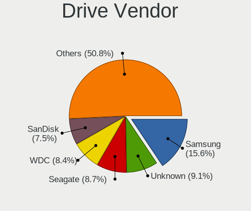
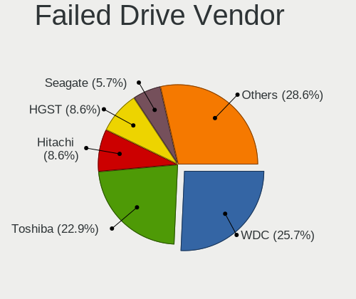
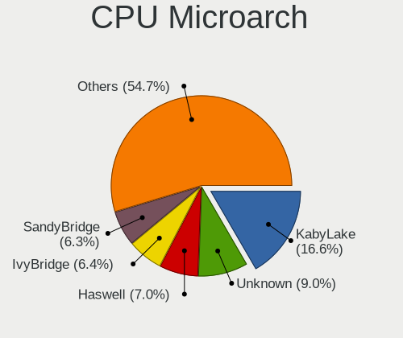
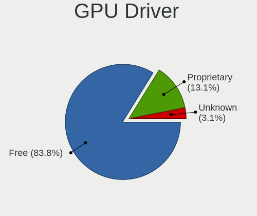
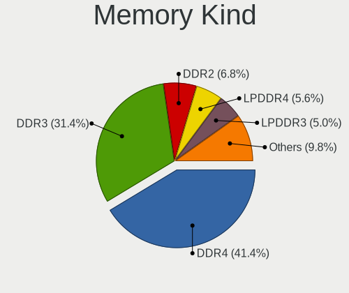

Linux in USA - Tested Hardware & Statistics (Notebooks)
-------------------------------------------------------

A project to collect tested hardware configurations for Linux in USA.

Anyone can contribute to this report by the [hw-probe](https://github.com/linuxhw/hw-probe) tool:

    sudo -E hw-probe -all -upload

Please contribute! Especially if your hardware is rare.

Contents
--------

* [ Test Cases ](#test-cases)

* [ System ](#system)
  - [ OS                       ](#os)
  - [ OS Family                ](#os-family)
  - [ Kernel                   ](#kernel)
  - [ Kernel Family            ](#kernel-family)
  - [ Kernel Major Ver.        ](#kernel-major-ver)
  - [ Arch                     ](#arch)
  - [ DE                       ](#de)
  - [ Display Server           ](#display-server)
  - [ Display Manager          ](#display-manager)
  - [ OS Lang                  ](#os-lang)
  - [ Boot Mode                ](#boot-mode)
  - [ Filesystem               ](#filesystem)
  - [ Part. scheme             ](#part-scheme)
  - [ Dual Boot with Linux/BSD ](#dual-boot-with-linuxbsd)
  - [ Dual Boot (Win)          ](#dual-boot-win)

* [ Board ](#board)
  - [ Vendor                   ](#vendor)
  - [ Model                    ](#model)
  - [ Model Family             ](#model-family)
  - [ MFG Year                 ](#mfg-year)
  - [ Form Factor              ](#form-factor)
  - [ Secure Boot              ](#secure-boot)
  - [ Coreboot                 ](#coreboot)
  - [ RAM Size                 ](#ram-size)
  - [ RAM Used                 ](#ram-used)
  - [ Total Drives             ](#total-drives)
  - [ Has CD-ROM               ](#has-cd-rom)
  - [ Has Ethernet             ](#has-ethernet)
  - [ Has WiFi                 ](#has-wifi)
  - [ Has Bluetooth            ](#has-bluetooth)

* [ Location ](#location)
  - [ Country                  ](#country)
  - [ City                     ](#city)

* [ Drives ](#drives)
  - [ Drive Vendor             ](#drive-vendor)
  - [ Drive Model              ](#drive-model)
  - [ HDD Vendor               ](#hdd-vendor)
  - [ SSD Vendor               ](#ssd-vendor)
  - [ Drive Kind               ](#drive-kind)
  - [ Drive Connector          ](#drive-connector)
  - [ Drive Size               ](#drive-size)
  - [ Space Total              ](#space-total)
  - [ Space Used               ](#space-used)
  - [ Malfunc. Drives          ](#malfunc-drives)
  - [ Malfunc. Drive Vendor    ](#malfunc-drive-vendor)
  - [ Malfunc. HDD Vendor      ](#malfunc-hdd-vendor)
  - [ Malfunc. Drive Kind      ](#malfunc-drive-kind)
  - [ Failed Drives            ](#failed-drives)
  - [ Failed Drive Vendor      ](#failed-drive-vendor)
  - [ Drive Status             ](#drive-status)

* [ Storage controller ](#storage-controller)
  - [ Storage Vendor           ](#storage-vendor)
  - [ Storage Model            ](#storage-model)
  - [ Storage Kind             ](#storage-kind)

* [ Processor ](#processor)
  - [ CPU Vendor               ](#cpu-vendor)
  - [ CPU Model                ](#cpu-model)
  - [ CPU Model Family         ](#cpu-model-family)
  - [ CPU Cores                ](#cpu-cores)
  - [ CPU Sockets              ](#cpu-sockets)
  - [ CPU Threads              ](#cpu-threads)
  - [ CPU Op-Modes             ](#cpu-op-modes)
  - [ CPU Microcode            ](#cpu-microcode)
  - [ CPU Microarch            ](#cpu-microarch)

* [ Graphics ](#graphics)
  - [ GPU Vendor               ](#gpu-vendor)
  - [ GPU Model                ](#gpu-model)
  - [ GPU Combo                ](#gpu-combo)
  - [ GPU Driver               ](#gpu-driver)
  - [ GPU Memory               ](#gpu-memory)

* [ Monitor ](#monitor)
  - [ Monitor Vendor           ](#monitor-vendor)
  - [ Monitor Model            ](#monitor-model)
  - [ Monitor Resolution       ](#monitor-resolution)
  - [ Monitor Diagonal         ](#monitor-diagonal)
  - [ Monitor Width            ](#monitor-width)
  - [ Aspect Ratio             ](#aspect-ratio)
  - [ Monitor Area             ](#monitor-area)
  - [ Pixel Density            ](#pixel-density)
  - [ Multiple Monitors        ](#multiple-monitors)

* [ Network ](#network)
  - [ Net Controller Vendor    ](#net-controller-vendor)
  - [ Net Controller Model     ](#net-controller-model)
  - [ Wireless Vendor          ](#wireless-vendor)
  - [ Wireless Model           ](#wireless-model)
  - [ Ethernet Vendor          ](#ethernet-vendor)
  - [ Ethernet Model           ](#ethernet-model)
  - [ Net Controller Kind      ](#net-controller-kind)
  - [ Used Controller          ](#used-controller)
  - [ NICs                     ](#nics)
  - [ IPv6                     ](#ipv6)

* [ Bluetooth ](#bluetooth)
  - [ Bluetooth Vendor         ](#bluetooth-vendor)
  - [ Bluetooth Model          ](#bluetooth-model)

* [ Sound ](#sound)
  - [ Sound Vendor             ](#sound-vendor)
  - [ Sound Model              ](#sound-model)

* [ Memory ](#memory)
  - [ Memory Vendor            ](#memory-vendor)
  - [ Memory Model             ](#memory-model)
  - [ Memory Kind              ](#memory-kind)
  - [ Memory Form Factor       ](#memory-form-factor)
  - [ Memory Size              ](#memory-size)
  - [ Memory Speed             ](#memory-speed)

* [ Printers & scanners ](#printers--scanners)
  - [ Printer Vendor           ](#printer-vendor)
  - [ Printer Model            ](#printer-model)
  - [ Scanner Vendor           ](#scanner-vendor)
  - [ Scanner Model            ](#scanner-model)

* [ Camera ](#camera)
  - [ Camera Vendor            ](#camera-vendor)
  - [ Camera Model             ](#camera-model)

* [ Security ](#security)
  - [ Fingerprint Vendor       ](#fingerprint-vendor)
  - [ Fingerprint Model        ](#fingerprint-model)
  - [ Chipcard Vendor          ](#chipcard-vendor)
  - [ Chipcard Model           ](#chipcard-model)

* [ Unsupported ](#unsupported)
  - [ Unsupported Devices      ](#unsupported-devices)
  - [ Unsupported Device Types ](#unsupported-device-types)

Test Cases
----------

Total: 26492

| Vendor        | Model                       | Probe                                                      | Date         |
|---------------|-----------------------------|------------------------------------------------------------|--------------|
| Acer          | TMP645-M                    | [a062c55357](https://linux-hardware.org/?probe=a062c55357) | Nov 06, 2023 |
| Lenovo        | ThinkPad T480s 20L7002HU... | [f09ace6b9d](https://linux-hardware.org/?probe=f09ace6b9d) | Nov 06, 2023 |
| HP            | ProBook 450 15.6 inch G9... | [37d32a1fd5](https://linux-hardware.org/?probe=37d32a1fd5) | Nov 06, 2023 |
| Dell          | Precision M4800             | [e67352eb0f](https://linux-hardware.org/?probe=e67352eb0f) | Nov 06, 2023 |
| Apple         | MacBookPro11,1              | [2d84377719](https://linux-hardware.org/?probe=2d84377719) | Nov 06, 2023 |
| HP            | OMEN by Laptop 15-dc1xxx    | [6aaef57f51](https://linux-hardware.org/?probe=6aaef57f51) | Nov 06, 2023 |
| Lenovo        | ThinkPad T440s 20ARS0HB0... | [95376bfed1](https://linux-hardware.org/?probe=95376bfed1) | Nov 06, 2023 |
| Dell          | Venue 11 Pro 5130           | [d643312744](https://linux-hardware.org/?probe=d643312744) | Nov 06, 2023 |
| GPU Compan... | GWNR71517                   | [7676ff267d](https://linux-hardware.org/?probe=7676ff267d) | Nov 06, 2023 |
| Lenovo        | Y720-15IKB 80VR             | [7cc876dcfa](https://linux-hardware.org/?probe=7cc876dcfa) | Nov 06, 2023 |
| Lenovo        | ThinkPad T420 4180FB5       | [5abc3caec3](https://linux-hardware.org/?probe=5abc3caec3) | Nov 06, 2023 |
| Lenovo        | ThinkPad P50 20EQS42M00     | [f4761a87e1](https://linux-hardware.org/?probe=f4761a87e1) | Nov 06, 2023 |
| Dell          | Latitude E6410              | [b6ac4a50b7](https://linux-hardware.org/?probe=b6ac4a50b7) | Nov 06, 2023 |
| HP            | Victus by Laptop 16-d1xx... | [1cf99ffe12](https://linux-hardware.org/?probe=1cf99ffe12) | Nov 05, 2023 |
| HP            | Victus by Laptop 16-d1xx... | [cf8911c5e0](https://linux-hardware.org/?probe=cf8911c5e0) | Nov 05, 2023 |
| Lenovo        | ThinkPad T480s 20L7002HU... | [92ef56cc92](https://linux-hardware.org/?probe=92ef56cc92) | Nov 05, 2023 |
| Lenovo        | IdeaPad 320-15ABR 80XS      | [c64e4d8a0b](https://linux-hardware.org/?probe=c64e4d8a0b) | Nov 05, 2023 |
| Dell          | Inspiron 3521               | [00f864bd9e](https://linux-hardware.org/?probe=00f864bd9e) | Nov 05, 2023 |
| Dell          | Latitude E7450              | [71fe592aa3](https://linux-hardware.org/?probe=71fe592aa3) | Nov 05, 2023 |
| Valve         | Jupiter                     | [2e74968a1e](https://linux-hardware.org/?probe=2e74968a1e) | Nov 05, 2023 |
| Valve         | Jupiter                     | [edb0760b00](https://linux-hardware.org/?probe=edb0760b00) | Nov 05, 2023 |
| Google        | Pyro                        | [2fd8f11a53](https://linux-hardware.org/?probe=2fd8f11a53) | Nov 05, 2023 |
| Apple         | MacBookAir7,1               | [23e52fc4f5](https://linux-hardware.org/?probe=23e52fc4f5) | Nov 05, 2023 |
| Lenovo        | ThinkPad T470 W10DG 20JN... | [263a417420](https://linux-hardware.org/?probe=263a417420) | Nov 05, 2023 |
| Dell          | XPS 15 7590                 | [63e30986f6](https://linux-hardware.org/?probe=63e30986f6) | Nov 05, 2023 |
| Valve         | Jupiter                     | [555d9146a4](https://linux-hardware.org/?probe=555d9146a4) | Nov 05, 2023 |
| Google        | Nami                        | [19c94b9484](https://linux-hardware.org/?probe=19c94b9484) | Nov 05, 2023 |
| ASUSTek       | VivoBook_ASUSLaptop X512... | [b2cfb39c04](https://linux-hardware.org/?probe=b2cfb39c04) | Nov 05, 2023 |
| HP            | EliteBook 8470p             | [f154c5979f](https://linux-hardware.org/?probe=f154c5979f) | Nov 05, 2023 |
| Dell          | Latitude 5520               | [46be4f4eec](https://linux-hardware.org/?probe=46be4f4eec) | Nov 05, 2023 |
| Valve         | Jupiter                     | [4ece1b1597](https://linux-hardware.org/?probe=4ece1b1597) | Nov 05, 2023 |
| Google        | Taeko                       | [d148b001d9](https://linux-hardware.org/?probe=d148b001d9) | Nov 05, 2023 |
| Toshiba       | QOSMIO X505                 | [e5e5eb9254](https://linux-hardware.org/?probe=e5e5eb9254) | Nov 05, 2023 |
| Lenovo        | IdeaPad 5 15ITL05 82FG      | [cfdf343144](https://linux-hardware.org/?probe=cfdf343144) | Nov 04, 2023 |
| Lenovo        | IdeaPad 5 15ITL05 82FG      | [237bd5cfb2](https://linux-hardware.org/?probe=237bd5cfb2) | Nov 04, 2023 |
| ASUSTek       | ROG Strix G733QR_G733QR     | [5b7dc65a39](https://linux-hardware.org/?probe=5b7dc65a39) | Nov 04, 2023 |
| System76      | Oryx Pro                    | [ea89273272](https://linux-hardware.org/?probe=ea89273272) | Nov 04, 2023 |
| Lenovo        | ThinkPad T14s Gen 3 21CQ... | [6ea9e5b141](https://linux-hardware.org/?probe=6ea9e5b141) | Nov 04, 2023 |
| Lenovo        | ThinkPad T480s 20L8S2N80... | [87abd90a63](https://linux-hardware.org/?probe=87abd90a63) | Nov 04, 2023 |
| HP            | Pavilion 17                 | [54cf91ddc7](https://linux-hardware.org/?probe=54cf91ddc7) | Nov 04, 2023 |
| HP            | ZBook Studio G3             | [1fcf1ef0b5](https://linux-hardware.org/?probe=1fcf1ef0b5) | Nov 04, 2023 |
| Lenovo        | Legion Y545 81Q6            | [c2fa613f00](https://linux-hardware.org/?probe=c2fa613f00) | Nov 04, 2023 |
| HP            | Laptop 14-bw0xx             | [aea5699bb8](https://linux-hardware.org/?probe=aea5699bb8) | Nov 04, 2023 |
| Lenovo        | Legion 5 15ARH05H 82B1      | [3d8056e30e](https://linux-hardware.org/?probe=3d8056e30e) | Nov 04, 2023 |
| HP            | ZBook Studio G3             | [eb90a23afa](https://linux-hardware.org/?probe=eb90a23afa) | Nov 04, 2023 |
| HP            | OMEN by Laptop 17-ck1xxx    | [bea6a6babf](https://linux-hardware.org/?probe=bea6a6babf) | Nov 04, 2023 |
| Lenovo        | ThinkPad T530 2429F27       | [0767db36fe](https://linux-hardware.org/?probe=0767db36fe) | Nov 04, 2023 |
| Lenovo        | Legion 5 15ARH05H 82B1      | [546178d07d](https://linux-hardware.org/?probe=546178d07d) | Nov 04, 2023 |
| Lenovo        | IdeaPad 330-15IGM 81D1      | [afbfce6e52](https://linux-hardware.org/?probe=afbfce6e52) | Nov 04, 2023 |
| Toshiba       | TECRA W50-A                 | [ad6c61de24](https://linux-hardware.org/?probe=ad6c61de24) | Nov 04, 2023 |
| Dell          | Precision 7560              | [54a8deb305](https://linux-hardware.org/?probe=54a8deb305) | Nov 04, 2023 |
| Lenovo        | ThinkPad T14s Gen 3 21CQ... | [d17e6059bb](https://linux-hardware.org/?probe=d17e6059bb) | Nov 03, 2023 |
| ASUSTek       | ROG Flow X13 GV301QH_GV3... | [de4c3bfe46](https://linux-hardware.org/?probe=de4c3bfe46) | Nov 03, 2023 |
| HP            | EliteBook 6930p             | [300c72bf93](https://linux-hardware.org/?probe=300c72bf93) | Nov 03, 2023 |
| System76      | Oryx Pro                    | [1704acc89b](https://linux-hardware.org/?probe=1704acc89b) | Nov 03, 2023 |
| Lenovo        | ThinkPad T460p 20FXS0960... | [10407542ab](https://linux-hardware.org/?probe=10407542ab) | Nov 03, 2023 |
| Lenovo        | B560 433028U                | [37a6693c3d](https://linux-hardware.org/?probe=37a6693c3d) | Nov 03, 2023 |
| Google        | Phaser360                   | [9915a1a3be](https://linux-hardware.org/?probe=9915a1a3be) | Nov 03, 2023 |
| Google        | Enguarde                    | [bc6a541eb9](https://linux-hardware.org/?probe=bc6a541eb9) | Nov 03, 2023 |
| HP            | Compaq 6730s                | [073756d958](https://linux-hardware.org/?probe=073756d958) | Nov 03, 2023 |
| Lenovo        | ThinkPad T420s 417032U      | [76247c39f4](https://linux-hardware.org/?probe=76247c39f4) | Nov 03, 2023 |
| ASUSTek       | X550VQ                      | [b6d6ff10aa](https://linux-hardware.org/?probe=b6d6ff10aa) | Nov 03, 2023 |
| Lenovo        | ThinkPad X1 Carbon 5th 2... | [2ac0d5a547](https://linux-hardware.org/?probe=2ac0d5a547) | Nov 03, 2023 |
| Lenovo        | ThinkPad 11e 5th Gen 20L... | [fca8401d97](https://linux-hardware.org/?probe=fca8401d97) | Nov 03, 2023 |
| HP            | ProBook 445 G7              | [400a0e689f](https://linux-hardware.org/?probe=400a0e689f) | Nov 03, 2023 |
| Lenovo        | ThinkBook Plus G3 IAP 21... | [a6fabd1a6d](https://linux-hardware.org/?probe=a6fabd1a6d) | Nov 03, 2023 |
| Dell          | Inspiron 15-7568            | [70b564a0db](https://linux-hardware.org/?probe=70b564a0db) | Nov 03, 2023 |
| HP            | OMEN by Laptop 15-dc1xxx    | [0be20c3fe3](https://linux-hardware.org/?probe=0be20c3fe3) | Nov 03, 2023 |
| Dell          | Latitude E5530 non-vPro     | [491aa458cc](https://linux-hardware.org/?probe=491aa458cc) | Nov 03, 2023 |
| Dell          | Latitude 5511               | [66a8176344](https://linux-hardware.org/?probe=66a8176344) | Nov 03, 2023 |
| Framework     | Laptop 13 (AMD Ryzen 704... | [1b43feda1f](https://linux-hardware.org/?probe=1b43feda1f) | Nov 03, 2023 |
| Valve         | Jupiter                     | [14de2c4b3a](https://linux-hardware.org/?probe=14de2c4b3a) | Nov 02, 2023 |
| Dell          | Latitude E6520              | [a0e05f5040](https://linux-hardware.org/?probe=a0e05f5040) | Nov 02, 2023 |
| ASUSTek       | G750JX                      | [9493bec7e6](https://linux-hardware.org/?probe=9493bec7e6) | Nov 02, 2023 |
| Framework     | Laptop (12th Gen Intel C... | [7c06ac2664](https://linux-hardware.org/?probe=7c06ac2664) | Nov 02, 2023 |
| Dell          | Vostro 14-3468              | [33a984f9f8](https://linux-hardware.org/?probe=33a984f9f8) | Nov 02, 2023 |
| Valve         | Jupiter                     | [26b7407b02](https://linux-hardware.org/?probe=26b7407b02) | Nov 02, 2023 |
| Apple         | MacBookPro14,1              | [7d93bb6f25](https://linux-hardware.org/?probe=7d93bb6f25) | Nov 02, 2023 |
| Acer          | Aspire A515-43              | [6aa1f3a294](https://linux-hardware.org/?probe=6aa1f3a294) | Nov 02, 2023 |
| Acer          | Aspire A515-43              | [3e65346dfd](https://linux-hardware.org/?probe=3e65346dfd) | Nov 02, 2023 |
| Dell          | Latitude E6330              | [b31f60152f](https://linux-hardware.org/?probe=b31f60152f) | Nov 02, 2023 |
| HP            | EliteBook 860 16 inch G9... | [5c564324e2](https://linux-hardware.org/?probe=5c564324e2) | Nov 02, 2023 |
| Valve         | Jupiter                     | [3ee2512ba0](https://linux-hardware.org/?probe=3ee2512ba0) | Nov 02, 2023 |
| Valve         | Jupiter                     | [2c454d7632](https://linux-hardware.org/?probe=2c454d7632) | Nov 02, 2023 |
| Lenovo        | ThinkBook Plus G3 IAP 21... | [c6634f090f](https://linux-hardware.org/?probe=c6634f090f) | Nov 02, 2023 |
| Google        | Nightfury                   | [ccee94a0ec](https://linux-hardware.org/?probe=ccee94a0ec) | Nov 02, 2023 |
| Google        | Nasher360                   | [0d1cc1b584](https://linux-hardware.org/?probe=0d1cc1b584) | Nov 02, 2023 |
| Lenovo        | Slim 7 16IAH7 82VB          | [0e5f976d6b](https://linux-hardware.org/?probe=0e5f976d6b) | Nov 02, 2023 |
| ASUSTek       | ASUS TUF Gaming A15 FA50... | [0c83d1e765](https://linux-hardware.org/?probe=0c83d1e765) | Nov 02, 2023 |
| Dell          | Latitude 7490               | [4859e397e4](https://linux-hardware.org/?probe=4859e397e4) | Nov 02, 2023 |
| Apple         | MacBookPro16,1              | [3c2964c23f](https://linux-hardware.org/?probe=3c2964c23f) | Nov 02, 2023 |
| Dell          | Latitude 5480               | [a88b4082b9](https://linux-hardware.org/?probe=a88b4082b9) | Nov 02, 2023 |
| Dell          | XPS L521X                   | [d3df01b854](https://linux-hardware.org/?probe=d3df01b854) | Nov 02, 2023 |
| Lenovo        | ThinkPad T410 2537NT8       | [2d1404f4ae](https://linux-hardware.org/?probe=2d1404f4ae) | Nov 02, 2023 |
| Google        | Falco                       | [0ea6d932bf](https://linux-hardware.org/?probe=0ea6d932bf) | Nov 01, 2023 |
| Lenovo        | ThinkPad 13 2nd Gen 20J1... | [bb5bbc3e51](https://linux-hardware.org/?probe=bb5bbc3e51) | Nov 01, 2023 |
| Lenovo        | ThinkBook 14p Gen 3 21EJ    | [cde7923bf2](https://linux-hardware.org/?probe=cde7923bf2) | Nov 01, 2023 |
| Lenovo        | ThinkPad T400 6475JR8       | [82b16f0e20](https://linux-hardware.org/?probe=82b16f0e20) | Nov 01, 2023 |
| Lenovo        | Legion Pro 5 16IRX8 82WK    | [0bb2079f0d](https://linux-hardware.org/?probe=0bb2079f0d) | Nov 01, 2023 |
| HP            | Presario CQ57               | [4874030c75](https://linux-hardware.org/?probe=4874030c75) | Nov 01, 2023 |
| Samsung       | 730QCJ/730QCR               | [67863a015a](https://linux-hardware.org/?probe=67863a015a) | Nov 01, 2023 |
| MSI           | GV62 8RD                    | [d85cb220a0](https://linux-hardware.org/?probe=d85cb220a0) | Nov 01, 2023 |
| ASUSTek       | VivoBook_ASUSLaptop X513... | [19d017bb7d](https://linux-hardware.org/?probe=19d017bb7d) | Nov 01, 2023 |
| Apple         | MacBookPro15,2              | [b724e20965](https://linux-hardware.org/?probe=b724e20965) | Nov 01, 2023 |
| Framework     | Laptop                      | [eb0a6abacc](https://linux-hardware.org/?probe=eb0a6abacc) | Nov 01, 2023 |
| HP            | 2000                        | [f586263d64](https://linux-hardware.org/?probe=f586263d64) | Nov 01, 2023 |
| Dell          | Latitude E6420              | [e5581c3920](https://linux-hardware.org/?probe=e5581c3920) | Nov 01, 2023 |
| Valve         | Jupiter                     | [088df44ddf](https://linux-hardware.org/?probe=088df44ddf) | Nov 01, 2023 |
| Dell          | System Inspiron N4110       | [a9f2040800](https://linux-hardware.org/?probe=a9f2040800) | Nov 01, 2023 |
| HP            | 15                          | [9bafa55125](https://linux-hardware.org/?probe=9bafa55125) | Nov 01, 2023 |
| Lenovo        | ThinkPad Edge 030244U       | [bf7045fe69](https://linux-hardware.org/?probe=bf7045fe69) | Nov 01, 2023 |
| Lenovo        | ThinkPad T480s 20L7CTO1W... | [e5158e3f58](https://linux-hardware.org/?probe=e5158e3f58) | Oct 31, 2023 |
| Lenovo        | ThinkPad 13 2nd Gen 20J1... | [4ebd30711e](https://linux-hardware.org/?probe=4ebd30711e) | Oct 31, 2023 |
| Lenovo        | ThinkPad P1 Gen 5 21DDS0... | [ce44ee3f62](https://linux-hardware.org/?probe=ce44ee3f62) | Oct 31, 2023 |
| HP            | Laptop 15-bw0xx             | [517f8861a6](https://linux-hardware.org/?probe=517f8861a6) | Oct 31, 2023 |
| Lenovo        | ThinkPad 13 2nd Gen 20J1... | [a664733aaf](https://linux-hardware.org/?probe=a664733aaf) | Oct 31, 2023 |
| ION Comput... | LAPBC510                    | [24a1cafad9](https://linux-hardware.org/?probe=24a1cafad9) | Oct 31, 2023 |
| Framework     | Laptop 13 (AMD Ryzen 704... | [bb36320af3](https://linux-hardware.org/?probe=bb36320af3) | Oct 31, 2023 |
| Valve         | Jupiter                     | [ea0f1bf927](https://linux-hardware.org/?probe=ea0f1bf927) | Oct 31, 2023 |
| Apple         | MacBookPro9,1               | [8f7c5b801b](https://linux-hardware.org/?probe=8f7c5b801b) | Oct 31, 2023 |
| Apple         | MacBookPro9,1               | [4e15275faa](https://linux-hardware.org/?probe=4e15275faa) | Oct 31, 2023 |
| Synology      | DS1621+                     | [2c7bfbff4a](https://linux-hardware.org/?probe=2c7bfbff4a) | Oct 31, 2023 |
| Apple         | MacBookAir6,2               | [edd3006f12](https://linux-hardware.org/?probe=edd3006f12) | Oct 31, 2023 |
| ASUSTek       | K53E                        | [8b7c83e9d7](https://linux-hardware.org/?probe=8b7c83e9d7) | Oct 31, 2023 |
| Dell          | Inspiron 3521               | [cdda6b5094](https://linux-hardware.org/?probe=cdda6b5094) | Oct 31, 2023 |
| Dell          | Inspiron 3521               | [5bec5815bb](https://linux-hardware.org/?probe=5bec5815bb) | Oct 31, 2023 |
| AMI           | Intel                       | [42ebe1755f](https://linux-hardware.org/?probe=42ebe1755f) | Oct 30, 2023 |
| HP            | ZBook Studio G3             | [173639f83c](https://linux-hardware.org/?probe=173639f83c) | Oct 30, 2023 |
| Lenovo        | ThinkPad X220 4286CTO       | [237d2ca8b5](https://linux-hardware.org/?probe=237d2ca8b5) | Oct 30, 2023 |
| Dell          | Inspiron 5559               | [5a8a67bb6b](https://linux-hardware.org/?probe=5a8a67bb6b) | Oct 30, 2023 |
| Lenovo        | Flex 2 Pro-15               | [ff5f14115e](https://linux-hardware.org/?probe=ff5f14115e) | Oct 30, 2023 |
| Google        | Blooguard                   | [cd817fb666](https://linux-hardware.org/?probe=cd817fb666) | Oct 30, 2023 |
| Toshiba       | Satellite L875              | [de5babbde5](https://linux-hardware.org/?probe=de5babbde5) | Oct 30, 2023 |
| Panasonic     | CF-53SJCZYLM                | [94941374a2](https://linux-hardware.org/?probe=94941374a2) | Oct 30, 2023 |
| Lenovo        | ThinkPad 13 2nd Gen 20J1... | [995b159589](https://linux-hardware.org/?probe=995b159589) | Oct 30, 2023 |
| HP            | Dev One Notebook PC         | [d5ace42b13](https://linux-hardware.org/?probe=d5ace42b13) | Oct 30, 2023 |
| Lenovo        | ThinkBook 15 G2 ARE 20VG    | [d51c491524](https://linux-hardware.org/?probe=d51c491524) | Oct 30, 2023 |
| Fujitsu       | LIFEBOOK P771               | [d92d1fa97d](https://linux-hardware.org/?probe=d92d1fa97d) | Oct 30, 2023 |
| HP            | Laptop 15-ef2xxx            | [80d1578d90](https://linux-hardware.org/?probe=80d1578d90) | Oct 30, 2023 |
| System76      | Adder WS                    | [57478f4561](https://linux-hardware.org/?probe=57478f4561) | Oct 30, 2023 |
| System76      | Adder WS                    | [a10fcac3f4](https://linux-hardware.org/?probe=a10fcac3f4) | Oct 30, 2023 |
| HP            | EliteBook 840 G6            | [586f08e1dc](https://linux-hardware.org/?probe=586f08e1dc) | Oct 30, 2023 |
| HP            | G60                         | [ad911271b1](https://linux-hardware.org/?probe=ad911271b1) | Oct 30, 2023 |
| Framework     | Laptop (12th Gen Intel C... | [b1adeb2f86](https://linux-hardware.org/?probe=b1adeb2f86) | Oct 30, 2023 |
| Dell          | Latitude 7480               | [fcae1c21f4](https://linux-hardware.org/?probe=fcae1c21f4) | Oct 30, 2023 |
| HP            | Pavilion dv4                | [854806c6f4](https://linux-hardware.org/?probe=854806c6f4) | Oct 29, 2023 |
| HP            | EliteBook 850 G3            | [be57c0ce22](https://linux-hardware.org/?probe=be57c0ce22) | Oct 29, 2023 |
| Dell          | XPS L521X                   | [959fc8cb2d](https://linux-hardware.org/?probe=959fc8cb2d) | Oct 29, 2023 |
| Valve         | Jupiter                     | [8bb009206e](https://linux-hardware.org/?probe=8bb009206e) | Oct 29, 2023 |
| Valve         | Jupiter                     | [bbf3f7c198](https://linux-hardware.org/?probe=bbf3f7c198) | Oct 29, 2023 |
| HP            | Laptop 15-bw0xx             | [8ec254a9a6](https://linux-hardware.org/?probe=8ec254a9a6) | Oct 29, 2023 |
| HP            | 2000                        | [440350f9df](https://linux-hardware.org/?probe=440350f9df) | Oct 29, 2023 |
| Samsung       | Galaxy Book Go 5G           | [8f202d5648](https://linux-hardware.org/?probe=8f202d5648) | Oct 29, 2023 |
| Dell          | Latitude E6410              | [4eecd92a1e](https://linux-hardware.org/?probe=4eecd92a1e) | Oct 28, 2023 |
| Lenovo        | G500 20236                  | [6232ddb7f2](https://linux-hardware.org/?probe=6232ddb7f2) | Oct 28, 2023 |
| HP            | Laptop 17-by2xxx            | [573a17cea0](https://linux-hardware.org/?probe=573a17cea0) | Oct 28, 2023 |
| ASRock        | B550M-C                     | [51c187d805](https://linux-hardware.org/?probe=51c187d805) | Oct 28, 2023 |
| Dell          | XPS L412Z                   | [3c2afbb9c4](https://linux-hardware.org/?probe=3c2afbb9c4) | Oct 28, 2023 |
| HP            | EliteBook 645 14 inch G1... | [eb5712ae31](https://linux-hardware.org/?probe=eb5712ae31) | Oct 28, 2023 |
| ASUSTek       | ZenBook UX434IQ_Q407IQ      | [97eabba1a8](https://linux-hardware.org/?probe=97eabba1a8) | Oct 28, 2023 |
| HP            | Pavilion Laptop 15-cc6xx    | [da25874b12](https://linux-hardware.org/?probe=da25874b12) | Oct 28, 2023 |
| Apple         | MacBookPro8,1               | [762e9a6d4d](https://linux-hardware.org/?probe=762e9a6d4d) | Oct 28, 2023 |
| HP            | Laptop 17-cn2xxx            | [b6025e5485](https://linux-hardware.org/?probe=b6025e5485) | Oct 28, 2023 |
| Apple         | MacBookPro8,1               | [b4645667a4](https://linux-hardware.org/?probe=b4645667a4) | Oct 28, 2023 |
| Lenovo        | Legion Pro 7 16IRX8 82WR    | [e0dc47cf61](https://linux-hardware.org/?probe=e0dc47cf61) | Oct 28, 2023 |
| Acer          | Aspire A115-31              | [137821ca25](https://linux-hardware.org/?probe=137821ca25) | Oct 28, 2023 |
| HP            | EliteBook 820 G3            | [c86a40c419](https://linux-hardware.org/?probe=c86a40c419) | Oct 28, 2023 |
| Lenovo        | IdeaPad S145-15AST 81N3     | [342218fa56](https://linux-hardware.org/?probe=342218fa56) | Oct 28, 2023 |
| Apple         | MacBookPro9,2               | [b075cf8841](https://linux-hardware.org/?probe=b075cf8841) | Oct 28, 2023 |
| ASUSTek       | VivoBook_ASUSLaptop M350... | [7259ae55c2](https://linux-hardware.org/?probe=7259ae55c2) | Oct 28, 2023 |
| Lenovo        | ThinkPad X220 4286CTO       | [2a27fbfe9c](https://linux-hardware.org/?probe=2a27fbfe9c) | Oct 27, 2023 |
| MSI           | WS63 7RK                    | [dcfa2c2f75](https://linux-hardware.org/?probe=dcfa2c2f75) | Oct 27, 2023 |
| Lenovo        | Z50-70 20354                | [2e5ee0032d](https://linux-hardware.org/?probe=2e5ee0032d) | Oct 27, 2023 |
| Lenovo        | ThinkPad T410 2537GN8       | [b01c537756](https://linux-hardware.org/?probe=b01c537756) | Oct 27, 2023 |
| Framework     | Laptop 13 (AMD Ryzen 704... | [b7f872ea23](https://linux-hardware.org/?probe=b7f872ea23) | Oct 27, 2023 |
| Lenovo        | ThinkPad T410 2537GN8       | [a465f0d88d](https://linux-hardware.org/?probe=a465f0d88d) | Oct 27, 2023 |
| Acer          | Aspire V5-572P              | [18938afb70](https://linux-hardware.org/?probe=18938afb70) | Oct 27, 2023 |
| HP            | ZBook Studio G3             | [9659254017](https://linux-hardware.org/?probe=9659254017) | Oct 27, 2023 |
| ASUSTek       | ASUS TUF Gaming A15 FA50... | [9aa7655975](https://linux-hardware.org/?probe=9aa7655975) | Oct 27, 2023 |
| Dell          | Latitude 5480               | [2d87cfcbb4](https://linux-hardware.org/?probe=2d87cfcbb4) | Oct 27, 2023 |
| Lenovo        | ThinkPad T480 20L6S69X08    | [61da163866](https://linux-hardware.org/?probe=61da163866) | Oct 27, 2023 |
| Lenovo        | ThinkPad T440p 20AWS2SY0... | [ac167b7da7](https://linux-hardware.org/?probe=ac167b7da7) | Oct 27, 2023 |
| Dell          | Vostro 15 5510              | [b01f7c48f6](https://linux-hardware.org/?probe=b01f7c48f6) | Oct 27, 2023 |
| Compaq(Int... | Michelangelo(LT1504)        | [678614e123](https://linux-hardware.org/?probe=678614e123) | Oct 27, 2023 |
| HP            | OMEN LAPTOP - 15-EK0013D... | [0c582fd597](https://linux-hardware.org/?probe=0c582fd597) | Oct 27, 2023 |
| HP            | Dragonfly 13.5 inch G4 N... | [1f5d6e4141](https://linux-hardware.org/?probe=1f5d6e4141) | Oct 27, 2023 |
| HP            | ProBook 650 G1              | [698c3abcba](https://linux-hardware.org/?probe=698c3abcba) | Oct 27, 2023 |
| Dell          | Latitude D610               | [270c26c018](https://linux-hardware.org/?probe=270c26c018) | Oct 27, 2023 |
| Razer         | Blade 15 Base Model (Ear... | [d0f571ffa0](https://linux-hardware.org/?probe=d0f571ffa0) | Oct 27, 2023 |
| LG Electro... | 15Z95N-G.AAC6U1             | [7f2e8a07de](https://linux-hardware.org/?probe=7f2e8a07de) | Oct 27, 2023 |
| Thomson       | WWNEO14C-4BK32F             | [516a5ee33b](https://linux-hardware.org/?probe=516a5ee33b) | Oct 27, 2023 |
| ASUSTek       | ROG Zephyrus G14 GA402RJ... | [9650e62539](https://linux-hardware.org/?probe=9650e62539) | Oct 26, 2023 |
| Toshiba       | QOSMIO X75-A                | [8024d2e76b](https://linux-hardware.org/?probe=8024d2e76b) | Oct 26, 2023 |
| Lenovo        | ThinkPad T61 64607EU        | [413cefff03](https://linux-hardware.org/?probe=413cefff03) | Oct 26, 2023 |
| Google        | Enguarde                    | [074b44ce16](https://linux-hardware.org/?probe=074b44ce16) | Oct 26, 2023 |
| Google        | Peppy                       | [8276e5d349](https://linux-hardware.org/?probe=8276e5d349) | Oct 26, 2023 |
| Dell          | Inspiron 1545               | [bb1c07781b](https://linux-hardware.org/?probe=bb1c07781b) | Oct 26, 2023 |
| Dell          | Latitude 5414               | [78fb4f9907](https://linux-hardware.org/?probe=78fb4f9907) | Oct 26, 2023 |
| HP            | Pavilion g6                 | [00e978bda2](https://linux-hardware.org/?probe=00e978bda2) | Oct 26, 2023 |
| HP            | ProBook 455 15.6 inch G9... | [1b5677de0e](https://linux-hardware.org/?probe=1b5677de0e) | Oct 26, 2023 |
| Dell          | XPS 15 9500                 | [549771dfc8](https://linux-hardware.org/?probe=549771dfc8) | Oct 26, 2023 |
| Dell          | Latitude 7430               | [8acfccfbef](https://linux-hardware.org/?probe=8acfccfbef) | Oct 26, 2023 |
| ASUSTek       | ZenBook UX434IQ_Q407IQ      | [763e54c87b](https://linux-hardware.org/?probe=763e54c87b) | Oct 26, 2023 |
| HP            | Presario CQ56               | [10dbf7856b](https://linux-hardware.org/?probe=10dbf7856b) | Oct 26, 2023 |
| Google        | Kefka                       | [321065b896](https://linux-hardware.org/?probe=321065b896) | Oct 26, 2023 |
| Toshiba       | Satellite L455D             | [29337c2310](https://linux-hardware.org/?probe=29337c2310) | Oct 26, 2023 |
| Panasonic     | CF-31SBM08DM                | [820f042ba6](https://linux-hardware.org/?probe=820f042ba6) | Oct 26, 2023 |
| Toshiba       | Satellite L75D-A            | [82efb2dd44](https://linux-hardware.org/?probe=82efb2dd44) | Oct 26, 2023 |
| HP            | Pavilion Laptop 15-eh0xx... | [6c603a7186](https://linux-hardware.org/?probe=6c603a7186) | Oct 26, 2023 |
| HP            | Presario CQ57               | [a3f31b427e](https://linux-hardware.org/?probe=a3f31b427e) | Oct 26, 2023 |
| HP            | Pavilion Laptop 15-eh0xx... | [7858b6a253](https://linux-hardware.org/?probe=7858b6a253) | Oct 26, 2023 |
| Lenovo        | IdeaPad Slim 7 Carbon 14... | [cbba790d59](https://linux-hardware.org/?probe=cbba790d59) | Oct 26, 2023 |
| Dell          | Latitude 5414               | [692b53f9d9](https://linux-hardware.org/?probe=692b53f9d9) | Oct 26, 2023 |
| Google        | Kefka                       | [2e3f6432e2](https://linux-hardware.org/?probe=2e3f6432e2) | Oct 26, 2023 |
| Lenovo        | IdeaPad 3 15IAU7 82RK       | [3d4390ca08](https://linux-hardware.org/?probe=3d4390ca08) | Oct 26, 2023 |
| Google        | Reks                        | [d397eae4e5](https://linux-hardware.org/?probe=d397eae4e5) | Oct 25, 2023 |
| Lenovo        | ThinkPad Edge 030244U       | [0cbd6a255a](https://linux-hardware.org/?probe=0cbd6a255a) | Oct 25, 2023 |
| Lenovo        | ThinkPad X1 Carbon 6th 2... | [c64594fac3](https://linux-hardware.org/?probe=c64594fac3) | Oct 25, 2023 |
| Lenovo        | ThinkPad E580 20KS003WUS    | [88bfa32381](https://linux-hardware.org/?probe=88bfa32381) | Oct 25, 2023 |
| Lenovo        | Slim 7 16IAH7 82VB          | [a80fcc753e](https://linux-hardware.org/?probe=a80fcc753e) | Oct 25, 2023 |
| ASUSTek       | ZenBook Pro Duo UX582ZM_... | [1ce9a81d10](https://linux-hardware.org/?probe=1ce9a81d10) | Oct 25, 2023 |
| HP            | Laptop 15-dw3xxx            | [8994962017](https://linux-hardware.org/?probe=8994962017) | Oct 25, 2023 |
| Toshiba       | Satellite E45t-A            | [b375f48ebb](https://linux-hardware.org/?probe=b375f48ebb) | Oct 25, 2023 |
| Toshiba       | Satellite E45t-A            | [a4e0c01450](https://linux-hardware.org/?probe=a4e0c01450) | Oct 25, 2023 |
| Toshiba       | Satellite E45t-A            | [34bf61c6ae](https://linux-hardware.org/?probe=34bf61c6ae) | Oct 25, 2023 |
| HP            | Pavilion g7                 | [3bd963fd9e](https://linux-hardware.org/?probe=3bd963fd9e) | Oct 24, 2023 |
| HP            | Victus by Gaming Laptop ... | [11f5a7aff4](https://linux-hardware.org/?probe=11f5a7aff4) | Oct 24, 2023 |
| HP            | EliteBook 845 G7 Noteboo... | [e51b06f086](https://linux-hardware.org/?probe=e51b06f086) | Oct 24, 2023 |
| Lenovo        | IdeaPad 3 15ITL05 81X8      | [5d05be46df](https://linux-hardware.org/?probe=5d05be46df) | Oct 24, 2023 |
| Apple         | MacBookPro9,2               | [97f4660a4d](https://linux-hardware.org/?probe=97f4660a4d) | Oct 24, 2023 |
| HP            | Laptop 17-by2xxx            | [9f728690ee](https://linux-hardware.org/?probe=9f728690ee) | Oct 24, 2023 |
| Lenovo        | ThinkPad T410 2537NT8       | [52b5addead](https://linux-hardware.org/?probe=52b5addead) | Oct 24, 2023 |
| Dell          | Latitude E6400              | [250c9ddcfe](https://linux-hardware.org/?probe=250c9ddcfe) | Oct 24, 2023 |
| Apple         | MacBookPro15,1              | [41fd350f12](https://linux-hardware.org/?probe=41fd350f12) | Oct 24, 2023 |
| Lenovo        | Legion 5 Pro 16ACH6H 82J... | [f4a0aca53d](https://linux-hardware.org/?probe=f4a0aca53d) | Oct 24, 2023 |
| Apple         | MacBookPro6,2               | [89f29afb19](https://linux-hardware.org/?probe=89f29afb19) | Oct 24, 2023 |
| GPD           | G1621-02                    | [ea3897be17](https://linux-hardware.org/?probe=ea3897be17) | Oct 24, 2023 |
| Alienware     | m15 Ryzen Ed. R5            | [d9b9718eee](https://linux-hardware.org/?probe=d9b9718eee) | Oct 24, 2023 |
| HP            | 15 Notebook PC              | [655051029a](https://linux-hardware.org/?probe=655051029a) | Oct 24, 2023 |
| ASUSTek       | GL502VSK                    | [5f455e693f](https://linux-hardware.org/?probe=5f455e693f) | Oct 24, 2023 |
| Alienware     | m15 Ryzen Ed. R5            | [dd704a643f](https://linux-hardware.org/?probe=dd704a643f) | Oct 24, 2023 |
| Lenovo        | IdeaPad 3 14ITL6 82H7       | [9c37fcb5c9](https://linux-hardware.org/?probe=9c37fcb5c9) | Oct 24, 2023 |
| Dell          | Inspiron 3542               | [1f7f9b7a99](https://linux-hardware.org/?probe=1f7f9b7a99) | Oct 23, 2023 |
| Dell          | Inspiron 15-3565            | [dc8f0a028b](https://linux-hardware.org/?probe=dc8f0a028b) | Oct 23, 2023 |
| Lenovo        | ThinkBook 15 G2 ARE 20VG    | [47fdb21256](https://linux-hardware.org/?probe=47fdb21256) | Oct 23, 2023 |
| Lenovo        | ThinkPad T480s 20L8S4M20... | [799084c1a9](https://linux-hardware.org/?probe=799084c1a9) | Oct 23, 2023 |
| Panasonic     | CF-53SV64CLM                | [7702a1e73b](https://linux-hardware.org/?probe=7702a1e73b) | Oct 23, 2023 |
| HP            | Laptop 17-cp0xxx            | [1a97d77c76](https://linux-hardware.org/?probe=1a97d77c76) | Oct 23, 2023 |
| Dell          | XPS 13 9370                 | [7e9d761b35](https://linux-hardware.org/?probe=7e9d761b35) | Oct 23, 2023 |
| Toshiba       | Satellite P55W-C            | [60911595dc](https://linux-hardware.org/?probe=60911595dc) | Oct 23, 2023 |
| Dell          | Latitude E6400              | [6a3537c763](https://linux-hardware.org/?probe=6a3537c763) | Oct 23, 2023 |
| Apple         | MacBookPro11,1              | [ed92a60842](https://linux-hardware.org/?probe=ed92a60842) | Oct 23, 2023 |
| Lenovo        | ThinkPad T480s 20L7CTO1W... | [26691d6dfc](https://linux-hardware.org/?probe=26691d6dfc) | Oct 23, 2023 |
| HP            | EliteBook 8470p             | [c927a93a85](https://linux-hardware.org/?probe=c927a93a85) | Oct 23, 2023 |
| Google        | Gandof                      | [7a07edf626](https://linux-hardware.org/?probe=7a07edf626) | Oct 23, 2023 |
| Lenovo        | Legion Y7000P 2019 81Q5     | [e0e939db95](https://linux-hardware.org/?probe=e0e939db95) | Oct 23, 2023 |
| MSI           | Sword 15 A11UD              | [d07a7c777c](https://linux-hardware.org/?probe=d07a7c777c) | Oct 23, 2023 |
| HP            | EliteBook 8470p             | [bebe071d7c](https://linux-hardware.org/?probe=bebe071d7c) | Oct 23, 2023 |
| HP            | ProBook 4530s               | [104df79d8e](https://linux-hardware.org/?probe=104df79d8e) | Oct 23, 2023 |
| HP            | EliteBook 820 G1            | [959fc54e2b](https://linux-hardware.org/?probe=959fc54e2b) | Oct 23, 2023 |
| Lenovo        | ThinkPad T480s 20L8S1WH0... | [4d383aebdc](https://linux-hardware.org/?probe=4d383aebdc) | Oct 23, 2023 |
| Lenovo        | ThinkPad T480s 20L8S1WH0... | [4cb151fdfe](https://linux-hardware.org/?probe=4cb151fdfe) | Oct 23, 2023 |
| HP            | EliteBook 820 G3            | [73c1b49eab](https://linux-hardware.org/?probe=73c1b49eab) | Oct 23, 2023 |
| HP            | EliteBook 820 G3            | [b6169d3a96](https://linux-hardware.org/?probe=b6169d3a96) | Oct 23, 2023 |
| Framework     | Laptop                      | [f78c8c1b58](https://linux-hardware.org/?probe=f78c8c1b58) | Oct 22, 2023 |
| Lenovo        | IdeaPad 120S-14IAP 81A5     | [9b8176e7ac](https://linux-hardware.org/?probe=9b8176e7ac) | Oct 22, 2023 |
| Dell          | Latitude 5520               | [f5664b02d2](https://linux-hardware.org/?probe=f5664b02d2) | Oct 22, 2023 |
| Notebook      | NP5x_NP6x_NP7xHP            | [017d43654d](https://linux-hardware.org/?probe=017d43654d) | Oct 22, 2023 |
| Dell          | Inspiron 6000               | [be4108e195](https://linux-hardware.org/?probe=be4108e195) | Oct 22, 2023 |
| Valve         | Jupiter                     | [1c5a3146ce](https://linux-hardware.org/?probe=1c5a3146ce) | Oct 22, 2023 |
| Lenovo        | IdeaPad 5 Pro 16ARH7 82S... | [1a08930082](https://linux-hardware.org/?probe=1a08930082) | Oct 22, 2023 |
| HP            | Laptop 15-db0xxx            | [d2a789473e](https://linux-hardware.org/?probe=d2a789473e) | Oct 22, 2023 |
| Lenovo        | ThinkPad E560 20EV002FUS    | [c7c2f25977](https://linux-hardware.org/?probe=c7c2f25977) | Oct 22, 2023 |
| Lenovo        | Legion 5 17ACH6H 82JY       | [b351fc8c21](https://linux-hardware.org/?probe=b351fc8c21) | Oct 22, 2023 |
| Lenovo        | Legion 5 17ACH6H 82JY       | [a5adecbc05](https://linux-hardware.org/?probe=a5adecbc05) | Oct 22, 2023 |
| ASUSTek       | VivoBook_ASUSLaptop X512... | [22e4fe8966](https://linux-hardware.org/?probe=22e4fe8966) | Oct 22, 2023 |
| Dell          | Inspiron 6000               | [5ba1518578](https://linux-hardware.org/?probe=5ba1518578) | Oct 22, 2023 |
| MSI           | GE70 2PE                    | [c0bcd133c9](https://linux-hardware.org/?probe=c0bcd133c9) | Oct 22, 2023 |
| Dell          | Venue 11 Pro 5130           | [7105618a0a](https://linux-hardware.org/?probe=7105618a0a) | Oct 22, 2023 |
| Dell          | Venue 11 Pro 5130           | [0b91bab038](https://linux-hardware.org/?probe=0b91bab038) | Oct 22, 2023 |
| Framework     | Laptop 13 (AMD Ryzen 704... | [f3cde0eac8](https://linux-hardware.org/?probe=f3cde0eac8) | Oct 22, 2023 |
| Lenovo        | ThinkPad T450 20BUS50Q16    | [a79018d74a](https://linux-hardware.org/?probe=a79018d74a) | Oct 22, 2023 |
| Dell          | Precision 7530              | [92f2a2c99e](https://linux-hardware.org/?probe=92f2a2c99e) | Oct 22, 2023 |
| Lenovo        | ThinkPad T450 20BUS50Q16    | [df9da08050](https://linux-hardware.org/?probe=df9da08050) | Oct 22, 2023 |
| Dell          | Latitude E6430              | [890d4dcb0e](https://linux-hardware.org/?probe=890d4dcb0e) | Oct 22, 2023 |
| Dell          | Inspiron 7375               | [451317bd25](https://linux-hardware.org/?probe=451317bd25) | Oct 22, 2023 |
| Dell          | XPS 9315                    | [8c9d16e737](https://linux-hardware.org/?probe=8c9d16e737) | Oct 22, 2023 |
| GPU Compan... | GWTC51427                   | [69b6cd7a6f](https://linux-hardware.org/?probe=69b6cd7a6f) | Oct 22, 2023 |
| Dell          | Precision 7520              | [ab5ec5ba37](https://linux-hardware.org/?probe=ab5ec5ba37) | Oct 22, 2023 |
| Dell          | Vostro 14-3468              | [c9c6a8db9f](https://linux-hardware.org/?probe=c9c6a8db9f) | Oct 22, 2023 |
| Apple         | MacBookPro12,1              | [5d9310d00e](https://linux-hardware.org/?probe=5d9310d00e) | Oct 21, 2023 |
| Lenovo        | ThinkPad P15s Gen 2i 20W... | [a02e93f0a5](https://linux-hardware.org/?probe=a02e93f0a5) | Oct 21, 2023 |
| Lenovo        | ThinkPad T440p 20AN0069U... | [0a5d896798](https://linux-hardware.org/?probe=0a5d896798) | Oct 21, 2023 |
| ASUSTek       | N551JK                      | [863f309154](https://linux-hardware.org/?probe=863f309154) | Oct 21, 2023 |
| ASUSTek       | N551JK                      | [010dd78352](https://linux-hardware.org/?probe=010dd78352) | Oct 21, 2023 |
| HP            | Snappy                      | [2d0c13b032](https://linux-hardware.org/?probe=2d0c13b032) | Oct 21, 2023 |
| Acer          | AOA110                      | [e263461ae3](https://linux-hardware.org/?probe=e263461ae3) | Oct 21, 2023 |
| Dell          | Precision 7530              | [9cdabb5579](https://linux-hardware.org/?probe=9cdabb5579) | Oct 21, 2023 |
| Dell          | Inspiron 15-3565            | [222bf5b771](https://linux-hardware.org/?probe=222bf5b771) | Oct 21, 2023 |
| Valve         | Jupiter                     | [5c8fbec79f](https://linux-hardware.org/?probe=5c8fbec79f) | Oct 21, 2023 |
| Valve         | Jupiter                     | [3431f785cf](https://linux-hardware.org/?probe=3431f785cf) | Oct 21, 2023 |
| HP            | Laptop 14-cf2xxx            | [ef8c0bb04c](https://linux-hardware.org/?probe=ef8c0bb04c) | Oct 21, 2023 |
| Lenovo        | ThinkPad X1 Carbon Gen 8... | [2f9e1f2f0b](https://linux-hardware.org/?probe=2f9e1f2f0b) | Oct 21, 2023 |
| Samsung       | Galaxy Book Go 5G           | [db58c6b2e8](https://linux-hardware.org/?probe=db58c6b2e8) | Oct 21, 2023 |
| HP            | Snappy                      | [b8dc14dc5d](https://linux-hardware.org/?probe=b8dc14dc5d) | Oct 21, 2023 |
| Lenovo        | ThinkPad T430s 23539MU      | [4f6872735a](https://linux-hardware.org/?probe=4f6872735a) | Oct 21, 2023 |
| HP            | Pavilion dv6                | [a7ee33da8f](https://linux-hardware.org/?probe=a7ee33da8f) | Oct 21, 2023 |
| Lenovo        | IdeaPad 330-15ARR 81D2      | [2bfd22515a](https://linux-hardware.org/?probe=2bfd22515a) | Oct 21, 2023 |
| Apple         | MacBookAir8,1               | [2a0040cd23](https://linux-hardware.org/?probe=2a0040cd23) | Oct 21, 2023 |
| Dell          | G15 5510                    | [5e7232a684](https://linux-hardware.org/?probe=5e7232a684) | Oct 21, 2023 |
| Google        | Lillipup                    | [cbd229c1ae](https://linux-hardware.org/?probe=cbd229c1ae) | Oct 21, 2023 |
| HP            | EliteBook Folio 9470m       | [e2e142768b](https://linux-hardware.org/?probe=e2e142768b) | Oct 20, 2023 |
| Lenovo        | IdeaPad 3 15ITL05 81X8      | [150e0ba56b](https://linux-hardware.org/?probe=150e0ba56b) | Oct 20, 2023 |
| Dell          | Inspiron 16 7610            | [36eb2472ca](https://linux-hardware.org/?probe=36eb2472ca) | Oct 20, 2023 |
| Google        | Cave                        | [287887d308](https://linux-hardware.org/?probe=287887d308) | Oct 20, 2023 |
| Acer          | Aspire 6530                 | [8e3114f3f0](https://linux-hardware.org/?probe=8e3114f3f0) | Oct 20, 2023 |
| Dell          | Inspiron 5759               | [43a57d26c9](https://linux-hardware.org/?probe=43a57d26c9) | Oct 20, 2023 |
| HP            | ZBook 17 G2                 | [6c7d912754](https://linux-hardware.org/?probe=6c7d912754) | Oct 20, 2023 |
| ASUSTek       | ASUS TUF Gaming F15 FX50... | [9deda23e14](https://linux-hardware.org/?probe=9deda23e14) | Oct 20, 2023 |
| HP            | Laptop 17-by2xxx            | [6255c5d9ac](https://linux-hardware.org/?probe=6255c5d9ac) | Oct 20, 2023 |
| Valve         | Jupiter                     | [3fa710b9ff](https://linux-hardware.org/?probe=3fa710b9ff) | Oct 20, 2023 |
| Eluktronic... | MECH-15 G3                  | [1b63389cc6](https://linux-hardware.org/?probe=1b63389cc6) | Oct 20, 2023 |
| ASUSTek       | ROG Zephyrus G14 GA401QM... | [2147efec4e](https://linux-hardware.org/?probe=2147efec4e) | Oct 20, 2023 |
| Dell          | Latitude 5520               | [281fdb7e86](https://linux-hardware.org/?probe=281fdb7e86) | Oct 20, 2023 |
| HP            | Laptop 14-cf2xxx            | [3dd8426b8f](https://linux-hardware.org/?probe=3dd8426b8f) | Oct 20, 2023 |
| ASUSTek       | Zenbook UM3402YAR_UM3402... | [32d375b029](https://linux-hardware.org/?probe=32d375b029) | Oct 20, 2023 |
| Lenovo        | ThinkBook 14p Gen 3 21EJ    | [4bfe18fe76](https://linux-hardware.org/?probe=4bfe18fe76) | Oct 20, 2023 |
| Lenovo        | ThinkBook 14p Gen 3 21EJ    | [e83ad29e5e](https://linux-hardware.org/?probe=e83ad29e5e) | Oct 20, 2023 |
| Dell          | G5 5505                     | [363d3c6d9c](https://linux-hardware.org/?probe=363d3c6d9c) | Oct 20, 2023 |
| ASUSTek       | Zephyrus M GU502GW_GU502... | [c96f9ccef3](https://linux-hardware.org/?probe=c96f9ccef3) | Oct 19, 2023 |
| HP            | ProBook 445 G7              | [10fab445ad](https://linux-hardware.org/?probe=10fab445ad) | Oct 19, 2023 |
| Fujitsu       | LIFEBOOK T730               | [ec7b49e903](https://linux-hardware.org/?probe=ec7b49e903) | Oct 19, 2023 |
| Apple         | MacBookAir7,1               | [8205f4a16e](https://linux-hardware.org/?probe=8205f4a16e) | Oct 19, 2023 |
| Valve         | Jupiter                     | [ca9cd15419](https://linux-hardware.org/?probe=ca9cd15419) | Oct 19, 2023 |
| Lenovo        | IdeaPad 110-15ISK 80UD      | [b8ee9cff90](https://linux-hardware.org/?probe=b8ee9cff90) | Oct 19, 2023 |
| ASUSTek       | VivoBook_ASUSLaptop X515... | [7e7c4e7110](https://linux-hardware.org/?probe=7e7c4e7110) | Oct 19, 2023 |
| HP            | OMEN by Laptop 16-c0xxx     | [8d38f6e16d](https://linux-hardware.org/?probe=8d38f6e16d) | Oct 19, 2023 |
| Lenovo        | Legion 5 15ARH05H 82B1      | [fbb4ce606d](https://linux-hardware.org/?probe=fbb4ce606d) | Oct 19, 2023 |
| Lenovo        | ThinkPad T61 64607EU        | [7be90734f6](https://linux-hardware.org/?probe=7be90734f6) | Oct 19, 2023 |
| ASUSTek       | VivoBook_ASUSLaptop M160... | [3368da4a2b](https://linux-hardware.org/?probe=3368da4a2b) | Oct 19, 2023 |
| Dell          | Inspiron 7773               | [b30fe0a6db](https://linux-hardware.org/?probe=b30fe0a6db) | Oct 19, 2023 |
| MSI           | GF63 Thin 10SC              | [41635aba8a](https://linux-hardware.org/?probe=41635aba8a) | Oct 19, 2023 |
| HP            | Pavilion Laptop 15-cs3xx... | [231faaeea5](https://linux-hardware.org/?probe=231faaeea5) | Oct 19, 2023 |
| Lenovo        | ThinkPad P17 Gen 2i 20YU... | [1c3bf8f6ef](https://linux-hardware.org/?probe=1c3bf8f6ef) | Oct 19, 2023 |
| ASUSTek       | TUF Gaming FX505DU_TUF50... | [96fa72e593](https://linux-hardware.org/?probe=96fa72e593) | Oct 19, 2023 |
| MSI           | GF63 Thin 10SC              | [a370d171d1](https://linux-hardware.org/?probe=a370d171d1) | Oct 19, 2023 |
| HP            | Pavilion Laptop 15t-eg30... | [b2cba37968](https://linux-hardware.org/?probe=b2cba37968) | Oct 19, 2023 |
| Dell          | XPS 15 9530                 | [e350eec913](https://linux-hardware.org/?probe=e350eec913) | Oct 19, 2023 |
| ASUSTek       | ASUS TUF Gaming F15 FX50... | [f2c63dc167](https://linux-hardware.org/?probe=f2c63dc167) | Oct 19, 2023 |
| HP            | Pavilion Laptop 15-eh1xx... | [d8c89d49c6](https://linux-hardware.org/?probe=d8c89d49c6) | Oct 18, 2023 |
| Dell          | Precision 7560              | [847d5dfd06](https://linux-hardware.org/?probe=847d5dfd06) | Oct 18, 2023 |
| Framework     | Laptop                      | [e765d5da63](https://linux-hardware.org/?probe=e765d5da63) | Oct 18, 2023 |
| Unknown       | Unknown                     | [93113727fa](https://linux-hardware.org/?probe=93113727fa) | Oct 18, 2023 |
| Toshiba       | Satellite S75-B             | [00119e7a1b](https://linux-hardware.org/?probe=00119e7a1b) | Oct 18, 2023 |
| Dell          | Latitude 5531               | [9721c574b5](https://linux-hardware.org/?probe=9721c574b5) | Oct 18, 2023 |
| GPU Compan... | GWTN141-10                  | [413edf8cdb](https://linux-hardware.org/?probe=413edf8cdb) | Oct 18, 2023 |
| Valve         | Jupiter                     | [bcc8229faa](https://linux-hardware.org/?probe=bcc8229faa) | Oct 18, 2023 |
| Valve         | Jupiter                     | [9a1b2b4816](https://linux-hardware.org/?probe=9a1b2b4816) | Oct 18, 2023 |
| Dell          | Latitude 5440               | [fa85c56dcb](https://linux-hardware.org/?probe=fa85c56dcb) | Oct 18, 2023 |
| HP            | ZBook Studio 15.6 inch G... | [05ee51f822](https://linux-hardware.org/?probe=05ee51f822) | Oct 18, 2023 |
| Lenovo        | ThinkPad X1 Carbon Gen 1... | [cdc61bc764](https://linux-hardware.org/?probe=cdc61bc764) | Oct 18, 2023 |
| Dell          | Latitude E6430              | [b9a404b9e2](https://linux-hardware.org/?probe=b9a404b9e2) | Oct 17, 2023 |
| ASUSTek       | ASUS TUF Dash F15 FX516P... | [3bdd0db02e](https://linux-hardware.org/?probe=3bdd0db02e) | Oct 17, 2023 |
| Google        | Reks                        | [1053eb8fee](https://linux-hardware.org/?probe=1053eb8fee) | Oct 17, 2023 |
| System76      | Gazelle                     | [061012cdb0](https://linux-hardware.org/?probe=061012cdb0) | Oct 17, 2023 |
| Valve         | Jupiter                     | [08d5fc51ed](https://linux-hardware.org/?probe=08d5fc51ed) | Oct 17, 2023 |
| Google        | Reks                        | [84b42b74a0](https://linux-hardware.org/?probe=84b42b74a0) | Oct 17, 2023 |
| Dell          | Vostro 1510                 | [cf920dcf20](https://linux-hardware.org/?probe=cf920dcf20) | Oct 17, 2023 |
| Lenovo        | ThinkPad E460 20ET0014US    | [41b0fccb1e](https://linux-hardware.org/?probe=41b0fccb1e) | Oct 17, 2023 |
| HP            | ZBook 17 G5                 | [eabded17d2](https://linux-hardware.org/?probe=eabded17d2) | Oct 17, 2023 |
| Acer          | Aspire A515-54              | [a89d6c8f24](https://linux-hardware.org/?probe=a89d6c8f24) | Oct 17, 2023 |
| HP            | ZBook 17 G5                 | [4dde32224f](https://linux-hardware.org/?probe=4dde32224f) | Oct 17, 2023 |
| HP            | EliteBook 840 G6            | [1d624b8227](https://linux-hardware.org/?probe=1d624b8227) | Oct 17, 2023 |
| Valve         | Jupiter                     | [c6e5484c88](https://linux-hardware.org/?probe=c6e5484c88) | Oct 17, 2023 |
| Dell          | Precision 7560              | [5d9dd29a22](https://linux-hardware.org/?probe=5d9dd29a22) | Oct 17, 2023 |
| HP            | Laptop 15-dy2xxx            | [05bc0b4f6f](https://linux-hardware.org/?probe=05bc0b4f6f) | Oct 17, 2023 |
| Google        | Kled                        | [4d546b71e7](https://linux-hardware.org/?probe=4d546b71e7) | Oct 17, 2023 |
| Valve         | Jupiter                     | [1e55c77dc0](https://linux-hardware.org/?probe=1e55c77dc0) | Oct 17, 2023 |
| Lenovo        | ThinkPad T480 20L6S69X08    | [efc4ad7803](https://linux-hardware.org/?probe=efc4ad7803) | Oct 17, 2023 |
| Lenovo        | ThinkPad Yoga 11e 20D900... | [9d142e587e](https://linux-hardware.org/?probe=9d142e587e) | Oct 17, 2023 |
| Lenovo        | Flex 2-15 20405             | [8dcfce6520](https://linux-hardware.org/?probe=8dcfce6520) | Oct 17, 2023 |
| ASUSTek       | ROG Zephyrus G14 GA402XV... | [b962ac1dff](https://linux-hardware.org/?probe=b962ac1dff) | Oct 17, 2023 |
| Google        | Reks                        | [7610580a91](https://linux-hardware.org/?probe=7610580a91) | Oct 16, 2023 |
| Gigabyte      | AORUS 17 YE5                | [6da84c9795](https://linux-hardware.org/?probe=6da84c9795) | Oct 16, 2023 |
| ASUSTek       | ROG Strix G713QM_G713QM     | [9729d18e10](https://linux-hardware.org/?probe=9729d18e10) | Oct 16, 2023 |
| Dell          | Latitude 7424 Rugged Ext... | [5e2983dfb6](https://linux-hardware.org/?probe=5e2983dfb6) | Oct 16, 2023 |
| ASUSTek       | N551JW                      | [c78d74d584](https://linux-hardware.org/?probe=c78d74d584) | Oct 16, 2023 |
| HP            | Laptop 15-dw4xxx            | [44ba7f4015](https://linux-hardware.org/?probe=44ba7f4015) | Oct 16, 2023 |
| Gateway       | NV59C                       | [5a0c4e72d6](https://linux-hardware.org/?probe=5a0c4e72d6) | Oct 16, 2023 |
| MSI           | GF63 Thin 11SC              | [1072e8d802](https://linux-hardware.org/?probe=1072e8d802) | Oct 16, 2023 |
| Valve         | Jupiter                     | [cfbfe426e2](https://linux-hardware.org/?probe=cfbfe426e2) | Oct 16, 2023 |
| HP            | Victus by Gaming Laptop ... | [f7b210b108](https://linux-hardware.org/?probe=f7b210b108) | Oct 16, 2023 |
| HP            | Laptop 14-dq0xxx            | [1f161ae269](https://linux-hardware.org/?probe=1f161ae269) | Oct 16, 2023 |
| Unknown       | Unknown                     | [07b00a195f](https://linux-hardware.org/?probe=07b00a195f) | Oct 16, 2023 |
| Valve         | Jupiter                     | [11ee2fce41](https://linux-hardware.org/?probe=11ee2fce41) | Oct 16, 2023 |
| ASUSTek       | VivoBook_ASUSLaptop X170... | [cfbb8e80dd](https://linux-hardware.org/?probe=cfbb8e80dd) | Oct 16, 2023 |
| HP            | Notebook                    | [44730825fa](https://linux-hardware.org/?probe=44730825fa) | Oct 16, 2023 |
| Valve         | Jupiter                     | [e0e2e64ce4](https://linux-hardware.org/?probe=e0e2e64ce4) | Oct 16, 2023 |
| Razer         | Blade                       | [94dee2f68d](https://linux-hardware.org/?probe=94dee2f68d) | Oct 16, 2023 |
| Dell          | Precision 3530              | [79e1f32ab8](https://linux-hardware.org/?probe=79e1f32ab8) | Oct 16, 2023 |
| Apple         | MacBookAir4,1               | [f63091b76b](https://linux-hardware.org/?probe=f63091b76b) | Oct 16, 2023 |
| Lenovo        | IdeaPad 3 14IML05 81WA      | [cb6f45e005](https://linux-hardware.org/?probe=cb6f45e005) | Oct 16, 2023 |
| ASUSTek       | TUF Gaming FX505DU_TUF50... | [de39f3e617](https://linux-hardware.org/?probe=de39f3e617) | Oct 16, 2023 |
| Lenovo        | ThinkPad T430s 2352CTO      | [1a38144f94](https://linux-hardware.org/?probe=1a38144f94) | Oct 15, 2023 |
| Apple         | MacBookPro11,1              | [a5b416821a](https://linux-hardware.org/?probe=a5b416821a) | Oct 15, 2023 |
| ASUSTek       | ROG Strix G513IM_G513IM     | [81cbdd66c8](https://linux-hardware.org/?probe=81cbdd66c8) | Oct 15, 2023 |
| HP            | Pavilion dv5                | [3c1dec39e3](https://linux-hardware.org/?probe=3c1dec39e3) | Oct 15, 2023 |
| ASUSTek       | X550LA                      | [96d4da9e73](https://linux-hardware.org/?probe=96d4da9e73) | Oct 15, 2023 |
| ASUSTek       | X550LA                      | [7cf8d3782a](https://linux-hardware.org/?probe=7cf8d3782a) | Oct 15, 2023 |
| Dell          | G3 3579                     | [20cb75e8b8](https://linux-hardware.org/?probe=20cb75e8b8) | Oct 15, 2023 |
| HP            | ZBook 17 G3                 | [92049beb26](https://linux-hardware.org/?probe=92049beb26) | Oct 15, 2023 |
| HP            | ZBook 17 G3                 | [3eff97b04d](https://linux-hardware.org/?probe=3eff97b04d) | Oct 15, 2023 |
| Apple         | MacBookPro7,1               | [79f75a3746](https://linux-hardware.org/?probe=79f75a3746) | Oct 15, 2023 |
| ASUSTek       | S301LA                      | [980998faad](https://linux-hardware.org/?probe=980998faad) | Oct 15, 2023 |
| Apple         | MacBookPro10,2              | [f83f9bba48](https://linux-hardware.org/?probe=f83f9bba48) | Oct 15, 2023 |
| HP            | Pavilion g7                 | [309ca4d5c7](https://linux-hardware.org/?probe=309ca4d5c7) | Oct 15, 2023 |
| Dell          | XPS 15 9530                 | [6c14bb7f6c](https://linux-hardware.org/?probe=6c14bb7f6c) | Oct 15, 2023 |
| ASUSTek       | N501VW                      | [ac284e781b](https://linux-hardware.org/?probe=ac284e781b) | Oct 15, 2023 |
| Dell          | Inspiron 5759               | [cfc646c366](https://linux-hardware.org/?probe=cfc646c366) | Oct 15, 2023 |
| HP            | Pavilion Notebook           | [b000ad74e9](https://linux-hardware.org/?probe=b000ad74e9) | Oct 14, 2023 |
| Google        | Casta                       | [d36acb8d8f](https://linux-hardware.org/?probe=d36acb8d8f) | Oct 14, 2023 |
| Notebook      | NP5x_NP6x_NP7xRNJ_RNH       | [ce553c925a](https://linux-hardware.org/?probe=ce553c925a) | Oct 14, 2023 |
| ASUSTek       | Zenbook UM3402YAR_UM3402... | [4b4d5899fa](https://linux-hardware.org/?probe=4b4d5899fa) | Oct 14, 2023 |
| Apple         | MacBookAir5,2               | [44bec21d8e](https://linux-hardware.org/?probe=44bec21d8e) | Oct 14, 2023 |
| Dell          | Precision 5520              | [f6105ad5bd](https://linux-hardware.org/?probe=f6105ad5bd) | Oct 14, 2023 |
| Dell          | Precision 5520              | [a878ef9b90](https://linux-hardware.org/?probe=a878ef9b90) | Oct 14, 2023 |
| Dell          | Inspiron 3521               | [a4ed11bb84](https://linux-hardware.org/?probe=a4ed11bb84) | Oct 14, 2023 |
| Cube          | i18-BL                      | [0f2e9b2870](https://linux-hardware.org/?probe=0f2e9b2870) | Oct 14, 2023 |
| Dell          | Precision 7760              | [4b42c6c7f1](https://linux-hardware.org/?probe=4b42c6c7f1) | Oct 14, 2023 |
| Lenovo        | ThinkPad T480s 20L70028U... | [673113259c](https://linux-hardware.org/?probe=673113259c) | Oct 14, 2023 |
| Dell          | Inspiron 15-3565            | [7fd09986dd](https://linux-hardware.org/?probe=7fd09986dd) | Oct 14, 2023 |
| Valve         | Jupiter                     | [94366b8682](https://linux-hardware.org/?probe=94366b8682) | Oct 14, 2023 |
| HP            | Pavilion Laptop 15-cc1xx    | [7bbf6155e7](https://linux-hardware.org/?probe=7bbf6155e7) | Oct 14, 2023 |
| Dell          | XPS 15 9520                 | [706d524cb6](https://linux-hardware.org/?probe=706d524cb6) | Oct 14, 2023 |
| Acer          | Aspire A314-23P             | [142bc36a3f](https://linux-hardware.org/?probe=142bc36a3f) | Oct 14, 2023 |
| Dell          | Latitude 5414               | [2984ae5140](https://linux-hardware.org/?probe=2984ae5140) | Oct 14, 2023 |
| HP            | ProBook 655 G1              | [5ad5e32b43](https://linux-hardware.org/?probe=5ad5e32b43) | Oct 13, 2023 |
| Google        | Celes                       | [914ad131fd](https://linux-hardware.org/?probe=914ad131fd) | Oct 13, 2023 |
| Google        | Morphius                    | [fd4be61654](https://linux-hardware.org/?probe=fd4be61654) | Oct 13, 2023 |
| HP            | G60                         | [3d69808afe](https://linux-hardware.org/?probe=3d69808afe) | Oct 13, 2023 |
| Lenovo        | IdeaPad 330-15IGM 81D1      | [c46d5e3dfd](https://linux-hardware.org/?probe=c46d5e3dfd) | Oct 13, 2023 |
| Dell          | Precision 7520              | [e9cb628c83](https://linux-hardware.org/?probe=e9cb628c83) | Oct 13, 2023 |
| ASUSTek       | ZenBook Pro Duo UX582HS_... | [caea5409d6](https://linux-hardware.org/?probe=caea5409d6) | Oct 13, 2023 |
| Google        | Reks                        | [066e8305fe](https://linux-hardware.org/?probe=066e8305fe) | Oct 13, 2023 |
| Google        | Reks                        | [acb8eb7f44](https://linux-hardware.org/?probe=acb8eb7f44) | Oct 13, 2023 |
| Framework     | Laptop                      | [760f431061](https://linux-hardware.org/?probe=760f431061) | Oct 13, 2023 |
| Google        | Reks                        | [707eb71f31](https://linux-hardware.org/?probe=707eb71f31) | Oct 13, 2023 |
| Apple         | MacBookPro11,3              | [1c1d7152a3](https://linux-hardware.org/?probe=1c1d7152a3) | Oct 13, 2023 |
| Google        | Reks                        | [4bc10c8b6b](https://linux-hardware.org/?probe=4bc10c8b6b) | Oct 13, 2023 |
| HP            | ProBook 6470b               | [f9ac4f8148](https://linux-hardware.org/?probe=f9ac4f8148) | Oct 13, 2023 |
| HP            | ProBook 6470b               | [fca6bb0a4e](https://linux-hardware.org/?probe=fca6bb0a4e) | Oct 13, 2023 |
| Dell          | Precision M4700             | [1c10565d3f](https://linux-hardware.org/?probe=1c10565d3f) | Oct 13, 2023 |
| Dell          | System Inspiron N7110       | [1ad49cf994](https://linux-hardware.org/?probe=1ad49cf994) | Oct 13, 2023 |
| Dell          | Latitude E5430 vPro         | [52a684be26](https://linux-hardware.org/?probe=52a684be26) | Oct 13, 2023 |
| Acer          | Aspire A515-43              | [af573e20cd](https://linux-hardware.org/?probe=af573e20cd) | Oct 13, 2023 |
| HP            | EliteBook 8560w             | [fe609f2137](https://linux-hardware.org/?probe=fe609f2137) | Oct 13, 2023 |
| HP            | ProBook 4540s               | [980acfb88d](https://linux-hardware.org/?probe=980acfb88d) | Oct 13, 2023 |
| Dell          | Latitude E6520              | [30a511af92](https://linux-hardware.org/?probe=30a511af92) | Oct 13, 2023 |
| HP            | Notebook                    | [a636c2dac6](https://linux-hardware.org/?probe=a636c2dac6) | Oct 12, 2023 |
| Lenovo        | ThinkPad 13 2nd Gen 20J1... | [02c3723dae](https://linux-hardware.org/?probe=02c3723dae) | Oct 12, 2023 |
| Lenovo        | ThinkPad E475 20H40006US    | [d874291459](https://linux-hardware.org/?probe=d874291459) | Oct 12, 2023 |
| HP            | 2000                        | [96b8cf66cd](https://linux-hardware.org/?probe=96b8cf66cd) | Oct 12, 2023 |
| Toshiba       | Satellite L755              | [679e27a869](https://linux-hardware.org/?probe=679e27a869) | Oct 12, 2023 |
| Lenovo        | ThinkPad T510 43142MU       | [278ad41edd](https://linux-hardware.org/?probe=278ad41edd) | Oct 12, 2023 |
| HP            | ENVY m6 Notebook            | [fb0b3ea9e7](https://linux-hardware.org/?probe=fb0b3ea9e7) | Oct 12, 2023 |
| HP            | 250 G6 Notebook PC          | [1e08b73cc3](https://linux-hardware.org/?probe=1e08b73cc3) | Oct 12, 2023 |
| Toshiba       | Satellite L755              | [04b09d7164](https://linux-hardware.org/?probe=04b09d7164) | Oct 12, 2023 |
| Lenovo        | ThinkPad X1 Carbon Gen 1... | [67b91cca13](https://linux-hardware.org/?probe=67b91cca13) | Oct 12, 2023 |
| HP            | 15 Notebook PC              | [c06a23e4c0](https://linux-hardware.org/?probe=c06a23e4c0) | Oct 12, 2023 |
| Google        | Reks                        | [20f8a11067](https://linux-hardware.org/?probe=20f8a11067) | Oct 12, 2023 |
| Google        | Reks                        | [4e35f7ebe4](https://linux-hardware.org/?probe=4e35f7ebe4) | Oct 12, 2023 |
| Google        | Reks                        | [41c6c948bb](https://linux-hardware.org/?probe=41c6c948bb) | Oct 12, 2023 |
| ASUSTek       | ROG Zephyrus G15 GA503QR... | [1c02f5d46f](https://linux-hardware.org/?probe=1c02f5d46f) | Oct 12, 2023 |
| Sony          | VPCEA2JFX                   | [f4359a3cef](https://linux-hardware.org/?probe=f4359a3cef) | Oct 12, 2023 |
| HP            | EliteBook 8770w             | [bf26581f5d](https://linux-hardware.org/?probe=bf26581f5d) | Oct 12, 2023 |
| HP            | Pavilion g7                 | [e276347e0a](https://linux-hardware.org/?probe=e276347e0a) | Oct 12, 2023 |
| Apple         | MacBookPro10,2              | [3c84d02367](https://linux-hardware.org/?probe=3c84d02367) | Oct 12, 2023 |
| Dell          | Inspiron 16 7610            | [ee849775df](https://linux-hardware.org/?probe=ee849775df) | Oct 12, 2023 |
| Acer          | Aspire A317-55P             | [a4e8b9c99a](https://linux-hardware.org/?probe=a4e8b9c99a) | Oct 12, 2023 |
| Lenovo        | ThinkPad E475 20H40006US    | [24adbfd09a](https://linux-hardware.org/?probe=24adbfd09a) | Oct 11, 2023 |
| Lenovo        | LOQ 15IRH8 82XV             | [3fe12fb88e](https://linux-hardware.org/?probe=3fe12fb88e) | Oct 11, 2023 |
| Google        | Reks                        | [1854f5e2fb](https://linux-hardware.org/?probe=1854f5e2fb) | Oct 11, 2023 |
| Lenovo        | ThinkPad E475 20H40006US    | [dc4ce65d14](https://linux-hardware.org/?probe=dc4ce65d14) | Oct 11, 2023 |
| Lenovo        | ThinkPad E475 20H40006US    | [c26fe51dd5](https://linux-hardware.org/?probe=c26fe51dd5) | Oct 11, 2023 |
| Google        | Reks                        | [f9857342ec](https://linux-hardware.org/?probe=f9857342ec) | Oct 11, 2023 |
| MSI           | GS63 Stealth 8RE            | [a83fe5a954](https://linux-hardware.org/?probe=a83fe5a954) | Oct 11, 2023 |
| Lenovo        | ThinkPad E475 20H40006US    | [4a0728b60c](https://linux-hardware.org/?probe=4a0728b60c) | Oct 11, 2023 |
| Lenovo        | ThinkPad E475 20H40006US    | [63c9bedd9d](https://linux-hardware.org/?probe=63c9bedd9d) | Oct 11, 2023 |
| MSI           | GS63 Stealth 8RE            | [5f9d5460fb](https://linux-hardware.org/?probe=5f9d5460fb) | Oct 11, 2023 |
| Lenovo        | ThinkPad E475 20H40006US    | [77fe4b27cf](https://linux-hardware.org/?probe=77fe4b27cf) | Oct 11, 2023 |
| Google        | Reks                        | [9b2d9c0f7c](https://linux-hardware.org/?probe=9b2d9c0f7c) | Oct 11, 2023 |
| Lenovo        | ThinkPad E475 20H40006US    | [a735df7685](https://linux-hardware.org/?probe=a735df7685) | Oct 11, 2023 |
| Google        | Reks                        | [e78d454248](https://linux-hardware.org/?probe=e78d454248) | Oct 11, 2023 |
| Google        | Reks                        | [e7c6590991](https://linux-hardware.org/?probe=e7c6590991) | Oct 11, 2023 |
| Lenovo        | ThinkPad E475 20H40006US    | [627ce99f24](https://linux-hardware.org/?probe=627ce99f24) | Oct 11, 2023 |
| Google        | Reks                        | [cc53305ade](https://linux-hardware.org/?probe=cc53305ade) | Oct 11, 2023 |
| Lenovo        | IdeaPad Flex-14API 81SS     | [7ff5fe9fdd](https://linux-hardware.org/?probe=7ff5fe9fdd) | Oct 11, 2023 |
| Lenovo        | ThinkPad E475 20H40006US    | [d957b0375b](https://linux-hardware.org/?probe=d957b0375b) | Oct 11, 2023 |
| Google        | Reks                        | [286fdb3692](https://linux-hardware.org/?probe=286fdb3692) | Oct 11, 2023 |
| Lenovo        | ThinkPad X1 Carbon Gen 1... | [275a0bcd64](https://linux-hardware.org/?probe=275a0bcd64) | Oct 11, 2023 |
| Acer          | Aspire A317-55P             | [3805200b55](https://linux-hardware.org/?probe=3805200b55) | Oct 11, 2023 |
| Dell          | XPS 13 9300                 | [6a0e699ccc](https://linux-hardware.org/?probe=6a0e699ccc) | Oct 11, 2023 |
| HP            | Pavilion dv6                | [cc8161a063](https://linux-hardware.org/?probe=cc8161a063) | Oct 11, 2023 |
| Alienware     | m16 R1                      | [6ea5ba513f](https://linux-hardware.org/?probe=6ea5ba513f) | Oct 11, 2023 |
| Alienware     | m16 R1                      | [f9c4374e7c](https://linux-hardware.org/?probe=f9c4374e7c) | Oct 11, 2023 |
| HP            | Notebook                    | [bb5bc1259a](https://linux-hardware.org/?probe=bb5bc1259a) | Oct 11, 2023 |
| Dell          | Precision 3551              | [2f49e98390](https://linux-hardware.org/?probe=2f49e98390) | Oct 11, 2023 |
| HP            | EliteBook 840 G3            | [8501062496](https://linux-hardware.org/?probe=8501062496) | Oct 11, 2023 |
| Lenovo        | IdeaPad Flex-14API 81SS     | [e06a4e6c13](https://linux-hardware.org/?probe=e06a4e6c13) | Oct 11, 2023 |
| Google        | Reks                        | [4bd21164ba](https://linux-hardware.org/?probe=4bd21164ba) | Oct 10, 2023 |
| HP            | ZBook Studio G3             | [2ed8ec821a](https://linux-hardware.org/?probe=2ed8ec821a) | Oct 10, 2023 |
| HP            | ProBook 4540s               | [649a18af71](https://linux-hardware.org/?probe=649a18af71) | Oct 10, 2023 |
| Acer          | Aspire A317-53              | [cfcd99cc4f](https://linux-hardware.org/?probe=cfcd99cc4f) | Oct 10, 2023 |
| Google        | Reks                        | [e574b981ae](https://linux-hardware.org/?probe=e574b981ae) | Oct 10, 2023 |
| Google        | Reks                        | [5d44d0021b](https://linux-hardware.org/?probe=5d44d0021b) | Oct 10, 2023 |
| HP            | Notebook                    | [efd1dac9ef](https://linux-hardware.org/?probe=efd1dac9ef) | Oct 10, 2023 |
| Dell          | Inspiron 3520               | [3fe42a607c](https://linux-hardware.org/?probe=3fe42a607c) | Oct 10, 2023 |
| Google        | Reks                        | [a4300f1369](https://linux-hardware.org/?probe=a4300f1369) | Oct 10, 2023 |
| Google        | Reks                        | [9b338e1cfb](https://linux-hardware.org/?probe=9b338e1cfb) | Oct 10, 2023 |
| Google        | Reks                        | [8c2146eff1](https://linux-hardware.org/?probe=8c2146eff1) | Oct 10, 2023 |
| Google        | Reks                        | [2d878f9b40](https://linux-hardware.org/?probe=2d878f9b40) | Oct 10, 2023 |
| HP            | Notebook                    | [7bdb1a31d4](https://linux-hardware.org/?probe=7bdb1a31d4) | Oct 10, 2023 |
| Lenovo        | ThinkPad E475 20H40006US    | [8ca2bf7fc9](https://linux-hardware.org/?probe=8ca2bf7fc9) | Oct 10, 2023 |
| Google        | Reks                        | [b206e1538b](https://linux-hardware.org/?probe=b206e1538b) | Oct 10, 2023 |
| ASUSTek       | ASUS TUF Gaming F15 FX50... | [11820fb443](https://linux-hardware.org/?probe=11820fb443) | Oct 10, 2023 |
| Google        | Reks                        | [3cf1a391be](https://linux-hardware.org/?probe=3cf1a391be) | Oct 10, 2023 |
| Google        | Reks                        | [d694213be1](https://linux-hardware.org/?probe=d694213be1) | Oct 10, 2023 |
| HP            | EliteBook 8560w             | [00580f0c7d](https://linux-hardware.org/?probe=00580f0c7d) | Oct 10, 2023 |
| HP            | EliteBook 8560w             | [6e046b22c3](https://linux-hardware.org/?probe=6e046b22c3) | Oct 10, 2023 |
| HP            | OMEN by Laptop 15-dh1xxx    | [bc5016980d](https://linux-hardware.org/?probe=bc5016980d) | Oct 10, 2023 |
| HP            | ZBook Fury 16 G9 Mobile ... | [6591296a12](https://linux-hardware.org/?probe=6591296a12) | Oct 10, 2023 |
| HP            | Laptop 15-fc0xxx            | [c2205d1cf2](https://linux-hardware.org/?probe=c2205d1cf2) | Oct 10, 2023 |
| Gigabyte      | AORUS 17H BXF               | [4fcbae7a75](https://linux-hardware.org/?probe=4fcbae7a75) | Oct 10, 2023 |
| System76      | Darter Pro                  | [71e1a67b2a](https://linux-hardware.org/?probe=71e1a67b2a) | Oct 10, 2023 |
| Lenovo        | ThinkPad X1 Carbon 7th 2... | [c1c56db09e](https://linux-hardware.org/?probe=c1c56db09e) | Oct 10, 2023 |
| Apple         | MacBookPro9,2               | [b97291313f](https://linux-hardware.org/?probe=b97291313f) | Oct 10, 2023 |
| Dell          | G15 5510                    | [b98d75c620](https://linux-hardware.org/?probe=b98d75c620) | Oct 10, 2023 |
| Lenovo        | IdeaPad 3 15ITL6 82H8       | [28a78b32e5](https://linux-hardware.org/?probe=28a78b32e5) | Oct 10, 2023 |
| Dell          | Inspiron 5759               | [be8f18157d](https://linux-hardware.org/?probe=be8f18157d) | Oct 10, 2023 |
| HP            | Notebook                    | [2de7180927](https://linux-hardware.org/?probe=2de7180927) | Oct 10, 2023 |
| Valve         | Jupiter                     | [100d2ff5c3](https://linux-hardware.org/?probe=100d2ff5c3) | Oct 10, 2023 |
| Toshiba       | Satellite A665              | [b80211d14f](https://linux-hardware.org/?probe=b80211d14f) | Oct 10, 2023 |
| Valve         | Jupiter                     | [8746055b62](https://linux-hardware.org/?probe=8746055b62) | Oct 09, 2023 |
| HP            | Laptop 17-cn1xxx            | [88c09a80ad](https://linux-hardware.org/?probe=88c09a80ad) | Oct 09, 2023 |
| Toshiba       | Satellite L755              | [74a043fcf5](https://linux-hardware.org/?probe=74a043fcf5) | Oct 09, 2023 |
| Google        | Lava                        | [8fb77bcc40](https://linux-hardware.org/?probe=8fb77bcc40) | Oct 09, 2023 |
| ASUSTek       | VivoBook_ASUSLaptop K660... | [b3635689de](https://linux-hardware.org/?probe=b3635689de) | Oct 09, 2023 |
| Razer         | Blade                       | [22de5dfe50](https://linux-hardware.org/?probe=22de5dfe50) | Oct 09, 2023 |
| Lenovo        | ThinkPad T14 Gen 2a 20XK... | [2777b3d965](https://linux-hardware.org/?probe=2777b3d965) | Oct 09, 2023 |
| ASUSTek       | VivoBook_ASUSLaptop X512... | [7197bfe5d6](https://linux-hardware.org/?probe=7197bfe5d6) | Oct 09, 2023 |
| HP            | 15 TS                       | [a57405a3be](https://linux-hardware.org/?probe=a57405a3be) | Oct 09, 2023 |
| Lenovo        | ThinkPad 13 2nd Gen 20J2... | [8984311ce7](https://linux-hardware.org/?probe=8984311ce7) | Oct 09, 2023 |
| ASUSTek       | ROG Zephyrus G14 GA401QM... | [3c54fe835e](https://linux-hardware.org/?probe=3c54fe835e) | Oct 09, 2023 |
| HP            | Notebook                    | [a0400734eb](https://linux-hardware.org/?probe=a0400734eb) | Oct 09, 2023 |
| Valve         | Jupiter                     | [ece1acc9c3](https://linux-hardware.org/?probe=ece1acc9c3) | Oct 09, 2023 |
| HP            | Presario CQ56               | [d554bda407](https://linux-hardware.org/?probe=d554bda407) | Oct 09, 2023 |
| Valve         | Jupiter                     | [e8f2d96884](https://linux-hardware.org/?probe=e8f2d96884) | Oct 09, 2023 |
| Dell          | Latitude E6420              | [7525104b29](https://linux-hardware.org/?probe=7525104b29) | Oct 08, 2023 |
| Valve         | Jupiter                     | [19f850d49e](https://linux-hardware.org/?probe=19f850d49e) | Oct 08, 2023 |
| Lenovo        | Legion 5 15ARH7H 82RD       | [f10ccf75df](https://linux-hardware.org/?probe=f10ccf75df) | Oct 08, 2023 |
| Dell          | MXG061                      | [61763acf36](https://linux-hardware.org/?probe=61763acf36) | Oct 08, 2023 |
| Dell          | Latitude E6540              | [fc3ea4bb32](https://linux-hardware.org/?probe=fc3ea4bb32) | Oct 08, 2023 |
| Dell          | MXG061                      | [93939082fa](https://linux-hardware.org/?probe=93939082fa) | Oct 08, 2023 |
| HP            | Pavilion Notebook           | [3551e7fa6c](https://linux-hardware.org/?probe=3551e7fa6c) | Oct 08, 2023 |
| Dell          | Inspiron 7400               | [38b7ffd223](https://linux-hardware.org/?probe=38b7ffd223) | Oct 08, 2023 |
| MSI           | GP65 Leopard 10SDK          | [6b02c3ce0f](https://linux-hardware.org/?probe=6b02c3ce0f) | Oct 08, 2023 |
| Apple         | MacBookAir7,2               | [88bd816ad2](https://linux-hardware.org/?probe=88bd816ad2) | Oct 08, 2023 |
| Google        | Fleex                       | [07055af310](https://linux-hardware.org/?probe=07055af310) | Oct 08, 2023 |
| HP            | Laptop 15-dw0xxx            | [c6da0d1963](https://linux-hardware.org/?probe=c6da0d1963) | Oct 08, 2023 |
| Acer          | Aspire E5-575G              | [3d7751b41e](https://linux-hardware.org/?probe=3d7751b41e) | Oct 08, 2023 |
| Dell          | Vostro 3550                 | [b19baf2fb5](https://linux-hardware.org/?probe=b19baf2fb5) | Oct 08, 2023 |
| Dell          | Inspiron 7375               | [3b54f5530b](https://linux-hardware.org/?probe=3b54f5530b) | Oct 08, 2023 |
| HP            | Laptop 15-ef2xxx            | [2a90fc3ec5](https://linux-hardware.org/?probe=2a90fc3ec5) | Oct 08, 2023 |
| Acer          | Swift SFA16-41              | [9d284c1003](https://linux-hardware.org/?probe=9d284c1003) | Oct 08, 2023 |
| Valve         | Jupiter                     | [225fbcc2e5](https://linux-hardware.org/?probe=225fbcc2e5) | Oct 08, 2023 |
| Lenovo        | IdeaPad 310 Touch-15IKB ... | [0f32aa1d9d](https://linux-hardware.org/?probe=0f32aa1d9d) | Oct 08, 2023 |
| Valve         | Jupiter                     | [e88c7ccef3](https://linux-hardware.org/?probe=e88c7ccef3) | Oct 08, 2023 |
| Lenovo        | ThinkPad T480s 20L8S3EJ0... | [f39067b962](https://linux-hardware.org/?probe=f39067b962) | Oct 07, 2023 |
| Dell          | Precision M2800             | [75b0ab2562](https://linux-hardware.org/?probe=75b0ab2562) | Oct 07, 2023 |
| Lenovo        | IdeaPad 100S-14IBR 80R9     | [99a0f38fa9](https://linux-hardware.org/?probe=99a0f38fa9) | Oct 07, 2023 |
| Lenovo        | IdeaPad 100S-14IBR 80R9     | [d5f9c98015](https://linux-hardware.org/?probe=d5f9c98015) | Oct 07, 2023 |
| ASUSTek       | Strix 17 GL703GE            | [d036c55336](https://linux-hardware.org/?probe=d036c55336) | Oct 07, 2023 |
| Dell          | Latitude 5400               | [94546cd89b](https://linux-hardware.org/?probe=94546cd89b) | Oct 07, 2023 |
| Dell          | Inspiron 5558               | [db0de746f0](https://linux-hardware.org/?probe=db0de746f0) | Oct 07, 2023 |
| System76      | Serval WS                   | [509cc872ee](https://linux-hardware.org/?probe=509cc872ee) | Oct 07, 2023 |
| Lenovo        | IdeaPad 1 15AMN7 82VG       | [2e5c24d1bd](https://linux-hardware.org/?probe=2e5c24d1bd) | Oct 07, 2023 |
| Unknown       | Unknown                     | [40463d8b35](https://linux-hardware.org/?probe=40463d8b35) | Oct 07, 2023 |
| HP            | 255 G5 Notebook PC          | [ecb99bea0c](https://linux-hardware.org/?probe=ecb99bea0c) | Oct 07, 2023 |
| MSI           | Pulse 15 B13VFK             | [3c26fda1f5](https://linux-hardware.org/?probe=3c26fda1f5) | Oct 07, 2023 |
| Valve         | Jupiter                     | [4db1b82d76](https://linux-hardware.org/?probe=4db1b82d76) | Oct 07, 2023 |
| System76      | Gazelle                     | [1a40053c3e](https://linux-hardware.org/?probe=1a40053c3e) | Oct 07, 2023 |
| Lenovo        | ThinkPad X220 4286CTO       | [71bc4e1d3f](https://linux-hardware.org/?probe=71bc4e1d3f) | Oct 07, 2023 |
| Lenovo        | ThinkPad T440p 20AN0069U... | [ccc23328e5](https://linux-hardware.org/?probe=ccc23328e5) | Oct 07, 2023 |
| HP            | ENVY Laptop 13-aq0xxx       | [45be4f4f29](https://linux-hardware.org/?probe=45be4f4f29) | Oct 07, 2023 |
| Alienware     | M14xR2                      | [3b7dd3717c](https://linux-hardware.org/?probe=3b7dd3717c) | Oct 07, 2023 |
| Dell          | Latitude E6520              | [fea9ed801a](https://linux-hardware.org/?probe=fea9ed801a) | Oct 07, 2023 |
| MSI           | GE62 2QF                    | [cd73adb01d](https://linux-hardware.org/?probe=cd73adb01d) | Oct 07, 2023 |
| Lenovo        | ThinkPad 13 2nd Gen 20J1... | [37eeaf5771](https://linux-hardware.org/?probe=37eeaf5771) | Oct 06, 2023 |
| Toshiba       | Satellite L755              | [63ad812f2f](https://linux-hardware.org/?probe=63ad812f2f) | Oct 06, 2023 |
| Lenovo        | ThinkPad E475 20H40006US    | [275c59d0de](https://linux-hardware.org/?probe=275c59d0de) | Oct 06, 2023 |
| Lenovo        | ThinkPad E475 20H40006US    | [212dd29010](https://linux-hardware.org/?probe=212dd29010) | Oct 06, 2023 |
| Lenovo        | ThinkPad E475 20H40006US    | [5928c10f4a](https://linux-hardware.org/?probe=5928c10f4a) | Oct 06, 2023 |
| Lenovo        | ThinkPad E475 20H40006US    | [3bc146338b](https://linux-hardware.org/?probe=3bc146338b) | Oct 06, 2023 |
| Lenovo        | ThinkPad E475 20H40006US    | [82b7f17c90](https://linux-hardware.org/?probe=82b7f17c90) | Oct 06, 2023 |
| Lenovo        | ThinkPad E475 20H40006US    | [5f740996ed](https://linux-hardware.org/?probe=5f740996ed) | Oct 06, 2023 |
| Lenovo        | ThinkPad E475 20H40006US    | [64ffddf53c](https://linux-hardware.org/?probe=64ffddf53c) | Oct 06, 2023 |
| HP            | Laptop 15-db1xxx            | [687a37a00f](https://linux-hardware.org/?probe=687a37a00f) | Oct 06, 2023 |
| Lenovo        | ThinkPad E475 20H40006US    | [26bb748122](https://linux-hardware.org/?probe=26bb748122) | Oct 06, 2023 |
| Lenovo        | ThinkPad E475 20H40006US    | [5f9cd4dfbe](https://linux-hardware.org/?probe=5f9cd4dfbe) | Oct 06, 2023 |
| Lenovo        | ThinkPad E475 20H40006US    | [7f948138a8](https://linux-hardware.org/?probe=7f948138a8) | Oct 06, 2023 |
| Lenovo        | ThinkPad E475 20H40006US    | [9b11272e7a](https://linux-hardware.org/?probe=9b11272e7a) | Oct 06, 2023 |
| System76      | Serval WS                   | [f8e3cd9fd0](https://linux-hardware.org/?probe=f8e3cd9fd0) | Oct 06, 2023 |
| Lenovo        | ThinkPad P16 Gen 2 21FA0... | [ccb8eca8b7](https://linux-hardware.org/?probe=ccb8eca8b7) | Oct 06, 2023 |
| Lenovo        | ThinkPad X1 Carbon Gen 1... | [5b84610e15](https://linux-hardware.org/?probe=5b84610e15) | Oct 06, 2023 |
| HP            | EliteBook 735 G5            | [108728a0b6](https://linux-hardware.org/?probe=108728a0b6) | Oct 06, 2023 |
| HP            | Notebook                    | [d969d67716](https://linux-hardware.org/?probe=d969d67716) | Oct 06, 2023 |
| ASUSTek       | Q550LF                      | [f666ae77d0](https://linux-hardware.org/?probe=f666ae77d0) | Oct 06, 2023 |
| HP            | Laptop 15-fd0xxx            | [cf4b63d904](https://linux-hardware.org/?probe=cf4b63d904) | Oct 06, 2023 |
| MSI           | Pulse GL66 11UGK            | [706d9eb214](https://linux-hardware.org/?probe=706d9eb214) | Oct 06, 2023 |
| HP            | Laptop 17-bs0xx             | [0b9d1772cd](https://linux-hardware.org/?probe=0b9d1772cd) | Oct 06, 2023 |
| Dell          | Precision 7510              | [d88ddaea45](https://linux-hardware.org/?probe=d88ddaea45) | Oct 06, 2023 |
| Lenovo        | ThinkPad T14 Gen 3 21AH0... | [676106fbb7](https://linux-hardware.org/?probe=676106fbb7) | Oct 06, 2023 |
| Dell          | Precision 7510              | [031a64a25e](https://linux-hardware.org/?probe=031a64a25e) | Oct 06, 2023 |
| Razer         | Blade 15 Base Model (Lat... | [8ae84cb1dc](https://linux-hardware.org/?probe=8ae84cb1dc) | Oct 05, 2023 |
| ASUSTek       | VivoBook_ASUSLaptop K660... | [b6caf35101](https://linux-hardware.org/?probe=b6caf35101) | Oct 05, 2023 |
| Apple         | MacBookPro9,2               | [188b107eb5](https://linux-hardware.org/?probe=188b107eb5) | Oct 05, 2023 |
| ASUSTek       | ROG Zephyrus G14 GA401QM... | [3e6f44ce5c](https://linux-hardware.org/?probe=3e6f44ce5c) | Oct 05, 2023 |
| HP            | Laptop 15-db0xxx            | [f05b05d4ed](https://linux-hardware.org/?probe=f05b05d4ed) | Oct 05, 2023 |
| Acer          | Aspire A314-23P             | [2ed7997cfe](https://linux-hardware.org/?probe=2ed7997cfe) | Oct 05, 2023 |
| HP            | 255 G5 Notebook PC          | [4f758a2ce7](https://linux-hardware.org/?probe=4f758a2ce7) | Oct 05, 2023 |
| Google        | Morphius                    | [735ed70d9c](https://linux-hardware.org/?probe=735ed70d9c) | Oct 05, 2023 |
| Valve         | Jupiter                     | [19509bb422](https://linux-hardware.org/?probe=19509bb422) | Oct 05, 2023 |
| HP            | EliteBook 8460p             | [ce99edd92c](https://linux-hardware.org/?probe=ce99edd92c) | Oct 05, 2023 |
| Lenovo        | ThinkPad T480 20L50010US    | [e7940adc14](https://linux-hardware.org/?probe=e7940adc14) | Oct 05, 2023 |
| Lenovo        | ThinkPad P15 Gen 2i 20YQ... | [1edb630be1](https://linux-hardware.org/?probe=1edb630be1) | Oct 05, 2023 |
| Lenovo        | Z50-70 20354                | [fe4a7f68df](https://linux-hardware.org/?probe=fe4a7f68df) | Oct 05, 2023 |
| Lenovo        | IdeaPad 3 15ITL05 81X8      | [dbb516ab07](https://linux-hardware.org/?probe=dbb516ab07) | Oct 05, 2023 |
| Lenovo        | Legion 7 15IMH05 81YT       | [604e4a5556](https://linux-hardware.org/?probe=604e4a5556) | Oct 05, 2023 |
| Matsushita... | CF-74GCDADBM                | [81dda6dc09](https://linux-hardware.org/?probe=81dda6dc09) | Oct 05, 2023 |
| Dell          | Latitude 7290               | [8822662fb7](https://linux-hardware.org/?probe=8822662fb7) | Oct 05, 2023 |
| Dell          | Inspiron 15 3511            | [df8d2de325](https://linux-hardware.org/?probe=df8d2de325) | Oct 05, 2023 |
| ASUSTek       | G551JM                      | [9274bccdad](https://linux-hardware.org/?probe=9274bccdad) | Oct 05, 2023 |
| Lenovo        | ThinkBook 14 G4 IAP 21DH    | [34ff66e3a9](https://linux-hardware.org/?probe=34ff66e3a9) | Oct 05, 2023 |
| Lenovo        | ThinkBook 14 G4 IAP 21DH    | [314a6f2edf](https://linux-hardware.org/?probe=314a6f2edf) | Oct 05, 2023 |
| MSI           | Pulse GL66 11UGK            | [4484122a2c](https://linux-hardware.org/?probe=4484122a2c) | Oct 05, 2023 |
| Dell          | G5 5590                     | [25826e46a6](https://linux-hardware.org/?probe=25826e46a6) | Oct 05, 2023 |
| Google        | Woomax                      | [2163941472](https://linux-hardware.org/?probe=2163941472) | Oct 04, 2023 |
| Samsung       | 940Z5L                      | [120b5dac7e](https://linux-hardware.org/?probe=120b5dac7e) | Oct 04, 2023 |
| MSI           | Creator 15 A11UE            | [d354fc7f98](https://linux-hardware.org/?probe=d354fc7f98) | Oct 04, 2023 |
| Valve         | Jupiter                     | [f39bde007d](https://linux-hardware.org/?probe=f39bde007d) | Oct 04, 2023 |
| Lenovo        | Legion S7 15IMH5 82BC       | [e7906b9cd7](https://linux-hardware.org/?probe=e7906b9cd7) | Oct 04, 2023 |
| Lenovo        | Legion S7 15IMH5 82BC       | [1c7bef5950](https://linux-hardware.org/?probe=1c7bef5950) | Oct 04, 2023 |
| HP            | EliteBook 840 G1            | [2447ea5d85](https://linux-hardware.org/?probe=2447ea5d85) | Oct 04, 2023 |
| Valve         | Jupiter                     | [6a0aaac720](https://linux-hardware.org/?probe=6a0aaac720) | Oct 04, 2023 |
| HP            | EliteBook 735 G5            | [5600a75dba](https://linux-hardware.org/?probe=5600a75dba) | Oct 04, 2023 |
| HP            | EliteBook 830 G5            | [b3b730a861](https://linux-hardware.org/?probe=b3b730a861) | Oct 04, 2023 |
| Dell          | Latitude 5540               | [186d25b236](https://linux-hardware.org/?probe=186d25b236) | Oct 04, 2023 |
| HP            | EliteBook 830 G5            | [91f9ec3fa7](https://linux-hardware.org/?probe=91f9ec3fa7) | Oct 04, 2023 |
| Valve         | Jupiter                     | [0e8526e2df](https://linux-hardware.org/?probe=0e8526e2df) | Oct 04, 2023 |
| ASUSTek       | VivoBook_ASUSLaptop E210... | [03949619e9](https://linux-hardware.org/?probe=03949619e9) | Oct 04, 2023 |
| ASUSTek       | VivoBook_ASUSLaptop E410... | [627e882ad2](https://linux-hardware.org/?probe=627e882ad2) | Oct 04, 2023 |
| HP            | ZBook 17 G4                 | [ead2e4611e](https://linux-hardware.org/?probe=ead2e4611e) | Oct 04, 2023 |
| Dell          | Inspiron 7773               | [dbe0abae04](https://linux-hardware.org/?probe=dbe0abae04) | Oct 04, 2023 |
| ASUSTek       | N551JW                      | [680e68d0c8](https://linux-hardware.org/?probe=680e68d0c8) | Oct 04, 2023 |
| Apple         | MacBookPro5,5               | [ea71e689f9](https://linux-hardware.org/?probe=ea71e689f9) | Oct 04, 2023 |
| ASUSTek       | Zenbook UX3402ZA_Q409ZA     | [1dcdef2d17](https://linux-hardware.org/?probe=1dcdef2d17) | Oct 04, 2023 |
| Lenovo        | Legion Pro 7 16IRX8 82WR    | [cc02a5e08e](https://linux-hardware.org/?probe=cc02a5e08e) | Oct 04, 2023 |
| Dell          | Latitude 7400               | [46a34e64f0](https://linux-hardware.org/?probe=46a34e64f0) | Oct 04, 2023 |
| Apple         | MacBookPro8,2               | [4749aba038](https://linux-hardware.org/?probe=4749aba038) | Oct 04, 2023 |
| Acer          | Swift SF314-43              | [36d6c2e275](https://linux-hardware.org/?probe=36d6c2e275) | Oct 04, 2023 |
| Samsung       | 550P5C/550P7C               | [edbf3959ab](https://linux-hardware.org/?probe=edbf3959ab) | Oct 04, 2023 |
| Acer          | Nitro AN515-44              | [faf6d73cad](https://linux-hardware.org/?probe=faf6d73cad) | Oct 04, 2023 |
| Apple         | MacBookPro8,3               | [f0be6c3478](https://linux-hardware.org/?probe=f0be6c3478) | Oct 04, 2023 |
| Alienware     | m15                         | [946432526b](https://linux-hardware.org/?probe=946432526b) | Oct 04, 2023 |
| Lenovo        | Legion 7 15IMH05 81YT       | [73ab8f124c](https://linux-hardware.org/?probe=73ab8f124c) | Oct 03, 2023 |
| Lenovo        | ThinkPad E475 20H40006US    | [e80a668fc3](https://linux-hardware.org/?probe=e80a668fc3) | Oct 03, 2023 |
| Dell          | Precision M4300             | [b40b9fbc1c](https://linux-hardware.org/?probe=b40b9fbc1c) | Oct 03, 2023 |
| System76      | Galago Pro                  | [fbdb665814](https://linux-hardware.org/?probe=fbdb665814) | Oct 03, 2023 |
| Lenovo        | ThinkPad T14s Gen 3 21BS... | [332fe81da5](https://linux-hardware.org/?probe=332fe81da5) | Oct 03, 2023 |
| Lenovo        | ThinkPad T14s Gen 3 21BR... | [a607943a45](https://linux-hardware.org/?probe=a607943a45) | Oct 03, 2023 |
| Lenovo        | Legion 5 15ARH05 82B5       | [c890986a2a](https://linux-hardware.org/?probe=c890986a2a) | Oct 03, 2023 |
| Lenovo        | ThinkPad T14 Gen 3 21AH0... | [452537ff56](https://linux-hardware.org/?probe=452537ff56) | Oct 03, 2023 |
| Lenovo        | ThinkPad T14 Gen 3 21AH0... | [0085d7a6ca](https://linux-hardware.org/?probe=0085d7a6ca) | Oct 03, 2023 |
| Lenovo        | ThinkPad E475 20H40006US    | [9c6c3cf92b](https://linux-hardware.org/?probe=9c6c3cf92b) | Oct 03, 2023 |
| HP            | ENVY Laptop 16-h1xxx        | [ff7dc27288](https://linux-hardware.org/?probe=ff7dc27288) | Oct 03, 2023 |
| Toshiba       | Satellite P75-A             | [10da36f2b7](https://linux-hardware.org/?probe=10da36f2b7) | Oct 03, 2023 |
| Lenovo        | ThinkPad E580 20KS003WUS    | [5aed5aaa9b](https://linux-hardware.org/?probe=5aed5aaa9b) | Oct 03, 2023 |
| Dell          | Inspiron 3543               | [45ec0b8337](https://linux-hardware.org/?probe=45ec0b8337) | Oct 03, 2023 |
| Dell          | Inspiron 3543               | [27eac828a3](https://linux-hardware.org/?probe=27eac828a3) | Oct 03, 2023 |
| MSI           | Bravo 15 A4DDR              | [0ebc5c48b5](https://linux-hardware.org/?probe=0ebc5c48b5) | Oct 03, 2023 |
| MSI           | Bravo 15 A4DDR              | [00afde76db](https://linux-hardware.org/?probe=00afde76db) | Oct 03, 2023 |
| HP            | ENVY Laptop 16-h1xxx        | [d4fcdc44c7](https://linux-hardware.org/?probe=d4fcdc44c7) | Oct 03, 2023 |
| HP            | Notebook                    | [f623311be2](https://linux-hardware.org/?probe=f623311be2) | Oct 03, 2023 |
| HP            | Notebook                    | [e7d1deb059](https://linux-hardware.org/?probe=e7d1deb059) | Oct 03, 2023 |
| Toshiba       | Satellite C55-C             | [dff87c66a9](https://linux-hardware.org/?probe=dff87c66a9) | Oct 03, 2023 |
| Dell          | Wyse 5470                   | [301b504179](https://linux-hardware.org/?probe=301b504179) | Oct 03, 2023 |
| Toshiba       | Satellite C55-C             | [9d6298eb43](https://linux-hardware.org/?probe=9d6298eb43) | Oct 03, 2023 |
| Valve         | Jupiter                     | [888143673a](https://linux-hardware.org/?probe=888143673a) | Oct 03, 2023 |
| Valve         | Jupiter                     | [43244b054f](https://linux-hardware.org/?probe=43244b054f) | Oct 03, 2023 |
| Lenovo        | IdeaPad 130-15AST 81H5      | [d3659d7417](https://linux-hardware.org/?probe=d3659d7417) | Oct 03, 2023 |
| Panasonic     | CF-31SBLEB1M                | [7222337567](https://linux-hardware.org/?probe=7222337567) | Oct 02, 2023 |
| Google        | Reks                        | [00fe240f8b](https://linux-hardware.org/?probe=00fe240f8b) | Oct 02, 2023 |
| Google        | Reks                        | [c4dc39039e](https://linux-hardware.org/?probe=c4dc39039e) | Oct 02, 2023 |
| Google        | Reks                        | [0d9a805f5a](https://linux-hardware.org/?probe=0d9a805f5a) | Oct 02, 2023 |
| Google        | Reks                        | [22c6ac7ba8](https://linux-hardware.org/?probe=22c6ac7ba8) | Oct 02, 2023 |
| Google        | Reks                        | [0db25d0a2f](https://linux-hardware.org/?probe=0db25d0a2f) | Oct 02, 2023 |
| Google        | Caroline                    | [f4fba894c3](https://linux-hardware.org/?probe=f4fba894c3) | Oct 02, 2023 |
| HP            | Pavilion 17                 | [d78757ca20](https://linux-hardware.org/?probe=d78757ca20) | Oct 02, 2023 |
| ASUSTek       | ROG Strix G513IM_G513IM     | [f349819e0a](https://linux-hardware.org/?probe=f349819e0a) | Oct 02, 2023 |
| Lenovo        | IdeaPad 330-15IGM 81D1      | [7d748e38fb](https://linux-hardware.org/?probe=7d748e38fb) | Oct 02, 2023 |
| Dell          | Precision 7560              | [7cffa06ab3](https://linux-hardware.org/?probe=7cffa06ab3) | Oct 02, 2023 |
| Lenovo        | ThinkPad X1 Carbon 3rd 2... | [b5c0bef8b4](https://linux-hardware.org/?probe=b5c0bef8b4) | Oct 02, 2023 |
| Lenovo        | ThinkPad P52 20M9CTO1WW     | [4b46fb8e6a](https://linux-hardware.org/?probe=4b46fb8e6a) | Oct 02, 2023 |
| ASUSTek       | ROG Zephyrus G14 GA401IV... | [90116e4a3e](https://linux-hardware.org/?probe=90116e4a3e) | Oct 02, 2023 |
| ASUSTek       | ROG Zephyrus G14 GA401IV... | [b7f603e3e0](https://linux-hardware.org/?probe=b7f603e3e0) | Oct 02, 2023 |
| Google        | Treeya                      | [b2251358a1](https://linux-hardware.org/?probe=b2251358a1) | Oct 02, 2023 |
| Apple         | MacBookPro9,2               | [8008433230](https://linux-hardware.org/?probe=8008433230) | Oct 02, 2023 |
| HP            | Pavilion dv6000 (RV010UA... | [f9d8d6e9ad](https://linux-hardware.org/?probe=f9d8d6e9ad) | Oct 02, 2023 |
| Dell          | Latitude E6410              | [4e19cdbfe7](https://linux-hardware.org/?probe=4e19cdbfe7) | Oct 02, 2023 |
| Dell          | Latitude E6540              | [a4fbd5793d](https://linux-hardware.org/?probe=a4fbd5793d) | Oct 02, 2023 |
| Dell          | Latitude E6410              | [76cbbaf618](https://linux-hardware.org/?probe=76cbbaf618) | Oct 02, 2023 |
| Google        | Blorb                       | [04e37bafe3](https://linux-hardware.org/?probe=04e37bafe3) | Oct 02, 2023 |
| Dell          | Precision 5530              | [3df6ff5560](https://linux-hardware.org/?probe=3df6ff5560) | Oct 02, 2023 |
| Dell          | Precision 7710              | [be1ba5dfee](https://linux-hardware.org/?probe=be1ba5dfee) | Oct 02, 2023 |
| Lenovo        | ThinkPad P53 20QNS00X00     | [d8a932e703](https://linux-hardware.org/?probe=d8a932e703) | Oct 02, 2023 |
| Notebook      | NH5x_7xDCx_DDx              | [95eefce48e](https://linux-hardware.org/?probe=95eefce48e) | Oct 02, 2023 |
| HP            | Pavilion g6                 | [7fadaa78cd](https://linux-hardware.org/?probe=7fadaa78cd) | Oct 02, 2023 |
| Google        | Blorb                       | [ece8c8be08](https://linux-hardware.org/?probe=ece8c8be08) | Oct 02, 2023 |
| ASUSTek       | ROG Strix G513IM_G513IM     | [122f1d4ca8](https://linux-hardware.org/?probe=122f1d4ca8) | Oct 02, 2023 |
| HP            | OMEN Laptop 15-en0xxx       | [15f4ece4b1](https://linux-hardware.org/?probe=15f4ece4b1) | Oct 02, 2023 |
| Razer         | Blade 15 Base Model (Lat... | [4e1788f184](https://linux-hardware.org/?probe=4e1788f184) | Oct 02, 2023 |
| ASUSTek       | G74Sx                       | [2e57173dd9](https://linux-hardware.org/?probe=2e57173dd9) | Oct 02, 2023 |
| Acer          | AO722                       | [568486139d](https://linux-hardware.org/?probe=568486139d) | Oct 02, 2023 |
| Acer          | Nitro AN515-55              | [9bebc42b46](https://linux-hardware.org/?probe=9bebc42b46) | Oct 02, 2023 |
| Dell          | Latitude D505               | [97bb21be48](https://linux-hardware.org/?probe=97bb21be48) | Oct 01, 2023 |
| Toshiba       | Satellite L775              | [c659fe6fba](https://linux-hardware.org/?probe=c659fe6fba) | Oct 01, 2023 |
| Lenovo        | ThinkPad T490s 20NYS3Y60... | [294e5069a4](https://linux-hardware.org/?probe=294e5069a4) | Oct 01, 2023 |
| Lenovo        | ThinkPad T490s 20NYS3Y60... | [9452219aa3](https://linux-hardware.org/?probe=9452219aa3) | Oct 01, 2023 |
| Lenovo        | ThinkPad X220 Tablet 429... | [4179e1907e](https://linux-hardware.org/?probe=4179e1907e) | Oct 01, 2023 |
| Dell          | Latitude 7420               | [cdca3a0777](https://linux-hardware.org/?probe=cdca3a0777) | Oct 01, 2023 |
| Lenovo        | ThinkPad T480 20L6SA5Q2V    | [d9262b2225](https://linux-hardware.org/?probe=d9262b2225) | Oct 01, 2023 |
| Lenovo        | ThinkPad T460s 20FAS1ND0... | [cafc5b4087](https://linux-hardware.org/?probe=cafc5b4087) | Oct 01, 2023 |
| Google        | Fleex                       | [e09439c06e](https://linux-hardware.org/?probe=e09439c06e) | Oct 01, 2023 |
| HP            | ENVY m6 Notebook            | [5ef983c393](https://linux-hardware.org/?probe=5ef983c393) | Oct 01, 2023 |
| Lenovo        | IdeaPad Y700-15ACZ 80NY     | [12d98aba86](https://linux-hardware.org/?probe=12d98aba86) | Oct 01, 2023 |
| Dell          | Latitude E6540              | [8fdc000f7e](https://linux-hardware.org/?probe=8fdc000f7e) | Oct 01, 2023 |
| OriginPC      | X170KM-G                    | [2a8752667a](https://linux-hardware.org/?probe=2a8752667a) | Oct 01, 2023 |
| Apple         | MacBookPro9,2               | [124425b8b3](https://linux-hardware.org/?probe=124425b8b3) | Oct 01, 2023 |
| Acer          | Predator PH315-51           | [ed5459b320](https://linux-hardware.org/?probe=ed5459b320) | Oct 01, 2023 |
| Dell          | Inspiron 11-3168            | [967817b4f8](https://linux-hardware.org/?probe=967817b4f8) | Oct 01, 2023 |
| Dell          | Latitude E6540              | [a5de8b78e7](https://linux-hardware.org/?probe=a5de8b78e7) | Oct 01, 2023 |
| HP            | Dragonfly 13.5 inch G4 N... | [8fabc36e1c](https://linux-hardware.org/?probe=8fabc36e1c) | Oct 01, 2023 |
| HP            | EliteBook 840 G8 Noteboo... | [9121e2ab8d](https://linux-hardware.org/?probe=9121e2ab8d) | Oct 01, 2023 |
| ASUSTek       | VivoBook_ASUSLaptop X512... | [2127748080](https://linux-hardware.org/?probe=2127748080) | Oct 01, 2023 |
| Dell          | G7 7700                     | [62bd529b36](https://linux-hardware.org/?probe=62bd529b36) | Oct 01, 2023 |
| Apple         | MacBookPro7,1               | [c69ebf2472](https://linux-hardware.org/?probe=c69ebf2472) | Oct 01, 2023 |
| GPU Compan... | GWTN156-4                   | [fa5491ff0c](https://linux-hardware.org/?probe=fa5491ff0c) | Oct 01, 2023 |
| Dell          | Latitude XT3                | [725ad34185](https://linux-hardware.org/?probe=725ad34185) | Oct 01, 2023 |
| HP            | Pavilion Laptop 15t-eg30... | [ed7bf5aee1](https://linux-hardware.org/?probe=ed7bf5aee1) | Oct 01, 2023 |
| Valve         | Jupiter                     | [c31d1a5288](https://linux-hardware.org/?probe=c31d1a5288) | Oct 01, 2023 |
| ASUSTek       | VivoBook_ASUSLaptop M150... | [1330485afc](https://linux-hardware.org/?probe=1330485afc) | Oct 01, 2023 |
| HUAWEI        | MateBook X                  | [5479e52948](https://linux-hardware.org/?probe=5479e52948) | Oct 01, 2023 |
| HP            | Laptop 17-cn2xxx            | [4a15c84784](https://linux-hardware.org/?probe=4a15c84784) | Sep 30, 2023 |
| Gigabyte      | AERO 15-X9                  | [35830807d4](https://linux-hardware.org/?probe=35830807d4) | Sep 30, 2023 |
| HP            | Compaq nc6320 (EN368UT#A... | [71ba4fd9e9](https://linux-hardware.org/?probe=71ba4fd9e9) | Sep 30, 2023 |
| Dynabook      | TECRA A50-J                 | [e0927243be](https://linux-hardware.org/?probe=e0927243be) | Sep 30, 2023 |
| HP            | EliteBook 820 G4            | [eb46d26ff8](https://linux-hardware.org/?probe=eb46d26ff8) | Sep 30, 2023 |
| Valve         | Jupiter                     | [0488b8fd24](https://linux-hardware.org/?probe=0488b8fd24) | Sep 30, 2023 |
| Toshiba       | PORTEGE R30-D               | [04ef694f1d](https://linux-hardware.org/?probe=04ef694f1d) | Sep 30, 2023 |
| HP            | ProBook 645 G1              | [f5f538105c](https://linux-hardware.org/?probe=f5f538105c) | Sep 30, 2023 |
| Apple         | MacBookPro8,2               | [237492c356](https://linux-hardware.org/?probe=237492c356) | Sep 30, 2023 |
| Lenovo        | ThinkPad T420 4180BV1       | [e81749053b](https://linux-hardware.org/?probe=e81749053b) | Sep 30, 2023 |
| HP            | Notebook                    | [873004172f](https://linux-hardware.org/?probe=873004172f) | Sep 30, 2023 |
| Lenovo        | ThinkPad X1 Carbon 3rd 2... | [2edc7ab56b](https://linux-hardware.org/?probe=2edc7ab56b) | Sep 30, 2023 |
| Dell          | Latitude 5410               | [d13c5769a3](https://linux-hardware.org/?probe=d13c5769a3) | Sep 30, 2023 |
| Alienware     | m15 R4                      | [a67899ed06](https://linux-hardware.org/?probe=a67899ed06) | Sep 30, 2023 |
| Apple         | MacBookPro5,5               | [202a977fce](https://linux-hardware.org/?probe=202a977fce) | Sep 30, 2023 |
| HP            | Pavilion Laptop 15-eh1xx... | [3710f99f83](https://linux-hardware.org/?probe=3710f99f83) | Sep 30, 2023 |
| Unknown       | Unknown                     | [56580ba351](https://linux-hardware.org/?probe=56580ba351) | Sep 30, 2023 |
| Dell          | XPS 15 9550                 | [587f9a3ff1](https://linux-hardware.org/?probe=587f9a3ff1) | Sep 29, 2023 |
| Lenovo        | IdeaPad Slim 3 15IRU8 82... | [e9dd0291e0](https://linux-hardware.org/?probe=e9dd0291e0) | Sep 29, 2023 |
| Razer         | Blade 15 Base Model (Lat... | [95dc405a73](https://linux-hardware.org/?probe=95dc405a73) | Sep 29, 2023 |
| HP            | Laptop 17-cn1xxx            | [051a233121](https://linux-hardware.org/?probe=051a233121) | Sep 29, 2023 |
| HP            | ProBook 450 G1              | [1cbae5b56a](https://linux-hardware.org/?probe=1cbae5b56a) | Sep 29, 2023 |
| ASUSTek       | VivoBook_ASUSLaptop X412... | [6348992a72](https://linux-hardware.org/?probe=6348992a72) | Sep 29, 2023 |
| Dell          | Latitude E6540              | [1478e1265d](https://linux-hardware.org/?probe=1478e1265d) | Sep 29, 2023 |
| HP            | Pavilion dv9000 (GA359UA... | [cea70d5f75](https://linux-hardware.org/?probe=cea70d5f75) | Sep 29, 2023 |
| Dell          | Latitude E5450              | [0b77908612](https://linux-hardware.org/?probe=0b77908612) | Sep 29, 2023 |
| Valve         | Jupiter                     | [c881d3edc2](https://linux-hardware.org/?probe=c881d3edc2) | Sep 29, 2023 |
| Dell          | Inspiron 15-3552            | [8a8f11edae](https://linux-hardware.org/?probe=8a8f11edae) | Sep 29, 2023 |
| HP            | Laptop 14-fq0xxx            | [52648b0b45](https://linux-hardware.org/?probe=52648b0b45) | Sep 29, 2023 |
| Valve         | Jupiter                     | [2f4eb9f823](https://linux-hardware.org/?probe=2f4eb9f823) | Sep 29, 2023 |
| Dell          | Inspiron 7548               | [2c407b4ff5](https://linux-hardware.org/?probe=2c407b4ff5) | Sep 29, 2023 |
| Lenovo        | IdeaPad 3 15IIL05 81WE      | [902918fb1d](https://linux-hardware.org/?probe=902918fb1d) | Sep 29, 2023 |
| Acer          | Aspire E5-575G              | [109490039d](https://linux-hardware.org/?probe=109490039d) | Sep 29, 2023 |
| Lenovo        | ThinkPad E495 20NE0001US    | [a76a94cd2f](https://linux-hardware.org/?probe=a76a94cd2f) | Sep 29, 2023 |
| HP            | Stream Laptop 14-ds0xxx     | [bbab7c9f89](https://linux-hardware.org/?probe=bbab7c9f89) | Sep 29, 2023 |
| HP            | Stream Laptop 14-ds0xxx     | [4f23a67b82](https://linux-hardware.org/?probe=4f23a67b82) | Sep 29, 2023 |
| Dell          | Latitude E6420              | [935d96843b](https://linux-hardware.org/?probe=935d96843b) | Sep 28, 2023 |
| HP            | ZBook Studio G3             | [0005d20c0d](https://linux-hardware.org/?probe=0005d20c0d) | Sep 28, 2023 |
| HP            | ENVY 17                     | [184a826bba](https://linux-hardware.org/?probe=184a826bba) | Sep 28, 2023 |
| Lenovo        | ThinkPad X260 20F60097US    | [607d788fde](https://linux-hardware.org/?probe=607d788fde) | Sep 28, 2023 |
| HP            | Pavilion Laptop 14-ce3xx... | [3ecf3ff165](https://linux-hardware.org/?probe=3ecf3ff165) | Sep 28, 2023 |
| HP            | Pavilion Laptop 14-ce3xx... | [4c8dbd0780](https://linux-hardware.org/?probe=4c8dbd0780) | Sep 28, 2023 |
| Lenovo        | IdeaPad Slim 5 16ABR8 82... | [1fcc841148](https://linux-hardware.org/?probe=1fcc841148) | Sep 28, 2023 |
| Valve         | Jupiter                     | [a447ea95b0](https://linux-hardware.org/?probe=a447ea95b0) | Sep 28, 2023 |
| Valve         | Jupiter                     | [b178e71c45](https://linux-hardware.org/?probe=b178e71c45) | Sep 28, 2023 |
| ASUSTek       | ROG Strix G731GU_GL731GU    | [9e206d1e8b](https://linux-hardware.org/?probe=9e206d1e8b) | Sep 28, 2023 |
| Valve         | Jupiter                     | [0948401e7d](https://linux-hardware.org/?probe=0948401e7d) | Sep 28, 2023 |
| ASUSTek       | ROG Strix G731GU_GL731GU    | [8f792e2b5a](https://linux-hardware.org/?probe=8f792e2b5a) | Sep 28, 2023 |
| Valve         | Jupiter                     | [2c1e6c791d](https://linux-hardware.org/?probe=2c1e6c791d) | Sep 28, 2023 |
| Lenovo        | IdeaPad Slim 5 16IRL8 82... | [c717c1ab13](https://linux-hardware.org/?probe=c717c1ab13) | Sep 28, 2023 |
| HP            | Laptop 15-da0xxx            | [3d996f9823](https://linux-hardware.org/?probe=3d996f9823) | Sep 28, 2023 |
| Lenovo        | IdeaPad 320-15ABR 80XS      | [61980df9bc](https://linux-hardware.org/?probe=61980df9bc) | Sep 28, 2023 |
| Lenovo        | ThinkPad 13 2nd Gen 20J1... | [3cb2bdba37](https://linux-hardware.org/?probe=3cb2bdba37) | Sep 27, 2023 |
| HP            | Laptop 15-da0xxx            | [8fb9d5d21f](https://linux-hardware.org/?probe=8fb9d5d21f) | Sep 27, 2023 |
| ASUSTek       | VivoBook_ASUSLaptop K660... | [7c13a64c8a](https://linux-hardware.org/?probe=7c13a64c8a) | Sep 27, 2023 |
| Framework     | Laptop                      | [2a65b0dff2](https://linux-hardware.org/?probe=2a65b0dff2) | Sep 27, 2023 |
| Dell          | Latitude E6540              | [7d9885cd7c](https://linux-hardware.org/?probe=7d9885cd7c) | Sep 27, 2023 |
| Lenovo        | ThinkPad E475 20H40006US    | [1a472d3072](https://linux-hardware.org/?probe=1a472d3072) | Sep 27, 2023 |
| Lenovo        | IdeaPad 1 14IGL7 82V6       | [707c612189](https://linux-hardware.org/?probe=707c612189) | Sep 27, 2023 |
| Dell          | Inspiron N5040              | [c48d158b62](https://linux-hardware.org/?probe=c48d158b62) | Sep 27, 2023 |
| Lenovo        | IdeaPad 5 15ARE05 81YQ      | [84ad07c3f9](https://linux-hardware.org/?probe=84ad07c3f9) | Sep 27, 2023 |
| HP            | Dev One Notebook PC         | [61caf9212e](https://linux-hardware.org/?probe=61caf9212e) | Sep 27, 2023 |
| Dell          | Latitude E6530              | [40cdcd2545](https://linux-hardware.org/?probe=40cdcd2545) | Sep 27, 2023 |
| Dell          | Inspiron 5559               | [c25a72c95a](https://linux-hardware.org/?probe=c25a72c95a) | Sep 27, 2023 |
| Apple         | MacBookAir7,2               | [1543bac588](https://linux-hardware.org/?probe=1543bac588) | Sep 27, 2023 |
| Lenovo        | ThinkPad E14 20RA0050US     | [097539dde8](https://linux-hardware.org/?probe=097539dde8) | Sep 27, 2023 |
| Acer          | Aspire one                  | [d040844540](https://linux-hardware.org/?probe=d040844540) | Sep 27, 2023 |
| HP            | EliteBook 8770w             | [3286090099](https://linux-hardware.org/?probe=3286090099) | Sep 27, 2023 |
| ASUSTek       | VivoBook_ASUSLaptop K660... | [d9665a6ffd](https://linux-hardware.org/?probe=d9665a6ffd) | Sep 27, 2023 |
| HP            | Notebook                    | [4690fda15e](https://linux-hardware.org/?probe=4690fda15e) | Sep 27, 2023 |
| Dell          | Latitude 3540               | [eb8bf9b174](https://linux-hardware.org/?probe=eb8bf9b174) | Sep 26, 2023 |
| Dell          | Vostro 14-3468              | [3fceb34932](https://linux-hardware.org/?probe=3fceb34932) | Sep 26, 2023 |
| Lenovo        | ThinkPad E475 20H40006US    | [d406193722](https://linux-hardware.org/?probe=d406193722) | Sep 26, 2023 |
| Dell          | Vostro 14-3468              | [a027aae826](https://linux-hardware.org/?probe=a027aae826) | Sep 26, 2023 |
| HP            | Laptop 15-dy2xxx            | [8fd945e3c5](https://linux-hardware.org/?probe=8fd945e3c5) | Sep 26, 2023 |
| Lenovo        | Legion R9000P2021H 82JQ     | [5168f99a06](https://linux-hardware.org/?probe=5168f99a06) | Sep 26, 2023 |
| Sony          | SVE14A27CXH                 | [d017d82f42](https://linux-hardware.org/?probe=d017d82f42) | Sep 26, 2023 |
| Sony          | SVE14A27CXH                 | [b85055ec21](https://linux-hardware.org/?probe=b85055ec21) | Sep 26, 2023 |
| Lenovo        | IdeaPad Slim 5 16IRL8 82... | [b22a584cea](https://linux-hardware.org/?probe=b22a584cea) | Sep 26, 2023 |
| Apple         | MacBookPro8,1               | [ee86e0d81e](https://linux-hardware.org/?probe=ee86e0d81e) | Sep 26, 2023 |
| Apple         | MacBookPro8,1               | [1630b56fe3](https://linux-hardware.org/?probe=1630b56fe3) | Sep 26, 2023 |
| Valve         | Jupiter                     | [651e61bc4b](https://linux-hardware.org/?probe=651e61bc4b) | Sep 25, 2023 |
| Dell          | Latitude 7390               | [7e142652b2](https://linux-hardware.org/?probe=7e142652b2) | Sep 25, 2023 |
| Dell          | Vostro 15 5510              | [b2d58819cc](https://linux-hardware.org/?probe=b2d58819cc) | Sep 25, 2023 |
| MSI           | GS63VR 6RF                  | [03a9aed3c9](https://linux-hardware.org/?probe=03a9aed3c9) | Sep 25, 2023 |
| Google        | Banon                       | [172d512653](https://linux-hardware.org/?probe=172d512653) | Sep 25, 2023 |
| VPU Compan... | VWNC71429                   | [285eb8a521](https://linux-hardware.org/?probe=285eb8a521) | Sep 25, 2023 |
| VPU Compan... | VWNC71429                   | [ec5aecc69d](https://linux-hardware.org/?probe=ec5aecc69d) | Sep 25, 2023 |
| Google        | Banon                       | [0766aa6565](https://linux-hardware.org/?probe=0766aa6565) | Sep 25, 2023 |
| Acer          | Swift SFX14-41G             | [ae755aa7e3](https://linux-hardware.org/?probe=ae755aa7e3) | Sep 25, 2023 |
| Dell          | Inspiron 1545               | [96508134e8](https://linux-hardware.org/?probe=96508134e8) | Sep 25, 2023 |
| Apple         | MacBookPro10,1              | [1c1268d4e0](https://linux-hardware.org/?probe=1c1268d4e0) | Sep 25, 2023 |
| Apple         | MacBookPro10,1              | [4fbb517b71](https://linux-hardware.org/?probe=4fbb517b71) | Sep 25, 2023 |
| Dell          | G5 5505                     | [e9c461d44d](https://linux-hardware.org/?probe=e9c461d44d) | Sep 25, 2023 |
| Acer          | Aspire V3-472P              | [b5ebe3295c](https://linux-hardware.org/?probe=b5ebe3295c) | Sep 25, 2023 |
| HP            | ProBook 6570b               | [a67981aa91](https://linux-hardware.org/?probe=a67981aa91) | Sep 25, 2023 |
| Lenovo        | ThinkPad X1 Nano Gen 3 2... | [1903f91b48](https://linux-hardware.org/?probe=1903f91b48) | Sep 25, 2023 |
| Dell          | XPS 13 9310                 | [4233a2e5e3](https://linux-hardware.org/?probe=4233a2e5e3) | Sep 25, 2023 |
| Alienware     | M17x                        | [5c6b700486](https://linux-hardware.org/?probe=5c6b700486) | Sep 25, 2023 |
| Apple         | MacBookPro10,1              | [f8088ea946](https://linux-hardware.org/?probe=f8088ea946) | Sep 25, 2023 |
| Samsung       | 3570R/370R/470R/450R/510... | [6d75f2f29b](https://linux-hardware.org/?probe=6d75f2f29b) | Sep 24, 2023 |
| HP            | Laptop 15-dy1xxx            | [632803f3f9](https://linux-hardware.org/?probe=632803f3f9) | Sep 24, 2023 |
| Dynabook      | TECRA A50-J                 | [e06f7128df](https://linux-hardware.org/?probe=e06f7128df) | Sep 24, 2023 |
| Lenovo        | ThinkPad T480 20L50018US    | [e28cf08ffe](https://linux-hardware.org/?probe=e28cf08ffe) | Sep 24, 2023 |
| Dell          | Inspiron 3543               | [2075d98d66](https://linux-hardware.org/?probe=2075d98d66) | Sep 24, 2023 |
| Acer          | Swift SFX14-41G             | [7980181fcb](https://linux-hardware.org/?probe=7980181fcb) | Sep 24, 2023 |
| Dell          | XPS 15 9520                 | [b358b656c6](https://linux-hardware.org/?probe=b358b656c6) | Sep 24, 2023 |
| HP            | ENVY m4                     | [8d7da36940](https://linux-hardware.org/?probe=8d7da36940) | Sep 24, 2023 |
| HP            | EliteBook 8560w             | [0e7984242d](https://linux-hardware.org/?probe=0e7984242d) | Sep 24, 2023 |
| Valve         | Jupiter                     | [7af512f94c](https://linux-hardware.org/?probe=7af512f94c) | Sep 24, 2023 |
| Lenovo        | ThinkPad T480s 20L8S6P20... | [4f3a1c8208](https://linux-hardware.org/?probe=4f3a1c8208) | Sep 24, 2023 |
| MSI           | GS75 Stealth 10SGS          | [9a310dd76b](https://linux-hardware.org/?probe=9a310dd76b) | Sep 24, 2023 |
| HP            | ZBook 15v G5                | [c01fb4aeb0](https://linux-hardware.org/?probe=c01fb4aeb0) | Sep 24, 2023 |
| Valve         | Jupiter                     | [36fd2d4d96](https://linux-hardware.org/?probe=36fd2d4d96) | Sep 24, 2023 |
| HP            | ZBook 15v G5                | [6495e2ad69](https://linux-hardware.org/?probe=6495e2ad69) | Sep 24, 2023 |
| Dell          | Latitude 5440               | [255072aece](https://linux-hardware.org/?probe=255072aece) | Sep 24, 2023 |
| ASUSTek       | VivoBook 15 ASUS Laptop ... | [40e72b93b6](https://linux-hardware.org/?probe=40e72b93b6) | Sep 24, 2023 |
| Toshiba       | Satellite L855              | [646b34b912](https://linux-hardware.org/?probe=646b34b912) | Sep 23, 2023 |
| Toshiba       | Satellite L855              | [8384ddec2e](https://linux-hardware.org/?probe=8384ddec2e) | Sep 23, 2023 |
| HP            | Laptop 15-bs0xx             | [21620e61e1](https://linux-hardware.org/?probe=21620e61e1) | Sep 23, 2023 |
| HP            | Laptop 15-dy1xxx            | [77667e36ac](https://linux-hardware.org/?probe=77667e36ac) | Sep 23, 2023 |
| HP            | EliteBook 840 G2            | [b8d84dc938](https://linux-hardware.org/?probe=b8d84dc938) | Sep 23, 2023 |
| HP            | Dev One Notebook PC         | [1cc979900b](https://linux-hardware.org/?probe=1cc979900b) | Sep 23, 2023 |
| ASUSTek       | VivoBook_ASUSLaptop M760... | [3b18f2e874](https://linux-hardware.org/?probe=3b18f2e874) | Sep 23, 2023 |
| Apple         | MacBookPro10,1              | [18b2a7026b](https://linux-hardware.org/?probe=18b2a7026b) | Sep 23, 2023 |
| Apple         | MacBookPro10,1              | [60f81eeb50](https://linux-hardware.org/?probe=60f81eeb50) | Sep 23, 2023 |
| Fujitsu       | LIFEBOOK T730               | [7a0f7921c4](https://linux-hardware.org/?probe=7a0f7921c4) | Sep 23, 2023 |
| HP            | Laptop 15-ef2xxx            | [4fb741bdb3](https://linux-hardware.org/?probe=4fb741bdb3) | Sep 23, 2023 |
| Dell          | Vostro 14-3468              | [0b6bdbbecb](https://linux-hardware.org/?probe=0b6bdbbecb) | Sep 23, 2023 |
| HP            | Laptop 17-bs1xx             | [eb600e003d](https://linux-hardware.org/?probe=eb600e003d) | Sep 23, 2023 |
| HP            | 15                          | [6d6b8bd8e3](https://linux-hardware.org/?probe=6d6b8bd8e3) | Sep 23, 2023 |
| Valve         | Jupiter                     | [610cd4fd42](https://linux-hardware.org/?probe=610cd4fd42) | Sep 23, 2023 |
| Dell          | XPS M1530                   | [b24e393bbb](https://linux-hardware.org/?probe=b24e393bbb) | Sep 23, 2023 |
| HP            | Laptop 15-db1xxx            | [8b16720f22](https://linux-hardware.org/?probe=8b16720f22) | Sep 23, 2023 |
| Lenovo        | ThinkPad X1 Carbon 6th 2... | [e344b05a7a](https://linux-hardware.org/?probe=e344b05a7a) | Sep 23, 2023 |
| Panasonic     | CF-31JHG8M1M                | [3dc21238c6](https://linux-hardware.org/?probe=3dc21238c6) | Sep 23, 2023 |
| HP            | Notebook                    | [0d03790c02](https://linux-hardware.org/?probe=0d03790c02) | Sep 23, 2023 |
| HP            | Notebook                    | [f9cec347c3](https://linux-hardware.org/?probe=f9cec347c3) | Sep 23, 2023 |
| Lenovo        | ThinkPad P15 Gen 2i 20YR... | [6a6fde2ca9](https://linux-hardware.org/?probe=6a6fde2ca9) | Sep 23, 2023 |
| VPU Compan... | VWNC71429                   | [c601e6192f](https://linux-hardware.org/?probe=c601e6192f) | Sep 23, 2023 |
| Dell          | Latitude 5480               | [30b7787143](https://linux-hardware.org/?probe=30b7787143) | Sep 23, 2023 |
| Dell          | Latitude E5470              | [f6e9a7233c](https://linux-hardware.org/?probe=f6e9a7233c) | Sep 23, 2023 |
| Lenovo        | ThinkPad E575 20H8000HUS    | [8b5a2354c5](https://linux-hardware.org/?probe=8b5a2354c5) | Sep 23, 2023 |
| Dell          | Inspiron 3583               | [56cd0e05e8](https://linux-hardware.org/?probe=56cd0e05e8) | Sep 22, 2023 |
| Apple         | MacBookPro10,2              | [3580b7d8d6](https://linux-hardware.org/?probe=3580b7d8d6) | Sep 22, 2023 |
| Google        | Blorb                       | [778d4cb622](https://linux-hardware.org/?probe=778d4cb622) | Sep 22, 2023 |
| Dell          | Latitude E6440              | [41269356be](https://linux-hardware.org/?probe=41269356be) | Sep 22, 2023 |
| LG Electro... | 16Z90P-K.AAS9U1             | [5e60864354](https://linux-hardware.org/?probe=5e60864354) | Sep 22, 2023 |
| Google        | Blorb                       | [3a001130af](https://linux-hardware.org/?probe=3a001130af) | Sep 22, 2023 |
| Apple         | MacBookPro9,2               | [bf71bcd90e](https://linux-hardware.org/?probe=bf71bcd90e) | Sep 22, 2023 |
| ASUSTek       | ROG Strix G814JZ_G814JZ     | [2a6c2ef738](https://linux-hardware.org/?probe=2a6c2ef738) | Sep 22, 2023 |
| HP            | EliteBook 840 G5            | [03d461d3af](https://linux-hardware.org/?probe=03d461d3af) | Sep 22, 2023 |
| Dell          | Latitude 5290 2-in-1        | [71b5a459b2](https://linux-hardware.org/?probe=71b5a459b2) | Sep 22, 2023 |
| HP            | Laptop 17-by4xxx            | [dd1d978c67](https://linux-hardware.org/?probe=dd1d978c67) | Sep 22, 2023 |
| HP            | Laptop 15-db1xxx            | [504ed03ead](https://linux-hardware.org/?probe=504ed03ead) | Sep 22, 2023 |
| ASUSTek       | G75VW                       | [66a3f84c7b](https://linux-hardware.org/?probe=66a3f84c7b) | Sep 22, 2023 |
| Lenovo        | ThinkPad P1 Gen 5 21DCCT... | [8c65f7a68a](https://linux-hardware.org/?probe=8c65f7a68a) | Sep 21, 2023 |
| Lenovo        | ThinkPad E475 20H40006US    | [ea491d194f](https://linux-hardware.org/?probe=ea491d194f) | Sep 21, 2023 |
| HP            | OMEN by Laptop 15-dc1xxx    | [d00cc6b535](https://linux-hardware.org/?probe=d00cc6b535) | Sep 21, 2023 |
| Lenovo        | ThinkPad 13 2nd Gen 20J1... | [e33bb92eb6](https://linux-hardware.org/?probe=e33bb92eb6) | Sep 21, 2023 |
| HP            | OMEN by Laptop 15-dc1xxx    | [89cce2b6cb](https://linux-hardware.org/?probe=89cce2b6cb) | Sep 21, 2023 |
| Google        | Kip                         | [344f7b3eda](https://linux-hardware.org/?probe=344f7b3eda) | Sep 21, 2023 |
| Lenovo        | ThinkPad T420 4178AFU       | [adee486a15](https://linux-hardware.org/?probe=adee486a15) | Sep 21, 2023 |
| Valve         | Jupiter                     | [de6ae4f340](https://linux-hardware.org/?probe=de6ae4f340) | Sep 21, 2023 |
| Valve         | Jupiter                     | [9971977392](https://linux-hardware.org/?probe=9971977392) | Sep 21, 2023 |
| Valve         | Jupiter                     | [7247eddba1](https://linux-hardware.org/?probe=7247eddba1) | Sep 21, 2023 |
| HP            | Laptop 15-dy2xxx            | [ec855ed71c](https://linux-hardware.org/?probe=ec855ed71c) | Sep 21, 2023 |
| Acer          | Aspire R3-431T              | [510e10a692](https://linux-hardware.org/?probe=510e10a692) | Sep 21, 2023 |
| ASUSTek       | GL503VMF                    | [0e43a1da82](https://linux-hardware.org/?probe=0e43a1da82) | Sep 21, 2023 |
| Acer          | Aspire E5-575               | [3126f2c7c6](https://linux-hardware.org/?probe=3126f2c7c6) | Sep 21, 2023 |
| Alienware     | 17 R2                       | [6ad5704e29](https://linux-hardware.org/?probe=6ad5704e29) | Sep 21, 2023 |
| Gateway       | P-7805u                     | [baae0fec2e](https://linux-hardware.org/?probe=baae0fec2e) | Sep 21, 2023 |
| Alienware     | 17 R2                       | [76bf895d62](https://linux-hardware.org/?probe=76bf895d62) | Sep 21, 2023 |
| Lenovo        | ThinkPad T480 20L50018US    | [46ee09f5bd](https://linux-hardware.org/?probe=46ee09f5bd) | Sep 21, 2023 |
| Dell          | Inspiron 3542               | [b449a82c4f](https://linux-hardware.org/?probe=b449a82c4f) | Sep 21, 2023 |
| Dell          | Latitude E5430 non-vPro     | [192f065f70](https://linux-hardware.org/?probe=192f065f70) | Sep 21, 2023 |
| ASUSTek       | G75VW                       | [756ab2dd04](https://linux-hardware.org/?probe=756ab2dd04) | Sep 21, 2023 |
| Acer          | Aspire R3-431T              | [a406b53d93](https://linux-hardware.org/?probe=a406b53d93) | Sep 21, 2023 |
| Lenovo        | ThinkPad E560 20EV002FUS    | [063f211c4d](https://linux-hardware.org/?probe=063f211c4d) | Sep 21, 2023 |
| Gateway       | P-7805u                     | [edcd214333](https://linux-hardware.org/?probe=edcd214333) | Sep 21, 2023 |
| Lenovo        | IdeaPad S145-15API 81UT     | [d4060b585a](https://linux-hardware.org/?probe=d4060b585a) | Sep 20, 2023 |
| HP            | ProBook 450 15.6 inch G9... | [b4f1770e14](https://linux-hardware.org/?probe=b4f1770e14) | Sep 20, 2023 |
| Dell          | Vostro 14-3468              | [bdc4389ae2](https://linux-hardware.org/?probe=bdc4389ae2) | Sep 20, 2023 |
| Lenovo        | ThinkPad 13 2nd Gen 20J1... | [e337cc85e5](https://linux-hardware.org/?probe=e337cc85e5) | Sep 20, 2023 |
| Lenovo        | ThinkPad T16 Gen 1 21BVC... | [c7142a0d96](https://linux-hardware.org/?probe=c7142a0d96) | Sep 20, 2023 |
| HP            | 15 Notebook PC              | [c1abb47e39](https://linux-hardware.org/?probe=c1abb47e39) | Sep 20, 2023 |
| System76      | Darter Pro                  | [3266f46a3b](https://linux-hardware.org/?probe=3266f46a3b) | Sep 20, 2023 |
| Apple         | MacBookPro9,2               | [4d2c8f9f07](https://linux-hardware.org/?probe=4d2c8f9f07) | Sep 20, 2023 |
| Valve         | Jupiter                     | [fc14aeacc1](https://linux-hardware.org/?probe=fc14aeacc1) | Sep 20, 2023 |
| Dell          | Inspiron 3521               | [7815e94ca7](https://linux-hardware.org/?probe=7815e94ca7) | Sep 20, 2023 |
| ASUSTek       | VivoBook_ASUSLaptop X512... | [c88b7c27fc](https://linux-hardware.org/?probe=c88b7c27fc) | Sep 20, 2023 |
| Acer          | Aspire AV14-51              | [4c268e3ea9](https://linux-hardware.org/?probe=4c268e3ea9) | Sep 20, 2023 |
| Dell          | Vostro 15 5510              | [9c3cf02807](https://linux-hardware.org/?probe=9c3cf02807) | Sep 20, 2023 |
| VPU Compan... | VWNC71429                   | [4dd816ef81](https://linux-hardware.org/?probe=4dd816ef81) | Sep 20, 2023 |
| Lenovo        | IdeaPad Y700-15ISK 80NV     | [5662d8f95c](https://linux-hardware.org/?probe=5662d8f95c) | Sep 20, 2023 |
| HP            | ProBook 440 14 inch G9 N... | [04cc7d1379](https://linux-hardware.org/?probe=04cc7d1379) | Sep 20, 2023 |
| Lenovo        | ThinkPad E550 20DF0040US    | [358b39a74a](https://linux-hardware.org/?probe=358b39a74a) | Sep 19, 2023 |
| Dell          | Latitude E5420              | [0b1b042a5b](https://linux-hardware.org/?probe=0b1b042a5b) | Sep 19, 2023 |
| Dell          | Precision 7550              | [75394df91f](https://linux-hardware.org/?probe=75394df91f) | Sep 19, 2023 |
| Dell          | Precision M6600             | [ddd4a0bdc5](https://linux-hardware.org/?probe=ddd4a0bdc5) | Sep 19, 2023 |
| Lenovo        | ThinkPad P14s Gen 4 21K5... | [d940deb0df](https://linux-hardware.org/?probe=d940deb0df) | Sep 19, 2023 |
| Toshiba       | Satellite S55-B             | [6184ae7dfb](https://linux-hardware.org/?probe=6184ae7dfb) | Sep 19, 2023 |
| Toshiba       | Satellite P505              | [2b70bd8027](https://linux-hardware.org/?probe=2b70bd8027) | Sep 19, 2023 |
| HP            | EliteBook 840 G2            | [54aca4b27b](https://linux-hardware.org/?probe=54aca4b27b) | Sep 19, 2023 |
| Lenovo        | ThinkPad T420 4178AFU       | [65da9aa0c6](https://linux-hardware.org/?probe=65da9aa0c6) | Sep 19, 2023 |
| Valve         | Jupiter                     | [c26c68e9a4](https://linux-hardware.org/?probe=c26c68e9a4) | Sep 19, 2023 |
| Dell          | Latitude 5414               | [83589aaff4](https://linux-hardware.org/?probe=83589aaff4) | Sep 19, 2023 |
| Acer          | Aspire V3-771               | [e80624f3ea](https://linux-hardware.org/?probe=e80624f3ea) | Sep 19, 2023 |
| Acer          | Aspire A515-56              | [db16273e72](https://linux-hardware.org/?probe=db16273e72) | Sep 19, 2023 |
| HP            | Pavilion Notebook           | [f93723f676](https://linux-hardware.org/?probe=f93723f676) | Sep 19, 2023 |
| Lenovo        | ThinkPad X13 Gen 2i 20WL... | [7360de2a44](https://linux-hardware.org/?probe=7360de2a44) | Sep 19, 2023 |
| Lenovo        | ThinkPad T460 20FN002VUS    | [46c6a66e5b](https://linux-hardware.org/?probe=46c6a66e5b) | Sep 19, 2023 |
| HP            | Laptop 17-cp0xxx            | [e502a47266](https://linux-hardware.org/?probe=e502a47266) | Sep 18, 2023 |
| Acer          | Aspire V3-771               | [e929e7ed53](https://linux-hardware.org/?probe=e929e7ed53) | Sep 18, 2023 |
| Toshiba       | Satellite P505              | [a18f0420ac](https://linux-hardware.org/?probe=a18f0420ac) | Sep 18, 2023 |
| Samsung       | 760XDA                      | [28e4f5a8f8](https://linux-hardware.org/?probe=28e4f5a8f8) | Sep 18, 2023 |
| Acer          | Aspire A315-24P             | [f9c346c325](https://linux-hardware.org/?probe=f9c346c325) | Sep 18, 2023 |
| MSI           | Katana GF76 11UD            | [f797b137a3](https://linux-hardware.org/?probe=f797b137a3) | Sep 18, 2023 |
| HP            | Laptop 17-bs1xx             | [2b11e9d8f5](https://linux-hardware.org/?probe=2b11e9d8f5) | Sep 18, 2023 |
| Lenovo        | IdeaPad N585 20179          | [e80d14f9e4](https://linux-hardware.org/?probe=e80d14f9e4) | Sep 18, 2023 |
| ASUSTek       | VivoBook 15 ASUS Laptop ... | [29e5700e25](https://linux-hardware.org/?probe=29e5700e25) | Sep 18, 2023 |
| ASUSTek       | VivoBook 15 ASUS Laptop ... | [6a152b75d5](https://linux-hardware.org/?probe=6a152b75d5) | Sep 18, 2023 |
| Dell          | Latitude D620               | [65d2f56829](https://linux-hardware.org/?probe=65d2f56829) | Sep 18, 2023 |
| Apple         | MacBookPro16,1              | [b34574e76e](https://linux-hardware.org/?probe=b34574e76e) | Sep 17, 2023 |
| Razer         | Blade 15 Base Model (Lat... | [15dd923faa](https://linux-hardware.org/?probe=15dd923faa) | Sep 17, 2023 |
| Dell          | Latitude E6230              | [b454bff951](https://linux-hardware.org/?probe=b454bff951) | Sep 17, 2023 |
| HP            | OMEN by Gaming Laptop 16... | [f605659353](https://linux-hardware.org/?probe=f605659353) | Sep 17, 2023 |
| HP            | ENVY 17                     | [d8e439962f](https://linux-hardware.org/?probe=d8e439962f) | Sep 17, 2023 |
| Lenovo        | IdeaPad Y500 20193          | [481f317cad](https://linux-hardware.org/?probe=481f317cad) | Sep 17, 2023 |
| Lenovo        | IdeaPad Y500 20193          | [83ae4c6b8e](https://linux-hardware.org/?probe=83ae4c6b8e) | Sep 17, 2023 |
| ASUSTek       | ROG Strix G713QM_G713QM     | [10709d2c51](https://linux-hardware.org/?probe=10709d2c51) | Sep 17, 2023 |
| Google        | Blooglet                    | [79ce749655](https://linux-hardware.org/?probe=79ce749655) | Sep 17, 2023 |
| Notebook      | NP5x_6x_7x_SNx              | [83be57b9aa](https://linux-hardware.org/?probe=83be57b9aa) | Sep 17, 2023 |
| Acer          | Nitro AN515-44              | [a25ee31882](https://linux-hardware.org/?probe=a25ee31882) | Sep 17, 2023 |
| Dell          | G3 3579                     | [eff563e086](https://linux-hardware.org/?probe=eff563e086) | Sep 17, 2023 |
| ASUSTek       | ROG Zephyrus G14 GA401IV... | [4c854cc233](https://linux-hardware.org/?probe=4c854cc233) | Sep 17, 2023 |
| Valve         | Jupiter                     | [55f9c98103](https://linux-hardware.org/?probe=55f9c98103) | Sep 17, 2023 |
| HP            | Dev One Notebook PC         | [2606a8d1c1](https://linux-hardware.org/?probe=2606a8d1c1) | Sep 17, 2023 |
| Dell          | Latitude E6410              | [3a9273fd3e](https://linux-hardware.org/?probe=3a9273fd3e) | Sep 17, 2023 |

...

See full list of test cases in the file [Test_Cases.md](</Location/USA/Notebook/Test_Cases.md>).

System
------

OS
--

Installed operating systems

| Name              | Notebooks | Percent |
|-------------------|-----------|---------|
| Ubuntu 20.04      | 2067      | 10.92%  |
| Debian 11         | 1102      | 5.82%   |
| Ubuntu 22.04      | 1026      | 5.42%   |
| Ubuntu 18.04      | 954       | 5.04%   |
| Pop!_OS 22.04     | 566       | 2.99%   |
| Zorin 16          | 414       | 2.19%   |
| Arch Rolling      | 334       | 1.76%   |
| Arch              | 325       | 1.72%   |
| Manjaro           | 304       | 1.61%   |
| KDE neon 20.04    | 281       | 1.48%   |
| Pop!_OS 21.04     | 279       | 1.47%   |
| Linux Mint 20.3   | 275       | 1.45%   |
| Pop!_OS 20.04     | 254       | 1.34%   |
| Fedora 38         | 252       | 1.33%   |
| Pop!_OS 20.10     | 250       | 1.32%   |
| Fedora 36         | 224       | 1.18%   |
| OpenMandriva 4.3  | 215       | 1.14%   |
| Linux Mint 21.1   | 211       | 1.11%   |
| Linux Mint 20.2   | 205       | 1.08%   |
| Debian 12         | 205       | 1.08%   |
| OpenMandriva 4.2  | 203       | 1.07%   |
| Linux Mint 20.1   | 202       | 1.07%   |
| ArcoLinux Rolling | 200       | 1.06%   |
| Zorin 15          | 186       | 0.98%   |
| Ubuntu 20.10      | 184       | 0.97%   |
| Ubuntu 19.10      | 179       | 0.95%   |
| Linux Mint 19.3   | 174       | 0.92%   |
| Pop!_OS 21.10     | 173       | 0.91%   |
| Fedora 37         | 171       | 0.9%    |
| Xubuntu 20.04     | 169       | 0.89%   |
| Linux Mint 20     | 166       | 0.88%   |
| Ubuntu 21.10      | 161       | 0.85%   |
| Fedora 35         | 158       | 0.83%   |
| Fedora 33         | 148       | 0.78%   |
| Fedora 32         | 148       | 0.78%   |
| Ubuntu 22.10      | 146       | 0.77%   |
| Fedora 34         | 146       | 0.77%   |
| Ubuntu 19.04      | 140       | 0.74%   |
| Ubuntu 21.04      | 138       | 0.73%   |
| Linux Mint 21     | 131       | 0.69%   |

OS Family
---------

OS without a version

| Name          | Notebooks | Percent |
|---------------|-----------|---------|
| Ubuntu        | 4986      | 27.85%  |
| Linux Mint    | 1501      | 8.38%   |
| Pop!_OS       | 1456      | 8.13%   |
| Debian        | 1433      | 8%      |
| Fedora        | 1263      | 7.05%   |
| OpenMandriva  | 811       | 4.53%   |
| Arch          | 646       | 3.61%   |
| Zorin         | 627       | 3.5%    |
| Manjaro       | 578       | 3.23%   |
| SteamOS       | 424       | 2.37%   |
| KDE neon      | 420       | 2.35%   |
| Kubuntu       | 380       | 2.12%   |
| Xubuntu       | 329       | 1.84%   |
| Kali          | 267       | 1.49%   |
| ArcoLinux     | 218       | 1.22%   |
| openSUSE      | 183       | 1.02%   |
| Endless       | 163       | 0.91%   |
| Elementary    | 152       | 0.85%   |
| EndeavourOS   | 145       | 0.81%   |
| Gentoo        | 143       | 0.8%    |
| Lubuntu       | 124       | 0.69%   |
| Parrot        | 107       | 0.6%    |
| Clear Linux   | 103       | 0.58%   |
| Ubuntu Unity  | 98        | 0.55%   |
| ROSA          | 98        | 0.55%   |
| Ubuntu MATE   | 91        | 0.51%   |
| MX            | 80        | 0.45%   |
| Nobara        | 77        | 0.43%   |
| Garuda Linux  | 76        | 0.42%   |
| BlackPanther  | 74        | 0.41%   |
| LMDE          | 73        | 0.41%   |
| Ubuntu Budgie | 55        | 0.31%   |
| Peppermint    | 50        | 0.28%   |
| RHEL          | 36        | 0.2%    |
| CentOS        | 33        | 0.18%   |
| Xero          | 29        | 0.16%   |
| Artix         | 29        | 0.16%   |
| NixOS         | 25        | 0.14%   |
| Rocky Linux   | 23        | 0.13%   |
| LinuxFX       | 23        | 0.13%   |

Kernel
------

Version of the Linux kernel

| Version                  | Notebooks | Percent |
|--------------------------|-----------|---------|
| 5.10.0-10-amd64          | 402       | 1.94%   |
| 5.10.0-8-amd64           | 303       | 1.46%   |
| 5.4.0-42-generic         | 292       | 1.41%   |
| 5.16.7-desktop-1omv4003  | 206       | 0.99%   |
| 5.13.0-valve36-1-neptune | 191       | 0.92%   |
| 5.10.14-desktop-1omv4002 | 190       | 0.91%   |
| 5.15.0-56-generic        | 187       | 0.9%    |
| 6.2.6-76060206-generic   | 152       | 0.73%   |
| 5.4.0-58-generic         | 152       | 0.73%   |
| 5.11.0-7620-generic      | 147       | 0.71%   |
| 5.15.0-58-generic        | 143       | 0.69%   |
| 5.4.0-48-generic         | 127       | 0.61%   |
| 6.2.6-desktop-1omv2390   | 124       | 0.6%    |
| 5.4.0-29-generic         | 124       | 0.6%    |
| 5.4.0-26-generic         | 116       | 0.56%   |
| 6.1.1-desktop-1omv2290   | 114       | 0.55%   |
| 5.3.0-28-generic         | 114       | 0.55%   |
| 5.15.0-52-generic        | 114       | 0.55%   |
| 5.4.0-52-generic         | 103       | 0.5%    |
| 5.8.0-7630-generic       | 101       | 0.49%   |
| 5.10.0-20-amd64          | 101       | 0.49%   |
| 5.15.0-46-generic        | 99        | 0.48%   |
| 5.11.0-38-generic        | 99        | 0.48%   |
| 5.4.0-91-generic         | 95        | 0.46%   |
| 5.15.0-48-generic        | 95        | 0.46%   |
| 5.11.0-37-generic        | 95        | 0.46%   |
| 5.15.0-41-generic        | 94        | 0.45%   |
| 5.13.0-39-generic        | 92        | 0.44%   |
| 5.3.0-46-generic         | 91        | 0.44%   |
| 5.11.0-27-generic        | 91        | 0.44%   |
| 5.4.0-40-generic         | 88        | 0.42%   |
| 6.0.12-76060006-generic  | 86        | 0.41%   |
| 5.13.0-30-generic        | 85        | 0.41%   |
| 5.15.0-43-generic        | 84        | 0.4%    |
| 5.8.0-43-generic         | 81        | 0.39%   |
| 6.2.0-26-generic         | 79        | 0.38%   |
| 5.4.0-65-generic         | 79        | 0.38%   |
| 5.10.0-16-amd64          | 79        | 0.38%   |
| 5.4.0-7634-generic       | 77        | 0.37%   |
| 5.3.0-40-generic         | 77        | 0.37%   |

Kernel Family
-------------

Linux kernel without a distro release

| Version | Notebooks | Percent |
|---------|-----------|---------|
| 5.4.0   | 2746      | 14.07%  |
| 5.15.0  | 1677      | 8.59%   |
| 5.10.0  | 1254      | 6.42%   |
| 5.13.0  | 1213      | 6.21%   |
| 5.11.0  | 1036      | 5.31%   |
| 5.8.0   | 920       | 4.71%   |
| 4.15.0  | 736       | 3.77%   |
| 5.19.0  | 669       | 3.43%   |
| 5.3.0   | 656       | 3.36%   |
| 6.2.0   | 404       | 2.07%   |
| 5.0.0   | 392       | 2.01%   |
| 6.1.0   | 305       | 1.56%   |
| 4.18.0  | 299       | 1.53%   |
| 6.2.6   | 288       | 1.48%   |
| 5.16.7  | 209       | 1.07%   |
| 5.10.14 | 193       | 0.99%   |
| 6.1.1   | 138       | 0.71%   |
| 4.19.0  | 136       | 0.7%    |
| 5.14.0  | 119       | 0.61%   |
| 6.0.12  | 108       | 0.55%   |
| 5.17.5  | 97        | 0.5%    |
| 5.18.0  | 82        | 0.42%   |
| 6.0.0   | 78        | 0.4%    |
| 6.4.6   | 65        | 0.33%   |
| 6.4.11  | 61        | 0.31%   |
| 6.1.11  | 59        | 0.3%    |
| 4.18.16 | 57        | 0.29%   |
| 6.5.5   | 56        | 0.29%   |
| 6.3.5   | 53        | 0.27%   |
| 6.5.0   | 50        | 0.26%   |
| 5.18.10 | 49        | 0.25%   |
| 5.16.11 | 49        | 0.25%   |
| 6.2.9   | 47        | 0.24%   |
| 5.15.5  | 46        | 0.24%   |
| 4.4.0   | 46        | 0.24%   |
| 5.9.16  | 45        | 0.23%   |
| 5.15.15 | 44        | 0.23%   |
| 5.6.0   | 43        | 0.22%   |
| 5.16.0  | 43        | 0.22%   |
| 5.18.12 | 42        | 0.22%   |

Kernel Major Ver.
-----------------

Linux kernel major version

| Version | Notebooks | Percent |
|---------|-----------|---------|
| 5.4     | 2917      | 15.16%  |
| 5.15    | 2144      | 11.15%  |
| 5.10    | 1684      | 8.75%   |
| 5.13    | 1372      | 7.13%   |
| 5.11    | 1161      | 6.04%   |
| 5.8     | 1113      | 5.79%   |
| 6.2     | 931       | 4.84%   |
| 5.19    | 853       | 4.43%   |
| 6.1     | 772       | 4.01%   |
| 4.15    | 738       | 3.84%   |
| 5.3     | 727       | 3.78%   |
| 5.16    | 524       | 2.72%   |
| 6.0     | 423       | 2.2%    |
| 5.0     | 419       | 2.18%   |
| 4.18    | 364       | 1.89%   |
| 5.18    | 357       | 1.86%   |
| 6.4     | 313       | 1.63%   |
| 5.17    | 301       | 1.56%   |
| 5.14    | 287       | 1.49%   |
| 6.3     | 279       | 1.45%   |
| 6.5     | 261       | 1.36%   |
| 5.9     | 208       | 1.08%   |
| 4.19    | 186       | 0.97%   |
| 5.6     | 182       | 0.95%   |
| 5.12    | 152       | 0.79%   |
| 5.7     | 132       | 0.69%   |
| 5.5     | 100       | 0.52%   |
| 4.9     | 79        | 0.41%   |
| 4.4     | 56        | 0.29%   |
| 5.2     | 41        | 0.21%   |
| 5.1     | 24        | 0.12%   |
| 4.16    | 22        | 0.11%   |
| 4.12    | 20        | 0.1%    |
| 3.10    | 15        | 0.08%   |
| 4.1     | 12        | 0.06%   |
| 4.20    | 11        | 0.06%   |
| 4.14    | 11        | 0.06%   |
| 4.13    | 11        | 0.06%   |
| 6.6     | 6         | 0.03%   |
| 4.10    | 6         | 0.03%   |

Arch
----

OS architecture (x86_64, i586, etc.)

| Name    | Notebooks | Percent |
|---------|-----------|---------|
| x86_64  | 16811     | 98.01%  |
| i686    | 315       | 1.84%   |
| aarch64 | 24        | 0.14%   |
| armv7l  | 2         | 0.01%   |

DE
--

Desktop Environment

| Name              | Notebooks | Percent |
|-------------------|-----------|---------|
| GNOME             | 7882      | 43.95%  |
| KDE5              | 3040      | 16.95%  |
| Unknown           | 2414      | 13.46%  |
| XFCE              | 1320      | 7.36%   |
| X-Cinnamon        | 1199      | 6.69%   |
| MATE              | 453       | 2.53%   |
| KDE               | 425       | 2.37%   |
| Cinnamon          | 176       | 0.98%   |
| LXQt              | 157       | 0.88%   |
| Pantheon          | 140       | 0.78%   |
| Unity             | 98        | 0.55%   |
| Budgie            | 94        | 0.52%   |
| i3                | 84        | 0.47%   |
| LXDE              | 72        | 0.4%    |
| KDE4              | 53        | 0.3%    |
| GNOME Flashback   | 53        | 0.3%    |
| GNOME Classic     | 29        | 0.16%   |
| Deepin            | 27        | 0.15%   |
| Awesome           | 23        | 0.13%   |
| sway              | 20        | 0.11%   |
| Hyprland          | 19        | 0.11%   |
| enlightenment     | 17        | 0.09%   |
| lightdm-xsession  | 15        | 0.08%   |
| DWM               | 14        | 0.08%   |
| xmonad            | 10        | 0.06%   |
| Openbox           | 10        | 0.06%   |
| bspwm             | 10        | 0.06%   |
| Trinity           | 9         | 0.05%   |
| icewm             | 8         | 0.04%   |
| qtile             | 7         | 0.04%   |
| BunsenLabs        | 7         | 0.04%   |
| LeftWM            | 5         | 0.03%   |
| Xsession          | 4         | 0.02%   |
| fluxbox           | 4         | 0.02%   |
| none+i3           | 3         | 0.02%   |
| gamescope         | 3         | 0.02%   |
| xubuntu           | 2         | 0.01%   |
| none+xmonad       | 2         | 0.01%   |
| i3-with-shmlog    | 2         | 0.01%   |
| Yaru:ubuntu:GNOME | 1         | 0.01%   |

Display Server
--------------

X11 or Wayland

| Name        | Notebooks | Percent |
|-------------|-----------|---------|
| X11         | 12789     | 72.4%   |
| Wayland     | 3047      | 17.25%  |
| Unknown     | 1611      | 9.12%   |
| Tty         | 216       | 1.22%   |
| Unspecified | 2         | 0.01%   |

Display Manager
---------------

SDDM, LightDM, etc.

| Name    | Notebooks | Percent |
|---------|-----------|---------|
| Unknown | 9727      | 54.67%  |
| SDDM    | 2142      | 12.04%  |
| GDM3    | 1952      | 10.97%  |
| LightDM | 1685      | 9.47%   |
| GDM     | 1680      | 9.44%   |
| TDM     | 436       | 2.45%   |
| KDM     | 54        | 0.3%    |
| XDM     | 33        | 0.19%   |
| LXDM    | 30        | 0.17%   |
| SLiM    | 24        | 0.13%   |
| Ly      | 8         | 0.04%   |
| GREETD  | 8         | 0.04%   |
| MDM     | 5         | 0.03%   |
| EMPTTY  | 4         | 0.02%   |
| NODM    | 2         | 0.01%   |
| SLIMSKI | 1         | 0.01%   |
| LEMURS  | 1         | 0.01%   |
| LDM     | 1         | 0.01%   |

OS Lang
-------

Language

| Lang       | Notebooks | Percent |
|------------|-----------|---------|
| en_US      | 14476     | 83.26%  |
| Unknown    | 2183      | 12.56%  |
| C          | 345       | 1.98%   |
| en_CA      | 101       | 0.58%   |
| en_GB      | 54        | 0.31%   |
| zh_CN      | 36        | 0.21%   |
| POSIX      | 18        | 0.1%    |
| C.UTF8     | 18        | 0.1%    |
| es_US      | 14        | 0.08%   |
| en_AU      | 13        | 0.07%   |
| ru_RU      | 12        | 0.07%   |
| fr_FR      | 11        | 0.06%   |
| en_IN      | 11        | 0.06%   |
| es_ES      | 9         | 0.05%   |
| de_DE      | 8         | 0.05%   |
| pl_PL      | 7         | 0.04%   |
| es_MX      | 6         | 0.03%   |
| it_IT      | 5         | 0.03%   |
| unm_US     | 3         | 0.02%   |
| pt_BR      | 3         | 0.02%   |
| fr_CA      | 3         | 0.02%   |
| es_VE      | 3         | 0.02%   |
| en_IE      | 3         | 0.02%   |
| en-US      | 3         | 0.02%   |
| ru_UA      | 2         | 0.01%   |
| ro_RO      | 2         | 0.01%   |
| ko_KR      | 2         | 0.01%   |
| es_CR      | 2         | 0.01%   |
| eo_US      | 2         | 0.01%   |
| en_US.UTF8 | 2         | 0.01%   |
| en_PH      | 2         | 0.01%   |
| ca_ES      | 2         | 0.01%   |
| uk_UA      | 1         | 0.01%   |
| tr_TR      | 1         | 0.01%   |
| osa_US     | 1         | 0.01%   |
| ja_JP      | 1         | 0.01%   |
| he_IL      | 1         | 0.01%   |
| fr_CH      | 1         | 0.01%   |
| es_SV      | 1         | 0.01%   |
| es_PR      | 1         | 0.01%   |

Boot Mode
---------

EFI or BIOS

| Mode | Notebooks | Percent |
|------|-----------|---------|
| EFI  | 9118      | 51.79%  |
| BIOS | 8488      | 48.21%  |

Filesystem
----------

Type of filesystem

| Type                | Notebooks | Percent |
|---------------------|-----------|---------|
| Ext4                | 12215     | 69.3%   |
| Btrfs               | 2190      | 12.42%  |
| Overlay             | 1791      | 10.16%  |
| Tmpfs               | 449       | 2.55%   |
| Unknown             | 448       | 2.54%   |
| Xfs                 | 262       | 1.49%   |
| Zfs                 | 182       | 1.03%   |
| Ext2                | 35        | 0.2%    |
| Ext3                | 19        | 0.11%   |
| F2fs                | 18        | 0.1%    |
| Reiserfs            | 5         | 0.03%   |
| Jfs                 | 3         | 0.02%   |
| XXXXX               | 2         | 0.01%   |
| Rootfs              | 2         | 0.01%   |
| Aufs                | 2         | 0.01%   |
| XXXXXXX             | 1         | 0.01%   |
| SquasXfs            | 1         | 0.01%   |
| Fuse.fuse-overlayfs | 1         | 0.01%   |

Part. scheme
------------

Scheme of partitioning

| Type    | Notebooks | Percent |
|---------|-----------|---------|
| Unknown | 9426      | 53.61%  |
| GPT     | 6804      | 38.7%   |
| MBR     | 1353      | 7.69%   |

Dual Boot with Linux/BSD
------------------------

Hosting more than one Linux/BSD

| Dual boot | Notebooks | Percent |
|-----------|-----------|---------|
| No        | 15383     | 88.3%   |
| Yes       | 2038      | 11.7%   |

Dual Boot (Win)
---------------

Hosting Linux and Windows

| Dual boot | Notebooks | Percent |
|-----------|-----------|---------|
| No        | 14115     | 81.22%  |
| Yes       | 3264      | 18.78%  |

Board
-----

Vendor
------

Motherboard manufacturer

| Name                           | Notebooks | Percent |
|--------------------------------|-----------|---------|
| Dell                           | 3664      | 21.37%  |
| Hewlett-Packard                | 3321      | 19.37%  |
| Lenovo                         | 3055      | 17.82%  |
| Apple                          | 1368      | 7.98%   |
| ASUSTek Computer               | 1225      | 7.14%   |
| Acer                           | 767       | 4.47%   |
| Toshiba                        | 595       | 3.47%   |
| Google                         | 489       | 2.85%   |
| Valve                          | 396       | 2.31%   |
| MSI                            | 349       | 2.04%   |
| System76                       | 271       | 1.58%   |
| Alienware                      | 151       | 0.88%   |
| Sony                           | 139       | 0.81%   |
| GPU Company                    | 111       | 0.65%   |
| Unknown                        | 107       | 0.62%   |
| Samsung Electronics            | 102       | 0.59%   |
| Gateway                        | 95        | 0.55%   |
| Framework                      | 94        | 0.55%   |
| Razer                          | 83        | 0.48%   |
| Notebook                       | 72        | 0.42%   |
| Panasonic                      | 70        | 0.41%   |
| Gigabyte Technology            | 54        | 0.31%   |
| Fujitsu                        | 37        | 0.22%   |
| HUAWEI                         | 33        | 0.19%   |
| LG Electronics                 | 32        | 0.19%   |
| Eluktronics                    | 19        | 0.11%   |
| AMI                            | 19        | 0.11%   |
| GPD                            | 18        | 0.1%    |
| Purism                         | 16        | 0.09%   |
| AZW                            | 16        | 0.09%   |
| Pine Microsystems              | 15        | 0.09%   |
| Chuwi                          | 14        | 0.08%   |
| MOTILE                         | 13        | 0.08%   |
| Matsushita Electric Industrial | 12        | 0.07%   |
| Getac                          | 12        | 0.07%   |
| EVOO                           | 12        | 0.07%   |
| TUXEDO                         | 9         | 0.05%   |
| Timi                           | 9         | 0.05%   |
| Clevo                          | 9         | 0.05%   |
| Star Labs                      | 8         | 0.05%   |

Model
-----

Motherboard model

| Name                  | Notebooks | Percent |
|-----------------------|-----------|---------|
| Valve Jupiter         | 396       | 2.31%   |
| Apple MacBook5,2      | 366       | 2.13%   |
| Unknown               | 139       | 0.81%   |
| HP Notebook           | 125       | 0.73%   |
| Apple MacBookAir7,2   | 125       | 0.73%   |
| Apple MacBookAir7,1   | 90        | 0.52%   |
| HP Pavilion dv7       | 84        | 0.49%   |
| Dell Latitude E6420   | 83        | 0.48%   |
| Google Enguarde       | 79        | 0.46%   |
| Dell Latitude E6430   | 79        | 0.46%   |
| HP 2000               | 69        | 0.4%    |
| Framework Laptop      | 67        | 0.39%   |
| HP Pavilion Notebook  | 66        | 0.38%   |
| Apple MacBookPro9,2   | 61        | 0.36%   |
| Apple MacBook2,1      | 60        | 0.35%   |
| HP Pavilion dv6       | 59        | 0.34%   |
| Apple MacBookPro8,1   | 59        | 0.34%   |
| HP 15 Notebook PC     | 57        | 0.33%   |
| Dell Latitude E6410   | 55        | 0.32%   |
| System76 Oryx Pro     | 50        | 0.29%   |
| HP Pavilion g7        | 49        | 0.29%   |
| HP 15                 | 48        | 0.28%   |
| Dell Latitude E6400   | 48        | 0.28%   |
| System76 Gazelle      | 47        | 0.27%   |
| Google Reks           | 46        | 0.27%   |
| Dell XPS 15 9500      | 46        | 0.27%   |
| Dell XPS 13 9370      | 46        | 0.27%   |
| HP Laptop 15-db0xxx   | 45        | 0.26%   |
| Dell XPS 15 9570      | 45        | 0.26%   |
| GPU Company GWTC116-2 | 44        | 0.26%   |
| Dell XPS 15 7590      | 43        | 0.25%   |
| Dell Inspiron 1545    | 43        | 0.25%   |
| Dell XPS 15 9560      | 41        | 0.24%   |
| Dell XPS 13 9300      | 41        | 0.24%   |
| HP Pavilion g6        | 39        | 0.23%   |
| Apple MacBook4,1      | 39        | 0.23%   |
| System76 Lemur Pro    | 38        | 0.22%   |
| Dell Latitude D630    | 38        | 0.22%   |
| Dell Inspiron 3521    | 38        | 0.22%   |
| Dell XPS 13 9360      | 37        | 0.22%   |

Model Family
------------

Motherboard model prefix

| Name               | Notebooks | Percent |
|--------------------|-----------|---------|
| Lenovo ThinkPad    | 1955      | 11.4%   |
| Dell Latitude      | 1278      | 7.45%   |
| Dell Inspiron      | 1077      | 6.28%   |
| HP Pavilion        | 723       | 4.22%   |
| Lenovo IdeaPad     | 634       | 3.7%    |
| HP Laptop          | 610       | 3.56%   |
| Dell XPS           | 603       | 3.52%   |
| Toshiba Satellite  | 544       | 3.17%   |
| Acer Aspire        | 509       | 2.97%   |
| HP EliteBook       | 469       | 2.74%   |
| Valve Jupiter      | 396       | 2.31%   |
| Dell Precision     | 389       | 2.27%   |
| Apple MacBook5     | 381       | 2.22%   |
| HP ProBook         | 274       | 1.6%    |
| Apple MacBookAir7  | 215       | 1.25%   |
| ASUS ROG           | 192       | 1.12%   |
| ASUS VivoBook      | 185       | 1.08%   |
| HP ENVY            | 181       | 1.06%   |
| Lenovo Legion      | 144       | 0.84%   |
| Unknown            | 139       | 0.81%   |
| HP ZBook           | 133       | 0.78%   |
| HP Stream          | 125       | 0.73%   |
| HP Notebook        | 125       | 0.73%   |
| HP 15              | 116       | 0.68%   |
| Apple MacBookPro8  | 108       | 0.63%   |
| Apple MacBookPro11 | 97        | 0.57%   |
| Framework Laptop   | 94        | 0.55%   |
| HP OMEN            | 91        | 0.53%   |
| Acer Nitro         | 90        | 0.52%   |
| HP Compaq          | 87        | 0.51%   |
| Razer Blade        | 82        | 0.48%   |
| Apple MacBookPro9  | 81        | 0.47%   |
| Google Enguarde    | 79        | 0.46%   |
| ASUS ZenBook       | 77        | 0.45%   |
| Acer Swift         | 70        | 0.41%   |
| HP 2000            | 69        | 0.4%    |
| Dell Vostro        | 68        | 0.4%    |
| ASUS ASUS          | 67        | 0.39%   |
| Dell Studio        | 62        | 0.36%   |
| Apple MacBook2     | 60        | 0.35%   |

MFG Year
--------

Motherboard manufacture year

| Year    | Notebooks | Percent |
|---------|-----------|---------|
| 2019    | 1519      | 8.86%   |
| 2020    | 1495      | 8.72%   |
| 2018    | 1353      | 7.89%   |
| 2021    | 1347      | 7.86%   |
| 2011    | 1273      | 7.42%   |
| 2012    | 1223      | 7.13%   |
| 2022    | 1145      | 6.68%   |
| 2015    | 1060      | 6.18%   |
| 2013    | 1056      | 6.16%   |
| 2017    | 932       | 5.44%   |
| 2016    | 892       | 5.2%    |
| 2014    | 869       | 5.07%   |
| 2009    | 789       | 4.6%    |
| 2010    | 714       | 4.16%   |
| 2008    | 691       | 4.03%   |
| 2007    | 311       | 1.81%   |
| 2023    | 265       | 1.55%   |
| 2006    | 97        | 0.57%   |
| 2005    | 44        | 0.26%   |
| Unknown | 37        | 0.22%   |
| 2003    | 16        | 0.09%   |
| 2004    | 15        | 0.09%   |
| 2002    | 2         | 0.01%   |

Form Factor
-----------

Physical design of the computer

| Name     | Notebooks | Percent |
|----------|-----------|---------|
| Notebook | 17145     | 100%    |

Secure Boot
-----------

Enabled or disabled

| State    | Notebooks | Percent |
|----------|-----------|---------|
| Disabled | 15735     | 90.81%  |
| Enabled  | 1593      | 9.19%   |

Coreboot
--------

Have coreboot on board

| Used | Notebooks | Percent |
|------|-----------|---------|
| No   | 16458     | 95.97%  |
| Yes  | 691       | 4.03%   |

RAM Size
--------

Total RAM memory

| Size in GB  | Notebooks | Percent |
|-------------|-----------|---------|
| 4.01-8.0    | 4292      | 24.67%  |
| 3.01-4.0    | 3476      | 19.98%  |
| 8.01-16.0   | 3155      | 18.13%  |
| 16.01-24.0  | 3088      | 17.75%  |
| 32.01-64.0  | 1483      | 8.52%   |
| 1.01-2.0    | 926       | 5.32%   |
| 64.01-256.0 | 389       | 2.24%   |
| 2.01-3.0    | 254       | 1.46%   |
| 24.01-32.0  | 220       | 1.26%   |
| 0.51-1.0    | 103       | 0.59%   |
| 0.01-0.5    | 14        | 0.08%   |
| Unknown     | 1         | 0.01%   |

RAM Used
--------

Used RAM memory

| Used GB    | Notebooks | Percent |
|------------|-----------|---------|
| 1.01-2.0   | 7117      | 37.32%  |
| 2.01-3.0   | 4755      | 24.93%  |
| 4.01-8.0   | 2756      | 14.45%  |
| 3.01-4.0   | 2558      | 13.41%  |
| 0.51-1.0   | 990       | 5.19%   |
| 8.01-16.0  | 643       | 3.37%   |
| 0.01-0.5   | 146       | 0.77%   |
| 16.01-24.0 | 62        | 0.33%   |
| 24.01-32.0 | 27        | 0.14%   |
| 32.01-64.0 | 13        | 0.07%   |
| Unknown    | 3         | 0.02%   |

Total Drives
------------

Number of drives on board

| Drives | Notebooks | Percent |
|--------|-----------|---------|
| 1      | 12795     | 72.49%  |
| 2      | 3980      | 22.55%  |
| 3      | 571       | 3.24%   |
| 0      | 189       | 1.07%   |
| 4      | 84        | 0.48%   |
| 5      | 20        | 0.11%   |
| 6      | 6         | 0.03%   |
| 7      | 5         | 0.03%   |

Has CD-ROM
----------

Has CD-ROM on board

| Presented | Notebooks | Percent |
|-----------|-----------|---------|
| No        | 10855     | 62.97%  |
| Yes       | 6384      | 37.03%  |

Has Ethernet
------------

Has Ethernet on board

| Presented | Notebooks | Percent |
|-----------|-----------|---------|
| Yes       | 13096     | 75.94%  |
| No        | 4150      | 24.06%  |

Has WiFi
--------

Has WiFi module

| Presented | Notebooks | Percent |
|-----------|-----------|---------|
| Yes       | 16896     | 98.43%  |
| No        | 269       | 1.57%   |

Has Bluetooth
-------------

Has Bluetooth module

| Presented | Notebooks | Percent |
|-----------|-----------|---------|
| Yes       | 13199     | 76.07%  |
| No        | 4151      | 23.93%  |

Location
--------

Country
-------

Geographic location (country)

| Country | Notebooks | Percent |
|---------|-----------|---------|
| USA     | 17145     | 100%    |

City
----

Geographic location (city)

| City             | Notebooks | Percent |
|------------------|-----------|---------|
| Bangor           | 673       | 3.69%   |
| Los Angeles      | 256       | 1.4%    |
| New York         | 250       | 1.37%   |
| Dover-Foxcroft   | 229       | 1.25%   |
| Seattle          | 221       | 1.21%   |
| Chicago          | 220       | 1.21%   |
| Dallas           | 203       | 1.11%   |
| Portland         | 187       | 1.02%   |
| Houston          | 184       | 1.01%   |
| Denver           | 179       | 0.98%   |
| Atlanta          | 148       | 0.81%   |
| Phoenix          | 137       | 0.75%   |
| Austin           | 122       | 0.67%   |
| Brooklyn         | 119       | 0.65%   |
| Minneapolis      | 105       | 0.58%   |
| San Jose         | 103       | 0.56%   |
| Miami            | 101       | 0.55%   |
| San Antonio      | 100       | 0.55%   |
| Las Vegas        | 100       | 0.55%   |
| Washington       | 97        | 0.53%   |
| San Francisco    | 97        | 0.53%   |
| San Diego        | 88        | 0.48%   |
| Charlotte        | 81        | 0.44%   |
| Kansas City      | 75        | 0.41%   |
| Tucson           | 74        | 0.41%   |
| Columbus         | 70        | 0.38%   |
| Philadelphia     | 68        | 0.37%   |
| Orlando          | 68        | 0.37%   |
| Pittsburgh       | 67        | 0.37%   |
| Albuquerque      | 67        | 0.37%   |
| Rockville        | 66        | 0.36%   |
| Raleigh          | 64        | 0.35%   |
| Jacksonville     | 63        | 0.35%   |
| Salt Lake City   | 62        | 0.34%   |
| Colorado Springs | 60        | 0.33%   |
| St Louis         | 58        | 0.32%   |
| Rochester        | 58        | 0.32%   |
| Indianapolis     | 57        | 0.31%   |
| Queens           | 56        | 0.31%   |
| Saint Paul       | 55        | 0.3%    |

Drives
------

Drive Vendor
------------

Hard drive vendors

| Vendor                      | Notebooks | Drives | Percent |
|-----------------------------|-----------|--------|---------|
| Samsung Electronics         | 3298      | 4693   | 15.42%  |
| Seagate                     | 2067      | 2714   | 9.66%   |
| WDC                         | 2001      | 2525   | 9.36%   |
| Unknown                     | 1936      | 2524   | 9.05%   |
| Toshiba                     | 1720      | 2114   | 8.04%   |
| SanDisk                     | 1437      | 1831   | 6.72%   |
| SK hynix                    | 889       | 1096   | 4.16%   |
| Hitachi                     | 625       | 760    | 2.92%   |
| Crucial                     | 623       | 849    | 2.91%   |
| Intel                       | 602       | 829    | 2.81%   |
| HGST                        | 599       | 796    | 2.8%    |
| Apple                       | 586       | 752    | 2.74%   |
| Kingston                    | 542       | 674    | 2.53%   |
| Micron Technology           | 443       | 518    | 2.07%   |
| Fujitsu                     | 405       | 431    | 1.89%   |
| PNY                         | 258       | 323    | 1.21%   |
| Phison                      | 198       | 248    | 0.93%   |
| KIOXIA                      | 183       | 248    | 0.86%   |
| Unknown                     | 179       | 212    | 0.84%   |
| SPCC                        | 176       | 209    | 0.82%   |
| A-DATA Technology           | 174       | 219    | 0.81%   |
| Phison Electronics          | 173       | 201    | 0.81%   |
| China                       | 168       | 202    | 0.79%   |
| LITEON                      | 135       | 159    | 0.63%   |
| Kingston Technology Company | 129       | 153    | 0.6%    |
| LITEONIT                    | 110       | 139    | 0.51%   |
| Silicon Motion              | 101       | 129    | 0.47%   |
| SABRENT                     | 97        | 117    | 0.45%   |
| Micron/Crucial Technology   | 95        | 132    | 0.44%   |
| Team                        | 75        | 92     | 0.35%   |
| Hewlett-Packard             | 62        | 85     | 0.29%   |
| O2 Micro                    | 54        | 60     | 0.25%   |
| JMicron Technology          | 52        | 59     | 0.24%   |
| Transcend                   | 45        | 54     | 0.21%   |
| OCZ                         | 42        | 46     | 0.2%    |
| Mushkin                     | 42        | 68     | 0.2%    |
| ASMT                        | 42        | 63     | 0.2%    |
| BHT                         | 35        | 44     | 0.16%   |
| Dogfish                     | 34        | 38     | 0.16%   |
| Netac                       | 31        | 38     | 0.14%   |

Drive Model
-----------

Hard drive models

| Model                                              | Notebooks | Percent |
|----------------------------------------------------|-----------|---------|
| Unknown MMC Card  32GB                             | 318       | 1.42%   |
| Unknown MMC Card  64GB                             | 294       | 1.31%   |
| Seagate ST1000LM035-1RK172 1TB                     | 246       | 1.1%    |
| Fujitsu MHZ2160BH FFS G1 160GB                     | 242       | 1.08%   |
| Toshiba MQ01ABD100 1TB                             | 219       | 0.98%   |
| Samsung NVMe SSD Controller SM981/PM981/PM983 1TB  | 182       | 0.81%   |
| Unknown                                            | 179       | 0.8%    |
| Unknown MMC Card  128GB                            | 176       | 0.78%   |
| HGST HTS721010A9E630 1TB                           | 175       | 0.78%   |
| Toshiba MQ01ABF050 500GB                           | 153       | 0.68%   |
| Seagate ST1000LM024 HN-M101MBB 1TB                 | 148       | 0.66%   |
| Samsung SSD 860 EVO 500GB                          | 137       | 0.61%   |
| Seagate ST500LT012-1DG142 500GB                    | 136       | 0.61%   |
| Samsung NVMe SSD Drive 512GB                       | 136       | 0.61%   |
| Unknown MMC Card  16GB                             | 127       | 0.57%   |
| Samsung NVMe SSD Controller PM9A1/PM9A3/980PRO 1TB | 127       | 0.57%   |
| Unknown SD/MMC/MS PRO 16GB                         | 125       | 0.56%   |
| Samsung PM963 2.5" NVMe PCIe SSD 256GB             | 123       | 0.55%   |
| Toshiba MQ04ABF100 1TB                             | 122       | 0.54%   |
| Apple SSD SM0128G 121GB                            | 114       | 0.51%   |
| Samsung SSD 860 EVO 1TB                            | 108       | 0.48%   |
| Kingston Company OM3PDP3 NVMe SSD 512GB            | 107       | 0.48%   |
| Unknown MMC Card  512GB                            | 105       | 0.47%   |
| Samsung NVMe SSD Drive 1TB                         | 104       | 0.46%   |
| SABRENT Disk 240GB SSD                             | 90        | 0.4%    |
| Crucial CT1000MX500SSD1 1TB                        | 88        | 0.39%   |
| Seagate ST9500325AS 500GB                          | 86        | 0.38%   |
| SK hynix NVMe SSD Drive 512GB                      | 84        | 0.37%   |
| SanDisk NVMe SSD Drive 512GB                       | 84        | 0.37%   |
| SanDisk NVMe SSD Drive 1TB                         | 83        | 0.37%   |
| HGST HTS541010A9E680 1TB                           | 82        | 0.37%   |
| HGST HTS545050A7E680 500GB                         | 81        | 0.36%   |
| Apple SSD AP0128H 121GB                            | 81        | 0.36%   |
| Samsung SSD 850 EVO 500GB                          | 80        | 0.36%   |
| Sandisk WD Black SN750 / PC SN730 NVMe SSD 1024GB  | 79        | 0.35%   |
| Samsung NVMe SSD Drive 500GB                       | 78        | 0.35%   |
| Unknown MMC Card  256GB                            | 77        | 0.34%   |
| Phison PS5013 E13 NVMe Controller 256GB            | 76        | 0.34%   |
| Crucial CT500MX500SSD1 500GB                       | 76        | 0.34%   |
| Samsung SSD 970 EVO Plus 1TB                       | 74        | 0.33%   |

HDD Vendor
----------

Hard disk drive vendors

| Vendor              | Notebooks | Drives  | Percent |
|---------------------|-----------|---------|---------|
| Seagate             | 1980      | 2580    | 30.67%  |
| WDC                 | 1286      | 1606    | 19.92%  |
| Toshiba             | 1211      | 1472    | 18.76%  |
| Hitachi             | 625       | 760     | 9.68%   |
| HGST                | 598       | 795     | 9.26%   |
| Fujitsu             | 405       | 431     | 6.27%   |
| Unknown             | 128       | 168     | 1.98%   |
| Samsung Electronics | 73        | 81      | 1.13%   |
| Apple               | 55        | 73      | 0.85%   |
| SSK                 | 13        | 14      | 0.2%    |
| External            | 11        | 13      | 0.17%   |
| IBM/Hitachi         | 9         | 12      | 0.14%   |
| USB3.0              | 8         | 11      | 0.12%   |
| ASMT                | 8         | 18      | 0.12%   |
| JMicron Technology  | 7         | 11      | 0.11%   |
| HGST HTS            | 5         | 7       | 0.08%   |
| Apricorn            | 5         | 7       | 0.08%   |
| SABRENT             | 4         | 6       | 0.06%   |
| LaCie               | 3         | 3       | 0.05%   |
| KESU                | 3         | 3       | 0.05%   |
| USB                 | 2         | 2       | 0.03%   |
| Pioneer             | 2         | 2       | 0.03%   |
| Maxone              | 2         | 2       | 0.03%   |
| StoreJet            | 1         | 1       | 0.02%   |
| RSH-339             | 1         | 1       | 0.02%   |
| RSH-319             | 1         | 1       | 0.02%   |
| Maxtor              | 1         | 1       | 0.02%   |
| Magnetic Data       | 1         | 2       | 0.02%   |
| HGST HDN            | 1         | 1       | 0.02%   |
| Hewlett-Packard     | 1         | 1       | 0.02%   |
| Generic-            | 1         | 2       | 0.02%   |
| Dell                | 1         | 1       | 0.02%   |
| DAS                 | 1         | 4       | 0.02%   |
| Asm                 | 1         | 1       | 0.02%   |
| ACASIS              | 1         | 1       | 0.02%   |
| AAPL                | 1         | Unknown | 0.02%   |

SSD Vendor
----------

Solid state drive vendors

| Vendor              | Notebooks | Drives | Percent |
|---------------------|-----------|--------|---------|
| Samsung Electronics | 1451      | 1988   | 22.88%  |
| SanDisk             | 702       | 908    | 11.07%  |
| Crucial             | 548       | 758    | 8.64%   |
| Kingston            | 363       | 461    | 5.72%   |
| WDC                 | 343       | 463    | 5.41%   |
| Apple               | 340       | 390    | 5.36%   |
| PNY                 | 250       | 313    | 3.94%   |
| Intel               | 195       | 244    | 3.07%   |
| Micron Technology   | 180       | 214    | 2.84%   |
| SK hynix            | 178       | 213    | 2.81%   |
| China               | 168       | 202    | 2.65%   |
| SPCC                | 153       | 183    | 2.41%   |
| A-DATA Technology   | 148       | 187    | 2.33%   |
| Toshiba             | 147       | 186    | 2.32%   |
| LITEON              | 123       | 147    | 1.94%   |
| LITEONIT            | 110       | 139    | 1.73%   |
| SABRENT             | 92        | 109    | 1.45%   |
| Team                | 64        | 79     | 1.01%   |
| Hewlett-Packard     | 51        | 73     | 0.8%    |
| Transcend           | 42        | 47     | 0.66%   |
| OCZ                 | 41        | 45     | 0.65%   |
| Mushkin             | 38        | 64     | 0.6%    |
| BHT                 | 35        | 44     | 0.55%   |
| Dogfish             | 34        | 38     | 0.54%   |
| ASMT                | 33        | 43     | 0.52%   |
| Patriot             | 28        | 34     | 0.44%   |
| Netac               | 28        | 35     | 0.44%   |
| Seagate             | 23        | 31     | 0.36%   |
| KingSpec            | 23        | 32     | 0.36%   |
| Plextor             | 19        | 26     | 0.3%    |
| Unknown             | 19        | 24     | 0.3%    |
| BIWIN               | 17        | 19     | 0.27%   |
| Dell                | 15        | 17     | 0.24%   |
| Wibtek              | 14        | 19     | 0.22%   |
| Lexar               | 14        | 16     | 0.22%   |
| OWC                 | 13        | 17     | 0.2%    |
| KingFast            | 13        | 16     | 0.2%    |
| FORESEE             | 13        | 19     | 0.2%    |
| Corsair             | 12        | 15     | 0.19%   |
| Zheino              | 11        | 11     | 0.17%   |

Drive Kind
----------

HDD or SSD

| Kind    | Notebooks | Drives | Percent |
|---------|-----------|--------|---------|
| HDD     | 6190      | 8094   | 30.82%  |
| NVMe    | 5817      | 8393   | 28.96%  |
| SSD     | 5812      | 8166   | 28.93%  |
| MMC     | 1979      | 2555   | 9.85%   |
| Unknown | 289       | 349    | 1.44%   |

Drive Connector
---------------

SATA, SAS, NVMe, etc.

| Type | Notebooks | Drives | Percent |
|------|-----------|--------|---------|
| SATA | 10915     | 15293  | 55.42%  |
| NVMe | 5790      | 8321   | 29.4%   |
| MMC  | 1979      | 2555   | 10.05%  |
| SAS  | 1010      | 1388   | 5.13%   |

Drive Size
----------

Size of hard drive

| Size in TB | Notebooks | Drives | Percent |
|------------|-----------|--------|---------|
| 0.01-0.5   | 8048      | 10698  | 66.46%  |
| 0.51-1.0   | 3433      | 4613   | 28.35%  |
| 1.01-2.0   | 473       | 719    | 3.91%   |
| 3.01-4.0   | 62        | 90     | 0.51%   |
| 4.01-10.0  | 59        | 96     | 0.49%   |
| 2.01-3.0   | 30        | 39     | 0.25%   |
| 10.01-20.0 | 4         | 5      | 0.03%   |

Space Total
-----------

Amount of disk space available on the file system

| Size in GB     | Notebooks | Percent |
|----------------|-----------|---------|
| 101-250        | 4799      | 26.36%  |
| 251-500        | 4248      | 23.33%  |
| 501-1000       | 2950      | 16.2%   |
| 1-20           | 1374      | 7.55%   |
| 1001-2000      | 1143      | 6.28%   |
| Unknown        | 1048      | 5.76%   |
| 51-100         | 1047      | 5.75%   |
| 21-50          | 680       | 3.74%   |
| More than 3000 | 573       | 3.15%   |
| 2001-3000      | 343       | 1.88%   |
| 0              | 1         | 0.01%   |

Space Used
----------

Amount of used disk space

| Used GB        | Notebooks | Percent |
|----------------|-----------|---------|
| 1-20           | 7767      | 40.99%  |
| 21-50          | 3472      | 18.32%  |
| 101-250        | 2135      | 11.27%  |
| 51-100         | 2131      | 11.25%  |
| 251-500        | 1184      | 6.25%   |
| Unknown        | 1048      | 5.53%   |
| 501-1000       | 681       | 3.59%   |
| 1001-2000      | 304       | 1.6%    |
| More than 3000 | 123       | 0.65%   |
| 2001-3000      | 95        | 0.5%    |
| 0              | 8         | 0.04%   |

Malfunc. Drives
---------------

Drive models with a malfunction

| Model                                   | Notebooks | Drives | Percent |
|-----------------------------------------|-----------|--------|---------|
| HGST HTS721010A9E630 1TB                | 25        | 29     | 2.61%   |
| Fujitsu MHZ2160BH FFS G1 160GB          | 25        | 25     | 2.61%   |
| Seagate ST1000LM024 HN-M101MBB 1TB      | 19        | 19     | 1.98%   |
| Toshiba MQ01ABD100 1TB                  | 17        | 18     | 1.77%   |
| Seagate ST500LT012-9WS142 500GB         | 17        | 19     | 1.77%   |
| Seagate ST500LT012-1DG142 500GB         | 17        | 19     | 1.77%   |
| Seagate ST9500325AS 500GB               | 15        | 15     | 1.57%   |
| HGST HTS725050A7E630 500GB              | 15        | 15     | 1.57%   |
| Seagate ST1000LM035-1RK172 1TB          | 14        | 14     | 1.46%   |
| HGST HTS541010A9E680 1TB                | 14        | 15     | 1.46%   |
| HGST HTS545050A7E680 500GB              | 12        | 12     | 1.25%   |
| Seagate ST320LT007-9ZV142 320GB         | 11        | 13     | 1.15%   |
| Seagate ST1000LX015-1U7172 1TB          | 11        | 11     | 1.15%   |
| Hitachi HTS543216L9SA02 160GB           | 11        | 11     | 1.15%   |
| Toshiba MK1653GSX 160GB                 | 9         | 9      | 0.94%   |
| Seagate ST9750420AS 752GB               | 9         | 12     | 0.94%   |
| Seagate ST9500420AS 500GB               | 9         | 9      | 0.94%   |
| Hitachi HTS547575A9E384 752GB           | 9         | 10     | 0.94%   |
| Toshiba MK1655GSXF 160GB                | 8         | 8      | 0.84%   |
| Hitachi HTS542512K9SA00 120GB           | 8         | 10     | 0.84%   |
| HGST HTS545050A7E380 500GB              | 8         | 8      | 0.84%   |
| Toshiba MQ01ABF050 500GB                | 7         | 7      | 0.73%   |
| SK hynix PC711 HFS001TDE9X073N 1024GB   | 7         | 9      | 0.73%   |
| Seagate ST9320423AS 320GB               | 7         | 7      | 0.73%   |
| Kingston RBU-SNS8350DES3128GP 128GB SSD | 7         | 7      | 0.73%   |
| Hitachi HTS547564A9E384 640GB           | 7         | 8      | 0.73%   |
| Hitachi HTS545050B9A300 500GB           | 7         | 7      | 0.73%   |
| Crucial CT525MX300SSD1 528GB            | 7         | 8      | 0.73%   |
| Toshiba KSG60ZMV256G M.2 2280 256GB SSD | 6         | 8      | 0.63%   |
| Hitachi HTS723232A7A364 320GB           | 6         | 7      | 0.63%   |
| HGST HTS725032A7E630 320GB              | 6         | 7      | 0.63%   |
| Seagate ST9320325AS 320GB               | 5         | 5      | 0.52%   |
| Seagate ST500LM021-1KJ152 500GB         | 5         | 5      | 0.52%   |
| Hitachi HTS543216L9A300 160GB           | 5         | 5      | 0.52%   |
| HGST HTS541075A9E680 752GB              | 5         | 5      | 0.52%   |
| WDC WD5000LPVX-22V0TT0 500GB            | 4         | 4      | 0.42%   |
| WDC WD1600BUDT-63DPZY0 160GB            | 4         | 4      | 0.42%   |
| Toshiba MQ04ABF100 1TB                  | 4         | 4      | 0.42%   |
| Toshiba MQ01ACF050 500GB                | 4         | 4      | 0.42%   |
| Toshiba MQ01ABD075 752GB                | 4         | 6      | 0.42%   |

Malfunc. Drive Vendor
---------------------

Vendors of faulty drives

| Vendor                | Notebooks | Drives | Percent |
|-----------------------|-----------|--------|---------|
| Seagate               | 201       | 222    | 21.09%  |
| Toshiba               | 120       | 131    | 12.59%  |
| Hitachi               | 105       | 117    | 11.02%  |
| WDC                   | 100       | 109    | 10.49%  |
| HGST                  | 94        | 104    | 9.86%   |
| Samsung Electronics   | 47        | 58     | 4.93%   |
| Fujitsu               | 44        | 44     | 4.62%   |
| SK hynix              | 36        | 41     | 3.78%   |
| Intel                 | 34        | 40     | 3.57%   |
| Crucial               | 33        | 53     | 3.46%   |
| Kingston              | 27        | 30     | 2.83%   |
| SanDisk               | 20        | 23     | 2.1%    |
| Micron Technology     | 12        | 15     | 1.26%   |
| LITEON                | 9         | 10     | 0.94%   |
| Apple                 | 9         | 10     | 0.94%   |
| A-DATA Technology     | 8         | 9      | 0.84%   |
| LITEONIT              | 6         | 7      | 0.63%   |
| SSSTC                 | 4         | 4      | 0.42%   |
| SPCC                  | 4         | 4      | 0.42%   |
| IBM/Hitachi           | 4         | 4      | 0.42%   |
| Unknown               | 4         | 4      | 0.42%   |
| Mushkin               | 3         | 3      | 0.31%   |
| KingSpec              | 3         | 3      | 0.31%   |
| ASMT                  | 3         | 4      | 0.31%   |
| OCZ                   | 2         | 2      | 0.21%   |
| Netac                 | 2         | 3      | 0.21%   |
| HGST HTS              | 2         | 4      | 0.21%   |
| Hewlett-Packard       | 2         | 2      | 0.21%   |
| Wibtek                | 1         | 1      | 0.1%    |
| Union Memory          | 1         | 1      | 0.1%    |
| tecmiyo               | 1         | 1      | 0.1%    |
| Team                  | 1         | 1      | 0.1%    |
| SSD                   | 1         | 1      | 0.1%    |
| Realtek Semiconductor | 1         | 2      | 0.1%    |
| OWC                   | 1         | 1      | 0.1%    |
| Neo Forza             | 1         | 1      | 0.1%    |
| KingDian              | 1         | 2      | 0.1%    |
| JMicron Technology    | 1         | 1      | 0.1%    |
| Eluktro               | 1         | 1      | 0.1%    |
| Corsair               | 1         | 1      | 0.1%    |

Malfunc. HDD Vendor
-------------------

Vendors of faulty HDD drives

| Vendor              | Notebooks | Drives | Percent |
|---------------------|-----------|--------|---------|
| Seagate             | 201       | 222    | 30.13%  |
| Toshiba             | 109       | 116    | 16.34%  |
| Hitachi             | 105       | 117    | 15.74%  |
| HGST                | 94        | 104    | 14.09%  |
| WDC                 | 93        | 101    | 13.94%  |
| Fujitsu             | 44        | 44     | 6.6%    |
| Samsung Electronics | 9         | 9      | 1.35%   |
| IBM/Hitachi         | 4         | 4      | 0.6%    |
| Apple               | 3         | 4      | 0.45%   |
| HGST HTS            | 2         | 4      | 0.3%    |
| JMicron Technology  | 1         | 1      | 0.15%   |
| ASMT                | 1         | 1      | 0.15%   |
| Apricorn            | 1         | 1      | 0.15%   |

Malfunc. Drive Kind
-------------------

Kinds of faulty drives

| Kind | Notebooks | Drives | Percent |
|------|-----------|--------|---------|
| HDD  | 657       | 728    | 69.82%  |
| SSD  | 230       | 287    | 24.44%  |
| NVMe | 54        | 62     | 5.74%   |

Failed Drives
-------------

Failed drive models

| Model                                       | Notebooks | Drives | Percent |
|---------------------------------------------|-----------|--------|---------|
| WDC WD5000LPVX-80V0TT0 500GB                | 2         | 2      | 8%      |
| HGST HTS541010A9E680 1TB                    | 2         | 2      | 8%      |
| Crucial CT500P2SSD8 500GB                   | 2         | 2      | 8%      |
| WDC WD5000LPLX-75ZNTT0 500GB                | 1         | 1      | 4%      |
| WDC WD2500BEVT-75A23T0 250GB                | 1         | 2      | 4%      |
| WDC WD2500BEVT-60ZCT1 250GB                 | 1         | 1      | 4%      |
| WDC WD2500BEVT-22A23T0 250GB                | 1         | 1      | 4%      |
| Toshiba THNSN5512GPU7 512GB                 | 1         | 1      | 4%      |
| Toshiba MQ01ABF032 320GB                    | 1         | 1      | 4%      |
| Toshiba MQ01ABD100 1TB                      | 1         | 1      | 4%      |
| Toshiba MK6465GSX 640GB                     | 1         | 1      | 4%      |
| Toshiba MK3261GSYN 320GB                    | 1         | 1      | 4%      |
| SK hynix PC401 NVMe Solid State Drive 256GB | 1         | 1      | 4%      |
| SK hynix BC501 HFM256GDJTNG-8310A 256GB     | 1         | 1      | 4%      |
| Seagate ST9500420AS 500GB                   | 1         | 1      | 4%      |
| Seagate ST500LT012-1DG142 500GB             | 1         | 1      | 4%      |
| SanDisk SSD i100 24GB                       | 1         | 1      | 4%      |
| Kingston SV300S37A120G 120GB SSD            | 1         | 1      | 4%      |
| Intenso JAJP600M1TB                         | 1         | 1      | 4%      |
| Hitachi HTS721010G9SA00 100GB               | 1         | 1      | 4%      |
| Hitachi HTS547575A9E384 752GB               | 1         | 2      | 4%      |
| Hitachi HTS547550A9E384 500GB               | 1         | 1      | 4%      |

Failed Drive Vendor
-------------------

Failed drive vendors

| Vendor   | Notebooks | Drives | Percent |
|----------|-----------|--------|---------|
| WDC      | 6         | 7      | 24%     |
| Toshiba  | 5         | 5      | 20%     |
| Hitachi  | 3         | 4      | 12%     |
| SK hynix | 2         | 2      | 8%      |
| Seagate  | 2         | 2      | 8%      |
| HGST     | 2         | 2      | 8%      |
| Crucial  | 2         | 2      | 8%      |
| SanDisk  | 1         | 1      | 4%      |
| Kingston | 1         | 1      | 4%      |
| Intenso  | 1         | 1      | 4%      |

Drive Status
------------

Number of failed and malfunc. drives

| Status   | Notebooks | Drives | Percent |
|----------|-----------|--------|---------|
| Detected | 11166     | 18118  | 61.67%  |
| Works    | 5979      | 8333   | 33.02%  |
| Malfunc  | 933       | 1077   | 5.15%   |
| Failed   | 25        | 27     | 0.14%   |
| Fixed    | 1         | 1      | 0.01%   |
| Limited  | 1         | 1      | 0.01%   |

Storage controller
------------------

Storage Vendor
--------------

Storage controller vendors

| Vendor                                  | Notebooks | Percent |
|-----------------------------------------|-----------|---------|
| Intel                                   | 10422     | 53.91%  |
| Samsung Electronics                     | 2119      | 10.96%  |
| AMD                                     | 2100      | 10.86%  |
| Sandisk                                 | 1017      | 5.26%   |
| SK hynix                                | 691       | 3.57%   |
| Nvidia                                  | 542       | 2.8%    |
| Phison Electronics                      | 392       | 2.03%   |
| Toshiba America Info Systems            | 381       | 1.97%   |
| Kingston Technology Company             | 306       | 1.58%   |
| Micron Technology                       | 265       | 1.37%   |
| Apple                                   | 181       | 0.94%   |
| KIOXIA                                  | 175       | 0.91%   |
| Micron/Crucial Technology               | 165       | 0.85%   |
| Silicon Motion                          | 130       | 0.67%   |
| O2 Micro                                | 54        | 0.28%   |
| Solid State Storage Technology          | 50        | 0.26%   |
| Realtek Semiconductor                   | 49        | 0.25%   |
| Marvell Technology Group                | 49        | 0.25%   |
| Union Memory (Shenzhen)                 | 37        | 0.19%   |
| ADATA Technology                        | 36        | 0.19%   |
| Lite-On Technology                      | 33        | 0.17%   |
| Lenovo                                  | 27        | 0.14%   |
| Seagate Technology                      | 22        | 0.11%   |
| MAXIO Technology (Hangzhou)             | 15        | 0.08%   |
| Biwin Storage Technology                | 14        | 0.07%   |
| JMicron Technology                      | 11        | 0.06%   |
| Shenzhen Longsys Electronics            | 10        | 0.05%   |
| ASMedia Technology                      | 9         | 0.05%   |
| INNOGRIT                                | 8         | 0.04%   |
| Yangtze Memory Technologies             | 7         | 0.04%   |
| Silicon Integrated Systems [SiS]        | 5         | 0.03%   |
| ULi Electronics                         | 3         | 0.02%   |
| VIA Technologies                        | 2         | 0.01%   |
| Shenzhen Unionmemory Information System | 2         | 0.01%   |
| OCZ Technology Group                    | 2         | 0.01%   |
| Transcend                               | 1         | 0.01%   |
| Solidigm                                | 1         | 0.01%   |
| Silicon Image                           | 1         | 0.01%   |

Storage Model
-------------

Storage controller models

| Model                                                                          | Notebooks | Percent |
|--------------------------------------------------------------------------------|-----------|---------|
| AMD FCH SATA Controller [AHCI mode]                                            | 1773      | 8.56%   |
| Intel 82801 Mobile SATA Controller [RAID mode]                                 | 1276      | 6.16%   |
| Intel Sunrise Point-LP SATA Controller [AHCI mode]                             | 1059      | 5.11%   |
| Intel 7 Series Chipset Family 6-port SATA Controller [AHCI mode]               | 1005      | 4.85%   |
| Samsung NVMe SSD Controller SM981/PM981/PM983                                  | 936       | 4.52%   |
| Intel 6 Series/C200 Series Chipset Family 6 port Mobile SATA AHCI Controller   | 908       | 4.39%   |
| Intel Cannon Lake Mobile PCH SATA AHCI Controller                              | 508       | 2.45%   |
| Intel 8 Series SATA Controller 1 [AHCI mode]                                   | 478       | 2.31%   |
| Intel 82801IBM/IEM (ICH9M/ICH9M-E) 4 port SATA Controller [AHCI mode]          | 460       | 2.22%   |
| Intel Volume Management Device NVMe RAID Controller                            | 451       | 2.18%   |
| Intel Wildcat Point-LP SATA Controller [AHCI Mode]                             | 444       | 2.14%   |
| Nvidia MCP79 AHCI Controller                                                   | 441       | 2.13%   |
| Intel 8 Series/C220 Series Chipset Family 6-port SATA Controller 1 [AHCI mode] | 440       | 2.12%   |
| Samsung NVMe SSD Controller 980 (DRAM-less)                                    | 394       | 1.9%    |
| Samsung NVMe SSD Controller PM9A1/PM9A3/980PRO                                 | 321       | 1.55%   |
| Intel 82801HM/HEM (ICH8M/ICH8M-E) IDE Controller                               | 318       | 1.54%   |
| Intel HM170/QM170 Chipset SATA Controller [AHCI Mode]                          | 292       | 1.41%   |
| SK hynix Gold P31/BC711/PC711 NVMe Solid State Drive                           | 286       | 1.38%   |
| Intel 5 Series/3400 Series Chipset 4 port SATA AHCI Controller                 | 274       | 1.32%   |
| SanDisk Extreme Pro / WD Black SN750 / PC SN730 / Red SN700 NVMe SSD           | 268       | 1.29%   |
| Intel 82801HM/HEM (ICH8M/ICH8M-E) SATA Controller [AHCI mode]                  | 264       | 1.27%   |
| Intel 5 Series/3400 Series Chipset 6 port SATA AHCI Controller                 | 248       | 1.2%    |
| Intel Celeron/Pentium Silver Processor SATA Controller                         | 244       | 1.18%   |
| SanDisk Ultra 3D / WD Blue SN550 NVMe SSD                                      | 213       | 1.03%   |
| AMD SB7x0/SB8x0/SB9x0 SATA Controller [AHCI mode]                              | 208       | 1%      |
| Samsung NVMe SSD Controller SM961/PM961/SM963                                  | 192       | 0.93%   |
| Samsung S4LN058A01[SSUBX] AHCI SSD Controller (Apple slot)                     | 183       | 0.88%   |
| Intel Atom Processor E3800 Series SATA AHCI Controller                         | 180       | 0.87%   |
| Kingston Company OM3PDP3 NVMe SSD                                              | 168       | 0.81%   |
| Intel Q170/Q150/B150/H170/H110/Z170/CM236 Chipset SATA Controller [AHCI Mode]  | 163       | 0.79%   |
| Intel Tiger Lake-LP SATA Controller                                            | 162       | 0.78%   |
| Intel SSD 660P Series                                                          | 148       | 0.71%   |
| Phison PS5013-E13 PCIe3 NVMe Controller (DRAM-less)                            | 145       | 0.7%    |
| Toshiba America Info Systems XG6 NVMe SSD Controller                           | 143       | 0.69%   |
| Intel 400 Series Chipset Family SATA AHCI Controller                           | 143       | 0.69%   |
| Phison E12 NVMe Controller                                                     | 138       | 0.67%   |
| KIOXIA NVMe SSD Controller BG4 (DRAM-less)                                     | 129       | 0.62%   |
| Intel Comet Lake SATA AHCI Controller                                          | 126       | 0.61%   |
| Intel 82801G (ICH7 Family) IDE Controller                                      | 124       | 0.6%    |
| Intel 82801GBM/GHM (ICH7-M Family) SATA Controller [AHCI mode]                 | 119       | 0.57%   |

Storage Kind
------------

Kind of storage controller (IDE, SATA, NVMe, SAS, ...)

| Kind | Notebooks | Percent |
|------|-----------|---------|
| SATA | 11003     | 55.76%  |
| NVMe | 5823      | 29.51%  |
| RAID | 1813      | 9.19%   |
| IDE  | 1094      | 5.54%   |

Processor
---------

CPU Vendor
----------

Processor vendors

| Vendor       | Notebooks | Percent |
|--------------|-----------|---------|
| Intel        | 13844     | 80.74%  |
| AMD          | 3275      | 19.1%   |
| ARM          | 18        | 0.1%    |
| Unknown      | 7         | 0.04%   |
| Qualcomm     | 2         | 0.01%   |
| CentaurHauls | 1         | 0.01%   |

CPU Model
---------

Processor models

| Model                                         | Notebooks | Percent |
|-----------------------------------------------|-----------|---------|
| AMD Custom APU 0405                           | 396       | 2.31%   |
| Intel Core 2 Duo CPU P7450 @ 2.13GHz          | 366       | 2.13%   |
| Intel Core i7-9750H CPU @ 2.60GHz             | 251       | 1.46%   |
| Intel Core i7-8750H CPU @ 2.20GHz             | 223       | 1.3%    |
| Intel 11th Gen Core i5-1135G7 @ 2.40GHz       | 210       | 1.22%   |
| Intel Celeron CPU N3060 @ 1.60GHz             | 201       | 1.17%   |
| Intel Core i7-7700HQ CPU @ 2.80GHz            | 195       | 1.14%   |
| Intel Core i5-2520M CPU @ 2.50GHz             | 191       | 1.11%   |
| Intel Core i5-5250U CPU @ 1.60GHz             | 181       | 1.05%   |
| Intel Core i5-8250U CPU @ 1.60GHz             | 179       | 1.04%   |
| Intel Celeron CPU N2840 @ 2.16GHz             | 179       | 1.04%   |
| Intel Core i7-10750H CPU @ 2.60GHz            | 175       | 1.02%   |
| Intel Core i7-8550U CPU @ 1.80GHz             | 171       | 1%      |
| Intel 11th Gen Core i7-1165G7 @ 2.80GHz       | 165       | 0.96%   |
| Intel Core i5-3320M CPU @ 2.60GHz             | 164       | 0.96%   |
| Intel Core i5-7200U CPU @ 2.50GHz             | 162       | 0.94%   |
| Intel Celeron N4020 CPU @ 1.10GHz             | 158       | 0.92%   |
| Intel Core i5-6300U CPU @ 2.40GHz             | 156       | 0.91%   |
| Intel Core i5-3210M CPU @ 2.50GHz             | 155       | 0.9%    |
| Intel Core i5-6200U CPU @ 2.30GHz             | 144       | 0.84%   |
| Intel Core i7-6700HQ CPU @ 2.60GHz            | 140       | 0.82%   |
| Intel Core i5-5300U CPU @ 2.30GHz             | 128       | 0.75%   |
| Intel Core i7-8565U CPU @ 1.80GHz             | 126       | 0.73%   |
| Intel 11th Gen Core i7-11800H @ 2.30GHz       | 126       | 0.73%   |
| Intel Core i7-8650U CPU @ 1.90GHz             | 120       | 0.7%    |
| Intel Core i7-7500U CPU @ 2.70GHz             | 116       | 0.68%   |
| Intel Core i5-5200U CPU @ 2.20GHz             | 105       | 0.61%   |
| Intel Core i7-6500U CPU @ 2.50GHz             | 104       | 0.61%   |
| Intel Core i5 CPU M 520 @ 2.40GHz             | 98        | 0.57%   |
| AMD Ryzen 5 3500U with Radeon Vega Mobile Gfx | 98        | 0.57%   |
| Intel Core i7-5500U CPU @ 2.40GHz             | 97        | 0.57%   |
| Intel Core i5-10210U CPU @ 1.60GHz            | 96        | 0.56%   |
| Intel Core i5-1035G1 CPU @ 1.00GHz            | 93        | 0.54%   |
| Intel Core 2 Duo CPU P8600 @ 2.40GHz          | 91        | 0.53%   |
| Intel Core i7-6600U CPU @ 2.60GHz             | 90        | 0.52%   |
| Intel Core i7-10510U CPU @ 1.80GHz            | 87        | 0.51%   |
| Intel Core i5-4200U CPU @ 1.60GHz             | 87        | 0.51%   |
| AMD Ryzen 7 4800H with Radeon Graphics        | 85        | 0.5%    |
| Intel Core i5-8265U CPU @ 1.60GHz             | 83        | 0.48%   |
| Intel Core i5-8350U CPU @ 1.70GHz             | 81        | 0.47%   |

CPU Model Family
----------------

Processor model prefix

| Model                          | Notebooks | Percent |
|--------------------------------|-----------|---------|
| Intel Core i7                  | 4151      | 24.2%   |
| Intel Core i5                  | 3722      | 21.7%   |
| Other                          | 1792      | 10.45%  |
| Intel Celeron                  | 1182      | 6.89%   |
| Intel Core 2 Duo               | 1164      | 6.79%   |
| Intel Core i3                  | 963       | 5.61%   |
| AMD Ryzen 7                    | 486       | 2.83%   |
| AMD Ryzen 5                    | 452       | 2.63%   |
| Intel Pentium                  | 376       | 2.19%   |
| AMD A6                         | 292       | 1.7%    |
| Intel Atom                     | 209       | 1.22%   |
| AMD Ryzen 9                    | 179       | 1.04%   |
| AMD Ryzen 3                    | 178       | 1.04%   |
| AMD A8                         | 168       | 0.98%   |
| Intel Core i9                  | 149       | 0.87%   |
| AMD A10                        | 138       | 0.8%    |
| AMD Ryzen 7 PRO                | 128       | 0.75%   |
| Intel Core 2                   | 113       | 0.66%   |
| Intel Pentium Dual-Core        | 98        | 0.57%   |
| AMD E                          | 95        | 0.55%   |
| AMD A4                         | 95        | 0.55%   |
| Intel Pentium Silver           | 81        | 0.47%   |
| AMD E2                         | 81        | 0.47%   |
| Intel Xeon                     | 79        | 0.46%   |
| Intel Genuine                  | 63        | 0.37%   |
| AMD Turion 64 X2 Mobile        | 55        | 0.32%   |
| AMD Athlon                     | 53        | 0.31%   |
| Intel Pentium Dual             | 48        | 0.28%   |
| AMD E1                         | 42        | 0.24%   |
| Intel Core m3                  | 40        | 0.23%   |
| AMD A12                        | 38        | 0.22%   |
| Intel Pentium M                | 36        | 0.21%   |
| AMD Ryzen 5 PRO                | 33        | 0.19%   |
| AMD Athlon II                  | 28        | 0.16%   |
| AMD Phenom II                  | 24        | 0.14%   |
| Intel Celeron M                | 20        | 0.12%   |
| AMD FX                         | 20        | 0.12%   |
| AMD Turion X2 Dual-Core Mobile | 18        | 0.1%    |
| Intel Pentium 4                | 17        | 0.1%    |
| Intel Core m5                  | 17        | 0.1%    |

CPU Cores
---------

Number of processor cores

| Number | Notebooks | Percent |
|--------|-----------|---------|
| 2      | 8804      | 51.31%  |
| 4      | 5253      | 30.61%  |
| 6      | 1207      | 7.03%   |
| 8      | 1076      | 6.27%   |
| 1      | 378       | 2.2%    |
| 14     | 180       | 1.05%   |
| 12     | 107       | 0.62%   |
| 10     | 105       | 0.61%   |
| 16     | 18        | 0.1%    |
| 24     | 16        | 0.09%   |
| 3      | 14        | 0.08%   |
| 5      | 2         | 0.01%   |

CPU Sockets
-----------

Number of sockets

| Number | Notebooks | Percent |
|--------|-----------|---------|
| 1      | 17134     | 99.94%  |
| 2      | 11        | 0.06%   |

CPU Threads
-----------

Threads per core (Hyper-Threading)

| Number | Notebooks | Percent |
|--------|-----------|---------|
| 2      | 12451     | 72.52%  |
| 1      | 4711      | 27.44%  |
| 8      | 4         | 0.02%   |
| 4      | 3         | 0.02%   |
| 16     | 1         | 0.01%   |

CPU Op-Modes
------------

CPU Operation Modes (32-bit, 64-bit)

| Op mode        | Notebooks | Percent |
|----------------|-----------|---------|
| 32-bit, 64-bit | 16755     | 97.48%  |
| Unknown        | 259       | 1.51%   |
| 32-bit         | 166       | 0.97%   |
| 64-bit         | 9         | 0.05%   |

CPU Microcode
-------------

Microcode number

| Number     | Notebooks | Percent |
|------------|-----------|---------|
| Unknown    | 5694      | 31.87%  |
| 0x206a7    | 904       | 5.06%   |
| 0x306a9    | 849       | 4.75%   |
| 0x1067a    | 805       | 4.51%   |
| 0x306d4    | 561       | 3.14%   |
| 0x906ea    | 461       | 2.58%   |
| 0x806ea    | 448       | 2.51%   |
| 0x406e3    | 444       | 2.48%   |
| 0x40651    | 443       | 2.48%   |
| 0x306c3    | 370       | 2.07%   |
| 0x806ec    | 369       | 2.07%   |
| 0x806c1    | 359       | 2.01%   |
| 0x806e9    | 350       | 1.96%   |
| 0x20655    | 302       | 1.69%   |
| 0x30678    | 301       | 1.68%   |
| 0xa0652    | 265       | 1.48%   |
| 0x406c4    | 252       | 1.41%   |
| 0x906e9    | 197       | 1.1%    |
| 0x506e3    | 185       | 1.04%   |
| 0x0a50000c | 182       | 1.02%   |
| 0x706e5    | 173       | 0.97%   |
| 0x08108109 | 165       | 0.92%   |
| 0x706a8    | 154       | 0.86%   |
| 0x6fd      | 151       | 0.85%   |
| 0x806d1    | 148       | 0.83%   |
| 0x08108102 | 145       | 0.81%   |
| 0x10676    | 143       | 0.8%    |
| 0x20652    | 133       | 0.74%   |
| 0x906a3    | 128       | 0.72%   |
| 0x06006705 | 124       | 0.69%   |
| 0x07030105 | 120       | 0.67%   |
| 0x06001119 | 114       | 0.64%   |
| 0x506c9    | 104       | 0.58%   |
| 0x706a1    | 100       | 0.56%   |
| 0x05000119 | 97        | 0.54%   |
| 0x08600106 | 96        | 0.54%   |
| 0x6f6      | 94        | 0.53%   |
| 0x806eb    | 93        | 0.52%   |
| 0x906ed    | 86        | 0.48%   |
| 0x03000027 | 74        | 0.41%   |

CPU Microarch
-------------

Microarchitecture

| Name             | Notebooks | Percent |
|------------------|-----------|---------|
| KabyLake         | 2882      | 16.79%  |
| Haswell          | 1225      | 7.13%   |
| SandyBridge      | 1190      | 6.93%   |
| IvyBridge        | 1152      | 6.71%   |
| Penryn           | 1117      | 6.51%   |
| Unknown          | 932       | 5.43%   |
| Skylake          | 912       | 5.31%   |
| Silvermont       | 800       | 4.66%   |
| Broadwell        | 767       | 4.47%   |
| TigerLake        | 624       | 3.63%   |
| Westmere         | 563       | 3.28%   |
| CometLake        | 480       | 2.8%    |
| Zen+             | 433       | 2.52%   |
| IceLake          | 414       | 2.41%   |
| Core             | 396       | 2.31%   |
| Goldmont plus    | 367       | 2.14%   |
| Excavator        | 359       | 2.09%   |
| Zen 3            | 338       | 1.97%   |
| Zen 2            | 317       | 1.85%   |
| Alderlake Hybrid | 292       | 1.7%    |
| Puma             | 195       | 1.14%   |
| Piledriver       | 169       | 0.98%   |
| Bobcat           | 162       | 0.94%   |
| Goldmont         | 148       | 0.86%   |
| Zen              | 140       | 0.82%   |
| K8 Hammer        | 105       | 0.61%   |
| Jaguar           | 103       | 0.6%    |
| P6               | 101       | 0.59%   |
| K10 Llano        | 93        | 0.54%   |
| K10              | 93        | 0.54%   |
| Bonnell          | 89        | 0.52%   |
| Nehalem          | 83        | 0.48%   |
| K8 & K10 hybrid  | 62        | 0.36%   |
| Steamroller      | 25        | 0.15%   |
| Tremont          | 21        | 0.12%   |
| NetBurst         | 20        | 0.12%   |

Graphics
--------

GPU Vendor
----------

Vendors of graphics cards

| Vendor                           | Notebooks | Percent |
|----------------------------------|-----------|---------|
| Intel                            | 12269     | 59.3%   |
| Nvidia                           | 4543      | 21.96%  |
| AMD                              | 3872      | 18.71%  |
| Silicon Integrated Systems [SiS] | 2         | 0.01%   |
| ASPEED Technology                | 2         | 0.01%   |
| VIA Technologies                 | 1         | 0.005%  |
| S3 Graphics                      | 1         | 0.005%  |
| ATI Technologies                 | 1         | 0.005%  |

GPU Model
---------

Graphics card models

| Model                                                                                    | Notebooks | Percent |
|------------------------------------------------------------------------------------------|-----------|---------|
| Intel 2nd Generation Core Processor Family Integrated Graphics Controller                | 1070      | 5.03%   |
| Intel 3rd Gen Core processor Graphics Controller                                         | 1068      | 5.02%   |
| Intel CoffeeLake-H GT2 [UHD Graphics 630]                                                | 665       | 3.13%   |
| Intel UHD Graphics 620                                                                   | 609       | 2.86%   |
| Intel Haswell-ULT Integrated Graphics Controller                                         | 606       | 2.85%   |
| Intel Skylake GT2 [HD Graphics 520]                                                      | 556       | 2.61%   |
| Intel TigerLake-LP GT2 [Iris Xe Graphics]                                                | 531       | 2.5%    |
| Intel 4th Gen Core Processor Integrated Graphics Controller                              | 487       | 2.29%   |
| Intel HD Graphics 5500                                                                   | 477       | 2.24%   |
| Intel Core Processor Integrated Graphics Controller                                      | 450       | 2.11%   |
| Intel Mobile 4 Series Chipset Integrated Graphics Controller                             | 448       | 2.11%   |
| AMD Picasso/Raven 2 [Radeon Vega Series / Radeon Vega Mobile Series]                     | 444       | 2.09%   |
| Intel HD Graphics 620                                                                    | 434       | 2.04%   |
| Intel Atom/Celeron/Pentium Processor x5-E8000/J3xxx/N3xxx Integrated Graphics Controller | 410       | 1.93%   |
| AMD VanGogh [AMD Custom GPU 0405]                                                        | 396       | 1.86%   |
| Intel Atom Processor Z36xxx/Z37xxx Series Graphics & Display                             | 390       | 1.83%   |
| Intel CometLake-H GT2 [UHD Graphics]                                                     | 381       | 1.79%   |
| Nvidia C79 [GeForce 9400M G]                                                             | 369       | 1.73%   |
| Intel WhiskeyLake-U GT2 [UHD Graphics 620]                                               | 341       | 1.6%    |
| AMD Renoir [Radeon RX Vega 6 (Ryzen 4000/5000 Mobile Series)]                            | 294       | 1.38%   |
| Intel GeminiLake [UHD Graphics 600]                                                      | 289       | 1.36%   |
| AMD Cezanne [Radeon Vega Series / Radeon Vega Mobile Series]                             | 259       | 1.22%   |
| Intel CometLake-U GT2 [UHD Graphics]                                                     | 243       | 1.14%   |
| Intel HD Graphics 630                                                                    | 235       | 1.1%    |
| Intel Mobile GM965/GL960 Integrated Graphics Controller (secondary)                      | 230       | 1.08%   |
| Intel Mobile GM965/GL960 Integrated Graphics Controller (primary)                        | 230       | 1.08%   |
| Intel Alder Lake-P GT2 [Iris Xe Graphics]                                                | 227       | 1.07%   |
| Nvidia TU117M [GeForce GTX 1650 Mobile / Max-Q]                                          | 222       | 1.04%   |
| Intel HD Graphics 6000                                                                   | 216       | 1.02%   |
| Intel TigerLake-H GT1 [UHD Graphics]                                                     | 213       | 1%      |
| Intel HD Graphics 530                                                                    | 210       | 0.99%   |
| AMD Stoney [Radeon R2/R3/R4/R5 Graphics]                                                 | 206       | 0.97%   |
| Intel Mobile 945GM/GMS/GME, 943/940GML Express Integrated Graphics Controller            | 172       | 0.81%   |
| Nvidia GA106M [GeForce RTX 3060 Mobile / Max-Q]                                          | 171       | 0.8%    |
| Nvidia GP107M [GeForce GTX 1050 Ti Mobile]                                               | 153       | 0.72%   |
| AMD Wani [Radeon R5/R6/R7 Graphics]                                                      | 153       | 0.72%   |
| Nvidia TU116M [GeForce GTX 1660 Ti Mobile]                                               | 151       | 0.71%   |
| Intel Iris Plus Graphics G1 (Ice Lake)                                                   | 148       | 0.7%    |
| AMD Mullins [Radeon R4/R5 Graphics]                                                      | 147       | 0.69%   |
| AMD Rembrandt [Radeon 680M]                                                              | 133       | 0.63%   |

GPU Combo
---------

Combinations of graphics cards

| Name                     | Notebooks | Percent |
|--------------------------|-----------|---------|
| 1 x Intel                | 9015      | 52.39%  |
| 1 x AMD                  | 2970      | 17.26%  |
| Intel + Nvidia           | 2738      | 15.91%  |
| 1 x Nvidia               | 1424      | 8.28%   |
| Intel + AMD              | 399       | 2.32%   |
| AMD + Nvidia             | 366       | 2.13%   |
| 2 x AMD                  | 137       | 0.8%    |
| Other                    | 74        | 0.43%   |
| 2 x Intel                | 44        | 0.26%   |
| 2 x Nvidia               | 23        | 0.13%   |
| Intel + 2 x Nvidia       | 8         | 0.05%   |
| 1 x SiS                  | 2         | 0.01%   |
| 1 x VIA                  | 1         | 0.01%   |
| 1 x S3 Graphics          | 1         | 0.01%   |
| Nvidia + ASPEED          | 1         | 0.01%   |
| Intel + ASPEED           | 1         | 0.01%   |
| Intel + AMD + 1 x Nvidia | 1         | 0.01%   |
| AMD + 2 x Nvidia         | 1         | 0.01%   |

GPU Driver
----------

Free vs proprietary

| Driver      | Notebooks | Percent |
|-------------|-----------|---------|
| Free        | 14777     | 84.98%  |
| Proprietary | 2228      | 12.81%  |
| Unknown     | 383       | 2.2%    |

GPU Memory
----------

Total video memory

| Size in GB | Notebooks | Percent |
|------------|-----------|---------|
| Unknown    | 11907     | 67.76%  |
| 0.01-0.5   | 2265      | 12.89%  |
| 1.01-2.0   | 1231      | 7.01%   |
| 3.01-4.0   | 828       | 4.71%   |
| 0.51-1.0   | 656       | 3.73%   |
| 5.01-6.0   | 302       | 1.72%   |
| 7.01-8.0   | 264       | 1.5%    |
| 2.01-3.0   | 70        | 0.4%    |
| 8.01-16.0  | 49        | 0.28%   |

Monitor
-------

Monitor Vendor
--------------

Monitor vendors

| Vendor                  | Notebooks | Percent |
|-------------------------|-----------|---------|
| AU Optronics            | 3482      | 18.15%  |
| LG Display              | 2659      | 13.86%  |
| BOE                     | 2209      | 11.51%  |
| Chimei Innolux          | 2117      | 11.03%  |
| Samsung Electronics     | 1881      | 9.8%    |
| Apple                   | 1334      | 6.95%   |
| Sharp                   | 803       | 4.19%   |
| Dell                    | 542       | 2.82%   |
| Chi Mei Optoelectronics | 409       | 2.13%   |
| Lenovo                  | 320       | 1.67%   |
| Goldstar                | 300       | 1.56%   |
| Hewlett-Packard         | 276       | 1.44%   |
| PANDA                   | 269       | 1.4%    |
| Valve                   | 246       | 1.28%   |
| Acer                    | 216       | 1.13%   |
| InfoVision              | 201       | 1.05%   |
| LG Philips              | 143       | 0.75%   |
| Ancor Communications    | 134       | 0.7%    |
| Vizio                   | 125       | 0.65%   |
| ViewSonic               | 94        | 0.49%   |
| Sceptre Tech            | 83        | 0.43%   |
| CSO                     | 83        | 0.43%   |
| Sony                    | 77        | 0.4%    |
| AOC                     | 76        | 0.4%    |
| Analogix                | 69        | 0.36%   |
| ASUSTek Computer        | 66        | 0.34%   |
| Toshiba                 | 52        | 0.27%   |
| Insignia                | 48        | 0.25%   |
| HannStar                | 47        | 0.24%   |
| BenQ                    | 45        | 0.23%   |
| CPT                     | 42        | 0.22%   |
| Panasonic               | 38        | 0.2%    |
| LGD                     | 34        | 0.18%   |
| TMX                     | 28        | 0.15%   |
| InnoLux Display         | 28        | 0.15%   |
| Seiko/Epson             | 22        | 0.11%   |
| Philips                 | 21        | 0.11%   |
| MSI                     | 19        | 0.1%    |
| JDI                     | 19        | 0.1%    |
| Quanta Display          | 18        | 0.09%   |

Monitor Model
-------------

Monitor models

| Model                                                                    | Notebooks | Percent |
|--------------------------------------------------------------------------|-----------|---------|
| Valve ANX7530 U VLV3001 800x1280 100x150mm 7.1-inch                      | 245       | 1.26%   |
| Apple Color LCD APP9C5B 1280x800 286x179mm 13.3-inch                     | 217       | 1.12%   |
| Apple LCD Monitor APP9C5F 1280x800 286x179mm 13.3-inch                   | 215       | 1.11%   |
| Samsung Electronics LCD Monitor SEC5441 1366x768 309x174mm 14.0-inch     | 170       | 0.88%   |
| AU Optronics LCD Monitor AUO10EC 1366x768 344x193mm 15.5-inch            | 156       | 0.8%    |
| AU Optronics LCD Monitor AUO235C 1366x768 256x144mm 11.6-inch            | 97        | 0.5%    |
| Chimei Innolux LCD Monitor CMN14D4 1920x1080 309x173mm 13.9-inch         | 95        | 0.49%   |
| AU Optronics LCD Monitor AUO21ED 1920x1080 344x194mm 15.5-inch           | 93        | 0.48%   |
| Chimei Innolux LCD Monitor CMN1132 1366x768 256x144mm 11.6-inch          | 90        | 0.46%   |
| BOE LCD Monitor BOE095F 2256x1504 285x190mm 13.5-inch                    | 90        | 0.46%   |
| LG Display LCD Monitor LGD02DC 1366x768 344x194mm 15.5-inch              | 77        | 0.4%    |
| AU Optronics LCD Monitor AUO22EC 1366x768 344x193mm 15.5-inch            | 77        | 0.4%    |
| Apple Color LCD APP9CDF 1440x900 286x179mm 13.3-inch                     | 76        | 0.39%   |
| Chimei Innolux LCD Monitor CMN15DB 1366x768 344x193mm 15.5-inch          | 72        | 0.37%   |
| BOE LCD Monitor BOE0609 1366x768 256x144mm 11.6-inch                     | 71        | 0.37%   |
| Analogix ANX7530 U ANX7539 800x1280                                      | 69        | 0.36%   |
| LG Display LCD Monitor LGD046F 1920x1080 345x194mm 15.6-inch             | 68        | 0.35%   |
| Samsung Electronics LCD Monitor SEC544B 1600x900 382x214mm 17.2-inch     | 67        | 0.35%   |
| BOE LCD Monitor BOE06A4 1366x768 344x194mm 15.5-inch                     | 67        | 0.35%   |
| AU Optronics LCD Monitor AUO20EC 1366x768 344x193mm 15.5-inch            | 63        | 0.32%   |
| AU Optronics LCD Monitor AUO139E 1600x900 382x214mm 17.2-inch            | 60        | 0.31%   |
| Apple Color LCD APP9CF0 1440x900 290x180mm 13.4-inch                     | 60        | 0.31%   |
| AU Optronics LCD Monitor AUO38ED 1920x1080 344x193mm 15.5-inch           | 58        | 0.3%    |
| PANDA LCD Monitor NCP004D 1920x1080 344x194mm 15.5-inch                  | 57        | 0.29%   |
| Samsung Electronics LCD Monitor SDC4C48 1920x1080 239x134mm 10.8-inch    | 55        | 0.28%   |
| Apple Color LCD APP9CF3 1366x768 260x140mm 11.6-inch                     | 55        | 0.28%   |
| Apple Color LCD APP9CF2 1366x768 256x144mm 11.6-inch                     | 54        | 0.28%   |
| Chimei Innolux LCD Monitor CMN14D5 1920x1080 309x173mm 13.9-inch         | 52        | 0.27%   |
| AU Optronics LCD Monitor AUO159E 1600x900 382x214mm 17.2-inch            | 52        | 0.27%   |
| LG Display LCD Monitor LGD033A 1366x768 344x194mm 15.5-inch              | 51        | 0.26%   |
| Chimei Innolux LCD Monitor CMN15F5 1920x1080 344x193mm 15.5-inch         | 48        | 0.25%   |
| Chi Mei Optoelectronics LCD Monitor CMO15A7 1366x768 344x193mm 15.5-inch | 48        | 0.25%   |
| AU Optronics LCD Monitor AUO313C 1366x768 309x173mm 13.9-inch            | 48        | 0.25%   |
| AU Optronics LCD Monitor AUO70EC 1366x768 344x193mm 15.5-inch            | 47        | 0.24%   |
| LG Display LCD Monitor LGD02D8 1366x768 277x156mm 12.5-inch              | 46        | 0.24%   |
| AU Optronics LCD Monitor AUO26EC 1366x768 344x193mm 15.5-inch            | 46        | 0.24%   |
| AU Optronics LCD Monitor AUO403D 1920x1080 309x173mm 13.9-inch           | 45        | 0.23%   |
| AU Optronics LCD Monitor AUO213E 1600x900 309x174mm 14.0-inch            | 45        | 0.23%   |
| AU Optronics LCD Monitor AUO133D 1920x1080 309x173mm 13.9-inch           | 45        | 0.23%   |
| Chimei Innolux LCD Monitor CMN15E6 1366x768 344x193mm 15.5-inch          | 43        | 0.22%   |

Monitor Resolution
------------------

Monitor screen resolution

| Resolution         | Notebooks | Percent |
|--------------------|-----------|---------|
| 1920x1080 (FHD)    | 6546      | 35.67%  |
| 1366x768 (WXGA)    | 5249      | 28.6%   |
| 1600x900 (HD+)     | 1146      | 6.24%   |
| 1280x800 (WXGA)    | 1137      | 6.2%    |
| 3840x2160 (4K)     | 870       | 4.74%   |
| 1440x900 (WXGA+)   | 510       | 2.78%   |
| 2560x1440 (QHD)    | 416       | 2.27%   |
| 1920x1200 (WUXGA)  | 401       | 2.18%   |
| 800x1280           | 309       | 1.68%   |
| 2560x1600          | 266       | 1.45%   |
| 2880x1800          | 171       | 0.93%   |
| 3840x2400          | 142       | 0.77%   |
| 1680x1050 (WSXGA+) | 125       | 0.68%   |
| 2256x1504          | 102       | 0.56%   |
| 2560x1080          | 97        | 0.53%   |
| 3440x1440          | 93        | 0.51%   |
| 3200x1800 (QHD+)   | 90        | 0.49%   |
| 1024x600           | 80        | 0.44%   |
| 1280x1024 (SXGA)   | 75        | 0.41%   |
| 1360x768           | 56        | 0.31%   |
| Unknown            | 51        | 0.28%   |
| 1920x540           | 48        | 0.26%   |
| 1024x768 (XGA)     | 45        | 0.25%   |
| 3072x1920          | 37        | 0.2%    |
| 3840x1080          | 31        | 0.17%   |
| 3456x2160          | 21        | 0.11%   |
| 1920x1280          | 21        | 0.11%   |
| 2240x1400          | 20        | 0.11%   |
| 3000x2000          | 17        | 0.09%   |
| 3200x2000          | 13        | 0.07%   |
| 2304x1440          | 11        | 0.06%   |
| 2160x1440          | 11        | 0.06%   |
| 3840x1600          | 10        | 0.05%   |
| 1680x945           | 9         | 0.05%   |
| 1400x1050          | 9         | 0.05%   |
| 3840x1100          | 7         | 0.04%   |
| 1600x1200          | 7         | 0.04%   |
| 2400x1600          | 6         | 0.03%   |
| 2288x1287          | 6         | 0.03%   |
| 2560x1700          | 5         | 0.03%   |

Monitor Diagonal
----------------

Diagonal size in inches

| Inches  | Notebooks | Percent |
|---------|-----------|---------|
| 15      | 7034      | 36.73%  |
| 13      | 3111      | 16.25%  |
| 14      | 2132      | 11.13%  |
| 17      | 1763      | 9.21%   |
| 11      | 778       | 4.06%   |
| 27      | 547       | 2.86%   |
| 12      | 429       | 2.24%   |
| 24      | 418       | 2.18%   |
| 23      | 335       | 1.75%   |
| Unknown | 286       | 1.49%   |
| 31      | 263       | 1.37%   |
| 21      | 247       | 1.29%   |
| 7       | 245       | 1.28%   |
| 16      | 239       | 1.25%   |
| 34      | 155       | 0.81%   |
| 18      | 125       | 0.65%   |
| 19      | 98        | 0.51%   |
| 10      | 87        | 0.45%   |
| 32      | 72        | 0.38%   |
| 20      | 71        | 0.37%   |
| 3       | 69        | 0.36%   |
| 22      | 58        | 0.3%    |
| 84      | 57        | 0.3%    |
| 54      | 50        | 0.26%   |
| 40      | 47        | 0.25%   |
| 72      | 46        | 0.24%   |
| 29      | 42        | 0.22%   |
| 26      | 35        | 0.18%   |
| 8       | 29        | 0.15%   |
| 49      | 26        | 0.14%   |
| 74      | 22        | 0.11%   |
| 37      | 20        | 0.1%    |
| 48      | 19        | 0.1%    |
| 28      | 18        | 0.09%   |
| 25      | 18        | 0.09%   |
| 42      | 15        | 0.08%   |
| 36      | 15        | 0.08%   |
| 39      | 11        | 0.06%   |
| 35      | 11        | 0.06%   |
| 86      | 10        | 0.05%   |

Monitor Width
-------------

Physical width

| Width in mm    | Notebooks | Percent |
|----------------|-----------|---------|
| 301-350        | 10274     | 54.04%  |
| 201-300        | 3215      | 16.91%  |
| 351-400        | 2087      | 10.98%  |
| 501-600        | 1209      | 6.36%   |
| 401-500        | 548       | 2.88%   |
| 601-700        | 388       | 2.04%   |
| 1-100          | 309       | 1.63%   |
| Unknown        | 286       | 1.5%    |
| 701-800        | 243       | 1.28%   |
| 1001-1500      | 153       | 0.8%    |
| 1501-2000      | 137       | 0.72%   |
| 801-900        | 98        | 0.52%   |
| 901-1000       | 32        | 0.17%   |
| 101-200        | 30        | 0.16%   |
| More than 2000 | 3         | 0.02%   |

Aspect Ratio
------------

Proportional relationship between the width and the height

| Ratio   | Notebooks | Percent |
|---------|-----------|---------|
| 16/9    | 13309     | 76.99%  |
| 16/10   | 2787      | 16.12%  |
| 0.67    | 245       | 1.42%   |
| Unknown | 224       | 1.3%    |
| 3/2     | 208       | 1.2%    |
| 21/9    | 188       | 1.09%   |
| 6/5     | 82        | 0.47%   |
| 4/3     | 72        | 0.42%   |
| 5/4     | 71        | 0.41%   |
| 32/9    | 39        | 0.23%   |
| 2.65    | 13        | 0.08%   |
| 0.62    | 13        | 0.08%   |
| 0.56    | 9         | 0.05%   |
| 3.40    | 7         | 0.04%   |
| 1.96    | 7         | 0.04%   |
| 1.00    | 4         | 0.02%   |
| 2.12    | 2         | 0.01%   |
| 0.63    | 2         | 0.01%   |
| 3.73    | 1         | 0.01%   |
| 3.20    | 1         | 0.01%   |
| 2.01    | 1         | 0.01%   |
| 2.00    | 1         | 0.01%   |
| 0.89    | 1         | 0.01%   |

Monitor Area
------------

Area in inch

| Area in inch | Notebooks | Percent |
|----------------|-----------|---------|
| 101-110        | 6974      | 36.5%   |
| 81-90          | 4187      | 21.91%  |
| 121-130        | 1523      | 7.97%   |
| 71-80          | 1013      | 5.3%    |
| 201-250        | 853       | 4.46%   |
| 51-60          | 789       | 4.13%   |
| 301-350        | 577       | 3.02%   |
| 351-500        | 513       | 2.69%   |
| 61-70          | 418       | 2.19%   |
| 1-40           | 339       | 1.77%   |
| Unknown        | 286       | 1.5%    |
| 111-120        | 272       | 1.42%   |
| More than 1000 | 255       | 1.33%   |
| 151-200        | 244       | 1.28%   |
| 131-140        | 225       | 1.18%   |
| 501-1000       | 178       | 0.93%   |
| 251-300        | 166       | 0.87%   |
| 141-150        | 148       | 0.77%   |
| 41-50          | 83        | 0.43%   |
| 91-100         | 63        | 0.33%   |

Pixel Density
-------------

Pixels per inch

| Density       | Notebooks | Percent |
|---------------|-----------|---------|
| 121-160       | 7007      | 37.35%  |
| 101-120       | 6026      | 32.12%  |
| 51-100        | 2578      | 13.74%  |
| 161-240       | 1692      | 9.02%   |
| More than 240 | 900       | 4.8%    |
| Unknown       | 286       | 1.52%   |
| 1-50          | 272       | 1.45%   |

Multiple Monitors
-----------------

Total monitors connected

| Total | Notebooks | Percent |
|-------|-----------|---------|
| 1     | 14411     | 81.99%  |
| 2     | 2412      | 13.72%  |
| 0     | 414       | 2.36%   |
| 3     | 311       | 1.77%   |
| 4     | 25        | 0.14%   |
| 5     | 3         | 0.02%   |

Network
-------

Net Controller Vendor
---------------------

Controller vendors

| Vendor                                | Notebooks | Percent |
|---------------------------------------|-----------|---------|
| Intel                                 | 9361      | 35.3%   |
| Realtek Semiconductor                 | 7977      | 30.08%  |
| Qualcomm Atheros                      | 3053      | 11.51%  |
| Broadcom                              | 2153      | 8.12%   |
| Broadcom Limited                      | 743       | 2.8%    |
| Nvidia                                | 513       | 1.93%   |
| MediaTek                              | 329       | 1.24%   |
| Marvell Technology Group              | 325       | 1.23%   |
| ASIX Electronics                      | 308       | 1.16%   |
| Ralink Technology                     | 171       | 0.64%   |
| Ralink                                | 151       | 0.57%   |
| TP-Link                               | 133       | 0.5%    |
| Samsung Electronics                   | 128       | 0.48%   |
| DisplayLink                           | 116       | 0.44%   |
| NetGear                               | 97        | 0.37%   |
| Qualcomm                              | 96        | 0.36%   |
| Lenovo                                | 81        | 0.31%   |
| Motorola PCS                          | 52        | 0.2%    |
| Google                                | 51        | 0.19%   |
| Dell                                  | 51        | 0.19%   |
| ASUSTek Computer                      | 45        | 0.17%   |
| Edimax Technology                     | 41        | 0.15%   |
| Linksys                               | 40        | 0.15%   |
| Apple                                 | 39        | 0.15%   |
| Sierra Wireless                       | 38        | 0.14%   |
| Qualcomm Atheros Communications       | 37        | 0.14%   |
| Belkin Components                     | 31        | 0.12%   |
| Hewlett-Packard                       | 28        | 0.11%   |
| Cypress Semiconductor                 | 23        | 0.09%   |
| D-Link                                | 18        | 0.07%   |
| T & A Mobile Phones                   | 17        | 0.06%   |
| U-Blox                                | 15        | 0.06%   |
| LG Electronics                        | 15        | 0.06%   |
| JMicron Technology                    | 15        | 0.06%   |
| AMD                                   | 14        | 0.05%   |
| OnePlus Technology (Shenzhen)         | 13        | 0.05%   |
| Microsoft                             | 13        | 0.05%   |
| Arduino SA                            | 12        | 0.05%   |
| Xiaomi                                | 10        | 0.04%   |
| 802.11g Adapter [Linksys WUSB54GC v3] | 10        | 0.04%   |

Net Controller Model
--------------------

Controller models

| Model                                                                | Notebooks | Percent |
|----------------------------------------------------------------------|-----------|---------|
| Realtek RTL8111/8168/8411 PCI Express Gigabit Ethernet Controller    | 3816      | 11.83%  |
| Realtek RTL810xE PCI Express Fast Ethernet controller                | 1767      | 5.48%   |
| Intel 82579LM Gigabit Network Connection (Lewisville)                | 871       | 2.7%    |
| Intel Wireless 7260                                                  | 804       | 2.49%   |
| Intel Wi-Fi 6 AX200                                                  | 745       | 2.31%   |
| Realtek RTL8153 Gigabit Ethernet Adapter                             | 740       | 2.29%   |
| Intel Wireless 7265                                                  | 719       | 2.23%   |
| Realtek RTL8822CE 802.11ac PCIe Wireless Network Adapter             | 669       | 2.07%   |
| Intel Wireless 8265 / 8275                                           | 644       | 2%      |
| Broadcom BCM4322 802.11a/b/g/n Wireless LAN Controller               | 494       | 1.53%   |
| Intel Centrino Advanced-N 6205 [Taylor Peak]                         | 493       | 1.53%   |
| Intel Wireless 8260                                                  | 484       | 1.5%    |
| Qualcomm Atheros QCA6174 802.11ac Wireless Network Adapter           | 480       | 1.49%   |
| Realtek RTL8821CE 802.11ac PCIe Wireless Network Adapter             | 472       | 1.46%   |
| Nvidia MCP79 Ethernet                                                | 445       | 1.38%   |
| Qualcomm Atheros QCA9377 802.11ac Wireless Network Adapter           | 427       | 1.32%   |
| Qualcomm Atheros AR9485 Wireless Network Adapter                     | 417       | 1.29%   |
| Intel Cannon Lake PCH CNVi WiFi                                      | 394       | 1.22%   |
| Intel Wi-Fi 6 AX201                                                  | 384       | 1.19%   |
| Qualcomm Atheros QCA9565 / AR9565 Wireless Network Adapter           | 364       | 1.13%   |
| Intel Comet Lake PCH CNVi WiFi                                       | 364       | 1.13%   |
| Realtek RTL8188EE Wireless Network Adapter                           | 300       | 0.93%   |
| Intel Ethernet Connection (4) I219-LM                                | 298       | 0.92%   |
| Broadcom Limited BCM4360 802.11ac Dual Band Wireless Network Adapter | 285       | 0.88%   |
| Intel Wi-Fi 6 AX210/AX211/AX411 160MHz                               | 277       | 0.86%   |
| Broadcom BCM4313 802.11bgn Wireless Network Adapter                  | 274       | 0.85%   |
| Qualcomm Atheros AR9285 Wireless Network Adapter (PCI-Express)       | 271       | 0.84%   |
| ASIX AX88179 Gigabit Ethernet                                        | 269       | 0.83%   |
| Intel Alder Lake-P PCH CNVi WiFi                                     | 268       | 0.83%   |
| Intel Wireless 3165                                                  | 251       | 0.78%   |
| Intel Ethernet Connection I217-LM                                    | 250       | 0.77%   |
| Intel 82577LM Gigabit Network Connection                             | 247       | 0.77%   |
| Intel Centrino Ultimate-N 6300                                       | 246       | 0.76%   |
| Realtek RTL8188CE 802.11b/g/n WiFi Adapter                           | 239       | 0.74%   |
| Intel Comet Lake PCH-LP CNVi WiFi                                    | 229       | 0.71%   |
| Intel Ethernet Connection I219-LM                                    | 222       | 0.69%   |
| Intel Wireless 3160                                                  | 212       | 0.66%   |
| Broadcom BCM4331 802.11a/b/g/n                                       | 201       | 0.62%   |
| Intel Ethernet Connection I218-LM                                    | 195       | 0.6%    |
| Intel Ethernet Connection (3) I218-LM                                | 192       | 0.6%    |

Wireless Vendor
---------------

Wireless vendors

| Vendor                                | Notebooks | Percent |
|---------------------------------------|-----------|---------|
| Intel                                 | 8828      | 49.29%  |
| Realtek Semiconductor                 | 2894      | 16.16%  |
| Qualcomm Atheros                      | 2442      | 13.64%  |
| Broadcom                              | 1888      | 10.54%  |
| Broadcom Limited                      | 599       | 3.34%   |
| MediaTek                              | 309       | 1.73%   |
| Ralink Technology                     | 171       | 0.95%   |
| Ralink                                | 151       | 0.84%   |
| TP-Link                               | 106       | 0.59%   |
| NetGear                               | 92        | 0.51%   |
| Qualcomm                              | 75        | 0.42%   |
| Dell                                  | 49        | 0.27%   |
| Edimax Technology                     | 41        | 0.23%   |
| Sierra Wireless                       | 38        | 0.21%   |
| Qualcomm Atheros Communications       | 37        | 0.21%   |
| ASUSTek Computer                      | 37        | 0.21%   |
| Linksys                               | 36        | 0.2%    |
| Belkin Components                     | 28        | 0.16%   |
| D-Link                                | 15        | 0.08%   |
| Microsoft                             | 12        | 0.07%   |
| 802.11g Adapter [Linksys WUSB54GC v3] | 10        | 0.06%   |
| D-Link System                         | 8         | 0.04%   |
| ZyDAS                                 | 4         | 0.02%   |
| TRENDnet                              | 4         | 0.02%   |
| Qualcomm Technologies                 | 4         | 0.02%   |
| Marvell Technology Group              | 4         | 0.02%   |
| Samsung Electronics                   | 3         | 0.02%   |
| Hewlett-Packard                       | 3         | 0.02%   |
| BUFFALO                               | 3         | 0.02%   |
| Tenda                                 | 2         | 0.01%   |
| ZyXEL Communications                  | 1         | 0.01%   |
| U.S. Robotics                         | 1         | 0.01%   |
| Toshiba                               | 1         | 0.01%   |
| Realtek                               | 1         | 0.01%   |
| Quectel Wireless Solutions            | 1         | 0.01%   |
| Panasonic (Matsushita)                | 1         | 0.01%   |
| Micro Star International              | 1         | 0.01%   |
| Hawking Technologies                  | 1         | 0.01%   |
| Fibocom                               | 1         | 0.01%   |
| Elecom                                | 1         | 0.01%   |

Wireless Model
--------------

Wireless models

| Model                                                                | Notebooks | Percent |
|----------------------------------------------------------------------|-----------|---------|
| Intel Wireless 7260                                                  | 804       | 4.43%   |
| Intel Wi-Fi 6 AX200                                                  | 745       | 4.11%   |
| Intel Wireless 7265                                                  | 719       | 3.96%   |
| Realtek RTL8822CE 802.11ac PCIe Wireless Network Adapter             | 669       | 3.69%   |
| Intel Wireless 8265 / 8275                                           | 644       | 3.55%   |
| Broadcom BCM4322 802.11a/b/g/n Wireless LAN Controller               | 494       | 2.72%   |
| Intel Centrino Advanced-N 6205 [Taylor Peak]                         | 493       | 2.72%   |
| Intel Wireless 8260                                                  | 484       | 2.67%   |
| Qualcomm Atheros QCA6174 802.11ac Wireless Network Adapter           | 480       | 2.65%   |
| Realtek RTL8821CE 802.11ac PCIe Wireless Network Adapter             | 472       | 2.6%    |
| Qualcomm Atheros QCA9377 802.11ac Wireless Network Adapter           | 427       | 2.35%   |
| Qualcomm Atheros AR9485 Wireless Network Adapter                     | 417       | 2.3%    |
| Intel Cannon Lake PCH CNVi WiFi                                      | 394       | 2.17%   |
| Intel Wi-Fi 6 AX201                                                  | 384       | 2.12%   |
| Qualcomm Atheros QCA9565 / AR9565 Wireless Network Adapter           | 364       | 2.01%   |
| Intel Comet Lake PCH CNVi WiFi                                       | 364       | 2.01%   |
| Realtek RTL8188EE Wireless Network Adapter                           | 300       | 1.65%   |
| Broadcom Limited BCM4360 802.11ac Dual Band Wireless Network Adapter | 285       | 1.57%   |
| Intel Wi-Fi 6 AX210/AX211/AX411 160MHz                               | 277       | 1.53%   |
| Broadcom BCM4313 802.11bgn Wireless Network Adapter                  | 274       | 1.51%   |
| Qualcomm Atheros AR9285 Wireless Network Adapter (PCI-Express)       | 271       | 1.49%   |
| Intel Alder Lake-P PCH CNVi WiFi                                     | 266       | 1.47%   |
| Intel Wireless 3165                                                  | 251       | 1.38%   |
| Intel Centrino Ultimate-N 6300                                       | 246       | 1.36%   |
| Realtek RTL8188CE 802.11b/g/n WiFi Adapter                           | 239       | 1.32%   |
| Intel Comet Lake PCH-LP CNVi WiFi                                    | 229       | 1.26%   |
| Intel Wireless 3160                                                  | 212       | 1.17%   |
| Broadcom BCM4331 802.11a/b/g/n                                       | 201       | 1.11%   |
| Intel Cannon Point-LP CNVi [Wireless-AC]                             | 189       | 1.04%   |
| Realtek RTL8822BE 802.11a/b/g/n/ac WiFi adapter                      | 179       | 0.99%   |
| MediaTek MT7921 802.11ax PCI Express Wireless Network Adapter        | 171       | 0.94%   |
| Intel Centrino Advanced-N 6200                                       | 168       | 0.93%   |
| Intel Centrino Advanced-N 6235                                       | 162       | 0.89%   |
| Intel Wireless-AC 9260                                               | 158       | 0.87%   |
| Intel Tiger Lake PCH CNVi WiFi                                       | 156       | 0.86%   |
| Broadcom BCM43142 802.11b/g/n                                        | 154       | 0.85%   |
| Qualcomm Atheros AR9462 Wireless Network Adapter                     | 151       | 0.83%   |
| Intel Ice Lake-LP PCH CNVi WiFi                                      | 146       | 0.81%   |
| Intel Dual Band Wireless-AC 3168NGW [Stone Peak]                     | 134       | 0.74%   |
| Intel Centrino Wireless-N 2230                                       | 129       | 0.71%   |

Ethernet Vendor
---------------

Ethernet vendors

| Vendor                           | Notebooks | Percent |
|----------------------------------|-----------|---------|
| Realtek Semiconductor            | 6550      | 47.71%  |
| Intel                            | 3660      | 26.66%  |
| Qualcomm Atheros                 | 884       | 6.44%   |
| Broadcom                         | 641       | 4.67%   |
| Nvidia                           | 512       | 3.73%   |
| Marvell Technology Group         | 321       | 2.34%   |
| ASIX Electronics                 | 308       | 2.24%   |
| Broadcom Limited                 | 165       | 1.2%    |
| Samsung Electronics              | 125       | 0.91%   |
| DisplayLink                      | 116       | 0.84%   |
| Lenovo                           | 79        | 0.58%   |
| Google                           | 49        | 0.36%   |
| Apple                            | 39        | 0.28%   |
| Motorola PCS                     | 32        | 0.23%   |
| TP-Link                          | 27        | 0.2%    |
| Cypress Semiconductor            | 23        | 0.17%   |
| Qualcomm                         | 20        | 0.15%   |
| MediaTek                         | 17        | 0.12%   |
| Hewlett-Packard                  | 16        | 0.12%   |
| JMicron Technology               | 15        | 0.11%   |
| LG Electronics                   | 14        | 0.1%    |
| Xiaomi                           | 10        | 0.07%   |
| T & A Mobile Phones              | 10        | 0.07%   |
| OnePlus Technology (Shenzhen)    | 10        | 0.07%   |
| ASUSTek Computer                 | 8         | 0.06%   |
| OPPO Electronics                 | 7         | 0.05%   |
| Aquantia                         | 7         | 0.05%   |
| Silicon Integrated Systems [SiS] | 5         | 0.04%   |
| Novatel Wireless                 | 5         | 0.04%   |
| NetGear                          | 5         | 0.04%   |
| ICS Advent                       | 5         | 0.04%   |
| ZTE WCDMA Technologies MSM       | 4         | 0.03%   |
| Linksys                          | 4         | 0.03%   |
| Attansic Technology              | 4         | 0.03%   |
| Microchip Technology             | 3         | 0.02%   |
| D-Link                           | 3         | 0.02%   |
| Belkin Components                | 3         | 0.02%   |
| ZyXEL Communications             | 2         | 0.01%   |
| National Semiconductor           | 2         | 0.01%   |
| Huawei Technologies              | 2         | 0.01%   |

Ethernet Model
--------------

Ethernet models

| Model                                                             | Notebooks | Percent |
|-------------------------------------------------------------------|-----------|---------|
| Realtek RTL8111/8168/8411 PCI Express Gigabit Ethernet Controller | 3816      | 27.44%  |
| Realtek RTL810xE PCI Express Fast Ethernet controller             | 1767      | 12.71%  |
| Intel 82579LM Gigabit Network Connection (Lewisville)             | 871       | 6.26%   |
| Realtek RTL8153 Gigabit Ethernet Adapter                          | 740       | 5.32%   |
| Nvidia MCP79 Ethernet                                             | 445       | 3.2%    |
| Intel Ethernet Connection (4) I219-LM                             | 298       | 2.14%   |
| ASIX AX88179 Gigabit Ethernet                                     | 269       | 1.93%   |
| Intel Ethernet Connection I217-LM                                 | 250       | 1.8%    |
| Intel 82577LM Gigabit Network Connection                          | 247       | 1.78%   |
| Intel Ethernet Connection I219-LM                                 | 222       | 1.6%    |
| Intel Ethernet Connection I218-LM                                 | 195       | 1.4%    |
| Intel Ethernet Connection (3) I218-LM                             | 192       | 1.38%   |
| Broadcom NetXtreme BCM57765 Gigabit Ethernet PCIe                 | 187       | 1.34%   |
| Intel 82567LM Gigabit Network Connection                          | 171       | 1.23%   |
| Qualcomm Atheros AR8151 v2.0 Gigabit Ethernet                     | 136       | 0.98%   |
| Intel Ethernet Connection (7) I219-LM                             | 128       | 0.92%   |
| Qualcomm Atheros Killer E2500 Gigabit Ethernet Controller         | 126       | 0.91%   |
| Intel Ethernet Connection (2) I219-LM                             | 109       | 0.78%   |
| Intel Ethernet Connection (4) I219-V                              | 104       | 0.75%   |
| Realtek RTL8125 2.5GbE Controller                                 | 90        | 0.65%   |
| Marvell Group 88E8040 PCI-E Fast Ethernet Controller              | 88        | 0.63%   |
| Qualcomm Atheros AR8152 v2.0 Fast Ethernet                        | 86        | 0.62%   |
| Qualcomm Atheros AR8162 Fast Ethernet                             | 85        | 0.61%   |
| Intel Ethernet Connection (6) I219-LM                             | 77        | 0.55%   |
| Samsung Galaxy series, misc. (tethering mode)                     | 74        | 0.53%   |
| Qualcomm Atheros Killer E2400 Gigabit Ethernet Controller         | 70        | 0.5%    |
| Qualcomm Atheros AR8161 Gigabit Ethernet                          | 67        | 0.48%   |
| Marvell Group 88E8053 PCI-E Gigabit Ethernet Controller           | 67        | 0.48%   |
| Qualcomm Atheros Killer E220x Gigabit Ethernet Controller         | 63        | 0.45%   |
| Realtek Killer E3000 2.5GbE Controller                            | 58        | 0.42%   |
| Realtek Killer E2600 Gigabit Ethernet Controller                  | 57        | 0.41%   |
| Qualcomm Atheros QCA8171 Gigabit Ethernet                         | 57        | 0.41%   |
| Marvell Group 88E8058 PCI-E Gigabit Ethernet Controller           | 57        | 0.41%   |
| Intel WiMAX Connection 2400m                                      | 56        | 0.4%    |
| Intel Ethernet Connection I219-V                                  | 55        | 0.4%    |
| Samsung GT-I9070 (network tethering, USB debugging enabled)       | 51        | 0.37%   |
| Realtek RTL8152 Fast Ethernet Adapter                             | 51        | 0.37%   |
| Qualcomm Atheros AR8152 v1.1 Fast Ethernet                        | 51        | 0.37%   |
| Qualcomm Atheros AR8132 Fast Ethernet                             | 51        | 0.37%   |
| Intel Ethernet Connection (10) I219-V                             | 49        | 0.35%   |

Net Controller Kind
-------------------

Ethernet, WiFi or modem

| Kind     | Notebooks | Percent |
|----------|-----------|---------|
| WiFi     | 16894     | 56%     |
| Ethernet | 13057     | 43.28%  |
| Modem    | 174       | 0.58%   |
| Unknown  | 43        | 0.14%   |

Used Controller
---------------

Currently used network controller

| Kind     | Notebooks | Percent |
|----------|-----------|---------|
| WiFi     | 14414     | 79.25%  |
| Ethernet | 3768      | 20.72%  |
| Modem    | 3         | 0.02%   |
| Unknown  | 2         | 0.01%   |

NICs
----

Total network controllers on board

| Total | Notebooks | Percent |
|-------|-----------|---------|
| 2     | 11676     | 67.91%  |
| 1     | 5065      | 29.46%  |
| 0     | 294       | 1.71%   |
| 3     | 149       | 0.87%   |
| 4     | 7         | 0.04%   |
| 10    | 1         | 0.01%   |
| 8     | 1         | 0.01%   |

IPv6
----

IPv6 vs IPv4

| Used | Notebooks | Percent |
|------|-----------|---------|
| No   | 13502     | 76.71%  |
| Yes  | 4100      | 23.29%  |

Bluetooth
---------

Bluetooth Vendor
----------------

Controller vendors

| Vendor                          | Notebooks | Percent |
|---------------------------------|-----------|---------|
| Intel                           | 6785      | 50.91%  |
| Apple                           | 1254      | 9.41%   |
| Realtek Semiconductor           | 1221      | 9.16%   |
| Qualcomm Atheros Communications | 1024      | 7.68%   |
| IMC Networks                    | 752       | 5.64%   |
| Broadcom                        | 653       | 4.9%    |
| Foxconn / Hon Hai               | 333       | 2.5%    |
| Lite-On Technology              | 331       | 2.48%   |
| Dell                            | 320       | 2.4%    |
| Cambridge Silicon Radio         | 143       | 1.07%   |
| Hewlett-Packard                 | 137       | 1.03%   |
| Toshiba                         | 94        | 0.71%   |
| Ralink                          | 51        | 0.38%   |
| ASUSTek Computer                | 46        | 0.35%   |
| Alps Electric                   | 40        | 0.3%    |
| MediaTek                        | 22        | 0.17%   |
| Realtek                         | 20        | 0.15%   |
| USI                             | 18        | 0.14%   |
| Ralink Technology               | 14        | 0.11%   |
| Dynex                           | 14        | 0.11%   |
| Taiyo Yuden                     | 12        | 0.09%   |
| Edimax Technology               | 11        | 0.08%   |
| Foxconn International           | 10        | 0.08%   |
| Askey Computer                  | 4         | 0.03%   |
| TP-Link                         | 2         | 0.02%   |
| Primax Electronics              | 2         | 0.02%   |
| Opticis                         | 2         | 0.02%   |
| Marvell Semiconductor           | 2         | 0.02%   |
| Chicony Electronics             | 2         | 0.02%   |
| Unknown                         | 1         | 0.01%   |
| SINO WEALTH                     | 1         | 0.01%   |
| Qcom                            | 1         | 0.01%   |
| Micro Star International        | 1         | 0.01%   |
| Kensington                      | 1         | 0.01%   |
| Fujitsu                         | 1         | 0.01%   |
| Actiontec Electronics           | 1         | 0.01%   |
| Actions                         | 1         | 0.01%   |
| Unknown                         | 1         | 0.01%   |

Bluetooth Model
---------------

Controller models

| Model                                               | Notebooks | Percent |
|-----------------------------------------------------|-----------|---------|
| Intel Bluetooth wireless interface                  | 2931      | 21.94%  |
| Intel AX201 Bluetooth                               | 1130      | 8.46%   |
| Intel Bluetooth 9460/9560 Jefferson Peak (JfP)      | 827       | 6.19%   |
| Intel AX200 Bluetooth                               | 719       | 5.38%   |
| Realtek Bluetooth Radio                             | 683       | 5.11%   |
| Qualcomm Atheros  Bluetooth Device                  | 642       | 4.81%   |
| IMC Networks Bluetooth Radio                        | 505       | 3.78%   |
| Realtek  Bluetooth 4.2 Adapter                      | 419       | 3.14%   |
| Apple Bluetooth Host Controller                     | 395       | 2.96%   |
| Apple Built-in Bluetooth 2.0+EDR HCI                | 391       | 2.93%   |
| Intel Bluetooth Device                              | 383       | 2.87%   |
| Apple Bluetooth USB Host Controller                 | 343       | 2.57%   |
| Intel AX210 Bluetooth                               | 271       | 2.03%   |
| Intel Centrino Bluetooth Wireless Transceiver       | 264       | 1.98%   |
| Foxconn / Hon Hai Bluetooth Device                  | 154       | 1.15%   |
| Intel Wireless-AC 9260 Bluetooth Adapter            | 152       | 1.14%   |
| Cambridge Silicon Radio Bluetooth Dongle (HCI mode) | 143       | 1.07%   |
| Broadcom BCM2045B (BDC-2.1)                         | 130       | 0.97%   |
| Intel Wireless-AC 3168 Bluetooth                    | 129       | 0.97%   |
| Dell DW375 Bluetooth Module                         | 126       | 0.94%   |
| IMC Networks Wireless_Device                        | 119       | 0.89%   |
| Qualcomm Atheros QCA61x4 Bluetooth 4.0              | 107       | 0.8%    |
| Broadcom BCM20702 Bluetooth 4.0 [ThinkPad]          | 107       | 0.8%    |
| HP Broadcom 2070 Bluetooth Combo                    | 96        | 0.72%   |
| Lite-On Bluetooth Device                            | 92        | 0.69%   |
| Qualcomm Atheros AR3012 Bluetooth 4.0               | 91        | 0.68%   |
| Lite-On Qualcomm Atheros QCA9377 Bluetooth          | 91        | 0.68%   |
| Qualcomm Atheros AR9462 Bluetooth                   | 84        | 0.63%   |
| Apple Bluetooth HCI MacBookPro (HID mode)           | 84        | 0.63%   |
| Dell BCM20702A0 Bluetooth Module                    | 78        | 0.58%   |
| Foxconn / Hon Hai Wireless_Device                   | 67        | 0.5%    |
| Broadcom BCM20702A0 Bluetooth 4.0                   | 63        | 0.47%   |
| Broadcom HP Portable SoftSailing                    | 62        | 0.46%   |
| Lite-On Atheros AR3012 Bluetooth                    | 60        | 0.45%   |
| Qualcomm Atheros AR3011 Bluetooth                   | 55        | 0.41%   |
| Realtek RTL8822BE Bluetooth 4.2 Adapter             | 53        | 0.4%    |
| Ralink RT3290 Bluetooth                             | 51        | 0.38%   |
| IMC Networks Bluetooth Device                       | 51        | 0.38%   |
| Lite-On Wireless_Device                             | 48        | 0.36%   |
| Realtek RTL8821A Bluetooth                          | 43        | 0.32%   |

Sound
-----

Sound Vendor
------------

Sound card vendors

| Vendor                               | Notebooks | Percent |
|--------------------------------------|-----------|---------|
| Intel                                | 13182     | 62.32%  |
| AMD                                  | 3557      | 16.82%  |
| Nvidia                               | 3107      | 14.69%  |
| C-Media Electronics                  | 142       | 0.67%   |
| Realtek Semiconductor                | 127       | 0.6%    |
| Logitech                             | 96        | 0.45%   |
| Lenovo                               | 95        | 0.45%   |
| Apple                                | 69        | 0.33%   |
| Texas Instruments                    | 68        | 0.32%   |
| JMTek                                | 61        | 0.29%   |
| GN Netcom                            | 45        | 0.21%   |
| Plantronics                          | 44        | 0.21%   |
| Razer USA                            | 29        | 0.14%   |
| SteelSeries ApS                      | 28        | 0.13%   |
| Sony                                 | 28        | 0.13%   |
| Kingston Technology                  | 26        | 0.12%   |
| Hewlett-Packard                      | 26        | 0.12%   |
| Corsair                              | 25        | 0.12%   |
| Focusrite-Novation                   | 21        | 0.1%    |
| Generalplus Technology               | 20        | 0.09%   |
| Creative Technology                  | 20        | 0.09%   |
| No brand                             | 19        | 0.09%   |
| Blue Microphones                     | 18        | 0.09%   |
| Tenx Technology                      | 15        | 0.07%   |
| ASUSTek Computer                     | 12        | 0.06%   |
| Dell                                 | 9         | 0.04%   |
| Conexant Systems                     | 9         | 0.04%   |
| PreSonus Audio Electronics           | 8         | 0.04%   |
| Jieli Technology                     | 7         | 0.03%   |
| Google                               | 7         | 0.03%   |
| FiiO Electronics Technology          | 7         | 0.03%   |
| Audio-Technica                       | 7         | 0.03%   |
| Thesycon Systemsoftware & Consulting | 6         | 0.03%   |
| Samson Technologies                  | 6         | 0.03%   |
| KORG                                 | 6         | 0.03%   |
| GYROCOM C&C                          | 6         | 0.03%   |
| AKAI                                 | 6         | 0.03%   |
| XMOS                                 | 5         | 0.02%   |
| Silicon Integrated Systems [SiS]     | 5         | 0.02%   |
| Samsung Electronics                  | 5         | 0.02%   |

Sound Model
-----------

Sound card models

| Model                                                                                             | Notebooks | Percent |
|---------------------------------------------------------------------------------------------------|-----------|---------|
| Intel Sunrise Point-LP HD Audio                                                                   | 1757      | 6.87%   |
| AMD Family 17h/19h HD Audio Controller                                                            | 1466      | 5.74%   |
| Intel 7 Series/C216 Chipset Family High Definition Audio Controller                               | 1266      | 4.95%   |
| Intel 6 Series/C200 Series Chipset Family High Definition Audio Controller                        | 1074      | 4.2%    |
| Intel Broadwell-U Audio Controller                                                                | 766       | 3%      |
| Intel Cannon Lake PCH cAVS                                                                        | 759       | 2.97%   |
| Intel Wildcat Point-LP High Definition Audio Controller                                           | 750       | 2.93%   |
| AMD FCH Azalia Controller                                                                         | 667       | 2.61%   |
| Intel 5 Series/3400 Series Chipset High Definition Audio                                          | 644       | 2.52%   |
| Intel Tiger Lake-LP Smart Sound Technology Audio Controller                                       | 624       | 2.44%   |
| AMD Renoir Radeon High Definition Audio Controller                                                | 622       | 2.43%   |
| Intel 8 Series HD Audio Controller                                                                | 620       | 2.43%   |
| Intel Haswell-ULT HD Audio Controller                                                             | 616       | 2.41%   |
| Intel 8 Series/C220 Series Chipset High Definition Audio Controller                               | 608       | 2.38%   |
| Intel 82801I (ICH9 Family) HD Audio Controller                                                    | 573       | 2.24%   |
| AMD Rembrandt Radeon High Definition Audio Controller                                             | 540       | 2.11%   |
| AMD Raven/Raven2/Fenghuang HDMI/DP Audio Controller                                               | 531       | 2.08%   |
| Intel Xeon E3-1200 v3/4th Gen Core Processor HD Audio Controller                                  | 457       | 1.79%   |
| AMD Kabini HDMI/DP Audio                                                                          | 451       | 1.76%   |
| Nvidia MCP79 High Definition Audio                                                                | 447       | 1.75%   |
| Intel Comet Lake PCH cAVS                                                                         | 434       | 1.7%    |
| Intel Cannon Point-LP High Definition Audio Controller                                            | 381       | 1.49%   |
| Intel Celeron/Pentium Silver Processor High Definition Audio                                      | 366       | 1.43%   |
| AMD Family 15h (Models 60h-6fh) Audio Controller                                                  | 348       | 1.36%   |
| Intel Atom Processor Z36xxx/Z37xxx Series High Definition Audio Controller                        | 347       | 1.36%   |
| Intel Atom/Celeron/Pentium Processor x5-E8000/J3xxx/N3xxx Series High Definition Audio Controller | 341       | 1.33%   |
| Intel 82801H (ICH8 Family) HD Audio Controller                                                    | 331       | 1.29%   |
| Intel Alder Lake PCH-P High Definition Audio Controller                                           | 318       | 1.24%   |
| Intel Comet Lake PCH-LP cAVS                                                                      | 306       | 1.2%    |
| Intel CM238 HD Audio Controller                                                                   | 303       | 1.19%   |
| Intel 100 Series/C230 Series Chipset Family HD Audio Controller                                   | 276       | 1.08%   |
| Nvidia TU106 High Definition Audio Controller                                                     | 275       | 1.08%   |
| AMD SBx00 Azalia (Intel HDA)                                                                      | 265       | 1.04%   |
| Intel NM10/ICH7 Family High Definition Audio Controller                                           | 251       | 0.98%   |
| Intel Ice Lake-LP Smart Sound Technology Audio Controller                                         | 239       | 0.94%   |
| Nvidia TU107 GeForce GTX 1650 High Definition Audio Controller                                    | 234       | 0.92%   |
| Intel Tiger Lake-H HD Audio Controller                                                            | 232       | 0.91%   |
| AMD High Definition Audio Controller                                                              | 206       | 0.81%   |
| Nvidia GK107 HDMI Audio Controller                                                                | 178       | 0.7%    |
| Nvidia GA104 High Definition Audio Controller                                                     | 178       | 0.7%    |

Memory
------

Memory Vendor
-------------

Memory module vendors

| Vendor              | Notebooks | Percent |
|---------------------|-----------|---------|
| Samsung Electronics | 2901      | 28.94%  |
| SK hynix            | 2632      | 26.26%  |
| Micron Technology   | 1285      | 12.82%  |
| Crucial             | 614       | 6.13%   |
| Unknown             | 529       | 5.28%   |
| Kingston            | 497       | 4.96%   |
| Elpida              | 231       | 2.3%    |
| Ramaxel Technology  | 172       | 1.72%   |
| A-DATA Technology   | 160       | 1.6%    |
| G.Skill             | 134       | 1.34%   |
| Unknown (ABCD)      | 125       | 1.25%   |
| Nanya Technology    | 123       | 1.23%   |
| Corsair             | 83        | 0.83%   |
| Unknown             | 68        | 0.68%   |
| Team                | 67        | 0.67%   |
| PNY                 | 45        | 0.45%   |
| Goldkey             | 36        | 0.36%   |
| Neo Forza           | 31        | 0.31%   |
| Avant               | 31        | 0.31%   |
| Patriot             | 28        | 0.28%   |
| Timetec             | 22        | 0.22%   |
| Sesame              | 18        | 0.18%   |
| 4ea5                | 16        | 0.16%   |
| fef5                | 15        | 0.15%   |
| Silicon Power       | 14        | 0.14%   |
| Transcend           | 10        | 0.1%    |
| Qimonda             | 10        | 0.1%    |
| Apacer              | 9         | 0.09%   |
| CSX                 | 8         | 0.08%   |
| ASint Technology    | 8         | 0.08%   |
| GSkill              | 7         | 0.07%   |
| ff                  | 7         | 0.07%   |
| SHARETRONIC         | 6         | 0.06%   |
| Unknown (0x0C26)    | 5         | 0.05%   |
| Gold Key            | 5         | 0.05%   |
| Toshiba             | 4         | 0.04%   |
| Super Talent        | 3         | 0.03%   |
| Innodisk            | 3         | 0.03%   |
| V-Color             | 2         | 0.02%   |
| Unknown (F785)      | 2         | 0.02%   |

Memory Model
------------

Memory module models

| Model                                                            | Notebooks | Percent |
|------------------------------------------------------------------|-----------|---------|
| SK hynix RAM Module 1GB SODIMM DDR2 800MT/s                      | 265       | 2.5%    |
| Samsung RAM M471B5173DB0-YK0 4GB SODIMM DDR3 1600MT/s            | 128       | 1.21%   |
| SK hynix RAM HMA81GS6AFR8N-UH 8GB SODIMM DDR4 2667MT/s           | 126       | 1.19%   |
| Unknown (ABCD) RAM 123456789012345678 2GB SODIMM LPDDR4 2400MT/s | 113       | 1.07%   |
| Samsung RAM M471A5244CB0-CTD 4GB SODIMM DDR4 3266MT/s            | 112       | 1.06%   |
| SK hynix RAM HMT351S6CFR8C-PB 4GB SODIMM DDR3 1600MT/s           | 98        | 0.92%   |
| SK hynix RAM HMT451S6BFR8A-PB 4GB SODIMM DDR3 1600MT/s           | 91        | 0.86%   |
| Samsung RAM M471B5273DH0-CH9 4GB SODIMM DDR3 1334MT/s            | 91        | 0.86%   |
| Samsung RAM M471A1G44AB0-CWE 8GB SODIMM DDR4 3200MT/s            | 91        | 0.86%   |
| Samsung RAM M471B5173QH0-YK0 4GB SODIMM DDR3 1600MT/s            | 89        | 0.84%   |
| Samsung RAM M471A1K43CB1-CTD 8GB SODIMM DDR4 2667MT/s            | 88        | 0.83%   |
| Samsung RAM M471A5244CB0-CWE 4GB SODIMM DDR4 3200MT/s            | 84        | 0.79%   |
| Samsung RAM M471B1G73DB0-YK0 8GB SODIMM DDR3 1600MT/s            | 81        | 0.76%   |
| Samsung RAM M471A1K43DB1-CWE 8GB SODIMM DDR4 3200MT/s            | 81        | 0.76%   |
| Samsung RAM M471B5674QH0-YK0 2GB SODIMM DDR3 3200MT/s            | 75        | 0.71%   |
| SK hynix RAM Module 1GB SODIMM DDR2 667MT/s                      | 70        | 0.66%   |
| Samsung RAM M471A1K43CB1-CRC 8GB SODIMM DDR4 2667MT/s            | 68        | 0.64%   |
| Unknown                                                          | 68        | 0.64%   |
| SK hynix RAM HMA81GS6CJR8N-VK 8GB SODIMM DDR4 2667MT/s           | 67        | 0.63%   |
| Samsung RAM M471B5173EB0-YK0 4GB SODIMM DDR3 1600MT/s            | 66        | 0.62%   |
| Samsung RAM Module 2GB SODIMM DDR3 1600MT/s                      | 65        | 0.61%   |
| Samsung RAM K4E8E324EB-EGCF 2GB LPDDR3 1867MT/s                  | 63        | 0.59%   |
| SK hynix RAM HMT41GS6BFR8A-PB 8192MB SODIMM DDR3 1600MT/s        | 62        | 0.59%   |
| Samsung RAM M471B5273CH0-CH9 4GB SODIMM DDR3 1334MT/s            | 62        | 0.59%   |
| Micron RAM 4ATF51264HZ-2G6E1 4GB SODIMM DDR4 2667MT/s            | 61        | 0.58%   |
| SK hynix RAM HMAA1GS6CJR6N-XN 8GB SODIMM DDR4 3200MT/s           | 59        | 0.56%   |
| Samsung RAM M471A1K43BB1-CRC 8GB SODIMM DDR4 2667MT/s            | 57        | 0.54%   |
| Samsung RAM M471B1G73EB0-YK0 8GB SODIMM DDR3 1600MT/s            | 56        | 0.53%   |
| Samsung RAM M471A1K43EB1-CWE 8GB SODIMM DDR4 3200MT/s            | 55        | 0.52%   |
| Samsung RAM M471B5773DH0-CH9 2048MB SODIMM DDR3 1600MT/s         | 53        | 0.5%    |
| Samsung RAM M471B1G73QH0-YK0 8GB SODIMM DDR3 1867MT/s            | 53        | 0.5%    |
| Samsung RAM M471A1K43DB1-CTD 8GB SODIMM DDR4 2667MT/s            | 51        | 0.48%   |
| SK hynix RAM Module 4GB SODIMM DDR3 1600MT/s                     | 49        | 0.46%   |
| SK hynix RAM HMA82GS6JJR8N-VK 16GB SODIMM DDR4 2667MT/s          | 48        | 0.45%   |
| SK hynix RAM HMT451S6AFR8A-PB 4GB SODIMM DDR3 1600MT/s           | 47        | 0.44%   |
| Samsung RAM M471A5244CB0-CRC 4GB SODIMM DDR4 2667MT/s            | 46        | 0.43%   |
| Micron RAM 8ATF1G64HZ-3G2J1 8GB SODIMM DDR4 3200MT/s             | 46        | 0.43%   |
| SK hynix RAM HMA81GS6DJR8N-XN 8GB SODIMM DDR4 3200MT/s           | 45        | 0.42%   |
| SK hynix RAM HMA41GS6AFR8N-TF 8GB SODIMM DDR4 2667MT/s           | 45        | 0.42%   |
| SK hynix RAM H9CCNNNCLGALAR-NVD 8GB Row Of Chips LPDDR3 2133MT/s | 45        | 0.42%   |

Memory Kind
-----------

Memory module kinds

| Kind    | Notebooks | Percent |
|---------|-----------|---------|
| DDR4    | 3527      | 40.59%  |
| DDR3    | 2931      | 33.73%  |
| DDR2    | 728       | 8.38%   |
| LPDDR4  | 474       | 5.45%   |
| LPDDR3  | 466       | 5.36%   |
| DDR5    | 167       | 1.92%   |
| SDRAM   | 138       | 1.59%   |
| LPDDR5  | 130       | 1.5%    |
| DDR     | 64        | 0.74%   |
| Unknown | 45        | 0.52%   |
| DRAM    | 20        | 0.23%   |

Memory Form Factor
------------------

Physical design of the memory module

| Name         | Notebooks | Percent |
|--------------|-----------|---------|
| SODIMM       | 7603      | 87.49%  |
| Row Of Chips | 760       | 8.75%   |
| Unknown      | 206       | 2.37%   |
| Chip         | 80        | 0.92%   |
| DIMM         | 41        | 0.47%   |

Memory Size
-----------

Memory module size

| Size  | Notebooks | Percent |
|-------|-----------|---------|
| 8192  | 3263      | 34.31%  |
| 4096  | 2589      | 27.22%  |
| 16384 | 1337      | 14.06%  |
| 2048  | 1256      | 13.21%  |
| 1024  | 627       | 6.59%   |
| 32768 | 382       | 4.02%   |
| 512   | 33        | 0.35%   |
| 256   | 19        | 0.2%    |
| 6144  | 2         | 0.02%   |
| 1536  | 2         | 0.02%   |

Memory Speed
------------

Memory module speed

| Speed   | Notebooks | Percent |
|---------|-----------|---------|
| 1600    | 2140      | 23.14%  |
| 2667    | 1643      | 17.77%  |
| 3200    | 1499      | 16.21%  |
| 2400    | 634       | 6.86%   |
| 2133    | 488       | 5.28%   |
| 800     | 425       | 4.6%    |
| 1334    | 352       | 3.81%   |
| 1333    | 285       | 3.08%   |
| 667     | 263       | 2.84%   |
| 1867    | 225       | 2.43%   |
| 4267    | 181       | 1.96%   |
| 4800    | 163       | 1.76%   |
| 1067    | 153       | 1.65%   |
| 6400    | 116       | 1.25%   |
| 3266    | 113       | 1.22%   |
| Unknown | 107       | 1.16%   |
| 4199    | 63        | 0.68%   |
| 975     | 55        | 0.59%   |
| 2048    | 54        | 0.58%   |
| 1066    | 46        | 0.5%    |
| 4266    | 42        | 0.45%   |
| 8400    | 39        | 0.42%   |
| 533     | 39        | 0.42%   |
| 3733    | 37        | 0.4%    |
| 2933    | 13        | 0.14%   |
| 5600    | 10        | 0.11%   |
| 1866    | 10        | 0.11%   |
| 333     | 9         | 0.1%    |
| 266     | 7         | 0.08%   |
| 5500    | 4         | 0.04%   |
| 3000    | 4         | 0.04%   |
| 400     | 4         | 0.04%   |
| 1200    | 3         | 0.03%   |
| 133     | 3         | 0.03%   |
| 5200    | 2         | 0.02%   |
| 1776    | 2         | 0.02%   |
| 1639    | 2         | 0.02%   |
| 933     | 2         | 0.02%   |
| 666     | 2         | 0.02%   |
| 7467    | 1         | 0.01%   |

Printers & scanners
-------------------

Printer Vendor
--------------

Printer device vendors

| Vendor                 | Notebooks | Percent |
|------------------------|-----------|---------|
| Hewlett-Packard        | 65        | 43.33%  |
| Brother Industries     | 32        | 21.33%  |
| Canon                  | 31        | 20.67%  |
| Samsung Electronics    | 5         | 3.33%   |
| STMicroelectronics     | 3         | 2%      |
| Zebra                  | 2         | 1.33%   |
| Xerox                  | 2         | 1.33%   |
| Seiko Epson            | 2         | 1.33%   |
| Prolific Technology    | 2         | 1.33%   |
| Dymo-CoStar            | 2         | 1.33%   |
| TSC Auto ID Technology | 1         | 0.67%   |
| QinHeng Electronics    | 1         | 0.67%   |
| Pantum                 | 1         | 0.67%   |
| Dell                   | 1         | 0.67%   |

Printer Model
-------------

Printer device models

| Model                                                     | Notebooks | Percent |
|-----------------------------------------------------------|-----------|---------|
| HP LaserJet 3050                                          | 11        | 7.1%    |
| Canon PIXMA MG2500 Series                                 | 6         | 3.87%   |
| HP ENVY 4520 series                                       | 3         | 1.94%   |
| HP DeskJet 2600 series                                    | 3         | 1.94%   |
| STMicroelectronics LED badge -- mini LED display -- 11x44 | 2         | 1.29%   |
| Seiko Epson WF-3520 Series                                | 2         | 1.29%   |
| Samsung SCX-3400 Series                                   | 2         | 1.29%   |
| Prolific PL2305 Parallel Port                             | 2         | 1.29%   |
| HP LaserJet P1005                                         | 2         | 1.29%   |
| HP LaserJet 1320                                          | 2         | 1.29%   |
| HP ENVY Photo 7800 series                                 | 2         | 1.29%   |
| HP DeskJet 4100 series                                    | 2         | 1.29%   |
| HP Deskjet 3510 series                                    | 2         | 1.29%   |
| HP Deskjet 3050A                                          | 2         | 1.29%   |
| HP DeskJet 2130 series                                    | 2         | 1.29%   |
| HP DeskJet 1110 series                                    | 2         | 1.29%   |
| Canon TR8500 series                                       | 2         | 1.29%   |
| Canon PIXMA MX490 Series                                  | 2         | 1.29%   |
| Canon PIXMA MG3600 Series                                 | 2         | 1.29%   |
| Brother Printer                                           | 2         | 1.29%   |
| Brother MFC-L2710DW series                                | 2         | 1.29%   |
| Brother MFC-J485DW                                        | 2         | 1.29%   |
| Brother MFC-8690DW                                        | 2         | 1.29%   |
| Brother HL-L2340D series                                  | 2         | 1.29%   |
| Brother HL-L2320D series                                  | 2         | 1.29%   |
| Brother HL-L2305 series                                   | 2         | 1.29%   |
| Brother HL-L2300D series                                  | 2         | 1.29%   |
| Zebra ZTC ZP 500 (ZPL)                                    | 1         | 0.65%   |
| Zebra ZP 450 Printer                                      | 1         | 0.65%   |
| Xerox Phaser 6500N                                        | 1         | 0.65%   |
| Xerox Phaser 3610                                         | 1         | 0.65%   |
| TSC Auto ID Printer                                       | 1         | 0.65%   |
| STMicroelectronics USB Printer P                          | 1         | 0.65%   |
| Samsung ML-2010P Mono Laser Printer                       | 1         | 0.65%   |
| Samsung M283x Series                                      | 1         | 0.65%   |
| Samsung M2020 Series                                      | 1         | 0.65%   |
| QinHeng CH340S                                            | 1         | 0.65%   |
| Pantum P2500W series                                      | 1         | 0.65%   |
| HP PSC 750xi                                              | 1         | 0.65%   |
| HP OfficeJet Reflash                                      | 1         | 0.65%   |

Scanner Vendor
--------------

Scanner device vendors

| Vendor                 | Notebooks | Percent |
|------------------------|-----------|---------|
| Canon                  | 10        | 47.62%  |
| Seiko Epson            | 9         | 42.86%  |
| Microtek International | 1         | 4.76%   |
| Hewlett-Packard        | 1         | 4.76%   |

Scanner Model
-------------

Scanner device models

| Model                                                       | Notebooks | Percent |
|-------------------------------------------------------------|-----------|---------|
| Seiko Epson GT-X820 [Perfection V600 Photo]                 | 2         | 9.52%   |
| Seiko Epson GT-F730 [GT-S630/Perfection V33/V330 Photo]     | 2         | 9.52%   |
| Canon CanoScan LiDE 210                                     | 2         | 9.52%   |
| Seiko Epson GT-X900 [Perfection V700/V750 Photo]            | 1         | 4.76%   |
| Seiko Epson GT-X770 [Perfection V500]                       | 1         | 4.76%   |
| Seiko Epson GT-F720 [GT-S620/Perfection V30/V300 Photo]     | 1         | 4.76%   |
| Seiko Epson GT-8200U/GT-8200UF [Perfection 1650/1650 PHOTO] | 1         | 4.76%   |
| Seiko Epson ES-D200 [GT-S50]                                | 1         | 4.76%   |
| Microtek International ScanMaker V6USL                      | 1         | 4.76%   |
| HP OfficeJet 6110                                           | 1         | 4.76%   |
| Canon CanoScan N670U/N676U/LiDE 20                          | 1         | 4.76%   |
| Canon CanoScan LiDE 70                                      | 1         | 4.76%   |
| Canon CanoScan LiDE 60                                      | 1         | 4.76%   |
| Canon CanoScan LiDE 500F                                    | 1         | 4.76%   |
| Canon CanoScan LiDE 220                                     | 1         | 4.76%   |
| Canon CanoScan LiDE 200                                     | 1         | 4.76%   |
| Canon CanoScan LiDE 110                                     | 1         | 4.76%   |
| Canon CanoScan LiDE 100                                     | 1         | 4.76%   |

Camera
------

Camera Vendor
-------------

Camera device vendors

| Vendor                                 | Notebooks | Percent |
|----------------------------------------|-----------|---------|
| Chicony Electronics                    | 3081      | 21.74%  |
| Microdia                               | 1561      | 11.02%  |
| Realtek Semiconductor                  | 1255      | 8.86%   |
| IMC Networks                           | 1158      | 8.17%   |
| Sunplus Innovation Technology          | 960       | 6.77%   |
| Bison Electronics                      | 851       | 6.01%   |
| Quanta                                 | 804       | 5.67%   |
| Cheng Uei Precision Industry (Foxlink) | 667       | 4.71%   |
| Apple                                  | 595       | 4.2%    |
| Suyin                                  | 468       | 3.3%    |
| Lite-On Technology                     | 309       | 2.18%   |
| Acer                                   | 301       | 2.12%   |
| Logitech                               | 254       | 1.79%   |
| Luxvisions Innotech Limited            | 247       | 1.74%   |
| Syntek                                 | 226       | 1.59%   |
| Ricoh                                  | 163       | 1.15%   |
| Samsung Electronics                    | 137       | 0.97%   |
| Importek                               | 126       | 0.89%   |
| Alcor Micro                            | 123       | 0.87%   |
| Silicon Motion                         | 93        | 0.66%   |
| Lenovo                                 | 93        | 0.66%   |
| Primax Electronics                     | 62        | 0.44%   |
| Sonix Technology                       | 49        | 0.35%   |
| OmniVision Technologies                | 48        | 0.34%   |
| SunplusIT                              | 46        | 0.32%   |
| Intel                                  | 33        | 0.23%   |
| ALi                                    | 30        | 0.21%   |
| icSpring                               | 28        | 0.2%    |
| Microsoft                              | 25        | 0.18%   |
| LG Electronics                         | 22        | 0.16%   |
| Z-Star Microelectronics                | 20        | 0.14%   |
| ARC International                      | 18        | 0.13%   |
| Shenzhen Kingcome Optoelectronic       | 16        | 0.11%   |
| HRY                                    | 14        | 0.1%    |
| Tobii Technology AB                    | 12        | 0.08%   |
| Razer USA                              | 12        | 0.08%   |
| GEMBIRD                                | 12        | 0.08%   |
| Generalplus Technology                 | 11        | 0.08%   |
| 8SSC20F27114V1SR0BK1X4S                | 10        | 0.07%   |
| Goodong                                | 9         | 0.06%   |

Camera Model
------------

Camera device models

| Model                                                          | Notebooks | Percent |
|----------------------------------------------------------------|-----------|---------|
| Chicony integrated camera                                      | 718       | 5.03%   |
| Microdia Integrated_Webcam_HD                                  | 686       | 4.81%   |
| Realtek Integrated_Webcam_HD                                   | 509       | 3.57%   |
| IMC Networks Integrated Camera                                 | 360       | 2.52%   |
| IMC Networks USB2.0 HD UVC WebCam                              | 346       | 2.43%   |
| Sunplus Integrated_Webcam_HD                                   | 342       | 2.4%    |
| Chicony HD WebCam                                              | 231       | 1.62%   |
| Bison Integrated Camera                                        | 202       | 1.42%   |
| Microdia Integrated Webcam                                     | 201       | 1.41%   |
| Apple FaceTime HD Camera                                       | 185       | 1.3%    |
| Chicony HP Truevision HD                                       | 159       | 1.11%   |
| Quanta HP TrueVision HD Camera                                 | 157       | 1.1%    |
| Apple iPhone 5/5C/5S/6/SE/7/8/X                                | 148       | 1.04%   |
| Apple Built-in iSight                                          | 142       | 1%      |
| Acer Integrated Camera                                         | 137       | 0.96%   |
| Syntek Integrated Camera                                       | 134       | 0.94%   |
| Samsung Galaxy series, misc. (MTP mode)                        | 133       | 0.93%   |
| Chicony USB2.0 Camera                                          | 130       | 0.91%   |
| Chicony HP Truevision HD camera                                | 129       | 0.9%    |
| Lite-On Integrated Camera                                      | 117       | 0.82%   |
| Chicony HP HD Camera                                           | 114       | 0.8%    |
| Bison HD Webcam                                                | 112       | 0.79%   |
| Bison BisonCam,NB Pro                                          | 108       | 0.76%   |
| Quanta HD User Facing                                          | 107       | 0.75%   |
| Luxvisions Innotech Limited HP TrueVision HD Camera            | 107       | 0.75%   |
| Quanta Chromebook HD Camera                                    | 106       | 0.74%   |
| Cheng Uei Precision Industry (Foxlink) HP Webcam               | 101       | 0.71%   |
| Cheng Uei Precision Industry (Foxlink) HP Truevision HD        | 100       | 0.7%    |
| Chicony TOSHIBA Web Camera - HD                                | 99        | 0.69%   |
| Realtek Integrated Webcam HD                                   | 97        | 0.68%   |
| Cheng Uei Precision Industry (Foxlink) HP TrueVision HD Camera | 97        | 0.68%   |
| Suyin HP Truevision HD                                         | 92        | 0.64%   |
| Chicony USB2.0 HD UVC WebCam                                   | 91        | 0.64%   |
| Quanta HP Wide Vision HD Camera                                | 88        | 0.62%   |
| Microdia Laptop_Integrated_Webcam_HD                           | 88        | 0.62%   |
| Realtek USB Camera                                             | 85        | 0.6%    |
| Chicony HD User Facing                                         | 85        | 0.6%    |
| Chicony HP Webcam                                              | 83        | 0.58%   |
| Sunplus HD WebCam                                              | 74        | 0.52%   |
| Chicony Integrated Camera (1280x720@30)                        | 74        | 0.52%   |

Security
--------

Fingerprint Vendor
------------------

Fingerprint sensor vendors

| Vendor                             | Notebooks | Percent |
|------------------------------------|-----------|---------|
| Validity Sensors                   | 1116      | 40.13%  |
| Synaptics                          | 759       | 27.29%  |
| Shenzhen Goodix Technology         | 300       | 10.79%  |
| Upek                               | 145       | 5.21%   |
| AuthenTec                          | 145       | 5.21%   |
| Elan Microelectronics              | 133       | 4.78%   |
| LighTuning Technology              | 67        | 2.41%   |
| STMicroelectronics                 | 64        | 2.3%    |
| Focal-systems.Corp                 | 26        | 0.93%   |
| Samsung Electronics                | 11        | 0.4%    |
| Realtek USB2.0 Finger Print Bridge | 5         | 0.18%   |
| HOLTEK                             | 5         | 0.18%   |
| DigitalPersona                     | 5         | 0.18%   |

Fingerprint Model
-----------------

Fingerprint sensor models

| Model                                                                      | Notebooks | Percent |
|----------------------------------------------------------------------------|-----------|---------|
| Synaptics Prometheus MIS Touch Fingerprint Reader                          | 280       | 10.07%  |
| Validity Sensors VFS495 Fingerprint Reader                                 | 205       | 7.37%   |
| Synaptics Metallica MIS Touch Fingerprint Reader                           | 190       | 6.83%   |
| Validity Sensors VFS 5011 fingerprint sensor                               | 163       | 5.86%   |
| Shenzhen Goodix FingerPrint                                                | 151       | 5.43%   |
| Upek Biometric Touchchip/Touchstrip Fingerprint Sensor                     | 139       | 5%      |
| Validity Sensors Fingerprint scanner                                       | 117       | 4.21%   |
| Shenzhen Goodix  FingerPrint Device                                        | 107       | 3.85%   |
| Validity Sensors VFS491                                                    | 88        | 3.16%   |
| Validity Sensors VFS471 Fingerprint Reader                                 | 86        | 3.09%   |
| Validity Sensors Synaptics WBDI                                            | 82        | 2.95%   |
| Elan ELAN:Fingerprint                                                      | 76        | 2.73%   |
| Validity Sensors VFS5011 Fingerprint Reader                                | 72        | 2.59%   |
| Validity Sensors VFS7500 Touch Fingerprint Sensor                          | 71        | 2.55%   |
| STMicroelectronics Fingerprint Reader                                      | 62        | 2.23%   |
| AuthenTec AES2810                                                          | 61        | 2.19%   |
| Elan ELAN:ARM-M4                                                           | 53        | 1.91%   |
| Validity Sensors Swipe Fingerprint Sensor                                  | 50        | 1.8%    |
| Validity Sensors Synaptics VFS7552 Touch Fingerprint Sensor with PurePrint | 49        | 1.76%   |
| Synaptics Fingerprint reader [HP G6]                                       | 49        | 1.76%   |
| Validity Sensors VFS451 Fingerprint Reader                                 | 45        | 1.62%   |
| Shenzhen Goodix Fingerprint Reader                                         | 42        | 1.51%   |
| LighTuning ES603 Swipe Fingerprint Sensor                                  | 37        | 1.33%   |
| Synaptics FS7604 Touch Fingerprint Sensor with PurePrint                   | 36        | 1.29%   |
| Synaptics UWP WBDI Device                                                  | 35        | 1.26%   |
| Validity Sensors VFS7552 Touch Fingerprint Sensor                          | 33        | 1.19%   |
| Synaptics TouchPad                                                         | 28        | 1.01%   |
| Validity Sensors VFS301 Fingerprint Reader                                 | 27        | 0.97%   |
| AuthenTec AES2501 Fingerprint Sensor                                       | 27        | 0.97%   |
| LighTuning EgisTec Touch Fingerprint Sensor                                | 26        | 0.93%   |
| Focal-systems.Corp FT9201Fingerprint.                                      | 26        | 0.93%   |
| Synaptics WBDI Device                                                      | 25        | 0.9%    |
| Synaptics  FS7604 Touch Fingerprint Sensor with PurePrint                  | 23        | 0.83%   |
| AuthenTec Fingerprint Sensor                                               | 22        | 0.79%   |
| AuthenTec AES2550 Fingerprint Sensor                                       | 19        | 0.68%   |
| Synaptics WBDI Fingerprint Reader USB 086                                  | 18        | 0.65%   |
| Synaptics Metallica MOH Touch Fingerprint Reader                           | 18        | 0.65%   |
| Unknown                                                                    | 18        | 0.65%   |
| Synaptics UWP WBDI                                                         | 17        | 0.61%   |
| AuthenTec AES1600                                                          | 14        | 0.5%    |

Chipcard Vendor
---------------

Chipcard module vendors

| Vendor                    | Notebooks | Percent |
|---------------------------|-----------|---------|
| Broadcom                  | 881       | 65.36%  |
| Alcor Micro               | 174       | 12.91%  |
| Upek                      | 103       | 7.64%   |
| O2 Micro                  | 94        | 6.97%   |
| Lenovo                    | 41        | 3.04%   |
| SCM Microsystems          | 24        | 1.78%   |
| Gemalto (was Gemplus)     | 8         | 0.59%   |
| Yubico.com                | 6         | 0.45%   |
| Realtek Semiconductor     | 5         | 0.37%   |
| OmniKey                   | 3         | 0.22%   |
| Chicony Electronics       | 2         | 0.15%   |
| Cherry                    | 2         | 0.15%   |
| Purism, SPC               | 1         | 0.07%   |
| NXP Semiconductors        | 1         | 0.07%   |
| MagTek                    | 1         | 0.07%   |
| Aladdin Knowledge Systems | 1         | 0.07%   |
| Advanced Card Systems     | 1         | 0.07%   |

Chipcard Model
--------------

Chipcard module models

| Model                                                                        | Notebooks | Percent |
|------------------------------------------------------------------------------|-----------|---------|
| Broadcom BCM5880 Secure Applications Processor                               | 412       | 30.5%   |
| Broadcom 5880                                                                | 212       | 15.69%  |
| Alcor Micro AU9540 Smartcard Reader                                          | 170       | 12.58%  |
| Broadcom BCM5880 Secure Applications Processor with fingerprint swipe sensor | 151       | 11.18%  |
| Upek TouchChip Fingerprint Coprocessor (WBF advanced mode)                   | 103       | 7.62%   |
| Broadcom 58200                                                               | 97        | 7.18%   |
| O2 Micro OZ776 CCID Smartcard Reader                                         | 76        | 5.63%   |
| Lenovo Integrated Smart Card Reader                                          | 41        | 3.03%   |
| O2 Micro Oz776 SmartCard Reader                                              | 18        | 1.33%   |
| Broadcom BCM5880 Secure Applications Processor with fingerprint touch sensor | 12        | 0.89%   |
| SCM Microsystems SCR331-LC1 / SCR3310 SmartCard Reader                       | 11        | 0.81%   |
| Yubico.com Yubikey 4/5 U2F+CCID                                              | 6         | 0.44%   |
| Realtek Semiconductor Smart Card Reader Interface                            | 5         | 0.37%   |
| Gemalto (was Gemplus) GemPC Twin SmartCard Reader                            | 4         | 0.3%    |
| Gemalto (was Gemplus) Compact Smart Card Reader Writer                       | 4         | 0.3%    |
| SCM Microsystems SCR35xx Smart Card Reader                                   | 3         | 0.22%   |
| Alcor Micro Watchdata W 1981                                                 | 3         | 0.22%   |
| SCM Microsystems SCR3500 C Contact Reader                                    | 2         | 0.15%   |
| SCM Microsystems SCR3340 - ExpressCard54 Smart Card Reader                   | 2         | 0.15%   |
| SCM Microsystems SCR331 SmartCard Reader                                     | 2         | 0.15%   |
| Chicony Electronics HP Skylab USB Smartcard Keyboard                         | 2         | 0.15%   |
| Cherry SmartCard Reader Keyboard KC 1000 SC                                  | 2         | 0.15%   |
| SCM Microsystems uTrust FIDO2 Security Key                                   | 1         | 0.07%   |
| SCM Microsystems SCR3500 A Contact Reader                                    | 1         | 0.07%   |
| SCM Microsystems SCR3311 Smart Card Reader                                   | 1         | 0.07%   |
| SCM Microsystems CLOUD 2900 R Smart Card Reader                              | 1         | 0.07%   |
| Purism, SPC Librem Key                                                       | 1         | 0.07%   |
| OmniKey CardMan Smart@Link                                                   | 1         | 0.07%   |
| OmniKey CardMan 4321                                                         | 1         | 0.07%   |
| OmniKey CardMan 3021 / 3121                                                  | 1         | 0.07%   |
| NXP Semiconductors PR533                                                     | 1         | 0.07%   |
| MagTek ZCS160-PCSC                                                           | 1         | 0.07%   |
| Alcor Micro EMV Smartcard Reader                                             | 1         | 0.07%   |
| Aladdin Knowledge Systems Token JC                                           | 1         | 0.07%   |
| Advanced Card Systems ACR38 SmartCard Reader                                 | 1         | 0.07%   |

Unsupported
-----------

Unsupported Devices
-------------------

Total unsupported devices on board

| Total | Notebooks | Percent |
|-------|-----------|---------|
| 0     | 10944     | 61.95%  |
| 1     | 5416      | 30.66%  |
| 2     | 1075      | 6.09%   |
| 3     | 157       | 0.89%   |
| 4     | 35        | 0.2%    |
| 5     | 16        | 0.09%   |
| 6     | 12        | 0.07%   |
| 8     | 5         | 0.03%   |
| 7     | 3         | 0.02%   |
| 9     | 2         | 0.01%   |

Unsupported Device Types
------------------------

Types of unsupported devices

| Type                     | Notebooks | Percent |
|--------------------------|-----------|---------|
| Fingerprint reader       | 2738      | 34.15%  |
| Graphics card            | 1316      | 16.42%  |
| Chipcard                 | 1228      | 15.32%  |
| Net/wireless             | 837       | 10.44%  |
| Multimedia controller    | 708       | 8.83%   |
| Storage                  | 228       | 2.84%   |
| Camera                   | 219       | 2.73%   |
| Communication controller | 182       | 2.27%   |
| Bluetooth                | 152       | 1.9%    |
| Sound                    | 107       | 1.33%   |
| Net/ethernet             | 85        | 1.06%   |
| Card reader              | 71        | 0.89%   |
| Modem                    | 51        | 0.64%   |
| Network                  | 48        | 0.6%    |
| Firewire controller      | 11        | 0.14%   |
| Flash memory             | 8         | 0.1%    |
| Storage/nvme             | 6         | 0.07%   |
| Dvb card                 | 6         | 0.07%   |
| Unassigned class         | 3         | 0.04%   |
| Tv card                  | 3         | 0.04%   |
| Storage/ide              | 3         | 0.04%   |
| Wireless                 | 2         | 0.02%   |
| Unclassified device      | 2         | 0.02%   |
| Storage/raid             | 2         | 0.02%   |
| Storage/ata              | 1         | 0.01%   |

