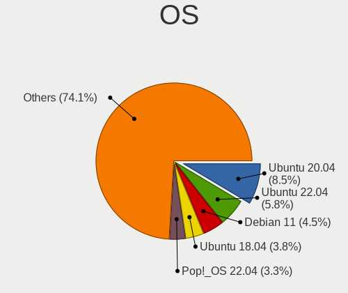
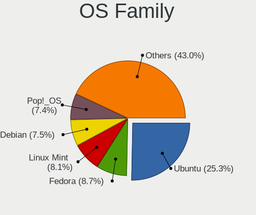
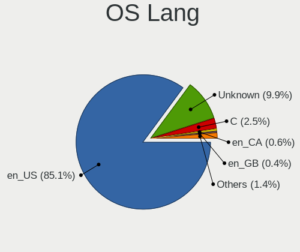
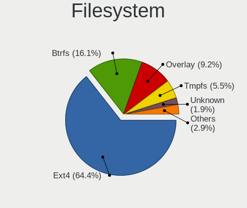
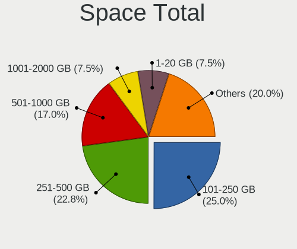

Linux in USA - Tested Hardware & Statistics (Notebooks)
-------------------------------------------------------

A project to collect tested hardware configurations for Linux in USA.

Anyone can contribute to this report by the [hw-probe](https://github.com/linuxhw/hw-probe) tool:

    sudo -E hw-probe -all -upload

Please contribute! Especially if your hardware is rare.

Contents
--------

* [ Test Cases ](#test-cases)

* [ System ](#system)
  - [ OS                       ](#os)
  - [ OS Family                ](#os-family)
  - [ Kernel                   ](#kernel)
  - [ Kernel Family            ](#kernel-family)
  - [ Kernel Major Ver.        ](#kernel-major-ver)
  - [ Arch                     ](#arch)
  - [ DE                       ](#de)
  - [ Display Server           ](#display-server)
  - [ Display Manager          ](#display-manager)
  - [ OS Lang                  ](#os-lang)
  - [ Boot Mode                ](#boot-mode)
  - [ Filesystem               ](#filesystem)
  - [ Part. scheme             ](#part-scheme)
  - [ Dual Boot with Linux/BSD ](#dual-boot-with-linuxbsd)
  - [ Dual Boot (Win)          ](#dual-boot-win)

* [ Board ](#board)
  - [ Vendor                   ](#vendor)
  - [ Model                    ](#model)
  - [ Model Family             ](#model-family)
  - [ MFG Year                 ](#mfg-year)
  - [ Form Factor              ](#form-factor)
  - [ Secure Boot              ](#secure-boot)
  - [ Coreboot                 ](#coreboot)
  - [ RAM Size                 ](#ram-size)
  - [ RAM Used                 ](#ram-used)
  - [ Total Drives             ](#total-drives)
  - [ Has CD-ROM               ](#has-cd-rom)
  - [ Has Ethernet             ](#has-ethernet)
  - [ Has WiFi                 ](#has-wifi)
  - [ Has Bluetooth            ](#has-bluetooth)

* [ Location ](#location)
  - [ Country                  ](#country)
  - [ City                     ](#city)

* [ Drives ](#drives)
  - [ Drive Vendor             ](#drive-vendor)
  - [ Drive Model              ](#drive-model)
  - [ HDD Vendor               ](#hdd-vendor)
  - [ SSD Vendor               ](#ssd-vendor)
  - [ Drive Kind               ](#drive-kind)
  - [ Drive Connector          ](#drive-connector)
  - [ Drive Size               ](#drive-size)
  - [ Space Total              ](#space-total)
  - [ Space Used               ](#space-used)
  - [ Malfunc. Drives          ](#malfunc-drives)
  - [ Malfunc. Drive Vendor    ](#malfunc-drive-vendor)
  - [ Malfunc. HDD Vendor      ](#malfunc-hdd-vendor)
  - [ Malfunc. Drive Kind      ](#malfunc-drive-kind)
  - [ Failed Drives            ](#failed-drives)
  - [ Failed Drive Vendor      ](#failed-drive-vendor)
  - [ Drive Status             ](#drive-status)

* [ Storage controller ](#storage-controller)
  - [ Storage Vendor           ](#storage-vendor)
  - [ Storage Model            ](#storage-model)
  - [ Storage Kind             ](#storage-kind)

* [ Processor ](#processor)
  - [ CPU Vendor               ](#cpu-vendor)
  - [ CPU Model                ](#cpu-model)
  - [ CPU Model Family         ](#cpu-model-family)
  - [ CPU Cores                ](#cpu-cores)
  - [ CPU Sockets              ](#cpu-sockets)
  - [ CPU Threads              ](#cpu-threads)
  - [ CPU Op-Modes             ](#cpu-op-modes)
  - [ CPU Microcode            ](#cpu-microcode)
  - [ CPU Microarch            ](#cpu-microarch)

* [ Graphics ](#graphics)
  - [ GPU Vendor               ](#gpu-vendor)
  - [ GPU Model                ](#gpu-model)
  - [ GPU Combo                ](#gpu-combo)
  - [ GPU Driver               ](#gpu-driver)
  - [ GPU Memory               ](#gpu-memory)

* [ Monitor ](#monitor)
  - [ Monitor Vendor           ](#monitor-vendor)
  - [ Monitor Model            ](#monitor-model)
  - [ Monitor Resolution       ](#monitor-resolution)
  - [ Monitor Diagonal         ](#monitor-diagonal)
  - [ Monitor Width            ](#monitor-width)
  - [ Aspect Ratio             ](#aspect-ratio)
  - [ Monitor Area             ](#monitor-area)
  - [ Pixel Density            ](#pixel-density)
  - [ Multiple Monitors        ](#multiple-monitors)

* [ Network ](#network)
  - [ Net Controller Vendor    ](#net-controller-vendor)
  - [ Net Controller Model     ](#net-controller-model)
  - [ Wireless Vendor          ](#wireless-vendor)
  - [ Wireless Model           ](#wireless-model)
  - [ Ethernet Vendor          ](#ethernet-vendor)
  - [ Ethernet Model           ](#ethernet-model)
  - [ Net Controller Kind      ](#net-controller-kind)
  - [ Used Controller          ](#used-controller)
  - [ NICs                     ](#nics)
  - [ IPv6                     ](#ipv6)

* [ Bluetooth ](#bluetooth)
  - [ Bluetooth Vendor         ](#bluetooth-vendor)
  - [ Bluetooth Model          ](#bluetooth-model)

* [ Sound ](#sound)
  - [ Sound Vendor             ](#sound-vendor)
  - [ Sound Model              ](#sound-model)

* [ Memory ](#memory)
  - [ Memory Vendor            ](#memory-vendor)
  - [ Memory Model             ](#memory-model)
  - [ Memory Kind              ](#memory-kind)
  - [ Memory Form Factor       ](#memory-form-factor)
  - [ Memory Size              ](#memory-size)
  - [ Memory Speed             ](#memory-speed)

* [ Printers & scanners ](#printers--scanners)
  - [ Printer Vendor           ](#printer-vendor)
  - [ Printer Model            ](#printer-model)
  - [ Scanner Vendor           ](#scanner-vendor)
  - [ Scanner Model            ](#scanner-model)

* [ Camera ](#camera)
  - [ Camera Vendor            ](#camera-vendor)
  - [ Camera Model             ](#camera-model)

* [ Security ](#security)
  - [ Fingerprint Vendor       ](#fingerprint-vendor)
  - [ Fingerprint Model        ](#fingerprint-model)
  - [ Chipcard Vendor          ](#chipcard-vendor)
  - [ Chipcard Model           ](#chipcard-model)

* [ Unsupported ](#unsupported)
  - [ Unsupported Devices      ](#unsupported-devices)
  - [ Unsupported Device Types ](#unsupported-device-types)

Test Cases
----------

Total: 22943

| Vendor        | Model                       | Probe                                                      | Date         |
|---------------|-----------------------------|------------------------------------------------------------|--------------|
| Dell          | Latitude 3420               | [327be624ce](https://linux-hardware.org/?probe=327be624ce) | May 01, 2023 |
| ASUSTek       | ROG Zephyrus Duo 16 GX65... | [b54238dc33](https://linux-hardware.org/?probe=b54238dc33) | May 01, 2023 |
| Toshiba       | Satellite L755              | [3bafb50baa](https://linux-hardware.org/?probe=3bafb50baa) | May 01, 2023 |
| Valve         | Jupiter                     | [9d8a549c47](https://linux-hardware.org/?probe=9d8a549c47) | May 01, 2023 |
| Dell          | Latitude 3420               | [1ce0c58a17](https://linux-hardware.org/?probe=1ce0c58a17) | May 01, 2023 |
| HP            | Laptop 15z-fc000            | [7b57cc42a0](https://linux-hardware.org/?probe=7b57cc42a0) | May 01, 2023 |
| Lenovo        | ThinkPad P52s 20LCS1H100    | [34b877bcb5](https://linux-hardware.org/?probe=34b877bcb5) | May 01, 2023 |
| HP            | ElitePad 1000 G2            | [8ae27e00f6](https://linux-hardware.org/?probe=8ae27e00f6) | May 01, 2023 |
| HP            | ZBook Studio 15.6 inch G... | [1846ea93e7](https://linux-hardware.org/?probe=1846ea93e7) | May 01, 2023 |
| HP            | Laptop 14-dk1xxx            | [2a49a2ad57](https://linux-hardware.org/?probe=2a49a2ad57) | May 01, 2023 |
| HP            | EliteBook 840 G3            | [c490c44357](https://linux-hardware.org/?probe=c490c44357) | May 01, 2023 |
| Valve         | Jupiter                     | [0494e0759f](https://linux-hardware.org/?probe=0494e0759f) | May 01, 2023 |
| HP            | ProBook 640 G2              | [55ac658b79](https://linux-hardware.org/?probe=55ac658b79) | May 01, 2023 |
| Lenovo        | Slim 9 14IAP7 82T1          | [fe1b421c9d](https://linux-hardware.org/?probe=fe1b421c9d) | May 01, 2023 |
| Acer          | Aspire V5-561P              | [8818106a28](https://linux-hardware.org/?probe=8818106a28) | Apr 30, 2023 |
| Acer          | Aspire V5-561P              | [fe60e0412d](https://linux-hardware.org/?probe=fe60e0412d) | Apr 30, 2023 |
| Lenovo        | IdeaPad S340-15IWLTouch ... | [6857a16a6c](https://linux-hardware.org/?probe=6857a16a6c) | Apr 30, 2023 |
| Apple         | MacBookPro6,2               | [0cb8947c84](https://linux-hardware.org/?probe=0cb8947c84) | Apr 30, 2023 |
| HP            | Notebook                    | [fd6aa4aeb6](https://linux-hardware.org/?probe=fd6aa4aeb6) | Apr 30, 2023 |
| HP            | ProBook 655 G3              | [07e2cc77f8](https://linux-hardware.org/?probe=07e2cc77f8) | Apr 30, 2023 |
| HP            | ProBook 655 G3              | [638e747fb1](https://linux-hardware.org/?probe=638e747fb1) | Apr 30, 2023 |
| HP            | Notebook                    | [4cece109d5](https://linux-hardware.org/?probe=4cece109d5) | Apr 30, 2023 |
| Acer          | Peppy                       | [dcac703c46](https://linux-hardware.org/?probe=dcac703c46) | Apr 30, 2023 |
| Acer          | Peppy                       | [4caf11594a](https://linux-hardware.org/?probe=4caf11594a) | Apr 30, 2023 |
| Lenovo        | Legion 5 15ARH05H 82B1      | [9df1b688c0](https://linux-hardware.org/?probe=9df1b688c0) | Apr 30, 2023 |
| HP            | ProBook 650 G4              | [fd991056e0](https://linux-hardware.org/?probe=fd991056e0) | Apr 30, 2023 |
| Dell          | Inspiron 15 3525            | [41c212fa2c](https://linux-hardware.org/?probe=41c212fa2c) | Apr 30, 2023 |
| Acer          | TravelMate B311-31          | [de172b8988](https://linux-hardware.org/?probe=de172b8988) | Apr 30, 2023 |
| HP            | Pavilion Laptop 15-cc5xx    | [28b11100ac](https://linux-hardware.org/?probe=28b11100ac) | Apr 30, 2023 |
| ASUSTek       | K53E                        | [dcb4502d05](https://linux-hardware.org/?probe=dcb4502d05) | Apr 30, 2023 |
| HP            | Laptop 17-by3xxx            | [552dac328b](https://linux-hardware.org/?probe=552dac328b) | Apr 30, 2023 |
| Valve         | Jupiter                     | [5645561cbb](https://linux-hardware.org/?probe=5645561cbb) | Apr 30, 2023 |
| Gateway       | P-7805u                     | [0958f250f2](https://linux-hardware.org/?probe=0958f250f2) | Apr 30, 2023 |
| HP            | EliteBook 840 G3            | [c262e81ab9](https://linux-hardware.org/?probe=c262e81ab9) | Apr 30, 2023 |
| Lenovo        | IdeaPad 330-15IKB 81DE      | [875ae124a1](https://linux-hardware.org/?probe=875ae124a1) | Apr 30, 2023 |
| Lenovo        | IdeaPad 330-15IKB 81DE      | [1ba3883d83](https://linux-hardware.org/?probe=1ba3883d83) | Apr 30, 2023 |
| Valve         | Jupiter                     | [23d976b25f](https://linux-hardware.org/?probe=23d976b25f) | Apr 30, 2023 |
| Dell          | Latitude E6430              | [4c20239367](https://linux-hardware.org/?probe=4c20239367) | Apr 30, 2023 |
| Framework     | Laptop                      | [84b3b9547b](https://linux-hardware.org/?probe=84b3b9547b) | Apr 29, 2023 |
| Dell          | XPS 13 7390                 | [b976cc9656](https://linux-hardware.org/?probe=b976cc9656) | Apr 29, 2023 |
| Apple         | MacBookPro11,3              | [3feeeb3341](https://linux-hardware.org/?probe=3feeeb3341) | Apr 29, 2023 |
| Apple         | MacBookPro11,3              | [8e0692ebe3](https://linux-hardware.org/?probe=8e0692ebe3) | Apr 29, 2023 |
| ASUSTek       | VivoBook_ASUSLaptop X712... | [272103e5a7](https://linux-hardware.org/?probe=272103e5a7) | Apr 29, 2023 |
| Dell          | XPS 13 9380                 | [c6591b0852](https://linux-hardware.org/?probe=c6591b0852) | Apr 29, 2023 |
| Valve         | Jupiter                     | [183d16708b](https://linux-hardware.org/?probe=183d16708b) | Apr 29, 2023 |
| Toshiba       | Satellite C650D             | [472dedd62a](https://linux-hardware.org/?probe=472dedd62a) | Apr 29, 2023 |
| Lenovo        | ThinkPad X1 Extreme Gen ... | [cd266d7680](https://linux-hardware.org/?probe=cd266d7680) | Apr 29, 2023 |
| HP            | Stream Laptop 11-y0XX       | [4f777df0e8](https://linux-hardware.org/?probe=4f777df0e8) | Apr 29, 2023 |
| Google        | Banon                       | [c21a57806c](https://linux-hardware.org/?probe=c21a57806c) | Apr 29, 2023 |
| Sony          | VPCF215FX                   | [49c7606269](https://linux-hardware.org/?probe=49c7606269) | Apr 29, 2023 |
| Insyde        | CherryTrail                 | [73e11e9235](https://linux-hardware.org/?probe=73e11e9235) | Apr 29, 2023 |
| Lenovo        | Legion 5 17IMH05H 81Y8      | [d435f7df68](https://linux-hardware.org/?probe=d435f7df68) | Apr 29, 2023 |
| Apple         | MacBook6,1                  | [58b09d7887](https://linux-hardware.org/?probe=58b09d7887) | Apr 29, 2023 |
| Apple         | MacBook6,1                  | [7d91fe30f7](https://linux-hardware.org/?probe=7d91fe30f7) | Apr 29, 2023 |
| Lenovo        | IdeaPad 1 14IGL7 82V6       | [2aa69de3ca](https://linux-hardware.org/?probe=2aa69de3ca) | Apr 29, 2023 |
| Lenovo        | ThinkPad X13 Gen 3 21CM0... | [eeb1550b82](https://linux-hardware.org/?probe=eeb1550b82) | Apr 29, 2023 |
| Dell          | Precision M6600             | [39d9af4736](https://linux-hardware.org/?probe=39d9af4736) | Apr 28, 2023 |
| Dell          | Inspiron 3180               | [bc3400a372](https://linux-hardware.org/?probe=bc3400a372) | Apr 28, 2023 |
| Toshiba       | Satellite C55t-C            | [8e2bc6ab21](https://linux-hardware.org/?probe=8e2bc6ab21) | Apr 28, 2023 |
| Dell          | Inspiron 15-3567            | [5dcd15cacf](https://linux-hardware.org/?probe=5dcd15cacf) | Apr 28, 2023 |
| Lenovo        | ThinkPad X1 Carbon Gen 9... | [a984eefe43](https://linux-hardware.org/?probe=a984eefe43) | Apr 28, 2023 |
| Lenovo        | ThinkPad P1 Gen 5 21DCCT... | [34420e9478](https://linux-hardware.org/?probe=34420e9478) | Apr 28, 2023 |
| HP            | Laptop 14-dk1xxx            | [61e94aaf2a](https://linux-hardware.org/?probe=61e94aaf2a) | Apr 28, 2023 |
| Lenovo        | ThinkBook 14-IIL 20SL       | [d9010fa8d0](https://linux-hardware.org/?probe=d9010fa8d0) | Apr 28, 2023 |
| MSI           | GE62VR 6RF                  | [97acececd3](https://linux-hardware.org/?probe=97acececd3) | Apr 28, 2023 |
| GPU Compan... | GWNR71517                   | [5fe84b74b0](https://linux-hardware.org/?probe=5fe84b74b0) | Apr 28, 2023 |
| HP            | Pavilion dv6                | [8bb5802125](https://linux-hardware.org/?probe=8bb5802125) | Apr 28, 2023 |
| HP            | Laptop 14-dk1xxx            | [6f318b0790](https://linux-hardware.org/?probe=6f318b0790) | Apr 28, 2023 |
| HP            | Laptop 15-bs2xx             | [ad768363bc](https://linux-hardware.org/?probe=ad768363bc) | Apr 28, 2023 |
| Lenovo        | ThinkPad T450 20BUS0B000    | [a2cbf65767](https://linux-hardware.org/?probe=a2cbf65767) | Apr 28, 2023 |
| Dell          | Inspiron 3558               | [1ef93daf0b](https://linux-hardware.org/?probe=1ef93daf0b) | Apr 28, 2023 |
| HP            | ProBook 455 15.6 inch G9... | [1cfc210ce1](https://linux-hardware.org/?probe=1cfc210ce1) | Apr 28, 2023 |
| Apple         | MacBookPro5,2               | [c188ae4d7d](https://linux-hardware.org/?probe=c188ae4d7d) | Apr 28, 2023 |
| Dell          | XPS 15 9520                 | [96194bc912](https://linux-hardware.org/?probe=96194bc912) | Apr 28, 2023 |
| MSI           | GE62VR 6RF                  | [2a9fcae8c3](https://linux-hardware.org/?probe=2a9fcae8c3) | Apr 28, 2023 |
| Dell          | XPS 15 9570                 | [3479673283](https://linux-hardware.org/?probe=3479673283) | Apr 28, 2023 |
| Lenovo        | ThinkPad P50 20EN0013US     | [95d59e1bc3](https://linux-hardware.org/?probe=95d59e1bc3) | Apr 28, 2023 |
| Dell          | Latitude D830               | [2ab0772efb](https://linux-hardware.org/?probe=2ab0772efb) | Apr 28, 2023 |
| Dell          | Latitude E5470              | [caac023f65](https://linux-hardware.org/?probe=caac023f65) | Apr 27, 2023 |
| GPU Compan... | GWTN141-4                   | [633f19ff2d](https://linux-hardware.org/?probe=633f19ff2d) | Apr 27, 2023 |
| Valve         | Jupiter                     | [f65ece2859](https://linux-hardware.org/?probe=f65ece2859) | Apr 27, 2023 |
| Sony          | SVF15212CXW                 | [5d5367dc0e](https://linux-hardware.org/?probe=5d5367dc0e) | Apr 27, 2023 |
| ASUSTek       | ASUS TUF Gaming A15 FA50... | [f1d5d361d5](https://linux-hardware.org/?probe=f1d5d361d5) | Apr 27, 2023 |
| ASUSTek       | ZenBook UX425IA_UM425IA     | [404ec697ac](https://linux-hardware.org/?probe=404ec697ac) | Apr 27, 2023 |
| ASUSTek       | Zephyrus M GU502GW_GU502... | [94d9250bc1](https://linux-hardware.org/?probe=94d9250bc1) | Apr 27, 2023 |
| ASUSTek       | ASUS BR1100CKA BR1100CKA... | [c5db27dd0c](https://linux-hardware.org/?probe=c5db27dd0c) | Apr 27, 2023 |
| Google        | Chell                       | [1d1b263f21](https://linux-hardware.org/?probe=1d1b263f21) | Apr 27, 2023 |
| ASUSTek       | ASUS TUF Gaming A15 FA50... | [dfd3d8a5c5](https://linux-hardware.org/?probe=dfd3d8a5c5) | Apr 27, 2023 |
| MSI           | GP65 Leopard 10SDK          | [fc66ccccde](https://linux-hardware.org/?probe=fc66ccccde) | Apr 27, 2023 |
| HP            | ZBook Studio G3             | [f648c14c51](https://linux-hardware.org/?probe=f648c14c51) | Apr 27, 2023 |
| HP            | 15 Notebook PC              | [a63003783d](https://linux-hardware.org/?probe=a63003783d) | Apr 27, 2023 |
| HP            | ZBook Studio G3             | [26146530c7](https://linux-hardware.org/?probe=26146530c7) | Apr 27, 2023 |
| MECHREVO      | X3 Series GK7CP6R           | [c764a98c9d](https://linux-hardware.org/?probe=c764a98c9d) | Apr 27, 2023 |
| GPU Compan... | GWTN156-5                   | [60d207eb63](https://linux-hardware.org/?probe=60d207eb63) | Apr 27, 2023 |
| Lenovo        | ThinkPad P50 20EN0013US     | [09f98983fd](https://linux-hardware.org/?probe=09f98983fd) | Apr 27, 2023 |
| Dell          | Latitude 7420               | [7ceeb888fd](https://linux-hardware.org/?probe=7ceeb888fd) | Apr 27, 2023 |
| SGIN          | M15                         | [ac5d947f22](https://linux-hardware.org/?probe=ac5d947f22) | Apr 27, 2023 |
| ASUSTek       | ROG Zephyrus G14 GA401IV    | [2063d4a9fc](https://linux-hardware.org/?probe=2063d4a9fc) | Apr 27, 2023 |
| Lenovo        | ThinkPad X270 20HN001HUS    | [3f6586f0d1](https://linux-hardware.org/?probe=3f6586f0d1) | Apr 27, 2023 |
| Lenovo        | ThinkPad T480s 20L8S45W0... | [0e8490c41f](https://linux-hardware.org/?probe=0e8490c41f) | Apr 27, 2023 |
| Lenovo        | ThinkPad X1 Extreme Gen ... | [32960eca65](https://linux-hardware.org/?probe=32960eca65) | Apr 27, 2023 |
| ASUSTek       | Zephyrus M GU502GW_GU502... | [67c865f449](https://linux-hardware.org/?probe=67c865f449) | Apr 27, 2023 |
| HP            | Pavilion Laptop 15-cc5xx    | [9344f38032](https://linux-hardware.org/?probe=9344f38032) | Apr 27, 2023 |
| MSI           | PE70 6QE                    | [87c8761eff](https://linux-hardware.org/?probe=87c8761eff) | Apr 27, 2023 |
| Apple         | MacBookAir4,1               | [87ab055a31](https://linux-hardware.org/?probe=87ab055a31) | Apr 27, 2023 |
| Dell          | Latitude E5440              | [0217386dbe](https://linux-hardware.org/?probe=0217386dbe) | Apr 27, 2023 |
| Valve         | Jupiter                     | [4066c253b5](https://linux-hardware.org/?probe=4066c253b5) | Apr 27, 2023 |
| Valve         | Jupiter                     | [823e1bb624](https://linux-hardware.org/?probe=823e1bb624) | Apr 27, 2023 |
| Dell          | Inspiron 3501               | [29d2a588e0](https://linux-hardware.org/?probe=29d2a588e0) | Apr 27, 2023 |
| Acer          | Aspire E5-575G              | [3497feda9f](https://linux-hardware.org/?probe=3497feda9f) | Apr 27, 2023 |
| Dell          | Latitude 5520               | [bec614b168](https://linux-hardware.org/?probe=bec614b168) | Apr 26, 2023 |
| ASUSTek       | VivoBook_ASUS Laptop X50... | [c443269a81](https://linux-hardware.org/?probe=c443269a81) | Apr 26, 2023 |
| ASUSTek       | ROG Strix G512LW_G512LW     | [a950f656f7](https://linux-hardware.org/?probe=a950f656f7) | Apr 26, 2023 |
| GPU Compan... | GWTN156-5                   | [df6b1e8e17](https://linux-hardware.org/?probe=df6b1e8e17) | Apr 26, 2023 |
| Dell          | Vostro 1510                 | [71c860d51c](https://linux-hardware.org/?probe=71c860d51c) | Apr 26, 2023 |
| HP            | 2000                        | [d0fa0a6256](https://linux-hardware.org/?probe=d0fa0a6256) | Apr 26, 2023 |
| Razer         | Blade 17 (2022) - RZ09-0... | [fb624057c9](https://linux-hardware.org/?probe=fb624057c9) | Apr 26, 2023 |
| HP            | EliteBook 840 G7 Noteboo... | [c6ac218f6a](https://linux-hardware.org/?probe=c6ac218f6a) | Apr 26, 2023 |
| Acer          | Aspire A515-45              | [d910b01835](https://linux-hardware.org/?probe=d910b01835) | Apr 26, 2023 |
| Acer          | Aspire E5-575G              | [3a7b41fb49](https://linux-hardware.org/?probe=3a7b41fb49) | Apr 26, 2023 |
| Dell          | Latitude 5520               | [7ee153b691](https://linux-hardware.org/?probe=7ee153b691) | Apr 26, 2023 |
| Google        | Terra                       | [b22deb9f09](https://linux-hardware.org/?probe=b22deb9f09) | Apr 26, 2023 |
| Lenovo        | ThinkBook 14 G3 ACL 21A2    | [86ba8ccc07](https://linux-hardware.org/?probe=86ba8ccc07) | Apr 26, 2023 |
| Valve         | Jupiter                     | [ff3e33e935](https://linux-hardware.org/?probe=ff3e33e935) | Apr 26, 2023 |
| Dell          | Inspiron 3558               | [add3c03eef](https://linux-hardware.org/?probe=add3c03eef) | Apr 26, 2023 |
| ASUSTek       | X541SA                      | [362ede5435](https://linux-hardware.org/?probe=362ede5435) | Apr 26, 2023 |
| GPU Compan... | GWNR71517                   | [b8b58af983](https://linux-hardware.org/?probe=b8b58af983) | Apr 26, 2023 |
| MSI           | PE70 6QE                    | [53dd8334ac](https://linux-hardware.org/?probe=53dd8334ac) | Apr 26, 2023 |
| HP            | Compaq Presario CQ60        | [00bf0576c4](https://linux-hardware.org/?probe=00bf0576c4) | Apr 26, 2023 |
| ASUSTek       | X550VQ                      | [3c7d8a0268](https://linux-hardware.org/?probe=3c7d8a0268) | Apr 26, 2023 |
| Lenovo        | IdeaPad 3 15IML05 81WR      | [5daf26faca](https://linux-hardware.org/?probe=5daf26faca) | Apr 26, 2023 |
| System76      | Gazelle                     | [dbf4d8b33d](https://linux-hardware.org/?probe=dbf4d8b33d) | Apr 26, 2023 |
| Dell          | Precision M6600             | [4f5cd6d28e](https://linux-hardware.org/?probe=4f5cd6d28e) | Apr 26, 2023 |
| ASUSTek       | ROG Strix G531GW_G531GW     | [2e6de51ded](https://linux-hardware.org/?probe=2e6de51ded) | Apr 26, 2023 |
| System76      | Gazelle                     | [ca2e23db8d](https://linux-hardware.org/?probe=ca2e23db8d) | Apr 25, 2023 |
| Lenovo        | ThinkPad T430 2349UKM       | [6adb010c7a](https://linux-hardware.org/?probe=6adb010c7a) | Apr 25, 2023 |
| System76      | Oryx Pro                    | [298bf97b70](https://linux-hardware.org/?probe=298bf97b70) | Apr 25, 2023 |
| Dell          | Precision 7550              | [987df8038c](https://linux-hardware.org/?probe=987df8038c) | Apr 25, 2023 |
| HP            | 2000                        | [14e1ed7540](https://linux-hardware.org/?probe=14e1ed7540) | Apr 25, 2023 |
| HP            | 2000                        | [9e1ae856e4](https://linux-hardware.org/?probe=9e1ae856e4) | Apr 25, 2023 |
| HP            | OMEN Laptop 15-en1xxx       | [8fca54d3f2](https://linux-hardware.org/?probe=8fca54d3f2) | Apr 25, 2023 |
| HP            | Pavilion Notebook           | [b03c4808b0](https://linux-hardware.org/?probe=b03c4808b0) | Apr 25, 2023 |
| MSI           | Prestige 14 A12UC           | [137a3623dc](https://linux-hardware.org/?probe=137a3623dc) | Apr 25, 2023 |
| HP            | Dragonfly Pro               | [9bc83e741f](https://linux-hardware.org/?probe=9bc83e741f) | Apr 25, 2023 |
| HP            | Dragonfly Pro               | [b47e30ac80](https://linux-hardware.org/?probe=b47e30ac80) | Apr 25, 2023 |
| Dell          | Inspiron 5759               | [90fa428095](https://linux-hardware.org/?probe=90fa428095) | Apr 25, 2023 |
| Dell          | Inspiron 14 5410            | [89017780fa](https://linux-hardware.org/?probe=89017780fa) | Apr 25, 2023 |
| Toshiba       | Satellite L305D             | [1bbf3a5e9c](https://linux-hardware.org/?probe=1bbf3a5e9c) | Apr 25, 2023 |
| HP            | ENVY 17                     | [a4327cd9cc](https://linux-hardware.org/?probe=a4327cd9cc) | Apr 25, 2023 |
| HP            | Laptop 15-ef1xxx            | [05d2b26ee6](https://linux-hardware.org/?probe=05d2b26ee6) | Apr 25, 2023 |
| HP            | Laptop 15-ef1xxx            | [0ef0676073](https://linux-hardware.org/?probe=0ef0676073) | Apr 25, 2023 |
| HP            | ENVY 17                     | [e6cc7d84ec](https://linux-hardware.org/?probe=e6cc7d84ec) | Apr 25, 2023 |
| Apple         | MacBookAir7,2               | [2ccfcd2b27](https://linux-hardware.org/?probe=2ccfcd2b27) | Apr 25, 2023 |
| ASUSTek       | VivoBook_ASUSLaptop X513... | [ebc99a93ab](https://linux-hardware.org/?probe=ebc99a93ab) | Apr 25, 2023 |
| GPU Compan... | GWTN156-5                   | [afe12152a5](https://linux-hardware.org/?probe=afe12152a5) | Apr 25, 2023 |
| Lenovo        | ThinkPad W520 4270CTO       | [029abbccfc](https://linux-hardware.org/?probe=029abbccfc) | Apr 25, 2023 |
| GPU Compan... | GWTN156-5                   | [a22605adc9](https://linux-hardware.org/?probe=a22605adc9) | Apr 25, 2023 |
| Acer          | Aspire A515-56              | [a3a13c5cb1](https://linux-hardware.org/?probe=a3a13c5cb1) | Apr 24, 2023 |
| Dell          | Inspiron 3543               | [2a3020f392](https://linux-hardware.org/?probe=2a3020f392) | Apr 24, 2023 |
| Dell          | XPS 13 9310                 | [65ccee11a0](https://linux-hardware.org/?probe=65ccee11a0) | Apr 24, 2023 |
| ASUSTek       | GL752VW                     | [26c754e5f0](https://linux-hardware.org/?probe=26c754e5f0) | Apr 24, 2023 |
| Dell          | XPS 13 9310                 | [070d7e791f](https://linux-hardware.org/?probe=070d7e791f) | Apr 24, 2023 |
| Dell          | Latitude 5580               | [a153ad5277](https://linux-hardware.org/?probe=a153ad5277) | Apr 24, 2023 |
| GPU Compan... | GWTN156-2BK                 | [9dd0969eaf](https://linux-hardware.org/?probe=9dd0969eaf) | Apr 24, 2023 |
| Apple         | MacBookPro8,1               | [006b9a2b3f](https://linux-hardware.org/?probe=006b9a2b3f) | Apr 24, 2023 |
| Acer          | Aspire A515-56              | [1d5b5dcfc7](https://linux-hardware.org/?probe=1d5b5dcfc7) | Apr 24, 2023 |
| Dell          | System XPS L321X            | [cd2af9d26f](https://linux-hardware.org/?probe=cd2af9d26f) | Apr 24, 2023 |
| ASUSTek       | GL752VW                     | [216aaf8fff](https://linux-hardware.org/?probe=216aaf8fff) | Apr 24, 2023 |
| HP            | Laptop 15-db0xxx            | [2ab42d58bf](https://linux-hardware.org/?probe=2ab42d58bf) | Apr 24, 2023 |
| HP            | Laptop 15-db0xxx            | [8c5aea6211](https://linux-hardware.org/?probe=8c5aea6211) | Apr 24, 2023 |
| Dell          | Precision 7770              | [e9208415d5](https://linux-hardware.org/?probe=e9208415d5) | Apr 24, 2023 |
| Lenovo        | ThinkPad W520 4270CTO       | [fb80fac677](https://linux-hardware.org/?probe=fb80fac677) | Apr 24, 2023 |
| Lenovo        | ThinkPad X1 Carbon Gen 8... | [60d1d4aec8](https://linux-hardware.org/?probe=60d1d4aec8) | Apr 24, 2023 |
| Toshiba       | Satellite L15W-B            | [5d1177f899](https://linux-hardware.org/?probe=5d1177f899) | Apr 24, 2023 |
| HP            | Pavilion Notebook           | [0fde788ea5](https://linux-hardware.org/?probe=0fde788ea5) | Apr 24, 2023 |
| HP            | Stream Laptop 14-ax0XX      | [c087d6cbae](https://linux-hardware.org/?probe=c087d6cbae) | Apr 24, 2023 |
| Acer          | Aspire A515-46              | [16acb0ba22](https://linux-hardware.org/?probe=16acb0ba22) | Apr 24, 2023 |
| HP            | ProBook 11 G2               | [43f6a6180a](https://linux-hardware.org/?probe=43f6a6180a) | Apr 24, 2023 |
| HP            | ProBook 4530s               | [316cfd6876](https://linux-hardware.org/?probe=316cfd6876) | Apr 24, 2023 |
| HP            | Laptop 15-db0xxx            | [e4fd112564](https://linux-hardware.org/?probe=e4fd112564) | Apr 24, 2023 |
| Dell          | XPS 15 9530                 | [d9429d7e06](https://linux-hardware.org/?probe=d9429d7e06) | Apr 23, 2023 |
| Dell          | G5 5590                     | [eef3722c35](https://linux-hardware.org/?probe=eef3722c35) | Apr 23, 2023 |
| HP            | ZBook 17 G2                 | [5eec26bec0](https://linux-hardware.org/?probe=5eec26bec0) | Apr 23, 2023 |
| ASUSTek       | ROG Strix G513QY_G513QY     | [696ee85cc9](https://linux-hardware.org/?probe=696ee85cc9) | Apr 23, 2023 |
| ASUSTek       | VivoBook_ASUSLaptop X415... | [76c4edb7f3](https://linux-hardware.org/?probe=76c4edb7f3) | Apr 23, 2023 |
| Dell          | Precision M4400             | [0c367cbf45](https://linux-hardware.org/?probe=0c367cbf45) | Apr 23, 2023 |
| Dynabook      | PORTEGE X30L-K              | [da178b8987](https://linux-hardware.org/?probe=da178b8987) | Apr 23, 2023 |
| Alienware     | 13 R3                       | [f04b34f41d](https://linux-hardware.org/?probe=f04b34f41d) | Apr 23, 2023 |
| Notebook      | N15_N17RD1                  | [8bba7a7447](https://linux-hardware.org/?probe=8bba7a7447) | Apr 23, 2023 |
| HP            | Laptop 15-bs2xx             | [c40dac306c](https://linux-hardware.org/?probe=c40dac306c) | Apr 23, 2023 |
| Dell          | Latitude E6410              | [33a88dea30](https://linux-hardware.org/?probe=33a88dea30) | Apr 23, 2023 |
| Dell          | Latitude E6410              | [86d20cdb51](https://linux-hardware.org/?probe=86d20cdb51) | Apr 23, 2023 |
| Lenovo        | ThinkPad T495 20NJ000XGE    | [155072c012](https://linux-hardware.org/?probe=155072c012) | Apr 23, 2023 |
| Valve         | Jupiter                     | [637dccb4d9](https://linux-hardware.org/?probe=637dccb4d9) | Apr 23, 2023 |
| ASUSTek       | GL703VM                     | [f3c76b5075](https://linux-hardware.org/?probe=f3c76b5075) | Apr 23, 2023 |
| Acer          | Aspire A514-55              | [d98f78cc01](https://linux-hardware.org/?probe=d98f78cc01) | Apr 23, 2023 |
| Carbon Sys... | Iridium 14                  | [10cd21aba6](https://linux-hardware.org/?probe=10cd21aba6) | Apr 23, 2023 |
| Apple         | MacBookPro9,2               | [f48b78bda1](https://linux-hardware.org/?probe=f48b78bda1) | Apr 23, 2023 |
| MSI           | GP62 7RD                    | [277bb2d2e3](https://linux-hardware.org/?probe=277bb2d2e3) | Apr 23, 2023 |
| Lenovo        | ThinkBook Plus G3 IAP 21... | [208510e39a](https://linux-hardware.org/?probe=208510e39a) | Apr 23, 2023 |
| ASUSTek       | VivoBook_ASUSLaptop X415... | [f78c721e4b](https://linux-hardware.org/?probe=f78c721e4b) | Apr 23, 2023 |
| HP            | 15 Notebook PC              | [a77c702f3e](https://linux-hardware.org/?probe=a77c702f3e) | Apr 23, 2023 |
| HP            | Pavilion dv6700             | [ec38742f28](https://linux-hardware.org/?probe=ec38742f28) | Apr 23, 2023 |
| Dell          | Inspiron 7737               | [50b75a71d3](https://linux-hardware.org/?probe=50b75a71d3) | Apr 23, 2023 |
| Lenovo        | IdeaPad L340-15IRH Gamin... | [6115e5ccd4](https://linux-hardware.org/?probe=6115e5ccd4) | Apr 22, 2023 |
| Apple         | MacBookPro11,3              | [7fd17e2245](https://linux-hardware.org/?probe=7fd17e2245) | Apr 22, 2023 |
| GPU Compan... | GWTN156-5                   | [4611a1d998](https://linux-hardware.org/?probe=4611a1d998) | Apr 22, 2023 |
| HP            | ZBook 15                    | [c7ae51efcd](https://linux-hardware.org/?probe=c7ae51efcd) | Apr 22, 2023 |
| Dell          | Precision M4400             | [291a0de9a8](https://linux-hardware.org/?probe=291a0de9a8) | Apr 22, 2023 |
| Dell          | Inspiron 5567               | [f639b8e21a](https://linux-hardware.org/?probe=f639b8e21a) | Apr 22, 2023 |
| HP            | Pavilion g7                 | [785e97ad3d](https://linux-hardware.org/?probe=785e97ad3d) | Apr 22, 2023 |
| HP            | Pavilion g7                 | [0e6f1d6bf7](https://linux-hardware.org/?probe=0e6f1d6bf7) | Apr 22, 2023 |
| HP            | EliteBook 6930p             | [2ff545a3fc](https://linux-hardware.org/?probe=2ff545a3fc) | Apr 22, 2023 |
| HP            | Notebook                    | [fdf3f7a1cf](https://linux-hardware.org/?probe=fdf3f7a1cf) | Apr 22, 2023 |
| Dell          | Latitude E6430              | [be890553bb](https://linux-hardware.org/?probe=be890553bb) | Apr 22, 2023 |
| Dell          | Latitude E6430              | [f0778a0410](https://linux-hardware.org/?probe=f0778a0410) | Apr 22, 2023 |
| ASUSTek       | X751LAB                     | [15732ab12d](https://linux-hardware.org/?probe=15732ab12d) | Apr 22, 2023 |
| AMI           | Cherry Trail CR             | [325dfde573](https://linux-hardware.org/?probe=325dfde573) | Apr 22, 2023 |
| ASUSTek       | ZenBook UX425UG_Q408UG      | [38661d17e0](https://linux-hardware.org/?probe=38661d17e0) | Apr 22, 2023 |
| HP            | 255 G8 Notebook PC          | [0dcc2eaa50](https://linux-hardware.org/?probe=0dcc2eaa50) | Apr 22, 2023 |
| Lenovo        | Legion S7 15IMH5 82BC       | [332fdb5298](https://linux-hardware.org/?probe=332fdb5298) | Apr 22, 2023 |
| Google        | Fleex                       | [19603bb256](https://linux-hardware.org/?probe=19603bb256) | Apr 22, 2023 |
| ASUSTek       | ROG Strix G513IM_G513IM     | [00f7379c8f](https://linux-hardware.org/?probe=00f7379c8f) | Apr 21, 2023 |
| Dynabook      | PORTEGE X30L-K              | [b52552ec7f](https://linux-hardware.org/?probe=b52552ec7f) | Apr 21, 2023 |
| Dell          | Precision M6600             | [6f80333ca9](https://linux-hardware.org/?probe=6f80333ca9) | Apr 21, 2023 |
| HP            | EliteBook 2540p             | [b2a6b1a66d](https://linux-hardware.org/?probe=b2a6b1a66d) | Apr 21, 2023 |
| Lenovo        | IdeaPad 1 15ALC7 82R4       | [6e1df0f6ee](https://linux-hardware.org/?probe=6e1df0f6ee) | Apr 21, 2023 |
| HP            | ZBook Studio G3             | [754a6bd681](https://linux-hardware.org/?probe=754a6bd681) | Apr 21, 2023 |
| GPU Compan... | GWTN156-2BK                 | [3f172b49f2](https://linux-hardware.org/?probe=3f172b49f2) | Apr 21, 2023 |
| Micro Elec... | MG-VCP2-17A3070T            | [edf0d6d941](https://linux-hardware.org/?probe=edf0d6d941) | Apr 21, 2023 |
| Apple         | MacBookPro8,3               | [4004491274](https://linux-hardware.org/?probe=4004491274) | Apr 21, 2023 |
| Lenovo        | ThinkPad W530 2436CTO       | [74d9f6c0d6](https://linux-hardware.org/?probe=74d9f6c0d6) | Apr 21, 2023 |
| HP            | EliteBook 2540p             | [be19bcd7de](https://linux-hardware.org/?probe=be19bcd7de) | Apr 21, 2023 |
| HP            | Pavilion Laptop 15-eh0xx... | [4e69a80310](https://linux-hardware.org/?probe=4e69a80310) | Apr 21, 2023 |
| GPU Compan... | GWTC116-2                   | [8f7df56d73](https://linux-hardware.org/?probe=8f7df56d73) | Apr 21, 2023 |
| HP            | 15                          | [4f563db114](https://linux-hardware.org/?probe=4f563db114) | Apr 21, 2023 |
| HP            | ProBook 640 G1              | [b5022d8a2f](https://linux-hardware.org/?probe=b5022d8a2f) | Apr 21, 2023 |
| Valve         | Jupiter                     | [d8036610d8](https://linux-hardware.org/?probe=d8036610d8) | Apr 21, 2023 |
| Apple         | MacBookPro11,3              | [09a203e882](https://linux-hardware.org/?probe=09a203e882) | Apr 21, 2023 |
| HP            | Pavilion dv6000 (RV010UA... | [cf7d33c62e](https://linux-hardware.org/?probe=cf7d33c62e) | Apr 20, 2023 |
| Framework     | Laptop                      | [226765247b](https://linux-hardware.org/?probe=226765247b) | Apr 20, 2023 |
| Lenovo        | ThinkPad X1 Carbon Gen 9... | [cfaa1567db](https://linux-hardware.org/?probe=cfaa1567db) | Apr 20, 2023 |
| Lenovo        | ThinkPad X1 Carbon Gen 9... | [573b371272](https://linux-hardware.org/?probe=573b371272) | Apr 20, 2023 |
| Dell          | Inspiron 3520               | [11ea81f23c](https://linux-hardware.org/?probe=11ea81f23c) | Apr 20, 2023 |
| Gateway       | NV55C                       | [e77192c3b1](https://linux-hardware.org/?probe=e77192c3b1) | Apr 20, 2023 |
| Carbon Sys... | Iridium 14                  | [af5e3d750a](https://linux-hardware.org/?probe=af5e3d750a) | Apr 20, 2023 |
| ASUSTek       | ROG Zephyrus M16 GU603ZW... | [87538ce2ba](https://linux-hardware.org/?probe=87538ce2ba) | Apr 20, 2023 |
| MSI           | Vector GP76 12UHSO          | [e299a6ed8e](https://linux-hardware.org/?probe=e299a6ed8e) | Apr 20, 2023 |
| HP            | G62                         | [a0096bb254](https://linux-hardware.org/?probe=a0096bb254) | Apr 20, 2023 |
| Getac         | B300G5                      | [307cc71aa3](https://linux-hardware.org/?probe=307cc71aa3) | Apr 20, 2023 |
| Lenovo        | ThinkPad T430 2349S4D       | [4b57440851](https://linux-hardware.org/?probe=4b57440851) | Apr 20, 2023 |
| Lenovo        | IdeaPad Slim 7 15IIL05 8... | [e43db9718f](https://linux-hardware.org/?probe=e43db9718f) | Apr 20, 2023 |
| Dell          | Inspiron 3583               | [23d7bfe141](https://linux-hardware.org/?probe=23d7bfe141) | Apr 20, 2023 |
| Dell          | Inspiron 3583               | [dad60cb86a](https://linux-hardware.org/?probe=dad60cb86a) | Apr 20, 2023 |
| Acer          | Aspire 5735                 | [2d8d4a8124](https://linux-hardware.org/?probe=2d8d4a8124) | Apr 20, 2023 |
| Google        | Helios                      | [89b0a06d70](https://linux-hardware.org/?probe=89b0a06d70) | Apr 20, 2023 |
| HP            | Laptop 15-dw3xxx            | [648c4c3622](https://linux-hardware.org/?probe=648c4c3622) | Apr 20, 2023 |
| MSI           | Modern 14 A10RAS            | [fbd4693aef](https://linux-hardware.org/?probe=fbd4693aef) | Apr 20, 2023 |
| ASUSTek       | ASUS EXPERTBOOK B1500CEA... | [7d380bf016](https://linux-hardware.org/?probe=7d380bf016) | Apr 20, 2023 |
| ASUSTek       | ASUS EXPERTBOOK B1500CEA... | [7029b5ee48](https://linux-hardware.org/?probe=7029b5ee48) | Apr 20, 2023 |
| GPU Compan... | GWTC116-2                   | [9e85f47757](https://linux-hardware.org/?probe=9e85f47757) | Apr 20, 2023 |
| HP            | Laptop 15-db0xxx            | [9ab965fcb8](https://linux-hardware.org/?probe=9ab965fcb8) | Apr 19, 2023 |
| Dell          | Latitude E7440              | [c701c43108](https://linux-hardware.org/?probe=c701c43108) | Apr 19, 2023 |
| HP            | ProBook 450 G2              | [3b8c115c1a](https://linux-hardware.org/?probe=3b8c115c1a) | Apr 19, 2023 |
| Dell          | XPS 15 9530                 | [bb0be3d9e3](https://linux-hardware.org/?probe=bb0be3d9e3) | Apr 19, 2023 |
| HP            | Victus by Gaming Laptop ... | [986e7732bf](https://linux-hardware.org/?probe=986e7732bf) | Apr 19, 2023 |
| ASUSTek       | VivoBook_ASUSLaptop X412... | [618b59dac2](https://linux-hardware.org/?probe=618b59dac2) | Apr 19, 2023 |
| HP            | ProBook 650 G3              | [704778a577](https://linux-hardware.org/?probe=704778a577) | Apr 19, 2023 |
| HP            | Pavilion 17                 | [66df49c906](https://linux-hardware.org/?probe=66df49c906) | Apr 19, 2023 |
| Lenovo        | ThinkPad T540p 20BECTO1W... | [ccb7f92798](https://linux-hardware.org/?probe=ccb7f92798) | Apr 19, 2023 |
| Lenovo        | IdeaPad 1 15ADA7 82R1       | [0f058078c9](https://linux-hardware.org/?probe=0f058078c9) | Apr 19, 2023 |
| ASUSTek       | VivoBook_ASUSLaptop X170... | [a76057a8be](https://linux-hardware.org/?probe=a76057a8be) | Apr 19, 2023 |
| ASUSTek       | X510UAR                     | [d96138627b](https://linux-hardware.org/?probe=d96138627b) | Apr 19, 2023 |
| Getac         | X500G2                      | [cda28cdcec](https://linux-hardware.org/?probe=cda28cdcec) | Apr 18, 2023 |
| HP            | Pavilion Laptop 17-ar0xx    | [76aabd80a0](https://linux-hardware.org/?probe=76aabd80a0) | Apr 18, 2023 |
| Acer          | Aspire AV15-52              | [e1044f40e2](https://linux-hardware.org/?probe=e1044f40e2) | Apr 18, 2023 |
| Dell          | Inspiron 3583               | [6a837bdf4d](https://linux-hardware.org/?probe=6a837bdf4d) | Apr 18, 2023 |
| Lenovo        | ThinkPad P51 20HJS0V50E     | [39e6be04eb](https://linux-hardware.org/?probe=39e6be04eb) | Apr 18, 2023 |
| Acer          | Swift SF314-52              | [5fc210eaf2](https://linux-hardware.org/?probe=5fc210eaf2) | Apr 18, 2023 |
| Valve         | Jupiter                     | [2d90341b57](https://linux-hardware.org/?probe=2d90341b57) | Apr 18, 2023 |
| Valve         | Jupiter                     | [f19034b20f](https://linux-hardware.org/?probe=f19034b20f) | Apr 18, 2023 |
| ASUSTek       | GL502VML                    | [7c65476ce9](https://linux-hardware.org/?probe=7c65476ce9) | Apr 18, 2023 |
| Valve         | Jupiter                     | [bc644a6790](https://linux-hardware.org/?probe=bc644a6790) | Apr 18, 2023 |
| Valve         | Jupiter                     | [8a0fce015b](https://linux-hardware.org/?probe=8a0fce015b) | Apr 18, 2023 |
| Lenovo        | ThinkPad P52 20MAS11D00     | [c2227e5f29](https://linux-hardware.org/?probe=c2227e5f29) | Apr 18, 2023 |
| HP            | ProBook 11 G2               | [222f45e8c6](https://linux-hardware.org/?probe=222f45e8c6) | Apr 18, 2023 |
| Lenovo        | ThinkPad P52 20MAS11D00     | [f56edbb1d1](https://linux-hardware.org/?probe=f56edbb1d1) | Apr 18, 2023 |
| Lenovo        | ThinkPad P53 20QN001YUS     | [59549202bd](https://linux-hardware.org/?probe=59549202bd) | Apr 18, 2023 |
| IBM           | ThinkPad R51 1836Q4U        | [ebec8b53eb](https://linux-hardware.org/?probe=ebec8b53eb) | Apr 18, 2023 |
| HP            | ProBook 4730s               | [1e951f37df](https://linux-hardware.org/?probe=1e951f37df) | Apr 17, 2023 |
| Dell          | Inspiron 16 Plus 7620       | [d502808d15](https://linux-hardware.org/?probe=d502808d15) | Apr 17, 2023 |
| Acer          | Aspire E5-574               | [2f60207985](https://linux-hardware.org/?probe=2f60207985) | Apr 17, 2023 |
| Lenovo        | Legion 7 16IAX7 82TD        | [8f0188b2a1](https://linux-hardware.org/?probe=8f0188b2a1) | Apr 17, 2023 |
| Dell          | Inspiron 3541               | [dd409790ad](https://linux-hardware.org/?probe=dd409790ad) | Apr 17, 2023 |
| HP            | Laptop 15-ef2xxx            | [83f752ffd8](https://linux-hardware.org/?probe=83f752ffd8) | Apr 17, 2023 |
| HP            | Pavilion g6                 | [4d60e2b7da](https://linux-hardware.org/?probe=4d60e2b7da) | Apr 17, 2023 |
| Dell          | XPS 15 9520                 | [7d7013c6d8](https://linux-hardware.org/?probe=7d7013c6d8) | Apr 17, 2023 |
| GPU Compan... | GWTN116-3                   | [e233174fb3](https://linux-hardware.org/?probe=e233174fb3) | Apr 17, 2023 |
| Valve         | Jupiter                     | [091e0e31c5](https://linux-hardware.org/?probe=091e0e31c5) | Apr 17, 2023 |
| ASUSTek       | ROG Strix G513RM_G513RM     | [21c928caeb](https://linux-hardware.org/?probe=21c928caeb) | Apr 17, 2023 |
| HP            | Pavilion Gaming Laptop 1... | [55325c372c](https://linux-hardware.org/?probe=55325c372c) | Apr 17, 2023 |
| HP            | Pavilion 17                 | [a09113d5ab](https://linux-hardware.org/?probe=a09113d5ab) | Apr 17, 2023 |
| HP            | ENVY 17                     | [ba2c1aae76](https://linux-hardware.org/?probe=ba2c1aae76) | Apr 17, 2023 |
| Dell          | Latitude E7440              | [6264046b14](https://linux-hardware.org/?probe=6264046b14) | Apr 17, 2023 |
| HP            | OMEN Laptop 15-en0xxx       | [7ed9078ed9](https://linux-hardware.org/?probe=7ed9078ed9) | Apr 17, 2023 |
| ASUSTek       | ASUS TUF Gaming F17 FX70... | [1c99075a1d](https://linux-hardware.org/?probe=1c99075a1d) | Apr 16, 2023 |
| HP            | Laptop 14-dq2xxx            | [ebfde7de62](https://linux-hardware.org/?probe=ebfde7de62) | Apr 16, 2023 |
| HP            | Dev One Notebook PC         | [5e3f0907fa](https://linux-hardware.org/?probe=5e3f0907fa) | Apr 16, 2023 |
| HP            | Victus by Gaming Laptop ... | [4f86ac7feb](https://linux-hardware.org/?probe=4f86ac7feb) | Apr 16, 2023 |
| HP            | Pavilion Laptop 15-cc1xx    | [7d73434389](https://linux-hardware.org/?probe=7d73434389) | Apr 16, 2023 |
| HP            | Victus by Gaming Laptop ... | [ca30d57a04](https://linux-hardware.org/?probe=ca30d57a04) | Apr 16, 2023 |
| ASUSTek       | 1015PX                      | [c271ba95b9](https://linux-hardware.org/?probe=c271ba95b9) | Apr 16, 2023 |
| ASUSTek       | 1015PX                      | [494fc3e648](https://linux-hardware.org/?probe=494fc3e648) | Apr 16, 2023 |
| Dell          | XPS 15 9500                 | [c3ac9a086e](https://linux-hardware.org/?probe=c3ac9a086e) | Apr 16, 2023 |
| Dell          | Precision 7510              | [abb2d93e32](https://linux-hardware.org/?probe=abb2d93e32) | Apr 16, 2023 |
| Framework     | Laptop                      | [c03bcdf19a](https://linux-hardware.org/?probe=c03bcdf19a) | Apr 16, 2023 |
| Dell          | XPS 13 9310                 | [3a7d52ef90](https://linux-hardware.org/?probe=3a7d52ef90) | Apr 16, 2023 |
| Apple         | MacBookAir7,2               | [ed6f18d5ab](https://linux-hardware.org/?probe=ed6f18d5ab) | Apr 16, 2023 |
| Apple         | MacBookAir7,2               | [82509b267d](https://linux-hardware.org/?probe=82509b267d) | Apr 16, 2023 |
| Lenovo        | ThinkBook 15 G4 IAP 21DJ    | [6b126883e9](https://linux-hardware.org/?probe=6b126883e9) | Apr 16, 2023 |
| HP            | ProBook 4730s               | [be8f644cc3](https://linux-hardware.org/?probe=be8f644cc3) | Apr 16, 2023 |
| Lenovo        | ThinkPad T14s Gen 3 21CQ... | [073b59d558](https://linux-hardware.org/?probe=073b59d558) | Apr 16, 2023 |
| Lenovo        | ThinkPad P52s 20LCS1DU01    | [3fc78b3451](https://linux-hardware.org/?probe=3fc78b3451) | Apr 16, 2023 |
| Apple         | MacBookAir7,1               | [f4b3f86485](https://linux-hardware.org/?probe=f4b3f86485) | Apr 16, 2023 |
| Acer          | Swift SFX14-41G             | [a0f08c4442](https://linux-hardware.org/?probe=a0f08c4442) | Apr 16, 2023 |
| AZW           | SEi                         | [a382976bf2](https://linux-hardware.org/?probe=a382976bf2) | Apr 15, 2023 |
| AZW           | SEi                         | [980b83cf5e](https://linux-hardware.org/?probe=980b83cf5e) | Apr 15, 2023 |
| ASUSTek       | K73E                        | [9ab8e37631](https://linux-hardware.org/?probe=9ab8e37631) | Apr 15, 2023 |
| Apple         | MacBookPro11,1              | [12cb955c6f](https://linux-hardware.org/?probe=12cb955c6f) | Apr 15, 2023 |
| Acer          | Aspire E1-572               | [acf5e9b9f5](https://linux-hardware.org/?probe=acf5e9b9f5) | Apr 15, 2023 |
| Lenovo        | ThinkPad T14 Gen 1 20S1S... | [f7ce1b2ab5](https://linux-hardware.org/?probe=f7ce1b2ab5) | Apr 15, 2023 |
| Lenovo        | ThinkPad T14 Gen 1 20S1S... | [1d253a4901](https://linux-hardware.org/?probe=1d253a4901) | Apr 15, 2023 |
| Lenovo        | ThinkPad P51 20HJS0V50E     | [cc5dfcd5d5](https://linux-hardware.org/?probe=cc5dfcd5d5) | Apr 15, 2023 |
| MSI           | Modern 14 B11MOU            | [fb2586255c](https://linux-hardware.org/?probe=fb2586255c) | Apr 15, 2023 |
| HP            | ZBook Firefly 15.6 inch ... | [f45051411c](https://linux-hardware.org/?probe=f45051411c) | Apr 15, 2023 |
| HP            | EliteBook 8460p             | [4ff38d2aec](https://linux-hardware.org/?probe=4ff38d2aec) | Apr 15, 2023 |
| MSI           | Modern 14 B11MOU            | [5be6d6af31](https://linux-hardware.org/?probe=5be6d6af31) | Apr 15, 2023 |
| HP            | OMEN by Laptop              | [8a1ef40351](https://linux-hardware.org/?probe=8a1ef40351) | Apr 15, 2023 |
| Apple         | MacBookPro14,1              | [2ca7c3fccc](https://linux-hardware.org/?probe=2ca7c3fccc) | Apr 15, 2023 |
| Dell          | Vostro 3550                 | [e9267e66d3](https://linux-hardware.org/?probe=e9267e66d3) | Apr 15, 2023 |
| ASUSTek       | UX303LN                     | [48f04b1b6e](https://linux-hardware.org/?probe=48f04b1b6e) | Apr 15, 2023 |
| MSI           | Prestige 15 A12SC           | [51259c6f0a](https://linux-hardware.org/?probe=51259c6f0a) | Apr 15, 2023 |
| Lenovo        | ThinkPad T430s 2352CTO      | [a4c5130b84](https://linux-hardware.org/?probe=a4c5130b84) | Apr 15, 2023 |
| Lenovo        | IdeaPad 3 15ALC6 82KU       | [e122e8dab8](https://linux-hardware.org/?probe=e122e8dab8) | Apr 15, 2023 |
| MSI           | PE70 6QE                    | [936a7d1fe3](https://linux-hardware.org/?probe=936a7d1fe3) | Apr 15, 2023 |
| Panasonic     | CF-C2CCEZXCM                | [361573ef78](https://linux-hardware.org/?probe=361573ef78) | Apr 14, 2023 |
| HP            | Pavilion Notebook           | [758a109ab4](https://linux-hardware.org/?probe=758a109ab4) | Apr 14, 2023 |
| Apple         | MacBookAir7,2               | [ed87c59a92](https://linux-hardware.org/?probe=ed87c59a92) | Apr 14, 2023 |
| MSI           | Delta 15 A5EFK              | [44cdfb0917](https://linux-hardware.org/?probe=44cdfb0917) | Apr 14, 2023 |
| Valve         | Jupiter                     | [3ae1e8fbd0](https://linux-hardware.org/?probe=3ae1e8fbd0) | Apr 14, 2023 |
| ASUSTek       | ROG Strix G532LWS_G532LW... | [a5cb4f9095](https://linux-hardware.org/?probe=a5cb4f9095) | Apr 14, 2023 |
| Lenovo        | ThinkPad T480 20L5CTO1WW    | [96e067f5c8](https://linux-hardware.org/?probe=96e067f5c8) | Apr 14, 2023 |
| Gateway       | NV79                        | [c473a48634](https://linux-hardware.org/?probe=c473a48634) | Apr 14, 2023 |
| Gateway       | NV79                        | [065f2d8215](https://linux-hardware.org/?probe=065f2d8215) | Apr 14, 2023 |
| Lenovo        | ThinkPad Z13 Gen 1 21D20... | [e0ad93045c](https://linux-hardware.org/?probe=e0ad93045c) | Apr 14, 2023 |
| Acer          | Aspire V5-571PG             | [779ba5da31](https://linux-hardware.org/?probe=779ba5da31) | Apr 14, 2023 |
| Dell          | Precision 5550              | [1546772c9f](https://linux-hardware.org/?probe=1546772c9f) | Apr 14, 2023 |
| Dell          | Latitude E5440              | [a827218c2e](https://linux-hardware.org/?probe=a827218c2e) | Apr 14, 2023 |
| HP            | EliteBook 8460p             | [17065aab4b](https://linux-hardware.org/?probe=17065aab4b) | Apr 14, 2023 |
| HP            | Laptop 15-bs2xx             | [98fe5fdf22](https://linux-hardware.org/?probe=98fe5fdf22) | Apr 14, 2023 |
| ASUSTek       | TUF Gaming FX505DU_TUF50... | [91d7747b6f](https://linux-hardware.org/?probe=91d7747b6f) | Apr 14, 2023 |
| ASUSTek       | TUF Gaming FX505DU_TUF50... | [59b4139974](https://linux-hardware.org/?probe=59b4139974) | Apr 14, 2023 |
| HP            | Pavilion Laptop 15-cs0xx... | [e3f3f9fd2b](https://linux-hardware.org/?probe=e3f3f9fd2b) | Apr 14, 2023 |
| Lenovo        | ThinkPad X270 20HMS0T000    | [9e33b0dcc4](https://linux-hardware.org/?probe=9e33b0dcc4) | Apr 14, 2023 |
| System76      | Pangolin                    | [b5dd9f13b9](https://linux-hardware.org/?probe=b5dd9f13b9) | Apr 14, 2023 |
| Dell          | Latitude 5420               | [4c6427b3fc](https://linux-hardware.org/?probe=4c6427b3fc) | Apr 14, 2023 |
| System76      | Pangolin                    | [a1a17fa4c4](https://linux-hardware.org/?probe=a1a17fa4c4) | Apr 14, 2023 |
| Lenovo        | IdeaPad Slim 7 Pro 14IHU... | [ea21fe9a4c](https://linux-hardware.org/?probe=ea21fe9a4c) | Apr 14, 2023 |
| Acer          | AO756                       | [58efd2f87f](https://linux-hardware.org/?probe=58efd2f87f) | Apr 14, 2023 |
| HP            | Laptop 15z-fc000            | [df47336192](https://linux-hardware.org/?probe=df47336192) | Apr 14, 2023 |
| ASUSTek       | ROG Strix G513RM_G513RM     | [8fb8771c70](https://linux-hardware.org/?probe=8fb8771c70) | Apr 14, 2023 |
| GPU Compan... | GWTC116-2                   | [05c4b7477b](https://linux-hardware.org/?probe=05c4b7477b) | Apr 14, 2023 |
| HP            | Laptop 15-db0xxx            | [f02a5fef82](https://linux-hardware.org/?probe=f02a5fef82) | Apr 14, 2023 |
| HP            | Laptop 15-bs2xx             | [635bf4080d](https://linux-hardware.org/?probe=635bf4080d) | Apr 14, 2023 |
| Dell          | Latitude E6400              | [7497f0d27e](https://linux-hardware.org/?probe=7497f0d27e) | Apr 14, 2023 |
| Lenovo        | ThinkPad T14 Gen 3 21AHC... | [549f922cf6](https://linux-hardware.org/?probe=549f922cf6) | Apr 13, 2023 |
| Lenovo        | ThinkPad T430 2349UKM       | [c67f1476bc](https://linux-hardware.org/?probe=c67f1476bc) | Apr 13, 2023 |
| Lenovo        | ThinkPad T14 Gen 3 21AHC... | [a9aa9ab39f](https://linux-hardware.org/?probe=a9aa9ab39f) | Apr 13, 2023 |
| Valve         | Jupiter                     | [a79a6b7993](https://linux-hardware.org/?probe=a79a6b7993) | Apr 13, 2023 |
| Dell          | XPS 9315                    | [1f7a1dcd81](https://linux-hardware.org/?probe=1f7a1dcd81) | Apr 13, 2023 |
| MSI           | Prestige 14 A12UC           | [43e044c37a](https://linux-hardware.org/?probe=43e044c37a) | Apr 13, 2023 |
| Lenovo        | IdeaPad 110-17IKB 80VK      | [b9b51292f1](https://linux-hardware.org/?probe=b9b51292f1) | Apr 13, 2023 |
| Dell          | Precision 7510              | [f68123c20a](https://linux-hardware.org/?probe=f68123c20a) | Apr 13, 2023 |
| Toshiba       | Satellite L75D-A            | [210a475989](https://linux-hardware.org/?probe=210a475989) | Apr 13, 2023 |
| Valve         | Jupiter                     | [c57d6ab5b7](https://linux-hardware.org/?probe=c57d6ab5b7) | Apr 13, 2023 |
| Lenovo        | ThinkPad P15s Gen 2i 20W... | [1707343b9b](https://linux-hardware.org/?probe=1707343b9b) | Apr 13, 2023 |
| System76      | Galago Pro                  | [9239e8d213](https://linux-hardware.org/?probe=9239e8d213) | Apr 13, 2023 |
| Lenovo        | ThinkPad T14s Gen 2i 20W... | [a841c5fce3](https://linux-hardware.org/?probe=a841c5fce3) | Apr 13, 2023 |
| ONE-NETBOO... | ONEXPLAYER 2 ARP23 Ver.1... | [cacab44211](https://linux-hardware.org/?probe=cacab44211) | Apr 13, 2023 |
| Lenovo        | ThinkPad X1 Carbon 7th 2... | [727e294903](https://linux-hardware.org/?probe=727e294903) | Apr 13, 2023 |
| HP            | Laptop 15-db0xxx            | [296ce6a791](https://linux-hardware.org/?probe=296ce6a791) | Apr 13, 2023 |
| Apple         | MacBookAir7,2               | [941aa94750](https://linux-hardware.org/?probe=941aa94750) | Apr 13, 2023 |
| Apple         | MacBookPro8,1               | [6e34f5a7b8](https://linux-hardware.org/?probe=6e34f5a7b8) | Apr 13, 2023 |
| ONE-NETBOO... | ONEXPLAYER 2 ARP23 Ver.1... | [2a4894bdc0](https://linux-hardware.org/?probe=2a4894bdc0) | Apr 13, 2023 |
| Lenovo        | ThinkPad X1 Extreme Gen ... | [830a3e27dd](https://linux-hardware.org/?probe=830a3e27dd) | Apr 13, 2023 |
| Framework     | Laptop (12th Gen Intel C... | [83f4df6005](https://linux-hardware.org/?probe=83f4df6005) | Apr 12, 2023 |
| HP            | Pavilion dv6000 (RV010UA... | [a6431b23f6](https://linux-hardware.org/?probe=a6431b23f6) | Apr 12, 2023 |
| Acer          | Aspire 5734Z                | [3d22417a7b](https://linux-hardware.org/?probe=3d22417a7b) | Apr 12, 2023 |
| Google        | Chell                       | [64cecf4575](https://linux-hardware.org/?probe=64cecf4575) | Apr 12, 2023 |
| GEO           | GeoBook 120                 | [2e51a1bab5](https://linux-hardware.org/?probe=2e51a1bab5) | Apr 12, 2023 |
| System76      | Pangolin                    | [1750f20c8d](https://linux-hardware.org/?probe=1750f20c8d) | Apr 12, 2023 |
| Lenovo        | Legion S7 15ACH6 82K8       | [1f12146974](https://linux-hardware.org/?probe=1f12146974) | Apr 12, 2023 |
| Lenovo        | Legion S7 15ACH6 82K8       | [9aadb88a2d](https://linux-hardware.org/?probe=9aadb88a2d) | Apr 12, 2023 |
| Valve         | Jupiter                     | [ec3c0a03cc](https://linux-hardware.org/?probe=ec3c0a03cc) | Apr 12, 2023 |
| Unknown       | ACB20                       | [16543ac693](https://linux-hardware.org/?probe=16543ac693) | Apr 12, 2023 |
| MSI           | MS-7C91                     | [663c6729cb](https://linux-hardware.org/?probe=663c6729cb) | Apr 12, 2023 |
| Unknown       | ACB20                       | [4c0422096b](https://linux-hardware.org/?probe=4c0422096b) | Apr 12, 2023 |
| Apple         | MacBookPro14,1              | [11757b2c03](https://linux-hardware.org/?probe=11757b2c03) | Apr 12, 2023 |
| ASUSTek       | ROG Strix G713QR_G713QR     | [65bb44978f](https://linux-hardware.org/?probe=65bb44978f) | Apr 12, 2023 |
| HP            | Meep                        | [2c0badc312](https://linux-hardware.org/?probe=2c0badc312) | Apr 12, 2023 |
| Lenovo        | ThinkPad W541 20EF000JUS    | [4fd97924f2](https://linux-hardware.org/?probe=4fd97924f2) | Apr 12, 2023 |
| Apple         | MacBookAir3,2               | [c750ece414](https://linux-hardware.org/?probe=c750ece414) | Apr 12, 2023 |
| Lenovo        | IdeaPad Slim 9 14ITL5 82... | [16a7a866f1](https://linux-hardware.org/?probe=16a7a866f1) | Apr 12, 2023 |
| HP            | Presario CQ62               | [edee5d8480](https://linux-hardware.org/?probe=edee5d8480) | Apr 12, 2023 |
| Toshiba       | Satellite C650D             | [fb8b24d111](https://linux-hardware.org/?probe=fb8b24d111) | Apr 12, 2023 |
| Pine Micro... | Pine64 Pinebook Pro         | [e6effbe52e](https://linux-hardware.org/?probe=e6effbe52e) | Apr 11, 2023 |
| HP            | Laptop 17-by4xxx            | [0f08555585](https://linux-hardware.org/?probe=0f08555585) | Apr 11, 2023 |
| HP            | Laptop 17-by4xxx            | [abb34e803c](https://linux-hardware.org/?probe=abb34e803c) | Apr 11, 2023 |
| Google        | Sand                        | [044ac39e57](https://linux-hardware.org/?probe=044ac39e57) | Apr 11, 2023 |
| Lenovo        | IdeaPad Yoga 11S 20246      | [5234925c5c](https://linux-hardware.org/?probe=5234925c5c) | Apr 11, 2023 |
| Dell          | Inspiron N4010              | [c52176294b](https://linux-hardware.org/?probe=c52176294b) | Apr 11, 2023 |
| Dell          | Precision M4800             | [c7a96c8513](https://linux-hardware.org/?probe=c7a96c8513) | Apr 11, 2023 |
| Lenovo        | ThinkPad X1 Carbon 4th 2... | [3c1e7c6f4a](https://linux-hardware.org/?probe=3c1e7c6f4a) | Apr 11, 2023 |
| GPU Compan... | GWNR71517                   | [2743830739](https://linux-hardware.org/?probe=2743830739) | Apr 11, 2023 |
| Samsung       | 760XDA                      | [bdc1648c05](https://linux-hardware.org/?probe=bdc1648c05) | Apr 11, 2023 |
| Dell          | Precision 7770              | [5091c10fa2](https://linux-hardware.org/?probe=5091c10fa2) | Apr 11, 2023 |
| Dell          | Latitude 5590               | [f8f0f0125f](https://linux-hardware.org/?probe=f8f0f0125f) | Apr 11, 2023 |
| Lenovo        | IdeaPad 3 15ITL05 81X8      | [52b464bfd3](https://linux-hardware.org/?probe=52b464bfd3) | Apr 10, 2023 |
| Lenovo        | ThinkPad T450s 20BX001AU... | [e556e1c09b](https://linux-hardware.org/?probe=e556e1c09b) | Apr 10, 2023 |
| HP            | Laptop 14s-cr0xxx           | [f95d67a702](https://linux-hardware.org/?probe=f95d67a702) | Apr 10, 2023 |
| Dell          | Inspiron 15 5510            | [5d84a5a711](https://linux-hardware.org/?probe=5d84a5a711) | Apr 10, 2023 |
| MSI           | GF63 Thin 9RCX              | [c48286f8a2](https://linux-hardware.org/?probe=c48286f8a2) | Apr 10, 2023 |
| Lenovo        | ThinkPad X220 4290WC7       | [07ed4faaa0](https://linux-hardware.org/?probe=07ed4faaa0) | Apr 10, 2023 |
| Lenovo        | ThinkPad T420s 417152U      | [5964d01442](https://linux-hardware.org/?probe=5964d01442) | Apr 10, 2023 |
| HP            | ZBook Studio G3             | [6cb8dc9e9a](https://linux-hardware.org/?probe=6cb8dc9e9a) | Apr 10, 2023 |
| Lenovo        | IdeaPad 320-15IKB 80XL      | [93f3fa59af](https://linux-hardware.org/?probe=93f3fa59af) | Apr 09, 2023 |
| HP            | ZBook Studio G3             | [9a08298cbf](https://linux-hardware.org/?probe=9a08298cbf) | Apr 09, 2023 |
| Lenovo        | ThinkPad X131e 33722VU      | [5e2ba16114](https://linux-hardware.org/?probe=5e2ba16114) | Apr 09, 2023 |
| HUAWEI        | KPL-W0X                     | [2cf04d07fb](https://linux-hardware.org/?probe=2cf04d07fb) | Apr 09, 2023 |
| Google        | Cyan                        | [f32e15dfef](https://linux-hardware.org/?probe=f32e15dfef) | Apr 09, 2023 |
| Google        | Phaser360                   | [64953bc26c](https://linux-hardware.org/?probe=64953bc26c) | Apr 09, 2023 |
| Dell          | Latitude E6420              | [56f5370788](https://linux-hardware.org/?probe=56f5370788) | Apr 09, 2023 |
| Lenovo        | IdeaPad 110-15ISK 80UD      | [ea9bd3a740](https://linux-hardware.org/?probe=ea9bd3a740) | Apr 09, 2023 |
| Fujitsu       | LIFEBOOK E752               | [e60f7c9b72](https://linux-hardware.org/?probe=e60f7c9b72) | Apr 09, 2023 |
| HP            | Pavilion Laptop 15-cw1xx... | [675aea5637](https://linux-hardware.org/?probe=675aea5637) | Apr 09, 2023 |
| HP            | Laptop 17-by4xxx            | [03cfb9e574](https://linux-hardware.org/?probe=03cfb9e574) | Apr 09, 2023 |
| Acer          | Aspire E5-575               | [15d7d40bed](https://linux-hardware.org/?probe=15d7d40bed) | Apr 09, 2023 |
| HP            | Compaq 6530b (KR978UT#AB... | [3d8060476b](https://linux-hardware.org/?probe=3d8060476b) | Apr 09, 2023 |
| Valve         | Jupiter                     | [74e55f793a](https://linux-hardware.org/?probe=74e55f793a) | Apr 09, 2023 |
| Lenovo        | ThinkPad T450s 20BXCTO1W... | [1701c2baae](https://linux-hardware.org/?probe=1701c2baae) | Apr 08, 2023 |
| ASUSTek       | Zenbook UX7602ZM            | [aeded4c133](https://linux-hardware.org/?probe=aeded4c133) | Apr 08, 2023 |
| Dell          | Inspiron 1520               | [b5b9ede1c6](https://linux-hardware.org/?probe=b5b9ede1c6) | Apr 08, 2023 |
| Lenovo        | ThinkPad L14 Gen 3 21C6S... | [aee22ee8b3](https://linux-hardware.org/?probe=aee22ee8b3) | Apr 08, 2023 |
| Acer          | Aspire A515-56              | [7c8165c2ca](https://linux-hardware.org/?probe=7c8165c2ca) | Apr 08, 2023 |
| HP            | Laptop 15-dy2xxx            | [eadf220620](https://linux-hardware.org/?probe=eadf220620) | Apr 08, 2023 |
| Google        | Chell                       | [6773d4dfa4](https://linux-hardware.org/?probe=6773d4dfa4) | Apr 08, 2023 |
| Google        | Chell                       | [e3b39c88bb](https://linux-hardware.org/?probe=e3b39c88bb) | Apr 08, 2023 |
| Google        | Chell                       | [9880223a74](https://linux-hardware.org/?probe=9880223a74) | Apr 08, 2023 |
| Dell          | Latitude E7240              | [941ef457b1](https://linux-hardware.org/?probe=941ef457b1) | Apr 08, 2023 |
| HP            | Pavilion dv4                | [a554538ed8](https://linux-hardware.org/?probe=a554538ed8) | Apr 07, 2023 |
| ASUSTek       | Zenbook UX7602ZM_UX7602Z... | [772414cda4](https://linux-hardware.org/?probe=772414cda4) | Apr 07, 2023 |
| Google        | Reks                        | [25341f2040](https://linux-hardware.org/?probe=25341f2040) | Apr 07, 2023 |
| Google        | Reks                        | [21c7e0c282](https://linux-hardware.org/?probe=21c7e0c282) | Apr 07, 2023 |
| Google        | Terra                       | [09a6a1ca8f](https://linux-hardware.org/?probe=09a6a1ca8f) | Apr 07, 2023 |
| Lenovo        | IdeaPad Gaming 3 15ACH6 ... | [a3ae05a7cb](https://linux-hardware.org/?probe=a3ae05a7cb) | Apr 07, 2023 |
| Lenovo        | ThinkPad X1 Extreme Gen ... | [d48cada4e3](https://linux-hardware.org/?probe=d48cada4e3) | Apr 07, 2023 |
| Lenovo        | ThinkPad T420 4180AP3       | [6959a0f7fc](https://linux-hardware.org/?probe=6959a0f7fc) | Apr 07, 2023 |
| Dell          | Precision M3800             | [6fbee1d04d](https://linux-hardware.org/?probe=6fbee1d04d) | Apr 07, 2023 |
| Dell          | Latitude 5490               | [89f89d2a9e](https://linux-hardware.org/?probe=89f89d2a9e) | Apr 07, 2023 |
| Thomson       | WWNEO14C-4BK32F             | [8b461d224b](https://linux-hardware.org/?probe=8b461d224b) | Apr 06, 2023 |
| Dell          | Latitude E6440              | [d63602cd95](https://linux-hardware.org/?probe=d63602cd95) | Apr 06, 2023 |
| ASUSTek       | X751LAB                     | [03465bed03](https://linux-hardware.org/?probe=03465bed03) | Apr 06, 2023 |
| Lenovo        | ThinkPad X1 Nano Gen 2 2... | [de656b2182](https://linux-hardware.org/?probe=de656b2182) | Apr 06, 2023 |
| Lenovo        | ThinkPad T420 4177RVU       | [994fccf5d0](https://linux-hardware.org/?probe=994fccf5d0) | Apr 06, 2023 |
| Valve         | Jupiter                     | [9204ff4289](https://linux-hardware.org/?probe=9204ff4289) | Apr 06, 2023 |
| Samsung       | 760XDA                      | [625178fa5a](https://linux-hardware.org/?probe=625178fa5a) | Apr 06, 2023 |
| Lenovo        | ThinkPad T480s 20L70029U... | [dac43b8971](https://linux-hardware.org/?probe=dac43b8971) | Apr 06, 2023 |
| Dell          | Inspiron 1720               | [0f0d515832](https://linux-hardware.org/?probe=0f0d515832) | Apr 06, 2023 |
| Dell          | Latitude E7440              | [3fc74781a7](https://linux-hardware.org/?probe=3fc74781a7) | Apr 06, 2023 |
| Dell          | Precision M4800             | [9283851416](https://linux-hardware.org/?probe=9283851416) | Apr 06, 2023 |
| Unknown       | Unknown                     | [ebc3f9d008](https://linux-hardware.org/?probe=ebc3f9d008) | Apr 06, 2023 |
| Dell          | Latitude E7240              | [a4f734c67f](https://linux-hardware.org/?probe=a4f734c67f) | Apr 06, 2023 |
| Dell          | XPS 15 9570                 | [3c1e15ab5c](https://linux-hardware.org/?probe=3c1e15ab5c) | Apr 06, 2023 |
| Apple         | MacBookPro5,5               | [4e0ff5c2f7](https://linux-hardware.org/?probe=4e0ff5c2f7) | Apr 06, 2023 |
| Dell          | Latitude 3580               | [dcf0bc523c](https://linux-hardware.org/?probe=dcf0bc523c) | Apr 06, 2023 |
| HP            | Pavilion dv7                | [bdb5d286b5](https://linux-hardware.org/?probe=bdb5d286b5) | Apr 06, 2023 |
| Lenovo        | ThinkPad X230 2324FU0       | [47be9d7510](https://linux-hardware.org/?probe=47be9d7510) | Apr 06, 2023 |
| ASUSTek       | VivoBook_ASUSLaptop X712... | [b307524661](https://linux-hardware.org/?probe=b307524661) | Apr 06, 2023 |
| Dell          | Latitude 3510               | [e927d04a2d](https://linux-hardware.org/?probe=e927d04a2d) | Apr 06, 2023 |
| Notebook      | P15SM                       | [0e5e8189a3](https://linux-hardware.org/?probe=0e5e8189a3) | Apr 06, 2023 |
| HP            | ProBook 640 G1              | [769d886cc9](https://linux-hardware.org/?probe=769d886cc9) | Apr 05, 2023 |
| Valve         | Jupiter                     | [8a5b41fdd5](https://linux-hardware.org/?probe=8a5b41fdd5) | Apr 05, 2023 |
| HP            | Stream Laptop 14-cb1XX      | [09e999c97c](https://linux-hardware.org/?probe=09e999c97c) | Apr 05, 2023 |
| HP            | ProBook 640 G1              | [de7d3ba0c0](https://linux-hardware.org/?probe=de7d3ba0c0) | Apr 05, 2023 |
| MSI           | GE66 Raider 11UE            | [6055cd8da8](https://linux-hardware.org/?probe=6055cd8da8) | Apr 05, 2023 |
| ASUSTek       | T100TAF                     | [fed8f42482](https://linux-hardware.org/?probe=fed8f42482) | Apr 05, 2023 |
| Apple         | MacBookPro8,1               | [0240b337ac](https://linux-hardware.org/?probe=0240b337ac) | Apr 05, 2023 |
| Razer         | Blade                       | [351fe907cb](https://linux-hardware.org/?probe=351fe907cb) | Apr 05, 2023 |
| HP            | EliteBook 8460p             | [5a864191a9](https://linux-hardware.org/?probe=5a864191a9) | Apr 05, 2023 |
| HP            | EliteBook 8460p             | [bb24498044](https://linux-hardware.org/?probe=bb24498044) | Apr 05, 2023 |
| HP            | Pavilion 15                 | [f982fd86f7](https://linux-hardware.org/?probe=f982fd86f7) | Apr 05, 2023 |
| HP            | Laptop 14-dq0xxx            | [ba87782532](https://linux-hardware.org/?probe=ba87782532) | Apr 05, 2023 |
| Lenovo        | Edge 15 80K9                | [911d261c1b](https://linux-hardware.org/?probe=911d261c1b) | Apr 05, 2023 |
| HP            | Pavilion Laptop 15-cw0xx... | [a2b079980a](https://linux-hardware.org/?probe=a2b079980a) | Apr 05, 2023 |
| GPU Compan... | GWTN156-2BK                 | [3ebdd0188a](https://linux-hardware.org/?probe=3ebdd0188a) | Apr 05, 2023 |
| Dell          | Precision M4700             | [1e2be52d80](https://linux-hardware.org/?probe=1e2be52d80) | Apr 05, 2023 |
| ASUSTek       | UX305UA                     | [5c19e22fe1](https://linux-hardware.org/?probe=5c19e22fe1) | Apr 05, 2023 |
| Apple         | MacBookPro9,2               | [3a70dc24db](https://linux-hardware.org/?probe=3a70dc24db) | Apr 05, 2023 |
| Acer          | Aspire E5-575               | [ba6c827f8f](https://linux-hardware.org/?probe=ba6c827f8f) | Apr 05, 2023 |
| Alienware     | M17xR3                      | [514f79bd8e](https://linux-hardware.org/?probe=514f79bd8e) | Apr 05, 2023 |
| Toshiba       | QOSMIO F750                 | [695bc9e499](https://linux-hardware.org/?probe=695bc9e499) | Apr 05, 2023 |
| Lenovo        | Legion 7 16ACHg6 82N6       | [8982660d51](https://linux-hardware.org/?probe=8982660d51) | Apr 05, 2023 |
| Dynabook      | TECRA A50-J                 | [a73b280bf3](https://linux-hardware.org/?probe=a73b280bf3) | Apr 04, 2023 |
| Lenovo        | ThinkBook 13s G4 ARB 21A... | [546e8e3742](https://linux-hardware.org/?probe=546e8e3742) | Apr 04, 2023 |
| Lenovo        | G560 0679                   | [6fe577571a](https://linux-hardware.org/?probe=6fe577571a) | Apr 04, 2023 |
| HP            | Notebook                    | [2566e7b2a0](https://linux-hardware.org/?probe=2566e7b2a0) | Apr 04, 2023 |
| Google        | Banon                       | [c693655850](https://linux-hardware.org/?probe=c693655850) | Apr 04, 2023 |
| Acer          | Aspire A717-72G             | [4cb6e16d04](https://linux-hardware.org/?probe=4cb6e16d04) | Apr 04, 2023 |
| Acer          | Aspire A717-72G             | [0a4d3aa494](https://linux-hardware.org/?probe=0a4d3aa494) | Apr 04, 2023 |
| GPU Compan... | GWTN156-2BK                 | [16efe41291](https://linux-hardware.org/?probe=16efe41291) | Apr 04, 2023 |
| ASUSTek       | Zenbook UX3402ZA_Q409ZA     | [716fac9e9a](https://linux-hardware.org/?probe=716fac9e9a) | Apr 04, 2023 |
| Dell          | Inspiron 7375               | [0d8465f75c](https://linux-hardware.org/?probe=0d8465f75c) | Apr 04, 2023 |
| Apple         | MacBookAir5,2               | [8293b6000a](https://linux-hardware.org/?probe=8293b6000a) | Apr 04, 2023 |
| Lenovo        | ThinkPad T431s 20ACS0640... | [711d09df05](https://linux-hardware.org/?probe=711d09df05) | Apr 04, 2023 |
| Valve         | Jupiter                     | [a9bc489b15](https://linux-hardware.org/?probe=a9bc489b15) | Apr 04, 2023 |
| Lenovo        | IdeaPad Z585 20152          | [efb4022e4c](https://linux-hardware.org/?probe=efb4022e4c) | Apr 04, 2023 |
| HP            | ZBook Studio G3             | [31d65a077f](https://linux-hardware.org/?probe=31d65a077f) | Apr 04, 2023 |
| Dell          | Inspiron 7537               | [2b47f61d69](https://linux-hardware.org/?probe=2b47f61d69) | Apr 04, 2023 |
| Acer          | Swift SF314-43              | [a964b0aa55](https://linux-hardware.org/?probe=a964b0aa55) | Apr 04, 2023 |
| Notebook      | PD5x_7xSNC_SND_SNE          | [1c9d684eba](https://linux-hardware.org/?probe=1c9d684eba) | Apr 04, 2023 |
| Razer         | Blade Stealth               | [2cf4a53eb5](https://linux-hardware.org/?probe=2cf4a53eb5) | Apr 04, 2023 |
| Framework     | Laptop                      | [5bb187865d](https://linux-hardware.org/?probe=5bb187865d) | Apr 04, 2023 |
| Lenovo        | ThinkPad E15 Gen 4 21E60... | [ddbd47af34](https://linux-hardware.org/?probe=ddbd47af34) | Apr 04, 2023 |
| Apple         | MacBookPro12,1              | [a55f69e324](https://linux-hardware.org/?probe=a55f69e324) | Apr 03, 2023 |
| Toshiba       | Satellite L655              | [1381de4b71](https://linux-hardware.org/?probe=1381de4b71) | Apr 03, 2023 |
| Unknown       | Unknown                     | [190b5364e1](https://linux-hardware.org/?probe=190b5364e1) | Apr 03, 2023 |
| Unknown       | Unknown                     | [a6a766a40a](https://linux-hardware.org/?probe=a6a766a40a) | Apr 03, 2023 |
| Lenovo        | IdeaPad 110-15ISK 80UD      | [953b450863](https://linux-hardware.org/?probe=953b450863) | Apr 03, 2023 |
| Acer          | Aspire E1-731               | [b44cf1428e](https://linux-hardware.org/?probe=b44cf1428e) | Apr 03, 2023 |
| Dell          | XPS 17 9710                 | [6c124df19b](https://linux-hardware.org/?probe=6c124df19b) | Apr 03, 2023 |
| Acer          | Aspire A515-47              | [d6b7e9a498](https://linux-hardware.org/?probe=d6b7e9a498) | Apr 03, 2023 |
| Acer          | Aspire A515-47              | [e9d49346e1](https://linux-hardware.org/?probe=e9d49346e1) | Apr 03, 2023 |
| Dell          | Latitude E6430              | [dbba791c56](https://linux-hardware.org/?probe=dbba791c56) | Apr 03, 2023 |
| Dell          | Inspiron 3542               | [bcf9cf6ba6](https://linux-hardware.org/?probe=bcf9cf6ba6) | Apr 03, 2023 |
| Dell          | Latitude E6430              | [5c205ea646](https://linux-hardware.org/?probe=5c205ea646) | Apr 03, 2023 |
| Lenovo        | ThinkBook 14s-IWL 20RM      | [7cecfd6e7f](https://linux-hardware.org/?probe=7cecfd6e7f) | Apr 03, 2023 |
| Lenovo        | ThinkPad T490 20N20008US    | [96b3ec07ba](https://linux-hardware.org/?probe=96b3ec07ba) | Apr 03, 2023 |
| HP            | Pavilion Laptop 15-eh1xx... | [9a5c9ee256](https://linux-hardware.org/?probe=9a5c9ee256) | Apr 02, 2023 |
| Lenovo        | ThinkPad T420 41786UU       | [cdfecff981](https://linux-hardware.org/?probe=cdfecff981) | Apr 02, 2023 |
| Dell          | XPS 13 9360                 | [cdc6ed700d](https://linux-hardware.org/?probe=cdc6ed700d) | Apr 02, 2023 |
| Acer          | TravelMate P653-M           | [baf1d359e3](https://linux-hardware.org/?probe=baf1d359e3) | Apr 02, 2023 |
| Acer          | Aspire A515-45              | [8fa60907d5](https://linux-hardware.org/?probe=8fa60907d5) | Apr 02, 2023 |
| Dell          | Precision M4700             | [aea1cc51a5](https://linux-hardware.org/?probe=aea1cc51a5) | Apr 02, 2023 |
| Dell          | Inspiron 3593               | [498aad682e](https://linux-hardware.org/?probe=498aad682e) | Apr 02, 2023 |
| Lenovo        | ThinkPad X1 Carbon 3rd 2... | [f7f207f61c](https://linux-hardware.org/?probe=f7f207f61c) | Apr 02, 2023 |
| Notebook      | PD5x_7xSNC_SND_SNE          | [4809c76aba](https://linux-hardware.org/?probe=4809c76aba) | Apr 02, 2023 |
| HP            | ProBook 445 G7              | [afa4f911ba](https://linux-hardware.org/?probe=afa4f911ba) | Apr 02, 2023 |
| HP            | ProBook 445 G7              | [0bfc5a9982](https://linux-hardware.org/?probe=0bfc5a9982) | Apr 02, 2023 |
| Lenovo        | IdeaPad N580                | [d41c216646](https://linux-hardware.org/?probe=d41c216646) | Apr 02, 2023 |
| HP            | Laptop 17-by3xxx            | [76ad9ff828](https://linux-hardware.org/?probe=76ad9ff828) | Apr 02, 2023 |
| Valve         | Jupiter                     | [e63270962e](https://linux-hardware.org/?probe=e63270962e) | Apr 02, 2023 |
| GMKtec        | NucBox5                     | [ea117403fe](https://linux-hardware.org/?probe=ea117403fe) | Apr 02, 2023 |
| HP            | Snappy                      | [993161a4c7](https://linux-hardware.org/?probe=993161a4c7) | Apr 02, 2023 |
| Dell          | Latitude 7370               | [a254d0d7f1](https://linux-hardware.org/?probe=a254d0d7f1) | Apr 02, 2023 |
| Acer          | Aspire 5517                 | [a61aee0407](https://linux-hardware.org/?probe=a61aee0407) | Apr 02, 2023 |
| System76      | Kudu                        | [2baafe374c](https://linux-hardware.org/?probe=2baafe374c) | Apr 02, 2023 |
| Lenovo        | ThinkPad X280 20KF001UUS    | [49e740bc77](https://linux-hardware.org/?probe=49e740bc77) | Apr 02, 2023 |
| Valve         | Jupiter                     | [a30fd8c935](https://linux-hardware.org/?probe=a30fd8c935) | Apr 02, 2023 |
| Sony          | VPCSC1AFM                   | [854b8bfa02](https://linux-hardware.org/?probe=854b8bfa02) | Apr 01, 2023 |
| Acer          | Aspire A515-45              | [93f1374055](https://linux-hardware.org/?probe=93f1374055) | Apr 01, 2023 |
| Dell          | Latitude 7410               | [c0ff135386](https://linux-hardware.org/?probe=c0ff135386) | Apr 01, 2023 |
| Dell          | Latitude E7470              | [3eb8069059](https://linux-hardware.org/?probe=3eb8069059) | Apr 01, 2023 |
| Lenovo        | ThinkPad T470p 20J7S25C0... | [c1f70c64ad](https://linux-hardware.org/?probe=c1f70c64ad) | Apr 01, 2023 |
| Dell          | Inspiron 15 5510            | [e169cd0886](https://linux-hardware.org/?probe=e169cd0886) | Apr 01, 2023 |
| Lenovo        | ThinkPad E14 20RA004YUS     | [36b592e607](https://linux-hardware.org/?probe=36b592e607) | Apr 01, 2023 |
| Unknown       | ACB20                       | [6e70bacda5](https://linux-hardware.org/?probe=6e70bacda5) | Apr 01, 2023 |
| HP            | EliteBook 8470p             | [178ccc8d4d](https://linux-hardware.org/?probe=178ccc8d4d) | Apr 01, 2023 |
| Toshiba       | Satellite C55-B             | [250e5371c1](https://linux-hardware.org/?probe=250e5371c1) | Apr 01, 2023 |
| Lenovo        | ThinkPad X230 2325DV4       | [6cff5cd5d1](https://linux-hardware.org/?probe=6cff5cd5d1) | Apr 01, 2023 |
| Dell          | Latitude 5580               | [10cbd4c04d](https://linux-hardware.org/?probe=10cbd4c04d) | Apr 01, 2023 |
| HP            | Pavilion Gaming Laptop 1... | [7e8bd9a529](https://linux-hardware.org/?probe=7e8bd9a529) | Apr 01, 2023 |
| Sony          | VPCEA3BFX                   | [6215c985dd](https://linux-hardware.org/?probe=6215c985dd) | Apr 01, 2023 |
| Lenovo        | ThinkPad T440p              | [4057e0c5e9](https://linux-hardware.org/?probe=4057e0c5e9) | Apr 01, 2023 |
| Star Labs     | StarBook                    | [8712994e3c](https://linux-hardware.org/?probe=8712994e3c) | Apr 01, 2023 |
| Dell          | Latitude E6320              | [a6a0d01947](https://linux-hardware.org/?probe=a6a0d01947) | Mar 31, 2023 |
| System76      | Lemur Pro                   | [5d57a3397e](https://linux-hardware.org/?probe=5d57a3397e) | Mar 31, 2023 |
| Dell          | XPS 13 9380                 | [47557561a9](https://linux-hardware.org/?probe=47557561a9) | Mar 31, 2023 |
| HP            | ProBook 640 G2              | [11b902ad5d](https://linux-hardware.org/?probe=11b902ad5d) | Mar 31, 2023 |
| Lenovo        | ThinkPad T440p              | [1063ba3fb9](https://linux-hardware.org/?probe=1063ba3fb9) | Mar 31, 2023 |
| Dell          | Inspiron 1545               | [ca44e7f419](https://linux-hardware.org/?probe=ca44e7f419) | Mar 31, 2023 |
| Lenovo        | ThinkPad T430 2347EP7       | [6fd7423cb6](https://linux-hardware.org/?probe=6fd7423cb6) | Mar 31, 2023 |
| ASUSTek       | VivoBook_ASUSLaptop X515... | [29c4ba04a1](https://linux-hardware.org/?probe=29c4ba04a1) | Mar 31, 2023 |
| HP            | OMEN by Laptop 17-cb1xxx    | [db1a67682b](https://linux-hardware.org/?probe=db1a67682b) | Mar 31, 2023 |
| Lenovo        | ThinkPad Z13 Gen 1 21D2C... | [0ab4f4cd55](https://linux-hardware.org/?probe=0ab4f4cd55) | Mar 31, 2023 |
| HP            | Laptop 17-cp2xxx            | [854de8a433](https://linux-hardware.org/?probe=854de8a433) | Mar 31, 2023 |
| Dell          | Latitude E6330              | [ae7a7254b8](https://linux-hardware.org/?probe=ae7a7254b8) | Mar 31, 2023 |
| Dell          | Latitude E6330              | [2239e12384](https://linux-hardware.org/?probe=2239e12384) | Mar 31, 2023 |
| HP            | Pavilion dm4                | [b7f2f9e2ab](https://linux-hardware.org/?probe=b7f2f9e2ab) | Mar 31, 2023 |
| MSI           | GS66 Stealth 10SF           | [a2589dd6f5](https://linux-hardware.org/?probe=a2589dd6f5) | Mar 31, 2023 |
| Google        | Cave                        | [8bd24407be](https://linux-hardware.org/?probe=8bd24407be) | Mar 31, 2023 |
| Acer          | Aspire 5720Z                | [ca2b750eeb](https://linux-hardware.org/?probe=ca2b750eeb) | Mar 31, 2023 |
| Dell          | Precision M4700             | [7c93bc178e](https://linux-hardware.org/?probe=7c93bc178e) | Mar 31, 2023 |
| Lenovo        | ThinkPad X270 20HMS0T000    | [702223a4b1](https://linux-hardware.org/?probe=702223a4b1) | Mar 31, 2023 |
| Acer          | TravelMate B311-31          | [3345b754b7](https://linux-hardware.org/?probe=3345b754b7) | Mar 31, 2023 |
| ASUSTek       | ASUS BR1100CKA BR1100CKA... | [d7f3354ce9](https://linux-hardware.org/?probe=d7f3354ce9) | Mar 31, 2023 |
| Star Labs     | Lite                        | [e3689ef845](https://linux-hardware.org/?probe=e3689ef845) | Mar 31, 2023 |
| HP            | Pavilion Laptop 15-cc5xx    | [c6bbbbb7d8](https://linux-hardware.org/?probe=c6bbbbb7d8) | Mar 31, 2023 |
| Dell          | Latitude 7370               | [b8a0b25983](https://linux-hardware.org/?probe=b8a0b25983) | Mar 30, 2023 |
| Toshiba       | Satellite P875              | [aba8c03541](https://linux-hardware.org/?probe=aba8c03541) | Mar 30, 2023 |
| Google        | Lillipup                    | [09292890c9](https://linux-hardware.org/?probe=09292890c9) | Mar 30, 2023 |
| Acer          | Nitro AN515-58              | [27befad01f](https://linux-hardware.org/?probe=27befad01f) | Mar 30, 2023 |
| Dell          | Precision 3520              | [78a49d244d](https://linux-hardware.org/?probe=78a49d244d) | Mar 30, 2023 |
| Apple         | MacBookPro10,2              | [2f56ac98c1](https://linux-hardware.org/?probe=2f56ac98c1) | Mar 30, 2023 |
| Dell          | XPS 17 9710                 | [6b37881138](https://linux-hardware.org/?probe=6b37881138) | Mar 30, 2023 |
| Google        | Caroline                    | [8018db87e9](https://linux-hardware.org/?probe=8018db87e9) | Mar 30, 2023 |
| HP            | Laptop 15-ef2xxx            | [278ed0e013](https://linux-hardware.org/?probe=278ed0e013) | Mar 30, 2023 |
| Dell          | Precision 5510              | [15954887b1](https://linux-hardware.org/?probe=15954887b1) | Mar 30, 2023 |
| Dell          | Latitude E7450              | [63e8748d1f](https://linux-hardware.org/?probe=63e8748d1f) | Mar 30, 2023 |
| Dell          | XPS 13 9305                 | [9e60f40931](https://linux-hardware.org/?probe=9e60f40931) | Mar 30, 2023 |
| Lenovo        | ThinkPad X250 20CLS2A100    | [2e8eab25be](https://linux-hardware.org/?probe=2e8eab25be) | Mar 30, 2023 |
| HP            | kip                         | [fe84eac39e](https://linux-hardware.org/?probe=fe84eac39e) | Mar 30, 2023 |
| HP            | OMEN by Laptop              | [c6e4da00ac](https://linux-hardware.org/?probe=c6e4da00ac) | Mar 30, 2023 |
| Framework     | Laptop                      | [ef17714efa](https://linux-hardware.org/?probe=ef17714efa) | Mar 30, 2023 |
| Google        | Dragonair                   | [3f9f70991f](https://linux-hardware.org/?probe=3f9f70991f) | Mar 30, 2023 |
| Dell          | Latitude E6430              | [086b5d0f79](https://linux-hardware.org/?probe=086b5d0f79) | Mar 30, 2023 |
| ASUSTek       | VivoBook_ASUSLaptop X515... | [e85544a3d7](https://linux-hardware.org/?probe=e85544a3d7) | Mar 30, 2023 |
| HP            | Laptop 15-dy2xxx            | [50f1a552d8](https://linux-hardware.org/?probe=50f1a552d8) | Mar 30, 2023 |
| Lenovo        | ThinkPad E485 20KU001KUS    | [220764e9f2](https://linux-hardware.org/?probe=220764e9f2) | Mar 30, 2023 |
| Lenovo        | ThinkPad X395 20NLS0J400    | [e9d9710ef9](https://linux-hardware.org/?probe=e9d9710ef9) | Mar 30, 2023 |
| Lenovo        | IdeaPad 5 15ALC05 82LN      | [7554f35f1d](https://linux-hardware.org/?probe=7554f35f1d) | Mar 30, 2023 |
| Lenovo        | ThinkPad T60 195143U        | [4de196550b](https://linux-hardware.org/?probe=4de196550b) | Mar 30, 2023 |
| Dell          | Precision M4500             | [cf7e033a17](https://linux-hardware.org/?probe=cf7e033a17) | Mar 29, 2023 |
| Gigabyte      | AERO 15-X9                  | [49f246c5e7](https://linux-hardware.org/?probe=49f246c5e7) | Mar 29, 2023 |
| ASUSTek       | TUF Gaming FX705DT_FX705... | [803a180064](https://linux-hardware.org/?probe=803a180064) | Mar 29, 2023 |
| Dell          | G5 5505                     | [2552b456b6](https://linux-hardware.org/?probe=2552b456b6) | Mar 29, 2023 |
| Dell          | Latitude E7440              | [1159c854cd](https://linux-hardware.org/?probe=1159c854cd) | Mar 29, 2023 |
| HP            | Victus by Laptop 16-d0xx... | [d96583e702](https://linux-hardware.org/?probe=d96583e702) | Mar 29, 2023 |
| ASUSTek       | TUF Gaming FX705DT_FX705... | [f33059ab6b](https://linux-hardware.org/?probe=f33059ab6b) | Mar 29, 2023 |
| ASUSTek       | ROG Strix G513QY_G513QY     | [2f6655b77c](https://linux-hardware.org/?probe=2f6655b77c) | Mar 29, 2023 |
| Dell          | Latitude 3590               | [9b5971401c](https://linux-hardware.org/?probe=9b5971401c) | Mar 29, 2023 |
| Sony          | VGN-AW330J                  | [f5afc7ab6f](https://linux-hardware.org/?probe=f5afc7ab6f) | Mar 29, 2023 |
| HP            | Notebook                    | [ea7c0e1a2c](https://linux-hardware.org/?probe=ea7c0e1a2c) | Mar 29, 2023 |
| ASUSTek       | Zenbook UX5401ZA_UX5401Z... | [c8f2b78c09](https://linux-hardware.org/?probe=c8f2b78c09) | Mar 29, 2023 |
| Dell          | Inspiron 5505               | [1802e07a9e](https://linux-hardware.org/?probe=1802e07a9e) | Mar 29, 2023 |
| Dell          | Latitude 5420               | [d714c46c4f](https://linux-hardware.org/?probe=d714c46c4f) | Mar 29, 2023 |
| Valve         | Jupiter                     | [395ff0d196](https://linux-hardware.org/?probe=395ff0d196) | Mar 29, 2023 |
| AWOW          | AL34                        | [19f60f27c8](https://linux-hardware.org/?probe=19f60f27c8) | Mar 29, 2023 |
| HP            | Mini 1103                   | [f28121cfc6](https://linux-hardware.org/?probe=f28121cfc6) | Mar 29, 2023 |
| Dell          | Latitude 3520               | [a175e08fce](https://linux-hardware.org/?probe=a175e08fce) | Mar 28, 2023 |
| Google        | Caroline                    | [80f01f2a87](https://linux-hardware.org/?probe=80f01f2a87) | Mar 28, 2023 |
| Dell          | Latitude 3520               | [9c7a9b9282](https://linux-hardware.org/?probe=9c7a9b9282) | Mar 28, 2023 |
| Lenovo        | ThinkPad P14s Gen 2a 21A... | [af48722867](https://linux-hardware.org/?probe=af48722867) | Mar 28, 2023 |
| HP            | ENVY Notebook               | [98cd32ea44](https://linux-hardware.org/?probe=98cd32ea44) | Mar 28, 2023 |
| ASUSTek       | ASUS TUF Gaming A15 FA50... | [0667374075](https://linux-hardware.org/?probe=0667374075) | Mar 28, 2023 |
| HP            | EliteBook 840 G5            | [65671e15cb](https://linux-hardware.org/?probe=65671e15cb) | Mar 28, 2023 |
| Lenovo        | Legion 5 Pro 16ARH7H 82R... | [7939320fa4](https://linux-hardware.org/?probe=7939320fa4) | Mar 28, 2023 |
| Lenovo        | ThinkPad X1 Carbon 7th 2... | [78e2b83e31](https://linux-hardware.org/?probe=78e2b83e31) | Mar 28, 2023 |
| HUAWEI        | NBLB-WAX9N                  | [c393e49ce3](https://linux-hardware.org/?probe=c393e49ce3) | Mar 28, 2023 |
| Thomson       | WWNEO14C-4BK32F             | [90fa9585c9](https://linux-hardware.org/?probe=90fa9585c9) | Mar 28, 2023 |
| HUAWEI        | NBLB-WAX9N                  | [e7608e5c20](https://linux-hardware.org/?probe=e7608e5c20) | Mar 28, 2023 |
| Valve         | Jupiter                     | [a195a1f983](https://linux-hardware.org/?probe=a195a1f983) | Mar 28, 2023 |
| Unknown       | Unknown                     | [d89991a0f3](https://linux-hardware.org/?probe=d89991a0f3) | Mar 28, 2023 |
| Razer         | Blade                       | [ffa791eb4a](https://linux-hardware.org/?probe=ffa791eb4a) | Mar 28, 2023 |
| Lenovo        | ThinkPad E14 20RA004YUS     | [18226d4ded](https://linux-hardware.org/?probe=18226d4ded) | Mar 28, 2023 |
| HP            | ElitePad 1000 G2            | [4b16a78f3e](https://linux-hardware.org/?probe=4b16a78f3e) | Mar 28, 2023 |
| Lenovo        | ThinkPad T540p 20BE004EU... | [988731ac8d](https://linux-hardware.org/?probe=988731ac8d) | Mar 28, 2023 |
| Lenovo        | ThinkPad T540p 20BE004EU... | [8406000835](https://linux-hardware.org/?probe=8406000835) | Mar 28, 2023 |
| HP            | Pavilion Gaming Laptop 1... | [4c2dd89a20](https://linux-hardware.org/?probe=4c2dd89a20) | Mar 28, 2023 |
| Dell          | Latitude E5570              | [5b3d1ab8b9](https://linux-hardware.org/?probe=5b3d1ab8b9) | Mar 28, 2023 |
| ASUSTek       | X550CA                      | [a449827256](https://linux-hardware.org/?probe=a449827256) | Mar 28, 2023 |
| HP            | Pavilion Laptop 15-cs2xx... | [8921171c40](https://linux-hardware.org/?probe=8921171c40) | Mar 28, 2023 |
| HP            | ZBook Studio G3             | [3da1eddc9e](https://linux-hardware.org/?probe=3da1eddc9e) | Mar 28, 2023 |
| Lenovo        | ThinkPad P50 20EQS0T400     | [5b4466c085](https://linux-hardware.org/?probe=5b4466c085) | Mar 28, 2023 |
| Lenovo        | ThinkPad T420 4180AP3       | [8ddee342c9](https://linux-hardware.org/?probe=8ddee342c9) | Mar 28, 2023 |
| Dell          | Inspiron 3558               | [c80d4c15ce](https://linux-hardware.org/?probe=c80d4c15ce) | Mar 28, 2023 |
| Dell          | Inspiron 5515               | [13a0d1426d](https://linux-hardware.org/?probe=13a0d1426d) | Mar 28, 2023 |
| Lenovo        | ThinkPad W520 4284E79       | [2d9875ca24](https://linux-hardware.org/?probe=2d9875ca24) | Mar 28, 2023 |
| Unknown       | Unknown                     | [be297867f3](https://linux-hardware.org/?probe=be297867f3) | Mar 28, 2023 |
| HP            | Pavilion Laptop 15-cc5xx    | [7a9cf507e6](https://linux-hardware.org/?probe=7a9cf507e6) | Mar 28, 2023 |
| Acer          | Aspire E5-575               | [5964caaa02](https://linux-hardware.org/?probe=5964caaa02) | Mar 27, 2023 |
| HP            | Pavilion Laptop 15-eh2xx... | [d80388d7ef](https://linux-hardware.org/?probe=d80388d7ef) | Mar 27, 2023 |
| MSI           | GS66 Stealth 10SF           | [cb72b15b20](https://linux-hardware.org/?probe=cb72b15b20) | Mar 27, 2023 |
| Acer          | Aspire A515-45              | [d480257689](https://linux-hardware.org/?probe=d480257689) | Mar 27, 2023 |
| Toshiba       | QOSMIO F750                 | [b52a3268f6](https://linux-hardware.org/?probe=b52a3268f6) | Mar 27, 2023 |
| Dell          | Inspiron 3543               | [d714304a67](https://linux-hardware.org/?probe=d714304a67) | Mar 27, 2023 |
| Valve         | Jupiter                     | [b4e942862a](https://linux-hardware.org/?probe=b4e942862a) | Mar 27, 2023 |
| HP            | ZBook Fury 16 G9 Mobile ... | [dd84425bc7](https://linux-hardware.org/?probe=dd84425bc7) | Mar 27, 2023 |
| Valve         | Jupiter                     | [1a7531860b](https://linux-hardware.org/?probe=1a7531860b) | Mar 27, 2023 |
| Dell          | Inspiron 3543               | [f733f5b792](https://linux-hardware.org/?probe=f733f5b792) | Mar 27, 2023 |
| Dell          | Inspiron 5555               | [cf226d028d](https://linux-hardware.org/?probe=cf226d028d) | Mar 27, 2023 |
| Dell          | Studio 1537                 | [64676c7b1a](https://linux-hardware.org/?probe=64676c7b1a) | Mar 27, 2023 |
| Toshiba       | Satellite C55-C             | [d7ec0eb4b1](https://linux-hardware.org/?probe=d7ec0eb4b1) | Mar 27, 2023 |
| HP            | Pavilion TS 11              | [e13254735b](https://linux-hardware.org/?probe=e13254735b) | Mar 27, 2023 |
| Acer          | Predator PT515-51           | [2ac6541cf1](https://linux-hardware.org/?probe=2ac6541cf1) | Mar 27, 2023 |
| HP            | Pavilion g6                 | [4b08001481](https://linux-hardware.org/?probe=4b08001481) | Mar 27, 2023 |
| HP            | Laptop 15-bs2xx             | [b6160f7688](https://linux-hardware.org/?probe=b6160f7688) | Mar 27, 2023 |
| HP            | Laptop 15-bs2xx             | [85966e5691](https://linux-hardware.org/?probe=85966e5691) | Mar 27, 2023 |
| Dell          | Latitude E5570              | [350e781679](https://linux-hardware.org/?probe=350e781679) | Mar 27, 2023 |
| HP            | EliteBook 8460p             | [ccae23c5a7](https://linux-hardware.org/?probe=ccae23c5a7) | Mar 27, 2023 |
| Razer         | Blade Pro 17 (Early 2020... | [36d75e1d7f](https://linux-hardware.org/?probe=36d75e1d7f) | Mar 26, 2023 |
| Acer          | TravelMate P653-M           | [625243d39f](https://linux-hardware.org/?probe=625243d39f) | Mar 26, 2023 |
| Razer         | Blade Pro 17 (Early 2020... | [244b228a30](https://linux-hardware.org/?probe=244b228a30) | Mar 26, 2023 |
| Toshiba       | Satellite C55t-C            | [758abe1fb4](https://linux-hardware.org/?probe=758abe1fb4) | Mar 26, 2023 |
| Lenovo        | G580 20157                  | [98df8e769b](https://linux-hardware.org/?probe=98df8e769b) | Mar 26, 2023 |
| Dell          | XPS 15 9520                 | [35718792af](https://linux-hardware.org/?probe=35718792af) | Mar 26, 2023 |
| Dell          | XPS 15 9500                 | [cebc7c547a](https://linux-hardware.org/?probe=cebc7c547a) | Mar 26, 2023 |
| Lenovo        | ThinkPad X230 Tablet 343... | [6ac9c53a7e](https://linux-hardware.org/?probe=6ac9c53a7e) | Mar 26, 2023 |
| Dell          | XPS 15 9500                 | [4391dcbdd2](https://linux-hardware.org/?probe=4391dcbdd2) | Mar 26, 2023 |
| Acer          | Aspire VN7-791              | [eb75a9c480](https://linux-hardware.org/?probe=eb75a9c480) | Mar 26, 2023 |
| Lenovo        | Legion 5 15ACH6 82JW        | [0180776452](https://linux-hardware.org/?probe=0180776452) | Mar 26, 2023 |
| Lenovo        | ThinkPad P51 20HHCTO1WW     | [85fb1a6778](https://linux-hardware.org/?probe=85fb1a6778) | Mar 26, 2023 |
| HP            | EliteBook Folio 9480m       | [1be38b1b49](https://linux-hardware.org/?probe=1be38b1b49) | Mar 26, 2023 |
| Lenovo        | ThinkPad T550 20CK000GCA    | [946f550eb7](https://linux-hardware.org/?probe=946f550eb7) | Mar 26, 2023 |
| Apple         | MacBookPro5,1               | [10eec43a14](https://linux-hardware.org/?probe=10eec43a14) | Mar 26, 2023 |
| Valve         | Jupiter                     | [58c3c0e668](https://linux-hardware.org/?probe=58c3c0e668) | Mar 26, 2023 |
| Pine Micro... | Pine64 Pinebook Pro         | [5b53728575](https://linux-hardware.org/?probe=5b53728575) | Mar 26, 2023 |
| Lenovo        | ThinkPad Z13 Gen 1 21D2C... | [0933beb0f7](https://linux-hardware.org/?probe=0933beb0f7) | Mar 26, 2023 |
| Valve         | Jupiter                     | [2b40215d5b](https://linux-hardware.org/?probe=2b40215d5b) | Mar 26, 2023 |
| HP            | Pavilion Notebook           | [5bf55c7664](https://linux-hardware.org/?probe=5bf55c7664) | Mar 26, 2023 |
| Dell          | Latitude 3590               | [5d1ac262f4](https://linux-hardware.org/?probe=5d1ac262f4) | Mar 26, 2023 |
| HP            | Pavilion Notebook           | [46626fe2c4](https://linux-hardware.org/?probe=46626fe2c4) | Mar 26, 2023 |
| Apple         | MacBookPro8,1               | [0f1954d5c6](https://linux-hardware.org/?probe=0f1954d5c6) | Mar 26, 2023 |
| Apple         | MacBookPro9,2               | [35eaaaac45](https://linux-hardware.org/?probe=35eaaaac45) | Mar 26, 2023 |
| Dell          | Precision 5570              | [454590a1a8](https://linux-hardware.org/?probe=454590a1a8) | Mar 26, 2023 |
| HP            | Laptop 14-dk0xxx            | [a6d543292b](https://linux-hardware.org/?probe=a6d543292b) | Mar 25, 2023 |
| HP            | Laptop 14-dk0xxx            | [d334e1dd57](https://linux-hardware.org/?probe=d334e1dd57) | Mar 25, 2023 |
| HP            | Laptop 15-ef2xxx            | [2246abad85](https://linux-hardware.org/?probe=2246abad85) | Mar 25, 2023 |
| HP            | ZBook Studio G5             | [3e4bb7249f](https://linux-hardware.org/?probe=3e4bb7249f) | Mar 25, 2023 |
| Dell          | XPS 13 9380                 | [72bf3db096](https://linux-hardware.org/?probe=72bf3db096) | Mar 25, 2023 |
| ASUSTek       | X510UAR                     | [728805785d](https://linux-hardware.org/?probe=728805785d) | Mar 25, 2023 |
| Lenovo        | ThinkPad E15 Gen 4 21EES... | [257fa4c383](https://linux-hardware.org/?probe=257fa4c383) | Mar 25, 2023 |
| Dell          | Inspiron 7400               | [a0bba69c40](https://linux-hardware.org/?probe=a0bba69c40) | Mar 25, 2023 |
| Dell          | Inspiron 7400               | [98d0daa764](https://linux-hardware.org/?probe=98d0daa764) | Mar 25, 2023 |
| Sony          | VPCF1390X                   | [328d720f61](https://linux-hardware.org/?probe=328d720f61) | Mar 25, 2023 |
| HP            | OMEN by Laptop 17-cb1xxx    | [b1cab7b897](https://linux-hardware.org/?probe=b1cab7b897) | Mar 25, 2023 |
| Carbon Sys... | Iridium 14                  | [e7f9195a1d](https://linux-hardware.org/?probe=e7f9195a1d) | Mar 25, 2023 |
| Dell          | Latitude E7450              | [7154586794](https://linux-hardware.org/?probe=7154586794) | Mar 25, 2023 |
| Lenovo        | ThinkPad T480s 20L8S0C40... | [39b2a59543](https://linux-hardware.org/?probe=39b2a59543) | Mar 25, 2023 |
| ASUSTek       | G750JM                      | [98ba3a9ce6](https://linux-hardware.org/?probe=98ba3a9ce6) | Mar 25, 2023 |
| HP            | ProBook 645 G1              | [98ac3d1b90](https://linux-hardware.org/?probe=98ac3d1b90) | Mar 24, 2023 |
| Lenovo        | Legion Y530-15ICH 81FV      | [edb27720ee](https://linux-hardware.org/?probe=edb27720ee) | Mar 24, 2023 |
| Apple         | MacBookPro11,3              | [21c3ce9508](https://linux-hardware.org/?probe=21c3ce9508) | Mar 24, 2023 |
| Lenovo        | ThinkPad 13 2nd Gen 20J1... | [9b9a21b7da](https://linux-hardware.org/?probe=9b9a21b7da) | Mar 24, 2023 |
| ASUSTek       | VivoBook_ASUSLaptop X512... | [ac415822b8](https://linux-hardware.org/?probe=ac415822b8) | Mar 24, 2023 |
| Dell          | Precision 7550              | [31d29d86f3](https://linux-hardware.org/?probe=31d29d86f3) | Mar 24, 2023 |
| HP            | ENVY Laptop 17-ce1xxx       | [f9ff96064b](https://linux-hardware.org/?probe=f9ff96064b) | Mar 24, 2023 |
| Acer          | Aspire R5-471T              | [a08f9a9f41](https://linux-hardware.org/?probe=a08f9a9f41) | Mar 24, 2023 |
| ASUSTek       | ROG Strix G512LW_G512LW     | [cbb1418cfa](https://linux-hardware.org/?probe=cbb1418cfa) | Mar 24, 2023 |
| ASUSTek       | ZenBook UX434IQ_Q407IQ      | [ad5da9f087](https://linux-hardware.org/?probe=ad5da9f087) | Mar 24, 2023 |
| HP            | Laptop 15-db0xxx            | [ad0e5c0483](https://linux-hardware.org/?probe=ad0e5c0483) | Mar 24, 2023 |
| Lenovo        | ThinkPad 13 2nd Gen 20J1... | [58f8d5849a](https://linux-hardware.org/?probe=58f8d5849a) | Mar 24, 2023 |
| TUXEDO        | Aura 15 Gen1                | [1584039ca8](https://linux-hardware.org/?probe=1584039ca8) | Mar 24, 2023 |
| TUXEDO        | Aura 15 Gen1                | [a8e6ba1268](https://linux-hardware.org/?probe=a8e6ba1268) | Mar 24, 2023 |
| HP            | Laptop 15-dw0xxx            | [299c20969c](https://linux-hardware.org/?probe=299c20969c) | Mar 24, 2023 |
| Apple         | MacBookAir4,1               | [6b09e87ee2](https://linux-hardware.org/?probe=6b09e87ee2) | Mar 24, 2023 |
| HP            | Pavilion Laptop 15-eh2xx... | [5377aa4b23](https://linux-hardware.org/?probe=5377aa4b23) | Mar 24, 2023 |
| HP            | Pavilion Laptop 15-eh2xx... | [498bb39808](https://linux-hardware.org/?probe=498bb39808) | Mar 24, 2023 |
| Dell          | Inspiron 5555               | [efab305a00](https://linux-hardware.org/?probe=efab305a00) | Mar 24, 2023 |
| HP            | EliteBook 745 G6            | [96fe7c184c](https://linux-hardware.org/?probe=96fe7c184c) | Mar 24, 2023 |
| HP            | Laptop 17-by3xxx            | [01cac0e411](https://linux-hardware.org/?probe=01cac0e411) | Mar 24, 2023 |
| TUXEDO        | InfinityBook Pro Gen7 (M... | [885b757cdc](https://linux-hardware.org/?probe=885b757cdc) | Mar 24, 2023 |
| Valve         | Jupiter                     | [dc0f21bf9e](https://linux-hardware.org/?probe=dc0f21bf9e) | Mar 24, 2023 |
| Dell          | Latitude E7440              | [1a986dbeb8](https://linux-hardware.org/?probe=1a986dbeb8) | Mar 24, 2023 |
| GPU Compan... | GWTN141-10                  | [9007c1d23f](https://linux-hardware.org/?probe=9007c1d23f) | Mar 24, 2023 |
| HP            | Laptop 15-ef2xxx            | [9b048b064d](https://linux-hardware.org/?probe=9b048b064d) | Mar 24, 2023 |
| Dell          | Latitude E6530              | [e1bd7a9751](https://linux-hardware.org/?probe=e1bd7a9751) | Mar 24, 2023 |
| Acer          | Aspire A515-57              | [748d918a61](https://linux-hardware.org/?probe=748d918a61) | Mar 23, 2023 |
| Dell          | Latitude 5285               | [a8114ded15](https://linux-hardware.org/?probe=a8114ded15) | Mar 23, 2023 |
| Gigabyte      | AERO 15WV8                  | [379c88860a](https://linux-hardware.org/?probe=379c88860a) | Mar 23, 2023 |
| Dell          | Inspiron 3721               | [e992b8f3a0](https://linux-hardware.org/?probe=e992b8f3a0) | Mar 23, 2023 |
| Dell          | Latitude 5285               | [baa8f358cf](https://linux-hardware.org/?probe=baa8f358cf) | Mar 23, 2023 |
| Dell          | Inspiron 5590               | [f9651795c2](https://linux-hardware.org/?probe=f9651795c2) | Mar 23, 2023 |
| Dell          | Precision 7710              | [25a4797475](https://linux-hardware.org/?probe=25a4797475) | Mar 23, 2023 |
| Dell          | Latitude D630               | [95a44067f1](https://linux-hardware.org/?probe=95a44067f1) | Mar 23, 2023 |
| Dell          | Latitude D630               | [45e100abf8](https://linux-hardware.org/?probe=45e100abf8) | Mar 23, 2023 |
| Lenovo        | ThinkPad T570 W10DG 20JX... | [d40284254e](https://linux-hardware.org/?probe=d40284254e) | Mar 23, 2023 |
| Lenovo        | ThinkPad T570 W10DG 20JX... | [26521abccd](https://linux-hardware.org/?probe=26521abccd) | Mar 23, 2023 |
| Dell          | Latitude 5480               | [ff60b91842](https://linux-hardware.org/?probe=ff60b91842) | Mar 23, 2023 |
| Dell          | Inspiron 15 3511            | [7aa41dd248](https://linux-hardware.org/?probe=7aa41dd248) | Mar 23, 2023 |
| Toshiba       | Satellite U845W             | [27e67eea9d](https://linux-hardware.org/?probe=27e67eea9d) | Mar 23, 2023 |
| Lenovo        | ThinkPad P1 Gen 5 21DC00... | [b286fb0216](https://linux-hardware.org/?probe=b286fb0216) | Mar 23, 2023 |
| ASUSTek       | T100HAN                     | [5f0061dd7b](https://linux-hardware.org/?probe=5f0061dd7b) | Mar 23, 2023 |
| HP            | Pavilion Laptop 15-eh1xx... | [32a4fc1880](https://linux-hardware.org/?probe=32a4fc1880) | Mar 23, 2023 |
| Dell          | Latitude 7480               | [35b30305ec](https://linux-hardware.org/?probe=35b30305ec) | Mar 23, 2023 |
| Notebook      | NV4xPZ                      | [74d70a3568](https://linux-hardware.org/?probe=74d70a3568) | Mar 23, 2023 |
| Dell          | Latitude 7480               | [0301ad09f6](https://linux-hardware.org/?probe=0301ad09f6) | Mar 23, 2023 |
| Acer          | Aspire E5-575G              | [c9b2447011](https://linux-hardware.org/?probe=c9b2447011) | Mar 23, 2023 |
| Acer          | Aspire E5-575G              | [01d9296283](https://linux-hardware.org/?probe=01d9296283) | Mar 23, 2023 |
| Intel Clie... | LAPQC71C                    | [36ad9b07b6](https://linux-hardware.org/?probe=36ad9b07b6) | Mar 23, 2023 |
| ASUSTek       | TUF Gaming FX505DV_FX505... | [f383688a79](https://linux-hardware.org/?probe=f383688a79) | Mar 23, 2023 |
| HP            | ZBook 15 G6                 | [631968d54b](https://linux-hardware.org/?probe=631968d54b) | Mar 23, 2023 |
| Lenovo        | Legion 5 82B5               | [5298c41263](https://linux-hardware.org/?probe=5298c41263) | Mar 22, 2023 |
| Apple         | MacBook5,1                  | [bc6e3fa274](https://linux-hardware.org/?probe=bc6e3fa274) | Mar 22, 2023 |
| TUXEDO        | InfinityBook Pro Gen7 (M... | [5e01f2c134](https://linux-hardware.org/?probe=5e01f2c134) | Mar 22, 2023 |
| Getac         | B300-X                      | [82ea6e2287](https://linux-hardware.org/?probe=82ea6e2287) | Mar 22, 2023 |
| Apple         | MacBookAir7,2               | [627590f38c](https://linux-hardware.org/?probe=627590f38c) | Mar 22, 2023 |
| HP            | ZBook 15 G6                 | [61dcde6523](https://linux-hardware.org/?probe=61dcde6523) | Mar 22, 2023 |
| HP            | EliteBook 745 G6            | [caf636a252](https://linux-hardware.org/?probe=caf636a252) | Mar 22, 2023 |
| Sony          | VGN-NW270F                  | [48080babd0](https://linux-hardware.org/?probe=48080babd0) | Mar 22, 2023 |
| Toshiba       | Satellite U845W             | [65958975b3](https://linux-hardware.org/?probe=65958975b3) | Mar 22, 2023 |
| ASUSTek       | ROG Strix G512LW_G512LW     | [c27a11ed35](https://linux-hardware.org/?probe=c27a11ed35) | Mar 22, 2023 |
| Acer          | Aspire R5-471T              | [1970e6ac31](https://linux-hardware.org/?probe=1970e6ac31) | Mar 22, 2023 |
| Lenovo        | Legion 5 82B5               | [8dfc670e24](https://linux-hardware.org/?probe=8dfc670e24) | Mar 22, 2023 |
| Lenovo        | Legion Y530-15ICH 81FV      | [7932852d27](https://linux-hardware.org/?probe=7932852d27) | Mar 22, 2023 |
| HP            | EliteBook 8560w             | [f886dec5e7](https://linux-hardware.org/?probe=f886dec5e7) | Mar 22, 2023 |
| Gateway       | EC14 Series                 | [fdeb2e4e3b](https://linux-hardware.org/?probe=fdeb2e4e3b) | Mar 22, 2023 |
| MSI           | GE70 2PE                    | [5e68fcc30d](https://linux-hardware.org/?probe=5e68fcc30d) | Mar 22, 2023 |
| Lenovo        | G580 20150                  | [489b8775b6](https://linux-hardware.org/?probe=489b8775b6) | Mar 22, 2023 |
| Lenovo        | IdeaPad 1 15AMN7 82VG       | [104f6a754e](https://linux-hardware.org/?probe=104f6a754e) | Mar 22, 2023 |
| Lenovo        | ThinkPad X1 Carbon 4th 2... | [d39b3565ca](https://linux-hardware.org/?probe=d39b3565ca) | Mar 22, 2023 |
| Intel Clie... | LAPQC71C                    | [9cbe204a59](https://linux-hardware.org/?probe=9cbe204a59) | Mar 22, 2023 |
| Lenovo        | ThinkPad X250 20CLS2A100    | [e7b50c8f22](https://linux-hardware.org/?probe=e7b50c8f22) | Mar 22, 2023 |
| Lenovo        | IdeaPad 5 14ARE05 81YM      | [88d49f423d](https://linux-hardware.org/?probe=88d49f423d) | Mar 22, 2023 |
| HP            | Pavilion 17                 | [cb6b6bc8d2](https://linux-hardware.org/?probe=cb6b6bc8d2) | Mar 22, 2023 |
| ASUSTek       | Zephyrus M GU502GW_GU502... | [b618258a5c](https://linux-hardware.org/?probe=b618258a5c) | Mar 22, 2023 |
| HP            | Laptop 17-by2xxx            | [e8c5422a4f](https://linux-hardware.org/?probe=e8c5422a4f) | Mar 22, 2023 |
| Apple         | MacBookAir7,2               | [3b3376e72c](https://linux-hardware.org/?probe=3b3376e72c) | Mar 21, 2023 |
| Valve         | Jupiter                     | [10f53ece03](https://linux-hardware.org/?probe=10f53ece03) | Mar 21, 2023 |
| Valve         | Jupiter                     | [6107d0ad44](https://linux-hardware.org/?probe=6107d0ad44) | Mar 21, 2023 |
| HP            | ProBook 6565b               | [d11a93367e](https://linux-hardware.org/?probe=d11a93367e) | Mar 21, 2023 |
| Lenovo        | ThinkPad T420 4180AP3       | [3c100c55be](https://linux-hardware.org/?probe=3c100c55be) | Mar 21, 2023 |
| Lenovo        | ThinkPad T420 4180AP3       | [039724e2c2](https://linux-hardware.org/?probe=039724e2c2) | Mar 21, 2023 |
| HP            | ZBook Firefly 14 inch G9... | [35030027f5](https://linux-hardware.org/?probe=35030027f5) | Mar 21, 2023 |
| Framework     | Laptop (12th Gen Intel C... | [3a8692d4cf](https://linux-hardware.org/?probe=3a8692d4cf) | Mar 21, 2023 |
| ASUSTek       | Zephyrus M GU502GW_GU502... | [c87a678cf5](https://linux-hardware.org/?probe=c87a678cf5) | Mar 21, 2023 |
| HP            | Dev One Notebook PC         | [d6ff521952](https://linux-hardware.org/?probe=d6ff521952) | Mar 21, 2023 |
| Acer          | Nitro AN517-55              | [d6393f5710](https://linux-hardware.org/?probe=d6393f5710) | Mar 21, 2023 |
| HP            | Dev One Notebook PC         | [404c84b0ea](https://linux-hardware.org/?probe=404c84b0ea) | Mar 21, 2023 |
| System76      | Oryx Pro                    | [b784685da3](https://linux-hardware.org/?probe=b784685da3) | Mar 21, 2023 |
| Apple         | MacBookPro8,1               | [d9477678dd](https://linux-hardware.org/?probe=d9477678dd) | Mar 21, 2023 |
| Acer          | Nitro AN517-55              | [edf722e245](https://linux-hardware.org/?probe=edf722e245) | Mar 21, 2023 |
| Gigabyte      | A320M-S2H-CF                | [2ff2eab844](https://linux-hardware.org/?probe=2ff2eab844) | Mar 21, 2023 |
| HP            | Laptop 15-dy1xxx            | [1686ba2df4](https://linux-hardware.org/?probe=1686ba2df4) | Mar 20, 2023 |
| HP            | ProBook 640 G4              | [2787c4bf42](https://linux-hardware.org/?probe=2787c4bf42) | Mar 20, 2023 |
| Google        | Sand                        | [cac2f4493e](https://linux-hardware.org/?probe=cac2f4493e) | Mar 20, 2023 |
| Dell          | Latitude 7480               | [00d8228ec6](https://linux-hardware.org/?probe=00d8228ec6) | Mar 20, 2023 |
| ASRock        | X570 Phantom Gaming 4       | [c9b4e3cf00](https://linux-hardware.org/?probe=c9b4e3cf00) | Mar 20, 2023 |
| MSI           | GS63VR 7RF                  | [8d13f6eef9](https://linux-hardware.org/?probe=8d13f6eef9) | Mar 20, 2023 |
| MSI           | GS63VR 7RF                  | [5b4e0532f8](https://linux-hardware.org/?probe=5b4e0532f8) | Mar 20, 2023 |
| Dell          | Latitude E7240              | [3baa6de271](https://linux-hardware.org/?probe=3baa6de271) | Mar 20, 2023 |
| HP            | Laptop 15-dy2xxx            | [e0317127ea](https://linux-hardware.org/?probe=e0317127ea) | Mar 20, 2023 |
| Lenovo        | ThinkPad X1 Carbon 5th 2... | [0c7e919608](https://linux-hardware.org/?probe=0c7e919608) | Mar 20, 2023 |
| Lenovo        | ThinkPad X1 Carbon Gen 9... | [3c0b6b8fdf](https://linux-hardware.org/?probe=3c0b6b8fdf) | Mar 20, 2023 |
| Lenovo        | ThinkPad W510 4318CTO       | [edb5102fd3](https://linux-hardware.org/?probe=edb5102fd3) | Mar 20, 2023 |
| HP            | EliteBook 8560p             | [c990bd18a4](https://linux-hardware.org/?probe=c990bd18a4) | Mar 20, 2023 |
| ASUSTek       | X551MA                      | [0a5358e690](https://linux-hardware.org/?probe=0a5358e690) | Mar 20, 2023 |
| Dell          | XPS MXC062                  | [a1913f3e4a](https://linux-hardware.org/?probe=a1913f3e4a) | Mar 20, 2023 |
| Dell          | Inspiron 7537               | [4206af54dd](https://linux-hardware.org/?probe=4206af54dd) | Mar 20, 2023 |
| Dell          | Inspiron 7537               | [2f49af2368](https://linux-hardware.org/?probe=2f49af2368) | Mar 20, 2023 |
| Dell          | Latitude 7480               | [bbdb75bdce](https://linux-hardware.org/?probe=bbdb75bdce) | Mar 19, 2023 |
| Dell          | XPS 15 9570                 | [729a1432a0](https://linux-hardware.org/?probe=729a1432a0) | Mar 19, 2023 |
| HP            | Laptop 14-dq0xxx            | [0486774825](https://linux-hardware.org/?probe=0486774825) | Mar 19, 2023 |
| Dell          | XPS 15 9570                 | [4ad2d5c249](https://linux-hardware.org/?probe=4ad2d5c249) | Mar 19, 2023 |
| Lenovo        | ThinkBook 14p Gen 3 21EJ    | [dfc02dad7e](https://linux-hardware.org/?probe=dfc02dad7e) | Mar 19, 2023 |
| Acer          | Aspire V5-552PG             | [d895f0f391](https://linux-hardware.org/?probe=d895f0f391) | Mar 19, 2023 |
| Acer          | Aspire 5570Z                | [a5ba989714](https://linux-hardware.org/?probe=a5ba989714) | Mar 19, 2023 |
| HP            | EliteBook 8560w             | [da8abe8a8e](https://linux-hardware.org/?probe=da8abe8a8e) | Mar 19, 2023 |
| Lenovo        | IdeaPad Gaming 3 15IHU6 ... | [6b6ceb1a1a](https://linux-hardware.org/?probe=6b6ceb1a1a) | Mar 19, 2023 |
| Lenovo        | ThinkPad P52s 20LBS0FH00    | [aa4184ac0c](https://linux-hardware.org/?probe=aa4184ac0c) | Mar 19, 2023 |
| Lenovo        | ThinkPad X1 Carbon 6th 2... | [e3410282c5](https://linux-hardware.org/?probe=e3410282c5) | Mar 19, 2023 |
| Lenovo        | ThinkPad P52s 20LBS0FH00    | [00de843c75](https://linux-hardware.org/?probe=00de843c75) | Mar 19, 2023 |
| Dell          | Latitude E7470              | [d9108aaeab](https://linux-hardware.org/?probe=d9108aaeab) | Mar 19, 2023 |
| Dell          | G5 5500                     | [f44acc9d0f](https://linux-hardware.org/?probe=f44acc9d0f) | Mar 19, 2023 |
| Lenovo        | ThinkPad T420 4180H34       | [9764f25017](https://linux-hardware.org/?probe=9764f25017) | Mar 19, 2023 |
| MSI           | GP66 Leopard 11UG           | [7210f8c423](https://linux-hardware.org/?probe=7210f8c423) | Mar 19, 2023 |
| Toshiba       | Satellite C655              | [229dcc2cb0](https://linux-hardware.org/?probe=229dcc2cb0) | Mar 19, 2023 |
| Toshiba       | Satellite C655              | [5037090da8](https://linux-hardware.org/?probe=5037090da8) | Mar 19, 2023 |
| System76      | Pangolin                    | [ee7dd00fbf](https://linux-hardware.org/?probe=ee7dd00fbf) | Mar 19, 2023 |
| Lenovo        | ThinkPad P50 20EQS0VV03     | [bd4f99c8f7](https://linux-hardware.org/?probe=bd4f99c8f7) | Mar 19, 2023 |
| Lenovo        | ThinkPad X1 Extreme 2nd ... | [135aa0e418](https://linux-hardware.org/?probe=135aa0e418) | Mar 18, 2023 |
| Valve         | Jupiter                     | [f1790d6f33](https://linux-hardware.org/?probe=f1790d6f33) | Mar 18, 2023 |
| Apple         | MacBookPro14,1              | [00f4c23b35](https://linux-hardware.org/?probe=00f4c23b35) | Mar 18, 2023 |
| Lenovo        | ThinkPad P1 Gen 4i 20Y30... | [97af59e728](https://linux-hardware.org/?probe=97af59e728) | Mar 18, 2023 |
| AMI           | Intel                       | [ea9d1f6cf4](https://linux-hardware.org/?probe=ea9d1f6cf4) | Mar 18, 2023 |
| GPU Compan... | GWTN141-10                  | [ff8db61ccf](https://linux-hardware.org/?probe=ff8db61ccf) | Mar 18, 2023 |
| Dell          | Inspiron 5521               | [4f90aa2a13](https://linux-hardware.org/?probe=4f90aa2a13) | Mar 18, 2023 |
| ASRock        | X570 Phantom Gaming 4       | [dd296a8801](https://linux-hardware.org/?probe=dd296a8801) | Mar 18, 2023 |
| Dell          | Inspiron 3721               | [c7b5ea67bb](https://linux-hardware.org/?probe=c7b5ea67bb) | Mar 18, 2023 |
| Carbon Sys... | Iridium 14                  | [c70e1d7e98](https://linux-hardware.org/?probe=c70e1d7e98) | Mar 18, 2023 |
| Gateway       | EC14 Series                 | [c6ea9d7f10](https://linux-hardware.org/?probe=c6ea9d7f10) | Mar 18, 2023 |
| Lenovo        | IdeaPad 5 14ARE05 81YM      | [f35715c399](https://linux-hardware.org/?probe=f35715c399) | Mar 18, 2023 |
| HP            | ZBook 15 G6                 | [5a429f93a7](https://linux-hardware.org/?probe=5a429f93a7) | Mar 18, 2023 |
| ASUSTek       | X750JN                      | [7dd8257bc8](https://linux-hardware.org/?probe=7dd8257bc8) | Mar 18, 2023 |
| Apple         | MacBookAir5,2               | [ae4d8ba68c](https://linux-hardware.org/?probe=ae4d8ba68c) | Mar 18, 2023 |
| Lenovo        | ThinkPad T480 20L6S11N00    | [60d80937ea](https://linux-hardware.org/?probe=60d80937ea) | Mar 18, 2023 |
| Dell          | Latitude 7410               | [de1187cd64](https://linux-hardware.org/?probe=de1187cd64) | Mar 18, 2023 |
| HP            | Pavilion Laptop 15-cc5xx    | [5ede1a1bf2](https://linux-hardware.org/?probe=5ede1a1bf2) | Mar 18, 2023 |
| Dell          | XPS 9320                    | [d52e0d9e06](https://linux-hardware.org/?probe=d52e0d9e06) | Mar 18, 2023 |
| Apple         | MacBook5,2                  | [2020cf3584](https://linux-hardware.org/?probe=2020cf3584) | Mar 17, 2023 |
| Apple         | MacBook5,2                  | [e7ebc0ec0e](https://linux-hardware.org/?probe=e7ebc0ec0e) | Mar 17, 2023 |
| Apple         | MacBook5,2                  | [c343e79a84](https://linux-hardware.org/?probe=c343e79a84) | Mar 17, 2023 |
| Apple         | MacBook5,2                  | [5391c84cf4](https://linux-hardware.org/?probe=5391c84cf4) | Mar 17, 2023 |
| HP            | ZBook Studio G3             | [d71ca99f7c](https://linux-hardware.org/?probe=d71ca99f7c) | Mar 17, 2023 |
| Dell          | XPS 9320                    | [b48509f3c6](https://linux-hardware.org/?probe=b48509f3c6) | Mar 17, 2023 |
| MSI           | GF65 Thin 10UE              | [8d2db4b0fe](https://linux-hardware.org/?probe=8d2db4b0fe) | Mar 17, 2023 |
| Acer          | Aspire 7740                 | [a625fd3d4b](https://linux-hardware.org/?probe=a625fd3d4b) | Mar 17, 2023 |
| Apple         | MacBook5,2                  | [8fcb466fab](https://linux-hardware.org/?probe=8fcb466fab) | Mar 17, 2023 |
| Apple         | MacBook5,2                  | [7aa3efb2fd](https://linux-hardware.org/?probe=7aa3efb2fd) | Mar 17, 2023 |
| Apple         | MacBook5,2                  | [8319fcb9da](https://linux-hardware.org/?probe=8319fcb9da) | Mar 17, 2023 |
| Apple         | MacBook5,2                  | [6bf9694348](https://linux-hardware.org/?probe=6bf9694348) | Mar 17, 2023 |
| Apple         | MacBook5,2                  | [c3c0ef4a31](https://linux-hardware.org/?probe=c3c0ef4a31) | Mar 17, 2023 |
| Dell          | Precision 7540              | [9ce80342cf](https://linux-hardware.org/?probe=9ce80342cf) | Mar 17, 2023 |
| Dell          | Precision 7540              | [445287508e](https://linux-hardware.org/?probe=445287508e) | Mar 17, 2023 |
| Dell          | Precision M3800             | [1d20598cc5](https://linux-hardware.org/?probe=1d20598cc5) | Mar 17, 2023 |
| Lenovo        | ThinkBook 13s-IML 20RR      | [a174d9ea53](https://linux-hardware.org/?probe=a174d9ea53) | Mar 17, 2023 |
| ASUSTek       | X750JN                      | [7ee3dac323](https://linux-hardware.org/?probe=7ee3dac323) | Mar 17, 2023 |
| Dell          | Latitude 7480               | [ee6015f962](https://linux-hardware.org/?probe=ee6015f962) | Mar 17, 2023 |
| Dell          | Inspiron 3593               | [d983398383](https://linux-hardware.org/?probe=d983398383) | Mar 17, 2023 |
| HP            | ProBook 4530s               | [f0abd32fe4](https://linux-hardware.org/?probe=f0abd32fe4) | Mar 17, 2023 |
| HP            | Laptop 15-dw0xxx            | [f52bd099e3](https://linux-hardware.org/?probe=f52bd099e3) | Mar 17, 2023 |
| Apple         | MacBookPro11,3              | [1ade706194](https://linux-hardware.org/?probe=1ade706194) | Mar 17, 2023 |
| Lenovo        | IdeaPad Gaming 3 15IHU6 ... | [7e6ae6ba16](https://linux-hardware.org/?probe=7e6ae6ba16) | Mar 17, 2023 |
| Apple         | MacBookPro11,3              | [45537ae306](https://linux-hardware.org/?probe=45537ae306) | Mar 17, 2023 |
| Lenovo        | ThinkPad P15v Gen 3 21D8... | [0927eb4ba9](https://linux-hardware.org/?probe=0927eb4ba9) | Mar 17, 2023 |
| Dell          | Latitude 5400               | [ad4f5d5a60](https://linux-hardware.org/?probe=ad4f5d5a60) | Mar 17, 2023 |
| Dell          | Latitude E5530 non-vPro     | [dd58f68013](https://linux-hardware.org/?probe=dd58f68013) | Mar 17, 2023 |
| HP            | ZBook Studio G3             | [db6c4ae697](https://linux-hardware.org/?probe=db6c4ae697) | Mar 17, 2023 |
| HP            | Notebook                    | [e901631805](https://linux-hardware.org/?probe=e901631805) | Mar 17, 2023 |
| Google        | Whitetip                    | [ab4b2b789a](https://linux-hardware.org/?probe=ab4b2b789a) | Mar 16, 2023 |
| Dell          | Precision M6800             | [db62a370ed](https://linux-hardware.org/?probe=db62a370ed) | Mar 16, 2023 |
| HP            | EliteBook 8460p             | [e8d00684ac](https://linux-hardware.org/?probe=e8d00684ac) | Mar 16, 2023 |
| Lenovo        | ThinkPad T540p 20BFS1N00... | [03b210c1f8](https://linux-hardware.org/?probe=03b210c1f8) | Mar 16, 2023 |
| Dell          | Latitude 7480               | [72069037ca](https://linux-hardware.org/?probe=72069037ca) | Mar 16, 2023 |
| ASUSTek       | ASUS TUF Gaming A15 FA50... | [d6f5cd9505](https://linux-hardware.org/?probe=d6f5cd9505) | Mar 16, 2023 |
| Star Labs     | StarBook                    | [0b249699ba](https://linux-hardware.org/?probe=0b249699ba) | Mar 16, 2023 |
| Acer          | Aspire 5570Z                | [74cf43f3e2](https://linux-hardware.org/?probe=74cf43f3e2) | Mar 16, 2023 |
| Acer          | Aspire 5570Z                | [afe4b0baa5](https://linux-hardware.org/?probe=afe4b0baa5) | Mar 16, 2023 |
| Dell          | Inspiron 5579               | [2854150d6e](https://linux-hardware.org/?probe=2854150d6e) | Mar 16, 2023 |
| Acer          | Aspire 5736Z                | [d9e1bb3da7](https://linux-hardware.org/?probe=d9e1bb3da7) | Mar 16, 2023 |
| Dell          | Latitude E6430              | [e48fceb5f2](https://linux-hardware.org/?probe=e48fceb5f2) | Mar 16, 2023 |
| Lenovo        | ThinkPad X1 Carbon 6th 2... | [4b60a30117](https://linux-hardware.org/?probe=4b60a30117) | Mar 16, 2023 |
| HP            | EliteBook 2570p             | [c87e2c7e16](https://linux-hardware.org/?probe=c87e2c7e16) | Mar 16, 2023 |
| Lenovo        | IdeaPad 5 15ABA7 82SG       | [182bd8cca1](https://linux-hardware.org/?probe=182bd8cca1) | Mar 16, 2023 |
| HP            | EliteBook 8560w             | [8bab1523ae](https://linux-hardware.org/?probe=8bab1523ae) | Mar 16, 2023 |
| HP            | EliteBook 2570p             | [3edca09442](https://linux-hardware.org/?probe=3edca09442) | Mar 16, 2023 |
| Dell          | XPS 15 9520                 | [b4d62a4f2a](https://linux-hardware.org/?probe=b4d62a4f2a) | Mar 15, 2023 |
| Lenovo        | ThinkPad T470 W10DG 20JN... | [90b20cc9a1](https://linux-hardware.org/?probe=90b20cc9a1) | Mar 15, 2023 |
| HP            | Presario CQ62               | [de3f9781c1](https://linux-hardware.org/?probe=de3f9781c1) | Mar 15, 2023 |
| Razer         | Blade Stealth 13 (Early ... | [eb1d71edb4](https://linux-hardware.org/?probe=eb1d71edb4) | Mar 15, 2023 |
| Acer          | AO756                       | [21ba8b2996](https://linux-hardware.org/?probe=21ba8b2996) | Mar 15, 2023 |
| Dell          | Inspiron 5575               | [0ace5375f4](https://linux-hardware.org/?probe=0ace5375f4) | Mar 15, 2023 |
| HP            | EliteBook 840 G8 Noteboo... | [590a3ca248](https://linux-hardware.org/?probe=590a3ca248) | Mar 15, 2023 |
| HP            | Presario CQ62               | [7067f4d820](https://linux-hardware.org/?probe=7067f4d820) | Mar 15, 2023 |
| Apple         | MacBookPro5,5               | [c6ff6d14a0](https://linux-hardware.org/?probe=c6ff6d14a0) | Mar 15, 2023 |
| Apple         | MacBook5,2                  | [c8c6ab5fce](https://linux-hardware.org/?probe=c8c6ab5fce) | Mar 15, 2023 |
| Dell          | Latitude 5401               | [4944e9a44c](https://linux-hardware.org/?probe=4944e9a44c) | Mar 15, 2023 |
| Google        | Bluebird                    | [2d18088551](https://linux-hardware.org/?probe=2d18088551) | Mar 15, 2023 |
| Apple         | MacBookPro15,2              | [26ab8620d9](https://linux-hardware.org/?probe=26ab8620d9) | Mar 15, 2023 |
| SAGER         | X8100                       | [90aaefeb9e](https://linux-hardware.org/?probe=90aaefeb9e) | Mar 15, 2023 |
| Star Labs     | StarBook                    | [13efc22826](https://linux-hardware.org/?probe=13efc22826) | Mar 15, 2023 |
| Dell          | Precision M3800             | [4c945c1a11](https://linux-hardware.org/?probe=4c945c1a11) | Mar 15, 2023 |
| HP            | ZBook 15                    | [c34b49ba46](https://linux-hardware.org/?probe=c34b49ba46) | Mar 15, 2023 |
| HP            | EliteBook 8560w             | [02015c3c38](https://linux-hardware.org/?probe=02015c3c38) | Mar 15, 2023 |
| Valve         | Jupiter                     | [aa4a922afc](https://linux-hardware.org/?probe=aa4a922afc) | Mar 15, 2023 |
| System76      | Pangolin                    | [4f39796131](https://linux-hardware.org/?probe=4f39796131) | Mar 15, 2023 |
| HP            | Laptop 17-cp2xxx            | [ddfcba1265](https://linux-hardware.org/?probe=ddfcba1265) | Mar 14, 2023 |
| Dell          | Inspiron 7375               | [430599b2da](https://linux-hardware.org/?probe=430599b2da) | Mar 14, 2023 |
| Lenovo        | ThinkPad T450s 20BWS14G0... | [1161c07721](https://linux-hardware.org/?probe=1161c07721) | Mar 14, 2023 |
| Apple         | MacBook5,2                  | [634ae1ae2b](https://linux-hardware.org/?probe=634ae1ae2b) | Mar 14, 2023 |
| Apple         | MacBook5,2                  | [a897cf713a](https://linux-hardware.org/?probe=a897cf713a) | Mar 14, 2023 |
| Apple         | MacBook5,2                  | [63cbbd1f57](https://linux-hardware.org/?probe=63cbbd1f57) | Mar 14, 2023 |
| Apple         | MacBook5,2                  | [aeb56fbebc](https://linux-hardware.org/?probe=aeb56fbebc) | Mar 14, 2023 |
| Apple         | MacBook5,2                  | [ee034131c0](https://linux-hardware.org/?probe=ee034131c0) | Mar 14, 2023 |
| Apple         | MacBook5,2                  | [438caf3588](https://linux-hardware.org/?probe=438caf3588) | Mar 14, 2023 |
| Apple         | MacBook5,2                  | [57d173995a](https://linux-hardware.org/?probe=57d173995a) | Mar 14, 2023 |
| Lenovo        | ThinkPad P53 20QN002LUS     | [77022cf63c](https://linux-hardware.org/?probe=77022cf63c) | Mar 14, 2023 |
| Acer          | Aspire 5100                 | [5142811e2b](https://linux-hardware.org/?probe=5142811e2b) | Mar 14, 2023 |
| Lenovo        | IdeaPad 700-15ISK 80RU      | [b4f32e23c4](https://linux-hardware.org/?probe=b4f32e23c4) | Mar 14, 2023 |
| Apple         | MacBook5,2                  | [27c3c24dfc](https://linux-hardware.org/?probe=27c3c24dfc) | Mar 14, 2023 |
| Apple         | MacBook5,2                  | [714f8e1321](https://linux-hardware.org/?probe=714f8e1321) | Mar 14, 2023 |
| Apple         | MacBook5,2                  | [500bee4bb7](https://linux-hardware.org/?probe=500bee4bb7) | Mar 14, 2023 |
| Apple         | MacBook5,2                  | [189b1a8ec7](https://linux-hardware.org/?probe=189b1a8ec7) | Mar 14, 2023 |
| Apple         | MacBook5,2                  | [9be2c9ee2b](https://linux-hardware.org/?probe=9be2c9ee2b) | Mar 14, 2023 |
| HP            | EliteBook 8560w             | [44d9ce8acb](https://linux-hardware.org/?probe=44d9ce8acb) | Mar 14, 2023 |
| HP            | EliteBook 8560w             | [986fe8c418](https://linux-hardware.org/?probe=986fe8c418) | Mar 14, 2023 |
| Dell          | Latitude E6430              | [fec667360c](https://linux-hardware.org/?probe=fec667360c) | Mar 14, 2023 |
| Dell          | Precision 7770              | [b13d6bed73](https://linux-hardware.org/?probe=b13d6bed73) | Mar 14, 2023 |
| Valve         | Jupiter                     | [2329bb2492](https://linux-hardware.org/?probe=2329bb2492) | Mar 14, 2023 |
| Dell          | Precision 7770              | [38f84c4cfc](https://linux-hardware.org/?probe=38f84c4cfc) | Mar 14, 2023 |
| System76      | Gazelle                     | [d45f36e46f](https://linux-hardware.org/?probe=d45f36e46f) | Mar 14, 2023 |
| MSI           | Katana GF76 11UD            | [37edbdcce5](https://linux-hardware.org/?probe=37edbdcce5) | Mar 14, 2023 |
| Lenovo        | ThinkPad T430 23426QU       | [b588252431](https://linux-hardware.org/?probe=b588252431) | Mar 14, 2023 |
| HP            | EliteBook 840 G6            | [874706952d](https://linux-hardware.org/?probe=874706952d) | Mar 14, 2023 |
| Lenovo        | ThinkPad X1 Carbon 3448B... | [b428d6d41a](https://linux-hardware.org/?probe=b428d6d41a) | Mar 14, 2023 |
| HP            | EliteBook 8470p             | [ff14bacd9a](https://linux-hardware.org/?probe=ff14bacd9a) | Mar 14, 2023 |
| Star Labs     | StarBook                    | [3e534c533a](https://linux-hardware.org/?probe=3e534c533a) | Mar 14, 2023 |
| Dell          | Inspiron 16 Plus 7620       | [2906d8ad11](https://linux-hardware.org/?probe=2906d8ad11) | Mar 14, 2023 |
| HP            | Pavilion dv8                | [105a616a39](https://linux-hardware.org/?probe=105a616a39) | Mar 14, 2023 |
| HP            | Notebook                    | [3c18b73112](https://linux-hardware.org/?probe=3c18b73112) | Mar 14, 2023 |
| Gateway       | M-1634U                     | [2c8551dd63](https://linux-hardware.org/?probe=2c8551dd63) | Mar 14, 2023 |
| ASUSTek       | VivoBook_ASUSLaptop X512... | [a6dfc47e7b](https://linux-hardware.org/?probe=a6dfc47e7b) | Mar 14, 2023 |
| Lenovo        | ThinkPad X220 Tablet 429... | [de22b8a7e6](https://linux-hardware.org/?probe=de22b8a7e6) | Mar 14, 2023 |
| HP            | Laptop 17-cp2xxx            | [20111a6b57](https://linux-hardware.org/?probe=20111a6b57) | Mar 14, 2023 |
| Dell          | Inspiron 7348               | [7459d24035](https://linux-hardware.org/?probe=7459d24035) | Mar 13, 2023 |
| ASUSTek       | ASUS TUF Gaming A17 FA70... | [21fc92246e](https://linux-hardware.org/?probe=21fc92246e) | Mar 13, 2023 |
| Apple         | MacBook5,2                  | [5c4b7a9754](https://linux-hardware.org/?probe=5c4b7a9754) | Mar 13, 2023 |
| Apple         | MacBookPro9,1               | [f85095c103](https://linux-hardware.org/?probe=f85095c103) | Mar 13, 2023 |
| HP            | ZBook 15 G2                 | [e262c9e978](https://linux-hardware.org/?probe=e262c9e978) | Mar 13, 2023 |
| Panasonic     | FZ40-1                      | [1dfcc0c545](https://linux-hardware.org/?probe=1dfcc0c545) | Mar 13, 2023 |
| Razer         | Blade 15 Base Model (Lat... | [c868e1f95d](https://linux-hardware.org/?probe=c868e1f95d) | Mar 13, 2023 |
| Apple         | MacBook5,2                  | [481073d13f](https://linux-hardware.org/?probe=481073d13f) | Mar 13, 2023 |

...

See full list of test cases in the file [Test_Cases.md](</Location/USA/Notebook/Test_Cases.md>).

System
------

OS
--

Installed operating systems

| Name               | Notebooks | Percent |
|--------------------|-----------|---------|
| Ubuntu 20.04       | 2033      | 12.41%  |
| Debian 11          | 1077      | 6.57%   |
| Ubuntu 18.04       | 947       | 5.78%   |
| Ubuntu 22.04       | 720       | 4.4%    |
| Pop!_OS 22.04      | 411       | 2.51%   |
| Zorin 16           | 349       | 2.13%   |
| Arch               | 325       | 1.98%   |
| KDE neon 20.04     | 281       | 1.72%   |
| Manjaro            | 280       | 1.71%   |
| Pop!_OS 21.04      | 279       | 1.7%    |
| Linux Mint 20.3    | 262       | 1.6%    |
| Pop!_OS 20.04      | 252       | 1.54%   |
| Pop!_OS 20.10      | 250       | 1.53%   |
| Arch Rolling       | 250       | 1.53%   |
| Fedora 36          | 222       | 1.36%   |
| OpenMandriva 4.3   | 207       | 1.26%   |
| OpenMandriva 4.2   | 202       | 1.23%   |
| Linux Mint 20.1    | 201       | 1.23%   |
| Linux Mint 20.2    | 200       | 1.22%   |
| Zorin 15           | 184       | 1.12%   |
| Ubuntu 20.10       | 182       | 1.11%   |
| Ubuntu 19.10       | 179       | 1.09%   |
| Linux Mint 19.3    | 174       | 1.06%   |
| Pop!_OS 21.10      | 173       | 1.06%   |
| Xubuntu 20.04      | 166       | 1.01%   |
| Linux Mint 20      | 164       | 1%      |
| Ubuntu 21.10       | 161       | 0.98%   |
| Fedora 35          | 158       | 0.96%   |
| Fedora 37          | 154       | 0.94%   |
| Fedora 33          | 148       | 0.9%    |
| Fedora 32          | 148       | 0.9%    |
| Fedora 34          | 145       | 0.89%   |
| Ubuntu 19.04       | 140       | 0.85%   |
| Ubuntu 21.04       | 138       | 0.84%   |
| ArcoLinux Rolling  | 138       | 0.84%   |
| Ubuntu 22.10       | 128       | 0.78%   |
| Linux Mint 21.1    | 128       | 0.78%   |
| Linux Mint 21      | 124       | 0.76%   |
| OpenMandriva 23.01 | 117       | 0.71%   |
| Kubuntu 20.04      | 110       | 0.67%   |

OS Family
---------

OS without a version

| Name          | Notebooks | Percent |
|---------------|-----------|---------|
| Ubuntu        | 4531      | 29.03%  |
| Linux Mint    | 1314      | 8.42%   |
| Pop!_OS       | 1305      | 8.36%   |
| Debian        | 1265      | 8.1%    |
| Fedora        | 1044      | 6.69%   |
| OpenMandriva  | 669       | 4.29%   |
| Arch          | 563       | 3.61%   |
| Zorin         | 560       | 3.59%   |
| Manjaro       | 530       | 3.4%    |
| KDE neon      | 372       | 2.38%   |
| Kubuntu       | 329       | 2.11%   |
| Xubuntu       | 307       | 1.97%   |
| SteamOS       | 300       | 1.92%   |
| Kali          | 213       | 1.36%   |
| Endless       | 161       | 1.03%   |
| ArcoLinux     | 155       | 0.99%   |
| openSUSE      | 133       | 0.85%   |
| Elementary    | 131       | 0.84%   |
| Gentoo        | 128       | 0.82%   |
| EndeavourOS   | 110       | 0.7%    |
| Lubuntu       | 104       | 0.67%   |
| Clear Linux   | 99        | 0.63%   |
| ROSA          | 96        | 0.62%   |
| Ubuntu Unity  | 92        | 0.59%   |
| Parrot        | 91        | 0.58%   |
| Ubuntu MATE   | 85        | 0.54%   |
| BlackPanther  | 73        | 0.47%   |
| Garuda Linux  | 66        | 0.42%   |
| LMDE          | 62        | 0.4%    |
| MX            | 59        | 0.38%   |
| Nobara        | 51        | 0.33%   |
| Ubuntu Budgie | 49        | 0.31%   |
| Peppermint    | 47        | 0.3%    |
| RHEL          | 35        | 0.22%   |
| CentOS        | 31        | 0.2%    |
| Artix         | 26        | 0.17%   |
| LinuxFX       | 23        | 0.15%   |
| Solus         | 20        | 0.13%   |
| GalliumOS     | 19        | 0.12%   |
| Slackware     | 16        | 0.1%    |

Kernel
------

Version of the Linux kernel

| Version                  | Notebooks | Percent |
|--------------------------|-----------|---------|
| 5.10.0-10-amd64          | 402       | 2.24%   |
| 5.10.0-8-amd64           | 303       | 1.69%   |
| 5.4.0-42-generic         | 292       | 1.63%   |
| 5.16.7-desktop-1omv4003  | 200       | 1.11%   |
| 5.10.14-desktop-1omv4002 | 189       | 1.05%   |
| 5.15.0-56-generic        | 175       | 0.97%   |
| 5.4.0-58-generic         | 152       | 0.85%   |
| 5.11.0-7620-generic      | 146       | 0.81%   |
| 5.15.0-58-generic        | 138       | 0.77%   |
| 5.4.0-48-generic         | 127       | 0.71%   |
| 5.4.0-29-generic         | 124       | 0.69%   |
| 5.4.0-26-generic         | 116       | 0.65%   |
| 5.13.0-valve36-1-neptune | 116       | 0.65%   |
| 5.3.0-28-generic         | 114       | 0.63%   |
| 5.15.0-52-generic        | 111       | 0.62%   |
| 6.1.1-desktop-1omv2290   | 108       | 0.6%    |
| 5.4.0-52-generic         | 103       | 0.57%   |
| 5.8.0-7630-generic       | 101       | 0.56%   |
| 5.15.0-46-generic        | 99        | 0.55%   |
| 5.11.0-38-generic        | 99        | 0.55%   |
| 5.10.0-20-amd64          | 99        | 0.55%   |
| 5.11.0-37-generic        | 95        | 0.53%   |
| 5.15.0-48-generic        | 94        | 0.52%   |
| 5.4.0-91-generic         | 92        | 0.51%   |
| 5.15.0-41-generic        | 92        | 0.51%   |
| 5.13.0-39-generic        | 92        | 0.51%   |
| 5.3.0-46-generic         | 91        | 0.51%   |
| 5.11.0-27-generic        | 91        | 0.51%   |
| 5.4.0-40-generic         | 88        | 0.49%   |
| 6.2.6-desktop-1omv2390   | 85        | 0.47%   |
| 5.13.0-30-generic        | 85        | 0.47%   |
| 6.0.12-76060006-generic  | 82        | 0.46%   |
| 5.15.0-43-generic        | 82        | 0.46%   |
| 5.8.0-43-generic         | 80        | 0.45%   |
| 5.4.0-65-generic         | 79        | 0.44%   |
| 5.4.0-7634-generic       | 77        | 0.43%   |
| 5.3.0-40-generic         | 77        | 0.43%   |
| 5.10.0-16-amd64          | 77        | 0.43%   |
| 5.4.0-54-generic         | 76        | 0.42%   |
| 5.4.0-74-generic         | 75        | 0.42%   |

Kernel Family
-------------

Linux kernel without a distro release

| Version | Notebooks | Percent |
|---------|-----------|---------|
| 5.4.0   | 2717      | 16.11%  |
| 5.15.0  | 1365      | 8.09%   |
| 5.10.0  | 1203      | 7.13%   |
| 5.13.0  | 1110      | 6.58%   |
| 5.11.0  | 1035      | 6.14%   |
| 5.8.0   | 917       | 5.44%   |
| 4.15.0  | 732       | 4.34%   |
| 5.3.0   | 656       | 3.89%   |
| 5.19.0  | 438       | 2.6%    |
| 5.0.0   | 391       | 2.32%   |
| 4.18.0  | 295       | 1.75%   |
| 5.16.7  | 203       | 1.2%    |
| 5.10.14 | 192       | 1.14%   |
| 6.2.6   | 146       | 0.87%   |
| 4.19.0  | 136       | 0.81%   |
| 6.1.1   | 131       | 0.78%   |
| 5.14.0  | 107       | 0.63%   |
| 6.0.12  | 102       | 0.6%    |
| 5.17.5  | 98        | 0.58%   |
| 5.18.0  | 82        | 0.49%   |
| 6.0.0   | 71        | 0.42%   |
| 6.1.11  | 58        | 0.34%   |
| 4.18.16 | 56        | 0.33%   |
| 6.1.0   | 51        | 0.3%    |
| 5.16.11 | 49        | 0.29%   |
| 5.18.10 | 48        | 0.28%   |
| 5.15.5  | 47        | 0.28%   |
| 5.9.16  | 45        | 0.27%   |
| 5.15.15 | 44        | 0.26%   |
| 4.4.0   | 44        | 0.26%   |
| 5.6.0   | 43        | 0.25%   |
| 5.18.12 | 42        | 0.25%   |
| 5.16.0  | 42        | 0.25%   |
| 6.2.0   | 41        | 0.24%   |
| 5.16.15 | 39        | 0.23%   |
| 6.0.6   | 38        | 0.23%   |
| 5.7.0   | 36        | 0.21%   |
| 6.1.12  | 34        | 0.2%    |
| 5.17.15 | 34        | 0.2%    |
| 5.16.19 | 34        | 0.2%    |

Kernel Major Ver.
-----------------

Linux kernel major version

| Version | Notebooks | Percent |
|---------|-----------|---------|
| 5.4     | 2886      | 17.35%  |
| 5.15    | 1828      | 10.99%  |
| 5.10    | 1631      | 9.8%    |
| 5.13    | 1269      | 7.63%   |
| 5.11    | 1160      | 6.97%   |
| 5.8     | 1110      | 6.67%   |
| 4.15    | 734       | 4.41%   |
| 5.3     | 727       | 4.37%   |
| 5.19    | 623       | 3.74%   |
| 5.16    | 516       | 3.1%    |
| 6.1     | 420       | 2.52%   |
| 5.0     | 418       | 2.51%   |
| 6.0     | 406       | 2.44%   |
| 4.18    | 359       | 2.16%   |
| 5.18    | 355       | 2.13%   |
| 6.2     | 344       | 2.07%   |
| 5.17    | 295       | 1.77%   |
| 5.14    | 269       | 1.62%   |
| 5.9     | 208       | 1.25%   |
| 4.19    | 186       | 1.12%   |
| 5.6     | 180       | 1.08%   |
| 5.12    | 153       | 0.92%   |
| 5.7     | 132       | 0.79%   |
| 5.5     | 100       | 0.6%    |
| 4.9     | 78        | 0.47%   |
| 4.4     | 53        | 0.32%   |
| 5.2     | 41        | 0.25%   |
| 5.1     | 24        | 0.14%   |
| 4.16    | 22        | 0.13%   |
| 4.12    | 20        | 0.12%   |
| 3.10    | 13        | 0.08%   |
| 4.1     | 12        | 0.07%   |
| 4.20    | 11        | 0.07%   |
| 4.14    | 11        | 0.07%   |
| 4.13    | 11        | 0.07%   |
| 4.10    | 6         | 0.04%   |
| 6.3     | 4         | 0.02%   |
| 4.8     | 4         | 0.02%   |
| 4.7     | 4         | 0.02%   |
| 4.17    | 3         | 0.02%   |

Arch
----

OS architecture (x86_64, i586, etc.)

| Name    | Notebooks | Percent |
|---------|-----------|---------|
| x86_64  | 14681     | 97.83%  |
| i686    | 302       | 2.01%   |
| aarch64 | 22        | 0.15%   |
| armv7l  | 2         | 0.01%   |

DE
--

Desktop Environment

| Name              | Notebooks | Percent |
|-------------------|-----------|---------|
| GNOME             | 6894      | 44.03%  |
| KDE5              | 2421      | 15.46%  |
| Unknown           | 2327      | 14.86%  |
| XFCE              | 1140      | 7.28%   |
| X-Cinnamon        | 1035      | 6.61%   |
| KDE               | 420       | 2.68%   |
| MATE              | 385       | 2.46%   |
| Cinnamon          | 166       | 1.06%   |
| LXQt              | 124       | 0.79%   |
| Pantheon          | 118       | 0.75%   |
| Unity             | 92        | 0.59%   |
| Budgie            | 81        | 0.52%   |
| LXDE              | 69        | 0.44%   |
| i3                | 69        | 0.44%   |
| KDE4              | 53        | 0.34%   |
| GNOME Flashback   | 46        | 0.29%   |
| Deepin            | 24        | 0.15%   |
| GNOME Classic     | 22        | 0.14%   |
| Awesome           | 22        | 0.14%   |
| Enlightenment     | 16        | 0.1%    |
| sway              | 14        | 0.09%   |
| DWM               | 12        | 0.08%   |
| xmonad            | 10        | 0.06%   |
| bspwm             | 10        | 0.06%   |
| openbox           | 9         | 0.06%   |
| lightdm-xsession  | 9         | 0.06%   |
| Trinity           | 8         | 0.05%   |
| qtile             | 6         | 0.04%   |
| ICEWM             | 6         | 0.04%   |
| Hyprland          | 6         | 0.04%   |
| LeftWM            | 4         | 0.03%   |
| BunsenLabs        | 4         | 0.03%   |
| fluxbox           | 3         | 0.02%   |
| xubuntu           | 2         | 0.01%   |
| Xsession          | 2         | 0.01%   |
| none+xmonad       | 2         | 0.01%   |
| none+i3           | 2         | 0.01%   |
| i3-with-shmlog    | 2         | 0.01%   |
| gamescope         | 2         | 0.01%   |
| Yaru:ubuntu:GNOME | 1         | 0.01%   |

Display Server
--------------

X11 or Wayland

| Name        | Notebooks | Percent |
|-------------|-----------|---------|
| X11         | 11428     | 74.21%  |
| Wayland     | 2240      | 14.55%  |
| Unknown     | 1544      | 10.03%  |
| Tty         | 186       | 1.21%   |
| Unspecified | 2         | 0.01%   |

Display Manager
---------------

SDDM, LightDM, etc.

| Name    | Notebooks | Percent |
|---------|-----------|---------|
| Unknown | 8842      | 56.93%  |
| SDDM    | 1725      | 11.11%  |
| GDM     | 1535      | 9.88%   |
| GDM3    | 1466      | 9.44%   |
| LightDM | 1379      | 8.88%   |
| TDM     | 435       | 2.8%    |
| KDM     | 54        | 0.35%   |
| XDM     | 33        | 0.21%   |
| LXDM    | 27        | 0.17%   |
| SLiM    | 17        | 0.11%   |
| MDM     | 5         | 0.03%   |
| Ly      | 5         | 0.03%   |
| GREETD  | 3         | 0.02%   |
| EMPTTY  | 3         | 0.02%   |
| NODM    | 2         | 0.01%   |
| LDM     | 1         | 0.01%   |

OS Lang
-------

Language

| Lang       | Notebooks | Percent |
|------------|-----------|---------|
| en_US      | 12482     | 82.04%  |
| Unknown    | 2126      | 13.97%  |
| C          | 284       | 1.87%   |
| en_CA      | 87        | 0.57%   |
| en_GB      | 41        | 0.27%   |
| zh_CN      | 27        | 0.18%   |
| C.UTF8     | 17        | 0.11%   |
| POSIX      | 13        | 0.09%   |
| es_US      | 13        | 0.09%   |
| ru_RU      | 12        | 0.08%   |
| en_AU      | 12        | 0.08%   |
| fr_FR      | 10        | 0.07%   |
| en_IN      | 9         | 0.06%   |
| de_DE      | 7         | 0.05%   |
| pl_PL      | 6         | 0.04%   |
| es_ES      | 6         | 0.04%   |
| es_MX      | 5         | 0.03%   |
| it_IT      | 4         | 0.03%   |
| unm_US     | 3         | 0.02%   |
| pt_BR      | 3         | 0.02%   |
| es_VE      | 3         | 0.02%   |
| en-US      | 3         | 0.02%   |
| ru_UA      | 2         | 0.01%   |
| ro_RO      | 2         | 0.01%   |
| ko_KR      | 2         | 0.01%   |
| fr_CA      | 2         | 0.01%   |
| es_CR      | 2         | 0.01%   |
| eo_US      | 2         | 0.01%   |
| en_US.UTF8 | 2         | 0.01%   |
| en_PH      | 2         | 0.01%   |
| en_IE      | 2         | 0.01%   |
| ca_ES      | 2         | 0.01%   |
| uk_UA      | 1         | 0.01%   |
| tr_TR      | 1         | 0.01%   |
| osa_US     | 1         | 0.01%   |
| ja_JP      | 1         | 0.01%   |
| he_IL      | 1         | 0.01%   |
| fr_CH      | 1         | 0.01%   |
| es_SV      | 1         | 0.01%   |
| es_PR      | 1         | 0.01%   |

Boot Mode
---------

EFI or BIOS

| Mode | Notebooks | Percent |
|------|-----------|---------|
| EFI  | 7942      | 51.6%   |
| BIOS | 7448      | 48.4%   |

Filesystem
----------

Type of filesystem

| Type                | Notebooks | Percent |
|---------------------|-----------|---------|
| Ext4                | 11038     | 72.08%  |
| Btrfs               | 1655      | 10.81%  |
| Overlay             | 1654      | 10.8%   |
| Unknown             | 446       | 2.91%   |
| Xfs                 | 219       | 1.43%   |
| Zfs                 | 163       | 1.06%   |
| Tmpfs               | 58        | 0.38%   |
| Ext2                | 35        | 0.23%   |
| Ext3                | 18        | 0.12%   |
| F2fs                | 11        | 0.07%   |
| Reiserfs            | 5         | 0.03%   |
| Jfs                 | 3         | 0.02%   |
| XXXXX               | 2         | 0.01%   |
| Rootfs              | 2         | 0.01%   |
| XXXXXXX             | 1         | 0.01%   |
| SquasXfs            | 1         | 0.01%   |
| Fuse.fuse-overlayfs | 1         | 0.01%   |
| Aufs                | 1         | 0.01%   |

Part. scheme
------------

Scheme of partitioning

| Type    | Notebooks | Percent |
|---------|-----------|---------|
| Unknown | 8614      | 56.11%  |
| GPT     | 5557      | 36.2%   |
| MBR     | 1180      | 7.69%   |

Dual Boot with Linux/BSD
------------------------

Hosting more than one Linux/BSD

| Dual boot | Notebooks | Percent |
|-----------|-----------|---------|
| No        | 13427     | 88.2%   |
| Yes       | 1797      | 11.8%   |

Dual Boot (Win)
---------------

Hosting Linux and Windows

| Dual boot | Notebooks | Percent |
|-----------|-----------|---------|
| No        | 12325     | 81.05%  |
| Yes       | 2881      | 18.95%  |

Board
-----

Vendor
------

Motherboard manufacturer

| Name                           | Notebooks | Percent |
|--------------------------------|-----------|---------|
| Dell                           | 3253      | 21.69%  |
| Hewlett-Packard                | 2927      | 19.51%  |
| Lenovo                         | 2666      | 17.77%  |
| Apple                          | 1230      | 8.2%    |
| ASUSTek Computer               | 1065      | 7.1%    |
| Acer                           | 675       | 4.5%    |
| Toshiba                        | 551       | 3.67%   |
| Google                         | 385       | 2.57%   |
| MSI                            | 298       | 1.99%   |
| Valve                          | 279       | 1.86%   |
| System76                       | 243       | 1.62%   |
| Alienware                      | 131       | 0.87%   |
| Sony                           | 128       | 0.85%   |
| Gateway                        | 92        | 0.61%   |
| GPU Company                    | 91        | 0.61%   |
| Unknown                        | 90        | 0.6%    |
| Samsung Electronics            | 82        | 0.55%   |
| Framework                      | 74        | 0.49%   |
| Razer                          | 72        | 0.48%   |
| Notebook                       | 62        | 0.41%   |
| Panasonic                      | 56        | 0.37%   |
| Gigabyte Technology            | 41        | 0.27%   |
| Fujitsu                        | 34        | 0.23%   |
| LG Electronics                 | 28        | 0.19%   |
| HUAWEI                         | 28        | 0.19%   |
| Eluktronics                    | 17        | 0.11%   |
| AMI                            | 17        | 0.11%   |
| Purism                         | 15        | 0.1%    |
| Pine Microsystems              | 15        | 0.1%    |
| GPD                            | 15        | 0.1%    |
| AZW                            | 14        | 0.09%   |
| MOTILE                         | 13        | 0.09%   |
| EVOO                           | 12        | 0.08%   |
| Matsushita Electric Industrial | 11        | 0.07%   |
| Getac                          | 11        | 0.07%   |
| Chuwi                          | 11        | 0.07%   |
| Clevo                          | 9         | 0.06%   |
| TUXEDO                         | 8         | 0.05%   |
| Timi                           | 8         | 0.05%   |
| Star Labs                      | 8         | 0.05%   |

Model
-----

Motherboard model

| Name                  | Notebooks | Percent |
|-----------------------|-----------|---------|
| Apple MacBook5,2      | 365       | 2.43%   |
| Valve Jupiter         | 279       | 1.86%   |
| Unknown               | 121       | 0.81%   |
| Apple MacBookAir7,2   | 117       | 0.78%   |
| HP Notebook           | 111       | 0.74%   |
| Apple MacBookAir7,1   | 87        | 0.58%   |
| HP Pavilion dv7       | 82        | 0.55%   |
| Google Enguarde       | 79        | 0.53%   |
| Dell Latitude E6420   | 77        | 0.51%   |
| Dell Latitude E6430   | 73        | 0.49%   |
| HP 2000               | 64        | 0.43%   |
| Framework Laptop      | 64        | 0.43%   |
| HP Pavilion Notebook  | 61        | 0.41%   |
| Apple MacBook2,1      | 59        | 0.39%   |
| HP 15 Notebook PC     | 56        | 0.37%   |
| HP Pavilion dv6       | 52        | 0.35%   |
| Dell Latitude E6410   | 48        | 0.32%   |
| Apple MacBookPro8,1   | 48        | 0.32%   |
| System76 Oryx Pro     | 45        | 0.3%    |
| Dell Latitude E6400   | 45        | 0.3%    |
| Apple MacBookPro9,2   | 44        | 0.29%   |
| Dell XPS 15 9570      | 43        | 0.29%   |
| HP Pavilion g7        | 42        | 0.28%   |
| Dell XPS 13 9370      | 42        | 0.28%   |
| HP 15                 | 41        | 0.27%   |
| Dell XPS 15 9500      | 41        | 0.27%   |
| System76 Gazelle      | 40        | 0.27%   |
| Dell XPS 13 9300      | 40        | 0.27%   |
| GPU Company GWTC116-2 | 39        | 0.26%   |
| Dell XPS 15 9560      | 39        | 0.26%   |
| Dell XPS 15 7590      | 39        | 0.26%   |
| HP Laptop 15-db0xxx   | 38        | 0.25%   |
| Apple MacBook4,1      | 38        | 0.25%   |
| System76 Lemur Pro    | 37        | 0.25%   |
| Dell XPS 13 9360      | 37        | 0.25%   |
| Dell Latitude E7440   | 37        | 0.25%   |
| Dell Latitude E6510   | 37        | 0.25%   |
| Dell Latitude D630    | 37        | 0.25%   |
| Dell Inspiron 1545    | 37        | 0.25%   |
| Dell Inspiron 15-3567 | 35        | 0.23%   |

Model Family
------------

Motherboard model prefix

| Name               | Notebooks | Percent |
|--------------------|-----------|---------|
| Lenovo ThinkPad    | 1700      | 11.33%  |
| Dell Latitude      | 1125      | 7.5%    |
| Dell Inspiron      | 962       | 6.41%   |
| HP Pavilion        | 651       | 4.34%   |
| Lenovo IdeaPad     | 562       | 3.75%   |
| Dell XPS           | 550       | 3.67%   |
| HP Laptop          | 515       | 3.43%   |
| Toshiba Satellite  | 508       | 3.39%   |
| Acer Aspire        | 453       | 3.02%   |
| HP EliteBook       | 408       | 2.72%   |
| Apple MacBook5     | 378       | 2.52%   |
| Dell Precision     | 333       | 2.22%   |
| Valve Jupiter      | 279       | 1.86%   |
| HP ProBook         | 239       | 1.59%   |
| Apple MacBookAir7  | 204       | 1.36%   |
| HP ENVY            | 161       | 1.07%   |
| ASUS VivoBook      | 149       | 0.99%   |
| ASUS ROG           | 146       | 0.97%   |
| Unknown            | 121       | 0.81%   |
| HP Stream          | 117       | 0.78%   |
| Lenovo Legion      | 116       | 0.77%   |
| HP ZBook           | 115       | 0.77%   |
| HP Notebook        | 111       | 0.74%   |
| HP 15              | 106       | 0.71%   |
| Apple MacBookPro8  | 91        | 0.61%   |
| HP Compaq          | 81        | 0.54%   |
| Google Enguarde    | 79        | 0.53%   |
| HP OMEN            | 78        | 0.52%   |
| Apple MacBookPro11 | 77        | 0.51%   |
| Framework Laptop   | 74        | 0.49%   |
| Acer Nitro         | 74        | 0.49%   |
| Razer Blade        | 71        | 0.47%   |
| HP 2000            | 64        | 0.43%   |
| ASUS ZenBook       | 61        | 0.41%   |
| Apple MacBookPro9  | 61        | 0.41%   |
| Dell Vostro        | 60        | 0.4%    |
| Apple MacBook2     | 59        | 0.39%   |
| Dell Studio        | 58        | 0.39%   |
| Acer Swift         | 57        | 0.38%   |
| ASUS ASUS          | 55        | 0.37%   |

MFG Year
--------

Motherboard manufacture year

| Year    | Notebooks | Percent |
|---------|-----------|---------|
| 2019    | 1389      | 9.26%   |
| 2020    | 1315      | 8.77%   |
| 2018    | 1200      | 8%      |
| 2011    | 1149      | 7.66%   |
| 2021    | 1124      | 7.49%   |
| 2012    | 1077      | 7.18%   |
| 2015    | 988       | 6.59%   |
| 2013    | 947       | 6.31%   |
| 2016    | 832       | 5.55%   |
| 2022    | 828       | 5.52%   |
| 2017    | 827       | 5.51%   |
| 2009    | 752       | 5.01%   |
| 2014    | 723       | 4.82%   |
| 2010    | 660       | 4.4%    |
| 2008    | 646       | 4.31%   |
| 2007    | 300       | 2%      |
| 2006    | 94        | 0.63%   |
| 2023    | 44        | 0.29%   |
| 2005    | 41        | 0.27%   |
| Unknown | 34        | 0.23%   |
| 2003    | 16        | 0.11%   |
| 2004    | 13        | 0.09%   |
| 2002    | 2         | 0.01%   |

Form Factor
-----------

Physical design of the computer

| Name     | Notebooks | Percent |
|----------|-----------|---------|
| Notebook | 15001     | 100%    |

Secure Boot
-----------

Enabled or disabled

| State    | Notebooks | Percent |
|----------|-----------|---------|
| Disabled | 13732     | 90.57%  |
| Enabled  | 1430      | 9.43%   |

Coreboot
--------

Have coreboot on board

| Used | Notebooks | Percent |
|------|-----------|---------|
| No   | 14444     | 96.27%  |
| Yes  | 559       | 3.73%   |

RAM Size
--------

Total RAM memory

| Size in GB  | Notebooks | Percent |
|-------------|-----------|---------|
| 4.01-8.0    | 3766      | 24.76%  |
| 3.01-4.0    | 3165      | 20.81%  |
| 16.01-24.0  | 2659      | 17.49%  |
| 8.01-16.0   | 2657      | 17.47%  |
| 32.01-64.0  | 1218      | 8.01%   |
| 1.01-2.0    | 890       | 5.85%   |
| 64.01-256.0 | 316       | 2.08%   |
| 2.01-3.0    | 236       | 1.55%   |
| 24.01-32.0  | 184       | 1.21%   |
| 0.51-1.0    | 102       | 0.67%   |
| 0.01-0.5    | 13        | 0.09%   |
| Unknown     | 1         | 0.01%   |

RAM Used
--------

Used RAM memory

| Used GB    | Notebooks | Percent |
|------------|-----------|---------|
| 1.01-2.0   | 6490      | 39.12%  |
| 2.01-3.0   | 4087      | 24.64%  |
| 4.01-8.0   | 2235      | 13.47%  |
| 3.01-4.0   | 2138      | 12.89%  |
| 0.51-1.0   | 919       | 5.54%   |
| 8.01-16.0  | 501       | 3.02%   |
| 0.01-0.5   | 135       | 0.81%   |
| 16.01-24.0 | 52        | 0.31%   |
| 24.01-32.0 | 21        | 0.13%   |
| 32.01-64.0 | 9         | 0.05%   |
| Unknown    | 3         | 0.02%   |

Total Drives
------------

Number of drives on board

| Drives | Notebooks | Percent |
|--------|-----------|---------|
| 1      | 11240     | 72.87%  |
| 2      | 3415      | 22.14%  |
| 3      | 492       | 3.19%   |
| 0      | 173       | 1.12%   |
| 4      | 76        | 0.49%   |
| 5      | 19        | 0.12%   |
| 6      | 5         | 0.03%   |
| 7      | 4         | 0.03%   |

Has CD-ROM
----------

Has CD-ROM on board

| Presented | Notebooks | Percent |
|-----------|-----------|---------|
| No        | 9228      | 61.16%  |
| Yes       | 5861      | 38.84%  |

Has Ethernet
------------

Has Ethernet on board

| Presented | Notebooks | Percent |
|-----------|-----------|---------|
| Yes       | 11557     | 76.67%  |
| No        | 3517      | 23.33%  |

Has WiFi
--------

Has WiFi module

| Presented | Notebooks | Percent |
|-----------|-----------|---------|
| Yes       | 14783     | 98.43%  |
| No        | 236       | 1.57%   |

Has Bluetooth
-------------

Has Bluetooth module

| Presented | Notebooks | Percent |
|-----------|-----------|---------|
| Yes       | 11397     | 75.08%  |
| No        | 3783      | 24.92%  |

Location
--------

Country
-------

Geographic location (country)

| Country | Notebooks | Percent |
|---------|-----------|---------|
| USA     | 15001     | 100%    |

City
----

Geographic location (city)

| City             | Notebooks | Percent |
|------------------|-----------|---------|
| Bangor           | 626       | 3.95%   |
| Dover-Foxcroft   | 229       | 1.44%   |
| Los Angeles      | 214       | 1.35%   |
| New York         | 208       | 1.31%   |
| Chicago          | 204       | 1.29%   |
| Seattle          | 187       | 1.18%   |
| Dallas           | 178       | 1.12%   |
| Denver           | 159       | 1%      |
| Portland         | 158       | 1%      |
| Houston          | 158       | 1%      |
| Phoenix          | 121       | 0.76%   |
| Atlanta          | 119       | 0.75%   |
| Brooklyn         | 104       | 0.66%   |
| Austin           | 104       | 0.66%   |
| Minneapolis      | 92        | 0.58%   |
| Miami            | 91        | 0.57%   |
| San Jose         | 90        | 0.57%   |
| Washington       | 86        | 0.54%   |
| San Francisco    | 86        | 0.54%   |
| Las Vegas        | 83        | 0.52%   |
| San Diego        | 80        | 0.5%    |
| San Antonio      | 80        | 0.5%    |
| Kansas City      | 73        | 0.46%   |
| Tucson           | 65        | 0.41%   |
| Rockville        | 64        | 0.4%    |
| Queens           | 64        | 0.4%    |
| Charlotte        | 63        | 0.4%    |
| Philadelphia     | 62        | 0.39%   |
| Albuquerque      | 62        | 0.39%   |
| Orlando          | 57        | 0.36%   |
| Columbus         | 57        | 0.36%   |
| Pittsburgh       | 55        | 0.35%   |
| Salt Lake City   | 53        | 0.33%   |
| Raleigh          | 53        | 0.33%   |
| Colorado Springs | 53        | 0.33%   |
| Rochester        | 50        | 0.32%   |
| Indianapolis     | 50        | 0.32%   |
| Jacksonville     | 49        | 0.31%   |
| Ashburn          | 46        | 0.29%   |
| Saint Paul       | 45        | 0.28%   |

Drives
------

Drive Vendor
------------

Hard drive vendors

| Vendor                      | Notebooks | Drives | Percent |
|-----------------------------|-----------|--------|---------|
| Samsung Electronics         | 2853      | 4038   | 15.35%  |
| Seagate                     | 1908      | 2476   | 10.26%  |
| WDC                         | 1817      | 2255   | 9.77%   |
| Unknown                     | 1653      | 2140   | 8.89%   |
| Toshiba                     | 1586      | 1930   | 8.53%   |
| SanDisk                     | 1163      | 1463   | 6.26%   |
| SK hynix                    | 747       | 910    | 4.02%   |
| Hitachi                     | 588       | 712    | 3.16%   |
| HGST                        | 564       | 748    | 3.03%   |
| Crucial                     | 525       | 712    | 2.82%   |
| Intel                       | 524       | 717    | 2.82%   |
| Apple                       | 496       | 622    | 2.67%   |
| Kingston                    | 482       | 569    | 2.59%   |
| Fujitsu                     | 389       | 408    | 2.09%   |
| Micron Technology           | 338       | 398    | 1.82%   |
| PNY                         | 219       | 272    | 1.18%   |
| Phison                      | 190       | 237    | 1.02%   |
| A-DATA Technology           | 166       | 206    | 0.89%   |
| SPCC                        | 148       | 177    | 0.8%    |
| China                       | 139       | 167    | 0.75%   |
| KIOXIA                      | 133       | 180    | 0.72%   |
| Unknown                     | 127       | 146    | 0.68%   |
| LITEON                      | 125       | 143    | 0.67%   |
| Phison Electronics          | 111       | 124    | 0.6%    |
| LITEONIT                    | 102       | 126    | 0.55%   |
| SABRENT                     | 86        | 104    | 0.46%   |
| Kingston Technology Company | 81        | 88     | 0.44%   |
| Silicon Motion              | 78        | 103    | 0.42%   |
| Micron/Crucial Technology   | 68        | 95     | 0.37%   |
| Team                        | 60        | 73     | 0.32%   |
| Hewlett-Packard             | 52        | 73     | 0.28%   |
| JMicron Technology          | 44        | 49     | 0.24%   |
| OCZ                         | 42        | 46     | 0.23%   |
| Transcend                   | 41        | 50     | 0.22%   |
| ASMT                        | 40        | 59     | 0.22%   |
| Mushkin                     | 38        | 61     | 0.2%    |
| O2 Micro                    | 37        | 40     | 0.2%    |
| Lenovo                      | 29        | 31     | 0.16%   |
| Dogfish                     | 29        | 33     | 0.16%   |
| BHT                         | 29        | 34     | 0.16%   |

Drive Model
-----------

Hard drive models

| Model                                             | Notebooks | Percent |
|---------------------------------------------------|-----------|---------|
| Unknown MMC Card  32GB                            | 284       | 1.46%   |
| Unknown MMC Card  64GB                            | 250       | 1.28%   |
| Fujitsu MHZ2160BH FFS G1 160GB                    | 241       | 1.24%   |
| Seagate ST1000LM035-1RK172 970GB                  | 220       | 1.13%   |
| Toshiba MQ01ABD100 1TB                            | 204       | 1.05%   |
| HGST HTS721010A9E630 1TB                          | 162       | 0.83%   |
| Unknown MMC Card  128GB                           | 144       | 0.74%   |
| Toshiba MQ01ABF050 500GB                          | 143       | 0.73%   |
| Seagate ST1000LM024 HN-M101MBB 1TB                | 141       | 0.72%   |
| Samsung NVMe SSD Drive 512GB                      | 136       | 0.7%    |
| Unknown                                           | 127       | 0.65%   |
| Seagate ST500LT012-1DG142 500GB                   | 125       | 0.64%   |
| Samsung SSD 860 EVO 500GB                         | 123       | 0.63%   |
| Samsung NVMe SSD Drive 256GB                      | 123       | 0.63%   |
| Unknown SD/MMC/MS PRO 249GB                       | 113       | 0.58%   |
| Unknown MMC Card  16GB                            | 110       | 0.56%   |
| Toshiba MQ04ABF100 1TB                            | 110       | 0.56%   |
| Apple SSD SM0128G 121GB                           | 107       | 0.55%   |
| Samsung NVMe SSD Controller SM981/PM981/PM983 1TB | 105       | 0.54%   |
| Samsung NVMe SSD Drive 1TB                        | 104       | 0.53%   |
| Samsung SSD 860 EVO 1TB                           | 98        | 0.5%    |
| SK hynix NVMe SSD Drive 512GB                     | 84        | 0.43%   |
| Apple SSD AP0128H 121GB                           | 81        | 0.42%   |
| SanDisk NVMe SSD Drive 512GB                      | 80        | 0.41%   |
| HGST HTS541010A9E680 1TB                          | 80        | 0.41%   |
| Seagate ST9500325AS 500GB                         | 79        | 0.41%   |
| SABRENT Disk 1TB                                  | 79        | 0.41%   |
| Samsung NVMe SSD Drive 500GB                      | 78        | 0.4%    |
| HGST HTS545050A7E680 500GB                        | 75        | 0.38%   |
| Crucial CT1000MX500SSD1 1TB                       | 74        | 0.38%   |
| SanDisk NVMe SSD Drive 1TB                        | 72        | 0.37%   |
| Samsung SSD 850 EVO 500GB                         | 72        | 0.37%   |
| Samsung NVMe SSD Drive 1024GB                     | 72        | 0.37%   |
| Unknown MMC Card  512GB                           | 70        | 0.36%   |
| Intel NVMe SSD Drive 512GB                        | 70        | 0.36%   |
| HGST HTS725050A7E630 500GB                        | 70        | 0.36%   |
| Kingston Company OM3PDP3 NVMe SSD 512GB           | 68        | 0.35%   |
| SanDisk NVMe SSD Drive 256GB                      | 67        | 0.34%   |
| Toshiba NVMe SSD Drive 512GB                      | 65        | 0.33%   |
| Seagate ST500LM021-1KJ152 500GB                   | 65        | 0.33%   |

HDD Vendor
----------

Hard disk drive vendors

| Vendor              | Notebooks | Drives  | Percent |
|---------------------|-----------|---------|---------|
| Seagate             | 1828      | 2356    | 30.5%   |
| WDC                 | 1175      | 1449    | 19.6%   |
| Toshiba             | 1132      | 1364    | 18.89%  |
| Hitachi             | 588       | 712     | 9.81%   |
| HGST                | 563       | 747     | 9.39%   |
| Fujitsu             | 389       | 408     | 6.49%   |
| Unknown             | 115       | 151     | 1.92%   |
| Samsung Electronics | 68        | 73      | 1.13%   |
| Apple               | 42        | 54      | 0.7%    |
| JMicron Technology  | 22        | 27      | 0.37%   |
| ASMT                | 14        | 28      | 0.23%   |
| IBM/Hitachi         | 8         | 11      | 0.13%   |
| USB3.0              | 7         | 9       | 0.12%   |
| PHD 3.0             | 5         | 5       | 0.08%   |
| HGST HTS            | 5         | 7       | 0.08%   |
| Apricorn            | 5         | 7       | 0.08%   |
| SABRENT             | 4         | 6       | 0.07%   |
| USB                 | 2         | 2       | 0.03%   |
| Pioneer             | 2         | 2       | 0.03%   |
| Maxone              | 2         | 2       | 0.03%   |
| KESU                | 2         | 2       | 0.03%   |
| Inateck             | 2         | 2       | 0.03%   |
| Super Talent        | 1         | 1       | 0.02%   |
| StoreJet            | 1         | 1       | 0.02%   |
| RSH-339             | 1         | 1       | 0.02%   |
| Maxtor              | 1         | 1       | 0.02%   |
| Magnetic Data       | 1         | 2       | 0.02%   |
| LaCie               | 1         | 1       | 0.02%   |
| HGST HDN            | 1         | 1       | 0.02%   |
| Hewlett-Packard     | 1         | 1       | 0.02%   |
| Generic-            | 1         | 2       | 0.02%   |
| Dell                | 1         | 1       | 0.02%   |
| DAS                 | 1         | 4       | 0.02%   |
| Asm                 | 1         | 1       | 0.02%   |
| ACASIS              | 1         | 1       | 0.02%   |
| AAPL                | 1         | Unknown | 0.02%   |

SSD Vendor
----------

Solid state drive vendors

| Vendor              | Notebooks | Drives | Percent |
|---------------------|-----------|--------|---------|
| Samsung Electronics | 1315      | 1777   | 23.97%  |
| SanDisk             | 621       | 793    | 11.32%  |
| Crucial             | 464       | 638    | 8.46%   |
| Kingston            | 321       | 385    | 5.85%   |
| WDC                 | 303       | 400    | 5.52%   |
| Apple               | 289       | 326    | 5.27%   |
| PNY                 | 212       | 263    | 3.86%   |
| Intel               | 177       | 224    | 3.23%   |
| SK hynix            | 153       | 184    | 2.79%   |
| Micron Technology   | 152       | 182    | 2.77%   |
| A-DATA Technology   | 141       | 175    | 2.57%   |
| China               | 139       | 167    | 2.53%   |
| SPCC                | 131       | 157    | 2.39%   |
| Toshiba             | 130       | 164    | 2.37%   |
| LITEON              | 113       | 131    | 2.06%   |
| LITEONIT            | 102       | 126    | 1.86%   |
| Team                | 51        | 62     | 0.93%   |
| Hewlett-Packard     | 43        | 63     | 0.78%   |
| OCZ                 | 41        | 45     | 0.75%   |
| Transcend           | 38        | 43     | 0.69%   |
| Mushkin             | 34        | 57     | 0.62%   |
| Dogfish             | 29        | 33     | 0.53%   |
| BHT                 | 29        | 34     | 0.53%   |
| Patriot             | 26        | 32     | 0.47%   |
| ASMT                | 25        | 29     | 0.46%   |
| Seagate             | 22        | 30     | 0.4%    |
| Netac               | 21        | 23     | 0.38%   |
| KingSpec            | 20        | 29     | 0.36%   |
| Unknown             | 17        | 21     | 0.31%   |
| Plextor             | 16        | 23     | 0.29%   |
| BIWIN               | 16        | 17     | 0.29%   |
| Dell                | 15        | 17     | 0.27%   |
| OWC                 | 13        | 14     | 0.24%   |
| FORESEE             | 12        | 16     | 0.22%   |
| Unknown             | 11        | 14     | 0.2%    |
| External            | 11        | 13     | 0.2%    |
| Super Talent        | 10        | 15     | 0.18%   |
| MyDigitalSSD        | 10        | 16     | 0.18%   |
| Corsair             | 10        | 13     | 0.18%   |
| Zheino              | 8         | 8      | 0.15%   |

Drive Kind
----------

HDD or SSD

| Kind    | Notebooks | Drives | Percent |
|---------|-----------|--------|---------|
| HDD     | 5744      | 7442   | 32.76%  |
| SSD     | 5061      | 6979   | 28.86%  |
| NVMe    | 4799      | 6837   | 27.37%  |
| MMC     | 1660      | 2126   | 9.47%   |
| Unknown | 270       | 325    | 1.54%   |

Drive Connector
---------------

SATA, SAS, NVMe, etc.

| Type | Notebooks | Drives | Percent |
|------|-----------|--------|---------|
| SATA | 9879      | 13673  | 57.59%  |
| NVMe | 4739      | 6725   | 27.63%  |
| MMC  | 1660      | 2126   | 9.68%   |
| SAS  | 876       | 1185   | 5.11%   |

Drive Size
----------

Size of hard drive

| Size in TB | Notebooks | Drives | Percent |
|------------|-----------|--------|---------|
| 0.01-0.5   | 7274      | 9544   | 66.8%   |
| 0.51-1.0   | 3073      | 4060   | 28.22%  |
| 1.01-2.0   | 390       | 603    | 3.58%   |
| 4.01-10.0  | 76        | 117    | 0.7%    |
| 3.01-4.0   | 54        | 65     | 0.5%    |
| 10.01-20.0 | 20        | 29     | 0.18%   |
| 2.01-3.0   | 3         | 3      | 0.03%   |

Space Total
-----------

Amount of disk space available on the file system

| Size in GB     | Notebooks | Percent |
|----------------|-----------|---------|
| 101-250        | 4257      | 26.85%  |
| 251-500        | 3725      | 23.5%   |
| 501-1000       | 2519      | 15.89%  |
| 1-20           | 1194      | 7.53%   |
| Unknown        | 965       | 6.09%   |
| 1001-2000      | 951       | 6%      |
| 51-100         | 927       | 5.85%   |
| 21-50          | 600       | 3.78%   |
| More than 3000 | 442       | 2.79%   |
| 2001-3000      | 273       | 1.72%   |
| 0              | 1         | 0.01%   |

Space Used
----------

Amount of used disk space

| Used GB        | Notebooks | Percent |
|----------------|-----------|---------|
| 1-20           | 6913      | 41.89%  |
| 21-50          | 2966      | 17.97%  |
| 101-250        | 1834      | 11.11%  |
| 51-100         | 1820      | 11.03%  |
| 251-500        | 1013      | 6.14%   |
| Unknown        | 965       | 5.85%   |
| 501-1000       | 566       | 3.43%   |
| 1001-2000      | 237       | 1.44%   |
| More than 3000 | 101       | 0.61%   |
| 2001-3000      | 78        | 0.47%   |
| 0              | 8         | 0.05%   |

Malfunc. Drives
---------------

Drive models with a malfunction

| Model                                   | Notebooks | Drives | Percent |
|-----------------------------------------|-----------|--------|---------|
| Fujitsu MHZ2160BH FFS G1 160GB          | 25        | 25     | 2.94%   |
| HGST HTS721010A9E630 1TB                | 23        | 27     | 2.71%   |
| Seagate ST1000LM024 HN-M101MBB 1TB      | 18        | 18     | 2.12%   |
| Seagate ST500LT012-9WS142 500GB         | 16        | 18     | 1.88%   |
| Seagate ST500LT012-1DG142 500GB         | 15        | 17     | 1.76%   |
| HGST HTS725050A7E630 500GB              | 14        | 14     | 1.65%   |
| HGST HTS541010A9E680 1TB                | 14        | 14     | 1.65%   |
| Toshiba MQ01ABD100 1TB                  | 13        | 13     | 1.53%   |
| Seagate ST9500325AS 500GB               | 11        | 11     | 1.29%   |
| Hitachi HTS543216L9SA02 160GB           | 11        | 11     | 1.29%   |
| HGST HTS545050A7E680 500GB              | 11        | 11     | 1.29%   |
| Seagate ST320LT007-9ZV142 320GB         | 10        | 12     | 1.18%   |
| Seagate ST1000LM035-1RK172 970GB        | 10        | 10     | 1.18%   |
| Toshiba MK1653GSX 160GB                 | 9         | 9      | 1.06%   |
| Seagate ST9750420AS 752GB               | 9         | 11     | 1.06%   |
| Seagate ST1000LX015-1U7172 1TB          | 9         | 9      | 1.06%   |
| Hitachi HTS547575A9E384 752GB           | 9         | 9      | 1.06%   |
| Toshiba MK1655GSXF 160GB                | 8         | 8      | 0.94%   |
| Seagate ST9500420AS 500GB               | 8         | 8      | 0.94%   |
| Hitachi HTS542512K9SA00 120GB           | 8         | 9      | 0.94%   |
| HGST HTS545050A7E380 500GB              | 8         | 8      | 0.94%   |
| Toshiba MQ01ABF050 500GB                | 7         | 7      | 0.82%   |
| Seagate ST9320423AS 320GB               | 7         | 7      | 0.82%   |
| Hitachi HTS545050B9A300 500GB           | 7         | 7      | 0.82%   |
| SK hynix PC711 HFS001TDE9X073N 1TB      | 6         | 7      | 0.71%   |
| Kingston RBU-SNS8350DES3128GP 128GB SSD | 6         | 6      | 0.71%   |
| Hitachi HTS723232A7A364 320GB           | 6         | 7      | 0.71%   |
| Hitachi HTS547564A9E384 640GB           | 6         | 6      | 0.71%   |
| HGST HTS725032A7E630 320GB              | 6         | 7      | 0.71%   |
| Seagate ST9320325AS 320GB               | 5         | 5      | 0.59%   |
| Hitachi HTS543216L9A300 160GB           | 5         | 5      | 0.59%   |
| HGST HTS541075A9E680 752GB              | 5         | 5      | 0.59%   |
| Crucial CT525MX300SSD1 528GB            | 5         | 6      | 0.59%   |
| WDC WD1600BUDT-63DPZY0 160GB            | 4         | 4      | 0.47%   |
| Toshiba MQ04ABF100 1TB                  | 4         | 4      | 0.47%   |
| Toshiba MQ01ACF050 500GB                | 4         | 4      | 0.47%   |
| Toshiba MK3275GSX 320GB                 | 4         | 6      | 0.47%   |
| Toshiba KSG60ZMV256G M.2 2280 256GB SSD | 4         | 5      | 0.47%   |
| Seagate ST9120822AS 120GB               | 4         | 5      | 0.47%   |
| Seagate ST500LM021-1KJ152 500GB         | 4         | 4      | 0.47%   |

Malfunc. Drive Vendor
---------------------

Vendors of faulty drives

| Vendor                | Notebooks | Drives | Percent |
|-----------------------|-----------|--------|---------|
| Seagate               | 176       | 196    | 20.85%  |
| Toshiba               | 103       | 110    | 12.2%   |
| Hitachi               | 99        | 108    | 11.73%  |
| HGST                  | 89        | 98     | 10.55%  |
| WDC                   | 87        | 94     | 10.31%  |
| Samsung Electronics   | 42        | 61     | 4.98%   |
| Fujitsu               | 39        | 39     | 4.62%   |
| SK hynix              | 32        | 36     | 3.79%   |
| Intel                 | 29        | 35     | 3.44%   |
| Crucial               | 26        | 44     | 3.08%   |
| Kingston              | 23        | 25     | 2.73%   |
| SanDisk               | 18        | 21     | 2.13%   |
| Micron Technology     | 11        | 14     | 1.3%    |
| LITEON                | 8         | 9      | 0.95%   |
| Apple                 | 8         | 9      | 0.95%   |
| A-DATA Technology     | 8         | 8      | 0.95%   |
| LITEONIT              | 5         | 6      | 0.59%   |
| SPCC                  | 4         | 4      | 0.47%   |
| SSSTC                 | 3         | 3      | 0.36%   |
| Mushkin               | 3         | 3      | 0.36%   |
| IBM/Hitachi           | 3         | 3      | 0.36%   |
| ASMT                  | 3         | 4      | 0.36%   |
| Unknown               | 3         | 3      | 0.36%   |
| OCZ                   | 2         | 2      | 0.24%   |
| Netac                 | 2         | 3      | 0.24%   |
| KingSpec              | 2         | 2      | 0.24%   |
| HGST HTS              | 2         | 4      | 0.24%   |
| Hewlett-Packard       | 2         | 2      | 0.24%   |
| tecmiyo               | 1         | 1      | 0.12%   |
| Team                  | 1         | 1      | 0.12%   |
| SSD                   | 1         | 1      | 0.12%   |
| Realtek Semiconductor | 1         | 2      | 0.12%   |
| OWC                   | 1         | 1      | 0.12%   |
| Neo Forza             | 1         | 1      | 0.12%   |
| KingDian              | 1         | 1      | 0.12%   |
| JMicron Technology    | 1         | 1      | 0.12%   |
| Eluktro               | 1         | 1      | 0.12%   |
| China                 | 1         | 1      | 0.12%   |
| Apricorn              | 1         | 1      | 0.12%   |
| 240G                  | 1         | 1      | 0.12%   |

Malfunc. HDD Vendor
-------------------

Vendors of faulty HDD drives

| Vendor              | Notebooks | Drives | Percent |
|---------------------|-----------|--------|---------|
| Seagate             | 176       | 196    | 29.33%  |
| Hitachi             | 99        | 108    | 16.5%   |
| Toshiba             | 95        | 100    | 15.83%  |
| HGST                | 89        | 98     | 14.83%  |
| WDC                 | 83        | 90     | 13.83%  |
| Fujitsu             | 39        | 39     | 6.5%    |
| Samsung Electronics | 8         | 8      | 1.33%   |
| IBM/Hitachi         | 3         | 3      | 0.5%    |
| HGST HTS            | 2         | 4      | 0.33%   |
| ASMT                | 2         | 3      | 0.33%   |
| Apple               | 2         | 3      | 0.33%   |
| JMicron Technology  | 1         | 1      | 0.17%   |
| Apricorn            | 1         | 1      | 0.17%   |

Malfunc. Drive Kind
-------------------

Kinds of faulty drives

| Kind | Notebooks | Drives | Percent |
|------|-----------|--------|---------|
| HDD  | 591       | 654    | 70.86%  |
| SSD  | 196       | 240    | 23.5%   |
| NVMe | 47        | 65     | 5.64%   |

Failed Drives
-------------

Failed drive models

| Model                            | Notebooks | Drives | Percent |
|----------------------------------|-----------|--------|---------|
| WDC WD5000LPVX-80V0TT0 500GB     | 2         | 2      | 9.09%   |
| HGST HTS541010A9E680 1TB         | 2         | 2      | 9.09%   |
| Crucial CT500P2SSD8 500GB        | 2         | 2      | 9.09%   |
| WDC WD5000LPLX-75ZNTT0 500GB     | 1         | 1      | 4.55%   |
| WDC WD2500BEVT-75A23T0 250GB     | 1         | 2      | 4.55%   |
| WDC WD2500BEVT-60ZCT1 250GB      | 1         | 1      | 4.55%   |
| WDC WD2500BEVT-22A23T0 250GB     | 1         | 1      | 4.55%   |
| Toshiba THNSN5512GPU7 512GB      | 1         | 1      | 4.55%   |
| Toshiba MQ01ABF032 320GB         | 1         | 1      | 4.55%   |
| Toshiba MQ01ABD100 1TB           | 1         | 1      | 4.55%   |
| Toshiba MK6465GSX 640GB          | 1         | 1      | 4.55%   |
| Toshiba MK3261GSYN 320GB         | 1         | 1      | 4.55%   |
| Seagate ST9500420AS 500GB        | 1         | 1      | 4.55%   |
| Seagate ST500LT012-1DG142 500GB  | 1         | 1      | 4.55%   |
| SanDisk SSD i100 24GB            | 1         | 1      | 4.55%   |
| Kingston SV300S37A120G 120GB SSD | 1         | 1      | 4.55%   |
| Hitachi HTS721010G9SA00 100GB    | 1         | 1      | 4.55%   |
| Hitachi HTS547575A9E384 752GB    | 1         | 2      | 4.55%   |
| Hitachi HTS547550A9E384 500GB    | 1         | 1      | 4.55%   |

Failed Drive Vendor
-------------------

Failed drive vendors

| Vendor   | Notebooks | Drives | Percent |
|----------|-----------|--------|---------|
| WDC      | 6         | 7      | 27.27%  |
| Toshiba  | 5         | 5      | 22.73%  |
| Hitachi  | 3         | 4      | 13.64%  |
| Seagate  | 2         | 2      | 9.09%   |
| HGST     | 2         | 2      | 9.09%   |
| Crucial  | 2         | 2      | 9.09%   |
| SanDisk  | 1         | 1      | 4.55%   |
| Kingston | 1         | 1      | 4.55%   |

Drive Status
------------

Number of failed and malfunc. drives

| Status   | Notebooks | Drives | Percent |
|----------|-----------|--------|---------|
| Detected | 9849      | 15777  | 62.37%  |
| Works    | 5092      | 6948   | 32.25%  |
| Malfunc  | 827       | 959    | 5.24%   |
| Failed   | 22        | 24     | 0.14%   |
| Limited  | 1         | 1      | 0.01%   |

Storage controller
------------------

Storage Vendor
--------------

Storage controller vendors

| Vendor                           | Notebooks | Percent |
|----------------------------------|-----------|---------|
| Intel                            | 9281      | 55.21%  |
| AMD                              | 1891      | 11.25%  |
| Samsung Electronics              | 1793      | 10.67%  |
| SanDisk                          | 803       | 4.78%   |
| SK hynix                         | 574       | 3.41%   |
| Nvidia                           | 523       | 3.11%   |
| Toshiba America Info Systems     | 340       | 2.02%   |
| Phison Electronics               | 318       | 1.89%   |
| Kingston Technology Company      | 239       | 1.42%   |
| Micron Technology                | 188       | 1.12%   |
| Apple                            | 157       | 0.93%   |
| KIOXIA                           | 127       | 0.76%   |
| Micron/Crucial Technology        | 125       | 0.74%   |
| Silicon Motion                   | 102       | 0.61%   |
| Solid State Storage Technology   | 38        | 0.23%   |
| Marvell Technology Group         | 38        | 0.23%   |
| Realtek Semiconductor            | 37        | 0.22%   |
| O2 Micro                         | 37        | 0.22%   |
| ADATA Technology                 | 33        | 0.2%    |
| Union Memory (Shenzhen)          | 30        | 0.18%   |
| Lite-On Technology               | 29        | 0.17%   |
| Lenovo                           | 25        | 0.15%   |
| Seagate Technology               | 21        | 0.12%   |
| JMicron Technology               | 9         | 0.05%   |
| Biwin Storage Technology         | 9         | 0.05%   |
| Shenzhen Longsys Electronics     | 8         | 0.05%   |
| ASMedia Technology               | 8         | 0.05%   |
| MAXIO Technology (Hangzhou)      | 6         | 0.04%   |
| Silicon Integrated Systems [SiS] | 5         | 0.03%   |
| INNOGRIT                         | 5         | 0.03%   |
| ULi Electronics                  | 3         | 0.02%   |
| Yangtze Memory Technologies      | 2         | 0.01%   |
| VIA Technologies                 | 2         | 0.01%   |
| OCZ Technology Group             | 2         | 0.01%   |
| Transcend                        | 1         | 0.01%   |
| Silicon Image                    | 1         | 0.01%   |

Storage Model
-------------

Storage controller models

| Model                                                                          | Notebooks | Percent |
|--------------------------------------------------------------------------------|-----------|---------|
| AMD FCH SATA Controller [AHCI mode]                                            | 1586      | 8.8%    |
| Intel 82801 Mobile SATA Controller [RAID mode]                                 | 1156      | 6.41%   |
| Intel Sunrise Point-LP SATA Controller [AHCI mode]                             | 937       | 5.2%    |
| Intel 7 Series Chipset Family 6-port SATA Controller [AHCI mode]               | 882       | 4.89%   |
| Samsung NVMe SSD Controller SM981/PM981/PM983                                  | 823       | 4.56%   |
| Intel 6 Series/C200 Series Chipset Family 6 port Mobile SATA AHCI Controller   | 819       | 4.54%   |
| Intel Cannon Lake Mobile PCH SATA AHCI Controller                              | 460       | 2.55%   |
| Nvidia MCP79 AHCI Controller                                                   | 431       | 2.39%   |
| Intel 8 Series SATA Controller 1 [AHCI mode]                                   | 430       | 2.39%   |
| Intel 82801IBM/IEM (ICH9M/ICH9M-E) 4 port SATA Controller [AHCI mode]          | 429       | 2.38%   |
| Intel Wildcat Point-LP SATA Controller [AHCI Mode]                             | 397       | 2.2%    |
| Intel 8 Series/C220 Series Chipset Family 6-port SATA Controller 1 [AHCI mode] | 383       | 2.12%   |
| Intel Volume Management Device NVMe RAID Controller                            | 348       | 1.93%   |
| Samsung NVMe SSD Controller 980                                                | 317       | 1.76%   |
| Intel 82801HM/HEM (ICH8M/ICH8M-E) IDE Controller                               | 300       | 1.66%   |
| Intel HM170/QM170 Chipset SATA Controller [AHCI Mode]                          | 264       | 1.46%   |
| Intel 82801HM/HEM (ICH8M/ICH8M-E) SATA Controller [AHCI mode]                  | 249       | 1.38%   |
| Intel 5 Series/3400 Series Chipset 4 port SATA AHCI Controller                 | 249       | 1.38%   |
| SK hynix Gold P31/PC711 NVMe Solid State Drive                                 | 233       | 1.29%   |
| Samsung NVMe SSD Controller PM9A1/PM9A3/980PRO                                 | 233       | 1.29%   |
| Intel 5 Series/3400 Series Chipset 6 port SATA AHCI Controller                 | 228       | 1.26%   |
| SanDisk WD Black SN750 / PC SN730 NVMe SSD                                     | 227       | 1.26%   |
| Intel Celeron/Pentium Silver Processor SATA Controller                         | 212       | 1.18%   |
| AMD SB7x0/SB8x0/SB9x0 SATA Controller [AHCI mode]                              | 194       | 1.08%   |
| SanDisk WD Blue SN550 NVMe SSD                                                 | 188       | 1.04%   |
| Micron NVMe Storage Controller                                                 | 187       | 1.04%   |
| Intel Atom Processor E3800 Series SATA AHCI Controller                         | 171       | 0.95%   |
| Samsung NVMe SSD Controller SM961/PM961/SM963                                  | 170       | 0.94%   |
| Samsung Electronics SATA controller                                            | 168       | 0.93%   |
| Intel Q170/Q150/B150/H170/H110/Z170/CM236 Chipset SATA Controller [AHCI Mode]  | 138       | 0.77%   |
| Intel SSD 660P Series                                                          | 129       | 0.72%   |
| Toshiba America Info Systems XG6 NVMe SSD Controller                           | 125       | 0.69%   |
| Phison E12 NVMe Controller                                                     | 125       | 0.69%   |
| Intel 400 Series Chipset Family SATA AHCI Controller                           | 125       | 0.69%   |
| Kingston Company OM3PDP3 NVMe SSD                                              | 124       | 0.69%   |
| Intel 82801G (ICH7 Family) IDE Controller                                      | 121       | 0.67%   |
| Intel Tiger Lake-LP SATA Controller                                            | 119       | 0.66%   |
| Phison PS5013 E13 NVMe Controller                                              | 118       | 0.65%   |
| Intel 82801GBM/GHM (ICH7-M Family) SATA Controller [AHCI mode]                 | 115       | 0.64%   |
| Intel Comet Lake SATA AHCI Controller                                          | 113       | 0.63%   |

Storage Kind
------------

Kind of storage controller (IDE, SATA, NVMe, SAS, ...)

| Kind | Notebooks | Percent |
|------|-----------|---------|
| SATA | 9853      | 57.19%  |
| NVMe | 4779      | 27.74%  |
| RAID | 1558      | 9.04%   |
| IDE  | 1040      | 6.04%   |

Processor
---------

CPU Vendor
----------

Processor vendors

| Vendor       | Notebooks | Percent |
|--------------|-----------|---------|
| Intel        | 12218     | 81.44%  |
| AMD          | 2759      | 18.39%  |
| ARM          | 18        | 0.12%   |
| Unknown      | 6         | 0.04%   |
| Qualcomm     | 1         | 0.01%   |
| CentaurHauls | 1         | 0.01%   |

CPU Model
---------

Processor models

| Model                                         | Notebooks | Percent |
|-----------------------------------------------|-----------|---------|
| Intel Core 2 Duo CPU P7450 @ 2.13GHz          | 365       | 2.43%   |
| AMD Custom APU 0405                           | 279       | 1.86%   |
| Intel Core i7-9750H CPU @ 2.60GHz             | 230       | 1.53%   |
| Intel Core i7-8750H CPU @ 2.20GHz             | 198       | 1.32%   |
| Intel Core i7-7700HQ CPU @ 2.80GHz            | 177       | 1.18%   |
| Intel Core i5-5250U CPU @ 1.60GHz             | 174       | 1.16%   |
| Intel Core i5-2520M CPU @ 2.50GHz             | 174       | 1.16%   |
| Intel 11th Gen Core i5-1135G7 @ 2.40GHz       | 173       | 1.15%   |
| Intel Celeron CPU N2840 @ 2.16GHz             | 169       | 1.13%   |
| Intel Core i5-8250U CPU @ 1.60GHz             | 168       | 1.12%   |
| Intel Celeron CPU N3060 @ 1.60GHz             | 164       | 1.09%   |
| Intel Core i7-8550U CPU @ 1.80GHz             | 155       | 1.03%   |
| Intel Core i7-10750H CPU @ 2.60GHz            | 153       | 1.02%   |
| Intel Core i5-3320M CPU @ 2.60GHz             | 149       | 0.99%   |
| Intel 11th Gen Core i7-1165G7 @ 2.80GHz       | 142       | 0.95%   |
| Intel Core i5-7200U CPU @ 2.50GHz             | 140       | 0.93%   |
| Intel Core i5-3210M CPU @ 2.50GHz             | 133       | 0.89%   |
| Intel Core i5-6300U CPU @ 2.40GHz             | 131       | 0.87%   |
| Intel Celeron N4020 CPU @ 1.10GHz             | 129       | 0.86%   |
| Intel Core i7-6700HQ CPU @ 2.60GHz            | 126       | 0.84%   |
| Intel Core i5-6200U CPU @ 2.30GHz             | 119       | 0.79%   |
| Intel Core i7-8565U CPU @ 1.80GHz             | 114       | 0.76%   |
| Intel Core i5-5300U CPU @ 2.30GHz             | 110       | 0.73%   |
| Intel Core i7-7500U CPU @ 2.70GHz             | 106       | 0.71%   |
| Intel 11th Gen Core i7-11800H @ 2.30GHz       | 101       | 0.67%   |
| Intel Core i7-8650U CPU @ 1.90GHz             | 97        | 0.65%   |
| Intel Core i7-6500U CPU @ 2.50GHz             | 97        | 0.65%   |
| Intel Core i5-5200U CPU @ 2.20GHz             | 97        | 0.65%   |
| AMD Ryzen 5 3500U with Radeon Vega Mobile Gfx | 91        | 0.61%   |
| Intel Core i7-5500U CPU @ 2.40GHz             | 88        | 0.59%   |
| Intel Core i5-10210U CPU @ 1.60GHz            | 86        | 0.57%   |
| Intel Core i5 CPU M 520 @ 2.40GHz             | 86        | 0.57%   |
| Intel Core 2 Duo CPU P8600 @ 2.40GHz          | 86        | 0.57%   |
| Intel Core i5-1035G1 CPU @ 1.00GHz            | 84        | 0.56%   |
| Intel Core i5-4200U CPU @ 1.60GHz             | 79        | 0.53%   |
| Intel Core i5-8265U CPU @ 1.60GHz             | 78        | 0.52%   |
| Intel Core i7-10510U CPU @ 1.80GHz            | 77        | 0.51%   |
| Intel Core i7-6600U CPU @ 2.60GHz             | 75        | 0.5%    |
| Intel Core i7-1065G7 CPU @ 1.30GHz            | 75        | 0.5%    |
| AMD Ryzen 7 4800H with Radeon Graphics        | 74        | 0.49%   |

CPU Model Family
----------------

Processor model prefix

| Model                          | Notebooks | Percent |
|--------------------------------|-----------|---------|
| Intel Core i7                  | 3709      | 24.71%  |
| Intel Core i5                  | 3290      | 21.92%  |
| Other                          | 1321      | 8.8%    |
| Intel Core 2 Duo               | 1109      | 7.39%   |
| Intel Celeron                  | 1021      | 6.8%    |
| Intel Core i3                  | 863       | 5.75%   |
| AMD Ryzen 7                    | 386       | 2.57%   |
| AMD Ryzen 5                    | 372       | 2.48%   |
| Intel Pentium                  | 351       | 2.34%   |
| AMD A6                         | 273       | 1.82%   |
| Intel Atom                     | 198       | 1.32%   |
| AMD A8                         | 159       | 1.06%   |
| AMD Ryzen 3                    | 155       | 1.03%   |
| Intel Core i9                  | 140       | 0.93%   |
| AMD Ryzen 9                    | 131       | 0.87%   |
| AMD A10                        | 129       | 0.86%   |
| Intel Core 2                   | 110       | 0.73%   |
| AMD Ryzen 7 PRO                | 102       | 0.68%   |
| Intel Pentium Dual-Core        | 90        | 0.6%    |
| AMD E                          | 87        | 0.58%   |
| AMD A4                         | 87        | 0.58%   |
| Intel Xeon                     | 73        | 0.49%   |
| Intel Pentium Silver           | 71        | 0.47%   |
| AMD E2                         | 71        | 0.47%   |
| Intel Genuine                  | 60        | 0.4%    |
| AMD Turion 64 X2 Mobile        | 53        | 0.35%   |
| Intel Pentium Dual             | 46        | 0.31%   |
| AMD Athlon                     | 42        | 0.28%   |
| AMD E1                         | 36        | 0.24%   |
| AMD A12                        | 35        | 0.23%   |
| Intel Pentium M                | 34        | 0.23%   |
| Intel Core m3                  | 33        | 0.22%   |
| AMD Ryzen 5 PRO                | 25        | 0.17%   |
| AMD Phenom II                  | 24        | 0.16%   |
| AMD Athlon II                  | 24        | 0.16%   |
| Intel Celeron M                | 18        | 0.12%   |
| Intel Pentium 4                | 17        | 0.11%   |
| AMD Turion X2 Dual-Core Mobile | 17        | 0.11%   |
| AMD FX                         | 17        | 0.11%   |
| AMD C-50                       | 16        | 0.11%   |

CPU Cores
---------

Number of processor cores

| Number | Notebooks | Percent |
|--------|-----------|---------|
| 2      | 7935      | 52.85%  |
| 4      | 4546      | 30.28%  |
| 6      | 1046      | 6.97%   |
| 8      | 868       | 5.78%   |
| 1      | 357       | 2.38%   |
| 14     | 111       | 0.74%   |
| 12     | 70        | 0.47%   |
| 10     | 58        | 0.39%   |
| 3      | 13        | 0.09%   |
| 16     | 7         | 0.05%   |
| 24     | 1         | 0.01%   |
| 5      | 1         | 0.01%   |

CPU Sockets
-----------

Number of sockets

| Number | Notebooks | Percent |
|--------|-----------|---------|
| 1      | 14990     | 99.93%  |
| 2      | 11        | 0.07%   |

CPU Threads
-----------

Threads per core (Hyper-Threading)

| Number | Notebooks | Percent |
|--------|-----------|---------|
| 2      | 10737     | 71.49%  |
| 1      | 4277      | 28.48%  |
| 8      | 2         | 0.01%   |
| 4      | 2         | 0.01%   |
| 16     | 1         | 0.01%   |

CPU Op-Modes
------------

CPU Operation Modes (32-bit, 64-bit)

| Op mode        | Notebooks | Percent |
|----------------|-----------|---------|
| 32-bit, 64-bit | 14621     | 97.19%  |
| Unknown        | 258       | 1.72%   |
| 32-bit         | 157       | 1.04%   |
| 64-bit         | 7         | 0.05%   |

CPU Microcode
-------------

Microcode number

| Number     | Notebooks | Percent |
|------------|-----------|---------|
| Unknown    | 4203      | 27%     |
| 0x206a7    | 858       | 5.51%   |
| 0x306a9    | 812       | 5.22%   |
| 0x1067a    | 790       | 5.08%   |
| 0x306d4    | 534       | 3.43%   |
| 0x906ea    | 447       | 2.87%   |
| 0x806ea    | 426       | 2.74%   |
| 0x40651    | 426       | 2.74%   |
| 0x406e3    | 418       | 2.69%   |
| 0x306c3    | 350       | 2.25%   |
| 0x806ec    | 349       | 2.24%   |
| 0x806c1    | 336       | 2.16%   |
| 0x806e9    | 333       | 2.14%   |
| 0x30678    | 293       | 1.88%   |
| 0x20655    | 290       | 1.86%   |
| 0xa0652    | 257       | 1.65%   |
| 0x406c4    | 215       | 1.38%   |
| 0x906e9    | 189       | 1.21%   |
| 0x506e3    | 177       | 1.14%   |
| 0x706e5    | 163       | 1.05%   |
| 0x0a50000c | 147       | 0.94%   |
| 0x6fd      | 146       | 0.94%   |
| 0x10676    | 142       | 0.91%   |
| 0x706a8    | 137       | 0.88%   |
| 0x08108109 | 137       | 0.88%   |
| 0x08108102 | 134       | 0.86%   |
| 0x806d1    | 133       | 0.85%   |
| 0x20652    | 127       | 0.82%   |
| 0x07030105 | 116       | 0.75%   |
| 0x06006705 | 116       | 0.75%   |
| 0x906a3    | 114       | 0.73%   |
| 0x06001119 | 109       | 0.7%    |
| 0x706a1    | 95        | 0.61%   |
| 0x6f6      | 93        | 0.6%    |
| 0x806eb    | 92        | 0.59%   |
| 0x506c9    | 91        | 0.58%   |
| 0x05000119 | 90        | 0.58%   |
| 0x906ed    | 85        | 0.55%   |
| 0x08600106 | 75        | 0.48%   |
| 0x406c3    | 70        | 0.45%   |

CPU Microarch
-------------

Microarchitecture

| Name             | Notebooks | Percent |
|------------------|-----------|---------|
| KabyLake         | 2565      | 17.08%  |
| Haswell          | 1082      | 7.21%   |
| SandyBridge      | 1081      | 7.2%    |
| Penryn           | 1065      | 7.09%   |
| IvyBridge        | 1020      | 6.79%   |
| Skylake          | 784       | 5.22%   |
| Silvermont       | 732       | 4.87%   |
| Broadwell        | 692       | 4.61%   |
| Unknown          | 633       | 4.22%   |
| Westmere         | 514       | 3.42%   |
| TigerLake        | 509       | 3.39%   |
| CometLake        | 427       | 2.84%   |
| Zen+             | 382       | 2.54%   |
| Core             | 375       | 2.5%    |
| Icelake          | 358       | 2.38%   |
| Excavator        | 325       | 2.16%   |
| Goldmont plus    | 300       | 2%      |
| Zen 2            | 274       | 1.82%   |
| Zen 3            | 254       | 1.69%   |
| Puma             | 182       | 1.21%   |
| Alderlake Hybrid | 166       | 1.11%   |
| Piledriver       | 158       | 1.05%   |
| Bobcat           | 149       | 0.99%   |
| Zen              | 124       | 0.83%   |
| Goldmont         | 123       | 0.82%   |
| K8 Hammer        | 102       | 0.68%   |
| P6               | 95        | 0.63%   |
| Jaguar           | 95        | 0.63%   |
| K10              | 87        | 0.58%   |
| K10 Llano        | 86        | 0.57%   |
| Bonnell          | 84        | 0.56%   |
| Nehalem          | 78        | 0.52%   |
| K8 & K10 hybrid  | 57        | 0.38%   |
| Steamroller      | 23        | 0.15%   |
| NetBurst         | 20        | 0.13%   |
| Tremont          | 15        | 0.1%    |

Graphics
--------

GPU Vendor
----------

Vendors of graphics cards

| Vendor                           | Notebooks | Percent |
|----------------------------------|-----------|---------|
| Intel                            | 10774     | 59.66%  |
| Nvidia                           | 3984      | 22.06%  |
| AMD                              | 3294      | 18.24%  |
| Silicon Integrated Systems [SiS] | 2         | 0.01%   |
| ASPEED Technology                | 2         | 0.01%   |
| VIA Technologies                 | 1         | 0.01%   |
| S3 Graphics                      | 1         | 0.01%   |
| ATI Technologies                 | 1         | 0.01%   |

GPU Model
---------

Graphics card models

| Model                                                                                    | Notebooks | Percent |
|------------------------------------------------------------------------------------------|-----------|---------|
| Intel 2nd Generation Core Processor Family Integrated Graphics Controller                | 972       | 5.22%   |
| Intel 3rd Gen Core processor Graphics Controller                                         | 946       | 5.08%   |
| Intel CoffeeLake-H GT2 [UHD Graphics 630]                                                | 605       | 3.25%   |
| Intel Haswell-ULT Integrated Graphics Controller                                         | 539       | 2.9%    |
| Intel UHD Graphics 620                                                                   | 538       | 2.89%   |
| Intel Skylake GT2 [HD Graphics 520]                                                      | 481       | 2.59%   |
| Intel TigerLake-LP GT2 [Iris Xe Graphics]                                                | 438       | 2.35%   |
| Intel 4th Gen Core Processor Integrated Graphics Controller                              | 429       | 2.31%   |
| Intel HD Graphics 5500                                                                   | 425       | 2.28%   |
| Intel Mobile 4 Series Chipset Integrated Graphics Controller                             | 420       | 2.26%   |
| Intel Core Processor Integrated Graphics Controller                                      | 412       | 2.21%   |
| AMD Picasso/Raven 2 [Radeon Vega Series / Radeon Vega Mobile Series]                     | 389       | 2.09%   |
| Intel HD Graphics 620                                                                    | 376       | 2.02%   |
| Intel Atom Processor Z36xxx/Z37xxx Series Graphics & Display                             | 369       | 1.98%   |
| Nvidia C79 [GeForce 9400M G]                                                             | 367       | 1.97%   |
| Intel Atom/Celeron/Pentium Processor x5-E8000/J3xxx/N3xxx Integrated Graphics Controller | 363       | 1.95%   |
| Intel CometLake-H GT2 [UHD Graphics]                                                     | 339       | 1.82%   |
| Intel WhiskeyLake-U GT2 [UHD Graphics 620]                                               | 300       | 1.61%   |
| AMD VanGogh [AMD Custom GPU 0405]                                                        | 279       | 1.5%    |
| AMD Renoir                                                                               | 252       | 1.35%   |
| Intel GeminiLake [UHD Graphics 600]                                                      | 232       | 1.25%   |
| Intel Mobile GM965/GL960 Integrated Graphics Controller (secondary)                      | 220       | 1.18%   |
| Intel Mobile GM965/GL960 Integrated Graphics Controller (primary)                        | 220       | 1.18%   |
| Intel CometLake-U GT2 [UHD Graphics]                                                     | 215       | 1.16%   |
| Intel HD Graphics 630                                                                    | 214       | 1.15%   |
| Intel HD Graphics 6000                                                                   | 205       | 1.1%    |
| AMD Cezanne [Radeon Vega Series / Radeon Vega Mobile Series]                             | 204       | 1.1%    |
| AMD Stoney [Radeon R2/R3/R4/R5 Graphics]                                                 | 186       | 1%      |
| Intel HD Graphics 530                                                                    | 181       | 0.97%   |
| Intel TigerLake-H GT1 [UHD Graphics]                                                     | 174       | 0.94%   |
| Intel Alder Lake-P Integrated Graphics Controller                                        | 171       | 0.92%   |
| Intel Mobile 945GM/GMS/GME, 943/940GML Express Integrated Graphics Controller            | 168       | 0.9%    |
| Nvidia TU117M [GeForce GTX 1650 Mobile / Max-Q]                                          | 148       | 0.8%    |
| AMD Mullins [Radeon R4/R5 Graphics]                                                      | 142       | 0.76%   |
| AMD Wani [Radeon R5/R6/R7 Graphics]                                                      | 139       | 0.75%   |
| Nvidia GP107M [GeForce GTX 1050 Ti Mobile]                                               | 138       | 0.74%   |
| Nvidia TU116M [GeForce GTX 1660 Ti Mobile]                                               | 133       | 0.71%   |
| Intel Iris Plus Graphics G1 (Ice Lake)                                                   | 133       | 0.71%   |
| Nvidia GA106M [GeForce RTX 3060 Mobile / Max-Q]                                          | 132       | 0.71%   |
| Intel Mobile 945GM/GMS, 943/940GML Express Integrated Graphics Controller                | 129       | 0.69%   |

GPU Combo
---------

Combinations of graphics cards

| Name                     | Notebooks | Percent |
|--------------------------|-----------|---------|
| 1 x Intel                | 7960      | 52.88%  |
| 1 x AMD                  | 2536      | 16.85%  |
| Intel + Nvidia           | 2383      | 15.83%  |
| 1 x Nvidia               | 1302      | 8.65%   |
| Intel + AMD              | 353       | 2.35%   |
| AMD + Nvidia             | 283       | 1.88%   |
| 2 x AMD                  | 122       | 0.81%   |
| Other                    | 52        | 0.35%   |
| 2 x Intel                | 26        | 0.17%   |
| 2 x Nvidia               | 21        | 0.14%   |
| Intel + 2 x Nvidia       | 7         | 0.05%   |
| 1 x SiS                  | 2         | 0.01%   |
| 1 x VIA                  | 1         | 0.01%   |
| 1 x S3 Graphics          | 1         | 0.01%   |
| Nvidia + ASPEED          | 1         | 0.01%   |
| Intel + ASPEED           | 1         | 0.01%   |
| Intel + AMD + 1 x Nvidia | 1         | 0.01%   |
| AMD + 2 x Nvidia         | 1         | 0.01%   |

GPU Driver
----------

Free vs proprietary

| Driver      | Notebooks | Percent |
|-------------|-----------|---------|
| Free        | 12957     | 85.29%  |
| Proprietary | 1916      | 12.61%  |
| Unknown     | 319       | 2.1%    |

GPU Memory
----------

Total video memory

| Size in GB | Notebooks | Percent |
|------------|-----------|---------|
| Unknown    | 10204     | 66.38%  |
| 0.01-0.5   | 2058      | 13.39%  |
| 1.01-2.0   | 1141      | 7.42%   |
| 3.01-4.0   | 753       | 4.9%    |
| 0.51-1.0   | 595       | 3.87%   |
| 5.01-6.0   | 276       | 1.8%    |
| 7.01-8.0   | 236       | 1.54%   |
| 2.01-3.0   | 64        | 0.42%   |
| 8.01-16.0  | 44        | 0.29%   |

Monitor
-------

Monitor Vendor
--------------

Monitor vendors

| Vendor                  | Notebooks | Percent |
|-------------------------|-----------|---------|
| AU Optronics            | 3056      | 18.3%   |
| LG Display              | 2378      | 14.24%  |
| BOE                     | 1844      | 11.04%  |
| Chimei Innolux          | 1818      | 10.88%  |
| Samsung Electronics     | 1661      | 9.94%   |
| Apple                   | 1200      | 7.18%   |
| Sharp                   | 713       | 4.27%   |
| Dell                    | 467       | 2.8%    |
| Chi Mei Optoelectronics | 379       | 2.27%   |
| Lenovo                  | 297       | 1.78%   |
| Goldstar                | 251       | 1.5%    |
| Hewlett-Packard         | 249       | 1.49%   |
| PANDA                   | 237       | 1.42%   |
| Acer                    | 196       | 1.17%   |
| InfoVision              | 162       | 0.97%   |
| LG Philips              | 133       | 0.8%    |
| Valve                   | 132       | 0.79%   |
| Ancor Communications    | 117       | 0.7%    |
| Vizio                   | 107       | 0.64%   |
| ViewSonic               | 79        | 0.47%   |
| Analogix                | 68        | 0.41%   |
| Sceptre Tech            | 67        | 0.4%    |
| Sony                    | 66        | 0.4%    |
| AOC                     | 66        | 0.4%    |
| CSO                     | 62        | 0.37%   |
| Toshiba                 | 48        | 0.29%   |
| ASUSTek Computer        | 48        | 0.29%   |
| HannStar                | 44        | 0.26%   |
| Insignia                | 43        | 0.26%   |
| CPT                     | 38        | 0.23%   |
| BenQ                    | 37        | 0.22%   |
| Panasonic               | 34        | 0.2%    |
| LGD                     | 32        | 0.19%   |
| InnoLux Display         | 26        | 0.16%   |
| Seiko/Epson             | 22        | 0.13%   |
| TMX                     | 19        | 0.11%   |
| Philips                 | 18        | 0.11%   |
| JDI                     | 18        | 0.11%   |
| Pixio                   | 16        | 0.1%    |
| ONN                     | 16        | 0.1%    |

Monitor Model
-------------

Monitor models

| Model                                                                    | Notebooks | Percent |
|--------------------------------------------------------------------------|-----------|---------|
| Apple Color LCD APP9C5B 1280x800 286x179mm 13.3-inch                     | 216       | 1.28%   |
| Apple LCD Monitor APP9C5F 1280x800 286x179mm 13.3-inch                   | 213       | 1.26%   |
| Samsung Electronics LCD Monitor SEC5441 1366x768 344x194mm 15.5-inch     | 158       | 0.94%   |
| AU Optronics LCD Monitor AUO10EC 1366x768 344x193mm 15.5-inch            | 143       | 0.85%   |
| Valve ANX7530 U VLV3001 800x1280 100x150mm 7.1-inch                      | 131       | 0.78%   |
| AU Optronics LCD Monitor AUO235C 1366x768 256x144mm 11.6-inch            | 92        | 0.54%   |
| Chimei Innolux LCD Monitor CMN14D4 1920x1080 309x173mm 13.9-inch         | 85        | 0.5%    |
| AU Optronics LCD Monitor AUO21ED 1920x1080 344x193mm 15.5-inch           | 85        | 0.5%    |
| BOE LCD Monitor BOE095F 2256x1504 285x190mm 13.5-inch                    | 76        | 0.45%   |
| Chimei Innolux LCD Monitor CMN1132 1366x768 256x144mm 11.6-inch          | 72        | 0.43%   |
| Apple Color LCD APP9CDF 1440x900 286x179mm 13.3-inch                     | 72        | 0.43%   |
| LG Display LCD Monitor LGD02DC 1366x768 344x194mm 15.5-inch              | 71        | 0.42%   |
| AU Optronics LCD Monitor AUO22EC 1366x768 344x193mm 15.5-inch            | 69        | 0.41%   |
| Analogix ANX7530 U ANX7539 800x1280                                      | 68        | 0.4%    |
| Chimei Innolux LCD Monitor CMN15DB 1366x768 344x193mm 15.5-inch          | 64        | 0.38%   |
| Samsung Electronics LCD Monitor SEC544B 1600x900 310x174mm 14.0-inch     | 61        | 0.36%   |
| LG Display LCD Monitor LGD046F 1920x1080 345x194mm 15.6-inch             | 61        | 0.36%   |
| BOE LCD Monitor BOE06A4 1366x768 344x194mm 15.5-inch                     | 60        | 0.36%   |
| AU Optronics LCD Monitor AUO20EC 1366x768 344x193mm 15.5-inch            | 56        | 0.33%   |
| BOE LCD Monitor BOE0609 1366x768 256x144mm 11.6-inch                     | 55        | 0.33%   |
| AU Optronics LCD Monitor AUO38ED 1920x1080 344x193mm 15.5-inch           | 54        | 0.32%   |
| AU Optronics LCD Monitor AUO139E 1600x900 382x214mm 17.2-inch            | 54        | 0.32%   |
| Apple Color LCD APP9CF3 1366x768 260x140mm 11.6-inch                     | 54        | 0.32%   |
| PANDA LCD Monitor NCP004D 1920x1080 344x194mm 15.5-inch                  | 53        | 0.31%   |
| Apple Color LCD APP9CF0 1440x900 290x180mm 13.4-inch                     | 53        | 0.31%   |
| Apple Color LCD APP9CF2 1366x768 256x144mm 11.6-inch                     | 50        | 0.3%    |
| Samsung Electronics LCD Monitor SDC4C48 1920x1080 344x194mm 15.5-inch    | 49        | 0.29%   |
| Chimei Innolux LCD Monitor CMN14D5 1920x1080 309x173mm 13.9-inch         | 48        | 0.28%   |
| LG Display LCD Monitor LGD033A 1366x768 344x194mm 15.5-inch              | 46        | 0.27%   |
| Chi Mei Optoelectronics LCD Monitor CMO15A7 1366x768 344x193mm 15.5-inch | 46        | 0.27%   |
| AU Optronics LCD Monitor AUO159E 1600x900 382x214mm 17.2-inch            | 44        | 0.26%   |
| LG Display LCD Monitor LGD02D8 1366x768 277x156mm 12.5-inch              | 43        | 0.25%   |
| AU Optronics LCD Monitor AUO70EC 1366x768 344x193mm 15.5-inch            | 43        | 0.25%   |
| AU Optronics LCD Monitor AUO313C 1366x768 309x173mm 13.9-inch            | 42        | 0.25%   |
| AU Optronics LCD Monitor AUO26EC 1366x768 344x193mm 15.5-inch            | 42        | 0.25%   |
| Chimei Innolux LCD Monitor CMN15F5 1920x1080 344x193mm 15.5-inch         | 40        | 0.24%   |
| AU Optronics LCD Monitor AUO403D 1920x1080 309x174mm 14.0-inch           | 40        | 0.24%   |
| Lenovo LCD Monitor LEN40B1 1600x900 345x194mm 15.6-inch                  | 39        | 0.23%   |
| Chimei Innolux LCD Monitor CMN15E6 1366x768 344x193mm 15.5-inch          | 39        | 0.23%   |
| AU Optronics LCD Monitor AUO213E 1600x900 309x174mm 14.0-inch            | 39        | 0.23%   |

Monitor Resolution
------------------

Monitor screen resolution

| Resolution         | Notebooks | Percent |
|--------------------|-----------|---------|
| 1920x1080 (FHD)    | 5596      | 34.99%  |
| 1366x768 (WXGA)    | 4735      | 29.61%  |
| 1280x800 (WXGA)    | 1073      | 6.71%   |
| 1600x900 (HD+)     | 1034      | 6.47%   |
| 3840x2160 (4K)     | 731       | 4.57%   |
| 1440x900 (WXGA+)   | 465       | 2.91%   |
| 2560x1440 (QHD)    | 339       | 2.12%   |
| 1920x1200 (WUXGA)  | 328       | 2.05%   |
| 2560x1600          | 197       | 1.23%   |
| 800x1280           | 195       | 1.22%   |
| 2880x1800          | 135       | 0.84%   |
| 3840x2400          | 120       | 0.75%   |
| 1680x1050 (WSXGA+) | 110       | 0.69%   |
| 3200x1800 (QHD+)   | 86        | 0.54%   |
| 2560x1080          | 86        | 0.54%   |
| 2256x1504          | 78        | 0.49%   |
| 1280x1024 (SXGA)   | 78        | 0.49%   |
| 1024x600           | 75        | 0.47%   |
| 3440x1440          | 69        | 0.43%   |
| 1360x768           | 55        | 0.34%   |
| Unknown            | 48        | 0.3%    |
| 1920x540           | 47        | 0.29%   |
| 1024x768 (XGA)     | 42        | 0.26%   |
| 3840x1080          | 29        | 0.18%   |
| 3072x1920          | 26        | 0.16%   |
| 1920x1280          | 17        | 0.11%   |
| 3000x2000          | 15        | 0.09%   |
| 2240x1400          | 15        | 0.09%   |
| 3456x2160          | 14        | 0.09%   |
| 3840x1600          | 10        | 0.06%   |
| 3200x2000          | 9         | 0.06%   |
| 1400x1050          | 9         | 0.06%   |
| 2304x1440          | 7         | 0.04%   |
| 2160x1440          | 7         | 0.04%   |
| 1680x945           | 7         | 0.04%   |
| 1600x1200          | 7         | 0.04%   |
| 3840x1100          | 6         | 0.04%   |
| 2400x1600          | 5         | 0.03%   |
| 2288x1287          | 5         | 0.03%   |
| 1280x768           | 5         | 0.03%   |

Monitor Diagonal
----------------

Diagonal size in inches

| Inches  | Notebooks | Percent |
|---------|-----------|---------|
| 15      | 6212      | 37.28%  |
| 13      | 2777      | 16.66%  |
| 14      | 1839      | 11.04%  |
| 17      | 1554      | 9.33%   |
| 11      | 676       | 4.06%   |
| 27      | 460       | 2.76%   |
| 12      | 386       | 2.32%   |
| 24      | 367       | 2.2%    |
| Unknown | 331       | 1.99%   |
| 23      | 285       | 1.71%   |
| 31      | 219       | 1.31%   |
| 21      | 198       | 1.19%   |
| 16      | 152       | 0.91%   |
| 34      | 131       | 0.79%   |
| 7       | 131       | 0.79%   |
| 18      | 114       | 0.68%   |
| 19      | 90        | 0.54%   |
| 10      | 79        | 0.47%   |
| 20      | 64        | 0.38%   |
| 32      | 61        | 0.37%   |
| 22      | 52        | 0.31%   |
| 84      | 47        | 0.28%   |
| 72      | 41        | 0.25%   |
| 29      | 37        | 0.22%   |
| 40      | 34        | 0.2%    |
| 49      | 33        | 0.2%    |
| 54      | 30        | 0.18%   |
| 26      | 27        | 0.16%   |
| 8       | 23        | 0.14%   |
| 37      | 19        | 0.11%   |
| 74      | 18        | 0.11%   |
| 48      | 18        | 0.11%   |
| 25      | 16        | 0.1%    |
| 42      | 14        | 0.08%   |
| 36      | 12        | 0.07%   |
| 47      | 11        | 0.07%   |
| 28      | 11        | 0.07%   |
| 39      | 10        | 0.06%   |
| 52      | 7         | 0.04%   |
| 35      | 7         | 0.04%   |

Monitor Width
-------------

Physical width

| Width in mm    | Notebooks | Percent |
|----------------|-----------|---------|
| 301-350        | 8958      | 54.09%  |
| 201-300        | 2877      | 17.37%  |
| 351-400        | 1845      | 11.14%  |
| 501-600        | 1036      | 6.26%   |
| 401-500        | 475       | 2.87%   |
| Unknown        | 331       | 2%      |
| 601-700        | 325       | 1.96%   |
| 701-800        | 206       | 1.24%   |
| 1001-1500      | 132       | 0.8%    |
| 1-100          | 131       | 0.79%   |
| 1501-2000      | 114       | 0.69%   |
| 801-900        | 75        | 0.45%   |
| 901-1000       | 30        | 0.18%   |
| 101-200        | 24        | 0.14%   |
| More than 2000 | 2         | 0.01%   |

Aspect Ratio
------------

Proportional relationship between the width and the height

| Ratio   | Notebooks | Percent |
|---------|-----------|---------|
| 16/9    | 11656     | 77.37%  |
| 16/10   | 2438      | 16.18%  |
| Unknown | 212       | 1.41%   |
| 3/2     | 167       | 1.11%   |
| 21/9    | 156       | 1.04%   |
| 0.67    | 131       | 0.87%   |
| 0.62    | 77        | 0.51%   |
| 4/3     | 76        | 0.5%    |
| 5/4     | 68        | 0.45%   |
| 32/9    | 36        | 0.24%   |
| 6/5     | 12        | 0.08%   |
| 2.65    | 12        | 0.08%   |
| 1.96    | 7         | 0.05%   |
| 3.40    | 6         | 0.04%   |
| 1.00    | 3         | 0.02%   |
| 2.12    | 2         | 0.01%   |
| 3.73    | 1         | 0.01%   |
| 3.20    | 1         | 0.01%   |
| 2.01    | 1         | 0.01%   |
| 2.00    | 1         | 0.01%   |
| 0.89    | 1         | 0.01%   |
| 0.63    | 1         | 0.01%   |
| 0.56    | 1         | 0.01%   |

Monitor Area
------------

Area in inch

| Area in inch | Notebooks | Percent |
|----------------|-----------|---------|
| 101-110        | 6206      | 37.29%  |
| 81-90          | 3642      | 21.88%  |
| 121-130        | 1343      | 8.07%   |
| 71-80          | 939       | 5.64%   |
| 201-250        | 737       | 4.43%   |
| 51-60          | 686       | 4.12%   |
| 301-350        | 481       | 2.89%   |
| 351-500        | 428       | 2.57%   |
| 61-70          | 376       | 2.26%   |
| Unknown        | 331       | 1.99%   |
| 151-200        | 210       | 1.26%   |
| More than 1000 | 208       | 1.25%   |
| 131-140        | 186       | 1.12%   |
| 501-1000       | 158       | 0.95%   |
| 1-40           | 155       | 0.93%   |
| 251-300        | 148       | 0.89%   |
| 111-120        | 145       | 0.87%   |
| 141-150        | 136       | 0.82%   |
| 41-50          | 75        | 0.45%   |
| 91-100         | 52        | 0.31%   |

Pixel Density
-------------

Pixels per inch

| Density       | Notebooks | Percent |
|---------------|-----------|---------|
| 121-160       | 6015      | 36.79%  |
| 101-120       | 5429      | 33.2%   |
| 51-100        | 2311      | 14.13%  |
| 161-240       | 1298      | 7.94%   |
| More than 240 | 727       | 4.45%   |
| Unknown       | 331       | 2.02%   |
| 1-50          | 239       | 1.46%   |

Multiple Monitors
-----------------

Total monitors connected

| Total | Notebooks | Percent |
|-------|-----------|---------|
| 1     | 12637     | 82.27%  |
| 2     | 2068      | 13.46%  |
| 0     | 365       | 2.38%   |
| 3     | 266       | 1.73%   |
| 4     | 23        | 0.15%   |
| 5     | 1         | 0.01%   |

Network
-------

Net Controller Vendor
---------------------

Controller vendors

| Vendor                          | Notebooks | Percent |
|---------------------------------|-----------|---------|
| Intel                           | 8152      | 34.99%  |
| Realtek Semiconductor           | 6926      | 29.73%  |
| Qualcomm Atheros                | 2811      | 12.06%  |
| Broadcom                        | 1962      | 8.42%   |
| Broadcom Limited                | 673       | 2.89%   |
| Nvidia                          | 498       | 2.14%   |
| Marvell Technology Group        | 305       | 1.31%   |
| ASIX Electronics                | 235       | 1.01%   |
| MediaTek                        | 215       | 0.92%   |
| Ralink Technology               | 147       | 0.63%   |
| Ralink                          | 141       | 0.61%   |
| Samsung Electronics             | 117       | 0.5%    |
| TP-Link                         | 112       | 0.48%   |
| DisplayLink                     | 96        | 0.41%   |
| NetGear                         | 90        | 0.39%   |
| Qualcomm                        | 76        | 0.33%   |
| Lenovo                          | 68        | 0.29%   |
| Dell                            | 45        | 0.19%   |
| Motorola PCS                    | 42        | 0.18%   |
| Google                          | 40        | 0.17%   |
| Qualcomm Atheros Communications | 36        | 0.15%   |
| Linksys                         | 35        | 0.15%   |
| ASUSTek Computer                | 35        | 0.15%   |
| Apple                           | 34        | 0.15%   |
| Edimax Technology               | 33        | 0.14%   |
| Sierra Wireless                 | 30        | 0.13%   |
| Hewlett-Packard                 | 27        | 0.12%   |
| Belkin Components               | 27        | 0.12%   |
| Cypress Semiconductor           | 21        | 0.09%   |
| T & A Mobile Phones             | 16        | 0.07%   |
| D-Link                          | 16        | 0.07%   |
| LG Electronics                  | 15        | 0.06%   |
| JMicron Technology              | 15        | 0.06%   |
| U-Blox                          | 14        | 0.06%   |
| AMD                             | 14        | 0.06%   |
| OnePlus Technology (Shenzhen)   | 13        | 0.06%   |
| Microsoft                       | 11        | 0.05%   |
| Arduino SA                      | 11        | 0.05%   |
| Xiaomi                          | 9         | 0.04%   |
| D-Link System                   | 8         | 0.03%   |

Net Controller Model
--------------------

Controller models

| Model                                                             | Notebooks | Percent |
|-------------------------------------------------------------------|-----------|---------|
| Realtek RTL8111/8168/8411 PCI Express Gigabit Ethernet Controller | 3368      | 11.91%  |
| Realtek RTL810xE PCI Express Fast Ethernet controller             | 1628      | 5.76%   |
| Intel 82579LM Gigabit Network Connection (Lewisville)             | 783       | 2.77%   |
| Intel Wireless 7260                                               | 729       | 2.58%   |
| Intel Wi-Fi 6 AX200                                               | 653       | 2.31%   |
| Intel Wireless 7265                                               | 612       | 2.16%   |
| Realtek RTL8153 Gigabit Ethernet Adapter                          | 602       | 2.13%   |
| Intel Wireless 8265 / 8275                                        | 553       | 1.95%   |
| Realtek RTL8822CE 802.11ac PCIe Wireless Network Adapter          | 502       | 1.77%   |
| Broadcom BCM4322 802.11a/b/g/n Wireless LAN Controller            | 476       | 1.68%   |
| Intel Centrino Advanced-N 6205 [Taylor Peak]                      | 442       | 1.56%   |
| Qualcomm Atheros QCA6174 802.11ac Wireless Network Adapter        | 433       | 1.53%   |
| Nvidia MCP79 Ethernet                                             | 433       | 1.53%   |
| Intel Wireless 8260                                               | 412       | 1.46%   |
| Realtek RTL8821CE 802.11ac PCIe Wireless Network Adapter          | 400       | 1.41%   |
| Qualcomm Atheros AR9485 Wireless Network Adapter                  | 389       | 1.38%   |
| Qualcomm Atheros QCA9377 802.11ac Wireless Network Adapter        | 388       | 1.37%   |
| Intel Cannon Lake PCH CNVi WiFi                                   | 363       | 1.28%   |
| Qualcomm Atheros QCA9565 / AR9565 Wireless Network Adapter        | 340       | 1.2%    |
| Intel Comet Lake PCH CNVi WiFi                                    | 322       | 1.14%   |
| Intel Wi-Fi 6 AX201                                               | 315       | 1.11%   |
| Realtek RTL8188EE Wireless Network Adapter                        | 272       | 0.96%   |
| Broadcom BCM4313 802.11bgn Wireless Network Adapter               | 258       | 0.91%   |
| Broadcom Limited BCM4360 802.11ac Wireless Network Adapter        | 255       | 0.9%    |
| Qualcomm Atheros AR9285 Wireless Network Adapter (PCI-Express)    | 252       | 0.89%   |
| Intel Ethernet Connection (4) I219-LM                             | 241       | 0.85%   |
| Intel 82577LM Gigabit Network Connection                          | 228       | 0.81%   |
| Intel Centrino Ultimate-N 6300                                    | 225       | 0.8%    |
| Intel Wireless 3165                                               | 221       | 0.78%   |
| Intel Ethernet Connection I217-LM                                 | 217       | 0.77%   |
| Realtek RTL8188CE 802.11b/g/n WiFi Adapter                        | 215       | 0.76%   |
| Intel Wi-Fi 6 AX210/AX211/AX411 160MHz                            | 213       | 0.75%   |
| Intel Comet Lake PCH-LP CNVi WiFi                                 | 205       | 0.72%   |
| ASIX AX88179 Gigabit Ethernet                                     | 203       | 0.72%   |
| Intel Wireless 3160                                               | 192       | 0.68%   |
| Intel Alder Lake-P PCH CNVi WiFi                                  | 192       | 0.68%   |
| Intel Ethernet Connection I219-LM                                 | 183       | 0.65%   |
| Intel Ethernet Connection I218-LM                                 | 182       | 0.64%   |
| Intel Ethernet Connection (3) I218-LM                             | 167       | 0.59%   |
| Realtek RTL8822BE 802.11a/b/g/n/ac WiFi adapter                   | 165       | 0.58%   |

Wireless Vendor
---------------

Wireless vendors

| Vendor                                | Notebooks | Percent |
|---------------------------------------|-----------|---------|
| Intel                                 | 7681      | 49.09%  |
| Realtek Semiconductor                 | 2435      | 15.56%  |
| Qualcomm Atheros                      | 2256      | 14.42%  |
| Broadcom                              | 1717      | 10.97%  |
| Broadcom Limited                      | 538       | 3.44%   |
| MediaTek                              | 199       | 1.27%   |
| Ralink Technology                     | 147       | 0.94%   |
| Ralink                                | 141       | 0.9%    |
| TP-Link                               | 88        | 0.56%   |
| NetGear                               | 85        | 0.54%   |
| Qualcomm                              | 61        | 0.39%   |
| Dell                                  | 43        | 0.27%   |
| Qualcomm Atheros Communications       | 36        | 0.23%   |
| Edimax Technology                     | 33        | 0.21%   |
| Linksys                               | 31        | 0.2%    |
| Sierra Wireless                       | 30        | 0.19%   |
| ASUSTek Computer                      | 30        | 0.19%   |
| Belkin Components                     | 24        | 0.15%   |
| D-Link                                | 13        | 0.08%   |
| Microsoft                             | 10        | 0.06%   |
| D-Link System                         | 8         | 0.05%   |
| 802.11g Adapter [Linksys WUSB54GC v3] | 7         | 0.04%   |
| Marvell Technology Group              | 4         | 0.03%   |
| ZyDAS                                 | 3         | 0.02%   |
| Samsung Electronics                   | 3         | 0.02%   |
| Hewlett-Packard                       | 3         | 0.02%   |
| BUFFALO                               | 3         | 0.02%   |
| TRENDnet                              | 2         | 0.01%   |
| U.S. Robotics                         | 1         | 0.01%   |
| Toshiba                               | 1         | 0.01%   |
| Tenda                                 | 1         | 0.01%   |
| Realtek                               | 1         | 0.01%   |
| Quectel Wireless Solutions            | 1         | 0.01%   |
| Qualcomm Technologies                 | 1         | 0.01%   |
| Panasonic (Matsushita)                | 1         | 0.01%   |
| Micro Star International              | 1         | 0.01%   |
| Hawking Technologies                  | 1         | 0.01%   |
| Fibocom                               | 1         | 0.01%   |
| Elecom                                | 1         | 0.01%   |
| Cisco Aironet Wireless Communications | 1         | 0.01%   |

Wireless Model
--------------

Wireless models

| Model                                                          | Notebooks | Percent |
|----------------------------------------------------------------|-----------|---------|
| Intel Wireless 7260                                            | 729       | 4.6%    |
| Intel Wi-Fi 6 AX200                                            | 653       | 4.12%   |
| Intel Wireless 7265                                            | 612       | 3.86%   |
| Intel Wireless 8265 / 8275                                     | 553       | 3.49%   |
| Realtek RTL8822CE 802.11ac PCIe Wireless Network Adapter       | 502       | 3.17%   |
| Broadcom BCM4322 802.11a/b/g/n Wireless LAN Controller         | 476       | 3.01%   |
| Intel Centrino Advanced-N 6205 [Taylor Peak]                   | 442       | 2.79%   |
| Qualcomm Atheros QCA6174 802.11ac Wireless Network Adapter     | 433       | 2.73%   |
| Intel Wireless 8260                                            | 412       | 2.6%    |
| Realtek RTL8821CE 802.11ac PCIe Wireless Network Adapter       | 400       | 2.53%   |
| Qualcomm Atheros AR9485 Wireless Network Adapter               | 389       | 2.46%   |
| Qualcomm Atheros QCA9377 802.11ac Wireless Network Adapter     | 388       | 2.45%   |
| Intel Cannon Lake PCH CNVi WiFi                                | 363       | 2.29%   |
| Qualcomm Atheros QCA9565 / AR9565 Wireless Network Adapter     | 340       | 2.15%   |
| Intel Comet Lake PCH CNVi WiFi                                 | 322       | 2.03%   |
| Intel Wi-Fi 6 AX201                                            | 315       | 1.99%   |
| Realtek RTL8188EE Wireless Network Adapter                     | 272       | 1.72%   |
| Broadcom BCM4313 802.11bgn Wireless Network Adapter            | 258       | 1.63%   |
| Broadcom Limited BCM4360 802.11ac Wireless Network Adapter     | 255       | 1.61%   |
| Qualcomm Atheros AR9285 Wireless Network Adapter (PCI-Express) | 252       | 1.59%   |
| Intel Centrino Ultimate-N 6300                                 | 225       | 1.42%   |
| Intel Wireless 3165                                            | 221       | 1.4%    |
| Realtek RTL8188CE 802.11b/g/n WiFi Adapter                     | 215       | 1.36%   |
| Intel Wi-Fi 6 AX210/AX211/AX411 160MHz                         | 213       | 1.35%   |
| Intel Comet Lake PCH-LP CNVi WiFi                              | 205       | 1.29%   |
| Intel Wireless 3160                                            | 192       | 1.21%   |
| Intel Alder Lake-P PCH CNVi WiFi                               | 192       | 1.21%   |
| Realtek RTL8822BE 802.11a/b/g/n/ac WiFi adapter                | 165       | 1.04%   |
| Intel Cannon Point-LP CNVi [Wireless-AC]                       | 164       | 1.04%   |
| Broadcom BCM4331 802.11a/b/g/n                                 | 162       | 1.02%   |
| Intel Centrino Advanced-N 6200                                 | 155       | 0.98%   |
| Intel Centrino Advanced-N 6235                                 | 142       | 0.9%    |
| Broadcom BCM43142 802.11b/g/n                                  | 142       | 0.9%    |
| Intel Wireless-AC 9260                                         | 139       | 0.88%   |
| Intel Ice Lake-LP PCH CNVi WiFi                                | 137       | 0.87%   |
| Qualcomm Atheros AR9462 Wireless Network Adapter               | 132       | 0.83%   |
| Intel Tiger Lake PCH CNVi WiFi                                 | 128       | 0.81%   |
| MediaTek MT7921 802.11ax PCI Express Wireless Network Adapter  | 122       | 0.77%   |
| Intel Dual Band Wireless-AC 3168NGW [Stone Peak]               | 122       | 0.77%   |
| Intel Centrino Wireless-N 2230                                 | 119       | 0.75%   |

Ethernet Vendor
---------------

Ethernet vendors

| Vendor                           | Notebooks | Percent |
|----------------------------------|-----------|---------|
| Realtek Semiconductor            | 5772      | 47.86%  |
| Intel                            | 3198      | 26.52%  |
| Qualcomm Atheros                 | 805       | 6.68%   |
| Broadcom                         | 561       | 4.65%   |
| Nvidia                           | 497       | 4.12%   |
| Marvell Technology Group         | 301       | 2.5%    |
| ASIX Electronics                 | 235       | 1.95%   |
| Broadcom Limited                 | 155       | 1.29%   |
| DisplayLink                      | 96        | 0.8%    |
| Samsung Electronics              | 66        | 0.55%   |
| Lenovo                           | 66        | 0.55%   |
| Google                           | 39        | 0.32%   |
| Apple                            | 34        | 0.28%   |
| Motorola PCS                     | 25        | 0.21%   |
| TP-Link                          | 24        | 0.2%    |
| Cypress Semiconductor            | 21        | 0.17%   |
| JMicron Technology               | 15        | 0.12%   |
| Hewlett-Packard                  | 15        | 0.12%   |
| Qualcomm                         | 14        | 0.12%   |
| MediaTek                         | 14        | 0.12%   |
| LG Electronics                   | 14        | 0.12%   |
| OnePlus Technology (Shenzhen)    | 10        | 0.08%   |
| Xiaomi                           | 9         | 0.07%   |
| Silicon Integrated Systems [SiS] | 5         | 0.04%   |
| NetGear                          | 5         | 0.04%   |
| ICS Advent                       | 5         | 0.04%   |
| ASUSTek Computer                 | 5         | 0.04%   |
| Aquantia                         | 5         | 0.04%   |
| Linksys                          | 4         | 0.03%   |
| ZTE WCDMA Technologies MSM       | 3         | 0.02%   |
| T & A Mobile Phones              | 3         | 0.02%   |
| Novatel Wireless                 | 3         | 0.02%   |
| Microchip Technology             | 3         | 0.02%   |
| D-Link                           | 3         | 0.02%   |
| Belkin Components                | 3         | 0.02%   |
| Attansic Technology              | 3         | 0.02%   |
| ZyXEL Communications             | 2         | 0.02%   |
| OPPO Electronics                 | 2         | 0.02%   |
| National Semiconductor           | 2         | 0.02%   |
| Huawei Technologies              | 2         | 0.02%   |

Ethernet Model
--------------

Ethernet models

| Model                                                             | Notebooks | Percent |
|-------------------------------------------------------------------|-----------|---------|
| Realtek RTL8111/8168/8411 PCI Express Gigabit Ethernet Controller | 3368      | 27.6%   |
| Realtek RTL810xE PCI Express Fast Ethernet controller             | 1628      | 13.34%  |
| Intel 82579LM Gigabit Network Connection (Lewisville)             | 783       | 6.42%   |
| Realtek RTL8153 Gigabit Ethernet Adapter                          | 602       | 4.93%   |
| Nvidia MCP79 Ethernet                                             | 433       | 3.55%   |
| Intel Ethernet Connection (4) I219-LM                             | 241       | 1.98%   |
| Intel 82577LM Gigabit Network Connection                          | 228       | 1.87%   |
| Intel Ethernet Connection I217-LM                                 | 217       | 1.78%   |
| ASIX AX88179 Gigabit Ethernet                                     | 203       | 1.66%   |
| Intel Ethernet Connection I219-LM                                 | 183       | 1.5%    |
| Intel Ethernet Connection I218-LM                                 | 182       | 1.49%   |
| Intel Ethernet Connection (3) I218-LM                             | 167       | 1.37%   |
| Intel 82567LM Gigabit Network Connection                          | 162       | 1.33%   |
| Broadcom NetXtreme BCM57765 Gigabit Ethernet PCIe                 | 150       | 1.23%   |
| Qualcomm Atheros AR8151 v2.0 Gigabit Ethernet                     | 121       | 0.99%   |
| Intel Ethernet Connection (7) I219-LM                             | 118       | 0.97%   |
| Qualcomm Atheros Killer E2500 Gigabit Ethernet Controller         | 114       | 0.93%   |
| Intel Ethernet Connection (4) I219-V                              | 88        | 0.72%   |
| Intel Ethernet Connection (2) I219-LM                             | 87        | 0.71%   |
| Qualcomm Atheros AR8152 v2.0 Fast Ethernet                        | 79        | 0.65%   |
| Qualcomm Atheros AR8162 Fast Ethernet                             | 77        | 0.63%   |
| Marvell Group 88E8040 PCI-E Fast Ethernet Controller              | 77        | 0.63%   |
| Samsung Galaxy series, misc. (tethering mode)                     | 66        | 0.54%   |
| Marvell Group 88E8053 PCI-E Gigabit Ethernet Controller           | 66        | 0.54%   |
| Qualcomm Atheros Killer E2400 Gigabit Ethernet Controller         | 64        | 0.52%   |
| Qualcomm Atheros AR8161 Gigabit Ethernet                          | 62        | 0.51%   |
| Intel Ethernet Connection (6) I219-LM                             | 62        | 0.51%   |
| Qualcomm Atheros Killer E220x Gigabit Ethernet Controller         | 56        | 0.46%   |
| Marvell Group 88E8058 PCI-E Gigabit Ethernet Controller           | 56        | 0.46%   |
| Realtek RTL8125 2.5GbE Controller                                 | 55        | 0.45%   |
| Intel WiMAX Connection 2400m                                      | 52        | 0.43%   |
| Qualcomm Atheros QCA8171 Gigabit Ethernet                         | 51        | 0.42%   |
| Qualcomm Atheros AR8152 v1.1 Fast Ethernet                        | 49        | 0.4%    |
| Qualcomm Atheros AR8132 Fast Ethernet                             | 48        | 0.39%   |
| Realtek Killer E2600 Gigabit Ethernet Controller                  | 47        | 0.39%   |
| Intel Ethernet Connection I219-V                                  | 47        | 0.39%   |
| Realtek Killer E3000 2.5GbE Controller                            | 45        | 0.37%   |
| Intel Ethernet Connection (10) I219-V                             | 45        | 0.37%   |
| Intel 82579V Gigabit Network Connection                           | 44        | 0.36%   |
| Intel 82566MM Gigabit Network Connection                          | 43        | 0.35%   |

Net Controller Kind
-------------------

Ethernet, WiFi or modem

| Kind     | Notebooks | Percent |
|----------|-----------|---------|
| WiFi     | 14781     | 55.66%  |
| Ethernet | 11530     | 43.41%  |
| Modem    | 207       | 0.78%   |
| Unknown  | 40        | 0.15%   |

Used Controller
---------------

Currently used network controller

| Kind     | Notebooks | Percent |
|----------|-----------|---------|
| WiFi     | 12619     | 79.46%  |
| Ethernet | 3254      | 20.49%  |
| Modem    | 5         | 0.03%   |
| Unknown  | 2         | 0.01%   |

NICs
----

Total network controllers on board

| Total | Notebooks | Percent |
|-------|-----------|---------|
| 2     | 10401     | 69.15%  |
| 1     | 4245      | 28.22%  |
| 0     | 259       | 1.72%   |
| 3     | 129       | 0.86%   |
| 4     | 5         | 0.03%   |
| 10    | 1         | 0.01%   |
| 8     | 1         | 0.01%   |

IPv6
----

IPv6 vs IPv4

| Used | Notebooks | Percent |
|------|-----------|---------|
| No   | 12129     | 79.02%  |
| Yes  | 3220      | 20.98%  |

Bluetooth
---------

Bluetooth Vendor
----------------

Controller vendors

| Vendor                          | Notebooks | Percent |
|---------------------------------|-----------|---------|
| Intel                           | 5812      | 50.53%  |
| Apple                           | 1140      | 9.91%   |
| Realtek Semiconductor           | 1022      | 8.89%   |
| Qualcomm Atheros Communications | 928       | 8.07%   |
| Broadcom                        | 602       | 5.23%   |
| IMC Networks                    | 567       | 4.93%   |
| Dell                            | 293       | 2.55%   |
| Lite-On Technology              | 291       | 2.53%   |
| Foxconn / Hon Hai               | 273       | 2.37%   |
| Cambridge Silicon Radio         | 127       | 1.1%    |
| Hewlett-Packard                 | 125       | 1.09%   |
| Toshiba                         | 89        | 0.77%   |
| Ralink                          | 47        | 0.41%   |
| ASUSTek Computer                | 36        | 0.31%   |
| Alps Electric                   | 34        | 0.3%    |
| Realtek                         | 18        | 0.16%   |
| Ralink Technology               | 13        | 0.11%   |
| MediaTek                        | 12        | 0.1%    |
| Dynex                           | 12        | 0.1%    |
| USI                             | 11        | 0.1%    |
| Taiyo Yuden                     | 11        | 0.1%    |
| Edimax Technology               | 11        | 0.1%    |
| Foxconn International           | 10        | 0.09%   |
| Askey Computer                  | 3         | 0.03%   |
| Primax Electronics              | 2         | 0.02%   |
| Opticis                         | 2         | 0.02%   |
| Marvell Semiconductor           | 2         | 0.02%   |
| Chicony Electronics             | 2         | 0.02%   |
| Unknown                         | 1         | 0.01%   |
| TP-Link                         | 1         | 0.01%   |
| SINO WEALTH                     | 1         | 0.01%   |
| Qcom                            | 1         | 0.01%   |
| Micro Star International        | 1         | 0.01%   |
| Kensington                      | 1         | 0.01%   |
| Actiontec Electronics           | 1         | 0.01%   |

Bluetooth Model
---------------

Controller models

| Model                                               | Notebooks | Percent |
|-----------------------------------------------------|-----------|---------|
| Intel Bluetooth wireless interface                  | 2546      | 22.09%  |
| Intel AX201 Bluetooth                               | 960       | 8.33%   |
| Intel Bluetooth 9460/9560 Jefferson Peak (JfP)      | 734       | 6.37%   |
| Qualcomm Atheros  Bluetooth Device                  | 676       | 5.86%   |
| Intel AX200 Bluetooth                               | 628       | 5.45%   |
| Realtek Bluetooth Radio                             | 535       | 4.64%   |
| Apple Built-in Bluetooth 2.0+EDR HCI                | 386       | 3.35%   |
| Realtek  Bluetooth 4.2 Adapter                      | 384       | 3.33%   |
| IMC Networks Bluetooth Radio                        | 369       | 3.2%    |
| Apple Bluetooth Host Controller                     | 327       | 2.84%   |
| Apple Bluetooth USB Host Controller                 | 304       | 2.64%   |
| Intel Centrino Bluetooth Wireless Transceiver       | 235       | 2.04%   |
| Intel AX210 Bluetooth                               | 211       | 1.83%   |
| Intel Bluetooth Device                              | 155       | 1.34%   |
| Foxconn / Hon Hai Bluetooth Device                  | 137       | 1.19%   |
| Intel Wireless-AC 9260 Bluetooth Adapter            | 134       | 1.16%   |
| Cambridge Silicon Radio Bluetooth Dongle (HCI mode) | 127       | 1.1%    |
| Intel Wireless-AC 3168 Bluetooth                    | 117       | 1.02%   |
| Dell DW375 Bluetooth Module                         | 114       | 0.99%   |
| Broadcom BCM2045B (BDC-2.1)                         | 114       | 0.99%   |
| Intel Centrino Advanced-N 6230 Bluetooth adapter    | 110       | 0.95%   |
| Broadcom BCM20702 Bluetooth 4.0 [ThinkPad]          | 98        | 0.85%   |
| HP Broadcom 2070 Bluetooth Combo                    | 87        | 0.75%   |
| IMC Networks Wireless_Device                        | 84        | 0.73%   |
| Qualcomm Atheros AR3012 Bluetooth 4.0               | 83        | 0.72%   |
| Apple Bluetooth HCI MacBookPro (HID mode)           | 83        | 0.72%   |
| Lite-On Qualcomm Atheros QCA9377 Bluetooth          | 82        | 0.71%   |
| Lite-On Bluetooth Device                            | 81        | 0.7%    |
| Qualcomm Atheros AR9462 Bluetooth                   | 76        | 0.66%   |
| Dell BCM20702A0 Bluetooth Module                    | 72        | 0.62%   |
| Broadcom BCM20702A0 Bluetooth 4.0                   | 63        | 0.55%   |
| Lite-On Atheros AR3012 Bluetooth                    | 58        | 0.5%    |
| Broadcom HP Portable SoftSailing                    | 57        | 0.49%   |
| Qualcomm Atheros AR3011 Bluetooth                   | 51        | 0.44%   |
| Ralink RT3290 Bluetooth                             | 47        | 0.41%   |
| Realtek RTL8822BE Bluetooth 4.2 Adapter             | 45        | 0.39%   |
| IMC Networks Bluetooth Device                       | 44        | 0.38%   |
| Apple Bluetooth HCI                                 | 41        | 0.36%   |
| Realtek RTL8821A Bluetooth                          | 37        | 0.32%   |
| Foxconn / Hon Hai Wireless_Device                   | 35        | 0.3%    |

Sound
-----

Sound Vendor
------------

Sound card vendors

| Vendor                               | Notebooks | Percent |
|--------------------------------------|-----------|---------|
| Intel                                | 11588     | 62.95%  |
| AMD                                  | 3006      | 16.33%  |
| Nvidia                               | 2710      | 14.72%  |
| C-Media Electronics                  | 128       | 0.7%    |
| Realtek Semiconductor                | 106       | 0.58%   |
| Logitech                             | 87        | 0.47%   |
| Lenovo                               | 79        | 0.43%   |
| Texas Instruments                    | 60        | 0.33%   |
| Apple                                | 51        | 0.28%   |
| JMTek                                | 50        | 0.27%   |
| Plantronics                          | 38        | 0.21%   |
| GN Netcom                            | 35        | 0.19%   |
| SteelSeries ApS                      | 26        | 0.14%   |
| Sony                                 | 25        | 0.14%   |
| Razer USA                            | 24        | 0.13%   |
| Corsair                              | 23        | 0.12%   |
| Kingston Technology                  | 22        | 0.12%   |
| Focusrite-Novation                   | 20        | 0.11%   |
| Hewlett-Packard                      | 18        | 0.1%    |
| No brand                             | 16        | 0.09%   |
| Blue Microphones                     | 16        | 0.09%   |
| Generalplus Technology               | 15        | 0.08%   |
| Creative Technology                  | 15        | 0.08%   |
| Tenx Technology                      | 11        | 0.06%   |
| ASUSTek Computer                     | 10        | 0.05%   |
| Conexant Systems                     | 8         | 0.04%   |
| FiiO Electronics Technology          | 7         | 0.04%   |
| Dell                                 | 7         | 0.04%   |
| KORG                                 | 6         | 0.03%   |
| GYROCOM C&C                          | 6         | 0.03%   |
| BR25                                 | 6         | 0.03%   |
| Audio-Technica                       | 6         | 0.03%   |
| AKAI                                 | 6         | 0.03%   |
| XMOS                                 | 5         | 0.03%   |
| Thesycon Systemsoftware & Consulting | 5         | 0.03%   |
| Silicon Integrated Systems [SiS]     | 5         | 0.03%   |
| Samsung Electronics                  | 5         | 0.03%   |
| PreSonus Audio Electronics           | 5         | 0.03%   |
| Microchip Technology                 | 5         | 0.03%   |
| M-Audio                              | 5         | 0.03%   |

Sound Model
-----------

Sound card models

| Model                                                                                             | Notebooks | Percent |
|---------------------------------------------------------------------------------------------------|-----------|---------|
| Intel Sunrise Point-LP HD Audio                                                                   | 1530      | 6.88%   |
| AMD Family 17h/19h HD Audio Controller                                                            | 1177      | 5.29%   |
| Intel 7 Series/C216 Chipset Family High Definition Audio Controller                               | 1127      | 5.06%   |
| Intel 6 Series/C200 Series Chipset Family High Definition Audio Controller                        | 972       | 4.37%   |
| Intel Cannon Lake PCH cAVS                                                                        | 693       | 3.11%   |
| Intel Broadwell-U Audio Controller                                                                | 691       | 3.11%   |
| Intel Wildcat Point-LP High Definition Audio Controller                                           | 677       | 3.04%   |
| AMD FCH Azalia Controller                                                                         | 619       | 2.78%   |
| Intel 5 Series/3400 Series Chipset High Definition Audio                                          | 590       | 2.65%   |
| Intel 8 Series HD Audio Controller                                                                | 552       | 2.48%   |
| Intel Haswell-ULT HD Audio Controller                                                             | 548       | 2.46%   |
| Intel 82801I (ICH9 Family) HD Audio Controller                                                    | 538       | 2.42%   |
| Intel 8 Series/C220 Series Chipset High Definition Audio Controller                               | 532       | 2.39%   |
| Intel Tiger Lake-LP Smart Sound Technology Audio Controller                                       | 509       | 2.29%   |
| AMD Renoir Radeon High Definition Audio Controller                                                | 490       | 2.2%    |
| AMD Raven/Raven2/Fenghuang HDMI/DP Audio Controller                                               | 466       | 2.09%   |
| Nvidia MCP79 High Definition Audio                                                                | 435       | 1.95%   |
| AMD Kabini HDMI/DP Audio                                                                          | 416       | 1.87%   |
| Intel Xeon E3-1200 v3/4th Gen Core Processor HD Audio Controller                                  | 401       | 1.8%    |
| Intel Comet Lake PCH cAVS                                                                         | 385       | 1.73%   |
| AMD Rembrandt Radeon High Definition Audio Controller                                             | 356       | 1.6%    |
| Intel Cannon Point-LP High Definition Audio Controller                                            | 336       | 1.51%   |
| Intel Atom Processor Z36xxx/Z37xxx Series High Definition Audio Controller                        | 329       | 1.48%   |
| AMD Family 15h (Models 60h-6fh) Audio Controller                                                  | 317       | 1.42%   |
| Intel 82801H (ICH8 Family) HD Audio Controller                                                    | 313       | 1.41%   |
| Intel Celeron/Pentium Silver Processor High Definition Audio                                      | 299       | 1.34%   |
| Intel Atom/Celeron/Pentium Processor x5-E8000/J3xxx/N3xxx Series High Definition Audio Controller | 297       | 1.33%   |
| Intel Comet Lake PCH-LP cAVS                                                                      | 273       | 1.23%   |
| Intel CM238 HD Audio Controller                                                                   | 272       | 1.22%   |
| Nvidia TU106 High Definition Audio Controller                                                     | 249       | 1.12%   |
| AMD SBx00 Azalia (Intel HDA)                                                                      | 249       | 1.12%   |
| Intel NM10/ICH7 Family High Definition Audio Controller                                           | 241       | 1.08%   |
| Intel 100 Series/C230 Series Chipset Family HD Audio Controller                                   | 239       | 1.07%   |
| Intel Alder Lake PCH-P High Definition Audio Controller                                           | 223       | 1%      |
| Intel Ice Lake-LP Smart Sound Technology Audio Controller                                         | 218       | 0.98%   |
| Nvidia TU107 GeForce GTX 1650 High Definition Audio Controller                                    | 210       | 0.94%   |
| Intel Tiger Lake-H HD Audio Controller                                                            | 189       | 0.85%   |
| AMD High Definition Audio Controller                                                              | 186       | 0.84%   |
| Nvidia GF108 High Definition Audio Controller                                                     | 163       | 0.73%   |
| AMD Trinity HDMI Audio Controller                                                                 | 158       | 0.71%   |

Memory
------

Memory Vendor
-------------

Memory module vendors

| Vendor              | Notebooks | Percent |
|---------------------|-----------|---------|
| Samsung Electronics | 2478      | 28.71%  |
| SK hynix            | 2308      | 26.74%  |
| Micron Technology   | 1097      | 12.71%  |
| Crucial             | 522       | 6.05%   |
| Unknown             | 484       | 5.61%   |
| Kingston            | 434       | 5.03%   |
| Elpida              | 211       | 2.44%   |
| Ramaxel Technology  | 145       | 1.68%   |
| A-DATA Technology   | 142       | 1.65%   |
| G.Skill             | 109       | 1.26%   |
| Nanya Technology    | 108       | 1.25%   |
| Unknown (ABCD)      | 106       | 1.23%   |
| Corsair             | 71        | 0.82%   |
| Team                | 49        | 0.57%   |
| Unknown             | 43        | 0.5%    |
| PNY                 | 37        | 0.43%   |
| Goldkey             | 35        | 0.41%   |
| Neo Forza           | 27        | 0.31%   |
| Avant               | 26        | 0.3%    |
| Patriot             | 21        | 0.24%   |
| Timetec             | 15        | 0.17%   |
| Sesame              | 15        | 0.17%   |
| Silicon Power       | 11        | 0.13%   |
| Transcend           | 10        | 0.12%   |
| Qimonda             | 10        | 0.12%   |
| fef5                | 10        | 0.12%   |
| Apacer              | 9         | 0.1%    |
| CSX                 | 8         | 0.09%   |
| 4ea5                | 8         | 0.09%   |
| GSkill              | 7         | 0.08%   |
| SHARETRONIC         | 6         | 0.07%   |
| ASint Technology    | 6         | 0.07%   |
| Toshiba             | 4         | 0.05%   |
| Unknown (0x0C26)    | 3         | 0.03%   |
| Innodisk            | 3         | 0.03%   |
| Gold Key            | 3         | 0.03%   |
| Unknown (F785)      | 2         | 0.02%   |
| Unknown (0x8319)    | 2         | 0.02%   |
| Unknown (02BA)      | 2         | 0.02%   |
| Super Talent        | 2         | 0.02%   |

Memory Model
------------

Memory module models

| Model                                                            | Notebooks | Percent |
|------------------------------------------------------------------|-----------|---------|
| SK hynix RAM Module 1GB SODIMM DDR2 800MT/s                      | 264       | 2.9%    |
| Samsung RAM M471B5173DB0-YK0 4GB SODIMM DDR3 1600MT/s            | 116       | 1.27%   |
| SK hynix RAM HMA81GS6AFR8N-UH 8GB SODIMM DDR4 2667MT/s           | 110       | 1.21%   |
| Samsung RAM M471A5244CB0-CTD 4GB SODIMM DDR4 3266MT/s            | 103       | 1.13%   |
| Unknown (ABCD) RAM 123456789012345678 3GB SODIMM LPDDR4 2400MT/s | 94        | 1.03%   |
| SK hynix RAM HMT451S6BFR8A-PB 4GB SODIMM DDR3 1600MT/s           | 93        | 1.02%   |
| SK hynix RAM HMT351S6CFR8C-PB 4GB SODIMM DDR3 1600MT/s           | 86        | 0.94%   |
| Samsung RAM M471B5273DH0-CH9 4GB SODIMM DDR3 1334MT/s            | 81        | 0.89%   |
| Samsung RAM M471B5173QH0-YK0 4GB SODIMM DDR3 1600MT/s            | 78        | 0.86%   |
| Samsung RAM M471A1K43CB1-CTD 8GB SODIMM DDR4 2667MT/s            | 77        | 0.84%   |
| Samsung RAM M471B5674QH0-YK0 2GB SODIMM DDR3 1600MT/s            | 73        | 0.8%    |
| Samsung RAM M471A1G44AB0-CWE 8GB SODIMM DDR4 3200MT/s            | 73        | 0.8%    |
| SK hynix RAM HMT41GS6BFR8A-PB 8GB SODIMM DDR3 1600MT/s           | 71        | 0.78%   |
| Samsung RAM M471B1G73DB0-YK0 8GB SODIMM DDR3 1600MT/s            | 71        | 0.78%   |
| SK hynix RAM Module 1GB SODIMM DDR2 667MT/s                      | 70        | 0.77%   |
| Samsung RAM M471A1K43DB1-CWE 8GB SODIMM DDR4 3200MT/s            | 69        | 0.76%   |
| Samsung RAM Module 2GB SODIMM DDR3 1600MT/s                      | 65        | 0.71%   |
| Samsung RAM M471A1K43CB1-CRC 8GB SODIMM DDR4 2667MT/s            | 63        | 0.69%   |
| Samsung RAM M471A5244CB0-CWE 4GB SODIMM DDR4 3200MT/s            | 60        | 0.66%   |
| SK hynix RAM HMA81GS6CJR8N-VK 8GB SODIMM DDR4 2667MT/s           | 57        | 0.63%   |
| Samsung RAM M471B5273CH0-CH9 4GB SODIMM DDR3 1334MT/s            | 56        | 0.61%   |
| Samsung RAM M471B5173EB0-YK0 4GB SODIMM DDR3 1600MT/s            | 56        | 0.61%   |
| Micron RAM 4ATF51264HZ-2G6E1 4GB SODIMM DDR4 2667MT/s            | 53        | 0.58%   |
| Samsung RAM M471A1K43BB1-CRC 8GB SODIMM DDR4 2667MT/s            | 51        | 0.56%   |
| Samsung RAM M471B5773DH0-CH9 2GB SODIMM DDR3 1600MT/s            | 50        | 0.55%   |
| SK hynix RAM HMT351S6EFR8A-PB 4GB SODIMM DDR3 1600MT/s           | 49        | 0.54%   |
| SK hynix RAM HMAA1GS6CJR6N-XN 8GB SODIMM DDR4 3200MT/s           | 49        | 0.54%   |
| Samsung RAM M471B1G73EB0-YK0 8GB SODIMM DDR3 1600MT/s            | 48        | 0.53%   |
| Samsung RAM M471B1G73QH0-YK0 8GB SODIMM DDR3 1867MT/s            | 46        | 0.5%    |
| SK hynix RAM HMT451S6AFR8A-PB 4GB SODIMM DDR3 1600MT/s           | 45        | 0.49%   |
| SK hynix RAM H9CCNNNCLGALAR-NVD 8GB Row Of Chips LPDDR3 2133MT/s | 44        | 0.48%   |
| Samsung RAM M471A1K43DB1-CTD 8GB SODIMM DDR4 2667MT/s            | 43        | 0.47%   |
| Micron RAM 8ATF1G64HZ-3G2J1 8GB SODIMM DDR4 3200MT/s             | 43        | 0.47%   |
| Unknown                                                          | 43        | 0.47%   |
| SK hynix RAM Module 4GB SODIMM DDR3 1600MT/s                     | 41        | 0.45%   |
| SK hynix RAM HMA82GS6JJR8N-VK 16GB SODIMM DDR4 2667MT/s          | 41        | 0.45%   |
| Micron RAM 8KTF51264HZ-1G6E1 4GB SODIMM DDR3 1600MT/s            | 40        | 0.44%   |
| SK hynix RAM HMA81GS6DJR8N-XN 8GB SODIMM DDR4 3200MT/s           | 39        | 0.43%   |
| Samsung RAM M471A5244CB0-CRC 4GB SODIMM DDR4 2667MT/s            | 39        | 0.43%   |
| Samsung RAM M471A1K43EB1-CWE 8GB SODIMM DDR4 3200MT/s            | 39        | 0.43%   |

Memory Kind
-----------

Memory module kinds

| Kind    | Notebooks | Percent |
|---------|-----------|---------|
| DDR4    | 3006      | 39.97%  |
| DDR3    | 2618      | 34.81%  |
| DDR2    | 703       | 9.35%   |
| LPDDR3  | 391       | 5.2%    |
| LPDDR4  | 387       | 5.15%   |
| SDRAM   | 126       | 1.68%   |
| DDR5    | 102       | 1.36%   |
| LPDDR5  | 72        | 0.96%   |
| DDR     | 60        | 0.8%    |
| Unknown | 36        | 0.48%   |
| DRAM    | 19        | 0.25%   |

Memory Form Factor
------------------

Physical design of the memory module

| Name         | Notebooks | Percent |
|--------------|-----------|---------|
| SODIMM       | 6625      | 88.23%  |
| Row Of Chips | 636       | 8.47%   |
| Unknown      | 139       | 1.85%   |
| Chip         | 68        | 0.91%   |
| DIMM         | 41        | 0.55%   |

Memory Size
-----------

Memory module size

| Size  | Notebooks | Percent |
|-------|-----------|---------|
| 8192  | 2677      | 32.89%  |
| 4096  | 2371      | 29.13%  |
| 2048  | 1120      | 13.76%  |
| 16384 | 1041      | 12.79%  |
| 1024  | 597       | 7.34%   |
| 32768 | 282       | 3.46%   |
| 512   | 31        | 0.38%   |
| 256   | 18        | 0.22%   |
| 1536  | 2         | 0.02%   |

Memory Speed
------------

Memory module speed

| Speed   | Notebooks | Percent |
|---------|-----------|---------|
| 1600    | 1973      | 24.69%  |
| 2667    | 1439      | 18.01%  |
| 3200    | 1118      | 13.99%  |
| 2400    | 572       | 7.16%   |
| 2133    | 425       | 5.32%   |
| 800     | 418       | 5.23%   |
| 1334    | 310       | 3.88%   |
| 1333    | 256       | 3.2%    |
| 667     | 246       | 3.08%   |
| 1867    | 167       | 2.09%   |
| 4267    | 151       | 1.89%   |
| 1067    | 142       | 1.78%   |
| 4800    | 106       | 1.33%   |
| 3266    | 104       | 1.3%    |
| Unknown | 101       | 1.26%   |
| 6400    | 65        | 0.81%   |
| 4199    | 57        | 0.71%   |
| 975     | 50        | 0.63%   |
| 2048    | 49        | 0.61%   |
| 1066    | 46        | 0.58%   |
| 533     | 36        | 0.45%   |
| 3733    | 35        | 0.44%   |
| 8400    | 34        | 0.43%   |
| 4266    | 28        | 0.35%   |
| 2933    | 11        | 0.14%   |
| 333     | 10        | 0.13%   |
| 1866    | 8         | 0.1%    |
| 266     | 7         | 0.09%   |
| 1777    | 4         | 0.05%   |
| 3000    | 3         | 0.04%   |
| 400     | 3         | 0.04%   |
| 133     | 3         | 0.04%   |
| 5500    | 2         | 0.03%   |
| 1776    | 2         | 0.03%   |
| 1639    | 2         | 0.03%   |
| 1200    | 2         | 0.03%   |
| 933     | 2         | 0.03%   |
| 3600    | 1         | 0.01%   |
| 2800    | 1         | 0.01%   |
| 1596    | 1         | 0.01%   |

Printers & scanners
-------------------

Printer Vendor
--------------

Printer device vendors

| Vendor                 | Notebooks | Percent |
|------------------------|-----------|---------|
| Hewlett-Packard        | 61        | 42.96%  |
| Brother Industries     | 31        | 21.83%  |
| Canon                  | 29        | 20.42%  |
| Samsung Electronics    | 5         | 3.52%   |
| STMicroelectronics     | 3         | 2.11%   |
| Zebra                  | 2         | 1.41%   |
| Xerox                  | 2         | 1.41%   |
| Seiko Epson            | 2         | 1.41%   |
| Prolific Technology    | 2         | 1.41%   |
| TSC Auto ID Technology | 1         | 0.7%    |
| QinHeng Electronics    | 1         | 0.7%    |
| Pantum                 | 1         | 0.7%    |
| Dymo-CoStar            | 1         | 0.7%    |
| Dell                   | 1         | 0.7%    |

Printer Model
-------------

Printer device models

| Model                                                     | Notebooks | Percent |
|-----------------------------------------------------------|-----------|---------|
| HP LaserJet 3050                                          | 11        | 7.53%   |
| Canon PIXMA MG2500 Series                                 | 5         | 3.42%   |
| HP ENVY 4520 series                                       | 3         | 2.05%   |
| HP DeskJet 2620 All-in-One Printer                        | 3         | 2.05%   |
| STMicroelectronics LED badge -- mini LED display -- 11x44 | 2         | 1.37%   |
| Seiko Epson WF-3520 Series                                | 2         | 1.37%   |
| Samsung SCX-3400 Series                                   | 2         | 1.37%   |
| Prolific PL2305 Parallel Port                             | 2         | 1.37%   |
| HP LaserJet P1005                                         | 2         | 1.37%   |
| HP LaserJet 1320                                          | 2         | 1.37%   |
| HP ENVY Photo 7800 series                                 | 2         | 1.37%   |
| HP Deskjet 3510 series                                    | 2         | 1.37%   |
| HP Deskjet 3050A                                          | 2         | 1.37%   |
| HP DeskJet 2130 series                                    | 2         | 1.37%   |
| HP DeskJet 1110 series                                    | 2         | 1.37%   |
| Canon TR8500 series                                       | 2         | 1.37%   |
| Canon PIXMA MX490 Series                                  | 2         | 1.37%   |
| Canon PIXMA MG3600 Series                                 | 2         | 1.37%   |
| Brother Printer                                           | 2         | 1.37%   |
| Brother MFC-L2710DW series                                | 2         | 1.37%   |
| Brother MFC-J485DW                                        | 2         | 1.37%   |
| Brother MFC-8690DW                                        | 2         | 1.37%   |
| Brother HL-L2340D series                                  | 2         | 1.37%   |
| Brother HL-L2305 series                                   | 2         | 1.37%   |
| Brother HL-L2300D series                                  | 2         | 1.37%   |
| Zebra ZTC ZP 500 (ZPL)                                    | 1         | 0.68%   |
| Zebra ZP 450 Printer                                      | 1         | 0.68%   |
| Xerox Phaser 6500DN                                       | 1         | 0.68%   |
| Xerox Phaser 3610                                         | 1         | 0.68%   |
| TSC Auto ID Printer                                       | 1         | 0.68%   |
| STMicroelectronics USB Printer P                          | 1         | 0.68%   |
| Samsung ML-2010P Mono Laser Printer                       | 1         | 0.68%   |
| Samsung M283x Series                                      | 1         | 0.68%   |
| Samsung M2020 Series                                      | 1         | 0.68%   |
| QinHeng CH340S                                            | 1         | 0.68%   |
| Pantum P2500W series                                      | 1         | 0.68%   |
| HP PSC 750xi                                              | 1         | 0.68%   |
| HP OfficeJet Reflash                                      | 1         | 0.68%   |
| HP OfficeJet Pro 8030 series                              | 1         | 0.68%   |
| HP OfficeJet Pro 7740 series                              | 1         | 0.68%   |

Scanner Vendor
--------------

Scanner device vendors

| Vendor                 | Notebooks | Percent |
|------------------------|-----------|---------|
| Seiko Epson            | 9         | 45%     |
| Canon                  | 9         | 45%     |
| Microtek International | 1         | 5%      |
| Hewlett-Packard        | 1         | 5%      |

Scanner Model
-------------

Scanner device models

| Model                                                       | Notebooks | Percent |
|-------------------------------------------------------------|-----------|---------|
| Seiko Epson GT-X820 [Perfection V600 Photo]                 | 2         | 10%     |
| Seiko Epson GT-F730 [GT-S630/Perfection V33/V330 Photo]     | 2         | 10%     |
| Canon CanoScan LiDE 210                                     | 2         | 10%     |
| Seiko Epson GT-X900 [Perfection V700/V750 Photo]            | 1         | 5%      |
| Seiko Epson GT-X770 [Perfection V500]                       | 1         | 5%      |
| Seiko Epson GT-F720 [GT-S620/Perfection V30/V300 Photo]     | 1         | 5%      |
| Seiko Epson GT-8200U/GT-8200UF [Perfection 1650/1650 PHOTO] | 1         | 5%      |
| Seiko Epson ES-D200 [GT-S50]                                | 1         | 5%      |
| Microtek International ScanMaker V6USL                      | 1         | 5%      |
| HP OfficeJet 6110                                           | 1         | 5%      |
| Canon CanoScan N670U/N676U/LiDE 20                          | 1         | 5%      |
| Canon CanoScan LiDE 70                                      | 1         | 5%      |
| Canon CanoScan LiDE 60                                      | 1         | 5%      |
| Canon CanoScan LiDE 500F                                    | 1         | 5%      |
| Canon CanoScan LiDE 220                                     | 1         | 5%      |
| Canon CanoScan LiDE 200                                     | 1         | 5%      |
| Canon CanoScan LiDE 100                                     | 1         | 5%      |

Camera
------

Camera Vendor
-------------

Camera device vendors

| Vendor                                 | Notebooks | Percent |
|----------------------------------------|-----------|---------|
| Chicony Electronics                    | 2738      | 22.12%  |
| Microdia                               | 1384      | 11.18%  |
| Realtek Semiconductor                  | 1102      | 8.9%    |
| IMC Networks                           | 1012      | 8.18%   |
| Sunplus Innovation Technology          | 848       | 6.85%   |
| Quanta                                 | 665       | 5.37%   |
| Cheng Uei Precision Industry (Foxlink) | 572       | 4.62%   |
| Bison Electronics                      | 510       | 4.12%   |
| Apple                                  | 499       | 4.03%   |
| Acer                                   | 487       | 3.94%   |
| Suyin                                  | 435       | 3.51%   |
| Lite-On Technology                     | 273       | 2.21%   |
| Logitech                               | 226       | 1.83%   |
| Luxvisions Innotech Limited            | 206       | 1.66%   |
| Syntek                                 | 199       | 1.61%   |
| Ricoh                                  | 151       | 1.22%   |
| Samsung Electronics                    | 124       | 1%      |
| Importek                               | 117       | 0.95%   |
| Alcor Micro                            | 112       | 0.9%    |
| Lenovo                                 | 85        | 0.69%   |
| Silicon Motion                         | 81        | 0.65%   |
| Primax Electronics                     | 56        | 0.45%   |
| OmniVision Technologies                | 44        | 0.36%   |
| SunplusIT                              | 37        | 0.3%    |
| Intel                                  | 27        | 0.22%   |
| ALi                                    | 27        | 0.22%   |
| icSpring                               | 26        | 0.21%   |
| Sonix Technology                       | 25        | 0.2%    |
| Microsoft                              | 21        | 0.17%   |
| LG Electronics                         | 21        | 0.17%   |
| Z-Star Microelectronics                | 19        | 0.15%   |
| ARC International                      | 15        | 0.12%   |
| Shenzhen Kingcome Optoelectronic       | 11        | 0.09%   |
| Generalplus Technology                 | 11        | 0.09%   |
| GEMBIRD                                | 11        | 0.09%   |
| Tobii Technology AB                    | 10        | 0.08%   |
| Razer USA                              | 8         | 0.06%   |
| BKX                                    | 8         | 0.06%   |
| Alpha Imaging Technology               | 8         | 0.06%   |
| Sunplus Technology                     | 7         | 0.06%   |

Camera Model
------------

Camera device models

| Model                                                          | Notebooks | Percent |
|----------------------------------------------------------------|-----------|---------|
| Chicony Integrated Camera                                      | 616       | 4.94%   |
| Microdia Integrated_Webcam_HD                                  | 596       | 4.78%   |
| Realtek Integrated_Webcam_HD                                   | 423       | 3.4%    |
| IMC Networks Integrated Camera                                 | 311       | 2.5%    |
| Sunplus Integrated_Webcam_HD                                   | 309       | 2.48%   |
| IMC Networks USB2.0 HD UVC WebCam                              | 292       | 2.34%   |
| Chicony HD Webcam                                              | 223       | 1.79%   |
| Microdia Integrated Webcam                                     | 186       | 1.49%   |
| Chicony HP Truevision HD                                       | 149       | 1.2%    |
| Apple FaceTime HD Camera                                       | 149       | 1.2%    |
| Bison Integrated Camera                                        | 145       | 1.16%   |
| Quanta HP TrueVision HD Camera                                 | 143       | 1.15%   |
| Acer Integrated Camera                                         | 137       | 1.1%    |
| Apple Built-in iSight                                          | 123       | 0.99%   |
| Apple iPhone 5/5C/5S/6/SE/7/8/X                                | 122       | 0.98%   |
| Samsung Galaxy series, misc. (MTP mode)                        | 120       | 0.96%   |
| Chicony USB2.0 Camera                                          | 118       | 0.95%   |
| Syntek Integrated Camera                                       | 117       | 0.94%   |
| Lite-On Integrated Camera                                      | 104       | 0.83%   |
| Chicony HP TrueVision HD Camera                                | 99        | 0.79%   |
| Chicony HP HD Camera                                           | 98        | 0.79%   |
| Cheng Uei Precision Industry (Foxlink) HP Webcam               | 97        | 0.78%   |
| Chicony TOSHIBA Web Camera - HD                                | 94        | 0.75%   |
| Bison BisonCam,NB Pro                                          | 92        | 0.74%   |
| Suyin HP TrueVision HD                                         | 85        | 0.68%   |
| Chicony USB2.0 HD UVC WebCam                                   | 85        | 0.68%   |
| Cheng Uei Precision Industry (Foxlink) HP TrueVision HD Camera | 85        | 0.68%   |
| Bison HD Webcam                                                | 85        | 0.68%   |
| Realtek Integrated Webcam HD                                   | 84        | 0.67%   |
| Luxvisions Innotech Limited HP TrueVision HD Camera            | 83        | 0.67%   |
| Cheng Uei Precision Industry (Foxlink) HP Truevision HD        | 83        | 0.67%   |
| Quanta HD User Facing                                          | 80        | 0.64%   |
| Microdia Laptop_Integrated_Webcam_HD                           | 80        | 0.64%   |
| Realtek USB Camera                                             | 79        | 0.63%   |
| Chicony HP Webcam                                              | 76        | 0.61%   |
| Quanta Chromebook HD Camera                                    | 75        | 0.6%    |
| Quanta HP Wide Vision HD Camera                                | 71        | 0.57%   |
| Chicony HD User Facing                                         | 69        | 0.55%   |
| Realtek Integrated Webcam                                      | 67        | 0.54%   |
| Chicony Lenovo EasyCamera                                      | 67        | 0.54%   |

Security
--------

Fingerprint Vendor
------------------

Fingerprint sensor vendors

| Vendor                             | Notebooks | Percent |
|------------------------------------|-----------|---------|
| Validity Sensors                   | 989       | 40.45%  |
| Synaptics                          | 643       | 26.3%   |
| Shenzhen Goodix Technology         | 271       | 11.08%  |
| AuthenTec                          | 137       | 5.6%    |
| Upek                               | 131       | 5.36%   |
| Elan Microelectronics              | 118       | 4.83%   |
| LighTuning Technology              | 64        | 2.62%   |
| STMicroelectronics                 | 58        | 2.37%   |
| Focal-systems.Corp                 | 18        | 0.74%   |
| Samsung Electronics                | 7         | 0.29%   |
| HOLTEK                             | 4         | 0.16%   |
| DigitalPersona                     | 3         | 0.12%   |
| Realtek USB2.0 Finger Print Bridge | 2         | 0.08%   |

Fingerprint Model
-----------------

Fingerprint sensor models

| Model                                                                      | Notebooks | Percent |
|----------------------------------------------------------------------------|-----------|---------|
| Synaptics Prometheus MIS Touch Fingerprint Reader                          | 247       | 10.1%   |
| Validity Sensors VFS495 Fingerprint Reader                                 | 175       | 7.16%   |
| Synaptics Metallica MIS Touch Fingerprint Reader                           | 152       | 6.22%   |
| Validity Sensors VFS 5011 fingerprint sensor                               | 140       | 5.73%   |
| Shenzhen Goodix FingerPrint                                                | 140       | 5.73%   |
| Upek Biometric Touchchip/Touchstrip Fingerprint Sensor                     | 126       | 5.15%   |
| Validity Sensors Fingerprint scanner                                       | 110       | 4.5%    |
| Shenzhen Goodix  FingerPrint Device                                        | 93        | 3.8%    |
| Validity Sensors VFS491                                                    | 81        | 3.31%   |
| Validity Sensors VFS471 Fingerprint Reader                                 | 77        | 3.15%   |
| Elan ELAN:Fingerprint                                                      | 71        | 2.9%    |
| Validity Sensors Synaptics WBDI                                            | 70        | 2.86%   |
| Validity Sensors VFS5011 Fingerprint Reader                                | 64        | 2.62%   |
| AuthenTec AES2810                                                          | 60        | 2.45%   |
| Validity Sensors VFS7500 Touch Fingerprint Sensor                          | 59        | 2.41%   |
| STMicroelectronics Fingerprint Reader                                      | 56        | 2.29%   |
| Validity Sensors Swipe Fingerprint Sensor                                  | 46        | 1.88%   |
| Validity Sensors Synaptics VFS7552 Touch Fingerprint Sensor with PurePrint | 45        | 1.84%   |
| Synaptics  VFS7552 Touch Fingerprint Sensor with PurePrint                 | 43        | 1.76%   |
| Elan ELAN:ARM-M4                                                           | 43        | 1.76%   |
| Validity Sensors VFS451 Fingerprint Reader                                 | 41        | 1.68%   |
| Synaptics UWP WBDI                                                         | 41        | 1.68%   |
| Shenzhen Goodix Fingerprint Reader                                         | 38        | 1.55%   |
| LighTuning ES603 Swipe Fingerprint Sensor                                  | 35        | 1.43%   |
| Validity Sensors VFS7552 Touch Fingerprint Sensor                          | 32        | 1.31%   |
| Synaptics UWP WBDI Device                                                  | 28        | 1.15%   |
| Synaptics FS7604 Touch Fingerprint Sensor with PurePrint                   | 26        | 1.06%   |
| LighTuning EgisTec Touch Fingerprint Sensor                                | 26        | 1.06%   |
| Validity Sensors VFS301 Fingerprint Reader                                 | 25        | 1.02%   |
| AuthenTec AES2501 Fingerprint Sensor                                       | 24        | 0.98%   |
| Synaptics WBDI Device                                                      | 23        | 0.94%   |
| Synaptics  FS7604 Touch Fingerprint Sensor with PurePrint                  | 19        | 0.78%   |
| AuthenTec Fingerprint Sensor                                               | 19        | 0.78%   |
| Focal-systems.Corp FT9201Fingerprint.                                      | 18        | 0.74%   |
| AuthenTec AES2550 Fingerprint Sensor                                       | 18        | 0.74%   |
| Synaptics WBDI Fingerprint Reader USB 086                                  | 17        | 0.7%    |
| Unknown                                                                    | 15        | 0.61%   |
| Synaptics Metallica MOH Touch Fingerprint Reader                           | 14        | 0.57%   |
| AuthenTec AES1600                                                          | 14        | 0.57%   |
| Validity Sensors VFS101 Fingerprint Reader                                 | 11        | 0.45%   |

Chipcard Vendor
---------------

Chipcard module vendors

| Vendor                | Notebooks | Percent |
|-----------------------|-----------|---------|
| Broadcom              | 771       | 65.12%  |
| Alcor Micro           | 155       | 13.09%  |
| O2 Micro              | 88        | 7.43%   |
| Upek                  | 87        | 7.35%   |
| Lenovo                | 39        | 3.29%   |
| SCM Microsystems      | 19        | 1.6%    |
| Gemalto (was Gemplus) | 6         | 0.51%   |
| Yubico.com            | 5         | 0.42%   |
| Realtek Semiconductor | 4         | 0.34%   |
| OmniKey               | 2         | 0.17%   |
| Chicony Electronics   | 2         | 0.17%   |
| Cherry                | 2         | 0.17%   |
| Purism, SPC           | 1         | 0.08%   |
| NXP Semiconductors    | 1         | 0.08%   |
| MagTek                | 1         | 0.08%   |
| Advanced Card Systems | 1         | 0.08%   |

Chipcard Model
--------------

Chipcard module models

| Model                                                                        | Notebooks | Percent |
|------------------------------------------------------------------------------|-----------|---------|
| Broadcom BCM5880 Secure Applications Processor                               | 377       | 31.76%  |
| Broadcom 5880                                                                | 169       | 14.24%  |
| Alcor Micro AU9540 Smartcard Reader                                          | 151       | 12.72%  |
| Broadcom BCM5880 Secure Applications Processor with fingerprint swipe sensor | 142       | 11.96%  |
| Upek TouchChip Fingerprint Coprocessor (WBF advanced mode)                   | 87        | 7.33%   |
| Broadcom 58200                                                               | 75        | 6.32%   |
| O2 Micro OZ776 CCID Smartcard Reader                                         | 73        | 6.15%   |
| Lenovo Integrated Smart Card Reader                                          | 39        | 3.29%   |
| O2 Micro Oz776 SmartCard Reader                                              | 15        | 1.26%   |
| Broadcom BCM5880 Secure Applications Processor with fingerprint touch sensor | 11        | 0.93%   |
| SCM Microsystems SCR331-LC1 / SCR3310 SmartCard Reader                       | 7         | 0.59%   |
| Yubico.com Yubikey 4 U2F+CCID                                                | 5         | 0.42%   |
| Realtek Semiconductor Smart Card Reader Interface                            | 4         | 0.34%   |
| SCM Microsystems SCR35xx Smart Card Reader                                   | 3         | 0.25%   |
| Gemalto (was Gemplus) GemPC Twin SmartCard Reader                            | 3         | 0.25%   |
| Gemalto (was Gemplus) Compact Smart Card Reader Writer                       | 3         | 0.25%   |
| Alcor Micro Watchdata W 1981                                                 | 3         | 0.25%   |
| SCM Microsystems SCR3500 C Contact Reader                                    | 2         | 0.17%   |
| SCM Microsystems SCR331 SmartCard Reader                                     | 2         | 0.17%   |
| Chicony Electronics HP Skylab USB Smartcard Keyboard                         | 2         | 0.17%   |
| Cherry SmartCard Reader Keyboard KC 1000 SC                                  | 2         | 0.17%   |
| SCM Microsystems uTrust FIDO2 Security Key                                   | 1         | 0.08%   |
| SCM Microsystems SCR3500 A Contact Reader                                    | 1         | 0.08%   |
| SCM Microsystems SCR3340 - ExpressCard54 Smart Card Reader                   | 1         | 0.08%   |
| SCM Microsystems SCR3311 Smart Card Reader                                   | 1         | 0.08%   |
| SCM Microsystems CLOUD 2900 R Smart Card Reader                              | 1         | 0.08%   |
| Purism, SPC Librem Key                                                       | 1         | 0.08%   |
| OmniKey CardMan Smart@Link                                                   | 1         | 0.08%   |
| OmniKey CardMan 4321                                                         | 1         | 0.08%   |
| NXP Semiconductors PR533                                                     | 1         | 0.08%   |
| MagTek ZCS160-PCSC                                                           | 1         | 0.08%   |
| Alcor Micro EMV Smartcard Reader                                             | 1         | 0.08%   |
| Advanced Card Systems ACR38 SmartCard Reader                                 | 1         | 0.08%   |

Unsupported
-----------

Unsupported Devices
-------------------

Total unsupported devices on board

| Total | Notebooks | Percent |
|-------|-----------|---------|
| 0     | 9508      | 61.66%  |
| 1     | 4767      | 30.92%  |
| 2     | 955       | 6.19%   |
| 3     | 131       | 0.85%   |
| 4     | 29        | 0.19%   |
| 5     | 15        | 0.1%    |
| 6     | 8         | 0.05%   |
| 8     | 3         | 0.02%   |
| 7     | 2         | 0.01%   |
| 9     | 1         | 0.01%   |

Unsupported Device Types
------------------------

Types of unsupported devices

| Type                     | Notebooks | Percent |
|--------------------------|-----------|---------|
| Fingerprint reader       | 2407      | 34.25%  |
| Graphics card            | 1200      | 17.07%  |
| Chipcard                 | 1087      | 15.47%  |
| Net/wireless             | 726       | 10.33%  |
| Multimedia controller    | 600       | 8.54%   |
| Storage                  | 207       | 2.95%   |
| Camera                   | 179       | 2.55%   |
| Communication controller | 153       | 2.18%   |
| Bluetooth                | 126       | 1.79%   |
| Sound                    | 80        | 1.14%   |
| Net/ethernet             | 70        | 1%      |
| Card reader              | 65        | 0.92%   |
| Modem                    | 45        | 0.64%   |
| Network                  | 41        | 0.58%   |
| Firewire controller      | 10        | 0.14%   |
| Flash memory             | 8         | 0.11%   |
| Storage/nvme             | 6         | 0.09%   |
| Dvb card                 | 6         | 0.09%   |
| Tv card                  | 3         | 0.04%   |
| Storage/ide              | 3         | 0.04%   |
| Wireless                 | 2         | 0.03%   |
| Unclassified device      | 2         | 0.03%   |
| Storage/raid             | 1         | 0.01%   |
| Storage/ata              | 1         | 0.01%   |

