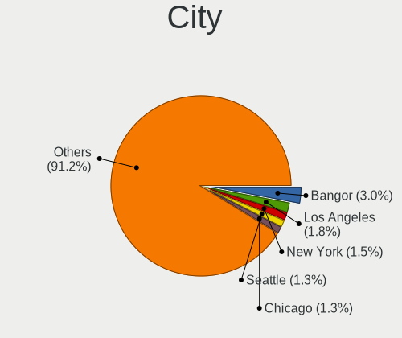
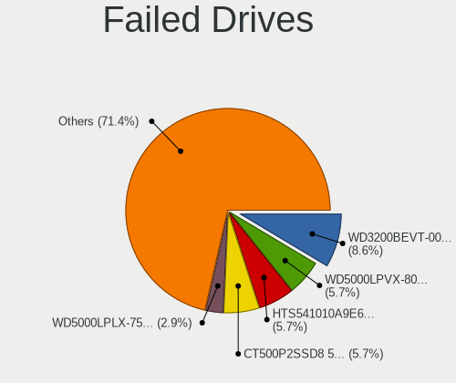
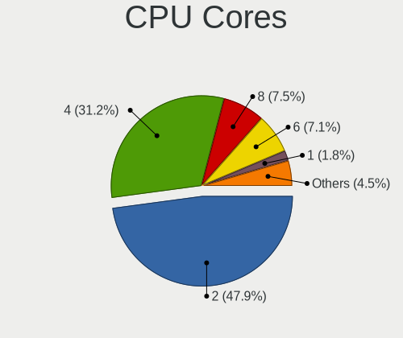
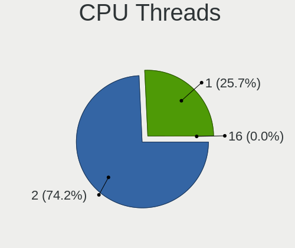

Linux in USA - Tested Hardware & Statistics (Notebooks)
-------------------------------------------------------

A project to collect tested hardware configurations for Linux in USA.

Anyone can contribute to this report by the [hw-probe](https://github.com/linuxhw/hw-probe) tool:

    sudo -E hw-probe -all -upload

Please contribute! Especially if your hardware is rare.

Contents
--------

* [ Test Cases ](#test-cases)

* [ System ](#system)
  - [ OS                       ](#os)
  - [ OS Family                ](#os-family)
  - [ Kernel                   ](#kernel)
  - [ Kernel Family            ](#kernel-family)
  - [ Kernel Major Ver.        ](#kernel-major-ver)
  - [ Arch                     ](#arch)
  - [ DE                       ](#de)
  - [ Display Server           ](#display-server)
  - [ Display Manager          ](#display-manager)
  - [ OS Lang                  ](#os-lang)
  - [ Boot Mode                ](#boot-mode)
  - [ Filesystem               ](#filesystem)
  - [ Part. scheme             ](#part-scheme)
  - [ Dual Boot with Linux/BSD ](#dual-boot-with-linuxbsd)
  - [ Dual Boot (Win)          ](#dual-boot-win)

* [ Board ](#board)
  - [ Vendor                   ](#vendor)
  - [ Model                    ](#model)
  - [ Model Family             ](#model-family)
  - [ MFG Year                 ](#mfg-year)
  - [ Form Factor              ](#form-factor)
  - [ Secure Boot              ](#secure-boot)
  - [ Coreboot                 ](#coreboot)
  - [ RAM Size                 ](#ram-size)
  - [ RAM Used                 ](#ram-used)
  - [ Total Drives             ](#total-drives)
  - [ Has CD-ROM               ](#has-cd-rom)
  - [ Has Ethernet             ](#has-ethernet)
  - [ Has WiFi                 ](#has-wifi)
  - [ Has Bluetooth            ](#has-bluetooth)

* [ Location ](#location)
  - [ Country                  ](#country)
  - [ City                     ](#city)

* [ Drives ](#drives)
  - [ Drive Vendor             ](#drive-vendor)
  - [ Drive Model              ](#drive-model)
  - [ HDD Vendor               ](#hdd-vendor)
  - [ SSD Vendor               ](#ssd-vendor)
  - [ Drive Kind               ](#drive-kind)
  - [ Drive Connector          ](#drive-connector)
  - [ Drive Size               ](#drive-size)
  - [ Space Total              ](#space-total)
  - [ Space Used               ](#space-used)
  - [ Malfunc. Drives          ](#malfunc-drives)
  - [ Malfunc. Drive Vendor    ](#malfunc-drive-vendor)
  - [ Malfunc. HDD Vendor      ](#malfunc-hdd-vendor)
  - [ Malfunc. Drive Kind      ](#malfunc-drive-kind)
  - [ Failed Drives            ](#failed-drives)
  - [ Failed Drive Vendor      ](#failed-drive-vendor)
  - [ Drive Status             ](#drive-status)

* [ Storage controller ](#storage-controller)
  - [ Storage Vendor           ](#storage-vendor)
  - [ Storage Model            ](#storage-model)
  - [ Storage Kind             ](#storage-kind)

* [ Processor ](#processor)
  - [ CPU Vendor               ](#cpu-vendor)
  - [ CPU Model                ](#cpu-model)
  - [ CPU Model Family         ](#cpu-model-family)
  - [ CPU Cores                ](#cpu-cores)
  - [ CPU Sockets              ](#cpu-sockets)
  - [ CPU Threads              ](#cpu-threads)
  - [ CPU Op-Modes             ](#cpu-op-modes)
  - [ CPU Microcode            ](#cpu-microcode)
  - [ CPU Microarch            ](#cpu-microarch)

* [ Graphics ](#graphics)
  - [ GPU Vendor               ](#gpu-vendor)
  - [ GPU Model                ](#gpu-model)
  - [ GPU Combo                ](#gpu-combo)
  - [ GPU Driver               ](#gpu-driver)
  - [ GPU Memory               ](#gpu-memory)

* [ Monitor ](#monitor)
  - [ Monitor Vendor           ](#monitor-vendor)
  - [ Monitor Model            ](#monitor-model)
  - [ Monitor Resolution       ](#monitor-resolution)
  - [ Monitor Diagonal         ](#monitor-diagonal)
  - [ Monitor Width            ](#monitor-width)
  - [ Aspect Ratio             ](#aspect-ratio)
  - [ Monitor Area             ](#monitor-area)
  - [ Pixel Density            ](#pixel-density)
  - [ Multiple Monitors        ](#multiple-monitors)

* [ Network ](#network)
  - [ Net Controller Vendor    ](#net-controller-vendor)
  - [ Net Controller Model     ](#net-controller-model)
  - [ Wireless Vendor          ](#wireless-vendor)
  - [ Wireless Model           ](#wireless-model)
  - [ Ethernet Vendor          ](#ethernet-vendor)
  - [ Ethernet Model           ](#ethernet-model)
  - [ Net Controller Kind      ](#net-controller-kind)
  - [ Used Controller          ](#used-controller)
  - [ NICs                     ](#nics)
  - [ IPv6                     ](#ipv6)

* [ Bluetooth ](#bluetooth)
  - [ Bluetooth Vendor         ](#bluetooth-vendor)
  - [ Bluetooth Model          ](#bluetooth-model)

* [ Sound ](#sound)
  - [ Sound Vendor             ](#sound-vendor)
  - [ Sound Model              ](#sound-model)

* [ Memory ](#memory)
  - [ Memory Vendor            ](#memory-vendor)
  - [ Memory Model             ](#memory-model)
  - [ Memory Kind              ](#memory-kind)
  - [ Memory Form Factor       ](#memory-form-factor)
  - [ Memory Size              ](#memory-size)
  - [ Memory Speed             ](#memory-speed)

* [ Printers & scanners ](#printers--scanners)
  - [ Printer Vendor           ](#printer-vendor)
  - [ Printer Model            ](#printer-model)
  - [ Scanner Vendor           ](#scanner-vendor)
  - [ Scanner Model            ](#scanner-model)

* [ Camera ](#camera)
  - [ Camera Vendor            ](#camera-vendor)
  - [ Camera Model             ](#camera-model)

* [ Security ](#security)
  - [ Fingerprint Vendor       ](#fingerprint-vendor)
  - [ Fingerprint Model        ](#fingerprint-model)
  - [ Chipcard Vendor          ](#chipcard-vendor)
  - [ Chipcard Model           ](#chipcard-model)

* [ Unsupported ](#unsupported)
  - [ Unsupported Devices      ](#unsupported-devices)
  - [ Unsupported Device Types ](#unsupported-device-types)

Test Cases
----------

Total: 28293

| Vendor        | Model                       | Probe                                                      | Date         |
|---------------|-----------------------------|------------------------------------------------------------|--------------|
| Alienware     | m17 R4                      | [4372e588f9](https://linux-hardware.org/?probe=4372e588f9) | Feb 02, 2024 |
| HP            | EliteBook 850 G8 Noteboo... | [7c65739a72](https://linux-hardware.org/?probe=7c65739a72) | Feb 02, 2024 |
| HP            | Pavilion g6                 | [795109303b](https://linux-hardware.org/?probe=795109303b) | Feb 02, 2024 |
| Apple         | MacBookPro11,5              | [55197489b0](https://linux-hardware.org/?probe=55197489b0) | Feb 02, 2024 |
| Lenovo        | ThinkPad E14 Gen 3 20YE0... | [60cc806e9a](https://linux-hardware.org/?probe=60cc806e9a) | Feb 02, 2024 |
| HP            | ENVY m7                     | [b38e23bdbe](https://linux-hardware.org/?probe=b38e23bdbe) | Feb 02, 2024 |
| MSI           | Prestige 13 AI Evo A1MG     | [abc18d1a9e](https://linux-hardware.org/?probe=abc18d1a9e) | Feb 02, 2024 |
| Valve         | Galileo                     | [3b44d4da2f](https://linux-hardware.org/?probe=3b44d4da2f) | Feb 02, 2024 |
| Google        | Pujjoteen15W                | [b23c1ed1eb](https://linux-hardware.org/?probe=b23c1ed1eb) | Feb 02, 2024 |
| MSI           | Raider GE68HX 13VF          | [72ac680d91](https://linux-hardware.org/?probe=72ac680d91) | Feb 02, 2024 |
| Acer          | Aspire A515-43              | [349b53e55a](https://linux-hardware.org/?probe=349b53e55a) | Feb 02, 2024 |
| HP            | EliteBook 850 G8 Noteboo... | [133d556add](https://linux-hardware.org/?probe=133d556add) | Feb 02, 2024 |
| Lenovo        | ThinkPad T14s Gen 2i 20W... | [fdc21a05c2](https://linux-hardware.org/?probe=fdc21a05c2) | Feb 02, 2024 |
| Lenovo        | ThinkPad T15g Gen 1 20UR... | [e3e01bd0ff](https://linux-hardware.org/?probe=e3e01bd0ff) | Feb 02, 2024 |
| Apple         | MacBookAir6,2               | [4bee7d161b](https://linux-hardware.org/?probe=4bee7d161b) | Feb 02, 2024 |
| HP            | EliteBook 845 G8 Noteboo... | [7516b63802](https://linux-hardware.org/?probe=7516b63802) | Feb 02, 2024 |
| Apple         | MacBookAir6,2               | [4181fe4492](https://linux-hardware.org/?probe=4181fe4492) | Feb 02, 2024 |
| Unknown       | Unknown                     | [2037e9d75f](https://linux-hardware.org/?probe=2037e9d75f) | Feb 02, 2024 |
| Unknown       | Unknown                     | [b85ea144b7](https://linux-hardware.org/?probe=b85ea144b7) | Feb 01, 2024 |
| Lenovo        | IdeaPad S340-15IWL 81N8     | [fd7240a3ee](https://linux-hardware.org/?probe=fd7240a3ee) | Feb 01, 2024 |
| Lenovo        | IdeaPad S340-15IWL 81N8     | [b3b900cffa](https://linux-hardware.org/?probe=b3b900cffa) | Feb 01, 2024 |
| Apple         | MacBookPro5,4               | [c22226fe6f](https://linux-hardware.org/?probe=c22226fe6f) | Feb 01, 2024 |
| Lenovo        | ThinkPad X1 Carbon Gen 1... | [f1b0b8716f](https://linux-hardware.org/?probe=f1b0b8716f) | Feb 01, 2024 |
| Toshiba       | Satellite U845W             | [bfcfa219eb](https://linux-hardware.org/?probe=bfcfa219eb) | Feb 01, 2024 |
| Dell          | Latitude 7490               | [f6c07c876d](https://linux-hardware.org/?probe=f6c07c876d) | Feb 01, 2024 |
| Toshiba       | Satellite U845W             | [7671d63234](https://linux-hardware.org/?probe=7671d63234) | Feb 01, 2024 |
| Dell          | Precision 5520              | [60d35bb7a2](https://linux-hardware.org/?probe=60d35bb7a2) | Feb 01, 2024 |
| HP            | 15 Notebook PC              | [b60abe5c3d](https://linux-hardware.org/?probe=b60abe5c3d) | Feb 01, 2024 |
| HP            | 15 Notebook PC              | [b2f9ce6a03](https://linux-hardware.org/?probe=b2f9ce6a03) | Feb 01, 2024 |
| Google        | Phaser360                   | [3347aeb232](https://linux-hardware.org/?probe=3347aeb232) | Feb 01, 2024 |
| Valve         | Jupiter                     | [ab5f4937c1](https://linux-hardware.org/?probe=ab5f4937c1) | Feb 01, 2024 |
| Apple         | MacBookPro11,1              | [fcabd4a1f4](https://linux-hardware.org/?probe=fcabd4a1f4) | Feb 01, 2024 |
| Apple         | MacBookPro11,1              | [b31d7d9323](https://linux-hardware.org/?probe=b31d7d9323) | Feb 01, 2024 |
| Valve         | Jupiter                     | [238b20b912](https://linux-hardware.org/?probe=238b20b912) | Feb 01, 2024 |
| Dell          | XPS 15 9530                 | [3aa974d8a0](https://linux-hardware.org/?probe=3aa974d8a0) | Feb 01, 2024 |
| ASUSTek       | ROG Strix G513RM_G513RM     | [2239a0b698](https://linux-hardware.org/?probe=2239a0b698) | Feb 01, 2024 |
| Valve         | Jupiter                     | [f7647969b5](https://linux-hardware.org/?probe=f7647969b5) | Feb 01, 2024 |
| Dell          | Inspiron 3542               | [5a7e77b4a7](https://linux-hardware.org/?probe=5a7e77b4a7) | Feb 01, 2024 |
| Razer         | Blade 14 - RZ09-0482        | [49f14f0aae](https://linux-hardware.org/?probe=49f14f0aae) | Feb 01, 2024 |
| Valve         | Galileo                     | [c286128e50](https://linux-hardware.org/?probe=c286128e50) | Feb 01, 2024 |
| Apple         | MacBookPro10,2              | [fca71d08b7](https://linux-hardware.org/?probe=fca71d08b7) | Feb 01, 2024 |
| HP            | ENVY 14                     | [ffe9159226](https://linux-hardware.org/?probe=ffe9159226) | Feb 01, 2024 |
| Lenovo        | ThinkPad T480 20L6S4XW00    | [a24ce87b69](https://linux-hardware.org/?probe=a24ce87b69) | Feb 01, 2024 |
| Dell          | Inspiron 5748               | [1eaa79e492](https://linux-hardware.org/?probe=1eaa79e492) | Feb 01, 2024 |
| Dell          | Precision 5680              | [9d85b2e2ea](https://linux-hardware.org/?probe=9d85b2e2ea) | Feb 01, 2024 |
| Apple         | MacBookPro14,1              | [711c97e9af](https://linux-hardware.org/?probe=711c97e9af) | Feb 01, 2024 |
| Dell          | Inspiron 5748               | [7a50d780ce](https://linux-hardware.org/?probe=7a50d780ce) | Jan 31, 2024 |
| Acer          | Aspire E5-575G              | [d6ddc23d9b](https://linux-hardware.org/?probe=d6ddc23d9b) | Jan 31, 2024 |
| Lenovo        | IdeaPad Slim 5 16IRL8 82... | [8f630da527](https://linux-hardware.org/?probe=8f630da527) | Jan 31, 2024 |
| Lenovo        | ThinkPad 13 2nd Gen 20J1... | [7f20bd79c9](https://linux-hardware.org/?probe=7f20bd79c9) | Jan 31, 2024 |
| Apple         | MacBookAir6,2               | [7ad397fc57](https://linux-hardware.org/?probe=7ad397fc57) | Jan 31, 2024 |
| Dell          | Inspiron 5584               | [abcbc837ce](https://linux-hardware.org/?probe=abcbc837ce) | Jan 31, 2024 |
| ASUSTek       | ZenBook UX425IA_UM425IA     | [4838799f43](https://linux-hardware.org/?probe=4838799f43) | Jan 31, 2024 |
| Lenovo        | ThinkPad E14 Gen 3 20YE0... | [bfe57fcccb](https://linux-hardware.org/?probe=bfe57fcccb) | Jan 31, 2024 |
| HP            | Laptop 14-cf2xxx            | [7984b3ffda](https://linux-hardware.org/?probe=7984b3ffda) | Jan 31, 2024 |
| Acer          | Aspire E5-575G              | [fc26b8ad18](https://linux-hardware.org/?probe=fc26b8ad18) | Jan 31, 2024 |
| Dell          | Latitude D620               | [c0f28567a4](https://linux-hardware.org/?probe=c0f28567a4) | Jan 31, 2024 |
| HP            | Laptop 15-fc0xxx            | [28e16f1c53](https://linux-hardware.org/?probe=28e16f1c53) | Jan 31, 2024 |
| Lenovo        | ThinkPad T450s 20BWS0PJ0... | [96795f523b](https://linux-hardware.org/?probe=96795f523b) | Jan 31, 2024 |
| Apple         | MacBook8,1                  | [6ef40b726e](https://linux-hardware.org/?probe=6ef40b726e) | Jan 31, 2024 |
| HP            | EliteBook 840 G7 Noteboo... | [e79be04d28](https://linux-hardware.org/?probe=e79be04d28) | Jan 31, 2024 |
| Dell          | Precision 7710              | [6e600ac30e](https://linux-hardware.org/?probe=6e600ac30e) | Jan 31, 2024 |
| HP            | ProBook 6570b               | [20537302e6](https://linux-hardware.org/?probe=20537302e6) | Jan 31, 2024 |
| Dell          | XPS 13 9380                 | [479853dd4c](https://linux-hardware.org/?probe=479853dd4c) | Jan 31, 2024 |
| HP            | Laptop 15-dy1xxx            | [5a506021d1](https://linux-hardware.org/?probe=5a506021d1) | Jan 31, 2024 |
| HP            | Laptop 15-dy1xxx            | [999c7694d0](https://linux-hardware.org/?probe=999c7694d0) | Jan 31, 2024 |
| HP            | G72                         | [24758020db](https://linux-hardware.org/?probe=24758020db) | Jan 31, 2024 |
| Dell          | Latitude 5590               | [d10e7cf975](https://linux-hardware.org/?probe=d10e7cf975) | Jan 30, 2024 |
| Dell          | Precision 5520              | [47f7336949](https://linux-hardware.org/?probe=47f7336949) | Jan 30, 2024 |
| Alienware     | 15 R3                       | [297db64e3b](https://linux-hardware.org/?probe=297db64e3b) | Jan 30, 2024 |
| HP            | Pavilion Gaming Laptop 1... | [27229e7136](https://linux-hardware.org/?probe=27229e7136) | Jan 30, 2024 |
| HP            | EliteBook 845 G8 Noteboo... | [d58a0bc20e](https://linux-hardware.org/?probe=d58a0bc20e) | Jan 30, 2024 |
| HP            | 15 Notebook PC              | [fd6be31d9d](https://linux-hardware.org/?probe=fd6be31d9d) | Jan 30, 2024 |
| ASUSTek       | ASUS TUF Gaming A16 FA61... | [590fcea5fe](https://linux-hardware.org/?probe=590fcea5fe) | Jan 30, 2024 |
| ASUSTek       | ASUS TUF Gaming A16 FA61... | [f45683d844](https://linux-hardware.org/?probe=f45683d844) | Jan 30, 2024 |
| Corsair       | Voyager a1600               | [86aec463cc](https://linux-hardware.org/?probe=86aec463cc) | Jan 30, 2024 |
| Apple         | MacBookPro9,1               | [741671df2c](https://linux-hardware.org/?probe=741671df2c) | Jan 30, 2024 |
| Dell          | Inspiron N5040              | [c2bf038df9](https://linux-hardware.org/?probe=c2bf038df9) | Jan 30, 2024 |
| Hot Pepper... | HPPMC10                     | [1bfdadd09f](https://linux-hardware.org/?probe=1bfdadd09f) | Jan 30, 2024 |
| Lenovo        | ThinkPad T480s 20L8S1WH0... | [f97fbae5f6](https://linux-hardware.org/?probe=f97fbae5f6) | Jan 30, 2024 |
| Lenovo        | ThinkPad T480s 20L8S1WH0... | [c4978054da](https://linux-hardware.org/?probe=c4978054da) | Jan 30, 2024 |
| HP            | EliteBook 840 G8 Noteboo... | [f9618efd22](https://linux-hardware.org/?probe=f9618efd22) | Jan 30, 2024 |
| Lenovo        | ThinkPad P15 Gen 2i 20YR... | [b0ebb1ac3b](https://linux-hardware.org/?probe=b0ebb1ac3b) | Jan 30, 2024 |
| OriginPC      | EVO16-S                     | [6d96755039](https://linux-hardware.org/?probe=6d96755039) | Jan 30, 2024 |
| ASUSTek       | ET2321I                     | [67c62e9a94](https://linux-hardware.org/?probe=67c62e9a94) | Jan 30, 2024 |
| Chuwi         | GemiBook Plus               | [dd2a3f8fa2](https://linux-hardware.org/?probe=dd2a3f8fa2) | Jan 30, 2024 |
| Lenovo        | ThinkPad T480s 20L70028U... | [7acd38748f](https://linux-hardware.org/?probe=7acd38748f) | Jan 30, 2024 |
| Apple         | MacBookAir6,2               | [52ae0efd8e](https://linux-hardware.org/?probe=52ae0efd8e) | Jan 30, 2024 |
| Lenovo        | IdeaPad S145-15AST 81N3     | [c246a6b564](https://linux-hardware.org/?probe=c246a6b564) | Jan 30, 2024 |
| Dell          | Latitude 7212 Rugged Ext... | [d21b8c5f4e](https://linux-hardware.org/?probe=d21b8c5f4e) | Jan 30, 2024 |
| HP            | Pavilion dv7                | [8aab31766b](https://linux-hardware.org/?probe=8aab31766b) | Jan 30, 2024 |
| Dell          | Latitude E6530              | [9aee5be7bf](https://linux-hardware.org/?probe=9aee5be7bf) | Jan 30, 2024 |
| Apple         | MacBook9,1                  | [e81979cbdf](https://linux-hardware.org/?probe=e81979cbdf) | Jan 29, 2024 |
| Dell          | Latitude 3300               | [9d76144e60](https://linux-hardware.org/?probe=9d76144e60) | Jan 29, 2024 |
| Dell          | Latitude 5590               | [9ab8c26d03](https://linux-hardware.org/?probe=9ab8c26d03) | Jan 29, 2024 |
| Apple         | MacBookPro14,1              | [596ac6a467](https://linux-hardware.org/?probe=596ac6a467) | Jan 29, 2024 |
| Acer          | Aspire E1-522               | [1dab2e243c](https://linux-hardware.org/?probe=1dab2e243c) | Jan 29, 2024 |
| Dell          | XPS 9315                    | [c705e51d0e](https://linux-hardware.org/?probe=c705e51d0e) | Jan 29, 2024 |
| HP            | Stream Laptop 14-DS0xxx     | [b2cff77c57](https://linux-hardware.org/?probe=b2cff77c57) | Jan 29, 2024 |
| ASUSTek       | Vivobook Go E1404FA_E140... | [a1d3b30464](https://linux-hardware.org/?probe=a1d3b30464) | Jan 29, 2024 |
| ASUSTek       | Vivobook Go E1404FA_E140... | [ae5e53e103](https://linux-hardware.org/?probe=ae5e53e103) | Jan 29, 2024 |
| Dell          | XPS 9315                    | [9beaeed93b](https://linux-hardware.org/?probe=9beaeed93b) | Jan 29, 2024 |
| Dell          | Latitude 5430 Rugged        | [8708a1170b](https://linux-hardware.org/?probe=8708a1170b) | Jan 29, 2024 |
| Apple         | MacBookPro5,4               | [c16bc8a6c2](https://linux-hardware.org/?probe=c16bc8a6c2) | Jan 29, 2024 |
| Dell          | Inspiron 1525               | [aeacd97c42](https://linux-hardware.org/?probe=aeacd97c42) | Jan 29, 2024 |
| Valve         | Jupiter                     | [e9a7ccf69a](https://linux-hardware.org/?probe=e9a7ccf69a) | Jan 29, 2024 |
| Dell          | Latitude E7450              | [bfa71d26f4](https://linux-hardware.org/?probe=bfa71d26f4) | Jan 29, 2024 |
| Dell          | Inspiron N5010              | [dcd752673f](https://linux-hardware.org/?probe=dcd752673f) | Jan 29, 2024 |
| Acer          | Aspire 5720Z                | [2353edc7dd](https://linux-hardware.org/?probe=2353edc7dd) | Jan 29, 2024 |
| General Dy... | Tadpole TOPAZ               | [2d773d0793](https://linux-hardware.org/?probe=2d773d0793) | Jan 29, 2024 |
| Lenovo        | ThinkBook 15 G2 ARE 20VG    | [9fcbf2b096](https://linux-hardware.org/?probe=9fcbf2b096) | Jan 29, 2024 |
| Lenovo        | ThinkPad T420 4236MBU       | [5c6ee280df](https://linux-hardware.org/?probe=5c6ee280df) | Jan 29, 2024 |
| HP            | Pavilion Laptop 15t-eg00... | [fd0435f25b](https://linux-hardware.org/?probe=fd0435f25b) | Jan 29, 2024 |
| Valve         | Jupiter                     | [71066ddcbf](https://linux-hardware.org/?probe=71066ddcbf) | Jan 29, 2024 |
| Valve         | Jupiter                     | [72f7a8c4e7](https://linux-hardware.org/?probe=72f7a8c4e7) | Jan 29, 2024 |
| Valve         | Jupiter                     | [d12b2f3bf3](https://linux-hardware.org/?probe=d12b2f3bf3) | Jan 28, 2024 |
| Corsair       | Voyager a1600               | [00605bf92c](https://linux-hardware.org/?probe=00605bf92c) | Jan 28, 2024 |
| Dell          | Inspiron 3583               | [a84cdbbf07](https://linux-hardware.org/?probe=a84cdbbf07) | Jan 28, 2024 |
| HP            | Dragonfly Pro Laptop PC     | [f7605bd832](https://linux-hardware.org/?probe=f7605bd832) | Jan 28, 2024 |
| Dell          | Latitude 3510               | [0be0a86c59](https://linux-hardware.org/?probe=0be0a86c59) | Jan 28, 2024 |
| HP            | Pavilion dv6                | [383b87d6a5](https://linux-hardware.org/?probe=383b87d6a5) | Jan 28, 2024 |
| Dell          | Latitude 5420               | [459fbb3448](https://linux-hardware.org/?probe=459fbb3448) | Jan 28, 2024 |
| HP            | ZBook Studio G3             | [136b9a2567](https://linux-hardware.org/?probe=136b9a2567) | Jan 28, 2024 |
| HP            | Laptop 15-dw0xxx            | [ee72ff151c](https://linux-hardware.org/?probe=ee72ff151c) | Jan 28, 2024 |
| HP            | Laptop 15z-ef3xxx           | [bde6b1bdd9](https://linux-hardware.org/?probe=bde6b1bdd9) | Jan 28, 2024 |
| Dell          | G15 5511                    | [53225a4d52](https://linux-hardware.org/?probe=53225a4d52) | Jan 28, 2024 |
| HP            | Compaq nc6320 (EN371UA#A... | [24bcfc0005](https://linux-hardware.org/?probe=24bcfc0005) | Jan 28, 2024 |
| Lenovo        | ThinkPad T510 43142PU       | [e27411aa1b](https://linux-hardware.org/?probe=e27411aa1b) | Jan 28, 2024 |
| HP            | EliteBook 8470w             | [a92904a970](https://linux-hardware.org/?probe=a92904a970) | Jan 28, 2024 |
| Dell          | Inspiron 3558               | [c347f95f5e](https://linux-hardware.org/?probe=c347f95f5e) | Jan 28, 2024 |
| Dell          | Precision M4700             | [ed04788986](https://linux-hardware.org/?probe=ed04788986) | Jan 28, 2024 |
| Acer          | Aspire A515-46              | [935246f473](https://linux-hardware.org/?probe=935246f473) | Jan 28, 2024 |
| EVOO          | EG-LP6                      | [94916a68a1](https://linux-hardware.org/?probe=94916a68a1) | Jan 28, 2024 |
| Lenovo        | ThinkPad T495 20NKS5AU00    | [e382eee8ac](https://linux-hardware.org/?probe=e382eee8ac) | Jan 27, 2024 |
| Acer          | Aspire A515-46              | [f023bc003e](https://linux-hardware.org/?probe=f023bc003e) | Jan 27, 2024 |
| Dell          | Latitude E7270              | [7ebc1a4cdb](https://linux-hardware.org/?probe=7ebc1a4cdb) | Jan 27, 2024 |
| HP            | Laptop 14-dq2xxx            | [54cf5ffabf](https://linux-hardware.org/?probe=54cf5ffabf) | Jan 27, 2024 |
| ASUSTek       | ROG Zephyrus G14 GA401IV... | [8f0138becb](https://linux-hardware.org/?probe=8f0138becb) | Jan 27, 2024 |
| Apple         | MacBookPro11,1              | [7c4514376b](https://linux-hardware.org/?probe=7c4514376b) | Jan 27, 2024 |
| Valve         | Jupiter                     | [7c87eec092](https://linux-hardware.org/?probe=7c87eec092) | Jan 27, 2024 |
| Apple         | MacBookPro9,2               | [8bca4f366d](https://linux-hardware.org/?probe=8bca4f366d) | Jan 27, 2024 |
| HP            | EliteBook 8440p             | [09a25eb2a2](https://linux-hardware.org/?probe=09a25eb2a2) | Jan 27, 2024 |
| ASUSTek       | VivoBook_ASUSLaptop X512... | [f3243845d3](https://linux-hardware.org/?probe=f3243845d3) | Jan 27, 2024 |
| Apple         | MacBookPro11,1              | [f1117537a5](https://linux-hardware.org/?probe=f1117537a5) | Jan 27, 2024 |
| Valve         | Jupiter                     | [7ff59e8f3a](https://linux-hardware.org/?probe=7ff59e8f3a) | Jan 27, 2024 |
| System76      | Gazelle                     | [317f744565](https://linux-hardware.org/?probe=317f744565) | Jan 27, 2024 |
| System76      | Gazelle                     | [27bb9a725a](https://linux-hardware.org/?probe=27bb9a725a) | Jan 27, 2024 |
| System76      | Oryx Pro                    | [faac85b51d](https://linux-hardware.org/?probe=faac85b51d) | Jan 27, 2024 |
| Dell          | Latitude E7440              | [8d31059748](https://linux-hardware.org/?probe=8d31059748) | Jan 27, 2024 |
| HP            | Laptop 14-fq0xxx            | [d7df41bbf8](https://linux-hardware.org/?probe=d7df41bbf8) | Jan 27, 2024 |
| ASUSTek       | ROG Zephyrus M16 GU604VI... | [dd39831e6f](https://linux-hardware.org/?probe=dd39831e6f) | Jan 27, 2024 |
| Dell          | Inspiron 5555               | [2d1142a7c1](https://linux-hardware.org/?probe=2d1142a7c1) | Jan 27, 2024 |
| Apple         | MacBookPro9,2               | [9518bd6b03](https://linux-hardware.org/?probe=9518bd6b03) | Jan 27, 2024 |
| Acer          | Aspire E5-575               | [6764984d72](https://linux-hardware.org/?probe=6764984d72) | Jan 26, 2024 |
| Acer          | Nitro AN515-42              | [a2166aa476](https://linux-hardware.org/?probe=a2166aa476) | Jan 26, 2024 |
| Dell          | Precision 5680              | [5159fe0624](https://linux-hardware.org/?probe=5159fe0624) | Jan 26, 2024 |
| Valve         | Jupiter                     | [3e0bcfc51d](https://linux-hardware.org/?probe=3e0bcfc51d) | Jan 26, 2024 |
| HP            | 15 Notebook PC              | [9f12f6bda7](https://linux-hardware.org/?probe=9f12f6bda7) | Jan 26, 2024 |
| Dell          | Latitude 7490               | [45fb7c05de](https://linux-hardware.org/?probe=45fb7c05de) | Jan 26, 2024 |
| Dell          | Latitude E6420              | [9252f1e34b](https://linux-hardware.org/?probe=9252f1e34b) | Jan 26, 2024 |
| Lenovo        | ThinkPad T460s 20FAS2JW0... | [59d637113b](https://linux-hardware.org/?probe=59d637113b) | Jan 26, 2024 |
| Apple         | MacBookAir7,2               | [0aeced0805](https://linux-hardware.org/?probe=0aeced0805) | Jan 26, 2024 |
| HP            | OMEN by Laptop 15-dc1xxx    | [d125100a68](https://linux-hardware.org/?probe=d125100a68) | Jan 26, 2024 |
| Google        | Lindar                      | [9da680f7f4](https://linux-hardware.org/?probe=9da680f7f4) | Jan 26, 2024 |
| Sony          | VPCF215FX                   | [e7ac2326bd](https://linux-hardware.org/?probe=e7ac2326bd) | Jan 26, 2024 |
| HP            | Laptop 15-bw0xx             | [6faf9b7c3a](https://linux-hardware.org/?probe=6faf9b7c3a) | Jan 26, 2024 |
| Framework     | Laptop                      | [002ca05701](https://linux-hardware.org/?probe=002ca05701) | Jan 26, 2024 |
| ASUSTek       | ROG Zephyrus G14 GA401QM... | [90908253dd](https://linux-hardware.org/?probe=90908253dd) | Jan 26, 2024 |
| ASUSTek       | Zenbook UM5302TA_UM5302T... | [4f9ba30611](https://linux-hardware.org/?probe=4f9ba30611) | Jan 26, 2024 |
| Framework     | Laptop                      | [64d0e147fe](https://linux-hardware.org/?probe=64d0e147fe) | Jan 25, 2024 |
| Dell          | Latitude 7490               | [be9a5bd794](https://linux-hardware.org/?probe=be9a5bd794) | Jan 25, 2024 |
| Lenovo        | ThinkPad X1 Carbon 6th 2... | [565926342b](https://linux-hardware.org/?probe=565926342b) | Jan 25, 2024 |
| Dell          | Inspiron 3558               | [7972792612](https://linux-hardware.org/?probe=7972792612) | Jan 25, 2024 |
| Apple         | MacBookPro14,1              | [41817d480d](https://linux-hardware.org/?probe=41817d480d) | Jan 25, 2024 |
| Dell          | Inspiron 3558               | [4d1b20eaa7](https://linux-hardware.org/?probe=4d1b20eaa7) | Jan 25, 2024 |
| Apple         | MacBookAir6,2               | [07460c8e19](https://linux-hardware.org/?probe=07460c8e19) | Jan 25, 2024 |
| Lenovo        | ThinkPad X1 Carbon 6th 2... | [aac76b979a](https://linux-hardware.org/?probe=aac76b979a) | Jan 25, 2024 |
| Dell          | Latitude 7490               | [efec84713e](https://linux-hardware.org/?probe=efec84713e) | Jan 25, 2024 |
| Dell          | Latitude 5490               | [7315d78b91](https://linux-hardware.org/?probe=7315d78b91) | Jan 25, 2024 |
| Dell          | Inspiron 1525               | [cfa1bbba1a](https://linux-hardware.org/?probe=cfa1bbba1a) | Jan 25, 2024 |
| Dell          | Inspiron N5040              | [5f3ab77ee2](https://linux-hardware.org/?probe=5f3ab77ee2) | Jan 25, 2024 |
| ASUSTek       | Zenbook UX3402ZA_Q409ZA     | [49a536ed05](https://linux-hardware.org/?probe=49a536ed05) | Jan 25, 2024 |
| HP            | Pavilion Gaming Laptop 1... | [6122c021d6](https://linux-hardware.org/?probe=6122c021d6) | Jan 25, 2024 |
| Google        | Taeko                       | [e52e2ff787](https://linux-hardware.org/?probe=e52e2ff787) | Jan 25, 2024 |
| Valve         | Galileo                     | [b9012d8d8c](https://linux-hardware.org/?probe=b9012d8d8c) | Jan 25, 2024 |
| Acer          | Aspire ES1-572              | [10d96173cd](https://linux-hardware.org/?probe=10d96173cd) | Jan 25, 2024 |
| Acer          | Nitro AN515-57              | [052f6bc120](https://linux-hardware.org/?probe=052f6bc120) | Jan 25, 2024 |
| Valve         | Galileo                     | [4d738e6ad2](https://linux-hardware.org/?probe=4d738e6ad2) | Jan 25, 2024 |
| Acer          | Aspire A315-56              | [1c3a86b39c](https://linux-hardware.org/?probe=1c3a86b39c) | Jan 25, 2024 |
| HP            | ZBook 15v G5                | [8e114d2ba9](https://linux-hardware.org/?probe=8e114d2ba9) | Jan 25, 2024 |
| Dell          | Precision 7520              | [9d9cf5c93e](https://linux-hardware.org/?probe=9d9cf5c93e) | Jan 24, 2024 |
| HP            | EliteBook 845 G8 Noteboo... | [18c1105b43](https://linux-hardware.org/?probe=18c1105b43) | Jan 24, 2024 |
| HP            | 15 Notebook PC              | [0fa1b2cd9e](https://linux-hardware.org/?probe=0fa1b2cd9e) | Jan 24, 2024 |
| Dell          | Precision 7520              | [c0f81bad8c](https://linux-hardware.org/?probe=c0f81bad8c) | Jan 24, 2024 |
| HP            | 15                          | [6cd885c267](https://linux-hardware.org/?probe=6cd885c267) | Jan 24, 2024 |
| HP            | EliteBook 840 G3            | [eceea6fa49](https://linux-hardware.org/?probe=eceea6fa49) | Jan 24, 2024 |
| Star Labs     | StarBook                    | [a324d865a6](https://linux-hardware.org/?probe=a324d865a6) | Jan 24, 2024 |
| HP            | OMEN by 16 Laptop PC        | [ba14f4db44](https://linux-hardware.org/?probe=ba14f4db44) | Jan 24, 2024 |
| Lenovo        | IdeaPad 3 15IAU7 82RK       | [43807d61ce](https://linux-hardware.org/?probe=43807d61ce) | Jan 24, 2024 |
| Dell          | Latitude E6500              | [7c35926249](https://linux-hardware.org/?probe=7c35926249) | Jan 24, 2024 |
| Dell          | Latitude 7420               | [98c02f837e](https://linux-hardware.org/?probe=98c02f837e) | Jan 24, 2024 |
| HP            | Laptop 15-dy2xxx            | [dc91d2aa92](https://linux-hardware.org/?probe=dc91d2aa92) | Jan 24, 2024 |
| HP            | Laptop 15-fc0xxx            | [20be72b253](https://linux-hardware.org/?probe=20be72b253) | Jan 24, 2024 |
| System76      | Oryx Pro                    | [cb490beb63](https://linux-hardware.org/?probe=cb490beb63) | Jan 24, 2024 |
| Lenovo        | IdeaPad 130S-14IGM 81KU     | [ed92374864](https://linux-hardware.org/?probe=ed92374864) | Jan 24, 2024 |
| Lenovo        | ThinkPad T480 20L6S4T900    | [ec49fa0394](https://linux-hardware.org/?probe=ec49fa0394) | Jan 24, 2024 |
| Apple         | MacBookPro11,2              | [0f40e8d133](https://linux-hardware.org/?probe=0f40e8d133) | Jan 24, 2024 |
| HP            | Pavilion dv9500             | [a2f58c7d83](https://linux-hardware.org/?probe=a2f58c7d83) | Jan 24, 2024 |
| AZW           | SEi                         | [cc4134e14b](https://linux-hardware.org/?probe=cc4134e14b) | Jan 24, 2024 |
| Dell          | Inspiron 7375               | [cd6587d15b](https://linux-hardware.org/?probe=cd6587d15b) | Jan 24, 2024 |
| Apple         | MacBook5,1                  | [d3a48ce5b5](https://linux-hardware.org/?probe=d3a48ce5b5) | Jan 24, 2024 |
| HP            | Pavilion dv9500             | [6311362acc](https://linux-hardware.org/?probe=6311362acc) | Jan 24, 2024 |
| Apple         | MacBook5,1                  | [2fa13d832c](https://linux-hardware.org/?probe=2fa13d832c) | Jan 24, 2024 |
| ASUSTek       | G750JM                      | [82e5873786](https://linux-hardware.org/?probe=82e5873786) | Jan 24, 2024 |
| Apple         | MacBookPro5,5               | [214ebad454](https://linux-hardware.org/?probe=214ebad454) | Jan 24, 2024 |
| Apple         | MacBookPro5,5               | [f2a415adc9](https://linux-hardware.org/?probe=f2a415adc9) | Jan 24, 2024 |
| Acer          | Aspire A315-24P             | [ab51a416c0](https://linux-hardware.org/?probe=ab51a416c0) | Jan 23, 2024 |
| Dell          | Precision 5570              | [e6e937745c](https://linux-hardware.org/?probe=e6e937745c) | Jan 23, 2024 |
| Dell          | Inspiron 14-3452            | [0ed9a65fc4](https://linux-hardware.org/?probe=0ed9a65fc4) | Jan 23, 2024 |
| Dell          | Studio 1737                 | [521626cdc5](https://linux-hardware.org/?probe=521626cdc5) | Jan 23, 2024 |
| Valve         | Jupiter                     | [56666176ea](https://linux-hardware.org/?probe=56666176ea) | Jan 23, 2024 |
| Dell          | Latitude E6430              | [8ca46d0333](https://linux-hardware.org/?probe=8ca46d0333) | Jan 23, 2024 |
| Valve         | Galileo                     | [55087a9f6f](https://linux-hardware.org/?probe=55087a9f6f) | Jan 23, 2024 |
| Acer          | Aspire E5-575G              | [1523773c75](https://linux-hardware.org/?probe=1523773c75) | Jan 23, 2024 |
| HP            | 15                          | [7728ab654b](https://linux-hardware.org/?probe=7728ab654b) | Jan 23, 2024 |
| Valve         | Jupiter                     | [83f771db1c](https://linux-hardware.org/?probe=83f771db1c) | Jan 23, 2024 |
| Dell          | System Inspiron N7110       | [e764df92ee](https://linux-hardware.org/?probe=e764df92ee) | Jan 23, 2024 |
| ASUSTek       | X556UAK                     | [bd3a035156](https://linux-hardware.org/?probe=bd3a035156) | Jan 23, 2024 |
| HP            | Laptop 15-dy2xxx            | [4e9d2ab8c6](https://linux-hardware.org/?probe=4e9d2ab8c6) | Jan 23, 2024 |
| ASUSTek       | ASUS Zenbook 14 UX3405MA... | [d0cd433ae4](https://linux-hardware.org/?probe=d0cd433ae4) | Jan 23, 2024 |
| ASUSTek       | ASUS Zenbook 14 UX3405MA... | [23edfb46f4](https://linux-hardware.org/?probe=23edfb46f4) | Jan 23, 2024 |
| Lenovo        | ThinkPad P15s Gen 2i 20W... | [b2e896db49](https://linux-hardware.org/?probe=b2e896db49) | Jan 23, 2024 |
| Lenovo        | ThinkPad X1 Carbon Gen 1... | [ad914958b8](https://linux-hardware.org/?probe=ad914958b8) | Jan 23, 2024 |
| Lenovo        | ThinkPad X201 4492W36       | [1ab7e95399](https://linux-hardware.org/?probe=1ab7e95399) | Jan 23, 2024 |
| MSI           | Bravo 15 B5DD               | [4427db3f60](https://linux-hardware.org/?probe=4427db3f60) | Jan 23, 2024 |
| Valve         | Galileo                     | [f819a94a66](https://linux-hardware.org/?probe=f819a94a66) | Jan 22, 2024 |
| Dell          | Precision 5530              | [585fb7de16](https://linux-hardware.org/?probe=585fb7de16) | Jan 22, 2024 |
| Dell          | Inspiron 5520               | [6d64beac72](https://linux-hardware.org/?probe=6d64beac72) | Jan 22, 2024 |
| Dell          | Inspiron 5567               | [6869d9559d](https://linux-hardware.org/?probe=6869d9559d) | Jan 22, 2024 |
| Lenovo        | ThinkPad T470 W10DG 20JN... | [6dd363b754](https://linux-hardware.org/?probe=6dd363b754) | Jan 22, 2024 |
| HP            | Laptop 14-cf2xxx            | [72068173b9](https://linux-hardware.org/?probe=72068173b9) | Jan 22, 2024 |
| HP            | ProBook 4540s               | [84367073dd](https://linux-hardware.org/?probe=84367073dd) | Jan 22, 2024 |
| HP            | ProBook 4540s               | [f72cd2d1a0](https://linux-hardware.org/?probe=f72cd2d1a0) | Jan 22, 2024 |
| Acer          | Aspire A315-56              | [b619b984b6](https://linux-hardware.org/?probe=b619b984b6) | Jan 22, 2024 |
| Lenovo        | ThinkPad E15 Gen 4 21E60... | [a981e0b81f](https://linux-hardware.org/?probe=a981e0b81f) | Jan 22, 2024 |
| Toshiba       | Satellite L305              | [d1fc38dbc2](https://linux-hardware.org/?probe=d1fc38dbc2) | Jan 22, 2024 |
| Toshiba       | Satellite L305              | [10fca3d0ef](https://linux-hardware.org/?probe=10fca3d0ef) | Jan 22, 2024 |
| Lenovo        | ThinkPad X13 Gen 2i 20WL... | [abe1141b70](https://linux-hardware.org/?probe=abe1141b70) | Jan 22, 2024 |
| HP            | ProBook 455 G4              | [6490d02d72](https://linux-hardware.org/?probe=6490d02d72) | Jan 22, 2024 |
| Lenovo        | ThinkPad T480 20L6S1AL00    | [f5c1f6e080](https://linux-hardware.org/?probe=f5c1f6e080) | Jan 22, 2024 |
| HP            | Laptop 14-fq1xxx            | [dcb0ce6ffa](https://linux-hardware.org/?probe=dcb0ce6ffa) | Jan 22, 2024 |
| Dell          | Latitude E7470              | [1f052ca954](https://linux-hardware.org/?probe=1f052ca954) | Jan 22, 2024 |
| Google        | Garg                        | [b306e0b88b](https://linux-hardware.org/?probe=b306e0b88b) | Jan 22, 2024 |
| Lenovo        | ThinkPad T490 20N3S5GM00    | [1562510db8](https://linux-hardware.org/?probe=1562510db8) | Jan 22, 2024 |
| Dell          | XPS 15 9560                 | [88ca13a30b](https://linux-hardware.org/?probe=88ca13a30b) | Jan 22, 2024 |
| Dell          | XPS 15 9560                 | [d7498f719e](https://linux-hardware.org/?probe=d7498f719e) | Jan 22, 2024 |
| HP            | Laptop 17z-cp000            | [51e7d942bc](https://linux-hardware.org/?probe=51e7d942bc) | Jan 22, 2024 |
| HP            | Pavilion Laptop 15-cw1xx... | [5003e3366d](https://linux-hardware.org/?probe=5003e3366d) | Jan 22, 2024 |
| Apple         | MacBookPro9,2               | [835a20ab23](https://linux-hardware.org/?probe=835a20ab23) | Jan 21, 2024 |
| Dell          | Inspiron 5759               | [98f9721572](https://linux-hardware.org/?probe=98f9721572) | Jan 21, 2024 |
| Dell          | Latitude E7450              | [95b7e8d2fa](https://linux-hardware.org/?probe=95b7e8d2fa) | Jan 21, 2024 |
| ASUSTek       | ET2321I                     | [443ff3a9ce](https://linux-hardware.org/?probe=443ff3a9ce) | Jan 21, 2024 |
| Dell          | Inspiron 15 5510            | [57c42bacc9](https://linux-hardware.org/?probe=57c42bacc9) | Jan 21, 2024 |
| HP            | EliteBook 8770w             | [6b53fccf5d](https://linux-hardware.org/?probe=6b53fccf5d) | Jan 21, 2024 |
| OriginPC      | EVO17-S                     | [085e0b26d0](https://linux-hardware.org/?probe=085e0b26d0) | Jan 21, 2024 |
| Acer          | Aspire R3-471T              | [5cf2f2b404](https://linux-hardware.org/?probe=5cf2f2b404) | Jan 21, 2024 |
| Acer          | Aspire R3-471T              | [3e062ccf04](https://linux-hardware.org/?probe=3e062ccf04) | Jan 21, 2024 |
| Dell          | Latitude E6420              | [dff8e97b14](https://linux-hardware.org/?probe=dff8e97b14) | Jan 21, 2024 |
| ASUSTek       | VivoBook_ASUSLaptop X170... | [4bc0f00e37](https://linux-hardware.org/?probe=4bc0f00e37) | Jan 21, 2024 |
| HP            | EliteBook 8570w             | [bdec3958cd](https://linux-hardware.org/?probe=bdec3958cd) | Jan 21, 2024 |
| Valve         | Jupiter                     | [890477dbac](https://linux-hardware.org/?probe=890477dbac) | Jan 21, 2024 |
| Lenovo        | IdeaPad 5 15ARE05 81YQ      | [a8c56ec5a7](https://linux-hardware.org/?probe=a8c56ec5a7) | Jan 21, 2024 |
| Gateway       | MT6707                      | [581410ddec](https://linux-hardware.org/?probe=581410ddec) | Jan 21, 2024 |
| HP            | Pavilion Gaming Laptop 1... | [3dff9ac8f3](https://linux-hardware.org/?probe=3dff9ac8f3) | Jan 21, 2024 |
| HP            | Laptop 14-fq0xxx            | [5d2848def0](https://linux-hardware.org/?probe=5d2848def0) | Jan 21, 2024 |
| ASUSTek       | X556UAK                     | [1399cc64e8](https://linux-hardware.org/?probe=1399cc64e8) | Jan 20, 2024 |
| Lenovo        | ThinkPad P16s Gen 1 21CK... | [971c919cef](https://linux-hardware.org/?probe=971c919cef) | Jan 20, 2024 |
| Dell          | Inspiron 3583               | [e47c76af02](https://linux-hardware.org/?probe=e47c76af02) | Jan 20, 2024 |
| Sony          | VPCEB2JFX                   | [f648777cf1](https://linux-hardware.org/?probe=f648777cf1) | Jan 20, 2024 |
| Sony          | VPCEB2JFX                   | [bdc5adc95b](https://linux-hardware.org/?probe=bdc5adc95b) | Jan 20, 2024 |
| Valve         | Jupiter                     | [f0e5f47e6b](https://linux-hardware.org/?probe=f0e5f47e6b) | Jan 20, 2024 |
| Apple         | MacBookAir7,2               | [336ae86aff](https://linux-hardware.org/?probe=336ae86aff) | Jan 20, 2024 |
| Lenovo        | IdeaPad S145-15IWL 81MV     | [4257aab3ea](https://linux-hardware.org/?probe=4257aab3ea) | Jan 20, 2024 |
| Apple         | MacBookAir7,2               | [e0591611fa](https://linux-hardware.org/?probe=e0591611fa) | Jan 20, 2024 |
| Lenovo        | ThinkPad X1 Carbon 7th 2... | [8a52bc7ddc](https://linux-hardware.org/?probe=8a52bc7ddc) | Jan 20, 2024 |
| ASUSTek       | ROG Strix G513QY_G513QY     | [2d9680d782](https://linux-hardware.org/?probe=2d9680d782) | Jan 20, 2024 |
| HP            | Pavilion dv6                | [d112cda80d](https://linux-hardware.org/?probe=d112cda80d) | Jan 20, 2024 |
| HP            | ProBook 455 G3              | [d566a44f9d](https://linux-hardware.org/?probe=d566a44f9d) | Jan 20, 2024 |
| Apple         | MacBookPro11,3              | [f129b719a5](https://linux-hardware.org/?probe=f129b719a5) | Jan 20, 2024 |
| ASUSTek       | ROG Strix G513QY_G513QY     | [ea63bb1d97](https://linux-hardware.org/?probe=ea63bb1d97) | Jan 20, 2024 |
| Lenovo        | Y50-70 20378                | [d146d31a02](https://linux-hardware.org/?probe=d146d31a02) | Jan 20, 2024 |
| Dell          | Latitude 7490               | [417a215aa4](https://linux-hardware.org/?probe=417a215aa4) | Jan 20, 2024 |
| Lenovo        | ThinkPad T16 Gen 2 21K7C... | [10192a7c39](https://linux-hardware.org/?probe=10192a7c39) | Jan 20, 2024 |
| HP            | Pavilion Gaming Laptop 1... | [a59b13fe15](https://linux-hardware.org/?probe=a59b13fe15) | Jan 20, 2024 |
| Acer          | Aspire A317-53              | [6c73c05ed4](https://linux-hardware.org/?probe=6c73c05ed4) | Jan 20, 2024 |
| Acer          | Aspire A317-53              | [7010ff7fab](https://linux-hardware.org/?probe=7010ff7fab) | Jan 20, 2024 |
| Acer          | Nitro AN515-57              | [3aa29620a4](https://linux-hardware.org/?probe=3aa29620a4) | Jan 20, 2024 |
| Valve         | Jupiter                     | [e65dcac4a9](https://linux-hardware.org/?probe=e65dcac4a9) | Jan 20, 2024 |
| Lenovo        | ThinkPad T480 20L6S5MJ00    | [261ee14375](https://linux-hardware.org/?probe=261ee14375) | Jan 19, 2024 |
| Google        | Reks                        | [03f2d33169](https://linux-hardware.org/?probe=03f2d33169) | Jan 19, 2024 |
| Dell          | Latitude 7310               | [664667c69b](https://linux-hardware.org/?probe=664667c69b) | Jan 19, 2024 |
| Apple         | MacBookPro9,2               | [1cbef51f51](https://linux-hardware.org/?probe=1cbef51f51) | Jan 19, 2024 |
| Google        | Dorp                        | [96f8cf97fb](https://linux-hardware.org/?probe=96f8cf97fb) | Jan 19, 2024 |
| Razer         | Blade                       | [e99ad5cc36](https://linux-hardware.org/?probe=e99ad5cc36) | Jan 19, 2024 |
| Google        | Garg                        | [b0e91d1473](https://linux-hardware.org/?probe=b0e91d1473) | Jan 19, 2024 |
| Toshiba       | Satellite L855              | [f5e7545a1e](https://linux-hardware.org/?probe=f5e7545a1e) | Jan 19, 2024 |
| HP            | Laptop 14-dq2xxx            | [7196947480](https://linux-hardware.org/?probe=7196947480) | Jan 19, 2024 |
| HP            | ProBook 640 G2              | [b09c608815](https://linux-hardware.org/?probe=b09c608815) | Jan 19, 2024 |
| Lenovo        | ThinkPad P16 Gen 1 21D60... | [a65c4a4db4](https://linux-hardware.org/?probe=a65c4a4db4) | Jan 19, 2024 |
| Apple         | MacBookPro5,5               | [07332f19ce](https://linux-hardware.org/?probe=07332f19ce) | Jan 19, 2024 |
| Apple         | MacBookPro5,5               | [4f33e18c23](https://linux-hardware.org/?probe=4f33e18c23) | Jan 19, 2024 |
| Nuvision      | L1W6_I1101_G Hampoo Rese... | [fb82a79de2](https://linux-hardware.org/?probe=fb82a79de2) | Jan 19, 2024 |
| Lenovo        | ThinkPad T450s 20BWS12V0... | [237a06ae54](https://linux-hardware.org/?probe=237a06ae54) | Jan 19, 2024 |
| Dell          | Inspiron 3542               | [f6f263ee45](https://linux-hardware.org/?probe=f6f263ee45) | Jan 19, 2024 |
| Google        | Garg                        | [2c85d92017](https://linux-hardware.org/?probe=2c85d92017) | Jan 19, 2024 |
| Gigabyte      | A5 K1                       | [219882fa36](https://linux-hardware.org/?probe=219882fa36) | Jan 19, 2024 |
| Gigabyte      | A5 K1                       | [2270b0b961](https://linux-hardware.org/?probe=2270b0b961) | Jan 19, 2024 |
| HP            | Pavilion Laptop 15-cs3xx... | [0ce8f49628](https://linux-hardware.org/?probe=0ce8f49628) | Jan 19, 2024 |
| Framework     | Laptop (13th Gen Intel C... | [7f7ae7af9f](https://linux-hardware.org/?probe=7f7ae7af9f) | Jan 19, 2024 |
| Apple         | MacBookPro14,1              | [bdf8f178f4](https://linux-hardware.org/?probe=bdf8f178f4) | Jan 18, 2024 |
| Lenovo        | ThinkPad X270 20HNCTO1WW    | [c19d4087a1](https://linux-hardware.org/?probe=c19d4087a1) | Jan 18, 2024 |
| Dell          | Inspiron 3542               | [d5ec8d5e80](https://linux-hardware.org/?probe=d5ec8d5e80) | Jan 18, 2024 |
| Apple         | MacBookPro10,1              | [f866974a0b](https://linux-hardware.org/?probe=f866974a0b) | Jan 18, 2024 |
| Toshiba       | Satellite C55D-B            | [7f1090301b](https://linux-hardware.org/?probe=7f1090301b) | Jan 18, 2024 |
| Lenovo        | ThinkPad Z13 Gen 1 21D20... | [b2d419f7dc](https://linux-hardware.org/?probe=b2d419f7dc) | Jan 18, 2024 |
| MSI           | GS66 Stealth 10SF           | [fc256ee1dd](https://linux-hardware.org/?probe=fc256ee1dd) | Jan 18, 2024 |
| Acer          | TM6595T                     | [3183dacf91](https://linux-hardware.org/?probe=3183dacf91) | Jan 18, 2024 |
| Apple         | MacBookPro14,1              | [bd52f86baa](https://linux-hardware.org/?probe=bd52f86baa) | Jan 18, 2024 |
| GPD           | MicroPC                     | [80b3061910](https://linux-hardware.org/?probe=80b3061910) | Jan 18, 2024 |
| MSI           | GS66 Stealth 10SF           | [57eaf4a8c1](https://linux-hardware.org/?probe=57eaf4a8c1) | Jan 18, 2024 |
| ASUSTek       | X751LAB                     | [f2f0720a64](https://linux-hardware.org/?probe=f2f0720a64) | Jan 18, 2024 |
| HP            | ProBook 6560b               | [3be633cf59](https://linux-hardware.org/?probe=3be633cf59) | Jan 18, 2024 |
| HP            | ProBook 6560b               | [4b982008b6](https://linux-hardware.org/?probe=4b982008b6) | Jan 18, 2024 |
| Google        | Garg                        | [69f2601b2d](https://linux-hardware.org/?probe=69f2601b2d) | Jan 18, 2024 |
| HP            | Laptop 15-dw0xxx            | [5d2f04881c](https://linux-hardware.org/?probe=5d2f04881c) | Jan 18, 2024 |
| Lenovo        | G500 20236                  | [a0fdd98d15](https://linux-hardware.org/?probe=a0fdd98d15) | Jan 18, 2024 |
| Apple         | MacBookAir6,2               | [8f90ab1bfb](https://linux-hardware.org/?probe=8f90ab1bfb) | Jan 18, 2024 |
| Framework     | Laptop 13 (AMD Ryzen 704... | [18a0aeeddf](https://linux-hardware.org/?probe=18a0aeeddf) | Jan 18, 2024 |
| ASUSTek       | VivoBook_ASUSLaptop K660... | [89d8674908](https://linux-hardware.org/?probe=89d8674908) | Jan 18, 2024 |
| Lenovo        | ThinkPad T450 20BV000BUS    | [22de6d6102](https://linux-hardware.org/?probe=22de6d6102) | Jan 18, 2024 |
| Dell          | Inspiron N5010              | [d19deae8ea](https://linux-hardware.org/?probe=d19deae8ea) | Jan 18, 2024 |
| Toshiba       | Satellite C55-C             | [4e861cd5e4](https://linux-hardware.org/?probe=4e861cd5e4) | Jan 18, 2024 |
| Valve         | Jupiter                     | [d9666cbb26](https://linux-hardware.org/?probe=d9666cbb26) | Jan 18, 2024 |
| Dell          | Latitude 7212 Rugged Ext... | [d5cf900cbf](https://linux-hardware.org/?probe=d5cf900cbf) | Jan 17, 2024 |
| Acer          | Swift SFX14-41G             | [612d6f9b0e](https://linux-hardware.org/?probe=612d6f9b0e) | Jan 17, 2024 |
| HP            | Laptop 15t-dy100            | [68c23a7bd3](https://linux-hardware.org/?probe=68c23a7bd3) | Jan 17, 2024 |
| MSI           | Cyborg 15 A13VE             | [f3c3be32d9](https://linux-hardware.org/?probe=f3c3be32d9) | Jan 17, 2024 |
| Lenovo        | ThinkPad X1 Carbon 7th 2... | [39d3f0ad0b](https://linux-hardware.org/?probe=39d3f0ad0b) | Jan 17, 2024 |
| HP            | Pavilion dv7                | [6f1149a7b7](https://linux-hardware.org/?probe=6f1149a7b7) | Jan 17, 2024 |
| HP            | Notebook                    | [0f5f8dd38d](https://linux-hardware.org/?probe=0f5f8dd38d) | Jan 17, 2024 |
| Toshiba       | Satellite A665              | [66c11ee330](https://linux-hardware.org/?probe=66c11ee330) | Jan 17, 2024 |
| Dell          | Latitude E6400              | [acde30b0c9](https://linux-hardware.org/?probe=acde30b0c9) | Jan 17, 2024 |
| System76      | Lemur Ultra                 | [31f8a83abf](https://linux-hardware.org/?probe=31f8a83abf) | Jan 17, 2024 |
| Toshiba       | Satellite A665              | [640deb41af](https://linux-hardware.org/?probe=640deb41af) | Jan 17, 2024 |
| HP            | EliteBook 840 G3            | [0b16d083fa](https://linux-hardware.org/?probe=0b16d083fa) | Jan 17, 2024 |
| Lenovo        | IdeaPad 1 15IAU7 82QD       | [bb5610a4f5](https://linux-hardware.org/?probe=bb5610a4f5) | Jan 17, 2024 |
| Lenovo        | Yoga 2 Pro 20266            | [77ada6bc6d](https://linux-hardware.org/?probe=77ada6bc6d) | Jan 17, 2024 |
| HP            | ENVY Notebook               | [f1289ece27](https://linux-hardware.org/?probe=f1289ece27) | Jan 17, 2024 |
| ASUSTek       | ASUS TUF Gaming F15 FX50... | [02bc66202e](https://linux-hardware.org/?probe=02bc66202e) | Jan 17, 2024 |
| Lenovo        | ThinkPad T430 2344BMU       | [75e86c5b31](https://linux-hardware.org/?probe=75e86c5b31) | Jan 17, 2024 |
| Lenovo        | ThinkPad E14 Gen 3 20Y70... | [4b41c2825f](https://linux-hardware.org/?probe=4b41c2825f) | Jan 17, 2024 |
| Lenovo        | ThinkPad X1 Carbon 6th 2... | [de44aa3d15](https://linux-hardware.org/?probe=de44aa3d15) | Jan 17, 2024 |
| Lenovo        | ThinkPad P53 20QNS01900     | [205e74d1fe](https://linux-hardware.org/?probe=205e74d1fe) | Jan 17, 2024 |
| Lenovo        | ThinkPad X1 Carbon 4th 2... | [dd442d6fef](https://linux-hardware.org/?probe=dd442d6fef) | Jan 17, 2024 |
| Lenovo        | IdeaPad Y700-15ACZ 80NY     | [3cdf937732](https://linux-hardware.org/?probe=3cdf937732) | Jan 17, 2024 |
| HP            | Laptop 15-db1xxx            | [27df75aa45](https://linux-hardware.org/?probe=27df75aa45) | Jan 16, 2024 |
| ASUSTek       | Zenbook UM3402YAR_UM3402... | [83ccef18c2](https://linux-hardware.org/?probe=83ccef18c2) | Jan 16, 2024 |
| Acer          | Aspire A515-46              | [124e8224a6](https://linux-hardware.org/?probe=124e8224a6) | Jan 16, 2024 |
| ASUSTek       | N501VW                      | [958a5f9a29](https://linux-hardware.org/?probe=958a5f9a29) | Jan 16, 2024 |
| HP            | Pavilion 17                 | [3594afe0d4](https://linux-hardware.org/?probe=3594afe0d4) | Jan 16, 2024 |
| Lenovo        | ThinkPad T480 20L50010US    | [0260596a07](https://linux-hardware.org/?probe=0260596a07) | Jan 16, 2024 |
| Google        | Barla                       | [f053c5164a](https://linux-hardware.org/?probe=f053c5164a) | Jan 16, 2024 |
| Dell          | Latitude 7320               | [504564d120](https://linux-hardware.org/?probe=504564d120) | Jan 16, 2024 |
| Lenovo        | IdeaPad 3 15ITL6 82H8       | [bf8b95391b](https://linux-hardware.org/?probe=bf8b95391b) | Jan 16, 2024 |
| Lenovo        | ThinkBook 14 G3 ACL 21A2    | [29d7b6841b](https://linux-hardware.org/?probe=29d7b6841b) | Jan 16, 2024 |
| Razer         | Blade 15 Base Model (Ear... | [f50c1c05f8](https://linux-hardware.org/?probe=f50c1c05f8) | Jan 16, 2024 |
| Lenovo        | ThinkPad T490 20N3S5XF01    | [cf4a861856](https://linux-hardware.org/?probe=cf4a861856) | Jan 16, 2024 |
| Lenovo        | ThinkPad E560 20EWS0M900    | [d327440fd5](https://linux-hardware.org/?probe=d327440fd5) | Jan 16, 2024 |
| HP            | Notebook                    | [f9c938f913](https://linux-hardware.org/?probe=f9c938f913) | Jan 16, 2024 |
| Toshiba       | Satellite L55-C             | [004a2ecf6b](https://linux-hardware.org/?probe=004a2ecf6b) | Jan 16, 2024 |
| Valve         | Galileo                     | [e11c272188](https://linux-hardware.org/?probe=e11c272188) | Jan 16, 2024 |
| HP            | Victus by Gaming Laptop ... | [46ce0c3e7c](https://linux-hardware.org/?probe=46ce0c3e7c) | Jan 16, 2024 |
| Razer         | Blade 15 Base Model (Ear... | [42dd6472c7](https://linux-hardware.org/?probe=42dd6472c7) | Jan 16, 2024 |
| Acer          | Aspire M5-583P              | [4141c83022](https://linux-hardware.org/?probe=4141c83022) | Jan 16, 2024 |
| Apple         | MacBookPro8,1               | [09f907ba27](https://linux-hardware.org/?probe=09f907ba27) | Jan 16, 2024 |
| Apple         | MacBookPro8,1               | [783cefabea](https://linux-hardware.org/?probe=783cefabea) | Jan 16, 2024 |
| HP            | 15                          | [705c7a2afb](https://linux-hardware.org/?probe=705c7a2afb) | Jan 16, 2024 |
| Acer          | Aspire A515-43              | [f91e4c897b](https://linux-hardware.org/?probe=f91e4c897b) | Jan 16, 2024 |
| Dell          | Inspiron 5584               | [c3e4b3f1c1](https://linux-hardware.org/?probe=c3e4b3f1c1) | Jan 15, 2024 |
| Lenovo        | LOQ 15APH8 82XT             | [d0af07b360](https://linux-hardware.org/?probe=d0af07b360) | Jan 15, 2024 |
| Apple         | MacBookPro5,3               | [faacc152f3](https://linux-hardware.org/?probe=faacc152f3) | Jan 15, 2024 |
| Apple         | MacBookAir7,2               | [11c9a4f149](https://linux-hardware.org/?probe=11c9a4f149) | Jan 15, 2024 |
| Dell          | Precision 7760              | [43c2c64564](https://linux-hardware.org/?probe=43c2c64564) | Jan 15, 2024 |
| HP            | Laptop 15-ef2xxx            | [ca627d3c3e](https://linux-hardware.org/?probe=ca627d3c3e) | Jan 15, 2024 |
| Dell          | XPS 15 9510                 | [55cbe62073](https://linux-hardware.org/?probe=55cbe62073) | Jan 15, 2024 |
| Lenovo        | ThinkPad T450s 20BWS05V0... | [fffdee8af3](https://linux-hardware.org/?probe=fffdee8af3) | Jan 15, 2024 |
| Dell          | Inspiron 3558               | [fc67829f54](https://linux-hardware.org/?probe=fc67829f54) | Jan 15, 2024 |
| Lenovo        | ThinkPad T480s 20L8S1PU0... | [a832e5d2cb](https://linux-hardware.org/?probe=a832e5d2cb) | Jan 15, 2024 |
| HP            | 15                          | [56d635ce44](https://linux-hardware.org/?probe=56d635ce44) | Jan 15, 2024 |
| Dell          | XPS 13 9360                 | [62e07cab80](https://linux-hardware.org/?probe=62e07cab80) | Jan 15, 2024 |
| Dell          | Latitude 7490               | [843789296a](https://linux-hardware.org/?probe=843789296a) | Jan 15, 2024 |
| Intel Clie... | LAPBC710                    | [ad2212893b](https://linux-hardware.org/?probe=ad2212893b) | Jan 15, 2024 |
| Dell          | Latitude E6420              | [efb55d1bbf](https://linux-hardware.org/?probe=efb55d1bbf) | Jan 15, 2024 |
| Dell          | Inspiron N5010              | [d6239c4393](https://linux-hardware.org/?probe=d6239c4393) | Jan 15, 2024 |
| HP            | EliteBook 820 G2            | [913733655d](https://linux-hardware.org/?probe=913733655d) | Jan 15, 2024 |
| System76      | Pangolin                    | [bb8766a339](https://linux-hardware.org/?probe=bb8766a339) | Jan 15, 2024 |
| Dell          | XPS 15 9530                 | [aedd365ff3](https://linux-hardware.org/?probe=aedd365ff3) | Jan 15, 2024 |
| Lenovo        | ThinkPad X240 20AL0097US    | [7c13db701b](https://linux-hardware.org/?probe=7c13db701b) | Jan 15, 2024 |
| Dell          | XPS 15 9530                 | [34cba7cd7c](https://linux-hardware.org/?probe=34cba7cd7c) | Jan 15, 2024 |
| Valve         | Jupiter                     | [354c998efb](https://linux-hardware.org/?probe=354c998efb) | Jan 15, 2024 |
| HP            | ProBook 645 G4              | [b461dec271](https://linux-hardware.org/?probe=b461dec271) | Jan 15, 2024 |
| Dell          | Latitude 14 Rugged (5404... | [fdbb4ec35e](https://linux-hardware.org/?probe=fdbb4ec35e) | Jan 15, 2024 |
| Acer          | Aspire A115-32              | [d00c5b13f0](https://linux-hardware.org/?probe=d00c5b13f0) | Jan 15, 2024 |
| HP            | Laptop 15-bs1xx             | [6f5edb69f1](https://linux-hardware.org/?probe=6f5edb69f1) | Jan 15, 2024 |
| Lenovo        | ThinkPad X230 Tablet 343... | [b1804aa7bc](https://linux-hardware.org/?probe=b1804aa7bc) | Jan 15, 2024 |
| Dell          | Inspiron 3521               | [f2164243cd](https://linux-hardware.org/?probe=f2164243cd) | Jan 14, 2024 |
| Dell          | Inspiron 3521               | [8e97a40404](https://linux-hardware.org/?probe=8e97a40404) | Jan 14, 2024 |
| ASUSTek       | ASUS TUF Gaming F17 FX70... | [41c79968ee](https://linux-hardware.org/?probe=41c79968ee) | Jan 14, 2024 |
| HP            | G60                         | [f9fc81d45a](https://linux-hardware.org/?probe=f9fc81d45a) | Jan 14, 2024 |
| Acer          | Aspire A515-43              | [9bec25152a](https://linux-hardware.org/?probe=9bec25152a) | Jan 14, 2024 |
| Google        | Fleex                       | [46f5b6af86](https://linux-hardware.org/?probe=46f5b6af86) | Jan 14, 2024 |
| Toshiba       | Satellite C75D-B            | [8716ceb6bd](https://linux-hardware.org/?probe=8716ceb6bd) | Jan 14, 2024 |
| Lenovo        | G780 20138                  | [de9b5d4fe7](https://linux-hardware.org/?probe=de9b5d4fe7) | Jan 14, 2024 |
| Unknown       | Apple MacBook Pro (14-in... | [c85b1abc88](https://linux-hardware.org/?probe=c85b1abc88) | Jan 14, 2024 |
| Dell          | XPS 13 9370                 | [ce5a25d2a6](https://linux-hardware.org/?probe=ce5a25d2a6) | Jan 14, 2024 |
| HP            | ProBook 6470b               | [72f830ec88](https://linux-hardware.org/?probe=72f830ec88) | Jan 14, 2024 |
| Lenovo        | ThinkPad T470p 20J6001FU... | [e63baf47a1](https://linux-hardware.org/?probe=e63baf47a1) | Jan 14, 2024 |
| HP            | Pavilion dv6                | [1a049538f1](https://linux-hardware.org/?probe=1a049538f1) | Jan 14, 2024 |
| HP            | 15                          | [7ff82fb4d5](https://linux-hardware.org/?probe=7ff82fb4d5) | Jan 14, 2024 |
| Lenovo        | ThinkPad T14 Gen 3 21AH0... | [9ede09f25a](https://linux-hardware.org/?probe=9ede09f25a) | Jan 14, 2024 |
| Dell          | Precision M6500             | [a295e6f19f](https://linux-hardware.org/?probe=a295e6f19f) | Jan 14, 2024 |
| Dell          | XPS 9315                    | [1a129dea48](https://linux-hardware.org/?probe=1a129dea48) | Jan 14, 2024 |
| Gateway       | NV59C                       | [8bb7cb4c37](https://linux-hardware.org/?probe=8bb7cb4c37) | Jan 14, 2024 |
| ASUSTek       | VivoBook_ASUSLaptop X712... | [bda32c8468](https://linux-hardware.org/?probe=bda32c8468) | Jan 14, 2024 |
| Dell          | Latitude 5491               | [47908d47c4](https://linux-hardware.org/?probe=47908d47c4) | Jan 14, 2024 |
| Lenovo        | IdeaPad 5 14ARE05 81YM      | [3eb67a9840](https://linux-hardware.org/?probe=3eb67a9840) | Jan 14, 2024 |
| HP            | G60                         | [85a5846338](https://linux-hardware.org/?probe=85a5846338) | Jan 14, 2024 |
| Acer          | Aspire 5560                 | [fcc49083ec](https://linux-hardware.org/?probe=fcc49083ec) | Jan 14, 2024 |
| Google        | Barla                       | [a2dc4bce8c](https://linux-hardware.org/?probe=a2dc4bce8c) | Jan 14, 2024 |
| Dell          | Precision M6500             | [8768db9ec2](https://linux-hardware.org/?probe=8768db9ec2) | Jan 13, 2024 |
| Apple         | MacBookPro11,2              | [c9f084fd2a](https://linux-hardware.org/?probe=c9f084fd2a) | Jan 13, 2024 |
| Lenovo        | Yoga 2 Pro 20266            | [177eb57417](https://linux-hardware.org/?probe=177eb57417) | Jan 13, 2024 |
| Lenovo        | IdeaPad Gaming 3 15ACH6 ... | [49e9436217](https://linux-hardware.org/?probe=49e9436217) | Jan 13, 2024 |
| Lenovo        | ThinkPad T460 20FMS0Q200    | [9359eafff3](https://linux-hardware.org/?probe=9359eafff3) | Jan 13, 2024 |
| HP            | Laptop 15t-dy100            | [38ad1122d1](https://linux-hardware.org/?probe=38ad1122d1) | Jan 13, 2024 |
| TUXEDO        | Book BM15 Gen10             | [dcb4b6ab6a](https://linux-hardware.org/?probe=dcb4b6ab6a) | Jan 13, 2024 |
| A-DATA Tec... | XENIA 15                    | [e1560ce8a3](https://linux-hardware.org/?probe=e1560ce8a3) | Jan 13, 2024 |
| Acer          | Aspire A515-54              | [62d41b2172](https://linux-hardware.org/?probe=62d41b2172) | Jan 13, 2024 |
| Acer          | Aspire A515-54              | [c6554a76a8](https://linux-hardware.org/?probe=c6554a76a8) | Jan 13, 2024 |
| HP            | ENVY Laptop 17-ch1xxx       | [f13265c30f](https://linux-hardware.org/?probe=f13265c30f) | Jan 13, 2024 |
| Dell          | Inspiron 3521               | [80bd0982b9](https://linux-hardware.org/?probe=80bd0982b9) | Jan 13, 2024 |
| Apple         | MacBookPro10,2              | [8b5e54c037](https://linux-hardware.org/?probe=8b5e54c037) | Jan 13, 2024 |
| Acer          | Aspire A515-57              | [84b8c04f42](https://linux-hardware.org/?probe=84b8c04f42) | Jan 13, 2024 |
| GPU Compan... | GWNR71517                   | [be58d576de](https://linux-hardware.org/?probe=be58d576de) | Jan 13, 2024 |
| Lenovo        | ThinkPad T15p Gen 3 21DA... | [c0806f99f9](https://linux-hardware.org/?probe=c0806f99f9) | Jan 13, 2024 |
| HP            | Victus by Laptop 16-d0xx... | [3d70c9ce2f](https://linux-hardware.org/?probe=3d70c9ce2f) | Jan 13, 2024 |
| Lenovo        | IdeaPad 100S-14IBR 80R9     | [a179d57e7c](https://linux-hardware.org/?probe=a179d57e7c) | Jan 13, 2024 |
| HP            | Laptop 15-bs2xx             | [1589ad0d1b](https://linux-hardware.org/?probe=1589ad0d1b) | Jan 13, 2024 |
| Valve         | Galileo                     | [48f9b2ac8a](https://linux-hardware.org/?probe=48f9b2ac8a) | Jan 13, 2024 |
| HP            | Laptop 15-bw0xx             | [eeab0dcae1](https://linux-hardware.org/?probe=eeab0dcae1) | Jan 13, 2024 |
| Gigabyte      | P35V7                       | [049bfce7ea](https://linux-hardware.org/?probe=049bfce7ea) | Jan 13, 2024 |
| MSI           | Pulse 15 B13VFK             | [75dde9eefd](https://linux-hardware.org/?probe=75dde9eefd) | Jan 12, 2024 |
| Lenovo        | ThinkPad E450 20DC003WUS    | [817c17d60e](https://linux-hardware.org/?probe=817c17d60e) | Jan 12, 2024 |
| HP            | ProBook 6450b               | [ddae4148a2](https://linux-hardware.org/?probe=ddae4148a2) | Jan 12, 2024 |
| Valve         | Jupiter                     | [32a7347cc6](https://linux-hardware.org/?probe=32a7347cc6) | Jan 12, 2024 |
| Lenovo        | ThinkPad 13 2nd Gen 20J1... | [91a1cfb426](https://linux-hardware.org/?probe=91a1cfb426) | Jan 12, 2024 |
| Apple         | MacBookAir7,2               | [191e908130](https://linux-hardware.org/?probe=191e908130) | Jan 12, 2024 |
| Apple         | MacBookAir7,2               | [3d1d09a8cb](https://linux-hardware.org/?probe=3d1d09a8cb) | Jan 12, 2024 |
| ASUSTek       | K72F                        | [77d47cffd2](https://linux-hardware.org/?probe=77d47cffd2) | Jan 12, 2024 |
| Valve         | Galileo                     | [8e6568f88e](https://linux-hardware.org/?probe=8e6568f88e) | Jan 12, 2024 |
| Lenovo        | IdeaPad Y580 20132          | [5c15deedb2](https://linux-hardware.org/?probe=5c15deedb2) | Jan 12, 2024 |
| Apple         | MacBookPro8,2               | [1637fa5ff8](https://linux-hardware.org/?probe=1637fa5ff8) | Jan 12, 2024 |
| Dell          | Latitude E7470              | [c4cb105efd](https://linux-hardware.org/?probe=c4cb105efd) | Jan 12, 2024 |
| Apple         | MacBookPro8,2               | [5990a6e929](https://linux-hardware.org/?probe=5990a6e929) | Jan 12, 2024 |
| ASUSTek       | X751LAB                     | [035f9d17bd](https://linux-hardware.org/?probe=035f9d17bd) | Jan 12, 2024 |
| ASUSTek       | ZenBook Pro Duo UX582HS_... | [23667dd048](https://linux-hardware.org/?probe=23667dd048) | Jan 12, 2024 |
| Valve         | Jupiter                     | [168d28210d](https://linux-hardware.org/?probe=168d28210d) | Jan 12, 2024 |
| HP            | ProBook 430 G5              | [622adb6209](https://linux-hardware.org/?probe=622adb6209) | Jan 12, 2024 |
| Dell          | XPS 15 9560                 | [c509ecb300](https://linux-hardware.org/?probe=c509ecb300) | Jan 12, 2024 |
| HP            | Stream Notebook PC 11       | [21626d192b](https://linux-hardware.org/?probe=21626d192b) | Jan 12, 2024 |
| HP            | Stream Notebook PC 11       | [d943bcc719](https://linux-hardware.org/?probe=d943bcc719) | Jan 12, 2024 |
| Dell          | Vostro 7620                 | [433547fc16](https://linux-hardware.org/?probe=433547fc16) | Jan 11, 2024 |
| ASUSTek       | G53SX                       | [01ccd618c5](https://linux-hardware.org/?probe=01ccd618c5) | Jan 11, 2024 |
| Dell          | Inspiron 1545               | [8740fc7c08](https://linux-hardware.org/?probe=8740fc7c08) | Jan 11, 2024 |
| Acer          | Aspire A515-58M             | [459fc30547](https://linux-hardware.org/?probe=459fc30547) | Jan 11, 2024 |
| TUXEDO        | Pulse 14 Gen1               | [66efe29bec](https://linux-hardware.org/?probe=66efe29bec) | Jan 11, 2024 |
| Acer          | Aspire A515-46              | [fb20414ae7](https://linux-hardware.org/?probe=fb20414ae7) | Jan 11, 2024 |
| Dell          | Latitude 7490               | [d0865ba916](https://linux-hardware.org/?probe=d0865ba916) | Jan 11, 2024 |
| ASUSTek       | G73Jh                       | [9f34698cbf](https://linux-hardware.org/?probe=9f34698cbf) | Jan 11, 2024 |
| ELUKTRONIC... | PROMETHEUS                  | [9932f1d1ae](https://linux-hardware.org/?probe=9932f1d1ae) | Jan 11, 2024 |
| Matsushita... | CF-29LAQGZBM                | [433fd9b78e](https://linux-hardware.org/?probe=433fd9b78e) | Jan 11, 2024 |
| HP            | Laptop 15-dy2xxx            | [4dc1a2b98c](https://linux-hardware.org/?probe=4dc1a2b98c) | Jan 11, 2024 |
| Clevo         | W150HRM                     | [7f5df0f3b6](https://linux-hardware.org/?probe=7f5df0f3b6) | Jan 11, 2024 |
| Dell          | Latitude 7490               | [51cfb0b7ec](https://linux-hardware.org/?probe=51cfb0b7ec) | Jan 11, 2024 |
| ASUSTek       | K53E                        | [4f36f22f3a](https://linux-hardware.org/?probe=4f36f22f3a) | Jan 11, 2024 |
| Dell          | Inspiron 5584               | [af34e72cd7](https://linux-hardware.org/?probe=af34e72cd7) | Jan 11, 2024 |
| Dell          | XPS 15 9530                 | [3237849878](https://linux-hardware.org/?probe=3237849878) | Jan 11, 2024 |
| Dell          | XPS 15 9530                 | [dfed5c7991](https://linux-hardware.org/?probe=dfed5c7991) | Jan 11, 2024 |
| Jumper        | EZbook                      | [5bc5183f2a](https://linux-hardware.org/?probe=5bc5183f2a) | Jan 11, 2024 |
| General Dy... | Tadpole TOPAZ               | [2fb322cd2e](https://linux-hardware.org/?probe=2fb322cd2e) | Jan 11, 2024 |
| HP            | Notebook                    | [6daa4463ed](https://linux-hardware.org/?probe=6daa4463ed) | Jan 11, 2024 |
| HP            | Notebook                    | [8d1036e391](https://linux-hardware.org/?probe=8d1036e391) | Jan 11, 2024 |
| Lenovo        | ThinkPad T530 2392ASU       | [ff2a2fe190](https://linux-hardware.org/?probe=ff2a2fe190) | Jan 10, 2024 |
| Toshiba       | Satellite L515              | [a7ec902190](https://linux-hardware.org/?probe=a7ec902190) | Jan 10, 2024 |
| Dell          | Latitude 7420               | [5cb5db0c21](https://linux-hardware.org/?probe=5cb5db0c21) | Jan 10, 2024 |
| Alienware     | x14                         | [e23304d0f5](https://linux-hardware.org/?probe=e23304d0f5) | Jan 10, 2024 |
| Dell          | Precision 5680              | [82dc0a13bb](https://linux-hardware.org/?probe=82dc0a13bb) | Jan 10, 2024 |
| ASUSTek       | ROG Strix G513QM_G513QM     | [d205c03e58](https://linux-hardware.org/?probe=d205c03e58) | Jan 10, 2024 |
| Lenovo        | ThinkBook 15 G3 ACL 21A4    | [8b0f459852](https://linux-hardware.org/?probe=8b0f459852) | Jan 10, 2024 |
| HP            | Pavilion Laptop 15-cd0xx    | [261ba819ea](https://linux-hardware.org/?probe=261ba819ea) | Jan 10, 2024 |
| Fujitsu       | E8420                       | [aeafbc2899](https://linux-hardware.org/?probe=aeafbc2899) | Jan 10, 2024 |
| ASUSTek       | VivoBook_ASUSLaptop K660... | [14eff97de5](https://linux-hardware.org/?probe=14eff97de5) | Jan 10, 2024 |
| Lenovo        | ThinkPad P53 20QNS00X00     | [ce397f675e](https://linux-hardware.org/?probe=ce397f675e) | Jan 10, 2024 |
| HP            | Pavilion Plus Laptop 14-... | [401be0ff10](https://linux-hardware.org/?probe=401be0ff10) | Jan 10, 2024 |
| ASUSTek       | VivoBook_ASUSLaptop X712... | [b8212584f9](https://linux-hardware.org/?probe=b8212584f9) | Jan 10, 2024 |
| Dell          | Inspiron 5584               | [ef63a235af](https://linux-hardware.org/?probe=ef63a235af) | Jan 10, 2024 |
| Razer         | Blade                       | [8bfee68ead](https://linux-hardware.org/?probe=8bfee68ead) | Jan 10, 2024 |
| Lenovo        | ThinkPad T480 20L6S6KF00    | [5e3205ab0e](https://linux-hardware.org/?probe=5e3205ab0e) | Jan 10, 2024 |
| Lenovo        | ThinkPad X1 Carbon 5th 2... | [15d102aa05](https://linux-hardware.org/?probe=15d102aa05) | Jan 10, 2024 |
| Dell          | Latitude 5490               | [aa516822e2](https://linux-hardware.org/?probe=aa516822e2) | Jan 10, 2024 |
| A-DATA Tec... | XENIA 15                    | [6cf5d66e62](https://linux-hardware.org/?probe=6cf5d66e62) | Jan 10, 2024 |
| MSI           | GF63 Thin 10SC              | [d30a326b47](https://linux-hardware.org/?probe=d30a326b47) | Jan 10, 2024 |
| Sony          | VPCSA2CFX                   | [d408905e99](https://linux-hardware.org/?probe=d408905e99) | Jan 10, 2024 |
| Dell          | Precision 7510              | [8902e4fb7f](https://linux-hardware.org/?probe=8902e4fb7f) | Jan 10, 2024 |
| ASUSTek       | ROG Zephyrus G14 GA401IV... | [0df1250b28](https://linux-hardware.org/?probe=0df1250b28) | Jan 10, 2024 |
| Lenovo        | ThinkPad T430 2344BMU       | [1a57fd0154](https://linux-hardware.org/?probe=1a57fd0154) | Jan 10, 2024 |
| GPU Compan... | GWNR71517                   | [11b2e02998](https://linux-hardware.org/?probe=11b2e02998) | Jan 10, 2024 |
| Lenovo        | ThinkPad T530 2394W19       | [0dff2ac4a3](https://linux-hardware.org/?probe=0dff2ac4a3) | Jan 10, 2024 |
| Dell          | Latitude E6520              | [08e48552ea](https://linux-hardware.org/?probe=08e48552ea) | Jan 10, 2024 |
| Lenovo        | ThinkPad L14 Gen 4 21H5C... | [ec34fc447a](https://linux-hardware.org/?probe=ec34fc447a) | Jan 10, 2024 |
| Dell          | Inspiron 14-3452            | [0e47261be0](https://linux-hardware.org/?probe=0e47261be0) | Jan 09, 2024 |
| Lenovo        | IdeaPad 500-15ACZ 80K4      | [a7a67371e6](https://linux-hardware.org/?probe=a7a67371e6) | Jan 09, 2024 |
| Dell          | Inspiron 14-3452            | [1834cfc875](https://linux-hardware.org/?probe=1834cfc875) | Jan 09, 2024 |
| Toshiba       | Satellite C850              | [38fb6d3619](https://linux-hardware.org/?probe=38fb6d3619) | Jan 09, 2024 |
| Toshiba       | Satellite C850              | [c6faf796f4](https://linux-hardware.org/?probe=c6faf796f4) | Jan 09, 2024 |
| Dell          | Inspiron 7773               | [b7f2f138ab](https://linux-hardware.org/?probe=b7f2f138ab) | Jan 09, 2024 |
| Dell          | XPS 15 9500                 | [16e13e79b4](https://linux-hardware.org/?probe=16e13e79b4) | Jan 09, 2024 |
| Dell          | Latitude E5450              | [a3d93478eb](https://linux-hardware.org/?probe=a3d93478eb) | Jan 09, 2024 |
| Google        | Bobba                       | [bce87285f0](https://linux-hardware.org/?probe=bce87285f0) | Jan 09, 2024 |
| Dell          | Precision M6700             | [d84fdd1c74](https://linux-hardware.org/?probe=d84fdd1c74) | Jan 09, 2024 |
| Dell          | Precision M6700             | [da01e8717e](https://linux-hardware.org/?probe=da01e8717e) | Jan 09, 2024 |
| ASUSTek       | VivoBook_ASUSLaptop X150... | [158040c457](https://linux-hardware.org/?probe=158040c457) | Jan 09, 2024 |
| Valve         | Jupiter                     | [400f14241d](https://linux-hardware.org/?probe=400f14241d) | Jan 09, 2024 |
| ASUSTek       | ROG Zephyrus G14 GA401IV... | [91485ca232](https://linux-hardware.org/?probe=91485ca232) | Jan 09, 2024 |
| Sony          | VPCSA2CFX                   | [1f326a66b0](https://linux-hardware.org/?probe=1f326a66b0) | Jan 09, 2024 |
| Lenovo        | ThinkPad T14 Gen 1 20S1S... | [8107ad3adc](https://linux-hardware.org/?probe=8107ad3adc) | Jan 09, 2024 |
| Lenovo        | ThinkPad P14s Gen 4 21K5... | [56da846df7](https://linux-hardware.org/?probe=56da846df7) | Jan 09, 2024 |
| Dell          | Latitude E6440              | [bb917628b1](https://linux-hardware.org/?probe=bb917628b1) | Jan 09, 2024 |
| Google        | Blooguard                   | [18f4177827](https://linux-hardware.org/?probe=18f4177827) | Jan 09, 2024 |
| Lenovo        | ThinkPad Z13 Gen 1 21D20... | [702eef24cf](https://linux-hardware.org/?probe=702eef24cf) | Jan 09, 2024 |
| HP            | ZBook 15u G5                | [6636e9d9f7](https://linux-hardware.org/?probe=6636e9d9f7) | Jan 09, 2024 |
| HP            | 2000                        | [d23f668910](https://linux-hardware.org/?probe=d23f668910) | Jan 09, 2024 |
| Dell          | Latitude E5520              | [cae81ff9aa](https://linux-hardware.org/?probe=cae81ff9aa) | Jan 09, 2024 |
| Lenovo        | ThinkPad T430 23477C7       | [db1c43a6a6](https://linux-hardware.org/?probe=db1c43a6a6) | Jan 09, 2024 |
| Timi          | Xiaomi Book Pro 16 2022     | [ee3988fb25](https://linux-hardware.org/?probe=ee3988fb25) | Jan 09, 2024 |
| ASUSTek       | ROG Zephyrus M16 GU604VZ... | [0b95704afe](https://linux-hardware.org/?probe=0b95704afe) | Jan 09, 2024 |
| Dell          | Precision 5560              | [947f10a53a](https://linux-hardware.org/?probe=947f10a53a) | Jan 09, 2024 |
| Apple         | MacBookPro9,2               | [e6cb680a4a](https://linux-hardware.org/?probe=e6cb680a4a) | Jan 09, 2024 |
| Apple         | MacBookPro9,2               | [00716623f7](https://linux-hardware.org/?probe=00716623f7) | Jan 08, 2024 |
| Lenovo        | ThinkPad P14s Gen 4 21K5... | [04d8d36311](https://linux-hardware.org/?probe=04d8d36311) | Jan 08, 2024 |
| Dell          | Latitude E7250              | [7bcdba680d](https://linux-hardware.org/?probe=7bcdba680d) | Jan 08, 2024 |
| Dell          | Inspiron 7773               | [8f5ff49927](https://linux-hardware.org/?probe=8f5ff49927) | Jan 08, 2024 |
| Framework     | Laptop 13 (AMD Ryzen 704... | [ac39f0a923](https://linux-hardware.org/?probe=ac39f0a923) | Jan 08, 2024 |
| Google        | Cave                        | [197a15aab2](https://linux-hardware.org/?probe=197a15aab2) | Jan 08, 2024 |
| ASUSTek       | VivoBook_ASUSLaptop X150... | [eab14c8b91](https://linux-hardware.org/?probe=eab14c8b91) | Jan 08, 2024 |
| Framework     | Laptop (12th Gen Intel C... | [00c7d53339](https://linux-hardware.org/?probe=00c7d53339) | Jan 08, 2024 |
| Valve         | Galileo                     | [ef6307532c](https://linux-hardware.org/?probe=ef6307532c) | Jan 08, 2024 |
| Dell          | Latitude 7290               | [44a59dcba6](https://linux-hardware.org/?probe=44a59dcba6) | Jan 08, 2024 |
| Dell          | Inspiron N5010              | [cc169dad66](https://linux-hardware.org/?probe=cc169dad66) | Jan 08, 2024 |
| HP            | ZBook Studio G3             | [43695f8386](https://linux-hardware.org/?probe=43695f8386) | Jan 08, 2024 |
| Apple         | MacBookAir6,1               | [60be673722](https://linux-hardware.org/?probe=60be673722) | Jan 08, 2024 |
| HP            | Pavilion Gaming Laptop 1... | [a24204426f](https://linux-hardware.org/?probe=a24204426f) | Jan 08, 2024 |
| Dell          | Latitude E7450              | [a60667c993](https://linux-hardware.org/?probe=a60667c993) | Jan 08, 2024 |
| HP            | Pavilion TS 15              | [730453df05](https://linux-hardware.org/?probe=730453df05) | Jan 08, 2024 |
| Apple         | MacBookPro8,2               | [7423478632](https://linux-hardware.org/?probe=7423478632) | Jan 08, 2024 |
| HP            | Pavilion Gaming Laptop 1... | [1a8316e6ab](https://linux-hardware.org/?probe=1a8316e6ab) | Jan 08, 2024 |
| Toshiba       | Satellite C55-C             | [5585c43e2d](https://linux-hardware.org/?probe=5585c43e2d) | Jan 08, 2024 |
| HP            | Laptop 15-fc0xxx            | [468f756c7f](https://linux-hardware.org/?probe=468f756c7f) | Jan 08, 2024 |
| Lenovo        | ThinkPad X230 2325B14       | [335becc6b6](https://linux-hardware.org/?probe=335becc6b6) | Jan 08, 2024 |
| Dell          | Latitude 5540               | [49fa9dedaa](https://linux-hardware.org/?probe=49fa9dedaa) | Jan 08, 2024 |
| Lenovo        | ThinkPad L15 Gen 3 21C30... | [41c3c041a9](https://linux-hardware.org/?probe=41c3c041a9) | Jan 07, 2024 |
| Dell          | Latitude E6320              | [75e562d28a](https://linux-hardware.org/?probe=75e562d28a) | Jan 07, 2024 |
| Apple         | MacBookAir9,1               | [6af0a29be6](https://linux-hardware.org/?probe=6af0a29be6) | Jan 07, 2024 |
| Acer          | Aspire A315-59              | [787fca142b](https://linux-hardware.org/?probe=787fca142b) | Jan 07, 2024 |
| Apple         | MacBookPro8,3               | [4e246bdbaa](https://linux-hardware.org/?probe=4e246bdbaa) | Jan 07, 2024 |
| Dell          | Latitude D820               | [8018f1fd80](https://linux-hardware.org/?probe=8018f1fd80) | Jan 07, 2024 |
| MSI           | GP75 Leopard 10SFK          | [0fe5251d6d](https://linux-hardware.org/?probe=0fe5251d6d) | Jan 07, 2024 |
| Gateway       | NV59C                       | [235146d551](https://linux-hardware.org/?probe=235146d551) | Jan 07, 2024 |
| HP            | Laptop 15-db0xxx            | [555b388036](https://linux-hardware.org/?probe=555b388036) | Jan 07, 2024 |
| Google        | Kefka                       | [0e0bad77fd](https://linux-hardware.org/?probe=0e0bad77fd) | Jan 07, 2024 |
| Dell          | Inspiron 5570               | [935c69fa60](https://linux-hardware.org/?probe=935c69fa60) | Jan 07, 2024 |
| Dell          | Inspiron 5570               | [9567934911](https://linux-hardware.org/?probe=9567934911) | Jan 07, 2024 |
| Lenovo        | ThinkBook 15 G2 ARE 20VG    | [040fa6a049](https://linux-hardware.org/?probe=040fa6a049) | Jan 07, 2024 |
| Lenovo        | IdeaPad 1 14IAU7 82QC       | [5854a4d3e2](https://linux-hardware.org/?probe=5854a4d3e2) | Jan 07, 2024 |
| Lenovo        | IdeaPad 1 14IAU7 82QC       | [a402710280](https://linux-hardware.org/?probe=a402710280) | Jan 07, 2024 |
| Lenovo        | Legion 5 Pro 16IAH7 82S0    | [94a6c6bf63](https://linux-hardware.org/?probe=94a6c6bf63) | Jan 07, 2024 |
| ASUSTek       | S301LA                      | [e25de2e837](https://linux-hardware.org/?probe=e25de2e837) | Jan 07, 2024 |
| Dell          | Latitude E5470              | [959af07fd5](https://linux-hardware.org/?probe=959af07fd5) | Jan 07, 2024 |
| Valve         | Jupiter                     | [1d07e80599](https://linux-hardware.org/?probe=1d07e80599) | Jan 07, 2024 |
| Lenovo        | ThinkPad E590 20NB005MUS    | [62ac1d9fca](https://linux-hardware.org/?probe=62ac1d9fca) | Jan 07, 2024 |
| Lenovo        | Legion S7 16IAH7 82TF       | [c372a02c46](https://linux-hardware.org/?probe=c372a02c46) | Jan 07, 2024 |
| Apple         | MacBookPro8,1               | [cdc7802fc3](https://linux-hardware.org/?probe=cdc7802fc3) | Jan 07, 2024 |
| Dell          | Latitude 5540               | [5931c99176](https://linux-hardware.org/?probe=5931c99176) | Jan 07, 2024 |
| HP            | Pavilion dv5                | [1e3def9d33](https://linux-hardware.org/?probe=1e3def9d33) | Jan 07, 2024 |
| Lenovo        | Legion S7 16IAH7 82TF       | [9d297cdfcb](https://linux-hardware.org/?probe=9d297cdfcb) | Jan 06, 2024 |
| HP            | OMEN by Laptop 17-cb1xxx    | [8363cb44ef](https://linux-hardware.org/?probe=8363cb44ef) | Jan 06, 2024 |
| Samsung       | 520U4C/520U4X               | [989fd8d88a](https://linux-hardware.org/?probe=989fd8d88a) | Jan 06, 2024 |
| Toshiba       | Satellite C55D-A            | [1ff1dfe793](https://linux-hardware.org/?probe=1ff1dfe793) | Jan 06, 2024 |
| Gateway       | NV57H                       | [65a76b3627](https://linux-hardware.org/?probe=65a76b3627) | Jan 06, 2024 |
| Lenovo        | ThinkPad T460 20FN002JUS    | [c6b6b98947](https://linux-hardware.org/?probe=c6b6b98947) | Jan 06, 2024 |
| Dell          | Latitude E6530              | [a813f516b9](https://linux-hardware.org/?probe=a813f516b9) | Jan 06, 2024 |
| MSI           | GP75 Leopard 10SFK          | [ad83163c98](https://linux-hardware.org/?probe=ad83163c98) | Jan 06, 2024 |
| Apple         | MacBookPro16,2              | [4a4cf1f56b](https://linux-hardware.org/?probe=4a4cf1f56b) | Jan 06, 2024 |
| ASUSTek       | Zenbook 15 UM3504DA_UM35... | [946a002602](https://linux-hardware.org/?probe=946a002602) | Jan 06, 2024 |
| Dell          | XPS 15 7590                 | [c9a0861ac8](https://linux-hardware.org/?probe=c9a0861ac8) | Jan 06, 2024 |
| MSI           | GF63 Thin 10SC              | [001230dba0](https://linux-hardware.org/?probe=001230dba0) | Jan 06, 2024 |
| Apple         | MacBookPro8,3               | [6ced1e30f9](https://linux-hardware.org/?probe=6ced1e30f9) | Jan 06, 2024 |
| Dell          | Latitude E5530 non-vPro     | [40b853c9b9](https://linux-hardware.org/?probe=40b853c9b9) | Jan 06, 2024 |
| Dell          | Latitude 3380               | [317e7ccd15](https://linux-hardware.org/?probe=317e7ccd15) | Jan 06, 2024 |
| HP            | EliteBook Folio 9480m       | [6788428246](https://linux-hardware.org/?probe=6788428246) | Jan 06, 2024 |
| Lenovo        | ThinkPad X1 Carbon Gen 8... | [ae18260ba9](https://linux-hardware.org/?probe=ae18260ba9) | Jan 06, 2024 |
| Fujitsu       | E8420                       | [8e0c9a6fa7](https://linux-hardware.org/?probe=8e0c9a6fa7) | Jan 06, 2024 |
| HP            | Laptop 14-dq2xxx            | [590e276927](https://linux-hardware.org/?probe=590e276927) | Jan 06, 2024 |
| Apple         | MacBookPro9,2               | [6da32d0976](https://linux-hardware.org/?probe=6da32d0976) | Jan 06, 2024 |
| HP            | EliteBook 845 14 inch G9... | [a3be7307b3](https://linux-hardware.org/?probe=a3be7307b3) | Jan 06, 2024 |
| ASUSTek       | Unknown                     | [d79d018083](https://linux-hardware.org/?probe=d79d018083) | Jan 06, 2024 |
| Lenovo        | ThinkPad P53 20QNCTO1WW     | [a304de1339](https://linux-hardware.org/?probe=a304de1339) | Jan 06, 2024 |
| Dell          | Latitude E5530 non-vPro     | [d138fd288d](https://linux-hardware.org/?probe=d138fd288d) | Jan 06, 2024 |
| Dell          | Latitude E5530 non-vPro     | [3477d2502f](https://linux-hardware.org/?probe=3477d2502f) | Jan 06, 2024 |
| Lenovo        | ThinkPad T470 W10DG 20JN... | [e340939ad8](https://linux-hardware.org/?probe=e340939ad8) | Jan 06, 2024 |
| HP            | ENVY dv6                    | [12f54bd4e0](https://linux-hardware.org/?probe=12f54bd4e0) | Jan 06, 2024 |
| Dell          | G7 7700                     | [126b71c515](https://linux-hardware.org/?probe=126b71c515) | Jan 05, 2024 |
| HP            | Stream 11 Pro G4 EE         | [1cfbb2a459](https://linux-hardware.org/?probe=1cfbb2a459) | Jan 05, 2024 |
| Google        | Swanky                      | [1b6173f1e0](https://linux-hardware.org/?probe=1b6173f1e0) | Jan 05, 2024 |
| Dell          | XPS 15 7590                 | [5beab5a6fb](https://linux-hardware.org/?probe=5beab5a6fb) | Jan 05, 2024 |
| MSI           | GE63VR 7RF                  | [9dc00ce09b](https://linux-hardware.org/?probe=9dc00ce09b) | Jan 05, 2024 |
| Dell          | Inspiron 3521               | [431379ef73](https://linux-hardware.org/?probe=431379ef73) | Jan 05, 2024 |
| ASUSTek       | ROG Zephyrus G14 GA402RJ... | [0f339e4df3](https://linux-hardware.org/?probe=0f339e4df3) | Jan 05, 2024 |
| Lenovo        | 14w Gen 2 82N9              | [0f5b96cfff](https://linux-hardware.org/?probe=0f5b96cfff) | Jan 05, 2024 |
| Dell          | Inspiron 5748               | [55730f5cf3](https://linux-hardware.org/?probe=55730f5cf3) | Jan 05, 2024 |
| Lenovo        | ThinkPad X1 Nano Gen 3 2... | [ac8dc5cc8a](https://linux-hardware.org/?probe=ac8dc5cc8a) | Jan 05, 2024 |
| Lenovo        | IdeaPad S145-15API 81V7     | [6f9241e288](https://linux-hardware.org/?probe=6f9241e288) | Jan 04, 2024 |
| HP            | EliteBook 745 G3            | [ac230e7d9a](https://linux-hardware.org/?probe=ac230e7d9a) | Jan 04, 2024 |
| HP            | EliteBook 745 G3            | [c5209d0e41](https://linux-hardware.org/?probe=c5209d0e41) | Jan 04, 2024 |
| Lenovo        | ThinkPad T490 20N20023US    | [ce82358c06](https://linux-hardware.org/?probe=ce82358c06) | Jan 04, 2024 |
| Lenovo        | ThinkPad T490 20N20023US    | [ffe96991b4](https://linux-hardware.org/?probe=ffe96991b4) | Jan 04, 2024 |
| Alienware     | 17 R4                       | [3cdd8a62f9](https://linux-hardware.org/?probe=3cdd8a62f9) | Jan 04, 2024 |
| Dell          | Latitude E5570              | [0ea53252ce](https://linux-hardware.org/?probe=0ea53252ce) | Jan 04, 2024 |
| Dell          | Latitude E5530 non-vPro     | [219adf28d5](https://linux-hardware.org/?probe=219adf28d5) | Jan 04, 2024 |
| Valve         | Jupiter                     | [2ccc42584e](https://linux-hardware.org/?probe=2ccc42584e) | Jan 04, 2024 |
| Dell          | Inspiron 3501               | [7c421031f6](https://linux-hardware.org/?probe=7c421031f6) | Jan 04, 2024 |
| Lenovo        | ThinkPad X13 Gen 1 20T20... | [3c81632ec7](https://linux-hardware.org/?probe=3c81632ec7) | Jan 04, 2024 |
| Apple         | MacBookAir7,2               | [8e378cce52](https://linux-hardware.org/?probe=8e378cce52) | Jan 04, 2024 |
| Dell          | Inspiron 11-3157            | [34e54b14d6](https://linux-hardware.org/?probe=34e54b14d6) | Jan 04, 2024 |
| Lenovo        | ThinkPad Edge 030244U       | [911ffd60a5](https://linux-hardware.org/?probe=911ffd60a5) | Jan 04, 2024 |
| Valve         | Jupiter                     | [2942273257](https://linux-hardware.org/?probe=2942273257) | Jan 04, 2024 |
| Apple         | MacBookPro11,2              | [65c5154739](https://linux-hardware.org/?probe=65c5154739) | Jan 04, 2024 |
| Lenovo        | ThinkPad T440p 20AWS4EG0... | [aec8bcf4d9](https://linux-hardware.org/?probe=aec8bcf4d9) | Jan 04, 2024 |
| Lenovo        | ThinkPad T440p 20AWS4EG0... | [bd11b8119e](https://linux-hardware.org/?probe=bd11b8119e) | Jan 04, 2024 |
| Dell          | Latitude E6420              | [c9538d7328](https://linux-hardware.org/?probe=c9538d7328) | Jan 04, 2024 |
| Compal        | JHL90 REFERENCE             | [ba4b52e111](https://linux-hardware.org/?probe=ba4b52e111) | Jan 04, 2024 |
| HP            | Notebook                    | [34b0db7948](https://linux-hardware.org/?probe=34b0db7948) | Jan 04, 2024 |
| Dell          | Inspiron 5520               | [feb29ab594](https://linux-hardware.org/?probe=feb29ab594) | Jan 04, 2024 |
| Dell          | Latitude E5270              | [c0a4dbd80f](https://linux-hardware.org/?probe=c0a4dbd80f) | Jan 03, 2024 |
| ASUSTek       | Q500A                       | [c3f961d8be](https://linux-hardware.org/?probe=c3f961d8be) | Jan 03, 2024 |
| Dell          | Vostro 3500                 | [70cf9e639e](https://linux-hardware.org/?probe=70cf9e639e) | Jan 03, 2024 |
| Dell          | Latitude E6420              | [45dcfa5d2c](https://linux-hardware.org/?probe=45dcfa5d2c) | Jan 03, 2024 |
| Dell          | Latitude E7440              | [75ba78537c](https://linux-hardware.org/?probe=75ba78537c) | Jan 03, 2024 |
| Lenovo        | ThinkPad T14s Gen 3 21CQ... | [fbf70c614e](https://linux-hardware.org/?probe=fbf70c614e) | Jan 03, 2024 |
| Dell          | Inspiron 14 5425            | [a66f85e48e](https://linux-hardware.org/?probe=a66f85e48e) | Jan 03, 2024 |
| Dell          | Latitude 5590               | [d14e55a5ed](https://linux-hardware.org/?probe=d14e55a5ed) | Jan 03, 2024 |
| Dell          | Latitude 7490               | [80751dfc22](https://linux-hardware.org/?probe=80751dfc22) | Jan 03, 2024 |
| Dell          | Latitude 7490               | [0765d95d82](https://linux-hardware.org/?probe=0765d95d82) | Jan 03, 2024 |
| Dell          | Latitude E6320              | [e6fec1134a](https://linux-hardware.org/?probe=e6fec1134a) | Jan 03, 2024 |
| Lenovo        | ThinkPad L14 Gen 3 21C6S... | [ccc67d11a0](https://linux-hardware.org/?probe=ccc67d11a0) | Jan 03, 2024 |
| Valve         | Galileo                     | [1e16b6eb69](https://linux-hardware.org/?probe=1e16b6eb69) | Jan 03, 2024 |
| HP            | EliteBook 845 14 inch G1... | [abd73c6a90](https://linux-hardware.org/?probe=abd73c6a90) | Jan 03, 2024 |
| HP            | Laptop 15-dy5xxx            | [7f07b6deb8](https://linux-hardware.org/?probe=7f07b6deb8) | Jan 03, 2024 |
| Dell          | Inspiron 3721               | [3d8cd6f6de](https://linux-hardware.org/?probe=3d8cd6f6de) | Jan 03, 2024 |
| Alienware     | M17x                        | [c699c086bb](https://linux-hardware.org/?probe=c699c086bb) | Jan 03, 2024 |
| Dell          | Inspiron 5759               | [7a2faac571](https://linux-hardware.org/?probe=7a2faac571) | Jan 03, 2024 |
| HP            | Laptop 14z-cm000            | [15cb842288](https://linux-hardware.org/?probe=15cb842288) | Jan 03, 2024 |
| Dell          | Precision 3480              | [e81f3e856b](https://linux-hardware.org/?probe=e81f3e856b) | Jan 03, 2024 |
| Dynabook      | PORTEGE X30L-K              | [9c965e61f4](https://linux-hardware.org/?probe=9c965e61f4) | Jan 02, 2024 |
| Lenovo        | Yoga 7 16IRL8 82YN          | [5ea7f924df](https://linux-hardware.org/?probe=5ea7f924df) | Jan 02, 2024 |
| Lenovo        | ThinkPad T490 20RYS06R00    | [8fe843e69b](https://linux-hardware.org/?probe=8fe843e69b) | Jan 02, 2024 |
| HP            | OMEN Laptop 15-en0xxx       | [f095d4b2cb](https://linux-hardware.org/?probe=f095d4b2cb) | Jan 02, 2024 |
| Lenovo        | Legion Slim 7 16APH8 82Y... | [09d807a864](https://linux-hardware.org/?probe=09d807a864) | Jan 02, 2024 |
| Dell          | Precision 7720              | [daa1413b60](https://linux-hardware.org/?probe=daa1413b60) | Jan 02, 2024 |
| Google        | Liara                       | [9c8eec0566](https://linux-hardware.org/?probe=9c8eec0566) | Jan 02, 2024 |
| Dell          | Inspiron 5558               | [acc47dae75](https://linux-hardware.org/?probe=acc47dae75) | Jan 02, 2024 |
| HP            | Pavilion dm4                | [7b2206d3e1](https://linux-hardware.org/?probe=7b2206d3e1) | Jan 02, 2024 |
| HP            | Pavilion dm4                | [97f8b54561](https://linux-hardware.org/?probe=97f8b54561) | Jan 02, 2024 |
| HP            | Laptop 17-cp0xxx            | [a9e2dd2fb6](https://linux-hardware.org/?probe=a9e2dd2fb6) | Jan 02, 2024 |
| System76      | Serval                      | [a0597a9161](https://linux-hardware.org/?probe=a0597a9161) | Jan 02, 2024 |
| HP            | ProBook 450 G5              | [b80a7c9287](https://linux-hardware.org/?probe=b80a7c9287) | Jan 02, 2024 |
| System76      | Serval                      | [c4a91b64e5](https://linux-hardware.org/?probe=c4a91b64e5) | Jan 02, 2024 |
| Lenovo        | IdeaPad Slim 5 16IRL8 82... | [5570fbf22f](https://linux-hardware.org/?probe=5570fbf22f) | Jan 02, 2024 |
| MSI           | GS65 Stealth 9SG            | [6f3ddca46b](https://linux-hardware.org/?probe=6f3ddca46b) | Jan 02, 2024 |
| Gateway       | MT6707                      | [a2a87f6e95](https://linux-hardware.org/?probe=a2a87f6e95) | Jan 02, 2024 |
| Dell          | XPS 13 9380                 | [d290e010eb](https://linux-hardware.org/?probe=d290e010eb) | Jan 02, 2024 |
| HP            | Laptop 15-dw0xxx            | [b732d30db5](https://linux-hardware.org/?probe=b732d30db5) | Jan 02, 2024 |
| Valve         | Jupiter                     | [e381b764b0](https://linux-hardware.org/?probe=e381b764b0) | Jan 02, 2024 |
| Dell          | G3 3590                     | [ae7267dd5f](https://linux-hardware.org/?probe=ae7267dd5f) | Jan 02, 2024 |
| Lenovo        | IdeaPad Slim 5 16IRL8 82... | [197c876252](https://linux-hardware.org/?probe=197c876252) | Jan 02, 2024 |
| Lenovo        | IdeaPad 5 15ARE05 81YQ      | [fb59929b28](https://linux-hardware.org/?probe=fb59929b28) | Jan 02, 2024 |
| HP            | Laptop 15-dw0xxx            | [43bc3cd4bd](https://linux-hardware.org/?probe=43bc3cd4bd) | Jan 02, 2024 |
| Lenovo        | Legion Y545 81Q6            | [954ab5a643](https://linux-hardware.org/?probe=954ab5a643) | Jan 02, 2024 |
| HP            | Laptop 15-dw0xxx            | [66f6fa63a2](https://linux-hardware.org/?probe=66f6fa63a2) | Jan 01, 2024 |
| Lenovo        | ThinkPad X260 20F5S0KE00    | [08d2a7a982](https://linux-hardware.org/?probe=08d2a7a982) | Jan 01, 2024 |
| Google        | Gallop                      | [917756724c](https://linux-hardware.org/?probe=917756724c) | Jan 01, 2024 |
| Apple         | MacBookPro11,2              | [4a37a9b35c](https://linux-hardware.org/?probe=4a37a9b35c) | Jan 01, 2024 |
| Dell          | Inspiron 5537               | [d19fc7dff7](https://linux-hardware.org/?probe=d19fc7dff7) | Jan 01, 2024 |
| ASUSTek       | K52Jc                       | [5f0c993270](https://linux-hardware.org/?probe=5f0c993270) | Jan 01, 2024 |
| Valve         | Jupiter                     | [c9de553faa](https://linux-hardware.org/?probe=c9de553faa) | Jan 01, 2024 |
| Dell          | Latitude 5480               | [c1d96bef16](https://linux-hardware.org/?probe=c1d96bef16) | Jan 01, 2024 |
| Gateway       | M-6307                      | [0936f4a650](https://linux-hardware.org/?probe=0936f4a650) | Jan 01, 2024 |
| Lenovo        | ThinkPad Twist 33476LU      | [bb88a71510](https://linux-hardware.org/?probe=bb88a71510) | Jan 01, 2024 |
| Dell          | Inspiron 5379               | [c3c47e54db](https://linux-hardware.org/?probe=c3c47e54db) | Jan 01, 2024 |
| ASUSTek       | ASUS TUF Gaming A16 FA61... | [488deac73a](https://linux-hardware.org/?probe=488deac73a) | Jan 01, 2024 |
| Lenovo        | ThinkPad T495 20NJ0008US    | [2872198e9f](https://linux-hardware.org/?probe=2872198e9f) | Jan 01, 2024 |
| Dell          | Inspiron 5402               | [388a6a9fc1](https://linux-hardware.org/?probe=388a6a9fc1) | Jan 01, 2024 |
| ASUSTek       | G75VW                       | [56e330d7bc](https://linux-hardware.org/?probe=56e330d7bc) | Dec 31, 2023 |
| Dell          | Latitude E6320              | [1833dcdd43](https://linux-hardware.org/?probe=1833dcdd43) | Dec 31, 2023 |
| Dell          | Latitude E6500              | [8d7d1376fd](https://linux-hardware.org/?probe=8d7d1376fd) | Dec 31, 2023 |
| Google        | Peppy                       | [9b8131eea3](https://linux-hardware.org/?probe=9b8131eea3) | Dec 31, 2023 |
| Valve         | Jupiter                     | [5be404c400](https://linux-hardware.org/?probe=5be404c400) | Dec 31, 2023 |
| ASUSTek       | ASUS BR1100CKA BR1100CKA... | [fc3a637b52](https://linux-hardware.org/?probe=fc3a637b52) | Dec 31, 2023 |
| Dell          | Latitude 7490               | [455ad2a6f1](https://linux-hardware.org/?probe=455ad2a6f1) | Dec 31, 2023 |
| Acer          | Aspire A515-43              | [68a2707c3f](https://linux-hardware.org/?probe=68a2707c3f) | Dec 31, 2023 |
| Dell          | Inspiron 3521               | [7de98bea51](https://linux-hardware.org/?probe=7de98bea51) | Dec 31, 2023 |
| Valve         | Jupiter                     | [e80d5f8a2b](https://linux-hardware.org/?probe=e80d5f8a2b) | Dec 31, 2023 |
| IBM           | ThinkPad T43 1875DMU        | [a33e9f7b0d](https://linux-hardware.org/?probe=a33e9f7b0d) | Dec 31, 2023 |
| Lenovo        | Slim 7 ProX 14ARH7 82V2     | [f160a53f1b](https://linux-hardware.org/?probe=f160a53f1b) | Dec 31, 2023 |
| Lenovo        | ThinkPad T430 23426QU       | [70bbf55180](https://linux-hardware.org/?probe=70bbf55180) | Dec 31, 2023 |
| Dell          | Latitude E5430 non-vPro     | [e27c2e0ade](https://linux-hardware.org/?probe=e27c2e0ade) | Dec 31, 2023 |
| Lenovo        | Legion Y545 81Q6            | [a91810bda7](https://linux-hardware.org/?probe=a91810bda7) | Dec 31, 2023 |
| Lenovo        | ThinkPad T420 4178AFU       | [8fb51545f7](https://linux-hardware.org/?probe=8fb51545f7) | Dec 31, 2023 |
| Apple         | MacBookAir9,1               | [71c755966f](https://linux-hardware.org/?probe=71c755966f) | Dec 31, 2023 |
| Framework     | Laptop 13 (AMD Ryzen 704... | [a62110fad4](https://linux-hardware.org/?probe=a62110fad4) | Dec 31, 2023 |
| Apple         | MacBookAir9,1               | [b13ec8c4fe](https://linux-hardware.org/?probe=b13ec8c4fe) | Dec 31, 2023 |
| ASUSTek       | G74Sx                       | [0933c174aa](https://linux-hardware.org/?probe=0933c174aa) | Dec 30, 2023 |
| Google        | Barla                       | [585887bc42](https://linux-hardware.org/?probe=585887bc42) | Dec 30, 2023 |
| Acer          | Nitro AN515-58              | [a0039ef79d](https://linux-hardware.org/?probe=a0039ef79d) | Dec 30, 2023 |
| ASUSTek       | ROG Strix G533ZW_G533ZW     | [f48ada0e7b](https://linux-hardware.org/?probe=f48ada0e7b) | Dec 30, 2023 |
| HP            | EliteBook Folio 1040 G3     | [98f6888dcd](https://linux-hardware.org/?probe=98f6888dcd) | Dec 30, 2023 |
| HP            | EliteBook Folio 1040 G3     | [cb51f62169](https://linux-hardware.org/?probe=cb51f62169) | Dec 30, 2023 |
| System76      | Serval WS                   | [3dd4d45859](https://linux-hardware.org/?probe=3dd4d45859) | Dec 30, 2023 |
| Lenovo        | ThinkPad T440p              | [e45829bd8b](https://linux-hardware.org/?probe=e45829bd8b) | Dec 30, 2023 |
| Lenovo        | ThinkPad E15 20RD002RUS     | [221c773946](https://linux-hardware.org/?probe=221c773946) | Dec 30, 2023 |
| Lenovo        | B590 20206                  | [d3c6913a54](https://linux-hardware.org/?probe=d3c6913a54) | Dec 30, 2023 |
| HP            | Laptop 15-dy2xxx            | [2a29a4613c](https://linux-hardware.org/?probe=2a29a4613c) | Dec 30, 2023 |
| HP            | Laptop 15-dy2xxx            | [9ee9bc6de8](https://linux-hardware.org/?probe=9ee9bc6de8) | Dec 30, 2023 |
| HP            | OMEN by Laptop 16-c0xxx     | [ebdb840dba](https://linux-hardware.org/?probe=ebdb840dba) | Dec 30, 2023 |
| ASUSTek       | U52F                        | [acf3ac6f23](https://linux-hardware.org/?probe=acf3ac6f23) | Dec 30, 2023 |
| Framework     | Laptop (12th Gen Intel C... | [24ca756f75](https://linux-hardware.org/?probe=24ca756f75) | Dec 30, 2023 |
| Google        | Reef                        | [362a174638](https://linux-hardware.org/?probe=362a174638) | Dec 30, 2023 |
| Lenovo        | ThinkPad X280 20KF0025US    | [5766ed7c57](https://linux-hardware.org/?probe=5766ed7c57) | Dec 29, 2023 |
| Lenovo        | IdeaPad U430 Touch 20270    | [75516d0dbc](https://linux-hardware.org/?probe=75516d0dbc) | Dec 29, 2023 |
| Lenovo        | Legion Slim 5 14APH8 82Y... | [402a1c70b8](https://linux-hardware.org/?probe=402a1c70b8) | Dec 29, 2023 |
| Lenovo        | Legion Slim 5 14APH8 82Y... | [13e876e5cf](https://linux-hardware.org/?probe=13e876e5cf) | Dec 29, 2023 |
| Dell          | XPS 15 9560                 | [aabd2af674](https://linux-hardware.org/?probe=aabd2af674) | Dec 29, 2023 |
| Lenovo        | IdeaPad 330-17IKB 81DM      | [bbe4e7af60](https://linux-hardware.org/?probe=bbe4e7af60) | Dec 29, 2023 |
| HP            | Laptop 15-da0xxx            | [03ad95c394](https://linux-hardware.org/?probe=03ad95c394) | Dec 29, 2023 |
| Unknown       | M17                         | [3d6789f805](https://linux-hardware.org/?probe=3d6789f805) | Dec 29, 2023 |
| Dell          | Latitude 5424 Rugged        | [1339f0b553](https://linux-hardware.org/?probe=1339f0b553) | Dec 29, 2023 |
| Dell          | Latitude 7300               | [926a273123](https://linux-hardware.org/?probe=926a273123) | Dec 29, 2023 |
| Dell          | Latitude 7300               | [ac9c0099fd](https://linux-hardware.org/?probe=ac9c0099fd) | Dec 29, 2023 |
| Dell          | Inspiron 5759               | [9586fa7d24](https://linux-hardware.org/?probe=9586fa7d24) | Dec 29, 2023 |
| Lenovo        | ThinkPad L590 20Q8S0QB00    | [21c14a621b](https://linux-hardware.org/?probe=21c14a621b) | Dec 29, 2023 |
| ASUSTek       | Zenbook UM3402YAR_UM3402... | [13ba865757](https://linux-hardware.org/?probe=13ba865757) | Dec 29, 2023 |
| Lenovo        | ThinkPad T14s Gen 2a 20X... | [92c8c4f42c](https://linux-hardware.org/?probe=92c8c4f42c) | Dec 28, 2023 |
| Lenovo        | ThinkPad E15 20RD002RUS     | [be86cafd2e](https://linux-hardware.org/?probe=be86cafd2e) | Dec 28, 2023 |
| Valve         | Galileo                     | [83bfa965fb](https://linux-hardware.org/?probe=83bfa965fb) | Dec 28, 2023 |
| Dell          | Vostro 15 5510              | [02df63af48](https://linux-hardware.org/?probe=02df63af48) | Dec 28, 2023 |
| ASUSTek       | G73Jh                       | [05dc836501](https://linux-hardware.org/?probe=05dc836501) | Dec 28, 2023 |
| Acer          | Nitro AN515-54              | [b310676172](https://linux-hardware.org/?probe=b310676172) | Dec 28, 2023 |
| Acer          | Aspire E5-553G              | [a21fc70e01](https://linux-hardware.org/?probe=a21fc70e01) | Dec 28, 2023 |
| Apple         | MacBookPro8,3               | [e47426bf12](https://linux-hardware.org/?probe=e47426bf12) | Dec 28, 2023 |
| Apple         | MacBookPro9,2               | [b73abb7ffa](https://linux-hardware.org/?probe=b73abb7ffa) | Dec 28, 2023 |
| ASUSTek       | ASUS TUF Gaming F15 FX50... | [a5c652bcef](https://linux-hardware.org/?probe=a5c652bcef) | Dec 28, 2023 |
| ASUSTek       | ASUS TUF Gaming F15 FX50... | [02799d9fc9](https://linux-hardware.org/?probe=02799d9fc9) | Dec 28, 2023 |
| HP            | ProBook 6470b               | [60858223c4](https://linux-hardware.org/?probe=60858223c4) | Dec 28, 2023 |
| ASUSTek       | G750JX                      | [2b867b6af5](https://linux-hardware.org/?probe=2b867b6af5) | Dec 28, 2023 |
| Lenovo        | IdeaPad 300-17ISK 80QH      | [0c55b9f3e3](https://linux-hardware.org/?probe=0c55b9f3e3) | Dec 28, 2023 |
| GPU Compan... | GWTN141-10                  | [6e74e1b943](https://linux-hardware.org/?probe=6e74e1b943) | Dec 28, 2023 |
| Lenovo        | IdeaPad 300-17ISK 80QH      | [9197fe40a7](https://linux-hardware.org/?probe=9197fe40a7) | Dec 28, 2023 |
| Lenovo        | ThinkPad X1 Carbon Gen 9... | [a5b16ddafb](https://linux-hardware.org/?probe=a5b16ddafb) | Dec 28, 2023 |
| Valve         | Galileo                     | [ae65838bd7](https://linux-hardware.org/?probe=ae65838bd7) | Dec 28, 2023 |
| Lenovo        | ThinkPad T560 20FH002GUS    | [76926807cc](https://linux-hardware.org/?probe=76926807cc) | Dec 28, 2023 |
| Lenovo        | Legion 5 15ARH05H 82B1      | [52a99e896e](https://linux-hardware.org/?probe=52a99e896e) | Dec 28, 2023 |
| Lenovo        | ThinkPad T560 20FH002GUS    | [cf5b823135](https://linux-hardware.org/?probe=cf5b823135) | Dec 28, 2023 |
| MSI           | GF65 Thin 10SDR             | [18a746317d](https://linux-hardware.org/?probe=18a746317d) | Dec 28, 2023 |
| Apple         | MacBookPro5,5               | [609aece6c1](https://linux-hardware.org/?probe=609aece6c1) | Dec 28, 2023 |
| HP            | Laptop 14-dk0xxx            | [754b2e0faf](https://linux-hardware.org/?probe=754b2e0faf) | Dec 27, 2023 |
| HP            | Laptop 14-dk0xxx            | [be356bc929](https://linux-hardware.org/?probe=be356bc929) | Dec 27, 2023 |
| Lenovo        | ThinkPad X1 Carbon Gen 8... | [a81c208684](https://linux-hardware.org/?probe=a81c208684) | Dec 27, 2023 |
| ASUSTek       | X75A                        | [a7b35ca7c8](https://linux-hardware.org/?probe=a7b35ca7c8) | Dec 27, 2023 |
| Acer          | Swift SFX14-41G             | [d39de69e1b](https://linux-hardware.org/?probe=d39de69e1b) | Dec 27, 2023 |
| Lenovo        | IdeaPad S740-15IRH Touch... | [6584c1853d](https://linux-hardware.org/?probe=6584c1853d) | Dec 27, 2023 |
| Acer          | Swift SFX14-41G             | [72e733aa23](https://linux-hardware.org/?probe=72e733aa23) | Dec 27, 2023 |
| LG Electro... | 17Z90N-R.AAC8U1             | [b9fd2cf453](https://linux-hardware.org/?probe=b9fd2cf453) | Dec 27, 2023 |
| Valve         | Jupiter                     | [bee71f6f73](https://linux-hardware.org/?probe=bee71f6f73) | Dec 27, 2023 |
| Dell          | XPS 17 9720                 | [ff40dc8bad](https://linux-hardware.org/?probe=ff40dc8bad) | Dec 27, 2023 |
| Lenovo        | ThinkPad X220 4290B52       | [f4ec8bd5f1](https://linux-hardware.org/?probe=f4ec8bd5f1) | Dec 27, 2023 |
| Lenovo        | ThinkPad E590 20NB005MUS    | [7979b3518c](https://linux-hardware.org/?probe=7979b3518c) | Dec 27, 2023 |
| HP            | Stream Laptop 14-ax0XX      | [d304e99c16](https://linux-hardware.org/?probe=d304e99c16) | Dec 27, 2023 |
| HP            | ProBook 6570b               | [61f91864e5](https://linux-hardware.org/?probe=61f91864e5) | Dec 27, 2023 |
| Valve         | Jupiter                     | [c2f08b6c04](https://linux-hardware.org/?probe=c2f08b6c04) | Dec 26, 2023 |
| ASUSTek       | K53E                        | [42082143bc](https://linux-hardware.org/?probe=42082143bc) | Dec 26, 2023 |
| Lenovo        | ThinkPad X1 Carbon 5th 2... | [7a0c2d1a36](https://linux-hardware.org/?probe=7a0c2d1a36) | Dec 26, 2023 |
| Lenovo        | ThinkPad X1 Carbon Gen 8... | [f2094a7c07](https://linux-hardware.org/?probe=f2094a7c07) | Dec 26, 2023 |
| Dell          | Inspiron 3558               | [d5e9630425](https://linux-hardware.org/?probe=d5e9630425) | Dec 26, 2023 |
| Chuwi         | MiniBook X                  | [f55a24b036](https://linux-hardware.org/?probe=f55a24b036) | Dec 26, 2023 |
| ASUSTek       | ASUS TUF Gaming F15 FX50... | [3db4d71445](https://linux-hardware.org/?probe=3db4d71445) | Dec 26, 2023 |
| ASUSTek       | UX31A                       | [bb819f78ef](https://linux-hardware.org/?probe=bb819f78ef) | Dec 26, 2023 |
| Dell          | Inspiron 3558               | [3015754a4f](https://linux-hardware.org/?probe=3015754a4f) | Dec 26, 2023 |
| Dell          | XPS 15 9530                 | [5902199f52](https://linux-hardware.org/?probe=5902199f52) | Dec 26, 2023 |
| Lenovo        | ThinkPad E480 20KN003XUS    | [b83c19a718](https://linux-hardware.org/?probe=b83c19a718) | Dec 26, 2023 |
| Dell          | Latitude 5440               | [44e45480d1](https://linux-hardware.org/?probe=44e45480d1) | Dec 26, 2023 |
| Apple         | MacBookPro12,1              | [0714d5920a](https://linux-hardware.org/?probe=0714d5920a) | Dec 26, 2023 |
| ASRock        | X570 Phantom Gaming-ITX/... | [b5b5857360](https://linux-hardware.org/?probe=b5b5857360) | Dec 26, 2023 |
| Dell          | Latitude E6420              | [3a25e340a8](https://linux-hardware.org/?probe=3a25e340a8) | Dec 26, 2023 |
| Dell          | XPS 13 9343                 | [8ba85bdc8c](https://linux-hardware.org/?probe=8ba85bdc8c) | Dec 26, 2023 |
| Unknown       | Unknown                     | [64873f6716](https://linux-hardware.org/?probe=64873f6716) | Dec 26, 2023 |
| Lenovo        | ThinkPad T14s Gen 2a 20X... | [ef91ce6df3](https://linux-hardware.org/?probe=ef91ce6df3) | Dec 26, 2023 |
| HP            | Victus by Gaming Laptop ... | [081217d505](https://linux-hardware.org/?probe=081217d505) | Dec 26, 2023 |
| Dell          | Inspiron 16 Plus 7630       | [5f798fd0e0](https://linux-hardware.org/?probe=5f798fd0e0) | Dec 26, 2023 |
| HP            | 15 Notebook PC              | [0b603c74cf](https://linux-hardware.org/?probe=0b603c74cf) | Dec 26, 2023 |
| Dell          | XPS 15 9530                 | [cf1f0e7284](https://linux-hardware.org/?probe=cf1f0e7284) | Dec 26, 2023 |
| HP            | Pavilion dv6                | [5d0a172259](https://linux-hardware.org/?probe=5d0a172259) | Dec 26, 2023 |
| Unknown       | Unknown                     | [ef974b90c4](https://linux-hardware.org/?probe=ef974b90c4) | Dec 25, 2023 |
| HP            | Pavilion Laptop 15-cs3xx... | [59e540836e](https://linux-hardware.org/?probe=59e540836e) | Dec 25, 2023 |
| Dell          | Latitude E6520              | [f550eac568](https://linux-hardware.org/?probe=f550eac568) | Dec 25, 2023 |
| Apple         | MacBookAir9,1               | [4997b8894d](https://linux-hardware.org/?probe=4997b8894d) | Dec 25, 2023 |
| HP            | EliteBook 840 G3            | [c395b5cd61](https://linux-hardware.org/?probe=c395b5cd61) | Dec 25, 2023 |
| Valve         | Galileo                     | [99c3c24140](https://linux-hardware.org/?probe=99c3c24140) | Dec 25, 2023 |
| HP            | EliteBook 840 G5            | [f385a26e94](https://linux-hardware.org/?probe=f385a26e94) | Dec 25, 2023 |
| Lenovo        | G50-45 80E3                 | [884a852341](https://linux-hardware.org/?probe=884a852341) | Dec 25, 2023 |
| HP            | EliteBook 840 G5            | [744adae48d](https://linux-hardware.org/?probe=744adae48d) | Dec 25, 2023 |
| Notebook      | P95_HR                      | [d7283146d3](https://linux-hardware.org/?probe=d7283146d3) | Dec 25, 2023 |
| MSI           | Delta 15 A5EFK              | [af7c011930](https://linux-hardware.org/?probe=af7c011930) | Dec 25, 2023 |
| Lenovo        | ThinkPad T490s 20NYS5HM0... | [79bfce6143](https://linux-hardware.org/?probe=79bfce6143) | Dec 25, 2023 |
| Lenovo        | ThinkPad T490s 20NYS5HM0... | [b30f25ba57](https://linux-hardware.org/?probe=b30f25ba57) | Dec 25, 2023 |
| Apple         | MacBookPro16,2              | [c52e64f2ed](https://linux-hardware.org/?probe=c52e64f2ed) | Dec 25, 2023 |
| Dell          | Inspiron 3531               | [6f8e8606e2](https://linux-hardware.org/?probe=6f8e8606e2) | Dec 25, 2023 |
| Dell          | Latitude E6420              | [ffcec7155a](https://linux-hardware.org/?probe=ffcec7155a) | Dec 25, 2023 |
| HP            | Pavilion dv7                | [72ee76c262](https://linux-hardware.org/?probe=72ee76c262) | Dec 25, 2023 |
| HP            | EliteBook Folio 9470m       | [e1f5de21d1](https://linux-hardware.org/?probe=e1f5de21d1) | Dec 25, 2023 |
| HP            | ENVY dv6                    | [e7d00bdca8](https://linux-hardware.org/?probe=e7d00bdca8) | Dec 25, 2023 |
| HP            | ENVY dv6                    | [7feb95b534](https://linux-hardware.org/?probe=7feb95b534) | Dec 25, 2023 |
| Google        | Madoo                       | [14e757fdb4](https://linux-hardware.org/?probe=14e757fdb4) | Dec 24, 2023 |
| Framework     | Laptop 13 (AMD Ryzen 704... | [3dcd1787be](https://linux-hardware.org/?probe=3dcd1787be) | Dec 24, 2023 |
| ASUSTek       | X75A                        | [3af5f7aed7](https://linux-hardware.org/?probe=3af5f7aed7) | Dec 24, 2023 |
| HP            | OMEN by Laptop 15-dc0xxx    | [8e4881d45c](https://linux-hardware.org/?probe=8e4881d45c) | Dec 24, 2023 |
| HP            | ProBook 650 G2              | [4d94b390ca](https://linux-hardware.org/?probe=4d94b390ca) | Dec 24, 2023 |
| Lenovo        | Slim Pro 7 14ARP8 83AX      | [65afff0074](https://linux-hardware.org/?probe=65afff0074) | Dec 24, 2023 |
| Lenovo        | Slim Pro 7 14ARP8 83AX      | [496c9bc11f](https://linux-hardware.org/?probe=496c9bc11f) | Dec 24, 2023 |
| HP            | Laptop 14-dk0xxx            | [0762c25f51](https://linux-hardware.org/?probe=0762c25f51) | Dec 24, 2023 |
| Dell          | Latitude 7390               | [6b0dcd03de](https://linux-hardware.org/?probe=6b0dcd03de) | Dec 24, 2023 |
| Apple         | MacBookPro9,2               | [5206fdfe7e](https://linux-hardware.org/?probe=5206fdfe7e) | Dec 24, 2023 |
| Apple         | MacBookPro9,2               | [976944381c](https://linux-hardware.org/?probe=976944381c) | Dec 24, 2023 |
| HP            | ENVY Laptop 17-ch1xxx       | [d41bca7300](https://linux-hardware.org/?probe=d41bca7300) | Dec 24, 2023 |
| Lenovo        | ThinkPad E460 20ET0016US    | [96959ec0a3](https://linux-hardware.org/?probe=96959ec0a3) | Dec 24, 2023 |
| HP            | ENVY Laptop 17-ch1xxx       | [8080c75b27](https://linux-hardware.org/?probe=8080c75b27) | Dec 24, 2023 |
| ASUSTek       | G75VW                       | [63fa97bd36](https://linux-hardware.org/?probe=63fa97bd36) | Dec 24, 2023 |
| Lenovo        | IdeaPad 3 15IAU7 82RK       | [a69b3fa1ca](https://linux-hardware.org/?probe=a69b3fa1ca) | Dec 24, 2023 |
| Apple         | MacBookAir7,1               | [f666ec3927](https://linux-hardware.org/?probe=f666ec3927) | Dec 24, 2023 |
| Dell          | Inspiron 5720               | [bcb6745ac2](https://linux-hardware.org/?probe=bcb6745ac2) | Dec 24, 2023 |
| Lenovo        | IdeaPad 3 15IAU7 82RK       | [9ac48a1719](https://linux-hardware.org/?probe=9ac48a1719) | Dec 24, 2023 |
| Toshiba       | Satellite A205              | [c3680bfd29](https://linux-hardware.org/?probe=c3680bfd29) | Dec 24, 2023 |
| Lenovo        | IdeaPad 100-15IBD 80QQ      | [f8abeb2607](https://linux-hardware.org/?probe=f8abeb2607) | Dec 24, 2023 |
| ASUSTek       | ROG Zephyrus G14 GA402RJ... | [29b4b5a349](https://linux-hardware.org/?probe=29b4b5a349) | Dec 24, 2023 |
| HP            | Pavilion g7                 | [bbe3fb1914](https://linux-hardware.org/?probe=bbe3fb1914) | Dec 24, 2023 |
| HP            | Notebook                    | [69bef099c0](https://linux-hardware.org/?probe=69bef099c0) | Dec 24, 2023 |
| Dell          | Precision 3560              | [b945ab8339](https://linux-hardware.org/?probe=b945ab8339) | Dec 24, 2023 |
| Valve         | Galileo                     | [aa141b8ea2](https://linux-hardware.org/?probe=aa141b8ea2) | Dec 24, 2023 |
| Apple         | MacBookAir6,2               | [a3af8ee68a](https://linux-hardware.org/?probe=a3af8ee68a) | Dec 24, 2023 |
| HP            | Laptop 15-ef2xxx            | [31291c7bc9](https://linux-hardware.org/?probe=31291c7bc9) | Dec 24, 2023 |
| Lenovo        | ThinkPad T520 424049U       | [c393fb64e3](https://linux-hardware.org/?probe=c393fb64e3) | Dec 24, 2023 |
| Acer          | Aspire A515-43              | [922518c025](https://linux-hardware.org/?probe=922518c025) | Dec 23, 2023 |
| Apple         | MacBookPro9,1               | [a70e7da743](https://linux-hardware.org/?probe=a70e7da743) | Dec 23, 2023 |
| Lenovo        | ThinkPad T420 4178AFU       | [67caa6c117](https://linux-hardware.org/?probe=67caa6c117) | Dec 23, 2023 |
| HP            | ZBook 17 G5                 | [ad6c489ffc](https://linux-hardware.org/?probe=ad6c489ffc) | Dec 23, 2023 |
| Lenovo        | ThinkPad T520 424049U       | [d800424ece](https://linux-hardware.org/?probe=d800424ece) | Dec 23, 2023 |
| ASUSTek       | GL503VM                     | [dfedaea706](https://linux-hardware.org/?probe=dfedaea706) | Dec 23, 2023 |
| ASUSTek       | GL503VM                     | [05b212db99](https://linux-hardware.org/?probe=05b212db99) | Dec 23, 2023 |
| Framework     | Laptop (12th Gen Intel C... | [ef18e09b69](https://linux-hardware.org/?probe=ef18e09b69) | Dec 23, 2023 |
| IBM           | ThinkPad R50e 1842QDU       | [32a349ab97](https://linux-hardware.org/?probe=32a349ab97) | Dec 23, 2023 |
| Lenovo        | ThinkPad T420 4178AFU       | [c2681f33cc](https://linux-hardware.org/?probe=c2681f33cc) | Dec 23, 2023 |
| Lenovo        | IdeaPad 5 14ARE05 81YM      | [6b0368fd61](https://linux-hardware.org/?probe=6b0368fd61) | Dec 23, 2023 |
| ASUSTek       | ASUS TUF Gaming A15 FA50... | [5c4d1c7d64](https://linux-hardware.org/?probe=5c4d1c7d64) | Dec 23, 2023 |
| HP            | Victus by Gaming Laptop ... | [95adcc5c56](https://linux-hardware.org/?probe=95adcc5c56) | Dec 23, 2023 |
| Valve         | Jupiter                     | [6fd8f41741](https://linux-hardware.org/?probe=6fd8f41741) | Dec 23, 2023 |
| Dell          | Latitude E6330              | [afca8c73b2](https://linux-hardware.org/?probe=afca8c73b2) | Dec 23, 2023 |
| Dell          | System XPS L322X            | [6b050ff1c8](https://linux-hardware.org/?probe=6b050ff1c8) | Dec 23, 2023 |
| Sony          | VPCF215FX                   | [1a79c8b60f](https://linux-hardware.org/?probe=1a79c8b60f) | Dec 23, 2023 |
| System76      | Serval WS                   | [92d124a8aa](https://linux-hardware.org/?probe=92d124a8aa) | Dec 23, 2023 |
| GPU Compan... | GWTN116-3                   | [89366f9a48](https://linux-hardware.org/?probe=89366f9a48) | Dec 23, 2023 |
| ASUSTek       | X555LAB                     | [6a3b9f5bb2](https://linux-hardware.org/?probe=6a3b9f5bb2) | Dec 23, 2023 |
| HP            | Pavilion dv6                | [c4a6b58303](https://linux-hardware.org/?probe=c4a6b58303) | Dec 23, 2023 |
| Lenovo        | Slim Pro 7 14ARP8 83AX      | [1ace47e8fd](https://linux-hardware.org/?probe=1ace47e8fd) | Dec 23, 2023 |
| ATARI         | VCS 800 Black Walnut        | [34456982d3](https://linux-hardware.org/?probe=34456982d3) | Dec 23, 2023 |
| Dell          | Latitude E6400              | [1a10fd9a2e](https://linux-hardware.org/?probe=1a10fd9a2e) | Dec 23, 2023 |
| System76      | Gazelle                     | [6671df79bd](https://linux-hardware.org/?probe=6671df79bd) | Dec 23, 2023 |
| System76      | Serval WS                   | [a250c12d1d](https://linux-hardware.org/?probe=a250c12d1d) | Dec 23, 2023 |
| Apple         | MacBookPro9,1               | [e3576ca49c](https://linux-hardware.org/?probe=e3576ca49c) | Dec 23, 2023 |
| Lenovo        | ThinkPad E15 20RD002RUS     | [6ba8bb7550](https://linux-hardware.org/?probe=6ba8bb7550) | Dec 23, 2023 |
| Google        | Reks                        | [52375a57c5](https://linux-hardware.org/?probe=52375a57c5) | Dec 22, 2023 |
| Pine Micro... | Pine64 Pinebook Pro         | [961dddc49e](https://linux-hardware.org/?probe=961dddc49e) | Dec 22, 2023 |
| Lenovo        | ThinkBook 15 G2 ARE 20VG    | [f5f4795192](https://linux-hardware.org/?probe=f5f4795192) | Dec 22, 2023 |
| ASUSTek       | ASUSLaptop_Q540VJ           | [937842fe5d](https://linux-hardware.org/?probe=937842fe5d) | Dec 22, 2023 |
| HP            | G62                         | [9f6a13bc50](https://linux-hardware.org/?probe=9f6a13bc50) | Dec 22, 2023 |
| Valve         | Jupiter                     | [482500f7b0](https://linux-hardware.org/?probe=482500f7b0) | Dec 22, 2023 |
| ASUSTek       | X75A                        | [ed3c88f944](https://linux-hardware.org/?probe=ed3c88f944) | Dec 22, 2023 |
| Lenovo        | ThinkPad T480 20L5004HUS    | [10c32df82e](https://linux-hardware.org/?probe=10c32df82e) | Dec 22, 2023 |
| Dell          | Latitude 5580               | [e20360557a](https://linux-hardware.org/?probe=e20360557a) | Dec 22, 2023 |
| Valve         | Jupiter                     | [4899962b6a](https://linux-hardware.org/?probe=4899962b6a) | Dec 22, 2023 |
| Dell          | Latitude 5414               | [9b02eedb05](https://linux-hardware.org/?probe=9b02eedb05) | Dec 22, 2023 |
| Toshiba       | Satellite C55D-B            | [d705d8ee57](https://linux-hardware.org/?probe=d705d8ee57) | Dec 22, 2023 |
| Google        | Garg                        | [05bbd9f9f8](https://linux-hardware.org/?probe=05bbd9f9f8) | Dec 22, 2023 |
| ASUSTek       | Unknown                     | [60e10649cc](https://linux-hardware.org/?probe=60e10649cc) | Dec 22, 2023 |
| Eluktronic... | MECH-17                     | [0a69b2e084](https://linux-hardware.org/?probe=0a69b2e084) | Dec 22, 2023 |
| Lenovo        | IdeaPad 3 15IIL05 81WE      | [684b42a95a](https://linux-hardware.org/?probe=684b42a95a) | Dec 22, 2023 |
| Dell          | Precision 5480              | [7cc190b5c0](https://linux-hardware.org/?probe=7cc190b5c0) | Dec 22, 2023 |
| LG Electro... | 17U70Q-P.AAS7U1             | [8846a0ac06](https://linux-hardware.org/?probe=8846a0ac06) | Dec 21, 2023 |
| Lenovo        | ThinkPad T14s Gen 2a 20X... | [6f60c08653](https://linux-hardware.org/?probe=6f60c08653) | Dec 21, 2023 |
| Lenovo        | ThinkPad T14s Gen 2a 20X... | [cf835775a4](https://linux-hardware.org/?probe=cf835775a4) | Dec 21, 2023 |
| Lenovo        | ThinkPad T420 4177QGU       | [7ec167a926](https://linux-hardware.org/?probe=7ec167a926) | Dec 21, 2023 |
| Lenovo        | ThinkPad T470 W10DG 20JM... | [c5c9d669ae](https://linux-hardware.org/?probe=c5c9d669ae) | Dec 21, 2023 |
| Apple         | MacBookPro16,1              | [d67a62b447](https://linux-hardware.org/?probe=d67a62b447) | Dec 21, 2023 |
| ASUSTek       | X75A                        | [6d9c65c8ac](https://linux-hardware.org/?probe=6d9c65c8ac) | Dec 21, 2023 |
| Lenovo        | ThinkPad T14 Gen 2i 20W1... | [972314af13](https://linux-hardware.org/?probe=972314af13) | Dec 21, 2023 |
| Google        | Reks                        | [9a6f15c5d9](https://linux-hardware.org/?probe=9a6f15c5d9) | Dec 21, 2023 |
| Fujitsu       | LIFEBOOK T5010              | [27e7d6f705](https://linux-hardware.org/?probe=27e7d6f705) | Dec 21, 2023 |
| HP            | Pavilion dv7                | [ef719917ef](https://linux-hardware.org/?probe=ef719917ef) | Dec 21, 2023 |
| Lenovo        | ThinkPad T440 20B6005BUS    | [d699475273](https://linux-hardware.org/?probe=d699475273) | Dec 21, 2023 |
| Lenovo        | ThinkPad T440 20B70048US    | [f937778ee0](https://linux-hardware.org/?probe=f937778ee0) | Dec 21, 2023 |
| HP            | Pavilion dv7                | [cd7f768fe8](https://linux-hardware.org/?probe=cd7f768fe8) | Dec 21, 2023 |
| Toshiba       | Satellite L15-B             | [0b1e126b9b](https://linux-hardware.org/?probe=0b1e126b9b) | Dec 21, 2023 |
| Acer          | Aspire M5-581T              | [c99da67d31](https://linux-hardware.org/?probe=c99da67d31) | Dec 21, 2023 |
| Dell          | Latitude E6520              | [9e16e8b2a6](https://linux-hardware.org/?probe=9e16e8b2a6) | Dec 21, 2023 |
| HP            | ProBook 445 G7              | [4153ae7cc6](https://linux-hardware.org/?probe=4153ae7cc6) | Dec 21, 2023 |
| Lenovo        | ThinkPad T14 Gen 3 21AH0... | [03b86f8fd8](https://linux-hardware.org/?probe=03b86f8fd8) | Dec 21, 2023 |
| System76      | Adder WS                    | [d272c23e51](https://linux-hardware.org/?probe=d272c23e51) | Dec 21, 2023 |
| Acer          | Swift SF314-54              | [edc5223b9b](https://linux-hardware.org/?probe=edc5223b9b) | Dec 21, 2023 |
| Google        | Garg                        | [fb4804bee9](https://linux-hardware.org/?probe=fb4804bee9) | Dec 21, 2023 |
| Google        | Garg                        | [d2558e0746](https://linux-hardware.org/?probe=d2558e0746) | Dec 21, 2023 |
| Lenovo        | ThinkBook 15 G2 ARE 20VG    | [1e223a9ea1](https://linux-hardware.org/?probe=1e223a9ea1) | Dec 21, 2023 |
| MSI           | GF65 Thin 10SDR             | [73408e34a6](https://linux-hardware.org/?probe=73408e34a6) | Dec 21, 2023 |
| Lenovo        | ThinkPad T550 20CJS1MW00    | [f5bb1db361](https://linux-hardware.org/?probe=f5bb1db361) | Dec 21, 2023 |
| Lenovo        | Legion 5 15IAH7H 82RB       | [57d4ccc05e](https://linux-hardware.org/?probe=57d4ccc05e) | Dec 21, 2023 |
| Lenovo        | ThinkPad T490 20RY0002US    | [95dfdb9327](https://linux-hardware.org/?probe=95dfdb9327) | Dec 21, 2023 |
| Sony          | VGN-NW270F                  | [eee640a54d](https://linux-hardware.org/?probe=eee640a54d) | Dec 20, 2023 |
| ASUSTek       | ROG Zephyrus G15 GA503QR... | [fb187c2fa4](https://linux-hardware.org/?probe=fb187c2fa4) | Dec 20, 2023 |
| Lenovo        | IdeaPad S340-15APITOUCH ... | [0eb3eaa1c6](https://linux-hardware.org/?probe=0eb3eaa1c6) | Dec 20, 2023 |
| Toshiba       | Satellite C850              | [caa584d966](https://linux-hardware.org/?probe=caa584d966) | Dec 20, 2023 |
| Dell          | XPS 15 9510                 | [107d6edb72](https://linux-hardware.org/?probe=107d6edb72) | Dec 20, 2023 |
| Toshiba       | Satellite C55D-B            | [dfd0e27118](https://linux-hardware.org/?probe=dfd0e27118) | Dec 20, 2023 |
| Lenovo        | ThinkPad T440 20B6005BUS    | [bf412b1477](https://linux-hardware.org/?probe=bf412b1477) | Dec 20, 2023 |
| Lenovo        | ThinkPad T440 20B70048US    | [d6a79599da](https://linux-hardware.org/?probe=d6a79599da) | Dec 20, 2023 |
| Google        | Garg                        | [0f05d3580a](https://linux-hardware.org/?probe=0f05d3580a) | Dec 20, 2023 |
| HP            | Stream Laptop 14-cb1xxx     | [e3dded7dc3](https://linux-hardware.org/?probe=e3dded7dc3) | Dec 20, 2023 |
| Dell          | Precision 5510              | [033bf69fdf](https://linux-hardware.org/?probe=033bf69fdf) | Dec 20, 2023 |
| Dell          | Precision 5510              | [a40fa883d2](https://linux-hardware.org/?probe=a40fa883d2) | Dec 20, 2023 |
| Lenovo        | ThinkPad E15 Gen 2 20TDS... | [44a01e07bb](https://linux-hardware.org/?probe=44a01e07bb) | Dec 20, 2023 |
| Valve         | Jupiter                     | [ceba2299c2](https://linux-hardware.org/?probe=ceba2299c2) | Dec 20, 2023 |
| System76      | Serval WS                   | [7475c97028](https://linux-hardware.org/?probe=7475c97028) | Dec 20, 2023 |
| Dell          | Inspiron 1750               | [508bf60ff7](https://linux-hardware.org/?probe=508bf60ff7) | Dec 20, 2023 |
| Lenovo        | ThinkPad T550 20CJS1MW00    | [e6bc9160c8](https://linux-hardware.org/?probe=e6bc9160c8) | Dec 20, 2023 |
| HP            | Laptop 15-da0xxx            | [a2b93e4d4d](https://linux-hardware.org/?probe=a2b93e4d4d) | Dec 20, 2023 |
| Google        | Cave                        | [ec9d49335f](https://linux-hardware.org/?probe=ec9d49335f) | Dec 20, 2023 |
| ASUSTek       | X550LA                      | [fd673bac37](https://linux-hardware.org/?probe=fd673bac37) | Dec 20, 2023 |
| Dell          | Inspiron 3721               | [2fd8b3f8fc](https://linux-hardware.org/?probe=2fd8b3f8fc) | Dec 20, 2023 |
| Dell          | Latitude 3460               | [c3b4a00583](https://linux-hardware.org/?probe=c3b4a00583) | Dec 19, 2023 |
| Dell          | Latitude 3460               | [3b425238a6](https://linux-hardware.org/?probe=3b425238a6) | Dec 19, 2023 |
| Dell          | Latitude E5270              | [c25a5b1bc7](https://linux-hardware.org/?probe=c25a5b1bc7) | Dec 19, 2023 |
| Valve         | Jupiter                     | [feae313bc0](https://linux-hardware.org/?probe=feae313bc0) | Dec 19, 2023 |
| Google        | Swanky                      | [46b7f27873](https://linux-hardware.org/?probe=46b7f27873) | Dec 19, 2023 |
| System76      | Pangolin                    | [a0cf57c6d1](https://linux-hardware.org/?probe=a0cf57c6d1) | Dec 19, 2023 |
| Lenovo        | ThinkPad T470p 20J6CTO1W... | [a074081eb1](https://linux-hardware.org/?probe=a074081eb1) | Dec 19, 2023 |
| HP            | Dev One Notebook PC         | [b10cd89445](https://linux-hardware.org/?probe=b10cd89445) | Dec 19, 2023 |
| HP            | Laptop 15-dw0xxx            | [4d59263eb3](https://linux-hardware.org/?probe=4d59263eb3) | Dec 19, 2023 |
| Lenovo        | ThinkPad T14 Gen 3 21AH0... | [e37edfc830](https://linux-hardware.org/?probe=e37edfc830) | Dec 19, 2023 |
| Dell          | XPS 13 9310                 | [3a4a73b5f1](https://linux-hardware.org/?probe=3a4a73b5f1) | Dec 19, 2023 |
| Dell          | Inspiron 3542               | [7d3f7e97ce](https://linux-hardware.org/?probe=7d3f7e97ce) | Dec 19, 2023 |
| Dell          | Inspiron 1545               | [fc8665de21](https://linux-hardware.org/?probe=fc8665de21) | Dec 18, 2023 |
| Lenovo        | ThinkPad T450s 20BX001LU... | [b3a6780db5](https://linux-hardware.org/?probe=b3a6780db5) | Dec 18, 2023 |
| Lenovo        | ThinkPad X240 20AMS0VU00    | [ecca798714](https://linux-hardware.org/?probe=ecca798714) | Dec 18, 2023 |
| HP            | Laptop 15-ef2xxx            | [f0d39c9ef3](https://linux-hardware.org/?probe=f0d39c9ef3) | Dec 18, 2023 |
| Acer          | Aspire A715-51G             | [1232ff1050](https://linux-hardware.org/?probe=1232ff1050) | Dec 18, 2023 |
| Dell          | Latitude 7490               | [6fe6e99364](https://linux-hardware.org/?probe=6fe6e99364) | Dec 18, 2023 |
| HP            | Pavilion dv6700             | [dd31f0d1ec](https://linux-hardware.org/?probe=dd31f0d1ec) | Dec 18, 2023 |
| Toshiba       | Satellite C55-A             | [6c0f2ad0c9](https://linux-hardware.org/?probe=6c0f2ad0c9) | Dec 18, 2023 |
| Valve         | Galileo                     | [b79c5fbf78](https://linux-hardware.org/?probe=b79c5fbf78) | Dec 18, 2023 |
| Toshiba       | Satellite C55-A             | [0ae780878c](https://linux-hardware.org/?probe=0ae780878c) | Dec 18, 2023 |
| ASUSTek       | X550LA                      | [759db70e03](https://linux-hardware.org/?probe=759db70e03) | Dec 18, 2023 |
| HP            | 15 Notebook PC              | [1293ea8b65](https://linux-hardware.org/?probe=1293ea8b65) | Dec 18, 2023 |
| Valve         | Jupiter                     | [b5b29d3c59](https://linux-hardware.org/?probe=b5b29d3c59) | Dec 18, 2023 |
| Acer          | Aspire 5349                 | [f81cd33147](https://linux-hardware.org/?probe=f81cd33147) | Dec 18, 2023 |
| ASUSTek       | ZenBook UX434IQ_Q407IQ      | [81ea786e13](https://linux-hardware.org/?probe=81ea786e13) | Dec 18, 2023 |

...

See full list of test cases in the file [Test_Cases.md](</Location/USA/Notebook/Test_Cases.md>).

System
------

OS
--

Installed operating systems

| Name                | Notebooks | Percent |
|---------------------|-----------|---------|
| Ubuntu 20.04        | 2084      | 10.29%  |
| Ubuntu 22.04        | 1183      | 5.84%   |
| Debian 11           | 1107      | 5.47%   |
| Ubuntu 18.04        | 955       | 4.72%   |
| Pop!_OS 22.04       | 616       | 3.04%   |
| Zorin 16            | 437       | 2.16%   |
| Arch Rolling        | 390       | 1.93%   |
| Arch                | 325       | 1.61%   |
| Manjaro             | 318       | 1.57%   |
| Linux Mint 20.3     | 285       | 1.41%   |
| KDE neon 20.04      | 282       | 1.39%   |
| Pop!_OS 21.04       | 279       | 1.38%   |
| Debian 12           | 275       | 1.36%   |
| Fedora 38           | 267       | 1.32%   |
| Pop!_OS 20.04       | 254       | 1.25%   |
| Pop!_OS 20.10       | 250       | 1.23%   |
| ArcoLinux Rolling   | 229       | 1.13%   |
| Fedora 36           | 225       | 1.11%   |
| Linux Mint 21.1     | 217       | 1.07%   |
| OpenMandriva 4.3    | 215       | 1.06%   |
| Linux Mint 21.2     | 205       | 1.01%   |
| Linux Mint 20.2     | 205       | 1.01%   |
| Linux Mint 20.1     | 204       | 1.01%   |
| OpenMandriva 4.2    | 203       | 1%      |
| Zorin 15            | 188       | 0.93%   |
| Ubuntu 20.10        | 184       | 0.91%   |
| Ubuntu 19.10        | 179       | 0.88%   |
| Linux Mint 19.3     | 175       | 0.86%   |
| Pop!_OS 21.10       | 173       | 0.85%   |
| Fedora 37           | 173       | 0.85%   |
| Xubuntu 20.04       | 169       | 0.83%   |
| Linux Mint 20       | 167       | 0.82%   |
| Ubuntu 21.10        | 162       | 0.8%    |
| Fedora 35           | 159       | 0.79%   |
| Ubuntu 22.10        | 152       | 0.75%   |
| Fedora 33           | 149       | 0.74%   |
| Fedora 32           | 148       | 0.73%   |
| Fedora 34           | 147       | 0.73%   |
| EndeavourOS Rolling | 142       | 0.7%    |
| Ubuntu 19.04        | 140       | 0.69%   |

OS Family
---------

OS without a version

| Name          | Notebooks | Percent |
|---------------|-----------|---------|
| Ubuntu        | 5212      | 27.26%  |
| Linux Mint    | 1628      | 8.52%   |
| Pop!_OS       | 1505      | 7.87%   |
| Debian        | 1502      | 7.86%   |
| Fedora        | 1397      | 7.31%   |
| OpenMandriva  | 900       | 4.71%   |
| Arch          | 701       | 3.67%   |
| Zorin         | 676       | 3.54%   |
| Manjaro       | 604       | 3.16%   |
| SteamOS       | 503       | 2.63%   |
| KDE neon      | 442       | 2.31%   |
| Kubuntu       | 414       | 2.17%   |
| Xubuntu       | 339       | 1.77%   |
| Kali          | 286       | 1.5%    |
| ArcoLinux     | 247       | 1.29%   |
| openSUSE      | 198       | 1.04%   |
| Endless       | 164       | 0.86%   |
| EndeavourOS   | 158       | 0.83%   |
| Gentoo        | 157       | 0.82%   |
| Elementary    | 157       | 0.82%   |
| Lubuntu       | 131       | 0.69%   |
| Parrot        | 114       | 0.6%    |
| Clear Linux   | 107       | 0.56%   |
| Ubuntu Unity  | 103       | 0.54%   |
| Ubuntu MATE   | 98        | 0.51%   |
| ROSA          | 98        | 0.51%   |
| Nobara        | 89        | 0.47%   |
| MX            | 87        | 0.46%   |
| LMDE          | 85        | 0.44%   |
| Garuda Linux  | 84        | 0.44%   |
| BlackPanther  | 74        | 0.39%   |
| Ubuntu Budgie | 56        | 0.29%   |
| Peppermint    | 52        | 0.27%   |
| NixOS         | 41        | 0.21%   |
| Xero          | 38        | 0.2%    |
| RHEL          | 38        | 0.2%    |
| CentOS        | 34        | 0.18%   |
| Artix         | 31        | 0.16%   |
| Rocky Linux   | 26        | 0.14%   |
| LinuxFX       | 23        | 0.12%   |

Kernel
------

Version of the Linux kernel

| Version                  | Notebooks | Percent |
|--------------------------|-----------|---------|
| 5.10.0-10-amd64          | 402       | 1.81%   |
| 5.10.0-8-amd64           | 303       | 1.36%   |
| 5.4.0-42-generic         | 292       | 1.31%   |
| 5.16.7-desktop-1omv4003  | 206       | 0.93%   |
| 5.13.0-valve36-1-neptune | 192       | 0.86%   |
| 5.10.14-desktop-1omv4002 | 190       | 0.86%   |
| 5.15.0-56-generic        | 189       | 0.85%   |
| 6.2.6-76060206-generic   | 153       | 0.69%   |
| 5.4.0-58-generic         | 152       | 0.68%   |
| 5.11.0-7620-generic      | 147       | 0.66%   |
| 5.15.0-58-generic        | 143       | 0.64%   |
| 6.2.6-desktop-1omv2390   | 128       | 0.58%   |
| 5.4.0-48-generic         | 127       | 0.57%   |
| 5.4.0-29-generic         | 124       | 0.56%   |
| 5.4.0-26-generic         | 116       | 0.52%   |
| 6.1.1-desktop-1omv2290   | 114       | 0.51%   |
| 5.3.0-28-generic         | 114       | 0.51%   |
| 5.15.0-52-generic        | 114       | 0.51%   |
| 5.4.0-52-generic         | 103       | 0.46%   |
| 5.10.0-20-amd64          | 103       | 0.46%   |
| 5.8.0-7630-generic       | 101       | 0.45%   |
| 5.15.0-46-generic        | 100       | 0.45%   |
| 5.11.0-38-generic        | 99        | 0.45%   |
| 5.4.0-91-generic         | 96        | 0.43%   |
| 5.15.0-48-generic        | 96        | 0.43%   |
| 6.1.0-13-amd64           | 95        | 0.43%   |
| 5.11.0-37-generic        | 95        | 0.43%   |
| 5.15.0-41-generic        | 94        | 0.42%   |
| 5.13.0-39-generic        | 92        | 0.41%   |
| 5.3.0-46-generic         | 91        | 0.41%   |
| 5.11.0-27-generic        | 91        | 0.41%   |
| 6.2.0-26-generic         | 90        | 0.41%   |
| 6.5.0-14-generic         | 89        | 0.4%    |
| 5.4.0-40-generic         | 88        | 0.4%    |
| 6.0.12-76060006-generic  | 87        | 0.39%   |
| 5.13.0-30-generic        | 85        | 0.38%   |
| 6.2.0-39-generic         | 84        | 0.38%   |
| 5.15.0-43-generic        | 84        | 0.38%   |
| 5.8.0-43-generic         | 81        | 0.36%   |
| 5.4.0-65-generic         | 79        | 0.36%   |

Kernel Family
-------------

Linux kernel without a distro release

| Version | Notebooks | Percent |
|---------|-----------|---------|
| 5.4.0   | 2765      | 13.23%  |
| 5.15.0  | 1835      | 8.78%   |
| 5.10.0  | 1262      | 6.04%   |
| 5.13.0  | 1217      | 5.82%   |
| 5.11.0  | 1036      | 4.96%   |
| 5.8.0   | 920       | 4.4%    |
| 4.15.0  | 740       | 3.54%   |
| 5.19.0  | 679       | 3.25%   |
| 5.3.0   | 656       | 3.14%   |
| 6.2.0   | 585       | 2.8%    |
| 6.1.0   | 404       | 1.93%   |
| 5.0.0   | 392       | 1.88%   |
| 4.18.0  | 302       | 1.44%   |
| 6.2.6   | 293       | 1.4%    |
| 6.5.0   | 237       | 1.13%   |
| 5.16.7  | 209       | 1%      |
| 5.10.14 | 193       | 0.92%   |
| 6.1.1   | 138       | 0.66%   |
| 4.19.0  | 136       | 0.65%   |
| 5.14.0  | 124       | 0.59%   |
| 6.0.12  | 110       | 0.53%   |
| 6.1.52  | 98        | 0.47%   |
| 5.17.5  | 98        | 0.47%   |
| 6.6.2   | 86        | 0.41%   |
| 6.4.11  | 84        | 0.4%    |
| 5.18.0  | 82        | 0.39%   |
| 6.5.6   | 79        | 0.38%   |
| 6.0.0   | 79        | 0.38%   |
| 6.4.6   | 68        | 0.33%   |
| 6.5.5   | 59        | 0.28%   |
| 6.1.11  | 59        | 0.28%   |
| 4.18.16 | 57        | 0.27%   |
| 6.3.5   | 54        | 0.26%   |
| 6.6.6   | 51        | 0.24%   |
| 6.2.9   | 50        | 0.24%   |
| 5.18.10 | 49        | 0.23%   |
| 5.16.11 | 49        | 0.23%   |
| 4.4.0   | 47        | 0.22%   |
| 5.15.5  | 46        | 0.22%   |
| 5.9.16  | 45        | 0.22%   |

Kernel Major Ver.
-----------------

Linux kernel major version

| Version | Notebooks | Percent |
|---------|-----------|---------|
| 5.4     | 2936      | 14.26%  |
| 5.15    | 2304      | 11.19%  |
| 5.10    | 1692      | 8.22%   |
| 5.13    | 1377      | 6.69%   |
| 5.11    | 1161      | 5.64%   |
| 6.2     | 1121      | 5.44%   |
| 5.8     | 1114      | 5.41%   |
| 6.1     | 980       | 4.76%   |
| 5.19    | 863       | 4.19%   |
| 4.15    | 742       | 3.6%    |
| 5.3     | 727       | 3.53%   |
| 6.5     | 563       | 2.73%   |
| 5.16    | 524       | 2.54%   |
| 6.0     | 427       | 2.07%   |
| 5.0     | 419       | 2.03%   |
| 4.18    | 367       | 1.78%   |
| 5.18    | 358       | 1.74%   |
| 6.6     | 356       | 1.73%   |
| 6.4     | 347       | 1.68%   |
| 5.17    | 303       | 1.47%   |
| 5.14    | 299       | 1.45%   |
| 6.3     | 285       | 1.38%   |
| 5.9     | 208       | 1.01%   |
| 4.19    | 186       | 0.9%    |
| 5.6     | 182       | 0.88%   |
| 5.12    | 152       | 0.74%   |
| 5.7     | 133       | 0.65%   |
| 5.5     | 100       | 0.49%   |
| 4.9     | 79        | 0.38%   |
| 4.4     | 57        | 0.28%   |
| 5.2     | 41        | 0.2%    |
| 6.7     | 38        | 0.18%   |
| 5.1     | 24        | 0.12%   |
| 4.16    | 22        | 0.11%   |
| 4.12    | 20        | 0.1%    |
| 3.10    | 15        | 0.07%   |
| 4.1     | 12        | 0.06%   |
| 4.20    | 11        | 0.05%   |
| 4.14    | 11        | 0.05%   |
| 4.13    | 11        | 0.05%   |

Arch
----

OS architecture (x86_64, i586, etc.)

| Name    | Notebooks | Percent |
|---------|-----------|---------|
| x86_64  | 17946     | 98.09%  |
| i686    | 320       | 1.75%   |
| aarch64 | 28        | 0.15%   |
| armv7l  | 2         | 0.01%   |

DE
--

Desktop Environment

| Name             | Notebooks | Percent |
|------------------|-----------|---------|
| GNOME            | 8376      | 43.78%  |
| KDE5             | 3406      | 17.8%   |
| Unknown          | 2447      | 12.79%  |
| XFCE             | 1393      | 7.28%   |
| X-Cinnamon       | 1318      | 6.89%   |
| MATE             | 483       | 2.52%   |
| KDE              | 426       | 2.23%   |
| Cinnamon         | 180       | 0.94%   |
| LXQt             | 173       | 0.9%    |
| Pantheon         | 146       | 0.76%   |
| Budgie           | 105       | 0.55%   |
| Unity            | 103       | 0.54%   |
| i3               | 90        | 0.47%   |
| LXDE             | 76        | 0.4%    |
| GNOME Flashback  | 56        | 0.29%   |
| KDE4             | 53        | 0.28%   |
| GNOME Classic    | 31        | 0.16%   |
| Deepin           | 31        | 0.16%   |
| sway             | 25        | 0.13%   |
| awesome          | 23        | 0.12%   |
| Hyprland         | 22        | 0.12%   |
| Enlightenment    | 18        | 0.09%   |
| lightdm-xsession | 16        | 0.08%   |
| DWM              | 15        | 0.08%   |
| Trinity          | 13        | 0.07%   |
| Openbox          | 11        | 0.06%   |
| xmonad           | 10        | 0.05%   |
| bspwm            | 10        | 0.05%   |
| icewm            | 8         | 0.04%   |
| qtile            | 7         | 0.04%   |
| BunsenLabs       | 7         | 0.04%   |
| LeftWM           | 5         | 0.03%   |
| Xsession         | 4         | 0.02%   |
| fluxbox          | 4         | 0.02%   |
| none+i3          | 3         | 0.02%   |
| KDE6             | 3         | 0.02%   |
| gamescope        | 3         | 0.02%   |
| xubuntu          | 2         | 0.01%   |
| none+xmonad      | 2         | 0.01%   |
| i3-with-shmlog   | 2         | 0.01%   |

Display Server
--------------

X11 or Wayland

| Name        | Notebooks | Percent |
|-------------|-----------|---------|
| X11         | 13431     | 71.13%  |
| Wayland     | 3582      | 18.97%  |
| Unknown     | 1636      | 8.66%   |
| Tty         | 232       | 1.23%   |
| Unspecified | 2         | 0.01%   |

Display Manager
---------------

SDDM, LightDM, etc.

| Name    | Notebooks | Percent |
|---------|-----------|---------|
| Unknown | 10248     | 53.95%  |
| SDDM    | 2371      | 12.48%  |
| GDM3    | 2185      | 11.5%   |
| LightDM | 1836      | 9.66%   |
| GDM     | 1740      | 9.16%   |
| TDM     | 440       | 2.32%   |
| KDM     | 54        | 0.28%   |
| XDM     | 33        | 0.17%   |
| LXDM    | 31        | 0.16%   |
| SLiM    | 25        | 0.13%   |
| GREETD  | 11        | 0.06%   |
| Ly      | 8         | 0.04%   |
| MDM     | 5         | 0.03%   |
| EMPTTY  | 5         | 0.03%   |
| NODM    | 2         | 0.01%   |
| SLIMSKI | 1         | 0.01%   |
| LEMURS  | 1         | 0.01%   |
| LDM     | 1         | 0.01%   |

OS Lang
-------

Language

| Lang       | Notebooks | Percent |
|------------|-----------|---------|
| en_US      | 15541     | 83.78%  |
| Unknown    | 2200      | 11.86%  |
| C          | 401       | 2.16%   |
| en_CA      | 106       | 0.57%   |
| en_GB      | 59        | 0.32%   |
| zh_CN      | 37        | 0.2%    |
| POSIX      | 20        | 0.11%   |
| C.UTF8     | 20        | 0.11%   |
| es_US      | 15        | 0.08%   |
| ru_RU      | 13        | 0.07%   |
| en_AU      | 13        | 0.07%   |
| fr_FR      | 12        | 0.06%   |
| en_IN      | 11        | 0.06%   |
| es_ES      | 10        | 0.05%   |
| de_DE      | 9         | 0.05%   |
| pl_PL      | 8         | 0.04%   |
| es_MX      | 7         | 0.04%   |
| it_IT      | 5         | 0.03%   |
| es_VE      | 4         | 0.02%   |
| en-US      | 4         | 0.02%   |
| unm_US     | 3         | 0.02%   |
| pt_BR      | 3         | 0.02%   |
| fr_CA      | 3         | 0.02%   |
| en_IE      | 3         | 0.02%   |
| ru_UA      | 2         | 0.01%   |
| ro_RO      | 2         | 0.01%   |
| ko_KR      | 2         | 0.01%   |
| es_CR      | 2         | 0.01%   |
| es_CO      | 2         | 0.01%   |
| eo_US      | 2         | 0.01%   |
| en_US.UTF8 | 2         | 0.01%   |
| en_PH      | 2         | 0.01%   |
| ca_ES      | 2         | 0.01%   |
| us         | 1         | 0.01%   |
| uk_UA      | 1         | 0.01%   |
| tr_TR      | 1         | 0.01%   |
| osa_US     | 1         | 0.01%   |
| ja_JP      | 1         | 0.01%   |
| he_IL      | 1         | 0.01%   |
| fr_CH      | 1         | 0.01%   |

Boot Mode
---------

EFI or BIOS

| Mode | Notebooks | Percent |
|------|-----------|---------|
| EFI  | 9755      | 51.95%  |
| BIOS | 9024      | 48.05%  |

Filesystem
----------

Type of filesystem

| Type                | Notebooks | Percent |
|---------------------|-----------|---------|
| Ext4                | 12805     | 67.96%  |
| Btrfs               | 2508      | 13.31%  |
| Overlay             | 1877      | 9.96%   |
| Tmpfs               | 638       | 3.39%   |
| Unknown             | 448       | 2.38%   |
| Xfs                 | 282       | 1.5%    |
| Zfs                 | 184       | 0.98%   |
| Ext2                | 37        | 0.2%    |
| Ext3                | 26        | 0.14%   |
| F2fs                | 20        | 0.11%   |
| Reiserfs            | 5         | 0.03%   |
| Jfs                 | 3         | 0.02%   |
| XXXXX               | 2         | 0.01%   |
| Rootfs              | 2         | 0.01%   |
| Aufs                | 2         | 0.01%   |
| XXXXXXX             | 1         | 0.01%   |
| SquasXfs            | 1         | 0.01%   |
| Fuse.fuse-overlayfs | 1         | 0.01%   |

Part. scheme
------------

Scheme of partitioning

| Type    | Notebooks | Percent |
|---------|-----------|---------|
| Unknown | 9914      | 52.82%  |
| GPT     | 7425      | 39.56%  |
| MBR     | 1429      | 7.61%   |

Dual Boot with Linux/BSD
------------------------

Hosting more than one Linux/BSD

| Dual boot | Notebooks | Percent |
|-----------|-----------|---------|
| No        | 16435     | 88.38%  |
| Yes       | 2161      | 11.62%  |

Dual Boot (Win)
---------------

Hosting Linux and Windows

| Dual boot | Notebooks | Percent |
|-----------|-----------|---------|
| No        | 15071     | 81.25%  |
| Yes       | 3479      | 18.75%  |

Board
-----

Vendor
------

Motherboard manufacturer

| Name                           | Notebooks | Percent |
|--------------------------------|-----------|---------|
| Dell                           | 3879      | 21.21%  |
| Hewlett-Packard                | 3521      | 19.25%  |
| Lenovo                         | 3276      | 17.91%  |
| Apple                          | 1444      | 7.9%    |
| ASUSTek Computer               | 1310      | 7.16%   |
| Acer                           | 817       | 4.47%   |
| Toshiba                        | 621       | 3.4%    |
| Google                         | 524       | 2.87%   |
| Valve                          | 475       | 2.6%    |
| MSI                            | 373       | 2.04%   |
| System76                       | 284       | 1.55%   |
| Alienware                      | 163       | 0.89%   |
| Sony                           | 147       | 0.8%    |
| GPU Company                    | 119       | 0.65%   |
| Unknown                        | 115       | 0.63%   |
| Framework                      | 108       | 0.59%   |
| Samsung Electronics            | 106       | 0.58%   |
| Gateway                        | 100       | 0.55%   |
| Razer                          | 87        | 0.48%   |
| Notebook                       | 75        | 0.41%   |
| Panasonic                      | 71        | 0.39%   |
| Gigabyte Technology            | 57        | 0.31%   |
| Fujitsu                        | 42        | 0.23%   |
| LG Electronics                 | 37        | 0.2%    |
| HUAWEI                         | 33        | 0.18%   |
| Eluktronics                    | 22        | 0.12%   |
| AMI                            | 21        | 0.11%   |
| GPD                            | 19        | 0.1%    |
| Pine Microsystems              | 17        | 0.09%   |
| Chuwi                          | 17        | 0.09%   |
| AZW                            | 17        | 0.09%   |
| Purism                         | 16        | 0.09%   |
| MOTILE                         | 13        | 0.07%   |
| Matsushita Electric Industrial | 13        | 0.07%   |
| EVOO                           | 13        | 0.07%   |
| Getac                          | 12        | 0.07%   |
| TUXEDO                         | 10        | 0.05%   |
| Timi                           | 10        | 0.05%   |
| IBM                            | 10        | 0.05%   |
| Star Labs                      | 9         | 0.05%   |

Model
-----

Motherboard model

| Name                  | Notebooks | Percent |
|-----------------------|-----------|---------|
| Valve Jupiter         | 451       | 2.47%   |
| Apple MacBook5,2      | 366       | 2%      |
| Unknown               | 149       | 0.81%   |
| HP Notebook           | 134       | 0.73%   |
| Apple MacBookAir7,2   | 131       | 0.72%   |
| Apple MacBookAir7,1   | 91        | 0.5%    |
| HP Pavilion dv7       | 87        | 0.48%   |
| Dell Latitude E6420   | 86        | 0.47%   |
| Dell Latitude E6430   | 80        | 0.44%   |
| Google Enguarde       | 79        | 0.43%   |
| HP 2000               | 71        | 0.39%   |
| Framework Laptop      | 69        | 0.38%   |
| Apple MacBookPro9,2   | 69        | 0.38%   |
| HP Pavilion Notebook  | 67        | 0.37%   |
| HP 15 Notebook PC     | 64        | 0.35%   |
| HP Pavilion dv6       | 63        | 0.34%   |
| Apple MacBookPro8,1   | 62        | 0.34%   |
| Apple MacBook2,1      | 60        | 0.33%   |
| Dell Latitude E6410   | 56        | 0.31%   |
| System76 Oryx Pro     | 51        | 0.28%   |
| HP Pavilion g7        | 51        | 0.28%   |
| HP 15                 | 51        | 0.28%   |
| Dell Latitude E6400   | 49        | 0.27%   |
| System76 Gazelle      | 48        | 0.26%   |
| Dell XPS 13 9370      | 48        | 0.26%   |
| GPU Company GWTC116-2 | 47        | 0.26%   |
| Google Reks           | 47        | 0.26%   |
| Dell XPS 15 9500      | 47        | 0.26%   |
| HP Laptop 15-db0xxx   | 46        | 0.25%   |
| Dell XPS 15 7590      | 46        | 0.25%   |
| Dell XPS 15 9570      | 45        | 0.25%   |
| Dell Inspiron 1545    | 45        | 0.25%   |
| Dell XPS 15 9560      | 44        | 0.24%   |
| Dell XPS 13 9300      | 41        | 0.22%   |
| Dell Inspiron 3521    | 41        | 0.22%   |
| System76 Lemur Pro    | 40        | 0.22%   |
| HP Pavilion g6        | 40        | 0.22%   |
| Dell XPS 13 9360      | 40        | 0.22%   |
| Dell Latitude E7440   | 40        | 0.22%   |
| Apple MacBookPro8,2   | 39        | 0.21%   |

Model Family
------------

Motherboard model prefix

| Name               | Notebooks | Percent |
|--------------------|-----------|---------|
| Lenovo ThinkPad    | 2099      | 11.48%  |
| Dell Latitude      | 1371      | 7.5%    |
| Dell Inspiron      | 1127      | 6.16%   |
| HP Pavilion        | 759       | 4.15%   |
| Lenovo IdeaPad     | 674       | 3.69%   |
| HP Laptop          | 663       | 3.63%   |
| Dell XPS           | 631       | 3.45%   |
| Toshiba Satellite  | 567       | 3.1%    |
| Acer Aspire        | 543       | 2.97%   |
| HP EliteBook       | 497       | 2.72%   |
| Valve Jupiter      | 451       | 2.47%   |
| Dell Precision     | 416       | 2.27%   |
| Apple MacBook5     | 382       | 2.09%   |
| HP ProBook         | 291       | 1.59%   |
| Apple MacBookAir7  | 222       | 1.21%   |
| ASUS ROG           | 212       | 1.16%   |
| ASUS VivoBook      | 200       | 1.09%   |
| HP ENVY            | 190       | 1.04%   |
| Lenovo Legion      | 156       | 0.85%   |
| Unknown            | 149       | 0.81%   |
| HP ZBook           | 136       | 0.74%   |
| HP Stream          | 134       | 0.73%   |
| HP Notebook        | 134       | 0.73%   |
| HP 15              | 126       | 0.69%   |
| Apple MacBookPro8  | 114       | 0.62%   |
| Apple MacBookPro11 | 109       | 0.6%    |
| Framework Laptop   | 108       | 0.59%   |
| Acer Nitro         | 100       | 0.55%   |
| HP OMEN            | 97        | 0.53%   |
| Apple MacBookPro9  | 93        | 0.51%   |
| HP Compaq          | 89        | 0.49%   |
| Razer Blade        | 86        | 0.47%   |
| ASUS Zenbook       | 86        | 0.47%   |
| Google Enguarde    | 79        | 0.43%   |
| ASUS ASUS          | 79        | 0.43%   |
| Acer Swift         | 74        | 0.4%    |
| Dell Vostro        | 73        | 0.4%    |
| HP 2000            | 71        | 0.39%   |
| Dell Studio        | 63        | 0.34%   |
| Apple MacBookPro5  | 60        | 0.33%   |

MFG Year
--------

Motherboard manufacture year

| Year    | Notebooks | Percent |
|---------|-----------|---------|
| 2019    | 1599      | 8.74%   |
| 2020    | 1565      | 8.56%   |
| 2021    | 1457      | 7.97%   |
| 2018    | 1423      | 7.78%   |
| 2011    | 1321      | 7.22%   |
| 2012    | 1285      | 7.03%   |
| 2022    | 1243      | 6.8%    |
| 2013    | 1119      | 6.12%   |
| 2017    | 991       | 5.42%   |
| 2015    | 988       | 5.4%    |
| 2016    | 940       | 5.14%   |
| 2014    | 932       | 5.1%    |
| 2009    | 803       | 4.39%   |
| 2010    | 739       | 4.04%   |
| 2008    | 739       | 4.04%   |
| 2007    | 463       | 2.53%   |
| 2023    | 459       | 2.51%   |
| 2006    | 101       | 0.55%   |
| 2005    | 47        | 0.26%   |
| Unknown | 42        | 0.23%   |
| 2003    | 16        | 0.09%   |
| 2004    | 15        | 0.08%   |
| 2002    | 2         | 0.01%   |

Form Factor
-----------

Physical design of the computer

| Name     | Notebooks | Percent |
|----------|-----------|---------|
| Notebook | 18289     | 100%    |

Secure Boot
-----------

Enabled or disabled

| State    | Notebooks | Percent |
|----------|-----------|---------|
| Disabled | 16797     | 90.87%  |
| Enabled  | 1688      | 9.13%   |

Coreboot
--------

Have coreboot on board

| Used | Notebooks | Percent |
|------|-----------|---------|
| No   | 17560     | 95.99%  |
| Yes  | 733       | 4.01%   |

RAM Size
--------

Total RAM memory

| Size in GB      | Notebooks | Percent |
|-----------------|-----------|---------|
| 4.01-8.0        | 4567      | 24.6%   |
| 3.01-4.0        | 3648      | 19.65%  |
| 8.01-16.0       | 3424      | 18.44%  |
| 16.01-24.0      | 3298      | 17.76%  |
| 32.01-64.0      | 1624      | 8.75%   |
| 1.01-2.0        | 940       | 5.06%   |
| 64.01-256.0     | 431       | 2.32%   |
| 2.01-3.0        | 263       | 1.42%   |
| 24.01-32.0      | 250       | 1.35%   |
| 0.51-1.0        | 103       | 0.55%   |
| 0.01-0.5        | 16        | 0.09%   |
| More than 256.0 | 1         | 0.01%   |
| Unknown         | 1         | 0.01%   |

RAM Used
--------

Used RAM memory

| Used GB    | Notebooks | Percent |
|------------|-----------|---------|
| 1.01-2.0   | 7441      | 36.55%  |
| 2.01-3.0   | 5076      | 24.93%  |
| 4.01-8.0   | 3035      | 14.91%  |
| 3.01-4.0   | 2805      | 13.78%  |
| 0.51-1.0   | 1019      | 5.01%   |
| 8.01-16.0  | 717       | 3.52%   |
| 0.01-0.5   | 152       | 0.75%   |
| 16.01-24.0 | 69        | 0.34%   |
| 24.01-32.0 | 28        | 0.14%   |
| 32.01-64.0 | 14        | 0.07%   |
| Unknown    | 3         | 0.01%   |

Total Drives
------------

Number of drives on board

| Drives | Notebooks | Percent |
|--------|-----------|---------|
| 1      | 13642     | 72.45%  |
| 2      | 4252      | 22.58%  |
| 3      | 608       | 3.23%   |
| 0      | 198       | 1.05%   |
| 4      | 95        | 0.5%    |
| 5      | 23        | 0.12%   |
| 6      | 6         | 0.03%   |
| 7      | 5         | 0.03%   |

Has CD-ROM
----------

Has CD-ROM on board

| Presented | Notebooks | Percent |
|-----------|-----------|---------|
| No        | 11715     | 63.69%  |
| Yes       | 6679      | 36.31%  |

Has Ethernet
------------

Has Ethernet on board

| Presented | Notebooks | Percent |
|-----------|-----------|---------|
| Yes       | 13904     | 75.55%  |
| No        | 4500      | 24.45%  |

Has WiFi
--------

Has WiFi module

| Presented | Notebooks | Percent |
|-----------|-----------|---------|
| Yes       | 18031     | 98.47%  |
| No        | 280       | 1.53%   |

Has Bluetooth
-------------

Has Bluetooth module

| Presented | Notebooks | Percent |
|-----------|-----------|---------|
| Yes       | 14125     | 76.31%  |
| No        | 4386      | 23.69%  |

Location
--------

Country
-------

Geographic location (country)

| Country | Notebooks | Percent |
|---------|-----------|---------|
| USA     | 18289     | 100%    |

City
----

Geographic location (city)

| City             | Notebooks | Percent |
|------------------|-----------|---------|
| Bangor           | 678       | 3.48%   |
| Los Angeles      | 286       | 1.47%   |
| New York         | 277       | 1.42%   |
| Chicago          | 236       | 1.21%   |
| Seattle          | 235       | 1.2%    |
| Dover-Foxcroft   | 229       | 1.17%   |
| Dallas           | 221       | 1.13%   |
| Portland         | 205       | 1.05%   |
| Denver           | 190       | 0.97%   |
| Houston          | 189       | 0.97%   |
| Atlanta          | 159       | 0.82%   |
| Phoenix          | 151       | 0.77%   |
| Austin           | 127       | 0.65%   |
| Brooklyn         | 123       | 0.63%   |
| Minneapolis      | 116       | 0.59%   |
| San Antonio      | 111       | 0.57%   |
| Miami            | 111       | 0.57%   |
| Las Vegas        | 109       | 0.56%   |
| San Jose         | 108       | 0.55%   |
| San Francisco    | 101       | 0.52%   |
| Washington       | 100       | 0.51%   |
| San Diego        | 98        | 0.5%    |
| Charlotte        | 91        | 0.47%   |
| Kansas City      | 80        | 0.41%   |
| Philadelphia     | 78        | 0.4%    |
| Columbus         | 77        | 0.39%   |
| Tucson           | 76        | 0.39%   |
| Jacksonville     | 73        | 0.37%   |
| Albuquerque      | 71        | 0.36%   |
| Raleigh          | 70        | 0.36%   |
| Orlando          | 70        | 0.36%   |
| Pittsburgh       | 69        | 0.35%   |
| Salt Lake City   | 67        | 0.34%   |
| Rockville        | 67        | 0.34%   |
| Indianapolis     | 65        | 0.33%   |
| St Louis         | 64        | 0.33%   |
| Rochester        | 64        | 0.33%   |
| Colorado Springs | 62        | 0.32%   |
| Saint Paul       | 56        | 0.29%   |
| Queens           | 56        | 0.29%   |

Drives
------

Drive Vendor
------------

Hard drive vendors

| Vendor                      | Notebooks | Drives | Percent |
|-----------------------------|-----------|--------|---------|
| Samsung Electronics         | 3526      | 5030   | 15.42%  |
| Seagate                     | 2152      | 2848   | 9.41%   |
| WDC                         | 2109      | 2671   | 9.22%   |
| Unknown                     | 2056      | 2685   | 8.99%   |
| Toshiba                     | 1786      | 2207   | 7.81%   |
| Sandisk                     | 1568      | 2001   | 6.86%   |
| SK hynix                    | 978       | 1200   | 4.28%   |
| Crucial                     | 669       | 908    | 2.93%   |
| Hitachi                     | 648       | 786    | 2.83%   |
| Intel                       | 638       | 878    | 2.79%   |
| Apple                       | 634       | 821    | 2.77%   |
| HGST                        | 633       | 834    | 2.77%   |
| Kingston                    | 571       | 713    | 2.5%    |
| Micron Technology           | 508       | 595    | 2.22%   |
| Fujitsu                     | 407       | 435    | 1.78%   |
| PNY                         | 269       | 338    | 1.18%   |
| Unknown                     | 222       | 258    | 0.97%   |
| Phison Electronics          | 218       | 259    | 0.95%   |
| KIOXIA                      | 210       | 277    | 0.92%   |
| Phison                      | 201       | 252    | 0.88%   |
| SPCC                        | 191       | 229    | 0.84%   |
| China                       | 180       | 217    | 0.79%   |
| A-DATA Technology           | 180       | 228    | 0.79%   |
| Kingston Technology Company | 151       | 181    | 0.66%   |
| LITEON                      | 143       | 168    | 0.63%   |
| Micron/Crucial Technology   | 117       | 164    | 0.51%   |
| LITEONIT                    | 113       | 143    | 0.49%   |
| SABRENT                     | 109       | 129    | 0.48%   |
| Silicon Motion              | 106       | 134    | 0.46%   |
| Team                        | 80        | 98     | 0.35%   |
| O2 Micro                    | 68        | 75     | 0.3%    |
| Hewlett-Packard             | 67        | 90     | 0.29%   |
| JMicron Technology          | 55        | 62     | 0.24%   |
| Transcend                   | 50        | 59     | 0.22%   |
| OCZ                         | 46        | 52     | 0.2%    |
| ASMT                        | 45        | 69     | 0.2%    |
| Mushkin                     | 44        | 71     | 0.19%   |
| BHT                         | 37        | 47     | 0.16%   |
| Dogfish                     | 36        | 40     | 0.16%   |
| Netac                       | 32        | 39     | 0.14%   |

Drive Model
-----------

Hard drive models

| Model                                              | Notebooks | Percent |
|----------------------------------------------------|-----------|---------|
| Unknown MMC Card  32GB                             | 339       | 1.41%   |
| Unknown MMC Card  64GB                             | 316       | 1.32%   |
| Seagate ST1000LM035-1RK172 1TB                     | 260       | 1.08%   |
| Fujitsu MHZ2160BH FFS G1 160GB                     | 242       | 1.01%   |
| Toshiba MQ01ABD100 1TB                             | 230       | 0.96%   |
| Samsung NVMe SSD Controller SM981/PM981/PM983 1TB  | 226       | 0.94%   |
| Unknown                                            | 222       | 0.93%   |
| Unknown MMC Card  128GB                            | 193       | 0.8%    |
| HGST HTS721010A9E630 1TB                           | 184       | 0.77%   |
| Toshiba MQ01ABF050 500GB                           | 158       | 0.66%   |
| Samsung NVMe SSD Controller PM9A1/PM9A3/980PRO 2TB | 154       | 0.64%   |
| Seagate ST1000LM024 HN-M101MBB 1TB                 | 153       | 0.64%   |
| Seagate ST500LT012-1DG142 500GB                    | 142       | 0.59%   |
| Samsung SSD 860 EVO 500GB                          | 142       | 0.59%   |
| Samsung NVMe SSD Drive 512GB                       | 136       | 0.57%   |
| Unknown SD/MMC/MS PRO 256GB                        | 133       | 0.55%   |
| Unknown MMC Card  16GB                             | 128       | 0.53%   |
| Toshiba MQ04ABF100 1TB                             | 125       | 0.52%   |
| Samsung PM963 2.5" NVMe PCIe SSD 256GB             | 123       | 0.51%   |
| Kingston Company OM3PDP3 NVMe SSD 256GB            | 122       | 0.51%   |
| Apple SSD SM0128G 121GB                            | 120       | 0.5%    |
| Unknown MMC Card  512GB                            | 115       | 0.48%   |
| Samsung SSD 860 EVO 1TB                            | 112       | 0.47%   |
| Samsung NVMe SSD Drive 1TB                         | 104       | 0.43%   |
| Crucial CT1000MX500SSD1 1TB                        | 100       | 0.42%   |
| SABRENT Disk 500GB                                 | 99        | 0.41%   |
| Phison PS5013 E13 NVMe Controller 256GB            | 93        | 0.39%   |
| SanDisk NVMe SSD Drive 1TB                         | 91        | 0.38%   |
| HGST HTS541010A9E680 1TB                           | 89        | 0.37%   |
| Unknown MMC Card  256GB                            | 88        | 0.37%   |
| Seagate ST9500325AS 500GB                          | 88        | 0.37%   |
| Samsung SSD 850 EVO 500GB                          | 87        | 0.36%   |
| Sandisk WD Black SN750 / PC SN730 NVMe SSD 512GB   | 86        | 0.36%   |
| SanDisk NVMe SSD Drive 512GB                       | 86        | 0.36%   |
| HGST HTS545050A7E680 500GB                         | 86        | 0.36%   |
| SK hynix NVMe SSD Drive 512GB                      | 84        | 0.35%   |
| Crucial CT500MX500SSD1 500GB                       | 81        | 0.34%   |
| Apple SSD AP0128H 121GB                            | 81        | 0.34%   |
| Samsung NVMe SSD Drive 500GB                       | 78        | 0.33%   |
| Samsung SSD 970 EVO Plus 1TB                       | 75        | 0.31%   |

HDD Vendor
----------

Hard disk drive vendors

| Vendor              | Notebooks | Drives  | Percent |
|---------------------|-----------|---------|---------|
| Seagate             | 2060      | 2700    | 30.53%  |
| WDC                 | 1345      | 1686    | 19.93%  |
| Toshiba             | 1251      | 1533    | 18.54%  |
| Hitachi             | 648       | 786     | 9.6%    |
| HGST                | 632       | 833     | 9.37%   |
| Fujitsu             | 407       | 435     | 6.03%   |
| Unknown             | 136       | 176     | 2.02%   |
| Samsung Electronics | 79        | 88      | 1.17%   |
| Apple               | 57        | 77      | 0.84%   |
| JMicron Technology  | 29        | 36      | 0.43%   |
| SSK                 | 13        | 14      | 0.19%   |
| External            | 12        | 14      | 0.18%   |
| ASMT                | 10        | 23      | 0.15%   |
| TO Exter            | 9         | 10      | 0.13%   |
| IBM/Hitachi         | 9         | 12      | 0.13%   |
| SABRENT             | 6         | 8       | 0.09%   |
| Apricorn            | 6         | 8       | 0.09%   |
| HGST HTS            | 5         | 7       | 0.07%   |
| LaCie               | 4         | 4       | 0.06%   |
| KESU                | 4         | 4       | 0.06%   |
| USB3.0              | 2         | 3       | 0.03%   |
| USB                 | 2         | 2       | 0.03%   |
| Maxone              | 2         | 2       | 0.03%   |
| MaxDigital          | 2         | 2       | 0.03%   |
| Inateck             | 2         | 2       | 0.03%   |
| Generic-            | 2         | 3       | 0.03%   |
| Asm                 | 2         | 2       | 0.03%   |
| StoreJet            | 1         | 1       | 0.01%   |
| RSH-339             | 1         | 1       | 0.01%   |
| RSH-319             | 1         | 1       | 0.01%   |
| Maxtor              | 1         | 1       | 0.01%   |
| Magnetic Data       | 1         | 2       | 0.01%   |
| HGST HDN            | 1         | 1       | 0.01%   |
| Hewlett-Packard     | 1         | 1       | 0.01%   |
| FC-1307             | 1         | 2       | 0.01%   |
| Dell                | 1         | 1       | 0.01%   |
| DAS                 | 1         | 4       | 0.01%   |
| ACASIS              | 1         | 1       | 0.01%   |
| AAPL                | 1         | Unknown | 0.01%   |

SSD Vendor
----------

Solid state drive vendors

| Vendor              | Notebooks | Drives | Percent |
|---------------------|-----------|--------|---------|
| Samsung Electronics | 1541      | 2124   | 22.85%  |
| SanDisk             | 733       | 948    | 10.87%  |
| Crucial             | 584       | 805    | 8.66%   |
| Kingston            | 383       | 488    | 5.68%   |
| WDC                 | 374       | 508    | 5.55%   |
| Apple               | 367       | 423    | 5.44%   |
| PNY                 | 261       | 328    | 3.87%   |
| Intel               | 205       | 254    | 3.04%   |
| Micron Technology   | 193       | 229    | 2.86%   |
| SK hynix            | 192       | 230    | 2.85%   |
| China               | 180       | 217    | 2.67%   |
| SPCC                | 163       | 197    | 2.42%   |
| A-DATA Technology   | 153       | 195    | 2.27%   |
| Toshiba             | 152       | 191    | 2.25%   |
| LITEON              | 130       | 155    | 1.93%   |
| LITEONIT            | 113       | 143    | 1.68%   |
| SABRENT             | 101       | 118    | 1.5%    |
| Team                | 68        | 83     | 1.01%   |
| Hewlett-Packard     | 56        | 78     | 0.83%   |
| Transcend           | 47        | 52     | 0.7%    |
| OCZ                 | 45        | 51     | 0.67%   |
| Mushkin             | 40        | 67     | 0.59%   |
| BHT                 | 37        | 47     | 0.55%   |
| Dogfish             | 36        | 40     | 0.53%   |
| ASMT                | 33        | 43     | 0.49%   |
| Patriot             | 29        | 35     | 0.43%   |
| Netac               | 29        | 36     | 0.43%   |
| Seagate             | 25        | 34     | 0.37%   |
| KingSpec            | 23        | 32     | 0.34%   |
| Lexar               | 20        | 22     | 0.3%    |
| Unknown             | 20        | 25     | 0.3%    |
| Plextor             | 19        | 26     | 0.28%   |
| BIWIN               | 17        | 19     | 0.25%   |
| Wibtek              | 16        | 22     | 0.24%   |
| Dell                | 16        | 18     | 0.24%   |
| OWC                 | 14        | 19     | 0.21%   |
| KingFast            | 13        | 16     | 0.19%   |
| FORESEE             | 13        | 19     | 0.19%   |
| Corsair             | 12        | 15     | 0.18%   |
| Zheino              | 11        | 11     | 0.16%   |

Drive Kind
----------

HDD or SSD

| Kind    | Notebooks | Drives | Percent |
|---------|-----------|--------|---------|
| HDD     | 6456      | 8486   | 30.07%  |
| NVMe    | 6398      | 9212   | 29.8%   |
| SSD     | 6186      | 8695   | 28.81%  |
| MMC     | 2124      | 2749   | 9.89%   |
| Unknown | 304       | 371    | 1.42%   |

Drive Connector
---------------

SATA, SAS, NVMe, etc.

| Type | Notebooks | Drives | Percent |
|------|-----------|--------|---------|
| SATA | 11452     | 16104  | 54.42%  |
| NVMe | 6384      | 9169   | 30.33%  |
| MMC  | 2124      | 2749   | 10.09%  |
| SAS  | 1085      | 1491   | 5.16%   |

Drive Size
----------

Size of hard drive

| Size in TB | Notebooks | Drives | Percent |
|------------|-----------|--------|---------|
| 0.01-0.5   | 8468      | 11336  | 66.47%  |
| 0.51-1.0   | 3636      | 4889   | 28.54%  |
| 1.01-2.0   | 495       | 746    | 3.89%   |
| 4.01-10.0  | 92        | 153    | 0.72%   |
| 3.01-4.0   | 40        | 48     | 0.31%   |
| 10.01-20.0 | 5         | 6      | 0.04%   |
| 2.01-3.0   | 3         | 3      | 0.02%   |

Space Total
-----------

Amount of disk space available on the file system

| Size in GB     | Notebooks | Percent |
|----------------|-----------|---------|
| 101-250        | 5044      | 25.92%  |
| 251-500        | 4519      | 23.22%  |
| 501-1000       | 3227      | 16.58%  |
| 1-20           | 1474      | 7.57%   |
| 1001-2000      | 1271      | 6.53%   |
| 51-100         | 1109      | 5.7%    |
| Unknown        | 1090      | 5.6%    |
| 21-50          | 715       | 3.67%   |
| More than 3000 | 638       | 3.28%   |
| 2001-3000      | 373       | 1.92%   |
| 0              | 1         | 0.01%   |

Space Used
----------

Amount of used disk space

| Used GB        | Notebooks | Percent |
|----------------|-----------|---------|
| 1-20           | 8205      | 40.5%   |
| 21-50          | 3717      | 18.35%  |
| 101-250        | 2328      | 11.49%  |
| 51-100         | 2283      | 11.27%  |
| 251-500        | 1298      | 6.41%   |
| Unknown        | 1090      | 5.38%   |
| 501-1000       | 753       | 3.72%   |
| 1001-2000      | 337       | 1.66%   |
| More than 3000 | 129       | 0.64%   |
| 2001-3000      | 108       | 0.53%   |
| 0              | 12        | 0.06%   |

Malfunc. Drives
---------------

Drive models with a malfunction

| Model                                   | Notebooks | Drives | Percent |
|-----------------------------------------|-----------|--------|---------|
| HGST HTS721010A9E630 1TB                | 25        | 29     | 2.5%    |
| Fujitsu MHZ2160BH FFS G1 160GB          | 25        | 25     | 2.5%    |
| Seagate ST1000LM024 HN-M101MBB 1TB      | 20        | 20     | 2%      |
| Seagate ST500LT012-1DG142 500GB         | 18        | 20     | 1.8%    |
| Toshiba MQ01ABD100 1TB                  | 17        | 20     | 1.7%    |
| Seagate ST500LT012-9WS142 500GB         | 17        | 20     | 1.7%    |
| Seagate ST9500325AS 500GB               | 16        | 16     | 1.6%    |
| HGST HTS725050A7E630 500GB              | 15        | 15     | 1.5%    |
| HGST HTS541010A9E680 1TB                | 15        | 16     | 1.5%    |
| Seagate ST1000LM035-1RK172 1TB          | 14        | 14     | 1.4%    |
| HGST HTS545050A7E680 500GB              | 14        | 14     | 1.4%    |
| Seagate ST320LT007-9ZV142 320GB         | 11        | 13     | 1.1%    |
| Seagate ST1000LX015-1U7172 1TB          | 11        | 12     | 1.1%    |
| Hitachi HTS543216L9SA02 160GB           | 11        | 11     | 1.1%    |
| Toshiba MK1653GSX 160GB                 | 9         | 9      | 0.9%    |
| Seagate ST9750420AS 752GB               | 9         | 12     | 0.9%    |
| Seagate ST9500420AS 500GB               | 9         | 9      | 0.9%    |
| Hitachi HTS547575A9E384 752GB           | 9         | 10     | 0.9%    |
| Toshiba MK1655GSXF 160GB                | 8         | 8      | 0.8%    |
| Hitachi HTS545050B9A300 500GB           | 8         | 8      | 0.8%    |
| Hitachi HTS542512K9SA00 120GB           | 8         | 10     | 0.8%    |
| HGST HTS545050A7E380 500GB              | 8         | 8      | 0.8%    |
| Toshiba MQ01ABF050 500GB                | 7         | 7      | 0.7%    |
| SK hynix PC711 HFS001TDE9X073N 1TB      | 7         | 9      | 0.7%    |
| Seagate ST9320423AS 320GB               | 7         | 7      | 0.7%    |
| Kingston RBU-SNS8350DES3128GP 128GB SSD | 7         | 7      | 0.7%    |
| Hitachi HTS547564A9E384 640GB           | 7         | 8      | 0.7%    |
| Crucial CT525MX300SSD1 528GB            | 7         | 8      | 0.7%    |
| Toshiba KSG60ZMV256G M.2 2280 256GB SSD | 6         | 8      | 0.6%    |
| Hitachi HTS723232A7A364 320GB           | 6         | 7      | 0.6%    |
| HGST HTS725032A7E630 320GB              | 6         | 7      | 0.6%    |
| HGST HTS541075A9E680 752GB              | 6         | 6      | 0.6%    |
| Seagate ST9320325AS 320GB               | 5         | 5      | 0.5%    |
| Seagate ST500LM021-1KJ152 500GB         | 5         | 5      | 0.5%    |
| Hitachi HTS543216L9A300 160GB           | 5         | 5      | 0.5%    |
| WDC WD5000LPVX-22V0TT0 500GB            | 4         | 4      | 0.4%    |
| WDC WD1600BUDT-63DPZY0 160GB            | 4         | 4      | 0.4%    |
| Toshiba MQ04ABF100 1TB                  | 4         | 4      | 0.4%    |
| Toshiba MQ01ACF050 500GB                | 4         | 4      | 0.4%    |
| Toshiba MQ01ABD075 752GB                | 4         | 6      | 0.4%    |

Malfunc. Drive Vendor
---------------------

Vendors of faulty drives

| Vendor                | Notebooks | Drives | Percent |
|-----------------------|-----------|--------|---------|
| Seagate               | 207       | 230    | 20.76%  |
| Toshiba               | 124       | 138    | 12.44%  |
| Hitachi               | 109       | 121    | 10.93%  |
| WDC                   | 107       | 116    | 10.73%  |
| HGST                  | 98        | 108    | 9.83%   |
| Samsung Electronics   | 51        | 65     | 5.12%   |
| Fujitsu               | 44        | 44     | 4.41%   |
| SK hynix              | 38        | 43     | 3.81%   |
| Intel                 | 36        | 42     | 3.61%   |
| Crucial               | 35        | 55     | 3.51%   |
| Kingston              | 27        | 30     | 2.71%   |
| SanDisk               | 23        | 26     | 2.31%   |
| Micron Technology     | 12        | 15     | 1.2%    |
| LITEON                | 9         | 10     | 0.9%    |
| Apple                 | 9         | 10     | 0.9%    |
| A-DATA Technology     | 8         | 9      | 0.8%    |
| LITEONIT              | 7         | 8      | 0.7%    |
| SSSTC                 | 4         | 4      | 0.4%    |
| SPCC                  | 4         | 4      | 0.4%    |
| IBM/Hitachi           | 4         | 4      | 0.4%    |
| ASMT                  | 4         | 6      | 0.4%    |
| Unknown               | 4         | 4      | 0.4%    |
| Mushkin               | 3         | 3      | 0.3%    |
| KingSpec              | 3         | 3      | 0.3%    |
| OCZ                   | 2         | 3      | 0.2%    |
| Netac                 | 2         | 3      | 0.2%    |
| HGST HTS              | 2         | 4      | 0.2%    |
| Hewlett-Packard       | 2         | 2      | 0.2%    |
| Wibtek                | 1         | 2      | 0.1%    |
| Union Memory          | 1         | 1      | 0.1%    |
| Transcend             | 1         | 1      | 0.1%    |
| tecmiyo               | 1         | 1      | 0.1%    |
| Team                  | 1         | 1      | 0.1%    |
| SSD                   | 1         | 1      | 0.1%    |
| SABRENT               | 1         | 1      | 0.1%    |
| Realtek Semiconductor | 1         | 2      | 0.1%    |
| OWC                   | 1         | 1      | 0.1%    |
| Neo Forza             | 1         | 1      | 0.1%    |
| Lexar                 | 1         | 1      | 0.1%    |
| KingDian              | 1         | 2      | 0.1%    |

Malfunc. HDD Vendor
-------------------

Vendors of faulty HDD drives

| Vendor              | Notebooks | Drives | Percent |
|---------------------|-----------|--------|---------|
| Seagate             | 207       | 230    | 29.96%  |
| Toshiba             | 111       | 121    | 16.06%  |
| Hitachi             | 109       | 121    | 15.77%  |
| WDC                 | 99        | 107    | 14.33%  |
| HGST                | 98        | 108    | 14.18%  |
| Fujitsu             | 44        | 44     | 6.37%   |
| Samsung Electronics | 10        | 10     | 1.45%   |
| IBM/Hitachi         | 4         | 4      | 0.58%   |
| Apple               | 3         | 4      | 0.43%   |
| HGST HTS            | 2         | 4      | 0.29%   |
| ASMT                | 2         | 3      | 0.29%   |
| JMicron Technology  | 1         | 1      | 0.14%   |
| Apricorn            | 1         | 1      | 0.14%   |

Malfunc. Drive Kind
-------------------

Kinds of faulty drives

| Kind | Notebooks | Drives | Percent |
|------|-----------|--------|---------|
| HDD  | 681       | 758    | 69.14%  |
| SSD  | 246       | 309    | 24.97%  |
| NVMe | 58        | 66     | 5.89%   |

Failed Drives
-------------

Failed drive models

| Model                                       | Notebooks | Drives | Percent |
|---------------------------------------------|-----------|--------|---------|
| WDC WD5000LPVX-80V0TT0 500GB                | 2         | 2      | 6.9%    |
| HGST HTS541010A9E680 1TB                    | 2         | 2      | 6.9%    |
| Crucial CT500P2SSD8 500GB                   | 2         | 2      | 6.9%    |
| WDC WD5000LPLX-75ZNTT0 500GB                | 1         | 1      | 3.45%   |
| WDC WD2500BEVT-75A23T0 250GB                | 1         | 2      | 3.45%   |
| WDC WD2500BEVT-60ZCT1 250GB                 | 1         | 1      | 3.45%   |
| WDC WD2500BEVT-22A23T0 250GB                | 1         | 1      | 3.45%   |
| Toshiba XG6 NVMe SSD Controller 256GB       | 1         | 1      | 3.45%   |
| Toshiba THNSN5512GPU7 512GB                 | 1         | 1      | 3.45%   |
| Toshiba THNSN5256GPUK NVMe 256GB            | 1         | 1      | 3.45%   |
| Toshiba MQ01ABF032 320GB                    | 1         | 1      | 3.45%   |
| Toshiba MQ01ABD100 1TB                      | 1         | 1      | 3.45%   |
| Toshiba MK6465GSX 640GB                     | 1         | 1      | 3.45%   |
| Toshiba MK3261GSYN 320GB                    | 1         | 1      | 3.45%   |
| SK hynix PC401 NVMe Solid State Drive 256GB | 1         | 1      | 3.45%   |
| SK hynix BC501 HFM256GDJTNG-8310A 256GB     | 1         | 1      | 3.45%   |
| Seagate ST9500420AS 500GB                   | 1         | 1      | 3.45%   |
| Seagate ST500LT012-1DG142 500GB             | 1         | 1      | 3.45%   |
| SanDisk SSD i100 24GB                       | 1         | 1      | 3.45%   |
| Kingston SV300S37A120G 120GB SSD            | 1         | 1      | 3.45%   |
| Intenso JAJP600M1TB                         | 1         | 1      | 3.45%   |
| Intel SSDSCKKF256H6 SATA 256GB              | 1         | 1      | 3.45%   |
| Hitachi HTS721010G9SA00 100GB               | 1         | 1      | 3.45%   |
| Hitachi HTS547575A9E384 752GB               | 1         | 2      | 3.45%   |
| Hitachi HTS547550A9E384 500GB               | 1         | 1      | 3.45%   |
| HGST HTS721010A9E630 1TB                    | 1         | 1      | 3.45%   |

Failed Drive Vendor
-------------------

Failed drive vendors

| Vendor   | Notebooks | Drives | Percent |
|----------|-----------|--------|---------|
| Toshiba  | 7         | 7      | 24.14%  |
| WDC      | 6         | 7      | 20.69%  |
| Hitachi  | 3         | 4      | 10.34%  |
| HGST     | 3         | 3      | 10.34%  |
| SK hynix | 2         | 2      | 6.9%    |
| Seagate  | 2         | 2      | 6.9%    |
| Crucial  | 2         | 2      | 6.9%    |
| SanDisk  | 1         | 1      | 3.45%   |
| Kingston | 1         | 1      | 3.45%   |
| Intenso  | 1         | 1      | 3.45%   |
| Intel    | 1         | 1      | 3.45%   |

Drive Status
------------

Number of failed and malfunc. drives

| Status   | Notebooks | Drives | Percent |
|----------|-----------|--------|---------|
| Detected | 11900     | 19361  | 61.58%  |
| Works    | 6417      | 8986   | 33.21%  |
| Malfunc  | 976       | 1133   | 5.05%   |
| Failed   | 29        | 31     | 0.15%   |
| Fixed    | 1         | 1      | 0.01%   |
| Limited  | 1         | 1      | 0.01%   |

Storage controller
------------------

Storage Vendor
--------------

Storage controller vendors

| Vendor                                  | Notebooks | Percent |
|-----------------------------------------|-----------|---------|
| Intel                                   | 11034     | 53.29%  |
| Samsung Electronics                     | 2277      | 11%     |
| AMD                                     | 2201      | 10.63%  |
| SanDisk                                 | 1133      | 5.47%   |
| SK hynix                                | 766       | 3.7%    |
| Nvidia                                  | 552       | 2.67%   |
| Phison Electronics                      | 445       | 2.15%   |
| Toshiba America Info Systems            | 404       | 1.95%   |
| Kingston Technology Company             | 335       | 1.62%   |
| Micron Technology                       | 318       | 1.54%   |
| KIOXIA                                  | 201       | 0.97%   |
| Apple                                   | 197       | 0.95%   |
| Micron/Crucial Technology               | 195       | 0.94%   |
| Silicon Motion                          | 138       | 0.67%   |
| O2 Micro                                | 68        | 0.33%   |
| Marvell Technology Group                | 57        | 0.28%   |
| Realtek Semiconductor                   | 56        | 0.27%   |
| Solid State Storage Technology          | 50        | 0.24%   |
| Union Memory (Shenzhen)                 | 41        | 0.2%    |
| ADATA Technology                        | 38        | 0.18%   |
| Lite-On Technology                      | 35        | 0.17%   |
| Lenovo                                  | 27        | 0.13%   |
| Seagate Technology                      | 23        | 0.11%   |
| MAXIO Technology (Hangzhou)             | 23        | 0.11%   |
| Biwin Storage Technology                | 14        | 0.07%   |
| Shenzhen Longsys Electronics            | 12        | 0.06%   |
| JMicron Technology                      | 12        | 0.06%   |
| INNOGRIT                                | 11        | 0.05%   |
| ASMedia Technology                      | 10        | 0.05%   |
| Yangtze Memory Technologies             | 8         | 0.04%   |
| Silicon Integrated Systems [SiS]        | 5         | 0.02%   |
| Solidigm                                | 4         | 0.02%   |
| ULi Electronics                         | 3         | 0.01%   |
| VIA Technologies                        | 2         | 0.01%   |
| Shenzhen Unionmemory Information System | 2         | 0.01%   |
| OCZ Technology Group                    | 2         | 0.01%   |
| Transcend                               | 1         | 0.005%  |
| Silicon Image                           | 1         | 0.005%  |
| Ramaxel Technology(Shenzhen) Limited    | 1         | 0.005%  |
| Hosin Global Electronics                | 1         | 0.005%  |

Storage Model
-------------

Storage controller models

| Model                                                                          | Notebooks | Percent |
|--------------------------------------------------------------------------------|-----------|---------|
| AMD FCH SATA Controller [AHCI mode]                                            | 1866      | 8.43%   |
| Intel 82801 Mobile SATA Controller [RAID mode]                                 | 1349      | 6.09%   |
| Intel Sunrise Point-LP SATA Controller [AHCI mode]                             | 1129      | 5.1%    |
| Intel 7 Series Chipset Family 6-port SATA Controller [AHCI mode]               | 1068      | 4.82%   |
| Samsung NVMe SSD Controller SM981/PM981/PM983                                  | 991       | 4.48%   |
| Intel 6 Series/C200 Series Chipset Family 6 port Mobile SATA AHCI Controller   | 945       | 4.27%   |
| Intel Cannon Lake Mobile PCH SATA AHCI Controller                              | 524       | 2.37%   |
| Intel 8 Series SATA Controller 1 [AHCI mode]                                   | 513       | 2.32%   |
| Intel Volume Management Device NVMe RAID Controller                            | 502       | 2.27%   |
| Intel 82801IBM/IEM (ICH9M/ICH9M-E) 4 port SATA Controller [AHCI mode]          | 476       | 2.15%   |
| Intel Wildcat Point-LP SATA Controller [AHCI Mode]                             | 473       | 2.14%   |
| Intel 8 Series/C220 Series Chipset Family 6-port SATA Controller 1 [AHCI mode] | 458       | 2.07%   |
| Nvidia MCP79 AHCI Controller                                                   | 449       | 2.03%   |
| Samsung NVMe SSD Controller 980 (DRAM-less)                                    | 431       | 1.95%   |
| Samsung NVMe SSD Controller PM9A1/PM9A3/980PRO                                 | 357       | 1.61%   |
| Intel 82801HM/HEM (ICH8M/ICH8M-E) IDE Controller                               | 327       | 1.48%   |
| SK hynix Gold P31/BC711/PC711 NVMe Solid State Drive                           | 314       | 1.42%   |
| Intel HM170/QM170 Chipset SATA Controller [AHCI Mode]                          | 304       | 1.37%   |
| Intel 5 Series/3400 Series Chipset 4 port SATA AHCI Controller                 | 286       | 1.29%   |
| SanDisk Extreme Pro / WD Black SN750 / PC SN730 / Red SN700 NVMe SSD           | 280       | 1.26%   |
| Intel 82801HM/HEM (ICH8M/ICH8M-E) SATA Controller [AHCI mode]                  | 271       | 1.22%   |
| Intel Celeron/Pentium Silver Processor SATA Controller                         | 262       | 1.18%   |
| Intel 5 Series/3400 Series Chipset 6 port SATA AHCI Controller                 | 260       | 1.17%   |
| SanDisk Ultra 3D / WD Blue SN550 NVMe SSD                                      | 229       | 1.03%   |
| AMD SB7x0/SB8x0/SB9x0 SATA Controller [AHCI mode]                              | 213       | 0.96%   |
| Samsung NVMe SSD Controller SM961/PM961/SM963                                  | 198       | 0.89%   |
| Samsung S4LN058A01[SSUBX] AHCI SSD Controller (Apple slot)                     | 192       | 0.87%   |
| Intel Atom Processor E3800 Series SATA AHCI Controller                         | 187       | 0.84%   |
| Kingston Company OM3PDP3 NVMe SSD                                              | 184       | 0.83%   |
| Intel Q170/Q150/B150/H170/H110/Z170/CM236 Chipset SATA Controller [AHCI Mode]  | 173       | 0.78%   |
| Intel Tiger Lake-LP SATA Controller                                            | 171       | 0.77%   |
| Phison PS5013-E13 PCIe3 NVMe Controller (DRAM-less)                            | 163       | 0.74%   |
| Intel 400 Series Chipset Family SATA AHCI Controller                           | 157       | 0.71%   |
| Intel SSD 660P Series                                                          | 153       | 0.69%   |
| Toshiba America Info Systems XG6 NVMe SSD Controller                           | 151       | 0.68%   |
| Phison E12 NVMe Controller                                                     | 146       | 0.66%   |
| KIOXIA NVMe SSD Controller BG4 (DRAM-less)                                     | 141       | 0.64%   |
| Intel Comet Lake SATA AHCI Controller                                          | 129       | 0.58%   |
| Intel 82801G (ICH7 Family) IDE Controller                                      | 126       | 0.57%   |
| Intel Cannon Point-LP SATA Controller [AHCI Mode]                              | 125       | 0.56%   |

Storage Kind
------------

Kind of storage controller (IDE, SATA, NVMe, SAS, ...)

| Kind | Notebooks | Percent |
|------|-----------|---------|
| SATA | 11572     | 54.86%  |
| NVMe | 6422      | 30.44%  |
| RAID | 1975      | 9.36%   |
| IDE  | 1124      | 5.33%   |
| SAS  | 1         | 0.005%  |

Processor
---------

CPU Vendor
----------

Processor vendors

| Vendor       | Notebooks | Percent |
|--------------|-----------|---------|
| Intel        | 14704     | 80.38%  |
| AMD          | 3557      | 19.44%  |
| ARM          | 20        | 0.11%   |
| Unknown      | 9         | 0.05%   |
| Qualcomm     | 2         | 0.01%   |
| CentaurHauls | 1         | 0.01%   |

CPU Model
---------

Processor models

| Model                                         | Notebooks | Percent |
|-----------------------------------------------|-----------|---------|
| AMD Custom APU 0405                           | 473       | 2.58%   |
| Intel Core 2 Duo CPU P7450 @ 2.13GHz          | 366       | 2%      |
| Intel Core i7-9750H CPU @ 2.60GHz             | 260       | 1.42%   |
| Intel Core i7-8750H CPU @ 2.20GHz             | 225       | 1.23%   |
| Intel 11th Gen Core i5-1135G7 @ 2.40GHz       | 220       | 1.2%    |
| Intel Celeron CPU N3060 @ 1.60GHz             | 207       | 1.13%   |
| Intel Core i7-7700HQ CPU @ 2.80GHz            | 205       | 1.12%   |
| Intel Core i5-2520M CPU @ 2.50GHz             | 197       | 1.08%   |
| Intel Core i5-8250U CPU @ 1.60GHz             | 191       | 1.04%   |
| Intel Core i7-10750H CPU @ 2.60GHz            | 190       | 1.04%   |
| Intel Core i5-5250U CPU @ 1.60GHz             | 185       | 1.01%   |
| Intel Celeron CPU N2840 @ 2.16GHz             | 183       | 1%      |
| Intel Core i7-8550U CPU @ 1.80GHz             | 178       | 0.97%   |
| Intel Celeron N4020 CPU @ 1.10GHz             | 177       | 0.97%   |
| Intel 11th Gen Core i7-1165G7 @ 2.80GHz       | 176       | 0.96%   |
| Intel Core i5-6300U CPU @ 2.40GHz             | 172       | 0.94%   |
| Intel Core i5-7200U CPU @ 2.50GHz             | 171       | 0.93%   |
| Intel Core i5-3320M CPU @ 2.60GHz             | 170       | 0.93%   |
| Intel Core i5-3210M CPU @ 2.50GHz             | 167       | 0.91%   |
| Intel Core i5-6200U CPU @ 2.30GHz             | 153       | 0.84%   |
| Intel Core i7-6700HQ CPU @ 2.60GHz            | 145       | 0.79%   |
| Intel Core i7-8650U CPU @ 1.90GHz             | 135       | 0.74%   |
| Intel 11th Gen Core i7-11800H @ 2.30GHz       | 135       | 0.74%   |
| Intel Core i5-5300U CPU @ 2.30GHz             | 134       | 0.73%   |
| Intel Core i7-8565U CPU @ 1.80GHz             | 128       | 0.7%    |
| Intel Core i7-7500U CPU @ 2.70GHz             | 122       | 0.67%   |
| Intel Core i5-5200U CPU @ 2.20GHz             | 112       | 0.61%   |
| Intel Core i7-6500U CPU @ 2.50GHz             | 109       | 0.6%    |
| Intel Core i5-1035G1 CPU @ 1.00GHz            | 103       | 0.56%   |
| Intel Core i5 CPU M 520 @ 2.40GHz             | 100       | 0.55%   |
| Intel Core i5-10210U CPU @ 1.60GHz            | 99        | 0.54%   |
| AMD Ryzen 5 3500U with Radeon Vega Mobile Gfx | 99        | 0.54%   |
| Intel Core i7-5500U CPU @ 2.40GHz             | 98        | 0.54%   |
| Intel Core i5-8350U CPU @ 1.70GHz             | 98        | 0.54%   |
| Intel Core i7-6600U CPU @ 2.60GHz             | 96        | 0.52%   |
| Intel Core i7-10510U CPU @ 1.80GHz            | 95        | 0.52%   |
| Intel Core i5-8265U CPU @ 1.60GHz             | 92        | 0.5%    |
| Intel Core i5-4200U CPU @ 1.60GHz             | 92        | 0.5%    |
| Intel Core 2 Duo CPU P8600 @ 2.40GHz          | 92        | 0.5%    |
| AMD Ryzen 7 4800H with Radeon Graphics        | 90        | 0.49%   |

CPU Model Family
----------------

Processor model prefix

| Model                          | Notebooks | Percent |
|--------------------------------|-----------|---------|
| Intel Core i7                  | 4365      | 23.85%  |
| Intel Core i5                  | 3971      | 21.7%   |
| Other                          | 2061      | 11.26%  |
| Intel Celeron                  | 1255      | 6.86%   |
| Intel Core 2 Duo               | 1189      | 6.5%    |
| Intel Core i3                  | 1028      | 5.62%   |
| AMD Ryzen 7                    | 538       | 2.94%   |
| AMD Ryzen 5                    | 481       | 2.63%   |
| Intel Pentium                  | 392       | 2.14%   |
| AMD A6                         | 304       | 1.66%   |
| Intel Atom                     | 209       | 1.14%   |
| AMD Ryzen 9                    | 200       | 1.09%   |
| AMD Ryzen 3                    | 196       | 1.07%   |
| AMD A8                         | 183       | 1%      |
| Intel Core i9                  | 155       | 0.85%   |
| AMD Ryzen 7 PRO                | 144       | 0.79%   |
| AMD A10                        | 142       | 0.78%   |
| Intel Core 2                   | 116       | 0.63%   |
| AMD A4                         | 103       | 0.56%   |
| Intel Pentium Dual-Core        | 102       | 0.56%   |
| AMD E                          | 96        | 0.52%   |
| AMD E2                         | 84        | 0.46%   |
| Intel Pentium Silver           | 83        | 0.45%   |
| Intel Xeon                     | 81        | 0.44%   |
| Intel Genuine                  | 65        | 0.36%   |
| AMD Athlon                     | 57        | 0.31%   |
| AMD Turion 64 X2 Mobile        | 56        | 0.31%   |
| Intel Pentium Dual             | 51        | 0.28%   |
| Intel Core m3                  | 45        | 0.25%   |
| AMD E1                         | 43        | 0.23%   |
| Intel Pentium M                | 39        | 0.21%   |
| AMD A12                        | 39        | 0.21%   |
| AMD Ryzen 5 PRO                | 36        | 0.2%    |
| AMD Athlon II                  | 28        | 0.15%   |
| AMD Phenom II                  | 26        | 0.14%   |
| Intel Core M                   | 21        | 0.11%   |
| AMD FX                         | 21        | 0.11%   |
| Intel Celeron M                | 20        | 0.11%   |
| AMD Turion X2 Dual-Core Mobile | 18        | 0.1%    |
| Intel Pentium 4                | 17        | 0.09%   |

CPU Cores
---------

Number of processor cores

| Number | Notebooks | Percent |
|--------|-----------|---------|
| 2      | 9281      | 50.7%   |
| 4      | 5630      | 30.75%  |
| 6      | 1272      | 6.95%   |
| 8      | 1185      | 6.47%   |
| 1      | 387       | 2.11%   |
| 14     | 220       | 1.2%    |
| 10     | 143       | 0.78%   |
| 12     | 125       | 0.68%   |
| 24     | 22        | 0.12%   |
| 16     | 22        | 0.12%   |
| 3      | 14        | 0.08%   |
| 5      | 2         | 0.01%   |
| 128    | 1         | 0.01%   |
| 48     | 1         | 0.01%   |
| 20     | 1         | 0.01%   |

CPU Sockets
-----------

Number of sockets

| Number | Notebooks | Percent |
|--------|-----------|---------|
| 1      | 18278     | 99.93%  |
| 2      | 12        | 0.07%   |

CPU Threads
-----------

Threads per core (Hyper-Threading)

| Number | Notebooks | Percent |
|--------|-----------|---------|
| 2      | 13380     | 73.04%  |
| 1      | 4930      | 26.91%  |
| 8      | 4         | 0.02%   |
| 4      | 3         | 0.02%   |
| 16     | 1         | 0.01%   |

CPU Op-Modes
------------

CPU Operation Modes (32-bit, 64-bit)

| Op mode        | Notebooks | Percent |
|----------------|-----------|---------|
| 32-bit, 64-bit | 17889     | 97.57%  |
| Unknown        | 261       | 1.42%   |
| 32-bit         | 171       | 0.93%   |
| 64-bit         | 13        | 0.07%   |

CPU Microcode
-------------

Microcode number

| Number     | Notebooks | Percent |
|------------|-----------|---------|
| Unknown    | 6546      | 34.32%  |
| 0x206a7    | 922       | 4.83%   |
| 0x306a9    | 869       | 4.56%   |
| 0x1067a    | 811       | 4.25%   |
| 0x306d4    | 569       | 2.98%   |
| 0x906ea    | 466       | 2.44%   |
| 0x806ea    | 464       | 2.43%   |
| 0x406e3    | 456       | 2.39%   |
| 0x40651    | 455       | 2.39%   |
| 0x806ec    | 383       | 2.01%   |
| 0x306c3    | 373       | 1.96%   |
| 0x806c1    | 368       | 1.93%   |
| 0x806e9    | 357       | 1.87%   |
| 0x20655    | 307       | 1.61%   |
| 0x30678    | 305       | 1.6%    |
| 0xa0652    | 268       | 1.41%   |
| 0x406c4    | 255       | 1.34%   |
| 0x906e9    | 201       | 1.05%   |
| 0x0a50000c | 191       | 1%      |
| 0x506e3    | 188       | 0.99%   |
| 0x706e5    | 178       | 0.93%   |
| 0x08108109 | 177       | 0.93%   |
| 0x706a8    | 162       | 0.85%   |
| 0x6fd      | 154       | 0.81%   |
| 0x806d1    | 150       | 0.79%   |
| 0x08108102 | 150       | 0.79%   |
| 0x10676    | 143       | 0.75%   |
| 0x20652    | 137       | 0.72%   |
| 0x906a3    | 133       | 0.7%    |
| 0x06006705 | 128       | 0.67%   |
| 0x07030105 | 125       | 0.66%   |
| 0x06001119 | 116       | 0.61%   |
| 0x506c9    | 104       | 0.55%   |
| 0x08600106 | 102       | 0.53%   |
| 0x706a1    | 100       | 0.52%   |
| 0x05000119 | 97        | 0.51%   |
| 0x806eb    | 96        | 0.5%    |
| 0x6f6      | 94        | 0.49%   |
| 0x0a404102 | 87        | 0.46%   |
| 0x906ed    | 86        | 0.45%   |

CPU Microarch
-------------

Microarchitecture

| Name              | Notebooks | Percent |
|-------------------|-----------|---------|
| KabyLake          | 3069      | 16.75%  |
| Haswell           | 1300      | 7.09%   |
| SandyBridge       | 1243      | 6.78%   |
| IvyBridge         | 1219      | 6.65%   |
| Penryn            | 1144      | 6.24%   |
| Unknown           | 1125      | 6.14%   |
| Skylake           | 967       | 5.28%   |
| Silvermont        | 827       | 4.51%   |
| Broadwell         | 811       | 4.43%   |
| TigerLake         | 671       | 3.66%   |
| Westmere          | 587       | 3.2%    |
| CometLake         | 506       | 2.76%   |
| Zen+              | 459       | 2.51%   |
| IceLake           | 453       | 2.47%   |
| Core              | 409       | 2.23%   |
| Goldmont plus     | 401       | 2.19%   |
| Excavator         | 383       | 2.09%   |
| Zen 3             | 373       | 2.04%   |
| Alderlake Hybrid  | 370       | 2.02%   |
| Zen 2             | 336       | 1.83%   |
| Puma              | 207       | 1.13%   |
| Piledriver        | 175       | 0.96%   |
| Bobcat            | 165       | 0.9%    |
| Goldmont          | 151       | 0.82%   |
| Zen               | 148       | 0.81%   |
| P6                | 106       | 0.58%   |
| K8 Hammer         | 106       | 0.58%   |
| Jaguar            | 106       | 0.58%   |
| K10 Llano         | 97        | 0.53%   |
| K10               | 97        | 0.53%   |
| Bonnell           | 89        | 0.49%   |
| Nehalem           | 86        | 0.47%   |
| K8 & K10 hybrid   | 62        | 0.34%   |
| Tremont           | 25        | 0.14%   |
| Steamroller       | 25        | 0.14%   |
| NetBurst          | 20        | 0.11%   |
| Gracemont         | 3         | 0.02%   |
| Meteorlake Hybrid | 2         | 0.01%   |

Graphics
--------

GPU Vendor
----------

Vendors of graphics cards

| Vendor                           | Notebooks | Percent |
|----------------------------------|-----------|---------|
| Intel                            | 13082     | 59.26%  |
| Nvidia                           | 4800      | 21.75%  |
| AMD                              | 4184      | 18.95%  |
| ASPEED Technology                | 3         | 0.01%   |
| Silicon Integrated Systems [SiS] | 2         | 0.01%   |
| VIA Technologies                 | 1         | 0.005%  |
| S3 Graphics                      | 1         | 0.005%  |
| ATI Technologies                 | 1         | 0.005%  |

GPU Model
---------

Graphics card models

| Model                                                                                    | Notebooks | Percent |
|------------------------------------------------------------------------------------------|-----------|---------|
| Intel 3rd Gen Core processor Graphics Controller                                         | 1132      | 4.99%   |
| Intel 2nd Generation Core Processor Family Integrated Graphics Controller                | 1117      | 4.92%   |
| Intel CoffeeLake-H GT2 [UHD Graphics 630]                                                | 688       | 3.03%   |
| Intel UHD Graphics 620                                                                   | 667       | 2.94%   |
| Intel Haswell-ULT Integrated Graphics Controller                                         | 655       | 2.89%   |
| Intel Skylake GT2 [HD Graphics 520]                                                      | 597       | 2.63%   |
| Intel TigerLake-LP GT2 [Iris Xe Graphics]                                                | 567       | 2.5%    |
| Intel HD Graphics 5500                                                                   | 506       | 2.23%   |
| Intel 4th Gen Core Processor Integrated Graphics Controller                              | 504       | 2.22%   |
| Intel Core Processor Integrated Graphics Controller                                      | 472       | 2.08%   |
| AMD Picasso/Raven 2 [Radeon Vega Series / Radeon Vega Mobile Series]                     | 472       | 2.08%   |
| Intel Mobile 4 Series Chipset Integrated Graphics Controller                             | 465       | 2.05%   |
| Intel HD Graphics 620                                                                    | 464       | 2.04%   |
| AMD VanGogh [AMD Custom GPU 0405]                                                        | 451       | 1.99%   |
| Intel Atom/Celeron/Pentium Processor x5-E8000/J3xxx/N3xxx Integrated Graphics Controller | 428       | 1.89%   |
| Intel CometLake-H GT2 [UHD Graphics]                                                     | 404       | 1.78%   |
| Intel Atom Processor Z36xxx/Z37xxx Series Graphics & Display                             | 399       | 1.76%   |
| Nvidia C79 [GeForce 9400M G]                                                             | 369       | 1.63%   |
| Intel WhiskeyLake-U GT2 [UHD Graphics 620]                                               | 364       | 1.6%    |
| Intel GeminiLake [UHD Graphics 600]                                                      | 321       | 1.41%   |
| AMD Renoir [Radeon RX Vega 6 (Ryzen 4000/5000 Mobile Series)]                            | 311       | 1.37%   |
| AMD Cezanne [Radeon Vega Series / Radeon Vega Mobile Series]                             | 285       | 1.26%   |
| Intel CometLake-U GT2 [UHD Graphics]                                                     | 262       | 1.15%   |
| Intel Alder Lake-P GT2 [Iris Xe Graphics]                                                | 253       | 1.11%   |
| Intel HD Graphics 630                                                                    | 249       | 1.1%    |
| Nvidia TU117M [GeForce GTX 1650 Mobile / Max-Q]                                          | 242       | 1.07%   |
| Intel Mobile GM965/GL960 Integrated Graphics Controller (secondary)                      | 237       | 1.04%   |
| Intel Mobile GM965/GL960 Integrated Graphics Controller (primary)                        | 237       | 1.04%   |
| Intel TigerLake-H GT1 [UHD Graphics]                                                     | 229       | 1.01%   |
| Intel HD Graphics 6000                                                                   | 223       | 0.98%   |
| AMD Stoney [Radeon R2/R3/R4/R5 Graphics]                                                 | 223       | 0.98%   |
| Intel HD Graphics 530                                                                    | 217       | 0.96%   |
| Nvidia GA106M [GeForce RTX 3060 Mobile / Max-Q]                                          | 183       | 0.81%   |
| Intel Mobile 945GM/GMS/GME, 943/940GML Express Integrated Graphics Controller            | 176       | 0.78%   |
| Intel Iris Plus Graphics G1 (Ice Lake)                                                   | 163       | 0.72%   |
| AMD Wani [Radeon R5/R6/R7 Graphics]                                                      | 160       | 0.7%    |
| AMD Rembrandt [Radeon 680M]                                                              | 159       | 0.7%    |
| AMD Mullins [Radeon R4/R5 Graphics]                                                      | 158       | 0.7%    |
| Nvidia TU116M [GeForce GTX 1660 Ti Mobile]                                               | 156       | 0.69%   |
| Nvidia GP107M [GeForce GTX 1050 Ti Mobile]                                               | 155       | 0.68%   |

GPU Combo
---------

Combinations of graphics cards

| Name                     | Notebooks | Percent |
|--------------------------|-----------|---------|
| 1 x Intel                | 9620      | 52.39%  |
| 1 x AMD                  | 3203      | 17.44%  |
| Intel + Nvidia           | 2913      | 15.86%  |
| 1 x Nvidia               | 1466      | 7.98%   |
| Intel + AMD              | 422       | 2.3%    |
| AMD + Nvidia             | 406       | 2.21%   |
| 2 x AMD                  | 156       | 0.85%   |
| Other                    | 80        | 0.44%   |
| 2 x Intel                | 54        | 0.29%   |
| 2 x Nvidia               | 25        | 0.14%   |
| Intel + 2 x Nvidia       | 8         | 0.04%   |
| 1 x SiS                  | 2         | 0.01%   |
| Nvidia + ASPEED          | 2         | 0.01%   |
| 1 x VIA                  | 1         | 0.01%   |
| 1 x S3 Graphics          | 1         | 0.01%   |
| Intel + ASPEED           | 1         | 0.01%   |
| Intel + AMD + 1 x Nvidia | 1         | 0.01%   |
| 1 x ASPEED               | 1         | 0.01%   |
| AMD + 2 x Nvidia         | 1         | 0.01%   |

GPU Driver
----------

Free vs proprietary

| Driver      | Notebooks | Percent |
|-------------|-----------|---------|
| Free        | 15792     | 85.14%  |
| Proprietary | 2347      | 12.65%  |
| Unknown     | 410       | 2.21%   |

GPU Memory
----------

Total video memory

| Size in GB | Notebooks | Percent |
|------------|-----------|---------|
| Unknown    | 12832     | 68.46%  |
| 0.01-0.5   | 2355      | 12.56%  |
| 1.01-2.0   | 1271      | 6.78%   |
| 3.01-4.0   | 870       | 4.64%   |
| 0.51-1.0   | 690       | 3.68%   |
| 5.01-6.0   | 312       | 1.66%   |
| 7.01-8.0   | 287       | 1.53%   |
| 2.01-3.0   | 72        | 0.38%   |
| 8.01-16.0  | 53        | 0.28%   |
| 16.01-24.0 | 1         | 0.01%   |

Monitor
-------

Monitor Vendor
--------------

Monitor vendors

| Vendor                  | Notebooks | Percent |
|-------------------------|-----------|---------|
| AU Optronics            | 3710      | 18.09%  |
| LG Display              | 2803      | 13.66%  |
| BOE                     | 2405      | 11.72%  |
| Chimei Innolux          | 2269      | 11.06%  |
| Samsung Electronics     | 1992      | 9.71%   |
| Apple                   | 1409      | 6.87%   |
| Sharp                   | 838       | 4.09%   |
| Dell                    | 584       | 2.85%   |
| Chi Mei Optoelectronics | 422       | 2.06%   |
| Lenovo                  | 337       | 1.64%   |
| Valve                   | 323       | 1.57%   |
| Goldstar                | 318       | 1.55%   |
| Hewlett-Packard         | 302       | 1.47%   |
| PANDA                   | 287       | 1.4%    |
| Acer                    | 234       | 1.14%   |
| InfoVision              | 217       | 1.06%   |
| LG Philips              | 149       | 0.73%   |
| Ancor Communications    | 147       | 0.72%   |
| Vizio                   | 133       | 0.65%   |
| ViewSonic               | 99        | 0.48%   |
| CSO                     | 95        | 0.46%   |
| Sceptre Tech            | 88        | 0.43%   |
| AOC                     | 83        | 0.4%    |
| Sony                    | 80        | 0.39%   |
| ASUSTek Computer        | 71        | 0.35%   |
| Analogix                | 69        | 0.34%   |
| Toshiba                 | 56        | 0.27%   |
| Insignia                | 50        | 0.24%   |
| HannStar                | 48        | 0.23%   |
| Panasonic               | 47        | 0.23%   |
| BenQ                    | 47        | 0.23%   |
| CPT                     | 44        | 0.21%   |
| TMX                     | 36        | 0.18%   |
| LGD                     | 34        | 0.17%   |
| InnoLux Display         | 28        | 0.14%   |
| Philips                 | 25        | 0.12%   |
| Seiko/Epson             | 22        | 0.11%   |
| ONN                     | 21        | 0.1%    |
| Pixio                   | 20        | 0.1%    |
| MSI                     | 20        | 0.1%    |

Monitor Model
-------------

Monitor models

| Model                                                                    | Notebooks | Percent |
|--------------------------------------------------------------------------|-----------|---------|
| Valve ANX7530 U VLV3001 800x1280 100x150mm 7.1-inch                      | 298       | 1.44%   |
| Apple Color LCD APP9C5B 1280x800 286x179mm 13.3-inch                     | 217       | 1.05%   |
| Apple LCD Monitor APP9C5F 1280x800 286x179mm 13.3-inch                   | 215       | 1.04%   |
| Samsung Electronics LCD Monitor SEC5441 1366x768 344x194mm 15.5-inch     | 176       | 0.85%   |
| AU Optronics LCD Monitor AUO10EC 1366x768 344x193mm 15.5-inch            | 165       | 0.8%    |
| Chimei Innolux LCD Monitor CMN14D4 1920x1080 309x173mm 13.9-inch         | 101       | 0.49%   |
| AU Optronics LCD Monitor AUO235C 1366x768 256x144mm 11.6-inch            | 98        | 0.47%   |
| AU Optronics LCD Monitor AUO21ED 1920x1080 344x193mm 15.5-inch           | 97        | 0.47%   |
| BOE LCD Monitor BOE095F 2256x1504 285x190mm 13.5-inch                    | 96        | 0.46%   |
| Chimei Innolux LCD Monitor CMN1132 1366x768 256x144mm 11.6-inch          | 93        | 0.45%   |
| AU Optronics LCD Monitor AUO22EC 1366x768 344x193mm 15.5-inch            | 83        | 0.4%    |
| Apple Color LCD APP9CDF 1440x900 286x179mm 13.3-inch                     | 80        | 0.39%   |
| LG Display LCD Monitor LGD02DC 1366x768 344x194mm 15.5-inch              | 79        | 0.38%   |
| Chimei Innolux LCD Monitor CMN15DB 1366x768 344x193mm 15.5-inch          | 74        | 0.36%   |
| BOE LCD Monitor BOE06A4 1366x768 344x194mm 15.5-inch                     | 73        | 0.35%   |
| BOE LCD Monitor BOE0609 1366x768 256x144mm 11.6-inch                     | 71        | 0.34%   |
| Samsung Electronics LCD Monitor SEC544B 1600x900 382x214mm 17.2-inch     | 70        | 0.34%   |
| AU Optronics LCD Monitor AUO20EC 1366x768 344x193mm 15.5-inch            | 70        | 0.34%   |
| LG Display LCD Monitor LGD046F 1920x1080 345x194mm 15.6-inch             | 69        | 0.33%   |
| Analogix ANX7530 U ANX7539 800x1280                                      | 69        | 0.33%   |
| AU Optronics LCD Monitor AUO38ED 1920x1080 344x193mm 15.5-inch           | 66        | 0.32%   |
| Apple Color LCD APP9CF0 1440x900 290x180mm 13.4-inch                     | 66        | 0.32%   |
| AU Optronics LCD Monitor AUO139E 1600x900 382x214mm 17.2-inch            | 62        | 0.3%    |
| Samsung Electronics LCD Monitor SDC4C48 1920x1080 344x194mm 15.5-inch    | 60        | 0.29%   |
| PANDA LCD Monitor NCP004D 1920x1080 344x194mm 15.5-inch                  | 59        | 0.28%   |
| Apple Color LCD APP9CF3 1366x768 260x140mm 11.6-inch                     | 57        | 0.27%   |
| Chimei Innolux LCD Monitor CMN14D5 1920x1080 309x173mm 13.9-inch         | 55        | 0.27%   |
| Apple Color LCD APP9CF2 1366x768 256x144mm 11.6-inch                     | 55        | 0.27%   |
| AU Optronics LCD Monitor AUO159E 1600x900 382x214mm 17.2-inch            | 52        | 0.25%   |
| AU Optronics LCD Monitor AUO133D 1920x1080 309x173mm 13.9-inch           | 52        | 0.25%   |
| LG Display LCD Monitor LGD033A 1366x768 344x194mm 15.5-inch              | 51        | 0.25%   |
| Chimei Innolux LCD Monitor CMN15F5 1920x1080 344x193mm 15.5-inch         | 51        | 0.25%   |
| Chi Mei Optoelectronics LCD Monitor CMO15A7 1366x768 344x193mm 15.5-inch | 50        | 0.24%   |
| AU Optronics LCD Monitor AUO70EC 1366x768 344x193mm 15.5-inch            | 50        | 0.24%   |
| AU Optronics LCD Monitor AUO313C 1366x768 309x173mm 13.9-inch            | 49        | 0.24%   |
| AU Optronics LCD Monitor AUO26EC 1366x768 344x193mm 15.5-inch            | 49        | 0.24%   |
| LG Display LCD Monitor LGD02D8 1366x768 277x156mm 12.5-inch              | 48        | 0.23%   |
| Chimei Innolux LCD Monitor CMN15E6 1366x768 344x193mm 15.5-inch          | 48        | 0.23%   |
| Chimei Innolux LCD Monitor CMN14C9 1920x1080 309x173mm 13.9-inch         | 47        | 0.23%   |
| AU Optronics LCD Monitor AUO213E 1600x900 309x174mm 14.0-inch            | 47        | 0.23%   |

Monitor Resolution
------------------

Monitor screen resolution

| Resolution         | Notebooks | Percent |
|--------------------|-----------|---------|
| 1920x1080 (FHD)    | 7021      | 35.82%  |
| 1366x768 (WXGA)    | 5526      | 28.19%  |
| 1600x900 (HD+)     | 1196      | 6.1%    |
| 1280x800 (WXGA)    | 1166      | 5.95%   |
| 3840x2160 (4K)     | 934       | 4.76%   |
| 1440x900 (WXGA+)   | 539       | 2.75%   |
| 1920x1200 (WUXGA)  | 465       | 2.37%   |
| 2560x1440 (QHD)    | 453       | 2.31%   |
| 800x1280           | 384       | 1.96%   |
| 2560x1600          | 306       | 1.56%   |
| 2880x1800          | 193       | 0.98%   |
| 3840x2400          | 148       | 0.75%   |
| 1680x1050 (WSXGA+) | 130       | 0.66%   |
| 2256x1504          | 116       | 0.59%   |
| 2560x1080          | 100       | 0.51%   |
| 3440x1440          | 98        | 0.5%    |
| 3200x1800 (QHD+)   | 97        | 0.49%   |
| 1024x600           | 80        | 0.41%   |
| 1280x1024 (SXGA)   | 79        | 0.4%    |
| 1920x540           | 62        | 0.32%   |
| 1360x768           | 57        | 0.29%   |
| Unknown            | 52        | 0.27%   |
| 1024x768 (XGA)     | 45        | 0.23%   |
| 3072x1920          | 41        | 0.21%   |
| 3840x1080          | 32        | 0.16%   |
| 3456x2160          | 22        | 0.11%   |
| 1920x1280          | 22        | 0.11%   |
| 2240x1400          | 20        | 0.1%    |
| 3000x2000          | 17        | 0.09%   |
| 3200x2000          | 14        | 0.07%   |
| 2304x1440          | 14        | 0.07%   |
| 2160x1440          | 12        | 0.06%   |
| 1400x1050          | 12        | 0.06%   |
| 3840x1600          | 10        | 0.05%   |
| 1600x1200          | 10        | 0.05%   |
| 3840x1100          | 9         | 0.05%   |
| 1680x945           | 9         | 0.05%   |
| 2560x1700          | 6         | 0.03%   |
| 2400x1600          | 6         | 0.03%   |
| 2288x1287          | 6         | 0.03%   |

Monitor Diagonal
----------------

Diagonal size in inches

| Inches  | Notebooks | Percent |
|---------|-----------|---------|
| 15      | 7464      | 36.45%  |
| 13      | 3332      | 16.27%  |
| 14      | 2289      | 11.18%  |
| 17      | 1853      | 9.05%   |
| 11      | 804       | 3.93%   |
| 27      | 596       | 2.91%   |
| 24      | 457       | 2.23%   |
| 12      | 456       | 2.23%   |
| 23      | 352       | 1.72%   |
| 7       | 323       | 1.58%   |
| Unknown | 296       | 1.45%   |
| 31      | 290       | 1.42%   |
| 16      | 286       | 1.4%    |
| 21      | 277       | 1.35%   |
| 34      | 160       | 0.78%   |
| 18      | 134       | 0.65%   |
| 19      | 106       | 0.52%   |
| 10      | 87        | 0.42%   |
| 32      | 83        | 0.41%   |
| 20      | 74        | 0.36%   |
| 3       | 69        | 0.34%   |
| 84      | 63        | 0.31%   |
| 22      | 60        | 0.29%   |
| 54      | 53        | 0.26%   |
| 40      | 53        | 0.26%   |
| 72      | 51        | 0.25%   |
| 29      | 45        | 0.22%   |
| 26      | 36        | 0.18%   |
| 8       | 29        | 0.14%   |
| 49      | 28        | 0.14%   |
| 74      | 24        | 0.12%   |
| 48      | 22        | 0.11%   |
| 37      | 20        | 0.1%    |
| 28      | 20        | 0.1%    |
| 25      | 20        | 0.1%    |
| 42      | 16        | 0.08%   |
| 36      | 16        | 0.08%   |
| 86      | 12        | 0.06%   |
| 35      | 12        | 0.06%   |
| 39      | 11        | 0.05%   |

Monitor Width
-------------

Physical width

| Width in mm    | Notebooks | Percent |
|----------------|-----------|---------|
| 301-350        | 10992     | 54.07%  |
| 201-300        | 3381      | 16.63%  |
| 351-400        | 2200      | 10.82%  |
| 501-600        | 1304      | 6.41%   |
| 401-500        | 596       | 2.93%   |
| 601-700        | 425       | 2.09%   |
| 1-100          | 385       | 1.89%   |
| Unknown        | 296       | 1.46%   |
| 701-800        | 260       | 1.28%   |
| 1001-1500      | 164       | 0.81%   |
| 1501-2000      | 153       | 0.75%   |
| 801-900        | 105       | 0.52%   |
| 901-1000       | 34        | 0.17%   |
| 101-200        | 30        | 0.15%   |
| More than 2000 | 3         | 0.01%   |

Aspect Ratio
------------

Proportional relationship between the width and the height

| Ratio   | Notebooks | Percent |
|---------|-----------|---------|
| 16/9    | 14155     | 76.65%  |
| 16/10   | 2994      | 16.21%  |
| 0.67    | 299       | 1.62%   |
| 3/2     | 228       | 1.23%   |
| Unknown | 227       | 1.23%   |
| 21/9    | 194       | 1.05%   |
| 6/5     | 82        | 0.44%   |
| 4/3     | 77        | 0.42%   |
| 5/4     | 75        | 0.41%   |
| 32/9    | 44        | 0.24%   |
| 0.62    | 37        | 0.2%    |
| 2.65    | 15        | 0.08%   |
| 0.56    | 10        | 0.05%   |
| 3.40    | 9         | 0.05%   |
| 1.96    | 9         | 0.05%   |
| 1.00    | 4         | 0.02%   |
| 2.12    | 2         | 0.01%   |
| 0.63    | 2         | 0.01%   |
| 3.73    | 1         | 0.01%   |
| 3.20    | 1         | 0.01%   |
| 2.01    | 1         | 0.01%   |
| 2.00    | 1         | 0.01%   |
| 0.89    | 1         | 0.01%   |

Monitor Area
------------

Area in inch

| Area in inch | Notebooks | Percent |
|----------------|-----------|---------|
| 101-110        | 7406      | 36.25%  |
| 81-90          | 4492      | 21.98%  |
| 121-130        | 1604      | 7.85%   |
| 71-80          | 1078      | 5.28%   |
| 201-250        | 911       | 4.46%   |
| 51-60          | 817       | 4%      |
| 301-350        | 626       | 3.06%   |
| 351-500        | 561       | 2.75%   |
| 61-70          | 444       | 2.17%   |
| 1-40           | 415       | 2.03%   |
| 111-120        | 315       | 1.54%   |
| Unknown        | 296       | 1.45%   |
| More than 1000 | 277       | 1.36%   |
| 151-200        | 271       | 1.33%   |
| 131-140        | 236       | 1.15%   |
| 501-1000       | 192       | 0.94%   |
| 251-300        | 183       | 0.9%    |
| 141-150        | 155       | 0.76%   |
| 41-50          | 83        | 0.41%   |
| 91-100         | 71        | 0.35%   |

Pixel Density
-------------

Pixels per inch

| Density       | Notebooks | Percent |
|---------------|-----------|---------|
| 121-160       | 7494      | 37.36%  |
| 101-120       | 6362      | 31.71%  |
| 51-100        | 2752      | 13.72%  |
| 161-240       | 1909      | 9.52%   |
| More than 240 | 958       | 4.78%   |
| Unknown       | 296       | 1.48%   |
| 1-50          | 289       | 1.44%   |

Multiple Monitors
-----------------

Total monitors connected

| Total | Notebooks | Percent |
|-------|-----------|---------|
| 1     | 15363     | 81.89%  |
| 2     | 2590      | 13.81%  |
| 0     | 438       | 2.33%   |
| 3     | 341       | 1.82%   |
| 4     | 26        | 0.14%   |
| 5     | 3         | 0.02%   |

Network
-------

Net Controller Vendor
---------------------

Controller vendors

| Vendor                                | Notebooks | Percent |
|---------------------------------------|-----------|---------|
| Intel                                 | 9959      | 35.24%  |
| Realtek Semiconductor                 | 8549      | 30.25%  |
| Qualcomm Atheros                      | 3178      | 11.24%  |
| Broadcom                              | 2282      | 8.07%   |
| Broadcom Limited                      | 777       | 2.75%   |
| Nvidia                                | 522       | 1.85%   |
| MediaTek                              | 391       | 1.38%   |
| ASIX Electronics                      | 346       | 1.22%   |
| Marvell Technology Group              | 337       | 1.19%   |
| Ralink Technology                     | 176       | 0.62%   |
| Ralink                                | 159       | 0.56%   |
| TP-Link                               | 148       | 0.52%   |
| Samsung Electronics                   | 135       | 0.48%   |
| Qualcomm                              | 133       | 0.47%   |
| DisplayLink                           | 132       | 0.47%   |
| NetGear                               | 105       | 0.37%   |
| Lenovo                                | 89        | 0.31%   |
| Motorola PCS                          | 62        | 0.22%   |
| Google                                | 57        | 0.2%    |
| Dell                                  | 56        | 0.2%    |
| ASUSTek Computer                      | 47        | 0.17%   |
| Edimax Technology                     | 45        | 0.16%   |
| Apple                                 | 43        | 0.15%   |
| Linksys                               | 42        | 0.15%   |
| Qualcomm Atheros Communications       | 40        | 0.14%   |
| Sierra Wireless                       | 39        | 0.14%   |
| Belkin Components                     | 34        | 0.12%   |
| Hewlett-Packard                       | 29        | 0.1%    |
| Cypress Semiconductor                 | 25        | 0.09%   |
| D-Link                                | 19        | 0.07%   |
| U-Blox                                | 17        | 0.06%   |
| T & A Mobile Phones                   | 17        | 0.06%   |
| JMicron Technology                    | 16        | 0.06%   |
| LG Electronics                        | 15        | 0.05%   |
| Microsoft                             | 14        | 0.05%   |
| AMD                                   | 14        | 0.05%   |
| OnePlus Technology (Shenzhen)         | 13        | 0.05%   |
| Arduino SA                            | 13        | 0.05%   |
| Xiaomi                                | 11        | 0.04%   |
| 802.11g Adapter [Linksys WUSB54GC v3] | 10        | 0.04%   |

Net Controller Model
--------------------

Controller models

| Model                                                                  | Notebooks | Percent |
|------------------------------------------------------------------------|-----------|---------|
| Realtek RTL8111/8168/8211/8411 PCI Express Gigabit Ethernet Controller | 4056      | 11.8%   |
| Realtek RTL810xE PCI Express Fast Ethernet controller                  | 1858      | 5.4%    |
| Intel 82579LM Gigabit Network Connection (Lewisville)                  | 912       | 2.65%   |
| Intel Wireless 7260                                                    | 835       | 2.43%   |
| Realtek RTL8153 Gigabit Ethernet Adapter                               | 804       | 2.34%   |
| Intel Wi-Fi 6 AX200                                                    | 794       | 2.31%   |
| Intel Wireless 7265                                                    | 760       | 2.21%   |
| Realtek RTL8822CE 802.11ac PCIe Wireless Network Adapter               | 747       | 2.17%   |
| Intel Wireless 8265 / 8275                                             | 708       | 2.06%   |
| Intel Centrino Advanced-N 6205 [Taylor Peak]                           | 519       | 1.51%   |
| Intel Wireless 8260                                                    | 513       | 1.49%   |
| Realtek RTL8821CE 802.11ac PCIe Wireless Network Adapter               | 508       | 1.48%   |
| Qualcomm Atheros QCA6174 802.11ac Wireless Network Adapter             | 507       | 1.47%   |
| Broadcom BCM4322 802.11a/b/g/n Wireless LAN Controller                 | 502       | 1.46%   |
| Nvidia MCP79 Ethernet                                                  | 453       | 1.32%   |
| Qualcomm Atheros QCA9377 802.11ac Wireless Network Adapter             | 448       | 1.3%    |
| Qualcomm Atheros AR9485 Wireless Network Adapter                       | 430       | 1.25%   |
| Intel Wi-Fi 6 AX201                                                    | 412       | 1.2%    |
| Intel Cannon Lake PCH CNVi WiFi                                        | 408       | 1.19%   |
| Intel Comet Lake PCH CNVi WiFi                                         | 386       | 1.12%   |
| Qualcomm Atheros QCA9565 / AR9565 Wireless Network Adapter             | 375       | 1.09%   |
| Intel Ethernet Connection (4) I219-LM                                  | 339       | 0.99%   |
| Realtek RTL8188EE Wireless Network Adapter                             | 320       | 0.93%   |
| Intel Alder Lake-P PCH CNVi WiFi                                       | 307       | 0.89%   |
| Broadcom Limited BCM4360 802.11ac Dual Band Wireless Network Adapter   | 304       | 0.88%   |
| ASIX AX88179 Gigabit Ethernet                                          | 304       | 0.88%   |
| Intel Wi-Fi 6E(802.11ax) AX210/AX1675* 2x2 [Typhoon Peak]              | 302       | 0.88%   |
| Broadcom BCM4313 802.11bgn Wireless Network Adapter                    | 296       | 0.86%   |
| Qualcomm Atheros AR9285 Wireless Network Adapter (PCI-Express)         | 280       | 0.81%   |
| Intel Wireless 3165                                                    | 260       | 0.76%   |
| Intel Ethernet Connection I217-LM                                      | 260       | 0.76%   |
| Intel Centrino Ultimate-N 6300                                         | 254       | 0.74%   |
| Intel 82577LM Gigabit Network Connection                               | 253       | 0.74%   |
| Intel Ethernet Connection I219-LM                                      | 245       | 0.71%   |
| Intel Comet Lake PCH-LP CNVi WiFi                                      | 245       | 0.71%   |
| Realtek RTL8188CE 802.11b/g/n WiFi Adapter                             | 244       | 0.71%   |
| Intel Wireless 3160                                                    | 222       | 0.65%   |
| Broadcom BCM4331 802.11a/b/g/n                                         | 219       | 0.64%   |
| Intel Ethernet Connection I218-LM                                      | 209       | 0.61%   |
| Broadcom NetXtreme BCM57765 Gigabit Ethernet PCIe                      | 206       | 0.6%    |

Wireless Vendor
---------------

Wireless vendors

| Vendor                                | Notebooks | Percent |
|---------------------------------------|-----------|---------|
| Intel                                 | 9405      | 49.21%  |
| Realtek Semiconductor                 | 3129      | 16.37%  |
| Qualcomm Atheros                      | 2538      | 13.28%  |
| Broadcom                              | 1996      | 10.44%  |
| Broadcom Limited                      | 631       | 3.3%    |
| MediaTek                              | 370       | 1.94%   |
| Ralink Technology                     | 176       | 0.92%   |
| Ralink                                | 159       | 0.83%   |
| TP-Link                               | 119       | 0.62%   |
| Qualcomm                              | 113       | 0.59%   |
| NetGear                               | 100       | 0.52%   |
| Dell                                  | 53        | 0.28%   |
| Edimax Technology                     | 45        | 0.24%   |
| Qualcomm Atheros Communications       | 40        | 0.21%   |
| Sierra Wireless                       | 39        | 0.2%    |
| ASUSTek Computer                      | 39        | 0.2%    |
| Linksys                               | 37        | 0.19%   |
| Belkin Components                     | 31        | 0.16%   |
| D-Link                                | 16        | 0.08%   |
| Microsoft                             | 13        | 0.07%   |
| 802.11g Adapter [Linksys WUSB54GC v3] | 10        | 0.05%   |
| D-Link System                         | 9         | 0.05%   |
| Qualcomm Technologies                 | 5         | 0.03%   |
| ZyDAS                                 | 4         | 0.02%   |
| TRENDnet                              | 4         | 0.02%   |
| Marvell Technology Group              | 4         | 0.02%   |
| Samsung Electronics                   | 3         | 0.02%   |
| Hewlett-Packard                       | 3         | 0.02%   |
| BUFFALO                               | 3         | 0.02%   |
| Tenda                                 | 2         | 0.01%   |
| ZyXEL Communications                  | 1         | 0.01%   |
| U.S. Robotics                         | 1         | 0.01%   |
| Toshiba                               | 1         | 0.01%   |
| Realtek                               | 1         | 0.01%   |
| Quectel Wireless Solutions            | 1         | 0.01%   |
| Panasonic (Matsushita)                | 1         | 0.01%   |
| Micro Star International              | 1         | 0.01%   |
| Hawking Technologies                  | 1         | 0.01%   |
| Fibocom                               | 1         | 0.01%   |
| Elecom                                | 1         | 0.01%   |

Wireless Model
--------------

Wireless models

| Model                                                                | Notebooks | Percent |
|----------------------------------------------------------------------|-----------|---------|
| Intel Wireless 7260                                                  | 835       | 4.32%   |
| Intel Wi-Fi 6 AX200                                                  | 794       | 4.1%    |
| Intel Wireless 7265                                                  | 760       | 3.93%   |
| Realtek RTL8822CE 802.11ac PCIe Wireless Network Adapter             | 747       | 3.86%   |
| Intel Wireless 8265 / 8275                                           | 708       | 3.66%   |
| Intel Centrino Advanced-N 6205 [Taylor Peak]                         | 519       | 2.68%   |
| Intel Wireless 8260                                                  | 513       | 2.65%   |
| Realtek RTL8821CE 802.11ac PCIe Wireless Network Adapter             | 508       | 2.63%   |
| Qualcomm Atheros QCA6174 802.11ac Wireless Network Adapter           | 507       | 2.62%   |
| Broadcom BCM4322 802.11a/b/g/n Wireless LAN Controller               | 502       | 2.59%   |
| Qualcomm Atheros QCA9377 802.11ac Wireless Network Adapter           | 448       | 2.32%   |
| Qualcomm Atheros AR9485 Wireless Network Adapter                     | 430       | 2.22%   |
| Intel Wi-Fi 6 AX201                                                  | 412       | 2.13%   |
| Intel Cannon Lake PCH CNVi WiFi                                      | 408       | 2.11%   |
| Intel Comet Lake PCH CNVi WiFi                                       | 386       | 1.99%   |
| Qualcomm Atheros QCA9565 / AR9565 Wireless Network Adapter           | 375       | 1.94%   |
| Realtek RTL8188EE Wireless Network Adapter                           | 320       | 1.65%   |
| Intel Alder Lake-P PCH CNVi WiFi                                     | 307       | 1.59%   |
| Broadcom Limited BCM4360 802.11ac Dual Band Wireless Network Adapter | 304       | 1.57%   |
| Intel Wi-Fi 6E(802.11ax) AX210/AX1675* 2x2 [Typhoon Peak]            | 302       | 1.56%   |
| Broadcom BCM4313 802.11bgn Wireless Network Adapter                  | 296       | 1.53%   |
| Qualcomm Atheros AR9285 Wireless Network Adapter (PCI-Express)       | 280       | 1.45%   |
| Intel Wireless 3165                                                  | 260       | 1.34%   |
| Intel Centrino Ultimate-N 6300                                       | 254       | 1.31%   |
| Intel Comet Lake PCH-LP CNVi WiFi                                    | 245       | 1.27%   |
| Realtek RTL8188CE 802.11b/g/n WiFi Adapter                           | 244       | 1.26%   |
| Intel Wireless 3160                                                  | 222       | 1.15%   |
| Broadcom BCM4331 802.11a/b/g/n                                       | 219       | 1.13%   |
| Intel Cannon Point-LP CNVi [Wireless-AC]                             | 200       | 1.03%   |
| MediaTek MT7921 802.11ax PCI Express Wireless Network Adapter        | 194       | 1%      |
| Realtek RTL8822BE 802.11a/b/g/n/ac WiFi adapter                      | 188       | 0.97%   |
| Intel Centrino Advanced-N 6200                                       | 175       | 0.9%    |
| Intel Centrino Advanced-N 6235                                       | 170       | 0.88%   |
| Intel Tiger Lake PCH CNVi WiFi                                       | 168       | 0.87%   |
| Broadcom BCM43142 802.11b/g/n                                        | 168       | 0.87%   |
| Intel Wi-Fi 5(802.11ac) Wireless-AC 9x6x [Thunder Peak]              | 163       | 0.84%   |
| Intel Ice Lake-LP PCH CNVi WiFi                                      | 158       | 0.82%   |
| Qualcomm Atheros AR9462 Wireless Network Adapter                     | 155       | 0.8%    |
| Intel Dual Band Wireless-AC 3168NGW [Stone Peak]                     | 142       | 0.73%   |
| Intel Centrino Wireless-N 2230                                       | 132       | 0.68%   |

Ethernet Vendor
---------------

Ethernet vendors

| Vendor                           | Notebooks | Percent |
|----------------------------------|-----------|---------|
| Realtek Semiconductor            | 6978      | 47.83%  |
| Intel                            | 3898      | 26.72%  |
| Qualcomm Atheros                 | 916       | 6.28%   |
| Broadcom                         | 686       | 4.7%    |
| Nvidia                           | 521       | 3.57%   |
| ASIX Electronics                 | 346       | 2.37%   |
| Marvell Technology Group         | 333       | 2.28%   |
| Broadcom Limited                 | 168       | 1.15%   |
| Samsung Electronics              | 132       | 0.9%    |
| DisplayLink                      | 132       | 0.9%    |
| Lenovo                           | 86        | 0.59%   |
| Google                           | 55        | 0.38%   |
| Apple                            | 43        | 0.29%   |
| Motorola PCS                     | 34        | 0.23%   |
| TP-Link                          | 29        | 0.2%    |
| Cypress Semiconductor            | 25        | 0.17%   |
| Qualcomm                         | 19        | 0.13%   |
| MediaTek                         | 18        | 0.12%   |
| Hewlett-Packard                  | 17        | 0.12%   |
| JMicron Technology               | 16        | 0.11%   |
| LG Electronics                   | 14        | 0.1%    |
| Xiaomi                           | 11        | 0.08%   |
| T & A Mobile Phones              | 10        | 0.07%   |
| OnePlus Technology (Shenzhen)    | 10        | 0.07%   |
| ICS Advent                       | 8         | 0.05%   |
| ASUSTek Computer                 | 8         | 0.05%   |
| OPPO Electronics                 | 7         | 0.05%   |
| Aquantia                         | 7         | 0.05%   |
| Silicon Integrated Systems [SiS] | 5         | 0.03%   |
| Novatel Wireless                 | 5         | 0.03%   |
| NetGear                          | 5         | 0.03%   |
| Linksys                          | 5         | 0.03%   |
| ZTE WCDMA Technologies MSM       | 4         | 0.03%   |
| Attansic Technology              | 4         | 0.03%   |
| Microchip Technology             | 3         | 0.02%   |
| D-Link                           | 3         | 0.02%   |
| Belkin Components                | 3         | 0.02%   |
| ZyXEL Communications             | 2         | 0.01%   |
| National Semiconductor           | 2         | 0.01%   |
| Huawei Technologies              | 2         | 0.01%   |

Ethernet Model
--------------

Ethernet models

| Model                                                                  | Notebooks | Percent |
|------------------------------------------------------------------------|-----------|---------|
| Realtek RTL8111/8168/8211/8411 PCI Express Gigabit Ethernet Controller | 4056      | 27.43%  |
| Realtek RTL810xE PCI Express Fast Ethernet controller                  | 1858      | 12.57%  |
| Intel 82579LM Gigabit Network Connection (Lewisville)                  | 912       | 6.17%   |
| Realtek RTL8153 Gigabit Ethernet Adapter                               | 804       | 5.44%   |
| Nvidia MCP79 Ethernet                                                  | 453       | 3.06%   |
| Intel Ethernet Connection (4) I219-LM                                  | 339       | 2.29%   |
| ASIX AX88179 Gigabit Ethernet                                          | 304       | 2.06%   |
| Intel Ethernet Connection I217-LM                                      | 260       | 1.76%   |
| Intel 82577LM Gigabit Network Connection                               | 253       | 1.71%   |
| Intel Ethernet Connection I219-LM                                      | 245       | 1.66%   |
| Intel Ethernet Connection I218-LM                                      | 209       | 1.41%   |
| Broadcom NetXtreme BCM57765 Gigabit Ethernet PCIe                      | 206       | 1.39%   |
| Intel Ethernet Connection (3) I218-LM                                  | 204       | 1.38%   |
| Intel 82567LM Gigabit Network Connection                               | 175       | 1.18%   |
| Qualcomm Atheros AR8151 v2.0 Gigabit Ethernet                          | 139       | 0.94%   |
| Intel Ethernet Connection (7) I219-LM                                  | 133       | 0.9%    |
| Qualcomm Atheros Killer E2500 Gigabit Ethernet Controller              | 129       | 0.87%   |
| Intel Ethernet Connection (4) I219-V                                   | 113       | 0.76%   |
| Intel Ethernet Connection (2) I219-LM                                  | 109       | 0.74%   |
| Realtek RTL8125 2.5GbE Controller                                      | 105       | 0.71%   |
| Qualcomm Atheros AR8162 Fast Ethernet                                  | 93        | 0.63%   |
| Marvell Group 88E8040 PCI-E Fast Ethernet Controller                   | 92        | 0.62%   |
| Qualcomm Atheros AR8152 v2.0 Fast Ethernet                             | 87        | 0.59%   |
| Intel Ethernet Connection (6) I219-LM                                  | 86        | 0.58%   |
| Samsung Galaxy series, misc. (tethering mode)                          | 79        | 0.53%   |
| Qualcomm Atheros Killer E2400 Gigabit Ethernet Controller              | 72        | 0.49%   |
| Qualcomm Atheros AR8161 Gigabit Ethernet                               | 72        | 0.49%   |
| Marvell Group 88E8053 PCI-E Gigabit Ethernet Controller                | 68        | 0.46%   |
| Qualcomm Atheros Killer E220x Gigabit Ethernet Controller              | 67        | 0.45%   |
| Realtek Killer E3000 2.5GbE Controller                                 | 63        | 0.43%   |
| Realtek Killer E2600 GbE Controller                                    | 63        | 0.43%   |
| Intel Ethernet Connection I219-V                                       | 61        | 0.41%   |
| Qualcomm Atheros QCA8171 Gigabit Ethernet                              | 60        | 0.41%   |
| Realtek RTL8152 Fast Ethernet Adapter                                  | 58        | 0.39%   |
| Marvell Group 88E8058 PCI-E Gigabit Ethernet Controller                | 57        | 0.39%   |
| Intel WiMAX Connection 2400m                                           | 57        | 0.39%   |
| Samsung GT-I9070 (network tethering, USB debugging enabled)            | 53        | 0.36%   |
| Intel Ethernet Connection (10) I219-V                                  | 52        | 0.35%   |
| Qualcomm Atheros AR8152 v1.1 Fast Ethernet                             | 51        | 0.34%   |
| Qualcomm Atheros AR8132 Fast Ethernet                                  | 51        | 0.34%   |

Net Controller Kind
-------------------

Ethernet, WiFi or modem

| Kind     | Notebooks | Percent |
|----------|-----------|---------|
| WiFi     | 18029     | 56.12%  |
| Ethernet | 13856     | 43.13%  |
| Modem    | 184       | 0.57%   |
| Unknown  | 57        | 0.18%   |

Used Controller
---------------

Currently used network controller

| Kind     | Notebooks | Percent |
|----------|-----------|---------|
| WiFi     | 15377     | 79.37%  |
| Ethernet | 3991      | 20.6%   |
| Modem    | 3         | 0.02%   |
| Unknown  | 2         | 0.01%   |

NICs
----

Total network controllers on board

| Total | Notebooks | Percent |
|-------|-----------|---------|
| 2     | 12354     | 67.36%  |
| 1     | 5510      | 30.04%  |
| 0     | 305       | 1.66%   |
| 3     | 161       | 0.88%   |
| 4     | 8         | 0.04%   |
| 13    | 1         | 0.01%   |
| 10    | 1         | 0.01%   |
| 8     | 1         | 0.01%   |

IPv6
----

IPv6 vs IPv4

| Used | Notebooks | Percent |
|------|-----------|---------|
| No   | 14227     | 75.68%  |
| Yes  | 4573      | 24.32%  |

Bluetooth
---------

Bluetooth Vendor
----------------

Controller vendors

| Vendor                          | Notebooks | Percent |
|---------------------------------|-----------|---------|
| Intel                           | 7263      | 50.93%  |
| Realtek Semiconductor           | 1332      | 9.34%   |
| Apple                           | 1313      | 9.21%   |
| Qualcomm Atheros Communications | 1066      | 7.47%   |
| IMC Networks                    | 845       | 5.92%   |
| Broadcom                        | 687       | 4.82%   |
| Foxconn / Hon Hai               | 370       | 2.59%   |
| Lite-On Technology              | 354       | 2.48%   |
| Dell                            | 329       | 2.31%   |
| Cambridge Silicon Radio         | 146       | 1.02%   |
| Hewlett-Packard                 | 143       | 1%      |
| Toshiba                         | 101       | 0.71%   |
| Ralink                          | 56        | 0.39%   |
| ASUSTek Computer                | 46        | 0.32%   |
| Alps Electric                   | 41        | 0.29%   |
| MediaTek                        | 37        | 0.26%   |
| USI                             | 24        | 0.17%   |
| Realtek                         | 22        | 0.15%   |
| Taiyo Yuden                     | 14        | 0.1%    |
| Ralink Technology               | 14        | 0.1%    |
| Dynex                           | 14        | 0.1%    |
| Edimax Technology               | 12        | 0.08%   |
| Foxconn International           | 10        | 0.07%   |
| Askey Computer                  | 4         | 0.03%   |
| TP-Link                         | 2         | 0.01%   |
| Primax Electronics              | 2         | 0.01%   |
| Opticis                         | 2         | 0.01%   |
| Marvell Semiconductor           | 2         | 0.01%   |
| Chicony Electronics             | 2         | 0.01%   |
| Unknown                         | 1         | 0.01%   |
| SINO WEALTH                     | 1         | 0.01%   |
| Qcom                            | 1         | 0.01%   |
| Micro Star International        | 1         | 0.01%   |
| Kensington                      | 1         | 0.01%   |
| Fujitsu                         | 1         | 0.01%   |
| Actiontec Electronics           | 1         | 0.01%   |
| Actions                         | 1         | 0.01%   |
| Unknown                         | 1         | 0.01%   |

Bluetooth Model
---------------

Controller models

| Model                                               | Notebooks | Percent |
|-----------------------------------------------------|-----------|---------|
| Intel Bluetooth wireless interface                  | 3103      | 21.71%  |
| Intel AX201 Bluetooth                               | 1225      | 8.57%   |
| Intel Bluetooth 9460/9560 Jefferson Peak (JfP)      | 872       | 6.1%    |
| Realtek Bluetooth Radio                             | 801       | 5.6%    |
| Intel AX200 Bluetooth                               | 767       | 5.37%   |
| Qualcomm Atheros  Bluetooth Device                  | 669       | 4.68%   |
| IMC Networks Bluetooth Radio                        | 567       | 3.97%   |
| Intel Bluetooth Device                              | 453       | 3.17%   |
| Realtek  Bluetooth 4.2 Adapter                      | 447       | 3.13%   |
| Apple Bluetooth Host Controller                     | 426       | 2.98%   |
| Apple Built-in Bluetooth 2.0+EDR HCI                | 393       | 2.75%   |
| Apple Bluetooth USB Host Controller                 | 369       | 2.58%   |
| Intel AX210 Bluetooth                               | 296       | 2.07%   |
| Intel Centrino Bluetooth Wireless Transceiver       | 274       | 1.92%   |
| Foxconn / Hon Hai Bluetooth Device                  | 166       | 1.16%   |
| Intel Wireless-AC 9260 Bluetooth Adapter            | 157       | 1.1%    |
| Cambridge Silicon Radio Bluetooth Dongle (HCI mode) | 146       | 1.02%   |
| IMC Networks Wireless_Device                        | 141       | 0.99%   |
| Intel Wireless-AC 3168 Bluetooth                    | 137       | 0.96%   |
| Broadcom BCM2045B (BDC-2.1)                         | 136       | 0.95%   |
| Dell DW375 Bluetooth Module                         | 130       | 0.91%   |
| Broadcom BCM20702 Bluetooth 4.0 [ThinkPad]          | 112       | 0.78%   |
| Qualcomm Atheros QCA61x4 Bluetooth 4.0              | 111       | 0.78%   |
| Lite-On Bluetooth Device                            | 100       | 0.7%    |
| HP Broadcom 2070 Bluetooth Combo                    | 100       | 0.7%    |
| Lite-On Qualcomm Atheros QCA9377 Bluetooth          | 99        | 0.69%   |
| Qualcomm Atheros AR3012 Bluetooth 4.0               | 93        | 0.65%   |
| Qualcomm Atheros AR9462 Bluetooth                   | 90        | 0.63%   |
| Foxconn / Hon Hai Wireless_Device                   | 84        | 0.59%   |
| Apple Bluetooth HCI MacBookPro (HID mode)           | 84        | 0.59%   |
| Dell BCM20702A0 Bluetooth Module                    | 80        | 0.56%   |
| Broadcom HP Portable SoftSailing                    | 67        | 0.47%   |
| Broadcom BCM20702A0 Bluetooth 4.0                   | 66        | 0.46%   |
| Lite-On Atheros AR3012 Bluetooth                    | 60        | 0.42%   |
| Qualcomm Atheros AR3011 Bluetooth                   | 57        | 0.4%    |
| Ralink RT3290 Bluetooth                             | 56        | 0.39%   |
| Realtek RTL8822BE Bluetooth 4.2 Adapter             | 55        | 0.38%   |
| Lite-On Wireless_Device                             | 55        | 0.38%   |
| IMC Networks Bluetooth Device                       | 54        | 0.38%   |
| Apple Bluetooth HCI                                 | 42        | 0.29%   |

Sound
-----

Sound Vendor
------------

Sound card vendors

| Vendor                                       | Notebooks | Percent |
|----------------------------------------------|-----------|---------|
| Intel                                        | 14031     | 62.18%  |
| AMD                                          | 3857      | 17.09%  |
| Nvidia                                       | 3279      | 14.53%  |
| C-Media Electronics                          | 154       | 0.68%   |
| Realtek Semiconductor                        | 131       | 0.58%   |
| Lenovo                                       | 101       | 0.45%   |
| Logitech                                     | 100       | 0.44%   |
| Apple                                        | 79        | 0.35%   |
| Texas Instruments                            | 74        | 0.33%   |
| JMTek                                        | 66        | 0.29%   |
| GN Netcom                                    | 50        | 0.22%   |
| Plantronics                                  | 44        | 0.19%   |
| Sony                                         | 33        | 0.15%   |
| SteelSeries ApS                              | 32        | 0.14%   |
| Razer USA                                    | 32        | 0.14%   |
| Kingston Technology                          | 28        | 0.12%   |
| Hewlett-Packard                              | 27        | 0.12%   |
| Generalplus Technology                       | 26        | 0.12%   |
| Corsair                                      | 26        | 0.12%   |
| Focusrite-Novation                           | 22        | 0.1%    |
| No brand                                     | 20        | 0.09%   |
| Creative Technology                          | 20        | 0.09%   |
| Blue Microphones                             | 18        | 0.08%   |
| Tenx Technology                              | 16        | 0.07%   |
| ASUSTek Computer                             | 13        | 0.06%   |
| Dell                                         | 9         | 0.04%   |
| Conexant Systems                             | 9         | 0.04%   |
| PreSonus Audio Electronics                   | 8         | 0.04%   |
| BR23                                         | 8         | 0.04%   |
| Audio-Technica                               | 8         | 0.04%   |
| Google                                       | 7         | 0.03%   |
| FiiO Electronics Technology                  | 7         | 0.03%   |
| Thesycon Systemsoftware & Consulting         | 6         | 0.03%   |
| Silicon Motion                               | 6         | 0.03%   |
| Samson Technologies                          | 6         | 0.03%   |
| Microchip Technology                         | 6         | 0.03%   |
| KORG                                         | 6         | 0.03%   |
| GYROCOM C&C                                  | 6         | 0.03%   |
| AKAI                                         | 6         | 0.03%   |
| Zoran Co. Personal Media Division (Nogatech) | 5         | 0.02%   |

Sound Model
-----------

Sound card models

| Model                                                                                             | Notebooks | Percent |
|---------------------------------------------------------------------------------------------------|-----------|---------|
| Intel Sunrise Point-LP HD Audio                                                                   | 1898      | 6.96%   |
| AMD Family 17h/19h HD Audio Controller                                                            | 1607      | 5.89%   |
| Intel 7 Series/C216 Chipset Family High Definition Audio Controller                               | 1340      | 4.91%   |
| Intel 6 Series/C200 Series Chipset Family High Definition Audio Controller                        | 1121      | 4.11%   |
| Intel Broadwell-U Audio Controller                                                                | 810       | 2.97%   |
| Intel Wildcat Point-LP High Definition Audio Controller                                           | 792       | 2.9%    |
| Intel Cannon Lake PCH cAVS                                                                        | 784       | 2.87%   |
| AMD FCH Azalia Controller                                                                         | 694       | 2.54%   |
| AMD Renoir Radeon High Definition Audio Controller                                                | 674       | 2.47%   |
| Intel Tiger Lake-LP Smart Sound Technology Audio Controller                                       | 671       | 2.46%   |
| Intel 5 Series/3400 Series Chipset High Definition Audio                                          | 671       | 2.46%   |
| Intel 8 Series HD Audio Controller                                                                | 668       | 2.45%   |
| AMD Rembrandt Radeon High Definition Audio Controller                                             | 667       | 2.44%   |
| Intel Haswell-ULT HD Audio Controller                                                             | 665       | 2.44%   |
| Intel 8 Series/C220 Series Chipset High Definition Audio Controller                               | 634       | 2.32%   |
| Intel 82801I (ICH9 Family) HD Audio Controller                                                    | 593       | 2.17%   |
| AMD Raven/Raven2/Fenghuang HDMI/DP Audio Controller                                               | 563       | 2.06%   |
| Intel Xeon E3-1200 v3/4th Gen Core Processor HD Audio Controller                                  | 473       | 1.73%   |
| AMD Kabini HDMI/DP Audio                                                                          | 473       | 1.73%   |
| Intel Comet Lake PCH cAVS                                                                         | 460       | 1.69%   |
| Nvidia MCP79 High Definition Audio                                                                | 455       | 1.67%   |
| Intel Cannon Point-LP High Definition Audio Controller                                            | 410       | 1.5%    |
| Intel Celeron/Pentium Silver Processor High Definition Audio                                      | 400       | 1.47%   |
| AMD Family 15h (Models 60h-6fh) Audio Controller                                                  | 369       | 1.35%   |
| Intel Alder Lake PCH-P High Definition Audio Controller                                           | 368       | 1.35%   |
| Intel Atom/Celeron/Pentium Processor x5-E8000/J3xxx/N3xxx Series High Definition Audio Controller | 359       | 1.32%   |
| Intel Atom Processor Z36xxx/Z37xxx Series High Definition Audio Controller                        | 356       | 1.3%    |
| Intel 82801H (ICH8 Family) HD Audio Controller                                                    | 340       | 1.25%   |
| Intel Comet Lake PCH-LP cAVS                                                                      | 325       | 1.19%   |
| Intel CM238 HD Audio Controller                                                                   | 320       | 1.17%   |
| Nvidia TU106 High Definition Audio Controller                                                     | 287       | 1.05%   |
| Intel 100 Series/C230 Series Chipset Family HD Audio Controller                                   | 285       | 1.04%   |
| AMD SBx00 Azalia (Intel HDA)                                                                      | 270       | 0.99%   |
| Intel Ice Lake-LP Smart Sound Technology Audio Controller                                         | 259       | 0.95%   |
| Intel NM10/ICH7 Family High Definition Audio Controller                                           | 256       | 0.94%   |
| Nvidia TU107 GeForce GTX 1650 High Definition Audio Controller                                    | 252       | 0.92%   |
| Intel Tiger Lake-H HD Audio Controller                                                            | 249       | 0.91%   |
| AMD High Definition Audio Controller                                                              | 223       | 0.82%   |
| Nvidia Audio device                                                                               | 202       | 0.74%   |
| Nvidia GA104 High Definition Audio Controller                                                     | 189       | 0.69%   |

Memory
------

Memory Vendor
-------------

Memory module vendors

| Vendor              | Notebooks | Percent |
|---------------------|-----------|---------|
| Samsung Electronics | 3089      | 28.85%  |
| SK hynix            | 2794      | 26.1%   |
| Micron Technology   | 1396      | 13.04%  |
| Crucial             | 666       | 6.22%   |
| Unknown             | 548       | 5.12%   |
| Kingston            | 523       | 4.89%   |
| Elpida              | 244       | 2.28%   |
| Ramaxel Technology  | 182       | 1.7%    |
| A-DATA Technology   | 172       | 1.61%   |
| G.Skill             | 142       | 1.33%   |
| Unknown (ABCD)      | 132       | 1.23%   |
| Nanya Technology    | 132       | 1.23%   |
| Corsair             | 92        | 0.86%   |
| Unknown             | 84        | 0.78%   |
| Team                | 74        | 0.69%   |
| PNY                 | 51        | 0.48%   |
| Goldkey             | 36        | 0.34%   |
| Avant               | 33        | 0.31%   |
| Neo Forza           | 31        | 0.29%   |
| Patriot             | 29        | 0.27%   |
| Timetec             | 27        | 0.25%   |
| Sesame              | 18        | 0.17%   |
| 4ea5                | 18        | 0.17%   |
| Silicon Power       | 15        | 0.14%   |
| fef5                | 15        | 0.14%   |
| Transcend           | 11        | 0.1%    |
| Qimonda             | 10        | 0.09%   |
| Apacer              | 10        | 0.09%   |
| ff                  | 9         | 0.08%   |
| ASint Technology    | 9         | 0.08%   |
| CSX                 | 8         | 0.07%   |
| GSkill              | 7         | 0.07%   |
| SHARETRONIC         | 6         | 0.06%   |
| Unknown (0x0C26)    | 5         | 0.05%   |
| Gold Key            | 5         | 0.05%   |
| Toshiba             | 4         | 0.04%   |
| Axiom               | 4         | 0.04%   |
| Unknown (F785)      | 3         | 0.03%   |
| Super Talent        | 3         | 0.03%   |
| Innodisk            | 3         | 0.03%   |

Memory Model
------------

Memory module models

| Model                                                               | Notebooks | Percent |
|---------------------------------------------------------------------|-----------|---------|
| SK hynix RAM Module 1GB SODIMM DDR2 800MT/s                         | 265       | 2.34%   |
| Samsung RAM M471B5173DB0-YK0 4GB SODIMM DDR3 1600MT/s               | 136       | 1.2%    |
| SK hynix RAM HMA81GS6AFR8N-UH 8GB SODIMM DDR4 2667MT/s              | 132       | 1.17%   |
| Samsung RAM M471A5244CB0-CTD 4096MB SODIMM DDR4 3266MT/s            | 122       | 1.08%   |
| Unknown (ABCD) RAM 123456789012345678 2048MB SODIMM LPDDR4 2400MT/s | 120       | 1.06%   |
| SK hynix RAM HMT451S6BFR8A-PB 4GB SODIMM DDR3 1600MT/s              | 115       | 1.02%   |
| SK hynix RAM HMT351S6CFR8C-PB 4GB SODIMM DDR3 1600MT/s              | 103       | 0.91%   |
| Samsung RAM M471A1G44AB0-CWE 8GB SODIMM DDR4 3200MT/s               | 99        | 0.88%   |
| Samsung RAM M471B5273DH0-CH9 4GB SODIMM DDR3 1334MT/s               | 97        | 0.86%   |
| Samsung RAM M471B5173QH0-YK0 4096MB SODIMM DDR3 1600MT/s            | 94        | 0.83%   |
| Samsung RAM M471A5244CB0-CWE 4GB SODIMM DDR4 3200MT/s               | 94        | 0.83%   |
| Samsung RAM M471A1K43CB1-CTD 8GB SODIMM DDR4 2667MT/s               | 93        | 0.82%   |
| Samsung RAM M471A1K43DB1-CWE 8GB SODIMM DDR4 3200MT/s               | 85        | 0.75%   |
| SK hynix RAM HMT41GS6BFR8A-PB 8GB SODIMM DDR3 1600MT/s              | 84        | 0.74%   |
| Unknown                                                             | 84        | 0.74%   |
| Samsung RAM M471B1G73DB0-YK0 8GB SODIMM DDR3 1600MT/s               | 82        | 0.72%   |
| Samsung RAM M471B5674QH0-YK0 2GB SODIMM DDR3 3200MT/s               | 76        | 0.67%   |
| Samsung RAM M471A1K43CB1-CRC 8GB SODIMM DDR4 2667MT/s               | 73        | 0.65%   |
| SK hynix RAM Module 1GB SODIMM DDR2 667MT/s                         | 70        | 0.62%   |
| Samsung RAM M471B5173EB0-YK0 4GB SODIMM DDR3 1600MT/s               | 70        | 0.62%   |
| SK hynix RAM HMA81GS6CJR8N-VK 8GB SODIMM DDR4 2667MT/s              | 68        | 0.6%    |
| Samsung RAM Module 2GB SODIMM DDR3 1600MT/s                         | 66        | 0.58%   |
| Samsung RAM K4E8E324EB-EGCF 2GB LPDDR3 1867MT/s                     | 66        | 0.58%   |
| SK hynix RAM HMAA1GS6CJR6N-XN 8GB SODIMM DDR4 3200MT/s              | 64        | 0.57%   |
| Micron RAM 4ATF51264HZ-2G6E1 4GB SODIMM DDR4 2667MT/s               | 64        | 0.57%   |
| Samsung RAM M471B1G73EB0-YK0 8GB SODIMM DDR3 1600MT/s               | 63        | 0.56%   |
| Samsung RAM M471B5273CH0-CH9 4GB SODIMM DDR3 1334MT/s               | 62        | 0.55%   |
| Samsung RAM M471A1K43BB1-CRC 8GB SODIMM DDR4 2667MT/s               | 62        | 0.55%   |
| Samsung RAM M471A1K43EB1-CWE 8GB SODIMM DDR4 3200MT/s               | 58        | 0.51%   |
| Samsung RAM M471B1G73QH0-YK0 8GB SODIMM DDR3 1600MT/s               | 55        | 0.49%   |
| Samsung RAM M471A1K43DB1-CTD 8GB SODIMM DDR4 2667MT/s               | 55        | 0.49%   |
| SK hynix RAM Module 4GB SODIMM DDR3 1600MT/s                        | 54        | 0.48%   |
| Samsung RAM M471B5773DH0-CH9 2GB SODIMM DDR3 1600MT/s               | 54        | 0.48%   |
| SK hynix RAM HMT451S6AFR8A-PB 4GB SODIMM DDR3 1600MT/s              | 51        | 0.45%   |
| Micron RAM 8ATF1G64HZ-3G2J1 8GB SODIMM DDR4 3200MT/s                | 51        | 0.45%   |
| SK hynix RAM HMA82GS6JJR8N-VK 16GB SODIMM DDR4 2667MT/s             | 50        | 0.44%   |
| SK hynix RAM HMA81GS6DJR8N-XN 8GB SODIMM DDR4 3200MT/s              | 50        | 0.44%   |
| Samsung RAM M471A5244CB0-CRC 4GB SODIMM DDR4 2667MT/s               | 49        | 0.43%   |
| Micron RAM 8KTF51264HZ-1G6E1 4096MB SODIMM DDR3 1600MT/s            | 48        | 0.42%   |
| SK hynix RAM HMA41GS6AFR8N-TF 8GB SODIMM DDR4 2667MT/s              | 46        | 0.41%   |

Memory Kind
-----------

Memory module kinds

| Kind    | Notebooks | Percent |
|---------|-----------|---------|
| DDR4    | 3778      | 40.76%  |
| DDR3    | 3090      | 33.33%  |
| DDR2    | 738       | 7.96%   |
| LPDDR4  | 507       | 5.47%   |
| LPDDR3  | 495       | 5.34%   |
| DDR5    | 213       | 2.3%    |
| LPDDR5  | 172       | 1.86%   |
| SDRAM   | 144       | 1.55%   |
| DDR     | 67        | 0.72%   |
| Unknown | 46        | 0.5%    |
| DRAM    | 20        | 0.22%   |

Memory Form Factor
------------------

Physical design of the memory module

| Name            | Notebooks | Percent |
|-----------------|-----------|---------|
| SODIMM          | 8080      | 87.18%  |
| Row Of Chips    | 834       | 9%      |
| Unknown         | 226       | 2.44%   |
| Chip            | 85        | 0.92%   |
| DIMM            | 42        | 0.45%   |
| Proprietary Car | 1         | 0.01%   |

Memory Size
-----------

Memory module size

| Size  | Notebooks | Percent |
|-------|-----------|---------|
| 8192  | 3485      | 34.37%  |
| 4096  | 2755      | 27.17%  |
| 16384 | 1471      | 14.51%  |
| 2048  | 1301      | 12.83%  |
| 1024  | 647       | 6.38%   |
| 32768 | 423       | 4.17%   |
| 512   | 34        | 0.34%   |
| 256   | 19        | 0.19%   |
| 6144  | 2         | 0.02%   |
| 1536  | 2         | 0.02%   |
| 65536 | 1         | 0.01%   |
| 49152 | 1         | 0.01%   |

Memory Speed
------------

Memory module speed

| Speed   | Notebooks | Percent |
|---------|-----------|---------|
| 1600    | 2264      | 22.93%  |
| 2667    | 1729      | 17.51%  |
| 3200    | 1638      | 16.59%  |
| 2400    | 685       | 6.94%   |
| 2133    | 515       | 5.22%   |
| 800     | 429       | 4.35%   |
| 1334    | 372       | 3.77%   |
| 1333    | 301       | 3.05%   |
| 667     | 266       | 2.69%   |
| 1867    | 241       | 2.44%   |
| 4800    | 192       | 1.94%   |
| 4267    | 186       | 1.88%   |
| 1067    | 156       | 1.58%   |
| 6400    | 152       | 1.54%   |
| 3266    | 123       | 1.25%   |
| Unknown | 114       | 1.15%   |
| 4199    | 67        | 0.68%   |
| 2048    | 56        | 0.57%   |
| 975     | 56        | 0.57%   |
| 4266    | 47        | 0.48%   |
| 1066    | 46        | 0.47%   |
| 8400    | 42        | 0.43%   |
| 3733    | 41        | 0.42%   |
| 533     | 40        | 0.41%   |
| 5600    | 25        | 0.25%   |
| 2933    | 15        | 0.15%   |
| 1866    | 12        | 0.12%   |
| 333     | 9         | 0.09%   |
| 266     | 7         | 0.07%   |
| 5500    | 6         | 0.06%   |
| 5200    | 5         | 0.05%   |
| 3000    | 5         | 0.05%   |
| 400     | 4         | 0.04%   |
| 1200    | 3         | 0.03%   |
| 133     | 3         | 0.03%   |
| 7467    | 2         | 0.02%   |
| 1776    | 2         | 0.02%   |
| 1639    | 2         | 0.02%   |
| 933     | 2         | 0.02%   |
| 666     | 2         | 0.02%   |

Printers & scanners
-------------------

Printer Vendor
--------------

Printer device vendors

| Vendor                 | Notebooks | Percent |
|------------------------|-----------|---------|
| Hewlett-Packard        | 66        | 42.86%  |
| Canon                  | 32        | 20.78%  |
| Brother Industries     | 32        | 20.78%  |
| Samsung Electronics    | 5         | 3.25%   |
| STMicroelectronics     | 3         | 1.95%   |
| Seiko Epson            | 3         | 1.95%   |
| Zebra                  | 2         | 1.3%    |
| Xerox                  | 2         | 1.3%    |
| Prolific Technology    | 2         | 1.3%    |
| Dymo-CoStar            | 2         | 1.3%    |
| TSC Auto ID Technology | 1         | 0.65%   |
| QinHeng Electronics    | 1         | 0.65%   |
| Pantum                 | 1         | 0.65%   |
| Lexmark International  | 1         | 0.65%   |
| Dell                   | 1         | 0.65%   |

Printer Model
-------------

Printer device models

| Model                                                     | Notebooks | Percent |
|-----------------------------------------------------------|-----------|---------|
| HP LaserJet 3050                                          | 11        | 6.92%   |
| Canon PIXMA MG2500 Series                                 | 6         | 3.77%   |
| HP ENVY 4520 series                                       | 3         | 1.89%   |
| HP DeskJet 2600 series                                    | 3         | 1.89%   |
| Canon PIXMA MG3600 Series                                 | 3         | 1.89%   |
| STMicroelectronics LED badge -- mini LED display -- 11x44 | 2         | 1.26%   |
| Seiko Epson WF-3520 Series                                | 2         | 1.26%   |
| Samsung SCX-3400 Series                                   | 2         | 1.26%   |
| Prolific PL2305 Parallel Port                             | 2         | 1.26%   |
| HP LaserJet P1005                                         | 2         | 1.26%   |
| HP LaserJet 1320                                          | 2         | 1.26%   |
| HP ENVY Photo 7800 series                                 | 2         | 1.26%   |
| HP DeskJet 4100 series                                    | 2         | 1.26%   |
| HP Deskjet 3510 series                                    | 2         | 1.26%   |
| HP Deskjet 3050A                                          | 2         | 1.26%   |
| HP DeskJet 2130 series                                    | 2         | 1.26%   |
| HP DeskJet 1110 series                                    | 2         | 1.26%   |
| Canon TR8500 series                                       | 2         | 1.26%   |
| Canon PIXMA MX490 Series                                  | 2         | 1.26%   |
| Brother Printer                                           | 2         | 1.26%   |
| Brother MFC-L2710DW series                                | 2         | 1.26%   |
| Brother MFC-J485DW                                        | 2         | 1.26%   |
| Brother MFC-8690DW                                        | 2         | 1.26%   |
| Brother HL-L2340D series                                  | 2         | 1.26%   |
| Brother HL-L2320D series                                  | 2         | 1.26%   |
| Brother HL-L2305 series                                   | 2         | 1.26%   |
| Brother HL-L2300D series                                  | 2         | 1.26%   |
| Zebra ZTC ZP 500 (ZPL)                                    | 1         | 0.63%   |
| Zebra ZP 450 Printer                                      | 1         | 0.63%   |
| Xerox Phaser 6500N                                        | 1         | 0.63%   |
| Xerox Phaser 3610                                         | 1         | 0.63%   |
| TSC Auto ID Printer                                       | 1         | 0.63%   |
| STMicroelectronics USB Printer P                          | 1         | 0.63%   |
| Seiko Epson XP-4100 Series                                | 1         | 0.63%   |
| Samsung ML-2010P Mono Laser Printer                       | 1         | 0.63%   |
| Samsung M283x Series                                      | 1         | 0.63%   |
| Samsung M2020 Series                                      | 1         | 0.63%   |
| QinHeng CH340S                                            | 1         | 0.63%   |
| Pantum P2500W series                                      | 1         | 0.63%   |
| Lexmark International MC3224dwe                           | 1         | 0.63%   |

Scanner Vendor
--------------

Scanner device vendors

| Vendor                 | Notebooks | Percent |
|------------------------|-----------|---------|
| Canon                  | 10        | 47.62%  |
| Seiko Epson            | 9         | 42.86%  |
| Microtek International | 1         | 4.76%   |
| Hewlett-Packard        | 1         | 4.76%   |

Scanner Model
-------------

Scanner device models

| Model                                                       | Notebooks | Percent |
|-------------------------------------------------------------|-----------|---------|
| Seiko Epson GT-X820 [Perfection V600 Photo]                 | 2         | 9.52%   |
| Seiko Epson GT-F730 [GT-S630/Perfection V33/V330 Photo]     | 2         | 9.52%   |
| Canon CanoScan LiDE 210                                     | 2         | 9.52%   |
| Seiko Epson GT-X900 [Perfection V700/V750 Photo]            | 1         | 4.76%   |
| Seiko Epson GT-X770 [Perfection V500]                       | 1         | 4.76%   |
| Seiko Epson GT-F720 [GT-S620/Perfection V30/V300 Photo]     | 1         | 4.76%   |
| Seiko Epson GT-8200U/GT-8200UF [Perfection 1650/1650 PHOTO] | 1         | 4.76%   |
| Seiko Epson ES-D200 [GT-S50]                                | 1         | 4.76%   |
| Microtek International ScanMaker V6USL                      | 1         | 4.76%   |
| HP OfficeJet 6110                                           | 1         | 4.76%   |
| Canon CanoScan N670U/N676U/LiDE 20                          | 1         | 4.76%   |
| Canon CanoScan LiDE 70                                      | 1         | 4.76%   |
| Canon CanoScan LiDE 60                                      | 1         | 4.76%   |
| Canon CanoScan LiDE 500F                                    | 1         | 4.76%   |
| Canon CanoScan LiDE 220                                     | 1         | 4.76%   |
| Canon CanoScan LiDE 200                                     | 1         | 4.76%   |
| Canon CanoScan LiDE 110                                     | 1         | 4.76%   |
| Canon CanoScan LiDE 100                                     | 1         | 4.76%   |

Camera
------

Camera Vendor
-------------

Camera device vendors

| Vendor                                 | Notebooks | Percent |
|----------------------------------------|-----------|---------|
| Chicony Electronics                    | 3264      | 21.63%  |
| Microdia                               | 1657      | 10.98%  |
| Realtek Semiconductor                  | 1340      | 8.88%   |
| IMC Networks                           | 1233      | 8.17%   |
| Sunplus Innovation Technology          | 1026      | 6.8%    |
| Quanta                                 | 869       | 5.76%   |
| Bison Electronics                      | 869       | 5.76%   |
| Cheng Uei Precision Industry (Foxlink) | 698       | 4.63%   |
| Apple                                  | 637       | 4.22%   |
| Suyin                                  | 493       | 3.27%   |
| Acer                                   | 370       | 2.45%   |
| Lite-On Technology                     | 326       | 2.16%   |
| Luxvisions Innotech Limited            | 283       | 1.88%   |
| Logitech                               | 278       | 1.84%   |
| Syntek                                 | 236       | 1.56%   |
| Ricoh                                  | 169       | 1.12%   |
| Samsung Electronics                    | 144       | 0.95%   |
| Importek                               | 136       | 0.9%    |
| Alcor Micro                            | 126       | 0.83%   |
| Silicon Motion                         | 98        | 0.65%   |
| Lenovo                                 | 95        | 0.63%   |
| Sonix Technology                       | 66        | 0.44%   |
| Primax Electronics                     | 66        | 0.44%   |
| OmniVision Technologies                | 49        | 0.32%   |
| SunplusIT                              | 48        | 0.32%   |
| Intel                                  | 34        | 0.23%   |
| ALi                                    | 31        | 0.21%   |
| USB Camera                             | 30        | 0.2%    |
| Microsoft                              | 25        | 0.17%   |
| LG Electronics                         | 22        | 0.15%   |
| Z-Star Microelectronics                | 21        | 0.14%   |
| ARC International                      | 18        | 0.12%   |
| Shenzhen Kingcome Optoelectronic       | 16        | 0.11%   |
| HRY                                    | 15        | 0.1%    |
| Tobii Technology AB                    | 13        | 0.09%   |
| Razer USA                              | 13        | 0.09%   |
| GEMBIRD                                | 13        | 0.09%   |
| Generalplus Technology                 | 12        | 0.08%   |
| 8SSC20F27114V1SR0BK1X4S                | 10        | 0.07%   |
| Goodong                                | 9         | 0.06%   |

Camera Model
------------

Camera device models

| Model                                                          | Notebooks | Percent |
|----------------------------------------------------------------|-----------|---------|
| Chicony Integrated Camera                                      | 772       | 5.08%   |
| Microdia Integrated_Webcam_HD                                  | 728       | 4.79%   |
| Realtek Integrated_Webcam_HD                                   | 584       | 3.85%   |
| IMC Networks Integrated Camera                                 | 392       | 2.58%   |
| IMC Networks USB2.0 HD UVC WebCam                              | 368       | 2.42%   |
| Sunplus Integrated_Webcam_HD                                   | 365       | 2.4%    |
| Bison Integrated Camera                                        | 289       | 1.9%    |
| Chicony HD WebCam                                              | 264       | 1.74%   |
| Microdia Integrated Webcam                                     | 207       | 1.36%   |
| Apple FaceTime HD Camera                                       | 201       | 1.32%   |
| Chicony HP Truevision HD                                       | 167       | 1.1%    |
| Quanta HP TrueVision HD Camera                                 | 166       | 1.09%   |
| Apple iPhone 5/5C/5S/6/SE/7/8/X/XR                             | 161       | 1.06%   |
| Apple Built-in iSight                                          | 150       | 0.99%   |
| Chicony HP Truevision HD camera                                | 145       | 0.95%   |
| Realtek USB Camera                                             | 144       | 0.95%   |
| Syntek Integrated Camera                                       | 141       | 0.93%   |
| Samsung Galaxy series, misc. (MTP mode)                        | 140       | 0.92%   |
| Lite-On Integrated Camera                                      | 127       | 0.84%   |
| Bison BisonCam,NB Pro                                          | 123       | 0.81%   |
| Chicony HP HD Camera                                           | 122       | 0.8%    |
| Quanta HD User Facing                                          | 121       | 0.8%    |
| Chicony USB2.0 Camera                                          | 117       | 0.77%   |
| Luxvisions Innotech Limited HP TrueVision HD Camera            | 114       | 0.75%   |
| Quanta Chromebook HD Camera                                    | 107       | 0.7%    |
| Cheng Uei Precision Industry (Foxlink) HP Webcam               | 107       | 0.7%    |
| Cheng Uei Precision Industry (Foxlink) HP TrueVision HD        | 104       | 0.68%   |
| Chicony TOSHIBA Web Camera - HD                                | 102       | 0.67%   |
| Cheng Uei Precision Industry (Foxlink) HP TrueVision HD Camera | 101       | 0.66%   |
| Quanta HP Wide Vision HD Camera                                | 98        | 0.65%   |
| Suyin HP TrueVision HD                                         | 97        | 0.64%   |
| Microdia Laptop_Integrated_Webcam_HD                           | 93        | 0.61%   |
| Chicony USB2.0 HD UVC WebCam                                   | 93        | 0.61%   |
| Chicony HD User Facing                                         | 91        | 0.6%    |
| Chicony HP Webcam                                              | 89        | 0.59%   |
| Chicony Integrated Camera (1280x720@30)                        | 85        | 0.56%   |
| Chicony HP Wide Vision HD Camera                               | 80        | 0.53%   |
| Acer SunplusIT Integrated Camera                               | 80        | 0.53%   |
| Acer Integrated Camera                                         | 80        | 0.53%   |
| Realtek Integrated Webcam                                      | 76        | 0.5%    |

Security
--------

Fingerprint Vendor
------------------

Fingerprint sensor vendors

| Vendor                             | Notebooks | Percent |
|------------------------------------|-----------|---------|
| Validity Sensors                   | 1171      | 39.88%  |
| Synaptics                          | 819       | 27.9%   |
| Shenzhen Goodix Technology         | 314       | 10.69%  |
| Upek                               | 153       | 5.21%   |
| AuthenTec                          | 152       | 5.18%   |
| Elan Microelectronics              | 137       | 4.67%   |
| LighTuning Technology              | 70        | 2.38%   |
| STMicroelectronics                 | 66        | 2.25%   |
| Focal-systems.Corp                 | 27        | 0.92%   |
| Samsung Electronics                | 11        | 0.37%   |
| HOLTEK                             | 6         | 0.2%    |
| Realtek USB2.0 Finger Print Bridge | 5         | 0.17%   |
| DigitalPersona                     | 5         | 0.17%   |

Fingerprint Model
-----------------

Fingerprint sensor models

| Model                                                                      | Notebooks | Percent |
|----------------------------------------------------------------------------|-----------|---------|
| Synaptics Prometheus MIS Touch Fingerprint Reader                          | 301       | 10.25%  |
| Validity Sensors VFS495 Fingerprint Reader                                 | 218       | 7.43%   |
| Synaptics Metallica MIS Touch Fingerprint Reader                           | 208       | 7.08%   |
| Validity Sensors VFS 5011 fingerprint sensor                               | 172       | 5.86%   |
| Shenzhen Goodix FingerPrint                                                | 152       | 5.18%   |
| Upek Biometric Touchchip/Touchstrip Fingerprint Sensor                     | 147       | 5.01%   |
| Validity Sensors Fingerprint scanner                                       | 122       | 4.16%   |
| Shenzhen Goodix  FingerPrint Device                                        | 117       | 3.99%   |
| Validity Sensors Synaptics WBDI                                            | 93        | 3.17%   |
| Validity Sensors VFS491                                                    | 92        | 3.13%   |
| Validity Sensors VFS471 Fingerprint Reader                                 | 87        | 2.96%   |
| Validity Sensors VFS5011 Fingerprint Reader                                | 76        | 2.59%   |
| Elan ELAN:Fingerprint                                                      | 76        | 2.59%   |
| Validity Sensors VFS7500 Touch Fingerprint Sensor                          | 72        | 2.45%   |
| STMicroelectronics Fingerprint Reader                                      | 64        | 2.18%   |
| AuthenTec AES2810                                                          | 62        | 2.11%   |
| Elan ELAN:ARM-M4                                                           | 57        | 1.94%   |
| Validity Sensors Swipe Fingerprint Sensor                                  | 52        | 1.77%   |
| Validity Sensors Synaptics VFS7552 Touch Fingerprint Sensor with PurePrint | 50        | 1.7%    |
| Synaptics Fingerprint reader [HP G6]                                       | 49        | 1.67%   |
| Validity Sensors VFS451 Fingerprint Reader                                 | 45        | 1.53%   |
| Shenzhen Goodix Fingerprint Reader                                         | 45        | 1.53%   |
| Synaptics FS7604 Touch Fingerprint Sensor with PurePrint                   | 41        | 1.4%    |
| Synaptics UWP WBDI Device                                                  | 39        | 1.33%   |
| LighTuning ES603 Swipe Fingerprint Sensor                                  | 39        | 1.33%   |
| Validity Sensors VFS7552 Touch Fingerprint Sensor                          | 34        | 1.16%   |
| Validity Sensors VFS301 Fingerprint Reader                                 | 30        | 1.02%   |
| Synaptics WBDI Device                                                      | 29        | 0.99%   |
| Synaptics TouchPad                                                         | 29        | 0.99%   |
| AuthenTec AES2501 Fingerprint Sensor                                       | 29        | 0.99%   |
| LighTuning EgisTec Touch Fingerprint Sensor                                | 27        | 0.92%   |
| Focal-systems.Corp FT9201Fingerprint.                                  | 27        | 0.92%   |
| Synaptics  FS7604 Touch Fingerprint Sensor with PurePrint                  | 25        | 0.85%   |
| AuthenTec Fingerprint Sensor                                               | 23        | 0.78%   |
| Synaptics Metallica MOH Touch Fingerprint Reader                           | 20        | 0.68%   |
| AuthenTec AES2550 Fingerprint Sensor                                       | 20        | 0.68%   |
| Synaptics WBDI Fingerprint Reader USB 086                                  | 19        | 0.65%   |
| Synaptics UWP WBDI                                                         | 18        | 0.61%   |
| Unknown                                                                    | 18        | 0.61%   |
| AuthenTec AES1600                                                          | 14        | 0.48%   |

Chipcard Vendor
---------------

Chipcard module vendors

| Vendor                    | Notebooks | Percent |
|---------------------------|-----------|---------|
| Broadcom                  | 936       | 65.82%  |
| Alcor Micro               | 180       | 12.66%  |
| Upek                      | 106       | 7.45%   |
| O2 Micro                  | 98        | 6.89%   |
| Lenovo                    | 42        | 2.95%   |
| SCM Microsystems          | 25        | 1.76%   |
| Gemalto (was Gemplus)     | 10        | 0.7%    |
| Yubico.com                | 6         | 0.42%   |
| Realtek Semiconductor     | 6         | 0.42%   |
| OmniKey                   | 4         | 0.28%   |
| Chicony Electronics       | 2         | 0.14%   |
| Cherry                    | 2         | 0.14%   |
| Purism, SPC               | 1         | 0.07%   |
| NXP Semiconductors        | 1         | 0.07%   |
| MagTek                    | 1         | 0.07%   |
| Aladdin Knowledge Systems | 1         | 0.07%   |
| Advanced Card Systems     | 1         | 0.07%   |

Chipcard Model
--------------

Chipcard module models

| Model                                                                        | Notebooks | Percent |
|------------------------------------------------------------------------------|-----------|---------|
| Broadcom BCM5880 Secure Applications Processor                               | 422       | 29.61%  |
| Broadcom 5880                                                                | 237       | 16.63%  |
| Alcor Micro AU9540 Smartcard Reader                                          | 176       | 12.35%  |
| Broadcom BCM5880 Secure Applications Processor with fingerprint swipe sensor | 158       | 11.09%  |
| Broadcom 58200                                                               | 109       | 7.65%   |
| Upek TouchChip Fingerprint Coprocessor (WBF advanced mode)                   | 106       | 7.44%   |
| O2 Micro OZ776 CCID Smartcard Reader                                         | 78        | 5.47%   |
| Lenovo Integrated Smart Card Reader                                          | 42        | 2.95%   |
| O2 Micro Oz776 SmartCard Reader                                              | 20        | 1.4%    |
| Broadcom BCM5880 Secure Applications Processor with fingerprint touch sensor | 13        | 0.91%   |
| SCM Microsystems SCR331-LC1 / SCR3310 SmartCard Reader                       | 11        | 0.77%   |
| Yubico.com Yubikey 4/5 U2F+CCID                                              | 6         | 0.42%   |
| Realtek Semiconductor Smart Card Reader Interface                            | 6         | 0.42%   |
| Gemalto (was Gemplus) GemPC Twin SmartCard Reader                            | 6         | 0.42%   |
| Gemalto (was Gemplus) Compact Smart Card Reader Writer                       | 4         | 0.28%   |
| SCM Microsystems SCR35xx Smart Card Reader                                   | 3         | 0.21%   |
| SCM Microsystems SCR3340 - ExpressCard54 Smart Card Reader                   | 3         | 0.21%   |
| Alcor Micro Watchdata W 1981                                                 | 3         | 0.21%   |
| SCM Microsystems SCR3500 C Contact Reader                                    | 2         | 0.14%   |
| SCM Microsystems SCR331 SmartCard Reader                                     | 2         | 0.14%   |
| OmniKey CardMan Smart@Link                                                   | 2         | 0.14%   |
| Chicony Electronics HP Skylab USB Smartcard Keyboard                         | 2         | 0.14%   |
| Cherry SmartCard Reader Keyboard KC 1000 SC                                  | 2         | 0.14%   |
| SCM Microsystems uTrust FIDO2 Security Key                                   | 1         | 0.07%   |
| SCM Microsystems SCR3500 A Contact Reader                                    | 1         | 0.07%   |
| SCM Microsystems SCR3311 Smart Card Reader                                   | 1         | 0.07%   |
| SCM Microsystems CLOUD 2900 R Smart Card Reader                              | 1         | 0.07%   |
| Purism, SPC Librem Key                                                       | 1         | 0.07%   |
| OmniKey CardMan 4321                                                         | 1         | 0.07%   |
| OmniKey CardMan 3021 / 3121                                                  | 1         | 0.07%   |
| NXP Semiconductors PR533                                                     | 1         | 0.07%   |
| MagTek ZCS160-PCSC                                                           | 1         | 0.07%   |
| Alcor Micro EMV Smartcard Reader                                             | 1         | 0.07%   |
| Aladdin Knowledge Systems Token JC                                           | 1         | 0.07%   |
| Advanced Card Systems ACR38 SmartCard Reader                                 | 1         | 0.07%   |

Unsupported
-----------

Unsupported Devices
-------------------

Total unsupported devices on board

| Total | Notebooks | Percent |
|-------|-----------|---------|
| 0     | 11539     | 61.22%  |
| 1     | 5941      | 31.52%  |
| 2     | 1135      | 6.02%   |
| 3     | 157       | 0.83%   |
| 4     | 39        | 0.21%   |
| 5     | 15        | 0.08%   |
| 6     | 12        | 0.06%   |
| 8     | 5         | 0.03%   |
| 7     | 3         | 0.02%   |
| 9     | 2         | 0.01%   |

Unsupported Device Types
------------------------

Types of unsupported devices

| Type                     | Notebooks | Percent |
|--------------------------|-----------|---------|
| Fingerprint reader       | 2892      | 33.39%  |
| Graphics card            | 1531      | 17.67%  |
| Chipcard                 | 1295      | 14.95%  |
| Net/wireless             | 898       | 10.37%  |
| Multimedia controller    | 772       | 8.91%   |
| Camera                   | 244       | 2.82%   |
| Storage                  | 240       | 2.77%   |
| Communication controller | 191       | 2.21%   |
| Bluetooth                | 161       | 1.86%   |
| Sound                    | 114       | 1.32%   |
| Net/ethernet             | 90        | 1.04%   |
| Card reader              | 81        | 0.94%   |
| Modem                    | 53        | 0.61%   |
| Network                  | 52        | 0.6%    |
| Firewire controller      | 11        | 0.13%   |
| Flash memory             | 8         | 0.09%   |
| Storage/nvme             | 6         | 0.07%   |
| Dvb card                 | 6         | 0.07%   |
| Unassigned class         | 4         | 0.05%   |
| Tv card                  | 3         | 0.03%   |
| Storage/ide              | 3         | 0.03%   |
| Wireless                 | 2         | 0.02%   |
| Unclassified device      | 2         | 0.02%   |
| Storage/raid             | 2         | 0.02%   |
| Storage/ata              | 1         | 0.01%   |

