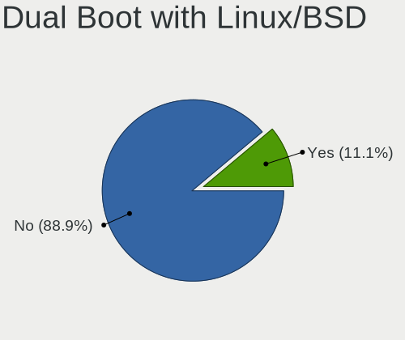
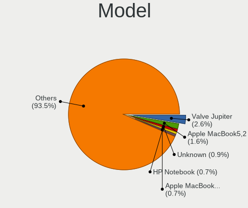
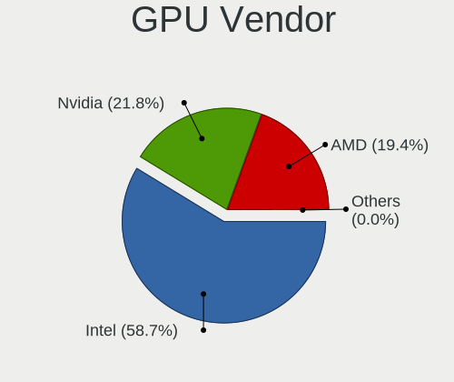
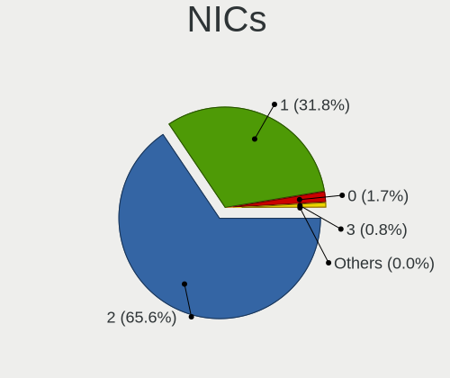
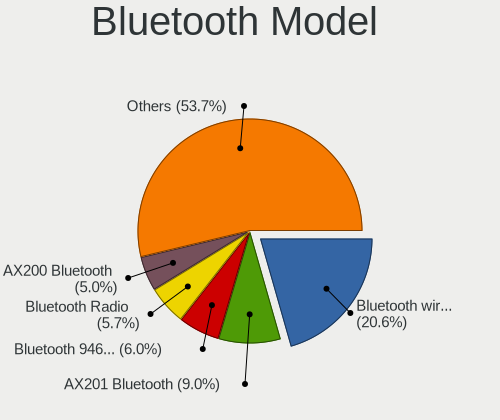

Linux in USA - Tested Hardware & Statistics (Notebooks)
-------------------------------------------------------

A project to collect tested hardware configurations for Linux in USA.

Anyone can contribute to this report by the [hw-probe](https://github.com/linuxhw/hw-probe) tool:

    sudo -E hw-probe -all -upload

Please contribute! Especially if your hardware is rare.

Contents
--------

* [ Test Cases ](#test-cases)

* [ System ](#system)
  - [ OS                       ](#os)
  - [ OS Family                ](#os-family)
  - [ Kernel                   ](#kernel)
  - [ Kernel Family            ](#kernel-family)
  - [ Kernel Major Ver.        ](#kernel-major-ver)
  - [ Arch                     ](#arch)
  - [ DE                       ](#de)
  - [ Display Server           ](#display-server)
  - [ Display Manager          ](#display-manager)
  - [ OS Lang                  ](#os-lang)
  - [ Boot Mode                ](#boot-mode)
  - [ Filesystem               ](#filesystem)
  - [ Part. scheme             ](#part-scheme)
  - [ Dual Boot with Linux/BSD ](#dual-boot-with-linuxbsd)
  - [ Dual Boot (Win)          ](#dual-boot-win)

* [ Board ](#board)
  - [ Vendor                   ](#vendor)
  - [ Model                    ](#model)
  - [ Model Family             ](#model-family)
  - [ MFG Year                 ](#mfg-year)
  - [ Form Factor              ](#form-factor)
  - [ Secure Boot              ](#secure-boot)
  - [ Coreboot                 ](#coreboot)
  - [ RAM Size                 ](#ram-size)
  - [ RAM Used                 ](#ram-used)
  - [ Total Drives             ](#total-drives)
  - [ Has CD-ROM               ](#has-cd-rom)
  - [ Has Ethernet             ](#has-ethernet)
  - [ Has WiFi                 ](#has-wifi)
  - [ Has Bluetooth            ](#has-bluetooth)

* [ Location ](#location)
  - [ Country                  ](#country)
  - [ City                     ](#city)

* [ Drives ](#drives)
  - [ Drive Vendor             ](#drive-vendor)
  - [ Drive Model              ](#drive-model)
  - [ HDD Vendor               ](#hdd-vendor)
  - [ SSD Vendor               ](#ssd-vendor)
  - [ Drive Kind               ](#drive-kind)
  - [ Drive Connector          ](#drive-connector)
  - [ Drive Size               ](#drive-size)
  - [ Space Total              ](#space-total)
  - [ Space Used               ](#space-used)
  - [ Malfunc. Drives          ](#malfunc-drives)
  - [ Malfunc. Drive Vendor    ](#malfunc-drive-vendor)
  - [ Malfunc. HDD Vendor      ](#malfunc-hdd-vendor)
  - [ Malfunc. Drive Kind      ](#malfunc-drive-kind)
  - [ Failed Drives            ](#failed-drives)
  - [ Failed Drive Vendor      ](#failed-drive-vendor)
  - [ Drive Status             ](#drive-status)

* [ Storage controller ](#storage-controller)
  - [ Storage Vendor           ](#storage-vendor)
  - [ Storage Model            ](#storage-model)
  - [ Storage Kind             ](#storage-kind)

* [ Processor ](#processor)
  - [ CPU Vendor               ](#cpu-vendor)
  - [ CPU Model                ](#cpu-model)
  - [ CPU Model Family         ](#cpu-model-family)
  - [ CPU Cores                ](#cpu-cores)
  - [ CPU Sockets              ](#cpu-sockets)
  - [ CPU Threads              ](#cpu-threads)
  - [ CPU Op-Modes             ](#cpu-op-modes)
  - [ CPU Microcode            ](#cpu-microcode)
  - [ CPU Microarch            ](#cpu-microarch)

* [ Graphics ](#graphics)
  - [ GPU Vendor               ](#gpu-vendor)
  - [ GPU Model                ](#gpu-model)
  - [ GPU Combo                ](#gpu-combo)
  - [ GPU Driver               ](#gpu-driver)
  - [ GPU Memory               ](#gpu-memory)

* [ Monitor ](#monitor)
  - [ Monitor Vendor           ](#monitor-vendor)
  - [ Monitor Model            ](#monitor-model)
  - [ Monitor Resolution       ](#monitor-resolution)
  - [ Monitor Diagonal         ](#monitor-diagonal)
  - [ Monitor Width            ](#monitor-width)
  - [ Aspect Ratio             ](#aspect-ratio)
  - [ Monitor Area             ](#monitor-area)
  - [ Pixel Density            ](#pixel-density)
  - [ Multiple Monitors        ](#multiple-monitors)

* [ Network ](#network)
  - [ Net Controller Vendor    ](#net-controller-vendor)
  - [ Net Controller Model     ](#net-controller-model)
  - [ Wireless Vendor          ](#wireless-vendor)
  - [ Wireless Model           ](#wireless-model)
  - [ Ethernet Vendor          ](#ethernet-vendor)
  - [ Ethernet Model           ](#ethernet-model)
  - [ Net Controller Kind      ](#net-controller-kind)
  - [ Used Controller          ](#used-controller)
  - [ NICs                     ](#nics)
  - [ IPv6                     ](#ipv6)

* [ Bluetooth ](#bluetooth)
  - [ Bluetooth Vendor         ](#bluetooth-vendor)
  - [ Bluetooth Model          ](#bluetooth-model)

* [ Sound ](#sound)
  - [ Sound Vendor             ](#sound-vendor)
  - [ Sound Model              ](#sound-model)

* [ Memory ](#memory)
  - [ Memory Vendor            ](#memory-vendor)
  - [ Memory Model             ](#memory-model)
  - [ Memory Kind              ](#memory-kind)
  - [ Memory Form Factor       ](#memory-form-factor)
  - [ Memory Size              ](#memory-size)
  - [ Memory Speed             ](#memory-speed)

* [ Printers & scanners ](#printers--scanners)
  - [ Printer Vendor           ](#printer-vendor)
  - [ Printer Model            ](#printer-model)
  - [ Scanner Vendor           ](#scanner-vendor)
  - [ Scanner Model            ](#scanner-model)

* [ Camera ](#camera)
  - [ Camera Vendor            ](#camera-vendor)
  - [ Camera Model             ](#camera-model)

* [ Security ](#security)
  - [ Fingerprint Vendor       ](#fingerprint-vendor)
  - [ Fingerprint Model        ](#fingerprint-model)
  - [ Chipcard Vendor          ](#chipcard-vendor)
  - [ Chipcard Model           ](#chipcard-model)

* [ Unsupported ](#unsupported)
  - [ Unsupported Devices      ](#unsupported-devices)
  - [ Unsupported Device Types ](#unsupported-device-types)

Test Cases
----------

Total: 24807

| Vendor        | Model                       | Probe                                                      | Date         |
|---------------|-----------------------------|------------------------------------------------------------|--------------|
| Acer          | Swift SF314-512             | [7158f3e437](https://linux-hardware.org/?probe=7158f3e437) | Aug 12, 2023 |
| Dell          | Inspiron 13 5310            | [d42fa686e5](https://linux-hardware.org/?probe=d42fa686e5) | Aug 12, 2023 |
| Dell          | Inspiron 13 5310            | [45509c2727](https://linux-hardware.org/?probe=45509c2727) | Aug 12, 2023 |
| Valve         | Jupiter                     | [dbb797aa33](https://linux-hardware.org/?probe=dbb797aa33) | Aug 12, 2023 |
| Apple         | MacBookPro6,2               | [7c62a05800](https://linux-hardware.org/?probe=7c62a05800) | Aug 12, 2023 |
| Valve         | Jupiter                     | [3f6cd697d5](https://linux-hardware.org/?probe=3f6cd697d5) | Aug 12, 2023 |
| Lenovo        | ThinkPad X1 Carbon 6th 2... | [53c81d6d36](https://linux-hardware.org/?probe=53c81d6d36) | Aug 12, 2023 |
| Toshiba       | Satellite C55-A             | [d1bf5ba3c3](https://linux-hardware.org/?probe=d1bf5ba3c3) | Aug 12, 2023 |
| HP            | Pavilion g7                 | [325b804863](https://linux-hardware.org/?probe=325b804863) | Aug 12, 2023 |
| HP            | Laptop 15-dy2xxx            | [bc66f59ac5](https://linux-hardware.org/?probe=bc66f59ac5) | Aug 12, 2023 |
| HP            | Laptop 14-dq1xxx            | [6f5a32d65f](https://linux-hardware.org/?probe=6f5a32d65f) | Aug 11, 2023 |
| Dell          | Latitude E6430              | [79f523548b](https://linux-hardware.org/?probe=79f523548b) | Aug 11, 2023 |
| Unknown       | Unknown                     | [b68d99fd89](https://linux-hardware.org/?probe=b68d99fd89) | Aug 11, 2023 |
| Dell          | Latitude E6430              | [fd3c9b15f8](https://linux-hardware.org/?probe=fd3c9b15f8) | Aug 11, 2023 |
| Valve         | Jupiter                     | [dad1808c0d](https://linux-hardware.org/?probe=dad1808c0d) | Aug 11, 2023 |
| HP            | ProBook 4540s               | [4d9da5367a](https://linux-hardware.org/?probe=4d9da5367a) | Aug 11, 2023 |
| HP            | Pavilion dv6                | [1689b3fd44](https://linux-hardware.org/?probe=1689b3fd44) | Aug 11, 2023 |
| Google        | Epaulette                   | [1923498758](https://linux-hardware.org/?probe=1923498758) | Aug 11, 2023 |
| Dell          | XPS 15 9560                 | [471e3c5077](https://linux-hardware.org/?probe=471e3c5077) | Aug 11, 2023 |
| Lenovo        | ThinkPad T480s 20L70028U... | [8b2a34a407](https://linux-hardware.org/?probe=8b2a34a407) | Aug 11, 2023 |
| ASUSTek       | ROG Zephyrus G14 GA401QM... | [e22f71b79d](https://linux-hardware.org/?probe=e22f71b79d) | Aug 11, 2023 |
| Lenovo        | IdeaPad S340-15IIL 81VW     | [48a0f64b34](https://linux-hardware.org/?probe=48a0f64b34) | Aug 11, 2023 |
| Dell          | Precision 5530              | [f74dac5dcf](https://linux-hardware.org/?probe=f74dac5dcf) | Aug 11, 2023 |
| Lenovo        | ThinkPad P53s 20N6S00B00    | [c76e31ff8e](https://linux-hardware.org/?probe=c76e31ff8e) | Aug 10, 2023 |
| Lenovo        | ThinkPad E14 20RA0076US     | [ab98272b50](https://linux-hardware.org/?probe=ab98272b50) | Aug 10, 2023 |
| Lenovo        | ThinkPad X220 4291SEN       | [b62026890a](https://linux-hardware.org/?probe=b62026890a) | Aug 10, 2023 |
| Acer          | Swift SF314-512             | [e168ac1e62](https://linux-hardware.org/?probe=e168ac1e62) | Aug 10, 2023 |
| HP            | Laptop 14-dq1xxx            | [68fff65eee](https://linux-hardware.org/?probe=68fff65eee) | Aug 10, 2023 |
| Lenovo        | ThinkPad T420 4180X06       | [77e54b4b97](https://linux-hardware.org/?probe=77e54b4b97) | Aug 10, 2023 |
| HP            | Laptop 14-dq1xxx            | [81a2d0415e](https://linux-hardware.org/?probe=81a2d0415e) | Aug 10, 2023 |
| Apple         | MacBookPro5,1               | [23fc9401d3](https://linux-hardware.org/?probe=23fc9401d3) | Aug 10, 2023 |
| Google        | Kindred                     | [a45439e295](https://linux-hardware.org/?probe=a45439e295) | Aug 10, 2023 |
| Valve         | Jupiter                     | [d88c707cfc](https://linux-hardware.org/?probe=d88c707cfc) | Aug 10, 2023 |
| Lenovo        | ThinkPad T420 4180X06       | [ba950eb9e1](https://linux-hardware.org/?probe=ba950eb9e1) | Aug 10, 2023 |
| ASUSTek       | ROG Zephyrus Duo 16 GX65... | [45c782fc7e](https://linux-hardware.org/?probe=45c782fc7e) | Aug 10, 2023 |
| Lenovo        | ThinkPad T410 25372E6       | [69c4723b51](https://linux-hardware.org/?probe=69c4723b51) | Aug 10, 2023 |
| Lenovo        | ThinkPad T480 20L6S29D00    | [a728658683](https://linux-hardware.org/?probe=a728658683) | Aug 10, 2023 |
| Acer          | Nitro AN517-55              | [b77ff095f8](https://linux-hardware.org/?probe=b77ff095f8) | Aug 09, 2023 |
| HP            | EliteBook 840 G6            | [767792bf33](https://linux-hardware.org/?probe=767792bf33) | Aug 09, 2023 |
| ASUSTek       | ZenBook UX534FTC_UX534FT    | [26b98e8740](https://linux-hardware.org/?probe=26b98e8740) | Aug 09, 2023 |
| Dell          | Latitude E6420              | [1aaa4997d4](https://linux-hardware.org/?probe=1aaa4997d4) | Aug 09, 2023 |
| Lenovo        | ThinkPad T430 2347AT2       | [a874870955](https://linux-hardware.org/?probe=a874870955) | Aug 09, 2023 |
| Apple         | MacBookPro15,4              | [f63c9ffab9](https://linux-hardware.org/?probe=f63c9ffab9) | Aug 09, 2023 |
| Valve         | Jupiter                     | [613dc3eb7d](https://linux-hardware.org/?probe=613dc3eb7d) | Aug 09, 2023 |
| ASUSTek       | ZenBook UX534FTC_UX534FT    | [68eb21c824](https://linux-hardware.org/?probe=68eb21c824) | Aug 09, 2023 |
| Dell          | Latitude E6520              | [cb79d1e17c](https://linux-hardware.org/?probe=cb79d1e17c) | Aug 09, 2023 |
| Dell          | Latitude E6520              | [4516b9b475](https://linux-hardware.org/?probe=4516b9b475) | Aug 09, 2023 |
| HP            | 2000                        | [fa62a90143](https://linux-hardware.org/?probe=fa62a90143) | Aug 09, 2023 |
| ASUSTek       | ROG Zephyrus G15 GA503RM... | [5a4c9f0e5a](https://linux-hardware.org/?probe=5a4c9f0e5a) | Aug 09, 2023 |
| HP            | Notebook                    | [bac7155006](https://linux-hardware.org/?probe=bac7155006) | Aug 09, 2023 |
| HP            | Laptop 15-bw0xx             | [f23d951287](https://linux-hardware.org/?probe=f23d951287) | Aug 09, 2023 |
| HP            | Laptop 15-bw0xx             | [ff36238822](https://linux-hardware.org/?probe=ff36238822) | Aug 09, 2023 |
| Dell          | Inspiron 15-7568            | [745ebb5475](https://linux-hardware.org/?probe=745ebb5475) | Aug 09, 2023 |
| Apple         | MacBookAir4,1               | [05b5124d92](https://linux-hardware.org/?probe=05b5124d92) | Aug 09, 2023 |
| HP            | EliteBook 850 G3            | [04a319c904](https://linux-hardware.org/?probe=04a319c904) | Aug 09, 2023 |
| Toshiba       | Satellite C55-C             | [199924c140](https://linux-hardware.org/?probe=199924c140) | Aug 09, 2023 |
| HP            | ENVY Laptop 17-ch0xxx       | [01fe285324](https://linux-hardware.org/?probe=01fe285324) | Aug 09, 2023 |
| Toshiba       | Satellite C55-C             | [324b952d6b](https://linux-hardware.org/?probe=324b952d6b) | Aug 09, 2023 |
| HP            | Laptop 14-dk1xxx            | [7c59be984f](https://linux-hardware.org/?probe=7c59be984f) | Aug 09, 2023 |
| Dell          | Latitude 7320               | [6db1867722](https://linux-hardware.org/?probe=6db1867722) | Aug 09, 2023 |
| HP            | Victus by 15.6 inch Gami... | [67f88ab571](https://linux-hardware.org/?probe=67f88ab571) | Aug 08, 2023 |
| Lenovo        | ThinkPad X1 Carbon 4th 2... | [72655a5d65](https://linux-hardware.org/?probe=72655a5d65) | Aug 08, 2023 |
| HP            | ZBook 15 G2                 | [cb340460b6](https://linux-hardware.org/?probe=cb340460b6) | Aug 08, 2023 |
| Lenovo        | ThinkPad X220 4290C37       | [125ac0cbd3](https://linux-hardware.org/?probe=125ac0cbd3) | Aug 08, 2023 |
| ASUSTek       | Zenbook Pro Duo UX582ZW_... | [afa081b440](https://linux-hardware.org/?probe=afa081b440) | Aug 08, 2023 |
| HP            | ENVY Laptop 16-h1xxx        | [101c521941](https://linux-hardware.org/?probe=101c521941) | Aug 08, 2023 |
| Lenovo        | ThinkPad T480s 20L70028U... | [324819c88d](https://linux-hardware.org/?probe=324819c88d) | Aug 08, 2023 |
| Apple         | MacBookPro10,1              | [00b169d241](https://linux-hardware.org/?probe=00b169d241) | Aug 08, 2023 |
| Dell          | Inspiron 5759               | [d79ab70370](https://linux-hardware.org/?probe=d79ab70370) | Aug 08, 2023 |
| Valve         | Jupiter                     | [ff196a6c3d](https://linux-hardware.org/?probe=ff196a6c3d) | Aug 08, 2023 |
| HP            | Laptop 15-bs0xx             | [2a7e23b825](https://linux-hardware.org/?probe=2a7e23b825) | Aug 08, 2023 |
| HP            | Laptop 17-cn1xxx            | [711a5fc7ce](https://linux-hardware.org/?probe=711a5fc7ce) | Aug 08, 2023 |
| Apple         | MacBookPro10,1              | [5e0c7f7bfc](https://linux-hardware.org/?probe=5e0c7f7bfc) | Aug 08, 2023 |
| Apple         | MacBookPro10,1              | [ed97e2ea3e](https://linux-hardware.org/?probe=ed97e2ea3e) | Aug 08, 2023 |
| Acer          | Aspire A715-75G             | [57f1225daf](https://linux-hardware.org/?probe=57f1225daf) | Aug 08, 2023 |
| Dell          | Inspiron 13-7353            | [0b797c9368](https://linux-hardware.org/?probe=0b797c9368) | Aug 08, 2023 |
| Dell          | Inspiron 5759               | [e5a8c891d0](https://linux-hardware.org/?probe=e5a8c891d0) | Aug 08, 2023 |
| Dell          | XPS L501X                   | [60a937133c](https://linux-hardware.org/?probe=60a937133c) | Aug 08, 2023 |
| Toshiba       | Satellite L875D             | [de1a418102](https://linux-hardware.org/?probe=de1a418102) | Aug 08, 2023 |
| Lenovo        | Legion 5 15ARH7H 82RD       | [1e2412e487](https://linux-hardware.org/?probe=1e2412e487) | Aug 08, 2023 |
| Samsung       | 305E4A/305E5A/305E7A        | [f30c6c7bb5](https://linux-hardware.org/?probe=f30c6c7bb5) | Aug 08, 2023 |
| Dell          | Latitude E6430              | [313d3616c4](https://linux-hardware.org/?probe=313d3616c4) | Aug 08, 2023 |
| Google        | Parrot                      | [a0820a5e0c](https://linux-hardware.org/?probe=a0820a5e0c) | Aug 07, 2023 |
| Google        | Parrot                      | [f03c4efc0b](https://linux-hardware.org/?probe=f03c4efc0b) | Aug 07, 2023 |
| GPU Compan... | GWTN141-10                  | [e03fdd9f60](https://linux-hardware.org/?probe=e03fdd9f60) | Aug 07, 2023 |
| Dell          | Inspiron 13-7353            | [90fbc716ed](https://linux-hardware.org/?probe=90fbc716ed) | Aug 07, 2023 |
| System76      | Serval WS                   | [3cd45493ee](https://linux-hardware.org/?probe=3cd45493ee) | Aug 07, 2023 |
| Dell          | Inspiron 5721               | [99042a3573](https://linux-hardware.org/?probe=99042a3573) | Aug 07, 2023 |
| HP            | Pavilion Gaming Laptop 1... | [3ec4223487](https://linux-hardware.org/?probe=3ec4223487) | Aug 07, 2023 |
| Dell          | Precision M6500             | [054f8ba242](https://linux-hardware.org/?probe=054f8ba242) | Aug 07, 2023 |
| Dell          | Latitude 7490               | [e7738263f7](https://linux-hardware.org/?probe=e7738263f7) | Aug 07, 2023 |
| Dell          | Latitude 7490               | [a3b95f2fc2](https://linux-hardware.org/?probe=a3b95f2fc2) | Aug 07, 2023 |
| Acer          | Aspire 5734Z                | [158671d9c9](https://linux-hardware.org/?probe=158671d9c9) | Aug 07, 2023 |
| Apple         | MacBookPro11,1              | [0a1b8d0627](https://linux-hardware.org/?probe=0a1b8d0627) | Aug 07, 2023 |
| Dell          | Inspiron 15 3525            | [36a20bb009](https://linux-hardware.org/?probe=36a20bb009) | Aug 07, 2023 |
| HP            | Pavilion 15                 | [227895bca8](https://linux-hardware.org/?probe=227895bca8) | Aug 07, 2023 |
| Acer          | Predator PT515-51           | [e08b7b4cd8](https://linux-hardware.org/?probe=e08b7b4cd8) | Aug 07, 2023 |
| HP            | ProBook 650 G1              | [b02660749d](https://linux-hardware.org/?probe=b02660749d) | Aug 07, 2023 |
| HP            | EliteBook 840 G3            | [2e239a5f09](https://linux-hardware.org/?probe=2e239a5f09) | Aug 07, 2023 |
| MSI           | GP72 7RDX                   | [43eb53850c](https://linux-hardware.org/?probe=43eb53850c) | Aug 06, 2023 |
| Acer          | Aspire A514-54              | [e9dfd6bbb6](https://linux-hardware.org/?probe=e9dfd6bbb6) | Aug 06, 2023 |
| Acer          | Aspire A514-54              | [0a7dc12f31](https://linux-hardware.org/?probe=0a7dc12f31) | Aug 06, 2023 |
| Apple         | MacBookAir6,1               | [acf60b5aa8](https://linux-hardware.org/?probe=acf60b5aa8) | Aug 06, 2023 |
| Valve         | Jupiter                     | [f674ac251e](https://linux-hardware.org/?probe=f674ac251e) | Aug 06, 2023 |
| Lenovo        | ThinkPad X1 Carbon 7th 2... | [b1d5aab527](https://linux-hardware.org/?probe=b1d5aab527) | Aug 06, 2023 |
| Dell          | Latitude 5290 2-in-1        | [62e2743cda](https://linux-hardware.org/?probe=62e2743cda) | Aug 06, 2023 |
| Dell          | Inspiron 3520               | [eed6ad702b](https://linux-hardware.org/?probe=eed6ad702b) | Aug 06, 2023 |
| Dell          | Inspiron 3520               | [8a3ba73fae](https://linux-hardware.org/?probe=8a3ba73fae) | Aug 06, 2023 |
| MSI           | GP72 7RDX                   | [6d2bc8aa9e](https://linux-hardware.org/?probe=6d2bc8aa9e) | Aug 06, 2023 |
| GPU Compan... | GWNR71517                   | [d754d51977](https://linux-hardware.org/?probe=d754d51977) | Aug 06, 2023 |
| Unknown       | Unknown                     | [66dd893ce8](https://linux-hardware.org/?probe=66dd893ce8) | Aug 06, 2023 |
| RCA           | 038-WT9S10WM02              | [61c1a104d2](https://linux-hardware.org/?probe=61c1a104d2) | Aug 06, 2023 |
| RCA           | 038-WT9S10WM02              | [fe15934abe](https://linux-hardware.org/?probe=fe15934abe) | Aug 06, 2023 |
| GPD           | G1618-03                    | [070d548515](https://linux-hardware.org/?probe=070d548515) | Aug 06, 2023 |
| Acer          | Nitro AN515-57              | [dbb09ef76f](https://linux-hardware.org/?probe=dbb09ef76f) | Aug 06, 2023 |
| Acer          | Nitro AN515-57              | [0aa699dc73](https://linux-hardware.org/?probe=0aa699dc73) | Aug 06, 2023 |
| Lenovo        | ThinkPad T430 2342CTO       | [96dae933b5](https://linux-hardware.org/?probe=96dae933b5) | Aug 06, 2023 |
| HP            | EliteBook 845 G7 Noteboo... | [d00f65f7f0](https://linux-hardware.org/?probe=d00f65f7f0) | Aug 06, 2023 |
| Apple         | MacBookPro9,1               | [65343a7900](https://linux-hardware.org/?probe=65343a7900) | Aug 06, 2023 |
| HP            | EliteBook 845 G7 Noteboo... | [1b7eaa2e00](https://linux-hardware.org/?probe=1b7eaa2e00) | Aug 06, 2023 |
| Dell          | Inspiron 15 3511            | [217bd70a25](https://linux-hardware.org/?probe=217bd70a25) | Aug 06, 2023 |
| Apple         | MacBookPro9,2               | [7eb29a371d](https://linux-hardware.org/?probe=7eb29a371d) | Aug 06, 2023 |
| Lenovo        | ThinkPad X1 Extreme 20MF... | [c40308638c](https://linux-hardware.org/?probe=c40308638c) | Aug 05, 2023 |
| HP            | Pavilion Laptop 15-cc5xx    | [8baf99b470](https://linux-hardware.org/?probe=8baf99b470) | Aug 05, 2023 |
| ASUSTek       | VivoBook_ASUSLaptop M350... | [c8d1e98a60](https://linux-hardware.org/?probe=c8d1e98a60) | Aug 05, 2023 |
| Dell          | Inspiron 15 7000 Gaming     | [21eaf09dc9](https://linux-hardware.org/?probe=21eaf09dc9) | Aug 05, 2023 |
| Dell          | Latitude 5430               | [f63444b0be](https://linux-hardware.org/?probe=f63444b0be) | Aug 05, 2023 |
| ASUSTek       | ProArt StudioBook W5600Q... | [96211a5c87](https://linux-hardware.org/?probe=96211a5c87) | Aug 05, 2023 |
| Acer          | Nitro AN515-54              | [c4d1667ffe](https://linux-hardware.org/?probe=c4d1667ffe) | Aug 05, 2023 |
| Dell          | Inspiron 3520               | [00b2c0458a](https://linux-hardware.org/?probe=00b2c0458a) | Aug 05, 2023 |
| Apple         | MacBookPro14,1              | [08f78bf99a](https://linux-hardware.org/?probe=08f78bf99a) | Aug 05, 2023 |
| ALLDOCUBE     | i1502                       | [1ccf0b8f71](https://linux-hardware.org/?probe=1ccf0b8f71) | Aug 05, 2023 |
| HP            | EliteBook 840 G2            | [64810e5a10](https://linux-hardware.org/?probe=64810e5a10) | Aug 05, 2023 |
| Dell          | Latitude 5430 Rugged        | [11a8ce4fba](https://linux-hardware.org/?probe=11a8ce4fba) | Aug 04, 2023 |
| HP            | ZBook Studio G3             | [3f7f45a94e](https://linux-hardware.org/?probe=3f7f45a94e) | Aug 04, 2023 |
| Dell          | Latitude 5430 Rugged        | [4bf16cb575](https://linux-hardware.org/?probe=4bf16cb575) | Aug 04, 2023 |
| Apple         | MacBook8,1                  | [cf6d77d650](https://linux-hardware.org/?probe=cf6d77d650) | Aug 04, 2023 |
| Lenovo        | ThinkPad T480 20L6S9R500    | [3624b5e366](https://linux-hardware.org/?probe=3624b5e366) | Aug 04, 2023 |
| Dell          | Inspiron 3520               | [6bef2ead01](https://linux-hardware.org/?probe=6bef2ead01) | Aug 04, 2023 |
| Fujitsu       | FMVS75MWP                   | [506a18b94f](https://linux-hardware.org/?probe=506a18b94f) | Aug 04, 2023 |
| Apple         | MacBookPro8,2               | [44f5a672b7](https://linux-hardware.org/?probe=44f5a672b7) | Aug 04, 2023 |
| Apple         | MacBookPro8,2               | [a8de87477f](https://linux-hardware.org/?probe=a8de87477f) | Aug 04, 2023 |
| HP            | EliteBook 840 G3            | [9c96e1e114](https://linux-hardware.org/?probe=9c96e1e114) | Aug 04, 2023 |
| HP            | Lantis                      | [2c917365b3](https://linux-hardware.org/?probe=2c917365b3) | Aug 04, 2023 |
| HP            | ENVY Notebook               | [90325282da](https://linux-hardware.org/?probe=90325282da) | Aug 04, 2023 |
| Valve         | Jupiter                     | [26e20fe1cf](https://linux-hardware.org/?probe=26e20fe1cf) | Aug 04, 2023 |
| ASUSTek       | Zenbook UX3402ZA_Q409ZA     | [8a2dafef83](https://linux-hardware.org/?probe=8a2dafef83) | Aug 04, 2023 |
| Apple         | MacBookPro9,2               | [cf25fc0b62](https://linux-hardware.org/?probe=cf25fc0b62) | Aug 04, 2023 |
| Dell          | Inspiron 15 3511            | [3cd247313d](https://linux-hardware.org/?probe=3cd247313d) | Aug 04, 2023 |
| Lenovo        | ThinkPad E15 Gen 4 21ED0... | [51ad22a795](https://linux-hardware.org/?probe=51ad22a795) | Aug 03, 2023 |
| HP            | ENVY Laptop 16-h1xxx        | [ca0d3636a5](https://linux-hardware.org/?probe=ca0d3636a5) | Aug 03, 2023 |
| HP            | Pavilion 17                 | [e0cf9c4fce](https://linux-hardware.org/?probe=e0cf9c4fce) | Aug 03, 2023 |
| Dell          | Latitude E6420              | [178bed5f56](https://linux-hardware.org/?probe=178bed5f56) | Aug 03, 2023 |
| Google        | Enguarde                    | [663e44ce58](https://linux-hardware.org/?probe=663e44ce58) | Aug 03, 2023 |
| HP            | ENVY Laptop 16-h1xxx        | [3552dd7642](https://linux-hardware.org/?probe=3552dd7642) | Aug 03, 2023 |
| HP            | ZBook Studio G3             | [69b35fdf25](https://linux-hardware.org/?probe=69b35fdf25) | Aug 03, 2023 |
| Acer          | Nitro AN515-57              | [cef74aa3cb](https://linux-hardware.org/?probe=cef74aa3cb) | Aug 03, 2023 |
| Lenovo        | ThinkPad W541 20EGS0GY0R    | [4d618e08b3](https://linux-hardware.org/?probe=4d618e08b3) | Aug 03, 2023 |
| System76      | Bonobo WS                   | [64ba21a272](https://linux-hardware.org/?probe=64ba21a272) | Aug 03, 2023 |
| Valve         | Jupiter                     | [0d684621df](https://linux-hardware.org/?probe=0d684621df) | Aug 03, 2023 |
| Dell          | XPS 13 9370                 | [cf49ff3004](https://linux-hardware.org/?probe=cf49ff3004) | Aug 03, 2023 |
| Dell          | Latitude 5400               | [8645c3ffeb](https://linux-hardware.org/?probe=8645c3ffeb) | Aug 03, 2023 |
| Valve         | Jupiter                     | [37400e051e](https://linux-hardware.org/?probe=37400e051e) | Aug 03, 2023 |
| Lenovo        | ThinkPad X1 Carbon 6th 2... | [7df997ee08](https://linux-hardware.org/?probe=7df997ee08) | Aug 03, 2023 |
| ASUSTek       | ZenBook UX425UG_Q408UG      | [a251ad988c](https://linux-hardware.org/?probe=a251ad988c) | Aug 03, 2023 |
| HP            | Compaq Presario CQ60        | [1a14facdec](https://linux-hardware.org/?probe=1a14facdec) | Aug 03, 2023 |
| Lenovo        | ThinkPad X240 20AMS1RR0D    | [dcf2bedb58](https://linux-hardware.org/?probe=dcf2bedb58) | Aug 03, 2023 |
| Google        | Coral                       | [fc0df94d29](https://linux-hardware.org/?probe=fc0df94d29) | Aug 03, 2023 |
| System76      | Galago Pro                  | [2677fc9a99](https://linux-hardware.org/?probe=2677fc9a99) | Aug 03, 2023 |
| Dell          | Latitude E7470              | [7c8c07214a](https://linux-hardware.org/?probe=7c8c07214a) | Aug 03, 2023 |
| Dell          | Latitude E7470              | [b672c65f9b](https://linux-hardware.org/?probe=b672c65f9b) | Aug 02, 2023 |
| Acer          | Aspire A515-56              | [8b2ffc9837](https://linux-hardware.org/?probe=8b2ffc9837) | Aug 02, 2023 |
| HP            | ProBook 450 G3              | [90e7667180](https://linux-hardware.org/?probe=90e7667180) | Aug 02, 2023 |
| Lenovo        | ThinkPad X220 4286CTO       | [ee5b34b232](https://linux-hardware.org/?probe=ee5b34b232) | Aug 02, 2023 |
| HP            | Pavilion 17                 | [abad0a7963](https://linux-hardware.org/?probe=abad0a7963) | Aug 02, 2023 |
| HP            | Laptop 14-dq1xxx            | [4d98867c44](https://linux-hardware.org/?probe=4d98867c44) | Aug 02, 2023 |
| Lenovo        | IdeaPad 3 15ITL6 82H8       | [34ef2db095](https://linux-hardware.org/?probe=34ef2db095) | Aug 02, 2023 |
| HP            | Laptop 14-dq1xxx            | [675811747f](https://linux-hardware.org/?probe=675811747f) | Aug 02, 2023 |
| Acer          | Predator G3-571             | [fc950e8651](https://linux-hardware.org/?probe=fc950e8651) | Aug 02, 2023 |
| ASUSTek       | X750JN                      | [6f7dc2198b](https://linux-hardware.org/?probe=6f7dc2198b) | Aug 02, 2023 |
| Panasonic     | CF-31Q2A731M                | [28a7b62627](https://linux-hardware.org/?probe=28a7b62627) | Aug 02, 2023 |
| Toshiba       | QOSMIO X775                 | [6a4cd21dbf](https://linux-hardware.org/?probe=6a4cd21dbf) | Aug 02, 2023 |
| Lenovo        | Z50-75 80EC                 | [0b22fa6444](https://linux-hardware.org/?probe=0b22fa6444) | Aug 02, 2023 |
| Toshiba       | QOSMIO X775                 | [982148fe9c](https://linux-hardware.org/?probe=982148fe9c) | Aug 02, 2023 |
| Lenovo        | ThinkPad T14 Gen 1 20S1S... | [517b498a25](https://linux-hardware.org/?probe=517b498a25) | Aug 02, 2023 |
| Lenovo        | ThinkPad T480 20L5001BUS    | [b340a9e075](https://linux-hardware.org/?probe=b340a9e075) | Aug 02, 2023 |
| Dell          | Latitude 7280               | [40a53f89cf](https://linux-hardware.org/?probe=40a53f89cf) | Aug 02, 2023 |
| HP            | Pavilion dv5                | [58b4ce4ff9](https://linux-hardware.org/?probe=58b4ce4ff9) | Aug 02, 2023 |
| Dell          | Latitude E5410              | [15a755c4de](https://linux-hardware.org/?probe=15a755c4de) | Aug 02, 2023 |
| Apple         | MacBookPro9,2               | [19aa30337f](https://linux-hardware.org/?probe=19aa30337f) | Aug 02, 2023 |
| Dell          | XPS 9320                    | [3abc4aaf82](https://linux-hardware.org/?probe=3abc4aaf82) | Aug 02, 2023 |
| HP            | Laptop 17-cn0xxx            | [be642f02dd](https://linux-hardware.org/?probe=be642f02dd) | Aug 02, 2023 |
| Dell          | XPS 15 7590                 | [39216c08ff](https://linux-hardware.org/?probe=39216c08ff) | Aug 01, 2023 |
| Apple         | MacBookPro8,2               | [ba2cec8099](https://linux-hardware.org/?probe=ba2cec8099) | Aug 01, 2023 |
| HP            | Dragonfly Pro               | [630670f052](https://linux-hardware.org/?probe=630670f052) | Aug 01, 2023 |
| Lenovo        | ThinkPad E475 20H40006US    | [dfb33be517](https://linux-hardware.org/?probe=dfb33be517) | Aug 01, 2023 |
| ASUSTek       | VivoBook_ASUSLaptop X415... | [cbc721a89f](https://linux-hardware.org/?probe=cbc721a89f) | Aug 01, 2023 |
| Lenovo        | IdeaPad Gaming 3 15ACH6 ... | [bbf2e1b3b3](https://linux-hardware.org/?probe=bbf2e1b3b3) | Aug 01, 2023 |
| Lenovo        | ThinkPad 13 2nd Gen 20J1... | [d3250ef8d7](https://linux-hardware.org/?probe=d3250ef8d7) | Aug 01, 2023 |
| Dell          | Inspiron 15-3573            | [e29b3656ee](https://linux-hardware.org/?probe=e29b3656ee) | Aug 01, 2023 |
| Alienware     | x17 R1                      | [bcdf52a63e](https://linux-hardware.org/?probe=bcdf52a63e) | Aug 01, 2023 |
| HP            | Stream Laptop 14-cb1XX      | [957e1805d3](https://linux-hardware.org/?probe=957e1805d3) | Aug 01, 2023 |
| HP            | Stream Laptop 14-cb1XX      | [a522e7336c](https://linux-hardware.org/?probe=a522e7336c) | Aug 01, 2023 |
| Dell          | Latitude 3500               | [df5211a816](https://linux-hardware.org/?probe=df5211a816) | Aug 01, 2023 |
| HP            | Compaq Presario CQ50        | [f2a2e77d61](https://linux-hardware.org/?probe=f2a2e77d61) | Aug 01, 2023 |
| ASUSTek       | G750JX                      | [06279baf34](https://linux-hardware.org/?probe=06279baf34) | Aug 01, 2023 |
| Dell          | Latitude 5490               | [e24a9f877c](https://linux-hardware.org/?probe=e24a9f877c) | Aug 01, 2023 |
| HP            | Compaq 6910p                | [6720872cd9](https://linux-hardware.org/?probe=6720872cd9) | Aug 01, 2023 |
| Apple         | MacBookPro14,1              | [cb322d77a4](https://linux-hardware.org/?probe=cb322d77a4) | Aug 01, 2023 |
| Valve         | Jupiter                     | [02eeabe071](https://linux-hardware.org/?probe=02eeabe071) | Aug 01, 2023 |
| Lenovo        | ThinkPad E580 20KS003SUS    | [9b8485b740](https://linux-hardware.org/?probe=9b8485b740) | Aug 01, 2023 |
| HP            | EliteBook 850 G3            | [ad4e7cf4ad](https://linux-hardware.org/?probe=ad4e7cf4ad) | Aug 01, 2023 |
| HP            | Pavilion Laptop 15-cc5xx    | [d1af2e2c9f](https://linux-hardware.org/?probe=d1af2e2c9f) | Jul 31, 2023 |
| HP            | Laptop 15-ef2xxx            | [1096cf2959](https://linux-hardware.org/?probe=1096cf2959) | Jul 31, 2023 |
| Lenovo        | ThinkPad P1 20MD001VUS      | [f353e39414](https://linux-hardware.org/?probe=f353e39414) | Jul 31, 2023 |
| HP            | 355 G2                      | [db5f6adcd7](https://linux-hardware.org/?probe=db5f6adcd7) | Jul 31, 2023 |
| Acer          | Aspire R5-471T              | [443869016d](https://linux-hardware.org/?probe=443869016d) | Jul 31, 2023 |
| MSI           | GE72MVR 7RG                 | [d935650def](https://linux-hardware.org/?probe=d935650def) | Jul 31, 2023 |
| Lenovo        | ThinkPad T16 Gen 1 21BVC... | [be7baf7741](https://linux-hardware.org/?probe=be7baf7741) | Jul 31, 2023 |
| Lenovo        | ThinkPad T16 Gen 1 21BVC... | [3b0862f434](https://linux-hardware.org/?probe=3b0862f434) | Jul 31, 2023 |
| Toshiba       | Satellite S855              | [d7d26e7de3](https://linux-hardware.org/?probe=d7d26e7de3) | Jul 31, 2023 |
| Google        | Woomax                      | [da717e8156](https://linux-hardware.org/?probe=da717e8156) | Jul 31, 2023 |
| Dell          | Latitude E6430              | [9dcf92cce9](https://linux-hardware.org/?probe=9dcf92cce9) | Jul 31, 2023 |
| Lenovo        | ThinkPad T560 20FH001TUS    | [8cb9cf099a](https://linux-hardware.org/?probe=8cb9cf099a) | Jul 31, 2023 |
| HP            | Pavilion g7                 | [51997a6e91](https://linux-hardware.org/?probe=51997a6e91) | Jul 31, 2023 |
| HP            | Laptop 15-bs0xx             | [0b157cd8f7](https://linux-hardware.org/?probe=0b157cd8f7) | Jul 31, 2023 |
| MSI           | GE75 Raider 10SE            | [995b9ae73e](https://linux-hardware.org/?probe=995b9ae73e) | Jul 31, 2023 |
| HP            | Victus by Gaming Laptop ... | [de684c405f](https://linux-hardware.org/?probe=de684c405f) | Jul 31, 2023 |
| HP            | EliteBook 850 G3            | [36d9df3244](https://linux-hardware.org/?probe=36d9df3244) | Jul 31, 2023 |
| Valve         | Jupiter                     | [2c25ad9f3a](https://linux-hardware.org/?probe=2c25ad9f3a) | Jul 31, 2023 |
| Valve         | Jupiter                     | [e47da31f03](https://linux-hardware.org/?probe=e47da31f03) | Jul 31, 2023 |
| Valve         | Jupiter                     | [3bc193bd23](https://linux-hardware.org/?probe=3bc193bd23) | Jul 30, 2023 |
| Dell          | Inspiron 5558               | [de55f350ab](https://linux-hardware.org/?probe=de55f350ab) | Jul 30, 2023 |
| Dell          | XPS 15 9510                 | [8375e909e7](https://linux-hardware.org/?probe=8375e909e7) | Jul 30, 2023 |
| HP            | 355 G2                      | [25362ed5e2](https://linux-hardware.org/?probe=25362ed5e2) | Jul 30, 2023 |
| Dell          | Inspiron 15 7000 Gaming     | [04b1a06dbd](https://linux-hardware.org/?probe=04b1a06dbd) | Jul 30, 2023 |
| Lenovo        | ThinkPad T480s 20L8S3JE0... | [5e1021c76b](https://linux-hardware.org/?probe=5e1021c76b) | Jul 30, 2023 |
| Apple         | MacBookPro9,2               | [e66bd4564e](https://linux-hardware.org/?probe=e66bd4564e) | Jul 30, 2023 |
| Apple         | MacBookAir1,1               | [ac140cf8c4](https://linux-hardware.org/?probe=ac140cf8c4) | Jul 30, 2023 |
| Apple         | MacBookPro11,3              | [c7572ce663](https://linux-hardware.org/?probe=c7572ce663) | Jul 30, 2023 |
| Dell          | Latitude E7440              | [7509a5f756](https://linux-hardware.org/?probe=7509a5f756) | Jul 30, 2023 |
| Valve         | Jupiter                     | [db58810c8c](https://linux-hardware.org/?probe=db58810c8c) | Jul 30, 2023 |
| Dell          | XPS 13 9370                 | [529bf65ac4](https://linux-hardware.org/?probe=529bf65ac4) | Jul 30, 2023 |
| HP            | ProBook 640 G2              | [87a4b835cf](https://linux-hardware.org/?probe=87a4b835cf) | Jul 30, 2023 |
| Chuwi         | GemiBook                    | [f892a3970c](https://linux-hardware.org/?probe=f892a3970c) | Jul 30, 2023 |
| Lenovo        | ThinkPad T430 2344BZU       | [f7f737c592](https://linux-hardware.org/?probe=f7f737c592) | Jul 30, 2023 |
| Lenovo        | ThinkPad T430 2344BZU       | [d9c960b2b7](https://linux-hardware.org/?probe=d9c960b2b7) | Jul 30, 2023 |
| System76      | Darter Pro                  | [0220d19f38](https://linux-hardware.org/?probe=0220d19f38) | Jul 30, 2023 |
| ASUSTek       | VivoBook_ASUSLaptop E410... | [5da413f349](https://linux-hardware.org/?probe=5da413f349) | Jul 30, 2023 |
| Valve         | Jupiter                     | [9a37bd442d](https://linux-hardware.org/?probe=9a37bd442d) | Jul 30, 2023 |
| HP            | ENVY Laptop 17-cg1xxx       | [16545b3964](https://linux-hardware.org/?probe=16545b3964) | Jul 30, 2023 |
| Lenovo        | ThinkPad T480s 20L8S0YW0... | [3ff995e8b7](https://linux-hardware.org/?probe=3ff995e8b7) | Jul 30, 2023 |
| HP            | Dev One Notebook PC         | [cdbcf58dcb](https://linux-hardware.org/?probe=cdbcf58dcb) | Jul 30, 2023 |
| HP            | G60                         | [071fd8bdbe](https://linux-hardware.org/?probe=071fd8bdbe) | Jul 29, 2023 |
| Lenovo        | ThinkPad T490 20N3S5XF01    | [942cb3149b](https://linux-hardware.org/?probe=942cb3149b) | Jul 29, 2023 |
| HP            | Pavilion dv4                | [47e9cba85c](https://linux-hardware.org/?probe=47e9cba85c) | Jul 29, 2023 |
| Lenovo        | ThinkPad T570 W10DG 20JW... | [22f4bc0b5e](https://linux-hardware.org/?probe=22f4bc0b5e) | Jul 29, 2023 |
| HP            | Laptop 15-dy2xxx            | [3467c205e1](https://linux-hardware.org/?probe=3467c205e1) | Jul 29, 2023 |
| Lenovo        | ThinkPad T490 20N20031US    | [64e178e433](https://linux-hardware.org/?probe=64e178e433) | Jul 29, 2023 |
| Apple         | MacBookPro11,1              | [3fb2cba3db](https://linux-hardware.org/?probe=3fb2cba3db) | Jul 29, 2023 |
| HP            | Laptop 17-cn0xxx            | [d23aa8f750](https://linux-hardware.org/?probe=d23aa8f750) | Jul 29, 2023 |
| Apple         | MacBookPro11,3              | [8ac9af1db8](https://linux-hardware.org/?probe=8ac9af1db8) | Jul 29, 2023 |
| System76      | Pangolin                    | [3b37a9bedb](https://linux-hardware.org/?probe=3b37a9bedb) | Jul 29, 2023 |
| Lenovo        | IdeaPad 1 15ADA7 82R1       | [7207a12cd1](https://linux-hardware.org/?probe=7207a12cd1) | Jul 29, 2023 |
| Valve         | Jupiter                     | [a3d0515a92](https://linux-hardware.org/?probe=a3d0515a92) | Jul 29, 2023 |
| GPU Compan... | GWTN156-5                   | [9d7e65fc0f](https://linux-hardware.org/?probe=9d7e65fc0f) | Jul 29, 2023 |
| HP            | EliteBook 845 G7 Noteboo... | [963eb3c0a8](https://linux-hardware.org/?probe=963eb3c0a8) | Jul 29, 2023 |
| HP            | Pavilion dv5                | [d52d0f879a](https://linux-hardware.org/?probe=d52d0f879a) | Jul 29, 2023 |
| HP            | EliteBook 745 G3            | [30e5e63466](https://linux-hardware.org/?probe=30e5e63466) | Jul 29, 2023 |
| Lenovo        | ThinkPad T480s 20L8S3JE0... | [6426edf740](https://linux-hardware.org/?probe=6426edf740) | Jul 29, 2023 |
| Dell          | Precision 5510              | [56b4073d3f](https://linux-hardware.org/?probe=56b4073d3f) | Jul 29, 2023 |
| Apple         | MacBookPro9,2               | [2dbda5ea48](https://linux-hardware.org/?probe=2dbda5ea48) | Jul 29, 2023 |
| GPD           | G1621-02                    | [1710e0f480](https://linux-hardware.org/?probe=1710e0f480) | Jul 29, 2023 |
| HP            | EliteBook 850 G8 Noteboo... | [59f0eb6b57](https://linux-hardware.org/?probe=59f0eb6b57) | Jul 28, 2023 |
| Lenovo        | IdeaPad 330S-15IKB 81F5     | [aa12dbe8bf](https://linux-hardware.org/?probe=aa12dbe8bf) | Jul 28, 2023 |
| Lenovo        | ThinkPad T420 4180C31       | [7fafc1656d](https://linux-hardware.org/?probe=7fafc1656d) | Jul 28, 2023 |
| HP            | EliteBook 820 G4            | [63a72ed445](https://linux-hardware.org/?probe=63a72ed445) | Jul 28, 2023 |
| Gigabyte      | B460M DS3H AC V2-Y1         | [75e93aaa88](https://linux-hardware.org/?probe=75e93aaa88) | Jul 28, 2023 |
| Gigabyte      | B460M DS3H AC V2-Y1         | [730caebd96](https://linux-hardware.org/?probe=730caebd96) | Jul 28, 2023 |
| Dell          | Latitude 7480               | [4287f8186f](https://linux-hardware.org/?probe=4287f8186f) | Jul 28, 2023 |
| ASUSTek       | ROG Strix G713PI_G713PI     | [cb2f78abf0](https://linux-hardware.org/?probe=cb2f78abf0) | Jul 28, 2023 |
| Lenovo        | ThinkPad X220 4286CTO       | [9e892612ab](https://linux-hardware.org/?probe=9e892612ab) | Jul 28, 2023 |
| Apple         | MacBookPro9,2               | [2e6ab71954](https://linux-hardware.org/?probe=2e6ab71954) | Jul 28, 2023 |
| Dell          | Inspiron 5759               | [32fcc0f81f](https://linux-hardware.org/?probe=32fcc0f81f) | Jul 28, 2023 |
| HP            | ZBook Studio G3             | [68618d14ef](https://linux-hardware.org/?probe=68618d14ef) | Jul 28, 2023 |
| Samsung       | N250P/N145P                 | [6b6e675a4c](https://linux-hardware.org/?probe=6b6e675a4c) | Jul 28, 2023 |
| HP            | EliteBook 845 G8 Noteboo... | [dc2835b589](https://linux-hardware.org/?probe=dc2835b589) | Jul 28, 2023 |
| Valve         | Jupiter                     | [3afdfaee86](https://linux-hardware.org/?probe=3afdfaee86) | Jul 28, 2023 |
| System76      | Oryx Pro                    | [0ad8c1d8a7](https://linux-hardware.org/?probe=0ad8c1d8a7) | Jul 28, 2023 |
| Apple         | MacBookPro9,2               | [058f75de84](https://linux-hardware.org/?probe=058f75de84) | Jul 28, 2023 |
| Apple         | MacBookPro9,2               | [c26daef72c](https://linux-hardware.org/?probe=c26daef72c) | Jul 28, 2023 |
| Dell          | Inspiron 15 3520            | [49cbe32874](https://linux-hardware.org/?probe=49cbe32874) | Jul 28, 2023 |
| Valve         | Jupiter                     | [8b17f4e7f8](https://linux-hardware.org/?probe=8b17f4e7f8) | Jul 28, 2023 |
| Valve         | Jupiter                     | [f05b93c2c5](https://linux-hardware.org/?probe=f05b93c2c5) | Jul 28, 2023 |
| Lenovo        | IdeaPad 5 Pro 14ACN6 82L... | [6e4e0bebde](https://linux-hardware.org/?probe=6e4e0bebde) | Jul 28, 2023 |
| Lenovo        | IdeaPad 5 Pro 14ACN6 82L... | [63c601695f](https://linux-hardware.org/?probe=63c601695f) | Jul 28, 2023 |
| Apple         | MacBookPro9,1               | [038cfe2fee](https://linux-hardware.org/?probe=038cfe2fee) | Jul 28, 2023 |
| Google        | Reef                        | [96774077fc](https://linux-hardware.org/?probe=96774077fc) | Jul 28, 2023 |
| Valve         | Jupiter                     | [b32778a4bd](https://linux-hardware.org/?probe=b32778a4bd) | Jul 28, 2023 |
| MSI           | GP63 Leopard 8RE            | [42a81e063a](https://linux-hardware.org/?probe=42a81e063a) | Jul 28, 2023 |
| ASUSTek       | ROG Strix G533ZW_G533ZW     | [407859fa58](https://linux-hardware.org/?probe=407859fa58) | Jul 27, 2023 |
| HP            | EliteBook 8560p             | [b7ce548e5b](https://linux-hardware.org/?probe=b7ce548e5b) | Jul 27, 2023 |
| HP            | EliteBook 845 G8 Noteboo... | [ac68775946](https://linux-hardware.org/?probe=ac68775946) | Jul 27, 2023 |
| Lenovo        | ThinkPad T14 Gen 3 21AHC... | [67febbf0c0](https://linux-hardware.org/?probe=67febbf0c0) | Jul 27, 2023 |
| Dell          | Latitude E6410              | [bf77e8581a](https://linux-hardware.org/?probe=bf77e8581a) | Jul 27, 2023 |
| Dell          | Latitude E6410              | [029e692e68](https://linux-hardware.org/?probe=029e692e68) | Jul 27, 2023 |
| Dell          | Inspiron 3505               | [4e55f1802d](https://linux-hardware.org/?probe=4e55f1802d) | Jul 27, 2023 |
| Lenovo        | Z50-70 20354                | [f213363233](https://linux-hardware.org/?probe=f213363233) | Jul 27, 2023 |
| Acer          | Aspire A517-58M             | [c39540fbbc](https://linux-hardware.org/?probe=c39540fbbc) | Jul 27, 2023 |
| Google        | Blooglet                    | [d8c14e29b6](https://linux-hardware.org/?probe=d8c14e29b6) | Jul 27, 2023 |
| Google        | Vortininja                  | [70f9ee30d3](https://linux-hardware.org/?probe=70f9ee30d3) | Jul 27, 2023 |
| Dell          | Latitude E7440              | [619c6e4b99](https://linux-hardware.org/?probe=619c6e4b99) | Jul 27, 2023 |
| HP            | Laptop 14-fq1xxx            | [5de59d7736](https://linux-hardware.org/?probe=5de59d7736) | Jul 27, 2023 |
| ASUSTek       | G75VW                       | [31b48ed798](https://linux-hardware.org/?probe=31b48ed798) | Jul 27, 2023 |
| Apple         | MacBookPro8,1               | [d54574b3f8](https://linux-hardware.org/?probe=d54574b3f8) | Jul 27, 2023 |
| HP            | Dev One Notebook PC         | [b54bb52258](https://linux-hardware.org/?probe=b54bb52258) | Jul 27, 2023 |
| ASUSTek       | G75VW                       | [449fa463bc](https://linux-hardware.org/?probe=449fa463bc) | Jul 27, 2023 |
| MSI           | GF63 Thin 11UC              | [20fff2edd2](https://linux-hardware.org/?probe=20fff2edd2) | Jul 27, 2023 |
| Lenovo        | ThinkPad W541 20EF000NUS    | [af1671633e](https://linux-hardware.org/?probe=af1671633e) | Jul 27, 2023 |
| Google        | Fleex                       | [977fa266d3](https://linux-hardware.org/?probe=977fa266d3) | Jul 27, 2023 |
| HP            | Victus by Gaming Laptop ... | [1ca85a6770](https://linux-hardware.org/?probe=1ca85a6770) | Jul 27, 2023 |
| Apple         | MacBook7,1                  | [762861205a](https://linux-hardware.org/?probe=762861205a) | Jul 26, 2023 |
| GPU Compan... | GWNR71517                   | [ca3906a6c7](https://linux-hardware.org/?probe=ca3906a6c7) | Jul 26, 2023 |
| Valve         | Jupiter                     | [46476d31e0](https://linux-hardware.org/?probe=46476d31e0) | Jul 26, 2023 |
| Apple         | MacBookPro8,1               | [d0d94c9be7](https://linux-hardware.org/?probe=d0d94c9be7) | Jul 26, 2023 |
| Lenovo        | ThinkPad X1 Extreme Gen ... | [e305fd173d](https://linux-hardware.org/?probe=e305fd173d) | Jul 26, 2023 |
| Acer          | Nitro AN17-41               | [7909f8c5f3](https://linux-hardware.org/?probe=7909f8c5f3) | Jul 26, 2023 |
| Lenovo        | ThinkBook 15 G3 ACL 21A4    | [c7b69782db](https://linux-hardware.org/?probe=c7b69782db) | Jul 26, 2023 |
| Lenovo        | IdeaPad 120S-14IAP 81A5     | [b2dd23136f](https://linux-hardware.org/?probe=b2dd23136f) | Jul 26, 2023 |
| Alienware     | 17                          | [25f67e59b8](https://linux-hardware.org/?probe=25f67e59b8) | Jul 26, 2023 |
| Dell          | XPS 13 7390                 | [0217675942](https://linux-hardware.org/?probe=0217675942) | Jul 26, 2023 |
| Gateway       | NE71B                       | [341f524bc5](https://linux-hardware.org/?probe=341f524bc5) | Jul 26, 2023 |
| Lenovo        | ThinkPad T560 20FH001TUS    | [0cb1602cad](https://linux-hardware.org/?probe=0cb1602cad) | Jul 26, 2023 |
| Acer          | Aspire A515-56              | [7e0e30c1cf](https://linux-hardware.org/?probe=7e0e30c1cf) | Jul 26, 2023 |
| Acer          | Swift SF314-512             | [856e36fa9c](https://linux-hardware.org/?probe=856e36fa9c) | Jul 26, 2023 |
| Lenovo        | ThinkPad T14 Gen 3 21AHC... | [a5933aa510](https://linux-hardware.org/?probe=a5933aa510) | Jul 26, 2023 |
| Lenovo        | ThinkPad L14 Gen 1 20U6S... | [1c52a031c7](https://linux-hardware.org/?probe=1c52a031c7) | Jul 26, 2023 |
| ASUSTek       | VivoBook_ASUSLaptop X415... | [802ba60219](https://linux-hardware.org/?probe=802ba60219) | Jul 25, 2023 |
| Valve         | Jupiter                     | [bebbacfd8c](https://linux-hardware.org/?probe=bebbacfd8c) | Jul 25, 2023 |
| Dell          | XPS 13 9370                 | [835ca23b88](https://linux-hardware.org/?probe=835ca23b88) | Jul 25, 2023 |
| Acer          | Aspire 5560                 | [edd90996c4](https://linux-hardware.org/?probe=edd90996c4) | Jul 25, 2023 |
| Dell          | XPS 13 9370                 | [321bdf6295](https://linux-hardware.org/?probe=321bdf6295) | Jul 25, 2023 |
| Acer          | Aspire 3610                 | [b40dd6ad17](https://linux-hardware.org/?probe=b40dd6ad17) | Jul 25, 2023 |
| Lenovo        | ThinkPad T14 Gen 3 21AHC... | [7cd1c7cdf2](https://linux-hardware.org/?probe=7cd1c7cdf2) | Jul 25, 2023 |
| LG Electro... | 16U70Q-K.AAS7U1             | [622990f8cd](https://linux-hardware.org/?probe=622990f8cd) | Jul 25, 2023 |
| Lenovo        | ThinkPad L560 20F2S32Q00    | [0f437b5e3c](https://linux-hardware.org/?probe=0f437b5e3c) | Jul 25, 2023 |
| Apple         | MacBookPro8,1               | [86c44eb9f0](https://linux-hardware.org/?probe=86c44eb9f0) | Jul 25, 2023 |
| Dell          | Inspiron 5559               | [08569be07e](https://linux-hardware.org/?probe=08569be07e) | Jul 25, 2023 |
| Toshiba       | QOSMIO X770                 | [7eda84257a](https://linux-hardware.org/?probe=7eda84257a) | Jul 25, 2023 |
| Lenovo        | ThinkPad T480 20L6S9R600    | [c97957b91a](https://linux-hardware.org/?probe=c97957b91a) | Jul 24, 2023 |
| Valve         | Jupiter                     | [72bde0bc85](https://linux-hardware.org/?probe=72bde0bc85) | Jul 24, 2023 |
| ASUSTek       | VivoBook_ASUSLaptop E210... | [f4f494d289](https://linux-hardware.org/?probe=f4f494d289) | Jul 24, 2023 |
| Valve         | Jupiter                     | [4e9a981c7b](https://linux-hardware.org/?probe=4e9a981c7b) | Jul 24, 2023 |
| Dell          | Inspiron 3721               | [a0874e626b](https://linux-hardware.org/?probe=a0874e626b) | Jul 24, 2023 |
| Dell          | XPS 15 7590                 | [fa64a82283](https://linux-hardware.org/?probe=fa64a82283) | Jul 24, 2023 |
| Teclast       | F15Plus 2                   | [53d02a90b1](https://linux-hardware.org/?probe=53d02a90b1) | Jul 24, 2023 |
| Lenovo        | ThinkPad 13 2nd Gen 20J1... | [fd441fa52f](https://linux-hardware.org/?probe=fd441fa52f) | Jul 24, 2023 |
| ASUSTek       | ROG Strix G513IM_G513IM     | [53de15710b](https://linux-hardware.org/?probe=53de15710b) | Jul 24, 2023 |
| ASUSTek       | ASUS TUF Gaming A16 FA61... | [88cfdb061d](https://linux-hardware.org/?probe=88cfdb061d) | Jul 24, 2023 |
| Acer          | Aspire 5250                 | [1796823b8c](https://linux-hardware.org/?probe=1796823b8c) | Jul 24, 2023 |
| Lenovo        | ThinkPad T560 20FH001TUS    | [533c44b02e](https://linux-hardware.org/?probe=533c44b02e) | Jul 24, 2023 |
| ASUSTek       | ROG Strix G533ZW_G533ZW     | [53bab7ac5e](https://linux-hardware.org/?probe=53bab7ac5e) | Jul 24, 2023 |
| Dell          | Latitude 5430 Rugged        | [051aebd1a2](https://linux-hardware.org/?probe=051aebd1a2) | Jul 24, 2023 |
| Lenovo        | ThinkPad X1 Carbon 7th 2... | [fd2add1e0f](https://linux-hardware.org/?probe=fd2add1e0f) | Jul 24, 2023 |
| ASUSTek       | ROG Strix G513IM_G513IM     | [4f06d87bd5](https://linux-hardware.org/?probe=4f06d87bd5) | Jul 24, 2023 |
| Apple         | MacBookPro5,5               | [b2b0895194](https://linux-hardware.org/?probe=b2b0895194) | Jul 24, 2023 |
| Lenovo        | IdeaPad 100-15IBD 80QQ      | [af82e34283](https://linux-hardware.org/?probe=af82e34283) | Jul 24, 2023 |
| Dell          | Inspiron 15 3520            | [319cb6659d](https://linux-hardware.org/?probe=319cb6659d) | Jul 24, 2023 |
| Dell          | Inspiron 3543               | [3fd49d8f38](https://linux-hardware.org/?probe=3fd49d8f38) | Jul 24, 2023 |
| Lenovo        | ThinkPad E15 Gen 2 20T80... | [b7c7b058b7](https://linux-hardware.org/?probe=b7c7b058b7) | Jul 23, 2023 |
| HP            | Laptop 17-ak0xx             | [e9b5ae3c4d](https://linux-hardware.org/?probe=e9b5ae3c4d) | Jul 23, 2023 |
| Acer          | Nitro AN515-54              | [f1db825d10](https://linux-hardware.org/?probe=f1db825d10) | Jul 23, 2023 |
| Google        | Lillipup                    | [3915bca457](https://linux-hardware.org/?probe=3915bca457) | Jul 23, 2023 |
| HP            | EliteBook 8760w             | [30ea6db008](https://linux-hardware.org/?probe=30ea6db008) | Jul 23, 2023 |
| Dell          | XPS 15 7590                 | [f5174240a7](https://linux-hardware.org/?probe=f5174240a7) | Jul 23, 2023 |
| XIAOMI        | Redmi Book Pro 15 2023      | [0e123e6d85](https://linux-hardware.org/?probe=0e123e6d85) | Jul 23, 2023 |
| Toshiba       | Satellite S55-A             | [af52c268cd](https://linux-hardware.org/?probe=af52c268cd) | Jul 23, 2023 |
| Acer          | Aspire A315-21              | [17f482e878](https://linux-hardware.org/?probe=17f482e878) | Jul 23, 2023 |
| HP            | Pavilion Laptop 15-eh1xx... | [a700c95a0f](https://linux-hardware.org/?probe=a700c95a0f) | Jul 23, 2023 |
| ASUSTek       | B400A                       | [fa112861d2](https://linux-hardware.org/?probe=fa112861d2) | Jul 23, 2023 |
| Dell          | Latitude 5480               | [0595e16f65](https://linux-hardware.org/?probe=0595e16f65) | Jul 23, 2023 |
| GPU Compan... | GWNC21524                   | [10606e6e69](https://linux-hardware.org/?probe=10606e6e69) | Jul 23, 2023 |
| HP            | Pavilion dv6700             | [a84ff6643c](https://linux-hardware.org/?probe=a84ff6643c) | Jul 23, 2023 |
| Dell          | Latitude 3500               | [fcfa320897](https://linux-hardware.org/?probe=fcfa320897) | Jul 23, 2023 |
| Dell          | Inspiron 5566               | [6323d6b43c](https://linux-hardware.org/?probe=6323d6b43c) | Jul 23, 2023 |
| HP            | Presario CQ62               | [b736890f88](https://linux-hardware.org/?probe=b736890f88) | Jul 23, 2023 |
| Lenovo        | ThinkPad T480 20L6S6FY01    | [deaede763c](https://linux-hardware.org/?probe=deaede763c) | Jul 23, 2023 |
| Apple         | MacBookAir7,2               | [c271fa70b8](https://linux-hardware.org/?probe=c271fa70b8) | Jul 23, 2023 |
| Lenovo        | ThinkPad X220 4286CTO       | [19356a725e](https://linux-hardware.org/?probe=19356a725e) | Jul 22, 2023 |
| Dell          | Latitude 3500               | [0755576e96](https://linux-hardware.org/?probe=0755576e96) | Jul 22, 2023 |
| Dell          | Inspiron 5576               | [54c338bb01](https://linux-hardware.org/?probe=54c338bb01) | Jul 22, 2023 |
| Dell          | Inspiron 5576               | [6654328e2c](https://linux-hardware.org/?probe=6654328e2c) | Jul 22, 2023 |
| Dell          | Precision M4700             | [0a5346a25d](https://linux-hardware.org/?probe=0a5346a25d) | Jul 22, 2023 |
| Dell          | Vostro 3560                 | [05acc63d53](https://linux-hardware.org/?probe=05acc63d53) | Jul 22, 2023 |
| Dell          | Latitude 5580               | [06c9677557](https://linux-hardware.org/?probe=06c9677557) | Jul 22, 2023 |
| HP            | ENVY Laptop 17-ch2xxx       | [7d88a01e49](https://linux-hardware.org/?probe=7d88a01e49) | Jul 22, 2023 |
| Lenovo        | IdeaPad 3 15ITL6 82H8       | [ba42ca5ace](https://linux-hardware.org/?probe=ba42ca5ace) | Jul 22, 2023 |
| ASUSTek       | VivoBook_ASUSLaptop X512... | [937889abb9](https://linux-hardware.org/?probe=937889abb9) | Jul 22, 2023 |
| Lenovo        | ThinkPad X1 Carbon 6th 2... | [727fd6d08d](https://linux-hardware.org/?probe=727fd6d08d) | Jul 22, 2023 |
| HP            | Notebook                    | [fde29b5a32](https://linux-hardware.org/?probe=fde29b5a32) | Jul 22, 2023 |
| Apple         | MacBookPro11,3              | [8d48a50003](https://linux-hardware.org/?probe=8d48a50003) | Jul 22, 2023 |
| Lenovo        | ThinkPad S1 Yoga 12 20DK... | [33ee51ddc5](https://linux-hardware.org/?probe=33ee51ddc5) | Jul 22, 2023 |
| Gigabyte      | AERO 15-X9                  | [2849a149b9](https://linux-hardware.org/?probe=2849a149b9) | Jul 22, 2023 |
| Notebook      | PE60RNE_RND_RNC             | [5f2993b629](https://linux-hardware.org/?probe=5f2993b629) | Jul 22, 2023 |
| Apple         | MacBookPro11,3              | [c29abaca55](https://linux-hardware.org/?probe=c29abaca55) | Jul 22, 2023 |
| Valve         | Jupiter                     | [00ad68f9ea](https://linux-hardware.org/?probe=00ad68f9ea) | Jul 22, 2023 |
| HP            | ProBook 445 14 inch G9 N... | [1c28b8d159](https://linux-hardware.org/?probe=1c28b8d159) | Jul 22, 2023 |
| Lenovo        | IdeaPad 3 14ITL05 81X7      | [04c15ec0eb](https://linux-hardware.org/?probe=04c15ec0eb) | Jul 21, 2023 |
| Dell          | Latitude 5410               | [82217114b4](https://linux-hardware.org/?probe=82217114b4) | Jul 21, 2023 |
| Apple         | MacBookPro8,1               | [75fbfdd46a](https://linux-hardware.org/?probe=75fbfdd46a) | Jul 21, 2023 |
| Dell          | Latitude E6540              | [706be0ab49](https://linux-hardware.org/?probe=706be0ab49) | Jul 21, 2023 |
| ALLDOCUBE     | i1502                       | [1006fc7673](https://linux-hardware.org/?probe=1006fc7673) | Jul 21, 2023 |
| Lenovo        | ThinkPad T480s 20L70028U... | [af539103c5](https://linux-hardware.org/?probe=af539103c5) | Jul 21, 2023 |
| HP            | Laptop 17-cp0xxx            | [0b18f9835b](https://linux-hardware.org/?probe=0b18f9835b) | Jul 21, 2023 |
| Dell          | Inspiron 5559               | [1cd1874bc1](https://linux-hardware.org/?probe=1cd1874bc1) | Jul 21, 2023 |
| HP            | Laptop 14-fq0xxx            | [ce5f140a90](https://linux-hardware.org/?probe=ce5f140a90) | Jul 21, 2023 |
| Lenovo        | IdeaPad U430 Touch 20270    | [e922d86548](https://linux-hardware.org/?probe=e922d86548) | Jul 21, 2023 |
| Valve         | Jupiter                     | [4551de298d](https://linux-hardware.org/?probe=4551de298d) | Jul 21, 2023 |
| Dell          | Studio 1737                 | [df1ff5b464](https://linux-hardware.org/?probe=df1ff5b464) | Jul 21, 2023 |
| Acer          | Swift SF314-512             | [d82c78621f](https://linux-hardware.org/?probe=d82c78621f) | Jul 20, 2023 |
| Dell          | Latitude E5270              | [9ea13fdc27](https://linux-hardware.org/?probe=9ea13fdc27) | Jul 20, 2023 |
| Apple         | MacBookPro11,3              | [fcfe4df4c1](https://linux-hardware.org/?probe=fcfe4df4c1) | Jul 20, 2023 |
| HP            | ProBook 6460b               | [c135a2ae0e](https://linux-hardware.org/?probe=c135a2ae0e) | Jul 20, 2023 |
| Apple         | MacBookAir6,1               | [dd441dfa0d](https://linux-hardware.org/?probe=dd441dfa0d) | Jul 20, 2023 |
| HP            | Laptop 15-da0xxx            | [6e17b916ee](https://linux-hardware.org/?probe=6e17b916ee) | Jul 20, 2023 |
| Toshiba       | Satellite P505              | [67f92fe378](https://linux-hardware.org/?probe=67f92fe378) | Jul 20, 2023 |
| Apple         | MacBookPro9,2               | [dc0a2fb7ef](https://linux-hardware.org/?probe=dc0a2fb7ef) | Jul 20, 2023 |
| Apple         | MacBookPro11,1              | [04130c2675](https://linux-hardware.org/?probe=04130c2675) | Jul 20, 2023 |
| ASUSTek       | VivoBook E14 E402YA_L402... | [311144e138](https://linux-hardware.org/?probe=311144e138) | Jul 20, 2023 |
| HP            | Stream Laptop 11-ak0xxx     | [61fa9a2c91](https://linux-hardware.org/?probe=61fa9a2c91) | Jul 20, 2023 |
| ASUSTek       | K55A                        | [57730763fa](https://linux-hardware.org/?probe=57730763fa) | Jul 20, 2023 |
| Acer          | Aspire A515-47              | [9a705d5047](https://linux-hardware.org/?probe=9a705d5047) | Jul 20, 2023 |
| Apple         | MacBookPro5,5               | [af457a5412](https://linux-hardware.org/?probe=af457a5412) | Jul 20, 2023 |
| Lenovo        | ThinkPad X1 Carbon Gen 1... | [903099ae11](https://linux-hardware.org/?probe=903099ae11) | Jul 20, 2023 |
| Acer          | Aspire A515-56              | [3e0e8609c8](https://linux-hardware.org/?probe=3e0e8609c8) | Jul 19, 2023 |
| ASUSTek       | 1005HA                      | [59a0d6a7bb](https://linux-hardware.org/?probe=59a0d6a7bb) | Jul 19, 2023 |
| Valve         | Jupiter                     | [d8b50a466c](https://linux-hardware.org/?probe=d8b50a466c) | Jul 19, 2023 |
| Acer          | Swift SF314-43              | [6f00498896](https://linux-hardware.org/?probe=6f00498896) | Jul 19, 2023 |
| Lenovo        | IdeaPad 3 15ITL05 81X8      | [13a6f964eb](https://linux-hardware.org/?probe=13a6f964eb) | Jul 19, 2023 |
| Dell          | XPS 13 9360                 | [ac1a8eea0e](https://linux-hardware.org/?probe=ac1a8eea0e) | Jul 19, 2023 |
| HP            | Laptop 15-dy2xxx            | [3e6412c30b](https://linux-hardware.org/?probe=3e6412c30b) | Jul 19, 2023 |
| Acer          | Aspire 7739Z                | [3e75dec5e0](https://linux-hardware.org/?probe=3e75dec5e0) | Jul 19, 2023 |
| ASUSTek       | K53E                        | [7fddec038e](https://linux-hardware.org/?probe=7fddec038e) | Jul 19, 2023 |
| Dell          | Inspiron 3501               | [71f9656ab2](https://linux-hardware.org/?probe=71f9656ab2) | Jul 19, 2023 |
| Acer          | Aspire A515-47              | [d2ed305ac1](https://linux-hardware.org/?probe=d2ed305ac1) | Jul 19, 2023 |
| Google        | Auron_Yuna                  | [abff7f6ed0](https://linux-hardware.org/?probe=abff7f6ed0) | Jul 19, 2023 |
| Dell          | Inspiron 7400               | [f145687601](https://linux-hardware.org/?probe=f145687601) | Jul 19, 2023 |
| Lenovo        | ThinkPad P53 20QNS00X00     | [c196e05843](https://linux-hardware.org/?probe=c196e05843) | Jul 19, 2023 |
| Acer          | Nitro AN17-41               | [81c4c542a9](https://linux-hardware.org/?probe=81c4c542a9) | Jul 19, 2023 |
| LG Electro... | 15Z90N-U.ARS5U1             | [54b03a096b](https://linux-hardware.org/?probe=54b03a096b) | Jul 19, 2023 |
| Dell          | Latitude E5440              | [9d0c95f893](https://linux-hardware.org/?probe=9d0c95f893) | Jul 18, 2023 |
| Lenovo        | ThinkPad E560 20EV002JUS    | [afc31702be](https://linux-hardware.org/?probe=afc31702be) | Jul 18, 2023 |
| Apple         | MacBookAir6,1               | [1e5c6bb3a9](https://linux-hardware.org/?probe=1e5c6bb3a9) | Jul 18, 2023 |
| HP            | ProBook 6550b               | [93a086f0e1](https://linux-hardware.org/?probe=93a086f0e1) | Jul 18, 2023 |
| Sony          | VPCEE23FX                   | [2cb9bf9d50](https://linux-hardware.org/?probe=2cb9bf9d50) | Jul 18, 2023 |
| ASUSTek       | VivoBook_ASUSLaptop X415... | [3358d2f649](https://linux-hardware.org/?probe=3358d2f649) | Jul 18, 2023 |
| Acer          | Nitro AN17-41               | [cfd05752a7](https://linux-hardware.org/?probe=cfd05752a7) | Jul 18, 2023 |
| Dell          | XPS 15 9510                 | [154b34b737](https://linux-hardware.org/?probe=154b34b737) | Jul 18, 2023 |
| Lenovo        | ThinkPad P16s Gen 1 21CK... | [c6da4f3b1e](https://linux-hardware.org/?probe=c6da4f3b1e) | Jul 18, 2023 |
| Google        | Kip                         | [00dd9a1c67](https://linux-hardware.org/?probe=00dd9a1c67) | Jul 18, 2023 |
| HP            | EliteBook 845 G8 Noteboo... | [af9244e836](https://linux-hardware.org/?probe=af9244e836) | Jul 18, 2023 |
| Dell          | Latitude 3500               | [bd6b4ea554](https://linux-hardware.org/?probe=bd6b4ea554) | Jul 18, 2023 |
| HP            | 635                         | [500e11147e](https://linux-hardware.org/?probe=500e11147e) | Jul 18, 2023 |
| Valve         | Jupiter                     | [f5c7022902](https://linux-hardware.org/?probe=f5c7022902) | Jul 18, 2023 |
| Acer          | Aspire A515-56              | [4df2761b3c](https://linux-hardware.org/?probe=4df2761b3c) | Jul 18, 2023 |
| Google        | Cave                        | [e3cfe419e4](https://linux-hardware.org/?probe=e3cfe419e4) | Jul 18, 2023 |
| Lenovo        | IdeaPad 330S-15IKB 81F5     | [c4b019ee7f](https://linux-hardware.org/?probe=c4b019ee7f) | Jul 18, 2023 |
| HP            | Laptop 17-cp0xxx            | [9d9ff78d29](https://linux-hardware.org/?probe=9d9ff78d29) | Jul 18, 2023 |
| Acer          | Swift SF314-512             | [7ca00c03d6](https://linux-hardware.org/?probe=7ca00c03d6) | Jul 18, 2023 |
| Toshiba       | Satellite L755              | [da4d6e8a5c](https://linux-hardware.org/?probe=da4d6e8a5c) | Jul 18, 2023 |
| Lenovo        | ThinkPad T440s 20AQ005TU... | [53c97d91d4](https://linux-hardware.org/?probe=53c97d91d4) | Jul 18, 2023 |
| Dell          | Latitude 7490               | [9d7ea49456](https://linux-hardware.org/?probe=9d7ea49456) | Jul 18, 2023 |
| Lenovo        | ThinkPad T430 2344BPU       | [d2ffcfdd6b](https://linux-hardware.org/?probe=d2ffcfdd6b) | Jul 18, 2023 |
| HP            | ENVY Notebook               | [6851019f20](https://linux-hardware.org/?probe=6851019f20) | Jul 17, 2023 |
| ASUSTek       | ASUS TUF Dash F15 FX516P... | [1426cda0a7](https://linux-hardware.org/?probe=1426cda0a7) | Jul 17, 2023 |
| Dell          | Inspiron 5748               | [94e04f8baf](https://linux-hardware.org/?probe=94e04f8baf) | Jul 17, 2023 |
| HP            | Pavilion Notebook           | [8c5385a962](https://linux-hardware.org/?probe=8c5385a962) | Jul 17, 2023 |
| Apple         | MacBookPro9,2               | [79ab32a714](https://linux-hardware.org/?probe=79ab32a714) | Jul 17, 2023 |
| Toshiba       | Satellite S55t-C            | [be8777b248](https://linux-hardware.org/?probe=be8777b248) | Jul 17, 2023 |
| Apple         | MacBookPro9,2               | [228fca7e43](https://linux-hardware.org/?probe=228fca7e43) | Jul 17, 2023 |
| Google        | Dragonair                   | [11d9394545](https://linux-hardware.org/?probe=11d9394545) | Jul 17, 2023 |
| HP            | ZBook Studio 15.6 inch G... | [024300aad4](https://linux-hardware.org/?probe=024300aad4) | Jul 17, 2023 |
| Apple         | MacBookPro8,1               | [27c0999421](https://linux-hardware.org/?probe=27c0999421) | Jul 17, 2023 |
| Lenovo        | ThinkPad T480 20L5004HUS    | [6d453b900a](https://linux-hardware.org/?probe=6d453b900a) | Jul 17, 2023 |
| HP            | ProBook 650 G1              | [8a503591e7](https://linux-hardware.org/?probe=8a503591e7) | Jul 17, 2023 |
| Dell          | Latitude 7420               | [acf0339a4c](https://linux-hardware.org/?probe=acf0339a4c) | Jul 17, 2023 |
| Dell          | Latitude E7470              | [a3b762c162](https://linux-hardware.org/?probe=a3b762c162) | Jul 17, 2023 |
| HP            | Laptop 17-cn0xxx            | [e2973a88aa](https://linux-hardware.org/?probe=e2973a88aa) | Jul 17, 2023 |
| Acer          | Aspire A515-57T             | [dd4a3bf595](https://linux-hardware.org/?probe=dd4a3bf595) | Jul 17, 2023 |
| Dell          | Latitude E7470              | [69531585c0](https://linux-hardware.org/?probe=69531585c0) | Jul 17, 2023 |
| ASUSTek       | VivoBook_ASUSLaptop M160... | [12b07f78a0](https://linux-hardware.org/?probe=12b07f78a0) | Jul 17, 2023 |
| HP            | ENVY 15                     | [a173db4ea1](https://linux-hardware.org/?probe=a173db4ea1) | Jul 17, 2023 |
| Lenovo        | IdeaPad 3 15ITL6 82H8       | [4c3185f447](https://linux-hardware.org/?probe=4c3185f447) | Jul 17, 2023 |
| Apple         | MacBookPro11,5              | [3947a2dfd5](https://linux-hardware.org/?probe=3947a2dfd5) | Jul 16, 2023 |
| Lenovo        | ThinkPad X220 4286CTO       | [9be017a8a3](https://linux-hardware.org/?probe=9be017a8a3) | Jul 16, 2023 |
| Samsung       | 950XDB/951XDB/950XDY        | [72015ffe3b](https://linux-hardware.org/?probe=72015ffe3b) | Jul 16, 2023 |
| Dell          | Inspiron 3593               | [0f3b6cf344](https://linux-hardware.org/?probe=0f3b6cf344) | Jul 16, 2023 |
| Lenovo        | ThinkPad T430 23426QU       | [9c1cb1fd39](https://linux-hardware.org/?probe=9c1cb1fd39) | Jul 16, 2023 |
| Dell          | Latitude 7490               | [609a00b89c](https://linux-hardware.org/?probe=609a00b89c) | Jul 16, 2023 |
| Gigabyte      | AORUS 17 YE5                | [9c17ae5e55](https://linux-hardware.org/?probe=9c17ae5e55) | Jul 16, 2023 |
| HP            | ZBook 15 G4                 | [ad6ff2b754](https://linux-hardware.org/?probe=ad6ff2b754) | Jul 16, 2023 |
| Apple         | MacBookPro15,4              | [e456628b0c](https://linux-hardware.org/?probe=e456628b0c) | Jul 16, 2023 |
| Lenovo        | ThinkPad W530 2447CN4       | [670e470556](https://linux-hardware.org/?probe=670e470556) | Jul 16, 2023 |
| Apple         | MacBookPro15,4              | [9b86ebabe3](https://linux-hardware.org/?probe=9b86ebabe3) | Jul 16, 2023 |
| Apple         | MacBookPro5,4               | [999de9eeb2](https://linux-hardware.org/?probe=999de9eeb2) | Jul 16, 2023 |
| Acer          | Swift SFE16-43              | [ebdd4b753c](https://linux-hardware.org/?probe=ebdd4b753c) | Jul 16, 2023 |
| Lenovo        | ThinkPad X1 Carbon 7th 2... | [8c3486fa69](https://linux-hardware.org/?probe=8c3486fa69) | Jul 16, 2023 |
| win elemen... | MoreFine S500+              | [d3718d1a8d](https://linux-hardware.org/?probe=d3718d1a8d) | Jul 16, 2023 |
| Apple         | MacBookAir6,2               | [0059901b85](https://linux-hardware.org/?probe=0059901b85) | Jul 16, 2023 |
| Acer          | Nitro AN515-54              | [ac55f32c4e](https://linux-hardware.org/?probe=ac55f32c4e) | Jul 16, 2023 |
| Apple         | MacBookPro9,2               | [553bd7c29e](https://linux-hardware.org/?probe=553bd7c29e) | Jul 16, 2023 |
| Lenovo        | ThinkPad T440p 20AN0069U... | [02af27da78](https://linux-hardware.org/?probe=02af27da78) | Jul 16, 2023 |
| HP            | ZBook Studio 15.6 inch G... | [bf3c0e5208](https://linux-hardware.org/?probe=bf3c0e5208) | Jul 16, 2023 |
| Acer          | Swift SF314-511             | [d9270dc2df](https://linux-hardware.org/?probe=d9270dc2df) | Jul 16, 2023 |
| HP            | Laptop                      | [c516791822](https://linux-hardware.org/?probe=c516791822) | Jul 15, 2023 |
| Gigabyte      | P65                         | [b46e8302f7](https://linux-hardware.org/?probe=b46e8302f7) | Jul 15, 2023 |
| Acer          | Aspire R7-371T              | [c4f6270bdb](https://linux-hardware.org/?probe=c4f6270bdb) | Jul 15, 2023 |
| Apple         | MacBookAir7,2               | [f4bcea4686](https://linux-hardware.org/?probe=f4bcea4686) | Jul 15, 2023 |
| Lenovo        | ThinkPad T400 6474C53       | [e9db1ea8a6](https://linux-hardware.org/?probe=e9db1ea8a6) | Jul 15, 2023 |
| Apple         | MacBookAir7,2               | [d2b32f5512](https://linux-hardware.org/?probe=d2b32f5512) | Jul 15, 2023 |
| Sony          | VPCEA2JFX                   | [f5fd470d10](https://linux-hardware.org/?probe=f5fd470d10) | Jul 15, 2023 |
| Valve         | Jupiter                     | [5151b41560](https://linux-hardware.org/?probe=5151b41560) | Jul 15, 2023 |
| Acer          | Aspire A515-43              | [6b86cc4c89](https://linux-hardware.org/?probe=6b86cc4c89) | Jul 15, 2023 |
| HP            | Laptop 17-cn0xxx            | [479e8276b4](https://linux-hardware.org/?probe=479e8276b4) | Jul 15, 2023 |
| Apple         | MacBookPro9,2               | [10946f1220](https://linux-hardware.org/?probe=10946f1220) | Jul 15, 2023 |
| Lenovo        | ThinkPad T480 20L5S1S000    | [91dbb2c969](https://linux-hardware.org/?probe=91dbb2c969) | Jul 15, 2023 |
| HP            | Pavilion Laptop 15-cc6xx    | [d39c88d40a](https://linux-hardware.org/?probe=d39c88d40a) | Jul 15, 2023 |
| ASUSTek       | ROG Zephyrus G15 GA503QM... | [e204dc6cf1](https://linux-hardware.org/?probe=e204dc6cf1) | Jul 15, 2023 |
| Valve         | Jupiter                     | [ce85b9f39b](https://linux-hardware.org/?probe=ce85b9f39b) | Jul 15, 2023 |
| Lenovo        | ThinkPad E560 20EV002FUS    | [62a4efa95d](https://linux-hardware.org/?probe=62a4efa95d) | Jul 14, 2023 |
| ASUSTek       | TP500LA                     | [aace85ddbc](https://linux-hardware.org/?probe=aace85ddbc) | Jul 14, 2023 |
| HP            | Laptop 15-dw3xxx            | [fd0926d15b](https://linux-hardware.org/?probe=fd0926d15b) | Jul 14, 2023 |
| Lenovo        | IdeaPad 5 15ITL05 82FG      | [ea96a066b6](https://linux-hardware.org/?probe=ea96a066b6) | Jul 14, 2023 |
| Apple         | MacBookAir8,1               | [44ea5a1e75](https://linux-hardware.org/?probe=44ea5a1e75) | Jul 14, 2023 |
| Alienware     | m17 R5 AMD                  | [a2bb315c61](https://linux-hardware.org/?probe=a2bb315c61) | Jul 14, 2023 |
| Lenovo        | ThinkPad T530 2394W19       | [874f8b41a7](https://linux-hardware.org/?probe=874f8b41a7) | Jul 14, 2023 |
| Dell          | Latitude E6540              | [736ecfd882](https://linux-hardware.org/?probe=736ecfd882) | Jul 14, 2023 |
| Alienware     | M11xR3                      | [9397339221](https://linux-hardware.org/?probe=9397339221) | Jul 14, 2023 |
| HP            | Laptop 17-cp0xxx            | [bb135cf850](https://linux-hardware.org/?probe=bb135cf850) | Jul 14, 2023 |
| HP            | Laptop 17-cp0xxx            | [ded1de1af6](https://linux-hardware.org/?probe=ded1de1af6) | Jul 14, 2023 |
| Apple         | MacBookAir6,2               | [5932f3d2eb](https://linux-hardware.org/?probe=5932f3d2eb) | Jul 14, 2023 |
| Dell          | Inspiron 15 3511            | [e6d47a005f](https://linux-hardware.org/?probe=e6d47a005f) | Jul 14, 2023 |
| ASUSTek       | G750JZA                     | [8a26d246e2](https://linux-hardware.org/?probe=8a26d246e2) | Jul 14, 2023 |
| HP            | OMEN Laptop 15-en0xxx       | [be15faa71b](https://linux-hardware.org/?probe=be15faa71b) | Jul 14, 2023 |
| Lenovo        | IdeaPad 5 Pro 14ACN6 82L... | [8ea38146c1](https://linux-hardware.org/?probe=8ea38146c1) | Jul 14, 2023 |
| Dell          | Latitude 7480               | [b0ce3265f2](https://linux-hardware.org/?probe=b0ce3265f2) | Jul 14, 2023 |
| HP            | ProBook 650 G1              | [03ba32f8a0](https://linux-hardware.org/?probe=03ba32f8a0) | Jul 14, 2023 |
| Dell          | Latitude 7490               | [3ea6ad0e30](https://linux-hardware.org/?probe=3ea6ad0e30) | Jul 14, 2023 |
| Lenovo        | ThinkPad T430 23427YU       | [ccdb0e4b0e](https://linux-hardware.org/?probe=ccdb0e4b0e) | Jul 14, 2023 |
| GPU Compan... | GWNC21524                   | [e3e2452c10](https://linux-hardware.org/?probe=e3e2452c10) | Jul 14, 2023 |
| Lenovo        | Legion 7 16ITHg6 82K6       | [e53c63af42](https://linux-hardware.org/?probe=e53c63af42) | Jul 14, 2023 |
| Lenovo        | Slim 7 16IAH7 82VB          | [7816d37e02](https://linux-hardware.org/?probe=7816d37e02) | Jul 14, 2023 |
| Dell          | Latitude 5290 2-in-1        | [b1665dca99](https://linux-hardware.org/?probe=b1665dca99) | Jul 14, 2023 |
| Apple         | MacBookAir6,1               | [663f63dc47](https://linux-hardware.org/?probe=663f63dc47) | Jul 14, 2023 |
| Lenovo        | ThinkPad T530 23943J8       | [fb022ada73](https://linux-hardware.org/?probe=fb022ada73) | Jul 14, 2023 |
| HP            | OMEN Laptop 15-en0xxx       | [e69bd50c8e](https://linux-hardware.org/?probe=e69bd50c8e) | Jul 13, 2023 |
| Google        | Reks                        | [680b857c0d](https://linux-hardware.org/?probe=680b857c0d) | Jul 13, 2023 |
| Lenovo        | ThinkPad E475 20H40006US    | [7d2bb16563](https://linux-hardware.org/?probe=7d2bb16563) | Jul 13, 2023 |
| Dell          | Precision M4800             | [58f17cf0a4](https://linux-hardware.org/?probe=58f17cf0a4) | Jul 13, 2023 |
| MSI           | GE62 2QD                    | [1a937fa00c](https://linux-hardware.org/?probe=1a937fa00c) | Jul 13, 2023 |
| Dell          | XPS 13 9380                 | [7bbd1fc72e](https://linux-hardware.org/?probe=7bbd1fc72e) | Jul 13, 2023 |
| Dell          | Latitude 7480               | [a375f7685c](https://linux-hardware.org/?probe=a375f7685c) | Jul 13, 2023 |
| HP            | 15                          | [215a87518e](https://linux-hardware.org/?probe=215a87518e) | Jul 13, 2023 |
| Lenovo        | ThinkPad E475 20H40006US    | [b054249d03](https://linux-hardware.org/?probe=b054249d03) | Jul 13, 2023 |
| Acer          | Swift SF314-42              | [c82bb58705](https://linux-hardware.org/?probe=c82bb58705) | Jul 13, 2023 |
| Lenovo        | ThinkPad P53s 20N6001UUS    | [5a675551df](https://linux-hardware.org/?probe=5a675551df) | Jul 13, 2023 |
| Lenovo        | IdeaPad 330S-15IKB 81F5     | [25f87e7de3](https://linux-hardware.org/?probe=25f87e7de3) | Jul 13, 2023 |
| Lenovo        | ThinkPad T480s 20L70028U... | [5561d22542](https://linux-hardware.org/?probe=5561d22542) | Jul 13, 2023 |
| ASUSTek       | VivoBook E14 E402YA_L402... | [34ec75d601](https://linux-hardware.org/?probe=34ec75d601) | Jul 13, 2023 |
| Lenovo        | ThinkPad T550 20CJS0P300    | [2c96c19647](https://linux-hardware.org/?probe=2c96c19647) | Jul 13, 2023 |
| Acer          | Swift SF314-511             | [35373c9acf](https://linux-hardware.org/?probe=35373c9acf) | Jul 13, 2023 |
| HP            | 255 G4 Notebook PC          | [28d4b70759](https://linux-hardware.org/?probe=28d4b70759) | Jul 13, 2023 |
| HP            | 255 G4 Notebook PC          | [37e95075c4](https://linux-hardware.org/?probe=37e95075c4) | Jul 13, 2023 |
| Lenovo        | ThinkPad Edge E530 62724... | [1412ecd811](https://linux-hardware.org/?probe=1412ecd811) | Jul 13, 2023 |
| Lenovo        | ThinkPad Edge E530 62724... | [49657bd961](https://linux-hardware.org/?probe=49657bd961) | Jul 13, 2023 |
| HP            | EliteBook 845 G8 Noteboo... | [e56a404324](https://linux-hardware.org/?probe=e56a404324) | Jul 13, 2023 |
| Dell          | Latitude E6400              | [c8cf9bcf47](https://linux-hardware.org/?probe=c8cf9bcf47) | Jul 13, 2023 |
| Apple         | MacBookPro11,2              | [c8c9b5b235](https://linux-hardware.org/?probe=c8c9b5b235) | Jul 13, 2023 |
| Apple         | MacBookPro11,2              | [599008ed1f](https://linux-hardware.org/?probe=599008ed1f) | Jul 13, 2023 |
| Valve         | Jupiter                     | [095261aa8d](https://linux-hardware.org/?probe=095261aa8d) | Jul 13, 2023 |
| Apple         | MacBookPro8,1               | [d4910e3f43](https://linux-hardware.org/?probe=d4910e3f43) | Jul 13, 2023 |
| Lenovo        | IdeaPad Gaming 3 15ARH7 ... | [6277c7ff61](https://linux-hardware.org/?probe=6277c7ff61) | Jul 13, 2023 |
| HP            | Notebook                    | [adbdafe73d](https://linux-hardware.org/?probe=adbdafe73d) | Jul 13, 2023 |
| Dell          | Vostro 1720                 | [1092a09130](https://linux-hardware.org/?probe=1092a09130) | Jul 12, 2023 |
| Apple         | MacBookPro8,1               | [74420b09b7](https://linux-hardware.org/?probe=74420b09b7) | Jul 12, 2023 |
| Apple         | MacBookAir7,2               | [81f693b5b0](https://linux-hardware.org/?probe=81f693b5b0) | Jul 12, 2023 |
| HP            | Notebook                    | [38c068a51a](https://linux-hardware.org/?probe=38c068a51a) | Jul 12, 2023 |
| Acer          | Swift SF314-42              | [7a9624e7cc](https://linux-hardware.org/?probe=7a9624e7cc) | Jul 12, 2023 |
| Lenovo        | ThinkPad 13 2nd Gen 20J1... | [603a591fcb](https://linux-hardware.org/?probe=603a591fcb) | Jul 12, 2023 |
| ASUSTek       | ROG Zephyrus G14 GA402XV... | [eedf073788](https://linux-hardware.org/?probe=eedf073788) | Jul 12, 2023 |
| Lenovo        | ThinkPad L13 Gen 2a 21AB... | [63f31c01af](https://linux-hardware.org/?probe=63f31c01af) | Jul 12, 2023 |
| Dell          | Inspiron 7520               | [6e41d5db2d](https://linux-hardware.org/?probe=6e41d5db2d) | Jul 12, 2023 |
| Lenovo        | ThinkPad L13 Gen 2a 21AB... | [e84be6ee7e](https://linux-hardware.org/?probe=e84be6ee7e) | Jul 12, 2023 |
| Dell          | Inspiron 5759               | [99c9883e16](https://linux-hardware.org/?probe=99c9883e16) | Jul 12, 2023 |
| HP            | Laptop 15t-dy200            | [ef2fb33b01](https://linux-hardware.org/?probe=ef2fb33b01) | Jul 12, 2023 |
| HP            | Laptop 17-cp0xxx            | [801537f1d4](https://linux-hardware.org/?probe=801537f1d4) | Jul 12, 2023 |
| Valve         | Jupiter                     | [b7af0e09ea](https://linux-hardware.org/?probe=b7af0e09ea) | Jul 12, 2023 |
| Dell          | Inspiron 15-7579            | [cc7135762e](https://linux-hardware.org/?probe=cc7135762e) | Jul 12, 2023 |
| HP            | Stream Laptop 14-ds0xxx     | [d4bc86a90a](https://linux-hardware.org/?probe=d4bc86a90a) | Jul 12, 2023 |
| Lenovo        | ThinkPad X230 2324DP1       | [5b139ff19a](https://linux-hardware.org/?probe=5b139ff19a) | Jul 12, 2023 |
| Lenovo        | ThinkPad T480 20L5CTO1WW    | [458df6678a](https://linux-hardware.org/?probe=458df6678a) | Jul 12, 2023 |
| Apple         | MacBookPro6,2               | [20e2180dc1](https://linux-hardware.org/?probe=20e2180dc1) | Jul 12, 2023 |
| Dell          | Inspiron 3501               | [7190b16550](https://linux-hardware.org/?probe=7190b16550) | Jul 12, 2023 |
| Lenovo        | ThinkPad P53 20QNS00X00     | [1e9dbff4e1](https://linux-hardware.org/?probe=1e9dbff4e1) | Jul 12, 2023 |
| Lenovo        | ThinkPad T430 2344BZU       | [2a37881afa](https://linux-hardware.org/?probe=2a37881afa) | Jul 11, 2023 |
| Lenovo        | ThinkPad W700 275236U       | [a57938f878](https://linux-hardware.org/?probe=a57938f878) | Jul 11, 2023 |
| Dell          | Inspiron 7373               | [ae34ac968a](https://linux-hardware.org/?probe=ae34ac968a) | Jul 11, 2023 |
| Lenovo        | ThinkPad T14 Gen 2i 20W0... | [a52e535dcb](https://linux-hardware.org/?probe=a52e535dcb) | Jul 11, 2023 |
| Lenovo        | IdeaPad 3 17IIL05 81WF      | [5a1636d8ce](https://linux-hardware.org/?probe=5a1636d8ce) | Jul 11, 2023 |
| HP            | Pavilion dv7                | [6567f960df](https://linux-hardware.org/?probe=6567f960df) | Jul 11, 2023 |
| Apple         | MacBookAir7,2               | [1453f984c9](https://linux-hardware.org/?probe=1453f984c9) | Jul 11, 2023 |
| Dell          | Precision M4700             | [69a672ec44](https://linux-hardware.org/?probe=69a672ec44) | Jul 11, 2023 |
| Valve         | Jupiter                     | [822aabfc22](https://linux-hardware.org/?probe=822aabfc22) | Jul 11, 2023 |
| Lenovo        | Legion 5 15ACH6A 82NW       | [481920c1a6](https://linux-hardware.org/?probe=481920c1a6) | Jul 11, 2023 |
| Dell          | Inspiron 13-5368            | [902469d3db](https://linux-hardware.org/?probe=902469d3db) | Jul 11, 2023 |
| MSI           | Cyborg 15 A12VF             | [e9de99bb41](https://linux-hardware.org/?probe=e9de99bb41) | Jul 11, 2023 |
| MSI           | Cyborg 15 A12VF             | [c98fe25d37](https://linux-hardware.org/?probe=c98fe25d37) | Jul 11, 2023 |
| HP            | ProBook 450 G6              | [8e5774c497](https://linux-hardware.org/?probe=8e5774c497) | Jul 11, 2023 |
| HP            | ZBook 15 G6                 | [47ea5a35cb](https://linux-hardware.org/?probe=47ea5a35cb) | Jul 11, 2023 |
| Dell          | Inspiron 7573               | [7cc0dc9187](https://linux-hardware.org/?probe=7cc0dc9187) | Jul 11, 2023 |
| AZW           | GT-R                        | [889125958a](https://linux-hardware.org/?probe=889125958a) | Jul 10, 2023 |
| MSI           | GE66 Raider 10SFS           | [de2112a82f](https://linux-hardware.org/?probe=de2112a82f) | Jul 10, 2023 |
| ASUSTek       | VivoBook_ASUSLaptop X170... | [4e02ec47c0](https://linux-hardware.org/?probe=4e02ec47c0) | Jul 10, 2023 |
| Lenovo        | ThinkPad T550 20CK000GCA    | [52f242e136](https://linux-hardware.org/?probe=52f242e136) | Jul 10, 2023 |
| Dell          | Inspiron 3593               | [4f417282b5](https://linux-hardware.org/?probe=4f417282b5) | Jul 10, 2023 |
| Lenovo        | ThinkPad Yoga 260 20FES3... | [621eaf410c](https://linux-hardware.org/?probe=621eaf410c) | Jul 10, 2023 |
| Dell          | Latitude 3580               | [b1bfa37b93](https://linux-hardware.org/?probe=b1bfa37b93) | Jul 10, 2023 |
| GPU Compan... | GWNR71517                   | [9a58539b66](https://linux-hardware.org/?probe=9a58539b66) | Jul 10, 2023 |
| HP            | ENVY 15                     | [3ccdaf4d4e](https://linux-hardware.org/?probe=3ccdaf4d4e) | Jul 10, 2023 |
| Lenovo        | ThinkPad Yoga 260 20FES3... | [3631291aa8](https://linux-hardware.org/?probe=3631291aa8) | Jul 10, 2023 |
| ASUSTek       | ASUS TUF Dash F15 FX516P... | [5a7dbc5d7c](https://linux-hardware.org/?probe=5a7dbc5d7c) | Jul 10, 2023 |
| Apple         | MacBookPro6,2               | [293ddc3253](https://linux-hardware.org/?probe=293ddc3253) | Jul 10, 2023 |
| Apple         | MacBookPro9,2               | [55896d87cf](https://linux-hardware.org/?probe=55896d87cf) | Jul 10, 2023 |
| HP            | Pavilion Gaming Laptop 1... | [96fea5a002](https://linux-hardware.org/?probe=96fea5a002) | Jul 10, 2023 |
| Valve         | Jupiter                     | [cd94be4fe3](https://linux-hardware.org/?probe=cd94be4fe3) | Jul 10, 2023 |
| Apple         | MacBook5,1                  | [b5ddf3381c](https://linux-hardware.org/?probe=b5ddf3381c) | Jul 10, 2023 |
| Dell          | Inspiron 5515               | [0060a91b79](https://linux-hardware.org/?probe=0060a91b79) | Jul 10, 2023 |
| Dell          | G3 3779                     | [2cdd1427c9](https://linux-hardware.org/?probe=2cdd1427c9) | Jul 10, 2023 |
| Dell          | Latitude 5290 2-in-1        | [93af7b652d](https://linux-hardware.org/?probe=93af7b652d) | Jul 10, 2023 |
| HP            | Notebook                    | [ab3a4d4234](https://linux-hardware.org/?probe=ab3a4d4234) | Jul 10, 2023 |
| HP            | Presario CQ62               | [9d3f5b2891](https://linux-hardware.org/?probe=9d3f5b2891) | Jul 10, 2023 |
| Acer          | Aspire A515-43              | [e511abad14](https://linux-hardware.org/?probe=e511abad14) | Jul 09, 2023 |
| HP            | Notebook                    | [7d4bc75f38](https://linux-hardware.org/?probe=7d4bc75f38) | Jul 09, 2023 |
| Valve         | Jupiter                     | [969616fa6e](https://linux-hardware.org/?probe=969616fa6e) | Jul 09, 2023 |
| Dell          | Inspiron 13-7359            | [0af0ff75dc](https://linux-hardware.org/?probe=0af0ff75dc) | Jul 09, 2023 |
| HP            | Pro x2 612 G1 Tablet USA... | [c10c965a51](https://linux-hardware.org/?probe=c10c965a51) | Jul 09, 2023 |
| Acer          | Aspire V3-372T              | [566ff1d23e](https://linux-hardware.org/?probe=566ff1d23e) | Jul 09, 2023 |
| Acer          | Nitro AN17-41               | [3003d5f2d7](https://linux-hardware.org/?probe=3003d5f2d7) | Jul 09, 2023 |
| HP            | Laptop 17-cp0xxx            | [f17dc1d3c6](https://linux-hardware.org/?probe=f17dc1d3c6) | Jul 09, 2023 |
| HP            | Pavilion Laptop 15-eh1xx... | [8b54e451a7](https://linux-hardware.org/?probe=8b54e451a7) | Jul 09, 2023 |
| HP            | Pavilion Laptop 15-eh1xx... | [c3d30da33f](https://linux-hardware.org/?probe=c3d30da33f) | Jul 09, 2023 |
| HP            | Laptop 15-dy1xxx            | [938e9efd55](https://linux-hardware.org/?probe=938e9efd55) | Jul 09, 2023 |
| HP            | ZBook Studio 15.6 inch G... | [9400bf75de](https://linux-hardware.org/?probe=9400bf75de) | Jul 09, 2023 |
| Acer          | Aspire V3-372T              | [f2a9fbdf50](https://linux-hardware.org/?probe=f2a9fbdf50) | Jul 09, 2023 |
| HP            | EliteBook 8560p             | [39fe220963](https://linux-hardware.org/?probe=39fe220963) | Jul 09, 2023 |
| Dell          | Latitude 7490               | [2a7f6b974b](https://linux-hardware.org/?probe=2a7f6b974b) | Jul 09, 2023 |
| Valve         | Jupiter                     | [77fccecf08](https://linux-hardware.org/?probe=77fccecf08) | Jul 09, 2023 |
| Intel Clie... | CMCN1CC                     | [ac5a55d893](https://linux-hardware.org/?probe=ac5a55d893) | Jul 09, 2023 |
| Apple         | MacBookPro9,2               | [5d91f63280](https://linux-hardware.org/?probe=5d91f63280) | Jul 09, 2023 |
| Unknown       | SLR-0308                    | [d5b0d30e8d](https://linux-hardware.org/?probe=d5b0d30e8d) | Jul 09, 2023 |
| Dell          | XPS 15 7590                 | [ca41a9886a](https://linux-hardware.org/?probe=ca41a9886a) | Jul 09, 2023 |
| Notebook      | N141CU                      | [6d98546fa9](https://linux-hardware.org/?probe=6d98546fa9) | Jul 09, 2023 |
| HP            | Pavilion Laptop 15-cc5xx    | [627d945f1d](https://linux-hardware.org/?probe=627d945f1d) | Jul 08, 2023 |
| Dell          | Latitude 5290 2-in-1        | [4c71689526](https://linux-hardware.org/?probe=4c71689526) | Jul 08, 2023 |
| HP            | ProBook 11 G2               | [db2ec8adc8](https://linux-hardware.org/?probe=db2ec8adc8) | Jul 08, 2023 |
| HP            | ENVY Laptop 13-aq0xxx       | [8fcda3580f](https://linux-hardware.org/?probe=8fcda3580f) | Jul 08, 2023 |
| Dell          | MXG061                      | [11112370d0](https://linux-hardware.org/?probe=11112370d0) | Jul 08, 2023 |
| Dell          | MXG061                      | [148c402557](https://linux-hardware.org/?probe=148c402557) | Jul 08, 2023 |
| Valve         | Jupiter                     | [b2fd5a2c42](https://linux-hardware.org/?probe=b2fd5a2c42) | Jul 08, 2023 |
| Dell          | Inspiron 5493               | [3b68a8661e](https://linux-hardware.org/?probe=3b68a8661e) | Jul 08, 2023 |
| HP            | Laptop 15z-ef3xxx           | [13c53198f6](https://linux-hardware.org/?probe=13c53198f6) | Jul 08, 2023 |
| Dell          | G3 3779                     | [9274552475](https://linux-hardware.org/?probe=9274552475) | Jul 08, 2023 |
| Google        | Swanky                      | [e2987764f8](https://linux-hardware.org/?probe=e2987764f8) | Jul 08, 2023 |
| Dell          | Inspiron 1764               | [2776a0f4ae](https://linux-hardware.org/?probe=2776a0f4ae) | Jul 08, 2023 |
| Google        | Reef                        | [b3e829aa01](https://linux-hardware.org/?probe=b3e829aa01) | Jul 08, 2023 |
| Apple         | MacBookPro11,1              | [1f88a40c05](https://linux-hardware.org/?probe=1f88a40c05) | Jul 08, 2023 |
| Apple         | MacBookPro11,1              | [e1f22afb69](https://linux-hardware.org/?probe=e1f22afb69) | Jul 08, 2023 |
| ASUSTek       | ROG Strix G513IM_G513IM     | [f94c183910](https://linux-hardware.org/?probe=f94c183910) | Jul 08, 2023 |
| Dell          | Latitude 5290 2-in-1        | [61e7b20b21](https://linux-hardware.org/?probe=61e7b20b21) | Jul 08, 2023 |
| Dell          | Latitude 3189               | [cdf597586e](https://linux-hardware.org/?probe=cdf597586e) | Jul 08, 2023 |
| Dell          | Inspiron 3521               | [052c072bc4](https://linux-hardware.org/?probe=052c072bc4) | Jul 08, 2023 |
| Acer          | Swift SFE16-42              | [c8b8a7d737](https://linux-hardware.org/?probe=c8b8a7d737) | Jul 07, 2023 |
| ASUSTek       | ROG Strix G513IM_G513IM     | [bb2f259ef6](https://linux-hardware.org/?probe=bb2f259ef6) | Jul 07, 2023 |
| Valve         | Jupiter                     | [07aa881213](https://linux-hardware.org/?probe=07aa881213) | Jul 07, 2023 |
| Dell          | XPS 15 9530                 | [09ada263c3](https://linux-hardware.org/?probe=09ada263c3) | Jul 07, 2023 |
| Purism        | Librem 14                   | [18db47d3f6](https://linux-hardware.org/?probe=18db47d3f6) | Jul 07, 2023 |
| HP            | Laptop 14-dq0xxx            | [bb065938a5](https://linux-hardware.org/?probe=bb065938a5) | Jul 07, 2023 |
| Lenovo        | ThinkPad P15v Gen 3 21EM... | [59782374c4](https://linux-hardware.org/?probe=59782374c4) | Jul 07, 2023 |
| OTVOC         | N1                          | [1b4d619110](https://linux-hardware.org/?probe=1b4d619110) | Jul 07, 2023 |
| Dell          | Inspiron 1525               | [5e712f5b0a](https://linux-hardware.org/?probe=5e712f5b0a) | Jul 07, 2023 |
| HP            | Laptop 15-dw3xxx            | [2ed128676f](https://linux-hardware.org/?probe=2ed128676f) | Jul 07, 2023 |
| Apple         | MacBookPro16,1              | [f02c3b7b7c](https://linux-hardware.org/?probe=f02c3b7b7c) | Jul 07, 2023 |
| ASUSTek       | ROG Zephyrus M16 GU604VI... | [2ddfbf8bb9](https://linux-hardware.org/?probe=2ddfbf8bb9) | Jul 07, 2023 |
| MSI           | GS66 Stealth 10SE           | [e689bf355c](https://linux-hardware.org/?probe=e689bf355c) | Jul 07, 2023 |
| HP            | ZBook Studio G3             | [790145611f](https://linux-hardware.org/?probe=790145611f) | Jul 07, 2023 |
| Panasonic     | FZ55-1                      | [4d12f02737](https://linux-hardware.org/?probe=4d12f02737) | Jul 07, 2023 |
| Dell          | Inspiron 3501               | [df072ef3a2](https://linux-hardware.org/?probe=df072ef3a2) | Jul 07, 2023 |
| Google        | Lick                        | [aa3d137fcf](https://linux-hardware.org/?probe=aa3d137fcf) | Jul 07, 2023 |
| HP            | 15                          | [34fee2ada6](https://linux-hardware.org/?probe=34fee2ada6) | Jul 07, 2023 |
| Dell          | Latitude D430               | [46dfd1e1ba](https://linux-hardware.org/?probe=46dfd1e1ba) | Jul 07, 2023 |
| Lenovo        | ThinkPad X220 4286CTO       | [7b62ed78d1](https://linux-hardware.org/?probe=7b62ed78d1) | Jul 07, 2023 |
| HP            | Pavilion Laptop 15-eh1xx... | [f687a3ac28](https://linux-hardware.org/?probe=f687a3ac28) | Jul 07, 2023 |
| HP            | EliteBook 840 G3            | [95fa9e14bf](https://linux-hardware.org/?probe=95fa9e14bf) | Jul 07, 2023 |
| Lenovo        | Legion Y7000P-1060 81LF     | [203ffa97b4](https://linux-hardware.org/?probe=203ffa97b4) | Jul 06, 2023 |
| Lenovo        | ThinkPad T530 2392ASU       | [60c3515504](https://linux-hardware.org/?probe=60c3515504) | Jul 06, 2023 |
| Valve         | Jupiter                     | [db404b2507](https://linux-hardware.org/?probe=db404b2507) | Jul 06, 2023 |
| Valve         | Jupiter                     | [6400b6b07c](https://linux-hardware.org/?probe=6400b6b07c) | Jul 06, 2023 |
| Lenovo        | ThinkPad X1 Carbon Gen 9... | [0c13e384e9](https://linux-hardware.org/?probe=0c13e384e9) | Jul 06, 2023 |
| HP            | EliteBook 845 G7 Noteboo... | [cf134cbdd9](https://linux-hardware.org/?probe=cf134cbdd9) | Jul 06, 2023 |
| HP            | Laptop 15-bs0xx             | [0a18dd76c6](https://linux-hardware.org/?probe=0a18dd76c6) | Jul 06, 2023 |
| Lenovo        | ThinkPad E15 Gen 4 21ED0... | [37f1a0082b](https://linux-hardware.org/?probe=37f1a0082b) | Jul 06, 2023 |
| ASUSTek       | ROG Zephyrus M16 GU604VI... | [0311778091](https://linux-hardware.org/?probe=0311778091) | Jul 06, 2023 |
| Lenovo        | ThinkPad T470 20HES05500    | [12b31081e2](https://linux-hardware.org/?probe=12b31081e2) | Jul 06, 2023 |
| Lenovo        | Legion Pro 5 16IRX8 82WK    | [e13f0f514d](https://linux-hardware.org/?probe=e13f0f514d) | Jul 06, 2023 |
| Dell          | Latitude E6530              | [16581ade55](https://linux-hardware.org/?probe=16581ade55) | Jul 06, 2023 |
| Lenovo        | ThinkPad T550 20CK000GCA    | [889e120cd5](https://linux-hardware.org/?probe=889e120cd5) | Jul 06, 2023 |
| ASUSTek       | VivoBook_ASUSLaptop X712... | [b23ba37244](https://linux-hardware.org/?probe=b23ba37244) | Jul 06, 2023 |
| Lenovo        | Slim 7 Carbon 13IAP7 82V... | [393310c035](https://linux-hardware.org/?probe=393310c035) | Jul 06, 2023 |
| Dell          | Inspiron 3501               | [a66d261f66](https://linux-hardware.org/?probe=a66d261f66) | Jul 06, 2023 |
| Dell          | G7 7790                     | [a6dd0d72f7](https://linux-hardware.org/?probe=a6dd0d72f7) | Jul 06, 2023 |
| Acer          | Predator G9-591             | [3c20dda613](https://linux-hardware.org/?probe=3c20dda613) | Jul 05, 2023 |
| Lenovo        | ThinkPad P73 20QRCTO1WW     | [60dad73833](https://linux-hardware.org/?probe=60dad73833) | Jul 05, 2023 |
| Dell          | Latitude 7350               | [bc00420bfc](https://linux-hardware.org/?probe=bc00420bfc) | Jul 05, 2023 |
| Samsung       | 770Z5E/780Z5E               | [2d38e98c83](https://linux-hardware.org/?probe=2d38e98c83) | Jul 05, 2023 |
| Apple         | MacBook5,2                  | [41366bcd54](https://linux-hardware.org/?probe=41366bcd54) | Jul 05, 2023 |
| Samsung       | R580                        | [5205794d78](https://linux-hardware.org/?probe=5205794d78) | Jul 05, 2023 |
| HP            | EliteBook 840 G2            | [ec4a293de1](https://linux-hardware.org/?probe=ec4a293de1) | Jul 05, 2023 |
| Dell          | Latitude 3500               | [2ab8fe06f8](https://linux-hardware.org/?probe=2ab8fe06f8) | Jul 05, 2023 |
| Apple         | MacBookPro11,1              | [4f6a198e66](https://linux-hardware.org/?probe=4f6a198e66) | Jul 05, 2023 |
| HP            | Laptop 14-cf2xxx            | [afad024000](https://linux-hardware.org/?probe=afad024000) | Jul 05, 2023 |
| Dell          | Latitude D430               | [004fc360af](https://linux-hardware.org/?probe=004fc360af) | Jul 05, 2023 |
| GPU Compan... | GWNR71517                   | [27e3b5a172](https://linux-hardware.org/?probe=27e3b5a172) | Jul 05, 2023 |
| HP            | Victus by Gaming Laptop ... | [c50bbd7620](https://linux-hardware.org/?probe=c50bbd7620) | Jul 05, 2023 |
| ASUSTek       | ROG Zephyrus M16 GU603ZM... | [afa2978397](https://linux-hardware.org/?probe=afa2978397) | Jul 05, 2023 |
| Lenovo        | ThinkPad Edge E530 32597... | [42d57cae0c](https://linux-hardware.org/?probe=42d57cae0c) | Jul 04, 2023 |
| Lenovo        | ThinkPad Edge E530 32597... | [5c31a4138d](https://linux-hardware.org/?probe=5c31a4138d) | Jul 04, 2023 |
| Lenovo        | ThinkPad W520 4270CTO       | [16400ce569](https://linux-hardware.org/?probe=16400ce569) | Jul 04, 2023 |
| HP            | Pavilion Gaming Laptop 1... | [9472db0bf4](https://linux-hardware.org/?probe=9472db0bf4) | Jul 04, 2023 |
| Dell          | Precision M4700             | [3680e0f79f](https://linux-hardware.org/?probe=3680e0f79f) | Jul 04, 2023 |
| Dell          | Latitude 7350               | [14d41ff667](https://linux-hardware.org/?probe=14d41ff667) | Jul 04, 2023 |
| Lenovo        | ThinkPad T550 20CK000GCA    | [3e7598da34](https://linux-hardware.org/?probe=3e7598da34) | Jul 04, 2023 |
| ASUSTek       | VivoBook_ASUSLaptop X712... | [09dffdde54](https://linux-hardware.org/?probe=09dffdde54) | Jul 04, 2023 |
| Apple         | MacBookPro8,1               | [a582cf0cb9](https://linux-hardware.org/?probe=a582cf0cb9) | Jul 04, 2023 |
| Dell          | Inspiron 1545               | [f5aa631644](https://linux-hardware.org/?probe=f5aa631644) | Jul 04, 2023 |
| ASUSTek       | ROG Zephyrus G14 GA401IV... | [ca25e859c3](https://linux-hardware.org/?probe=ca25e859c3) | Jul 04, 2023 |
| ASUSTek       | VivoBook_ASUSLaptop M760... | [9f4c8a84be](https://linux-hardware.org/?probe=9f4c8a84be) | Jul 04, 2023 |
| Dell          | Precision M4800             | [b00dcc231d](https://linux-hardware.org/?probe=b00dcc231d) | Jul 04, 2023 |
| Dell          | Inspiron 5765               | [7d34d64627](https://linux-hardware.org/?probe=7d34d64627) | Jul 04, 2023 |
| ASUSTek       | G750JX                      | [10f49d74ef](https://linux-hardware.org/?probe=10f49d74ef) | Jul 04, 2023 |
| Lenovo        | ThinkPad X270 20HMS79Q00    | [6a9d34223b](https://linux-hardware.org/?probe=6a9d34223b) | Jul 04, 2023 |
| Dell          | Latitude 5511               | [656f6c833a](https://linux-hardware.org/?probe=656f6c833a) | Jul 04, 2023 |
| Notebook      | P377SM-A                    | [acc35485db](https://linux-hardware.org/?probe=acc35485db) | Jul 04, 2023 |
| HP            | 15                          | [af2cc4d620](https://linux-hardware.org/?probe=af2cc4d620) | Jul 04, 2023 |
| HP            | Pavilion dv6                | [517e6b81c1](https://linux-hardware.org/?probe=517e6b81c1) | Jul 04, 2023 |
| Notebook      | P377SM-A                    | [f37ed7f8db](https://linux-hardware.org/?probe=f37ed7f8db) | Jul 04, 2023 |
| Lenovo        | ThinkPad T480s 20L70028U... | [5de59f9db1](https://linux-hardware.org/?probe=5de59f9db1) | Jul 04, 2023 |
| Apple         | MacBookPro11,1              | [630e1c0a8b](https://linux-hardware.org/?probe=630e1c0a8b) | Jul 03, 2023 |
| Apple         | MacBookAir8,1               | [6c99e0d5a7](https://linux-hardware.org/?probe=6c99e0d5a7) | Jul 03, 2023 |
| Dell          | Inspiron 1545               | [3fb951a266](https://linux-hardware.org/?probe=3fb951a266) | Jul 03, 2023 |
| Google        | Gnawty                      | [05c8ee74db](https://linux-hardware.org/?probe=05c8ee74db) | Jul 03, 2023 |
| HP            | 15                          | [81bc7aabc6](https://linux-hardware.org/?probe=81bc7aabc6) | Jul 03, 2023 |
| HP            | Laptop 14-dk1xxx            | [8a66b6d6b6](https://linux-hardware.org/?probe=8a66b6d6b6) | Jul 03, 2023 |
| HP            | Laptop 15-db0xxx            | [0064c1c269](https://linux-hardware.org/?probe=0064c1c269) | Jul 03, 2023 |
| HP            | Laptop 15-da0xxx            | [4e2a9c1363](https://linux-hardware.org/?probe=4e2a9c1363) | Jul 03, 2023 |
| Apple         | MacBookAir8,1               | [db0bc8cdd8](https://linux-hardware.org/?probe=db0bc8cdd8) | Jul 03, 2023 |
| Apple         | MacBookAir8,1               | [0a8f07762a](https://linux-hardware.org/?probe=0a8f07762a) | Jul 03, 2023 |
| Dell          | Inspiron 1545               | [5634e7a412](https://linux-hardware.org/?probe=5634e7a412) | Jul 03, 2023 |
| MSI           | GF63 8RD                    | [7763890659](https://linux-hardware.org/?probe=7763890659) | Jul 03, 2023 |
| System76      | Serval WS                   | [1bac068413](https://linux-hardware.org/?probe=1bac068413) | Jul 03, 2023 |
| Dell          | Latitude 3500               | [4f287ac318](https://linux-hardware.org/?probe=4f287ac318) | Jul 03, 2023 |
| HP            | 15 Notebook PC              | [295f463583](https://linux-hardware.org/?probe=295f463583) | Jul 03, 2023 |
| Dell          | Inspiron 5577               | [f957ad317f](https://linux-hardware.org/?probe=f957ad317f) | Jul 03, 2023 |
| Valve         | Jupiter                     | [fb8590ef39](https://linux-hardware.org/?probe=fb8590ef39) | Jul 03, 2023 |
| Acer          | Aspire A315-21              | [eaeac1cc79](https://linux-hardware.org/?probe=eaeac1cc79) | Jul 03, 2023 |
| Sony          | VGN-NR430E                  | [1198ea8077](https://linux-hardware.org/?probe=1198ea8077) | Jul 03, 2023 |
| HP            | EliteBook 860 16 inch G9... | [4a4b49a909](https://linux-hardware.org/?probe=4a4b49a909) | Jul 03, 2023 |
| HP            | ENVY Laptop 17-bw0xxx       | [ec124a24af](https://linux-hardware.org/?probe=ec124a24af) | Jul 02, 2023 |
| Notebook      | PC5x_7xHP_HR_HS             | [e76be78ba9](https://linux-hardware.org/?probe=e76be78ba9) | Jul 02, 2023 |
| OTVOC         | N1                          | [833ed0c86b](https://linux-hardware.org/?probe=833ed0c86b) | Jul 02, 2023 |
| Google        | Pyro                        | [9632e7a77b](https://linux-hardware.org/?probe=9632e7a77b) | Jul 02, 2023 |
| HP            | Pavilion dv7                | [7882337b7c](https://linux-hardware.org/?probe=7882337b7c) | Jul 02, 2023 |
| ASUSTek       | X541SA                      | [be7a8d9ce0](https://linux-hardware.org/?probe=be7a8d9ce0) | Jul 02, 2023 |
| Alienware     | x15 R1                      | [a0554f4685](https://linux-hardware.org/?probe=a0554f4685) | Jul 02, 2023 |
| HP            | Laptop 15-dy2xxx            | [519906f985](https://linux-hardware.org/?probe=519906f985) | Jul 02, 2023 |
| Dell          | Latitude E5470              | [0a50455c18](https://linux-hardware.org/?probe=0a50455c18) | Jul 02, 2023 |
| Lenovo        | ThinkPad T480s 20L70028U... | [d8bf0be74c](https://linux-hardware.org/?probe=d8bf0be74c) | Jul 02, 2023 |
| Valve         | Jupiter                     | [7f3a0ce58f](https://linux-hardware.org/?probe=7f3a0ce58f) | Jul 02, 2023 |
| Lenovo        | Legion Y9000X IAH7 82TF     | [efb7d0f42a](https://linux-hardware.org/?probe=efb7d0f42a) | Jul 02, 2023 |
| Dell          | Inspiron 5559               | [06988fc303](https://linux-hardware.org/?probe=06988fc303) | Jul 02, 2023 |
| ASUSTek       | GL752VW                     | [54b2884747](https://linux-hardware.org/?probe=54b2884747) | Jul 02, 2023 |
| Lenovo        | ThinkPad T14 Gen 2i 20W0... | [97be9a3ea5](https://linux-hardware.org/?probe=97be9a3ea5) | Jul 02, 2023 |
| HP            | ProBook 6560b               | [3cce4feac3](https://linux-hardware.org/?probe=3cce4feac3) | Jul 02, 2023 |
| Apple         | MacBookPro6,2               | [57674c0fc8](https://linux-hardware.org/?probe=57674c0fc8) | Jul 02, 2023 |
| Acer          | Aspire A315-21              | [079e6d2d51](https://linux-hardware.org/?probe=079e6d2d51) | Jul 02, 2023 |
| Dell          | Latitude 5400               | [ae6c4093b7](https://linux-hardware.org/?probe=ae6c4093b7) | Jul 02, 2023 |
| Lenovo        | ThinkPad T61p 6457UN2       | [4708f2b480](https://linux-hardware.org/?probe=4708f2b480) | Jul 02, 2023 |
| Alienware     | 18                          | [7898671060](https://linux-hardware.org/?probe=7898671060) | Jul 02, 2023 |
| Dell          | XPS L521X                   | [b80baf340c](https://linux-hardware.org/?probe=b80baf340c) | Jul 02, 2023 |
| ASUSTek       | Zenbook UM3402YAR_UM3402... | [57f5458dfa](https://linux-hardware.org/?probe=57f5458dfa) | Jul 02, 2023 |
| Dell          | Precision 7510              | [46b90e25b0](https://linux-hardware.org/?probe=46b90e25b0) | Jul 02, 2023 |
| Dell          | Latitude 7280               | [8ffe276705](https://linux-hardware.org/?probe=8ffe276705) | Jul 01, 2023 |
| Acer          | Aspire A315-21              | [079de94ff1](https://linux-hardware.org/?probe=079de94ff1) | Jul 01, 2023 |
| Dell          | G7 7790                     | [6345fbbe32](https://linux-hardware.org/?probe=6345fbbe32) | Jul 01, 2023 |
| Lenovo        | ThinkPad X1 Carbon 4th 2... | [c66f880677](https://linux-hardware.org/?probe=c66f880677) | Jul 01, 2023 |
| Lenovo        | ThinkPad T530 2394W19       | [a1fc2e0020](https://linux-hardware.org/?probe=a1fc2e0020) | Jul 01, 2023 |
| Valve         | Jupiter                     | [d6be2a190b](https://linux-hardware.org/?probe=d6be2a190b) | Jul 01, 2023 |
| Valve         | Jupiter                     | [5628897658](https://linux-hardware.org/?probe=5628897658) | Jul 01, 2023 |
| Dell          | Latitude 3500               | [8293ebc591](https://linux-hardware.org/?probe=8293ebc591) | Jul 01, 2023 |
| Dell          | Latitude 7414               | [184c56a43a](https://linux-hardware.org/?probe=184c56a43a) | Jul 01, 2023 |
| Acer          | Aspire F5-571T              | [e9145597d0](https://linux-hardware.org/?probe=e9145597d0) | Jul 01, 2023 |
| Google        | Eldrid                      | [407bde63f9](https://linux-hardware.org/?probe=407bde63f9) | Jul 01, 2023 |
| Dell          | Vostro 3560                 | [897b35527e](https://linux-hardware.org/?probe=897b35527e) | Jul 01, 2023 |
| Apple         | MacBookAir9,1               | [851ab528a3](https://linux-hardware.org/?probe=851ab528a3) | Jul 01, 2023 |
| Dell          | Inspiron 3537               | [43b81e38cd](https://linux-hardware.org/?probe=43b81e38cd) | Jul 01, 2023 |
| Dell          | Inspiron 16 5625            | [bf36f89d32](https://linux-hardware.org/?probe=bf36f89d32) | Jul 01, 2023 |
| Google        | Kohaku                      | [e533de07bd](https://linux-hardware.org/?probe=e533de07bd) | Jul 01, 2023 |
| Lenovo        | ThinkPad P14s Gen 1 20Y1... | [4d377fc8b8](https://linux-hardware.org/?probe=4d377fc8b8) | Jul 01, 2023 |
| Dell          | Precision M4800             | [d85b2b94d6](https://linux-hardware.org/?probe=d85b2b94d6) | Jun 30, 2023 |
| HP            | Pavilion dv6                | [9e3a0f3a0b](https://linux-hardware.org/?probe=9e3a0f3a0b) | Jun 30, 2023 |
| Apple         | MacBookAir7,2               | [cb1bcce659](https://linux-hardware.org/?probe=cb1bcce659) | Jun 30, 2023 |
| Lenovo        | ThinkPad T430 2347AT2       | [951adb91cd](https://linux-hardware.org/?probe=951adb91cd) | Jun 30, 2023 |
| Dell          | Inspiron 1545               | [cfcc86ddd5](https://linux-hardware.org/?probe=cfcc86ddd5) | Jun 30, 2023 |
| Google        | Fleex                       | [7e3eb2d4f9](https://linux-hardware.org/?probe=7e3eb2d4f9) | Jun 30, 2023 |
| HP            | ProBook 650 G5              | [99a03772fb](https://linux-hardware.org/?probe=99a03772fb) | Jun 30, 2023 |
| Gateway       | MD7309U                     | [e21ff27153](https://linux-hardware.org/?probe=e21ff27153) | Jun 30, 2023 |
| Gateway       | MD7309U                     | [8d97d507d1](https://linux-hardware.org/?probe=8d97d507d1) | Jun 30, 2023 |
| Dell          | Latitude 7350               | [95fc412b55](https://linux-hardware.org/?probe=95fc412b55) | Jun 30, 2023 |
| Teclast       | F7 Plus                     | [cebd3b027c](https://linux-hardware.org/?probe=cebd3b027c) | Jun 30, 2023 |
| Dell          | Precision M4800             | [769a982a68](https://linux-hardware.org/?probe=769a982a68) | Jun 30, 2023 |
| ASUSTek       | ROG Strix G533ZW_G533ZW     | [bbd5ba331d](https://linux-hardware.org/?probe=bbd5ba331d) | Jun 30, 2023 |
| Google        | Eldrid                      | [4e08107dd6](https://linux-hardware.org/?probe=4e08107dd6) | Jun 30, 2023 |
| HP            | Laptop 15-dy2xxx            | [12871de62d](https://linux-hardware.org/?probe=12871de62d) | Jun 30, 2023 |
| Dell          | G3 3779                     | [a6c5553133](https://linux-hardware.org/?probe=a6c5553133) | Jun 30, 2023 |
| Dell          | Inspiron 16 5625            | [cbbe256fa2](https://linux-hardware.org/?probe=cbbe256fa2) | Jun 30, 2023 |
| Apple         | MacBookPro12,1              | [997b1fe1f8](https://linux-hardware.org/?probe=997b1fe1f8) | Jun 30, 2023 |
| HP            | Laptop 15-db1xxx            | [6d3d6e002f](https://linux-hardware.org/?probe=6d3d6e002f) | Jun 30, 2023 |
| MSI           | GS65 Stealth 9SD            | [568380fd59](https://linux-hardware.org/?probe=568380fd59) | Jun 30, 2023 |
| MSI           | GS65 Stealth 9SD            | [54013b2dfd](https://linux-hardware.org/?probe=54013b2dfd) | Jun 30, 2023 |
| Dell          | XPS 15 9570                 | [e0492d6173](https://linux-hardware.org/?probe=e0492d6173) | Jun 29, 2023 |
| Dell          | Latitude 7350               | [8ae13e8fdb](https://linux-hardware.org/?probe=8ae13e8fdb) | Jun 29, 2023 |
| HP            | ProBook 6560b               | [e8e8e6881d](https://linux-hardware.org/?probe=e8e8e6881d) | Jun 29, 2023 |
| Lenovo        | 3000 G530 4151/200          | [f3482421c4](https://linux-hardware.org/?probe=f3482421c4) | Jun 29, 2023 |
| Dell          | Precision M6500             | [199e90722c](https://linux-hardware.org/?probe=199e90722c) | Jun 29, 2023 |
| Acer          | Swift SF313-53              | [17ea716a87](https://linux-hardware.org/?probe=17ea716a87) | Jun 29, 2023 |
| Lenovo        | ThinkPad P14s Gen 3 21J5... | [2d16f5be74](https://linux-hardware.org/?probe=2d16f5be74) | Jun 29, 2023 |
| Apple         | MacBookPro9,2               | [0a8268aae6](https://linux-hardware.org/?probe=0a8268aae6) | Jun 29, 2023 |
| HP            | Laptop 15-dy2xxx            | [ea4a5ccb1a](https://linux-hardware.org/?probe=ea4a5ccb1a) | Jun 29, 2023 |
| ASUSTek       | VivoBook E14 E402YA_L402... | [54dfdc8842](https://linux-hardware.org/?probe=54dfdc8842) | Jun 28, 2023 |
| Apple         | MacBookAir7,2               | [98ad52d973](https://linux-hardware.org/?probe=98ad52d973) | Jun 28, 2023 |
| Dell          | Precision M6500             | [1db851fd5d](https://linux-hardware.org/?probe=1db851fd5d) | Jun 28, 2023 |
| COLORFUL      | X16 Pro 23                  | [656cf52198](https://linux-hardware.org/?probe=656cf52198) | Jun 28, 2023 |
| Apple         | MacBookPro8,3               | [4846eae54f](https://linux-hardware.org/?probe=4846eae54f) | Jun 28, 2023 |
| Apple         | MacBookPro8,3               | [f5c922b6d3](https://linux-hardware.org/?probe=f5c922b6d3) | Jun 28, 2023 |
| Dell          | Inspiron 3501               | [afc9f56d8d](https://linux-hardware.org/?probe=afc9f56d8d) | Jun 28, 2023 |
| HP            | EliteBook 745 G2            | [f64e6dd56e](https://linux-hardware.org/?probe=f64e6dd56e) | Jun 28, 2023 |
| MSI           | GE75 Raider 10SF            | [c2a5aeb291](https://linux-hardware.org/?probe=c2a5aeb291) | Jun 28, 2023 |
| Acer          | Aspire A515-56              | [78b59f70ff](https://linux-hardware.org/?probe=78b59f70ff) | Jun 28, 2023 |
| HP            | Laptop 17-by2xxx            | [55682b5871](https://linux-hardware.org/?probe=55682b5871) | Jun 27, 2023 |
| Dell          | Precision M6600             | [bcc4817c8b](https://linux-hardware.org/?probe=bcc4817c8b) | Jun 27, 2023 |
| HP            | ZBook Studio G3             | [f51bc4a275](https://linux-hardware.org/?probe=f51bc4a275) | Jun 27, 2023 |
| Apple         | MacBookAir7,1               | [37b4621542](https://linux-hardware.org/?probe=37b4621542) | Jun 27, 2023 |
| HP            | Laptop 17-bs0xx             | [638a0571c3](https://linux-hardware.org/?probe=638a0571c3) | Jun 27, 2023 |
| Dell          | Inspiron 15 3520            | [c77b479e22](https://linux-hardware.org/?probe=c77b479e22) | Jun 27, 2023 |
| Lenovo        | Legion Y7000 81FW           | [c0af461776](https://linux-hardware.org/?probe=c0af461776) | Jun 27, 2023 |
| ASUSTek       | VivoBook_ASUSLaptop M760... | [abf9b9909f](https://linux-hardware.org/?probe=abf9b9909f) | Jun 27, 2023 |
| Dell          | Inspiron 7520               | [6754aac0be](https://linux-hardware.org/?probe=6754aac0be) | Jun 27, 2023 |
| Dell          | Inspiron 7520               | [4ff818e0cb](https://linux-hardware.org/?probe=4ff818e0cb) | Jun 27, 2023 |
| HP            | ENVY Laptop 17-ch2xxx       | [41e22753cc](https://linux-hardware.org/?probe=41e22753cc) | Jun 27, 2023 |
| HP            | Laptop 15-dy1xxx            | [6958b0e619](https://linux-hardware.org/?probe=6958b0e619) | Jun 27, 2023 |
| Dell          | Inspiron 7720               | [89858274fd](https://linux-hardware.org/?probe=89858274fd) | Jun 27, 2023 |
| Lenovo        | ThinkPad P53 20QNS00X00     | [a4b38b88cc](https://linux-hardware.org/?probe=a4b38b88cc) | Jun 27, 2023 |
| Lenovo        | ThinkPad Yoga 11e 20DA50... | [b756e54029](https://linux-hardware.org/?probe=b756e54029) | Jun 27, 2023 |
| Lenovo        | ThinkPad P53 20QNS00X00     | [e28a0d43ed](https://linux-hardware.org/?probe=e28a0d43ed) | Jun 27, 2023 |
| Valve         | Jupiter                     | [650287f33d](https://linux-hardware.org/?probe=650287f33d) | Jun 27, 2023 |
| GPU Compan... | GWTN141-10                  | [474833dcec](https://linux-hardware.org/?probe=474833dcec) | Jun 27, 2023 |
| Valve         | Jupiter                     | [9262a02e0e](https://linux-hardware.org/?probe=9262a02e0e) | Jun 26, 2023 |
| Acer          | AOA150                      | [61f8e3c7d2](https://linux-hardware.org/?probe=61f8e3c7d2) | Jun 26, 2023 |
| MSI           | GP72MVR 7RGX                | [7fa12ec2d8](https://linux-hardware.org/?probe=7fa12ec2d8) | Jun 26, 2023 |
| ASUSTek       | VivoBook_ASUSLaptop X160... | [85c3968edc](https://linux-hardware.org/?probe=85c3968edc) | Jun 26, 2023 |
| MSI           | Crosshair 15 A11UEK         | [8ce4fd5481](https://linux-hardware.org/?probe=8ce4fd5481) | Jun 26, 2023 |
| Lenovo        | ThinkPad X1 Extreme 2nd ... | [178ed56625](https://linux-hardware.org/?probe=178ed56625) | Jun 26, 2023 |
| MSI           | Crosshair 15 A11UEK         | [bdb7d2c45e](https://linux-hardware.org/?probe=bdb7d2c45e) | Jun 26, 2023 |
| ASUSTek       | GL752VW                     | [1256645a67](https://linux-hardware.org/?probe=1256645a67) | Jun 26, 2023 |
| HP            | EliteBook 8540w             | [2f2e5281ef](https://linux-hardware.org/?probe=2f2e5281ef) | Jun 26, 2023 |
| HP            | EliteBook 8540w             | [ca160c2c1c](https://linux-hardware.org/?probe=ca160c2c1c) | Jun 26, 2023 |
| BESSTAR Te... | X400                        | [8e98b345cf](https://linux-hardware.org/?probe=8e98b345cf) | Jun 26, 2023 |
| Apple         | MacBookAir6,1               | [6b44c8513d](https://linux-hardware.org/?probe=6b44c8513d) | Jun 26, 2023 |
| Apple         | MacBook2,1                  | [f5c0a2fd49](https://linux-hardware.org/?probe=f5c0a2fd49) | Jun 26, 2023 |
| HP            | Compaq Mini 110c-1100       | [0dc147bd7c](https://linux-hardware.org/?probe=0dc147bd7c) | Jun 26, 2023 |
| HP            | ENVY m6 Notebook            | [ee31bf4efe](https://linux-hardware.org/?probe=ee31bf4efe) | Jun 26, 2023 |
| ASUSTek       | X510UAR                     | [22372b435f](https://linux-hardware.org/?probe=22372b435f) | Jun 26, 2023 |
| Lenovo        | IdeaPad 520-15IKB 80YL      | [ed89cd0d05](https://linux-hardware.org/?probe=ed89cd0d05) | Jun 26, 2023 |
| Lenovo        | IdeaPad 520-15IKB 80YL      | [62665eec25](https://linux-hardware.org/?probe=62665eec25) | Jun 26, 2023 |
| ASUSTek       | VivoBook_ASUSLaptop X515... | [0a233c34b3](https://linux-hardware.org/?probe=0a233c34b3) | Jun 26, 2023 |
| Dell          | Precision 7670              | [4138a39697](https://linux-hardware.org/?probe=4138a39697) | Jun 26, 2023 |
| Lenovo        | ThinkPad T460s 20F90036U... | [70a6547925](https://linux-hardware.org/?probe=70a6547925) | Jun 26, 2023 |
| Dell          | Inspiron 15 7000 Gaming     | [8db0a77e13](https://linux-hardware.org/?probe=8db0a77e13) | Jun 26, 2023 |
| Lenovo        | ThinkPad A485 20MU000TUS    | [5e67041129](https://linux-hardware.org/?probe=5e67041129) | Jun 26, 2023 |
| Lenovo        | IdeaPad L340-15API 81LW     | [03153f31b2](https://linux-hardware.org/?probe=03153f31b2) | Jun 26, 2023 |
| Dell          | Latitude 3189               | [ad7c98c905](https://linux-hardware.org/?probe=ad7c98c905) | Jun 26, 2023 |
| Lenovo        | ThinkPad T480s 20L8S1R70... | [047bdacac5](https://linux-hardware.org/?probe=047bdacac5) | Jun 25, 2023 |
| HP            | Notebook                    | [ea00ce6c5b](https://linux-hardware.org/?probe=ea00ce6c5b) | Jun 25, 2023 |
| Sony          | VGN-Z520N                   | [d1b8aa8d53](https://linux-hardware.org/?probe=d1b8aa8d53) | Jun 25, 2023 |
| HP            | Pavilion Laptop 14-bk0xx    | [e6184368a0](https://linux-hardware.org/?probe=e6184368a0) | Jun 25, 2023 |
| HP            | Laptop 14-dq0xxx            | [695dd94347](https://linux-hardware.org/?probe=695dd94347) | Jun 25, 2023 |
| HP            | Laptop 15-dw3xxx            | [a80704a116](https://linux-hardware.org/?probe=a80704a116) | Jun 25, 2023 |
| Sony          | VGN-Z520N                   | [093ca7f305](https://linux-hardware.org/?probe=093ca7f305) | Jun 25, 2023 |
| Dell          | Latitude 3189               | [8547503af5](https://linux-hardware.org/?probe=8547503af5) | Jun 25, 2023 |
| Dell          | Latitude 3189               | [3f44430a36](https://linux-hardware.org/?probe=3f44430a36) | Jun 25, 2023 |
| HP            | Pavilion dv6                | [d699670acc](https://linux-hardware.org/?probe=d699670acc) | Jun 25, 2023 |
| HP            | EliteBook 8740w             | [e460d017ec](https://linux-hardware.org/?probe=e460d017ec) | Jun 25, 2023 |
| Lenovo        | ThinkPad T460s 20F90036U... | [1809b4709e](https://linux-hardware.org/?probe=1809b4709e) | Jun 25, 2023 |
| Dell          | Latitude D430               | [4e832147f4](https://linux-hardware.org/?probe=4e832147f4) | Jun 25, 2023 |
| Lenovo        | ThinkPad T450 20BUS0EW1K    | [43f405f4ce](https://linux-hardware.org/?probe=43f405f4ce) | Jun 25, 2023 |
| Dell          | XPS 15 9500                 | [81937f18f4](https://linux-hardware.org/?probe=81937f18f4) | Jun 25, 2023 |
| Dell          | Latitude E6520              | [bd3986fb04](https://linux-hardware.org/?probe=bd3986fb04) | Jun 25, 2023 |
| ASUSTek       | ROG Zephyrus G15 GA503QR... | [047aac4298](https://linux-hardware.org/?probe=047aac4298) | Jun 25, 2023 |
| HP            | EliteBook 840 G4            | [2e20ab8996](https://linux-hardware.org/?probe=2e20ab8996) | Jun 25, 2023 |
| AMI           | Unknown                     | [88da6b0232](https://linux-hardware.org/?probe=88da6b0232) | Jun 25, 2023 |
| Google        | Nami                        | [f9f785f70d](https://linux-hardware.org/?probe=f9f785f70d) | Jun 25, 2023 |
| Google        | Blooglet                    | [88fae074d1](https://linux-hardware.org/?probe=88fae074d1) | Jun 25, 2023 |
| HP            | ENVY NOTEBOOK PC            | [8bd62ffdf1](https://linux-hardware.org/?probe=8bd62ffdf1) | Jun 25, 2023 |
| HP            | Laptop 15-dy2xxx            | [0ff31b18c2](https://linux-hardware.org/?probe=0ff31b18c2) | Jun 24, 2023 |
| HP            | ZBook Studio 15.6 inch G... | [f043aedf3c](https://linux-hardware.org/?probe=f043aedf3c) | Jun 24, 2023 |
| Google        | Kip                         | [4e1bfd359e](https://linux-hardware.org/?probe=4e1bfd359e) | Jun 24, 2023 |
| Lenovo        | IdeaPad 330-15IKB 81DE      | [bc2b97d0a8](https://linux-hardware.org/?probe=bc2b97d0a8) | Jun 24, 2023 |
| Samsung       | 530XBB                      | [51007aebd3](https://linux-hardware.org/?probe=51007aebd3) | Jun 24, 2023 |
| Lenovo        | ThinkPad W530 244723U       | [724255c291](https://linux-hardware.org/?probe=724255c291) | Jun 24, 2023 |
| Acer          | Swift SF314-512             | [12f361cd8c](https://linux-hardware.org/?probe=12f361cd8c) | Jun 24, 2023 |
| Lenovo        | ThinkPad W530 244723U       | [4d125f041b](https://linux-hardware.org/?probe=4d125f041b) | Jun 24, 2023 |
| Lenovo        | IdeaPad 330-15IKB 81DE      | [e0c5a18b09](https://linux-hardware.org/?probe=e0c5a18b09) | Jun 24, 2023 |
| Alienware     | 18                          | [047bc74541](https://linux-hardware.org/?probe=047bc74541) | Jun 24, 2023 |
| HP            | 15 Notebook PC              | [440f4bbf29](https://linux-hardware.org/?probe=440f4bbf29) | Jun 24, 2023 |
| Valve         | Jupiter                     | [20678f1d9f](https://linux-hardware.org/?probe=20678f1d9f) | Jun 24, 2023 |
| Lenovo        | ThinkPad P53s 20N6001UUS    | [0834c21488](https://linux-hardware.org/?probe=0834c21488) | Jun 24, 2023 |
| Lenovo        | ThinkPad T14 Gen 1 20UDC... | [737204f453](https://linux-hardware.org/?probe=737204f453) | Jun 24, 2023 |
| Google        | Kohaku                      | [f9c3a3efb6](https://linux-hardware.org/?probe=f9c3a3efb6) | Jun 23, 2023 |
| ASUSTek       | Zenbook UX3402ZA_Q409ZA     | [2812cf43d0](https://linux-hardware.org/?probe=2812cf43d0) | Jun 23, 2023 |
| HP            | 215 G1                      | [0b651dad7d](https://linux-hardware.org/?probe=0b651dad7d) | Jun 23, 2023 |
| Lenovo        | ThinkPad X1 Carbon 5th 2... | [7b187eac86](https://linux-hardware.org/?probe=7b187eac86) | Jun 23, 2023 |
| Dell          | Latitude E6420              | [162293d893](https://linux-hardware.org/?probe=162293d893) | Jun 23, 2023 |
| Lenovo        | ThinkPad L15 Gen 2a 20X7... | [ed127d8c21](https://linux-hardware.org/?probe=ed127d8c21) | Jun 23, 2023 |
| Lenovo        | ThinkPad L15 Gen 2a 20X7... | [e4f7f39784](https://linux-hardware.org/?probe=e4f7f39784) | Jun 23, 2023 |
| Valve         | Jupiter                     | [d8f3d630c3](https://linux-hardware.org/?probe=d8f3d630c3) | Jun 23, 2023 |
| Valve         | Jupiter                     | [4da7495332](https://linux-hardware.org/?probe=4da7495332) | Jun 23, 2023 |
| Lenovo        | ThinkPad T540p 20BFS1D70... | [c0e41e35f8](https://linux-hardware.org/?probe=c0e41e35f8) | Jun 23, 2023 |
| HP            | Stream 11 Pro G4 EE         | [8add1110e7](https://linux-hardware.org/?probe=8add1110e7) | Jun 23, 2023 |
| Google        | Kefka                       | [c5d9002e23](https://linux-hardware.org/?probe=c5d9002e23) | Jun 23, 2023 |
| Valve         | Jupiter                     | [73e80c2b31](https://linux-hardware.org/?probe=73e80c2b31) | Jun 23, 2023 |
| Valve         | Jupiter                     | [196d127382](https://linux-hardware.org/?probe=196d127382) | Jun 23, 2023 |
| MSI           | GL73 8RD                    | [2739b46bbe](https://linux-hardware.org/?probe=2739b46bbe) | Jun 23, 2023 |
| Lenovo        | ThinkPad A485 20MU000TUS    | [305e202fd3](https://linux-hardware.org/?probe=305e202fd3) | Jun 22, 2023 |
| Lenovo        | ThinkPad X1 Carbon 5th 2... | [06977283b8](https://linux-hardware.org/?probe=06977283b8) | Jun 22, 2023 |
| HP            | EliteBook 8560p             | [177d2fe509](https://linux-hardware.org/?probe=177d2fe509) | Jun 22, 2023 |
| HP            | Compaq 6710b (GF940AT#AB... | [75199aaf80](https://linux-hardware.org/?probe=75199aaf80) | Jun 22, 2023 |
| Valve         | Jupiter                     | [329518de92](https://linux-hardware.org/?probe=329518de92) | Jun 22, 2023 |
| ASUSTek       | X551MA                      | [5b2b7d4a7f](https://linux-hardware.org/?probe=5b2b7d4a7f) | Jun 22, 2023 |
| HP            | Notebook                    | [35b8a2a187](https://linux-hardware.org/?probe=35b8a2a187) | Jun 22, 2023 |
| HP            | Pavilion dv5                | [4a0db4b1ba](https://linux-hardware.org/?probe=4a0db4b1ba) | Jun 22, 2023 |
| HP            | Pavilion dv5                | [902335f2cb](https://linux-hardware.org/?probe=902335f2cb) | Jun 22, 2023 |
| Google        | Link                        | [b8284753ca](https://linux-hardware.org/?probe=b8284753ca) | Jun 22, 2023 |
| HP            | EliteBook 835 G8 Noteboo... | [60124528c7](https://linux-hardware.org/?probe=60124528c7) | Jun 22, 2023 |
| Apple         | MacBookAir7,2               | [ae8c13c6fd](https://linux-hardware.org/?probe=ae8c13c6fd) | Jun 22, 2023 |
| Dell          | Inspiron 5567               | [8634954b1c](https://linux-hardware.org/?probe=8634954b1c) | Jun 22, 2023 |
| Dell          | Inspiron 15 3525            | [09f4615df6](https://linux-hardware.org/?probe=09f4615df6) | Jun 22, 2023 |
| System76      | Gazelle                     | [858e408027](https://linux-hardware.org/?probe=858e408027) | Jun 21, 2023 |
| HP            | EliteBook 850 G6            | [a68e387274](https://linux-hardware.org/?probe=a68e387274) | Jun 21, 2023 |
| Dell          | G3 3590                     | [14ab83043b](https://linux-hardware.org/?probe=14ab83043b) | Jun 21, 2023 |
| Dell          | Latitude E5550              | [72f4d53246](https://linux-hardware.org/?probe=72f4d53246) | Jun 21, 2023 |
| Acer          | Aspire E5-575G              | [0fb6c61a2b](https://linux-hardware.org/?probe=0fb6c61a2b) | Jun 21, 2023 |
| Lenovo        | ThinkPad P14s Gen 3 21J5... | [12153cd235](https://linux-hardware.org/?probe=12153cd235) | Jun 21, 2023 |
| HP            | Laptop 14-fq1xxx            | [eba6a24be2](https://linux-hardware.org/?probe=eba6a24be2) | Jun 21, 2023 |
| Toshiba       | TECRA R850                  | [a75e6d35da](https://linux-hardware.org/?probe=a75e6d35da) | Jun 21, 2023 |
| Apple         | MacBookPro10,1              | [9841bf505c](https://linux-hardware.org/?probe=9841bf505c) | Jun 21, 2023 |
| Apple         | MacBookAir7,2               | [9f3829c99f](https://linux-hardware.org/?probe=9f3829c99f) | Jun 21, 2023 |
| Apple         | MacBookAir7,2               | [379e3473e2](https://linux-hardware.org/?probe=379e3473e2) | Jun 21, 2023 |
| Apple         | MacBookAir7,2               | [8a2a9fd293](https://linux-hardware.org/?probe=8a2a9fd293) | Jun 21, 2023 |
| Google        | Barla                       | [43df74a8c1](https://linux-hardware.org/?probe=43df74a8c1) | Jun 21, 2023 |
| Dell          | Latitude E5550              | [e1fdcf84b3](https://linux-hardware.org/?probe=e1fdcf84b3) | Jun 21, 2023 |
| Dell          | XPS 9320                    | [6a60a308d1](https://linux-hardware.org/?probe=6a60a308d1) | Jun 21, 2023 |
| HP            | EliteBook 840 G6            | [784d676a8d](https://linux-hardware.org/?probe=784d676a8d) | Jun 21, 2023 |
| Lenovo        | ThinkPad X1 Carbon 7th 2... | [26a3b9b3e9](https://linux-hardware.org/?probe=26a3b9b3e9) | Jun 21, 2023 |
| Lenovo        | ThinkPad T14 Gen 2i 20W1... | [b255195205](https://linux-hardware.org/?probe=b255195205) | Jun 21, 2023 |
| HP            | EliteBook Folio 9470m       | [8503c5d0fe](https://linux-hardware.org/?probe=8503c5d0fe) | Jun 21, 2023 |
| Lenovo        | IdeaPad Gaming 3 15ACH6 ... | [8a61f834dd](https://linux-hardware.org/?probe=8a61f834dd) | Jun 21, 2023 |
| Dell          | Latitude E6410              | [0d9054df1e](https://linux-hardware.org/?probe=0d9054df1e) | Jun 21, 2023 |
| HP            | Notebook                    | [db641e216c](https://linux-hardware.org/?probe=db641e216c) | Jun 20, 2023 |
| Dell          | XPS 13 9350                 | [3aa5f3f213](https://linux-hardware.org/?probe=3aa5f3f213) | Jun 20, 2023 |
| HP            | Notebook                    | [3460bcb864](https://linux-hardware.org/?probe=3460bcb864) | Jun 20, 2023 |
| Apple         | MacBook6,1                  | [c7e1912b55](https://linux-hardware.org/?probe=c7e1912b55) | Jun 20, 2023 |
| Apple         | MacBook5,2                  | [53f708517b](https://linux-hardware.org/?probe=53f708517b) | Jun 20, 2023 |
| Google        | Stout                       | [cb67ad655e](https://linux-hardware.org/?probe=cb67ad655e) | Jun 20, 2023 |
| MECHREVO      | WUJIE 14                    | [a55e31b287](https://linux-hardware.org/?probe=a55e31b287) | Jun 20, 2023 |
| Framework     | Laptop (12th Gen Intel C... | [bfa769b311](https://linux-hardware.org/?probe=bfa769b311) | Jun 20, 2023 |
| Apple         | MacBookPro11,1              | [4850296b9d](https://linux-hardware.org/?probe=4850296b9d) | Jun 20, 2023 |
| Apple         | MacBookPro13,1              | [95a82b40ce](https://linux-hardware.org/?probe=95a82b40ce) | Jun 20, 2023 |
| HP            | Pavilion dv8                | [e728738ec6](https://linux-hardware.org/?probe=e728738ec6) | Jun 20, 2023 |
| Google        | Blooguard                   | [f1d90deb53](https://linux-hardware.org/?probe=f1d90deb53) | Jun 20, 2023 |
| Valve         | Jupiter                     | [a5439e3b2a](https://linux-hardware.org/?probe=a5439e3b2a) | Jun 20, 2023 |
| Lenovo        | IdeaPad 100-15IBD 80QQ      | [5b07ca8390](https://linux-hardware.org/?probe=5b07ca8390) | Jun 20, 2023 |
| HP            | Pavilion Laptop 14-bk0xx    | [063ce55dd5](https://linux-hardware.org/?probe=063ce55dd5) | Jun 20, 2023 |

...

See full list of test cases in the file [Test_Cases.md](</Location/USA/Notebook/Test_Cases.md>).

System
------

OS
--

Installed operating systems

| Name               | Notebooks | Percent |
|--------------------|-----------|---------|
| Ubuntu 20.04       | 2056      | 11.61%  |
| Debian 11          | 1097      | 6.2%    |
| Ubuntu 18.04       | 952       | 5.38%   |
| Ubuntu 22.04       | 882       | 4.98%   |
| Pop!_OS 22.04      | 498       | 2.81%   |
| Zorin 16           | 388       | 2.19%   |
| Arch               | 325       | 1.84%   |
| Arch Rolling       | 296       | 1.67%   |
| Manjaro            | 292       | 1.65%   |
| KDE neon 20.04     | 281       | 1.59%   |
| Pop!_OS 21.04      | 279       | 1.58%   |
| Linux Mint 20.3    | 271       | 1.53%   |
| Pop!_OS 20.04      | 252       | 1.42%   |
| Pop!_OS 20.10      | 250       | 1.41%   |
| Fedora 36          | 224       | 1.27%   |
| OpenMandriva 4.3   | 209       | 1.18%   |
| Linux Mint 20.2    | 203       | 1.15%   |
| OpenMandriva 4.2   | 202       | 1.14%   |
| Linux Mint 21.1    | 202       | 1.14%   |
| Linux Mint 20.1    | 202       | 1.14%   |
| Zorin 15           | 186       | 1.05%   |
| Ubuntu 20.10       | 182       | 1.03%   |
| Ubuntu 19.10       | 179       | 1.01%   |
| Linux Mint 19.3    | 174       | 0.98%   |
| Pop!_OS 21.10      | 173       | 0.98%   |
| ArcoLinux Rolling  | 172       | 0.97%   |
| Xubuntu 20.04      | 167       | 0.94%   |
| Fedora 37          | 167       | 0.94%   |
| Linux Mint 20      | 166       | 0.94%   |
| Ubuntu 21.10       | 161       | 0.91%   |
| Fedora 38          | 159       | 0.9%    |
| Fedora 35          | 158       | 0.89%   |
| Fedora 33          | 148       | 0.84%   |
| Fedora 32          | 148       | 0.84%   |
| Fedora 34          | 146       | 0.82%   |
| Ubuntu 22.10       | 142       | 0.8%    |
| Ubuntu 19.04       | 140       | 0.79%   |
| Ubuntu 21.04       | 138       | 0.78%   |
| Linux Mint 21      | 130       | 0.73%   |
| OpenMandriva 23.01 | 122       | 0.69%   |

OS Family
---------

OS without a version

| Name          | Notebooks | Percent |
|---------------|-----------|---------|
| Ubuntu        | 4779      | 28.4%   |
| Linux Mint    | 1419      | 8.43%   |
| Pop!_OS       | 1390      | 8.26%   |
| Debian        | 1330      | 7.9%    |
| Fedora        | 1174      | 6.98%   |
| OpenMandriva  | 733       | 4.36%   |
| Arch          | 609       | 3.62%   |
| Zorin         | 601       | 3.57%   |
| Manjaro       | 551       | 3.27%   |
| KDE neon      | 399       | 2.37%   |
| SteamOS       | 369       | 2.19%   |
| Kubuntu       | 357       | 2.12%   |
| Xubuntu       | 318       | 1.89%   |
| Kali          | 242       | 1.44%   |
| ArcoLinux     | 191       | 1.14%   |
| Endless       | 163       | 0.97%   |
| openSUSE      | 161       | 0.96%   |
| Elementary    | 143       | 0.85%   |
| Gentoo        | 138       | 0.82%   |
| EndeavourOS   | 124       | 0.74%   |
| Lubuntu       | 114       | 0.68%   |
| Parrot        | 103       | 0.61%   |
| Clear Linux   | 101       | 0.6%    |
| ROSA          | 98        | 0.58%   |
| Ubuntu Unity  | 96        | 0.57%   |
| Ubuntu MATE   | 87        | 0.52%   |
| BlackPanther  | 74        | 0.44%   |
| Garuda Linux  | 71        | 0.42%   |
| Nobara        | 70        | 0.42%   |
| MX            | 70        | 0.42%   |
| LMDE          | 67        | 0.4%    |
| Ubuntu Budgie | 52        | 0.31%   |
| Peppermint    | 48        | 0.29%   |
| RHEL          | 35        | 0.21%   |
| CentOS        | 32        | 0.19%   |
| Artix         | 26        | 0.15%   |
| LinuxFX       | 23        | 0.14%   |
| Solus         | 21        | 0.12%   |
| Xero          | 20        | 0.12%   |
| GalliumOS     | 19        | 0.11%   |

Kernel
------

Version of the Linux kernel

| Version                  | Notebooks | Percent |
|--------------------------|-----------|---------|
| 5.10.0-10-amd64          | 402       | 2.07%   |
| 5.10.0-8-amd64           | 303       | 1.56%   |
| 5.4.0-42-generic         | 292       | 1.5%    |
| 5.16.7-desktop-1omv4003  | 201       | 1.04%   |
| 5.10.14-desktop-1omv4002 | 189       | 0.97%   |
| 5.15.0-56-generic        | 184       | 0.95%   |
| 5.13.0-valve36-1-neptune | 178       | 0.92%   |
| 5.4.0-58-generic         | 152       | 0.78%   |
| 5.11.0-7620-generic      | 147       | 0.76%   |
| 6.2.6-76060206-generic   | 142       | 0.73%   |
| 5.15.0-58-generic        | 140       | 0.72%   |
| 5.4.0-48-generic         | 127       | 0.65%   |
| 5.4.0-29-generic         | 124       | 0.64%   |
| 6.2.6-desktop-1omv2390   | 118       | 0.61%   |
| 5.4.0-26-generic         | 116       | 0.6%    |
| 5.3.0-28-generic         | 114       | 0.59%   |
| 5.15.0-52-generic        | 114       | 0.59%   |
| 6.1.1-desktop-1omv2290   | 113       | 0.58%   |
| 5.4.0-52-generic         | 103       | 0.53%   |
| 5.8.0-7630-generic       | 101       | 0.52%   |
| 5.10.0-20-amd64          | 100       | 0.52%   |
| 5.15.0-46-generic        | 99        | 0.51%   |
| 5.11.0-38-generic        | 99        | 0.51%   |
| 5.11.0-37-generic        | 95        | 0.49%   |
| 5.4.0-91-generic         | 94        | 0.48%   |
| 5.15.0-48-generic        | 94        | 0.48%   |
| 5.15.0-41-generic        | 94        | 0.48%   |
| 5.13.0-39-generic        | 92        | 0.47%   |
| 5.3.0-46-generic         | 91        | 0.47%   |
| 5.11.0-27-generic        | 91        | 0.47%   |
| 5.4.0-40-generic         | 88        | 0.45%   |
| 5.13.0-30-generic        | 85        | 0.44%   |
| 6.0.12-76060006-generic  | 84        | 0.43%   |
| 5.15.0-43-generic        | 83        | 0.43%   |
| 5.8.0-43-generic         | 81        | 0.42%   |
| 5.4.0-65-generic         | 79        | 0.41%   |
| 5.10.0-16-amd64          | 79        | 0.41%   |
| 5.4.0-7634-generic       | 77        | 0.4%    |
| 5.3.0-40-generic         | 77        | 0.4%    |
| 5.4.0-54-generic         | 76        | 0.39%   |

Kernel Family
-------------

Linux kernel without a distro release

| Version | Notebooks | Percent |
|---------|-----------|---------|
| 5.4.0   | 2735      | 14.99%  |
| 5.15.0  | 1542      | 8.45%   |
| 5.10.0  | 1236      | 6.77%   |
| 5.13.0  | 1171      | 6.42%   |
| 5.11.0  | 1036      | 5.68%   |
| 5.8.0   | 918       | 5.03%   |
| 4.15.0  | 734       | 4.02%   |
| 5.3.0   | 656       | 3.6%    |
| 5.19.0  | 655       | 3.59%   |
| 5.0.0   | 392       | 2.15%   |
| 4.18.0  | 296       | 1.62%   |
| 6.2.6   | 272       | 1.49%   |
| 5.16.7  | 204       | 1.12%   |
| 5.10.14 | 192       | 1.05%   |
| 6.1.0   | 158       | 0.87%   |
| 6.2.0   | 153       | 0.84%   |
| 6.1.1   | 136       | 0.75%   |
| 4.19.0  | 136       | 0.75%   |
| 5.14.0  | 111       | 0.61%   |
| 6.0.12  | 104       | 0.57%   |
| 5.17.5  | 97        | 0.53%   |
| 5.18.0  | 82        | 0.45%   |
| 6.0.0   | 77        | 0.42%   |
| 6.1.11  | 59        | 0.32%   |
| 4.18.16 | 57        | 0.31%   |
| 6.3.5   | 50        | 0.27%   |
| 5.18.10 | 49        | 0.27%   |
| 5.16.11 | 49        | 0.27%   |
| 5.15.5  | 46        | 0.25%   |
| 5.9.16  | 45        | 0.25%   |
| 4.4.0   | 45        | 0.25%   |
| 5.15.15 | 44        | 0.24%   |
| 5.6.0   | 43        | 0.24%   |
| 5.16.0  | 43        | 0.24%   |
| 5.18.12 | 42        | 0.23%   |
| 5.16.15 | 39        | 0.21%   |
| 6.0.6   | 37        | 0.2%    |
| 5.7.0   | 36        | 0.2%    |
| 6.1.12  | 35        | 0.19%   |
| 5.17.15 | 35        | 0.19%   |

Kernel Major Ver.
-----------------

Linux kernel major version

| Version | Notebooks | Percent |
|---------|-----------|---------|
| 5.4     | 2904      | 16.15%  |
| 5.15    | 2009      | 11.17%  |
| 5.10    | 1664      | 9.25%   |
| 5.13    | 1330      | 7.4%    |
| 5.11    | 1161      | 6.46%   |
| 5.8     | 1111      | 6.18%   |
| 5.19    | 839       | 4.67%   |
| 4.15    | 736       | 4.09%   |
| 5.3     | 727       | 4.04%   |
| 6.2     | 645       | 3.59%   |
| 6.1     | 581       | 3.23%   |
| 5.16    | 518       | 2.88%   |
| 5.0     | 419       | 2.33%   |
| 6.0     | 416       | 2.31%   |
| 4.18    | 361       | 2.01%   |
| 5.18    | 357       | 1.99%   |
| 5.17    | 297       | 1.65%   |
| 5.14    | 278       | 1.55%   |
| 6.3     | 244       | 1.36%   |
| 5.9     | 208       | 1.16%   |
| 4.19    | 186       | 1.03%   |
| 5.6     | 181       | 1.01%   |
| 5.12    | 152       | 0.85%   |
| 5.7     | 132       | 0.73%   |
| 5.5     | 100       | 0.56%   |
| 6.4     | 99        | 0.55%   |
| 4.9     | 79        | 0.44%   |
| 4.4     | 54        | 0.3%    |
| 5.2     | 41        | 0.23%   |
| 5.1     | 24        | 0.13%   |
| 4.16    | 22        | 0.12%   |
| 4.12    | 20        | 0.11%   |
| 3.10    | 14        | 0.08%   |
| 4.1     | 12        | 0.07%   |
| 4.20    | 11        | 0.06%   |
| 4.14    | 11        | 0.06%   |
| 4.13    | 11        | 0.06%   |
| 4.10    | 6         | 0.03%   |
| 4.8     | 4         | 0.02%   |
| 4.7     | 4         | 0.02%   |

Arch
----

OS architecture (x86_64, i586, etc.)

| Name    | Notebooks | Percent |
|---------|-----------|---------|
| x86_64  | 15807     | 97.94%  |
| i686    | 307       | 1.9%    |
| aarch64 | 23        | 0.14%   |
| armv7l  | 2         | 0.01%   |

DE
--

Desktop Environment

| Name              | Notebooks | Percent |
|-------------------|-----------|---------|
| GNOME             | 7428      | 44.05%  |
| KDE5              | 2754      | 16.33%  |
| Unknown           | 2358      | 13.98%  |
| XFCE              | 1235      | 7.32%   |
| X-Cinnamon        | 1121      | 6.65%   |
| MATE              | 421       | 2.5%    |
| KDE               | 421       | 2.5%    |
| Cinnamon          | 175       | 1.04%   |
| lxqt              | 141       | 0.84%   |
| Pantheon          | 130       | 0.77%   |
| Unity             | 96        | 0.57%   |
| Budgie            | 86        | 0.51%   |
| i3                | 77        | 0.46%   |
| LXDE              | 70        | 0.42%   |
| KDE4              | 53        | 0.31%   |
| GNOME Flashback   | 49        | 0.29%   |
| Deepin            | 27        | 0.16%   |
| GNOME Classic     | 24        | 0.14%   |
| awesome           | 23        | 0.14%   |
| sway              | 18        | 0.11%   |
| Enlightenment     | 17        | 0.1%    |
| lightdm-xsession  | 14        | 0.08%   |
| DWM               | 13        | 0.08%   |
| Hyprland          | 11        | 0.07%   |
| xmonad            | 10        | 0.06%   |
| bspwm             | 10        | 0.06%   |
| openbox           | 9         | 0.05%   |
| Trinity           | 8         | 0.05%   |
| icewm             | 7         | 0.04%   |
| qtile             | 6         | 0.04%   |
| BunsenLabs        | 6         | 0.04%   |
| LeftWM            | 5         | 0.03%   |
| Xsession          | 4         | 0.02%   |
| gamescope         | 3         | 0.02%   |
| fluxbox           | 3         | 0.02%   |
| xubuntu           | 2         | 0.01%   |
| none+xmonad       | 2         | 0.01%   |
| none+i3           | 2         | 0.01%   |
| i3-with-shmlog    | 2         | 0.01%   |
| Yaru:ubuntu:GNOME | 1         | 0.01%   |

Display Server
--------------

X11 or Wayland

| Name        | Notebooks | Percent |
|-------------|-----------|---------|
| X11         | 12175     | 73.45%  |
| Wayland     | 2635      | 15.9%   |
| Unknown     | 1562      | 9.42%   |
| Tty         | 203       | 1.22%   |
| Unspecified | 2         | 0.01%   |

Display Manager
---------------

SDDM, LightDM, etc.

| Name    | Notebooks | Percent |
|---------|-----------|---------|
| Unknown | 9313      | 55.67%  |
| SDDM    | 1939      | 11.59%  |
| GDM3    | 1729      | 10.34%  |
| GDM     | 1614      | 9.65%   |
| LightDM | 1538      | 9.19%   |
| TDM     | 435       | 2.6%    |
| KDM     | 54        | 0.32%   |
| XDM     | 33        | 0.2%    |
| LXDM    | 29        | 0.17%   |
| SLiM    | 19        | 0.11%   |
| Ly      | 8         | 0.05%   |
| GREETD  | 6         | 0.04%   |
| MDM     | 5         | 0.03%   |
| EMPTTY  | 4         | 0.02%   |
| NODM    | 2         | 0.01%   |
| LDM     | 1         | 0.01%   |

OS Lang
-------

Language

| Lang       | Notebooks | Percent |
|------------|-----------|---------|
| en_US      | 13554     | 82.87%  |
| Unknown    | 2142      | 13.1%   |
| C          | 306       | 1.87%   |
| en_CA      | 96        | 0.59%   |
| en_GB      | 46        | 0.28%   |
| zh_CN      | 35        | 0.21%   |
| C.UTF8     | 17        | 0.1%    |
| POSIX      | 16        | 0.1%    |
| es_US      | 13        | 0.08%   |
| en_AU      | 12        | 0.07%   |
| ru_RU      | 11        | 0.07%   |
| fr_FR      | 11        | 0.07%   |
| en_IN      | 11        | 0.07%   |
| es_ES      | 8         | 0.05%   |
| de_DE      | 7         | 0.04%   |
| pl_PL      | 6         | 0.04%   |
| es_MX      | 5         | 0.03%   |
| it_IT      | 4         | 0.02%   |
| unm_US     | 3         | 0.02%   |
| pt_BR      | 3         | 0.02%   |
| fr_CA      | 3         | 0.02%   |
| es_VE      | 3         | 0.02%   |
| en-US      | 3         | 0.02%   |
| ru_UA      | 2         | 0.01%   |
| ro_RO      | 2         | 0.01%   |
| ko_KR      | 2         | 0.01%   |
| es_CR      | 2         | 0.01%   |
| eo_US      | 2         | 0.01%   |
| en_US.UTF8 | 2         | 0.01%   |
| en_PH      | 2         | 0.01%   |
| en_IE      | 2         | 0.01%   |
| ca_ES      | 2         | 0.01%   |
| uk_UA      | 1         | 0.01%   |
| tr_TR      | 1         | 0.01%   |
| osa_US     | 1         | 0.01%   |
| ja_JP      | 1         | 0.01%   |
| he_IL      | 1         | 0.01%   |
| fr_CH      | 1         | 0.01%   |
| es_SV      | 1         | 0.01%   |
| es_PR      | 1         | 0.01%   |

Boot Mode
---------

EFI or BIOS

| Mode | Notebooks | Percent |
|------|-----------|---------|
| EFI  | 8568      | 51.75%  |
| BIOS | 7989      | 48.25%  |

Filesystem
----------

Type of filesystem

| Type                | Notebooks | Percent |
|---------------------|-----------|---------|
| Ext4                | 11653     | 70.47%  |
| Btrfs               | 1956      | 11.83%  |
| Overlay             | 1711      | 10.35%  |
| Unknown             | 448       | 2.71%   |
| Tmpfs               | 277       | 1.68%   |
| Xfs                 | 238       | 1.44%   |
| Zfs                 | 171       | 1.03%   |
| Ext2                | 35        | 0.21%   |
| Ext3                | 18        | 0.11%   |
| F2fs                | 12        | 0.07%   |
| Reiserfs            | 5         | 0.03%   |
| Jfs                 | 3         | 0.02%   |
| XXXXX               | 2         | 0.01%   |
| Rootfs              | 2         | 0.01%   |
| XXXXXXX             | 1         | 0.01%   |
| SquasXfs            | 1         | 0.01%   |
| Fuse.fuse-overlayfs | 1         | 0.01%   |
| Aufs                | 1         | 0.01%   |

Part. scheme
------------

Scheme of partitioning

| Type    | Notebooks | Percent |
|---------|-----------|---------|
| Unknown | 9059      | 54.81%  |
| GPT     | 6211      | 37.58%  |
| MBR     | 1258      | 7.61%   |

Dual Boot with Linux/BSD
------------------------

Hosting more than one Linux/BSD

| Dual boot | Notebooks | Percent |
|-----------|-----------|---------|
| No        | 14462     | 88.29%  |
| Yes       | 1919      | 11.71%  |

Dual Boot (Win)
---------------

Hosting Linux and Windows

| Dual boot | Notebooks | Percent |
|-----------|-----------|---------|
| No        | 13267     | 81.13%  |
| Yes       | 3086      | 18.87%  |

Board
-----

Vendor
------

Motherboard manufacturer

| Name                           | Notebooks | Percent |
|--------------------------------|-----------|---------|
| Dell                           | 3474      | 21.53%  |
| Hewlett-Packard                | 3134      | 19.43%  |
| Lenovo                         | 2871      | 17.8%   |
| Apple                          | 1305      | 8.09%   |
| ASUSTek Computer               | 1148      | 7.12%   |
| Acer                           | 734       | 4.55%   |
| Toshiba                        | 570       | 3.53%   |
| Google                         | 425       | 2.63%   |
| Valve                          | 343       | 2.13%   |
| MSI                            | 331       | 2.05%   |
| System76                       | 257       | 1.59%   |
| Alienware                      | 140       | 0.87%   |
| Sony                           | 135       | 0.84%   |
| GPU Company                    | 103       | 0.64%   |
| Unknown                        | 98        | 0.61%   |
| Samsung Electronics            | 94        | 0.58%   |
| Gateway                        | 94        | 0.58%   |
| Framework                      | 78        | 0.48%   |
| Razer                          | 76        | 0.47%   |
| Notebook                       | 67        | 0.42%   |
| Panasonic                      | 60        | 0.37%   |
| Gigabyte Technology            | 50        | 0.31%   |
| Fujitsu                        | 35        | 0.22%   |
| LG Electronics                 | 30        | 0.19%   |
| HUAWEI                         | 30        | 0.19%   |
| GPD                            | 18        | 0.11%   |
| Eluktronics                    | 18        | 0.11%   |
| AMI                            | 18        | 0.11%   |
| AZW                            | 16        | 0.1%    |
| Purism                         | 15        | 0.09%   |
| Pine Microsystems              | 15        | 0.09%   |
| MOTILE                         | 13        | 0.08%   |
| Getac                          | 12        | 0.07%   |
| EVOO                           | 12        | 0.07%   |
| Chuwi                          | 12        | 0.07%   |
| Matsushita Electric Industrial | 11        | 0.07%   |
| TUXEDO                         | 9         | 0.06%   |
| Timi                           | 9         | 0.06%   |
| Clevo                          | 9         | 0.06%   |
| Star Labs                      | 8         | 0.05%   |

Model
-----

Motherboard model

| Name                  | Notebooks | Percent |
|-----------------------|-----------|---------|
| Apple MacBook5,2      | 366       | 2.27%   |
| Valve Jupiter         | 343       | 2.13%   |
| Unknown               | 130       | 0.81%   |
| Apple MacBookAir7,2   | 122       | 0.76%   |
| HP Notebook           | 116       | 0.72%   |
| Apple MacBookAir7,1   | 88        | 0.55%   |
| HP Pavilion dv7       | 84        | 0.52%   |
| Dell Latitude E6420   | 82        | 0.51%   |
| Google Enguarde       | 79        | 0.49%   |
| Dell Latitude E6430   | 76        | 0.47%   |
| HP 2000               | 66        | 0.41%   |
| Framework Laptop      | 64        | 0.4%    |
| HP Pavilion Notebook  | 63        | 0.39%   |
| Apple MacBook2,1      | 60        | 0.37%   |
| HP Pavilion dv6       | 57        | 0.35%   |
| HP 15 Notebook PC     | 57        | 0.35%   |
| Apple MacBookPro8,1   | 55        | 0.34%   |
| Apple MacBookPro9,2   | 54        | 0.33%   |
| Dell Latitude E6410   | 52        | 0.32%   |
| System76 Oryx Pro     | 49        | 0.3%    |
| HP Pavilion g7        | 46        | 0.29%   |
| Dell XPS 15 9570      | 45        | 0.28%   |
| Dell XPS 13 9370      | 45        | 0.28%   |
| Dell Latitude E6400   | 45        | 0.28%   |
| HP 15                 | 44        | 0.27%   |
| System76 Gazelle      | 43        | 0.27%   |
| Dell XPS 15 9500      | 43        | 0.27%   |
| HP Laptop 15-db0xxx   | 42        | 0.26%   |
| GPU Company GWTC116-2 | 42        | 0.26%   |
| Dell XPS 15 7590      | 42        | 0.26%   |
| Dell XPS 15 9560      | 41        | 0.25%   |
| Dell XPS 13 9300      | 40        | 0.25%   |
| Dell Inspiron 1545    | 40        | 0.25%   |
| System76 Lemur Pro    | 38        | 0.24%   |
| Dell Latitude D630    | 38        | 0.24%   |
| Apple MacBook4,1      | 38        | 0.24%   |
| HP Pavilion g6        | 37        | 0.23%   |
| Dell XPS 13 9360      | 37        | 0.23%   |
| Dell Latitude E7440   | 37        | 0.23%   |
| Dell Latitude E6510   | 37        | 0.23%   |

Model Family
------------

Motherboard model prefix

| Name               | Notebooks | Percent |
|--------------------|-----------|---------|
| Lenovo ThinkPad    | 1844      | 11.43%  |
| Dell Latitude      | 1202      | 7.45%   |
| Dell Inspiron      | 1031      | 6.39%   |
| HP Pavilion        | 693       | 4.3%    |
| Lenovo IdeaPad     | 593       | 3.68%   |
| Dell XPS           | 578       | 3.58%   |
| HP Laptop          | 566       | 3.51%   |
| Toshiba Satellite  | 524       | 3.25%   |
| Acer Aspire        | 487       | 3.02%   |
| HP EliteBook       | 439       | 2.72%   |
| Apple MacBook5     | 381       | 2.36%   |
| Dell Precision     | 366       | 2.27%   |
| Valve Jupiter      | 343       | 2.13%   |
| HP ProBook         | 255       | 1.58%   |
| Apple MacBookAir7  | 210       | 1.3%    |
| HP ENVY            | 177       | 1.1%    |
| ASUS ROG           | 173       | 1.07%   |
| ASUS VivoBook      | 171       | 1.06%   |
| Unknown            | 130       | 0.81%   |
| Lenovo Legion      | 127       | 0.79%   |
| HP ZBook           | 123       | 0.76%   |
| HP Stream          | 123       | 0.76%   |
| HP Notebook        | 116       | 0.72%   |
| HP 15              | 110       | 0.68%   |
| Apple MacBookPro8  | 101       | 0.63%   |
| Apple MacBookPro11 | 88        | 0.55%   |
| Acer Nitro         | 86        | 0.53%   |
| HP Compaq          | 85        | 0.53%   |
| HP OMEN            | 81        | 0.5%    |
| Google Enguarde    | 79        | 0.49%   |
| Framework Laptop   | 78        | 0.48%   |
| Razer Blade        | 75        | 0.46%   |
| Apple MacBookPro9  | 73        | 0.45%   |
| ASUS ZenBook       | 67        | 0.42%   |
| Acer Swift         | 67        | 0.42%   |
| HP 2000            | 66        | 0.41%   |
| Dell Vostro        | 64        | 0.4%    |
| ASUS ASUS          | 61        | 0.38%   |
| Dell Studio        | 60        | 0.37%   |
| Apple MacBook2     | 60        | 0.37%   |

MFG Year
--------

Motherboard manufacture year

| Year    | Notebooks | Percent |
|---------|-----------|---------|
| 2019    | 1465      | 9.08%   |
| 2020    | 1407      | 8.72%   |
| 2018    | 1287      | 7.98%   |
| 2021    | 1263      | 7.83%   |
| 2011    | 1211      | 7.51%   |
| 2012    | 1158      | 7.18%   |
| 2015    | 1027      | 6.37%   |
| 2022    | 1011      | 6.27%   |
| 2013    | 990       | 6.14%   |
| 2017    | 881       | 5.46%   |
| 2016    | 874       | 5.42%   |
| 2014    | 800       | 4.96%   |
| 2009    | 776       | 4.81%   |
| 2010    | 687       | 4.26%   |
| 2008    | 670       | 4.15%   |
| 2007    | 306       | 1.9%    |
| 2023    | 115       | 0.71%   |
| 2006    | 95        | 0.59%   |
| 2005    | 42        | 0.26%   |
| Unknown | 35        | 0.22%   |
| 2003    | 16        | 0.1%    |
| 2004    | 14        | 0.09%   |
| 2002    | 2         | 0.01%   |

Form Factor
-----------

Physical design of the computer

| Name     | Notebooks | Percent |
|----------|-----------|---------|
| Notebook | 16132     | 100%    |

Secure Boot
-----------

Enabled or disabled

| State    | Notebooks | Percent |
|----------|-----------|---------|
| Disabled | 14780     | 90.64%  |
| Enabled  | 1526      | 9.36%   |

Coreboot
--------

Have coreboot on board

| Used | Notebooks | Percent |
|------|-----------|---------|
| No   | 15521     | 96.19%  |
| Yes  | 614       | 3.81%   |

RAM Size
--------

Total RAM memory

| Size in GB  | Notebooks | Percent |
|-------------|-----------|---------|
| 4.01-8.0    | 4039      | 24.68%  |
| 3.01-4.0    | 3318      | 20.27%  |
| 8.01-16.0   | 2934      | 17.93%  |
| 16.01-24.0  | 2900      | 17.72%  |
| 32.01-64.0  | 1357      | 8.29%   |
| 1.01-2.0    | 907       | 5.54%   |
| 64.01-256.0 | 349       | 2.13%   |
| 2.01-3.0    | 244       | 1.49%   |
| 24.01-32.0  | 204       | 1.25%   |
| 0.51-1.0    | 102       | 0.62%   |
| 0.01-0.5    | 13        | 0.08%   |
| Unknown     | 1         | 0.01%   |

RAM Used
--------

Used RAM memory

| Used GB    | Notebooks | Percent |
|------------|-----------|---------|
| 1.01-2.0   | 6812      | 38.05%  |
| 2.01-3.0   | 4437      | 24.78%  |
| 4.01-8.0   | 2512      | 14.03%  |
| 3.01-4.0   | 2372      | 13.25%  |
| 0.51-1.0   | 952       | 5.32%   |
| 8.01-16.0  | 583       | 3.26%   |
| 0.01-0.5   | 140       | 0.78%   |
| 16.01-24.0 | 56        | 0.31%   |
| 24.01-32.0 | 24        | 0.13%   |
| 32.01-64.0 | 11        | 0.06%   |
| Unknown    | 3         | 0.02%   |

Total Drives
------------

Number of drives on board

| Drives | Notebooks | Percent |
|--------|-----------|---------|
| 1      | 12065     | 72.69%  |
| 2      | 3714      | 22.37%  |
| 3      | 528       | 3.18%   |
| 0      | 180       | 1.08%   |
| 4      | 82        | 0.49%   |
| 5      | 21        | 0.13%   |
| 7      | 5         | 0.03%   |
| 6      | 4         | 0.02%   |

Has CD-ROM
----------

Has CD-ROM on board

| Presented | Notebooks | Percent |
|-----------|-----------|---------|
| No        | 10078     | 62.11%  |
| Yes       | 6149      | 37.89%  |

Has Ethernet
------------

Has Ethernet on board

| Presented | Notebooks | Percent |
|-----------|-----------|---------|
| Yes       | 12361     | 76.21%  |
| No        | 3859      | 23.79%  |

Has WiFi
--------

Has WiFi module

| Presented | Notebooks | Percent |
|-----------|-----------|---------|
| Yes       | 15894     | 98.41%  |
| No        | 257       | 1.59%   |

Has Bluetooth
-------------

Has Bluetooth module

| Presented | Notebooks | Percent |
|-----------|-----------|---------|
| Yes       | 12348     | 75.64%  |
| No        | 3977      | 24.36%  |

Location
--------

Country
-------

Geographic location (country)

| Country | Notebooks | Percent |
|---------|-----------|---------|
| USA     | 16132     | 100%    |

City
----

Geographic location (city)

| City             | Notebooks | Percent |
|------------------|-----------|---------|
| Bangor           | 636       | 3.71%   |
| Los Angeles      | 239       | 1.39%   |
| New York         | 229       | 1.34%   |
| Dover-Foxcroft   | 229       | 1.34%   |
| Chicago          | 215       | 1.25%   |
| Seattle          | 199       | 1.16%   |
| Dallas           | 192       | 1.12%   |
| Portland         | 175       | 1.02%   |
| Houston          | 173       | 1.01%   |
| Denver           | 172       | 1%      |
| Atlanta          | 137       | 0.8%    |
| Phoenix          | 127       | 0.74%   |
| Austin           | 115       | 0.67%   |
| Brooklyn         | 114       | 0.66%   |
| Minneapolis      | 98        | 0.57%   |
| San Jose         | 97        | 0.57%   |
| San Antonio      | 96        | 0.56%   |
| Miami            | 96        | 0.56%   |
| Washington       | 94        | 0.55%   |
| San Francisco    | 94        | 0.55%   |
| Las Vegas        | 92        | 0.54%   |
| San Diego        | 85        | 0.5%    |
| Kansas City      | 75        | 0.44%   |
| Tucson           | 68        | 0.4%    |
| Charlotte        | 68        | 0.4%    |
| Rockville        | 66        | 0.38%   |
| Philadelphia     | 65        | 0.38%   |
| Columbus         | 65        | 0.38%   |
| Albuquerque      | 65        | 0.38%   |
| Orlando          | 63        | 0.37%   |
| Pittsburgh       | 61        | 0.36%   |
| Raleigh          | 60        | 0.35%   |
| Jacksonville     | 58        | 0.34%   |
| Colorado Springs | 58        | 0.34%   |
| Salt Lake City   | 57        | 0.33%   |
| Queens           | 56        | 0.33%   |
| Indianapolis     | 56        | 0.33%   |
| Rochester        | 55        | 0.32%   |
| St Louis         | 54        | 0.31%   |
| Saint Paul       | 53        | 0.31%   |

Drives
------

Drive Vendor
------------

Hard drive vendors

| Vendor                      | Notebooks | Drives | Percent |
|-----------------------------|-----------|--------|---------|
| Samsung Electronics         | 3084      | 4370   | 15.36%  |
| Seagate                     | 1984      | 2588   | 9.88%   |
| WDC                         | 1914      | 2389   | 9.53%   |
| Unknown                     | 1799      | 2328   | 8.96%   |
| Toshiba                     | 1668      | 2039   | 8.31%   |
| Sandisk                     | 1308      | 1661   | 6.51%   |
| SK hynix                    | 828       | 1012   | 4.12%   |
| Hitachi                     | 606       | 736    | 3.02%   |
| HGST                        | 586       | 778    | 2.92%   |
| Crucial                     | 568       | 777    | 2.83%   |
| Intel                       | 562       | 772    | 2.8%    |
| Apple                       | 542       | 701    | 2.7%    |
| Kingston                    | 519       | 618    | 2.59%   |
| Fujitsu                     | 400       | 425    | 1.99%   |
| Micron Technology           | 394       | 466    | 1.96%   |
| PNY                         | 246       | 305    | 1.23%   |
| Phison                      | 194       | 244    | 0.97%   |
| A-DATA Technology           | 172       | 216    | 0.86%   |
| KIOXIA                      | 162       | 218    | 0.81%   |
| SPCC                        | 161       | 192    | 0.8%    |
| China                       | 153       | 183    | 0.76%   |
| Unknown                     | 151       | 178    | 0.75%   |
| Phison Electronics          | 143       | 164    | 0.71%   |
| LITEON                      | 130       | 152    | 0.65%   |
| Kingston Technology Company | 112       | 127    | 0.56%   |
| LITEONIT                    | 106       | 133    | 0.53%   |
| Silicon Motion              | 94        | 120    | 0.47%   |
| SABRENT                     | 89        | 107    | 0.44%   |
| Micron/Crucial Technology   | 81        | 114    | 0.4%    |
| Team                        | 66        | 80     | 0.33%   |
| Hewlett-Packard             | 57        | 79     | 0.28%   |
| JMicron Technology          | 48        | 53     | 0.24%   |
| O2 Micro                    | 47        | 51     | 0.23%   |
| Transcend                   | 45        | 54     | 0.22%   |
| OCZ                         | 42        | 46     | 0.21%   |
| ASMT                        | 41        | 62     | 0.2%    |
| Mushkin                     | 40        | 66     | 0.2%    |
| Dogfish                     | 31        | 35     | 0.15%   |
| BHT                         | 31        | 39     | 0.15%   |
| Lenovo                      | 30        | 32     | 0.15%   |

Drive Model
-----------

Hard drive models

| Model                                               | Notebooks | Percent |
|-----------------------------------------------------|-----------|---------|
| Unknown MMC Card  32GB                              | 305       | 1.45%   |
| Unknown MMC Card  64GB                              | 275       | 1.31%   |
| Fujitsu MHZ2160BH FFS G1 160GB                      | 242       | 1.15%   |
| Seagate ST1000LM035-1RK172 1TB                      | 233       | 1.11%   |
| Toshiba MQ01ABD100 1TB                              | 215       | 1.02%   |
| HGST HTS721010A9E630 1TB                            | 173       | 0.82%   |
| Unknown MMC Card  128GB                             | 165       | 0.78%   |
| Unknown                                             | 151       | 0.72%   |
| Samsung NVMe SSD Controller SM981/PM981/PM983 500GB | 150       | 0.71%   |
| Toshiba MQ01ABF050 500GB                            | 148       | 0.7%    |
| Seagate ST1000LM024 HN-M101MBB 1TB                  | 141       | 0.67%   |
| Samsung NVMe SSD Drive 512GB                        | 136       | 0.65%   |
| Seagate ST500LT012-1DG142 500GB                     | 132       | 0.63%   |
| Samsung SSD 860 EVO 500GB                           | 127       | 0.6%    |
| Samsung NVMe SSD Drive 256GB                        | 123       | 0.58%   |
| Unknown MMC Card  16GB                              | 120       | 0.57%   |
| Toshiba MQ04ABF100 1TB                              | 119       | 0.57%   |
| Unknown SD/MMC/MS PRO 128GB                         | 118       | 0.56%   |
| Apple SSD SM0128G 121GB                             | 111       | 0.53%   |
| Samsung NVMe SSD Drive 1TB                          | 104       | 0.49%   |
| Samsung SSD 860 EVO 1TB                             | 102       | 0.48%   |
| Samsung NVMe SSD Controller PM9A1/PM9A3/980PRO 1TB  | 97        | 0.46%   |
| Kingston Company OM3PDP3 NVMe SSD 512GB             | 96        | 0.46%   |
| Unknown MMC Card  512GB                             | 88        | 0.42%   |
| SK hynix NVMe SSD Drive 512GB                       | 84        | 0.4%    |
| Seagate ST9500325AS 500GB                           | 83        | 0.39%   |
| SABRENT Disk 1TB                                    | 82        | 0.39%   |
| SanDisk NVMe SSD Drive 512GB                        | 81        | 0.39%   |
| HGST HTS541010A9E680 1TB                            | 81        | 0.39%   |
| Apple SSD AP0128H 121GB                             | 81        | 0.39%   |
| HGST HTS545050A7E680 500GB                          | 80        | 0.38%   |
| Crucial CT1000MX500SSD1 1TB                         | 80        | 0.38%   |
| SanDisk NVMe SSD Drive 1TB                          | 78        | 0.37%   |
| Samsung NVMe SSD Drive 500GB                        | 78        | 0.37%   |
| Samsung SSD 850 EVO 500GB                           | 75        | 0.36%   |
| Samsung NVMe SSD Drive 1024GB                       | 72        | 0.34%   |
| HGST HTS725050A7E630 500GB                          | 71        | 0.34%   |
| Intel NVMe SSD Drive 512GB                          | 70        | 0.33%   |
| Crucial CT500MX500SSD1 500GB                        | 68        | 0.32%   |
| SanDisk NVMe SSD Drive 256GB                        | 67        | 0.32%   |

HDD Vendor
----------

Hard disk drive vendors

| Vendor              | Notebooks | Drives  | Percent |
|---------------------|-----------|---------|---------|
| Seagate             | 1900      | 2460    | 30.18%  |
| WDC                 | 1235      | 1529    | 19.62%  |
| Toshiba             | 1184      | 1431    | 18.81%  |
| Hitachi             | 606       | 736     | 9.63%   |
| HGST                | 585       | 777     | 9.29%   |
| Fujitsu             | 400       | 425     | 6.35%   |
| Unknown             | 121       | 161     | 1.92%   |
| Samsung Electronics | 71        | 78      | 1.13%   |
| Apple               | 51        | 67      | 0.81%   |
| ASMT                | 30        | 50      | 0.48%   |
| JMicron Technology  | 26        | 31      | 0.41%   |
| SSK                 | 13        | 14      | 0.21%   |
| External            | 11        | 13      | 0.17%   |
| USB3.0              | 8         | 11      | 0.13%   |
| IBM/Hitachi         | 8         | 11      | 0.13%   |
| PHD 3.0             | 5         | 5       | 0.08%   |
| HGST HTS            | 5         | 7       | 0.08%   |
| Apricorn            | 5         | 7       | 0.08%   |
| SABRENT             | 4         | 6       | 0.06%   |
| USB                 | 2         | 2       | 0.03%   |
| Pioneer             | 2         | 2       | 0.03%   |
| Maxone              | 2         | 2       | 0.03%   |
| LaCie               | 2         | 2       | 0.03%   |
| KESU                | 2         | 2       | 0.03%   |
| Inateck             | 2         | 2       | 0.03%   |
| Super Talent        | 1         | 1       | 0.02%   |
| StoreJet            | 1         | 1       | 0.02%   |
| RSH-339             | 1         | 1       | 0.02%   |
| RSH-319             | 1         | 1       | 0.02%   |
| Maxtor              | 1         | 1       | 0.02%   |
| Magnetic Data       | 1         | 2       | 0.02%   |
| HGST HDN            | 1         | 1       | 0.02%   |
| Hewlett-Packard     | 1         | 1       | 0.02%   |
| Generic-            | 1         | 2       | 0.02%   |
| Dell                | 1         | 1       | 0.02%   |
| DAS                 | 1         | 4       | 0.02%   |
| ASMedia             | 1         | 1       | 0.02%   |
| Asm                 | 1         | 1       | 0.02%   |
| ACASIS              | 1         | 1       | 0.02%   |
| AAPL                | 1         | Unknown | 0.02%   |

SSD Vendor
----------

Solid state drive vendors

| Vendor              | Notebooks | Drives | Percent |
|---------------------|-----------|--------|---------|
| Samsung Electronics | 1393      | 1903   | 23.74%  |
| SanDisk             | 666       | 860    | 11.35%  |
| Crucial             | 500       | 694    | 8.52%   |
| Kingston            | 348       | 419    | 5.93%   |
| WDC                 | 322       | 429    | 5.49%   |
| Apple               | 315       | 365    | 5.37%   |
| PNY                 | 238       | 295    | 4.06%   |
| Intel               | 183       | 231    | 3.12%   |
| SK hynix            | 170       | 202    | 2.9%    |
| Micron Technology   | 164       | 198    | 2.79%   |
| China               | 153       | 183    | 2.61%   |
| A-DATA Technology   | 146       | 184    | 2.49%   |
| SPCC                | 142       | 170    | 2.42%   |
| Toshiba             | 139       | 176    | 2.37%   |
| LITEON              | 118       | 140    | 2.01%   |
| LITEONIT            | 106       | 133    | 1.81%   |
| Team                | 56        | 68     | 0.95%   |
| Hewlett-Packard     | 48        | 69     | 0.82%   |
| Transcend           | 42        | 47     | 0.72%   |
| OCZ                 | 41        | 45     | 0.7%    |
| Mushkin             | 36        | 62     | 0.61%   |
| Dogfish             | 31        | 35     | 0.53%   |
| BHT                 | 31        | 39     | 0.53%   |
| Patriot             | 27        | 33     | 0.46%   |
| Netac               | 26        | 31     | 0.44%   |
| Seagate             | 23        | 31     | 0.39%   |
| KingSpec            | 22        | 31     | 0.37%   |
| Plextor             | 19        | 26     | 0.32%   |
| Unknown             | 19        | 23     | 0.32%   |
| BIWIN               | 16        | 18     | 0.27%   |
| Dell                | 15        | 17     | 0.26%   |
| OWC                 | 13        | 16     | 0.22%   |
| FORESEE             | 12        | 17     | 0.2%    |
| Zheino              | 11        | 11     | 0.19%   |
| Unknown             | 11        | 14     | 0.19%   |
| Lexar               | 11        | 12     | 0.19%   |
| KingFast            | 11        | 14     | 0.19%   |
| Super Talent        | 10        | 16     | 0.17%   |
| MyDigitalSSD        | 10        | 16     | 0.17%   |
| Corsair             | 10        | 13     | 0.17%   |

Drive Kind
----------

HDD or SSD

| Kind    | Notebooks | Drives | Percent |
|---------|-----------|--------|---------|
| HDD     | 6019      | 7850   | 31.84%  |
| SSD     | 5423      | 7529   | 28.69%  |
| NVMe    | 5369      | 7682   | 28.4%   |
| MMC     | 1821      | 2336   | 9.63%   |
| Unknown | 270       | 329    | 1.43%   |

Drive Connector
---------------

SATA, SAS, NVMe, etc.

| Type | Notebooks | Drives | Percent |
|------|-----------|--------|---------|
| SATA | 10430     | 14534  | 56.38%  |
| NVMe | 5306      | 7563   | 28.68%  |
| MMC  | 1821      | 2336   | 9.84%   |
| SAS  | 941       | 1293   | 5.09%   |

Drive Size
----------

Size of hard drive

| Size in TB | Notebooks | Drives | Percent |
|------------|-----------|--------|---------|
| 0.01-0.5   | 7664      | 10097  | 66.43%  |
| 0.51-1.0   | 3291      | 4392   | 28.53%  |
| 1.01-2.0   | 455       | 694    | 3.94%   |
| 4.01-10.0  | 87        | 139    | 0.75%   |
| 3.01-4.0   | 35        | 51     | 0.3%    |
| 10.01-20.0 | 3         | 4      | 0.03%   |
| 2.01-3.0   | 2         | 2      | 0.02%   |

Space Total
-----------

Amount of disk space available on the file system

| Size in GB     | Notebooks | Percent |
|----------------|-----------|---------|
| 101-250        | 4549      | 26.61%  |
| 251-500        | 4015      | 23.48%  |
| 501-1000       | 2750      | 16.08%  |
| 1-20           | 1267      | 7.41%   |
| 1001-2000      | 1051      | 6.15%   |
| Unknown        | 1016      | 5.94%   |
| 51-100         | 984       | 5.76%   |
| 21-50          | 644       | 3.77%   |
| More than 3000 | 512       | 2.99%   |
| 2001-3000      | 308       | 1.8%    |
| 0              | 1         | 0.01%   |

Space Used
----------

Amount of used disk space

| Used GB        | Notebooks | Percent |
|----------------|-----------|---------|
| 1-20           | 7346      | 41.29%  |
| 21-50          | 3234      | 18.18%  |
| 101-250        | 2001      | 11.25%  |
| 51-100         | 1987      | 11.17%  |
| 251-500        | 1112      | 6.25%   |
| Unknown        | 1016      | 5.71%   |
| 501-1000       | 631       | 3.55%   |
| 1001-2000      | 265       | 1.49%   |
| More than 3000 | 109       | 0.61%   |
| 2001-3000      | 84        | 0.47%   |
| 0              | 8         | 0.04%   |

Malfunc. Drives
---------------

Drive models with a malfunction

| Model                                   | Notebooks | Drives | Percent |
|-----------------------------------------|-----------|--------|---------|
| Fujitsu MHZ2160BH FFS G1 160GB          | 25        | 25     | 2.77%   |
| HGST HTS721010A9E630 1TB                | 24        | 28     | 2.66%   |
| Seagate ST1000LM024 HN-M101MBB 1TB      | 18        | 18     | 2%      |
| Seagate ST500LT012-9WS142 500GB         | 16        | 18     | 1.78%   |
| Seagate ST500LT012-1DG142 500GB         | 16        | 18     | 1.78%   |
| Toshiba MQ01ABD100 1TB                  | 14        | 14     | 1.55%   |
| HGST HTS725050A7E630 500GB              | 14        | 14     | 1.55%   |
| HGST HTS541010A9E680 1TB                | 14        | 15     | 1.55%   |
| Seagate ST9500325AS 500GB               | 13        | 13     | 1.44%   |
| Seagate ST1000LM035-1RK172 1TB          | 12        | 12     | 1.33%   |
| HGST HTS545050A7E680 500GB              | 12        | 12     | 1.33%   |
| Seagate ST1000LX015-1U7172 1TB          | 11        | 11     | 1.22%   |
| Hitachi HTS543216L9SA02 160GB           | 11        | 11     | 1.22%   |
| Seagate ST320LT007-9ZV142 320GB         | 10        | 12     | 1.11%   |
| Toshiba MK1653GSX 160GB                 | 9         | 9      | 1%      |
| Seagate ST9750420AS 752GB               | 9         | 12     | 1%      |
| Hitachi HTS547575A9E384 752GB           | 9         | 10     | 1%      |
| Toshiba MK1655GSXF 160GB                | 8         | 8      | 0.89%   |
| Seagate ST9500420AS 500GB               | 8         | 8      | 0.89%   |
| Hitachi HTS542512K9SA00 120GB           | 8         | 9      | 0.89%   |
| HGST HTS545050A7E380 500GB              | 8         | 8      | 0.89%   |
| Toshiba MQ01ABF050 500GB                | 7         | 7      | 0.78%   |
| Seagate ST9320423AS 320GB               | 7         | 7      | 0.78%   |
| Kingston RBU-SNS8350DES3128GP 128GB SSD | 7         | 7      | 0.78%   |
| Hitachi HTS547564A9E384 640GB           | 7         | 8      | 0.78%   |
| Hitachi HTS545050B9A300 500GB           | 7         | 7      | 0.78%   |
| SK hynix PC711 HFS001TDE9X073N 1TB      | 6         | 8      | 0.67%   |
| Hitachi HTS723232A7A364 320GB           | 6         | 7      | 0.67%   |
| HGST HTS725032A7E630 320GB              | 6         | 7      | 0.67%   |
| Toshiba KSG60ZMV256G M.2 2280 256GB SSD | 5         | 6      | 0.55%   |
| Seagate ST9320325AS 320GB               | 5         | 5      | 0.55%   |
| Hitachi HTS543216L9A300 160GB           | 5         | 5      | 0.55%   |
| HGST HTS541075A9E680 752GB              | 5         | 5      | 0.55%   |
| Crucial CT525MX300SSD1 528GB            | 5         | 6      | 0.55%   |
| WDC WD5000LPVX-22V0TT0 500GB            | 4         | 4      | 0.44%   |
| WDC WD1600BUDT-63DPZY0 160GB            | 4         | 4      | 0.44%   |
| Toshiba MQ04ABF100 1TB                  | 4         | 4      | 0.44%   |
| Toshiba MQ01ACF050 500GB                | 4         | 4      | 0.44%   |
| Toshiba MQ01ABD075 752GB                | 4         | 6      | 0.44%   |
| Toshiba MK3275GSX 320GB                 | 4         | 6      | 0.44%   |

Malfunc. Drive Vendor
---------------------

Vendors of faulty drives

| Vendor                | Notebooks | Drives | Percent |
|-----------------------|-----------|--------|---------|
| Seagate               | 185       | 206    | 20.65%  |
| Toshiba               | 110       | 119    | 12.28%  |
| Hitachi               | 102       | 113    | 11.38%  |
| WDC                   | 95        | 103    | 10.6%   |
| HGST                  | 92        | 102    | 10.27%  |
| Samsung Electronics   | 43        | 52     | 4.8%    |
| Fujitsu               | 43        | 43     | 4.8%    |
| SK hynix              | 34        | 39     | 3.79%   |
| Intel                 | 30        | 36     | 3.35%   |
| Crucial               | 30        | 50     | 3.35%   |
| Kingston              | 27        | 29     | 3.01%   |
| SanDisk               | 19        | 22     | 2.12%   |
| Micron Technology     | 12        | 15     | 1.34%   |
| LITEON                | 8         | 9      | 0.89%   |
| Apple                 | 8         | 9      | 0.89%   |
| A-DATA Technology     | 8         | 9      | 0.89%   |
| LITEONIT              | 6         | 7      | 0.67%   |
| SPCC                  | 4         | 4      | 0.45%   |
| Unknown               | 4         | 4      | 0.45%   |
| SSSTC                 | 3         | 3      | 0.33%   |
| Mushkin               | 3         | 3      | 0.33%   |
| KingSpec              | 3         | 3      | 0.33%   |
| IBM/Hitachi           | 3         | 3      | 0.33%   |
| ASMT                  | 3         | 4      | 0.33%   |
| OCZ                   | 2         | 2      | 0.22%   |
| Netac                 | 2         | 3      | 0.22%   |
| HGST HTS              | 2         | 4      | 0.22%   |
| Hewlett-Packard       | 2         | 2      | 0.22%   |
| Union Memory          | 1         | 1      | 0.11%   |
| tecmiyo               | 1         | 1      | 0.11%   |
| Team                  | 1         | 1      | 0.11%   |
| SSD                   | 1         | 1      | 0.11%   |
| Realtek Semiconductor | 1         | 2      | 0.11%   |
| OWC                   | 1         | 1      | 0.11%   |
| Neo Forza             | 1         | 1      | 0.11%   |
| KingDian              | 1         | 1      | 0.11%   |
| JMicron Technology    | 1         | 1      | 0.11%   |
| Eluktro               | 1         | 1      | 0.11%   |
| China                 | 1         | 1      | 0.11%   |
| Apricorn              | 1         | 1      | 0.11%   |

Malfunc. HDD Vendor
-------------------

Vendors of faulty HDD drives

| Vendor              | Notebooks | Drives | Percent |
|---------------------|-----------|--------|---------|
| Seagate             | 185       | 206    | 29.32%  |
| Hitachi             | 102       | 113    | 16.16%  |
| Toshiba             | 100       | 106    | 15.85%  |
| HGST                | 92        | 102    | 14.58%  |
| WDC                 | 89        | 97     | 14.1%   |
| Fujitsu             | 43        | 43     | 6.81%   |
| Samsung Electronics | 8         | 8      | 1.27%   |
| IBM/Hitachi         | 3         | 3      | 0.48%   |
| ASMT                | 3         | 4      | 0.48%   |
| HGST HTS            | 2         | 4      | 0.32%   |
| Apple               | 2         | 3      | 0.32%   |
| JMicron Technology  | 1         | 1      | 0.16%   |
| Apricorn            | 1         | 1      | 0.16%   |

Malfunc. Drive Kind
-------------------

Kinds of faulty drives

| Kind | Notebooks | Drives | Percent |
|------|-----------|--------|---------|
| HDD  | 621       | 691    | 70.25%  |
| SSD  | 216       | 267    | 24.43%  |
| NVMe | 47        | 54     | 5.32%   |

Failed Drives
-------------

Failed drive models

| Model                                   | Notebooks | Drives | Percent |
|-----------------------------------------|-----------|--------|---------|
| WDC WD5000LPVX-80V0TT0 500GB            | 2         | 2      | 8.7%    |
| HGST HTS541010A9E680 1TB                | 2         | 2      | 8.7%    |
| Crucial CT500P2SSD8 500GB               | 2         | 2      | 8.7%    |
| WDC WD5000LPLX-75ZNTT0 500GB            | 1         | 1      | 4.35%   |
| WDC WD2500BEVT-75A23T0 250GB            | 1         | 2      | 4.35%   |
| WDC WD2500BEVT-60ZCT1 250GB             | 1         | 1      | 4.35%   |
| WDC WD2500BEVT-22A23T0 250GB            | 1         | 1      | 4.35%   |
| Toshiba THNSN5512GPU7 512GB             | 1         | 1      | 4.35%   |
| Toshiba MQ01ABF032 320GB                | 1         | 1      | 4.35%   |
| Toshiba MQ01ABD100 1TB                  | 1         | 1      | 4.35%   |
| Toshiba MK6465GSX 640GB                 | 1         | 1      | 4.35%   |
| Toshiba MK3261GSYN 320GB                | 1         | 1      | 4.35%   |
| SK hynix BC501 HFM256GDJTNG-8310A 256GB | 1         | 1      | 4.35%   |
| Seagate ST9500420AS 500GB               | 1         | 1      | 4.35%   |
| Seagate ST500LT012-1DG142 500GB         | 1         | 1      | 4.35%   |
| SanDisk SSD i100 24GB                   | 1         | 1      | 4.35%   |
| Kingston SV300S37A120G 120GB SSD        | 1         | 1      | 4.35%   |
| Hitachi HTS721010G9SA00 100GB           | 1         | 1      | 4.35%   |
| Hitachi HTS547575A9E384 752GB           | 1         | 2      | 4.35%   |
| Hitachi HTS547550A9E384 500GB           | 1         | 1      | 4.35%   |

Failed Drive Vendor
-------------------

Failed drive vendors

| Vendor   | Notebooks | Drives | Percent |
|----------|-----------|--------|---------|
| WDC      | 6         | 7      | 26.09%  |
| Toshiba  | 5         | 5      | 21.74%  |
| Hitachi  | 3         | 4      | 13.04%  |
| Seagate  | 2         | 2      | 8.7%    |
| HGST     | 2         | 2      | 8.7%    |
| Crucial  | 2         | 2      | 8.7%    |
| SK hynix | 1         | 1      | 4.35%   |
| SanDisk  | 1         | 1      | 4.35%   |
| Kingston | 1         | 1      | 4.35%   |

Drive Status
------------

Number of failed and malfunc. drives

| Status   | Notebooks | Drives | Percent |
|----------|-----------|--------|---------|
| Detected | 10545     | 17031  | 62.02%  |
| Works    | 5557      | 7657   | 32.68%  |
| Malfunc  | 876       | 1012   | 5.15%   |
| Failed   | 23        | 25     | 0.14%   |
| Limited  | 1         | 1      | 0.01%   |

Storage controller
------------------

Storage Vendor
--------------

Storage controller vendors

| Vendor                                  | Notebooks | Percent |
|-----------------------------------------|-----------|---------|
| Intel                                   | 9896      | 54.47%  |
| AMD                                     | 1999      | 11%     |
| Samsung Electronics                     | 1967      | 10.83%  |
| SanDisk                                 | 914       | 5.03%   |
| SK hynix                                | 638       | 3.51%   |
| Nvidia                                  | 536       | 2.95%   |
| Toshiba America Info Systems            | 363       | 2%      |
| Phison Electronics                      | 354       | 1.95%   |
| Kingston Technology Company             | 281       | 1.55%   |
| Micron Technology                       | 232       | 1.28%   |
| Apple                                   | 167       | 0.92%   |
| KIOXIA                                  | 155       | 0.85%   |
| Micron/Crucial Technology               | 145       | 0.8%    |
| Silicon Motion                          | 121       | 0.67%   |
| O2 Micro                                | 47        | 0.26%   |
| Solid State Storage Technology          | 44        | 0.24%   |
| Realtek Semiconductor                   | 42        | 0.23%   |
| Marvell Technology Group                | 42        | 0.23%   |
| ADATA Technology                        | 34        | 0.19%   |
| Union Memory (Shenzhen)                 | 33        | 0.18%   |
| Lite-On Technology                      | 32        | 0.18%   |
| Lenovo                                  | 26        | 0.14%   |
| Seagate Technology                      | 21        | 0.12%   |
| Biwin Storage Technology                | 12        | 0.07%   |
| MAXIO Technology (Hangzhou)             | 10        | 0.06%   |
| Shenzhen Longsys Electronics            | 9         | 0.05%   |
| JMicron Technology                      | 9         | 0.05%   |
| INNOGRIT                                | 8         | 0.04%   |
| ASMedia Technology                      | 8         | 0.04%   |
| Yangtze Memory Technologies             | 7         | 0.04%   |
| Silicon Integrated Systems [SiS]        | 5         | 0.03%   |
| ULi Electronics                         | 3         | 0.02%   |
| VIA Technologies                        | 2         | 0.01%   |
| OCZ Technology Group                    | 2         | 0.01%   |
| Transcend                               | 1         | 0.01%   |
| Silicon Image                           | 1         | 0.01%   |
| Shenzhen Unionmemory Information System | 1         | 0.01%   |

Storage Model
-------------

Storage controller models

| Model                                                                          | Notebooks | Percent |
|--------------------------------------------------------------------------------|-----------|---------|
| AMD FCH SATA Controller [AHCI mode]                                            | 1682      | 8.64%   |
| Intel 82801 Mobile SATA Controller [RAID mode]                                 | 1215      | 6.24%   |
| Intel Sunrise Point-LP SATA Controller [AHCI mode]                             | 1017      | 5.22%   |
| Intel 7 Series Chipset Family 6-port SATA Controller [AHCI mode]               | 948       | 4.87%   |
| Samsung NVMe SSD Controller SM981/PM981/PM983                                  | 883       | 4.53%   |
| Intel 6 Series/C200 Series Chipset Family 6 port Mobile SATA AHCI Controller   | 863       | 4.43%   |
| Intel Cannon Lake Mobile PCH SATA AHCI Controller                              | 490       | 2.52%   |
| Intel 8 Series SATA Controller 1 [AHCI mode]                                   | 449       | 2.31%   |
| Intel 82801IBM/IEM (ICH9M/ICH9M-E) 4 port SATA Controller [AHCI mode]          | 448       | 2.3%    |
| Nvidia MCP79 AHCI Controller                                                   | 441       | 2.26%   |
| Intel Volume Management Device NVMe RAID Controller                            | 417       | 2.14%   |
| Intel Wildcat Point-LP SATA Controller [AHCI Mode]                             | 414       | 2.13%   |
| Intel 8 Series/C220 Series Chipset Family 6-port SATA Controller 1 [AHCI mode] | 414       | 2.13%   |
| Samsung NVMe SSD Controller 980                                                | 359       | 1.84%   |
| Intel 82801HM/HEM (ICH8M/ICH8M-E) IDE Controller                               | 309       | 1.59%   |
| Intel HM170/QM170 Chipset SATA Controller [AHCI Mode]                          | 279       | 1.43%   |
| Samsung NVMe SSD Controller PM9A1/PM9A3/980PRO                                 | 278       | 1.43%   |
| SK hynix Gold P31/BC711/PC711 NVMe Solid State Drive                           | 269       | 1.38%   |
| Intel 5 Series/3400 Series Chipset 4 port SATA AHCI Controller                 | 262       | 1.35%   |
| Intel 82801HM/HEM (ICH8M/ICH8M-E) SATA Controller [AHCI mode]                  | 257       | 1.32%   |
| SanDisk WD Black SN750 / PC SN730 NVMe SSD                                     | 250       | 1.28%   |
| Intel 5 Series/3400 Series Chipset 6 port SATA AHCI Controller                 | 239       | 1.23%   |
| Intel Celeron/Pentium Silver Processor SATA Controller                         | 230       | 1.18%   |
| SanDisk WD Blue SN550 NVMe SSD                                                 | 206       | 1.06%   |
| AMD SB7x0/SB8x0/SB9x0 SATA Controller [AHCI mode]                              | 202       | 1.04%   |
| Samsung NVMe SSD Controller SM961/PM961/SM963                                  | 181       | 0.93%   |
| Samsung S4LN058A01[SSUBX] AHCI SSD Controller (Apple slot)                     | 177       | 0.91%   |
| Intel Atom Processor E3800 Series SATA AHCI Controller                         | 177       | 0.91%   |
| Kingston Company OM3PDP3 NVMe SSD                                              | 156       | 0.8%    |
| Intel Q170/Q150/B150/H170/H110/Z170/CM236 Chipset SATA Controller [AHCI Mode]  | 149       | 0.77%   |
| Intel Tiger Lake-LP SATA Controller                                            | 148       | 0.76%   |
| Intel SSD 660P Series                                                          | 139       | 0.71%   |
| Intel 400 Series Chipset Family SATA AHCI Controller                           | 135       | 0.69%   |
| Toshiba America Info Systems XG6 NVMe SSD Controller                           | 134       | 0.69%   |
| Phison PS5013 E13 NVMe Controller                                              | 134       | 0.69%   |
| Phison E12 NVMe Controller                                                     | 133       | 0.68%   |
| Intel 82801G (ICH7 Family) IDE Controller                                      | 122       | 0.63%   |
| Intel Comet Lake SATA AHCI Controller                                          | 120       | 0.62%   |
| KIOXIA NVMe SSD Controller BG4 (DRAM-less)                                     | 118       | 0.61%   |
| Intel 82801GBM/GHM (ICH7-M Family) SATA Controller [AHCI mode]                 | 117       | 0.6%    |

Storage Kind
------------

Kind of storage controller (IDE, SATA, NVMe, SAS, ...)

| Kind | Notebooks | Percent |
|------|-----------|---------|
| SATA | 10485     | 56.4%   |
| NVMe | 5345      | 28.75%  |
| RAID | 1697      | 9.13%   |
| IDE  | 1063      | 5.72%   |

Processor
---------

CPU Vendor
----------

Processor vendors

| Vendor       | Notebooks | Percent |
|--------------|-----------|---------|
| Intel        | 13076     | 81.05%  |
| AMD          | 3031      | 18.79%  |
| ARM          | 18        | 0.11%   |
| Unknown      | 7         | 0.04%   |
| Qualcomm     | 1         | 0.01%   |
| CentaurHauls | 1         | 0.01%   |

CPU Model
---------

Processor models

| Model                                         | Notebooks | Percent |
|-----------------------------------------------|-----------|---------|
| Intel Core 2 Duo CPU P7450 @ 2.13GHz          | 366       | 2.27%   |
| AMD Custom APU 0405                           | 343       | 2.12%   |
| Intel Core i7-9750H CPU @ 2.60GHz             | 240       | 1.49%   |
| Intel Core i7-8750H CPU @ 2.20GHz             | 214       | 1.33%   |
| Intel 11th Gen Core i5-1135G7 @ 2.40GHz       | 195       | 1.21%   |
| Intel Core i7-7700HQ CPU @ 2.80GHz            | 188       | 1.16%   |
| Intel Core i5-2520M CPU @ 2.50GHz             | 184       | 1.14%   |
| Intel Core i5-5250U CPU @ 1.60GHz             | 178       | 1.1%    |
| Intel Core i5-8250U CPU @ 1.60GHz             | 177       | 1.1%    |
| Intel Celeron CPU N2840 @ 2.16GHz             | 177       | 1.1%    |
| Intel Celeron CPU N3060 @ 1.60GHz             | 167       | 1.03%   |
| Intel Core i7-8550U CPU @ 1.80GHz             | 166       | 1.03%   |
| Intel Core i7-10750H CPU @ 2.60GHz            | 164       | 1.02%   |
| Intel Core i5-3320M CPU @ 2.60GHz             | 157       | 0.97%   |
| Intel 11th Gen Core i7-1165G7 @ 2.80GHz       | 156       | 0.97%   |
| Intel Core i5-7200U CPU @ 2.50GHz             | 152       | 0.94%   |
| Intel Celeron N4020 CPU @ 1.10GHz             | 149       | 0.92%   |
| Intel Core i5-6300U CPU @ 2.40GHz             | 147       | 0.91%   |
| Intel Core i5-3210M CPU @ 2.50GHz             | 145       | 0.9%    |
| Intel Core i7-6700HQ CPU @ 2.60GHz            | 134       | 0.83%   |
| Intel Core i5-6200U CPU @ 2.30GHz             | 134       | 0.83%   |
| Intel Core i7-8565U CPU @ 1.80GHz             | 122       | 0.76%   |
| Intel Core i5-5300U CPU @ 2.30GHz             | 118       | 0.73%   |
| Intel 11th Gen Core i7-11800H @ 2.30GHz       | 116       | 0.72%   |
| Intel Core i7-7500U CPU @ 2.70GHz             | 114       | 0.71%   |
| Intel Core i7-8650U CPU @ 1.90GHz             | 110       | 0.68%   |
| Intel Core i7-6500U CPU @ 2.50GHz             | 102       | 0.63%   |
| Intel Core i5-5200U CPU @ 2.20GHz             | 101       | 0.63%   |
| AMD Ryzen 5 3500U with Radeon Vega Mobile Gfx | 93        | 0.58%   |
| Intel Core i5 CPU M 520 @ 2.40GHz             | 92        | 0.57%   |
| Intel Core i5-1035G1 CPU @ 1.00GHz            | 91        | 0.56%   |
| Intel Core i7-5500U CPU @ 2.40GHz             | 90        | 0.56%   |
| Intel Core i5-10210U CPU @ 1.60GHz            | 90        | 0.56%   |
| Intel Core 2 Duo CPU P8600 @ 2.40GHz          | 88        | 0.54%   |
| Intel Core i7-6600U CPU @ 2.60GHz             | 84        | 0.52%   |
| Intel Core i5-4200U CPU @ 1.60GHz             | 84        | 0.52%   |
| Intel Core i7-10510U CPU @ 1.80GHz            | 83        | 0.51%   |
| Intel Core i5-8265U CPU @ 1.60GHz             | 81        | 0.5%    |
| AMD Ryzen 7 4800H with Radeon Graphics        | 78        | 0.48%   |
| Intel Core i7-1065G7 CPU @ 1.30GHz            | 75        | 0.46%   |

CPU Model Family
----------------

Processor model prefix

| Model                          | Notebooks | Percent |
|--------------------------------|-----------|---------|
| Intel Core i7                  | 3952      | 24.48%  |
| Intel Core i5                  | 3522      | 21.82%  |
| Other                          | 1569      | 9.72%   |
| Intel Core 2 Duo               | 1139      | 7.06%   |
| Intel Celeron                  | 1090      | 6.75%   |
| Intel Core i3                  | 916       | 5.67%   |
| AMD Ryzen 7                    | 438       | 2.71%   |
| AMD Ryzen 5                    | 411       | 2.55%   |
| Intel Pentium                  | 363       | 2.25%   |
| AMD A6                         | 283       | 1.75%   |
| Intel Atom                     | 204       | 1.26%   |
| AMD Ryzen 3                    | 169       | 1.05%   |
| AMD A8                         | 163       | 1.01%   |
| AMD Ryzen 9                    | 158       | 0.98%   |
| Intel Core i9                  | 145       | 0.9%    |
| AMD A10                        | 134       | 0.83%   |
| AMD Ryzen 7 PRO                | 114       | 0.71%   |
| Intel Core 2                   | 112       | 0.69%   |
| Intel Pentium Dual-Core        | 96        | 0.59%   |
| AMD E                          | 92        | 0.57%   |
| AMD A4                         | 92        | 0.57%   |
| Intel Pentium Silver           | 79        | 0.49%   |
| Intel Xeon                     | 76        | 0.47%   |
| AMD E2                         | 73        | 0.45%   |
| Intel Genuine                  | 61        | 0.38%   |
| AMD Turion 64 X2 Mobile        | 54        | 0.33%   |
| AMD Athlon                     | 49        | 0.3%    |
| Intel Pentium Dual             | 48        | 0.3%    |
| AMD E1                         | 39        | 0.24%   |
| Intel Core m3                  | 35        | 0.22%   |
| AMD A12                        | 35        | 0.22%   |
| Intel Pentium M                | 34        | 0.21%   |
| AMD Ryzen 5 PRO                | 31        | 0.19%   |
| AMD Athlon II                  | 28        | 0.17%   |
| AMD Phenom II                  | 24        | 0.15%   |
| Intel Celeron M                | 19        | 0.12%   |
| AMD FX                         | 19        | 0.12%   |
| AMD Turion X2 Dual-Core Mobile | 18        | 0.11%   |
| Intel Pentium 4                | 17        | 0.11%   |
| Intel Core m5                  | 17        | 0.11%   |

CPU Cores
---------

Number of processor cores

| Number | Notebooks | Percent |
|--------|-----------|---------|
| 2      | 8384      | 51.93%  |
| 4      | 4942      | 30.61%  |
| 6      | 1131      | 7.01%   |
| 8      | 978       | 6.06%   |
| 1      | 366       | 2.27%   |
| 14     | 147       | 0.91%   |
| 12     | 89        | 0.55%   |
| 10     | 75        | 0.46%   |
| 3      | 13        | 0.08%   |
| 16     | 11        | 0.07%   |
| 24     | 8         | 0.05%   |
| 5      | 1         | 0.01%   |

CPU Sockets
-----------

Number of sockets

| Number | Notebooks | Percent |
|--------|-----------|---------|
| 1      | 16121     | 99.93%  |
| 2      | 11        | 0.07%   |

CPU Threads
-----------

Threads per core (Hyper-Threading)

| Number | Notebooks | Percent |
|--------|-----------|---------|
| 2      | 11659     | 72.19%  |
| 1      | 4486      | 27.78%  |
| 4      | 3         | 0.02%   |
| 8      | 2         | 0.01%   |
| 16     | 1         | 0.01%   |

CPU Op-Modes
------------

CPU Operation Modes (32-bit, 64-bit)

| Op mode        | Notebooks | Percent |
|----------------|-----------|---------|
| 32-bit, 64-bit | 15749     | 97.37%  |
| Unknown        | 259       | 1.6%    |
| 32-bit         | 159       | 0.98%   |
| 64-bit         | 8         | 0.05%   |

CPU Microcode
-------------

Microcode number

| Number     | Notebooks | Percent |
|------------|-----------|---------|
| Unknown    | 4970      | 29.61%  |
| 0x206a7    | 880       | 5.24%   |
| 0x306a9    | 832       | 4.96%   |
| 0x1067a    | 799       | 4.76%   |
| 0x306d4    | 549       | 3.27%   |
| 0x906ea    | 456       | 2.72%   |
| 0x806ea    | 440       | 2.62%   |
| 0x406e3    | 437       | 2.6%    |
| 0x40651    | 435       | 2.59%   |
| 0x806ec    | 362       | 2.16%   |
| 0x306c3    | 360       | 2.14%   |
| 0x806c1    | 352       | 2.1%    |
| 0x806e9    | 345       | 2.06%   |
| 0x30678    | 300       | 1.79%   |
| 0x20655    | 297       | 1.77%   |
| 0xa0652    | 262       | 1.56%   |
| 0x406c4    | 221       | 1.32%   |
| 0x906e9    | 195       | 1.16%   |
| 0x506e3    | 182       | 1.08%   |
| 0x706e5    | 168       | 1%      |
| 0x0a50000c | 168       | 1%      |
| 0x08108109 | 155       | 0.92%   |
| 0x706a8    | 151       | 0.9%    |
| 0x6fd      | 148       | 0.88%   |
| 0x10676    | 143       | 0.85%   |
| 0x806d1    | 142       | 0.85%   |
| 0x08108102 | 139       | 0.83%   |
| 0x20652    | 130       | 0.77%   |
| 0x906a3    | 123       | 0.73%   |
| 0x06006705 | 119       | 0.71%   |
| 0x07030105 | 118       | 0.7%    |
| 0x06001119 | 112       | 0.67%   |
| 0x506c9    | 100       | 0.6%    |
| 0x706a1    | 98        | 0.58%   |
| 0x05000119 | 95        | 0.57%   |
| 0x6f6      | 93        | 0.55%   |
| 0x806eb    | 92        | 0.55%   |
| 0x08600106 | 87        | 0.52%   |
| 0x906ed    | 86        | 0.51%   |
| 0x03000027 | 73        | 0.43%   |

CPU Microarch
-------------

Microarchitecture

| Name             | Notebooks | Percent |
|------------------|-----------|---------|
| KabyLake         | 2752      | 17.04%  |
| Haswell          | 1152      | 7.13%   |
| SandyBridge      | 1136      | 7.03%   |
| Penryn           | 1096      | 6.79%   |
| IvyBridge        | 1089      | 6.74%   |
| Skylake          | 857       | 5.31%   |
| Unknown          | 790       | 4.89%   |
| Silvermont       | 755       | 4.67%   |
| Broadwell        | 725       | 4.49%   |
| TigerLake        | 584       | 3.62%   |
| Westmere         | 537       | 3.33%   |
| CometLake        | 454       | 2.81%   |
| Zen+             | 410       | 2.54%   |
| Icelake          | 387       | 2.4%    |
| Core             | 386       | 2.39%   |
| Goldmont plus    | 341       | 2.11%   |
| Excavator        | 338       | 2.09%   |
| Zen 3            | 297       | 1.84%   |
| Zen 2            | 292       | 1.81%   |
| Alderlake Hybrid | 225       | 1.39%   |
| Puma             | 188       | 1.16%   |
| Piledriver       | 164       | 1.02%   |
| Bobcat           | 156       | 0.97%   |
| Goldmont         | 138       | 0.85%   |
| Zen              | 129       | 0.8%    |
| K8 Hammer        | 103       | 0.64%   |
| Jaguar           | 100       | 0.62%   |
| P6               | 96        | 0.59%   |
| K10 Llano        | 91        | 0.56%   |
| K10              | 91        | 0.56%   |
| Bonnell          | 86        | 0.53%   |
| Nehalem          | 82        | 0.51%   |
| K8 & K10 hybrid  | 60        | 0.37%   |
| Steamroller      | 25        | 0.15%   |
| NetBurst         | 20        | 0.12%   |
| Tremont          | 18        | 0.11%   |

Graphics
--------

GPU Vendor
----------

Vendors of graphics cards

| Vendor                           | Notebooks | Percent |
|----------------------------------|-----------|---------|
| Intel                            | 11575     | 59.46%  |
| Nvidia                           | 4287      | 22.02%  |
| AMD                              | 3599      | 18.49%  |
| Silicon Integrated Systems [SiS] | 2         | 0.01%   |
| ASPEED Technology                | 2         | 0.01%   |
| VIA Technologies                 | 1         | 0.01%   |
| S3 Graphics                      | 1         | 0.01%   |
| ATI Technologies                 | 1         | 0.01%   |

GPU Model
---------

Graphics card models

| Model                                                                                    | Notebooks | Percent |
|------------------------------------------------------------------------------------------|-----------|---------|
| Intel 2nd Generation Core Processor Family Integrated Graphics Controller                | 1023      | 5.1%    |
| Intel 3rd Gen Core processor Graphics Controller                                         | 1010      | 5.04%   |
| Intel CoffeeLake-H GT2 [UHD Graphics 630]                                                | 644       | 3.21%   |
| Intel UHD Graphics 620                                                                   | 580       | 2.89%   |
| Intel Haswell-ULT Integrated Graphics Controller                                         | 568       | 2.83%   |
| Intel Skylake GT2 [HD Graphics 520]                                                      | 528       | 2.63%   |
| Intel TigerLake-LP GT2 [Iris Xe Graphics]                                                | 497       | 2.48%   |
| Intel 4th Gen Core Processor Integrated Graphics Controller                              | 461       | 2.3%    |
| Intel HD Graphics 5500                                                                   | 444       | 2.22%   |
| Intel Mobile 4 Series Chipset Integrated Graphics Controller                             | 436       | 2.18%   |
| Intel Core Processor Integrated Graphics Controller                                      | 429       | 2.14%   |
| AMD Picasso/Raven 2 [Radeon Vega Series / Radeon Vega Mobile Series]                     | 418       | 2.09%   |
| Intel HD Graphics 620                                                                    | 413       | 2.06%   |
| Intel Atom Processor Z36xxx/Z37xxx Series Graphics & Display                             | 382       | 1.91%   |
| Intel Atom/Celeron/Pentium Processor x5-E8000/J3xxx/N3xxx Integrated Graphics Controller | 373       | 1.86%   |
| Nvidia C79 [GeForce 9400M G]                                                             | 368       | 1.84%   |
| Intel CometLake-H GT2 [UHD Graphics]                                                     | 359       | 1.79%   |
| AMD VanGogh [AMD Custom GPU 0405]                                                        | 343       | 1.71%   |
| Intel WhiskeyLake-U GT2 [UHD Graphics 620]                                               | 327       | 1.63%   |
| AMD Renoir                                                                               | 269       | 1.34%   |
| Intel GeminiLake [UHD Graphics 600]                                                      | 265       | 1.32%   |
| AMD Cezanne [Radeon Vega Series / Radeon Vega Mobile Series]                             | 233       | 1.16%   |
| Intel HD Graphics 630                                                                    | 229       | 1.14%   |
| Intel CometLake-U GT2 [UHD Graphics]                                                     | 229       | 1.14%   |
| Intel Mobile GM965/GL960 Integrated Graphics Controller (secondary)                      | 227       | 1.13%   |
| Intel Mobile GM965/GL960 Integrated Graphics Controller (primary)                        | 227       | 1.13%   |
| Intel HD Graphics 6000                                                                   | 211       | 1.05%   |
| Intel Alder Lake-P Integrated Graphics Controller                                        | 210       | 1.05%   |
| AMD Stoney [Radeon R2/R3/R4/R5 Graphics]                                                 | 194       | 0.97%   |
| Intel TigerLake-H GT1 [UHD Graphics]                                                     | 193       | 0.96%   |
| Intel HD Graphics 530                                                                    | 192       | 0.96%   |
| Intel Mobile 945GM/GMS/GME, 943/940GML Express Integrated Graphics Controller            | 170       | 0.85%   |
| Nvidia TU117M [GeForce GTX 1650 Mobile / Max-Q]                                          | 158       | 0.79%   |
| Nvidia GA106M [GeForce RTX 3060 Mobile / Max-Q]                                          | 155       | 0.77%   |
| Nvidia GP107M [GeForce GTX 1050 Ti Mobile]                                               | 147       | 0.73%   |
| AMD Mullins [Radeon R4/R5 Graphics]                                                      | 146       | 0.73%   |
| Intel Iris Plus Graphics G1 (Ice Lake)                                                   | 145       | 0.72%   |
| AMD Wani [Radeon R5/R6/R7 Graphics]                                                      | 144       | 0.72%   |
| Nvidia TU116M [GeForce GTX 1660 Ti Mobile]                                               | 140       | 0.7%    |
| Intel Mobile 945GM/GMS, 943/940GML Express Integrated Graphics Controller                | 130       | 0.65%   |

GPU Combo
---------

Combinations of graphics cards

| Name                     | Notebooks | Percent |
|--------------------------|-----------|---------|
| 1 x Intel                | 8515      | 52.6%   |
| 1 x AMD                  | 2760      | 17.05%  |
| Intel + Nvidia           | 2588      | 15.99%  |
| 1 x Nvidia               | 1350      | 8.34%   |
| Intel + AMD              | 376       | 2.32%   |
| AMD + Nvidia             | 331       | 2.04%   |
| 2 x AMD                  | 132       | 0.82%   |
| Other                    | 63        | 0.39%   |
| 2 x Intel                | 35        | 0.22%   |
| 2 x Nvidia               | 23        | 0.14%   |
| Intel + 2 x Nvidia       | 7         | 0.04%   |
| 1 x SiS                  | 2         | 0.01%   |
| 1 x VIA                  | 1         | 0.01%   |
| 1 x S3 Graphics          | 1         | 0.01%   |
| Nvidia + ASPEED          | 1         | 0.01%   |
| Intel + ASPEED           | 1         | 0.01%   |
| Intel + AMD + 1 x Nvidia | 1         | 0.01%   |
| AMD + 2 x Nvidia         | 1         | 0.01%   |

GPU Driver
----------

Free vs proprietary

| Driver      | Notebooks | Percent |
|-------------|-----------|---------|
| Free        | 13926     | 85.24%  |
| Proprietary | 2071      | 12.68%  |
| Unknown     | 340       | 2.08%   |

GPU Memory
----------

Total video memory

| Size in GB | Notebooks | Percent |
|------------|-----------|---------|
| Unknown    | 11104     | 67.17%  |
| 0.01-0.5   | 2173      | 13.15%  |
| 1.01-2.0   | 1190      | 7.2%    |
| 3.01-4.0   | 787       | 4.76%   |
| 0.51-1.0   | 633       | 3.83%   |
| 5.01-6.0   | 286       | 1.73%   |
| 7.01-8.0   | 246       | 1.49%   |
| 2.01-3.0   | 65        | 0.39%   |
| 8.01-16.0  | 46        | 0.28%   |

Monitor
-------

Monitor Vendor
--------------

Monitor vendors

| Vendor                  | Notebooks | Percent |
|-------------------------|-----------|---------|
| AU Optronics            | 3301      | 18.32%  |
| LG Display              | 2525      | 14.02%  |
| BOE                     | 2021      | 11.22%  |
| Chimei Innolux          | 1968      | 10.92%  |
| Samsung Electronics     | 1773      | 9.84%   |
| Apple                   | 1273      | 7.07%   |
| Sharp                   | 767       | 4.26%   |
| Dell                    | 509       | 2.83%   |
| Chi Mei Optoelectronics | 393       | 2.18%   |
| Lenovo                  | 314       | 1.74%   |
| Goldstar                | 281       | 1.56%   |
| Hewlett-Packard         | 262       | 1.45%   |
| PANDA                   | 254       | 1.41%   |
| Acer                    | 210       | 1.17%   |
| Valve                   | 194       | 1.08%   |
| InfoVision              | 175       | 0.97%   |
| LG Philips              | 140       | 0.78%   |
| Ancor Communications    | 126       | 0.7%    |
| Vizio                   | 114       | 0.63%   |
| ViewSonic               | 87        | 0.48%   |
| Sceptre Tech            | 75        | 0.42%   |
| CSO                     | 73        | 0.41%   |
| Sony                    | 72        | 0.4%    |
| AOC                     | 71        | 0.39%   |
| Analogix                | 69        | 0.38%   |
| ASUSTek Computer        | 60        | 0.33%   |
| Toshiba                 | 48        | 0.27%   |
| Insignia                | 45        | 0.25%   |
| HannStar                | 44        | 0.24%   |
| BenQ                    | 44        | 0.24%   |
| CPT                     | 40        | 0.22%   |
| Panasonic               | 37        | 0.21%   |
| LGD                     | 32        | 0.18%   |
| TMX                     | 27        | 0.15%   |
| InnoLux Display         | 27        | 0.15%   |
| Seiko/Epson             | 22        | 0.12%   |
| Philips                 | 19        | 0.11%   |
| JDI                     | 19        | 0.11%   |
| Pixio                   | 17        | 0.09%   |
| ONN                     | 16        | 0.09%   |

Monitor Model
-------------

Monitor models

| Model                                                                    | Notebooks | Percent |
|--------------------------------------------------------------------------|-----------|---------|
| Apple Color LCD APP9C5B 1280x800 286x179mm 13.3-inch                     | 216       | 1.19%   |
| Apple LCD Monitor APP9C5F 1280x800 286x179mm 13.3-inch                   | 215       | 1.18%   |
| Valve ANX7530 U VLV3001 800x1280 100x150mm 7.1-inch                      | 193       | 1.06%   |
| Samsung Electronics LCD Monitor SEC5441 1366x768 344x194mm 15.5-inch     | 163       | 0.89%   |
| AU Optronics LCD Monitor AUO10EC 1366x768 344x193mm 15.5-inch            | 149       | 0.82%   |
| AU Optronics LCD Monitor AUO235C 1366x768 256x144mm 11.6-inch            | 95        | 0.52%   |
| Chimei Innolux LCD Monitor CMN14D4 1920x1080 309x173mm 13.9-inch         | 90        | 0.49%   |
| AU Optronics LCD Monitor AUO21ED 1920x1080 344x194mm 15.5-inch           | 90        | 0.49%   |
| BOE LCD Monitor BOE095F 2256x1504 285x190mm 13.5-inch                    | 82        | 0.45%   |
| Chimei Innolux LCD Monitor CMN1132 1366x768 256x144mm 11.6-inch          | 78        | 0.43%   |
| LG Display LCD Monitor LGD02DC 1366x768 344x194mm 15.5-inch              | 76        | 0.42%   |
| Apple Color LCD APP9CDF 1440x900 286x179mm 13.3-inch                     | 74        | 0.41%   |
| AU Optronics LCD Monitor AUO22EC 1366x768 344x193mm 15.5-inch            | 73        | 0.4%    |
| Analogix ANX7530 U ANX7539 800x1280                                      | 69        | 0.38%   |
| Chimei Innolux LCD Monitor CMN15DB 1366x768 344x193mm 15.5-inch          | 68        | 0.37%   |
| LG Display LCD Monitor LGD046F 1920x1080 344x194mm 15.5-inch             | 65        | 0.36%   |
| Samsung Electronics LCD Monitor SEC544B 1600x900 382x214mm 17.2-inch     | 63        | 0.35%   |
| BOE LCD Monitor BOE06A4 1366x768 344x194mm 15.5-inch                     | 63        | 0.35%   |
| AU Optronics LCD Monitor AUO20EC 1366x768 344x193mm 15.5-inch            | 62        | 0.34%   |
| AU Optronics LCD Monitor AUO139E 1600x900 382x214mm 17.2-inch            | 58        | 0.32%   |
| AU Optronics LCD Monitor AUO38ED 1920x1080 344x193mm 15.5-inch           | 57        | 0.31%   |
| PANDA LCD Monitor NCP004D 1920x1080 344x194mm 15.5-inch                  | 55        | 0.3%    |
| BOE LCD Monitor BOE0609 1366x768 256x144mm 11.6-inch                     | 55        | 0.3%    |
| Apple Color LCD APP9CF3 1366x768 260x140mm 11.6-inch                     | 55        | 0.3%    |
| Apple Color LCD APP9CF0 1440x900 290x180mm 13.4-inch                     | 55        | 0.3%    |
| Samsung Electronics LCD Monitor SDC4C48 1920x1080 344x194mm 15.5-inch    | 54        | 0.3%    |
| Chimei Innolux LCD Monitor CMN14D5 1920x1080 309x173mm 13.9-inch         | 51        | 0.28%   |
| Apple Color LCD APP9CF2 1366x768 256x144mm 11.6-inch                     | 51        | 0.28%   |
| LG Display LCD Monitor LGD033A 1366x768 344x194mm 15.5-inch              | 50        | 0.27%   |
| AU Optronics LCD Monitor AUO159E 1600x900 382x214mm 17.2-inch            | 48        | 0.26%   |
| Chi Mei Optoelectronics LCD Monitor CMO15A7 1366x768 344x193mm 15.5-inch | 46        | 0.25%   |
| AU Optronics LCD Monitor AUO70EC 1366x768 344x193mm 15.5-inch            | 46        | 0.25%   |
| AU Optronics LCD Monitor AUO313C 1366x768 309x173mm 13.9-inch            | 46        | 0.25%   |
| LG Display LCD Monitor LGD02D8 1366x768 277x156mm 12.5-inch              | 45        | 0.25%   |
| Chimei Innolux LCD Monitor CMN15F5 1920x1080 344x193mm 15.5-inch         | 45        | 0.25%   |
| AU Optronics LCD Monitor AUO26EC 1366x768 344x193mm 15.5-inch            | 44        | 0.24%   |
| AU Optronics LCD Monitor AUO403D 1920x1080 309x174mm 14.0-inch           | 43        | 0.24%   |
| AU Optronics LCD Monitor AUO133D 1920x1080 309x173mm 13.9-inch           | 43        | 0.24%   |
| AU Optronics LCD Monitor AUO213E 1600x900 309x174mm 14.0-inch            | 42        | 0.23%   |
| Chimei Innolux LCD Monitor CMN15E6 1366x768 344x193mm 15.5-inch          | 41        | 0.23%   |

Monitor Resolution
------------------

Monitor screen resolution

| Resolution         | Notebooks | Percent |
|--------------------|-----------|---------|
| 1920x1080 (FHD)    | 6094      | 35.35%  |
| 1366x768 (WXGA)    | 4995      | 28.98%  |
| 1280x800 (WXGA)    | 1116      | 6.47%   |
| 1600x900 (HD+)     | 1093      | 6.34%   |
| 3840x2160 (4K)     | 814       | 4.72%   |
| 1440x900 (WXGA+)   | 486       | 2.82%   |
| 2560x1440 (QHD)    | 390       | 2.26%   |
| 1920x1200 (WUXGA)  | 361       | 2.09%   |
| 800x1280           | 257       | 1.49%   |
| 2560x1600          | 233       | 1.35%   |
| 2880x1800          | 154       | 0.89%   |
| 3840x2400          | 129       | 0.75%   |
| 1680x1050 (WSXGA+) | 117       | 0.68%   |
| 2560x1080          | 94        | 0.55%   |
| 3200x1800 (QHD+)   | 90        | 0.52%   |
| 2256x1504          | 85        | 0.49%   |
| 3440x1440          | 80        | 0.46%   |
| 1280x1024 (SXGA)   | 79        | 0.46%   |
| 1024x600           | 77        | 0.45%   |
| 1360x768           | 55        | 0.32%   |
| Unknown            | 49        | 0.28%   |
| 1920x540           | 48        | 0.28%   |
| 1024x768 (XGA)     | 43        | 0.25%   |
| 3840x1080          | 29        | 0.17%   |
| 3072x1920          | 29        | 0.17%   |
| 3456x2160          | 20        | 0.12%   |
| 1920x1280          | 20        | 0.12%   |
| 2240x1400          | 17        | 0.1%    |
| 3000x2000          | 16        | 0.09%   |
| 3200x2000          | 12        | 0.07%   |
| 3840x1600          | 10        | 0.06%   |
| 2304x1440          | 9         | 0.05%   |
| 1400x1050          | 9         | 0.05%   |
| 2160x1440          | 8         | 0.05%   |
| 1680x945           | 8         | 0.05%   |
| 1600x1200          | 7         | 0.04%   |
| 3840x1100          | 6         | 0.03%   |
| 2560x1700          | 5         | 0.03%   |
| 2400x1600          | 5         | 0.03%   |
| 2288x1287          | 5         | 0.03%   |

Monitor Diagonal
----------------

Diagonal size in inches

| Inches  | Notebooks | Percent |
|---------|-----------|---------|
| 15      | 6663      | 37.06%  |
| 13      | 2948      | 16.4%   |
| 14      | 1981      | 11.02%  |
| 17      | 1671      | 9.29%   |
| 11      | 724       | 4.03%   |
| 27      | 513       | 2.85%   |
| 12      | 410       | 2.28%   |
| 24      | 398       | 2.21%   |
| 23      | 308       | 1.71%   |
| Unknown | 273       | 1.52%   |
| 31      | 241       | 1.34%   |
| 21      | 234       | 1.3%    |
| 7       | 193       | 1.07%   |
| 16      | 185       | 1.03%   |
| 34      | 145       | 0.81%   |
| 18      | 122       | 0.68%   |
| 19      | 92        | 0.51%   |
| 10      | 83        | 0.46%   |
| 3       | 69        | 0.38%   |
| 32      | 68        | 0.38%   |
| 20      | 66        | 0.37%   |
| 22      | 55        | 0.31%   |
| 84      | 52        | 0.29%   |
| 72      | 43        | 0.24%   |
| 40      | 39        | 0.22%   |
| 29      | 39        | 0.22%   |
| 26      | 39        | 0.22%   |
| 49      | 33        | 0.18%   |
| 54      | 31        | 0.17%   |
| 8       | 27        | 0.15%   |
| 37      | 19        | 0.11%   |
| 74      | 18        | 0.1%    |
| 48      | 18        | 0.1%    |
| 28      | 17        | 0.09%   |
| 25      | 17        | 0.09%   |
| 42      | 15        | 0.08%   |
| 36      | 15        | 0.08%   |
| 47      | 12        | 0.07%   |
| 39      | 11        | 0.06%   |
| 35      | 10        | 0.06%   |

Monitor Width
-------------

Physical width

| Width in mm    | Notebooks | Percent |
|----------------|-----------|---------|
| 301-350        | 9651      | 54.06%  |
| 201-300        | 3045      | 17.06%  |
| 351-400        | 1973      | 11.05%  |
| 501-600        | 1139      | 6.38%   |
| 401-500        | 523       | 2.93%   |
| 601-700        | 357       | 2%      |
| Unknown        | 273       | 1.53%   |
| 1-100          | 257       | 1.44%   |
| 701-800        | 228       | 1.28%   |
| 1001-1500      | 137       | 0.77%   |
| 1501-2000      | 121       | 0.68%   |
| 801-900        | 87        | 0.49%   |
| 901-1000       | 32        | 0.18%   |
| 101-200        | 28        | 0.16%   |
| More than 2000 | 2         | 0.01%   |

Aspect Ratio
------------

Proportional relationship between the width and the height

| Ratio   | Notebooks | Percent |
|---------|-----------|---------|
| 16/9    | 12541     | 77.23%  |
| 16/10   | 2618      | 16.12%  |
| Unknown | 214       | 1.32%   |
| 0.67    | 193       | 1.19%   |
| 3/2     | 183       | 1.13%   |
| 21/9    | 176       | 1.08%   |
| 6/5     | 81        | 0.5%    |
| 4/3     | 77        | 0.47%   |
| 5/4     | 69        | 0.42%   |
| 32/9    | 37        | 0.23%   |
| 2.65    | 12        | 0.07%   |
| 0.62    | 12        | 0.07%   |
| 1.96    | 7         | 0.04%   |
| 3.40    | 6         | 0.04%   |
| 1.00    | 3         | 0.02%   |
| 2.12    | 2         | 0.01%   |
| 0.63    | 2         | 0.01%   |
| 3.73    | 1         | 0.01%   |
| 3.20    | 1         | 0.01%   |
| 2.01    | 1         | 0.01%   |
| 2.00    | 1         | 0.01%   |
| 0.89    | 1         | 0.01%   |
| 0.56    | 1         | 0.01%   |

Monitor Area
------------

Area in inch

| Area in inch | Notebooks | Percent |
|----------------|-----------|---------|
| 101-110        | 6606      | 36.8%   |
| 81-90          | 3926      | 21.87%  |
| 121-130        | 1431      | 7.97%   |
| 71-80          | 966       | 5.38%   |
| 201-250        | 806       | 4.49%   |
| 51-60          | 734       | 4.09%   |
| 301-350        | 547       | 3.05%   |
| 351-500        | 476       | 2.65%   |
| 61-70          | 399       | 2.22%   |
| 1-40           | 285       | 1.59%   |
| Unknown        | 273       | 1.52%   |
| 151-200        | 230       | 1.28%   |
| 111-120        | 229       | 1.28%   |
| More than 1000 | 219       | 1.22%   |
| 131-140        | 215       | 1.2%    |
| 501-1000       | 172       | 0.96%   |
| 251-300        | 156       | 0.87%   |
| 141-150        | 144       | 0.8%    |
| 41-50          | 79        | 0.44%   |
| 91-100         | 56        | 0.31%   |

Pixel Density
-------------

Pixels per inch

| Density       | Notebooks | Percent |
|---------------|-----------|---------|
| 121-160       | 6534      | 37.06%  |
| 101-120       | 5777      | 32.77%  |
| 51-100        | 2442      | 13.85%  |
| 161-240       | 1499      | 8.5%    |
| More than 240 | 857       | 4.86%   |
| Unknown       | 273       | 1.55%   |
| 1-50          | 249       | 1.41%   |

Multiple Monitors
-----------------

Total monitors connected

| Total | Notebooks | Percent |
|-------|-----------|---------|
| 1     | 13571     | 82.07%  |
| 2     | 2258      | 13.66%  |
| 0     | 390       | 2.36%   |
| 3     | 290       | 1.75%   |
| 4     | 24        | 0.15%   |
| 5     | 2         | 0.01%   |

Network
-------

Net Controller Vendor
---------------------

Controller vendors

| Vendor                                | Notebooks | Percent |
|---------------------------------------|-----------|---------|
| Intel                                 | 8767      | 35.06%  |
| Realtek Semiconductor                 | 7482      | 29.92%  |
| Qualcomm Atheros                      | 2942      | 11.77%  |
| Broadcom                              | 2076      | 8.3%    |
| Broadcom Limited                      | 706       | 2.82%   |
| Nvidia                                | 510       | 2.04%   |
| Marvell Technology Group              | 315       | 1.26%   |
| MediaTek                              | 283       | 1.13%   |
| ASIX Electronics                      | 269       | 1.08%   |
| Ralink Technology                     | 165       | 0.66%   |
| Ralink                                | 146       | 0.58%   |
| TP-Link                               | 126       | 0.5%    |
| Samsung Electronics                   | 122       | 0.49%   |
| DisplayLink                           | 106       | 0.42%   |
| NetGear                               | 91        | 0.36%   |
| Qualcomm                              | 86        | 0.34%   |
| Lenovo                                | 78        | 0.31%   |
| Dell                                  | 49        | 0.2%    |
| Motorola PCS                          | 44        | 0.18%   |
| Google                                | 44        | 0.18%   |
| Edimax Technology                     | 40        | 0.16%   |
| ASUSTek Computer                      | 40        | 0.16%   |
| Linksys                               | 38        | 0.15%   |
| Apple                                 | 38        | 0.15%   |
| Qualcomm Atheros Communications       | 36        | 0.14%   |
| Sierra Wireless                       | 35        | 0.14%   |
| Belkin Components                     | 28        | 0.11%   |
| Hewlett-Packard                       | 27        | 0.11%   |
| Cypress Semiconductor                 | 22        | 0.09%   |
| T & A Mobile Phones                   | 17        | 0.07%   |
| D-Link                                | 17        | 0.07%   |
| LG Electronics                        | 15        | 0.06%   |
| JMicron Technology                    | 15        | 0.06%   |
| U-Blox                                | 14        | 0.06%   |
| AMD                                   | 14        | 0.06%   |
| OnePlus Technology (Shenzhen)         | 13        | 0.05%   |
| Microsoft                             | 12        | 0.05%   |
| Arduino SA                            | 12        | 0.05%   |
| Xiaomi                                | 10        | 0.04%   |
| 802.11g Adapter [Linksys WUSB54GC v3] | 9         | 0.04%   |

Net Controller Model
--------------------

Controller models

| Model                                                             | Notebooks | Percent |
|-------------------------------------------------------------------|-----------|---------|
| Realtek RTL8111/8168/8411 PCI Express Gigabit Ethernet Controller | 3606      | 11.86%  |
| Realtek RTL810xE PCI Express Fast Ethernet controller             | 1695      | 5.58%   |
| Intel 82579LM Gigabit Network Connection (Lewisville)             | 830       | 2.73%   |
| Intel Wireless 7260                                               | 766       | 2.52%   |
| Intel Wi-Fi 6 AX200                                               | 698       | 2.3%    |
| Realtek RTL8153 Gigabit Ethernet Adapter                          | 678       | 2.23%   |
| Intel Wireless 7265                                               | 653       | 2.15%   |
| Intel Wireless 8265 / 8275                                        | 605       | 1.99%   |
| Realtek RTL8822CE 802.11ac PCIe Wireless Network Adapter          | 592       | 1.95%   |
| Broadcom BCM4322 802.11a/b/g/n Wireless LAN Controller            | 490       | 1.61%   |
| Intel Centrino Advanced-N 6205 [Taylor Peak]                      | 472       | 1.55%   |
| Qualcomm Atheros QCA6174 802.11ac Wireless Network Adapter        | 460       | 1.51%   |
| Intel Wireless 8260                                               | 452       | 1.49%   |
| Nvidia MCP79 Ethernet                                             | 443       | 1.46%   |
| Realtek RTL8821CE 802.11ac PCIe Wireless Network Adapter          | 442       | 1.45%   |
| Qualcomm Atheros QCA9377 802.11ac Wireless Network Adapter        | 412       | 1.36%   |
| Qualcomm Atheros AR9485 Wireless Network Adapter                  | 403       | 1.33%   |
| Intel Cannon Lake PCH CNVi WiFi                                   | 379       | 1.25%   |
| Intel Wi-Fi 6 AX201                                               | 359       | 1.18%   |
| Qualcomm Atheros QCA9565 / AR9565 Wireless Network Adapter        | 352       | 1.16%   |
| Intel Comet Lake PCH CNVi WiFi                                    | 343       | 1.13%   |
| Realtek RTL8188EE Wireless Network Adapter                        | 283       | 0.93%   |
| Broadcom Limited BCM4360 802.11ac Wireless Network Adapter        | 272       | 0.89%   |
| Intel Ethernet Connection (4) I219-LM                             | 271       | 0.89%   |
| Broadcom BCM4313 802.11bgn Wireless Network Adapter               | 264       | 0.87%   |
| Qualcomm Atheros AR9285 Wireless Network Adapter (PCI-Express)    | 261       | 0.86%   |
| Intel Wi-Fi 6 AX210/AX211/AX411 160MHz                            | 242       | 0.8%    |
| Intel 82577LM Gigabit Network Connection                          | 237       | 0.78%   |
| Intel Wireless 3165                                               | 236       | 0.78%   |
| Intel Alder Lake-P PCH CNVi WiFi                                  | 236       | 0.78%   |
| Intel Ethernet Connection I217-LM                                 | 235       | 0.77%   |
| Intel Centrino Ultimate-N 6300                                    | 234       | 0.77%   |
| ASIX AX88179 Gigabit Ethernet                                     | 234       | 0.77%   |
| Realtek RTL8188CE 802.11b/g/n WiFi Adapter                        | 226       | 0.74%   |
| Intel Comet Lake PCH-LP CNVi WiFi                                 | 220       | 0.72%   |
| Intel Ethernet Connection I219-LM                                 | 208       | 0.68%   |
| Intel Wireless 3160                                               | 200       | 0.66%   |
| Intel Ethernet Connection I218-LM                                 | 188       | 0.62%   |
| Broadcom BCM4331 802.11a/b/g/n                                    | 184       | 0.61%   |
| Intel Cannon Point-LP CNVi [Wireless-AC]                          | 181       | 0.6%    |

Wireless Vendor
---------------

Wireless vendors

| Vendor                                | Notebooks | Percent |
|---------------------------------------|-----------|---------|
| Intel                                 | 8266      | 49.06%  |
| Realtek Semiconductor                 | 2680      | 15.91%  |
| Qualcomm Atheros                      | 2356      | 13.98%  |
| Broadcom                              | 1822      | 10.81%  |
| Broadcom Limited                      | 567       | 3.37%   |
| MediaTek                              | 265       | 1.57%   |
| Ralink Technology                     | 165       | 0.98%   |
| Ralink                                | 146       | 0.87%   |
| TP-Link                               | 100       | 0.59%   |
| NetGear                               | 86        | 0.51%   |
| Qualcomm                              | 69        | 0.41%   |
| Dell                                  | 47        | 0.28%   |
| Edimax Technology                     | 40        | 0.24%   |
| Qualcomm Atheros Communications       | 36        | 0.21%   |
| Sierra Wireless                       | 35        | 0.21%   |
| Linksys                               | 34        | 0.2%    |
| ASUSTek Computer                      | 33        | 0.2%    |
| Belkin Components                     | 25        | 0.15%   |
| D-Link                                | 14        | 0.08%   |
| Microsoft                             | 11        | 0.07%   |
| 802.11g Adapter [Linksys WUSB54GC v3] | 9         | 0.05%   |
| D-Link System                         | 8         | 0.05%   |
| TRENDnet                              | 4         | 0.02%   |
| Marvell Technology Group              | 4         | 0.02%   |
| ZyDAS                                 | 3         | 0.02%   |
| Samsung Electronics                   | 3         | 0.02%   |
| Hewlett-Packard                       | 3         | 0.02%   |
| BUFFALO                               | 3         | 0.02%   |
| U.S. Robotics                         | 1         | 0.01%   |
| Toshiba                               | 1         | 0.01%   |
| Realtek                               | 1         | 0.01%   |
| Quectel Wireless Solutions            | 1         | 0.01%   |
| Qualcomm Technologies                 | 1         | 0.01%   |
| Panasonic (Matsushita)                | 1         | 0.01%   |
| Micro Star International              | 1         | 0.01%   |
| Hawking Technologies                  | 1         | 0.01%   |
| Fibocom                               | 1         | 0.01%   |
| Elecom                                | 1         | 0.01%   |
| Cisco Aironet Wireless Communications | 1         | 0.01%   |
| Cinterion                             | 1         | 0.01%   |

Wireless Model
--------------

Wireless models

| Model                                                          | Notebooks | Percent |
|----------------------------------------------------------------|-----------|---------|
| Intel Wireless 7260                                            | 766       | 4.49%   |
| Intel Wi-Fi 6 AX200                                            | 698       | 4.09%   |
| Intel Wireless 7265                                            | 653       | 3.83%   |
| Intel Wireless 8265 / 8275                                     | 605       | 3.55%   |
| Realtek RTL8822CE 802.11ac PCIe Wireless Network Adapter       | 592       | 3.47%   |
| Broadcom BCM4322 802.11a/b/g/n Wireless LAN Controller         | 490       | 2.87%   |
| Intel Centrino Advanced-N 6205 [Taylor Peak]                   | 472       | 2.77%   |
| Qualcomm Atheros QCA6174 802.11ac Wireless Network Adapter     | 460       | 2.7%    |
| Intel Wireless 8260                                            | 452       | 2.65%   |
| Realtek RTL8821CE 802.11ac PCIe Wireless Network Adapter       | 442       | 2.59%   |
| Qualcomm Atheros QCA9377 802.11ac Wireless Network Adapter     | 412       | 2.41%   |
| Qualcomm Atheros AR9485 Wireless Network Adapter               | 403       | 2.36%   |
| Intel Cannon Lake PCH CNVi WiFi                                | 379       | 2.22%   |
| Intel Wi-Fi 6 AX201                                            | 359       | 2.1%    |
| Qualcomm Atheros QCA9565 / AR9565 Wireless Network Adapter     | 352       | 2.06%   |
| Intel Comet Lake PCH CNVi WiFi                                 | 343       | 2.01%   |
| Realtek RTL8188EE Wireless Network Adapter                     | 283       | 1.66%   |
| Broadcom Limited BCM4360 802.11ac Wireless Network Adapter     | 272       | 1.59%   |
| Broadcom BCM4313 802.11bgn Wireless Network Adapter            | 264       | 1.55%   |
| Qualcomm Atheros AR9285 Wireless Network Adapter (PCI-Express) | 261       | 1.53%   |
| Intel Wi-Fi 6 AX210/AX211/AX411 160MHz                         | 242       | 1.42%   |
| Intel Wireless 3165                                            | 236       | 1.38%   |
| Intel Alder Lake-P PCH CNVi WiFi                               | 236       | 1.38%   |
| Intel Centrino Ultimate-N 6300                                 | 234       | 1.37%   |
| Realtek RTL8188CE 802.11b/g/n WiFi Adapter                     | 226       | 1.32%   |
| Intel Comet Lake PCH-LP CNVi WiFi                              | 220       | 1.29%   |
| Intel Wireless 3160                                            | 200       | 1.17%   |
| Broadcom BCM4331 802.11a/b/g/n                                 | 184       | 1.08%   |
| Intel Cannon Point-LP CNVi [Wireless-AC]                       | 181       | 1.06%   |
| Realtek RTL8822BE 802.11a/b/g/n/ac WiFi adapter                | 171       | 1%      |
| Intel Centrino Advanced-N 6200                                 | 162       | 0.95%   |
| MediaTek MT7921 802.11ax PCI Express Wireless Network Adapter  | 156       | 0.91%   |
| Broadcom BCM43142 802.11b/g/n                                  | 153       | 0.9%    |
| Intel Wireless-AC 9260                                         | 149       | 0.87%   |
| Intel Centrino Advanced-N 6235                                 | 148       | 0.87%   |
| Qualcomm Atheros AR9462 Wireless Network Adapter               | 142       | 0.83%   |
| Intel Tiger Lake PCH CNVi WiFi                                 | 142       | 0.83%   |
| Intel Ice Lake-LP PCH CNVi WiFi                                | 142       | 0.83%   |
| Intel Dual Band Wireless-AC 3168NGW [Stone Peak]               | 128       | 0.75%   |
| Intel Centrino Wireless-N 2230                                 | 125       | 0.73%   |

Ethernet Vendor
---------------

Ethernet vendors

| Vendor                           | Notebooks | Percent |
|----------------------------------|-----------|---------|
| Realtek Semiconductor            | 6182      | 47.87%  |
| Intel                            | 3441      | 26.65%  |
| Qualcomm Atheros                 | 850       | 6.58%   |
| Broadcom                         | 601       | 4.65%   |
| Nvidia                           | 509       | 3.94%   |
| Marvell Technology Group         | 311       | 2.41%   |
| ASIX Electronics                 | 269       | 2.08%   |
| Broadcom Limited                 | 159       | 1.23%   |
| DisplayLink                      | 106       | 0.82%   |
| Lenovo                           | 76        | 0.59%   |
| Samsung Electronics              | 70        | 0.54%   |
| Google                           | 42        | 0.33%   |
| Apple                            | 38        | 0.29%   |
| Motorola PCS                     | 27        | 0.21%   |
| TP-Link                          | 26        | 0.2%    |
| Cypress Semiconductor            | 22        | 0.17%   |
| Qualcomm                         | 16        | 0.12%   |
| MediaTek                         | 16        | 0.12%   |
| JMicron Technology               | 15        | 0.12%   |
| Hewlett-Packard                  | 15        | 0.12%   |
| LG Electronics                   | 14        | 0.11%   |
| Xiaomi                           | 10        | 0.08%   |
| T & A Mobile Phones              | 10        | 0.08%   |
| OnePlus Technology (Shenzhen)    | 10        | 0.08%   |
| ASUSTek Computer                 | 7         | 0.05%   |
| Silicon Integrated Systems [SiS] | 5         | 0.04%   |
| OPPO Electronics                 | 5         | 0.04%   |
| NetGear                          | 5         | 0.04%   |
| ICS Advent                       | 5         | 0.04%   |
| Aquantia                         | 5         | 0.04%   |
| Novatel Wireless                 | 4         | 0.03%   |
| Linksys                          | 4         | 0.03%   |
| ZTE WCDMA Technologies MSM       | 3         | 0.02%   |
| Microchip Technology             | 3         | 0.02%   |
| D-Link                           | 3         | 0.02%   |
| Belkin Components                | 3         | 0.02%   |
| Attansic Technology              | 3         | 0.02%   |
| ZyXEL Communications             | 2         | 0.02%   |
| Tenda                            | 2         | 0.02%   |
| National Semiconductor           | 2         | 0.02%   |

Ethernet Model
--------------

Ethernet models

| Model                                                             | Notebooks | Percent |
|-------------------------------------------------------------------|-----------|---------|
| Realtek RTL8111/8168/8411 PCI Express Gigabit Ethernet Controller | 3606      | 27.58%  |
| Realtek RTL810xE PCI Express Fast Ethernet controller             | 1695      | 12.96%  |
| Intel 82579LM Gigabit Network Connection (Lewisville)             | 830       | 6.35%   |
| Realtek RTL8153 Gigabit Ethernet Adapter                          | 678       | 5.19%   |
| Nvidia MCP79 Ethernet                                             | 443       | 3.39%   |
| Intel Ethernet Connection (4) I219-LM                             | 271       | 2.07%   |
| Intel 82577LM Gigabit Network Connection                          | 237       | 1.81%   |
| Intel Ethernet Connection I217-LM                                 | 235       | 1.8%    |
| ASIX AX88179 Gigabit Ethernet                                     | 234       | 1.79%   |
| Intel Ethernet Connection I219-LM                                 | 208       | 1.59%   |
| Intel Ethernet Connection I218-LM                                 | 188       | 1.44%   |
| Intel Ethernet Connection (3) I218-LM                             | 177       | 1.35%   |
| Broadcom NetXtreme BCM57765 Gigabit Ethernet PCIe                 | 172       | 1.32%   |
| Intel 82567LM Gigabit Network Connection                          | 165       | 1.26%   |
| Qualcomm Atheros AR8151 v2.0 Gigabit Ethernet                     | 128       | 0.98%   |
| Intel Ethernet Connection (7) I219-LM                             | 123       | 0.94%   |
| Qualcomm Atheros Killer E2500 Gigabit Ethernet Controller         | 122       | 0.93%   |
| Intel Ethernet Connection (4) I219-V                              | 100       | 0.76%   |
| Intel Ethernet Connection (2) I219-LM                             | 94        | 0.72%   |
| Marvell Group 88E8040 PCI-E Fast Ethernet Controller              | 83        | 0.63%   |
| Qualcomm Atheros AR8162 Fast Ethernet                             | 82        | 0.63%   |
| Qualcomm Atheros AR8152 v2.0 Fast Ethernet                        | 82        | 0.63%   |
| Realtek RTL8125 2.5GbE Controller                                 | 77        | 0.59%   |
| Intel Ethernet Connection (6) I219-LM                             | 72        | 0.55%   |
| Samsung Galaxy series, misc. (tethering mode)                     | 70        | 0.54%   |
| Qualcomm Atheros Killer E2400 Gigabit Ethernet Controller         | 70        | 0.54%   |
| Marvell Group 88E8053 PCI-E Gigabit Ethernet Controller           | 67        | 0.51%   |
| Qualcomm Atheros AR8161 Gigabit Ethernet                          | 63        | 0.48%   |
| Qualcomm Atheros Killer E220x Gigabit Ethernet Controller         | 61        | 0.47%   |
| Marvell Group 88E8058 PCI-E Gigabit Ethernet Controller           | 56        | 0.43%   |
| Qualcomm Atheros QCA8171 Gigabit Ethernet                         | 55        | 0.42%   |
| Realtek Killer E2600 Gigabit Ethernet Controller                  | 54        | 0.41%   |
| Intel WiMAX Connection 2400m                                      | 54        | 0.41%   |
| Realtek Killer E3000 2.5GbE Controller                            | 53        | 0.41%   |
| Intel Ethernet Connection I219-V                                  | 53        | 0.41%   |
| Qualcomm Atheros AR8132 Fast Ethernet                             | 50        | 0.38%   |
| Qualcomm Atheros AR8152 v1.1 Fast Ethernet                        | 49        | 0.37%   |
| Intel Ethernet Connection (10) I219-V                             | 47        | 0.36%   |
| Intel 82579V Gigabit Network Connection                           | 47        | 0.36%   |
| Intel Ethernet Connection (6) I219-V                              | 45        | 0.34%   |

Net Controller Kind
-------------------

Ethernet, WiFi or modem

| Kind     | Notebooks | Percent |
|----------|-----------|---------|
| WiFi     | 15892     | 55.81%  |
| Ethernet | 12327     | 43.29%  |
| Modem    | 216       | 0.76%   |
| Unknown  | 39        | 0.14%   |

Used Controller
---------------

Currently used network controller

| Kind     | Notebooks | Percent |
|----------|-----------|---------|
| WiFi     | 13557     | 79.36%  |
| Ethernet | 3518      | 20.59%  |
| Modem    | 5         | 0.03%   |
| Unknown  | 2         | 0.01%   |

NICs
----

Total network controllers on board

| Total | Notebooks | Percent |
|-------|-----------|---------|
| 2     | 11071     | 68.44%  |
| 1     | 4672      | 28.88%  |
| 0     | 282       | 1.74%   |
| 3     | 144       | 0.89%   |
| 4     | 6         | 0.04%   |
| 10    | 1         | 0.01%   |
| 8     | 1         | 0.01%   |

IPv6
----

IPv6 vs IPv4

| Used | Notebooks | Percent |
|------|-----------|---------|
| No   | 12840     | 77.63%  |
| Yes  | 3700      | 22.37%  |

Bluetooth
---------

Bluetooth Vendor
----------------

Controller vendors

| Vendor                          | Notebooks | Percent |
|---------------------------------|-----------|---------|
| Intel                           | 6303      | 50.57%  |
| Apple                           | 1205      | 9.67%   |
| Realtek Semiconductor           | 1127      | 9.04%   |
| Qualcomm Atheros Communications | 979       | 7.85%   |
| IMC Networks                    | 669       | 5.37%   |
| Broadcom                        | 639       | 5.13%   |
| Lite-On Technology              | 320       | 2.57%   |
| Foxconn / Hon Hai               | 309       | 2.48%   |
| Dell                            | 304       | 2.44%   |
| Cambridge Silicon Radio         | 134       | 1.08%   |
| Hewlett-Packard                 | 132       | 1.06%   |
| Toshiba                         | 91        | 0.73%   |
| Ralink                          | 49        | 0.39%   |
| ASUSTek Computer                | 39        | 0.31%   |
| Alps Electric                   | 36        | 0.29%   |
| Realtek                         | 19        | 0.15%   |
| MediaTek                        | 17        | 0.14%   |
| USI                             | 15        | 0.12%   |
| Ralink Technology               | 13        | 0.1%    |
| Dynex                           | 13        | 0.1%    |
| Taiyo Yuden                     | 11        | 0.09%   |
| Edimax Technology               | 11        | 0.09%   |
| Foxconn International           | 10        | 0.08%   |
| Askey Computer                  | 3         | 0.02%   |
| Primax Electronics              | 2         | 0.02%   |
| Opticis                         | 2         | 0.02%   |
| Marvell Semiconductor           | 2         | 0.02%   |
| Chicony Electronics             | 2         | 0.02%   |
| Unknown                         | 1         | 0.01%   |
| TP-Link                         | 1         | 0.01%   |
| SINO WEALTH                     | 1         | 0.01%   |
| Qcom                            | 1         | 0.01%   |
| Micro Star International        | 1         | 0.01%   |
| Kensington                      | 1         | 0.01%   |
| Fujitsu                         | 1         | 0.01%   |
| Actiontec Electronics           | 1         | 0.01%   |
| Unknown                         | 1         | 0.01%   |

Bluetooth Model
---------------

Controller models

| Model                                               | Notebooks | Percent |
|-----------------------------------------------------|-----------|---------|
| Intel Bluetooth wireless interface                  | 2737      | 21.9%   |
| Intel AX201 Bluetooth                               | 1055      | 8.44%   |
| Intel Bluetooth 9460/9560 Jefferson Peak (JfP)      | 789       | 6.31%   |
| Intel AX200 Bluetooth                               | 672       | 5.38%   |
| Qualcomm Atheros  Bluetooth Device                  | 615       | 4.92%   |
| Realtek Bluetooth Radio                             | 614       | 4.91%   |
| IMC Networks Bluetooth Radio                        | 443       | 3.55%   |
| Realtek  Bluetooth 4.2 Adapter                      | 403       | 3.23%   |
| Apple Built-in Bluetooth 2.0+EDR HCI                | 389       | 3.11%   |
| Apple Bluetooth Host Controller                     | 359       | 2.87%   |
| Apple Bluetooth USB Host Controller                 | 333       | 2.67%   |
| Intel Centrino Bluetooth Wireless Transceiver       | 247       | 1.98%   |
| Intel AX210 Bluetooth                               | 239       | 1.91%   |
| Intel Bluetooth Device                              | 206       | 1.65%   |
| Foxconn / Hon Hai Bluetooth Device                  | 146       | 1.17%   |
| Intel Wireless-AC 9260 Bluetooth Adapter            | 144       | 1.15%   |
| Cambridge Silicon Radio Bluetooth Dongle (HCI mode) | 134       | 1.07%   |
| Broadcom BCM2045B (BDC-2.1)                         | 125       | 1%      |
| Intel Wireless-AC 3168 Bluetooth                    | 123       | 0.98%   |
| Dell DW375 Bluetooth Module                         | 119       | 0.95%   |
| Intel Centrino Advanced-N 6230 Bluetooth adapter    | 112       | 0.9%    |
| Broadcom BCM20702 Bluetooth 4.0 [ThinkPad]          | 104       | 0.83%   |
| Qualcomm Atheros QCA61x4 Bluetooth 4.0              | 103       | 0.82%   |
| IMC Networks Wireless_Device                        | 102       | 0.82%   |
| HP Broadcom 2070 Bluetooth Combo                    | 93        | 0.74%   |
| Lite-On Bluetooth Device                            | 89        | 0.71%   |
| Lite-On Qualcomm Atheros QCA9377 Bluetooth          | 88        | 0.7%    |
| Qualcomm Atheros AR3012 Bluetooth 4.0               | 87        | 0.7%    |
| Apple Bluetooth HCI MacBookPro (HID mode)           | 83        | 0.66%   |
| Qualcomm Atheros AR9462 Bluetooth                   | 79        | 0.63%   |
| Dell BCM20702A0 Bluetooth Module                    | 75        | 0.6%    |
| Broadcom BCM20702A0 Bluetooth 4.0                   | 63        | 0.5%    |
| Lite-On Atheros AR3012 Bluetooth                    | 59        | 0.47%   |
| Broadcom HP Portable SoftSailing                    | 59        | 0.47%   |
| Qualcomm Atheros AR3011 Bluetooth                   | 52        | 0.42%   |
| Realtek RTL8822BE Bluetooth 4.2 Adapter             | 49        | 0.39%   |
| Ralink RT3290 Bluetooth                             | 49        | 0.39%   |
| IMC Networks Bluetooth Device                       | 48        | 0.38%   |
| Lite-On Wireless_Device                             | 46        | 0.37%   |
| Apple Bluetooth HCI                                 | 42        | 0.34%   |

Sound
-----

Sound Vendor
------------

Sound card vendors

| Vendor                               | Notebooks | Percent |
|--------------------------------------|-----------|---------|
| Intel                                | 12428     | 62.57%  |
| AMD                                  | 3293      | 16.58%  |
| Nvidia                               | 2924      | 14.72%  |
| C-Media Electronics                  | 136       | 0.68%   |
| Realtek Semiconductor                | 120       | 0.6%    |
| Logitech                             | 93        | 0.47%   |
| Lenovo                               | 89        | 0.45%   |
| Texas Instruments                    | 66        | 0.33%   |
| Apple                                | 57        | 0.29%   |
| JMTek                                | 56        | 0.28%   |
| Plantronics                          | 40        | 0.2%    |
| GN Netcom                            | 39        | 0.2%    |
| Razer USA                            | 28        | 0.14%   |
| SteelSeries ApS                      | 27        | 0.14%   |
| Sony                                 | 26        | 0.13%   |
| Corsair                              | 25        | 0.13%   |
| Kingston Technology                  | 24        | 0.12%   |
| Hewlett-Packard                      | 22        | 0.11%   |
| No brand                             | 18        | 0.09%   |
| Generalplus Technology               | 18        | 0.09%   |
| Focusrite-Novation                   | 18        | 0.09%   |
| Blue Microphones                     | 18        | 0.09%   |
| Creative Technology                  | 17        | 0.09%   |
| Tenx Technology                      | 13        | 0.07%   |
| ASUSTek Computer                     | 11        | 0.06%   |
| Dell                                 | 9         | 0.05%   |
| Conexant Systems                     | 9         | 0.05%   |
| PreSonus Audio Electronics           | 7         | 0.04%   |
| FiiO Electronics Technology          | 7         | 0.04%   |
| Thesycon Systemsoftware & Consulting | 6         | 0.03%   |
| KORG                                 | 6         | 0.03%   |
| Jieli Technology                     | 6         | 0.03%   |
| GYROCOM C&C                          | 6         | 0.03%   |
| Google                               | 6         | 0.03%   |
| Audio-Technica                       | 6         | 0.03%   |
| AKAI                                 | 6         | 0.03%   |
| XMOS                                 | 5         | 0.03%   |
| Silicon Integrated Systems [SiS]     | 5         | 0.03%   |
| Samsung Electronics                  | 5         | 0.03%   |
| Samson Technologies                  | 5         | 0.03%   |

Sound Model
-----------

Sound card models

| Model                                                                                             | Notebooks | Percent |
|---------------------------------------------------------------------------------------------------|-----------|---------|
| Intel Sunrise Point-LP HD Audio                                                                   | 1669      | 6.96%   |
| AMD Family 17h/19h HD Audio Controller                                                            | 1330      | 5.54%   |
| Intel 7 Series/C216 Chipset Family High Definition Audio Controller                               | 1198      | 4.99%   |
| Intel 6 Series/C200 Series Chipset Family High Definition Audio Controller                        | 1025      | 4.27%   |
| Intel Cannon Lake PCH cAVS                                                                        | 733       | 3.05%   |
| Intel Broadwell-U Audio Controller                                                                | 724       | 3.02%   |
| Intel Wildcat Point-LP High Definition Audio Controller                                           | 708       | 2.95%   |
| AMD FCH Azalia Controller                                                                         | 646       | 2.69%   |
| Intel 5 Series/3400 Series Chipset High Definition Audio                                          | 617       | 2.57%   |
| Intel Tiger Lake-LP Smart Sound Technology Audio Controller                                       | 584       | 2.43%   |
| Intel 8 Series HD Audio Controller                                                                | 582       | 2.43%   |
| Intel Haswell-ULT HD Audio Controller                                                             | 578       | 2.41%   |
| Intel 8 Series/C220 Series Chipset High Definition Audio Controller                               | 573       | 2.39%   |
| AMD Renoir Radeon High Definition Audio Controller                                                | 564       | 2.35%   |
| Intel 82801I (ICH9 Family) HD Audio Controller                                                    | 557       | 2.32%   |
| AMD Raven/Raven2/Fenghuang HDMI/DP Audio Controller                                               | 499       | 2.08%   |
| AMD Rembrandt Radeon High Definition Audio Controller                                             | 455       | 1.9%    |
| Nvidia MCP79 High Definition Audio                                                                | 445       | 1.85%   |
| Intel Xeon E3-1200 v3/4th Gen Core Processor HD Audio Controller                                  | 432       | 1.8%    |
| AMD Kabini HDMI/DP Audio                                                                          | 432       | 1.8%    |
| Intel Comet Lake PCH cAVS                                                                         | 408       | 1.7%    |
| Intel Cannon Point-LP High Definition Audio Controller                                            | 365       | 1.52%   |
| Intel Atom Processor Z36xxx/Z37xxx Series High Definition Audio Controller                        | 341       | 1.42%   |
| Intel Celeron/Pentium Silver Processor High Definition Audio                                      | 340       | 1.42%   |
| AMD Family 15h (Models 60h-6fh) Audio Controller                                                  | 329       | 1.37%   |
| Intel 82801H (ICH8 Family) HD Audio Controller                                                    | 322       | 1.34%   |
| Intel Atom/Celeron/Pentium Processor x5-E8000/J3xxx/N3xxx Series High Definition Audio Controller | 304       | 1.27%   |
| Intel Comet Lake PCH-LP cAVS                                                                      | 291       | 1.21%   |
| Intel CM238 HD Audio Controller                                                                   | 291       | 1.21%   |
| Intel Alder Lake PCH-P High Definition Audio Controller                                           | 277       | 1.15%   |
| Nvidia TU106 High Definition Audio Controller                                                     | 261       | 1.09%   |
| AMD SBx00 Azalia (Intel HDA)                                                                      | 259       | 1.08%   |
| Intel 100 Series/C230 Series Chipset Family HD Audio Controller                                   | 254       | 1.06%   |
| Intel NM10/ICH7 Family High Definition Audio Controller                                           | 245       | 1.02%   |
| Intel Ice Lake-LP Smart Sound Technology Audio Controller                                         | 232       | 0.97%   |
| Nvidia TU107 GeForce GTX 1650 High Definition Audio Controller                                    | 223       | 0.93%   |
| Intel Tiger Lake-H HD Audio Controller                                                            | 208       | 0.87%   |
| AMD High Definition Audio Controller                                                              | 194       | 0.81%   |
| Nvidia GF108 High Definition Audio Controller                                                     | 169       | 0.7%    |
| Nvidia GK107 HDMI Audio Controller                                                                | 164       | 0.68%   |

Memory
------

Memory Vendor
-------------

Memory module vendors

| Vendor              | Notebooks | Percent |
|---------------------|-----------|---------|
| Samsung Electronics | 2676      | 28.64%  |
| SK hynix            | 2482      | 26.57%  |
| Micron Technology   | 1201      | 12.85%  |
| Crucial             | 570       | 6.1%    |
| Unknown             | 511       | 5.47%   |
| Kingston            | 465       | 4.98%   |
| Elpida              | 222       | 2.38%   |
| Ramaxel Technology  | 156       | 1.67%   |
| A-DATA Technology   | 148       | 1.58%   |
| G.Skill             | 122       | 1.31%   |
| Unknown (ABCD)      | 117       | 1.25%   |
| Nanya Technology    | 116       | 1.24%   |
| Corsair             | 80        | 0.86%   |
| Team                | 59        | 0.63%   |
| Unknown             | 54        | 0.58%   |
| PNY                 | 41        | 0.44%   |
| Goldkey             | 36        | 0.39%   |
| Neo Forza           | 29        | 0.31%   |
| Avant               | 29        | 0.31%   |
| Patriot             | 27        | 0.29%   |
| Timetec             | 18        | 0.19%   |
| Sesame              | 16        | 0.17%   |
| Silicon Power       | 14        | 0.15%   |
| fef5                | 12        | 0.13%   |
| 4ea5                | 12        | 0.13%   |
| Transcend           | 10        | 0.11%   |
| Qimonda             | 10        | 0.11%   |
| Apacer              | 9         | 0.1%    |
| CSX                 | 8         | 0.09%   |
| GSkill              | 7         | 0.07%   |
| SHARETRONIC         | 6         | 0.06%   |
| ASint Technology    | 6         | 0.06%   |
| Toshiba             | 4         | 0.04%   |
| Gold Key            | 4         | 0.04%   |
| ff                  | 4         | 0.04%   |
| Unknown (0x0C26)    | 3         | 0.03%   |
| Innodisk            | 3         | 0.03%   |
| V-Color             | 2         | 0.02%   |
| Unknown (F785)      | 2         | 0.02%   |
| Unknown (8AF1)      | 2         | 0.02%   |

Memory Model
------------

Memory module models

| Model                                                            | Notebooks | Percent |
|------------------------------------------------------------------|-----------|---------|
| SK hynix RAM Module 1GB SODIMM DDR2 800MT/s                      | 265       | 2.68%   |
| Samsung RAM M471B5173DB0-YK0 4GB SODIMM DDR3 1600MT/s            | 122       | 1.24%   |
| SK hynix RAM HMA81GS6AFR8N-UH 8GB SODIMM DDR4 2667MT/s           | 121       | 1.23%   |
| Unknown (ABCD) RAM 123456789012345678 2GB SODIMM LPDDR4 2400MT/s | 105       | 1.06%   |
| Samsung RAM M471A5244CB0-CTD 4GB SODIMM DDR4 3266MT/s            | 105       | 1.06%   |
| SK hynix RAM HMT451S6BFR8A-PB 4GB SODIMM DDR3 1600MT/s           | 99        | 1%      |
| SK hynix RAM HMT351S6CFR8C-PB 4GB SODIMM DDR3 1600MT/s           | 94        | 0.95%   |
| Samsung RAM M471A1G44AB0-CWE 8GB SODIMM DDR4 3200MT/s            | 85        | 0.86%   |
| Samsung RAM M471B5273DH0-CH9 4GB SODIMM DDR3 1334MT/s            | 84        | 0.85%   |
| Samsung RAM M471A1K43CB1-CTD 8GB SODIMM DDR4 2667MT/s            | 84        | 0.85%   |
| Samsung RAM M471B5173QH0-YK0 4096MB SODIMM DDR3 1600MT/s         | 82        | 0.83%   |
| Samsung RAM M471A1K43DB1-CWE 8192MB SODIMM DDR4 3200MT/s         | 76        | 0.77%   |
| SK hynix RAM HMT41GS6BFR8A-PB 8GB SODIMM DDR3 1600MT/s           | 75        | 0.76%   |
| Samsung RAM M471A5244CB0-CWE 4GB SODIMM DDR4 3200MT/s            | 75        | 0.76%   |
| Samsung RAM M471B5674QH0-YK0 2GB SODIMM DDR3 1600MT/s            | 74        | 0.75%   |
| Samsung RAM M471B1G73DB0-YK0 8GB SODIMM DDR3 1600MT/s            | 73        | 0.74%   |
| SK hynix RAM Module 1GB SODIMM DDR2 667MT/s                      | 70        | 0.71%   |
| Samsung RAM M471A1K43CB1-CRC 8GB SODIMM DDR4 2667MT/s            | 66        | 0.67%   |
| Samsung RAM Module 2GB SODIMM DDR3 1600MT/s                      | 65        | 0.66%   |
| SK hynix RAM HMA81GS6CJR8N-VK 8GB SODIMM DDR4 2667MT/s           | 62        | 0.63%   |
| Samsung RAM M471B5173EB0-YK0 4GB SODIMM DDR3 1600MT/s            | 60        | 0.61%   |
| Micron RAM 4ATF51264HZ-2G6E1 4GB SODIMM DDR4 2667MT/s            | 58        | 0.59%   |
| Samsung RAM M471B5273CH0-CH9 4GB SODIMM DDR3 1334MT/s            | 57        | 0.58%   |
| SK hynix RAM HMAA1GS6CJR6N-XN 8GB SODIMM DDR4 3200MT/s           | 56        | 0.57%   |
| Samsung RAM M471B1G73EB0-YK0 8GB SODIMM DDR3 1600MT/s            | 55        | 0.56%   |
| Samsung RAM M471A1K43BB1-CRC 8GB SODIMM DDR4 2667MT/s            | 55        | 0.56%   |
| Unknown                                                          | 54        | 0.55%   |
| Samsung RAM M471B5773DH0-CH9 2GB SODIMM 1600MT/s                 | 51        | 0.52%   |
| SK hynix RAM HMT351S6EFR8A-PB 4GB SODIMM DDR3 1600MT/s           | 49        | 0.5%    |
| Samsung RAM M471A1K43DB1-CTD 8GB SODIMM DDR4 2667MT/s            | 48        | 0.49%   |
| SK hynix RAM HMT451S6AFR8A-PB 4GB SODIMM DDR3 1600MT/s           | 47        | 0.48%   |
| Samsung RAM M471A1K43EB1-CWE 8GB SODIMM DDR4 3200MT/s            | 47        | 0.48%   |
| SK hynix RAM HMA82GS6JJR8N-VK 16GB SODIMM DDR4 2667MT/s          | 46        | 0.47%   |
| Samsung RAM M471B1G73QH0-YK0 8GB SODIMM DDR3 1867MT/s            | 46        | 0.47%   |
| SK hynix RAM H9CCNNNCLGALAR-NVD 8GB Row Of Chips LPDDR3 2133MT/s | 45        | 0.46%   |
| SK hynix RAM Module 4GB SODIMM DDR3 1600MT/s                     | 44        | 0.45%   |
| SK hynix RAM HMA81GS6DJR8N-XN 8GB SODIMM DDR4 3200MT/s           | 44        | 0.45%   |
| Micron RAM 8ATF1G64HZ-3G2J1 8GB SODIMM DDR4 3200MT/s             | 44        | 0.45%   |
| Samsung RAM M471A5244CB0-CRC 4GB SODIMM DDR4 2667MT/s            | 43        | 0.44%   |
| Micron RAM 8KTF51264HZ-1G6E1 4GB SODIMM DDR3 1600MT/s            | 42        | 0.43%   |

Memory Kind
-----------

Memory module kinds

| Kind    | Notebooks | Percent |
|---------|-----------|---------|
| DDR4    | 3287      | 40.51%  |
| DDR3    | 2773      | 34.17%  |
| DDR2    | 713       | 8.79%   |
| LPDDR4  | 434       | 5.35%   |
| LPDDR3  | 421       | 5.19%   |
| DDR5    | 135       | 1.66%   |
| SDRAM   | 132       | 1.63%   |
| LPDDR5  | 98        | 1.21%   |
| DDR     | 61        | 0.75%   |
| Unknown | 41        | 0.51%   |
| DRAM    | 20        | 0.25%   |

Memory Form Factor
------------------

Physical design of the memory module

| Name         | Notebooks | Percent |
|--------------|-----------|---------|
| SODIMM       | 7141      | 88.04%  |
| Row Of Chips | 701       | 8.64%   |
| Unknown      | 156       | 1.92%   |
| Chip         | 72        | 0.89%   |
| DIMM         | 41        | 0.51%   |

Memory Size
-----------

Memory module size

| Size  | Notebooks | Percent |
|-------|-----------|---------|
| 8192  | 3032      | 34.25%  |
| 4096  | 2433      | 27.48%  |
| 16384 | 1231      | 13.9%   |
| 2048  | 1173      | 13.25%  |
| 1024  | 614       | 6.94%   |
| 32768 | 318       | 3.59%   |
| 512   | 31        | 0.35%   |
| 256   | 18        | 0.2%    |
| 1536  | 2         | 0.02%   |
| 6144  | 1         | 0.01%   |

Memory Speed
------------

Memory module speed

| Speed   | Notebooks | Percent |
|---------|-----------|---------|
| 1600    | 2095      | 24.3%   |
| 2667    | 1552      | 18%     |
| 3200    | 1269      | 14.72%  |
| 2400    | 609       | 7.06%   |
| 2133    | 460       | 5.34%   |
| 800     | 422       | 4.89%   |
| 1334    | 331       | 3.84%   |
| 1333    | 268       | 3.11%   |
| 667     | 253       | 2.93%   |
| 1867    | 181       | 2.1%    |
| 4267    | 167       | 1.94%   |
| 1067    | 149       | 1.73%   |
| 4800    | 135       | 1.57%   |
| 3266    | 106       | 1.23%   |
| Unknown | 103       | 1.19%   |
| 6400    | 89        | 1.03%   |
| 4199    | 59        | 0.68%   |
| 2048    | 52        | 0.6%    |
| 975     | 52        | 0.6%    |
| 1066    | 48        | 0.56%   |
| 8400    | 36        | 0.42%   |
| 4266    | 36        | 0.42%   |
| 533     | 36        | 0.42%   |
| 3733    | 35        | 0.41%   |
| 2933    | 12        | 0.14%   |
| 1866    | 10        | 0.12%   |
| 333     | 10        | 0.12%   |
| 266     | 7         | 0.08%   |
| 5600    | 5         | 0.06%   |
| 1777    | 5         | 0.06%   |
| 3000    | 4         | 0.05%   |
| 1200    | 3         | 0.03%   |
| 400     | 3         | 0.03%   |
| 133     | 3         | 0.03%   |
| 5500    | 2         | 0.02%   |
| 5200    | 2         | 0.02%   |
| 1776    | 2         | 0.02%   |
| 1639    | 2         | 0.02%   |
| 933     | 2         | 0.02%   |
| 3600    | 1         | 0.01%   |

Printers & scanners
-------------------

Printer Vendor
--------------

Printer device vendors

| Vendor                 | Notebooks | Percent |
|------------------------|-----------|---------|
| Hewlett-Packard        | 64        | 43.84%  |
| Brother Industries     | 31        | 21.23%  |
| Canon                  | 30        | 20.55%  |
| Samsung Electronics    | 5         | 3.42%   |
| STMicroelectronics     | 3         | 2.05%   |
| Zebra                  | 2         | 1.37%   |
| Xerox                  | 2         | 1.37%   |
| Seiko Epson            | 2         | 1.37%   |
| Prolific Technology    | 2         | 1.37%   |
| TSC Auto ID Technology | 1         | 0.68%   |
| QinHeng Electronics    | 1         | 0.68%   |
| Pantum                 | 1         | 0.68%   |
| Dymo-CoStar            | 1         | 0.68%   |
| Dell                   | 1         | 0.68%   |

Printer Model
-------------

Printer device models

| Model                                                     | Notebooks | Percent |
|-----------------------------------------------------------|-----------|---------|
| HP LaserJet 3050                                          | 11        | 7.33%   |
| Canon PIXMA MG2500 Series                                 | 5         | 3.33%   |
| HP ENVY 4520 series                                       | 3         | 2%      |
| HP DeskJet 2620 All-in-One Printer                        | 3         | 2%      |
| STMicroelectronics LED badge -- mini LED display -- 11x44 | 2         | 1.33%   |
| Seiko Epson WF-3520 Series                                | 2         | 1.33%   |
| Samsung SCX-3400 Series                                   | 2         | 1.33%   |
| Prolific PL2305 Parallel Port                             | 2         | 1.33%   |
| HP LaserJet P1005                                         | 2         | 1.33%   |
| HP LaserJet 1320                                          | 2         | 1.33%   |
| HP ENVY Photo 7800 series                                 | 2         | 1.33%   |
| HP DeskJet 4100 series                                    | 2         | 1.33%   |
| HP Deskjet 3510 series                                    | 2         | 1.33%   |
| HP Deskjet 3050A                                          | 2         | 1.33%   |
| HP DeskJet 2130 series                                    | 2         | 1.33%   |
| HP DeskJet 1110 series                                    | 2         | 1.33%   |
| Canon TR8500 series                                       | 2         | 1.33%   |
| Canon PIXMA MX490 Series                                  | 2         | 1.33%   |
| Canon PIXMA MG3600 Series                                 | 2         | 1.33%   |
| Brother Printer                                           | 2         | 1.33%   |
| Brother MFC-L2710DW series                                | 2         | 1.33%   |
| Brother MFC-J485DW                                        | 2         | 1.33%   |
| Brother MFC-8690DW                                        | 2         | 1.33%   |
| Brother HL-L2340D series                                  | 2         | 1.33%   |
| Brother HL-L2305 series                                   | 2         | 1.33%   |
| Brother HL-L2300D series                                  | 2         | 1.33%   |
| Zebra ZTC ZP 500 (ZPL)                                    | 1         | 0.67%   |
| Zebra ZP 450 Printer                                      | 1         | 0.67%   |
| Xerox Phaser 6500DN                                       | 1         | 0.67%   |
| Xerox Phaser 3610                                         | 1         | 0.67%   |
| TSC Auto ID Printer                                       | 1         | 0.67%   |
| STMicroelectronics USB Printer P                          | 1         | 0.67%   |
| Samsung ML-2010P Mono Laser Printer                       | 1         | 0.67%   |
| Samsung M283x Series                                      | 1         | 0.67%   |
| Samsung M2020 Series                                      | 1         | 0.67%   |
| QinHeng CH340S                                            | 1         | 0.67%   |
| Pantum P2500W series                                      | 1         | 0.67%   |
| HP PSC 750xi                                              | 1         | 0.67%   |
| HP OfficeJet Reflash                                      | 1         | 0.67%   |
| HP OfficeJet Pro 8030 series                              | 1         | 0.67%   |

Scanner Vendor
--------------

Scanner device vendors

| Vendor                 | Notebooks | Percent |
|------------------------|-----------|---------|
| Canon                  | 10        | 47.62%  |
| Seiko Epson            | 9         | 42.86%  |
| Microtek International | 1         | 4.76%   |
| Hewlett-Packard        | 1         | 4.76%   |

Scanner Model
-------------

Scanner device models

| Model                                                       | Notebooks | Percent |
|-------------------------------------------------------------|-----------|---------|
| Seiko Epson GT-X820 [Perfection V600 Photo]                 | 2         | 9.52%   |
| Seiko Epson GT-F730 [GT-S630/Perfection V33/V330 Photo]     | 2         | 9.52%   |
| Canon CanoScan LiDE 210                                     | 2         | 9.52%   |
| Seiko Epson GT-X900 [Perfection V700/V750 Photo]            | 1         | 4.76%   |
| Seiko Epson GT-X770 [Perfection V500]                       | 1         | 4.76%   |
| Seiko Epson GT-F720 [GT-S620/Perfection V30/V300 Photo]     | 1         | 4.76%   |
| Seiko Epson GT-8200U/GT-8200UF [Perfection 1650/1650 PHOTO] | 1         | 4.76%   |
| Seiko Epson ES-D200 [GT-S50]                                | 1         | 4.76%   |
| Microtek International ScanMaker V6USL                      | 1         | 4.76%   |
| HP OfficeJet 6110                                           | 1         | 4.76%   |
| Canon CanoScan N670U/N676U/LiDE 20                          | 1         | 4.76%   |
| Canon CanoScan LiDE 70                                      | 1         | 4.76%   |
| Canon CanoScan LiDE 60                                      | 1         | 4.76%   |
| Canon CanoScan LiDE 500F                                    | 1         | 4.76%   |
| Canon CanoScan LiDE 220                                     | 1         | 4.76%   |
| Canon CanoScan LiDE 200                                     | 1         | 4.76%   |
| Canon CanoScan LiDE 110                                     | 1         | 4.76%   |
| Canon CanoScan LiDE 100                                     | 1         | 4.76%   |

Camera
------

Camera Vendor
-------------

Camera device vendors

| Vendor                                 | Notebooks | Percent |
|----------------------------------------|-----------|---------|
| Chicony Electronics                    | 2922      | 21.93%  |
| Microdia                               | 1486      | 11.15%  |
| Realtek Semiconductor                  | 1182      | 8.87%   |
| IMC Networks                           | 1087      | 8.16%   |
| Sunplus Innovation Technology          | 902       | 6.77%   |
| Quanta                                 | 725       | 5.44%   |
| Bison Electronics                      | 627       | 4.71%   |
| Cheng Uei Precision Industry (Foxlink) | 623       | 4.68%   |
| Apple                                  | 558       | 4.19%   |
| Suyin                                  | 451       | 3.38%   |
| Acer                                   | 440       | 3.3%    |
| Lite-On Technology                     | 291       | 2.18%   |
| Logitech                               | 243       | 1.82%   |
| Luxvisions Innotech Limited            | 242       | 1.82%   |
| Syntek                                 | 209       | 1.57%   |
| Ricoh                                  | 158       | 1.19%   |
| Samsung Electronics                    | 129       | 0.97%   |
| Importek                               | 122       | 0.92%   |
| Alcor Micro                            | 120       | 0.9%    |
| Lenovo                                 | 91        | 0.68%   |
| Silicon Motion                         | 90        | 0.68%   |
| Primax Electronics                     | 59        | 0.44%   |
| OmniVision Technologies                | 46        | 0.35%   |
| SunplusIT                              | 40        | 0.3%    |
| Sonix Technology                       | 38        | 0.29%   |
| Intel                                  | 31        | 0.23%   |
| icSpring                               | 28        | 0.21%   |
| ALi                                    | 28        | 0.21%   |
| Microsoft                              | 25        | 0.19%   |
| LG Electronics                         | 22        | 0.17%   |
| Z-Star Microelectronics                | 20        | 0.15%   |
| ARC International                      | 16        | 0.12%   |
| Shenzhen Kingcome Optoelectronic       | 15        | 0.11%   |
| Tobii Technology AB                    | 12        | 0.09%   |
| Razer USA                              | 12        | 0.09%   |
| HRY                                    | 12        | 0.09%   |
| Generalplus Technology                 | 11        | 0.08%   |
| GEMBIRD                                | 11        | 0.08%   |
| Genesys Logic                          | 9         | 0.07%   |
| MacroSilicon                           | 8         | 0.06%   |

Camera Model
------------

Camera device models

| Model                                                          | Notebooks | Percent |
|----------------------------------------------------------------|-----------|---------|
| Chicony integrated camera                                      | 669       | 4.98%   |
| Microdia Integrated_Webcam_HD                                  | 651       | 4.85%   |
| Realtek Integrated_Webcam_HD                                   | 475       | 3.54%   |
| IMC Networks Integrated Camera                                 | 338       | 2.52%   |
| Sunplus Integrated_Webcam_HD                                   | 326       | 2.43%   |
| IMC Networks USB2.0 HD UVC WebCam                              | 321       | 2.39%   |
| Chicony HD WebCam                                              | 229       | 1.7%    |
| Microdia Integrated Webcam                                     | 193       | 1.44%   |
| Apple FaceTime HD Camera                                       | 171       | 1.27%   |
| Acer Integrated Camera                                         | 168       | 1.25%   |
| Chicony HP Truevision HD                                       | 154       | 1.15%   |
| Quanta HP TrueVision HD Camera                                 | 152       | 1.13%   |
| Bison Integrated Camera                                        | 149       | 1.11%   |
| Apple iPhone 5/5C/5S/6/SE/7/8/X                                | 139       | 1.03%   |
| Apple Built-in iSight                                          | 136       | 1.01%   |
| Samsung Galaxy series, misc. (MTP mode)                        | 125       | 0.93%   |
| Syntek Integrated Camera                                       | 124       | 0.92%   |
| Chicony USB2.0 Camera                                          | 124       | 0.92%   |
| Acer BisonCam,NB Pro                                           | 116       | 0.86%   |
| Chicony HP TrueVision HD Camera                                | 115       | 0.86%   |
| Lite-On Integrated Camera                                      | 110       | 0.82%   |
| Chicony HP HD Camera                                           | 108       | 0.8%    |
| Realtek USB Camera                                             | 101       | 0.75%   |
| Cheng Uei Precision Industry (Foxlink) HP Webcam               | 100       | 0.74%   |
| Quanta HD User Facing                                          | 98        | 0.73%   |
| Chicony TOSHIBA Web Camera - HD                                | 98        | 0.73%   |
| Luxvisions Innotech Limited HP TrueVision HD Camera            | 96        | 0.71%   |
| Realtek Integrated Webcam HD                                   | 93        | 0.69%   |
| Cheng Uei Precision Industry (Foxlink) HP TrueVision HD Camera | 92        | 0.68%   |
| Cheng Uei Precision Industry (Foxlink) HP Truevision HD        | 92        | 0.68%   |
| Chicony USB2.0 HD UVC WebCam                                   | 89        | 0.66%   |
| Suyin HP Truevision HD                                         | 87        | 0.65%   |
| Microdia Laptop_Integrated_Webcam_HD                           | 82        | 0.61%   |
| Chicony HD User Facing                                         | 82        | 0.61%   |
| Quanta HP Wide Vision HD Camera                                | 80        | 0.6%    |
| Chicony HP Webcam                                              | 77        | 0.57%   |
| Quanta Chromebook HD Camera                                    | 76        | 0.57%   |
| Sunplus HD WebCam                                              | 73        | 0.54%   |
| Bison HD Webcam                                                | 70        | 0.52%   |
| Realtek Integrated Webcam                                      | 69        | 0.51%   |

Security
--------

Fingerprint Vendor
------------------

Fingerprint sensor vendors

| Vendor                             | Notebooks | Percent |
|------------------------------------|-----------|---------|
| Validity Sensors                   | 1057      | 40.17%  |
| Synaptics                          | 713       | 27.1%   |
| Shenzhen Goodix Technology         | 285       | 10.83%  |
| AuthenTec                          | 141       | 5.36%   |
| Upek                               | 139       | 5.28%   |
| Elan Microelectronics              | 126       | 4.79%   |
| LighTuning Technology              | 65        | 2.47%   |
| STMicroelectronics                 | 60        | 2.28%   |
| Focal-systems.Corp                 | 23        | 0.87%   |
| Samsung Electronics                | 10        | 0.38%   |
| Realtek USB2.0 Finger Print Bridge | 4         | 0.15%   |
| HOLTEK                             | 4         | 0.15%   |
| DigitalPersona                     | 4         | 0.15%   |

Fingerprint Model
-----------------

Fingerprint sensor models

| Model                                                                      | Notebooks | Percent |
|----------------------------------------------------------------------------|-----------|---------|
| Synaptics Prometheus MIS Touch Fingerprint Reader                          | 268       | 10.19%  |
| Validity Sensors VFS495 Fingerprint Reader                                 | 193       | 7.34%   |
| Synaptics Metallica MIS Touch Fingerprint Reader                           | 177       | 6.73%   |
| Validity Sensors VFS 5011 fingerprint sensor                               | 152       | 5.78%   |
| Shenzhen Goodix FingerPrint                                                | 144       | 5.47%   |
| Upek Biometric Touchchip/Touchstrip Fingerprint Sensor                     | 133       | 5.06%   |
| Validity Sensors Fingerprint scanner                                       | 116       | 4.41%   |
| Shenzhen Goodix  FingerPrint Device                                        | 101       | 3.84%   |
| Validity Sensors VFS491                                                    | 83        | 3.15%   |
| Validity Sensors VFS471 Fingerprint Reader                                 | 81        | 3.08%   |
| Validity Sensors Synaptics WBDI                                            | 78        | 2.96%   |
| Elan ELAN:Fingerprint                                                      | 74        | 2.81%   |
| Validity Sensors VFS5011 Fingerprint Reader                                | 68        | 2.58%   |
| Validity Sensors VFS7500 Touch Fingerprint Sensor                          | 66        | 2.51%   |
| AuthenTec AES2810                                                          | 61        | 2.32%   |
| STMicroelectronics Fingerprint Reader                                      | 58        | 2.2%    |
| Validity Sensors Swipe Fingerprint Sensor                                  | 49        | 1.86%   |
| Elan ELAN:ARM-M4                                                           | 48        | 1.82%   |
| Synaptics Fingerprint reader [HP G6]                                       | 46        | 1.75%   |
| Validity Sensors Synaptics VFS7552 Touch Fingerprint Sensor with PurePrint | 45        | 1.71%   |
| Synaptics UWP WBDI                                                         | 44        | 1.67%   |
| Validity Sensors VFS451 Fingerprint Reader                                 | 43        | 1.63%   |
| Shenzhen Goodix Fingerprint Reader                                         | 40        | 1.52%   |
| LighTuning ES603 Swipe Fingerprint Sensor                                  | 36        | 1.37%   |
| Validity Sensors VFS7552 Touch Fingerprint Sensor                          | 33        | 1.25%   |
| Synaptics UWP WBDI Device                                                  | 31        | 1.18%   |
| Synaptics FS7604 Touch Fingerprint Sensor with PurePrint                   | 31        | 1.18%   |
| LighTuning EgisTec Touch Fingerprint Sensor                                | 26        | 0.99%   |
| AuthenTec AES2501 Fingerprint Sensor                                       | 26        | 0.99%   |
| Validity Sensors VFS301 Fingerprint Reader                                 | 25        | 0.95%   |
| Synaptics WBDI Device                                                      | 25        | 0.95%   |
| Focal-systems.Corp FT9201Fingerprint.                                      | 23        | 0.87%   |
| Synaptics  FS7604 Touch Fingerprint Sensor with PurePrint                  | 22        | 0.84%   |
| AuthenTec Fingerprint Sensor                                               | 20        | 0.76%   |
| Synaptics WBDI Fingerprint Reader USB 086                                  | 18        | 0.68%   |
| AuthenTec AES2550 Fingerprint Sensor                                       | 18        | 0.68%   |
| Unknown                                                                    | 17        | 0.65%   |
| Synaptics Metallica MOH Touch Fingerprint Reader                           | 15        | 0.57%   |
| AuthenTec AES1600                                                          | 14        | 0.53%   |
| Validity Sensors VFS101 Fingerprint Reader                                 | 11        | 0.42%   |

Chipcard Vendor
---------------

Chipcard module vendors

| Vendor                | Notebooks | Percent |
|-----------------------|-----------|---------|
| Broadcom              | 827       | 65.27%  |
| Alcor Micro           | 164       | 12.94%  |
| Upek                  | 99        | 7.81%   |
| O2 Micro              | 90        | 7.1%    |
| Lenovo                | 40        | 3.16%   |
| SCM Microsystems      | 21        | 1.66%   |
| Gemalto (was Gemplus) | 7         | 0.55%   |
| Yubico.com            | 5         | 0.39%   |
| Realtek Semiconductor | 4         | 0.32%   |
| OmniKey               | 2         | 0.16%   |
| Chicony Electronics   | 2         | 0.16%   |
| Cherry                | 2         | 0.16%   |
| Purism, SPC           | 1         | 0.08%   |
| NXP Semiconductors    | 1         | 0.08%   |
| MagTek                | 1         | 0.08%   |
| Advanced Card Systems | 1         | 0.08%   |

Chipcard Model
--------------

Chipcard module models

| Model                                                                        | Notebooks | Percent |
|------------------------------------------------------------------------------|-----------|---------|
| Broadcom BCM5880 Secure Applications Processor                               | 398       | 31.34%  |
| Broadcom 5880                                                                | 189       | 14.88%  |
| Alcor Micro AU9540 Smartcard Reader                                          | 160       | 12.6%   |
| Broadcom BCM5880 Secure Applications Processor with fingerprint swipe sensor | 145       | 11.42%  |
| Upek TouchChip Fingerprint Coprocessor (WBF advanced mode)                   | 99        | 7.8%    |
| Broadcom 58200                                                               | 86        | 6.77%   |
| O2 Micro OZ776 CCID Smartcard Reader                                         | 74        | 5.83%   |
| Lenovo Integrated Smart Card Reader                                          | 40        | 3.15%   |
| O2 Micro Oz776 SmartCard Reader                                              | 16        | 1.26%   |
| Broadcom BCM5880 Secure Applications Processor with fingerprint touch sensor | 12        | 0.94%   |
| SCM Microsystems SCR331-LC1 / SCR3310 SmartCard Reader                       | 9         | 0.71%   |
| Yubico.com Yubikey 4/5 U2F+CCID                                              | 5         | 0.39%   |
| Realtek Semiconductor Smart Card Reader Interface                            | 4         | 0.31%   |
| Gemalto (was Gemplus) GemPC Twin SmartCard Reader                            | 4         | 0.31%   |
| SCM Microsystems SCR35xx Smart Card Reader                                   | 3         | 0.24%   |
| Gemalto (was Gemplus) Compact Smart Card Reader Writer                       | 3         | 0.24%   |
| Alcor Micro Watchdata W 1981                                                 | 3         | 0.24%   |
| SCM Microsystems SCR3500 C Contact Reader                                    | 2         | 0.16%   |
| SCM Microsystems SCR331 SmartCard Reader                                     | 2         | 0.16%   |
| Chicony Electronics HP Skylab USB Smartcard Keyboard                         | 2         | 0.16%   |
| Cherry SmartCard Reader Keyboard KC 1000 SC                                  | 2         | 0.16%   |
| SCM Microsystems uTrust FIDO2 Security Key                                   | 1         | 0.08%   |
| SCM Microsystems SCR3500 A Contact Reader                                    | 1         | 0.08%   |
| SCM Microsystems SCR3340 - ExpressCard54 Smart Card Reader                   | 1         | 0.08%   |
| SCM Microsystems SCR3311 Smart Card Reader                                   | 1         | 0.08%   |
| SCM Microsystems CLOUD 2900 R Smart Card Reader                              | 1         | 0.08%   |
| Purism, SPC Librem Key                                                       | 1         | 0.08%   |
| OmniKey CardMan Smart@Link                                                   | 1         | 0.08%   |
| OmniKey CardMan 4321                                                         | 1         | 0.08%   |
| NXP Semiconductors PR533                                                     | 1         | 0.08%   |
| MagTek ZCS160-PCSC                                                           | 1         | 0.08%   |
| Alcor Micro EMV Smartcard Reader                                             | 1         | 0.08%   |
| Advanced Card Systems ACR38 SmartCard Reader                                 | 1         | 0.08%   |

Unsupported
-----------

Unsupported Devices
-------------------

Total unsupported devices on board

| Total | Notebooks | Percent |
|-------|-----------|---------|
| 0     | 10272     | 61.88%  |
| 1     | 5076      | 30.58%  |
| 2     | 1036      | 6.24%   |
| 3     | 147       | 0.89%   |
| 4     | 34        | 0.2%    |
| 5     | 15        | 0.09%   |
| 6     | 11        | 0.07%   |
| 8     | 5         | 0.03%   |
| 7     | 2         | 0.01%   |
| 9     | 1         | 0.01%   |

Unsupported Device Types
------------------------

Types of unsupported devices

| Type                     | Notebooks | Percent |
|--------------------------|-----------|---------|
| Fingerprint reader       | 2590      | 34.27%  |
| Graphics card            | 1245      | 16.47%  |
| Chipcard                 | 1157      | 15.31%  |
| Net/wireless             | 791       | 10.47%  |
| Multimedia controller    | 658       | 8.71%   |
| Storage                  | 217       | 2.87%   |
| Camera                   | 211       | 2.79%   |
| Communication controller | 170       | 2.25%   |
| Bluetooth                | 144       | 1.91%   |
| Sound                    | 91        | 1.2%    |
| Net/ethernet             | 77        | 1.02%   |
| Card reader              | 69        | 0.91%   |
| Network                  | 47        | 0.62%   |
| Modem                    | 47        | 0.62%   |
| Firewire controller      | 11        | 0.15%   |
| Flash memory             | 8         | 0.11%   |
| Storage/nvme             | 6         | 0.08%   |
| Dvb card                 | 6         | 0.08%   |
| Tv card                  | 3         | 0.04%   |
| Storage/ide              | 3         | 0.04%   |
| Wireless                 | 2         | 0.03%   |
| Unclassified device      | 2         | 0.03%   |
| Storage/raid             | 1         | 0.01%   |
| Storage/ata              | 1         | 0.01%   |

