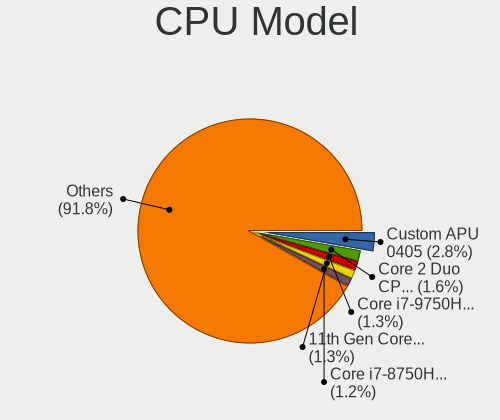
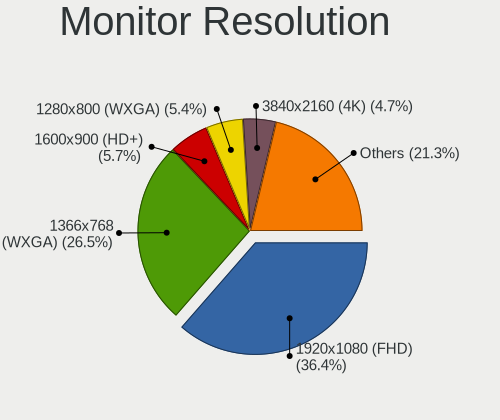
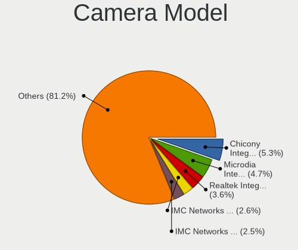
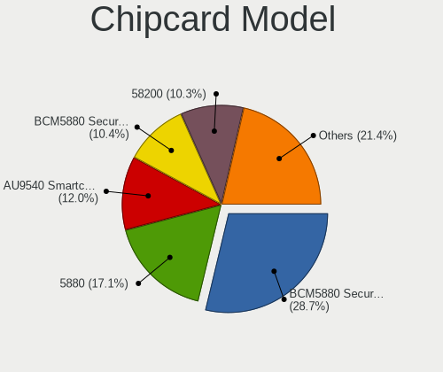

Linux in USA - Tested Hardware & Statistics (Notebooks)
-------------------------------------------------------

A project to collect tested hardware configurations for Linux in USA.

Anyone can contribute to this report by the [hw-probe](https://github.com/linuxhw/hw-probe) tool:

    sudo -E hw-probe -all -upload

Please contribute! Especially if your hardware is rare.

Contents
--------

* [ Test Cases ](#test-cases)

* [ System ](#system)
  - [ OS                       ](#os)
  - [ OS Family                ](#os-family)
  - [ Kernel                   ](#kernel)
  - [ Kernel Family            ](#kernel-family)
  - [ Kernel Major Ver.        ](#kernel-major-ver)
  - [ Arch                     ](#arch)
  - [ DE                       ](#de)
  - [ Display Server           ](#display-server)
  - [ Display Manager          ](#display-manager)
  - [ OS Lang                  ](#os-lang)
  - [ Boot Mode                ](#boot-mode)
  - [ Filesystem               ](#filesystem)
  - [ Part. scheme             ](#part-scheme)
  - [ Dual Boot with Linux/BSD ](#dual-boot-with-linuxbsd)
  - [ Dual Boot (Win)          ](#dual-boot-win)

* [ Board ](#board)
  - [ Vendor                   ](#vendor)
  - [ Model                    ](#model)
  - [ Model Family             ](#model-family)
  - [ MFG Year                 ](#mfg-year)
  - [ Form Factor              ](#form-factor)
  - [ Secure Boot              ](#secure-boot)
  - [ Coreboot                 ](#coreboot)
  - [ RAM Size                 ](#ram-size)
  - [ RAM Used                 ](#ram-used)
  - [ Total Drives             ](#total-drives)
  - [ Has CD-ROM               ](#has-cd-rom)
  - [ Has Ethernet             ](#has-ethernet)
  - [ Has WiFi                 ](#has-wifi)
  - [ Has Bluetooth            ](#has-bluetooth)

* [ Location ](#location)
  - [ Country                  ](#country)
  - [ City                     ](#city)

* [ Drives ](#drives)
  - [ Drive Vendor             ](#drive-vendor)
  - [ Drive Model              ](#drive-model)
  - [ HDD Vendor               ](#hdd-vendor)
  - [ SSD Vendor               ](#ssd-vendor)
  - [ Drive Kind               ](#drive-kind)
  - [ Drive Connector          ](#drive-connector)
  - [ Drive Size               ](#drive-size)
  - [ Space Total              ](#space-total)
  - [ Space Used               ](#space-used)
  - [ Malfunc. Drives          ](#malfunc-drives)
  - [ Malfunc. Drive Vendor    ](#malfunc-drive-vendor)
  - [ Malfunc. HDD Vendor      ](#malfunc-hdd-vendor)
  - [ Malfunc. Drive Kind      ](#malfunc-drive-kind)
  - [ Failed Drives            ](#failed-drives)
  - [ Failed Drive Vendor      ](#failed-drive-vendor)
  - [ Drive Status             ](#drive-status)

* [ Storage controller ](#storage-controller)
  - [ Storage Vendor           ](#storage-vendor)
  - [ Storage Model            ](#storage-model)
  - [ Storage Kind             ](#storage-kind)

* [ Processor ](#processor)
  - [ CPU Vendor               ](#cpu-vendor)
  - [ CPU Model                ](#cpu-model)
  - [ CPU Model Family         ](#cpu-model-family)
  - [ CPU Cores                ](#cpu-cores)
  - [ CPU Sockets              ](#cpu-sockets)
  - [ CPU Threads              ](#cpu-threads)
  - [ CPU Op-Modes             ](#cpu-op-modes)
  - [ CPU Microcode            ](#cpu-microcode)
  - [ CPU Microarch            ](#cpu-microarch)

* [ Graphics ](#graphics)
  - [ GPU Vendor               ](#gpu-vendor)
  - [ GPU Model                ](#gpu-model)
  - [ GPU Combo                ](#gpu-combo)
  - [ GPU Driver               ](#gpu-driver)
  - [ GPU Memory               ](#gpu-memory)

* [ Monitor ](#monitor)
  - [ Monitor Vendor           ](#monitor-vendor)
  - [ Monitor Model            ](#monitor-model)
  - [ Monitor Resolution       ](#monitor-resolution)
  - [ Monitor Diagonal         ](#monitor-diagonal)
  - [ Monitor Width            ](#monitor-width)
  - [ Aspect Ratio             ](#aspect-ratio)
  - [ Monitor Area             ](#monitor-area)
  - [ Pixel Density            ](#pixel-density)
  - [ Multiple Monitors        ](#multiple-monitors)

* [ Network ](#network)
  - [ Net Controller Vendor    ](#net-controller-vendor)
  - [ Net Controller Model     ](#net-controller-model)
  - [ Wireless Vendor          ](#wireless-vendor)
  - [ Wireless Model           ](#wireless-model)
  - [ Ethernet Vendor          ](#ethernet-vendor)
  - [ Ethernet Model           ](#ethernet-model)
  - [ Net Controller Kind      ](#net-controller-kind)
  - [ Used Controller          ](#used-controller)
  - [ NICs                     ](#nics)
  - [ IPv6                     ](#ipv6)

* [ Bluetooth ](#bluetooth)
  - [ Bluetooth Vendor         ](#bluetooth-vendor)
  - [ Bluetooth Model          ](#bluetooth-model)

* [ Sound ](#sound)
  - [ Sound Vendor             ](#sound-vendor)
  - [ Sound Model              ](#sound-model)

* [ Memory ](#memory)
  - [ Memory Vendor            ](#memory-vendor)
  - [ Memory Model             ](#memory-model)
  - [ Memory Kind              ](#memory-kind)
  - [ Memory Form Factor       ](#memory-form-factor)
  - [ Memory Size              ](#memory-size)
  - [ Memory Speed             ](#memory-speed)

* [ Printers & scanners ](#printers--scanners)
  - [ Printer Vendor           ](#printer-vendor)
  - [ Printer Model            ](#printer-model)
  - [ Scanner Vendor           ](#scanner-vendor)
  - [ Scanner Model            ](#scanner-model)

* [ Camera ](#camera)
  - [ Camera Vendor            ](#camera-vendor)
  - [ Camera Model             ](#camera-model)

* [ Security ](#security)
  - [ Fingerprint Vendor       ](#fingerprint-vendor)
  - [ Fingerprint Model        ](#fingerprint-model)
  - [ Chipcard Vendor          ](#chipcard-vendor)
  - [ Chipcard Model           ](#chipcard-model)

* [ Unsupported ](#unsupported)
  - [ Unsupported Devices      ](#unsupported-devices)
  - [ Unsupported Device Types ](#unsupported-device-types)

Test Cases
----------

Total: 21041

| Vendor        | Model                       | Probe                                                      | Date         |
|---------------|-----------------------------|------------------------------------------------------------|--------------|
| Apple         | MacBookAir7,2               | [352c998936](https://linux-hardware.org/?probe=352c998936) | Feb 01, 2023 |
| Valve         | Jupiter                     | [09c9b01e9b](https://linux-hardware.org/?probe=09c9b01e9b) | Feb 01, 2023 |
| Apple         | MacBookPro15,1              | [7f89f4417d](https://linux-hardware.org/?probe=7f89f4417d) | Feb 01, 2023 |
| MSI           | GF63 Thin 11UC              | [4f06c55846](https://linux-hardware.org/?probe=4f06c55846) | Feb 01, 2023 |
| Lenovo        | ThinkPad X1 Carbon Gen 9... | [c1862b275d](https://linux-hardware.org/?probe=c1862b275d) | Feb 01, 2023 |
| Lenovo        | ThinkPad X1 Carbon Gen 9... | [1aa5d63f0c](https://linux-hardware.org/?probe=1aa5d63f0c) | Feb 01, 2023 |
| Lenovo        | ThinkPad X220 Tablet 429... | [c4869ecf2c](https://linux-hardware.org/?probe=c4869ecf2c) | Feb 01, 2023 |
| Valve         | Jupiter                     | [eab7cc51cd](https://linux-hardware.org/?probe=eab7cc51cd) | Feb 01, 2023 |
| Acer          | Predator PH517-61           | [b16ddc31d8](https://linux-hardware.org/?probe=b16ddc31d8) | Feb 01, 2023 |
| Valve         | Jupiter                     | [304c2a8ce3](https://linux-hardware.org/?probe=304c2a8ce3) | Feb 01, 2023 |
| Valve         | Jupiter                     | [6debcb8087](https://linux-hardware.org/?probe=6debcb8087) | Feb 01, 2023 |
| Lenovo        | ThinkPad X270 20HMS0T000    | [e9854b7cf8](https://linux-hardware.org/?probe=e9854b7cf8) | Feb 01, 2023 |
| Google        | Gnawty                      | [4188917829](https://linux-hardware.org/?probe=4188917829) | Jan 31, 2023 |
| Google        | Lillipup                    | [45f9b8c3cf](https://linux-hardware.org/?probe=45f9b8c3cf) | Jan 31, 2023 |
| Lenovo        | ThinkPad X140e 20BMS03E0... | [fb4c4aebf9](https://linux-hardware.org/?probe=fb4c4aebf9) | Jan 31, 2023 |
| Lenovo        | ThinkPad T530 2429F27       | [85ac6a588d](https://linux-hardware.org/?probe=85ac6a588d) | Jan 31, 2023 |
| Dell          | Vostro 3700                 | [a663152b7c](https://linux-hardware.org/?probe=a663152b7c) | Jan 31, 2023 |
| Apple         | MacBookPro12,1              | [228ab40738](https://linux-hardware.org/?probe=228ab40738) | Jan 31, 2023 |
| Dell          | Vostro 3700                 | [ae3838cc5d](https://linux-hardware.org/?probe=ae3838cc5d) | Jan 31, 2023 |
| Dell          | Studio 1558                 | [acfea4cd33](https://linux-hardware.org/?probe=acfea4cd33) | Jan 31, 2023 |
| Google        | Casta                       | [db372f6a5f](https://linux-hardware.org/?probe=db372f6a5f) | Jan 31, 2023 |
| System76      | Lemur                       | [6dac0a5b94](https://linux-hardware.org/?probe=6dac0a5b94) | Jan 31, 2023 |
| Dell          | XPS 13 9360                 | [3aa64bf1ec](https://linux-hardware.org/?probe=3aa64bf1ec) | Jan 31, 2023 |
| Lenovo        | ThinkPad X220 Tablet 429... | [230b38f8e6](https://linux-hardware.org/?probe=230b38f8e6) | Jan 31, 2023 |
| Acer          | Aspire E5-571               | [615ee3d3fd](https://linux-hardware.org/?probe=615ee3d3fd) | Jan 31, 2023 |
| Acer          | Aspire E5-571               | [6498b44bcc](https://linux-hardware.org/?probe=6498b44bcc) | Jan 31, 2023 |
| Lenovo        | ThinkPad E560 20EV002FUS    | [0110b731e7](https://linux-hardware.org/?probe=0110b731e7) | Jan 31, 2023 |
| HP            | Pavilion dv6                | [c84439bfbf](https://linux-hardware.org/?probe=c84439bfbf) | Jan 31, 2023 |
| Google        | Robo360                     | [c9fb18664b](https://linux-hardware.org/?probe=c9fb18664b) | Jan 31, 2023 |
| Lenovo        | ThinkPad E560 20EV002FUS    | [faa0a5a1ff](https://linux-hardware.org/?probe=faa0a5a1ff) | Jan 31, 2023 |
| Acer          | Swift SF114-32              | [82d317899e](https://linux-hardware.org/?probe=82d317899e) | Jan 31, 2023 |
| Lenovo        | ThinkPad L540 20AVCTO1WW    | [d08beb0c26](https://linux-hardware.org/?probe=d08beb0c26) | Jan 31, 2023 |
| Valve         | Jupiter                     | [584a69fbac](https://linux-hardware.org/?probe=584a69fbac) | Jan 31, 2023 |
| Dell          | Latitude E5420              | [ccc3ca9853](https://linux-hardware.org/?probe=ccc3ca9853) | Jan 31, 2023 |
| Lenovo        | Legion 7 16ARHA7 82UH       | [bcaa2e6b1a](https://linux-hardware.org/?probe=bcaa2e6b1a) | Jan 30, 2023 |
| Framework     | Laptop (12th Gen Intel C... | [96671141f9](https://linux-hardware.org/?probe=96671141f9) | Jan 30, 2023 |
| Toshiba       | Satellite U845W             | [6735a45763](https://linux-hardware.org/?probe=6735a45763) | Jan 30, 2023 |
| Lenovo        | ThinkPad P50 20EN0013US     | [d3bf9fe9e3](https://linux-hardware.org/?probe=d3bf9fe9e3) | Jan 30, 2023 |
| GPU Compan... | GWTN141-10                  | [f012d6d71c](https://linux-hardware.org/?probe=f012d6d71c) | Jan 30, 2023 |
| HP            | Pavilion Notebook           | [912213d849](https://linux-hardware.org/?probe=912213d849) | Jan 30, 2023 |
| HP            | Pavilion Notebook           | [456415a23e](https://linux-hardware.org/?probe=456415a23e) | Jan 30, 2023 |
| HP            | Stream Laptop 14-cb1XX      | [3f17be7a85](https://linux-hardware.org/?probe=3f17be7a85) | Jan 30, 2023 |
| MSI           | Raider GE76 12UE            | [c69bbc917b](https://linux-hardware.org/?probe=c69bbc917b) | Jan 30, 2023 |
| HP            | ProBook 6465b               | [de7999a824](https://linux-hardware.org/?probe=de7999a824) | Jan 30, 2023 |
| Dell          | XPS 13 9360                 | [9037e30b54](https://linux-hardware.org/?probe=9037e30b54) | Jan 30, 2023 |
| Dell          | Latitude E6520              | [f042c5966b](https://linux-hardware.org/?probe=f042c5966b) | Jan 30, 2023 |
| Acer          | Swift SF114-32              | [1228d6d0f7](https://linux-hardware.org/?probe=1228d6d0f7) | Jan 30, 2023 |
| HP            | EliteBook 8560p             | [f03a63f76a](https://linux-hardware.org/?probe=f03a63f76a) | Jan 30, 2023 |
| MSI           | GE75 Raider 10SF            | [85d2ae302d](https://linux-hardware.org/?probe=85d2ae302d) | Jan 30, 2023 |
| HP            | Pavilion dv7                | [b61ed06b1e](https://linux-hardware.org/?probe=b61ed06b1e) | Jan 30, 2023 |
| HP            | Pavilion 15                 | [6ceccb3d73](https://linux-hardware.org/?probe=6ceccb3d73) | Jan 30, 2023 |
| Dell          | XPS 13 9380                 | [ec00530842](https://linux-hardware.org/?probe=ec00530842) | Jan 30, 2023 |
| Valve         | Jupiter                     | [e48701a8e1](https://linux-hardware.org/?probe=e48701a8e1) | Jan 30, 2023 |
| AZW           | GT-R                        | [6c286ec8fb](https://linux-hardware.org/?probe=6c286ec8fb) | Jan 30, 2023 |
| Dell          | XPS 15 9570                 | [1d06f2715a](https://linux-hardware.org/?probe=1d06f2715a) | Jan 30, 2023 |
| HP            | OMEN by Laptop 15z-en100    | [0c91238954](https://linux-hardware.org/?probe=0c91238954) | Jan 30, 2023 |
| Sony          | PCG-GRT230(UC)              | [0a7c76da78](https://linux-hardware.org/?probe=0a7c76da78) | Jan 30, 2023 |
| Lenovo        | ThinkPad T460s 20FAS1F20... | [39b709296b](https://linux-hardware.org/?probe=39b709296b) | Jan 30, 2023 |
| HP            | Laptop 15-dy2xxx            | [97e6b9cb60](https://linux-hardware.org/?probe=97e6b9cb60) | Jan 29, 2023 |
| HP            | Laptop 15-dy2xxx            | [e5e795e7a2](https://linux-hardware.org/?probe=e5e795e7a2) | Jan 29, 2023 |
| Lenovo        | Legion 7 15IMH05 81YT       | [b88f08d400](https://linux-hardware.org/?probe=b88f08d400) | Jan 29, 2023 |
| Google        | Lillipup                    | [194cec66f5](https://linux-hardware.org/?probe=194cec66f5) | Jan 29, 2023 |
| Dell          | G15 5520                    | [ae4bf1777e](https://linux-hardware.org/?probe=ae4bf1777e) | Jan 29, 2023 |
| Dell          | Inspiron 15-3573            | [b735bbde51](https://linux-hardware.org/?probe=b735bbde51) | Jan 29, 2023 |
| HP            | Laptop 14-fq0xxx            | [0b7bcda17a](https://linux-hardware.org/?probe=0b7bcda17a) | Jan 29, 2023 |
| Alienware     | x17 R2                      | [d004749696](https://linux-hardware.org/?probe=d004749696) | Jan 29, 2023 |
| Alienware     | x17 R2                      | [350244db5d](https://linux-hardware.org/?probe=350244db5d) | Jan 29, 2023 |
| Dell          | Inspiron 5520               | [c869e74605](https://linux-hardware.org/?probe=c869e74605) | Jan 29, 2023 |
| Valve         | Jupiter                     | [f439aa5179](https://linux-hardware.org/?probe=f439aa5179) | Jan 29, 2023 |
| Valve         | Jupiter                     | [9fdd992e96](https://linux-hardware.org/?probe=9fdd992e96) | Jan 29, 2023 |
| HP            | Pavilion dv6                | [1e739ddc0d](https://linux-hardware.org/?probe=1e739ddc0d) | Jan 29, 2023 |
| Lenovo        | ThinkPad E14 Gen 3 20Y7C... | [66ab929a6c](https://linux-hardware.org/?probe=66ab929a6c) | Jan 29, 2023 |
| Motion Com... | C5t                         | [200be33adc](https://linux-hardware.org/?probe=200be33adc) | Jan 29, 2023 |
| Toshiba       | QOSMIO X770                 | [62b104b3d2](https://linux-hardware.org/?probe=62b104b3d2) | Jan 29, 2023 |
| HP            | Laptop 15-da0xxx            | [959a9a17dd](https://linux-hardware.org/?probe=959a9a17dd) | Jan 29, 2023 |
| ASUSTek       | TUF Gaming FX505DT_FX505... | [4333734c92](https://linux-hardware.org/?probe=4333734c92) | Jan 29, 2023 |
| System76      | Lemur                       | [a6fc9167f7](https://linux-hardware.org/?probe=a6fc9167f7) | Jan 29, 2023 |
| ASUSTek       | ROG Strix G513RM_G513RM     | [4603f92b18](https://linux-hardware.org/?probe=4603f92b18) | Jan 29, 2023 |
| HP            | Pavilion dv7                | [f27e7c24c1](https://linux-hardware.org/?probe=f27e7c24c1) | Jan 29, 2023 |
| Alienware     | x15 R2                      | [51bb7a8c39](https://linux-hardware.org/?probe=51bb7a8c39) | Jan 29, 2023 |
| System76      | Darter Pro                  | [5d97ec522f](https://linux-hardware.org/?probe=5d97ec522f) | Jan 29, 2023 |
| Dell          | Precision 7510              | [4f56174991](https://linux-hardware.org/?probe=4f56174991) | Jan 29, 2023 |
| Dell          | XPS 13 7390                 | [60c03ee1f7](https://linux-hardware.org/?probe=60c03ee1f7) | Jan 29, 2023 |
| Lenovo        | ThinkPad T460 20FMS79000    | [2b397905e1](https://linux-hardware.org/?probe=2b397905e1) | Jan 29, 2023 |
| Lenovo        | ThinkPad E14 Gen 3 20Y7C... | [4b4d53bcc1](https://linux-hardware.org/?probe=4b4d53bcc1) | Jan 29, 2023 |
| Gateway       | NV570P                      | [f7d900c26c](https://linux-hardware.org/?probe=f7d900c26c) | Jan 29, 2023 |
| Toshiba       | QOSMIO X770                 | [b7cf9bee5c](https://linux-hardware.org/?probe=b7cf9bee5c) | Jan 28, 2023 |
| HP            | Laptop 17-cp2xxx            | [e04f33db90](https://linux-hardware.org/?probe=e04f33db90) | Jan 28, 2023 |
| ASUSTek       | VivoBook_ASUSLaptop X412... | [1d28352c0f](https://linux-hardware.org/?probe=1d28352c0f) | Jan 28, 2023 |
| Dell          | XPS 13 9380                 | [ed99ed692d](https://linux-hardware.org/?probe=ed99ed692d) | Jan 28, 2023 |
| Dell          | Inspiron 1521               | [8fcde91462](https://linux-hardware.org/?probe=8fcde91462) | Jan 28, 2023 |
| Lenovo        | IdeaPad 330S-15ARR 81FB     | [95053898dc](https://linux-hardware.org/?probe=95053898dc) | Jan 28, 2023 |
| Dell          | Precision 7730              | [058f16ac84](https://linux-hardware.org/?probe=058f16ac84) | Jan 28, 2023 |
| Google        | Candy                       | [2b2368d61b](https://linux-hardware.org/?probe=2b2368d61b) | Jan 28, 2023 |
| MSI           | Vector GP76 12UHSO          | [549b690251](https://linux-hardware.org/?probe=549b690251) | Jan 28, 2023 |
| Apple         | MacBookPro11,2              | [a5f320de13](https://linux-hardware.org/?probe=a5f320de13) | Jan 28, 2023 |
| HP            | EliteBook 840 G3            | [f9446c0c08](https://linux-hardware.org/?probe=f9446c0c08) | Jan 28, 2023 |
| Google        | Celes                       | [c132165ea7](https://linux-hardware.org/?probe=c132165ea7) | Jan 28, 2023 |
| Lenovo        | IdeaPad Flex-14API 81SS     | [d99ff3dbe8](https://linux-hardware.org/?probe=d99ff3dbe8) | Jan 28, 2023 |
| MSI           | Vector GP76 12UHSO          | [cbbd1d3e3e](https://linux-hardware.org/?probe=cbbd1d3e3e) | Jan 28, 2023 |
| HP            | Notebook                    | [93b7761349](https://linux-hardware.org/?probe=93b7761349) | Jan 28, 2023 |
| Dell          | XPS 13 9305                 | [684b829dbb](https://linux-hardware.org/?probe=684b829dbb) | Jan 28, 2023 |
| HP            | EliteBook 8540w (VD444AD... | [eeb394333a](https://linux-hardware.org/?probe=eeb394333a) | Jan 28, 2023 |
| HP            | Pavilion Gaming Laptop 1... | [ce2955973a](https://linux-hardware.org/?probe=ce2955973a) | Jan 27, 2023 |
| Lenovo        | IdeaPad S145-15IWL 81MV     | [f71299a9c6](https://linux-hardware.org/?probe=f71299a9c6) | Jan 27, 2023 |
| Dell          | Latitude E7440              | [9ba078f6ab](https://linux-hardware.org/?probe=9ba078f6ab) | Jan 27, 2023 |
| System76      | Lemur Pro                   | [40c5731c48](https://linux-hardware.org/?probe=40c5731c48) | Jan 27, 2023 |
| HP            | Laptop 17-cp2xxx            | [e0a29b46da](https://linux-hardware.org/?probe=e0a29b46da) | Jan 27, 2023 |
| ASUSTek       | TUF Gaming FX705DT_FX705... | [b265f91d10](https://linux-hardware.org/?probe=b265f91d10) | Jan 27, 2023 |
| HP            | EliteBook 850 G1            | [e457d836c7](https://linux-hardware.org/?probe=e457d836c7) | Jan 27, 2023 |
| Acer          | Aspire E5-571               | [cef03beca8](https://linux-hardware.org/?probe=cef03beca8) | Jan 27, 2023 |
| Dell          | Latitude E7470              | [4245585e75](https://linux-hardware.org/?probe=4245585e75) | Jan 27, 2023 |
| Apple         | MacBookPro7,1               | [1ae85a6add](https://linux-hardware.org/?probe=1ae85a6add) | Jan 27, 2023 |
| Dell          | Latitude D430               | [e171875163](https://linux-hardware.org/?probe=e171875163) | Jan 27, 2023 |
| Apple         | MacBookPro7,1               | [7f9b52e91c](https://linux-hardware.org/?probe=7f9b52e91c) | Jan 27, 2023 |
| HP            | 250 G6 Notebook PC          | [bf46f5e825](https://linux-hardware.org/?probe=bf46f5e825) | Jan 27, 2023 |
| Dynabook      | TECRA A50-J                 | [a2ad3f4eb3](https://linux-hardware.org/?probe=a2ad3f4eb3) | Jan 27, 2023 |
| HP            | ENVY Laptop 13-ba0xxx       | [e4544fb59a](https://linux-hardware.org/?probe=e4544fb59a) | Jan 27, 2023 |
| Gateway       | T-1620                      | [595ce5493d](https://linux-hardware.org/?probe=595ce5493d) | Jan 27, 2023 |
| Lenovo        | ThinkPad T14 Gen 3 21AJS... | [de71656929](https://linux-hardware.org/?probe=de71656929) | Jan 27, 2023 |
| Lenovo        | IdeaPad S145-15AST 81N3     | [c354539ab4](https://linux-hardware.org/?probe=c354539ab4) | Jan 27, 2023 |
| EVOO          | TEV-CE-141-2                | [21e4d23b45](https://linux-hardware.org/?probe=21e4d23b45) | Jan 27, 2023 |
| HP            | Laptop 15-da0xxx            | [32a666b611](https://linux-hardware.org/?probe=32a666b611) | Jan 27, 2023 |
| MSI           | Creator 17 B11UE            | [fcf56cfe4d](https://linux-hardware.org/?probe=fcf56cfe4d) | Jan 27, 2023 |
| Clevo         | W150HNM/W170HN              | [63709a14ca](https://linux-hardware.org/?probe=63709a14ca) | Jan 27, 2023 |
| Dynabook      | TECRA A50-J                 | [3921b100b4](https://linux-hardware.org/?probe=3921b100b4) | Jan 27, 2023 |
| Lenovo        | ThinkPad T14 Gen 3 21AJS... | [e35fa4ee0f](https://linux-hardware.org/?probe=e35fa4ee0f) | Jan 26, 2023 |
| ASUSTek       | GL503VD                     | [b828149d8e](https://linux-hardware.org/?probe=b828149d8e) | Jan 26, 2023 |
| ASUSTek       | GL503VD                     | [f4095c61ff](https://linux-hardware.org/?probe=f4095c61ff) | Jan 26, 2023 |
| Dell          | XPS 17 9700                 | [72161736bf](https://linux-hardware.org/?probe=72161736bf) | Jan 26, 2023 |
| Dell          | Latitude 7400               | [697e996615](https://linux-hardware.org/?probe=697e996615) | Jan 26, 2023 |
| Dell          | XPS 15 9500                 | [4109360c56](https://linux-hardware.org/?probe=4109360c56) | Jan 26, 2023 |
| GPU Compan... | GWTN156-11                  | [e7f1ea09b5](https://linux-hardware.org/?probe=e7f1ea09b5) | Jan 26, 2023 |
| Notebook      | NP5x_NP6x_NP7xHP            | [3b7c64dc34](https://linux-hardware.org/?probe=3b7c64dc34) | Jan 26, 2023 |
| Lenovo        | ThinkPad L14 Gen 1 20U6S... | [df04ffbd50](https://linux-hardware.org/?probe=df04ffbd50) | Jan 26, 2023 |
| Lenovo        | IdeaPad 1 15ADA7 82R1       | [de7bee1cd6](https://linux-hardware.org/?probe=de7bee1cd6) | Jan 26, 2023 |
| Lenovo        | ThinkPad L14 Gen 1 20U6S... | [b2ffc58bb1](https://linux-hardware.org/?probe=b2ffc58bb1) | Jan 26, 2023 |
| Google        | Robo360                     | [ea88345040](https://linux-hardware.org/?probe=ea88345040) | Jan 26, 2023 |
| Google        | Magpie                      | [34506f260e](https://linux-hardware.org/?probe=34506f260e) | Jan 26, 2023 |
| Google        | Robo360                     | [8bd94d81f4](https://linux-hardware.org/?probe=8bd94d81f4) | Jan 26, 2023 |
| ASUSTek       | VivoBook_ASUSLaptop E210... | [c89c0bb61f](https://linux-hardware.org/?probe=c89c0bb61f) | Jan 26, 2023 |
| Lenovo        | ThinkPad X1 Carbon 6th 2... | [2026175299](https://linux-hardware.org/?probe=2026175299) | Jan 26, 2023 |
| System76      | Lemur Pro                   | [097cd4c9f8](https://linux-hardware.org/?probe=097cd4c9f8) | Jan 26, 2023 |
| Alienware     | M11xR3                      | [634b7f8eb0](https://linux-hardware.org/?probe=634b7f8eb0) | Jan 26, 2023 |
| HP            | Laptop 17-by2xxx            | [556e92dc41](https://linux-hardware.org/?probe=556e92dc41) | Jan 26, 2023 |
| Lenovo        | ThinkPad T16 Gen 1 21BVC... | [912583a548](https://linux-hardware.org/?probe=912583a548) | Jan 26, 2023 |
| Valve         | Jupiter                     | [19921f7bd1](https://linux-hardware.org/?probe=19921f7bd1) | Jan 26, 2023 |
| Dell          | Precision 7510              | [6323693228](https://linux-hardware.org/?probe=6323693228) | Jan 26, 2023 |
| Dell          | Latitude D430               | [6245710c10](https://linux-hardware.org/?probe=6245710c10) | Jan 26, 2023 |
| Lenovo        | ThinkPad E15 Gen 2 20TDC... | [5cee302318](https://linux-hardware.org/?probe=5cee302318) | Jan 25, 2023 |
| HP            | Laptop 15-ef1xxx            | [5ccbc70956](https://linux-hardware.org/?probe=5ccbc70956) | Jan 25, 2023 |
| Notebook      | NL40_50CU                   | [5029ce2c1e](https://linux-hardware.org/?probe=5029ce2c1e) | Jan 25, 2023 |
| Apple         | MacBookPro3,1               | [266ef88c0c](https://linux-hardware.org/?probe=266ef88c0c) | Jan 25, 2023 |
| Google        | Blorb                       | [adae28c837](https://linux-hardware.org/?probe=adae28c837) | Jan 25, 2023 |
| Dell          | Inspiron 3521               | [ff958dd405](https://linux-hardware.org/?probe=ff958dd405) | Jan 25, 2023 |
| Apple         | MacBookPro3,1               | [910de59ed9](https://linux-hardware.org/?probe=910de59ed9) | Jan 25, 2023 |
| HP            | ProBook 6550b               | [c7983e417c](https://linux-hardware.org/?probe=c7983e417c) | Jan 25, 2023 |
| Apple         | MacBookPro10,1              | [4643f751cf](https://linux-hardware.org/?probe=4643f751cf) | Jan 25, 2023 |
| ASUSTek       | GL503VM                     | [d1a3ab57bd](https://linux-hardware.org/?probe=d1a3ab57bd) | Jan 25, 2023 |
| Valve         | Jupiter                     | [64a96949c7](https://linux-hardware.org/?probe=64a96949c7) | Jan 25, 2023 |
| Toshiba       | Satellite C55D-B            | [76bb416217](https://linux-hardware.org/?probe=76bb416217) | Jan 25, 2023 |
| Dynabook      | TECRA A50-J                 | [2f24f18672](https://linux-hardware.org/?probe=2f24f18672) | Jan 25, 2023 |
| Apple         | MacBookPro8,1               | [a4bcc57b9e](https://linux-hardware.org/?probe=a4bcc57b9e) | Jan 25, 2023 |
| ASUSTek       | ROG Zephyrus G14 GA402RK... | [993ba3e73b](https://linux-hardware.org/?probe=993ba3e73b) | Jan 25, 2023 |
| Valve         | Jupiter                     | [449d868e7f](https://linux-hardware.org/?probe=449d868e7f) | Jan 25, 2023 |
| Lenovo        | ThinkPad T460s 20FAS2M30... | [f201c986f0](https://linux-hardware.org/?probe=f201c986f0) | Jan 25, 2023 |
| Dell          | Inspiron 13-7353            | [5ebcba8c52](https://linux-hardware.org/?probe=5ebcba8c52) | Jan 25, 2023 |
| HP            | EliteBook Folio 9470m       | [5dfd026f77](https://linux-hardware.org/?probe=5dfd026f77) | Jan 25, 2023 |
| HP            | Laptop 15-bw0xx             | [821bd6d2aa](https://linux-hardware.org/?probe=821bd6d2aa) | Jan 25, 2023 |
| HP            | ProBook 4545s               | [1d832fb2f4](https://linux-hardware.org/?probe=1d832fb2f4) | Jan 25, 2023 |
| Dell          | Inspiron 5402               | [d8df4aafe8](https://linux-hardware.org/?probe=d8df4aafe8) | Jan 25, 2023 |
| HP            | Pavilion g7                 | [e96f30194b](https://linux-hardware.org/?probe=e96f30194b) | Jan 25, 2023 |
| Dell          | System Inspiron N7110       | [935a295b28](https://linux-hardware.org/?probe=935a295b28) | Jan 25, 2023 |
| Valve         | Jupiter                     | [fa5dba8dc2](https://linux-hardware.org/?probe=fa5dba8dc2) | Jan 25, 2023 |
| Lenovo        | ThinkPad T470 20HES0PF00    | [61d7aa3ef9](https://linux-hardware.org/?probe=61d7aa3ef9) | Jan 25, 2023 |
| Acer          | Nitro AN515-42              | [cb02367642](https://linux-hardware.org/?probe=cb02367642) | Jan 25, 2023 |
| Acer          | Predator G3-571             | [549910b197](https://linux-hardware.org/?probe=549910b197) | Jan 24, 2023 |
| Apple         | MacBookAir2,1               | [5be88e4512](https://linux-hardware.org/?probe=5be88e4512) | Jan 24, 2023 |
| Dell          | Precision 5570              | [2bde8abafe](https://linux-hardware.org/?probe=2bde8abafe) | Jan 24, 2023 |
| HP            | ZBook Studio G3             | [5e1a47f01a](https://linux-hardware.org/?probe=5e1a47f01a) | Jan 24, 2023 |
| Dell          | XPS 15 9570                 | [270a9bf553](https://linux-hardware.org/?probe=270a9bf553) | Jan 24, 2023 |
| HP            | Laptop 15-dy2xxx            | [af9518a90a](https://linux-hardware.org/?probe=af9518a90a) | Jan 24, 2023 |
| ASUSTek       | K501UW                      | [9e618aa121](https://linux-hardware.org/?probe=9e618aa121) | Jan 24, 2023 |
| HP            | Pavilion Laptop 15-eh1xx... | [11cca63b74](https://linux-hardware.org/?probe=11cca63b74) | Jan 24, 2023 |
| ASUSTek       | ASUS BR1100CKA BR1100CKA... | [b46dcc4bfe](https://linux-hardware.org/?probe=b46dcc4bfe) | Jan 24, 2023 |
| MSI           | Katana GF76 11UD            | [5a5a26c29e](https://linux-hardware.org/?probe=5a5a26c29e) | Jan 24, 2023 |
| Dell          | Latitude 5580               | [34ebeee5d4](https://linux-hardware.org/?probe=34ebeee5d4) | Jan 24, 2023 |
| Acer          | Swift SFA16-41              | [1c05334105](https://linux-hardware.org/?probe=1c05334105) | Jan 24, 2023 |
| LG Electro... | 17Z90Q-K.AAC7U1             | [73a0023203](https://linux-hardware.org/?probe=73a0023203) | Jan 24, 2023 |
| Dell          | Latitude E7470              | [db73b82761](https://linux-hardware.org/?probe=db73b82761) | Jan 24, 2023 |
| Toshiba       | Satellite C655D             | [bf86cea0ec](https://linux-hardware.org/?probe=bf86cea0ec) | Jan 24, 2023 |
| Dell          | Precision 7510              | [bf8b996b99](https://linux-hardware.org/?probe=bf8b996b99) | Jan 24, 2023 |
| Dell          | Inspiron 3541               | [c5c3e94a19](https://linux-hardware.org/?probe=c5c3e94a19) | Jan 24, 2023 |
| Dell          | Inspiron 3541               | [12d8081c29](https://linux-hardware.org/?probe=12d8081c29) | Jan 23, 2023 |
| Dell          | Latitude E7470              | [6fd520f670](https://linux-hardware.org/?probe=6fd520f670) | Jan 23, 2023 |
| Acer          | Aspire 5734Z                | [aaa9f9e142](https://linux-hardware.org/?probe=aaa9f9e142) | Jan 23, 2023 |
| HP            | ProBook 440 G5              | [788d350490](https://linux-hardware.org/?probe=788d350490) | Jan 23, 2023 |
| Apple         | MacBookPro9,1               | [0a597ba033](https://linux-hardware.org/?probe=0a597ba033) | Jan 23, 2023 |
| Apple         | MacBookPro9,1               | [90884b19a9](https://linux-hardware.org/?probe=90884b19a9) | Jan 23, 2023 |
| Dynabook      | TECRA A50-J                 | [689fe06d4d](https://linux-hardware.org/?probe=689fe06d4d) | Jan 23, 2023 |
| Dynabook      | TECRA A50-J                 | [92690b43cd](https://linux-hardware.org/?probe=92690b43cd) | Jan 23, 2023 |
| Toshiba       | Satellite L305              | [d1a0c1ddf7](https://linux-hardware.org/?probe=d1a0c1ddf7) | Jan 23, 2023 |
| Dell          | Latitude E6430s             | [8d46b5ae49](https://linux-hardware.org/?probe=8d46b5ae49) | Jan 23, 2023 |
| HP            | Laptop 15-bs0xx             | [04f317d2eb](https://linux-hardware.org/?probe=04f317d2eb) | Jan 23, 2023 |
| Dell          | Latitude E7470              | [525bcdd915](https://linux-hardware.org/?probe=525bcdd915) | Jan 23, 2023 |
| HP            | Pavilion Notebook           | [6383000f9e](https://linux-hardware.org/?probe=6383000f9e) | Jan 23, 2023 |
| Acer          | Aspire E5-576               | [df3e660090](https://linux-hardware.org/?probe=df3e660090) | Jan 23, 2023 |
| HP            | Pavilion Laptop 15-cw1xx... | [171ae7149e](https://linux-hardware.org/?probe=171ae7149e) | Jan 23, 2023 |
| Acer          | Nitro AN515-42              | [8692de1465](https://linux-hardware.org/?probe=8692de1465) | Jan 23, 2023 |
| ASUSTek       | VivoBook_ASUSLaptop E510... | [5c7625e3f8](https://linux-hardware.org/?probe=5c7625e3f8) | Jan 23, 2023 |
| Valve         | Jupiter                     | [f7b3f22d28](https://linux-hardware.org/?probe=f7b3f22d28) | Jan 23, 2023 |
| Acer          | Aspire A315-59              | [20b73bd156](https://linux-hardware.org/?probe=20b73bd156) | Jan 23, 2023 |
| HP            | Pavilion Gaming Laptop 1... | [6d5ca0b2e3](https://linux-hardware.org/?probe=6d5ca0b2e3) | Jan 22, 2023 |
| Lenovo        | IdeaPad 5 15ITL05 82FG      | [66287c2f72](https://linux-hardware.org/?probe=66287c2f72) | Jan 22, 2023 |
| Lenovo        | IdeaPad 5 15ITL05 82FG      | [369b022d8e](https://linux-hardware.org/?probe=369b022d8e) | Jan 22, 2023 |
| Acer          | Aspire A515-51              | [5195423178](https://linux-hardware.org/?probe=5195423178) | Jan 22, 2023 |
| Lenovo        | 14w 81MQ000JUS              | [83704151ae](https://linux-hardware.org/?probe=83704151ae) | Jan 22, 2023 |
| Dell          | Precision 7770              | [47044d362f](https://linux-hardware.org/?probe=47044d362f) | Jan 22, 2023 |
| Valve         | Jupiter                     | [5302a3d5c0](https://linux-hardware.org/?probe=5302a3d5c0) | Jan 22, 2023 |
| Valve         | Jupiter                     | [17f32c85b3](https://linux-hardware.org/?probe=17f32c85b3) | Jan 22, 2023 |
| Valve         | Jupiter                     | [c0f67c5a46](https://linux-hardware.org/?probe=c0f67c5a46) | Jan 22, 2023 |
| Carbon Sys... | Iridium 14                  | [7fcc79f37c](https://linux-hardware.org/?probe=7fcc79f37c) | Jan 22, 2023 |
| Acer          | Aspire E5-575G              | [1153793fd9](https://linux-hardware.org/?probe=1153793fd9) | Jan 22, 2023 |
| Dell          | Precision 5520              | [f2b0c15a6d](https://linux-hardware.org/?probe=f2b0c15a6d) | Jan 22, 2023 |
| HP            | EliteBook 8470p             | [601dd342aa](https://linux-hardware.org/?probe=601dd342aa) | Jan 22, 2023 |
| Dell          | Precision 5520              | [c202a2fa19](https://linux-hardware.org/?probe=c202a2fa19) | Jan 22, 2023 |
| HP            | Laptop 17-cp0xxx            | [7e1fa9aaf3](https://linux-hardware.org/?probe=7e1fa9aaf3) | Jan 22, 2023 |
| Dell          | Latitude E5510              | [03f0dbc05c](https://linux-hardware.org/?probe=03f0dbc05c) | Jan 22, 2023 |
| Valve         | Jupiter                     | [19415c4e86](https://linux-hardware.org/?probe=19415c4e86) | Jan 22, 2023 |
| HP            | Pavilion Gaming Laptop 1... | [cd1f6d8306](https://linux-hardware.org/?probe=cd1f6d8306) | Jan 21, 2023 |
| Google        | Leona                       | [59b146e197](https://linux-hardware.org/?probe=59b146e197) | Jan 21, 2023 |
| Dell          | Inspiron 1525               | [548d331968](https://linux-hardware.org/?probe=548d331968) | Jan 21, 2023 |
| Dell          | Inspiron 5379               | [070a24694c](https://linux-hardware.org/?probe=070a24694c) | Jan 21, 2023 |
| Lenovo        | IdeaPad Slim 7 14ITL05 8... | [45bc9c5f3f](https://linux-hardware.org/?probe=45bc9c5f3f) | Jan 21, 2023 |
| Dell          | Latitude E5570              | [565e8c64f1](https://linux-hardware.org/?probe=565e8c64f1) | Jan 21, 2023 |
| Google        | Relm                        | [44fb1d9db1](https://linux-hardware.org/?probe=44fb1d9db1) | Jan 21, 2023 |
| HP            | Laptop 17-cp0xxx            | [1ada8c14a9](https://linux-hardware.org/?probe=1ada8c14a9) | Jan 21, 2023 |
| ASUSTek       | N56VZ                       | [46ec3e0f8f](https://linux-hardware.org/?probe=46ec3e0f8f) | Jan 21, 2023 |
| Dell          | Latitude 7480               | [0d4396d043](https://linux-hardware.org/?probe=0d4396d043) | Jan 21, 2023 |
| ASUSTek       | Zephyrus G GU502DU_GA502... | [ae81429a64](https://linux-hardware.org/?probe=ae81429a64) | Jan 21, 2023 |
| Lenovo        | ThinkPad X120e 05962RU      | [1628e3e66e](https://linux-hardware.org/?probe=1628e3e66e) | Jan 21, 2023 |
| Dell          | Inspiron 5502               | [aa324e02b1](https://linux-hardware.org/?probe=aa324e02b1) | Jan 21, 2023 |
| Dell          | XPS 9320                    | [ebe686793d](https://linux-hardware.org/?probe=ebe686793d) | Jan 21, 2023 |
| Dell          | XPS 9320                    | [706152a268](https://linux-hardware.org/?probe=706152a268) | Jan 21, 2023 |
| Toshiba       | Satellite S70-A             | [45648850c8](https://linux-hardware.org/?probe=45648850c8) | Jan 21, 2023 |
| Fujitsu       | LIFEBOOK P1630              | [5ee218deb4](https://linux-hardware.org/?probe=5ee218deb4) | Jan 21, 2023 |
| HP            | Pavilion Gaming Laptop 1... | [f33b08f626](https://linux-hardware.org/?probe=f33b08f626) | Jan 21, 2023 |
| Lenovo        | ThinkPad T530 23943J8       | [1da6722b35](https://linux-hardware.org/?probe=1da6722b35) | Jan 21, 2023 |
| Dell          | XPS 17 9700                 | [d37b338c87](https://linux-hardware.org/?probe=d37b338c87) | Jan 21, 2023 |
| Dell          | XPS 17 9700                 | [413cd3b7cf](https://linux-hardware.org/?probe=413cd3b7cf) | Jan 21, 2023 |
| Lenovo        | IdeaPad Slim 7 14ITL05 8... | [25f8f9b164](https://linux-hardware.org/?probe=25f8f9b164) | Jan 21, 2023 |
| Valve         | Jupiter                     | [3866c39013](https://linux-hardware.org/?probe=3866c39013) | Jan 20, 2023 |
| Valve         | Jupiter                     | [5d73100448](https://linux-hardware.org/?probe=5d73100448) | Jan 20, 2023 |
| HP            | Laptop 15-ef2xxx            | [732a1b992a](https://linux-hardware.org/?probe=732a1b992a) | Jan 20, 2023 |
| MSI           | GP66 Leopard 11UH           | [cf6837bb85](https://linux-hardware.org/?probe=cf6837bb85) | Jan 20, 2023 |
| ASUSTek       | ROG Zephyrus G14 GA401IV... | [1332c6c11a](https://linux-hardware.org/?probe=1332c6c11a) | Jan 20, 2023 |
| ASUSTek       | G74Sx                       | [f3af245bf8](https://linux-hardware.org/?probe=f3af245bf8) | Jan 20, 2023 |
| Lenovo        | V570 1066AWU                | [7d86d12566](https://linux-hardware.org/?probe=7d86d12566) | Jan 20, 2023 |
| Dell          | Latitude 5320               | [35074b5a19](https://linux-hardware.org/?probe=35074b5a19) | Jan 20, 2023 |
| Acer          | Predator PH315-55           | [b628a46957](https://linux-hardware.org/?probe=b628a46957) | Jan 20, 2023 |
| Lenovo        | ThinkPad Edge E530 32597... | [2187c4b76b](https://linux-hardware.org/?probe=2187c4b76b) | Jan 20, 2023 |
| Unknown       | Unknown                     | [1de254a697](https://linux-hardware.org/?probe=1de254a697) | Jan 20, 2023 |
| Dell          | G3 3579                     | [d418b797c8](https://linux-hardware.org/?probe=d418b797c8) | Jan 20, 2023 |
| Dell          | Latitude E5570              | [6e05683356](https://linux-hardware.org/?probe=6e05683356) | Jan 20, 2023 |
| Dell          | Latitude E7450              | [c5ae2acc97](https://linux-hardware.org/?probe=c5ae2acc97) | Jan 20, 2023 |
| MSI           | GL65 Leopard 10SFK          | [8aa69f1dae](https://linux-hardware.org/?probe=8aa69f1dae) | Jan 20, 2023 |
| MSI           | GL65 Leopard 10SFK          | [0ea710bda6](https://linux-hardware.org/?probe=0ea710bda6) | Jan 20, 2023 |
| HP            | Laptop 15-bw0xx             | [0bf7ea6726](https://linux-hardware.org/?probe=0bf7ea6726) | Jan 20, 2023 |
| Apple         | MacBookPro5,3               | [630ed17760](https://linux-hardware.org/?probe=630ed17760) | Jan 20, 2023 |
| Lenovo        | ThinkPad T490s 20NYS3SX0... | [3e08ab25c6](https://linux-hardware.org/?probe=3e08ab25c6) | Jan 20, 2023 |
| Dell          | Latitude E6540              | [34c018d211](https://linux-hardware.org/?probe=34c018d211) | Jan 20, 2023 |
| MSI           | GS66 Stealth 10UE           | [d5a2a6aaa8](https://linux-hardware.org/?probe=d5a2a6aaa8) | Jan 19, 2023 |
| Acer          | Aspire A515-54              | [db5bd0e34e](https://linux-hardware.org/?probe=db5bd0e34e) | Jan 19, 2023 |
| Lenovo        | ThinkPad T460s 20FAS2M30... | [641654df50](https://linux-hardware.org/?probe=641654df50) | Jan 19, 2023 |
| ASUSTek       | ROG Strix G732LXS_G732LX... | [753a61e1de](https://linux-hardware.org/?probe=753a61e1de) | Jan 19, 2023 |
| Dell          | Precision M6800             | [bcd98b78c4](https://linux-hardware.org/?probe=bcd98b78c4) | Jan 19, 2023 |
| ASUSTek       | ROG Strix G732LXS_G732LX... | [b14d57e1a3](https://linux-hardware.org/?probe=b14d57e1a3) | Jan 19, 2023 |
| ASUSTek       | VivoBook_ASUSLaptop E410... | [80cb1c8239](https://linux-hardware.org/?probe=80cb1c8239) | Jan 19, 2023 |
| Dell          | Inspiron 3505               | [86defcfb4f](https://linux-hardware.org/?probe=86defcfb4f) | Jan 19, 2023 |
| HP            | Stream Laptop 11-ah0XX      | [6c83597890](https://linux-hardware.org/?probe=6c83597890) | Jan 19, 2023 |
| Alienware     | 15 R2                       | [3d9c86b05e](https://linux-hardware.org/?probe=3d9c86b05e) | Jan 19, 2023 |
| Dell          | Precision 7720              | [9a00916b91](https://linux-hardware.org/?probe=9a00916b91) | Jan 19, 2023 |
| Apple         | MacBook5,2                  | [433209f43d](https://linux-hardware.org/?probe=433209f43d) | Jan 19, 2023 |
| ASUSTek       | X501A                       | [2f573ed7f1](https://linux-hardware.org/?probe=2f573ed7f1) | Jan 19, 2023 |
| ASUSTek       | X501A                       | [a1c3cee60f](https://linux-hardware.org/?probe=a1c3cee60f) | Jan 19, 2023 |
| Unknown       | Unknown                     | [39bd375140](https://linux-hardware.org/?probe=39bd375140) | Jan 19, 2023 |
| HP            | 15 Notebook PC              | [5405ae6181](https://linux-hardware.org/?probe=5405ae6181) | Jan 19, 2023 |
| Valve         | Jupiter                     | [b2778fd350](https://linux-hardware.org/?probe=b2778fd350) | Jan 19, 2023 |
| Lenovo        | ThinkPad SL510 2847CZU      | [710998b216](https://linux-hardware.org/?probe=710998b216) | Jan 19, 2023 |
| Lenovo        | Legion 5 15ARH05 82B5       | [2e66a90abd](https://linux-hardware.org/?probe=2e66a90abd) | Jan 19, 2023 |
| Razer         | Blade                       | [b3f154ac11](https://linux-hardware.org/?probe=b3f154ac11) | Jan 19, 2023 |
| Apple         | MacBookPro5,2               | [8e71a8746d](https://linux-hardware.org/?probe=8e71a8746d) | Jan 19, 2023 |
| Dell          | Inspiron 1525               | [f4df69624c](https://linux-hardware.org/?probe=f4df69624c) | Jan 19, 2023 |
| HP            | Stream Laptop 14-ax0XX      | [8825aa1329](https://linux-hardware.org/?probe=8825aa1329) | Jan 19, 2023 |
| Apple         | MacBookPro8,1               | [997cce8284](https://linux-hardware.org/?probe=997cce8284) | Jan 19, 2023 |
| HP            | Laptop 15-ef2xxx            | [d9e9f47ad4](https://linux-hardware.org/?probe=d9e9f47ad4) | Jan 19, 2023 |
| Lenovo        | ThinkPad T450 20BUS39J00    | [d5c413e815](https://linux-hardware.org/?probe=d5c413e815) | Jan 19, 2023 |
| Dell          | Inspiron 5737               | [8111e45229](https://linux-hardware.org/?probe=8111e45229) | Jan 19, 2023 |
| Lenovo        | IdeaPad 5 14IIL05 81YH      | [368ed9c856](https://linux-hardware.org/?probe=368ed9c856) | Jan 18, 2023 |
| MSI           | GE76 Raider 11UE            | [09464147c8](https://linux-hardware.org/?probe=09464147c8) | Jan 18, 2023 |
| Dell          | Inspiron 15 3511            | [cb9b356a27](https://linux-hardware.org/?probe=cb9b356a27) | Jan 18, 2023 |
| HP            | Pavilion dv5                | [2ab5c1d05d](https://linux-hardware.org/?probe=2ab5c1d05d) | Jan 18, 2023 |
| HP            | EliteBook 840 G5            | [96e072d33f](https://linux-hardware.org/?probe=96e072d33f) | Jan 18, 2023 |
| Valve         | Jupiter                     | [70fdb87eeb](https://linux-hardware.org/?probe=70fdb87eeb) | Jan 18, 2023 |
| Lenovo        | V570 1066AJU                | [0dca70d8ea](https://linux-hardware.org/?probe=0dca70d8ea) | Jan 18, 2023 |
| Dell          | Inspiron 15 3511            | [8f9cf93045](https://linux-hardware.org/?probe=8f9cf93045) | Jan 18, 2023 |
| HP            | EliteBook 840 G5            | [c0667c5ea5](https://linux-hardware.org/?probe=c0667c5ea5) | Jan 18, 2023 |
| Valve         | Jupiter                     | [f40693d253](https://linux-hardware.org/?probe=f40693d253) | Jan 18, 2023 |
| HP            | Notebook                    | [1c935be3b1](https://linux-hardware.org/?probe=1c935be3b1) | Jan 18, 2023 |
| Lenovo        | ThinkPad T560 20FH001QUS    | [933f67b6b5](https://linux-hardware.org/?probe=933f67b6b5) | Jan 18, 2023 |
| HP            | Pavilion Laptop 15-cc5xx    | [c52e64925e](https://linux-hardware.org/?probe=c52e64925e) | Jan 18, 2023 |
| HP            | OMEN by Laptop 15-ce0xx     | [8c4a206094](https://linux-hardware.org/?probe=8c4a206094) | Jan 18, 2023 |
| Lenovo        | ThinkPad X1 Carbon 7th 2... | [004b2669ef](https://linux-hardware.org/?probe=004b2669ef) | Jan 18, 2023 |
| Lenovo        | ThinkPad T560 20FH001QUS    | [48a56bd8c2](https://linux-hardware.org/?probe=48a56bd8c2) | Jan 18, 2023 |
| HP            | ZBook Firefly 15.6 inch ... | [ac28c1fba4](https://linux-hardware.org/?probe=ac28c1fba4) | Jan 18, 2023 |
| Google        | Falco                       | [b4d0e9058a](https://linux-hardware.org/?probe=b4d0e9058a) | Jan 18, 2023 |
| HP            | ZBook Firefly 15.6 inch ... | [45e2d0fb2d](https://linux-hardware.org/?probe=45e2d0fb2d) | Jan 18, 2023 |
| Dell          | Precision 7510              | [112684272b](https://linux-hardware.org/?probe=112684272b) | Jan 18, 2023 |
| Dell          | Precision 7760              | [8d77225470](https://linux-hardware.org/?probe=8d77225470) | Jan 18, 2023 |
| Acer          | Swift SFX14-41G             | [1b916fe30d](https://linux-hardware.org/?probe=1b916fe30d) | Jan 18, 2023 |
| Dell          | Latitude 7490               | [b611fc6b64](https://linux-hardware.org/?probe=b611fc6b64) | Jan 18, 2023 |
| HP            | Pavilion Laptop 15-eg0xx... | [fb99330149](https://linux-hardware.org/?probe=fb99330149) | Jan 18, 2023 |
| ASUSTek       | ROG Zephyrus G15 GA503QR... | [74e5b3d0bf](https://linux-hardware.org/?probe=74e5b3d0bf) | Jan 17, 2023 |
| Dell          | Latitude E6540              | [eaaf255ed2](https://linux-hardware.org/?probe=eaaf255ed2) | Jan 17, 2023 |
| MSI           | GP66 Leopard 11UH           | [269015d6a4](https://linux-hardware.org/?probe=269015d6a4) | Jan 17, 2023 |
| Fujitsu       | LIFEBOOK P1630              | [5a9662e39b](https://linux-hardware.org/?probe=5a9662e39b) | Jan 17, 2023 |
| Apple         | MacBookPro8,1               | [da481ceeb8](https://linux-hardware.org/?probe=da481ceeb8) | Jan 17, 2023 |
| Dell          | Latitude E6440              | [f2b34c7c46](https://linux-hardware.org/?probe=f2b34c7c46) | Jan 17, 2023 |
| Dell          | XPS 13 9360                 | [7302e1ecb2](https://linux-hardware.org/?probe=7302e1ecb2) | Jan 17, 2023 |
| MSI           | Katana GF76 11UD            | [dcc8c2a63b](https://linux-hardware.org/?probe=dcc8c2a63b) | Jan 17, 2023 |
| Google        | Galtic                      | [dc327fcb42](https://linux-hardware.org/?probe=dc327fcb42) | Jan 17, 2023 |
| Lenovo        | IdeaPad S340-15API 81NC     | [674f3e9cae](https://linux-hardware.org/?probe=674f3e9cae) | Jan 17, 2023 |
| ASUSTek       | ROG Zephyrus G14 GA401IV... | [a450de43e1](https://linux-hardware.org/?probe=a450de43e1) | Jan 17, 2023 |
| Dell          | Latitude E6420              | [8aba0b46b8](https://linux-hardware.org/?probe=8aba0b46b8) | Jan 17, 2023 |
| HP            | Pavilion Laptop 15-cc5xx    | [1ae3485568](https://linux-hardware.org/?probe=1ae3485568) | Jan 17, 2023 |
| Toshiba       | Satellite C55-B             | [fb0d5dad17](https://linux-hardware.org/?probe=fb0d5dad17) | Jan 17, 2023 |
| Framework     | Laptop                      | [e94774a411](https://linux-hardware.org/?probe=e94774a411) | Jan 17, 2023 |
| HP            | 15 Notebook PC              | [8b4d292adf](https://linux-hardware.org/?probe=8b4d292adf) | Jan 17, 2023 |
| Valve         | Jupiter                     | [efadc3d4d1](https://linux-hardware.org/?probe=efadc3d4d1) | Jan 17, 2023 |
| Toshiba       | Satellite C55-B             | [c8566c8460](https://linux-hardware.org/?probe=c8566c8460) | Jan 17, 2023 |
| MSI           | Summit E13FlipEvo A12MT     | [35024faf2b](https://linux-hardware.org/?probe=35024faf2b) | Jan 17, 2023 |
| Apple         | MacBookPro8,2               | [271f6a7e85](https://linux-hardware.org/?probe=271f6a7e85) | Jan 17, 2023 |
| Dell          | Inspiron 5585               | [b92481ca4e](https://linux-hardware.org/?probe=b92481ca4e) | Jan 17, 2023 |
| Acer          | Aspire AV14-51              | [596219796d](https://linux-hardware.org/?probe=596219796d) | Jan 17, 2023 |
| HP            | Laptop 17-by3xxx            | [542c3d1ef4](https://linux-hardware.org/?probe=542c3d1ef4) | Jan 16, 2023 |
| Lenovo        | ThinkPad T14 Gen 2i 20W0... | [6c8a25d916](https://linux-hardware.org/?probe=6c8a25d916) | Jan 16, 2023 |
| Lenovo        | IdeaPad 310-15ABR 80ST      | [473ae331ec](https://linux-hardware.org/?probe=473ae331ec) | Jan 16, 2023 |
| System76      | Darter Pro                  | [89adb6d962](https://linux-hardware.org/?probe=89adb6d962) | Jan 16, 2023 |
| HP            | Pavilion Notebook           | [b31a0e1b3e](https://linux-hardware.org/?probe=b31a0e1b3e) | Jan 16, 2023 |
| Toshiba       | Satellite P775              | [4ac7834c5f](https://linux-hardware.org/?probe=4ac7834c5f) | Jan 16, 2023 |
| Framework     | Laptop                      | [cb22e14309](https://linux-hardware.org/?probe=cb22e14309) | Jan 16, 2023 |
| Toshiba       | Satellite P775              | [99e632c9a9](https://linux-hardware.org/?probe=99e632c9a9) | Jan 16, 2023 |
| Dell          | Precision 7720              | [f8e1c53257](https://linux-hardware.org/?probe=f8e1c53257) | Jan 16, 2023 |
| MSI           | Bravo 15 B5DD               | [8e35281ea5](https://linux-hardware.org/?probe=8e35281ea5) | Jan 16, 2023 |
| Valve         | Jupiter                     | [a5af650906](https://linux-hardware.org/?probe=a5af650906) | Jan 16, 2023 |
| Lenovo        | ThinkPad T430 23427YU       | [3ca2dd056d](https://linux-hardware.org/?probe=3ca2dd056d) | Jan 16, 2023 |
| HP            | EliteBook 840 G8 Noteboo... | [9b874af8a4](https://linux-hardware.org/?probe=9b874af8a4) | Jan 16, 2023 |
| Lenovo        | IdeaPad 5-15ARE05 81YQ      | [4c9bb70ea2](https://linux-hardware.org/?probe=4c9bb70ea2) | Jan 16, 2023 |
| HP            | Pavilion dv7                | [ae33b4bb24](https://linux-hardware.org/?probe=ae33b4bb24) | Jan 16, 2023 |
| Lenovo        | IdeaPad 5 15ITL05 82FG      | [6643ab6cf1](https://linux-hardware.org/?probe=6643ab6cf1) | Jan 16, 2023 |
| Lenovo        | ThinkPad X13 Gen 2i 20WL... | [92815c2da0](https://linux-hardware.org/?probe=92815c2da0) | Jan 16, 2023 |
| Lenovo        | IdeaPad 5 15ITL05 82FG      | [91fed2c125](https://linux-hardware.org/?probe=91fed2c125) | Jan 16, 2023 |
| Dell          | Inspiron N4010              | [7d03111ac0](https://linux-hardware.org/?probe=7d03111ac0) | Jan 16, 2023 |
| Dell          | Latitude E7450              | [127258c518](https://linux-hardware.org/?probe=127258c518) | Jan 16, 2023 |
| Lenovo        | G50-45 80E3                 | [24639395ef](https://linux-hardware.org/?probe=24639395ef) | Jan 16, 2023 |
| Lenovo        | IdeaPad Y570 0862           | [8c43e56714](https://linux-hardware.org/?probe=8c43e56714) | Jan 16, 2023 |
| ASUSTek       | VivoBook_ASUSLaptop S540... | [3c9f8b612c](https://linux-hardware.org/?probe=3c9f8b612c) | Jan 16, 2023 |
| Valve         | Jupiter                     | [309088a4f1](https://linux-hardware.org/?probe=309088a4f1) | Jan 16, 2023 |
| Acer          | Aspire V5-122P              | [c5d70f195f](https://linux-hardware.org/?probe=c5d70f195f) | Jan 16, 2023 |
| Google        | Candy                       | [f1609bed25](https://linux-hardware.org/?probe=f1609bed25) | Jan 16, 2023 |
| Acer          | Aspire ES1-711              | [1aef2805c2](https://linux-hardware.org/?probe=1aef2805c2) | Jan 16, 2023 |
| Dell          | Latitude 7480               | [83af73ce9c](https://linux-hardware.org/?probe=83af73ce9c) | Jan 16, 2023 |
| System76      | Lemur Pro                   | [fde9d32359](https://linux-hardware.org/?probe=fde9d32359) | Jan 16, 2023 |
| Lenovo        | ThinkPad E560 20EV002FUS    | [422c191fe5](https://linux-hardware.org/?probe=422c191fe5) | Jan 15, 2023 |
| HP            | 15 Notebook PC              | [91e7453ded](https://linux-hardware.org/?probe=91e7453ded) | Jan 15, 2023 |
| HP            | G72                         | [a185a99eee](https://linux-hardware.org/?probe=a185a99eee) | Jan 15, 2023 |
| Lenovo        | ThinkPad X1 Carbon 5th 2... | [448ae92dc8](https://linux-hardware.org/?probe=448ae92dc8) | Jan 15, 2023 |
| Acer          | Swift SF314-510G            | [b929f53536](https://linux-hardware.org/?probe=b929f53536) | Jan 15, 2023 |
| Dell          | Inspiron 7437               | [df8d69926f](https://linux-hardware.org/?probe=df8d69926f) | Jan 15, 2023 |
| Dell          | Inspiron 7437               | [0670d91eb0](https://linux-hardware.org/?probe=0670d91eb0) | Jan 15, 2023 |
| Apple         | MacBookAir5,2               | [8b9ddf331f](https://linux-hardware.org/?probe=8b9ddf331f) | Jan 15, 2023 |
| Toshiba       | Satellite L70-B             | [8ca911b4fc](https://linux-hardware.org/?probe=8ca911b4fc) | Jan 15, 2023 |
| HP            | Laptop 17-cp0xxx            | [bdd76f68c8](https://linux-hardware.org/?probe=bdd76f68c8) | Jan 15, 2023 |
| HP            | Laptop 17-cp0xxx            | [e7ecd8c99e](https://linux-hardware.org/?probe=e7ecd8c99e) | Jan 15, 2023 |
| Lenovo        | IdeaPad L340-15IRH Gamin... | [fcc6481e2a](https://linux-hardware.org/?probe=fcc6481e2a) | Jan 15, 2023 |
| Notebook      | W35xSS_370SS                | [2337667e0f](https://linux-hardware.org/?probe=2337667e0f) | Jan 15, 2023 |
| LG Electro... | 17Z90N-R.AAS9U1             | [9d6736bccd](https://linux-hardware.org/?probe=9d6736bccd) | Jan 15, 2023 |
| HP            | Pavilion Laptop 14-bk0xx    | [ebe90b5052](https://linux-hardware.org/?probe=ebe90b5052) | Jan 15, 2023 |
| Apple         | MacBook8,1                  | [64b089dfb7](https://linux-hardware.org/?probe=64b089dfb7) | Jan 15, 2023 |
| Lenovo        | ThinkPad P50 20EQS1DC00     | [90d74fe43b](https://linux-hardware.org/?probe=90d74fe43b) | Jan 15, 2023 |
| Lenovo        | ThinkPad P50 20EQS1DC00     | [226733b547](https://linux-hardware.org/?probe=226733b547) | Jan 15, 2023 |
| Lenovo        | Legion 5 17ACH6H 82JY       | [b49ce7a30a](https://linux-hardware.org/?probe=b49ce7a30a) | Jan 15, 2023 |
| Razer         | Blade 15 (2022) - RZ09-0... | [8b1ccef51d](https://linux-hardware.org/?probe=8b1ccef51d) | Jan 15, 2023 |
| HP            | Pavilion Laptop 15-cc5xx    | [3956da48cf](https://linux-hardware.org/?probe=3956da48cf) | Jan 15, 2023 |
| Valve         | Jupiter                     | [8b81e51022](https://linux-hardware.org/?probe=8b81e51022) | Jan 14, 2023 |
| Lenovo        | ThinkPad T470 20HES0MV00    | [7e3b019181](https://linux-hardware.org/?probe=7e3b019181) | Jan 14, 2023 |
| Dell          | Latitude D630               | [7b24af1c91](https://linux-hardware.org/?probe=7b24af1c91) | Jan 14, 2023 |
| Google        | Shyvana                     | [619c8620bb](https://linux-hardware.org/?probe=619c8620bb) | Jan 14, 2023 |
| HP            | ZBook 15 G2                 | [cac34c1652](https://linux-hardware.org/?probe=cac34c1652) | Jan 14, 2023 |
| Valve         | Jupiter                     | [6bb4d8fd16](https://linux-hardware.org/?probe=6bb4d8fd16) | Jan 14, 2023 |
| GMKtec        | NucBox5                     | [779fc608db](https://linux-hardware.org/?probe=779fc608db) | Jan 14, 2023 |
| Lenovo        | IdeaPad 110S-11IBR 80WG     | [0899d995dd](https://linux-hardware.org/?probe=0899d995dd) | Jan 14, 2023 |
| Valve         | Jupiter                     | [1d6d24841f](https://linux-hardware.org/?probe=1d6d24841f) | Jan 14, 2023 |
| HP            | Pavilion Laptop 14-bk0xx    | [bcbf941284](https://linux-hardware.org/?probe=bcbf941284) | Jan 14, 2023 |
| Google        | Banjo                       | [30a528ac6b](https://linux-hardware.org/?probe=30a528ac6b) | Jan 14, 2023 |
| Dell          | Precision 3571              | [c71e32c6ea](https://linux-hardware.org/?probe=c71e32c6ea) | Jan 14, 2023 |
| Google        | Banjo                       | [66dc97b0de](https://linux-hardware.org/?probe=66dc97b0de) | Jan 14, 2023 |
| HP            | Laptop 14-dk1xxx            | [e6ef702c76](https://linux-hardware.org/?probe=e6ef702c76) | Jan 14, 2023 |
| Lenovo        | ThinkPad W541 20EGS01S00    | [2ef1f3060b](https://linux-hardware.org/?probe=2ef1f3060b) | Jan 14, 2023 |
| Lenovo        | ThinkPad W541 20EGS01S00    | [218293bcd4](https://linux-hardware.org/?probe=218293bcd4) | Jan 14, 2023 |
| Acer          | Predator PT315-52           | [149941b52c](https://linux-hardware.org/?probe=149941b52c) | Jan 14, 2023 |
| Valve         | Jupiter                     | [2e29029823](https://linux-hardware.org/?probe=2e29029823) | Jan 14, 2023 |
| Apple         | MacBookPro9,1               | [819ce55776](https://linux-hardware.org/?probe=819ce55776) | Jan 14, 2023 |
| Dell          | XPS 15 7590                 | [f860fd0273](https://linux-hardware.org/?probe=f860fd0273) | Jan 14, 2023 |
| Acer          | Aspire E5-575G              | [1681bdc38e](https://linux-hardware.org/?probe=1681bdc38e) | Jan 14, 2023 |
| Apple         | MacBookPro12,1              | [1402c185c7](https://linux-hardware.org/?probe=1402c185c7) | Jan 14, 2023 |
| Lenovo        | Yoga 900-13ISK 80MK         | [4a0fec8aef](https://linux-hardware.org/?probe=4a0fec8aef) | Jan 14, 2023 |
| System76      | Oryx Pro                    | [e6223d6ff6](https://linux-hardware.org/?probe=e6223d6ff6) | Jan 14, 2023 |
| Dell          | Precision 3541              | [5691f35a09](https://linux-hardware.org/?probe=5691f35a09) | Jan 14, 2023 |
| System76      | Oryx Pro                    | [f706b667bb](https://linux-hardware.org/?probe=f706b667bb) | Jan 14, 2023 |
| System76      | Oryx Pro                    | [da1374fa1c](https://linux-hardware.org/?probe=da1374fa1c) | Jan 14, 2023 |
| Dell          | Inspiron 5559               | [2cb923c446](https://linux-hardware.org/?probe=2cb923c446) | Jan 14, 2023 |
| Toshiba       | Satellite C55-C             | [7846959543](https://linux-hardware.org/?probe=7846959543) | Jan 14, 2023 |
| Lenovo        | ThinkPad X1 Carbon Gen 9... | [791416d4a6](https://linux-hardware.org/?probe=791416d4a6) | Jan 14, 2023 |
| Lenovo        | IdeaPad 330-15IKB 81DE      | [6cc913ff8f](https://linux-hardware.org/?probe=6cc913ff8f) | Jan 14, 2023 |
| Lenovo        | ThinkPad X1 Carbon Gen 9... | [9096450d56](https://linux-hardware.org/?probe=9096450d56) | Jan 14, 2023 |
| Lenovo        | ThinkPad 11e 3rd Gen 20G... | [7a5742d1f4](https://linux-hardware.org/?probe=7a5742d1f4) | Jan 13, 2023 |
| HP            | EliteBook 8440p             | [9edc837033](https://linux-hardware.org/?probe=9edc837033) | Jan 13, 2023 |
| Valve         | Jupiter                     | [1f7292d1e8](https://linux-hardware.org/?probe=1f7292d1e8) | Jan 13, 2023 |
| Dell          | Latitude E6430              | [5951bc10ca](https://linux-hardware.org/?probe=5951bc10ca) | Jan 13, 2023 |
| Toshiba       | Satellite L855D             | [0606d04520](https://linux-hardware.org/?probe=0606d04520) | Jan 13, 2023 |
| Dell          | Inspiron 5721               | [b9435f9f7d](https://linux-hardware.org/?probe=b9435f9f7d) | Jan 13, 2023 |
| Dell          | Latitude 7400               | [865f5e0e20](https://linux-hardware.org/?probe=865f5e0e20) | Jan 13, 2023 |
| Dell          | XPS 15 9570                 | [89b4a28536](https://linux-hardware.org/?probe=89b4a28536) | Jan 13, 2023 |
| System76      | Gazelle                     | [3d2e44eb7f](https://linux-hardware.org/?probe=3d2e44eb7f) | Jan 13, 2023 |
| Lenovo        | Yoga 900-13ISK 80MK         | [ff2c48315e](https://linux-hardware.org/?probe=ff2c48315e) | Jan 13, 2023 |
| Dell          | Latitude E5540              | [471691f3fb](https://linux-hardware.org/?probe=471691f3fb) | Jan 13, 2023 |
| Dell          | Inspiron 14 5425            | [da209b9388](https://linux-hardware.org/?probe=da209b9388) | Jan 13, 2023 |
| HP            | EliteBook 2560p             | [9ac8dc707a](https://linux-hardware.org/?probe=9ac8dc707a) | Jan 13, 2023 |
| System76      | Gazelle                     | [e1f8706fe7](https://linux-hardware.org/?probe=e1f8706fe7) | Jan 13, 2023 |
| ASUSTek       | ASUS TUF Gaming A15 FA50... | [f9d244586a](https://linux-hardware.org/?probe=f9d244586a) | Jan 13, 2023 |
| Lenovo        | ThinkPad T500 2081CTO       | [96a079dbf8](https://linux-hardware.org/?probe=96a079dbf8) | Jan 13, 2023 |
| Lenovo        | ThinkPad T500 2081CTO       | [53b39e47e9](https://linux-hardware.org/?probe=53b39e47e9) | Jan 13, 2023 |
| Dell          | Inspiron 5520               | [56efcb1e01](https://linux-hardware.org/?probe=56efcb1e01) | Jan 12, 2023 |
| Acer          | Predator PT515-51           | [150f12dceb](https://linux-hardware.org/?probe=150f12dceb) | Jan 12, 2023 |
| HP            | Laptop 15-dw3xxx            | [f37bb8688f](https://linux-hardware.org/?probe=f37bb8688f) | Jan 12, 2023 |
| Lenovo        | Legion S7 15ACH6 82K8       | [3a97589bc9](https://linux-hardware.org/?probe=3a97589bc9) | Jan 12, 2023 |
| Lenovo        | ThinkPad P15v Gen 3 21D9... | [c5c3a43aee](https://linux-hardware.org/?probe=c5c3a43aee) | Jan 12, 2023 |
| System76      | Bonobo Extreme              | [38c8cf8148](https://linux-hardware.org/?probe=38c8cf8148) | Jan 12, 2023 |
| System76      | Bonobo Extreme              | [d2eaa6b727](https://linux-hardware.org/?probe=d2eaa6b727) | Jan 12, 2023 |
| HP            | EliteBook 8470p             | [0cdcdcae08](https://linux-hardware.org/?probe=0cdcdcae08) | Jan 12, 2023 |
| Acer          | Aspire A515-47              | [724b34c969](https://linux-hardware.org/?probe=724b34c969) | Jan 12, 2023 |
| HP            | Dev One Notebook PC         | [f7304c0af2](https://linux-hardware.org/?probe=f7304c0af2) | Jan 12, 2023 |
| Dell          | Inspiron 1545               | [fbe5836f4f](https://linux-hardware.org/?probe=fbe5836f4f) | Jan 12, 2023 |
| Lenovo        | ThinkPad T530 2392AQU       | [0be364c65c](https://linux-hardware.org/?probe=0be364c65c) | Jan 12, 2023 |
| Valve         | Jupiter                     | [2bc765ce38](https://linux-hardware.org/?probe=2bc765ce38) | Jan 12, 2023 |
| Google        | Lick                        | [d792b79719](https://linux-hardware.org/?probe=d792b79719) | Jan 12, 2023 |
| Notebook      | L14xMU                      | [48b282b529](https://linux-hardware.org/?probe=48b282b529) | Jan 12, 2023 |
| ASUSTek       | VivoBook_ASUSLaptop E210... | [ed648f1f72](https://linux-hardware.org/?probe=ed648f1f72) | Jan 12, 2023 |
| HP            | Pavilion Notebook           | [3553317a1f](https://linux-hardware.org/?probe=3553317a1f) | Jan 12, 2023 |
| HP            | Pavilion Notebook           | [35653911de](https://linux-hardware.org/?probe=35653911de) | Jan 12, 2023 |
| Apple         | MacBookPro11,3              | [ede9b6da76](https://linux-hardware.org/?probe=ede9b6da76) | Jan 12, 2023 |
| ASUSTek       | VivoBook_ASUSLaptop X521... | [ce6c1ac4ef](https://linux-hardware.org/?probe=ce6c1ac4ef) | Jan 12, 2023 |
| Acer          | Aspire A515-46              | [79cb54f05f](https://linux-hardware.org/?probe=79cb54f05f) | Jan 12, 2023 |
| Valve         | Jupiter                     | [f5d6baad93](https://linux-hardware.org/?probe=f5d6baad93) | Jan 12, 2023 |
| HP            | OMEN by Laptop 15-ce0xx     | [8844f4d921](https://linux-hardware.org/?probe=8844f4d921) | Jan 12, 2023 |
| GPU Compan... | GWTN156-11                  | [21ff64f06c](https://linux-hardware.org/?probe=21ff64f06c) | Jan 12, 2023 |
| Lenovo        | ThinkPad T430 2349W1C       | [1f310a8a2e](https://linux-hardware.org/?probe=1f310a8a2e) | Jan 12, 2023 |
| Acer          | Nitro AN515-54              | [9f56f94323](https://linux-hardware.org/?probe=9f56f94323) | Jan 12, 2023 |
| Lenovo        | Legion S7 15IMH5 82BC       | [90f2f630c5](https://linux-hardware.org/?probe=90f2f630c5) | Jan 11, 2023 |
| HP            | Compaq 6730b (KE718AV)      | [092992ed7e](https://linux-hardware.org/?probe=092992ed7e) | Jan 11, 2023 |
| Dell          | Inspiron 5558               | [5b5ff96ffd](https://linux-hardware.org/?probe=5b5ff96ffd) | Jan 11, 2023 |
| HP            | Laptop 14-fq1xxx            | [1c46ef773f](https://linux-hardware.org/?probe=1c46ef773f) | Jan 11, 2023 |
| Dell          | Latitude E6510              | [dab9cdc1be](https://linux-hardware.org/?probe=dab9cdc1be) | Jan 11, 2023 |
| HP            | Pavilion Aero Laptop 13-... | [ec0f3564ed](https://linux-hardware.org/?probe=ec0f3564ed) | Jan 11, 2023 |
| Eluktronic... | Prometheus XVII             | [9060298ec4](https://linux-hardware.org/?probe=9060298ec4) | Jan 11, 2023 |
| Lenovo        | IdeaPad 330-15IGM 81D1      | [5be6eaa40c](https://linux-hardware.org/?probe=5be6eaa40c) | Jan 11, 2023 |
| ASUSTek       | ROG Strix G713RC_G713RC     | [53656f6ceb](https://linux-hardware.org/?probe=53656f6ceb) | Jan 11, 2023 |
| Lenovo        | ThinkPad X1 Extreme Gen ... | [28a397a15c](https://linux-hardware.org/?probe=28a397a15c) | Jan 11, 2023 |
| Apple         | MacBookPro11,1              | [8e901d3844](https://linux-hardware.org/?probe=8e901d3844) | Jan 11, 2023 |
| Acer          | Nitro AN515-43              | [6488b3dc3c](https://linux-hardware.org/?probe=6488b3dc3c) | Jan 11, 2023 |
| HP            | EliteBook 840 G8 Noteboo... | [47dc9e02ff](https://linux-hardware.org/?probe=47dc9e02ff) | Jan 11, 2023 |
| HP            | Laptop 17-cp0xxx            | [85090e6ae7](https://linux-hardware.org/?probe=85090e6ae7) | Jan 11, 2023 |
| System76      | Bonobo WS                   | [444dea620d](https://linux-hardware.org/?probe=444dea620d) | Jan 11, 2023 |
| Valve         | Jupiter                     | [afc2621953](https://linux-hardware.org/?probe=afc2621953) | Jan 11, 2023 |
| ASUSTek       | X540LA                      | [e277c093d5](https://linux-hardware.org/?probe=e277c093d5) | Jan 11, 2023 |
| Dell          | Latitude 5490               | [fbcd805f1d](https://linux-hardware.org/?probe=fbcd805f1d) | Jan 11, 2023 |
| Lenovo        | IdeaPad 5-15ARE05 81YQ      | [b5d071346b](https://linux-hardware.org/?probe=b5d071346b) | Jan 11, 2023 |
| Lenovo        | Yoga 2 Pro 20266            | [4065e955cd](https://linux-hardware.org/?probe=4065e955cd) | Jan 11, 2023 |
| Acer          | Aspire 5734Z                | [33220e4114](https://linux-hardware.org/?probe=33220e4114) | Jan 11, 2023 |
| Dell          | G7 7790                     | [84969c2c2b](https://linux-hardware.org/?probe=84969c2c2b) | Jan 11, 2023 |
| ASUSTek       | TUF Gaming FX505DU_TUF50... | [05a4b5d681](https://linux-hardware.org/?probe=05a4b5d681) | Jan 10, 2023 |
| MSI           | Stealth GS77 12UE           | [3711622844](https://linux-hardware.org/?probe=3711622844) | Jan 10, 2023 |
| Lenovo        | ThinkPad X240 20AL0097US    | [0d8aa36ed1](https://linux-hardware.org/?probe=0d8aa36ed1) | Jan 10, 2023 |
| HP            | Compaq nc6320 (EN368UT#A... | [0a86f694f4](https://linux-hardware.org/?probe=0a86f694f4) | Jan 10, 2023 |
| Valve         | Jupiter                     | [f11c09c9aa](https://linux-hardware.org/?probe=f11c09c9aa) | Jan 10, 2023 |
| ASUSTek       | GL702VM                     | [31345092f4](https://linux-hardware.org/?probe=31345092f4) | Jan 10, 2023 |
| HP            | OMEN by Laptop 16-b0xxx     | [06fc7ee349](https://linux-hardware.org/?probe=06fc7ee349) | Jan 10, 2023 |
| Lenovo        | ThinkPad X240 20AL0097US    | [61d3423bb0](https://linux-hardware.org/?probe=61d3423bb0) | Jan 10, 2023 |
| ASUSTek       | X750JN                      | [8dbf1ec828](https://linux-hardware.org/?probe=8dbf1ec828) | Jan 10, 2023 |
| Valve         | Jupiter                     | [fe67b085d1](https://linux-hardware.org/?probe=fe67b085d1) | Jan 10, 2023 |
| Lenovo        | IdeaPad 5 15ARE05 81YQ      | [c5e0e8163f](https://linux-hardware.org/?probe=c5e0e8163f) | Jan 10, 2023 |
| Google        | Rammus                      | [489d09eaa7](https://linux-hardware.org/?probe=489d09eaa7) | Jan 10, 2023 |
| Acer          | Aspire E5-571               | [d222f0455b](https://linux-hardware.org/?probe=d222f0455b) | Jan 10, 2023 |
| Dell          | Latitude 3570               | [2748121a05](https://linux-hardware.org/?probe=2748121a05) | Jan 10, 2023 |
| Valve         | Jupiter                     | [311f1e050e](https://linux-hardware.org/?probe=311f1e050e) | Jan 10, 2023 |
| HP            | Notebook                    | [d68e4bc60c](https://linux-hardware.org/?probe=d68e4bc60c) | Jan 10, 2023 |
| Google        | Sand                        | [f539d17e9a](https://linux-hardware.org/?probe=f539d17e9a) | Jan 10, 2023 |
| ASUSTek       | Q304UAK                     | [0d9b77f4e3](https://linux-hardware.org/?probe=0d9b77f4e3) | Jan 10, 2023 |
| Dell          | XPS 15 9560                 | [b9df733a47](https://linux-hardware.org/?probe=b9df733a47) | Jan 10, 2023 |
| Dell          | XPS 15 9560                 | [75209e7521](https://linux-hardware.org/?probe=75209e7521) | Jan 10, 2023 |
| HP            | EliteBook 840 G5            | [0eb6418a53](https://linux-hardware.org/?probe=0eb6418a53) | Jan 10, 2023 |
| Dell          | Latitude 5320               | [00d136f463](https://linux-hardware.org/?probe=00d136f463) | Jan 10, 2023 |
| Lenovo        | ThinkPad L540 20AUS2MN00    | [b7ee1243ad](https://linux-hardware.org/?probe=b7ee1243ad) | Jan 10, 2023 |
| Lenovo        | ThinkPad P53 20QNS00X00     | [e16ef8937b](https://linux-hardware.org/?probe=e16ef8937b) | Jan 09, 2023 |
| HP            | EliteBook Folio 9470m       | [56d01875b1](https://linux-hardware.org/?probe=56d01875b1) | Jan 09, 2023 |
| HP            | EliteBook Folio 9470m       | [f2c506955a](https://linux-hardware.org/?probe=f2c506955a) | Jan 09, 2023 |
| Apple         | MacBookPro8,2               | [b4948165a0](https://linux-hardware.org/?probe=b4948165a0) | Jan 09, 2023 |
| Lenovo        | ThinkPad E570 20H50048US    | [1184938f85](https://linux-hardware.org/?probe=1184938f85) | Jan 09, 2023 |
| Alienware     | m15 Ryzen Ed. R5            | [ef83299ad4](https://linux-hardware.org/?probe=ef83299ad4) | Jan 09, 2023 |
| Acer          | Aspire 5734Z                | [407971d87c](https://linux-hardware.org/?probe=407971d87c) | Jan 09, 2023 |
| Lenovo        | ThinkPad T450 20BV000AUS    | [bd0dc145be](https://linux-hardware.org/?probe=bd0dc145be) | Jan 09, 2023 |
| Valve         | Jupiter                     | [43d7105537](https://linux-hardware.org/?probe=43d7105537) | Jan 09, 2023 |
| HP            | Compaq nc6320 (EN368UT#A... | [abd3d3cea6](https://linux-hardware.org/?probe=abd3d3cea6) | Jan 09, 2023 |
| Lenovo        | ThinkPad R61 7743W6L        | [f5df0d79bf](https://linux-hardware.org/?probe=f5df0d79bf) | Jan 09, 2023 |
| System76      | Darter Pro                  | [a6703dafe6](https://linux-hardware.org/?probe=a6703dafe6) | Jan 09, 2023 |
| Lenovo        | Legion 5 17ACH6H 82JY       | [ebcaf16c78](https://linux-hardware.org/?probe=ebcaf16c78) | Jan 09, 2023 |
| System76      | Oryx Pro                    | [e3f5a24a6e](https://linux-hardware.org/?probe=e3f5a24a6e) | Jan 09, 2023 |
| ASUSTek       | VivoBook_ASUSLaptop E410... | [bf429f2514](https://linux-hardware.org/?probe=bf429f2514) | Jan 09, 2023 |
| ASUSTek       | ROG Zephyrus G14 GA401IV... | [63c5696cbd](https://linux-hardware.org/?probe=63c5696cbd) | Jan 09, 2023 |
| Lenovo        | IdeaPad 5 Pro 16ACH6 82L... | [7ef1600aaf](https://linux-hardware.org/?probe=7ef1600aaf) | Jan 09, 2023 |
| Dell          | Inspiron 3558               | [d5b33b5061](https://linux-hardware.org/?probe=d5b33b5061) | Jan 09, 2023 |
| Acer          | Aspire A515-46              | [1ba0c80baf](https://linux-hardware.org/?probe=1ba0c80baf) | Jan 09, 2023 |
| Dell          | Latitude E6510              | [28cceb82e3](https://linux-hardware.org/?probe=28cceb82e3) | Jan 09, 2023 |
| Dell          | Inspiron 5575               | [5bc41d3659](https://linux-hardware.org/?probe=5bc41d3659) | Jan 09, 2023 |
| Dell          | Inspiron N5010              | [25a001e082](https://linux-hardware.org/?probe=25a001e082) | Jan 09, 2023 |
| ASUSTek       | ROG Zephyrus G14 GA402RK... | [c40da5fa45](https://linux-hardware.org/?probe=c40da5fa45) | Jan 09, 2023 |
| ASUSTek       | ROG Zephyrus G14 GA402RK... | [cba89c99ed](https://linux-hardware.org/?probe=cba89c99ed) | Jan 09, 2023 |
| Lenovo        | IdeaPad 3 15ALC6 82KU       | [761296a973](https://linux-hardware.org/?probe=761296a973) | Jan 09, 2023 |
| ASUSTek       | ASUS TUF Gaming F15 FX50... | [505cec778a](https://linux-hardware.org/?probe=505cec778a) | Jan 09, 2023 |
| MSI           | GS63 Stealth 8RE            | [8682a08d74](https://linux-hardware.org/?probe=8682a08d74) | Jan 09, 2023 |
| MSI           | Raider GE76 12UE            | [d18c7a8e11](https://linux-hardware.org/?probe=d18c7a8e11) | Jan 08, 2023 |
| ASUSTek       | ASUS TUF Gaming F15 FX50... | [9924742c7d](https://linux-hardware.org/?probe=9924742c7d) | Jan 08, 2023 |
| Dell          | Latitude E6500              | [eefe535778](https://linux-hardware.org/?probe=eefe535778) | Jan 08, 2023 |
| Dell          | Latitude 5480               | [4fe0c25059](https://linux-hardware.org/?probe=4fe0c25059) | Jan 08, 2023 |
| Dell          | Inspiron 7460               | [141874b125](https://linux-hardware.org/?probe=141874b125) | Jan 08, 2023 |
| Dell          | Latitude 7350               | [1a4035d232](https://linux-hardware.org/?probe=1a4035d232) | Jan 08, 2023 |
| Lenovo        | ThinkPad T410 2516F9U       | [02a02d5713](https://linux-hardware.org/?probe=02a02d5713) | Jan 08, 2023 |
| Apple         | MacBook5,1                  | [55008626da](https://linux-hardware.org/?probe=55008626da) | Jan 08, 2023 |
| Lenovo        | ThinkPad X1 Carbon Gen 9... | [aed0e384ae](https://linux-hardware.org/?probe=aed0e384ae) | Jan 08, 2023 |
| HP            | Compaq 6730b                | [e90b19a605](https://linux-hardware.org/?probe=e90b19a605) | Jan 08, 2023 |
| Dell          | Inspiron 5515               | [4ac3eb8314](https://linux-hardware.org/?probe=4ac3eb8314) | Jan 08, 2023 |
| Lenovo        | IdeaPad 3 17IML05 81WC      | [88ba7d805e](https://linux-hardware.org/?probe=88ba7d805e) | Jan 08, 2023 |
| ASUSTek       | VivoBook_ASUSLaptop X712... | [ac6e888a8c](https://linux-hardware.org/?probe=ac6e888a8c) | Jan 08, 2023 |
| HP            | ENVY 15                     | [bff59f1d42](https://linux-hardware.org/?probe=bff59f1d42) | Jan 08, 2023 |
| Lenovo        | ThinkPad P53 20QNS00X00     | [6290949f56](https://linux-hardware.org/?probe=6290949f56) | Jan 08, 2023 |
| Lenovo        | ThinkPad P52 20M9000GUS     | [03368bf3ea](https://linux-hardware.org/?probe=03368bf3ea) | Jan 08, 2023 |
| Lenovo        | ThinkPad P52 20M9000GUS     | [627b6beebe](https://linux-hardware.org/?probe=627b6beebe) | Jan 08, 2023 |
| Toshiba       | Satellite C55Dt-A           | [e7b268e7e5](https://linux-hardware.org/?probe=e7b268e7e5) | Jan 08, 2023 |
| HP            | Pavilion Gaming Laptop 1... | [07cc23f1cd](https://linux-hardware.org/?probe=07cc23f1cd) | Jan 08, 2023 |
| Valve         | Jupiter                     | [59f2bff3a5](https://linux-hardware.org/?probe=59f2bff3a5) | Jan 08, 2023 |
| HP            | Pavilion Gaming Laptop 1... | [d784655474](https://linux-hardware.org/?probe=d784655474) | Jan 08, 2023 |
| Jumper        | EZbook                      | [f7850bbafc](https://linux-hardware.org/?probe=f7850bbafc) | Jan 08, 2023 |
| ASUSTek       | VivoBook_ASUSLaptop S540... | [e94cd234ee](https://linux-hardware.org/?probe=e94cd234ee) | Jan 08, 2023 |
| HP            | Pavilion g7                 | [7bf5576635](https://linux-hardware.org/?probe=7bf5576635) | Jan 08, 2023 |
| Dell          | Precision M2800             | [3eaf20227d](https://linux-hardware.org/?probe=3eaf20227d) | Jan 08, 2023 |
| Dell          | Latitude E6400              | [70bce3a55c](https://linux-hardware.org/?probe=70bce3a55c) | Jan 08, 2023 |
| Lenovo        | IdeaPad 3 17IML05 81WC      | [b5b4c3f6ef](https://linux-hardware.org/?probe=b5b4c3f6ef) | Jan 08, 2023 |
| Dell          | Latitude E6510              | [e56f9529d6](https://linux-hardware.org/?probe=e56f9529d6) | Jan 08, 2023 |
| ASUSTek       | TUF Gaming FX505DU_FX505... | [3c19dc43b2](https://linux-hardware.org/?probe=3c19dc43b2) | Jan 08, 2023 |
| HP            | EliteBook 8540p             | [64b63632cc](https://linux-hardware.org/?probe=64b63632cc) | Jan 08, 2023 |
| Dell          | Inspiron 3505               | [4098b3a322](https://linux-hardware.org/?probe=4098b3a322) | Jan 08, 2023 |
| GPU Compan... | GWTN116-3                   | [57d5c29978](https://linux-hardware.org/?probe=57d5c29978) | Jan 08, 2023 |
| Dell          | Inspiron N5010              | [916b46b2ee](https://linux-hardware.org/?probe=916b46b2ee) | Jan 08, 2023 |
| Dell          | Vostro 1400                 | [557ff8af74](https://linux-hardware.org/?probe=557ff8af74) | Jan 08, 2023 |
| GPU Compan... | GWTC71427                   | [dedf6e1e51](https://linux-hardware.org/?probe=dedf6e1e51) | Jan 08, 2023 |
| Dell          | Latitude E5440              | [91bedeb5e1](https://linux-hardware.org/?probe=91bedeb5e1) | Jan 07, 2023 |
| Acer          | Nitro AN515-54              | [cfabe67812](https://linux-hardware.org/?probe=cfabe67812) | Jan 07, 2023 |
| ASUSTek       | TUF Gaming FX505DT_FX505... | [f4a07abde3](https://linux-hardware.org/?probe=f4a07abde3) | Jan 07, 2023 |
| HP            | 15 TS Notebook PC           | [5c4e966fda](https://linux-hardware.org/?probe=5c4e966fda) | Jan 07, 2023 |
| Acer          | Predator PT515-51           | [a33d9c5a74](https://linux-hardware.org/?probe=a33d9c5a74) | Jan 07, 2023 |
| Valve         | Jupiter                     | [14b499664c](https://linux-hardware.org/?probe=14b499664c) | Jan 07, 2023 |
| Dell          | Inspiron 5570               | [4ebc1e97c5](https://linux-hardware.org/?probe=4ebc1e97c5) | Jan 07, 2023 |
| Dell          | Inspiron 5570               | [86b0308f38](https://linux-hardware.org/?probe=86b0308f38) | Jan 07, 2023 |
| Dell          | Latitude E6530              | [d2e700fe98](https://linux-hardware.org/?probe=d2e700fe98) | Jan 07, 2023 |
| HP            | Laptop 14-dk1xxx            | [d94c2ed84e](https://linux-hardware.org/?probe=d94c2ed84e) | Jan 07, 2023 |
| HP            | Stream Laptop 14-cb1xxx     | [0e19bf61cf](https://linux-hardware.org/?probe=0e19bf61cf) | Jan 07, 2023 |
| Lenovo        | ThinkPad Edge 031925U       | [95feaf21b4](https://linux-hardware.org/?probe=95feaf21b4) | Jan 07, 2023 |
| Dell          | XPS 15 9510                 | [f0a688060c](https://linux-hardware.org/?probe=f0a688060c) | Jan 07, 2023 |
| Google        | Swanky                      | [234d5823f7](https://linux-hardware.org/?probe=234d5823f7) | Jan 07, 2023 |
| Toshiba       | NB205                       | [3d6ba0d0b3](https://linux-hardware.org/?probe=3d6ba0d0b3) | Jan 07, 2023 |
| Dell          | Precision M3800             | [ca9cfa3f5a](https://linux-hardware.org/?probe=ca9cfa3f5a) | Jan 07, 2023 |
| HP            | Pavilion Laptop 15-cs0xx... | [b30f449318](https://linux-hardware.org/?probe=b30f449318) | Jan 07, 2023 |
| ASUSTek       | N550JV                      | [46a727ae8f](https://linux-hardware.org/?probe=46a727ae8f) | Jan 07, 2023 |
| Dell          | Precision M3800             | [454d4b6b55](https://linux-hardware.org/?probe=454d4b6b55) | Jan 07, 2023 |
| Google        | Coral                       | [63d87bed50](https://linux-hardware.org/?probe=63d87bed50) | Jan 07, 2023 |
| Apple         | MacBookPro14,2              | [9c3cb97533](https://linux-hardware.org/?probe=9c3cb97533) | Jan 07, 2023 |
| Google        | Sasuke                      | [aa3a09aaef](https://linux-hardware.org/?probe=aa3a09aaef) | Jan 07, 2023 |
| GMKtec        | NucBox5                     | [d5b755fed6](https://linux-hardware.org/?probe=d5b755fed6) | Jan 07, 2023 |
| HP            | Laptop 17-cp1xxx            | [d699356fd1](https://linux-hardware.org/?probe=d699356fd1) | Jan 07, 2023 |
| Acer          | Predator PT515-51           | [a5b722d720](https://linux-hardware.org/?probe=a5b722d720) | Jan 07, 2023 |
| MicroByte     | ezbook                      | [f0db1fef46](https://linux-hardware.org/?probe=f0db1fef46) | Jan 07, 2023 |
| HP            | Laptop 14-dk0xxx            | [4517d8fb6a](https://linux-hardware.org/?probe=4517d8fb6a) | Jan 07, 2023 |
| HP            | EliteBook 2740p             | [db87df4376](https://linux-hardware.org/?probe=db87df4376) | Jan 07, 2023 |
| Dell          | Latitude 2110               | [9910f8985b](https://linux-hardware.org/?probe=9910f8985b) | Jan 07, 2023 |
| GMKtec        | NucBox5                     | [d782b587b3](https://linux-hardware.org/?probe=d782b587b3) | Jan 07, 2023 |
| Valve         | Jupiter                     | [b2f1245f97](https://linux-hardware.org/?probe=b2f1245f97) | Jan 07, 2023 |
| System76      | Bonobo WS                   | [afb9abd3c6](https://linux-hardware.org/?probe=afb9abd3c6) | Jan 07, 2023 |
| HP            | 15 TS                       | [b7d7cd9daf](https://linux-hardware.org/?probe=b7d7cd9daf) | Jan 07, 2023 |
| Lenovo        | G570 4334                   | [c3162b7bfa](https://linux-hardware.org/?probe=c3162b7bfa) | Jan 07, 2023 |
| Valve         | Jupiter                     | [9356263dfc](https://linux-hardware.org/?probe=9356263dfc) | Jan 07, 2023 |
| Lenovo        | Y720-15IKB 80VR             | [ab9f1d1812](https://linux-hardware.org/?probe=ab9f1d1812) | Jan 07, 2023 |
| Lenovo        | Y720-15IKB 80VR             | [bf425a41f8](https://linux-hardware.org/?probe=bf425a41f8) | Jan 07, 2023 |
| Lenovo        | G570 4334                   | [8d0c80e474](https://linux-hardware.org/?probe=8d0c80e474) | Jan 07, 2023 |
| HP            | ZBook 15                    | [3e2f33f6c1](https://linux-hardware.org/?probe=3e2f33f6c1) | Jan 07, 2023 |
| Dell          | Inspiron 5515               | [3b8a41b7af](https://linux-hardware.org/?probe=3b8a41b7af) | Jan 07, 2023 |
| Alienware     | m15 Ryzen Ed. R5            | [bf4c8770e7](https://linux-hardware.org/?probe=bf4c8770e7) | Jan 07, 2023 |
| Valve         | Jupiter                     | [1a636bc896](https://linux-hardware.org/?probe=1a636bc896) | Jan 07, 2023 |
| HP            | EliteBook 845 14 inch G9... | [929ff5acbb](https://linux-hardware.org/?probe=929ff5acbb) | Jan 07, 2023 |
| IPASON        | MaxBook P1X                 | [b7d1ce416f](https://linux-hardware.org/?probe=b7d1ce416f) | Jan 07, 2023 |
| Dell          | XPS 13 9310                 | [516965be05](https://linux-hardware.org/?probe=516965be05) | Jan 06, 2023 |
| HP            | Laptop 17-cp0xxx            | [2726ef18ab](https://linux-hardware.org/?probe=2726ef18ab) | Jan 06, 2023 |
| HP            | EliteBook 845 G8 Noteboo... | [1fc8d104f7](https://linux-hardware.org/?probe=1fc8d104f7) | Jan 06, 2023 |
| HP            | Pavilion Gaming Laptop 1... | [a8fb72e94a](https://linux-hardware.org/?probe=a8fb72e94a) | Jan 06, 2023 |
| Lenovo        | ThinkPad T14 Gen 3 21AH0... | [0a6589c07d](https://linux-hardware.org/?probe=0a6589c07d) | Jan 06, 2023 |
| Dell          | Inspiron 3520               | [b10e3d0c7d](https://linux-hardware.org/?probe=b10e3d0c7d) | Jan 06, 2023 |
| Dell          | Inspiron 3520               | [8c5c03199f](https://linux-hardware.org/?probe=8c5c03199f) | Jan 06, 2023 |
| Valve         | Jupiter                     | [3f9c0877e2](https://linux-hardware.org/?probe=3f9c0877e2) | Jan 06, 2023 |
| Acer          | Aspire A515-47              | [896288776d](https://linux-hardware.org/?probe=896288776d) | Jan 06, 2023 |
| Toshiba       | Satellite C55Dt-A           | [f3cfb5dbb5](https://linux-hardware.org/?probe=f3cfb5dbb5) | Jan 06, 2023 |
| System76      | Pangolin                    | [823d50a20f](https://linux-hardware.org/?probe=823d50a20f) | Jan 06, 2023 |
| HP            | ZBook Studio G3             | [e83da22f91](https://linux-hardware.org/?probe=e83da22f91) | Jan 06, 2023 |
| GPU Compan... | GWTC71427                   | [578591d8b5](https://linux-hardware.org/?probe=578591d8b5) | Jan 06, 2023 |
| GPU Compan... | GWTC71427                   | [bc09a520a4](https://linux-hardware.org/?probe=bc09a520a4) | Jan 06, 2023 |
| Valve         | Jupiter                     | [2289b124fa](https://linux-hardware.org/?probe=2289b124fa) | Jan 06, 2023 |
| Lenovo        | IdeaPad 130-15AST 81H5      | [76f452827f](https://linux-hardware.org/?probe=76f452827f) | Jan 06, 2023 |
| HP            | Stream Laptop 14-cb1xxx     | [6148bc3313](https://linux-hardware.org/?probe=6148bc3313) | Jan 06, 2023 |
| Lenovo        | ThinkPad T480 20L6S04Q00    | [0dbae6cda4](https://linux-hardware.org/?probe=0dbae6cda4) | Jan 06, 2023 |
| Lenovo        | ThinkPad T480 20L6S04Q00    | [bca9343f96](https://linux-hardware.org/?probe=bca9343f96) | Jan 06, 2023 |
| ASUSTek       | G751JT                      | [6bd47c28bd](https://linux-hardware.org/?probe=6bd47c28bd) | Jan 05, 2023 |
| Google        | Stout                       | [5ef816b9a6](https://linux-hardware.org/?probe=5ef816b9a6) | Jan 05, 2023 |
| Compal        | QAL51                       | [a3c16a7bc3](https://linux-hardware.org/?probe=a3c16a7bc3) | Jan 05, 2023 |
| HP            | ZBook 15 G3                 | [ab2bf3206e](https://linux-hardware.org/?probe=ab2bf3206e) | Jan 05, 2023 |
| Acer          | Predator PT515-51           | [77651b16db](https://linux-hardware.org/?probe=77651b16db) | Jan 05, 2023 |
| HP            | ZBook Studio G3             | [82de141e3d](https://linux-hardware.org/?probe=82de141e3d) | Jan 05, 2023 |
| HP            | Laptop 17-cp0xxx            | [c34caa3f7f](https://linux-hardware.org/?probe=c34caa3f7f) | Jan 05, 2023 |
| Valve         | Jupiter                     | [3afe7af896](https://linux-hardware.org/?probe=3afe7af896) | Jan 05, 2023 |
| Lenovo        | ThinkPad P52 20M9000GUS     | [4a73380324](https://linux-hardware.org/?probe=4a73380324) | Jan 05, 2023 |
| Lenovo        | ThinkPad T460s 20FAS2M30... | [1178b43f82](https://linux-hardware.org/?probe=1178b43f82) | Jan 05, 2023 |
| Gigabyte      | AERO 16 XE4                 | [e05dd3f797](https://linux-hardware.org/?probe=e05dd3f797) | Jan 05, 2023 |
| MSI           | GE70 2PE                    | [4e912eef24](https://linux-hardware.org/?probe=4e912eef24) | Jan 05, 2023 |
| Lenovo        | ThinkPad E560 20EV002FUS    | [9d5bb6ecb9](https://linux-hardware.org/?probe=9d5bb6ecb9) | Jan 05, 2023 |
| Acer          | Aspire 5742                 | [c9fac0aa07](https://linux-hardware.org/?probe=c9fac0aa07) | Jan 05, 2023 |
| Lenovo        | ThinkPad T480 20L5000YUS    | [4c735329b6](https://linux-hardware.org/?probe=4c735329b6) | Jan 05, 2023 |
| Dell          | Inspiron 15 3525            | [e11b38ed14](https://linux-hardware.org/?probe=e11b38ed14) | Jan 05, 2023 |
| Google        | Celes                       | [4036321fcf](https://linux-hardware.org/?probe=4036321fcf) | Jan 05, 2023 |
| Google        | Celes                       | [70525bfcb2](https://linux-hardware.org/?probe=70525bfcb2) | Jan 05, 2023 |
| HP            | EliteBook 840 G1            | [6f4cc6e4c7](https://linux-hardware.org/?probe=6f4cc6e4c7) | Jan 05, 2023 |
| Lenovo        | ThinkPad P1 Gen 4i 20Y30... | [25afcd3d01](https://linux-hardware.org/?probe=25afcd3d01) | Jan 05, 2023 |
| HP            | ProBook 4540s               | [6e2638a12e](https://linux-hardware.org/?probe=6e2638a12e) | Jan 04, 2023 |
| Lenovo        | ThinkPad T420 41786UU       | [a411bf80e1](https://linux-hardware.org/?probe=a411bf80e1) | Jan 04, 2023 |
| MSI           | GP66 Leopard 11UH           | [63f0536a21](https://linux-hardware.org/?probe=63f0536a21) | Jan 04, 2023 |
| Lenovo        | G51-35 80M8                 | [c3902a3a66](https://linux-hardware.org/?probe=c3902a3a66) | Jan 04, 2023 |
| HP            | ZBook 15 G3                 | [6a38362bbe](https://linux-hardware.org/?probe=6a38362bbe) | Jan 04, 2023 |
| HP            | Pavilion Laptop 15-cc5xx    | [2073a145eb](https://linux-hardware.org/?probe=2073a145eb) | Jan 04, 2023 |
| HP            | EliteBook 725 G3            | [174e0c5f05](https://linux-hardware.org/?probe=174e0c5f05) | Jan 04, 2023 |
| Acer          | Aspire M5-583P              | [1182d7305d](https://linux-hardware.org/?probe=1182d7305d) | Jan 04, 2023 |
| Dell          | Latitude 7490               | [7e445638b6](https://linux-hardware.org/?probe=7e445638b6) | Jan 04, 2023 |
| Dell          | Latitude E6530              | [d672d063d8](https://linux-hardware.org/?probe=d672d063d8) | Jan 04, 2023 |
| Acer          | Aspire V3-772G              | [4ec59dca55](https://linux-hardware.org/?probe=4ec59dca55) | Jan 04, 2023 |
| Unknown       | Unknown                     | [130b8a9582](https://linux-hardware.org/?probe=130b8a9582) | Jan 04, 2023 |
| Dell          | Latitude 5530               | [2413119d35](https://linux-hardware.org/?probe=2413119d35) | Jan 04, 2023 |
| Lenovo        | Legion S7 15IMH5 82BC       | [61b2b09f73](https://linux-hardware.org/?probe=61b2b09f73) | Jan 03, 2023 |
| Dell          | XPS 17 9720                 | [41975181d8](https://linux-hardware.org/?probe=41975181d8) | Jan 03, 2023 |
| Lenovo        | ThinkPad Edge 030244U       | [f9833c6d79](https://linux-hardware.org/?probe=f9833c6d79) | Jan 03, 2023 |
| Dell          | XPS 17 9720                 | [9629b1f754](https://linux-hardware.org/?probe=9629b1f754) | Jan 03, 2023 |
| HP            | EliteBook 745 G5            | [1b7c55e09c](https://linux-hardware.org/?probe=1b7c55e09c) | Jan 03, 2023 |
| HP            | ZBook Studio G3             | [cc8501270d](https://linux-hardware.org/?probe=cc8501270d) | Jan 03, 2023 |
| HP            | Notebook                    | [38360ff289](https://linux-hardware.org/?probe=38360ff289) | Jan 03, 2023 |
| Unknown       | Unknown                     | [7a85f424f5](https://linux-hardware.org/?probe=7a85f424f5) | Jan 03, 2023 |
| Dell          | XPS 17 9720                 | [ae26f02480](https://linux-hardware.org/?probe=ae26f02480) | Jan 03, 2023 |
| HP            | ZBook 15                    | [f6d890d2bc](https://linux-hardware.org/?probe=f6d890d2bc) | Jan 03, 2023 |
| HP            | Pavilion Aero Laptop 13-... | [be6730b67b](https://linux-hardware.org/?probe=be6730b67b) | Jan 03, 2023 |
| Dell          | Precision 7720              | [59813a7461](https://linux-hardware.org/?probe=59813a7461) | Jan 03, 2023 |
| ASRock        | X570 Phantom Gaming-ITX/... | [f097aa1c92](https://linux-hardware.org/?probe=f097aa1c92) | Jan 03, 2023 |
| Dell          | Latitude E6420              | [0ac727d853](https://linux-hardware.org/?probe=0ac727d853) | Jan 03, 2023 |
| HP            | EliteBook Folio 9470m       | [309e449325](https://linux-hardware.org/?probe=309e449325) | Jan 03, 2023 |
| ASUSTek       | K53SV                       | [9e8b708bfa](https://linux-hardware.org/?probe=9e8b708bfa) | Jan 03, 2023 |
| Toshiba       | Satellite C55-B             | [ca0fb0b78b](https://linux-hardware.org/?probe=ca0fb0b78b) | Jan 03, 2023 |
| Toshiba       | Satellite C55-B             | [84831717dd](https://linux-hardware.org/?probe=84831717dd) | Jan 03, 2023 |
| HP            | ENVY 14                     | [713b0fd937](https://linux-hardware.org/?probe=713b0fd937) | Jan 03, 2023 |
| Lenovo        | Y720-15IKB 80VR             | [f6d1d35842](https://linux-hardware.org/?probe=f6d1d35842) | Jan 02, 2023 |
| GPU Compan... | GWTC116-2                   | [bd4a14b13a](https://linux-hardware.org/?probe=bd4a14b13a) | Jan 02, 2023 |
| Apple         | MacBookPro12,1              | [ce3dc1998f](https://linux-hardware.org/?probe=ce3dc1998f) | Jan 02, 2023 |
| GPU Compan... | GWTC116-2                   | [cf528a57d4](https://linux-hardware.org/?probe=cf528a57d4) | Jan 02, 2023 |
| Toshiba       | Satellite C50-A             | [9b02393248](https://linux-hardware.org/?probe=9b02393248) | Jan 02, 2023 |
| HP            | ZBook 15                    | [c759064d8a](https://linux-hardware.org/?probe=c759064d8a) | Jan 02, 2023 |
| ASUSTek       | ASUS TUF Gaming F17 FX70... | [b54f3aab7b](https://linux-hardware.org/?probe=b54f3aab7b) | Jan 02, 2023 |
| Dell          | XPS 15 9570                 | [c5d2fc381a](https://linux-hardware.org/?probe=c5d2fc381a) | Jan 02, 2023 |
| Dell          | Vostro 1700                 | [66199c3f54](https://linux-hardware.org/?probe=66199c3f54) | Jan 02, 2023 |
| Toshiba       | Satellite P755              | [1296e73b50](https://linux-hardware.org/?probe=1296e73b50) | Jan 02, 2023 |
| Acer          | Predator PT515-51           | [e494612bca](https://linux-hardware.org/?probe=e494612bca) | Jan 02, 2023 |
| HP            | Stream Laptop 14-cb1xxx     | [2396307897](https://linux-hardware.org/?probe=2396307897) | Jan 02, 2023 |
| Panasonic     | FZ55-1                      | [b09d64c936](https://linux-hardware.org/?probe=b09d64c936) | Jan 02, 2023 |
| Dell          | Latitude E6430              | [8a439e6953](https://linux-hardware.org/?probe=8a439e6953) | Jan 02, 2023 |
| Acer          | Aspire A515-55              | [a42ae24d88](https://linux-hardware.org/?probe=a42ae24d88) | Jan 02, 2023 |
| ASUSTek       | Zephyrus G GU502DU_GA502... | [1490ccc480](https://linux-hardware.org/?probe=1490ccc480) | Jan 02, 2023 |
| HP            | Pavilion dv6500             | [4b131ceaf5](https://linux-hardware.org/?probe=4b131ceaf5) | Jan 02, 2023 |
| LG Electro... | 14ZB90Q-G.AAC6U1            | [06239f711a](https://linux-hardware.org/?probe=06239f711a) | Jan 02, 2023 |
| Lenovo        | ThinkPad X1 Carbon 6th 2... | [d841c27fe1](https://linux-hardware.org/?probe=d841c27fe1) | Jan 02, 2023 |
| HP            | Compaq 6535b                | [920eb3fe11](https://linux-hardware.org/?probe=920eb3fe11) | Jan 01, 2023 |
| HP            | Pavilion Laptop 15-cc5xx    | [a805a62d14](https://linux-hardware.org/?probe=a805a62d14) | Jan 01, 2023 |
| Google        | Eldrid                      | [0c1be7f9ac](https://linux-hardware.org/?probe=0c1be7f9ac) | Jan 01, 2023 |
| ASUSTek       | G71GX                       | [7650c66520](https://linux-hardware.org/?probe=7650c66520) | Jan 01, 2023 |
| HP            | Compaq 6535b                | [5a18f95620](https://linux-hardware.org/?probe=5a18f95620) | Jan 01, 2023 |
| HP            | ZBook 15 G3                 | [a53517f382](https://linux-hardware.org/?probe=a53517f382) | Jan 01, 2023 |
| Valve         | Jupiter                     | [1746d989dd](https://linux-hardware.org/?probe=1746d989dd) | Jan 01, 2023 |
| Valve         | Jupiter                     | [59c2b490e8](https://linux-hardware.org/?probe=59c2b490e8) | Jan 01, 2023 |
| Valve         | Jupiter                     | [9195b33771](https://linux-hardware.org/?probe=9195b33771) | Jan 01, 2023 |
| ASUSTek       | Zephyrus G GU502DU_GA502... | [fa53a29f7e](https://linux-hardware.org/?probe=fa53a29f7e) | Jan 01, 2023 |
| HP            | Dev One Notebook PC         | [092aa8fe44](https://linux-hardware.org/?probe=092aa8fe44) | Jan 01, 2023 |
| HP            | Victus by Laptop 16-e0xx... | [0360bb01d0](https://linux-hardware.org/?probe=0360bb01d0) | Jan 01, 2023 |
| ASUSTek       | Q502LAB                     | [3e63430550](https://linux-hardware.org/?probe=3e63430550) | Jan 01, 2023 |
| Gigabyte      | G5 MD                       | [901f1e43f0](https://linux-hardware.org/?probe=901f1e43f0) | Dec 31, 2022 |
| Gigabyte      | G5 MD                       | [631ee5c81c](https://linux-hardware.org/?probe=631ee5c81c) | Dec 31, 2022 |
| System76      | Oryx Pro                    | [0d65e57758](https://linux-hardware.org/?probe=0d65e57758) | Dec 31, 2022 |
| HP            | Pavilion dv7                | [4e42e627b8](https://linux-hardware.org/?probe=4e42e627b8) | Dec 31, 2022 |
| Lenovo        | ThinkPad T430s 235368U      | [8420930d53](https://linux-hardware.org/?probe=8420930d53) | Dec 31, 2022 |
| Dell          | Latitude 7370               | [cf1f751fbf](https://linux-hardware.org/?probe=cf1f751fbf) | Dec 31, 2022 |
| Lenovo        | ThinkPad T430s 235368U      | [e31244bdd7](https://linux-hardware.org/?probe=e31244bdd7) | Dec 31, 2022 |
| Google        | Candy                       | [86bb9a73fc](https://linux-hardware.org/?probe=86bb9a73fc) | Dec 31, 2022 |
| HP            | EliteBook 845 14 inch G9... | [5b5e58e433](https://linux-hardware.org/?probe=5b5e58e433) | Dec 31, 2022 |
| Valve         | Jupiter                     | [206fed6963](https://linux-hardware.org/?probe=206fed6963) | Dec 31, 2022 |
| Dell          | Latitude 7370               | [c9423665bb](https://linux-hardware.org/?probe=c9423665bb) | Dec 31, 2022 |
| Lenovo        | ThinkPad T14 Gen 3 21AH0... | [591d985e85](https://linux-hardware.org/?probe=591d985e85) | Dec 31, 2022 |
| HP            | Pavilion Aero Laptop 13-... | [c2a949b725](https://linux-hardware.org/?probe=c2a949b725) | Dec 31, 2022 |
| HP            | Victus by Laptop 16-e0xx... | [9220da7abb](https://linux-hardware.org/?probe=9220da7abb) | Dec 31, 2022 |
| Apple         | MacBookPro8,1               | [97f93aa235](https://linux-hardware.org/?probe=97f93aa235) | Dec 31, 2022 |
| Lenovo        | ThinkPad P17 Gen 2i 20YU... | [34169c74c5](https://linux-hardware.org/?probe=34169c74c5) | Dec 31, 2022 |
| Dell          | Latitude 3420               | [05095533cd](https://linux-hardware.org/?probe=05095533cd) | Dec 31, 2022 |
| Dell          | G3 3579                     | [cad48f0160](https://linux-hardware.org/?probe=cad48f0160) | Dec 30, 2022 |
| HP            | Pavilion dv6700             | [4b3b106bee](https://linux-hardware.org/?probe=4b3b106bee) | Dec 30, 2022 |
| Acer          | Aspire E5-576G              | [883bd1cd8d](https://linux-hardware.org/?probe=883bd1cd8d) | Dec 30, 2022 |
| Valve         | Jupiter                     | [d66944e019](https://linux-hardware.org/?probe=d66944e019) | Dec 30, 2022 |
| Dell          | XPS 15 9520                 | [19b4bfd852](https://linux-hardware.org/?probe=19b4bfd852) | Dec 30, 2022 |
| Valve         | Jupiter                     | [7efd41e9e3](https://linux-hardware.org/?probe=7efd41e9e3) | Dec 30, 2022 |
| Valve         | Jupiter                     | [d35711a607](https://linux-hardware.org/?probe=d35711a607) | Dec 30, 2022 |
| Valve         | Jupiter                     | [617508d444](https://linux-hardware.org/?probe=617508d444) | Dec 30, 2022 |
| Alienware     | x17 R2                      | [f213236189](https://linux-hardware.org/?probe=f213236189) | Dec 30, 2022 |
| GPU Compan... | GWNR71517                   | [d8b5801637](https://linux-hardware.org/?probe=d8b5801637) | Dec 30, 2022 |
| Valve         | Jupiter                     | [ba8c4aff6e](https://linux-hardware.org/?probe=ba8c4aff6e) | Dec 30, 2022 |
| Valve         | Jupiter                     | [6723dd2f21](https://linux-hardware.org/?probe=6723dd2f21) | Dec 30, 2022 |
| ASUSTek       | X540LA                      | [65f5548781](https://linux-hardware.org/?probe=65f5548781) | Dec 30, 2022 |
| HP            | ZBook Studio G3             | [ca204b6900](https://linux-hardware.org/?probe=ca204b6900) | Dec 30, 2022 |
| Apple         | MacBookPro14,3              | [fdd6af96b3](https://linux-hardware.org/?probe=fdd6af96b3) | Dec 30, 2022 |
| System76      | Oryx Pro                    | [dcc09f8dc5](https://linux-hardware.org/?probe=dcc09f8dc5) | Dec 30, 2022 |
| HP            | Pavilion dv7                | [6ba364face](https://linux-hardware.org/?probe=6ba364face) | Dec 30, 2022 |
| Google        | Edgar                       | [738a0d9324](https://linux-hardware.org/?probe=738a0d9324) | Dec 30, 2022 |
| HP            | Laptop 17-ca2xxx            | [add21e3026](https://linux-hardware.org/?probe=add21e3026) | Dec 30, 2022 |
| Dell          | XPS 9320                    | [c7a7749a95](https://linux-hardware.org/?probe=c7a7749a95) | Dec 30, 2022 |
| Lenovo        | ThinkPad T430 23426FU       | [eec74990ca](https://linux-hardware.org/?probe=eec74990ca) | Dec 30, 2022 |
| Dell          | Latitude E6540              | [e0e5f33e60](https://linux-hardware.org/?probe=e0e5f33e60) | Dec 30, 2022 |
| Dell          | XPS 9320                    | [458727c26e](https://linux-hardware.org/?probe=458727c26e) | Dec 30, 2022 |
| Acer          | Aspire AV14-51              | [4f92ccde69](https://linux-hardware.org/?probe=4f92ccde69) | Dec 29, 2022 |
| Lenovo        | ThinkPad T430s 235368U      | [c9b7e858ae](https://linux-hardware.org/?probe=c9b7e858ae) | Dec 29, 2022 |
| AMI           | Intel                       | [b4f7a84546](https://linux-hardware.org/?probe=b4f7a84546) | Dec 29, 2022 |
| HP            | Laptop 17-cp0xxx            | [7f54c2425b](https://linux-hardware.org/?probe=7f54c2425b) | Dec 29, 2022 |
| Lenovo        | ThinkPad T430s 235368U      | [8ba8cedf66](https://linux-hardware.org/?probe=8ba8cedf66) | Dec 29, 2022 |
| Dell          | XPS 13 9370                 | [1f72002986](https://linux-hardware.org/?probe=1f72002986) | Dec 29, 2022 |
| Lenovo        | ThinkPad T430 23426FU       | [9e4e7d1738](https://linux-hardware.org/?probe=9e4e7d1738) | Dec 29, 2022 |
| Acer          | Swift SFX14-41G             | [e422b934d0](https://linux-hardware.org/?probe=e422b934d0) | Dec 29, 2022 |
| Lenovo        | Legion 5 Pro 16ITH6H 82J... | [467a749806](https://linux-hardware.org/?probe=467a749806) | Dec 29, 2022 |
| HP            | Pavilion g7                 | [444363b7ec](https://linux-hardware.org/?probe=444363b7ec) | Dec 29, 2022 |
| Carbon Sys... | Iridium 14                  | [d2275f6785](https://linux-hardware.org/?probe=d2275f6785) | Dec 29, 2022 |
| Dell          | Latitude E6430              | [6d5bc96456](https://linux-hardware.org/?probe=6d5bc96456) | Dec 29, 2022 |
| Apple         | MacBookAir7,2               | [0ad2bdf744](https://linux-hardware.org/?probe=0ad2bdf744) | Dec 29, 2022 |
| Dell          | Inspiron 5555               | [37635ca062](https://linux-hardware.org/?probe=37635ca062) | Dec 29, 2022 |
| Lenovo        | ThinkPad T480 20L5001DUS    | [51bb19bbf2](https://linux-hardware.org/?probe=51bb19bbf2) | Dec 29, 2022 |
| Valve         | Jupiter                     | [135a0237fc](https://linux-hardware.org/?probe=135a0237fc) | Dec 29, 2022 |
| Dell          | Inspiron 14 5425            | [42f45d59d2](https://linux-hardware.org/?probe=42f45d59d2) | Dec 29, 2022 |
| HP            | Laptop 15-dw0xxx            | [b851f7bcfc](https://linux-hardware.org/?probe=b851f7bcfc) | Dec 29, 2022 |
| Lenovo        | ThinkPad T490s 20NYS9MJ0... | [8489abdbe7](https://linux-hardware.org/?probe=8489abdbe7) | Dec 29, 2022 |
| System76      | Lemur Pro                   | [0a61e4fe8d](https://linux-hardware.org/?probe=0a61e4fe8d) | Dec 29, 2022 |
| HP            | ENVY dv7                    | [97e029af78](https://linux-hardware.org/?probe=97e029af78) | Dec 29, 2022 |
| Apple         | MacBookPro14,1              | [2bd4899c8a](https://linux-hardware.org/?probe=2bd4899c8a) | Dec 29, 2022 |
| Apple         | MacBookPro14,1              | [919cfc2c9c](https://linux-hardware.org/?probe=919cfc2c9c) | Dec 29, 2022 |
| Lenovo        | ThinkPad T14 Gen 3 21AH0... | [8901206dd0](https://linux-hardware.org/?probe=8901206dd0) | Dec 28, 2022 |
| HP            | Pavilion 17                 | [03976dea5a](https://linux-hardware.org/?probe=03976dea5a) | Dec 28, 2022 |
| HP            | ProBook 440 14 inch G9 N... | [e23c23e61f](https://linux-hardware.org/?probe=e23c23e61f) | Dec 28, 2022 |
| System76      | Bonobo Extreme              | [cedfb426df](https://linux-hardware.org/?probe=cedfb426df) | Dec 28, 2022 |
| HP            | ProBook 440 14 inch G9 N... | [5c4856e5c8](https://linux-hardware.org/?probe=5c4856e5c8) | Dec 28, 2022 |
| Chuwi         | HeroBook                    | [941a22d5fd](https://linux-hardware.org/?probe=941a22d5fd) | Dec 28, 2022 |
| System76      | Bonobo Extreme              | [1b6caec010](https://linux-hardware.org/?probe=1b6caec010) | Dec 28, 2022 |
| HP            | Compaq Presario CQ60        | [92ece593f5](https://linux-hardware.org/?probe=92ece593f5) | Dec 28, 2022 |
| Toshiba       | Satellite L455D             | [35c085aa82](https://linux-hardware.org/?probe=35c085aa82) | Dec 28, 2022 |
| GPU Compan... | GWTN116-3                   | [73323d3bad](https://linux-hardware.org/?probe=73323d3bad) | Dec 28, 2022 |
| GPU Compan... | GWTN116-3                   | [bcad5903ae](https://linux-hardware.org/?probe=bcad5903ae) | Dec 28, 2022 |
| Dell          | Inspiron 16 5625            | [dbc2d2fc6f](https://linux-hardware.org/?probe=dbc2d2fc6f) | Dec 28, 2022 |
| Dell          | Latitude 7490               | [0c49efe5e1](https://linux-hardware.org/?probe=0c49efe5e1) | Dec 28, 2022 |
| HP            | Stream Laptop 14-cb1xxx     | [7ac222385a](https://linux-hardware.org/?probe=7ac222385a) | Dec 28, 2022 |
| HP            | Stream Laptop 14-cb1xxx     | [faf2c0e5d7](https://linux-hardware.org/?probe=faf2c0e5d7) | Dec 28, 2022 |
| Lenovo        | G580 20157                  | [bfefa4ee83](https://linux-hardware.org/?probe=bfefa4ee83) | Dec 28, 2022 |
| ASUSTek       | G73Jh                       | [e406daa47c](https://linux-hardware.org/?probe=e406daa47c) | Dec 28, 2022 |
| ASUSTek       | VivoBook_ASUSLaptop N760... | [7ef5d874e9](https://linux-hardware.org/?probe=7ef5d874e9) | Dec 28, 2022 |
| Lenovo        | G580 20157                  | [39f72fea9c](https://linux-hardware.org/?probe=39f72fea9c) | Dec 28, 2022 |
| HP            | Compaq Presario CQ60        | [f3f1a02bce](https://linux-hardware.org/?probe=f3f1a02bce) | Dec 28, 2022 |
| Dell          | Inspiron 7737               | [4b5c3bf639](https://linux-hardware.org/?probe=4b5c3bf639) | Dec 28, 2022 |
| Dell          | Inspiron 7737               | [39c1f12699](https://linux-hardware.org/?probe=39c1f12699) | Dec 28, 2022 |
| HP            | Compaq Presario CQ60        | [b1f32ea75c](https://linux-hardware.org/?probe=b1f32ea75c) | Dec 28, 2022 |
| HP            | EliteBook 845 14 inch G9... | [475b76e98a](https://linux-hardware.org/?probe=475b76e98a) | Dec 28, 2022 |
| Apple         | MacBookPro8,2               | [e4255e8ed7](https://linux-hardware.org/?probe=e4255e8ed7) | Dec 28, 2022 |
| Lenovo        | IdeaPad L340-17API 81LY     | [f4df1b165b](https://linux-hardware.org/?probe=f4df1b165b) | Dec 28, 2022 |
| Dell          | Precision 7720              | [56db0ab146](https://linux-hardware.org/?probe=56db0ab146) | Dec 28, 2022 |
| Dell          | Precision 7720              | [e94a7bb989](https://linux-hardware.org/?probe=e94a7bb989) | Dec 28, 2022 |
| Google        | Gnawty                      | [98902e9806](https://linux-hardware.org/?probe=98902e9806) | Dec 28, 2022 |
| HP            | Laptop 15-dw0xxx            | [7c2b9af9c3](https://linux-hardware.org/?probe=7c2b9af9c3) | Dec 28, 2022 |
| Dell          | Latitude E7450              | [b641b13d8a](https://linux-hardware.org/?probe=b641b13d8a) | Dec 28, 2022 |
| Valve         | Jupiter                     | [08161cc2cd](https://linux-hardware.org/?probe=08161cc2cd) | Dec 28, 2022 |
| Apple         | MacBookAir7,2               | [10dce91da1](https://linux-hardware.org/?probe=10dce91da1) | Dec 27, 2022 |
| Apple         | MacBookAir7,1               | [d174ffb318](https://linux-hardware.org/?probe=d174ffb318) | Dec 27, 2022 |
| Lenovo        | ThinkPad X1 Carbon 6th 2... | [5d21edd112](https://linux-hardware.org/?probe=5d21edd112) | Dec 27, 2022 |
| Valve         | Jupiter                     | [894e79d316](https://linux-hardware.org/?probe=894e79d316) | Dec 27, 2022 |
| MSI           | GF63 Thin 10SC              | [71c1ee486e](https://linux-hardware.org/?probe=71c1ee486e) | Dec 27, 2022 |
| Lenovo        | ThinkPad X1 Carbon Gen 1... | [e5cd9613f9](https://linux-hardware.org/?probe=e5cd9613f9) | Dec 27, 2022 |
| Dell          | G7 7500                     | [d46bf78144](https://linux-hardware.org/?probe=d46bf78144) | Dec 27, 2022 |
| Valve         | Jupiter                     | [add22bd3b7](https://linux-hardware.org/?probe=add22bd3b7) | Dec 27, 2022 |
| Acer          | Aspire A515-57              | [470c8d54ba](https://linux-hardware.org/?probe=470c8d54ba) | Dec 27, 2022 |
| Apple         | MacBookPro8,2               | [c62b37d15c](https://linux-hardware.org/?probe=c62b37d15c) | Dec 27, 2022 |
| MSI           | Summit E13FlipEvo A12MT     | [19d3221410](https://linux-hardware.org/?probe=19d3221410) | Dec 27, 2022 |
| HP            | ZBook Studio G3             | [2eaf074cd3](https://linux-hardware.org/?probe=2eaf074cd3) | Dec 27, 2022 |
| Acer          | Aspire A515-57              | [c0a659dbb1](https://linux-hardware.org/?probe=c0a659dbb1) | Dec 27, 2022 |
| Google        | Ultima                      | [b389ad5a98](https://linux-hardware.org/?probe=b389ad5a98) | Dec 27, 2022 |
| GPU Compan... | GWTN156-3BK                 | [7c9c57b704](https://linux-hardware.org/?probe=7c9c57b704) | Dec 27, 2022 |
| HP            | Beats 15                    | [d000f23d61](https://linux-hardware.org/?probe=d000f23d61) | Dec 27, 2022 |
| Lenovo        | ThinkPad T14 Gen 3 21AH0... | [e41c8ca4ee](https://linux-hardware.org/?probe=e41c8ca4ee) | Dec 27, 2022 |
| Dell          | G5 5505                     | [87f62bee87](https://linux-hardware.org/?probe=87f62bee87) | Dec 26, 2022 |
| Dell          | Inspiron 5775               | [cfb1c3fcd6](https://linux-hardware.org/?probe=cfb1c3fcd6) | Dec 26, 2022 |
| Apple         | MacBookPro14,1              | [eb6c6ee49e](https://linux-hardware.org/?probe=eb6c6ee49e) | Dec 26, 2022 |
| ASUSTek       | N550JV                      | [748284a21e](https://linux-hardware.org/?probe=748284a21e) | Dec 26, 2022 |
| HP            | ProBook 450 G7              | [dfedb566ff](https://linux-hardware.org/?probe=dfedb566ff) | Dec 26, 2022 |
| Dell          | XPS 13 9360                 | [bddcc1503f](https://linux-hardware.org/?probe=bddcc1503f) | Dec 26, 2022 |
| Dell          | XPS 15 9510                 | [394fe96894](https://linux-hardware.org/?probe=394fe96894) | Dec 26, 2022 |
| HP            | Pavilion g6                 | [fbdf9893b5](https://linux-hardware.org/?probe=fbdf9893b5) | Dec 26, 2022 |
| Dell          | Latitude E64406342Q0286/    | [e044c94514](https://linux-hardware.org/?probe=e044c94514) | Dec 26, 2022 |
| Lenovo        | IdeaPad 1 14IGL7 82V6       | [27d5cfbc7b](https://linux-hardware.org/?probe=27d5cfbc7b) | Dec 26, 2022 |
| Lenovo        | ThinkPad T470 20HES0PF00    | [052cdcd8bb](https://linux-hardware.org/?probe=052cdcd8bb) | Dec 26, 2022 |
| Lenovo        | ThinkPad T470 20HES0PF00    | [940218d084](https://linux-hardware.org/?probe=940218d084) | Dec 26, 2022 |
| Lenovo        | ThinkPad X1 Extreme Gen ... | [ce352bf1b1](https://linux-hardware.org/?probe=ce352bf1b1) | Dec 26, 2022 |
| Valve         | Jupiter                     | [b0805a1b7c](https://linux-hardware.org/?probe=b0805a1b7c) | Dec 26, 2022 |
| Valve         | Jupiter                     | [fff4225748](https://linux-hardware.org/?probe=fff4225748) | Dec 26, 2022 |
| MSI           | GT60                        | [3917ca13e3](https://linux-hardware.org/?probe=3917ca13e3) | Dec 26, 2022 |
| Lenovo        | ThinkPad E560 20EV002FUS    | [39bb0dd975](https://linux-hardware.org/?probe=39bb0dd975) | Dec 26, 2022 |
| Lenovo        | ThinkPad E560 20EV002FUS    | [3a47808708](https://linux-hardware.org/?probe=3a47808708) | Dec 26, 2022 |
| Dell          | Inspiron 5759               | [d1938219e9](https://linux-hardware.org/?probe=d1938219e9) | Dec 26, 2022 |
| Valve         | Jupiter                     | [bb4ffda53d](https://linux-hardware.org/?probe=bb4ffda53d) | Dec 26, 2022 |
| Dell          | Latitude 5580               | [72c0e42aeb](https://linux-hardware.org/?probe=72c0e42aeb) | Dec 26, 2022 |
| ASUSTek       | ZenBook UX425UG_Q408UG      | [9fb13764cc](https://linux-hardware.org/?probe=9fb13764cc) | Dec 26, 2022 |
| Acer          | Aspire A315-59              | [6625ce058f](https://linux-hardware.org/?probe=6625ce058f) | Dec 25, 2022 |
| Apple         | MacBookAir7,2               | [9d48f30feb](https://linux-hardware.org/?probe=9d48f30feb) | Dec 25, 2022 |
| HP            | Stream Laptop 14-cb1xxx     | [1ba51900a6](https://linux-hardware.org/?probe=1ba51900a6) | Dec 25, 2022 |
| GPU Compan... | GWNR51416                   | [fc6e84d757](https://linux-hardware.org/?probe=fc6e84d757) | Dec 25, 2022 |
| Lenovo        | ThinkPad L14 Gen 3 21C1C... | [f27b950cd8](https://linux-hardware.org/?probe=f27b950cd8) | Dec 25, 2022 |
| ASUSTek       | X750JN                      | [a604b57c92](https://linux-hardware.org/?probe=a604b57c92) | Dec 25, 2022 |
| Dell          | Latitude 3580               | [f90b8fa62f](https://linux-hardware.org/?probe=f90b8fa62f) | Dec 25, 2022 |
| Gigabyte      | AERO 17 XD                  | [c45ec6b46d](https://linux-hardware.org/?probe=c45ec6b46d) | Dec 25, 2022 |
| Valve         | Jupiter                     | [1aae0084d4](https://linux-hardware.org/?probe=1aae0084d4) | Dec 25, 2022 |
| Valve         | Jupiter                     | [f30e8d06be](https://linux-hardware.org/?probe=f30e8d06be) | Dec 25, 2022 |
| Valve         | Jupiter                     | [10e4624475](https://linux-hardware.org/?probe=10e4624475) | Dec 25, 2022 |
| Framework     | Laptop (12th Gen Intel C... | [daebafedd8](https://linux-hardware.org/?probe=daebafedd8) | Dec 25, 2022 |
| ASUSTek       | TUF Gaming FX505DT_FX505... | [f113c7d475](https://linux-hardware.org/?probe=f113c7d475) | Dec 25, 2022 |
| Dell          | Latitude E5530 non-vPro     | [9a2f55886f](https://linux-hardware.org/?probe=9a2f55886f) | Dec 25, 2022 |
| MSI           | GF63 Thin 11UC              | [5e6ce8894f](https://linux-hardware.org/?probe=5e6ce8894f) | Dec 25, 2022 |
| Dell          | Inspiron 5567               | [46d23963c9](https://linux-hardware.org/?probe=46d23963c9) | Dec 25, 2022 |
| Apple         | MacBookPro10,1              | [6c8ec40821](https://linux-hardware.org/?probe=6c8ec40821) | Dec 25, 2022 |
| Valve         | Jupiter                     | [003a215a22](https://linux-hardware.org/?probe=003a215a22) | Dec 24, 2022 |
| ASUSTek       | Q502LA                      | [386702ad8a](https://linux-hardware.org/?probe=386702ad8a) | Dec 24, 2022 |
| HP            | Stream Laptop 14-cb1xxx     | [a36ea47b5c](https://linux-hardware.org/?probe=a36ea47b5c) | Dec 24, 2022 |
| HP            | Pavilion Laptop 15-cc5xx    | [337ee988ae](https://linux-hardware.org/?probe=337ee988ae) | Dec 24, 2022 |
| ASUSTek       | ZenBook UX535LI_UX535LI     | [cc51ba5d49](https://linux-hardware.org/?probe=cc51ba5d49) | Dec 24, 2022 |
| ASUSTek       | ZenBook UX535LI_UX535LI     | [660e3a6511](https://linux-hardware.org/?probe=660e3a6511) | Dec 24, 2022 |
| Lenovo        | IdeaPad 3 15ITL6 82H8       | [e968a4fe6d](https://linux-hardware.org/?probe=e968a4fe6d) | Dec 24, 2022 |
| Valve         | Jupiter                     | [5b87445985](https://linux-hardware.org/?probe=5b87445985) | Dec 24, 2022 |
| Lenovo        | IdeaPad 3 15ITL6 82H8       | [2415ad5980](https://linux-hardware.org/?probe=2415ad5980) | Dec 24, 2022 |
| Toshiba       | Satellite P755              | [723232bde6](https://linux-hardware.org/?probe=723232bde6) | Dec 24, 2022 |
| Lenovo        | IdeaPad Gaming 3 15ARH7 ... | [44c6de2137](https://linux-hardware.org/?probe=44c6de2137) | Dec 24, 2022 |
| Lenovo        | ThinkBook 15 G3 ACL 21A4    | [096d4fc8c2](https://linux-hardware.org/?probe=096d4fc8c2) | Dec 24, 2022 |
| Valve         | Jupiter                     | [1f016d2cf5](https://linux-hardware.org/?probe=1f016d2cf5) | Dec 24, 2022 |
| Lenovo        | IdeaPad 5 Pro 14ACN6 82L... | [1ae154433a](https://linux-hardware.org/?probe=1ae154433a) | Dec 24, 2022 |
| Valve         | Jupiter                     | [f500094797](https://linux-hardware.org/?probe=f500094797) | Dec 24, 2022 |
| Lenovo        | ThinkPad X1 Carbon 7th 2... | [c5f2f2db53](https://linux-hardware.org/?probe=c5f2f2db53) | Dec 24, 2022 |
| Lenovo        | ThinkPad T14 Gen 3 21CFC... | [244ad65a78](https://linux-hardware.org/?probe=244ad65a78) | Dec 24, 2022 |
| HP            | EliteBook 865 16 inch G9... | [857cb922f9](https://linux-hardware.org/?probe=857cb922f9) | Dec 24, 2022 |
| Dell          | Latitude E7470              | [8e6bdc1809](https://linux-hardware.org/?probe=8e6bdc1809) | Dec 24, 2022 |
| Alienware     | m15 R7                      | [4e33480c8a](https://linux-hardware.org/?probe=4e33480c8a) | Dec 24, 2022 |
| System76      | Pangolin                    | [2ee273cbcf](https://linux-hardware.org/?probe=2ee273cbcf) | Dec 24, 2022 |
| ASUSTek       | VivoBook_ASUSLaptop E210... | [e1ae2ba145](https://linux-hardware.org/?probe=e1ae2ba145) | Dec 24, 2022 |
| Dell          | Latitude E6540              | [5df6345cd7](https://linux-hardware.org/?probe=5df6345cd7) | Dec 24, 2022 |
| Valve         | Jupiter                     | [91952198ca](https://linux-hardware.org/?probe=91952198ca) | Dec 24, 2022 |
| Lenovo        | Slim 7 ProX 14ARH7 82V2     | [e6d0e3b35b](https://linux-hardware.org/?probe=e6d0e3b35b) | Dec 24, 2022 |
| HP            | Stream Notebook PC 11       | [f33ebabb99](https://linux-hardware.org/?probe=f33ebabb99) | Dec 24, 2022 |
| HP            | Laptop 15-dy2xxx            | [df787f1286](https://linux-hardware.org/?probe=df787f1286) | Dec 24, 2022 |
| HP            | Laptop 15-dy2xxx            | [0a2ed74cfd](https://linux-hardware.org/?probe=0a2ed74cfd) | Dec 23, 2022 |
| Valve         | Jupiter                     | [934295d2a1](https://linux-hardware.org/?probe=934295d2a1) | Dec 23, 2022 |
| Dell          | Latitude E7440              | [baae52327d](https://linux-hardware.org/?probe=baae52327d) | Dec 23, 2022 |
| ASUSTek       | X750JN                      | [cc5facc858](https://linux-hardware.org/?probe=cc5facc858) | Dec 23, 2022 |
| Lenovo        | Y520-15IKBN 80WK            | [582894c034](https://linux-hardware.org/?probe=582894c034) | Dec 23, 2022 |
| Dell          | Latitude E7440              | [bc5d48b831](https://linux-hardware.org/?probe=bc5d48b831) | Dec 23, 2022 |
| HP            | Pavilion g7                 | [5620f164c9](https://linux-hardware.org/?probe=5620f164c9) | Dec 23, 2022 |
| Dell          | Latitude E7440              | [fde483d476](https://linux-hardware.org/?probe=fde483d476) | Dec 23, 2022 |
| Lenovo        | G500 20236                  | [3e8fb581f0](https://linux-hardware.org/?probe=3e8fb581f0) | Dec 23, 2022 |
| Lenovo        | ThinkPad X1 Carbon 7th 2... | [aaac67afbe](https://linux-hardware.org/?probe=aaac67afbe) | Dec 23, 2022 |
| Dell          | Latitude E7440              | [a746012ffd](https://linux-hardware.org/?probe=a746012ffd) | Dec 23, 2022 |
| ASUSTek       | G60JX                       | [5e9b0bb890](https://linux-hardware.org/?probe=5e9b0bb890) | Dec 23, 2022 |
| Lenovo        | ThinkPad X1 Carbon Gen 1... | [25cbb2c39a](https://linux-hardware.org/?probe=25cbb2c39a) | Dec 23, 2022 |
| Apple         | MacBookPro14,1              | [19abbc8f75](https://linux-hardware.org/?probe=19abbc8f75) | Dec 23, 2022 |
| Dell          | Latitude D630               | [8175d003ce](https://linux-hardware.org/?probe=8175d003ce) | Dec 23, 2022 |
| ASUSTek       | X750JN                      | [d933b1a80b](https://linux-hardware.org/?probe=d933b1a80b) | Dec 23, 2022 |
| Google        | Reks                        | [ecee690e6e](https://linux-hardware.org/?probe=ecee690e6e) | Dec 23, 2022 |
| Lenovo        | Y50-70 Touch 20349          | [9266f8399c](https://linux-hardware.org/?probe=9266f8399c) | Dec 23, 2022 |
| Google        | Reks                        | [58b1b4cac1](https://linux-hardware.org/?probe=58b1b4cac1) | Dec 23, 2022 |
| Valve         | Jupiter                     | [87476c80d3](https://linux-hardware.org/?probe=87476c80d3) | Dec 23, 2022 |
| HP            | Laptop 14-fq0xxx            | [861f1e5d3e](https://linux-hardware.org/?probe=861f1e5d3e) | Dec 23, 2022 |
| HP            | Dev One Notebook PC         | [0e92e9aaf2](https://linux-hardware.org/?probe=0e92e9aaf2) | Dec 23, 2022 |
| Valve         | Jupiter                     | [5ba4679f20](https://linux-hardware.org/?probe=5ba4679f20) | Dec 23, 2022 |
| Acer          | Aspire 5050                 | [5d1026f74d](https://linux-hardware.org/?probe=5d1026f74d) | Dec 23, 2022 |
| Dell          | Precision M6600             | [00840d085c](https://linux-hardware.org/?probe=00840d085c) | Dec 23, 2022 |
| HP            | EliteBook 845 G7 Noteboo... | [f2197bb9ec](https://linux-hardware.org/?probe=f2197bb9ec) | Dec 23, 2022 |
| Lenovo        | IdeaPad 3 15IIL05 81WE      | [a4447312cc](https://linux-hardware.org/?probe=a4447312cc) | Dec 23, 2022 |
| Google        | Babytiger                   | [352d1a547b](https://linux-hardware.org/?probe=352d1a547b) | Dec 23, 2022 |
| Google        | Babytiger                   | [4b2ae6579f](https://linux-hardware.org/?probe=4b2ae6579f) | Dec 23, 2022 |
| ASUSTek       | G75VX                       | [bb9724d53f](https://linux-hardware.org/?probe=bb9724d53f) | Dec 23, 2022 |
| Dell          | Vostro 3460                 | [92a850ae45](https://linux-hardware.org/?probe=92a850ae45) | Dec 23, 2022 |
| Dell          | Vostro 3460                 | [b7a0d95962](https://linux-hardware.org/?probe=b7a0d95962) | Dec 23, 2022 |
| Lenovo        | ThinkPad T480 20L6S3F41E    | [ce682eacb7](https://linux-hardware.org/?probe=ce682eacb7) | Dec 23, 2022 |
| HP            | Pavilion Laptop 15-cc5xx    | [9ce6c07b4b](https://linux-hardware.org/?probe=9ce6c07b4b) | Dec 23, 2022 |
| Toshiba       | Satellite C55Dt-A           | [67294324c5](https://linux-hardware.org/?probe=67294324c5) | Dec 22, 2022 |
| Clevo         | P170EM                      | [3c8b8bd784](https://linux-hardware.org/?probe=3c8b8bd784) | Dec 22, 2022 |
| Sony          | VPCEB36GM                   | [5aba4d1d5f](https://linux-hardware.org/?probe=5aba4d1d5f) | Dec 22, 2022 |
| Acer          | Nitro AN515-45              | [5cc9050d12](https://linux-hardware.org/?probe=5cc9050d12) | Dec 22, 2022 |
| HP            | ENVY 15                     | [3c07c09a25](https://linux-hardware.org/?probe=3c07c09a25) | Dec 22, 2022 |
| Dell          | Latitude E7440              | [c6d28912f0](https://linux-hardware.org/?probe=c6d28912f0) | Dec 22, 2022 |
| Dell          | Latitude E7440              | [1a14f26bd3](https://linux-hardware.org/?probe=1a14f26bd3) | Dec 22, 2022 |
| Dell          | Inspiron 7580               | [eb5b708877](https://linux-hardware.org/?probe=eb5b708877) | Dec 22, 2022 |
| Dell          | Latitude E7440              | [db77bb7a3f](https://linux-hardware.org/?probe=db77bb7a3f) | Dec 22, 2022 |
| Dell          | Latitude E7440              | [d2278ed94d](https://linux-hardware.org/?probe=d2278ed94d) | Dec 22, 2022 |
| Apple         | MacBookAir7,1               | [09ba8ccf48](https://linux-hardware.org/?probe=09ba8ccf48) | Dec 22, 2022 |
| Dell          | Latitude E7440              | [f4e79df709](https://linux-hardware.org/?probe=f4e79df709) | Dec 22, 2022 |
| Apple         | MacBookAir7,1               | [2c3febf6fa](https://linux-hardware.org/?probe=2c3febf6fa) | Dec 22, 2022 |
| Dell          | Latitude E7440              | [cddffa9123](https://linux-hardware.org/?probe=cddffa9123) | Dec 22, 2022 |
| Dell          | Latitude E7440              | [5f911806c8](https://linux-hardware.org/?probe=5f911806c8) | Dec 22, 2022 |
| Dell          | Latitude D630               | [e1106d8868](https://linux-hardware.org/?probe=e1106d8868) | Dec 22, 2022 |
| Apple         | MacBookPro10,1              | [b4fcb2c8c2](https://linux-hardware.org/?probe=b4fcb2c8c2) | Dec 22, 2022 |
| HP            | 15 Notebook PC              | [79aabf81c4](https://linux-hardware.org/?probe=79aabf81c4) | Dec 22, 2022 |
| Lenovo        | ThinkPad X201 3680HB1       | [41e1719d61](https://linux-hardware.org/?probe=41e1719d61) | Dec 22, 2022 |
| HP            | Pavilion dv6                | [ef639be49a](https://linux-hardware.org/?probe=ef639be49a) | Dec 22, 2022 |
| Lenovo        | ThinkPad X201 3680HB1       | [01e9dfa8b8](https://linux-hardware.org/?probe=01e9dfa8b8) | Dec 22, 2022 |
| Acer          | Aspire A114-31              | [850c0c4a65](https://linux-hardware.org/?probe=850c0c4a65) | Dec 22, 2022 |
| Gateway       | NV78                        | [6733e081fc](https://linux-hardware.org/?probe=6733e081fc) | Dec 22, 2022 |
| Dell          | Latitude E7450              | [16cc0bdbc4](https://linux-hardware.org/?probe=16cc0bdbc4) | Dec 22, 2022 |
| Lenovo        | ThinkPad T540p 20BFS0MQ0... | [94e5bdb2cb](https://linux-hardware.org/?probe=94e5bdb2cb) | Dec 22, 2022 |
| Dell          | Latitude E7450              | [df0790836c](https://linux-hardware.org/?probe=df0790836c) | Dec 22, 2022 |
| Dell          | Latitude E7250              | [9d6fed05b1](https://linux-hardware.org/?probe=9d6fed05b1) | Dec 22, 2022 |
| Sony          | SVF15N26CXB                 | [ffc2ea8936](https://linux-hardware.org/?probe=ffc2ea8936) | Dec 22, 2022 |
| GPD           | P3 MAX                      | [9069ed5580](https://linux-hardware.org/?probe=9069ed5580) | Dec 22, 2022 |
| Apple         | MacBookAir7,2               | [b4e828bef3](https://linux-hardware.org/?probe=b4e828bef3) | Dec 21, 2022 |
| Valve         | Jupiter                     | [81b966f449](https://linux-hardware.org/?probe=81b966f449) | Dec 21, 2022 |
| Toshiba       | Satellite L855              | [3caae1ba3b](https://linux-hardware.org/?probe=3caae1ba3b) | Dec 21, 2022 |
| ASUSTek       | S500CA                      | [305c04a6ce](https://linux-hardware.org/?probe=305c04a6ce) | Dec 21, 2022 |
| Dell          | Latitude E5450              | [652099945b](https://linux-hardware.org/?probe=652099945b) | Dec 21, 2022 |
| Apple         | MacBookPro9,2               | [5bc62fc208](https://linux-hardware.org/?probe=5bc62fc208) | Dec 21, 2022 |
| Apple         | MacBookAir7,2               | [056d76bae8](https://linux-hardware.org/?probe=056d76bae8) | Dec 21, 2022 |
| HP            | Pavilion dv7                | [075b40bb9e](https://linux-hardware.org/?probe=075b40bb9e) | Dec 21, 2022 |
| HP            | Stream 11 Pro               | [39775c36e3](https://linux-hardware.org/?probe=39775c36e3) | Dec 21, 2022 |
| HP            | Stream Laptop 14-ax0XX      | [7ddd963f2f](https://linux-hardware.org/?probe=7ddd963f2f) | Dec 21, 2022 |
| ASUSTek       | Zenbook UX3402ZA_Q409ZA     | [39b80964ba](https://linux-hardware.org/?probe=39b80964ba) | Dec 21, 2022 |
| Google        | Auron_Yuna                  | [827696b95a](https://linux-hardware.org/?probe=827696b95a) | Dec 21, 2022 |
| Dell          | Inspiron 5737               | [301a191192](https://linux-hardware.org/?probe=301a191192) | Dec 21, 2022 |
| HP            | ENVY Laptop 16-h0xxx        | [4e38f93dd3](https://linux-hardware.org/?probe=4e38f93dd3) | Dec 21, 2022 |
| Panasonic     | CF-53AAG54FM                | [cf7f652846](https://linux-hardware.org/?probe=cf7f652846) | Dec 21, 2022 |
| HP            | Compaq 6715b (RM174UT#AB... | [db3b8615f7](https://linux-hardware.org/?probe=db3b8615f7) | Dec 21, 2022 |
| IBM           | ThinkPad T42 2378FVU        | [ce2f3fb897](https://linux-hardware.org/?probe=ce2f3fb897) | Dec 21, 2022 |
| HP            | ZBook 15v G5                | [e2056b0bdd](https://linux-hardware.org/?probe=e2056b0bdd) | Dec 21, 2022 |
| Valve         | Jupiter                     | [0c29352a52](https://linux-hardware.org/?probe=0c29352a52) | Dec 20, 2022 |
| Valve         | Jupiter                     | [74518c805f](https://linux-hardware.org/?probe=74518c805f) | Dec 20, 2022 |
| Lenovo        | ThinkPad 13 2nd Gen 20J1... | [cd4fa20e66](https://linux-hardware.org/?probe=cd4fa20e66) | Dec 20, 2022 |
| Dell          | Inspiron 15 7000 Gaming     | [b9aed745da](https://linux-hardware.org/?probe=b9aed745da) | Dec 20, 2022 |
| Dell          | XPS 17 9700                 | [069abc91a3](https://linux-hardware.org/?probe=069abc91a3) | Dec 20, 2022 |
| Dell          | XPS 9320                    | [ce5835b58d](https://linux-hardware.org/?probe=ce5835b58d) | Dec 20, 2022 |
| Lenovo        | ThinkPad 13 2nd Gen 20J1... | [e676fe186f](https://linux-hardware.org/?probe=e676fe186f) | Dec 20, 2022 |
| Razer         | Blade Stealth               | [375162dc91](https://linux-hardware.org/?probe=375162dc91) | Dec 20, 2022 |
| Dell          | Inspiron 3541               | [02b57f5961](https://linux-hardware.org/?probe=02b57f5961) | Dec 20, 2022 |
| Dell          | Latitude E6430              | [643c90d5e1](https://linux-hardware.org/?probe=643c90d5e1) | Dec 20, 2022 |
| Dell          | Latitude E6430              | [ba280c7787](https://linux-hardware.org/?probe=ba280c7787) | Dec 20, 2022 |
| Valve         | Jupiter                     | [dc2e1253e8](https://linux-hardware.org/?probe=dc2e1253e8) | Dec 20, 2022 |
| Dell          | XPS 13 9370                 | [0f360efa8f](https://linux-hardware.org/?probe=0f360efa8f) | Dec 20, 2022 |
| Dell          | Inspiron 7737               | [37b8f864e9](https://linux-hardware.org/?probe=37b8f864e9) | Dec 20, 2022 |
| Acer          | Aspire A515-52              | [b052f8434a](https://linux-hardware.org/?probe=b052f8434a) | Dec 20, 2022 |
| Dell          | Inspiron 15 7000 Gaming     | [c7cea6dd19](https://linux-hardware.org/?probe=c7cea6dd19) | Dec 20, 2022 |
| HP            | EliteBook 745 G5            | [71137f0f0a](https://linux-hardware.org/?probe=71137f0f0a) | Dec 20, 2022 |
| Dell          | Inspiron 5720               | [a5dc05fb3d](https://linux-hardware.org/?probe=a5dc05fb3d) | Dec 20, 2022 |
| Dell          | Latitude E6430              | [a1db0f0a18](https://linux-hardware.org/?probe=a1db0f0a18) | Dec 20, 2022 |

...

See full list of test cases in the file [Test_Cases.md](</Location/USA/Notebook/Test_Cases.md>).

System
------

OS
--

Installed operating systems

| Name                | Notebooks | Percent |
|---------------------|-----------|---------|
| Ubuntu 20.04        | 2016      | 13.41%  |
| Debian 11           | 989       | 6.58%   |
| Ubuntu 18.04        | 943       | 6.27%   |
| Ubuntu 22.04        | 575       | 3.83%   |
| Arch                | 325       | 2.16%   |
| Zorin 16            | 304       | 2.02%   |
| Pop!_OS 22.04       | 290       | 1.93%   |
| KDE neon 20.04      | 281       | 1.87%   |
| Pop!_OS 21.04       | 279       | 1.86%   |
| Manjaro             | 261       | 1.74%   |
| Pop!_OS 20.04       | 252       | 1.68%   |
| Pop!_OS 20.10       | 250       | 1.66%   |
| Linux Mint 20.3     | 249       | 1.66%   |
| Fedora 36           | 220       | 1.46%   |
| Arch Rolling        | 205       | 1.36%   |
| OpenMandriva 4.2    | 202       | 1.34%   |
| OpenMandriva 4.3    | 201       | 1.34%   |
| Linux Mint 20.1     | 201       | 1.34%   |
| Linux Mint 20.2     | 199       | 1.32%   |
| Zorin 15            | 183       | 1.22%   |
| Ubuntu 20.10        | 181       | 1.2%    |
| Ubuntu 19.10        | 179       | 1.19%   |
| Pop!_OS 21.10       | 173       | 1.15%   |
| Linux Mint 19.3     | 173       | 1.15%   |
| Xubuntu 20.04       | 164       | 1.09%   |
| Linux Mint 20       | 164       | 1.09%   |
| Ubuntu 21.10        | 161       | 1.07%   |
| Fedora 35           | 157       | 1.04%   |
| Fedora 33           | 148       | 0.98%   |
| Fedora 32           | 148       | 0.98%   |
| Fedora 34           | 143       | 0.95%   |
| Ubuntu 19.04        | 140       | 0.93%   |
| Ubuntu 21.04        | 138       | 0.92%   |
| ArcoLinux Rolling   | 122       | 0.81%   |
| Linux Mint 21       | 116       | 0.77%   |
| Kubuntu 20.04       | 108       | 0.72%   |
| Debian 10           | 103       | 0.69%   |
| Fedora 37           | 91        | 0.61%   |
| Fedora 31           | 83        | 0.55%   |
| EndeavourOS Rolling | 77        | 0.51%   |

OS Family
---------

OS without a version

| Name          | Notebooks | Percent |
|---------------|-----------|---------|
| Ubuntu        | 4310      | 30.02%  |
| Linux Mint    | 1222      | 8.51%   |
| Pop!_OS       | 1188      | 8.28%   |
| Debian        | 1170      | 8.15%   |
| Fedora        | 952       | 6.63%   |
| OpenMandriva  | 557       | 3.88%   |
| Arch          | 520       | 3.62%   |
| Zorin         | 515       | 3.59%   |
| Manjaro       | 499       | 3.48%   |
| KDE neon      | 344       | 2.4%    |
| Xubuntu       | 291       | 2.03%   |
| Kubuntu       | 287       | 2%      |
| SteamOS       | 236       | 1.64%   |
| Kali          | 185       | 1.29%   |
| Endless       | 157       | 1.09%   |
| ArcoLinux     | 139       | 0.97%   |
| openSUSE      | 118       | 0.82%   |
| Gentoo        | 114       | 0.79%   |
| Elementary    | 113       | 0.79%   |
| Clear Linux   | 96        | 0.67%   |
| ROSA          | 94        | 0.65%   |
| EndeavourOS   | 93        | 0.65%   |
| Ubuntu Unity  | 91        | 0.63%   |
| Lubuntu       | 88        | 0.61%   |
| Parrot        | 80        | 0.56%   |
| Ubuntu MATE   | 78        | 0.54%   |
| BlackPanther  | 73        | 0.51%   |
| Garuda Linux  | 61        | 0.42%   |
| LMDE          | 53        | 0.37%   |
| MX            | 52        | 0.36%   |
| Ubuntu Budgie | 45        | 0.31%   |
| Peppermint    | 45        | 0.31%   |
| Nobara        | 38        | 0.26%   |
| RHEL          | 33        | 0.23%   |
| CentOS        | 30        | 0.21%   |
| Artix         | 24        | 0.17%   |
| LinuxFX       | 22        | 0.15%   |
| Solus         | 20        | 0.14%   |
| GalliumOS     | 19        | 0.13%   |
| Slackware     | 15        | 0.1%    |

Kernel
------

Version of the Linux kernel

| Version                  | Notebooks | Percent |
|--------------------------|-----------|---------|
| 5.10.0-10-amd64          | 402       | 2.44%   |
| 5.10.0-8-amd64           | 303       | 1.84%   |
| 5.4.0-42-generic         | 292       | 1.77%   |
| 5.16.7-desktop-1omv4003  | 196       | 1.19%   |
| 5.10.14-desktop-1omv4002 | 189       | 1.15%   |
| 5.15.0-56-generic        | 164       | 1%      |
| 5.4.0-58-generic         | 152       | 0.92%   |
| 5.11.0-7620-generic      | 146       | 0.89%   |
| 5.4.0-48-generic         | 127       | 0.77%   |
| 5.4.0-29-generic         | 124       | 0.75%   |
| 5.4.0-26-generic         | 115       | 0.7%    |
| 5.3.0-28-generic         | 114       | 0.69%   |
| 5.15.0-52-generic        | 111       | 0.67%   |
| 5.4.0-52-generic         | 103       | 0.63%   |
| 5.8.0-7630-generic       | 101       | 0.61%   |
| 5.11.0-38-generic        | 99        | 0.6%    |
| 5.15.0-46-generic        | 98        | 0.6%    |
| 5.11.0-37-generic        | 95        | 0.58%   |
| 5.15.0-48-generic        | 93        | 0.56%   |
| 5.13.0-39-generic        | 92        | 0.56%   |
| 5.4.0-91-generic         | 91        | 0.55%   |
| 5.3.0-46-generic         | 91        | 0.55%   |
| 5.11.0-27-generic        | 91        | 0.55%   |
| 5.15.0-58-generic        | 89        | 0.54%   |
| 5.15.0-41-generic        | 89        | 0.54%   |
| 5.4.0-40-generic         | 88        | 0.53%   |
| 5.13.0-30-generic        | 84        | 0.51%   |
| 5.8.0-43-generic         | 80        | 0.49%   |
| 5.4.0-65-generic         | 79        | 0.48%   |
| 5.4.0-7634-generic       | 77        | 0.47%   |
| 5.3.0-40-generic         | 77        | 0.47%   |
| 5.10.0-16-amd64          | 77        | 0.47%   |
| 5.4.0-54-generic         | 76        | 0.46%   |
| 5.4.0-74-generic         | 75        | 0.46%   |
| 5.15.0-43-generic        | 75        | 0.46%   |
| 5.11.0-7614-generic      | 74        | 0.45%   |
| 5.0.0-37-generic         | 74        | 0.45%   |
| 5.4.0-47-generic         | 73        | 0.44%   |
| 5.8.0-7642-generic       | 72        | 0.44%   |
| 5.4.0-37-generic         | 72        | 0.44%   |

Kernel Family
-------------

Linux kernel without a distro release

| Version | Notebooks | Percent |
|---------|-----------|---------|
| 5.4.0   | 2692      | 17.42%  |
| 5.15.0  | 1128      | 7.3%    |
| 5.10.0  | 1106      | 7.16%   |
| 5.13.0  | 1049      | 6.79%   |
| 5.11.0  | 1033      | 6.69%   |
| 5.8.0   | 916       | 5.93%   |
| 4.15.0  | 728       | 4.71%   |
| 5.3.0   | 656       | 4.25%   |
| 5.0.0   | 391       | 2.53%   |
| 4.18.0  | 293       | 1.9%    |
| 5.19.0  | 202       | 1.31%   |
| 5.16.7  | 199       | 1.29%   |
| 5.10.14 | 192       | 1.24%   |
| 4.19.0  | 135       | 0.87%   |
| 5.14.0  | 100       | 0.65%   |
| 5.17.5  | 98        | 0.63%   |
| 6.1.1   | 88        | 0.57%   |
| 5.18.0  | 81        | 0.52%   |
| 6.0.12  | 63        | 0.41%   |
| 4.18.16 | 56        | 0.36%   |
| 5.16.11 | 49        | 0.32%   |
| 5.15.5  | 47        | 0.3%    |
| 5.18.10 | 46        | 0.3%    |
| 6.0.0   | 45        | 0.29%   |
| 5.9.16  | 45        | 0.29%   |
| 5.15.15 | 44        | 0.28%   |
| 4.4.0   | 44        | 0.28%   |
| 5.6.0   | 43        | 0.28%   |
| 5.18.12 | 40        | 0.26%   |
| 5.16.0  | 40        | 0.26%   |
| 5.16.15 | 39        | 0.25%   |
| 6.0.6   | 37        | 0.24%   |
| 5.7.0   | 36        | 0.23%   |
| 5.17.15 | 34        | 0.22%   |
| 5.16.19 | 34        | 0.22%   |
| 5.15.8  | 34        | 0.22%   |
| 6.0.2   | 33        | 0.21%   |
| 5.6.14  | 31        | 0.2%    |
| 5.17.1  | 31        | 0.2%    |
| 5.17.0  | 30        | 0.19%   |

Kernel Major Ver.
-----------------

Linux kernel major version

| Version | Notebooks | Percent |
|---------|-----------|---------|
| 5.4     | 2861      | 18.76%  |
| 5.15    | 1582      | 10.37%  |
| 5.10    | 1533      | 10.05%  |
| 5.13    | 1208      | 7.92%   |
| 5.11    | 1158      | 7.59%   |
| 5.8     | 1109      | 7.27%   |
| 4.15    | 730       | 4.79%   |
| 5.3     | 727       | 4.77%   |
| 5.16    | 507       | 3.32%   |
| 5.0     | 418       | 2.74%   |
| 5.19    | 387       | 2.54%   |
| 4.18    | 357       | 2.34%   |
| 5.18    | 349       | 2.29%   |
| 6.0     | 333       | 2.18%   |
| 5.17    | 291       | 1.91%   |
| 5.14    | 259       | 1.7%    |
| 5.9     | 208       | 1.36%   |
| 4.19    | 185       | 1.21%   |
| 5.6     | 180       | 1.18%   |
| 6.1     | 160       | 1.05%   |
| 5.12    | 153       | 1%      |
| 5.7     | 132       | 0.87%   |
| 5.5     | 100       | 0.66%   |
| 4.9     | 78        | 0.51%   |
| 4.4     | 53        | 0.35%   |
| 5.2     | 41        | 0.27%   |
| 5.1     | 24        | 0.16%   |
| 4.16    | 22        | 0.14%   |
| 4.12    | 20        | 0.13%   |
| 3.10    | 13        | 0.09%   |
| 4.1     | 12        | 0.08%   |
| 4.20    | 11        | 0.07%   |
| 4.14    | 11        | 0.07%   |
| 4.13    | 11        | 0.07%   |
| 4.10    | 6         | 0.04%   |
| 4.8     | 4         | 0.03%   |
| 4.7     | 4         | 0.03%   |
| 4.17    | 3         | 0.02%   |
| 4.6     | 2         | 0.01%   |
| 4.3     | 2         | 0.01%   |

Arch
----

OS architecture (x86_64, i586, etc.)

| Name    | Notebooks | Percent |
|---------|-----------|---------|
| x86_64  | 13506     | 97.73%  |
| i686    | 296       | 2.14%   |
| aarch64 | 16        | 0.12%   |
| armv7l  | 2         | 0.01%   |

DE
--

Desktop Environment

| Name              | Notebooks | Percent |
|-------------------|-----------|---------|
| GNOME             | 6404      | 44.44%  |
| Unknown           | 2249      | 15.61%  |
| KDE5              | 2057      | 14.27%  |
| XFCE              | 1046      | 7.26%   |
| X-Cinnamon        | 946       | 6.56%   |
| KDE               | 418       | 2.9%    |
| MATE              | 349       | 2.42%   |
| Cinnamon          | 159       | 1.1%    |
| Pantheon          | 100       | 0.69%   |
| LXQt              | 96        | 0.67%   |
| Unity             | 91        | 0.63%   |
| Budgie            | 77        | 0.53%   |
| LXDE              | 68        | 0.47%   |
| i3                | 66        | 0.46%   |
| KDE4              | 53        | 0.37%   |
| GNOME Flashback   | 44        | 0.31%   |
| Deepin            | 23        | 0.16%   |
| GNOME Classic     | 22        | 0.15%   |
| awesome           | 21        | 0.15%   |
| Enlightenment     | 15        | 0.1%    |
| xmonad            | 10        | 0.07%   |
| sway              | 10        | 0.07%   |
| bspwm             | 10        | 0.07%   |
| DWM               | 9         | 0.06%   |
| Openbox           | 8         | 0.06%   |
| lightdm-xsession  | 8         | 0.06%   |
| Trinity           | 7         | 0.05%   |
| qtile             | 6         | 0.04%   |
| ICEWM             | 6         | 0.04%   |
| LeftWM            | 4         | 0.03%   |
| fluxbox           | 3         | 0.02%   |
| xubuntu           | 2         | 0.01%   |
| Xsession          | 2         | 0.01%   |
| none+xmonad       | 2         | 0.01%   |
| Hyprland          | 2         | 0.01%   |
| Yaru:ubuntu:GNOME | 1         | 0.01%   |
| xwmconfig         | 1         | 0.01%   |
| wayfire-session   | 1         | 0.01%   |
| UKUI              | 1         | 0.01%   |
| sway-dbus         | 1         | 0.01%   |

Display Server
--------------

X11 or Wayland

| Name        | Notebooks | Percent |
|-------------|-----------|---------|
| X11         | 10600     | 74.78%  |
| Wayland     | 1935      | 13.65%  |
| Unknown     | 1471      | 10.38%  |
| Tty         | 167       | 1.18%   |
| Unspecified | 1         | 0.01%   |

Display Manager
---------------

SDDM, LightDM, etc.

| Name    | Notebooks | Percent |
|---------|-----------|---------|
| Unknown | 8332      | 58.33%  |
| SDDM    | 1487      | 10.41%  |
| GDM     | 1472      | 10.31%  |
| GDM3    | 1233      | 8.63%   |
| LightDM | 1188      | 8.32%   |
| TDM     | 434       | 3.04%   |
| KDM     | 54        | 0.38%   |
| XDM     | 31        | 0.22%   |
| LXDM    | 25        | 0.18%   |
| SLiM    | 12        | 0.08%   |
| MDM     | 5         | 0.04%   |
| Ly      | 5         | 0.04%   |
| NODM    | 2         | 0.01%   |
| EMPTTY  | 2         | 0.01%   |
| LDM     | 1         | 0.01%   |
| GREETD  | 1         | 0.01%   |

OS Lang
-------

Language

| Lang       | Notebooks | Percent |
|------------|-----------|---------|
| en_US      | 11386     | 81.24%  |
| Unknown    | 2067      | 14.75%  |
| C          | 267       | 1.91%   |
| en_CA      | 82        | 0.59%   |
| en_GB      | 31        | 0.22%   |
| zh_CN      | 25        | 0.18%   |
| C.UTF8     | 15        | 0.11%   |
| POSIX      | 13        | 0.09%   |
| es_US      | 13        | 0.09%   |
| ru_RU      | 11        | 0.08%   |
| en_AU      | 11        | 0.08%   |
| fr_FR      | 9         | 0.06%   |
| en_IN      | 9         | 0.06%   |
| de_DE      | 6         | 0.04%   |
| pl_PL      | 5         | 0.04%   |
| es_MX      | 5         | 0.04%   |
| es_ES      | 5         | 0.04%   |
| unm_US     | 3         | 0.02%   |
| pt_BR      | 3         | 0.02%   |
| it_IT      | 3         | 0.02%   |
| es_VE      | 3         | 0.02%   |
| en-US      | 3         | 0.02%   |
| ru_UA      | 2         | 0.01%   |
| ro_RO      | 2         | 0.01%   |
| ko_KR      | 2         | 0.01%   |
| fr_CA      | 2         | 0.01%   |
| es_CR      | 2         | 0.01%   |
| eo_US      | 2         | 0.01%   |
| en_US.UTF8 | 2         | 0.01%   |
| en_PH      | 2         | 0.01%   |
| en_IE      | 2         | 0.01%   |
| ca_ES      | 2         | 0.01%   |
| uk_UA      | 1         | 0.01%   |
| tr_TR      | 1         | 0.01%   |
| osa_US     | 1         | 0.01%   |
| ja_JP      | 1         | 0.01%   |
| he_IL      | 1         | 0.01%   |
| fr_CH      | 1         | 0.01%   |
| es_SV      | 1         | 0.01%   |
| es_PR      | 1         | 0.01%   |

Boot Mode
---------

EFI or BIOS

| Mode | Notebooks | Percent |
|------|-----------|---------|
| EFI  | 7302      | 51.58%  |
| BIOS | 6855      | 48.42%  |

Filesystem
----------

Type of filesystem

| Type                | Notebooks | Percent |
|---------------------|-----------|---------|
| Ext4                | 10258     | 72.83%  |
| Overlay             | 1540      | 10.93%  |
| Btrfs               | 1396      | 9.91%   |
| Unknown             | 446       | 3.17%   |
| Xfs                 | 193       | 1.37%   |
| Zfs                 | 146       | 1.04%   |
| Ext2                | 35        | 0.25%   |
| Tmpfs               | 26        | 0.18%   |
| Ext3                | 18        | 0.13%   |
| F2fs                | 10        | 0.07%   |
| Reiserfs            | 5         | 0.04%   |
| Jfs                 | 3         | 0.02%   |
| XXXXX               | 2         | 0.01%   |
| Rootfs              | 2         | 0.01%   |
| XXXXXXX             | 1         | 0.01%   |
| SquasXfs            | 1         | 0.01%   |
| Fuse.fuse-overlayfs | 1         | 0.01%   |
| Aufs                | 1         | 0.01%   |

Part. scheme
------------

Scheme of partitioning

| Type    | Notebooks | Percent |
|---------|-----------|---------|
| Unknown | 8180      | 57.95%  |
| GPT     | 4853      | 34.38%  |
| MBR     | 1083      | 7.67%   |

Dual Boot with Linux/BSD
------------------------

Hosting more than one Linux/BSD

| Dual boot | Notebooks | Percent |
|-----------|-----------|---------|
| No        | 12353     | 88.19%  |
| Yes       | 1654      | 11.81%  |

Dual Boot (Win)
---------------

Hosting Linux and Windows

| Dual boot | Notebooks | Percent |
|-----------|-----------|---------|
| No        | 11335     | 80.98%  |
| Yes       | 2662      | 19.02%  |

Board
-----

Vendor
------

Motherboard manufacturer

| Name                           | Notebooks | Percent |
|--------------------------------|-----------|---------|
| Dell                           | 3030      | 21.93%  |
| Hewlett-Packard                | 2717      | 19.67%  |
| Lenovo                         | 2446      | 17.71%  |
| Apple                          | 1122      | 8.12%   |
| ASUSTek Computer               | 971       | 7.03%   |
| Acer                           | 623       | 4.51%   |
| Toshiba                        | 531       | 3.84%   |
| Google                         | 351       | 2.54%   |
| MSI                            | 266       | 1.93%   |
| System76                       | 232       | 1.68%   |
| Valve                          | 218       | 1.58%   |
| Alienware                      | 124       | 0.9%    |
| Sony                           | 120       | 0.87%   |
| Gateway                        | 87        | 0.63%   |
| Unknown                        | 80        | 0.58%   |
| Samsung Electronics            | 79        | 0.57%   |
| GPU Company                    | 78        | 0.56%   |
| Framework                      | 69        | 0.5%    |
| Razer                          | 66        | 0.48%   |
| Notebook                       | 58        | 0.42%   |
| Panasonic                      | 54        | 0.39%   |
| Gigabyte Technology            | 35        | 0.25%   |
| Fujitsu                        | 32        | 0.23%   |
| LG Electronics                 | 28        | 0.2%    |
| HUAWEI                         | 25        | 0.18%   |
| Eluktronics                    | 17        | 0.12%   |
| AMI                            | 15        | 0.11%   |
| GPD                            | 14        | 0.1%    |
| Purism                         | 13        | 0.09%   |
| Pine Microsystems              | 13        | 0.09%   |
| MOTILE                         | 13        | 0.09%   |
| AZW                            | 13        | 0.09%   |
| EVOO                           | 12        | 0.09%   |
| Matsushita Electric Industrial | 11        | 0.08%   |
| Chuwi                          | 11        | 0.08%   |
| Clevo                          | 9         | 0.07%   |
| Timi                           | 8         | 0.06%   |
| Getac                          | 8         | 0.06%   |
| Ematic                         | 7         | 0.05%   |
| TUXEDO                         | 6         | 0.04%   |

Model
-----

Motherboard model

| Name                  | Notebooks | Percent |
|-----------------------|-----------|---------|
| Apple MacBook5,2      | 317       | 2.29%   |
| Valve Jupiter         | 218       | 1.58%   |
| Apple MacBookAir7,2   | 113       | 0.82%   |
| Unknown               | 111       | 0.8%    |
| HP Notebook           | 104       | 0.75%   |
| Apple MacBookAir7,1   | 87        | 0.63%   |
| Google Enguarde       | 79        | 0.57%   |
| HP Pavilion dv7       | 77        | 0.56%   |
| Dell Latitude E6420   | 75        | 0.54%   |
| Dell Latitude E6430   | 65        | 0.47%   |
| HP 2000               | 61        | 0.44%   |
| Framework Laptop      | 60        | 0.43%   |
| Apple MacBook2,1      | 59        | 0.43%   |
| HP Pavilion Notebook  | 57        | 0.41%   |
| HP 15 Notebook PC     | 53        | 0.38%   |
| HP Pavilion dv6       | 52        | 0.38%   |
| Dell Latitude E6410   | 47        | 0.34%   |
| System76 Oryx Pro     | 45        | 0.33%   |
| Dell Latitude E6400   | 43        | 0.31%   |
| Apple MacBookPro8,1   | 43        | 0.31%   |
| HP Pavilion g7        | 42        | 0.3%    |
| Dell XPS 13 9370      | 41        | 0.3%    |
| Dell XPS 13 9300      | 40        | 0.29%   |
| Apple MacBookPro9,2   | 39        | 0.28%   |
| HP 15                 | 38        | 0.28%   |
| Dell XPS 15 9570      | 38        | 0.28%   |
| Dell XPS 15 9560      | 38        | 0.28%   |
| Dell XPS 15 9500      | 38        | 0.28%   |
| Dell XPS 15 7590      | 37        | 0.27%   |
| Dell Latitude E6510   | 37        | 0.27%   |
| System76 Lemur Pro    | 36        | 0.26%   |
| System76 Gazelle      | 36        | 0.26%   |
| Dell XPS 13 9360      | 36        | 0.26%   |
| Dell Inspiron 1545    | 36        | 0.26%   |
| Apple MacBook4,1      | 36        | 0.26%   |
| GPU Company GWTC116-2 | 35        | 0.25%   |
| Dell Latitude D630    | 35        | 0.25%   |
| Dell Inspiron 15-3567 | 34        | 0.25%   |
| HP Laptop 15-db0xxx   | 33        | 0.24%   |
| Dell Latitude E7440   | 33        | 0.24%   |

Model Family
------------

Motherboard model prefix

| Name               | Notebooks | Percent |
|--------------------|-----------|---------|
| Lenovo ThinkPad    | 1558      | 11.28%  |
| Dell Latitude      | 1049      | 7.59%   |
| Dell Inspiron      | 901       | 6.52%   |
| HP Pavilion        | 609       | 4.41%   |
| Lenovo IdeaPad     | 520       | 3.76%   |
| Dell XPS           | 511       | 3.7%    |
| Toshiba Satellite  | 491       | 3.55%   |
| HP Laptop          | 468       | 3.39%   |
| Acer Aspire        | 413       | 2.99%   |
| HP EliteBook       | 381       | 2.76%   |
| Apple MacBook5     | 329       | 2.38%   |
| Dell Precision     | 306       | 2.22%   |
| Valve Jupiter      | 218       | 1.58%   |
| HP ProBook         | 216       | 1.56%   |
| Apple MacBookAir7  | 200       | 1.45%   |
| HP ENVY            | 152       | 1.1%    |
| ASUS ROG           | 129       | 0.93%   |
| ASUS VivoBook      | 125       | 0.9%    |
| HP Stream          | 113       | 0.82%   |
| Unknown            | 111       | 0.8%    |
| Lenovo Legion      | 105       | 0.76%   |
| HP ZBook           | 104       | 0.75%   |
| HP Notebook        | 104       | 0.75%   |
| HP 15              | 100       | 0.72%   |
| Apple MacBookPro8  | 86        | 0.62%   |
| HP Compaq          | 80        | 0.58%   |
| Google Enguarde    | 79        | 0.57%   |
| HP OMEN            | 72        | 0.52%   |
| Acer Nitro         | 70        | 0.51%   |
| Framework Laptop   | 69        | 0.5%    |
| Apple MacBookPro11 | 67        | 0.49%   |
| Razer Blade        | 65        | 0.47%   |
| HP 2000            | 61        | 0.44%   |
| Apple MacBook2     | 59        | 0.43%   |
| Dell Studio        | 57        | 0.41%   |
| Apple MacBookPro9  | 56        | 0.41%   |
| Dell Vostro        | 55        | 0.4%    |
| Acer Swift         | 53        | 0.38%   |
| Dell System        | 51        | 0.37%   |
| ASUS Zenbook       | 50        | 0.36%   |

MFG Year
--------

Motherboard manufacture year

| Year    | Notebooks | Percent |
|---------|-----------|---------|
| 2019    | 1294      | 9.37%   |
| 2020    | 1196      | 8.66%   |
| 2018    | 1123      | 8.13%   |
| 2011    | 1092      | 7.91%   |
| 2012    | 1013      | 7.33%   |
| 2021    | 1008      | 7.3%    |
| 2015    | 936       | 6.78%   |
| 2013    | 855       | 6.19%   |
| 2017    | 775       | 5.61%   |
| 2016    | 773       | 5.6%    |
| 2014    | 703       | 5.09%   |
| 2009    | 691       | 5%      |
| 2022    | 633       | 4.58%   |
| 2010    | 628       | 4.55%   |
| 2008    | 621       | 4.5%    |
| 2007    | 285       | 2.06%   |
| 2006    | 93        | 0.67%   |
| 2005    | 39        | 0.28%   |
| Unknown | 26        | 0.19%   |
| 2003    | 16        | 0.12%   |
| 2004    | 11        | 0.08%   |
| 2002    | 2         | 0.01%   |
| 2023    | 1         | 0.01%   |

Form Factor
-----------

Physical design of the computer

| Name     | Notebooks | Percent |
|----------|-----------|---------|
| Notebook | 13814     | 100%    |

Secure Boot
-----------

Enabled or disabled

| State    | Notebooks | Percent |
|----------|-----------|---------|
| Disabled | 12611     | 90.38%  |
| Enabled  | 1342      | 9.62%   |

Coreboot
--------

Have coreboot on board

| Used | Notebooks | Percent |
|------|-----------|---------|
| No   | 13308     | 96.32%  |
| Yes  | 508       | 3.68%   |

RAM Size
--------

Total RAM memory

| Size in GB  | Notebooks | Percent |
|-------------|-----------|---------|
| 4.01-8.0    | 3476      | 24.84%  |
| 3.01-4.0    | 2967      | 21.2%   |
| 16.01-24.0  | 2424      | 17.32%  |
| 8.01-16.0   | 2422      | 17.31%  |
| 32.01-64.0  | 1078      | 7.7%    |
| 1.01-2.0    | 856       | 6.12%   |
| 64.01-256.0 | 280       | 2%      |
| 2.01-3.0    | 220       | 1.57%   |
| 24.01-32.0  | 157       | 1.12%   |
| 0.51-1.0    | 100       | 0.71%   |
| 0.01-0.5    | 13        | 0.09%   |
| Unknown     | 1         | 0.01%   |

RAM Used
--------

Used RAM memory

| Used GB    | Notebooks | Percent |
|------------|-----------|---------|
| 1.01-2.0   | 6100      | 40.01%  |
| 2.01-3.0   | 3742      | 24.54%  |
| 4.01-8.0   | 1986      | 13.02%  |
| 3.01-4.0   | 1894      | 12.42%  |
| 0.51-1.0   | 878       | 5.76%   |
| 8.01-16.0  | 448       | 2.94%   |
| 0.01-0.5   | 125       | 0.82%   |
| 16.01-24.0 | 46        | 0.3%    |
| 24.01-32.0 | 18        | 0.12%   |
| 32.01-64.0 | 8         | 0.05%   |
| Unknown    | 3         | 0.02%   |

Total Drives
------------

Number of drives on board

| Drives | Notebooks | Percent |
|--------|-----------|---------|
| 1      | 10384     | 73.12%  |
| 2      | 3106      | 21.87%  |
| 3      | 449       | 3.16%   |
| 0      | 165       | 1.16%   |
| 4      | 71        | 0.5%    |
| 5      | 19        | 0.13%   |
| 7      | 4         | 0.03%   |
| 6      | 4         | 0.03%   |

Has CD-ROM
----------

Has CD-ROM on board

| Presented | Notebooks | Percent |
|-----------|-----------|---------|
| No        | 8367      | 60.21%  |
| Yes       | 5530      | 39.79%  |

Has Ethernet
------------

Has Ethernet on board

| Presented | Notebooks | Percent |
|-----------|-----------|---------|
| Yes       | 10734     | 77.36%  |
| No        | 3142      | 22.64%  |

Has WiFi
--------

Has WiFi module

| Presented | Notebooks | Percent |
|-----------|-----------|---------|
| Yes       | 13611     | 98.4%   |
| No        | 221       | 1.6%    |

Has Bluetooth
-------------

Has Bluetooth module

| Presented | Notebooks | Percent |
|-----------|-----------|---------|
| Yes       | 10406     | 74.47%  |
| No        | 3567      | 25.53%  |

Location
--------

Country
-------

Geographic location (country)

| Country | Notebooks | Percent |
|---------|-----------|---------|
| USA     | 13814     | 100%    |

City
----

Geographic location (city)

| City             | Notebooks | Percent |
|------------------|-----------|---------|
| Bangor           | 570       | 3.91%   |
| Dover-Foxcroft   | 229       | 1.57%   |
| Los Angeles      | 195       | 1.34%   |
| Chicago          | 184       | 1.26%   |
| New York         | 183       | 1.26%   |
| Seattle          | 171       | 1.17%   |
| Dallas           | 167       | 1.15%   |
| Portland         | 147       | 1.01%   |
| Houston          | 140       | 0.96%   |
| Denver           | 139       | 0.95%   |
| Phoenix          | 110       | 0.75%   |
| Atlanta          | 109       | 0.75%   |
| Brooklyn         | 100       | 0.69%   |
| Austin           | 98        | 0.67%   |
| Minneapolis      | 86        | 0.59%   |
| Washington       | 83        | 0.57%   |
| San Jose         | 83        | 0.57%   |
| Miami            | 81        | 0.56%   |
| San Francisco    | 79        | 0.54%   |
| Las Vegas        | 77        | 0.53%   |
| San Diego        | 76        | 0.52%   |
| San Antonio      | 74        | 0.51%   |
| Kansas City      | 64        | 0.44%   |
| Rockville        | 63        | 0.43%   |
| Tucson           | 61        | 0.42%   |
| Charlotte        | 60        | 0.41%   |
| Albuquerque      | 57        | 0.39%   |
| Queens           | 56        | 0.38%   |
| Philadelphia     | 54        | 0.37%   |
| Raleigh          | 51        | 0.35%   |
| Pittsburgh       | 50        | 0.34%   |
| Orlando          | 49        | 0.34%   |
| Jacksonville     | 49        | 0.34%   |
| Columbus         | 49        | 0.34%   |
| Salt Lake City   | 47        | 0.32%   |
| Colorado Springs | 46        | 0.32%   |
| Rochester        | 45        | 0.31%   |
| Indianapolis     | 45        | 0.31%   |
| Saint Paul       | 44        | 0.3%    |
| Fort Worth       | 41        | 0.28%   |

Drives
------

Drive Vendor
------------

Hard drive vendors

| Vendor                      | Notebooks | Drives | Percent |
|-----------------------------|-----------|--------|---------|
| Samsung Electronics         | 2593      | 3680   | 15.22%  |
| Seagate                     | 1814      | 2341   | 10.65%  |
| WDC                         | 1687      | 2084   | 9.9%    |
| Toshiba                     | 1503      | 1828   | 8.82%   |
| Unknown                     | 1502      | 1944   | 8.82%   |
| SanDisk                     | 1022      | 1274   | 6%      |
| SK hynix                    | 679       | 823    | 3.99%   |
| Hitachi                     | 558       | 672    | 3.28%   |
| HGST                        | 527       | 700    | 3.09%   |
| Intel                       | 482       | 654    | 2.83%   |
| Crucial                     | 474       | 647    | 2.78%   |
| Apple                       | 459       | 568    | 2.69%   |
| Kingston                    | 454       | 532    | 2.66%   |
| Fujitsu                     | 349       | 368    | 2.05%   |
| Micron Technology           | 288       | 336    | 1.69%   |
| PNY                         | 204       | 252    | 1.2%    |
| Phison                      | 182       | 228    | 1.07%   |
| A-DATA Technology           | 159       | 195    | 0.93%   |
| SPCC                        | 137       | 166    | 0.8%    |
| China                       | 130       | 155    | 0.76%   |
| LITEON                      | 118       | 136    | 0.69%   |
| KIOXIA                      | 117       | 156    | 0.69%   |
| Unknown                     | 105       | 117    | 0.62%   |
| LITEONIT                    | 97        | 120    | 0.57%   |
| SABRENT                     | 79        | 93     | 0.46%   |
| Phison Electronics          | 77        | 87     | 0.45%   |
| Silicon Motion              | 67        | 90     | 0.39%   |
| Kingston Technology Company | 56        | 59     | 0.33%   |
| Micron/Crucial Technology   | 55        | 73     | 0.32%   |
| Team                        | 52        | 64     | 0.31%   |
| Hewlett-Packard             | 48        | 69     | 0.28%   |
| JMicron Technology          | 41        | 46     | 0.24%   |
| Transcend                   | 39        | 48     | 0.23%   |
| OCZ                         | 38        | 42     | 0.22%   |
| ASMT                        | 38        | 55     | 0.22%   |
| Mushkin                     | 36        | 56     | 0.21%   |
| BHT                         | 28        | 33     | 0.16%   |
| Lenovo                      | 27        | 29     | 0.16%   |
| Patriot                     | 26        | 32     | 0.15%   |
| O2 Micro                    | 25        | 27     | 0.15%   |

Drive Model
-----------

Hard drive models

| Model                                               | Notebooks | Percent |
|-----------------------------------------------------|-----------|---------|
| Unknown MMC Card  32GB                              | 262       | 1.47%   |
| Unknown MMC Card  64GB                              | 222       | 1.24%   |
| Seagate ST1000LM035-1RK172 1TB                      | 211       | 1.18%   |
| Fujitsu MHZ2160BH FFS G1 160GB                      | 203       | 1.14%   |
| Toshiba MQ01ABD100 1TB                              | 191       | 1.07%   |
| HGST HTS721010A9E630 1TB                            | 149       | 0.83%   |
| Toshiba MQ01ABF050 500GB                            | 136       | 0.76%   |
| Samsung NVMe SSD Drive 512GB                        | 136       | 0.76%   |
| Seagate ST1000LM024 HN-M101MBB 1TB                  | 131       | 0.73%   |
| Unknown MMC Card  128GB                             | 127       | 0.71%   |
| Samsung SM963 2.5" NVMe PCIe SSD 256GB              | 123       | 0.69%   |
| Seagate ST500LT012-1DG142 500GB                     | 119       | 0.67%   |
| Samsung SSD 860 EVO 500GB                           | 119       | 0.67%   |
| Unknown SD/MMC/MS PRO 2GB                           | 109       | 0.61%   |
| Unknown                                             | 105       | 0.59%   |
| Unknown MMC Card  16GB                              | 104       | 0.58%   |
| Toshiba MQ04ABF100 1TB                              | 104       | 0.58%   |
| Samsung NVMe SSD Drive 1TB                          | 104       | 0.58%   |
| Apple SSD SM0128G 121GB                             | 102       | 0.57%   |
| Samsung SSD 860 EVO 1TB                             | 95        | 0.53%   |
| SK hynix NVMe SSD Drive 512GB                       | 84        | 0.47%   |
| Apple SSD AP0128H 121GB                             | 81        | 0.45%   |
| SanDisk NVMe SSD Drive 512GB                        | 79        | 0.44%   |
| Samsung NVMe SSD Drive 500GB                        | 78        | 0.44%   |
| HGST HTS541010A9E680 1TB                            | 77        | 0.43%   |
| Seagate ST9500325AS 500GB                           | 74        | 0.41%   |
| Samsung NVMe SSD Drive 1024GB                       | 72        | 0.4%    |
| SABRENT Disk 4TB                                    | 72        | 0.4%    |
| Intel NVMe SSD Drive 512GB                          | 70        | 0.39%   |
| HGST HTS725050A7E630 500GB                          | 69        | 0.39%   |
| Samsung SSD 850 EVO 500GB                           | 67        | 0.37%   |
| SanDisk NVMe SSD Drive 1TB                          | 66        | 0.37%   |
| HGST HTS545050A7E680 500GB                          | 66        | 0.37%   |
| Toshiba NVMe SSD Drive 512GB                        | 65        | 0.36%   |
| SanDisk NVMe SSD Drive 256GB                        | 65        | 0.36%   |
| Seagate ST500LM021-1KJ152 500GB                     | 63        | 0.35%   |
| Samsung NVMe SSD Controller SM981/PM981/PM983 500GB | 62        | 0.35%   |
| Crucial CT1000MX500SSD1 1TB                         | 62        | 0.35%   |
| Toshiba NVMe SSD Drive 256GB                        | 60        | 0.34%   |
| SK hynix NVMe SSD Drive 256GB                       | 60        | 0.34%   |

HDD Vendor
----------

Hard disk drive vendors

| Vendor              | Notebooks | Drives  | Percent |
|---------------------|-----------|---------|---------|
| Seagate             | 1742      | 2234    | 30.43%  |
| WDC                 | 1106      | 1354    | 19.32%  |
| Toshiba             | 1069      | 1288    | 18.68%  |
| Hitachi             | 558       | 672     | 9.75%   |
| HGST                | 526       | 699     | 9.19%   |
| Fujitsu             | 349       | 368     | 6.1%    |
| Unknown             | 111       | 146     | 1.94%   |
| SABRENT             | 75        | 88      | 1.31%   |
| Samsung Electronics | 65        | 70      | 1.14%   |
| Apple               | 41        | 51      | 0.72%   |
| ASMT                | 28        | 44      | 0.49%   |
| IBM/Hitachi         | 8         | 11      | 0.14%   |
| JMicron Technology  | 7         | 11      | 0.12%   |
| USB3.0              | 6         | 8       | 0.1%    |
| HGST HTS            | 5         | 7       | 0.09%   |
| Apricorn            | 5         | 7       | 0.09%   |
| PHD 3.0             | 3         | 3       | 0.05%   |
| USB                 | 2         | 2       | 0.03%   |
| Pioneer             | 2         | 2       | 0.03%   |
| Maxone              | 2         | 2       | 0.03%   |
| KESU                | 2         | 2       | 0.03%   |
| StoreJet            | 1         | 1       | 0.02%   |
| RSH-339             | 1         | 1       | 0.02%   |
| Maxtor              | 1         | 1       | 0.02%   |
| Magnetic Data       | 1         | 2       | 0.02%   |
| LaCie               | 1         | 1       | 0.02%   |
| HGST HDN            | 1         | 1       | 0.02%   |
| Hewlett-Packard     | 1         | 1       | 0.02%   |
| Dell                | 1         | 1       | 0.02%   |
| DAS                 | 1         | 4       | 0.02%   |
| Asm                 | 1         | 1       | 0.02%   |
| ACASIS              | 1         | 1       | 0.02%   |
| AAPL                | 1         | Unknown | 0.02%   |

SSD Vendor
----------

Solid state drive vendors

| Vendor              | Notebooks | Drives | Percent |
|---------------------|-----------|--------|---------|
| Samsung Electronics | 1239      | 1674   | 24.29%  |
| SanDisk             | 571       | 719    | 11.2%   |
| Crucial             | 426       | 586    | 8.35%   |
| Kingston            | 304       | 362    | 5.96%   |
| WDC                 | 285       | 373    | 5.59%   |
| Apple               | 268       | 302    | 5.25%   |
| PNY                 | 198       | 244    | 3.88%   |
| Intel               | 169       | 213    | 3.31%   |
| SK hynix            | 142       | 170    | 2.78%   |
| Micron Technology   | 136       | 165    | 2.67%   |
| A-DATA Technology   | 135       | 166    | 2.65%   |
| China               | 130       | 155    | 2.55%   |
| Toshiba             | 124       | 157    | 2.43%   |
| SPCC                | 122       | 148    | 2.39%   |
| LITEON              | 106       | 124    | 2.08%   |
| LITEONIT            | 97        | 120    | 1.9%    |
| Team                | 45        | 55     | 0.88%   |
| Hewlett-Packard     | 39        | 59     | 0.76%   |
| Transcend           | 37        | 42     | 0.73%   |
| OCZ                 | 37        | 41     | 0.73%   |
| Mushkin             | 32        | 52     | 0.63%   |
| BHT                 | 28        | 33     | 0.55%   |
| Patriot             | 26        | 32     | 0.51%   |
| Dogfish             | 24        | 27     | 0.47%   |
| Seagate             | 21        | 27     | 0.41%   |
| KingSpec            | 20        | 29     | 0.39%   |
| Netac               | 19        | 20     | 0.37%   |
| BIWIN               | 15        | 16     | 0.29%   |
| Unknown             | 15        | 19     | 0.29%   |
| Plextor             | 14        | 20     | 0.27%   |
| JMicron Technology  | 14        | 15     | 0.27%   |
| Dell                | 14        | 16     | 0.27%   |
| OWC                 | 12        | 12     | 0.24%   |
| Unknown             | 11        | 14     | 0.22%   |
| Super Talent        | 11        | 15     | 0.22%   |
| MyDigitalSSD        | 10        | 16     | 0.2%    |
| FORESEE             | 10        | 13     | 0.2%    |
| Corsair             | 9         | 12     | 0.18%   |
| TO Exter            | 8         | 9      | 0.16%   |
| PNY USB             | 8         | 8      | 0.16%   |

Drive Kind
----------

HDD or SSD

| Kind    | Notebooks | Drives | Percent |
|---------|-----------|--------|---------|
| HDD     | 5463      | 7084   | 33.94%  |
| SSD     | 4720      | 6466   | 29.33%  |
| NVMe    | 4178      | 5930   | 25.96%  |
| MMC     | 1488      | 1897   | 9.25%   |
| Unknown | 246       | 297    | 1.53%   |

Drive Connector
---------------

SATA, SAS, NVMe, etc.

| Type | Notebooks | Drives | Percent |
|------|-----------|--------|---------|
| SATA | 9286      | 12783  | 58.96%  |
| NVMe | 4169      | 5909   | 26.47%  |
| MMC  | 1488      | 1897   | 9.45%   |
| SAS  | 807       | 1085   | 5.12%   |

Drive Size
----------

Size of hard drive

| Size in TB | Notebooks | Drives | Percent |
|------------|-----------|--------|---------|
| 0.01-0.5   | 6879      | 9001   | 67%     |
| 0.51-1.0   | 2858      | 3786   | 27.84%  |
| 1.01-2.0   | 341       | 511    | 3.32%   |
| 3.01-4.0   | 108       | 132    | 1.05%   |
| 4.01-10.0  | 77        | 115    | 0.75%   |
| 2.01-3.0   | 3         | 3      | 0.03%   |
| 10.01-20.0 | 1         | 2      | 0.01%   |

Space Total
-----------

Amount of disk space available on the file system

| Size in GB     | Notebooks | Percent |
|----------------|-----------|---------|
| 101-250        | 3976      | 27.31%  |
| 251-500        | 3428      | 23.54%  |
| 501-1000       | 2296      | 15.77%  |
| 1-20           | 1101      | 7.56%   |
| Unknown        | 872       | 5.99%   |
| 51-100         | 852       | 5.85%   |
| 1001-2000      | 841       | 5.78%   |
| 21-50          | 559       | 3.84%   |
| More than 3000 | 386       | 2.65%   |
| 2001-3000      | 248       | 1.7%    |
| 0              | 1         | 0.01%   |

Space Used
----------

Amount of used disk space

| Used GB        | Notebooks | Percent |
|----------------|-----------|---------|
| 1-20           | 6450      | 42.54%  |
| 21-50          | 2693      | 17.76%  |
| 101-250        | 1685      | 11.11%  |
| 51-100         | 1656      | 10.92%  |
| 251-500        | 913       | 6.02%   |
| Unknown        | 872       | 5.75%   |
| 501-1000       | 514       | 3.39%   |
| 1001-2000      | 215       | 1.42%   |
| More than 3000 | 90        | 0.59%   |
| 2001-3000      | 68        | 0.45%   |
| 0              | 6         | 0.04%   |

Malfunc. Drives
---------------

Drive models with a malfunction

| Model                                            | Notebooks | Drives | Percent |
|--------------------------------------------------|-----------|--------|---------|
| HGST HTS721010A9E630 1TB                         | 20        | 24     | 2.62%   |
| Fujitsu MHZ2160BH FFS G1 160GB                   | 20        | 20     | 2.62%   |
| Seagate ST500LT012-9WS142 500GB                  | 16        | 18     | 2.09%   |
| Seagate ST500LT012-1DG142 500GB                  | 14        | 16     | 1.83%   |
| Seagate ST1000LM024 HN-M101MBB 1TB               | 14        | 14     | 1.83%   |
| HGST HTS725050A7E630 500GB                       | 14        | 14     | 1.83%   |
| HGST HTS545050A7E680 500GB                       | 11        | 11     | 1.44%   |
| HGST HTS541010A9E680 1TB                         | 11        | 11     | 1.44%   |
| Toshiba MQ01ABD100 1TB                           | 10        | 10     | 1.31%   |
| Toshiba MK1653GSX 160GB                          | 9         | 9      | 1.18%   |
| Seagate ST9750420AS 752GB                        | 9         | 11     | 1.18%   |
| Seagate ST320LT007-9ZV142 320GB                  | 9         | 11     | 1.18%   |
| Seagate ST1000LX015-1U7172 1TB                   | 9         | 9      | 1.18%   |
| Seagate ST1000LM035-1RK172 1TB                   | 9         | 9      | 1.18%   |
| Seagate ST9500420AS 500GB                        | 8         | 8      | 1.05%   |
| Seagate ST9500325AS 500GB                        | 8         | 8      | 1.05%   |
| Hitachi HTS547575A9E384 752GB                    | 8         | 8      | 1.05%   |
| Hitachi HTS542512K9SA00 120GB                    | 8         | 9      | 1.05%   |
| Toshiba MK1655GSXF 160GB                         | 7         | 7      | 0.92%   |
| Hitachi HTS545050B9A300 500GB                    | 7         | 7      | 0.92%   |
| HGST HTS545050A7E380 500GB                       | 7         | 7      | 0.92%   |
| Toshiba MQ01ABF050 500GB                         | 6         | 6      | 0.79%   |
| Seagate ST9320423AS 320GB                        | 6         | 6      | 0.79%   |
| Kingston RBU-SNS8350DES3128GP 128GB SSD          | 6         | 6      | 0.79%   |
| Hitachi HTS547564A9E384 640GB                    | 6         | 6      | 0.79%   |
| Hitachi HTS543216L9SA02 160GB                    | 6         | 6      | 0.79%   |
| HGST HTS725032A7E630 320GB                       | 6         | 7      | 0.79%   |
| Hitachi HTS723232A7A364 320GB                    | 5         | 5      | 0.65%   |
| Hitachi HTS543216L9A300 160GB                    | 5         | 5      | 0.65%   |
| Crucial CT525MX300SSD1 528GB                     | 5         | 6      | 0.65%   |
| WDC WD1600BUDT-63DPZY0 160GB                     | 4         | 4      | 0.52%   |
| Toshiba MQ01ACF050 500GB                         | 4         | 4      | 0.52%   |
| Toshiba MK3275GSX 320GB                          | 4         | 6      | 0.52%   |
| Toshiba KSG60ZMV256G M.2 2280 256GB SSD          | 4         | 5      | 0.52%   |
| SK hynix PC711 HFS001TDE9X073N 1TB               | 4         | 4      | 0.52%   |
| Seagate ST9320325AS 320GB                        | 4         | 4      | 0.52%   |
| Seagate ST500LM012 HN-M500MBB 500GB              | 4         | 4      | 0.52%   |
| Samsung Electronics MZNLH128HBHQ-000H1 128GB SSD | 4         | 6      | 0.52%   |
| Kingston SNS4151S316G 16GB SSD                   | 4         | 4      | 0.52%   |
| WDC WD5000LPVX-22V0TT0 500GB                     | 3         | 3      | 0.39%   |

Malfunc. Drive Vendor
---------------------

Vendors of faulty drives

| Vendor                | Notebooks | Drives | Percent |
|-----------------------|-----------|--------|---------|
| Seagate               | 158       | 175    | 20.84%  |
| Toshiba               | 94        | 101    | 12.4%   |
| Hitachi               | 86        | 92     | 11.35%  |
| WDC                   | 83        | 88     | 10.95%  |
| HGST                  | 79        | 88     | 10.42%  |
| Samsung Electronics   | 40        | 58     | 5.28%   |
| Fujitsu               | 34        | 34     | 4.49%   |
| Intel                 | 28        | 32     | 3.69%   |
| SK hynix              | 26        | 28     | 3.43%   |
| Crucial               | 22        | 38     | 2.9%    |
| Kingston              | 20        | 22     | 2.64%   |
| SanDisk               | 16        | 19     | 2.11%   |
| Micron Technology     | 10        | 13     | 1.32%   |
| A-DATA Technology     | 7         | 7      | 0.92%   |
| LITEON                | 6         | 7      | 0.79%   |
| Apple                 | 6         | 7      | 0.79%   |
| LITEONIT              | 5         | 6      | 0.66%   |
| SPCC                  | 4         | 4      | 0.53%   |
| SSSTC                 | 3         | 3      | 0.4%    |
| Mushkin               | 3         | 3      | 0.4%    |
| IBM/Hitachi           | 3         | 3      | 0.4%    |
| ASMT                  | 3         | 3      | 0.4%    |
| Netac                 | 2         | 3      | 0.26%   |
| KingSpec              | 2         | 2      | 0.26%   |
| HGST HTS              | 2         | 4      | 0.26%   |
| Unknown               | 2         | 2      | 0.26%   |
| tecmiyo               | 1         | 1      | 0.13%   |
| Team                  | 1         | 1      | 0.13%   |
| SSD                   | 1         | 1      | 0.13%   |
| Realtek Semiconductor | 1         | 2      | 0.13%   |
| OWC                   | 1         | 1      | 0.13%   |
| OCZ                   | 1         | 1      | 0.13%   |
| Neo Forza             | 1         | 1      | 0.13%   |
| KingDian              | 1         | 1      | 0.13%   |
| JMicron Technology    | 1         | 1      | 0.13%   |
| Hewlett-Packard       | 1         | 1      | 0.13%   |
| Eluktro               | 1         | 1      | 0.13%   |
| China                 | 1         | 1      | 0.13%   |
| Apricorn              | 1         | 1      | 0.13%   |
| 240G                  | 1         | 1      | 0.13%   |

Malfunc. HDD Vendor
-------------------

Vendors of faulty HDD drives

| Vendor              | Notebooks | Drives | Percent |
|---------------------|-----------|--------|---------|
| Seagate             | 158       | 175    | 29.1%   |
| Toshiba             | 86        | 91     | 15.84%  |
| Hitachi             | 86        | 92     | 15.84%  |
| WDC                 | 80        | 85     | 14.73%  |
| HGST                | 79        | 88     | 14.55%  |
| Fujitsu             | 34        | 34     | 6.26%   |
| Samsung Electronics | 8         | 8      | 1.47%   |
| IBM/Hitachi         | 3         | 3      | 0.55%   |
| ASMT                | 3         | 3      | 0.55%   |
| HGST HTS            | 2         | 4      | 0.37%   |
| Apple               | 2         | 3      | 0.37%   |
| JMicron Technology  | 1         | 1      | 0.18%   |
| Apricorn            | 1         | 1      | 0.18%   |

Malfunc. Drive Kind
-------------------

Kinds of faulty drives

| Kind | Notebooks | Drives | Percent |
|------|-----------|--------|---------|
| HDD  | 534       | 588    | 71.39%  |
| SSD  | 172       | 210    | 22.99%  |
| NVMe | 42        | 59     | 5.61%   |

Failed Drives
-------------

Failed drive models

| Model                            | Notebooks | Drives | Percent |
|----------------------------------|-----------|--------|---------|
| WDC WD5000LPVX-80V0TT0 500GB     | 2         | 2      | 9.52%   |
| HGST HTS541010A9E680 1TB         | 2         | 2      | 9.52%   |
| Crucial CT500P2SSD8 500GB        | 2         | 2      | 9.52%   |
| WDC WD5000LPLX-75ZNTT0 500GB     | 1         | 1      | 4.76%   |
| WDC WD2500BEVT-75A23T0 250GB     | 1         | 2      | 4.76%   |
| WDC WD2500BEVT-60ZCT1 250GB      | 1         | 1      | 4.76%   |
| WDC WD2500BEVT-22A23T0 250GB     | 1         | 1      | 4.76%   |
| Toshiba THNSN5512GPU7 512GB      | 1         | 1      | 4.76%   |
| Toshiba MQ01ABF032 320GB         | 1         | 1      | 4.76%   |
| Toshiba MQ01ABD100 1TB           | 1         | 1      | 4.76%   |
| Toshiba MK6465GSX 640GB          | 1         | 1      | 4.76%   |
| Seagate ST9500420AS 500GB        | 1         | 1      | 4.76%   |
| Seagate ST500LT012-1DG142 500GB  | 1         | 1      | 4.76%   |
| SanDisk SSD i100 24GB            | 1         | 1      | 4.76%   |
| Kingston SV300S37A120G 120GB SSD | 1         | 1      | 4.76%   |
| Hitachi HTS721010G9SA00 100GB    | 1         | 1      | 4.76%   |
| Hitachi HTS547575A9E384 752GB    | 1         | 2      | 4.76%   |
| Hitachi HTS547550A9E384 500GB    | 1         | 1      | 4.76%   |

Failed Drive Vendor
-------------------

Failed drive vendors

| Vendor   | Notebooks | Drives | Percent |
|----------|-----------|--------|---------|
| WDC      | 6         | 7      | 28.57%  |
| Toshiba  | 4         | 4      | 19.05%  |
| Hitachi  | 3         | 4      | 14.29%  |
| Seagate  | 2         | 2      | 9.52%   |
| HGST     | 2         | 2      | 9.52%   |
| Crucial  | 2         | 2      | 9.52%   |
| SanDisk  | 1         | 1      | 4.76%   |
| Kingston | 1         | 1      | 4.76%   |

Drive Status
------------

Number of failed and malfunc. drives

| Status   | Notebooks | Drives | Percent |
|----------|-----------|--------|---------|
| Detected | 9137      | 14558  | 62.97%  |
| Works    | 4609      | 6235   | 31.77%  |
| Malfunc  | 741       | 857    | 5.11%   |
| Failed   | 21        | 23     | 0.14%   |
| Limited  | 1         | 1      | 0.01%   |

Storage controller
------------------

Storage Vendor
--------------

Storage controller vendors

| Vendor                           | Notebooks | Percent |
|----------------------------------|-----------|---------|
| Intel                            | 8663      | 56.23%  |
| AMD                              | 1768      | 11.48%  |
| Samsung Electronics              | 1605      | 10.42%  |
| SanDisk                          | 682       | 4.43%   |
| SK hynix                         | 518       | 3.36%   |
| Nvidia                           | 465       | 3.02%   |
| Toshiba America Info Systems     | 326       | 2.12%   |
| Phison Electronics               | 275       | 1.78%   |
| Kingston Technology Company      | 203       | 1.32%   |
| Micron Technology                | 154       | 1%      |
| Apple                            | 144       | 0.93%   |
| KIOXIA                           | 109       | 0.71%   |
| Micron/Crucial Technology        | 99        | 0.64%   |
| Silicon Motion                   | 87        | 0.56%   |
| Solid State Storage Technology   | 36        | 0.23%   |
| Marvell Technology Group         | 35        | 0.23%   |
| ADATA Technology                 | 31        | 0.2%    |
| Realtek Semiconductor            | 29        | 0.19%   |
| Union Memory (Shenzhen)          | 28        | 0.18%   |
| Lite-On Technology               | 28        | 0.18%   |
| O2 Micro                         | 25        | 0.16%   |
| Lenovo                           | 23        | 0.15%   |
| Seagate Technology               | 18        | 0.12%   |
| JMicron Technology               | 9         | 0.06%   |
| ASMedia Technology               | 8         | 0.05%   |
| Biwin Storage Technology         | 7         | 0.05%   |
| Shenzhen Longsys Electronics     | 6         | 0.04%   |
| Silicon Integrated Systems [SiS] | 5         | 0.03%   |
| MAXIO Technology (Hangzhou)      | 5         | 0.03%   |
| INNOGRIT                         | 5         | 0.03%   |
| ULi Electronics                  | 3         | 0.02%   |
| Yangtze Memory Technologies      | 2         | 0.01%   |
| VIA Technologies                 | 2         | 0.01%   |
| OCZ Technology Group             | 2         | 0.01%   |
| Transcend                        | 1         | 0.01%   |
| Silicon Image                    | 1         | 0.01%   |

Storage Model
-------------

Storage controller models

| Model                                                                          | Notebooks | Percent |
|--------------------------------------------------------------------------------|-----------|---------|
| AMD FCH SATA Controller [AHCI mode]                                            | 1480      | 8.95%   |
| Intel 82801 Mobile SATA Controller [RAID mode]                                 | 1083      | 6.55%   |
| Intel Sunrise Point-LP SATA Controller [AHCI mode]                             | 868       | 5.25%   |
| Intel 7 Series Chipset Family 6-port SATA Controller [AHCI mode]               | 831       | 5.02%   |
| Intel 6 Series/C200 Series Chipset Family 6 port Mobile SATA AHCI Controller   | 771       | 4.66%   |
| Samsung NVMe SSD Controller SM981/PM981/PM983                                  | 757       | 4.58%   |
| Intel Cannon Lake Mobile PCH SATA AHCI Controller                              | 433       | 2.62%   |
| Intel 82801IBM/IEM (ICH9M/ICH9M-E) 4 port SATA Controller [AHCI mode]          | 416       | 2.52%   |
| Intel 8 Series SATA Controller 1 [AHCI mode]                                   | 407       | 2.46%   |
| Nvidia MCP79 AHCI Controller                                                   | 376       | 2.27%   |
| Intel Wildcat Point-LP SATA Controller [AHCI Mode]                             | 372       | 2.25%   |
| Intel 8 Series/C220 Series Chipset Family 6-port SATA Controller 1 [AHCI mode] | 355       | 2.15%   |
| Intel 82801HM/HEM (ICH8M/ICH8M-E) IDE Controller                               | 284       | 1.72%   |
| Intel Volume Management Device NVMe RAID Controller                            | 283       | 1.71%   |
| Samsung NVMe SSD Controller 980                                                | 267       | 1.61%   |
| Intel HM170/QM170 Chipset SATA Controller [AHCI Mode]                          | 249       | 1.51%   |
| Intel 82801HM/HEM (ICH8M/ICH8M-E) SATA Controller [AHCI mode]                  | 237       | 1.43%   |
| Intel 5 Series/3400 Series Chipset 4 port SATA AHCI Controller                 | 236       | 1.43%   |
| Intel 5 Series/3400 Series Chipset 6 port SATA AHCI Controller                 | 216       | 1.31%   |
| SanDisk WD Black SN750 / PC SN730 NVMe SSD                                     | 206       | 1.25%   |
| SK hynix Gold P31/PC711 NVMe Solid State Drive                                 | 199       | 1.2%    |
| Intel Celeron/Pentium Silver Processor SATA Controller                         | 189       | 1.14%   |
| Samsung NVMe SSD Controller PM9A1/PM9A3/980PRO                                 | 188       | 1.14%   |
| AMD SB7x0/SB8x0/SB9x0 SATA Controller [AHCI mode]                              | 182       | 1.1%    |
| Intel Atom Processor E3800 Series SATA AHCI Controller                         | 165       | 1%      |
| Samsung Electronics SATA controller                                            | 162       | 0.98%   |
| SanDisk WD Blue SN550 NVMe SSD                                                 | 160       | 0.97%   |
| Samsung NVMe SSD Controller SM961/PM961/SM963                                  | 157       | 0.95%   |
| Micron Non-Volatile memory controller                                          | 154       | 0.93%   |
| Intel Q170/Q150/B150/H170/H110/Z170/CM236 Chipset SATA Controller [AHCI Mode]  | 125       | 0.76%   |
| Intel SSD 660P Series                                                          | 121       | 0.73%   |
| Intel 82801G (ICH7 Family) IDE Controller                                      | 120       | 0.73%   |
| Toshiba America Info Systems XG6 NVMe SSD Controller                           | 118       | 0.71%   |
| SK hynix Non-Volatile memory controller                                        | 118       | 0.71%   |
| Phison E12 NVMe Controller                                                     | 116       | 0.7%    |
| Intel 82801GBM/GHM (ICH7-M Family) SATA Controller [AHCI mode]                 | 114       | 0.69%   |
| Intel 400 Series Chipset Family SATA AHCI Controller                           | 114       | 0.69%   |
| SanDisk Non-Volatile memory controller                                         | 106       | 0.64%   |
| Phison PS5013 E13 NVMe Controller                                              | 104       | 0.63%   |
| Kingston Company OM3PDP3 NVMe SSD                                              | 103       | 0.62%   |

Storage Kind
------------

Kind of storage controller (IDE, SATA, NVMe, SAS, ...)

| Kind | Notebooks | Percent |
|------|-----------|---------|
| SATA | 9193      | 58.14%  |
| NVMe | 4210      | 26.62%  |
| RAID | 1408      | 8.9%    |
| IDE  | 1002      | 6.34%   |

Processor
---------

CPU Vendor
----------

Processor vendors

| Vendor       | Notebooks | Percent |
|--------------|-----------|---------|
| Intel        | 11310     | 81.87%  |
| AMD          | 2485      | 17.99%  |
| ARM          | 15        | 0.11%   |
| Unknown      | 3         | 0.02%   |
| Qualcomm     | 1         | 0.01%   |
| CentaurHauls | 1         | 0.01%   |

CPU Model
---------

Processor models

| Model                                         | Notebooks | Percent |
|-----------------------------------------------|-----------|---------|
| Intel Core 2 Duo CPU P7450 @ 2.13GHz          | 317       | 2.29%   |
| AMD Custom APU 0405                           | 218       | 1.58%   |
| Intel Core i7-9750H CPU @ 2.60GHz             | 213       | 1.54%   |
| Intel Core i7-8750H CPU @ 2.20GHz             | 186       | 1.35%   |
| Intel Core i5-5250U CPU @ 1.60GHz             | 173       | 1.25%   |
| Intel Core i7-7700HQ CPU @ 2.80GHz            | 170       | 1.23%   |
| Intel Core i5-2520M CPU @ 2.50GHz             | 166       | 1.2%    |
| Intel Celeron CPU N2840 @ 2.16GHz             | 166       | 1.2%    |
| Intel Core i5-8250U CPU @ 1.60GHz             | 158       | 1.14%   |
| Intel 11th Gen Core i5-1135G7 @ 2.40GHz       | 157       | 1.14%   |
| Intel Celeron CPU N3060 @ 1.60GHz             | 151       | 1.09%   |
| Intel Core i7-8550U CPU @ 1.80GHz             | 148       | 1.07%   |
| Intel Core i7-10750H CPU @ 2.60GHz            | 138       | 1%      |
| Intel Core i5-3320M CPU @ 2.60GHz             | 138       | 1%      |
| Intel Core i5-7200U CPU @ 2.50GHz             | 131       | 0.95%   |
| Intel 11th Gen Core i7-1165G7 @ 2.80GHz       | 128       | 0.93%   |
| Intel Core i5-3210M CPU @ 2.50GHz             | 123       | 0.89%   |
| Intel Core i5-6300U CPU @ 2.40GHz             | 120       | 0.87%   |
| Intel Core i7-6700HQ CPU @ 2.60GHz            | 116       | 0.84%   |
| Intel Core i5-6200U CPU @ 2.30GHz             | 112       | 0.81%   |
| Intel Celeron N4020 CPU @ 1.10GHz             | 111       | 0.8%    |
| Intel Core i7-8565U CPU @ 1.80GHz             | 106       | 0.77%   |
| Intel Core i5-5300U CPU @ 2.30GHz             | 102       | 0.74%   |
| Intel Core i7-7500U CPU @ 2.70GHz             | 100       | 0.72%   |
| Intel Core i7-6500U CPU @ 2.50GHz             | 92        | 0.67%   |
| Intel Core i5-5200U CPU @ 2.20GHz             | 89        | 0.64%   |
| Intel 11th Gen Core i7-11800H @ 2.30GHz       | 89        | 0.64%   |
| Intel Core i7-8650U CPU @ 1.90GHz             | 86        | 0.62%   |
| Intel Core i7-5500U CPU @ 2.40GHz             | 85        | 0.61%   |
| AMD Ryzen 5 3500U with Radeon Vega Mobile Gfx | 85        | 0.61%   |
| Intel Core i5 CPU M 520 @ 2.40GHz             | 82        | 0.59%   |
| Intel Core 2 Duo CPU P8600 @ 2.40GHz          | 81        | 0.59%   |
| Intel Core i5-10210U CPU @ 1.60GHz            | 79        | 0.57%   |
| Intel Core i5-1035G1 CPU @ 1.00GHz            | 77        | 0.56%   |
| Intel Core i5-4200U CPU @ 1.60GHz             | 76        | 0.55%   |
| Intel Core 2 CPU T7200 @ 2.00GHz              | 73        | 0.53%   |
| Intel Core i7-1065G7 CPU @ 1.30GHz            | 72        | 0.52%   |
| Intel Core i5-8265U CPU @ 1.60GHz             | 72        | 0.52%   |
| AMD Ryzen 7 4800H with Radeon Graphics        | 71        | 0.51%   |
| Intel Core i7-10510U CPU @ 1.80GHz            | 70        | 0.51%   |

CPU Model Family
----------------

Processor model prefix

| Model                          | Notebooks | Percent |
|--------------------------------|-----------|---------|
| Intel Core i7                  | 3452      | 24.97%  |
| Intel Core i5                  | 3080      | 22.28%  |
| Other                          | 1092      | 7.9%    |
| Intel Core 2 Duo               | 1026      | 7.42%   |
| Intel Celeron                  | 947       | 6.85%   |
| Intel Core i3                  | 813       | 5.88%   |
| AMD Ryzen 7                    | 337       | 2.44%   |
| Intel Pentium                  | 330       | 2.39%   |
| AMD Ryzen 5                    | 318       | 2.3%    |
| AMD A6                         | 261       | 1.89%   |
| Intel Atom                     | 183       | 1.32%   |
| AMD A8                         | 151       | 1.09%   |
| AMD Ryzen 3                    | 141       | 1.02%   |
| Intel Core i9                  | 131       | 0.95%   |
| AMD A10                        | 123       | 0.89%   |
| AMD Ryzen 9                    | 114       | 0.82%   |
| Intel Core 2                   | 109       | 0.79%   |
| AMD Ryzen 7 PRO                | 91        | 0.66%   |
| Intel Pentium Dual-Core        | 89        | 0.64%   |
| AMD A4                         | 85        | 0.61%   |
| AMD E                          | 83        | 0.6%    |
| Intel Xeon                     | 68        | 0.49%   |
| AMD E2                         | 67        | 0.48%   |
| Intel Pentium Silver           | 65        | 0.47%   |
| Intel Genuine                  | 58        | 0.42%   |
| AMD Turion 64 X2 Mobile        | 50        | 0.36%   |
| Intel Pentium Dual             | 42        | 0.3%    |
| AMD Athlon                     | 35        | 0.25%   |
| AMD E1                         | 34        | 0.25%   |
| AMD A12                        | 34        | 0.25%   |
| Intel Pentium M                | 32        | 0.23%   |
| Intel Core m3                  | 31        | 0.22%   |
| AMD Athlon II                  | 23        | 0.17%   |
| AMD Phenom II                  | 22        | 0.16%   |
| AMD Ryzen 5 PRO                | 20        | 0.14%   |
| Intel Celeron M                | 18        | 0.13%   |
| Intel Pentium 4                | 17        | 0.12%   |
| AMD FX                         | 17        | 0.12%   |
| AMD Turion X2 Dual-Core Mobile | 16        | 0.12%   |
| AMD C-50                       | 15        | 0.11%   |

CPU Cores
---------

Number of processor cores

| Number | Notebooks | Percent |
|--------|-----------|---------|
| 2      | 7424      | 53.7%   |
| 4      | 4157      | 30.07%  |
| 6      | 952       | 6.89%   |
| 8      | 766       | 5.54%   |
| 1      | 345       | 2.5%    |
| 14     | 74        | 0.54%   |
| 12     | 52        | 0.38%   |
| 10     | 39        | 0.28%   |
| 3      | 11        | 0.08%   |
| 16     | 4         | 0.03%   |
| 5      | 1         | 0.01%   |

CPU Sockets
-----------

Number of sockets

| Number | Notebooks | Percent |
|--------|-----------|---------|
| 1      | 13803     | 99.92%  |
| 2      | 11        | 0.08%   |

CPU Threads
-----------

Threads per core (Hyper-Threading)

| Number | Notebooks | Percent |
|--------|-----------|---------|
| 2      | 9834      | 71.12%  |
| 1      | 3989      | 28.85%  |
| 8      | 2         | 0.01%   |
| 4      | 2         | 0.01%   |

CPU Op-Modes
------------

CPU Operation Modes (32-bit, 64-bit)

| Op mode        | Notebooks | Percent |
|----------------|-----------|---------|
| 32-bit, 64-bit | 13439     | 97%     |
| Unknown        | 258       | 1.86%   |
| 32-bit         | 153       | 1.1%    |
| 64-bit         | 5         | 0.04%   |

CPU Microcode
-------------

Microcode number

| Number     | Notebooks | Percent |
|------------|-----------|---------|
| Unknown    | 3557      | 24.88%  |
| 0x206a7    | 832       | 5.82%   |
| 0x306a9    | 772       | 5.4%    |
| 0x1067a    | 731       | 5.11%   |
| 0x306d4    | 524       | 3.66%   |
| 0x906ea    | 429       | 3%      |
| 0x40651    | 411       | 2.87%   |
| 0x806ea    | 399       | 2.79%   |
| 0x406e3    | 398       | 2.78%   |
| 0x306c3    | 336       | 2.35%   |
| 0x806ec    | 319       | 2.23%   |
| 0x806e9    | 319       | 2.23%   |
| 0x806c1    | 310       | 2.17%   |
| 0x30678    | 287       | 2.01%   |
| 0x20655    | 281       | 1.97%   |
| 0xa0652    | 243       | 1.7%    |
| 0x406c4    | 205       | 1.43%   |
| 0x906e9    | 181       | 1.27%   |
| 0x506e3    | 170       | 1.19%   |
| 0x706e5    | 152       | 1.06%   |
| 0x6fd      | 144       | 1.01%   |
| 0x10676    | 139       | 0.97%   |
| 0x08108102 | 129       | 0.9%    |
| 0x0a50000c | 126       | 0.88%   |
| 0x706a8    | 125       | 0.87%   |
| 0x806d1    | 124       | 0.87%   |
| 0x20652    | 123       | 0.86%   |
| 0x08108109 | 117       | 0.82%   |
| 0x07030105 | 113       | 0.79%   |
| 0x06006705 | 113       | 0.79%   |
| 0x06001119 | 104       | 0.73%   |
| 0x6f6      | 92        | 0.64%   |
| 0x706a1    | 91        | 0.64%   |
| 0x906a3    | 88        | 0.62%   |
| 0x806eb    | 88        | 0.62%   |
| 0x05000119 | 88        | 0.62%   |
| 0x906ed    | 83        | 0.58%   |
| 0x506c9    | 80        | 0.56%   |
| 0x08600106 | 70        | 0.49%   |
| 0x406c3    | 69        | 0.48%   |

CPU Microarch
-------------

Microarchitecture

| Name             | Notebooks | Percent |
|------------------|-----------|---------|
| KabyLake         | 2380      | 17.22%  |
| SandyBridge      | 1028      | 7.44%   |
| Haswell          | 1005      | 7.27%   |
| Penryn           | 986       | 7.13%   |
| IvyBridge        | 958       | 6.93%   |
| Skylake          | 722       | 5.22%   |
| Silvermont       | 695       | 5.03%   |
| Broadwell        | 658       | 4.76%   |
| Westmere         | 491       | 3.55%   |
| Unknown          | 481       | 3.48%   |
| TigerLake        | 444       | 3.21%   |
| CometLake        | 389       | 2.81%   |
| Core             | 361       | 2.61%   |
| Zen+             | 343       | 2.48%   |
| Icelake          | 329       | 2.38%   |
| Excavator        | 314       | 2.27%   |
| Goldmont plus    | 268       | 1.94%   |
| Zen 2            | 258       | 1.87%   |
| Zen 3            | 215       | 1.56%   |
| Puma             | 172       | 1.24%   |
| Piledriver       | 150       | 1.09%   |
| Bobcat           | 143       | 1.03%   |
| Zen              | 115       | 0.83%   |
| Alderlake Hybrid | 107       | 0.77%   |
| Goldmont         | 106       | 0.77%   |
| K8 Hammer        | 97        | 0.7%    |
| P6               | 91        | 0.66%   |
| Jaguar           | 89        | 0.64%   |
| K10 Llano        | 83        | 0.6%    |
| K10              | 81        | 0.59%   |
| Bonnell          | 81        | 0.59%   |
| Nehalem          | 72        | 0.52%   |
| K8 & K10 hybrid  | 56        | 0.41%   |
| Steamroller      | 23        | 0.17%   |
| NetBurst         | 20        | 0.14%   |
| Tremont          | 13        | 0.09%   |

Graphics
--------

GPU Vendor
----------

Vendors of graphics cards

| Vendor                           | Notebooks | Percent |
|----------------------------------|-----------|---------|
| Intel                            | 9977      | 60.06%  |
| Nvidia                           | 3634      | 21.87%  |
| AMD                              | 2995      | 18.03%  |
| Silicon Integrated Systems [SiS] | 2         | 0.01%   |
| ASPEED Technology                | 2         | 0.01%   |
| VIA Technologies                 | 1         | 0.01%   |
| S3 Graphics                      | 1         | 0.01%   |
| ATI Technologies                 | 1         | 0.01%   |

GPU Model
---------

Graphics card models

| Model                                                                                    | Notebooks | Percent |
|------------------------------------------------------------------------------------------|-----------|---------|
| Intel 2nd Generation Core Processor Family Integrated Graphics Controller                | 926       | 5.4%    |
| Intel 3rd Gen Core processor Graphics Controller                                         | 886       | 5.17%   |
| Intel CoffeeLake-H GT2 [UHD Graphics 630]                                                | 573       | 3.34%   |
| Intel Haswell-ULT Integrated Graphics Controller                                         | 507       | 2.96%   |
| Intel UHD Graphics 620                                                                   | 498       | 2.91%   |
| Intel Skylake GT2 [HD Graphics 520]                                                      | 447       | 2.61%   |
| Intel Mobile 4 Series Chipset Integrated Graphics Controller                             | 405       | 2.36%   |
| Intel HD Graphics 5500                                                                   | 400       | 2.33%   |
| Intel 4th Gen Core Processor Integrated Graphics Controller                              | 395       | 2.31%   |
| Intel Core Processor Integrated Graphics Controller                                      | 391       | 2.28%   |
| Intel TigerLake-LP GT2 [Iris Xe Graphics]                                                | 389       | 2.27%   |
| Intel Atom Processor Z36xxx/Z37xxx Series Graphics & Display                             | 357       | 2.08%   |
| AMD Picasso/Raven 2 [Radeon Vega Series / Radeon Vega Mobile Series]                     | 349       | 2.04%   |
| Intel HD Graphics 620                                                                    | 348       | 2.03%   |
| Intel Atom/Celeron/Pentium Processor x5-E8000/J3xxx/N3xxx Integrated Graphics Controller | 338       | 1.97%   |
| Nvidia C79 [GeForce 9400M G]                                                             | 319       | 1.86%   |
| Intel CometLake-H GT2 [UHD Graphics]                                                     | 307       | 1.79%   |
| Intel WhiskeyLake-U GT2 [UHD Graphics 620]                                               | 279       | 1.63%   |
| AMD Renoir                                                                               | 237       | 1.38%   |
| AMD VanGogh [AMD Custom GPU 0405]                                                        | 218       | 1.27%   |
| Intel Mobile GM965/GL960 Integrated Graphics Controller (secondary)                      | 209       | 1.22%   |
| Intel Mobile GM965/GL960 Integrated Graphics Controller (primary)                        | 209       | 1.22%   |
| Intel GeminiLake [UHD Graphics 600]                                                      | 206       | 1.2%    |
| Intel HD Graphics 630                                                                    | 202       | 1.18%   |
| Intel HD Graphics 6000                                                                   | 201       | 1.17%   |
| Intel CometLake-U GT2 [UHD Graphics]                                                     | 192       | 1.12%   |
| AMD Cezanne [Radeon Vega Series / Radeon Vega Mobile Series]                             | 182       | 1.06%   |
| AMD Stoney [Radeon R2/R3/R4/R5 Graphics]                                                 | 180       | 1.05%   |
| Intel HD Graphics 530                                                                    | 166       | 0.97%   |
| Intel Mobile 945GM/GMS/GME, 943/940GML Express Integrated Graphics Controller            | 165       | 0.96%   |
| Intel TigerLake-H GT1 [UHD Graphics]                                                     | 157       | 0.92%   |
| Nvidia TU117M [GeForce GTX 1650 Mobile / Max-Q]                                          | 135       | 0.79%   |
| AMD Mullins [Radeon R4/R5 Graphics]                                                      | 135       | 0.79%   |
| AMD Wani [Radeon R5/R6/R7 Graphics]                                                      | 134       | 0.78%   |
| Nvidia GP107M [GeForce GTX 1050 Ti Mobile]                                               | 132       | 0.77%   |
| Intel Mobile 945GM/GMS, 943/940GML Express Integrated Graphics Controller                | 126       | 0.74%   |
| Nvidia TU116M [GeForce GTX 1660 Ti Mobile]                                               | 123       | 0.72%   |
| Intel Iris Plus Graphics G1 (Ice Lake)                                                   | 122       | 0.71%   |
| Intel Alder Lake-P Integrated Graphics Controller                                        | 118       | 0.69%   |
| Nvidia GA106M [GeForce RTX 3060 Mobile / Max-Q]                                          | 114       | 0.67%   |

GPU Combo
---------

Combinations of graphics cards

| Name                     | Notebooks | Percent |
|--------------------------|-----------|---------|
| 1 x Intel                | 7401      | 53.41%  |
| 1 x AMD                  | 2298      | 16.58%  |
| Intel + Nvidia           | 2175      | 15.7%   |
| 1 x Nvidia               | 1194      | 8.62%   |
| Intel + AMD              | 335       | 2.42%   |
| AMD + Nvidia             | 249       | 1.8%    |
| 2 x AMD                  | 113       | 0.82%   |
| Other                    | 42        | 0.3%    |
| 2 x Nvidia               | 19        | 0.14%   |
| 2 x Intel                | 17        | 0.12%   |
| Intel + 2 x Nvidia       | 7         | 0.05%   |
| 1 x SiS                  | 2         | 0.01%   |
| 1 x VIA                  | 1         | 0.01%   |
| 1 x S3 Graphics          | 1         | 0.01%   |
| Nvidia + ASPEED          | 1         | 0.01%   |
| Intel + ASPEED           | 1         | 0.01%   |
| Intel + AMD + 1 x Nvidia | 1         | 0.01%   |

GPU Driver
----------

Free vs proprietary

| Driver      | Notebooks | Percent |
|-------------|-----------|---------|
| Free        | 11922     | 85.31%  |
| Proprietary | 1760      | 12.59%  |
| Unknown     | 293       | 2.1%    |

GPU Memory
----------

Total video memory

| Size in GB | Notebooks | Percent |
|------------|-----------|---------|
| Unknown    | 9304      | 65.76%  |
| 0.01-0.5   | 1928      | 13.63%  |
| 1.01-2.0   | 1079      | 7.63%   |
| 3.01-4.0   | 702       | 4.96%   |
| 0.51-1.0   | 556       | 3.93%   |
| 5.01-6.0   | 263       | 1.86%   |
| 7.01-8.0   | 219       | 1.55%   |
| 2.01-3.0   | 64        | 0.45%   |
| 8.01-16.0  | 34        | 0.24%   |

Monitor
-------

Monitor Vendor
--------------

Monitor vendors

| Vendor                  | Notebooks | Percent |
|-------------------------|-----------|---------|
| AU Optronics            | 2849      | 18.36%  |
| LG Display              | 2227      | 14.35%  |
| BOE                     | 1672      | 10.77%  |
| Chimei Innolux          | 1656      | 10.67%  |
| Samsung Electronics     | 1566      | 10.09%  |
| Apple                   | 1094      | 7.05%   |
| Sharp                   | 663       | 4.27%   |
| Dell                    | 438       | 2.82%   |
| Chi Mei Optoelectronics | 369       | 2.38%   |
| Lenovo                  | 284       | 1.83%   |
| Goldstar                | 241       | 1.55%   |
| Hewlett-Packard         | 230       | 1.48%   |
| PANDA                   | 205       | 1.32%   |
| Acer                    | 180       | 1.16%   |
| InfoVision              | 147       | 0.95%   |
| LG Philips              | 129       | 0.83%   |
| Ancor Communications    | 106       | 0.68%   |
| Vizio                   | 103       | 0.66%   |
| ANX                     | 95        | 0.61%   |
| ViewSonic               | 71        | 0.46%   |
| Valve                   | 69        | 0.44%   |
| Sceptre Tech            | 66        | 0.43%   |
| AOC                     | 63        | 0.41%   |
| Analogix                | 63        | 0.41%   |
| Sony                    | 61        | 0.39%   |
| CSO                     | 53        | 0.34%   |
| ASUSTek Computer        | 46        | 0.3%    |
| Toshiba                 | 43        | 0.28%   |
| HannStar                | 42        | 0.27%   |
| Insignia                | 41        | 0.26%   |
| CPT                     | 36        | 0.23%   |
| BenQ                    | 35        | 0.23%   |
| Panasonic               | 32        | 0.21%   |
| LGD                     | 30        | 0.19%   |
| InnoLux Display         | 25        | 0.16%   |
| Seiko/Epson             | 21        | 0.14%   |
| JDI                     | 17        | 0.11%   |
| TMX                     | 16        | 0.1%    |
| Pixio                   | 15        | 0.1%    |
| Philips                 | 15        | 0.1%    |

Monitor Model
-------------

Monitor models

| Model                                                                     | Notebooks | Percent |
|---------------------------------------------------------------------------|-----------|---------|
| Apple Color LCD APP9C5B 1280x800 286x179mm 13.3-inch                      | 206       | 1.31%   |
| Apple LCD Monitor APP9C5F 1280x800 286x179mm 13.3-inch                    | 174       | 1.11%   |
| Samsung Electronics LCD Monitor SEC5441 1366x768 344x194mm 15.5-inch      | 147       | 0.94%   |
| AU Optronics LCD Monitor AUO10EC 1366x768 344x193mm 15.5-inch             | 133       | 0.85%   |
| ANX ANX7530 U ANX7539 800x1280                                            | 95        | 0.61%   |
| AU Optronics LCD Monitor AUO235C 1366x768 256x144mm 11.6-inch             | 89        | 0.57%   |
| Chimei Innolux LCD Monitor CMN14D4 1920x1080 309x173mm 13.9-inch          | 77        | 0.49%   |
| AU Optronics LCD Monitor AUO21ED 1920x1080 344x194mm 15.5-inch            | 74        | 0.47%   |
| LG Display LCD Monitor LGD02DC 1366x768 344x194mm 15.5-inch               | 70        | 0.45%   |
| BOE LCD Monitor BOE095F 2256x1504 285x190mm 13.5-inch                     | 70        | 0.45%   |
| Apple Color LCD APP9CDF 1440x900 286x179mm 13.3-inch                      | 70        | 0.45%   |
| Valve ANX7530 U VLV3001 800x1280 100x150mm 7.1-inch                       | 68        | 0.43%   |
| Chimei Innolux LCD Monitor CMN1132 1366x768 256x144mm 11.6-inch           | 65        | 0.41%   |
| Analogix ANX7530 U ANX7539 800x1280                                       | 63        | 0.4%    |
| AU Optronics LCD Monitor AUO22EC 1366x768 344x193mm 15.5-inch             | 62        | 0.4%    |
| Samsung Electronics LCD Monitor SEC544B 1600x900 310x174mm 14.0-inch      | 59        | 0.38%   |
| Chimei Innolux LCD Monitor CMN15DB 1366x768 344x193mm 15.5-inch           | 59        | 0.38%   |
| LG Display LCD Monitor LGD046F 1920x1080 344x194mm 15.5-inch              | 58        | 0.37%   |
| BOE LCD Monitor BOE06A4 1366x768 344x194mm 15.5-inch                      | 56        | 0.36%   |
| BOE LCD Monitor BOE0609 1366x768 256x144mm 11.6-inch                      | 54        | 0.34%   |
| Apple Color LCD APP9CF3 1366x768 260x140mm 11.6-inch                      | 53        | 0.34%   |
| AU Optronics LCD Monitor AUO20EC 1366x768 344x193mm 15.5-inch             | 51        | 0.32%   |
| AU Optronics LCD Monitor AUO139E 1600x900 380x210mm 17.1-inch             | 51        | 0.32%   |
| Apple Color LCD APP9CF0 1440x900 290x180mm 13.4-inch                      | 51        | 0.32%   |
| AU Optronics LCD Monitor AUO38ED 1920x1080 344x193mm 15.5-inch            | 50        | 0.32%   |
| Apple Color LCD APP9CF2 1366x768 256x144mm 11.6-inch                      | 50        | 0.32%   |
| PANDA LCD Monitor NCP004D 1920x1080 344x194mm 15.5-inch                   | 48        | 0.31%   |
| Samsung Electronics LCD Monitor SDC4C48 1920x1080 410x230mm 18.5-inch     | 47        | 0.3%    |
| Chimei Innolux LCD Monitor CMN14D5 1920x1080 309x173mm 13.9-inch          | 47        | 0.3%    |
| Chi Mei Optoelectronics LCD Monitor CMO15A7 1366x768 344x193mm 15.5-inch  | 46        | 0.29%   |
| LG Display LCD Monitor LGD033A 1366x768 344x194mm 15.5-inch               | 45        | 0.29%   |
| AU Optronics LCD Monitor AUO26EC 1366x768 344x193mm 15.5-inch             | 41        | 0.26%   |
| AU Optronics LCD Monitor AUO159E 1600x900 382x214mm 17.2-inch             | 41        | 0.26%   |
| AU Optronics LCD Monitor AUO313C 1366x768 309x173mm 13.9-inch             | 40        | 0.25%   |
| Lenovo LCD Monitor LEN40B1 1600x900 344x193mm 15.5-inch                   | 39        | 0.25%   |
| Chimei Innolux LCD Monitor CMN15F5 1920x1080 344x193mm 15.5-inch          | 39        | 0.25%   |
| AU Optronics LCD Monitor AUO70EC 1366x768 344x193mm 15.5-inch             | 39        | 0.25%   |
| Chi Mei Optoelectronics LCD Monitor CMO1720 1920x1080 382x215mm 17.3-inch | 38        | 0.24%   |
| AU Optronics LCD Monitor AUO213E 1600x900 309x174mm 14.0-inch             | 38        | 0.24%   |
| Chimei Innolux LCD Monitor CMN15E6 1366x768 344x193mm 15.5-inch           | 37        | 0.24%   |

Monitor Resolution
------------------

Monitor screen resolution

| Resolution         | Notebooks | Percent |
|--------------------|-----------|---------|
| 1920x1080 (FHD)    | 5119      | 34.44%  |
| 1366x768 (WXGA)    | 4449      | 29.94%  |
| 1280x800 (WXGA)    | 986       | 6.63%   |
| 1600x900 (HD+)     | 984       | 6.62%   |
| 3840x2160 (4K)     | 690       | 4.64%   |
| 1440x900 (WXGA+)   | 447       | 3.01%   |
| 2560x1440 (QHD)    | 320       | 2.15%   |
| 1920x1200 (WUXGA)  | 298       | 2.01%   |
| 800x1280           | 215       | 1.45%   |
| 2560x1600          | 168       | 1.13%   |
| 2880x1800          | 112       | 0.75%   |
| 3840x2400          | 106       | 0.71%   |
| 1680x1050 (WSXGA+) | 101       | 0.68%   |
| 3200x1800 (QHD+)   | 84        | 0.57%   |
| 2560x1080          | 79        | 0.53%   |
| 1280x1024 (SXGA)   | 78        | 0.52%   |
| 1024x600           | 73        | 0.49%   |
| 2256x1504          | 72        | 0.48%   |
| 3440x1440          | 65        | 0.44%   |
| 1360x768           | 54        | 0.36%   |
| Unknown            | 44        | 0.3%    |
| 1920x540           | 42        | 0.28%   |
| 1024x768 (XGA)     | 39        | 0.26%   |
| 3840x1080          | 26        | 0.17%   |
| 3072x1920          | 19        | 0.13%   |
| 1920x1280          | 16        | 0.11%   |
| 3000x2000          | 15        | 0.1%    |
| 2240x1400          | 12        | 0.08%   |
| 3840x1600          | 10        | 0.07%   |
| 3456x2160          | 9         | 0.06%   |
| 1400x1050          | 9         | 0.06%   |
| 3200x2000          | 7         | 0.05%   |
| 2160x1440          | 7         | 0.05%   |
| 1680x945           | 7         | 0.05%   |
| 1600x1200          | 7         | 0.05%   |
| 2304x1440          | 6         | 0.04%   |
| 3840x1100          | 5         | 0.03%   |
| 2288x1287          | 5         | 0.03%   |
| 1280x768           | 5         | 0.03%   |
| 1280x720 (HD)      | 5         | 0.03%   |

Monitor Diagonal
----------------

Diagonal size in inches

| Inches  | Notebooks | Percent |
|---------|-----------|---------|
| 15      | 5789      | 37.4%   |
| 13      | 2554      | 16.5%   |
| 14      | 1683      | 10.87%  |
| 17      | 1452      | 9.38%   |
| 11      | 629       | 4.06%   |
| 27      | 437       | 2.82%   |
| Unknown | 393       | 2.54%   |
| 12      | 356       | 2.3%    |
| 24      | 338       | 2.18%   |
| 23      | 262       | 1.69%   |
| 31      | 210       | 1.36%   |
| 21      | 185       | 1.2%    |
| 34      | 121       | 0.78%   |
| 16      | 120       | 0.78%   |
| 18      | 111       | 0.72%   |
| 19      | 87        | 0.56%   |
| 10      | 74        | 0.48%   |
| 7       | 68        | 0.44%   |
| 20      | 62        | 0.4%    |
| 32      | 56        | 0.36%   |
| 22      | 46        | 0.3%    |
| 84      | 44        | 0.28%   |
| 72      | 36        | 0.23%   |
| 29      | 35        | 0.23%   |
| 40      | 32        | 0.21%   |
| 49      | 31        | 0.2%    |
| 54      | 27        | 0.17%   |
| 26      | 25        | 0.16%   |
| 8       | 20        | 0.13%   |
| 37      | 19        | 0.12%   |
| 48      | 17        | 0.11%   |
| 25      | 16        | 0.1%    |
| 74      | 15        | 0.1%    |
| 42      | 13        | 0.08%   |
| 47      | 11        | 0.07%   |
| 28      | 11        | 0.07%   |
| 39      | 10        | 0.06%   |
| 36      | 8         | 0.05%   |
| 35      | 7         | 0.05%   |
| 64      | 6         | 0.04%   |

Monitor Width
-------------

Physical width

| Width in mm    | Notebooks | Percent |
|----------------|-----------|---------|
| 301-350        | 8281      | 53.83%  |
| 201-300        | 2655      | 17.26%  |
| 351-400        | 1726      | 11.22%  |
| 501-600        | 964       | 6.27%   |
| 401-500        | 451       | 2.93%   |
| Unknown        | 393       | 2.55%   |
| 601-700        | 311       | 2.02%   |
| 701-800        | 187       | 1.22%   |
| 1001-1500      | 121       | 0.79%   |
| 1501-2000      | 103       | 0.67%   |
| 801-900        | 72        | 0.47%   |
| 1-100          | 68        | 0.44%   |
| 901-1000       | 28        | 0.18%   |
| 101-200        | 21        | 0.14%   |
| More than 2000 | 2         | 0.01%   |

Aspect Ratio
------------

Proportional relationship between the width and the height

| Ratio   | Notebooks | Percent |
|---------|-----------|---------|
| 16/9    | 10818     | 77.39%  |
| 16/10   | 2218      | 15.87%  |
| Unknown | 194       | 1.39%   |
| 0.62    | 162       | 1.16%   |
| 3/2     | 156       | 1.12%   |
| 21/9    | 146       | 1.04%   |
| 4/3     | 74        | 0.53%   |
| 0.67    | 68        | 0.49%   |
| 5/4     | 67        | 0.48%   |
| 32/9    | 30        | 0.21%   |
| 6/5     | 12        | 0.09%   |
| 2.65    | 11        | 0.08%   |
| 1.96    | 7         | 0.05%   |
| 3.40    | 5         | 0.04%   |
| 1.00    | 3         | 0.02%   |
| 3.73    | 1         | 0.01%   |
| 3.20    | 1         | 0.01%   |
| 2.12    | 1         | 0.01%   |
| 2.01    | 1         | 0.01%   |
| 2.00    | 1         | 0.01%   |
| 0.89    | 1         | 0.01%   |
| 0.56    | 1         | 0.01%   |

Monitor Area
------------

Area in inch

| Area in inch | Notebooks | Percent |
|----------------|-----------|---------|
| 101-110        | 5784      | 37.41%  |
| 81-90          | 3331      | 21.54%  |
| 121-130        | 1249      | 8.08%   |
| 71-80          | 879       | 5.68%   |
| 201-250        | 677       | 4.38%   |
| 51-60          | 638       | 4.13%   |
| 301-350        | 459       | 2.97%   |
| 351-500        | 403       | 2.61%   |
| Unknown        | 393       | 2.54%   |
| 61-70          | 346       | 2.24%   |
| 151-200        | 199       | 1.29%   |
| More than 1000 | 187       | 1.21%   |
| 131-140        | 179       | 1.16%   |
| 501-1000       | 148       | 0.96%   |
| 251-300        | 140       | 0.91%   |
| 141-150        | 133       | 0.86%   |
| 111-120        | 113       | 0.73%   |
| 1-40           | 89        | 0.58%   |
| 41-50          | 70        | 0.45%   |
| 91-100         | 46        | 0.3%    |

Pixel Density
-------------

Pixels per inch

| Density       | Notebooks | Percent |
|---------------|-----------|---------|
| 121-160       | 5522      | 36.36%  |
| 101-120       | 5092      | 33.53%  |
| 51-100        | 2175      | 14.32%  |
| 161-240       | 1123      | 7.39%   |
| More than 240 | 662       | 4.36%   |
| Unknown       | 393       | 2.59%   |
| 1-50          | 220       | 1.45%   |

Multiple Monitors
-----------------

Total monitors connected

| Total | Notebooks | Percent |
|-------|-----------|---------|
| 1     | 11627     | 82.24%  |
| 2     | 1911      | 13.52%  |
| 0     | 335       | 2.37%   |
| 3     | 244       | 1.73%   |
| 4     | 20        | 0.14%   |
| 5     | 1         | 0.01%   |

Network
-------

Net Controller Vendor
---------------------

Controller vendors

| Vendor                          | Notebooks | Percent |
|---------------------------------|-----------|---------|
| Intel                           | 7511      | 34.92%  |
| Realtek Semiconductor           | 6364      | 29.59%  |
| Qualcomm Atheros                | 2663      | 12.38%  |
| Broadcom                        | 1812      | 8.42%   |
| Broadcom Limited                | 643       | 2.99%   |
| Nvidia                          | 442       | 2.05%   |
| Marvell Technology Group        | 293       | 1.36%   |
| ASIX Electronics                | 202       | 0.94%   |
| MediaTek                        | 167       | 0.78%   |
| Ralink Technology               | 139       | 0.65%   |
| Ralink                          | 132       | 0.61%   |
| TP-Link                         | 109       | 0.51%   |
| Samsung Electronics             | 105       | 0.49%   |
| DisplayLink                     | 89        | 0.41%   |
| NetGear                         | 83        | 0.39%   |
| Qualcomm                        | 65        | 0.3%    |
| Lenovo                          | 63        | 0.29%   |
| Dell                            | 42        | 0.2%    |
| Google                          | 37        | 0.17%   |
| Motorola PCS                    | 35        | 0.16%   |
| Linksys                         | 35        | 0.16%   |
| Qualcomm Atheros Communications | 34        | 0.16%   |
| Edimax Technology               | 33        | 0.15%   |
| ASUSTek Computer                | 33        | 0.15%   |
| Apple                           | 33        | 0.15%   |
| Sierra Wireless                 | 30        | 0.14%   |
| Belkin Components               | 26        | 0.12%   |
| Hewlett-Packard                 | 25        | 0.12%   |
| Cypress Semiconductor           | 20        | 0.09%   |
| LG Electronics                  | 15        | 0.07%   |
| JMicron Technology              | 15        | 0.07%   |
| T & A Mobile Phones             | 14        | 0.07%   |
| D-Link                          | 14        | 0.07%   |
| AMD                             | 14        | 0.07%   |
| U-Blox                          | 13        | 0.06%   |
| OnePlus Technology (Shenzhen)   | 12        | 0.06%   |
| Microsoft                       | 10        | 0.05%   |
| Arduino SA                      | 10        | 0.05%   |
| Xiaomi                          | 9         | 0.04%   |
| D-Link System                   | 8         | 0.04%   |

Net Controller Model
--------------------

Controller models

| Model                                                             | Notebooks | Percent |
|-------------------------------------------------------------------|-----------|---------|
| Realtek RTL8111/8168/8411 PCI Express Gigabit Ethernet Controller | 3141      | 12.02%  |
| Realtek RTL810xE PCI Express Fast Ethernet controller             | 1540      | 5.89%   |
| Intel 82579LM Gigabit Network Connection (Lewisville)             | 732       | 2.8%    |
| Intel Wireless 7260                                               | 690       | 2.64%   |
| Intel Wi-Fi 6 AX200                                               | 613       | 2.35%   |
| Intel Wireless 7265                                               | 558       | 2.14%   |
| Realtek RTL8153 Gigabit Ethernet Adapter                          | 524       | 2.01%   |
| Intel Wireless 8265 / 8275                                        | 498       | 1.91%   |
| Broadcom BCM4322 802.11a/b/g/n Wireless LAN Controller            | 419       | 1.6%    |
| Intel Centrino Advanced-N 6205 [Taylor Peak]                      | 417       | 1.6%    |
| Realtek RTL8822CE 802.11ac PCIe Wireless Network Adapter          | 413       | 1.58%   |
| Qualcomm Atheros QCA6174 802.11ac Wireless Network Adapter        | 404       | 1.55%   |
| Intel Wireless 8260                                               | 380       | 1.45%   |
| Nvidia MCP79 Ethernet                                             | 378       | 1.45%   |
| Qualcomm Atheros AR9485 Wireless Network Adapter                  | 375       | 1.44%   |
| Qualcomm Atheros QCA9377 802.11ac Wireless Network Adapter        | 369       | 1.41%   |
| Realtek RTL8821CE 802.11ac PCIe Wireless Network Adapter          | 367       | 1.4%    |
| Intel Cannon Lake PCH CNVi WiFi                                   | 344       | 1.32%   |
| Qualcomm Atheros QCA9565 / AR9565 Wireless Network Adapter        | 322       | 1.23%   |
| Intel Comet Lake PCH CNVi WiFi                                    | 291       | 1.11%   |
| Intel Wi-Fi 6 AX201                                               | 269       | 1.03%   |
| Realtek RTL8188EE Wireless Network Adapter                        | 259       | 0.99%   |
| Broadcom Limited BCM4360 802.11ac Wireless Network Adapter        | 248       | 0.95%   |
| Broadcom BCM4313 802.11bgn Wireless Network Adapter               | 247       | 0.95%   |
| Qualcomm Atheros AR9285 Wireless Network Adapter (PCI-Express)    | 238       | 0.91%   |
| Intel 82577LM Gigabit Network Connection                          | 219       | 0.84%   |
| Intel Ethernet Connection (4) I219-LM                             | 212       | 0.81%   |
| Realtek RTL8188CE 802.11b/g/n WiFi Adapter                        | 210       | 0.8%    |
| Intel Wireless 3165                                               | 209       | 0.8%    |
| Intel Centrino Ultimate-N 6300                                    | 208       | 0.8%    |
| Intel Ethernet Connection I217-LM                                 | 199       | 0.76%   |
| Intel Wi-Fi 6 AX210/AX211/AX411 160MHz                            | 187       | 0.72%   |
| Intel Wireless 3160                                               | 185       | 0.71%   |
| Intel Comet Lake PCH-LP CNVi WiFi                                 | 184       | 0.7%    |
| ASIX AX88179 Gigabit Ethernet                                     | 175       | 0.67%   |
| Intel Ethernet Connection I218-LM                                 | 170       | 0.65%   |
| Intel Ethernet Connection I219-LM                                 | 167       | 0.64%   |
| Realtek RTL8822BE 802.11a/b/g/n/ac WiFi adapter                   | 158       | 0.6%    |
| Intel Ethernet Connection (3) I218-LM                             | 156       | 0.6%    |
| Intel 82567LM Gigabit Network Connection                          | 156       | 0.6%    |

Wireless Vendor
---------------

Wireless vendors

| Vendor                                | Notebooks | Percent |
|---------------------------------------|-----------|---------|
| Intel                                 | 7068      | 49.03%  |
| Realtek Semiconductor                 | 2194      | 15.22%  |
| Qualcomm Atheros                      | 2144      | 14.87%  |
| Broadcom                              | 1580      | 10.96%  |
| Broadcom Limited                      | 514       | 3.57%   |
| MediaTek                              | 151       | 1.05%   |
| Ralink Technology                     | 139       | 0.96%   |
| Ralink                                | 132       | 0.92%   |
| TP-Link                               | 86        | 0.6%    |
| NetGear                               | 78        | 0.54%   |
| Qualcomm                              | 51        | 0.35%   |
| Dell                                  | 40        | 0.28%   |
| Qualcomm Atheros Communications       | 34        | 0.24%   |
| Edimax Technology                     | 33        | 0.23%   |
| Linksys                               | 31        | 0.22%   |
| Sierra Wireless                       | 30        | 0.21%   |
| ASUSTek Computer                      | 29        | 0.2%    |
| Belkin Components                     | 23        | 0.16%   |
| D-Link                                | 11        | 0.08%   |
| Microsoft                             | 9         | 0.06%   |
| D-Link System                         | 8         | 0.06%   |
| Marvell Technology Group              | 4         | 0.03%   |
| ZyDAS                                 | 3         | 0.02%   |
| Samsung Electronics                   | 3         | 0.02%   |
| BUFFALO                               | 3         | 0.02%   |
| 802.11g Adapter [Linksys WUSB54GC v3] | 3         | 0.02%   |
| TRENDnet                              | 2         | 0.01%   |
| U.S. Robotics                         | 1         | 0.01%   |
| Tenda                                 | 1         | 0.01%   |
| Realtek                               | 1         | 0.01%   |
| Quectel Wireless Solutions            | 1         | 0.01%   |
| Panasonic (Matsushita)                | 1         | 0.01%   |
| Micro Star International              | 1         | 0.01%   |
| Hewlett-Packard                       | 1         | 0.01%   |
| Hawking Technologies                  | 1         | 0.01%   |
| Fibocom                               | 1         | 0.01%   |
| Elecom                                | 1         | 0.01%   |
| Cinterion                             | 1         | 0.01%   |
| Arduino SA                            | 1         | 0.01%   |
| 3Com                                  | 1         | 0.01%   |

Wireless Model
--------------

Wireless models

| Model                                                                   | Notebooks | Percent |
|-------------------------------------------------------------------------|-----------|---------|
| Intel Wireless 7260                                                     | 690       | 4.73%   |
| Intel Wi-Fi 6 AX200                                                     | 613       | 4.2%    |
| Intel Wireless 7265                                                     | 558       | 3.82%   |
| Intel Wireless 8265 / 8275                                              | 498       | 3.41%   |
| Broadcom BCM4322 802.11a/b/g/n Wireless LAN Controller                  | 419       | 2.87%   |
| Intel Centrino Advanced-N 6205 [Taylor Peak]                            | 417       | 2.86%   |
| Realtek RTL8822CE 802.11ac PCIe Wireless Network Adapter                | 413       | 2.83%   |
| Qualcomm Atheros QCA6174 802.11ac Wireless Network Adapter              | 404       | 2.77%   |
| Intel Wireless 8260                                                     | 380       | 2.6%    |
| Qualcomm Atheros AR9485 Wireless Network Adapter                        | 375       | 2.57%   |
| Qualcomm Atheros QCA9377 802.11ac Wireless Network Adapter              | 369       | 2.53%   |
| Realtek RTL8821CE 802.11ac PCIe Wireless Network Adapter                | 367       | 2.52%   |
| Intel Cannon Lake PCH CNVi WiFi                                         | 344       | 2.36%   |
| Qualcomm Atheros QCA9565 / AR9565 Wireless Network Adapter              | 322       | 2.21%   |
| Intel Comet Lake PCH CNVi WiFi                                          | 291       | 1.99%   |
| Intel Wi-Fi 6 AX201                                                     | 269       | 1.84%   |
| Realtek RTL8188EE Wireless Network Adapter                              | 259       | 1.78%   |
| Broadcom Limited BCM4360 802.11ac Wireless Network Adapter              | 248       | 1.7%    |
| Broadcom BCM4313 802.11bgn Wireless Network Adapter                     | 247       | 1.69%   |
| Qualcomm Atheros AR9285 Wireless Network Adapter (PCI-Express)          | 238       | 1.63%   |
| Realtek RTL8188CE 802.11b/g/n WiFi Adapter                              | 210       | 1.44%   |
| Intel Wireless 3165                                                     | 209       | 1.43%   |
| Intel Centrino Ultimate-N 6300                                          | 208       | 1.43%   |
| Intel Wi-Fi 6 AX210/AX211/AX411 160MHz                                  | 187       | 1.28%   |
| Intel Wireless 3160                                                     | 185       | 1.27%   |
| Intel Comet Lake PCH-LP CNVi WiFi                                       | 184       | 1.26%   |
| Realtek RTL8822BE 802.11a/b/g/n/ac WiFi adapter                         | 158       | 1.08%   |
| Intel Cannon Point-LP CNVi [Wireless-AC]                                | 153       | 1.05%   |
| Broadcom BCM4331 802.11a/b/g/n                                          | 151       | 1.04%   |
| Intel Centrino Advanced-N 6200                                          | 148       | 1.01%   |
| Broadcom BCM43142 802.11b/g/n                                           | 137       | 0.94%   |
| Intel Centrino Advanced-N 6235                                          | 133       | 0.91%   |
| Intel Wireless-AC 9260                                                  | 130       | 0.89%   |
| Intel Ice Lake-LP PCH CNVi WiFi                                         | 130       | 0.89%   |
| Intel Alder Lake-P PCH CNVi WiFi                                        | 128       | 0.88%   |
| Qualcomm Atheros AR9462 Wireless Network Adapter                        | 127       | 0.87%   |
| Intel Tiger Lake PCH CNVi WiFi                                          | 117       | 0.8%    |
| Intel Dual Band Wireless-AC 3168NGW [Stone Peak]                        | 117       | 0.8%    |
| Intel Centrino Wireless-N 1000 [Condor Peak]                            | 111       | 0.76%   |
| Qualcomm Atheros AR242x / AR542x Wireless Network Adapter (PCI-Express) | 109       | 0.75%   |

Ethernet Vendor
---------------

Ethernet vendors

| Vendor                           | Notebooks | Percent |
|----------------------------------|-----------|---------|
| Realtek Semiconductor            | 5350      | 47.68%  |
| Intel                            | 2960      | 26.38%  |
| Qualcomm Atheros                 | 762       | 6.79%   |
| Broadcom                         | 529       | 4.71%   |
| Nvidia                           | 441       | 3.93%   |
| Marvell Technology Group         | 289       | 2.58%   |
| ASIX Electronics                 | 202       | 1.8%    |
| Broadcom Limited                 | 147       | 1.31%   |
| Samsung Electronics              | 102       | 0.91%   |
| DisplayLink                      | 89        | 0.79%   |
| Lenovo                           | 62        | 0.55%   |
| Google                           | 36        | 0.32%   |
| Apple                            | 33        | 0.29%   |
| TP-Link                          | 23        | 0.2%    |
| Motorola PCS                     | 21        | 0.19%   |
| Cypress Semiconductor            | 20        | 0.18%   |
| JMicron Technology               | 15        | 0.13%   |
| Hewlett-Packard                  | 15        | 0.13%   |
| MediaTek                         | 14        | 0.12%   |
| LG Electronics                   | 14        | 0.12%   |
| Qualcomm                         | 13        | 0.12%   |
| Xiaomi                           | 9         | 0.08%   |
| OnePlus Technology (Shenzhen)    | 9         | 0.08%   |
| Silicon Integrated Systems [SiS] | 5         | 0.04%   |
| NetGear                          | 5         | 0.04%   |
| Linksys                          | 4         | 0.04%   |
| ICS Advent                       | 4         | 0.04%   |
| ASUSTek Computer                 | 4         | 0.04%   |
| Aquantia                         | 4         | 0.04%   |
| ZTE WCDMA Technologies MSM       | 3         | 0.03%   |
| T & A Mobile Phones              | 3         | 0.03%   |
| Novatel Wireless                 | 3         | 0.03%   |
| D-Link                           | 3         | 0.03%   |
| Belkin Components                | 3         | 0.03%   |
| ZyXEL Communications             | 2         | 0.02%   |
| National Semiconductor           | 2         | 0.02%   |
| Microchip Technology             | 2         | 0.02%   |
| Huawei Technologies              | 2         | 0.02%   |
| Attansic Technology              | 2         | 0.02%   |
| 3Com                             | 2         | 0.02%   |

Ethernet Model
--------------

Ethernet models

| Model                                                             | Notebooks | Percent |
|-------------------------------------------------------------------|-----------|---------|
| Realtek RTL8111/8168/8411 PCI Express Gigabit Ethernet Controller | 3141      | 27.67%  |
| Realtek RTL810xE PCI Express Fast Ethernet controller             | 1540      | 13.57%  |
| Intel 82579LM Gigabit Network Connection (Lewisville)             | 732       | 6.45%   |
| Realtek RTL8153 Gigabit Ethernet Adapter                          | 524       | 4.62%   |
| Nvidia MCP79 Ethernet                                             | 378       | 3.33%   |
| Intel 82577LM Gigabit Network Connection                          | 219       | 1.93%   |
| Intel Ethernet Connection (4) I219-LM                             | 212       | 1.87%   |
| Intel Ethernet Connection I217-LM                                 | 199       | 1.75%   |
| ASIX AX88179 Gigabit Ethernet                                     | 175       | 1.54%   |
| Intel Ethernet Connection I218-LM                                 | 170       | 1.5%    |
| Intel Ethernet Connection I219-LM                                 | 167       | 1.47%   |
| Intel Ethernet Connection (3) I218-LM                             | 156       | 1.37%   |
| Intel 82567LM Gigabit Network Connection                          | 156       | 1.37%   |
| Broadcom NetXtreme BCM57765 Gigabit Ethernet PCIe                 | 140       | 1.23%   |
| Qualcomm Atheros AR8151 v2.0 Gigabit Ethernet                     | 115       | 1.01%   |
| Intel Ethernet Connection (7) I219-LM                             | 114       | 1%      |
| Qualcomm Atheros Killer E2500 Gigabit Ethernet Controller         | 103       | 0.91%   |
| Intel Ethernet Connection (4) I219-V                              | 81        | 0.71%   |
| Intel Ethernet Connection (2) I219-LM                             | 80        | 0.7%    |
| Marvell Group 88E8040 PCI-E Fast Ethernet Controller              | 77        | 0.68%   |
| Qualcomm Atheros AR8152 v2.0 Fast Ethernet                        | 76        | 0.67%   |
| Qualcomm Atheros AR8162 Fast Ethernet                             | 71        | 0.63%   |
| Marvell Group 88E8053 PCI-E Gigabit Ethernet Controller           | 66        | 0.58%   |
| Qualcomm Atheros Killer E2400 Gigabit Ethernet Controller         | 62        | 0.55%   |
| Qualcomm Atheros AR8161 Gigabit Ethernet                          | 60        | 0.53%   |
| Intel Ethernet Connection (6) I219-LM                             | 58        | 0.51%   |
| Samsung Galaxy series, misc. (tethering mode)                     | 57        | 0.5%    |
| Qualcomm Atheros Killer E220x Gigabit Ethernet Controller         | 55        | 0.48%   |
| Marvell Group 88E8058 PCI-E Gigabit Ethernet Controller           | 54        | 0.48%   |
| Intel WiMAX Connection 2400m                                      | 50        | 0.44%   |
| Qualcomm Atheros AR8132 Fast Ethernet                             | 47        | 0.41%   |
| Qualcomm Atheros QCA8171 Gigabit Ethernet                         | 46        | 0.41%   |
| Qualcomm Atheros AR8152 v1.1 Fast Ethernet                        | 46        | 0.41%   |
| Samsung GT-I9070 (network tethering, USB debugging enabled)       | 45        | 0.4%    |
| Intel Ethernet Connection I219-V                                  | 44        | 0.39%   |
| Intel Ethernet Connection (10) I219-V                             | 43        | 0.38%   |
| Realtek Killer E3000 2.5GbE Controller                            | 42        | 0.37%   |
| Realtek Killer E2600 Gigabit Ethernet Controller                  | 41        | 0.36%   |
| Intel 82579V Gigabit Network Connection                           | 41        | 0.36%   |
| Intel 82566MM Gigabit Network Connection                          | 41        | 0.36%   |

Net Controller Kind
-------------------

Ethernet, WiFi or modem

| Kind     | Notebooks | Percent |
|----------|-----------|---------|
| WiFi     | 13609     | 55.54%  |
| Ethernet | 10710     | 43.71%  |
| Modem    | 152       | 0.62%   |
| Unknown  | 34        | 0.14%   |

Used Controller
---------------

Currently used network controller

| Kind     | Notebooks | Percent |
|----------|-----------|---------|
| WiFi     | 11606     | 79.31%  |
| Ethernet | 3022      | 20.65%  |
| Modem    | 3         | 0.02%   |
| Unknown  | 2         | 0.01%   |

NICs
----

Total network controllers on board

| Total | Notebooks | Percent |
|-------|-----------|---------|
| 2     | 9679      | 69.88%  |
| 1     | 3819      | 27.57%  |
| 0     | 225       | 1.62%   |
| 3     | 120       | 0.87%   |
| 4     | 5         | 0.04%   |
| 10    | 1         | 0.01%   |
| 8     | 1         | 0.01%   |

IPv6
----

IPv6 vs IPv4

| Used | Notebooks | Percent |
|------|-----------|---------|
| No   | 11363     | 80.5%   |
| Yes  | 2753      | 19.5%   |

Bluetooth
---------

Bluetooth Vendor
----------------

Controller vendors

| Vendor                          | Notebooks | Percent |
|---------------------------------|-----------|---------|
| Intel                           | 5294      | 50.4%   |
| Apple                           | 1048      | 9.98%   |
| Realtek Semiconductor           | 920       | 8.76%   |
| Qualcomm Atheros Communications | 882       | 8.4%    |
| Broadcom                        | 572       | 5.45%   |
| IMC Networks                    | 486       | 4.63%   |
| Dell                            | 277       | 2.64%   |
| Lite-On Technology              | 255       | 2.43%   |
| Foxconn / Hon Hai               | 240       | 2.28%   |
| Cambridge Silicon Radio         | 120       | 1.14%   |
| Hewlett-Packard                 | 114       | 1.09%   |
| Toshiba                         | 84        | 0.8%    |
| Ralink                          | 46        | 0.44%   |
| ASUSTek Computer                | 35        | 0.33%   |
| Alps Electric                   | 32        | 0.3%    |
| Realtek                         | 16        | 0.15%   |
| Taiyo Yuden                     | 11        | 0.1%    |
| Ralink Technology               | 11        | 0.1%    |
| Edimax Technology               | 11        | 0.1%    |
| Dynex                           | 11        | 0.1%    |
| Foxconn International           | 9         | 0.09%   |
| MediaTek                        | 7         | 0.07%   |
| USI                             | 6         | 0.06%   |
| Askey Computer                  | 3         | 0.03%   |
| Primax Electronics              | 2         | 0.02%   |
| Opticis                         | 2         | 0.02%   |
| Marvell Semiconductor           | 2         | 0.02%   |
| Chicony Electronics             | 2         | 0.02%   |
| Unknown                         | 1         | 0.01%   |
| TP-Link                         | 1         | 0.01%   |
| SIN                             | 1         | 0.01%   |
| Qcom                            | 1         | 0.01%   |
| Micro Star International        | 1         | 0.01%   |
| Kensington                      | 1         | 0.01%   |
| Actiontec Electronics           | 1         | 0.01%   |

Bluetooth Model
---------------

Controller models

| Model                                               | Notebooks | Percent |
|-----------------------------------------------------|-----------|---------|
| Intel Bluetooth wireless interface                  | 2353      | 22.34%  |
| Intel Bluetooth Device                              | 948       | 9%      |
| Intel Bluetooth 9460/9560 Jefferson Peak (JfP)      | 679       | 6.45%   |
| Intel AX200 Bluetooth                               | 588       | 5.58%   |
| Qualcomm Atheros  Bluetooth Device                  | 552       | 5.24%   |
| Realtek Bluetooth Radio                             | 466       | 4.43%   |
| Realtek  Bluetooth 4.2 Adapter                      | 359       | 3.41%   |
| Apple Built-in Bluetooth 2.0+EDR HCI                | 334       | 3.17%   |
| IMC Networks Bluetooth Radio                        | 300       | 2.85%   |
| Apple Bluetooth USB Host Controller                 | 297       | 2.82%   |
| Apple Bluetooth Host Controller                     | 296       | 2.81%   |
| Intel Centrino Bluetooth Wireless Transceiver       | 217       | 2.06%   |
| Intel AX210 Bluetooth                               | 185       | 1.76%   |
| Lite-On Bluetooth Device                            | 151       | 1.43%   |
| Foxconn / Hon Hai Bluetooth Device                  | 126       | 1.2%    |
| Intel Wireless-AC 9260 Bluetooth Adapter            | 125       | 1.19%   |
| Cambridge Silicon Radio Bluetooth Dongle (HCI mode) | 120       | 1.14%   |
| Intel Wireless-AC 3168 Bluetooth                    | 112       | 1.06%   |
| Dell DW375 Bluetooth Module                         | 109       | 1.04%   |
| Broadcom BCM2045B (BDC-2.1)                         | 107       | 1.02%   |
| Intel Centrino Advanced-N 6230 Bluetooth adapter    | 104       | 0.99%   |
| Qualcomm Atheros QCA61x4 Bluetooth 4.0              | 93        | 0.88%   |
| Broadcom BCM20702 Bluetooth 4.0 [ThinkPad]          | 91        | 0.86%   |
| Apple Bluetooth HCI MacBookPro (HID mode)           | 83        | 0.79%   |
| Qualcomm Atheros AR3012 Bluetooth 4.0               | 82        | 0.78%   |
| HP Broadcom 2070 Bluetooth Combo                    | 76        | 0.72%   |
| IMC Networks Wireless_Device                        | 75        | 0.71%   |
| Qualcomm Atheros AR9462 Bluetooth                   | 68        | 0.65%   |
| Dell BCM20702A0 Bluetooth Module                    | 66        | 0.63%   |
| Broadcom BCM20702A0 Bluetooth 4.0                   | 58        | 0.55%   |
| Lite-On Atheros AR3012 Bluetooth                    | 55        | 0.52%   |
| Broadcom HP Portable SoftSailing                    | 54        | 0.51%   |
| Qualcomm Atheros AR3011 Bluetooth                   | 49        | 0.47%   |
| Ralink RT3290 Bluetooth                             | 46        | 0.44%   |
| Realtek RTL8822BE Bluetooth 4.2 Adapter             | 43        | 0.41%   |
| IMC Networks Bluetooth Device                       | 42        | 0.4%    |
| Apple Bluetooth HCI                                 | 39        | 0.37%   |
| Realtek RTL8821A Bluetooth                          | 34        | 0.32%   |
| Dell Wireless 370 Bluetooth Mini-card               | 34        | 0.32%   |
| HP Bluetooth 2.0 Interface [Broadcom BCM2045]       | 33        | 0.31%   |

Sound
-----

Sound Vendor
------------

Sound card vendors

| Vendor                                       | Notebooks | Percent |
|----------------------------------------------|-----------|---------|
| Intel                                        | 10752     | 63.51%  |
| AMD                                          | 2720      | 16.07%  |
| Nvidia                                       | 2466      | 14.57%  |
| C-Media Electronics                          | 115       | 0.68%   |
| Realtek Semiconductor                        | 100       | 0.59%   |
| Logitech                                     | 82        | 0.48%   |
| Lenovo                                       | 73        | 0.43%   |
| Texas Instruments                            | 57        | 0.34%   |
| JMTek                                        | 43        | 0.25%   |
| Apple                                        | 42        | 0.25%   |
| Plantronics                                  | 35        | 0.21%   |
| GN Netcom                                    | 30        | 0.18%   |
| SteelSeries ApS                              | 25        | 0.15%   |
| Razer USA                                    | 20        | 0.12%   |
| Sony                                         | 19        | 0.11%   |
| Focusrite-Novation                           | 19        | 0.11%   |
| Kingston Technology                          | 18        | 0.11%   |
| Corsair                                      | 18        | 0.11%   |
| No brand                                     | 15        | 0.09%   |
| Hewlett-Packard                              | 15        | 0.09%   |
| Creative Technology                          | 14        | 0.08%   |
| Blue Microphones                             | 14        | 0.08%   |
| Generalplus Technology                       | 13        | 0.08%   |
| Tenx Technology                              | 11        | 0.06%   |
| Conexant Systems                             | 7         | 0.04%   |
| KORG                                         | 6         | 0.04%   |
| GYROCOM C&C                                  | 6         | 0.04%   |
| FiiO Electronics Technology                  | 6         | 0.04%   |
| Dell                                         | 6         | 0.04%   |
| Audio-Technica                               | 6         | 0.04%   |
| AKAI                                         | 6         | 0.04%   |
| XMOS                                         | 5         | 0.03%   |
| Silicon Integrated Systems [SiS]             | 5         | 0.03%   |
| PreSonus Audio Electronics                   | 5         | 0.03%   |
| M-Audio                                      | 5         | 0.03%   |
| Jieli Technology                             | 5         | 0.03%   |
| Google                                       | 5         | 0.03%   |
| ASUSTek Computer                             | 5         | 0.03%   |
| Zoran Co. Personal Media Division (Nogatech) | 4         | 0.02%   |
| Thesycon Systemsoftware & Consulting         | 4         | 0.02%   |

Sound Model
-----------

Sound card models

| Model                                                                                             | Notebooks | Percent |
|---------------------------------------------------------------------------------------------------|-----------|---------|
| Intel Sunrise Point-LP HD Audio                                                                   | 1412      | 6.9%    |
| Intel 7 Series/C216 Chipset Family High Definition Audio Controller                               | 1062      | 5.19%   |
| AMD Family 17h/19h HD Audio Controller                                                            | 1026      | 5.01%   |
| Intel 6 Series/C200 Series Chipset Family High Definition Audio Controller                        | 922       | 4.5%    |
| Intel Broadwell-U Audio Controller                                                                | 657       | 3.21%   |
| Intel Cannon Lake PCH cAVS                                                                        | 656       | 3.2%    |
| Intel Wildcat Point-LP High Definition Audio Controller                                           | 643       | 3.14%   |
| AMD FCH Azalia Controller                                                                         | 590       | 2.88%   |
| Intel 5 Series/3400 Series Chipset High Definition Audio                                          | 561       | 2.74%   |
| Intel 82801I (ICH9 Family) HD Audio Controller                                                    | 519       | 2.53%   |
| Intel 8 Series HD Audio Controller                                                                | 518       | 2.53%   |
| Intel Haswell-ULT HD Audio Controller                                                             | 514       | 2.51%   |
| Intel 8 Series/C220 Series Chipset High Definition Audio Controller                               | 489       | 2.39%   |
| Intel Tiger Lake-LP Smart Sound Technology Audio Controller                                       | 444       | 2.17%   |
| AMD Raven/Raven2/Fenghuang HDMI/DP Audio Controller                                               | 423       | 2.07%   |
| AMD Renoir Radeon High Definition Audio Controller                                                | 422       | 2.06%   |
| AMD Kabini HDMI/DP Audio                                                                          | 395       | 1.93%   |
| Nvidia MCP79 High Definition Audio                                                                | 380       | 1.86%   |
| Intel Xeon E3-1200 v3/4th Gen Core Processor HD Audio Controller                                  | 371       | 1.81%   |
| Intel Comet Lake PCH cAVS                                                                         | 349       | 1.7%    |
| Intel Atom Processor Z36xxx/Z37xxx Series High Definition Audio Controller                        | 322       | 1.57%   |
| Intel Cannon Point-LP High Definition Audio Controller                                            | 309       | 1.51%   |
| AMD Family 15h (Models 60h-6fh) Audio Controller                                                  | 306       | 1.49%   |
| Intel 82801H (ICH8 Family) HD Audio Controller                                                    | 297       | 1.45%   |
| Intel Atom/Celeron/Pentium Processor x5-E8000/J3xxx/N3xxx Series High Definition Audio Controller | 278       | 1.36%   |
| AMD Rembrandt Radeon High Definition Audio Controller                                             | 269       | 1.31%   |
| Intel Celeron/Pentium Silver Processor High Definition Audio                                      | 267       | 1.3%    |
| Intel CM238 HD Audio Controller                                                                   | 256       | 1.25%   |
| Intel Comet Lake PCH-LP cAVS                                                                      | 248       | 1.21%   |
| Intel NM10/ICH7 Family High Definition Audio Controller                                           | 235       | 1.15%   |
| AMD SBx00 Azalia (Intel HDA)                                                                      | 235       | 1.15%   |
| Nvidia TU106 High Definition Audio Controller                                                     | 229       | 1.12%   |
| Intel 100 Series/C230 Series Chipset Family HD Audio Controller                                   | 219       | 1.07%   |
| Intel Ice Lake-LP Smart Sound Technology Audio Controller                                         | 203       | 0.99%   |
| Nvidia TU107 GeForce GTX 1650 High Definition Audio Controller                                    | 188       | 0.92%   |
| AMD High Definition Audio Controller                                                              | 180       | 0.88%   |
| Intel Tiger Lake-H HD Audio Controller                                                            | 172       | 0.84%   |
| Nvidia GF108 High Definition Audio Controller                                                     | 150       | 0.73%   |
| Intel Alder Lake PCH-P High Definition Audio Controller                                           | 150       | 0.73%   |
| AMD Trinity HDMI Audio Controller                                                                 | 150       | 0.73%   |

Memory
------

Memory Vendor
-------------

Memory module vendors

| Vendor              | Notebooks | Percent |
|---------------------|-----------|---------|
| Samsung Electronics | 2268      | 28.89%  |
| SK hynix            | 2116      | 26.96%  |
| Micron Technology   | 962       | 12.25%  |
| Crucial             | 469       | 5.97%   |
| Unknown             | 440       | 5.61%   |
| Kingston            | 405       | 5.16%   |
| Elpida              | 201       | 2.56%   |
| Ramaxel Technology  | 128       | 1.63%   |
| A-DATA Technology   | 128       | 1.63%   |
| Nanya Technology    | 99        | 1.26%   |
| G.Skill             | 99        | 1.26%   |
| Unknown (ABCD)      | 90        | 1.15%   |
| Unknown             | 63        | 0.8%    |
| Corsair             | 62        | 0.79%   |
| Team                | 41        | 0.52%   |
| Goldkey             | 34        | 0.43%   |
| PNY                 | 30        | 0.38%   |
| Neo Forza           | 26        | 0.33%   |
| Avant               | 24        | 0.31%   |
| Patriot             | 20        | 0.25%   |
| Timetec             | 13        | 0.17%   |
| Sesame              | 11        | 0.14%   |
| Silicon Power       | 10        | 0.13%   |
| Transcend           | 9         | 0.11%   |
| Qimonda             | 9         | 0.11%   |
| fef5                | 8         | 0.1%    |
| Apacer              | 8         | 0.1%    |
| CSX                 | 7         | 0.09%   |
| SHARETRONIC         | 6         | 0.08%   |
| ASint Technology    | 6         | 0.08%   |
| 4ea5                | 5         | 0.06%   |
| Toshiba             | 4         | 0.05%   |
| Unknown (0x0C26)    | 3         | 0.04%   |
| GSkill              | 3         | 0.04%   |
| Unknown (0x8319)    | 2         | 0.03%   |
| Unknown (02BA)      | 2         | 0.03%   |
| Super Talent        | 2         | 0.03%   |
| OCZ                 | 2         | 0.03%   |
| KomputerBay         | 2         | 0.03%   |
| Innodisk            | 2         | 0.03%   |

Memory Model
------------

Memory module models

| Model                                                            | Notebooks | Percent |
|------------------------------------------------------------------|-----------|---------|
| SK hynix RAM Module 1GB SODIMM DDR2 800MT/s                      | 257       | 3.1%    |
| Samsung RAM M471B5173DB0-YK0 4GB SODIMM DDR3 1600MT/s            | 109       | 1.31%   |
| SK hynix RAM HMA81GS6AFR8N-UH 8192MB SODIMM DDR4 2667MT/s        | 101       | 1.22%   |
| Samsung RAM M471A5244CB0-CTD 4GB SODIMM DDR4 3266MT/s            | 93        | 1.12%   |
| Unknown (ABCD) RAM 123456789012345678 2GB SODIMM LPDDR4 2400MT/s | 79        | 0.95%   |
| Samsung RAM M471B5273DH0-CH9 4GB SODIMM DDR3 1334MT/s            | 79        | 0.95%   |
| Samsung RAM M471B5173QH0-YK0 4GB SODIMM DDR3 1600MT/s            | 75        | 0.9%    |
| Samsung RAM M471B5674QH0-YK0 2GB SODIMM DDR3 1600MT/s            | 72        | 0.87%   |
| Samsung RAM M471A1K43CB1-CTD 8GB SODIMM DDR4 2667MT/s            | 71        | 0.86%   |
| SK hynix RAM Module 1GB SODIMM DDR2 667MT/s                      | 70        | 0.84%   |
| Samsung RAM M471A1G44AB0-CWE 8GB SODIMM DDR4 3200MT/s            | 70        | 0.84%   |
| SK hynix RAM HMT351S6CFR8C-PB 4GB SODIMM DDR3 1600MT/s           | 69        | 0.83%   |
| Samsung RAM M471B1G73DB0-YK0 8GB SODIMM DDR3 1600MT/s            | 69        | 0.83%   |
| SK hynix RAM HMT41GS6BFR8A-PB 8GB SODIMM DDR3 1600MT/s           | 68        | 0.82%   |
| Samsung RAM M471A1K43DB1-CWE 8GB SODIMM DDR4 3200MT/s            | 66        | 0.8%    |
| Samsung RAM Module 2GB SODIMM DDR3 1600MT/s                      | 65        | 0.78%   |
| Unknown                                                          | 63        | 0.76%   |
| Samsung RAM M471A1K43CB1-CRC 8GB SODIMM DDR4 2667MT/s            | 57        | 0.69%   |
| SK hynix RAM HMT451S6BFR8A-PB 4096MB SODIMM DDR3 1600MT/s        | 56        | 0.68%   |
| SK hynix RAM HMA81GS6CJR8N-VK 8GB SODIMM DDR4 2667MT/s           | 54        | 0.65%   |
| Samsung RAM M471B5173EB0-YK0 4GB SODIMM DDR3 1600MT/s            | 53        | 0.64%   |
| Samsung RAM M471A5244CB0-CWE 4GB SODIMM DDR4 3200MT/s            | 51        | 0.61%   |
| Samsung RAM M471B5773DH0-CH9 2GB SODIMM DDR3 1600MT/s            | 48        | 0.58%   |
| SK hynix RAM HMT351S6EFR8A-PB 4GB SODIMM DDR3 1600MT/s           | 47        | 0.57%   |
| Samsung RAM M471B5273CH0-CH9 4GB SODIMM DDR3 1334MT/s            | 47        | 0.57%   |
| Micron RAM 4ATF51264HZ-2G6E1 4GB SODIMM DDR4 2667MT/s            | 47        | 0.57%   |
| Samsung RAM M471B1G73QH0-YK0 8GB SODIMM DDR3 1867MT/s            | 45        | 0.54%   |
| Samsung RAM M471B1G73EB0-YK0 8GB SODIMM DDR3 1600MT/s            | 45        | 0.54%   |
| Samsung RAM M471A1K43BB1-CRC 8GB SODIMM DDR4 2667MT/s            | 44        | 0.53%   |
| SK hynix RAM H9CCNNNCLGALAR-NVD 8GB Row Of Chips LPDDR3 2133MT/s | 42        | 0.51%   |
| Micron RAM 8ATF1G64HZ-3G2J1 8GB SODIMM DDR4 3200MT/s             | 42        | 0.51%   |
| Samsung RAM M471A5244CB0-CRC 4GB SODIMM DDR4 2667MT/s            | 39        | 0.47%   |
| SK hynix RAM HMT451S6AFR8A-PB 4GB SODIMM DDR3 1600MT/s           | 38        | 0.46%   |
| SK hynix RAM HMAA1GS6CJR6N-XN 8GB SODIMM DDR4 3200MT/s           | 38        | 0.46%   |
| Micron RAM 8KTF51264HZ-1G6E1 4GB SODIMM DDR3 1600MT/s            | 38        | 0.46%   |
| SK hynix RAM Module 4GB SODIMM DDR3 1600MT/s                     | 37        | 0.45%   |
| SK hynix RAM HMA82GS6JJR8N-VK 16GB SODIMM DDR4 2667MT/s          | 37        | 0.45%   |
| Elpida RAM Module 4GB SODIMM DDR3 1600MT/s                       | 37        | 0.45%   |
| Samsung RAM M471B5273DH0-CK0 4GB SODIMM DDR3 1600MT/s            | 36        | 0.43%   |
| Samsung RAM M471A1K43DB1-CTD 8GB SODIMM DDR4 2667MT/s            | 36        | 0.43%   |

Memory Kind
-----------

Memory module kinds

| Kind    | Notebooks | Percent |
|---------|-----------|---------|
| DDR4    | 2720      | 39.68%  |
| DDR3    | 2456      | 35.83%  |
| DDR2    | 640       | 9.34%   |
| LPDDR3  | 356       | 5.19%   |
| LPDDR4  | 342       | 4.99%   |
| SDRAM   | 116       | 1.69%   |
| DDR5    | 72        | 1.05%   |
| DDR     | 55        | 0.8%    |
| LPDDR5  | 46        | 0.67%   |
| Unknown | 33        | 0.48%   |
| DRAM    | 19        | 0.28%   |

Memory Form Factor
------------------

Physical design of the memory module

| Name         | Notebooks | Percent |
|--------------|-----------|---------|
| SODIMM       | 6058      | 88.53%  |
| Row Of Chips | 570       | 8.33%   |
| Unknown      | 115       | 1.68%   |
| Chip         | 64        | 0.94%   |
| DIMM         | 36        | 0.53%   |

Memory Size
-----------

Memory module size

| Size  | Notebooks | Percent |
|-------|-----------|---------|
| 8192  | 2422      | 32.7%   |
| 4096  | 2188      | 29.54%  |
| 2048  | 1015      | 13.7%   |
| 16384 | 915       | 12.35%  |
| 1024  | 565       | 7.63%   |
| 32768 | 252       | 3.4%    |
| 512   | 31        | 0.42%   |
| 256   | 17        | 0.23%   |
| 1536  | 2         | 0.03%   |

Memory Speed
------------

Memory module speed

| Speed   | Notebooks | Percent |
|---------|-----------|---------|
| 1600    | 1855      | 25.45%  |
| 2667    | 1327      | 18.21%  |
| 3200    | 986       | 13.53%  |
| 2400    | 509       | 6.98%   |
| 2133    | 394       | 5.41%   |
| 800     | 363       | 4.98%   |
| 1334    | 287       | 3.94%   |
| 1333    | 243       | 3.33%   |
| 667     | 236       | 3.24%   |
| 1867    | 146       | 2%      |
| 4267    | 138       | 1.89%   |
| 1067    | 131       | 1.8%    |
| Unknown | 97        | 1.33%   |
| 3266    | 93        | 1.28%   |
| 4800    | 74        | 1.02%   |
| 4199    | 50        | 0.69%   |
| 975     | 49        | 0.67%   |
| 2048    | 47        | 0.64%   |
| 6400    | 43        | 0.59%   |
| 1066    | 42        | 0.58%   |
| 533     | 36        | 0.49%   |
| 8400    | 33        | 0.45%   |
| 3733    | 28        | 0.38%   |
| 4266    | 23        | 0.32%   |
| 2933    | 14        | 0.19%   |
| 333     | 10        | 0.14%   |
| 1866    | 7         | 0.1%    |
| 266     | 7         | 0.1%    |
| 400     | 3         | 0.04%   |
| 133     | 3         | 0.04%   |
| 3000    | 2         | 0.03%   |
| 1776    | 2         | 0.03%   |
| 1200    | 2         | 0.03%   |
| 933     | 2         | 0.03%   |
| 3600    | 1         | 0.01%   |
| 2800    | 1         | 0.01%   |
| 1777    | 1         | 0.01%   |
| 1639    | 1         | 0.01%   |
| 1596    | 1         | 0.01%   |
| 701     | 1         | 0.01%   |

Printers & scanners
-------------------

Printer Vendor
--------------

Printer device vendors

| Vendor                 | Notebooks | Percent |
|------------------------|-----------|---------|
| Hewlett-Packard        | 58        | 42.96%  |
| Brother Industries     | 29        | 21.48%  |
| Canon                  | 27        | 20%     |
| Samsung Electronics    | 5         | 3.7%    |
| STMicroelectronics     | 3         | 2.22%   |
| Zebra                  | 2         | 1.48%   |
| Xerox                  | 2         | 1.48%   |
| Seiko Epson            | 2         | 1.48%   |
| Prolific Technology    | 2         | 1.48%   |
| TSC Auto ID Technology | 1         | 0.74%   |
| QinHeng Electronics    | 1         | 0.74%   |
| Pantum                 | 1         | 0.74%   |
| Dymo-CoStar            | 1         | 0.74%   |
| Dell                   | 1         | 0.74%   |

Printer Model
-------------

Printer device models

| Model                                                     | Notebooks | Percent |
|-----------------------------------------------------------|-----------|---------|
| HP LaserJet 3050                                          | 11        | 7.97%   |
| Canon PIXMA MG2500 Series                                 | 5         | 3.62%   |
| HP ENVY 4520 series                                       | 3         | 2.17%   |
| HP DeskJet 2600 series                                    | 3         | 2.17%   |
| STMicroelectronics LED badge -- mini LED display -- 11x44 | 2         | 1.45%   |
| Seiko Epson WF-3520 Series                                | 2         | 1.45%   |
| Samsung SCX-3400 Series                                   | 2         | 1.45%   |
| Prolific PL2305 Parallel Port                             | 2         | 1.45%   |
| HP LaserJet 1320                                          | 2         | 1.45%   |
| HP ENVY Photo 7800 series                                 | 2         | 1.45%   |
| HP Deskjet 3510 series                                    | 2         | 1.45%   |
| HP Deskjet 3050A                                          | 2         | 1.45%   |
| HP DeskJet 2130 series                                    | 2         | 1.45%   |
| HP DeskJet 1110 series                                    | 2         | 1.45%   |
| Canon TR8500 series                                       | 2         | 1.45%   |
| Canon PIXMA MG3600 Series                                 | 2         | 1.45%   |
| Brother Printer                                           | 2         | 1.45%   |
| Brother MFC-L2710DW series                                | 2         | 1.45%   |
| Brother MFC-J485DW                                        | 2         | 1.45%   |
| Brother MFC-8690DW                                        | 2         | 1.45%   |
| Brother HL-L2340D series                                  | 2         | 1.45%   |
| Brother HL-L2305 series                                   | 2         | 1.45%   |
| Brother HL-L2300D series                                  | 2         | 1.45%   |
| Zebra ZTC ZP 500 (ZPL)                                    | 1         | 0.72%   |
| Zebra ZP 450 Printer                                      | 1         | 0.72%   |
| Xerox Phaser 6500DN                                       | 1         | 0.72%   |
| Xerox Phaser 3610                                         | 1         | 0.72%   |
| TSC Auto ID Printer                                       | 1         | 0.72%   |
| STMicroelectronics USB Printer P                          | 1         | 0.72%   |
| Samsung ML-2010P Mono Laser Printer                       | 1         | 0.72%   |
| Samsung M283x Series                                      | 1         | 0.72%   |
| Samsung M2020 Series                                      | 1         | 0.72%   |
| QinHeng CH340S                                            | 1         | 0.72%   |
| Pantum P2500W series                                      | 1         | 0.72%   |
| HP PSC 750xi                                              | 1         | 0.72%   |
| HP OfficeJet Reflash                                      | 1         | 0.72%   |
| HP OfficeJet Pro 8030 series                              | 1         | 0.72%   |
| HP OfficeJet Pro 7740 series                              | 1         | 0.72%   |
| HP OfficeJet 5600 (USBHUB)                                | 1         | 0.72%   |
| HP Officejet 4630 series                                  | 1         | 0.72%   |

Scanner Vendor
--------------

Scanner device vendors

| Vendor                 | Notebooks | Percent |
|------------------------|-----------|---------|
| Seiko Epson            | 9         | 45%     |
| Canon                  | 9         | 45%     |
| Microtek International | 1         | 5%      |
| Hewlett-Packard        | 1         | 5%      |

Scanner Model
-------------

Scanner device models

| Model                                                       | Notebooks | Percent |
|-------------------------------------------------------------|-----------|---------|
| Seiko Epson GT-X820 [Perfection V600 Photo]                 | 2         | 10%     |
| Seiko Epson GT-F730 [GT-S630/Perfection V33/V330 Photo]     | 2         | 10%     |
| Canon CanoScan LiDE 210                                     | 2         | 10%     |
| Seiko Epson GT-X900 [Perfection V700/V750 Photo]            | 1         | 5%      |
| Seiko Epson GT-X770 [Perfection V500]                       | 1         | 5%      |
| Seiko Epson GT-F720 [GT-S620/Perfection V30/V300 Photo]     | 1         | 5%      |
| Seiko Epson GT-8200U/GT-8200UF [Perfection 1650/1650 PHOTO] | 1         | 5%      |
| Seiko Epson ES-D200 [GT-S50]                                | 1         | 5%      |
| Microtek International ScanMaker V6USL                      | 1         | 5%      |
| HP OfficeJet 6110                                           | 1         | 5%      |
| Canon CanoScan N670U/N676U/LiDE 20                          | 1         | 5%      |
| Canon CanoScan LiDE 70                                      | 1         | 5%      |
| Canon CanoScan LiDE 60                                      | 1         | 5%      |
| Canon CanoScan LiDE 500F                                    | 1         | 5%      |
| Canon CanoScan LiDE 220                                     | 1         | 5%      |
| Canon CanoScan LiDE 200                                     | 1         | 5%      |
| Canon CanoScan LiDE 100                                     | 1         | 5%      |

Camera
------

Camera Vendor
-------------

Camera device vendors

| Vendor                                 | Notebooks | Percent |
|----------------------------------------|-----------|---------|
| Chicony Electronics                    | 2547      | 22.32%  |
| Microdia                               | 1269      | 11.12%  |
| Realtek Semiconductor                  | 1027      | 9%      |
| IMC Networks                           | 916       | 8.03%   |
| Acer                                   | 902       | 7.91%   |
| Sunplus Innovation Technology          | 795       | 6.97%   |
| Quanta                                 | 598       | 5.24%   |
| Cheng Uei Precision Industry (Foxlink) | 542       | 4.75%   |
| Apple                                  | 458       | 4.01%   |
| Suyin                                  | 412       | 3.61%   |
| Lite-On Technology                     | 247       | 2.16%   |
| Logitech                               | 207       | 1.81%   |
| Syntek                                 | 183       | 1.6%    |
| Luxvisions Innotech Limited            | 172       | 1.51%   |
| Ricoh                                  | 144       | 1.26%   |
| Samsung Electronics                    | 117       | 1.03%   |
| Importek                               | 113       | 0.99%   |
| Alcor Micro                            | 104       | 0.91%   |
| Lenovo                                 | 82        | 0.72%   |
| Silicon Motion                         | 75        | 0.66%   |
| Primax Electronics                     | 51        | 0.45%   |
| OmniVision Technologies                | 43        | 0.38%   |
| SunplusIT                              | 34        | 0.3%    |
| ALi                                    | 27        | 0.24%   |
| Intel                                  | 26        | 0.23%   |
| LG Electronics                         | 21        | 0.18%   |
| Microsoft                              | 20        | 0.18%   |
| Sonix Technology                       | 19        | 0.17%   |
| icSpring                               | 19        | 0.17%   |
| Z-Star Microelectronics                | 18        | 0.16%   |
| ARC International                      | 15        | 0.13%   |
| Unknown                                | 14        | 0.12%   |
| Generalplus Technology                 | 11        | 0.1%    |
| GEMBIRD                                | 11        | 0.1%    |
| Tobii Technology AB                    | 9         | 0.08%   |
| Razer USA                              | 8         | 0.07%   |
| Sunplus Technology                     | 7         | 0.06%   |
| Jieli Technology                       | 7         | 0.06%   |
| Alpha Imaging Technology               | 7         | 0.06%   |
| MacroSilicon                           | 6         | 0.05%   |

Camera Model
------------

Camera device models

| Model                                                          | Notebooks | Percent |
|----------------------------------------------------------------|-----------|---------|
| Chicony Integrated Camera                                      | 563       | 4.89%   |
| Microdia Integrated_Webcam_HD                                  | 532       | 4.62%   |
| Realtek Integrated_Webcam_HD                                   | 422       | 3.67%   |
| Sunplus Integrated_Webcam_HD                                   | 290       | 2.52%   |
| IMC Networks Integrated Camera                                 | 286       | 2.49%   |
| Acer Integrated Camera                                         | 252       | 2.19%   |
| IMC Networks USB2.0 HD UVC WebCam                              | 250       | 2.17%   |
| Chicony HD WebCam                                              | 204       | 1.77%   |
| Microdia Integrated Webcam                                     | 176       | 1.53%   |
| Apple FaceTime HD Camera                                       | 139       | 1.21%   |
| Chicony HP Truevision HD                                       | 138       | 1.2%    |
| Quanta HP TrueVision HD Camera                                 | 132       | 1.15%   |
| Chicony USB2.0 Camera                                          | 114       | 0.99%   |
| Apple iPhone 5/5C/5S/6/SE                                      | 114       | 0.99%   |
| Apple Built-in iSight                                          | 114       | 0.99%   |
| Samsung Galaxy A5 (MTP)                                        | 113       | 0.98%   |
| Syntek Integrated Camera                                       | 104       | 0.9%    |
| Acer BisonCam,NB Pro                                           | 97        | 0.84%   |
| Lite-On Integrated Camera                                      | 96        | 0.83%   |
| Cheng Uei Precision Industry (Foxlink) HP Webcam               | 94        | 0.82%   |
| Chicony HP HD Camera                                           | 93        | 0.81%   |
| Acer HD Webcam                                                 | 92        | 0.8%    |
| Realtek USB Camera                                             | 91        | 0.79%   |
| Chicony HP TrueVision HD Camera                                | 87        | 0.76%   |
| Chicony USB2.0 HD UVC WebCam                                   | 82        | 0.71%   |
| Cheng Uei Precision Industry (Foxlink) HP Truevision HD        | 81        | 0.7%    |
| Suyin HP TrueVision HD                                         | 80        | 0.7%    |
| Cheng Uei Precision Industry (Foxlink) HP TrueVision HD Camera | 79        | 0.69%   |
| Realtek Integrated Webcam HD                                   | 78        | 0.68%   |
| Acer Lenovo EasyCamera                                         | 77        | 0.67%   |
| Microdia Laptop_Integrated_Webcam_HD                           | 75        | 0.65%   |
| Luxvisions Innotech Limited HP TrueVision HD Camera            | 75        | 0.65%   |
| Quanta Chromebook HD Camera                                    | 72        | 0.63%   |
| Chicony HP Webcam                                              | 72        | 0.63%   |
| Quanta HD User Facing                                          | 70        | 0.61%   |
| Quanta HD Webcam                                               | 64        | 0.56%   |
| Chicony Lenovo EasyCamera                                      | 64        | 0.56%   |
| Realtek Integrated Webcam                                      | 61        | 0.53%   |
| Quanta HP Wide Vision HD Camera                                | 60        | 0.52%   |
| Importek TOSHIBA Web Camera - HD                               | 60        | 0.52%   |

Security
--------

Fingerprint Vendor
------------------

Fingerprint sensor vendors

| Vendor                             | Notebooks | Percent |
|------------------------------------|-----------|---------|
| Validity Sensors                   | 929       | 40.84%  |
| Synaptics                          | 585       | 25.71%  |
| Shenzhen Goodix Technology         | 251       | 11.03%  |
| AuthenTec                          | 133       | 5.85%   |
| Upek                               | 126       | 5.54%   |
| Elan Microelectronics              | 108       | 4.75%   |
| LighTuning Technology              | 60        | 2.64%   |
| STMicroelectronics                 | 56        | 2.46%   |
| Focal-systems.Corp                 | 13        | 0.57%   |
| Samsung Electronics                | 7         | 0.31%   |
| HOLTEK                             | 3         | 0.13%   |
| DigitalPersona                     | 3         | 0.13%   |
| Realtek USB2.0 Finger Print Bridge | 1         | 0.04%   |

Fingerprint Model
-----------------

Fingerprint sensor models

| Model                                                                      | Notebooks | Percent |
|----------------------------------------------------------------------------|-----------|---------|
| Synaptics Prometheus MIS Touch Fingerprint Reader                          | 226       | 9.93%   |
| Validity Sensors VFS495 Fingerprint Reader                                 | 165       | 7.25%   |
| Synaptics Metallica MIS Touch Fingerprint Reader                           | 137       | 6.02%   |
| Shenzhen Goodix FingerPrint                                                | 133       | 5.85%   |
| Validity Sensors VFS 5011 fingerprint sensor                               | 131       | 5.76%   |
| Upek Biometric Touchchip/Touchstrip Fingerprint Sensor                     | 121       | 5.32%   |
| Unknown                                                                    | 119       | 5.23%   |
| Validity Sensors Fingerprint scanner                                       | 107       | 4.7%    |
| Shenzhen Goodix  Fingerprint Device                                        | 81        | 3.56%   |
| Validity Sensors VFS491                                                    | 78        | 3.43%   |
| Validity Sensors VFS471 Fingerprint Reader                                 | 67        | 2.95%   |
| Elan ELAN:Fingerprint                                                      | 65        | 2.86%   |
| Validity Sensors VFS5011 Fingerprint Reader                                | 62        | 2.73%   |
| Validity Sensors Synaptics WBDI                                            | 61        | 2.68%   |
| AuthenTec AES2810                                                          | 58        | 2.55%   |
| STMicroelectronics Fingerprint Reader                                      | 54        | 2.37%   |
| Validity Sensors VFS7500 Touch Fingerprint Sensor                          | 53        | 2.33%   |
| Validity Sensors Swipe Fingerprint Sensor                                  | 45        | 1.98%   |
| Validity Sensors Synaptics VFS7552 Touch Fingerprint Sensor with PurePrint | 43        | 1.89%   |
| Synaptics  VFS7552 Touch Fingerprint Sensor with PurePrint                 | 42        | 1.85%   |
| Validity Sensors VFS451 Fingerprint Reader                                 | 40        | 1.76%   |
| Elan ELAN:ARM-M4                                                           | 39        | 1.71%   |
| Shenzhen Goodix Fingerprint Reader                                         | 37        | 1.63%   |
| LighTuning ES603 Swipe Fingerprint Sensor                                  | 32        | 1.41%   |
| Validity Sensors VFS7552 Touch Fingerprint Sensor                          | 31        | 1.36%   |
| LighTuning EgisTec Touch Fingerprint Sensor                                | 26        | 1.14%   |
| AuthenTec AES2501 Fingerprint Sensor                                       | 24        | 1.05%   |
| Validity Sensors VFS301 Fingerprint Reader                                 | 22        | 0.97%   |
| Synaptics WBDI Device                                                      | 22        | 0.97%   |
| AuthenTec Fingerprint Sensor                                               | 18        | 0.79%   |
| Synaptics  FS7604 Touch Fingerprint Sensor with PurePrint                  | 17        | 0.75%   |
| AuthenTec AES2550 Fingerprint Sensor                                       | 17        | 0.75%   |
| AuthenTec AES1600                                                          | 14        | 0.62%   |
| Focal-systems.Corp FT9201Fingerprint.                                      | 13        | 0.57%   |
| Synaptics Metallica MOH Touch Fingerprint Reader                           | 12        | 0.53%   |
| Validity Sensors VFS101 Fingerprint Reader                                 | 11        | 0.48%   |
| Validity Sensors VFS Fingerprint sensor                                    | 9         | 0.4%    |
| Synaptics  WBDI                                                            | 8         | 0.35%   |
| Samsung Fingerprint Sensor Device - 730B                                   | 6         | 0.26%   |
| Upek TCS5B Fingerprint sensor                                              | 5         | 0.22%   |

Chipcard Vendor
---------------

Chipcard module vendors

| Vendor                | Notebooks | Percent |
|-----------------------|-----------|---------|
| Broadcom              | 720       | 65.69%  |
| Alcor Micro           | 139       | 12.68%  |
| O2 Micro              | 82        | 7.48%   |
| Upek                  | 80        | 7.3%    |
| Lenovo                | 36        | 3.28%   |
| SCM Microsystems      | 19        | 1.73%   |
| Yubico.com            | 5         | 0.46%   |
| Gemalto (was Gemplus) | 5         | 0.46%   |
| Realtek Semiconductor | 2         | 0.18%   |
| OmniKey               | 2         | 0.18%   |
| Cherry                | 2         | 0.18%   |
| NXP Semiconductors    | 1         | 0.09%   |
| MagTek                | 1         | 0.09%   |
| Chicony Electronics   | 1         | 0.09%   |
| Advanced Card Systems | 1         | 0.09%   |

Chipcard Model
--------------

Chipcard module models

| Model                                                                        | Notebooks | Percent |
|------------------------------------------------------------------------------|-----------|---------|
| Broadcom BCM5880 Secure Applications Processor                               | 360       | 32.79%  |
| Broadcom 5880                                                                | 152       | 13.84%  |
| Alcor Micro AU9540 Smartcard Reader                                          | 136       | 12.39%  |
| Broadcom BCM5880 Secure Applications Processor with fingerprint swipe sensor | 132       | 12.02%  |
| Upek TouchChip Fingerprint Coprocessor (WBF advanced mode)                   | 80        | 7.29%   |
| O2 Micro OZ776 CCID Smartcard Reader                                         | 67        | 6.1%    |
| Broadcom 58200                                                               | 67        | 6.1%    |
| Lenovo Integrated Smart Card Reader                                          | 36        | 3.28%   |
| O2 Micro Oz776 SmartCard Reader                                              | 15        | 1.37%   |
| Broadcom BCM5880 Secure Applications Processor with fingerprint touch sensor | 11        | 1%      |
| SCM Microsystems SCR331-LC1 / SCR3310 SmartCard Reader                       | 7         | 0.64%   |
| Yubico.com Yubikey 4/5 U2F+CCID                                              | 5         | 0.46%   |
| SCM Microsystems SCR35xx Smart Card Reader                                   | 3         | 0.27%   |
| Gemalto (was Gemplus) Compact Smart Card Reader Writer                       | 3         | 0.27%   |
| Alcor Micro Watchdata W 1981                                                 | 3         | 0.27%   |
| SCM Microsystems SCR3500 C Contact Reader                                    | 2         | 0.18%   |
| SCM Microsystems SCR331 SmartCard Reader                                     | 2         | 0.18%   |
| Realtek Semiconductor Smart Card Reader Interface                            | 2         | 0.18%   |
| Gemalto (was Gemplus) GemPC Twin SmartCard Reader                            | 2         | 0.18%   |
| Cherry SmartCard Reader Keyboard KC 1000 SC                                  | 2         | 0.18%   |
| SCM Microsystems uTrust FIDO2 Security Key                                   | 1         | 0.09%   |
| SCM Microsystems SCR3500 A Contact Reader                                    | 1         | 0.09%   |
| SCM Microsystems SCR3340 - ExpressCard54 Smart Card Reader                   | 1         | 0.09%   |
| SCM Microsystems SCR3311 Smart Card Reader                                   | 1         | 0.09%   |
| SCM Microsystems CLOUD 2900 R Smart Card Reader                              | 1         | 0.09%   |
| OmniKey CardMan Smart@Link                                                   | 1         | 0.09%   |
| OmniKey CardMan 4321                                                         | 1         | 0.09%   |
| NXP Semiconductors PR533                                                     | 1         | 0.09%   |
| MagTek ZCS160-PCSC                                                           | 1         | 0.09%   |
| Chicony Electronics HP Skylab USB Smartcard Keyboard                         | 1         | 0.09%   |
| Advanced Card Systems ACR38 SmartCard Reader                                 | 1         | 0.09%   |

Unsupported
-----------

Unsupported Devices
-------------------

Total unsupported devices on board

| Total | Notebooks | Percent |
|-------|-----------|---------|
| 0     | 8766      | 61.8%   |
| 1     | 4327      | 30.51%  |
| 2     | 911       | 6.42%   |
| 3     | 127       | 0.9%    |
| 4     | 28        | 0.2%    |
| 5     | 14        | 0.1%    |
| 6     | 7         | 0.05%   |
| 8     | 2         | 0.01%   |
| 9     | 1         | 0.01%   |
| 7     | 1         | 0.01%   |

Unsupported Device Types
------------------------

Types of unsupported devices

| Type                     | Notebooks | Percent |
|--------------------------|-----------|---------|
| Fingerprint reader       | 2241      | 34.53%  |
| Graphics card            | 1081      | 16.66%  |
| Chipcard                 | 1012      | 15.59%  |
| Net/wireless             | 674       | 10.39%  |
| Multimedia controller    | 552       | 8.51%   |
| Storage                  | 200       | 3.08%   |
| Camera                   | 155       | 2.39%   |
| Communication controller | 146       | 2.25%   |
| Bluetooth                | 115       | 1.77%   |
| Net/ethernet             | 67        | 1.03%   |
| Sound                    | 65        | 1%      |
| Card reader              | 62        | 0.96%   |
| Modem                    | 43        | 0.66%   |
| Network                  | 37        | 0.57%   |
| Firewire controller      | 10        | 0.15%   |
| Flash memory             | 7         | 0.11%   |
| Dvb card                 | 6         | 0.09%   |
| Storage/nvme             | 5         | 0.08%   |
| Tv card                  | 3         | 0.05%   |
| Storage/ide              | 3         | 0.05%   |
| Wireless                 | 2         | 0.03%   |
| Unclassified device      | 2         | 0.03%   |
| Storage/raid             | 1         | 0.02%   |
| Storage/ata              | 1         | 0.02%   |

