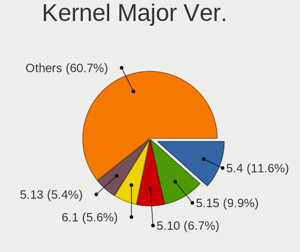
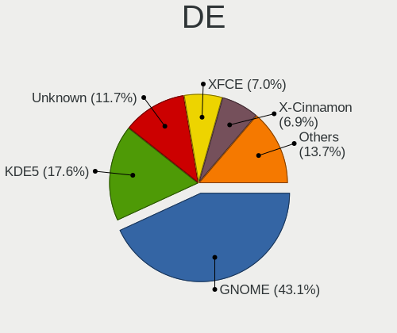
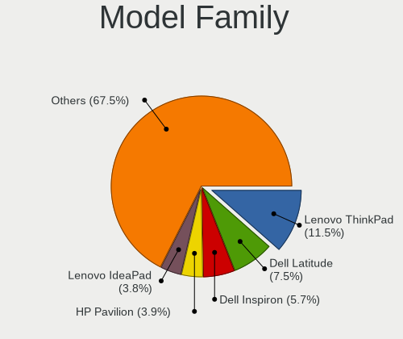
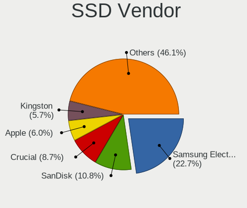

Linux in USA - Tested Hardware & Statistics (Notebooks)
-------------------------------------------------------

A project to collect tested hardware configurations for Linux in USA.

Anyone can contribute to this report by the [hw-probe](https://github.com/linuxhw/hw-probe) tool:

    sudo -E hw-probe -all -upload

Please contribute! Especially if your hardware is rare.

Contents
--------

* [ Test Cases ](#test-cases)

* [ System ](#system)
  - [ OS                       ](#os)
  - [ OS Family                ](#os-family)
  - [ Kernel                   ](#kernel)
  - [ Kernel Family            ](#kernel-family)
  - [ Kernel Major Ver.        ](#kernel-major-ver)
  - [ Arch                     ](#arch)
  - [ DE                       ](#de)
  - [ Display Server           ](#display-server)
  - [ Display Manager          ](#display-manager)
  - [ OS Lang                  ](#os-lang)
  - [ Boot Mode                ](#boot-mode)
  - [ Filesystem               ](#filesystem)
  - [ Part. scheme             ](#part-scheme)
  - [ Dual Boot with Linux/BSD ](#dual-boot-with-linuxbsd)
  - [ Dual Boot (Win)          ](#dual-boot-win)

* [ Board ](#board)
  - [ Vendor                   ](#vendor)
  - [ Model                    ](#model)
  - [ Model Family             ](#model-family)
  - [ MFG Year                 ](#mfg-year)
  - [ Form Factor              ](#form-factor)
  - [ Secure Boot              ](#secure-boot)
  - [ Coreboot                 ](#coreboot)
  - [ RAM Size                 ](#ram-size)
  - [ RAM Used                 ](#ram-used)
  - [ Total Drives             ](#total-drives)
  - [ Has CD-ROM               ](#has-cd-rom)
  - [ Has Ethernet             ](#has-ethernet)
  - [ Has WiFi                 ](#has-wifi)
  - [ Has Bluetooth            ](#has-bluetooth)

* [ Location ](#location)
  - [ Country                  ](#country)
  - [ City                     ](#city)

* [ Drives ](#drives)
  - [ Drive Vendor             ](#drive-vendor)
  - [ Drive Model              ](#drive-model)
  - [ HDD Vendor               ](#hdd-vendor)
  - [ SSD Vendor               ](#ssd-vendor)
  - [ Drive Kind               ](#drive-kind)
  - [ Drive Connector          ](#drive-connector)
  - [ Drive Size               ](#drive-size)
  - [ Space Total              ](#space-total)
  - [ Space Used               ](#space-used)
  - [ Malfunc. Drives          ](#malfunc-drives)
  - [ Malfunc. Drive Vendor    ](#malfunc-drive-vendor)
  - [ Malfunc. HDD Vendor      ](#malfunc-hdd-vendor)
  - [ Malfunc. Drive Kind      ](#malfunc-drive-kind)
  - [ Failed Drives            ](#failed-drives)
  - [ Failed Drive Vendor      ](#failed-drive-vendor)
  - [ Drive Status             ](#drive-status)

* [ Storage controller ](#storage-controller)
  - [ Storage Vendor           ](#storage-vendor)
  - [ Storage Model            ](#storage-model)
  - [ Storage Kind             ](#storage-kind)

* [ Processor ](#processor)
  - [ CPU Vendor               ](#cpu-vendor)
  - [ CPU Model                ](#cpu-model)
  - [ CPU Model Family         ](#cpu-model-family)
  - [ CPU Cores                ](#cpu-cores)
  - [ CPU Sockets              ](#cpu-sockets)
  - [ CPU Threads              ](#cpu-threads)
  - [ CPU Op-Modes             ](#cpu-op-modes)
  - [ CPU Microcode            ](#cpu-microcode)
  - [ CPU Microarch            ](#cpu-microarch)

* [ Graphics ](#graphics)
  - [ GPU Vendor               ](#gpu-vendor)
  - [ GPU Model                ](#gpu-model)
  - [ GPU Combo                ](#gpu-combo)
  - [ GPU Driver               ](#gpu-driver)
  - [ GPU Memory               ](#gpu-memory)

* [ Monitor ](#monitor)
  - [ Monitor Vendor           ](#monitor-vendor)
  - [ Monitor Model            ](#monitor-model)
  - [ Monitor Resolution       ](#monitor-resolution)
  - [ Monitor Diagonal         ](#monitor-diagonal)
  - [ Monitor Width            ](#monitor-width)
  - [ Aspect Ratio             ](#aspect-ratio)
  - [ Monitor Area             ](#monitor-area)
  - [ Pixel Density            ](#pixel-density)
  - [ Multiple Monitors        ](#multiple-monitors)

* [ Network ](#network)
  - [ Net Controller Vendor    ](#net-controller-vendor)
  - [ Net Controller Model     ](#net-controller-model)
  - [ Wireless Vendor          ](#wireless-vendor)
  - [ Wireless Model           ](#wireless-model)
  - [ Ethernet Vendor          ](#ethernet-vendor)
  - [ Ethernet Model           ](#ethernet-model)
  - [ Net Controller Kind      ](#net-controller-kind)
  - [ Used Controller          ](#used-controller)
  - [ NICs                     ](#nics)
  - [ IPv6                     ](#ipv6)

* [ Bluetooth ](#bluetooth)
  - [ Bluetooth Vendor         ](#bluetooth-vendor)
  - [ Bluetooth Model          ](#bluetooth-model)

* [ Sound ](#sound)
  - [ Sound Vendor             ](#sound-vendor)
  - [ Sound Model              ](#sound-model)

* [ Memory ](#memory)
  - [ Memory Vendor            ](#memory-vendor)
  - [ Memory Model             ](#memory-model)
  - [ Memory Kind              ](#memory-kind)
  - [ Memory Form Factor       ](#memory-form-factor)
  - [ Memory Size              ](#memory-size)
  - [ Memory Speed             ](#memory-speed)

* [ Printers & scanners ](#printers--scanners)
  - [ Printer Vendor           ](#printer-vendor)
  - [ Printer Model            ](#printer-model)
  - [ Scanner Vendor           ](#scanner-vendor)
  - [ Scanner Model            ](#scanner-model)

* [ Camera ](#camera)
  - [ Camera Vendor            ](#camera-vendor)
  - [ Camera Model             ](#camera-model)

* [ Security ](#security)
  - [ Fingerprint Vendor       ](#fingerprint-vendor)
  - [ Fingerprint Model        ](#fingerprint-model)
  - [ Chipcard Vendor          ](#chipcard-vendor)
  - [ Chipcard Model           ](#chipcard-model)

* [ Unsupported ](#unsupported)
  - [ Unsupported Devices      ](#unsupported-devices)
  - [ Unsupported Device Types ](#unsupported-device-types)

Test Cases
----------

Total: 22370

| Vendor        | Model                       | Probe                                                      | Date         |
|---------------|-----------------------------|------------------------------------------------------------|--------------|
| Dell          | Inspiron 15 5510            | [e169cd0886](https://linux-hardware.org/?probe=e169cd0886) | Apr 01, 2023 |
| Lenovo        | ThinkPad E14 20RA004YUS     | [36b592e607](https://linux-hardware.org/?probe=36b592e607) | Apr 01, 2023 |
| Unknown       | ACB20                       | [6e70bacda5](https://linux-hardware.org/?probe=6e70bacda5) | Apr 01, 2023 |
| HP            | EliteBook 8470p             | [178ccc8d4d](https://linux-hardware.org/?probe=178ccc8d4d) | Apr 01, 2023 |
| Toshiba       | Satellite C55-B             | [250e5371c1](https://linux-hardware.org/?probe=250e5371c1) | Apr 01, 2023 |
| Lenovo        | ThinkPad X230 2325DV4       | [6cff5cd5d1](https://linux-hardware.org/?probe=6cff5cd5d1) | Apr 01, 2023 |
| Dell          | Latitude 5580               | [10cbd4c04d](https://linux-hardware.org/?probe=10cbd4c04d) | Apr 01, 2023 |
| HP            | Pavilion Gaming Laptop 1... | [7e8bd9a529](https://linux-hardware.org/?probe=7e8bd9a529) | Apr 01, 2023 |
| Sony          | VPCEA3BFX                   | [6215c985dd](https://linux-hardware.org/?probe=6215c985dd) | Apr 01, 2023 |
| Lenovo        | ThinkPad T440p              | [4057e0c5e9](https://linux-hardware.org/?probe=4057e0c5e9) | Apr 01, 2023 |
| Star Labs     | StarBook                    | [8712994e3c](https://linux-hardware.org/?probe=8712994e3c) | Apr 01, 2023 |
| Dell          | Latitude E6320              | [a6a0d01947](https://linux-hardware.org/?probe=a6a0d01947) | Mar 31, 2023 |
| System76      | Lemur Pro                   | [5d57a3397e](https://linux-hardware.org/?probe=5d57a3397e) | Mar 31, 2023 |
| Dell          | XPS 13 9380                 | [47557561a9](https://linux-hardware.org/?probe=47557561a9) | Mar 31, 2023 |
| HP            | ProBook 640 G2              | [11b902ad5d](https://linux-hardware.org/?probe=11b902ad5d) | Mar 31, 2023 |
| Lenovo        | ThinkPad T440p              | [1063ba3fb9](https://linux-hardware.org/?probe=1063ba3fb9) | Mar 31, 2023 |
| Dell          | Inspiron 1545               | [ca44e7f419](https://linux-hardware.org/?probe=ca44e7f419) | Mar 31, 2023 |
| Lenovo        | ThinkPad T430 2347EP7       | [6fd7423cb6](https://linux-hardware.org/?probe=6fd7423cb6) | Mar 31, 2023 |
| ASUSTek       | VivoBook_ASUSLaptop X515... | [29c4ba04a1](https://linux-hardware.org/?probe=29c4ba04a1) | Mar 31, 2023 |
| HP            | OMEN by Laptop 17-cb1xxx    | [db1a67682b](https://linux-hardware.org/?probe=db1a67682b) | Mar 31, 2023 |
| Lenovo        | ThinkPad Z13 Gen 1 21D2C... | [0ab4f4cd55](https://linux-hardware.org/?probe=0ab4f4cd55) | Mar 31, 2023 |
| HP            | Laptop 17-cp2xxx            | [854de8a433](https://linux-hardware.org/?probe=854de8a433) | Mar 31, 2023 |
| Dell          | Latitude E6330              | [ae7a7254b8](https://linux-hardware.org/?probe=ae7a7254b8) | Mar 31, 2023 |
| Dell          | Latitude E6330              | [2239e12384](https://linux-hardware.org/?probe=2239e12384) | Mar 31, 2023 |
| HP            | Pavilion dm4                | [b7f2f9e2ab](https://linux-hardware.org/?probe=b7f2f9e2ab) | Mar 31, 2023 |
| MSI           | GS66 Stealth 10SF           | [a2589dd6f5](https://linux-hardware.org/?probe=a2589dd6f5) | Mar 31, 2023 |
| Google        | Cave                        | [8bd24407be](https://linux-hardware.org/?probe=8bd24407be) | Mar 31, 2023 |
| Acer          | Aspire 5720Z                | [ca2b750eeb](https://linux-hardware.org/?probe=ca2b750eeb) | Mar 31, 2023 |
| Dell          | Precision M4700             | [7c93bc178e](https://linux-hardware.org/?probe=7c93bc178e) | Mar 31, 2023 |
| Lenovo        | ThinkPad X270 20HMS0T000    | [702223a4b1](https://linux-hardware.org/?probe=702223a4b1) | Mar 31, 2023 |
| Acer          | TravelMate B311-31          | [3345b754b7](https://linux-hardware.org/?probe=3345b754b7) | Mar 31, 2023 |
| ASUSTek       | ASUS BR1100CKA BR1100CKA... | [d7f3354ce9](https://linux-hardware.org/?probe=d7f3354ce9) | Mar 31, 2023 |
| Star Labs     | Lite                        | [e3689ef845](https://linux-hardware.org/?probe=e3689ef845) | Mar 31, 2023 |
| HP            | Pavilion Laptop 15-cc5xx    | [c6bbbbb7d8](https://linux-hardware.org/?probe=c6bbbbb7d8) | Mar 31, 2023 |
| Dell          | Latitude 7370               | [b8a0b25983](https://linux-hardware.org/?probe=b8a0b25983) | Mar 30, 2023 |
| Toshiba       | Satellite P875              | [aba8c03541](https://linux-hardware.org/?probe=aba8c03541) | Mar 30, 2023 |
| Google        | Lillipup                    | [09292890c9](https://linux-hardware.org/?probe=09292890c9) | Mar 30, 2023 |
| Acer          | Nitro AN515-58              | [27befad01f](https://linux-hardware.org/?probe=27befad01f) | Mar 30, 2023 |
| Dell          | Precision 3520              | [78a49d244d](https://linux-hardware.org/?probe=78a49d244d) | Mar 30, 2023 |
| Apple         | MacBookPro10,2              | [2f56ac98c1](https://linux-hardware.org/?probe=2f56ac98c1) | Mar 30, 2023 |
| Dell          | XPS 17 9710                 | [6b37881138](https://linux-hardware.org/?probe=6b37881138) | Mar 30, 2023 |
| Google        | Caroline                    | [8018db87e9](https://linux-hardware.org/?probe=8018db87e9) | Mar 30, 2023 |
| HP            | Laptop 15-ef2xxx            | [278ed0e013](https://linux-hardware.org/?probe=278ed0e013) | Mar 30, 2023 |
| Dell          | Precision 5510              | [15954887b1](https://linux-hardware.org/?probe=15954887b1) | Mar 30, 2023 |
| Dell          | Latitude E7450              | [63e8748d1f](https://linux-hardware.org/?probe=63e8748d1f) | Mar 30, 2023 |
| Dell          | XPS 13 9305                 | [9e60f40931](https://linux-hardware.org/?probe=9e60f40931) | Mar 30, 2023 |
| Lenovo        | ThinkPad X250 20CLS2A100    | [2e8eab25be](https://linux-hardware.org/?probe=2e8eab25be) | Mar 30, 2023 |
| HP            | kip                         | [fe84eac39e](https://linux-hardware.org/?probe=fe84eac39e) | Mar 30, 2023 |
| HP            | OMEN by Laptop              | [c6e4da00ac](https://linux-hardware.org/?probe=c6e4da00ac) | Mar 30, 2023 |
| Framework     | Laptop                      | [ef17714efa](https://linux-hardware.org/?probe=ef17714efa) | Mar 30, 2023 |
| Google        | Dragonair                   | [3f9f70991f](https://linux-hardware.org/?probe=3f9f70991f) | Mar 30, 2023 |
| Dell          | Latitude E6430              | [086b5d0f79](https://linux-hardware.org/?probe=086b5d0f79) | Mar 30, 2023 |
| ASUSTek       | VivoBook_ASUSLaptop X515... | [e85544a3d7](https://linux-hardware.org/?probe=e85544a3d7) | Mar 30, 2023 |
| HP            | Laptop 15-dy2xxx            | [50f1a552d8](https://linux-hardware.org/?probe=50f1a552d8) | Mar 30, 2023 |
| Lenovo        | ThinkPad E485 20KU001KUS    | [220764e9f2](https://linux-hardware.org/?probe=220764e9f2) | Mar 30, 2023 |
| Lenovo        | ThinkPad X395 20NLS0J400    | [e9d9710ef9](https://linux-hardware.org/?probe=e9d9710ef9) | Mar 30, 2023 |
| Lenovo        | IdeaPad 5 15ALC05 82LN      | [7554f35f1d](https://linux-hardware.org/?probe=7554f35f1d) | Mar 30, 2023 |
| Lenovo        | ThinkPad T60 195143U        | [4de196550b](https://linux-hardware.org/?probe=4de196550b) | Mar 30, 2023 |
| Dell          | Precision M4500             | [cf7e033a17](https://linux-hardware.org/?probe=cf7e033a17) | Mar 29, 2023 |
| Gigabyte      | AERO 15-X9                  | [49f246c5e7](https://linux-hardware.org/?probe=49f246c5e7) | Mar 29, 2023 |
| ASUSTek       | TUF Gaming FX705DT_FX705... | [803a180064](https://linux-hardware.org/?probe=803a180064) | Mar 29, 2023 |
| Dell          | G5 5505                     | [2552b456b6](https://linux-hardware.org/?probe=2552b456b6) | Mar 29, 2023 |
| Dell          | Latitude E7440              | [1159c854cd](https://linux-hardware.org/?probe=1159c854cd) | Mar 29, 2023 |
| HP            | Victus by Laptop 16-d0xx... | [d96583e702](https://linux-hardware.org/?probe=d96583e702) | Mar 29, 2023 |
| ASUSTek       | TUF Gaming FX705DT_FX705... | [f33059ab6b](https://linux-hardware.org/?probe=f33059ab6b) | Mar 29, 2023 |
| ASUSTek       | ROG Strix G513QY_G513QY     | [2f6655b77c](https://linux-hardware.org/?probe=2f6655b77c) | Mar 29, 2023 |
| Dell          | Latitude 3590               | [9b5971401c](https://linux-hardware.org/?probe=9b5971401c) | Mar 29, 2023 |
| Sony          | VGN-AW330J                  | [f5afc7ab6f](https://linux-hardware.org/?probe=f5afc7ab6f) | Mar 29, 2023 |
| HP            | Notebook                    | [ea7c0e1a2c](https://linux-hardware.org/?probe=ea7c0e1a2c) | Mar 29, 2023 |
| ASUSTek       | Zenbook UX5401ZA_UX5401Z... | [c8f2b78c09](https://linux-hardware.org/?probe=c8f2b78c09) | Mar 29, 2023 |
| Dell          | Inspiron 5505               | [1802e07a9e](https://linux-hardware.org/?probe=1802e07a9e) | Mar 29, 2023 |
| Dell          | Latitude 5420               | [d714c46c4f](https://linux-hardware.org/?probe=d714c46c4f) | Mar 29, 2023 |
| Valve         | Jupiter                     | [395ff0d196](https://linux-hardware.org/?probe=395ff0d196) | Mar 29, 2023 |
| AWOW          | AL34                        | [19f60f27c8](https://linux-hardware.org/?probe=19f60f27c8) | Mar 29, 2023 |
| HP            | Mini 1103                   | [f28121cfc6](https://linux-hardware.org/?probe=f28121cfc6) | Mar 29, 2023 |
| Dell          | Latitude 3520               | [a175e08fce](https://linux-hardware.org/?probe=a175e08fce) | Mar 28, 2023 |
| Google        | Caroline                    | [80f01f2a87](https://linux-hardware.org/?probe=80f01f2a87) | Mar 28, 2023 |
| Dell          | Latitude 3520               | [9c7a9b9282](https://linux-hardware.org/?probe=9c7a9b9282) | Mar 28, 2023 |
| Lenovo        | ThinkPad P14s Gen 2a 21A... | [af48722867](https://linux-hardware.org/?probe=af48722867) | Mar 28, 2023 |
| HP            | ENVY Notebook               | [98cd32ea44](https://linux-hardware.org/?probe=98cd32ea44) | Mar 28, 2023 |
| ASUSTek       | ASUS TUF Gaming A15 FA50... | [0667374075](https://linux-hardware.org/?probe=0667374075) | Mar 28, 2023 |
| HP            | EliteBook 840 G5            | [65671e15cb](https://linux-hardware.org/?probe=65671e15cb) | Mar 28, 2023 |
| Lenovo        | Legion 5 Pro 16ARH7H 82R... | [7939320fa4](https://linux-hardware.org/?probe=7939320fa4) | Mar 28, 2023 |
| Lenovo        | ThinkPad X1 Carbon 7th 2... | [78e2b83e31](https://linux-hardware.org/?probe=78e2b83e31) | Mar 28, 2023 |
| HUAWEI        | NBLB-WAX9N                  | [c393e49ce3](https://linux-hardware.org/?probe=c393e49ce3) | Mar 28, 2023 |
| Thomson       | WWNEO14C-4BK32F             | [90fa9585c9](https://linux-hardware.org/?probe=90fa9585c9) | Mar 28, 2023 |
| HUAWEI        | NBLB-WAX9N                  | [e7608e5c20](https://linux-hardware.org/?probe=e7608e5c20) | Mar 28, 2023 |
| Valve         | Jupiter                     | [a195a1f983](https://linux-hardware.org/?probe=a195a1f983) | Mar 28, 2023 |
| Unknown       | Unknown                     | [d89991a0f3](https://linux-hardware.org/?probe=d89991a0f3) | Mar 28, 2023 |
| Razer         | Blade                       | [ffa791eb4a](https://linux-hardware.org/?probe=ffa791eb4a) | Mar 28, 2023 |
| Lenovo        | ThinkPad E14 20RA004YUS     | [18226d4ded](https://linux-hardware.org/?probe=18226d4ded) | Mar 28, 2023 |
| HP            | ElitePad 1000 G2            | [4b16a78f3e](https://linux-hardware.org/?probe=4b16a78f3e) | Mar 28, 2023 |
| Lenovo        | ThinkPad T540p 20BE004EU... | [988731ac8d](https://linux-hardware.org/?probe=988731ac8d) | Mar 28, 2023 |
| Lenovo        | ThinkPad T540p 20BE004EU... | [8406000835](https://linux-hardware.org/?probe=8406000835) | Mar 28, 2023 |
| HP            | Pavilion Gaming Laptop 1... | [4c2dd89a20](https://linux-hardware.org/?probe=4c2dd89a20) | Mar 28, 2023 |
| Dell          | Latitude E5570              | [5b3d1ab8b9](https://linux-hardware.org/?probe=5b3d1ab8b9) | Mar 28, 2023 |
| ASUSTek       | X550CA                      | [a449827256](https://linux-hardware.org/?probe=a449827256) | Mar 28, 2023 |
| HP            | Pavilion Laptop 15-cs2xx... | [8921171c40](https://linux-hardware.org/?probe=8921171c40) | Mar 28, 2023 |
| HP            | ZBook Studio G3             | [3da1eddc9e](https://linux-hardware.org/?probe=3da1eddc9e) | Mar 28, 2023 |
| Lenovo        | ThinkPad P50 20EQS0T400     | [5b4466c085](https://linux-hardware.org/?probe=5b4466c085) | Mar 28, 2023 |
| Lenovo        | ThinkPad T420 4180AP3       | [8ddee342c9](https://linux-hardware.org/?probe=8ddee342c9) | Mar 28, 2023 |
| Dell          | Inspiron 3558               | [c80d4c15ce](https://linux-hardware.org/?probe=c80d4c15ce) | Mar 28, 2023 |
| Dell          | Inspiron 5515               | [13a0d1426d](https://linux-hardware.org/?probe=13a0d1426d) | Mar 28, 2023 |
| Lenovo        | ThinkPad W520 4284E79       | [2d9875ca24](https://linux-hardware.org/?probe=2d9875ca24) | Mar 28, 2023 |
| Unknown       | Unknown                     | [be297867f3](https://linux-hardware.org/?probe=be297867f3) | Mar 28, 2023 |
| HP            | Pavilion Laptop 15-cc5xx    | [7a9cf507e6](https://linux-hardware.org/?probe=7a9cf507e6) | Mar 28, 2023 |
| Acer          | Aspire E5-575               | [5964caaa02](https://linux-hardware.org/?probe=5964caaa02) | Mar 27, 2023 |
| HP            | Pavilion Laptop 15-eh2xx... | [d80388d7ef](https://linux-hardware.org/?probe=d80388d7ef) | Mar 27, 2023 |
| MSI           | GS66 Stealth 10SF           | [cb72b15b20](https://linux-hardware.org/?probe=cb72b15b20) | Mar 27, 2023 |
| Acer          | Aspire A515-45              | [d480257689](https://linux-hardware.org/?probe=d480257689) | Mar 27, 2023 |
| Toshiba       | QOSMIO F750                 | [b52a3268f6](https://linux-hardware.org/?probe=b52a3268f6) | Mar 27, 2023 |
| Dell          | Inspiron 3543               | [d714304a67](https://linux-hardware.org/?probe=d714304a67) | Mar 27, 2023 |
| Valve         | Jupiter                     | [b4e942862a](https://linux-hardware.org/?probe=b4e942862a) | Mar 27, 2023 |
| HP            | ZBook Fury 16 G9 Mobile ... | [dd84425bc7](https://linux-hardware.org/?probe=dd84425bc7) | Mar 27, 2023 |
| Valve         | Jupiter                     | [1a7531860b](https://linux-hardware.org/?probe=1a7531860b) | Mar 27, 2023 |
| Dell          | Inspiron 3543               | [f733f5b792](https://linux-hardware.org/?probe=f733f5b792) | Mar 27, 2023 |
| Dell          | Inspiron 5555               | [cf226d028d](https://linux-hardware.org/?probe=cf226d028d) | Mar 27, 2023 |
| Dell          | Studio 1537                 | [64676c7b1a](https://linux-hardware.org/?probe=64676c7b1a) | Mar 27, 2023 |
| Toshiba       | Satellite C55-C             | [d7ec0eb4b1](https://linux-hardware.org/?probe=d7ec0eb4b1) | Mar 27, 2023 |
| HP            | Pavilion TS 11              | [e13254735b](https://linux-hardware.org/?probe=e13254735b) | Mar 27, 2023 |
| Acer          | Predator PT515-51           | [2ac6541cf1](https://linux-hardware.org/?probe=2ac6541cf1) | Mar 27, 2023 |
| HP            | Pavilion g6                 | [4b08001481](https://linux-hardware.org/?probe=4b08001481) | Mar 27, 2023 |
| HP            | Laptop 15-bs2xx             | [b6160f7688](https://linux-hardware.org/?probe=b6160f7688) | Mar 27, 2023 |
| HP            | Laptop 15-bs2xx             | [85966e5691](https://linux-hardware.org/?probe=85966e5691) | Mar 27, 2023 |
| Dell          | Latitude E5570              | [350e781679](https://linux-hardware.org/?probe=350e781679) | Mar 27, 2023 |
| HP            | EliteBook 8460p             | [ccae23c5a7](https://linux-hardware.org/?probe=ccae23c5a7) | Mar 27, 2023 |
| Razer         | Blade Pro 17 (Early 2020... | [36d75e1d7f](https://linux-hardware.org/?probe=36d75e1d7f) | Mar 26, 2023 |
| Acer          | TravelMate P653-M           | [625243d39f](https://linux-hardware.org/?probe=625243d39f) | Mar 26, 2023 |
| Razer         | Blade Pro 17 (Early 2020... | [244b228a30](https://linux-hardware.org/?probe=244b228a30) | Mar 26, 2023 |
| Toshiba       | Satellite C55t-C            | [758abe1fb4](https://linux-hardware.org/?probe=758abe1fb4) | Mar 26, 2023 |
| Lenovo        | G580 20157                  | [98df8e769b](https://linux-hardware.org/?probe=98df8e769b) | Mar 26, 2023 |
| Dell          | XPS 15 9520                 | [35718792af](https://linux-hardware.org/?probe=35718792af) | Mar 26, 2023 |
| Dell          | XPS 15 9500                 | [cebc7c547a](https://linux-hardware.org/?probe=cebc7c547a) | Mar 26, 2023 |
| Lenovo        | ThinkPad X230 Tablet 343... | [6ac9c53a7e](https://linux-hardware.org/?probe=6ac9c53a7e) | Mar 26, 2023 |
| Dell          | XPS 15 9500                 | [4391dcbdd2](https://linux-hardware.org/?probe=4391dcbdd2) | Mar 26, 2023 |
| Acer          | Aspire VN7-791              | [eb75a9c480](https://linux-hardware.org/?probe=eb75a9c480) | Mar 26, 2023 |
| Lenovo        | Legion 5 15ACH6 82JW        | [0180776452](https://linux-hardware.org/?probe=0180776452) | Mar 26, 2023 |
| Lenovo        | ThinkPad P51 20HHCTO1WW     | [85fb1a6778](https://linux-hardware.org/?probe=85fb1a6778) | Mar 26, 2023 |
| HP            | EliteBook Folio 9480m       | [1be38b1b49](https://linux-hardware.org/?probe=1be38b1b49) | Mar 26, 2023 |
| Lenovo        | ThinkPad T550 20CK000GCA    | [946f550eb7](https://linux-hardware.org/?probe=946f550eb7) | Mar 26, 2023 |
| Apple         | MacBookPro5,1               | [10eec43a14](https://linux-hardware.org/?probe=10eec43a14) | Mar 26, 2023 |
| Valve         | Jupiter                     | [58c3c0e668](https://linux-hardware.org/?probe=58c3c0e668) | Mar 26, 2023 |
| Pine Micro... | Pine64 Pinebook Pro         | [5b53728575](https://linux-hardware.org/?probe=5b53728575) | Mar 26, 2023 |
| Lenovo        | ThinkPad Z13 Gen 1 21D2C... | [0933beb0f7](https://linux-hardware.org/?probe=0933beb0f7) | Mar 26, 2023 |
| Valve         | Jupiter                     | [2b40215d5b](https://linux-hardware.org/?probe=2b40215d5b) | Mar 26, 2023 |
| HP            | Pavilion Notebook           | [5bf55c7664](https://linux-hardware.org/?probe=5bf55c7664) | Mar 26, 2023 |
| Dell          | Latitude 3590               | [5d1ac262f4](https://linux-hardware.org/?probe=5d1ac262f4) | Mar 26, 2023 |
| HP            | Pavilion Notebook           | [46626fe2c4](https://linux-hardware.org/?probe=46626fe2c4) | Mar 26, 2023 |
| Apple         | MacBookPro8,1               | [0f1954d5c6](https://linux-hardware.org/?probe=0f1954d5c6) | Mar 26, 2023 |
| Apple         | MacBookPro9,2               | [35eaaaac45](https://linux-hardware.org/?probe=35eaaaac45) | Mar 26, 2023 |
| Dell          | Precision 5570              | [454590a1a8](https://linux-hardware.org/?probe=454590a1a8) | Mar 26, 2023 |
| HP            | Laptop 14-dk0xxx            | [a6d543292b](https://linux-hardware.org/?probe=a6d543292b) | Mar 25, 2023 |
| HP            | Laptop 14-dk0xxx            | [d334e1dd57](https://linux-hardware.org/?probe=d334e1dd57) | Mar 25, 2023 |
| HP            | Laptop 15-ef2xxx            | [2246abad85](https://linux-hardware.org/?probe=2246abad85) | Mar 25, 2023 |
| HP            | ZBook Studio G5             | [3e4bb7249f](https://linux-hardware.org/?probe=3e4bb7249f) | Mar 25, 2023 |
| Dell          | XPS 13 9380                 | [72bf3db096](https://linux-hardware.org/?probe=72bf3db096) | Mar 25, 2023 |
| ASUSTek       | X510UAR                     | [728805785d](https://linux-hardware.org/?probe=728805785d) | Mar 25, 2023 |
| Lenovo        | ThinkPad E15 Gen 4 21EES... | [257fa4c383](https://linux-hardware.org/?probe=257fa4c383) | Mar 25, 2023 |
| Dell          | Inspiron 7400               | [a0bba69c40](https://linux-hardware.org/?probe=a0bba69c40) | Mar 25, 2023 |
| Dell          | Inspiron 7400               | [98d0daa764](https://linux-hardware.org/?probe=98d0daa764) | Mar 25, 2023 |
| Sony          | VPCF1390X                   | [328d720f61](https://linux-hardware.org/?probe=328d720f61) | Mar 25, 2023 |
| HP            | OMEN by Laptop 17-cb1xxx    | [b1cab7b897](https://linux-hardware.org/?probe=b1cab7b897) | Mar 25, 2023 |
| Carbon Sys... | Iridium 14                  | [e7f9195a1d](https://linux-hardware.org/?probe=e7f9195a1d) | Mar 25, 2023 |
| Dell          | Latitude E7450              | [7154586794](https://linux-hardware.org/?probe=7154586794) | Mar 25, 2023 |
| Lenovo        | ThinkPad T480s 20L8S0C40... | [39b2a59543](https://linux-hardware.org/?probe=39b2a59543) | Mar 25, 2023 |
| ASUSTek       | G750JM                      | [98ba3a9ce6](https://linux-hardware.org/?probe=98ba3a9ce6) | Mar 25, 2023 |
| HP            | ProBook 645 G1              | [98ac3d1b90](https://linux-hardware.org/?probe=98ac3d1b90) | Mar 24, 2023 |
| Lenovo        | Legion Y530-15ICH 81FV      | [edb27720ee](https://linux-hardware.org/?probe=edb27720ee) | Mar 24, 2023 |
| Apple         | MacBookPro11,3              | [21c3ce9508](https://linux-hardware.org/?probe=21c3ce9508) | Mar 24, 2023 |
| Lenovo        | ThinkPad 13 2nd Gen 20J1... | [9b9a21b7da](https://linux-hardware.org/?probe=9b9a21b7da) | Mar 24, 2023 |
| ASUSTek       | VivoBook_ASUSLaptop X512... | [ac415822b8](https://linux-hardware.org/?probe=ac415822b8) | Mar 24, 2023 |
| Dell          | Precision 7550              | [31d29d86f3](https://linux-hardware.org/?probe=31d29d86f3) | Mar 24, 2023 |
| HP            | ENVY Laptop 17-ce1xxx       | [f9ff96064b](https://linux-hardware.org/?probe=f9ff96064b) | Mar 24, 2023 |
| Acer          | Aspire R5-471T              | [a08f9a9f41](https://linux-hardware.org/?probe=a08f9a9f41) | Mar 24, 2023 |
| ASUSTek       | ROG Strix G512LW_G512LW     | [cbb1418cfa](https://linux-hardware.org/?probe=cbb1418cfa) | Mar 24, 2023 |
| ASUSTek       | ZenBook UX434IQ_Q407IQ      | [ad5da9f087](https://linux-hardware.org/?probe=ad5da9f087) | Mar 24, 2023 |
| HP            | Laptop 15-db0xxx            | [ad0e5c0483](https://linux-hardware.org/?probe=ad0e5c0483) | Mar 24, 2023 |
| Lenovo        | ThinkPad 13 2nd Gen 20J1... | [58f8d5849a](https://linux-hardware.org/?probe=58f8d5849a) | Mar 24, 2023 |
| TUXEDO        | Aura 15 Gen1                | [1584039ca8](https://linux-hardware.org/?probe=1584039ca8) | Mar 24, 2023 |
| TUXEDO        | Aura 15 Gen1                | [a8e6ba1268](https://linux-hardware.org/?probe=a8e6ba1268) | Mar 24, 2023 |
| HP            | Laptop 15-dw0xxx            | [299c20969c](https://linux-hardware.org/?probe=299c20969c) | Mar 24, 2023 |
| Apple         | MacBookAir4,1               | [6b09e87ee2](https://linux-hardware.org/?probe=6b09e87ee2) | Mar 24, 2023 |
| HP            | Pavilion Laptop 15-eh2xx... | [5377aa4b23](https://linux-hardware.org/?probe=5377aa4b23) | Mar 24, 2023 |
| HP            | Pavilion Laptop 15-eh2xx... | [498bb39808](https://linux-hardware.org/?probe=498bb39808) | Mar 24, 2023 |
| Dell          | Inspiron 5555               | [efab305a00](https://linux-hardware.org/?probe=efab305a00) | Mar 24, 2023 |
| HP            | EliteBook 745 G6            | [96fe7c184c](https://linux-hardware.org/?probe=96fe7c184c) | Mar 24, 2023 |
| HP            | Laptop 17-by3xxx            | [01cac0e411](https://linux-hardware.org/?probe=01cac0e411) | Mar 24, 2023 |
| TUXEDO        | InfinityBook Pro Gen7 (M... | [885b757cdc](https://linux-hardware.org/?probe=885b757cdc) | Mar 24, 2023 |
| Valve         | Jupiter                     | [dc0f21bf9e](https://linux-hardware.org/?probe=dc0f21bf9e) | Mar 24, 2023 |
| Dell          | Latitude E7440              | [1a986dbeb8](https://linux-hardware.org/?probe=1a986dbeb8) | Mar 24, 2023 |
| GPU Compan... | GWTN141-10                  | [9007c1d23f](https://linux-hardware.org/?probe=9007c1d23f) | Mar 24, 2023 |
| HP            | Laptop 15-ef2xxx            | [9b048b064d](https://linux-hardware.org/?probe=9b048b064d) | Mar 24, 2023 |
| Dell          | Latitude E6530              | [e1bd7a9751](https://linux-hardware.org/?probe=e1bd7a9751) | Mar 24, 2023 |
| Acer          | Aspire A515-57              | [748d918a61](https://linux-hardware.org/?probe=748d918a61) | Mar 23, 2023 |
| Dell          | Latitude 5285               | [a8114ded15](https://linux-hardware.org/?probe=a8114ded15) | Mar 23, 2023 |
| Gigabyte      | AERO 15WV8                  | [379c88860a](https://linux-hardware.org/?probe=379c88860a) | Mar 23, 2023 |
| Dell          | Inspiron 3721               | [e992b8f3a0](https://linux-hardware.org/?probe=e992b8f3a0) | Mar 23, 2023 |
| Dell          | Latitude 5285               | [baa8f358cf](https://linux-hardware.org/?probe=baa8f358cf) | Mar 23, 2023 |
| Dell          | Inspiron 5590               | [f9651795c2](https://linux-hardware.org/?probe=f9651795c2) | Mar 23, 2023 |
| Dell          | Precision 7710              | [25a4797475](https://linux-hardware.org/?probe=25a4797475) | Mar 23, 2023 |
| Dell          | Latitude D630               | [95a44067f1](https://linux-hardware.org/?probe=95a44067f1) | Mar 23, 2023 |
| Dell          | Latitude D630               | [45e100abf8](https://linux-hardware.org/?probe=45e100abf8) | Mar 23, 2023 |
| Lenovo        | ThinkPad T570 W10DG 20JX... | [d40284254e](https://linux-hardware.org/?probe=d40284254e) | Mar 23, 2023 |
| Lenovo        | ThinkPad T570 W10DG 20JX... | [26521abccd](https://linux-hardware.org/?probe=26521abccd) | Mar 23, 2023 |
| Dell          | Latitude 5480               | [ff60b91842](https://linux-hardware.org/?probe=ff60b91842) | Mar 23, 2023 |
| Dell          | Inspiron 15 3511            | [7aa41dd248](https://linux-hardware.org/?probe=7aa41dd248) | Mar 23, 2023 |
| Toshiba       | Satellite U845W             | [27e67eea9d](https://linux-hardware.org/?probe=27e67eea9d) | Mar 23, 2023 |
| Lenovo        | ThinkPad P1 Gen 5 21DC00... | [b286fb0216](https://linux-hardware.org/?probe=b286fb0216) | Mar 23, 2023 |
| ASUSTek       | T100HAN                     | [5f0061dd7b](https://linux-hardware.org/?probe=5f0061dd7b) | Mar 23, 2023 |
| HP            | Pavilion Laptop 15-eh1xx... | [32a4fc1880](https://linux-hardware.org/?probe=32a4fc1880) | Mar 23, 2023 |
| Dell          | Latitude 7480               | [35b30305ec](https://linux-hardware.org/?probe=35b30305ec) | Mar 23, 2023 |
| Notebook      | NV4xPZ                      | [74d70a3568](https://linux-hardware.org/?probe=74d70a3568) | Mar 23, 2023 |
| Dell          | Latitude 7480               | [0301ad09f6](https://linux-hardware.org/?probe=0301ad09f6) | Mar 23, 2023 |
| Acer          | Aspire E5-575G              | [c9b2447011](https://linux-hardware.org/?probe=c9b2447011) | Mar 23, 2023 |
| Acer          | Aspire E5-575G              | [01d9296283](https://linux-hardware.org/?probe=01d9296283) | Mar 23, 2023 |
| Intel Clie... | LAPQC71C                    | [36ad9b07b6](https://linux-hardware.org/?probe=36ad9b07b6) | Mar 23, 2023 |
| ASUSTek       | TUF Gaming FX505DV_FX505... | [f383688a79](https://linux-hardware.org/?probe=f383688a79) | Mar 23, 2023 |
| HP            | ZBook 15 G6                 | [631968d54b](https://linux-hardware.org/?probe=631968d54b) | Mar 23, 2023 |
| Lenovo        | Legion 5 82B5               | [5298c41263](https://linux-hardware.org/?probe=5298c41263) | Mar 22, 2023 |
| Apple         | MacBook5,1                  | [bc6e3fa274](https://linux-hardware.org/?probe=bc6e3fa274) | Mar 22, 2023 |
| TUXEDO        | InfinityBook Pro Gen7 (M... | [5e01f2c134](https://linux-hardware.org/?probe=5e01f2c134) | Mar 22, 2023 |
| Getac         | B300-X                      | [82ea6e2287](https://linux-hardware.org/?probe=82ea6e2287) | Mar 22, 2023 |
| Apple         | MacBookAir7,2               | [627590f38c](https://linux-hardware.org/?probe=627590f38c) | Mar 22, 2023 |
| HP            | ZBook 15 G6                 | [61dcde6523](https://linux-hardware.org/?probe=61dcde6523) | Mar 22, 2023 |
| HP            | EliteBook 745 G6            | [caf636a252](https://linux-hardware.org/?probe=caf636a252) | Mar 22, 2023 |
| Sony          | VGN-NW270F                  | [48080babd0](https://linux-hardware.org/?probe=48080babd0) | Mar 22, 2023 |
| Toshiba       | Satellite U845W             | [65958975b3](https://linux-hardware.org/?probe=65958975b3) | Mar 22, 2023 |
| ASUSTek       | ROG Strix G512LW_G512LW     | [c27a11ed35](https://linux-hardware.org/?probe=c27a11ed35) | Mar 22, 2023 |
| Acer          | Aspire R5-471T              | [1970e6ac31](https://linux-hardware.org/?probe=1970e6ac31) | Mar 22, 2023 |
| Lenovo        | Legion 5 82B5               | [8dfc670e24](https://linux-hardware.org/?probe=8dfc670e24) | Mar 22, 2023 |
| Lenovo        | Legion Y530-15ICH 81FV      | [7932852d27](https://linux-hardware.org/?probe=7932852d27) | Mar 22, 2023 |
| HP            | EliteBook 8560w             | [f886dec5e7](https://linux-hardware.org/?probe=f886dec5e7) | Mar 22, 2023 |
| Gateway       | EC14 Series                 | [fdeb2e4e3b](https://linux-hardware.org/?probe=fdeb2e4e3b) | Mar 22, 2023 |
| MSI           | GE70 2PE                    | [5e68fcc30d](https://linux-hardware.org/?probe=5e68fcc30d) | Mar 22, 2023 |
| Lenovo        | G580 20150                  | [489b8775b6](https://linux-hardware.org/?probe=489b8775b6) | Mar 22, 2023 |
| Lenovo        | IdeaPad 1 15AMN7 82VG       | [104f6a754e](https://linux-hardware.org/?probe=104f6a754e) | Mar 22, 2023 |
| Lenovo        | ThinkPad X1 Carbon 4th 2... | [d39b3565ca](https://linux-hardware.org/?probe=d39b3565ca) | Mar 22, 2023 |
| Intel Clie... | LAPQC71C                    | [9cbe204a59](https://linux-hardware.org/?probe=9cbe204a59) | Mar 22, 2023 |
| Lenovo        | ThinkPad X250 20CLS2A100    | [e7b50c8f22](https://linux-hardware.org/?probe=e7b50c8f22) | Mar 22, 2023 |
| Lenovo        | IdeaPad 5 14ARE05 81YM      | [88d49f423d](https://linux-hardware.org/?probe=88d49f423d) | Mar 22, 2023 |
| HP            | Pavilion 17                 | [cb6b6bc8d2](https://linux-hardware.org/?probe=cb6b6bc8d2) | Mar 22, 2023 |
| ASUSTek       | Zephyrus M GU502GW_GU502... | [b618258a5c](https://linux-hardware.org/?probe=b618258a5c) | Mar 22, 2023 |
| HP            | Laptop 17-by2xxx            | [e8c5422a4f](https://linux-hardware.org/?probe=e8c5422a4f) | Mar 22, 2023 |
| Apple         | MacBookAir7,2               | [3b3376e72c](https://linux-hardware.org/?probe=3b3376e72c) | Mar 21, 2023 |
| Valve         | Jupiter                     | [10f53ece03](https://linux-hardware.org/?probe=10f53ece03) | Mar 21, 2023 |
| Valve         | Jupiter                     | [6107d0ad44](https://linux-hardware.org/?probe=6107d0ad44) | Mar 21, 2023 |
| HP            | ProBook 6565b               | [d11a93367e](https://linux-hardware.org/?probe=d11a93367e) | Mar 21, 2023 |
| Lenovo        | ThinkPad T420 4180AP3       | [3c100c55be](https://linux-hardware.org/?probe=3c100c55be) | Mar 21, 2023 |
| Lenovo        | ThinkPad T420 4180AP3       | [039724e2c2](https://linux-hardware.org/?probe=039724e2c2) | Mar 21, 2023 |
| HP            | ZBook Firefly 14 inch G9... | [35030027f5](https://linux-hardware.org/?probe=35030027f5) | Mar 21, 2023 |
| Framework     | Laptop (12th Gen Intel C... | [3a8692d4cf](https://linux-hardware.org/?probe=3a8692d4cf) | Mar 21, 2023 |
| ASUSTek       | Zephyrus M GU502GW_GU502... | [c87a678cf5](https://linux-hardware.org/?probe=c87a678cf5) | Mar 21, 2023 |
| HP            | Dev One Notebook PC         | [d6ff521952](https://linux-hardware.org/?probe=d6ff521952) | Mar 21, 2023 |
| Acer          | Nitro AN517-55              | [d6393f5710](https://linux-hardware.org/?probe=d6393f5710) | Mar 21, 2023 |
| HP            | Dev One Notebook PC         | [404c84b0ea](https://linux-hardware.org/?probe=404c84b0ea) | Mar 21, 2023 |
| System76      | Oryx Pro                    | [b784685da3](https://linux-hardware.org/?probe=b784685da3) | Mar 21, 2023 |
| Apple         | MacBookPro8,1               | [d9477678dd](https://linux-hardware.org/?probe=d9477678dd) | Mar 21, 2023 |
| Acer          | Nitro AN517-55              | [edf722e245](https://linux-hardware.org/?probe=edf722e245) | Mar 21, 2023 |
| Gigabyte      | A320M-S2H-CF                | [2ff2eab844](https://linux-hardware.org/?probe=2ff2eab844) | Mar 21, 2023 |
| HP            | Laptop 15-dy1xxx            | [1686ba2df4](https://linux-hardware.org/?probe=1686ba2df4) | Mar 20, 2023 |
| HP            | ProBook 640 G4              | [2787c4bf42](https://linux-hardware.org/?probe=2787c4bf42) | Mar 20, 2023 |
| Google        | Sand                        | [cac2f4493e](https://linux-hardware.org/?probe=cac2f4493e) | Mar 20, 2023 |
| Dell          | Latitude 7480               | [00d8228ec6](https://linux-hardware.org/?probe=00d8228ec6) | Mar 20, 2023 |
| ASRock        | X570 Phantom Gaming 4       | [c9b4e3cf00](https://linux-hardware.org/?probe=c9b4e3cf00) | Mar 20, 2023 |
| MSI           | GS63VR 7RF                  | [8d13f6eef9](https://linux-hardware.org/?probe=8d13f6eef9) | Mar 20, 2023 |
| MSI           | GS63VR 7RF                  | [5b4e0532f8](https://linux-hardware.org/?probe=5b4e0532f8) | Mar 20, 2023 |
| Dell          | Latitude E7240              | [3baa6de271](https://linux-hardware.org/?probe=3baa6de271) | Mar 20, 2023 |
| HP            | Laptop 15-dy2xxx            | [e0317127ea](https://linux-hardware.org/?probe=e0317127ea) | Mar 20, 2023 |
| Lenovo        | ThinkPad X1 Carbon 5th 2... | [0c7e919608](https://linux-hardware.org/?probe=0c7e919608) | Mar 20, 2023 |
| Lenovo        | ThinkPad X1 Carbon Gen 9... | [3c0b6b8fdf](https://linux-hardware.org/?probe=3c0b6b8fdf) | Mar 20, 2023 |
| Lenovo        | ThinkPad W510 4318CTO       | [edb5102fd3](https://linux-hardware.org/?probe=edb5102fd3) | Mar 20, 2023 |
| HP            | EliteBook 8560p             | [c990bd18a4](https://linux-hardware.org/?probe=c990bd18a4) | Mar 20, 2023 |
| ASUSTek       | X551MA                      | [0a5358e690](https://linux-hardware.org/?probe=0a5358e690) | Mar 20, 2023 |
| Dell          | XPS MXC062                  | [a1913f3e4a](https://linux-hardware.org/?probe=a1913f3e4a) | Mar 20, 2023 |
| Dell          | Inspiron 7537               | [4206af54dd](https://linux-hardware.org/?probe=4206af54dd) | Mar 20, 2023 |
| Dell          | Inspiron 7537               | [2f49af2368](https://linux-hardware.org/?probe=2f49af2368) | Mar 20, 2023 |
| Dell          | Latitude 7480               | [bbdb75bdce](https://linux-hardware.org/?probe=bbdb75bdce) | Mar 19, 2023 |
| Dell          | XPS 15 9570                 | [729a1432a0](https://linux-hardware.org/?probe=729a1432a0) | Mar 19, 2023 |
| HP            | Laptop 14-dq0xxx            | [0486774825](https://linux-hardware.org/?probe=0486774825) | Mar 19, 2023 |
| Dell          | XPS 15 9570                 | [4ad2d5c249](https://linux-hardware.org/?probe=4ad2d5c249) | Mar 19, 2023 |
| Lenovo        | ThinkBook 14p Gen 3 21EJ    | [dfc02dad7e](https://linux-hardware.org/?probe=dfc02dad7e) | Mar 19, 2023 |
| Acer          | Aspire V5-552PG             | [d895f0f391](https://linux-hardware.org/?probe=d895f0f391) | Mar 19, 2023 |
| Acer          | Aspire 5570Z                | [a5ba989714](https://linux-hardware.org/?probe=a5ba989714) | Mar 19, 2023 |
| HP            | EliteBook 8560w             | [da8abe8a8e](https://linux-hardware.org/?probe=da8abe8a8e) | Mar 19, 2023 |
| Lenovo        | IdeaPad Gaming 3 15IHU6 ... | [6b6ceb1a1a](https://linux-hardware.org/?probe=6b6ceb1a1a) | Mar 19, 2023 |
| Lenovo        | ThinkPad P52s 20LBS0FH00    | [aa4184ac0c](https://linux-hardware.org/?probe=aa4184ac0c) | Mar 19, 2023 |
| Lenovo        | ThinkPad X1 Carbon 6th 2... | [e3410282c5](https://linux-hardware.org/?probe=e3410282c5) | Mar 19, 2023 |
| Lenovo        | ThinkPad P52s 20LBS0FH00    | [00de843c75](https://linux-hardware.org/?probe=00de843c75) | Mar 19, 2023 |
| Dell          | Latitude E7470              | [d9108aaeab](https://linux-hardware.org/?probe=d9108aaeab) | Mar 19, 2023 |
| Dell          | G5 5500                     | [f44acc9d0f](https://linux-hardware.org/?probe=f44acc9d0f) | Mar 19, 2023 |
| Lenovo        | ThinkPad T420 4180H34       | [9764f25017](https://linux-hardware.org/?probe=9764f25017) | Mar 19, 2023 |
| MSI           | GP66 Leopard 11UG           | [7210f8c423](https://linux-hardware.org/?probe=7210f8c423) | Mar 19, 2023 |
| Toshiba       | Satellite C655              | [229dcc2cb0](https://linux-hardware.org/?probe=229dcc2cb0) | Mar 19, 2023 |
| Toshiba       | Satellite C655              | [5037090da8](https://linux-hardware.org/?probe=5037090da8) | Mar 19, 2023 |
| System76      | Pangolin                    | [ee7dd00fbf](https://linux-hardware.org/?probe=ee7dd00fbf) | Mar 19, 2023 |
| Lenovo        | ThinkPad P50 20EQS0VV03     | [bd4f99c8f7](https://linux-hardware.org/?probe=bd4f99c8f7) | Mar 19, 2023 |
| Lenovo        | ThinkPad X1 Extreme 2nd ... | [135aa0e418](https://linux-hardware.org/?probe=135aa0e418) | Mar 18, 2023 |
| Valve         | Jupiter                     | [f1790d6f33](https://linux-hardware.org/?probe=f1790d6f33) | Mar 18, 2023 |
| Apple         | MacBookPro14,1              | [00f4c23b35](https://linux-hardware.org/?probe=00f4c23b35) | Mar 18, 2023 |
| Lenovo        | ThinkPad P1 Gen 4i 20Y30... | [97af59e728](https://linux-hardware.org/?probe=97af59e728) | Mar 18, 2023 |
| AMI           | Intel                       | [ea9d1f6cf4](https://linux-hardware.org/?probe=ea9d1f6cf4) | Mar 18, 2023 |
| GPU Compan... | GWTN141-10                  | [ff8db61ccf](https://linux-hardware.org/?probe=ff8db61ccf) | Mar 18, 2023 |
| Dell          | Inspiron 5521               | [4f90aa2a13](https://linux-hardware.org/?probe=4f90aa2a13) | Mar 18, 2023 |
| ASRock        | X570 Phantom Gaming 4       | [dd296a8801](https://linux-hardware.org/?probe=dd296a8801) | Mar 18, 2023 |
| Dell          | Inspiron 3721               | [c7b5ea67bb](https://linux-hardware.org/?probe=c7b5ea67bb) | Mar 18, 2023 |
| Carbon Sys... | Iridium 14                  | [c70e1d7e98](https://linux-hardware.org/?probe=c70e1d7e98) | Mar 18, 2023 |
| Gateway       | EC14 Series                 | [c6ea9d7f10](https://linux-hardware.org/?probe=c6ea9d7f10) | Mar 18, 2023 |
| Lenovo        | IdeaPad 5 14ARE05 81YM      | [f35715c399](https://linux-hardware.org/?probe=f35715c399) | Mar 18, 2023 |
| HP            | ZBook 15 G6                 | [5a429f93a7](https://linux-hardware.org/?probe=5a429f93a7) | Mar 18, 2023 |
| ASUSTek       | X750JN                      | [7dd8257bc8](https://linux-hardware.org/?probe=7dd8257bc8) | Mar 18, 2023 |
| Apple         | MacBookAir5,2               | [ae4d8ba68c](https://linux-hardware.org/?probe=ae4d8ba68c) | Mar 18, 2023 |
| Lenovo        | ThinkPad T480 20L6S11N00    | [60d80937ea](https://linux-hardware.org/?probe=60d80937ea) | Mar 18, 2023 |
| Dell          | Latitude 7410               | [de1187cd64](https://linux-hardware.org/?probe=de1187cd64) | Mar 18, 2023 |
| HP            | Pavilion Laptop 15-cc5xx    | [5ede1a1bf2](https://linux-hardware.org/?probe=5ede1a1bf2) | Mar 18, 2023 |
| Dell          | XPS 9320                    | [d52e0d9e06](https://linux-hardware.org/?probe=d52e0d9e06) | Mar 18, 2023 |
| Apple         | MacBook5,2                  | [2020cf3584](https://linux-hardware.org/?probe=2020cf3584) | Mar 17, 2023 |
| Apple         | MacBook5,2                  | [e7ebc0ec0e](https://linux-hardware.org/?probe=e7ebc0ec0e) | Mar 17, 2023 |
| Apple         | MacBook5,2                  | [c343e79a84](https://linux-hardware.org/?probe=c343e79a84) | Mar 17, 2023 |
| Apple         | MacBook5,2                  | [5391c84cf4](https://linux-hardware.org/?probe=5391c84cf4) | Mar 17, 2023 |
| HP            | ZBook Studio G3             | [d71ca99f7c](https://linux-hardware.org/?probe=d71ca99f7c) | Mar 17, 2023 |
| Dell          | XPS 9320                    | [b48509f3c6](https://linux-hardware.org/?probe=b48509f3c6) | Mar 17, 2023 |
| MSI           | GF65 Thin 10UE              | [8d2db4b0fe](https://linux-hardware.org/?probe=8d2db4b0fe) | Mar 17, 2023 |
| Acer          | Aspire 7740                 | [a625fd3d4b](https://linux-hardware.org/?probe=a625fd3d4b) | Mar 17, 2023 |
| Apple         | MacBook5,2                  | [8fcb466fab](https://linux-hardware.org/?probe=8fcb466fab) | Mar 17, 2023 |
| Apple         | MacBook5,2                  | [7aa3efb2fd](https://linux-hardware.org/?probe=7aa3efb2fd) | Mar 17, 2023 |
| Apple         | MacBook5,2                  | [8319fcb9da](https://linux-hardware.org/?probe=8319fcb9da) | Mar 17, 2023 |
| Apple         | MacBook5,2                  | [6bf9694348](https://linux-hardware.org/?probe=6bf9694348) | Mar 17, 2023 |
| Apple         | MacBook5,2                  | [c3c0ef4a31](https://linux-hardware.org/?probe=c3c0ef4a31) | Mar 17, 2023 |
| Dell          | Precision 7540              | [9ce80342cf](https://linux-hardware.org/?probe=9ce80342cf) | Mar 17, 2023 |
| Dell          | Precision 7540              | [445287508e](https://linux-hardware.org/?probe=445287508e) | Mar 17, 2023 |
| Dell          | Precision M3800             | [1d20598cc5](https://linux-hardware.org/?probe=1d20598cc5) | Mar 17, 2023 |
| Lenovo        | ThinkBook 13s-IML 20RR      | [a174d9ea53](https://linux-hardware.org/?probe=a174d9ea53) | Mar 17, 2023 |
| ASUSTek       | X750JN                      | [7ee3dac323](https://linux-hardware.org/?probe=7ee3dac323) | Mar 17, 2023 |
| Dell          | Latitude 7480               | [ee6015f962](https://linux-hardware.org/?probe=ee6015f962) | Mar 17, 2023 |
| Dell          | Inspiron 3593               | [d983398383](https://linux-hardware.org/?probe=d983398383) | Mar 17, 2023 |
| HP            | ProBook 4530s               | [f0abd32fe4](https://linux-hardware.org/?probe=f0abd32fe4) | Mar 17, 2023 |
| HP            | Laptop 15-dw0xxx            | [f52bd099e3](https://linux-hardware.org/?probe=f52bd099e3) | Mar 17, 2023 |
| Apple         | MacBookPro11,3              | [1ade706194](https://linux-hardware.org/?probe=1ade706194) | Mar 17, 2023 |
| Lenovo        | IdeaPad Gaming 3 15IHU6 ... | [7e6ae6ba16](https://linux-hardware.org/?probe=7e6ae6ba16) | Mar 17, 2023 |
| Apple         | MacBookPro11,3              | [45537ae306](https://linux-hardware.org/?probe=45537ae306) | Mar 17, 2023 |
| Lenovo        | ThinkPad P15v Gen 3 21D8... | [0927eb4ba9](https://linux-hardware.org/?probe=0927eb4ba9) | Mar 17, 2023 |
| Dell          | Latitude 5400               | [ad4f5d5a60](https://linux-hardware.org/?probe=ad4f5d5a60) | Mar 17, 2023 |
| Dell          | Latitude E5530 non-vPro     | [dd58f68013](https://linux-hardware.org/?probe=dd58f68013) | Mar 17, 2023 |
| HP            | ZBook Studio G3             | [db6c4ae697](https://linux-hardware.org/?probe=db6c4ae697) | Mar 17, 2023 |
| HP            | Notebook                    | [e901631805](https://linux-hardware.org/?probe=e901631805) | Mar 17, 2023 |
| Google        | Whitetip                    | [ab4b2b789a](https://linux-hardware.org/?probe=ab4b2b789a) | Mar 16, 2023 |
| Dell          | Precision M6800             | [db62a370ed](https://linux-hardware.org/?probe=db62a370ed) | Mar 16, 2023 |
| HP            | EliteBook 8460p             | [e8d00684ac](https://linux-hardware.org/?probe=e8d00684ac) | Mar 16, 2023 |
| Lenovo        | ThinkPad T540p 20BFS1N00... | [03b210c1f8](https://linux-hardware.org/?probe=03b210c1f8) | Mar 16, 2023 |
| Dell          | Latitude 7480               | [72069037ca](https://linux-hardware.org/?probe=72069037ca) | Mar 16, 2023 |
| ASUSTek       | ASUS TUF Gaming A15 FA50... | [d6f5cd9505](https://linux-hardware.org/?probe=d6f5cd9505) | Mar 16, 2023 |
| Star Labs     | StarBook                    | [0b249699ba](https://linux-hardware.org/?probe=0b249699ba) | Mar 16, 2023 |
| Acer          | Aspire 5570Z                | [74cf43f3e2](https://linux-hardware.org/?probe=74cf43f3e2) | Mar 16, 2023 |
| Acer          | Aspire 5570Z                | [afe4b0baa5](https://linux-hardware.org/?probe=afe4b0baa5) | Mar 16, 2023 |
| Dell          | Inspiron 5579               | [2854150d6e](https://linux-hardware.org/?probe=2854150d6e) | Mar 16, 2023 |
| Acer          | Aspire 5736Z                | [d9e1bb3da7](https://linux-hardware.org/?probe=d9e1bb3da7) | Mar 16, 2023 |
| Dell          | Latitude E6430              | [e48fceb5f2](https://linux-hardware.org/?probe=e48fceb5f2) | Mar 16, 2023 |
| Lenovo        | ThinkPad X1 Carbon 6th 2... | [4b60a30117](https://linux-hardware.org/?probe=4b60a30117) | Mar 16, 2023 |
| HP            | EliteBook 2570p             | [c87e2c7e16](https://linux-hardware.org/?probe=c87e2c7e16) | Mar 16, 2023 |
| Lenovo        | IdeaPad 5 15ABA7 82SG       | [182bd8cca1](https://linux-hardware.org/?probe=182bd8cca1) | Mar 16, 2023 |
| HP            | EliteBook 8560w             | [8bab1523ae](https://linux-hardware.org/?probe=8bab1523ae) | Mar 16, 2023 |
| HP            | EliteBook 2570p             | [3edca09442](https://linux-hardware.org/?probe=3edca09442) | Mar 16, 2023 |
| Dell          | XPS 15 9520                 | [b4d62a4f2a](https://linux-hardware.org/?probe=b4d62a4f2a) | Mar 15, 2023 |
| Lenovo        | ThinkPad T470 W10DG 20JN... | [90b20cc9a1](https://linux-hardware.org/?probe=90b20cc9a1) | Mar 15, 2023 |
| HP            | Presario CQ62               | [de3f9781c1](https://linux-hardware.org/?probe=de3f9781c1) | Mar 15, 2023 |
| Razer         | Blade Stealth 13 (Early ... | [eb1d71edb4](https://linux-hardware.org/?probe=eb1d71edb4) | Mar 15, 2023 |
| Acer          | AO756                       | [21ba8b2996](https://linux-hardware.org/?probe=21ba8b2996) | Mar 15, 2023 |
| Dell          | Inspiron 5575               | [0ace5375f4](https://linux-hardware.org/?probe=0ace5375f4) | Mar 15, 2023 |
| HP            | EliteBook 840 G8 Noteboo... | [590a3ca248](https://linux-hardware.org/?probe=590a3ca248) | Mar 15, 2023 |
| HP            | Presario CQ62               | [7067f4d820](https://linux-hardware.org/?probe=7067f4d820) | Mar 15, 2023 |
| Apple         | MacBookPro5,5               | [c6ff6d14a0](https://linux-hardware.org/?probe=c6ff6d14a0) | Mar 15, 2023 |
| Apple         | MacBook5,2                  | [c8c6ab5fce](https://linux-hardware.org/?probe=c8c6ab5fce) | Mar 15, 2023 |
| Dell          | Latitude 5401               | [4944e9a44c](https://linux-hardware.org/?probe=4944e9a44c) | Mar 15, 2023 |
| Google        | Bluebird                    | [2d18088551](https://linux-hardware.org/?probe=2d18088551) | Mar 15, 2023 |
| Apple         | MacBookPro15,2              | [26ab8620d9](https://linux-hardware.org/?probe=26ab8620d9) | Mar 15, 2023 |
| SAGER         | X8100                       | [90aaefeb9e](https://linux-hardware.org/?probe=90aaefeb9e) | Mar 15, 2023 |
| Star Labs     | StarBook                    | [13efc22826](https://linux-hardware.org/?probe=13efc22826) | Mar 15, 2023 |
| Dell          | Precision M3800             | [4c945c1a11](https://linux-hardware.org/?probe=4c945c1a11) | Mar 15, 2023 |
| HP            | ZBook 15                    | [c34b49ba46](https://linux-hardware.org/?probe=c34b49ba46) | Mar 15, 2023 |
| HP            | EliteBook 8560w             | [02015c3c38](https://linux-hardware.org/?probe=02015c3c38) | Mar 15, 2023 |
| Valve         | Jupiter                     | [aa4a922afc](https://linux-hardware.org/?probe=aa4a922afc) | Mar 15, 2023 |
| System76      | Pangolin                    | [4f39796131](https://linux-hardware.org/?probe=4f39796131) | Mar 15, 2023 |
| HP            | Laptop 17-cp2xxx            | [ddfcba1265](https://linux-hardware.org/?probe=ddfcba1265) | Mar 14, 2023 |
| Dell          | Inspiron 7375               | [430599b2da](https://linux-hardware.org/?probe=430599b2da) | Mar 14, 2023 |
| Lenovo        | ThinkPad T450s 20BWS14G0... | [1161c07721](https://linux-hardware.org/?probe=1161c07721) | Mar 14, 2023 |
| Apple         | MacBook5,2                  | [634ae1ae2b](https://linux-hardware.org/?probe=634ae1ae2b) | Mar 14, 2023 |
| Apple         | MacBook5,2                  | [a897cf713a](https://linux-hardware.org/?probe=a897cf713a) | Mar 14, 2023 |
| Apple         | MacBook5,2                  | [63cbbd1f57](https://linux-hardware.org/?probe=63cbbd1f57) | Mar 14, 2023 |
| Apple         | MacBook5,2                  | [aeb56fbebc](https://linux-hardware.org/?probe=aeb56fbebc) | Mar 14, 2023 |
| Apple         | MacBook5,2                  | [ee034131c0](https://linux-hardware.org/?probe=ee034131c0) | Mar 14, 2023 |
| Apple         | MacBook5,2                  | [438caf3588](https://linux-hardware.org/?probe=438caf3588) | Mar 14, 2023 |
| Apple         | MacBook5,2                  | [57d173995a](https://linux-hardware.org/?probe=57d173995a) | Mar 14, 2023 |
| Lenovo        | ThinkPad P53 20QN002LUS     | [77022cf63c](https://linux-hardware.org/?probe=77022cf63c) | Mar 14, 2023 |
| Acer          | Aspire 5100                 | [5142811e2b](https://linux-hardware.org/?probe=5142811e2b) | Mar 14, 2023 |
| Lenovo        | IdeaPad 700-15ISK 80RU      | [b4f32e23c4](https://linux-hardware.org/?probe=b4f32e23c4) | Mar 14, 2023 |
| Apple         | MacBook5,2                  | [27c3c24dfc](https://linux-hardware.org/?probe=27c3c24dfc) | Mar 14, 2023 |
| Apple         | MacBook5,2                  | [714f8e1321](https://linux-hardware.org/?probe=714f8e1321) | Mar 14, 2023 |
| Apple         | MacBook5,2                  | [500bee4bb7](https://linux-hardware.org/?probe=500bee4bb7) | Mar 14, 2023 |
| Apple         | MacBook5,2                  | [189b1a8ec7](https://linux-hardware.org/?probe=189b1a8ec7) | Mar 14, 2023 |
| Apple         | MacBook5,2                  | [9be2c9ee2b](https://linux-hardware.org/?probe=9be2c9ee2b) | Mar 14, 2023 |
| HP            | EliteBook 8560w             | [44d9ce8acb](https://linux-hardware.org/?probe=44d9ce8acb) | Mar 14, 2023 |
| HP            | EliteBook 8560w             | [986fe8c418](https://linux-hardware.org/?probe=986fe8c418) | Mar 14, 2023 |
| Dell          | Latitude E6430              | [fec667360c](https://linux-hardware.org/?probe=fec667360c) | Mar 14, 2023 |
| Dell          | Precision 7770              | [b13d6bed73](https://linux-hardware.org/?probe=b13d6bed73) | Mar 14, 2023 |
| Valve         | Jupiter                     | [2329bb2492](https://linux-hardware.org/?probe=2329bb2492) | Mar 14, 2023 |
| Dell          | Precision 7770              | [38f84c4cfc](https://linux-hardware.org/?probe=38f84c4cfc) | Mar 14, 2023 |
| System76      | Gazelle                     | [d45f36e46f](https://linux-hardware.org/?probe=d45f36e46f) | Mar 14, 2023 |
| MSI           | Katana GF76 11UD            | [37edbdcce5](https://linux-hardware.org/?probe=37edbdcce5) | Mar 14, 2023 |
| Lenovo        | ThinkPad T430 23426QU       | [b588252431](https://linux-hardware.org/?probe=b588252431) | Mar 14, 2023 |
| HP            | EliteBook 840 G6            | [874706952d](https://linux-hardware.org/?probe=874706952d) | Mar 14, 2023 |
| Lenovo        | ThinkPad X1 Carbon 3448B... | [b428d6d41a](https://linux-hardware.org/?probe=b428d6d41a) | Mar 14, 2023 |
| HP            | EliteBook 8470p             | [ff14bacd9a](https://linux-hardware.org/?probe=ff14bacd9a) | Mar 14, 2023 |
| Star Labs     | StarBook                    | [3e534c533a](https://linux-hardware.org/?probe=3e534c533a) | Mar 14, 2023 |
| Dell          | Inspiron 16 Plus 7620       | [2906d8ad11](https://linux-hardware.org/?probe=2906d8ad11) | Mar 14, 2023 |
| HP            | Pavilion dv8                | [105a616a39](https://linux-hardware.org/?probe=105a616a39) | Mar 14, 2023 |
| HP            | Notebook                    | [3c18b73112](https://linux-hardware.org/?probe=3c18b73112) | Mar 14, 2023 |
| Gateway       | M-1634U                     | [2c8551dd63](https://linux-hardware.org/?probe=2c8551dd63) | Mar 14, 2023 |
| ASUSTek       | VivoBook_ASUSLaptop X512... | [a6dfc47e7b](https://linux-hardware.org/?probe=a6dfc47e7b) | Mar 14, 2023 |
| Lenovo        | ThinkPad X220 Tablet 429... | [de22b8a7e6](https://linux-hardware.org/?probe=de22b8a7e6) | Mar 14, 2023 |
| HP            | Laptop 17-cp2xxx            | [20111a6b57](https://linux-hardware.org/?probe=20111a6b57) | Mar 14, 2023 |
| Dell          | Inspiron 7348               | [7459d24035](https://linux-hardware.org/?probe=7459d24035) | Mar 13, 2023 |
| ASUSTek       | ASUS TUF Gaming A17 FA70... | [21fc92246e](https://linux-hardware.org/?probe=21fc92246e) | Mar 13, 2023 |
| Apple         | MacBook5,2                  | [5c4b7a9754](https://linux-hardware.org/?probe=5c4b7a9754) | Mar 13, 2023 |
| Apple         | MacBookPro9,1               | [f85095c103](https://linux-hardware.org/?probe=f85095c103) | Mar 13, 2023 |
| HP            | ZBook 15 G2                 | [e262c9e978](https://linux-hardware.org/?probe=e262c9e978) | Mar 13, 2023 |
| Panasonic     | FZ40-1                      | [1dfcc0c545](https://linux-hardware.org/?probe=1dfcc0c545) | Mar 13, 2023 |
| Razer         | Blade 15 Base Model (Lat... | [c868e1f95d](https://linux-hardware.org/?probe=c868e1f95d) | Mar 13, 2023 |
| Apple         | MacBook5,2                  | [481073d13f](https://linux-hardware.org/?probe=481073d13f) | Mar 13, 2023 |
| Apple         | MacBook5,2                  | [497a7bdef5](https://linux-hardware.org/?probe=497a7bdef5) | Mar 13, 2023 |
| Apple         | MacBook5,2                  | [07ceb1e102](https://linux-hardware.org/?probe=07ceb1e102) | Mar 13, 2023 |
| Apple         | MacBook5,2                  | [79fdcb1951](https://linux-hardware.org/?probe=79fdcb1951) | Mar 13, 2023 |
| Apple         | MacBook5,2                  | [73e4261a63](https://linux-hardware.org/?probe=73e4261a63) | Mar 13, 2023 |
| Apple         | MacBook5,2                  | [44784531d4](https://linux-hardware.org/?probe=44784531d4) | Mar 13, 2023 |
| Apple         | MacBook5,2                  | [e58e88f5fd](https://linux-hardware.org/?probe=e58e88f5fd) | Mar 13, 2023 |
| Apple         | MacBook5,2                  | [267c6693a0](https://linux-hardware.org/?probe=267c6693a0) | Mar 13, 2023 |
| Apple         | MacBook5,2                  | [bdb4c28449](https://linux-hardware.org/?probe=bdb4c28449) | Mar 13, 2023 |
| Apple         | MacBook5,2                  | [d9226f0ad6](https://linux-hardware.org/?probe=d9226f0ad6) | Mar 13, 2023 |
| Apple         | MacBook5,2                  | [906f70a5e9](https://linux-hardware.org/?probe=906f70a5e9) | Mar 13, 2023 |
| HP            | Laptop 14-fq0xxx            | [bd0549ec48](https://linux-hardware.org/?probe=bd0549ec48) | Mar 13, 2023 |
| HP            | ZBook Studio G3             | [9c71a73687](https://linux-hardware.org/?probe=9c71a73687) | Mar 13, 2023 |
| HP            | Pavilion Notebook           | [34e902c00b](https://linux-hardware.org/?probe=34e902c00b) | Mar 13, 2023 |
| HP            | Pavilion dv7                | [b0834fe20e](https://linux-hardware.org/?probe=b0834fe20e) | Mar 13, 2023 |
| ASUSTek       | ASUS TUF Dash F15 FX517Z... | [87331b21e8](https://linux-hardware.org/?probe=87331b21e8) | Mar 13, 2023 |
| ASUSTek       | X510UAR                     | [815dfc26ec](https://linux-hardware.org/?probe=815dfc26ec) | Mar 13, 2023 |
| Acer          | Nitro AN515-58              | [7f2ecd927d](https://linux-hardware.org/?probe=7f2ecd927d) | Mar 13, 2023 |
| Dell          | Latitude E7470              | [09bef8e5cd](https://linux-hardware.org/?probe=09bef8e5cd) | Mar 13, 2023 |
| Apple         | MacBookPro15,1              | [663f73a08e](https://linux-hardware.org/?probe=663f73a08e) | Mar 13, 2023 |
| Dell          | XPS 15 9520                 | [0f3b7bd317](https://linux-hardware.org/?probe=0f3b7bd317) | Mar 13, 2023 |
| Apple         | MacBookPro15,1              | [5d1a30091e](https://linux-hardware.org/?probe=5d1a30091e) | Mar 13, 2023 |
| Dell          | Latitude 5400               | [0c8a47fde6](https://linux-hardware.org/?probe=0c8a47fde6) | Mar 13, 2023 |
| ASUSTek       | TUF Gaming X570-PLUS        | [7f58d0d0a0](https://linux-hardware.org/?probe=7f58d0d0a0) | Mar 13, 2023 |
| ASUSTek       | TUF Gaming X570-PLUS        | [0c58b8ebad](https://linux-hardware.org/?probe=0c58b8ebad) | Mar 13, 2023 |
| Lenovo        | 3000 N500 423353U           | [240375d7f3](https://linux-hardware.org/?probe=240375d7f3) | Mar 12, 2023 |
| Dell          | Latitude E6420              | [6fe2914b41](https://linux-hardware.org/?probe=6fe2914b41) | Mar 12, 2023 |
| Intel         | STCK1A8LFC H67494-302       | [bbce56dcee](https://linux-hardware.org/?probe=bbce56dcee) | Mar 12, 2023 |
| Apple         | MacBookPro14,1              | [999c455869](https://linux-hardware.org/?probe=999c455869) | Mar 12, 2023 |
| Google        | Kefka                       | [4817109a3d](https://linux-hardware.org/?probe=4817109a3d) | Mar 12, 2023 |
| Apple         | MacBookPro11,5              | [09d3cb5314](https://linux-hardware.org/?probe=09d3cb5314) | Mar 12, 2023 |
| Framework     | Laptop (12th Gen Intel C... | [fbe7aabd96](https://linux-hardware.org/?probe=fbe7aabd96) | Mar 12, 2023 |
| Google        | Kefka                       | [4a54e34e44](https://linux-hardware.org/?probe=4a54e34e44) | Mar 12, 2023 |
| HP            | Pavilion dv6                | [c556c32400](https://linux-hardware.org/?probe=c556c32400) | Mar 12, 2023 |
| Dell          | Inspiron 3593               | [ee9887a6a5](https://linux-hardware.org/?probe=ee9887a6a5) | Mar 12, 2023 |
| Lenovo        | B560 433028U                | [58753ca6d7](https://linux-hardware.org/?probe=58753ca6d7) | Mar 12, 2023 |
| MSI           | Pulse GL66 11UGKV           | [1abb09da1a](https://linux-hardware.org/?probe=1abb09da1a) | Mar 12, 2023 |
| Google        | Kefka                       | [58abcf00e9](https://linux-hardware.org/?probe=58abcf00e9) | Mar 12, 2023 |
| Razer         | Blade 14 - RZ09-0370        | [a081c489c9](https://linux-hardware.org/?probe=a081c489c9) | Mar 12, 2023 |
| Apple         | MacBookPro14,1              | [593c3e084d](https://linux-hardware.org/?probe=593c3e084d) | Mar 12, 2023 |
| Dell          | Inspiron N5110              | [5949721a87](https://linux-hardware.org/?probe=5949721a87) | Mar 12, 2023 |
| Valve         | Jupiter                     | [fbf28a7019](https://linux-hardware.org/?probe=fbf28a7019) | Mar 12, 2023 |
| Lenovo        | IdeaPad 330-15IKB 81DE      | [e4e5c5674c](https://linux-hardware.org/?probe=e4e5c5674c) | Mar 12, 2023 |
| HP            | Laptop 15-dw3xxx            | [cc73320a47](https://linux-hardware.org/?probe=cc73320a47) | Mar 12, 2023 |
| Dell          | Latitude E4200              | [ee5731713f](https://linux-hardware.org/?probe=ee5731713f) | Mar 12, 2023 |
| Unknown       | Apple MacBook Pro (14-in... | [8a8b88087b](https://linux-hardware.org/?probe=8a8b88087b) | Mar 12, 2023 |
| Dell          | XPS 13 9350                 | [ad078c5445](https://linux-hardware.org/?probe=ad078c5445) | Mar 12, 2023 |
| Dell          | Precision 7720              | [dbe0d4c5c4](https://linux-hardware.org/?probe=dbe0d4c5c4) | Mar 12, 2023 |
| Dell          | Latitude E5470              | [86adaddcae](https://linux-hardware.org/?probe=86adaddcae) | Mar 12, 2023 |
| HP            | ProBook 4415s               | [8b974a2717](https://linux-hardware.org/?probe=8b974a2717) | Mar 12, 2023 |
| Lenovo        | IdeaPad 330S-15IKB 81F5     | [da2665fca0](https://linux-hardware.org/?probe=da2665fca0) | Mar 11, 2023 |
| HP            | Laptop 15-dy1xxx            | [ac6452184d](https://linux-hardware.org/?probe=ac6452184d) | Mar 11, 2023 |
| Dell          | Latitude E5470              | [e7e23885b7](https://linux-hardware.org/?probe=e7e23885b7) | Mar 11, 2023 |
| HP            | EliteBook 2560p             | [dcbcb393c0](https://linux-hardware.org/?probe=dcbcb393c0) | Mar 11, 2023 |
| Unknown       | Apple MacBook Pro (14-in... | [5d69c96eca](https://linux-hardware.org/?probe=5d69c96eca) | Mar 11, 2023 |
| HP            | EliteBook 845 14 inch G9... | [5dfc4ceb2a](https://linux-hardware.org/?probe=5dfc4ceb2a) | Mar 11, 2023 |
| Lenovo        | ThinkPad T410 252223U       | [9b43c6f551](https://linux-hardware.org/?probe=9b43c6f551) | Mar 11, 2023 |
| ASUSTek       | G752VL                      | [4a4ea6f987](https://linux-hardware.org/?probe=4a4ea6f987) | Mar 11, 2023 |
| Lenovo        | ThinkPad L440 20ASS0ET00    | [2ac6dfff4f](https://linux-hardware.org/?probe=2ac6dfff4f) | Mar 11, 2023 |
| Dell          | XPS 13 9370                 | [1760dd91cc](https://linux-hardware.org/?probe=1760dd91cc) | Mar 11, 2023 |
| Dell          | Latitude E6430              | [080ad6aa2a](https://linux-hardware.org/?probe=080ad6aa2a) | Mar 11, 2023 |
| GPD           | G1619-04                    | [302ff30130](https://linux-hardware.org/?probe=302ff30130) | Mar 11, 2023 |
| GPD           | G1619-04                    | [d8f5b9eec9](https://linux-hardware.org/?probe=d8f5b9eec9) | Mar 11, 2023 |
| Apple         | MacBookPro11,2              | [fce6120754](https://linux-hardware.org/?probe=fce6120754) | Mar 11, 2023 |
| Jumper        | EZbook                      | [ed607c4113](https://linux-hardware.org/?probe=ed607c4113) | Mar 11, 2023 |
| AZW           | GT-R                        | [5325308624](https://linux-hardware.org/?probe=5325308624) | Mar 11, 2023 |
| HP            | ProBook 6470b               | [6af002fb12](https://linux-hardware.org/?probe=6af002fb12) | Mar 11, 2023 |
| Acer          | Swift SF314-43              | [dc1a94966b](https://linux-hardware.org/?probe=dc1a94966b) | Mar 11, 2023 |
| Star Labs     | StarBook                    | [04d0c2826a](https://linux-hardware.org/?probe=04d0c2826a) | Mar 11, 2023 |
| Purism        | Librem 5r4                  | [6c71601fdd](https://linux-hardware.org/?probe=6c71601fdd) | Mar 11, 2023 |
| Acer          | Aspire A515-55              | [037961f7a1](https://linux-hardware.org/?probe=037961f7a1) | Mar 11, 2023 |
| Valve         | Jupiter                     | [e216007ec7](https://linux-hardware.org/?probe=e216007ec7) | Mar 10, 2023 |
| Dell          | XPS 13 9310                 | [c528b16696](https://linux-hardware.org/?probe=c528b16696) | Mar 10, 2023 |
| Dell          | Latitude 5511               | [6849ea5437](https://linux-hardware.org/?probe=6849ea5437) | Mar 10, 2023 |
| Dell          | Precision 7520              | [406f37cb3d](https://linux-hardware.org/?probe=406f37cb3d) | Mar 10, 2023 |
| Lenovo        | ThinkPad X220 4286CTO       | [5a047f08f4](https://linux-hardware.org/?probe=5a047f08f4) | Mar 10, 2023 |
| Acer          | Swift SFX14-41G             | [80ecfacebf](https://linux-hardware.org/?probe=80ecfacebf) | Mar 10, 2023 |
| Apple         | MacBook5,2                  | [ffb66872c2](https://linux-hardware.org/?probe=ffb66872c2) | Mar 10, 2023 |
| Apple         | MacBook5,2                  | [9736a383d7](https://linux-hardware.org/?probe=9736a383d7) | Mar 10, 2023 |
| Apple         | MacBook5,2                  | [f9bd57cf06](https://linux-hardware.org/?probe=f9bd57cf06) | Mar 10, 2023 |
| Apple         | MacBook5,2                  | [a71d5d0d96](https://linux-hardware.org/?probe=a71d5d0d96) | Mar 10, 2023 |
| Panasonic     | FZ40-1                      | [5d082aaf0e](https://linux-hardware.org/?probe=5d082aaf0e) | Mar 10, 2023 |
| Lenovo        | G50-45 80E3                 | [807d1626b4](https://linux-hardware.org/?probe=807d1626b4) | Mar 10, 2023 |
| Panasonic     | FZ40-1                      | [9eac1dc6f5](https://linux-hardware.org/?probe=9eac1dc6f5) | Mar 10, 2023 |
| Lenovo        | ThinkPad X250 20CLS2A100    | [06971429a7](https://linux-hardware.org/?probe=06971429a7) | Mar 10, 2023 |
| HP            | ZBook Firefly 15 G7 Mobi... | [18fba066d8](https://linux-hardware.org/?probe=18fba066d8) | Mar 10, 2023 |
| ASUSTek       | ROG Strix G513QY_G513QY     | [0c14a418fb](https://linux-hardware.org/?probe=0c14a418fb) | Mar 10, 2023 |
| HP            | Laptop 17-by3xxx            | [4528da8a2c](https://linux-hardware.org/?probe=4528da8a2c) | Mar 10, 2023 |
| MSI           | WP65 9TH                    | [a0c8fb9e49](https://linux-hardware.org/?probe=a0c8fb9e49) | Mar 10, 2023 |
| ASUSTek       | Zenbook UM3402YA_UM3402Y... | [410a5a70f3](https://linux-hardware.org/?probe=410a5a70f3) | Mar 10, 2023 |
| Toshiba       | Satellite L855              | [3b0a7cfbf0](https://linux-hardware.org/?probe=3b0a7cfbf0) | Mar 10, 2023 |
| Toshiba       | Satellite L855              | [08bfa4188e](https://linux-hardware.org/?probe=08bfa4188e) | Mar 10, 2023 |
| Acer          | Aspire A515-43              | [612562b44d](https://linux-hardware.org/?probe=612562b44d) | Mar 10, 2023 |
| ASUSTek       | VivoBook_ASUSLaptop X512... | [f7a6e810c6](https://linux-hardware.org/?probe=f7a6e810c6) | Mar 10, 2023 |
| HP            | Laptop 15-bs1xx             | [fa74606b0c](https://linux-hardware.org/?probe=fa74606b0c) | Mar 10, 2023 |
| Lenovo        | ThinkPad X220 Tablet 429... | [baffc24bef](https://linux-hardware.org/?probe=baffc24bef) | Mar 10, 2023 |
| Apple         | MacBook5,2                  | [91985ffa00](https://linux-hardware.org/?probe=91985ffa00) | Mar 09, 2023 |
| Apple         | MacBook5,2                  | [40499e56d1](https://linux-hardware.org/?probe=40499e56d1) | Mar 09, 2023 |
| Apple         | MacBook5,2                  | [3abbf961d5](https://linux-hardware.org/?probe=3abbf961d5) | Mar 09, 2023 |
| Apple         | MacBook5,2                  | [734afe2673](https://linux-hardware.org/?probe=734afe2673) | Mar 09, 2023 |
| Apple         | MacBook5,2                  | [364b9159c4](https://linux-hardware.org/?probe=364b9159c4) | Mar 09, 2023 |
| Toshiba       | Satellite A665              | [c3865bd8a4](https://linux-hardware.org/?probe=c3865bd8a4) | Mar 09, 2023 |
| Dell          | Precision 7770              | [7d5207e1c1](https://linux-hardware.org/?probe=7d5207e1c1) | Mar 09, 2023 |
| Lenovo        | ThinkPad P51 20HJS11Y00     | [0843074b87](https://linux-hardware.org/?probe=0843074b87) | Mar 09, 2023 |
| HP            | Laptop 14-fq0xxx            | [8574146364](https://linux-hardware.org/?probe=8574146364) | Mar 09, 2023 |
| HP            | Laptop 14-fq0xxx            | [c397e2fa8b](https://linux-hardware.org/?probe=c397e2fa8b) | Mar 09, 2023 |
| Lenovo        | ThinkBook 14 G3 ACL 21A2    | [5bc1f5d6d8](https://linux-hardware.org/?probe=5bc1f5d6d8) | Mar 09, 2023 |
| ASUSTek       | VivoBook_ASUSLaptop N760... | [aa31db4d3f](https://linux-hardware.org/?probe=aa31db4d3f) | Mar 09, 2023 |
| Dell          | Latitude 5590               | [d7d667d45f](https://linux-hardware.org/?probe=d7d667d45f) | Mar 09, 2023 |
| Dell          | Inspiron 7737               | [b46bb47333](https://linux-hardware.org/?probe=b46bb47333) | Mar 09, 2023 |
| Dell          | Inspiron 7375               | [2dbb99bbb2](https://linux-hardware.org/?probe=2dbb99bbb2) | Mar 09, 2023 |
| ASUSTek       | VivoBook_ASUSLaptop X512... | [426d2aa89b](https://linux-hardware.org/?probe=426d2aa89b) | Mar 09, 2023 |
| ASUSTek       | VivoBook_ASUSLaptop X712... | [2664be8926](https://linux-hardware.org/?probe=2664be8926) | Mar 09, 2023 |
| HP            | Laptop 15-bs0xx             | [cb6d927114](https://linux-hardware.org/?probe=cb6d927114) | Mar 09, 2023 |
| Venom         | BlackBook Zero 14(L133)     | [3d9c19c23c](https://linux-hardware.org/?probe=3d9c19c23c) | Mar 09, 2023 |
| HP            | ENVY Laptop 17-cr0xxx       | [dc915e443d](https://linux-hardware.org/?probe=dc915e443d) | Mar 09, 2023 |
| Dell          | Inspiron 15-3565            | [a71845e346](https://linux-hardware.org/?probe=a71845e346) | Mar 09, 2023 |
| Acer          | Aspire R5-471T              | [ae0d1cc32c](https://linux-hardware.org/?probe=ae0d1cc32c) | Mar 09, 2023 |
| Dell          | XPS 15 9570                 | [d007ba3a5e](https://linux-hardware.org/?probe=d007ba3a5e) | Mar 08, 2023 |
| Lenovo        | IdeaPad 5 15ARE05 81YQ      | [2b74ad2ed1](https://linux-hardware.org/?probe=2b74ad2ed1) | Mar 08, 2023 |
| Lenovo        | IdeaPad 5 15ARE05 81YQ      | [e777d1af00](https://linux-hardware.org/?probe=e777d1af00) | Mar 08, 2023 |
| Valve         | Jupiter                     | [c5a71fc610](https://linux-hardware.org/?probe=c5a71fc610) | Mar 08, 2023 |
| Lenovo        | ThinkPad 13 2nd Gen 20J1... | [07f425d57f](https://linux-hardware.org/?probe=07f425d57f) | Mar 08, 2023 |
| Lenovo        | ThinkPad 13 2nd Gen 20J1... | [f62ef69dcc](https://linux-hardware.org/?probe=f62ef69dcc) | Mar 08, 2023 |
| Apple         | MacBookPro15,1              | [af6a474ce9](https://linux-hardware.org/?probe=af6a474ce9) | Mar 08, 2023 |
| ASUSTek       | Zenbook Pro Duo UX582ZW_... | [7805fe229d](https://linux-hardware.org/?probe=7805fe229d) | Mar 08, 2023 |
| Apple         | MacBookPro14,1              | [141222a198](https://linux-hardware.org/?probe=141222a198) | Mar 08, 2023 |
| Apple         | MacBookPro14,1              | [2f2541bbf1](https://linux-hardware.org/?probe=2f2541bbf1) | Mar 08, 2023 |
| Apple         | MacBookPro9,2               | [fd7b9981e8](https://linux-hardware.org/?probe=fd7b9981e8) | Mar 08, 2023 |
| MSI           | Raider GE76 12UE            | [b78033fddd](https://linux-hardware.org/?probe=b78033fddd) | Mar 08, 2023 |
| GPU Compan... | GWTN156-5                   | [2d093cc3ef](https://linux-hardware.org/?probe=2d093cc3ef) | Mar 08, 2023 |
| Toshiba       | Satellite P755              | [091eec0edf](https://linux-hardware.org/?probe=091eec0edf) | Mar 08, 2023 |
| GPU Compan... | GWTN156-5                   | [57d690358f](https://linux-hardware.org/?probe=57d690358f) | Mar 08, 2023 |
| Lenovo        | ThinkPad X1 Extreme Gen ... | [ad6e1bbda5](https://linux-hardware.org/?probe=ad6e1bbda5) | Mar 08, 2023 |
| Lenovo        | ThinkPad X1 Extreme Gen ... | [e455dce9f3](https://linux-hardware.org/?probe=e455dce9f3) | Mar 07, 2023 |
| ASUSTek       | VivoBook_ASUSLaptop X512... | [3ff5ff8f2d](https://linux-hardware.org/?probe=3ff5ff8f2d) | Mar 07, 2023 |
| Sony          | VGN-FZ485U                  | [85a29aaa46](https://linux-hardware.org/?probe=85a29aaa46) | Mar 07, 2023 |
| Apple         | MacBook5,2                  | [e6cbad4861](https://linux-hardware.org/?probe=e6cbad4861) | Mar 07, 2023 |
| Apple         | MacBook5,2                  | [6fa1bc8547](https://linux-hardware.org/?probe=6fa1bc8547) | Mar 07, 2023 |
| Apple         | MacBook5,2                  | [ce9ba5580b](https://linux-hardware.org/?probe=ce9ba5580b) | Mar 07, 2023 |
| Apple         | MacBook5,2                  | [9a8f396913](https://linux-hardware.org/?probe=9a8f396913) | Mar 07, 2023 |
| Apple         | MacBook5,2                  | [07709f5f79](https://linux-hardware.org/?probe=07709f5f79) | Mar 07, 2023 |
| Apple         | MacBook5,2                  | [8bbc04cb55](https://linux-hardware.org/?probe=8bbc04cb55) | Mar 07, 2023 |
| Apple         | MacBook5,2                  | [7b1918ab47](https://linux-hardware.org/?probe=7b1918ab47) | Mar 07, 2023 |
| Apple         | MacBook5,2                  | [0d996d4041](https://linux-hardware.org/?probe=0d996d4041) | Mar 07, 2023 |
| Apple         | MacBook5,2                  | [eb4c28b498](https://linux-hardware.org/?probe=eb4c28b498) | Mar 07, 2023 |
| Toshiba       | Satellite C55D-B            | [963b41587c](https://linux-hardware.org/?probe=963b41587c) | Mar 07, 2023 |
| Lenovo        | ThinkBook 14 G4 IAP 21DH    | [124045e654](https://linux-hardware.org/?probe=124045e654) | Mar 07, 2023 |
| Toshiba       | Satellite L775              | [75a1948a64](https://linux-hardware.org/?probe=75a1948a64) | Mar 07, 2023 |
| Lenovo        | ThinkPad L480 20LS001AMX    | [3f1ebc8271](https://linux-hardware.org/?probe=3f1ebc8271) | Mar 07, 2023 |
| Google        | Lillipup                    | [33350c987b](https://linux-hardware.org/?probe=33350c987b) | Mar 07, 2023 |
| Dell          | Inspiron 15 3511            | [153652da71](https://linux-hardware.org/?probe=153652da71) | Mar 07, 2023 |
| Google        | Lillipup                    | [b924f92de8](https://linux-hardware.org/?probe=b924f92de8) | Mar 07, 2023 |
| GPU Compan... | GWTN156-11                  | [c451be28c3](https://linux-hardware.org/?probe=c451be28c3) | Mar 07, 2023 |
| Dell          | Precision 7770              | [dea25f9c87](https://linux-hardware.org/?probe=dea25f9c87) | Mar 07, 2023 |
| ASUSTek       | VivoBook_ASUSLaptop X712... | [f9051d6bc7](https://linux-hardware.org/?probe=f9051d6bc7) | Mar 07, 2023 |
| HP            | Dev One Notebook PC         | [5a03b7e11e](https://linux-hardware.org/?probe=5a03b7e11e) | Mar 07, 2023 |
| Valve         | Jupiter                     | [3ade9397b9](https://linux-hardware.org/?probe=3ade9397b9) | Mar 07, 2023 |
| Lenovo        | IdeaPad 5 15ABA7 82SG       | [9404cddcdf](https://linux-hardware.org/?probe=9404cddcdf) | Mar 07, 2023 |
| Sony          | VGN-FZ485U                  | [6b62e702f1](https://linux-hardware.org/?probe=6b62e702f1) | Mar 07, 2023 |
| Lenovo        | ThinkPad X220 4286CTO       | [5c33d1feca](https://linux-hardware.org/?probe=5c33d1feca) | Mar 07, 2023 |
| HP            | EliteBook 845 G8 Noteboo... | [1490c281bd](https://linux-hardware.org/?probe=1490c281bd) | Mar 07, 2023 |
| Valve         | Jupiter                     | [3dfbc342b5](https://linux-hardware.org/?probe=3dfbc342b5) | Mar 06, 2023 |
| Acer          | Aspire A515-46              | [f43d0b8fa2](https://linux-hardware.org/?probe=f43d0b8fa2) | Mar 06, 2023 |
| Dell          | Inspiron 15-3567            | [2f8d0ff7f5](https://linux-hardware.org/?probe=2f8d0ff7f5) | Mar 06, 2023 |
| Dell          | XPS 13 9310                 | [5abae1d66c](https://linux-hardware.org/?probe=5abae1d66c) | Mar 06, 2023 |
| ASUSTek       | Q550LF                      | [793bf0d1d8](https://linux-hardware.org/?probe=793bf0d1d8) | Mar 06, 2023 |
| HP            | 3115m                       | [87abd0ac9d](https://linux-hardware.org/?probe=87abd0ac9d) | Mar 06, 2023 |
| Dell          | Latitude 5289               | [dcac5b8ebc](https://linux-hardware.org/?probe=dcac5b8ebc) | Mar 06, 2023 |
| ASUSTek       | K55A                        | [15899be9a8](https://linux-hardware.org/?probe=15899be9a8) | Mar 06, 2023 |
| Fujitsu       | STYLISTIC Q665              | [438b08fb3d](https://linux-hardware.org/?probe=438b08fb3d) | Mar 06, 2023 |
| Valve         | Jupiter                     | [bbcf9527de](https://linux-hardware.org/?probe=bbcf9527de) | Mar 06, 2023 |
| Google        | Lillipup                    | [214481f959](https://linux-hardware.org/?probe=214481f959) | Mar 06, 2023 |
| Sony          | VGN-FZ485U                  | [4022e4a48a](https://linux-hardware.org/?probe=4022e4a48a) | Mar 06, 2023 |
| ASUSTek       | 1005HA                      | [3326423f04](https://linux-hardware.org/?probe=3326423f04) | Mar 06, 2023 |
| Sony          | VGN-FZ485U                  | [bb495e7468](https://linux-hardware.org/?probe=bb495e7468) | Mar 06, 2023 |
| Dell          | Inspiron N5110              | [9f822520ac](https://linux-hardware.org/?probe=9f822520ac) | Mar 06, 2023 |
| HP            | Laptop 15-db1xxx            | [3bc67b4224](https://linux-hardware.org/?probe=3bc67b4224) | Mar 06, 2023 |
| Lenovo        | ThinkPad P14s Gen 2a 21A... | [0fca5ee94e](https://linux-hardware.org/?probe=0fca5ee94e) | Mar 06, 2023 |
| ASUSTek       | VivoBook_ASUSLaptop X170... | [ddeeba335b](https://linux-hardware.org/?probe=ddeeba335b) | Mar 06, 2023 |
| Valve         | Jupiter                     | [c1caf8b760](https://linux-hardware.org/?probe=c1caf8b760) | Mar 06, 2023 |
| HP            | Laptop 15-db1xxx            | [61e07fdff6](https://linux-hardware.org/?probe=61e07fdff6) | Mar 06, 2023 |
| Dell          | Precision 7770              | [aa1ff5150c](https://linux-hardware.org/?probe=aa1ff5150c) | Mar 06, 2023 |
| HP            | EliteBook 2560p             | [e7040c89e1](https://linux-hardware.org/?probe=e7040c89e1) | Mar 06, 2023 |
| Lenovo        | ThinkPad E550 20DF002YUS    | [6a7ad331f8](https://linux-hardware.org/?probe=6a7ad331f8) | Mar 06, 2023 |
| GPU Compan... | GWTN156-11                  | [fe4af91506](https://linux-hardware.org/?probe=fe4af91506) | Mar 06, 2023 |
| Apple         | MacBookAir7,2               | [ae4d8e9128](https://linux-hardware.org/?probe=ae4d8e9128) | Mar 06, 2023 |
| Dell          | Inspiron 5523               | [495dfc19dc](https://linux-hardware.org/?probe=495dfc19dc) | Mar 06, 2023 |
| Dell          | Latitude 7490               | [4d643d2296](https://linux-hardware.org/?probe=4d643d2296) | Mar 06, 2023 |
| MSI           | Vector GP76 12UHSO          | [e82fbd8c0a](https://linux-hardware.org/?probe=e82fbd8c0a) | Mar 06, 2023 |
| Dell          | G7 7500                     | [d5abfa6d0d](https://linux-hardware.org/?probe=d5abfa6d0d) | Mar 06, 2023 |
| Dell          | G7 7500                     | [bfaad602b7](https://linux-hardware.org/?probe=bfaad602b7) | Mar 06, 2023 |
| Valve         | Jupiter                     | [a13544b958](https://linux-hardware.org/?probe=a13544b958) | Mar 05, 2023 |
| HP            | ProBook 450 G1              | [a6c8ba1040](https://linux-hardware.org/?probe=a6c8ba1040) | Mar 05, 2023 |
| HP            | Laptop 15-da0xxx            | [f4e7268671](https://linux-hardware.org/?probe=f4e7268671) | Mar 05, 2023 |
| Apple         | MacBookAir7,2               | [fef18d1795](https://linux-hardware.org/?probe=fef18d1795) | Mar 05, 2023 |
| Dell          | Precision M3800             | [517ad8c0bf](https://linux-hardware.org/?probe=517ad8c0bf) | Mar 05, 2023 |
| Dell          | Latitude E6510              | [c411615a9f](https://linux-hardware.org/?probe=c411615a9f) | Mar 05, 2023 |
| Dell          | Latitude E6420              | [569d016799](https://linux-hardware.org/?probe=569d016799) | Mar 05, 2023 |
| Lenovo        | Legion 5 15ACH6 82JW        | [fe287f85c8](https://linux-hardware.org/?probe=fe287f85c8) | Mar 05, 2023 |
| Lenovo        | Legion 5 15ACH6 82JW        | [d3bb7ff642](https://linux-hardware.org/?probe=d3bb7ff642) | Mar 05, 2023 |
| Lenovo        | ThinkPad T16 Gen 1 21CH0... | [6a6864f933](https://linux-hardware.org/?probe=6a6864f933) | Mar 05, 2023 |
| Dell          | Latitude 7390               | [892100e074](https://linux-hardware.org/?probe=892100e074) | Mar 05, 2023 |
| Lenovo        | ThinkPad T470 W10DG 20JN... | [2311f1da09](https://linux-hardware.org/?probe=2311f1da09) | Mar 05, 2023 |
| HP            | ZBook Studio G3             | [9e88975fe1](https://linux-hardware.org/?probe=9e88975fe1) | Mar 05, 2023 |
| Dell          | Latitude 5420               | [ea5ac72a44](https://linux-hardware.org/?probe=ea5ac72a44) | Mar 05, 2023 |
| Dell          | Latitude E5520              | [61926ecac7](https://linux-hardware.org/?probe=61926ecac7) | Mar 05, 2023 |
| ASUSTek       | ROG Strix G513QY_G513QY     | [d42a19d17b](https://linux-hardware.org/?probe=d42a19d17b) | Mar 05, 2023 |
| ASUSTek       | ZenBook UX434IQ_Q407IQ      | [03ec7526f7](https://linux-hardware.org/?probe=03ec7526f7) | Mar 05, 2023 |
| Lenovo        | IdeaPad 330-15IKB 81DE      | [44f2d8c604](https://linux-hardware.org/?probe=44f2d8c604) | Mar 05, 2023 |
| HP            | Laptop 15-bw0xx             | [207c68b81e](https://linux-hardware.org/?probe=207c68b81e) | Mar 05, 2023 |
| Apple         | MacBookPro16,2              | [9897b46cbd](https://linux-hardware.org/?probe=9897b46cbd) | Mar 05, 2023 |
| Lenovo        | ThinkPad L14 Gen 3 21C1C... | [c22b30c734](https://linux-hardware.org/?probe=c22b30c734) | Mar 05, 2023 |
| Lenovo        | ThinkPad T16 Gen 1 21CH0... | [ea211d74ee](https://linux-hardware.org/?probe=ea211d74ee) | Mar 05, 2023 |
| Google        | Delbin                      | [3817b0d62d](https://linux-hardware.org/?probe=3817b0d62d) | Mar 05, 2023 |
| ASUSTek       | ROG Strix G513RM_G513RM     | [3c5d0610bb](https://linux-hardware.org/?probe=3c5d0610bb) | Mar 05, 2023 |
| Lenovo        | ThinkPad T61 64607EU        | [8d8f8b6853](https://linux-hardware.org/?probe=8d8f8b6853) | Mar 04, 2023 |
| HP            | ProBook 450 G1              | [ca5a019457](https://linux-hardware.org/?probe=ca5a019457) | Mar 04, 2023 |
| MSI           | GS65 Stealth 9SD            | [1eef9edf97](https://linux-hardware.org/?probe=1eef9edf97) | Mar 04, 2023 |
| Lenovo        | ThinkPad P14s Gen 2a 21A... | [e2ad6f0e57](https://linux-hardware.org/?probe=e2ad6f0e57) | Mar 04, 2023 |
| ASUSTek       | ROG Strix G513QY_G513QY     | [a28f5eeec0](https://linux-hardware.org/?probe=a28f5eeec0) | Mar 04, 2023 |
| HP            | Laptop 14-dq2xxx            | [6032179b18](https://linux-hardware.org/?probe=6032179b18) | Mar 04, 2023 |
| Valve         | Jupiter                     | [e626e32cd3](https://linux-hardware.org/?probe=e626e32cd3) | Mar 04, 2023 |
| TUXEDO        | InfinityBook Pro Gen7 (M... | [20d14c7576](https://linux-hardware.org/?probe=20d14c7576) | Mar 04, 2023 |
| Valve         | Jupiter                     | [81593dc022](https://linux-hardware.org/?probe=81593dc022) | Mar 04, 2023 |
| ASUSTek       | ROG Zephyrus M16 GU603HM... | [1e17ecfcca](https://linux-hardware.org/?probe=1e17ecfcca) | Mar 04, 2023 |
| Dell          | Inspiron 15 3511            | [a84948f124](https://linux-hardware.org/?probe=a84948f124) | Mar 04, 2023 |
| Alienware     | m17 R4                      | [36c6089f00](https://linux-hardware.org/?probe=36c6089f00) | Mar 04, 2023 |
| Lenovo        | ThinkPad P14s Gen 2a 21A... | [6f7115f084](https://linux-hardware.org/?probe=6f7115f084) | Mar 04, 2023 |
| HP            | Laptop 14-dk0xxx            | [b492e1c092](https://linux-hardware.org/?probe=b492e1c092) | Mar 04, 2023 |
| Dell          | System XPS L321X            | [24d0d12eca](https://linux-hardware.org/?probe=24d0d12eca) | Mar 04, 2023 |
| Purism        | Librem 14                   | [fbae41cbd5](https://linux-hardware.org/?probe=fbae41cbd5) | Mar 04, 2023 |
| Dell          | XPS 15 9520                 | [1bef11c91d](https://linux-hardware.org/?probe=1bef11c91d) | Mar 04, 2023 |
| HP            | EliteBook 8560w             | [c4c272fa3e](https://linux-hardware.org/?probe=c4c272fa3e) | Mar 04, 2023 |
| ASUSTek       | VivoBook_ASUSLaptop X512... | [bd5e51c339](https://linux-hardware.org/?probe=bd5e51c339) | Mar 04, 2023 |
| Valve         | Jupiter                     | [d8bcfc3ee4](https://linux-hardware.org/?probe=d8bcfc3ee4) | Mar 04, 2023 |
| Valve         | Jupiter                     | [bd7ae97413](https://linux-hardware.org/?probe=bd7ae97413) | Mar 04, 2023 |
| Dell          | XPS 13 9310                 | [c654c1809d](https://linux-hardware.org/?probe=c654c1809d) | Mar 04, 2023 |
| Lenovo        | ThinkPad X270 20HN001RUS    | [ccda7b2155](https://linux-hardware.org/?probe=ccda7b2155) | Mar 04, 2023 |
| Lenovo        | ThinkPad X1 Carbon 5th 2... | [645b47cfa2](https://linux-hardware.org/?probe=645b47cfa2) | Mar 04, 2023 |
| IBM           | ThinkPad T41 23737JU        | [5495bd2109](https://linux-hardware.org/?probe=5495bd2109) | Mar 03, 2023 |
| Lenovo        | ThinkPad T430 2347AT2       | [4291caa1e6](https://linux-hardware.org/?probe=4291caa1e6) | Mar 03, 2023 |
| Apple         | MacBookPro5,4               | [fa4ef70ef1](https://linux-hardware.org/?probe=fa4ef70ef1) | Mar 03, 2023 |
| Apple         | MacBookPro5,4               | [69a6118dde](https://linux-hardware.org/?probe=69a6118dde) | Mar 03, 2023 |
| HP            | Presario CQ62               | [560330ba8e](https://linux-hardware.org/?probe=560330ba8e) | Mar 03, 2023 |
| Acer          | Swift SF314-43              | [60e48889fb](https://linux-hardware.org/?probe=60e48889fb) | Mar 03, 2023 |
| Apple         | MacBookPro16,1              | [5dac5286b0](https://linux-hardware.org/?probe=5dac5286b0) | Mar 03, 2023 |
| Gigabyte      | AORUS 17 XE4                | [6f6750ee73](https://linux-hardware.org/?probe=6f6750ee73) | Mar 03, 2023 |
| ASUSTek       | VivoBook_ASUSLaptop X512... | [1ee7b087a8](https://linux-hardware.org/?probe=1ee7b087a8) | Mar 03, 2023 |
| HP            | Pavilion dv7                | [03734dccd2](https://linux-hardware.org/?probe=03734dccd2) | Mar 03, 2023 |
| HP            | Laptop 15-dw0xxx            | [aca41aef5c](https://linux-hardware.org/?probe=aca41aef5c) | Mar 03, 2023 |
| Lenovo        | IdeaPad 5 15ITL05 82FG      | [1237954f03](https://linux-hardware.org/?probe=1237954f03) | Mar 03, 2023 |
| Google        | Celes                       | [be18ec0847](https://linux-hardware.org/?probe=be18ec0847) | Mar 03, 2023 |
| MSI           | GP65 Leopard 9SF            | [45f56a0c5b](https://linux-hardware.org/?probe=45f56a0c5b) | Mar 03, 2023 |
| MSI           | Sword 15 A11UD              | [3b4a6e4d12](https://linux-hardware.org/?probe=3b4a6e4d12) | Mar 03, 2023 |
| Dell          | Latitude E6230              | [83ce975818](https://linux-hardware.org/?probe=83ce975818) | Mar 03, 2023 |
| Acer          | Aspire M5-583P              | [146d73338c](https://linux-hardware.org/?probe=146d73338c) | Mar 03, 2023 |
| MSI           | GS63VR 6RF                  | [dd60a9c73b](https://linux-hardware.org/?probe=dd60a9c73b) | Mar 03, 2023 |
| ASUSTek       | VivoBook_ASUSLaptop X512... | [5906e1b848](https://linux-hardware.org/?probe=5906e1b848) | Mar 03, 2023 |
| Core Innov... | CLT1564                     | [ecb25b10e8](https://linux-hardware.org/?probe=ecb25b10e8) | Mar 03, 2023 |
| HP            | Pavilion dv7                | [62ac92528a](https://linux-hardware.org/?probe=62ac92528a) | Mar 02, 2023 |
| HP            | ZBook Studio G3             | [68fec159a3](https://linux-hardware.org/?probe=68fec159a3) | Mar 02, 2023 |
| Framework     | Laptop                      | [b234e5c5af](https://linux-hardware.org/?probe=b234e5c5af) | Mar 02, 2023 |
| HP            | ZBook Studio G3             | [a9f6f86ae7](https://linux-hardware.org/?probe=a9f6f86ae7) | Mar 02, 2023 |
| HP            | ProBook 635 Aero G8 Note... | [b94e0bbd03](https://linux-hardware.org/?probe=b94e0bbd03) | Mar 02, 2023 |
| Lenovo        | ThinkPad E560 20EV002FUS    | [922aa02f9a](https://linux-hardware.org/?probe=922aa02f9a) | Mar 02, 2023 |
| Dell          | XPS 15 9500                 | [13f585159e](https://linux-hardware.org/?probe=13f585159e) | Mar 02, 2023 |
| Lenovo        | ThinkPad W550s 20E2CTO1W... | [38cea0b708](https://linux-hardware.org/?probe=38cea0b708) | Mar 02, 2023 |
| Dell          | Inspiron 15 3511            | [5718d685e4](https://linux-hardware.org/?probe=5718d685e4) | Mar 02, 2023 |
| Dell          | Inspiron 15 3511            | [5fe3c354ff](https://linux-hardware.org/?probe=5fe3c354ff) | Mar 02, 2023 |
| Dell          | Inspiron 15 3511            | [a15227fc75](https://linux-hardware.org/?probe=a15227fc75) | Mar 02, 2023 |
| Acer          | Aspire E1-731               | [611e669a60](https://linux-hardware.org/?probe=611e669a60) | Mar 02, 2023 |
| Lenovo        | ThinkPad E490 20N8002AUS    | [ab7dcbd45e](https://linux-hardware.org/?probe=ab7dcbd45e) | Mar 02, 2023 |
| Dell          | XPS 15 9520                 | [2894a5929b](https://linux-hardware.org/?probe=2894a5929b) | Mar 02, 2023 |
| Timi          | TM1707                      | [beb354ae38](https://linux-hardware.org/?probe=beb354ae38) | Mar 02, 2023 |
| Dell          | Inspiron 7773               | [594591d4d4](https://linux-hardware.org/?probe=594591d4d4) | Mar 02, 2023 |
| Dell          | Inspiron 7773               | [11f02e9f67](https://linux-hardware.org/?probe=11f02e9f67) | Mar 02, 2023 |
| ASUSTek       | X200MA                      | [95b0a4d944](https://linux-hardware.org/?probe=95b0a4d944) | Mar 02, 2023 |
| System76      | Lemur Pro                   | [e7ed83aaf7](https://linux-hardware.org/?probe=e7ed83aaf7) | Mar 01, 2023 |
| Toshiba       | Satellite S70-A             | [0e707bb14d](https://linux-hardware.org/?probe=0e707bb14d) | Mar 01, 2023 |
| Dell          | Inspiron 13 5310            | [7e9ff37f98](https://linux-hardware.org/?probe=7e9ff37f98) | Mar 01, 2023 |
| Lenovo        | ThinkPad P1 Gen 4i 20Y4S... | [52e2d79bad](https://linux-hardware.org/?probe=52e2d79bad) | Mar 01, 2023 |
| Lenovo        | ThinkPad T430s 235368U      | [e94f669bb3](https://linux-hardware.org/?probe=e94f669bb3) | Mar 01, 2023 |
| Dell          | Latitude E5570              | [89fe2fb4fd](https://linux-hardware.org/?probe=89fe2fb4fd) | Mar 01, 2023 |
| ASUSTek       | VivoBook_ASUSLaptop X512... | [aed9ad9e40](https://linux-hardware.org/?probe=aed9ad9e40) | Mar 01, 2023 |
| Valve         | Jupiter                     | [b1d319c14f](https://linux-hardware.org/?probe=b1d319c14f) | Mar 01, 2023 |
| HP            | ProBook 635 Aero G8 Note... | [7813a4dff3](https://linux-hardware.org/?probe=7813a4dff3) | Mar 01, 2023 |
| Toshiba       | Satellite S55t-B            | [69734289ba](https://linux-hardware.org/?probe=69734289ba) | Mar 01, 2023 |
| Dell          | Precision 3571              | [40348190de](https://linux-hardware.org/?probe=40348190de) | Mar 01, 2023 |
| Google        | Celes                       | [1952ca99b7](https://linux-hardware.org/?probe=1952ca99b7) | Mar 01, 2023 |
| Google        | Celes                       | [097300a7d3](https://linux-hardware.org/?probe=097300a7d3) | Mar 01, 2023 |
| Dell          | Inspiron 3542               | [686db926da](https://linux-hardware.org/?probe=686db926da) | Mar 01, 2023 |
| Lenovo        | IdeaPad Slim 7 14ITL05 8... | [571d426262](https://linux-hardware.org/?probe=571d426262) | Mar 01, 2023 |
| Lenovo        | Slim 7 ProX 14ARH7 82V2     | [78ee2e145b](https://linux-hardware.org/?probe=78ee2e145b) | Mar 01, 2023 |
| HP            | ProBook 4415s               | [4e909ec0ad](https://linux-hardware.org/?probe=4e909ec0ad) | Mar 01, 2023 |
| Lenovo        | ThinkPad X13 Gen 3 21CM0... | [40516fd80e](https://linux-hardware.org/?probe=40516fd80e) | Mar 01, 2023 |
| Lenovo        | ThinkPad X201 3626AL3       | [6741a47327](https://linux-hardware.org/?probe=6741a47327) | Mar 01, 2023 |
| Dell          | XPS 15 9550                 | [0ffe1f9541](https://linux-hardware.org/?probe=0ffe1f9541) | Feb 28, 2023 |
| Dell          | Inspiron N5010              | [480ff87a20](https://linux-hardware.org/?probe=480ff87a20) | Feb 28, 2023 |
| Dell          | Inspiron 5523               | [09ccf58a6b](https://linux-hardware.org/?probe=09ccf58a6b) | Feb 28, 2023 |
| HP            | Pavilion dv7                | [e40593f800](https://linux-hardware.org/?probe=e40593f800) | Feb 28, 2023 |
| ASUSTek       | VivoBook_ASUSLaptop X412... | [87022bd601](https://linux-hardware.org/?probe=87022bd601) | Feb 28, 2023 |
| HP            | ENVY 17                     | [61d1252ef3](https://linux-hardware.org/?probe=61d1252ef3) | Feb 28, 2023 |
| Gigabyte      | AERO 15-X9                  | [18d00993bf](https://linux-hardware.org/?probe=18d00993bf) | Feb 28, 2023 |
| Apple         | MacBookPro8,1               | [ec1f27de09](https://linux-hardware.org/?probe=ec1f27de09) | Feb 28, 2023 |
| Dell          | Inspiron N5110              | [e35a1076a1](https://linux-hardware.org/?probe=e35a1076a1) | Feb 28, 2023 |
| Dell          | Inspiron 15 3511            | [99462eae5e](https://linux-hardware.org/?probe=99462eae5e) | Feb 28, 2023 |
| Lenovo        | ThinkPad X1 Extreme Gen ... | [3ab9ad10d8](https://linux-hardware.org/?probe=3ab9ad10d8) | Feb 28, 2023 |
| MECHREVO      | Jiaolong Series MRID6       | [1643b96eae](https://linux-hardware.org/?probe=1643b96eae) | Feb 28, 2023 |
| MECHREVO      | Jiaolong Series MRID6       | [b48cc99ce3](https://linux-hardware.org/?probe=b48cc99ce3) | Feb 28, 2023 |
| Lenovo        | ThinkPad X270 20HN001RUS    | [ff84200b75](https://linux-hardware.org/?probe=ff84200b75) | Feb 28, 2023 |
| HP            | Pavilion Laptop 15-cc5xx    | [4a5d167c96](https://linux-hardware.org/?probe=4a5d167c96) | Feb 28, 2023 |
| Lenovo        | Slim 7 ProX 14ARH7 82V2     | [1c61d820ff](https://linux-hardware.org/?probe=1c61d820ff) | Feb 28, 2023 |
| Lenovo        | ThinkPad X1 Carbon 5th 2... | [5c39a363d8](https://linux-hardware.org/?probe=5c39a363d8) | Feb 28, 2023 |
| Dell          | Latitude E7450              | [a36df01da9](https://linux-hardware.org/?probe=a36df01da9) | Feb 28, 2023 |
| HP            | Pavilion dv7                | [1dbb82f9ff](https://linux-hardware.org/?probe=1dbb82f9ff) | Feb 28, 2023 |
| Lenovo        | ThinkPad X1 Carbon 6th 2... | [886f442040](https://linux-hardware.org/?probe=886f442040) | Feb 28, 2023 |
| Dell          | Precision 5570              | [7e8d7c37cb](https://linux-hardware.org/?probe=7e8d7c37cb) | Feb 28, 2023 |
| Google        | Reks                        | [be1a98408d](https://linux-hardware.org/?probe=be1a98408d) | Feb 28, 2023 |
| Gateway       | Sonic-C                     | [b9f775b14e](https://linux-hardware.org/?probe=b9f775b14e) | Feb 28, 2023 |
| Toshiba       | Satellite S70-A             | [7e849f93ca](https://linux-hardware.org/?probe=7e849f93ca) | Feb 28, 2023 |
| Dell          | Latitude E7470              | [51deaef7a0](https://linux-hardware.org/?probe=51deaef7a0) | Feb 28, 2023 |
| ASUSTek       | X550CA                      | [0ce966b8fa](https://linux-hardware.org/?probe=0ce966b8fa) | Feb 27, 2023 |
| Dell          | Inspiron 5537               | [25fa030105](https://linux-hardware.org/?probe=25fa030105) | Feb 27, 2023 |
| Dell          | XPS 15 7590                 | [e1777784ac](https://linux-hardware.org/?probe=e1777784ac) | Feb 27, 2023 |
| Dell          | Inspiron 3793               | [d7b51f6048](https://linux-hardware.org/?probe=d7b51f6048) | Feb 27, 2023 |
| Valve         | Jupiter                     | [ce7b0e507f](https://linux-hardware.org/?probe=ce7b0e507f) | Feb 27, 2023 |
| Lenovo        | IdeaPad 1 15ALC7 82R4       | [47f7b39f3a](https://linux-hardware.org/?probe=47f7b39f3a) | Feb 27, 2023 |
| Dell          | Latitude E4310              | [2b2255a5b4](https://linux-hardware.org/?probe=2b2255a5b4) | Feb 27, 2023 |
| HP            | Pavilion dv7                | [d5da5f62b8](https://linux-hardware.org/?probe=d5da5f62b8) | Feb 27, 2023 |
| ASUSTek       | VivoBook_ASUSLaptop X512... | [cd19568cfc](https://linux-hardware.org/?probe=cd19568cfc) | Feb 27, 2023 |
| ASUSTek       | X541NA                      | [8c0dc3ba82](https://linux-hardware.org/?probe=8c0dc3ba82) | Feb 27, 2023 |
| Dell          | XPS L521X                   | [f9598ce828](https://linux-hardware.org/?probe=f9598ce828) | Feb 27, 2023 |
| ASUSTek       | VivoBook_ASUSLaptop E210... | [ad20f98122](https://linux-hardware.org/?probe=ad20f98122) | Feb 27, 2023 |
| Dell          | Vostro 1540                 | [8f09ea4351](https://linux-hardware.org/?probe=8f09ea4351) | Feb 27, 2023 |
| Apple         | MacBookAir6,2               | [0fb60ed4e2](https://linux-hardware.org/?probe=0fb60ed4e2) | Feb 27, 2023 |
| Valve         | Jupiter                     | [52268bbf2b](https://linux-hardware.org/?probe=52268bbf2b) | Feb 27, 2023 |
| HP            | ENVY m7 Notebook            | [14374fbcc8](https://linux-hardware.org/?probe=14374fbcc8) | Feb 27, 2023 |
| Lenovo        | ThinkPad X395 20NL0006US    | [9030fac261](https://linux-hardware.org/?probe=9030fac261) | Feb 26, 2023 |
| Acer          | Aspire V3-772G              | [83dce8f92d](https://linux-hardware.org/?probe=83dce8f92d) | Feb 26, 2023 |
| Gateway       | Sonic-C                     | [6def275f9b](https://linux-hardware.org/?probe=6def275f9b) | Feb 26, 2023 |
| HP            | Pavilion Laptop 15-cc5xx    | [13f87401ca](https://linux-hardware.org/?probe=13f87401ca) | Feb 26, 2023 |
| Acer          | Aspire 1410                 | [40b5704a1c](https://linux-hardware.org/?probe=40b5704a1c) | Feb 26, 2023 |
| Lenovo        | IdeaPad 3 15IML05 81WR      | [b19a229c5c](https://linux-hardware.org/?probe=b19a229c5c) | Feb 26, 2023 |
| Dell          | Latitude 7350               | [a8bbed94ce](https://linux-hardware.org/?probe=a8bbed94ce) | Feb 26, 2023 |
| HP            | Laptop 15-ef2xxx            | [54c4b4eb4e](https://linux-hardware.org/?probe=54c4b4eb4e) | Feb 26, 2023 |
| Lenovo        | ThinkPad X230 Tablet 343... | [be9468c864](https://linux-hardware.org/?probe=be9468c864) | Feb 26, 2023 |
| Lenovo        | ThinkPad T430 2349GUU       | [95cc420bd5](https://linux-hardware.org/?probe=95cc420bd5) | Feb 26, 2023 |
| HP            | Laptop 15-ef2xxx            | [a9e58a8737](https://linux-hardware.org/?probe=a9e58a8737) | Feb 26, 2023 |
| Lenovo        | ThinkPad X201 3626AL3       | [9c3a1f5cd5](https://linux-hardware.org/?probe=9c3a1f5cd5) | Feb 26, 2023 |
| Lenovo        | ThinkPad T430 2344BZU       | [245d23aff3](https://linux-hardware.org/?probe=245d23aff3) | Feb 26, 2023 |
| ASUSTek       | TUF Gaming FX705DT_FX705... | [8a3c646d1f](https://linux-hardware.org/?probe=8a3c646d1f) | Feb 26, 2023 |
| Lenovo        | ThinkPad E15 Gen 4 21ED0... | [85bc55a850](https://linux-hardware.org/?probe=85bc55a850) | Feb 26, 2023 |
| Dell          | Latitude E6420              | [b35fdc2f10](https://linux-hardware.org/?probe=b35fdc2f10) | Feb 26, 2023 |
| Lenovo        | ThinkPad X13s Gen 1 21BX... | [633fb08804](https://linux-hardware.org/?probe=633fb08804) | Feb 26, 2023 |
| Lenovo        | ThinkPad T61 6464A13        | [e981803528](https://linux-hardware.org/?probe=e981803528) | Feb 26, 2023 |
| Lenovo        | ThinkPad T430s 235368U      | [58a8ada163](https://linux-hardware.org/?probe=58a8ada163) | Feb 26, 2023 |
| HP            | EliteBook 745 G3            | [8cee2ac27a](https://linux-hardware.org/?probe=8cee2ac27a) | Feb 26, 2023 |
| Dell          | Inspiron 16 5620            | [1b83626bdf](https://linux-hardware.org/?probe=1b83626bdf) | Feb 26, 2023 |
| Lenovo        | IdeaPad 5 15IAL7 82SF       | [3b2a19c835](https://linux-hardware.org/?probe=3b2a19c835) | Feb 26, 2023 |
| Direkt-Tek    | DTLAPY133-1                 | [df87b3b645](https://linux-hardware.org/?probe=df87b3b645) | Feb 26, 2023 |
| Dell          | XPS L701X                   | [ad6ca78b72](https://linux-hardware.org/?probe=ad6ca78b72) | Feb 26, 2023 |
| System76      | Serval WS                   | [1b136ec80d](https://linux-hardware.org/?probe=1b136ec80d) | Feb 25, 2023 |
| Lenovo        | Legion 5 82B5               | [8db23a7237](https://linux-hardware.org/?probe=8db23a7237) | Feb 25, 2023 |
| Google        | Lars                        | [ec4b0e7bbc](https://linux-hardware.org/?probe=ec4b0e7bbc) | Feb 25, 2023 |
| GPU Compan... | GWTC116-2                   | [1475770a2a](https://linux-hardware.org/?probe=1475770a2a) | Feb 25, 2023 |
| GPU Compan... | GWTN141-10                  | [1550bec17e](https://linux-hardware.org/?probe=1550bec17e) | Feb 25, 2023 |
| GPU Compan... | GWTN141-10                  | [aa535b0731](https://linux-hardware.org/?probe=aa535b0731) | Feb 25, 2023 |
| Lenovo        | Legion 7 16ARHA7 82UH       | [31bd9738ca](https://linux-hardware.org/?probe=31bd9738ca) | Feb 25, 2023 |
| Unknown       | T3 MRD                      | [ae88920ea5](https://linux-hardware.org/?probe=ae88920ea5) | Feb 25, 2023 |
| Dell          | Inspiron 3521               | [b6321ee5a4](https://linux-hardware.org/?probe=b6321ee5a4) | Feb 25, 2023 |
| Dell          | Inspiron 3521               | [efc95d4697](https://linux-hardware.org/?probe=efc95d4697) | Feb 25, 2023 |
| HP            | Pavilion Laptop 15-cs3xx... | [0b9491b3a0](https://linux-hardware.org/?probe=0b9491b3a0) | Feb 25, 2023 |
| System76      | Galago Pro                  | [3e4391562b](https://linux-hardware.org/?probe=3e4391562b) | Feb 25, 2023 |
| Dell          | Inspiron 5537               | [0496ce1146](https://linux-hardware.org/?probe=0496ce1146) | Feb 25, 2023 |
| Dell          | Inspiron 5537               | [cb4b91f80c](https://linux-hardware.org/?probe=cb4b91f80c) | Feb 25, 2023 |
| Dell          | Inspiron 5759               | [be0b15660e](https://linux-hardware.org/?probe=be0b15660e) | Feb 25, 2023 |
| Unknown       | Unknown                     | [99c7da7e97](https://linux-hardware.org/?probe=99c7da7e97) | Feb 25, 2023 |
| HP            | Laptop 15-dy2xxx            | [7f88a11698](https://linux-hardware.org/?probe=7f88a11698) | Feb 25, 2023 |
| Lenovo        | ThinkPad Z13 Gen 1 21D2C... | [e07445a583](https://linux-hardware.org/?probe=e07445a583) | Feb 25, 2023 |
| HP            | ENVY 17                     | [7baf81c4e8](https://linux-hardware.org/?probe=7baf81c4e8) | Feb 25, 2023 |
| Unknown       | Unknown                     | [2c5d6ab621](https://linux-hardware.org/?probe=2c5d6ab621) | Feb 25, 2023 |
| MSI           | GF63 Thin 10SC              | [824f4eafd0](https://linux-hardware.org/?probe=824f4eafd0) | Feb 25, 2023 |
| HP            | ENVY 17                     | [8790ad53d8](https://linux-hardware.org/?probe=8790ad53d8) | Feb 25, 2023 |
| Dell          | XPS 15 9500                 | [96e6c2c201](https://linux-hardware.org/?probe=96e6c2c201) | Feb 25, 2023 |
| Apple         | MacBookPro16,2              | [c4cab43483](https://linux-hardware.org/?probe=c4cab43483) | Feb 25, 2023 |
| System76      | Gazelle                     | [64fcb063eb](https://linux-hardware.org/?probe=64fcb063eb) | Feb 25, 2023 |
| HP            | 2000                        | [2e234233cc](https://linux-hardware.org/?probe=2e234233cc) | Feb 25, 2023 |
| HP            | 15                          | [04741afb27](https://linux-hardware.org/?probe=04741afb27) | Feb 25, 2023 |
| HP            | Pavilion Laptop 15-cd0xx    | [dfb5281dfb](https://linux-hardware.org/?probe=dfb5281dfb) | Feb 25, 2023 |
| Gateway       | NV47H                       | [4168112a0a](https://linux-hardware.org/?probe=4168112a0a) | Feb 25, 2023 |
| Gateway       | NV47H                       | [8faf0d384e](https://linux-hardware.org/?probe=8faf0d384e) | Feb 25, 2023 |
| Toshiba       | QOSMIO X505                 | [ba222e690b](https://linux-hardware.org/?probe=ba222e690b) | Feb 25, 2023 |
| HP            | EliteBook 840 G2            | [33dc8202e9](https://linux-hardware.org/?probe=33dc8202e9) | Feb 25, 2023 |
| Toshiba       | QOSMIO X505                 | [8dd3063004](https://linux-hardware.org/?probe=8dd3063004) | Feb 25, 2023 |
| Star Labs     | StarBook                    | [fbd529b953](https://linux-hardware.org/?probe=fbd529b953) | Feb 25, 2023 |
| Lenovo        | IdeaPad 5 15IAL7 82SF       | [12d979b047](https://linux-hardware.org/?probe=12d979b047) | Feb 25, 2023 |
| Lenovo        | ThinkPad T15 Gen 2i 20W4... | [3b757c7c9c](https://linux-hardware.org/?probe=3b757c7c9c) | Feb 25, 2023 |
| Dell          | Latitude 3310               | [d989647d9d](https://linux-hardware.org/?probe=d989647d9d) | Feb 25, 2023 |
| Dell          | XPS 17 9710                 | [4066713adb](https://linux-hardware.org/?probe=4066713adb) | Feb 24, 2023 |
| Dell          | Latitude D630               | [433f06ecbb](https://linux-hardware.org/?probe=433f06ecbb) | Feb 24, 2023 |
| HP            | Laptop 17-by2xxx            | [d6a91a338c](https://linux-hardware.org/?probe=d6a91a338c) | Feb 24, 2023 |
| HP            | ProBook 450 G1              | [f7c4b009f1](https://linux-hardware.org/?probe=f7c4b009f1) | Feb 24, 2023 |
| Alienware     | m15 R7 AMD                  | [0a44dcc29e](https://linux-hardware.org/?probe=0a44dcc29e) | Feb 24, 2023 |
| Gigabyte      | AERO 15 Classic-SA          | [bc6078dda0](https://linux-hardware.org/?probe=bc6078dda0) | Feb 24, 2023 |
| Lenovo        | ThinkPad X220 Tablet 429... | [2f561a23c3](https://linux-hardware.org/?probe=2f561a23c3) | Feb 24, 2023 |
| Alienware     | m15 R7 AMD                  | [3ba05d49d8](https://linux-hardware.org/?probe=3ba05d49d8) | Feb 24, 2023 |
| Dell          | Latitude E5470              | [d7c8a049c4](https://linux-hardware.org/?probe=d7c8a049c4) | Feb 24, 2023 |
| HP            | 650                         | [ab0b350259](https://linux-hardware.org/?probe=ab0b350259) | Feb 24, 2023 |
| Acer          | AO756                       | [ca83ee78ec](https://linux-hardware.org/?probe=ca83ee78ec) | Feb 24, 2023 |
| HP            | Laptop 14-ck0xxx            | [bafb67390c](https://linux-hardware.org/?probe=bafb67390c) | Feb 24, 2023 |
| HP            | Presario CQ57               | [b41de6d094](https://linux-hardware.org/?probe=b41de6d094) | Feb 24, 2023 |
| Lenovo        | ThinkPad X230 23253Z5       | [1237b75ae4](https://linux-hardware.org/?probe=1237b75ae4) | Feb 24, 2023 |
| Dell          | Vostro 15 7510              | [38085af23d](https://linux-hardware.org/?probe=38085af23d) | Feb 24, 2023 |
| ASUSTek       | ROG Strix G512LW_G512LW     | [012415eb50](https://linux-hardware.org/?probe=012415eb50) | Feb 24, 2023 |
| ASUSTek       | ROG Strix G512LW_G512LW     | [e1c3e1611f](https://linux-hardware.org/?probe=e1c3e1611f) | Feb 24, 2023 |
| HP            | EliteBook Folio 9480m       | [788e0929de](https://linux-hardware.org/?probe=788e0929de) | Feb 24, 2023 |
| MSI           | GE75 Raider 9SE             | [6d0782da8e](https://linux-hardware.org/?probe=6d0782da8e) | Feb 24, 2023 |
| Apple         | MacBookPro12,1              | [3b27d3609f](https://linux-hardware.org/?probe=3b27d3609f) | Feb 24, 2023 |
| Dell          | Inspiron 3505               | [324020ca8b](https://linux-hardware.org/?probe=324020ca8b) | Feb 24, 2023 |
| HP            | Pavilion Notebook           | [fee146aaa1](https://linux-hardware.org/?probe=fee146aaa1) | Feb 24, 2023 |
| Toshiba       | Satellite A205              | [07e63c8b75](https://linux-hardware.org/?probe=07e63c8b75) | Feb 24, 2023 |
| Toshiba       | Satellite L775D             | [d8b2acd038](https://linux-hardware.org/?probe=d8b2acd038) | Feb 24, 2023 |
| Lenovo        | ThinkPad T431s 20AA000MU... | [68779350fd](https://linux-hardware.org/?probe=68779350fd) | Feb 24, 2023 |
| Apple         | MacBookPro9,2               | [c591acd5d6](https://linux-hardware.org/?probe=c591acd5d6) | Feb 24, 2023 |
| Dell          | Inspiron 5502               | [2c490934fb](https://linux-hardware.org/?probe=2c490934fb) | Feb 24, 2023 |
| HP            | Pavilion Gaming Laptop 1... | [d8d531c22a](https://linux-hardware.org/?probe=d8d531c22a) | Feb 24, 2023 |
| Lenovo        | IdeaPad 1 15ALC7 82R4       | [aef7584b8c](https://linux-hardware.org/?probe=aef7584b8c) | Feb 24, 2023 |
| MSI           | GE75 Raider 10SF            | [cc21335206](https://linux-hardware.org/?probe=cc21335206) | Feb 24, 2023 |
| Lenovo        | ThinkPad T430s 2356CU8      | [bb0d8e868d](https://linux-hardware.org/?probe=bb0d8e868d) | Feb 23, 2023 |
| Lenovo        | ThinkPad P51s 20HB0012US    | [3135124837](https://linux-hardware.org/?probe=3135124837) | Feb 23, 2023 |
| HP            | Laptop 15-bs0xx             | [dbab0ba93c](https://linux-hardware.org/?probe=dbab0ba93c) | Feb 23, 2023 |
| Lenovo        | Legion S7 15ACH6 82K8       | [c69ac67426](https://linux-hardware.org/?probe=c69ac67426) | Feb 23, 2023 |
| Acer          | Aspire A515-46              | [009fbacf68](https://linux-hardware.org/?probe=009fbacf68) | Feb 23, 2023 |
| HP            | Stream Laptop 14-cb1xxx     | [14cf9e07e0](https://linux-hardware.org/?probe=14cf9e07e0) | Feb 23, 2023 |
| HP            | Stream Laptop 14-cb1xxx     | [388f34d16e](https://linux-hardware.org/?probe=388f34d16e) | Feb 23, 2023 |
| Apple         | MacBookAir4,1               | [bc134b45c7](https://linux-hardware.org/?probe=bc134b45c7) | Feb 23, 2023 |
| ONE-NETBOO... | ONE XPLAYER 1002-C          | [33a4731a5e](https://linux-hardware.org/?probe=33a4731a5e) | Feb 23, 2023 |
| LincPlus      | P2                          | [5d4e528621](https://linux-hardware.org/?probe=5d4e528621) | Feb 23, 2023 |
| ASUSTek       | K56CA                       | [d8475e4c48](https://linux-hardware.org/?probe=d8475e4c48) | Feb 23, 2023 |
| MSI           | GF75 Thin 10SCXK            | [a64a363f58](https://linux-hardware.org/?probe=a64a363f58) | Feb 23, 2023 |
| ASUSTek       | ZenBook UX534FTC_UX534FT    | [55c6dbae70](https://linux-hardware.org/?probe=55c6dbae70) | Feb 23, 2023 |
| MSI           | GF75 Thin 10SCXK            | [3647a78d88](https://linux-hardware.org/?probe=3647a78d88) | Feb 23, 2023 |
| Dell          | Latitude 7480               | [fd80b301db](https://linux-hardware.org/?probe=fd80b301db) | Feb 23, 2023 |
| Lenovo        | G500 20236                  | [294c5c45e6](https://linux-hardware.org/?probe=294c5c45e6) | Feb 23, 2023 |
| Dell          | XPS 13 9370                 | [8923d5940e](https://linux-hardware.org/?probe=8923d5940e) | Feb 23, 2023 |
| ASUSTek       | Zenbook Pro Duo UX582ZW_... | [34016a67d9](https://linux-hardware.org/?probe=34016a67d9) | Feb 22, 2023 |
| CyberPower... | Tracer IV GM5MQ8W           | [284e8a4fb1](https://linux-hardware.org/?probe=284e8a4fb1) | Feb 22, 2023 |
| Dell          | Latitude E5570              | [338538c1c9](https://linux-hardware.org/?probe=338538c1c9) | Feb 22, 2023 |
| Dell          | Precision M4800             | [9fb203c728](https://linux-hardware.org/?probe=9fb203c728) | Feb 22, 2023 |
| HP            | Laptop 14-cf1xxx            | [8ab5fc5f5b](https://linux-hardware.org/?probe=8ab5fc5f5b) | Feb 22, 2023 |
| HP            | Laptop 14-cf1xxx            | [bfaf2fecc0](https://linux-hardware.org/?probe=bfaf2fecc0) | Feb 22, 2023 |
| Alienware     | x14                         | [0b32a33625](https://linux-hardware.org/?probe=0b32a33625) | Feb 22, 2023 |
| Alienware     | x14                         | [04094754b6](https://linux-hardware.org/?probe=04094754b6) | Feb 22, 2023 |
| HP            | ENVY TS 17                  | [69075ec507](https://linux-hardware.org/?probe=69075ec507) | Feb 22, 2023 |
| Alienware     | 17 R5                       | [1d234f85b4](https://linux-hardware.org/?probe=1d234f85b4) | Feb 22, 2023 |
| Alienware     | 17 R5                       | [5b6b8eee92](https://linux-hardware.org/?probe=5b6b8eee92) | Feb 22, 2023 |
| Acer          | AO756                       | [58f52941c7](https://linux-hardware.org/?probe=58f52941c7) | Feb 22, 2023 |
| Valve         | Jupiter                     | [b63e3b45e8](https://linux-hardware.org/?probe=b63e3b45e8) | Feb 22, 2023 |
| Lenovo        | ThinkPad X1 Carbon 5th 2... | [d47bf72cc8](https://linux-hardware.org/?probe=d47bf72cc8) | Feb 22, 2023 |
| HP            | Laptop 15-ef1xxx            | [0897c4ed73](https://linux-hardware.org/?probe=0897c4ed73) | Feb 22, 2023 |
| Valve         | Jupiter                     | [f2e4fff4ad](https://linux-hardware.org/?probe=f2e4fff4ad) | Feb 22, 2023 |
| Dell          | Latitude 3189               | [3a9dc7e02c](https://linux-hardware.org/?probe=3a9dc7e02c) | Feb 22, 2023 |
| Lenovo        | ThinkPad T450 20BUS0B000    | [6ab727e8c0](https://linux-hardware.org/?probe=6ab727e8c0) | Feb 22, 2023 |
| Gateway       | NV53A                       | [1e2b4ec4d3](https://linux-hardware.org/?probe=1e2b4ec4d3) | Feb 22, 2023 |
| Dell          | Latitude E5420              | [f5a1982d9c](https://linux-hardware.org/?probe=f5a1982d9c) | Feb 22, 2023 |
| DERE          | V14                         | [bb2d40e676](https://linux-hardware.org/?probe=bb2d40e676) | Feb 22, 2023 |
| Gateway       | NV79                        | [e66a3dc233](https://linux-hardware.org/?probe=e66a3dc233) | Feb 22, 2023 |
| Dell          | System Inspiron N7110       | [4a3b8e0755](https://linux-hardware.org/?probe=4a3b8e0755) | Feb 22, 2023 |
| Apple         | MacBookPro14,1              | [f98cec9924](https://linux-hardware.org/?probe=f98cec9924) | Feb 22, 2023 |
| Apple         | MacBookPro11,4              | [c4eab564b3](https://linux-hardware.org/?probe=c4eab564b3) | Feb 22, 2023 |
| HP            | ProBook 645 G1              | [773f9f1807](https://linux-hardware.org/?probe=773f9f1807) | Feb 22, 2023 |
| Dell          | Latitude 7530               | [4844568edb](https://linux-hardware.org/?probe=4844568edb) | Feb 21, 2023 |
| Dell          | Latitude E5570              | [47a066467a](https://linux-hardware.org/?probe=47a066467a) | Feb 21, 2023 |
| HP            | ENVY 17                     | [ea0b2e63ef](https://linux-hardware.org/?probe=ea0b2e63ef) | Feb 21, 2023 |
| Apple         | MacBookPro16,1              | [a5cff07fd8](https://linux-hardware.org/?probe=a5cff07fd8) | Feb 21, 2023 |
| HP            | 2000                        | [fcae97cda8](https://linux-hardware.org/?probe=fcae97cda8) | Feb 21, 2023 |
| Lenovo        | ThinkPad P53 20QNS00X00     | [65f3a9d691](https://linux-hardware.org/?probe=65f3a9d691) | Feb 21, 2023 |
| ASUSTek       | ZenBook UX393EA_UX393EA     | [546763e7aa](https://linux-hardware.org/?probe=546763e7aa) | Feb 21, 2023 |
| Valve         | Jupiter                     | [d4f23e8a92](https://linux-hardware.org/?probe=d4f23e8a92) | Feb 21, 2023 |
| HP            | Laptop 15-dy2xxx            | [5d32bc7f7c](https://linux-hardware.org/?probe=5d32bc7f7c) | Feb 21, 2023 |
| HP            | Laptop 15-dy2xxx            | [a00e724475](https://linux-hardware.org/?probe=a00e724475) | Feb 21, 2023 |
| Dell          | Precision 7720              | [2f7837d5b6](https://linux-hardware.org/?probe=2f7837d5b6) | Feb 21, 2023 |
| Dell          | G15 5525                    | [63bd2ac7b9](https://linux-hardware.org/?probe=63bd2ac7b9) | Feb 21, 2023 |
| Lenovo        | ThinkPad T15p Gen 3 21DA... | [dd12dc45d7](https://linux-hardware.org/?probe=dd12dc45d7) | Feb 21, 2023 |
| Dell          | Inspiron 7400               | [0d286f12f4](https://linux-hardware.org/?probe=0d286f12f4) | Feb 21, 2023 |
| GPU Compan... | GWTC116-2                   | [5fa20b737f](https://linux-hardware.org/?probe=5fa20b737f) | Feb 21, 2023 |
| Lenovo        | ThinkPad P1 Gen 4i 20Y4S... | [6ab7953740](https://linux-hardware.org/?probe=6ab7953740) | Feb 20, 2023 |
| Dell          | G15 5510                    | [a1edb7b376](https://linux-hardware.org/?probe=a1edb7b376) | Feb 20, 2023 |
| SK hynix      | HyBook                      | [494c1a322d](https://linux-hardware.org/?probe=494c1a322d) | Feb 20, 2023 |
| Lenovo        | ThinkPad Edge E540 20C60... | [cd5dcaaf88](https://linux-hardware.org/?probe=cd5dcaaf88) | Feb 20, 2023 |
| Dell          | Precision M4800             | [8f41cc730e](https://linux-hardware.org/?probe=8f41cc730e) | Feb 20, 2023 |
| HP            | Laptop 14-dq1xxx            | [37c6221f28](https://linux-hardware.org/?probe=37c6221f28) | Feb 20, 2023 |
| Lenovo        | ThinkPad X1 Carbon 7th 2... | [48dd80f1b1](https://linux-hardware.org/?probe=48dd80f1b1) | Feb 20, 2023 |
| Lenovo        | ThinkPad T15p Gen 3 21DA... | [defde684a0](https://linux-hardware.org/?probe=defde684a0) | Feb 20, 2023 |
| Lenovo        | IdeaPad S145-15IWL 81MV     | [e9dd0e6f5e](https://linux-hardware.org/?probe=e9dd0e6f5e) | Feb 20, 2023 |
| Valve         | Jupiter                     | [ea61d2236a](https://linux-hardware.org/?probe=ea61d2236a) | Feb 20, 2023 |
| Lenovo        | ThinkPad Z13 Gen 1 21D2C... | [1832e70d83](https://linux-hardware.org/?probe=1832e70d83) | Feb 20, 2023 |
| Acer          | Aspire M5-583P              | [0beb710e7c](https://linux-hardware.org/?probe=0beb710e7c) | Feb 20, 2023 |
| Lenovo        | ThinkPad Z13 Gen 1 21D2C... | [9adf6b834b](https://linux-hardware.org/?probe=9adf6b834b) | Feb 20, 2023 |
| Dell          | Vostro 7590                 | [d8afec7717](https://linux-hardware.org/?probe=d8afec7717) | Feb 20, 2023 |
| Lenovo        | ThinkPad T530 239265U       | [9f60ca6bf5](https://linux-hardware.org/?probe=9f60ca6bf5) | Feb 20, 2023 |
| Dell          | Precision 7770              | [d8db6fecdd](https://linux-hardware.org/?probe=d8db6fecdd) | Feb 20, 2023 |
| Acer          | Peppy                       | [0049af485a](https://linux-hardware.org/?probe=0049af485a) | Feb 20, 2023 |
| Acer          | Aspire M5-583P              | [e4e9744dc5](https://linux-hardware.org/?probe=e4e9744dc5) | Feb 20, 2023 |
| Dell          | Vostro 7590                 | [a3f369f79b](https://linux-hardware.org/?probe=a3f369f79b) | Feb 20, 2023 |
| HP            | ProBook 450 G1              | [b5e8826f8c](https://linux-hardware.org/?probe=b5e8826f8c) | Feb 20, 2023 |
| HP            | EliteBook 840 G3            | [b20071bc70](https://linux-hardware.org/?probe=b20071bc70) | Feb 20, 2023 |
| HP            | Pavilion dv7                | [21e9d5e341](https://linux-hardware.org/?probe=21e9d5e341) | Feb 20, 2023 |
| Dell          | XPS 15 9570                 | [248fb5acc6](https://linux-hardware.org/?probe=248fb5acc6) | Feb 20, 2023 |
| Lenovo        | ThinkPad T14s Gen 2a 20X... | [057dcdc86b](https://linux-hardware.org/?probe=057dcdc86b) | Feb 20, 2023 |
| Apple         | MacBookAir3,1               | [1e0de945b7](https://linux-hardware.org/?probe=1e0de945b7) | Feb 20, 2023 |
| Lenovo        | ThinkPad T14s Gen 2a 20X... | [89eb85b36f](https://linux-hardware.org/?probe=89eb85b36f) | Feb 19, 2023 |
| Acer          | Aspire 5734Z                | [a6cb13e7d4](https://linux-hardware.org/?probe=a6cb13e7d4) | Feb 19, 2023 |
| HP            | ProBook 645 G1              | [0e7035ecf4](https://linux-hardware.org/?probe=0e7035ecf4) | Feb 19, 2023 |
| Apple         | MacBook4,1                  | [2011c2060b](https://linux-hardware.org/?probe=2011c2060b) | Feb 19, 2023 |
| Dell          | XPS 15 9520                 | [631e48a0e5](https://linux-hardware.org/?probe=631e48a0e5) | Feb 19, 2023 |
| Dell          | Latitude E5450              | [2642ea7e3d](https://linux-hardware.org/?probe=2642ea7e3d) | Feb 19, 2023 |
| HP            | Pavilion Laptop 15-eg0xx... | [752cdf5b2b](https://linux-hardware.org/?probe=752cdf5b2b) | Feb 19, 2023 |
| HP            | 2000                        | [5fae52af82](https://linux-hardware.org/?probe=5fae52af82) | Feb 19, 2023 |
| Lenovo        | ThinkPad P53 20QNS00X00     | [2b1fc8eb09](https://linux-hardware.org/?probe=2b1fc8eb09) | Feb 19, 2023 |
| Core Innov... | CLT1564                     | [5a2d99678f](https://linux-hardware.org/?probe=5a2d99678f) | Feb 19, 2023 |
| Apple         | MacBookPro9,2               | [baa725d110](https://linux-hardware.org/?probe=baa725d110) | Feb 19, 2023 |
| Core Innov... | CLT1564                     | [6802e51afd](https://linux-hardware.org/?probe=6802e51afd) | Feb 19, 2023 |
| Lenovo        | ThinkPad T480s 20L70028U... | [ee24b75c39](https://linux-hardware.org/?probe=ee24b75c39) | Feb 19, 2023 |
| Dell          | Inspiron 14-3452            | [e08dcd6c59](https://linux-hardware.org/?probe=e08dcd6c59) | Feb 19, 2023 |
| HP            | 240 G8 Notebook PC          | [4a31ad70ba](https://linux-hardware.org/?probe=4a31ad70ba) | Feb 19, 2023 |
| ASUSTek       | VivoBook_ASUSLaptop X712... | [29d880eac0](https://linux-hardware.org/?probe=29d880eac0) | Feb 19, 2023 |
| Unknown       | Apple MacBook Air (13-in... | [de36f8128d](https://linux-hardware.org/?probe=de36f8128d) | Feb 19, 2023 |
| HP            | Laptop 15-db1xxx            | [381d9832ae](https://linux-hardware.org/?probe=381d9832ae) | Feb 19, 2023 |
| ASUSTek       | Strix 17 GL703GE            | [48ca6dc3eb](https://linux-hardware.org/?probe=48ca6dc3eb) | Feb 19, 2023 |
| HP            | Victus by Laptop 16z-e10... | [a48460122c](https://linux-hardware.org/?probe=a48460122c) | Feb 19, 2023 |
| Lenovo        | G770 1037                   | [2897d93885](https://linux-hardware.org/?probe=2897d93885) | Feb 18, 2023 |
| Acer          | Nitro AN515-55              | [3158f1e0d5](https://linux-hardware.org/?probe=3158f1e0d5) | Feb 18, 2023 |
| Acer          | Aspire A515-46              | [46a8b61785](https://linux-hardware.org/?probe=46a8b61785) | Feb 18, 2023 |
| Google        | Kled                        | [788d726509](https://linux-hardware.org/?probe=788d726509) | Feb 18, 2023 |
| Lenovo        | ThinkPad T530 2429F27       | [b835147a32](https://linux-hardware.org/?probe=b835147a32) | Feb 18, 2023 |
| Unknown       | Apple MacBook Pro (14-in... | [fb2cbe3576](https://linux-hardware.org/?probe=fb2cbe3576) | Feb 18, 2023 |
| Dell          | System Inspiron N7110       | [542553dd55](https://linux-hardware.org/?probe=542553dd55) | Feb 18, 2023 |
| Lenovo        | ThinkPad T14 Gen 2i 20W1... | [e7988c5ab6](https://linux-hardware.org/?probe=e7988c5ab6) | Feb 18, 2023 |
| Dell          | Latitude E6410              | [a08165ca92](https://linux-hardware.org/?probe=a08165ca92) | Feb 18, 2023 |
| Google        | Celes                       | [3004fce0ed](https://linux-hardware.org/?probe=3004fce0ed) | Feb 18, 2023 |
| MSI           | GE75 Raider 9SE             | [0cf7067e58](https://linux-hardware.org/?probe=0cf7067e58) | Feb 18, 2023 |
| Lenovo        | IdeaPad 1 15ADA7 82R1       | [f53b1c8aeb](https://linux-hardware.org/?probe=f53b1c8aeb) | Feb 18, 2023 |
| HP            | ENVY 17                     | [de8af1b249](https://linux-hardware.org/?probe=de8af1b249) | Feb 18, 2023 |
| Dell          | Inspiron 5579               | [ba48a0f893](https://linux-hardware.org/?probe=ba48a0f893) | Feb 18, 2023 |
| HP            | 15                          | [d148c16ade](https://linux-hardware.org/?probe=d148c16ade) | Feb 18, 2023 |
| ASUSTek       | X555DA                      | [2ac23d19ec](https://linux-hardware.org/?probe=2ac23d19ec) | Feb 18, 2023 |
| Lenovo        | ThinkPad P14s Gen 2a 21A... | [5cc4ff8271](https://linux-hardware.org/?probe=5cc4ff8271) | Feb 18, 2023 |
| ASUSTek       | VivoBook_ASUSLaptop S540... | [6d2b283e83](https://linux-hardware.org/?probe=6d2b283e83) | Feb 18, 2023 |
| HP            | Notebook                    | [9fbe66f89a](https://linux-hardware.org/?probe=9fbe66f89a) | Feb 18, 2023 |
| Dell          | Precision 5560              | [24e5de4a3d](https://linux-hardware.org/?probe=24e5de4a3d) | Feb 18, 2023 |
| Lenovo        | ThinkPad P14s Gen 2a 21A... | [75f9e575b3](https://linux-hardware.org/?probe=75f9e575b3) | Feb 18, 2023 |
| Dell          | Inspiron 14-3452            | [e2cc024607](https://linux-hardware.org/?probe=e2cc024607) | Feb 18, 2023 |
| Dell          | Inspiron 14 Plus 7420       | [59387e9081](https://linux-hardware.org/?probe=59387e9081) | Feb 18, 2023 |
| Sony          | VGN-FW270J                  | [81ce2212e9](https://linux-hardware.org/?probe=81ce2212e9) | Feb 18, 2023 |
| Lenovo        | IdeaPad 5 15ABA7 82SG       | [8b2c1c3fb2](https://linux-hardware.org/?probe=8b2c1c3fb2) | Feb 18, 2023 |
| Valve         | Jupiter                     | [f547e9585f](https://linux-hardware.org/?probe=f547e9585f) | Feb 18, 2023 |
| Dell          | G3 3590                     | [a8a3df007f](https://linux-hardware.org/?probe=a8a3df007f) | Feb 18, 2023 |
| Dell          | Latitude E5450              | [56827b29dc](https://linux-hardware.org/?probe=56827b29dc) | Feb 18, 2023 |
| HP            | G62                         | [59a7a48e19](https://linux-hardware.org/?probe=59a7a48e19) | Feb 18, 2023 |
| Lenovo        | IdeaPad 5 15ABA7 82SG       | [28531a322b](https://linux-hardware.org/?probe=28531a322b) | Feb 18, 2023 |
| Lenovo        | ThinkPad T14 Gen 2i 20W1... | [76c8c6f7ba](https://linux-hardware.org/?probe=76c8c6f7ba) | Feb 17, 2023 |
| Acer          | Aspire A515-45              | [ce9f366d7e](https://linux-hardware.org/?probe=ce9f366d7e) | Feb 17, 2023 |
| HP            | ENVY Laptop 17-cr0xxx       | [fde666c0ea](https://linux-hardware.org/?probe=fde666c0ea) | Feb 17, 2023 |
| Acer          | Aspire A515-57              | [d1cf9358f7](https://linux-hardware.org/?probe=d1cf9358f7) | Feb 17, 2023 |
| Toshiba       | Satellite S70-A             | [3361f06add](https://linux-hardware.org/?probe=3361f06add) | Feb 17, 2023 |
| HP            | Pavilion Laptop 15-eg0xx... | [4577d3d99d](https://linux-hardware.org/?probe=4577d3d99d) | Feb 17, 2023 |
| Lenovo        | ThinkPad T490 20N2001YUS    | [53ef9ffad8](https://linux-hardware.org/?probe=53ef9ffad8) | Feb 17, 2023 |
| Lenovo        | ThinkPad P14s Gen 2a 21A... | [f120e182a1](https://linux-hardware.org/?probe=f120e182a1) | Feb 17, 2023 |
| HP            | ENVY Laptop 17-cr0xxx       | [5ce5272a93](https://linux-hardware.org/?probe=5ce5272a93) | Feb 17, 2023 |
| Lenovo        | IdeaPad 1 14IGL7 82V6       | [39dfda526c](https://linux-hardware.org/?probe=39dfda526c) | Feb 17, 2023 |
| Dell          | Inspiron 17-7779            | [da4ee713d7](https://linux-hardware.org/?probe=da4ee713d7) | Feb 17, 2023 |
| HP            | Pavilion 17                 | [058dbd3d5a](https://linux-hardware.org/?probe=058dbd3d5a) | Feb 17, 2023 |

...

See full list of test cases in the file [Test_Cases.md](</Location/USA/Notebook/Test_Cases.md>).

System
------

OS
--

Installed operating systems

| Name               | Notebooks | Percent |
|--------------------|-----------|---------|
| Ubuntu 20.04       | 2028      | 12.71%  |
| Debian 11          | 1070      | 6.71%   |
| Ubuntu 18.04       | 946       | 5.93%   |
| Ubuntu 22.04       | 680       | 4.26%   |
| Pop!_OS 22.04      | 371       | 2.33%   |
| Zorin 16           | 331       | 2.07%   |
| Arch               | 325       | 2.04%   |
| KDE neon 20.04     | 281       | 1.76%   |
| Pop!_OS 21.04      | 279       | 1.75%   |
| Manjaro            | 278       | 1.74%   |
| Linux Mint 20.3    | 260       | 1.63%   |
| Pop!_OS 20.04      | 252       | 1.58%   |
| Pop!_OS 20.10      | 250       | 1.57%   |
| Arch Rolling       | 237       | 1.49%   |
| Fedora 36          | 221       | 1.39%   |
| OpenMandriva 4.3   | 203       | 1.27%   |
| OpenMandriva 4.2   | 202       | 1.27%   |
| Linux Mint 20.1    | 201       | 1.26%   |
| Linux Mint 20.2    | 200       | 1.25%   |
| Zorin 15           | 184       | 1.15%   |
| Ubuntu 20.10       | 182       | 1.14%   |
| Ubuntu 19.10       | 179       | 1.12%   |
| Linux Mint 19.3    | 174       | 1.09%   |
| Pop!_OS 21.10      | 173       | 1.08%   |
| Xubuntu 20.04      | 165       | 1.03%   |
| Linux Mint 20      | 164       | 1.03%   |
| Ubuntu 21.10       | 161       | 1.01%   |
| Fedora 35          | 157       | 0.98%   |
| Fedora 33          | 148       | 0.93%   |
| Fedora 32          | 148       | 0.93%   |
| Fedora 34          | 144       | 0.9%    |
| Fedora 37          | 142       | 0.89%   |
| Ubuntu 19.04       | 140       | 0.88%   |
| Ubuntu 21.04       | 138       | 0.86%   |
| ArcoLinux Rolling  | 129       | 0.81%   |
| Linux Mint 21      | 121       | 0.76%   |
| Ubuntu 22.10       | 118       | 0.74%   |
| OpenMandriva 23.01 | 114       | 0.71%   |
| Kubuntu 20.04      | 110       | 0.69%   |
| Linux Mint 21.1    | 106       | 0.66%   |

OS Family
---------

OS without a version

| Name          | Notebooks | Percent |
|---------------|-----------|---------|
| Ubuntu        | 4469      | 29.37%  |
| Linux Mint    | 1292      | 8.49%   |
| Pop!_OS       | 1268      | 8.33%   |
| Debian        | 1255      | 8.25%   |
| Fedora        | 1001      | 6.58%   |
| OpenMandriva  | 614       | 4.03%   |
| Arch          | 551       | 3.62%   |
| Zorin         | 542       | 3.56%   |
| Manjaro       | 527       | 3.46%   |
| KDE neon      | 364       | 2.39%   |
| Kubuntu       | 318       | 2.09%   |
| Xubuntu       | 300       | 1.97%   |
| SteamOS       | 280       | 1.84%   |
| Kali          | 201       | 1.32%   |
| Endless       | 161       | 1.06%   |
| ArcoLinux     | 146       | 0.96%   |
| openSUSE      | 127       | 0.83%   |
| Elementary    | 125       | 0.82%   |
| Gentoo        | 122       | 0.8%    |
| EndeavourOS   | 105       | 0.69%   |
| Lubuntu       | 99        | 0.65%   |
| Clear Linux   | 98        | 0.64%   |
| ROSA          | 96        | 0.63%   |
| Ubuntu Unity  | 92        | 0.6%    |
| Parrot        | 90        | 0.59%   |
| Ubuntu MATE   | 83        | 0.55%   |
| BlackPanther  | 73        | 0.48%   |
| Garuda Linux  | 64        | 0.42%   |
| LMDE          | 58        | 0.38%   |
| MX            | 56        | 0.37%   |
| Ubuntu Budgie | 49        | 0.32%   |
| Nobara        | 48        | 0.32%   |
| Peppermint    | 46        | 0.3%    |
| RHEL          | 35        | 0.23%   |
| CentOS        | 31        | 0.2%    |
| Artix         | 26        | 0.17%   |
| LinuxFX       | 23        | 0.15%   |
| Solus         | 20        | 0.13%   |
| GalliumOS     | 19        | 0.12%   |
| Slackware     | 16        | 0.11%   |

Kernel
------

Version of the Linux kernel

| Version                  | Notebooks | Percent |
|--------------------------|-----------|---------|
| 5.10.0-10-amd64          | 402       | 2.3%    |
| 5.10.0-8-amd64           | 303       | 1.73%   |
| 5.4.0-42-generic         | 292       | 1.67%   |
| 5.16.7-desktop-1omv4003  | 197       | 1.13%   |
| 5.10.14-desktop-1omv4002 | 189       | 1.08%   |
| 5.15.0-56-generic        | 173       | 0.99%   |
| 5.4.0-58-generic         | 152       | 0.87%   |
| 5.11.0-7620-generic      | 146       | 0.83%   |
| 5.15.0-58-generic        | 135       | 0.77%   |
| 5.4.0-48-generic         | 127       | 0.73%   |
| 5.4.0-29-generic         | 124       | 0.71%   |
| 5.4.0-26-generic         | 115       | 0.66%   |
| 5.3.0-28-generic         | 114       | 0.65%   |
| 5.15.0-52-generic        | 111       | 0.63%   |
| 6.1.1-desktop-1omv2290   | 106       | 0.61%   |
| 5.4.0-52-generic         | 103       | 0.59%   |
| 5.8.0-7630-generic       | 101       | 0.58%   |
| 5.15.0-46-generic        | 99        | 0.57%   |
| 5.11.0-38-generic        | 99        | 0.57%   |
| 5.13.0-valve36-1-neptune | 95        | 0.54%   |
| 5.11.0-37-generic        | 95        | 0.54%   |
| 5.10.0-20-amd64          | 95        | 0.54%   |
| 5.15.0-48-generic        | 94        | 0.54%   |
| 5.4.0-91-generic         | 92        | 0.53%   |
| 5.15.0-41-generic        | 92        | 0.53%   |
| 5.13.0-39-generic        | 92        | 0.53%   |
| 5.3.0-46-generic         | 91        | 0.52%   |
| 5.11.0-27-generic        | 91        | 0.52%   |
| 5.4.0-40-generic         | 88        | 0.5%    |
| 5.13.0-30-generic        | 85        | 0.49%   |
| 6.0.12-76060006-generic  | 81        | 0.46%   |
| 5.15.0-43-generic        | 81        | 0.46%   |
| 5.8.0-43-generic         | 80        | 0.46%   |
| 5.4.0-65-generic         | 79        | 0.45%   |
| 5.4.0-7634-generic       | 77        | 0.44%   |
| 5.3.0-40-generic         | 77        | 0.44%   |
| 5.10.0-16-amd64          | 77        | 0.44%   |
| 5.4.0-54-generic         | 76        | 0.43%   |
| 5.4.0-74-generic         | 75        | 0.43%   |
| 5.15.0-47-generic        | 74        | 0.42%   |

Kernel Family
-------------

Linux kernel without a distro release

| Version | Notebooks | Percent |
|---------|-----------|---------|
| 5.4.0   | 2712      | 16.5%   |
| 5.15.0  | 1305      | 7.94%   |
| 5.10.0  | 1186      | 7.22%   |
| 5.13.0  | 1092      | 6.65%   |
| 5.11.0  | 1035      | 6.3%    |
| 5.8.0   | 917       | 5.58%   |
| 4.15.0  | 732       | 4.45%   |
| 5.3.0   | 656       | 3.99%   |
| 5.0.0   | 391       | 2.38%   |
| 5.19.0  | 366       | 2.23%   |
| 4.18.0  | 295       | 1.8%    |
| 5.16.7  | 200       | 1.22%   |
| 5.10.14 | 192       | 1.17%   |
| 4.19.0  | 136       | 0.83%   |
| 6.1.1   | 129       | 0.79%   |
| 5.14.0  | 106       | 0.65%   |
| 6.0.12  | 100       | 0.61%   |
| 5.17.5  | 98        | 0.6%    |
| 5.18.0  | 82        | 0.5%    |
| 6.0.0   | 70        | 0.43%   |
| 6.1.11  | 57        | 0.35%   |
| 4.18.16 | 56        | 0.34%   |
| 5.16.11 | 49        | 0.3%    |
| 5.18.10 | 48        | 0.29%   |
| 5.15.5  | 47        | 0.29%   |
| 6.2.6   | 46        | 0.28%   |
| 5.9.16  | 45        | 0.27%   |
| 5.15.15 | 44        | 0.27%   |
| 4.4.0   | 44        | 0.27%   |
| 5.6.0   | 43        | 0.26%   |
| 5.18.12 | 42        | 0.26%   |
| 5.16.0  | 42        | 0.26%   |
| 5.16.15 | 39        | 0.24%   |
| 6.0.6   | 38        | 0.23%   |
| 5.7.0   | 36        | 0.22%   |
| 5.17.15 | 34        | 0.21%   |
| 5.16.19 | 34        | 0.21%   |
| 5.15.8  | 34        | 0.21%   |
| 6.1.12  | 33        | 0.2%    |
| 6.0.2   | 33        | 0.2%    |

Kernel Major Ver.
-----------------

Linux kernel major version

| Version | Notebooks | Percent |
|---------|-----------|---------|
| 5.4     | 2881      | 17.77%  |
| 5.15    | 1766      | 10.9%   |
| 5.10    | 1614      | 9.96%   |
| 5.13    | 1251      | 7.72%   |
| 5.11    | 1160      | 7.16%   |
| 5.8     | 1110      | 6.85%   |
| 4.15    | 734       | 4.53%   |
| 5.3     | 727       | 4.49%   |
| 5.19    | 551       | 3.4%    |
| 5.16    | 512       | 3.16%   |
| 5.0     | 418       | 2.58%   |
| 6.0     | 400       | 2.47%   |
| 6.1     | 384       | 2.37%   |
| 4.18    | 359       | 2.21%   |
| 5.18    | 355       | 2.19%   |
| 5.17    | 294       | 1.81%   |
| 5.14    | 266       | 1.64%   |
| 5.9     | 208       | 1.28%   |
| 4.19    | 186       | 1.15%   |
| 5.6     | 180       | 1.11%   |
| 5.12    | 153       | 0.94%   |
| 6.2     | 144       | 0.89%   |
| 5.7     | 132       | 0.81%   |
| 5.5     | 100       | 0.62%   |
| 4.9     | 78        | 0.48%   |
| 4.4     | 53        | 0.33%   |
| 5.2     | 41        | 0.25%   |
| 5.1     | 24        | 0.15%   |
| 4.16    | 22        | 0.14%   |
| 4.12    | 20        | 0.12%   |
| 3.10    | 13        | 0.08%   |
| 4.1     | 12        | 0.07%   |
| 4.20    | 11        | 0.07%   |
| 4.14    | 11        | 0.07%   |
| 4.13    | 11        | 0.07%   |
| 4.10    | 6         | 0.04%   |
| 4.8     | 4         | 0.02%   |
| 4.7     | 4         | 0.02%   |
| 4.17    | 3         | 0.02%   |
| 4.6     | 2         | 0.01%   |

Arch
----

OS architecture (x86_64, i586, etc.)

| Name    | Notebooks | Percent |
|---------|-----------|---------|
| x86_64  | 14310     | 97.79%  |
| i686    | 301       | 2.06%   |
| aarch64 | 21        | 0.14%   |
| armv7l  | 2         | 0.01%   |

DE
--

Desktop Environment

| Name              | Notebooks | Percent |
|-------------------|-----------|---------|
| GNOME             | 6739      | 44.13%  |
| Unknown           | 2314      | 15.15%  |
| KDE5              | 2291      | 15%     |
| XFCE              | 1113      | 7.29%   |
| X-Cinnamon        | 1015      | 6.65%   |
| KDE               | 419       | 2.74%   |
| MATE              | 377       | 2.47%   |
| Cinnamon          | 163       | 1.07%   |
| LXQt              | 113       | 0.74%   |
| Pantheon          | 112       | 0.73%   |
| Unity             | 92        | 0.6%    |
| Budgie            | 81        | 0.53%   |
| i3                | 69        | 0.45%   |
| LXDE              | 68        | 0.45%   |
| KDE4              | 53        | 0.35%   |
| GNOME Flashback   | 46        | 0.3%    |
| Deepin            | 24        | 0.16%   |
| GNOME Classic     | 22        | 0.14%   |
| awesome           | 21        | 0.14%   |
| Enlightenment     | 15        | 0.1%    |
| sway              | 14        | 0.09%   |
| DWM               | 11        | 0.07%   |
| xmonad            | 10        | 0.07%   |
| bspwm             | 10        | 0.07%   |
| openbox           | 9         | 0.06%   |
| trinity           | 8         | 0.05%   |
| lightdm-xsession  | 8         | 0.05%   |
| qtile             | 6         | 0.04%   |
| icewm             | 6         | 0.04%   |
| LeftWM            | 4         | 0.03%   |
| Hyprland          | 4         | 0.03%   |
| fluxbox           | 3         | 0.02%   |
| BunsenLabs        | 3         | 0.02%   |
| xubuntu           | 2         | 0.01%   |
| Xsession          | 2         | 0.01%   |
| none+xmonad       | 2         | 0.01%   |
| Yaru:ubuntu:GNOME | 1         | 0.01%   |
| xwmconfig         | 1         | 0.01%   |
| xinitrc           | 1         | 0.01%   |
| wayfire-session   | 1         | 0.01%   |

Display Server
--------------

X11 or Wayland

| Name        | Notebooks | Percent |
|-------------|-----------|---------|
| X11         | 11156     | 74.3%   |
| Wayland     | 2142      | 14.27%  |
| Unknown     | 1536      | 10.23%  |
| Tty         | 179       | 1.19%   |
| Unspecified | 1         | 0.01%   |

Display Manager
---------------

SDDM, LightDM, etc.

| Name    | Notebooks | Percent |
|---------|-----------|---------|
| Unknown | 8709      | 57.52%  |
| SDDM    | 1627      | 10.75%  |
| GDM     | 1510      | 9.97%   |
| GDM3    | 1392      | 9.19%   |
| LightDM | 1322      | 8.73%   |
| TDM     | 434       | 2.87%   |
| KDM     | 54        | 0.36%   |
| XDM     | 31        | 0.2%    |
| LXDM    | 26        | 0.17%   |
| SLiM    | 16        | 0.11%   |
| MDM     | 5         | 0.03%   |
| Ly      | 5         | 0.03%   |
| GREETD  | 3         | 0.02%   |
| EMPTTY  | 3         | 0.02%   |
| NODM    | 2         | 0.01%   |
| LDM     | 1         | 0.01%   |

OS Lang
-------

Language

| Lang       | Notebooks | Percent |
|------------|-----------|---------|
| en_US      | 12125     | 81.71%  |
| Unknown    | 2124      | 14.31%  |
| C          | 278       | 1.87%   |
| en_CA      | 84        | 0.57%   |
| en_GB      | 38        | 0.26%   |
| zh_CN      | 27        | 0.18%   |
| C.UTF8     | 16        | 0.11%   |
| POSIX      | 13        | 0.09%   |
| es_US      | 13        | 0.09%   |
| ru_RU      | 12        | 0.08%   |
| en_AU      | 11        | 0.07%   |
| fr_FR      | 10        | 0.07%   |
| en_IN      | 9         | 0.06%   |
| pl_PL      | 6         | 0.04%   |
| es_ES      | 6         | 0.04%   |
| de_DE      | 6         | 0.04%   |
| es_MX      | 5         | 0.03%   |
| unm_US     | 3         | 0.02%   |
| pt_BR      | 3         | 0.02%   |
| it_IT      | 3         | 0.02%   |
| es_VE      | 3         | 0.02%   |
| en-US      | 3         | 0.02%   |
| ru_UA      | 2         | 0.01%   |
| ro_RO      | 2         | 0.01%   |
| ko_KR      | 2         | 0.01%   |
| fr_CA      | 2         | 0.01%   |
| es_CR      | 2         | 0.01%   |
| eo_US      | 2         | 0.01%   |
| en_US.UTF8 | 2         | 0.01%   |
| en_PH      | 2         | 0.01%   |
| en_IE      | 2         | 0.01%   |
| ca_ES      | 2         | 0.01%   |
| uk_UA      | 1         | 0.01%   |
| tr_TR      | 1         | 0.01%   |
| osa_US     | 1         | 0.01%   |
| ja_JP      | 1         | 0.01%   |
| he_IL      | 1         | 0.01%   |
| fr_CH      | 1         | 0.01%   |
| es_SV      | 1         | 0.01%   |
| es_PR      | 1         | 0.01%   |

Boot Mode
---------

EFI or BIOS

| Mode | Notebooks | Percent |
|------|-----------|---------|
| EFI  | 7732      | 51.53%  |
| BIOS | 7272      | 48.47%  |

Filesystem
----------

Type of filesystem

| Type                | Notebooks | Percent |
|---------------------|-----------|---------|
| Ext4                | 10818     | 72.48%  |
| Overlay             | 1629      | 10.91%  |
| Btrfs               | 1559      | 10.44%  |
| Unknown             | 446       | 2.99%   |
| Xfs                 | 210       | 1.41%   |
| Zfs                 | 157       | 1.05%   |
| Ext2                | 35        | 0.23%   |
| Tmpfs               | 28        | 0.19%   |
| Ext3                | 18        | 0.12%   |
| F2fs                | 10        | 0.07%   |
| Reiserfs            | 5         | 0.03%   |
| Jfs                 | 3         | 0.02%   |
| XXXXX               | 2         | 0.01%   |
| Rootfs              | 2         | 0.01%   |
| XXXXXXX             | 1         | 0.01%   |
| SquasXfs            | 1         | 0.01%   |
| Fuse.fuse-overlayfs | 1         | 0.01%   |
| Aufs                | 1         | 0.01%   |

Part. scheme
------------

Scheme of partitioning

| Type    | Notebooks | Percent |
|---------|-----------|---------|
| Unknown | 8491      | 56.74%  |
| GPT     | 5320      | 35.55%  |
| MBR     | 1153      | 7.71%   |

Dual Boot with Linux/BSD
------------------------

Hosting more than one Linux/BSD

| Dual boot | Notebooks | Percent |
|-----------|-----------|---------|
| No        | 13098     | 88.24%  |
| Yes       | 1746      | 11.76%  |

Dual Boot (Win)
---------------

Hosting Linux and Windows

| Dual boot | Notebooks | Percent |
|-----------|-----------|---------|
| No        | 12024     | 81.1%   |
| Yes       | 2802      | 18.9%   |

Board
-----

Vendor
------

Motherboard manufacturer

| Name                           | Notebooks | Percent |
|--------------------------------|-----------|---------|
| Dell                           | 3190      | 21.81%  |
| Hewlett-Packard                | 2856      | 19.52%  |
| Lenovo                         | 2591      | 17.71%  |
| Apple                          | 1212      | 8.29%   |
| ASUSTek Computer               | 1027      | 7.02%   |
| Acer                           | 655       | 4.48%   |
| Toshiba                        | 547       | 3.74%   |
| Google                         | 375       | 2.56%   |
| MSI                            | 287       | 1.96%   |
| Valve                          | 260       | 1.78%   |
| System76                       | 238       | 1.63%   |
| Alienware                      | 129       | 0.88%   |
| Sony                           | 127       | 0.87%   |
| Gateway                        | 90        | 0.62%   |
| Unknown                        | 89        | 0.61%   |
| GPU Company                    | 82        | 0.56%   |
| Samsung Electronics            | 81        | 0.55%   |
| Framework                      | 71        | 0.49%   |
| Razer                          | 70        | 0.48%   |
| Notebook                       | 59        | 0.4%    |
| Panasonic                      | 55        | 0.38%   |
| Gigabyte Technology            | 41        | 0.28%   |
| Fujitsu                        | 33        | 0.23%   |
| LG Electronics                 | 28        | 0.19%   |
| HUAWEI                         | 27        | 0.18%   |
| Eluktronics                    | 17        | 0.12%   |
| AMI                            | 16        | 0.11%   |
| Purism                         | 15        | 0.1%    |
| GPD                            | 15        | 0.1%    |
| Pine Microsystems              | 14        | 0.1%    |
| MOTILE                         | 13        | 0.09%   |
| AZW                            | 13        | 0.09%   |
| EVOO                           | 12        | 0.08%   |
| Matsushita Electric Industrial | 11        | 0.08%   |
| Chuwi                          | 11        | 0.08%   |
| Getac                          | 9         | 0.06%   |
| Clevo                          | 9         | 0.06%   |
| TUXEDO                         | 8         | 0.05%   |
| Timi                           | 8         | 0.05%   |
| Star Labs                      | 8         | 0.05%   |

Model
-----

Motherboard model

| Name                  | Notebooks | Percent |
|-----------------------|-----------|---------|
| Apple MacBook5,2      | 365       | 2.5%    |
| Valve Jupiter         | 260       | 1.78%   |
| Unknown               | 120       | 0.82%   |
| Apple MacBookAir7,2   | 115       | 0.79%   |
| HP Notebook           | 108       | 0.74%   |
| Apple MacBookAir7,1   | 87        | 0.59%   |
| HP Pavilion dv7       | 81        | 0.55%   |
| Google Enguarde       | 79        | 0.54%   |
| Dell Latitude E6420   | 76        | 0.52%   |
| Dell Latitude E6430   | 69        | 0.47%   |
| HP 2000               | 63        | 0.43%   |
| Framework Laptop      | 61        | 0.42%   |
| HP Pavilion Notebook  | 60        | 0.41%   |
| Apple MacBook2,1      | 59        | 0.4%    |
| HP 15 Notebook PC     | 54        | 0.37%   |
| HP Pavilion dv6       | 52        | 0.36%   |
| Dell Latitude E6410   | 47        | 0.32%   |
| System76 Oryx Pro     | 45        | 0.31%   |
| Apple MacBookPro8,1   | 45        | 0.31%   |
| Dell Latitude E6400   | 44        | 0.3%    |
| Apple MacBookPro9,2   | 43        | 0.29%   |
| HP Pavilion g7        | 42        | 0.29%   |
| Dell XPS 13 9370      | 42        | 0.29%   |
| Dell XPS 15 9570      | 41        | 0.28%   |
| Dell XPS 15 9500      | 41        | 0.28%   |
| HP 15                 | 40        | 0.27%   |
| Dell XPS 13 9300      | 40        | 0.27%   |
| Dell XPS 15 9560      | 39        | 0.27%   |
| Dell XPS 15 7590      | 39        | 0.27%   |
| System76 Gazelle      | 38        | 0.26%   |
| Apple MacBook4,1      | 38        | 0.26%   |
| System76 Lemur Pro    | 37        | 0.25%   |
| Dell XPS 13 9360      | 37        | 0.25%   |
| Dell Latitude E6510   | 37        | 0.25%   |
| Dell Latitude D630    | 37        | 0.25%   |
| Dell Inspiron 1545    | 37        | 0.25%   |
| GPU Company GWTC116-2 | 36        | 0.25%   |
| Dell Inspiron 15-3567 | 35        | 0.24%   |
| HP Laptop 15-db0xxx   | 34        | 0.23%   |
| Dell Latitude E7440   | 34        | 0.23%   |

Model Family
------------

Motherboard model prefix

| Name               | Notebooks | Percent |
|--------------------|-----------|---------|
| Lenovo ThinkPad    | 1655      | 11.31%  |
| Dell Latitude      | 1100      | 7.52%   |
| Dell Inspiron      | 943       | 6.45%   |
| HP Pavilion        | 638       | 4.36%   |
| Lenovo IdeaPad     | 546       | 3.73%   |
| Dell XPS           | 540       | 3.69%   |
| Toshiba Satellite  | 504       | 3.45%   |
| HP Laptop          | 499       | 3.41%   |
| Acer Aspire        | 435       | 2.97%   |
| HP EliteBook       | 401       | 2.74%   |
| Apple MacBook5     | 378       | 2.58%   |
| Dell Precision     | 328       | 2.24%   |
| Valve Jupiter      | 260       | 1.78%   |
| HP ProBook         | 230       | 1.57%   |
| Apple MacBookAir7  | 202       | 1.38%   |
| HP ENVY            | 160       | 1.09%   |
| ASUS VivoBook      | 143       | 0.98%   |
| ASUS ROG           | 137       | 0.94%   |
| Unknown            | 120       | 0.82%   |
| HP Stream          | 116       | 0.79%   |
| HP ZBook           | 112       | 0.77%   |
| Lenovo Legion      | 111       | 0.76%   |
| HP Notebook        | 108       | 0.74%   |
| HP 15              | 103       | 0.7%    |
| Apple MacBookPro8  | 88        | 0.6%    |
| HP Compaq          | 80        | 0.55%   |
| Google Enguarde    | 79        | 0.54%   |
| HP OMEN            | 75        | 0.51%   |
| Apple MacBookPro11 | 74        | 0.51%   |
| Acer Nitro         | 74        | 0.51%   |
| Framework Laptop   | 71        | 0.49%   |
| Razer Blade        | 69        | 0.47%   |
| HP 2000            | 63        | 0.43%   |
| Apple MacBookPro9  | 60        | 0.41%   |
| Apple MacBook2     | 59        | 0.4%    |
| Dell Vostro        | 58        | 0.4%    |
| Dell Studio        | 58        | 0.4%    |
| ASUS ZenBook       | 56        | 0.38%   |
| Acer Swift         | 55        | 0.38%   |
| Dell System        | 53        | 0.36%   |

MFG Year
--------

Motherboard manufacture year

| Year    | Notebooks | Percent |
|---------|-----------|---------|
| 2019    | 1360      | 9.3%    |
| 2020    | 1275      | 8.72%   |
| 2018    | 1173      | 8.02%   |
| 2011    | 1131      | 7.73%   |
| 2021    | 1081      | 7.39%   |
| 2012    | 1061      | 7.25%   |
| 2015    | 969       | 6.62%   |
| 2013    | 915       | 6.26%   |
| 2017    | 815       | 5.57%   |
| 2016    | 811       | 5.54%   |
| 2022    | 767       | 5.24%   |
| 2009    | 748       | 5.11%   |
| 2014    | 717       | 4.9%    |
| 2010    | 650       | 4.44%   |
| 2008    | 638       | 4.36%   |
| 2007    | 295       | 2.02%   |
| 2006    | 95        | 0.65%   |
| 2005    | 39        | 0.27%   |
| Unknown | 32        | 0.22%   |
| 2023    | 25        | 0.17%   |
| 2003    | 16        | 0.11%   |
| 2004    | 13        | 0.09%   |
| 2002    | 2         | 0.01%   |

Form Factor
-----------

Physical design of the computer

| Name     | Notebooks | Percent |
|----------|-----------|---------|
| Notebook | 14628     | 100%    |

Secure Boot
-----------

Enabled or disabled

| State    | Notebooks | Percent |
|----------|-----------|---------|
| Disabled | 13377     | 90.49%  |
| Enabled  | 1406      | 9.51%   |

Coreboot
--------

Have coreboot on board

| Used | Notebooks | Percent |
|------|-----------|---------|
| No   | 14086     | 96.28%  |
| Yes  | 544       | 3.72%   |

RAM Size
--------

Total RAM memory

| Size in GB  | Notebooks | Percent |
|-------------|-----------|---------|
| 4.01-8.0    | 3668      | 24.74%  |
| 3.01-4.0    | 3115      | 21.01%  |
| 16.01-24.0  | 2587      | 17.45%  |
| 8.01-16.0   | 2586      | 17.44%  |
| 32.01-64.0  | 1170      | 7.89%   |
| 1.01-2.0    | 879       | 5.93%   |
| 64.01-256.0 | 300       | 2.02%   |
| 2.01-3.0    | 231       | 1.56%   |
| 24.01-32.0  | 175       | 1.18%   |
| 0.51-1.0    | 102       | 0.69%   |
| 0.01-0.5    | 13        | 0.09%   |
| Unknown     | 1         | 0.01%   |

RAM Used
--------

Used RAM memory

| Used GB    | Notebooks | Percent |
|------------|-----------|---------|
| 1.01-2.0   | 6373      | 39.4%   |
| 2.01-3.0   | 3984      | 24.63%  |
| 4.01-8.0   | 2157      | 13.34%  |
| 3.01-4.0   | 2061      | 12.74%  |
| 0.51-1.0   | 900       | 5.56%   |
| 8.01-16.0  | 483       | 2.99%   |
| 0.01-0.5   | 133       | 0.82%   |
| 16.01-24.0 | 51        | 0.32%   |
| 24.01-32.0 | 20        | 0.12%   |
| 32.01-64.0 | 9         | 0.06%   |
| Unknown    | 3         | 0.02%   |

Total Drives
------------

Number of drives on board

| Drives | Notebooks | Percent |
|--------|-----------|---------|
| 1      | 10970     | 72.94%  |
| 2      | 3315      | 22.04%  |
| 3      | 479       | 3.18%   |
| 0      | 172       | 1.14%   |
| 4      | 77        | 0.51%   |
| 5      | 19        | 0.13%   |
| 7      | 4         | 0.03%   |
| 6      | 4         | 0.03%   |

Has CD-ROM
----------

Has CD-ROM on board

| Presented | Notebooks | Percent |
|-----------|-----------|---------|
| No        | 8949      | 60.79%  |
| Yes       | 5771      | 39.21%  |

Has Ethernet
------------

Has Ethernet on board

| Presented | Notebooks | Percent |
|-----------|-----------|---------|
| Yes       | 11316     | 76.98%  |
| No        | 3383      | 23.02%  |

Has WiFi
--------

Has WiFi module

| Presented | Notebooks | Percent |
|-----------|-----------|---------|
| Yes       | 14413     | 98.41%  |
| No        | 233       | 1.59%   |

Has Bluetooth
-------------

Has Bluetooth module

| Presented | Notebooks | Percent |
|-----------|-----------|---------|
| Yes       | 11090     | 74.92%  |
| No        | 3712      | 25.08%  |

Location
--------

Country
-------

Geographic location (country)

| Country | Notebooks | Percent |
|---------|-----------|---------|
| USA     | 14628     | 100%    |

City
----

Geographic location (city)

| City             | Notebooks | Percent |
|------------------|-----------|---------|
| Bangor           | 624       | 4.04%   |
| Dover-Foxcroft   | 229       | 1.48%   |
| Los Angeles      | 205       | 1.33%   |
| Chicago          | 202       | 1.31%   |
| New York         | 200       | 1.29%   |
| Seattle          | 182       | 1.18%   |
| Dallas           | 173       | 1.12%   |
| Portland         | 154       | 1%      |
| Houston          | 153       | 0.99%   |
| Denver           | 152       | 0.98%   |
| Phoenix          | 117       | 0.76%   |
| Atlanta          | 115       | 0.74%   |
| Brooklyn         | 103       | 0.67%   |
| Austin           | 103       | 0.67%   |
| San Jose         | 90        | 0.58%   |
| Minneapolis      | 90        | 0.58%   |
| Miami            | 90        | 0.58%   |
| Washington       | 85        | 0.55%   |
| San Francisco    | 83        | 0.54%   |
| San Antonio      | 79        | 0.51%   |
| Las Vegas        | 79        | 0.51%   |
| San Diego        | 77        | 0.5%    |
| Kansas City      | 72        | 0.47%   |
| Rockville        | 64        | 0.41%   |
| Tucson           | 62        | 0.4%    |
| Queens           | 61        | 0.39%   |
| Philadelphia     | 61        | 0.39%   |
| Charlotte        | 61        | 0.39%   |
| Albuquerque      | 59        | 0.38%   |
| Orlando          | 54        | 0.35%   |
| Columbus         | 54        | 0.35%   |
| Raleigh          | 53        | 0.34%   |
| Pittsburgh       | 53        | 0.34%   |
| Colorado Springs | 52        | 0.34%   |
| Salt Lake City   | 50        | 0.32%   |
| Indianapolis     | 50        | 0.32%   |
| Rochester        | 49        | 0.32%   |
| Jacksonville     | 49        | 0.32%   |
| Saint Paul       | 44        | 0.28%   |
| Ashburn          | 44        | 0.28%   |

Drives
------

Drive Vendor
------------

Hard drive vendors

| Vendor                      | Notebooks | Drives | Percent |
|-----------------------------|-----------|--------|---------|
| Samsung Electronics         | 2767      | 3927   | 15.29%  |
| Seagate                     | 1876      | 2431   | 10.37%  |
| WDC                         | 1762      | 2188   | 9.74%   |
| Unknown                     | 1602      | 2075   | 8.85%   |
| Toshiba                     | 1563      | 1903   | 8.64%   |
| SanDisk                     | 1114      | 1400   | 6.16%   |
| SK hynix                    | 719       | 880    | 3.97%   |
| Hitachi                     | 580       | 700    | 3.21%   |
| HGST                        | 554       | 736    | 3.06%   |
| Intel                       | 517       | 704    | 2.86%   |
| Crucial                     | 509       | 694    | 2.81%   |
| Apple                       | 486       | 610    | 2.69%   |
| Kingston                    | 469       | 555    | 2.59%   |
| Fujitsu                     | 389       | 408    | 2.15%   |
| Micron Technology           | 322       | 379    | 1.78%   |
| PNY                         | 216       | 268    | 1.19%   |
| Phison                      | 188       | 235    | 1.04%   |
| A-DATA Technology           | 164       | 204    | 0.91%   |
| SPCC                        | 143       | 172    | 0.79%   |
| China                       | 137       | 164    | 0.76%   |
| KIOXIA                      | 130       | 175    | 0.72%   |
| LITEON                      | 120       | 138    | 0.66%   |
| Unknown                     | 120       | 137    | 0.66%   |
| LITEONIT                    | 101       | 125    | 0.56%   |
| Phison Electronics          | 99        | 110    | 0.55%   |
| SABRENT                     | 86        | 103    | 0.48%   |
| Silicon Motion              | 75        | 99     | 0.41%   |
| Kingston Technology Company | 73        | 78     | 0.4%    |
| Micron/Crucial Technology   | 65        | 88     | 0.36%   |
| Team                        | 57        | 69     | 0.32%   |
| Hewlett-Packard             | 52        | 73     | 0.29%   |
| OCZ                         | 42        | 46     | 0.23%   |
| JMicron Technology          | 42        | 47     | 0.23%   |
| Transcend                   | 39        | 48     | 0.22%   |
| ASMT                        | 39        | 57     | 0.22%   |
| Mushkin                     | 37        | 60     | 0.2%    |
| O2 Micro                    | 33        | 36     | 0.18%   |
| Lenovo                      | 29        | 31     | 0.16%   |
| BHT                         | 29        | 34     | 0.16%   |
| Dogfish                     | 28        | 31     | 0.15%   |

Drive Model
-----------

Hard drive models

| Model                                               | Notebooks | Percent |
|-----------------------------------------------------|-----------|---------|
| Unknown MMC Card  32GB                              | 275       | 1.45%   |
| Unknown MMC Card  64GB                              | 243       | 1.28%   |
| Fujitsu MHZ2160BH FFS G1 160GB                      | 241       | 1.27%   |
| Seagate ST1000LM035-1RK172 1TB                      | 216       | 1.14%   |
| Toshiba MQ01ABD100 1TB                              | 200       | 1.05%   |
| HGST HTS721010A9E630 1TB                            | 157       | 0.83%   |
| Toshiba MQ01ABF050 500GB                            | 142       | 0.75%   |
| Unknown MMC Card  128GB                             | 140       | 0.74%   |
| Seagate ST1000LM024 HN-M101MBB 1TB                  | 138       | 0.73%   |
| Samsung NVMe SSD Drive 512GB                        | 136       | 0.72%   |
| Samsung SM963 2.5" NVMe PCIe SSD 256GB              | 123       | 0.65%   |
| Seagate ST500LT012-1DG142 500GB                     | 122       | 0.64%   |
| Samsung SSD 860 EVO 500GB                           | 120       | 0.63%   |
| Unknown                                             | 120       | 0.63%   |
| Unknown SD/MMC/MS PRO 64GB                          | 111       | 0.59%   |
| Unknown MMC Card  16GB                              | 107       | 0.56%   |
| Toshiba MQ04ABF100 1TB                              | 107       | 0.56%   |
| Samsung NVMe SSD Drive 1TB                          | 104       | 0.55%   |
| Apple SSD SM0128G 121GB                             | 104       | 0.55%   |
| Samsung SSD 860 EVO 1TB                             | 97        | 0.51%   |
| Samsung NVMe SSD Controller SM981/PM981/PM983 250GB | 96        | 0.51%   |
| SK hynix NVMe SSD Drive 512GB                       | 84        | 0.44%   |
| Apple SSD AP0128H 121GB                             | 81        | 0.43%   |
| SanDisk NVMe SSD Drive 512GB                        | 80        | 0.42%   |
| HGST HTS541010A9E680 1TB                            | 80        | 0.42%   |
| SABRENT Disk 160GB                                  | 79        | 0.42%   |
| Samsung NVMe SSD Drive 500GB                        | 78        | 0.41%   |
| Seagate ST9500325AS 500GB                           | 76        | 0.4%    |
| HGST HTS545050A7E680 500GB                          | 75        | 0.4%    |
| Samsung NVMe SSD Drive 1024GB                       | 72        | 0.38%   |
| Samsung SSD 850 EVO 500GB                           | 71        | 0.37%   |
| Intel NVMe SSD Drive 512GB                          | 70        | 0.37%   |
| HGST HTS725050A7E630 500GB                          | 70        | 0.37%   |
| Crucial CT1000MX500SSD1 1TB                         | 70        | 0.37%   |
| SanDisk NVMe SSD Drive 1TB                          | 68        | 0.36%   |
| Toshiba NVMe SSD Drive 512GB                        | 65        | 0.34%   |
| SanDisk NVMe SSD Drive 256GB                        | 65        | 0.34%   |
| Seagate ST500LM021-1KJ152 500GB                     | 64        | 0.34%   |
| Unknown MMC Card  512GB                             | 63        | 0.33%   |
| Samsung SSD 850 EVO 250GB                           | 63        | 0.33%   |

HDD Vendor
----------

Hard disk drive vendors

| Vendor              | Notebooks | Drives  | Percent |
|---------------------|-----------|---------|---------|
| Seagate             | 1797      | 2316    | 30.06%  |
| WDC                 | 1150      | 1415    | 19.24%  |
| Toshiba             | 1115      | 1344    | 18.65%  |
| Hitachi             | 580       | 700     | 9.7%    |
| HGST                | 553       | 735     | 9.25%   |
| Fujitsu             | 389       | 408     | 6.51%   |
| Unknown             | 113       | 148     | 1.89%   |
| SABRENT             | 82        | 98      | 1.37%   |
| Samsung Electronics | 68        | 73      | 1.14%   |
| Apple               | 42        | 54      | 0.7%    |
| ASMT                | 30        | 47      | 0.5%    |
| IBM/Hitachi         | 8         | 11      | 0.13%   |
| USB3.0              | 7         | 9       | 0.12%   |
| JMicron Technology  | 7         | 11      | 0.12%   |
| PHD 3.0             | 5         | 5       | 0.08%   |
| HGST HTS            | 5         | 7       | 0.08%   |
| Apricorn            | 5         | 7       | 0.08%   |
| USB                 | 2         | 2       | 0.03%   |
| Pioneer             | 2         | 2       | 0.03%   |
| Maxone              | 2         | 2       | 0.03%   |
| KESU                | 2         | 2       | 0.03%   |
| Super Talent        | 1         | 1       | 0.02%   |
| StoreJet            | 1         | 1       | 0.02%   |
| RSH-339             | 1         | 1       | 0.02%   |
| Maxtor              | 1         | 1       | 0.02%   |
| Magnetic Data       | 1         | 2       | 0.02%   |
| LaCie               | 1         | 1       | 0.02%   |
| HGST HDN            | 1         | 1       | 0.02%   |
| Hewlett-Packard     | 1         | 1       | 0.02%   |
| Generic-            | 1         | 2       | 0.02%   |
| Dell                | 1         | 1       | 0.02%   |
| DAS                 | 1         | 4       | 0.02%   |
| Asm                 | 1         | 1       | 0.02%   |
| ACASIS              | 1         | 1       | 0.02%   |
| AAPL                | 1         | Unknown | 0.02%   |

SSD Vendor
----------

Solid state drive vendors

| Vendor              | Notebooks | Drives | Percent |
|---------------------|-----------|--------|---------|
| Samsung Electronics | 1281      | 1734   | 23.99%  |
| SanDisk             | 608       | 773    | 11.39%  |
| Crucial             | 453       | 625    | 8.48%   |
| Kingston            | 315       | 378    | 5.9%    |
| WDC                 | 293       | 388    | 5.49%   |
| Apple               | 280       | 316    | 5.24%   |
| PNY                 | 209       | 259    | 3.91%   |
| Intel               | 177       | 223    | 3.31%   |
| SK hynix            | 149       | 180    | 2.79%   |
| Micron Technology   | 145       | 175    | 2.72%   |
| A-DATA Technology   | 139       | 173    | 2.6%    |
| China               | 137       | 164    | 2.57%   |
| Toshiba             | 129       | 163    | 2.42%   |
| SPCC                | 126       | 152    | 2.36%   |
| LITEON              | 108       | 126    | 2.02%   |
| LITEONIT            | 101       | 125    | 1.89%   |
| Team                | 49        | 59     | 0.92%   |
| Hewlett-Packard     | 43        | 63     | 0.81%   |
| OCZ                 | 41        | 45     | 0.77%   |
| Transcend           | 37        | 42     | 0.69%   |
| Mushkin             | 33        | 56     | 0.62%   |
| BHT                 | 29        | 34     | 0.54%   |
| Dogfish             | 28        | 31     | 0.52%   |
| Patriot             | 26        | 32     | 0.49%   |
| Seagate             | 21        | 27     | 0.39%   |
| Netac               | 20        | 21     | 0.37%   |
| KingSpec            | 20        | 29     | 0.37%   |
| Plextor             | 16        | 22     | 0.3%    |
| Unknown             | 16        | 20     | 0.3%    |
| JMicron Technology  | 15        | 16     | 0.28%   |
| BIWIN               | 15        | 16     | 0.28%   |
| Dell                | 14        | 16     | 0.26%   |
| OWC                 | 12        | 13     | 0.22%   |
| Unknown             | 11        | 14     | 0.21%   |
| FORESEE             | 11        | 14     | 0.21%   |
| Super Talent        | 10        | 15     | 0.19%   |
| MyDigitalSSD        | 10        | 16     | 0.19%   |
| Corsair             | 10        | 13     | 0.19%   |
| Zheino              | 8         | 8      | 0.15%   |
| TO Exter            | 8         | 9      | 0.15%   |

Drive Kind
----------

HDD or SSD

| Kind    | Notebooks | Drives | Percent |
|---------|-----------|--------|---------|
| HDD     | 5700      | 7414   | 33.39%  |
| SSD     | 4938      | 6792   | 28.93%  |
| NVMe    | 4562      | 6504   | 26.73%  |
| MMC     | 1603      | 2052   | 9.39%   |
| Unknown | 266       | 320    | 1.56%   |

Drive Connector
---------------

SATA, SAS, NVMe, etc.

| Type | Notebooks | Drives | Percent |
|------|-----------|--------|---------|
| SATA | 9693      | 13404  | 58.02%  |
| NVMe | 4551      | 6473   | 27.24%  |
| MMC  | 1603      | 2052   | 9.6%    |
| SAS  | 858       | 1153   | 5.14%   |

Drive Size
----------

Size of hard drive

| Size in TB      | Notebooks | Drives | Percent |
|-----------------|-----------|--------|---------|
| 0.01-0.5        | 7216      | 9511   | 67.38%  |
| 0.51-1.0        | 2936      | 3891   | 27.41%  |
| 1.01-2.0        | 433       | 625    | 4.04%   |
| 4.01-10.0       | 87        | 127    | 0.81%   |
| 3.01-4.0        | 33        | 46     | 0.31%   |
| 2.01-3.0        | 2         | 2      | 0.02%   |
| 10.01-20.0      | 2         | 3      | 0.02%   |
| More than 100.0 | 1         | 1      | 0.01%   |

Space Total
-----------

Amount of disk space available on the file system

| Size in GB     | Notebooks | Percent |
|----------------|-----------|---------|
| 101-250        | 4169      | 26.99%  |
| 251-500        | 3634      | 23.53%  |
| 501-1000       | 2444      | 15.82%  |
| 1-20           | 1158      | 7.5%    |
| Unknown        | 955       | 6.18%   |
| 1001-2000      | 915       | 5.92%   |
| 51-100         | 907       | 5.87%   |
| 21-50          | 583       | 3.77%   |
| More than 3000 | 419       | 2.71%   |
| 2001-3000      | 262       | 1.7%    |
| 0              | 1         | 0.01%   |

Space Used
----------

Amount of used disk space

| Used GB        | Notebooks | Percent |
|----------------|-----------|---------|
| 1-20           | 6748      | 41.96%  |
| 21-50          | 2882      | 17.92%  |
| 101-250        | 1782      | 11.08%  |
| 51-100         | 1779      | 11.06%  |
| 251-500        | 982       | 6.11%   |
| Unknown        | 955       | 5.94%   |
| 501-1000       | 548       | 3.41%   |
| 1001-2000      | 229       | 1.42%   |
| More than 3000 | 100       | 0.62%   |
| 2001-3000      | 71        | 0.44%   |
| 0              | 7         | 0.04%   |

Malfunc. Drives
---------------

Drive models with a malfunction

| Model                                            | Notebooks | Drives | Percent |
|--------------------------------------------------|-----------|--------|---------|
| Fujitsu MHZ2160BH FFS G1 160GB                   | 25        | 25     | 3.03%   |
| HGST HTS721010A9E630 1TB                         | 22        | 26     | 2.66%   |
| Seagate ST1000LM024 HN-M101MBB 1TB               | 18        | 18     | 2.18%   |
| Seagate ST500LT012-9WS142 500GB                  | 16        | 18     | 1.94%   |
| Seagate ST500LT012-1DG142 500GB                  | 15        | 17     | 1.82%   |
| HGST HTS725050A7E630 500GB                       | 14        | 14     | 1.69%   |
| HGST HTS541010A9E680 1TB                         | 14        | 14     | 1.69%   |
| Toshiba MQ01ABD100 1TB                           | 11        | 11     | 1.33%   |
| Hitachi HTS543216L9SA02 160GB                    | 11        | 11     | 1.33%   |
| HGST HTS545050A7E680 500GB                       | 11        | 11     | 1.33%   |
| Seagate ST1000LM035-1RK172 1TB                   | 10        | 10     | 1.21%   |
| Toshiba MK1653GSX 160GB                          | 9         | 9      | 1.09%   |
| Seagate ST9750420AS 752GB                        | 9         | 11     | 1.09%   |
| Seagate ST9500325AS 500GB                        | 9         | 9      | 1.09%   |
| Seagate ST320LT007-9ZV142 320GB                  | 9         | 11     | 1.09%   |
| Seagate ST1000LX015-1U7172 1TB                   | 9         | 9      | 1.09%   |
| Toshiba MK1655GSXF 160GB                         | 8         | 8      | 0.97%   |
| Seagate ST9500420AS 500GB                        | 8         | 8      | 0.97%   |
| Hitachi HTS547575A9E384 752GB                    | 8         | 8      | 0.97%   |
| Hitachi HTS542512K9SA00 120GB                    | 8         | 9      | 0.97%   |
| Toshiba MQ01ABF050 500GB                         | 7         | 7      | 0.85%   |
| Seagate ST9320423AS 320GB                        | 7         | 7      | 0.85%   |
| Hitachi HTS545050B9A300 500GB                    | 7         | 7      | 0.85%   |
| HGST HTS545050A7E380 500GB                       | 7         | 7      | 0.85%   |
| Kingston RBU-SNS8350DES3128GP 128GB SSD          | 6         | 6      | 0.73%   |
| Hitachi HTS723232A7A364 320GB                    | 6         | 6      | 0.73%   |
| Hitachi HTS547564A9E384 640GB                    | 6         | 6      | 0.73%   |
| HGST HTS725032A7E630 320GB                       | 6         | 7      | 0.73%   |
| SK hynix PC711 HFS001TDE9X073N 1TB               | 5         | 6      | 0.61%   |
| Seagate ST9320325AS 320GB                        | 5         | 5      | 0.61%   |
| Hitachi HTS543216L9A300 160GB                    | 5         | 5      | 0.61%   |
| HGST HTS541075A9E680 752GB                       | 5         | 5      | 0.61%   |
| Crucial CT525MX300SSD1 528GB                     | 5         | 6      | 0.61%   |
| WDC WD1600BUDT-63DPZY0 160GB                     | 4         | 4      | 0.48%   |
| Toshiba MQ01ACF050 500GB                         | 4         | 4      | 0.48%   |
| Toshiba MK3275GSX 320GB                          | 4         | 6      | 0.48%   |
| Toshiba KSG60ZMV256G M.2 2280 256GB SSD          | 4         | 5      | 0.48%   |
| Seagate ST9120822AS 120GB                        | 4         | 5      | 0.48%   |
| Seagate ST500LM012 HN-M500MBB 500GB              | 4         | 4      | 0.48%   |
| Samsung Electronics MZNLH128HBHQ-000H1 128GB SSD | 4         | 7      | 0.48%   |

Malfunc. Drive Vendor
---------------------

Vendors of faulty drives

| Vendor                | Notebooks | Drives | Percent |
|-----------------------|-----------|--------|---------|
| Seagate               | 170       | 190    | 20.73%  |
| Toshiba               | 99        | 106    | 12.07%  |
| Hitachi               | 97        | 104    | 11.83%  |
| WDC                   | 86        | 92     | 10.49%  |
| HGST                  | 86        | 95     | 10.49%  |
| Samsung Electronics   | 41        | 60     | 5%      |
| Fujitsu               | 39        | 39     | 4.76%   |
| SK hynix              | 30        | 34     | 3.66%   |
| Intel                 | 29        | 34     | 3.54%   |
| Crucial               | 25        | 43     | 3.05%   |
| Kingston              | 22        | 24     | 2.68%   |
| SanDisk               | 18        | 21     | 2.2%    |
| Micron Technology     | 10        | 13     | 1.22%   |
| A-DATA Technology     | 8         | 8      | 0.98%   |
| LITEON                | 7         | 8      | 0.85%   |
| Apple                 | 7         | 8      | 0.85%   |
| LITEONIT              | 5         | 6      | 0.61%   |
| SPCC                  | 4         | 4      | 0.49%   |
| SSSTC                 | 3         | 3      | 0.37%   |
| Mushkin               | 3         | 3      | 0.37%   |
| IBM/Hitachi           | 3         | 3      | 0.37%   |
| ASMT                  | 3         | 4      | 0.37%   |
| Unknown               | 3         | 3      | 0.37%   |
| OCZ                   | 2         | 2      | 0.24%   |
| Netac                 | 2         | 3      | 0.24%   |
| KingSpec              | 2         | 2      | 0.24%   |
| HGST HTS              | 2         | 4      | 0.24%   |
| Hewlett-Packard       | 2         | 2      | 0.24%   |
| tecmiyo               | 1         | 1      | 0.12%   |
| Team                  | 1         | 1      | 0.12%   |
| SSD                   | 1         | 1      | 0.12%   |
| Realtek Semiconductor | 1         | 2      | 0.12%   |
| OWC                   | 1         | 1      | 0.12%   |
| Neo Forza             | 1         | 1      | 0.12%   |
| KingDian              | 1         | 1      | 0.12%   |
| JMicron Technology    | 1         | 1      | 0.12%   |
| Eluktro               | 1         | 1      | 0.12%   |
| China                 | 1         | 1      | 0.12%   |
| Apricorn              | 1         | 1      | 0.12%   |
| 240G                  | 1         | 1      | 0.12%   |

Malfunc. HDD Vendor
-------------------

Vendors of faulty HDD drives

| Vendor              | Notebooks | Drives | Percent |
|---------------------|-----------|--------|---------|
| Seagate             | 170       | 190    | 29.06%  |
| Hitachi             | 97        | 104    | 16.58%  |
| Toshiba             | 91        | 96     | 15.56%  |
| HGST                | 86        | 95     | 14.7%   |
| WDC                 | 82        | 88     | 14.02%  |
| Fujitsu             | 39        | 39     | 6.67%   |
| Samsung Electronics | 8         | 8      | 1.37%   |
| IBM/Hitachi         | 3         | 3      | 0.51%   |
| ASMT                | 3         | 4      | 0.51%   |
| HGST HTS            | 2         | 4      | 0.34%   |
| Apple               | 2         | 3      | 0.34%   |
| JMicron Technology  | 1         | 1      | 0.17%   |
| Apricorn            | 1         | 1      | 0.17%   |

Malfunc. Drive Kind
-------------------

Kinds of faulty drives

| Kind | Notebooks | Drives | Percent |
|------|-----------|--------|---------|
| HDD  | 576       | 636    | 71.11%  |
| SSD  | 188       | 231    | 23.21%  |
| NVMe | 46        | 64     | 5.68%   |

Failed Drives
-------------

Failed drive models

| Model                            | Notebooks | Drives | Percent |
|----------------------------------|-----------|--------|---------|
| WDC WD5000LPVX-80V0TT0 500GB     | 2         | 2      | 9.52%   |
| HGST HTS541010A9E680 1TB         | 2         | 2      | 9.52%   |
| Crucial CT500P2SSD8 500GB        | 2         | 2      | 9.52%   |
| WDC WD5000LPLX-75ZNTT0 500GB     | 1         | 1      | 4.76%   |
| WDC WD2500BEVT-75A23T0 250GB     | 1         | 2      | 4.76%   |
| WDC WD2500BEVT-60ZCT1 250GB      | 1         | 1      | 4.76%   |
| WDC WD2500BEVT-22A23T0 250GB     | 1         | 1      | 4.76%   |
| Toshiba THNSN5512GPU7 512GB      | 1         | 1      | 4.76%   |
| Toshiba MQ01ABF032 320GB         | 1         | 1      | 4.76%   |
| Toshiba MQ01ABD100 1TB           | 1         | 1      | 4.76%   |
| Toshiba MK6465GSX 640GB          | 1         | 1      | 4.76%   |
| Seagate ST9500420AS 500GB        | 1         | 1      | 4.76%   |
| Seagate ST500LT012-1DG142 500GB  | 1         | 1      | 4.76%   |
| SanDisk SSD i100 24GB            | 1         | 1      | 4.76%   |
| Kingston SV300S37A120G 120GB SSD | 1         | 1      | 4.76%   |
| Hitachi HTS721010G9SA00 100GB    | 1         | 1      | 4.76%   |
| Hitachi HTS547575A9E384 752GB    | 1         | 2      | 4.76%   |
| Hitachi HTS547550A9E384 500GB    | 1         | 1      | 4.76%   |

Failed Drive Vendor
-------------------

Failed drive vendors

| Vendor   | Notebooks | Drives | Percent |
|----------|-----------|--------|---------|
| WDC      | 6         | 7      | 28.57%  |
| Toshiba  | 4         | 4      | 19.05%  |
| Hitachi  | 3         | 4      | 14.29%  |
| Seagate  | 2         | 2      | 9.52%   |
| HGST     | 2         | 2      | 9.52%   |
| Crucial  | 2         | 2      | 9.52%   |
| SanDisk  | 1         | 1      | 4.76%   |
| Kingston | 1         | 1      | 4.76%   |

Drive Status
------------

Number of failed and malfunc. drives

| Status   | Notebooks | Drives | Percent |
|----------|-----------|--------|---------|
| Detected | 9630      | 15403  | 62.61%  |
| Works    | 4925      | 6724   | 32.02%  |
| Malfunc  | 803       | 931    | 5.22%   |
| Failed   | 21        | 23     | 0.14%   |
| Limited  | 1         | 1      | 0.01%   |

Storage controller
------------------

Storage Vendor
--------------

Storage controller vendors

| Vendor                           | Notebooks | Percent |
|----------------------------------|-----------|---------|
| Intel                            | 9096      | 55.59%  |
| AMD                              | 1838      | 11.23%  |
| Samsung Electronics              | 1736      | 10.61%  |
| SanDisk                          | 752       | 4.6%    |
| SK hynix                         | 551       | 3.37%   |
| Nvidia                           | 519       | 3.17%   |
| Toshiba America Info Systems     | 336       | 2.05%   |
| Phison Electronics               | 304       | 1.86%   |
| Kingston Technology Company      | 224       | 1.37%   |
| Micron Technology                | 179       | 1.09%   |
| Apple                            | 156       | 0.95%   |
| KIOXIA                           | 123       | 0.75%   |
| Micron/Crucial Technology        | 117       | 0.71%   |
| Silicon Motion                   | 96        | 0.59%   |
| Solid State Storage Technology   | 38        | 0.23%   |
| Marvell Technology Group         | 37        | 0.23%   |
| Realtek Semiconductor            | 35        | 0.21%   |
| O2 Micro                         | 33        | 0.2%    |
| ADATA Technology                 | 33        | 0.2%    |
| Union Memory (Shenzhen)          | 29        | 0.18%   |
| Lite-On Technology               | 28        | 0.17%   |
| Lenovo                           | 25        | 0.15%   |
| Seagate Technology               | 20        | 0.12%   |
| JMicron Technology               | 9         | 0.05%   |
| Shenzhen Longsys Electronics     | 8         | 0.05%   |
| Biwin Storage Technology         | 8         | 0.05%   |
| ASMedia Technology               | 8         | 0.05%   |
| Silicon Integrated Systems [SiS] | 5         | 0.03%   |
| MAXIO Technology (Hangzhou)      | 5         | 0.03%   |
| INNOGRIT                         | 5         | 0.03%   |
| ULi Electronics                  | 3         | 0.02%   |
| Yangtze Memory Technologies      | 2         | 0.01%   |
| VIA Technologies                 | 2         | 0.01%   |
| OCZ Technology Group             | 2         | 0.01%   |
| Transcend                        | 1         | 0.01%   |
| Silicon Image                    | 1         | 0.01%   |

Storage Model
-------------

Storage controller models

| Model                                                                          | Notebooks | Percent |
|--------------------------------------------------------------------------------|-----------|---------|
| AMD FCH SATA Controller [AHCI mode]                                            | 1541      | 8.78%   |
| Intel 82801 Mobile SATA Controller [RAID mode]                                 | 1136      | 6.47%   |
| Intel Sunrise Point-LP SATA Controller [AHCI mode]                             | 912       | 5.19%   |
| Intel 7 Series Chipset Family 6-port SATA Controller [AHCI mode]               | 872       | 4.97%   |
| Samsung NVMe SSD Controller SM981/PM981/PM983                                  | 809       | 4.61%   |
| Intel 6 Series/C200 Series Chipset Family 6 port Mobile SATA AHCI Controller   | 802       | 4.57%   |
| Intel Cannon Lake Mobile PCH SATA AHCI Controller                              | 453       | 2.58%   |
| Nvidia MCP79 AHCI Controller                                                   | 429       | 2.44%   |
| Intel 82801IBM/IEM (ICH9M/ICH9M-E) 4 port SATA Controller [AHCI mode]          | 426       | 2.43%   |
| Intel 8 Series SATA Controller 1 [AHCI mode]                                   | 422       | 2.4%    |
| Intel Wildcat Point-LP SATA Controller [AHCI Mode]                             | 390       | 2.22%   |
| Intel 8 Series/C220 Series Chipset Family 6-port SATA Controller 1 [AHCI mode] | 375       | 2.14%   |
| Intel Volume Management Device NVMe RAID Controller                            | 330       | 1.88%   |
| Samsung NVMe SSD Controller 980                                                | 299       | 1.7%    |
| Intel 82801HM/HEM (ICH8M/ICH8M-E) IDE Controller                               | 295       | 1.68%   |
| Intel HM170/QM170 Chipset SATA Controller [AHCI Mode]                          | 255       | 1.45%   |
| Intel 82801HM/HEM (ICH8M/ICH8M-E) SATA Controller [AHCI mode]                  | 246       | 1.4%    |
| Intel 5 Series/3400 Series Chipset 4 port SATA AHCI Controller                 | 246       | 1.4%    |
| Intel 5 Series/3400 Series Chipset 6 port SATA AHCI Controller                 | 226       | 1.29%   |
| Samsung NVMe SSD Controller PM9A1/PM9A3/980PRO                                 | 220       | 1.25%   |
| SK hynix Gold P31/PC711 NVMe Solid State Drive                                 | 219       | 1.25%   |
| SanDisk WD Black SN750 / PC SN730 NVMe SSD                                     | 217       | 1.24%   |
| Intel Celeron/Pentium Silver Processor SATA Controller                         | 203       | 1.16%   |
| AMD SB7x0/SB8x0/SB9x0 SATA Controller [AHCI mode]                              | 188       | 1.07%   |
| Micron NVMe Storage Controller                                                 | 178       | 1.01%   |
| SanDisk WD Blue SN550 NVMe SSD                                                 | 177       | 1.01%   |
| Intel Atom Processor E3800 Series SATA AHCI Controller                         | 169       | 0.96%   |
| Samsung NVMe SSD Controller SM961/PM961/SM963                                  | 167       | 0.95%   |
| Samsung Electronics SATA controller                                            | 165       | 0.94%   |
| Intel Q170/Q150/B150/H170/H110/Z170/CM236 Chipset SATA Controller [AHCI Mode]  | 135       | 0.77%   |
| Intel SSD 660P Series                                                          | 127       | 0.72%   |
| Intel 400 Series Chipset Family SATA AHCI Controller                           | 123       | 0.7%    |
| Toshiba America Info Systems XG6 NVMe SSD Controller                           | 122       | 0.69%   |
| Phison E12 NVMe Controller                                                     | 122       | 0.69%   |
| Intel 82801G (ICH7 Family) IDE Controller                                      | 121       | 0.69%   |
| Phison PS5013 E13 NVMe Controller                                              | 116       | 0.66%   |
| Kingston Company OM3PDP3 NVMe SSD                                              | 115       | 0.65%   |
| Intel 82801GBM/GHM (ICH7-M Family) SATA Controller [AHCI mode]                 | 115       | 0.65%   |
| Intel Tiger Lake-LP SATA Controller                                            | 110       | 0.63%   |
| Intel Comet Lake SATA AHCI Controller                                          | 109       | 0.62%   |

Storage Kind
------------

Kind of storage controller (IDE, SATA, NVMe, SAS, ...)

| Kind | Notebooks | Percent |
|------|-----------|---------|
| SATA | 9647      | 57.49%  |
| NVMe | 4591      | 27.36%  |
| RAID | 1517      | 9.04%   |
| IDE  | 1026      | 6.11%   |

Processor
---------

CPU Vendor
----------

Processor vendors

| Vendor       | Notebooks | Percent |
|--------------|-----------|---------|
| Intel        | 11949     | 81.68%  |
| AMD          | 2655      | 18.15%  |
| ARM          | 17        | 0.12%   |
| Unknown      | 6         | 0.04%   |
| Qualcomm     | 1         | 0.01%   |
| CentaurHauls | 1         | 0.01%   |

CPU Model
---------

Processor models

| Model                                         | Notebooks | Percent |
|-----------------------------------------------|-----------|---------|
| Intel Core 2 Duo CPU P7450 @ 2.13GHz          | 365       | 2.49%   |
| AMD Custom APU 0405                           | 260       | 1.78%   |
| Intel Core i7-9750H CPU @ 2.60GHz             | 226       | 1.54%   |
| Intel Core i7-8750H CPU @ 2.20GHz             | 195       | 1.33%   |
| Intel Core i7-7700HQ CPU @ 2.80GHz            | 173       | 1.18%   |
| Intel Core i5-5250U CPU @ 1.60GHz             | 173       | 1.18%   |
| Intel Core i5-2520M CPU @ 2.50GHz             | 171       | 1.17%   |
| Intel Celeron CPU N2840 @ 2.16GHz             | 169       | 1.15%   |
| Intel 11th Gen Core i5-1135G7 @ 2.40GHz       | 168       | 1.15%   |
| Intel Core i5-8250U CPU @ 1.60GHz             | 165       | 1.13%   |
| Intel Celeron CPU N3060 @ 1.60GHz             | 159       | 1.09%   |
| Intel Core i7-8550U CPU @ 1.80GHz             | 154       | 1.05%   |
| Intel Core i7-10750H CPU @ 2.60GHz            | 149       | 1.02%   |
| Intel Core i5-3320M CPU @ 2.60GHz             | 146       | 1%      |
| Intel 11th Gen Core i7-1165G7 @ 2.80GHz       | 138       | 0.94%   |
| Intel Core i5-7200U CPU @ 2.50GHz             | 137       | 0.94%   |
| Intel Core i5-3210M CPU @ 2.50GHz             | 130       | 0.89%   |
| Intel Core i5-6300U CPU @ 2.40GHz             | 129       | 0.88%   |
| Intel Core i7-6700HQ CPU @ 2.60GHz            | 121       | 0.83%   |
| Intel Celeron N4020 CPU @ 1.10GHz             | 121       | 0.83%   |
| Intel Core i5-6200U CPU @ 2.30GHz             | 115       | 0.79%   |
| Intel Core i7-8565U CPU @ 1.80GHz             | 112       | 0.76%   |
| Intel Core i5-5300U CPU @ 2.30GHz             | 109       | 0.74%   |
| Intel Core i7-7500U CPU @ 2.70GHz             | 103       | 0.7%    |
| Intel 11th Gen Core i7-11800H @ 2.30GHz       | 98        | 0.67%   |
| Intel Core i7-6500U CPU @ 2.50GHz             | 95        | 0.65%   |
| Intel Core i5-5200U CPU @ 2.20GHz             | 93        | 0.64%   |
| Intel Core i7-8650U CPU @ 1.90GHz             | 92        | 0.63%   |
| AMD Ryzen 5 3500U with Radeon Vega Mobile Gfx | 90        | 0.61%   |
| Intel Core i7-5500U CPU @ 2.40GHz             | 88        | 0.6%    |
| Intel Core i5 CPU M 520 @ 2.40GHz             | 84        | 0.57%   |
| Intel Core 2 Duo CPU P8600 @ 2.40GHz          | 84        | 0.57%   |
| Intel Core i5-1035G1 CPU @ 1.00GHz            | 83        | 0.57%   |
| Intel Core i5-10210U CPU @ 1.60GHz            | 83        | 0.57%   |
| Intel Core i5-8265U CPU @ 1.60GHz             | 77        | 0.53%   |
| Intel Core i7-10510U CPU @ 1.80GHz            | 76        | 0.52%   |
| Intel Core i5-4200U CPU @ 1.60GHz             | 76        | 0.52%   |
| Intel Core i7-1065G7 CPU @ 1.30GHz            | 74        | 0.51%   |
| Intel Core 2 CPU T7200 @ 2.00GHz              | 73        | 0.5%    |
| Intel Core i7-6600U CPU @ 2.60GHz             | 72        | 0.49%   |

CPU Model Family
----------------

Processor model prefix

| Model                          | Notebooks | Percent |
|--------------------------------|-----------|---------|
| Intel Core i7                  | 3634      | 24.83%  |
| Intel Core i5                  | 3222      | 22.01%  |
| Other                          | 1244      | 8.5%    |
| Intel Core 2 Duo               | 1097      | 7.5%    |
| Intel Celeron                  | 1001      | 6.84%   |
| Intel Core i3                  | 851       | 5.81%   |
| AMD Ryzen 7                    | 363       | 2.48%   |
| AMD Ryzen 5                    | 352       | 2.41%   |
| Intel Pentium                  | 341       | 2.33%   |
| AMD A6                         | 266       | 1.82%   |
| Intel Atom                     | 192       | 1.31%   |
| AMD A8                         | 156       | 1.07%   |
| AMD Ryzen 3                    | 153       | 1.05%   |
| Intel Core i9                  | 137       | 0.94%   |
| AMD A10                        | 127       | 0.87%   |
| AMD Ryzen 9                    | 123       | 0.84%   |
| Intel Core 2                   | 110       | 0.75%   |
| AMD Ryzen 7 PRO                | 98        | 0.67%   |
| Intel Pentium Dual-Core        | 90        | 0.61%   |
| AMD A4                         | 87        | 0.59%   |
| AMD E                          | 86        | 0.59%   |
| Intel Xeon                     | 73        | 0.5%    |
| Intel Pentium Silver           | 70        | 0.48%   |
| AMD E2                         | 69        | 0.47%   |
| Intel Genuine                  | 60        | 0.41%   |
| AMD Turion 64 X2 Mobile        | 52        | 0.36%   |
| Intel Pentium Dual             | 44        | 0.3%    |
| AMD Athlon                     | 38        | 0.26%   |
| AMD E1                         | 36        | 0.25%   |
| AMD A12                        | 35        | 0.24%   |
| Intel Pentium M                | 33        | 0.23%   |
| Intel Core m3                  | 33        | 0.23%   |
| AMD Phenom II                  | 24        | 0.16%   |
| AMD Ryzen 5 PRO                | 23        | 0.16%   |
| AMD Athlon II                  | 23        | 0.16%   |
| Intel Celeron M                | 18        | 0.12%   |
| Intel Pentium 4                | 17        | 0.12%   |
| AMD FX                         | 17        | 0.12%   |
| AMD Turion X2 Dual-Core Mobile | 16        | 0.11%   |
| AMD C-50                       | 16        | 0.11%   |

CPU Cores
---------

Number of processor cores

| Number | Notebooks | Percent |
|--------|-----------|---------|
| 2      | 7778      | 53.13%  |
| 4      | 4426      | 30.23%  |
| 6      | 1017      | 6.95%   |
| 8      | 831       | 5.68%   |
| 1      | 352       | 2.4%    |
| 14     | 98        | 0.67%   |
| 12     | 65        | 0.44%   |
| 10     | 53        | 0.36%   |
| 3      | 12        | 0.08%   |
| 16     | 6         | 0.04%   |
| 5      | 1         | 0.01%   |

CPU Sockets
-----------

Number of sockets

| Number | Notebooks | Percent |
|--------|-----------|---------|
| 1      | 14617     | 99.92%  |
| 2      | 11        | 0.08%   |

CPU Threads
-----------

Threads per core (Hyper-Threading)

| Number | Notebooks | Percent |
|--------|-----------|---------|
| 2      | 10443     | 71.31%  |
| 1      | 4198      | 28.67%  |
| 8      | 2         | 0.01%   |
| 4      | 2         | 0.01%   |

CPU Op-Modes
------------

CPU Operation Modes (32-bit, 64-bit)

| Op mode        | Notebooks | Percent |
|----------------|-----------|---------|
| 32-bit, 64-bit | 14249     | 97.13%  |
| Unknown        | 258       | 1.76%   |
| 32-bit         | 156       | 1.06%   |
| 64-bit         | 7         | 0.05%   |

CPU Microcode
-------------

Microcode number

| Number     | Notebooks | Percent |
|------------|-----------|---------|
| Unknown    | 3962      | 26.12%  |
| 0x206a7    | 851       | 5.61%   |
| 0x306a9    | 807       | 5.32%   |
| 0x1067a    | 788       | 5.2%    |
| 0x306d4    | 531       | 3.5%    |
| 0x906ea    | 447       | 2.95%   |
| 0x40651    | 422       | 2.78%   |
| 0x806ea    | 421       | 2.78%   |
| 0x406e3    | 415       | 2.74%   |
| 0x306c3    | 347       | 2.29%   |
| 0x806ec    | 338       | 2.23%   |
| 0x806e9    | 329       | 2.17%   |
| 0x806c1    | 326       | 2.15%   |
| 0x30678    | 291       | 1.92%   |
| 0x20655    | 289       | 1.91%   |
| 0xa0652    | 257       | 1.69%   |
| 0x406c4    | 210       | 1.38%   |
| 0x906e9    | 185       | 1.22%   |
| 0x506e3    | 177       | 1.17%   |
| 0x706e5    | 160       | 1.05%   |
| 0x6fd      | 144       | 0.95%   |
| 0x10676    | 142       | 0.94%   |
| 0x0a50000c | 139       | 0.92%   |
| 0x706a8    | 133       | 0.88%   |
| 0x806d1    | 131       | 0.86%   |
| 0x08108102 | 131       | 0.86%   |
| 0x08108109 | 129       | 0.85%   |
| 0x20652    | 127       | 0.84%   |
| 0x07030105 | 116       | 0.76%   |
| 0x06006705 | 114       | 0.75%   |
| 0x906a3    | 106       | 0.7%    |
| 0x06001119 | 106       | 0.7%    |
| 0x706a1    | 94        | 0.62%   |
| 0x6f6      | 93        | 0.61%   |
| 0x806eb    | 92        | 0.61%   |
| 0x506c9    | 90        | 0.59%   |
| 0x05000119 | 88        | 0.58%   |
| 0x906ed    | 85        | 0.56%   |
| 0x08600106 | 73        | 0.48%   |
| 0x406c3    | 69        | 0.45%   |

CPU Microarch
-------------

Microarchitecture

| Name             | Notebooks | Percent |
|------------------|-----------|---------|
| KabyLake         | 2511      | 17.15%  |
| SandyBridge      | 1064      | 7.27%   |
| Penryn           | 1057      | 7.22%   |
| Haswell          | 1054      | 7.2%    |
| IvyBridge        | 1007      | 6.88%   |
| Skylake          | 759       | 5.18%   |
| Silvermont       | 718       | 4.9%    |
| Broadwell        | 682       | 4.66%   |
| Unknown          | 583       | 3.98%   |
| Westmere         | 508       | 3.47%   |
| TigerLake        | 483       | 3.3%    |
| CometLake        | 417       | 2.85%   |
| Core             | 369       | 2.52%   |
| Zen+             | 367       | 2.51%   |
| Icelake          | 352       | 2.4%    |
| Excavator        | 320       | 2.19%   |
| Goldmont plus    | 287       | 1.96%   |
| Zen 2            | 267       | 1.82%   |
| Zen 3            | 237       | 1.62%   |
| Puma             | 179       | 1.22%   |
| Piledriver       | 154       | 1.05%   |
| Alderlake Hybrid | 148       | 1.01%   |
| Bobcat           | 147       | 1%      |
| Goldmont         | 121       | 0.83%   |
| Zen              | 120       | 0.82%   |
| K8 Hammer        | 99        | 0.68%   |
| P6               | 94        | 0.64%   |
| Jaguar           | 93        | 0.64%   |
| K10 Llano        | 86        | 0.59%   |
| K10              | 84        | 0.57%   |
| Bonnell          | 83        | 0.57%   |
| Nehalem          | 78        | 0.53%   |
| K8 & K10 hybrid  | 56        | 0.38%   |
| Steamroller      | 23        | 0.16%   |
| NetBurst         | 20        | 0.14%   |
| Tremont          | 14        | 0.1%    |

Graphics
--------

GPU Vendor
----------

Vendors of graphics cards

| Vendor                           | Notebooks | Percent |
|----------------------------------|-----------|---------|
| Intel                            | 10519     | 59.78%  |
| Nvidia                           | 3890      | 22.11%  |
| AMD                              | 3179      | 18.07%  |
| Silicon Integrated Systems [SiS] | 2         | 0.01%   |
| ASPEED Technology                | 2         | 0.01%   |
| VIA Technologies                 | 1         | 0.01%   |
| S3 Graphics                      | 1         | 0.01%   |
| ATI Technologies                 | 1         | 0.01%   |

GPU Model
---------

Graphics card models

| Model                                                                                    | Notebooks | Percent |
|------------------------------------------------------------------------------------------|-----------|---------|
| Intel 2nd Generation Core Processor Family Integrated Graphics Controller                | 957       | 5.28%   |
| Intel 3rd Gen Core processor Graphics Controller                                         | 933       | 5.14%   |
| Intel CoffeeLake-H GT2 [UHD Graphics 630]                                                | 598       | 3.3%    |
| Intel UHD Graphics 620                                                                   | 527       | 2.91%   |
| Intel Haswell-ULT Integrated Graphics Controller                                         | 525       | 2.89%   |
| Intel Skylake GT2 [HD Graphics 520]                                                      | 468       | 2.58%   |
| Intel TigerLake-LP GT2 [Iris Xe Graphics]                                                | 419       | 2.31%   |
| Intel HD Graphics 5500                                                                   | 418       | 2.3%    |
| Intel 4th Gen Core Processor Integrated Graphics Controller                              | 418       | 2.3%    |
| Intel Mobile 4 Series Chipset Integrated Graphics Controller                             | 416       | 2.29%   |
| Intel Core Processor Integrated Graphics Controller                                      | 406       | 2.24%   |
| AMD Picasso/Raven 2 [Radeon Vega Series / Radeon Vega Mobile Series]                     | 374       | 2.06%   |
| Nvidia C79 [GeForce 9400M G]                                                             | 367       | 2.02%   |
| Intel HD Graphics 620                                                                    | 367       | 2.02%   |
| Intel Atom Processor Z36xxx/Z37xxx Series Graphics & Display                             | 365       | 2.01%   |
| Intel Atom/Celeron/Pentium Processor x5-E8000/J3xxx/N3xxx Integrated Graphics Controller | 353       | 1.95%   |
| Intel CometLake-H GT2 [UHD Graphics]                                                     | 330       | 1.82%   |
| Intel WhiskeyLake-U GT2 [UHD Graphics 620]                                               | 295       | 1.63%   |
| AMD VanGogh [AMD Custom GPU 0405]                                                        | 260       | 1.43%   |
| AMD Renoir                                                                               | 245       | 1.35%   |
| Intel GeminiLake [UHD Graphics 600]                                                      | 220       | 1.21%   |
| Intel Mobile GM965/GL960 Integrated Graphics Controller (secondary)                      | 215       | 1.19%   |
| Intel Mobile GM965/GL960 Integrated Graphics Controller (primary)                        | 215       | 1.19%   |
| Intel HD Graphics 630                                                                    | 208       | 1.15%   |
| Intel CometLake-U GT2 [UHD Graphics]                                                     | 206       | 1.14%   |
| Intel HD Graphics 6000                                                                   | 203       | 1.12%   |
| AMD Cezanne [Radeon Vega Series / Radeon Vega Mobile Series]                             | 195       | 1.08%   |
| AMD Stoney [Radeon R2/R3/R4/R5 Graphics]                                                 | 182       | 1%      |
| Intel HD Graphics 530                                                                    | 174       | 0.96%   |
| Intel TigerLake-H GT1 [UHD Graphics]                                                     | 169       | 0.93%   |
| Intel Mobile 945GM/GMS/GME, 943/940GML Express Integrated Graphics Controller            | 168       | 0.93%   |
| Intel Alder Lake-P Integrated Graphics Controller                                        | 155       | 0.85%   |
| Nvidia TU117M [GeForce GTX 1650 Mobile / Max-Q]                                          | 143       | 0.79%   |
| AMD Mullins [Radeon R4/R5 Graphics]                                                      | 139       | 0.77%   |
| AMD Wani [Radeon R5/R6/R7 Graphics]                                                      | 138       | 0.76%   |
| Nvidia GP107M [GeForce GTX 1050 Ti Mobile]                                               | 136       | 0.75%   |
| Intel Iris Plus Graphics G1 (Ice Lake)                                                   | 132       | 0.73%   |
| Intel Mobile 945GM/GMS, 943/940GML Express Integrated Graphics Controller                | 129       | 0.71%   |
| Nvidia TU116M [GeForce GTX 1660 Ti Mobile]                                               | 128       | 0.71%   |
| Nvidia GA106M [GeForce RTX 3060 Mobile / Max-Q]                                          | 126       | 0.69%   |

GPU Combo
---------

Combinations of graphics cards

| Name                     | Notebooks | Percent |
|--------------------------|-----------|---------|
| 1 x Intel                | 7785      | 53.04%  |
| 1 x AMD                  | 2449      | 16.69%  |
| Intel + Nvidia           | 2318      | 15.79%  |
| 1 x Nvidia               | 1287      | 8.77%   |
| Intel + AMD              | 342       | 2.33%   |
| AMD + Nvidia             | 268       | 1.83%   |
| 2 x AMD                  | 120       | 0.82%   |
| Other                    | 51        | 0.35%   |
| 2 x Intel                | 22        | 0.15%   |
| 2 x Nvidia               | 20        | 0.14%   |
| Intel + 2 x Nvidia       | 7         | 0.05%   |
| 1 x SiS                  | 2         | 0.01%   |
| 1 x VIA                  | 1         | 0.01%   |
| 1 x S3 Graphics          | 1         | 0.01%   |
| Nvidia + ASPEED          | 1         | 0.01%   |
| Intel + ASPEED           | 1         | 0.01%   |
| Intel + AMD + 1 x Nvidia | 1         | 0.01%   |
| AMD + 2 x Nvidia         | 1         | 0.01%   |

GPU Driver
----------

Free vs proprietary

| Driver      | Notebooks | Percent |
|-------------|-----------|---------|
| Free        | 12630     | 85.26%  |
| Proprietary | 1874      | 12.65%  |
| Unknown     | 310       | 2.09%   |

GPU Memory
----------

Total video memory

| Size in GB | Notebooks | Percent |
|------------|-----------|---------|
| Unknown    | 9918      | 66.17%  |
| 0.01-0.5   | 2022      | 13.49%  |
| 1.01-2.0   | 1122      | 7.49%   |
| 3.01-4.0   | 738       | 4.92%   |
| 0.51-1.0   | 580       | 3.87%   |
| 5.01-6.0   | 270       | 1.8%    |
| 7.01-8.0   | 233       | 1.55%   |
| 2.01-3.0   | 64        | 0.43%   |
| 8.01-16.0  | 41        | 0.27%   |

Monitor
-------

Monitor Vendor
--------------

Monitor vendors

| Vendor                  | Notebooks | Percent |
|-------------------------|-----------|---------|
| AU Optronics            | 2971      | 18.25%  |
| LG Display              | 2340      | 14.37%  |
| BOE                     | 1780      | 10.93%  |
| Chimei Innolux          | 1761      | 10.82%  |
| Samsung Electronics     | 1622      | 9.96%   |
| Apple                   | 1182      | 7.26%   |
| Sharp                   | 700       | 4.3%    |
| Dell                    | 456       | 2.8%    |
| Chi Mei Optoelectronics | 378       | 2.32%   |
| Lenovo                  | 294       | 1.81%   |
| Goldstar                | 246       | 1.51%   |
| Hewlett-Packard         | 243       | 1.49%   |
| PANDA                   | 224       | 1.38%   |
| Acer                    | 194       | 1.19%   |
| InfoVision              | 158       | 0.97%   |
| LG Philips              | 130       | 0.8%    |
| Ancor Communications    | 112       | 0.69%   |
| Valve                   | 110       | 0.68%   |
| Vizio                   | 106       | 0.65%   |
| ViewSonic               | 79        | 0.49%   |
| Analogix                | 68        | 0.42%   |
| AOC                     | 66        | 0.41%   |
| Sony                    | 65        | 0.4%    |
| Sceptre Tech            | 64        | 0.39%   |
| CSO                     | 59        | 0.36%   |
| ASUSTek Computer        | 48        | 0.29%   |
| Toshiba                 | 47        | 0.29%   |
| HannStar                | 43        | 0.26%   |
| Insignia                | 42        | 0.26%   |
| CPT                     | 37        | 0.23%   |
| BenQ                    | 36        | 0.22%   |
| Panasonic               | 33        | 0.2%    |
| LGD                     | 31        | 0.19%   |
| InnoLux Display         | 25        | 0.15%   |
| Seiko/Epson             | 22        | 0.14%   |
| TMX                     | 18        | 0.11%   |
| Philips                 | 18        | 0.11%   |
| JDI                     | 18        | 0.11%   |
| Pixio                   | 15        | 0.09%   |
| ONN                     | 15        | 0.09%   |

Monitor Model
-------------

Monitor models

| Model                                                                     | Notebooks | Percent |
|---------------------------------------------------------------------------|-----------|---------|
| Apple Color LCD APP9C5B 1280x800 286x179mm 13.3-inch                      | 216       | 1.31%   |
| Apple LCD Monitor APP9C5F 1280x800 286x179mm 13.3-inch                    | 213       | 1.29%   |
| Samsung Electronics LCD Monitor SEC5441 1366x768 344x194mm 15.5-inch      | 152       | 0.92%   |
| AU Optronics LCD Monitor AUO10EC 1366x768 344x193mm 15.5-inch             | 137       | 0.83%   |
| Valve ANX7530 U VLV3001 800x1280 100x150mm 7.1-inch                       | 109       | 0.66%   |
| AU Optronics LCD Monitor AUO235C 1366x768 256x144mm 11.6-inch             | 92        | 0.56%   |
| Chimei Innolux LCD Monitor CMN14D4 1920x1080 309x173mm 13.9-inch          | 84        | 0.51%   |
| AU Optronics LCD Monitor AUO21ED 1920x1080 344x194mm 15.5-inch            | 82        | 0.5%    |
| BOE LCD Monitor BOE095F 2256x1504 285x190mm 13.5-inch                     | 73        | 0.44%   |
| LG Display LCD Monitor LGD02DC 1366x768 344x194mm 15.5-inch               | 71        | 0.43%   |
| Apple Color LCD APP9CDF 1440x900 286x179mm 13.3-inch                      | 70        | 0.43%   |
| Chimei Innolux LCD Monitor CMN1132 1366x768 256x144mm 11.6-inch           | 69        | 0.42%   |
| Analogix ANX7530 U ANX7539 800x1280                                       | 68        | 0.41%   |
| AU Optronics LCD Monitor AUO22EC 1366x768 344x193mm 15.5-inch             | 67        | 0.41%   |
| Chimei Innolux LCD Monitor CMN15DB 1366x768 344x193mm 15.5-inch           | 62        | 0.38%   |
| Samsung Electronics LCD Monitor SEC544B 1600x900 310x174mm 14.0-inch      | 61        | 0.37%   |
| LG Display LCD Monitor LGD046F 1920x1080 344x194mm 15.5-inch              | 61        | 0.37%   |
| BOE LCD Monitor BOE06A4 1366x768 344x194mm 15.5-inch                      | 57        | 0.35%   |
| BOE LCD Monitor BOE0609 1366x768 256x144mm 11.6-inch                      | 54        | 0.33%   |
| AU Optronics LCD Monitor AUO20EC 1366x768 344x193mm 15.5-inch             | 54        | 0.33%   |
| AU Optronics LCD Monitor AUO139E 1600x900 382x214mm 17.2-inch             | 54        | 0.33%   |
| Apple Color LCD APP9CF3 1366x768 260x140mm 11.6-inch                      | 54        | 0.33%   |
| Apple Color LCD APP9CF0 1440x900 290x180mm 13.4-inch                      | 53        | 0.32%   |
| PANDA LCD Monitor NCP004D 1920x1080 344x194mm 15.5-inch                   | 52        | 0.32%   |
| AU Optronics LCD Monitor AUO38ED 1920x1080 344x193mm 15.5-inch            | 51        | 0.31%   |
| Apple Color LCD APP9CF2 1366x768 256x144mm 11.6-inch                      | 50        | 0.3%    |
| Samsung Electronics LCD Monitor SDC4C48 1920x1080 309x174mm 14.0-inch     | 49        | 0.3%    |
| Chimei Innolux LCD Monitor CMN14D5 1920x1080 309x173mm 13.9-inch          | 47        | 0.29%   |
| LG Display LCD Monitor LGD033A 1366x768 344x194mm 15.5-inch               | 46        | 0.28%   |
| Chi Mei Optoelectronics LCD Monitor CMO15A7 1366x768 344x193mm 15.5-inch  | 46        | 0.28%   |
| AU Optronics LCD Monitor AUO159E 1600x900 382x214mm 17.2-inch             | 43        | 0.26%   |
| AU Optronics LCD Monitor AUO26EC 1366x768 344x193mm 15.5-inch             | 42        | 0.26%   |
| LG Display LCD Monitor LGD02D8 1366x768 277x156mm 12.5-inch               | 41        | 0.25%   |
| AU Optronics LCD Monitor AUO70EC 1366x768 344x193mm 15.5-inch             | 41        | 0.25%   |
| Chimei Innolux LCD Monitor CMN15F5 1920x1080 344x193mm 15.5-inch          | 40        | 0.24%   |
| AU Optronics LCD Monitor AUO313C 1366x768 309x173mm 13.9-inch             | 40        | 0.24%   |
| Lenovo LCD Monitor LEN40B1 1600x900 344x194mm 15.5-inch                   | 39        | 0.24%   |
| AU Optronics LCD Monitor AUO213E 1600x900 309x174mm 14.0-inch             | 39        | 0.24%   |
| Chimei Innolux LCD Monitor CMN15E6 1366x768 344x193mm 15.5-inch           | 38        | 0.23%   |
| Chi Mei Optoelectronics LCD Monitor CMO1720 1920x1080 382x215mm 17.3-inch | 38        | 0.23%   |

Monitor Resolution
------------------

Monitor screen resolution

| Resolution         | Notebooks | Percent |
|--------------------|-----------|---------|
| 1920x1080 (FHD)    | 5437      | 34.87%  |
| 1366x768 (WXGA)    | 4639      | 29.75%  |
| 1280x800 (WXGA)    | 1058      | 6.79%   |
| 1600x900 (HD+)     | 1018      | 6.53%   |
| 3840x2160 (4K)     | 713       | 4.57%   |
| 1440x900 (WXGA+)   | 456       | 2.92%   |
| 2560x1440 (QHD)    | 330       | 2.12%   |
| 1920x1200 (WUXGA)  | 313       | 2.01%   |
| 2560x1600          | 190       | 1.22%   |
| 800x1280           | 175       | 1.12%   |
| 2880x1800          | 129       | 0.83%   |
| 3840x2400          | 113       | 0.72%   |
| 1680x1050 (WSXGA+) | 109       | 0.7%    |
| 3200x1800 (QHD+)   | 85        | 0.55%   |
| 2560x1080          | 82        | 0.53%   |
| 1280x1024 (SXGA)   | 78        | 0.5%    |
| 2256x1504          | 75        | 0.48%   |
| 1024x600           | 74        | 0.47%   |
| 3440x1440          | 69        | 0.44%   |
| 1360x768           | 55        | 0.35%   |
| Unknown            | 47        | 0.3%    |
| 1920x540           | 44        | 0.28%   |
| 1024x768 (XGA)     | 41        | 0.26%   |
| 3840x1080          | 27        | 0.17%   |
| 3072x1920          | 25        | 0.16%   |
| 1920x1280          | 17        | 0.11%   |
| 3000x2000          | 15        | 0.1%    |
| 2240x1400          | 15        | 0.1%    |
| 3456x2160          | 14        | 0.09%   |
| 3840x1600          | 10        | 0.06%   |
| 1400x1050          | 9         | 0.06%   |
| 3200x2000          | 8         | 0.05%   |
| 2304x1440          | 7         | 0.04%   |
| 2160x1440          | 7         | 0.04%   |
| 1680x945           | 7         | 0.04%   |
| 1600x1200          | 7         | 0.04%   |
| 3840x1100          | 5         | 0.03%   |
| 2400x1600          | 5         | 0.03%   |
| 2288x1287          | 5         | 0.03%   |
| 1280x768           | 5         | 0.03%   |

Monitor Diagonal
----------------

Diagonal size in inches

| Inches  | Notebooks | Percent |
|---------|-----------|---------|
| 15      | 6049      | 37.24%  |
| 13      | 2726      | 16.78%  |
| 14      | 1783      | 10.98%  |
| 17      | 1525      | 9.39%   |
| 11      | 658       | 4.05%   |
| 27      | 447       | 2.75%   |
| 12      | 378       | 2.33%   |
| 24      | 357       | 2.2%    |
| Unknown | 323       | 1.99%   |
| 23      | 281       | 1.73%   |
| 31      | 213       | 1.31%   |
| 21      | 197       | 1.21%   |
| 16      | 144       | 0.89%   |
| 34      | 128       | 0.79%   |
| 18      | 115       | 0.71%   |
| 7       | 109       | 0.67%   |
| 19      | 89        | 0.55%   |
| 10      | 77        | 0.47%   |
| 20      | 64        | 0.39%   |
| 32      | 59        | 0.36%   |
| 22      | 51        | 0.31%   |
| 84      | 46        | 0.28%   |
| 72      | 39        | 0.24%   |
| 29      | 36        | 0.22%   |
| 49      | 33        | 0.2%    |
| 40      | 33        | 0.2%    |
| 54      | 28        | 0.17%   |
| 26      | 25        | 0.15%   |
| 8       | 22        | 0.14%   |
| 37      | 19        | 0.12%   |
| 48      | 18        | 0.11%   |
| 74      | 17        | 0.1%    |
| 25      | 16        | 0.1%    |
| 42      | 14        | 0.09%   |
| 36      | 12        | 0.07%   |
| 47      | 11        | 0.07%   |
| 28      | 11        | 0.07%   |
| 39      | 10        | 0.06%   |
| 35      | 7         | 0.04%   |
| 64      | 6         | 0.04%   |

Monitor Width
-------------

Physical width

| Width in mm    | Notebooks | Percent |
|----------------|-----------|---------|
| 301-350        | 8713      | 53.97%  |
| 201-300        | 2823      | 17.49%  |
| 351-400        | 1810      | 11.21%  |
| 501-600        | 1012      | 6.27%   |
| 401-500        | 474       | 2.94%   |
| Unknown        | 323       | 2%      |
| 601-700        | 315       | 1.95%   |
| 701-800        | 201       | 1.24%   |
| 1001-1500      | 128       | 0.79%   |
| 1501-2000      | 110       | 0.68%   |
| 1-100          | 109       | 0.68%   |
| 801-900        | 73        | 0.45%   |
| 901-1000       | 29        | 0.18%   |
| 101-200        | 23        | 0.14%   |
| More than 2000 | 2         | 0.01%   |

Aspect Ratio
------------

Proportional relationship between the width and the height

| Ratio   | Notebooks | Percent |
|---------|-----------|---------|
| 16/9    | 11377     | 77.47%  |
| 16/10   | 2375      | 16.17%  |
| Unknown | 209       | 1.42%   |
| 3/2     | 164       | 1.12%   |
| 21/9    | 153       | 1.04%   |
| 0.67    | 109       | 0.74%   |
| 0.62    | 76        | 0.52%   |
| 4/3     | 75        | 0.51%   |
| 5/4     | 68        | 0.46%   |
| 32/9    | 33        | 0.22%   |
| 6/5     | 12        | 0.08%   |
| 2.65    | 11        | 0.07%   |
| 1.96    | 7         | 0.05%   |
| 3.40    | 5         | 0.03%   |
| 1.00    | 3         | 0.02%   |
| 3.73    | 1         | 0.01%   |
| 3.20    | 1         | 0.01%   |
| 2.12    | 1         | 0.01%   |
| 2.01    | 1         | 0.01%   |
| 2.00    | 1         | 0.01%   |
| 0.89    | 1         | 0.01%   |
| 0.63    | 1         | 0.01%   |
| 0.56    | 1         | 0.01%   |

Monitor Area
------------

Area in inch

| Area in inch | Notebooks | Percent |
|----------------|-----------|---------|
| 101-110        | 6044      | 37.26%  |
| 81-90          | 3552      | 21.89%  |
| 121-130        | 1319      | 8.13%   |
| 71-80          | 923       | 5.69%   |
| 201-250        | 723       | 4.46%   |
| 51-60          | 667       | 4.11%   |
| 301-350        | 469       | 2.89%   |
| 351-500        | 417       | 2.57%   |
| 61-70          | 368       | 2.27%   |
| Unknown        | 323       | 1.99%   |
| 151-200        | 208       | 1.28%   |
| More than 1000 | 200       | 1.23%   |
| 131-140        | 181       | 1.12%   |
| 501-1000       | 155       | 0.96%   |
| 251-300        | 143       | 0.88%   |
| 141-150        | 138       | 0.85%   |
| 111-120        | 136       | 0.84%   |
| 1-40           | 132       | 0.81%   |
| 41-50          | 73        | 0.45%   |
| 91-100         | 52        | 0.32%   |

Pixel Density
-------------

Pixels per inch

| Density       | Notebooks | Percent |
|---------------|-----------|---------|
| 121-160       | 5835      | 36.61%  |
| 101-120       | 5339      | 33.5%   |
| 51-100        | 2265      | 14.21%  |
| 161-240       | 1241      | 7.79%   |
| More than 240 | 703       | 4.41%   |
| Unknown       | 323       | 2.03%   |
| 1-50          | 231       | 1.45%   |

Multiple Monitors
-----------------

Total monitors connected

| Total | Notebooks | Percent |
|-------|-----------|---------|
| 1     | 12321     | 82.27%  |
| 2     | 2017      | 13.47%  |
| 0     | 355       | 2.37%   |
| 3     | 259       | 1.73%   |
| 4     | 23        | 0.15%   |
| 5     | 1         | 0.01%   |

Network
-------

Net Controller Vendor
---------------------

Controller vendors

| Vendor                          | Notebooks | Percent |
|---------------------------------|-----------|---------|
| Intel                           | 7945      | 34.92%  |
| Realtek Semiconductor           | 6730      | 29.58%  |
| Qualcomm Atheros                | 2768      | 12.17%  |
| Broadcom                        | 1937      | 8.51%   |
| Broadcom Limited                | 662       | 2.91%   |
| Nvidia                          | 495       | 2.18%   |
| Marvell Technology Group        | 303       | 1.33%   |
| ASIX Electronics                | 229       | 1.01%   |
| MediaTek                        | 193       | 0.85%   |
| Ralink Technology               | 143       | 0.63%   |
| Ralink                          | 138       | 0.61%   |
| Samsung Electronics             | 116       | 0.51%   |
| TP-Link                         | 112       | 0.49%   |
| DisplayLink                     | 93        | 0.41%   |
| NetGear                         | 87        | 0.38%   |
| Qualcomm                        | 73        | 0.32%   |
| Lenovo                          | 67        | 0.29%   |
| Dell                            | 45        | 0.2%    |
| Motorola PCS                    | 41        | 0.18%   |
| Google                          | 39        | 0.17%   |
| Qualcomm Atheros Communications | 35        | 0.15%   |
| Linksys                         | 34        | 0.15%   |
| ASUSTek Computer                | 34        | 0.15%   |
| Apple                           | 34        | 0.15%   |
| Edimax Technology               | 33        | 0.15%   |
| Sierra Wireless                 | 30        | 0.13%   |
| Hewlett-Packard                 | 26        | 0.11%   |
| Belkin Components               | 26        | 0.11%   |
| Cypress Semiconductor           | 20        | 0.09%   |
| T & A Mobile Phones             | 15        | 0.07%   |
| LG Electronics                  | 15        | 0.07%   |
| JMicron Technology              | 15        | 0.07%   |
| D-Link                          | 15        | 0.07%   |
| U-Blox                          | 14        | 0.06%   |
| AMD                             | 14        | 0.06%   |
| OnePlus Technology (Shenzhen)   | 13        | 0.06%   |
| Microsoft                       | 10        | 0.04%   |
| Arduino SA                      | 10        | 0.04%   |
| Xiaomi                          | 9         | 0.04%   |
| D-Link System                   | 8         | 0.04%   |

Net Controller Model
--------------------

Controller models

| Model                                                             | Notebooks | Percent |
|-------------------------------------------------------------------|-----------|---------|
| Realtek RTL8111/8168/8411 PCI Express Gigabit Ethernet Controller | 3284      | 11.89%  |
| Realtek RTL810xE PCI Express Fast Ethernet controller             | 1597      | 5.78%   |
| Intel 82579LM Gigabit Network Connection (Lewisville)             | 768       | 2.78%   |
| Intel Wireless 7260                                               | 714       | 2.59%   |
| Intel Wi-Fi 6 AX200                                               | 641       | 2.32%   |
| Intel Wireless 7265                                               | 594       | 2.15%   |
| Realtek RTL8153 Gigabit Ethernet Adapter                          | 574       | 2.08%   |
| Intel Wireless 8265 / 8275                                        | 537       | 1.94%   |
| Realtek RTL8822CE 802.11ac PCIe Wireless Network Adapter          | 474       | 1.72%   |
| Broadcom BCM4322 802.11a/b/g/n Wireless LAN Controller            | 473       | 1.71%   |
| Intel Centrino Advanced-N 6205 [Taylor Peak]                      | 436       | 1.58%   |
| Nvidia MCP79 Ethernet                                             | 431       | 1.56%   |
| Qualcomm Atheros QCA6174 802.11ac Wireless Network Adapter        | 425       | 1.54%   |
| Intel Wireless 8260                                               | 402       | 1.46%   |
| Realtek RTL8821CE 802.11ac PCIe Wireless Network Adapter          | 391       | 1.42%   |
| Qualcomm Atheros AR9485 Wireless Network Adapter                  | 385       | 1.39%   |
| Qualcomm Atheros QCA9377 802.11ac Wireless Network Adapter        | 380       | 1.38%   |
| Intel Cannon Lake PCH CNVi WiFi                                   | 358       | 1.3%    |
| Qualcomm Atheros QCA9565 / AR9565 Wireless Network Adapter        | 335       | 1.21%   |
| Intel Comet Lake PCH CNVi WiFi                                    | 313       | 1.13%   |
| Intel Wi-Fi 6 AX201                                               | 297       | 1.08%   |
| Realtek RTL8188EE Wireless Network Adapter                        | 267       | 0.97%   |
| Broadcom BCM4313 802.11bgn Wireless Network Adapter               | 256       | 0.93%   |
| Broadcom Limited BCM4360 802.11ac Wireless Network Adapter        | 252       | 0.91%   |
| Qualcomm Atheros AR9285 Wireless Network Adapter (PCI-Express)    | 248       | 0.9%    |
| Intel Ethernet Connection (4) I219-LM                             | 233       | 0.84%   |
| Intel 82577LM Gigabit Network Connection                          | 226       | 0.82%   |
| Intel Centrino Ultimate-N 6300                                    | 219       | 0.79%   |
| Intel Wireless 3165                                               | 216       | 0.78%   |
| Realtek RTL8188CE 802.11b/g/n WiFi Adapter                        | 213       | 0.77%   |
| Intel Ethernet Connection I217-LM                                 | 209       | 0.76%   |
| Intel Wi-Fi 6 AX210/AX211/AX411 160MHz                            | 207       | 0.75%   |
| ASIX AX88179 Gigabit Ethernet                                     | 197       | 0.71%   |
| Intel Comet Lake PCH-LP CNVi WiFi                                 | 196       | 0.71%   |
| Intel Wireless 3160                                               | 190       | 0.69%   |
| Intel Ethernet Connection I219-LM                                 | 178       | 0.64%   |
| Intel Ethernet Connection I218-LM                                 | 175       | 0.63%   |
| Intel Alder Lake-P PCH CNVi WiFi                                  | 172       | 0.62%   |
| Intel Ethernet Connection (3) I218-LM                             | 165       | 0.6%    |
| Realtek RTL8822BE 802.11a/b/g/n/ac WiFi adapter                   | 164       | 0.59%   |

Wireless Vendor
---------------

Wireless vendors

| Vendor                                | Notebooks | Percent |
|---------------------------------------|-----------|---------|
| Intel                                 | 7481      | 49.04%  |
| Realtek Semiconductor                 | 2352      | 15.42%  |
| Qualcomm Atheros                      | 2222      | 14.56%  |
| Broadcom                              | 1694      | 11.1%   |
| Broadcom Limited                      | 530       | 3.47%   |
| MediaTek                              | 177       | 1.16%   |
| Ralink Technology                     | 143       | 0.94%   |
| Ralink                                | 138       | 0.9%    |
| TP-Link                               | 88        | 0.58%   |
| NetGear                               | 82        | 0.54%   |
| Qualcomm                              | 58        | 0.38%   |
| Dell                                  | 43        | 0.28%   |
| Qualcomm Atheros Communications       | 35        | 0.23%   |
| Edimax Technology                     | 33        | 0.22%   |
| Sierra Wireless                       | 30        | 0.2%    |
| Linksys                               | 30        | 0.2%    |
| ASUSTek Computer                      | 29        | 0.19%   |
| Belkin Components                     | 23        | 0.15%   |
| D-Link                                | 12        | 0.08%   |
| Microsoft                             | 9         | 0.06%   |
| D-Link System                         | 8         | 0.05%   |
| 802.11g Adapter [Linksys WUSB54GC v3] | 7         | 0.05%   |
| Marvell Technology Group              | 4         | 0.03%   |
| ZyDAS                                 | 3         | 0.02%   |
| Samsung Electronics                   | 3         | 0.02%   |
| BUFFALO                               | 3         | 0.02%   |
| TRENDnet                              | 2         | 0.01%   |
| Hewlett-Packard                       | 2         | 0.01%   |
| U.S. Robotics                         | 1         | 0.01%   |
| Toshiba                               | 1         | 0.01%   |
| Tenda                                 | 1         | 0.01%   |
| Realtek                               | 1         | 0.01%   |
| Quectel Wireless Solutions            | 1         | 0.01%   |
| Panasonic (Matsushita)                | 1         | 0.01%   |
| Micro Star International              | 1         | 0.01%   |
| Hawking Technologies                  | 1         | 0.01%   |
| Fibocom                               | 1         | 0.01%   |
| Elecom                                | 1         | 0.01%   |
| Cisco Aironet Wireless Communications | 1         | 0.01%   |
| Cinterion                             | 1         | 0.01%   |

Wireless Model
--------------

Wireless models

| Model                                                          | Notebooks | Percent |
|----------------------------------------------------------------|-----------|---------|
| Intel Wireless 7260                                            | 714       | 4.62%   |
| Intel Wi-Fi 6 AX200                                            | 641       | 4.15%   |
| Intel Wireless 7265                                            | 594       | 3.85%   |
| Intel Wireless 8265 / 8275                                     | 537       | 3.48%   |
| Realtek RTL8822CE 802.11ac PCIe Wireless Network Adapter       | 474       | 3.07%   |
| Broadcom BCM4322 802.11a/b/g/n Wireless LAN Controller         | 473       | 3.06%   |
| Intel Centrino Advanced-N 6205 [Taylor Peak]                   | 436       | 2.82%   |
| Qualcomm Atheros QCA6174 802.11ac Wireless Network Adapter     | 425       | 2.75%   |
| Intel Wireless 8260                                            | 402       | 2.6%    |
| Realtek RTL8821CE 802.11ac PCIe Wireless Network Adapter       | 391       | 2.53%   |
| Qualcomm Atheros AR9485 Wireless Network Adapter               | 385       | 2.49%   |
| Qualcomm Atheros QCA9377 802.11ac Wireless Network Adapter     | 380       | 2.46%   |
| Intel Cannon Lake PCH CNVi WiFi                                | 358       | 2.32%   |
| Qualcomm Atheros QCA9565 / AR9565 Wireless Network Adapter     | 335       | 2.17%   |
| Intel Comet Lake PCH CNVi WiFi                                 | 313       | 2.03%   |
| Intel Wi-Fi 6 AX201                                            | 297       | 1.92%   |
| Realtek RTL8188EE Wireless Network Adapter                     | 267       | 1.73%   |
| Broadcom BCM4313 802.11bgn Wireless Network Adapter            | 256       | 1.66%   |
| Broadcom Limited BCM4360 802.11ac Wireless Network Adapter     | 252       | 1.63%   |
| Qualcomm Atheros AR9285 Wireless Network Adapter (PCI-Express) | 248       | 1.61%   |
| Intel Centrino Ultimate-N 6300                                 | 219       | 1.42%   |
| Intel Wireless 3165                                            | 216       | 1.4%    |
| Realtek RTL8188CE 802.11b/g/n WiFi Adapter                     | 213       | 1.38%   |
| Intel Wi-Fi 6 AX210/AX211/AX411 160MHz                         | 207       | 1.34%   |
| Intel Comet Lake PCH-LP CNVi WiFi                              | 196       | 1.27%   |
| Intel Wireless 3160                                            | 190       | 1.23%   |
| Intel Alder Lake-P PCH CNVi WiFi                               | 172       | 1.11%   |
| Realtek RTL8822BE 802.11a/b/g/n/ac WiFi adapter                | 164       | 1.06%   |
| Intel Cannon Point-LP CNVi [Wireless-AC]                       | 162       | 1.05%   |
| Broadcom BCM4331 802.11a/b/g/n                                 | 158       | 1.02%   |
| Intel Centrino Advanced-N 6200                                 | 152       | 0.98%   |
| Broadcom BCM43142 802.11b/g/n                                  | 142       | 0.92%   |
| Intel Centrino Advanced-N 6235                                 | 139       | 0.9%    |
| Intel Wireless-AC 9260                                         | 138       | 0.89%   |
| Intel Ice Lake-LP PCH CNVi WiFi                                | 134       | 0.87%   |
| Qualcomm Atheros AR9462 Wireless Network Adapter               | 131       | 0.85%   |
| Intel Tiger Lake PCH CNVi WiFi                                 | 124       | 0.8%    |
| Intel Dual Band Wireless-AC 3168NGW [Stone Peak]               | 120       | 0.78%   |
| Intel Centrino Wireless-N 2230                                 | 118       | 0.76%   |
| Intel Centrino Wireless-N 1000 [Condor Peak]                   | 115       | 0.74%   |

Ethernet Vendor
---------------

Ethernet vendors

| Vendor                           | Notebooks | Percent |
|----------------------------------|-----------|---------|
| Realtek Semiconductor            | 5621      | 47.49%  |
| Intel                            | 3120      | 26.36%  |
| Qualcomm Atheros                 | 795       | 6.72%   |
| Broadcom                         | 553       | 4.67%   |
| Nvidia                           | 494       | 4.17%   |
| Marvell Technology Group         | 299       | 2.53%   |
| ASIX Electronics                 | 229       | 1.93%   |
| Broadcom Limited                 | 151       | 1.28%   |
| Samsung Electronics              | 113       | 0.95%   |
| DisplayLink                      | 93        | 0.79%   |
| Lenovo                           | 65        | 0.55%   |
| Google                           | 38        | 0.32%   |
| Apple                            | 34        | 0.29%   |
| Motorola PCS                     | 25        | 0.21%   |
| TP-Link                          | 24        | 0.2%    |
| Cypress Semiconductor            | 20        | 0.17%   |
| JMicron Technology               | 15        | 0.13%   |
| Hewlett-Packard                  | 15        | 0.13%   |
| Qualcomm                         | 14        | 0.12%   |
| MediaTek                         | 14        | 0.12%   |
| LG Electronics                   | 14        | 0.12%   |
| OnePlus Technology (Shenzhen)    | 10        | 0.08%   |
| Xiaomi                           | 9         | 0.08%   |
| Silicon Integrated Systems [SiS] | 5         | 0.04%   |
| NetGear                          | 5         | 0.04%   |
| ICS Advent                       | 5         | 0.04%   |
| ASUSTek Computer                 | 5         | 0.04%   |
| Linksys                          | 4         | 0.03%   |
| Aquantia                         | 4         | 0.03%   |
| ZTE WCDMA Technologies MSM       | 3         | 0.03%   |
| T & A Mobile Phones              | 3         | 0.03%   |
| Novatel Wireless                 | 3         | 0.03%   |
| Microchip Technology             | 3         | 0.03%   |
| D-Link                           | 3         | 0.03%   |
| Belkin Components                | 3         | 0.03%   |
| ZyXEL Communications             | 2         | 0.02%   |
| OPPO Electronics                 | 2         | 0.02%   |
| National Semiconductor           | 2         | 0.02%   |
| Huawei Technologies              | 2         | 0.02%   |
| Attansic Technology              | 2         | 0.02%   |

Ethernet Model
--------------

Ethernet models

| Model                                                             | Notebooks | Percent |
|-------------------------------------------------------------------|-----------|---------|
| Realtek RTL8111/8168/8411 PCI Express Gigabit Ethernet Controller | 3284      | 27.43%  |
| Realtek RTL810xE PCI Express Fast Ethernet controller             | 1597      | 13.34%  |
| Intel 82579LM Gigabit Network Connection (Lewisville)             | 768       | 6.41%   |
| Realtek RTL8153 Gigabit Ethernet Adapter                          | 574       | 4.79%   |
| Nvidia MCP79 Ethernet                                             | 431       | 3.6%    |
| Intel Ethernet Connection (4) I219-LM                             | 233       | 1.95%   |
| Intel 82577LM Gigabit Network Connection                          | 226       | 1.89%   |
| Intel Ethernet Connection I217-LM                                 | 209       | 1.75%   |
| ASIX AX88179 Gigabit Ethernet                                     | 197       | 1.65%   |
| Intel Ethernet Connection I219-LM                                 | 178       | 1.49%   |
| Intel Ethernet Connection I218-LM                                 | 175       | 1.46%   |
| Intel Ethernet Connection (3) I218-LM                             | 165       | 1.38%   |
| Intel 82567LM Gigabit Network Connection                          | 159       | 1.33%   |
| Broadcom NetXtreme BCM57765 Gigabit Ethernet PCIe                 | 146       | 1.22%   |
| Qualcomm Atheros AR8151 v2.0 Gigabit Ethernet                     | 119       | 0.99%   |
| Intel Ethernet Connection (7) I219-LM                             | 117       | 0.98%   |
| Qualcomm Atheros Killer E2500 Gigabit Ethernet Controller         | 112       | 0.94%   |
| Intel Ethernet Connection (4) I219-V                              | 86        | 0.72%   |
| Intel Ethernet Connection (2) I219-LM                             | 86        | 0.72%   |
| Qualcomm Atheros AR8152 v2.0 Fast Ethernet                        | 78        | 0.65%   |
| Marvell Group 88E8040 PCI-E Fast Ethernet Controller              | 77        | 0.64%   |
| Qualcomm Atheros AR8162 Fast Ethernet                             | 76        | 0.63%   |
| Marvell Group 88E8053 PCI-E Gigabit Ethernet Controller           | 66        | 0.55%   |
| Samsung Galaxy series, misc. (tethering mode)                     | 65        | 0.54%   |
| Qualcomm Atheros Killer E2400 Gigabit Ethernet Controller         | 63        | 0.53%   |
| Qualcomm Atheros AR8161 Gigabit Ethernet                          | 62        | 0.52%   |
| Intel Ethernet Connection (6) I219-LM                             | 62        | 0.52%   |
| Qualcomm Atheros Killer E220x Gigabit Ethernet Controller         | 56        | 0.47%   |
| Marvell Group 88E8058 PCI-E Gigabit Ethernet Controller           | 56        | 0.47%   |
| Qualcomm Atheros QCA8171 Gigabit Ethernet                         | 50        | 0.42%   |
| Intel WiMAX Connection 2400m                                      | 50        | 0.42%   |
| Samsung GT-I9070 (network tethering, USB debugging enabled)       | 48        | 0.4%    |
| Realtek RTL8125 2.5GbE Controller                                 | 48        | 0.4%    |
| Qualcomm Atheros AR8152 v1.1 Fast Ethernet                        | 48        | 0.4%    |
| Realtek Killer E2600 Gigabit Ethernet Controller                  | 47        | 0.39%   |
| Qualcomm Atheros AR8132 Fast Ethernet                             | 47        | 0.39%   |
| Intel Ethernet Connection I219-V                                  | 46        | 0.38%   |
| Realtek Killer E3000 2.5GbE Controller                            | 44        | 0.37%   |
| Intel Ethernet Connection (10) I219-V                             | 44        | 0.37%   |
| Intel 82579V Gigabit Network Connection                           | 43        | 0.36%   |

Net Controller Kind
-------------------

Ethernet, WiFi or modem

| Kind     | Notebooks | Percent |
|----------|-----------|---------|
| WiFi     | 14411     | 55.65%  |
| Ethernet | 11289     | 43.6%   |
| Modem    | 156       | 0.6%    |
| Unknown  | 39        | 0.15%   |

Used Controller
---------------

Currently used network controller

| Kind     | Notebooks | Percent |
|----------|-----------|---------|
| WiFi     | 12290     | 79.36%  |
| Ethernet | 3192      | 20.61%  |
| Modem    | 3         | 0.02%   |
| Unknown  | 2         | 0.01%   |

NICs
----

Total network controllers on board

| Total | Notebooks | Percent |
|-------|-----------|---------|
| 2     | 10174     | 69.37%  |
| 1     | 4115      | 28.06%  |
| 0     | 243       | 1.66%   |
| 3     | 127       | 0.87%   |
| 4     | 5         | 0.03%   |
| 10    | 1         | 0.01%   |
| 8     | 1         | 0.01%   |

IPv6
----

IPv6 vs IPv4

| Used | Notebooks | Percent |
|------|-----------|---------|
| No   | 11891     | 79.47%  |
| Yes  | 3072      | 20.53%  |

Bluetooth
---------

Bluetooth Vendor
----------------

Controller vendors

| Vendor                          | Notebooks | Percent |
|---------------------------------|-----------|---------|
| Intel                           | 5642      | 50.41%  |
| Apple                           | 1125      | 10.05%  |
| Realtek Semiconductor           | 988       | 8.83%   |
| Qualcomm Atheros Communications | 914       | 8.17%   |
| Broadcom                        | 597       | 5.33%   |
| IMC Networks                    | 542       | 4.84%   |
| Dell                            | 290       | 2.59%   |
| Lite-On Technology              | 273       | 2.44%   |
| Foxconn / Hon Hai               | 264       | 2.36%   |
| Cambridge Silicon Radio         | 124       | 1.11%   |
| Hewlett-Packard                 | 123       | 1.1%    |
| Toshiba                         | 87        | 0.78%   |
| Ralink                          | 46        | 0.41%   |
| ASUSTek Computer                | 35        | 0.31%   |
| Alps Electric                   | 34        | 0.3%    |
| Realtek                         | 18        | 0.16%   |
| Ralink Technology               | 13        | 0.12%   |
| Taiyo Yuden                     | 11        | 0.1%    |
| Edimax Technology               | 11        | 0.1%    |
| Dynex                           | 11        | 0.1%    |
| Foxconn International           | 10        | 0.09%   |
| MediaTek                        | 9         | 0.08%   |
| USI                             | 8         | 0.07%   |
| Askey Computer                  | 3         | 0.03%   |
| Primax Electronics              | 2         | 0.02%   |
| Opticis                         | 2         | 0.02%   |
| Marvell Semiconductor           | 2         | 0.02%   |
| Chicony Electronics             | 2         | 0.02%   |
| Unknown                         | 1         | 0.01%   |
| TP-Link                         | 1         | 0.01%   |
| SINO WEALTH                     | 1         | 0.01%   |
| Qcom                            | 1         | 0.01%   |
| Micro Star International        | 1         | 0.01%   |
| Kensington                      | 1         | 0.01%   |
| Actiontec Electronics           | 1         | 0.01%   |

Bluetooth Model
---------------

Controller models

| Model                                               | Notebooks | Percent |
|-----------------------------------------------------|-----------|---------|
| Intel Bluetooth wireless interface                  | 2479      | 22.09%  |
| Intel AX201 Bluetooth                               | 923       | 8.23%   |
| Intel Bluetooth 9460/9560 Jefferson Peak (JfP)      | 715       | 6.37%   |
| Intel AX200 Bluetooth                               | 616       | 5.49%   |
| Qualcomm Atheros  Bluetooth Device                  | 572       | 5.1%    |
| Realtek Bluetooth Radio                             | 510       | 4.55%   |
| Apple Built-in Bluetooth 2.0+EDR HCI                | 384       | 3.42%   |
| Realtek  Bluetooth 4.2 Adapter                      | 377       | 3.36%   |
| IMC Networks Bluetooth Radio                        | 348       | 3.1%    |
| Apple Bluetooth Host Controller                     | 318       | 2.83%   |
| Apple Bluetooth USB Host Controller                 | 300       | 2.67%   |
| Intel Centrino Bluetooth Wireless Transceiver       | 231       | 2.06%   |
| Intel AX210 Bluetooth                               | 205       | 1.83%   |
| Intel Bluetooth Device                              | 135       | 1.2%    |
| Foxconn / Hon Hai Bluetooth Device                  | 135       | 1.2%    |
| Intel Wireless-AC 9260 Bluetooth Adapter            | 133       | 1.19%   |
| Cambridge Silicon Radio Bluetooth Dongle (HCI mode) | 124       | 1.11%   |
| Intel Wireless-AC 3168 Bluetooth                    | 115       | 1.02%   |
| Dell DW375 Bluetooth Module                         | 112       | 1%      |
| Broadcom BCM2045B (BDC-2.1)                         | 112       | 1%      |
| Intel Centrino Advanced-N 6230 Bluetooth adapter    | 108       | 0.96%   |
| Broadcom BCM20702 Bluetooth 4.0 [ThinkPad]          | 97        | 0.86%   |
| Qualcomm Atheros QCA61x4 Bluetooth 4.0              | 95        | 0.85%   |
| HP Broadcom 2070 Bluetooth Combo                    | 85        | 0.76%   |
| Qualcomm Atheros AR3012 Bluetooth 4.0               | 83        | 0.74%   |
| Apple Bluetooth HCI MacBookPro (HID mode)           | 83        | 0.74%   |
| IMC Networks Wireless_Device                        | 80        | 0.71%   |
| Lite-On Bluetooth Device                            | 79        | 0.7%    |
| Lite-On Qualcomm Atheros QCA9377 Bluetooth          | 78        | 0.7%    |
| Qualcomm Atheros AR9462 Bluetooth                   | 74        | 0.66%   |
| Dell BCM20702A0 Bluetooth Module                    | 71        | 0.63%   |
| Broadcom BCM20702A0 Bluetooth 4.0                   | 62        | 0.55%   |
| Lite-On Atheros AR3012 Bluetooth                    | 57        | 0.51%   |
| Broadcom HP Portable SoftSailing                    | 56        | 0.5%    |
| Qualcomm Atheros AR3011 Bluetooth                   | 51        | 0.45%   |
| Ralink RT3290 Bluetooth                             | 46        | 0.41%   |
| Realtek RTL8822BE Bluetooth 4.2 Adapter             | 45        | 0.4%    |
| IMC Networks Bluetooth Device                       | 44        | 0.39%   |
| Apple Bluetooth HCI                                 | 41        | 0.37%   |
| Realtek RTL8821A Bluetooth                          | 36        | 0.32%   |

Sound
-----

Sound Vendor
------------

Sound card vendors

| Vendor                               | Notebooks | Percent |
|--------------------------------------|-----------|---------|
| Intel                                | 11326     | 63.1%   |
| AMD                                  | 2902      | 16.17%  |
| Nvidia                               | 2645      | 14.74%  |
| C-Media Electronics                  | 123       | 0.69%   |
| Realtek Semiconductor                | 103       | 0.57%   |
| Logitech                             | 85        | 0.47%   |
| Lenovo                               | 78        | 0.43%   |
| Texas Instruments                    | 59        | 0.33%   |
| Apple                                | 51        | 0.28%   |
| JMTek                                | 47        | 0.26%   |
| Plantronics                          | 37        | 0.21%   |
| GN Netcom                            | 34        | 0.19%   |
| SteelSeries ApS                      | 26        | 0.14%   |
| Sony                                 | 24        | 0.13%   |
| Razer USA                            | 23        | 0.13%   |
| Corsair                              | 23        | 0.13%   |
| Kingston Technology                  | 22        | 0.12%   |
| Focusrite-Novation                   | 19        | 0.11%   |
| Hewlett-Packard                      | 18        | 0.1%    |
| No brand                             | 16        | 0.09%   |
| Blue Microphones                     | 16        | 0.09%   |
| Generalplus Technology               | 15        | 0.08%   |
| Creative Technology                  | 15        | 0.08%   |
| Tenx Technology                      | 11        | 0.06%   |
| Conexant Systems                     | 8         | 0.04%   |
| ASUSTek Computer                     | 8         | 0.04%   |
| FiiO Electronics Technology          | 7         | 0.04%   |
| KORG                                 | 6         | 0.03%   |
| GYROCOM C&C                          | 6         | 0.03%   |
| Dell                                 | 6         | 0.03%   |
| BR36                                 | 6         | 0.03%   |
| Audio-Technica                       | 6         | 0.03%   |
| AKAI                                 | 6         | 0.03%   |
| XMOS                                 | 5         | 0.03%   |
| Thesycon Systemsoftware & Consulting | 5         | 0.03%   |
| Silicon Integrated Systems [SiS]     | 5         | 0.03%   |
| Samsung Electronics                  | 5         | 0.03%   |
| PreSonus Audio Electronics           | 5         | 0.03%   |
| M-Audio                              | 5         | 0.03%   |
| Google                               | 5         | 0.03%   |

Sound Model
-----------

Sound card models

| Model                                                                                             | Notebooks | Percent |
|---------------------------------------------------------------------------------------------------|-----------|---------|
| Intel Sunrise Point-LP HD Audio                                                                   | 1491      | 6.88%   |
| AMD Family 17h/19h HD Audio Controller                                                            | 1118      | 5.16%   |
| Intel 7 Series/C216 Chipset Family High Definition Audio Controller                               | 1114      | 5.14%   |
| Intel 6 Series/C200 Series Chipset Family High Definition Audio Controller                        | 955       | 4.4%    |
| Intel Cannon Lake PCH cAVS                                                                        | 684       | 3.15%   |
| Intel Broadwell-U Audio Controller                                                                | 681       | 3.14%   |
| Intel Wildcat Point-LP High Definition Audio Controller                                           | 667       | 3.08%   |
| AMD FCH Azalia Controller                                                                         | 609       | 2.81%   |
| Intel 5 Series/3400 Series Chipset High Definition Audio                                          | 584       | 2.69%   |
| Intel 8 Series HD Audio Controller                                                                | 537       | 2.48%   |
| Intel Haswell-ULT HD Audio Controller                                                             | 533       | 2.46%   |
| Intel 82801I (ICH9 Family) HD Audio Controller                                                    | 532       | 2.45%   |
| Intel 8 Series/C220 Series Chipset High Definition Audio Controller                               | 519       | 2.39%   |
| Intel Tiger Lake-LP Smart Sound Technology Audio Controller                                       | 483       | 2.23%   |
| AMD Renoir Radeon High Definition Audio Controller                                                | 463       | 2.14%   |
| AMD Raven/Raven2/Fenghuang HDMI/DP Audio Controller                                               | 449       | 2.07%   |
| Nvidia MCP79 High Definition Audio                                                                | 433       | 2%      |
| AMD Kabini HDMI/DP Audio                                                                          | 410       | 1.89%   |
| Intel Xeon E3-1200 v3/4th Gen Core Processor HD Audio Controller                                  | 392       | 1.81%   |
| Intel Comet Lake PCH cAVS                                                                         | 376       | 1.73%   |
| Intel Cannon Point-LP High Definition Audio Controller                                            | 329       | 1.52%   |
| AMD Rembrandt Radeon High Definition Audio Controller                                             | 328       | 1.51%   |
| Intel Atom Processor Z36xxx/Z37xxx Series High Definition Audio Controller                        | 327       | 1.51%   |
| AMD Family 15h (Models 60h-6fh) Audio Controller                                                  | 312       | 1.44%   |
| Intel 82801H (ICH8 Family) HD Audio Controller                                                    | 308       | 1.42%   |
| Intel Atom/Celeron/Pentium Processor x5-E8000/J3xxx/N3xxx Series High Definition Audio Controller | 290       | 1.34%   |
| Intel Celeron/Pentium Silver Processor High Definition Audio                                      | 286       | 1.32%   |
| Intel CM238 HD Audio Controller                                                                   | 265       | 1.22%   |
| Intel Comet Lake PCH-LP cAVS                                                                      | 263       | 1.21%   |
| Nvidia TU106 High Definition Audio Controller                                                     | 243       | 1.12%   |
| AMD SBx00 Azalia (Intel HDA)                                                                      | 242       | 1.12%   |
| Intel NM10/ICH7 Family High Definition Audio Controller                                           | 240       | 1.11%   |
| Intel 100 Series/C230 Series Chipset Family HD Audio Controller                                   | 231       | 1.07%   |
| Intel Ice Lake-LP Smart Sound Technology Audio Controller                                         | 215       | 0.99%   |
| Nvidia TU107 GeForce GTX 1650 High Definition Audio Controller                                    | 201       | 0.93%   |
| Intel Alder Lake PCH-P High Definition Audio Controller                                           | 201       | 0.93%   |
| Intel Tiger Lake-H HD Audio Controller                                                            | 184       | 0.85%   |
| AMD High Definition Audio Controller                                                              | 182       | 0.84%   |
| Nvidia GF108 High Definition Audio Controller                                                     | 161       | 0.74%   |
| AMD Trinity HDMI Audio Controller                                                                 | 154       | 0.71%   |

Memory
------

Memory Vendor
-------------

Memory module vendors

| Vendor              | Notebooks | Percent |
|---------------------|-----------|---------|
| Samsung Electronics | 2402      | 28.83%  |
| SK hynix            | 2240      | 26.88%  |
| Micron Technology   | 1039      | 12.47%  |
| Crucial             | 501       | 6.01%   |
| Unknown             | 476       | 5.71%   |
| Kingston            | 422       | 5.06%   |
| Elpida              | 206       | 2.47%   |
| Ramaxel Technology  | 141       | 1.69%   |
| A-DATA Technology   | 136       | 1.63%   |
| Nanya Technology    | 104       | 1.25%   |
| G.Skill             | 103       | 1.24%   |
| Unknown (ABCD)      | 101       | 1.21%   |
| Corsair             | 67        | 0.8%    |
| Team                | 46        | 0.55%   |
| Unknown             | 41        | 0.49%   |
| PNY                 | 35        | 0.42%   |
| Goldkey             | 35        | 0.42%   |
| Neo Forza           | 27        | 0.32%   |
| Avant               | 26        | 0.31%   |
| Patriot             | 20        | 0.24%   |
| Timetec             | 13        | 0.16%   |
| Sesame              | 13        | 0.16%   |
| Transcend           | 10        | 0.12%   |
| Silicon Power       | 10        | 0.12%   |
| fef5                | 10        | 0.12%   |
| Qimonda             | 9         | 0.11%   |
| Apacer              | 9         | 0.11%   |
| CSX                 | 8         | 0.1%    |
| GSkill              | 7         | 0.08%   |
| SHARETRONIC         | 6         | 0.07%   |
| ASint Technology    | 6         | 0.07%   |
| 4ea5                | 6         | 0.07%   |
| Toshiba             | 4         | 0.05%   |
| Unknown (0x0C26)    | 3         | 0.04%   |
| Unknown (F785)      | 2         | 0.02%   |
| Unknown (0x8319)    | 2         | 0.02%   |
| Unknown (02BA)      | 2         | 0.02%   |
| Super Talent        | 2         | 0.02%   |
| OCZ                 | 2         | 0.02%   |
| KomputerBay         | 2         | 0.02%   |

Memory Model
------------

Memory module models

| Model                                                            | Notebooks | Percent |
|------------------------------------------------------------------|-----------|---------|
| SK hynix RAM Module 1GB SODIMM DDR2 800MT/s                      | 264       | 3%      |
| Samsung RAM M471B5173DB0-YK0 4GB SODIMM DDR3 1600MT/s            | 113       | 1.28%   |
| SK hynix RAM HMA81GS6AFR8N-UH 8GB SODIMM DDR4 2667MT/s           | 105       | 1.19%   |
| Samsung RAM M471A5244CB0-CTD 4GB SODIMM DDR4 3266MT/s            | 98        | 1.11%   |
| SK hynix RAM HMT451S6BFR8A-PB 4GB SODIMM DDR3 1600MT/s           | 91        | 1.03%   |
| Unknown (ABCD) RAM 123456789012345678 2GB SODIMM LPDDR4 2400MT/s | 89        | 1.01%   |
| Samsung RAM M471B5273DH0-CH9 4GB SODIMM DDR3 1334MT/s            | 81        | 0.92%   |
| Samsung RAM M471B5173QH0-YK0 4GB SODIMM DDR3 1600MT/s            | 77        | 0.87%   |
| SK hynix RAM HMT351S6CFR8C-PB 4GB SODIMM DDR3 1600MT/s           | 74        | 0.84%   |
| Samsung RAM M471A1K43CB1-CTD 8GB SODIMM DDR4 2667MT/s            | 74        | 0.84%   |
| Samsung RAM M471B5674QH0-YK0 2GB SODIMM DDR3 1600MT/s            | 72        | 0.82%   |
| Samsung RAM M471A1G44AB0-CWE 8GB SODIMM DDR4 3200MT/s            | 71        | 0.81%   |
| SK hynix RAM Module 1GB SODIMM DDR2 667MT/s                      | 70        | 0.8%    |
| Samsung RAM M471B1G73DB0-YK0 8GB SODIMM DDR3 1600MT/s            | 70        | 0.8%    |
| SK hynix RAM HMT41GS6BFR8A-PB 8GB SODIMM DDR3 1600MT/s           | 69        | 0.78%   |
| Samsung RAM M471A1K43DB1-CWE 8GB SODIMM DDR4 3200MT/s            | 69        | 0.78%   |
| Samsung RAM Module 2GB SODIMM DDR3 1600MT/s                      | 65        | 0.74%   |
| Samsung RAM M471A1K43CB1-CRC 8GB SODIMM DDR4 2667MT/s            | 62        | 0.7%    |
| SK hynix RAM HMA81GS6CJR8N-VK 8GB SODIMM DDR4 2667MT/s           | 57        | 0.65%   |
| Samsung RAM M471A5244CB0-CWE 4GB SODIMM DDR4 3200MT/s            | 56        | 0.64%   |
| Samsung RAM M471B5173EB0-YK0 4GB SODIMM DDR3 1600MT/s            | 55        | 0.62%   |
| Samsung RAM M471B5273CH0-CH9 4GB SODIMM DDR3 1334MT/s            | 54        | 0.61%   |
| Samsung RAM M471B5773DH0-CH9 2GB SODIMM DDR3 1600MT/s            | 50        | 0.57%   |
| Micron RAM 4ATF51264HZ-2G6E1 4GB SODIMM DDR4 2667MT/s            | 50        | 0.57%   |
| SK hynix RAM HMT351S6EFR8A-PB 4GB SODIMM DDR3 1600MT/s           | 49        | 0.56%   |
| Samsung RAM M471A1K43BB1-CRC 8GB SODIMM DDR4 2667MT/s            | 48        | 0.55%   |
| Samsung RAM M471B1G73EB0-YK0 8GB SODIMM DDR3 1600MT/s            | 47        | 0.53%   |
| Samsung RAM M471B1G73QH0-YK0 8GB SODIMM DDR3 1867MT/s            | 46        | 0.52%   |
| SK hynix RAM HMAA1GS6CJR6N-XN 8GB SODIMM DDR4 3200MT/s           | 45        | 0.51%   |
| SK hynix RAM HMT451S6AFR8A-PB 4GB SODIMM DDR3 1600MT/s           | 44        | 0.5%    |
| SK hynix RAM H9CCNNNCLGALAR-NVD 8GB Row Of Chips LPDDR3 2133MT/s | 44        | 0.5%    |
| Micron RAM 8ATF1G64HZ-3G2J1 8GB SODIMM DDR4 3200MT/s             | 42        | 0.48%   |
| SK hynix RAM HMA82GS6JJR8N-VK 16GB SODIMM DDR4 2667MT/s          | 41        | 0.47%   |
| Unknown                                                          | 41        | 0.47%   |
| SK hynix RAM Module 4GB SODIMM DDR3 1600MT/s                     | 39        | 0.44%   |
| Samsung RAM M471A5244CB0-CRC 4GB SODIMM DDR4 2667MT/s            | 39        | 0.44%   |
| Samsung RAM M471A1K43DB1-CTD 8GB SODIMM DDR4 2667MT/s            | 39        | 0.44%   |
| Micron RAM 8KTF51264HZ-1G6E1 4GB SODIMM DDR3 1600MT/s            | 39        | 0.44%   |
| Elpida RAM Module 4GB SODIMM DDR3 1600MT/s                       | 38        | 0.43%   |
| SK hynix RAM HMA81GS6DJR8N-XN 8GB SODIMM DDR4 3200MT/s           | 37        | 0.42%   |

Memory Kind
-----------

Memory module kinds

| Kind    | Notebooks | Percent |
|---------|-----------|---------|
| DDR4    | 2897      | 39.85%  |
| DDR3    | 2563      | 35.26%  |
| DDR2    | 696       | 9.57%   |
| LPDDR4  | 367       | 5.05%   |
| LPDDR3  | 360       | 4.95%   |
| SDRAM   | 122       | 1.68%   |
| DDR5    | 95        | 1.31%   |
| LPDDR5  | 57        | 0.78%   |
| DDR     | 57        | 0.78%   |
| Unknown | 36        | 0.5%    |
| DRAM    | 19        | 0.26%   |

Memory Form Factor
------------------

Physical design of the memory module

| Name         | Notebooks | Percent |
|--------------|-----------|---------|
| SODIMM       | 6433      | 88.61%  |
| Row Of Chips | 612       | 8.43%   |
| Unknown      | 107       | 1.47%   |
| Chip         | 67        | 0.92%   |
| DIMM         | 41        | 0.56%   |

Memory Size
-----------

Memory module size

| Size  | Notebooks | Percent |
|-------|-----------|---------|
| 8192  | 2586      | 32.89%  |
| 4096  | 2300      | 29.25%  |
| 2048  | 1074      | 13.66%  |
| 16384 | 995       | 12.66%  |
| 1024  | 588       | 7.48%   |
| 32768 | 269       | 3.42%   |
| 512   | 31        | 0.39%   |
| 256   | 17        | 0.22%   |
| 1536  | 2         | 0.03%   |

Memory Speed
------------

Memory module speed

| Speed   | Notebooks | Percent |
|---------|-----------|---------|
| 1600    | 1911      | 24.75%  |
| 2667    | 1397      | 18.1%   |
| 3200    | 1072      | 13.89%  |
| 2400    | 543       | 7.03%   |
| 800     | 414       | 5.36%   |
| 2133    | 412       | 5.34%   |
| 1334    | 300       | 3.89%   |
| 1333    | 252       | 3.26%   |
| 667     | 241       | 3.12%   |
| 1867    | 161       | 2.09%   |
| 4267    | 144       | 1.87%   |
| 1067    | 138       | 1.79%   |
| Unknown | 100       | 1.3%    |
| 4800    | 99        | 1.28%   |
| 3266    | 99        | 1.28%   |
| 4199    | 55        | 0.71%   |
| 6400    | 51        | 0.66%   |
| 975     | 49        | 0.63%   |
| 2048    | 47        | 0.61%   |
| 1066    | 44        | 0.57%   |
| 533     | 37        | 0.48%   |
| 8400    | 33        | 0.43%   |
| 3733    | 29        | 0.38%   |
| 4266    | 25        | 0.32%   |
| 2933    | 15        | 0.19%   |
| 333     | 10        | 0.13%   |
| 1866    | 7         | 0.09%   |
| 266     | 7         | 0.09%   |
| 1777    | 4         | 0.05%   |
| 3000    | 3         | 0.04%   |
| 400     | 3         | 0.04%   |
| 133     | 3         | 0.04%   |
| 5500    | 2         | 0.03%   |
| 1776    | 2         | 0.03%   |
| 1639    | 2         | 0.03%   |
| 1200    | 2         | 0.03%   |
| 933     | 2         | 0.03%   |
| 3600    | 1         | 0.01%   |
| 2800    | 1         | 0.01%   |
| 1596    | 1         | 0.01%   |

Printers & scanners
-------------------

Printer Vendor
--------------

Printer device vendors

| Vendor                 | Notebooks | Percent |
|------------------------|-----------|---------|
| Hewlett-Packard        | 61        | 43.26%  |
| Brother Industries     | 30        | 21.28%  |
| Canon                  | 29        | 20.57%  |
| Samsung Electronics    | 5         | 3.55%   |
| STMicroelectronics     | 3         | 2.13%   |
| Zebra                  | 2         | 1.42%   |
| Xerox                  | 2         | 1.42%   |
| Seiko Epson            | 2         | 1.42%   |
| Prolific Technology    | 2         | 1.42%   |
| TSC Auto ID Technology | 1         | 0.71%   |
| QinHeng Electronics    | 1         | 0.71%   |
| Pantum                 | 1         | 0.71%   |
| Dymo-CoStar            | 1         | 0.71%   |
| Dell                   | 1         | 0.71%   |

Printer Model
-------------

Printer device models

| Model                                                     | Notebooks | Percent |
|-----------------------------------------------------------|-----------|---------|
| HP LaserJet 3050                                          | 11        | 7.59%   |
| Canon PIXMA MG2500 Series                                 | 5         | 3.45%   |
| HP ENVY 4520 series                                       | 3         | 2.07%   |
| HP DeskJet 2600 series                                    | 3         | 2.07%   |
| STMicroelectronics LED badge -- mini LED display -- 11x44 | 2         | 1.38%   |
| Seiko Epson WF-3520 Series                                | 2         | 1.38%   |
| Samsung SCX-3400 Series                                   | 2         | 1.38%   |
| Prolific PL2305 Parallel Port                             | 2         | 1.38%   |
| HP LaserJet P1005                                         | 2         | 1.38%   |
| HP LaserJet 1320                                          | 2         | 1.38%   |
| HP ENVY Photo 7800 series                                 | 2         | 1.38%   |
| HP Deskjet 3510 series                                    | 2         | 1.38%   |
| HP Deskjet 3050A                                          | 2         | 1.38%   |
| HP DeskJet 2130 series                                    | 2         | 1.38%   |
| HP DeskJet 1110 series                                    | 2         | 1.38%   |
| Canon TR8500 series                                       | 2         | 1.38%   |
| Canon PIXMA MX490 Series                                  | 2         | 1.38%   |
| Canon PIXMA MG3600 Series                                 | 2         | 1.38%   |
| Brother Printer                                           | 2         | 1.38%   |
| Brother MFC-L2710DW series                                | 2         | 1.38%   |
| Brother MFC-J485DW                                        | 2         | 1.38%   |
| Brother MFC-8690DW                                        | 2         | 1.38%   |
| Brother HL-L2340D series                                  | 2         | 1.38%   |
| Brother HL-L2305 series                                   | 2         | 1.38%   |
| Brother HL-L2300D series                                  | 2         | 1.38%   |
| Zebra ZTC ZP 500 (ZPL)                                    | 1         | 0.69%   |
| Zebra ZP 450 Printer                                      | 1         | 0.69%   |
| Xerox Phaser 6500DN                                       | 1         | 0.69%   |
| Xerox Phaser 3610                                         | 1         | 0.69%   |
| TSC Auto ID Printer                                       | 1         | 0.69%   |
| STMicroelectronics USB Printer P                          | 1         | 0.69%   |
| Samsung ML-2010P Mono Laser Printer                       | 1         | 0.69%   |
| Samsung M283x Series                                      | 1         | 0.69%   |
| Samsung M2020 Series                                      | 1         | 0.69%   |
| QinHeng CH340S                                            | 1         | 0.69%   |
| Pantum P2500W series                                      | 1         | 0.69%   |
| HP PSC 750xi                                              | 1         | 0.69%   |
| HP OfficeJet Reflash                                      | 1         | 0.69%   |
| HP OfficeJet Pro 8030 series                              | 1         | 0.69%   |
| HP OfficeJet Pro 7740 series                              | 1         | 0.69%   |

Scanner Vendor
--------------

Scanner device vendors

| Vendor                 | Notebooks | Percent |
|------------------------|-----------|---------|
| Seiko Epson            | 9         | 45%     |
| Canon                  | 9         | 45%     |
| Microtek International | 1         | 5%      |
| Hewlett-Packard        | 1         | 5%      |

Scanner Model
-------------

Scanner device models

| Model                                                       | Notebooks | Percent |
|-------------------------------------------------------------|-----------|---------|
| Seiko Epson GT-X820 [Perfection V600 Photo]                 | 2         | 10%     |
| Seiko Epson GT-F730 [GT-S630/Perfection V33/V330 Photo]     | 2         | 10%     |
| Canon CanoScan LiDE 210                                     | 2         | 10%     |
| Seiko Epson GT-X900 [Perfection V700/V750 Photo]            | 1         | 5%      |
| Seiko Epson GT-X770 [Perfection V500]                       | 1         | 5%      |
| Seiko Epson GT-F720 [GT-S620/Perfection V30/V300 Photo]     | 1         | 5%      |
| Seiko Epson GT-8200U/GT-8200UF [Perfection 1650/1650 PHOTO] | 1         | 5%      |
| Seiko Epson ES-D200 [GT-S50]                                | 1         | 5%      |
| Microtek International ScanMaker V6USL                      | 1         | 5%      |
| HP OfficeJet 6110                                           | 1         | 5%      |
| Canon CanoScan N670U/N676U/LiDE 20                          | 1         | 5%      |
| Canon CanoScan LiDE 70                                      | 1         | 5%      |
| Canon CanoScan LiDE 60                                      | 1         | 5%      |
| Canon CanoScan LiDE 500F                                    | 1         | 5%      |
| Canon CanoScan LiDE 220                                     | 1         | 5%      |
| Canon CanoScan LiDE 200                                     | 1         | 5%      |
| Canon CanoScan LiDE 100                                     | 1         | 5%      |

Camera
------

Camera Vendor
-------------

Camera device vendors

| Vendor                                 | Notebooks | Percent |
|----------------------------------------|-----------|---------|
| Chicony Electronics                    | 2677      | 22.23%  |
| Microdia                               | 1352      | 11.23%  |
| Realtek Semiconductor                  | 1082      | 8.99%   |
| IMC Networks                           | 975       | 8.1%    |
| Sunplus Innovation Technology          | 830       | 6.89%   |
| Acer                                   | 813       | 6.75%   |
| Quanta                                 | 643       | 5.34%   |
| Cheng Uei Precision Industry (Foxlink) | 562       | 4.67%   |
| Apple                                  | 487       | 4.04%   |
| Suyin                                  | 428       | 3.55%   |
| Lite-On Technology                     | 265       | 2.2%    |
| Logitech                               | 223       | 1.85%   |
| Syntek                                 | 194       | 1.61%   |
| Luxvisions Innotech Limited            | 190       | 1.58%   |
| Ricoh                                  | 148       | 1.23%   |
| Bison Electronics                      | 129       | 1.07%   |
| Samsung Electronics                    | 122       | 1.01%   |
| Importek                               | 116       | 0.96%   |
| Alcor Micro                            | 110       | 0.91%   |
| Lenovo                                 | 85        | 0.71%   |
| Silicon Motion                         | 79        | 0.66%   |
| Primax Electronics                     | 56        | 0.47%   |
| OmniVision Technologies                | 43        | 0.36%   |
| SunplusIT                              | 35        | 0.29%   |
| Intel                                  | 27        | 0.22%   |
| ALi                                    | 27        | 0.22%   |
| USB Camera                             | 24        | 0.2%    |
| Sonix Technology                       | 24        | 0.2%    |
| Microsoft                              | 21        | 0.17%   |
| LG Electronics                         | 21        | 0.17%   |
| Z-Star Microelectronics                | 19        | 0.16%   |
| ARC International                      | 15        | 0.12%   |
| Shenzhen Kingcome Optoelectronic       | 11        | 0.09%   |
| Generalplus Technology                 | 11        | 0.09%   |
| GEMBIRD                                | 11        | 0.09%   |
| Tobii Technology AB                    | 10        | 0.08%   |
| Razer USA                              | 8         | 0.07%   |
| Alpha Imaging Technology               | 8         | 0.07%   |
| Sunplus Technology                     | 7         | 0.06%   |
| Jieli Technology                       | 7         | 0.06%   |

Camera Model
------------

Camera device models

| Model                                                          | Notebooks | Percent |
|----------------------------------------------------------------|-----------|---------|
| Chicony Integrated Camera                                      | 622       | 5.12%   |
| Microdia Integrated_Webcam_HD                                  | 579       | 4.77%   |
| Realtek Integrated_Webcam_HD                                   | 462       | 3.8%    |
| Sunplus Integrated_Webcam_HD                                   | 304       | 2.5%    |
| IMC Networks Integrated Camera                                 | 303       | 2.5%    |
| IMC Networks USB2.0 HD UVC WebCam                              | 276       | 2.27%   |
| Chicony HD WebCam                                              | 205       | 1.69%   |
| Acer Integrated Camera                                         | 203       | 1.67%   |
| Microdia Integrated Webcam                                     | 183       | 1.51%   |
| Chicony HP Truevision HD                                       | 147       | 1.21%   |
| Apple FaceTime HD Camera                                       | 145       | 1.19%   |
| Quanta HP TrueVision HD Camera                                 | 140       | 1.15%   |
| Apple iPhone 5/5C/5S/6/SE/7/8/X                                | 120       | 0.99%   |
| Apple Built-in iSight                                          | 120       | 0.99%   |
| Samsung Galaxy A5 (MTP)                                        | 118       | 0.97%   |
| Chicony USB2.0 Camera                                          | 117       | 0.96%   |
| Syntek Integrated Camera                                       | 113       | 0.93%   |
| Lite-On Integrated Camera                                      | 102       | 0.84%   |
| Acer BisonCam,NB Pro                                           | 101       | 0.83%   |
| Chicony HP HD Camera                                           | 97        | 0.8%    |
| Cheng Uei Precision Industry (Foxlink) HP Webcam               | 97        | 0.8%    |
| Acer HD Webcam                                                 | 97        | 0.8%    |
| Chicony HP TrueVision HD Camera                                | 96        | 0.79%   |
| Chicony TOSHIBA Web Camera - HD                                | 94        | 0.77%   |
| Suyin HP TrueVision HD                                         | 84        | 0.69%   |
| Chicony USB2.0 HD UVC WebCam                                   | 84        | 0.69%   |
| Cheng Uei Precision Industry (Foxlink) HP TrueVision HD Camera | 83        | 0.68%   |
| Cheng Uei Precision Industry (Foxlink) HP Truevision HD        | 82        | 0.68%   |
| Microdia Laptop_Integrated_Webcam_HD                           | 79        | 0.65%   |
| Luxvisions Innotech Limited HP TrueVision HD Camera            | 78        | 0.64%   |
| Quanta HD User Facing                                          | 77        | 0.63%   |
| Realtek USB Camera                                             | 76        | 0.63%   |
| Quanta Lenovo EasyCamera                                       | 74        | 0.61%   |
| Chicony HP Webcam                                              | 73        | 0.6%    |
| Quanta HP Wide Vision HD Camera                                | 69        | 0.57%   |
| Realtek Integrated Webcam                                      | 67        | 0.55%   |
| Chicony Lenovo EasyCamera                                      | 67        | 0.55%   |
| Bison Integrated Camera                                        | 67        | 0.55%   |
| Chicony HD User Facing                                         | 64        | 0.53%   |
| Sunplus HD WebCam                                              | 63        | 0.52%   |

Security
--------

Fingerprint Vendor
------------------

Fingerprint sensor vendors

| Vendor                             | Notebooks | Percent |
|------------------------------------|-----------|---------|
| Validity Sensors                   | 969       | 40.58%  |
| Synaptics                          | 625       | 26.17%  |
| Shenzhen Goodix Technology         | 267       | 11.18%  |
| AuthenTec                          | 135       | 5.65%   |
| Upek                               | 129       | 5.4%    |
| Elan Microelectronics              | 115       | 4.82%   |
| LighTuning Technology              | 61        | 2.55%   |
| STMicroelectronics                 | 58        | 2.43%   |
| Focal-systems.Corp                 | 14        | 0.59%   |
| Samsung Electronics                | 7         | 0.29%   |
| HOLTEK                             | 3         | 0.13%   |
| DigitalPersona                     | 3         | 0.13%   |
| Realtek USB2.0 Finger Print Bridge | 2         | 0.08%   |

Fingerprint Model
-----------------

Fingerprint sensor models

| Model                                                                      | Notebooks | Percent |
|----------------------------------------------------------------------------|-----------|---------|
| Synaptics Prometheus MIS Touch Fingerprint Reader                          | 240       | 10.05%  |
| Validity Sensors VFS495 Fingerprint Reader                                 | 168       | 7.04%   |
| Synaptics Metallica MIS Touch Fingerprint Reader                           | 147       | 6.16%   |
| Shenzhen Goodix FingerPrint                                                | 138       | 5.78%   |
| Validity Sensors VFS 5011 fingerprint sensor                               | 136       | 5.7%    |
| Upek Biometric Touchchip/Touchstrip Fingerprint Sensor                     | 124       | 5.19%   |
| Validity Sensors Fingerprint scanner                                       | 110       | 4.61%   |
| Shenzhen Goodix  Fingerprint Device                                        | 91        | 3.81%   |
| Validity Sensors VFS491                                                    | 81        | 3.39%   |
| Validity Sensors VFS471 Fingerprint Reader                                 | 75        | 3.14%   |
| Elan ELAN:Fingerprint                                                      | 69        | 2.89%   |
| Validity Sensors Synaptics WBDI                                            | 67        | 2.81%   |
| Validity Sensors VFS5011 Fingerprint Reader                                | 63        | 2.64%   |
| AuthenTec AES2810                                                          | 58        | 2.43%   |
| Validity Sensors VFS7500 Touch Fingerprint Sensor                          | 57        | 2.39%   |
| STMicroelectronics Fingerprint Reader                                      | 56        | 2.35%   |
| Validity Sensors Swipe Fingerprint Sensor                                  | 46        | 1.93%   |
| Validity Sensors Synaptics VFS7552 Touch Fingerprint Sensor with PurePrint | 45        | 1.88%   |
| Synaptics  VFS7552 Touch Fingerprint Sensor with PurePrint                 | 43        | 1.8%    |
| Elan ELAN:ARM-M4                                                           | 42        | 1.76%   |
| Synaptics UWP WBDI                                                         | 41        | 1.72%   |
| Validity Sensors VFS451 Fingerprint Reader                                 | 40        | 1.68%   |
| Shenzhen Goodix Fingerprint Reader                                         | 38        | 1.59%   |
| Validity Sensors VFS7552 Touch Fingerprint Sensor                          | 32        | 1.34%   |
| LighTuning ES603 Swipe Fingerprint Sensor                                  | 32        | 1.34%   |
| Synaptics UWP WBDI Device                                                  | 26        | 1.09%   |
| LighTuning EgisTec Touch Fingerprint Sensor                                | 26        | 1.09%   |
| Validity Sensors VFS301 Fingerprint Reader                                 | 25        | 1.05%   |
| Synaptics FS7604 Touch Fingerprint Sensor with PurePrint                   | 25        | 1.05%   |
| AuthenTec AES2501 Fingerprint Sensor                                       | 24        | 1.01%   |
| Synaptics WBDI Device                                                      | 23        | 0.96%   |
| AuthenTec Fingerprint Sensor                                               | 19        | 0.8%    |
| Synaptics  FS7604 Touch Fingerprint Sensor with PurePrint                  | 18        | 0.75%   |
| AuthenTec AES2550 Fingerprint Sensor                                       | 18        | 0.75%   |
| Synaptics WBDI Fingerprint Reader USB 086                                  | 15        | 0.63%   |
| Unknown                                                                    | 15        | 0.63%   |
| Synaptics Metallica MOH Touch Fingerprint Reader                           | 14        | 0.59%   |
| Focal-systems.Corp FT9201Fingerprint.                                      | 14        | 0.59%   |
| AuthenTec AES1600                                                          | 14        | 0.59%   |
| Validity Sensors VFS101 Fingerprint Reader                                 | 11        | 0.46%   |

Chipcard Vendor
---------------

Chipcard module vendors

| Vendor                | Notebooks | Percent |
|-----------------------|-----------|---------|
| Broadcom              | 758       | 65.51%  |
| Alcor Micro           | 147       | 12.71%  |
| Upek                  | 85        | 7.35%   |
| O2 Micro              | 85        | 7.35%   |
| Lenovo                | 38        | 3.28%   |
| SCM Microsystems      | 19        | 1.64%   |
| Gemalto (was Gemplus) | 6         | 0.52%   |
| Yubico.com            | 5         | 0.43%   |
| Realtek Semiconductor | 4         | 0.35%   |
| OmniKey               | 2         | 0.17%   |
| Chicony Electronics   | 2         | 0.17%   |
| Cherry                | 2         | 0.17%   |
| Purism, SPC           | 1         | 0.09%   |
| NXP Semiconductors    | 1         | 0.09%   |
| MagTek                | 1         | 0.09%   |
| Advanced Card Systems | 1         | 0.09%   |

Chipcard Model
--------------

Chipcard module models

| Model                                                                        | Notebooks | Percent |
|------------------------------------------------------------------------------|-----------|---------|
| Broadcom BCM5880 Secure Applications Processor                               | 372       | 32.07%  |
| Broadcom 5880                                                                | 164       | 14.14%  |
| Alcor Micro AU9540 Smartcard Reader                                          | 143       | 12.33%  |
| Broadcom BCM5880 Secure Applications Processor with fingerprint swipe sensor | 140       | 12.07%  |
| Upek TouchChip Fingerprint Coprocessor (WBF advanced mode)                   | 85        | 7.33%   |
| Broadcom 58200                                                               | 74        | 6.38%   |
| O2 Micro OZ776 CCID Smartcard Reader                                         | 70        | 6.03%   |
| Lenovo Integrated Smart Card Reader                                          | 38        | 3.28%   |
| O2 Micro Oz776 SmartCard Reader                                              | 15        | 1.29%   |
| Broadcom BCM5880 Secure Applications Processor with fingerprint touch sensor | 11        | 0.95%   |
| SCM Microsystems SCR331-LC1 / SCR3310 SmartCard Reader                       | 7         | 0.6%    |
| Yubico.com Yubikey 4/5 U2F+CCID                                              | 5         | 0.43%   |
| Realtek Semiconductor Smart Card Reader Interface                            | 4         | 0.34%   |
| SCM Microsystems SCR35xx Smart Card Reader                                   | 3         | 0.26%   |
| Gemalto (was Gemplus) GemPC Twin SmartCard Reader                            | 3         | 0.26%   |
| Gemalto (was Gemplus) Compact Smart Card Reader Writer                       | 3         | 0.26%   |
| Alcor Micro Watchdata W 1981                                                 | 3         | 0.26%   |
| SCM Microsystems SCR3500 C Contact Reader                                    | 2         | 0.17%   |
| SCM Microsystems SCR331 SmartCard Reader                                     | 2         | 0.17%   |
| Chicony Electronics HP Skylab USB Smartcard Keyboard                         | 2         | 0.17%   |
| Cherry SmartCard Reader Keyboard KC 1000 SC                                  | 2         | 0.17%   |
| SCM Microsystems uTrust FIDO2 Security Key                                   | 1         | 0.09%   |
| SCM Microsystems SCR3500 A Contact Reader                                    | 1         | 0.09%   |
| SCM Microsystems SCR3340 - ExpressCard54 Smart Card Reader                   | 1         | 0.09%   |
| SCM Microsystems SCR3311 Smart Card Reader                                   | 1         | 0.09%   |
| SCM Microsystems CLOUD 2900 R Smart Card Reader                              | 1         | 0.09%   |
| Purism, SPC Librem Key                                                       | 1         | 0.09%   |
| OmniKey CardMan Smart@Link                                                   | 1         | 0.09%   |
| OmniKey CardMan 4321                                                         | 1         | 0.09%   |
| NXP Semiconductors PR533                                                     | 1         | 0.09%   |
| MagTek ZCS160-PCSC                                                           | 1         | 0.09%   |
| Alcor Micro EMV Smartcard Reader                                             | 1         | 0.09%   |
| Advanced Card Systems ACR38 SmartCard Reader                                 | 1         | 0.09%   |

Unsupported
-----------

Unsupported Devices
-------------------

Total unsupported devices on board

| Total | Notebooks | Percent |
|-------|-----------|---------|
| 0     | 9251      | 61.55%  |
| 1     | 4635      | 30.84%  |
| 2     | 959       | 6.38%   |
| 3     | 128       | 0.85%   |
| 4     | 30        | 0.2%    |
| 5     | 15        | 0.1%    |
| 6     | 7         | 0.05%   |
| 8     | 3         | 0.02%   |
| 9     | 1         | 0.01%   |
| 7     | 1         | 0.01%   |

Unsupported Device Types
------------------------

Types of unsupported devices

| Type                     | Notebooks | Percent |
|--------------------------|-----------|---------|
| Fingerprint reader       | 2351      | 34.1%   |
| Graphics card            | 1215      | 17.62%  |
| Chipcard                 | 1065      | 15.45%  |
| Net/wireless             | 705       | 10.22%  |
| Multimedia controller    | 583       | 8.46%   |
| Storage                  | 203       | 2.94%   |
| Camera                   | 167       | 2.42%   |
| Communication controller | 151       | 2.19%   |
| Bluetooth                | 119       | 1.73%   |
| Sound                    | 77        | 1.12%   |
| Net/ethernet             | 69        | 1%      |
| Card reader              | 65        | 0.94%   |
| Modem                    | 44        | 0.64%   |
| Network                  | 39        | 0.57%   |
| Firewire controller      | 10        | 0.15%   |
| Flash memory             | 8         | 0.12%   |
| Storage/nvme             | 6         | 0.09%   |
| Dvb card                 | 6         | 0.09%   |
| Tv card                  | 3         | 0.04%   |
| Storage/ide              | 3         | 0.04%   |
| Wireless                 | 2         | 0.03%   |
| Unclassified device      | 2         | 0.03%   |
| Storage/raid             | 1         | 0.01%   |
| Storage/ata              | 1         | 0.01%   |

