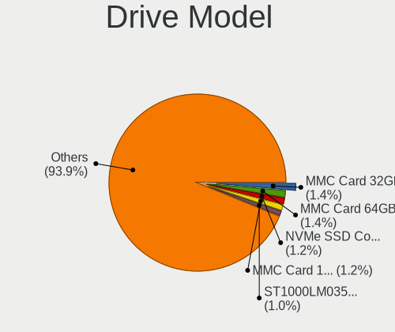
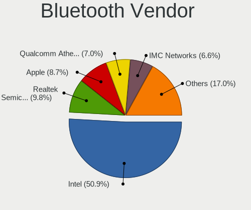
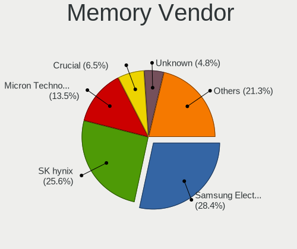

Linux in USA - Tested Hardware & Statistics (Notebooks)
-------------------------------------------------------

A project to collect tested hardware configurations for Linux in USA.

Anyone can contribute to this report by the [hw-probe](https://github.com/linuxhw/hw-probe) tool:

    sudo -E hw-probe -all -upload

Please contribute! Especially if your hardware is rare.

Contents
--------

* [ Test Cases ](#test-cases)

* [ System ](#system)
  - [ OS                       ](#os)
  - [ OS Family                ](#os-family)
  - [ Kernel                   ](#kernel)
  - [ Kernel Family            ](#kernel-family)
  - [ Kernel Major Ver.        ](#kernel-major-ver)
  - [ Arch                     ](#arch)
  - [ DE                       ](#de)
  - [ Display Server           ](#display-server)
  - [ Display Manager          ](#display-manager)
  - [ OS Lang                  ](#os-lang)
  - [ Boot Mode                ](#boot-mode)
  - [ Filesystem               ](#filesystem)
  - [ Part. scheme             ](#part-scheme)
  - [ Dual Boot with Linux/BSD ](#dual-boot-with-linuxbsd)
  - [ Dual Boot (Win)          ](#dual-boot-win)

* [ Board ](#board)
  - [ Vendor                   ](#vendor)
  - [ Model                    ](#model)
  - [ Model Family             ](#model-family)
  - [ MFG Year                 ](#mfg-year)
  - [ Form Factor              ](#form-factor)
  - [ Secure Boot              ](#secure-boot)
  - [ Coreboot                 ](#coreboot)
  - [ RAM Size                 ](#ram-size)
  - [ RAM Used                 ](#ram-used)
  - [ Total Drives             ](#total-drives)
  - [ Has CD-ROM               ](#has-cd-rom)
  - [ Has Ethernet             ](#has-ethernet)
  - [ Has WiFi                 ](#has-wifi)
  - [ Has Bluetooth            ](#has-bluetooth)

* [ Location ](#location)
  - [ Country                  ](#country)
  - [ City                     ](#city)

* [ Drives ](#drives)
  - [ Drive Vendor             ](#drive-vendor)
  - [ Drive Model              ](#drive-model)
  - [ HDD Vendor               ](#hdd-vendor)
  - [ SSD Vendor               ](#ssd-vendor)
  - [ Drive Kind               ](#drive-kind)
  - [ Drive Connector          ](#drive-connector)
  - [ Drive Size               ](#drive-size)
  - [ Space Total              ](#space-total)
  - [ Space Used               ](#space-used)
  - [ Malfunc. Drives          ](#malfunc-drives)
  - [ Malfunc. Drive Vendor    ](#malfunc-drive-vendor)
  - [ Malfunc. HDD Vendor      ](#malfunc-hdd-vendor)
  - [ Malfunc. Drive Kind      ](#malfunc-drive-kind)
  - [ Failed Drives            ](#failed-drives)
  - [ Failed Drive Vendor      ](#failed-drive-vendor)
  - [ Drive Status             ](#drive-status)

* [ Storage controller ](#storage-controller)
  - [ Storage Vendor           ](#storage-vendor)
  - [ Storage Model            ](#storage-model)
  - [ Storage Kind             ](#storage-kind)

* [ Processor ](#processor)
  - [ CPU Vendor               ](#cpu-vendor)
  - [ CPU Model                ](#cpu-model)
  - [ CPU Model Family         ](#cpu-model-family)
  - [ CPU Cores                ](#cpu-cores)
  - [ CPU Sockets              ](#cpu-sockets)
  - [ CPU Threads              ](#cpu-threads)
  - [ CPU Op-Modes             ](#cpu-op-modes)
  - [ CPU Microcode            ](#cpu-microcode)
  - [ CPU Microarch            ](#cpu-microarch)

* [ Graphics ](#graphics)
  - [ GPU Vendor               ](#gpu-vendor)
  - [ GPU Model                ](#gpu-model)
  - [ GPU Combo                ](#gpu-combo)
  - [ GPU Driver               ](#gpu-driver)
  - [ GPU Memory               ](#gpu-memory)

* [ Monitor ](#monitor)
  - [ Monitor Vendor           ](#monitor-vendor)
  - [ Monitor Model            ](#monitor-model)
  - [ Monitor Resolution       ](#monitor-resolution)
  - [ Monitor Diagonal         ](#monitor-diagonal)
  - [ Monitor Width            ](#monitor-width)
  - [ Aspect Ratio             ](#aspect-ratio)
  - [ Monitor Area             ](#monitor-area)
  - [ Pixel Density            ](#pixel-density)
  - [ Multiple Monitors        ](#multiple-monitors)

* [ Network ](#network)
  - [ Net Controller Vendor    ](#net-controller-vendor)
  - [ Net Controller Model     ](#net-controller-model)
  - [ Wireless Vendor          ](#wireless-vendor)
  - [ Wireless Model           ](#wireless-model)
  - [ Ethernet Vendor          ](#ethernet-vendor)
  - [ Ethernet Model           ](#ethernet-model)
  - [ Net Controller Kind      ](#net-controller-kind)
  - [ Used Controller          ](#used-controller)
  - [ NICs                     ](#nics)
  - [ IPv6                     ](#ipv6)

* [ Bluetooth ](#bluetooth)
  - [ Bluetooth Vendor         ](#bluetooth-vendor)
  - [ Bluetooth Model          ](#bluetooth-model)

* [ Sound ](#sound)
  - [ Sound Vendor             ](#sound-vendor)
  - [ Sound Model              ](#sound-model)

* [ Memory ](#memory)
  - [ Memory Vendor            ](#memory-vendor)
  - [ Memory Model             ](#memory-model)
  - [ Memory Kind              ](#memory-kind)
  - [ Memory Form Factor       ](#memory-form-factor)
  - [ Memory Size              ](#memory-size)
  - [ Memory Speed             ](#memory-speed)

* [ Printers & scanners ](#printers--scanners)
  - [ Printer Vendor           ](#printer-vendor)
  - [ Printer Model            ](#printer-model)
  - [ Scanner Vendor           ](#scanner-vendor)
  - [ Scanner Model            ](#scanner-model)

* [ Camera ](#camera)
  - [ Camera Vendor            ](#camera-vendor)
  - [ Camera Model             ](#camera-model)

* [ Security ](#security)
  - [ Fingerprint Vendor       ](#fingerprint-vendor)
  - [ Fingerprint Model        ](#fingerprint-model)
  - [ Chipcard Vendor          ](#chipcard-vendor)
  - [ Chipcard Model           ](#chipcard-model)

* [ Unsupported ](#unsupported)
  - [ Unsupported Devices      ](#unsupported-devices)
  - [ Unsupported Device Types ](#unsupported-device-types)

Test Cases
----------

Total: 16433

| Vendor        | Model                       | Probe                                                      | Date         |
|---------------|-----------------------------|------------------------------------------------------------|--------------|
| Lenovo        | ThinkPad T510 4313CTU       | [d5c0252c4b](https://linux-hardware.org/?probe=d5c0252c4b) | Jun 01, 2022 |
| Lenovo        | ThinkPad T440s 20AQ008FU... | [3b5255ec2c](https://linux-hardware.org/?probe=3b5255ec2c) | Jun 01, 2022 |
| Apple         | MacBook2,1                  | [12cfa4cdb2](https://linux-hardware.org/?probe=12cfa4cdb2) | Jun 01, 2022 |
| Dell          | XPS 17 9710                 | [d33b756434](https://linux-hardware.org/?probe=d33b756434) | Jun 01, 2022 |
| ASUSTek       | ROG Strix G533QS_G533QS     | [7099867859](https://linux-hardware.org/?probe=7099867859) | May 31, 2022 |
| Sony          | VPCF11JFX                   | [17d6b6b0bb](https://linux-hardware.org/?probe=17d6b6b0bb) | May 31, 2022 |
| Lenovo        | ThinkPad Edge E530 32597... | [4cf2bedfe7](https://linux-hardware.org/?probe=4cf2bedfe7) | May 31, 2022 |
| HP            | EliteBook 840 G2            | [2f6bce8773](https://linux-hardware.org/?probe=2f6bce8773) | May 31, 2022 |
| Apple         | MacBookPro8,3               | [38f4cc4c5a](https://linux-hardware.org/?probe=38f4cc4c5a) | May 31, 2022 |
| Toshiba       | Satellite M305D             | [6d558c3665](https://linux-hardware.org/?probe=6d558c3665) | May 31, 2022 |
| Toshiba       | Satellite M305D             | [43315304ac](https://linux-hardware.org/?probe=43315304ac) | May 31, 2022 |
| ASUSTek       | ROG Strix G533QS_G533QS     | [aeb3a20df7](https://linux-hardware.org/?probe=aeb3a20df7) | May 31, 2022 |
| Alienware     | 15 R2                       | [776abe61ea](https://linux-hardware.org/?probe=776abe61ea) | May 31, 2022 |
| Acer          | Aspire E5-575G              | [7c44163245](https://linux-hardware.org/?probe=7c44163245) | May 31, 2022 |
| Dell          | Inspiron 3541               | [20b5815ca3](https://linux-hardware.org/?probe=20b5815ca3) | May 31, 2022 |
| Dell          | Vostro 3590                 | [e7f7489e9e](https://linux-hardware.org/?probe=e7f7489e9e) | May 30, 2022 |
| Google        | Coral                       | [c517ad03c1](https://linux-hardware.org/?probe=c517ad03c1) | May 30, 2022 |
| Google        | Droid                       | [35e3edeab3](https://linux-hardware.org/?probe=35e3edeab3) | May 30, 2022 |
| HP            | ZBook Firefly 14 inch G8... | [55e99cb697](https://linux-hardware.org/?probe=55e99cb697) | May 30, 2022 |
| Dell          | Precision 7710              | [f24e29d104](https://linux-hardware.org/?probe=f24e29d104) | May 30, 2022 |
| Dell          | Latitude E6510              | [4fe104ba1c](https://linux-hardware.org/?probe=4fe104ba1c) | May 30, 2022 |
| Framework     | Laptop                      | [f1c2a80b70](https://linux-hardware.org/?probe=f1c2a80b70) | May 30, 2022 |
| Dell          | Latitude 7320               | [63c6f252ab](https://linux-hardware.org/?probe=63c6f252ab) | May 30, 2022 |
| Dell          | Precision 7710              | [1bae5a0bf0](https://linux-hardware.org/?probe=1bae5a0bf0) | May 30, 2022 |
| HP            | EliteBook 8470p             | [d5d9d52b83](https://linux-hardware.org/?probe=d5d9d52b83) | May 30, 2022 |
| ASUSTek       | X540LA                      | [57e0b15d17](https://linux-hardware.org/?probe=57e0b15d17) | May 30, 2022 |
| GPU Compan... | GWTC116-2                   | [dbf473f0a0](https://linux-hardware.org/?probe=dbf473f0a0) | May 30, 2022 |
| GPU Compan... | GWTC116-2                   | [574439c3c6](https://linux-hardware.org/?probe=574439c3c6) | May 30, 2022 |
| HP            | Laptop 15-da0xxx            | [1780281b4c](https://linux-hardware.org/?probe=1780281b4c) | May 30, 2022 |
| HP            | EliteBook 840 G8 Noteboo... | [15fb1b0353](https://linux-hardware.org/?probe=15fb1b0353) | May 30, 2022 |
| Lenovo        | ThinkPad T480s 20L8S34C0... | [c272fc283f](https://linux-hardware.org/?probe=c272fc283f) | May 29, 2022 |
| System76      | Lemur Pro                   | [4a6174b7a4](https://linux-hardware.org/?probe=4a6174b7a4) | May 29, 2022 |
| HP            | Laptop 15-dy2xxx            | [1c71dac18b](https://linux-hardware.org/?probe=1c71dac18b) | May 29, 2022 |
| System76      | Oryx Pro                    | [5f84134f5d](https://linux-hardware.org/?probe=5f84134f5d) | May 29, 2022 |
| HP            | Laptop 14-dq0xxx            | [fac9e55ae9](https://linux-hardware.org/?probe=fac9e55ae9) | May 29, 2022 |
| Acer          | Aspire E5-571               | [8767a79d4a](https://linux-hardware.org/?probe=8767a79d4a) | May 29, 2022 |
| ASUSTek       | K55A                        | [0eb5e9ea50](https://linux-hardware.org/?probe=0eb5e9ea50) | May 29, 2022 |
| ASUSTek       | GL502VSK                    | [44fb5da9d6](https://linux-hardware.org/?probe=44fb5da9d6) | May 29, 2022 |
| Valve         | Jupiter                     | [e415de106f](https://linux-hardware.org/?probe=e415de106f) | May 29, 2022 |
| Lenovo        | Legion S7 15ACH6 82K8       | [10ade1b182](https://linux-hardware.org/?probe=10ade1b182) | May 29, 2022 |
| HP            | Pavilion Laptop 15t-eg10... | [e24b789c03](https://linux-hardware.org/?probe=e24b789c03) | May 29, 2022 |
| ASUSTek       | X555LAB                     | [24d84de091](https://linux-hardware.org/?probe=24d84de091) | May 29, 2022 |
| Toshiba       | Satellite C675              | [72daf96a34](https://linux-hardware.org/?probe=72daf96a34) | May 28, 2022 |
| HP            | OMEN by Laptop 15z-en100    | [35e3478a5d](https://linux-hardware.org/?probe=35e3478a5d) | May 28, 2022 |
| Dell          | Inspiron 1545               | [ce0e24a314](https://linux-hardware.org/?probe=ce0e24a314) | May 28, 2022 |
| Valve         | Jupiter                     | [06b56d54d4](https://linux-hardware.org/?probe=06b56d54d4) | May 28, 2022 |
| HP            | 15                          | [d44aca33f7](https://linux-hardware.org/?probe=d44aca33f7) | May 28, 2022 |
| HP            | Laptop 14-dq0xxx            | [7d47123b6c](https://linux-hardware.org/?probe=7d47123b6c) | May 28, 2022 |
| MSI           | MS-7D52                     | [f70c160542](https://linux-hardware.org/?probe=f70c160542) | May 28, 2022 |
| ASUSTek       | G750JX                      | [dfb08cef0b](https://linux-hardware.org/?probe=dfb08cef0b) | May 28, 2022 |
| Google        | Phaser360                   | [1795c158e4](https://linux-hardware.org/?probe=1795c158e4) | May 28, 2022 |
| HP            | G60                         | [a577d64352](https://linux-hardware.org/?probe=a577d64352) | May 28, 2022 |
| HP            | Pavilion Laptop 15-eh0xx... | [0000ab45a7](https://linux-hardware.org/?probe=0000ab45a7) | May 27, 2022 |
| HP            | Berknip                     | [c81d3442c2](https://linux-hardware.org/?probe=c81d3442c2) | May 27, 2022 |
| Timi          | A35S                        | [8a1bee3210](https://linux-hardware.org/?probe=8a1bee3210) | May 27, 2022 |
| Dell          | Studio 1749                 | [ac564826fe](https://linux-hardware.org/?probe=ac564826fe) | May 27, 2022 |
| Dell          | Latitude E7450              | [929e69f0ad](https://linux-hardware.org/?probe=929e69f0ad) | May 27, 2022 |
| Valve         | Jupiter                     | [1e966da4f8](https://linux-hardware.org/?probe=1e966da4f8) | May 27, 2022 |
| Gigabyte      | AORUS 15 XE4                | [f56ba4f49d](https://linux-hardware.org/?probe=f56ba4f49d) | May 27, 2022 |
| Lenovo        | ThinkPad X1 Carbon Gen 9... | [d2581e2c05](https://linux-hardware.org/?probe=d2581e2c05) | May 27, 2022 |
| Apple         | MacBookPro5,5               | [75eebad111](https://linux-hardware.org/?probe=75eebad111) | May 27, 2022 |
| MSI           | Katana GF66 11UD            | [f3ee20f625](https://linux-hardware.org/?probe=f3ee20f625) | May 27, 2022 |
| Google        | Kasumi                      | [112d887e7a](https://linux-hardware.org/?probe=112d887e7a) | May 27, 2022 |
| Google        | Kasumi                      | [9c5ae593d2](https://linux-hardware.org/?probe=9c5ae593d2) | May 27, 2022 |
| Dell          | Inspiron 15 3510            | [860cd7b1f5](https://linux-hardware.org/?probe=860cd7b1f5) | May 27, 2022 |
| Dell          | Inspiron 15 3510            | [3d9ff1d25f](https://linux-hardware.org/?probe=3d9ff1d25f) | May 27, 2022 |
| HP            | Stream Laptop 14-cb1xxx     | [50f70bc9af](https://linux-hardware.org/?probe=50f70bc9af) | May 27, 2022 |
| HP            | Pavilion Gaming Laptop 1... | [e879d3c292](https://linux-hardware.org/?probe=e879d3c292) | May 27, 2022 |
| Lenovo        | ThinkPad P1 Gen 3 20TJS3... | [88aabea122](https://linux-hardware.org/?probe=88aabea122) | May 27, 2022 |
| HP            | Laptop 14-dq0xxx            | [f1707ab670](https://linux-hardware.org/?probe=f1707ab670) | May 26, 2022 |
| Dell          | Inspiron 7559               | [61fe0db491](https://linux-hardware.org/?probe=61fe0db491) | May 26, 2022 |
| Dell          | Inspiron 7559               | [47f48c626a](https://linux-hardware.org/?probe=47f48c626a) | May 26, 2022 |
| Dell          | Inspiron 1420               | [4ca4bb715c](https://linux-hardware.org/?probe=4ca4bb715c) | May 26, 2022 |
| Acer          | Swift SF314-43              | [640f9226a1](https://linux-hardware.org/?probe=640f9226a1) | May 26, 2022 |
| HP            | Laptop 14-dq0xxx            | [d55ccb53e4](https://linux-hardware.org/?probe=d55ccb53e4) | May 26, 2022 |
| Dell          | Latitude E6540              | [9171fd4d35](https://linux-hardware.org/?probe=9171fd4d35) | May 26, 2022 |
| Dell          | Latitude E6540              | [e7a078f1a1](https://linux-hardware.org/?probe=e7a078f1a1) | May 26, 2022 |
| ASUSTek       | 1005HA                      | [0948f30719](https://linux-hardware.org/?probe=0948f30719) | May 26, 2022 |
| Lenovo        | ThinkPad T420 4236MBU       | [7a7ef6ced7](https://linux-hardware.org/?probe=7a7ef6ced7) | May 26, 2022 |
| Panasonic     | CF53-4                      | [5ca3312ac9](https://linux-hardware.org/?probe=5ca3312ac9) | May 26, 2022 |
| Lenovo        | Legion 5 15IMH05H 81Y6      | [ab2cd65153](https://linux-hardware.org/?probe=ab2cd65153) | May 26, 2022 |
| Lenovo        | ThinkPad T14s Gen 1 20UH... | [3f8118956b](https://linux-hardware.org/?probe=3f8118956b) | May 26, 2022 |
| Lenovo        | ThinkPad T14s Gen 1 20UH... | [b96c4ebd01](https://linux-hardware.org/?probe=b96c4ebd01) | May 26, 2022 |
| System76      | Galago Pro                  | [3baddb9faa](https://linux-hardware.org/?probe=3baddb9faa) | May 26, 2022 |
| Acer          | Nitro AN515-54              | [4c0609eff4](https://linux-hardware.org/?probe=4c0609eff4) | May 25, 2022 |
| Lenovo        | ThinkPad X220 4286CTO       | [4c0d37687e](https://linux-hardware.org/?probe=4c0d37687e) | May 25, 2022 |
| Lenovo        | ThinkPad S1 Yoga 12 20DK... | [fc05deca82](https://linux-hardware.org/?probe=fc05deca82) | May 25, 2022 |
| Lenovo        | ThinkPad 25 20K70004US      | [8984183801](https://linux-hardware.org/?probe=8984183801) | May 25, 2022 |
| ASUSTek       | 1005HA                      | [1d5fe9025a](https://linux-hardware.org/?probe=1d5fe9025a) | May 25, 2022 |
| Alienware     | m15 R7                      | [d8155181ec](https://linux-hardware.org/?probe=d8155181ec) | May 25, 2022 |
| Lenovo        | Legion 5 15ACH6 82JW        | [dbf37b46f6](https://linux-hardware.org/?probe=dbf37b46f6) | May 25, 2022 |
| Lenovo        | Legion 5 15ACH6 82JW        | [9fcb918138](https://linux-hardware.org/?probe=9fcb918138) | May 25, 2022 |
| Framework     | Laptop                      | [f8790adbf2](https://linux-hardware.org/?probe=f8790adbf2) | May 25, 2022 |
| System76      | Oryx Pro                    | [2652ac64a4](https://linux-hardware.org/?probe=2652ac64a4) | May 25, 2022 |
| HP            | Pavilion Laptop 15-eh2xx... | [364356854c](https://linux-hardware.org/?probe=364356854c) | May 25, 2022 |
| Lenovo        | ThinkPad T470 W10DG 20JM... | [284a30af50](https://linux-hardware.org/?probe=284a30af50) | May 25, 2022 |
| HP            | Pavilion Gaming Laptop 1... | [b672eefb50](https://linux-hardware.org/?probe=b672eefb50) | May 25, 2022 |
| ASUSTek       | TP500LA                     | [d72b249f1a](https://linux-hardware.org/?probe=d72b249f1a) | May 25, 2022 |
| Acer          | Aspire S3-391               | [d7289b7bd6](https://linux-hardware.org/?probe=d7289b7bd6) | May 25, 2022 |
| Apple         | MacBookPro14,3              | [ca090207b8](https://linux-hardware.org/?probe=ca090207b8) | May 25, 2022 |
| AMI           | Intel                       | [6f43f8000f](https://linux-hardware.org/?probe=6f43f8000f) | May 25, 2022 |
| Dell          | Precision 5560              | [117f0ea357](https://linux-hardware.org/?probe=117f0ea357) | May 25, 2022 |
| Dell          | Precision 5560              | [326ecde715](https://linux-hardware.org/?probe=326ecde715) | May 25, 2022 |
| Dell          | Inspiron 15-7568            | [7e52decd6c](https://linux-hardware.org/?probe=7e52decd6c) | May 25, 2022 |
| Dell          | Latitude 7480               | [4ba0a0ec3c](https://linux-hardware.org/?probe=4ba0a0ec3c) | May 24, 2022 |
| ASUSTek       | G551JM                      | [3db2e28ef2](https://linux-hardware.org/?probe=3db2e28ef2) | May 24, 2022 |
| Dell          | Latitude 7480               | [33c94e6121](https://linux-hardware.org/?probe=33c94e6121) | May 24, 2022 |
| Dell          | G15 5520                    | [6725c0ec16](https://linux-hardware.org/?probe=6725c0ec16) | May 24, 2022 |
| HP            | Laptop 14-fq0xxx            | [cce2c3d087](https://linux-hardware.org/?probe=cce2c3d087) | May 24, 2022 |
| ASUSTek       | TUF Gaming X570-PRO         | [a6626edfaa](https://linux-hardware.org/?probe=a6626edfaa) | May 24, 2022 |
| Dell          | Venue 8 Pro 5830            | [c07937f5ea](https://linux-hardware.org/?probe=c07937f5ea) | May 24, 2022 |
| HP            | Laptop 14-fq0xxx            | [a26b5f2e62](https://linux-hardware.org/?probe=a26b5f2e62) | May 24, 2022 |
| ASUSTek       | TUF Gaming X570-PRO         | [fca93c5473](https://linux-hardware.org/?probe=fca93c5473) | May 24, 2022 |
| Acer          | Nitro AN515-42              | [c755d907ca](https://linux-hardware.org/?probe=c755d907ca) | May 24, 2022 |
| Dell          | G15 5520                    | [93c48c8560](https://linux-hardware.org/?probe=93c48c8560) | May 24, 2022 |
| HP            | Pavilion TS 14 Sleekbook    | [18a9e78640](https://linux-hardware.org/?probe=18a9e78640) | May 24, 2022 |
| LG Electro... | 15Z95P-P.AAE8U1             | [b6f94c26a6](https://linux-hardware.org/?probe=b6f94c26a6) | May 24, 2022 |
| Lenovo        | IdeaPad 330-17IKB 81DM      | [53475a6004](https://linux-hardware.org/?probe=53475a6004) | May 24, 2022 |
| ROCK Pi       | Unknown                     | [aa891c0178](https://linux-hardware.org/?probe=aa891c0178) | May 24, 2022 |
| HP            | EliteBook 840 G8 Noteboo... | [eccd990241](https://linux-hardware.org/?probe=eccd990241) | May 24, 2022 |
| Toshiba       | Satellite L75D-A            | [0a4b6bedbf](https://linux-hardware.org/?probe=0a4b6bedbf) | May 24, 2022 |
| Valve         | Jupiter                     | [c34173715a](https://linux-hardware.org/?probe=c34173715a) | May 24, 2022 |
| Dell          | Latitude E5440              | [21f0eba93a](https://linux-hardware.org/?probe=21f0eba93a) | May 24, 2022 |
| Apple         | MacBookPro8,2               | [764a660c33](https://linux-hardware.org/?probe=764a660c33) | May 24, 2022 |
| System76      | Oryx Pro                    | [f95bed2419](https://linux-hardware.org/?probe=f95bed2419) | May 24, 2022 |
| ASUSTek       | Zephyrus G GU502DU_GA502... | [bd95cdf1cd](https://linux-hardware.org/?probe=bd95cdf1cd) | May 24, 2022 |
| HP            | Laptop 14-df0xxx            | [94992083bc](https://linux-hardware.org/?probe=94992083bc) | May 24, 2022 |
| System76      | Oryx Pro                    | [10502c5379](https://linux-hardware.org/?probe=10502c5379) | May 24, 2022 |
| Dell          | Latitude E6510              | [52b94e68a9](https://linux-hardware.org/?probe=52b94e68a9) | May 23, 2022 |
| HP            | OMEN by Laptop 16-b0xxx     | [9eef1e277c](https://linux-hardware.org/?probe=9eef1e277c) | May 23, 2022 |
| Dell          | Inspiron 3502               | [b934f2b201](https://linux-hardware.org/?probe=b934f2b201) | May 23, 2022 |
| Valve         | Jupiter                     | [6ca95b630c](https://linux-hardware.org/?probe=6ca95b630c) | May 23, 2022 |
| HP            | Laptop 14-dk1xxx            | [6f78dba14b](https://linux-hardware.org/?probe=6f78dba14b) | May 23, 2022 |
| Dell          | Precision M4400             | [681a684aa6](https://linux-hardware.org/?probe=681a684aa6) | May 23, 2022 |
| Apple         | MacBook5,1                  | [74e6dbe9af](https://linux-hardware.org/?probe=74e6dbe9af) | May 23, 2022 |
| Apple         | MacBook5,1                  | [a53d746d08](https://linux-hardware.org/?probe=a53d746d08) | May 23, 2022 |
| Dell          | System Inspiron 17 7000 ... | [5f646f4e8c](https://linux-hardware.org/?probe=5f646f4e8c) | May 23, 2022 |
| Dell          | G7 7588                     | [6224d3a656](https://linux-hardware.org/?probe=6224d3a656) | May 23, 2022 |
| Acer          | Aspire A115-32              | [c850b0c266](https://linux-hardware.org/?probe=c850b0c266) | May 23, 2022 |
| Apple         | MacBookPro11,1              | [1d4f3a60c0](https://linux-hardware.org/?probe=1d4f3a60c0) | May 23, 2022 |
| Acer          | Aspire A515-55              | [52dce4d0c3](https://linux-hardware.org/?probe=52dce4d0c3) | May 23, 2022 |
| HP            | Notebook                    | [efacf04654](https://linux-hardware.org/?probe=efacf04654) | May 23, 2022 |
| ASUSTek       | VivoBook_ASUS Laptop E21... | [601cffe31d](https://linux-hardware.org/?probe=601cffe31d) | May 22, 2022 |
| Apple         | MacBookPro11,4              | [1f931afa11](https://linux-hardware.org/?probe=1f931afa11) | May 22, 2022 |
| Toshiba       | Satellite L755D             | [3614e30a7e](https://linux-hardware.org/?probe=3614e30a7e) | May 22, 2022 |
| Samsung       | 950XDB/951XDB/950XDY        | [fc970670a8](https://linux-hardware.org/?probe=fc970670a8) | May 22, 2022 |
| ASUSTek       | G752VL                      | [6cb02316f1](https://linux-hardware.org/?probe=6cb02316f1) | May 22, 2022 |
| Lenovo        | ThinkPad T530 2359CTO       | [277734b1fe](https://linux-hardware.org/?probe=277734b1fe) | May 22, 2022 |
| ASUSTek       | ROG Strix G513QY_G513QY     | [bdb9536c9c](https://linux-hardware.org/?probe=bdb9536c9c) | May 22, 2022 |
| Apple         | MacBook4,1                  | [27f751618e](https://linux-hardware.org/?probe=27f751618e) | May 22, 2022 |
| Lenovo        | ThinkPad T530 2359CTO       | [9a7b6da037](https://linux-hardware.org/?probe=9a7b6da037) | May 22, 2022 |
| Google        | Glimmer                     | [f16458e3ea](https://linux-hardware.org/?probe=f16458e3ea) | May 22, 2022 |
| Toshiba       | Satellite Radius P55W-B     | [5b9c197c67](https://linux-hardware.org/?probe=5b9c197c67) | May 22, 2022 |
| ASUSTek       | VivoBook_ASUSLaptop X521... | [f9f00f46cc](https://linux-hardware.org/?probe=f9f00f46cc) | May 22, 2022 |
| Google        | Quawks                      | [cb763161cf](https://linux-hardware.org/?probe=cb763161cf) | May 22, 2022 |
| HP            | Laptop 15-bs0xx             | [40e9bdb15d](https://linux-hardware.org/?probe=40e9bdb15d) | May 22, 2022 |
| HP            | ProBook 470 G5              | [4be19d46e1](https://linux-hardware.org/?probe=4be19d46e1) | May 21, 2022 |
| Google        | Lulu                        | [e7a0842114](https://linux-hardware.org/?probe=e7a0842114) | May 21, 2022 |
| MSI           | CX61 2PC                    | [0efd671877](https://linux-hardware.org/?probe=0efd671877) | May 21, 2022 |
| Google        | Kasumi                      | [6e04238da2](https://linux-hardware.org/?probe=6e04238da2) | May 21, 2022 |
| Dell          | Inspiron 3541               | [9869bcac0c](https://linux-hardware.org/?probe=9869bcac0c) | May 21, 2022 |
| Lenovo        | ThinkPad T460 20FMS421US    | [47297bafb5](https://linux-hardware.org/?probe=47297bafb5) | May 21, 2022 |
| Lenovo        | ThinkPad T460 20FMS421US    | [7b878500c1](https://linux-hardware.org/?probe=7b878500c1) | May 21, 2022 |
| Dell          | System Inspiron N7110       | [d96cf27a36](https://linux-hardware.org/?probe=d96cf27a36) | May 21, 2022 |
| Lenovo        | ThinkPad E550 20DF002YUS    | [fe9f7989ef](https://linux-hardware.org/?probe=fe9f7989ef) | May 21, 2022 |
| HP            | ProBook 470 G5              | [1557d1e15f](https://linux-hardware.org/?probe=1557d1e15f) | May 21, 2022 |
| Valve         | Jupiter                     | [d706d00651](https://linux-hardware.org/?probe=d706d00651) | May 21, 2022 |
| Valve         | Jupiter                     | [317e492fa3](https://linux-hardware.org/?probe=317e492fa3) | May 21, 2022 |
| MSI           | MS-7D52                     | [1144b23f51](https://linux-hardware.org/?probe=1144b23f51) | May 21, 2022 |
| ASUSTek       | VivoBook_ASUSLaptop X513... | [f2c0dedc02](https://linux-hardware.org/?probe=f2c0dedc02) | May 20, 2022 |
| Lenovo        | ThinkPad X1 Carbon Gen 9... | [d5b9f1fd4a](https://linux-hardware.org/?probe=d5b9f1fd4a) | May 20, 2022 |
| Lenovo        | ThinkPad X1 Carbon Gen 9... | [567c91351f](https://linux-hardware.org/?probe=567c91351f) | May 20, 2022 |
| HP            | EliteBook 840 G8 Noteboo... | [42bb303b25](https://linux-hardware.org/?probe=42bb303b25) | May 20, 2022 |
| Dell          | Latitude E6410              | [b098a84988](https://linux-hardware.org/?probe=b098a84988) | May 20, 2022 |
| HP            | 255 G7 Notebook PC          | [f11383a8cc](https://linux-hardware.org/?probe=f11383a8cc) | May 20, 2022 |
| HP            | 255 G7 Notebook PC          | [5d2713e2f0](https://linux-hardware.org/?probe=5d2713e2f0) | May 20, 2022 |
| Google        | Glimmer                     | [78c39ceda9](https://linux-hardware.org/?probe=78c39ceda9) | May 20, 2022 |
| System76      | Oryx Pro                    | [d705be052a](https://linux-hardware.org/?probe=d705be052a) | May 20, 2022 |
| Dell          | Inspiron 5555               | [35c2610913](https://linux-hardware.org/?probe=35c2610913) | May 20, 2022 |
| ASUSTek       | VivoBook_ASUSLaptop X515... | [586933cfe0](https://linux-hardware.org/?probe=586933cfe0) | May 20, 2022 |
| Dell          | XPS 17 9720                 | [4481be171e](https://linux-hardware.org/?probe=4481be171e) | May 19, 2022 |
| Acer          | Swift SF314-42              | [6ea1e6d50a](https://linux-hardware.org/?probe=6ea1e6d50a) | May 19, 2022 |
| Apple         | MacBookPro8,1               | [e9a6f0bd85](https://linux-hardware.org/?probe=e9a6f0bd85) | May 19, 2022 |
| Google        | Caroline                    | [2b665e84d3](https://linux-hardware.org/?probe=2b665e84d3) | May 19, 2022 |
| Lenovo        | IdeaPad 110S-11IBR 80WG     | [c17842aaa6](https://linux-hardware.org/?probe=c17842aaa6) | May 19, 2022 |
| Toshiba       | PORTEGE Z10t-A              | [8266843e53](https://linux-hardware.org/?probe=8266843e53) | May 19, 2022 |
| Lenovo        | IdeaPad Slim 1-14AST-05 ... | [6528155c00](https://linux-hardware.org/?probe=6528155c00) | May 19, 2022 |
| Lenovo        | IdeaPad Slim 1-14AST-05 ... | [53219da3f5](https://linux-hardware.org/?probe=53219da3f5) | May 19, 2022 |
| Dell          | Precision M4500             | [8f3b6f7e89](https://linux-hardware.org/?probe=8f3b6f7e89) | May 19, 2022 |
| Dell          | XPS 15 9510                 | [c913032cb7](https://linux-hardware.org/?probe=c913032cb7) | May 19, 2022 |
| HP            | EliteBook 840 G4            | [2864dc6f0a](https://linux-hardware.org/?probe=2864dc6f0a) | May 19, 2022 |
| Google        | Celes                       | [ca6be0abba](https://linux-hardware.org/?probe=ca6be0abba) | May 19, 2022 |
| Lenovo        | ThinkPad P50 20EQS1DD00     | [819420bd66](https://linux-hardware.org/?probe=819420bd66) | May 19, 2022 |
| Lenovo        | ThinkPad P50 20EQS1DD00     | [479ab8b5d7](https://linux-hardware.org/?probe=479ab8b5d7) | May 19, 2022 |
| Dell          | Inspiron 5770               | [9ad815929d](https://linux-hardware.org/?probe=9ad815929d) | May 19, 2022 |
| System76      | Kudu                        | [78ce5e3b3e](https://linux-hardware.org/?probe=78ce5e3b3e) | May 19, 2022 |
| Samsung       | 730QCJ/730QCR               | [08452b3686](https://linux-hardware.org/?probe=08452b3686) | May 19, 2022 |
| Alienware     | m15                         | [88f12bc13a](https://linux-hardware.org/?probe=88f12bc13a) | May 18, 2022 |
| Dell          | Inspiron 5755               | [f0e2daf83f](https://linux-hardware.org/?probe=f0e2daf83f) | May 18, 2022 |
| Dell          | Latitude 5580               | [4ffe20fd16](https://linux-hardware.org/?probe=4ffe20fd16) | May 18, 2022 |
| MSI           | GS63 Stealth 8RE            | [fead5c194e](https://linux-hardware.org/?probe=fead5c194e) | May 18, 2022 |
| MSI           | GS63 Stealth 8RE            | [da579f24ed](https://linux-hardware.org/?probe=da579f24ed) | May 18, 2022 |
| Acer          | Nitro AN515-54              | [8ab9ee4b18](https://linux-hardware.org/?probe=8ab9ee4b18) | May 18, 2022 |
| HP            | Laptop 15-dy2xxx            | [75ec4a948b](https://linux-hardware.org/?probe=75ec4a948b) | May 18, 2022 |
| Dell          | Latitude E6420              | [0f06571934](https://linux-hardware.org/?probe=0f06571934) | May 18, 2022 |
| Lenovo        | ThinkPad X1 Carbon 7th 2... | [c9a82e1be0](https://linux-hardware.org/?probe=c9a82e1be0) | May 18, 2022 |
| ASUSTek       | ROG Zephyrus G14 GA402RJ... | [8ef2235464](https://linux-hardware.org/?probe=8ef2235464) | May 17, 2022 |
| Acer          | Aspire one 1-431            | [216bdf2075](https://linux-hardware.org/?probe=216bdf2075) | May 17, 2022 |
| Dell          | Latitude 7480               | [b30f6ca8ed](https://linux-hardware.org/?probe=b30f6ca8ed) | May 17, 2022 |
| Lenovo        | ThinkPad X1 Carbon 6th 2... | [a76c24b01b](https://linux-hardware.org/?probe=a76c24b01b) | May 17, 2022 |
| Lenovo        | IdeaPad Y500 20193          | [a3931c5e60](https://linux-hardware.org/?probe=a3931c5e60) | May 17, 2022 |
| ASUSTek       | ASUS TUF Dash F15 FX516P... | [aac3b4ad27](https://linux-hardware.org/?probe=aac3b4ad27) | May 17, 2022 |
| Apple         | MacBookPro11,4              | [8bf515d1d3](https://linux-hardware.org/?probe=8bf515d1d3) | May 17, 2022 |
| Dell          | XPS 15 9570                 | [ce6b14cd55](https://linux-hardware.org/?probe=ce6b14cd55) | May 17, 2022 |
| HP            | Pavilion dm3                | [2cbaf3ea69](https://linux-hardware.org/?probe=2cbaf3ea69) | May 17, 2022 |
| HP            | Laptop 14-dk1xxx            | [77a8cae8a0](https://linux-hardware.org/?probe=77a8cae8a0) | May 17, 2022 |
| Lenovo        | IdeaPad 330S-15IKB 81F5     | [39581d3868](https://linux-hardware.org/?probe=39581d3868) | May 17, 2022 |
| ASUSTek       | G73Jh                       | [2d96e5ecba](https://linux-hardware.org/?probe=2d96e5ecba) | May 17, 2022 |
| Acer          | Aspire A515-56              | [a32b5ba574](https://linux-hardware.org/?probe=a32b5ba574) | May 17, 2022 |
| Acer          | Aspire A515-56              | [27366d5566](https://linux-hardware.org/?probe=27366d5566) | May 17, 2022 |
| Lenovo        | IdeaPad Slim 7 14ITL05 8... | [2179a16a87](https://linux-hardware.org/?probe=2179a16a87) | May 17, 2022 |
| Lenovo        | IdeaPad 330S-15IKB 81F5     | [dd2fb5f70b](https://linux-hardware.org/?probe=dd2fb5f70b) | May 17, 2022 |
| Acer          | Aspire one 1-431            | [33b2da3e70](https://linux-hardware.org/?probe=33b2da3e70) | May 17, 2022 |
| ASUSTek       | G752VL                      | [8295577f79](https://linux-hardware.org/?probe=8295577f79) | May 17, 2022 |
| HP            | ProBook 6470b               | [0581bb1005](https://linux-hardware.org/?probe=0581bb1005) | May 17, 2022 |
| Dell          | Precision 5560              | [f7b7c1b7ac](https://linux-hardware.org/?probe=f7b7c1b7ac) | May 17, 2022 |
| Alienware     | 18                          | [7aa82b2786](https://linux-hardware.org/?probe=7aa82b2786) | May 17, 2022 |
| ASUSTek       | X55U                        | [29fe54133b](https://linux-hardware.org/?probe=29fe54133b) | May 17, 2022 |
| ASUSTek       | ROG Strix G713IM_G713IM     | [eb1da20105](https://linux-hardware.org/?probe=eb1da20105) | May 17, 2022 |
| Dell          | Latitude E6410              | [0d8d2a0cef](https://linux-hardware.org/?probe=0d8d2a0cef) | May 16, 2022 |
| Dell          | Latitude E6410              | [ae757ea3a4](https://linux-hardware.org/?probe=ae757ea3a4) | May 16, 2022 |
| Lenovo        | IdeaPad 110-15ACL 80TJ      | [eb5345a5c6](https://linux-hardware.org/?probe=eb5345a5c6) | May 16, 2022 |
| GPU Compan... | GWTC116-2                   | [e0c17d6d85](https://linux-hardware.org/?probe=e0c17d6d85) | May 16, 2022 |
| Dell          | Precision 5540              | [02576569ce](https://linux-hardware.org/?probe=02576569ce) | May 16, 2022 |
| Google        | Lulu                        | [c402204a03](https://linux-hardware.org/?probe=c402204a03) | May 16, 2022 |
| Lenovo        | IdeaPad Y700-17ISK 80Q0     | [cee7de1ac8](https://linux-hardware.org/?probe=cee7de1ac8) | May 16, 2022 |
| HP            | EliteBook 840 G2            | [329c389208](https://linux-hardware.org/?probe=329c389208) | May 16, 2022 |
| Dell          | Precision 5560              | [7942d71040](https://linux-hardware.org/?probe=7942d71040) | May 16, 2022 |
| Lenovo        | ThinkPad W520 4270CTO       | [bc304649a7](https://linux-hardware.org/?probe=bc304649a7) | May 16, 2022 |
| Samsung       | Lumpy                       | [84a78226dd](https://linux-hardware.org/?probe=84a78226dd) | May 16, 2022 |
| Dell          | Latitude 7480               | [72c4d9450d](https://linux-hardware.org/?probe=72c4d9450d) | May 16, 2022 |
| MSI           | GE66 Raider 11UE            | [d1a9527039](https://linux-hardware.org/?probe=d1a9527039) | May 16, 2022 |
| MSI           | GE66 Raider 11UE            | [d675d89c8a](https://linux-hardware.org/?probe=d675d89c8a) | May 16, 2022 |
| Notebook      | N8xEJEK                     | [e214afb251](https://linux-hardware.org/?probe=e214afb251) | May 16, 2022 |
| Unknown       | Unknown                     | [bb968f8b83](https://linux-hardware.org/?probe=bb968f8b83) | May 16, 2022 |
| HP            | ProBook 6550b               | [30fe7aecd2](https://linux-hardware.org/?probe=30fe7aecd2) | May 16, 2022 |
| HP            | Laptop 17-by4xxx            | [4b63d98b33](https://linux-hardware.org/?probe=4b63d98b33) | May 16, 2022 |
| HP            | Pavilion Gaming Laptop 1... | [b19acfed46](https://linux-hardware.org/?probe=b19acfed46) | May 16, 2022 |
| Lenovo        | ThinkPad W510 4318CTO       | [00acddbf24](https://linux-hardware.org/?probe=00acddbf24) | May 16, 2022 |
| Lenovo        | ThinkPad T530 23594LU       | [cbed91f90e](https://linux-hardware.org/?probe=cbed91f90e) | May 16, 2022 |
| MSI           | Alpha 15 A4DEK              | [71b7fc78c3](https://linux-hardware.org/?probe=71b7fc78c3) | May 15, 2022 |
| HP            | ENVY 14                     | [9fe635b800](https://linux-hardware.org/?probe=9fe635b800) | May 15, 2022 |
| Alienware     | m15                         | [1cadce5105](https://linux-hardware.org/?probe=1cadce5105) | May 15, 2022 |
| Lenovo        | IdeaPad 3 15ITL6 82H8       | [71e5fcaa52](https://linux-hardware.org/?probe=71e5fcaa52) | May 15, 2022 |
| Dell          | XPS 17 9710                 | [449c90c9dd](https://linux-hardware.org/?probe=449c90c9dd) | May 15, 2022 |
| Apple         | MacBookPro14,1              | [2d4d81086f](https://linux-hardware.org/?probe=2d4d81086f) | May 15, 2022 |
| Google        | Droid                       | [e938864c93](https://linux-hardware.org/?probe=e938864c93) | May 15, 2022 |
| Dell          | Inspiron 3520               | [a045c6d50f](https://linux-hardware.org/?probe=a045c6d50f) | May 15, 2022 |
| Dell          | Vostro 5471                 | [62e934492d](https://linux-hardware.org/?probe=62e934492d) | May 15, 2022 |
| ASUSTek       | K55A                        | [3391d004a7](https://linux-hardware.org/?probe=3391d004a7) | May 15, 2022 |
| Lenovo        | ThinkPad X1 Extreme 2nd ... | [6c635e0f3d](https://linux-hardware.org/?probe=6c635e0f3d) | May 15, 2022 |
| Dell          | 0655KV                      | [e915ef4c60](https://linux-hardware.org/?probe=e915ef4c60) | May 15, 2022 |
| HP            | ProBook 450 G1              | [c9da66f0e8](https://linux-hardware.org/?probe=c9da66f0e8) | May 15, 2022 |
| Dell          | Inspiron 5559               | [4b0c466a88](https://linux-hardware.org/?probe=4b0c466a88) | May 15, 2022 |
| Google        | Candy                       | [5d6a19a743](https://linux-hardware.org/?probe=5d6a19a743) | May 15, 2022 |
| HP            | Laptop 15-bs1xx             | [d247cf55a1](https://linux-hardware.org/?probe=d247cf55a1) | May 15, 2022 |
| Apple         | MacBookPro13,2              | [68e687c794](https://linux-hardware.org/?probe=68e687c794) | May 14, 2022 |
| Lenovo        | ThinkPad T410 2522W6S       | [79cd5bf620](https://linux-hardware.org/?probe=79cd5bf620) | May 14, 2022 |
| HP            | Laptop 15-da0xxx            | [3700b9d8b6](https://linux-hardware.org/?probe=3700b9d8b6) | May 14, 2022 |
| HP            | Pavilion g7                 | [d08c014458](https://linux-hardware.org/?probe=d08c014458) | May 14, 2022 |
| System76      | Oryx Pro                    | [d740686b5e](https://linux-hardware.org/?probe=d740686b5e) | May 14, 2022 |
| Dell          | Precision M6300             | [874055cf5b](https://linux-hardware.org/?probe=874055cf5b) | May 14, 2022 |
| Acer          | Aspire E5-575G              | [55a5fb9d6e](https://linux-hardware.org/?probe=55a5fb9d6e) | May 14, 2022 |
| Acer          | Aspire R5-571T              | [4d1362123c](https://linux-hardware.org/?probe=4d1362123c) | May 14, 2022 |
| Dell          | Inspiron 7380               | [ce19144efb](https://linux-hardware.org/?probe=ce19144efb) | May 14, 2022 |
| Dell          | Inspiron 5584               | [88414fb6bb](https://linux-hardware.org/?probe=88414fb6bb) | May 13, 2022 |
| Sony          | VGN-SZ430N                  | [7cb5638ef4](https://linux-hardware.org/?probe=7cb5638ef4) | May 13, 2022 |
| ASUSTek       | N80Vb                       | [74cb7e076b](https://linux-hardware.org/?probe=74cb7e076b) | May 13, 2022 |
| HP            | Pavilion dm1                | [7acb944db2](https://linux-hardware.org/?probe=7acb944db2) | May 13, 2022 |
| Dell          | System Inspiron N7110       | [f397801c5f](https://linux-hardware.org/?probe=f397801c5f) | May 13, 2022 |
| HP            | OMEN Laptop 15-en0xxx       | [98db0dde2a](https://linux-hardware.org/?probe=98db0dde2a) | May 13, 2022 |
| HP            | OMEN Laptop 15-en0xxx       | [66e43801f0](https://linux-hardware.org/?probe=66e43801f0) | May 13, 2022 |
| Apple         | MacBookPro13,2              | [5693f5ee45](https://linux-hardware.org/?probe=5693f5ee45) | May 13, 2022 |
| Dell          | XPS 15 9510                 | [836b9e0442](https://linux-hardware.org/?probe=836b9e0442) | May 13, 2022 |
| Google        | Lulu                        | [8d7f1657d0](https://linux-hardware.org/?probe=8d7f1657d0) | May 13, 2022 |
| Lenovo        | ThinkPad T14 Gen 2a 20XL... | [8c71a3bd1b](https://linux-hardware.org/?probe=8c71a3bd1b) | May 13, 2022 |
| Dell          | XPS 17 9710                 | [919abd9078](https://linux-hardware.org/?probe=919abd9078) | May 13, 2022 |
| Dell          | XPS 17 9710                 | [15bc7f6757](https://linux-hardware.org/?probe=15bc7f6757) | May 13, 2022 |
| Lenovo        | IdeaPad Slim 1-14AST-05 ... | [68ee4b094a](https://linux-hardware.org/?probe=68ee4b094a) | May 13, 2022 |
| Howard Com... | R7X                         | [bc6d6a31eb](https://linux-hardware.org/?probe=bc6d6a31eb) | May 13, 2022 |
| HP            | Pavilion 17                 | [60fbd20766](https://linux-hardware.org/?probe=60fbd20766) | May 13, 2022 |
| HP            | Stream Laptop 14-cb1xxx     | [c0e150d349](https://linux-hardware.org/?probe=c0e150d349) | May 13, 2022 |
| HP            | Stream Laptop 14-cb1xxx     | [919200b122](https://linux-hardware.org/?probe=919200b122) | May 13, 2022 |
| ASUSTek       | VivoBook_ASUSLaptop E410... | [c109401c09](https://linux-hardware.org/?probe=c109401c09) | May 13, 2022 |
| ASUSTek       | VivoBook_ASUSLaptop E410... | [1b312c5c1d](https://linux-hardware.org/?probe=1b312c5c1d) | May 13, 2022 |
| Lenovo        | ThinkPad T420s 4170CTO      | [4e58c3e210](https://linux-hardware.org/?probe=4e58c3e210) | May 13, 2022 |
| ASUSTek       | ROG Strix G533QS_G533QS     | [a2abab3a72](https://linux-hardware.org/?probe=a2abab3a72) | May 13, 2022 |
| HP            | Stream Laptop 14-cb0XX      | [3b0408920d](https://linux-hardware.org/?probe=3b0408920d) | May 13, 2022 |
| Lenovo        | IdeaPad 510-15ISK 80SR      | [deb6fa57ef](https://linux-hardware.org/?probe=deb6fa57ef) | May 12, 2022 |
| Apple         | MacBookPro8,1               | [f3ad419505](https://linux-hardware.org/?probe=f3ad419505) | May 12, 2022 |
| ASUSTek       | ROG Strix G533QS_G533QS     | [1c358bb926](https://linux-hardware.org/?probe=1c358bb926) | May 12, 2022 |
| System76      | Pangolin                    | [0f05fa93a8](https://linux-hardware.org/?probe=0f05fa93a8) | May 12, 2022 |
| Acer          | Nitro AN515-55              | [eaefbf2773](https://linux-hardware.org/?probe=eaefbf2773) | May 12, 2022 |
| Dell          | XPS 17 9710                 | [ff27218d11](https://linux-hardware.org/?probe=ff27218d11) | May 12, 2022 |
| Apple         | MacBookAir7,2               | [114ef2756f](https://linux-hardware.org/?probe=114ef2756f) | May 12, 2022 |
| Dell          | Inspiron 5770               | [05fd82be96](https://linux-hardware.org/?probe=05fd82be96) | May 12, 2022 |
| Lenovo        | ThinkPad L380 Yoga 20M70... | [dd8a564470](https://linux-hardware.org/?probe=dd8a564470) | May 11, 2022 |
| ASUSTek       | G750JM                      | [1bcf5cc7ea](https://linux-hardware.org/?probe=1bcf5cc7ea) | May 11, 2022 |
| Lenovo        | ThinkPad X395 20NL0007US    | [aea9571086](https://linux-hardware.org/?probe=aea9571086) | May 11, 2022 |
| GPU Compan... | GWTC116-2                   | [365b5a7ab2](https://linux-hardware.org/?probe=365b5a7ab2) | May 11, 2022 |
| Dell          | Latitude E6430              | [52f06b3b9e](https://linux-hardware.org/?probe=52f06b3b9e) | May 11, 2022 |
| Lenovo        | ThinkPad X1 Carbon 6th 2... | [b0951956fa](https://linux-hardware.org/?probe=b0951956fa) | May 11, 2022 |
| Google        | Cyan                        | [cec3bd0a88](https://linux-hardware.org/?probe=cec3bd0a88) | May 11, 2022 |
| LG Electro... | 17Z990-R.AAC9U1             | [dfacdafc7f](https://linux-hardware.org/?probe=dfacdafc7f) | May 11, 2022 |
| Lenovo        | ThinkPad P1 Gen 3 20TJS2... | [607c0a2833](https://linux-hardware.org/?probe=607c0a2833) | May 11, 2022 |
| Lenovo        | IdeaPad 5 15ITL05 82FG      | [73b4b6a015](https://linux-hardware.org/?probe=73b4b6a015) | May 11, 2022 |
| Dell          | Latitude E6540              | [422c7a9209](https://linux-hardware.org/?probe=422c7a9209) | May 11, 2022 |
| Dell          | Latitude E6410              | [a14c28c93f](https://linux-hardware.org/?probe=a14c28c93f) | May 11, 2022 |
| Acer          | Aspire 6930                 | [18c49ee073](https://linux-hardware.org/?probe=18c49ee073) | May 11, 2022 |
| Lenovo        | Legion 5 Pro 16ACH6H 82J... | [581d5f46ec](https://linux-hardware.org/?probe=581d5f46ec) | May 11, 2022 |
| HP            | ZBook Studio G7 Mobile W... | [4f25a82453](https://linux-hardware.org/?probe=4f25a82453) | May 11, 2022 |
| Dell          | 0655KV                      | [cb92f56b29](https://linux-hardware.org/?probe=cb92f56b29) | May 11, 2022 |
| Apple         | MacBook5,2                  | [0913ac4c8e](https://linux-hardware.org/?probe=0913ac4c8e) | May 11, 2022 |
| System76      | Pangolin                    | [da80a33b86](https://linux-hardware.org/?probe=da80a33b86) | May 11, 2022 |
| Acer          | Nitro AN515-54              | [db343a530d](https://linux-hardware.org/?probe=db343a530d) | May 11, 2022 |
| Notebook      | NS50_70MU                   | [40fe0416f5](https://linux-hardware.org/?probe=40fe0416f5) | May 11, 2022 |
| HP            | 15                          | [c54400b509](https://linux-hardware.org/?probe=c54400b509) | May 11, 2022 |
| Dell          | Inspiron 3542               | [9762e9155b](https://linux-hardware.org/?probe=9762e9155b) | May 11, 2022 |
| Lenovo        | Yoga 3 Pro-1370 80HE        | [3f587813b0](https://linux-hardware.org/?probe=3f587813b0) | May 11, 2022 |
| Google        | Rabbid                      | [2cabce6789](https://linux-hardware.org/?probe=2cabce6789) | May 10, 2022 |
| Dell          | Precision M4400             | [e6329a5fba](https://linux-hardware.org/?probe=e6329a5fba) | May 10, 2022 |
| HP            | Pavilion Laptop 14-ec0xx... | [1745c245c9](https://linux-hardware.org/?probe=1745c245c9) | May 10, 2022 |
| ASUSTek       | ROG Zephyrus G14 GA402RJ... | [ee9f39e915](https://linux-hardware.org/?probe=ee9f39e915) | May 10, 2022 |
| HP            | Pavilion Notebook           | [9bb460dd86](https://linux-hardware.org/?probe=9bb460dd86) | May 10, 2022 |
| HP            | ENVY TS 17                  | [2423c94072](https://linux-hardware.org/?probe=2423c94072) | May 10, 2022 |
| Dell          | Latitude 5414               | [dcc032e592](https://linux-hardware.org/?probe=dcc032e592) | May 10, 2022 |
| Lenovo        | ThinkPad T430 2347AT2       | [2ba7ecdb55](https://linux-hardware.org/?probe=2ba7ecdb55) | May 10, 2022 |
| Dell          | Latitude E6540              | [a5bb9f2b58](https://linux-hardware.org/?probe=a5bb9f2b58) | May 10, 2022 |
| Acer          | Swift SF314-52              | [ee252c0c42](https://linux-hardware.org/?probe=ee252c0c42) | May 10, 2022 |
| HP            | Pavilion Laptop 15z-cw10... | [67b3694f6a](https://linux-hardware.org/?probe=67b3694f6a) | May 10, 2022 |
| Lenovo        | Legion S7 15ACH6 82K8       | [37806600f2](https://linux-hardware.org/?probe=37806600f2) | May 10, 2022 |
| HP            | 15 Notebook PC              | [d88f833b65](https://linux-hardware.org/?probe=d88f833b65) | May 10, 2022 |
| Acer          | Aspire 6930                 | [ed0189e5ec](https://linux-hardware.org/?probe=ed0189e5ec) | May 10, 2022 |
| Google        | Droid                       | [35d0a5a944](https://linux-hardware.org/?probe=35d0a5a944) | May 10, 2022 |
| Acer          | Aspire 6930                 | [5a43e79289](https://linux-hardware.org/?probe=5a43e79289) | May 09, 2022 |
| Apple         | MacBookPro7,1               | [e2430a36a4](https://linux-hardware.org/?probe=e2430a36a4) | May 09, 2022 |
| HP            | Notebook                    | [200c1dabff](https://linux-hardware.org/?probe=200c1dabff) | May 09, 2022 |
| HP            | Laptop 15-db0xxx            | [42f2a531b5](https://linux-hardware.org/?probe=42f2a531b5) | May 09, 2022 |
| Notebook      | W65_W67RC                   | [9174f5a532](https://linux-hardware.org/?probe=9174f5a532) | May 09, 2022 |
| Acer          | Nitro AN515-57              | [b93966ec3c](https://linux-hardware.org/?probe=b93966ec3c) | May 09, 2022 |
| DTRI          | DT592BU                     | [dcfbac9737](https://linux-hardware.org/?probe=dcfbac9737) | May 09, 2022 |
| Dell          | Precision 5540              | [1744609574](https://linux-hardware.org/?probe=1744609574) | May 09, 2022 |
| Gateway       | P-7805u                     | [0192b23d62](https://linux-hardware.org/?probe=0192b23d62) | May 09, 2022 |
| HP            | Pavilion Notebook           | [0f04e6b439](https://linux-hardware.org/?probe=0f04e6b439) | May 09, 2022 |
| LG Electro... | 16Z90P-K.AAS9U1             | [26536e15bf](https://linux-hardware.org/?probe=26536e15bf) | May 09, 2022 |
| Dell          | XPS 15 9570                 | [43760b2df8](https://linux-hardware.org/?probe=43760b2df8) | May 09, 2022 |
| Dell          | Precision M6300             | [6cb903a178](https://linux-hardware.org/?probe=6cb903a178) | May 09, 2022 |
| Dell          | Studio 1555                 | [2c7f124d3f](https://linux-hardware.org/?probe=2c7f124d3f) | May 09, 2022 |
| Dell          | Inspiron 13-7378            | [768b19f0ff](https://linux-hardware.org/?probe=768b19f0ff) | May 09, 2022 |
| HP            | Laptop 15-dy1xxx            | [fd022c446e](https://linux-hardware.org/?probe=fd022c446e) | May 09, 2022 |
| ASUSTek       | G74Sx                       | [0ed6635d41](https://linux-hardware.org/?probe=0ed6635d41) | May 09, 2022 |
| HP            | ProBook 650 G2              | [aa7c15cb1a](https://linux-hardware.org/?probe=aa7c15cb1a) | May 09, 2022 |
| HP            | ProBook 650 G2              | [a42f9094ec](https://linux-hardware.org/?probe=a42f9094ec) | May 09, 2022 |
| HP            | Pavilion Laptop 15-cc0xx    | [324d23305d](https://linux-hardware.org/?probe=324d23305d) | May 09, 2022 |
| Lenovo        | IdeaPad Yoga 13 20175       | [019117605e](https://linux-hardware.org/?probe=019117605e) | May 08, 2022 |
| ASUSTek       | U43F                        | [ad1a88d120](https://linux-hardware.org/?probe=ad1a88d120) | May 08, 2022 |
| Lenovo        | IdeaPad 5 15ARE05 81YQ      | [296dc11e4b](https://linux-hardware.org/?probe=296dc11e4b) | May 08, 2022 |
| Unknown       | Unknown                     | [f802e84b8e](https://linux-hardware.org/?probe=f802e84b8e) | May 08, 2022 |
| Lenovo        | ThinkPad T480 20L6S8H100    | [5eefaba8d3](https://linux-hardware.org/?probe=5eefaba8d3) | May 08, 2022 |
| Dell          | Latitude E6410              | [0cac068895](https://linux-hardware.org/?probe=0cac068895) | May 08, 2022 |
| Lenovo        | ThinkPad X1 Carbon 3rd 2... | [dcdc07525d](https://linux-hardware.org/?probe=dcdc07525d) | May 08, 2022 |
| Dell          | Inspiron 13-7378            | [7a8fd14c85](https://linux-hardware.org/?probe=7a8fd14c85) | May 08, 2022 |
| Lenovo        | Y40-70 20347                | [3c9abd80e9](https://linux-hardware.org/?probe=3c9abd80e9) | May 08, 2022 |
| Lenovo        | ThinkPad T480 20L6S8H100    | [892d07e5cf](https://linux-hardware.org/?probe=892d07e5cf) | May 08, 2022 |
| Alienware     | Area-51m R2                 | [73f52aff10](https://linux-hardware.org/?probe=73f52aff10) | May 08, 2022 |
| Dell          | Latitude E6420              | [fc0e9182b3](https://linux-hardware.org/?probe=fc0e9182b3) | May 08, 2022 |
| Toshiba       | Satellite C650D             | [8aefcd7551](https://linux-hardware.org/?probe=8aefcd7551) | May 08, 2022 |
| Timi          | TM1613                      | [114752ffeb](https://linux-hardware.org/?probe=114752ffeb) | May 08, 2022 |
| Timi          | TM1613                      | [b714f7dbd8](https://linux-hardware.org/?probe=b714f7dbd8) | May 08, 2022 |
| Dell          | Inspiron 3180               | [30cfb22760](https://linux-hardware.org/?probe=30cfb22760) | May 07, 2022 |
| Dell          | Latitude E6400              | [be975db380](https://linux-hardware.org/?probe=be975db380) | May 07, 2022 |
| Dell          | Latitude E6410              | [361bcaa4cc](https://linux-hardware.org/?probe=361bcaa4cc) | May 07, 2022 |
| Google        | Lulu                        | [18ecc4a6e7](https://linux-hardware.org/?probe=18ecc4a6e7) | May 07, 2022 |
| Razer         | Blade                       | [0e1cc80117](https://linux-hardware.org/?probe=0e1cc80117) | May 07, 2022 |
| HP            | Pavilion Gaming Laptop 1... | [6e0ebf856b](https://linux-hardware.org/?probe=6e0ebf856b) | May 07, 2022 |
| Lenovo        | IdeaPad S145-14IWL 81MU     | [ca08dea33b](https://linux-hardware.org/?probe=ca08dea33b) | May 07, 2022 |
| ASUSTek       | G74Sx                       | [44f45ca8ea](https://linux-hardware.org/?probe=44f45ca8ea) | May 07, 2022 |
| ASUSTek       | VivoBook E14 E402YA_L402... | [57e085245c](https://linux-hardware.org/?probe=57e085245c) | May 07, 2022 |
| Dell          | Precision 5510              | [749eb5ff32](https://linux-hardware.org/?probe=749eb5ff32) | May 07, 2022 |
| Dell          | Latitude 7400               | [7214a2058e](https://linux-hardware.org/?probe=7214a2058e) | May 07, 2022 |
| ASUSTek       | N550JV                      | [09480b1677](https://linux-hardware.org/?probe=09480b1677) | May 07, 2022 |
| Dell          | Inspiron 3521               | [9ba6326bdc](https://linux-hardware.org/?probe=9ba6326bdc) | May 07, 2022 |
| Google        | Droid                       | [422252faa5](https://linux-hardware.org/?probe=422252faa5) | May 07, 2022 |
| Toshiba       | TECRA A50-E                 | [29935ac4c6](https://linux-hardware.org/?probe=29935ac4c6) | May 06, 2022 |
| ASUSTek       | N501VW                      | [71d02059fa](https://linux-hardware.org/?probe=71d02059fa) | May 06, 2022 |
| Lenovo        | ThinkPad W540 20BG0011US    | [1679543d3d](https://linux-hardware.org/?probe=1679543d3d) | May 06, 2022 |
| Lenovo        | Legion 5 15ARH05H 82B1      | [53e5fa5fd0](https://linux-hardware.org/?probe=53e5fa5fd0) | May 06, 2022 |
| Acer          | Nitro AN515-45              | [6ae88a39dd](https://linux-hardware.org/?probe=6ae88a39dd) | May 06, 2022 |
| HP            | Pavilion Laptop 15-eh1xx... | [0ff6d83ec3](https://linux-hardware.org/?probe=0ff6d83ec3) | May 06, 2022 |
| HP            | Laptop 17-by4xxx            | [f9fa385bcf](https://linux-hardware.org/?probe=f9fa385bcf) | May 06, 2022 |
| HP            | Mini 110-1000               | [e1a5afc203](https://linux-hardware.org/?probe=e1a5afc203) | May 06, 2022 |
| Framework     | Laptop                      | [67c58248dd](https://linux-hardware.org/?probe=67c58248dd) | May 06, 2022 |
| Lenovo        | IdeaPad 3 15ITL05 81X8      | [0ca81980a3](https://linux-hardware.org/?probe=0ca81980a3) | May 06, 2022 |
| Lenovo        | ThinkPad Twist 33472YU      | [710c086b29](https://linux-hardware.org/?probe=710c086b29) | May 06, 2022 |
| Lenovo        | ThinkPad Twist 33472YU      | [76fb8bb966](https://linux-hardware.org/?probe=76fb8bb966) | May 06, 2022 |
| Lenovo        | Z710 20250                  | [955a89377b](https://linux-hardware.org/?probe=955a89377b) | May 06, 2022 |
| Dell          | Inspiron 5575               | [0240c458be](https://linux-hardware.org/?probe=0240c458be) | May 06, 2022 |
| Dell          | XPS 13 9300                 | [080b4f2667](https://linux-hardware.org/?probe=080b4f2667) | May 06, 2022 |
| Apple         | MacBookPro6,2               | [7e44142aac](https://linux-hardware.org/?probe=7e44142aac) | May 05, 2022 |
| Dell          | Precision 3520              | [2d5c4aa671](https://linux-hardware.org/?probe=2d5c4aa671) | May 05, 2022 |
| Apple         | MacBookPro6,2               | [8e99db77e1](https://linux-hardware.org/?probe=8e99db77e1) | May 05, 2022 |
| ASUSTek       | ASUS TUF Dash F15 FX517Z... | [9df718b88f](https://linux-hardware.org/?probe=9df718b88f) | May 05, 2022 |
| Dell          | XPS 13 9310                 | [fcfb95470e](https://linux-hardware.org/?probe=fcfb95470e) | May 05, 2022 |
| Lenovo        | IdeaPad 3 17IIL05 81WF      | [f9bb1a20a9](https://linux-hardware.org/?probe=f9bb1a20a9) | May 05, 2022 |
| Toshiba       | Satellite C655              | [791bf14da8](https://linux-hardware.org/?probe=791bf14da8) | May 05, 2022 |
| Lenovo        | IdeaPad S340-15API 81NC     | [be10abdbfc](https://linux-hardware.org/?probe=be10abdbfc) | May 05, 2022 |
| HP            | 2000                        | [1616d82d8e](https://linux-hardware.org/?probe=1616d82d8e) | May 05, 2022 |
| HP            | Stream Laptop 14-ds0xxx     | [13c20da3be](https://linux-hardware.org/?probe=13c20da3be) | May 05, 2022 |
| HP            | 2000                        | [f6f20fd25e](https://linux-hardware.org/?probe=f6f20fd25e) | May 05, 2022 |
| Dell          | Latitude E7440              | [8496c35f54](https://linux-hardware.org/?probe=8496c35f54) | May 05, 2022 |
| Google        | Auron_Yuna                  | [795d9af5a7](https://linux-hardware.org/?probe=795d9af5a7) | May 05, 2022 |
| Apple         | MacBookPro14,1              | [fd19fe90e5](https://linux-hardware.org/?probe=fd19fe90e5) | May 05, 2022 |
| Lenovo        | IdeaPad Slim 1-14AST-05 ... | [4682643304](https://linux-hardware.org/?probe=4682643304) | May 05, 2022 |
| HP            | EliteBook 840 G2            | [26feab407f](https://linux-hardware.org/?probe=26feab407f) | May 05, 2022 |
| Dell          | Inspiron 1750               | [1c70ba9e33](https://linux-hardware.org/?probe=1c70ba9e33) | May 05, 2022 |
| HP            | Laptop 14-fq0xxx            | [29abb73f0b](https://linux-hardware.org/?probe=29abb73f0b) | May 05, 2022 |
| HP            | Laptop 14-fq0xxx            | [5be2ebf3e2](https://linux-hardware.org/?probe=5be2ebf3e2) | May 05, 2022 |
| Dell          | Studio 1749                 | [aa0fee4460](https://linux-hardware.org/?probe=aa0fee4460) | May 05, 2022 |
| Google        | Candy                       | [d461281743](https://linux-hardware.org/?probe=d461281743) | May 04, 2022 |
| Dell          | Latitude 3420               | [9cb2524716](https://linux-hardware.org/?probe=9cb2524716) | May 04, 2022 |
| HP            | ProBook 650 G2              | [b07b2b3c9d](https://linux-hardware.org/?probe=b07b2b3c9d) | May 04, 2022 |
| ASUSTek       | G752VT                      | [b007cf4ed2](https://linux-hardware.org/?probe=b007cf4ed2) | May 04, 2022 |
| HP            | Pavilion g7                 | [e213ff845c](https://linux-hardware.org/?probe=e213ff845c) | May 04, 2022 |
| Lenovo        | ThinkPad L412 0553A13       | [bd3cf16002](https://linux-hardware.org/?probe=bd3cf16002) | May 04, 2022 |
| Gigabyte      | P65                         | [0bbc07114a](https://linux-hardware.org/?probe=0bbc07114a) | May 04, 2022 |
| Apple         | MacBookPro14,1              | [dc913baa2b](https://linux-hardware.org/?probe=dc913baa2b) | May 04, 2022 |
| HP            | Pavilion dv7                | [978f98cef3](https://linux-hardware.org/?probe=978f98cef3) | May 04, 2022 |
| Dell          | Latitude E6530              | [089da6b706](https://linux-hardware.org/?probe=089da6b706) | May 04, 2022 |
| Alienware     | 17                          | [1a4cd056f8](https://linux-hardware.org/?probe=1a4cd056f8) | May 04, 2022 |
| Razer         | Blade 14 (2022) - RZ09-0... | [cf2375fae1](https://linux-hardware.org/?probe=cf2375fae1) | May 04, 2022 |
| Google        | Candy                       | [2c41b3e736](https://linux-hardware.org/?probe=2c41b3e736) | May 04, 2022 |
| HP            | Pavilion 13 x360 PC         | [5de9e1d61f](https://linux-hardware.org/?probe=5de9e1d61f) | May 04, 2022 |
| Dell          | Studio 1749                 | [c72c5ef974](https://linux-hardware.org/?probe=c72c5ef974) | May 04, 2022 |
| HP            | Pavilion Laptop 15z-cw10... | [923eb0c417](https://linux-hardware.org/?probe=923eb0c417) | May 03, 2022 |
| HP            | Laptop 17-by3xxx            | [86c82d9ca0](https://linux-hardware.org/?probe=86c82d9ca0) | May 03, 2022 |
| HP            | Laptop 17-by3xxx            | [a55c5c5c9f](https://linux-hardware.org/?probe=a55c5c5c9f) | May 03, 2022 |
| Dell          | Latitude E6420              | [19833f6b84](https://linux-hardware.org/?probe=19833f6b84) | May 03, 2022 |
| Dell          | Latitude E6420              | [593afa280b](https://linux-hardware.org/?probe=593afa280b) | May 03, 2022 |
| Lenovo        | ThinkPad T14 Gen 2a 20XK... | [744b50ab3b](https://linux-hardware.org/?probe=744b50ab3b) | May 03, 2022 |
| Dell          | XPS 17 9710                 | [5d62fcaf51](https://linux-hardware.org/?probe=5d62fcaf51) | May 03, 2022 |
| Toshiba       | Satellite C650D             | [ce16326df2](https://linux-hardware.org/?probe=ce16326df2) | May 03, 2022 |
| Apple         | MacBookAir6,2               | [0f8065fda6](https://linux-hardware.org/?probe=0f8065fda6) | May 03, 2022 |
| HP            | Pavilion Gaming Laptop 1... | [e126640b3b](https://linux-hardware.org/?probe=e126640b3b) | May 03, 2022 |
| Acer          | Swift SF314-54              | [e32cfbd1a0](https://linux-hardware.org/?probe=e32cfbd1a0) | May 03, 2022 |
| Lenovo        | IdeaPad 100S-14IBR 80R9     | [d8b5fec9fe](https://linux-hardware.org/?probe=d8b5fec9fe) | May 03, 2022 |
| Lenovo        | IdeaPad Slim 7 14ITL05 8... | [3eaa8fece6](https://linux-hardware.org/?probe=3eaa8fece6) | May 03, 2022 |
| Dell          | XPS M1530                   | [760cae00c1](https://linux-hardware.org/?probe=760cae00c1) | May 03, 2022 |
| Dell          | Inspiron 5755               | [5ae0d07e61](https://linux-hardware.org/?probe=5ae0d07e61) | May 03, 2022 |
| Dell          | Latitude E6520              | [fa055124dd](https://linux-hardware.org/?probe=fa055124dd) | May 03, 2022 |
| Acer          | Nitro AN515-57              | [b32500381a](https://linux-hardware.org/?probe=b32500381a) | May 03, 2022 |
| Lenovo        | IdeaPad Slim 7 14ITL05 8... | [4b44c67cde](https://linux-hardware.org/?probe=4b44c67cde) | May 02, 2022 |
| Google        | Edgar                       | [fef9eeb5db](https://linux-hardware.org/?probe=fef9eeb5db) | May 02, 2022 |
| Dell          | Precision 5520              | [bcd6d0d584](https://linux-hardware.org/?probe=bcd6d0d584) | May 02, 2022 |
| Acer          | Aspire 6930                 | [ab42c723ad](https://linux-hardware.org/?probe=ab42c723ad) | May 02, 2022 |
| Dell          | XPS 13 9310                 | [d98dcbfa7d](https://linux-hardware.org/?probe=d98dcbfa7d) | May 02, 2022 |
| Apple         | MacBookAir5,2               | [7bee091d47](https://linux-hardware.org/?probe=7bee091d47) | May 02, 2022 |
| Toshiba       | Satellite L755              | [6c38249bc4](https://linux-hardware.org/?probe=6c38249bc4) | May 02, 2022 |
| Dell          | Precision M4800             | [44583b1142](https://linux-hardware.org/?probe=44583b1142) | May 02, 2022 |
| Lenovo        | ThinkPad T420 4177Q5U       | [b4c3ba0e32](https://linux-hardware.org/?probe=b4c3ba0e32) | May 02, 2022 |
| Lenovo        | ThinkPad T420 4177Q5U       | [81a02f0bb6](https://linux-hardware.org/?probe=81a02f0bb6) | May 02, 2022 |
| Acer          | Nitro AN515-45              | [8115992c41](https://linux-hardware.org/?probe=8115992c41) | May 02, 2022 |
| Panasonic     | CF-31-5                     | [d17d17b778](https://linux-hardware.org/?probe=d17d17b778) | May 02, 2022 |
| System76      | Oryx Pro                    | [96251b761b](https://linux-hardware.org/?probe=96251b761b) | May 02, 2022 |
| Toshiba       | Satellite C650D             | [6a29f83afe](https://linux-hardware.org/?probe=6a29f83afe) | May 02, 2022 |
| HP            | EliteBook 840 G2            | [e76fc542d8](https://linux-hardware.org/?probe=e76fc542d8) | May 02, 2022 |
| Toshiba       | Satellite C650D             | [dd85719ec6](https://linux-hardware.org/?probe=dd85719ec6) | May 02, 2022 |
| Dell          | Latitude E5570              | [372feb146c](https://linux-hardware.org/?probe=372feb146c) | May 02, 2022 |
| Framework     | Laptop                      | [4de04607db](https://linux-hardware.org/?probe=4de04607db) | May 02, 2022 |
| HP            | Pavilion 15                 | [d6bd192469](https://linux-hardware.org/?probe=d6bd192469) | May 01, 2022 |
| HP            | Pavilion 15                 | [ec8a9ceb87](https://linux-hardware.org/?probe=ec8a9ceb87) | May 01, 2022 |
| Lenovo        | N22 80S6                    | [f08359857b](https://linux-hardware.org/?probe=f08359857b) | May 01, 2022 |
| ASUSTek       | ROG Strix G512LW_G512LW     | [73396d4b0b](https://linux-hardware.org/?probe=73396d4b0b) | May 01, 2022 |
| HP            | 255 G1                      | [48c43a229d](https://linux-hardware.org/?probe=48c43a229d) | May 01, 2022 |
| Apple         | MacBookPro6,2               | [ebaaf4a69b](https://linux-hardware.org/?probe=ebaaf4a69b) | May 01, 2022 |
| Lenovo        | Legion 5 15IMH05H 81Y6      | [c224bc180c](https://linux-hardware.org/?probe=c224bc180c) | May 01, 2022 |
| Apple         | MacBookPro4,1               | [be68c0201a](https://linux-hardware.org/?probe=be68c0201a) | May 01, 2022 |
| Apple         | MacBookPro4,1               | [83a8bbb313](https://linux-hardware.org/?probe=83a8bbb313) | May 01, 2022 |
| Dell          | Latitude 3410               | [1f33e5ca08](https://linux-hardware.org/?probe=1f33e5ca08) | May 01, 2022 |
| Lenovo        | Legion 7 16ITHg6 82K6       | [48afcac3f0](https://linux-hardware.org/?probe=48afcac3f0) | May 01, 2022 |
| HP            | EliteBook 8440p             | [89a959efc4](https://linux-hardware.org/?probe=89a959efc4) | May 01, 2022 |
| ASUSTek       | Zephyrus G GU502DU_GA502... | [36bd67db48](https://linux-hardware.org/?probe=36bd67db48) | May 01, 2022 |
| Lenovo        | ThinkPad T14 Gen 1 20UDC... | [acdc37bb16](https://linux-hardware.org/?probe=acdc37bb16) | May 01, 2022 |
| HP            | Laptop 14-dq2xxx            | [6cefd4f4de](https://linux-hardware.org/?probe=6cefd4f4de) | May 01, 2022 |
| Lenovo        | ThinkPad Yoga 11e 20DAS0... | [55402e38ae](https://linux-hardware.org/?probe=55402e38ae) | May 01, 2022 |
| Lenovo        | ThinkPad T420 4177QKU       | [215758ad8a](https://linux-hardware.org/?probe=215758ad8a) | Apr 30, 2022 |
| Dell          | Precision M2800             | [deffc81ac5](https://linux-hardware.org/?probe=deffc81ac5) | Apr 30, 2022 |
| Dell          | Inspiron 3793               | [9d2383d1f8](https://linux-hardware.org/?probe=9d2383d1f8) | Apr 30, 2022 |
| Alienware     | x17 R2                      | [d78db966bc](https://linux-hardware.org/?probe=d78db966bc) | Apr 30, 2022 |
| HP            | Presario C500 (GF581UA#A... | [0e01914db4](https://linux-hardware.org/?probe=0e01914db4) | Apr 30, 2022 |
| Lenovo        | 81VS                        | [1ff46f7cdc](https://linux-hardware.org/?probe=1ff46f7cdc) | Apr 30, 2022 |
| Lenovo        | 81VS                        | [ea23b0e852](https://linux-hardware.org/?probe=ea23b0e852) | Apr 30, 2022 |
| Dell          | XPS M1530                   | [757d1b099e](https://linux-hardware.org/?probe=757d1b099e) | Apr 30, 2022 |
| Lenovo        | ThinkPad Yoga 11e 20DAS0... | [df7b5507c1](https://linux-hardware.org/?probe=df7b5507c1) | Apr 30, 2022 |
| Toshiba       | Dakar10FW8                  | [fbe2aaac31](https://linux-hardware.org/?probe=fbe2aaac31) | Apr 30, 2022 |
| Lenovo        | ThinkPad P1 Gen 2 20QUS1... | [2065a3c2f3](https://linux-hardware.org/?probe=2065a3c2f3) | Apr 30, 2022 |
| HP            | EliteBook 840 G1            | [47c28082e8](https://linux-hardware.org/?probe=47c28082e8) | Apr 30, 2022 |
| Dell          | XPS 13 9343                 | [b48ccc106e](https://linux-hardware.org/?probe=b48ccc106e) | Apr 30, 2022 |
| Google        | Fleex                       | [212ff0673f](https://linux-hardware.org/?probe=212ff0673f) | Apr 30, 2022 |
| HP            | Laptop 17-by3xxx            | [087399e252](https://linux-hardware.org/?probe=087399e252) | Apr 30, 2022 |
| HP            | Laptop 17-by4xxx            | [767590ac38](https://linux-hardware.org/?probe=767590ac38) | Apr 29, 2022 |
| Dell          | Precision M6600             | [bb40a22dd3](https://linux-hardware.org/?probe=bb40a22dd3) | Apr 29, 2022 |
| TUXEDO        | Book BM15 Gen10             | [45b5b1bba9](https://linux-hardware.org/?probe=45b5b1bba9) | Apr 29, 2022 |
| Google        | Enguarde                    | [878203f099](https://linux-hardware.org/?probe=878203f099) | Apr 29, 2022 |
| HP            | ZBook 15 G3                 | [ced6ab1ae8](https://linux-hardware.org/?probe=ced6ab1ae8) | Apr 29, 2022 |
| Pine Micro... | Pine64 Pinebook Pro         | [65c9d1ca57](https://linux-hardware.org/?probe=65c9d1ca57) | Apr 29, 2022 |
| Dell          | XPS 13 9360                 | [5df7751e99](https://linux-hardware.org/?probe=5df7751e99) | Apr 29, 2022 |
| Acer          | AOD270                      | [d0fae524f9](https://linux-hardware.org/?probe=d0fae524f9) | Apr 29, 2022 |
| Acer          | AOD270                      | [44d897bc15](https://linux-hardware.org/?probe=44d897bc15) | Apr 29, 2022 |
| Lenovo        | ThinkPad X390 20Q1SCDR00    | [41a3cac1f4](https://linux-hardware.org/?probe=41a3cac1f4) | Apr 29, 2022 |
| Dell          | Latitude E7450              | [ed6e7a9362](https://linux-hardware.org/?probe=ed6e7a9362) | Apr 29, 2022 |
| Lenovo        | ThinkPad X1 Extreme 2nd ... | [12a0105da3](https://linux-hardware.org/?probe=12a0105da3) | Apr 29, 2022 |
| System76      | Oryx Pro                    | [cf999d4581](https://linux-hardware.org/?probe=cf999d4581) | Apr 29, 2022 |
| Google        | Enguarde                    | [194e2eb81b](https://linux-hardware.org/?probe=194e2eb81b) | Apr 28, 2022 |
| Lenovo        | ThinkPad L412 440332U       | [6616ce20ee](https://linux-hardware.org/?probe=6616ce20ee) | Apr 28, 2022 |
| Dell          | Precision 7510              | [afaea67857](https://linux-hardware.org/?probe=afaea67857) | Apr 28, 2022 |
| Google        | Enguarde                    | [37794c3d3a](https://linux-hardware.org/?probe=37794c3d3a) | Apr 28, 2022 |
| Lenovo        | ThinkPad T431s 20ACS03P0... | [3c0878aee3](https://linux-hardware.org/?probe=3c0878aee3) | Apr 28, 2022 |
| System76      | Oryx Pro                    | [ae46ece731](https://linux-hardware.org/?probe=ae46ece731) | Apr 28, 2022 |
| Dell          | XPS 13 9360                 | [1126937638](https://linux-hardware.org/?probe=1126937638) | Apr 28, 2022 |
| Dell          | Inspiron MP061              | [e41e5725a7](https://linux-hardware.org/?probe=e41e5725a7) | Apr 28, 2022 |
| Toshiba       | Satellite C855              | [703a704f72](https://linux-hardware.org/?probe=703a704f72) | Apr 28, 2022 |
| Lenovo        | Z50-75 80EC                 | [3e88e21f3c](https://linux-hardware.org/?probe=3e88e21f3c) | Apr 28, 2022 |
| Lenovo        | IdeaPad 320-15ABR 80XS      | [94defd50ef](https://linux-hardware.org/?probe=94defd50ef) | Apr 28, 2022 |
| Apple         | MacBookPro10,2              | [2d79aab0aa](https://linux-hardware.org/?probe=2d79aab0aa) | Apr 28, 2022 |
| Lenovo        | ThinkPad T470 W10DG 20JN... | [16f0860d82](https://linux-hardware.org/?probe=16f0860d82) | Apr 28, 2022 |
| HP            | 255 G6 Notebook PC          | [d52cf822df](https://linux-hardware.org/?probe=d52cf822df) | Apr 28, 2022 |
| Lenovo        | ThinkPad P14s Gen 1 20Y1... | [6f26e0d7bd](https://linux-hardware.org/?probe=6f26e0d7bd) | Apr 28, 2022 |
| HP            | Pavilion 13 x360 PC         | [d48ed77abc](https://linux-hardware.org/?probe=d48ed77abc) | Apr 28, 2022 |
| Dell          | Inspiron 3135               | [6ca6980f06](https://linux-hardware.org/?probe=6ca6980f06) | Apr 28, 2022 |
| Dell          | Inspiron N4010              | [820098c075](https://linux-hardware.org/?probe=820098c075) | Apr 27, 2022 |
| HP            | Pavilion 13 x360 PC         | [3e5933fe0d](https://linux-hardware.org/?probe=3e5933fe0d) | Apr 27, 2022 |
| Lenovo        | G575 4383                   | [2f6fdef961](https://linux-hardware.org/?probe=2f6fdef961) | Apr 27, 2022 |
| HP            | ProBook 455 G8 Notebook ... | [fc0cea6830](https://linux-hardware.org/?probe=fc0cea6830) | Apr 27, 2022 |
| Lenovo        | Unknown                     | [869b7e6d8d](https://linux-hardware.org/?probe=869b7e6d8d) | Apr 27, 2022 |
| Dell          | Inspiron N4010              | [4d84b677ae](https://linux-hardware.org/?probe=4d84b677ae) | Apr 27, 2022 |
| HP            | Laptop 15-bw0xx             | [dc46901a64](https://linux-hardware.org/?probe=dc46901a64) | Apr 27, 2022 |
| Lenovo        | ThinkPad L460 20FVS3X800    | [adbec7ed2e](https://linux-hardware.org/?probe=adbec7ed2e) | Apr 27, 2022 |
| HP            | 15                          | [63e5782bc3](https://linux-hardware.org/?probe=63e5782bc3) | Apr 27, 2022 |
| Lenovo        | ThinkPad T470 W10DG 20JM... | [81aed15a37](https://linux-hardware.org/?probe=81aed15a37) | Apr 27, 2022 |
| Toshiba       | Satellite C55t-C            | [1fe2032839](https://linux-hardware.org/?probe=1fe2032839) | Apr 27, 2022 |
| Toshiba       | Satellite C55t-C            | [cabf0c7464](https://linux-hardware.org/?probe=cabf0c7464) | Apr 27, 2022 |
| MSI           | GS66 Stealth 10UG           | [77b699045a](https://linux-hardware.org/?probe=77b699045a) | Apr 27, 2022 |
| Lenovo        | IdeaPad Y470 0855           | [ee26833b58](https://linux-hardware.org/?probe=ee26833b58) | Apr 27, 2022 |
| HP            | ProBook 440 G8 Notebook ... | [753e3fda7d](https://linux-hardware.org/?probe=753e3fda7d) | Apr 26, 2022 |
| ASUSTek       | ROG Zephyrus G14 GA401QE... | [fa07d6f127](https://linux-hardware.org/?probe=fa07d6f127) | Apr 26, 2022 |
| Lenovo        | ThinkPad W541 20EFCTO1WW    | [8f61feb9d0](https://linux-hardware.org/?probe=8f61feb9d0) | Apr 26, 2022 |
| Lenovo        | ThinkPad X1 Extreme 2nd ... | [e466d79804](https://linux-hardware.org/?probe=e466d79804) | Apr 26, 2022 |
| HP            | Pavilion Notebook           | [6a34230d87](https://linux-hardware.org/?probe=6a34230d87) | Apr 26, 2022 |
| Dell          | Latitude E6540              | [c3e7bcf701](https://linux-hardware.org/?probe=c3e7bcf701) | Apr 26, 2022 |
| Unknown       | Unknown                     | [885f468161](https://linux-hardware.org/?probe=885f468161) | Apr 26, 2022 |
| HP            | Stream Laptop 14-ax0XX      | [40b23da6dc](https://linux-hardware.org/?probe=40b23da6dc) | Apr 25, 2022 |
| Dell          | G15 5510                    | [ef1787abc5](https://linux-hardware.org/?probe=ef1787abc5) | Apr 25, 2022 |
| Lenovo        | ThinkBook 13s-IWL 20R9      | [604488642b](https://linux-hardware.org/?probe=604488642b) | Apr 25, 2022 |
| ASUSTek       | ROG Zephyrus G14 GA402RJ... | [0d3c8ed904](https://linux-hardware.org/?probe=0d3c8ed904) | Apr 25, 2022 |
| Google        | Enguarde                    | [9b28418435](https://linux-hardware.org/?probe=9b28418435) | Apr 25, 2022 |
| ASUSTek       | VivoBook_ASUSLaptop M350... | [4c3bf947f5](https://linux-hardware.org/?probe=4c3bf947f5) | Apr 25, 2022 |
| HP            | Laptop 15-db0xxx            | [127dd69ddf](https://linux-hardware.org/?probe=127dd69ddf) | Apr 25, 2022 |
| Lenovo        | ThinkPad T530 2359CTO       | [58199da0ee](https://linux-hardware.org/?probe=58199da0ee) | Apr 25, 2022 |
| Apple         | MacBookAir6,2               | [fe067fc3d4](https://linux-hardware.org/?probe=fe067fc3d4) | Apr 25, 2022 |
| HP            | ENVY Laptop 17-ch0xxx       | [256f703e7e](https://linux-hardware.org/?probe=256f703e7e) | Apr 25, 2022 |
| Acer          | Nitro AN515-53              | [8a96f457bb](https://linux-hardware.org/?probe=8a96f457bb) | Apr 25, 2022 |
| Apple         | MacBookAir6,2               | [fb26f3ab65](https://linux-hardware.org/?probe=fb26f3ab65) | Apr 25, 2022 |
| Dell          | Precision M3800             | [7b63874768](https://linux-hardware.org/?probe=7b63874768) | Apr 25, 2022 |
| Lenovo        | ThinkPad T420 41786VU       | [e2b4c2327b](https://linux-hardware.org/?probe=e2b4c2327b) | Apr 25, 2022 |
| ASUSTek       | ASUS TUF Gaming F15 FX50... | [8104edaf22](https://linux-hardware.org/?probe=8104edaf22) | Apr 24, 2022 |
| ASUSTek       | X550VX                      | [2e5a3b2158](https://linux-hardware.org/?probe=2e5a3b2158) | Apr 24, 2022 |
| Lenovo        | G570 4334                   | [0abccb142a](https://linux-hardware.org/?probe=0abccb142a) | Apr 24, 2022 |
| Lenovo        | IdeaPad L340-15IRH Gamin... | [54aa68a653](https://linux-hardware.org/?probe=54aa68a653) | Apr 24, 2022 |
| Lenovo        | ThinkPad L14 Gen 1 20U5S... | [228ec1a5f7](https://linux-hardware.org/?probe=228ec1a5f7) | Apr 24, 2022 |
| Lenovo        | ThinkPad W700 275236U       | [b7c7a5216b](https://linux-hardware.org/?probe=b7c7a5216b) | Apr 24, 2022 |
| Lenovo        | ThinkPad W700 275236U       | [4d31fc069f](https://linux-hardware.org/?probe=4d31fc069f) | Apr 24, 2022 |
| Lenovo        | ThinkPad X220 42875TU       | [6748d74892](https://linux-hardware.org/?probe=6748d74892) | Apr 24, 2022 |
| Dell          | Precision M3800             | [fbabacd835](https://linux-hardware.org/?probe=fbabacd835) | Apr 24, 2022 |
| MSI           | Katana GF76 11UD            | [2e4a211c66](https://linux-hardware.org/?probe=2e4a211c66) | Apr 24, 2022 |
| Lenovo        | IdeaPad 330S-15IKB 81F5     | [9877ddeaf6](https://linux-hardware.org/?probe=9877ddeaf6) | Apr 24, 2022 |
| Apple         | MacBookPro14,1              | [ce4f3d8ec8](https://linux-hardware.org/?probe=ce4f3d8ec8) | Apr 24, 2022 |
| Dell          | Inspiron 11-3168            | [79460e1288](https://linux-hardware.org/?probe=79460e1288) | Apr 24, 2022 |
| ASUSTek       | X750JN                      | [343a4c47a6](https://linux-hardware.org/?probe=343a4c47a6) | Apr 24, 2022 |
| HP            | Pavilion g6                 | [83eab02369](https://linux-hardware.org/?probe=83eab02369) | Apr 24, 2022 |
| HP            | Pavilion Gaming Laptop 1... | [2bb4e3b744](https://linux-hardware.org/?probe=2bb4e3b744) | Apr 23, 2022 |
| HP            | Pavilion Gaming Laptop 1... | [9beab176cd](https://linux-hardware.org/?probe=9beab176cd) | Apr 23, 2022 |
| HP            | EliteBook 840 G7 Noteboo... | [f57f07921b](https://linux-hardware.org/?probe=f57f07921b) | Apr 23, 2022 |
| ASUSTek       | ZenBook UX325EA_UX325EA     | [36f385210f](https://linux-hardware.org/?probe=36f385210f) | Apr 23, 2022 |
| HP            | 15                          | [d9ed47d44c](https://linux-hardware.org/?probe=d9ed47d44c) | Apr 23, 2022 |
| HP            | Pavilion Laptop 17-ar0xx    | [c1c54ece08](https://linux-hardware.org/?probe=c1c54ece08) | Apr 23, 2022 |
| HP            | Pavilion Laptop 17-ar0xx    | [9f7348e2ec](https://linux-hardware.org/?probe=9f7348e2ec) | Apr 23, 2022 |
| Dell          | Latitude 7400               | [189ae3d755](https://linux-hardware.org/?probe=189ae3d755) | Apr 23, 2022 |
| Lenovo        | ThinkPad X220 42875TU       | [2dd8baa591](https://linux-hardware.org/?probe=2dd8baa591) | Apr 23, 2022 |
| Dell          | Precision 3560              | [58f2749e54](https://linux-hardware.org/?probe=58f2749e54) | Apr 23, 2022 |
| Dell          | Precision 3560              | [72129eb241](https://linux-hardware.org/?probe=72129eb241) | Apr 23, 2022 |
| Framework     | Laptop                      | [dbc00cbd42](https://linux-hardware.org/?probe=dbc00cbd42) | Apr 23, 2022 |
| Apple         | MacBookPro9,2               | [967eac195b](https://linux-hardware.org/?probe=967eac195b) | Apr 23, 2022 |
| HP            | Pavilion g7                 | [40588f77cb](https://linux-hardware.org/?probe=40588f77cb) | Apr 23, 2022 |
| Lenovo        | IdeaPad 3 15ITL6 82H8       | [d1111c70c7](https://linux-hardware.org/?probe=d1111c70c7) | Apr 23, 2022 |
| Apple         | MacBookPro10,2              | [477b1e873f](https://linux-hardware.org/?probe=477b1e873f) | Apr 23, 2022 |
| Dell          | Inspiron 3583               | [d9c8361847](https://linux-hardware.org/?probe=d9c8361847) | Apr 23, 2022 |
| Dell          | Latitude E5440              | [91744e20c7](https://linux-hardware.org/?probe=91744e20c7) | Apr 22, 2022 |
| Lenovo        | Unknown                     | [f582eb96bb](https://linux-hardware.org/?probe=f582eb96bb) | Apr 22, 2022 |
| Google        | Enguarde                    | [d23e0dd7ea](https://linux-hardware.org/?probe=d23e0dd7ea) | Apr 22, 2022 |
| HP            | ProBook 440 G8 Notebook ... | [c8f16c0d16](https://linux-hardware.org/?probe=c8f16c0d16) | Apr 22, 2022 |
| Apple         | MacBookPro4,1               | [0773779335](https://linux-hardware.org/?probe=0773779335) | Apr 22, 2022 |
| HP            | ZBook 15 G5                 | [3b1d5e2bb8](https://linux-hardware.org/?probe=3b1d5e2bb8) | Apr 22, 2022 |
| Dell          | Latitude E5500              | [500b4b5ee2](https://linux-hardware.org/?probe=500b4b5ee2) | Apr 22, 2022 |
| HP            | Folio 13 - 2000             | [e6bd30864d](https://linux-hardware.org/?probe=e6bd30864d) | Apr 22, 2022 |
| Lenovo        | IdeaPad 330-15IKB 81DE      | [8abbc8a322](https://linux-hardware.org/?probe=8abbc8a322) | Apr 22, 2022 |
| Apple         | MacBookPro10,2              | [9936062b3c](https://linux-hardware.org/?probe=9936062b3c) | Apr 22, 2022 |
| HP            | Folio 13 - 2000             | [801488394d](https://linux-hardware.org/?probe=801488394d) | Apr 22, 2022 |
| Google        | Candy                       | [5a31bd1da8](https://linux-hardware.org/?probe=5a31bd1da8) | Apr 22, 2022 |
| Lenovo        | IdeaPad 5 Pro 16ACH6 82L... | [35e11e3e60](https://linux-hardware.org/?probe=35e11e3e60) | Apr 22, 2022 |
| Sony          | VPCEB3PGX                   | [1771623608](https://linux-hardware.org/?probe=1771623608) | Apr 22, 2022 |
| A-DATA Tec... | XENIAXe15TI7G11GXELX        | [a1e3d6d19a](https://linux-hardware.org/?probe=a1e3d6d19a) | Apr 22, 2022 |
| Google        | Droid                       | [b7b4dc6117](https://linux-hardware.org/?probe=b7b4dc6117) | Apr 22, 2022 |
| HP            | Stream Laptop 14-ds0xxx     | [288f415604](https://linux-hardware.org/?probe=288f415604) | Apr 22, 2022 |
| HP            | ProBook 440 G8 Notebook ... | [ff77bbf8ae](https://linux-hardware.org/?probe=ff77bbf8ae) | Apr 22, 2022 |
| Google        | Enguarde                    | [dbace8fc61](https://linux-hardware.org/?probe=dbace8fc61) | Apr 22, 2022 |
| Dell          | XPS M1530                   | [f22a6a2c55](https://linux-hardware.org/?probe=f22a6a2c55) | Apr 21, 2022 |
| Dell          | Inspiron 1764               | [4c6e3f36dd](https://linux-hardware.org/?probe=4c6e3f36dd) | Apr 21, 2022 |
| HP            | ZBook 15 G3                 | [664867989b](https://linux-hardware.org/?probe=664867989b) | Apr 21, 2022 |
| Dell          | Inspiron 15-3567            | [761f4046fa](https://linux-hardware.org/?probe=761f4046fa) | Apr 21, 2022 |
| ASUSTek       | TUF Gaming FX705DT_FX705... | [329905cab9](https://linux-hardware.org/?probe=329905cab9) | Apr 21, 2022 |
| Wiltronic     | iVIEW i896QW                | [34e1873984](https://linux-hardware.org/?probe=34e1873984) | Apr 21, 2022 |
| Toshiba       | Satellite P75-A             | [7530153886](https://linux-hardware.org/?probe=7530153886) | Apr 21, 2022 |
| Toshiba       | Satellite P75-A             | [c9e373245c](https://linux-hardware.org/?probe=c9e373245c) | Apr 21, 2022 |
| Gateway       | NV59C                       | [c7f652c9f8](https://linux-hardware.org/?probe=c7f652c9f8) | Apr 21, 2022 |
| MSI           | Modern 15 A11MU             | [9fc8be1cac](https://linux-hardware.org/?probe=9fc8be1cac) | Apr 21, 2022 |
| Dell          | Latitude E7250              | [fa677cf244](https://linux-hardware.org/?probe=fa677cf244) | Apr 21, 2022 |
| HP            | Notebook                    | [65e86d0311](https://linux-hardware.org/?probe=65e86d0311) | Apr 21, 2022 |
| Google        | Celes                       | [a1a2262b88](https://linux-hardware.org/?probe=a1a2262b88) | Apr 21, 2022 |
| Dell          | Precision M4600             | [0ac2adfe5a](https://linux-hardware.org/?probe=0ac2adfe5a) | Apr 21, 2022 |
| Dell          | Precision M4800             | [fb13b19803](https://linux-hardware.org/?probe=fb13b19803) | Apr 21, 2022 |
| Google        | Enguarde                    | [2bad463aa0](https://linux-hardware.org/?probe=2bad463aa0) | Apr 20, 2022 |
| Dell          | XPS 15 7590                 | [7338b3ccc3](https://linux-hardware.org/?probe=7338b3ccc3) | Apr 20, 2022 |
| Google        | Enguarde                    | [d39dbe919e](https://linux-hardware.org/?probe=d39dbe919e) | Apr 20, 2022 |
| Lenovo        | ThinkBook 14 G2 ARE 20VF    | [e87dfd05bc](https://linux-hardware.org/?probe=e87dfd05bc) | Apr 20, 2022 |
| Lenovo        | ThinkBook 14 G2 ARE 20VF    | [fae46ae55c](https://linux-hardware.org/?probe=fae46ae55c) | Apr 20, 2022 |
| Google        | Enguarde                    | [63afa83513](https://linux-hardware.org/?probe=63afa83513) | Apr 20, 2022 |
| Dell          | Inspiron 3593               | [0e990c65f0](https://linux-hardware.org/?probe=0e990c65f0) | Apr 20, 2022 |
| Dell          | Inspiron 3593               | [f42bf105dc](https://linux-hardware.org/?probe=f42bf105dc) | Apr 20, 2022 |
| Toshiba       | Satellite S75-A             | [90ba54ad32](https://linux-hardware.org/?probe=90ba54ad32) | Apr 20, 2022 |
| Google        | Enguarde                    | [75c049c0a1](https://linux-hardware.org/?probe=75c049c0a1) | Apr 20, 2022 |
| Google        | Enguarde                    | [181bb3b047](https://linux-hardware.org/?probe=181bb3b047) | Apr 20, 2022 |
| Google        | Enguarde                    | [9b62ce9d7f](https://linux-hardware.org/?probe=9b62ce9d7f) | Apr 20, 2022 |
| Google        | Enguarde                    | [3e6dd7d3ee](https://linux-hardware.org/?probe=3e6dd7d3ee) | Apr 20, 2022 |
| Dell          | XPS 13 9360                 | [ffb9cf10be](https://linux-hardware.org/?probe=ffb9cf10be) | Apr 20, 2022 |
| Dell          | Inspiron 5570               | [f7102a5d2b](https://linux-hardware.org/?probe=f7102a5d2b) | Apr 20, 2022 |
| Dell          | XPS 13 9360                 | [f174d4ced7](https://linux-hardware.org/?probe=f174d4ced7) | Apr 20, 2022 |
| HP            | Pavilion g6                 | [ee4c469a07](https://linux-hardware.org/?probe=ee4c469a07) | Apr 20, 2022 |
| Dell          | Latitude E6510              | [f082fd7a23](https://linux-hardware.org/?probe=f082fd7a23) | Apr 20, 2022 |
| HP            | Laptop 17-cn0xxx            | [2851261ddb](https://linux-hardware.org/?probe=2851261ddb) | Apr 20, 2022 |
| MSI           | GS60 2PE Ghost Pro          | [89a2ef83fd](https://linux-hardware.org/?probe=89a2ef83fd) | Apr 20, 2022 |
| Lenovo        | ThinkBook 13s-IWL 20R9      | [2fecc1fd76](https://linux-hardware.org/?probe=2fecc1fd76) | Apr 20, 2022 |
| Dell          | XPS M1530                   | [60d3e4f97f](https://linux-hardware.org/?probe=60d3e4f97f) | Apr 20, 2022 |
| Dell          | Studio 1555                 | [0bb6e11e4f](https://linux-hardware.org/?probe=0bb6e11e4f) | Apr 19, 2022 |
| Google        | Enguarde                    | [ad9cda8c65](https://linux-hardware.org/?probe=ad9cda8c65) | Apr 19, 2022 |
| GPU Compan... | GWTN141-10                  | [6c4022059c](https://linux-hardware.org/?probe=6c4022059c) | Apr 19, 2022 |
| Lenovo        | 3000 N100 076835U           | [31a5dc6cf6](https://linux-hardware.org/?probe=31a5dc6cf6) | Apr 19, 2022 |
| Google        | Enguarde                    | [8a92222bf2](https://linux-hardware.org/?probe=8a92222bf2) | Apr 19, 2022 |
| Dell          | Precision 5550              | [949f4a7658](https://linux-hardware.org/?probe=949f4a7658) | Apr 19, 2022 |
| Lenovo        | ThinkPad T440p 20AWS03H0... | [0458ae6c71](https://linux-hardware.org/?probe=0458ae6c71) | Apr 19, 2022 |
| Dell          | XPS 15 9560                 | [a6cd5f07ee](https://linux-hardware.org/?probe=a6cd5f07ee) | Apr 19, 2022 |
| ASUSTek       | ASUS TUF Gaming A15 FA50... | [7f4254b1b1](https://linux-hardware.org/?probe=7f4254b1b1) | Apr 19, 2022 |
| HP            | Laptop 15-db1xxx            | [93159530ba](https://linux-hardware.org/?probe=93159530ba) | Apr 19, 2022 |
| Sony          | VGN-SZ120P                  | [550f0939eb](https://linux-hardware.org/?probe=550f0939eb) | Apr 19, 2022 |
| Apple         | MacBookPro11,1              | [a010271a3d](https://linux-hardware.org/?probe=a010271a3d) | Apr 19, 2022 |
| Dell          | Inspiron M5010              | [eff0448051](https://linux-hardware.org/?probe=eff0448051) | Apr 19, 2022 |
| Razer         | Blade 15 (2022) - RZ09-0... | [4fe85803b7](https://linux-hardware.org/?probe=4fe85803b7) | Apr 19, 2022 |
| Toshiba       | Satellite L455              | [7f0bad47af](https://linux-hardware.org/?probe=7f0bad47af) | Apr 19, 2022 |
| Toshiba       | Satellite L455              | [3a0c54144d](https://linux-hardware.org/?probe=3a0c54144d) | Apr 19, 2022 |
| HP            | Notebook                    | [b746d96b41](https://linux-hardware.org/?probe=b746d96b41) | Apr 19, 2022 |
| Dell          | Inspiron 5521               | [7290650d08](https://linux-hardware.org/?probe=7290650d08) | Apr 19, 2022 |
| Sony          | VGN-SZ120P                  | [d8af65a51a](https://linux-hardware.org/?probe=d8af65a51a) | Apr 18, 2022 |
| Razer         | Blade 15 (2022) - RZ09-0... | [fa995794ba](https://linux-hardware.org/?probe=fa995794ba) | Apr 18, 2022 |
| Dell          | XPS 13 9310                 | [e6f96a585c](https://linux-hardware.org/?probe=e6f96a585c) | Apr 18, 2022 |
| Dell          | Latitude 7490               | [c1a1427ad0](https://linux-hardware.org/?probe=c1a1427ad0) | Apr 18, 2022 |
| Dell          | 0X574R                      | [6da5c2339f](https://linux-hardware.org/?probe=6da5c2339f) | Apr 18, 2022 |
| Apple         | MacBookAir5,2               | [2cca37f312](https://linux-hardware.org/?probe=2cca37f312) | Apr 18, 2022 |
| HP            | G42                         | [18486c3d27](https://linux-hardware.org/?probe=18486c3d27) | Apr 18, 2022 |
| Lenovo        | IdeaPad 3 15IML05 81WB      | [ab4247484f](https://linux-hardware.org/?probe=ab4247484f) | Apr 18, 2022 |
| Lenovo        | IdeaPad 3 15IML05 81WB      | [3bf424720c](https://linux-hardware.org/?probe=3bf424720c) | Apr 18, 2022 |
| HP            | 15 Notebook PC              | [e1d2871cd8](https://linux-hardware.org/?probe=e1d2871cd8) | Apr 18, 2022 |
| Apple         | MacBookPro11,1              | [c9e6f401ab](https://linux-hardware.org/?probe=c9e6f401ab) | Apr 18, 2022 |
| ASUSTek       | ROG Zephyrus G14 GA402RJ... | [81b837dc13](https://linux-hardware.org/?probe=81b837dc13) | Apr 18, 2022 |
| Apple         | MacBookPro8,2               | [a315b0490b](https://linux-hardware.org/?probe=a315b0490b) | Apr 18, 2022 |
| HP            | OMEN by Laptop              | [7178bd9e1d](https://linux-hardware.org/?probe=7178bd9e1d) | Apr 18, 2022 |
| Acer          | TMP645-M                    | [9b20e644dd](https://linux-hardware.org/?probe=9b20e644dd) | Apr 18, 2022 |
| Lenovo        | G50-45 80E3                 | [bd331015ea](https://linux-hardware.org/?probe=bd331015ea) | Apr 18, 2022 |
| Acer          | Aspire A515-43              | [c661d7a105](https://linux-hardware.org/?probe=c661d7a105) | Apr 18, 2022 |
| HP            | Spectre Notebook            | [42d4ceac84](https://linux-hardware.org/?probe=42d4ceac84) | Apr 18, 2022 |
| ASUSTek       | U47A                        | [575ed9230d](https://linux-hardware.org/?probe=575ed9230d) | Apr 17, 2022 |
| HP            | Laptop 14-dq4xxx            | [4d29f7d8eb](https://linux-hardware.org/?probe=4d29f7d8eb) | Apr 17, 2022 |
| Timi          | A7S                         | [a9d2b97739](https://linux-hardware.org/?probe=a9d2b97739) | Apr 17, 2022 |
| ASUSTek       | Zephyrus M GU502GV_GU502... | [10a97e42a3](https://linux-hardware.org/?probe=10a97e42a3) | Apr 17, 2022 |
| Dell          | Latitude 5490               | [04964a95f3](https://linux-hardware.org/?probe=04964a95f3) | Apr 17, 2022 |
| Framework     | Laptop                      | [acad8f1ccb](https://linux-hardware.org/?probe=acad8f1ccb) | Apr 17, 2022 |
| HP            | Laptop 17-cn0xxx            | [abdd8db787](https://linux-hardware.org/?probe=abdd8db787) | Apr 17, 2022 |
| HP            | Laptop 15-bw0xx             | [f11c0320c0](https://linux-hardware.org/?probe=f11c0320c0) | Apr 17, 2022 |
| HP            | Pavilion Laptop 15-cc6xx    | [42836ca452](https://linux-hardware.org/?probe=42836ca452) | Apr 17, 2022 |
| Unknown       | Unknown                     | [170b2f2002](https://linux-hardware.org/?probe=170b2f2002) | Apr 17, 2022 |
| HP            | Pavilion g6                 | [0ca03714c7](https://linux-hardware.org/?probe=0ca03714c7) | Apr 17, 2022 |
| Lenovo        | ThinkPad X1 Carbon Gen 8... | [cd9d75f503](https://linux-hardware.org/?probe=cd9d75f503) | Apr 17, 2022 |
| Dell          | Inspiron 15-5578            | [4e70c05231](https://linux-hardware.org/?probe=4e70c05231) | Apr 17, 2022 |
| Dell          | Inspiron 1501               | [ef65603ba9](https://linux-hardware.org/?probe=ef65603ba9) | Apr 17, 2022 |
| TUXEDO        | Book_XA1510                 | [441b2fd4ab](https://linux-hardware.org/?probe=441b2fd4ab) | Apr 17, 2022 |
| TUXEDO        | Book_XA1510                 | [b109942662](https://linux-hardware.org/?probe=b109942662) | Apr 17, 2022 |
| HP            | OMEN by Laptop 15-dc0xxx    | [49f90b075b](https://linux-hardware.org/?probe=49f90b075b) | Apr 17, 2022 |
| Apple         | MacBookPro8,2               | [f273c6051a](https://linux-hardware.org/?probe=f273c6051a) | Apr 17, 2022 |
| Google        | Candy                       | [77b6731597](https://linux-hardware.org/?probe=77b6731597) | Apr 17, 2022 |
| HP            | Pavilion dv6500             | [000a991767](https://linux-hardware.org/?probe=000a991767) | Apr 17, 2022 |
| Dell          | Inspiron 5555               | [9123d206b0](https://linux-hardware.org/?probe=9123d206b0) | Apr 16, 2022 |
| HP            | ENVY TS 17                  | [83c35e58d5](https://linux-hardware.org/?probe=83c35e58d5) | Apr 16, 2022 |
| Lenovo        | ThinkPad X1 Carbon Gen 9... | [1f7292b20a](https://linux-hardware.org/?probe=1f7292b20a) | Apr 16, 2022 |
| Lenovo        | ThinkBook 14p Gen 2 20YN    | [800aefa57e](https://linux-hardware.org/?probe=800aefa57e) | Apr 16, 2022 |
| HP            | Laptop 17-cp0xxx            | [e9fccc0549](https://linux-hardware.org/?probe=e9fccc0549) | Apr 16, 2022 |
| Lenovo        | IdeaPad 5 Pro 16ACH6 82L... | [a37c8a7b48](https://linux-hardware.org/?probe=a37c8a7b48) | Apr 16, 2022 |
| Alienware     | Area-51m R2                 | [e6a7b0ef42](https://linux-hardware.org/?probe=e6a7b0ef42) | Apr 16, 2022 |
| Dell          | Latitude 7480               | [7c543b7a6e](https://linux-hardware.org/?probe=7c543b7a6e) | Apr 16, 2022 |
| Lenovo        | IdeaPad 5 Pro 16ACH6 82L... | [0d918922ac](https://linux-hardware.org/?probe=0d918922ac) | Apr 16, 2022 |
| Apple         | MacBookPro8,1               | [a8c0eeb473](https://linux-hardware.org/?probe=a8c0eeb473) | Apr 16, 2022 |
| MSI           | GS65 Stealth 9SE            | [d789592552](https://linux-hardware.org/?probe=d789592552) | Apr 16, 2022 |
| Dell          | Venue 11 Pro 5130           | [333287a94f](https://linux-hardware.org/?probe=333287a94f) | Apr 16, 2022 |
| Lenovo        | IdeaPad 3 15ITL6 82H8       | [e3658d7c35](https://linux-hardware.org/?probe=e3658d7c35) | Apr 16, 2022 |
| HP            | Pavilion m7                 | [ed02e5b37c](https://linux-hardware.org/?probe=ed02e5b37c) | Apr 16, 2022 |
| Lenovo        | ThinkPad P50s 20FL000MUS    | [99fbb4446c](https://linux-hardware.org/?probe=99fbb4446c) | Apr 16, 2022 |
| Google        | Phaser360                   | [ab97623a21](https://linux-hardware.org/?probe=ab97623a21) | Apr 16, 2022 |
| Acer          | Swift SF315-52              | [90c143abed](https://linux-hardware.org/?probe=90c143abed) | Apr 16, 2022 |
| Lenovo        | ThinkPad T440p 20AWS03H0... | [64fb4146d0](https://linux-hardware.org/?probe=64fb4146d0) | Apr 16, 2022 |
| Lenovo        | IdeaPad 3 15IML05 81WR      | [81dced5e0a](https://linux-hardware.org/?probe=81dced5e0a) | Apr 16, 2022 |
| Dell          | XPS 15 9520                 | [4cf57abb44](https://linux-hardware.org/?probe=4cf57abb44) | Apr 16, 2022 |
| HP            | 14                          | [2a8a40d96b](https://linux-hardware.org/?probe=2a8a40d96b) | Apr 16, 2022 |
| Gigabyte      | G5 GD                       | [2b2833576e](https://linux-hardware.org/?probe=2b2833576e) | Apr 16, 2022 |
| HP            | Laptop 14-dq4xxx            | [a892a2412c](https://linux-hardware.org/?probe=a892a2412c) | Apr 15, 2022 |
| HP            | Pavilion Laptop 15-eg0xx... | [53cc2d28a7](https://linux-hardware.org/?probe=53cc2d28a7) | Apr 15, 2022 |
| Google        | Enguarde                    | [6e1d5488f8](https://linux-hardware.org/?probe=6e1d5488f8) | Apr 15, 2022 |
| HP            | Pavilion Laptop 15-eg0xx... | [b1e71b5b4c](https://linux-hardware.org/?probe=b1e71b5b4c) | Apr 15, 2022 |
| Lenovo        | ThinkPad T14s Gen 2i 20W... | [539ce7e59a](https://linux-hardware.org/?probe=539ce7e59a) | Apr 15, 2022 |
| Alienware     | x17 R1                      | [86a2d88704](https://linux-hardware.org/?probe=86a2d88704) | Apr 15, 2022 |
| Google        | Enguarde                    | [7c4a4092d5](https://linux-hardware.org/?probe=7c4a4092d5) | Apr 15, 2022 |
| Google        | Enguarde                    | [26c2f26771](https://linux-hardware.org/?probe=26c2f26771) | Apr 15, 2022 |
| Sony          | VPCF115FM                   | [b174df5915](https://linux-hardware.org/?probe=b174df5915) | Apr 15, 2022 |
| Dell          | Latitude E6540              | [94fbc5408f](https://linux-hardware.org/?probe=94fbc5408f) | Apr 15, 2022 |
| Apple         | MacBookPro11,5              | [5cd59453b1](https://linux-hardware.org/?probe=5cd59453b1) | Apr 15, 2022 |
| Google        | Enguarde                    | [f0ec477b78](https://linux-hardware.org/?probe=f0ec477b78) | Apr 15, 2022 |
| Toshiba       | Satellite P755              | [fc39ac9f46](https://linux-hardware.org/?probe=fc39ac9f46) | Apr 15, 2022 |
| Valve         | Jupiter                     | [48aacdeee8](https://linux-hardware.org/?probe=48aacdeee8) | Apr 15, 2022 |
| Lenovo        | IdeaPad Flex-14API 81SS     | [e9969def2d](https://linux-hardware.org/?probe=e9969def2d) | Apr 15, 2022 |
| Dell          | Inspiron 3542               | [78da1f043b](https://linux-hardware.org/?probe=78da1f043b) | Apr 15, 2022 |
| HP            | Laptop 14-dq2xxx            | [2477951c04](https://linux-hardware.org/?probe=2477951c04) | Apr 15, 2022 |
| Dell          | Studio 1537                 | [56c84908d2](https://linux-hardware.org/?probe=56c84908d2) | Apr 15, 2022 |
| Dell          | Precision 5560              | [54914c0033](https://linux-hardware.org/?probe=54914c0033) | Apr 15, 2022 |
| Dell          | Precision M4700             | [850dba476c](https://linux-hardware.org/?probe=850dba476c) | Apr 15, 2022 |
| Acer          | Aspire A515-51              | [dcae73146f](https://linux-hardware.org/?probe=dcae73146f) | Apr 15, 2022 |
| Lenovo        | ThinkPad X1 Carbon 6th 2... | [7e8c906437](https://linux-hardware.org/?probe=7e8c906437) | Apr 15, 2022 |
| Dell          | Latitude E6540              | [939dbc38d3](https://linux-hardware.org/?probe=939dbc38d3) | Apr 15, 2022 |
| Toshiba       | Satellite L505              | [92da438638](https://linux-hardware.org/?probe=92da438638) | Apr 15, 2022 |
| ASUSTek       | Q302LA                      | [9bcb945cba](https://linux-hardware.org/?probe=9bcb945cba) | Apr 15, 2022 |
| Dell          | Latitude E5470              | [9391400fc7](https://linux-hardware.org/?probe=9391400fc7) | Apr 14, 2022 |
| Samsung       | RV411/RV511/E3511/S3511/... | [eec6d07447](https://linux-hardware.org/?probe=eec6d07447) | Apr 14, 2022 |
| Samsung       | RV411/RV511/E3511/S3511/... | [5b4d5a6e7a](https://linux-hardware.org/?probe=5b4d5a6e7a) | Apr 14, 2022 |
| Lenovo        | ThinkPad T440 20B7S1970B    | [055812a1f1](https://linux-hardware.org/?probe=055812a1f1) | Apr 14, 2022 |
| Getac         | S410                        | [a0ec8cd50e](https://linux-hardware.org/?probe=a0ec8cd50e) | Apr 14, 2022 |
| Valve         | Jupiter                     | [6a042646dd](https://linux-hardware.org/?probe=6a042646dd) | Apr 14, 2022 |
| Google        | Enguarde                    | [d8235b139b](https://linux-hardware.org/?probe=d8235b139b) | Apr 14, 2022 |
| Google        | Enguarde                    | [3f5020068f](https://linux-hardware.org/?probe=3f5020068f) | Apr 14, 2022 |
| Lenovo        | Legion 5 Pro 16ACH6H 82J... | [832620cf67](https://linux-hardware.org/?probe=832620cf67) | Apr 14, 2022 |
| Framework     | Laptop                      | [a5950266d1](https://linux-hardware.org/?probe=a5950266d1) | Apr 14, 2022 |
| HP            | Laptop 15-db0xxx            | [ffe2d9db36](https://linux-hardware.org/?probe=ffe2d9db36) | Apr 14, 2022 |
| Google        | Enguarde                    | [c54f344fdb](https://linux-hardware.org/?probe=c54f344fdb) | Apr 14, 2022 |
| Sony          | VPCF115FM                   | [03f96804b2](https://linux-hardware.org/?probe=03f96804b2) | Apr 14, 2022 |
| Lenovo        | ThinkPad T14 Gen 1 20S00... | [cc1fade012](https://linux-hardware.org/?probe=cc1fade012) | Apr 14, 2022 |
| Dell          | Inspiron 7375               | [aa96823ff7](https://linux-hardware.org/?probe=aa96823ff7) | Apr 14, 2022 |
| Lenovo        | ThinkPad W541 20EGS0UB03    | [f566cb7f4c](https://linux-hardware.org/?probe=f566cb7f4c) | Apr 14, 2022 |
| Lenovo        | ThinkPad X1 Carbon 7th 2... | [c49c891a78](https://linux-hardware.org/?probe=c49c891a78) | Apr 14, 2022 |
| Google        | Enguarde                    | [089fb5aac7](https://linux-hardware.org/?probe=089fb5aac7) | Apr 14, 2022 |
| Lenovo        | ThinkPad T450 20BV000AUS    | [85267dc4f7](https://linux-hardware.org/?probe=85267dc4f7) | Apr 14, 2022 |
| Google        | Enguarde                    | [f0cbf88366](https://linux-hardware.org/?probe=f0cbf88366) | Apr 14, 2022 |
| Framework     | Laptop                      | [6846ee88e0](https://linux-hardware.org/?probe=6846ee88e0) | Apr 14, 2022 |
| HP            | Compaq Presario CQ50        | [bfa1733e6a](https://linux-hardware.org/?probe=bfa1733e6a) | Apr 14, 2022 |
| Google        | Enguarde                    | [411f63de57](https://linux-hardware.org/?probe=411f63de57) | Apr 14, 2022 |
| Valve         | Jupiter                     | [d4c9dba2a1](https://linux-hardware.org/?probe=d4c9dba2a1) | Apr 14, 2022 |
| Google        | Enguarde                    | [3fd74b2f86](https://linux-hardware.org/?probe=3fd74b2f86) | Apr 14, 2022 |
| Google        | Enguarde                    | [b06b81bc8f](https://linux-hardware.org/?probe=b06b81bc8f) | Apr 14, 2022 |
| Apple         | MacBookPro14,1              | [7bdc6ca6ed](https://linux-hardware.org/?probe=7bdc6ca6ed) | Apr 14, 2022 |
| Dell          | Latitude 5480               | [41b0487e91](https://linux-hardware.org/?probe=41b0487e91) | Apr 14, 2022 |
| HP            | Pavilion Laptop 15-cs3xx... | [3e09de906e](https://linux-hardware.org/?probe=3e09de906e) | Apr 14, 2022 |
| Lenovo        | ThinkPad X1 Carbon 4th 2... | [7204116754](https://linux-hardware.org/?probe=7204116754) | Apr 14, 2022 |
| Dell          | Precision 5540              | [cc5b5069ae](https://linux-hardware.org/?probe=cc5b5069ae) | Apr 14, 2022 |
| Lenovo        | ThinkPad T420 41786UU       | [2211278055](https://linux-hardware.org/?probe=2211278055) | Apr 14, 2022 |
| Dell          | G5 5505                     | [7c8b949b95](https://linux-hardware.org/?probe=7c8b949b95) | Apr 14, 2022 |
| Dell          | XPS 15 9500                 | [d873b2d218](https://linux-hardware.org/?probe=d873b2d218) | Apr 14, 2022 |
| Lenovo        | ThinkPad P51 20HH000AUS     | [b7365a4abd](https://linux-hardware.org/?probe=b7365a4abd) | Apr 14, 2022 |
| Lenovo        | ThinkPad T550 20CKCTO1WW    | [81d6a811d5](https://linux-hardware.org/?probe=81d6a811d5) | Apr 14, 2022 |
| Lenovo        | ThinkPad T490 20N2CTO1WW    | [6e22aff30c](https://linux-hardware.org/?probe=6e22aff30c) | Apr 14, 2022 |
| Lenovo        | ThinkPad W541 20EFCTO1WW    | [84815ec94e](https://linux-hardware.org/?probe=84815ec94e) | Apr 14, 2022 |
| Dell          | Inspiron 3180               | [9d280b4678](https://linux-hardware.org/?probe=9d280b4678) | Apr 14, 2022 |
| Lenovo        | ThinkPad P53 20QNS01C00     | [b320a8cca8](https://linux-hardware.org/?probe=b320a8cca8) | Apr 14, 2022 |
| Dell          | XPS 13 9300                 | [e579135b1d](https://linux-hardware.org/?probe=e579135b1d) | Apr 14, 2022 |
| Framework     | Laptop                      | [16d27bad7a](https://linux-hardware.org/?probe=16d27bad7a) | Apr 14, 2022 |
| System76      | Serval WS                   | [f02bcd64a2](https://linux-hardware.org/?probe=f02bcd64a2) | Apr 14, 2022 |
| Framework     | Laptop                      | [b9a5212f6c](https://linux-hardware.org/?probe=b9a5212f6c) | Apr 14, 2022 |
| Dell          | XPS 13 9300                 | [a21bd26d1e](https://linux-hardware.org/?probe=a21bd26d1e) | Apr 14, 2022 |
| Lenovo        | IdeaPad 710S Plus Touch-... | [f4578ea652](https://linux-hardware.org/?probe=f4578ea652) | Apr 13, 2022 |
| Lenovo        | ThinkPad X1 Carbon 7th 2... | [52d05bca1d](https://linux-hardware.org/?probe=52d05bca1d) | Apr 13, 2022 |
| Lenovo        | ThinkPad X1 Extreme 2nd ... | [744144c472](https://linux-hardware.org/?probe=744144c472) | Apr 13, 2022 |
| Purism        | Librem 15 v4                | [061aeeecf7](https://linux-hardware.org/?probe=061aeeecf7) | Apr 13, 2022 |
| Dell          | Inspiron 7375               | [14bf6ad207](https://linux-hardware.org/?probe=14bf6ad207) | Apr 13, 2022 |
| Dell          | XPS 13 9300                 | [1771fcfd14](https://linux-hardware.org/?probe=1771fcfd14) | Apr 13, 2022 |
| Google        | Enguarde                    | [7accbcbfdb](https://linux-hardware.org/?probe=7accbcbfdb) | Apr 13, 2022 |
| Lenovo        | ThinkPad X1 Extreme 2nd ... | [479b8d48fc](https://linux-hardware.org/?probe=479b8d48fc) | Apr 13, 2022 |
| Dell          | System Inspiron N7110       | [aa67c47f23](https://linux-hardware.org/?probe=aa67c47f23) | Apr 13, 2022 |
| HP            | EliteBook 840 G1            | [5620bf468d](https://linux-hardware.org/?probe=5620bf468d) | Apr 13, 2022 |
| Dell          | Inspiron 3521               | [b7043f3712](https://linux-hardware.org/?probe=b7043f3712) | Apr 13, 2022 |
| Dell          | XPS 13 9370                 | [20ed59527a](https://linux-hardware.org/?probe=20ed59527a) | Apr 13, 2022 |
| Lenovo        | ThinkPad T440p 20AN006GU... | [8c26cf3ce0](https://linux-hardware.org/?probe=8c26cf3ce0) | Apr 13, 2022 |
| MSI           | GF63 Thin 9SCX              | [db7617dfb0](https://linux-hardware.org/?probe=db7617dfb0) | Apr 13, 2022 |
| Dell          | Precision 7540              | [2aff9a81ff](https://linux-hardware.org/?probe=2aff9a81ff) | Apr 13, 2022 |
| Toshiba       | Satellite C855D             | [aada4d4d5e](https://linux-hardware.org/?probe=aada4d4d5e) | Apr 13, 2022 |
| HP            | EliteBook 840 G5            | [3cc44dcc8f](https://linux-hardware.org/?probe=3cc44dcc8f) | Apr 13, 2022 |
| Lenovo        | IdeaPad 5 15ARE05 81YQ      | [01e2f073c1](https://linux-hardware.org/?probe=01e2f073c1) | Apr 13, 2022 |
| Dell          | Precision 5760              | [546a52d1a9](https://linux-hardware.org/?probe=546a52d1a9) | Apr 13, 2022 |
| MSI           | GX70 3BE                    | [995842e632](https://linux-hardware.org/?probe=995842e632) | Apr 13, 2022 |
| HP            | Pavilion Notebook           | [2d62a54d55](https://linux-hardware.org/?probe=2d62a54d55) | Apr 13, 2022 |
| Dell          | Precision 5760              | [11cd26ed64](https://linux-hardware.org/?probe=11cd26ed64) | Apr 13, 2022 |
| Dell          | XPS 13 7390                 | [dcca838772](https://linux-hardware.org/?probe=dcca838772) | Apr 13, 2022 |
| Lenovo        | ThinkPad T470s 20HGS00P0... | [2c9878c68b](https://linux-hardware.org/?probe=2c9878c68b) | Apr 13, 2022 |
| Apple         | MacBookPro11,1              | [3f181a161f](https://linux-hardware.org/?probe=3f181a161f) | Apr 13, 2022 |
| HP            | OMEN Laptop 15-en0xxx       | [de2cf28654](https://linux-hardware.org/?probe=de2cf28654) | Apr 13, 2022 |
| Lenovo        | IdeaPad 5 15ALC05 82LN      | [b076cac85d](https://linux-hardware.org/?probe=b076cac85d) | Apr 13, 2022 |
| HP            | ZBook 17 G3                 | [24b2dc344a](https://linux-hardware.org/?probe=24b2dc344a) | Apr 13, 2022 |
| System76      | Pangolin                    | [3976805ed7](https://linux-hardware.org/?probe=3976805ed7) | Apr 13, 2022 |
| Lenovo        | ThinkPad T14s Gen 2a 20X... | [b2fc1649d1](https://linux-hardware.org/?probe=b2fc1649d1) | Apr 13, 2022 |
| Lenovo        | ThinkPad X230 Tablet 343... | [8a64db97de](https://linux-hardware.org/?probe=8a64db97de) | Apr 13, 2022 |
| Lenovo        | ThinkPad T420 N1004Z1       | [b92e24104f](https://linux-hardware.org/?probe=b92e24104f) | Apr 13, 2022 |
| Lenovo        | ThinkPad T480s 20L7CTO1W... | [dd7183fda2](https://linux-hardware.org/?probe=dd7183fda2) | Apr 13, 2022 |
| Lenovo        | ThinkPad 13 2nd Gen 20J1... | [7f3347b13e](https://linux-hardware.org/?probe=7f3347b13e) | Apr 13, 2022 |
| Lenovo        | ThinkPad 13 2nd Gen 20J1... | [dbe88a4373](https://linux-hardware.org/?probe=dbe88a4373) | Apr 13, 2022 |
| Dell          | Latitude E6410              | [e5e350a4a8](https://linux-hardware.org/?probe=e5e350a4a8) | Apr 13, 2022 |
| Dell          | Latitude 5580               | [3d7b173021](https://linux-hardware.org/?probe=3d7b173021) | Apr 13, 2022 |
| HP            | Pavilion Notebook           | [95a47dfd7f](https://linux-hardware.org/?probe=95a47dfd7f) | Apr 13, 2022 |
| System76      | Oryx Pro                    | [bfba9dbec0](https://linux-hardware.org/?probe=bfba9dbec0) | Apr 13, 2022 |
| Dell          | G5 5505                     | [ce1fc33387](https://linux-hardware.org/?probe=ce1fc33387) | Apr 13, 2022 |
| Lenovo        | ThinkPad T15g Gen 2i 20Y... | [6dc94a82ab](https://linux-hardware.org/?probe=6dc94a82ab) | Apr 13, 2022 |
| Dell          | Precision 7550              | [624c231f19](https://linux-hardware.org/?probe=624c231f19) | Apr 13, 2022 |
| Dell          | Precision 5550              | [08ecd3525d](https://linux-hardware.org/?probe=08ecd3525d) | Apr 13, 2022 |
| Framework     | Laptop                      | [6de996aa1e](https://linux-hardware.org/?probe=6de996aa1e) | Apr 13, 2022 |
| Apple         | MacBookAir6,1               | [e2d3867bd4](https://linux-hardware.org/?probe=e2d3867bd4) | Apr 13, 2022 |
| Acer          | Swift SF314-59              | [a6c665d142](https://linux-hardware.org/?probe=a6c665d142) | Apr 13, 2022 |
| ASUSTek       | X550VX                      | [be27a452e2](https://linux-hardware.org/?probe=be27a452e2) | Apr 13, 2022 |
| HP            | Laptop 15-db0xxx            | [5adcbc1b64](https://linux-hardware.org/?probe=5adcbc1b64) | Apr 13, 2022 |
| ASUSTek       | X550VX                      | [19bfd91984](https://linux-hardware.org/?probe=19bfd91984) | Apr 13, 2022 |
| ASUSTek       | G752VL                      | [910e126de2](https://linux-hardware.org/?probe=910e126de2) | Apr 13, 2022 |
| HP            | Stream Laptop 14-ax0XX      | [4a6bf4ec79](https://linux-hardware.org/?probe=4a6bf4ec79) | Apr 13, 2022 |
| ASUSTek       | VivoBook_ASUS Laptop E40... | [ce5b3c38ab](https://linux-hardware.org/?probe=ce5b3c38ab) | Apr 13, 2022 |
| Apple         | MacBookPro15,1              | [b9187e8521](https://linux-hardware.org/?probe=b9187e8521) | Apr 13, 2022 |
| HP            | Stream Laptop 11-y0XX       | [0b0db918aa](https://linux-hardware.org/?probe=0b0db918aa) | Apr 13, 2022 |
| Dell          | XPS 13 9380                 | [3385b17dd8](https://linux-hardware.org/?probe=3385b17dd8) | Apr 13, 2022 |
| Dell          | Latitude E6420              | [db57e5f43d](https://linux-hardware.org/?probe=db57e5f43d) | Apr 13, 2022 |
| HP            | 255 G6 Notebook PC          | [0d300b2fc3](https://linux-hardware.org/?probe=0d300b2fc3) | Apr 12, 2022 |
| HP            | Presario CQ57               | [ece28d4d57](https://linux-hardware.org/?probe=ece28d4d57) | Apr 12, 2022 |
| Acer          | Aspire E5-575G              | [07bdcd6978](https://linux-hardware.org/?probe=07bdcd6978) | Apr 12, 2022 |
| Dell          | Latitude E6430              | [88e38083ac](https://linux-hardware.org/?probe=88e38083ac) | Apr 12, 2022 |
| Apple         | MacBookAir6,1               | [9b5a7ca73e](https://linux-hardware.org/?probe=9b5a7ca73e) | Apr 12, 2022 |
| HP            | 255 G6 Notebook PC          | [4d7659bd74](https://linux-hardware.org/?probe=4d7659bd74) | Apr 12, 2022 |
| MSI           | GE66 Raider 11UE            | [45472dad72](https://linux-hardware.org/?probe=45472dad72) | Apr 12, 2022 |
| HP            | Stream Laptop 11-ak0xxx     | [93ec29bb99](https://linux-hardware.org/?probe=93ec29bb99) | Apr 12, 2022 |
| Toshiba       | Satellite A505              | [2c0a8e3ad5](https://linux-hardware.org/?probe=2c0a8e3ad5) | Apr 12, 2022 |
| MSI           | GL65 9SC                    | [2a533aa287](https://linux-hardware.org/?probe=2a533aa287) | Apr 12, 2022 |
| System76      | Darter Pro                  | [669d3cf4e4](https://linux-hardware.org/?probe=669d3cf4e4) | Apr 12, 2022 |
| Lenovo        | Y70-70 Touch 80DU           | [9ae1f72e77](https://linux-hardware.org/?probe=9ae1f72e77) | Apr 12, 2022 |
| Howard Com... | R7X                         | [e0f3701b1b](https://linux-hardware.org/?probe=e0f3701b1b) | Apr 12, 2022 |
| Razer         | Blade                       | [13c7eb09fa](https://linux-hardware.org/?probe=13c7eb09fa) | Apr 12, 2022 |
| Framework     | Laptop                      | [02b837b78a](https://linux-hardware.org/?probe=02b837b78a) | Apr 12, 2022 |
| MSI           | GE76 Raider 11UE            | [3072e065a3](https://linux-hardware.org/?probe=3072e065a3) | Apr 12, 2022 |
| Lenovo        | Yoga710-14ISK 80TY          | [839b9579c3](https://linux-hardware.org/?probe=839b9579c3) | Apr 12, 2022 |
| Dell          | Latitude E6430              | [14cec557dd](https://linux-hardware.org/?probe=14cec557dd) | Apr 11, 2022 |
| Dell          | Latitude E6430              | [fd26a6f906](https://linux-hardware.org/?probe=fd26a6f906) | Apr 11, 2022 |
| Toshiba       | Satellite E55-A             | [dc9e2fd729](https://linux-hardware.org/?probe=dc9e2fd729) | Apr 11, 2022 |
| Notebook      | X170KM-G                    | [4ecba03d19](https://linux-hardware.org/?probe=4ecba03d19) | Apr 11, 2022 |
| Razer         | Blade 15 Base Model (Ear... | [0832404b40](https://linux-hardware.org/?probe=0832404b40) | Apr 11, 2022 |
| Dell          | Latitude E6430              | [17dd873118](https://linux-hardware.org/?probe=17dd873118) | Apr 11, 2022 |
| TUXEDO        | Polaris AMD Gen2 (REN)      | [20e831b4af](https://linux-hardware.org/?probe=20e831b4af) | Apr 11, 2022 |
| Apple         | MacBookPro7,1               | [3f5e320c89](https://linux-hardware.org/?probe=3f5e320c89) | Apr 11, 2022 |
| Apple         | MacBookPro7,1               | [af85d08115](https://linux-hardware.org/?probe=af85d08115) | Apr 11, 2022 |
| Intel         | powered classmate PC        | [39f9a3dcac](https://linux-hardware.org/?probe=39f9a3dcac) | Apr 11, 2022 |
| Dell          | Studio 1537                 | [048fceac96](https://linux-hardware.org/?probe=048fceac96) | Apr 11, 2022 |
| Lenovo        | ThinkPad E590 20NB005MUS    | [5711914b1c](https://linux-hardware.org/?probe=5711914b1c) | Apr 11, 2022 |
| Alienware     | M17xR4                      | [2cfdbdd572](https://linux-hardware.org/?probe=2cfdbdd572) | Apr 11, 2022 |
| ASUSTek       | VivoBook_ASUSLaptop X512... | [5a60603c45](https://linux-hardware.org/?probe=5a60603c45) | Apr 11, 2022 |
| Apple         | MacBookPro14,1              | [1d1ff81694](https://linux-hardware.org/?probe=1d1ff81694) | Apr 11, 2022 |
| ASUSTek       | G752VL                      | [ee065014a8](https://linux-hardware.org/?probe=ee065014a8) | Apr 11, 2022 |
| HP            | 15                          | [5aeb5a94c1](https://linux-hardware.org/?probe=5aeb5a94c1) | Apr 11, 2022 |
| Lenovo        | IdeaPad 110-15ISK 80UD      | [e1b3743bc7](https://linux-hardware.org/?probe=e1b3743bc7) | Apr 10, 2022 |
| Dell          | Precision M6800             | [571eab63d2](https://linux-hardware.org/?probe=571eab63d2) | Apr 10, 2022 |
| Dell          | Precision M6800             | [236217f64d](https://linux-hardware.org/?probe=236217f64d) | Apr 10, 2022 |
| Dell          | Inspiron 1545               | [a62a7338e9](https://linux-hardware.org/?probe=a62a7338e9) | Apr 10, 2022 |
| Apple         | MacBookPro9,2               | [9ec146cb7c](https://linux-hardware.org/?probe=9ec146cb7c) | Apr 10, 2022 |
| Dell          | Inspiron 3793               | [3df5028c64](https://linux-hardware.org/?probe=3df5028c64) | Apr 10, 2022 |
| Dell          | Precision M3800             | [1ef57b39a7](https://linux-hardware.org/?probe=1ef57b39a7) | Apr 10, 2022 |
| Lenovo        | ThinkPad W520 427639U       | [79f1e842a8](https://linux-hardware.org/?probe=79f1e842a8) | Apr 10, 2022 |
| ASUSTek       | X540SAA                     | [b670324e44](https://linux-hardware.org/?probe=b670324e44) | Apr 10, 2022 |
| HP            | Pavilion 13 x360 PC         | [3abf9847e4](https://linux-hardware.org/?probe=3abf9847e4) | Apr 10, 2022 |
| Howard Com... | R7X                         | [5885bbaa90](https://linux-hardware.org/?probe=5885bbaa90) | Apr 10, 2022 |
| Acer          | Aspire 3830T                | [0132818857](https://linux-hardware.org/?probe=0132818857) | Apr 10, 2022 |
| Lenovo        | IdeaPad 3 17IIL05 81WF      | [eb69184ad7](https://linux-hardware.org/?probe=eb69184ad7) | Apr 10, 2022 |
| Lenovo        | ThinkPad W530 24474E0       | [d467b8f7ce](https://linux-hardware.org/?probe=d467b8f7ce) | Apr 10, 2022 |
| Apple         | MacBookAir3,1               | [212412e4d5](https://linux-hardware.org/?probe=212412e4d5) | Apr 09, 2022 |
| ASUSTek       | X750JN                      | [703a4e77a3](https://linux-hardware.org/?probe=703a4e77a3) | Apr 09, 2022 |
| MSI           | GS66 Stealth 11UG           | [1fc8942ea4](https://linux-hardware.org/?probe=1fc8942ea4) | Apr 09, 2022 |
| Google        | Akemi                       | [ef80c1e22e](https://linux-hardware.org/?probe=ef80c1e22e) | Apr 09, 2022 |
| HP            | 840 G6                      | [7f8b25d480](https://linux-hardware.org/?probe=7f8b25d480) | Apr 09, 2022 |
| ASUSTek       | X750JN                      | [dad9d965c5](https://linux-hardware.org/?probe=dad9d965c5) | Apr 09, 2022 |
| Lenovo        | ThinkPad T470 20HD000VUS    | [6bcb6b6f6d](https://linux-hardware.org/?probe=6bcb6b6f6d) | Apr 09, 2022 |
| Apple         | MacBookPro11,3              | [18fb9eceac](https://linux-hardware.org/?probe=18fb9eceac) | Apr 09, 2022 |
| ASUSTek       | ASUS TUF Gaming A17 FA70... | [cce4df6a0c](https://linux-hardware.org/?probe=cce4df6a0c) | Apr 09, 2022 |
| Lenovo        | ThinkPad S1 Yoga 12 20DK... | [2240b6c593](https://linux-hardware.org/?probe=2240b6c593) | Apr 09, 2022 |
| Apple         | MacBookPro14,1              | [470a09fc31](https://linux-hardware.org/?probe=470a09fc31) | Apr 09, 2022 |
| Dell          | G7 7700                     | [62180a0287](https://linux-hardware.org/?probe=62180a0287) | Apr 09, 2022 |
| Dell          | Latitude E6510              | [5c9b8036fe](https://linux-hardware.org/?probe=5c9b8036fe) | Apr 09, 2022 |
| Dell          | Latitude E5520              | [3f3548b57e](https://linux-hardware.org/?probe=3f3548b57e) | Apr 09, 2022 |
| Dell          | Latitude E5520              | [dbd85ba35f](https://linux-hardware.org/?probe=dbd85ba35f) | Apr 09, 2022 |
| Framework     | Laptop                      | [14cf383f81](https://linux-hardware.org/?probe=14cf383f81) | Apr 09, 2022 |
| Acer          | Aspire A315-21              | [163d8c26a5](https://linux-hardware.org/?probe=163d8c26a5) | Apr 09, 2022 |
| HP            | EliteBook 840 G3            | [a78a4e608e](https://linux-hardware.org/?probe=a78a4e608e) | Apr 09, 2022 |
| Acer          | Aspire one 1-431            | [cfba789097](https://linux-hardware.org/?probe=cfba789097) | Apr 09, 2022 |
| Dell          | XPS 13 9370                 | [2d822ae226](https://linux-hardware.org/?probe=2d822ae226) | Apr 08, 2022 |
| Acer          | Extensa 5620                | [ea3ff1851b](https://linux-hardware.org/?probe=ea3ff1851b) | Apr 08, 2022 |
| Gateway       | NV57H                       | [a9a0b3fb18](https://linux-hardware.org/?probe=a9a0b3fb18) | Apr 08, 2022 |
| Toshiba       | Satellite C55Dt-B           | [7e54067e6a](https://linux-hardware.org/?probe=7e54067e6a) | Apr 08, 2022 |
| Toshiba       | Satellite C55Dt-B           | [c40867ec67](https://linux-hardware.org/?probe=c40867ec67) | Apr 08, 2022 |
| Acer          | Aspire one 1-431            | [b075fcae50](https://linux-hardware.org/?probe=b075fcae50) | Apr 08, 2022 |
| Dell          | Latitude E7270              | [79cc908dcc](https://linux-hardware.org/?probe=79cc908dcc) | Apr 08, 2022 |
| Dell          | Latitude E5440              | [ef1450a7a6](https://linux-hardware.org/?probe=ef1450a7a6) | Apr 08, 2022 |
| Dell          | Latitude E5440              | [db64d0481a](https://linux-hardware.org/?probe=db64d0481a) | Apr 08, 2022 |
| Lenovo        | Y720-15IKB 80VR             | [4119278c12](https://linux-hardware.org/?probe=4119278c12) | Apr 08, 2022 |
| Lenovo        | Y720-15IKB 80VR             | [95f7ceba3b](https://linux-hardware.org/?probe=95f7ceba3b) | Apr 08, 2022 |
| Toshiba       | Satellite C655D             | [a9090685e6](https://linux-hardware.org/?probe=a9090685e6) | Apr 08, 2022 |
| Dell          | Latitude E7250              | [ba9c744af5](https://linux-hardware.org/?probe=ba9c744af5) | Apr 08, 2022 |
| Apple         | MacBookAir6,2               | [84c694e881](https://linux-hardware.org/?probe=84c694e881) | Apr 08, 2022 |
| HP            | ENVY Sleekbook 6 PC         | [2e5d15f716](https://linux-hardware.org/?probe=2e5d15f716) | Apr 08, 2022 |
| HP            | 15 Notebook PC              | [7c20470181](https://linux-hardware.org/?probe=7c20470181) | Apr 08, 2022 |
| Dell          | Inspiron 3543               | [a03fac6f8d](https://linux-hardware.org/?probe=a03fac6f8d) | Apr 07, 2022 |
| HP            | Laptop 17-by0xxx            | [40d9656aec](https://linux-hardware.org/?probe=40d9656aec) | Apr 07, 2022 |
| Dell          | Inspiron 3543               | [cd57728495](https://linux-hardware.org/?probe=cd57728495) | Apr 07, 2022 |
| Lenovo        | ThinkBook 14 G2 ARE 20VF    | [4a53e94722](https://linux-hardware.org/?probe=4a53e94722) | Apr 07, 2022 |
| HP            | Pavilion Notebook           | [f8b24828c3](https://linux-hardware.org/?probe=f8b24828c3) | Apr 07, 2022 |
| Dell          | Latitude 5480               | [82b5d0a46e](https://linux-hardware.org/?probe=82b5d0a46e) | Apr 07, 2022 |
| HP            | ENVY 15                     | [cdd8aea3c3](https://linux-hardware.org/?probe=cdd8aea3c3) | Apr 07, 2022 |
| HP            | Stream Laptop 11-ak0xxx     | [c0a176be72](https://linux-hardware.org/?probe=c0a176be72) | Apr 07, 2022 |
| Toshiba       | Satellite Click 2 L35W-B    | [f992f9305a](https://linux-hardware.org/?probe=f992f9305a) | Apr 07, 2022 |
| ASUSTek       | 1005HA                      | [6af126abbf](https://linux-hardware.org/?probe=6af126abbf) | Apr 07, 2022 |
| Lenovo        | ThinkPad T470 20HD000VUS    | [8067eb22b2](https://linux-hardware.org/?probe=8067eb22b2) | Apr 07, 2022 |
| ASUSTek       | GL553VW                     | [779c7e3858](https://linux-hardware.org/?probe=779c7e3858) | Apr 07, 2022 |
| Dell          | Inspiron 14 5410 2-in-1     | [613d6e7d3c](https://linux-hardware.org/?probe=613d6e7d3c) | Apr 07, 2022 |
| Dell          | Inspiron 11-3162            | [8c348f2f1a](https://linux-hardware.org/?probe=8c348f2f1a) | Apr 07, 2022 |
| HP            | ProBook 445 G7              | [ce5b95cf78](https://linux-hardware.org/?probe=ce5b95cf78) | Apr 07, 2022 |
| Alienware     | m15                         | [0cd462faaa](https://linux-hardware.org/?probe=0cd462faaa) | Apr 07, 2022 |
| Lenovo        | ThinkPad W520 4284EE6       | [444497b8b6](https://linux-hardware.org/?probe=444497b8b6) | Apr 07, 2022 |
| Apple         | MacBookPro8,1               | [6cd80e7357](https://linux-hardware.org/?probe=6cd80e7357) | Apr 07, 2022 |
| ASUSTek       | ROG Zephyrus G14 GA401IH... | [2f09a13f44](https://linux-hardware.org/?probe=2f09a13f44) | Apr 07, 2022 |
| MSI           | GT80S 6QD                   | [f7184626cb](https://linux-hardware.org/?probe=f7184626cb) | Apr 07, 2022 |
| Dell          | Latitude 3520               | [1ec7dedd4c](https://linux-hardware.org/?probe=1ec7dedd4c) | Apr 06, 2022 |
| Dell          | Precision 7550              | [89df3f1bfd](https://linux-hardware.org/?probe=89df3f1bfd) | Apr 06, 2022 |
| HP            | Pavilion TS 15              | [944ffb7e3f](https://linux-hardware.org/?probe=944ffb7e3f) | Apr 06, 2022 |
| Acer          | Nitro AN515-42              | [322440c462](https://linux-hardware.org/?probe=322440c462) | Apr 06, 2022 |
| HP            | EliteBook 820 G1            | [e3d9b54f28](https://linux-hardware.org/?probe=e3d9b54f28) | Apr 06, 2022 |
| Dell          | Inspiron 1545               | [af6989215e](https://linux-hardware.org/?probe=af6989215e) | Apr 06, 2022 |
| Lenovo        | ThinkPad P1 Gen 3 20TJS5... | [a668b151a3](https://linux-hardware.org/?probe=a668b151a3) | Apr 06, 2022 |
| HP            | 840 G6                      | [76665316f7](https://linux-hardware.org/?probe=76665316f7) | Apr 06, 2022 |
| ASUSTek       | ROG Zephyrus G15 GA503QR... | [3327822265](https://linux-hardware.org/?probe=3327822265) | Apr 06, 2022 |
| Dell          | Inspiron 1764               | [7280ff078b](https://linux-hardware.org/?probe=7280ff078b) | Apr 06, 2022 |
| MSI           | GE66 Raider 11UE            | [30cd3d5d00](https://linux-hardware.org/?probe=30cd3d5d00) | Apr 06, 2022 |
| HP            | Pavilion Gaming Laptop 1... | [73a02fadb2](https://linux-hardware.org/?probe=73a02fadb2) | Apr 06, 2022 |
| Toshiba       | Satellite A205              | [a10f998cea](https://linux-hardware.org/?probe=a10f998cea) | Apr 06, 2022 |
| Dell          | XPS 15 9560                 | [83ec935bc4](https://linux-hardware.org/?probe=83ec935bc4) | Apr 06, 2022 |
| Lenovo        | ThinkPad X1 Carbon Gen 8... | [27004240de](https://linux-hardware.org/?probe=27004240de) | Apr 06, 2022 |
| MSI           | GE75 Raider 9SE             | [658e58fcab](https://linux-hardware.org/?probe=658e58fcab) | Apr 06, 2022 |
| Dell          | XPS 15 9500                 | [4cd501da13](https://linux-hardware.org/?probe=4cd501da13) | Apr 05, 2022 |
| Framework     | Laptop                      | [59a51973bb](https://linux-hardware.org/?probe=59a51973bb) | Apr 05, 2022 |
| Lenovo        | ThinkPad E525 120038U       | [03429f5a08](https://linux-hardware.org/?probe=03429f5a08) | Apr 05, 2022 |
| ASUSTek       | 1005HA                      | [93cd6f380c](https://linux-hardware.org/?probe=93cd6f380c) | Apr 05, 2022 |
| ASUSTek       | 1005HA                      | [aedb38f5de](https://linux-hardware.org/?probe=aedb38f5de) | Apr 05, 2022 |
| Lenovo        | ThinkPad E525 120038U       | [7a979a7678](https://linux-hardware.org/?probe=7a979a7678) | Apr 05, 2022 |
| ASUSTek       | 1005HA                      | [95ffbe83e4](https://linux-hardware.org/?probe=95ffbe83e4) | Apr 05, 2022 |
| ASUSTek       | 1005HA                      | [13e25ee6db](https://linux-hardware.org/?probe=13e25ee6db) | Apr 05, 2022 |
| HP            | Pavilion TS 15              | [568f9433a9](https://linux-hardware.org/?probe=568f9433a9) | Apr 05, 2022 |
| HP            | Stream Laptop 11-ak0xxx     | [8f985de338](https://linux-hardware.org/?probe=8f985de338) | Apr 05, 2022 |
| ASUSTek       | 1005HA                      | [f5f6f27478](https://linux-hardware.org/?probe=f5f6f27478) | Apr 05, 2022 |
| ASUSTek       | 1005HA                      | [f6b6435546](https://linux-hardware.org/?probe=f6b6435546) | Apr 05, 2022 |
| Google        | Treeya                      | [4ccd48fa75](https://linux-hardware.org/?probe=4ccd48fa75) | Apr 05, 2022 |
| ASUSTek       | 1005HA                      | [3e71b939a5](https://linux-hardware.org/?probe=3e71b939a5) | Apr 05, 2022 |
| ASUSTek       | 1005HA                      | [1599d3b8b5](https://linux-hardware.org/?probe=1599d3b8b5) | Apr 05, 2022 |
| Acer          | Aspire A315-31              | [219ae7c834](https://linux-hardware.org/?probe=219ae7c834) | Apr 05, 2022 |
| Lenovo        | ThinkPad T460 20FMS66R00    | [9a0f2c7fe7](https://linux-hardware.org/?probe=9a0f2c7fe7) | Apr 05, 2022 |
| HP            | ProBook 4440s               | [b42402a97e](https://linux-hardware.org/?probe=b42402a97e) | Apr 05, 2022 |
| Lenovo        | ThinkPad P70 20ESS04S00     | [18bcdf72db](https://linux-hardware.org/?probe=18bcdf72db) | Apr 05, 2022 |
| MSI           | GF63 Thin 10SC              | [f1a7708b3c](https://linux-hardware.org/?probe=f1a7708b3c) | Apr 05, 2022 |
| Sony          | VJZ141C11L                  | [bb26d704f1](https://linux-hardware.org/?probe=bb26d704f1) | Apr 05, 2022 |
| Dell          | XPS 15 9560                 | [02f61ec71d](https://linux-hardware.org/?probe=02f61ec71d) | Apr 05, 2022 |
| Gigabyte      | AERO 15 YD                  | [bac9bb4c7e](https://linux-hardware.org/?probe=bac9bb4c7e) | Apr 05, 2022 |
| Gigabyte      | AERO 15 YD                  | [55de739c49](https://linux-hardware.org/?probe=55de739c49) | Apr 05, 2022 |
| Dell          | G15 5510                    | [9577f77159](https://linux-hardware.org/?probe=9577f77159) | Apr 05, 2022 |
| Dell          | Latitude E7270              | [e71de9a286](https://linux-hardware.org/?probe=e71de9a286) | Apr 04, 2022 |
| MSI           | GT70 2OC/2OD                | [a8ad77f915](https://linux-hardware.org/?probe=a8ad77f915) | Apr 04, 2022 |
| Dell          | XPS 15 9510                 | [1d852a26c6](https://linux-hardware.org/?probe=1d852a26c6) | Apr 04, 2022 |
| ASUSTek       | ROG Zephyrus G14 GA402RJ... | [5c28fb1391](https://linux-hardware.org/?probe=5c28fb1391) | Apr 04, 2022 |
| Dell          | XPS 15 9510                 | [1df77edf05](https://linux-hardware.org/?probe=1df77edf05) | Apr 04, 2022 |
| Apple         | MacBookPro9,2               | [6fe78737f4](https://linux-hardware.org/?probe=6fe78737f4) | Apr 04, 2022 |
| Lenovo        | ThinkPad X260 20F5S0W22B    | [765eaec64d](https://linux-hardware.org/?probe=765eaec64d) | Apr 04, 2022 |
| ASUSTek       | 1005HA                      | [5a31323a98](https://linux-hardware.org/?probe=5a31323a98) | Apr 04, 2022 |
| ASUSTek       | 1005HA                      | [6d2af993e2](https://linux-hardware.org/?probe=6d2af993e2) | Apr 04, 2022 |
| ASUSTek       | U47A                        | [5dd90629ff](https://linux-hardware.org/?probe=5dd90629ff) | Apr 04, 2022 |
| Dell          | Inspiron 1764               | [9228f355dc](https://linux-hardware.org/?probe=9228f355dc) | Apr 04, 2022 |
| Dell          | XPS 13 9300                 | [4a47a3bd23](https://linux-hardware.org/?probe=4a47a3bd23) | Apr 04, 2022 |
| HP            | ZBook 15                    | [46df6ce915](https://linux-hardware.org/?probe=46df6ce915) | Apr 04, 2022 |
| HP            | Presario R4100 (PN495AV)    | [22b3001c0d](https://linux-hardware.org/?probe=22b3001c0d) | Apr 04, 2022 |
| HP            | 15 TS                       | [4ad3dad048](https://linux-hardware.org/?probe=4ad3dad048) | Apr 04, 2022 |
| Lenovo        | ThinkPad E495 20NEA00QUS    | [d9cbb34331](https://linux-hardware.org/?probe=d9cbb34331) | Apr 04, 2022 |
| HP            | EliteBook 840 G3            | [8c03dcd371](https://linux-hardware.org/?probe=8c03dcd371) | Apr 04, 2022 |
| Lenovo        | ThinkPad E495 20NEA00QUS    | [062e604ef0](https://linux-hardware.org/?probe=062e604ef0) | Apr 04, 2022 |
| Apple         | MacBookPro15,1              | [1c4423ca19](https://linux-hardware.org/?probe=1c4423ca19) | Apr 04, 2022 |
| MSI           | Modern 15 A5M               | [b96e97fa2b](https://linux-hardware.org/?probe=b96e97fa2b) | Apr 04, 2022 |
| Dell          | Inspiron N4010              | [0aac536dbf](https://linux-hardware.org/?probe=0aac536dbf) | Apr 04, 2022 |
| MSI           | GE75 Raider 9SE             | [67966ea318](https://linux-hardware.org/?probe=67966ea318) | Apr 04, 2022 |
| Apple         | MacBookAir6,2               | [656e7d1b73](https://linux-hardware.org/?probe=656e7d1b73) | Apr 04, 2022 |
| AWOW          | AK41                        | [f491f6f0fa](https://linux-hardware.org/?probe=f491f6f0fa) | Apr 04, 2022 |
| ASUSTek       | UX301LAA                    | [1c631fdb63](https://linux-hardware.org/?probe=1c631fdb63) | Apr 04, 2022 |
| Dell          | Precision M4600             | [98d32306ea](https://linux-hardware.org/?probe=98d32306ea) | Apr 04, 2022 |
| Lenovo        | ThinkPad T440 20B6005RUS    | [9104f4d730](https://linux-hardware.org/?probe=9104f4d730) | Apr 04, 2022 |
| HP            | Pavilion TS 15              | [3e3b21e230](https://linux-hardware.org/?probe=3e3b21e230) | Apr 04, 2022 |
| Lenovo        | ThinkPad T440 20B6005RUS    | [5231ab387c](https://linux-hardware.org/?probe=5231ab387c) | Apr 04, 2022 |
| Dell          | Latitude E6540              | [400dbf6141](https://linux-hardware.org/?probe=400dbf6141) | Apr 03, 2022 |
| Dell          | Inspiron 1545               | [8e5b3df957](https://linux-hardware.org/?probe=8e5b3df957) | Apr 03, 2022 |
| Dell          | Latitude E5470              | [e05f59de23](https://linux-hardware.org/?probe=e05f59de23) | Apr 03, 2022 |
| Lenovo        | ThinkPad P1 Gen 4i 20Y30... | [43ff476479](https://linux-hardware.org/?probe=43ff476479) | Apr 03, 2022 |
| HP            | Pavilion g6                 | [5469395f5c](https://linux-hardware.org/?probe=5469395f5c) | Apr 03, 2022 |
| HP            | ZBook 15 G5                 | [79f27f1c98](https://linux-hardware.org/?probe=79f27f1c98) | Apr 03, 2022 |
| ASUSTek       | X555YA                      | [8cfc92a419](https://linux-hardware.org/?probe=8cfc92a419) | Apr 03, 2022 |
| Lenovo        | ThinkPad X1 Carbon 7th 2... | [5eef69398a](https://linux-hardware.org/?probe=5eef69398a) | Apr 03, 2022 |
| HP            | Pavilion Gaming Laptop 1... | [5736b2f194](https://linux-hardware.org/?probe=5736b2f194) | Apr 03, 2022 |
| Apple         | MacBookPro10,2              | [40a40fe75c](https://linux-hardware.org/?probe=40a40fe75c) | Apr 03, 2022 |
| Lenovo        | ThinkPad T430 23427YU       | [07ada1e358](https://linux-hardware.org/?probe=07ada1e358) | Apr 03, 2022 |
| Dell          | Inspiron 3185               | [17c6187b71](https://linux-hardware.org/?probe=17c6187b71) | Apr 03, 2022 |
| Lenovo        | ThinkPad T430 23473B2       | [aa0ad3f513](https://linux-hardware.org/?probe=aa0ad3f513) | Apr 03, 2022 |
| Toshiba       | BDB                         | [985b6a2865](https://linux-hardware.org/?probe=985b6a2865) | Apr 03, 2022 |
| Dell          | XPS 15 9510                 | [ca9b5c03cb](https://linux-hardware.org/?probe=ca9b5c03cb) | Apr 03, 2022 |
| Apple         | MacBookAir5,1               | [d8657defc8](https://linux-hardware.org/?probe=d8657defc8) | Apr 02, 2022 |
| Dell          | XPS 13 9343                 | [cf8c999bb1](https://linux-hardware.org/?probe=cf8c999bb1) | Apr 02, 2022 |
| Lenovo        | IdeaPad Yoga 13 20175       | [cd942b0305](https://linux-hardware.org/?probe=cd942b0305) | Apr 02, 2022 |
| HP            | Stream Laptop 11-y0XX       | [4c2eb85ea8](https://linux-hardware.org/?probe=4c2eb85ea8) | Apr 02, 2022 |
| Valve         | Jupiter                     | [180c84c856](https://linux-hardware.org/?probe=180c84c856) | Apr 02, 2022 |
| ASUSTek       | X750JN                      | [11153fc9f1](https://linux-hardware.org/?probe=11153fc9f1) | Apr 02, 2022 |
| Toshiba       | Satellite L455              | [699e7d272d](https://linux-hardware.org/?probe=699e7d272d) | Apr 02, 2022 |
| MOTILE        | M141                        | [d93780c02c](https://linux-hardware.org/?probe=d93780c02c) | Apr 02, 2022 |
| HP            | Pavilion Laptop 15-eh0xx... | [055b15c7a9](https://linux-hardware.org/?probe=055b15c7a9) | Apr 02, 2022 |
| Dell          | Latitude E6410              | [fde59f81d5](https://linux-hardware.org/?probe=fde59f81d5) | Apr 02, 2022 |
| HP            | Pavilion dm4                | [269069b765](https://linux-hardware.org/?probe=269069b765) | Apr 01, 2022 |
| Dell          | G7 7588                     | [3ca575dc99](https://linux-hardware.org/?probe=3ca575dc99) | Apr 01, 2022 |
| Apple         | MacBook5,2                  | [dea55476fe](https://linux-hardware.org/?probe=dea55476fe) | Apr 01, 2022 |
| Apple         | MacBook5,2                  | [b96ec01020](https://linux-hardware.org/?probe=b96ec01020) | Apr 01, 2022 |
| Apple         | MacBook5,2                  | [ef9f9c2f65](https://linux-hardware.org/?probe=ef9f9c2f65) | Apr 01, 2022 |
| Apple         | MacBook5,2                  | [af9d333cd4](https://linux-hardware.org/?probe=af9d333cd4) | Apr 01, 2022 |
| Apple         | MacBook5,2                  | [b2eaafbf96](https://linux-hardware.org/?probe=b2eaafbf96) | Apr 01, 2022 |
| Apple         | MacBook5,2                  | [0804424b4a](https://linux-hardware.org/?probe=0804424b4a) | Apr 01, 2022 |
| Apple         | MacBook5,2                  | [62f07bc1cf](https://linux-hardware.org/?probe=62f07bc1cf) | Apr 01, 2022 |
| Apple         | MacBook5,2                  | [b22e4b7f86](https://linux-hardware.org/?probe=b22e4b7f86) | Apr 01, 2022 |
| Apple         | MacBook5,2                  | [574953b85a](https://linux-hardware.org/?probe=574953b85a) | Apr 01, 2022 |
| HP            | Laptop 17-ak0xx             | [27a8653896](https://linux-hardware.org/?probe=27a8653896) | Apr 01, 2022 |
| Apple         | MacBook5,2                  | [cf24d6edcd](https://linux-hardware.org/?probe=cf24d6edcd) | Apr 01, 2022 |
| Apple         | MacBook5,2                  | [48f4708670](https://linux-hardware.org/?probe=48f4708670) | Apr 01, 2022 |
| Apple         | MacBook5,2                  | [22036d225f](https://linux-hardware.org/?probe=22036d225f) | Apr 01, 2022 |
| Apple         | MacBook5,2                  | [24401fbb54](https://linux-hardware.org/?probe=24401fbb54) | Apr 01, 2022 |
| Apple         | MacBook5,2                  | [d0961cfe8d](https://linux-hardware.org/?probe=d0961cfe8d) | Apr 01, 2022 |
| Apple         | MacBook2,1                  | [b1a83acfb6](https://linux-hardware.org/?probe=b1a83acfb6) | Apr 01, 2022 |
| Apple         | MacBook5,2                  | [f584ce346d](https://linux-hardware.org/?probe=f584ce346d) | Apr 01, 2022 |
| Apple         | MacBook5,2                  | [2dc0936b94](https://linux-hardware.org/?probe=2dc0936b94) | Apr 01, 2022 |
| Apple         | MacBook5,2                  | [33ca39806c](https://linux-hardware.org/?probe=33ca39806c) | Apr 01, 2022 |
| Apple         | MacBook5,2                  | [db32d2887b](https://linux-hardware.org/?probe=db32d2887b) | Apr 01, 2022 |
| Apple         | MacBook5,2                  | [981900a07b](https://linux-hardware.org/?probe=981900a07b) | Apr 01, 2022 |
| Apple         | MacBook2,1                  | [5679458b7b](https://linux-hardware.org/?probe=5679458b7b) | Apr 01, 2022 |
| Apple         | MacBook2,1                  | [94f7b6208e](https://linux-hardware.org/?probe=94f7b6208e) | Apr 01, 2022 |
| Dell          | Vostro 3578                 | [50f088d544](https://linux-hardware.org/?probe=50f088d544) | Apr 01, 2022 |
| HP            | Pavilion Notebook           | [9375dd090a](https://linux-hardware.org/?probe=9375dd090a) | Apr 01, 2022 |
| HP            | Pavilion Notebook           | [ab016f94d5](https://linux-hardware.org/?probe=ab016f94d5) | Apr 01, 2022 |
| Lenovo        | ThinkPad Edge E530 62724... | [d7e0c70bf4](https://linux-hardware.org/?probe=d7e0c70bf4) | Apr 01, 2022 |
| Dell          | Inspiron N5110              | [d18cd45522](https://linux-hardware.org/?probe=d18cd45522) | Apr 01, 2022 |
| Dell          | Inspiron N5110              | [ec162ebae4](https://linux-hardware.org/?probe=ec162ebae4) | Apr 01, 2022 |
| HP            | Laptop 14-dk1xxx            | [4fb10b4b1b](https://linux-hardware.org/?probe=4fb10b4b1b) | Apr 01, 2022 |
| GPU Compan... | GWTN141-4                   | [81e7639a72](https://linux-hardware.org/?probe=81e7639a72) | Apr 01, 2022 |
| MSI           | Modern 15 A5M               | [401792c28e](https://linux-hardware.org/?probe=401792c28e) | Apr 01, 2022 |
| HP            | Pavilion dv6000 (GA443UA... | [b9a90b57c8](https://linux-hardware.org/?probe=b9a90b57c8) | Apr 01, 2022 |
| Alienware     | M11x                        | [f83c01bb34](https://linux-hardware.org/?probe=f83c01bb34) | Apr 01, 2022 |
| Acer          | Nitro AN515-54              | [cb8702ec94](https://linux-hardware.org/?probe=cb8702ec94) | Apr 01, 2022 |
| Dell          | Inspiron 7460               | [9658d99893](https://linux-hardware.org/?probe=9658d99893) | Apr 01, 2022 |
| Dell          | Inspiron 3501               | [a14dde61dc](https://linux-hardware.org/?probe=a14dde61dc) | Apr 01, 2022 |
| Dell          | Inspiron 7460               | [24e5262a03](https://linux-hardware.org/?probe=24e5262a03) | Apr 01, 2022 |
| ASUSTek       | K55A                        | [71137b6a1e](https://linux-hardware.org/?probe=71137b6a1e) | Apr 01, 2022 |
| Alienware     | M14xR1                      | [f3ea3f497c](https://linux-hardware.org/?probe=f3ea3f497c) | Apr 01, 2022 |
| HP            | ProBook 6550b               | [d337221af6](https://linux-hardware.org/?probe=d337221af6) | Apr 01, 2022 |
| Lenovo        | IdeaPad 3 14ALC6 82KT       | [376167460b](https://linux-hardware.org/?probe=376167460b) | Apr 01, 2022 |
| HP            | Laptop 17z-ca300            | [726d1e7b0f](https://linux-hardware.org/?probe=726d1e7b0f) | Mar 31, 2022 |
| Lenovo        | ThinkPad L512 2598AM7       | [92d91f4fb8](https://linux-hardware.org/?probe=92d91f4fb8) | Mar 31, 2022 |
| Dell          | Latitude E6430              | [87e9817856](https://linux-hardware.org/?probe=87e9817856) | Mar 31, 2022 |
| Dell          | Latitude E5430 non-vPro     | [965f8f58d5](https://linux-hardware.org/?probe=965f8f58d5) | Mar 31, 2022 |
| Lenovo        | ThinkPad P17 Gen 2i 20YU... | [7763003308](https://linux-hardware.org/?probe=7763003308) | Mar 31, 2022 |
| Dell          | Latitude E5250              | [03edbe8be4](https://linux-hardware.org/?probe=03edbe8be4) | Mar 31, 2022 |
| System76      | Pangolin                    | [17a9fddb99](https://linux-hardware.org/?probe=17a9fddb99) | Mar 31, 2022 |
| HP            | ZBook 17 G6                 | [a18aa9fa7e](https://linux-hardware.org/?probe=a18aa9fa7e) | Mar 31, 2022 |
| Apple         | MacBook7,1                  | [ea7372d041](https://linux-hardware.org/?probe=ea7372d041) | Mar 31, 2022 |
| Apple         | MacBook6,1                  | [f330902df9](https://linux-hardware.org/?probe=f330902df9) | Mar 31, 2022 |
| Apple         | MacBook7,1                  | [9a7f8f2cf8](https://linux-hardware.org/?probe=9a7f8f2cf8) | Mar 31, 2022 |
| Apple         | MacBook7,1                  | [38772371c1](https://linux-hardware.org/?probe=38772371c1) | Mar 31, 2022 |
| Apple         | MacBook7,1                  | [ec255331c0](https://linux-hardware.org/?probe=ec255331c0) | Mar 31, 2022 |
| Dell          | Precision M3800             | [9fc15d1ae6](https://linux-hardware.org/?probe=9fc15d1ae6) | Mar 31, 2022 |
| MSI           | GE66 Raider 11UE            | [11ca55cd73](https://linux-hardware.org/?probe=11ca55cd73) | Mar 31, 2022 |
| HP            | Laptop 17-ca2xxx            | [216b7bdf70](https://linux-hardware.org/?probe=216b7bdf70) | Mar 31, 2022 |
| Dell          | G15 5510                    | [79f800bf0c](https://linux-hardware.org/?probe=79f800bf0c) | Mar 31, 2022 |
| Dell          | Latitude E5430 non-vPro     | [28ddf22c68](https://linux-hardware.org/?probe=28ddf22c68) | Mar 31, 2022 |
| Lenovo        | ThinkPad L512 2598AM7       | [661c16a667](https://linux-hardware.org/?probe=661c16a667) | Mar 31, 2022 |
| ASUSTek       | Zephyrus M GU502GW          | [9d604c46d4](https://linux-hardware.org/?probe=9d604c46d4) | Mar 30, 2022 |
| Apple         | MacBook7,1                  | [d19fa42706](https://linux-hardware.org/?probe=d19fa42706) | Mar 30, 2022 |
| Apple         | MacBook4,1                  | [bf34d64bea](https://linux-hardware.org/?probe=bf34d64bea) | Mar 30, 2022 |
| Apple         | MacBook2,1                  | [c230fd441f](https://linux-hardware.org/?probe=c230fd441f) | Mar 30, 2022 |
| Dell          | Inspiron 1545               | [bd6647f441](https://linux-hardware.org/?probe=bd6647f441) | Mar 30, 2022 |
| Apple         | MacBook4,1                  | [11b3bf1895](https://linux-hardware.org/?probe=11b3bf1895) | Mar 30, 2022 |
| Dell          | Inspiron 5100               | [f83d4681a5](https://linux-hardware.org/?probe=f83d4681a5) | Mar 30, 2022 |
| Apple         | MacBook2,1                  | [760130a724](https://linux-hardware.org/?probe=760130a724) | Mar 30, 2022 |
| Apple         | MacBook2,1                  | [0eba3f5110](https://linux-hardware.org/?probe=0eba3f5110) | Mar 30, 2022 |
| Apple         | MacBook4,1                  | [9031594389](https://linux-hardware.org/?probe=9031594389) | Mar 30, 2022 |
| Acer          | AOA150                      | [a59a005250](https://linux-hardware.org/?probe=a59a005250) | Mar 30, 2022 |
| Apple         | MacBook2,1                  | [70136a8a52](https://linux-hardware.org/?probe=70136a8a52) | Mar 30, 2022 |
| Apple         | MacBook2,1                  | [4b33b74c8d](https://linux-hardware.org/?probe=4b33b74c8d) | Mar 30, 2022 |
| Dell          | Inspiron 5100               | [ba75246f7d](https://linux-hardware.org/?probe=ba75246f7d) | Mar 30, 2022 |
| Apple         | MacBook4,1                  | [23c567f8ae](https://linux-hardware.org/?probe=23c567f8ae) | Mar 30, 2022 |
| Apple         | MacBook2,1                  | [c98ccf97ad](https://linux-hardware.org/?probe=c98ccf97ad) | Mar 30, 2022 |
| Apple         | MacBook4,1                  | [44539860bb](https://linux-hardware.org/?probe=44539860bb) | Mar 30, 2022 |
| Apple         | MacBook4,1                  | [2620b02831](https://linux-hardware.org/?probe=2620b02831) | Mar 30, 2022 |
| Apple         | MacBook2,1                  | [61f09eb46a](https://linux-hardware.org/?probe=61f09eb46a) | Mar 30, 2022 |
| Dell          | Inspiron 5100               | [7752026321](https://linux-hardware.org/?probe=7752026321) | Mar 30, 2022 |
| Apple         | MacBook4,1                  | [ab864365bf](https://linux-hardware.org/?probe=ab864365bf) | Mar 30, 2022 |
| HP            | Laptop 17-ca2xxx            | [d0de552c9f](https://linux-hardware.org/?probe=d0de552c9f) | Mar 30, 2022 |
| Apple         | MacBook2,1                  | [e05e42cfe8](https://linux-hardware.org/?probe=e05e42cfe8) | Mar 30, 2022 |
| Apple         | MacBook2,1                  | [01a45d419a](https://linux-hardware.org/?probe=01a45d419a) | Mar 30, 2022 |
| Apple         | MacBook2,1                  | [933efd1329](https://linux-hardware.org/?probe=933efd1329) | Mar 30, 2022 |
| Apple         | MacBook4,1                  | [b3fbea8036](https://linux-hardware.org/?probe=b3fbea8036) | Mar 30, 2022 |
| Apple         | MacBook2,1                  | [cab2537c84](https://linux-hardware.org/?probe=cab2537c84) | Mar 30, 2022 |
| Apple         | MacBook2,1                  | [9cdc782ae4](https://linux-hardware.org/?probe=9cdc782ae4) | Mar 30, 2022 |
| Apple         | MacBook4,1                  | [82626bd1a6](https://linux-hardware.org/?probe=82626bd1a6) | Mar 30, 2022 |
| Dell          | XPS 13 7390                 | [db3d70e53a](https://linux-hardware.org/?probe=db3d70e53a) | Mar 30, 2022 |
| Apple         | MacBook2,1                  | [cd13aaa811](https://linux-hardware.org/?probe=cd13aaa811) | Mar 30, 2022 |
| Dell          | Inspiron 5100               | [62d19db44d](https://linux-hardware.org/?probe=62d19db44d) | Mar 30, 2022 |
| Pine Micro... | Pine64 Pinebook Pro         | [3c0ae7514b](https://linux-hardware.org/?probe=3c0ae7514b) | Mar 30, 2022 |
| Apple         | MacBookPro12,1              | [40e9b13efb](https://linux-hardware.org/?probe=40e9b13efb) | Mar 30, 2022 |
| Apple         | MacBook5,2                  | [d466363fa3](https://linux-hardware.org/?probe=d466363fa3) | Mar 30, 2022 |
| Apple         | MacBook2,1                  | [4f76df5f21](https://linux-hardware.org/?probe=4f76df5f21) | Mar 30, 2022 |
| Apple         | MacBookPro12,1              | [d6ff25310b](https://linux-hardware.org/?probe=d6ff25310b) | Mar 30, 2022 |
| HP            | 300-240                     | [ce3af573e2](https://linux-hardware.org/?probe=ce3af573e2) | Mar 30, 2022 |
| HP            | Pavilion dv7                | [112a1842a0](https://linux-hardware.org/?probe=112a1842a0) | Mar 30, 2022 |
| Apple         | MacBook2,1                  | [a26bba474b](https://linux-hardware.org/?probe=a26bba474b) | Mar 30, 2022 |
| Apple         | MacBook2,1                  | [e29a05bc98](https://linux-hardware.org/?probe=e29a05bc98) | Mar 30, 2022 |
| Apple         | MacBook2,1                  | [3577dffc4a](https://linux-hardware.org/?probe=3577dffc4a) | Mar 30, 2022 |
| Apple         | MacBook2,1                  | [8c3096482b](https://linux-hardware.org/?probe=8c3096482b) | Mar 30, 2022 |
| Dell          | Inspiron 5100               | [d479b367f3](https://linux-hardware.org/?probe=d479b367f3) | Mar 30, 2022 |
| Apple         | MacBook4,1                  | [5f02f56ad9](https://linux-hardware.org/?probe=5f02f56ad9) | Mar 30, 2022 |
| Apple         | MacBook2,1                  | [b15259b9b9](https://linux-hardware.org/?probe=b15259b9b9) | Mar 30, 2022 |
| Apple         | MacBook4,1                  | [781cfeebd7](https://linux-hardware.org/?probe=781cfeebd7) | Mar 30, 2022 |
| Apple         | MacBook2,1                  | [3c1da81190](https://linux-hardware.org/?probe=3c1da81190) | Mar 30, 2022 |
| Dell          | Inspiron 5100               | [64fefc70d1](https://linux-hardware.org/?probe=64fefc70d1) | Mar 30, 2022 |
| Apple         | MacBook2,1                  | [38ef312ce4](https://linux-hardware.org/?probe=38ef312ce4) | Mar 30, 2022 |
| Apple         | MacBook4,1                  | [80fbb03d04](https://linux-hardware.org/?probe=80fbb03d04) | Mar 30, 2022 |
| Apple         | MacBook4,1                  | [c561ead77d](https://linux-hardware.org/?probe=c561ead77d) | Mar 30, 2022 |
| Apple         | MacBook2,1                  | [8fb97ff64b](https://linux-hardware.org/?probe=8fb97ff64b) | Mar 30, 2022 |
| Apple         | MacBook2,1                  | [64849cb92f](https://linux-hardware.org/?probe=64849cb92f) | Mar 30, 2022 |
| Apple         | MacBook2,1                  | [71c9be4b4e](https://linux-hardware.org/?probe=71c9be4b4e) | Mar 30, 2022 |
| Apple         | MacBook2,1                  | [8c96659249](https://linux-hardware.org/?probe=8c96659249) | Mar 30, 2022 |
| Apple         | MacBook5,2                  | [ade49f5201](https://linux-hardware.org/?probe=ade49f5201) | Mar 30, 2022 |
| Apple         | MacBook2,1                  | [1db213284b](https://linux-hardware.org/?probe=1db213284b) | Mar 30, 2022 |
| HP            | Compaq nx6110 (PZ065UA#A... | [d4352ae69d](https://linux-hardware.org/?probe=d4352ae69d) | Mar 30, 2022 |
| Apple         | MacBook2,1                  | [b36ea3eb7b](https://linux-hardware.org/?probe=b36ea3eb7b) | Mar 30, 2022 |
| Apple         | MacBook2,1                  | [731fe969ef](https://linux-hardware.org/?probe=731fe969ef) | Mar 30, 2022 |
| Apple         | MacBook2,1                  | [354d8402cf](https://linux-hardware.org/?probe=354d8402cf) | Mar 30, 2022 |
| Apple         | MacBook2,1                  | [c2ceaea91f](https://linux-hardware.org/?probe=c2ceaea91f) | Mar 30, 2022 |
| Apple         | MacBook4,1                  | [ec7465ab62](https://linux-hardware.org/?probe=ec7465ab62) | Mar 30, 2022 |
| HP            | Compaq nx6110 (PZ065UA#A... | [9c5ceb2c7d](https://linux-hardware.org/?probe=9c5ceb2c7d) | Mar 30, 2022 |
| Apple         | MacBook2,1                  | [a7bbd66733](https://linux-hardware.org/?probe=a7bbd66733) | Mar 30, 2022 |
| Apple         | MacBook2,1                  | [b981a3ff94](https://linux-hardware.org/?probe=b981a3ff94) | Mar 30, 2022 |
| Apple         | MacBook2,1                  | [21fb011d5a](https://linux-hardware.org/?probe=21fb011d5a) | Mar 30, 2022 |
| Apple         | MacBook4,1                  | [97d8bc4ad6](https://linux-hardware.org/?probe=97d8bc4ad6) | Mar 30, 2022 |
| Apple         | MacBook2,1                  | [4ce8485084](https://linux-hardware.org/?probe=4ce8485084) | Mar 30, 2022 |
| Toshiba       | Satellite C655              | [dfa1ad49a0](https://linux-hardware.org/?probe=dfa1ad49a0) | Mar 30, 2022 |
| Dell          | Latitude E7250              | [a33f627737](https://linux-hardware.org/?probe=a33f627737) | Mar 30, 2022 |
| MSI           | GV62 8RD                    | [d219905770](https://linux-hardware.org/?probe=d219905770) | Mar 30, 2022 |
| HP            | Compaq nx6125 (PZ896UA#A... | [bba6b8d33d](https://linux-hardware.org/?probe=bba6b8d33d) | Mar 30, 2022 |
| HP            | Compaq nx6125 (PZ896UA#A... | [9f382b5166](https://linux-hardware.org/?probe=9f382b5166) | Mar 30, 2022 |
| Dell          | Latitude D531               | [8aa1b4069b](https://linux-hardware.org/?probe=8aa1b4069b) | Mar 30, 2022 |
| ASUSTek       | G751JT                      | [c247b0bad3](https://linux-hardware.org/?probe=c247b0bad3) | Mar 30, 2022 |
| HP            | Pavilion dv6                | [2c9a5997cf](https://linux-hardware.org/?probe=2c9a5997cf) | Mar 30, 2022 |
| ASUSTek       | G750JM                      | [03f1e79745](https://linux-hardware.org/?probe=03f1e79745) | Mar 29, 2022 |
| Apple         | MacBook2,1                  | [2515533d52](https://linux-hardware.org/?probe=2515533d52) | Mar 29, 2022 |
| Apple         | MacBook2,1                  | [f9f0d59a6a](https://linux-hardware.org/?probe=f9f0d59a6a) | Mar 29, 2022 |
| Apple         | MacBook2,1                  | [5d91344a23](https://linux-hardware.org/?probe=5d91344a23) | Mar 29, 2022 |
| Apple         | MacBook4,1                  | [048725554b](https://linux-hardware.org/?probe=048725554b) | Mar 29, 2022 |
| HP            | Compaq nx6125 (PZ849UA#A... | [9424649aa5](https://linux-hardware.org/?probe=9424649aa5) | Mar 29, 2022 |
| Apple         | MacBook2,1                  | [df356ba664](https://linux-hardware.org/?probe=df356ba664) | Mar 29, 2022 |
| Apple         | MacBook4,1                  | [3cadd2951c](https://linux-hardware.org/?probe=3cadd2951c) | Mar 29, 2022 |
| Apple         | MacBook2,1                  | [3ab0308776](https://linux-hardware.org/?probe=3ab0308776) | Mar 29, 2022 |
| HP            | Pavilion dv8000 (EP409UA... | [56c91c9396](https://linux-hardware.org/?probe=56c91c9396) | Mar 29, 2022 |
| Lenovo        | Legion 5 Pro 16ACH6H 82J... | [fd1759c341](https://linux-hardware.org/?probe=fd1759c341) | Mar 29, 2022 |
| Apple         | MacBook2,1                  | [0a003d8ab8](https://linux-hardware.org/?probe=0a003d8ab8) | Mar 29, 2022 |
| Apple         | MacBook2,1                  | [cacdb5e357](https://linux-hardware.org/?probe=cacdb5e357) | Mar 29, 2022 |
| Apple         | MacBook2,1                  | [95abe0d79d](https://linux-hardware.org/?probe=95abe0d79d) | Mar 29, 2022 |
| HP            | Compaq nx6125 (PZ849UA#A... | [b9b4a49da0](https://linux-hardware.org/?probe=b9b4a49da0) | Mar 29, 2022 |
| Dell          | Precision 7560              | [2abd72978c](https://linux-hardware.org/?probe=2abd72978c) | Mar 29, 2022 |
| Apple         | MacBook2,1                  | [9a53450a67](https://linux-hardware.org/?probe=9a53450a67) | Mar 29, 2022 |
| Apple         | MacBook2,1                  | [0a51e9f7e3](https://linux-hardware.org/?probe=0a51e9f7e3) | Mar 29, 2022 |
| Apple         | MacBook2,1                  | [d2fdc4290a](https://linux-hardware.org/?probe=d2fdc4290a) | Mar 29, 2022 |
| Apple         | MacBook2,1                  | [3881639f77](https://linux-hardware.org/?probe=3881639f77) | Mar 29, 2022 |
| Apple         | MacBook2,1                  | [0c1586c75f](https://linux-hardware.org/?probe=0c1586c75f) | Mar 29, 2022 |
| Apple         | MacBook5,2                  | [506d1ce2f4](https://linux-hardware.org/?probe=506d1ce2f4) | Mar 29, 2022 |
| Apple         | MacBook2,1                  | [f8ce95fcf1](https://linux-hardware.org/?probe=f8ce95fcf1) | Mar 29, 2022 |
| Apple         | MacBook5,2                  | [2441749cc0](https://linux-hardware.org/?probe=2441749cc0) | Mar 29, 2022 |
| Apple         | MacBook4,1                  | [47040a16f3](https://linux-hardware.org/?probe=47040a16f3) | Mar 29, 2022 |
| Apple         | MacBook5,2                  | [0394259b79](https://linux-hardware.org/?probe=0394259b79) | Mar 29, 2022 |
| Apple         | MacBook2,1                  | [bf18a492d3](https://linux-hardware.org/?probe=bf18a492d3) | Mar 29, 2022 |
| Apple         | MacBook4,1                  | [6a9aeeecb7](https://linux-hardware.org/?probe=6a9aeeecb7) | Mar 29, 2022 |
| Apple         | MacBook4,1                  | [d132380ec5](https://linux-hardware.org/?probe=d132380ec5) | Mar 29, 2022 |
| Apple         | MacBook2,1                  | [6e07849e21](https://linux-hardware.org/?probe=6e07849e21) | Mar 29, 2022 |
| Apple         | MacBook2,1                  | [1bd6fc632b](https://linux-hardware.org/?probe=1bd6fc632b) | Mar 29, 2022 |
| HP            | Laptop 17-ak0xx             | [c38a41d563](https://linux-hardware.org/?probe=c38a41d563) | Mar 29, 2022 |
| Apple         | MacBook7,1                  | [b38fbe5154](https://linux-hardware.org/?probe=b38fbe5154) | Mar 29, 2022 |
| Unknown       | Unknown                     | [a750b29a25](https://linux-hardware.org/?probe=a750b29a25) | Mar 29, 2022 |
| Lenovo        | IdeaPad 3 17ITL6 82H9       | [0befbade0d](https://linux-hardware.org/?probe=0befbade0d) | Mar 29, 2022 |
| Lenovo        | IdeaPad 3 15IML05 81WR      | [8d3e053ed8](https://linux-hardware.org/?probe=8d3e053ed8) | Mar 29, 2022 |
| BUYMPC Mic... | EU3G00                      | [28ad16f130](https://linux-hardware.org/?probe=28ad16f130) | Mar 29, 2022 |
| Apple         | MacBook5,2                  | [660ce58e45](https://linux-hardware.org/?probe=660ce58e45) | Mar 29, 2022 |
| Apple         | MacBook5,2                  | [bd0fe415fe](https://linux-hardware.org/?probe=bd0fe415fe) | Mar 29, 2022 |
| Apple         | MacBook5,2                  | [8fc2c1595f](https://linux-hardware.org/?probe=8fc2c1595f) | Mar 29, 2022 |
| Apple         | MacBook5,2                  | [f1cbe3ec83](https://linux-hardware.org/?probe=f1cbe3ec83) | Mar 29, 2022 |
| Apple         | MacBook5,2                  | [345d3921c7](https://linux-hardware.org/?probe=345d3921c7) | Mar 29, 2022 |
| Apple         | MacBook5,2                  | [3278bd5768](https://linux-hardware.org/?probe=3278bd5768) | Mar 29, 2022 |
| Apple         | MacBook5,2                  | [bf479b678d](https://linux-hardware.org/?probe=bf479b678d) | Mar 29, 2022 |
| Apple         | MacBook5,2                  | [9a7a8222ac](https://linux-hardware.org/?probe=9a7a8222ac) | Mar 29, 2022 |
| Apple         | MacBook5,2                  | [74b5af8c0c](https://linux-hardware.org/?probe=74b5af8c0c) | Mar 29, 2022 |
| Apple         | MacBook5,2                  | [a07c0e57cc](https://linux-hardware.org/?probe=a07c0e57cc) | Mar 29, 2022 |
| Apple         | MacBook5,2                  | [2313250bcb](https://linux-hardware.org/?probe=2313250bcb) | Mar 29, 2022 |
| Apple         | MacBook5,2                  | [c689323c11](https://linux-hardware.org/?probe=c689323c11) | Mar 29, 2022 |
| Apple         | MacBook5,2                  | [ab646d59d1](https://linux-hardware.org/?probe=ab646d59d1) | Mar 29, 2022 |
| Apple         | MacBook5,2                  | [018c06cb92](https://linux-hardware.org/?probe=018c06cb92) | Mar 29, 2022 |
| Apple         | MacBook5,2                  | [d2588cac79](https://linux-hardware.org/?probe=d2588cac79) | Mar 29, 2022 |
| Apple         | MacBook5,2                  | [2b871b3da9](https://linux-hardware.org/?probe=2b871b3da9) | Mar 29, 2022 |
| Apple         | MacBook5,2                  | [aa39d43d92](https://linux-hardware.org/?probe=aa39d43d92) | Mar 29, 2022 |
| MicronPc_M... | EU3G00                      | [2d442b0016](https://linux-hardware.org/?probe=2d442b0016) | Mar 29, 2022 |
| Apple         | MacBook5,2                  | [d7da50d464](https://linux-hardware.org/?probe=d7da50d464) | Mar 29, 2022 |
| Apple         | MacBook5,2                  | [5c562b0228](https://linux-hardware.org/?probe=5c562b0228) | Mar 29, 2022 |
| Apple         | MacBook5,2                  | [8c1d82154a](https://linux-hardware.org/?probe=8c1d82154a) | Mar 29, 2022 |
| Apple         | MacBook5,2                  | [9e4fb8b26d](https://linux-hardware.org/?probe=9e4fb8b26d) | Mar 29, 2022 |
| Apple         | MacBook5,2                  | [38d65a3bc2](https://linux-hardware.org/?probe=38d65a3bc2) | Mar 29, 2022 |
| Apple         | MacBook5,2                  | [d4733c58dd](https://linux-hardware.org/?probe=d4733c58dd) | Mar 29, 2022 |
| Apple         | MacBook5,2                  | [eaf3a98419](https://linux-hardware.org/?probe=eaf3a98419) | Mar 29, 2022 |
| Apple         | MacBook5,2                  | [6a6bb9ee06](https://linux-hardware.org/?probe=6a6bb9ee06) | Mar 29, 2022 |
| Dell          | Inspiron 1764               | [118c9a57aa](https://linux-hardware.org/?probe=118c9a57aa) | Mar 29, 2022 |
| HP            | OMEN by Laptop              | [88b64a12df](https://linux-hardware.org/?probe=88b64a12df) | Mar 29, 2022 |
| Lenovo        | IdeaPad Flex-14API 81SS     | [a6218b029c](https://linux-hardware.org/?probe=a6218b029c) | Mar 29, 2022 |
| Apple         | MacBookPro9,2               | [1ea47adec9](https://linux-hardware.org/?probe=1ea47adec9) | Mar 29, 2022 |
| MSI           | GE66 Raider 11UE            | [27768b901a](https://linux-hardware.org/?probe=27768b901a) | Mar 28, 2022 |
| Sony          | SVE15115FXS                 | [fd28d82701](https://linux-hardware.org/?probe=fd28d82701) | Mar 28, 2022 |
| HP            | EliteBook 850 G3            | [471e3e8293](https://linux-hardware.org/?probe=471e3e8293) | Mar 28, 2022 |
| Dell          | Precision 7550              | [66605d1c53](https://linux-hardware.org/?probe=66605d1c53) | Mar 28, 2022 |
| Apple         | MacBook4,1                  | [e9097a9cd4](https://linux-hardware.org/?probe=e9097a9cd4) | Mar 28, 2022 |
| Framework     | Laptop                      | [a22656afee](https://linux-hardware.org/?probe=a22656afee) | Mar 28, 2022 |
| Apple         | MacBook5,2                  | [440e0a4b6a](https://linux-hardware.org/?probe=440e0a4b6a) | Mar 28, 2022 |
| Apple         | MacBook5,2                  | [12f752cfc8](https://linux-hardware.org/?probe=12f752cfc8) | Mar 28, 2022 |
| Apple         | MacBook5,2                  | [a974509dee](https://linux-hardware.org/?probe=a974509dee) | Mar 28, 2022 |
| Apple         | MacBook5,2                  | [d7a5ae41f2](https://linux-hardware.org/?probe=d7a5ae41f2) | Mar 28, 2022 |
| Apple         | MacBook5,2                  | [008012c088](https://linux-hardware.org/?probe=008012c088) | Mar 28, 2022 |
| Apple         | MacBook5,2                  | [17805ee544](https://linux-hardware.org/?probe=17805ee544) | Mar 28, 2022 |
| Apple         | MacBook5,2                  | [54e0481249](https://linux-hardware.org/?probe=54e0481249) | Mar 28, 2022 |
| Apple         | MacBook5,2                  | [4d81d40f34](https://linux-hardware.org/?probe=4d81d40f34) | Mar 28, 2022 |
| Apple         | MacBook5,2                  | [c7ff0867fc](https://linux-hardware.org/?probe=c7ff0867fc) | Mar 28, 2022 |
| HP            | Pavilion Laptop 15-cs3xx... | [9d24029a71](https://linux-hardware.org/?probe=9d24029a71) | Mar 28, 2022 |
| HP            | Laptop 15-dw1xxx            | [73f272bab9](https://linux-hardware.org/?probe=73f272bab9) | Mar 28, 2022 |
| Apple         | MacBook5,2                  | [e216cbf213](https://linux-hardware.org/?probe=e216cbf213) | Mar 28, 2022 |
| Apple         | MacBook5,2                  | [5709a6e5d0](https://linux-hardware.org/?probe=5709a6e5d0) | Mar 28, 2022 |
| Apple         | MacBook5,2                  | [0e99c719be](https://linux-hardware.org/?probe=0e99c719be) | Mar 28, 2022 |
| Apple         | MacBook5,2                  | [f32dd8d233](https://linux-hardware.org/?probe=f32dd8d233) | Mar 28, 2022 |
| Apple         | MacBook5,2                  | [fd4baa1c1e](https://linux-hardware.org/?probe=fd4baa1c1e) | Mar 28, 2022 |
| Apple         | MacBook4,1                  | [7c1a584c98](https://linux-hardware.org/?probe=7c1a584c98) | Mar 28, 2022 |
| Apple         | MacBook5,2                  | [d3d93cf582](https://linux-hardware.org/?probe=d3d93cf582) | Mar 28, 2022 |
| Apple         | MacBook5,2                  | [456c7e3e39](https://linux-hardware.org/?probe=456c7e3e39) | Mar 28, 2022 |
| GPU Compan... | GWTC116-2                   | [9163c709cf](https://linux-hardware.org/?probe=9163c709cf) | Mar 28, 2022 |
| HP            | 300-240                     | [48bfec0c03](https://linux-hardware.org/?probe=48bfec0c03) | Mar 28, 2022 |
| Apple         | MacBook5,2                  | [be84a067b1](https://linux-hardware.org/?probe=be84a067b1) | Mar 28, 2022 |
| Apple         | MacBook5,2                  | [f0d0126345](https://linux-hardware.org/?probe=f0d0126345) | Mar 28, 2022 |
| Apple         | MacBook5,2                  | [c8d9b1bbbb](https://linux-hardware.org/?probe=c8d9b1bbbb) | Mar 28, 2022 |
| Apple         | MacBook5,2                  | [1c3b0cc9e8](https://linux-hardware.org/?probe=1c3b0cc9e8) | Mar 28, 2022 |
| Apple         | MacBook5,2                  | [a8ef2cbae1](https://linux-hardware.org/?probe=a8ef2cbae1) | Mar 28, 2022 |
| Apple         | MacBook5,2                  | [719f1a8407](https://linux-hardware.org/?probe=719f1a8407) | Mar 28, 2022 |
| Apple         | MacBook5,2                  | [956cfe6d5c](https://linux-hardware.org/?probe=956cfe6d5c) | Mar 28, 2022 |
| Apple         | MacBook5,2                  | [4b6a0f5fd2](https://linux-hardware.org/?probe=4b6a0f5fd2) | Mar 28, 2022 |
| Apple         | MacBookPro14,1              | [35d3d94c48](https://linux-hardware.org/?probe=35d3d94c48) | Mar 28, 2022 |
| Apple         | MacBook5,2                  | [6d24b5808d](https://linux-hardware.org/?probe=6d24b5808d) | Mar 28, 2022 |
| Apple         | MacBook5,2                  | [f4fea2bd15](https://linux-hardware.org/?probe=f4fea2bd15) | Mar 28, 2022 |
| Apple         | MacBook5,2                  | [a9c2095b0b](https://linux-hardware.org/?probe=a9c2095b0b) | Mar 28, 2022 |
| Apple         | MacBook5,2                  | [f5176d36d5](https://linux-hardware.org/?probe=f5176d36d5) | Mar 28, 2022 |
| Apple         | MacBook5,2                  | [e23415449a](https://linux-hardware.org/?probe=e23415449a) | Mar 28, 2022 |
| Fujitsu       | LIFEBOOK T734               | [2b36726e65](https://linux-hardware.org/?probe=2b36726e65) | Mar 28, 2022 |
| Apple         | MacBook5,2                  | [02740e983b](https://linux-hardware.org/?probe=02740e983b) | Mar 28, 2022 |
| Apple         | MacBook5,2                  | [2c0ff98f42](https://linux-hardware.org/?probe=2c0ff98f42) | Mar 28, 2022 |
| Apple         | MacBook5,2                  | [7bde6013e3](https://linux-hardware.org/?probe=7bde6013e3) | Mar 28, 2022 |
| Apple         | MacBook5,2                  | [6659ce53aa](https://linux-hardware.org/?probe=6659ce53aa) | Mar 28, 2022 |
| Apple         | MacBook5,2                  | [ddac67a3a6](https://linux-hardware.org/?probe=ddac67a3a6) | Mar 28, 2022 |
| Apple         | MacBook5,2                  | [fc280527ac](https://linux-hardware.org/?probe=fc280527ac) | Mar 28, 2022 |
| Apple         | MacBook5,2                  | [2283ac732b](https://linux-hardware.org/?probe=2283ac732b) | Mar 28, 2022 |
| Apple         | MacBook5,2                  | [0cc32ff2fb](https://linux-hardware.org/?probe=0cc32ff2fb) | Mar 28, 2022 |
| Apple         | MacBook5,2                  | [dae44fb976](https://linux-hardware.org/?probe=dae44fb976) | Mar 28, 2022 |
| MSI           | GS76 Stealth 11UG           | [d05ccc7f12](https://linux-hardware.org/?probe=d05ccc7f12) | Mar 28, 2022 |
| Apple         | MacBook5,2                  | [63946e4ce7](https://linux-hardware.org/?probe=63946e4ce7) | Mar 28, 2022 |
| Apple         | MacBook5,2                  | [f9282ec588](https://linux-hardware.org/?probe=f9282ec588) | Mar 28, 2022 |
| Apple         | MacBook5,2                  | [e51526c34e](https://linux-hardware.org/?probe=e51526c34e) | Mar 28, 2022 |
| Apple         | MacBook5,2                  | [ebc5c80b22](https://linux-hardware.org/?probe=ebc5c80b22) | Mar 28, 2022 |
| Apple         | MacBook5,2                  | [b9443a4996](https://linux-hardware.org/?probe=b9443a4996) | Mar 28, 2022 |
| Apple         | MacBook5,2                  | [d98f1e1341](https://linux-hardware.org/?probe=d98f1e1341) | Mar 28, 2022 |
| Apple         | MacBook5,2                  | [f384fccae7](https://linux-hardware.org/?probe=f384fccae7) | Mar 28, 2022 |
| Apple         | MacBook5,2                  | [22132403ff](https://linux-hardware.org/?probe=22132403ff) | Mar 28, 2022 |
| Apple         | MacBook5,2                  | [4f653f41d0](https://linux-hardware.org/?probe=4f653f41d0) | Mar 28, 2022 |
| Apple         | MacBook5,2                  | [ab1880f222](https://linux-hardware.org/?probe=ab1880f222) | Mar 28, 2022 |
| Apple         | MacBook5,2                  | [77fa32cd21](https://linux-hardware.org/?probe=77fa32cd21) | Mar 28, 2022 |
| Apple         | MacBook5,2                  | [cc5db0e4f8](https://linux-hardware.org/?probe=cc5db0e4f8) | Mar 28, 2022 |
| Apple         | MacBook5,2                  | [50d7e4493e](https://linux-hardware.org/?probe=50d7e4493e) | Mar 28, 2022 |
| Apple         | MacBook5,2                  | [2e4fe83644](https://linux-hardware.org/?probe=2e4fe83644) | Mar 28, 2022 |
| Apple         | MacBook5,2                  | [2d7895b0fc](https://linux-hardware.org/?probe=2d7895b0fc) | Mar 28, 2022 |
| Apple         | MacBook5,2                  | [c6baccbb87](https://linux-hardware.org/?probe=c6baccbb87) | Mar 28, 2022 |
| Apple         | MacBook5,2                  | [6636104d38](https://linux-hardware.org/?probe=6636104d38) | Mar 28, 2022 |
| Apple         | MacBook5,2                  | [c3380865d9](https://linux-hardware.org/?probe=c3380865d9) | Mar 28, 2022 |
| Apple         | MacBook5,2                  | [1bd520a5d4](https://linux-hardware.org/?probe=1bd520a5d4) | Mar 28, 2022 |
| Apple         | MacBook5,2                  | [637b3b139a](https://linux-hardware.org/?probe=637b3b139a) | Mar 28, 2022 |
| Apple         | MacBook5,2                  | [389c81b3ba](https://linux-hardware.org/?probe=389c81b3ba) | Mar 28, 2022 |
| Apple         | MacBook5,2                  | [c0f7394bf5](https://linux-hardware.org/?probe=c0f7394bf5) | Mar 28, 2022 |
| Apple         | MacBook5,2                  | [e6fbc3ef69](https://linux-hardware.org/?probe=e6fbc3ef69) | Mar 28, 2022 |
| Toshiba       | Satellite L755D             | [d99ccc2771](https://linux-hardware.org/?probe=d99ccc2771) | Mar 28, 2022 |
| Apple         | MacBookPro12,1              | [066b026c69](https://linux-hardware.org/?probe=066b026c69) | Mar 28, 2022 |
| HP            | ProBook 6465b               | [a375a0e7f7](https://linux-hardware.org/?probe=a375a0e7f7) | Mar 28, 2022 |
| ASUSTek       | K70IC                       | [25066676e9](https://linux-hardware.org/?probe=25066676e9) | Mar 28, 2022 |
| ASUSTek       | K70IC                       | [977e15d60c](https://linux-hardware.org/?probe=977e15d60c) | Mar 28, 2022 |
| HP            | Laptop 17-ca2xxx            | [f499c7de86](https://linux-hardware.org/?probe=f499c7de86) | Mar 28, 2022 |
| Lenovo        | ThinkPad X1 Carbon 6th 2... | [c1384b9063](https://linux-hardware.org/?probe=c1384b9063) | Mar 28, 2022 |
| LG Electro... | 17Z95P-K.AAE8U1             | [0a3f06a9e5](https://linux-hardware.org/?probe=0a3f06a9e5) | Mar 28, 2022 |
| MSI           | Delta 15 A5EFK              | [9c5efbe2a7](https://linux-hardware.org/?probe=9c5efbe2a7) | Mar 28, 2022 |
| Dell          | Vostro 3458                 | [a3cb323822](https://linux-hardware.org/?probe=a3cb323822) | Mar 27, 2022 |
| Dell          | Precision M4800             | [1eacfc1ab5](https://linux-hardware.org/?probe=1eacfc1ab5) | Mar 27, 2022 |
| Dell          | Vostro 3458                 | [9e9df1f902](https://linux-hardware.org/?probe=9e9df1f902) | Mar 27, 2022 |
| HP            | ENVY dv6                    | [bfe11c2160](https://linux-hardware.org/?probe=bfe11c2160) | Mar 27, 2022 |
| Lenovo        | IdeaPad Flex-14API 81SS     | [09cccd4869](https://linux-hardware.org/?probe=09cccd4869) | Mar 27, 2022 |
| MSI           | GE75 Raider 10SE            | [956099e687](https://linux-hardware.org/?probe=956099e687) | Mar 27, 2022 |
| ASUSTek       | ROG Zephyrus G15 GA503QR... | [6298903ec7](https://linux-hardware.org/?probe=6298903ec7) | Mar 27, 2022 |
| ASUSTek       | GL502VT                     | [6e19fc670b](https://linux-hardware.org/?probe=6e19fc670b) | Mar 27, 2022 |
| Acer          | Aspire 4752                 | [a30c3c112b](https://linux-hardware.org/?probe=a30c3c112b) | Mar 27, 2022 |
| ASUSTek       | GL502VT                     | [c4ce562b21](https://linux-hardware.org/?probe=c4ce562b21) | Mar 27, 2022 |
| MSI           | GE75 Raider 10SE            | [aa5528c50f](https://linux-hardware.org/?probe=aa5528c50f) | Mar 26, 2022 |
| Toshiba       | Satellite A105              | [5e63e884cf](https://linux-hardware.org/?probe=5e63e884cf) | Mar 26, 2022 |
| HP            | EliteBook Revolve 810 G1    | [e18a60f6bf](https://linux-hardware.org/?probe=e18a60f6bf) | Mar 26, 2022 |
| HP            | Laptop 17-cn0xxx            | [e058d02926](https://linux-hardware.org/?probe=e058d02926) | Mar 26, 2022 |
| Dell          | Inspiron M5030              | [7bc7e689a4](https://linux-hardware.org/?probe=7bc7e689a4) | Mar 26, 2022 |
| Acer          | Aspire 6530                 | [d5dbe99079](https://linux-hardware.org/?probe=d5dbe99079) | Mar 26, 2022 |
| Dell          | Latitude D620               | [172cd26e35](https://linux-hardware.org/?probe=172cd26e35) | Mar 26, 2022 |
| Unknown       | Unknown                     | [0d58e4449b](https://linux-hardware.org/?probe=0d58e4449b) | Mar 26, 2022 |
| ASUSTek       | ROG Zephyrus G15 GA503QR... | [9298b99a93](https://linux-hardware.org/?probe=9298b99a93) | Mar 26, 2022 |
| Lenovo        | ThinkPad E485 20KUCTO1WW    | [8e439f57c8](https://linux-hardware.org/?probe=8e439f57c8) | Mar 26, 2022 |
| Toshiba       | Satellite L455              | [90334cf68d](https://linux-hardware.org/?probe=90334cf68d) | Mar 26, 2022 |
| Alienware     | 15 R4                       | [204145e795](https://linux-hardware.org/?probe=204145e795) | Mar 26, 2022 |
| Lenovo        | ThinkPad E15 Gen 2 20TDS... | [433cd3631d](https://linux-hardware.org/?probe=433cd3631d) | Mar 26, 2022 |
| HP            | Laptop 15-dw3xxx            | [49eb5762eb](https://linux-hardware.org/?probe=49eb5762eb) | Mar 26, 2022 |
| HP            | ENVY m7 Notebook            | [c7b7914b87](https://linux-hardware.org/?probe=c7b7914b87) | Mar 26, 2022 |
| Acer          | Nitro AN515-55              | [7ca2f5d5cb](https://linux-hardware.org/?probe=7ca2f5d5cb) | Mar 26, 2022 |
| Apple         | MacBook5,2                  | [7807908b58](https://linux-hardware.org/?probe=7807908b58) | Mar 25, 2022 |
| Apple         | MacBook5,2                  | [dde1d560f2](https://linux-hardware.org/?probe=dde1d560f2) | Mar 25, 2022 |
| Apple         | MacBook5,2                  | [f434655dac](https://linux-hardware.org/?probe=f434655dac) | Mar 25, 2022 |
| Apple         | MacBook5,2                  | [8a36194692](https://linux-hardware.org/?probe=8a36194692) | Mar 25, 2022 |
| Apple         | MacBook5,2                  | [65ba230e9d](https://linux-hardware.org/?probe=65ba230e9d) | Mar 25, 2022 |
| Apple         | MacBook5,2                  | [0c1eb0be3b](https://linux-hardware.org/?probe=0c1eb0be3b) | Mar 25, 2022 |
| Apple         | MacBook5,2                  | [33fca0b8e8](https://linux-hardware.org/?probe=33fca0b8e8) | Mar 25, 2022 |
| Apple         | MacBook5,2                  | [2c807078d7](https://linux-hardware.org/?probe=2c807078d7) | Mar 25, 2022 |
| Apple         | MacBook5,2                  | [6b32ecb341](https://linux-hardware.org/?probe=6b32ecb341) | Mar 25, 2022 |
| Apple         | MacBook5,2                  | [b437d8da72](https://linux-hardware.org/?probe=b437d8da72) | Mar 25, 2022 |
| Apple         | MacBook5,2                  | [5125c0521c](https://linux-hardware.org/?probe=5125c0521c) | Mar 25, 2022 |
| Apple         | MacBook5,2                  | [abc708b290](https://linux-hardware.org/?probe=abc708b290) | Mar 25, 2022 |
| HP            | Laptop 15-dw0xxx            | [a2bd44d0a4](https://linux-hardware.org/?probe=a2bd44d0a4) | Mar 25, 2022 |
| Acer          | Aspire A315-53              | [c98aa1ccf9](https://linux-hardware.org/?probe=c98aa1ccf9) | Mar 25, 2022 |
| Lenovo        | IdeaPad Gaming 3 15IMH05... | [6f9e55a36c](https://linux-hardware.org/?probe=6f9e55a36c) | Mar 25, 2022 |
| Apple         | MacBook5,2                  | [1e1bb4af73](https://linux-hardware.org/?probe=1e1bb4af73) | Mar 25, 2022 |
| Apple         | MacBook5,2                  | [9704e96de5](https://linux-hardware.org/?probe=9704e96de5) | Mar 25, 2022 |
| Apple         | MacBook5,2                  | [e7330e61bb](https://linux-hardware.org/?probe=e7330e61bb) | Mar 25, 2022 |
| Apple         | MacBook5,2                  | [c27e4bc406](https://linux-hardware.org/?probe=c27e4bc406) | Mar 25, 2022 |
| Apple         | MacBook5,2                  | [bc3f554cff](https://linux-hardware.org/?probe=bc3f554cff) | Mar 25, 2022 |
| Apple         | MacBook5,2                  | [c5ee11038e](https://linux-hardware.org/?probe=c5ee11038e) | Mar 25, 2022 |
| Apple         | MacBook5,2                  | [9a61f61544](https://linux-hardware.org/?probe=9a61f61544) | Mar 25, 2022 |
| Apple         | MacBook5,2                  | [fcdb43fa91](https://linux-hardware.org/?probe=fcdb43fa91) | Mar 25, 2022 |
| Apple         | MacBook5,2                  | [9d79605905](https://linux-hardware.org/?probe=9d79605905) | Mar 25, 2022 |
| Dell          | Latitude E6420              | [299e4392f4](https://linux-hardware.org/?probe=299e4392f4) | Mar 25, 2022 |
| Apple         | MacBook5,2                  | [aa99f96a44](https://linux-hardware.org/?probe=aa99f96a44) | Mar 25, 2022 |
| Apple         | MacBook5,2                  | [df8eb24e3c](https://linux-hardware.org/?probe=df8eb24e3c) | Mar 25, 2022 |
| Apple         | MacBook5,2                  | [c657a9d192](https://linux-hardware.org/?probe=c657a9d192) | Mar 25, 2022 |
| Apple         | MacBook5,2                  | [4336eaee74](https://linux-hardware.org/?probe=4336eaee74) | Mar 25, 2022 |
| Apple         | MacBook5,2                  | [74fcf8c949](https://linux-hardware.org/?probe=74fcf8c949) | Mar 25, 2022 |
| Apple         | MacBook5,2                  | [8d3414ad53](https://linux-hardware.org/?probe=8d3414ad53) | Mar 25, 2022 |
| Apple         | MacBook5,2                  | [78578266ad](https://linux-hardware.org/?probe=78578266ad) | Mar 25, 2022 |
| Apple         | MacBook5,2                  | [7d91fcf80d](https://linux-hardware.org/?probe=7d91fcf80d) | Mar 25, 2022 |
| Apple         | MacBook5,2                  | [cf2a01ff9c](https://linux-hardware.org/?probe=cf2a01ff9c) | Mar 25, 2022 |
| Apple         | MacBook5,2                  | [82faeea830](https://linux-hardware.org/?probe=82faeea830) | Mar 25, 2022 |
| Apple         | MacBook5,2                  | [cf84791e1f](https://linux-hardware.org/?probe=cf84791e1f) | Mar 25, 2022 |
| Apple         | MacBook5,2                  | [ba101b1005](https://linux-hardware.org/?probe=ba101b1005) | Mar 25, 2022 |
| Apple         | MacBook5,2                  | [c36888e0db](https://linux-hardware.org/?probe=c36888e0db) | Mar 25, 2022 |
| Apple         | MacBook5,2                  | [4d1111031e](https://linux-hardware.org/?probe=4d1111031e) | Mar 25, 2022 |
| Apple         | MacBook5,2                  | [c581266c76](https://linux-hardware.org/?probe=c581266c76) | Mar 25, 2022 |
| Apple         | MacBook5,2                  | [9744a2e3db](https://linux-hardware.org/?probe=9744a2e3db) | Mar 25, 2022 |
| Apple         | MacBook5,2                  | [b7d0c4f4c3](https://linux-hardware.org/?probe=b7d0c4f4c3) | Mar 25, 2022 |
| Apple         | MacBook5,2                  | [e4f0fbf6c3](https://linux-hardware.org/?probe=e4f0fbf6c3) | Mar 25, 2022 |
| Apple         | MacBook5,2                  | [b530d04a82](https://linux-hardware.org/?probe=b530d04a82) | Mar 25, 2022 |
| Apple         | MacBook5,2                  | [b322ce7a81](https://linux-hardware.org/?probe=b322ce7a81) | Mar 25, 2022 |
| Apple         | MacBook5,2                  | [f7b8fa68ec](https://linux-hardware.org/?probe=f7b8fa68ec) | Mar 25, 2022 |
| Apple         | MacBook5,2                  | [215f7f551f](https://linux-hardware.org/?probe=215f7f551f) | Mar 25, 2022 |
| HP            | Pavilion dv6                | [c7dff2cc50](https://linux-hardware.org/?probe=c7dff2cc50) | Mar 25, 2022 |
| Apple         | MacBook5,2                  | [ac11ee21c5](https://linux-hardware.org/?probe=ac11ee21c5) | Mar 25, 2022 |
| Apple         | MacBook5,2                  | [62c53df9ac](https://linux-hardware.org/?probe=62c53df9ac) | Mar 25, 2022 |
| Apple         | MacBook5,2                  | [8f3bdec5eb](https://linux-hardware.org/?probe=8f3bdec5eb) | Mar 25, 2022 |
| Apple         | MacBook5,2                  | [279defcae0](https://linux-hardware.org/?probe=279defcae0) | Mar 25, 2022 |
| Apple         | MacBook5,2                  | [3263f3eee4](https://linux-hardware.org/?probe=3263f3eee4) | Mar 25, 2022 |
| Apple         | MacBook5,2                  | [e1dfe6c51c](https://linux-hardware.org/?probe=e1dfe6c51c) | Mar 25, 2022 |
| Apple         | MacBook5,2                  | [84ee0b4519](https://linux-hardware.org/?probe=84ee0b4519) | Mar 25, 2022 |
| Sony          | VPCS111FM                   | [3b8480ce30](https://linux-hardware.org/?probe=3b8480ce30) | Mar 25, 2022 |
| Apple         | MacBook5,2                  | [d835835c89](https://linux-hardware.org/?probe=d835835c89) | Mar 25, 2022 |
| Dell          | Inspiron 1521               | [546a428d9d](https://linux-hardware.org/?probe=546a428d9d) | Mar 25, 2022 |
| Apple         | MacBook5,2                  | [73117249bd](https://linux-hardware.org/?probe=73117249bd) | Mar 25, 2022 |
| Apple         | MacBook5,2                  | [40d76c9602](https://linux-hardware.org/?probe=40d76c9602) | Mar 25, 2022 |
| Apple         | MacBook5,2                  | [c4062b3cd1](https://linux-hardware.org/?probe=c4062b3cd1) | Mar 25, 2022 |
| Dell          | Latitude E6320              | [9f34afdd61](https://linux-hardware.org/?probe=9f34afdd61) | Mar 25, 2022 |
| Apple         | MacBook5,2                  | [34a1bfdb97](https://linux-hardware.org/?probe=34a1bfdb97) | Mar 25, 2022 |
| Apple         | MacBook5,2                  | [7b5dde6c42](https://linux-hardware.org/?probe=7b5dde6c42) | Mar 25, 2022 |
| Apple         | MacBook5,2                  | [fcc6373f81](https://linux-hardware.org/?probe=fcc6373f81) | Mar 25, 2022 |
| Apple         | MacBook5,2                  | [6c83d2fc1a](https://linux-hardware.org/?probe=6c83d2fc1a) | Mar 25, 2022 |
| Apple         | MacBook5,2                  | [21864991c1](https://linux-hardware.org/?probe=21864991c1) | Mar 25, 2022 |
| Dell          | XPS 13 9310                 | [47bfb83f06](https://linux-hardware.org/?probe=47bfb83f06) | Mar 25, 2022 |
| Acer          | Swift SF314-43              | [c6d5d7eaba](https://linux-hardware.org/?probe=c6d5d7eaba) | Mar 25, 2022 |
| Dell          | XPS 13 9310                 | [9d1c916f94](https://linux-hardware.org/?probe=9d1c916f94) | Mar 25, 2022 |
| HP            | EliteBook 8440p             | [8de9332df6](https://linux-hardware.org/?probe=8de9332df6) | Mar 25, 2022 |
| Toshiba       | Satellite A305              | [250b8a3542](https://linux-hardware.org/?probe=250b8a3542) | Mar 25, 2022 |
| ASUSTek       | G73Jh                       | [7ca811cae5](https://linux-hardware.org/?probe=7ca811cae5) | Mar 25, 2022 |
| Toshiba       | Satellite S55t-C            | [0bebc02627](https://linux-hardware.org/?probe=0bebc02627) | Mar 25, 2022 |
| Lenovo        | ThinkPad X230 Tablet 343... | [1cf6ad2e8e](https://linux-hardware.org/?probe=1cf6ad2e8e) | Mar 25, 2022 |
| Dell          | Inspiron 5559               | [47d5193c84](https://linux-hardware.org/?probe=47d5193c84) | Mar 25, 2022 |
| Panasonic     | CF-19AHUDX1M                | [638470e61d](https://linux-hardware.org/?probe=638470e61d) | Mar 25, 2022 |
| Dell          | Inspiron 15 7000 Gaming     | [98b597334b](https://linux-hardware.org/?probe=98b597334b) | Mar 25, 2022 |
| Toshiba       | Satellite C55-B             | [da85b84f18](https://linux-hardware.org/?probe=da85b84f18) | Mar 25, 2022 |
| GPU Compan... | GWTC116-2                   | [2e6f1e1946](https://linux-hardware.org/?probe=2e6f1e1946) | Mar 25, 2022 |
| Apple         | MacBookPro14,1              | [f453ee2c77](https://linux-hardware.org/?probe=f453ee2c77) | Mar 25, 2022 |
| HP            | Laptop 14-fq1xxx            | [c6f4cf8c7a](https://linux-hardware.org/?probe=c6f4cf8c7a) | Mar 25, 2022 |
| Dell          | Latitude 9420               | [5227a4fbe3](https://linux-hardware.org/?probe=5227a4fbe3) | Mar 24, 2022 |
| GPU Compan... | GWTC116-2                   | [897adf54cc](https://linux-hardware.org/?probe=897adf54cc) | Mar 24, 2022 |
| Dell          | Latitude E6420              | [bcf7ead91d](https://linux-hardware.org/?probe=bcf7ead91d) | Mar 24, 2022 |
| Apple         | MacBook5,2                  | [aab65645ee](https://linux-hardware.org/?probe=aab65645ee) | Mar 24, 2022 |
| Apple         | MacBook5,2                  | [62cb62ab87](https://linux-hardware.org/?probe=62cb62ab87) | Mar 24, 2022 |
| Apple         | MacBook5,2                  | [ae6ec4d664](https://linux-hardware.org/?probe=ae6ec4d664) | Mar 24, 2022 |
| Apple         | MacBook5,2                  | [f2dffc79e4](https://linux-hardware.org/?probe=f2dffc79e4) | Mar 24, 2022 |
| Apple         | MacBook5,2                  | [15754d5c95](https://linux-hardware.org/?probe=15754d5c95) | Mar 24, 2022 |
| Apple         | MacBook5,2                  | [ee8a7cd57e](https://linux-hardware.org/?probe=ee8a7cd57e) | Mar 24, 2022 |
| Apple         | MacBook5,2                  | [94c7609895](https://linux-hardware.org/?probe=94c7609895) | Mar 24, 2022 |
| Apple         | MacBook5,2                  | [0d4426b790](https://linux-hardware.org/?probe=0d4426b790) | Mar 24, 2022 |
| Apple         | MacBook5,2                  | [7102173ac3](https://linux-hardware.org/?probe=7102173ac3) | Mar 24, 2022 |
| Apple         | MacBook5,2                  | [62af595883](https://linux-hardware.org/?probe=62af595883) | Mar 24, 2022 |
| Lenovo        | IdeaPad S340-15IWL 81N8     | [7f92319a04](https://linux-hardware.org/?probe=7f92319a04) | Mar 24, 2022 |
| MSI           | GS60 2PE Ghost Pro          | [7700fa2b69](https://linux-hardware.org/?probe=7700fa2b69) | Mar 24, 2022 |
| Apple         | MacBook5,2                  | [bb744f9763](https://linux-hardware.org/?probe=bb744f9763) | Mar 24, 2022 |
| Apple         | MacBook5,2                  | [2ccfbd59d3](https://linux-hardware.org/?probe=2ccfbd59d3) | Mar 24, 2022 |
| Apple         | MacBook5,2                  | [65cb054464](https://linux-hardware.org/?probe=65cb054464) | Mar 24, 2022 |
| Apple         | MacBook5,2                  | [d734538c37](https://linux-hardware.org/?probe=d734538c37) | Mar 24, 2022 |
| Apple         | MacBook5,2                  | [bf707614f0](https://linux-hardware.org/?probe=bf707614f0) | Mar 24, 2022 |
| Apple         | MacBook5,2                  | [28be54345a](https://linux-hardware.org/?probe=28be54345a) | Mar 24, 2022 |
| Apple         | MacBook5,2                  | [6e466ec146](https://linux-hardware.org/?probe=6e466ec146) | Mar 24, 2022 |
| Framework     | Laptop                      | [a9f49dfe70](https://linux-hardware.org/?probe=a9f49dfe70) | Mar 24, 2022 |
| Apple         | MacBook5,2                  | [995b41ef83](https://linux-hardware.org/?probe=995b41ef83) | Mar 24, 2022 |
| Apple         | MacBook5,2                  | [e09f56c996](https://linux-hardware.org/?probe=e09f56c996) | Mar 24, 2022 |
| Apple         | MacBook5,2                  | [a0ada25db4](https://linux-hardware.org/?probe=a0ada25db4) | Mar 24, 2022 |
| Apple         | MacBook5,2                  | [47936430a1](https://linux-hardware.org/?probe=47936430a1) | Mar 24, 2022 |
| Apple         | MacBook5,2                  | [37c1241c1c](https://linux-hardware.org/?probe=37c1241c1c) | Mar 24, 2022 |
| Apple         | MacBook5,2                  | [41d33f527a](https://linux-hardware.org/?probe=41d33f527a) | Mar 24, 2022 |
| Apple         | MacBook5,2                  | [f136c79dbc](https://linux-hardware.org/?probe=f136c79dbc) | Mar 24, 2022 |
| Apple         | MacBook5,2                  | [128118c93d](https://linux-hardware.org/?probe=128118c93d) | Mar 24, 2022 |
| HP            | Stream 11 Pro G2 Noteboo... | [879788ce4f](https://linux-hardware.org/?probe=879788ce4f) | Mar 24, 2022 |
| Google        | Falco                       | [77727aa3fe](https://linux-hardware.org/?probe=77727aa3fe) | Mar 24, 2022 |
| Apple         | MacBook5,2                  | [e87cdc1828](https://linux-hardware.org/?probe=e87cdc1828) | Mar 24, 2022 |
| Apple         | MacBook5,2                  | [8f1306f636](https://linux-hardware.org/?probe=8f1306f636) | Mar 24, 2022 |
| Apple         | MacBook5,2                  | [6635105391](https://linux-hardware.org/?probe=6635105391) | Mar 24, 2022 |
| HP            | Laptop 17-ak0xx             | [cd5daedfc2](https://linux-hardware.org/?probe=cd5daedfc2) | Mar 24, 2022 |
| Apple         | MacBook5,2                  | [cc133ffbd7](https://linux-hardware.org/?probe=cc133ffbd7) | Mar 24, 2022 |
| Apple         | MacBook5,2                  | [b86ea04329](https://linux-hardware.org/?probe=b86ea04329) | Mar 24, 2022 |
| Apple         | MacBook5,2                  | [baab66b8b3](https://linux-hardware.org/?probe=baab66b8b3) | Mar 24, 2022 |
| Apple         | MacBook5,2                  | [05e7265b57](https://linux-hardware.org/?probe=05e7265b57) | Mar 24, 2022 |
| Apple         | MacBook5,2                  | [fe835fdaef](https://linux-hardware.org/?probe=fe835fdaef) | Mar 24, 2022 |
| Apple         | MacBook5,2                  | [90c5855c40](https://linux-hardware.org/?probe=90c5855c40) | Mar 24, 2022 |
| Apple         | MacBook5,2                  | [a67d7b4b52](https://linux-hardware.org/?probe=a67d7b4b52) | Mar 24, 2022 |
| Apple         | MacBook5,2                  | [2122efb62f](https://linux-hardware.org/?probe=2122efb62f) | Mar 24, 2022 |
| Apple         | MacBook5,2                  | [dff3a1e5e0](https://linux-hardware.org/?probe=dff3a1e5e0) | Mar 24, 2022 |
| Apple         | MacBook5,2                  | [28c45e2dc9](https://linux-hardware.org/?probe=28c45e2dc9) | Mar 24, 2022 |
| Apple         | MacBook5,2                  | [fb057065f3](https://linux-hardware.org/?probe=fb057065f3) | Mar 24, 2022 |
| Apple         | MacBook2,1                  | [53ed9f8c5e](https://linux-hardware.org/?probe=53ed9f8c5e) | Mar 24, 2022 |
| Dell          | Inspiron 5567               | [7c80283af3](https://linux-hardware.org/?probe=7c80283af3) | Mar 24, 2022 |
| Apple         | MacBook5,2                  | [fe472b0e78](https://linux-hardware.org/?probe=fe472b0e78) | Mar 24, 2022 |
| Apple         | MacBook5,2                  | [b7a00a8bde](https://linux-hardware.org/?probe=b7a00a8bde) | Mar 24, 2022 |
| Apple         | MacBook5,2                  | [53b374ae77](https://linux-hardware.org/?probe=53b374ae77) | Mar 24, 2022 |
| Apple         | MacBook5,2                  | [f6ed637eb2](https://linux-hardware.org/?probe=f6ed637eb2) | Mar 24, 2022 |
| Apple         | MacBook5,2                  | [bb47dbf24f](https://linux-hardware.org/?probe=bb47dbf24f) | Mar 24, 2022 |
| Dell          | Latitude E5530 non-vPro     | [80a259fdac](https://linux-hardware.org/?probe=80a259fdac) | Mar 24, 2022 |
| Apple         | MacBook5,2                  | [392e41cec2](https://linux-hardware.org/?probe=392e41cec2) | Mar 24, 2022 |
| Apple         | MacBook5,2                  | [58f1f922d2](https://linux-hardware.org/?probe=58f1f922d2) | Mar 24, 2022 |
| Apple         | MacBook5,2                  | [367de3521a](https://linux-hardware.org/?probe=367de3521a) | Mar 24, 2022 |
| Apple         | MacBook5,2                  | [cd3f77fcf2](https://linux-hardware.org/?probe=cd3f77fcf2) | Mar 24, 2022 |
| Apple         | MacBook5,2                  | [6a59e4c1b2](https://linux-hardware.org/?probe=6a59e4c1b2) | Mar 24, 2022 |
| Apple         | MacBook5,2                  | [93e3bd611b](https://linux-hardware.org/?probe=93e3bd611b) | Mar 24, 2022 |
| Apple         | MacBook5,2                  | [8102e35a3d](https://linux-hardware.org/?probe=8102e35a3d) | Mar 24, 2022 |
| Apple         | MacBook5,2                  | [ab53fea207](https://linux-hardware.org/?probe=ab53fea207) | Mar 24, 2022 |
| Apple         | MacBook5,2                  | [5868e6209c](https://linux-hardware.org/?probe=5868e6209c) | Mar 24, 2022 |
| Apple         | MacBook5,2                  | [c510eb8c99](https://linux-hardware.org/?probe=c510eb8c99) | Mar 24, 2022 |
| Apple         | MacBook5,2                  | [2a93c0b48a](https://linux-hardware.org/?probe=2a93c0b48a) | Mar 24, 2022 |
| Apple         | MacBook5,2                  | [9a536804c6](https://linux-hardware.org/?probe=9a536804c6) | Mar 24, 2022 |
| Apple         | MacBook5,2                  | [fde5826e36](https://linux-hardware.org/?probe=fde5826e36) | Mar 24, 2022 |
| Dell          | Latitude E6420              | [bb8709d24f](https://linux-hardware.org/?probe=bb8709d24f) | Mar 24, 2022 |
| Apple         | MacBook5,2                  | [d4144cc441](https://linux-hardware.org/?probe=d4144cc441) | Mar 24, 2022 |
| Apple         | MacBook5,2                  | [5d45d7b64f](https://linux-hardware.org/?probe=5d45d7b64f) | Mar 24, 2022 |
| Dell          | Latitude E6420              | [3c0bae87d1](https://linux-hardware.org/?probe=3c0bae87d1) | Mar 24, 2022 |
| HP            | EliteBook 8460p             | [00fe92cee0](https://linux-hardware.org/?probe=00fe92cee0) | Mar 24, 2022 |
| Apple         | MacBook5,2                  | [c291d8eef5](https://linux-hardware.org/?probe=c291d8eef5) | Mar 24, 2022 |
| Apple         | MacBook5,2                  | [8f415cbd99](https://linux-hardware.org/?probe=8f415cbd99) | Mar 24, 2022 |
| Apple         | MacBook5,2                  | [6460babd10](https://linux-hardware.org/?probe=6460babd10) | Mar 24, 2022 |
| Apple         | MacBook5,2                  | [6d4bd09da1](https://linux-hardware.org/?probe=6d4bd09da1) | Mar 24, 2022 |
| Apple         | MacBook5,2                  | [794e2f8f7d](https://linux-hardware.org/?probe=794e2f8f7d) | Mar 24, 2022 |
| Apple         | MacBook5,2                  | [b3241d1c46](https://linux-hardware.org/?probe=b3241d1c46) | Mar 24, 2022 |
| Lenovo        | ThinkPad X1 Carbon 3460A... | [0edbcfb4c8](https://linux-hardware.org/?probe=0edbcfb4c8) | Mar 24, 2022 |
| Toshiba       | Satellite A305              | [1fa2b1e2ad](https://linux-hardware.org/?probe=1fa2b1e2ad) | Mar 24, 2022 |
| HP            | G60                         | [f45e7aa896](https://linux-hardware.org/?probe=f45e7aa896) | Mar 24, 2022 |
| MSI           | GE66 Raider 11UE            | [69919648c7](https://linux-hardware.org/?probe=69919648c7) | Mar 24, 2022 |
| Acer          | Aspire A515-43              | [52bc15cdf9](https://linux-hardware.org/?probe=52bc15cdf9) | Mar 24, 2022 |
| ASUSTek       | N56JN                       | [8302116452](https://linux-hardware.org/?probe=8302116452) | Mar 24, 2022 |
| ASUSTek       | U52F                        | [d311381222](https://linux-hardware.org/?probe=d311381222) | Mar 24, 2022 |
| Dell          | Inspiron 3543               | [e2163528af](https://linux-hardware.org/?probe=e2163528af) | Mar 24, 2022 |
| HP            | Notebook                    | [677fad4aab](https://linux-hardware.org/?probe=677fad4aab) | Mar 24, 2022 |
| Lenovo        | ThinkPad X260 20F5S2C600    | [12df54f389](https://linux-hardware.org/?probe=12df54f389) | Mar 24, 2022 |
| HP            | Laptop 15-db0xxx            | [b0aa487e97](https://linux-hardware.org/?probe=b0aa487e97) | Mar 23, 2022 |
| Dell          | Latitude E6420              | [ace3fe8d13](https://linux-hardware.org/?probe=ace3fe8d13) | Mar 23, 2022 |
| Apple         | MacBook5,2                  | [4b51a85bb4](https://linux-hardware.org/?probe=4b51a85bb4) | Mar 23, 2022 |
| Apple         | MacBook5,2                  | [508ed60efb](https://linux-hardware.org/?probe=508ed60efb) | Mar 23, 2022 |
| Apple         | MacBook5,2                  | [0b3b856a53](https://linux-hardware.org/?probe=0b3b856a53) | Mar 23, 2022 |
| Apple         | MacBook5,2                  | [18547acdd1](https://linux-hardware.org/?probe=18547acdd1) | Mar 23, 2022 |
| Apple         | MacBook5,2                  | [f85ce6fe0c](https://linux-hardware.org/?probe=f85ce6fe0c) | Mar 23, 2022 |
| Apple         | MacBook5,2                  | [637e407924](https://linux-hardware.org/?probe=637e407924) | Mar 23, 2022 |
| Apple         | MacBook5,2                  | [2616ad6b02](https://linux-hardware.org/?probe=2616ad6b02) | Mar 23, 2022 |
| Apple         | MacBook5,2                  | [2e6b70998b](https://linux-hardware.org/?probe=2e6b70998b) | Mar 23, 2022 |
| Apple         | MacBook5,2                  | [4626c38970](https://linux-hardware.org/?probe=4626c38970) | Mar 23, 2022 |
| Apple         | MacBook5,2                  | [eaf6dbd4f8](https://linux-hardware.org/?probe=eaf6dbd4f8) | Mar 23, 2022 |
| ASUSTek       | ASUS TUF Dash F15 FX516P... | [3fbd06d734](https://linux-hardware.org/?probe=3fbd06d734) | Mar 23, 2022 |
| Apple         | MacBook5,2                  | [e6f7fdf843](https://linux-hardware.org/?probe=e6f7fdf843) | Mar 23, 2022 |
| Apple         | MacBook5,2                  | [8c6409aaba](https://linux-hardware.org/?probe=8c6409aaba) | Mar 23, 2022 |
| Apple         | MacBook5,2                  | [bc27c043c5](https://linux-hardware.org/?probe=bc27c043c5) | Mar 23, 2022 |
| Apple         | MacBook5,2                  | [430a34c792](https://linux-hardware.org/?probe=430a34c792) | Mar 23, 2022 |
| Apple         | MacBook5,2                  | [1e4b172f54](https://linux-hardware.org/?probe=1e4b172f54) | Mar 23, 2022 |
| Apple         | MacBook5,2                  | [6bf3e48b09](https://linux-hardware.org/?probe=6bf3e48b09) | Mar 23, 2022 |
| Apple         | MacBook5,2                  | [582db03602](https://linux-hardware.org/?probe=582db03602) | Mar 23, 2022 |
| Apple         | MacBook5,2                  | [5e68d6cb5c](https://linux-hardware.org/?probe=5e68d6cb5c) | Mar 23, 2022 |
| Apple         | MacBook5,2                  | [50bc4ca517](https://linux-hardware.org/?probe=50bc4ca517) | Mar 23, 2022 |
| Apple         | MacBook5,2                  | [e16f90e260](https://linux-hardware.org/?probe=e16f90e260) | Mar 23, 2022 |
| Apple         | MacBook5,2                  | [85a1ede47b](https://linux-hardware.org/?probe=85a1ede47b) | Mar 23, 2022 |
| Apple         | MacBook5,2                  | [d47415dd08](https://linux-hardware.org/?probe=d47415dd08) | Mar 23, 2022 |
| Dell          | Inspiron 3185               | [f46418a449](https://linux-hardware.org/?probe=f46418a449) | Mar 23, 2022 |
| Acer          | Aspire E1-731               | [404bb5bb48](https://linux-hardware.org/?probe=404bb5bb48) | Mar 23, 2022 |
| Apple         | MacBook5,2                  | [d7de78e9e1](https://linux-hardware.org/?probe=d7de78e9e1) | Mar 23, 2022 |
| Apple         | MacBook5,2                  | [4853561da5](https://linux-hardware.org/?probe=4853561da5) | Mar 23, 2022 |
| Apple         | MacBook5,2                  | [418c2622f2](https://linux-hardware.org/?probe=418c2622f2) | Mar 23, 2022 |
| Apple         | MacBook5,2                  | [a88309b4bf](https://linux-hardware.org/?probe=a88309b4bf) | Mar 23, 2022 |
| Apple         | MacBook5,2                  | [08dbb01903](https://linux-hardware.org/?probe=08dbb01903) | Mar 23, 2022 |
| Apple         | MacBook5,2                  | [ffeb6952f6](https://linux-hardware.org/?probe=ffeb6952f6) | Mar 23, 2022 |
| Apple         | MacBook5,2                  | [22bb81595e](https://linux-hardware.org/?probe=22bb81595e) | Mar 23, 2022 |
| Apple         | MacBook5,2                  | [be978d1795](https://linux-hardware.org/?probe=be978d1795) | Mar 23, 2022 |
| Apple         | MacBook5,2                  | [d9c9b752b6](https://linux-hardware.org/?probe=d9c9b752b6) | Mar 23, 2022 |
| Apple         | MacBook5,2                  | [17b58d5660](https://linux-hardware.org/?probe=17b58d5660) | Mar 23, 2022 |
| Apple         | MacBook5,2                  | [401373809f](https://linux-hardware.org/?probe=401373809f) | Mar 23, 2022 |
| Apple         | MacBook5,2                  | [2b95b80b3c](https://linux-hardware.org/?probe=2b95b80b3c) | Mar 23, 2022 |
| Apple         | MacBook5,2                  | [a6bb3d9848](https://linux-hardware.org/?probe=a6bb3d9848) | Mar 23, 2022 |
| Apple         | MacBook5,2                  | [7c85c90d78](https://linux-hardware.org/?probe=7c85c90d78) | Mar 23, 2022 |
| Apple         | MacBook5,2                  | [2a2cf984ae](https://linux-hardware.org/?probe=2a2cf984ae) | Mar 23, 2022 |
| Apple         | MacBook5,2                  | [cb79c4afd7](https://linux-hardware.org/?probe=cb79c4afd7) | Mar 23, 2022 |
| Apple         | MacBook5,2                  | [3d143aaa23](https://linux-hardware.org/?probe=3d143aaa23) | Mar 23, 2022 |
| Apple         | MacBook5,2                  | [0a88a77844](https://linux-hardware.org/?probe=0a88a77844) | Mar 23, 2022 |
| Apple         | MacBook5,2                  | [74de92b5d5](https://linux-hardware.org/?probe=74de92b5d5) | Mar 23, 2022 |
| Apple         | MacBook5,2                  | [4be2205977](https://linux-hardware.org/?probe=4be2205977) | Mar 23, 2022 |
| Apple         | MacBook5,2                  | [a50b453324](https://linux-hardware.org/?probe=a50b453324) | Mar 23, 2022 |
| Apple         | MacBook5,2                  | [d822d3976a](https://linux-hardware.org/?probe=d822d3976a) | Mar 23, 2022 |
| Apple         | MacBook5,2                  | [bf779a4e15](https://linux-hardware.org/?probe=bf779a4e15) | Mar 23, 2022 |
| Matsushita... | CF-19FHGADAM                | [72135c79c9](https://linux-hardware.org/?probe=72135c79c9) | Mar 23, 2022 |
| Toshiba       | Satellite C75D-A            | [8e595c777b](https://linux-hardware.org/?probe=8e595c777b) | Mar 23, 2022 |
| HP            | Laptop 17-by1xxx            | [b56ffe462f](https://linux-hardware.org/?probe=b56ffe462f) | Mar 23, 2022 |
| Dell          | Latitude 7490               | [46726fbceb](https://linux-hardware.org/?probe=46726fbceb) | Mar 23, 2022 |
| Toshiba       | PORTEGE Z15t-A              | [54a157be17](https://linux-hardware.org/?probe=54a157be17) | Mar 23, 2022 |
| Matsushita... | CF-52GUNBP2M                | [1a2b03dac6](https://linux-hardware.org/?probe=1a2b03dac6) | Mar 23, 2022 |
| Dell          | G5 5505                     | [74a1eb8027](https://linux-hardware.org/?probe=74a1eb8027) | Mar 23, 2022 |
| MSI           | GS30 2M Shadow              | [5a117cae70](https://linux-hardware.org/?probe=5a117cae70) | Mar 23, 2022 |
| MSI           | Katana GF76 11UD            | [ad7882c51c](https://linux-hardware.org/?probe=ad7882c51c) | Mar 23, 2022 |
| Acer          | Aspire 7745G                | [3f4c13ee47](https://linux-hardware.org/?probe=3f4c13ee47) | Mar 23, 2022 |
| Dell          | Inspiron 5567               | [3208ae7baf](https://linux-hardware.org/?probe=3208ae7baf) | Mar 22, 2022 |
| Lenovo        | ThinkPad X1 Carbon 3460A... | [b53e246436](https://linux-hardware.org/?probe=b53e246436) | Mar 22, 2022 |
| System76      | Oryx Pro                    | [b128755fa4](https://linux-hardware.org/?probe=b128755fa4) | Mar 22, 2022 |
| Apple         | MacBook5,2                  | [285d6800fc](https://linux-hardware.org/?probe=285d6800fc) | Mar 22, 2022 |
| Apple         | MacBook5,2                  | [33d0891c50](https://linux-hardware.org/?probe=33d0891c50) | Mar 22, 2022 |
| Apple         | MacBook5,2                  | [8317fd0383](https://linux-hardware.org/?probe=8317fd0383) | Mar 22, 2022 |
| Apple         | MacBook5,2                  | [b06e223c59](https://linux-hardware.org/?probe=b06e223c59) | Mar 22, 2022 |
| Apple         | MacBook5,2                  | [76aa9f3f9e](https://linux-hardware.org/?probe=76aa9f3f9e) | Mar 22, 2022 |
| Apple         | MacBook5,2                  | [ab9b2cba96](https://linux-hardware.org/?probe=ab9b2cba96) | Mar 22, 2022 |
| Apple         | MacBook5,2                  | [4a729eb987](https://linux-hardware.org/?probe=4a729eb987) | Mar 22, 2022 |
| Apple         | MacBook5,2                  | [34676db3b2](https://linux-hardware.org/?probe=34676db3b2) | Mar 22, 2022 |
| Apple         | MacBook5,2                  | [d84c579f5d](https://linux-hardware.org/?probe=d84c579f5d) | Mar 22, 2022 |
| Apple         | MacBook5,2                  | [2a7bb7679e](https://linux-hardware.org/?probe=2a7bb7679e) | Mar 22, 2022 |
| Apple         | MacBook5,2                  | [aafc2871d3](https://linux-hardware.org/?probe=aafc2871d3) | Mar 22, 2022 |
| Gateway       | NV59C                       | [ce722c3cc0](https://linux-hardware.org/?probe=ce722c3cc0) | Mar 22, 2022 |
| Apple         | MacBook5,2                  | [fcad1031fe](https://linux-hardware.org/?probe=fcad1031fe) | Mar 22, 2022 |
| Apple         | MacBook5,2                  | [04d444e019](https://linux-hardware.org/?probe=04d444e019) | Mar 22, 2022 |
| Apple         | MacBook5,2                  | [245849a085](https://linux-hardware.org/?probe=245849a085) | Mar 22, 2022 |
| Apple         | MacBook5,2                  | [7e271264aa](https://linux-hardware.org/?probe=7e271264aa) | Mar 22, 2022 |
| Apple         | MacBook5,2                  | [c557216143](https://linux-hardware.org/?probe=c557216143) | Mar 22, 2022 |
| HP            | EliteBook 8470p             | [6df1ac7011](https://linux-hardware.org/?probe=6df1ac7011) | Mar 22, 2022 |
| MSI           | GE62 6QF                    | [4596b4e280](https://linux-hardware.org/?probe=4596b4e280) | Mar 22, 2022 |
| Apple         | MacBook5,2                  | [d510106ed6](https://linux-hardware.org/?probe=d510106ed6) | Mar 22, 2022 |
| Lenovo        | ThinkPad T430u 3351CTO      | [4d54a6af03](https://linux-hardware.org/?probe=4d54a6af03) | Mar 22, 2022 |
| Apple         | MacBook5,2                  | [74c5cea3d3](https://linux-hardware.org/?probe=74c5cea3d3) | Mar 22, 2022 |
| Apple         | MacBook5,2                  | [eaf7658e60](https://linux-hardware.org/?probe=eaf7658e60) | Mar 22, 2022 |
| Apple         | MacBook5,2                  | [9b259c8e34](https://linux-hardware.org/?probe=9b259c8e34) | Mar 22, 2022 |
| Apple         | MacBook5,2                  | [46f732ce06](https://linux-hardware.org/?probe=46f732ce06) | Mar 22, 2022 |
| HP            | Stream Laptop 11-ak0xxx     | [e40796fc4e](https://linux-hardware.org/?probe=e40796fc4e) | Mar 22, 2022 |
| Apple         | MacBook5,2                  | [75f9b4edf4](https://linux-hardware.org/?probe=75f9b4edf4) | Mar 22, 2022 |
| Apple         | MacBook5,2                  | [245f481ab3](https://linux-hardware.org/?probe=245f481ab3) | Mar 22, 2022 |
| Apple         | MacBook5,2                  | [ccce01ca4d](https://linux-hardware.org/?probe=ccce01ca4d) | Mar 22, 2022 |
| Apple         | MacBook5,2                  | [fb4b10e80f](https://linux-hardware.org/?probe=fb4b10e80f) | Mar 22, 2022 |
| Apple         | MacBook5,2                  | [7662580f58](https://linux-hardware.org/?probe=7662580f58) | Mar 22, 2022 |
| Apple         | MacBook5,2                  | [b2bd27f11b](https://linux-hardware.org/?probe=b2bd27f11b) | Mar 22, 2022 |
| Apple         | MacBook5,2                  | [4133dff23f](https://linux-hardware.org/?probe=4133dff23f) | Mar 22, 2022 |
| Apple         | MacBook5,2                  | [3b0fd0ec8b](https://linux-hardware.org/?probe=3b0fd0ec8b) | Mar 22, 2022 |
| HP            | OMEN Laptop 15-en0xxx       | [35488c8cce](https://linux-hardware.org/?probe=35488c8cce) | Mar 22, 2022 |
| Google        | Falco                       | [279dc118ab](https://linux-hardware.org/?probe=279dc118ab) | Mar 22, 2022 |
| MOTILE        | M142                        | [ee5bcdf209](https://linux-hardware.org/?probe=ee5bcdf209) | Mar 22, 2022 |
| Matsushita... | CF-19FHGADAM                | [c5c47f4c5e](https://linux-hardware.org/?probe=c5c47f4c5e) | Mar 22, 2022 |
| Panasonic     | CF53-4                      | [b5ec65aed6](https://linux-hardware.org/?probe=b5ec65aed6) | Mar 22, 2022 |
| Acer          | Aspire A515-43              | [6934e641a4](https://linux-hardware.org/?probe=6934e641a4) | Mar 22, 2022 |
| Dell          | Latitude 7420               | [d9f1365e01](https://linux-hardware.org/?probe=d9f1365e01) | Mar 22, 2022 |
| Alienware     | M15x                        | [d4ec607218](https://linux-hardware.org/?probe=d4ec607218) | Mar 22, 2022 |
| ASUSTek       | VivoBook_ASUS Laptop E21... | [f06aa387e9](https://linux-hardware.org/?probe=f06aa387e9) | Mar 22, 2022 |
| HP            | Pavilion g7                 | [2c480cdfac](https://linux-hardware.org/?probe=2c480cdfac) | Mar 22, 2022 |
| Dell          | XPS 13 9310                 | [c90c0f1819](https://linux-hardware.org/?probe=c90c0f1819) | Mar 22, 2022 |
| Dell          | Latitude E5530 non-vPro     | [228a2ce045](https://linux-hardware.org/?probe=228a2ce045) | Mar 22, 2022 |
| Dell          | Inspiron N7010              | [e9ee0cbafc](https://linux-hardware.org/?probe=e9ee0cbafc) | Mar 22, 2022 |
| Dell          | Latitude E5530 non-vPro     | [ab7183bade](https://linux-hardware.org/?probe=ab7183bade) | Mar 22, 2022 |
| Apple         | MacBookPro16,1              | [61b027d6b1](https://linux-hardware.org/?probe=61b027d6b1) | Mar 22, 2022 |
| HUAWEI        | MACH-WX9                    | [44d6d432f9](https://linux-hardware.org/?probe=44d6d432f9) | Mar 21, 2022 |
| Dell          | Vostro 3350                 | [721a0ea932](https://linux-hardware.org/?probe=721a0ea932) | Mar 21, 2022 |
| Dell          | Inspiron 15 7000 Gaming     | [40f5402f5a](https://linux-hardware.org/?probe=40f5402f5a) | Mar 21, 2022 |
| Lenovo        | ThinkPad T430s 2356GRU      | [d19e2a8c06](https://linux-hardware.org/?probe=d19e2a8c06) | Mar 21, 2022 |
| Apple         | MacBook7,1                  | [0aa28d1e37](https://linux-hardware.org/?probe=0aa28d1e37) | Mar 21, 2022 |
| HP            | ZBook 15                    | [303748aa9e](https://linux-hardware.org/?probe=303748aa9e) | Mar 21, 2022 |
| Apple         | MacBookPro11,3              | [e39c413976](https://linux-hardware.org/?probe=e39c413976) | Mar 21, 2022 |
| Acer          | Aspire 4752                 | [609641d7df](https://linux-hardware.org/?probe=609641d7df) | Mar 21, 2022 |
| Dell          | System XPS L322X            | [ee172af23a](https://linux-hardware.org/?probe=ee172af23a) | Mar 21, 2022 |
| Dell          | Inspiron 15 7000 Gaming     | [92c8ac9161](https://linux-hardware.org/?probe=92c8ac9161) | Mar 21, 2022 |
| Lenovo        | G505s 20255                 | [a0f38f14e0](https://linux-hardware.org/?probe=a0f38f14e0) | Mar 21, 2022 |
| HP            | 2000                        | [88c00b222a](https://linux-hardware.org/?probe=88c00b222a) | Mar 21, 2022 |
| Acer          | Aspire VX5-591G             | [2e5fe11634](https://linux-hardware.org/?probe=2e5fe11634) | Mar 21, 2022 |
| Google        | Nautilus                    | [a0b462dbe1](https://linux-hardware.org/?probe=a0b462dbe1) | Mar 21, 2022 |
| HP            | EliteBook 840 G3            | [c9284d222f](https://linux-hardware.org/?probe=c9284d222f) | Mar 20, 2022 |
| HP            | 2000                        | [a81c5796af](https://linux-hardware.org/?probe=a81c5796af) | Mar 20, 2022 |
| Dell          | Latitude 7420               | [00a1f6adfb](https://linux-hardware.org/?probe=00a1f6adfb) | Mar 20, 2022 |
| Acer          | Aspire VX5-591G             | [d221b2c3f6](https://linux-hardware.org/?probe=d221b2c3f6) | Mar 20, 2022 |
| Lenovo        | ThinkPad E15 Gen 2 20TD0... | [8f18a30bbf](https://linux-hardware.org/?probe=8f18a30bbf) | Mar 20, 2022 |
| Lenovo        | G505s 20255                 | [f14f6a101f](https://linux-hardware.org/?probe=f14f6a101f) | Mar 20, 2022 |
| MicroByte     | ezbook                      | [d1e89638df](https://linux-hardware.org/?probe=d1e89638df) | Mar 20, 2022 |
| Acer          | Aspire A515-43              | [48816e7394](https://linux-hardware.org/?probe=48816e7394) | Mar 20, 2022 |
| HP            | G60                         | [1c6928748c](https://linux-hardware.org/?probe=1c6928748c) | Mar 20, 2022 |
| Lenovo        | ThinkPad X270 20HMS6AT00    | [40767d2545](https://linux-hardware.org/?probe=40767d2545) | Mar 20, 2022 |
| HP            | Laptop 14-dk0xxx            | [bde47f2d75](https://linux-hardware.org/?probe=bde47f2d75) | Mar 20, 2022 |
| Dell          | Latitude E6430              | [6503f89ca1](https://linux-hardware.org/?probe=6503f89ca1) | Mar 20, 2022 |
| Acer          | Aspire A315-21              | [f4ddfd1d86](https://linux-hardware.org/?probe=f4ddfd1d86) | Mar 20, 2022 |
| Dell          | XPS 13 9360                 | [f350633b4c](https://linux-hardware.org/?probe=f350633b4c) | Mar 20, 2022 |
| Samsung       | 950XDB/951XDB/950XDY        | [18068927e6](https://linux-hardware.org/?probe=18068927e6) | Mar 20, 2022 |
| Dell          | XPS 13 7390                 | [e28d2754db](https://linux-hardware.org/?probe=e28d2754db) | Mar 19, 2022 |
| Dell          | XPS 15 9560                 | [73734bbce5](https://linux-hardware.org/?probe=73734bbce5) | Mar 19, 2022 |
| Toshiba       | Satellite C55-A             | [64205d8db1](https://linux-hardware.org/?probe=64205d8db1) | Mar 19, 2022 |
| Toshiba       | Satellite A215              | [71640615db](https://linux-hardware.org/?probe=71640615db) | Mar 19, 2022 |
| ASUSTek       | ROG Zephyrus G15 GA503QR... | [c2085f4682](https://linux-hardware.org/?probe=c2085f4682) | Mar 19, 2022 |
| HP            | Laptop 17z-ca100            | [048eff2daf](https://linux-hardware.org/?probe=048eff2daf) | Mar 19, 2022 |
| Lenovo        | IdeaPad 330-15IKB 81DE      | [a3859ab679](https://linux-hardware.org/?probe=a3859ab679) | Mar 19, 2022 |
| Lenovo        | IdeaPad Y410P 20216         | [26259fd4dc](https://linux-hardware.org/?probe=26259fd4dc) | Mar 19, 2022 |
| HP            | Pavilion Gaming Laptop 1... | [9323d5d425](https://linux-hardware.org/?probe=9323d5d425) | Mar 19, 2022 |
| Lenovo        | IdeaPad 330-15IKB 81DE      | [a2f09086d6](https://linux-hardware.org/?probe=a2f09086d6) | Mar 19, 2022 |
| Dell          | System XPS L502X            | [1c178b66d4](https://linux-hardware.org/?probe=1c178b66d4) | Mar 19, 2022 |
| Dell          | System XPS L502X            | [6de37bd23c](https://linux-hardware.org/?probe=6de37bd23c) | Mar 19, 2022 |
| Sony          | VGN-NW265F                  | [0bd4cf9bde](https://linux-hardware.org/?probe=0bd4cf9bde) | Mar 19, 2022 |
| Sony          | VGN-NW265F                  | [31435ee17a](https://linux-hardware.org/?probe=31435ee17a) | Mar 19, 2022 |
| Dell          | Precision M4600             | [917eabe3cc](https://linux-hardware.org/?probe=917eabe3cc) | Mar 19, 2022 |
| ASUSTek       | K52F                        | [b064184bd6](https://linux-hardware.org/?probe=b064184bd6) | Mar 19, 2022 |
| Dell          | XPS 15 9510                 | [bbe016165a](https://linux-hardware.org/?probe=bbe016165a) | Mar 19, 2022 |
| Toshiba       | Satellite C55-B             | [9cd261d803](https://linux-hardware.org/?probe=9cd261d803) | Mar 19, 2022 |
| Toshiba       | Satellite C55-B             | [8b3c916bb0](https://linux-hardware.org/?probe=8b3c916bb0) | Mar 19, 2022 |
| Acer          | Unknown                     | [3c80f8700c](https://linux-hardware.org/?probe=3c80f8700c) | Mar 19, 2022 |
| HP            | Presario CQ61               | [42e2a0f23c](https://linux-hardware.org/?probe=42e2a0f23c) | Mar 19, 2022 |
| Apple         | MacBookPro4,1               | [502161d29c](https://linux-hardware.org/?probe=502161d29c) | Mar 19, 2022 |
| Apple         | MacBookPro4,1               | [1061ea850a](https://linux-hardware.org/?probe=1061ea850a) | Mar 19, 2022 |
| Samsung       | 950XDB/951XDB/950XDY        | [61cccd28c6](https://linux-hardware.org/?probe=61cccd28c6) | Mar 18, 2022 |
| ASUSTek       | ROG Zephyrus G15 GA503QR... | [188141a9c9](https://linux-hardware.org/?probe=188141a9c9) | Mar 18, 2022 |
| Lenovo        | ThinkPad T14s Gen 1 20UH... | [4db96169bf](https://linux-hardware.org/?probe=4db96169bf) | Mar 18, 2022 |
| Lenovo        | IdeaPad Slim 1-14AST-05 ... | [3603330b59](https://linux-hardware.org/?probe=3603330b59) | Mar 18, 2022 |
| Dell          | Vostro 1500                 | [b2d732d46b](https://linux-hardware.org/?probe=b2d732d46b) | Mar 18, 2022 |
| Dell          | Vostro 1500                 | [6dbcdd388c](https://linux-hardware.org/?probe=6dbcdd388c) | Mar 18, 2022 |
| HP            | Laptop 15-da0xxx            | [bb9074ccdf](https://linux-hardware.org/?probe=bb9074ccdf) | Mar 18, 2022 |
| Lenovo        | ThinkPad T530 23943J8       | [5531c7e4aa](https://linux-hardware.org/?probe=5531c7e4aa) | Mar 18, 2022 |
| Toshiba       | Satellite L655              | [117807dfde](https://linux-hardware.org/?probe=117807dfde) | Mar 18, 2022 |
| Apple         | MacBookPro12,1              | [1cfb4ec565](https://linux-hardware.org/?probe=1cfb4ec565) | Mar 18, 2022 |
| Lenovo        | ThinkPad P14s Gen 1 20Y1... | [c869642fe9](https://linux-hardware.org/?probe=c869642fe9) | Mar 18, 2022 |
| Dell          | Inspiron 7737               | [99852ed093](https://linux-hardware.org/?probe=99852ed093) | Mar 18, 2022 |
| Lenovo        | ThinkPad W510 43192PU       | [39379d5442](https://linux-hardware.org/?probe=39379d5442) | Mar 17, 2022 |
| Dell          | Precision M6300             | [aac71b9e66](https://linux-hardware.org/?probe=aac71b9e66) | Mar 17, 2022 |
| HP            | ZBook 15                    | [c5d326781a](https://linux-hardware.org/?probe=c5d326781a) | Mar 17, 2022 |
| ASUSTek       | ZenBook UX534FTC_UX534FT    | [ed96937786](https://linux-hardware.org/?probe=ed96937786) | Mar 17, 2022 |
| Dell          | Latitude E6420              | [e97e686e5e](https://linux-hardware.org/?probe=e97e686e5e) | Mar 17, 2022 |
| Dell          | XPS 15 9550                 | [f7eb058e61](https://linux-hardware.org/?probe=f7eb058e61) | Mar 17, 2022 |
| HP            | EliteBook 2570p             | [20e998c205](https://linux-hardware.org/?probe=20e998c205) | Mar 17, 2022 |
| ASUSTek       | VivoBook_ASUSLaptop X521... | [8713806c38](https://linux-hardware.org/?probe=8713806c38) | Mar 17, 2022 |
| Lenovo        | IdeaPad S145-14IWL 81MU     | [662aed3d5d](https://linux-hardware.org/?probe=662aed3d5d) | Mar 17, 2022 |
| Lenovo        | IdeaPad S145-14IWL 81MU     | [b3fc1a1d0f](https://linux-hardware.org/?probe=b3fc1a1d0f) | Mar 17, 2022 |
| Valve         | Jupiter                     | [85328e8f3d](https://linux-hardware.org/?probe=85328e8f3d) | Mar 17, 2022 |
| HP            | Compaq CQ58                 | [ef6cbc7487](https://linux-hardware.org/?probe=ef6cbc7487) | Mar 17, 2022 |
| Toshiba       | NB205                       | [ffef19b228](https://linux-hardware.org/?probe=ffef19b228) | Mar 17, 2022 |
| Dell          | Inspiron N7010              | [4ce7c47ad3](https://linux-hardware.org/?probe=4ce7c47ad3) | Mar 17, 2022 |
| Google        | Nightfury                   | [33c6929b2c](https://linux-hardware.org/?probe=33c6929b2c) | Mar 16, 2022 |
| Acer          | Nitro AN515-42              | [97ebb0ca74](https://linux-hardware.org/?probe=97ebb0ca74) | Mar 16, 2022 |
| Lenovo        | ThinkPad X220 428767U       | [380351014b](https://linux-hardware.org/?probe=380351014b) | Mar 16, 2022 |
| Dell          | XPS 13 9350                 | [ffa4f295ea](https://linux-hardware.org/?probe=ffa4f295ea) | Mar 16, 2022 |
| HP            | 15 Notebook PC              | [f89e1abb77](https://linux-hardware.org/?probe=f89e1abb77) | Mar 16, 2022 |
| HP            | Pavilion dv7                | [0eb8ef5cd3](https://linux-hardware.org/?probe=0eb8ef5cd3) | Mar 16, 2022 |
| Lenovo        | ThinkPad X270 W10DG 20K5... | [f785998dcb](https://linux-hardware.org/?probe=f785998dcb) | Mar 16, 2022 |
| ASUSTek       | TUF Gaming FX504GD_FX80G... | [2bb6b8bfd0](https://linux-hardware.org/?probe=2bb6b8bfd0) | Mar 16, 2022 |
| HP            | Beats 15                    | [7313ce7e1c](https://linux-hardware.org/?probe=7313ce7e1c) | Mar 16, 2022 |
| Apple         | MacBookAir7,1               | [7b2fa4b8e8](https://linux-hardware.org/?probe=7b2fa4b8e8) | Mar 16, 2022 |
| Toshiba       | Satellite C855              | [71d2d562d7](https://linux-hardware.org/?probe=71d2d562d7) | Mar 16, 2022 |
| Acer          | Predator G9-793             | [c8068717f8](https://linux-hardware.org/?probe=c8068717f8) | Mar 16, 2022 |
| Acer          | Swift SF314-52              | [24c4fad70d](https://linux-hardware.org/?probe=24c4fad70d) | Mar 16, 2022 |
| HP            | Stream Laptop 14-cb1xxx     | [9aa148dba8](https://linux-hardware.org/?probe=9aa148dba8) | Mar 16, 2022 |
| Dell          | XPS 15 9560                 | [25c3d1bf8e](https://linux-hardware.org/?probe=25c3d1bf8e) | Mar 15, 2022 |
| HP            | Laptop 14-dq0xxx            | [46b66a5e79](https://linux-hardware.org/?probe=46b66a5e79) | Mar 15, 2022 |
| HP            | Notebook                    | [9f8b00a91e](https://linux-hardware.org/?probe=9f8b00a91e) | Mar 15, 2022 |
| Lenovo        | ThinkPad T430 2347AT2       | [bf80f02a40](https://linux-hardware.org/?probe=bf80f02a40) | Mar 15, 2022 |
| Lenovo        | ThinkPad T430s 23539LU      | [2712be9a10](https://linux-hardware.org/?probe=2712be9a10) | Mar 15, 2022 |
| ASUSTek       | ASUS TUF Gaming F17 FX70... | [38dfe1da08](https://linux-hardware.org/?probe=38dfe1da08) | Mar 15, 2022 |
| Acer          | Aspire 7750G                | [880e4559ea](https://linux-hardware.org/?probe=880e4559ea) | Mar 15, 2022 |
| Google        | Celes                       | [cfcec68610](https://linux-hardware.org/?probe=cfcec68610) | Mar 15, 2022 |
| HP            | ENVY TS m6 Sleekbook        | [66bda745cd](https://linux-hardware.org/?probe=66bda745cd) | Mar 15, 2022 |
| Gigabyte      | P64V7                       | [13f2e44186](https://linux-hardware.org/?probe=13f2e44186) | Mar 15, 2022 |
| Dell          | Precision 5560              | [37f8320dbb](https://linux-hardware.org/?probe=37f8320dbb) | Mar 15, 2022 |
| Lenovo        | ThinkPad X1 Carbon 6th 2... | [e80ab61827](https://linux-hardware.org/?probe=e80ab61827) | Mar 15, 2022 |
| HP            | Laptop 14-fq1xxx            | [de6a7f79dc](https://linux-hardware.org/?probe=de6a7f79dc) | Mar 15, 2022 |
| ASUSTek       | VivoBook_ASUSLaptop X712... | [5af008b464](https://linux-hardware.org/?probe=5af008b464) | Mar 15, 2022 |
| Toshiba       | Satellite C55-C             | [8fade33706](https://linux-hardware.org/?probe=8fade33706) | Mar 15, 2022 |
| Dell          | Latitude E6420              | [87d2a9b938](https://linux-hardware.org/?probe=87d2a9b938) | Mar 15, 2022 |
| Dell          | Latitude E6420              | [9bef261182](https://linux-hardware.org/?probe=9bef261182) | Mar 15, 2022 |
| Lenovo        | ThinkPad T520 4242C29       | [a531420462](https://linux-hardware.org/?probe=a531420462) | Mar 15, 2022 |
| Lenovo        | IdeaPad 130S-11IGM 81KT     | [11141a22b9](https://linux-hardware.org/?probe=11141a22b9) | Mar 15, 2022 |
| ASUSTek       | U50F                        | [c141bcbfe2](https://linux-hardware.org/?probe=c141bcbfe2) | Mar 15, 2022 |
| Dell          | Precision 7540              | [9d4662756c](https://linux-hardware.org/?probe=9d4662756c) | Mar 15, 2022 |
| Fujitsu       | LIFEBOOK T901               | [fcb0dd110e](https://linux-hardware.org/?probe=fcb0dd110e) | Mar 15, 2022 |
| Sony          | VPCEB3PGX                   | [a11076558f](https://linux-hardware.org/?probe=a11076558f) | Mar 15, 2022 |
| ASUSTek       | TUF Gaming FX504GD_FX80G... | [0755c3c4a6](https://linux-hardware.org/?probe=0755c3c4a6) | Mar 14, 2022 |
| MSI           | GE75 Raider 10SE            | [affad66907](https://linux-hardware.org/?probe=affad66907) | Mar 14, 2022 |
| Google        | Akemi                       | [6a52c103e9](https://linux-hardware.org/?probe=6a52c103e9) | Mar 14, 2022 |
| HP            | Laptop 14-fq1xxx            | [8116dd6dc0](https://linux-hardware.org/?probe=8116dd6dc0) | Mar 14, 2022 |
| Acer          | Aspire E5-571P              | [dd68b81b43](https://linux-hardware.org/?probe=dd68b81b43) | Mar 14, 2022 |
| MSI           | GE75 Raider 10SE            | [79744a34f1](https://linux-hardware.org/?probe=79744a34f1) | Mar 14, 2022 |
| HP            | Pavilion Laptop 15-cs0xx... | [fe194c95e7](https://linux-hardware.org/?probe=fe194c95e7) | Mar 14, 2022 |
| HP            | Laptop 14-dq0xxx            | [58afe91a23](https://linux-hardware.org/?probe=58afe91a23) | Mar 14, 2022 |
| Apple         | MacBookPro9,2               | [b400e8a455](https://linux-hardware.org/?probe=b400e8a455) | Mar 14, 2022 |
| Toshiba       | Satellite C855D             | [ae1bd048b6](https://linux-hardware.org/?probe=ae1bd048b6) | Mar 14, 2022 |
| HP            | Stream Laptop 11-ak0xxx     | [4c6f20c36b](https://linux-hardware.org/?probe=4c6f20c36b) | Mar 14, 2022 |
| Toshiba       | Satellite L775D             | [3d09dbe623](https://linux-hardware.org/?probe=3d09dbe623) | Mar 14, 2022 |
| Apple         | MacBook7,1                  | [5cdaea7c5a](https://linux-hardware.org/?probe=5cdaea7c5a) | Mar 14, 2022 |
| Lenovo        | ThinkPad X1 Carbon 3460A... | [a140c71898](https://linux-hardware.org/?probe=a140c71898) | Mar 14, 2022 |
| Acer          | Nitro AN515-55              | [3ec42009e9](https://linux-hardware.org/?probe=3ec42009e9) | Mar 14, 2022 |
| Apple         | MacBookPro9,1               | [9c1fd2beff](https://linux-hardware.org/?probe=9c1fd2beff) | Mar 14, 2022 |
| Valve         | Jupiter                     | [023aea75e1](https://linux-hardware.org/?probe=023aea75e1) | Mar 14, 2022 |
| Lenovo        | Flex 3-1120 80LX            | [181446e2e8](https://linux-hardware.org/?probe=181446e2e8) | Mar 14, 2022 |
| Dell          | Precision M6300             | [33461d300c](https://linux-hardware.org/?probe=33461d300c) | Mar 14, 2022 |
| HP            | Pavilion 17                 | [d623639513](https://linux-hardware.org/?probe=d623639513) | Mar 14, 2022 |
| Eluktronic... | Mech-15 G2                  | [5dd8b83919](https://linux-hardware.org/?probe=5dd8b83919) | Mar 14, 2022 |
| Lenovo        | ThinkPad X240 20AM001FUS    | [bb0dd6b2c6](https://linux-hardware.org/?probe=bb0dd6b2c6) | Mar 13, 2022 |
| Dell          | Inspiron 3521               | [7bf2683ce7](https://linux-hardware.org/?probe=7bf2683ce7) | Mar 13, 2022 |
| Dell          | Vostro 1014                 | [8df761ef60](https://linux-hardware.org/?probe=8df761ef60) | Mar 13, 2022 |
| HP            | EliteBook 840 G2            | [5bbcfdb40a](https://linux-hardware.org/?probe=5bbcfdb40a) | Mar 13, 2022 |
| Dell          | Precision 5510              | [50ca449b34](https://linux-hardware.org/?probe=50ca449b34) | Mar 13, 2022 |
| HP            | Pavilion dv7                | [7cc5311803](https://linux-hardware.org/?probe=7cc5311803) | Mar 13, 2022 |
| Lenovo        | ThinkPad X1 Carbon 6th 2... | [2d92a0b793](https://linux-hardware.org/?probe=2d92a0b793) | Mar 13, 2022 |
| HP            | Notebook                    | [2a7e60663b](https://linux-hardware.org/?probe=2a7e60663b) | Mar 13, 2022 |
| HP            | Pavilion Gaming Laptop 1... | [692ae92211](https://linux-hardware.org/?probe=692ae92211) | Mar 13, 2022 |
| HP            | Presario CQ62               | [143eade9bc](https://linux-hardware.org/?probe=143eade9bc) | Mar 13, 2022 |
| HP            | ProBook 6570b               | [9f0b342200](https://linux-hardware.org/?probe=9f0b342200) | Mar 13, 2022 |
| Lenovo        | IdeaPad 3 15ITL6 82H8       | [8748617cf6](https://linux-hardware.org/?probe=8748617cf6) | Mar 13, 2022 |
| Lenovo        | IdeaPad 3 15ITL6 82H8       | [a4a0bfd589](https://linux-hardware.org/?probe=a4a0bfd589) | Mar 13, 2022 |
| Lenovo        | IdeaPad 3 15IML05 81WR      | [69776eaddb](https://linux-hardware.org/?probe=69776eaddb) | Mar 13, 2022 |
| Apple         | MacBook5,1                  | [d8d5ec973e](https://linux-hardware.org/?probe=d8d5ec973e) | Mar 13, 2022 |
| HP            | Pavilion Gaming Laptop 1... | [6e9075eebf](https://linux-hardware.org/?probe=6e9075eebf) | Mar 13, 2022 |
| Apple         | MacBook5,1                  | [fa25281433](https://linux-hardware.org/?probe=fa25281433) | Mar 13, 2022 |
| GPU Compan... | GWTC116-2                   | [3c0450f79e](https://linux-hardware.org/?probe=3c0450f79e) | Mar 12, 2022 |
| HP            | Pavilion dm4                | [994eb45f2d](https://linux-hardware.org/?probe=994eb45f2d) | Mar 12, 2022 |
| Dell          | Inspiron 1525               | [b8783a8415](https://linux-hardware.org/?probe=b8783a8415) | Mar 12, 2022 |
| Dell          | Inspiron 1525               | [b0d58c6895](https://linux-hardware.org/?probe=b0d58c6895) | Mar 12, 2022 |
| Toshiba       | Satellite E45DW-C           | [2b815d9219](https://linux-hardware.org/?probe=2b815d9219) | Mar 12, 2022 |
| HP            | Pavilion dm4                | [603ede9010](https://linux-hardware.org/?probe=603ede9010) | Mar 12, 2022 |
| System76      | Bonobo Extreme              | [c6e68c91be](https://linux-hardware.org/?probe=c6e68c91be) | Mar 12, 2022 |
| Dell          | Latitude E5420              | [330df8b88f](https://linux-hardware.org/?probe=330df8b88f) | Mar 12, 2022 |
| Lenovo        | IdeaPad 3 15IML05 81WR      | [918c951cd1](https://linux-hardware.org/?probe=918c951cd1) | Mar 12, 2022 |
| HP            | Pavilion dm1                | [d65e1a184d](https://linux-hardware.org/?probe=d65e1a184d) | Mar 12, 2022 |
| HP            | EliteBook 840 G2            | [99ca8628cb](https://linux-hardware.org/?probe=99ca8628cb) | Mar 12, 2022 |
| ASUSTek       | UX303LB                     | [72333c923a](https://linux-hardware.org/?probe=72333c923a) | Mar 12, 2022 |
| Apple         | MacBookPro14,1              | [cef0b5d08f](https://linux-hardware.org/?probe=cef0b5d08f) | Mar 12, 2022 |
| Toshiba       | Satellite M505              | [924c539075](https://linux-hardware.org/?probe=924c539075) | Mar 12, 2022 |
| HP            | EliteBook 840 G3            | [bad1a1b41f](https://linux-hardware.org/?probe=bad1a1b41f) | Mar 12, 2022 |
| Lenovo        | Legion Y530-15ICH 81FV      | [624daf4b10](https://linux-hardware.org/?probe=624daf4b10) | Mar 12, 2022 |
| Dell          | Latitude 5420 Rugged        | [2b5fbf2b8d](https://linux-hardware.org/?probe=2b5fbf2b8d) | Mar 12, 2022 |
| Lenovo        | IdeaPad Y470 0855           | [c8147cdb14](https://linux-hardware.org/?probe=c8147cdb14) | Mar 12, 2022 |
| HP            | Compaq Presario CQ60        | [767b1b8d8a](https://linux-hardware.org/?probe=767b1b8d8a) | Mar 12, 2022 |
| Dell          | Inspiron 3185               | [aeb0fd4285](https://linux-hardware.org/?probe=aeb0fd4285) | Mar 12, 2022 |
| Dell          | Inspiron 3737               | [3774744b28](https://linux-hardware.org/?probe=3774744b28) | Mar 12, 2022 |
| System76      | Oryx Pro                    | [d27fc1966e](https://linux-hardware.org/?probe=d27fc1966e) | Mar 12, 2022 |
| Dell          | Inspiron 3185               | [d5da8049b1](https://linux-hardware.org/?probe=d5da8049b1) | Mar 12, 2022 |
| Dell          | G7 7590                     | [61a03c12fd](https://linux-hardware.org/?probe=61a03c12fd) | Mar 12, 2022 |
| System76      | Oryx Pro                    | [1d225e4863](https://linux-hardware.org/?probe=1d225e4863) | Mar 12, 2022 |
| Lenovo        | ThinkPad T450s 20BWS4Q20... | [4d9c3fdcc5](https://linux-hardware.org/?probe=4d9c3fdcc5) | Mar 12, 2022 |
| Valve         | Jupiter                     | [c7f6388908](https://linux-hardware.org/?probe=c7f6388908) | Mar 11, 2022 |
| Acer          | Aspire V5-552PG             | [5f0d6016fc](https://linux-hardware.org/?probe=5f0d6016fc) | Mar 11, 2022 |
| ASUSTek       | X200MA                      | [d98e8dd76d](https://linux-hardware.org/?probe=d98e8dd76d) | Mar 11, 2022 |
| System76      | Oryx Pro                    | [0c4ce09431](https://linux-hardware.org/?probe=0c4ce09431) | Mar 11, 2022 |
| Toshiba       | Satellite P755              | [fb67cfa88f](https://linux-hardware.org/?probe=fb67cfa88f) | Mar 11, 2022 |
| Eluktronic... | MAG-15u                     | [93c4944323](https://linux-hardware.org/?probe=93c4944323) | Mar 11, 2022 |
| Alienware     | 15 R2                       | [4ffade43e3](https://linux-hardware.org/?probe=4ffade43e3) | Mar 11, 2022 |
| Apple         | MacBookPro14,1              | [5be1842448](https://linux-hardware.org/?probe=5be1842448) | Mar 11, 2022 |
| ASUSTek       | G73Jh                       | [4f1cae64b4](https://linux-hardware.org/?probe=4f1cae64b4) | Mar 11, 2022 |
| ASUSTek       | Q501LA                      | [bf2f9b2c1d](https://linux-hardware.org/?probe=bf2f9b2c1d) | Mar 11, 2022 |
| Dell          | G7 7588                     | [bd49253351](https://linux-hardware.org/?probe=bd49253351) | Mar 11, 2022 |
| HP            | Laptop 15-da0xxx            | [b43ace9110](https://linux-hardware.org/?probe=b43ace9110) | Mar 11, 2022 |
| HP            | EliteBook 840 G2            | [3ecbd85311](https://linux-hardware.org/?probe=3ecbd85311) | Mar 11, 2022 |
| Lenovo        | Legion Y530-15ICH 81FV      | [3f58a0f2a4](https://linux-hardware.org/?probe=3f58a0f2a4) | Mar 11, 2022 |
| HP            | HDX18                       | [a6788bfe93](https://linux-hardware.org/?probe=a6788bfe93) | Mar 11, 2022 |
| Apple         | MacBookPro10,1              | [2a4e580bd6](https://linux-hardware.org/?probe=2a4e580bd6) | Mar 11, 2022 |
| Lenovo        | ThinkPad T460 20FN002SUS    | [841857dd45](https://linux-hardware.org/?probe=841857dd45) | Mar 11, 2022 |
| Lenovo        | ThinkPad T450 20BUS14900    | [bd60aae97a](https://linux-hardware.org/?probe=bd60aae97a) | Mar 11, 2022 |
| HP            | EliteBook 840 G2            | [c21a817015](https://linux-hardware.org/?probe=c21a817015) | Mar 10, 2022 |
| Dell          | Latitude E6440              | [b15d6eb8fb](https://linux-hardware.org/?probe=b15d6eb8fb) | Mar 10, 2022 |
| Lenovo        | IdeaPad 100-15IBY 80MJ      | [93c8bff33b](https://linux-hardware.org/?probe=93c8bff33b) | Mar 10, 2022 |
| HP            | OMEN Laptop 15-en0xxx       | [c9b7431269](https://linux-hardware.org/?probe=c9b7431269) | Mar 10, 2022 |
| HP            | Laptop 15-dw1xxx            | [60a1d94845](https://linux-hardware.org/?probe=60a1d94845) | Mar 10, 2022 |
| HP            | Pavilion dv7                | [d4c070b714](https://linux-hardware.org/?probe=d4c070b714) | Mar 10, 2022 |
| Dell          | Inspiron 3793               | [f094b510c8](https://linux-hardware.org/?probe=f094b510c8) | Mar 10, 2022 |
| Lenovo        | ThinkPad X280 20KES4H34G    | [2b8a4f4664](https://linux-hardware.org/?probe=2b8a4f4664) | Mar 10, 2022 |
| HP            | EliteBook 8440p             | [caf1f719f4](https://linux-hardware.org/?probe=caf1f719f4) | Mar 10, 2022 |
| HP            | ZBook 15u G6                | [42921aebfd](https://linux-hardware.org/?probe=42921aebfd) | Mar 10, 2022 |
| Lenovo        | IdeaPad 330S-15ARR 81FB     | [b950d195ce](https://linux-hardware.org/?probe=b950d195ce) | Mar 10, 2022 |
| Framework     | Laptop                      | [8902c057fb](https://linux-hardware.org/?probe=8902c057fb) | Mar 10, 2022 |
| Toshiba       | Satellite A505              | [c2c9c6fab7](https://linux-hardware.org/?probe=c2c9c6fab7) | Mar 10, 2022 |
| Dell          | Latitude 3500               | [6b355ab81f](https://linux-hardware.org/?probe=6b355ab81f) | Mar 10, 2022 |
| Dell          | Inspiron 5570               | [e77116d171](https://linux-hardware.org/?probe=e77116d171) | Mar 10, 2022 |
| Lenovo        | ThinkPad X230 2325P38       | [1a0cab737b](https://linux-hardware.org/?probe=1a0cab737b) | Mar 10, 2022 |
| ASUSTek       | ROG Zephyrus G14 GA401IV... | [0b0c1aca1b](https://linux-hardware.org/?probe=0b0c1aca1b) | Mar 10, 2022 |
| Framework     | Laptop                      | [ae37705198](https://linux-hardware.org/?probe=ae37705198) | Mar 10, 2022 |
| Dell          | G7 7590                     | [3411708ddf](https://linux-hardware.org/?probe=3411708ddf) | Mar 10, 2022 |
| Dell          | XPS 13 9310                 | [e7a3d16cc0](https://linux-hardware.org/?probe=e7a3d16cc0) | Mar 09, 2022 |
| Dell          | Latitude E6420              | [30aa9c3047](https://linux-hardware.org/?probe=30aa9c3047) | Mar 09, 2022 |
| ASUSTek       | K53Z                        | [1a3f77be23](https://linux-hardware.org/?probe=1a3f77be23) | Mar 09, 2022 |
| HP            | 15 Notebook PC              | [8714d12640](https://linux-hardware.org/?probe=8714d12640) | Mar 09, 2022 |
| HP            | EliteBook 840 G6            | [a6fa73ec8d](https://linux-hardware.org/?probe=a6fa73ec8d) | Mar 09, 2022 |
| MSI           | GT70 2OC/2OD                | [3e80ef6096](https://linux-hardware.org/?probe=3e80ef6096) | Mar 09, 2022 |
| Apple         | MacBookPro9,1               | [db53a0fd9b](https://linux-hardware.org/?probe=db53a0fd9b) | Mar 09, 2022 |
| HP            | Laptop 15z-ef2xxx           | [4f0186b9ec](https://linux-hardware.org/?probe=4f0186b9ec) | Mar 09, 2022 |
| Dell          | Inspiron 1750               | [60550484ba](https://linux-hardware.org/?probe=60550484ba) | Mar 09, 2022 |
| Lenovo        | G510 20238                  | [c8929cd98b](https://linux-hardware.org/?probe=c8929cd98b) | Mar 09, 2022 |
| HP            | EliteBook 8440p             | [64ff6efbda](https://linux-hardware.org/?probe=64ff6efbda) | Mar 09, 2022 |
| HP            | Laptop 14-dq2xxx            | [cb5d9880c6](https://linux-hardware.org/?probe=cb5d9880c6) | Mar 09, 2022 |
| ASUSTek       | ROG Zephyrus G14 GA401IH... | [4378396a20](https://linux-hardware.org/?probe=4378396a20) | Mar 08, 2022 |
| ASUSTek       | ZenBook UX435EG_UX435EG     | [8dbe399133](https://linux-hardware.org/?probe=8dbe399133) | Mar 08, 2022 |
| System76      | Oryx Pro                    | [d36e30fa5b](https://linux-hardware.org/?probe=d36e30fa5b) | Mar 08, 2022 |
| Dell          | Latitude E6410              | [b17f80ef48](https://linux-hardware.org/?probe=b17f80ef48) | Mar 08, 2022 |
| Framework     | Laptop                      | [e17db20b1c](https://linux-hardware.org/?probe=e17db20b1c) | Mar 08, 2022 |
| Dell          | Latitude 9420               | [6cb4dd22ee](https://linux-hardware.org/?probe=6cb4dd22ee) | Mar 08, 2022 |
| HP            | EliteBook 840 G6            | [05bb30084a](https://linux-hardware.org/?probe=05bb30084a) | Mar 08, 2022 |
| ASUSTek       | ROG Zephyrus G14 GA401IH... | [02b4ade19f](https://linux-hardware.org/?probe=02b4ade19f) | Mar 08, 2022 |
| HP            | Pavilion g6                 | [a529d98d69](https://linux-hardware.org/?probe=a529d98d69) | Mar 08, 2022 |
| HP            | EliteBook 840 G3            | [ce025d2364](https://linux-hardware.org/?probe=ce025d2364) | Mar 08, 2022 |
| Lenovo        | ThinkPad T450s 20BXCTO1W... | [bd22f532ef](https://linux-hardware.org/?probe=bd22f532ef) | Mar 08, 2022 |
| Dell          | Inspiron 13-7378            | [6c40e8cf0f](https://linux-hardware.org/?probe=6c40e8cf0f) | Mar 08, 2022 |
| Dell          | Latitude XT3                | [780d68029c](https://linux-hardware.org/?probe=780d68029c) | Mar 08, 2022 |
| Dell          | XPS 15 7590                 | [73526f92ac](https://linux-hardware.org/?probe=73526f92ac) | Mar 08, 2022 |
| Dell          | Inspiron 3493               | [dcefffbbbf](https://linux-hardware.org/?probe=dcefffbbbf) | Mar 08, 2022 |
| HP            | Notebook                    | [be0d0cad90](https://linux-hardware.org/?probe=be0d0cad90) | Mar 08, 2022 |
| ASUSTek       | U43F                        | [d547c2e9d6](https://linux-hardware.org/?probe=d547c2e9d6) | Mar 07, 2022 |
| Dell          | Inspiron 5570               | [db38480b2f](https://linux-hardware.org/?probe=db38480b2f) | Mar 07, 2022 |
| HP            | Laptop 15-db0xxx            | [6765f9623b](https://linux-hardware.org/?probe=6765f9623b) | Mar 07, 2022 |
| HP            | EliteBook 745 G3            | [64771feb72](https://linux-hardware.org/?probe=64771feb72) | Mar 07, 2022 |
| HP            | 15 Notebook PC              | [d55dd6147a](https://linux-hardware.org/?probe=d55dd6147a) | Mar 07, 2022 |
| Acer          | Swift SF314-42              | [ebb68892dc](https://linux-hardware.org/?probe=ebb68892dc) | Mar 07, 2022 |
| Sony          | VPCEH25FM                   | [5a60a14cf4](https://linux-hardware.org/?probe=5a60a14cf4) | Mar 07, 2022 |
| HP            | ProBook 640 G1              | [bf9c067da8](https://linux-hardware.org/?probe=bf9c067da8) | Mar 07, 2022 |
| Dell          | Studio 1749                 | [4d0f69126e](https://linux-hardware.org/?probe=4d0f69126e) | Mar 07, 2022 |
| Lenovo        | ThinkPad X1 Extreme 20MF... | [561f82adc5](https://linux-hardware.org/?probe=561f82adc5) | Mar 07, 2022 |
| Dell          | Precision 5520              | [cd1a178797](https://linux-hardware.org/?probe=cd1a178797) | Mar 07, 2022 |
| Dell          | Latitude XT2                | [ff6a48346f](https://linux-hardware.org/?probe=ff6a48346f) | Mar 07, 2022 |
| HP            | Pavilion dv7                | [eda63a0bb2](https://linux-hardware.org/?probe=eda63a0bb2) | Mar 07, 2022 |
| Dell          | Latitude D630               | [712b22ad9b](https://linux-hardware.org/?probe=712b22ad9b) | Mar 07, 2022 |
| Gateway       | M-6307                      | [046587a2d1](https://linux-hardware.org/?probe=046587a2d1) | Mar 07, 2022 |
| ASUSTek       | ASUS TUF Dash F15 FX516P... | [a54e3f7d94](https://linux-hardware.org/?probe=a54e3f7d94) | Mar 07, 2022 |
| Dell          | Latitude 5590               | [86796279cb](https://linux-hardware.org/?probe=86796279cb) | Mar 06, 2022 |
| Lenovo        | IdeaPad 5 Pro 14ACN6 82L... | [e14e313311](https://linux-hardware.org/?probe=e14e313311) | Mar 06, 2022 |
| ASUSTek       | ASUS TUF Gaming A15 FA50... | [5546a82362](https://linux-hardware.org/?probe=5546a82362) | Mar 06, 2022 |
| HP            | Laptop 15-dw0xxx            | [71ec492183](https://linux-hardware.org/?probe=71ec492183) | Mar 06, 2022 |
| Toshiba       | Satellite L755              | [1bb7472f87](https://linux-hardware.org/?probe=1bb7472f87) | Mar 06, 2022 |
| Dell          | Latitude D620               | [d4e50f40f3](https://linux-hardware.org/?probe=d4e50f40f3) | Mar 06, 2022 |
| Acer          | Nitro AN515-55              | [7e967f4daa](https://linux-hardware.org/?probe=7e967f4daa) | Mar 06, 2022 |
| Dell          | Inspiron 1545               | [4b98ae2c5e](https://linux-hardware.org/?probe=4b98ae2c5e) | Mar 06, 2022 |
| HP            | Laptop 17z-ca100            | [a646411afd](https://linux-hardware.org/?probe=a646411afd) | Mar 06, 2022 |
| Acer          | Nitro AN515-55              | [db5f524190](https://linux-hardware.org/?probe=db5f524190) | Mar 06, 2022 |
| Lenovo        | IdeaPad 330S-15ARR 81FB     | [a630a0c13c](https://linux-hardware.org/?probe=a630a0c13c) | Mar 06, 2022 |
| AZW           | GT-R                        | [a97ebeedcc](https://linux-hardware.org/?probe=a97ebeedcc) | Mar 06, 2022 |
| Vulcan Ele... | Excursion XB                | [ed4256b15d](https://linux-hardware.org/?probe=ed4256b15d) | Mar 05, 2022 |
| Lenovo        | IdeaPad Y410P 20216         | [7a3b2a52e6](https://linux-hardware.org/?probe=7a3b2a52e6) | Mar 05, 2022 |
| Toshiba       | Satellite C855              | [6911de7c71](https://linux-hardware.org/?probe=6911de7c71) | Mar 05, 2022 |
| System76      | Gazelle                     | [13946c778f](https://linux-hardware.org/?probe=13946c778f) | Mar 05, 2022 |
| Lenovo        | ThinkPad T530 2359CTO       | [ceec77f198](https://linux-hardware.org/?probe=ceec77f198) | Mar 05, 2022 |
| ASUSTek       | ASUS TUF Dash F15 FX516P... | [eb0e69e637](https://linux-hardware.org/?probe=eb0e69e637) | Mar 05, 2022 |
| Dell          | XPS 15 9550                 | [d7d139723f](https://linux-hardware.org/?probe=d7d139723f) | Mar 05, 2022 |
| Dell          | Inspiron 5720               | [f676c1d4b6](https://linux-hardware.org/?probe=f676c1d4b6) | Mar 05, 2022 |
| MOTILE        | M141                        | [932800cf07](https://linux-hardware.org/?probe=932800cf07) | Mar 05, 2022 |
| Dell          | Inspiron 5735               | [cc6ad48a04](https://linux-hardware.org/?probe=cc6ad48a04) | Mar 05, 2022 |
| Dell          | Precision M6700             | [c5cb8cd111](https://linux-hardware.org/?probe=c5cb8cd111) | Mar 05, 2022 |
| Lenovo        | ThinkPad S1 Yoga 20CD00B... | [4c83283b70](https://linux-hardware.org/?probe=4c83283b70) | Mar 05, 2022 |
| HP            | Pavilion dv7                | [97b2a4a508](https://linux-hardware.org/?probe=97b2a4a508) | Mar 05, 2022 |
| Samsung       | 530U3BI/530U4BI/530U4BH     | [18b982d433](https://linux-hardware.org/?probe=18b982d433) | Mar 05, 2022 |
| System76      | Gazelle                     | [2fcfb8f348](https://linux-hardware.org/?probe=2fcfb8f348) | Mar 05, 2022 |
| Dell          | XPS 15 9500                 | [0391ac1ba1](https://linux-hardware.org/?probe=0391ac1ba1) | Mar 05, 2022 |
| System76      | Kudu Professional           | [6dd5d90fae](https://linux-hardware.org/?probe=6dd5d90fae) | Mar 04, 2022 |
| HP            | Pavilion dm4                | [4786fbfbdd](https://linux-hardware.org/?probe=4786fbfbdd) | Mar 04, 2022 |
| HP            | Pavilion dm4                | [8adb026a31](https://linux-hardware.org/?probe=8adb026a31) | Mar 04, 2022 |
| Dell          | Precision 3561              | [031274adf6](https://linux-hardware.org/?probe=031274adf6) | Mar 04, 2022 |
| Toshiba       | Satellite A660              | [1a6607437d](https://linux-hardware.org/?probe=1a6607437d) | Mar 04, 2022 |
| Toshiba       | Satellite A660              | [584c89737c](https://linux-hardware.org/?probe=584c89737c) | Mar 04, 2022 |
| HP            | Pavilion Notebook           | [8e109e46c5](https://linux-hardware.org/?probe=8e109e46c5) | Mar 04, 2022 |
| HP            | EliteBook 8440p             | [7c9250a463](https://linux-hardware.org/?probe=7c9250a463) | Mar 04, 2022 |
| Lenovo        | ThinkPad P1 Gen 3 20TH00... | [1c879cd60e](https://linux-hardware.org/?probe=1c879cd60e) | Mar 04, 2022 |
| Lenovo        | IdeaPad 3 15ADA05 81W1      | [37be210ff8](https://linux-hardware.org/?probe=37be210ff8) | Mar 04, 2022 |
| Lenovo        | IdeaPad 3 15ADA05 81W1      | [77188d21bf](https://linux-hardware.org/?probe=77188d21bf) | Mar 04, 2022 |
| Dell          | Latitude 7480               | [68996ba096](https://linux-hardware.org/?probe=68996ba096) | Mar 03, 2022 |
| Lenovo        | ThinkPad P17 Gen 2i 20YU... | [14ea45c4d7](https://linux-hardware.org/?probe=14ea45c4d7) | Mar 03, 2022 |
| HP            | ProBook 640 G1              | [6acfc75347](https://linux-hardware.org/?probe=6acfc75347) | Mar 03, 2022 |
| Dell          | Precision 3561              | [42b439636a](https://linux-hardware.org/?probe=42b439636a) | Mar 03, 2022 |
| Dell          | Latitude 7480               | [4eb2f9a217](https://linux-hardware.org/?probe=4eb2f9a217) | Mar 03, 2022 |
| HP            | ZBook 15                    | [e6360d2766](https://linux-hardware.org/?probe=e6360d2766) | Mar 03, 2022 |
| HP            | Pavilion dv7                | [b32286ecad](https://linux-hardware.org/?probe=b32286ecad) | Mar 03, 2022 |
| Apple         | MacBookPro12,1              | [29053388a7](https://linux-hardware.org/?probe=29053388a7) | Mar 03, 2022 |
| HP            | Pavilion g4                 | [16ba341ccd](https://linux-hardware.org/?probe=16ba341ccd) | Mar 03, 2022 |
| ASUSTek       | G74Sx                       | [5b318b52ed](https://linux-hardware.org/?probe=5b318b52ed) | Mar 03, 2022 |
| Dell          | Latitude E6500              | [e801665544](https://linux-hardware.org/?probe=e801665544) | Mar 03, 2022 |
| HP            | Pavilion Gaming Laptop 1... | [2aa8dcc9df](https://linux-hardware.org/?probe=2aa8dcc9df) | Mar 03, 2022 |
| Dell          | Inspiron 1420               | [30424b62be](https://linux-hardware.org/?probe=30424b62be) | Mar 03, 2022 |
| HP            | EliteBook 8440p             | [84811329cc](https://linux-hardware.org/?probe=84811329cc) | Mar 03, 2022 |
| Acer          | AOA150                      | [393d2fa752](https://linux-hardware.org/?probe=393d2fa752) | Mar 03, 2022 |
| Dell          | Inspiron 7520               | [e7723c7a12](https://linux-hardware.org/?probe=e7723c7a12) | Mar 02, 2022 |
| Lenovo        | Legion 7 15IMH05 81YT       | [94786f0b30](https://linux-hardware.org/?probe=94786f0b30) | Mar 02, 2022 |
| Unknown       | Unknown                     | [b048e096b2](https://linux-hardware.org/?probe=b048e096b2) | Mar 02, 2022 |
| ASUSTek       | K55N                        | [6143b27a96](https://linux-hardware.org/?probe=6143b27a96) | Mar 02, 2022 |
| ASUSTek       | K55N                        | [c910632fa8](https://linux-hardware.org/?probe=c910632fa8) | Mar 02, 2022 |
| HP            | Pavilion 17                 | [345af75d82](https://linux-hardware.org/?probe=345af75d82) | Mar 02, 2022 |
| Lenovo        | ThinkPad W520 4282A62       | [e099871671](https://linux-hardware.org/?probe=e099871671) | Mar 02, 2022 |
| Acer          | Aspire A514-54              | [15a6be2c77](https://linux-hardware.org/?probe=15a6be2c77) | Mar 02, 2022 |
| HP            | Pavilion dv7                | [d3a9235dcb](https://linux-hardware.org/?probe=d3a9235dcb) | Mar 02, 2022 |
| Apple         | MacBookPro14,1              | [d49f254257](https://linux-hardware.org/?probe=d49f254257) | Mar 01, 2022 |
| System76      | Oryx Pro                    | [7c9f5c83cf](https://linux-hardware.org/?probe=7c9f5c83cf) | Mar 01, 2022 |
| Lenovo        | ThinkPad P1 Gen 3 20TJS2... | [eed6e0f012](https://linux-hardware.org/?probe=eed6e0f012) | Mar 01, 2022 |
| Notebook      | PC5x_7xHP_HR_HS             | [d88405b0dc](https://linux-hardware.org/?probe=d88405b0dc) | Mar 01, 2022 |
| Lenovo        | ThinkPad 13 2nd Gen 20J1... | [3e10ea1487](https://linux-hardware.org/?probe=3e10ea1487) | Mar 01, 2022 |
| Apple         | MacBookPro14,1              | [f7ec74d562](https://linux-hardware.org/?probe=f7ec74d562) | Mar 01, 2022 |
| ASUSTek       | G750JM                      | [c93f5b5bc5](https://linux-hardware.org/?probe=c93f5b5bc5) | Mar 01, 2022 |
| Dell          | G5 5590                     | [8ad93084cd](https://linux-hardware.org/?probe=8ad93084cd) | Mar 01, 2022 |
| Lenovo        | ThinkPad X13 Gen 2i 20WL... | [3d50d924b6](https://linux-hardware.org/?probe=3d50d924b6) | Mar 01, 2022 |
| Apple         | MacBookPro14,1              | [2f3df06ebb](https://linux-hardware.org/?probe=2f3df06ebb) | Mar 01, 2022 |
| HP            | Laptop 14-fq0xxx            | [b610aeabed](https://linux-hardware.org/?probe=b610aeabed) | Mar 01, 2022 |
| Apple         | MacBookPro14,1              | [602b7a92c8](https://linux-hardware.org/?probe=602b7a92c8) | Mar 01, 2022 |
| Dell          | Inspiron N5110              | [6cec0db416](https://linux-hardware.org/?probe=6cec0db416) | Mar 01, 2022 |
| Dell          | Inspiron N5110              | [c88c351a35](https://linux-hardware.org/?probe=c88c351a35) | Mar 01, 2022 |
| HP            | ZBook 15 G2                 | [d0945e8b7d](https://linux-hardware.org/?probe=d0945e8b7d) | Feb 28, 2022 |
| HP            | Pavilion Laptop 15z-eh00... | [4a1ecb3836](https://linux-hardware.org/?probe=4a1ecb3836) | Feb 28, 2022 |
| Toshiba       | Satellite C855              | [a757f64435](https://linux-hardware.org/?probe=a757f64435) | Feb 28, 2022 |
| ASUSTek       | ASUS TUF Dash F15 FX516P... | [965172e73e](https://linux-hardware.org/?probe=965172e73e) | Feb 28, 2022 |
| ASUSTek       | Q552UB                      | [4e9d83f1db](https://linux-hardware.org/?probe=4e9d83f1db) | Feb 28, 2022 |
| Lenovo        | ThinkPad W520 4282A62       | [db22c50475](https://linux-hardware.org/?probe=db22c50475) | Feb 28, 2022 |
| Dell          | Latitude 3550               | [5b0d9e3d13](https://linux-hardware.org/?probe=5b0d9e3d13) | Feb 28, 2022 |
| Unknown       | Unknown                     | [75ca7615ac](https://linux-hardware.org/?probe=75ca7615ac) | Feb 28, 2022 |
| Apple         | MacBookPro13,3              | [170d5b912c](https://linux-hardware.org/?probe=170d5b912c) | Feb 28, 2022 |
| ASUSTek       | X510UAR                     | [7fc9942366](https://linux-hardware.org/?probe=7fc9942366) | Feb 28, 2022 |
| Unknown       | Unknown                     | [cff012598b](https://linux-hardware.org/?probe=cff012598b) | Feb 28, 2022 |
| Lenovo        | 730S-13IWL 81JB             | [e6226fce55](https://linux-hardware.org/?probe=e6226fce55) | Feb 28, 2022 |
| ASUSTek       | Q552UB                      | [a7b0988441](https://linux-hardware.org/?probe=a7b0988441) | Feb 28, 2022 |
| Apple         | MacBookPro16,2              | [1afd9c4ebc](https://linux-hardware.org/?probe=1afd9c4ebc) | Feb 28, 2022 |
| Lenovo        | ThinkPad T460 20FNCTO1WW    | [4973d072d6](https://linux-hardware.org/?probe=4973d072d6) | Feb 28, 2022 |
| Toshiba       | Satellite S75-A             | [fd969044ad](https://linux-hardware.org/?probe=fd969044ad) | Feb 28, 2022 |
| Dell          | Latitude 5420               | [8f9eabc64b](https://linux-hardware.org/?probe=8f9eabc64b) | Feb 27, 2022 |
| HP            | Laptop 15-da0xxx            | [c06730e711](https://linux-hardware.org/?probe=c06730e711) | Feb 27, 2022 |
| HP            | Notebook                    | [bcc74ebe77](https://linux-hardware.org/?probe=bcc74ebe77) | Feb 27, 2022 |
| Toshiba       | Satellite P875              | [293395fb3d](https://linux-hardware.org/?probe=293395fb3d) | Feb 27, 2022 |
| HP            | OMEN Laptop 15-en0xxx       | [5f6664d102](https://linux-hardware.org/?probe=5f6664d102) | Feb 27, 2022 |
| Toshiba       | Satellite P875              | [5633c3611b](https://linux-hardware.org/?probe=5633c3611b) | Feb 27, 2022 |
| Lenovo        | ThinkPad T530 23592HU       | [be86c040c6](https://linux-hardware.org/?probe=be86c040c6) | Feb 27, 2022 |
| HP            | Laptop 17-cp0xxx            | [3b6604efc1](https://linux-hardware.org/?probe=3b6604efc1) | Feb 27, 2022 |
| ASUSTek       | S500CA                      | [db6a143f17](https://linux-hardware.org/?probe=db6a143f17) | Feb 27, 2022 |
| System76      | Oryx Pro                    | [fe9b58fb6f](https://linux-hardware.org/?probe=fe9b58fb6f) | Feb 27, 2022 |
| Acer          | Swift SFX14-41G             | [84540806f9](https://linux-hardware.org/?probe=84540806f9) | Feb 27, 2022 |
| Lenovo        | IdeaPad S540-14IML Touch... | [22bb5f0b44](https://linux-hardware.org/?probe=22bb5f0b44) | Feb 27, 2022 |
| Dell          | Latitude 5410               | [e60bd93366](https://linux-hardware.org/?probe=e60bd93366) | Feb 26, 2022 |
| Samsung       | 870Z5E/880Z5E/680Z5E        | [d04715f0dc](https://linux-hardware.org/?probe=d04715f0dc) | Feb 26, 2022 |
| Dell          | Latitude 5410               | [c45d593e00](https://linux-hardware.org/?probe=c45d593e00) | Feb 26, 2022 |
| Dell          | Inspiron 3180               | [c06c350dc3](https://linux-hardware.org/?probe=c06c350dc3) | Feb 26, 2022 |
| HP            | 2000                        | [b7ee3a3415](https://linux-hardware.org/?probe=b7ee3a3415) | Feb 26, 2022 |
| Lenovo        | Flex 3-1120 80LX            | [370cc0b317](https://linux-hardware.org/?probe=370cc0b317) | Feb 26, 2022 |
| Lenovo        | ThinkPad X1 Carbon 4th 2... | [21e2170d4a](https://linux-hardware.org/?probe=21e2170d4a) | Feb 26, 2022 |
| HP            | EliteBook 840 G6            | [fabf12f128](https://linux-hardware.org/?probe=fabf12f128) | Feb 26, 2022 |
| Eluktronic... | Prometheus XVII             | [0797cebf2d](https://linux-hardware.org/?probe=0797cebf2d) | Feb 26, 2022 |
| Dell          | Inspiron 13-7378            | [4f3c001854](https://linux-hardware.org/?probe=4f3c001854) | Feb 26, 2022 |
| HP            | Compaq 6910p                | [1ba50507cc](https://linux-hardware.org/?probe=1ba50507cc) | Feb 26, 2022 |
| Dell          | Latitude E6420              | [97ebb25b17](https://linux-hardware.org/?probe=97ebb25b17) | Feb 26, 2022 |
| Lenovo        | ThinkPad X13 Gen 2i 20WL... | [434e981fa5](https://linux-hardware.org/?probe=434e981fa5) | Feb 26, 2022 |
| Lenovo        | ThinkPad X13 Gen 2i 20WL... | [772d89dccf](https://linux-hardware.org/?probe=772d89dccf) | Feb 26, 2022 |
| HP            | Laptop 17-ca0xxx            | [1605fccc92](https://linux-hardware.org/?probe=1605fccc92) | Feb 26, 2022 |
| Dell          | XPS 17 9710                 | [7147fe2d5c](https://linux-hardware.org/?probe=7147fe2d5c) | Feb 26, 2022 |
| ASUSTek       | VivoBook_ASUSLaptop E410... | [9a59eff157](https://linux-hardware.org/?probe=9a59eff157) | Feb 26, 2022 |
| Unknown       | Unknown                     | [1a8b02fe5e](https://linux-hardware.org/?probe=1a8b02fe5e) | Feb 26, 2022 |
| Dell          | XPS 15 9570                 | [bdf3ae4fb0](https://linux-hardware.org/?probe=bdf3ae4fb0) | Feb 26, 2022 |
| Dell          | Latitude 9420               | [47a60ff67c](https://linux-hardware.org/?probe=47a60ff67c) | Feb 25, 2022 |
| Toshiba       | Satellite E55-A             | [dfea5b981a](https://linux-hardware.org/?probe=dfea5b981a) | Feb 25, 2022 |
| Dell          | XPS 13 9343                 | [f2cb3c2498](https://linux-hardware.org/?probe=f2cb3c2498) | Feb 25, 2022 |
| HP            | G60                         | [00a44feca2](https://linux-hardware.org/?probe=00a44feca2) | Feb 25, 2022 |
| Lenovo        | IdeaPad 330-15ARR 81D2      | [dfa7bfc79a](https://linux-hardware.org/?probe=dfa7bfc79a) | Feb 25, 2022 |
| Acer          | Aspire 6530                 | [70fdb15452](https://linux-hardware.org/?probe=70fdb15452) | Feb 25, 2022 |
| Acer          | Aspire E5-471               | [194baf83e9](https://linux-hardware.org/?probe=194baf83e9) | Feb 25, 2022 |
| Lenovo        | Unknown                     | [8a5df3c23e](https://linux-hardware.org/?probe=8a5df3c23e) | Feb 25, 2022 |
| Lenovo        | IdeaPad 3 17IIL05 81WF      | [8cf0979b6f](https://linux-hardware.org/?probe=8cf0979b6f) | Feb 25, 2022 |
| ASUSTek       | S500CA                      | [d8941a4a85](https://linux-hardware.org/?probe=d8941a4a85) | Feb 25, 2022 |
| Vulcan Ele... | Excursion XB                | [22b96f4622](https://linux-hardware.org/?probe=22b96f4622) | Feb 25, 2022 |
| HP            | Stream Laptop 11-ak0xxx     | [76f891b923](https://linux-hardware.org/?probe=76f891b923) | Feb 25, 2022 |
| ASUSTek       | ROG Zephyrus G14 GA401IV... | [1c20adae35](https://linux-hardware.org/?probe=1c20adae35) | Feb 25, 2022 |
| Lenovo        | ThinkPad T460s 20FAS21F0... | [51c148c501](https://linux-hardware.org/?probe=51c148c501) | Feb 25, 2022 |
| ASUSTek       | VivoBook_ASUS Laptop E21... | [270aaf59b6](https://linux-hardware.org/?probe=270aaf59b6) | Feb 25, 2022 |
| Toshiba       | Satellite S55-B             | [f07aaa2fd3](https://linux-hardware.org/?probe=f07aaa2fd3) | Feb 25, 2022 |
| Lenovo        | ThinkPad S430 68852BU       | [7d7bb498fe](https://linux-hardware.org/?probe=7d7bb498fe) | Feb 25, 2022 |
| Dell          | Latitude E5500              | [a3969591c7](https://linux-hardware.org/?probe=a3969591c7) | Feb 25, 2022 |
| Toshiba       | Satellite C75D-B            | [952057ee2b](https://linux-hardware.org/?probe=952057ee2b) | Feb 24, 2022 |
| HP            | Sona                        | [4fcab0b3b7](https://linux-hardware.org/?probe=4fcab0b3b7) | Feb 24, 2022 |
| HP            | Sona                        | [d0b3189e0f](https://linux-hardware.org/?probe=d0b3189e0f) | Feb 24, 2022 |
| Lenovo        | ThinkPad T61 64659TU        | [b00d789d5d](https://linux-hardware.org/?probe=b00d789d5d) | Feb 24, 2022 |
| HP            | Laptop 14-dk1xxx            | [8aacf2ed8e](https://linux-hardware.org/?probe=8aacf2ed8e) | Feb 24, 2022 |
| Toshiba       | Satellite C55-B             | [ae66a9051d](https://linux-hardware.org/?probe=ae66a9051d) | Feb 24, 2022 |
| ASUSTek       | ASUS TUF Gaming A15 FA50... | [e54a0d2f67](https://linux-hardware.org/?probe=e54a0d2f67) | Feb 24, 2022 |
| ASUSTek       | ASUS TUF Gaming A15 FA50... | [319fac3323](https://linux-hardware.org/?probe=319fac3323) | Feb 24, 2022 |
| MSI           | GS60 2PE Ghost Pro          | [2a0cbe38d7](https://linux-hardware.org/?probe=2a0cbe38d7) | Feb 24, 2022 |
| Lenovo        | Z70-80 80FG                 | [6b2428cbfd](https://linux-hardware.org/?probe=6b2428cbfd) | Feb 24, 2022 |
| HP            | 15 Notebook PC              | [fc8e462c2b](https://linux-hardware.org/?probe=fc8e462c2b) | Feb 24, 2022 |
| HP            | Stream Laptop 14-cb1xxx     | [68e116fc1e](https://linux-hardware.org/?probe=68e116fc1e) | Feb 24, 2022 |
| Dell          | Inspiron 1525               | [904717059e](https://linux-hardware.org/?probe=904717059e) | Feb 24, 2022 |
| Lenovo        | G50-45 80E3                 | [2260359095](https://linux-hardware.org/?probe=2260359095) | Feb 24, 2022 |
| HP            | ProBook 440 G8 Notebook ... | [c921415f76](https://linux-hardware.org/?probe=c921415f76) | Feb 23, 2022 |
| Lenovo        | ThinkPad A485 20MU000NUS    | [86f99d5ba8](https://linux-hardware.org/?probe=86f99d5ba8) | Feb 23, 2022 |
| Apple         | MacBookAir7,1               | [48b7e73a88](https://linux-hardware.org/?probe=48b7e73a88) | Feb 23, 2022 |
| HP            | Laptop 15-db0xxx            | [8443b3c441](https://linux-hardware.org/?probe=8443b3c441) | Feb 23, 2022 |
| Dell          | Inspiron 14 5410            | [65f7de0f15](https://linux-hardware.org/?probe=65f7de0f15) | Feb 23, 2022 |
| ASUSTek       | U50F                        | [8ec5a66052](https://linux-hardware.org/?probe=8ec5a66052) | Feb 23, 2022 |
| HP            | 2000                        | [e467d658a8](https://linux-hardware.org/?probe=e467d658a8) | Feb 23, 2022 |
| MSI           | GE63VR 7RF                  | [68e1d81309](https://linux-hardware.org/?probe=68e1d81309) | Feb 23, 2022 |
| HP            | ZBook 15 G2                 | [9da3311797](https://linux-hardware.org/?probe=9da3311797) | Feb 23, 2022 |
| Acer          | Nitro AN515-54              | [ab7a966683](https://linux-hardware.org/?probe=ab7a966683) | Feb 23, 2022 |
| Dell          | Latitude E5570              | [f132300275](https://linux-hardware.org/?probe=f132300275) | Feb 23, 2022 |
| HP            | Stream Laptop 11-ah0XX      | [e224468100](https://linux-hardware.org/?probe=e224468100) | Feb 23, 2022 |
| Dell          | Latitude D630               | [df4da93a6c](https://linux-hardware.org/?probe=df4da93a6c) | Feb 22, 2022 |
| HP            | Laptop 15-db0xxx            | [cfdb3aa79b](https://linux-hardware.org/?probe=cfdb3aa79b) | Feb 22, 2022 |
| Acer          | Aspire A115-31              | [b4e968ba72](https://linux-hardware.org/?probe=b4e968ba72) | Feb 22, 2022 |
| HP            | 15 Notebook PC              | [a203eb03f1](https://linux-hardware.org/?probe=a203eb03f1) | Feb 22, 2022 |
| Dell          | Inspiron 3521               | [16cc6721c4](https://linux-hardware.org/?probe=16cc6721c4) | Feb 22, 2022 |
| Dell          | Latitude E6440              | [21be28d973](https://linux-hardware.org/?probe=21be28d973) | Feb 22, 2022 |
| Dell          | Inspiron 14 5410            | [3f076dac86](https://linux-hardware.org/?probe=3f076dac86) | Feb 22, 2022 |
| Dell          | Inspiron 7348               | [0565061605](https://linux-hardware.org/?probe=0565061605) | Feb 22, 2022 |
| Gigabyte      | P64V7                       | [fdac76c228](https://linux-hardware.org/?probe=fdac76c228) | Feb 22, 2022 |
| HP            | ZBook Studio G3             | [4d97cb439b](https://linux-hardware.org/?probe=4d97cb439b) | Feb 22, 2022 |
| HP            | Pavilion g4                 | [ec1f96551c](https://linux-hardware.org/?probe=ec1f96551c) | Feb 22, 2022 |
| HP            | ENVY 17                     | [f840cfbb6b](https://linux-hardware.org/?probe=f840cfbb6b) | Feb 22, 2022 |
| Lenovo        | IdeaPad 5 Pro 14ACN6 82L... | [ee3ef301c2](https://linux-hardware.org/?probe=ee3ef301c2) | Feb 22, 2022 |
| HP            | Pavilion TS 11              | [31b6cc89df](https://linux-hardware.org/?probe=31b6cc89df) | Feb 22, 2022 |
| Lenovo        | IdeaPad 5 Pro 16ACH6 82L... | [3886078240](https://linux-hardware.org/?probe=3886078240) | Feb 22, 2022 |
| ASUSTek       | X551MA                      | [4f5ec67daf](https://linux-hardware.org/?probe=4f5ec67daf) | Feb 22, 2022 |
| Jumper        | EZbook                      | [9cded25245](https://linux-hardware.org/?probe=9cded25245) | Feb 22, 2022 |
| HP            | Laptop 17-ca0xxx            | [bd328495db](https://linux-hardware.org/?probe=bd328495db) | Feb 22, 2022 |
| System76      | Oryx Pro                    | [8809e21feb](https://linux-hardware.org/?probe=8809e21feb) | Feb 22, 2022 |
| Lenovo        | ThinkPad P14s Gen 2a 21A... | [e3a4e5abd3](https://linux-hardware.org/?probe=e3a4e5abd3) | Feb 21, 2022 |
| HP            | Pavilion Laptop 15-eh0xx... | [a9a21f6964](https://linux-hardware.org/?probe=a9a21f6964) | Feb 21, 2022 |
| Lenovo        | ThinkPad P14s Gen 2a 21A... | [a4bd70c61e](https://linux-hardware.org/?probe=a4bd70c61e) | Feb 21, 2022 |
| HP            | Laptop 15-db0xxx            | [5f4ae11597](https://linux-hardware.org/?probe=5f4ae11597) | Feb 21, 2022 |
| Acer          | Aspire 7750G                | [7dd126b81d](https://linux-hardware.org/?probe=7dd126b81d) | Feb 21, 2022 |
| Dell          | XPS 17 9710                 | [302433b9e3](https://linux-hardware.org/?probe=302433b9e3) | Feb 21, 2022 |
| System76      | Oryx Pro                    | [866ec3184e](https://linux-hardware.org/?probe=866ec3184e) | Feb 21, 2022 |
| Lenovo        | ThinkPad X230 2324UN9       | [be259bc9c2](https://linux-hardware.org/?probe=be259bc9c2) | Feb 21, 2022 |
| Toshiba       | Satellite S55t-C            | [45b90ca745](https://linux-hardware.org/?probe=45b90ca745) | Feb 21, 2022 |
| Razer         | Blade                       | [4b78377a27](https://linux-hardware.org/?probe=4b78377a27) | Feb 21, 2022 |
| Toshiba       | Satellite L775D             | [29f68fd73c](https://linux-hardware.org/?probe=29f68fd73c) | Feb 21, 2022 |
| HP            | Laptop 14z-dk100            | [65130b9760](https://linux-hardware.org/?probe=65130b9760) | Feb 21, 2022 |
| Apple         | MacBook4,1                  | [094a087c1a](https://linux-hardware.org/?probe=094a087c1a) | Feb 21, 2022 |
| Timi          | TM1707                      | [7a55d3b954](https://linux-hardware.org/?probe=7a55d3b954) | Feb 21, 2022 |
| HP            | ENVY TS 15                  | [af3e40938c](https://linux-hardware.org/?probe=af3e40938c) | Feb 21, 2022 |
| Lenovo        | ThinkBook 15 G2 ITL 20VE    | [85c2284ffa](https://linux-hardware.org/?probe=85c2284ffa) | Feb 21, 2022 |
| Toshiba       | Satellite A215              | [c3a95bef82](https://linux-hardware.org/?probe=c3a95bef82) | Feb 21, 2022 |
| MSI           | GL63 8SE                    | [5bdd3eb21e](https://linux-hardware.org/?probe=5bdd3eb21e) | Feb 21, 2022 |
| HP            | Pavilion g7                 | [f04985af34](https://linux-hardware.org/?probe=f04985af34) | Feb 21, 2022 |
| Dell          | Precision 3530              | [8cf015e233](https://linux-hardware.org/?probe=8cf015e233) | Feb 21, 2022 |
| Timi          | TM1707                      | [2e24a060cc](https://linux-hardware.org/?probe=2e24a060cc) | Feb 21, 2022 |
| Dell          | Latitude E5420              | [6a57df1a59](https://linux-hardware.org/?probe=6a57df1a59) | Feb 21, 2022 |
| Acer          | Swift SFX14-41G             | [5eb9d81462](https://linux-hardware.org/?probe=5eb9d81462) | Feb 20, 2022 |
| Dell          | XPS 13 9360                 | [544609e7d5](https://linux-hardware.org/?probe=544609e7d5) | Feb 20, 2022 |
| Lenovo        | ThinkPad L14 Gen 1 20U6S... | [450f779085](https://linux-hardware.org/?probe=450f779085) | Feb 20, 2022 |
| Lenovo        | ThinkPad E495 20NE0002US    | [235260070b](https://linux-hardware.org/?probe=235260070b) | Feb 20, 2022 |
| Lenovo        | ThinkPad Edge E531 68852... | [af3bef5727](https://linux-hardware.org/?probe=af3bef5727) | Feb 20, 2022 |
| Dell          | XPS 17 9710                 | [851badde2e](https://linux-hardware.org/?probe=851badde2e) | Feb 20, 2022 |
| Dell          | Studio 1555                 | [0fd5d9a994](https://linux-hardware.org/?probe=0fd5d9a994) | Feb 20, 2022 |
| Gateway       | M-6307                      | [7cda83b770](https://linux-hardware.org/?probe=7cda83b770) | Feb 20, 2022 |
| Acer          | Aspire M5-583P              | [b821aeba3b](https://linux-hardware.org/?probe=b821aeba3b) | Feb 20, 2022 |
| Toshiba       | Satellite S55-B             | [8551d043a9](https://linux-hardware.org/?probe=8551d043a9) | Feb 20, 2022 |
| Framework     | Laptop                      | [1644c89c1c](https://linux-hardware.org/?probe=1644c89c1c) | Feb 20, 2022 |
| HP            | Notebook                    | [b2bc5693f7](https://linux-hardware.org/?probe=b2bc5693f7) | Feb 20, 2022 |
| Dell          | XPS 13 9343                 | [10a8809d01](https://linux-hardware.org/?probe=10a8809d01) | Feb 20, 2022 |
| Acer          | Aspire E5-575T              | [9d9ae9f531](https://linux-hardware.org/?probe=9d9ae9f531) | Feb 20, 2022 |
| ASUSTek       | ZenBook UX331FA_UX331FA     | [06b52bc271](https://linux-hardware.org/?probe=06b52bc271) | Feb 20, 2022 |
| HP            | Pavilion Gaming Laptop 1... | [6e50935ae5](https://linux-hardware.org/?probe=6e50935ae5) | Feb 19, 2022 |
| Dell          | Precision M4800             | [9734390386](https://linux-hardware.org/?probe=9734390386) | Feb 19, 2022 |
| Toshiba       | Satellite L355              | [d66c60d09a](https://linux-hardware.org/?probe=d66c60d09a) | Feb 19, 2022 |
| Acer          | Aspire A515-46              | [cd29d4f87f](https://linux-hardware.org/?probe=cd29d4f87f) | Feb 19, 2022 |
| GEO           | GeoBook 120                 | [3eeed29e23](https://linux-hardware.org/?probe=3eeed29e23) | Feb 19, 2022 |
| GEO           | GeoBook 120                 | [5c26a23921](https://linux-hardware.org/?probe=5c26a23921) | Feb 19, 2022 |
| Acer          | Aspire A515-46              | [2e76e65b0b](https://linux-hardware.org/?probe=2e76e65b0b) | Feb 19, 2022 |
| Google        | Akemi                       | [fc9b479395](https://linux-hardware.org/?probe=fc9b479395) | Feb 19, 2022 |
| Dell          | G3 3590                     | [7a5d2812d8](https://linux-hardware.org/?probe=7a5d2812d8) | Feb 19, 2022 |
| Lenovo        | ThinkBook 15 G2 ITL 20VE    | [4425c178f2](https://linux-hardware.org/?probe=4425c178f2) | Feb 19, 2022 |
| MSI           | GT60 2OC/2OD                | [a7401b2ad7](https://linux-hardware.org/?probe=a7401b2ad7) | Feb 19, 2022 |
| Dell          | XPS L521X                   | [1826f26221](https://linux-hardware.org/?probe=1826f26221) | Feb 19, 2022 |
| HP            | Pavilion Laptop 15-cs0xx... | [81bee8c72c](https://linux-hardware.org/?probe=81bee8c72c) | Feb 19, 2022 |
| Lenovo        | ThinkPad T61 7658CTO        | [99465a8eb3](https://linux-hardware.org/?probe=99465a8eb3) | Feb 19, 2022 |
| HP            | Pavilion Laptop 15-cs0xx... | [df8c5bef9c](https://linux-hardware.org/?probe=df8c5bef9c) | Feb 19, 2022 |
| Lenovo        | IdeaPad 5 15ARE05 81YQ      | [da54df3fd4](https://linux-hardware.org/?probe=da54df3fd4) | Feb 19, 2022 |
| Lenovo        | IdeaPad 5 15ARE05 81YQ      | [05cb921db2](https://linux-hardware.org/?probe=05cb921db2) | Feb 19, 2022 |
| HP            | Pavilion Laptop 15-cs3xx... | [aad26f0aa8](https://linux-hardware.org/?probe=aad26f0aa8) | Feb 19, 2022 |
| Razer         | Blade 15 Base Model (Ear... | [3beffcfd3e](https://linux-hardware.org/?probe=3beffcfd3e) | Feb 19, 2022 |
| HP            | ZBook 17 G4                 | [0ac02f47be](https://linux-hardware.org/?probe=0ac02f47be) | Feb 19, 2022 |
| HP            | Pavilion Notebook           | [b134051573](https://linux-hardware.org/?probe=b134051573) | Feb 19, 2022 |
| HP            | G60                         | [5830772c72](https://linux-hardware.org/?probe=5830772c72) | Feb 19, 2022 |
| HP            | 15 Notebook PC              | [4eeb6cb801](https://linux-hardware.org/?probe=4eeb6cb801) | Feb 18, 2022 |
| Lenovo        | Yoga 2 11 20332             | [8544ed95e5](https://linux-hardware.org/?probe=8544ed95e5) | Feb 18, 2022 |
| Dell          | Inspiron 5548               | [862a31fa80](https://linux-hardware.org/?probe=862a31fa80) | Feb 18, 2022 |
| Dell          | XPS 13 9305                 | [5910b3be6a](https://linux-hardware.org/?probe=5910b3be6a) | Feb 18, 2022 |
| Lenovo        | ThinkPad T460p 20FW000VU... | [9cbb915f78](https://linux-hardware.org/?probe=9cbb915f78) | Feb 18, 2022 |
| Lenovo        | ThinkPad T440p 20AWS3HP0... | [3a79f95039](https://linux-hardware.org/?probe=3a79f95039) | Feb 18, 2022 |
| Acer          | Aspire E5-576               | [bca6717713](https://linux-hardware.org/?probe=bca6717713) | Feb 18, 2022 |
| HP            | Presario CQ57               | [a2b1454dcf](https://linux-hardware.org/?probe=a2b1454dcf) | Feb 18, 2022 |
| Alienware     | M17                         | [9d29db918d](https://linux-hardware.org/?probe=9d29db918d) | Feb 18, 2022 |
| Gigabyte      | P64V7                       | [646aa28c13](https://linux-hardware.org/?probe=646aa28c13) | Feb 18, 2022 |
| Lenovo        | IdeaPad 330-15IGM 81D1      | [62e512ad37](https://linux-hardware.org/?probe=62e512ad37) | Feb 18, 2022 |
| Lenovo        | IdeaPad Slim 1-14AST-05 ... | [97a3db4f2f](https://linux-hardware.org/?probe=97a3db4f2f) | Feb 18, 2022 |
| Acer          | Predator PH517-61           | [96eedc2832](https://linux-hardware.org/?probe=96eedc2832) | Feb 18, 2022 |
| EVOO          | EVC141-12                   | [25710a76b8](https://linux-hardware.org/?probe=25710a76b8) | Feb 18, 2022 |
| Lenovo        | IdeaPad Y500 20193          | [604362a51f](https://linux-hardware.org/?probe=604362a51f) | Feb 18, 2022 |
| Lenovo        | ThinkPad Edge E430 62715... | [0610fed917](https://linux-hardware.org/?probe=0610fed917) | Feb 18, 2022 |
| Lenovo        | ThinkPad Edge E430 62715... | [2929577463](https://linux-hardware.org/?probe=2929577463) | Feb 18, 2022 |
| Lenovo        | ThinkPad X1 Extreme Gen ... | [35ac77d812](https://linux-hardware.org/?probe=35ac77d812) | Feb 17, 2022 |
| ASUSTek       | X55U                        | [6c24712e3e](https://linux-hardware.org/?probe=6c24712e3e) | Feb 17, 2022 |
| ASUSTek       | TP550LAB                    | [96c969a4b4](https://linux-hardware.org/?probe=96c969a4b4) | Feb 17, 2022 |
| Lenovo        | ThinkPad X395 20NLS0J400    | [a122ee336d](https://linux-hardware.org/?probe=a122ee336d) | Feb 17, 2022 |
| HP            | OMEN Notebook               | [a952f9c2f2](https://linux-hardware.org/?probe=a952f9c2f2) | Feb 17, 2022 |
| Dell          | Inspiron 5567               | [00fa8d31f3](https://linux-hardware.org/?probe=00fa8d31f3) | Feb 17, 2022 |
| Eluktronic... | Prometheus XVII             | [36436d1aff](https://linux-hardware.org/?probe=36436d1aff) | Feb 17, 2022 |
| Dell          | XPS 17 9710                 | [018fa00447](https://linux-hardware.org/?probe=018fa00447) | Feb 17, 2022 |
| Inspire Te... | Trio Windows OD 1.0         | [a0f755c28a](https://linux-hardware.org/?probe=a0f755c28a) | Feb 17, 2022 |
| Acer          | Aspire 7750G                | [04abab1a9f](https://linux-hardware.org/?probe=04abab1a9f) | Feb 17, 2022 |
| ASUSTek       | VivoBook_ASUSLaptop X512... | [8f9ec7cb9c](https://linux-hardware.org/?probe=8f9ec7cb9c) | Feb 17, 2022 |
| Dell          | Vostro 3500                 | [e3f3a2ed38](https://linux-hardware.org/?probe=e3f3a2ed38) | Feb 17, 2022 |
| Lenovo        | ThinkPad Edge E530 32599... | [d6fafc8b8b](https://linux-hardware.org/?probe=d6fafc8b8b) | Feb 17, 2022 |
| Lenovo        | ThinkPad X1 Carbon 6th 2... | [94cf359935](https://linux-hardware.org/?probe=94cf359935) | Feb 17, 2022 |
| Lenovo        | ThinkPad X1 Carbon 6th 2... | [822688debe](https://linux-hardware.org/?probe=822688debe) | Feb 16, 2022 |
| HP            | EliteBook 8460p             | [03dfc41744](https://linux-hardware.org/?probe=03dfc41744) | Feb 16, 2022 |
| Lenovo        | XiaoXinPro-13ARE 2020 82... | [dae3397144](https://linux-hardware.org/?probe=dae3397144) | Feb 16, 2022 |
| System76      | Galago Pro                  | [01db998e51](https://linux-hardware.org/?probe=01db998e51) | Feb 16, 2022 |
| HP            | Stream Laptop 11-ak0xxx     | [59f1a1a3e0](https://linux-hardware.org/?probe=59f1a1a3e0) | Feb 16, 2022 |
| Dell          | Inspiron 1764               | [475df3f2af](https://linux-hardware.org/?probe=475df3f2af) | Feb 16, 2022 |
| Dell          | Inspiron 1764               | [177f5aac6c](https://linux-hardware.org/?probe=177f5aac6c) | Feb 16, 2022 |
| Google        | Peppy                       | [84541a2073](https://linux-hardware.org/?probe=84541a2073) | Feb 16, 2022 |
| Dell          | Precision 7540              | [edd235687e](https://linux-hardware.org/?probe=edd235687e) | Feb 16, 2022 |
| HP            | Pavilion dm4                | [b7657b2b49](https://linux-hardware.org/?probe=b7657b2b49) | Feb 16, 2022 |
| Dell          | Vostro 1700                 | [efaa6a2512](https://linux-hardware.org/?probe=efaa6a2512) | Feb 16, 2022 |
| HP            | Stream Laptop 14-ds0xxx     | [0ecb6e8bdf](https://linux-hardware.org/?probe=0ecb6e8bdf) | Feb 16, 2022 |
| Dell          | Precision 7760              | [c40cc0206c](https://linux-hardware.org/?probe=c40cc0206c) | Feb 16, 2022 |
| Lenovo        | Legion 7 15IMH05 81YT       | [fb3c1499b1](https://linux-hardware.org/?probe=fb3c1499b1) | Feb 15, 2022 |
| eMachines     | E625                        | [a8d173c56b](https://linux-hardware.org/?probe=a8d173c56b) | Feb 15, 2022 |
| Gigabyte      | P65                         | [cdf1c189f5](https://linux-hardware.org/?probe=cdf1c189f5) | Feb 15, 2022 |
| Lenovo        | ThinkPad T420 4180F64       | [e9c9ca949c](https://linux-hardware.org/?probe=e9c9ca949c) | Feb 15, 2022 |
| Dell          | Studio 1737                 | [498b2b8c3a](https://linux-hardware.org/?probe=498b2b8c3a) | Feb 15, 2022 |
| Lenovo        | Legion 5 Pro 16ACH6H 82J... | [adc2a96901](https://linux-hardware.org/?probe=adc2a96901) | Feb 15, 2022 |
| System76      | Gazelle Professional        | [bd2eeafecc](https://linux-hardware.org/?probe=bd2eeafecc) | Feb 15, 2022 |
| Dell          | Latitude 5400               | [6e2d3c1031](https://linux-hardware.org/?probe=6e2d3c1031) | Feb 15, 2022 |
| Toshiba       | Satellite S855D             | [47a0325074](https://linux-hardware.org/?probe=47a0325074) | Feb 15, 2022 |
| Dell          | Latitude E5510              | [2a245fe558](https://linux-hardware.org/?probe=2a245fe558) | Feb 15, 2022 |
| ASUSTek       | VivoBook_ASUS Laptop E21... | [8688e7f486](https://linux-hardware.org/?probe=8688e7f486) | Feb 15, 2022 |
| HP            | Stream Laptop 11-ak0xxx     | [8306c2af49](https://linux-hardware.org/?probe=8306c2af49) | Feb 15, 2022 |
| ASUSTek       | K53E                        | [929e5d8462](https://linux-hardware.org/?probe=929e5d8462) | Feb 15, 2022 |
| Apple         | MacBookPro15,1              | [7476b3c414](https://linux-hardware.org/?probe=7476b3c414) | Feb 15, 2022 |
| HP            | EliteBook 2560p             | [1f34ac6443](https://linux-hardware.org/?probe=1f34ac6443) | Feb 15, 2022 |
| Dell          | Vostro 1500                 | [1780b4d18b](https://linux-hardware.org/?probe=1780b4d18b) | Feb 14, 2022 |
| ASUSTek       | K53U                        | [06e94593cc](https://linux-hardware.org/?probe=06e94593cc) | Feb 14, 2022 |
| HP            | Laptop 15-ef1xxx            | [6cf7935dcc](https://linux-hardware.org/?probe=6cf7935dcc) | Feb 14, 2022 |
| Dell          | XPS 13 9370                 | [b555c9bf3d](https://linux-hardware.org/?probe=b555c9bf3d) | Feb 14, 2022 |
| Lenovo        | ThinkPad T430 2344BPU       | [11cba4d091](https://linux-hardware.org/?probe=11cba4d091) | Feb 14, 2022 |
| GPU Compan... | GWTC116-2                   | [84d678da21](https://linux-hardware.org/?probe=84d678da21) | Feb 14, 2022 |
| HP            | Laptop 14-fq1xxx            | [74173b18da](https://linux-hardware.org/?probe=74173b18da) | Feb 14, 2022 |
| ASUSTek       | ZenBook UX533FD_UX533FD     | [0f23040a06](https://linux-hardware.org/?probe=0f23040a06) | Feb 14, 2022 |
| Lenovo        | Legion 5 17ACH6H 82JY       | [bb3eff2968](https://linux-hardware.org/?probe=bb3eff2968) | Feb 14, 2022 |
| Lenovo        | Legion 5 17ACH6H 82JY       | [58151d10c8](https://linux-hardware.org/?probe=58151d10c8) | Feb 14, 2022 |
| Dell          | Inspiron 15-5568            | [515a271915](https://linux-hardware.org/?probe=515a271915) | Feb 14, 2022 |
| HP            | OMEN by Laptop 15-ce0xx     | [b032bf234f](https://linux-hardware.org/?probe=b032bf234f) | Feb 14, 2022 |
| Dell          | Latitude 7490               | [0aac64c377](https://linux-hardware.org/?probe=0aac64c377) | Feb 14, 2022 |
| HP            | Pavilion Gaming Laptop 1... | [43d998ac25](https://linux-hardware.org/?probe=43d998ac25) | Feb 14, 2022 |
| HP            | EliteBook 8460p             | [f093ba7890](https://linux-hardware.org/?probe=f093ba7890) | Feb 14, 2022 |
| System76      | Oryx Pro                    | [edaa07bb1f](https://linux-hardware.org/?probe=edaa07bb1f) | Feb 14, 2022 |
| Chuwi         | AeroBook                    | [82d37bd4b8](https://linux-hardware.org/?probe=82d37bd4b8) | Feb 14, 2022 |
| System76      | Pangolin                    | [f078284029](https://linux-hardware.org/?probe=f078284029) | Feb 14, 2022 |
| LG Electro... | 17Z90N-R.AAC8U1             | [c91fcd6163](https://linux-hardware.org/?probe=c91fcd6163) | Feb 14, 2022 |
| Google        | Celes                       | [93a2853671](https://linux-hardware.org/?probe=93a2853671) | Feb 13, 2022 |
| GPU Compan... | GWTC116-2                   | [9e7bbafd9c](https://linux-hardware.org/?probe=9e7bbafd9c) | Feb 13, 2022 |
| HP            | Pavilion Notebook           | [26e3c961d2](https://linux-hardware.org/?probe=26e3c961d2) | Feb 13, 2022 |
| Dell          | Inspiron 5558               | [999c4f7ab1](https://linux-hardware.org/?probe=999c4f7ab1) | Feb 13, 2022 |
| Dell          | Inspiron 3793               | [9df9f66476](https://linux-hardware.org/?probe=9df9f66476) | Feb 13, 2022 |
| Acer          | Aspire VX5-591G             | [f8602e7dbf](https://linux-hardware.org/?probe=f8602e7dbf) | Feb 13, 2022 |
| Dell          | Inspiron 13-7378            | [53bdd438f6](https://linux-hardware.org/?probe=53bdd438f6) | Feb 13, 2022 |
| Dell          | Inspiron 1545               | [feafacf00d](https://linux-hardware.org/?probe=feafacf00d) | Feb 13, 2022 |
| Dell          | Latitude 7480               | [a527cb960c](https://linux-hardware.org/?probe=a527cb960c) | Feb 13, 2022 |
| Dell          | Latitude 5414               | [3ed4a50f41](https://linux-hardware.org/?probe=3ed4a50f41) | Feb 13, 2022 |
| Lenovo        | ThinkPad T450 20BUS0GT00    | [08d79afb4a](https://linux-hardware.org/?probe=08d79afb4a) | Feb 13, 2022 |
| Acer          | Swift SF315-51G             | [5e25ecab1f](https://linux-hardware.org/?probe=5e25ecab1f) | Feb 13, 2022 |
| Dell          | Precision 7720              | [e5c37c787f](https://linux-hardware.org/?probe=e5c37c787f) | Feb 13, 2022 |
| HP            | ProBook 650 G1              | [789c553d62](https://linux-hardware.org/?probe=789c553d62) | Feb 13, 2022 |
| Dell          | Precision 7520              | [8f91185b52](https://linux-hardware.org/?probe=8f91185b52) | Feb 13, 2022 |
| Razer         | Blade 15 Base Model (Mid... | [97c6ded28d](https://linux-hardware.org/?probe=97c6ded28d) | Feb 13, 2022 |
| Dell          | Inspiron 15 7000 Gaming     | [25027ae3f1](https://linux-hardware.org/?probe=25027ae3f1) | Feb 13, 2022 |
| Lenovo        | ThinkPad X250 20CLS02V00    | [e64257c29a](https://linux-hardware.org/?probe=e64257c29a) | Feb 13, 2022 |
| Acer          | Aspire E5-571P              | [9e290336c1](https://linux-hardware.org/?probe=9e290336c1) | Feb 13, 2022 |
| Acer          | Aspire S3-391               | [8d812df5bc](https://linux-hardware.org/?probe=8d812df5bc) | Feb 13, 2022 |
| Google        | Lulu                        | [5b81b703ea](https://linux-hardware.org/?probe=5b81b703ea) | Feb 13, 2022 |
| HP            | G60                         | [0fdb3208b7](https://linux-hardware.org/?probe=0fdb3208b7) | Feb 13, 2022 |
| Dell          | XPS 13 9305                 | [a829525047](https://linux-hardware.org/?probe=a829525047) | Feb 13, 2022 |
| Lenovo        | ThinkPad E560 20EV002FUS    | [68b1132b5e](https://linux-hardware.org/?probe=68b1132b5e) | Feb 13, 2022 |
| Lenovo        | IdeaPad 320-15ABR 80XS      | [c859b63356](https://linux-hardware.org/?probe=c859b63356) | Feb 13, 2022 |
| Apple         | MacBookPro8,2               | [f507246fa5](https://linux-hardware.org/?probe=f507246fa5) | Feb 12, 2022 |
| HP            | ZBook 14u G6                | [10571c7de2](https://linux-hardware.org/?probe=10571c7de2) | Feb 12, 2022 |
| HP            | Laptop 15-db0xxx            | [2d8b23b026](https://linux-hardware.org/?probe=2d8b23b026) | Feb 12, 2022 |
| Dell          | Inspiron 1545               | [00d31012f1](https://linux-hardware.org/?probe=00d31012f1) | Feb 12, 2022 |
| Fujitsu       | LIFEBOOK T901               | [3852ffc14d](https://linux-hardware.org/?probe=3852ffc14d) | Feb 12, 2022 |
| Dell          | Inspiron 3137               | [d1f5922b69](https://linux-hardware.org/?probe=d1f5922b69) | Feb 12, 2022 |
| HP            | ENVY 14                     | [8f15540064](https://linux-hardware.org/?probe=8f15540064) | Feb 12, 2022 |
| Lenovo        | IdeaPad Yoga 13 20226       | [b08c29e9fd](https://linux-hardware.org/?probe=b08c29e9fd) | Feb 12, 2022 |
| MSI           | GF65 Thin 10SDR             | [bd57e9ab22](https://linux-hardware.org/?probe=bd57e9ab22) | Feb 12, 2022 |
| Lenovo        | Yoga710-15ISK 80U0          | [79662ddb24](https://linux-hardware.org/?probe=79662ddb24) | Feb 12, 2022 |
| Dynabook      | PORTEGE X30L-J              | [2c27a1eed4](https://linux-hardware.org/?probe=2c27a1eed4) | Feb 12, 2022 |
| EVOO          | EG-LP4                      | [2d358de8cb](https://linux-hardware.org/?probe=2d358de8cb) | Feb 12, 2022 |
| System76      | Galago Pro                  | [3795018074](https://linux-hardware.org/?probe=3795018074) | Feb 12, 2022 |
| Dell          | Inspiron 3521               | [9d346703c8](https://linux-hardware.org/?probe=9d346703c8) | Feb 12, 2022 |
| HP            | EliteBook 840 G6            | [b4d4fb0502](https://linux-hardware.org/?probe=b4d4fb0502) | Feb 12, 2022 |
| HP            | EliteBook 840 G6            | [5597b2ca5f](https://linux-hardware.org/?probe=5597b2ca5f) | Feb 12, 2022 |
| Dell          | Inspiron 3521               | [3521af1005](https://linux-hardware.org/?probe=3521af1005) | Feb 12, 2022 |
| Dell          | Inspiron 5767               | [3b514027a7](https://linux-hardware.org/?probe=3b514027a7) | Feb 12, 2022 |
| Dell          | Inspiron 5767               | [b77d6a918a](https://linux-hardware.org/?probe=b77d6a918a) | Feb 12, 2022 |
| Samsung       | 770Z5E/780Z5E               | [a19da5635c](https://linux-hardware.org/?probe=a19da5635c) | Feb 12, 2022 |
| Dell          | Precision 5550              | [ced8508b69](https://linux-hardware.org/?probe=ced8508b69) | Feb 12, 2022 |
| HP            | Compaq 8510w                | [5ac8775787](https://linux-hardware.org/?probe=5ac8775787) | Feb 12, 2022 |
| HP            | 15 Notebook PC              | [32478b30cf](https://linux-hardware.org/?probe=32478b30cf) | Feb 12, 2022 |
| HP            | OMEN by Laptop 15-ce0xx     | [bd8bfe9447](https://linux-hardware.org/?probe=bd8bfe9447) | Feb 12, 2022 |
| Dell          | Latitude 7490               | [2a2d61c483](https://linux-hardware.org/?probe=2a2d61c483) | Feb 12, 2022 |
| HP            | Spectre 13 Ultrabook        | [6a23f734fb](https://linux-hardware.org/?probe=6a23f734fb) | Feb 12, 2022 |
| Dell          | XPS 13 9300                 | [231b77c886](https://linux-hardware.org/?probe=231b77c886) | Feb 11, 2022 |
| Dell          | Latitude 5580               | [77466f0d8f](https://linux-hardware.org/?probe=77466f0d8f) | Feb 11, 2022 |
| Dell          | XPS 13 9300                 | [bc56d446b5](https://linux-hardware.org/?probe=bc56d446b5) | Feb 11, 2022 |
| Dell          | Latitude 5580               | [8d65e0f7c7](https://linux-hardware.org/?probe=8d65e0f7c7) | Feb 11, 2022 |
| Lenovo        | Legion 7 15IMH05 81YT       | [33abf3e568](https://linux-hardware.org/?probe=33abf3e568) | Feb 11, 2022 |
| Lenovo        | ThinkPad W510 438923U       | [2b2bcffd76](https://linux-hardware.org/?probe=2b2bcffd76) | Feb 11, 2022 |
| Jumper        | EZbook                      | [cd54502eab](https://linux-hardware.org/?probe=cd54502eab) | Feb 11, 2022 |
| HP            | Notebook                    | [1b41ca9725](https://linux-hardware.org/?probe=1b41ca9725) | Feb 11, 2022 |
| HP            | ProBook 455 G3              | [7d8d1c9adb](https://linux-hardware.org/?probe=7d8d1c9adb) | Feb 11, 2022 |
| HP            | EliteBook 8570p             | [2f39eed854](https://linux-hardware.org/?probe=2f39eed854) | Feb 11, 2022 |
| HP            | EliteBook 8570p             | [226740ea93](https://linux-hardware.org/?probe=226740ea93) | Feb 11, 2022 |
| MSI           | Katana GF76 11UD            | [a1bd872d58](https://linux-hardware.org/?probe=a1bd872d58) | Feb 11, 2022 |
| Dell          | Inspiron 5548               | [112bf24036](https://linux-hardware.org/?probe=112bf24036) | Feb 11, 2022 |
| Dell          | Inspiron 1764               | [3b22e2edbb](https://linux-hardware.org/?probe=3b22e2edbb) | Feb 11, 2022 |
| Dell          | Latitude 7424 Rugged Ext... | [64ef1d30c3](https://linux-hardware.org/?probe=64ef1d30c3) | Feb 11, 2022 |
| Apple         | MacBookAir7,1               | [39d4765770](https://linux-hardware.org/?probe=39d4765770) | Feb 11, 2022 |
| System76      | Galago Pro                  | [0277e9ff33](https://linux-hardware.org/?probe=0277e9ff33) | Feb 11, 2022 |
| Lenovo        | ThinkPad E15 20RD005HUS     | [bc65ffe3b4](https://linux-hardware.org/?probe=bc65ffe3b4) | Feb 11, 2022 |
| HP            | ProBook 4525s               | [2db6879863](https://linux-hardware.org/?probe=2db6879863) | Feb 11, 2022 |
| Dell          | Latitude E5570              | [35cd880438](https://linux-hardware.org/?probe=35cd880438) | Feb 11, 2022 |
| Dell          | Inspiron 3541               | [ac9ca4d83b](https://linux-hardware.org/?probe=ac9ca4d83b) | Feb 10, 2022 |
| Sony          | VPCF115FM                   | [da29c0518d](https://linux-hardware.org/?probe=da29c0518d) | Feb 10, 2022 |
| HP            | OMEN by Laptop 15-dc0xxx    | [a0ba6bf4e9](https://linux-hardware.org/?probe=a0ba6bf4e9) | Feb 10, 2022 |
| HP            | EliteBook 2560p             | [33c24b7be5](https://linux-hardware.org/?probe=33c24b7be5) | Feb 10, 2022 |
| HP            | ProBook 650 G2              | [3011f6c63e](https://linux-hardware.org/?probe=3011f6c63e) | Feb 10, 2022 |
| Dell          | Latitude E6420              | [b13a898011](https://linux-hardware.org/?probe=b13a898011) | Feb 10, 2022 |
| Dell          | XPS 15 9510                 | [8c571a917d](https://linux-hardware.org/?probe=8c571a917d) | Feb 10, 2022 |
| Dell          | Inspiron 5577               | [8f0eb971ec](https://linux-hardware.org/?probe=8f0eb971ec) | Feb 10, 2022 |
| Apple         | MacBookPro8,3               | [186ddd0338](https://linux-hardware.org/?probe=186ddd0338) | Feb 10, 2022 |
| Dell          | Inspiron 5577               | [97fe6ef143](https://linux-hardware.org/?probe=97fe6ef143) | Feb 10, 2022 |
| Apple         | MacBookAir4,2               | [113add3cba](https://linux-hardware.org/?probe=113add3cba) | Feb 10, 2022 |
| Samsung       | 530U3C/530U4C/532U3C        | [c8501f7935](https://linux-hardware.org/?probe=c8501f7935) | Feb 10, 2022 |
| Apple         | MacBookPro11,1              | [844c30a002](https://linux-hardware.org/?probe=844c30a002) | Feb 10, 2022 |
| Insyde        | CherryTrail                 | [fba78e9c05](https://linux-hardware.org/?probe=fba78e9c05) | Feb 10, 2022 |
| Dell          | Latitude E5570              | [bc4b4080fd](https://linux-hardware.org/?probe=bc4b4080fd) | Feb 10, 2022 |
| Acer          | Aspire VN7-592G             | [fe5dd7a63b](https://linux-hardware.org/?probe=fe5dd7a63b) | Feb 10, 2022 |
| Apple         | MacBookPro11,1              | [3f8cee48c5](https://linux-hardware.org/?probe=3f8cee48c5) | Feb 10, 2022 |
| MSI           | Katana GF76 11UD            | [466cca6899](https://linux-hardware.org/?probe=466cca6899) | Feb 10, 2022 |
| ASUSTek       | UX31E                       | [aca3703360](https://linux-hardware.org/?probe=aca3703360) | Feb 09, 2022 |
| Lenovo        | Legion 5 15ARH05H 82B1      | [1a90d7bf00](https://linux-hardware.org/?probe=1a90d7bf00) | Feb 09, 2022 |
| HP            | Pavilion 15                 | [9246e37578](https://linux-hardware.org/?probe=9246e37578) | Feb 09, 2022 |
| Lenovo        | Legion 5 15ARH05H 82B1      | [74c0d79425](https://linux-hardware.org/?probe=74c0d79425) | Feb 09, 2022 |
| Apple         | MacBookAir4,2               | [accb1d4232](https://linux-hardware.org/?probe=accb1d4232) | Feb 09, 2022 |
| HP            | 2000                        | [a090a60014](https://linux-hardware.org/?probe=a090a60014) | Feb 09, 2022 |
| HP            | Beats 15 Notebook PC        | [a53a27d51d](https://linux-hardware.org/?probe=a53a27d51d) | Feb 09, 2022 |
| MSI           | Katana GF76 11UD            | [502f9413ab](https://linux-hardware.org/?probe=502f9413ab) | Feb 09, 2022 |
| Dell          | Latitude E6520              | [6a40ef6090](https://linux-hardware.org/?probe=6a40ef6090) | Feb 09, 2022 |
| System76      | Pangolin                    | [2910f58d41](https://linux-hardware.org/?probe=2910f58d41) | Feb 09, 2022 |
| Lenovo        | V14-IIL 82C4                | [bca05a8467](https://linux-hardware.org/?probe=bca05a8467) | Feb 09, 2022 |
| HP            | EliteBook Folio 1040 G3     | [6ddc7618e5](https://linux-hardware.org/?probe=6ddc7618e5) | Feb 09, 2022 |
| Dell          | G3 3500                     | [92ee625013](https://linux-hardware.org/?probe=92ee625013) | Feb 09, 2022 |
| HP            | HDX18                       | [9ac5cd7c4b](https://linux-hardware.org/?probe=9ac5cd7c4b) | Feb 09, 2022 |
| HP            | EliteBook 8440p             | [7d09386126](https://linux-hardware.org/?probe=7d09386126) | Feb 09, 2022 |
| Google        | Cave                        | [a32c9c4c8b](https://linux-hardware.org/?probe=a32c9c4c8b) | Feb 09, 2022 |
| HP            | Pavilion 10 TS              | [1228be8404](https://linux-hardware.org/?probe=1228be8404) | Feb 08, 2022 |
| Lenovo        | IdeaPad Slim 7 Pro 14IHU... | [e6bc24c5b9](https://linux-hardware.org/?probe=e6bc24c5b9) | Feb 08, 2022 |
| Dell          | Latitude E5410              | [b153d79a85](https://linux-hardware.org/?probe=b153d79a85) | Feb 08, 2022 |
| Lenovo        | Yoga 2 Pro 20266            | [e2fe053e09](https://linux-hardware.org/?probe=e2fe053e09) | Feb 08, 2022 |
| HP            | ProBook 650 G3              | [54a5c321be](https://linux-hardware.org/?probe=54a5c321be) | Feb 08, 2022 |
| Dell          | Inspiron 1545               | [032a9ffa7a](https://linux-hardware.org/?probe=032a9ffa7a) | Feb 08, 2022 |
| Lenovo        | ThinkBook 13s G2 ITL 20V... | [73962c18e5](https://linux-hardware.org/?probe=73962c18e5) | Feb 08, 2022 |
| Dell          | Latitude E6430              | [dbbb970199](https://linux-hardware.org/?probe=dbbb970199) | Feb 08, 2022 |
| Dell          | Latitude E6220              | [5c2160f294](https://linux-hardware.org/?probe=5c2160f294) | Feb 08, 2022 |
| Dell          | Latitude E6410              | [6754affc30](https://linux-hardware.org/?probe=6754affc30) | Feb 08, 2022 |
| HP            | Pavilion g7                 | [897512dac8](https://linux-hardware.org/?probe=897512dac8) | Feb 08, 2022 |
| Dell          | Latitude E4310              | [6b86e0150c](https://linux-hardware.org/?probe=6b86e0150c) | Feb 08, 2022 |
| Dell          | Latitude E4310              | [6886555f4a](https://linux-hardware.org/?probe=6886555f4a) | Feb 08, 2022 |
| Apple         | MacBookPro8,1               | [e22836d761](https://linux-hardware.org/?probe=e22836d761) | Feb 08, 2022 |
| Dell          | Latitude 5520               | [d084a761f3](https://linux-hardware.org/?probe=d084a761f3) | Feb 08, 2022 |
| HP            | Presario CQ62               | [591c0a9cfd](https://linux-hardware.org/?probe=591c0a9cfd) | Feb 08, 2022 |
| Jumper        | EZbook                      | [7872f21b91](https://linux-hardware.org/?probe=7872f21b91) | Feb 08, 2022 |
| MSI           | GE75 Raider 10SE            | [5607df47bc](https://linux-hardware.org/?probe=5607df47bc) | Feb 08, 2022 |
| HP            | Pavilion Notebook           | [b794ff30ca](https://linux-hardware.org/?probe=b794ff30ca) | Feb 08, 2022 |
| Acer          | Aspire E5-575               | [cb02bc65cc](https://linux-hardware.org/?probe=cb02bc65cc) | Feb 07, 2022 |
| HP            | Pavilion Notebook           | [5bfad3a765](https://linux-hardware.org/?probe=5bfad3a765) | Feb 07, 2022 |
| Dell          | Latitude E5410              | [68418aaa43](https://linux-hardware.org/?probe=68418aaa43) | Feb 07, 2022 |
| Jumper        | EZbook                      | [30a733224e](https://linux-hardware.org/?probe=30a733224e) | Feb 07, 2022 |
| HP            | EliteBook 745 G3            | [d8651f36f1](https://linux-hardware.org/?probe=d8651f36f1) | Feb 07, 2022 |
| Jumper        | EZbook                      | [91c92e09fc](https://linux-hardware.org/?probe=91c92e09fc) | Feb 07, 2022 |
| Lenovo        | ThinkPad E475 20H40006US    | [c329b2c380](https://linux-hardware.org/?probe=c329b2c380) | Feb 07, 2022 |
| Lenovo        | ThinkPad T440p 20AN006NU... | [d4fccf53c8](https://linux-hardware.org/?probe=d4fccf53c8) | Feb 07, 2022 |
| HP            | Laptop 14-fq0xxx            | [ae7230ad66](https://linux-hardware.org/?probe=ae7230ad66) | Feb 07, 2022 |
| ASUSTek       | X555UA                      | [04ae1e78b7](https://linux-hardware.org/?probe=04ae1e78b7) | Feb 07, 2022 |
| ASUSTek       | GL702VM                     | [015ed8325e](https://linux-hardware.org/?probe=015ed8325e) | Feb 07, 2022 |
| Lenovo        | ThinkPad E550 20DF0040US    | [ca4c420e00](https://linux-hardware.org/?probe=ca4c420e00) | Feb 07, 2022 |
| Apple         | MacBookAir6,2               | [084f4469b2](https://linux-hardware.org/?probe=084f4469b2) | Feb 07, 2022 |
| Lenovo        | IdeaPad 5 Pro 14ACN6 82L... | [5b6802c8e3](https://linux-hardware.org/?probe=5b6802c8e3) | Feb 07, 2022 |
| GPD           | G1619-03                    | [6376e8b18d](https://linux-hardware.org/?probe=6376e8b18d) | Feb 07, 2022 |
| HP            | 15                          | [61a2d1f80a](https://linux-hardware.org/?probe=61a2d1f80a) | Feb 07, 2022 |
| Acer          | Aspire 4820TG               | [89b1f265e3](https://linux-hardware.org/?probe=89b1f265e3) | Feb 07, 2022 |
| Dell          | Latitude E4310              | [ef92697af7](https://linux-hardware.org/?probe=ef92697af7) | Feb 07, 2022 |
| Toshiba       | PORTEGE R830                | [9fe2162db3](https://linux-hardware.org/?probe=9fe2162db3) | Feb 07, 2022 |
| Dell          | Latitude E6400              | [919eb44cc5](https://linux-hardware.org/?probe=919eb44cc5) | Feb 07, 2022 |
| Lenovo        | ThinkPad T400 2764CTO       | [b2fe60ad9e](https://linux-hardware.org/?probe=b2fe60ad9e) | Feb 07, 2022 |
| MSI           | GE76 Raider 11UH            | [092c3d1877](https://linux-hardware.org/?probe=092c3d1877) | Feb 07, 2022 |
| Lenovo        | ThinkPad X200s 746644U      | [7f881d9b5a](https://linux-hardware.org/?probe=7f881d9b5a) | Feb 07, 2022 |
| Dell          | Inspiron N5010              | [d14b339c4f](https://linux-hardware.org/?probe=d14b339c4f) | Feb 07, 2022 |
| Dell          | Vostro 1700                 | [56ab8ae4cc](https://linux-hardware.org/?probe=56ab8ae4cc) | Feb 06, 2022 |
| HP            | ENVY 14                     | [e3aca2d43f](https://linux-hardware.org/?probe=e3aca2d43f) | Feb 06, 2022 |
| Lenovo        | Legion 5 15ARH05 82B5       | [61e4b1c45e](https://linux-hardware.org/?probe=61e4b1c45e) | Feb 06, 2022 |
| Acer          | Aspire A315-56              | [bf52089137](https://linux-hardware.org/?probe=bf52089137) | Feb 06, 2022 |
| Acer          | Aspire A315-56              | [d069ac806e](https://linux-hardware.org/?probe=d069ac806e) | Feb 06, 2022 |
| HP            | Laptop 15-bs0xx             | [0c1a753550](https://linux-hardware.org/?probe=0c1a753550) | Feb 06, 2022 |
| Toshiba       | Satellite L55t-B            | [9cc401fb9e](https://linux-hardware.org/?probe=9cc401fb9e) | Feb 06, 2022 |
| Dell          | Inspiron 1545               | [4512482f07](https://linux-hardware.org/?probe=4512482f07) | Feb 06, 2022 |
| Dell          | XPS 17 9710                 | [1b0a32e129](https://linux-hardware.org/?probe=1b0a32e129) | Feb 06, 2022 |
| Lenovo        | IdeaPad 330-15IGM 81D1      | [52a7fb252a](https://linux-hardware.org/?probe=52a7fb252a) | Feb 06, 2022 |
| Dell          | Inspiron 3520               | [3c1c6e0805](https://linux-hardware.org/?probe=3c1c6e0805) | Feb 06, 2022 |
| Apple         | MacBookPro12,1              | [261fb2f356](https://linux-hardware.org/?probe=261fb2f356) | Feb 06, 2022 |
| HP            | Pavilion dv6500             | [20d209ff7f](https://linux-hardware.org/?probe=20d209ff7f) | Feb 06, 2022 |
| ASUSTek       | X550CA                      | [fb82e73470](https://linux-hardware.org/?probe=fb82e73470) | Feb 06, 2022 |
| ASUSTek       | GL702VSK                    | [d3eb319919](https://linux-hardware.org/?probe=d3eb319919) | Feb 06, 2022 |
| Google        | Delbin                      | [fbf8763bd4](https://linux-hardware.org/?probe=fbf8763bd4) | Feb 05, 2022 |
| Toshiba       | PORTEGE R830                | [af82b82194](https://linux-hardware.org/?probe=af82b82194) | Feb 05, 2022 |
| Dell          | Latitude 7420               | [47921ae88f](https://linux-hardware.org/?probe=47921ae88f) | Feb 05, 2022 |
| Acer          | Acadia V1.40                | [b18e761c0f](https://linux-hardware.org/?probe=b18e761c0f) | Feb 05, 2022 |
| Dell          | Precision M4800             | [4988e384df](https://linux-hardware.org/?probe=4988e384df) | Feb 05, 2022 |
| ASUSTek       | Q501LA                      | [dba764a522](https://linux-hardware.org/?probe=dba764a522) | Feb 05, 2022 |
| HP            | EliteBook 8530p             | [a2fc96b3dc](https://linux-hardware.org/?probe=a2fc96b3dc) | Feb 05, 2022 |
| ASUSTek       | Q501LA                      | [40ffb91a0d](https://linux-hardware.org/?probe=40ffb91a0d) | Feb 05, 2022 |
| ASUSTek       | ROG Strix G513QR            | [f562940afa](https://linux-hardware.org/?probe=f562940afa) | Feb 05, 2022 |
| Dell          | Inspiron 13-7378            | [8efedfdad5](https://linux-hardware.org/?probe=8efedfdad5) | Feb 05, 2022 |
| Toshiba       | Satellite E45DW-C           | [e106d541e5](https://linux-hardware.org/?probe=e106d541e5) | Feb 05, 2022 |
| Dell          | Latitude E6410              | [a79460f50d](https://linux-hardware.org/?probe=a79460f50d) | Feb 05, 2022 |
| HP            | ZBook Fury 17.3 inch G8 ... | [5520691017](https://linux-hardware.org/?probe=5520691017) | Feb 05, 2022 |
| Lenovo        | ThinkPad T15 Gen 2i 20W4... | [34488dc6f3](https://linux-hardware.org/?probe=34488dc6f3) | Feb 05, 2022 |
| Dell          | XPS 13 9370                 | [813388a4b1](https://linux-hardware.org/?probe=813388a4b1) | Feb 04, 2022 |
| Gigabyte      | AERO 15-WA                  | [b077d4e6a7](https://linux-hardware.org/?probe=b077d4e6a7) | Feb 04, 2022 |
| System76      | Galago Pro                  | [9d10a7c279](https://linux-hardware.org/?probe=9d10a7c279) | Feb 04, 2022 |
| Visual Lan... | Premier 10                  | [64450e11a3](https://linux-hardware.org/?probe=64450e11a3) | Feb 04, 2022 |
| Dell          | Latitude E6410              | [a5a7eac778](https://linux-hardware.org/?probe=a5a7eac778) | Feb 04, 2022 |
| HP            | ProBook 4720s               | [aa5c35966f](https://linux-hardware.org/?probe=aa5c35966f) | Feb 04, 2022 |
| Acer          | Aspire A515-56T             | [513b97f7b6](https://linux-hardware.org/?probe=513b97f7b6) | Feb 04, 2022 |
| Lenovo        | ThinkPad W541 20EFCTO1WW    | [87db3c0646](https://linux-hardware.org/?probe=87db3c0646) | Feb 04, 2022 |
| HP            | 355 G2                      | [2a05eb0f1c](https://linux-hardware.org/?probe=2a05eb0f1c) | Feb 04, 2022 |
| Dell          | Precision 7720              | [7d1d38b364](https://linux-hardware.org/?probe=7d1d38b364) | Feb 04, 2022 |
| Razer         | Blade                       | [54b2f401d2](https://linux-hardware.org/?probe=54b2f401d2) | Feb 03, 2022 |
| Lenovo        | ThinkPad X200s 746644U      | [8cb4210893](https://linux-hardware.org/?probe=8cb4210893) | Feb 03, 2022 |
| Lenovo        | ThinkPad L15 Gen 2a 20X7... | [76b3522c5f](https://linux-hardware.org/?probe=76b3522c5f) | Feb 03, 2022 |
| Lenovo        | IdeaPad 330-15IKB 81DE      | [8e10000c1a](https://linux-hardware.org/?probe=8e10000c1a) | Feb 03, 2022 |
| HP            | ProBook 445 G7              | [3f45fd6cf2](https://linux-hardware.org/?probe=3f45fd6cf2) | Feb 03, 2022 |
| Toshiba       | Satellite S55-C             | [ba1cbdf586](https://linux-hardware.org/?probe=ba1cbdf586) | Feb 03, 2022 |
| HP            | Stream Notebook             | [6cbd8ad7ed](https://linux-hardware.org/?probe=6cbd8ad7ed) | Feb 03, 2022 |
| ASUSTek       | ASUS TUF Gaming A15 FA50... | [d134e108f4](https://linux-hardware.org/?probe=d134e108f4) | Feb 03, 2022 |
| Lenovo        | ThinkPad P1 20MDCTO1WW      | [e12fb3cd9d](https://linux-hardware.org/?probe=e12fb3cd9d) | Feb 03, 2022 |
| ASUSTek       | VivoBook_ASUSLaptop X712... | [1d86468b90](https://linux-hardware.org/?probe=1d86468b90) | Feb 03, 2022 |
| Toshiba       | Satellite C655D             | [cd6ac566e0](https://linux-hardware.org/?probe=cd6ac566e0) | Feb 03, 2022 |
| Dell          | Inspiron 5737               | [ef4f1645ec](https://linux-hardware.org/?probe=ef4f1645ec) | Feb 03, 2022 |
| Dell          | Latitude 5421               | [a4b71afbd8](https://linux-hardware.org/?probe=a4b71afbd8) | Feb 03, 2022 |
| HP            | Laptop 14-fq0xxx            | [bf58fe4baf](https://linux-hardware.org/?probe=bf58fe4baf) | Feb 03, 2022 |
| Dell          | Inspiron 1545               | [16a1b3f962](https://linux-hardware.org/?probe=16a1b3f962) | Feb 03, 2022 |
| HP            | Pavilion Laptop 15-eh0xx... | [2cb72b3867](https://linux-hardware.org/?probe=2cb72b3867) | Feb 02, 2022 |
| ASUSTek       | X540UA                      | [21f45d7b8c](https://linux-hardware.org/?probe=21f45d7b8c) | Feb 02, 2022 |
| HP            | ProBook 6460b               | [5f936a65be](https://linux-hardware.org/?probe=5f936a65be) | Feb 02, 2022 |
| Dell          | Inspiron N5110              | [5aa1140ad5](https://linux-hardware.org/?probe=5aa1140ad5) | Feb 02, 2022 |
| Acer          | Aspire A515-56T             | [df49b41c0d](https://linux-hardware.org/?probe=df49b41c0d) | Feb 02, 2022 |
| Panasonic     | CF-C2ACAZXLM                | [9de7e5f3b9](https://linux-hardware.org/?probe=9de7e5f3b9) | Feb 02, 2022 |
| Dell          | XPS 15 9560                 | [fbfdb02fcc](https://linux-hardware.org/?probe=fbfdb02fcc) | Feb 02, 2022 |
| Lenovo        | ThinkPad P1 20MDS00P00      | [4ff53df600](https://linux-hardware.org/?probe=4ff53df600) | Feb 02, 2022 |
| Gateway       | NE71B                       | [ac3dc96ccf](https://linux-hardware.org/?probe=ac3dc96ccf) | Feb 02, 2022 |
| Toshiba       | Satellite C875              | [1dd31ebdd6](https://linux-hardware.org/?probe=1dd31ebdd6) | Feb 02, 2022 |
| Lenovo        | G50-80 80L0                 | [29e746f2a8](https://linux-hardware.org/?probe=29e746f2a8) | Feb 02, 2022 |
| System76      | Oryx Pro                    | [ffc510ba8e](https://linux-hardware.org/?probe=ffc510ba8e) | Feb 02, 2022 |
| HP            | 355 G2                      | [96a86baab9](https://linux-hardware.org/?probe=96a86baab9) | Feb 02, 2022 |
| Dell          | System Inspiron N4110       | [ee52db8212](https://linux-hardware.org/?probe=ee52db8212) | Feb 02, 2022 |
| Dell          | XPS 13 7390                 | [978273c0aa](https://linux-hardware.org/?probe=978273c0aa) | Feb 02, 2022 |
| HP            | Pavilion g6                 | [c2b7d7cdd1](https://linux-hardware.org/?probe=c2b7d7cdd1) | Feb 02, 2022 |
| HP            | Pavilion 13 x360 PC         | [d2bcb368c1](https://linux-hardware.org/?probe=d2bcb368c1) | Feb 02, 2022 |
| Toshiba       | Satellite C875              | [57a6e84794](https://linux-hardware.org/?probe=57a6e84794) | Feb 01, 2022 |
| Dell          | Precision 3560              | [72113d337c](https://linux-hardware.org/?probe=72113d337c) | Feb 01, 2022 |
| HP            | Presario CQ61               | [c335834e32](https://linux-hardware.org/?probe=c335834e32) | Feb 01, 2022 |
| Dell          | Inspiron 5551               | [73eb00f1ca](https://linux-hardware.org/?probe=73eb00f1ca) | Feb 01, 2022 |
| Framework     | Laptop                      | [24c119ef46](https://linux-hardware.org/?probe=24c119ef46) | Feb 01, 2022 |
| HP            | OMEN by Laptop 15-ce0xx     | [3e6d5943dd](https://linux-hardware.org/?probe=3e6d5943dd) | Feb 01, 2022 |
| Dell          | Latitude E6540              | [18efa9b80a](https://linux-hardware.org/?probe=18efa9b80a) | Feb 01, 2022 |
| Apple         | MacBookAir7,1               | [9e5a5dc6cf](https://linux-hardware.org/?probe=9e5a5dc6cf) | Feb 01, 2022 |
| Acer          | Aspire 1830T                | [15dc80f08b](https://linux-hardware.org/?probe=15dc80f08b) | Feb 01, 2022 |
| HP            | Pavilion Laptop 15z-eh00... | [76a973d25c](https://linux-hardware.org/?probe=76a973d25c) | Feb 01, 2022 |
| Dell          | Latitude E6430              | [d43eb67f49](https://linux-hardware.org/?probe=d43eb67f49) | Feb 01, 2022 |
| Lenovo        | ThinkPad L15 Gen 2a 20X7... | [2eb1af6927](https://linux-hardware.org/?probe=2eb1af6927) | Feb 01, 2022 |
| Lenovo        | ThinkPad L15 Gen 2a 20X7... | [1e4a3dd14b](https://linux-hardware.org/?probe=1e4a3dd14b) | Feb 01, 2022 |
| Dell          | Latitude E6430              | [01756f74d3](https://linux-hardware.org/?probe=01756f74d3) | Feb 01, 2022 |
| Acer          | Aspire V3-771               | [f755eb7a78](https://linux-hardware.org/?probe=f755eb7a78) | Feb 01, 2022 |
| HP            | ProBook 4730s               | [c1535a30a0](https://linux-hardware.org/?probe=c1535a30a0) | Feb 01, 2022 |
| Dell          | Latitude E5530 non-vPro     | [8583114e36](https://linux-hardware.org/?probe=8583114e36) | Feb 01, 2022 |
| HP            | Pavilion g6                 | [be25fc4f46](https://linux-hardware.org/?probe=be25fc4f46) | Feb 01, 2022 |
| Dell          | Latitude E5530 non-vPro     | [8d0b4e7b64](https://linux-hardware.org/?probe=8d0b4e7b64) | Feb 01, 2022 |
| HP            | ProBook 4730s               | [a7774a1e91](https://linux-hardware.org/?probe=a7774a1e91) | Feb 01, 2022 |
| HP            | EliteBook 8540p             | [ead4c2c3fb](https://linux-hardware.org/?probe=ead4c2c3fb) | Feb 01, 2022 |
| HP            | 255 G6 Notebook PC          | [302b9789d3](https://linux-hardware.org/?probe=302b9789d3) | Feb 01, 2022 |
| Apple         | MacBookPro9,1               | [aa448b4849](https://linux-hardware.org/?probe=aa448b4849) | Jan 31, 2022 |
| HP            | 255 G6 Notebook PC          | [3ec8d6dcf6](https://linux-hardware.org/?probe=3ec8d6dcf6) | Jan 31, 2022 |
| Lenovo        | ThinkPad P17 Gen 2i 20YU... | [b3ef38d0ef](https://linux-hardware.org/?probe=b3ef38d0ef) | Jan 31, 2022 |
| System76      | Oryx Pro                    | [c6b13cfa37](https://linux-hardware.org/?probe=c6b13cfa37) | Jan 31, 2022 |
| Lenovo        | ThinkPad T460 20FN002SUS    | [331c4ad121](https://linux-hardware.org/?probe=331c4ad121) | Jan 31, 2022 |
| Apple         | MacBookPro8,1               | [70e86eb89a](https://linux-hardware.org/?probe=70e86eb89a) | Jan 31, 2022 |
| Dell          | Inspiron 1545               | [dea7dc28d8](https://linux-hardware.org/?probe=dea7dc28d8) | Jan 31, 2022 |
| Dell          | Latitude 3420               | [5690460ebd](https://linux-hardware.org/?probe=5690460ebd) | Jan 31, 2022 |
| GPU Compan... | GWTN141-5                   | [6d3c4e25d5](https://linux-hardware.org/?probe=6d3c4e25d5) | Jan 31, 2022 |
| Lenovo        | ThinkPad P1 20MDCTO1WW      | [bd1cc260e3](https://linux-hardware.org/?probe=bd1cc260e3) | Jan 30, 2022 |
| HUAWEI        | KPL-W0X                     | [af71ad30ed](https://linux-hardware.org/?probe=af71ad30ed) | Jan 30, 2022 |
| System76      | Galago Pro                  | [a7f5f19cbd](https://linux-hardware.org/?probe=a7f5f19cbd) | Jan 30, 2022 |
| Lenovo        | ThinkPad T14s Gen 1 20UH... | [16f2c58e8a](https://linux-hardware.org/?probe=16f2c58e8a) | Jan 30, 2022 |
| Lenovo        | ThinkPad T14s Gen 1 20UH... | [9d24496181](https://linux-hardware.org/?probe=9d24496181) | Jan 30, 2022 |
| Acer          | Nitro AN715-51              | [6455c7e22d](https://linux-hardware.org/?probe=6455c7e22d) | Jan 30, 2022 |
| Lenovo        | ThinkPad T480 20L6SCYP00    | [d69eb6fc3e](https://linux-hardware.org/?probe=d69eb6fc3e) | Jan 30, 2022 |
| GPU Compan... | GWTN141-10                  | [89835cd678](https://linux-hardware.org/?probe=89835cd678) | Jan 30, 2022 |
| Gateway       | MT6831                      | [36947a389a](https://linux-hardware.org/?probe=36947a389a) | Jan 30, 2022 |
| Dell          | Latitude E7440              | [297fd86ad7](https://linux-hardware.org/?probe=297fd86ad7) | Jan 30, 2022 |
| Lenovo        | IdeaPad Slim 7 Carbon 14... | [105f93d011](https://linux-hardware.org/?probe=105f93d011) | Jan 30, 2022 |
| HP            | Pavilion Laptop 15z-eh00... | [c825fd8c26](https://linux-hardware.org/?probe=c825fd8c26) | Jan 30, 2022 |
| Dell          | Inspiron 11-3168            | [f6e855e56f](https://linux-hardware.org/?probe=f6e855e56f) | Jan 30, 2022 |
| Lenovo        | ThinkPad T430 2344C4U       | [22a451ebeb](https://linux-hardware.org/?probe=22a451ebeb) | Jan 30, 2022 |
| HP            | Laptop 15-db0xxx            | [aa29a61907](https://linux-hardware.org/?probe=aa29a61907) | Jan 30, 2022 |
| Lenovo        | ThinkPad X260 20F5S08P00    | [1fcf6565e3](https://linux-hardware.org/?probe=1fcf6565e3) | Jan 30, 2022 |
| HP            | Laptop 14-dk1xxx            | [5204867d35](https://linux-hardware.org/?probe=5204867d35) | Jan 30, 2022 |
| MSI           | GL65 Leopard 10SFKV         | [30eb9a3b75](https://linux-hardware.org/?probe=30eb9a3b75) | Jan 30, 2022 |
| Lenovo        | IdeaPad Flex-14API 81SS     | [f93eabba88](https://linux-hardware.org/?probe=f93eabba88) | Jan 30, 2022 |
| Dell          | Latitude E6400              | [1a64e50b37](https://linux-hardware.org/?probe=1a64e50b37) | Jan 29, 2022 |
| Unknown       | Unknown                     | [be996c91df](https://linux-hardware.org/?probe=be996c91df) | Jan 29, 2022 |
| Dell          | Inspiron 5575               | [a44bcaad04](https://linux-hardware.org/?probe=a44bcaad04) | Jan 29, 2022 |
| Lenovo        | ThinkPad Yoga 11e 20DAS0... | [fc776d879d](https://linux-hardware.org/?probe=fc776d879d) | Jan 29, 2022 |
| Dell          | Inspiron 5575               | [5de052536c](https://linux-hardware.org/?probe=5de052536c) | Jan 29, 2022 |
| Micro Elec... | MG-VCTR002-2060             | [1da9bc576d](https://linux-hardware.org/?probe=1da9bc576d) | Jan 29, 2022 |
| Lenovo        | IdeaPad 130-15AST 81H5      | [7ab82cc23a](https://linux-hardware.org/?probe=7ab82cc23a) | Jan 29, 2022 |
| Lenovo        | IdeaPad 130-15AST 81H5      | [a015de4156](https://linux-hardware.org/?probe=a015de4156) | Jan 29, 2022 |
| HP            | Pavilion dv7                | [504e2036d3](https://linux-hardware.org/?probe=504e2036d3) | Jan 29, 2022 |
| Dell          | Latitude D630               | [6160af0201](https://linux-hardware.org/?probe=6160af0201) | Jan 29, 2022 |
| HP            | EliteBook 830 G5            | [89e0eab168](https://linux-hardware.org/?probe=89e0eab168) | Jan 29, 2022 |
| Dell          | XPS 15 9500                 | [d2ebf4698b](https://linux-hardware.org/?probe=d2ebf4698b) | Jan 29, 2022 |
| Lenovo        | ThinkPad P17 Gen 2i 20YU... | [a60504e123](https://linux-hardware.org/?probe=a60504e123) | Jan 29, 2022 |
| Lenovo        | ThinkPad T14s Gen 1 20T0... | [9a1fb4d53e](https://linux-hardware.org/?probe=9a1fb4d53e) | Jan 29, 2022 |
| Dell          | Latitude 3410               | [63a125c2f3](https://linux-hardware.org/?probe=63a125c2f3) | Jan 28, 2022 |
| HP            | Pavilion Laptop 13-bb0xx... | [b1fc771c31](https://linux-hardware.org/?probe=b1fc771c31) | Jan 28, 2022 |
| ASUSTek       | TP500LA                     | [e18b673cd3](https://linux-hardware.org/?probe=e18b673cd3) | Jan 28, 2022 |
| HP            | ENVY dv7                    | [de42492833](https://linux-hardware.org/?probe=de42492833) | Jan 28, 2022 |
| HP            | ProBook 6470b               | [4b5c31c103](https://linux-hardware.org/?probe=4b5c31c103) | Jan 28, 2022 |
| EVOO          | EVC156-1                    | [d6818d7d1d](https://linux-hardware.org/?probe=d6818d7d1d) | Jan 28, 2022 |
| HP            | Stream Laptop 11-ah1XX      | [968becce0d](https://linux-hardware.org/?probe=968becce0d) | Jan 28, 2022 |
| ASUSTek       | K53E                        | [5b9eafbda7](https://linux-hardware.org/?probe=5b9eafbda7) | Jan 28, 2022 |
| Apple         | MacBookAir6,2               | [91e0482e42](https://linux-hardware.org/?probe=91e0482e42) | Jan 28, 2022 |
| Dell          | XPS 15 9500                 | [1db87d66c6](https://linux-hardware.org/?probe=1db87d66c6) | Jan 28, 2022 |
| ASUSTek       | K53E                        | [4a8119fb58](https://linux-hardware.org/?probe=4a8119fb58) | Jan 28, 2022 |
| Lenovo        | G50-45 80E3                 | [72ebc9511d](https://linux-hardware.org/?probe=72ebc9511d) | Jan 28, 2022 |
| HP            | Pavilion 14                 | [a071e84631](https://linux-hardware.org/?probe=a071e84631) | Jan 28, 2022 |
| System76      | Serval WS                   | [a6e447aa98](https://linux-hardware.org/?probe=a6e447aa98) | Jan 28, 2022 |
| System76      | Serval WS                   | [371fbc5a98](https://linux-hardware.org/?probe=371fbc5a98) | Jan 28, 2022 |
| HP            | EliteBook 8560p (WX788AV... | [72877b2566](https://linux-hardware.org/?probe=72877b2566) | Jan 28, 2022 |
| MSI           | GF65 Thin 9SD               | [e834b8aaf6](https://linux-hardware.org/?probe=e834b8aaf6) | Jan 28, 2022 |
| Dell          | Inspiron 16 7610            | [ec52f4d789](https://linux-hardware.org/?probe=ec52f4d789) | Jan 28, 2022 |
| Lenovo        | ThinkPad T440p 20AWS58F0... | [0497eabcf7](https://linux-hardware.org/?probe=0497eabcf7) | Jan 28, 2022 |
| Lenovo        | ThinkPad T440p 20AWS58F0... | [e7efa96c01](https://linux-hardware.org/?probe=e7efa96c01) | Jan 28, 2022 |
| HP            | EliteBook 8460p             | [335a0c0490](https://linux-hardware.org/?probe=335a0c0490) | Jan 28, 2022 |
| HP            | Laptop 15-db0xxx            | [64400dd3d5](https://linux-hardware.org/?probe=64400dd3d5) | Jan 28, 2022 |
| Google        | Elemi                       | [6f39a73d02](https://linux-hardware.org/?probe=6f39a73d02) | Jan 28, 2022 |
| System76      | Serval                      | [4cc9003536](https://linux-hardware.org/?probe=4cc9003536) | Jan 28, 2022 |
| Lenovo        | IdeaPad 3 15IIL05 81WE      | [23efd3ad0d](https://linux-hardware.org/?probe=23efd3ad0d) | Jan 28, 2022 |
| Lenovo        | ThinkPad A485 20MVS0FH00    | [1df9dbefa1](https://linux-hardware.org/?probe=1df9dbefa1) | Jan 28, 2022 |
| Lenovo        | ThinkPad Edge E540 20C6S... | [f41a0c217c](https://linux-hardware.org/?probe=f41a0c217c) | Jan 28, 2022 |
| System76      | Oryx Pro                    | [b0738bc88e](https://linux-hardware.org/?probe=b0738bc88e) | Jan 28, 2022 |
| Apple         | MacBookPro4,1               | [e9a9670c47](https://linux-hardware.org/?probe=e9a9670c47) | Jan 28, 2022 |
| Acer          | Nitro AN515-54              | [9e1ad7154f](https://linux-hardware.org/?probe=9e1ad7154f) | Jan 28, 2022 |
| Apple         | MacBook3,1                  | [db9add8409](https://linux-hardware.org/?probe=db9add8409) | Jan 27, 2022 |
| Dell          | Latitude E6540              | [d8b4400094](https://linux-hardware.org/?probe=d8b4400094) | Jan 27, 2022 |
| Dell          | Latitude 3410               | [8f2181125e](https://linux-hardware.org/?probe=8f2181125e) | Jan 27, 2022 |
| HP            | Notebook                    | [6512b403d0](https://linux-hardware.org/?probe=6512b403d0) | Jan 27, 2022 |
| HP            | Notebook                    | [1a7e931039](https://linux-hardware.org/?probe=1a7e931039) | Jan 27, 2022 |
| Acer          | Aspire 5552                 | [ef57c29f8c](https://linux-hardware.org/?probe=ef57c29f8c) | Jan 27, 2022 |
| ASUSTek       | B121                        | [83ee30aeee](https://linux-hardware.org/?probe=83ee30aeee) | Jan 27, 2022 |
| Dell          | Wolf                        | [8fc168eba7](https://linux-hardware.org/?probe=8fc168eba7) | Jan 27, 2022 |
| Lenovo        | ThinkPad L460 20FVS0QQ00    | [470cd66ae6](https://linux-hardware.org/?probe=470cd66ae6) | Jan 27, 2022 |
| Dell          | Studio 1555                 | [b287edf684](https://linux-hardware.org/?probe=b287edf684) | Jan 27, 2022 |
| Dell          | Studio 1555                 | [85efbe1575](https://linux-hardware.org/?probe=85efbe1575) | Jan 27, 2022 |
| HP            | Pavilion dv5                | [1fbb598e3a](https://linux-hardware.org/?probe=1fbb598e3a) | Jan 27, 2022 |
| Gigabyte      | AERO 15-WA                  | [83a88fd9b1](https://linux-hardware.org/?probe=83a88fd9b1) | Jan 27, 2022 |
| HP            | Laptop 14-dk1xxx            | [c604eec754](https://linux-hardware.org/?probe=c604eec754) | Jan 27, 2022 |
| Lenovo        | Yoga 2 13 20344             | [f73f06a58d](https://linux-hardware.org/?probe=f73f06a58d) | Jan 27, 2022 |
| Dell          | Latitude D630               | [321264426f](https://linux-hardware.org/?probe=321264426f) | Jan 26, 2022 |
| Acer          | Aspire M5-583P              | [e89e8e5eee](https://linux-hardware.org/?probe=e89e8e5eee) | Jan 26, 2022 |
| Lenovo        | IdeaPad 5 15ALC05 82LN      | [b930fcaa84](https://linux-hardware.org/?probe=b930fcaa84) | Jan 26, 2022 |
| Apple         | MacBookPro9,2               | [fb7312d608](https://linux-hardware.org/?probe=fb7312d608) | Jan 26, 2022 |
| HP            | Pavilion dv7                | [927e580b5a](https://linux-hardware.org/?probe=927e580b5a) | Jan 26, 2022 |
| HP            | ProBook 445 G6              | [88d8b32328](https://linux-hardware.org/?probe=88d8b32328) | Jan 26, 2022 |
| Lenovo        | IdeaPad 5 15IIL05 81YK      | [6db6689862](https://linux-hardware.org/?probe=6db6689862) | Jan 26, 2022 |
| HP            | Laptop 14-bp0xx             | [ae2fdf9953](https://linux-hardware.org/?probe=ae2fdf9953) | Jan 26, 2022 |
| Lenovo        | IdeaPad 320-15IKB Touch ... | [7deba4e969](https://linux-hardware.org/?probe=7deba4e969) | Jan 26, 2022 |
| ASUSTek       | ROG Strix G513QR            | [fb81914651](https://linux-hardware.org/?probe=fb81914651) | Jan 26, 2022 |
| Lenovo        | ThinkPad T470 20HES50400    | [4ebbaf952f](https://linux-hardware.org/?probe=4ebbaf952f) | Jan 26, 2022 |
| Lenovo        | ThinkPad T470s W10DG 20J... | [1bd39d2b68](https://linux-hardware.org/?probe=1bd39d2b68) | Jan 26, 2022 |
| Lenovo        | ThinkPad T470s W10DG 20J... | [9613005856](https://linux-hardware.org/?probe=9613005856) | Jan 26, 2022 |
| Lenovo        | ThinkPad L15 Gen 2a 20X7... | [fcaa7e58f1](https://linux-hardware.org/?probe=fcaa7e58f1) | Jan 26, 2022 |
| ASUSTek       | ROG Strix G533QS_G533QS     | [f82dab294e](https://linux-hardware.org/?probe=f82dab294e) | Jan 26, 2022 |
| Dell          | XPS 15 9560                 | [9db505b8b6](https://linux-hardware.org/?probe=9db505b8b6) | Jan 26, 2022 |
| EVOO          | EVC156-1                    | [6b5bb91221](https://linux-hardware.org/?probe=6b5bb91221) | Jan 26, 2022 |
| Lenovo        | IdeaPad Gaming 3 15ACH6 ... | [56ce398ad8](https://linux-hardware.org/?probe=56ce398ad8) | Jan 25, 2022 |
| Lenovo        | ThinkPad T430 2342CTO       | [4a2704953e](https://linux-hardware.org/?probe=4a2704953e) | Jan 25, 2022 |
| Lenovo        | ThinkPad T430 2342CTO       | [2ca7707266](https://linux-hardware.org/?probe=2ca7707266) | Jan 25, 2022 |
| GPD           | P2 MAX                      | [03407f0cc0](https://linux-hardware.org/?probe=03407f0cc0) | Jan 25, 2022 |
| Lenovo        | ThinkPad T480 20L50011US    | [661bf15dcc](https://linux-hardware.org/?probe=661bf15dcc) | Jan 25, 2022 |
| Dell          | Latitude E7470              | [c47b0efb73](https://linux-hardware.org/?probe=c47b0efb73) | Jan 25, 2022 |
| HP            | Laptop 15-bs2xx             | [0210b11791](https://linux-hardware.org/?probe=0210b11791) | Jan 25, 2022 |
| HP            | Pavilion Laptop 15-eh0xx... | [c7fbcbcd07](https://linux-hardware.org/?probe=c7fbcbcd07) | Jan 25, 2022 |
| Eluktronic... | THINN-15                    | [d4c177ff7d](https://linux-hardware.org/?probe=d4c177ff7d) | Jan 25, 2022 |
| HP            | Laptop 15-bs2xx             | [3770e775f9](https://linux-hardware.org/?probe=3770e775f9) | Jan 25, 2022 |
| Dell          | Inspiron 15-3567            | [a46a3a7f8d](https://linux-hardware.org/?probe=a46a3a7f8d) | Jan 25, 2022 |
| HP            | Split 13 x2 PC              | [386f52f504](https://linux-hardware.org/?probe=386f52f504) | Jan 25, 2022 |
| HP            | Presario CQ61               | [bed8319de5](https://linux-hardware.org/?probe=bed8319de5) | Jan 25, 2022 |
| Google        | Banjo                       | [d4d91bc085](https://linux-hardware.org/?probe=d4d91bc085) | Jan 25, 2022 |
| Google        | Banjo                       | [7076147878](https://linux-hardware.org/?probe=7076147878) | Jan 25, 2022 |
| Dell          | Inspiron 15-3567            | [2e05f09cdf](https://linux-hardware.org/?probe=2e05f09cdf) | Jan 25, 2022 |
| Apple         | MacBook5,1                  | [79cf3b66a3](https://linux-hardware.org/?probe=79cf3b66a3) | Jan 24, 2022 |
| HP            | Stream Notebook PC 11       | [c86dafbe5c](https://linux-hardware.org/?probe=c86dafbe5c) | Jan 24, 2022 |
| Panasonic     | CF-31AAP192M                | [36f10be186](https://linux-hardware.org/?probe=36f10be186) | Jan 24, 2022 |
| Sony          | VPCEA25FX                   | [fcff8846e5](https://linux-hardware.org/?probe=fcff8846e5) | Jan 24, 2022 |
| ASUSTek       | ROG Strix G513QR            | [a31fd268eb](https://linux-hardware.org/?probe=a31fd268eb) | Jan 24, 2022 |
| Apple         | MacBookAir4,2               | [7af68c98dc](https://linux-hardware.org/?probe=7af68c98dc) | Jan 24, 2022 |
| Dell          | Latitude E5470              | [40de31b1e7](https://linux-hardware.org/?probe=40de31b1e7) | Jan 23, 2022 |
| ASUSTek       | ROG Zephyrus G14 GA401QM... | [de23657e81](https://linux-hardware.org/?probe=de23657e81) | Jan 23, 2022 |
| Alienware     | m15 R6                      | [5e64f0e9a7](https://linux-hardware.org/?probe=5e64f0e9a7) | Jan 23, 2022 |
| HP            | Laptop 17-bs0xx             | [e018d5506c](https://linux-hardware.org/?probe=e018d5506c) | Jan 23, 2022 |
| Dell          | Inspiron 5559               | [5832d766ab](https://linux-hardware.org/?probe=5832d766ab) | Jan 23, 2022 |
| ASUSTek       | GL702VM                     | [7e9406edc6](https://linux-hardware.org/?probe=7e9406edc6) | Jan 23, 2022 |
| MSI           | GL65 Leopard 10SDR          | [db5f5da948](https://linux-hardware.org/?probe=db5f5da948) | Jan 23, 2022 |
| Apple         | MacBookPro14,1              | [c13943f074](https://linux-hardware.org/?probe=c13943f074) | Jan 23, 2022 |
| HUAWEI        | KPL-W0X                     | [2816cb0172](https://linux-hardware.org/?probe=2816cb0172) | Jan 23, 2022 |
| Dell          | Inspiron 5570               | [b1f195bdd9](https://linux-hardware.org/?probe=b1f195bdd9) | Jan 23, 2022 |
| MSI           | GP63 Leopard 8RE            | [251146e55d](https://linux-hardware.org/?probe=251146e55d) | Jan 23, 2022 |
| Dell          | XPS 13 9380                 | [428c34414b](https://linux-hardware.org/?probe=428c34414b) | Jan 22, 2022 |
| Lenovo        | ThinkPad T430u 3351CTO      | [846db3a265](https://linux-hardware.org/?probe=846db3a265) | Jan 22, 2022 |
| Lenovo        | ThinkPad E550 20DF0030US    | [cc0c86531b](https://linux-hardware.org/?probe=cc0c86531b) | Jan 22, 2022 |
| HP            | Pavilion Gaming Laptop 1... | [d00bdfa39a](https://linux-hardware.org/?probe=d00bdfa39a) | Jan 22, 2022 |
| ASUSTek       | ZenBook UX425UG_Q408UG      | [92991c028e](https://linux-hardware.org/?probe=92991c028e) | Jan 22, 2022 |
| Apple         | MacBookPro8,3               | [fb5a640b14](https://linux-hardware.org/?probe=fb5a640b14) | Jan 22, 2022 |
| Dell          | XPS 13 9305                 | [f5385f201e](https://linux-hardware.org/?probe=f5385f201e) | Jan 22, 2022 |
| HP            | ProBook 650 G1              | [6afde6875a](https://linux-hardware.org/?probe=6afde6875a) | Jan 22, 2022 |
| Dell          | Inspiron 15-3567            | [92474806f1](https://linux-hardware.org/?probe=92474806f1) | Jan 22, 2022 |
| Dell          | Precision M6500             | [2a4d4ca6dc](https://linux-hardware.org/?probe=2a4d4ca6dc) | Jan 22, 2022 |
| Dell          | Latitude E6430s             | [cb552c995b](https://linux-hardware.org/?probe=cb552c995b) | Jan 22, 2022 |
| Lenovo        | IdeaPad 3 15IIL05 81WE      | [1cf79d8f2e](https://linux-hardware.org/?probe=1cf79d8f2e) | Jan 22, 2022 |
| HP            | Notebook                    | [4d06ae08c8](https://linux-hardware.org/?probe=4d06ae08c8) | Jan 22, 2022 |
| Dell          | Inspiron 13 5310            | [64573813ce](https://linux-hardware.org/?probe=64573813ce) | Jan 22, 2022 |
| Lenovo        | ThinkPad E480 20KN003WUS    | [44e1189857](https://linux-hardware.org/?probe=44e1189857) | Jan 22, 2022 |
| HP            | Pavilion Notebook           | [a4095aa748](https://linux-hardware.org/?probe=a4095aa748) | Jan 22, 2022 |
| Dell          | Inspiron 5559               | [523cba2431](https://linux-hardware.org/?probe=523cba2431) | Jan 22, 2022 |
| Dell          | Inspiron 6000               | [9bbb0b47c9](https://linux-hardware.org/?probe=9bbb0b47c9) | Jan 22, 2022 |
| MSI           | GS66 Stealth 10SGS          | [664826a715](https://linux-hardware.org/?probe=664826a715) | Jan 21, 2022 |
| HP            | Laptop 14-dq2xxx            | [7d1b74a0bd](https://linux-hardware.org/?probe=7d1b74a0bd) | Jan 21, 2022 |
| ASUSTek       | ROG Flow X13 GV301QE_GV3... | [d3eba9c339](https://linux-hardware.org/?probe=d3eba9c339) | Jan 21, 2022 |
| Acer          | Aspire 6530                 | [e24f819ce4](https://linux-hardware.org/?probe=e24f819ce4) | Jan 21, 2022 |
| Samsung       | 900X5N                      | [d35b32ba92](https://linux-hardware.org/?probe=d35b32ba92) | Jan 21, 2022 |
| HP            | ProBook 650 G5              | [111cb6822e](https://linux-hardware.org/?probe=111cb6822e) | Jan 21, 2022 |
| HP            | EliteBook 820 G1            | [cec2a1a3e3](https://linux-hardware.org/?probe=cec2a1a3e3) | Jan 21, 2022 |
| NCS-Tech      | ONE1                        | [409bede257](https://linux-hardware.org/?probe=409bede257) | Jan 21, 2022 |
| Dell          | Latitude E5470              | [df22d71530](https://linux-hardware.org/?probe=df22d71530) | Jan 21, 2022 |
| HP            | EliteBook 840 G1            | [ce8cb0b6e7](https://linux-hardware.org/?probe=ce8cb0b6e7) | Jan 21, 2022 |
| HP            | Laptop 14z-fq0000           | [85c2fdbe47](https://linux-hardware.org/?probe=85c2fdbe47) | Jan 21, 2022 |
| HP            | EliteBook 820 G3            | [81cbc7d48a](https://linux-hardware.org/?probe=81cbc7d48a) | Jan 21, 2022 |
| HP            | EliteBook 820 G3            | [c56fbf1529](https://linux-hardware.org/?probe=c56fbf1529) | Jan 20, 2022 |
| Dell          | Inspiron 3542               | [f94829df35](https://linux-hardware.org/?probe=f94829df35) | Jan 20, 2022 |
| Acer          | Nitro AN515-54              | [37561394c5](https://linux-hardware.org/?probe=37561394c5) | Jan 20, 2022 |
| HP            | Notebook                    | [25a9e6d8a1](https://linux-hardware.org/?probe=25a9e6d8a1) | Jan 20, 2022 |
| Dell          | Latitude E5530 non-vPro     | [2a51bc672d](https://linux-hardware.org/?probe=2a51bc672d) | Jan 20, 2022 |
| Gateway       | M-7315U                     | [a3dd138789](https://linux-hardware.org/?probe=a3dd138789) | Jan 20, 2022 |
| Dell          | XPS 15 9570                 | [675a907189](https://linux-hardware.org/?probe=675a907189) | Jan 20, 2022 |
| Toshiba       | Satellite S55-C             | [8821f2145e](https://linux-hardware.org/?probe=8821f2145e) | Jan 20, 2022 |
| Toshiba       | Satellite M505              | [9356dfa5a9](https://linux-hardware.org/?probe=9356dfa5a9) | Jan 20, 2022 |
| System76      | Lemur Pro                   | [7702d19e13](https://linux-hardware.org/?probe=7702d19e13) | Jan 20, 2022 |
| Sony          | VGN-AR825E                  | [a80b126e84](https://linux-hardware.org/?probe=a80b126e84) | Jan 20, 2022 |
| Lenovo        | Yoga 2 11 20332             | [8003b9ec29](https://linux-hardware.org/?probe=8003b9ec29) | Jan 20, 2022 |
| Lenovo        | Yoga 2 11 20332             | [046d8a907a](https://linux-hardware.org/?probe=046d8a907a) | Jan 20, 2022 |
| HP            | Compaq 6710b (RM405UT#AB... | [0ae4377d83](https://linux-hardware.org/?probe=0ae4377d83) | Jan 19, 2022 |
| HP            | ProBook 440 G8 Notebook ... | [433e46caa5](https://linux-hardware.org/?probe=433e46caa5) | Jan 19, 2022 |
| HP            | Compaq 6710b (RM405UT#AB... | [1a128aada0](https://linux-hardware.org/?probe=1a128aada0) | Jan 19, 2022 |
| Dell          | XPS 17 9710                 | [597fae9cb6](https://linux-hardware.org/?probe=597fae9cb6) | Jan 19, 2022 |
| HP            | ProBook 640 G2              | [efff6a18ab](https://linux-hardware.org/?probe=efff6a18ab) | Jan 19, 2022 |
| MOTILE        | M142                        | [c9d0f6d5a3](https://linux-hardware.org/?probe=c9d0f6d5a3) | Jan 19, 2022 |
| AMI           | Intel                       | [a14a4d874a](https://linux-hardware.org/?probe=a14a4d874a) | Jan 19, 2022 |
| Dell          | XPS 15 9500                 | [1b021ba5e7](https://linux-hardware.org/?probe=1b021ba5e7) | Jan 19, 2022 |
| HP            | OMEN by Laptop 16-b0xxx     | [9307ab1c57](https://linux-hardware.org/?probe=9307ab1c57) | Jan 19, 2022 |
| Dell          | Precision 5560              | [4404c43852](https://linux-hardware.org/?probe=4404c43852) | Jan 19, 2022 |
| HP            | Pavilion Notebook           | [c4465062c7](https://linux-hardware.org/?probe=c4465062c7) | Jan 19, 2022 |
| Dell          | Latitude 7480               | [e184163da5](https://linux-hardware.org/?probe=e184163da5) | Jan 19, 2022 |
| Dell          | Latitude E6400              | [9965d83095](https://linux-hardware.org/?probe=9965d83095) | Jan 19, 2022 |
| Samsung       | 700Z3A/700Z4A/700Z5A/700... | [a640cbc33d](https://linux-hardware.org/?probe=a640cbc33d) | Jan 19, 2022 |
| Samsung       | 700Z3A/700Z4A/700Z5A/700... | [525c781443](https://linux-hardware.org/?probe=525c781443) | Jan 19, 2022 |
| Samsung       | 730QCJ/730QCR               | [24b05b96d7](https://linux-hardware.org/?probe=24b05b96d7) | Jan 19, 2022 |
| Dell          | Latitude E6520              | [d1aa31a159](https://linux-hardware.org/?probe=d1aa31a159) | Jan 18, 2022 |
| ASUSTek       | VivoBook_ASUSLaptop E410... | [81be3d94a3](https://linux-hardware.org/?probe=81be3d94a3) | Jan 18, 2022 |
| HP            | Laptop 15-ef1xxx            | [6a49ff6317](https://linux-hardware.org/?probe=6a49ff6317) | Jan 18, 2022 |
| Apple         | MacBookAir7,1               | [1d5ac9894a](https://linux-hardware.org/?probe=1d5ac9894a) | Jan 18, 2022 |
| HP            | Split 13 x2 PC              | [5bb3f2a066](https://linux-hardware.org/?probe=5bb3f2a066) | Jan 18, 2022 |
| LG Electro... | 16Z90P-K.AAB7U1             | [1cd8321a44](https://linux-hardware.org/?probe=1cd8321a44) | Jan 18, 2022 |
| Framework     | Laptop                      | [081416685c](https://linux-hardware.org/?probe=081416685c) | Jan 18, 2022 |
| HP            | Pavilion Laptop 15-eh0xx... | [4137cdd7e2](https://linux-hardware.org/?probe=4137cdd7e2) | Jan 17, 2022 |
| Dell          | Precision 7540              | [1ab3466c21](https://linux-hardware.org/?probe=1ab3466c21) | Jan 17, 2022 |
| HP            | ProBook 450 G8 Notebook ... | [d9a33b7287](https://linux-hardware.org/?probe=d9a33b7287) | Jan 17, 2022 |
| Dell          | Inspiron 7352               | [67c7839354](https://linux-hardware.org/?probe=67c7839354) | Jan 17, 2022 |
| ASUSTek       | ASUS TUF Gaming A15 FA50... | [14e649684c](https://linux-hardware.org/?probe=14e649684c) | Jan 17, 2022 |
| Toshiba       | Satellite E55-A             | [8a15b36d87](https://linux-hardware.org/?probe=8a15b36d87) | Jan 17, 2022 |
| Acer          | Predator PH315-51           | [d6edc6139f](https://linux-hardware.org/?probe=d6edc6139f) | Jan 17, 2022 |
| HP            | ProBook 6560b               | [36f286c6d8](https://linux-hardware.org/?probe=36f286c6d8) | Jan 17, 2022 |
| HP            | ProBook 6470b               | [22e518e49c](https://linux-hardware.org/?probe=22e518e49c) | Jan 17, 2022 |
| Toshiba       | Satellite A205              | [73774c2271](https://linux-hardware.org/?probe=73774c2271) | Jan 17, 2022 |
| Dell          | Inspiron 5515               | [b2251870ed](https://linux-hardware.org/?probe=b2251870ed) | Jan 17, 2022 |
| HP            | Laptop 15-dy2xxx            | [d3a7880a3c](https://linux-hardware.org/?probe=d3a7880a3c) | Jan 17, 2022 |
| Dell          | Latitude E5400              | [1303d72d3b](https://linux-hardware.org/?probe=1303d72d3b) | Jan 17, 2022 |
| Dell          | Inspiron 1545               | [3017de5307](https://linux-hardware.org/?probe=3017de5307) | Jan 17, 2022 |
| Lenovo        | ThinkPad T530 2359CTO       | [7e133f725e](https://linux-hardware.org/?probe=7e133f725e) | Jan 17, 2022 |
| Framework     | Laptop                      | [a50fe83d60](https://linux-hardware.org/?probe=a50fe83d60) | Jan 17, 2022 |
| IBM           | 2647QU6                     | [41283220a2](https://linux-hardware.org/?probe=41283220a2) | Jan 17, 2022 |
| Acer          | Swift SF315-52              | [1a6e0815fc](https://linux-hardware.org/?probe=1a6e0815fc) | Jan 16, 2022 |
| Acer          | Aspire E5-575               | [e7c451f797](https://linux-hardware.org/?probe=e7c451f797) | Jan 16, 2022 |
| HP            | Pavilion g6                 | [e14e8eaeaf](https://linux-hardware.org/?probe=e14e8eaeaf) | Jan 16, 2022 |
| HP            | ProBook 4540s               | [cdac0ade76](https://linux-hardware.org/?probe=cdac0ade76) | Jan 16, 2022 |
| ASUSTek       | ZenBook UX425QA_UM425QA     | [2a2b113919](https://linux-hardware.org/?probe=2a2b113919) | Jan 16, 2022 |
| ASUSTek       | ROG Zephyrus G15 GA503QS... | [4dd3961675](https://linux-hardware.org/?probe=4dd3961675) | Jan 16, 2022 |
| Lenovo        | Legion 5 Pro 16ACH6H 82J... | [2aa146518a](https://linux-hardware.org/?probe=2aa146518a) | Jan 16, 2022 |
| Dell          | Precision M6600             | [eb700a432b](https://linux-hardware.org/?probe=eb700a432b) | Jan 16, 2022 |
| Dell          | Precision M6600             | [dc4eff1eb8](https://linux-hardware.org/?probe=dc4eff1eb8) | Jan 16, 2022 |
| HP            | Compaq 6730b (NA373UC#AB... | [0a2913bd14](https://linux-hardware.org/?probe=0a2913bd14) | Jan 16, 2022 |
| HP            | EliteBook 840 G3            | [5f87ea61e9](https://linux-hardware.org/?probe=5f87ea61e9) | Jan 16, 2022 |
| Lenovo        | IdeaPad 3 15IIL05 81WE      | [1420a76247](https://linux-hardware.org/?probe=1420a76247) | Jan 16, 2022 |
| Dell          | Inspiron 7348               | [b479441fe2](https://linux-hardware.org/?probe=b479441fe2) | Jan 15, 2022 |
| ASUSTek       | S400CA                      | [3d2d24d90e](https://linux-hardware.org/?probe=3d2d24d90e) | Jan 15, 2022 |
| Dell          | XPS 12 9Q23                 | [3c8e26636b](https://linux-hardware.org/?probe=3c8e26636b) | Jan 15, 2022 |
| Lenovo        | ThinkPad T14 Gen 2a 20XK... | [83d5308a28](https://linux-hardware.org/?probe=83d5308a28) | Jan 15, 2022 |
| Dell          | Latitude 3380               | [f8be5a7361](https://linux-hardware.org/?probe=f8be5a7361) | Jan 15, 2022 |
| Dell          | Latitude 3500               | [2b439cb70b](https://linux-hardware.org/?probe=2b439cb70b) | Jan 15, 2022 |
| AMI           | Intel                       | [cc68ce782f](https://linux-hardware.org/?probe=cc68ce782f) | Jan 15, 2022 |
| Lenovo        | IdeaPad 120S-14IAP 81A5     | [d735255913](https://linux-hardware.org/?probe=d735255913) | Jan 15, 2022 |
| Dell          | Latitude D830               | [3824b91be9](https://linux-hardware.org/?probe=3824b91be9) | Jan 15, 2022 |
| GPD           | G1621-02                    | [025ff96501](https://linux-hardware.org/?probe=025ff96501) | Jan 15, 2022 |
| Gateway       | NV55C                       | [3ecf6d068d](https://linux-hardware.org/?probe=3ecf6d068d) | Jan 15, 2022 |
| HP            | OMEN by Laptop 15-dc1xxx    | [7136b51cd1](https://linux-hardware.org/?probe=7136b51cd1) | Jan 15, 2022 |
| Google        | Falco                       | [f6669b14c1](https://linux-hardware.org/?probe=f6669b14c1) | Jan 15, 2022 |
| Lenovo        | IdeaPad Yoga 13 20175       | [347317645d](https://linux-hardware.org/?probe=347317645d) | Jan 15, 2022 |
| HP            | Pavilion Gaming Laptop 1... | [ae80854830](https://linux-hardware.org/?probe=ae80854830) | Jan 15, 2022 |
| HP            | 15                          | [65d1bd3651](https://linux-hardware.org/?probe=65d1bd3651) | Jan 15, 2022 |
| Framework     | Laptop                      | [d3ef0aea76](https://linux-hardware.org/?probe=d3ef0aea76) | Jan 15, 2022 |
| Lenovo        | IdeaPad 1 14IGL05 81VU      | [eaa9f0160c](https://linux-hardware.org/?probe=eaa9f0160c) | Jan 14, 2022 |
| Panasonic     | CF-30KTPJX2B                | [db523054b1](https://linux-hardware.org/?probe=db523054b1) | Jan 14, 2022 |
| Acer          | Aspire 5552                 | [5d3b462042](https://linux-hardware.org/?probe=5d3b462042) | Jan 14, 2022 |
| ASUSTek       | VivoBook_ASUS Laptop E21... | [350fb6b638](https://linux-hardware.org/?probe=350fb6b638) | Jan 14, 2022 |
| Dell          | System Vostro 3750          | [cbf2fee792](https://linux-hardware.org/?probe=cbf2fee792) | Jan 14, 2022 |
| MSI           | GS66 Stealth 10SFS          | [eff3de9e51](https://linux-hardware.org/?probe=eff3de9e51) | Jan 14, 2022 |
| Acer          | Aspire R3-471T              | [b8feb925cc](https://linux-hardware.org/?probe=b8feb925cc) | Jan 14, 2022 |
| Unknown       | Unknown                     | [4790b017ca](https://linux-hardware.org/?probe=4790b017ca) | Jan 14, 2022 |
| HP            | ProBook 4430s               | [e2103ef2d8](https://linux-hardware.org/?probe=e2103ef2d8) | Jan 14, 2022 |
| Dell          | XPS 13 9310                 | [fc801eac15](https://linux-hardware.org/?probe=fc801eac15) | Jan 14, 2022 |
| Dell          | XPS 13 9310                 | [275695fd76](https://linux-hardware.org/?probe=275695fd76) | Jan 14, 2022 |
| HP            | EliteBook 840 G5            | [bb88ede230](https://linux-hardware.org/?probe=bb88ede230) | Jan 14, 2022 |
| MSI           | GS66 Stealth 10SFS          | [6401c76a8f](https://linux-hardware.org/?probe=6401c76a8f) | Jan 14, 2022 |
| Apple         | MacBookPro14,1              | [3104dd2676](https://linux-hardware.org/?probe=3104dd2676) | Jan 14, 2022 |
| Apple         | MacBookPro11,3              | [0fbef723d5](https://linux-hardware.org/?probe=0fbef723d5) | Jan 14, 2022 |
| Toshiba       | Satellite 1905              | [e72b9043c8](https://linux-hardware.org/?probe=e72b9043c8) | Jan 14, 2022 |
| Apple         | MacBookPro12,1              | [f6b8d075cf](https://linux-hardware.org/?probe=f6b8d075cf) | Jan 13, 2022 |
| Gigabyte      | AERO 15-X9                  | [c31a10c0a9](https://linux-hardware.org/?probe=c31a10c0a9) | Jan 13, 2022 |
| Acer          | Aspire R3-471T              | [7c89dd1b13](https://linux-hardware.org/?probe=7c89dd1b13) | Jan 13, 2022 |
| Acer          | Aspire R3-471T              | [bf5eaa808f](https://linux-hardware.org/?probe=bf5eaa808f) | Jan 13, 2022 |
| HP            | Compaq 6730b (NA373UC#AB... | [dff23d9e2e](https://linux-hardware.org/?probe=dff23d9e2e) | Jan 13, 2022 |
| Apple         | MacBookPro16,1              | [cdb65d6460](https://linux-hardware.org/?probe=cdb65d6460) | Jan 13, 2022 |
| Dell          | Latitude E7270              | [0ff9ce0841](https://linux-hardware.org/?probe=0ff9ce0841) | Jan 13, 2022 |
| Acer          | Aspire 3830T                | [511a77f656](https://linux-hardware.org/?probe=511a77f656) | Jan 13, 2022 |
| Toshiba       | Satellite C55D-B            | [d6f113fd12](https://linux-hardware.org/?probe=d6f113fd12) | Jan 13, 2022 |
| Razer         | Blade Stealth               | [3e3430ddeb](https://linux-hardware.org/?probe=3e3430ddeb) | Jan 13, 2022 |
| ASUSTek       | VivoBook_ASUSLaptop X712... | [cbf786613d](https://linux-hardware.org/?probe=cbf786613d) | Jan 13, 2022 |
| Lenovo        | Flex 2-15 20405             | [c04294818e](https://linux-hardware.org/?probe=c04294818e) | Jan 13, 2022 |
| Dell          | Vostro 5590                 | [7ed00ba71d](https://linux-hardware.org/?probe=7ed00ba71d) | Jan 13, 2022 |
| HP            | 250 G6 Notebook PC          | [21abeb1980](https://linux-hardware.org/?probe=21abeb1980) | Jan 12, 2022 |
| HP            | Stream Notebook             | [ee43b98d47](https://linux-hardware.org/?probe=ee43b98d47) | Jan 12, 2022 |
| HP            | Pavilion dv4                | [56d9d85d29](https://linux-hardware.org/?probe=56d9d85d29) | Jan 12, 2022 |
| Mediacom      | GTZS                        | [ad6de0b39b](https://linux-hardware.org/?probe=ad6de0b39b) | Jan 12, 2022 |
| HP            | Laptop 15-dy2xxx            | [086b27dc7a](https://linux-hardware.org/?probe=086b27dc7a) | Jan 12, 2022 |
| HP            | Laptop 15-dy2xxx            | [c16f448f2e](https://linux-hardware.org/?probe=c16f448f2e) | Jan 12, 2022 |
| HP            | Laptop 14-df0xxx            | [af636a0455](https://linux-hardware.org/?probe=af636a0455) | Jan 12, 2022 |
| Lenovo        | ThinkPad X1 Carbon 5th 2... | [4c04661023](https://linux-hardware.org/?probe=4c04661023) | Jan 12, 2022 |
| ASUSTek       | GL502VS                     | [feb64c0933](https://linux-hardware.org/?probe=feb64c0933) | Jan 12, 2022 |
| Dell          | Inspiron 5502               | [0a048a283e](https://linux-hardware.org/?probe=0a048a283e) | Jan 12, 2022 |
| HP            | Pavilion Laptop 15z-cw10... | [74e9043d03](https://linux-hardware.org/?probe=74e9043d03) | Jan 11, 2022 |
| Samsung       | 700T1C                      | [349d306d37](https://linux-hardware.org/?probe=349d306d37) | Jan 11, 2022 |
| Toshiba       | Satellite C55D-B            | [5f8ab9c9ce](https://linux-hardware.org/?probe=5f8ab9c9ce) | Jan 11, 2022 |
| Unknown       | Unknown                     | [3c853ef1b3](https://linux-hardware.org/?probe=3c853ef1b3) | Jan 11, 2022 |
| Dell          | Venue 10 Pro 5055           | [22d084e747](https://linux-hardware.org/?probe=22d084e747) | Jan 11, 2022 |
| Lenovo        | ThinkPad T430 2344BZU       | [9b830c06c5](https://linux-hardware.org/?probe=9b830c06c5) | Jan 11, 2022 |
| Dell          | Latitude E5530 non-vPro     | [ed1c743334](https://linux-hardware.org/?probe=ed1c743334) | Jan 11, 2022 |
| Lenovo        | ThinkPad T530 239265U       | [5aba32fde1](https://linux-hardware.org/?probe=5aba32fde1) | Jan 11, 2022 |
| Dell          | Vostro 1500                 | [d81572b40f](https://linux-hardware.org/?probe=d81572b40f) | Jan 11, 2022 |
| Dell          | Inspiron 1545               | [a516fc791a](https://linux-hardware.org/?probe=a516fc791a) | Jan 11, 2022 |
| HP            | EliteBook 8440p             | [c15f816857](https://linux-hardware.org/?probe=c15f816857) | Jan 11, 2022 |
| Dell          | Precision M4700             | [8cb828d48a](https://linux-hardware.org/?probe=8cb828d48a) | Jan 11, 2022 |
| MSI           | GF63 Thin 9SCXR             | [10fa8cf150](https://linux-hardware.org/?probe=10fa8cf150) | Jan 11, 2022 |
| Google        | Auron_Yuna                  | [9ccb52f9b4](https://linux-hardware.org/?probe=9ccb52f9b4) | Jan 11, 2022 |
| Lenovo        | IdeaPad S415 Touch 20319    | [d59706fc52](https://linux-hardware.org/?probe=d59706fc52) | Jan 11, 2022 |
| Toshiba       | Satellite L655              | [2b631e3642](https://linux-hardware.org/?probe=2b631e3642) | Jan 11, 2022 |
| System76      | Lemur Pro                   | [fa22d4610e](https://linux-hardware.org/?probe=fa22d4610e) | Jan 11, 2022 |
| Lenovo        | IdeaPad Gaming 3 15ACH6 ... | [18943ac7c5](https://linux-hardware.org/?probe=18943ac7c5) | Jan 11, 2022 |
| Dell          | Latitude E5400              | [eab5edf855](https://linux-hardware.org/?probe=eab5edf855) | Jan 11, 2022 |
| Dell          | Latitude E5570              | [09a67dee6c](https://linux-hardware.org/?probe=09a67dee6c) | Jan 11, 2022 |
| Lenovo        | Legion 5 17IMH05H 81Y8      | [61a66b9311](https://linux-hardware.org/?probe=61a66b9311) | Jan 11, 2022 |
| Dell          | XPS 13 9300                 | [72c9b73ff1](https://linux-hardware.org/?probe=72c9b73ff1) | Jan 10, 2022 |
| Lenovo        | ThinkPad P73 20QRCTO1WW     | [1a78c23fd5](https://linux-hardware.org/?probe=1a78c23fd5) | Jan 10, 2022 |
| Toshiba       | Satellite L855              | [5668d7e463](https://linux-hardware.org/?probe=5668d7e463) | Jan 10, 2022 |
| Dell          | Latitude E7440              | [3ca26c22cc](https://linux-hardware.org/?probe=3ca26c22cc) | Jan 10, 2022 |
| Toshiba       | Satellite L855              | [f14ba2d184](https://linux-hardware.org/?probe=f14ba2d184) | Jan 10, 2022 |
| MSI           | Prestige 14Evo A11MO        | [bc9be11aa0](https://linux-hardware.org/?probe=bc9be11aa0) | Jan 10, 2022 |
| Lenovo        | ThinkPad W541 20EFCTO1WW    | [0d9fc3a53c](https://linux-hardware.org/?probe=0d9fc3a53c) | Jan 10, 2022 |
| Lenovo        | V14-IIL 82C4                | [e9f4084086](https://linux-hardware.org/?probe=e9f4084086) | Jan 10, 2022 |
| Lenovo        | IdeaPad Yoga 13 20175       | [3cd5068430](https://linux-hardware.org/?probe=3cd5068430) | Jan 10, 2022 |
| HP            | Laptop 15-dw3xxx            | [d6a720b87c](https://linux-hardware.org/?probe=d6a720b87c) | Jan 10, 2022 |
| Google        | Falco                       | [94a0bc1e5f](https://linux-hardware.org/?probe=94a0bc1e5f) | Jan 10, 2022 |
| Google        | Kefka                       | [e62fa3eea6](https://linux-hardware.org/?probe=e62fa3eea6) | Jan 10, 2022 |
| Dell          | Latitude 7420               | [88acc177f9](https://linux-hardware.org/?probe=88acc177f9) | Jan 10, 2022 |
| ASUSTek       | UX31A                       | [afe25bb395](https://linux-hardware.org/?probe=afe25bb395) | Jan 10, 2022 |
| Lenovo        | ThinkPad X1 Carbon 5th 2... | [72db511d09](https://linux-hardware.org/?probe=72db511d09) | Jan 10, 2022 |
| Dell          | Latitude E6510              | [df2d1f8aa1](https://linux-hardware.org/?probe=df2d1f8aa1) | Jan 09, 2022 |
| System76      | Serval                      | [3348f9fdec](https://linux-hardware.org/?probe=3348f9fdec) | Jan 09, 2022 |
| Lenovo        | ThinkPad T460 20FMS5JM00    | [ed07d2d8df](https://linux-hardware.org/?probe=ed07d2d8df) | Jan 09, 2022 |
| Lenovo        | ThinkPad T560 20FH001TUS    | [3341ddf236](https://linux-hardware.org/?probe=3341ddf236) | Jan 09, 2022 |
| HP            | EliteBook 8460p             | [af44849fbf](https://linux-hardware.org/?probe=af44849fbf) | Jan 09, 2022 |
| Lenovo        | ThinkPad T560 20FH001TUS    | [f8400f7913](https://linux-hardware.org/?probe=f8400f7913) | Jan 09, 2022 |
| Alienware     | m15 R3                      | [8cff8c6d3f](https://linux-hardware.org/?probe=8cff8c6d3f) | Jan 09, 2022 |
| HP            | Compaq 6710b (RM405UT#AB... | [a9bbec9a61](https://linux-hardware.org/?probe=a9bbec9a61) | Jan 09, 2022 |
| HP            | Laptop 15-dw3xxx            | [8abb20fa3a](https://linux-hardware.org/?probe=8abb20fa3a) | Jan 09, 2022 |
| Dell          | Latitude 7370               | [8126818188](https://linux-hardware.org/?probe=8126818188) | Jan 09, 2022 |
| Google        | Falco                       | [f450676688](https://linux-hardware.org/?probe=f450676688) | Jan 09, 2022 |
| Lenovo        | IdeaPad Gaming 3 15ACH6 ... | [0127739070](https://linux-hardware.org/?probe=0127739070) | Jan 09, 2022 |
| Unknown       | SCHNEIDER                   | [03b1f6dfed](https://linux-hardware.org/?probe=03b1f6dfed) | Jan 09, 2022 |
| Lenovo        | ThinkPad X260 20F5S0W22B    | [b9812a839e](https://linux-hardware.org/?probe=b9812a839e) | Jan 09, 2022 |
| Dell          | Latitude E6410              | [dbefd6b26f](https://linux-hardware.org/?probe=dbefd6b26f) | Jan 09, 2022 |
| Lenovo        | ThinkPad T530 239242U       | [9478dbdc5f](https://linux-hardware.org/?probe=9478dbdc5f) | Jan 09, 2022 |
| System76      | Galago Pro                  | [1295378270](https://linux-hardware.org/?probe=1295378270) | Jan 09, 2022 |
| HP            | Laptop 15-db1xxx            | [4248372160](https://linux-hardware.org/?probe=4248372160) | Jan 09, 2022 |
| Lenovo        | ThinkPad E590 20NB005MUS    | [ecc78825f5](https://linux-hardware.org/?probe=ecc78825f5) | Jan 09, 2022 |
| Dynabook      | TECRA A50-J                 | [0ce434e4d9](https://linux-hardware.org/?probe=0ce434e4d9) | Jan 09, 2022 |
| Lenovo        | ThinkPad P1 Gen 2 20QUS2... | [9dce7e12db](https://linux-hardware.org/?probe=9dce7e12db) | Jan 08, 2022 |
| ASUSTek       | Strix 17 GL703GE            | [7751814eda](https://linux-hardware.org/?probe=7751814eda) | Jan 08, 2022 |
| Dell          | XPS 12-9Q33                 | [76584be753](https://linux-hardware.org/?probe=76584be753) | Jan 08, 2022 |
| Dell          | Latitude 5420 Rugged        | [99d0d37d11](https://linux-hardware.org/?probe=99d0d37d11) | Jan 08, 2022 |
| Apple         | MacBookPro5,5               | [5c480976ea](https://linux-hardware.org/?probe=5c480976ea) | Jan 08, 2022 |
| Lenovo        | ThinkPad T480 20L6S6HD00    | [199122f308](https://linux-hardware.org/?probe=199122f308) | Jan 08, 2022 |
| HP            | ENVY Notebook               | [562b70994b](https://linux-hardware.org/?probe=562b70994b) | Jan 08, 2022 |
| HP            | Compaq 8710w                | [8250d6096a](https://linux-hardware.org/?probe=8250d6096a) | Jan 08, 2022 |
| Alienware     | M14xR1                      | [cad4426e11](https://linux-hardware.org/?probe=cad4426e11) | Jan 08, 2022 |
| HP            | G62                         | [aacfc1cff1](https://linux-hardware.org/?probe=aacfc1cff1) | Jan 08, 2022 |
| Dell          | Inspiron 5547               | [68419d009b](https://linux-hardware.org/?probe=68419d009b) | Jan 08, 2022 |
| Sony          | SVF15A190X                  | [6d729a76af](https://linux-hardware.org/?probe=6d729a76af) | Jan 08, 2022 |
| Dell          | Inspiron 1525               | [e7354ac3be](https://linux-hardware.org/?probe=e7354ac3be) | Jan 08, 2022 |
| Lenovo        | ThinkPad T15g Gen 1 20UR... | [e3d4c84cce](https://linux-hardware.org/?probe=e3d4c84cce) | Jan 08, 2022 |
| Apple         | MacBookPro7,1               | [45a3879795](https://linux-hardware.org/?probe=45a3879795) | Jan 08, 2022 |
| Apple         | MacBookPro7,1               | [b64959cc1b](https://linux-hardware.org/?probe=b64959cc1b) | Jan 08, 2022 |
| ASUSTek       | ZenBook UX433FA_UX433FA     | [d2ba1882c0](https://linux-hardware.org/?probe=d2ba1882c0) | Jan 08, 2022 |
| Dell          | Precision 3551              | [73d2d759ba](https://linux-hardware.org/?probe=73d2d759ba) | Jan 07, 2022 |
| Toshiba       | Satellite C55D-B            | [36db4a2091](https://linux-hardware.org/?probe=36db4a2091) | Jan 07, 2022 |
| Lenovo        | IdeaPad S145-15AST 81N3     | [738a38c219](https://linux-hardware.org/?probe=738a38c219) | Jan 07, 2022 |
| Dell          | Latitude 7370               | [f958ca0b10](https://linux-hardware.org/?probe=f958ca0b10) | Jan 07, 2022 |
| Dell          | Inspiron 5770               | [2ed6156ec8](https://linux-hardware.org/?probe=2ed6156ec8) | Jan 07, 2022 |
| MSI           | Modern 15 A11M              | [bef1d4552a](https://linux-hardware.org/?probe=bef1d4552a) | Jan 07, 2022 |
| HP            | Pavilion Gaming Laptop 1... | [0c29e5ae78](https://linux-hardware.org/?probe=0c29e5ae78) | Jan 07, 2022 |
| Lenovo        | ThinkPad T495 20NKS0PG00    | [1f6db0efa0](https://linux-hardware.org/?probe=1f6db0efa0) | Jan 07, 2022 |
| ASUSTek       | GL752VW                     | [a9fad7fec4](https://linux-hardware.org/?probe=a9fad7fec4) | Jan 07, 2022 |
| ASUSTek       | X550LA                      | [072658ab06](https://linux-hardware.org/?probe=072658ab06) | Jan 07, 2022 |
| MSI           | GP66 Leopard 11UG           | [015c9997f8](https://linux-hardware.org/?probe=015c9997f8) | Jan 06, 2022 |
| MSI           | GE62 2QF                    | [4a961cb5c6](https://linux-hardware.org/?probe=4a961cb5c6) | Jan 06, 2022 |
| Google        | Banon                       | [a6febddf28](https://linux-hardware.org/?probe=a6febddf28) | Jan 06, 2022 |
| HP            | OMEN by Laptop 15-dc1xxx    | [8d8227634a](https://linux-hardware.org/?probe=8d8227634a) | Jan 06, 2022 |
| Dell          | XPS 17 9710                 | [eb38386cfe](https://linux-hardware.org/?probe=eb38386cfe) | Jan 06, 2022 |
| Lenovo        | ThinkPad X1 Carbon Gen 9... | [590907f437](https://linux-hardware.org/?probe=590907f437) | Jan 06, 2022 |
| Lenovo        | IdeaPad 330-15IKB 81DE      | [c22ba841f6](https://linux-hardware.org/?probe=c22ba841f6) | Jan 06, 2022 |
| Lenovo        | G50-80 80L0                 | [1af76e03c5](https://linux-hardware.org/?probe=1af76e03c5) | Jan 06, 2022 |
| Google        | Auron_Paine                 | [0481d53f47](https://linux-hardware.org/?probe=0481d53f47) | Jan 06, 2022 |
| Lenovo        | IdeaPad 330-15ARR 81D2      | [5db4183ee9](https://linux-hardware.org/?probe=5db4183ee9) | Jan 06, 2022 |
| Lenovo        | ThinkPad X1 Carbon 3rd 2... | [2ec9bc4c20](https://linux-hardware.org/?probe=2ec9bc4c20) | Jan 06, 2022 |
| Lenovo        | ThinkPad X1 Carbon 3rd 2... | [27181ec03b](https://linux-hardware.org/?probe=27181ec03b) | Jan 06, 2022 |
| Lenovo        | ThinkBook 13s G3 ACN 20Y... | [0bba156d27](https://linux-hardware.org/?probe=0bba156d27) | Jan 06, 2022 |
| Lenovo        | ThinkPad T420 4178CTO       | [60b4eb1768](https://linux-hardware.org/?probe=60b4eb1768) | Jan 06, 2022 |
| Dell          | XPS L521X                   | [204c990a51](https://linux-hardware.org/?probe=204c990a51) | Jan 06, 2022 |
| Acer          | Aspire 7741                 | [2f03831c23](https://linux-hardware.org/?probe=2f03831c23) | Jan 05, 2022 |
| Toshiba       | Satellite A305              | [c4aed880fb](https://linux-hardware.org/?probe=c4aed880fb) | Jan 05, 2022 |
| Acer          | Aspire 5534                 | [08b4aa3b86](https://linux-hardware.org/?probe=08b4aa3b86) | Jan 05, 2022 |
| Gateway       | NV53A                       | [2e67e3a86e](https://linux-hardware.org/?probe=2e67e3a86e) | Jan 05, 2022 |
| Dell          | Latitude E4310              | [c02d623a6c](https://linux-hardware.org/?probe=c02d623a6c) | Jan 05, 2022 |
| Dell          | Latitude 3301               | [e00b2dbfbc](https://linux-hardware.org/?probe=e00b2dbfbc) | Jan 05, 2022 |
| Google        | Auron_Paine                 | [141027ba98](https://linux-hardware.org/?probe=141027ba98) | Jan 05, 2022 |
| Toshiba       | Satellite E45-B             | [171fa2ad90](https://linux-hardware.org/?probe=171fa2ad90) | Jan 05, 2022 |
| ASUSTek       | UX303LAB                    | [f67f6315ad](https://linux-hardware.org/?probe=f67f6315ad) | Jan 05, 2022 |
| Sony          | VPCEB3PGX                   | [b97121f86e](https://linux-hardware.org/?probe=b97121f86e) | Jan 05, 2022 |
| Sony          | VPCEB3PGX                   | [9fa953475a](https://linux-hardware.org/?probe=9fa953475a) | Jan 05, 2022 |
| ASUSTek       | 1000HE                      | [3cdc62c355](https://linux-hardware.org/?probe=3cdc62c355) | Jan 05, 2022 |
| Dell          | Inspiron 3541               | [a5fc88303e](https://linux-hardware.org/?probe=a5fc88303e) | Jan 05, 2022 |
| Lenovo        | ThinkPad X200 Tablet 744... | [4245c1aed0](https://linux-hardware.org/?probe=4245c1aed0) | Jan 05, 2022 |
| Lenovo        | ThinkPad X200 Tablet 744... | [7ecf7d2f17](https://linux-hardware.org/?probe=7ecf7d2f17) | Jan 05, 2022 |
| MSI           | GP66 Leopard 10UH           | [e9689e292c](https://linux-hardware.org/?probe=e9689e292c) | Jan 05, 2022 |
| Dell          | Inspiron 3793               | [78ea49cf6a](https://linux-hardware.org/?probe=78ea49cf6a) | Jan 05, 2022 |
| Google        | Squawks                     | [49bcd0f1d5](https://linux-hardware.org/?probe=49bcd0f1d5) | Jan 05, 2022 |
| Acer          | Swift SF314-42              | [01462567ad](https://linux-hardware.org/?probe=01462567ad) | Jan 05, 2022 |
| HP            | EliteBook Folio 9470m       | [5ba18eeb2c](https://linux-hardware.org/?probe=5ba18eeb2c) | Jan 05, 2022 |
| Google        | Squawks                     | [75996766bc](https://linux-hardware.org/?probe=75996766bc) | Jan 05, 2022 |
| Lenovo        | ThinkPad X1 Extreme 2nd ... | [66c455085b](https://linux-hardware.org/?probe=66c455085b) | Jan 05, 2022 |
| Apple         | MacBookPro16,1              | [3b2197be28](https://linux-hardware.org/?probe=3b2197be28) | Jan 05, 2022 |
| Dell          | Precision M6300             | [bd6558f55d](https://linux-hardware.org/?probe=bd6558f55d) | Jan 04, 2022 |
| Lenovo        | IdeaPad 1 14IGL05 81VU      | [19107fbdb2](https://linux-hardware.org/?probe=19107fbdb2) | Jan 04, 2022 |
| Lenovo        | ThinkPad P14s Gen 1 20Y1... | [71e992725f](https://linux-hardware.org/?probe=71e992725f) | Jan 04, 2022 |
| Lenovo        | ThinkPad P14s Gen 1 20Y1... | [8087320623](https://linux-hardware.org/?probe=8087320623) | Jan 04, 2022 |
| Lenovo        | ThinkPad E475 20H40006US    | [d7ed8aaee8](https://linux-hardware.org/?probe=d7ed8aaee8) | Jan 04, 2022 |
| Lenovo        | ThinkPad E475 20H40006US    | [2d698abe0e](https://linux-hardware.org/?probe=2d698abe0e) | Jan 04, 2022 |
| Lenovo        | Yoga 2 Pro 20266            | [d5e7352413](https://linux-hardware.org/?probe=d5e7352413) | Jan 04, 2022 |
| Dell          | XPS 13 9380                 | [c3eb7aacda](https://linux-hardware.org/?probe=c3eb7aacda) | Jan 04, 2022 |
| Dell          | XPS 13 9380                 | [52c3af4003](https://linux-hardware.org/?probe=52c3af4003) | Jan 04, 2022 |
| Alienware     | 15 R3                       | [8b7acea2a1](https://linux-hardware.org/?probe=8b7acea2a1) | Jan 04, 2022 |
| Dell          | XPS 13 9343                 | [c7bf784225](https://linux-hardware.org/?probe=c7bf784225) | Jan 04, 2022 |
| Lenovo        | ThinkPad E475 20H40006US    | [1cdd36f612](https://linux-hardware.org/?probe=1cdd36f612) | Jan 04, 2022 |
| Lenovo        | ThinkPad E475 20H40006US    | [36f0adee44](https://linux-hardware.org/?probe=36f0adee44) | Jan 04, 2022 |
| Alienware     | m15                         | [a0d4f93250](https://linux-hardware.org/?probe=a0d4f93250) | Jan 04, 2022 |
| Alienware     | M14xR1                      | [35a093192f](https://linux-hardware.org/?probe=35a093192f) | Jan 03, 2022 |
| Apple         | MacBookAir7,2               | [4e7a5311a7](https://linux-hardware.org/?probe=4e7a5311a7) | Jan 03, 2022 |
| ASUSTek       | ZenBook UX425EA_UX425EA     | [3953d7ae46](https://linux-hardware.org/?probe=3953d7ae46) | Jan 03, 2022 |
| Acer          | Aspire A315-51              | [e325f203ea](https://linux-hardware.org/?probe=e325f203ea) | Jan 03, 2022 |
| MSI           | GS60 2PC Ghost              | [a39693267b](https://linux-hardware.org/?probe=a39693267b) | Jan 03, 2022 |
| Lenovo        | Legion 5 15ARH05H 82B1      | [90821cb3a5](https://linux-hardware.org/?probe=90821cb3a5) | Jan 03, 2022 |
| Dell          | Inspiron 13-5378            | [8d019441d1](https://linux-hardware.org/?probe=8d019441d1) | Jan 03, 2022 |
| Lenovo        | IdeaPad 330-15IKB 81DE      | [a3d37549d9](https://linux-hardware.org/?probe=a3d37549d9) | Jan 03, 2022 |
| Lenovo        | IdeaPad 330-15IKB 81DE      | [42ddc021c8](https://linux-hardware.org/?probe=42ddc021c8) | Jan 03, 2022 |
| HP            | Laptop 15-dy2xxx            | [86af58375a](https://linux-hardware.org/?probe=86af58375a) | Jan 03, 2022 |
| HP            | Pavilion dv4                | [85e045e249](https://linux-hardware.org/?probe=85e045e249) | Jan 03, 2022 |
| Acer          | Aspire A515-44              | [d53cecaa8d](https://linux-hardware.org/?probe=d53cecaa8d) | Jan 03, 2022 |
| Compal        | QAL51                       | [28d555a161](https://linux-hardware.org/?probe=28d555a161) | Jan 03, 2022 |
| Lenovo        | ThinkPad E15 Gen 2 20TDS... | [69b65282f8](https://linux-hardware.org/?probe=69b65282f8) | Jan 03, 2022 |
| Gateway       | NE56R                       | [cf4e3649ab](https://linux-hardware.org/?probe=cf4e3649ab) | Jan 03, 2022 |
| Toshiba       | Satellite E55-A             | [bce1407494](https://linux-hardware.org/?probe=bce1407494) | Jan 03, 2022 |
| ASUSTek       | G73Jh                       | [d3204fb1dc](https://linux-hardware.org/?probe=d3204fb1dc) | Jan 03, 2022 |
| ASUSTek       | K54C                        | [1d66547a4e](https://linux-hardware.org/?probe=1d66547a4e) | Jan 03, 2022 |
| Unknown       | Unknown                     | [52336f2976](https://linux-hardware.org/?probe=52336f2976) | Jan 03, 2022 |
| Gigabyte      | P15FV5                      | [164348e568](https://linux-hardware.org/?probe=164348e568) | Jan 03, 2022 |
| Acer          | Nitro AN515-53              | [ac32062ec1](https://linux-hardware.org/?probe=ac32062ec1) | Jan 02, 2022 |
| HP            | Laptop 15-bs2xx             | [bf53c3c878](https://linux-hardware.org/?probe=bf53c3c878) | Jan 02, 2022 |
| Apple         | MacBookPro12,1              | [fe5d00e8cd](https://linux-hardware.org/?probe=fe5d00e8cd) | Jan 02, 2022 |
| Dell          | Inspiron 1750               | [d727392c87](https://linux-hardware.org/?probe=d727392c87) | Jan 02, 2022 |
| HP            | TouchSmart tx2              | [d42eaa39ba](https://linux-hardware.org/?probe=d42eaa39ba) | Jan 02, 2022 |
| Lenovo        | ThinkPad P51 20HHCTO1WW     | [0d987db3d0](https://linux-hardware.org/?probe=0d987db3d0) | Jan 02, 2022 |
| Dell          | Latitude 5520               | [6de07923b1](https://linux-hardware.org/?probe=6de07923b1) | Jan 02, 2022 |
| Lenovo        | ThinkPad T430 2344BPU       | [5376576520](https://linux-hardware.org/?probe=5376576520) | Jan 02, 2022 |
| HP            | EliteBook 8460p             | [2262c0c708](https://linux-hardware.org/?probe=2262c0c708) | Jan 02, 2022 |
| Dell          | Inspiron 3537               | [5e737c5ec5](https://linux-hardware.org/?probe=5e737c5ec5) | Jan 02, 2022 |
| Dell          | Inspiron 5555               | [e34f19799b](https://linux-hardware.org/?probe=e34f19799b) | Jan 02, 2022 |
| Dell          | Inspiron 3537               | [d86c238755](https://linux-hardware.org/?probe=d86c238755) | Jan 02, 2022 |
| Framework     | Laptop                      | [5edea08ae1](https://linux-hardware.org/?probe=5edea08ae1) | Jan 02, 2022 |
| Dell          | XPS 13 9370                 | [2565bdbcf2](https://linux-hardware.org/?probe=2565bdbcf2) | Jan 02, 2022 |
| HP            | EliteBook 1040 G3 Notebo... | [465c51678d](https://linux-hardware.org/?probe=465c51678d) | Jan 01, 2022 |
| Toshiba       | Satellite E55-A             | [4a90e7d383](https://linux-hardware.org/?probe=4a90e7d383) | Jan 01, 2022 |
| System76      | Galago Pro                  | [e5ac474fa4](https://linux-hardware.org/?probe=e5ac474fa4) | Jan 01, 2022 |
| Dell          | XPS 13 7390                 | [036e5ba88c](https://linux-hardware.org/?probe=036e5ba88c) | Jan 01, 2022 |
| Dell          | Inspiron 5765               | [c3a91857b3](https://linux-hardware.org/?probe=c3a91857b3) | Jan 01, 2022 |
| YiFang        | NXW9QC132                   | [922ca114f1](https://linux-hardware.org/?probe=922ca114f1) | Jan 01, 2022 |
| HP            | 2000                        | [5d64fe5b92](https://linux-hardware.org/?probe=5d64fe5b92) | Jan 01, 2022 |
| Toshiba       | Satellite L655              | [407a013965](https://linux-hardware.org/?probe=407a013965) | Jan 01, 2022 |
| HP            | Laptop 15z-ef1xxx           | [65ddec042b](https://linux-hardware.org/?probe=65ddec042b) | Jan 01, 2022 |
| Dell          | XPS M1530                   | [1d058a526e](https://linux-hardware.org/?probe=1d058a526e) | Dec 31, 2021 |
| Dell          | Latitude E5570              | [34af93663b](https://linux-hardware.org/?probe=34af93663b) | Dec 31, 2021 |
| HP            | Unknown                     | [acd2b01673](https://linux-hardware.org/?probe=acd2b01673) | Dec 31, 2021 |
| HP            | Unknown                     | [8f2ecbe94d](https://linux-hardware.org/?probe=8f2ecbe94d) | Dec 31, 2021 |
| Apple         | MacBookPro8,2               | [298d5a0323](https://linux-hardware.org/?probe=298d5a0323) | Dec 31, 2021 |
| Apple         | MacBookPro5,5               | [b9fdbff426](https://linux-hardware.org/?probe=b9fdbff426) | Dec 31, 2021 |
| HP            | G60                         | [0432e52148](https://linux-hardware.org/?probe=0432e52148) | Dec 31, 2021 |
| Dell          | Inspiron 13-7378            | [d1cd3fd50d](https://linux-hardware.org/?probe=d1cd3fd50d) | Dec 31, 2021 |
| HP            | EliteBook 8470p             | [d0c5b453db](https://linux-hardware.org/?probe=d0c5b453db) | Dec 31, 2021 |
| Dell          | Latitude E6230              | [45bd8ebfa3](https://linux-hardware.org/?probe=45bd8ebfa3) | Dec 31, 2021 |
| Toshiba       | Satellite C655              | [b004171bf9](https://linux-hardware.org/?probe=b004171bf9) | Dec 31, 2021 |
| Lenovo        | ThinkPad T410 2522AC1       | [0cf80c2ee3](https://linux-hardware.org/?probe=0cf80c2ee3) | Dec 31, 2021 |
| Apple         | MacBookAir6,1               | [33497966ff](https://linux-hardware.org/?probe=33497966ff) | Dec 31, 2021 |
| Toshiba       | Satellite C55D-B            | [f86f3c715e](https://linux-hardware.org/?probe=f86f3c715e) | Dec 31, 2021 |
| HP            | Split 13 x2 PC              | [1f6fddb4f0](https://linux-hardware.org/?probe=1f6fddb4f0) | Dec 31, 2021 |
| HP            | Pavilion dv5                | [7017ea359e](https://linux-hardware.org/?probe=7017ea359e) | Dec 31, 2021 |
| Dell          | Inspiron 13-7378            | [54e1871a49](https://linux-hardware.org/?probe=54e1871a49) | Dec 30, 2021 |
| Lenovo        | ThinkPad P1 Gen 3 20TJS5... | [c1eeaec01b](https://linux-hardware.org/?probe=c1eeaec01b) | Dec 30, 2021 |
| ASUSTek       | UX32A                       | [93491a4995](https://linux-hardware.org/?probe=93491a4995) | Dec 30, 2021 |
| Lenovo        | ThinkPad T15g Gen 1 20UR... | [46498e6c58](https://linux-hardware.org/?probe=46498e6c58) | Dec 30, 2021 |
| Dell          | XPS 13 9300                 | [50206d4c03](https://linux-hardware.org/?probe=50206d4c03) | Dec 30, 2021 |
| Dell          | Latitude E6420              | [8154d18828](https://linux-hardware.org/?probe=8154d18828) | Dec 30, 2021 |
| Lenovo        | ThinkPad T430 23426FU       | [53e2109383](https://linux-hardware.org/?probe=53e2109383) | Dec 30, 2021 |
| Lenovo        | ThinkPad T590 20N4001PUS    | [ccb3795549](https://linux-hardware.org/?probe=ccb3795549) | Dec 30, 2021 |
| HP            | Pavilion Gaming Laptop 1... | [30d49aa9e4](https://linux-hardware.org/?probe=30d49aa9e4) | Dec 30, 2021 |
| Dell          | Latitude E6220              | [f90bddad5c](https://linux-hardware.org/?probe=f90bddad5c) | Dec 30, 2021 |
| Google        | Quawks                      | [a0e6ccecc5](https://linux-hardware.org/?probe=a0e6ccecc5) | Dec 30, 2021 |
| Lenovo        | ThinkPad E475 20H40006US    | [8a1a113e52](https://linux-hardware.org/?probe=8a1a113e52) | Dec 30, 2021 |
| Lenovo        | ThinkPad E475 20H40006US    | [a38b433d5e](https://linux-hardware.org/?probe=a38b433d5e) | Dec 30, 2021 |
| HP            | ZBook 14u G5                | [775cbfd3ae](https://linux-hardware.org/?probe=775cbfd3ae) | Dec 29, 2021 |
| HP            | Pavilion Laptop 15z-cw10... | [c014435339](https://linux-hardware.org/?probe=c014435339) | Dec 29, 2021 |
| Dell          | System Vostro 3750          | [ded6179628](https://linux-hardware.org/?probe=ded6179628) | Dec 29, 2021 |
| HP            | Pavilion Laptop 15z-cw10... | [97cfd9951b](https://linux-hardware.org/?probe=97cfd9951b) | Dec 29, 2021 |
| Lenovo        | ThinkPad E475 20H40006US    | [9d363caf9e](https://linux-hardware.org/?probe=9d363caf9e) | Dec 29, 2021 |
| Lenovo        | ThinkPad E475 20H40006US    | [a7f26d9823](https://linux-hardware.org/?probe=a7f26d9823) | Dec 29, 2021 |
| Lenovo        | ThinkPad W530 24384CU       | [57e5273add](https://linux-hardware.org/?probe=57e5273add) | Dec 29, 2021 |
| Lenovo        | ThinkPad T590 20N4001PUS    | [bb0f757025](https://linux-hardware.org/?probe=bb0f757025) | Dec 29, 2021 |
| Samsung       | 355V4C/355V4X/355V5C/355... | [484cb2f9cf](https://linux-hardware.org/?probe=484cb2f9cf) | Dec 29, 2021 |
| HP            | ProBook 6560b               | [9775bc42c4](https://linux-hardware.org/?probe=9775bc42c4) | Dec 29, 2021 |
| Lenovo        | ThinkPad T440 20B7S06M00    | [be06952436](https://linux-hardware.org/?probe=be06952436) | Dec 29, 2021 |
| Dell          | Inspiron 1545               | [4c7dab75b3](https://linux-hardware.org/?probe=4c7dab75b3) | Dec 29, 2021 |
| Acer          | Aspire A515-43              | [82163f143b](https://linux-hardware.org/?probe=82163f143b) | Dec 29, 2021 |
| Toshiba       | Satellite L655              | [aad84241ca](https://linux-hardware.org/?probe=aad84241ca) | Dec 29, 2021 |
| Toshiba       | Satellite C55-A             | [d134a6f35e](https://linux-hardware.org/?probe=d134a6f35e) | Dec 29, 2021 |

...

See full list of test cases in the file [Test_Cases.md](</Location/USA/Notebook/Test_Cases.md>).

System
------

OS
--

Installed operating systems

| Name                         | Notebooks | Percent |
|------------------------------|-----------|---------|
| Ubuntu 20.04                 | 1929      | 16.45%  |
| Ubuntu 18.04                 | 947       | 8.07%   |
| Debian 11                    | 829       | 7.07%   |
| Pop!_OS 21.04                | 278       | 2.37%   |
| Arch                         | 278       | 2.37%   |
| Pop!_OS 20.10                | 250       | 2.13%   |
| Pop!_OS 20.04                | 249       | 2.12%   |
| KDE neon 20.04               | 231       | 1.97%   |
| Manjaro                      | 206       | 1.76%   |
| OpenMandriva 4.2             | 199       | 1.7%    |
| Linux Mint 20.1              | 196       | 1.67%   |
| Linux Mint 20.2              | 191       | 1.63%   |
| Zorin 16                     | 190       | 1.62%   |
| Ubuntu 20.10                 | 182       | 1.55%   |
| Ubuntu 19.10                 | 181       | 1.54%   |
| Zorin 15                     | 175       | 1.49%   |
| Pop!_OS 21.10                | 171       | 1.46%   |
| Linux Mint 19.3              | 167       | 1.42%   |
| Linux Mint 20                | 159       | 1.36%   |
| Ubuntu 21.10                 | 156       | 1.33%   |
| Fedora 35                    | 153       | 1.3%    |
| Xubuntu 20.04                | 149       | 1.27%   |
| Fedora 33                    | 148       | 1.26%   |
| Fedora 32                    | 148       | 1.26%   |
| Fedora 34                    | 143       | 1.22%   |
| Linux Mint 20.3              | 142       | 1.21%   |
| Ubuntu 19.04                 | 140       | 1.19%   |
| Ubuntu 21.04                 | 137       | 1.17%   |
| Arch Rolling                 | 119       | 1.01%   |
| OpenMandriva 4.3             | 114       | 0.97%   |
| Kubuntu 20.04                | 102       | 0.87%   |
| Debian 10                    | 101       | 0.86%   |
| ArcoLinux Rolling            | 94        | 0.8%    |
| Ubuntu 22.04                 | 89        | 0.76%   |
| Ubuntu 16.04                 | 84        | 0.72%   |
| Fedora 31                    | 82        | 0.7%    |
| Linux Mint 19.2              | 67        | 0.57%   |
| BlackPanther 18.1            | 67        | 0.57%   |
| Linux Mint 19.1              | 66        | 0.56%   |
| Ubuntu 18.10                 | 64        | 0.55%   |
| Endless 3.7.8                | 54        | 0.46%   |
| Xubuntu 18.04                | 51        | 0.43%   |
| Pop!_OS 22.04                | 48        | 0.41%   |
| EndeavourOS Rolling          | 48        | 0.41%   |
| openSUSE Tumbleweed-XXXXXXXX | 46        | 0.39%   |
| Lubuntu 20.04                | 39        | 0.33%   |
| Gentoo 2.7                   | 39        | 0.33%   |
| Peppermint 10                | 37        | 0.32%   |
| Fedora 30                    | 35        | 0.3%    |
| Elementary 6.1               | 35        | 0.3%    |
| Fedora 36                    | 34        | 0.29%   |
| Ubuntu MATE 20.04            | 32        | 0.27%   |
| KDE neon 18.04               | 32        | 0.27%   |
| Zorin 12                     | 31        | 0.26%   |
| Gentoo 2.6                   | 31        | 0.26%   |
| OpenMandriva 4.50            | 30        | 0.26%   |
| Debian Testing               | 29        | 0.25%   |
| ROSA R10                     | 26        | 0.22%   |
| LMDE 4                       | 26        | 0.22%   |
| RHEL 8                       | 24        | 0.2%    |

OS Family
---------

OS without a version

| Name          | Notebooks | Percent |
|---------------|-----------|---------|
| Ubuntu        | 3753      | 33.34%  |
| Debian        | 983       | 8.73%   |
| Pop!_OS       | 954       | 8.47%   |
| Linux Mint    | 952       | 8.46%   |
| Fedora        | 705       | 6.26%   |
| Manjaro       | 396       | 3.52%   |
| Zorin         | 395       | 3.51%   |
| Arch          | 394       | 3.5%    |
| OpenMandriva  | 343       | 3.05%   |
| KDE neon      | 265       | 2.35%   |
| Xubuntu       | 243       | 2.16%   |
| Kubuntu       | 199       | 1.77%   |
| Endless       | 150       | 1.33%   |
| Kali          | 123       | 1.09%   |
| ArcoLinux     | 109       | 0.97%   |
| ROSA          | 91        | 0.81%   |
| Elementary    | 88        | 0.78%   |
| Clear Linux   | 85        | 0.76%   |
| openSUSE      | 83        | 0.74%   |
| Gentoo        | 83        | 0.74%   |
| Lubuntu       | 72        | 0.64%   |
| BlackPanther  | 69        | 0.61%   |
| Ubuntu MATE   | 64        | 0.57%   |
| Parrot        | 61        | 0.54%   |
| EndeavourOS   | 61        | 0.54%   |
| Peppermint    | 41        | 0.36%   |
| LMDE          | 38        | 0.34%   |
| Ubuntu Budgie | 36        | 0.32%   |
| MX            | 35        | 0.31%   |
| Garuda Linux  | 34        | 0.3%    |
| RHEL          | 28        | 0.25%   |
| CentOS        | 28        | 0.25%   |
| Solus         | 18        | 0.16%   |
| LinuxFX       | 17        | 0.15%   |
| GalliumOS     | 17        | 0.15%   |
| Artix         | 17        | 0.15%   |
| SteamOS       | 13        | 0.12%   |
| Reborn OS     | 13        | 0.12%   |
| Slackware     | 12        | 0.11%   |
| Alpine        | 11        | 0.1%    |
| Void Linux    | 10        | 0.09%   |
| Ubuntu Studio | 10        | 0.09%   |
| Oracle Linux  | 10        | 0.09%   |
| Xero          | 9         | 0.08%   |
| Sparky        | 8         | 0.07%   |
| Manjaro-ARM   | 7         | 0.06%   |
| UbuntuDDE     | 6         | 0.05%   |
| PureOS        | 6         | 0.05%   |
| Feren OS      | 6         | 0.05%   |
| Rocky Linux   | 5         | 0.04%   |
| Chrome OS     | 5         | 0.04%   |
| antiX         | 5         | 0.04%   |
| antergos      | 5         | 0.04%   |
| Scientific    | 4         | 0.04%   |
| Linux Lite    | 4         | 0.04%   |
| Kaisen        | 4         | 0.04%   |
| GNOME OS      | 4         | 0.04%   |
| Devuan        | 4         | 0.04%   |
| Deepin        | 4         | 0.04%   |
| Archcraft     | 4         | 0.04%   |

Kernel
------

Version of the Linux kernel

| Version                  | Notebooks | Percent |
|--------------------------|-----------|---------|
| 5.10.0-10-amd64          | 402       | 3.13%   |
| 5.10.0-8-amd64           | 303       | 2.36%   |
| 5.4.0-42-generic         | 292       | 2.28%   |
| 5.10.14-desktop-1omv4002 | 186       | 1.45%   |
| 5.4.0-58-generic         | 151       | 1.18%   |
| 5.11.0-7620-generic      | 146       | 1.14%   |
| 5.4.0-48-generic         | 127       | 0.99%   |
| 5.4.0-29-generic         | 124       | 0.97%   |
| 5.3.0-28-generic         | 114       | 0.89%   |
| 5.16.7-desktop-1omv4003  | 112       | 0.87%   |
| 5.4.0-26-generic         | 111       | 0.87%   |
| 5.4.0-52-generic         | 103       | 0.8%    |
| 5.8.0-7630-generic       | 101       | 0.79%   |
| 5.11.0-38-generic        | 96        | 0.75%   |
| 5.11.0-37-generic        | 95        | 0.74%   |
| 5.11.0-27-generic        | 92        | 0.72%   |
| 5.3.0-46-generic         | 91        | 0.71%   |
| 5.13.0-39-generic        | 89        | 0.69%   |
| 5.4.0-40-generic         | 88        | 0.69%   |
| 5.8.0-43-generic         | 80        | 0.62%   |
| 5.4.0-91-generic         | 80        | 0.62%   |
| 5.4.0-65-generic         | 78        | 0.61%   |
| 5.4.0-7634-generic       | 77        | 0.6%    |
| 5.3.0-40-generic         | 77        | 0.6%    |
| 5.13.0-30-generic        | 77        | 0.6%    |
| 5.4.0-54-generic         | 76        | 0.59%   |
| 5.4.0-74-generic         | 75        | 0.58%   |
| 5.11.0-7614-generic      | 74        | 0.58%   |
| 5.0.0-37-generic         | 74        | 0.58%   |
| 5.4.0-47-generic         | 73        | 0.57%   |
| 5.8.0-7642-generic       | 72        | 0.56%   |
| 5.4.0-37-generic         | 72        | 0.56%   |
| 5.11.0-40-generic        | 72        | 0.56%   |
| 5.11.0-43-generic        | 67        | 0.52%   |
| 5.11.0-25-generic        | 67        | 0.52%   |
| 5.13.0-28-generic        | 66        | 0.51%   |
| 5.8.0-50-generic         | 65        | 0.51%   |
| 5.4.0-31-generic         | 65        | 0.51%   |
| 5.4.0-56-generic         | 64        | 0.5%    |
| 5.4.0-33-generic         | 63        | 0.49%   |
| 5.4.0-73-generic         | 62        | 0.48%   |
| 5.13.0-7614-generic      | 61        | 0.48%   |
| 5.4.0-66-generic         | 60        | 0.47%   |
| 5.13.0-35-generic        | 59        | 0.46%   |
| 5.4.0-7642-generic       | 58        | 0.45%   |
| 5.3.0-42-generic         | 58        | 0.45%   |
| 5.13.0-7620-generic      | 58        | 0.45%   |
| 5.11.0-41-generic        | 58        | 0.45%   |
| 5.8.0-48-generic         | 53        | 0.41%   |
| 5.13.0-27-generic        | 53        | 0.41%   |
| 5.3.0-51-generic         | 52        | 0.41%   |
| 5.0.0-32-generic         | 52        | 0.41%   |
| 5.13.0-40-generic        | 51        | 0.4%    |
| 5.11.0-34-generic        | 50        | 0.39%   |
| 5.8.0-44-generic         | 48        | 0.37%   |
| 5.4.0-72-generic         | 47        | 0.37%   |
| 4.18.16-desktop-1bP      | 47        | 0.37%   |
| 5.8.0-59-generic         | 46        | 0.36%   |
| 5.10.0-13-amd64          | 46        | 0.36%   |
| 5.4.0-45-generic         | 45        | 0.35%   |

Kernel Family
-------------

Linux kernel without a distro release

| Version | Notebooks | Percent |
|---------|-----------|---------|
| 5.4.0   | 2546      | 21.11%  |
| 5.11.0  | 1021      | 8.46%   |
| 5.10.0  | 932       | 7.73%   |
| 5.8.0   | 915       | 7.59%   |
| 5.13.0  | 718       | 5.95%   |
| 4.15.0  | 714       | 5.92%   |
| 5.3.0   | 654       | 5.42%   |
| 5.0.0   | 389       | 3.23%   |
| 4.18.0  | 291       | 2.41%   |
| 5.10.14 | 189       | 1.57%   |
| 5.15.0  | 135       | 1.12%   |
| 4.19.0  | 129       | 1.07%   |
| 5.16.7  | 115       | 0.95%   |
| 5.14.0  | 69        | 0.57%   |
| 4.18.16 | 52        | 0.43%   |
| 5.16.11 | 49        | 0.41%   |
| 5.17.5  | 48        | 0.4%    |
| 5.15.5  | 46        | 0.38%   |
| 5.9.16  | 45        | 0.37%   |
| 5.15.15 | 45        | 0.37%   |
| 5.6.0   | 43        | 0.36%   |
| 4.4.0   | 43        | 0.36%   |
| 5.16.15 | 38        | 0.32%   |
| 5.7.0   | 36        | 0.3%    |
| 5.16.19 | 34        | 0.28%   |
| 5.15.8  | 34        | 0.28%   |
| 5.6.14  | 31        | 0.26%   |
| 5.13.19 | 30        | 0.25%   |
| 5.13.13 | 30        | 0.25%   |
| 5.9.0   | 28        | 0.23%   |
| 5.16.0  | 28        | 0.23%   |
| 5.15.7  | 28        | 0.23%   |
| 5.12.4  | 27        | 0.22%   |
| 5.17.1  | 26        | 0.22%   |
| 5.15.11 | 26        | 0.22%   |
| 5.9.14  | 23        | 0.19%   |
| 5.15.12 | 23        | 0.19%   |
| 5.14.10 | 22        | 0.18%   |
| 5.13.12 | 22        | 0.18%   |
| 4.9.60  | 22        | 0.18%   |
| 5.8.4   | 21        | 0.17%   |
| 5.9.8   | 20        | 0.17%   |
| 5.8.14  | 20        | 0.17%   |
| 5.11.12 | 20        | 0.17%   |
| 5.11.11 | 20        | 0.17%   |
| 5.8.18  | 19        | 0.16%   |
| 5.15.6  | 19        | 0.16%   |
| 5.15.23 | 19        | 0.16%   |
| 4.9.20  | 19        | 0.16%   |
| 4.12.14 | 19        | 0.16%   |
| 5.9.11  | 18        | 0.15%   |
| 5.8.11  | 18        | 0.15%   |
| 5.3.18  | 18        | 0.15%   |
| 5.16.18 | 18        | 0.15%   |
| 4.16.18 | 18        | 0.15%   |
| 5.9.13  | 17        | 0.14%   |
| 5.9.1   | 17        | 0.14%   |
| 5.16.16 | 17        | 0.14%   |
| 5.16.14 | 17        | 0.14%   |
| 4.9.0   | 17        | 0.14%   |

Kernel Major Ver.
-----------------

Linux kernel major version

| Version | Notebooks | Percent |
|---------|-----------|---------|
| 5.4     | 2713      | 22.75%  |
| 5.10    | 1345      | 11.28%  |
| 5.11    | 1145      | 9.6%    |
| 5.8     | 1109      | 9.3%    |
| 5.13    | 878       | 7.36%   |
| 5.3     | 723       | 6.06%   |
| 4.15    | 716       | 6%      |
| 5.15    | 482       | 4.04%   |
| 5.0     | 416       | 3.49%   |
| 5.16    | 395       | 3.31%   |
| 4.18    | 351       | 2.94%   |
| 5.14    | 219       | 1.84%   |
| 5.9     | 207       | 1.74%   |
| 5.6     | 180       | 1.51%   |
| 4.19    | 179       | 1.5%    |
| 5.17    | 163       | 1.37%   |
| 5.12    | 152       | 1.27%   |
| 5.7     | 132       | 1.11%   |
| 5.5     | 98        | 0.82%   |
| 4.9     | 75        | 0.63%   |
| 4.4     | 51        | 0.43%   |
| 5.2     | 41        | 0.34%   |
| 5.1     | 24        | 0.2%    |
| 4.16    | 20        | 0.17%   |
| 4.12    | 20        | 0.17%   |
| 4.1     | 12        | 0.1%    |
| 3.10    | 12        | 0.1%    |
| 4.20    | 11        | 0.09%   |
| 4.14    | 11        | 0.09%   |
| 4.13    | 11        | 0.09%   |
| 5.18    | 7         | 0.06%   |
| 4.10    | 6         | 0.05%   |
| 4.8     | 4         | 0.03%   |
| 4.7     | 4         | 0.03%   |
| 4.17    | 3         | 0.03%   |
| 4.6     | 2         | 0.02%   |
| 4.3     | 2         | 0.02%   |
| 5.15.6  | 1         | 0.01%   |
| 4.11    | 1         | 0.01%   |
| 3.16    | 1         | 0.01%   |
| 3.13    | 1         | 0.01%   |
| Unknown | 1         | 0.01%   |

Arch
----

OS architecture (x86_64, i586, etc.)

| Name    | Notebooks | Percent |
|---------|-----------|---------|
| x86_64  | 10596     | 97.34%  |
| i686    | 274       | 2.52%   |
| aarch64 | 15        | 0.14%   |
| armv7l  | 1         | 0.01%   |

DE
--

Desktop Environment

| Name                     | Notebooks | Percent |
|--------------------------|-----------|---------|
| GNOME                    | 5116      | 45.1%   |
| Unknown                  | 2136      | 18.83%  |
| KDE5                     | 1164      | 10.26%  |
| XFCE                     | 787       | 6.94%   |
| X-Cinnamon               | 707       | 6.23%   |
| KDE                      | 413       | 3.64%   |
| MATE                     | 269       | 2.37%   |
| Cinnamon                 | 139       | 1.23%   |
| Unity                    | 76        | 0.67%   |
| Pantheon                 | 75        | 0.66%   |
| LXQt                     | 75        | 0.66%   |
| Budgie                   | 56        | 0.49%   |
| i3                       | 55        | 0.48%   |
| LXDE                     | 54        | 0.48%   |
| KDE4                     | 52        | 0.46%   |
| GNOME Flashback          | 35        | 0.31%   |
| Deepin                   | 21        | 0.19%   |
| awesome                  | 17        | 0.15%   |
| GNOME Classic            | 13        | 0.11%   |
| Enlightenment            | 13        | 0.11%   |
| xmonad                   | 8         | 0.07%   |
| DWM                      | 8         | 0.07%   |
| sway                     | 6         | 0.05%   |
| Openbox                  | 6         | 0.05%   |
| bspwm                    | 6         | 0.05%   |
| qtile                    | 5         | 0.04%   |
| lightdm-xsession         | 4         | 0.04%   |
| LeftWM                   | 4         | 0.04%   |
| Trinity                  | 3         | 0.03%   |
| icewm                    | 3         | 0.03%   |
| xubuntu                  | 2         | 0.02%   |
| Xsession                 | 2         | 0.02%   |
| Yaru:ubuntu:GNOME        | 1         | 0.01%   |
| xwmconfig                | 1         | 0.01%   |
| UKUI                     | 1         | 0.01%   |
| qtile-default            | 1         | 0.01%   |
| plasma5                  | 1         | 0.01%   |
| none+xmonad              | 1         | 0.01%   |
| none+i3                  | 1         | 0.01%   |
| matchbox                 | 1         | 0.01%   |
| herbstluftwm             | 1         | 0.01%   |
| fluxbox                  | 1         | 0.01%   |
| default                  | 1         | 0.01%   |
| cwm                      | 1         | 0.01%   |
| /usr/bin/openbox-session | 1         | 0.01%   |

Display Server
--------------

X11 or Wayland

| Name    | Notebooks | Percent |
|---------|-----------|---------|
| X11     | 8466      | 76.1%   |
| Unknown | 1395      | 12.54%  |
| Wayland | 1140      | 10.25%  |
| Tty     | 124       | 1.11%   |

Display Manager
---------------

SDDM, LightDM, etc.

| Name    | Notebooks | Percent |
|---------|-----------|---------|
| Unknown | 7123      | 63.64%  |
| GDM     | 1247      | 11.14%  |
| SDDM    | 1010      | 9.02%   |
| LightDM | 702       | 6.27%   |
| GDM3    | 565       | 5.05%   |
| TDM     | 435       | 3.89%   |
| KDM     | 52        | 0.46%   |
| XDM     | 24        | 0.21%   |
| LXDM    | 17        | 0.15%   |
| SLiM    | 8         | 0.07%   |
| MDM     | 5         | 0.04%   |
| NODM    | 1         | 0.01%   |
| Ly      | 1         | 0.01%   |
| LDM     | 1         | 0.01%   |
| GREETD  | 1         | 0.01%   |
| EMPTTY  | 1         | 0.01%   |

OS Lang
-------

Language

| Lang              | Notebooks | Percent |
|-------------------|-----------|---------|
| en_US             | 8606      | 77.87%  |
| Unknown           | 2007      | 18.16%  |
| C                 | 223       | 2.02%   |
| en_CA             | 62        | 0.56%   |
| en_GB             | 27        | 0.24%   |
| zh_CN             | 19        | 0.17%   |
| C.UTF8            | 10        | 0.09%   |
| en_AU             | 9         | 0.08%   |
| POSIX             | 8         | 0.07%   |
| ru_RU             | 7         | 0.06%   |
| es_US             | 7         | 0.06%   |
| en_IN             | 6         | 0.05%   |
| pl_PL             | 4         | 0.04%   |
| fr_FR             | 4         | 0.04%   |
| es_MX             | 4         | 0.04%   |
| unm_US            | 3         | 0.03%   |
| es_VE             | 3         | 0.03%   |
| es_ES             | 3         | 0.03%   |
| en-US             | 3         | 0.03%   |
| de_DE             | 3         | 0.03%   |
| pt_BR             | 2         | 0.02%   |
| ko_KR             | 2         | 0.02%   |
| es_CR             | 2         | 0.02%   |
| eo_US             | 2         | 0.02%   |
| en_IE             | 2         | 0.02%   |
| tr_TR             | 1         | 0.01%   |
| ru_UA             | 1         | 0.01%   |
| ro_RO             | 1         | 0.01%   |
| osa_US            | 1         | 0.01%   |
| ja_JP             | 1         | 0.01%   |
| it_IT             | 1         | 0.01%   |
| he_IL             | 1         | 0.01%   |
| fr_CH             | 1         | 0.01%   |
| fr_CA             | 1         | 0.01%   |
| es_SV             | 1         | 0.01%   |
| es_PR             | 1         | 0.01%   |
| es_CU             | 1         | 0.01%   |
| es_CO             | 1         | 0.01%   |
| es_CL             | 1         | 0.01%   |
| es_AR             | 1         | 0.01%   |
| eo                | 1         | 0.01%   |
| en_ZA             | 1         | 0.01%   |
| en_US.UTF8        | 1         | 0.01%   |
| en_US.ISO-8859-15 | 1         | 0.01%   |
| en_PH             | 1         | 0.01%   |
| en_IL             | 1         | 0.01%   |
| cinnamon.desktop  | 1         | 0.01%   |
| ca_ES             | 1         | 0.01%   |
| aa_DJ             | 1         | 0.01%   |

Boot Mode
---------

EFI or BIOS

| Mode | Notebooks | Percent |
|------|-----------|---------|
| EFI  | 5728      | 51.42%  |
| BIOS | 5412      | 48.58%  |

Filesystem
----------

Type of filesystem

| Type                | Notebooks | Percent |
|---------------------|-----------|---------|
| Ext4                | 8269      | 74.68%  |
| Overlay             | 1256      | 11.34%  |
| Btrfs               | 755       | 6.82%   |
| Unknown             | 445       | 4.02%   |
| Xfs                 | 149       | 1.35%   |
| Zfs                 | 109       | 0.98%   |
| Ext2                | 33        | 0.3%    |
| Tmpfs               | 23        | 0.21%   |
| Ext3                | 17        | 0.15%   |
| F2fs                | 6         | 0.05%   |
| Reiserfs            | 5         | 0.05%   |
| Jfs                 | 3         | 0.03%   |
| XXXXX               | 1         | 0.01%   |
| SquasXfs            | 1         | 0.01%   |
| Fuse.fuse-overlayfs | 1         | 0.01%   |

Part. scheme
------------

Scheme of partitioning

| Type    | Notebooks | Percent |
|---------|-----------|---------|
| Unknown | 6828      | 61.7%   |
| GPT     | 3384      | 30.58%  |
| MBR     | 855       | 7.73%   |

Dual Boot with Linux/BSD
------------------------

Hosting more than one Linux/BSD

| Dual boot | Notebooks | Percent |
|-----------|-----------|---------|
| No        | 9704      | 88.08%  |
| Yes       | 1313      | 11.92%  |

Dual Boot (Win)
---------------

Hosting Linux and Windows

| Dual boot | Notebooks | Percent |
|-----------|-----------|---------|
| No        | 8887      | 80.64%  |
| Yes       | 2134      | 19.36%  |

Board
-----

Vendor
------

Motherboard manufacturer

| Name                           | Notebooks | Percent |
|--------------------------------|-----------|---------|
| Dell                           | 2465      | 22.66%  |
| Hewlett-Packard                | 2172      | 19.96%  |
| Lenovo                         | 1961      | 18.02%  |
| Apple                          | 978       | 8.99%   |
| ASUSTek Computer               | 760       | 6.99%   |
| Acer                           | 492       | 4.52%   |
| Toshiba                        | 466       | 4.28%   |
| Google                         | 229       | 2.1%    |
| MSI                            | 186       | 1.71%   |
| System76                       | 184       | 1.69%   |
| Sony                           | 104       | 0.96%   |
| Alienware                      | 99        | 0.91%   |
| Gateway                        | 78        | 0.72%   |
| Samsung Electronics            | 67        | 0.62%   |
| Razer                          | 49        | 0.45%   |
| Notebook                       | 49        | 0.45%   |
| Unknown                        | 45        | 0.41%   |
| Framework                      | 44        | 0.4%    |
| Panasonic                      | 41        | 0.38%   |
| GPU Company                    | 31        | 0.28%   |
| Fujitsu                        | 27        | 0.25%   |
| Gigabyte Technology            | 24        | 0.22%   |
| HUAWEI                         | 22        | 0.2%    |
| LG Electronics                 | 20        | 0.18%   |
| Pine Microsystems              | 14        | 0.13%   |
| Eluktronics                    | 13        | 0.12%   |
| MOTILE                         | 12        | 0.11%   |
| Valve                          | 11        | 0.1%    |
| EVOO                           | 11        | 0.1%    |
| AMI                            | 11        | 0.1%    |
| Purism                         | 10        | 0.09%   |
| Chuwi                          | 9         | 0.08%   |
| Matsushita Electric Industrial | 8         | 0.07%   |
| GPD                            | 7         | 0.06%   |
| Timi                           | 6         | 0.06%   |
| Getac                          | 6         | 0.06%   |
| Nuvision                       | 5         | 0.05%   |
| Intel Client Systems           | 5         | 0.05%   |
| Ematic                         | 5         | 0.05%   |
| eMachines                      | 5         | 0.05%   |
| Clevo                          | 5         | 0.05%   |
| AZW                            | 5         | 0.05%   |
| TUXEDO                         | 4         | 0.04%   |
| ONE-NETBOOK TECHNOLOGY         | 4         | 0.04%   |
| Jumper                         | 4         | 0.04%   |
| YiFang                         | 3         | 0.03%   |
| Intel                          | 3         | 0.03%   |
| Insyde                         | 3         | 0.03%   |
| Dynabook                       | 3         | 0.03%   |
| Durabook                       | 3         | 0.03%   |
| Direkt-Tek                     | 3         | 0.03%   |
| CyberPowerPC                   | 3         | 0.03%   |
| Compal                         | 3         | 0.03%   |
| AWOW                           | 3         | 0.03%   |
| Xplore                         | 2         | 0.02%   |
| Vulcan Electronics             | 2         | 0.02%   |
| Visual Land                    | 2         | 0.02%   |
| Trenton Systems                | 2         | 0.02%   |
| Thomson                        | 2         | 0.02%   |
| TaNix                          | 2         | 0.02%   |

Model
-----

Motherboard model

| Name                            | Notebooks | Percent |
|---------------------------------|-----------|---------|
| Apple MacBook5,2                | 314       | 2.89%   |
| HP Notebook                     | 94        | 0.86%   |
| Apple MacBookAir7,2             | 94        | 0.86%   |
| Apple MacBookAir7,1             | 85        | 0.78%   |
| Google Enguarde                 | 78        | 0.72%   |
| Unknown                         | 71        | 0.65%   |
| HP Pavilion dv7                 | 69        | 0.63%   |
| Dell Latitude E6420             | 67        | 0.62%   |
| Apple MacBook2,1                | 59        | 0.54%   |
| HP 2000                         | 55        | 0.51%   |
| Dell Latitude E6430             | 52        | 0.48%   |
| HP Pavilion dv6                 | 46        | 0.42%   |
| HP Pavilion Notebook            | 45        | 0.41%   |
| Framework Laptop                | 44        | 0.4%    |
| Dell Latitude E6410             | 44        | 0.4%    |
| HP 15 Notebook PC               | 41        | 0.38%   |
| System76 Oryx Pro               | 38        | 0.35%   |
| Dell XPS 13 9370                | 38        | 0.35%   |
| Dell XPS 15 7590                | 35        | 0.32%   |
| Dell XPS 13 9300                | 34        | 0.31%   |
| Apple MacBookPro8,1             | 34        | 0.31%   |
| HP Pavilion g7                  | 33        | 0.3%    |
| HP 15                           | 33        | 0.3%    |
| Dell Latitude E6400             | 33        | 0.3%    |
| Apple MacBook4,1                | 33        | 0.3%    |
| Dell XPS 15 9560                | 32        | 0.29%   |
| Dell XPS 15 9500                | 32        | 0.29%   |
| Dell Latitude D630              | 32        | 0.29%   |
| Dell Inspiron 1545              | 32        | 0.29%   |
| Dell Latitude E6510             | 31        | 0.28%   |
| HP Laptop 15-db0xxx             | 29        | 0.27%   |
| Dell XPS 13 9360                | 28        | 0.26%   |
| Dell Inspiron 15-3567           | 28        | 0.26%   |
| Dell Latitude E6530             | 27        | 0.25%   |
| Dell Latitude E6520             | 27        | 0.25%   |
| Apple MacBookPro9,2             | 27        | 0.25%   |
| System76 Gazelle                | 26        | 0.24%   |
| HP Pavilion g6                  | 26        | 0.24%   |
| Dell XPS 15 9570                | 26        | 0.24%   |
| Dell XPS 13 7390                | 26        | 0.24%   |
| Dell Inspiron 3521              | 26        | 0.24%   |
| Apple MacBookPro8,2             | 26        | 0.24%   |
| HP Laptop 15-bs0xx              | 25        | 0.23%   |
| System76 Lemur Pro              | 24        | 0.22%   |
| Dell XPS 13 9310                | 24        | 0.22%   |
| Dell Latitude E6540             | 24        | 0.22%   |
| Dell Latitude E6440             | 24        | 0.22%   |
| Acer Aspire A515-43             | 24        | 0.22%   |
| System76 Galago Pro             | 23        | 0.21%   |
| Lenovo ThinkPad E475 20H40006US | 23        | 0.21%   |
| Dell XPS 13 9380                | 23        | 0.21%   |
| HP EliteBook 8470p              | 22        | 0.2%    |
| Dell Inspiron N5110             | 22        | 0.2%    |
| Razer Blade                     | 21        | 0.19%   |
| HP EliteBook 840 G3             | 21        | 0.19%   |
| Dell Latitude E7440             | 21        | 0.19%   |
| Lenovo IdeaPad Flex-14API 81SS  | 20        | 0.18%   |
| HP Pavilion 15                  | 20        | 0.18%   |
| HP G60                          | 20        | 0.18%   |
| Toshiba Satellite C55-B         | 19        | 0.17%   |

Model Family
------------

Motherboard model prefix

| Name               | Notebooks | Percent |
|--------------------|-----------|---------|
| Lenovo ThinkPad    | 1278      | 11.75%  |
| Dell Latitude      | 840       | 7.72%   |
| Dell Inspiron      | 744       | 6.84%   |
| HP Pavilion        | 509       | 4.68%   |
| Toshiba Satellite  | 431       | 3.96%   |
| Dell XPS           | 415       | 3.81%   |
| Lenovo IdeaPad     | 411       | 3.78%   |
| HP Laptop          | 352       | 3.24%   |
| Acer Aspire        | 333       | 3.06%   |
| Apple MacBook5     | 324       | 2.98%   |
| HP EliteBook       | 300       | 2.76%   |
| Dell Precision     | 242       | 2.22%   |
| Apple MacBookAir7  | 179       | 1.65%   |
| HP ProBook         | 171       | 1.57%   |
| HP ENVY            | 120       | 1.1%    |
| HP Notebook        | 94        | 0.86%   |
| ASUS ROG           | 84        | 0.77%   |
| ASUS VivoBook      | 83        | 0.76%   |
| HP Stream          | 82        | 0.75%   |
| HP 15              | 80        | 0.74%   |
| Google Enguarde    | 78        | 0.72%   |
| HP ZBook           | 75        | 0.69%   |
| Unknown            | 71        | 0.65%   |
| Apple MacBookPro8  | 67        | 0.62%   |
| Lenovo Legion      | 65        | 0.6%    |
| HP Compaq          | 64        | 0.59%   |
| Apple MacBook2     | 59        | 0.54%   |
| HP OMEN            | 56        | 0.51%   |
| HP 2000            | 55        | 0.51%   |
| Dell Studio        | 53        | 0.49%   |
| Apple MacBookPro11 | 50        | 0.46%   |
| Razer Blade        | 48        | 0.44%   |
| Acer Nitro         | 47        | 0.43%   |
| Dell System        | 46        | 0.42%   |
| Framework Laptop   | 44        | 0.4%    |
| Dell Vostro        | 42        | 0.39%   |
| Apple MacBookPro9  | 41        | 0.38%   |
| System76 Oryx      | 38        | 0.35%   |
| Acer Swift         | 38        | 0.35%   |
| HP Presario        | 36        | 0.33%   |
| Apple MacBookPro5  | 34        | 0.31%   |
| Apple MacBook4     | 33        | 0.3%    |
| Lenovo Yoga        | 32        | 0.29%   |
| ASUS ZenBook       | 32        | 0.29%   |
| ASUS TUF           | 32        | 0.29%   |
| System76 Gazelle   | 31        | 0.28%   |
| ASUS ASUS          | 31        | 0.28%   |
| System76 Lemur     | 29        | 0.27%   |
| Dell G5            | 28        | 0.26%   |
| Acer Predator      | 28        | 0.26%   |
| System76 Galago    | 27        | 0.25%   |
| Dell G7            | 23        | 0.21%   |
| Fujitsu LIFEBOOK   | 22        | 0.2%    |
| Lenovo ThinkBook   | 21        | 0.19%   |
| HP G60             | 20        | 0.18%   |
| System76 Serval    | 19        | 0.17%   |
| HP 255             | 19        | 0.17%   |
| Apple MacBookPro12 | 19        | 0.17%   |
| Apple MacBookPro10 | 18        | 0.17%   |
| Alienware 17       | 18        | 0.17%   |

MFG Year
--------

Motherboard manufacture year

| Year    | Notebooks | Percent |
|---------|-----------|---------|
| 2019    | 1059      | 9.73%   |
| 2018    | 964       | 8.86%   |
| 2011    | 947       | 8.7%    |
| 2020    | 930       | 8.55%   |
| 2012    | 817       | 7.51%   |
| 2016    | 769       | 7.07%   |
| 2015    | 698       | 6.42%   |
| 2013    | 675       | 6.2%    |
| 2009    | 646       | 5.94%   |
| 2017    | 629       | 5.78%   |
| 2021    | 609       | 5.6%    |
| 2014    | 593       | 5.45%   |
| 2008    | 548       | 5.04%   |
| 2010    | 524       | 4.82%   |
| 2007    | 251       | 2.31%   |
| 2006    | 81        | 0.74%   |
| 2022    | 61        | 0.56%   |
| 2005    | 32        | 0.29%   |
| Unknown | 23        | 0.21%   |
| 2003    | 14        | 0.13%   |
| 2004    | 8         | 0.07%   |
| 2002    | 2         | 0.02%   |

Form Factor
-----------

Physical design of the computer

| Name     | Notebooks | Percent |
|----------|-----------|---------|
| Notebook | 10880     | 100%    |

Secure Boot
-----------

Enabled or disabled

| State    | Notebooks | Percent |
|----------|-----------|---------|
| Disabled | 9921      | 90.29%  |
| Enabled  | 1067      | 9.71%   |

Coreboot
--------

Have coreboot on board

| Used | Notebooks | Percent |
|------|-----------|---------|
| No   | 10534     | 96.82%  |
| Yes  | 346       | 3.18%   |

RAM Size
--------

Total RAM memory

| Size in GB  | Notebooks | Percent |
|-------------|-----------|---------|
| 4.01-8.0    | 2747      | 24.96%  |
| 3.01-4.0    | 2437      | 22.14%  |
| 16.01-24.0  | 1904      | 17.3%   |
| 8.01-16.0   | 1768      | 16.06%  |
| 1.01-2.0    | 782       | 7.1%    |
| 32.01-64.0  | 775       | 7.04%   |
| 64.01-256.0 | 202       | 1.84%   |
| 2.01-3.0    | 193       | 1.75%   |
| 24.01-32.0  | 96        | 0.87%   |
| 0.51-1.0    | 92        | 0.84%   |
| 0.01-0.5    | 11        | 0.1%    |

RAM Used
--------

Used RAM memory

| Used GB    | Notebooks | Percent |
|------------|-----------|---------|
| 1.01-2.0   | 5130      | 42.82%  |
| 2.01-3.0   | 2796      | 23.34%  |
| 4.01-8.0   | 1450      | 12.1%   |
| 3.01-4.0   | 1365      | 11.39%  |
| 0.51-1.0   | 762       | 6.36%   |
| 8.01-16.0  | 313       | 2.61%   |
| 0.01-0.5   | 108       | 0.9%    |
| 16.01-24.0 | 35        | 0.29%   |
| 24.01-32.0 | 12        | 0.1%    |
| 32.01-64.0 | 7         | 0.06%   |
| Unknown    | 1         | 0.01%   |

Total Drives
------------

Number of drives on board

| Drives | Notebooks | Percent |
|--------|-----------|---------|
| 1      | 8205      | 73.41%  |
| 2      | 2397      | 21.45%  |
| 3      | 349       | 3.12%   |
| 0      | 149       | 1.33%   |
| 4      | 55        | 0.49%   |
| 5      | 16        | 0.14%   |
| 6      | 4         | 0.04%   |
| 7      | 2         | 0.02%   |

Has CD-ROM
----------

Has CD-ROM on board

| Presented | Notebooks | Percent |
|-----------|-----------|---------|
| No        | 6234      | 56.97%  |
| Yes       | 4708      | 43.03%  |

Has Ethernet
------------

Has Ethernet on board

| Presented | Notebooks | Percent |
|-----------|-----------|---------|
| Yes       | 8688      | 79.56%  |
| No        | 2232      | 20.44%  |

Has WiFi
--------

Has WiFi module

| Presented | Notebooks | Percent |
|-----------|-----------|---------|
| Yes       | 10703     | 98.28%  |
| No        | 187       | 1.72%   |

Has Bluetooth
-------------

Has Bluetooth module

| Presented | Notebooks | Percent |
|-----------|-----------|---------|
| Yes       | 8038      | 73.06%  |
| No        | 2964      | 26.94%  |

Location
--------

Country
-------

Geographic location (country)

| Country | Notebooks | Percent |
|---------|-----------|---------|
| USA     | 10880     | 100%    |

City
----

Geographic location (city)

| City             | Notebooks | Percent |
|------------------|-----------|---------|
| Bangor           | 480       | 4.21%   |
| Dover-Foxcroft   | 229       | 2.01%   |
| Chicago          | 144       | 1.26%   |
| Los Angeles      | 141       | 1.24%   |
| New York         | 133       | 1.17%   |
| Dallas           | 127       | 1.11%   |
| Seattle          | 124       | 1.09%   |
| Portland         | 121       | 1.06%   |
| Houston          | 114       | 1%      |
| Denver           | 102       | 0.89%   |
| Phoenix          | 88        | 0.77%   |
| Atlanta          | 83        | 0.73%   |
| Brooklyn         | 76        | 0.67%   |
| San Jose         | 69        | 0.61%   |
| Austin           | 69        | 0.61%   |
| Washington       | 68        | 0.6%    |
| Minneapolis      | 67        | 0.59%   |
| San Francisco    | 64        | 0.56%   |
| Rockville        | 61        | 0.54%   |
| Miami            | 60        | 0.53%   |
| Las Vegas        | 57        | 0.5%    |
| San Antonio      | 55        | 0.48%   |
| San Diego        | 51        | 0.45%   |
| Tucson           | 45        | 0.39%   |
| Queens           | 44        | 0.39%   |
| Albuquerque      | 44        | 0.39%   |
| Charlotte        | 43        | 0.38%   |
| Orlando          | 41        | 0.36%   |
| Pittsburgh       | 40        | 0.35%   |
| Kansas City      | 40        | 0.35%   |
| Raleigh          | 39        | 0.34%   |
| Ashburn          | 37        | 0.32%   |
| Columbus         | 36        | 0.32%   |
| Buffalo          | 36        | 0.32%   |
| Salt Lake City   | 35        | 0.31%   |
| Saint Paul       | 35        | 0.31%   |
| Rochester        | 35        | 0.31%   |
| Philadelphia     | 34        | 0.3%    |
| Jacksonville     | 34        | 0.3%    |
| Sacramento       | 33        | 0.29%   |
| Colorado Springs | 33        | 0.29%   |
| Fort Worth       | 31        | 0.27%   |
| Indianapolis     | 30        | 0.26%   |
| Cincinnati       | 30        | 0.26%   |
| Springfield      | 29        | 0.25%   |
| Tampa            | 28        | 0.25%   |
| St Louis         | 28        | 0.25%   |
| Dayton           | 27        | 0.24%   |
| Spokane          | 26        | 0.23%   |
| Madison          | 26        | 0.23%   |
| Richmond         | 25        | 0.22%   |
| Omaha            | 25        | 0.22%   |
| Arlington        | 25        | 0.22%   |
| Oklahoma City    | 24        | 0.21%   |
| Newark           | 24        | 0.21%   |
| Louisville       | 24        | 0.21%   |
| Everett          | 24        | 0.21%   |
| Aurora           | 24        | 0.21%   |
| Plano            | 23        | 0.2%    |
| St. Petersburg   | 22        | 0.19%   |

Drives
------

Drive Vendor
------------

Hard drive vendors

| Vendor                    | Notebooks | Drives | Percent |
|---------------------------|-----------|--------|---------|
| Samsung Electronics       | 1991      | 2759   | 15.01%  |
| Seagate                   | 1544      | 1971   | 11.64%  |
| WDC                       | 1403      | 1712   | 10.58%  |
| Toshiba                   | 1287      | 1562   | 9.7%    |
| Unknown                   | 1079      | 1402   | 8.13%   |
| Sandisk                   | 763       | 937    | 5.75%   |
| SK Hynix                  | 484       | 578    | 3.65%   |
| Hitachi                   | 480       | 573    | 3.62%   |
| HGST                      | 444       | 580    | 3.35%   |
| Intel                     | 382       | 506    | 2.88%   |
| Crucial                   | 381       | 513    | 2.87%   |
| Apple                     | 368       | 439    | 2.77%   |
| Fujitsu                   | 334       | 351    | 2.52%   |
| Kingston                  | 309       | 353    | 2.33%   |
| Micron Technology         | 200       | 237    | 1.51%   |
| PNY                       | 161       | 190    | 1.21%   |
| A-DATA Technology         | 122       | 149    | 0.92%   |
| Phison                    | 119       | 154    | 0.9%    |
| SPCC                      | 108       | 135    | 0.81%   |
| LITEON                    | 101       | 116    | 0.76%   |
| China                     | 93        | 109    | 0.7%    |
| LITEONIT                  | 84        | 104    | 0.63%   |
| KIOXIA                    | 73        | 99     | 0.55%   |
| SABRENT                   | 63        | 74     | 0.47%   |
| Silicon Motion            | 41        | 58     | 0.31%   |
| Hewlett-Packard           | 37        | 54     | 0.28%   |
| Transcend                 | 34        | 42     | 0.26%   |
| OCZ                       | 33        | 35     | 0.25%   |
| Micron/Crucial Technology | 33        | 47     | 0.25%   |
| ASMT                      | 33        | 48     | 0.25%   |
| Team                      | 32        | 39     | 0.24%   |
| Mushkin                   | 31        | 45     | 0.23%   |
| JMicron                   | 29        | 31     | 0.22%   |
| Unknown                   | 26        | 31     | 0.2%    |
| Lenovo                    | 25        | 27     | 0.19%   |
| BHT                       | 25        | 27     | 0.19%   |
| Patriot                   | 20        | 26     | 0.15%   |
| KingSpec                  | 19        | 26     | 0.14%   |
| Dogfish                   | 19        | 22     | 0.14%   |
| Dell                      | 17        | 20     | 0.13%   |
| BIWIN                     | 17        | 18     | 0.13%   |
| Lite-On                   | 15        | 15     | 0.11%   |
| Corsair                   | 14        | 21     | 0.11%   |
| Zheino                    | 13        | 13     | 0.1%    |
| PLEXTOR                   | 12        | 18     | 0.09%   |
| Phison Electronics        | 12        | 15     | 0.09%   |
| OWC                       | 11        | 12     | 0.08%   |
| SSSTC                     | 10        | 10     | 0.08%   |
| MyDigitalSSD              | 10        | 15     | 0.08%   |
| FORESEE                   | 10        | 13     | 0.08%   |
| External                  | 10        | 11     | 0.08%   |
| XPG                       | 9         | 15     | 0.07%   |
| Realtek Semiconductor     | 9         | 15     | 0.07%   |
| Union Memory (Shenzhen)   | 8         | 8      | 0.06%   |
| Union Memory              | 8         | 9      | 0.06%   |
| Super Talent              | 8         | 12     | 0.06%   |
| PNY USB                   | 8         | 8      | 0.06%   |
| TO Exter                  | 7         | 8      | 0.05%   |
| SSK                       | 7         | 8      | 0.05%   |
| KingFast                  | 7         | 9      | 0.05%   |

Drive Model
-----------

Hard drive models

| Model                               | Notebooks | Percent |
|-------------------------------------|-----------|---------|
| Unknown MMC Card  32GB              | 206       | 1.49%   |
| Fujitsu MHZ2160BH FFS G1 160GB      | 202       | 1.46%   |
| Seagate ST1000LM035-1RK172 1TB      | 180       | 1.3%    |
| Unknown MMC Card  64GB              | 159       | 1.15%   |
| Toshiba MQ01ABD100 1TB              | 157       | 1.13%   |
| HGST HTS721010A9E630 1TB            | 128       | 0.92%   |
| Samsung NVMe SSD Drive 512GB        | 120       | 0.87%   |
| Toshiba MQ01ABF050 500GB            | 116       | 0.84%   |
| Samsung NVMe SSD Drive 256GB        | 108       | 0.78%   |
| Seagate ST1000LM024 HN-M101MBB 1TB  | 107       | 0.77%   |
| Seagate ST500LT012-1DG142 500GB     | 102       | 0.74%   |
| Samsung SSD 860 EVO 500GB           | 99        | 0.71%   |
| Unknown SD/MMC/MS PRO 999GB         | 90        | 0.65%   |
| Unknown MMC Card  128GB             | 90        | 0.65%   |
| Apple SSD SM0128G 121GB             | 90        | 0.65%   |
| Unknown MMC Card  16GB              | 87        | 0.63%   |
| Samsung NVMe SSD Drive 1TB          | 87        | 0.63%   |
| Samsung SSD 860 EVO 1TB             | 85        | 0.61%   |
| Toshiba MQ04ABF100 1TB              | 84        | 0.61%   |
| Apple SSD AP0128H 121GB             | 79        | 0.57%   |
| SK Hynix NVMe SSD Drive 512GB       | 73        | 0.53%   |
| Samsung NVMe SSD Drive 500GB        | 70        | 0.51%   |
| Seagate ST9500325AS 500GB           | 69        | 0.5%    |
| Sandisk NVMe SSD Drive 512GB        | 67        | 0.48%   |
| HGST HTS541010A9E680 1TB            | 64        | 0.46%   |
| Toshiba NVMe SSD Drive 512GB        | 61        | 0.44%   |
| Samsung NVMe SSD Drive 1024GB       | 61        | 0.44%   |
| HGST HTS545050A7E680 500GB          | 61        | 0.44%   |
| Toshiba KBG30ZMS128G 128GB NVMe SSD | 59        | 0.43%   |
| Intel NVMe SSD Drive 512GB          | 59        | 0.43%   |
| HGST HTS725050A7E630 500GB          | 57        | 0.41%   |
| Sandisk NVMe SSD Drive 256GB        | 56        | 0.4%    |
| SABRENT Disk 240GB                  | 56        | 0.4%    |
| Samsung SSD 850 EVO 500GB           | 54        | 0.39%   |
| Sandisk NVMe SSD Drive 1TB          | 52        | 0.38%   |
| Toshiba MQ01ABD075 752GB            | 51        | 0.37%   |
| SK Hynix NVMe SSD Drive 256GB       | 51        | 0.37%   |
| Crucial CT500MX500SSD1 500GB        | 51        | 0.37%   |
| Toshiba MK1655GSXF 160GB            | 47        | 0.34%   |
| Seagate ST500LM021-1KJ152 500GB     | 47        | 0.34%   |
| Seagate ST1000LM049-2GH172 1TB      | 46        | 0.33%   |
| Kingston SA400S37120G 120GB SSD     | 46        | 0.33%   |
| Hitachi HTS547575A9E384 752GB       | 46        | 0.33%   |
| Seagate ST1000LX015-1U7172 1TB      | 45        | 0.32%   |
| Crucial CT1000MX500SSD1 1TB         | 44        | 0.32%   |
| Samsung SSD 850 EVO 250GB           | 43        | 0.31%   |
| Unknown AGND3R  16GB                | 42        | 0.3%    |
| Toshiba MK1653GSX 160GB             | 42        | 0.3%    |
| Seagate ST2000LX001-1RG174 2TB      | 40        | 0.29%   |
| Samsung SSD 970 EVO Plus 1TB        | 40        | 0.29%   |
| Samsung SSD 860 EVO 250GB           | 40        | 0.29%   |
| Kingston SA400S37240G 240GB SSD     | 40        | 0.29%   |
| Sandisk NVMe SSD Drive 500GB        | 38        | 0.27%   |
| PNY CS900 240GB SSD                 | 37        | 0.27%   |
| HGST HTS541075A9E680 752GB          | 37        | 0.27%   |
| Unknown HAG2e  16GB                 | 35        | 0.25%   |
| Seagate ST2000LM007-1R8174 2TB      | 35        | 0.25%   |
| Seagate ST1000LM048-2E7172 1TB      | 35        | 0.25%   |
| PNY CS900 120GB SSD                 | 35        | 0.25%   |
| WDC WD10JPVX-22JC3T0 1TB            | 34        | 0.25%   |

HDD Vendor
----------

Hard disk drive vendors

| Vendor              | Notebooks | Drives  | Percent |
|---------------------|-----------|---------|---------|
| Seagate             | 1485      | 1878    | 30.28%  |
| WDC                 | 936       | 1140    | 19.09%  |
| Toshiba             | 929       | 1117    | 18.94%  |
| Hitachi             | 480       | 573     | 9.79%   |
| HGST                | 443       | 579     | 9.03%   |
| Fujitsu             | 334       | 351     | 6.81%   |
| Unknown             | 92        | 115     | 1.88%   |
| SABRENT             | 59        | 69      | 1.2%    |
| Samsung Electronics | 57        | 62      | 1.16%   |
| Apple               | 35        | 41      | 0.71%   |
| ASMT                | 23        | 37      | 0.47%   |
| IBM/Hitachi         | 6         | 8       | 0.12%   |
| Apricorn            | 5         | 7       | 0.1%    |
| HGST HTS            | 3         | 3       | 0.06%   |
| USB                 | 2         | 2       | 0.04%   |
| PHD 3.0             | 2         | 2       | 0.04%   |
| KESU                | 2         | 2       | 0.04%   |
| USB3.0              | 1         | 1       | 0.02%   |
| StoreJet            | 1         | 1       | 0.02%   |
| RSH-339             | 1         | 1       | 0.02%   |
| MAXTOR              | 1         | 1       | 0.02%   |
| Magnetic Data       | 1         | 2       | 0.02%   |
| Inateck             | 1         | 1       | 0.02%   |
| Hewlett-Packard     | 1         | 1       | 0.02%   |
| Dell                | 1         | 1       | 0.02%   |
| DAS                 | 1         | 4       | 0.02%   |
| ACASIS              | 1         | 1       | 0.02%   |
| AAPL                | 1         | Unknown | 0.02%   |

SSD Vendor
----------

Solid state drive vendors

| Vendor              | Notebooks | Drives | Percent |
|---------------------|-----------|--------|---------|
| Samsung Electronics | 1028      | 1369   | 24.73%  |
| SanDisk             | 469       | 571    | 11.28%  |
| Crucial             | 346       | 469    | 8.32%   |
| Kingston            | 242       | 273    | 5.82%   |
| WDC                 | 231       | 288    | 5.56%   |
| Apple               | 210       | 232    | 5.05%   |
| PNY                 | 159       | 188    | 3.82%   |
| Intel               | 154       | 191    | 3.7%    |
| Micron Technology   | 116       | 140    | 2.79%   |
| SK Hynix            | 111       | 129    | 2.67%   |
| A-DATA Technology   | 105       | 127    | 2.53%   |
| Toshiba             | 104       | 134    | 2.5%    |
| SPCC                | 97        | 122    | 2.33%   |
| China               | 93        | 109    | 2.24%   |
| LITEON              | 90        | 105    | 2.17%   |
| LITEONIT            | 84        | 104    | 2.02%   |
| Transcend           | 33        | 37     | 0.79%   |
| OCZ                 | 32        | 34     | 0.77%   |
| Hewlett-Packard     | 32        | 48     | 0.77%   |
| Team                | 30        | 37     | 0.72%   |
| Mushkin             | 28        | 42     | 0.67%   |
| BHT                 | 25        | 27     | 0.6%    |
| Seagate             | 20        | 26     | 0.48%   |
| PATRIOT             | 20        | 26     | 0.48%   |
| DOGFISH             | 19        | 22     | 0.46%   |
| KingSpec            | 18        | 24     | 0.43%   |
| JMicron             | 16        | 21     | 0.38%   |
| Dell                | 14        | 16     | 0.34%   |
| BIWIN               | 13        | 14     | 0.31%   |
| PLEXTOR             | 11        | 17     | 0.26%   |
| MyDigitalSSD        | 10        | 15     | 0.24%   |
| External            | 10        | 11     | 0.24%   |
| Unknown             | 9         | 12     | 0.22%   |
| OWC                 | 9         | 9      | 0.22%   |
| FORESEE             | 9         | 12     | 0.22%   |
| PNY USB             | 8         | 8      | 0.19%   |
| Corsair             | 8         | 11     | 0.19%   |
| Zheino              | 7         | 7      | 0.17%   |
| TO Exter            | 7         | 8      | 0.17%   |
| ASMT                | 7         | 8      | 0.17%   |
| Super Talent        | 6         | 9      | 0.14%   |
| Union Memory        | 5         | 6      | 0.12%   |
| Pioneer             | 5         | 8      | 0.12%   |
| Netac               | 5         | 5      | 0.12%   |
| Lexar               | 5         | 5      | 0.12%   |
| KingFast            | 5         | 5      | 0.12%   |
| KingDian            | 4         | 4      | 0.1%    |
| USB3.0              | 3         | 3      | 0.07%   |
| SSSTC               | 3         | 3      | 0.07%   |
| Gigabyte Technology | 3         | 3      | 0.07%   |
| Aura                | 3         | 3      | 0.07%   |
| ZTC                 | 2         | 2      | 0.05%   |
| TCSUNBOW            | 2         | 2      | 0.05%   |
| T-FORCE             | 2         | 2      | 0.05%   |
| SSD                 | 2         | 2      | 0.05%   |
| PNY CS90            | 2         | 2      | 0.05%   |
| Lenovo              | 2         | 3      | 0.05%   |
| INTEL SS            | 2         | 2      | 0.05%   |
| GOODRAM             | 2         | 2      | 0.05%   |
| Goldkey             | 2         | 2      | 0.05%   |

Drive Kind
----------

HDD or SSD

| Kind    | Notebooks | Drives | Percent |
|---------|-----------|--------|---------|
| HDD     | 4699      | 6000   | 37.36%  |
| SSD     | 3834      | 5182   | 30.48%  |
| NVMe    | 2834      | 3983   | 22.53%  |
| MMC     | 1014      | 1304   | 8.06%   |
| Unknown | 197       | 236    | 1.57%   |

Drive Connector
---------------

SATA, SAS, NVMe, etc.

| Type | Notebooks | Drives | Percent |
|------|-----------|--------|---------|
| SATA | 7807      | 10598  | 63.6%   |
| NVMe | 2832      | 3979   | 23.07%  |
| MMC  | 1014      | 1304   | 8.26%   |
| SAS  | 623       | 824    | 5.07%   |

Drive Size
----------

Size of hard drive

| Size in TB | Notebooks | Drives | Percent |
|------------|-----------|--------|---------|
| 0.01-0.5   | 5795      | 7462   | 67.39%  |
| 0.51-1.0   | 2396      | 3138   | 27.86%  |
| 1.01-2.0   | 292       | 410    | 3.4%    |
| 4.01-10.0  | 75        | 109    | 0.87%   |
| 3.01-4.0   | 31        | 42     | 0.36%   |
| 2.01-3.0   | 9         | 19     | 0.1%    |
| 10.01-20.0 | 1         | 2      | 0.01%   |

Space Total
-----------

Amount of disk space available on the file system

| Size in GB     | Notebooks | Percent |
|----------------|-----------|---------|
| 101-250        | 3212      | 28.16%  |
| 251-500        | 2663      | 23.35%  |
| 501-1000       | 1778      | 15.59%  |
| 1-20           | 841       | 7.37%   |
| Unknown        | 718       | 6.3%    |
| 51-100         | 655       | 5.74%   |
| 1001-2000      | 634       | 5.56%   |
| 21-50          | 461       | 4.04%   |
| More than 3000 | 263       | 2.31%   |
| 2001-3000      | 180       | 1.58%   |

Space Used
----------

Amount of used disk space

| Used GB        | Notebooks | Percent |
|----------------|-----------|---------|
| 1-20           | 5185      | 43.69%  |
| 21-50          | 2124      | 17.9%   |
| 51-100         | 1274      | 10.73%  |
| 101-250        | 1272      | 10.72%  |
| Unknown        | 718       | 6.05%   |
| 251-500        | 648       | 5.46%   |
| 501-1000       | 371       | 3.13%   |
| 1001-2000      | 160       | 1.35%   |
| More than 3000 | 64        | 0.54%   |
| 2001-3000      | 51        | 0.43%   |
| 0              | 2         | 0.02%   |

Malfunc. Drives
---------------

Drive models with a malfunction

| Model                                            | Notebooks | Drives | Percent |
|--------------------------------------------------|-----------|--------|---------|
| Fujitsu MHZ2160BH FFS G1 160GB                   | 20        | 20     | 3.28%   |
| HGST HTS721010A9E630 1TB                         | 17        | 19     | 2.79%   |
| Seagate ST1000LM024 HN-M101MBB 1TB               | 14        | 14     | 2.3%    |
| Seagate ST500LT012-1DG142 500GB                  | 12        | 14     | 1.97%   |
| HGST HTS725050A7E630 500GB                       | 11        | 11     | 1.81%   |
| Toshiba MQ01ABD100 1TB                           | 10        | 10     | 1.64%   |
| HGST HTS545050A7E680 500GB                       | 10        | 10     | 1.64%   |
| Toshiba MK1653GSX 160GB                          | 9         | 9      | 1.48%   |
| Seagate ST500LT012-9WS142 500GB                  | 9         | 11     | 1.48%   |
| HGST HTS541010A9E680 1TB                         | 9         | 9      | 1.48%   |
| Seagate ST1000LM035-1RK172 1TB                   | 8         | 8      | 1.31%   |
| Toshiba MK1655GSXF 160GB                         | 7         | 7      | 1.15%   |
| Seagate ST9750420AS 752GB                        | 7         | 7      | 1.15%   |
| Seagate ST9500325AS 500GB                        | 7         | 7      | 1.15%   |
| Seagate ST1000LX015-1U7172 1TB                   | 7         | 7      | 1.15%   |
| Hitachi HTS547575A9E384 752GB                    | 7         | 7      | 1.15%   |
| Hitachi HTS542512K9SA00 120GB                    | 7         | 8      | 1.15%   |
| HGST HTS545050A7E380 500GB                       | 7         | 7      | 1.15%   |
| Seagate ST9500420AS 500GB                        | 6         | 6      | 0.99%   |
| Seagate ST320LT007-9ZV142 320GB                  | 6         | 6      | 0.99%   |
| Hitachi HTS545050B9A300 500GB                    | 6         | 6      | 0.99%   |
| Hitachi HTS543216L9SA02 160GB                    | 6         | 6      | 0.99%   |
| Toshiba MQ01ABF050 500GB                         | 5         | 5      | 0.82%   |
| Hitachi HTS547564A9E384 640GB                    | 5         | 5      | 0.82%   |
| Hitachi HTS543216L9A300 160GB                    | 5         | 5      | 0.82%   |
| Crucial CT525MX300SSD1 528GB                     | 5         | 6      | 0.82%   |
| WDC WD1600BUDT-63DPZY0 160GB                     | 4         | 4      | 0.66%   |
| Toshiba MK3275GSX 320GB                          | 4         | 6      | 0.66%   |
| Seagate ST9320423AS 320GB                        | 4         | 4      | 0.66%   |
| Seagate ST9320325AS 320GB                        | 4         | 4      | 0.66%   |
| Seagate ST500LM012 HN-M500MBB 500GB              | 4         | 4      | 0.66%   |
| Samsung Electronics MZNLH128HBHQ-000H1 128GB SSD | 4         | 5      | 0.66%   |
| WDC WD5000LPVX-22V0TT0 500GB                     | 3         | 3      | 0.49%   |
| WDC WD3200BEVT-60ZCT1 320GB                      | 3         | 3      | 0.49%   |
| Toshiba MQ04ABF100 1TB                           | 3         | 3      | 0.49%   |
| Toshiba MQ01ACF050 500GB                         | 3         | 3      | 0.49%   |
| Toshiba MQ01ABD075 752GB                         | 3         | 3      | 0.49%   |
| Toshiba MK2561GSYN 250GB                         | 3         | 3      | 0.49%   |
| Toshiba KSG60ZMV256G M.2 2280 256GB SSD          | 3         | 4      | 0.49%   |
| Seagate ST9120822AS 120GB                        | 3         | 3      | 0.49%   |
| Seagate ST500LM021-1KJ152 500GB                  | 3         | 3      | 0.49%   |
| Kingston SNS4151S316G 16GB SSD                   | 3         | 3      | 0.49%   |
| Kingston RBU-SNS8350DES3128GP 128GB SSD          | 3         | 3      | 0.49%   |
| Hitachi HTS723232A7A364 320GB                    | 3         | 3      | 0.49%   |
| Hitachi HTS545050A7E380 500GB                    | 3         | 3      | 0.49%   |
| Hitachi HTS543232L9A300 320GB                    | 3         | 3      | 0.49%   |
| Hitachi HTS542516K9SA00 160GB                    | 3         | 3      | 0.49%   |
| HGST HTS725032A7E630 320GB                       | 3         | 4      | 0.49%   |
| HGST HTS545032A7E380 320GB                       | 3         | 3      | 0.49%   |
| HGST HTS541075A9E680 752GB                       | 3         | 3      | 0.49%   |
| WDC WDS240G2G0B-00EPW0 240GB SSD                 | 2         | 2      | 0.33%   |
| WDC WD7500BPVT-80HXZT3 752GB                     | 2         | 2      | 0.33%   |
| WDC WD6400BEVT-60A0RT0 640GB                     | 2         | 3      | 0.33%   |
| WDC WD5000LPLX-08ZNTT0 500GB                     | 2         | 3      | 0.33%   |
| WDC WD5000LPCX-60VHAT1 500GB                     | 2         | 2      | 0.33%   |
| WDC WD3200BEKT-60V5T1 320GB                      | 2         | 2      | 0.33%   |
| WDC WD3200BEKT-60PVMT0 320GB                     | 2         | 2      | 0.33%   |
| WDC WD1600BJKT-75F4T0 160GB                      | 2         | 2      | 0.33%   |
| WDC WD10JPVX-75JC3T0 1TB                         | 2         | 2      | 0.33%   |
| WDC WD10JPVX-60JC3T0 1TB                         | 2         | 2      | 0.33%   |

Malfunc. Drive Vendor
---------------------

Vendors of faulty drives

| Vendor              | Notebooks | Drives | Percent |
|---------------------|-----------|--------|---------|
| Seagate             | 131       | 141    | 21.62%  |
| Toshiba             | 85        | 90     | 14.03%  |
| WDC                 | 71        | 75     | 11.72%  |
| Hitachi             | 71        | 77     | 11.72%  |
| HGST                | 66        | 70     | 10.89%  |
| Fujitsu             | 32        | 32     | 5.28%   |
| Samsung Electronics | 26        | 30     | 4.29%   |
| Intel               | 24        | 28     | 3.96%   |
| Crucial             | 21        | 31     | 3.47%   |
| SK Hynix            | 14        | 16     | 2.31%   |
| Kingston            | 12        | 13     | 1.98%   |
| SanDisk             | 9         | 10     | 1.49%   |
| Micron Technology   | 8         | 11     | 1.32%   |
| LITEON              | 5         | 6      | 0.83%   |
| Apple               | 5         | 6      | 0.83%   |
| LITEONIT            | 4         | 5      | 0.66%   |
| A-DATA Technology   | 3         | 3      | 0.5%    |
| SSSTC               | 2         | 2      | 0.33%   |
| SPCC                | 2         | 2      | 0.33%   |
| Mushkin             | 2         | 2      | 0.33%   |
| KingSpec            | 2         | 2      | 0.33%   |
| IBM/Hitachi         | 2         | 2      | 0.33%   |
| ASMT                | 2         | 2      | 0.33%   |
| SSD                 | 1         | 1      | 0.17%   |
| OWC                 | 1         | 1      | 0.17%   |
| Neo Forza           | 1         | 1      | 0.17%   |
| KingDian            | 1         | 1      | 0.17%   |
| Eluktro             | 1         | 1      | 0.17%   |
| Apricorn            | 1         | 1      | 0.17%   |
| 240G                | 1         | 1      | 0.17%   |

Malfunc. HDD Vendor
-------------------

Vendors of faulty HDD drives

| Vendor              | Notebooks | Drives | Percent |
|---------------------|-----------|--------|---------|
| Seagate             | 131       | 141    | 28.42%  |
| Toshiba             | 78        | 82     | 16.92%  |
| Hitachi             | 71        | 77     | 15.4%   |
| WDC                 | 69        | 73     | 14.97%  |
| HGST                | 66        | 70     | 14.32%  |
| Fujitsu             | 32        | 32     | 6.94%   |
| Samsung Electronics | 7         | 7      | 1.52%   |
| IBM/Hitachi         | 2         | 2      | 0.43%   |
| ASMT                | 2         | 2      | 0.43%   |
| Apple               | 2         | 3      | 0.43%   |
| Apricorn            | 1         | 1      | 0.22%   |

Malfunc. Drive Kind
-------------------

Kinds of faulty drives

| Kind | Notebooks | Drives | Percent |
|------|-----------|--------|---------|
| HDD  | 454       | 490    | 75.92%  |
| SSD  | 125       | 150    | 20.9%   |
| NVMe | 19        | 23     | 3.18%   |

Failed Drives
-------------

Failed drive models

| Model                            | Notebooks | Drives | Percent |
|----------------------------------|-----------|--------|---------|
| WDC WD5000LPVX-80V0TT0 500GB     | 2         | 2      | 10%     |
| HGST HTS541010A9E680 1TB         | 2         | 2      | 10%     |
| Crucial CT500P2SSD8 500GB        | 2         | 2      | 10%     |
| WDC WD5000LPLX-75ZNTT0 500GB     | 1         | 1      | 5%      |
| WDC WD2500BEVT-75A23T0 250GB     | 1         | 2      | 5%      |
| WDC WD2500BEVT-60ZCT1 250GB      | 1         | 1      | 5%      |
| WDC WD2500BEVT-22A23T0 250GB     | 1         | 1      | 5%      |
| Toshiba THNSN5512GPU7 512GB      | 1         | 1      | 5%      |
| Toshiba MQ01ABF032 320GB         | 1         | 1      | 5%      |
| Toshiba MQ01ABD100 1TB           | 1         | 1      | 5%      |
| Toshiba MK6465GSX 640GB          | 1         | 1      | 5%      |
| Seagate ST500LT012-1DG142 500GB  | 1         | 1      | 5%      |
| SanDisk SSD i100 24GB            | 1         | 1      | 5%      |
| Kingston SV300S37A120G 120GB SSD | 1         | 1      | 5%      |
| Hitachi HTS721010G9SA00 100GB    | 1         | 1      | 5%      |
| Hitachi HTS547575A9E384 752GB    | 1         | 2      | 5%      |
| Hitachi HTS547550A9E384 500GB    | 1         | 1      | 5%      |

Failed Drive Vendor
-------------------

Failed drive vendors

| Vendor   | Notebooks | Drives | Percent |
|----------|-----------|--------|---------|
| WDC      | 6         | 7      | 30%     |
| Toshiba  | 4         | 4      | 20%     |
| Hitachi  | 3         | 4      | 15%     |
| HGST     | 2         | 2      | 10%     |
| Crucial  | 2         | 2      | 10%     |
| Seagate  | 1         | 1      | 5%      |
| SanDisk  | 1         | 1      | 5%      |
| Kingston | 1         | 1      | 5%      |

Drive Status
------------

Number of failed and malfunc. drives

| Status   | Notebooks | Drives | Percent |
|----------|-----------|--------|---------|
| Detected | 7282      | 11475  | 64.04%  |
| Works    | 3476      | 4545   | 30.57%  |
| Malfunc  | 593       | 663    | 5.22%   |
| Failed   | 20        | 22     | 0.18%   |

Storage controller
------------------

Storage Vendor
--------------

Storage controller vendors

| Vendor                           | Notebooks | Percent |
|----------------------------------|-----------|---------|
| Intel                            | 7063      | 58.79%  |
| AMD                              | 1428      | 11.89%  |
| Samsung Electronics              | 1164      | 9.69%   |
| Sandisk                          | 483       | 4.02%   |
| Nvidia                           | 435       | 3.62%   |
| SK Hynix                         | 357       | 2.97%   |
| Toshiba America Info Systems     | 264       | 2.2%    |
| Phison Electronics               | 144       | 1.2%    |
| Apple                            | 121       | 1.01%   |
| Micron Technology                | 87        | 0.72%   |
| KIOXIA                           | 72        | 0.6%    |
| Kingston Technology Company      | 68        | 0.57%   |
| Micron/Crucial Technology        | 66        | 0.55%   |
| Silicon Motion                   | 57        | 0.47%   |
| Lite-On Technology               | 27        | 0.22%   |
| Marvell Technology Group         | 26        | 0.22%   |
| ADATA Technology                 | 25        | 0.21%   |
| Lenovo                           | 22        | 0.18%   |
| Solid State Storage Technology   | 19        | 0.16%   |
| Realtek Semiconductor            | 19        | 0.16%   |
| Union Memory (Shenzhen)          | 17        | 0.14%   |
| Seagate Technology               | 15        | 0.12%   |
| JMicron Technology               | 9         | 0.07%   |
| ASMedia Technology               | 5         | 0.04%   |
| Shenzhen Longsys Electronics     | 4         | 0.03%   |
| ULi Electronics                  | 3         | 0.02%   |
| Silicon Integrated Systems [SiS] | 3         | 0.02%   |
| VIA Technologies                 | 2         | 0.02%   |
| OCZ Technology Group             | 2         | 0.02%   |
| MAXIO Technology (Hangzhou)      | 2         | 0.02%   |
| Biwin Storage Technology         | 2         | 0.02%   |
| Yangtze Memory Technologies      | 1         | 0.01%   |
| Unknown                          | 1         | 0.01%   |
| O2 Micro                         | 1         | 0.01%   |

Storage Model
-------------

Storage controller models

| Model                                                                                  | Notebooks | Percent |
|----------------------------------------------------------------------------------------|-----------|---------|
| AMD FCH SATA Controller [AHCI mode]                                                    | 1178      | 9.11%   |
| Intel 82801 Mobile SATA Controller [RAID mode]                                         | 887       | 6.86%   |
| Intel Sunrise Point-LP SATA Controller [AHCI mode]                                     | 721       | 5.58%   |
| Intel 7 Series Chipset Family 6-port SATA Controller [AHCI mode]                       | 670       | 5.18%   |
| Intel 6 Series/C200 Series Chipset Family 6 port Mobile SATA AHCI Controller           | 667       | 5.16%   |
| Samsung NVMe SSD Controller SM981/PM981/PM983                                          | 610       | 4.72%   |
| Intel 82801IBM/IEM (ICH9M/ICH9M-E) 4 port SATA Controller [AHCI mode]                  | 374       | 2.89%   |
| Nvidia MCP79 AHCI Controller                                                           | 364       | 2.82%   |
| Intel Cannon Lake Mobile PCH SATA AHCI Controller                                      | 361       | 2.79%   |
| Intel 8 Series SATA Controller 1 [AHCI mode]                                           | 352       | 2.72%   |
| Intel Wildcat Point-LP SATA Controller [AHCI Mode]                                     | 316       | 2.45%   |
| Intel 8 Series/C220 Series Chipset Family 6-port SATA Controller 1 [AHCI mode]         | 281       | 2.17%   |
| Intel 82801HM/HEM (ICH8M/ICH8M-E) IDE Controller                                       | 249       | 1.93%   |
| Intel HM170/QM170 Chipset SATA Controller [AHCI Mode]                                  | 217       | 1.68%   |
| Intel 82801HM/HEM (ICH8M/ICH8M-E) SATA Controller [AHCI mode]                          | 209       | 1.62%   |
| Intel 5 Series/3400 Series Chipset 4 port SATA AHCI Controller                         | 207       | 1.6%    |
| Intel 5 Series/3400 Series Chipset 6 port SATA AHCI Controller                         | 184       | 1.42%   |
| AMD SB7x0/SB8x0/SB9x0 SATA Controller [AHCI mode]                                      | 165       | 1.28%   |
| Sandisk WD Black SN750 / PC SN730 NVMe SSD                                             | 152       | 1.18%   |
| Samsung NVMe SSD Controller 980                                                        | 152       | 1.18%   |
| Intel Volume Management Device NVMe RAID Controller                                    | 145       | 1.12%   |
| Intel Atom Processor E3800 Series SATA AHCI Controller                                 | 143       | 1.11%   |
| Samsung Electronics SATA controller                                                    | 133       | 1.03%   |
| Samsung NVMe SSD Controller SM961/PM961/SM963                                          | 126       | 0.97%   |
| Intel 82801G (ICH7 Family) IDE Controller                                              | 115       | 0.89%   |
| Sandisk WD Blue SN550 NVMe SSD                                                         | 114       | 0.88%   |
| Intel Celeron/Pentium Silver Processor SATA Controller                                 | 114       | 0.88%   |
| Intel 82801GBM/GHM (ICH7-M Family) SATA Controller [AHCI mode]                         | 113       | 0.87%   |
| SK Hynix Gold P31 SSD                                                                  | 109       | 0.84%   |
| Toshiba America Info Systems XG6 NVMe SSD Controller                                   | 100       | 0.77%   |
| Intel Q170/Q150/B150/H170/H110/Z170/CM236 Chipset SATA Controller [AHCI Mode]          | 95        | 0.74%   |
| Intel SSD 660P Series                                                                  | 94        | 0.73%   |
| SK Hynix Non-Volatile memory controller                                                | 89        | 0.69%   |
| Micron Non-Volatile memory controller                                                  | 87        | 0.67%   |
| Intel 400 Series Chipset Family SATA AHCI Controller                                   | 85        | 0.66%   |
| Phison E12 NVMe Controller                                                             | 84        | 0.65%   |
| Intel Atom/Celeron/Pentium Processor x5-E8000/J3xxx/N3xxx Series SATA Controller       | 82        | 0.63%   |
| Apple S1X NVMe Controller                                                              | 82        | 0.63%   |
| Intel Comet Lake SATA AHCI Controller                                                  | 77        | 0.6%    |
| Toshiba America Info Systems Toshiba America Info Non-Volatile memory controller       | 75        | 0.58%   |
| Samsung NVMe SSD Controller PM9A1/PM9A3/980PRO                                         | 75        | 0.58%   |
| Intel Cannon Point-LP SATA Controller [AHCI Mode]                                      | 73        | 0.56%   |
| KIOXIA Non-Volatile memory controller                                                  | 72        | 0.56%   |
| Intel SSD Pro 7600p/760p/E 6100p Series                                                | 70        | 0.54%   |
| Intel Ice Lake-LP SATA Controller [AHCI mode]                                          | 66        | 0.51%   |
| Intel 82801GBM/GHM (ICH7-M Family) SATA Controller [IDE mode]                          | 66        | 0.51%   |
| Sandisk WD Blue SN500 / PC SN520 NVMe SSD                                              | 65        | 0.5%    |
| Sandisk WD Black 2018/SN750 / PC SN720 NVMe SSD                                        | 63        | 0.49%   |
| Intel Celeron N3350/Pentium N4200/Atom E3900 Series SATA AHCI Controller               | 56        | 0.43%   |
| SK Hynix BC501 NVMe Solid State Drive                                                  | 55        | 0.43%   |
| Sandisk Non-Volatile memory controller                                                 | 55        | 0.43%   |
| SK Hynix BC511                                                                         | 54        | 0.42%   |
| Intel 82801HM/HEM (ICH8M/ICH8M-E) SATA Controller [IDE mode]                           | 54        | 0.42%   |
| Samsung NVMe SSD Controller SM951/PM951                                                | 51        | 0.39%   |
| Intel Tiger Lake-LP SATA Controller [AHCI mode]                                        | 50        | 0.39%   |
| Intel 6 Series/C200 Series Chipset Family Mobile SATA Controller (IDE mode, ports 0-3) | 49        | 0.38%   |
| Intel 7 Series Chipset Family 2-port SATA Controller [IDE mode]                        | 46        | 0.36%   |
| Intel 7 Series Chipset Family 4-port SATA Controller [IDE mode]                        | 45        | 0.35%   |
| AMD SB7x0/SB8x0/SB9x0 IDE Controller                                                   | 43        | 0.33%   |
| Intel 6 Series/C200 Series Chipset Family Mobile SATA Controller (IDE mode, ports 4-5) | 41        | 0.32%   |

Storage Kind
------------

Kind of storage controller (IDE, SATA, NVMe, SAS, ...)

| Kind | Notebooks | Percent |
|------|-----------|---------|
| SATA | 7578      | 61.17%  |
| NVMe | 2873      | 23.19%  |
| RAID | 1067      | 8.61%   |
| IDE  | 871       | 7.03%   |

Processor
---------

CPU Vendor
----------

Processor vendors

| Vendor       | Notebooks | Percent |
|--------------|-----------|---------|
| Intel        | 9118      | 83.81%  |
| AMD          | 1745      | 16.04%  |
| ARM          | 16        | 0.15%   |
| CentaurHauls | 1         | 0.01%   |

CPU Model
---------

Processor models

| Model                                         | Notebooks | Percent |
|-----------------------------------------------|-----------|---------|
| Intel Core 2 Duo CPU P7450 @ 2.13GHz          | 314       | 2.88%   |
| Intel Core i7-9750H CPU @ 2.60GHz             | 178       | 1.64%   |
| Intel Core i5-5250U CPU @ 1.60GHz             | 158       | 1.45%   |
| Intel Core i7-8750H CPU @ 2.20GHz             | 155       | 1.42%   |
| Intel Celeron CPU N2840 @ 2.16GHz             | 149       | 1.37%   |
| Intel Core i5-2520M CPU @ 2.50GHz             | 145       | 1.33%   |
| Intel Core i7-7700HQ CPU @ 2.80GHz            | 144       | 1.32%   |
| Intel Core i5-8250U CPU @ 1.60GHz             | 137       | 1.26%   |
| Intel Core i7-8550U CPU @ 1.80GHz             | 117       | 1.07%   |
| Intel Core i5-3320M CPU @ 2.60GHz             | 109       | 1%      |
| Intel Core i5-7200U CPU @ 2.50GHz             | 108       | 0.99%   |
| Intel Core i7-10750H CPU @ 2.60GHz            | 107       | 0.98%   |
| Intel Core i7-6700HQ CPU @ 2.60GHz            | 103       | 0.95%   |
| Intel Core i5-6300U CPU @ 2.40GHz             | 102       | 0.94%   |
| Intel 11th Gen Core i5-1135G7 @ 2.40GHz       | 101       | 0.93%   |
| Intel Core i5-3210M CPU @ 2.50GHz             | 99        | 0.91%   |
| Intel Core i7-8565U CPU @ 1.80GHz             | 93        | 0.85%   |
| Intel Core i5-5300U CPU @ 2.30GHz             | 92        | 0.85%   |
| Intel Core i5-6200U CPU @ 2.30GHz             | 91        | 0.84%   |
| Intel Celeron CPU N3060 @ 1.60GHz             | 90        | 0.83%   |
| Intel 11th Gen Core i7-1165G7 @ 2.80GHz       | 88        | 0.81%   |
| Intel Core i7-7500U CPU @ 2.70GHz             | 82        | 0.75%   |
| Intel Core i7-6500U CPU @ 2.50GHz             | 80        | 0.73%   |
| Intel Core i7-5500U CPU @ 2.40GHz             | 75        | 0.69%   |
| Intel Core i5-5200U CPU @ 2.20GHz             | 75        | 0.69%   |
| Intel Core i5 CPU M 520 @ 2.40GHz             | 75        | 0.69%   |
| Intel Core i7-8650U CPU @ 1.90GHz             | 73        | 0.67%   |
| AMD Ryzen 5 3500U with Radeon Vega Mobile Gfx | 72        | 0.66%   |
| Intel Core i5-4200U CPU @ 1.60GHz             | 71        | 0.65%   |
| Intel Core 2 CPU T7200 @ 2.00GHz              | 70        | 0.64%   |
| Intel Core 2 Duo CPU P8600 @ 2.40GHz          | 69        | 0.63%   |
| Intel Core i5-8265U CPU @ 1.60GHz             | 63        | 0.58%   |
| Intel Core i5-10210U CPU @ 1.60GHz            | 63        | 0.58%   |
| Intel Core i5-2450M CPU @ 2.50GHz             | 62        | 0.57%   |
| Intel Core i7-6600U CPU @ 2.60GHz             | 61        | 0.56%   |
| Intel Core i7-1065G7 CPU @ 1.30GHz            | 61        | 0.56%   |
| AMD Ryzen 7 4800H with Radeon Graphics        | 60        | 0.55%   |
| Intel Core i5-1035G1 CPU @ 1.00GHz            | 59        | 0.54%   |
| AMD Ryzen 3 3200U with Radeon Vega Mobile Gfx | 58        | 0.53%   |
| Intel Core i5-4210U CPU @ 1.70GHz             | 57        | 0.52%   |
| AMD Ryzen 5 2500U with Radeon Vega Mobile Gfx | 56        | 0.51%   |
| Intel Core i7-10510U CPU @ 1.80GHz            | 55        | 0.51%   |
| Intel Celeron N4020 CPU @ 1.10GHz             | 55        | 0.51%   |
| Intel Core i7-2670QM CPU @ 2.20GHz            | 54        | 0.5%    |
| Intel Core i5-4300U CPU @ 1.90GHz             | 54        | 0.5%    |
| Intel Core i5-2410M CPU @ 2.30GHz             | 53        | 0.49%   |
| Intel Core i7-4700MQ CPU @ 2.40GHz            | 52        | 0.48%   |
| Intel Core i5-3230M CPU @ 2.60GHz             | 52        | 0.48%   |
| Intel 11th Gen Core i7-11800H @ 2.30GHz       | 52        | 0.48%   |
| Intel Pentium CPU N3540 @ 2.16GHz             | 49        | 0.45%   |
| Intel Celeron CPU N3050 @ 1.60GHz             | 48        | 0.44%   |
| Intel Core i7-8850H CPU @ 2.60GHz             | 46        | 0.42%   |
| Intel Core i7-3520M CPU @ 2.90GHz             | 46        | 0.42%   |
| Intel Core i3-2310M CPU @ 2.10GHz             | 46        | 0.42%   |
| Intel Core 2 Duo CPU P8700 @ 2.53GHz          | 45        | 0.41%   |
| AMD E-300 APU with Radeon HD Graphics         | 45        | 0.41%   |
| Intel Core i5 CPU M 560 @ 2.67GHz             | 44        | 0.4%    |
| Intel Core i7-2640M CPU @ 2.80GHz             | 43        | 0.4%    |
| Intel Core i7-4600U CPU @ 2.10GHz             | 42        | 0.39%   |
| Intel Core i7-4510U CPU @ 2.00GHz             | 42        | 0.39%   |

CPU Model Family
----------------

Processor model prefix

| Model                                | Notebooks | Percent |
|--------------------------------------|-----------|---------|
| Intel Core i7                        | 2838      | 26.07%  |
| Intel Core i5                        | 2566      | 23.57%  |
| Intel Core 2 Duo                     | 933       | 8.57%   |
| Intel Celeron                        | 679       | 6.24%   |
| Intel Core i3                        | 677       | 6.22%   |
| Other                                | 488       | 4.48%   |
| Intel Pentium                        | 281       | 2.58%   |
| AMD Ryzen 5                          | 225       | 2.07%   |
| AMD Ryzen 7                          | 222       | 2.04%   |
| AMD A6                               | 219       | 2.01%   |
| Intel Atom                           | 159       | 1.46%   |
| AMD A8                               | 120       | 1.1%    |
| Intel Core i9                        | 107       | 0.98%   |
| AMD Ryzen 3                          | 107       | 0.98%   |
| AMD A10                              | 102       | 0.94%   |
| Intel Core 2                         | 101       | 0.93%   |
| Intel Pentium Dual-Core              | 76        | 0.7%    |
| AMD E                                | 74        | 0.68%   |
| AMD Ryzen 9                          | 73        | 0.67%   |
| AMD A4                               | 70        | 0.64%   |
| AMD E2                               | 57        | 0.52%   |
| Intel Genuine                        | 56        | 0.51%   |
| Intel Xeon                           | 55        | 0.51%   |
| AMD Ryzen 7 PRO                      | 55        | 0.51%   |
| Intel Pentium Silver                 | 45        | 0.41%   |
| AMD Turion 64 X2 Mobile              | 41        | 0.38%   |
| Intel Pentium Dual                   | 36        | 0.33%   |
| AMD A12                              | 28        | 0.26%   |
| AMD E1                               | 27        | 0.25%   |
| Intel Pentium M                      | 25        | 0.23%   |
| Intel Core m3                        | 24        | 0.22%   |
| AMD Athlon                           | 22        | 0.2%    |
| AMD Athlon II                        | 21        | 0.19%   |
| AMD Phenom II                        | 19        | 0.17%   |
| Intel Celeron M                      | 16        | 0.15%   |
| AMD Turion X2 Dual-Core Mobile       | 16        | 0.15%   |
| AMD FX                               | 16        | 0.15%   |
| Intel Pentium 4                      | 15        | 0.14%   |
| AMD C-50                             | 14        | 0.13%   |
| AMD Athlon X2                        | 13        | 0.12%   |
| AMD Sempron                          | 12        | 0.11%   |
| AMD C-60                             | 12        | 0.11%   |
| AMD Ryzen 5 PRO                      | 11        | 0.1%    |
| Intel Core M                         | 10        | 0.09%   |
| AMD Turion II                        | 10        | 0.09%   |
| AMD Turion 64 Mobile                 | 10        | 0.09%   |
| Intel Core Duo                       | 8         | 0.07%   |
| AMD Athlon II Dual-Core              | 8         | 0.07%   |
| AMD Athlon 64 X2                     | 8         | 0.07%   |
| Intel Core m7                        | 7         | 0.06%   |
| Intel Core m5                        | 7         | 0.06%   |
| Intel Core 2 Quad                    | 6         | 0.06%   |
| AMD Mobile Sempron                   | 6         | 0.06%   |
| AMD Turion Dual-Core                 | 5         | 0.05%   |
| Intel Core 2 Extreme                 | 4         | 0.04%   |
| Intel Celeron Dual-Core              | 4         | 0.04%   |
| AMD Turion X2 Ultra Dual-Core Mobile | 4         | 0.04%   |
| Intel Mobile Pentium 4               | 3         | 0.03%   |
| AMD Turion Neo X2                    | 3         | 0.03%   |
| AMD Turion II Ultra Dual-Core Mobile | 3         | 0.03%   |

CPU Cores
---------

Number of processor cores

| Number | Notebooks | Percent |
|--------|-----------|---------|
| 2      | 6205      | 56.99%  |
| 4      | 3116      | 28.62%  |
| 6      | 724       | 6.65%   |
| 8      | 511       | 4.69%   |
| 1      | 299       | 2.75%   |
| 3      | 11        | 0.1%    |
| 10     | 8         | 0.07%   |
| 14     | 7         | 0.06%   |
| 12     | 6         | 0.06%   |
| 16     | 1         | 0.01%   |

CPU Sockets
-----------

Number of sockets

| Number | Notebooks | Percent |
|--------|-----------|---------|
| 1      | 10868     | 99.89%  |
| 2      | 12        | 0.11%   |

CPU Threads
-----------

Threads per core (Hyper-Threading)

| Number | Notebooks | Percent |
|--------|-----------|---------|
| 2      | 7580      | 69.62%  |
| 1      | 3305      | 30.36%  |
| 8      | 2         | 0.02%   |

CPU Op-Modes
------------

CPU Operation Modes (32-bit, 64-bit)

| Op mode        | Notebooks | Percent |
|----------------|-----------|---------|
| 32-bit, 64-bit | 10523     | 96.37%  |
| Unknown        | 253       | 2.32%   |
| 32-bit         | 140       | 1.28%   |
| 64-bit         | 3         | 0.03%   |

CPU Microcode
-------------

Microcode number

| Number     | Notebooks | Percent |
|------------|-----------|---------|
| Unknown    | 2425      | 21.56%  |
| 0x206a7    | 736       | 6.54%   |
| 0x1067a    | 681       | 6.06%   |
| 0x306a9    | 638       | 5.67%   |
| 0x306d4    | 464       | 4.13%   |
| 0x906ea    | 373       | 3.32%   |
| 0x40651    | 355       | 3.16%   |
| 0x406e3    | 343       | 3.05%   |
| 0x806ea    | 330       | 2.93%   |
| 0x306c3    | 279       | 2.48%   |
| 0x806e9    | 259       | 2.3%    |
| 0x30678    | 255       | 2.27%   |
| 0x806ec    | 252       | 2.24%   |
| 0x20655    | 247       | 2.2%    |
| 0x806c1    | 192       | 1.71%   |
| 0xa0652    | 189       | 1.68%   |
| 0x906e9    | 156       | 1.39%   |
| 0x506e3    | 141       | 1.25%   |
| 0x406c4    | 141       | 1.25%   |
| 0x10676    | 127       | 1.13%   |
| 0x706e5    | 125       | 1.11%   |
| 0x6fd      | 124       | 1.1%    |
| 0x08108102 | 119       | 1.06%   |
| 0x20652    | 113       | 1%      |
| 0x06006705 | 98        | 0.87%   |
| 0x06001119 | 93        | 0.83%   |
| 0x6f6      | 89        | 0.79%   |
| 0x07030105 | 89        | 0.79%   |
| 0x05000119 | 85        | 0.76%   |
| 0x08108109 | 76        | 0.68%   |
| 0x806eb    | 75        | 0.67%   |
| 0x806d1    | 73        | 0.65%   |
| 0x706a1    | 70        | 0.62%   |
| 0x706a8    | 68        | 0.6%    |
| 0x906ed    | 66        | 0.59%   |
| 0x0a50000c | 64        | 0.57%   |
| 0x08600106 | 62        | 0.55%   |
| 0x406c3    | 61        | 0.54%   |
| 0x03000027 | 59        | 0.52%   |
| 0x0700010f | 53        | 0.47%   |
| 0x0810100b | 52        | 0.46%   |
| 0x0600611a | 50        | 0.44%   |
| 0x08600104 | 49        | 0.44%   |
| 0x6fb      | 48        | 0.43%   |
| 0x106e5    | 48        | 0.43%   |
| 0x506c9    | 47        | 0.42%   |
| 0x010000c8 | 47        | 0.42%   |
| 0x106c2    | 39        | 0.35%   |
| 0x02000057 | 32        | 0.28%   |
| 0xa0660    | 30        | 0.27%   |
| 0x6e8      | 30        | 0.27%   |
| 0x06006118 | 30        | 0.27%   |
| 0x40661    | 29        | 0.26%   |
| 0x08600103 | 28        | 0.25%   |
| 0x06006704 | 28        | 0.25%   |
| 0x08600102 | 27        | 0.24%   |
| 0x6d8      | 25        | 0.22%   |
| 0x05000029 | 22        | 0.2%    |
| 0x106ca    | 20        | 0.18%   |
| 0x08608103 | 20        | 0.18%   |

CPU Microarch
-------------

Microarchitecture

| Name             | Notebooks | Percent |
|------------------|-----------|---------|
| KabyLake         | 1943      | 17.85%  |
| Penryn           | 901       | 8.28%   |
| SandyBridge      | 886       | 8.14%   |
| Haswell          | 827       | 7.6%    |
| IvyBridge        | 774       | 7.11%   |
| Skylake          | 608       | 5.59%   |
| Broadwell        | 566       | 5.2%    |
| Silvermont       | 554       | 5.09%   |
| Westmere         | 425       | 3.9%    |
| Core             | 318       | 2.92%   |
| CometLake        | 305       | 2.8%    |
| TigerLake        | 280       | 2.57%   |
| Excavator        | 262       | 2.41%   |
| Zen+             | 258       | 2.37%   |
| Icelake          | 236       | 2.17%   |
| Zen 2            | 216       | 1.98%   |
| Goldmont plus    | 164       | 1.51%   |
| Puma             | 136       | 1.25%   |
| Bobcat           | 131       | 1.2%    |
| Piledriver       | 122       | 1.12%   |
| Zen 3            | 106       | 0.97%   |
| Unknown          | 101       | 0.93%   |
| Zen              | 96        | 0.88%   |
| P6               | 81        | 0.74%   |
| K8 Hammer        | 79        | 0.73%   |
| Jaguar           | 78        | 0.72%   |
| Bonnell          | 72        | 0.66%   |
| K10 Llano        | 70        | 0.64%   |
| K10              | 70        | 0.64%   |
| Goldmont         | 67        | 0.62%   |
| Nehalem          | 59        | 0.54%   |
| K8 & K10 hybrid  | 50        | 0.46%   |
| Steamroller      | 19        | 0.17%   |
| NetBurst         | 18        | 0.17%   |
| Alderlake Hybrid | 6         | 0.06%   |

Graphics
--------

GPU Vendor
----------

Vendors of graphics cards

| Vendor                           | Notebooks | Percent |
|----------------------------------|-----------|---------|
| Intel                            | 7961      | 61.07%  |
| Nvidia                           | 2889      | 22.16%  |
| AMD                              | 2179      | 16.72%  |
| Silicon Integrated Systems [SiS] | 2         | 0.02%   |
| ASPEED Technology                | 2         | 0.02%   |
| VIA Technologies                 | 1         | 0.01%   |
| S3 Graphics                      | 1         | 0.01%   |
| ATI Technologies                 | 1         | 0.01%   |

GPU Model
---------

Graphics card models

| Model                                                                                    | Notebooks | Percent |
|------------------------------------------------------------------------------------------|-----------|---------|
| Intel 2nd Generation Core Processor Family Integrated Graphics Controller                | 802       | 5.95%   |
| Intel 3rd Gen Core processor Graphics Controller                                         | 719       | 5.33%   |
| Intel CoffeeLake-H GT2 [UHD Graphics 630]                                                | 479       | 3.55%   |
| Intel Haswell-ULT Integrated Graphics Controller                                         | 427       | 3.17%   |
| Intel UHD Graphics 620                                                                   | 407       | 3.02%   |
| Intel Skylake GT2 [HD Graphics 520]                                                      | 381       | 2.83%   |
| Intel Mobile 4 Series Chipset Integrated Graphics Controller                             | 353       | 2.62%   |
| Intel HD Graphics 5500                                                                   | 339       | 2.51%   |
| Intel Core Processor Integrated Graphics Controller                                      | 335       | 2.48%   |
| Intel 4th Gen Core Processor Integrated Graphics Controller                              | 318       | 2.36%   |
| Nvidia C79 [GeForce 9400M G]                                                             | 316       | 2.34%   |
| Intel Atom Processor Z36xxx/Z37xxx Series Graphics & Display                             | 312       | 2.31%   |
| Intel HD Graphics 620                                                                    | 273       | 2.02%   |
| AMD Picasso/Raven 2 [Radeon Vega Series / Radeon Vega Mobile Series]                     | 265       | 1.97%   |
| Intel TigerLake-LP GT2 [Iris Xe Graphics]                                                | 255       | 1.89%   |
| Intel Atom/Celeron/Pentium Processor x5-E8000/J3xxx/N3xxx Integrated Graphics Controller | 242       | 1.79%   |
| Intel CometLake-H GT2 [UHD Graphics]                                                     | 238       | 1.77%   |
| Intel WhiskeyLake-U GT2 [UHD Graphics 620]                                               | 236       | 1.75%   |
| AMD Renoir                                                                               | 197       | 1.46%   |
| Intel Mobile GM965/GL960 Integrated Graphics Controller (secondary)                      | 187       | 1.39%   |
| Intel Mobile GM965/GL960 Integrated Graphics Controller (primary)                        | 187       | 1.39%   |
| Intel HD Graphics 6000                                                                   | 180       | 1.33%   |
| Intel HD Graphics 630                                                                    | 166       | 1.23%   |
| Intel Mobile 945GM/GMS/GME, 943/940GML Express Integrated Graphics Controller            | 158       | 1.17%   |
| AMD Stoney [Radeon R2/R3/R4/R5 Graphics]                                                 | 148       | 1.1%    |
| Intel CometLake-U GT2 [UHD Graphics]                                                     | 146       | 1.08%   |
| Intel HD Graphics 530                                                                    | 143       | 1.06%   |
| Intel Mobile 945GM/GMS, 943/940GML Express Integrated Graphics Controller                | 120       | 0.89%   |
| Intel GeminiLake [UHD Graphics 600]                                                      | 119       | 0.88%   |
| AMD Wani [Radeon R5/R6/R7 Graphics]                                                      | 114       | 0.85%   |
| Nvidia GP107M [GeForce GTX 1050 Ti Mobile]                                               | 111       | 0.82%   |
| AMD Mullins [Radeon R4/R5 Graphics]                                                      | 106       | 0.79%   |
| Nvidia TU116M [GeForce GTX 1660 Ti Mobile]                                               | 102       | 0.76%   |
| Nvidia TU117M [GeForce GTX 1650 Mobile / Max-Q]                                          | 101       | 0.75%   |
| AMD Cezanne                                                                              | 100       | 0.74%   |
| Nvidia GP106M [GeForce GTX 1060 Mobile]                                                  | 94        | 0.7%    |
| Nvidia GP107M [GeForce GTX 1050 Mobile]                                                  | 93        | 0.69%   |
| Intel Iris Plus Graphics G1 (Ice Lake)                                                   | 91        | 0.67%   |
| Intel TigerLake-H GT1 [UHD Graphics]                                                     | 88        | 0.65%   |
| AMD Raven Ridge [Radeon Vega Series / Radeon Vega Mobile Series]                         | 85        | 0.63%   |
| Nvidia TU106M [GeForce RTX 2060 Mobile]                                                  | 73        | 0.54%   |
| Intel Iris Plus Graphics G7                                                              | 66        | 0.49%   |
| AMD RS880M [Mobility Radeon HD 4225/4250]                                                | 66        | 0.49%   |
| Nvidia GT218M [NVS 3100M]                                                                | 59        | 0.44%   |
| Nvidia GA106M [GeForce RTX 3060 Mobile / Max-Q]                                          | 58        | 0.43%   |
| Intel HD Graphics 500                                                                    | 58        | 0.43%   |
| AMD Wrestler [Radeon HD 6310]                                                            | 58        | 0.43%   |
| Nvidia GM107M [GeForce GTX 960M]                                                         | 56        | 0.42%   |
| Nvidia TU117M [GeForce GTX 1650 Ti Mobile]                                               | 52        | 0.39%   |
| AMD Seymour [Radeon HD 6400M/7400M Series]                                               | 49        | 0.36%   |
| Nvidia C79 [GeForce 9400M]                                                               | 48        | 0.36%   |
| Intel Comet Lake UHD Graphics                                                            | 47        | 0.35%   |
| Nvidia GF119M [NVS 4200M]                                                                | 45        | 0.33%   |
| Intel GeminiLake [UHD Graphics 605]                                                      | 45        | 0.33%   |
| Nvidia GP108M [GeForce MX150]                                                            | 42        | 0.31%   |
| AMD Topaz XT [Radeon R7 M260/M265 / M340/M360 / M440/M445 / 530/535 / 620/625 Mobile]    | 41        | 0.3%    |
| Nvidia GF108GLM [NVS 5200M]                                                              | 40        | 0.3%    |
| Nvidia GM108M [GeForce 940MX]                                                            | 39        | 0.29%   |
| AMD Sumo [Radeon HD 6520G]                                                               | 39        | 0.29%   |
| Nvidia TU106M [GeForce RTX 2070 Mobile / Max-Q Refresh]                                  | 38        | 0.28%   |

GPU Combo
---------

Combinations of graphics cards

| Name                     | Notebooks | Percent |
|--------------------------|-----------|---------|
| 1 x Intel                | 5956      | 54.58%  |
| Intel + Nvidia           | 1680      | 15.39%  |
| 1 x AMD                  | 1660      | 15.21%  |
| 1 x Nvidia               | 1041      | 9.54%   |
| Intel + AMD              | 287       | 2.63%   |
| AMD + Nvidia             | 154       | 1.41%   |
| 2 x AMD                  | 78        | 0.71%   |
| Other                    | 25        | 0.23%   |
| 2 x Nvidia               | 16        | 0.15%   |
| Intel + 2 x Nvidia       | 6         | 0.05%   |
| 2 x Intel                | 3         | 0.03%   |
| 1 x SiS                  | 2         | 0.02%   |
| 1 x VIA                  | 1         | 0.01%   |
| 1 x S3 Graphics          | 1         | 0.01%   |
| Nvidia + ASPEED          | 1         | 0.01%   |
| Intel + ASPEED           | 1         | 0.01%   |
| Intel + AMD + 1 x Nvidia | 1         | 0.01%   |

GPU Driver
----------

Free vs proprietary

| Driver      | Notebooks | Percent |
|-------------|-----------|---------|
| Free        | 9398      | 85.44%  |
| Proprietary | 1363      | 12.39%  |
| Unknown     | 239       | 2.17%   |

GPU Memory
----------

Total video memory

| Size in GB | Notebooks | Percent |
|------------|-----------|---------|
| Unknown    | 6990      | 62.8%   |
| 0.01-0.5   | 1678      | 15.08%  |
| 1.01-2.0   | 945       | 8.49%   |
| 3.01-4.0   | 592       | 5.32%   |
| 0.51-1.0   | 455       | 4.09%   |
| 5.01-6.0   | 221       | 1.99%   |
| 7.01-8.0   | 175       | 1.57%   |
| 2.01-3.0   | 52        | 0.47%   |
| 8.01-16.0  | 22        | 0.2%    |

Monitor
-------

Monitor Vendor
--------------

Monitor vendors

| Vendor                  | Notebooks | Percent |
|-------------------------|-----------|---------|
| AU Optronics            | 2242      | 18.49%  |
| LG Display              | 1841      | 15.18%  |
| Samsung Electronics     | 1303      | 10.75%  |
| Chimei Innolux          | 1302      | 10.74%  |
| BOE                     | 1212      | 10%     |
| Apple                   | 957       | 7.89%   |
| Sharp                   | 523       | 4.31%   |
| Dell                    | 339       | 2.8%    |
| Chi Mei Optoelectronics | 317       | 2.61%   |
| Lenovo                  | 237       | 1.95%   |
| Hewlett-Packard         | 178       | 1.47%   |
| Goldstar                | 173       | 1.43%   |
| PANDA                   | 145       | 1.2%    |
| Acer                    | 140       | 1.15%   |
| LG Philips              | 110       | 0.91%   |
| InfoVision              | 91        | 0.75%   |
| Ancor Communications    | 77        | 0.64%   |
| Vizio                   | 72        | 0.59%   |
| ViewSonic               | 53        | 0.44%   |
| Sony                    | 50        | 0.41%   |
| Sceptre Tech            | 49        | 0.4%    |
| AOC                     | 49        | 0.4%    |
| HannStar                | 36        | 0.3%    |
| Toshiba                 | 34        | 0.28%   |
| ASUSTek Computer        | 33        | 0.27%   |
| Insignia                | 32        | 0.26%   |
| CPT                     | 30        | 0.25%   |
| LGD                     | 29        | 0.24%   |
| BenQ                    | 28        | 0.23%   |
| Panasonic               | 27        | 0.22%   |
| CSO                     | 24        | 0.2%    |
| InnoLux Display         | 23        | 0.19%   |
| Seiko/Epson             | 20        | 0.16%   |
| Unknown                 | 14        | 0.12%   |
| CMN                     | 13        | 0.11%   |
| Philips                 | 12        | 0.1%    |
| KDC                     | 12        | 0.1%    |
| JDI                     | 12        | 0.1%    |
| Lenovo Group Limited    | 11        | 0.09%   |
| Quanta Display          | 10        | 0.08%   |
| ANX                     | 10        | 0.08%   |
| NEC Computers           | 9         | 0.07%   |
| Element                 | 9         | 0.07%   |
| TMX                     | 8         | 0.07%   |
| ONN                     | 8         | 0.07%   |
| Hitachi                 | 8         | 0.07%   |
| Gateway                 | 8         | 0.07%   |
| Westinghouse            | 7         | 0.06%   |
| Sanyo                   | 7         | 0.06%   |
| RTK                     | 7         | 0.06%   |
| Pixio                   | 7         | 0.06%   |
| BOE Technology Group    | 7         | 0.06%   |
| Seiki                   | 6         | 0.05%   |
| SDC                     | 6         | 0.05%   |
| IBM                     | 5         | 0.04%   |
| Viotek                  | 4         | 0.03%   |
| MSI                     | 4         | 0.03%   |
| Envision                | 4         | 0.03%   |
| CHR                     | 4         | 0.03%   |
| Unknown (AAA)           | 3         | 0.02%   |

Monitor Model
-------------

Monitor models

| Model                                                                     | Notebooks | Percent |
|---------------------------------------------------------------------------|-----------|---------|
| Apple Color LCD APP9C5B 1280x800 286x179mm 13.3-inch                      | 205       | 1.67%   |
| Apple LCD Monitor APP9C5F 1280x800 286x179mm 13.3-inch                    | 170       | 1.39%   |
| Samsung Electronics LCD Monitor SEC5441 1366x768 309x174mm 14.0-inch      | 123       | 1%      |
| AU Optronics LCD Monitor AUO10EC 1366x768 344x193mm 15.5-inch             | 113       | 0.92%   |
| Chimei Innolux LCD Monitor CMN14D4 1920x1080 309x173mm 13.9-inch          | 65        | 0.53%   |
| Apple Color LCD APP9CDF 1440x900 286x179mm 13.3-inch                      | 62        | 0.51%   |
| AU Optronics LCD Monitor AUO21ED 1920x1080 344x194mm 15.5-inch            | 61        | 0.5%    |
| LG Display LCD Monitor LGD02DC 1366x768 344x194mm 15.5-inch               | 58        | 0.47%   |
| AU Optronics LCD Monitor AUO235C 1366x768 256x144mm 11.6-inch             | 55        | 0.45%   |
| BOE LCD Monitor BOE0609 1366x768 256x144mm 11.6-inch                      | 51        | 0.42%   |
| AU Optronics LCD Monitor AUO22EC 1366x768 344x193mm 15.5-inch             | 51        | 0.42%   |
| BOE LCD Monitor BOE06A4 1366x768 344x194mm 15.5-inch                      | 50        | 0.41%   |
| Samsung Electronics LCD Monitor SEC544B 1600x900 310x174mm 14.0-inch      | 49        | 0.4%    |
| Apple Color LCD APP9CF3 1366x768 260x140mm 11.6-inch                      | 49        | 0.4%    |
| Chimei Innolux LCD Monitor CMN1132 1366x768 256x144mm 11.6-inch           | 48        | 0.39%   |
| Apple Color LCD APP9CF2 1366x768 256x144mm 11.6-inch                      | 48        | 0.39%   |
| LG Display LCD Monitor LGD046F 1920x1080 344x194mm 15.5-inch              | 46        | 0.38%   |
| Chimei Innolux LCD Monitor CMN15DB 1366x768 344x193mm 15.5-inch           | 46        | 0.38%   |
| BOE LCD Monitor BOE095F 2256x1504 285x190mm 13.5-inch                     | 45        | 0.37%   |
| AU Optronics LCD Monitor AUO38ED 1920x1080 344x193mm 15.5-inch            | 44        | 0.36%   |
| AU Optronics LCD Monitor AUO139E 1600x900 382x214mm 17.2-inch             | 44        | 0.36%   |
| AU Optronics LCD Monitor AUO20EC 1366x768 344x193mm 15.5-inch             | 43        | 0.35%   |
| Samsung Electronics LCD Monitor SDC4C48 1920x1080 344x194mm 15.5-inch     | 39        | 0.32%   |
| LG Display LCD Monitor LGD033A 1366x768 344x194mm 15.5-inch               | 39        | 0.32%   |
| Apple Color LCD APP9CF0 1440x900 290x180mm 13.4-inch                      | 39        | 0.32%   |
| Chi Mei Optoelectronics LCD Monitor CMO15A7 1366x768 344x193mm 15.5-inch  | 38        | 0.31%   |
| AU Optronics LCD Monitor AUO159E 1600x900 382x214mm 17.2-inch             | 38        | 0.31%   |
| PANDA LCD Monitor NCP004D 1920x1080 344x194mm 15.5-inch                   | 37        | 0.3%    |
| Lenovo LCD Monitor LEN40B1 1600x900 344x194mm 15.5-inch                   | 35        | 0.29%   |
| AU Optronics LCD Monitor AUO26EC 1366x768 344x193mm 15.5-inch             | 35        | 0.29%   |
| Samsung Electronics LCD Monitor SDCA029 3840x2160 344x194mm 15.5-inch     | 34        | 0.28%   |
| AU Optronics LCD Monitor AUO313C 1366x768 309x173mm 13.9-inch             | 33        | 0.27%   |
| Chimei Innolux LCD Monitor CMN15E8 1920x1080 344x193mm 15.5-inch          | 32        | 0.26%   |
| LG Display LCD Monitor LGD02D8 1366x768 277x156mm 12.5-inch               | 31        | 0.25%   |
| Chimei Innolux LCD Monitor CMN14D5 1920x1080 309x173mm 13.9-inch          | 31        | 0.25%   |
| AU Optronics LCD Monitor AUO213E 1600x900 309x174mm 14.0-inch             | 31        | 0.25%   |
| Chimei Innolux LCD Monitor CMN15F5 1920x1080 344x193mm 15.5-inch          | 30        | 0.24%   |
| Chimei Innolux LCD Monitor CMN15E6 1366x768 344x193mm 15.5-inch           | 30        | 0.24%   |
| BOE LCD Monitor BOE06B3 1920x1080                                         | 30        | 0.24%   |
| AU Optronics LCD Monitor AUO45EC 1366x768 344x193mm 15.5-inch             | 30        | 0.24%   |
| Samsung Electronics LCD Monitor SDC4347 1366x768 344x193mm 15.5-inch      | 29        | 0.24%   |
| AU Optronics LCD Monitor AUO403D 1920x1080 309x174mm 14.0-inch            | 29        | 0.24%   |
| AU Optronics LCD Monitor AUO133D 1920x1080 309x173mm 13.9-inch            | 29        | 0.24%   |
| Lenovo LCD Monitor LEN40B0 1366x768 345x194mm 15.6-inch                   | 28        | 0.23%   |
| Chimei Innolux LCD Monitor CMN1490 1366x768 309x173mm 13.9-inch           | 28        | 0.23%   |
| Chi Mei Optoelectronics LCD Monitor CMO1720 1920x1080 382x215mm 17.3-inch | 28        | 0.23%   |
| AU Optronics LCD Monitor AUO71EC 1366x768 344x193mm 15.5-inch             | 28        | 0.23%   |
| AU Optronics LCD Monitor AUO70EC 1366x768 344x193mm 15.5-inch             | 28        | 0.23%   |
| AU Optronics LCD Monitor AUO5B2D 1920x1080 293x162mm 13.2-inch            | 28        | 0.23%   |
| Sharp LCD Monitor SHP1476 3840x2160 346x194mm 15.6-inch                   | 27        | 0.22%   |
| Samsung Electronics LCD Monitor SDC5441 1366x768 344x193mm 15.5-inch      | 27        | 0.22%   |
| LG Display LCD Monitor LGD05E5 1920x1080 344x194mm 15.5-inch              | 27        | 0.22%   |
| Sharp LCD Monitor SHP1453 1920x1080 346x194mm 15.6-inch                   | 26        | 0.21%   |
| Samsung Electronics LCD Monitor SEC5442 1440x900 303x190mm 14.1-inch      | 26        | 0.21%   |
| Sharp LCD Monitor SHP14D1 1920x1200 336x210mm 15.6-inch                   | 25        | 0.2%    |
| LG Display LCD Monitor LGD027A 1600x900 382x215mm 17.3-inch               | 25        | 0.2%    |
| Chimei Innolux LCD Monitor CMN15AB 1366x768 344x193mm 15.5-inch           | 25        | 0.2%    |
| Chimei Innolux LCD Monitor CMN14C9 1920x1080 309x173mm 13.9-inch          | 25        | 0.2%    |
| AU Optronics LCD Monitor AUO61ED 1920x1080 344x194mm 15.5-inch            | 25        | 0.2%    |
| AU Optronics LCD Monitor AUO123D 1920x1080 309x173mm 13.9-inch            | 25        | 0.2%    |

Monitor Resolution
------------------

Monitor screen resolution

| Resolution         | Notebooks | Percent |
|--------------------|-----------|---------|
| 1920x1080 (FHD)    | 3887      | 33.39%  |
| 1366x768 (WXGA)    | 3644      | 31.31%  |
| 1280x800 (WXGA)    | 889       | 7.64%   |
| 1600x900 (HD+)     | 853       | 7.33%   |
| 3840x2160 (4K)     | 529       | 4.54%   |
| 1440x900 (WXGA+)   | 382       | 3.28%   |
| 2560x1440 (QHD)    | 230       | 1.98%   |
| 1920x1200 (WUXGA)  | 199       | 1.71%   |
| 2560x1600          | 96        | 0.82%   |
| 1680x1050 (WSXGA+) | 90        | 0.77%   |
| 3200x1800 (QHD+)   | 76        | 0.65%   |
| 3840x2400          | 74        | 0.64%   |
| 2880x1800          | 74        | 0.64%   |
| 1024x600           | 65        | 0.56%   |
| 1280x1024 (SXGA)   | 64        | 0.55%   |
| 2560x1080          | 49        | 0.42%   |
| 2256x1504          | 47        | 0.4%    |
| 1360x768           | 44        | 0.38%   |
| Unknown            | 42        | 0.36%   |
| 3440x1440          | 41        | 0.35%   |
| 1920x540           | 34        | 0.29%   |
| 1024x768 (XGA)     | 32        | 0.27%   |
| 3840x1080          | 22        | 0.19%   |
| 3072x1920          | 12        | 0.1%    |
| 3000x2000          | 12        | 0.1%    |
| 1920x1280          | 12        | 0.1%    |
| 800x1280           | 10        | 0.09%   |
| 3840x1600          | 8         | 0.07%   |
| 1680x945           | 7         | 0.06%   |
| 1400x1050          | 7         | 0.06%   |
| 2240x1400          | 6         | 0.05%   |
| 1600x1200          | 6         | 0.05%   |
| 3456x2160          | 5         | 0.04%   |
| 2288x1287          | 5         | 0.04%   |
| 2160x1440          | 5         | 0.04%   |
| 1280x768           | 5         | 0.04%   |
| 1280x720 (HD)      | 5         | 0.04%   |
| 3840x1100          | 4         | 0.03%   |
| 3200x2000          | 4         | 0.03%   |
| 2560x1700          | 4         | 0.03%   |
| 2304x1440          | 4         | 0.03%   |
| 3520x1080          | 3         | 0.03%   |
| 2400x1600          | 3         | 0.03%   |
| 800x480            | 2         | 0.02%   |
| 7680x2160          | 2         | 0.02%   |
| 5760x2160          | 2         | 0.02%   |
| 5760x1080          | 2         | 0.02%   |
| 5120x1080          | 2         | 0.02%   |
| 4480x1440          | 2         | 0.02%   |
| 3840x1200          | 2         | 0.02%   |
| 3600x1080          | 2         | 0.02%   |
| 3286x1080          | 2         | 0.02%   |
| 3200x1200          | 2         | 0.02%   |
| 2880x1920          | 2         | 0.02%   |
| 1600x2560          | 2         | 0.02%   |
| 1280x960           | 2         | 0.02%   |
| 9360x2160          | 1         | 0.01%   |
| 7680x1440          | 1         | 0.01%   |
| 7040x1440          | 1         | 0.01%   |
| 640x480            | 1         | 0.01%   |

Monitor Diagonal
----------------

Diagonal size in inches

| Inches  | Notebooks | Percent |
|---------|-----------|---------|
| 15      | 4629      | 38.33%  |
| 13      | 2095      | 17.35%  |
| 14      | 1305      | 10.81%  |
| 17      | 1143      | 9.46%   |
| 11      | 486       | 4.02%   |
| 27      | 321       | 2.66%   |
| 12      | 304       | 2.52%   |
| 24      | 254       | 2.1%    |
| Unknown | 229       | 1.9%    |
| 23      | 191       | 1.58%   |
| 31      | 158       | 1.31%   |
| 21      | 140       | 1.16%   |
| 18      | 96        | 0.79%   |
| 34      | 80        | 0.66%   |
| 19      | 73        | 0.6%    |
| 10      | 65        | 0.54%   |
| 16      | 58        | 0.48%   |
| 20      | 55        | 0.46%   |
| 32      | 41        | 0.34%   |
| 22      | 41        | 0.34%   |
| 84      | 32        | 0.26%   |
| 72      | 28        | 0.23%   |
| 54      | 19        | 0.16%   |
| 49      | 19        | 0.16%   |
| 29      | 19        | 0.16%   |
| 40      | 18        | 0.15%   |
| 48      | 17        | 0.14%   |
| 8       | 17        | 0.14%   |
| 26      | 16        | 0.13%   |
| 25      | 16        | 0.13%   |
| 37      | 15        | 0.12%   |
| 74      | 13        | 0.11%   |
| 42      | 10        | 0.08%   |
| 39      | 9         | 0.07%   |
| 28      | 6         | 0.05%   |
| 52      | 5         | 0.04%   |
| 47      | 5         | 0.04%   |
| 41      | 5         | 0.04%   |
| 60      | 4         | 0.03%   |
| 46      | 4         | 0.03%   |
| 44      | 4         | 0.03%   |
| 43      | 4         | 0.03%   |
| 36      | 4         | 0.03%   |
| 35      | 4         | 0.03%   |
| 64      | 3         | 0.02%   |
| 57      | 3         | 0.02%   |
| 142     | 2         | 0.02%   |
| 38      | 2         | 0.02%   |
| 30      | 2         | 0.02%   |
| 86      | 1         | 0.01%   |
| 75      | 1         | 0.01%   |
| 69      | 1         | 0.01%   |
| 65      | 1         | 0.01%   |
| 59      | 1         | 0.01%   |
| 58      | 1         | 0.01%   |
| 33      | 1         | 0.01%   |
| 6       | 1         | 0.01%   |

Monitor Width
-------------

Physical width

| Width in mm    | Notebooks | Percent |
|----------------|-----------|---------|
| 301-350        | 6521      | 54.27%  |
| 201-300        | 2199      | 18.3%   |
| 351-400        | 1375      | 11.44%  |
| 501-600        | 720       | 5.99%   |
| 401-500        | 370       | 3.08%   |
| Unknown        | 229       | 1.91%   |
| 601-700        | 226       | 1.88%   |
| 701-800        | 127       | 1.06%   |
| 1001-1500      | 83        | 0.69%   |
| 1501-2000      | 76        | 0.63%   |
| 801-900        | 47        | 0.39%   |
| 901-1000       | 22        | 0.18%   |
| 101-200        | 18        | 0.15%   |
| More than 2000 | 2         | 0.02%   |

Aspect Ratio
------------

Proportional relationship between the width and the height

| Ratio   | Notebooks | Percent |
|---------|-----------|---------|
| 16/9    | 8558      | 78.35%  |
| 16/10   | 1791      | 16.4%   |
| Unknown | 182       | 1.67%   |
| 3/2     | 114       | 1.04%   |
| 21/9    | 94        | 0.86%   |
| 4/3     | 59        | 0.54%   |
| 5/4     | 56        | 0.51%   |
| 32/9    | 22        | 0.2%    |
| 0.62    | 14        | 0.13%   |
| 6/5     | 12        | 0.11%   |
| 1.96    | 7         | 0.06%   |
| 3.40    | 4         | 0.04%   |
| 2.65    | 4         | 0.04%   |
| 1.00    | 3         | 0.03%   |
| 3.20    | 1         | 0.01%   |
| 2.01    | 1         | 0.01%   |
| 2.00    | 1         | 0.01%   |

Monitor Area
------------

Area in inch

| Area in inch | Notebooks | Percent |
|----------------|-----------|---------|
| 101-110        | 4630      | 38.35%  |
| 81-90          | 2668      | 22.1%   |
| 121-130        | 969       | 8.03%   |
| 71-80          | 718       | 5.95%   |
| 201-250        | 513       | 4.25%   |
| 51-60          | 492       | 4.08%   |
| 301-350        | 335       | 2.78%   |
| 61-70          | 295       | 2.44%   |
| 351-500        | 286       | 2.37%   |
| Unknown        | 229       | 1.9%    |
| 151-200        | 172       | 1.42%   |
| 131-140        | 154       | 1.28%   |
| More than 1000 | 132       | 1.09%   |
| 141-150        | 112       | 0.93%   |
| 501-1000       | 104       | 0.86%   |
| 251-300        | 100       | 0.83%   |
| 41-50          | 63        | 0.52%   |
| 111-120        | 50        | 0.41%   |
| 91-100         | 32        | 0.27%   |
| 1-40           | 18        | 0.15%   |

Pixel Density
-------------

Pixels per inch

| Density       | Notebooks | Percent |
|---------------|-----------|---------|
| 121-160       | 4240      | 35.75%  |
| 101-120       | 4230      | 35.66%  |
| 51-100        | 1721      | 14.51%  |
| 161-240       | 756       | 6.37%   |
| More than 240 | 518       | 4.37%   |
| Unknown       | 229       | 1.93%   |
| 1-50          | 167       | 1.41%   |

Multiple Monitors
-----------------

Total monitors connected

| Total | Notebooks | Percent |
|-------|-----------|---------|
| 1     | 9204      | 82.8%   |
| 2     | 1459      | 13.13%  |
| 0     | 263       | 2.37%   |
| 3     | 176       | 1.58%   |
| 4     | 13        | 0.12%   |
| 5     | 1         | 0.01%   |

Network
-------

Net Controller Vendor
---------------------

Controller vendors

| Vendor                                | Notebooks | Percent |
|---------------------------------------|-----------|---------|
| Intel                                 | 5906      | 34.61%  |
| Realtek Semiconductor                 | 4855      | 28.46%  |
| Qualcomm Atheros                      | 2261      | 13.25%  |
| Broadcom                              | 1550      | 9.08%   |
| Broadcom Limited                      | 535       | 3.14%   |
| Nvidia                                | 417       | 2.44%   |
| Marvell Technology Group              | 270       | 1.58%   |
| Ralink                                | 115       | 0.67%   |
| Ralink Technology                     | 111       | 0.65%   |
| ASIX Electronics                      | 104       | 0.61%   |
| TP-Link                               | 89        | 0.52%   |
| MEDIATEK                              | 86        | 0.5%    |
| Samsung Electronics                   | 78        | 0.46%   |
| DisplayLink                           | 67        | 0.39%   |
| NetGear                               | 57        | 0.33%   |
| Lenovo                                | 47        | 0.28%   |
| Qualcomm                              | 39        | 0.23%   |
| Dell                                  | 34        | 0.2%    |
| Edimax Technology                     | 27        | 0.16%   |
| Linksys                               | 26        | 0.15%   |
| Google                                | 26        | 0.15%   |
| Qualcomm Atheros Communications       | 25        | 0.15%   |
| Motorola PCS                          | 24        | 0.14%   |
| ASUSTek Computer                      | 22        | 0.13%   |
| Apple                                 | 22        | 0.13%   |
| Sierra Wireless                       | 21        | 0.12%   |
| Belkin Components                     | 21        | 0.12%   |
| Hewlett-Packard                       | 19        | 0.11%   |
| LG Electronics                        | 14        | 0.08%   |
| JMicron Technology                    | 13        | 0.08%   |
| Cypress Semiconductor                 | 13        | 0.08%   |
| AMD                                   | 13        | 0.08%   |
| D-Link                                | 10        | 0.06%   |
| OnePlus Technology (Shenzhen)         | 9         | 0.05%   |
| T & A Mobile Phones                   | 8         | 0.05%   |
| Arduino SA                            | 8         | 0.05%   |
| Xiaomi                                | 7         | 0.04%   |
| U-Blox                                | 7         | 0.04%   |
| D-Link System                         | 7         | 0.04%   |
| Microsoft                             | 6         | 0.04%   |
| Ericsson Business Mobile Networks     | 6         | 0.04%   |
| 802.11g Adapter [Linksys WUSB54GC v3] | 6         | 0.04%   |
| Huawei Technologies                   | 5         | 0.03%   |
| Aquantia                              | 4         | 0.02%   |
| ZyDAS                                 | 3         | 0.02%   |
| ZTE WCDMA Technologies MSM            | 3         | 0.02%   |
| ULi Electronics                       | 3         | 0.02%   |
| Silicon Integrated Systems [SiS]      | 3         | 0.02%   |
| BUFFALO                               | 3         | 0.02%   |
| 3Com                                  | 3         | 0.02%   |
| ZyXEL Communications                  | 2         | 0.01%   |
| SEGGER                                | 2         | 0.01%   |
| Novatel Wireless                      | 2         | 0.01%   |
| National Semiconductor                | 2         | 0.01%   |
| Curitel Communications                | 2         | 0.01%   |
| Winbond Electronics                   | 1         | 0.01%   |
| VIA Technologies                      | 1         | 0.01%   |
| VEX                                   | 1         | 0.01%   |
| VeriFone                              | 1         | 0.01%   |
| Van Ooijen Technische Informatica     | 1         | 0.01%   |

Net Controller Model
--------------------

Controller models

| Model                                                                   | Notebooks | Percent |
|-------------------------------------------------------------------------|-----------|---------|
| Realtek RTL8111/8168/8411 PCI Express Gigabit Ethernet Controller       | 2510      | 12.09%  |
| Realtek RTL810xE PCI Express Fast Ethernet controller                   | 1319      | 6.35%   |
| Intel 82579LM Gigabit Network Connection (Lewisville)                   | 607       | 2.92%   |
| Intel Wireless 7260                                                     | 570       | 2.74%   |
| Intel Wi-Fi 6 AX200                                                     | 497       | 2.39%   |
| Intel Wireless 7265                                                     | 415       | 2%      |
| Broadcom BCM4322 802.11a/b/g/n Wireless LAN Controller                  | 399       | 1.92%   |
| Intel Wireless 8265 / 8275                                              | 398       | 1.92%   |
| Nvidia MCP79 Ethernet                                                   | 366       | 1.76%   |
| Intel Centrino Advanced-N 6205 [Taylor Peak]                            | 358       | 1.72%   |
| Realtek RTL8153 Gigabit Ethernet Adapter                                | 354       | 1.7%    |
| Qualcomm Atheros QCA6174 802.11ac Wireless Network Adapter              | 321       | 1.55%   |
| Intel Wireless 8260                                                     | 320       | 1.54%   |
| Qualcomm Atheros QCA9377 802.11ac Wireless Network Adapter              | 315       | 1.52%   |
| Qualcomm Atheros AR9485 Wireless Network Adapter                        | 310       | 1.49%   |
| Intel Cannon Lake PCH CNVi WiFi                                         | 282       | 1.36%   |
| Qualcomm Atheros QCA9565 / AR9565 Wireless Network Adapter              | 274       | 1.32%   |
| Realtek RTL8821CE 802.11ac PCIe Wireless Network Adapter                | 263       | 1.27%   |
| Intel Comet Lake PCH CNVi WiFi                                          | 226       | 1.09%   |
| Broadcom Limited BCM4360 802.11ac Wireless Network Adapter              | 216       | 1.04%   |
| Realtek RTL8188EE Wireless Network Adapter                              | 215       | 1.04%   |
| Qualcomm Atheros AR9285 Wireless Network Adapter (PCI-Express)          | 213       | 1.03%   |
| Broadcom BCM4313 802.11bgn Wireless Network Adapter                     | 207       | 1%      |
| Intel 82577LM Gigabit Network Connection                                | 191       | 0.92%   |
| Realtek RTL8188CE 802.11b/g/n WiFi Adapter                              | 177       | 0.85%   |
| Intel Wireless 3165                                                     | 176       | 0.85%   |
| Intel Centrino Ultimate-N 6300                                          | 174       | 0.84%   |
| Intel Wi-Fi 6 AX201                                                     | 172       | 0.83%   |
| Intel Ethernet Connection I217-LM                                       | 162       | 0.78%   |
| Intel Ethernet Connection (4) I219-LM                                   | 161       | 0.78%   |
| Intel Wireless 3160                                                     | 159       | 0.77%   |
| Realtek RTL8822CE 802.11ac PCIe Wireless Network Adapter                | 146       | 0.7%    |
| Intel Ethernet Connection I219-LM                                       | 144       | 0.69%   |
| Intel Ethernet Connection I218-LM                                       | 139       | 0.67%   |
| Intel Comet Lake PCH-LP CNVi WiFi                                       | 137       | 0.66%   |
| Realtek RTL8822BE 802.11a/b/g/n/ac WiFi adapter                         | 132       | 0.64%   |
| Intel Centrino Advanced-N 6200                                          | 132       | 0.64%   |
| Intel 82567LM Gigabit Network Connection                                | 131       | 0.63%   |
| Intel Cannon Point-LP CNVi [Wireless-AC]                                | 129       | 0.62%   |
| Intel Ethernet Connection (3) I218-LM                                   | 128       | 0.62%   |
| Broadcom BCM4331 802.11a/b/g/n                                          | 117       | 0.56%   |
| Broadcom BCM43142 802.11b/g/n                                           | 112       | 0.54%   |
| Intel Centrino Advanced-N 6235                                          | 107       | 0.52%   |
| Intel Wireless-AC 9260                                                  | 106       | 0.51%   |
| Broadcom NetXtreme BCM57765 Gigabit Ethernet PCIe                       | 106       | 0.51%   |
| Qualcomm Atheros AR9462 Wireless Network Adapter                        | 105       | 0.51%   |
| Qualcomm Atheros AR8151 v2.0 Gigabit Ethernet                           | 105       | 0.51%   |
| Intel Ice Lake-LP PCH CNVi WiFi                                         | 103       | 0.5%    |
| Intel Wi-Fi 6 AX210/AX211/AX411 160MHz                                  | 102       | 0.49%   |
| Intel Centrino Wireless-N 1000 [Condor Peak]                            | 100       | 0.48%   |
| Qualcomm Atheros AR242x / AR542x Wireless Network Adapter (PCI-Express) | 98        | 0.47%   |
| Intel Ethernet Connection (7) I219-LM                                   | 94        | 0.45%   |
| Realtek RTL8723BE PCIe Wireless Network Adapter                         | 91        | 0.44%   |
| Intel Centrino Wireless-N 2230                                          | 90        | 0.43%   |
| Intel WiFi Link 5100                                                    | 88        | 0.42%   |
| Intel Dual Band Wireless-AC 3168NGW [Stone Peak]                        | 88        | 0.42%   |
| Broadcom Limited BCM4312 802.11b/g LP-PHY                               | 87        | 0.42%   |
| Qualcomm Atheros Killer E2500 Gigabit Ethernet Controller               | 86        | 0.41%   |
| Broadcom BCM43224 802.11a/b/g/n                                         | 85        | 0.41%   |
| Intel PRO/Wireless 3945ABG [Golan] Network Connection                   | 84        | 0.4%    |

Wireless Vendor
---------------

Wireless vendors

| Vendor                                | Notebooks | Percent |
|---------------------------------------|-----------|---------|
| Intel                                 | 5547      | 48.99%  |
| Qualcomm Atheros                      | 1817      | 16.05%  |
| Realtek Semiconductor                 | 1508      | 13.32%  |
| Broadcom                              | 1349      | 11.91%  |
| Broadcom Limited                      | 432       | 3.82%   |
| Ralink                                | 115       | 1.02%   |
| Ralink Technology                     | 111       | 0.98%   |
| MEDIATEK                              | 74        | 0.65%   |
| TP-Link                               | 69        | 0.61%   |
| NetGear                               | 53        | 0.47%   |
| Dell                                  | 32        | 0.28%   |
| Qualcomm                              | 29        | 0.26%   |
| Edimax Technology                     | 27        | 0.24%   |
| Qualcomm Atheros Communications       | 25        | 0.22%   |
| Linksys                               | 23        | 0.2%    |
| ASUSTek Computer                      | 22        | 0.19%   |
| Sierra Wireless                       | 21        | 0.19%   |
| Belkin Components                     | 19        | 0.17%   |
| D-Link                                | 9         | 0.08%   |
| D-Link System                         | 7         | 0.06%   |
| 802.11g Adapter [Linksys WUSB54GC v3] | 6         | 0.05%   |
| Microsoft                             | 5         | 0.04%   |
| Marvell Technology Group              | 4         | 0.04%   |
| ZyDAS                                 | 3         | 0.03%   |
| Samsung Electronics                   | 3         | 0.03%   |
| BUFFALO                               | 3         | 0.03%   |
| U.S. Robotics                         | 1         | 0.01%   |
| TRENDnet                              | 1         | 0.01%   |
| Tenda                                 | 1         | 0.01%   |
| Realtek                               | 1         | 0.01%   |
| Micro Star International              | 1         | 0.01%   |
| Hewlett-Packard                       | 1         | 0.01%   |
| Hawking Technologies                  | 1         | 0.01%   |
| Elecom                                | 1         | 0.01%   |
| Cinterion                             | 1         | 0.01%   |
| 3Com                                  | 1         | 0.01%   |

Wireless Model
--------------

Wireless models

| Model                                                                                 | Notebooks | Percent |
|---------------------------------------------------------------------------------------|-----------|---------|
| Intel Wireless 7260                                                                   | 570       | 4.98%   |
| Intel Wi-Fi 6 AX200                                                                   | 497       | 4.34%   |
| Intel Wireless 7265                                                                   | 415       | 3.62%   |
| Broadcom BCM4322 802.11a/b/g/n Wireless LAN Controller                                | 399       | 3.48%   |
| Intel Wireless 8265 / 8275                                                            | 398       | 3.48%   |
| Intel Centrino Advanced-N 6205 [Taylor Peak]                                          | 358       | 3.13%   |
| Qualcomm Atheros QCA6174 802.11ac Wireless Network Adapter                            | 321       | 2.8%    |
| Intel Wireless 8260                                                                   | 320       | 2.79%   |
| Qualcomm Atheros QCA9377 802.11ac Wireless Network Adapter                            | 315       | 2.75%   |
| Qualcomm Atheros AR9485 Wireless Network Adapter                                      | 310       | 2.71%   |
| Intel Cannon Lake PCH CNVi WiFi                                                       | 282       | 2.46%   |
| Qualcomm Atheros QCA9565 / AR9565 Wireless Network Adapter                            | 274       | 2.39%   |
| Realtek RTL8821CE 802.11ac PCIe Wireless Network Adapter                              | 263       | 2.3%    |
| Intel Comet Lake PCH CNVi WiFi                                                        | 226       | 1.97%   |
| Broadcom Limited BCM4360 802.11ac Wireless Network Adapter                            | 216       | 1.89%   |
| Realtek RTL8188EE Wireless Network Adapter                                            | 215       | 1.88%   |
| Qualcomm Atheros AR9285 Wireless Network Adapter (PCI-Express)                        | 213       | 1.86%   |
| Broadcom BCM4313 802.11bgn Wireless Network Adapter                                   | 207       | 1.81%   |
| Realtek RTL8188CE 802.11b/g/n WiFi Adapter                                            | 177       | 1.55%   |
| Intel Wireless 3165                                                                   | 176       | 1.54%   |
| Intel Centrino Ultimate-N 6300                                                        | 174       | 1.52%   |
| Intel Wi-Fi 6 AX201                                                                   | 172       | 1.5%    |
| Intel Wireless 3160                                                                   | 159       | 1.39%   |
| Realtek RTL8822CE 802.11ac PCIe Wireless Network Adapter                              | 146       | 1.28%   |
| Intel Comet Lake PCH-LP CNVi WiFi                                                     | 137       | 1.2%    |
| Realtek RTL8822BE 802.11a/b/g/n/ac WiFi adapter                                       | 132       | 1.15%   |
| Intel Centrino Advanced-N 6200                                                        | 132       | 1.15%   |
| Intel Cannon Point-LP CNVi [Wireless-AC]                                              | 129       | 1.13%   |
| Broadcom BCM4331 802.11a/b/g/n                                                        | 117       | 1.02%   |
| Broadcom BCM43142 802.11b/g/n                                                         | 112       | 0.98%   |
| Intel Centrino Advanced-N 6235                                                        | 107       | 0.93%   |
| Intel Wireless-AC 9260                                                                | 106       | 0.93%   |
| Qualcomm Atheros AR9462 Wireless Network Adapter                                      | 105       | 0.92%   |
| Intel Ice Lake-LP PCH CNVi WiFi                                                       | 103       | 0.9%    |
| Intel Wi-Fi 6 AX210/AX211/AX411 160MHz                                                | 102       | 0.89%   |
| Intel Centrino Wireless-N 1000 [Condor Peak]                                          | 100       | 0.87%   |
| Qualcomm Atheros AR242x / AR542x Wireless Network Adapter (PCI-Express)               | 98        | 0.86%   |
| Realtek RTL8723BE PCIe Wireless Network Adapter                                       | 91        | 0.79%   |
| Intel Centrino Wireless-N 2230                                                        | 90        | 0.79%   |
| Intel WiFi Link 5100                                                                  | 88        | 0.77%   |
| Intel Dual Band Wireless-AC 3168NGW [Stone Peak]                                      | 88        | 0.77%   |
| Broadcom Limited BCM4312 802.11b/g LP-PHY                                             | 87        | 0.76%   |
| Broadcom BCM43224 802.11a/b/g/n                                                       | 85        | 0.74%   |
| Intel PRO/Wireless 3945ABG [Golan] Network Connection                                 | 84        | 0.73%   |
| Broadcom BCM4312 802.11b/g LP-PHY                                                     | 72        | 0.63%   |
| Intel Tiger Lake PCH CNVi WiFi                                                        | 71        | 0.62%   |
| Intel PRO/Wireless 5100 AGN [Shiloh] Network Connection                               | 70        | 0.61%   |
| Intel PRO/Wireless 4965 AG or AGN [Kedron] Network Connection                         | 70        | 0.61%   |
| Realtek RTL8723DE Wireless Network Adapter                                            | 68        | 0.59%   |
| Qualcomm Atheros AR5418 Wireless Network Adapter [AR5008E 802.11(a)bgn] (PCI-Express) | 66        | 0.58%   |
| Intel Centrino Wireless-N 1030 [Rainbow Peak]                                         | 66        | 0.58%   |
| Realtek RTL88x2bu [AC1200 Techkey]                                                    | 64        | 0.56%   |
| Broadcom BCM43228 802.11a/b/g/n                                                       | 64        | 0.56%   |
| Broadcom BCM4321 802.11a/b/g/n                                                        | 60        | 0.52%   |
| Qualcomm Atheros AR928X Wireless Network Adapter (PCI-Express)                        | 55        | 0.48%   |
| Broadcom BCM4311 802.11b/g WLAN                                                       | 51        | 0.45%   |
| Broadcom BCM43602 802.11ac Wireless LAN SoC                                           | 50        | 0.44%   |
| Intel Centrino Advanced-N + WiMAX 6250 [Kilmer Peak]                                  | 49        | 0.43%   |
| MEDIATEK MT7921 802.11ax PCI Express Wireless Network Adapter                         | 48        | 0.42%   |
| Realtek RTL8821AE 802.11ac PCIe Wireless Network Adapter                              | 46        | 0.4%    |

Ethernet Vendor
---------------

Ethernet vendors

| Vendor                           | Notebooks | Percent |
|----------------------------------|-----------|---------|
| Realtek Semiconductor            | 4266      | 47.04%  |
| Intel                            | 2401      | 26.47%  |
| Qualcomm Atheros                 | 656       | 7.23%   |
| Broadcom                         | 444       | 4.9%    |
| Nvidia                           | 417       | 4.6%    |
| Marvell Technology Group         | 266       | 2.93%   |
| Broadcom Limited                 | 120       | 1.32%   |
| ASIX Electronics                 | 104       | 1.15%   |
| Samsung Electronics              | 75        | 0.83%   |
| DisplayLink                      | 67        | 0.74%   |
| Lenovo                           | 47        | 0.52%   |
| Apple                            | 22        | 0.24%   |
| TP-Link                          | 20        | 0.22%   |
| Google                           | 20        | 0.22%   |
| Motorola PCS                     | 15        | 0.17%   |
| LG Electronics                   | 13        | 0.14%   |
| JMicron Technology               | 13        | 0.14%   |
| Cypress Semiconductor            | 13        | 0.14%   |
| Hewlett-Packard                  | 11        | 0.12%   |
| MediaTek                         | 10        | 0.11%   |
| Qualcomm                         | 9         | 0.1%    |
| Xiaomi                           | 7         | 0.08%   |
| OnePlus Technology (Shenzhen)    | 7         | 0.08%   |
| NetGear                          | 4         | 0.04%   |
| Aquantia                         | 4         | 0.04%   |
| ZTE WCDMA Technologies MSM       | 3         | 0.03%   |
| T & A Mobile Phones              | 3         | 0.03%   |
| Silicon Integrated Systems [SiS] | 3         | 0.03%   |
| Linksys                          | 3         | 0.03%   |
| ZyXEL Communications             | 2         | 0.02%   |
| Novatel Wireless                 | 2         | 0.02%   |
| National Semiconductor           | 2         | 0.02%   |
| Huawei Technologies              | 2         | 0.02%   |
| Belkin Components                | 2         | 0.02%   |
| 3Com                             | 2         | 0.02%   |
| VIA Technologies                 | 1         | 0.01%   |
| Spreadtrum Communications        | 1         | 0.01%   |
| QNAP System                      | 1         | 0.01%   |
| Netchip Technology               | 1         | 0.01%   |
| Motorola BCS                     | 1         | 0.01%   |
| Microsoft                        | 1         | 0.01%   |
| Microchip Technology             | 1         | 0.01%   |
| LSI                              | 1         | 0.01%   |
| Lab126                           | 1         | 0.01%   |
| ICS Advent                       | 1         | 0.01%   |
| HTC (High Tech Computer)         | 1         | 0.01%   |
| D-Link                           | 1         | 0.01%   |
| Attansic Technology              | 1         | 0.01%   |
| ADMtek                           | 1         | 0.01%   |

Ethernet Model
--------------

Ethernet models

| Model                                                                          | Notebooks | Percent |
|--------------------------------------------------------------------------------|-----------|---------|
| Realtek RTL8111/8168/8411 PCI Express Gigabit Ethernet Controller              | 2510      | 27.37%  |
| Realtek RTL810xE PCI Express Fast Ethernet controller                          | 1319      | 14.39%  |
| Intel 82579LM Gigabit Network Connection (Lewisville)                          | 607       | 6.62%   |
| Nvidia MCP79 Ethernet                                                          | 366       | 3.99%   |
| Realtek RTL8153 Gigabit Ethernet Adapter                                       | 354       | 3.86%   |
| Intel 82577LM Gigabit Network Connection                                       | 191       | 2.08%   |
| Intel Ethernet Connection I217-LM                                              | 162       | 1.77%   |
| Intel Ethernet Connection (4) I219-LM                                          | 161       | 1.76%   |
| Intel Ethernet Connection I219-LM                                              | 144       | 1.57%   |
| Intel Ethernet Connection I218-LM                                              | 139       | 1.52%   |
| Intel 82567LM Gigabit Network Connection                                       | 131       | 1.43%   |
| Intel Ethernet Connection (3) I218-LM                                          | 128       | 1.4%    |
| Broadcom NetXtreme BCM57765 Gigabit Ethernet PCIe                              | 106       | 1.16%   |
| Qualcomm Atheros AR8151 v2.0 Gigabit Ethernet                                  | 105       | 1.15%   |
| Intel Ethernet Connection (7) I219-LM                                          | 94        | 1.03%   |
| Qualcomm Atheros Killer E2500 Gigabit Ethernet Controller                      | 86        | 0.94%   |
| ASIX AX88179 Gigabit Ethernet                                                  | 82        | 0.89%   |
| Marvell Group 88E8040 PCI-E Fast Ethernet Controller                           | 70        | 0.76%   |
| Qualcomm Atheros AR8152 v2.0 Fast Ethernet                                     | 67        | 0.73%   |
| Marvell Group 88E8053 PCI-E Gigabit Ethernet Controller                        | 66        | 0.72%   |
| Intel Ethernet Connection (4) I219-V                                           | 64        | 0.7%    |
| Qualcomm Atheros AR8162 Fast Ethernet                                          | 60        | 0.65%   |
| Intel Ethernet Connection (2) I219-LM                                          | 59        | 0.64%   |
| Qualcomm Atheros Killer E2400 Gigabit Ethernet Controller                      | 55        | 0.6%    |
| Qualcomm Atheros AR8161 Gigabit Ethernet                                       | 51        | 0.56%   |
| Marvell Group 88E8058 PCI-E Gigabit Ethernet Controller                        | 49        | 0.53%   |
| Qualcomm Atheros Killer E220x Gigabit Ethernet Controller                      | 46        | 0.5%    |
| Intel Ethernet Connection (6) I219-LM                                          | 46        | 0.5%    |
| Samsung Galaxy series, misc. (tethering mode)                                  | 44        | 0.48%   |
| Qualcomm Atheros AR8152 v1.1 Fast Ethernet                                     | 42        | 0.46%   |
| Qualcomm Atheros AR8132 Fast Ethernet                                          | 41        | 0.45%   |
| Intel WiMAX Connection 2400m                                                   | 40        | 0.44%   |
| Intel 82579V Gigabit Network Connection                                        | 38        | 0.41%   |
| Qualcomm Atheros QCA8171 Gigabit Ethernet                                      | 37        | 0.4%    |
| Intel Ethernet Connection I219-V                                               | 35        | 0.38%   |
| Broadcom NetLink BCM5784M Gigabit Ethernet PCIe                                | 35        | 0.38%   |
| Intel 82566MM Gigabit Network Connection                                       | 34        | 0.37%   |
| Intel Ethernet Connection (6) I219-V                                           | 33        | 0.36%   |
| Intel Ethernet Connection (10) I219-V                                          | 33        | 0.36%   |
| Broadcom Limited BCM4401-B0 100Base-TX                                         | 33        | 0.36%   |
| Broadcom NetXtreme BCM5761 Gigabit Ethernet PCIe                               | 32        | 0.35%   |
| Broadcom NetXtreme BCM5755M Gigabit Ethernet PCI Express                       | 32        | 0.35%   |
| Samsung GT-I9070 (network tethering, USB debugging enabled)                    | 31        | 0.34%   |
| Qualcomm Atheros AR8131 Gigabit Ethernet                                       | 31        | 0.34%   |
| Intel Ethernet Connection (7) I219-V                                           | 31        | 0.34%   |
| Broadcom NetLink BCM57785 Gigabit Ethernet PCIe                                | 31        | 0.34%   |
| Broadcom NetXtreme BCM5764M Gigabit Ethernet PCIe                              | 29        | 0.32%   |
| Realtek RTL8152 Fast Ethernet Adapter                                          | 28        | 0.31%   |
| Realtek RTL-8100/8101L/8139 PCI Fast Ethernet Adapter                          | 28        | 0.31%   |
| Broadcom BCM4401-B0 100Base-TX                                                 | 28        | 0.31%   |
| Intel I210 Gigabit Network Connection                                          | 27        | 0.29%   |
| Intel Ethernet Connection (5) I219-LM                                          | 27        | 0.29%   |
| Broadcom NetXtreme BCM57786 Gigabit Ethernet PCIe                              | 27        | 0.29%   |
| Broadcom NetLink BCM57780 Gigabit Ethernet PCIe                                | 27        | 0.29%   |
| Realtek Killer E3000 2.5GbE Controller                                         | 26        | 0.28%   |
| Realtek Killer E2600 Gigabit Ethernet Controller                               | 24        | 0.26%   |
| Marvell Group Yukon Optima 88E8059 [PCIe Gigabit Ethernet Controller with AVB] | 23        | 0.25%   |
| Intel Ethernet controller                                                      | 23        | 0.25%   |
| Lenovo ThinkPad TBT 3 Dock                                                     | 19        | 0.21%   |
| Broadcom NetXtreme BCM5761e Gigabit Ethernet PCIe                              | 19        | 0.21%   |

Net Controller Kind
-------------------

Ethernet, WiFi or modem

| Kind     | Notebooks | Percent |
|----------|-----------|---------|
| WiFi     | 10704     | 54.83%  |
| Ethernet | 8672      | 44.42%  |
| Modem    | 128       | 0.66%   |
| Unknown  | 18        | 0.09%   |

Used Controller
---------------

Currently used network controller

| Kind     | Notebooks | Percent |
|----------|-----------|---------|
| WiFi     | 9142      | 79.25%  |
| Ethernet | 2390      | 20.72%  |
| Modem    | 2         | 0.02%   |
| Unknown  | 2         | 0.02%   |

NICs
----

Total network controllers on board

| Total | Notebooks | Percent |
|-------|-----------|---------|
| 2     | 7972      | 73.11%  |
| 1     | 2679      | 24.57%  |
| 0     | 148       | 1.36%   |
| 3     | 99        | 0.91%   |
| 4     | 5         | 0.05%   |
| 8     | 1         | 0.01%   |

IPv6
----

IPv6 vs IPv4

| Used | Notebooks | Percent |
|------|-----------|---------|
| No   | 9453      | 85.33%  |
| Yes  | 1625      | 14.67%  |

Bluetooth
---------

Bluetooth Vendor
----------------

Controller vendors

| Vendor                          | Notebooks | Percent |
|---------------------------------|-----------|---------|
| Intel                           | 4045      | 49.9%   |
| Apple                           | 925       | 11.41%  |
| Qualcomm Atheros Communications | 732       | 9.03%   |
| Realtek Semiconductor           | 674       | 8.31%   |
| Broadcom                        | 488       | 6.02%   |
| Dell                            | 232       | 2.86%   |
| Lite-On Technology              | 206       | 2.54%   |
| IMC Networks                    | 193       | 2.38%   |
| Foxconn / Hon Hai               | 184       | 2.27%   |
| Cambridge Silicon Radio         | 101       | 1.25%   |
| Hewlett-Packard                 | 90        | 1.11%   |
| Toshiba                         | 70        | 0.86%   |
| Ralink                          | 41        | 0.51%   |
| Alps Electric                   | 27        | 0.33%   |
| ASUSTek Computer                | 24        | 0.3%    |
| Realtek                         | 15        | 0.19%   |
| Dynex                           | 10        | 0.12%   |
| Ralink Technology               | 9         | 0.11%   |
| Taiyo Yuden                     | 8         | 0.1%    |
| Foxconn International           | 8         | 0.1%    |
| Edimax Technology               | 6         | 0.07%   |
| MediaTek                        | 4         | 0.05%   |
| Askey Computer                  | 3         | 0.04%   |
| Primax Electronics              | 2         | 0.02%   |
| Marvell Semiconductor           | 2         | 0.02%   |
| Chicony Electronics             | 2         | 0.02%   |
| Unknown                         | 1         | 0.01%   |
| TP-Link                         | 1         | 0.01%   |
| Qcom                            | 1         | 0.01%   |
| Opticis                         | 1         | 0.01%   |
| Micro Star International        | 1         | 0.01%   |
| Kensington                      | 1         | 0.01%   |

Bluetooth Model
---------------

Controller models

| Model                                                                               | Notebooks | Percent |
|-------------------------------------------------------------------------------------|-----------|---------|
| Intel Bluetooth wireless interface                                                  | 1904      | 23.43%  |
| Intel AX201 Bluetooth                                                               | 587       | 7.22%   |
| Intel Bluetooth 9460/9560 Jefferson Peak (JfP)                                      | 535       | 6.58%   |
| Qualcomm Atheros  Bluetooth Device                                                  | 517       | 6.36%   |
| Intel AX200 Bluetooth                                                               | 476       | 5.86%   |
| Apple Built-in Bluetooth 2.0+EDR HCI                                                | 326       | 4.01%   |
| Realtek  Bluetooth 4.2 Adapter                                                      | 287       | 3.53%   |
| Realtek Bluetooth Radio                                                             | 270       | 3.32%   |
| Apple Bluetooth USB Host Controller                                                 | 249       | 3.06%   |
| Apple Bluetooth Host Controller                                                     | 235       | 2.89%   |
| Intel Centrino Bluetooth Wireless Transceiver                                       | 175       | 2.15%   |
| Intel Wireless-AC 9260 Bluetooth Adapter                                            | 102       | 1.26%   |
| Foxconn / Hon Hai Bluetooth Device                                                  | 102       | 1.26%   |
| Intel AX210 Bluetooth                                                               | 101       | 1.24%   |
| Cambridge Silicon Radio Bluetooth Dongle (HCI mode)                                 | 101       | 1.24%   |
| Dell DW375 Bluetooth Module                                                         | 97        | 1.19%   |
| Broadcom BCM2045B (BDC-2.1)                                                         | 91        | 1.12%   |
| Intel Centrino Advanced-N 6230 Bluetooth adapter                                    | 88        | 1.08%   |
| Intel Wireless-AC 3168 Bluetooth                                                    | 83        | 1.02%   |
| Apple Bluetooth HCI MacBookPro (HID mode)                                           | 80        | 0.98%   |
| Broadcom BCM20702 Bluetooth 4.0 [ThinkPad]                                          | 76        | 0.94%   |
| Qualcomm Atheros QCA61x4 Bluetooth 4.0                                              | 69        | 0.85%   |
| Qualcomm Atheros AR3012 Bluetooth 4.0                                               | 69        | 0.85%   |
| IMC Networks Bluetooth Radio                                                        | 66        | 0.81%   |
| Lite-On Qualcomm Atheros QCA9377 Bluetooth                                          | 65        | 0.8%    |
| Realtek 802.11ac WLAN Adapter                                                       | 64        | 0.79%   |
| Lite-On Bluetooth Device                                                            | 61        | 0.75%   |
| HP Broadcom 2070 Bluetooth Combo                                                    | 60        | 0.74%   |
| Broadcom BCM20702A0 Bluetooth 4.0                                                   | 52        | 0.64%   |
| Dell BCM20702A0 Bluetooth Module                                                    | 51        | 0.63%   |
| Lite-On Atheros AR3012 Bluetooth                                                    | 47        | 0.58%   |
| Qualcomm Atheros AR3011 Bluetooth                                                   | 45        | 0.55%   |
| Broadcom HP Portable SoftSailing                                                    | 42        | 0.52%   |
| Ralink RT3290 Bluetooth                                                             | 41        | 0.5%    |
| IMC Networks Wireless_Device                                                        | 39        | 0.48%   |
| Realtek RTL8822BE Bluetooth 4.2 Adapter                                             | 38        | 0.47%   |
| Apple Bluetooth HCI                                                                 | 36        | 0.44%   |
| IMC Networks Bluetooth Device                                                       | 33        | 0.41%   |
| Toshiba Bluetooth Device                                                            | 29        | 0.36%   |
| Dell Wireless 370 Bluetooth Mini-card                                               | 27        | 0.33%   |
| Broadcom BCM43142 Bluetooth 4.0                                                     | 27        | 0.33%   |
| Broadcom BCM20702A0                                                                 | 26        | 0.32%   |
| HP Bluetooth 2.0 Interface [Broadcom BCM2045]                                       | 25        | 0.31%   |
| Broadcom BCM43142A0 Bluetooth 4.0                                                   | 24        | 0.3%    |
| Toshiba BCM43142A0                                                                  | 23        | 0.28%   |
| Foxconn / Hon Hai BCM20702A0                                                        | 23        | 0.28%   |
| IMC Networks Atheros AR3012 Bluetooth 4.0 Adapter                                   | 22        | 0.27%   |
| Foxconn / Hon Hai Foxconn T77H114 BCM2070 [Single-Chip Bluetooth 2.1 + EDR Adapter] | 22        | 0.27%   |
| Broadcom BCM2045B (BDC-2.1) [Bluetooth Controller]                                  | 20        | 0.25%   |
| Broadcom BCM2045B (BDC-2) [Bluetooth Controller]                                    | 20        | 0.25%   |
| Dell Wireless 365 Bluetooth                                                         | 19        | 0.23%   |
| Broadcom BCM20702A0 Bluetooth                                                       | 19        | 0.23%   |
| Broadcom BCM2070 Bluetooth 2.1 + EDR                                                | 18        | 0.22%   |
| IMC Networks BCM20702A0                                                             | 17        | 0.21%   |
| Dell Wireless 360 Bluetooth                                                         | 17        | 0.21%   |
| Alps Electric UGTZ4 Bluetooth                                                       | 16        | 0.2%    |
| Realtek Bluetooth Radio                                                             | 15        | 0.18%   |
| Lite-On Bluetooth Radio                                                             | 15        | 0.18%   |
| Realtek RTL8723B Bluetooth                                                          | 14        | 0.17%   |
| Broadcom HP Portable Valentine                                                      | 14        | 0.17%   |

Sound
-----

Sound Vendor
------------

Sound card vendors

| Vendor                                          | Notebooks | Percent |
|-------------------------------------------------|-----------|---------|
| Intel                                           | 8605      | 65.03%  |
| Nvidia                                          | 1953      | 14.76%  |
| AMD                                             | 1942      | 14.68%  |
| C-Media Electronics                             | 82        | 0.62%   |
| Realtek Semiconductor                           | 77        | 0.58%   |
| Logitech                                        | 63        | 0.48%   |
| Lenovo                                          | 51        | 0.39%   |
| Texas Instruments                               | 42        | 0.32%   |
| JMTek                                           | 32        | 0.24%   |
| Plantronics                                     | 29        | 0.22%   |
| Apple                                           | 27        | 0.2%    |
| GN Netcom                                       | 24        | 0.18%   |
| SteelSeries ApS                                 | 22        | 0.17%   |
| Razer USA                                       | 15        | 0.11%   |
| No brand                                        | 14        | 0.11%   |
| Focusrite-Novation                              | 14        | 0.11%   |
| Kingston Technology                             | 13        | 0.1%    |
| Creative Technology                             | 13        | 0.1%    |
| Blue Microphones                                | 11        | 0.08%   |
| Hewlett-Packard                                 | 9         | 0.07%   |
| Corsair                                         | 9         | 0.07%   |
| Tenx Technology                                 | 8         | 0.06%   |
| Sony                                            | 8         | 0.06%   |
| Generalplus Technology                          | 8         | 0.06%   |
| GYROCOM C&C                                     | 6         | 0.05%   |
| Dell                                            | 6         | 0.05%   |
| KORG                                            | 5         | 0.04%   |
| Conexant Systems                                | 5         | 0.04%   |
| Audio-Technica                                  | 5         | 0.04%   |
| AKAI                                            | 5         | 0.04%   |
| XMOS                                            | 4         | 0.03%   |
| Microsoft                                       | 4         | 0.03%   |
| M-Audio                                         | 4         | 0.03%   |
| Licensed by Sony Computer Entertainment America | 4         | 0.03%   |
| Google                                          | 4         | 0.03%   |
| FiiO Electronics Technology                     | 4         | 0.03%   |
| ULi Electronics                                 | 3         | 0.02%   |
| Silicon Integrated Systems [SiS]                | 3         | 0.02%   |
| Shure                                           | 3         | 0.02%   |
| Sennheiser Communications                       | 3         | 0.02%   |
| Samsung Electronics                             | 3         | 0.02%   |
| PreSonus Audio Electronics                      | 3         | 0.02%   |
| Jieli Technology                                | 3         | 0.02%   |
| CMX Systems                                     | 3         | 0.02%   |
| AKAI Professional M.I.                          | 3         | 0.02%   |
| Yamaha                                          | 2         | 0.02%   |
| VIA Technologies                                | 2         | 0.02%   |
| Valve Software                                  | 2         | 0.02%   |
| Thesycon Systemsoftware & Consulting            | 2         | 0.02%   |
| Syntek                                          | 2         | 0.02%   |
| Schiit Audio                                    | 2         | 0.02%   |
| SAVITECH                                        | 2         | 0.02%   |
| Samson Technologies                             | 2         | 0.02%   |
| QinHeng Electronics                             | 2         | 0.02%   |
| Micronas                                        | 2         | 0.02%   |
| Microchip Technology                            | 2         | 0.02%   |
| Micro Star International                        | 2         | 0.02%   |
| LG Electronics                                  | 2         | 0.02%   |
| Cambridge Silicon Radio                         | 2         | 0.02%   |
| Asahi Kasei Microsystems                        | 2         | 0.02%   |

Sound Model
-----------

Sound card models

| Model                                                                                             | Notebooks | Percent |
|---------------------------------------------------------------------------------------------------|-----------|---------|
| Intel Sunrise Point-LP HD Audio                                                                   | 1157      | 7.21%   |
| Intel 7 Series/C216 Chipset Family High Definition Audio Controller                               | 860       | 5.36%   |
| Intel 6 Series/C200 Series Chipset Family High Definition Audio Controller                        | 799       | 4.98%   |
| AMD Family 17h/19h HD Audio Controller                                                            | 697       | 4.34%   |
| Intel Broadwell-U Audio Controller                                                                | 565       | 3.52%   |
| Intel Wildcat Point-LP High Definition Audio Controller                                           | 552       | 3.44%   |
| Intel Cannon Lake PCH cAVS                                                                        | 550       | 3.43%   |
| AMD FCH Azalia Controller                                                                         | 492       | 3.07%   |
| Intel 5 Series/3400 Series Chipset High Definition Audio                                          | 483       | 3.01%   |
| Intel 82801I (ICH9 Family) HD Audio Controller                                                    | 457       | 2.85%   |
| Intel 8 Series HD Audio Controller                                                                | 438       | 2.73%   |
| Intel Haswell-ULT HD Audio Controller                                                             | 434       | 2.7%    |
| Intel 8 Series/C220 Series Chipset High Definition Audio Controller                               | 392       | 2.44%   |
| Nvidia MCP79 High Definition Audio                                                                | 367       | 2.29%   |
| AMD Raven/Raven2/Fenghuang HDMI/DP Audio Controller                                               | 332       | 2.07%   |
| AMD Kabini HDMI/DP Audio                                                                          | 328       | 2.04%   |
| Intel Xeon E3-1200 v3/4th Gen Core Processor HD Audio Controller                                  | 298       | 1.86%   |
| Intel Atom Processor Z36xxx/Z37xxx Series High Definition Audio Controller                        | 281       | 1.75%   |
| Intel Tiger Lake-LP Smart Sound Technology Audio Controller                                       | 280       | 1.74%   |
| Intel Comet Lake PCH cAVS                                                                         | 272       | 1.7%    |
| AMD Renoir Radeon High Definition Audio Controller                                                | 271       | 1.69%   |
| Intel 82801H (ICH8 Family) HD Audio Controller                                                    | 262       | 1.63%   |
| AMD Family 15h (Models 60h-6fh) Audio Controller                                                  | 258       | 1.61%   |
| Intel Cannon Point-LP High Definition Audio Controller                                            | 255       | 1.59%   |
| Intel NM10/ICH7 Family High Definition Audio Controller                                           | 216       | 1.35%   |
| Intel CM238 HD Audio Controller                                                                   | 213       | 1.33%   |
| AMD SBx00 Azalia (Intel HDA)                                                                      | 206       | 1.28%   |
| Intel Comet Lake PCH-LP cAVS                                                                      | 193       | 1.2%    |
| Intel Atom/Celeron/Pentium Processor x5-E8000/J3xxx/N3xxx Series High Definition Audio Controller | 191       | 1.19%   |
| Nvidia TU106 High Definition Audio Controller                                                     | 182       | 1.13%   |
| Intel 100 Series/C230 Series Chipset Family HD Audio Controller                                   | 182       | 1.13%   |
| Intel Celeron/Pentium Silver Processor High Definition Audio                                      | 163       | 1.02%   |
| Intel Ice Lake-LP Smart Sound Technology Audio Controller                                         | 160       | 1%      |
| AMD High Definition Audio Controller                                                              | 148       | 0.92%   |
| Nvidia TU107 GeForce GTX 1650 High Definition Audio Controller                                    | 132       | 0.82%   |
| Nvidia GP107GL High Definition Audio Controller                                                   | 124       | 0.77%   |
| Nvidia GF108 High Definition Audio Controller                                                     | 123       | 0.77%   |
| AMD Trinity HDMI Audio Controller                                                                 | 121       | 0.75%   |
| Nvidia GK107 HDMI Audio Controller                                                                | 102       | 0.64%   |
| Nvidia TU116 High Definition Audio Controller                                                     | 98        | 0.61%   |
| Intel Tiger Lake-H HD Audio Controller                                                            | 97        | 0.6%    |
| Nvidia GP106 High Definition Audio Controller                                                     | 92        | 0.57%   |
| AMD Wrestler HDMI Audio                                                                           | 90        | 0.56%   |
| Nvidia High Definition Audio Controller                                                           | 83        | 0.52%   |
| Nvidia Audio device                                                                               | 83        | 0.52%   |
| Realtek Semiconductor USB Audio                                                                   | 73        | 0.45%   |
| AMD BeaverCreek HDMI Audio [Radeon HD 6500D and 6400G-6600G series]                               | 70        | 0.44%   |
| Nvidia GP104 High Definition Audio Controller                                                     | 67        | 0.42%   |
| Nvidia GF119 HDMI Audio Controller                                                                | 67        | 0.42%   |
| Nvidia GA104 High Definition Audio Controller                                                     | 67        | 0.42%   |
| Intel Celeron N3350/Pentium N4200/Atom E3900 Series Audio Cluster                                 | 67        | 0.42%   |
| Nvidia TU104 HD Audio Controller                                                                  | 55        | 0.34%   |
| Nvidia GM107 High Definition Audio Controller [GeForce 940MX]                                     | 53        | 0.33%   |
| AMD Turks HDMI Audio [Radeon HD 6500/6600 / 6700M Series]                                         | 46        | 0.29%   |
| Nvidia GT216 HDMI Audio Controller                                                                | 45        | 0.28%   |
| AMD RS880 HDMI Audio [Radeon HD 4200 Series]                                                      | 45        | 0.28%   |
| AMD Oland/Hainan/Cape Verde/Pitcairn HDMI Audio [Radeon HD 7000 Series]                           | 37        | 0.23%   |
| Nvidia GK106 HDMI Audio Controller                                                                | 34        | 0.21%   |
| AMD Navi 10 HDMI Audio                                                                            | 34        | 0.21%   |
| Nvidia GM204 High Definition Audio Controller                                                     | 33        | 0.21%   |

Memory
------

Memory Vendor
-------------

Memory module vendors

| Vendor              | Notebooks | Percent |
|---------------------|-----------|---------|
| Samsung Electronics | 1746      | 29.09%  |
| SK Hynix            | 1677      | 27.94%  |
| Micron Technology   | 708       | 11.79%  |
| Unknown             | 359       | 5.98%   |
| Crucial             | 353       | 5.88%   |
| Kingston            | 325       | 5.41%   |
| Elpida              | 178       | 2.97%   |
| Ramaxel Technology  | 109       | 1.82%   |
| A-DATA Technology   | 95        | 1.58%   |
| Nanya Technology    | 78        | 1.3%    |
| G.Skill             | 70        | 1.17%   |
| Corsair             | 47        | 0.78%   |
| Unknown (ABCD)      | 44        | 0.73%   |
| Goldkey             | 24        | 0.4%    |
| Team                | 20        | 0.33%   |
| PNY                 | 19        | 0.32%   |
| Avant               | 19        | 0.32%   |
| Neo Forza           | 18        | 0.3%    |
| Patriot             | 17        | 0.28%   |
| Sesame              | 8         | 0.13%   |
| Silicon Power       | 7         | 0.12%   |
| Apacer              | 7         | 0.12%   |
| Transcend           | 6         | 0.1%    |
| SHARETRONIC         | 6         | 0.1%    |
| Qimonda             | 6         | 0.1%    |
| CSX                 | 6         | 0.1%    |
| Unknown             | 6         | 0.1%    |
| ASint Technology    | 5         | 0.08%   |
| Toshiba             | 3         | 0.05%   |
| TIMETEC             | 3         | 0.05%   |
| Unknown (0x8319)    | 2         | 0.03%   |
| Unknown (02BA)      | 2         | 0.03%   |
| OCZ                 | 2         | 0.03%   |
| KomputerBay         | 2         | 0.03%   |
| Innodisk            | 2         | 0.03%   |
| Infineon            | 2         | 0.03%   |
| AXIOM               | 2         | 0.03%   |
| ZION                | 1         | 0.02%   |
| Unknown (F785)      | 1         | 0.02%   |
| Unknown (0x8C26)    | 1         | 0.02%   |
| Unknown (0x04E9)    | 1         | 0.02%   |
| Unknown (0x02BA)    | 1         | 0.02%   |
| Teikon              | 1         | 0.02%   |
| Super Talent        | 1         | 0.02%   |
| Smart               | 1         | 0.02%   |
| Netlist             | 1         | 0.02%   |
| Lexar               | 1         | 0.02%   |
| KingFast            | 1         | 0.02%   |
| GSkill              | 1         | 0.02%   |
| Golden Empire       | 1         | 0.02%   |
| Gold Key            | 1         | 0.02%   |
| fef5                | 1         | 0.02%   |
| Essencore           | 1         | 0.02%   |
| Eluktro             | 1         | 0.02%   |
| A-TECH              | 1         | 0.02%   |
| 48spaces            | 1         | 0.02%   |
| 09490000802C        | 1         | 0.02%   |

Memory Model
------------

Memory module models

| Model                                                            | Notebooks | Percent |
|------------------------------------------------------------------|-----------|---------|
| SK Hynix RAM Module 1GB SODIMM DDR2 800MT/s                      | 256       | 4.03%   |
| SK Hynix RAM HMA81GS6AFR8N-UH 8GB SODIMM DDR4 2667MT/s           | 74        | 1.16%   |
| Samsung RAM M471B5173DB0-YK0 4GB SODIMM DDR3 1600MT/s            | 74        | 1.16%   |
| Samsung RAM M471A5244CB0-CTD 4GB SODIMM DDR4 3266MT/s            | 73        | 1.15%   |
| SK Hynix RAM HMT451S6BFR8A-PB 4GB SODIMM DDR3 1600MT/s           | 70        | 1.1%    |
| SK Hynix RAM Module 1GB SODIMM DDR2 667MT/s                      | 69        | 1.09%   |
| Samsung RAM M471B5674QH0-YK0 2GB SODIMM DDR3 1600MT/s            | 69        | 1.09%   |
| Samsung RAM M471B5273DH0-CH9 4GB SODIMM DDR3 1334MT/s            | 64        | 1.01%   |
| SK Hynix RAM HMT351S6CFR8C-PB 4GB SODIMM DDR3 1600MT/s           | 61        | 0.96%   |
| Samsung RAM Module 2GB SODIMM DDR3 1600MT/s                      | 61        | 0.96%   |
| Samsung RAM M471B5173QH0-YK0 4GB SODIMM DDR3 1600MT/s            | 57        | 0.9%    |
| SK Hynix RAM HMT41GS6BFR8A-PB 8GB SODIMM DDR3 1600MT/s           | 56        | 0.88%   |
| Samsung RAM M471A1K43CB1-CTD 8GB SODIMM DDR4 2667MT/s            | 55        | 0.87%   |
| Samsung RAM M471B1G73DB0-YK0 8192MB SODIMM DDR3 1600MT/s         | 49        | 0.77%   |
| Samsung RAM M471A1K43DB1-CWE 8GB SODIMM DDR4 3200MT/s            | 47        | 0.74%   |
| Samsung RAM M471A1K43CB1-CRC 8GB SODIMM DDR4 2667MT/s            | 46        | 0.72%   |
| Samsung RAM M471A1G44AB0-CWE 8GB SODIMM DDR4 3200MT/s            | 46        | 0.72%   |
| Samsung RAM M471B5173EB0-YK0 4GB SODIMM DDR3 1600MT/s            | 43        | 0.68%   |
| Samsung RAM M471B5773DH0-CH9 2GB SODIMM DDR3 1600MT/s            | 40        | 0.63%   |
| Samsung RAM M471B5273CH0-CH9 4GB SODIMM DDR3 1334MT/s            | 40        | 0.63%   |
| SK Hynix RAM HMA81GS6CJR8N-VK 8192MB SODIMM DDR4 2667MT/s        | 38        | 0.6%    |
| Samsung RAM M471B1G73EB0-YK0 8192MB SODIMM DDR3 1600MT/s         | 38        | 0.6%    |
| SK Hynix RAM H9CCNNNCLGALAR-NVD 8GB Row Of Chips LPDDR3 2133MT/s | 37        | 0.58%   |
| Unknown (ABCD) RAM 123456789012345678 2GB SODIMM DDR4 2400MT/s   | 36        | 0.57%   |
| Samsung RAM M471A1K43BB1-CRC 8GB SODIMM DDR4 2667MT/s            | 36        | 0.57%   |
| Micron RAM 4ATF51264HZ-2G6E1 4GB SODIMM DDR4 2667MT/s            | 35        | 0.55%   |
| Elpida RAM Module 4GB SODIMM DDR3 1600MT/s                       | 35        | 0.55%   |
| Samsung RAM M471B1G73QH0-YK0 8192MB SODIMM DDR3 1600MT/s         | 34        | 0.54%   |
| SK Hynix RAM HMT451S6AFR8A-PB 4GB SODIMM DDR3 1600MT/s           | 33        | 0.52%   |
| Samsung RAM M471A5244CB0-CRC 4GB SODIMM DDR4 2667MT/s            | 33        | 0.52%   |
| SK Hynix RAM HMA82GS6JJR8N-VK 16GB SODIMM DDR4 2667MT/s          | 32        | 0.5%    |
| Samsung RAM M471A1K43DB1-CTD 8GB SODIMM DDR4 2667MT/s            | 31        | 0.49%   |
| Micron RAM 8ATF1G64HZ-3G2J1 8GB SODIMM DDR4 3200MT/s             | 31        | 0.49%   |
| Samsung RAM M471B5273DH0-CK0 4096MB SODIMM DDR3 1600MT/s         | 30        | 0.47%   |
| Samsung RAM M471A5244CB0-CWE 4GB SODIMM DDR4 3200MT/s            | 30        | 0.47%   |
| Micron RAM 8KTF51264HZ-1G6E1 4GB SODIMM DDR3 1600MT/s            | 30        | 0.47%   |
| Crucial RAM CT102464BF160B.M16 8GB SODIMM DDR3 1600MT/s          | 30        | 0.47%   |
| SK Hynix RAM Module 4GB SODIMM DDR3 1600MT/s                     | 29        | 0.46%   |
| Samsung RAM Module 1GB SODIMM DDR2 800MT/s                       | 29        | 0.46%   |
| SK Hynix RAM HMA41GS6AFR8N-TF 8GB SODIMM DDR4 2667MT/s           | 28        | 0.44%   |
| Crucial RAM CT8G4SFS824A.M8FE 8192MB SODIMM DDR4 2667MT/s        | 28        | 0.44%   |
| Samsung RAM M471A4G43MB1-CTD 32GB SODIMM DDR4 2667MT/s           | 27        | 0.42%   |
| SK Hynix RAM HYMP125S64CP8-S6 2GB SODIMM DDR 975MT/s             | 26        | 0.41%   |
| Crucial RAM CT102464BF160B.C16 8192MB SODIMM DDR3 1600MT/s       | 26        | 0.41%   |
| Samsung RAM M471A2K43CB1-CRC 16384MB SODIMM DDR4 2667MT/s        | 25        | 0.39%   |
| Micron RAM MT52L1G32D4PG-093 8GB Row Of Chips LPDDR3 2133MT/s    | 25        | 0.39%   |
| Micron RAM 16KTF1G64HZ-1G6E1 8192MB SODIMM DDR3 1600MT/s         | 25        | 0.39%   |
| SK Hynix RAM Module 2GB SODIMM DDR2 800MT/s                      | 24        | 0.38%   |
| SK Hynix RAM HMA81GS6JJR8N-VK 8GB SODIMM DDR4 2667MT/s           | 24        | 0.38%   |
| Micron RAM 8ATF1G64HZ-2G6E1 8GB SODIMM DDR4 2667MT/s             | 24        | 0.38%   |
| SK Hynix RAM HMA851S6AFR6N-UH 4GB SODIMM DDR4 2667MT/s           | 22        | 0.35%   |
| SK Hynix RAM HMA82GS6AFR8N-UH 16384MB SODIMM DDR4 2667MT/s       | 22        | 0.35%   |
| Samsung RAM M471A5244BB0-CRC 4GB SODIMM DDR4 2667MT/s            | 22        | 0.35%   |
| Samsung RAM M471A2K43CB1-CTD 16GB SODIMM DDR4 2667MT/s           | 22        | 0.35%   |
| SK Hynix RAM HMT351S6EFR8A-PB 4096MB SODIMM DDR3 1600MT/s        | 21        | 0.33%   |
| Samsung RAM Module 4GB SODIMM DDR3 1600MT/s                      | 21        | 0.33%   |
| SK Hynix RAM HMT41GS6AFR8A-PB 8GB SODIMM DDR3 1600MT/s           | 20        | 0.31%   |
| Samsung RAM M471B5773CHS-CH9 2GB SODIMM DDR3 4199MT/s            | 20        | 0.31%   |
| Samsung RAM K4EBE304EB-EGCG 8GB Row Of Chips LPDDR3 2133MT/s     | 20        | 0.31%   |
| Micron RAM 4ATF51264HZ-2G3B1 4GB SODIMM DDR4 2400MT/s            | 20        | 0.31%   |

Memory Kind
-----------

Memory module kinds

| Kind    | Notebooks | Percent |
|---------|-----------|---------|
| DDR4    | 2012      | 38.19%  |
| DDR3    | 2003      | 38.01%  |
| DDR2    | 591       | 11.22%  |
| LPDDR3  | 259       | 4.92%   |
| LPDDR4  | 216       | 4.1%    |
| SDRAM   | 102       | 1.94%   |
| DDR     | 43        | 0.82%   |
| Unknown | 28        | 0.53%   |
| DRAM    | 15        | 0.28%   |

Memory Form Factor
------------------

Physical design of the memory module

| Name         | Notebooks | Percent |
|--------------|-----------|---------|
| SODIMM       | 4715      | 89.64%  |
| Row Of Chips | 413       | 7.85%   |
| Chip         | 55        | 1.05%   |
| Unknown      | 49        | 0.93%   |
| DIMM         | 28        | 0.53%   |

Memory Size
-----------

Memory module size

| Size  | Notebooks | Percent |
|-------|-----------|---------|
| 8192  | 1760      | 30.81%  |
| 4096  | 1747      | 30.58%  |
| 2048  | 839       | 14.69%  |
| 16384 | 624       | 10.92%  |
| 1024  | 524       | 9.17%   |
| 32768 | 172       | 3.01%   |
| 512   | 30        | 0.53%   |
| 256   | 15        | 0.26%   |
| 1536  | 1         | 0.02%   |

Memory Speed
------------

Memory module speed

| Speed   | Notebooks | Percent |
|---------|-----------|---------|
| 1600    | 1508      | 26.96%  |
| 2667    | 1066      | 19.06%  |
| 3200    | 598       | 10.69%  |
| 2400    | 370       | 6.61%   |
| 800     | 352       | 6.29%   |
| 2133    | 323       | 5.77%   |
| 1334    | 232       | 4.15%   |
| 1333    | 205       | 3.66%   |
| 667     | 194       | 3.47%   |
| 1867    | 106       | 1.89%   |
| 1067    | 102       | 1.82%   |
| 4267    | 101       | 1.81%   |
| Unknown | 82        | 1.47%   |
| 3266    | 73        | 1.3%    |
| 2048    | 43        | 0.77%   |
| 975     | 42        | 0.75%   |
| 4199    | 40        | 0.72%   |
| 1066    | 36        | 0.64%   |
| 533     | 31        | 0.55%   |
| 3733    | 22        | 0.39%   |
| 4800    | 12        | 0.21%   |
| 4266    | 12        | 0.21%   |
| 333     | 8         | 0.14%   |
| 1866    | 7         | 0.13%   |
| 266     | 7         | 0.13%   |
| 2933    | 6         | 0.11%   |
| 8400    | 3         | 0.05%   |
| 400     | 3         | 0.05%   |
| 1776    | 2         | 0.04%   |
| 1200    | 2         | 0.04%   |
| 3600    | 1         | 0.02%   |
| 3000    | 1         | 0.02%   |
| 1777    | 1         | 0.02%   |
| 1639    | 1         | 0.02%   |
| 701     | 1         | 0.02%   |
| 666     | 1         | 0.02%   |

Printers & scanners
-------------------

Printer Vendor
--------------

Printer device vendors

| Vendor                 | Notebooks | Percent |
|------------------------|-----------|---------|
| Hewlett-Packard        | 50        | 45.45%  |
| Brother Industries     | 23        | 20.91%  |
| Canon                  | 21        | 19.09%  |
| Samsung Electronics    | 5         | 4.55%   |
| STMicroelectronics     | 2         | 1.82%   |
| Seiko Epson            | 2         | 1.82%   |
| Zebra                  | 1         | 0.91%   |
| Xerox                  | 1         | 0.91%   |
| TSC Auto ID Technology | 1         | 0.91%   |
| QinHeng Electronics    | 1         | 0.91%   |
| Prolific Technology    | 1         | 0.91%   |
| Pantum                 | 1         | 0.91%   |
| Dell                   | 1         | 0.91%   |

Printer Model
-------------

Printer device models

| Model                                                     | Notebooks | Percent |
|-----------------------------------------------------------|-----------|---------|
| HP LaserJet 3050                                          | 11        | 9.73%   |
| Canon PIXMA MG2500 Series                                 | 5         | 4.42%   |
| HP ENVY 4520 series                                       | 3         | 2.65%   |
| HP DeskJet 2620 All-in-One Printer                        | 3         | 2.65%   |
| STMicroelectronics LED badge -- mini LED display -- 11x44 | 2         | 1.77%   |
| Seiko Epson WF-3520 Series                                | 2         | 1.77%   |
| Samsung SCX-3400 Series                                   | 2         | 1.77%   |
| HP ENVY Photo 7800 series                                 | 2         | 1.77%   |
| HP Deskjet 3510 series                                    | 2         | 1.77%   |
| HP DeskJet 2130 series                                    | 2         | 1.77%   |
| HP DeskJet 1110 series                                    | 2         | 1.77%   |
| Canon TR8500 series                                       | 2         | 1.77%   |
| Brother Printer                                           | 2         | 1.77%   |
| Brother MFC-L2710DW series                                | 2         | 1.77%   |
| Brother MFC-J485DW                                        | 2         | 1.77%   |
| Brother MFC-8690DW                                        | 2         | 1.77%   |
| Brother HL-L2340D series                                  | 2         | 1.77%   |
| Brother HL-L2305 series                                   | 2         | 1.77%   |
| Brother HL-L2300D series                                  | 2         | 1.77%   |
| Zebra ZTC ZP 500 (ZPL)                                    | 1         | 0.88%   |
| Xerox Phaser 6500DN                                       | 1         | 0.88%   |
| TSC Auto ID Printer                                       | 1         | 0.88%   |
| Samsung ML-2010P Mono Laser Printer                       | 1         | 0.88%   |
| Samsung M283x Series                                      | 1         | 0.88%   |
| Samsung M2020 Series                                      | 1         | 0.88%   |
| QinHeng CH340S                                            | 1         | 0.88%   |
| Prolific PL2305 Parallel Port                             | 1         | 0.88%   |
| Pantum P2500W series                                      | 1         | 0.88%   |
| HP PSC 750xi                                              | 1         | 0.88%   |
| HP OfficeJet Reflash                                      | 1         | 0.88%   |
| HP OfficeJet Pro 8030 series                              | 1         | 0.88%   |
| HP OfficeJet Pro 7740 series                              | 1         | 0.88%   |
| HP OfficeJet 5600 (USBHUB)                                | 1         | 0.88%   |
| HP OfficeJet 3830 series                                  | 1         | 0.88%   |
| HP LaserJet Professional P1102w                           | 1         | 0.88%   |
| HP LaserJet P2055 series                                  | 1         | 0.88%   |
| HP LaserJet P2035                                         | 1         | 0.88%   |
| HP LaserJet P1005                                         | 1         | 0.88%   |
| HP Laserjet CP1525nw                                      | 1         | 0.88%   |
| HP LaserJet 400 M401dne                                   | 1         | 0.88%   |
| HP LaserJet 1320                                          | 1         | 0.88%   |
| HP LaserJet 1200                                          | 1         | 0.88%   |
| HP LaserJet 1012                                          | 1         | 0.88%   |
| HP EWS UPD                                                | 1         | 0.88%   |
| HP ENVY Pro 6400 series                                   | 1         | 0.88%   |
| HP ENVY Photo 6200 series                                 | 1         | 0.88%   |
| HP ENVY 6000 series                                       | 1         | 0.88%   |
| HP ENVY 5000 series                                       | 1         | 0.88%   |
| HP Deskjet F4500 series                                   | 1         | 0.88%   |
| HP DeskJet D1360                                          | 1         | 0.88%   |
| HP DeskJet 3630 series                                    | 1         | 0.88%   |
| HP Deskjet 3050A                                          | 1         | 0.88%   |
| HP Deskjet 3050 J610 series                               | 1         | 0.88%   |
| HP DeskJet 2700 series                                    | 1         | 0.88%   |
| Dell Laser Printer 1720dn                                 | 1         | 0.88%   |
| Canon TS3300 series                                       | 1         | 0.88%   |
| Canon PIXMA MX920 Series                                  | 1         | 0.88%   |
| Canon PIXMA MX490 Series                                  | 1         | 0.88%   |
| Canon PIXMA MX360                                         | 1         | 0.88%   |
| Canon PIXMA MX340                                         | 1         | 0.88%   |

Scanner Vendor
--------------

Scanner device vendors

| Vendor                 | Notebooks | Percent |
|------------------------|-----------|---------|
| Canon                  | 9         | 52.94%  |
| Seiko Epson            | 7         | 41.18%  |
| Microtek International | 1         | 5.88%   |

Scanner Model
-------------

Scanner device models

| Model                                                       | Notebooks | Percent |
|-------------------------------------------------------------|-----------|---------|
| Seiko Epson GT-F730 [GT-S630/Perfection V33/V330 Photo]     | 2         | 11.76%  |
| Canon CanoScan LiDE 210                                     | 2         | 11.76%  |
| Seiko Epson GT-X900 [Perfection V700/V750 Photo]            | 1         | 5.88%   |
| Seiko Epson GT-X820 [Perfection V600 Photo]                 | 1         | 5.88%   |
| Seiko Epson GT-X770 [Perfection V500]                       | 1         | 5.88%   |
| Seiko Epson GT-F720 [GT-S620/Perfection V30/V300 Photo]     | 1         | 5.88%   |
| Seiko Epson GT-8200U/GT-8200UF [Perfection 1650/1650 PHOTO] | 1         | 5.88%   |
| Microtek International ScanMaker V6USL                      | 1         | 5.88%   |
| Canon CanoScan N670U/N676U/LiDE 20                          | 1         | 5.88%   |
| Canon CanoScan LiDE 70                                      | 1         | 5.88%   |
| Canon CanoScan LiDE 60                                      | 1         | 5.88%   |
| Canon CanoScan LiDE 500F                                    | 1         | 5.88%   |
| Canon CanoScan LiDE 220                                     | 1         | 5.88%   |
| Canon CanoScan LiDE 200                                     | 1         | 5.88%   |
| Canon CanoScan LiDE 100                                     | 1         | 5.88%   |

Camera
------

Camera Vendor
-------------

Camera device vendors

| Vendor                                 | Notebooks | Percent |
|----------------------------------------|-----------|---------|
| Chicony Electronics                    | 2077      | 22.97%  |
| Microdia                               | 984       | 10.88%  |
| Realtek Semiconductor                  | 834       | 9.22%   |
| Acer                                   | 715       | 7.91%   |
| IMC Networks                           | 698       | 7.72%   |
| Sunplus Innovation Technology          | 667       | 7.38%   |
| Cheng Uei Precision Industry (Foxlink) | 439       | 4.86%   |
| Quanta                                 | 432       | 4.78%   |
| Apple                                  | 362       | 4%      |
| Suyin                                  | 347       | 3.84%   |
| Lite-On Technology                     | 198       | 2.19%   |
| Logitech                               | 165       | 1.83%   |
| Syntek                                 | 134       | 1.48%   |
| Ricoh                                  | 130       | 1.44%   |
| Samsung Electronics                    | 97        | 1.07%   |
| Importek                               | 94        | 1.04%   |
| Luxvisions Innotech Limited            | 87        | 0.96%   |
| Alcor Micro                            | 78        | 0.86%   |
| Lenovo                                 | 70        | 0.77%   |
| Silicon Motion                         | 68        | 0.75%   |
| Primax Electronics                     | 41        | 0.45%   |
| OmniVision Technologies                | 35        | 0.39%   |
| Intel                                  | 24        | 0.27%   |
| ALi                                    | 21        | 0.23%   |
| LG Electronics                         | 18        | 0.2%    |
| SunplusIT                              | 16        | 0.18%   |
| Microsoft                              | 16        | 0.18%   |
| Z-Star Microelectronics                | 13        | 0.14%   |
| Unknown                                | 12        | 0.13%   |
| Generalplus Technology                 | 9         | 0.1%    |
| ARC International                      | 9         | 0.1%    |
| USB Camera                             | 8         | 0.09%   |
| Sonix Technology                       | 8         | 0.09%   |
| Tobii Technology AB                    | 7         | 0.08%   |
| Sunplus Technology                     | 7         | 0.08%   |
| GEMBIRD                                | 7         | 0.08%   |
| MacroSilicon                           | 6         | 0.07%   |
| DLUPCA1RSFZKI5                         | 6         | 0.07%   |
| Razer USA                              | 5         | 0.06%   |
| Jieli Technology                       | 5         | 0.06%   |
| DigiTech                               | 5         | 0.06%   |
| Alpha Imaging Technology               | 5         | 0.06%   |
| KYE Systems (Mouse Systems)            | 4         | 0.04%   |
| GenesysLogic Technology                | 4         | 0.04%   |
| Creative Technology                    | 4         | 0.04%   |
| Pixart Imaging                         | 3         | 0.03%   |
| Huawei Technologies                    | 3         | 0.03%   |
| Hewlett-Packard                        | 3         | 0.03%   |
| Genesys Logic                          | 3         | 0.03%   |
| Foxconn / Hon Hai                      | 3         | 0.03%   |
| Denron                                 | 3         | 0.03%   |
| 2M UVC CAMERA                          | 3         | 0.03%   |
| Xiongmai                               | 2         | 0.02%   |
| Valve Software                         | 2         | 0.02%   |
| Tobii AB                               | 2         | 0.02%   |
| Ruision                                | 2         | 0.02%   |
| Omnivision                             | 2         | 0.02%   |
| Novatek Microelectronics               | 2         | 0.02%   |
| Motorola PCS                           | 2         | 0.02%   |
| HD WEBCAM                              | 2         | 0.02%   |

Camera Model
------------

Camera device models

| Model                                                          | Notebooks | Percent |
|----------------------------------------------------------------|-----------|---------|
| Chicony Integrated Camera                                      | 459       | 5.03%   |
| Microdia Integrated_Webcam_HD                                  | 440       | 4.83%   |
| Realtek Integrated_Webcam_HD                                   | 350       | 3.84%   |
| Sunplus Integrated_Webcam_HD                                   | 240       | 2.63%   |
| IMC Networks Integrated Camera                                 | 225       | 2.47%   |
| Acer Integrated Camera                                         | 194       | 2.13%   |
| IMC Networks USB2.0 HD UVC WebCam                              | 166       | 1.82%   |
| Chicony HD WebCam                                              | 163       | 1.79%   |
| Microdia Integrated Webcam                                     | 138       | 1.51%   |
| Chicony HP TrueVision HD                                       | 113       | 1.24%   |
| Quanta HP TrueVision HD Camera                                 | 108       | 1.18%   |
| Apple FaceTime HD Camera                                       | 105       | 1.15%   |
| Apple Built-in iSight                                          | 96        | 1.05%   |
| Apple iPhone 5/5C/5S/6/SE                                      | 94        | 1.03%   |
| Samsung Galaxy A5 (MTP)                                        | 93        | 1.02%   |
| Chicony USB2.0 Camera                                          | 83        | 0.91%   |
| Chicony TOSHIBA Web Camera - HD                                | 81        | 0.89%   |
| Acer BisonCam,NB Pro                                           | 78        | 0.86%   |
| Lite-On Integrated Camera                                      | 77        | 0.84%   |
| Chicony HP HD Camera                                           | 73        | 0.8%    |
| Cheng Uei Precision Industry (Foxlink) HP Webcam               | 73        | 0.8%    |
| Cheng Uei Precision Industry (Foxlink) HP Truevision HD        | 70        | 0.77%   |
| Chicony HP TrueVision HD Camera                                | 68        | 0.75%   |
| Syntek Integrated Camera                                       | 67        | 0.73%   |
| Suyin HP Truevision HD                                         | 67        | 0.73%   |
| Realtek Integrated Webcam HD                                   | 65        | 0.71%   |
| Acer Lenovo EasyCamera                                         | 63        | 0.69%   |
| Acer HD Webcam                                                 | 63        | 0.69%   |
| Quanta Chromebook HD Camera                                    | 60        | 0.66%   |
| Cheng Uei Precision Industry (Foxlink) HP TrueVision HD Camera | 60        | 0.66%   |
| Microdia Laptop_Integrated_Webcam_HD                           | 59        | 0.65%   |
| Realtek USB Camera                                             | 58        | 0.64%   |
| Chicony USB2.0 HD UVC WebCam                                   | 58        | 0.64%   |
| Chicony HP Webcam                                              | 55        | 0.6%    |
| Realtek Integrated Webcam                                      | 53        | 0.58%   |
| Chicony Lenovo EasyCamera                                      | 53        | 0.58%   |
| Chicony USB 2.0 Camera                                         | 52        | 0.57%   |
| Chicony EasyCamera                                             | 52        | 0.57%   |
| Cheng Uei Precision Industry (Foxlink) Webcam                  | 52        | 0.57%   |
| Importek TOSHIBA Web Camera - HD                               | 51        | 0.56%   |
| Acer BisonCam, NB Pro                                          | 51        | 0.56%   |
| Sunplus HD WebCam                                              | 49        | 0.54%   |
| Quanta HD Webcam                                               | 48        | 0.53%   |
| Luxvisions Innotech Limited HP TrueVision HD Camera            | 47        | 0.52%   |
| Chicony HP Wide Vision HD Camera                               | 46        | 0.5%    |
| Quanta HD User Facing                                          | 45        | 0.49%   |
| Acer SunplusIT Integrated Camera                               | 45        | 0.49%   |
| Sunplus Laptop_Integrated_Webcam_FHD                           | 44        | 0.48%   |
| Lenovo Integrated Webcam [R5U877]                              | 43        | 0.47%   |
| Chicony HD User Facing                                         | 43        | 0.47%   |
| Logitech HD Pro Webcam C920                                    | 42        | 0.46%   |
| IMC Networks USB2.0 VGA UVC WebCam                             | 42        | 0.46%   |
| Chicony Integrated Camera (1280x720@30)                        | 42        | 0.46%   |
| Chicony Lenovo Integrated Camera (0.3MP)                       | 41        | 0.45%   |
| IMC Networks USB2.0 UVC HD Webcam                              | 40        | 0.44%   |
| Realtek USB2.0 HD UVC WebCam                                   | 39        | 0.43%   |
| Quanta HP Wide Vision HD Camera                                | 39        | 0.43%   |
| Microdia Laptop_Integrated_Webcam_2M                           | 39        | 0.43%   |
| Quanta HP Webcam                                               | 38        | 0.42%   |
| Chicony Integrated HP HD Webcam                                | 38        | 0.42%   |

Security
--------

Fingerprint Vendor
------------------

Fingerprint sensor vendors

| Vendor                     | Notebooks | Percent |
|----------------------------|-----------|---------|
| Validity Sensors           | 759       | 41.41%  |
| Synaptics                  | 459       | 25.04%  |
| Shenzhen Goodix Technology | 200       | 10.91%  |
| AuthenTec                  | 114       | 6.22%   |
| Upek                       | 107       | 5.84%   |
| Elan Microelectronics      | 79        | 4.31%   |
| LighTuning Technology      | 55        | 3%      |
| STMicroelectronics         | 51        | 2.78%   |
| Samsung Electronics        | 7         | 0.38%   |
| Focal-systems.Corp         | 1         | 0.05%   |
| DigitalPersona             | 1         | 0.05%   |

Fingerprint Model
-----------------

Fingerprint sensor models

| Model                                                                      | Notebooks | Percent |
|----------------------------------------------------------------------------|-----------|---------|
| Synaptics Prometheus MIS Touch Fingerprint Reader                          | 187       | 10.2%   |
| Validity Sensors VFS495 Fingerprint Reader                                 | 134       | 7.31%   |
| Synaptics Metallica MIS Touch Fingerprint Reader                           | 116       | 6.33%   |
| Validity Sensors VFS 5011 fingerprint sensor                               | 110       | 6%      |
| Shenzhen Goodix FingerPrint                                                | 110       | 6%      |
| Upek Biometric Touchchip/Touchstrip Fingerprint Sensor                     | 103       | 5.62%   |
| Validity Sensors Fingerprint scanner                                       | 92        | 5.02%   |
| Unknown                                                                    | 69        | 3.76%   |
| Validity Sensors VFS491                                                    | 61        | 3.33%   |
| Shenzhen Goodix  FingerPrint Device                                        | 59        | 3.22%   |
| Validity Sensors VFS5011 Fingerprint Reader                                | 53        | 2.89%   |
| Validity Sensors VFS471 Fingerprint Reader                                 | 53        | 2.89%   |
| Elan ELAN:Fingerprint                                                      | 53        | 2.89%   |
| STMicroelectronics Fingerprint Reader                                      | 49        | 2.67%   |
| AuthenTec AES2810                                                          | 49        | 2.67%   |
| Validity Sensors Synaptics WBDI                                            | 45        | 2.45%   |
| Validity Sensors VFS7500 Touch Fingerprint Sensor                          | 43        | 2.35%   |
| Validity Sensors Swipe Fingerprint Sensor                                  | 38        | 2.07%   |
| Synaptics  VFS7552 Touch Fingerprint Sensor with PurePrint                 | 36        | 1.96%   |
| Validity Sensors VFS451 Fingerprint Reader                                 | 32        | 1.75%   |
| Validity Sensors Synaptics VFS7552 Touch Fingerprint Sensor with PurePrint | 32        | 1.75%   |
| Shenzhen Goodix Fingerprint Reader                                         | 31        | 1.69%   |
| LighTuning ES603 Swipe Fingerprint Sensor                                  | 30        | 1.64%   |
| Validity Sensors VFS7552 Touch Fingerprint Sensor                          | 26        | 1.42%   |
| LighTuning EgisTec Touch Fingerprint Sensor                                | 23        | 1.25%   |
| Elan ELAN:ARM-M4                                                           | 23        | 1.25%   |
| AuthenTec AES2501 Fingerprint Sensor                                       | 21        | 1.15%   |
| Synaptics WBDI Device                                                      | 20        | 1.09%   |
| Validity Sensors VFS301 Fingerprint Reader                                 | 19        | 1.04%   |
| AuthenTec Fingerprint Sensor                                               | 15        | 0.82%   |
| AuthenTec AES2550 Fingerprint Sensor                                       | 14        | 0.76%   |
| AuthenTec AES1600                                                          | 13        | 0.71%   |
| Synaptics Metallica MOH Touch Fingerprint Reader                           | 12        | 0.65%   |
| Validity Sensors VFS101 Fingerprint Reader                                 | 10        | 0.55%   |
| Synaptics  FS7604 Touch Fingerprint Sensor with PurePrint                  | 10        | 0.55%   |
| Validity Sensors VFS Fingerprint sensor                                    | 8         | 0.44%   |
| Synaptics  WBDI                                                            | 7         | 0.38%   |
| Samsung Fingerprint Sensor Device - 730B                                   | 6         | 0.33%   |
| Upek TCS5B Fingerprint sensor                                              | 4         | 0.22%   |
| Validity Sensors VFS300 Fingerprint Reader                                 | 2         | 0.11%   |
| Synaptics  WBDI Fingerprint Reader - USB 052                               | 2         | 0.11%   |
| STMicroelectronics TouchChip Fingerprint Reader                          | 2         | 0.11%   |
| LighTuning Fingerprint Reader                                              | 2         | 0.11%   |
| Elan fingerprint sensor [FeinTech FPS00200]                                | 2         | 0.11%   |
| AuthenTec AES1660 Fingerprint Sensor                                       | 2         | 0.11%   |
| Validity Sensors Synaptics VFS7552 Touch Fingerprint Sensor                | 1         | 0.05%   |
| Samsung Fingerprint Device                                                 | 1         | 0.05%   |
| Focal-systems.Corp FT9201Fingerprint.                                      | 1         | 0.05%   |
| Elan Elan Security-WBF Fingerprint Sensor                                  | 1         | 0.05%   |
| DigitalPersona Fingerprint Reader                                          | 1         | 0.05%   |

Chipcard Vendor
---------------

Chipcard module vendors

| Vendor                | Notebooks | Percent |
|-----------------------|-----------|---------|
| Broadcom              | 584       | 64.82%  |
| Alcor Micro           | 115       | 12.76%  |
| O2 Micro              | 73        | 8.1%    |
| Upek                  | 68        | 7.55%   |
| Lenovo                | 32        | 3.55%   |
| SCM Microsystems      | 14        | 1.55%   |
| Yubico.com            | 3         | 0.33%   |
| Gemalto (was Gemplus) | 3         | 0.33%   |
| OmniKey               | 2         | 0.22%   |
| Cherry                | 2         | 0.22%   |
| Realtek Semiconductor | 1         | 0.11%   |
| NXP Semiconductors    | 1         | 0.11%   |
| MagTek                | 1         | 0.11%   |
| Chicony Electronics   | 1         | 0.11%   |
| Advanced Card Systems | 1         | 0.11%   |

Chipcard Model
--------------

Chipcard module models

| Model                                                                        | Notebooks | Percent |
|------------------------------------------------------------------------------|-----------|---------|
| Broadcom BCM5880 Secure Applications Processor                               | 306       | 33.89%  |
| Broadcom BCM5880 Secure Applications Processor with fingerprint swipe sensor | 114       | 12.62%  |
| Broadcom 5880                                                                | 113       | 12.51%  |
| Alcor Micro AU9540 Smartcard Reader                                          | 112       | 12.4%   |
| Upek TouchChip Fingerprint Coprocessor (WBF advanced mode)                   | 68        | 7.53%   |
| O2 Micro OZ776 CCID Smartcard Reader                                         | 61        | 6.76%   |
| Broadcom 58200                                                               | 45        | 4.98%   |
| Lenovo Integrated Smart Card Reader                                          | 32        | 3.54%   |
| O2 Micro Oz776 SmartCard Reader                                              | 12        | 1.33%   |
| Broadcom BCM5880 Secure Applications Processor with fingerprint touch sensor | 8         | 0.89%   |
| SCM Microsystems SCR331-LC1 / SCR3310 SmartCard Reader                       | 4         | 0.44%   |
| Yubico.com Yubikey 4/5 U2F+CCID                                              | 3         | 0.33%   |
| SCM Microsystems SCR35xx Smart Card Reader                                   | 3         | 0.33%   |
| Alcor Micro Watchdata W 1981                                                 | 3         | 0.33%   |
| SCM Microsystems SCR331 SmartCard Reader                                     | 2         | 0.22%   |
| Gemalto (was Gemplus) GemPC Twin SmartCard Reader                            | 2         | 0.22%   |
| Cherry SmartCard Reader Keyboard KC 1000 SC                                  | 2         | 0.22%   |
| SCM Microsystems uTrust FIDO2 Security Key                                   | 1         | 0.11%   |
| SCM Microsystems SCR3500 C Contact Reader                                    | 1         | 0.11%   |
| SCM Microsystems SCR3340 - ExpressCard54 Smart Card Reader                   | 1         | 0.11%   |
| SCM Microsystems SCR3311 Smart Card Reader                                   | 1         | 0.11%   |
| SCM Microsystems CLOUD 2900 R Smart Card Reader                              | 1         | 0.11%   |
| Realtek Semiconductor Smart Card Reader Interface                            | 1         | 0.11%   |
| OmniKey CardMan Smart@Link                                                   | 1         | 0.11%   |
| OmniKey CardMan 4321                                                         | 1         | 0.11%   |
| NXP Semiconductors PR533                                                     | 1         | 0.11%   |
| MagTek ZCS160-PCSC                                                           | 1         | 0.11%   |
| Gemalto (was Gemplus) Compact Smart Card Reader Writer                       | 1         | 0.11%   |
| Chicony Electronics HP Skylab USB Smartcard Keyboard                         | 1         | 0.11%   |
| Advanced Card Systems ACR38 SmartCard Reader                                 | 1         | 0.11%   |

Unsupported
-----------

Unsupported Devices
-------------------

Total unsupported devices on board

| Total | Notebooks | Percent |
|-------|-----------|---------|
| 0     | 6929      | 62.23%  |
| 1     | 3426      | 30.77%  |
| 2     | 648       | 5.82%   |
| 3     | 100       | 0.9%    |
| 4     | 20        | 0.18%   |
| 5     | 6         | 0.05%   |
| 8     | 2         | 0.02%   |
| 6     | 2         | 0.02%   |
| 7     | 1         | 0.01%   |

Unsupported Device Types
------------------------

Types of unsupported devices

| Type                     | Notebooks | Percent |
|--------------------------|-----------|---------|
| Fingerprint reader       | 1810      | 36.46%  |
| Chipcard                 | 836       | 16.84%  |
| Graphics card            | 686       | 13.82%  |
| Net/wireless             | 512       | 10.31%  |
| Multimedia controller    | 427       | 8.6%    |
| Storage                  | 178       | 3.59%   |
| Communication controller | 105       | 2.11%   |
| Camera                   | 105       | 2.11%   |
| Bluetooth                | 93        | 1.87%   |
| Card reader              | 48        | 0.97%   |
| Sound                    | 44        | 0.89%   |
| Net/ethernet             | 44        | 0.89%   |
| Modem                    | 31        | 0.62%   |
| Network                  | 18        | 0.36%   |
| Firewire controller      | 6         | 0.12%   |
| Flash memory             | 5         | 0.1%    |
| Dvb card                 | 5         | 0.1%    |
| Storage/nvme             | 4         | 0.08%   |
| Tv card                  | 2         | 0.04%   |
| Storage/ide              | 2         | 0.04%   |
| Wireless                 | 1         | 0.02%   |
| Unclassified device      | 1         | 0.02%   |
| Storage/raid             | 1         | 0.02%   |
| Storage/ata              | 1         | 0.02%   |

