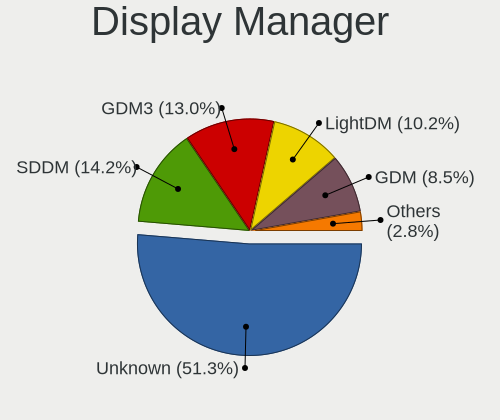
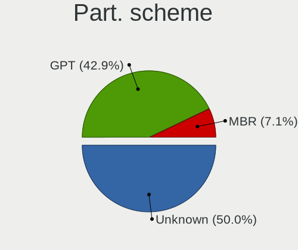
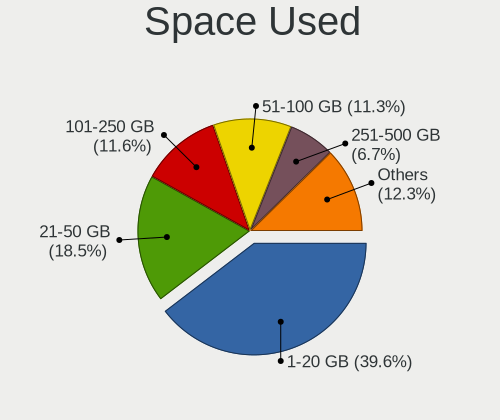
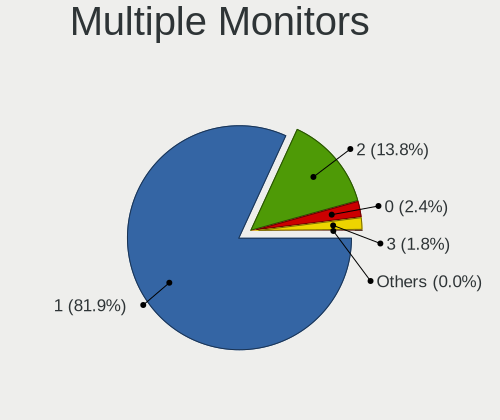
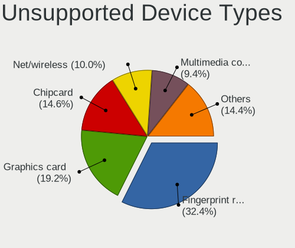

Linux in USA - Tested Hardware & Statistics (Notebooks)
-------------------------------------------------------

A project to collect tested hardware configurations for Linux in USA.

Anyone can contribute to this report by the [hw-probe](https://github.com/linuxhw/hw-probe) tool:

    sudo -E hw-probe -all -upload

Please contribute! Especially if your hardware is rare.

Contents
--------

* [ Test Cases ](#test-cases)

* [ System ](#system)
  - [ OS                       ](#os)
  - [ OS Family                ](#os-family)
  - [ Kernel                   ](#kernel)
  - [ Kernel Family            ](#kernel-family)
  - [ Kernel Major Ver.        ](#kernel-major-ver)
  - [ Arch                     ](#arch)
  - [ DE                       ](#de)
  - [ Display Server           ](#display-server)
  - [ Display Manager          ](#display-manager)
  - [ OS Lang                  ](#os-lang)
  - [ Boot Mode                ](#boot-mode)
  - [ Filesystem               ](#filesystem)
  - [ Part. scheme             ](#part-scheme)
  - [ Dual Boot with Linux/BSD ](#dual-boot-with-linuxbsd)
  - [ Dual Boot (Win)          ](#dual-boot-win)

* [ Board ](#board)
  - [ Vendor                   ](#vendor)
  - [ Model                    ](#model)
  - [ Model Family             ](#model-family)
  - [ MFG Year                 ](#mfg-year)
  - [ Form Factor              ](#form-factor)
  - [ Secure Boot              ](#secure-boot)
  - [ Coreboot                 ](#coreboot)
  - [ RAM Size                 ](#ram-size)
  - [ RAM Used                 ](#ram-used)
  - [ Total Drives             ](#total-drives)
  - [ Has CD-ROM               ](#has-cd-rom)
  - [ Has Ethernet             ](#has-ethernet)
  - [ Has WiFi                 ](#has-wifi)
  - [ Has Bluetooth            ](#has-bluetooth)

* [ Location ](#location)
  - [ Country                  ](#country)
  - [ City                     ](#city)

* [ Drives ](#drives)
  - [ Drive Vendor             ](#drive-vendor)
  - [ Drive Model              ](#drive-model)
  - [ HDD Vendor               ](#hdd-vendor)
  - [ SSD Vendor               ](#ssd-vendor)
  - [ Drive Kind               ](#drive-kind)
  - [ Drive Connector          ](#drive-connector)
  - [ Drive Size               ](#drive-size)
  - [ Space Total              ](#space-total)
  - [ Space Used               ](#space-used)
  - [ Malfunc. Drives          ](#malfunc-drives)
  - [ Malfunc. Drive Vendor    ](#malfunc-drive-vendor)
  - [ Malfunc. HDD Vendor      ](#malfunc-hdd-vendor)
  - [ Malfunc. Drive Kind      ](#malfunc-drive-kind)
  - [ Failed Drives            ](#failed-drives)
  - [ Failed Drive Vendor      ](#failed-drive-vendor)
  - [ Drive Status             ](#drive-status)

* [ Storage controller ](#storage-controller)
  - [ Storage Vendor           ](#storage-vendor)
  - [ Storage Model            ](#storage-model)
  - [ Storage Kind             ](#storage-kind)

* [ Processor ](#processor)
  - [ CPU Vendor               ](#cpu-vendor)
  - [ CPU Model                ](#cpu-model)
  - [ CPU Model Family         ](#cpu-model-family)
  - [ CPU Cores                ](#cpu-cores)
  - [ CPU Sockets              ](#cpu-sockets)
  - [ CPU Threads              ](#cpu-threads)
  - [ CPU Op-Modes             ](#cpu-op-modes)
  - [ CPU Microcode            ](#cpu-microcode)
  - [ CPU Microarch            ](#cpu-microarch)

* [ Graphics ](#graphics)
  - [ GPU Vendor               ](#gpu-vendor)
  - [ GPU Model                ](#gpu-model)
  - [ GPU Combo                ](#gpu-combo)
  - [ GPU Driver               ](#gpu-driver)
  - [ GPU Memory               ](#gpu-memory)

* [ Monitor ](#monitor)
  - [ Monitor Vendor           ](#monitor-vendor)
  - [ Monitor Model            ](#monitor-model)
  - [ Monitor Resolution       ](#monitor-resolution)
  - [ Monitor Diagonal         ](#monitor-diagonal)
  - [ Monitor Width            ](#monitor-width)
  - [ Aspect Ratio             ](#aspect-ratio)
  - [ Monitor Area             ](#monitor-area)
  - [ Pixel Density            ](#pixel-density)
  - [ Multiple Monitors        ](#multiple-monitors)

* [ Network ](#network)
  - [ Net Controller Vendor    ](#net-controller-vendor)
  - [ Net Controller Model     ](#net-controller-model)
  - [ Wireless Vendor          ](#wireless-vendor)
  - [ Wireless Model           ](#wireless-model)
  - [ Ethernet Vendor          ](#ethernet-vendor)
  - [ Ethernet Model           ](#ethernet-model)
  - [ Net Controller Kind      ](#net-controller-kind)
  - [ Used Controller          ](#used-controller)
  - [ NICs                     ](#nics)
  - [ IPv6                     ](#ipv6)

* [ Bluetooth ](#bluetooth)
  - [ Bluetooth Vendor         ](#bluetooth-vendor)
  - [ Bluetooth Model          ](#bluetooth-model)

* [ Sound ](#sound)
  - [ Sound Vendor             ](#sound-vendor)
  - [ Sound Model              ](#sound-model)

* [ Memory ](#memory)
  - [ Memory Vendor            ](#memory-vendor)
  - [ Memory Model             ](#memory-model)
  - [ Memory Kind              ](#memory-kind)
  - [ Memory Form Factor       ](#memory-form-factor)
  - [ Memory Size              ](#memory-size)
  - [ Memory Speed             ](#memory-speed)

* [ Printers & scanners ](#printers--scanners)
  - [ Printer Vendor           ](#printer-vendor)
  - [ Printer Model            ](#printer-model)
  - [ Scanner Vendor           ](#scanner-vendor)
  - [ Scanner Model            ](#scanner-model)

* [ Camera ](#camera)
  - [ Camera Vendor            ](#camera-vendor)
  - [ Camera Model             ](#camera-model)

* [ Security ](#security)
  - [ Fingerprint Vendor       ](#fingerprint-vendor)
  - [ Fingerprint Model        ](#fingerprint-model)
  - [ Chipcard Vendor          ](#chipcard-vendor)
  - [ Chipcard Model           ](#chipcard-model)

* [ Unsupported ](#unsupported)
  - [ Unsupported Devices      ](#unsupported-devices)
  - [ Unsupported Device Types ](#unsupported-device-types)

Test Cases
----------

Total: 23650

| Vendor        | Model                       | Probe                                                      | Date         |
|---------------|-----------------------------|------------------------------------------------------------|--------------|
| Lenovo        | ThinkPad T480 20L50010US    | [aa44c2c8b9](https://linux-hardware.org/?probe=aa44c2c8b9) | Jun 10, 2023 |
| Samsung       | 730QCJ/730QCR               | [96b21d42f1](https://linux-hardware.org/?probe=96b21d42f1) | Jun 10, 2023 |
| Lenovo        | ThinkPad T440p 20AN0069U... | [a2ddfa44e7](https://linux-hardware.org/?probe=a2ddfa44e7) | Jun 10, 2023 |
| Lenovo        | ThinkPad T480 20L50010US    | [398d708c85](https://linux-hardware.org/?probe=398d708c85) | Jun 10, 2023 |
| ASUSTek       | TUF Gaming FX505GD_FX505... | [03660fb140](https://linux-hardware.org/?probe=03660fb140) | Jun 10, 2023 |
| MSI           | Prestige 13Evo A13M         | [3feb3bce01](https://linux-hardware.org/?probe=3feb3bce01) | Jun 10, 2023 |
| Dell          | G3 3779                     | [0190c87b35](https://linux-hardware.org/?probe=0190c87b35) | Jun 10, 2023 |
| HP            | Pavilion Laptop 15-cc5xx    | [68af03eefe](https://linux-hardware.org/?probe=68af03eefe) | Jun 10, 2023 |
| Lenovo        | ThinkPad T570 20H9000UUS    | [606989ab70](https://linux-hardware.org/?probe=606989ab70) | Jun 10, 2023 |
| Dell          | Latitude 3580               | [9c02d2c4c4](https://linux-hardware.org/?probe=9c02d2c4c4) | Jun 10, 2023 |
| Lenovo        | ThinkPad T440 20B6005RUS    | [e7ea5a9368](https://linux-hardware.org/?probe=e7ea5a9368) | Jun 10, 2023 |
| Dell          | Precision 7520              | [c52fb2f851](https://linux-hardware.org/?probe=c52fb2f851) | Jun 10, 2023 |
| Apple         | MacBookPro9,2               | [3554e00d28](https://linux-hardware.org/?probe=3554e00d28) | Jun 10, 2023 |
| Dell          | Inspiron 5515               | [36016c0c6b](https://linux-hardware.org/?probe=36016c0c6b) | Jun 10, 2023 |
| Lenovo        | IdeaPad Gaming 3 15ACH6 ... | [3eb12fd9bc](https://linux-hardware.org/?probe=3eb12fd9bc) | Jun 10, 2023 |
| HP            | ZBook 15 G6                 | [eb23ebb0b8](https://linux-hardware.org/?probe=eb23ebb0b8) | Jun 10, 2023 |
| Lenovo        | ThinkPad T540p 20BFS4P80... | [4160d59c4f](https://linux-hardware.org/?probe=4160d59c4f) | Jun 10, 2023 |
| Gigabyte      | P57V6                       | [a2ce7ccc80](https://linux-hardware.org/?probe=a2ce7ccc80) | Jun 09, 2023 |
| Lenovo        | ThinkPad P1 20MD001VUS      | [9765261d02](https://linux-hardware.org/?probe=9765261d02) | Jun 09, 2023 |
| Gigabyte      | AORUS 17X AXF               | [685ba556b4](https://linux-hardware.org/?probe=685ba556b4) | Jun 09, 2023 |
| Lenovo        | ThinkPad P1 Gen 3 20TJS1... | [c47936b50c](https://linux-hardware.org/?probe=c47936b50c) | Jun 09, 2023 |
| Acer          | Aspire 7750                 | [b0daafa057](https://linux-hardware.org/?probe=b0daafa057) | Jun 09, 2023 |
| Lenovo        | ThinkPad T440p 20AWS43W0... | [69e5497306](https://linux-hardware.org/?probe=69e5497306) | Jun 09, 2023 |
| Toshiba       | PORTEGE R705                | [c7a032c5cf](https://linux-hardware.org/?probe=c7a032c5cf) | Jun 09, 2023 |
| Dell          | Inspiron 15-5568            | [19b686b7d7](https://linux-hardware.org/?probe=19b686b7d7) | Jun 09, 2023 |
| Apple         | MacBookPro8,1               | [70fea7478a](https://linux-hardware.org/?probe=70fea7478a) | Jun 08, 2023 |
| Dell          | XPS 17 9730                 | [bb7335618d](https://linux-hardware.org/?probe=bb7335618d) | Jun 08, 2023 |
| Dell          | Latitude 5175               | [63d6fcf641](https://linux-hardware.org/?probe=63d6fcf641) | Jun 08, 2023 |
| HP            | ZBook Studio G3             | [4fb38ec480](https://linux-hardware.org/?probe=4fb38ec480) | Jun 08, 2023 |
| HP            | ZBook Studio G3             | [09260f0742](https://linux-hardware.org/?probe=09260f0742) | Jun 08, 2023 |
| Dell          | Precision 5540              | [0e925c8b3c](https://linux-hardware.org/?probe=0e925c8b3c) | Jun 08, 2023 |
| Lenovo        | Slim 7 ProX 14ARH7 82V2     | [e8b6d763e4](https://linux-hardware.org/?probe=e8b6d763e4) | Jun 08, 2023 |
| Dell          | Latitude E6420              | [d408418ddd](https://linux-hardware.org/?probe=d408418ddd) | Jun 08, 2023 |
| HP            | Notebook                    | [1b099710b7](https://linux-hardware.org/?probe=1b099710b7) | Jun 08, 2023 |
| HP            | Notebook                    | [9bf82397c3](https://linux-hardware.org/?probe=9bf82397c3) | Jun 08, 2023 |
| Acer          | Aspire A515-45              | [975246674d](https://linux-hardware.org/?probe=975246674d) | Jun 08, 2023 |
| Acer          | Aspire A515-45              | [348173e172](https://linux-hardware.org/?probe=348173e172) | Jun 08, 2023 |
| Apple         | MacBookPro8,1               | [d487214e2a](https://linux-hardware.org/?probe=d487214e2a) | Jun 08, 2023 |
| Lenovo        | ThinkPad T580 20L90047US    | [bee34052a3](https://linux-hardware.org/?probe=bee34052a3) | Jun 08, 2023 |
| Google        | Lick                        | [d220804cab](https://linux-hardware.org/?probe=d220804cab) | Jun 08, 2023 |
| Valve         | Jupiter                     | [f41491d8ac](https://linux-hardware.org/?probe=f41491d8ac) | Jun 08, 2023 |
| Apple         | MacBookPro5,5               | [ed70e1854d](https://linux-hardware.org/?probe=ed70e1854d) | Jun 08, 2023 |
| Lenovo        | ThinkPad L420 7829W1R       | [25d96d98f8](https://linux-hardware.org/?probe=25d96d98f8) | Jun 08, 2023 |
| HP            | Stream Notebook PC 11       | [fd037bb738](https://linux-hardware.org/?probe=fd037bb738) | Jun 08, 2023 |
| HP            | ENVY m6 Notebook            | [f72410be27](https://linux-hardware.org/?probe=f72410be27) | Jun 08, 2023 |
| Lenovo        | ThinkPad X1 Carbon Gen 9... | [ef71a1641b](https://linux-hardware.org/?probe=ef71a1641b) | Jun 08, 2023 |
| HP            | 2000                        | [4ae1384345](https://linux-hardware.org/?probe=4ae1384345) | Jun 07, 2023 |
| Lenovo        | Slim 7 ProX 14ARH7 82V2     | [810e331444](https://linux-hardware.org/?probe=810e331444) | Jun 07, 2023 |
| HP            | Pavilion 17                 | [da809f90cc](https://linux-hardware.org/?probe=da809f90cc) | Jun 07, 2023 |
| Lenovo        | Legion 5 Pro 16ARH7H 82R... | [f6fddfcd65](https://linux-hardware.org/?probe=f6fddfcd65) | Jun 07, 2023 |
| HP            | Stream Laptop 11-ah0XX      | [2f5adf59a3](https://linux-hardware.org/?probe=2f5adf59a3) | Jun 07, 2023 |
| Lenovo        | ThinkPad X220 Tablet 429... | [ea8584cbda](https://linux-hardware.org/?probe=ea8584cbda) | Jun 07, 2023 |
| Apple         | MacBookPro9,2               | [2a0add5b7e](https://linux-hardware.org/?probe=2a0add5b7e) | Jun 07, 2023 |
| ASUSTek       | VivoBook_ASUSLaptop X150... | [1f4ef72dbd](https://linux-hardware.org/?probe=1f4ef72dbd) | Jun 07, 2023 |
| Acer          | Predator PT515-51           | [0a6efd54ad](https://linux-hardware.org/?probe=0a6efd54ad) | Jun 07, 2023 |
| Gigabyte      | AORUS 17X AXF               | [87bd8323b6](https://linux-hardware.org/?probe=87bd8323b6) | Jun 07, 2023 |
| HP            | Pavilion Notebook           | [9ef95ad480](https://linux-hardware.org/?probe=9ef95ad480) | Jun 07, 2023 |
| Acer          | Aspire A515-47              | [db7f17cbe1](https://linux-hardware.org/?probe=db7f17cbe1) | Jun 07, 2023 |
| Lenovo        | Slim 7 16IAH7 82VB          | [c60acf1322](https://linux-hardware.org/?probe=c60acf1322) | Jun 07, 2023 |
| Valve         | Jupiter                     | [2a6ad8df3c](https://linux-hardware.org/?probe=2a6ad8df3c) | Jun 07, 2023 |
| Dell          | Latitude E6420              | [620ca905d2](https://linux-hardware.org/?probe=620ca905d2) | Jun 07, 2023 |
| Acer          | Swift SF314-43              | [9636ea4dc5](https://linux-hardware.org/?probe=9636ea4dc5) | Jun 07, 2023 |
| Lenovo        | ThinkPad P1 20MD001VUS      | [8c505b5d84](https://linux-hardware.org/?probe=8c505b5d84) | Jun 06, 2023 |
| MSI           | GS63VR 6RF                  | [4bc33968d1](https://linux-hardware.org/?probe=4bc33968d1) | Jun 06, 2023 |
| Dell          | Latitude E6540              | [b6cc99410f](https://linux-hardware.org/?probe=b6cc99410f) | Jun 06, 2023 |
| ASUSTek       | G750JM                      | [b2281ad2cb](https://linux-hardware.org/?probe=b2281ad2cb) | Jun 06, 2023 |
| MSI           | GE70 2PE                    | [c62d13879f](https://linux-hardware.org/?probe=c62d13879f) | Jun 06, 2023 |
| Lenovo        | ThinkPad T480s 20L8S3JE0... | [2834fee64f](https://linux-hardware.org/?probe=2834fee64f) | Jun 06, 2023 |
| Dell          | Inspiron 5759               | [249f9343d0](https://linux-hardware.org/?probe=249f9343d0) | Jun 06, 2023 |
| Valve         | Jupiter                     | [0d22bd5256](https://linux-hardware.org/?probe=0d22bd5256) | Jun 06, 2023 |
| HP            | EliteBook 840 G3            | [18eeac2fc1](https://linux-hardware.org/?probe=18eeac2fc1) | Jun 06, 2023 |
| Valve         | Jupiter                     | [6e40377338](https://linux-hardware.org/?probe=6e40377338) | Jun 06, 2023 |
| HP            | EliteBook 845 G8 Noteboo... | [2508cbfdd2](https://linux-hardware.org/?probe=2508cbfdd2) | Jun 06, 2023 |
| Apple         | MacBookPro9,2               | [7394a9d94b](https://linux-hardware.org/?probe=7394a9d94b) | Jun 06, 2023 |
| ASUSTek       | K50IJ                       | [b06a0c9b89](https://linux-hardware.org/?probe=b06a0c9b89) | Jun 06, 2023 |
| ASUSTek       | ROG Zephyrus G14 GA401QM... | [bdfe605b6a](https://linux-hardware.org/?probe=bdfe605b6a) | Jun 06, 2023 |
| Notebook      | P65xHP                      | [bf35e218d7](https://linux-hardware.org/?probe=bf35e218d7) | Jun 06, 2023 |
| Acer          | Aspire 5736Z                | [a98deb1f54](https://linux-hardware.org/?probe=a98deb1f54) | Jun 06, 2023 |
| HP            | Laptop 14-cf2xxx            | [e6bf4ead0a](https://linux-hardware.org/?probe=e6bf4ead0a) | Jun 06, 2023 |
| Apple         | MacBookPro9,2               | [9df43aede5](https://linux-hardware.org/?probe=9df43aede5) | Jun 06, 2023 |
| Valve         | Jupiter                     | [4e212c07cc](https://linux-hardware.org/?probe=4e212c07cc) | Jun 06, 2023 |
| Dell          | Precision 3571              | [35f408bce4](https://linux-hardware.org/?probe=35f408bce4) | Jun 06, 2023 |
| System76      | Oryx Pro                    | [4f39b2d690](https://linux-hardware.org/?probe=4f39b2d690) | Jun 06, 2023 |
| Dell          | Precision M4800             | [f1c43c9acd](https://linux-hardware.org/?probe=f1c43c9acd) | Jun 06, 2023 |
| Dell          | Precision 7510              | [2a465173d3](https://linux-hardware.org/?probe=2a465173d3) | Jun 06, 2023 |
| HP            | ZBook 15 G3                 | [18663e1382](https://linux-hardware.org/?probe=18663e1382) | Jun 05, 2023 |
| Lenovo        | ThinkPad X1 Carbon Gen 9... | [0deafae1f1](https://linux-hardware.org/?probe=0deafae1f1) | Jun 05, 2023 |
| Notebook      | P65xHP                      | [51834b893c](https://linux-hardware.org/?probe=51834b893c) | Jun 05, 2023 |
| Dell          | Precision 5530              | [8b4e10b85a](https://linux-hardware.org/?probe=8b4e10b85a) | Jun 05, 2023 |
| HP            | ZBook Studio G3             | [09f2ec5511](https://linux-hardware.org/?probe=09f2ec5511) | Jun 05, 2023 |
| HP            | ENVY m6 Notebook            | [5bc28b7062](https://linux-hardware.org/?probe=5bc28b7062) | Jun 05, 2023 |
| HP            | ENVY m6 Notebook            | [aff6da41b8](https://linux-hardware.org/?probe=aff6da41b8) | Jun 05, 2023 |
| HP            | 15 Notebook PC              | [7c76016c9d](https://linux-hardware.org/?probe=7c76016c9d) | Jun 05, 2023 |
| Lenovo        | ThinkPad T540p 20BFS4P80... | [5dd18339de](https://linux-hardware.org/?probe=5dd18339de) | Jun 05, 2023 |
| Toshiba       | Satellite L305              | [c11012336c](https://linux-hardware.org/?probe=c11012336c) | Jun 05, 2023 |
| Acer          | Predator PT515-51           | [5c3daec3c7](https://linux-hardware.org/?probe=5c3daec3c7) | Jun 05, 2023 |
| Valve         | Jupiter                     | [27fda0a97e](https://linux-hardware.org/?probe=27fda0a97e) | Jun 05, 2023 |
| HP            | Laptop 14-fq0xxx            | [02614f184c](https://linux-hardware.org/?probe=02614f184c) | Jun 05, 2023 |
| GPU Compan... | GWTC116-2                   | [de8a3d6dab](https://linux-hardware.org/?probe=de8a3d6dab) | Jun 05, 2023 |
| Lenovo        | ThinkPad T480 20L5S1RY00    | [56c173d205](https://linux-hardware.org/?probe=56c173d205) | Jun 05, 2023 |
| HP            | Pavilion dm4                | [63bd248ea6](https://linux-hardware.org/?probe=63bd248ea6) | Jun 05, 2023 |
| Lenovo        | ThinkPad E450 20DC003WUS    | [6abecb1cd3](https://linux-hardware.org/?probe=6abecb1cd3) | Jun 05, 2023 |
| Lenovo        | IdeaPad 100-15IBD 80QQ      | [c3892d9477](https://linux-hardware.org/?probe=c3892d9477) | Jun 05, 2023 |
| Dell          | Latitude 7430               | [299e6897d2](https://linux-hardware.org/?probe=299e6897d2) | Jun 05, 2023 |
| HP            | Laptop 15-db0xxx            | [08408d3b15](https://linux-hardware.org/?probe=08408d3b15) | Jun 04, 2023 |
| Sony          | VPCSC1AFM                   | [2cf80cf628](https://linux-hardware.org/?probe=2cf80cf628) | Jun 04, 2023 |
| HP            | EliteBook 745 G3            | [5a1b8d9fd3](https://linux-hardware.org/?probe=5a1b8d9fd3) | Jun 04, 2023 |
| Dell          | Inspiron 3442               | [5c1f2cc0d3](https://linux-hardware.org/?probe=5c1f2cc0d3) | Jun 04, 2023 |
| HP            | Pavilion g6                 | [c0ecfe6785](https://linux-hardware.org/?probe=c0ecfe6785) | Jun 04, 2023 |
| HP            | Laptop 15-dy2xxx            | [f0e52437a7](https://linux-hardware.org/?probe=f0e52437a7) | Jun 04, 2023 |
| ASUSTek       | Q502LA                      | [679a477085](https://linux-hardware.org/?probe=679a477085) | Jun 04, 2023 |
| HP            | 2000                        | [7b24eaf0d9](https://linux-hardware.org/?probe=7b24eaf0d9) | Jun 04, 2023 |
| HP            | 2000                        | [dfee85b8e7](https://linux-hardware.org/?probe=dfee85b8e7) | Jun 04, 2023 |
| Valve         | Jupiter                     | [9c11d12e34](https://linux-hardware.org/?probe=9c11d12e34) | Jun 04, 2023 |
| Apple         | MacBookPro14,1              | [f73406fa5d](https://linux-hardware.org/?probe=f73406fa5d) | Jun 04, 2023 |
| Apple         | MacBookPro14,1              | [1c2d6e0e5e](https://linux-hardware.org/?probe=1c2d6e0e5e) | Jun 04, 2023 |
| Apple         | MacBookPro13,3              | [885709a33f](https://linux-hardware.org/?probe=885709a33f) | Jun 04, 2023 |
| Lenovo        | ThinkPad T450 20BU000FUS    | [a0181fbf52](https://linux-hardware.org/?probe=a0181fbf52) | Jun 04, 2023 |
| Dell          | Latitude E7470              | [c7df270ffd](https://linux-hardware.org/?probe=c7df270ffd) | Jun 04, 2023 |
| Lenovo        | ThinkPad P72 20MBCTO1WW     | [4f62d33d84](https://linux-hardware.org/?probe=4f62d33d84) | Jun 04, 2023 |
| Lenovo        | IdeaPad 3 15ITL05 81X8      | [6f8af3d7af](https://linux-hardware.org/?probe=6f8af3d7af) | Jun 03, 2023 |
| Alienware     | M15x                        | [4b17185ae7](https://linux-hardware.org/?probe=4b17185ae7) | Jun 03, 2023 |
| Dell          | Inspiron 13-5368            | [33bb0f34df](https://linux-hardware.org/?probe=33bb0f34df) | Jun 03, 2023 |
| ASUSTek       | VivoBook_ASUSLaptop X515... | [f12b791748](https://linux-hardware.org/?probe=f12b791748) | Jun 03, 2023 |
| Dell          | Latitude E6500              | [4053ff5676](https://linux-hardware.org/?probe=4053ff5676) | Jun 03, 2023 |
| Toshiba       | Satellite C55t-C            | [3b83df3cc9](https://linux-hardware.org/?probe=3b83df3cc9) | Jun 03, 2023 |
| ASUSTek       | ROG Strix G814JV_G814JV     | [e0f06316db](https://linux-hardware.org/?probe=e0f06316db) | Jun 03, 2023 |
| Gigabyte      | AERO 15WV8                  | [a8700141be](https://linux-hardware.org/?probe=a8700141be) | Jun 03, 2023 |
| System76      | Oryx Pro                    | [b3b398ba61](https://linux-hardware.org/?probe=b3b398ba61) | Jun 03, 2023 |
| Dell          | Vostro 3550                 | [3b25dd60b3](https://linux-hardware.org/?probe=3b25dd60b3) | Jun 03, 2023 |
| Apple         | MacBookPro7,1               | [b1513dc005](https://linux-hardware.org/?probe=b1513dc005) | Jun 03, 2023 |
| Lenovo        | ThinkPad 11e 5th Gen 20L... | [2f018635f3](https://linux-hardware.org/?probe=2f018635f3) | Jun 03, 2023 |
| NCS-Tech      | B300                        | [895395765b](https://linux-hardware.org/?probe=895395765b) | Jun 03, 2023 |
| HP            | Laptop 15-db0xxx            | [04830d213f](https://linux-hardware.org/?probe=04830d213f) | Jun 03, 2023 |
| HP            | Pavilion g6                 | [2429e3729b](https://linux-hardware.org/?probe=2429e3729b) | Jun 02, 2023 |
| Dell          | Latitude E6410              | [096873c567](https://linux-hardware.org/?probe=096873c567) | Jun 02, 2023 |
| HP            | Pavilion Laptop 15-cc5xx    | [3067e6332a](https://linux-hardware.org/?probe=3067e6332a) | Jun 02, 2023 |
| Dell          | Latitude 6430U              | [3104417f5e](https://linux-hardware.org/?probe=3104417f5e) | Jun 02, 2023 |
| HP            | ZBook 15 G6                 | [2f7bb21988](https://linux-hardware.org/?probe=2f7bb21988) | Jun 02, 2023 |
| Valve         | Jupiter                     | [6c04c9e646](https://linux-hardware.org/?probe=6c04c9e646) | Jun 02, 2023 |
| Dell          | Latitude E6430              | [b129765265](https://linux-hardware.org/?probe=b129765265) | Jun 02, 2023 |
| Apple         | MacBookPro12,1              | [f8e0e519ad](https://linux-hardware.org/?probe=f8e0e519ad) | Jun 02, 2023 |
| Valve         | Jupiter                     | [ab56e219fd](https://linux-hardware.org/?probe=ab56e219fd) | Jun 02, 2023 |
| GPD           | G1619-01                    | [ca7d008d32](https://linux-hardware.org/?probe=ca7d008d32) | Jun 02, 2023 |
| Acer          | Nitro AN515-55              | [947c70d6b6](https://linux-hardware.org/?probe=947c70d6b6) | Jun 02, 2023 |
| HP            | EliteBook 8460p             | [c46684adac](https://linux-hardware.org/?probe=c46684adac) | Jun 02, 2023 |
| Lenovo        | IdeaPad L340-17IRH Gamin... | [ca904474bf](https://linux-hardware.org/?probe=ca904474bf) | Jun 02, 2023 |
| HP            | Pavilion Gaming Laptop 1... | [b34bb8b33a](https://linux-hardware.org/?probe=b34bb8b33a) | Jun 02, 2023 |
| Valve         | Jupiter                     | [a33a5c45ac](https://linux-hardware.org/?probe=a33a5c45ac) | Jun 02, 2023 |
| Dell          | Inspiron 3501               | [2cf19f7b32](https://linux-hardware.org/?probe=2cf19f7b32) | Jun 02, 2023 |
| Unknown       | Unknown                     | [655398fc94](https://linux-hardware.org/?probe=655398fc94) | Jun 02, 2023 |
| Dell          | Precision 5530              | [151584f5aa](https://linux-hardware.org/?probe=151584f5aa) | Jun 02, 2023 |
| HP            | EliteBook 8470p             | [589bd2e1f8](https://linux-hardware.org/?probe=589bd2e1f8) | Jun 01, 2023 |
| Unknown       | Unknown                     | [fa6344a8eb](https://linux-hardware.org/?probe=fa6344a8eb) | Jun 01, 2023 |
| Lenovo        | IdeaPad S340-15IWL 81N8     | [71c2818f01](https://linux-hardware.org/?probe=71c2818f01) | Jun 01, 2023 |
| Apple         | MacBookAir4,1               | [42b1507aa8](https://linux-hardware.org/?probe=42b1507aa8) | Jun 01, 2023 |
| Lenovo        | ThinkPad T430 2349GDU       | [ca1bce793b](https://linux-hardware.org/?probe=ca1bce793b) | Jun 01, 2023 |
| Acer          | Aspire E5-575G              | [c4cd05b00f](https://linux-hardware.org/?probe=c4cd05b00f) | Jun 01, 2023 |
| HP            | ZBook Studio G3             | [d6d7da0907](https://linux-hardware.org/?probe=d6d7da0907) | Jun 01, 2023 |
| Valve         | Jupiter                     | [ec5403a37e](https://linux-hardware.org/?probe=ec5403a37e) | Jun 01, 2023 |
| ASUSTek       | X550CA                      | [fe31674f48](https://linux-hardware.org/?probe=fe31674f48) | Jun 01, 2023 |
| Lenovo        | ThinkPad E560 20EV002FUS    | [d25f4736b7](https://linux-hardware.org/?probe=d25f4736b7) | Jun 01, 2023 |
| Dell          | Inspiron 5515               | [f383c5193d](https://linux-hardware.org/?probe=f383c5193d) | Jun 01, 2023 |
| Dell          | Latitude 5531               | [5dc2ae0939](https://linux-hardware.org/?probe=5dc2ae0939) | Jun 01, 2023 |
| HP            | Pavilion Laptop 15-cc5xx    | [3e49e329d3](https://linux-hardware.org/?probe=3e49e329d3) | Jun 01, 2023 |
| Lenovo        | Z50-75 80EC                 | [6dd815a00b](https://linux-hardware.org/?probe=6dd815a00b) | May 31, 2023 |
| Alienware     | m17 R5 AMD                  | [f5eeb72c4d](https://linux-hardware.org/?probe=f5eeb72c4d) | May 31, 2023 |
| Lenovo        | Z50-75 80EC                 | [36767ec389](https://linux-hardware.org/?probe=36767ec389) | May 31, 2023 |
| Acer          | Nitro AN515-42              | [fc808ec2fd](https://linux-hardware.org/?probe=fc808ec2fd) | May 31, 2023 |
| System76      | Adder WS                    | [5cfa553a01](https://linux-hardware.org/?probe=5cfa553a01) | May 31, 2023 |
| Dell          | Precision 7670              | [77b039b486](https://linux-hardware.org/?probe=77b039b486) | May 31, 2023 |
| Acer          | Nitro AN515-42              | [75f612c4db](https://linux-hardware.org/?probe=75f612c4db) | May 31, 2023 |
| Lenovo        | ThinkPad T430 2349GDU       | [eae4d1e9ba](https://linux-hardware.org/?probe=eae4d1e9ba) | May 31, 2023 |
| Google        | Bobba                       | [d47a75a3aa](https://linux-hardware.org/?probe=d47a75a3aa) | May 31, 2023 |
| Google        | Bobba                       | [9e2c41879c](https://linux-hardware.org/?probe=9e2c41879c) | May 31, 2023 |
| Valve         | Jupiter                     | [175e48a789](https://linux-hardware.org/?probe=175e48a789) | May 31, 2023 |
| Lenovo        | IdeaPad 3 15ITL05 81X8      | [2ad4b7fd55](https://linux-hardware.org/?probe=2ad4b7fd55) | May 30, 2023 |
| Sony          | SVF14214CXW                 | [51568ce56e](https://linux-hardware.org/?probe=51568ce56e) | May 30, 2023 |
| Google        | Bobba                       | [62060ce33f](https://linux-hardware.org/?probe=62060ce33f) | May 30, 2023 |
| Lenovo        | ThinkPad T480 20L6S09E00    | [894bac5d62](https://linux-hardware.org/?probe=894bac5d62) | May 30, 2023 |
| Google        | Sand                        | [e6d70635d6](https://linux-hardware.org/?probe=e6d70635d6) | May 30, 2023 |
| ASUSTek       | ZenBook UX425QA_UM425QA     | [5c089f9b06](https://linux-hardware.org/?probe=5c089f9b06) | May 30, 2023 |
| HP            | ENVY Laptop 16-h0xxx        | [59e9fd9749](https://linux-hardware.org/?probe=59e9fd9749) | May 30, 2023 |
| Framework     | Laptop (12th Gen Intel C... | [ada20f1f6a](https://linux-hardware.org/?probe=ada20f1f6a) | May 30, 2023 |
| Framework     | Laptop (12th Gen Intel C... | [287ebf0b10](https://linux-hardware.org/?probe=287ebf0b10) | May 30, 2023 |
| GPU Compan... | GWTN156-11                  | [544fc521be](https://linux-hardware.org/?probe=544fc521be) | May 30, 2023 |
| Sony          | SVF14214CXW                 | [6cf7c2d7f2](https://linux-hardware.org/?probe=6cf7c2d7f2) | May 30, 2023 |
| HP            | Laptop 15-dy2xxx            | [5473496916](https://linux-hardware.org/?probe=5473496916) | May 30, 2023 |
| Lenovo        | G50-80 80L0                 | [c725a885ae](https://linux-hardware.org/?probe=c725a885ae) | May 30, 2023 |
| Dell          | Precision 5540              | [2f3cdafe90](https://linux-hardware.org/?probe=2f3cdafe90) | May 30, 2023 |
| HP            | Laptop 15-ef1xxx            | [55b500a1a9](https://linux-hardware.org/?probe=55b500a1a9) | May 30, 2023 |
| HP            | Pavilion Aero Laptop 13-... | [907448944d](https://linux-hardware.org/?probe=907448944d) | May 30, 2023 |
| HP            | Pavilion Gaming Laptop 1... | [0cb4af5367](https://linux-hardware.org/?probe=0cb4af5367) | May 30, 2023 |
| Lenovo        | ThinkPad T440p 20ANCTO1W... | [83f869ee2a](https://linux-hardware.org/?probe=83f869ee2a) | May 30, 2023 |
| Lenovo        | ThinkPad T440p 20ANCTO1W... | [23af21bb34](https://linux-hardware.org/?probe=23af21bb34) | May 30, 2023 |
| VPU Compan... | VWNC51518                   | [16329bde51](https://linux-hardware.org/?probe=16329bde51) | May 30, 2023 |
| Dell          | Latitude 5400               | [fb192b5416](https://linux-hardware.org/?probe=fb192b5416) | May 30, 2023 |
| Toshiba       | Satellite P755              | [5dc8f46db5](https://linux-hardware.org/?probe=5dc8f46db5) | May 29, 2023 |
| Dell          | Latitude 5400               | [838b2db21b](https://linux-hardware.org/?probe=838b2db21b) | May 29, 2023 |
| Valve         | Jupiter                     | [e47423fe9c](https://linux-hardware.org/?probe=e47423fe9c) | May 29, 2023 |
| Notebook      | NV4XMB,ME,MZ                | [6fdc7285f2](https://linux-hardware.org/?probe=6fdc7285f2) | May 29, 2023 |
| Lenovo        | ThinkPad T480s 20L8S06Q0... | [e54e204b28](https://linux-hardware.org/?probe=e54e204b28) | May 29, 2023 |
| Valve         | Jupiter                     | [c1d10ab583](https://linux-hardware.org/?probe=c1d10ab583) | May 29, 2023 |
| Lenovo        | ThinkPad T430 2349GDU       | [829c193554](https://linux-hardware.org/?probe=829c193554) | May 29, 2023 |
| HP            | Laptop 15-dw0xxx            | [a430b5287c](https://linux-hardware.org/?probe=a430b5287c) | May 29, 2023 |
| Google        | Auron_Paine                 | [66fd27934f](https://linux-hardware.org/?probe=66fd27934f) | May 29, 2023 |
| Lenovo        | ThinkPad W530 2447GH2       | [f902d43115](https://linux-hardware.org/?probe=f902d43115) | May 29, 2023 |
| MSI           | Raider GE76 12UE            | [5e8f375846](https://linux-hardware.org/?probe=5e8f375846) | May 29, 2023 |
| Lenovo        | ThinkPad W541 20EF000MUS    | [44c1329399](https://linux-hardware.org/?probe=44c1329399) | May 29, 2023 |
| GPU Compan... | GWTC116-2                   | [075486801a](https://linux-hardware.org/?probe=075486801a) | May 29, 2023 |
| Lenovo        | IdeaPad 3 15ADA05 81W1      | [42b817db26](https://linux-hardware.org/?probe=42b817db26) | May 29, 2023 |
| ASUSTek       | ROG Strix G733PY_G733PY     | [7518e057f8](https://linux-hardware.org/?probe=7518e057f8) | May 29, 2023 |
| ASUSTek       | ROG Strix G733PY_G733PY     | [6d07d843c5](https://linux-hardware.org/?probe=6d07d843c5) | May 29, 2023 |
| Apple         | MacBookPro8,1               | [d8aa236e2d](https://linux-hardware.org/?probe=d8aa236e2d) | May 28, 2023 |
| Lenovo        | IdeaPad 320-15IAP 80XR      | [4353f50548](https://linux-hardware.org/?probe=4353f50548) | May 28, 2023 |
| Lenovo        | IdeaPad 320-15IAP 80XR      | [d993490e5a](https://linux-hardware.org/?probe=d993490e5a) | May 28, 2023 |
| Lenovo        | ThinkPad Edge 0301DCU       | [5b7394bc19](https://linux-hardware.org/?probe=5b7394bc19) | May 28, 2023 |
| ASUSTek       | ROG Strix G513RM_G513RM     | [12838b3e3b](https://linux-hardware.org/?probe=12838b3e3b) | May 28, 2023 |
| MSI           | GE76 Raider 11UH            | [64a17da7a3](https://linux-hardware.org/?probe=64a17da7a3) | May 28, 2023 |
| Dell          | Precision 5520              | [c7097157ab](https://linux-hardware.org/?probe=c7097157ab) | May 28, 2023 |
| System76      | Adder WS                    | [d6de84e0c6](https://linux-hardware.org/?probe=d6de84e0c6) | May 28, 2023 |
| Apple         | MacBookAir4,1               | [25c6965a47](https://linux-hardware.org/?probe=25c6965a47) | May 28, 2023 |
| Apple         | MacBookAir4,1               | [e950caa0ce](https://linux-hardware.org/?probe=e950caa0ce) | May 28, 2023 |
| HP            | Pavilion Laptop 14-ce3xx... | [01d3e0d237](https://linux-hardware.org/?probe=01d3e0d237) | May 28, 2023 |
| Lenovo        | ThinkPad T480 20L5A00PCD    | [0b04d3bf20](https://linux-hardware.org/?probe=0b04d3bf20) | May 28, 2023 |
| System76      | Adder WS                    | [5624c5b0e8](https://linux-hardware.org/?probe=5624c5b0e8) | May 28, 2023 |
| System76      | Adder WS                    | [2522fb534f](https://linux-hardware.org/?probe=2522fb534f) | May 28, 2023 |
| Razer         | Blade 15 Advanced Model ... | [92b96250d1](https://linux-hardware.org/?probe=92b96250d1) | May 28, 2023 |
| Acer          | Aspire E5-575G              | [af33101302](https://linux-hardware.org/?probe=af33101302) | May 28, 2023 |
| Dell          | Inspiron 7773               | [6862eeae83](https://linux-hardware.org/?probe=6862eeae83) | May 28, 2023 |
| Toshiba       | Satellite L775              | [27b4eb27ca](https://linux-hardware.org/?probe=27b4eb27ca) | May 28, 2023 |
| Micro Elec... | MG-VCP2-17A3070T            | [9496942a44](https://linux-hardware.org/?probe=9496942a44) | May 28, 2023 |
| HP            | Laptop 15-db0xxx            | [176ebd7b98](https://linux-hardware.org/?probe=176ebd7b98) | May 27, 2023 |
| HP            | ENVY TS 15                  | [15762c5ca7](https://linux-hardware.org/?probe=15762c5ca7) | May 27, 2023 |
| Apple         | MacBookPro8,1               | [f969629640](https://linux-hardware.org/?probe=f969629640) | May 27, 2023 |
| Apple         | MacBookPro8,1               | [229873404d](https://linux-hardware.org/?probe=229873404d) | May 27, 2023 |
| HP            | ProBook 650 G1              | [8b2266868a](https://linux-hardware.org/?probe=8b2266868a) | May 27, 2023 |
| Dell          | Inspiron 7537               | [9433d17d5e](https://linux-hardware.org/?probe=9433d17d5e) | May 27, 2023 |
| Dell          | Inspiron 7537               | [1fce30c12e](https://linux-hardware.org/?probe=1fce30c12e) | May 27, 2023 |
| Acer          | Aspire E5-575G              | [cb642c7b9d](https://linux-hardware.org/?probe=cb642c7b9d) | May 27, 2023 |
| Lenovo        | Yoga 700-11ISK 80QE         | [149dfccfe7](https://linux-hardware.org/?probe=149dfccfe7) | May 27, 2023 |
| Lenovo        | G580 20150                  | [146383f227](https://linux-hardware.org/?probe=146383f227) | May 27, 2023 |
| Lenovo        | ThinkPad L512 44473HU       | [f9a27ab76b](https://linux-hardware.org/?probe=f9a27ab76b) | May 27, 2023 |
| Google        | Kohaku                      | [2b46417afd](https://linux-hardware.org/?probe=2b46417afd) | May 27, 2023 |
| Lenovo        | ThinkPad X13 Gen 3 21CM0... | [f4889c41be](https://linux-hardware.org/?probe=f4889c41be) | May 27, 2023 |
| Dell          | Inspiron 7520               | [07b70ac9e5](https://linux-hardware.org/?probe=07b70ac9e5) | May 27, 2023 |
| System76      | Galago Pro                  | [51cc594a01](https://linux-hardware.org/?probe=51cc594a01) | May 27, 2023 |
| Apple         | MacBookPro15,1              | [8d5c73bd4d](https://linux-hardware.org/?probe=8d5c73bd4d) | May 27, 2023 |
| Dell          | Precision 5530              | [cb116bdfd2](https://linux-hardware.org/?probe=cb116bdfd2) | May 26, 2023 |
| MSI           | Raider GE76 12UE            | [25bcdc17b0](https://linux-hardware.org/?probe=25bcdc17b0) | May 26, 2023 |
| Dell          | XPS 15 9560                 | [46357a4756](https://linux-hardware.org/?probe=46357a4756) | May 26, 2023 |
| Dell          | XPS 15 9560                 | [a0733bb2a1](https://linux-hardware.org/?probe=a0733bb2a1) | May 26, 2023 |
| AAEON         | AEC-6637                    | [19050f7ccd](https://linux-hardware.org/?probe=19050f7ccd) | May 26, 2023 |
| Dell          | Latitude 3440               | [1d32fe235f](https://linux-hardware.org/?probe=1d32fe235f) | May 26, 2023 |
| Dell          | Inspiron N4020              | [6350805cd6](https://linux-hardware.org/?probe=6350805cd6) | May 26, 2023 |
| Dell          | Inspiron N4020              | [801ec6309f](https://linux-hardware.org/?probe=801ec6309f) | May 26, 2023 |
| Framework     | Laptop                      | [cdc855ea4c](https://linux-hardware.org/?probe=cdc855ea4c) | May 26, 2023 |
| Lenovo        | Slim 7 ProX 14ARH7 82V2     | [8558865a17](https://linux-hardware.org/?probe=8558865a17) | May 26, 2023 |
| Lenovo        | ThinkPad T470 20HES6HC00    | [d67930c691](https://linux-hardware.org/?probe=d67930c691) | May 26, 2023 |
| HP            | ZBook Firefly 14 inch G8... | [b8bb801b93](https://linux-hardware.org/?probe=b8bb801b93) | May 26, 2023 |
| HP            | ZBook Firefly 14 inch G8... | [a8c4cf6158](https://linux-hardware.org/?probe=a8c4cf6158) | May 26, 2023 |
| Dell          | Latitude 7370               | [4c3bfe7a9d](https://linux-hardware.org/?probe=4c3bfe7a9d) | May 26, 2023 |
| HP            | 15                          | [df11918bf5](https://linux-hardware.org/?probe=df11918bf5) | May 26, 2023 |
| ASUSTek       | X550CA                      | [3aebf9eb7c](https://linux-hardware.org/?probe=3aebf9eb7c) | May 26, 2023 |
| ASUSTek       | ROG Zephyrus G14 GA402RJ... | [a12e26f683](https://linux-hardware.org/?probe=a12e26f683) | May 26, 2023 |
| Lenovo        | ThinkPad T14 Gen 1 20S0C... | [29d761bff5](https://linux-hardware.org/?probe=29d761bff5) | May 26, 2023 |
| Dell          | G15 5525                    | [b2c8f44d8b](https://linux-hardware.org/?probe=b2c8f44d8b) | May 26, 2023 |
| Dell          | Inspiron 7520               | [6d237fdf95](https://linux-hardware.org/?probe=6d237fdf95) | May 26, 2023 |
| ASUSTek       | X751LAB                     | [02b17f35d9](https://linux-hardware.org/?probe=02b17f35d9) | May 26, 2023 |
| Dell          | Latitude 7400               | [11ee0dea04](https://linux-hardware.org/?probe=11ee0dea04) | May 26, 2023 |
| HP            | ProBook 4540s               | [124c8183a8](https://linux-hardware.org/?probe=124c8183a8) | May 26, 2023 |
| Lenovo        | IdeaPad 3 15ITL05 81X8      | [13906a8f3d](https://linux-hardware.org/?probe=13906a8f3d) | May 26, 2023 |
| Acer          | Nitro AN515-45              | [a9e0505d3f](https://linux-hardware.org/?probe=a9e0505d3f) | May 26, 2023 |
| Dell          | Precision M4800             | [252164f9b2](https://linux-hardware.org/?probe=252164f9b2) | May 26, 2023 |
| Dell          | XPS 15 9570                 | [9723f3e325](https://linux-hardware.org/?probe=9723f3e325) | May 26, 2023 |
| Lenovo        | ThinkBook 14 G4 IAP 21DH    | [98308c882b](https://linux-hardware.org/?probe=98308c882b) | May 26, 2023 |
| ASUSTek       | VivoBook_ASUSLaptop X512... | [4086fae2a5](https://linux-hardware.org/?probe=4086fae2a5) | May 26, 2023 |
| Toshiba       | Satellite S55-A             | [2b9beaf4a6](https://linux-hardware.org/?probe=2b9beaf4a6) | May 25, 2023 |
| Google        | Lars                        | [25cc6549c3](https://linux-hardware.org/?probe=25cc6549c3) | May 25, 2023 |
| Apple         | MacBookPro16,2              | [46cb91a74d](https://linux-hardware.org/?probe=46cb91a74d) | May 25, 2023 |
| MSI           | GL75 Leopard 10SDK          | [41eac45c5e](https://linux-hardware.org/?probe=41eac45c5e) | May 25, 2023 |
| Lenovo        | IdeaPad Flex-14API 81SS     | [6e2419fcbf](https://linux-hardware.org/?probe=6e2419fcbf) | May 25, 2023 |
| Lenovo        | ThinkPad T16 Gen 1 21BVC... | [3e1fb6f93b](https://linux-hardware.org/?probe=3e1fb6f93b) | May 25, 2023 |
| Dell          | Latitude D630               | [ac84af2a69](https://linux-hardware.org/?probe=ac84af2a69) | May 25, 2023 |
| Dell          | Inspiron 15-3567            | [a8dd30a7bb](https://linux-hardware.org/?probe=a8dd30a7bb) | May 25, 2023 |
| Unknown       | Unknown                     | [cbab0f6dd8](https://linux-hardware.org/?probe=cbab0f6dd8) | May 25, 2023 |
| Dell          | Inspiron 15-7568            | [161ed53585](https://linux-hardware.org/?probe=161ed53585) | May 25, 2023 |
| Google        | Bluebird                    | [5b41bdf767](https://linux-hardware.org/?probe=5b41bdf767) | May 25, 2023 |
| Dell          | Precision 7510              | [8c677420fa](https://linux-hardware.org/?probe=8c677420fa) | May 25, 2023 |
| Dell          | Latitude 3330               | [a4c33168fa](https://linux-hardware.org/?probe=a4c33168fa) | May 25, 2023 |
| HP            | Stream Laptop 14-ds0xxx     | [5d83c85225](https://linux-hardware.org/?probe=5d83c85225) | May 25, 2023 |
| Google        | Voxel                       | [9dae4b7464](https://linux-hardware.org/?probe=9dae4b7464) | May 25, 2023 |
| HP            | ZBook Studio G3             | [fadf4f9112](https://linux-hardware.org/?probe=fadf4f9112) | May 25, 2023 |
| Valve         | Jupiter                     | [a933a0ea14](https://linux-hardware.org/?probe=a933a0ea14) | May 24, 2023 |
| HP            | ZBook Studio G3             | [a7274d19af](https://linux-hardware.org/?probe=a7274d19af) | May 24, 2023 |
| Dell          | Precision 7530              | [5cf37f39f4](https://linux-hardware.org/?probe=5cf37f39f4) | May 24, 2023 |
| Dell          | Latitude D630               | [9e4709b942](https://linux-hardware.org/?probe=9e4709b942) | May 24, 2023 |
| Samsung       | 730QCJ/730QCR               | [7788147663](https://linux-hardware.org/?probe=7788147663) | May 24, 2023 |
| Dell          | Inspiron 5567               | [24e9acec30](https://linux-hardware.org/?probe=24e9acec30) | May 24, 2023 |
| Dell          | Latitude 7220 Rugged Ext... | [442b7239c8](https://linux-hardware.org/?probe=442b7239c8) | May 24, 2023 |
| ASUSTek       | ROG Strix G513QY_G513QY     | [e6c958dd68](https://linux-hardware.org/?probe=e6c958dd68) | May 24, 2023 |
| HP            | Stream Laptop 14-ds0xxx     | [587ab1857a](https://linux-hardware.org/?probe=587ab1857a) | May 24, 2023 |
| Lenovo        | IdeaPad Flex-14API 81SS     | [8c7d3913b8](https://linux-hardware.org/?probe=8c7d3913b8) | May 24, 2023 |
| Valve         | Jupiter                     | [3af0dc2cce](https://linux-hardware.org/?probe=3af0dc2cce) | May 24, 2023 |
| Dell          | Inspiron 5720               | [c9eaabeb95](https://linux-hardware.org/?probe=c9eaabeb95) | May 24, 2023 |
| HP            | Pavilion dv5                | [2906e3ff3b](https://linux-hardware.org/?probe=2906e3ff3b) | May 24, 2023 |
| HP            | G60                         | [443fda4fac](https://linux-hardware.org/?probe=443fda4fac) | May 23, 2023 |
| Lenovo        | IdeaPad 110-15ISK 80UD      | [3e2ccc8b5e](https://linux-hardware.org/?probe=3e2ccc8b5e) | May 23, 2023 |
| ASUSTek       | VivoBook_ASUSLaptop E203... | [47c0ef11d2](https://linux-hardware.org/?probe=47c0ef11d2) | May 23, 2023 |
| ASUSTek       | VivoBook_ASUSLaptop E203... | [0f7e3e95a2](https://linux-hardware.org/?probe=0f7e3e95a2) | May 23, 2023 |
| Lenovo        | ThinkPad E14 Gen 4 21EB0... | [90235c6d2e](https://linux-hardware.org/?probe=90235c6d2e) | May 23, 2023 |
| Acer          | Aspire A515-54              | [8db69494ad](https://linux-hardware.org/?probe=8db69494ad) | May 23, 2023 |
| HP            | Spectre Pro x360 G1         | [90df3b7bfa](https://linux-hardware.org/?probe=90df3b7bfa) | May 23, 2023 |
| HP            | Spectre Pro x360 G1         | [0f0ad128aa](https://linux-hardware.org/?probe=0f0ad128aa) | May 23, 2023 |
| Dell          | Latitude E7240              | [be90e25083](https://linux-hardware.org/?probe=be90e25083) | May 23, 2023 |
| Apple         | MacBookPro13,2              | [8b87a13f50](https://linux-hardware.org/?probe=8b87a13f50) | May 23, 2023 |
| Apple         | MacBookPro13,2              | [f0ef45dcf3](https://linux-hardware.org/?probe=f0ef45dcf3) | May 23, 2023 |
| Lenovo        | IdeaPad Flex-14API 81SS     | [08746538f6](https://linux-hardware.org/?probe=08746538f6) | May 23, 2023 |
| HP            | Laptop 14-dq0xxx            | [77ccb1431b](https://linux-hardware.org/?probe=77ccb1431b) | May 23, 2023 |
| HP            | Pavilion g7                 | [fea63fc235](https://linux-hardware.org/?probe=fea63fc235) | May 23, 2023 |
| Dell          | Latitude E5450              | [642802d511](https://linux-hardware.org/?probe=642802d511) | May 23, 2023 |
| Dell          | Latitude E5570              | [3b1aaa683d](https://linux-hardware.org/?probe=3b1aaa683d) | May 23, 2023 |
| Lenovo        | ThinkPad T420 4180Q3U       | [56042328ac](https://linux-hardware.org/?probe=56042328ac) | May 23, 2023 |
| Lenovo        | ThinkPad T420 4180Q3U       | [0d63b518e4](https://linux-hardware.org/?probe=0d63b518e4) | May 23, 2023 |
| Dell          | Precision 7510              | [0b6f0b96e9](https://linux-hardware.org/?probe=0b6f0b96e9) | May 23, 2023 |
| Lenovo        | ThinkPad T550 20CJS0S800    | [b7efa91563](https://linux-hardware.org/?probe=b7efa91563) | May 23, 2023 |
| HP            | ENVY m6 Notebook            | [f133543500](https://linux-hardware.org/?probe=f133543500) | May 23, 2023 |
| Valve         | Jupiter                     | [0213edfe88](https://linux-hardware.org/?probe=0213edfe88) | May 22, 2023 |
| Lenovo        | Yoga 710-11IKB 80V6         | [a48977a871](https://linux-hardware.org/?probe=a48977a871) | May 22, 2023 |
| HP            | Laptop 14-dq2xxx            | [fe7d1e1f90](https://linux-hardware.org/?probe=fe7d1e1f90) | May 22, 2023 |
| Lenovo        | Legion 5 15ACH6 82JW        | [20c80a45a8](https://linux-hardware.org/?probe=20c80a45a8) | May 22, 2023 |
| Dell          | Precision 7510              | [15458a1b29](https://linux-hardware.org/?probe=15458a1b29) | May 22, 2023 |
| Dell          | Latitude 3420               | [d598f2634f](https://linux-hardware.org/?probe=d598f2634f) | May 22, 2023 |
| Dell          | Precision 3530              | [87f48ece6c](https://linux-hardware.org/?probe=87f48ece6c) | May 22, 2023 |
| HP            | ENVY m6 Notebook            | [c903e06758](https://linux-hardware.org/?probe=c903e06758) | May 22, 2023 |
| HP            | Laptop 14-dq0xxx            | [4438fdd9b2](https://linux-hardware.org/?probe=4438fdd9b2) | May 22, 2023 |
| Lenovo        | ThinkPad E14 Gen 4 21EB0... | [c492073bac](https://linux-hardware.org/?probe=c492073bac) | May 22, 2023 |
| Lenovo        | ThinkPad W541 20EGS1PL00    | [751cc5dbc7](https://linux-hardware.org/?probe=751cc5dbc7) | May 22, 2023 |
| Dell          | Precision 5560              | [1fc79f4cc0](https://linux-hardware.org/?probe=1fc79f4cc0) | May 22, 2023 |
| Acer          | Aspire E1-470P              | [aecff3f4a9](https://linux-hardware.org/?probe=aecff3f4a9) | May 21, 2023 |
| Acer          | Aspire E5-571P              | [7130cf8b4e](https://linux-hardware.org/?probe=7130cf8b4e) | May 21, 2023 |
| Acer          | Aspire 1410                 | [ddfda379c8](https://linux-hardware.org/?probe=ddfda379c8) | May 21, 2023 |
| Dell          | Inspiron 5402               | [0bc344e305](https://linux-hardware.org/?probe=0bc344e305) | May 21, 2023 |
| Micro Elec... | MG-VCP17I-3070              | [8c8c77d9a3](https://linux-hardware.org/?probe=8c8c77d9a3) | May 21, 2023 |
| HP            | Pavilion dv7                | [816fffab13](https://linux-hardware.org/?probe=816fffab13) | May 21, 2023 |
| Acer          | Nitro AN515-51              | [4bbf7dc69e](https://linux-hardware.org/?probe=4bbf7dc69e) | May 21, 2023 |
| Terrans Fo... | AMD                         | [8087d42d0e](https://linux-hardware.org/?probe=8087d42d0e) | May 21, 2023 |
| Dell          | Inspiron 15-7579            | [01af85319c](https://linux-hardware.org/?probe=01af85319c) | May 21, 2023 |
| Dell          | Inspiron 3451               | [e69cefc8da](https://linux-hardware.org/?probe=e69cefc8da) | May 21, 2023 |
| Apple         | MacBookPro5,3               | [0df526f042](https://linux-hardware.org/?probe=0df526f042) | May 21, 2023 |
| Dell          | G3 3500                     | [490bdc1f92](https://linux-hardware.org/?probe=490bdc1f92) | May 21, 2023 |
| Lenovo        | Slim 7 16IAH7 82VB          | [a6e8e03e74](https://linux-hardware.org/?probe=a6e8e03e74) | May 21, 2023 |
| Lenovo        | ThinkPad X140e 20BLS0040... | [1e648e8f50](https://linux-hardware.org/?probe=1e648e8f50) | May 21, 2023 |
| MSI           | Summit E13FlipEvo A11MT     | [ef2b821a84](https://linux-hardware.org/?probe=ef2b821a84) | May 21, 2023 |
| HP            | Pavilion Laptop 15-cc5xx    | [dda7ad1c16](https://linux-hardware.org/?probe=dda7ad1c16) | May 21, 2023 |
| Toshiba       | Satellite L855D             | [5be0280c53](https://linux-hardware.org/?probe=5be0280c53) | May 21, 2023 |
| ASUSTek       | VivoBook_ASUSLaptop E410... | [37dab045c7](https://linux-hardware.org/?probe=37dab045c7) | May 21, 2023 |
| HP            | Laptop 15-dy4xxx            | [d739b1ab41](https://linux-hardware.org/?probe=d739b1ab41) | May 21, 2023 |
| Getac         | V110G3                      | [4a80145aac](https://linux-hardware.org/?probe=4a80145aac) | May 21, 2023 |
| ASUSTek       | P2540UA                     | [3611eb321f](https://linux-hardware.org/?probe=3611eb321f) | May 21, 2023 |
| ASUSTek       | P2540UA                     | [c862329577](https://linux-hardware.org/?probe=c862329577) | May 21, 2023 |
| ASUSTek       | G75VW                       | [7063bb70eb](https://linux-hardware.org/?probe=7063bb70eb) | May 21, 2023 |
| HP            | 15 Notebook PC              | [e1939cff8f](https://linux-hardware.org/?probe=e1939cff8f) | May 21, 2023 |
| ASUSTek       | ASUS TUF Gaming A17 FA70... | [fc75b5ebda](https://linux-hardware.org/?probe=fc75b5ebda) | May 20, 2023 |
| Lenovo        | ThinkPad E14 Gen 4 21EB0... | [4fff2c9c8a](https://linux-hardware.org/?probe=4fff2c9c8a) | May 20, 2023 |
| Acer          | Aspire E5-575               | [fb1832d859](https://linux-hardware.org/?probe=fb1832d859) | May 20, 2023 |
| Unknown       | Unknown                     | [2d705adeaa](https://linux-hardware.org/?probe=2d705adeaa) | May 20, 2023 |
| HP            | Laptop 17-cn2xxx            | [953734fc80](https://linux-hardware.org/?probe=953734fc80) | May 20, 2023 |
| Valve         | Jupiter                     | [c6d16a4831](https://linux-hardware.org/?probe=c6d16a4831) | May 20, 2023 |
| Dell          | G3 3500                     | [29f1b0fbda](https://linux-hardware.org/?probe=29f1b0fbda) | May 20, 2023 |
| ASUSTek       | VivoBook_ASUSLaptop M650... | [51f87ac309](https://linux-hardware.org/?probe=51f87ac309) | May 20, 2023 |
| Alienware     | 17 R4                       | [c928d1557b](https://linux-hardware.org/?probe=c928d1557b) | May 20, 2023 |
| Lenovo        | ThinkPad T430 2347EA2       | [dc3fdbd5ff](https://linux-hardware.org/?probe=dc3fdbd5ff) | May 20, 2023 |
| Lenovo        | ThinkPad 11e 5th Gen 20L... | [e6e79ac2ca](https://linux-hardware.org/?probe=e6e79ac2ca) | May 20, 2023 |
| HP            | Laptop 17-by0061st          | [68e551f58a](https://linux-hardware.org/?probe=68e551f58a) | May 20, 2023 |
| Valve         | Jupiter                     | [52c421fe83](https://linux-hardware.org/?probe=52c421fe83) | May 20, 2023 |
| Dell          | Latitude 7480               | [fbe712dde0](https://linux-hardware.org/?probe=fbe712dde0) | May 20, 2023 |
| Eluktronic... | MAG-15 1660Ti               | [55ced5d6bb](https://linux-hardware.org/?probe=55ced5d6bb) | May 20, 2023 |
| Dell          | Latitude E7450              | [b76cb7567c](https://linux-hardware.org/?probe=b76cb7567c) | May 20, 2023 |
| ASUSTek       | ROG Strix G713RW_G713RW     | [f796aad4cc](https://linux-hardware.org/?probe=f796aad4cc) | May 20, 2023 |
| Lenovo        | ThinkPad T540p 20BFS4P80... | [7ccc4cd858](https://linux-hardware.org/?probe=7ccc4cd858) | May 19, 2023 |
| Lenovo        | ThinkPad T540p 20BFS4P80... | [3e80b3baf6](https://linux-hardware.org/?probe=3e80b3baf6) | May 19, 2023 |
| Micro Elec... | MG-VCP17I-3070              | [8ba5bb4bc7](https://linux-hardware.org/?probe=8ba5bb4bc7) | May 19, 2023 |
| ASUSTek       | VivoBook_ASUSLaptop K660... | [3ad05eed61](https://linux-hardware.org/?probe=3ad05eed61) | May 19, 2023 |
| Lenovo        | ThinkPad T480 20L5S1S000    | [30950ddd01](https://linux-hardware.org/?probe=30950ddd01) | May 19, 2023 |
| HP            | ProBook 645 G1              | [c1df991f26](https://linux-hardware.org/?probe=c1df991f26) | May 19, 2023 |
| Getac         | V110G3                      | [1b04290d0e](https://linux-hardware.org/?probe=1b04290d0e) | May 19, 2023 |
| Dell          | Inspiron 5759               | [76592cf444](https://linux-hardware.org/?probe=76592cf444) | May 19, 2023 |
| HP            | EliteBook 8460p             | [0ee78574a7](https://linux-hardware.org/?probe=0ee78574a7) | May 19, 2023 |
| ASUSTek       | ASUS TUF Gaming A17 FA70... | [5bac34a5f5](https://linux-hardware.org/?probe=5bac34a5f5) | May 19, 2023 |
| Lenovo        | ThinkPad T430 2347EA2       | [c718a18472](https://linux-hardware.org/?probe=c718a18472) | May 19, 2023 |
| HP            | Stream Laptop 14-ax0XX      | [aae519e65d](https://linux-hardware.org/?probe=aae519e65d) | May 19, 2023 |
| Valve         | Jupiter                     | [b57c75520f](https://linux-hardware.org/?probe=b57c75520f) | May 19, 2023 |
| Acer          | Aspire A515-56              | [feb9ed8589](https://linux-hardware.org/?probe=feb9ed8589) | May 19, 2023 |
| Google        | Candy                       | [2ed0555d82](https://linux-hardware.org/?probe=2ed0555d82) | May 19, 2023 |
| Lenovo        | ThinkPad P52 20MAS88000     | [f9a256566b](https://linux-hardware.org/?probe=f9a256566b) | May 19, 2023 |
| HP            | ZBook Studio G3             | [17f928afe0](https://linux-hardware.org/?probe=17f928afe0) | May 19, 2023 |
| MSI           | Stealth 15M B12UE           | [d6e14242b8](https://linux-hardware.org/?probe=d6e14242b8) | May 19, 2023 |
| Dell          | Precision 3560              | [f83f42ab2f](https://linux-hardware.org/?probe=f83f42ab2f) | May 18, 2023 |
| Lenovo        | ThinkPad 13 2nd Gen 20J1... | [5d69cc1112](https://linux-hardware.org/?probe=5d69cc1112) | May 18, 2023 |
| Lenovo        | IdeaPad Slim 7 Pro 14IHU... | [e17fc662cc](https://linux-hardware.org/?probe=e17fc662cc) | May 18, 2023 |
| Lenovo        | ThinkPad Z13 Gen 1 21D20... | [8c15641d9d](https://linux-hardware.org/?probe=8c15641d9d) | May 18, 2023 |
| HP            | Laptop 14-dq0xxx            | [1923d74fbc](https://linux-hardware.org/?probe=1923d74fbc) | May 18, 2023 |
| Reliance C... | R141TL5                     | [a21525c003](https://linux-hardware.org/?probe=a21525c003) | May 18, 2023 |
| Dell          | Inspiron 5567               | [45888dea42](https://linux-hardware.org/?probe=45888dea42) | May 18, 2023 |
| Dell          | Precision 7540              | [98727430ff](https://linux-hardware.org/?probe=98727430ff) | May 18, 2023 |
| Valve         | Jupiter                     | [18a67acdf1](https://linux-hardware.org/?probe=18a67acdf1) | May 18, 2023 |
| Dell          | Latitude E7450              | [3000905b05](https://linux-hardware.org/?probe=3000905b05) | May 18, 2023 |
| ASUSTek       | VivoBook_ASUSLaptop X712... | [c152120c9e](https://linux-hardware.org/?probe=c152120c9e) | May 18, 2023 |
| HP            | 2000                        | [f0abebdc1e](https://linux-hardware.org/?probe=f0abebdc1e) | May 18, 2023 |
| Dell          | Latitude E7450              | [10f138711f](https://linux-hardware.org/?probe=10f138711f) | May 18, 2023 |
| Lenovo        | ThinkPad T14 Gen 2a 20XK... | [df73f83c15](https://linux-hardware.org/?probe=df73f83c15) | May 18, 2023 |
| Dell          | Latitude E6410              | [3718cd0c74](https://linux-hardware.org/?probe=3718cd0c74) | May 18, 2023 |
| Google        | Auron_Paine                 | [a836fcd48f](https://linux-hardware.org/?probe=a836fcd48f) | May 18, 2023 |
| ASUSTek       | X541SA                      | [c88acf1dbc](https://linux-hardware.org/?probe=c88acf1dbc) | May 18, 2023 |
| HP            | Laptop 14-fq0xxx            | [7da21ce089](https://linux-hardware.org/?probe=7da21ce089) | May 18, 2023 |
| TUXEDO        | Pulse 15 Gen2               | [856242dc26](https://linux-hardware.org/?probe=856242dc26) | May 18, 2023 |
| Dell          | Latitude 5420               | [bd0c08b7b8](https://linux-hardware.org/?probe=bd0c08b7b8) | May 18, 2023 |
| ASUSTek       | VivoBook_ASUSLaptop X515... | [70b4a6b7f7](https://linux-hardware.org/?probe=70b4a6b7f7) | May 18, 2023 |
| Dell          | Inspiron 5559               | [620177b4fa](https://linux-hardware.org/?probe=620177b4fa) | May 17, 2023 |
| Acer          | Swift SF315-51G             | [4361a75669](https://linux-hardware.org/?probe=4361a75669) | May 17, 2023 |
| Apple         | MacBookAir7,2               | [cadb0eb363](https://linux-hardware.org/?probe=cadb0eb363) | May 17, 2023 |
| Apple         | MacBookAir7,2               | [cd3c24c6a2](https://linux-hardware.org/?probe=cd3c24c6a2) | May 17, 2023 |
| HP            | Pavilion Laptop 15-eg0xx... | [dd1e6376c2](https://linux-hardware.org/?probe=dd1e6376c2) | May 17, 2023 |
| ASUSTek       | ROG Strix G513QY_G513QY     | [b22bdcc636](https://linux-hardware.org/?probe=b22bdcc636) | May 17, 2023 |
| Lenovo        | IdeaPad 320-15IAP 80XR      | [e18deba45b](https://linux-hardware.org/?probe=e18deba45b) | May 17, 2023 |
| Dell          | XPS 13 9305                 | [6adf226281](https://linux-hardware.org/?probe=6adf226281) | May 17, 2023 |
| ASUSTek       | VivoBook_ASUSLaptop X515... | [e236450e11](https://linux-hardware.org/?probe=e236450e11) | May 17, 2023 |
| Lenovo        | ThinkPad X1 Carbon 5th 2... | [42f598550a](https://linux-hardware.org/?probe=42f598550a) | May 17, 2023 |
| Google        | Blorb                       | [7537bc5890](https://linux-hardware.org/?probe=7537bc5890) | May 17, 2023 |
| Dell          | Latitude 5290 2-in-1        | [cb196c4c37](https://linux-hardware.org/?probe=cb196c4c37) | May 17, 2023 |
| Google        | Cyan                        | [41811cace9](https://linux-hardware.org/?probe=41811cace9) | May 17, 2023 |
| Samsung       | 950XDB/951XDB/950XDY        | [9017bcff99](https://linux-hardware.org/?probe=9017bcff99) | May 17, 2023 |
| Dell          | Inspiron 3501               | [74c412b40a](https://linux-hardware.org/?probe=74c412b40a) | May 16, 2023 |
| Valve         | Jupiter                     | [a4cdb81f46](https://linux-hardware.org/?probe=a4cdb81f46) | May 16, 2023 |
| Lenovo        | IdeaPad 3 15ITL05 81X8      | [f4514801d8](https://linux-hardware.org/?probe=f4514801d8) | May 16, 2023 |
| HP            | Laptop 15-bw0xx             | [87689f0ec7](https://linux-hardware.org/?probe=87689f0ec7) | May 16, 2023 |
| Valve         | Jupiter                     | [71e3add4b4](https://linux-hardware.org/?probe=71e3add4b4) | May 16, 2023 |
| Google        | Banon                       | [c610295744](https://linux-hardware.org/?probe=c610295744) | May 16, 2023 |
| HP            | Bloog                       | [4673a7630e](https://linux-hardware.org/?probe=4673a7630e) | May 16, 2023 |
| HP            | Bloog                       | [1c91d5ef51](https://linux-hardware.org/?probe=1c91d5ef51) | May 16, 2023 |
| ASUSTek       | Zenbook UM5302TA_UM5302T... | [13bb9b020b](https://linux-hardware.org/?probe=13bb9b020b) | May 16, 2023 |
| GPD           | MicroPC                     | [0da3fc7738](https://linux-hardware.org/?probe=0da3fc7738) | May 16, 2023 |
| Lenovo        | ThinkPad T470s W10DG 20J... | [b2b220a903](https://linux-hardware.org/?probe=b2b220a903) | May 16, 2023 |
| HP            | ENVY 4                      | [ddc467f053](https://linux-hardware.org/?probe=ddc467f053) | May 16, 2023 |
| Acer          | Swift SFX14-41G             | [0331ab9725](https://linux-hardware.org/?probe=0331ab9725) | May 16, 2023 |
| HP            | Laptop 17z-ca300            | [8daeb02e63](https://linux-hardware.org/?probe=8daeb02e63) | May 16, 2023 |
| Google        | Cyan                        | [65c63caab7](https://linux-hardware.org/?probe=65c63caab7) | May 16, 2023 |
| HP            | ProBook 640 G2              | [5a3bb54ba7](https://linux-hardware.org/?probe=5a3bb54ba7) | May 16, 2023 |
| Lenovo        | ThinkPad X140e 20BMS03E0... | [a5aa6dd6ca](https://linux-hardware.org/?probe=a5aa6dd6ca) | May 15, 2023 |
| HP            | ENVY Laptop 17t-bw0000      | [f9e9eab760](https://linux-hardware.org/?probe=f9e9eab760) | May 15, 2023 |
| ASUSTek       | ROG Strix G512LW_G512LW     | [03c67bbed5](https://linux-hardware.org/?probe=03c67bbed5) | May 15, 2023 |
| ASUSTek       | VivoBook_ASUSLaptop M760... | [a8bef903b0](https://linux-hardware.org/?probe=a8bef903b0) | May 15, 2023 |
| ASUSTek       | X550CA                      | [f48f5f9eaa](https://linux-hardware.org/?probe=f48f5f9eaa) | May 15, 2023 |
| HP            | Laptop 17-cn2xxx            | [9492267a05](https://linux-hardware.org/?probe=9492267a05) | May 15, 2023 |
| Lenovo        | Legion 5 15ACH6 82JW        | [0145d107e8](https://linux-hardware.org/?probe=0145d107e8) | May 15, 2023 |
| Dell          | XPS 17 9700                 | [85c2869727](https://linux-hardware.org/?probe=85c2869727) | May 15, 2023 |
| HP            | Laptop 15-ef2xxx            | [f732fbd488](https://linux-hardware.org/?probe=f732fbd488) | May 14, 2023 |
| Unknown       | Apple MacBook Pro (14-in... | [66e7dc292e](https://linux-hardware.org/?probe=66e7dc292e) | May 14, 2023 |
| Acer          | Aspire A315-59              | [4c33c99aab](https://linux-hardware.org/?probe=4c33c99aab) | May 14, 2023 |
| Lenovo        | ThinkPad P17 Gen 2i 20YU... | [49ecdacd71](https://linux-hardware.org/?probe=49ecdacd71) | May 14, 2023 |
| Google        | Bluebird                    | [c10880ed1b](https://linux-hardware.org/?probe=c10880ed1b) | May 14, 2023 |
| HP            | Pavilion dv8                | [422d1fd213](https://linux-hardware.org/?probe=422d1fd213) | May 14, 2023 |
| HP            | ProBook 645 G1              | [f82952db4b](https://linux-hardware.org/?probe=f82952db4b) | May 14, 2023 |
| Toshiba       | TECRA R850                  | [e48ff4432d](https://linux-hardware.org/?probe=e48ff4432d) | May 14, 2023 |
| Acer          | Aspire E5-574               | [89fbcb7903](https://linux-hardware.org/?probe=89fbcb7903) | May 14, 2023 |
| Lenovo        | ThinkPad X1 Carbon Gen 8... | [83e208da09](https://linux-hardware.org/?probe=83e208da09) | May 14, 2023 |
| HP            | Victus by Gaming Laptop ... | [2dc2bdd057](https://linux-hardware.org/?probe=2dc2bdd057) | May 14, 2023 |
| ASUSTek       | G752VT                      | [e8459680a4](https://linux-hardware.org/?probe=e8459680a4) | May 14, 2023 |
| Dell          | XPS 15 9570                 | [59214a0e61](https://linux-hardware.org/?probe=59214a0e61) | May 14, 2023 |
| ASUSTek       | TUF Gaming FX504GD_FX80G... | [effc7c876e](https://linux-hardware.org/?probe=effc7c876e) | May 14, 2023 |
| HP            | EliteBook 8470p             | [b9f9ed1b25](https://linux-hardware.org/?probe=b9f9ed1b25) | May 14, 2023 |
| ASUSTek       | X202E                       | [d6b7617a17](https://linux-hardware.org/?probe=d6b7617a17) | May 14, 2023 |
| Gigabyte      | G5 MD                       | [ad5fd46d55](https://linux-hardware.org/?probe=ad5fd46d55) | May 14, 2023 |
| Dell          | Latitude E6500              | [b223b17c87](https://linux-hardware.org/?probe=b223b17c87) | May 14, 2023 |
| HP            | G50                         | [719a212774](https://linux-hardware.org/?probe=719a212774) | May 14, 2023 |
| Lenovo        | ThinkPad X1 Extreme 2nd ... | [4b3b94a776](https://linux-hardware.org/?probe=4b3b94a776) | May 14, 2023 |
| Lenovo        | Slim 7 ProX 14ARH7 82V2     | [803f9dba3c](https://linux-hardware.org/?probe=803f9dba3c) | May 13, 2023 |
| Dell          | Inspiron 5577               | [e4bfe14f2d](https://linux-hardware.org/?probe=e4bfe14f2d) | May 13, 2023 |
| System76      | Oryx Pro                    | [4b3677634e](https://linux-hardware.org/?probe=4b3677634e) | May 13, 2023 |
| HP            | Pavilion g6                 | [ae314222ad](https://linux-hardware.org/?probe=ae314222ad) | May 13, 2023 |
| ASUSTek       | ASUS TUF Gaming A17 FA70... | [5768cd981e](https://linux-hardware.org/?probe=5768cd981e) | May 13, 2023 |
| HP            | ZBook Studio G3             | [7a89bf7ba5](https://linux-hardware.org/?probe=7a89bf7ba5) | May 13, 2023 |
| HP            | ZBook Studio G3             | [98aeb529a4](https://linux-hardware.org/?probe=98aeb529a4) | May 13, 2023 |
| Lenovo        | IdeaPad 3 15ITL05 81X8      | [01506a3b08](https://linux-hardware.org/?probe=01506a3b08) | May 13, 2023 |
| Lenovo        | IdeaPad 1 15ADA7 82R1       | [0239277ed2](https://linux-hardware.org/?probe=0239277ed2) | May 13, 2023 |
| Acer          | Aspire A515-56              | [42d9eb5bf8](https://linux-hardware.org/?probe=42d9eb5bf8) | May 13, 2023 |
| System76      | Galago Pro                  | [a30efb5622](https://linux-hardware.org/?probe=a30efb5622) | May 13, 2023 |
| Acer          | Aspire A515-56              | [7c946d461d](https://linux-hardware.org/?probe=7c946d461d) | May 13, 2023 |
| Lenovo        | Slim 7 ProX 14ARH7 82V2     | [66bff684b7](https://linux-hardware.org/?probe=66bff684b7) | May 13, 2023 |
| Lenovo        | Yoga 3 Pro-1370 80HE        | [08afd40365](https://linux-hardware.org/?probe=08afd40365) | May 13, 2023 |
| Lenovo        | ThinkPad P50 20EN0013US     | [0b0b5e02cc](https://linux-hardware.org/?probe=0b0b5e02cc) | May 13, 2023 |
| HP            | Pavilion Laptop 15-cc5xx    | [6ade055af7](https://linux-hardware.org/?probe=6ade055af7) | May 13, 2023 |
| Valve         | Jupiter                     | [a9795ddfa7](https://linux-hardware.org/?probe=a9795ddfa7) | May 13, 2023 |
| Samsung       | 960XFH                      | [6d6b4a9c5e](https://linux-hardware.org/?probe=6d6b4a9c5e) | May 12, 2023 |
| ASUSTek       | ROG Zephyrus G14 GA401QM... | [bf54c69e0c](https://linux-hardware.org/?probe=bf54c69e0c) | May 12, 2023 |
| Lenovo        | ThinkPad T14 Gen 3 21AHC... | [54f07f7d96](https://linux-hardware.org/?probe=54f07f7d96) | May 12, 2023 |
| System76      | Gazelle                     | [bd4e912b20](https://linux-hardware.org/?probe=bd4e912b20) | May 12, 2023 |
| Lenovo        | ThinkPad X13 Gen 2a 20XH... | [7dd8e30770](https://linux-hardware.org/?probe=7dd8e30770) | May 12, 2023 |
| GPU Compan... | GWTN156-5                   | [be1ad465e4](https://linux-hardware.org/?probe=be1ad465e4) | May 12, 2023 |
| HP            | ZBook Studio G3             | [0fd69b4632](https://linux-hardware.org/?probe=0fd69b4632) | May 12, 2023 |
| Lenovo        | ThinkPad L540 20AUS01H00    | [d39599a293](https://linux-hardware.org/?probe=d39599a293) | May 12, 2023 |
| ASUSTek       | ROG Strix G513IM_G513IM     | [3d991750a8](https://linux-hardware.org/?probe=3d991750a8) | May 12, 2023 |
| ASUSTek       | ROG Strix G513IM_G513IM     | [c4eaaddcdd](https://linux-hardware.org/?probe=c4eaaddcdd) | May 12, 2023 |
| Lenovo        | ThinkPad T14 Gen 1 20S1S... | [46ffc7573e](https://linux-hardware.org/?probe=46ffc7573e) | May 12, 2023 |
| Lenovo        | ThinkPad T495 20NKS1W200    | [9ecb024ad4](https://linux-hardware.org/?probe=9ecb024ad4) | May 12, 2023 |
| Lenovo        | ThinkPad T495 20NKS1W200    | [3e51da8b3d](https://linux-hardware.org/?probe=3e51da8b3d) | May 12, 2023 |
| Apple         | MacBook10,1                 | [d26983a399](https://linux-hardware.org/?probe=d26983a399) | May 12, 2023 |
| Dell          | Latitude 5300               | [917bfc93a5](https://linux-hardware.org/?probe=917bfc93a5) | May 12, 2023 |
| Dell          | XPS 13 9350                 | [e3c61280ed](https://linux-hardware.org/?probe=e3c61280ed) | May 12, 2023 |
| MSI           | Stealth 17Studio A13VH      | [2162d67dc1](https://linux-hardware.org/?probe=2162d67dc1) | May 12, 2023 |
| Gigabyte      | AORUS 17 XE4                | [19c631c67c](https://linux-hardware.org/?probe=19c631c67c) | May 12, 2023 |
| Dell          | Vostro 5301                 | [9a02994dc0](https://linux-hardware.org/?probe=9a02994dc0) | May 12, 2023 |
| HP            | Laptop 17-cp0xxx            | [a47136c4d8](https://linux-hardware.org/?probe=a47136c4d8) | May 12, 2023 |
| ASUSTek       | VivoBook_ASUSLaptop X415... | [35d056f8bd](https://linux-hardware.org/?probe=35d056f8bd) | May 11, 2023 |
| ASUSTek       | ROG Zephyrus M16 GU603HM... | [f54531cd16](https://linux-hardware.org/?probe=f54531cd16) | May 11, 2023 |
| Apple         | MacBookPro10,1              | [381ca3ca78](https://linux-hardware.org/?probe=381ca3ca78) | May 11, 2023 |
| Dell          | Latitude E6430              | [48d104f2db](https://linux-hardware.org/?probe=48d104f2db) | May 11, 2023 |
| Lenovo        | Slim 9 14IAP7 82T1          | [6c391cd64d](https://linux-hardware.org/?probe=6c391cd64d) | May 11, 2023 |
| Apple         | MacBookPro9,2               | [165d6e12b4](https://linux-hardware.org/?probe=165d6e12b4) | May 11, 2023 |
| HP            | Pavilion Laptop 15-eg1xx... | [9ed9aa95e8](https://linux-hardware.org/?probe=9ed9aa95e8) | May 11, 2023 |
| Lenovo        | Slim 9 14IAP7 82T1          | [4d2b811352](https://linux-hardware.org/?probe=4d2b811352) | May 11, 2023 |
| Lenovo        | Legion Y530-15ICH 81FV      | [f55f75ca7d](https://linux-hardware.org/?probe=f55f75ca7d) | May 11, 2023 |
| Lenovo        | Legion Y530-15ICH 81FV      | [8c58684afd](https://linux-hardware.org/?probe=8c58684afd) | May 11, 2023 |
| Toshiba       | Satellite Radius P55W-B     | [e2ed5e2135](https://linux-hardware.org/?probe=e2ed5e2135) | May 11, 2023 |
| Valve         | Jupiter                     | [706456af07](https://linux-hardware.org/?probe=706456af07) | May 11, 2023 |
| Samsung       | RV420/RV520/RV720/E3530/... | [c26f143862](https://linux-hardware.org/?probe=c26f143862) | May 11, 2023 |
| Valve         | Jupiter                     | [8a4a20096f](https://linux-hardware.org/?probe=8a4a20096f) | May 11, 2023 |
| Lenovo        | ThinkPad T530 23926CU       | [65fb2c4c22](https://linux-hardware.org/?probe=65fb2c4c22) | May 11, 2023 |
| Dell          | Latitude 5490               | [2cba18ddec](https://linux-hardware.org/?probe=2cba18ddec) | May 11, 2023 |
| Lenovo        | Yoga 7 14IRL8 82YL          | [ae2fd3b0ae](https://linux-hardware.org/?probe=ae2fd3b0ae) | May 11, 2023 |
| Lenovo        | ThinkPad T530 23926CU       | [4e7cab81f3](https://linux-hardware.org/?probe=4e7cab81f3) | May 11, 2023 |
| ASUSTek       | ASUS TUF Gaming F15 FX50... | [27c35072a3](https://linux-hardware.org/?probe=27c35072a3) | May 10, 2023 |
| Apple         | MacBookPro9,2               | [49e9002825](https://linux-hardware.org/?probe=49e9002825) | May 10, 2023 |
| HP            | Pavilion g7                 | [3a153ae1cb](https://linux-hardware.org/?probe=3a153ae1cb) | May 10, 2023 |
| ASUSTek       | ROG Zephyrus Duo 16 GX65... | [c18cfbaca2](https://linux-hardware.org/?probe=c18cfbaca2) | May 10, 2023 |
| Samsung       | RV420/RV520/RV720/E3530/... | [da9df7e3c6](https://linux-hardware.org/?probe=da9df7e3c6) | May 10, 2023 |
| Acer          | Nitro AN515-42              | [ecc5e7ad1f](https://linux-hardware.org/?probe=ecc5e7ad1f) | May 10, 2023 |
| Unknown       | Unknown                     | [87e3ae6f24](https://linux-hardware.org/?probe=87e3ae6f24) | May 10, 2023 |
| Dell          | Latitude 7370               | [78654593c7](https://linux-hardware.org/?probe=78654593c7) | May 10, 2023 |
| Lenovo        | ThinkPad T480 20L50018US    | [b98dfd1940](https://linux-hardware.org/?probe=b98dfd1940) | May 10, 2023 |
| Acer          | Nitro AN515-42              | [9e6cff0c4b](https://linux-hardware.org/?probe=9e6cff0c4b) | May 10, 2023 |
| Valve         | Jupiter                     | [e5c9c71313](https://linux-hardware.org/?probe=e5c9c71313) | May 10, 2023 |
| LG Electro... | 14ZB90Q-G.AAC6U1            | [ab4050e6c1](https://linux-hardware.org/?probe=ab4050e6c1) | May 10, 2023 |
| Gateway       | P-7805u                     | [2713d979c4](https://linux-hardware.org/?probe=2713d979c4) | May 10, 2023 |
| Gateway       | P-7805u                     | [bdf7e6c628](https://linux-hardware.org/?probe=bdf7e6c628) | May 10, 2023 |
| HP            | Pavilion g6                 | [5c616bbd80](https://linux-hardware.org/?probe=5c616bbd80) | May 10, 2023 |
| Lenovo        | V15 G2 ITL 82KB             | [69f4dd51d9](https://linux-hardware.org/?probe=69f4dd51d9) | May 10, 2023 |
| Thomson       | WWNEO14C-4BK32F             | [28a4468d2d](https://linux-hardware.org/?probe=28a4468d2d) | May 09, 2023 |
| Alienware     | m15 R4                      | [fd952a9ef1](https://linux-hardware.org/?probe=fd952a9ef1) | May 09, 2023 |
| Dell          | Precision M3800             | [e7b0097a72](https://linux-hardware.org/?probe=e7b0097a72) | May 09, 2023 |
| Dell          | Inspiron 5559               | [f7cb6c9251](https://linux-hardware.org/?probe=f7cb6c9251) | May 09, 2023 |
| ASUSTek       | ROG Zephyrus G14 GA402RJ... | [8284f97803](https://linux-hardware.org/?probe=8284f97803) | May 09, 2023 |
| Google        | Snappy                      | [52836871bb](https://linux-hardware.org/?probe=52836871bb) | May 09, 2023 |
| Google        | Snappy                      | [a026aff306](https://linux-hardware.org/?probe=a026aff306) | May 09, 2023 |
| Acer          | Aspire VN7-592G             | [8ebde36ef2](https://linux-hardware.org/?probe=8ebde36ef2) | May 09, 2023 |
| ASUSTek       | GL702VI                     | [3598875ef3](https://linux-hardware.org/?probe=3598875ef3) | May 09, 2023 |
| Lenovo        | ThinkPad P1 Gen 3 20THCT... | [bae6aba4fb](https://linux-hardware.org/?probe=bae6aba4fb) | May 09, 2023 |
| Acer          | Aspire A515-56              | [57b843a3ca](https://linux-hardware.org/?probe=57b843a3ca) | May 09, 2023 |
| Lenovo        | Legion 5 15ACH6 82JW        | [0b08b7a631](https://linux-hardware.org/?probe=0b08b7a631) | May 09, 2023 |
| Dell          | XPS 15 9500                 | [0a72d00670](https://linux-hardware.org/?probe=0a72d00670) | May 09, 2023 |
| Lenovo        | ThinkPad P14s Gen 2i 20V... | [0a1c43b710](https://linux-hardware.org/?probe=0a1c43b710) | May 09, 2023 |
| Google        | Blooglet                    | [6d0f2f1f6d](https://linux-hardware.org/?probe=6d0f2f1f6d) | May 09, 2023 |
| HP            | Pavilion dv6                | [531adb6cae](https://linux-hardware.org/?probe=531adb6cae) | May 09, 2023 |
| ONE-NETBOO... | ONEXPLAYER 2 ARP23 Ver.1... | [79bdb284fe](https://linux-hardware.org/?probe=79bdb284fe) | May 09, 2023 |
| HP            | ProBook 440 G1              | [aea73943e8](https://linux-hardware.org/?probe=aea73943e8) | May 09, 2023 |
| Lenovo        | ThinkPad T420 4180DS6       | [0d214af5a5](https://linux-hardware.org/?probe=0d214af5a5) | May 09, 2023 |
| Lenovo        | ThinkPad P50 20EN0013US     | [0f322b6e3f](https://linux-hardware.org/?probe=0f322b6e3f) | May 08, 2023 |
| Lenovo        | ThinkPad T410 2522AA6       | [82755e3688](https://linux-hardware.org/?probe=82755e3688) | May 08, 2023 |
| Samsung       | 950XED                      | [8d4e3bcb94](https://linux-hardware.org/?probe=8d4e3bcb94) | May 08, 2023 |
| Samsung       | 950XED                      | [15e2cfcac7](https://linux-hardware.org/?probe=15e2cfcac7) | May 08, 2023 |
| Lenovo        | Legion 5 15ACH6 82JW        | [1f874eaf6d](https://linux-hardware.org/?probe=1f874eaf6d) | May 08, 2023 |
| Dell          | Latitude 5511               | [7e30a96ef7](https://linux-hardware.org/?probe=7e30a96ef7) | May 08, 2023 |
| Acer          | Aspire E5-574               | [d48affb6b2](https://linux-hardware.org/?probe=d48affb6b2) | May 08, 2023 |
| Dell          | Latitude 7370               | [4ea44288b5](https://linux-hardware.org/?probe=4ea44288b5) | May 08, 2023 |
| HP            | ZBook Studio G3             | [761b89209d](https://linux-hardware.org/?probe=761b89209d) | May 08, 2023 |
| Dell          | Inspiron 13 5310            | [72088e58d5](https://linux-hardware.org/?probe=72088e58d5) | May 08, 2023 |
| HP            | Pavilion Laptop 15-eg0xx... | [d782846579](https://linux-hardware.org/?probe=d782846579) | May 08, 2023 |
| Acer          | Aspire A715-72G             | [da1c6920b6](https://linux-hardware.org/?probe=da1c6920b6) | May 08, 2023 |
| Dell          | Precision 7520              | [351f777615](https://linux-hardware.org/?probe=351f777615) | May 08, 2023 |
| Dell          | Latitude 3570               | [8209fc06f4](https://linux-hardware.org/?probe=8209fc06f4) | May 08, 2023 |
| Lenovo        | Legion Y540-15IRH 81SX      | [00df9b6bda](https://linux-hardware.org/?probe=00df9b6bda) | May 08, 2023 |
| HP            | Notebook                    | [70ee3adf89](https://linux-hardware.org/?probe=70ee3adf89) | May 08, 2023 |
| Lenovo        | Legion 5 15ACH6 82JW        | [967e39a2d3](https://linux-hardware.org/?probe=967e39a2d3) | May 08, 2023 |
| GPU Compan... | GWTC116-2                   | [a915e84a9a](https://linux-hardware.org/?probe=a915e84a9a) | May 08, 2023 |
| HP            | Meep                        | [4b99a0c5f8](https://linux-hardware.org/?probe=4b99a0c5f8) | May 08, 2023 |
| Alienware     | Area-51m R2 A00             | [3cc417c9d9](https://linux-hardware.org/?probe=3cc417c9d9) | May 08, 2023 |
| AZW           | SEi                         | [4cd6ab54ba](https://linux-hardware.org/?probe=4cd6ab54ba) | May 08, 2023 |
| ASUSTek       | G75VW                       | [273bbe68d5](https://linux-hardware.org/?probe=273bbe68d5) | May 07, 2023 |
| Dell          | XPS 13 9310                 | [3530619c98](https://linux-hardware.org/?probe=3530619c98) | May 07, 2023 |
| ASUSTek       | ROG Zephyrus M15 GU502LW... | [18b79bbfa4](https://linux-hardware.org/?probe=18b79bbfa4) | May 07, 2023 |
| Framework     | Laptop (12th Gen Intel C... | [78e63b3bd3](https://linux-hardware.org/?probe=78e63b3bd3) | May 07, 2023 |
| HP            | Pavilion Laptop 13-an0xx... | [ce611516ec](https://linux-hardware.org/?probe=ce611516ec) | May 07, 2023 |
| MSI           | GE75 Raider 10SF            | [e10ccc96bd](https://linux-hardware.org/?probe=e10ccc96bd) | May 07, 2023 |
| Unknown       | Apple MacBook Pro (13-in... | [593787a62e](https://linux-hardware.org/?probe=593787a62e) | May 07, 2023 |
| HP            | Pavilion Laptop 15-eg0xx... | [c075073dd8](https://linux-hardware.org/?probe=c075073dd8) | May 07, 2023 |
| Lenovo        | ThinkPad T410 2522K3U       | [55756e1659](https://linux-hardware.org/?probe=55756e1659) | May 07, 2023 |
| Dell          | Inspiron 5585               | [f838e48bd3](https://linux-hardware.org/?probe=f838e48bd3) | May 07, 2023 |
| Lenovo        | ThinkPad X1 Carbon Gen 1... | [b734a6d6f3](https://linux-hardware.org/?probe=b734a6d6f3) | May 07, 2023 |
| HP            | Meep                        | [46a81f105c](https://linux-hardware.org/?probe=46a81f105c) | May 07, 2023 |
| MSI           | GV63 8SE                    | [55bfa86f43](https://linux-hardware.org/?probe=55bfa86f43) | May 07, 2023 |
| Acer          | Aspire A715-72G             | [4915fb92ad](https://linux-hardware.org/?probe=4915fb92ad) | May 07, 2023 |
| HP            | Pavilion Gaming Laptop 1... | [a95a3bd3a3](https://linux-hardware.org/?probe=a95a3bd3a3) | May 07, 2023 |
| Valve         | Jupiter                     | [6769250b94](https://linux-hardware.org/?probe=6769250b94) | May 07, 2023 |
| ASUSTek       | ASUS TUF Gaming A17 FA70... | [7a1e35050d](https://linux-hardware.org/?probe=7a1e35050d) | May 07, 2023 |
| Toshiba       | Satellite C855D             | [7cdcc71b4e](https://linux-hardware.org/?probe=7cdcc71b4e) | May 07, 2023 |
| Valve         | Jupiter                     | [2854045b14](https://linux-hardware.org/?probe=2854045b14) | May 07, 2023 |
| MSI           | GE75 Raider 10SF            | [edcaaeed46](https://linux-hardware.org/?probe=edcaaeed46) | May 07, 2023 |
| HP            | 2000                        | [0b62e5790b](https://linux-hardware.org/?probe=0b62e5790b) | May 07, 2023 |
| HP            | Stream Laptop 14-ds0xxx     | [b009a88e1b](https://linux-hardware.org/?probe=b009a88e1b) | May 06, 2023 |
| Dell          | System XPS L702X            | [210b876fe7](https://linux-hardware.org/?probe=210b876fe7) | May 06, 2023 |
| Lenovo        | ThinkPad X140e 20BMS03E0... | [60eced8f1d](https://linux-hardware.org/?probe=60eced8f1d) | May 06, 2023 |
| Lenovo        | ThinkBook 13s-IWL 20R9      | [abc9ce4fa4](https://linux-hardware.org/?probe=abc9ce4fa4) | May 06, 2023 |
| MSI           | GE62VR 6RF                  | [bac71eb24d](https://linux-hardware.org/?probe=bac71eb24d) | May 06, 2023 |
| ASUSTek       | VivoBook_ASUSLaptop X512... | [078d3ae45f](https://linux-hardware.org/?probe=078d3ae45f) | May 06, 2023 |
| Panasonic     | CF-54-1                     | [c964ce47c2](https://linux-hardware.org/?probe=c964ce47c2) | May 06, 2023 |
| Lenovo        | ThinkPad P51s 20HB001TUS    | [eac4ebdef0](https://linux-hardware.org/?probe=eac4ebdef0) | May 06, 2023 |
| System76      | Oryx Pro                    | [6026e88ad4](https://linux-hardware.org/?probe=6026e88ad4) | May 06, 2023 |
| HP            | Pavilion Laptop 15t-cs20... | [177e6fefb1](https://linux-hardware.org/?probe=177e6fefb1) | May 06, 2023 |
| Lenovo        | ThinkPad T580 20L9001HUS    | [4bad3ee37e](https://linux-hardware.org/?probe=4bad3ee37e) | May 06, 2023 |
| Dell          | Precision 7740              | [4cd3b0701e](https://linux-hardware.org/?probe=4cd3b0701e) | May 06, 2023 |
| Dell          | Inspiron 7558               | [aab9b575d7](https://linux-hardware.org/?probe=aab9b575d7) | May 06, 2023 |
| Dell          | Inspiron 3501               | [b7bf9f8683](https://linux-hardware.org/?probe=b7bf9f8683) | May 06, 2023 |
| HP            | ENVY Laptop 17-cr0xxx       | [9b843f40a1](https://linux-hardware.org/?probe=9b843f40a1) | May 05, 2023 |
| HP            | Pavilion dv7                | [5dd1479006](https://linux-hardware.org/?probe=5dd1479006) | May 05, 2023 |
| HP            | ProBook 6570b               | [480e352bf8](https://linux-hardware.org/?probe=480e352bf8) | May 05, 2023 |
| HP            | Pavilion dv7                | [f01e2f6326](https://linux-hardware.org/?probe=f01e2f6326) | May 05, 2023 |
| HP            | Pavilion g6                 | [9e469df99e](https://linux-hardware.org/?probe=9e469df99e) | May 05, 2023 |
| ASUSTek       | ROG Strix G513IM_G513IM     | [e43da42c9c](https://linux-hardware.org/?probe=e43da42c9c) | May 05, 2023 |
| ASUSTek       | ROG Strix G513IM_G513IM     | [1fc1e02113](https://linux-hardware.org/?probe=1fc1e02113) | May 05, 2023 |
| Lenovo        | ThinkPad X131e 33712MU      | [6957336ed7](https://linux-hardware.org/?probe=6957336ed7) | May 05, 2023 |
| Valve         | Jupiter                     | [50656044eb](https://linux-hardware.org/?probe=50656044eb) | May 05, 2023 |
| Valve         | Jupiter                     | [2a9ff9e061](https://linux-hardware.org/?probe=2a9ff9e061) | May 05, 2023 |
| Acer          | Aspire A315-58              | [34a67ec7c4](https://linux-hardware.org/?probe=34a67ec7c4) | May 05, 2023 |
| ASUSTek       | G73Jh                       | [0485192408](https://linux-hardware.org/?probe=0485192408) | May 05, 2023 |
| Acer          | Aspire V5-571P              | [2bb77be32b](https://linux-hardware.org/?probe=2bb77be32b) | May 05, 2023 |
| MSI           | GV63 8SE                    | [1c78e3feb9](https://linux-hardware.org/?probe=1c78e3feb9) | May 05, 2023 |
| Lenovo        | ThinkPad T14 Gen 2i 20W1... | [eaf28f6af4](https://linux-hardware.org/?probe=eaf28f6af4) | May 05, 2023 |
| Lenovo        | ThinkPad W540 20BHS1J000    | [228aec8c45](https://linux-hardware.org/?probe=228aec8c45) | May 05, 2023 |
| HP            | Pro Tablet 10 EE G1         | [6af53fb237](https://linux-hardware.org/?probe=6af53fb237) | May 05, 2023 |
| Lenovo        | ThinkPad T460s 20F9003GU... | [7a570efe74](https://linux-hardware.org/?probe=7a570efe74) | May 05, 2023 |
| Toshiba       | TECRA R850                  | [bb41171733](https://linux-hardware.org/?probe=bb41171733) | May 05, 2023 |
| Lenovo        | ThinkPad P50 20EN0013US     | [c693555567](https://linux-hardware.org/?probe=c693555567) | May 05, 2023 |
| Samsung       | 300E4A/300E5A/300E7A/343... | [3b1960bc9d](https://linux-hardware.org/?probe=3b1960bc9d) | May 04, 2023 |
| HP            | ZBook Power G7 Mobile Wo... | [b63bdd65b0](https://linux-hardware.org/?probe=b63bdd65b0) | May 04, 2023 |
| Dell          | XPS 13 9310                 | [0cd2974406](https://linux-hardware.org/?probe=0cd2974406) | May 04, 2023 |
| Dynabook      | TECRA A50-J                 | [76a87cd7fc](https://linux-hardware.org/?probe=76a87cd7fc) | May 04, 2023 |
| Apple         | MacBookAir7,2               | [d681957d5b](https://linux-hardware.org/?probe=d681957d5b) | May 04, 2023 |
| LG Electro... | 14ZB90Q-G.AAC6U1            | [8428fe5fd4](https://linux-hardware.org/?probe=8428fe5fd4) | May 04, 2023 |
| HP            | Pavilion Aero Laptop 13-... | [5022c3993a](https://linux-hardware.org/?probe=5022c3993a) | May 04, 2023 |
| Dell          | Latitude 7370               | [6beab237df](https://linux-hardware.org/?probe=6beab237df) | May 04, 2023 |
| System76      | Oryx Pro                    | [fe799bc532](https://linux-hardware.org/?probe=fe799bc532) | May 04, 2023 |
| HP            | ZBook Studio G3             | [727232704c](https://linux-hardware.org/?probe=727232704c) | May 04, 2023 |
| Dell          | Latitude E6420              | [7a26c45568](https://linux-hardware.org/?probe=7a26c45568) | May 04, 2023 |
| HUAWEI        | BOM-WXX9                    | [abc1819fc1](https://linux-hardware.org/?probe=abc1819fc1) | May 04, 2023 |
| Lenovo        | ThinkPad T540p 20BFS0MQ0... | [fc03f40473](https://linux-hardware.org/?probe=fc03f40473) | May 04, 2023 |
| Lenovo        | ThinkPad T540p 20BFS0MQ0... | [b5a88798e7](https://linux-hardware.org/?probe=b5a88798e7) | May 04, 2023 |
| Apple         | MacBookAir7,2               | [57ad5809ad](https://linux-hardware.org/?probe=57ad5809ad) | May 04, 2023 |
| Apple         | MacBookAir7,2               | [e69ecc7c30](https://linux-hardware.org/?probe=e69ecc7c30) | May 04, 2023 |
| HP            | Stream Laptop 14-ds0xxx     | [f8faa4eaf4](https://linux-hardware.org/?probe=f8faa4eaf4) | May 04, 2023 |
| Dell          | XPS 13 9300                 | [8864ce10e7](https://linux-hardware.org/?probe=8864ce10e7) | May 03, 2023 |
| Dell          | XPS 13 9300                 | [8ef1ddf82a](https://linux-hardware.org/?probe=8ef1ddf82a) | May 03, 2023 |
| ASUSTek       | Zenbook UM5302TA_UM5302T... | [2f48dddfad](https://linux-hardware.org/?probe=2f48dddfad) | May 03, 2023 |
| Lenovo        | ThinkPad 13 2nd Gen 20J1... | [f636b7c230](https://linux-hardware.org/?probe=f636b7c230) | May 03, 2023 |
| HP            | Laptop 14-dq0xxx            | [62d12347ed](https://linux-hardware.org/?probe=62d12347ed) | May 03, 2023 |
| Dell          | Latitude 5580               | [e6c5e8bb0b](https://linux-hardware.org/?probe=e6c5e8bb0b) | May 03, 2023 |
| Lenovo        | Legion 5 15ARH7H 82RD       | [9984dd7707](https://linux-hardware.org/?probe=9984dd7707) | May 03, 2023 |
| Apple         | MacBookPro7,1               | [8349b363f4](https://linux-hardware.org/?probe=8349b363f4) | May 03, 2023 |
| Apple         | MacBookPro7,1               | [49971d9c29](https://linux-hardware.org/?probe=49971d9c29) | May 03, 2023 |
| MSI           | GF63 Thin 11UC              | [e9c446ce66](https://linux-hardware.org/?probe=e9c446ce66) | May 03, 2023 |
| MSI           | GF62 7RE                    | [f238bed93a](https://linux-hardware.org/?probe=f238bed93a) | May 03, 2023 |
| Lenovo        | IdeaPad 3 15IAU7 82RK       | [861ca2dca3](https://linux-hardware.org/?probe=861ca2dca3) | May 03, 2023 |
| Samsung       | 300E4A/300E5A/300E7A/343... | [cefcc36d0e](https://linux-hardware.org/?probe=cefcc36d0e) | May 03, 2023 |
| Sony          | VPCEH14FM                   | [a21be2b066](https://linux-hardware.org/?probe=a21be2b066) | May 03, 2023 |
| MSI           | GT72S 6QE                   | [bd81a36394](https://linux-hardware.org/?probe=bd81a36394) | May 03, 2023 |
| HP            | Pavilion Laptop 15-cc5xx    | [4da21d35eb](https://linux-hardware.org/?probe=4da21d35eb) | May 03, 2023 |
| Acer          | Swift SFX14-41G             | [e290126c8d](https://linux-hardware.org/?probe=e290126c8d) | May 03, 2023 |
| Lenovo        | IdeaPad Z565 4311           | [15b7663490](https://linux-hardware.org/?probe=15b7663490) | May 03, 2023 |
| Dell          | Inspiron 11 - 3147          | [2e537d8cda](https://linux-hardware.org/?probe=2e537d8cda) | May 03, 2023 |
| HP            | Pavilion dv7                | [2b17563b98](https://linux-hardware.org/?probe=2b17563b98) | May 02, 2023 |
| Dell          | Latitude E7470              | [b642589c50](https://linux-hardware.org/?probe=b642589c50) | May 02, 2023 |
| HP            | 15                          | [17817f5320](https://linux-hardware.org/?probe=17817f5320) | May 02, 2023 |
| Lenovo        | ThinkPad T420 4180AP3       | [9322206a7d](https://linux-hardware.org/?probe=9322206a7d) | May 02, 2023 |
| Lenovo        | ThinkPad X260 20F5S89L02    | [4e2f57ccc3](https://linux-hardware.org/?probe=4e2f57ccc3) | May 02, 2023 |
| Dell          | Latitude 5400               | [62ecd90f1f](https://linux-hardware.org/?probe=62ecd90f1f) | May 02, 2023 |
| HP            | Pavilion Laptop 15-eh1xx... | [a36c4e671d](https://linux-hardware.org/?probe=a36c4e671d) | May 02, 2023 |
| HP            | Pavilion dv7                | [f4f7391b8a](https://linux-hardware.org/?probe=f4f7391b8a) | May 02, 2023 |
| Dell          | Inspiron 3593               | [263099c212](https://linux-hardware.org/?probe=263099c212) | May 02, 2023 |
| HP            | Pavilion g4                 | [1b616f1b81](https://linux-hardware.org/?probe=1b616f1b81) | May 02, 2023 |
| ASUSTek       | ROG Zephyrus G14 GA402RJ... | [9dd01bccd8](https://linux-hardware.org/?probe=9dd01bccd8) | May 02, 2023 |
| HP            | 255 G8 Notebook PC          | [249f93f7b5](https://linux-hardware.org/?probe=249f93f7b5) | May 02, 2023 |
| Gigabyte      | X570 AORUS ELITE WIFI       | [15ab2941e3](https://linux-hardware.org/?probe=15ab2941e3) | May 02, 2023 |
| System76      | Oryx Pro                    | [8bd4f39eaa](https://linux-hardware.org/?probe=8bd4f39eaa) | May 02, 2023 |
| Lenovo        | ThinkPad E560 20EV002FUS    | [5e2f76de77](https://linux-hardware.org/?probe=5e2f76de77) | May 02, 2023 |
| HP            | Dragonfly Pro               | [365260c678](https://linux-hardware.org/?probe=365260c678) | May 01, 2023 |
| HP            | Laptop 15-db0xxx            | [678f7989e8](https://linux-hardware.org/?probe=678f7989e8) | May 01, 2023 |
| System76      | Gazelle                     | [8a8de3e027](https://linux-hardware.org/?probe=8a8de3e027) | May 01, 2023 |
| HP            | Dragonfly Pro               | [89a652fc25](https://linux-hardware.org/?probe=89a652fc25) | May 01, 2023 |
| Apple         | MacBook5,1                  | [69bee37d88](https://linux-hardware.org/?probe=69bee37d88) | May 01, 2023 |
| Acer          | Aspire R5-571T              | [9d4259548f](https://linux-hardware.org/?probe=9d4259548f) | May 01, 2023 |
| Acer          | Aspire R5-571T              | [1e80e6a5fb](https://linux-hardware.org/?probe=1e80e6a5fb) | May 01, 2023 |
| Toshiba       | Satellite L755              | [9ee42c4e2e](https://linux-hardware.org/?probe=9ee42c4e2e) | May 01, 2023 |
| Panasonic     | CF-20-1                     | [a6ce7489e1](https://linux-hardware.org/?probe=a6ce7489e1) | May 01, 2023 |
| Dell          | Latitude 3420               | [cb213cd50f](https://linux-hardware.org/?probe=cb213cd50f) | May 01, 2023 |
| Dell          | Latitude 3420               | [43edcd4b2b](https://linux-hardware.org/?probe=43edcd4b2b) | May 01, 2023 |
| Acer          | Aspire E5-574               | [bcd38374a3](https://linux-hardware.org/?probe=bcd38374a3) | May 01, 2023 |
| Dell          | Latitude 3420               | [327be624ce](https://linux-hardware.org/?probe=327be624ce) | May 01, 2023 |
| ASUSTek       | ROG Zephyrus Duo 16 GX65... | [b54238dc33](https://linux-hardware.org/?probe=b54238dc33) | May 01, 2023 |
| Toshiba       | Satellite L755              | [3bafb50baa](https://linux-hardware.org/?probe=3bafb50baa) | May 01, 2023 |
| Valve         | Jupiter                     | [9d8a549c47](https://linux-hardware.org/?probe=9d8a549c47) | May 01, 2023 |
| Dell          | Latitude 3420               | [1ce0c58a17](https://linux-hardware.org/?probe=1ce0c58a17) | May 01, 2023 |
| HP            | Laptop 15z-fc000            | [7b57cc42a0](https://linux-hardware.org/?probe=7b57cc42a0) | May 01, 2023 |
| Lenovo        | ThinkPad P52s 20LCS1H100    | [34b877bcb5](https://linux-hardware.org/?probe=34b877bcb5) | May 01, 2023 |
| HP            | ElitePad 1000 G2            | [8ae27e00f6](https://linux-hardware.org/?probe=8ae27e00f6) | May 01, 2023 |
| HP            | ZBook Studio 15.6 inch G... | [1846ea93e7](https://linux-hardware.org/?probe=1846ea93e7) | May 01, 2023 |
| HP            | Laptop 14-dk1xxx            | [2a49a2ad57](https://linux-hardware.org/?probe=2a49a2ad57) | May 01, 2023 |
| HP            | EliteBook 840 G3            | [c490c44357](https://linux-hardware.org/?probe=c490c44357) | May 01, 2023 |
| Valve         | Jupiter                     | [0494e0759f](https://linux-hardware.org/?probe=0494e0759f) | May 01, 2023 |
| HP            | ProBook 640 G2              | [55ac658b79](https://linux-hardware.org/?probe=55ac658b79) | May 01, 2023 |
| Lenovo        | Slim 9 14IAP7 82T1          | [fe1b421c9d](https://linux-hardware.org/?probe=fe1b421c9d) | May 01, 2023 |
| Acer          | Aspire V5-561P              | [8818106a28](https://linux-hardware.org/?probe=8818106a28) | Apr 30, 2023 |
| Acer          | Aspire V5-561P              | [fe60e0412d](https://linux-hardware.org/?probe=fe60e0412d) | Apr 30, 2023 |
| Lenovo        | IdeaPad S340-15IWLTouch ... | [6857a16a6c](https://linux-hardware.org/?probe=6857a16a6c) | Apr 30, 2023 |
| Apple         | MacBookPro6,2               | [0cb8947c84](https://linux-hardware.org/?probe=0cb8947c84) | Apr 30, 2023 |
| HP            | Notebook                    | [fd6aa4aeb6](https://linux-hardware.org/?probe=fd6aa4aeb6) | Apr 30, 2023 |
| HP            | ProBook 655 G3              | [07e2cc77f8](https://linux-hardware.org/?probe=07e2cc77f8) | Apr 30, 2023 |
| HP            | ProBook 655 G3              | [638e747fb1](https://linux-hardware.org/?probe=638e747fb1) | Apr 30, 2023 |
| HP            | Notebook                    | [4cece109d5](https://linux-hardware.org/?probe=4cece109d5) | Apr 30, 2023 |
| Acer          | Peppy                       | [dcac703c46](https://linux-hardware.org/?probe=dcac703c46) | Apr 30, 2023 |
| Acer          | Peppy                       | [4caf11594a](https://linux-hardware.org/?probe=4caf11594a) | Apr 30, 2023 |
| Lenovo        | Legion 5 15ARH05H 82B1      | [9df1b688c0](https://linux-hardware.org/?probe=9df1b688c0) | Apr 30, 2023 |
| HP            | ProBook 650 G4              | [fd991056e0](https://linux-hardware.org/?probe=fd991056e0) | Apr 30, 2023 |
| Dell          | Inspiron 15 3525            | [41c212fa2c](https://linux-hardware.org/?probe=41c212fa2c) | Apr 30, 2023 |
| Acer          | TravelMate B311-31          | [de172b8988](https://linux-hardware.org/?probe=de172b8988) | Apr 30, 2023 |
| HP            | Pavilion Laptop 15-cc5xx    | [28b11100ac](https://linux-hardware.org/?probe=28b11100ac) | Apr 30, 2023 |
| ASUSTek       | K53E                        | [dcb4502d05](https://linux-hardware.org/?probe=dcb4502d05) | Apr 30, 2023 |
| HP            | Laptop 17-by3xxx            | [552dac328b](https://linux-hardware.org/?probe=552dac328b) | Apr 30, 2023 |
| Valve         | Jupiter                     | [5645561cbb](https://linux-hardware.org/?probe=5645561cbb) | Apr 30, 2023 |
| Gateway       | P-7805u                     | [0958f250f2](https://linux-hardware.org/?probe=0958f250f2) | Apr 30, 2023 |
| HP            | EliteBook 840 G3            | [c262e81ab9](https://linux-hardware.org/?probe=c262e81ab9) | Apr 30, 2023 |
| Lenovo        | IdeaPad 330-15IKB 81DE      | [875ae124a1](https://linux-hardware.org/?probe=875ae124a1) | Apr 30, 2023 |
| Lenovo        | IdeaPad 330-15IKB 81DE      | [1ba3883d83](https://linux-hardware.org/?probe=1ba3883d83) | Apr 30, 2023 |
| Valve         | Jupiter                     | [23d976b25f](https://linux-hardware.org/?probe=23d976b25f) | Apr 30, 2023 |
| Dell          | Latitude E6430              | [4c20239367](https://linux-hardware.org/?probe=4c20239367) | Apr 30, 2023 |
| Framework     | Laptop                      | [84b3b9547b](https://linux-hardware.org/?probe=84b3b9547b) | Apr 29, 2023 |
| Dell          | XPS 13 7390                 | [b976cc9656](https://linux-hardware.org/?probe=b976cc9656) | Apr 29, 2023 |
| Apple         | MacBookPro11,3              | [3feeeb3341](https://linux-hardware.org/?probe=3feeeb3341) | Apr 29, 2023 |
| Apple         | MacBookPro11,3              | [8e0692ebe3](https://linux-hardware.org/?probe=8e0692ebe3) | Apr 29, 2023 |
| ASUSTek       | VivoBook_ASUSLaptop X712... | [272103e5a7](https://linux-hardware.org/?probe=272103e5a7) | Apr 29, 2023 |
| Dell          | XPS 13 9380                 | [c6591b0852](https://linux-hardware.org/?probe=c6591b0852) | Apr 29, 2023 |
| Valve         | Jupiter                     | [183d16708b](https://linux-hardware.org/?probe=183d16708b) | Apr 29, 2023 |
| Toshiba       | Satellite C650D             | [472dedd62a](https://linux-hardware.org/?probe=472dedd62a) | Apr 29, 2023 |
| Lenovo        | ThinkPad X1 Extreme Gen ... | [cd266d7680](https://linux-hardware.org/?probe=cd266d7680) | Apr 29, 2023 |
| HP            | Stream Laptop 11-y0XX       | [4f777df0e8](https://linux-hardware.org/?probe=4f777df0e8) | Apr 29, 2023 |
| Google        | Banon                       | [c21a57806c](https://linux-hardware.org/?probe=c21a57806c) | Apr 29, 2023 |
| Sony          | VPCF215FX                   | [49c7606269](https://linux-hardware.org/?probe=49c7606269) | Apr 29, 2023 |
| Insyde        | CherryTrail                 | [73e11e9235](https://linux-hardware.org/?probe=73e11e9235) | Apr 29, 2023 |
| Lenovo        | Legion 5 17IMH05H 81Y8      | [d435f7df68](https://linux-hardware.org/?probe=d435f7df68) | Apr 29, 2023 |
| Apple         | MacBook6,1                  | [58b09d7887](https://linux-hardware.org/?probe=58b09d7887) | Apr 29, 2023 |
| Apple         | MacBook6,1                  | [7d91fe30f7](https://linux-hardware.org/?probe=7d91fe30f7) | Apr 29, 2023 |
| Lenovo        | IdeaPad 1 14IGL7 82V6       | [2aa69de3ca](https://linux-hardware.org/?probe=2aa69de3ca) | Apr 29, 2023 |
| Lenovo        | ThinkPad X13 Gen 3 21CM0... | [eeb1550b82](https://linux-hardware.org/?probe=eeb1550b82) | Apr 29, 2023 |
| Dell          | Precision M6600             | [39d9af4736](https://linux-hardware.org/?probe=39d9af4736) | Apr 28, 2023 |
| Dell          | Inspiron 3180               | [bc3400a372](https://linux-hardware.org/?probe=bc3400a372) | Apr 28, 2023 |
| Toshiba       | Satellite C55t-C            | [8e2bc6ab21](https://linux-hardware.org/?probe=8e2bc6ab21) | Apr 28, 2023 |
| Dell          | Inspiron 15-3567            | [5dcd15cacf](https://linux-hardware.org/?probe=5dcd15cacf) | Apr 28, 2023 |
| Lenovo        | ThinkPad X1 Carbon Gen 9... | [a984eefe43](https://linux-hardware.org/?probe=a984eefe43) | Apr 28, 2023 |
| Lenovo        | ThinkPad P1 Gen 5 21DCCT... | [34420e9478](https://linux-hardware.org/?probe=34420e9478) | Apr 28, 2023 |
| HP            | Laptop 14-dk1xxx            | [61e94aaf2a](https://linux-hardware.org/?probe=61e94aaf2a) | Apr 28, 2023 |
| Lenovo        | ThinkBook 14-IIL 20SL       | [d9010fa8d0](https://linux-hardware.org/?probe=d9010fa8d0) | Apr 28, 2023 |
| MSI           | GE62VR 6RF                  | [97acececd3](https://linux-hardware.org/?probe=97acececd3) | Apr 28, 2023 |
| GPU Compan... | GWNR71517                   | [5fe84b74b0](https://linux-hardware.org/?probe=5fe84b74b0) | Apr 28, 2023 |
| HP            | Pavilion dv6                | [8bb5802125](https://linux-hardware.org/?probe=8bb5802125) | Apr 28, 2023 |
| HP            | Laptop 14-dk1xxx            | [6f318b0790](https://linux-hardware.org/?probe=6f318b0790) | Apr 28, 2023 |
| HP            | Laptop 15-bs2xx             | [ad768363bc](https://linux-hardware.org/?probe=ad768363bc) | Apr 28, 2023 |
| Lenovo        | ThinkPad T450 20BUS0B000    | [a2cbf65767](https://linux-hardware.org/?probe=a2cbf65767) | Apr 28, 2023 |
| Dell          | Inspiron 3558               | [1ef93daf0b](https://linux-hardware.org/?probe=1ef93daf0b) | Apr 28, 2023 |
| HP            | ProBook 455 15.6 inch G9... | [1cfc210ce1](https://linux-hardware.org/?probe=1cfc210ce1) | Apr 28, 2023 |
| Apple         | MacBookPro5,2               | [c188ae4d7d](https://linux-hardware.org/?probe=c188ae4d7d) | Apr 28, 2023 |
| Dell          | XPS 15 9520                 | [96194bc912](https://linux-hardware.org/?probe=96194bc912) | Apr 28, 2023 |
| MSI           | GE62VR 6RF                  | [2a9fcae8c3](https://linux-hardware.org/?probe=2a9fcae8c3) | Apr 28, 2023 |
| Dell          | XPS 15 9570                 | [3479673283](https://linux-hardware.org/?probe=3479673283) | Apr 28, 2023 |
| Lenovo        | ThinkPad P50 20EN0013US     | [95d59e1bc3](https://linux-hardware.org/?probe=95d59e1bc3) | Apr 28, 2023 |
| Dell          | Latitude D830               | [2ab0772efb](https://linux-hardware.org/?probe=2ab0772efb) | Apr 28, 2023 |
| Dell          | Latitude E5470              | [caac023f65](https://linux-hardware.org/?probe=caac023f65) | Apr 27, 2023 |
| GPU Compan... | GWTN141-4                   | [633f19ff2d](https://linux-hardware.org/?probe=633f19ff2d) | Apr 27, 2023 |
| Valve         | Jupiter                     | [f65ece2859](https://linux-hardware.org/?probe=f65ece2859) | Apr 27, 2023 |
| Sony          | SVF15212CXW                 | [5d5367dc0e](https://linux-hardware.org/?probe=5d5367dc0e) | Apr 27, 2023 |
| ASUSTek       | ASUS TUF Gaming A15 FA50... | [f1d5d361d5](https://linux-hardware.org/?probe=f1d5d361d5) | Apr 27, 2023 |
| ASUSTek       | ZenBook UX425IA_UM425IA     | [404ec697ac](https://linux-hardware.org/?probe=404ec697ac) | Apr 27, 2023 |
| ASUSTek       | Zephyrus M GU502GW_GU502... | [94d9250bc1](https://linux-hardware.org/?probe=94d9250bc1) | Apr 27, 2023 |
| ASUSTek       | ASUS BR1100CKA BR1100CKA... | [c5db27dd0c](https://linux-hardware.org/?probe=c5db27dd0c) | Apr 27, 2023 |
| Google        | Chell                       | [1d1b263f21](https://linux-hardware.org/?probe=1d1b263f21) | Apr 27, 2023 |
| ASUSTek       | ASUS TUF Gaming A15 FA50... | [dfd3d8a5c5](https://linux-hardware.org/?probe=dfd3d8a5c5) | Apr 27, 2023 |
| MSI           | GP65 Leopard 10SDK          | [fc66ccccde](https://linux-hardware.org/?probe=fc66ccccde) | Apr 27, 2023 |
| HP            | ZBook Studio G3             | [f648c14c51](https://linux-hardware.org/?probe=f648c14c51) | Apr 27, 2023 |
| HP            | 15 Notebook PC              | [a63003783d](https://linux-hardware.org/?probe=a63003783d) | Apr 27, 2023 |
| HP            | ZBook Studio G3             | [26146530c7](https://linux-hardware.org/?probe=26146530c7) | Apr 27, 2023 |
| MECHREVO      | X3 Series GK7CP6R           | [c764a98c9d](https://linux-hardware.org/?probe=c764a98c9d) | Apr 27, 2023 |
| GPU Compan... | GWTN156-5                   | [60d207eb63](https://linux-hardware.org/?probe=60d207eb63) | Apr 27, 2023 |
| Lenovo        | ThinkPad P50 20EN0013US     | [09f98983fd](https://linux-hardware.org/?probe=09f98983fd) | Apr 27, 2023 |
| Dell          | Latitude 7420               | [7ceeb888fd](https://linux-hardware.org/?probe=7ceeb888fd) | Apr 27, 2023 |
| SGIN          | M15                         | [ac5d947f22](https://linux-hardware.org/?probe=ac5d947f22) | Apr 27, 2023 |
| ASUSTek       | ROG Zephyrus G14 GA401IV    | [2063d4a9fc](https://linux-hardware.org/?probe=2063d4a9fc) | Apr 27, 2023 |
| Lenovo        | ThinkPad X270 20HN001HUS    | [3f6586f0d1](https://linux-hardware.org/?probe=3f6586f0d1) | Apr 27, 2023 |
| Lenovo        | ThinkPad T480s 20L8S45W0... | [0e8490c41f](https://linux-hardware.org/?probe=0e8490c41f) | Apr 27, 2023 |
| Lenovo        | ThinkPad X1 Extreme Gen ... | [32960eca65](https://linux-hardware.org/?probe=32960eca65) | Apr 27, 2023 |
| ASUSTek       | Zephyrus M GU502GW_GU502... | [67c865f449](https://linux-hardware.org/?probe=67c865f449) | Apr 27, 2023 |
| HP            | Pavilion Laptop 15-cc5xx    | [9344f38032](https://linux-hardware.org/?probe=9344f38032) | Apr 27, 2023 |
| MSI           | PE70 6QE                    | [87c8761eff](https://linux-hardware.org/?probe=87c8761eff) | Apr 27, 2023 |
| Apple         | MacBookAir4,1               | [87ab055a31](https://linux-hardware.org/?probe=87ab055a31) | Apr 27, 2023 |
| Dell          | Latitude E5440              | [0217386dbe](https://linux-hardware.org/?probe=0217386dbe) | Apr 27, 2023 |
| Valve         | Jupiter                     | [4066c253b5](https://linux-hardware.org/?probe=4066c253b5) | Apr 27, 2023 |
| Valve         | Jupiter                     | [823e1bb624](https://linux-hardware.org/?probe=823e1bb624) | Apr 27, 2023 |
| Dell          | Inspiron 3501               | [29d2a588e0](https://linux-hardware.org/?probe=29d2a588e0) | Apr 27, 2023 |
| Acer          | Aspire E5-575G              | [3497feda9f](https://linux-hardware.org/?probe=3497feda9f) | Apr 27, 2023 |
| Dell          | Latitude 5520               | [bec614b168](https://linux-hardware.org/?probe=bec614b168) | Apr 26, 2023 |
| ASUSTek       | VivoBook_ASUS Laptop X50... | [c443269a81](https://linux-hardware.org/?probe=c443269a81) | Apr 26, 2023 |
| ASUSTek       | ROG Strix G512LW_G512LW     | [a950f656f7](https://linux-hardware.org/?probe=a950f656f7) | Apr 26, 2023 |
| GPU Compan... | GWTN156-5                   | [df6b1e8e17](https://linux-hardware.org/?probe=df6b1e8e17) | Apr 26, 2023 |
| Dell          | Vostro 1510                 | [71c860d51c](https://linux-hardware.org/?probe=71c860d51c) | Apr 26, 2023 |
| HP            | 2000                        | [d0fa0a6256](https://linux-hardware.org/?probe=d0fa0a6256) | Apr 26, 2023 |
| Razer         | Blade 17 (2022) - RZ09-0... | [fb624057c9](https://linux-hardware.org/?probe=fb624057c9) | Apr 26, 2023 |
| HP            | EliteBook 840 G7 Noteboo... | [c6ac218f6a](https://linux-hardware.org/?probe=c6ac218f6a) | Apr 26, 2023 |
| Acer          | Aspire A515-45              | [d910b01835](https://linux-hardware.org/?probe=d910b01835) | Apr 26, 2023 |
| Acer          | Aspire E5-575G              | [3a7b41fb49](https://linux-hardware.org/?probe=3a7b41fb49) | Apr 26, 2023 |
| Dell          | Latitude 5520               | [7ee153b691](https://linux-hardware.org/?probe=7ee153b691) | Apr 26, 2023 |
| Google        | Terra                       | [b22deb9f09](https://linux-hardware.org/?probe=b22deb9f09) | Apr 26, 2023 |
| Lenovo        | ThinkBook 14 G3 ACL 21A2    | [86ba8ccc07](https://linux-hardware.org/?probe=86ba8ccc07) | Apr 26, 2023 |
| Valve         | Jupiter                     | [ff3e33e935](https://linux-hardware.org/?probe=ff3e33e935) | Apr 26, 2023 |
| Dell          | Inspiron 3558               | [add3c03eef](https://linux-hardware.org/?probe=add3c03eef) | Apr 26, 2023 |
| ASUSTek       | X541SA                      | [362ede5435](https://linux-hardware.org/?probe=362ede5435) | Apr 26, 2023 |
| HP            | Pavilion Gaming Laptop 1... | [a16e963c10](https://linux-hardware.org/?probe=a16e963c10) | Apr 26, 2023 |
| HP            | Pavilion Gaming Laptop 1... | [8bc0a29b23](https://linux-hardware.org/?probe=8bc0a29b23) | Apr 26, 2023 |
| GPU Compan... | GWNR71517                   | [b8b58af983](https://linux-hardware.org/?probe=b8b58af983) | Apr 26, 2023 |
| MSI           | PE70 6QE                    | [53dd8334ac](https://linux-hardware.org/?probe=53dd8334ac) | Apr 26, 2023 |
| HP            | Compaq Presario CQ60        | [00bf0576c4](https://linux-hardware.org/?probe=00bf0576c4) | Apr 26, 2023 |
| ASUSTek       | X550VQ                      | [3c7d8a0268](https://linux-hardware.org/?probe=3c7d8a0268) | Apr 26, 2023 |
| Lenovo        | IdeaPad 3 15IML05 81WR      | [5daf26faca](https://linux-hardware.org/?probe=5daf26faca) | Apr 26, 2023 |
| System76      | Gazelle                     | [dbf4d8b33d](https://linux-hardware.org/?probe=dbf4d8b33d) | Apr 26, 2023 |
| Dell          | Precision M6600             | [4f5cd6d28e](https://linux-hardware.org/?probe=4f5cd6d28e) | Apr 26, 2023 |
| ASUSTek       | ROG Strix G531GW_G531GW     | [2e6de51ded](https://linux-hardware.org/?probe=2e6de51ded) | Apr 26, 2023 |
| System76      | Gazelle                     | [ca2e23db8d](https://linux-hardware.org/?probe=ca2e23db8d) | Apr 25, 2023 |
| Lenovo        | ThinkPad T430 2349UKM       | [6adb010c7a](https://linux-hardware.org/?probe=6adb010c7a) | Apr 25, 2023 |
| System76      | Oryx Pro                    | [298bf97b70](https://linux-hardware.org/?probe=298bf97b70) | Apr 25, 2023 |
| Dell          | Precision 7550              | [987df8038c](https://linux-hardware.org/?probe=987df8038c) | Apr 25, 2023 |
| HP            | 2000                        | [14e1ed7540](https://linux-hardware.org/?probe=14e1ed7540) | Apr 25, 2023 |
| HP            | 2000                        | [9e1ae856e4](https://linux-hardware.org/?probe=9e1ae856e4) | Apr 25, 2023 |
| HP            | OMEN Laptop 15-en1xxx       | [8fca54d3f2](https://linux-hardware.org/?probe=8fca54d3f2) | Apr 25, 2023 |
| HP            | Pavilion Notebook           | [b03c4808b0](https://linux-hardware.org/?probe=b03c4808b0) | Apr 25, 2023 |
| MSI           | Prestige 14 A12UC           | [137a3623dc](https://linux-hardware.org/?probe=137a3623dc) | Apr 25, 2023 |
| HP            | Dragonfly Pro               | [9bc83e741f](https://linux-hardware.org/?probe=9bc83e741f) | Apr 25, 2023 |
| HP            | Dragonfly Pro               | [b47e30ac80](https://linux-hardware.org/?probe=b47e30ac80) | Apr 25, 2023 |
| Dell          | Inspiron 5759               | [90fa428095](https://linux-hardware.org/?probe=90fa428095) | Apr 25, 2023 |
| Dell          | Inspiron 14 5410            | [89017780fa](https://linux-hardware.org/?probe=89017780fa) | Apr 25, 2023 |
| Toshiba       | Satellite L305D             | [1bbf3a5e9c](https://linux-hardware.org/?probe=1bbf3a5e9c) | Apr 25, 2023 |
| HP            | ENVY 17                     | [a4327cd9cc](https://linux-hardware.org/?probe=a4327cd9cc) | Apr 25, 2023 |
| HP            | Laptop 15-ef1xxx            | [05d2b26ee6](https://linux-hardware.org/?probe=05d2b26ee6) | Apr 25, 2023 |
| HP            | Laptop 15-ef1xxx            | [0ef0676073](https://linux-hardware.org/?probe=0ef0676073) | Apr 25, 2023 |
| HP            | ENVY 17                     | [e6cc7d84ec](https://linux-hardware.org/?probe=e6cc7d84ec) | Apr 25, 2023 |
| Apple         | MacBookAir7,2               | [2ccfcd2b27](https://linux-hardware.org/?probe=2ccfcd2b27) | Apr 25, 2023 |
| ASUSTek       | VivoBook_ASUSLaptop X513... | [ebc99a93ab](https://linux-hardware.org/?probe=ebc99a93ab) | Apr 25, 2023 |
| GPU Compan... | GWTN156-5                   | [afe12152a5](https://linux-hardware.org/?probe=afe12152a5) | Apr 25, 2023 |
| Lenovo        | ThinkPad W520 4270CTO       | [029abbccfc](https://linux-hardware.org/?probe=029abbccfc) | Apr 25, 2023 |
| GPU Compan... | GWTN156-5                   | [a22605adc9](https://linux-hardware.org/?probe=a22605adc9) | Apr 25, 2023 |
| Acer          | Aspire A515-56              | [a3a13c5cb1](https://linux-hardware.org/?probe=a3a13c5cb1) | Apr 24, 2023 |
| Dell          | Inspiron 3543               | [2a3020f392](https://linux-hardware.org/?probe=2a3020f392) | Apr 24, 2023 |
| Dell          | XPS 13 9310                 | [65ccee11a0](https://linux-hardware.org/?probe=65ccee11a0) | Apr 24, 2023 |
| ASUSTek       | GL752VW                     | [26c754e5f0](https://linux-hardware.org/?probe=26c754e5f0) | Apr 24, 2023 |
| Dell          | XPS 13 9310                 | [070d7e791f](https://linux-hardware.org/?probe=070d7e791f) | Apr 24, 2023 |
| Dell          | Latitude 5580               | [a153ad5277](https://linux-hardware.org/?probe=a153ad5277) | Apr 24, 2023 |
| GPU Compan... | GWTN156-2BK                 | [9dd0969eaf](https://linux-hardware.org/?probe=9dd0969eaf) | Apr 24, 2023 |
| Apple         | MacBookPro8,1               | [006b9a2b3f](https://linux-hardware.org/?probe=006b9a2b3f) | Apr 24, 2023 |
| Acer          | Aspire A515-56              | [1d5b5dcfc7](https://linux-hardware.org/?probe=1d5b5dcfc7) | Apr 24, 2023 |
| Dell          | System XPS L321X            | [cd2af9d26f](https://linux-hardware.org/?probe=cd2af9d26f) | Apr 24, 2023 |
| ASUSTek       | GL752VW                     | [216aaf8fff](https://linux-hardware.org/?probe=216aaf8fff) | Apr 24, 2023 |
| HP            | Laptop 15-db0xxx            | [2ab42d58bf](https://linux-hardware.org/?probe=2ab42d58bf) | Apr 24, 2023 |
| HP            | Laptop 15-db0xxx            | [8c5aea6211](https://linux-hardware.org/?probe=8c5aea6211) | Apr 24, 2023 |
| Dell          | Precision 7770              | [e9208415d5](https://linux-hardware.org/?probe=e9208415d5) | Apr 24, 2023 |
| Lenovo        | ThinkPad W520 4270CTO       | [fb80fac677](https://linux-hardware.org/?probe=fb80fac677) | Apr 24, 2023 |
| Lenovo        | ThinkPad X1 Carbon Gen 8... | [60d1d4aec8](https://linux-hardware.org/?probe=60d1d4aec8) | Apr 24, 2023 |
| Toshiba       | Satellite L15W-B            | [5d1177f899](https://linux-hardware.org/?probe=5d1177f899) | Apr 24, 2023 |
| HP            | Pavilion Notebook           | [0fde788ea5](https://linux-hardware.org/?probe=0fde788ea5) | Apr 24, 2023 |
| HP            | Stream Laptop 14-ax0XX      | [c087d6cbae](https://linux-hardware.org/?probe=c087d6cbae) | Apr 24, 2023 |
| Acer          | Aspire A515-46              | [16acb0ba22](https://linux-hardware.org/?probe=16acb0ba22) | Apr 24, 2023 |
| HP            | ProBook 11 G2               | [43f6a6180a](https://linux-hardware.org/?probe=43f6a6180a) | Apr 24, 2023 |
| HP            | ProBook 4530s               | [316cfd6876](https://linux-hardware.org/?probe=316cfd6876) | Apr 24, 2023 |
| HP            | Laptop 15-db0xxx            | [e4fd112564](https://linux-hardware.org/?probe=e4fd112564) | Apr 24, 2023 |
| Dell          | XPS 15 9530                 | [d9429d7e06](https://linux-hardware.org/?probe=d9429d7e06) | Apr 23, 2023 |
| Dell          | G5 5590                     | [eef3722c35](https://linux-hardware.org/?probe=eef3722c35) | Apr 23, 2023 |
| HP            | ZBook 17 G2                 | [5eec26bec0](https://linux-hardware.org/?probe=5eec26bec0) | Apr 23, 2023 |
| ASUSTek       | ROG Strix G513QY_G513QY     | [696ee85cc9](https://linux-hardware.org/?probe=696ee85cc9) | Apr 23, 2023 |
| ASUSTek       | VivoBook_ASUSLaptop X415... | [76c4edb7f3](https://linux-hardware.org/?probe=76c4edb7f3) | Apr 23, 2023 |
| Dell          | Precision M4400             | [0c367cbf45](https://linux-hardware.org/?probe=0c367cbf45) | Apr 23, 2023 |
| Dynabook      | PORTEGE X30L-K              | [da178b8987](https://linux-hardware.org/?probe=da178b8987) | Apr 23, 2023 |
| Alienware     | 13 R3                       | [f04b34f41d](https://linux-hardware.org/?probe=f04b34f41d) | Apr 23, 2023 |
| Notebook      | N15_N17RD1                  | [8bba7a7447](https://linux-hardware.org/?probe=8bba7a7447) | Apr 23, 2023 |
| HP            | Laptop 15-bs2xx             | [c40dac306c](https://linux-hardware.org/?probe=c40dac306c) | Apr 23, 2023 |
| Dell          | Latitude E6410              | [33a88dea30](https://linux-hardware.org/?probe=33a88dea30) | Apr 23, 2023 |
| Dell          | Latitude E6410              | [86d20cdb51](https://linux-hardware.org/?probe=86d20cdb51) | Apr 23, 2023 |
| Lenovo        | ThinkPad T495 20NJ000XGE    | [155072c012](https://linux-hardware.org/?probe=155072c012) | Apr 23, 2023 |
| Valve         | Jupiter                     | [637dccb4d9](https://linux-hardware.org/?probe=637dccb4d9) | Apr 23, 2023 |
| ASUSTek       | GL703VM                     | [f3c76b5075](https://linux-hardware.org/?probe=f3c76b5075) | Apr 23, 2023 |
| Acer          | Aspire A514-55              | [d98f78cc01](https://linux-hardware.org/?probe=d98f78cc01) | Apr 23, 2023 |
| Carbon Sys... | Iridium 14                  | [10cd21aba6](https://linux-hardware.org/?probe=10cd21aba6) | Apr 23, 2023 |
| Apple         | MacBookPro9,2               | [f48b78bda1](https://linux-hardware.org/?probe=f48b78bda1) | Apr 23, 2023 |
| MSI           | GP62 7RD                    | [277bb2d2e3](https://linux-hardware.org/?probe=277bb2d2e3) | Apr 23, 2023 |
| Lenovo        | ThinkBook Plus G3 IAP 21... | [208510e39a](https://linux-hardware.org/?probe=208510e39a) | Apr 23, 2023 |
| ASUSTek       | VivoBook_ASUSLaptop X415... | [f78c721e4b](https://linux-hardware.org/?probe=f78c721e4b) | Apr 23, 2023 |
| HP            | 15 Notebook PC              | [a77c702f3e](https://linux-hardware.org/?probe=a77c702f3e) | Apr 23, 2023 |
| HP            | Pavilion dv6700             | [ec38742f28](https://linux-hardware.org/?probe=ec38742f28) | Apr 23, 2023 |
| Dell          | Inspiron 7737               | [50b75a71d3](https://linux-hardware.org/?probe=50b75a71d3) | Apr 23, 2023 |
| Lenovo        | IdeaPad L340-15IRH Gamin... | [6115e5ccd4](https://linux-hardware.org/?probe=6115e5ccd4) | Apr 22, 2023 |
| Apple         | MacBookPro11,3              | [7fd17e2245](https://linux-hardware.org/?probe=7fd17e2245) | Apr 22, 2023 |
| GPU Compan... | GWTN156-5                   | [4611a1d998](https://linux-hardware.org/?probe=4611a1d998) | Apr 22, 2023 |
| HP            | ZBook 15                    | [c7ae51efcd](https://linux-hardware.org/?probe=c7ae51efcd) | Apr 22, 2023 |
| Dell          | Precision M4400             | [291a0de9a8](https://linux-hardware.org/?probe=291a0de9a8) | Apr 22, 2023 |
| Dell          | Inspiron 5567               | [f639b8e21a](https://linux-hardware.org/?probe=f639b8e21a) | Apr 22, 2023 |
| HP            | Pavilion g7                 | [785e97ad3d](https://linux-hardware.org/?probe=785e97ad3d) | Apr 22, 2023 |
| HP            | Pavilion g7                 | [0e6f1d6bf7](https://linux-hardware.org/?probe=0e6f1d6bf7) | Apr 22, 2023 |
| HP            | EliteBook 6930p             | [2ff545a3fc](https://linux-hardware.org/?probe=2ff545a3fc) | Apr 22, 2023 |
| HP            | Notebook                    | [fdf3f7a1cf](https://linux-hardware.org/?probe=fdf3f7a1cf) | Apr 22, 2023 |
| Dell          | Latitude E6430              | [be890553bb](https://linux-hardware.org/?probe=be890553bb) | Apr 22, 2023 |
| Dell          | Latitude E6430              | [f0778a0410](https://linux-hardware.org/?probe=f0778a0410) | Apr 22, 2023 |
| ASUSTek       | X751LAB                     | [15732ab12d](https://linux-hardware.org/?probe=15732ab12d) | Apr 22, 2023 |
| AMI           | Cherry Trail CR             | [325dfde573](https://linux-hardware.org/?probe=325dfde573) | Apr 22, 2023 |
| ASUSTek       | ZenBook UX425UG_Q408UG      | [38661d17e0](https://linux-hardware.org/?probe=38661d17e0) | Apr 22, 2023 |
| HP            | 255 G8 Notebook PC          | [0dcc2eaa50](https://linux-hardware.org/?probe=0dcc2eaa50) | Apr 22, 2023 |
| Lenovo        | Legion S7 15IMH5 82BC       | [332fdb5298](https://linux-hardware.org/?probe=332fdb5298) | Apr 22, 2023 |
| Google        | Fleex                       | [19603bb256](https://linux-hardware.org/?probe=19603bb256) | Apr 22, 2023 |
| ASUSTek       | ROG Strix G513IM_G513IM     | [00f7379c8f](https://linux-hardware.org/?probe=00f7379c8f) | Apr 21, 2023 |
| Dynabook      | PORTEGE X30L-K              | [b52552ec7f](https://linux-hardware.org/?probe=b52552ec7f) | Apr 21, 2023 |
| Dell          | Precision M6600             | [6f80333ca9](https://linux-hardware.org/?probe=6f80333ca9) | Apr 21, 2023 |
| HP            | EliteBook 2540p             | [b2a6b1a66d](https://linux-hardware.org/?probe=b2a6b1a66d) | Apr 21, 2023 |
| Lenovo        | IdeaPad 1 15ALC7 82R4       | [6e1df0f6ee](https://linux-hardware.org/?probe=6e1df0f6ee) | Apr 21, 2023 |
| HP            | ZBook Studio G3             | [754a6bd681](https://linux-hardware.org/?probe=754a6bd681) | Apr 21, 2023 |
| GPU Compan... | GWTN156-2BK                 | [3f172b49f2](https://linux-hardware.org/?probe=3f172b49f2) | Apr 21, 2023 |
| Micro Elec... | MG-VCP2-17A3070T            | [edf0d6d941](https://linux-hardware.org/?probe=edf0d6d941) | Apr 21, 2023 |
| Apple         | MacBookPro8,3               | [4004491274](https://linux-hardware.org/?probe=4004491274) | Apr 21, 2023 |
| Lenovo        | ThinkPad W530 2436CTO       | [74d9f6c0d6](https://linux-hardware.org/?probe=74d9f6c0d6) | Apr 21, 2023 |
| HP            | EliteBook 2540p             | [be19bcd7de](https://linux-hardware.org/?probe=be19bcd7de) | Apr 21, 2023 |
| HP            | Pavilion Laptop 15-eh0xx... | [4e69a80310](https://linux-hardware.org/?probe=4e69a80310) | Apr 21, 2023 |
| GPU Compan... | GWTC116-2                   | [8f7df56d73](https://linux-hardware.org/?probe=8f7df56d73) | Apr 21, 2023 |
| HP            | 15                          | [4f563db114](https://linux-hardware.org/?probe=4f563db114) | Apr 21, 2023 |
| HP            | ProBook 640 G1              | [b5022d8a2f](https://linux-hardware.org/?probe=b5022d8a2f) | Apr 21, 2023 |
| Valve         | Jupiter                     | [d8036610d8](https://linux-hardware.org/?probe=d8036610d8) | Apr 21, 2023 |
| Apple         | MacBookPro11,3              | [09a203e882](https://linux-hardware.org/?probe=09a203e882) | Apr 21, 2023 |
| HP            | Pavilion dv6000 (RV010UA... | [cf7d33c62e](https://linux-hardware.org/?probe=cf7d33c62e) | Apr 20, 2023 |
| Framework     | Laptop                      | [226765247b](https://linux-hardware.org/?probe=226765247b) | Apr 20, 2023 |
| Lenovo        | ThinkPad X1 Carbon Gen 9... | [cfaa1567db](https://linux-hardware.org/?probe=cfaa1567db) | Apr 20, 2023 |
| Lenovo        | ThinkPad X1 Carbon Gen 9... | [573b371272](https://linux-hardware.org/?probe=573b371272) | Apr 20, 2023 |
| Dell          | Inspiron 3520               | [11ea81f23c](https://linux-hardware.org/?probe=11ea81f23c) | Apr 20, 2023 |
| Gateway       | NV55C                       | [e77192c3b1](https://linux-hardware.org/?probe=e77192c3b1) | Apr 20, 2023 |
| Carbon Sys... | Iridium 14                  | [af5e3d750a](https://linux-hardware.org/?probe=af5e3d750a) | Apr 20, 2023 |
| ASUSTek       | ROG Zephyrus M16 GU603ZW... | [87538ce2ba](https://linux-hardware.org/?probe=87538ce2ba) | Apr 20, 2023 |
| MSI           | Vector GP76 12UHSO          | [e299a6ed8e](https://linux-hardware.org/?probe=e299a6ed8e) | Apr 20, 2023 |
| HP            | G62                         | [a0096bb254](https://linux-hardware.org/?probe=a0096bb254) | Apr 20, 2023 |
| Getac         | B300G5                      | [307cc71aa3](https://linux-hardware.org/?probe=307cc71aa3) | Apr 20, 2023 |
| Lenovo        | ThinkPad T430 2349S4D       | [4b57440851](https://linux-hardware.org/?probe=4b57440851) | Apr 20, 2023 |
| Lenovo        | IdeaPad Slim 7 15IIL05 8... | [e43db9718f](https://linux-hardware.org/?probe=e43db9718f) | Apr 20, 2023 |
| Dell          | Inspiron 3583               | [23d7bfe141](https://linux-hardware.org/?probe=23d7bfe141) | Apr 20, 2023 |
| Dell          | Inspiron 3583               | [dad60cb86a](https://linux-hardware.org/?probe=dad60cb86a) | Apr 20, 2023 |
| Acer          | Aspire 5735                 | [2d8d4a8124](https://linux-hardware.org/?probe=2d8d4a8124) | Apr 20, 2023 |
| Google        | Helios                      | [89b0a06d70](https://linux-hardware.org/?probe=89b0a06d70) | Apr 20, 2023 |
| HP            | Laptop 15-dw3xxx            | [648c4c3622](https://linux-hardware.org/?probe=648c4c3622) | Apr 20, 2023 |
| MSI           | Modern 14 A10RAS            | [fbd4693aef](https://linux-hardware.org/?probe=fbd4693aef) | Apr 20, 2023 |
| ASUSTek       | ASUS EXPERTBOOK B1500CEA... | [7d380bf016](https://linux-hardware.org/?probe=7d380bf016) | Apr 20, 2023 |
| ASUSTek       | ASUS EXPERTBOOK B1500CEA... | [7029b5ee48](https://linux-hardware.org/?probe=7029b5ee48) | Apr 20, 2023 |
| GPU Compan... | GWTC116-2                   | [9e85f47757](https://linux-hardware.org/?probe=9e85f47757) | Apr 20, 2023 |
| HP            | Laptop 15-db0xxx            | [9ab965fcb8](https://linux-hardware.org/?probe=9ab965fcb8) | Apr 19, 2023 |
| Dell          | Latitude E7440              | [c701c43108](https://linux-hardware.org/?probe=c701c43108) | Apr 19, 2023 |
| HP            | ProBook 450 G2              | [3b8c115c1a](https://linux-hardware.org/?probe=3b8c115c1a) | Apr 19, 2023 |
| Dell          | XPS 15 9530                 | [bb0be3d9e3](https://linux-hardware.org/?probe=bb0be3d9e3) | Apr 19, 2023 |
| HP            | Victus by Gaming Laptop ... | [986e7732bf](https://linux-hardware.org/?probe=986e7732bf) | Apr 19, 2023 |
| ASUSTek       | VivoBook_ASUSLaptop X412... | [618b59dac2](https://linux-hardware.org/?probe=618b59dac2) | Apr 19, 2023 |
| HP            | ProBook 650 G3              | [704778a577](https://linux-hardware.org/?probe=704778a577) | Apr 19, 2023 |
| HP            | Pavilion 17                 | [66df49c906](https://linux-hardware.org/?probe=66df49c906) | Apr 19, 2023 |
| Lenovo        | ThinkPad T540p 20BECTO1W... | [ccb7f92798](https://linux-hardware.org/?probe=ccb7f92798) | Apr 19, 2023 |
| Lenovo        | IdeaPad 1 15ADA7 82R1       | [0f058078c9](https://linux-hardware.org/?probe=0f058078c9) | Apr 19, 2023 |
| ASUSTek       | VivoBook_ASUSLaptop X170... | [a76057a8be](https://linux-hardware.org/?probe=a76057a8be) | Apr 19, 2023 |
| ASUSTek       | X510UAR                     | [d96138627b](https://linux-hardware.org/?probe=d96138627b) | Apr 19, 2023 |
| Getac         | X500G2                      | [cda28cdcec](https://linux-hardware.org/?probe=cda28cdcec) | Apr 18, 2023 |
| HP            | Pavilion Laptop 17-ar0xx    | [76aabd80a0](https://linux-hardware.org/?probe=76aabd80a0) | Apr 18, 2023 |
| Acer          | Aspire AV15-52              | [e1044f40e2](https://linux-hardware.org/?probe=e1044f40e2) | Apr 18, 2023 |
| Dell          | Inspiron 3583               | [6a837bdf4d](https://linux-hardware.org/?probe=6a837bdf4d) | Apr 18, 2023 |
| Lenovo        | ThinkPad P51 20HJS0V50E     | [39e6be04eb](https://linux-hardware.org/?probe=39e6be04eb) | Apr 18, 2023 |
| Acer          | Swift SF314-52              | [5fc210eaf2](https://linux-hardware.org/?probe=5fc210eaf2) | Apr 18, 2023 |
| Valve         | Jupiter                     | [2d90341b57](https://linux-hardware.org/?probe=2d90341b57) | Apr 18, 2023 |
| Valve         | Jupiter                     | [f19034b20f](https://linux-hardware.org/?probe=f19034b20f) | Apr 18, 2023 |
| ASUSTek       | GL502VML                    | [7c65476ce9](https://linux-hardware.org/?probe=7c65476ce9) | Apr 18, 2023 |
| Valve         | Jupiter                     | [bc644a6790](https://linux-hardware.org/?probe=bc644a6790) | Apr 18, 2023 |
| Valve         | Jupiter                     | [8a0fce015b](https://linux-hardware.org/?probe=8a0fce015b) | Apr 18, 2023 |
| Lenovo        | ThinkPad P52 20MAS11D00     | [c2227e5f29](https://linux-hardware.org/?probe=c2227e5f29) | Apr 18, 2023 |
| HP            | ProBook 11 G2               | [222f45e8c6](https://linux-hardware.org/?probe=222f45e8c6) | Apr 18, 2023 |
| Lenovo        | ThinkPad P52 20MAS11D00     | [f56edbb1d1](https://linux-hardware.org/?probe=f56edbb1d1) | Apr 18, 2023 |
| Lenovo        | ThinkPad P53 20QN001YUS     | [59549202bd](https://linux-hardware.org/?probe=59549202bd) | Apr 18, 2023 |
| IBM           | ThinkPad R51 1836Q4U        | [ebec8b53eb](https://linux-hardware.org/?probe=ebec8b53eb) | Apr 18, 2023 |
| HP            | ProBook 4730s               | [1e951f37df](https://linux-hardware.org/?probe=1e951f37df) | Apr 17, 2023 |
| Dell          | Inspiron 16 Plus 7620       | [d502808d15](https://linux-hardware.org/?probe=d502808d15) | Apr 17, 2023 |
| Acer          | Aspire E5-574               | [2f60207985](https://linux-hardware.org/?probe=2f60207985) | Apr 17, 2023 |
| Lenovo        | Legion 7 16IAX7 82TD        | [8f0188b2a1](https://linux-hardware.org/?probe=8f0188b2a1) | Apr 17, 2023 |

...

See full list of test cases in the file [Test_Cases.md](</Location/USA/Notebook/Test_Cases.md>).

System
------

OS
--

Installed operating systems

| Name               | Notebooks | Percent |
|--------------------|-----------|---------|
| Ubuntu 20.04       | 2043      | 12.1%   |
| Debian 11          | 1089      | 6.45%   |
| Ubuntu 18.04       | 947       | 5.61%   |
| Ubuntu 22.04       | 778       | 4.61%   |
| Pop!_OS 22.04      | 451       | 2.67%   |
| Zorin 16           | 363       | 2.15%   |
| Arch               | 325       | 1.92%   |
| Manjaro            | 284       | 1.68%   |
| KDE neon 20.04     | 281       | 1.66%   |
| Pop!_OS 21.04      | 279       | 1.65%   |
| Arch Rolling       | 272       | 1.61%   |
| Linux Mint 20.3    | 267       | 1.58%   |
| Pop!_OS 20.04      | 252       | 1.49%   |
| Pop!_OS 20.10      | 250       | 1.48%   |
| Fedora 36          | 224       | 1.33%   |
| OpenMandriva 4.3   | 207       | 1.23%   |
| OpenMandriva 4.2   | 202       | 1.2%    |
| Linux Mint 20.1    | 202       | 1.2%    |
| Linux Mint 20.2    | 200       | 1.18%   |
| Zorin 15           | 184       | 1.09%   |
| Ubuntu 20.10       | 182       | 1.08%   |
| Ubuntu 19.10       | 179       | 1.06%   |
| Linux Mint 19.3    | 174       | 1.03%   |
| Pop!_OS 21.10      | 173       | 1.02%   |
| Xubuntu 20.04      | 166       | 0.98%   |
| Linux Mint 20      | 164       | 0.97%   |
| Linux Mint 21.1    | 163       | 0.97%   |
| Fedora 37          | 162       | 0.96%   |
| Ubuntu 21.10       | 161       | 0.95%   |
| Fedora 35          | 158       | 0.94%   |
| ArcoLinux Rolling  | 152       | 0.9%    |
| Fedora 33          | 148       | 0.88%   |
| Fedora 32          | 148       | 0.88%   |
| Fedora 34          | 145       | 0.86%   |
| Ubuntu 19.04       | 140       | 0.83%   |
| Ubuntu 21.04       | 138       | 0.82%   |
| Ubuntu 22.10       | 135       | 0.8%    |
| Linux Mint 21      | 125       | 0.74%   |
| OpenMandriva 23.01 | 119       | 0.7%    |
| Kubuntu 20.04      | 110       | 0.65%   |

OS Family
---------

OS without a version

| Name          | Notebooks | Percent |
|---------------|-----------|---------|
| Ubuntu        | 4621      | 28.74%  |
| Linux Mint    | 1354      | 8.42%   |
| Pop!_OS       | 1344      | 8.36%   |
| Debian        | 1279      | 7.96%   |
| Fedora        | 1099      | 6.84%   |
| OpenMandriva  | 694       | 4.32%   |
| Arch          | 585       | 3.64%   |
| Zorin         | 574       | 3.57%   |
| Manjaro       | 536       | 3.33%   |
| KDE neon      | 383       | 2.38%   |
| Kubuntu       | 342       | 2.13%   |
| SteamOS       | 327       | 2.03%   |
| Xubuntu       | 311       | 1.93%   |
| Kali          | 227       | 1.41%   |
| ArcoLinux     | 170       | 1.06%   |
| Endless       | 163       | 1.01%   |
| openSUSE      | 144       | 0.9%    |
| Elementary    | 134       | 0.83%   |
| Gentoo        | 131       | 0.81%   |
| EndeavourOS   | 117       | 0.73%   |
| Lubuntu       | 108       | 0.67%   |
| Clear Linux   | 101       | 0.63%   |
| ROSA          | 97        | 0.6%    |
| Ubuntu Unity  | 95        | 0.59%   |
| Parrot        | 95        | 0.59%   |
| Ubuntu MATE   | 85        | 0.53%   |
| BlackPanther  | 74        | 0.46%   |
| Garuda Linux  | 68        | 0.42%   |
| MX            | 67        | 0.42%   |
| LMDE          | 65        | 0.4%    |
| Nobara        | 54        | 0.34%   |
| Ubuntu Budgie | 51        | 0.32%   |
| Peppermint    | 47        | 0.29%   |
| RHEL          | 35        | 0.22%   |
| CentOS        | 31        | 0.19%   |
| Artix         | 26        | 0.16%   |
| LinuxFX       | 23        | 0.14%   |
| Solus         | 20        | 0.12%   |
| GalliumOS     | 19        | 0.12%   |
| Slackware     | 16        | 0.1%    |

Kernel
------

Version of the Linux kernel

| Version                  | Notebooks | Percent |
|--------------------------|-----------|---------|
| 5.10.0-10-amd64          | 402       | 2.17%   |
| 5.10.0-8-amd64           | 303       | 1.64%   |
| 5.4.0-42-generic         | 292       | 1.58%   |
| 5.16.7-desktop-1omv4003  | 200       | 1.08%   |
| 5.10.14-desktop-1omv4002 | 189       | 1.02%   |
| 5.15.0-56-generic        | 181       | 0.98%   |
| 5.4.0-58-generic         | 152       | 0.82%   |
| 5.11.0-7620-generic      | 146       | 0.79%   |
| 5.13.0-valve36-1-neptune | 141       | 0.76%   |
| 5.15.0-58-generic        | 138       | 0.74%   |
| 5.4.0-48-generic         | 127       | 0.69%   |
| 5.4.0-29-generic         | 124       | 0.67%   |
| 5.4.0-26-generic         | 116       | 0.63%   |
| 5.3.0-28-generic         | 114       | 0.62%   |
| 5.15.0-52-generic        | 114       | 0.62%   |
| 6.1.1-desktop-1omv2290   | 110       | 0.59%   |
| 6.2.6-desktop-1omv2390   | 106       | 0.57%   |
| 5.4.0-52-generic         | 103       | 0.56%   |
| 5.8.0-7630-generic       | 101       | 0.55%   |
| 5.10.0-20-amd64          | 100       | 0.54%   |
| 5.15.0-46-generic        | 99        | 0.53%   |
| 5.11.0-38-generic        | 99        | 0.53%   |
| 5.11.0-37-generic        | 95        | 0.51%   |
| 5.15.0-48-generic        | 94        | 0.51%   |
| 5.15.0-41-generic        | 93        | 0.5%    |
| 6.2.6-76060206-generic   | 92        | 0.5%    |
| 5.4.0-91-generic         | 92        | 0.5%    |
| 5.13.0-39-generic        | 92        | 0.5%    |
| 5.3.0-46-generic         | 91        | 0.49%   |
| 5.11.0-27-generic        | 91        | 0.49%   |
| 5.4.0-40-generic         | 88        | 0.48%   |
| 5.13.0-30-generic        | 85        | 0.46%   |
| 6.0.12-76060006-generic  | 82        | 0.44%   |
| 5.15.0-43-generic        | 82        | 0.44%   |
| 5.8.0-43-generic         | 80        | 0.43%   |
| 5.4.0-65-generic         | 79        | 0.43%   |
| 5.10.0-16-amd64          | 78        | 0.42%   |
| 5.4.0-7634-generic       | 77        | 0.42%   |
| 5.3.0-40-generic         | 77        | 0.42%   |
| 5.4.0-54-generic         | 76        | 0.41%   |

Kernel Family
-------------

Linux kernel without a distro release

| Version | Notebooks | Percent |
|---------|-----------|---------|
| 5.4.0   | 2724      | 15.65%  |
| 5.15.0  | 1431      | 8.22%   |
| 5.10.0  | 1224      | 7.03%   |
| 5.13.0  | 1134      | 6.52%   |
| 5.11.0  | 1035      | 5.95%   |
| 5.8.0   | 917       | 5.27%   |
| 4.15.0  | 732       | 4.21%   |
| 5.3.0   | 656       | 3.77%   |
| 5.19.0  | 528       | 3.03%   |
| 5.0.0   | 392       | 2.25%   |
| 4.18.0  | 295       | 1.7%    |
| 6.2.6   | 210       | 1.21%   |
| 5.16.7  | 203       | 1.17%   |
| 5.10.14 | 192       | 1.1%    |
| 4.19.0  | 136       | 0.78%   |
| 6.1.1   | 133       | 0.76%   |
| 5.14.0  | 109       | 0.63%   |
| 6.0.12  | 102       | 0.59%   |
| 5.17.5  | 98        | 0.56%   |
| 6.2.0   | 82        | 0.47%   |
| 5.18.0  | 82        | 0.47%   |
| 6.1.0   | 76        | 0.44%   |
| 6.0.0   | 73        | 0.42%   |
| 6.1.11  | 59        | 0.34%   |
| 4.18.16 | 57        | 0.33%   |
| 5.18.10 | 49        | 0.28%   |
| 5.16.11 | 49        | 0.28%   |
| 5.15.5  | 47        | 0.27%   |
| 5.9.16  | 45        | 0.26%   |
| 5.15.15 | 44        | 0.25%   |
| 4.4.0   | 44        | 0.25%   |
| 5.6.0   | 43        | 0.25%   |
| 5.16.0  | 43        | 0.25%   |
| 5.18.12 | 42        | 0.24%   |
| 5.16.15 | 39        | 0.22%   |
| 6.0.6   | 38        | 0.22%   |
| 5.7.0   | 36        | 0.21%   |
| 6.1.12  | 35        | 0.2%    |
| 5.17.15 | 34        | 0.2%    |
| 5.16.19 | 34        | 0.2%    |

Kernel Major Ver.
-----------------

Linux kernel major version

| Version | Notebooks | Percent |
|---------|-----------|---------|
| 5.4     | 2893      | 16.87%  |
| 5.15    | 1895      | 11.05%  |
| 5.10    | 1652      | 9.63%   |
| 5.13    | 1293      | 7.54%   |
| 5.11    | 1160      | 6.76%   |
| 5.8     | 1110      | 6.47%   |
| 4.15    | 734       | 4.28%   |
| 5.3     | 727       | 4.24%   |
| 5.19    | 713       | 4.16%   |
| 5.16    | 517       | 3.01%   |
| 6.2     | 502       | 2.93%   |
| 6.1     | 464       | 2.71%   |
| 5.0     | 419       | 2.44%   |
| 6.0     | 409       | 2.38%   |
| 4.18    | 360       | 2.1%    |
| 5.18    | 356       | 2.08%   |
| 5.17    | 296       | 1.73%   |
| 5.14    | 274       | 1.6%    |
| 5.9     | 208       | 1.21%   |
| 4.19    | 186       | 1.08%   |
| 5.6     | 180       | 1.05%   |
| 5.12    | 153       | 0.89%   |
| 5.7     | 132       | 0.77%   |
| 5.5     | 100       | 0.58%   |
| 6.3     | 94        | 0.55%   |
| 4.9     | 78        | 0.45%   |
| 4.4     | 53        | 0.31%   |
| 5.2     | 41        | 0.24%   |
| 5.1     | 24        | 0.14%   |
| 4.16    | 22        | 0.13%   |
| 4.12    | 20        | 0.12%   |
| 3.10    | 13        | 0.08%   |
| 4.1     | 12        | 0.07%   |
| 4.20    | 11        | 0.06%   |
| 4.14    | 11        | 0.06%   |
| 4.13    | 11        | 0.06%   |
| 4.10    | 6         | 0.03%   |
| 4.8     | 4         | 0.02%   |
| 4.7     | 4         | 0.02%   |
| 4.17    | 3         | 0.02%   |

Arch
----

OS architecture (x86_64, i586, etc.)

| Name    | Notebooks | Percent |
|---------|-----------|---------|
| x86_64  | 15108     | 97.88%  |
| i686    | 302       | 1.96%   |
| aarch64 | 23        | 0.15%   |
| armv7l  | 2         | 0.01%   |

DE
--

Desktop Environment

| Name              | Notebooks | Percent |
|-------------------|-----------|---------|
| GNOME             | 7092      | 44.02%  |
| KDE5              | 2550      | 15.83%  |
| Unknown           | 2340      | 14.52%  |
| XFCE              | 1175      | 7.29%   |
| X-Cinnamon        | 1067      | 6.62%   |
| KDE               | 421       | 2.61%   |
| MATE              | 395       | 2.45%   |
| Cinnamon          | 167       | 1.04%   |
| LXQt              | 131       | 0.81%   |
| Pantheon          | 121       | 0.75%   |
| Unity             | 95        | 0.59%   |
| Budgie            | 85        | 0.53%   |
| i3                | 72        | 0.45%   |
| LXDE              | 70        | 0.43%   |
| KDE4              | 53        | 0.33%   |
| GNOME Flashback   | 49        | 0.3%    |
| Deepin            | 26        | 0.16%   |
| GNOME Classic     | 23        | 0.14%   |
| awesome           | 23        | 0.14%   |
| Enlightenment     | 17        | 0.11%   |
| sway              | 16        | 0.1%    |
| DWM               | 12        | 0.07%   |
| xmonad            | 10        | 0.06%   |
| bspwm             | 10        | 0.06%   |
| openbox           | 9         | 0.06%   |
| lightdm-xsession  | 9         | 0.06%   |
| Trinity           | 8         | 0.05%   |
| icewm             | 7         | 0.04%   |
| Hyprland          | 7         | 0.04%   |
| qtile             | 6         | 0.04%   |
| LeftWM            | 5         | 0.03%   |
| Xsession          | 4         | 0.02%   |
| BunsenLabs        | 4         | 0.02%   |
| fluxbox           | 3         | 0.02%   |
| xubuntu           | 2         | 0.01%   |
| none+xmonad       | 2         | 0.01%   |
| none+i3           | 2         | 0.01%   |
| i3-with-shmlog    | 2         | 0.01%   |
| gamescope         | 2         | 0.01%   |
| Yaru:ubuntu:GNOME | 1         | 0.01%   |

Display Server
--------------

X11 or Wayland

| Name        | Notebooks | Percent |
|-------------|-----------|---------|
| X11         | 11730     | 74.02%  |
| Wayland     | 2377      | 15%     |
| Unknown     | 1548      | 9.77%   |
| Tty         | 190       | 1.2%    |
| Unspecified | 2         | 0.01%   |

Display Manager
---------------

SDDM, LightDM, etc.

| Name    | Notebooks | Percent |
|---------|-----------|---------|
| Unknown | 9016      | 56.4%   |
| SDDM    | 1810      | 11.32%  |
| GDM     | 1565      | 9.79%   |
| GDM3    | 1562      | 9.77%   |
| LightDM | 1445      | 9.04%   |
| TDM     | 435       | 2.72%   |
| KDM     | 54        | 0.34%   |
| XDM     | 33        | 0.21%   |
| LXDM    | 28        | 0.18%   |
| SLiM    | 18        | 0.11%   |
| MDM     | 5         | 0.03%   |
| Ly      | 5         | 0.03%   |
| GREETD  | 4         | 0.03%   |
| EMPTTY  | 3         | 0.02%   |
| NODM    | 2         | 0.01%   |
| LDM     | 1         | 0.01%   |

OS Lang
-------

Language

| Lang       | Notebooks | Percent |
|------------|-----------|---------|
| en_US      | 12885     | 82.35%  |
| Unknown    | 2134      | 13.64%  |
| C          | 292       | 1.87%   |
| en_CA      | 90        | 0.58%   |
| en_GB      | 43        | 0.27%   |
| zh_CN      | 31        | 0.2%    |
| C.UTF8     | 17        | 0.11%   |
| POSIX      | 13        | 0.08%   |
| es_US      | 13        | 0.08%   |
| en_AU      | 12        | 0.08%   |
| ru_RU      | 11        | 0.07%   |
| fr_FR      | 11        | 0.07%   |
| en_IN      | 11        | 0.07%   |
| es_ES      | 8         | 0.05%   |
| de_DE      | 7         | 0.04%   |
| pl_PL      | 6         | 0.04%   |
| es_MX      | 5         | 0.03%   |
| it_IT      | 4         | 0.03%   |
| unm_US     | 3         | 0.02%   |
| pt_BR      | 3         | 0.02%   |
| es_VE      | 3         | 0.02%   |
| en-US      | 3         | 0.02%   |
| ru_UA      | 2         | 0.01%   |
| ro_RO      | 2         | 0.01%   |
| ko_KR      | 2         | 0.01%   |
| fr_CA      | 2         | 0.01%   |
| es_CR      | 2         | 0.01%   |
| eo_US      | 2         | 0.01%   |
| en_US.UTF8 | 2         | 0.01%   |
| en_PH      | 2         | 0.01%   |
| en_IE      | 2         | 0.01%   |
| ca_ES      | 2         | 0.01%   |
| uk_UA      | 1         | 0.01%   |
| tr_TR      | 1         | 0.01%   |
| osa_US     | 1         | 0.01%   |
| ja_JP      | 1         | 0.01%   |
| he_IL      | 1         | 0.01%   |
| fr_CH      | 1         | 0.01%   |
| es_SV      | 1         | 0.01%   |
| es_PR      | 1         | 0.01%   |

Boot Mode
---------

EFI or BIOS

| Mode | Notebooks | Percent |
|------|-----------|---------|
| EFI  | 8189      | 51.72%  |
| BIOS | 7643      | 48.28%  |

Filesystem
----------

Type of filesystem

| Type                | Notebooks | Percent |
|---------------------|-----------|---------|
| Ext4                | 11280     | 71.45%  |
| Btrfs               | 1776      | 11.25%  |
| Overlay             | 1683      | 10.66%  |
| Unknown             | 447       | 2.83%   |
| Xfs                 | 225       | 1.43%   |
| Zfs                 | 165       | 1.05%   |
| Tmpfs               | 131       | 0.83%   |
| Ext2                | 35        | 0.22%   |
| Ext3                | 18        | 0.11%   |
| F2fs                | 11        | 0.07%   |
| Reiserfs            | 5         | 0.03%   |
| Jfs                 | 3         | 0.02%   |
| XXXXX               | 2         | 0.01%   |
| Rootfs              | 2         | 0.01%   |
| XXXXXXX             | 1         | 0.01%   |
| SquasXfs            | 1         | 0.01%   |
| Fuse.fuse-overlayfs | 1         | 0.01%   |
| Aufs                | 1         | 0.01%   |

Part. scheme
------------

Scheme of partitioning

| Type    | Notebooks | Percent |
|---------|-----------|---------|
| Unknown | 8774      | 55.55%  |
| GPT     | 5816      | 36.82%  |
| MBR     | 1206      | 7.63%   |

Dual Boot with Linux/BSD
------------------------

Hosting more than one Linux/BSD

| Dual boot | Notebooks | Percent |
|-----------|-----------|---------|
| No        | 13817     | 88.21%  |
| Yes       | 1847      | 11.79%  |

Dual Boot (Win)
---------------

Hosting Linux and Windows

| Dual boot | Notebooks | Percent |
|-----------|-----------|---------|
| No        | 12679     | 81.07%  |
| Yes       | 2960      | 18.93%  |

Board
-----

Vendor
------

Motherboard manufacturer

| Name                           | Notebooks | Percent |
|--------------------------------|-----------|---------|
| Dell                           | 3338      | 21.63%  |
| Hewlett-Packard                | 3004      | 19.47%  |
| Lenovo                         | 2750      | 17.82%  |
| Apple                          | 1245      | 8.07%   |
| ASUSTek Computer               | 1100      | 7.13%   |
| Acer                           | 698       | 4.52%   |
| Toshiba                        | 559       | 3.62%   |
| Google                         | 398       | 2.58%   |
| MSI                            | 311       | 2.02%   |
| Valve                          | 302       | 1.96%   |
| System76                       | 249       | 1.61%   |
| Alienware                      | 134       | 0.87%   |
| Sony                           | 130       | 0.84%   |
| GPU Company                    | 95        | 0.62%   |
| Unknown                        | 95        | 0.62%   |
| Gateway                        | 92        | 0.6%    |
| Samsung Electronics            | 88        | 0.57%   |
| Framework                      | 77        | 0.5%    |
| Razer                          | 73        | 0.47%   |
| Notebook                       | 63        | 0.41%   |
| Panasonic                      | 58        | 0.38%   |
| Gigabyte Technology            | 46        | 0.3%    |
| Fujitsu                        | 34        | 0.22%   |
| HUAWEI                         | 29        | 0.19%   |
| LG Electronics                 | 28        | 0.18%   |
| Eluktronics                    | 18        | 0.12%   |
| AMI                            | 17        | 0.11%   |
| GPD                            | 16        | 0.1%    |
| Purism                         | 15        | 0.1%    |
| Pine Microsystems              | 15        | 0.1%    |
| AZW                            | 15        | 0.1%    |
| MOTILE                         | 13        | 0.08%   |
| Getac                          | 12        | 0.08%   |
| EVOO                           | 12        | 0.08%   |
| Matsushita Electric Industrial | 11        | 0.07%   |
| Chuwi                          | 11        | 0.07%   |
| TUXEDO                         | 9         | 0.06%   |
| Clevo                          | 9         | 0.06%   |
| Timi                           | 8         | 0.05%   |
| Star Labs                      | 8         | 0.05%   |

Model
-----

Motherboard model

| Name                  | Notebooks | Percent |
|-----------------------|-----------|---------|
| Apple MacBook5,2      | 365       | 2.37%   |
| Valve Jupiter         | 302       | 1.96%   |
| Unknown               | 126       | 0.82%   |
| Apple MacBookAir7,2   | 118       | 0.76%   |
| HP Notebook           | 111       | 0.72%   |
| Apple MacBookAir7,1   | 87        | 0.56%   |
| HP Pavilion dv7       | 84        | 0.54%   |
| Google Enguarde       | 79        | 0.51%   |
| Dell Latitude E6420   | 79        | 0.51%   |
| Dell Latitude E6430   | 75        | 0.49%   |
| HP 2000               | 66        | 0.43%   |
| Framework Laptop      | 64        | 0.41%   |
| HP Pavilion Notebook  | 62        | 0.4%    |
| Apple MacBook2,1      | 59        | 0.38%   |
| HP 15 Notebook PC     | 57        | 0.37%   |
| HP Pavilion dv6       | 53        | 0.34%   |
| Dell Latitude E6410   | 50        | 0.32%   |
| Apple MacBookPro8,1   | 50        | 0.32%   |
| System76 Oryx Pro     | 48        | 0.31%   |
| Apple MacBookPro9,2   | 47        | 0.3%    |
| Dell Latitude E6400   | 45        | 0.29%   |
| Dell XPS 15 9570      | 44        | 0.29%   |
| HP Pavilion g7        | 43        | 0.28%   |
| HP 15                 | 42        | 0.27%   |
| GPU Company GWTC116-2 | 42        | 0.27%   |
| Dell XPS 15 9500      | 42        | 0.27%   |
| Dell XPS 13 9370      | 42        | 0.27%   |
| System76 Gazelle      | 41        | 0.27%   |
| HP Laptop 15-db0xxx   | 41        | 0.27%   |
| Dell XPS 15 9560      | 40        | 0.26%   |
| Dell XPS 13 9300      | 40        | 0.26%   |
| Dell XPS 15 7590      | 39        | 0.25%   |
| Dell Latitude D630    | 38        | 0.25%   |
| Apple MacBook4,1      | 38        | 0.25%   |
| System76 Lemur Pro    | 37        | 0.24%   |
| HP Pavilion g6        | 37        | 0.24%   |
| Dell XPS 13 9360      | 37        | 0.24%   |
| Dell Latitude E7440   | 37        | 0.24%   |
| Dell Latitude E6510   | 37        | 0.24%   |
| Dell Inspiron 1545    | 37        | 0.24%   |

Model Family
------------

Motherboard model prefix

| Name               | Notebooks | Percent |
|--------------------|-----------|---------|
| Lenovo ThinkPad    | 1758      | 11.39%  |
| Dell Latitude      | 1157      | 7.5%    |
| Dell Inspiron      | 983       | 6.37%   |
| HP Pavilion        | 673       | 4.36%   |
| Lenovo IdeaPad     | 572       | 3.71%   |
| Dell XPS           | 558       | 3.62%   |
| HP Laptop          | 535       | 3.47%   |
| Toshiba Satellite  | 514       | 3.33%   |
| Acer Aspire        | 468       | 3.03%   |
| HP EliteBook       | 414       | 2.68%   |
| Apple MacBook5     | 379       | 2.46%   |
| Dell Precision     | 352       | 2.28%   |
| Valve Jupiter      | 302       | 1.96%   |
| HP ProBook         | 242       | 1.57%   |
| Apple MacBookAir7  | 205       | 1.33%   |
| HP ENVY            | 168       | 1.09%   |
| ASUS VivoBook      | 158       | 1.02%   |
| ASUS ROG           | 158       | 1.02%   |
| Unknown            | 126       | 0.82%   |
| Lenovo Legion      | 121       | 0.78%   |
| HP ZBook           | 120       | 0.78%   |
| HP Stream          | 120       | 0.78%   |
| HP Notebook        | 111       | 0.72%   |
| HP 15              | 108       | 0.7%    |
| Apple MacBookPro8  | 93        | 0.6%    |
| HP Compaq          | 81        | 0.52%   |
| Google Enguarde    | 79        | 0.51%   |
| Acer Nitro         | 79        | 0.51%   |
| HP OMEN            | 78        | 0.51%   |
| Framework Laptop   | 77        | 0.5%    |
| Apple MacBookPro11 | 77        | 0.5%    |
| Razer Blade        | 72        | 0.47%   |
| HP 2000            | 66        | 0.43%   |
| Apple MacBookPro9  | 64        | 0.41%   |
| ASUS ZenBook       | 63        | 0.41%   |
| Dell Vostro        | 61        | 0.4%    |
| Acer Swift         | 60        | 0.39%   |
| Apple MacBook2     | 59        | 0.38%   |
| Dell Studio        | 58        | 0.38%   |
| ASUS ASUS          | 57        | 0.37%   |

MFG Year
--------

Motherboard manufacture year

| Year    | Notebooks | Percent |
|---------|-----------|---------|
| 2019    | 1414      | 9.16%   |
| 2020    | 1350      | 8.75%   |
| 2018    | 1235      | 8%      |
| 2021    | 1178      | 7.63%   |
| 2011    | 1177      | 7.63%   |
| 2012    | 1109      | 7.19%   |
| 2015    | 1021      | 6.62%   |
| 2013    | 951       | 6.16%   |
| 2022    | 907       | 5.88%   |
| 2017    | 844       | 5.47%   |
| 2016    | 842       | 5.46%   |
| 2009    | 758       | 4.91%   |
| 2014    | 748       | 4.85%   |
| 2010    | 671       | 4.35%   |
| 2008    | 652       | 4.23%   |
| 2007    | 301       | 1.95%   |
| 2006    | 94        | 0.61%   |
| 2023    | 69        | 0.45%   |
| 2005    | 41        | 0.27%   |
| Unknown | 35        | 0.23%   |
| 2003    | 16        | 0.1%    |
| 2004    | 14        | 0.09%   |
| 2002    | 2         | 0.01%   |

Form Factor
-----------

Physical design of the computer

| Name     | Notebooks | Percent |
|----------|-----------|---------|
| Notebook | 15429     | 100%    |

Secure Boot
-----------

Enabled or disabled

| State    | Notebooks | Percent |
|----------|-----------|---------|
| Disabled | 14131     | 90.61%  |
| Enabled  | 1465      | 9.39%   |

Coreboot
--------

Have coreboot on board

| Used | Notebooks | Percent |
|------|-----------|---------|
| No   | 14852     | 96.25%  |
| Yes  | 579       | 3.75%   |

RAM Size
--------

Total RAM memory

| Size in GB  | Notebooks | Percent |
|-------------|-----------|---------|
| 4.01-8.0    | 3865      | 24.71%  |
| 3.01-4.0    | 3227      | 20.63%  |
| 16.01-24.0  | 2750      | 17.58%  |
| 8.01-16.0   | 2750      | 17.58%  |
| 32.01-64.0  | 1277      | 8.16%   |
| 1.01-2.0    | 896       | 5.73%   |
| 64.01-256.0 | 332       | 2.12%   |
| 2.01-3.0    | 236       | 1.51%   |
| 24.01-32.0  | 193       | 1.23%   |
| 0.51-1.0    | 102       | 0.65%   |
| 0.01-0.5    | 13        | 0.08%   |
| Unknown     | 1         | 0.01%   |

RAM Used
--------

Used RAM memory

| Used GB    | Notebooks | Percent |
|------------|-----------|---------|
| 1.01-2.0   | 6605      | 38.63%  |
| 2.01-3.0   | 4227      | 24.72%  |
| 4.01-8.0   | 2339      | 13.68%  |
| 3.01-4.0   | 2233      | 13.06%  |
| 0.51-1.0   | 933       | 5.46%   |
| 8.01-16.0  | 536       | 3.13%   |
| 0.01-0.5   | 137       | 0.8%    |
| 16.01-24.0 | 54        | 0.32%   |
| 24.01-32.0 | 21        | 0.12%   |
| 32.01-64.0 | 10        | 0.06%   |
| Unknown    | 3         | 0.02%   |

Total Drives
------------

Number of drives on board

| Drives | Notebooks | Percent |
|--------|-----------|---------|
| 1      | 11556     | 72.8%   |
| 2      | 3525      | 22.21%  |
| 3      | 506       | 3.19%   |
| 0      | 178       | 1.12%   |
| 4      | 78        | 0.49%   |
| 5      | 20        | 0.13%   |
| 7      | 5         | 0.03%   |
| 6      | 5         | 0.03%   |

Has CD-ROM
----------

Has CD-ROM on board

| Presented | Notebooks | Percent |
|-----------|-----------|---------|
| No        | 9565      | 61.64%  |
| Yes       | 5952      | 38.36%  |

Has Ethernet
------------

Has Ethernet on board

| Presented | Notebooks | Percent |
|-----------|-----------|---------|
| Yes       | 11861     | 76.47%  |
| No        | 3649      | 23.53%  |

Has WiFi
--------

Has WiFi module

| Presented | Notebooks | Percent |
|-----------|-----------|---------|
| Yes       | 15198     | 98.38%  |
| No        | 250       | 1.62%   |

Has Bluetooth
-------------

Has Bluetooth module

| Presented | Notebooks | Percent |
|-----------|-----------|---------|
| Yes       | 11760     | 75.32%  |
| No        | 3854      | 24.68%  |

Location
--------

Country
-------

Geographic location (country)

| Country | Notebooks | Percent |
|---------|-----------|---------|
| USA     | 15429     | 100%    |

City
----

Geographic location (city)

| City             | Notebooks | Percent |
|------------------|-----------|---------|
| Bangor           | 626       | 3.83%   |
| Dover-Foxcroft   | 229       | 1.4%    |
| Los Angeles      | 224       | 1.37%   |
| New York         | 216       | 1.32%   |
| Chicago          | 209       | 1.28%   |
| Seattle          | 188       | 1.15%   |
| Dallas           | 185       | 1.13%   |
| Portland         | 166       | 1.01%   |
| Houston          | 163       | 1%      |
| Denver           | 161       | 0.98%   |
| Atlanta          | 126       | 0.77%   |
| Phoenix          | 122       | 0.75%   |
| Austin           | 108       | 0.66%   |
| Brooklyn         | 107       | 0.65%   |
| San Jose         | 94        | 0.57%   |
| Miami            | 93        | 0.57%   |
| Minneapolis      | 92        | 0.56%   |
| San Francisco    | 89        | 0.54%   |
| Washington       | 88        | 0.54%   |
| San Antonio      | 85        | 0.52%   |
| San Diego        | 84        | 0.51%   |
| Las Vegas        | 84        | 0.51%   |
| Kansas City      | 72        | 0.44%   |
| Tucson           | 67        | 0.41%   |
| Rockville        | 65        | 0.4%    |
| Charlotte        | 65        | 0.4%    |
| Albuquerque      | 64        | 0.39%   |
| Philadelphia     | 63        | 0.39%   |
| Columbus         | 62        | 0.38%   |
| Orlando          | 60        | 0.37%   |
| Pittsburgh       | 59        | 0.36%   |
| Raleigh          | 57        | 0.35%   |
| Salt Lake City   | 56        | 0.34%   |
| Queens           | 56        | 0.34%   |
| Colorado Springs | 55        | 0.34%   |
| Jacksonville     | 54        | 0.33%   |
| Rochester        | 53        | 0.32%   |
| St Louis         | 51        | 0.31%   |
| Indianapolis     | 50        | 0.31%   |
| Saint Paul       | 49        | 0.3%    |

Drives
------

Drive Vendor
------------

Hard drive vendors

| Vendor                      | Notebooks | Drives | Percent |
|-----------------------------|-----------|--------|---------|
| Samsung Electronics         | 2951      | 4186   | 15.41%  |
| Seagate                     | 1939      | 2530   | 10.12%  |
| WDC                         | 1854      | 2313   | 9.68%   |
| Unknown                     | 1711      | 2214   | 8.93%   |
| Toshiba                     | 1616      | 1968   | 8.44%   |
| SanDisk                     | 1212      | 1534   | 6.33%   |
| SK hynix                    | 782       | 956    | 4.08%   |
| Hitachi                     | 593       | 719    | 3.1%    |
| HGST                        | 571       | 758    | 2.98%   |
| Intel                       | 543       | 744    | 2.84%   |
| Crucial                     | 537       | 731    | 2.8%    |
| Apple                       | 509       | 648    | 2.66%   |
| Kingston                    | 495       | 586    | 2.58%   |
| Fujitsu                     | 395       | 415    | 2.06%   |
| Micron Technology           | 357       | 422    | 1.86%   |
| PNY                         | 227       | 280    | 1.19%   |
| Phison                      | 192       | 241    | 1%      |
| A-DATA Technology           | 168       | 209    | 0.88%   |
| SPCC                        | 151       | 182    | 0.79%   |
| KIOXIA                      | 145       | 194    | 0.76%   |
| China                       | 145       | 173    | 0.76%   |
| Unknown                     | 137       | 159    | 0.72%   |
| LITEON                      | 127       | 148    | 0.66%   |
| Phison Electronics          | 124       | 141    | 0.65%   |
| LITEONIT                    | 104       | 129    | 0.54%   |
| Kingston Technology Company | 95        | 105    | 0.5%    |
| SABRENT                     | 87        | 105    | 0.45%   |
| Silicon Motion              | 84        | 109    | 0.44%   |
| Micron/Crucial Technology   | 69        | 98     | 0.36%   |
| Team                        | 62        | 75     | 0.32%   |
| Hewlett-Packard             | 53        | 75     | 0.28%   |
| JMicron Technology          | 46        | 51     | 0.24%   |
| Transcend                   | 43        | 52     | 0.22%   |
| OCZ                         | 42        | 46     | 0.22%   |
| O2 Micro                    | 42        | 46     | 0.22%   |
| ASMT                        | 40        | 61     | 0.21%   |
| Mushkin                     | 39        | 62     | 0.2%    |
| Dogfish                     | 30        | 34     | 0.16%   |
| BHT                         | 30        | 35     | 0.16%   |
| Lenovo                      | 29        | 31     | 0.15%   |

Drive Model
-----------

Hard drive models

| Model                                               | Notebooks | Percent |
|-----------------------------------------------------|-----------|---------|
| Unknown MMC Card  32GB                              | 295       | 1.47%   |
| Unknown MMC Card  64GB                              | 259       | 1.29%   |
| Fujitsu MHZ2160BH FFS G1 160GB                      | 241       | 1.2%    |
| Seagate ST1000LM035-1RK172 1TB                      | 225       | 1.12%   |
| Toshiba MQ01ABD100 1TB                              | 208       | 1.04%   |
| HGST HTS721010A9E630 1TB                            | 167       | 0.83%   |
| Unknown MMC Card  128GB                             | 150       | 0.75%   |
| Toshiba MQ01ABF050 500GB                            | 146       | 0.73%   |
| Seagate ST1000LM024 HN-M101MBB 1TB                  | 141       | 0.7%    |
| Unknown                                             | 137       | 0.68%   |
| Samsung NVMe SSD Drive 512GB                        | 136       | 0.68%   |
| Seagate ST500LT012-1DG142 500GB                     | 127       | 0.63%   |
| Samsung SSD 860 EVO 500GB                           | 125       | 0.62%   |
| Samsung NVMe SSD Drive 256GB                        | 123       | 0.61%   |
| Samsung NVMe SSD Controller SM981/PM981/PM983 256GB | 123       | 0.61%   |
| Unknown SD/MMC/MS PRO 64GB                          | 115       | 0.57%   |
| Unknown MMC Card  16GB                              | 114       | 0.57%   |
| Toshiba MQ04ABF100 1TB                              | 112       | 0.56%   |
| Apple SSD SM0128G 121GB                             | 107       | 0.53%   |
| Samsung NVMe SSD Drive 1TB                          | 104       | 0.52%   |
| Samsung SSD 860 EVO 1TB                             | 100       | 0.5%    |
| SK hynix NVMe SSD Drive 512GB                       | 84        | 0.42%   |
| SanDisk NVMe SSD Drive 512GB                        | 81        | 0.4%    |
| Apple SSD AP0128H 121GB                             | 81        | 0.4%    |
| Seagate ST9500325AS 500GB                           | 80        | 0.4%    |
| SABRENT Disk 14TB                                   | 80        | 0.4%    |
| Kingston Company OM3PDP3 NVMe SSD 256GB             | 80        | 0.4%    |
| HGST HTS541010A9E680 1TB                            | 80        | 0.4%    |
| Samsung NVMe SSD Controller PM9A1/PM9A3/980PRO 1TB  | 79        | 0.39%   |
| Samsung NVMe SSD Drive 500GB                        | 78        | 0.39%   |
| Unknown MMC Card  512GB                             | 76        | 0.38%   |
| HGST HTS545050A7E680 500GB                          | 76        | 0.38%   |
| Crucial CT1000MX500SSD1 1TB                         | 76        | 0.38%   |
| SanDisk NVMe SSD Drive 1TB                          | 75        | 0.37%   |
| Samsung SSD 850 EVO 500GB                           | 74        | 0.37%   |
| Samsung NVMe SSD Drive 1024GB                       | 72        | 0.36%   |
| Intel NVMe SSD Drive 512GB                          | 70        | 0.35%   |
| HGST HTS725050A7E630 500GB                          | 70        | 0.35%   |
| SanDisk NVMe SSD Drive 256GB                        | 67        | 0.33%   |
| Seagate ST500LM021-1KJ152 500GB                     | 66        | 0.33%   |

HDD Vendor
----------

Hard disk drive vendors

| Vendor              | Notebooks | Drives  | Percent |
|---------------------|-----------|---------|---------|
| Seagate             | 1857      | 2405    | 30.42%  |
| WDC                 | 1199      | 1485    | 19.64%  |
| Toshiba             | 1152      | 1388    | 18.87%  |
| Hitachi             | 593       | 719     | 9.71%   |
| HGST                | 570       | 757     | 9.34%   |
| Fujitsu             | 395       | 415     | 6.47%   |
| Unknown             | 117       | 154     | 1.92%   |
| Samsung Electronics | 70        | 75      | 1.15%   |
| Apple               | 47        | 59      | 0.77%   |
| ASMT                | 14        | 28      | 0.23%   |
| SSK                 | 12        | 13      | 0.2%    |
| External            | 11        | 13      | 0.18%   |
| IBM/Hitachi         | 8         | 11      | 0.13%   |
| USB3.0              | 7         | 9       | 0.11%   |
| JMicron Technology  | 7         | 11      | 0.11%   |
| PHD 3.0             | 5         | 5       | 0.08%   |
| HGST HTS            | 5         | 7       | 0.08%   |
| Apricorn            | 5         | 7       | 0.08%   |
| SABRENT             | 4         | 6       | 0.07%   |
| USB                 | 2         | 2       | 0.03%   |
| Pioneer             | 2         | 2       | 0.03%   |
| Maxone              | 2         | 2       | 0.03%   |
| LaCie               | 2         | 2       | 0.03%   |
| KESU                | 2         | 2       | 0.03%   |
| Inateck             | 2         | 2       | 0.03%   |
| Super Talent        | 1         | 1       | 0.02%   |
| StoreJet            | 1         | 1       | 0.02%   |
| RSH-339             | 1         | 1       | 0.02%   |
| RSH-319             | 1         | 1       | 0.02%   |
| Maxtor              | 1         | 1       | 0.02%   |
| Magnetic Data       | 1         | 2       | 0.02%   |
| HGST HDN            | 1         | 1       | 0.02%   |
| Hewlett-Packard     | 1         | 1       | 0.02%   |
| Generic-            | 1         | 2       | 0.02%   |
| Dell                | 1         | 1       | 0.02%   |
| DAS                 | 1         | 4       | 0.02%   |
| ASMedia             | 1         | 1       | 0.02%   |
| Asm                 | 1         | 1       | 0.02%   |
| ACASIS              | 1         | 1       | 0.02%   |
| AAPL                | 1         | Unknown | 0.02%   |

SSD Vendor
----------

Solid state drive vendors

| Vendor              | Notebooks | Drives | Percent |
|---------------------|-----------|--------|---------|
| Samsung Electronics | 1349      | 1828   | 23.59%  |
| SanDisk             | 642       | 821    | 11.23%  |
| Crucial             | 474       | 654    | 8.29%   |
| Kingston            | 332       | 399    | 5.81%   |
| WDC                 | 308       | 409    | 5.39%   |
| Apple               | 294       | 333    | 5.14%   |
| PNY                 | 220       | 271    | 3.85%   |
| Intel               | 179       | 227    | 3.13%   |
| SK hynix            | 158       | 189    | 2.76%   |
| Micron Technology   | 156       | 188    | 2.73%   |
| China               | 145       | 173    | 2.54%   |
| A-DATA Technology   | 143       | 178    | 2.5%    |
| Toshiba             | 133       | 169    | 2.33%   |
| SPCC                | 133       | 161    | 2.33%   |
| LITEON              | 115       | 136    | 2.01%   |
| LITEONIT            | 104       | 129    | 1.82%   |
| SABRENT             | 81        | 95     | 1.42%   |
| Team                | 53        | 64     | 0.93%   |
| Hewlett-Packard     | 44        | 65     | 0.77%   |
| OCZ                 | 41        | 45     | 0.72%   |
| Transcend           | 40        | 45     | 0.7%    |
| Mushkin             | 35        | 58     | 0.61%   |
| Dogfish             | 30        | 34     | 0.52%   |
| BHT                 | 30        | 35     | 0.52%   |
| Patriot             | 27        | 33     | 0.47%   |
| ASMT                | 25        | 31     | 0.44%   |
| Seagate             | 23        | 31     | 0.4%    |
| Netac               | 22        | 26     | 0.38%   |
| KingSpec            | 21        | 30     | 0.37%   |
| Plextor             | 18        | 25     | 0.31%   |
| JMicron Technology  | 17        | 18     | 0.3%    |
| Unknown             | 17        | 21     | 0.3%    |
| BIWIN               | 16        | 18     | 0.28%   |
| Dell                | 15        | 17     | 0.26%   |
| OWC                 | 13        | 14     | 0.23%   |
| FORESEE             | 12        | 16     | 0.21%   |
| Unknown             | 11        | 14     | 0.19%   |
| Super Talent        | 10        | 15     | 0.17%   |
| MyDigitalSSD        | 10        | 16     | 0.17%   |
| Lexar               | 10        | 11     | 0.17%   |

Drive Kind
----------

HDD or SSD

| Kind    | Notebooks | Drives | Percent |
|---------|-----------|--------|---------|
| HDD     | 5844      | 7598   | 32.4%   |
| SSD     | 5242      | 7283   | 29.06%  |
| NVMe    | 4961      | 7084   | 27.5%   |
| MMC     | 1724      | 2209   | 9.56%   |
| Unknown | 266       | 323    | 1.47%   |

Drive Connector
---------------

SATA, SAS, NVMe, etc.

| Type | Notebooks | Drives | Percent |
|------|-----------|--------|---------|
| SATA | 10074     | 13985  | 57.05%  |
| NVMe | 4957      | 7068   | 28.07%  |
| MMC  | 1724      | 2209   | 9.76%   |
| SAS  | 903       | 1235   | 5.11%   |

Drive Size
----------

Size of hard drive

| Size in TB | Notebooks | Drives | Percent |
|------------|-----------|--------|---------|
| 0.01-0.5   | 7436      | 9767   | 66.29%  |
| 0.51-1.0   | 3134      | 4178   | 27.94%  |
| 1.01-2.0   | 435       | 654    | 3.88%   |
| 10.01-20.0 | 83        | 98     | 0.74%   |
| 4.01-10.0  | 81        | 121    | 0.72%   |
| 3.01-4.0   | 46        | 60     | 0.41%   |
| 2.01-3.0   | 3         | 3      | 0.03%   |

Space Total
-----------

Amount of disk space available on the file system

| Size in GB     | Notebooks | Percent |
|----------------|-----------|---------|
| 101-250        | 4372      | 26.78%  |
| 251-500        | 3823      | 23.41%  |
| 501-1000       | 2613      | 16%     |
| 1-20           | 1232      | 7.55%   |
| Unknown        | 985       | 6.03%   |
| 1001-2000      | 979       | 6%      |
| 51-100         | 954       | 5.84%   |
| 21-50          | 616       | 3.77%   |
| More than 3000 | 468       | 2.87%   |
| 2001-3000      | 285       | 1.75%   |
| 0              | 1         | 0.01%   |

Space Used
----------

Amount of used disk space

| Used GB        | Notebooks | Percent |
|----------------|-----------|---------|
| 1-20           | 7091      | 41.73%  |
| 21-50          | 3067      | 18.05%  |
| 101-250        | 1898      | 11.17%  |
| 51-100         | 1876      | 11.04%  |
| 251-500        | 1044      | 6.14%   |
| Unknown        | 985       | 5.8%    |
| 501-1000       | 589       | 3.47%   |
| 1001-2000      | 249       | 1.47%   |
| More than 3000 | 105       | 0.62%   |
| 2001-3000      | 79        | 0.46%   |
| 0              | 8         | 0.05%   |

Malfunc. Drives
---------------

Drive models with a malfunction

| Model                                   | Notebooks | Drives | Percent |
|-----------------------------------------|-----------|--------|---------|
| Fujitsu MHZ2160BH FFS G1 160GB          | 25        | 25     | 2.87%   |
| HGST HTS721010A9E630 1TB                | 23        | 27     | 2.64%   |
| Seagate ST1000LM024 HN-M101MBB 1TB      | 18        | 18     | 2.06%   |
| Seagate ST500LT012-9WS142 500GB         | 16        | 18     | 1.83%   |
| Seagate ST500LT012-1DG142 500GB         | 15        | 17     | 1.72%   |
| HGST HTS725050A7E630 500GB              | 14        | 14     | 1.61%   |
| HGST HTS541010A9E680 1TB                | 14        | 14     | 1.61%   |
| Toshiba MQ01ABD100 1TB                  | 13        | 13     | 1.49%   |
| HGST HTS545050A7E680 500GB              | 12        | 12     | 1.38%   |
| Seagate ST9500325AS 500GB               | 11        | 11     | 1.26%   |
| Seagate ST1000LX015-1U7172 1TB          | 11        | 11     | 1.26%   |
| Seagate ST1000LM035-1RK172 1TB          | 11        | 11     | 1.26%   |
| Hitachi HTS543216L9SA02 160GB           | 11        | 11     | 1.26%   |
| Seagate ST320LT007-9ZV142 320GB         | 10        | 12     | 1.15%   |
| Toshiba MK1653GSX 160GB                 | 9         | 9      | 1.03%   |
| Seagate ST9750420AS 752GB               | 9         | 12     | 1.03%   |
| Hitachi HTS547575A9E384 752GB           | 9         | 9      | 1.03%   |
| Toshiba MK1655GSXF 160GB                | 8         | 8      | 0.92%   |
| Seagate ST9500420AS 500GB               | 8         | 8      | 0.92%   |
| Hitachi HTS542512K9SA00 120GB           | 8         | 9      | 0.92%   |
| HGST HTS545050A7E380 500GB              | 8         | 8      | 0.92%   |
| Toshiba MQ01ABF050 500GB                | 7         | 7      | 0.8%    |
| Seagate ST9320423AS 320GB               | 7         | 7      | 0.8%    |
| Kingston RBU-SNS8350DES3128GP 128GB SSD | 7         | 7      | 0.8%    |
| Hitachi HTS547564A9E384 640GB           | 7         | 8      | 0.8%    |
| Hitachi HTS545050B9A300 500GB           | 7         | 7      | 0.8%    |
| SK hynix PC711 HFS001TDE9X073N 1TB      | 6         | 7      | 0.69%   |
| Hitachi HTS723232A7A364 320GB           | 6         | 7      | 0.69%   |
| HGST HTS725032A7E630 320GB              | 6         | 7      | 0.69%   |
| Seagate ST9320325AS 320GB               | 5         | 5      | 0.57%   |
| Hitachi HTS543216L9A300 160GB           | 5         | 5      | 0.57%   |
| HGST HTS541075A9E680 752GB              | 5         | 5      | 0.57%   |
| Crucial CT525MX300SSD1 528GB            | 5         | 6      | 0.57%   |
| WDC WD5000LPVX-22V0TT0 500GB            | 4         | 4      | 0.46%   |
| WDC WD1600BUDT-63DPZY0 160GB            | 4         | 4      | 0.46%   |
| Toshiba MQ04ABF100 1TB                  | 4         | 4      | 0.46%   |
| Toshiba MQ01ACF050 500GB                | 4         | 4      | 0.46%   |
| Toshiba MK3275GSX 320GB                 | 4         | 6      | 0.46%   |
| Toshiba KSG60ZMV256G M.2 2280 256GB SSD | 4         | 5      | 0.46%   |
| Seagate ST9120822AS 120GB               | 4         | 5      | 0.46%   |

Malfunc. Drive Vendor
---------------------

Vendors of faulty drives

| Vendor                | Notebooks | Drives | Percent |
|-----------------------|-----------|--------|---------|
| Seagate               | 180       | 201    | 20.79%  |
| Toshiba               | 104       | 112    | 12.01%  |
| Hitachi               | 101       | 111    | 11.66%  |
| WDC                   | 90        | 97     | 10.39%  |
| HGST                  | 90        | 99     | 10.39%  |
| Samsung Electronics   | 43        | 63     | 4.97%   |
| Fujitsu               | 42        | 42     | 4.85%   |
| SK hynix              | 34        | 38     | 3.93%   |
| Intel                 | 29        | 35     | 3.35%   |
| Crucial               | 26        | 44     | 3%      |
| Kingston              | 25        | 27     | 2.89%   |
| SanDisk               | 18        | 21     | 2.08%   |
| Micron Technology     | 12        | 15     | 1.39%   |
| LITEON                | 8         | 9      | 0.92%   |
| Apple                 | 8         | 9      | 0.92%   |
| A-DATA Technology     | 8         | 9      | 0.92%   |
| LITEONIT              | 5         | 6      | 0.58%   |
| SPCC                  | 4         | 4      | 0.46%   |
| SSSTC                 | 3         | 3      | 0.35%   |
| Mushkin               | 3         | 3      | 0.35%   |
| KingSpec              | 3         | 3      | 0.35%   |
| IBM/Hitachi           | 3         | 3      | 0.35%   |
| ASMT                  | 3         | 4      | 0.35%   |
| Unknown               | 3         | 3      | 0.35%   |
| OCZ                   | 2         | 2      | 0.23%   |
| Netac                 | 2         | 3      | 0.23%   |
| HGST HTS              | 2         | 4      | 0.23%   |
| Hewlett-Packard       | 2         | 2      | 0.23%   |
| Union Memory          | 1         | 1      | 0.12%   |
| tecmiyo               | 1         | 1      | 0.12%   |
| Team                  | 1         | 1      | 0.12%   |
| SSD                   | 1         | 1      | 0.12%   |
| Realtek Semiconductor | 1         | 2      | 0.12%   |
| OWC                   | 1         | 1      | 0.12%   |
| Neo Forza             | 1         | 1      | 0.12%   |
| KingDian              | 1         | 1      | 0.12%   |
| JMicron Technology    | 1         | 1      | 0.12%   |
| Eluktro               | 1         | 1      | 0.12%   |
| China                 | 1         | 1      | 0.12%   |
| Apricorn              | 1         | 1      | 0.12%   |

Malfunc. HDD Vendor
-------------------

Vendors of faulty HDD drives

| Vendor              | Notebooks | Drives | Percent |
|---------------------|-----------|--------|---------|
| Seagate             | 180       | 201    | 29.32%  |
| Hitachi             | 101       | 111    | 16.45%  |
| Toshiba             | 96        | 101    | 15.64%  |
| HGST                | 90        | 99     | 14.66%  |
| WDC                 | 86        | 93     | 14.01%  |
| Fujitsu             | 42        | 42     | 6.84%   |
| Samsung Electronics | 8         | 8      | 1.3%    |
| IBM/Hitachi         | 3         | 3      | 0.49%   |
| HGST HTS            | 2         | 4      | 0.33%   |
| ASMT                | 2         | 3      | 0.33%   |
| Apple               | 2         | 3      | 0.33%   |
| JMicron Technology  | 1         | 1      | 0.16%   |
| Apricorn            | 1         | 1      | 0.16%   |

Malfunc. Drive Kind
-------------------

Kinds of faulty drives

| Kind | Notebooks | Drives | Percent |
|------|-----------|--------|---------|
| HDD  | 604       | 670    | 70.73%  |
| SSD  | 202       | 250    | 23.65%  |
| NVMe | 48        | 66     | 5.62%   |

Failed Drives
-------------

Failed drive models

| Model                                   | Notebooks | Drives | Percent |
|-----------------------------------------|-----------|--------|---------|
| WDC WD5000LPVX-80V0TT0 500GB            | 2         | 2      | 8.7%    |
| HGST HTS541010A9E680 1TB                | 2         | 2      | 8.7%    |
| Crucial CT500P2SSD8 500GB               | 2         | 2      | 8.7%    |
| WDC WD5000LPLX-75ZNTT0 500GB            | 1         | 1      | 4.35%   |
| WDC WD2500BEVT-75A23T0 250GB            | 1         | 2      | 4.35%   |
| WDC WD2500BEVT-60ZCT1 250GB             | 1         | 1      | 4.35%   |
| WDC WD2500BEVT-22A23T0 250GB            | 1         | 1      | 4.35%   |
| Toshiba THNSN5512GPU7 512GB             | 1         | 1      | 4.35%   |
| Toshiba MQ01ABF032 320GB                | 1         | 1      | 4.35%   |
| Toshiba MQ01ABD100 1TB                  | 1         | 1      | 4.35%   |
| Toshiba MK6465GSX 640GB                 | 1         | 1      | 4.35%   |
| Toshiba MK3261GSYN 320GB                | 1         | 1      | 4.35%   |
| SK hynix BC501 HFM256GDJTNG-8310A 256GB | 1         | 1      | 4.35%   |
| Seagate ST9500420AS 500GB               | 1         | 1      | 4.35%   |
| Seagate ST500LT012-1DG142 500GB         | 1         | 1      | 4.35%   |
| SanDisk SSD i100 24GB                   | 1         | 1      | 4.35%   |
| Kingston SV300S37A120G 120GB SSD        | 1         | 1      | 4.35%   |
| Hitachi HTS721010G9SA00 100GB           | 1         | 1      | 4.35%   |
| Hitachi HTS547575A9E384 752GB           | 1         | 2      | 4.35%   |
| Hitachi HTS547550A9E384 500GB           | 1         | 1      | 4.35%   |

Failed Drive Vendor
-------------------

Failed drive vendors

| Vendor   | Notebooks | Drives | Percent |
|----------|-----------|--------|---------|
| WDC      | 6         | 7      | 26.09%  |
| Toshiba  | 5         | 5      | 21.74%  |
| Hitachi  | 3         | 4      | 13.04%  |
| Seagate  | 2         | 2      | 8.7%    |
| HGST     | 2         | 2      | 8.7%    |
| Crucial  | 2         | 2      | 8.7%    |
| SK hynix | 1         | 1      | 4.35%   |
| SanDisk  | 1         | 1      | 4.35%   |
| Kingston | 1         | 1      | 4.35%   |

Drive Status
------------

Number of failed and malfunc. drives

| Status   | Notebooks | Drives | Percent |
|----------|-----------|--------|---------|
| Detected | 10102     | 16246  | 62.17%  |
| Works    | 5275      | 7239   | 32.47%  |
| Malfunc  | 847       | 986    | 5.21%   |
| Failed   | 23        | 25     | 0.14%   |
| Limited  | 1         | 1      | 0.01%   |

Storage controller
------------------

Storage Vendor
--------------

Storage controller vendors

| Vendor                                  | Notebooks | Percent |
|-----------------------------------------|-----------|---------|
| Intel                                   | 9513      | 54.95%  |
| AMD                                     | 1932      | 11.16%  |
| Samsung Electronics                     | 1862      | 10.75%  |
| SanDisk                                 | 838       | 4.84%   |
| SK hynix                                | 604       | 3.49%   |
| Nvidia                                  | 528       | 3.05%   |
| Toshiba America Info Systems            | 348       | 2.01%   |
| Phison Electronics                      | 332       | 1.92%   |
| Kingston Technology Company             | 255       | 1.47%   |
| Micron Technology                       | 203       | 1.17%   |
| Apple                                   | 159       | 0.92%   |
| KIOXIA                                  | 138       | 0.8%    |
| Micron/Crucial Technology               | 128       | 0.74%   |
| Silicon Motion                          | 109       | 0.63%   |
| O2 Micro                                | 42        | 0.24%   |
| Solid State Storage Technology          | 41        | 0.24%   |
| Realtek Semiconductor                   | 38        | 0.22%   |
| Marvell Technology Group                | 38        | 0.22%   |
| ADATA Technology                        | 33        | 0.19%   |
| Union Memory (Shenzhen)                 | 31        | 0.18%   |
| Lite-On Technology                      | 29        | 0.17%   |
| Lenovo                                  | 25        | 0.14%   |
| Seagate Technology                      | 21        | 0.12%   |
| Biwin Storage Technology                | 10        | 0.06%   |
| JMicron Technology                      | 9         | 0.05%   |
| Shenzhen Longsys Electronics            | 8         | 0.05%   |
| MAXIO Technology (Hangzhou)             | 8         | 0.05%   |
| ASMedia Technology                      | 8         | 0.05%   |
| INNOGRIT                                | 6         | 0.03%   |
| Silicon Integrated Systems [SiS]        | 5         | 0.03%   |
| ULi Electronics                         | 3         | 0.02%   |
| Yangtze Memory Technologies             | 2         | 0.01%   |
| VIA Technologies                        | 2         | 0.01%   |
| OCZ Technology Group                    | 2         | 0.01%   |
| Transcend                               | 1         | 0.01%   |
| Silicon Image                           | 1         | 0.01%   |
| Shenzhen Unionmemory Information System | 1         | 0.01%   |

Storage Model
-------------

Storage controller models

| Model                                                                          | Notebooks | Percent |
|--------------------------------------------------------------------------------|-----------|---------|
| AMD FCH SATA Controller [AHCI mode]                                            | 1622      | 8.74%   |
| Intel 82801 Mobile SATA Controller [RAID mode]                                 | 1178      | 6.34%   |
| Intel Sunrise Point-LP SATA Controller [AHCI mode]                             | 964       | 5.19%   |
| Intel 7 Series Chipset Family 6-port SATA Controller [AHCI mode]               | 901       | 4.85%   |
| Samsung NVMe SSD Controller SM981/PM981/PM983                                  | 845       | 4.55%   |
| Intel 6 Series/C200 Series Chipset Family 6 port Mobile SATA AHCI Controller   | 838       | 4.51%   |
| Intel Cannon Lake Mobile PCH SATA AHCI Controller                              | 477       | 2.57%   |
| Intel 82801IBM/IEM (ICH9M/ICH9M-E) 4 port SATA Controller [AHCI mode]          | 435       | 2.34%   |
| Nvidia MCP79 AHCI Controller                                                   | 434       | 2.34%   |
| Intel 8 Series SATA Controller 1 [AHCI mode]                                   | 434       | 2.34%   |
| Intel Wildcat Point-LP SATA Controller [AHCI Mode]                             | 407       | 2.19%   |
| Intel 8 Series/C220 Series Chipset Family 6-port SATA Controller 1 [AHCI mode] | 399       | 2.15%   |
| Intel Volume Management Device NVMe RAID Controller                            | 371       | 2%      |
| Samsung NVMe SSD Controller 980                                                | 333       | 1.79%   |
| Intel 82801HM/HEM (ICH8M/ICH8M-E) IDE Controller                               | 302       | 1.63%   |
| Intel HM170/QM170 Chipset SATA Controller [AHCI Mode]                          | 271       | 1.46%   |
| Samsung NVMe SSD Controller PM9A1/PM9A3/980PRO                                 | 254       | 1.37%   |
| Intel 5 Series/3400 Series Chipset 4 port SATA AHCI Controller                 | 253       | 1.36%   |
| Intel 82801HM/HEM (ICH8M/ICH8M-E) SATA Controller [AHCI mode]                  | 250       | 1.35%   |
| SK hynix Gold P31/PC711 NVMe Solid State Drive                                 | 249       | 1.34%   |
| SanDisk WD Black SN750 / PC SN730 NVMe SSD                                     | 233       | 1.25%   |
| Intel 5 Series/3400 Series Chipset 6 port SATA AHCI Controller                 | 232       | 1.25%   |
| Intel Celeron/Pentium Silver Processor SATA Controller                         | 219       | 1.18%   |
| Micron NVMe Storage Controller                                                 | 200       | 1.08%   |
| AMD SB7x0/SB8x0/SB9x0 SATA Controller [AHCI mode]                              | 196       | 1.06%   |
| SanDisk WD Blue SN550 NVMe SSD                                                 | 194       | 1.04%   |
| Samsung NVMe SSD Controller SM961/PM961/SM963                                  | 180       | 0.97%   |
| Intel Atom Processor E3800 Series SATA AHCI Controller                         | 174       | 0.94%   |
| Samsung Electronics SATA controller                                            | 170       | 0.92%   |
| Intel Q170/Q150/B150/H170/H110/Z170/CM236 Chipset SATA Controller [AHCI Mode]  | 144       | 0.78%   |
| Kingston Company OM3PDP3 NVMe SSD                                              | 137       | 0.74%   |
| Intel SSD 660P Series                                                          | 133       | 0.72%   |
| Toshiba America Info Systems XG6 NVMe SSD Controller                           | 128       | 0.69%   |
| Phison PS5013 E13 NVMe Controller                                              | 128       | 0.69%   |
| Phison E12 NVMe Controller                                                     | 127       | 0.68%   |
| Intel 400 Series Chipset Family SATA AHCI Controller                           | 127       | 0.68%   |
| Intel Tiger Lake-LP SATA Controller                                            | 126       | 0.68%   |
| Intel 82801G (ICH7 Family) IDE Controller                                      | 121       | 0.65%   |
| Intel Comet Lake SATA AHCI Controller                                          | 115       | 0.62%   |
| Intel 82801GBM/GHM (ICH7-M Family) SATA Controller [AHCI mode]                 | 115       | 0.62%   |

Storage Kind
------------

Kind of storage controller (IDE, SATA, NVMe, SAS, ...)

| Kind | Notebooks | Percent |
|------|-----------|---------|
| SATA | 10085     | 56.86%  |
| NVMe | 4996      | 28.17%  |
| RAID | 1609      | 9.07%   |
| IDE  | 1046      | 5.9%    |

Processor
---------

CPU Vendor
----------

Processor vendors

| Vendor       | Notebooks | Percent |
|--------------|-----------|---------|
| Intel        | 12543     | 81.28%  |
| AMD          | 2861      | 18.54%  |
| ARM          | 18        | 0.12%   |
| Unknown      | 7         | 0.05%   |
| Qualcomm     | 1         | 0.01%   |
| CentaurHauls | 1         | 0.01%   |

CPU Model
---------

Processor models

| Model                                         | Notebooks | Percent |
|-----------------------------------------------|-----------|---------|
| Intel Core 2 Duo CPU P7450 @ 2.13GHz          | 365       | 2.36%   |
| AMD Custom APU 0405                           | 302       | 1.96%   |
| Intel Core i7-9750H CPU @ 2.60GHz             | 233       | 1.51%   |
| Intel Core i7-8750H CPU @ 2.20GHz             | 208       | 1.35%   |
| Intel Core i7-7700HQ CPU @ 2.80GHz            | 182       | 1.18%   |
| Intel 11th Gen Core i5-1135G7 @ 2.40GHz       | 182       | 1.18%   |
| Intel Core i5-2520M CPU @ 2.50GHz             | 179       | 1.16%   |
| Intel Core i5-5250U CPU @ 1.60GHz             | 175       | 1.13%   |
| Intel Celeron CPU N2840 @ 2.16GHz             | 172       | 1.11%   |
| Intel Core i5-8250U CPU @ 1.60GHz             | 169       | 1.09%   |
| Intel Celeron CPU N3060 @ 1.60GHz             | 166       | 1.07%   |
| Intel Core i7-8550U CPU @ 1.80GHz             | 158       | 1.02%   |
| Intel Core i7-10750H CPU @ 2.60GHz            | 156       | 1.01%   |
| Intel Core i5-3320M CPU @ 2.60GHz             | 153       | 0.99%   |
| Intel 11th Gen Core i7-1165G7 @ 2.80GHz       | 147       | 0.95%   |
| Intel Core i5-7200U CPU @ 2.50GHz             | 145       | 0.94%   |
| Intel Celeron N4020 CPU @ 1.10GHz             | 138       | 0.89%   |
| Intel Core i5-6300U CPU @ 2.40GHz             | 136       | 0.88%   |
| Intel Core i5-3210M CPU @ 2.50GHz             | 135       | 0.87%   |
| Intel Core i7-6700HQ CPU @ 2.60GHz            | 130       | 0.84%   |
| Intel Core i5-6200U CPU @ 2.30GHz             | 126       | 0.82%   |
| Intel Core i7-8565U CPU @ 1.80GHz             | 115       | 0.74%   |
| Intel Core i5-5300U CPU @ 2.30GHz             | 114       | 0.74%   |
| Intel Core i7-7500U CPU @ 2.70GHz             | 109       | 0.71%   |
| Intel 11th Gen Core i7-11800H @ 2.30GHz       | 106       | 0.69%   |
| Intel Core i7-8650U CPU @ 1.90GHz             | 100       | 0.65%   |
| Intel Core i7-6500U CPU @ 2.50GHz             | 99        | 0.64%   |
| Intel Core i5-5200U CPU @ 2.20GHz             | 98        | 0.63%   |
| AMD Ryzen 5 3500U with Radeon Vega Mobile Gfx | 92        | 0.6%    |
| Intel Core i7-5500U CPU @ 2.40GHz             | 89        | 0.58%   |
| Intel Core i5-10210U CPU @ 1.60GHz            | 89        | 0.58%   |
| Intel Core i5 CPU M 520 @ 2.40GHz             | 88        | 0.57%   |
| Intel Core 2 Duo CPU P8600 @ 2.40GHz          | 87        | 0.56%   |
| Intel Core i5-1035G1 CPU @ 1.00GHz            | 85        | 0.55%   |
| Intel Core i7-10510U CPU @ 1.80GHz            | 79        | 0.51%   |
| Intel Core i5-4200U CPU @ 1.60GHz             | 79        | 0.51%   |
| Intel Core i5-8265U CPU @ 1.60GHz             | 78        | 0.51%   |
| Intel Core i7-6600U CPU @ 2.60GHz             | 75        | 0.49%   |
| Intel Core i7-1065G7 CPU @ 1.30GHz            | 75        | 0.49%   |
| AMD Ryzen 7 4800H with Radeon Graphics        | 75        | 0.49%   |

CPU Model Family
----------------

Processor model prefix

| Model                          | Notebooks | Percent |
|--------------------------------|-----------|---------|
| Intel Core i7                  | 3795      | 24.58%  |
| Intel Core i5                  | 3368      | 21.82%  |
| Other                          | 1421      | 9.2%    |
| Intel Core 2 Duo               | 1117      | 7.24%   |
| Intel Celeron                  | 1050      | 6.8%    |
| Intel Core i3                  | 887       | 5.75%   |
| AMD Ryzen 7                    | 402       | 2.6%    |
| AMD Ryzen 5                    | 388       | 2.51%   |
| Intel Pentium                  | 356       | 2.31%   |
| AMD A6                         | 277       | 1.79%   |
| Intel Atom                     | 199       | 1.29%   |
| AMD A8                         | 162       | 1.05%   |
| AMD Ryzen 3                    | 160       | 1.04%   |
| AMD Ryzen 9                    | 145       | 0.94%   |
| Intel Core i9                  | 143       | 0.93%   |
| AMD A10                        | 131       | 0.85%   |
| Intel Core 2                   | 110       | 0.71%   |
| AMD Ryzen 7 PRO                | 104       | 0.67%   |
| Intel Pentium Dual-Core        | 92        | 0.6%    |
| AMD A4                         | 90        | 0.58%   |
| AMD E                          | 89        | 0.58%   |
| Intel Xeon                     | 76        | 0.49%   |
| Intel Pentium Silver           | 75        | 0.49%   |
| AMD E2                         | 72        | 0.47%   |
| Intel Genuine                  | 61        | 0.4%    |
| AMD Turion 64 X2 Mobile        | 53        | 0.34%   |
| Intel Pentium Dual             | 47        | 0.3%    |
| AMD Athlon                     | 45        | 0.29%   |
| AMD E1                         | 37        | 0.24%   |
| AMD A12                        | 35        | 0.23%   |
| Intel Pentium M                | 34        | 0.22%   |
| Intel Core m3                  | 34        | 0.22%   |
| AMD Ryzen 5 PRO                | 26        | 0.17%   |
| AMD Athlon II                  | 25        | 0.16%   |
| AMD Phenom II                  | 24        | 0.16%   |
| AMD FX                         | 19        | 0.12%   |
| Intel Celeron M                | 18        | 0.12%   |
| AMD Turion X2 Dual-Core Mobile | 18        | 0.12%   |
| Intel Pentium 4                | 17        | 0.11%   |
| Intel Core m5                  | 16        | 0.1%    |

CPU Cores
---------

Number of processor cores

| Number | Notebooks | Percent |
|--------|-----------|---------|
| 2      | 8102      | 52.47%  |
| 4      | 4691      | 30.38%  |
| 6      | 1080      | 6.99%   |
| 8      | 910       | 5.89%   |
| 1      | 360       | 2.33%   |
| 14     | 126       | 0.82%   |
| 12     | 79        | 0.51%   |
| 10     | 65        | 0.42%   |
| 3      | 13        | 0.08%   |
| 16     | 9         | 0.06%   |
| 24     | 5         | 0.03%   |
| 5      | 1         | 0.01%   |

CPU Sockets
-----------

Number of sockets

| Number | Notebooks | Percent |
|--------|-----------|---------|
| 1      | 15418     | 99.93%  |
| 2      | 11        | 0.07%   |

CPU Threads
-----------

Threads per core (Hyper-Threading)

| Number | Notebooks | Percent |
|--------|-----------|---------|
| 2      | 11086     | 71.77%  |
| 1      | 4355      | 28.19%  |
| 4      | 3         | 0.02%   |
| 8      | 2         | 0.01%   |
| 16     | 1         | 0.01%   |

CPU Op-Modes
------------

CPU Operation Modes (32-bit, 64-bit)

| Op mode        | Notebooks | Percent |
|----------------|-----------|---------|
| 32-bit, 64-bit | 15048     | 97.27%  |
| Unknown        | 258       | 1.67%   |
| 32-bit         | 157       | 1.01%   |
| 64-bit         | 8         | 0.05%   |

CPU Microcode
-------------

Microcode number

| Number     | Notebooks | Percent |
|------------|-----------|---------|
| Unknown    | 4494      | 28.03%  |
| 0x206a7    | 864       | 5.39%   |
| 0x306a9    | 819       | 5.11%   |
| 0x1067a    | 794       | 4.95%   |
| 0x306d4    | 543       | 3.39%   |
| 0x906ea    | 452       | 2.82%   |
| 0x806ea    | 429       | 2.68%   |
| 0x40651    | 428       | 2.67%   |
| 0x406e3    | 424       | 2.64%   |
| 0x806ec    | 355       | 2.21%   |
| 0x306c3    | 355       | 2.21%   |
| 0x806c1    | 342       | 2.13%   |
| 0x806e9    | 336       | 2.1%    |
| 0x30678    | 294       | 1.83%   |
| 0x20655    | 293       | 1.83%   |
| 0xa0652    | 260       | 1.62%   |
| 0x406c4    | 218       | 1.36%   |
| 0x906e9    | 193       | 1.2%    |
| 0x506e3    | 180       | 1.12%   |
| 0x706e5    | 163       | 1.02%   |
| 0x0a50000c | 156       | 0.97%   |
| 0x6fd      | 147       | 0.92%   |
| 0x706a8    | 143       | 0.89%   |
| 0x08108109 | 143       | 0.89%   |
| 0x10676    | 142       | 0.89%   |
| 0x08108102 | 136       | 0.85%   |
| 0x806d1    | 135       | 0.84%   |
| 0x20652    | 127       | 0.79%   |
| 0x906a3    | 121       | 0.75%   |
| 0x07030105 | 118       | 0.74%   |
| 0x06006705 | 118       | 0.74%   |
| 0x06001119 | 111       | 0.69%   |
| 0x706a1    | 96        | 0.6%    |
| 0x506c9    | 95        | 0.59%   |
| 0x6f6      | 93        | 0.58%   |
| 0x05000119 | 93        | 0.58%   |
| 0x806eb    | 92        | 0.57%   |
| 0x906ed    | 85        | 0.53%   |
| 0x08600106 | 78        | 0.49%   |
| 0x03000027 | 71        | 0.44%   |

CPU Microarch
-------------

Microarchitecture

| Name             | Notebooks | Percent |
|------------------|-----------|---------|
| KabyLake         | 2637      | 17.07%  |
| SandyBridge      | 1103      | 7.14%   |
| Haswell          | 1103      | 7.14%   |
| Penryn           | 1074      | 6.95%   |
| IvyBridge        | 1041      | 6.74%   |
| Skylake          | 814       | 5.27%   |
| Silvermont       | 742       | 4.8%    |
| Broadwell        | 707       | 4.58%   |
| Unknown          | 692       | 4.48%   |
| TigerLake        | 540       | 3.5%    |
| Westmere         | 521       | 3.37%   |
| CometLake        | 439       | 2.84%   |
| Zen+             | 390       | 2.52%   |
| Core             | 378       | 2.45%   |
| Icelake          | 368       | 2.38%   |
| Excavator        | 330       | 2.14%   |
| Goldmont plus    | 318       | 2.06%   |
| Zen 2            | 278       | 1.8%    |
| Zen 3            | 269       | 1.74%   |
| Alderlake Hybrid | 194       | 1.26%   |
| Puma             | 184       | 1.19%   |
| Piledriver       | 162       | 1.05%   |
| Bobcat           | 152       | 0.98%   |
| Goldmont         | 130       | 0.84%   |
| Zen              | 128       | 0.83%   |
| K8 Hammer        | 102       | 0.66%   |
| Jaguar           | 97        | 0.63%   |
| P6               | 95        | 0.62%   |
| K10 Llano        | 89        | 0.58%   |
| K10              | 88        | 0.57%   |
| Bonnell          | 84        | 0.54%   |
| Nehalem          | 79        | 0.51%   |
| K8 & K10 hybrid  | 59        | 0.38%   |
| Steamroller      | 24        | 0.16%   |
| NetBurst         | 20        | 0.13%   |
| Tremont          | 15        | 0.1%    |

Graphics
--------

GPU Vendor
----------

Vendors of graphics cards

| Vendor                           | Notebooks | Percent |
|----------------------------------|-----------|---------|
| Intel                            | 11079     | 59.55%  |
| Nvidia                           | 4115      | 22.12%  |
| AMD                              | 3402      | 18.29%  |
| Silicon Integrated Systems [SiS] | 2         | 0.01%   |
| ASPEED Technology                | 2         | 0.01%   |
| VIA Technologies                 | 1         | 0.01%   |
| S3 Graphics                      | 1         | 0.01%   |
| ATI Technologies                 | 1         | 0.01%   |

GPU Model
---------

Graphics card models

| Model                                                                                    | Notebooks | Percent |
|------------------------------------------------------------------------------------------|-----------|---------|
| Intel 2nd Generation Core Processor Family Integrated Graphics Controller                | 994       | 5.19%   |
| Intel 3rd Gen Core processor Graphics Controller                                         | 965       | 5.04%   |
| Intel CoffeeLake-H GT2 [UHD Graphics 630]                                                | 626       | 3.27%   |
| Intel UHD Graphics 620                                                                   | 549       | 2.87%   |
| Intel Haswell-ULT Integrated Graphics Controller                                         | 544       | 2.84%   |
| Intel Skylake GT2 [HD Graphics 520]                                                      | 495       | 2.58%   |
| Intel TigerLake-LP GT2 [Iris Xe Graphics]                                                | 462       | 2.41%   |
| Intel 4th Gen Core Processor Integrated Graphics Controller                              | 445       | 2.32%   |
| Intel HD Graphics 5500                                                                   | 435       | 2.27%   |
| Intel Mobile 4 Series Chipset Integrated Graphics Controller                             | 425       | 2.22%   |
| Intel Core Processor Integrated Graphics Controller                                      | 416       | 2.17%   |
| AMD Picasso/Raven 2 [Radeon Vega Series / Radeon Vega Mobile Series]                     | 397       | 2.07%   |
| Intel HD Graphics 620                                                                    | 390       | 2.04%   |
| Intel Atom Processor Z36xxx/Z37xxx Series Graphics & Display                             | 375       | 1.96%   |
| Nvidia C79 [GeForce 9400M G]                                                             | 367       | 1.92%   |
| Intel Atom/Celeron/Pentium Processor x5-E8000/J3xxx/N3xxx Integrated Graphics Controller | 367       | 1.92%   |
| Intel CometLake-H GT2 [UHD Graphics]                                                     | 348       | 1.82%   |
| Intel WhiskeyLake-U GT2 [UHD Graphics 620]                                               | 309       | 1.61%   |
| AMD VanGogh [AMD Custom GPU 0405]                                                        | 302       | 1.58%   |
| AMD Renoir                                                                               | 255       | 1.33%   |
| Intel GeminiLake [UHD Graphics 600]                                                      | 246       | 1.28%   |
| Intel Mobile GM965/GL960 Integrated Graphics Controller (secondary)                      | 222       | 1.16%   |
| Intel Mobile GM965/GL960 Integrated Graphics Controller (primary)                        | 222       | 1.16%   |
| Intel HD Graphics 630                                                                    | 220       | 1.15%   |
| Intel CometLake-U GT2 [UHD Graphics]                                                     | 220       | 1.15%   |
| AMD Cezanne [Radeon Vega Series / Radeon Vega Mobile Series]                             | 215       | 1.12%   |
| Intel HD Graphics 6000                                                                   | 206       | 1.08%   |
| Intel Alder Lake-P Integrated Graphics Controller                                        | 189       | 0.99%   |
| AMD Stoney [Radeon R2/R3/R4/R5 Graphics]                                                 | 188       | 0.98%   |
| Intel HD Graphics 530                                                                    | 186       | 0.97%   |
| Intel TigerLake-H GT1 [UHD Graphics]                                                     | 180       | 0.94%   |
| Intel Mobile 945GM/GMS/GME, 943/940GML Express Integrated Graphics Controller            | 168       | 0.88%   |
| Nvidia TU117M [GeForce GTX 1650 Mobile / Max-Q]                                          | 151       | 0.79%   |
| AMD Mullins [Radeon R4/R5 Graphics]                                                      | 144       | 0.75%   |
| Nvidia GP107M [GeForce GTX 1050 Ti Mobile]                                               | 142       | 0.74%   |
| AMD Wani [Radeon R5/R6/R7 Graphics]                                                      | 142       | 0.74%   |
| Nvidia GA106M [GeForce RTX 3060 Mobile / Max-Q]                                          | 141       | 0.74%   |
| Intel Iris Plus Graphics G1 (Ice Lake)                                                   | 136       | 0.71%   |
| Nvidia TU116M [GeForce GTX 1660 Ti Mobile]                                               | 135       | 0.7%    |
| Intel Mobile 945GM/GMS, 943/940GML Express Integrated Graphics Controller                | 129       | 0.67%   |

GPU Combo
---------

Combinations of graphics cards

| Name                     | Notebooks | Percent |
|--------------------------|-----------|---------|
| 1 x Intel                | 8165      | 52.74%  |
| 1 x AMD                  | 2611      | 16.86%  |
| Intel + Nvidia           | 2469      | 15.95%  |
| 1 x Nvidia               | 1324      | 8.55%   |
| Intel + AMD              | 359       | 2.32%   |
| AMD + Nvidia             | 304       | 1.96%   |
| 2 x AMD                  | 128       | 0.83%   |
| Other                    | 57        | 0.37%   |
| 2 x Intel                | 29        | 0.19%   |
| 2 x Nvidia               | 22        | 0.14%   |
| Intel + 2 x Nvidia       | 7         | 0.05%   |
| 1 x SiS                  | 2         | 0.01%   |
| 1 x VIA                  | 1         | 0.01%   |
| 1 x S3 Graphics          | 1         | 0.01%   |
| Nvidia + ASPEED          | 1         | 0.01%   |
| Intel + ASPEED           | 1         | 0.01%   |
| Intel + AMD + 1 x Nvidia | 1         | 0.01%   |
| AMD + 2 x Nvidia         | 1         | 0.01%   |

GPU Driver
----------

Free vs proprietary

| Driver      | Notebooks | Percent |
|-------------|-----------|---------|
| Free        | 13312     | 85.17%  |
| Proprietary | 1990      | 12.73%  |
| Unknown     | 327       | 2.09%   |

GPU Memory
----------

Total video memory

| Size in GB | Notebooks | Percent |
|------------|-----------|---------|
| Unknown    | 10543     | 66.65%  |
| 0.01-0.5   | 2102      | 13.29%  |
| 1.01-2.0   | 1157      | 7.31%   |
| 3.01-4.0   | 776       | 4.91%   |
| 0.51-1.0   | 607       | 3.84%   |
| 5.01-6.0   | 282       | 1.78%   |
| 7.01-8.0   | 241       | 1.52%   |
| 2.01-3.0   | 65        | 0.41%   |
| 8.01-16.0  | 45        | 0.28%   |

Monitor
-------

Monitor Vendor
--------------

Monitor vendors

| Vendor                  | Notebooks | Percent |
|-------------------------|-----------|---------|
| AU Optronics            | 3156      | 18.34%  |
| LG Display              | 2425      | 14.09%  |
| BOE                     | 1914      | 11.12%  |
| Chimei Innolux          | 1880      | 10.93%  |
| Samsung Electronics     | 1702      | 9.89%   |
| Apple                   | 1214      | 7.05%   |
| Sharp                   | 738       | 4.29%   |
| Dell                    | 490       | 2.85%   |
| Chi Mei Optoelectronics | 388       | 2.25%   |
| Lenovo                  | 305       | 1.77%   |
| Goldstar                | 264       | 1.53%   |
| Hewlett-Packard         | 250       | 1.45%   |
| PANDA                   | 242       | 1.41%   |
| Acer                    | 203       | 1.18%   |
| InfoVision              | 167       | 0.97%   |
| Valve                   | 156       | 0.91%   |
| LG Philips              | 136       | 0.79%   |
| Ancor Communications    | 121       | 0.7%    |
| Vizio                   | 111       | 0.65%   |
| ViewSonic               | 82        | 0.48%   |
| Sony                    | 68        | 0.4%    |
| Sceptre Tech            | 68        | 0.4%    |
| CSO                     | 68        | 0.4%    |
| Analogix                | 68        | 0.4%    |
| AOC                     | 67        | 0.39%   |
| ASUSTek Computer        | 53        | 0.31%   |
| Toshiba                 | 48        | 0.28%   |
| Insignia                | 45        | 0.26%   |
| HannStar                | 44        | 0.26%   |
| BenQ                    | 39        | 0.23%   |
| CPT                     | 38        | 0.22%   |
| Panasonic               | 36        | 0.21%   |
| LGD                     | 32        | 0.19%   |
| InnoLux Display         | 26        | 0.15%   |
| Seiko/Epson             | 22        | 0.13%   |
| TMX                     | 21        | 0.12%   |
| Philips                 | 18        | 0.1%    |
| JDI                     | 18        | 0.1%    |
| Pixio                   | 16        | 0.09%   |
| ONN                     | 16        | 0.09%   |

Monitor Model
-------------

Monitor models

| Model                                                                     | Notebooks | Percent |
|---------------------------------------------------------------------------|-----------|---------|
| Apple Color LCD APP9C5B 1280x800 286x179mm 13.3-inch                      | 216       | 1.24%   |
| Apple LCD Monitor APP9C5F 1280x800 286x179mm 13.3-inch                    | 213       | 1.22%   |
| Samsung Electronics LCD Monitor SEC5441 1280x800 331x207mm 15.4-inch      | 161       | 0.93%   |
| Valve ANX7530 U VLV3001 800x1280 100x150mm 7.1-inch                       | 155       | 0.89%   |
| AU Optronics LCD Monitor AUO10EC 1366x768 344x193mm 15.5-inch             | 143       | 0.82%   |
| AU Optronics LCD Monitor AUO235C 1366x768 256x144mm 11.6-inch             | 93        | 0.53%   |
| Chimei Innolux LCD Monitor CMN14D4 1920x1080 309x173mm 13.9-inch          | 87        | 0.5%    |
| AU Optronics LCD Monitor AUO21ED 1920x1080 344x194mm 15.5-inch            | 87        | 0.5%    |
| BOE LCD Monitor BOE095F 2256x1504 285x190mm 13.5-inch                     | 80        | 0.46%   |
| Chimei Innolux LCD Monitor CMN1132 1366x768 256x144mm 11.6-inch           | 76        | 0.44%   |
| Apple Color LCD APP9CDF 1440x900 286x179mm 13.3-inch                      | 73        | 0.42%   |
| LG Display LCD Monitor LGD02DC 1366x768 344x194mm 15.5-inch               | 72        | 0.41%   |
| AU Optronics LCD Monitor AUO22EC 1366x768 344x193mm 15.5-inch             | 70        | 0.4%    |
| Analogix ANX7530 U ANX7539 800x1280 60x50mm 3.1-inch                      | 68        | 0.39%   |
| Chimei Innolux LCD Monitor CMN15DB 1366x768 344x193mm 15.5-inch           | 65        | 0.37%   |
| LG Display LCD Monitor LGD046F 1920x1080 345x194mm 15.6-inch              | 63        | 0.36%   |
| Samsung Electronics LCD Monitor SEC544B 1600x900 310x174mm 14.0-inch      | 62        | 0.36%   |
| BOE LCD Monitor BOE06A4 1366x768 344x194mm 15.5-inch                      | 61        | 0.35%   |
| AU Optronics LCD Monitor AUO20EC 1366x768 344x193mm 15.5-inch             | 58        | 0.33%   |
| BOE LCD Monitor BOE0609 1366x768 256x144mm 11.6-inch                      | 55        | 0.32%   |
| AU Optronics LCD Monitor AUO38ED 1920x1080 344x193mm 15.5-inch            | 55        | 0.32%   |
| AU Optronics LCD Monitor AUO139E 1600x900 382x214mm 17.2-inch             | 55        | 0.32%   |
| PANDA LCD Monitor NCP004D 1920x1080 344x194mm 15.5-inch                   | 54        | 0.31%   |
| Apple Color LCD APP9CF3 1366x768 260x140mm 11.6-inch                      | 54        | 0.31%   |
| Apple Color LCD APP9CF0 1440x900 290x180mm 13.4-inch                      | 53        | 0.3%    |
| Samsung Electronics LCD Monitor SDC4C48 1920x1080 239x134mm 10.8-inch     | 50        | 0.29%   |
| Apple Color LCD APP9CF2 1366x768 256x144mm 11.6-inch                      | 50        | 0.29%   |
| Chimei Innolux LCD Monitor CMN14D5 1920x1080 309x173mm 13.9-inch          | 49        | 0.28%   |
| LG Display LCD Monitor LGD033A 1366x768 344x194mm 15.5-inch               | 47        | 0.27%   |
| Chi Mei Optoelectronics LCD Monitor CMO15A7 1366x768 344x193mm 15.5-inch  | 46        | 0.26%   |
| AU Optronics LCD Monitor AUO159E 1600x900 382x214mm 17.2-inch             | 46        | 0.26%   |
| AU Optronics LCD Monitor AUO313C 1366x768 309x173mm 13.9-inch             | 45        | 0.26%   |
| LG Display LCD Monitor LGD02D8 1366x768 277x156mm 12.5-inch               | 44        | 0.25%   |
| AU Optronics LCD Monitor AUO70EC 1366x768 344x193mm 15.5-inch             | 44        | 0.25%   |
| Chimei Innolux LCD Monitor CMN15F5 1920x1080 344x193mm 15.5-inch          | 42        | 0.24%   |
| AU Optronics LCD Monitor AUO26EC 1366x768 344x193mm 15.5-inch             | 42        | 0.24%   |
| AU Optronics LCD Monitor AUO133D 1920x1080 309x173mm 13.9-inch            | 41        | 0.24%   |
| Chimei Innolux LCD Monitor CMN15E6 1366x768 344x193mm 15.5-inch           | 40        | 0.23%   |
| Chi Mei Optoelectronics LCD Monitor CMO1720 1920x1080 382x215mm 17.3-inch | 40        | 0.23%   |
| AU Optronics LCD Monitor AUO403D 1920x1080 309x173mm 13.9-inch            | 40        | 0.23%   |

Monitor Resolution
------------------

Monitor screen resolution

| Resolution         | Notebooks | Percent |
|--------------------|-----------|---------|
| 1920x1080 (FHD)    | 5794      | 35.17%  |
| 1366x768 (WXGA)    | 4843      | 29.4%   |
| 1280x800 (WXGA)    | 1085      | 6.59%   |
| 1600x900 (HD+)     | 1052      | 6.39%   |
| 3840x2160 (4K)     | 763       | 4.63%   |
| 1440x900 (WXGA+)   | 471       | 2.86%   |
| 2560x1440 (QHD)    | 361       | 2.19%   |
| 1920x1200 (WUXGA)  | 343       | 2.08%   |
| 800x1280           | 218       | 1.32%   |
| 2560x1600          | 209       | 1.27%   |
| 2880x1800          | 139       | 0.84%   |
| 3840x2400          | 125       | 0.76%   |
| 1680x1050 (WSXGA+) | 110       | 0.67%   |
| 3200x1800 (QHD+)   | 90        | 0.55%   |
| 2560x1080          | 86        | 0.52%   |
| 2256x1504          | 82        | 0.5%    |
| 1280x1024 (SXGA)   | 78        | 0.47%   |
| 1024x600           | 75        | 0.46%   |
| 3440x1440          | 73        | 0.44%   |
| 1360x768           | 57        | 0.35%   |
| 1920x540           | 48        | 0.29%   |
| Unknown            | 48        | 0.29%   |
| 1024x768 (XGA)     | 42        | 0.25%   |
| 3840x1080          | 29        | 0.18%   |
| 3072x1920          | 28        | 0.17%   |
| 1920x1280          | 18        | 0.11%   |
| 2240x1400          | 16        | 0.1%    |
| 3000x2000          | 15        | 0.09%   |
| 3456x2160          | 14        | 0.08%   |
| 3840x1600          | 10        | 0.06%   |
| 3200x2000          | 10        | 0.06%   |
| 1400x1050          | 9         | 0.05%   |
| 2304x1440          | 8         | 0.05%   |
| 2160x1440          | 7         | 0.04%   |
| 1680x945           | 7         | 0.04%   |
| 1600x1200          | 7         | 0.04%   |
| 3840x1100          | 6         | 0.04%   |
| 2400x1600          | 5         | 0.03%   |
| 2288x1287          | 5         | 0.03%   |
| 1280x768           | 5         | 0.03%   |

Monitor Diagonal
----------------

Diagonal size in inches

| Inches  | Notebooks | Percent |
|---------|-----------|---------|
| 15      | 6380      | 37.16%  |
| 13      | 2852      | 16.61%  |
| 14      | 1884      | 10.97%  |
| 17      | 1598      | 9.31%   |
| 11      | 699       | 4.07%   |
| 27      | 483       | 2.81%   |
| 12      | 391       | 2.28%   |
| 24      | 382       | 2.22%   |
| 23      | 293       | 1.71%   |
| Unknown | 267       | 1.56%   |
| 31      | 233       | 1.36%   |
| 21      | 219       | 1.28%   |
| 16      | 161       | 0.94%   |
| 7       | 155       | 0.9%    |
| 34      | 135       | 0.79%   |
| 18      | 117       | 0.68%   |
| 19      | 90        | 0.52%   |
| 10      | 81        | 0.47%   |
| 3       | 68        | 0.4%    |
| 20      | 65        | 0.38%   |
| 32      | 63        | 0.37%   |
| 22      | 52        | 0.3%    |
| 84      | 50        | 0.29%   |
| 72      | 42        | 0.24%   |
| 29      | 37        | 0.22%   |
| 40      | 36        | 0.21%   |
| 49      | 33        | 0.19%   |
| 54      | 30        | 0.17%   |
| 26      | 27        | 0.16%   |
| 8       | 26        | 0.15%   |
| 37      | 19        | 0.11%   |
| 74      | 18        | 0.1%    |
| 48      | 18        | 0.1%    |
| 25      | 16        | 0.09%   |
| 42      | 14        | 0.08%   |
| 36      | 13        | 0.08%   |
| 28      | 13        | 0.08%   |
| 47      | 12        | 0.07%   |
| 39      | 10        | 0.06%   |
| 52      | 8         | 0.05%   |

Monitor Width
-------------

Physical width

| Width in mm    | Notebooks | Percent |
|----------------|-----------|---------|
| 301-350        | 9213      | 54.02%  |
| 201-300        | 2945      | 17.27%  |
| 351-400        | 1893      | 11.1%   |
| 501-600        | 1074      | 6.3%    |
| 401-500        | 499       | 2.93%   |
| 601-700        | 342       | 2.01%   |
| Unknown        | 267       | 1.57%   |
| 1-100          | 218       | 1.28%   |
| 701-800        | 212       | 1.24%   |
| 1001-1500      | 134       | 0.79%   |
| 1501-2000      | 118       | 0.69%   |
| 801-900        | 80        | 0.47%   |
| 901-1000       | 30        | 0.18%   |
| 101-200        | 27        | 0.16%   |
| More than 2000 | 2         | 0.01%   |

Aspect Ratio
------------

Proportional relationship between the width and the height

| Ratio   | Notebooks | Percent |
|---------|-----------|---------|
| 16/9    | 12007     | 77.4%   |
| 16/10   | 2496      | 16.09%  |
| Unknown | 212       | 1.37%   |
| 3/2     | 172       | 1.11%   |
| 21/9    | 160       | 1.03%   |
| 0.67    | 155       | 1%      |
| 6/5     | 80        | 0.52%   |
| 4/3     | 76        | 0.49%   |
| 5/4     | 68        | 0.44%   |
| 32/9    | 37        | 0.24%   |
| 2.65    | 12        | 0.08%   |
| 0.62    | 11        | 0.07%   |
| 1.96    | 7         | 0.05%   |
| 3.40    | 6         | 0.04%   |
| 1.00    | 3         | 0.02%   |
| 2.12    | 2         | 0.01%   |
| 0.63    | 2         | 0.01%   |
| 3.73    | 1         | 0.01%   |
| 3.20    | 1         | 0.01%   |
| 2.01    | 1         | 0.01%   |
| 2.00    | 1         | 0.01%   |
| 0.89    | 1         | 0.01%   |
| 0.56    | 1         | 0.01%   |

Monitor Area
------------

Area in inch

| Area in inch | Notebooks | Percent |
|----------------|-----------|---------|
| 101-110        | 6324      | 36.89%  |
| 81-90          | 3758      | 21.92%  |
| 121-130        | 1364      | 7.96%   |
| 71-80          | 941       | 5.49%   |
| 201-250        | 766       | 4.47%   |
| 51-60          | 709       | 4.14%   |
| 301-350        | 504       | 2.94%   |
| 351-500        | 450       | 2.62%   |
| 61-70          | 381       | 2.22%   |
| Unknown        | 267       | 1.56%   |
| 1-40           | 245       | 1.43%   |
| 151-200        | 224       | 1.31%   |
| More than 1000 | 213       | 1.24%   |
| 131-140        | 209       | 1.22%   |
| 111-120        | 204       | 1.19%   |
| 501-1000       | 164       | 0.96%   |
| 251-300        | 150       | 0.87%   |
| 141-150        | 139       | 0.81%   |
| 41-50          | 77        | 0.45%   |
| 91-100         | 55        | 0.32%   |

Pixel Density
-------------

Pixels per inch

| Density       | Notebooks | Percent |
|---------------|-----------|---------|
| 121-160       | 6209      | 36.87%  |
| 101-120       | 5555      | 32.99%  |
| 51-100        | 2366      | 14.05%  |
| 161-240       | 1377      | 8.18%   |
| More than 240 | 821       | 4.88%   |
| Unknown       | 267       | 1.59%   |
| 1-50          | 245       | 1.45%   |

Multiple Monitors
-----------------

Total monitors connected

| Total | Notebooks | Percent |
|-------|-----------|---------|
| 1     | 12987     | 82.12%  |
| 2     | 2148      | 13.58%  |
| 0     | 375       | 2.37%   |
| 3     | 279       | 1.76%   |
| 4     | 23        | 0.15%   |
| 5     | 2         | 0.01%   |

Network
-------

Net Controller Vendor
---------------------

Controller vendors

| Vendor                                | Notebooks | Percent |
|---------------------------------------|-----------|---------|
| Intel                                 | 8393      | 35.06%  |
| Realtek Semiconductor                 | 7149      | 29.86%  |
| Qualcomm Atheros                      | 2859      | 11.94%  |
| Broadcom                              | 1993      | 8.33%   |
| Broadcom Limited                      | 680       | 2.84%   |
| Nvidia                                | 502       | 2.1%    |
| Marvell Technology Group              | 305       | 1.27%   |
| ASIX Electronics                      | 245       | 1.02%   |
| MediaTek                              | 244       | 1.02%   |
| Ralink Technology                     | 150       | 0.63%   |
| Ralink                                | 144       | 0.6%    |
| Samsung Electronics                   | 119       | 0.5%    |
| TP-Link                               | 118       | 0.49%   |
| DisplayLink                           | 101       | 0.42%   |
| NetGear                               | 90        | 0.38%   |
| Qualcomm                              | 79        | 0.33%   |
| Lenovo                                | 71        | 0.3%    |
| Dell                                  | 45        | 0.19%   |
| Motorola PCS                          | 42        | 0.18%   |
| Google                                | 41        | 0.17%   |
| Qualcomm Atheros Communications       | 36        | 0.15%   |
| Linksys                               | 36        | 0.15%   |
| Edimax Technology                     | 36        | 0.15%   |
| ASUSTek Computer                      | 36        | 0.15%   |
| Apple                                 | 34        | 0.14%   |
| Sierra Wireless                       | 33        | 0.14%   |
| Belkin Components                     | 28        | 0.12%   |
| Hewlett-Packard                       | 27        | 0.11%   |
| Cypress Semiconductor                 | 21        | 0.09%   |
| T & A Mobile Phones                   | 17        | 0.07%   |
| D-Link                                | 17        | 0.07%   |
| LG Electronics                        | 15        | 0.06%   |
| JMicron Technology                    | 15        | 0.06%   |
| U-Blox                                | 14        | 0.06%   |
| AMD                                   | 14        | 0.06%   |
| OnePlus Technology (Shenzhen)         | 13        | 0.05%   |
| Microsoft                             | 11        | 0.05%   |
| Arduino SA                            | 11        | 0.05%   |
| Xiaomi                                | 9         | 0.04%   |
| 802.11g Adapter [Linksys WUSB54GC v3] | 9         | 0.04%   |

Net Controller Model
--------------------

Controller models

| Model                                                             | Notebooks | Percent |
|-------------------------------------------------------------------|-----------|---------|
| Realtek RTL8111/8168/8411 PCI Express Gigabit Ethernet Controller | 3464      | 11.91%  |
| Realtek RTL810xE PCI Express Fast Ethernet controller             | 1655      | 5.69%   |
| Intel 82579LM Gigabit Network Connection (Lewisville)             | 800       | 2.75%   |
| Intel Wireless 7260                                               | 745       | 2.56%   |
| Intel Wi-Fi 6 AX200                                               | 666       | 2.29%   |
| Realtek RTL8153 Gigabit Ethernet Adapter                          | 634       | 2.18%   |
| Intel Wireless 7265                                               | 625       | 2.15%   |
| Intel Wireless 8265 / 8275                                        | 573       | 1.97%   |
| Realtek RTL8822CE 802.11ac PCIe Wireless Network Adapter          | 536       | 1.84%   |
| Broadcom BCM4322 802.11a/b/g/n Wireless LAN Controller            | 481       | 1.65%   |
| Intel Centrino Advanced-N 6205 [Taylor Peak]                      | 454       | 1.56%   |
| Qualcomm Atheros QCA6174 802.11ac Wireless Network Adapter        | 445       | 1.53%   |
| Nvidia MCP79 Ethernet                                             | 436       | 1.5%    |
| Intel Wireless 8260                                               | 428       | 1.47%   |
| Realtek RTL8821CE 802.11ac PCIe Wireless Network Adapter          | 412       | 1.42%   |
| Qualcomm Atheros QCA9377 802.11ac Wireless Network Adapter        | 396       | 1.36%   |
| Qualcomm Atheros AR9485 Wireless Network Adapter                  | 392       | 1.35%   |
| Intel Cannon Lake PCH CNVi WiFi                                   | 372       | 1.28%   |
| Qualcomm Atheros QCA9565 / AR9565 Wireless Network Adapter        | 346       | 1.19%   |
| Intel Wi-Fi 6 AX201                                               | 334       | 1.15%   |
| Intel Comet Lake PCH CNVi WiFi                                    | 332       | 1.14%   |
| Realtek RTL8188EE Wireless Network Adapter                        | 276       | 0.95%   |
| Broadcom BCM4313 802.11bgn Wireless Network Adapter               | 261       | 0.9%    |
| Broadcom Limited BCM4360 802.11ac Wireless Network Adapter        | 258       | 0.89%   |
| Qualcomm Atheros AR9285 Wireless Network Adapter (PCI-Express)    | 253       | 0.87%   |
| Intel Ethernet Connection (4) I219-LM                             | 251       | 0.86%   |
| Intel 82577LM Gigabit Network Connection                          | 232       | 0.8%    |
| Intel Wireless 3165                                               | 227       | 0.78%   |
| Intel Centrino Ultimate-N 6300                                    | 227       | 0.78%   |
| Intel Wi-Fi 6 AX210/AX211/AX411 160MHz                            | 226       | 0.78%   |
| Intel Ethernet Connection I217-LM                                 | 225       | 0.77%   |
| Realtek RTL8188CE 802.11b/g/n WiFi Adapter                        | 219       | 0.75%   |
| ASIX AX88179 Gigabit Ethernet                                     | 213       | 0.73%   |
| Intel Comet Lake PCH-LP CNVi WiFi                                 | 211       | 0.73%   |
| Intel Alder Lake-P PCH CNVi WiFi                                  | 209       | 0.72%   |
| Intel Wireless 3160                                               | 196       | 0.67%   |
| Intel Ethernet Connection I219-LM                                 | 190       | 0.65%   |
| Intel Ethernet Connection I218-LM                                 | 184       | 0.63%   |
| Intel Ethernet Connection (3) I218-LM                             | 172       | 0.59%   |
| Intel Cannon Point-LP CNVi [Wireless-AC]                          | 169       | 0.58%   |

Wireless Vendor
---------------

Wireless vendors

| Vendor                                | Notebooks | Percent |
|---------------------------------------|-----------|---------|
| Intel                                 | 7911      | 49.17%  |
| Realtek Semiconductor                 | 2528      | 15.71%  |
| Qualcomm Atheros                      | 2292      | 14.24%  |
| Broadcom                              | 1746      | 10.85%  |
| Broadcom Limited                      | 545       | 3.39%   |
| MediaTek                              | 227       | 1.41%   |
| Ralink Technology                     | 150       | 0.93%   |
| Ralink                                | 144       | 0.89%   |
| TP-Link                               | 85        | 0.53%   |
| NetGear                               | 85        | 0.53%   |
| Qualcomm                              | 64        | 0.4%    |
| Dell                                  | 43        | 0.27%   |
| Qualcomm Atheros Communications       | 36        | 0.22%   |
| Edimax Technology                     | 36        | 0.22%   |
| Sierra Wireless                       | 33        | 0.21%   |
| Linksys                               | 32        | 0.2%    |
| ASUSTek Computer                      | 31        | 0.19%   |
| Belkin Components                     | 25        | 0.16%   |
| D-Link                                | 14        | 0.09%   |
| Microsoft                             | 10        | 0.06%   |
| 802.11g Adapter [Linksys WUSB54GC v3] | 9         | 0.06%   |
| D-Link System                         | 8         | 0.05%   |
| Marvell Technology Group              | 4         | 0.02%   |
| ZyDAS                                 | 3         | 0.02%   |
| TRENDnet                              | 3         | 0.02%   |
| Samsung Electronics                   | 3         | 0.02%   |
| Realtek                               | 3         | 0.02%   |
| Hewlett-Packard                       | 3         | 0.02%   |
| BUFFALO                               | 3         | 0.02%   |
| U.S. Robotics                         | 1         | 0.01%   |
| Toshiba                               | 1         | 0.01%   |
| Quectel Wireless Solutions            | 1         | 0.01%   |
| Qualcomm Technologies                 | 1         | 0.01%   |
| Panasonic (Matsushita)                | 1         | 0.01%   |
| Micro Star International              | 1         | 0.01%   |
| Hawking Technologies                  | 1         | 0.01%   |
| Fibocom                               | 1         | 0.01%   |
| Elecom                                | 1         | 0.01%   |
| Cisco Aironet Wireless Communications | 1         | 0.01%   |
| Cinterion                             | 1         | 0.01%   |

Wireless Model
--------------

Wireless models

| Model                                                          | Notebooks | Percent |
|----------------------------------------------------------------|-----------|---------|
| Intel Wireless 7260                                            | 745       | 4.57%   |
| Intel Wi-Fi 6 AX200                                            | 666       | 4.09%   |
| Intel Wireless 7265                                            | 625       | 3.84%   |
| Intel Wireless 8265 / 8275                                     | 573       | 3.52%   |
| Realtek RTL8822CE 802.11ac PCIe Wireless Network Adapter       | 536       | 3.29%   |
| Broadcom BCM4322 802.11a/b/g/n Wireless LAN Controller         | 481       | 2.95%   |
| Intel Centrino Advanced-N 6205 [Taylor Peak]                   | 454       | 2.79%   |
| Qualcomm Atheros QCA6174 802.11ac Wireless Network Adapter     | 445       | 2.73%   |
| Intel Wireless 8260                                            | 428       | 2.63%   |
| Realtek RTL8821CE 802.11ac PCIe Wireless Network Adapter       | 412       | 2.53%   |
| Qualcomm Atheros QCA9377 802.11ac Wireless Network Adapter     | 396       | 2.43%   |
| Qualcomm Atheros AR9485 Wireless Network Adapter               | 392       | 2.41%   |
| Intel Cannon Lake PCH CNVi WiFi                                | 372       | 2.28%   |
| Qualcomm Atheros QCA9565 / AR9565 Wireless Network Adapter     | 346       | 2.12%   |
| Intel Wi-Fi 6 AX201                                            | 334       | 2.05%   |
| Intel Comet Lake PCH CNVi WiFi                                 | 332       | 2.04%   |
| Realtek RTL8188EE Wireless Network Adapter                     | 276       | 1.69%   |
| Broadcom BCM4313 802.11bgn Wireless Network Adapter            | 261       | 1.6%    |
| Broadcom Limited BCM4360 802.11ac Wireless Network Adapter     | 258       | 1.58%   |
| Qualcomm Atheros AR9285 Wireless Network Adapter (PCI-Express) | 253       | 1.55%   |
| Intel Wireless 3165                                            | 227       | 1.39%   |
| Intel Centrino Ultimate-N 6300                                 | 227       | 1.39%   |
| Intel Wi-Fi 6 AX210/AX211/AX411 160MHz                         | 226       | 1.39%   |
| Realtek RTL8188CE 802.11b/g/n WiFi Adapter                     | 219       | 1.34%   |
| Intel Comet Lake PCH-LP CNVi WiFi                              | 211       | 1.3%    |
| Intel Alder Lake-P PCH CNVi WiFi                               | 209       | 1.28%   |
| Intel Wireless 3160                                            | 196       | 1.2%    |
| Intel Cannon Point-LP CNVi [Wireless-AC]                       | 169       | 1.04%   |
| Realtek RTL8822BE 802.11a/b/g/n/ac WiFi adapter                | 168       | 1.03%   |
| Broadcom BCM4331 802.11a/b/g/n                                 | 167       | 1.03%   |
| Intel Centrino Advanced-N 6200                                 | 158       | 0.97%   |
| Broadcom BCM43142 802.11b/g/n                                  | 146       | 0.9%    |
| Intel Wireless-AC 9260                                         | 145       | 0.89%   |
| Intel Centrino Advanced-N 6235                                 | 144       | 0.88%   |
| MediaTek MT7921 802.11ax PCI Express Wireless Network Adapter  | 139       | 0.85%   |
| Intel Ice Lake-LP PCH CNVi WiFi                                | 138       | 0.85%   |
| Qualcomm Atheros AR9462 Wireless Network Adapter               | 135       | 0.83%   |
| Intel Tiger Lake PCH CNVi WiFi                                 | 132       | 0.81%   |
| Intel Dual Band Wireless-AC 3168NGW [Stone Peak]               | 123       | 0.76%   |
| Intel Centrino Wireless-N 2230                                 | 121       | 0.74%   |

Ethernet Vendor
---------------

Ethernet vendors

| Vendor                           | Notebooks | Percent |
|----------------------------------|-----------|---------|
| Realtek Semiconductor            | 5938      | 47.94%  |
| Intel                            | 3292      | 26.58%  |
| Qualcomm Atheros                 | 823       | 6.64%   |
| Broadcom                         | 570       | 4.6%    |
| Nvidia                           | 501       | 4.04%   |
| Marvell Technology Group         | 301       | 2.43%   |
| ASIX Electronics                 | 245       | 1.98%   |
| Broadcom Limited                 | 155       | 1.25%   |
| DisplayLink                      | 101       | 0.82%   |
| Lenovo                           | 69        | 0.56%   |
| Samsung Electronics              | 68        | 0.55%   |
| Google                           | 40        | 0.32%   |
| TP-Link                          | 34        | 0.27%   |
| Apple                            | 34        | 0.27%   |
| Motorola PCS                     | 25        | 0.2%    |
| Cypress Semiconductor            | 21        | 0.17%   |
| MediaTek                         | 15        | 0.12%   |
| JMicron Technology               | 15        | 0.12%   |
| Hewlett-Packard                  | 15        | 0.12%   |
| Qualcomm                         | 14        | 0.11%   |
| LG Electronics                   | 14        | 0.11%   |
| OnePlus Technology (Shenzhen)    | 10        | 0.08%   |
| Xiaomi                           | 9         | 0.07%   |
| Silicon Integrated Systems [SiS] | 5         | 0.04%   |
| NetGear                          | 5         | 0.04%   |
| ICS Advent                       | 5         | 0.04%   |
| ASUSTek Computer                 | 5         | 0.04%   |
| Aquantia                         | 5         | 0.04%   |
| T & A Mobile Phones              | 4         | 0.03%   |
| OPPO Electronics                 | 4         | 0.03%   |
| Linksys                          | 4         | 0.03%   |
| ZTE WCDMA Technologies MSM       | 3         | 0.02%   |
| Novatel Wireless                 | 3         | 0.02%   |
| Microchip Technology             | 3         | 0.02%   |
| D-Link                           | 3         | 0.02%   |
| Belkin Components                | 3         | 0.02%   |
| Attansic Technology              | 3         | 0.02%   |
| ZyXEL Communications             | 2         | 0.02%   |
| National Semiconductor           | 2         | 0.02%   |
| Huawei Technologies              | 2         | 0.02%   |

Ethernet Model
--------------

Ethernet models

| Model                                                             | Notebooks | Percent |
|-------------------------------------------------------------------|-----------|---------|
| Realtek RTL8111/8168/8411 PCI Express Gigabit Ethernet Controller | 3464      | 27.63%  |
| Realtek RTL810xE PCI Express Fast Ethernet controller             | 1655      | 13.2%   |
| Intel 82579LM Gigabit Network Connection (Lewisville)             | 800       | 6.38%   |
| Realtek RTL8153 Gigabit Ethernet Adapter                          | 634       | 5.06%   |
| Nvidia MCP79 Ethernet                                             | 436       | 3.48%   |
| Intel Ethernet Connection (4) I219-LM                             | 251       | 2%      |
| Intel 82577LM Gigabit Network Connection                          | 232       | 1.85%   |
| Intel Ethernet Connection I217-LM                                 | 225       | 1.79%   |
| ASIX AX88179 Gigabit Ethernet                                     | 213       | 1.7%    |
| Intel Ethernet Connection I219-LM                                 | 190       | 1.52%   |
| Intel Ethernet Connection I218-LM                                 | 184       | 1.47%   |
| Intel Ethernet Connection (3) I218-LM                             | 172       | 1.37%   |
| Intel 82567LM Gigabit Network Connection                          | 163       | 1.3%    |
| Broadcom NetXtreme BCM57765 Gigabit Ethernet PCIe                 | 155       | 1.24%   |
| Qualcomm Atheros AR8151 v2.0 Gigabit Ethernet                     | 124       | 0.99%   |
| Intel Ethernet Connection (7) I219-LM                             | 121       | 0.97%   |
| Qualcomm Atheros Killer E2500 Gigabit Ethernet Controller         | 115       | 0.92%   |
| Intel Ethernet Connection (4) I219-V                              | 93        | 0.74%   |
| Intel Ethernet Connection (2) I219-LM                             | 91        | 0.73%   |
| Qualcomm Atheros AR8162 Fast Ethernet                             | 80        | 0.64%   |
| Qualcomm Atheros AR8152 v2.0 Fast Ethernet                        | 79        | 0.63%   |
| Marvell Group 88E8040 PCI-E Fast Ethernet Controller              | 77        | 0.61%   |
| Samsung Galaxy series, misc. (tethering mode)                     | 68        | 0.54%   |
| Qualcomm Atheros Killer E2400 Gigabit Ethernet Controller         | 68        | 0.54%   |
| Marvell Group 88E8053 PCI-E Gigabit Ethernet Controller           | 66        | 0.53%   |
| Intel Ethernet Connection (6) I219-LM                             | 65        | 0.52%   |
| Qualcomm Atheros AR8161 Gigabit Ethernet                          | 62        | 0.49%   |
| Realtek RTL8125 2.5GbE Controller                                 | 61        | 0.49%   |
| Qualcomm Atheros Killer E220x Gigabit Ethernet Controller         | 57        | 0.45%   |
| Marvell Group 88E8058 PCI-E Gigabit Ethernet Controller           | 56        | 0.45%   |
| Intel WiMAX Connection 2400m                                      | 54        | 0.43%   |
| Qualcomm Atheros QCA8171 Gigabit Ethernet                         | 53        | 0.42%   |
| Realtek Killer E3000 2.5GbE Controller                            | 50        | 0.4%    |
| Realtek Killer E2600 Gigabit Ethernet Controller                  | 49        | 0.39%   |
| Qualcomm Atheros AR8152 v1.1 Fast Ethernet                        | 49        | 0.39%   |
| Qualcomm Atheros AR8132 Fast Ethernet                             | 49        | 0.39%   |
| Intel Ethernet Connection I219-V                                  | 48        | 0.38%   |
| Intel Ethernet Connection (10) I219-V                             | 47        | 0.37%   |
| Intel 82579V Gigabit Network Connection                           | 44        | 0.35%   |
| Intel 82566MM Gigabit Network Connection                          | 43        | 0.34%   |

Net Controller Kind
-------------------

Ethernet, WiFi or modem

| Kind     | Notebooks | Percent |
|----------|-----------|---------|
| WiFi     | 15196     | 55.71%  |
| Ethernet | 11833     | 43.38%  |
| Modem    | 209       | 0.77%   |
| Unknown  | 41        | 0.15%   |

Used Controller
---------------

Currently used network controller

| Kind     | Notebooks | Percent |
|----------|-----------|---------|
| WiFi     | 12969     | 79.38%  |
| Ethernet | 3361      | 20.57%  |
| Modem    | 5         | 0.03%   |
| Unknown  | 2         | 0.01%   |

NICs
----

Total network controllers on board

| Total | Notebooks | Percent |
|-------|-----------|---------|
| 2     | 10651     | 68.84%  |
| 1     | 4412      | 28.52%  |
| 0     | 270       | 1.75%   |
| 3     | 131       | 0.85%   |
| 4     | 5         | 0.03%   |
| 10    | 1         | 0.01%   |
| 8     | 1         | 0.01%   |

IPv6
----

IPv6 vs IPv4

| Used | Notebooks | Percent |
|------|-----------|---------|
| No   | 12417     | 78.59%  |
| Yes  | 3383      | 21.41%  |

Bluetooth
---------

Bluetooth Vendor
----------------

Controller vendors

| Vendor                          | Notebooks | Percent |
|---------------------------------|-----------|---------|
| Intel                           | 6007      | 50.61%  |
| Apple                           | 1155      | 9.73%   |
| Realtek Semiconductor           | 1061      | 8.94%   |
| Qualcomm Atheros Communications | 945       | 7.96%   |
| Broadcom                        | 622       | 5.24%   |
| IMC Networks                    | 603       | 5.08%   |
| Lite-On Technology              | 307       | 2.59%   |
| Dell                            | 298       | 2.51%   |
| Foxconn / Hon Hai               | 288       | 2.43%   |
| Cambridge Silicon Radio         | 129       | 1.09%   |
| Hewlett-Packard                 | 128       | 1.08%   |
| Toshiba                         | 89        | 0.75%   |
| Ralink                          | 48        | 0.4%    |
| ASUSTek Computer                | 37        | 0.31%   |
| Alps Electric                   | 34        | 0.29%   |
| Realtek                         | 19        | 0.16%   |
| Ralink Technology               | 13        | 0.11%   |
| USI                             | 12        | 0.1%    |
| MediaTek                        | 12        | 0.1%    |
| Dynex                           | 12        | 0.1%    |
| Taiyo Yuden                     | 11        | 0.09%   |
| Edimax Technology               | 11        | 0.09%   |
| Foxconn International           | 10        | 0.08%   |
| Askey Computer                  | 3         | 0.03%   |
| Primax Electronics              | 2         | 0.02%   |
| Opticis                         | 2         | 0.02%   |
| Marvell Semiconductor           | 2         | 0.02%   |
| Chicony Electronics             | 2         | 0.02%   |
| Unknown                         | 1         | 0.01%   |
| TP-Link                         | 1         | 0.01%   |
| SINO WEALTH                     | 1         | 0.01%   |
| Qcom                            | 1         | 0.01%   |
| Micro Star International        | 1         | 0.01%   |
| Kensington                      | 1         | 0.01%   |
| Actiontec Electronics           | 1         | 0.01%   |
| Unknown                         | 1         | 0.01%   |

Bluetooth Model
---------------

Controller models

| Model                                               | Notebooks | Percent |
|-----------------------------------------------------|-----------|---------|
| Intel Bluetooth wireless interface                  | 2624      | 22.05%  |
| Intel AX201 Bluetooth                               | 998       | 8.39%   |
| Intel Bluetooth 9460/9560 Jefferson Peak (JfP)      | 758       | 6.37%   |
| Intel AX200 Bluetooth                               | 640       | 5.38%   |
| Qualcomm Atheros  Bluetooth Device                  | 594       | 4.99%   |
| Realtek Bluetooth Radio                             | 560       | 4.71%   |
| IMC Networks Bluetooth Radio                        | 394       | 3.31%   |
| Realtek  Bluetooth 4.2 Adapter                      | 393       | 3.3%    |
| Apple Built-in Bluetooth 2.0+EDR HCI                | 387       | 3.25%   |
| Apple Bluetooth Host Controller                     | 336       | 2.82%   |
| Apple Bluetooth USB Host Controller                 | 309       | 2.6%    |
| Intel Bluetooth Device                              | 285       | 2.4%    |
| Intel Centrino Bluetooth Wireless Transceiver       | 239       | 2.01%   |
| Intel AX210 Bluetooth                               | 224       | 1.88%   |
| Intel Wireless-AC 9260 Bluetooth Adapter            | 140       | 1.18%   |
| Foxconn / Hon Hai Bluetooth Device                  | 138       | 1.16%   |
| Cambridge Silicon Radio Bluetooth Dongle (HCI mode) | 129       | 1.08%   |
| Broadcom BCM2045B (BDC-2.1)                         | 121       | 1.02%   |
| Intel Wireless-AC 3168 Bluetooth                    | 118       | 0.99%   |
| Dell DW375 Bluetooth Module                         | 116       | 0.97%   |
| Broadcom BCM20702 Bluetooth 4.0 [ThinkPad]          | 101       | 0.85%   |
| Qualcomm Atheros QCA61x4 Bluetooth 4.0              | 99        | 0.83%   |
| IMC Networks Wireless_Device                        | 92        | 0.77%   |
| HP Broadcom 2070 Bluetooth Combo                    | 90        | 0.76%   |
| Lite-On Qualcomm Atheros QCA9377 Bluetooth          | 86        | 0.72%   |
| Lite-On Bluetooth Device                            | 86        | 0.72%   |
| Qualcomm Atheros AR3012 Bluetooth 4.0               | 83        | 0.7%    |
| Apple Bluetooth HCI MacBookPro (HID mode)           | 83        | 0.7%    |
| Qualcomm Atheros AR9462 Bluetooth                   | 77        | 0.65%   |
| Dell BCM20702A0 Bluetooth Module                    | 74        | 0.62%   |
| Broadcom BCM20702A0 Bluetooth 4.0                   | 63        | 0.53%   |
| Lite-On Atheros AR3012 Bluetooth                    | 59        | 0.5%    |
| Broadcom HP Portable SoftSailing                    | 59        | 0.5%    |
| Qualcomm Atheros AR3011 Bluetooth                   | 51        | 0.43%   |
| Ralink RT3290 Bluetooth                             | 48        | 0.4%    |
| Realtek RTL8822BE Bluetooth 4.2 Adapter             | 47        | 0.4%    |
| IMC Networks Bluetooth Device                       | 46        | 0.39%   |
| Apple Bluetooth HCI                                 | 41        | 0.34%   |
| Realtek RTL8821A Bluetooth                          | 38        | 0.32%   |
| Lite-On Wireless_Device                             | 38        | 0.32%   |

Sound
-----

Sound Vendor
------------

Sound card vendors

| Vendor                               | Notebooks | Percent |
|--------------------------------------|-----------|---------|
| Intel                                | 11906     | 62.77%  |
| AMD                                  | 3111      | 16.4%   |
| Nvidia                               | 2800      | 14.76%  |
| C-Media Electronics                  | 134       | 0.71%   |
| Realtek Semiconductor                | 109       | 0.57%   |
| Logitech                             | 91        | 0.48%   |
| Lenovo                               | 82        | 0.43%   |
| Texas Instruments                    | 62        | 0.33%   |
| JMTek                                | 53        | 0.28%   |
| Apple                                | 52        | 0.27%   |
| Plantronics                          | 38        | 0.2%    |
| GN Netcom                            | 38        | 0.2%    |
| SteelSeries ApS                      | 26        | 0.14%   |
| Sony                                 | 26        | 0.14%   |
| Razer USA                            | 24        | 0.13%   |
| Corsair                              | 23        | 0.12%   |
| Kingston Technology                  | 22        | 0.12%   |
| Hewlett-Packard                      | 20        | 0.11%   |
| Focusrite-Novation                   | 20        | 0.11%   |
| Blue Microphones                     | 18        | 0.09%   |
| Generalplus Technology               | 17        | 0.09%   |
| No brand                             | 16        | 0.08%   |
| Creative Technology                  | 16        | 0.08%   |
| Tenx Technology                      | 13        | 0.07%   |
| ASUSTek Computer                     | 11        | 0.06%   |
| Conexant Systems                     | 9         | 0.05%   |
| Dell                                 | 8         | 0.04%   |
| PreSonus Audio Electronics           | 6         | 0.03%   |
| KORG                                 | 6         | 0.03%   |
| GYROCOM C&C                          | 6         | 0.03%   |
| BR23                                 | 6         | 0.03%   |
| Audio-Technica                       | 6         | 0.03%   |
| AKAI                                 | 6         | 0.03%   |
| XMOS                                 | 5         | 0.03%   |
| Thesycon Systemsoftware & Consulting | 5         | 0.03%   |
| Silicon Integrated Systems [SiS]     | 5         | 0.03%   |
| Samsung Electronics                  | 5         | 0.03%   |
| Samson Technologies                  | 5         | 0.03%   |
| Microchip Technology                 | 5         | 0.03%   |
| M-Audio                              | 5         | 0.03%   |

Sound Model
-----------

Sound card models

| Model                                                                                             | Notebooks | Percent |
|---------------------------------------------------------------------------------------------------|-----------|---------|
| Intel Sunrise Point-LP HD Audio                                                                   | 1577      | 6.88%   |
| AMD Family 17h/19h HD Audio Controller                                                            | 1230      | 5.37%   |
| Intel 7 Series/C216 Chipset Family High Definition Audio Controller                               | 1149      | 5.01%   |
| Intel 6 Series/C200 Series Chipset Family High Definition Audio Controller                        | 993       | 4.33%   |
| Intel Cannon Lake PCH cAVS                                                                        | 715       | 3.12%   |
| Intel Broadwell-U Audio Controller                                                                | 706       | 3.08%   |
| Intel Wildcat Point-LP High Definition Audio Controller                                           | 691       | 3.01%   |
| AMD FCH Azalia Controller                                                                         | 633       | 2.76%   |
| Intel 5 Series/3400 Series Chipset High Definition Audio                                          | 598       | 2.61%   |
| Intel 8 Series HD Audio Controller                                                                | 557       | 2.43%   |
| Intel Haswell-ULT HD Audio Controller                                                             | 553       | 2.41%   |
| Intel 8 Series/C220 Series Chipset High Definition Audio Controller                               | 548       | 2.39%   |
| Intel 82801I (ICH9 Family) HD Audio Controller                                                    | 544       | 2.37%   |
| Intel Tiger Lake-LP Smart Sound Technology Audio Controller                                       | 540       | 2.36%   |
| AMD Renoir Radeon High Definition Audio Controller                                                | 513       | 2.24%   |
| AMD Raven/Raven2/Fenghuang HDMI/DP Audio Controller                                               | 477       | 2.08%   |
| Nvidia MCP79 High Definition Audio                                                                | 438       | 1.91%   |
| AMD Kabini HDMI/DP Audio                                                                          | 423       | 1.85%   |
| Intel Xeon E3-1200 v3/4th Gen Core Processor HD Audio Controller                                  | 417       | 1.82%   |
| Intel Comet Lake PCH cAVS                                                                         | 396       | 1.73%   |
| AMD Rembrandt Radeon High Definition Audio Controller                                             | 394       | 1.72%   |
| Intel Cannon Point-LP High Definition Audio Controller                                            | 345       | 1.51%   |
| Intel Atom Processor Z36xxx/Z37xxx Series High Definition Audio Controller                        | 334       | 1.46%   |
| AMD Family 15h (Models 60h-6fh) Audio Controller                                                  | 322       | 1.4%    |
| Intel Celeron/Pentium Silver Processor High Definition Audio                                      | 317       | 1.38%   |
| Intel 82801H (ICH8 Family) HD Audio Controller                                                    | 315       | 1.37%   |
| Intel Atom/Celeron/Pentium Processor x5-E8000/J3xxx/N3xxx Series High Definition Audio Controller | 301       | 1.31%   |
| Intel CM238 HD Audio Controller                                                                   | 281       | 1.23%   |
| Intel Comet Lake PCH-LP cAVS                                                                      | 279       | 1.22%   |
| Nvidia TU106 High Definition Audio Controller                                                     | 254       | 1.11%   |
| AMD SBx00 Azalia (Intel HDA)                                                                      | 252       | 1.1%    |
| Intel 100 Series/C230 Series Chipset Family HD Audio Controller                                   | 247       | 1.08%   |
| Intel Alder Lake PCH-P High Definition Audio Controller                                           | 246       | 1.07%   |
| Intel NM10/ICH7 Family High Definition Audio Controller                                           | 241       | 1.05%   |
| Intel Ice Lake-LP Smart Sound Technology Audio Controller                                         | 222       | 0.97%   |
| Nvidia TU107 GeForce GTX 1650 High Definition Audio Controller                                    | 217       | 0.95%   |
| Intel Tiger Lake-H HD Audio Controller                                                            | 196       | 0.86%   |
| AMD High Definition Audio Controller                                                              | 188       | 0.82%   |
| Nvidia GF108 High Definition Audio Controller                                                     | 164       | 0.72%   |
| AMD Trinity HDMI Audio Controller                                                                 | 162       | 0.71%   |

Memory
------

Memory Vendor
-------------

Memory module vendors

| Vendor              | Notebooks | Percent |
|---------------------|-----------|---------|
| Samsung Electronics | 2558      | 28.7%   |
| SK hynix            | 2386      | 26.77%  |
| Micron Technology   | 1135      | 12.73%  |
| Crucial             | 539       | 6.05%   |
| Unknown             | 493       | 5.53%   |
| Kingston            | 449       | 5.04%   |
| Elpida              | 213       | 2.39%   |
| Ramaxel Technology  | 153       | 1.72%   |
| A-DATA Technology   | 145       | 1.63%   |
| G.Skill             | 113       | 1.27%   |
| Unknown (ABCD)      | 111       | 1.25%   |
| Nanya Technology    | 110       | 1.23%   |
| Corsair             | 76        | 0.85%   |
| Team                | 52        | 0.58%   |
| Unknown             | 44        | 0.49%   |
| PNY                 | 37        | 0.42%   |
| Goldkey             | 35        | 0.39%   |
| Neo Forza           | 28        | 0.31%   |
| Avant               | 27        | 0.3%    |
| Patriot             | 23        | 0.26%   |
| Timetec             | 15        | 0.17%   |
| Sesame              | 15        | 0.17%   |
| Silicon Power       | 13        | 0.15%   |
| fef5                | 11        | 0.12%   |
| Transcend           | 10        | 0.11%   |
| Qimonda             | 10        | 0.11%   |
| 4ea5                | 10        | 0.11%   |
| Apacer              | 9         | 0.1%    |
| CSX                 | 8         | 0.09%   |
| GSkill              | 7         | 0.08%   |
| SHARETRONIC         | 6         | 0.07%   |
| ASint Technology    | 6         | 0.07%   |
| Toshiba             | 4         | 0.04%   |
| Unknown (0x0C26)    | 3         | 0.03%   |
| Innodisk            | 3         | 0.03%   |
| Gold Key            | 3         | 0.03%   |
| V-Color             | 2         | 0.02%   |
| Unknown (F785)      | 2         | 0.02%   |
| Unknown (0x8319)    | 2         | 0.02%   |
| Unknown (02BA)      | 2         | 0.02%   |

Memory Model
------------

Memory module models

| Model                                                            | Notebooks | Percent |
|------------------------------------------------------------------|-----------|---------|
| SK hynix RAM Module 1GB SODIMM DDR2 800MT/s                      | 264       | 2.8%    |
| Samsung RAM M471B5173DB0-YK0 4GB SODIMM DDR3 1600MT/s            | 120       | 1.27%   |
| SK hynix RAM HMA81GS6AFR8N-UH 8GB SODIMM DDR4 2667MT/s           | 115       | 1.22%   |
| Samsung RAM M471A5244CB0-CTD 4GB SODIMM DDR4 3266MT/s            | 103       | 1.09%   |
| Unknown (ABCD) RAM 123456789012345678 2GB SODIMM LPDDR4 2400MT/s | 99        | 1.05%   |
| SK hynix RAM HMT451S6BFR8A-PB 4GB SODIMM DDR3 1600MT/s           | 95        | 1.01%   |
| SK hynix RAM HMT351S6CFR8C-PB 4GB SODIMM DDR3 1600MT/s           | 89        | 0.94%   |
| Samsung RAM M471B5273DH0-CH9 4GB SODIMM DDR3 1334MT/s            | 82        | 0.87%   |
| Samsung RAM M471B5173QH0-YK0 4GB SODIMM DDR3 1600MT/s            | 79        | 0.84%   |
| Samsung RAM M471A1K43CB1-CTD 8GB SODIMM DDR4 2667MT/s            | 78        | 0.83%   |
| Samsung RAM M471A1G44AB0-CWE 8GB SODIMM DDR4 3200MT/s            | 77        | 0.82%   |
| SK hynix RAM HMT41GS6BFR8A-PB 8GB SODIMM DDR3 1600MT/s           | 73        | 0.78%   |
| Samsung RAM M471B5674QH0-YK0 2GB SODIMM DDR3 1600MT/s            | 73        | 0.78%   |
| Samsung RAM M471B1G73DB0-YK0 8GB SODIMM DDR3 1600MT/s            | 72        | 0.76%   |
| Samsung RAM M471A1K43DB1-CWE 8GB SODIMM DDR4 3200MT/s            | 72        | 0.76%   |
| SK hynix RAM Module 1GB SODIMM DDR2 667MT/s                      | 70        | 0.74%   |
| Samsung RAM M471A5244CB0-CWE 4GB SODIMM DDR4 3200MT/s            | 66        | 0.7%    |
| Samsung RAM Module 2GB SODIMM DDR3 1600MT/s                      | 65        | 0.69%   |
| Samsung RAM M471A1K43CB1-CRC 8GB SODIMM DDR4 2667MT/s            | 63        | 0.67%   |
| SK hynix RAM HMA81GS6CJR8N-VK 8GB SODIMM DDR4 2667MT/s           | 59        | 0.63%   |
| Samsung RAM M471B5173EB0-YK0 4GB SODIMM DDR3 1600MT/s            | 59        | 0.63%   |
| Samsung RAM M471B5273CH0-CH9 4GB SODIMM DDR3 1334MT/s            | 56        | 0.59%   |
| Samsung RAM M471A1K43BB1-CRC 8GB SODIMM DDR4 2667MT/s            | 54        | 0.57%   |
| Micron RAM 4ATF51264HZ-2G6E1 4GB SODIMM DDR4 2667MT/s            | 54        | 0.57%   |
| Samsung RAM M471B5773DH0-CH9 2GB SODIMM DDR3 1600MT/s            | 51        | 0.54%   |
| Samsung RAM M471B1G73EB0-YK0 8GB SODIMM DDR3 1600MT/s            | 50        | 0.53%   |
| SK hynix RAM HMT351S6EFR8A-PB 4GB SODIMM DDR3 1600MT/s           | 49        | 0.52%   |
| SK hynix RAM HMT451S6AFR8A-PB 4GB SODIMM DDR3 1600MT/s           | 46        | 0.49%   |
| Samsung RAM M471B1G73QH0-YK0 8GB SODIMM DDR3 1867MT/s            | 46        | 0.49%   |
| Samsung RAM M471A1K43DB1-CTD 8GB SODIMM DDR4 2667MT/s            | 45        | 0.48%   |
| SK hynix RAM H9CCNNNCLGALAR-NVD 8GB Row Of Chips LPDDR3 2133MT/s | 44        | 0.47%   |
| Unknown                                                          | 44        | 0.47%   |
| Micron RAM 8ATF1G64HZ-3G2J1 8GB SODIMM DDR4 3200MT/s             | 43        | 0.46%   |
| SK hynix RAM HMA82GS6JJR8N-VK 16GB SODIMM DDR4 2667MT/s          | 42        | 0.45%   |
| SK hynix RAM Module 4GB SODIMM DDR3 1600MT/s                     | 41        | 0.44%   |
| SK hynix RAM HMA81GS6DJR8N-XN 8GB SODIMM DDR4 3200MT/s           | 41        | 0.44%   |
| Samsung RAM M471A5244CB0-CRC 4GB SODIMM DDR4 2667MT/s            | 41        | 0.44%   |
| Samsung RAM M471A1K43EB1-CWE 8GB SODIMM DDR4 3200MT/s            | 41        | 0.44%   |
| Micron RAM 8KTF51264HZ-1G6E1 4GB SODIMM DDR3 1600MT/s            | 40        | 0.42%   |
| SK hynix RAM HMA82GS6AFR8N-UH 16GB SODIMM DDR4 2667MT/s          | 39        | 0.41%   |

Memory Kind
-----------

Memory module kinds

| Kind    | Notebooks | Percent |
|---------|-----------|---------|
| DDR4    | 3121      | 40.23%  |
| DDR3    | 2676      | 34.49%  |
| DDR2    | 706       | 9.1%    |
| LPDDR4  | 409       | 5.27%   |
| LPDDR3  | 401       | 5.17%   |
| SDRAM   | 128       | 1.65%   |
| DDR5    | 118       | 1.52%   |
| LPDDR5  | 83        | 1.07%   |
| DDR     | 60        | 0.77%   |
| Unknown | 37        | 0.48%   |
| DRAM    | 19        | 0.24%   |

Memory Form Factor
------------------

Physical design of the memory module

| Name         | Notebooks | Percent |
|--------------|-----------|---------|
| SODIMM       | 6831      | 88.16%  |
| Row Of Chips | 659       | 8.51%   |
| Unknown      | 148       | 1.91%   |
| Chip         | 69        | 0.89%   |
| DIMM         | 41        | 0.53%   |

Memory Size
-----------

Memory module size

| Size  | Notebooks | Percent |
|-------|-----------|---------|
| 8192  | 2766      | 32.88%  |
| 4096  | 2391      | 28.42%  |
| 16384 | 1162      | 13.81%  |
| 2048  | 1144      | 13.6%   |
| 1024  | 601       | 7.14%   |
| 32768 | 297       | 3.53%   |
| 512   | 31        | 0.37%   |
| 256   | 18        | 0.21%   |
| 1536  | 2         | 0.02%   |

Memory Speed
------------

Memory module speed

| Speed   | Notebooks | Percent |
|---------|-----------|---------|
| 1600    | 2024      | 24.56%  |
| 2667    | 1491      | 18.09%  |
| 3200    | 1178      | 14.3%   |
| 2400    | 583       | 7.08%   |
| 2133    | 434       | 5.27%   |
| 800     | 419       | 5.08%   |
| 1334    | 320       | 3.88%   |
| 1333    | 259       | 3.14%   |
| 667     | 247       | 3%      |
| 1867    | 172       | 2.09%   |
| 4267    | 158       | 1.92%   |
| 1067    | 146       | 1.77%   |
| 4800    | 120       | 1.46%   |
| 3266    | 104       | 1.26%   |
| Unknown | 101       | 1.23%   |
| 6400    | 75        | 0.91%   |
| 4199    | 58        | 0.7%    |
| 975     | 51        | 0.62%   |
| 2048    | 50        | 0.61%   |
| 1066    | 46        | 0.56%   |
| 533     | 36        | 0.44%   |
| 8400    | 35        | 0.42%   |
| 3733    | 35        | 0.42%   |
| 4266    | 32        | 0.39%   |
| 2933    | 11        | 0.13%   |
| 333     | 10        | 0.12%   |
| 1866    | 8         | 0.1%    |
| 266     | 7         | 0.08%   |
| 1777    | 4         | 0.05%   |
| 3000    | 3         | 0.04%   |
| 400     | 3         | 0.04%   |
| 133     | 3         | 0.04%   |
| 5500    | 2         | 0.02%   |
| 1776    | 2         | 0.02%   |
| 1639    | 2         | 0.02%   |
| 1200    | 2         | 0.02%   |
| 933     | 2         | 0.02%   |
| 5600    | 1         | 0.01%   |
| 5200    | 1         | 0.01%   |
| 3600    | 1         | 0.01%   |

Printers & scanners
-------------------

Printer Vendor
--------------

Printer device vendors

| Vendor                 | Notebooks | Percent |
|------------------------|-----------|---------|
| Hewlett-Packard        | 62        | 43.06%  |
| Brother Industries     | 31        | 21.53%  |
| Canon                  | 30        | 20.83%  |
| Samsung Electronics    | 5         | 3.47%   |
| STMicroelectronics     | 3         | 2.08%   |
| Zebra                  | 2         | 1.39%   |
| Xerox                  | 2         | 1.39%   |
| Seiko Epson            | 2         | 1.39%   |
| Prolific Technology    | 2         | 1.39%   |
| TSC Auto ID Technology | 1         | 0.69%   |
| QinHeng Electronics    | 1         | 0.69%   |
| Pantum                 | 1         | 0.69%   |
| Dymo-CoStar            | 1         | 0.69%   |
| Dell                   | 1         | 0.69%   |

Printer Model
-------------

Printer device models

| Model                                                     | Notebooks | Percent |
|-----------------------------------------------------------|-----------|---------|
| HP LaserJet 3050                                          | 11        | 7.43%   |
| Canon PIXMA MG2500 Series                                 | 5         | 3.38%   |
| HP ENVY 4520 series                                       | 3         | 2.03%   |
| HP DeskJet 2600 series                                    | 3         | 2.03%   |
| STMicroelectronics LED badge -- mini LED display -- 11x44 | 2         | 1.35%   |
| Seiko Epson WF-3520 Series                                | 2         | 1.35%   |
| Samsung SCX-3400 Series                                   | 2         | 1.35%   |
| Prolific PL2305 Parallel Port                             | 2         | 1.35%   |
| HP LaserJet P1005                                         | 2         | 1.35%   |
| HP LaserJet 1320                                          | 2         | 1.35%   |
| HP ENVY Photo 7800 series                                 | 2         | 1.35%   |
| HP Deskjet 3510 series                                    | 2         | 1.35%   |
| HP Deskjet 3050A                                          | 2         | 1.35%   |
| HP DeskJet 2130 series                                    | 2         | 1.35%   |
| HP DeskJet 1110 series                                    | 2         | 1.35%   |
| Canon TR8500 series                                       | 2         | 1.35%   |
| Canon PIXMA MX490 Series                                  | 2         | 1.35%   |
| Canon PIXMA MG3600 Series                                 | 2         | 1.35%   |
| Brother Printer                                           | 2         | 1.35%   |
| Brother MFC-L2710DW series                                | 2         | 1.35%   |
| Brother MFC-J485DW                                        | 2         | 1.35%   |
| Brother MFC-8690DW                                        | 2         | 1.35%   |
| Brother HL-L2340D series                                  | 2         | 1.35%   |
| Brother HL-L2305 series                                   | 2         | 1.35%   |
| Brother HL-L2300D series                                  | 2         | 1.35%   |
| Zebra ZTC ZP 500 (ZPL)                                    | 1         | 0.68%   |
| Zebra ZP 450 Printer                                      | 1         | 0.68%   |
| Xerox Phaser 6500DN                                       | 1         | 0.68%   |
| Xerox Phaser 3610                                         | 1         | 0.68%   |
| TSC Auto ID Printer                                       | 1         | 0.68%   |
| STMicroelectronics USB Printer P                          | 1         | 0.68%   |
| Samsung ML-2010P Mono Laser Printer                       | 1         | 0.68%   |
| Samsung M283x Series                                      | 1         | 0.68%   |
| Samsung M2020 Series                                      | 1         | 0.68%   |
| QinHeng CH340S                                            | 1         | 0.68%   |
| Pantum P2500W series                                      | 1         | 0.68%   |
| HP PSC 750xi                                              | 1         | 0.68%   |
| HP OfficeJet Reflash                                      | 1         | 0.68%   |
| HP OfficeJet Pro 8030 series                              | 1         | 0.68%   |
| HP OfficeJet Pro 7740 series                              | 1         | 0.68%   |

Scanner Vendor
--------------

Scanner device vendors

| Vendor                 | Notebooks | Percent |
|------------------------|-----------|---------|
| Seiko Epson            | 9         | 45%     |
| Canon                  | 9         | 45%     |
| Microtek International | 1         | 5%      |
| Hewlett-Packard        | 1         | 5%      |

Scanner Model
-------------

Scanner device models

| Model                                                       | Notebooks | Percent |
|-------------------------------------------------------------|-----------|---------|
| Seiko Epson GT-X820 [Perfection V600 Photo]                 | 2         | 10%     |
| Seiko Epson GT-F730 [GT-S630/Perfection V33/V330 Photo]     | 2         | 10%     |
| Canon CanoScan LiDE 210                                     | 2         | 10%     |
| Seiko Epson GT-X900 [Perfection V700/V750 Photo]            | 1         | 5%      |
| Seiko Epson GT-X770 [Perfection V500]                       | 1         | 5%      |
| Seiko Epson GT-F720 [GT-S620/Perfection V30/V300 Photo]     | 1         | 5%      |
| Seiko Epson GT-8200U/GT-8200UF [Perfection 1650/1650 PHOTO] | 1         | 5%      |
| Seiko Epson ES-D200 [GT-S50]                                | 1         | 5%      |
| Microtek International ScanMaker V6USL                      | 1         | 5%      |
| HP OfficeJet 6110                                           | 1         | 5%      |
| Canon CanoScan N670U/N676U/LiDE 20                          | 1         | 5%      |
| Canon CanoScan LiDE 70                                      | 1         | 5%      |
| Canon CanoScan LiDE 60                                      | 1         | 5%      |
| Canon CanoScan LiDE 500F                                    | 1         | 5%      |
| Canon CanoScan LiDE 220                                     | 1         | 5%      |
| Canon CanoScan LiDE 200                                     | 1         | 5%      |
| Canon CanoScan LiDE 100                                     | 1         | 5%      |

Camera
------

Camera Vendor
-------------

Camera device vendors

| Vendor                                 | Notebooks | Percent |
|----------------------------------------|-----------|---------|
| Chicony Electronics                    | 2815      | 22.09%  |
| Microdia                               | 1419      | 11.13%  |
| Realtek Semiconductor                  | 1136      | 8.91%   |
| IMC Networks                           | 1039      | 8.15%   |
| Sunplus Innovation Technology          | 866       | 6.8%    |
| Quanta                                 | 685       | 5.38%   |
| Cheng Uei Precision Industry (Foxlink) | 589       | 4.62%   |
| Acer                                   | 519       | 4.07%   |
| Bison Electronics                      | 518       | 4.06%   |
| Apple                                  | 514       | 4.03%   |
| Suyin                                  | 443       | 3.48%   |
| Lite-On Technology                     | 280       | 2.2%    |
| Logitech                               | 235       | 1.84%   |
| Luxvisions Innotech Limited            | 221       | 1.73%   |
| Syntek                                 | 205       | 1.61%   |
| Ricoh                                  | 154       | 1.21%   |
| Samsung Electronics                    | 126       | 0.99%   |
| Importek                               | 119       | 0.93%   |
| Alcor Micro                            | 115       | 0.9%    |
| Lenovo                                 | 89        | 0.7%    |
| Silicon Motion                         | 84        | 0.66%   |
| Primax Electronics                     | 57        | 0.45%   |
| OmniVision Technologies                | 44        | 0.35%   |
| SunplusIT                              | 39        | 0.31%   |
| Sonix Technology                       | 32        | 0.25%   |
| Intel                                  | 29        | 0.23%   |
| icSpring                               | 27        | 0.21%   |
| ALi                                    | 27        | 0.21%   |
| Microsoft                              | 21        | 0.16%   |
| LG Electronics                         | 21        | 0.16%   |
| Z-Star Microelectronics                | 19        | 0.15%   |
| ARC International                      | 15        | 0.12%   |
| Shenzhen Kingcome Optoelectronic       | 14        | 0.11%   |
| Tobii Technology AB                    | 12        | 0.09%   |
| Generalplus Technology                 | 11        | 0.09%   |
| GEMBIRD                                | 11        | 0.09%   |
| Razer USA                              | 9         | 0.07%   |
| HRY                                    | 8         | 0.06%   |
| Alpha Imaging Technology               | 8         | 0.06%   |
| Sunplus Technology                     | 7         | 0.05%   |

Camera Model
------------

Camera device models

| Model                                                           | Notebooks | Percent |
|-----------------------------------------------------------------|-----------|---------|
| Chicony Integrated Camera                                       | 638       | 4.97%   |
| Microdia Integrated_Webcam_HD                                   | 614       | 4.79%   |
| Realtek Integrated_Webcam_HD                                    | 457       | 3.56%   |
| IMC Networks Integrated Camera                                  | 319       | 2.49%   |
| Sunplus Integrated_Webcam_HD                                    | 316       | 2.46%   |
| IMC Networks USB2.0 HD UVC WebCam                               | 302       | 2.35%   |
| Chicony HD WebCam                                               | 222       | 1.73%   |
| Microdia Integrated Webcam                                      | 187       | 1.46%   |
| Bison Integrated Camera                                         | 181       | 1.41%   |
| Apple FaceTime HD Camera                                        | 154       | 1.2%    |
| Chicony HP Truevision HD                                        | 153       | 1.19%   |
| Quanta HP TrueVision HD Camera                                  | 145       | 1.13%   |
| Apple iPhone 5/5C/5S/6/SE/7/8/X                                 | 127       | 0.99%   |
| Apple Built-in iSight                                           | 127       | 0.99%   |
| Samsung Galaxy series, misc. (MTP mode)                         | 122       | 0.95%   |
| Syntek Integrated Camera                                        | 121       | 0.94%   |
| Chicony USB2.0 Camera                                           | 120       | 0.94%   |
| Acer Integrated Camera                                          | 118       | 0.92%   |
| Acer BisonCam,NB Pro                                            | 109       | 0.85%   |
| Lite-On Integrated Camera                                       | 106       | 0.83%   |
| Chicony HP TrueVision HD Camera                                 | 105       | 0.82%   |
| Acer HD Webcam                                                  | 101       | 0.79%   |
| Chicony HP HD Camera                                            | 100       | 0.78%   |
| Cheng Uei Precision Industry (Foxlink) HP Webcam                | 98        | 0.76%   |
| Realtek USB Camera                                              | 97        | 0.76%   |
| Chicony TOSHIBA Web Camera - HD                                 | 94        | 0.73%   |
| Luxvisions Innotech Limited HP TrueVision HD Camera             | 90        | 0.7%    |
| Realtek Integrated Webcam HD                                    | 87        | 0.68%   |
| Quanta HD User Facing                                           | 86        | 0.67%   |
| Chicony USB2.0 HD UVC WebCam                                    | 86        | 0.67%   |
| Cheng Uei Precision Industry (Foxlink) HP TrueVision HD Camera  | 86        | 0.67%   |
| Cheng Uei Precision Industry (Foxlink) HP Truevision HD         | 86        | 0.67%   |
| Suyin HP TrueVision HD                                          | 85        | 0.66%   |
| Microdia Laptop_Integrated_Webcam_HD                            | 81        | 0.63%   |
| Chicony HP Webcam                                               | 76        | 0.59%   |
| Quanta Chromebook HD Camera                                     | 75        | 0.58%   |
| Chicony HD User Facing                                          | 75        | 0.58%   |
| Quanta HP Wide Vision HD Camera                                 | 73        | 0.57%   |
| Realtek Integrated Webcam                                       | 68        | 0.53%   |
| Cheng Uei Precision Industry (Foxlink) HP Wide Vision HD Camera | 68        | 0.53%   |

Security
--------

Fingerprint Vendor
------------------

Fingerprint sensor vendors

| Vendor                             | Notebooks | Percent |
|------------------------------------|-----------|---------|
| Validity Sensors                   | 1014      | 40.37%  |
| Synaptics                          | 666       | 26.51%  |
| Shenzhen Goodix Technology         | 277       | 11.03%  |
| AuthenTec                          | 138       | 5.49%   |
| Upek                               | 136       | 5.41%   |
| Elan Microelectronics              | 121       | 4.82%   |
| LighTuning Technology              | 65        | 2.59%   |
| STMicroelectronics                 | 58        | 2.31%   |
| Focal-systems.Corp                 | 18        | 0.72%   |
| Samsung Electronics                | 9         | 0.36%   |
| HOLTEK                             | 4         | 0.16%   |
| Realtek USB2.0 Finger Print Bridge | 3         | 0.12%   |
| DigitalPersona                     | 3         | 0.12%   |

Fingerprint Model
-----------------

Fingerprint sensor models

| Model                                                                      | Notebooks | Percent |
|----------------------------------------------------------------------------|-----------|---------|
| Synaptics Prometheus MIS Touch Fingerprint Reader                          | 254       | 10.11%  |
| Validity Sensors VFS495 Fingerprint Reader                                 | 179       | 7.13%   |
| Synaptics Metallica MIS Touch Fingerprint Reader                           | 161       | 6.41%   |
| Validity Sensors VFS 5011 fingerprint sensor                               | 147       | 5.85%   |
| Shenzhen Goodix FingerPrint                                                | 143       | 5.69%   |
| Upek Biometric Touchchip/Touchstrip Fingerprint Sensor                     | 130       | 5.18%   |
| Validity Sensors Fingerprint scanner                                       | 113       | 4.5%    |
| Shenzhen Goodix  Fingerprint Device                                        | 96        | 3.82%   |
| Validity Sensors VFS491                                                    | 81        | 3.22%   |
| Validity Sensors VFS471 Fingerprint Reader                                 | 78        | 3.11%   |
| Validity Sensors Synaptics WBDI                                            | 75        | 2.99%   |
| Elan ELAN:Fingerprint                                                      | 73        | 2.91%   |
| Validity Sensors VFS5011 Fingerprint Reader                                | 65        | 2.59%   |
| Validity Sensors VFS7500 Touch Fingerprint Sensor                          | 61        | 2.43%   |
| AuthenTec AES2810                                                          | 60        | 2.39%   |
| STMicroelectronics Fingerprint Reader                                      | 56        | 2.23%   |
| Validity Sensors Swipe Fingerprint Sensor                                  | 47        | 1.87%   |
| Validity Sensors Synaptics VFS7552 Touch Fingerprint Sensor with PurePrint | 45        | 1.79%   |
| Elan ELAN:ARM-M4                                                           | 44        | 1.75%   |
| Synaptics  VFS7552 Touch Fingerprint Sensor with PurePrint                 | 43        | 1.71%   |
| Validity Sensors VFS451 Fingerprint Reader                                 | 41        | 1.63%   |
| Synaptics UWP WBDI                                                         | 41        | 1.63%   |
| Shenzhen Goodix Fingerprint Reader                                         | 38        | 1.51%   |
| LighTuning ES603 Swipe Fingerprint Sensor                                  | 36        | 1.43%   |
| Validity Sensors VFS7552 Touch Fingerprint Sensor                          | 33        | 1.31%   |
| Synaptics UWP WBDI Device                                                  | 29        | 1.15%   |
| Synaptics FS7604 Touch Fingerprint Sensor with PurePrint                   | 28        | 1.11%   |
| LighTuning EgisTec Touch Fingerprint Sensor                                | 26        | 1.04%   |
| Validity Sensors VFS301 Fingerprint Reader                                 | 25        | 1%      |
| Synaptics WBDI Device                                                      | 24        | 0.96%   |
| AuthenTec AES2501 Fingerprint Sensor                                       | 24        | 0.96%   |
| AuthenTec Fingerprint Sensor                                               | 20        | 0.8%    |
| Synaptics  FS7604 Touch Fingerprint Sensor with PurePrint                  | 19        | 0.76%   |
| Focal-systems.Corp FT9201Fingerprint.                                      | 18        | 0.72%   |
| AuthenTec AES2550 Fingerprint Sensor                                       | 18        | 0.72%   |
| Synaptics WBDI Fingerprint Reader USB 086                                  | 17        | 0.68%   |
| Unknown                                                                    | 17        | 0.68%   |
| Synaptics Metallica MOH Touch Fingerprint Reader                           | 14        | 0.56%   |
| AuthenTec AES1600                                                          | 14        | 0.56%   |
| Validity Sensors VFS101 Fingerprint Reader                                 | 11        | 0.44%   |

Chipcard Vendor
---------------

Chipcard module vendors

| Vendor                | Notebooks | Percent |
|-----------------------|-----------|---------|
| Broadcom              | 799       | 65.22%  |
| Alcor Micro           | 161       | 13.14%  |
| Upek                  | 91        | 7.43%   |
| O2 Micro              | 89        | 7.27%   |
| Lenovo                | 40        | 3.27%   |
| SCM Microsystems      | 19        | 1.55%   |
| Gemalto (was Gemplus) | 7         | 0.57%   |
| Yubico.com            | 5         | 0.41%   |
| Realtek Semiconductor | 4         | 0.33%   |
| OmniKey               | 2         | 0.16%   |
| Chicony Electronics   | 2         | 0.16%   |
| Cherry                | 2         | 0.16%   |
| Purism, SPC           | 1         | 0.08%   |
| NXP Semiconductors    | 1         | 0.08%   |
| MagTek                | 1         | 0.08%   |
| Advanced Card Systems | 1         | 0.08%   |

Chipcard Model
--------------

Chipcard module models

| Model                                                                        | Notebooks | Percent |
|------------------------------------------------------------------------------|-----------|---------|
| Broadcom BCM5880 Secure Applications Processor                               | 387       | 31.51%  |
| Broadcom 5880                                                                | 178       | 14.5%   |
| Alcor Micro AU9540 Smartcard Reader                                          | 157       | 12.79%  |
| Broadcom BCM5880 Secure Applications Processor with fingerprint swipe sensor | 143       | 11.64%  |
| Upek TouchChip Fingerprint Coprocessor (WBF advanced mode)                   | 91        | 7.41%   |
| Broadcom 58200                                                               | 83        | 6.76%   |
| O2 Micro OZ776 CCID Smartcard Reader                                         | 74        | 6.03%   |
| Lenovo Integrated Smart Card Reader                                          | 40        | 3.26%   |
| O2 Micro Oz776 SmartCard Reader                                              | 15        | 1.22%   |
| Broadcom BCM5880 Secure Applications Processor with fingerprint touch sensor | 11        | 0.9%    |
| SCM Microsystems SCR331-LC1 / SCR3310 SmartCard Reader                       | 7         | 0.57%   |
| Yubico.com Yubikey 4/5 U2F+CCID                                              | 5         | 0.41%   |
| Realtek Semiconductor Smart Card Reader Interface                            | 4         | 0.33%   |
| Gemalto (was Gemplus) GemPC Twin SmartCard Reader                            | 4         | 0.33%   |
| SCM Microsystems SCR35xx Smart Card Reader                                   | 3         | 0.24%   |
| Gemalto (was Gemplus) Compact Smart Card Reader Writer                       | 3         | 0.24%   |
| Alcor Micro Watchdata W 1981                                                 | 3         | 0.24%   |
| SCM Microsystems SCR3500 C Contact Reader                                    | 2         | 0.16%   |
| SCM Microsystems SCR331 SmartCard Reader                                     | 2         | 0.16%   |
| Chicony Electronics HP Skylab USB Smartcard Keyboard                         | 2         | 0.16%   |
| Cherry SmartCard Reader Keyboard KC 1000 SC                                  | 2         | 0.16%   |
| SCM Microsystems uTrust FIDO2 Security Key                                   | 1         | 0.08%   |
| SCM Microsystems SCR3500 A Contact Reader                                    | 1         | 0.08%   |
| SCM Microsystems SCR3340 - ExpressCard54 Smart Card Reader                   | 1         | 0.08%   |
| SCM Microsystems SCR3311 Smart Card Reader                                   | 1         | 0.08%   |
| SCM Microsystems CLOUD 2900 R Smart Card Reader                              | 1         | 0.08%   |
| Purism, SPC Librem Key                                                       | 1         | 0.08%   |
| OmniKey CardMan Smart@Link                                                   | 1         | 0.08%   |
| OmniKey CardMan 4321                                                         | 1         | 0.08%   |
| NXP Semiconductors PR533                                                     | 1         | 0.08%   |
| MagTek ZCS160-PCSC                                                           | 1         | 0.08%   |
| Alcor Micro EMV Smartcard Reader                                             | 1         | 0.08%   |
| Advanced Card Systems ACR38 SmartCard Reader                                 | 1         | 0.08%   |

Unsupported
-----------

Unsupported Devices
-------------------

Total unsupported devices on board

| Total | Notebooks | Percent |
|-------|-----------|---------|
| 0     | 9844      | 62.04%  |
| 1     | 4849      | 30.56%  |
| 2     | 977       | 6.16%   |
| 3     | 137       | 0.86%   |
| 4     | 30        | 0.19%   |
| 5     | 14        | 0.09%   |
| 6     | 11        | 0.07%   |
| 8     | 3         | 0.02%   |
| 7     | 2         | 0.01%   |
| 9     | 1         | 0.01%   |

Unsupported Device Types
------------------------

Types of unsupported devices

| Type                     | Notebooks | Percent |
|--------------------------|-----------|---------|
| Fingerprint reader       | 2472      | 34.49%  |
| Graphics card            | 1155      | 16.11%  |
| Chipcard                 | 1121      | 15.64%  |
| Net/wireless             | 752       | 10.49%  |
| Multimedia controller    | 614       | 8.57%   |
| Storage                  | 208       | 2.9%    |
| Camera                   | 195       | 2.72%   |
| Communication controller | 163       | 2.27%   |
| Bluetooth                | 135       | 1.88%   |
| Sound                    | 84        | 1.17%   |
| Net/ethernet             | 72        | 1%      |
| Card reader              | 66        | 0.92%   |
| Modem                    | 46        | 0.64%   |
| Network                  | 43        | 0.6%    |
| Firewire controller      | 10        | 0.14%   |
| Flash memory             | 8         | 0.11%   |
| Storage/nvme             | 6         | 0.08%   |
| Dvb card                 | 6         | 0.08%   |
| Tv card                  | 3         | 0.04%   |
| Storage/ide              | 3         | 0.04%   |
| Wireless                 | 2         | 0.03%   |
| Unclassified device      | 2         | 0.03%   |
| Storage/raid             | 1         | 0.01%   |
| Storage/ata              | 1         | 0.01%   |

