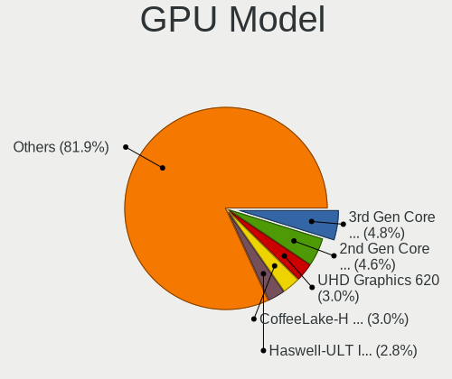
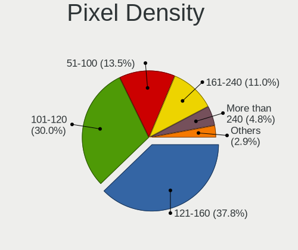
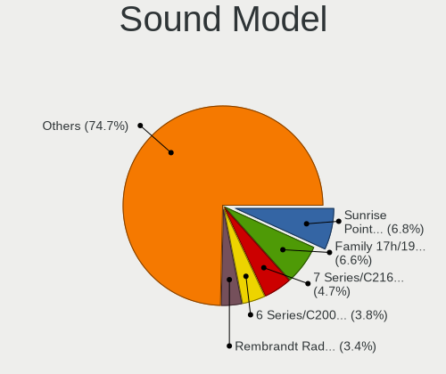
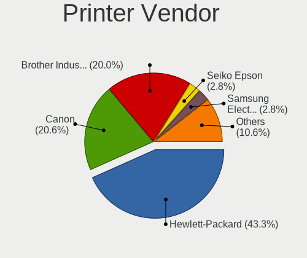
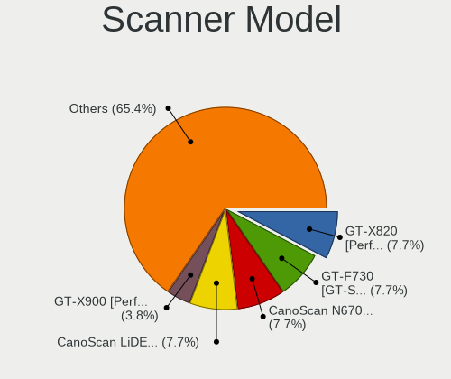
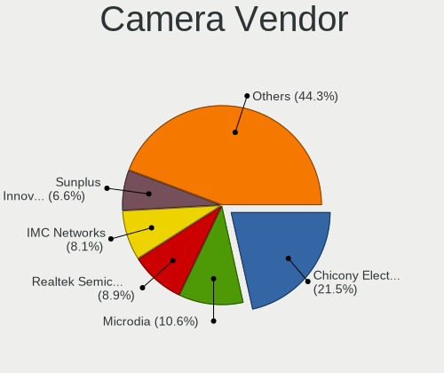

Linux in USA - Tested Hardware & Statistics (Notebooks)
-------------------------------------------------------

A project to collect tested hardware configurations for Linux in USA.

Anyone can contribute to this report by the [hw-probe](https://github.com/linuxhw/hw-probe) tool:

    sudo -E hw-probe -all -upload

Please contribute! Especially if your hardware is rare.

Contents
--------

* [ Test Cases ](#test-cases)

* [ System ](#system)
  - [ OS                       ](#os)
  - [ OS Family                ](#os-family)
  - [ Kernel                   ](#kernel)
  - [ Kernel Family            ](#kernel-family)
  - [ Kernel Major Ver.        ](#kernel-major-ver)
  - [ Arch                     ](#arch)
  - [ DE                       ](#de)
  - [ Display Server           ](#display-server)
  - [ Display Manager          ](#display-manager)
  - [ OS Lang                  ](#os-lang)
  - [ Boot Mode                ](#boot-mode)
  - [ Filesystem               ](#filesystem)
  - [ Part. scheme             ](#part-scheme)
  - [ Dual Boot with Linux/BSD ](#dual-boot-with-linuxbsd)
  - [ Dual Boot (Win)          ](#dual-boot-win)

* [ Board ](#board)
  - [ Vendor                   ](#vendor)
  - [ Model                    ](#model)
  - [ Model Family             ](#model-family)
  - [ MFG Year                 ](#mfg-year)
  - [ Form Factor              ](#form-factor)
  - [ Secure Boot              ](#secure-boot)
  - [ Coreboot                 ](#coreboot)
  - [ RAM Size                 ](#ram-size)
  - [ RAM Used                 ](#ram-used)
  - [ Total Drives             ](#total-drives)
  - [ Has CD-ROM               ](#has-cd-rom)
  - [ Has Ethernet             ](#has-ethernet)
  - [ Has WiFi                 ](#has-wifi)
  - [ Has Bluetooth            ](#has-bluetooth)

* [ Location ](#location)
  - [ Country                  ](#country)
  - [ City                     ](#city)

* [ Drives ](#drives)
  - [ Drive Vendor             ](#drive-vendor)
  - [ Drive Model              ](#drive-model)
  - [ HDD Vendor               ](#hdd-vendor)
  - [ SSD Vendor               ](#ssd-vendor)
  - [ Drive Kind               ](#drive-kind)
  - [ Drive Connector          ](#drive-connector)
  - [ Drive Size               ](#drive-size)
  - [ Space Total              ](#space-total)
  - [ Space Used               ](#space-used)
  - [ Malfunc. Drives          ](#malfunc-drives)
  - [ Malfunc. Drive Vendor    ](#malfunc-drive-vendor)
  - [ Malfunc. HDD Vendor      ](#malfunc-hdd-vendor)
  - [ Malfunc. Drive Kind      ](#malfunc-drive-kind)
  - [ Failed Drives            ](#failed-drives)
  - [ Failed Drive Vendor      ](#failed-drive-vendor)
  - [ Drive Status             ](#drive-status)

* [ Storage controller ](#storage-controller)
  - [ Storage Vendor           ](#storage-vendor)
  - [ Storage Model            ](#storage-model)
  - [ Storage Kind             ](#storage-kind)

* [ Processor ](#processor)
  - [ CPU Vendor               ](#cpu-vendor)
  - [ CPU Model                ](#cpu-model)
  - [ CPU Model Family         ](#cpu-model-family)
  - [ CPU Cores                ](#cpu-cores)
  - [ CPU Sockets              ](#cpu-sockets)
  - [ CPU Threads              ](#cpu-threads)
  - [ CPU Op-Modes             ](#cpu-op-modes)
  - [ CPU Microcode            ](#cpu-microcode)
  - [ CPU Microarch            ](#cpu-microarch)

* [ Graphics ](#graphics)
  - [ GPU Vendor               ](#gpu-vendor)
  - [ GPU Model                ](#gpu-model)
  - [ GPU Combo                ](#gpu-combo)
  - [ GPU Driver               ](#gpu-driver)
  - [ GPU Memory               ](#gpu-memory)

* [ Monitor ](#monitor)
  - [ Monitor Vendor           ](#monitor-vendor)
  - [ Monitor Model            ](#monitor-model)
  - [ Monitor Resolution       ](#monitor-resolution)
  - [ Monitor Diagonal         ](#monitor-diagonal)
  - [ Monitor Width            ](#monitor-width)
  - [ Aspect Ratio             ](#aspect-ratio)
  - [ Monitor Area             ](#monitor-area)
  - [ Pixel Density            ](#pixel-density)
  - [ Multiple Monitors        ](#multiple-monitors)

* [ Network ](#network)
  - [ Net Controller Vendor    ](#net-controller-vendor)
  - [ Net Controller Model     ](#net-controller-model)
  - [ Wireless Vendor          ](#wireless-vendor)
  - [ Wireless Model           ](#wireless-model)
  - [ Ethernet Vendor          ](#ethernet-vendor)
  - [ Ethernet Model           ](#ethernet-model)
  - [ Net Controller Kind      ](#net-controller-kind)
  - [ Used Controller          ](#used-controller)
  - [ NICs                     ](#nics)
  - [ IPv6                     ](#ipv6)

* [ Bluetooth ](#bluetooth)
  - [ Bluetooth Vendor         ](#bluetooth-vendor)
  - [ Bluetooth Model          ](#bluetooth-model)

* [ Sound ](#sound)
  - [ Sound Vendor             ](#sound-vendor)
  - [ Sound Model              ](#sound-model)

* [ Memory ](#memory)
  - [ Memory Vendor            ](#memory-vendor)
  - [ Memory Model             ](#memory-model)
  - [ Memory Kind              ](#memory-kind)
  - [ Memory Form Factor       ](#memory-form-factor)
  - [ Memory Size              ](#memory-size)
  - [ Memory Speed             ](#memory-speed)

* [ Printers & scanners ](#printers--scanners)
  - [ Printer Vendor           ](#printer-vendor)
  - [ Printer Model            ](#printer-model)
  - [ Scanner Vendor           ](#scanner-vendor)
  - [ Scanner Model            ](#scanner-model)

* [ Camera ](#camera)
  - [ Camera Vendor            ](#camera-vendor)
  - [ Camera Model             ](#camera-model)

* [ Security ](#security)
  - [ Fingerprint Vendor       ](#fingerprint-vendor)
  - [ Fingerprint Model        ](#fingerprint-model)
  - [ Chipcard Vendor          ](#chipcard-vendor)
  - [ Chipcard Model           ](#chipcard-model)

* [ Unsupported ](#unsupported)
  - [ Unsupported Devices      ](#unsupported-devices)
  - [ Unsupported Device Types ](#unsupported-device-types)

Test Cases
----------

Total: 20324

| Vendor        | Model                       | Probe                                                      | Date         |
|---------------|-----------------------------|------------------------------------------------------------|--------------|
| Gigabyte      | G5 MD                       | [901f1e43f0](https://linux-hardware.org/?probe=901f1e43f0) | Dec 31, 2022 |
| Gigabyte      | G5 MD                       | [631ee5c81c](https://linux-hardware.org/?probe=631ee5c81c) | Dec 31, 2022 |
| System76      | Oryx Pro                    | [0d65e57758](https://linux-hardware.org/?probe=0d65e57758) | Dec 31, 2022 |
| HP            | Pavilion dv7                | [4e42e627b8](https://linux-hardware.org/?probe=4e42e627b8) | Dec 31, 2022 |
| Lenovo        | ThinkPad T430s 235368U      | [8420930d53](https://linux-hardware.org/?probe=8420930d53) | Dec 31, 2022 |
| Dell          | Latitude 7370               | [cf1f751fbf](https://linux-hardware.org/?probe=cf1f751fbf) | Dec 31, 2022 |
| Lenovo        | ThinkPad T430s 235368U      | [e31244bdd7](https://linux-hardware.org/?probe=e31244bdd7) | Dec 31, 2022 |
| Google        | Candy                       | [86bb9a73fc](https://linux-hardware.org/?probe=86bb9a73fc) | Dec 31, 2022 |
| HP            | EliteBook 845 14 inch G9... | [5b5e58e433](https://linux-hardware.org/?probe=5b5e58e433) | Dec 31, 2022 |
| Valve         | Jupiter                     | [206fed6963](https://linux-hardware.org/?probe=206fed6963) | Dec 31, 2022 |
| Dell          | Latitude 7370               | [c9423665bb](https://linux-hardware.org/?probe=c9423665bb) | Dec 31, 2022 |
| Lenovo        | ThinkPad T14 Gen 3 21AH0... | [591d985e85](https://linux-hardware.org/?probe=591d985e85) | Dec 31, 2022 |
| HP            | Pavilion Aero Laptop 13-... | [c2a949b725](https://linux-hardware.org/?probe=c2a949b725) | Dec 31, 2022 |
| HP            | Victus by Laptop 16-e0xx... | [9220da7abb](https://linux-hardware.org/?probe=9220da7abb) | Dec 31, 2022 |
| Apple         | MacBookPro8,1               | [97f93aa235](https://linux-hardware.org/?probe=97f93aa235) | Dec 31, 2022 |
| Lenovo        | ThinkPad P17 Gen 2i 20YU... | [34169c74c5](https://linux-hardware.org/?probe=34169c74c5) | Dec 31, 2022 |
| Dell          | Latitude 3420               | [05095533cd](https://linux-hardware.org/?probe=05095533cd) | Dec 31, 2022 |
| Dell          | G3 3579                     | [cad48f0160](https://linux-hardware.org/?probe=cad48f0160) | Dec 30, 2022 |
| HP            | Pavilion dv6700             | [4b3b106bee](https://linux-hardware.org/?probe=4b3b106bee) | Dec 30, 2022 |
| Acer          | Aspire E5-576G              | [883bd1cd8d](https://linux-hardware.org/?probe=883bd1cd8d) | Dec 30, 2022 |
| Valve         | Jupiter                     | [d66944e019](https://linux-hardware.org/?probe=d66944e019) | Dec 30, 2022 |
| Dell          | XPS 15 9520                 | [19b4bfd852](https://linux-hardware.org/?probe=19b4bfd852) | Dec 30, 2022 |
| Valve         | Jupiter                     | [7efd41e9e3](https://linux-hardware.org/?probe=7efd41e9e3) | Dec 30, 2022 |
| Valve         | Jupiter                     | [d35711a607](https://linux-hardware.org/?probe=d35711a607) | Dec 30, 2022 |
| Valve         | Jupiter                     | [617508d444](https://linux-hardware.org/?probe=617508d444) | Dec 30, 2022 |
| Alienware     | x17 R2                      | [f213236189](https://linux-hardware.org/?probe=f213236189) | Dec 30, 2022 |
| GPU Compan... | GWNR71517                   | [d8b5801637](https://linux-hardware.org/?probe=d8b5801637) | Dec 30, 2022 |
| Valve         | Jupiter                     | [ba8c4aff6e](https://linux-hardware.org/?probe=ba8c4aff6e) | Dec 30, 2022 |
| Valve         | Jupiter                     | [6723dd2f21](https://linux-hardware.org/?probe=6723dd2f21) | Dec 30, 2022 |
| ASUSTek       | X540LA                      | [65f5548781](https://linux-hardware.org/?probe=65f5548781) | Dec 30, 2022 |
| HP            | ZBook Studio G3             | [ca204b6900](https://linux-hardware.org/?probe=ca204b6900) | Dec 30, 2022 |
| Apple         | MacBookPro14,3              | [fdd6af96b3](https://linux-hardware.org/?probe=fdd6af96b3) | Dec 30, 2022 |
| System76      | Oryx Pro                    | [dcc09f8dc5](https://linux-hardware.org/?probe=dcc09f8dc5) | Dec 30, 2022 |
| HP            | Pavilion dv7                | [6ba364face](https://linux-hardware.org/?probe=6ba364face) | Dec 30, 2022 |
| Google        | Edgar                       | [738a0d9324](https://linux-hardware.org/?probe=738a0d9324) | Dec 30, 2022 |
| HP            | Laptop 17-ca2xxx            | [add21e3026](https://linux-hardware.org/?probe=add21e3026) | Dec 30, 2022 |
| Dell          | XPS 9320                    | [c7a7749a95](https://linux-hardware.org/?probe=c7a7749a95) | Dec 30, 2022 |
| Lenovo        | ThinkPad T430 23426FU       | [eec74990ca](https://linux-hardware.org/?probe=eec74990ca) | Dec 30, 2022 |
| Dell          | Latitude E6540              | [e0e5f33e60](https://linux-hardware.org/?probe=e0e5f33e60) | Dec 30, 2022 |
| Dell          | XPS 9320                    | [458727c26e](https://linux-hardware.org/?probe=458727c26e) | Dec 30, 2022 |
| Acer          | Aspire AV14-51              | [4f92ccde69](https://linux-hardware.org/?probe=4f92ccde69) | Dec 29, 2022 |
| Lenovo        | ThinkPad T430s 235368U      | [c9b7e858ae](https://linux-hardware.org/?probe=c9b7e858ae) | Dec 29, 2022 |
| AMI           | Intel                       | [b4f7a84546](https://linux-hardware.org/?probe=b4f7a84546) | Dec 29, 2022 |
| HP            | Laptop 17-cp0xxx            | [7f54c2425b](https://linux-hardware.org/?probe=7f54c2425b) | Dec 29, 2022 |
| Lenovo        | ThinkPad T430s 235368U      | [8ba8cedf66](https://linux-hardware.org/?probe=8ba8cedf66) | Dec 29, 2022 |
| Dell          | XPS 13 9370                 | [1f72002986](https://linux-hardware.org/?probe=1f72002986) | Dec 29, 2022 |
| Lenovo        | ThinkPad T430 23426FU       | [9e4e7d1738](https://linux-hardware.org/?probe=9e4e7d1738) | Dec 29, 2022 |
| Acer          | Swift SFX14-41G             | [e422b934d0](https://linux-hardware.org/?probe=e422b934d0) | Dec 29, 2022 |
| Lenovo        | Legion 5 Pro 16ITH6H 82J... | [467a749806](https://linux-hardware.org/?probe=467a749806) | Dec 29, 2022 |
| HP            | Pavilion g7                 | [444363b7ec](https://linux-hardware.org/?probe=444363b7ec) | Dec 29, 2022 |
| Carbon Sys... | Iridium 14                  | [d2275f6785](https://linux-hardware.org/?probe=d2275f6785) | Dec 29, 2022 |
| Dell          | Latitude E6430              | [6d5bc96456](https://linux-hardware.org/?probe=6d5bc96456) | Dec 29, 2022 |
| Apple         | MacBookAir7,2               | [0ad2bdf744](https://linux-hardware.org/?probe=0ad2bdf744) | Dec 29, 2022 |
| Dell          | Inspiron 5555               | [37635ca062](https://linux-hardware.org/?probe=37635ca062) | Dec 29, 2022 |
| Lenovo        | ThinkPad T480 20L5001DUS    | [51bb19bbf2](https://linux-hardware.org/?probe=51bb19bbf2) | Dec 29, 2022 |
| Valve         | Jupiter                     | [135a0237fc](https://linux-hardware.org/?probe=135a0237fc) | Dec 29, 2022 |
| Dell          | Inspiron 14 5425            | [42f45d59d2](https://linux-hardware.org/?probe=42f45d59d2) | Dec 29, 2022 |
| HP            | Laptop 15-dw0xxx            | [b851f7bcfc](https://linux-hardware.org/?probe=b851f7bcfc) | Dec 29, 2022 |
| Lenovo        | ThinkPad T490s 20NYS9MJ0... | [8489abdbe7](https://linux-hardware.org/?probe=8489abdbe7) | Dec 29, 2022 |
| System76      | Lemur Pro                   | [0a61e4fe8d](https://linux-hardware.org/?probe=0a61e4fe8d) | Dec 29, 2022 |
| HP            | ENVY dv7                    | [97e029af78](https://linux-hardware.org/?probe=97e029af78) | Dec 29, 2022 |
| Apple         | MacBookPro14,1              | [2bd4899c8a](https://linux-hardware.org/?probe=2bd4899c8a) | Dec 29, 2022 |
| Apple         | MacBookPro14,1              | [919cfc2c9c](https://linux-hardware.org/?probe=919cfc2c9c) | Dec 29, 2022 |
| Lenovo        | ThinkPad T14 Gen 3 21AH0... | [8901206dd0](https://linux-hardware.org/?probe=8901206dd0) | Dec 28, 2022 |
| HP            | Pavilion 17                 | [03976dea5a](https://linux-hardware.org/?probe=03976dea5a) | Dec 28, 2022 |
| HP            | ProBook 440 14 inch G9 N... | [e23c23e61f](https://linux-hardware.org/?probe=e23c23e61f) | Dec 28, 2022 |
| System76      | Bonobo Extreme              | [cedfb426df](https://linux-hardware.org/?probe=cedfb426df) | Dec 28, 2022 |
| HP            | ProBook 440 14 inch G9 N... | [5c4856e5c8](https://linux-hardware.org/?probe=5c4856e5c8) | Dec 28, 2022 |
| Chuwi         | HeroBook                    | [941a22d5fd](https://linux-hardware.org/?probe=941a22d5fd) | Dec 28, 2022 |
| System76      | Bonobo Extreme              | [1b6caec010](https://linux-hardware.org/?probe=1b6caec010) | Dec 28, 2022 |
| HP            | Compaq Presario CQ60        | [92ece593f5](https://linux-hardware.org/?probe=92ece593f5) | Dec 28, 2022 |
| Toshiba       | Satellite L455D             | [35c085aa82](https://linux-hardware.org/?probe=35c085aa82) | Dec 28, 2022 |
| GPU Compan... | GWTN116-3                   | [73323d3bad](https://linux-hardware.org/?probe=73323d3bad) | Dec 28, 2022 |
| GPU Compan... | GWTN116-3                   | [bcad5903ae](https://linux-hardware.org/?probe=bcad5903ae) | Dec 28, 2022 |
| Dell          | Inspiron 16 5625            | [dbc2d2fc6f](https://linux-hardware.org/?probe=dbc2d2fc6f) | Dec 28, 2022 |
| Dell          | Latitude 7490               | [0c49efe5e1](https://linux-hardware.org/?probe=0c49efe5e1) | Dec 28, 2022 |
| HP            | Stream Laptop 14-cb1xxx     | [7ac222385a](https://linux-hardware.org/?probe=7ac222385a) | Dec 28, 2022 |
| HP            | Stream Laptop 14-cb1xxx     | [faf2c0e5d7](https://linux-hardware.org/?probe=faf2c0e5d7) | Dec 28, 2022 |
| Lenovo        | G580 20157                  | [bfefa4ee83](https://linux-hardware.org/?probe=bfefa4ee83) | Dec 28, 2022 |
| ASUSTek       | G73Jh                       | [e406daa47c](https://linux-hardware.org/?probe=e406daa47c) | Dec 28, 2022 |
| ASUSTek       | VivoBook_ASUSLaptop N760... | [7ef5d874e9](https://linux-hardware.org/?probe=7ef5d874e9) | Dec 28, 2022 |
| Lenovo        | G580 20157                  | [39f72fea9c](https://linux-hardware.org/?probe=39f72fea9c) | Dec 28, 2022 |
| HP            | Compaq Presario CQ60        | [f3f1a02bce](https://linux-hardware.org/?probe=f3f1a02bce) | Dec 28, 2022 |
| Dell          | Inspiron 7737               | [4b5c3bf639](https://linux-hardware.org/?probe=4b5c3bf639) | Dec 28, 2022 |
| Dell          | Inspiron 7737               | [39c1f12699](https://linux-hardware.org/?probe=39c1f12699) | Dec 28, 2022 |
| HP            | Compaq Presario CQ60        | [b1f32ea75c](https://linux-hardware.org/?probe=b1f32ea75c) | Dec 28, 2022 |
| HP            | EliteBook 845 14 inch G9... | [475b76e98a](https://linux-hardware.org/?probe=475b76e98a) | Dec 28, 2022 |
| Apple         | MacBookPro8,2               | [e4255e8ed7](https://linux-hardware.org/?probe=e4255e8ed7) | Dec 28, 2022 |
| Lenovo        | IdeaPad L340-17API 81LY     | [f4df1b165b](https://linux-hardware.org/?probe=f4df1b165b) | Dec 28, 2022 |
| Dell          | Precision 7720              | [56db0ab146](https://linux-hardware.org/?probe=56db0ab146) | Dec 28, 2022 |
| Dell          | Precision 7720              | [e94a7bb989](https://linux-hardware.org/?probe=e94a7bb989) | Dec 28, 2022 |
| Google        | Gnawty                      | [98902e9806](https://linux-hardware.org/?probe=98902e9806) | Dec 28, 2022 |
| HP            | Laptop 15-dw0xxx            | [7c2b9af9c3](https://linux-hardware.org/?probe=7c2b9af9c3) | Dec 28, 2022 |
| Dell          | Latitude E7450              | [b641b13d8a](https://linux-hardware.org/?probe=b641b13d8a) | Dec 28, 2022 |
| Valve         | Jupiter                     | [08161cc2cd](https://linux-hardware.org/?probe=08161cc2cd) | Dec 28, 2022 |
| Apple         | MacBookAir7,2               | [10dce91da1](https://linux-hardware.org/?probe=10dce91da1) | Dec 27, 2022 |
| Apple         | MacBookAir7,1               | [d174ffb318](https://linux-hardware.org/?probe=d174ffb318) | Dec 27, 2022 |
| Lenovo        | ThinkPad X1 Carbon 6th 2... | [5d21edd112](https://linux-hardware.org/?probe=5d21edd112) | Dec 27, 2022 |
| Valve         | Jupiter                     | [894e79d316](https://linux-hardware.org/?probe=894e79d316) | Dec 27, 2022 |
| MSI           | GF63 Thin 10SC              | [71c1ee486e](https://linux-hardware.org/?probe=71c1ee486e) | Dec 27, 2022 |
| Lenovo        | ThinkPad X1 Carbon Gen 1... | [e5cd9613f9](https://linux-hardware.org/?probe=e5cd9613f9) | Dec 27, 2022 |
| Dell          | G7 7500                     | [d46bf78144](https://linux-hardware.org/?probe=d46bf78144) | Dec 27, 2022 |
| Valve         | Jupiter                     | [add22bd3b7](https://linux-hardware.org/?probe=add22bd3b7) | Dec 27, 2022 |
| Acer          | Aspire A515-57              | [470c8d54ba](https://linux-hardware.org/?probe=470c8d54ba) | Dec 27, 2022 |
| Apple         | MacBookPro8,2               | [c62b37d15c](https://linux-hardware.org/?probe=c62b37d15c) | Dec 27, 2022 |
| MSI           | Summit E13FlipEvo A12MT     | [19d3221410](https://linux-hardware.org/?probe=19d3221410) | Dec 27, 2022 |
| HP            | ZBook Studio G3             | [2eaf074cd3](https://linux-hardware.org/?probe=2eaf074cd3) | Dec 27, 2022 |
| Acer          | Aspire A515-57              | [c0a659dbb1](https://linux-hardware.org/?probe=c0a659dbb1) | Dec 27, 2022 |
| Google        | Ultima                      | [b389ad5a98](https://linux-hardware.org/?probe=b389ad5a98) | Dec 27, 2022 |
| GPU Compan... | GWTN156-3BK                 | [7c9c57b704](https://linux-hardware.org/?probe=7c9c57b704) | Dec 27, 2022 |
| HP            | Beats 15                    | [d000f23d61](https://linux-hardware.org/?probe=d000f23d61) | Dec 27, 2022 |
| Lenovo        | ThinkPad T14 Gen 3 21AH0... | [e41c8ca4ee](https://linux-hardware.org/?probe=e41c8ca4ee) | Dec 27, 2022 |
| Dell          | G5 5505                     | [87f62bee87](https://linux-hardware.org/?probe=87f62bee87) | Dec 26, 2022 |
| Dell          | Inspiron 5775               | [cfb1c3fcd6](https://linux-hardware.org/?probe=cfb1c3fcd6) | Dec 26, 2022 |
| Apple         | MacBookPro14,1              | [eb6c6ee49e](https://linux-hardware.org/?probe=eb6c6ee49e) | Dec 26, 2022 |
| ASUSTek       | N550JV                      | [748284a21e](https://linux-hardware.org/?probe=748284a21e) | Dec 26, 2022 |
| HP            | ProBook 450 G7              | [dfedb566ff](https://linux-hardware.org/?probe=dfedb566ff) | Dec 26, 2022 |
| Dell          | XPS 13 9360                 | [bddcc1503f](https://linux-hardware.org/?probe=bddcc1503f) | Dec 26, 2022 |
| Dell          | XPS 15 9510                 | [394fe96894](https://linux-hardware.org/?probe=394fe96894) | Dec 26, 2022 |
| HP            | Pavilion g6                 | [fbdf9893b5](https://linux-hardware.org/?probe=fbdf9893b5) | Dec 26, 2022 |
| Dell          | Latitude E64406342Q0286/    | [e044c94514](https://linux-hardware.org/?probe=e044c94514) | Dec 26, 2022 |
| Lenovo        | IdeaPad 1 14IGL7 82V6       | [27d5cfbc7b](https://linux-hardware.org/?probe=27d5cfbc7b) | Dec 26, 2022 |
| Lenovo        | ThinkPad T470 20HES0PF00    | [052cdcd8bb](https://linux-hardware.org/?probe=052cdcd8bb) | Dec 26, 2022 |
| Lenovo        | ThinkPad T470 20HES0PF00    | [940218d084](https://linux-hardware.org/?probe=940218d084) | Dec 26, 2022 |
| Lenovo        | ThinkPad X1 Extreme Gen ... | [ce352bf1b1](https://linux-hardware.org/?probe=ce352bf1b1) | Dec 26, 2022 |
| Valve         | Jupiter                     | [b0805a1b7c](https://linux-hardware.org/?probe=b0805a1b7c) | Dec 26, 2022 |
| Valve         | Jupiter                     | [fff4225748](https://linux-hardware.org/?probe=fff4225748) | Dec 26, 2022 |
| MSI           | GT60                        | [3917ca13e3](https://linux-hardware.org/?probe=3917ca13e3) | Dec 26, 2022 |
| Lenovo        | ThinkPad E560 20EV002FUS    | [39bb0dd975](https://linux-hardware.org/?probe=39bb0dd975) | Dec 26, 2022 |
| Lenovo        | ThinkPad E560 20EV002FUS    | [3a47808708](https://linux-hardware.org/?probe=3a47808708) | Dec 26, 2022 |
| Dell          | Inspiron 5759               | [d1938219e9](https://linux-hardware.org/?probe=d1938219e9) | Dec 26, 2022 |
| Valve         | Jupiter                     | [bb4ffda53d](https://linux-hardware.org/?probe=bb4ffda53d) | Dec 26, 2022 |
| Dell          | Latitude 5580               | [72c0e42aeb](https://linux-hardware.org/?probe=72c0e42aeb) | Dec 26, 2022 |
| ASUSTek       | ZenBook UX425UG_Q408UG      | [9fb13764cc](https://linux-hardware.org/?probe=9fb13764cc) | Dec 26, 2022 |
| Acer          | Aspire A315-59              | [6625ce058f](https://linux-hardware.org/?probe=6625ce058f) | Dec 25, 2022 |
| Apple         | MacBookAir7,2               | [9d48f30feb](https://linux-hardware.org/?probe=9d48f30feb) | Dec 25, 2022 |
| HP            | Stream Laptop 14-cb1xxx     | [1ba51900a6](https://linux-hardware.org/?probe=1ba51900a6) | Dec 25, 2022 |
| GPU Compan... | GWNR51416                   | [fc6e84d757](https://linux-hardware.org/?probe=fc6e84d757) | Dec 25, 2022 |
| Lenovo        | ThinkPad L14 Gen 3 21C1C... | [f27b950cd8](https://linux-hardware.org/?probe=f27b950cd8) | Dec 25, 2022 |
| ASUSTek       | X750JN                      | [a604b57c92](https://linux-hardware.org/?probe=a604b57c92) | Dec 25, 2022 |
| Dell          | Latitude 3580               | [f90b8fa62f](https://linux-hardware.org/?probe=f90b8fa62f) | Dec 25, 2022 |
| Gigabyte      | AERO 17 XD                  | [c45ec6b46d](https://linux-hardware.org/?probe=c45ec6b46d) | Dec 25, 2022 |
| Valve         | Jupiter                     | [1aae0084d4](https://linux-hardware.org/?probe=1aae0084d4) | Dec 25, 2022 |
| Valve         | Jupiter                     | [f30e8d06be](https://linux-hardware.org/?probe=f30e8d06be) | Dec 25, 2022 |
| Valve         | Jupiter                     | [10e4624475](https://linux-hardware.org/?probe=10e4624475) | Dec 25, 2022 |
| Framework     | Laptop (12th Gen Intel C... | [daebafedd8](https://linux-hardware.org/?probe=daebafedd8) | Dec 25, 2022 |
| ASUSTek       | TUF Gaming FX505DT_FX505... | [f113c7d475](https://linux-hardware.org/?probe=f113c7d475) | Dec 25, 2022 |
| Dell          | Latitude E5530 non-vPro     | [9a2f55886f](https://linux-hardware.org/?probe=9a2f55886f) | Dec 25, 2022 |
| MSI           | GF63 Thin 11UC              | [5e6ce8894f](https://linux-hardware.org/?probe=5e6ce8894f) | Dec 25, 2022 |
| Dell          | Inspiron 5567               | [46d23963c9](https://linux-hardware.org/?probe=46d23963c9) | Dec 25, 2022 |
| Apple         | MacBookPro10,1              | [6c8ec40821](https://linux-hardware.org/?probe=6c8ec40821) | Dec 25, 2022 |
| Valve         | Jupiter                     | [003a215a22](https://linux-hardware.org/?probe=003a215a22) | Dec 24, 2022 |
| ASUSTek       | Q502LA                      | [386702ad8a](https://linux-hardware.org/?probe=386702ad8a) | Dec 24, 2022 |
| HP            | Stream Laptop 14-cb1xxx     | [a36ea47b5c](https://linux-hardware.org/?probe=a36ea47b5c) | Dec 24, 2022 |
| HP            | Pavilion Laptop 15-cc5xx    | [337ee988ae](https://linux-hardware.org/?probe=337ee988ae) | Dec 24, 2022 |
| ASUSTek       | ZenBook UX535LI_UX535LI     | [cc51ba5d49](https://linux-hardware.org/?probe=cc51ba5d49) | Dec 24, 2022 |
| ASUSTek       | ZenBook UX535LI_UX535LI     | [660e3a6511](https://linux-hardware.org/?probe=660e3a6511) | Dec 24, 2022 |
| Lenovo        | IdeaPad 3 15ITL6 82H8       | [e968a4fe6d](https://linux-hardware.org/?probe=e968a4fe6d) | Dec 24, 2022 |
| Valve         | Jupiter                     | [5b87445985](https://linux-hardware.org/?probe=5b87445985) | Dec 24, 2022 |
| Lenovo        | IdeaPad 3 15ITL6 82H8       | [2415ad5980](https://linux-hardware.org/?probe=2415ad5980) | Dec 24, 2022 |
| Toshiba       | Satellite P755              | [723232bde6](https://linux-hardware.org/?probe=723232bde6) | Dec 24, 2022 |
| Lenovo        | IdeaPad Gaming 3 15ARH7 ... | [44c6de2137](https://linux-hardware.org/?probe=44c6de2137) | Dec 24, 2022 |
| Lenovo        | ThinkBook 15 G3 ACL 21A4    | [096d4fc8c2](https://linux-hardware.org/?probe=096d4fc8c2) | Dec 24, 2022 |
| Valve         | Jupiter                     | [1f016d2cf5](https://linux-hardware.org/?probe=1f016d2cf5) | Dec 24, 2022 |
| Lenovo        | IdeaPad 5 Pro 14ACN6 82L... | [1ae154433a](https://linux-hardware.org/?probe=1ae154433a) | Dec 24, 2022 |
| Valve         | Jupiter                     | [f500094797](https://linux-hardware.org/?probe=f500094797) | Dec 24, 2022 |
| Lenovo        | ThinkPad X1 Carbon 7th 2... | [c5f2f2db53](https://linux-hardware.org/?probe=c5f2f2db53) | Dec 24, 2022 |
| Lenovo        | ThinkPad T14 Gen 3 21CFC... | [244ad65a78](https://linux-hardware.org/?probe=244ad65a78) | Dec 24, 2022 |
| HP            | EliteBook 865 16 inch G9... | [857cb922f9](https://linux-hardware.org/?probe=857cb922f9) | Dec 24, 2022 |
| Dell          | Latitude E7470              | [8e6bdc1809](https://linux-hardware.org/?probe=8e6bdc1809) | Dec 24, 2022 |
| Alienware     | m15 R7                      | [4e33480c8a](https://linux-hardware.org/?probe=4e33480c8a) | Dec 24, 2022 |
| System76      | Pangolin                    | [2ee273cbcf](https://linux-hardware.org/?probe=2ee273cbcf) | Dec 24, 2022 |
| ASUSTek       | VivoBook_ASUSLaptop E210... | [e1ae2ba145](https://linux-hardware.org/?probe=e1ae2ba145) | Dec 24, 2022 |
| Dell          | Latitude E6540              | [5df6345cd7](https://linux-hardware.org/?probe=5df6345cd7) | Dec 24, 2022 |
| Valve         | Jupiter                     | [91952198ca](https://linux-hardware.org/?probe=91952198ca) | Dec 24, 2022 |
| Lenovo        | Slim 7 ProX 14ARH7 82V2     | [e6d0e3b35b](https://linux-hardware.org/?probe=e6d0e3b35b) | Dec 24, 2022 |
| HP            | Stream Notebook PC 11       | [f33ebabb99](https://linux-hardware.org/?probe=f33ebabb99) | Dec 24, 2022 |
| HP            | Laptop 15-dy2xxx            | [df787f1286](https://linux-hardware.org/?probe=df787f1286) | Dec 24, 2022 |
| HP            | Laptop 15-dy2xxx            | [0a2ed74cfd](https://linux-hardware.org/?probe=0a2ed74cfd) | Dec 23, 2022 |
| Valve         | Jupiter                     | [934295d2a1](https://linux-hardware.org/?probe=934295d2a1) | Dec 23, 2022 |
| Dell          | Latitude E7440              | [baae52327d](https://linux-hardware.org/?probe=baae52327d) | Dec 23, 2022 |
| ASUSTek       | X750JN                      | [cc5facc858](https://linux-hardware.org/?probe=cc5facc858) | Dec 23, 2022 |
| Lenovo        | Y520-15IKBN 80WK            | [582894c034](https://linux-hardware.org/?probe=582894c034) | Dec 23, 2022 |
| Dell          | Latitude E7440              | [bc5d48b831](https://linux-hardware.org/?probe=bc5d48b831) | Dec 23, 2022 |
| HP            | Pavilion g7                 | [5620f164c9](https://linux-hardware.org/?probe=5620f164c9) | Dec 23, 2022 |
| Dell          | Latitude E7440              | [fde483d476](https://linux-hardware.org/?probe=fde483d476) | Dec 23, 2022 |
| Lenovo        | G500 20236                  | [3e8fb581f0](https://linux-hardware.org/?probe=3e8fb581f0) | Dec 23, 2022 |
| Lenovo        | ThinkPad X1 Carbon 7th 2... | [aaac67afbe](https://linux-hardware.org/?probe=aaac67afbe) | Dec 23, 2022 |
| Dell          | Latitude E7440              | [a746012ffd](https://linux-hardware.org/?probe=a746012ffd) | Dec 23, 2022 |
| ASUSTek       | G60JX                       | [5e9b0bb890](https://linux-hardware.org/?probe=5e9b0bb890) | Dec 23, 2022 |
| Lenovo        | ThinkPad X1 Carbon Gen 1... | [25cbb2c39a](https://linux-hardware.org/?probe=25cbb2c39a) | Dec 23, 2022 |
| Apple         | MacBookPro14,1              | [19abbc8f75](https://linux-hardware.org/?probe=19abbc8f75) | Dec 23, 2022 |
| Dell          | Latitude D630               | [8175d003ce](https://linux-hardware.org/?probe=8175d003ce) | Dec 23, 2022 |
| ASUSTek       | X750JN                      | [d933b1a80b](https://linux-hardware.org/?probe=d933b1a80b) | Dec 23, 2022 |
| Google        | Reks                        | [ecee690e6e](https://linux-hardware.org/?probe=ecee690e6e) | Dec 23, 2022 |
| Lenovo        | Y50-70 Touch 20349          | [9266f8399c](https://linux-hardware.org/?probe=9266f8399c) | Dec 23, 2022 |
| Google        | Reks                        | [58b1b4cac1](https://linux-hardware.org/?probe=58b1b4cac1) | Dec 23, 2022 |
| Valve         | Jupiter                     | [87476c80d3](https://linux-hardware.org/?probe=87476c80d3) | Dec 23, 2022 |
| HP            | Laptop 14-fq0xxx            | [861f1e5d3e](https://linux-hardware.org/?probe=861f1e5d3e) | Dec 23, 2022 |
| HP            | Dev One Notebook PC         | [0e92e9aaf2](https://linux-hardware.org/?probe=0e92e9aaf2) | Dec 23, 2022 |
| Valve         | Jupiter                     | [5ba4679f20](https://linux-hardware.org/?probe=5ba4679f20) | Dec 23, 2022 |
| Acer          | Aspire 5050                 | [5d1026f74d](https://linux-hardware.org/?probe=5d1026f74d) | Dec 23, 2022 |
| Dell          | Precision M6600             | [00840d085c](https://linux-hardware.org/?probe=00840d085c) | Dec 23, 2022 |
| HP            | EliteBook 845 G7 Noteboo... | [f2197bb9ec](https://linux-hardware.org/?probe=f2197bb9ec) | Dec 23, 2022 |
| Lenovo        | IdeaPad 3 15IIL05 81WE      | [a4447312cc](https://linux-hardware.org/?probe=a4447312cc) | Dec 23, 2022 |
| Google        | Babytiger                   | [352d1a547b](https://linux-hardware.org/?probe=352d1a547b) | Dec 23, 2022 |
| Google        | Babytiger                   | [4b2ae6579f](https://linux-hardware.org/?probe=4b2ae6579f) | Dec 23, 2022 |
| ASUSTek       | G75VX                       | [bb9724d53f](https://linux-hardware.org/?probe=bb9724d53f) | Dec 23, 2022 |
| Dell          | Vostro 3460                 | [92a850ae45](https://linux-hardware.org/?probe=92a850ae45) | Dec 23, 2022 |
| Dell          | Vostro 3460                 | [b7a0d95962](https://linux-hardware.org/?probe=b7a0d95962) | Dec 23, 2022 |
| Lenovo        | ThinkPad T480 20L6S3F41E    | [ce682eacb7](https://linux-hardware.org/?probe=ce682eacb7) | Dec 23, 2022 |
| HP            | Pavilion Laptop 15-cc5xx    | [9ce6c07b4b](https://linux-hardware.org/?probe=9ce6c07b4b) | Dec 23, 2022 |
| Toshiba       | Satellite C55Dt-A           | [67294324c5](https://linux-hardware.org/?probe=67294324c5) | Dec 22, 2022 |
| Clevo         | P170EM                      | [3c8b8bd784](https://linux-hardware.org/?probe=3c8b8bd784) | Dec 22, 2022 |
| Sony          | VPCEB36GM                   | [5aba4d1d5f](https://linux-hardware.org/?probe=5aba4d1d5f) | Dec 22, 2022 |
| Acer          | Nitro AN515-45              | [5cc9050d12](https://linux-hardware.org/?probe=5cc9050d12) | Dec 22, 2022 |
| HP            | ENVY 15                     | [3c07c09a25](https://linux-hardware.org/?probe=3c07c09a25) | Dec 22, 2022 |
| Dell          | Latitude E7440              | [c6d28912f0](https://linux-hardware.org/?probe=c6d28912f0) | Dec 22, 2022 |
| Dell          | Latitude E7440              | [1a14f26bd3](https://linux-hardware.org/?probe=1a14f26bd3) | Dec 22, 2022 |
| Dell          | Inspiron 7580               | [eb5b708877](https://linux-hardware.org/?probe=eb5b708877) | Dec 22, 2022 |
| Dell          | Latitude E7440              | [db77bb7a3f](https://linux-hardware.org/?probe=db77bb7a3f) | Dec 22, 2022 |
| Dell          | Latitude E7440              | [d2278ed94d](https://linux-hardware.org/?probe=d2278ed94d) | Dec 22, 2022 |
| Apple         | MacBookAir7,1               | [09ba8ccf48](https://linux-hardware.org/?probe=09ba8ccf48) | Dec 22, 2022 |
| Dell          | Latitude E7440              | [f4e79df709](https://linux-hardware.org/?probe=f4e79df709) | Dec 22, 2022 |
| Apple         | MacBookAir7,1               | [2c3febf6fa](https://linux-hardware.org/?probe=2c3febf6fa) | Dec 22, 2022 |
| Dell          | Latitude E7440              | [cddffa9123](https://linux-hardware.org/?probe=cddffa9123) | Dec 22, 2022 |
| Dell          | Latitude E7440              | [5f911806c8](https://linux-hardware.org/?probe=5f911806c8) | Dec 22, 2022 |
| Dell          | Latitude D630               | [e1106d8868](https://linux-hardware.org/?probe=e1106d8868) | Dec 22, 2022 |
| Apple         | MacBookPro10,1              | [b4fcb2c8c2](https://linux-hardware.org/?probe=b4fcb2c8c2) | Dec 22, 2022 |
| HP            | 15 Notebook PC              | [79aabf81c4](https://linux-hardware.org/?probe=79aabf81c4) | Dec 22, 2022 |
| Lenovo        | ThinkPad X201 3680HB1       | [41e1719d61](https://linux-hardware.org/?probe=41e1719d61) | Dec 22, 2022 |
| HP            | Pavilion dv6                | [ef639be49a](https://linux-hardware.org/?probe=ef639be49a) | Dec 22, 2022 |
| Lenovo        | ThinkPad X201 3680HB1       | [01e9dfa8b8](https://linux-hardware.org/?probe=01e9dfa8b8) | Dec 22, 2022 |
| Acer          | Aspire A114-31              | [850c0c4a65](https://linux-hardware.org/?probe=850c0c4a65) | Dec 22, 2022 |
| Gateway       | NV78                        | [6733e081fc](https://linux-hardware.org/?probe=6733e081fc) | Dec 22, 2022 |
| Dell          | Latitude E7450              | [16cc0bdbc4](https://linux-hardware.org/?probe=16cc0bdbc4) | Dec 22, 2022 |
| Lenovo        | ThinkPad T540p 20BFS0MQ0... | [94e5bdb2cb](https://linux-hardware.org/?probe=94e5bdb2cb) | Dec 22, 2022 |
| Dell          | Latitude E7450              | [df0790836c](https://linux-hardware.org/?probe=df0790836c) | Dec 22, 2022 |
| Dell          | Latitude E7250              | [9d6fed05b1](https://linux-hardware.org/?probe=9d6fed05b1) | Dec 22, 2022 |
| Sony          | SVF15N26CXB                 | [ffc2ea8936](https://linux-hardware.org/?probe=ffc2ea8936) | Dec 22, 2022 |
| GPD           | P3 MAX                      | [9069ed5580](https://linux-hardware.org/?probe=9069ed5580) | Dec 22, 2022 |
| Apple         | MacBookAir7,2               | [b4e828bef3](https://linux-hardware.org/?probe=b4e828bef3) | Dec 21, 2022 |
| Valve         | Jupiter                     | [81b966f449](https://linux-hardware.org/?probe=81b966f449) | Dec 21, 2022 |
| Toshiba       | Satellite L855              | [3caae1ba3b](https://linux-hardware.org/?probe=3caae1ba3b) | Dec 21, 2022 |
| ASUSTek       | S500CA                      | [305c04a6ce](https://linux-hardware.org/?probe=305c04a6ce) | Dec 21, 2022 |
| Dell          | Latitude E5450              | [652099945b](https://linux-hardware.org/?probe=652099945b) | Dec 21, 2022 |
| Apple         | MacBookPro9,2               | [5bc62fc208](https://linux-hardware.org/?probe=5bc62fc208) | Dec 21, 2022 |
| Apple         | MacBookAir7,2               | [056d76bae8](https://linux-hardware.org/?probe=056d76bae8) | Dec 21, 2022 |
| HP            | Pavilion dv7                | [075b40bb9e](https://linux-hardware.org/?probe=075b40bb9e) | Dec 21, 2022 |
| HP            | Stream 11 Pro               | [39775c36e3](https://linux-hardware.org/?probe=39775c36e3) | Dec 21, 2022 |
| HP            | Stream Laptop 14-ax0XX      | [7ddd963f2f](https://linux-hardware.org/?probe=7ddd963f2f) | Dec 21, 2022 |
| ASUSTek       | Zenbook UX3402ZA_Q409ZA     | [39b80964ba](https://linux-hardware.org/?probe=39b80964ba) | Dec 21, 2022 |
| Google        | Auron_Yuna                  | [827696b95a](https://linux-hardware.org/?probe=827696b95a) | Dec 21, 2022 |
| Dell          | Inspiron 5737               | [301a191192](https://linux-hardware.org/?probe=301a191192) | Dec 21, 2022 |
| HP            | ENVY Laptop 16-h0xxx        | [4e38f93dd3](https://linux-hardware.org/?probe=4e38f93dd3) | Dec 21, 2022 |
| Panasonic     | CF-53AAG54FM                | [cf7f652846](https://linux-hardware.org/?probe=cf7f652846) | Dec 21, 2022 |
| HP            | Compaq 6715b (RM174UT#AB... | [db3b8615f7](https://linux-hardware.org/?probe=db3b8615f7) | Dec 21, 2022 |
| IBM           | ThinkPad T42 2378FVU        | [ce2f3fb897](https://linux-hardware.org/?probe=ce2f3fb897) | Dec 21, 2022 |
| HP            | ZBook 15v G5                | [e2056b0bdd](https://linux-hardware.org/?probe=e2056b0bdd) | Dec 21, 2022 |
| Valve         | Jupiter                     | [0c29352a52](https://linux-hardware.org/?probe=0c29352a52) | Dec 20, 2022 |
| Valve         | Jupiter                     | [74518c805f](https://linux-hardware.org/?probe=74518c805f) | Dec 20, 2022 |
| Lenovo        | ThinkPad 13 2nd Gen 20J1... | [cd4fa20e66](https://linux-hardware.org/?probe=cd4fa20e66) | Dec 20, 2022 |
| Dell          | Inspiron 15 7000 Gaming     | [b9aed745da](https://linux-hardware.org/?probe=b9aed745da) | Dec 20, 2022 |
| Dell          | XPS 17 9700                 | [069abc91a3](https://linux-hardware.org/?probe=069abc91a3) | Dec 20, 2022 |
| Dell          | XPS 9320                    | [ce5835b58d](https://linux-hardware.org/?probe=ce5835b58d) | Dec 20, 2022 |
| Lenovo        | ThinkPad 13 2nd Gen 20J1... | [e676fe186f](https://linux-hardware.org/?probe=e676fe186f) | Dec 20, 2022 |
| Razer         | Blade Stealth               | [375162dc91](https://linux-hardware.org/?probe=375162dc91) | Dec 20, 2022 |
| Dell          | Inspiron 3541               | [02b57f5961](https://linux-hardware.org/?probe=02b57f5961) | Dec 20, 2022 |
| Dell          | Latitude E6430              | [643c90d5e1](https://linux-hardware.org/?probe=643c90d5e1) | Dec 20, 2022 |
| Dell          | Latitude E6430              | [ba280c7787](https://linux-hardware.org/?probe=ba280c7787) | Dec 20, 2022 |
| Valve         | Jupiter                     | [dc2e1253e8](https://linux-hardware.org/?probe=dc2e1253e8) | Dec 20, 2022 |
| Dell          | XPS 13 9370                 | [0f360efa8f](https://linux-hardware.org/?probe=0f360efa8f) | Dec 20, 2022 |
| Dell          | Inspiron 7737               | [37b8f864e9](https://linux-hardware.org/?probe=37b8f864e9) | Dec 20, 2022 |
| Acer          | Aspire A515-52              | [b052f8434a](https://linux-hardware.org/?probe=b052f8434a) | Dec 20, 2022 |
| Dell          | Inspiron 15 7000 Gaming     | [c7cea6dd19](https://linux-hardware.org/?probe=c7cea6dd19) | Dec 20, 2022 |
| HP            | EliteBook 745 G5            | [71137f0f0a](https://linux-hardware.org/?probe=71137f0f0a) | Dec 20, 2022 |
| Dell          | Inspiron 5720               | [a5dc05fb3d](https://linux-hardware.org/?probe=a5dc05fb3d) | Dec 20, 2022 |
| Dell          | Latitude E6430              | [a1db0f0a18](https://linux-hardware.org/?probe=a1db0f0a18) | Dec 20, 2022 |
| Dell          | Venue 11 Pro 7140           | [c0ceff2a93](https://linux-hardware.org/?probe=c0ceff2a93) | Dec 20, 2022 |
| Lenovo        | IdeaPad 3 14ALC6 82KT       | [7c07fab7e4](https://linux-hardware.org/?probe=7c07fab7e4) | Dec 20, 2022 |
| ASUSTek       | T100TA                      | [1dc546e14a](https://linux-hardware.org/?probe=1dc546e14a) | Dec 20, 2022 |
| Dell          | G5 5505                     | [dbb7472e3e](https://linux-hardware.org/?probe=dbb7472e3e) | Dec 20, 2022 |
| Samsung       | 355V4C/355V4X/355V5C/355... | [654a04cdc4](https://linux-hardware.org/?probe=654a04cdc4) | Dec 20, 2022 |
| MSI           | GL75 Leopard 10SDK          | [a269c3ef8a](https://linux-hardware.org/?probe=a269c3ef8a) | Dec 20, 2022 |
| Lenovo        | G500 20236                  | [83a3d8e955](https://linux-hardware.org/?probe=83a3d8e955) | Dec 19, 2022 |
| HP            | Pavilion Laptop 15-cc5xx    | [9c7ebefdc6](https://linux-hardware.org/?probe=9c7ebefdc6) | Dec 19, 2022 |
| Google        | Blooglet                    | [b3a163b99b](https://linux-hardware.org/?probe=b3a163b99b) | Dec 19, 2022 |
| Valve         | Jupiter                     | [51f420480a](https://linux-hardware.org/?probe=51f420480a) | Dec 19, 2022 |
| Dell          | Inspiron 11-3168            | [d71732c038](https://linux-hardware.org/?probe=d71732c038) | Dec 19, 2022 |
| Dell          | Latitude 3580               | [004e928317](https://linux-hardware.org/?probe=004e928317) | Dec 19, 2022 |
| Dell          | Latitude 3580               | [7948e20e8c](https://linux-hardware.org/?probe=7948e20e8c) | Dec 19, 2022 |
| GPD           | G1619-04                    | [f184c297f2](https://linux-hardware.org/?probe=f184c297f2) | Dec 19, 2022 |
| ASUSTek       | Q400A                       | [8f8b00d1d6](https://linux-hardware.org/?probe=8f8b00d1d6) | Dec 19, 2022 |
| Valve         | Jupiter                     | [c50891856e](https://linux-hardware.org/?probe=c50891856e) | Dec 19, 2022 |
| Lenovo        | ThinkPad X1 Carbon Gen 9... | [03da9468fc](https://linux-hardware.org/?probe=03da9468fc) | Dec 19, 2022 |
| Valve         | Jupiter                     | [154e9217e5](https://linux-hardware.org/?probe=154e9217e5) | Dec 19, 2022 |
| MSI           | Summit E16Flip A12UCT       | [af260af715](https://linux-hardware.org/?probe=af260af715) | Dec 19, 2022 |
| HP            | Stream Laptop 14-cb1xxx     | [b1bd890ed0](https://linux-hardware.org/?probe=b1bd890ed0) | Dec 19, 2022 |
| IBM           | ThinkPad T42 2378FVU        | [50f1d0a765](https://linux-hardware.org/?probe=50f1d0a765) | Dec 19, 2022 |
| IBM           | ThinkPad T42 2378FVU        | [fe6bdea3fd](https://linux-hardware.org/?probe=fe6bdea3fd) | Dec 19, 2022 |
| System76      | Gazelle                     | [da46fb926a](https://linux-hardware.org/?probe=da46fb926a) | Dec 19, 2022 |
| HP            | Pavilion Laptop 15-cc5xx    | [b7b07d0c82](https://linux-hardware.org/?probe=b7b07d0c82) | Dec 19, 2022 |
| MSI           | GL63 8RC                    | [6a5bc85513](https://linux-hardware.org/?probe=6a5bc85513) | Dec 18, 2022 |
| HP            | Pavilion g7                 | [9829a799a0](https://linux-hardware.org/?probe=9829a799a0) | Dec 18, 2022 |
| ASRock        | X570 Phantom Gaming-ITX/... | [59bf36837d](https://linux-hardware.org/?probe=59bf36837d) | Dec 18, 2022 |
| ASUSTek       | ROG Zephyrus S17 GX701LW... | [31609e8e56](https://linux-hardware.org/?probe=31609e8e56) | Dec 18, 2022 |
| HP            | Laptop 15-da0xxx            | [b712a7bd77](https://linux-hardware.org/?probe=b712a7bd77) | Dec 18, 2022 |
| Lenovo        | ThinkPad X1 Extreme Gen ... | [2a1a679e03](https://linux-hardware.org/?probe=2a1a679e03) | Dec 18, 2022 |
| ASUSTek       | ZenBook UX325EA_UX325EA     | [54e81a596c](https://linux-hardware.org/?probe=54e81a596c) | Dec 18, 2022 |
| ASUSTek       | ROG Zephyrus G14 GA401IH... | [79bfc4d78c](https://linux-hardware.org/?probe=79bfc4d78c) | Dec 18, 2022 |
| Dell          | Inspiron 7537               | [7064963568](https://linux-hardware.org/?probe=7064963568) | Dec 18, 2022 |
| Dell          | Latitude E4310              | [ace267f47c](https://linux-hardware.org/?probe=ace267f47c) | Dec 18, 2022 |
| ASUSTek       | ROG Zephyrus G14 GA401QM... | [60a56500f1](https://linux-hardware.org/?probe=60a56500f1) | Dec 18, 2022 |
| GPU Compan... | GWNR71517                   | [e680612eb4](https://linux-hardware.org/?probe=e680612eb4) | Dec 18, 2022 |
| HP            | 2000                        | [6273a792ae](https://linux-hardware.org/?probe=6273a792ae) | Dec 18, 2022 |
| Dell          | Latitude E5530 non-vPro     | [917150ffce](https://linux-hardware.org/?probe=917150ffce) | Dec 18, 2022 |
| Lenovo        | ThinkPad T470p 20J7S25C0... | [3dc497faf1](https://linux-hardware.org/?probe=3dc497faf1) | Dec 18, 2022 |
| ASUSTek       | S500CA                      | [55cf134a8b](https://linux-hardware.org/?probe=55cf134a8b) | Dec 18, 2022 |
| Valve         | Jupiter                     | [b62a6e3e64](https://linux-hardware.org/?probe=b62a6e3e64) | Dec 18, 2022 |
| ASUSTek       | ZenBook UX325EA_UX325EA     | [0a486ca67b](https://linux-hardware.org/?probe=0a486ca67b) | Dec 18, 2022 |
| Dell          | Precision 5540              | [0e2ce6eb28](https://linux-hardware.org/?probe=0e2ce6eb28) | Dec 17, 2022 |
| HP            | ProBook 450 G7              | [ad9bf6b390](https://linux-hardware.org/?probe=ad9bf6b390) | Dec 17, 2022 |
| Lenovo        | ThinkPad X1 Extreme Gen ... | [c9cc617e08](https://linux-hardware.org/?probe=c9cc617e08) | Dec 17, 2022 |
| Lenovo        | ThinkPad T430 2347G5U       | [ac787dc7dc](https://linux-hardware.org/?probe=ac787dc7dc) | Dec 17, 2022 |
| Lenovo        | ThinkPad T430 2347G5U       | [e47e7c18c9](https://linux-hardware.org/?probe=e47e7c18c9) | Dec 17, 2022 |
| GPU Compan... | GWTC116-2                   | [e64e0ee27a](https://linux-hardware.org/?probe=e64e0ee27a) | Dec 17, 2022 |
| HP            | Compaq 6910p (RM231UT#AB... | [4653b4877b](https://linux-hardware.org/?probe=4653b4877b) | Dec 17, 2022 |
| MSI           | GF75 Thin 10SCSXR           | [09cdbbcf3f](https://linux-hardware.org/?probe=09cdbbcf3f) | Dec 17, 2022 |
| Toshiba       | Satellite S70-A             | [3eddeb0d68](https://linux-hardware.org/?probe=3eddeb0d68) | Dec 17, 2022 |
| Lenovo        | ThinkPad X1 Extreme 2nd ... | [86fbbf1bc2](https://linux-hardware.org/?probe=86fbbf1bc2) | Dec 17, 2022 |
| ASUSTek       | VivoBook_ASUSLaptop X712... | [f878370f3d](https://linux-hardware.org/?probe=f878370f3d) | Dec 17, 2022 |
| ASRock        | X570 Phantom Gaming-ITX/... | [d5279b915a](https://linux-hardware.org/?probe=d5279b915a) | Dec 17, 2022 |
| HP            | Pavilion Laptop 15-cc5xx    | [88afc15b1a](https://linux-hardware.org/?probe=88afc15b1a) | Dec 17, 2022 |
| Dell          | XPS 15 9510                 | [1641d91910](https://linux-hardware.org/?probe=1641d91910) | Dec 17, 2022 |
| Acer          | Swift SF314-43              | [7f96918240](https://linux-hardware.org/?probe=7f96918240) | Dec 17, 2022 |
| Lenovo        | 1S20UDCT01WWPF1ARBNP 29U... | [b5e9681592](https://linux-hardware.org/?probe=b5e9681592) | Dec 17, 2022 |
| Foxconn       | Kangaroo Mobile Desktop     | [4e847b4a36](https://linux-hardware.org/?probe=4e847b4a36) | Dec 17, 2022 |
| Lenovo        | K14 Gen 1 21CUS02600        | [218654b079](https://linux-hardware.org/?probe=218654b079) | Dec 17, 2022 |
| Dell          | Inspiron 14 5425            | [e7d96ccda5](https://linux-hardware.org/?probe=e7d96ccda5) | Dec 17, 2022 |
| HP            | ProBook 445 G8 Notebook ... | [87b21382ec](https://linux-hardware.org/?probe=87b21382ec) | Dec 17, 2022 |
| MSI           | GF75 Thin 10SCSXR           | [8f884fc451](https://linux-hardware.org/?probe=8f884fc451) | Dec 17, 2022 |
| Apple         | MacBookPro8,2               | [4ed1785ef7](https://linux-hardware.org/?probe=4ed1785ef7) | Dec 17, 2022 |
| Lenovo        | ThinkPad T530 2392APU       | [4bdfdb9736](https://linux-hardware.org/?probe=4bdfdb9736) | Dec 17, 2022 |
| HP            | ProBook 440 14 inch G9 N... | [5ab1c3b848](https://linux-hardware.org/?probe=5ab1c3b848) | Dec 17, 2022 |
| Unknown       | Unknown                     | [208016df07](https://linux-hardware.org/?probe=208016df07) | Dec 17, 2022 |
| HP            | Pavilion Aero Laptop 13-... | [9f0911ee6b](https://linux-hardware.org/?probe=9f0911ee6b) | Dec 16, 2022 |
| HP            | Laptop 15-dw4xxx            | [ac9c6384ca](https://linux-hardware.org/?probe=ac9c6384ca) | Dec 16, 2022 |
| System76      | Gazelle                     | [b5ef8cec53](https://linux-hardware.org/?probe=b5ef8cec53) | Dec 16, 2022 |
| Lenovo        | ThinkPad T15p Gen 3 21DA... | [6d51ea5c76](https://linux-hardware.org/?probe=6d51ea5c76) | Dec 16, 2022 |
| Valve         | Jupiter                     | [8d134a7f1e](https://linux-hardware.org/?probe=8d134a7f1e) | Dec 16, 2022 |
| Unknown       | Unknown                     | [2285002756](https://linux-hardware.org/?probe=2285002756) | Dec 16, 2022 |
| Valve         | Jupiter                     | [70f2102c25](https://linux-hardware.org/?probe=70f2102c25) | Dec 16, 2022 |
| Lenovo        | ThinkBook 13x G2 IAP 21A... | [45e62da63d](https://linux-hardware.org/?probe=45e62da63d) | Dec 16, 2022 |
| Dell          | Latitude E64406342Q0286/    | [41b2b27a91](https://linux-hardware.org/?probe=41b2b27a91) | Dec 16, 2022 |
| Dynabook      | PORTEGE X30L-K              | [6f9a9428b6](https://linux-hardware.org/?probe=6f9a9428b6) | Dec 16, 2022 |
| Google        | Careena                     | [7309bde937](https://linux-hardware.org/?probe=7309bde937) | Dec 16, 2022 |
| Dell          | Inspiron 3531               | [0bd7aad842](https://linux-hardware.org/?probe=0bd7aad842) | Dec 16, 2022 |
| LG Electro... | 14ZB90Q-G.AAC6U1            | [3e99087eee](https://linux-hardware.org/?probe=3e99087eee) | Dec 16, 2022 |
| MSI           | GE72VR 7RF                  | [f5384e68dd](https://linux-hardware.org/?probe=f5384e68dd) | Dec 16, 2022 |
| ASUSTek       | ASUS TUF Dash F15 FX516P... | [8c87fc340b](https://linux-hardware.org/?probe=8c87fc340b) | Dec 16, 2022 |
| Dell          | XPS 15 9570                 | [ce6ac8ec7f](https://linux-hardware.org/?probe=ce6ac8ec7f) | Dec 16, 2022 |
| Razer         | Blade 17 (2022) - RZ09-0... | [7fe46a2bae](https://linux-hardware.org/?probe=7fe46a2bae) | Dec 16, 2022 |
| Dell          | Latitude E64406342Q0286/    | [e8b2c9218f](https://linux-hardware.org/?probe=e8b2c9218f) | Dec 15, 2022 |
| HP            | ProBook 640 G3              | [03eba7b664](https://linux-hardware.org/?probe=03eba7b664) | Dec 15, 2022 |
| Lenovo        | ThinkPad T14 Gen 1 20UD0... | [8f50c0d881](https://linux-hardware.org/?probe=8f50c0d881) | Dec 15, 2022 |
| Intel         | powered classmate PC        | [e0401225a2](https://linux-hardware.org/?probe=e0401225a2) | Dec 15, 2022 |
| Dell          | Vostro 7590                 | [c758af3223](https://linux-hardware.org/?probe=c758af3223) | Dec 15, 2022 |
| HP            | HDX16                       | [6be9713552](https://linux-hardware.org/?probe=6be9713552) | Dec 15, 2022 |
| Lenovo        | ThinkPad T14s Gen 3 21BR... | [ede2606ad1](https://linux-hardware.org/?probe=ede2606ad1) | Dec 15, 2022 |
| Lenovo        | ThinkPad X1 Extreme 2nd ... | [d1ad7fdd5b](https://linux-hardware.org/?probe=d1ad7fdd5b) | Dec 15, 2022 |
| Dell          | Inspiron 3521               | [dc0bf99b79](https://linux-hardware.org/?probe=dc0bf99b79) | Dec 15, 2022 |
| Unknown       | T3 MRD                      | [909e1a1604](https://linux-hardware.org/?probe=909e1a1604) | Dec 15, 2022 |
| Acer          | Aspire A514-54              | [78482cbf69](https://linux-hardware.org/?probe=78482cbf69) | Dec 15, 2022 |
| Lenovo        | ThinkPad X1 Carbon 5th 2... | [89166d1da4](https://linux-hardware.org/?probe=89166d1da4) | Dec 15, 2022 |
| System76      | Galago Pro                  | [49c1c07eae](https://linux-hardware.org/?probe=49c1c07eae) | Dec 15, 2022 |
| Razer         | Blade 15 (2022) - RZ09-0... | [3878d884cb](https://linux-hardware.org/?probe=3878d884cb) | Dec 15, 2022 |
| Valve         | Jupiter                     | [db677ea07b](https://linux-hardware.org/?probe=db677ea07b) | Dec 14, 2022 |
| HP            | ProBook 440 14 inch G9 N... | [1380e253a5](https://linux-hardware.org/?probe=1380e253a5) | Dec 14, 2022 |
| Dell          | XPS 9320                    | [8f7e2157bf](https://linux-hardware.org/?probe=8f7e2157bf) | Dec 14, 2022 |
| Dynabook      | PORTEGE X30L-K              | [28c00eabe8](https://linux-hardware.org/?probe=28c00eabe8) | Dec 14, 2022 |
| Dell          | Inspiron 11 - 3147          | [d5aa2c3900](https://linux-hardware.org/?probe=d5aa2c3900) | Dec 14, 2022 |
| Razer         | Blade 15 (2022) - RZ09-0... | [98f6e27cac](https://linux-hardware.org/?probe=98f6e27cac) | Dec 14, 2022 |
| Apple         | MacBook6,1                  | [f19d464a26](https://linux-hardware.org/?probe=f19d464a26) | Dec 14, 2022 |
| Dell          | Latitude 5490               | [d05d57e241](https://linux-hardware.org/?probe=d05d57e241) | Dec 14, 2022 |
| Apple         | MacBookPro10,1              | [a22dd35e04](https://linux-hardware.org/?probe=a22dd35e04) | Dec 14, 2022 |
| HP            | EliteBook 820 G2            | [0881bf6871](https://linux-hardware.org/?probe=0881bf6871) | Dec 14, 2022 |
| Apple         | MacBookPro11,3              | [d0c2bf600a](https://linux-hardware.org/?probe=d0c2bf600a) | Dec 14, 2022 |
| HP            | EliteBook 745 G5            | [7c6e344c2a](https://linux-hardware.org/?probe=7c6e344c2a) | Dec 14, 2022 |
| Acer          | Predator PH315-51           | [34676168fa](https://linux-hardware.org/?probe=34676168fa) | Dec 14, 2022 |
| Acer          | Predator PH315-51           | [0f9b4ae170](https://linux-hardware.org/?probe=0f9b4ae170) | Dec 14, 2022 |
| HP            | EliteBook 6930p             | [327f863380](https://linux-hardware.org/?probe=327f863380) | Dec 14, 2022 |
| Acer          | Aspire A517-52              | [35df49c1d1](https://linux-hardware.org/?probe=35df49c1d1) | Dec 14, 2022 |
| ASUSTek       | ROG Zephyrus G15 GA503QS... | [46de8c94c8](https://linux-hardware.org/?probe=46de8c94c8) | Dec 14, 2022 |
| MSI           | GL73 8RC                    | [770d74f714](https://linux-hardware.org/?probe=770d74f714) | Dec 14, 2022 |
| Dell          | Latitude 7350               | [31c0d1eddf](https://linux-hardware.org/?probe=31c0d1eddf) | Dec 13, 2022 |
| Dell          | Latitude 7350               | [f47ad85de3](https://linux-hardware.org/?probe=f47ad85de3) | Dec 13, 2022 |
| Valve         | Jupiter                     | [e5d3f1d216](https://linux-hardware.org/?probe=e5d3f1d216) | Dec 13, 2022 |
| Dell          | Latitude 12 Rugged Table... | [f69852b39c](https://linux-hardware.org/?probe=f69852b39c) | Dec 13, 2022 |
| MSI           | GF63 Thin 10SC              | [ed86ad34cf](https://linux-hardware.org/?probe=ed86ad34cf) | Dec 13, 2022 |
| MSI           | GF63 Thin 10SC              | [18c3d0d050](https://linux-hardware.org/?probe=18c3d0d050) | Dec 13, 2022 |
| Dell          | System Inspiron 7720        | [8e5e2683e3](https://linux-hardware.org/?probe=8e5e2683e3) | Dec 13, 2022 |
| HP            | ProBook 450 G8 Notebook ... | [c18a20ec35](https://linux-hardware.org/?probe=c18a20ec35) | Dec 13, 2022 |
| MSI           | Stealth GS77 12UGS          | [255ab7b26d](https://linux-hardware.org/?probe=255ab7b26d) | Dec 13, 2022 |
| Pine Micro... | Pine64 Pinebook Pro         | [760fd1ae84](https://linux-hardware.org/?probe=760fd1ae84) | Dec 13, 2022 |
| MSI           | Stealth GS77 12UGS          | [dbb9f0d299](https://linux-hardware.org/?probe=dbb9f0d299) | Dec 13, 2022 |
| Lenovo        | ThinkPad T530 23943J8       | [e5d69d9f81](https://linux-hardware.org/?probe=e5d69d9f81) | Dec 13, 2022 |
| Google        | Terra                       | [765deab389](https://linux-hardware.org/?probe=765deab389) | Dec 12, 2022 |
| HP            | EliteBook 8460p             | [95dc27194a](https://linux-hardware.org/?probe=95dc27194a) | Dec 12, 2022 |
| Google        | Enguarde                    | [60cce42479](https://linux-hardware.org/?probe=60cce42479) | Dec 12, 2022 |
| Lenovo        | ThinkPad R61e 7650DHU       | [138f60e67c](https://linux-hardware.org/?probe=138f60e67c) | Dec 12, 2022 |
| HP            | EliteBook 8460p             | [99c965b83f](https://linux-hardware.org/?probe=99c965b83f) | Dec 12, 2022 |
| Panasonic     | CF-C1BLHAZ1M                | [011073bf12](https://linux-hardware.org/?probe=011073bf12) | Dec 12, 2022 |
| HP            | Laptop 17-cn2xxx            | [ae215a07f7](https://linux-hardware.org/?probe=ae215a07f7) | Dec 12, 2022 |
| Acer          | Nitro AN515-51              | [918c340b04](https://linux-hardware.org/?probe=918c340b04) | Dec 12, 2022 |
| Valve         | Jupiter                     | [5236eb1349](https://linux-hardware.org/?probe=5236eb1349) | Dec 12, 2022 |
| HP            | Pavilion Laptop 15-cc5xx    | [0cc39aa03c](https://linux-hardware.org/?probe=0cc39aa03c) | Dec 12, 2022 |
| GPU Compan... | GWTC116-2                   | [09b233d518](https://linux-hardware.org/?probe=09b233d518) | Dec 12, 2022 |
| Unknown       | Unknown                     | [535aa05a37](https://linux-hardware.org/?probe=535aa05a37) | Dec 12, 2022 |
| Dell          | XPS 15 9570                 | [b7b1ed9d8b](https://linux-hardware.org/?probe=b7b1ed9d8b) | Dec 12, 2022 |
| HP            | 15 Notebook PC              | [06e7a6dfe7](https://linux-hardware.org/?probe=06e7a6dfe7) | Dec 12, 2022 |
| GPU Compan... | GWTC116-2                   | [fcb499b33f](https://linux-hardware.org/?probe=fcb499b33f) | Dec 12, 2022 |
| Valve         | Jupiter                     | [6d937728a7](https://linux-hardware.org/?probe=6d937728a7) | Dec 12, 2022 |
| System76      | Gazelle                     | [8498636db6](https://linux-hardware.org/?probe=8498636db6) | Dec 12, 2022 |
| Framework     | Laptop (12th Gen Intel C... | [dfa4685ecc](https://linux-hardware.org/?probe=dfa4685ecc) | Dec 12, 2022 |
| GPU Compan... | GWTC116-2                   | [d29d953915](https://linux-hardware.org/?probe=d29d953915) | Dec 12, 2022 |
| Lenovo        | Legion S7 16ARHA7 82UG      | [d438f3f50a](https://linux-hardware.org/?probe=d438f3f50a) | Dec 12, 2022 |
| Lenovo        | ThinkPad T470 20HES6HC00    | [ca9d609d9d](https://linux-hardware.org/?probe=ca9d609d9d) | Dec 12, 2022 |
| Apple         | MacBook4,1                  | [45ad14cbc2](https://linux-hardware.org/?probe=45ad14cbc2) | Dec 12, 2022 |
| ASUSTek       | ROG Flow X13 GV301QH_GV3... | [1461a09931](https://linux-hardware.org/?probe=1461a09931) | Dec 12, 2022 |
| Lenovo        | ThinkPad T61 8891CTO        | [438785c8af](https://linux-hardware.org/?probe=438785c8af) | Dec 12, 2022 |
| HP            | Laptop 17-ca0xxx            | [0a7b9bd226](https://linux-hardware.org/?probe=0a7b9bd226) | Dec 12, 2022 |
| HP            | Laptop 17-ca0xxx            | [e2d976c5f4](https://linux-hardware.org/?probe=e2d976c5f4) | Dec 11, 2022 |
| LG Electro... | 15Z95N-G.AAC6U1             | [f8dae62b0c](https://linux-hardware.org/?probe=f8dae62b0c) | Dec 11, 2022 |
| Panasonic     | CF-C1BLHAZ1M                | [cf39db1bc9](https://linux-hardware.org/?probe=cf39db1bc9) | Dec 11, 2022 |
| Valve         | Jupiter                     | [eb1fa1afb7](https://linux-hardware.org/?probe=eb1fa1afb7) | Dec 11, 2022 |
| Acer          | Aspire E5-576G              | [9cc371883c](https://linux-hardware.org/?probe=9cc371883c) | Dec 11, 2022 |
| Lenovo        | ThinkPad T480 20L5000UUS    | [2a1d9a153b](https://linux-hardware.org/?probe=2a1d9a153b) | Dec 11, 2022 |
| HP            | EliteBook 8470p             | [4cd5a9cce3](https://linux-hardware.org/?probe=4cd5a9cce3) | Dec 11, 2022 |
| Dell          | Inspiron 13-5368            | [b4ea41e00f](https://linux-hardware.org/?probe=b4ea41e00f) | Dec 11, 2022 |
| System76      | Gazelle                     | [8b0297b19e](https://linux-hardware.org/?probe=8b0297b19e) | Dec 11, 2022 |
| Notebook      | NJ50_70CU                   | [f77f39af95](https://linux-hardware.org/?probe=f77f39af95) | Dec 11, 2022 |
| Alienware     | M17xR4                      | [9781f15a4b](https://linux-hardware.org/?probe=9781f15a4b) | Dec 11, 2022 |
| Toshiba       | Satellite S70-A             | [662bfb443c](https://linux-hardware.org/?probe=662bfb443c) | Dec 11, 2022 |
| MSI           | Prestige 15 A11SCX          | [5941b1aed7](https://linux-hardware.org/?probe=5941b1aed7) | Dec 10, 2022 |
| MSI           | Prestige 15 A11SCX          | [ab1334fca2](https://linux-hardware.org/?probe=ab1334fca2) | Dec 10, 2022 |
| Lenovo        | ThinkPad T470 20HES0PF00    | [097b783ae5](https://linux-hardware.org/?probe=097b783ae5) | Dec 10, 2022 |
| Valve         | Jupiter                     | [71cc18156c](https://linux-hardware.org/?probe=71cc18156c) | Dec 10, 2022 |
| Acer          | Predator PH317-52           | [e3236b49d3](https://linux-hardware.org/?probe=e3236b49d3) | Dec 10, 2022 |
| Lenovo        | IdeaPad 3 17ABA7 82RQ       | [829b36bf0f](https://linux-hardware.org/?probe=829b36bf0f) | Dec 10, 2022 |
| Lenovo        | IdeaPad Slim 7 14ITL05 8... | [16232a46ed](https://linux-hardware.org/?probe=16232a46ed) | Dec 10, 2022 |
| HP            | Stream Laptop 14-cb1xxx     | [0f4312c32e](https://linux-hardware.org/?probe=0f4312c32e) | Dec 10, 2022 |
| Valve         | Jupiter                     | [dd762c59e0](https://linux-hardware.org/?probe=dd762c59e0) | Dec 10, 2022 |
| Dell          | XPS 15 9500                 | [a933e298c7](https://linux-hardware.org/?probe=a933e298c7) | Dec 10, 2022 |
| Dell          | XPS 15 9500                 | [0e7dd9fbdb](https://linux-hardware.org/?probe=0e7dd9fbdb) | Dec 10, 2022 |
| HP            | Madoo                       | [6a38e78ecf](https://linux-hardware.org/?probe=6a38e78ecf) | Dec 10, 2022 |
| HP            | EliteBook 745 G5            | [d89f0b2141](https://linux-hardware.org/?probe=d89f0b2141) | Dec 10, 2022 |
| HP            | ZBook 15 G3                 | [798cc5d6fa](https://linux-hardware.org/?probe=798cc5d6fa) | Dec 10, 2022 |
| Valve         | Jupiter                     | [a863b95a85](https://linux-hardware.org/?probe=a863b95a85) | Dec 10, 2022 |
| Lenovo        | ThinkPad T480s 20L8S2N80... | [ad87e1559a](https://linux-hardware.org/?probe=ad87e1559a) | Dec 09, 2022 |
| Google        | Babytiger                   | [eccc497375](https://linux-hardware.org/?probe=eccc497375) | Dec 09, 2022 |
| Lenovo        | Flex 2-15 20405             | [34e9561e23](https://linux-hardware.org/?probe=34e9561e23) | Dec 09, 2022 |
| Google        | Babytiger                   | [8a865ee5c3](https://linux-hardware.org/?probe=8a865ee5c3) | Dec 09, 2022 |
| Lenovo        | ThinkPad 13 20J10046US      | [170accb6cc](https://linux-hardware.org/?probe=170accb6cc) | Dec 09, 2022 |
| Google        | Chell                       | [8719579038](https://linux-hardware.org/?probe=8719579038) | Dec 09, 2022 |
| GPU Compan... | GWNR71517                   | [ef20df1d4f](https://linux-hardware.org/?probe=ef20df1d4f) | Dec 09, 2022 |
| HP            | EliteBook 640 14 inch G9... | [4d5f49faeb](https://linux-hardware.org/?probe=4d5f49faeb) | Dec 09, 2022 |
| Dell          | Precision M4800             | [7a8e8ece92](https://linux-hardware.org/?probe=7a8e8ece92) | Dec 09, 2022 |
| Dell          | XPS 15 9520                 | [097bee2404](https://linux-hardware.org/?probe=097bee2404) | Dec 08, 2022 |
| Toshiba       | Satellite S70-A             | [fa940c8e7a](https://linux-hardware.org/?probe=fa940c8e7a) | Dec 08, 2022 |
| Dell          | Inspiron 7520               | [f3ebe2d53b](https://linux-hardware.org/?probe=f3ebe2d53b) | Dec 08, 2022 |
| HP            | 15                          | [20dfd7b8f5](https://linux-hardware.org/?probe=20dfd7b8f5) | Dec 08, 2022 |
| Lenovo        | ThinkPad 13 2nd Gen 20J1... | [09de0ec660](https://linux-hardware.org/?probe=09de0ec660) | Dec 08, 2022 |
| Dynabook      | PORTEGE X30L-K              | [75a8aa38fc](https://linux-hardware.org/?probe=75a8aa38fc) | Dec 08, 2022 |
| Google        | Auron_Paine                 | [b920aea233](https://linux-hardware.org/?probe=b920aea233) | Dec 08, 2022 |
| HP            | Laptop 14-dk1xxx            | [1c73b61db3](https://linux-hardware.org/?probe=1c73b61db3) | Dec 08, 2022 |
| Google        | Eve                         | [d78558c833](https://linux-hardware.org/?probe=d78558c833) | Dec 08, 2022 |
| Dell          | Precision 3560              | [a8fb3d38db](https://linux-hardware.org/?probe=a8fb3d38db) | Dec 08, 2022 |
| Valve         | Jupiter                     | [bb28de043b](https://linux-hardware.org/?probe=bb28de043b) | Dec 08, 2022 |
| Alienware     | M17xR4                      | [49d5102ce9](https://linux-hardware.org/?probe=49d5102ce9) | Dec 08, 2022 |
| IPASON        | MaxBook P1X                 | [c699081c87](https://linux-hardware.org/?probe=c699081c87) | Dec 08, 2022 |
| Google        | Eve                         | [92d1d03fed](https://linux-hardware.org/?probe=92d1d03fed) | Dec 08, 2022 |
| Fujitsu       | FARQ06001                   | [232f343630](https://linux-hardware.org/?probe=232f343630) | Dec 08, 2022 |
| HP            | EliteBook 8730w             | [780eecb7f6](https://linux-hardware.org/?probe=780eecb7f6) | Dec 08, 2022 |
| HP            | Laptop 17-by3xxx            | [2f1a22d949](https://linux-hardware.org/?probe=2f1a22d949) | Dec 08, 2022 |
| Lenovo        | ThinkPad P14s Gen 2a 21A... | [091e12e551](https://linux-hardware.org/?probe=091e12e551) | Dec 08, 2022 |
| GPU Compan... | GWTC116-2                   | [bdbc74a754](https://linux-hardware.org/?probe=bdbc74a754) | Dec 07, 2022 |
| Dell          | Latitude 7490               | [6021de66f0](https://linux-hardware.org/?probe=6021de66f0) | Dec 07, 2022 |
| Lenovo        | IdeaPad Gaming 3 15ARH7 ... | [9ff2e9b61a](https://linux-hardware.org/?probe=9ff2e9b61a) | Dec 07, 2022 |
| Dell          | Inspiron 1750               | [e369c14198](https://linux-hardware.org/?probe=e369c14198) | Dec 07, 2022 |
| Lenovo        | IdeaPad U430 Touch 20270    | [8bc5f79c84](https://linux-hardware.org/?probe=8bc5f79c84) | Dec 07, 2022 |
| Toshiba       | Satellite C855              | [1a35ba24c1](https://linux-hardware.org/?probe=1a35ba24c1) | Dec 07, 2022 |
| Lenovo        | ThinkPad X270 20HN001NUS    | [249d7f1263](https://linux-hardware.org/?probe=249d7f1263) | Dec 07, 2022 |
| HP            | Laptop 14-dk1xxx            | [3e50ee3f94](https://linux-hardware.org/?probe=3e50ee3f94) | Dec 07, 2022 |
| MSI           | Prestige 14 A12UC           | [91ff66867b](https://linux-hardware.org/?probe=91ff66867b) | Dec 06, 2022 |
| Matsushita... | CF-52GUNBX2B                | [b0fcd5c69a](https://linux-hardware.org/?probe=b0fcd5c69a) | Dec 06, 2022 |
| Dell          | Latitude 7490               | [2b29482df2](https://linux-hardware.org/?probe=2b29482df2) | Dec 06, 2022 |
| Dell          | Inspiron 5720               | [dd85298414](https://linux-hardware.org/?probe=dd85298414) | Dec 06, 2022 |
| Notebook      | NV4XMB,ME,MZ                | [5dbb484356](https://linux-hardware.org/?probe=5dbb484356) | Dec 06, 2022 |
| Dell          | Latitude 5414               | [0633a76b17](https://linux-hardware.org/?probe=0633a76b17) | Dec 06, 2022 |
| HP            | Beats 15                    | [5a09b2cb1d](https://linux-hardware.org/?probe=5a09b2cb1d) | Dec 06, 2022 |
| Dell          | Latitude 5414               | [aaa1536fcb](https://linux-hardware.org/?probe=aaa1536fcb) | Dec 06, 2022 |
| Acer          | Nitro AN515-57              | [b0bc15145c](https://linux-hardware.org/?probe=b0bc15145c) | Dec 06, 2022 |
| Acer          | Swift SF314-512             | [e81f93402d](https://linux-hardware.org/?probe=e81f93402d) | Dec 06, 2022 |
| HP            | Pavilion dv5                | [3965672d0a](https://linux-hardware.org/?probe=3965672d0a) | Dec 06, 2022 |
| Valve         | Jupiter                     | [a609c3558a](https://linux-hardware.org/?probe=a609c3558a) | Dec 06, 2022 |
| HP            | ProBook 450 G5              | [ca7c94fec3](https://linux-hardware.org/?probe=ca7c94fec3) | Dec 06, 2022 |
| HP            | Pavilion dv5                | [585ea69c04](https://linux-hardware.org/?probe=585ea69c04) | Dec 06, 2022 |
| ASUSTek       | X555UA                      | [75c6db07ac](https://linux-hardware.org/?probe=75c6db07ac) | Dec 06, 2022 |
| HP            | ProBook 6560b               | [a73750fc79](https://linux-hardware.org/?probe=a73750fc79) | Dec 06, 2022 |
| Dell          | G5 5505                     | [c36399d764](https://linux-hardware.org/?probe=c36399d764) | Dec 06, 2022 |
| Toshiba       | Satellite L855              | [a28616ab1b](https://linux-hardware.org/?probe=a28616ab1b) | Dec 06, 2022 |
| Lenovo        | V14-IIL 82C4                | [e23dd27dc9](https://linux-hardware.org/?probe=e23dd27dc9) | Dec 06, 2022 |
| Valve         | Jupiter                     | [f8d6f4c18b](https://linux-hardware.org/?probe=f8d6f4c18b) | Dec 06, 2022 |
| Valve         | Jupiter                     | [989c933ecf](https://linux-hardware.org/?probe=989c933ecf) | Dec 06, 2022 |
| ASUSTek       | ROG Zephyrus M15 GU502LV... | [5ce6793478](https://linux-hardware.org/?probe=5ce6793478) | Dec 06, 2022 |
| HP            | 15 Notebook PC              | [4c7a592f71](https://linux-hardware.org/?probe=4c7a592f71) | Dec 05, 2022 |
| Dell          | G5 5505                     | [f19a76c344](https://linux-hardware.org/?probe=f19a76c344) | Dec 05, 2022 |
| Acidanther... | MacBookPro16,1              | [10e08ba745](https://linux-hardware.org/?probe=10e08ba745) | Dec 05, 2022 |
| HP            | Stream Laptop 14-cb1xxx     | [bac2abc9d8](https://linux-hardware.org/?probe=bac2abc9d8) | Dec 05, 2022 |
| Lenovo        | IdeaPad 3 15ITL05 81X8      | [8a91af8c9d](https://linux-hardware.org/?probe=8a91af8c9d) | Dec 05, 2022 |
| Valve         | Jupiter                     | [dfbfb35d21](https://linux-hardware.org/?probe=dfbfb35d21) | Dec 05, 2022 |
| Razer         | Blade 15 (2022) - RZ09-0... | [93f5a61855](https://linux-hardware.org/?probe=93f5a61855) | Dec 05, 2022 |
| Samsung       | 300V3A/300V4A/300V5A/200... | [9775fe7147](https://linux-hardware.org/?probe=9775fe7147) | Dec 05, 2022 |
| HP            | EliteBook 8470p             | [ad0f79e874](https://linux-hardware.org/?probe=ad0f79e874) | Dec 05, 2022 |
| Lenovo        | Flex 2-15 20405             | [f1d48bd497](https://linux-hardware.org/?probe=f1d48bd497) | Dec 05, 2022 |
| Lenovo        | IdeaPad 3 15ITL05 81X8      | [d74f52b716](https://linux-hardware.org/?probe=d74f52b716) | Dec 05, 2022 |
| Valve         | Jupiter                     | [6f8cd51355](https://linux-hardware.org/?probe=6f8cd51355) | Dec 05, 2022 |
| HP            | Pavilion Laptop 15-eg2xx... | [9b87c97ed5](https://linux-hardware.org/?probe=9b87c97ed5) | Dec 05, 2022 |
| HP            | Pavilion Laptop 15-eg2xx... | [fe17634e66](https://linux-hardware.org/?probe=fe17634e66) | Dec 05, 2022 |
| Google        | Lick                        | [7ee6b1918e](https://linux-hardware.org/?probe=7ee6b1918e) | Dec 04, 2022 |
| HP            | ProBook 440 14 inch G9 N... | [41a365e56e](https://linux-hardware.org/?probe=41a365e56e) | Dec 04, 2022 |
| Apple         | MacBookAir6,1               | [af63449087](https://linux-hardware.org/?probe=af63449087) | Dec 04, 2022 |
| Razer         | Blade 15 (2022) - RZ09-0... | [978594fe2f](https://linux-hardware.org/?probe=978594fe2f) | Dec 04, 2022 |
| HP            | Victus by Laptop 16-e1xx... | [0247b424ca](https://linux-hardware.org/?probe=0247b424ca) | Dec 04, 2022 |
| Dell          | Inspiron 13-7378            | [b628250da9](https://linux-hardware.org/?probe=b628250da9) | Dec 04, 2022 |
| Lenovo        | ThinkPad P51 20HJS1G900     | [aaf35cbcc4](https://linux-hardware.org/?probe=aaf35cbcc4) | Dec 04, 2022 |
| HP            | Laptop 17-ca0xxx            | [eea07d92b7](https://linux-hardware.org/?probe=eea07d92b7) | Dec 04, 2022 |
| Apple         | MacBookPro8,1               | [29fa28c3f1](https://linux-hardware.org/?probe=29fa28c3f1) | Dec 04, 2022 |
| Valve         | Jupiter                     | [51e2277a91](https://linux-hardware.org/?probe=51e2277a91) | Dec 04, 2022 |
| HP            | Pavilion Laptop 15-cc5xx    | [1b05c93a34](https://linux-hardware.org/?probe=1b05c93a34) | Dec 04, 2022 |
| Lenovo        | ThinkPad X1 Carbon 7th 2... | [076685806a](https://linux-hardware.org/?probe=076685806a) | Dec 04, 2022 |
| Dell          | G5 5500                     | [de4ba99dd3](https://linux-hardware.org/?probe=de4ba99dd3) | Dec 04, 2022 |
| HP            | Stream Laptop 11-ak0xxx     | [92e8cef068](https://linux-hardware.org/?probe=92e8cef068) | Dec 04, 2022 |
| HP            | EliteBook 8470w             | [d69205c770](https://linux-hardware.org/?probe=d69205c770) | Dec 04, 2022 |
| Acer          | Nitro AN515-54              | [33f26cca4f](https://linux-hardware.org/?probe=33f26cca4f) | Dec 04, 2022 |
| HP            | ZBook 15 G4                 | [9950cb061d](https://linux-hardware.org/?probe=9950cb061d) | Dec 03, 2022 |
| HP            | Laptop 15-da0xxx            | [9053b5cb8a](https://linux-hardware.org/?probe=9053b5cb8a) | Dec 03, 2022 |
| Apple         | MacBookPro9,2               | [eadd4cd3e1](https://linux-hardware.org/?probe=eadd4cd3e1) | Dec 03, 2022 |
| Lenovo        | ThinkBook 15 G3 ACL 21A4    | [7a5f820cf4](https://linux-hardware.org/?probe=7a5f820cf4) | Dec 03, 2022 |
| Lenovo        | ThinkPad X1 Nano Gen 2 2... | [7c17c479b7](https://linux-hardware.org/?probe=7c17c479b7) | Dec 03, 2022 |
| Lenovo        | Flex 2-15 20405             | [1c7a361986](https://linux-hardware.org/?probe=1c7a361986) | Dec 03, 2022 |
| Valve         | Jupiter                     | [68e389a838](https://linux-hardware.org/?probe=68e389a838) | Dec 03, 2022 |
| Dell          | Latitude E7450              | [2df62b206f](https://linux-hardware.org/?probe=2df62b206f) | Dec 03, 2022 |
| HP            | Pavilion g7                 | [115e11c6da](https://linux-hardware.org/?probe=115e11c6da) | Dec 03, 2022 |
| Dell          | XPS 13 9360                 | [93aed684b7](https://linux-hardware.org/?probe=93aed684b7) | Dec 03, 2022 |
| Dell          | Inspiron 5565               | [b5b4441f98](https://linux-hardware.org/?probe=b5b4441f98) | Dec 03, 2022 |
| HP            | ZBook 15u G6                | [1b1fbc9954](https://linux-hardware.org/?probe=1b1fbc9954) | Dec 03, 2022 |
| ONE-NETBOO... | One-Mix3 Pro                | [1ae0144b92](https://linux-hardware.org/?probe=1ae0144b92) | Dec 03, 2022 |
| HP            | Laptop 14-dk0xxx            | [0b2fa11453](https://linux-hardware.org/?probe=0b2fa11453) | Dec 03, 2022 |
| Dell          | System XPS L502X            | [16dd4457fb](https://linux-hardware.org/?probe=16dd4457fb) | Dec 03, 2022 |
| Dell          | Latitude 5490               | [e74106a982](https://linux-hardware.org/?probe=e74106a982) | Dec 03, 2022 |
| Dell          | Latitude 5490               | [26e6a987d0](https://linux-hardware.org/?probe=26e6a987d0) | Dec 03, 2022 |
| HP            | Laptop 14-dk1xxx            | [38d691df3b](https://linux-hardware.org/?probe=38d691df3b) | Dec 03, 2022 |
| Lenovo        | IdeaPad 110-15ACL 80TJ      | [34fba68c36](https://linux-hardware.org/?probe=34fba68c36) | Dec 03, 2022 |
| Lenovo        | ThinkPad R400 7439UN4       | [45ab8bdd27](https://linux-hardware.org/?probe=45ab8bdd27) | Dec 02, 2022 |
| Google        | Lick                        | [a03c415d36](https://linux-hardware.org/?probe=a03c415d36) | Dec 02, 2022 |
| HP            | Pavilion Gaming Laptop 1... | [e61b6313fa](https://linux-hardware.org/?probe=e61b6313fa) | Dec 02, 2022 |
| MSI           | Prestige 14 A12UC           | [7d88c55edb](https://linux-hardware.org/?probe=7d88c55edb) | Dec 02, 2022 |
| Apple         | MacBookPro9,2               | [2f21258e4a](https://linux-hardware.org/?probe=2f21258e4a) | Dec 02, 2022 |
| MSI           | GS75 Stealth 8SG            | [8741c9175e](https://linux-hardware.org/?probe=8741c9175e) | Dec 02, 2022 |
| MSI           | GS75 Stealth 8SG            | [c3b6dada9d](https://linux-hardware.org/?probe=c3b6dada9d) | Dec 02, 2022 |
| Acer          | Aspire 5250                 | [c3aa7eddf5](https://linux-hardware.org/?probe=c3aa7eddf5) | Dec 02, 2022 |
| MSI           | GL73 8RC                    | [3e35cfb524](https://linux-hardware.org/?probe=3e35cfb524) | Dec 02, 2022 |
| HP            | Pavilion Laptop 14-bk0xx    | [57c3eeaf3d](https://linux-hardware.org/?probe=57c3eeaf3d) | Dec 02, 2022 |
| Dell          | Latitude E5440              | [07a63e0662](https://linux-hardware.org/?probe=07a63e0662) | Dec 02, 2022 |
| HP            | ZBook 15 G5                 | [6165ef172e](https://linux-hardware.org/?probe=6165ef172e) | Dec 02, 2022 |
| HP            | ENVY Notebook               | [0c514cccfb](https://linux-hardware.org/?probe=0c514cccfb) | Dec 02, 2022 |
| Lenovo        | Legion 7 16ITHg6 82K6       | [736030840c](https://linux-hardware.org/?probe=736030840c) | Dec 01, 2022 |
| Google        | Kasumi                      | [d67591d35c](https://linux-hardware.org/?probe=d67591d35c) | Dec 01, 2022 |
| Valve         | Jupiter                     | [ec26a28bff](https://linux-hardware.org/?probe=ec26a28bff) | Dec 01, 2022 |
| HP            | Stream Laptop 14-cb1XX      | [e8ecfcc3cd](https://linux-hardware.org/?probe=e8ecfcc3cd) | Dec 01, 2022 |
| HP            | Stream Laptop 14-cb1XX      | [80c9d45a14](https://linux-hardware.org/?probe=80c9d45a14) | Dec 01, 2022 |
| Lenovo        | Legion S7 15ACH6 82K8       | [4ab89a8ad2](https://linux-hardware.org/?probe=4ab89a8ad2) | Dec 01, 2022 |
| Dell          | XPS 13 9300                 | [d6c50b1786](https://linux-hardware.org/?probe=d6c50b1786) | Dec 01, 2022 |
| MSI           | GS75 Stealth 8SG            | [70be467762](https://linux-hardware.org/?probe=70be467762) | Dec 01, 2022 |
| HP            | EliteBook 8730w             | [fa27703043](https://linux-hardware.org/?probe=fa27703043) | Dec 01, 2022 |
| MSI           | GF63 Thin 9SC               | [057b0039b7](https://linux-hardware.org/?probe=057b0039b7) | Dec 01, 2022 |
| ASUSTek       | GL503VM                     | [dbd4aba670](https://linux-hardware.org/?probe=dbd4aba670) | Dec 01, 2022 |
| ASUSTek       | VivoBook_ASUSLaptop E410... | [62ae8cb7dc](https://linux-hardware.org/?probe=62ae8cb7dc) | Dec 01, 2022 |
| ASUSTek       | GL503VM                     | [3db38d22b3](https://linux-hardware.org/?probe=3db38d22b3) | Dec 01, 2022 |
| Lenovo        | Legion 5 Pro 16ACH6H 82J... | [794fbb64f9](https://linux-hardware.org/?probe=794fbb64f9) | Dec 01, 2022 |
| Dell          | Latitude E7240              | [0945377dfb](https://linux-hardware.org/?probe=0945377dfb) | Dec 01, 2022 |
| In-Sing       | NK81J                       | [bca0a3709f](https://linux-hardware.org/?probe=bca0a3709f) | Dec 01, 2022 |
| Lenovo        | ThinkPad X13 Gen 1 20UFC... | [cccb2da575](https://linux-hardware.org/?probe=cccb2da575) | Dec 01, 2022 |
| Apple         | MacBookPro11,4              | [138689463a](https://linux-hardware.org/?probe=138689463a) | Dec 01, 2022 |
| Lenovo        | ThinkPad X13 Gen 2a 20XH... | [f0ee9f78bd](https://linux-hardware.org/?probe=f0ee9f78bd) | Dec 01, 2022 |
| HP            | ProBook 450 G2              | [552ac907a0](https://linux-hardware.org/?probe=552ac907a0) | Dec 01, 2022 |
| GPU Compan... | GWTC116-2                   | [d004be9ab6](https://linux-hardware.org/?probe=d004be9ab6) | Dec 01, 2022 |
| Apple         | MacBookPro11,4              | [16d0cef78c](https://linux-hardware.org/?probe=16d0cef78c) | Dec 01, 2022 |
| HP            | EliteBook 8570w             | [a4ae0cdd6a](https://linux-hardware.org/?probe=a4ae0cdd6a) | Dec 01, 2022 |
| Google        | Cyan                        | [4aa7125981](https://linux-hardware.org/?probe=4aa7125981) | Nov 30, 2022 |
| Lenovo        | ThinkPad P1 Gen 3 20TJS5... | [2df1670891](https://linux-hardware.org/?probe=2df1670891) | Nov 30, 2022 |
| GPU Compan... | GWTN156-2BK                 | [1ed3629f61](https://linux-hardware.org/?probe=1ed3629f61) | Nov 30, 2022 |
| ASUSTek       | ASUS TUF Gaming A15 FA50... | [66b6e49eb5](https://linux-hardware.org/?probe=66b6e49eb5) | Nov 30, 2022 |
| Dell          | G15 5511                    | [d2c2cb8454](https://linux-hardware.org/?probe=d2c2cb8454) | Nov 30, 2022 |
| Dell          | G15 5511                    | [f9e456efd0](https://linux-hardware.org/?probe=f9e456efd0) | Nov 30, 2022 |
| ASUSTek       | N550JV                      | [c39c35ea09](https://linux-hardware.org/?probe=c39c35ea09) | Nov 30, 2022 |
| Dell          | Latitude E6530              | [c90145516a](https://linux-hardware.org/?probe=c90145516a) | Nov 30, 2022 |
| HP            | Laptop 14-dk1xxx            | [9dbd54884d](https://linux-hardware.org/?probe=9dbd54884d) | Nov 30, 2022 |
| Acer          | Aspire E5-575               | [b393262562](https://linux-hardware.org/?probe=b393262562) | Nov 30, 2022 |
| Lenovo        | ThinkBook 14s-IWL 20RM      | [d77cb5ebb0](https://linux-hardware.org/?probe=d77cb5ebb0) | Nov 30, 2022 |
| Dell          | Inspiron 15-3552            | [e740b148c1](https://linux-hardware.org/?probe=e740b148c1) | Nov 30, 2022 |
| Dell          | Inspiron 3580               | [6bc2705d99](https://linux-hardware.org/?probe=6bc2705d99) | Nov 30, 2022 |
| GPU Compan... | GWTN156-2BK                 | [dbba08e68e](https://linux-hardware.org/?probe=dbba08e68e) | Nov 30, 2022 |
| Lenovo        | ThinkPad X1 Carbon 6th 2... | [38c4009dba](https://linux-hardware.org/?probe=38c4009dba) | Nov 30, 2022 |
| HP            | Stream Laptop 14-cb1xxx     | [6f96ec5e1d](https://linux-hardware.org/?probe=6f96ec5e1d) | Nov 29, 2022 |
| MSI           | Katana GF76 11UD            | [186950bae6](https://linux-hardware.org/?probe=186950bae6) | Nov 29, 2022 |
| MSI           | Katana GF76 11UD            | [48bb9075a7](https://linux-hardware.org/?probe=48bb9075a7) | Nov 29, 2022 |
| Dell          | Inspiron 3521               | [2ecbfd5e39](https://linux-hardware.org/?probe=2ecbfd5e39) | Nov 29, 2022 |
| ASUSTek       | N61Jv                       | [5eb5f5e384](https://linux-hardware.org/?probe=5eb5f5e384) | Nov 29, 2022 |
| HP            | ZBook Power G7 Mobile Wo... | [bb023e130b](https://linux-hardware.org/?probe=bb023e130b) | Nov 29, 2022 |
| HP            | EliteBook 845 G8 Noteboo... | [a41d7dbfb1](https://linux-hardware.org/?probe=a41d7dbfb1) | Nov 29, 2022 |
| Dell          | Inspiron 15-3567            | [b06377f324](https://linux-hardware.org/?probe=b06377f324) | Nov 29, 2022 |
| Valve         | Jupiter                     | [a9299c074e](https://linux-hardware.org/?probe=a9299c074e) | Nov 29, 2022 |
| HP            | 15 Notebook PC              | [3f524b291e](https://linux-hardware.org/?probe=3f524b291e) | Nov 29, 2022 |
| HP            | 15 Notebook PC              | [3b9651372a](https://linux-hardware.org/?probe=3b9651372a) | Nov 29, 2022 |
| Alienware     | 17 R3                       | [1cf396c1ef](https://linux-hardware.org/?probe=1cf396c1ef) | Nov 29, 2022 |
| Valve         | Jupiter                     | [de1a950876](https://linux-hardware.org/?probe=de1a950876) | Nov 29, 2022 |
| Toshiba       | Satellite A305              | [3defab8cbd](https://linux-hardware.org/?probe=3defab8cbd) | Nov 29, 2022 |
| Acer          | Nitro AN517-51              | [c20385f7bd](https://linux-hardware.org/?probe=c20385f7bd) | Nov 29, 2022 |
| Unknown       | Unknown                     | [d2789773ef](https://linux-hardware.org/?probe=d2789773ef) | Nov 29, 2022 |
| Dell          | Latitude 5411               | [122facad78](https://linux-hardware.org/?probe=122facad78) | Nov 28, 2022 |
| Dell          | Precision 5760              | [0e19ec2f3d](https://linux-hardware.org/?probe=0e19ec2f3d) | Nov 28, 2022 |
| HP            | EliteBook 845 G7 Noteboo... | [e1495dc120](https://linux-hardware.org/?probe=e1495dc120) | Nov 28, 2022 |
| Apple         | MacBookPro10,1              | [c0c2f77cdb](https://linux-hardware.org/?probe=c0c2f77cdb) | Nov 28, 2022 |
| Google        | Akemi                       | [89c466ffd4](https://linux-hardware.org/?probe=89c466ffd4) | Nov 28, 2022 |
| Lenovo        | ThinkPad X1 Carbon 3rd 2... | [69a6535286](https://linux-hardware.org/?probe=69a6535286) | Nov 28, 2022 |
| Lenovo        | ThinkPad T450 20BV0005US    | [a98e281c16](https://linux-hardware.org/?probe=a98e281c16) | Nov 28, 2022 |
| Lenovo        | ThinkPad T450 20BV0005US    | [c06b73c5c3](https://linux-hardware.org/?probe=c06b73c5c3) | Nov 28, 2022 |
| HP            | Stream Laptop 14-cb1xxx     | [1bf2bd6761](https://linux-hardware.org/?probe=1bf2bd6761) | Nov 28, 2022 |
| Dell          | G3 3779                     | [3e85396dae](https://linux-hardware.org/?probe=3e85396dae) | Nov 28, 2022 |
| Framework     | Laptop (12th Gen Intel C... | [7578d56f26](https://linux-hardware.org/?probe=7578d56f26) | Nov 28, 2022 |
| HP            | Laptop 15-dy2xxx            | [a1c088bc35](https://linux-hardware.org/?probe=a1c088bc35) | Nov 28, 2022 |
| Valve         | Jupiter                     | [637e97b132](https://linux-hardware.org/?probe=637e97b132) | Nov 28, 2022 |
| Lenovo        | ThinkPad T14 Gen 1 20S00... | [b79b60e4b3](https://linux-hardware.org/?probe=b79b60e4b3) | Nov 28, 2022 |
| Lenovo        | V14-IIL 82C4                | [407b574c57](https://linux-hardware.org/?probe=407b574c57) | Nov 28, 2022 |
| HP            | Laptop 15-da0xxx            | [eb168566ee](https://linux-hardware.org/?probe=eb168566ee) | Nov 28, 2022 |
| Dell          | Precision M4700             | [17f1344975](https://linux-hardware.org/?probe=17f1344975) | Nov 28, 2022 |
| HP            | EliteBook 8470w             | [7008753054](https://linux-hardware.org/?probe=7008753054) | Nov 28, 2022 |
| Lenovo        | Flex 2-15 20405             | [7e37de4475](https://linux-hardware.org/?probe=7e37de4475) | Nov 28, 2022 |
| ASUSTek       | S551LB                      | [d74127627f](https://linux-hardware.org/?probe=d74127627f) | Nov 28, 2022 |
| HP            | Victus by Gaming Laptop ... | [e1dcd6d119](https://linux-hardware.org/?probe=e1dcd6d119) | Nov 28, 2022 |
| MSI           | GP72 7RDX                   | [648eb6d88a](https://linux-hardware.org/?probe=648eb6d88a) | Nov 28, 2022 |
| Lenovo        | ThinkPad T430 2344BZU       | [0dcd2bdc50](https://linux-hardware.org/?probe=0dcd2bdc50) | Nov 28, 2022 |
| Lenovo        | ThinkPad X1 Extreme 20MF... | [f18a4c8031](https://linux-hardware.org/?probe=f18a4c8031) | Nov 28, 2022 |
| HP            | Laptop 14-fq1xxx            | [7837242848](https://linux-hardware.org/?probe=7837242848) | Nov 27, 2022 |
| Toshiba       | Satellite L775D             | [bf6fc6fd49](https://linux-hardware.org/?probe=bf6fc6fd49) | Nov 27, 2022 |
| Lenovo        | ThinkPad X260 20F6005HUS    | [6418eda1a9](https://linux-hardware.org/?probe=6418eda1a9) | Nov 27, 2022 |
| ASUSTek       | TUF Gaming FX705GM_FX705... | [3515e0a362](https://linux-hardware.org/?probe=3515e0a362) | Nov 27, 2022 |
| System76      | Oryx Pro                    | [c7d2918a69](https://linux-hardware.org/?probe=c7d2918a69) | Nov 27, 2022 |
| Gateway       | M-1631U                     | [f0f0517dab](https://linux-hardware.org/?probe=f0f0517dab) | Nov 27, 2022 |
| Lenovo        | ThinkPad T14 Gen 2i 20W1... | [620cab185f](https://linux-hardware.org/?probe=620cab185f) | Nov 27, 2022 |
| Notebook      | NP5x_NP6x_NP7xPNP           | [3dd83d6d9d](https://linux-hardware.org/?probe=3dd83d6d9d) | Nov 27, 2022 |
| Dell          | XPS 15 9560                 | [47782768eb](https://linux-hardware.org/?probe=47782768eb) | Nov 27, 2022 |
| HP            | Laptop 15s-eq2xxx           | [bdc1a14cd4](https://linux-hardware.org/?probe=bdc1a14cd4) | Nov 27, 2022 |
| Dell          | Precision M4700             | [7f5ebe66b6](https://linux-hardware.org/?probe=7f5ebe66b6) | Nov 27, 2022 |
| HP            | ENVY Laptop 17-ce1xxx       | [60c25a49bc](https://linux-hardware.org/?probe=60c25a49bc) | Nov 27, 2022 |
| Alienware     | 17                          | [08ebf1e9a2](https://linux-hardware.org/?probe=08ebf1e9a2) | Nov 27, 2022 |
| HP            | Laptop 14-fq1xxx            | [49dc64dc76](https://linux-hardware.org/?probe=49dc64dc76) | Nov 27, 2022 |
| Lenovo        | ThinkPad T14 Gen 3 21CFC... | [4e7809f7f6](https://linux-hardware.org/?probe=4e7809f7f6) | Nov 27, 2022 |
| Google        | Lick                        | [44ac0c9573](https://linux-hardware.org/?probe=44ac0c9573) | Nov 27, 2022 |
| Lenovo        | ThinkPad T450 20BV0001US    | [3d1b8f282a](https://linux-hardware.org/?probe=3d1b8f282a) | Nov 27, 2022 |
| Lenovo        | Legion 5 Pro 16ARH7H 82R... | [7a5c0ebf68](https://linux-hardware.org/?probe=7a5c0ebf68) | Nov 26, 2022 |
| HP            | Stream Laptop 14-cb1xxx     | [74573171b1](https://linux-hardware.org/?probe=74573171b1) | Nov 26, 2022 |
| Dell          | G5 5587                     | [07d47da161](https://linux-hardware.org/?probe=07d47da161) | Nov 26, 2022 |
| ASUSTek       | U56E                        | [4222387904](https://linux-hardware.org/?probe=4222387904) | Nov 26, 2022 |
| Dell          | Latitude 3580               | [e52f5dfaaa](https://linux-hardware.org/?probe=e52f5dfaaa) | Nov 26, 2022 |
| Dell          | Latitude 3580               | [c54a91a217](https://linux-hardware.org/?probe=c54a91a217) | Nov 26, 2022 |
| Dell          | Inspiron 3521               | [015854e59a](https://linux-hardware.org/?probe=015854e59a) | Nov 26, 2022 |
| Dell          | Inspiron 1440               | [fe31844ca3](https://linux-hardware.org/?probe=fe31844ca3) | Nov 26, 2022 |
| Acer          | Nitro AN515-54              | [e82fa602d4](https://linux-hardware.org/?probe=e82fa602d4) | Nov 26, 2022 |
| HP            | G61                         | [314cbc992f](https://linux-hardware.org/?probe=314cbc992f) | Nov 26, 2022 |
| HP            | Stream Laptop 14-cb1xxx     | [07eb92cc07](https://linux-hardware.org/?probe=07eb92cc07) | Nov 26, 2022 |
| Acer          | Nitro AN515-54              | [604339bd15](https://linux-hardware.org/?probe=604339bd15) | Nov 26, 2022 |
| Valve         | Jupiter                     | [caf4a9c4d8](https://linux-hardware.org/?probe=caf4a9c4d8) | Nov 26, 2022 |
| Valve         | Jupiter                     | [c17d27ef9b](https://linux-hardware.org/?probe=c17d27ef9b) | Nov 26, 2022 |
| Dell          | Latitude E6510              | [694a3d79be](https://linux-hardware.org/?probe=694a3d79be) | Nov 26, 2022 |
| HP            | OMEN by Laptop 15t-ek000    | [4189c96f5e](https://linux-hardware.org/?probe=4189c96f5e) | Nov 26, 2022 |
| ASUSTek       | VivoBook_ASUSLaptop X512... | [bede773ce4](https://linux-hardware.org/?probe=bede773ce4) | Nov 26, 2022 |
| HP            | Pavilion ZV6100 (EC356UA... | [c6fcc7764f](https://linux-hardware.org/?probe=c6fcc7764f) | Nov 26, 2022 |
| Lenovo        | ThinkPad X1 Carbon 5th 2... | [5a6ef91469](https://linux-hardware.org/?probe=5a6ef91469) | Nov 26, 2022 |
| ASUSTek       | U56E                        | [8b783ab1ac](https://linux-hardware.org/?probe=8b783ab1ac) | Nov 26, 2022 |
| System76      | Gazelle                     | [dd481baf69](https://linux-hardware.org/?probe=dd481baf69) | Nov 26, 2022 |
| GPU Compan... | GWNR71517                   | [15173435f0](https://linux-hardware.org/?probe=15173435f0) | Nov 26, 2022 |
| Lenovo        | ThinkPad T14 Gen 1 20S0C... | [b669fa97c4](https://linux-hardware.org/?probe=b669fa97c4) | Nov 26, 2022 |
| HP            | ENVY 17 Leap Motion SE N... | [6df7dc0467](https://linux-hardware.org/?probe=6df7dc0467) | Nov 26, 2022 |
| Lenovo        | Legion S7 15ACH6 82K8       | [91fa73480c](https://linux-hardware.org/?probe=91fa73480c) | Nov 26, 2022 |
| Lenovo        | Legion S7 15ACH6 82K8       | [93576caa19](https://linux-hardware.org/?probe=93576caa19) | Nov 26, 2022 |
| Dell          | XPS 13 7390                 | [57f43b148c](https://linux-hardware.org/?probe=57f43b148c) | Nov 26, 2022 |
| MSI           | Alpha 17 B5EEK              | [0cd6df782e](https://linux-hardware.org/?probe=0cd6df782e) | Nov 26, 2022 |
| Dell          | Latitude E6440              | [348f786878](https://linux-hardware.org/?probe=348f786878) | Nov 26, 2022 |
| Google        | Glimmer                     | [8ad30368c9](https://linux-hardware.org/?probe=8ad30368c9) | Nov 26, 2022 |
| ASUSTek       | ZenBook UX534FTC_UX534FT    | [d845cbb51d](https://linux-hardware.org/?probe=d845cbb51d) | Nov 26, 2022 |
| ASUSTek       | ZenBook UX333FA_UX333FA     | [02eeb74e28](https://linux-hardware.org/?probe=02eeb74e28) | Nov 25, 2022 |
| HP            | Pavilion TS Sleekbook 14    | [26440cddbb](https://linux-hardware.org/?probe=26440cddbb) | Nov 25, 2022 |
| Apple         | MacBookPro15,1              | [e7a9d49cf6](https://linux-hardware.org/?probe=e7a9d49cf6) | Nov 25, 2022 |
| Apple         | MacBookPro15,1              | [07bf4fe381](https://linux-hardware.org/?probe=07bf4fe381) | Nov 25, 2022 |
| MSI           | GE72VR 7RF                  | [a034af6b70](https://linux-hardware.org/?probe=a034af6b70) | Nov 25, 2022 |
| Lenovo        | ThinkPad P1 Gen 2 20QTS0... | [37d3dc95f1](https://linux-hardware.org/?probe=37d3dc95f1) | Nov 25, 2022 |
| Dell          | Latitude E6530              | [9f1bcb6f10](https://linux-hardware.org/?probe=9f1bcb6f10) | Nov 25, 2022 |
| MSI           | Modern 14 B10MW             | [9768df6ae0](https://linux-hardware.org/?probe=9768df6ae0) | Nov 25, 2022 |
| Lenovo        | IdeaPad 5 Pro 14ACN6 82L... | [57c8d65b2e](https://linux-hardware.org/?probe=57c8d65b2e) | Nov 25, 2022 |
| MSI           | Modern 14 B10MW             | [1564025817](https://linux-hardware.org/?probe=1564025817) | Nov 25, 2022 |
| Sony          | VGN-FE770G                  | [c59f41adb7](https://linux-hardware.org/?probe=c59f41adb7) | Nov 25, 2022 |
| HP            | EliteBook 840 G5            | [8967d04a19](https://linux-hardware.org/?probe=8967d04a19) | Nov 25, 2022 |
| Apple         | MacBookPro10,1              | [b47217fa0c](https://linux-hardware.org/?probe=b47217fa0c) | Nov 25, 2022 |
| Apple         | MacBookPro10,1              | [3f08c2fb11](https://linux-hardware.org/?probe=3f08c2fb11) | Nov 25, 2022 |
| Dell          | Latitude E5570              | [ed2e9cfb4f](https://linux-hardware.org/?probe=ed2e9cfb4f) | Nov 24, 2022 |
| Acer          | Nitro AN515-54              | [9226b4c616](https://linux-hardware.org/?probe=9226b4c616) | Nov 24, 2022 |
| Lenovo        | Flex 2-15 20405             | [054a6670b3](https://linux-hardware.org/?probe=054a6670b3) | Nov 24, 2022 |
| Dell          | Latitude E6440              | [21d39df616](https://linux-hardware.org/?probe=21d39df616) | Nov 24, 2022 |
| Lenovo        | B50-30 20382                | [3706f368de](https://linux-hardware.org/?probe=3706f368de) | Nov 24, 2022 |
| Valve         | Jupiter                     | [5751db0994](https://linux-hardware.org/?probe=5751db0994) | Nov 24, 2022 |
| ASUSTek       | Q550LF                      | [713f7b2c74](https://linux-hardware.org/?probe=713f7b2c74) | Nov 24, 2022 |
| Lenovo        | ThinkPad T470s 20HFCTO1W... | [8ef888a4a1](https://linux-hardware.org/?probe=8ef888a4a1) | Nov 24, 2022 |
| Toshiba       | Satellite S55t-B            | [4b01021314](https://linux-hardware.org/?probe=4b01021314) | Nov 24, 2022 |
| HP            | Notebook                    | [d65b0a06fe](https://linux-hardware.org/?probe=d65b0a06fe) | Nov 24, 2022 |
| HP            | Notebook                    | [54b351457e](https://linux-hardware.org/?probe=54b351457e) | Nov 24, 2022 |
| Gigabyte      | B450 AORUS PRO WIFI-CF      | [9324629428](https://linux-hardware.org/?probe=9324629428) | Nov 24, 2022 |
| Gigabyte      | B450 AORUS PRO WIFI-CF      | [22a1c81a68](https://linux-hardware.org/?probe=22a1c81a68) | Nov 24, 2022 |
| Razer         | Blade Stealth               | [98889c6c3e](https://linux-hardware.org/?probe=98889c6c3e) | Nov 23, 2022 |
| Dell          | XPS 9320                    | [2208b7b7e8](https://linux-hardware.org/?probe=2208b7b7e8) | Nov 23, 2022 |
| Dell          | Precision 5550              | [c4c95dec1e](https://linux-hardware.org/?probe=c4c95dec1e) | Nov 23, 2022 |
| ASUSTek       | ZenBook UX534FTC_UX534FT    | [5b18e83e0d](https://linux-hardware.org/?probe=5b18e83e0d) | Nov 23, 2022 |
| Dell          | Inspiron 5584               | [0a26a75b62](https://linux-hardware.org/?probe=0a26a75b62) | Nov 23, 2022 |
| Valve         | Jupiter                     | [29f6c597e4](https://linux-hardware.org/?probe=29f6c597e4) | Nov 23, 2022 |
| HP            | Laptop 15-da0xxx            | [fa989478ad](https://linux-hardware.org/?probe=fa989478ad) | Nov 23, 2022 |
| Sony          | SVT13126CYS                 | [4ac3d95e3a](https://linux-hardware.org/?probe=4ac3d95e3a) | Nov 23, 2022 |
| Valve         | Jupiter                     | [4c3a9fe5ae](https://linux-hardware.org/?probe=4c3a9fe5ae) | Nov 23, 2022 |
| HP            | Pavilion dv7                | [aa62e3eea2](https://linux-hardware.org/?probe=aa62e3eea2) | Nov 23, 2022 |
| Acer          | Nitro AN517-55              | [c36c99c55a](https://linux-hardware.org/?probe=c36c99c55a) | Nov 23, 2022 |
| HP            | Pavilion Laptop 15-cs0xx... | [1f12ee6869](https://linux-hardware.org/?probe=1f12ee6869) | Nov 23, 2022 |
| Dell          | Latitude E7470              | [03725ebee3](https://linux-hardware.org/?probe=03725ebee3) | Nov 22, 2022 |
| Acer          | Aspire A515-43              | [9c91ce23b5](https://linux-hardware.org/?probe=9c91ce23b5) | Nov 22, 2022 |
| Lenovo        | IdeaPad U310 Touch          | [09beadc5ae](https://linux-hardware.org/?probe=09beadc5ae) | Nov 22, 2022 |
| Lenovo        | ThinkPad W510 43192PU       | [98fac29e02](https://linux-hardware.org/?probe=98fac29e02) | Nov 22, 2022 |
| Lenovo        | ThinkPad W510 43192PU       | [53882f751e](https://linux-hardware.org/?probe=53882f751e) | Nov 22, 2022 |
| Lenovo        | ThinkPad 13 2nd Gen 20J1... | [363e0b0149](https://linux-hardware.org/?probe=363e0b0149) | Nov 22, 2022 |
| Lenovo        | ThinkPad X1 Carbon Gen 9... | [65a3383e83](https://linux-hardware.org/?probe=65a3383e83) | Nov 22, 2022 |
| Lenovo        | ThinkPad T490 20N3S89D02    | [1d3c5d652a](https://linux-hardware.org/?probe=1d3c5d652a) | Nov 22, 2022 |
| Dell          | Latitude E5440              | [9a39d45cee](https://linux-hardware.org/?probe=9a39d45cee) | Nov 22, 2022 |
| Apple         | MacBookPro9,2               | [3e176f0c26](https://linux-hardware.org/?probe=3e176f0c26) | Nov 22, 2022 |
| HP            | ProBook 6570b               | [b7bd63db1c](https://linux-hardware.org/?probe=b7bd63db1c) | Nov 22, 2022 |
| Dell          | Latitude E6540              | [9a3ff03cbb](https://linux-hardware.org/?probe=9a3ff03cbb) | Nov 22, 2022 |
| Lenovo        | ThinkPad P53 20QNS00X00     | [d49ca08585](https://linux-hardware.org/?probe=d49ca08585) | Nov 22, 2022 |
| HP            | 255 G6 Notebook PC          | [149cee1720](https://linux-hardware.org/?probe=149cee1720) | Nov 22, 2022 |
| Acer          | Swift SF314-512             | [c47110d9a5](https://linux-hardware.org/?probe=c47110d9a5) | Nov 22, 2022 |
| Panasonic     | CF-193H101FW                | [ea4c2233bf](https://linux-hardware.org/?probe=ea4c2233bf) | Nov 22, 2022 |
| Lenovo        | ThinkPad X1 Nano Gen 1 2... | [d48ad61c01](https://linux-hardware.org/?probe=d48ad61c01) | Nov 22, 2022 |
| Dell          | Latitude 7390               | [8364d36618](https://linux-hardware.org/?probe=8364d36618) | Nov 22, 2022 |
| Apple         | MacBookPro11,5              | [52bcd3f8b9](https://linux-hardware.org/?probe=52bcd3f8b9) | Nov 22, 2022 |
| HP            | EliteBook 8460w             | [cdb72eea80](https://linux-hardware.org/?probe=cdb72eea80) | Nov 22, 2022 |
| Dell          | XPS 13 9300                 | [3f9c0d5b63](https://linux-hardware.org/?probe=3f9c0d5b63) | Nov 22, 2022 |
| Alienware     | 15 R3                       | [7ea992fb7a](https://linux-hardware.org/?probe=7ea992fb7a) | Nov 22, 2022 |
| HP            | Notebook                    | [a062aaddcd](https://linux-hardware.org/?probe=a062aaddcd) | Nov 21, 2022 |
| HP            | Laptop 15-da0xxx            | [aef0888523](https://linux-hardware.org/?probe=aef0888523) | Nov 21, 2022 |
| Lenovo        | G50-45 80E3                 | [680aac00bd](https://linux-hardware.org/?probe=680aac00bd) | Nov 21, 2022 |
| HP            | Laptop 17-cn0xxx            | [3b9a05e385](https://linux-hardware.org/?probe=3b9a05e385) | Nov 21, 2022 |
| HP            | Laptop 17-cn0xxx            | [489ded27aa](https://linux-hardware.org/?probe=489ded27aa) | Nov 21, 2022 |
| Valve         | Jupiter                     | [575ab984df](https://linux-hardware.org/?probe=575ab984df) | Nov 21, 2022 |
| HP            | Pavilion g7                 | [cecc9627ef](https://linux-hardware.org/?probe=cecc9627ef) | Nov 21, 2022 |
| Dell          | Latitude 6430U              | [19b72ef7ba](https://linux-hardware.org/?probe=19b72ef7ba) | Nov 21, 2022 |
| Dell          | XPS 13 7390                 | [d5ff0e96dd](https://linux-hardware.org/?probe=d5ff0e96dd) | Nov 21, 2022 |
| HP            | 15 Notebook PC              | [d7e79c0477](https://linux-hardware.org/?probe=d7e79c0477) | Nov 21, 2022 |
| Alienware     | 17                          | [16b37ce649](https://linux-hardware.org/?probe=16b37ce649) | Nov 21, 2022 |
| Acer          | Swift SF314-42              | [5ec428f8b3](https://linux-hardware.org/?probe=5ec428f8b3) | Nov 21, 2022 |
| Dell          | Precision M4800             | [26105a77eb](https://linux-hardware.org/?probe=26105a77eb) | Nov 21, 2022 |
| Micro Elec... | MG-VCTR002-2060             | [3ba115909e](https://linux-hardware.org/?probe=3ba115909e) | Nov 21, 2022 |
| Dell          | Latitude 7420               | [ca5319fd67](https://linux-hardware.org/?probe=ca5319fd67) | Nov 21, 2022 |
| GPD           | G1619-03                    | [529efbdb0b](https://linux-hardware.org/?probe=529efbdb0b) | Nov 20, 2022 |
| GPD           | G1619-03                    | [66b1290cea](https://linux-hardware.org/?probe=66b1290cea) | Nov 20, 2022 |
| Lenovo        | ThinkPad X13 Gen 1 20UFC... | [6355251bd6](https://linux-hardware.org/?probe=6355251bd6) | Nov 20, 2022 |
| HP            | Pavilion 17                 | [fb907a2d35](https://linux-hardware.org/?probe=fb907a2d35) | Nov 20, 2022 |
| HP            | Pavilion 17                 | [7af6f3d045](https://linux-hardware.org/?probe=7af6f3d045) | Nov 20, 2022 |
| ASUSTek       | VivoBook_ASUSLaptop X512... | [6722142846](https://linux-hardware.org/?probe=6722142846) | Nov 20, 2022 |
| HP            | EliteBook 830 G7 Noteboo... | [1b60e76184](https://linux-hardware.org/?probe=1b60e76184) | Nov 20, 2022 |
| MSI           | Katana GF76 11UD            | [1f47d7c31b](https://linux-hardware.org/?probe=1f47d7c31b) | Nov 20, 2022 |
| GPU Compan... | GWTN156-2BK                 | [ed63205687](https://linux-hardware.org/?probe=ed63205687) | Nov 20, 2022 |
| Apple         | MacBookAir4,2               | [7d3f0e5604](https://linux-hardware.org/?probe=7d3f0e5604) | Nov 20, 2022 |
| Framework     | Laptop                      | [6cc495c0d9](https://linux-hardware.org/?probe=6cc495c0d9) | Nov 20, 2022 |
| HP            | Pavilion dv6                | [012b257351](https://linux-hardware.org/?probe=012b257351) | Nov 20, 2022 |
| Sony          | VPCF126FM                   | [a6d886ea4c](https://linux-hardware.org/?probe=a6d886ea4c) | Nov 20, 2022 |
| Sony          | VPCF126FM                   | [2e0ff74a64](https://linux-hardware.org/?probe=2e0ff74a64) | Nov 20, 2022 |
| Lenovo        | ThinkPad X240 20AMS56K00    | [5ff1608320](https://linux-hardware.org/?probe=5ff1608320) | Nov 19, 2022 |
| Google        | Celes                       | [00ed0ea4b5](https://linux-hardware.org/?probe=00ed0ea4b5) | Nov 19, 2022 |
| Lenovo        | ThinkPad P1 Gen 2 20QUS1... | [f5cbe0bfa2](https://linux-hardware.org/?probe=f5cbe0bfa2) | Nov 19, 2022 |
| Google        | Gandof                      | [807d0e548c](https://linux-hardware.org/?probe=807d0e548c) | Nov 19, 2022 |
| Dell          | XPS 13 9380                 | [d42bddbd11](https://linux-hardware.org/?probe=d42bddbd11) | Nov 19, 2022 |
| Acer          | Nitro AN517-51              | [de8506cc0b](https://linux-hardware.org/?probe=de8506cc0b) | Nov 19, 2022 |
| Lenovo        | ThinkPad P1 Gen 4i 20Y30... | [41ffb4e75f](https://linux-hardware.org/?probe=41ffb4e75f) | Nov 19, 2022 |
| Dell          | Precision 7740              | [4f8e2a6c24](https://linux-hardware.org/?probe=4f8e2a6c24) | Nov 19, 2022 |
| HP            | Pavilion 17                 | [1d4d49c9e4](https://linux-hardware.org/?probe=1d4d49c9e4) | Nov 19, 2022 |
| GPU Compan... | GWTC116-2                   | [2832277aea](https://linux-hardware.org/?probe=2832277aea) | Nov 19, 2022 |
| Lenovo        | IdeaPad 130-15AST 81H5      | [d4b8ffffe1](https://linux-hardware.org/?probe=d4b8ffffe1) | Nov 19, 2022 |
| ASUSTek       | Zenbook UM6702RA_RM6702R... | [05c9ad6f4a](https://linux-hardware.org/?probe=05c9ad6f4a) | Nov 19, 2022 |
| GPU Compan... | GWTC116-2                   | [1093c84975](https://linux-hardware.org/?probe=1093c84975) | Nov 19, 2022 |
| ASUSTek       | ASUS TUF Dash F15 FX516P... | [87219ba8e3](https://linux-hardware.org/?probe=87219ba8e3) | Nov 19, 2022 |
| Google        | Lick                        | [6d8750d974](https://linux-hardware.org/?probe=6d8750d974) | Nov 19, 2022 |
| Valve         | Jupiter                     | [c89535828a](https://linux-hardware.org/?probe=c89535828a) | Nov 19, 2022 |
| GPU Compan... | GWTN156-2BK                 | [a7c034bd91](https://linux-hardware.org/?probe=a7c034bd91) | Nov 19, 2022 |
| ASUSTek       | ZenBook UX425UG_Q408UG      | [6a39161e50](https://linux-hardware.org/?probe=6a39161e50) | Nov 19, 2022 |
| Toshiba       | QOSMIO X70-A                | [75f0b58b20](https://linux-hardware.org/?probe=75f0b58b20) | Nov 19, 2022 |
| GPU Compan... | GWTC116-2                   | [4825e06bd4](https://linux-hardware.org/?probe=4825e06bd4) | Nov 19, 2022 |
| GPU Compan... | GWTC116-2                   | [57bcd4363a](https://linux-hardware.org/?probe=57bcd4363a) | Nov 19, 2022 |
| Alienware     | m15 R4                      | [2db8555d73](https://linux-hardware.org/?probe=2db8555d73) | Nov 18, 2022 |
| Lenovo        | Legion 5 15IMH05H 81Y6      | [53a2707274](https://linux-hardware.org/?probe=53a2707274) | Nov 18, 2022 |
| ASUSTek       | 1000                        | [773943bcb2](https://linux-hardware.org/?probe=773943bcb2) | Nov 18, 2022 |
| Apple         | MacBookPro15,1              | [c5f8626928](https://linux-hardware.org/?probe=c5f8626928) | Nov 18, 2022 |
| Dell          | Inspiron 5759               | [8cdba26964](https://linux-hardware.org/?probe=8cdba26964) | Nov 18, 2022 |
| Valve         | Jupiter                     | [d7c9c529b6](https://linux-hardware.org/?probe=d7c9c529b6) | Nov 18, 2022 |
| Dell          | Inspiron 3541               | [2a6e669ccd](https://linux-hardware.org/?probe=2a6e669ccd) | Nov 18, 2022 |
| Unknown       | Unknown                     | [ef7af01d47](https://linux-hardware.org/?probe=ef7af01d47) | Nov 18, 2022 |
| Unknown       | Unknown                     | [ceca708c95](https://linux-hardware.org/?probe=ceca708c95) | Nov 18, 2022 |
| Lenovo        | Legion 5 82B5               | [907810c0ac](https://linux-hardware.org/?probe=907810c0ac) | Nov 18, 2022 |
| Lenovo        | ThinkPad T450 20BUS05B08    | [c73ccd5e36](https://linux-hardware.org/?probe=c73ccd5e36) | Nov 18, 2022 |
| Google        | Terra                       | [9fcc3fb18a](https://linux-hardware.org/?probe=9fcc3fb18a) | Nov 18, 2022 |
| Google        | Careena                     | [81dd8e9906](https://linux-hardware.org/?probe=81dd8e9906) | Nov 18, 2022 |
| HP            | EliteBook 840 14 inch G9... | [b5d4ff63a5](https://linux-hardware.org/?probe=b5d4ff63a5) | Nov 18, 2022 |
| Dell          | Inspiron N5110              | [1688df8c29](https://linux-hardware.org/?probe=1688df8c29) | Nov 18, 2022 |
| Dell          | Inspiron N5110              | [5bfb8e97b6](https://linux-hardware.org/?probe=5bfb8e97b6) | Nov 17, 2022 |
| System76      | Gazelle                     | [eaca9ddf02](https://linux-hardware.org/?probe=eaca9ddf02) | Nov 17, 2022 |
| Dell          | XPS 13 9310                 | [f65712c862](https://linux-hardware.org/?probe=f65712c862) | Nov 17, 2022 |
| Lenovo        | ThinkPad T550 20CJS18S00    | [ba94994594](https://linux-hardware.org/?probe=ba94994594) | Nov 17, 2022 |
| Google        | Candy                       | [5c5ea3b081](https://linux-hardware.org/?probe=5c5ea3b081) | Nov 17, 2022 |
| Acer          | Aspire A515-51              | [ee9d0faeef](https://linux-hardware.org/?probe=ee9d0faeef) | Nov 17, 2022 |
| Lenovo        | ThinkPad T480s 20L8S34C0... | [87cbc6b719](https://linux-hardware.org/?probe=87cbc6b719) | Nov 17, 2022 |
| Lenovo        | IdeaPad 5 Pro 16ARH7 82S... | [5c079d3e41](https://linux-hardware.org/?probe=5c079d3e41) | Nov 17, 2022 |
| Dell          | Inspiron MM061              | [ff50122fcf](https://linux-hardware.org/?probe=ff50122fcf) | Nov 17, 2022 |
| Google        | Nightfury                   | [4c9f7eb996](https://linux-hardware.org/?probe=4c9f7eb996) | Nov 16, 2022 |
| Lenovo        | ThinkPad T450 20BV000BUS    | [6d8294f2a7](https://linux-hardware.org/?probe=6d8294f2a7) | Nov 16, 2022 |
| Lenovo        | ThinkPad T450 20BV000BUS    | [009bd02b8f](https://linux-hardware.org/?probe=009bd02b8f) | Nov 16, 2022 |
| ASUSTek       | VivoBook_ASUSLaptop X513... | [8b2d48cd24](https://linux-hardware.org/?probe=8b2d48cd24) | Nov 16, 2022 |
| MSI           | Katana GF76 11UD            | [fec345f330](https://linux-hardware.org/?probe=fec345f330) | Nov 16, 2022 |
| Dell          | XPS 15 9570                 | [69b281a787](https://linux-hardware.org/?probe=69b281a787) | Nov 16, 2022 |
| Lenovo        | ThinkPad 13 2nd Gen 20J1... | [8fe0bcfe69](https://linux-hardware.org/?probe=8fe0bcfe69) | Nov 16, 2022 |
| Gateway       | NV59C                       | [b3be978b72](https://linux-hardware.org/?probe=b3be978b72) | Nov 16, 2022 |
| HP            | Pavilion g7                 | [256d553edb](https://linux-hardware.org/?probe=256d553edb) | Nov 16, 2022 |
| Dell          | Inspiron 15 3511            | [6521122f46](https://linux-hardware.org/?probe=6521122f46) | Nov 16, 2022 |
| Dell          | Inspiron 15 3511            | [68942d8309](https://linux-hardware.org/?probe=68942d8309) | Nov 16, 2022 |
| Valve         | Jupiter                     | [01e0010535](https://linux-hardware.org/?probe=01e0010535) | Nov 16, 2022 |
| HP            | EliteBook 840 G8 Noteboo... | [e7152e6cb3](https://linux-hardware.org/?probe=e7152e6cb3) | Nov 16, 2022 |
| Lenovo        | ThinkPad E15 Gen 4 21E60... | [bafff409d9](https://linux-hardware.org/?probe=bafff409d9) | Nov 16, 2022 |
| HP            | EliteBook 840 G8 Noteboo... | [a30ec58d99](https://linux-hardware.org/?probe=a30ec58d99) | Nov 16, 2022 |
| Apple         | MacBookPro8,1               | [6f3ecf327d](https://linux-hardware.org/?probe=6f3ecf327d) | Nov 16, 2022 |
| MSI           | GL65 Leopard 10SFKV         | [84668eb3a8](https://linux-hardware.org/?probe=84668eb3a8) | Nov 16, 2022 |
| MSI           | GL65 Leopard 10SFKV         | [316e275c13](https://linux-hardware.org/?probe=316e275c13) | Nov 16, 2022 |
| Dell          | Studio 1458                 | [7a918cce47](https://linux-hardware.org/?probe=7a918cce47) | Nov 16, 2022 |
| ASUSTek       | ZenBook UX425UG_Q408UG      | [e2982c0c35](https://linux-hardware.org/?probe=e2982c0c35) | Nov 16, 2022 |
| Lenovo        | ThinkPad T490 20N20046US    | [34882fc8cb](https://linux-hardware.org/?probe=34882fc8cb) | Nov 16, 2022 |
| Lenovo        | ThinkPad T440 20B6009TUS    | [57ae2fbd3c](https://linux-hardware.org/?probe=57ae2fbd3c) | Nov 16, 2022 |
| Dell          | Inspiron 5584               | [f11ce2dd6c](https://linux-hardware.org/?probe=f11ce2dd6c) | Nov 16, 2022 |
| Lenovo        | ThinkPad E15 Gen 4 21E60... | [2cc4a2cf6d](https://linux-hardware.org/?probe=2cc4a2cf6d) | Nov 16, 2022 |
| Toshiba       | Satellite L775              | [c49b4cc5bc](https://linux-hardware.org/?probe=c49b4cc5bc) | Nov 16, 2022 |
| Dell          | XPS 15 9550                 | [12ec05ef8f](https://linux-hardware.org/?probe=12ec05ef8f) | Nov 15, 2022 |
| Lenovo        | ThinkPad 13 2nd Gen 20J1... | [867825d906](https://linux-hardware.org/?probe=867825d906) | Nov 15, 2022 |
| Dell          | Latitude E7250              | [907a7245b4](https://linux-hardware.org/?probe=907a7245b4) | Nov 15, 2022 |
| HP            | Pavilion Aero Laptop 13-... | [76d056b728](https://linux-hardware.org/?probe=76d056b728) | Nov 15, 2022 |
| Dell          | Latitude E7450              | [1fba71c904](https://linux-hardware.org/?probe=1fba71c904) | Nov 15, 2022 |
| HP            | Notebook                    | [97d2c12df7](https://linux-hardware.org/?probe=97d2c12df7) | Nov 15, 2022 |
| GPU Compan... | GWTN116-3                   | [f8d8191f69](https://linux-hardware.org/?probe=f8d8191f69) | Nov 15, 2022 |
| Acer          | Swift SF314-43              | [bc5218c5da](https://linux-hardware.org/?probe=bc5218c5da) | Nov 15, 2022 |
| IBM           | ThinkPad X31 2672JBU        | [ea0c82f4eb](https://linux-hardware.org/?probe=ea0c82f4eb) | Nov 15, 2022 |
| Lenovo        | IdeaPad 5 15IAL7 82SF       | [a0e1c9ecce](https://linux-hardware.org/?probe=a0e1c9ecce) | Nov 15, 2022 |
| Lenovo        | IdeaPad L340-17API 81LY     | [06e1e49d75](https://linux-hardware.org/?probe=06e1e49d75) | Nov 15, 2022 |
| Lenovo        | ThinkPad T15 Gen 2i 20W4... | [862e9a2c25](https://linux-hardware.org/?probe=862e9a2c25) | Nov 15, 2022 |
| Lenovo        | ThinkPad T15 Gen 2i 20W4... | [a94cf56482](https://linux-hardware.org/?probe=a94cf56482) | Nov 15, 2022 |
| Lenovo        | ThinkPad T450 20BVA02TCD    | [426dec8739](https://linux-hardware.org/?probe=426dec8739) | Nov 15, 2022 |
| Lenovo        | ThinkPad T450 20BVA02TCD    | [f55f35c2fe](https://linux-hardware.org/?probe=f55f35c2fe) | Nov 15, 2022 |
| Dell          | Latitude E7440              | [22aa972c86](https://linux-hardware.org/?probe=22aa972c86) | Nov 15, 2022 |
| Toshiba       | Satellite L775              | [cdf5bd8045](https://linux-hardware.org/?probe=cdf5bd8045) | Nov 15, 2022 |
| Toshiba       | Satellite C55-C             | [b240ae5338](https://linux-hardware.org/?probe=b240ae5338) | Nov 15, 2022 |
| ASUSTek       | VivoBook_ASUSLaptop X415... | [3ee89779cd](https://linux-hardware.org/?probe=3ee89779cd) | Nov 15, 2022 |
| Toshiba       | Satellite C55-C             | [d1049db1fb](https://linux-hardware.org/?probe=d1049db1fb) | Nov 15, 2022 |
| Lenovo        | ThinkPad T440s 20AQ008FU... | [e610a450a6](https://linux-hardware.org/?probe=e610a450a6) | Nov 14, 2022 |
| ASUSTek       | ASUS BR1100CKA BR1100CKA... | [9884754d7b](https://linux-hardware.org/?probe=9884754d7b) | Nov 14, 2022 |
| HP            | Pavilion g7                 | [04ea10864b](https://linux-hardware.org/?probe=04ea10864b) | Nov 14, 2022 |
| HP            | Laptop 15-dy2xxx            | [a49a9f72c4](https://linux-hardware.org/?probe=a49a9f72c4) | Nov 14, 2022 |
| Lenovo        | ThinkPad P70 20ESS04S00     | [9d3bdcdcbc](https://linux-hardware.org/?probe=9d3bdcdcbc) | Nov 14, 2022 |
| Apple         | MacBookPro16,2              | [8c63644200](https://linux-hardware.org/?probe=8c63644200) | Nov 14, 2022 |
| Lenovo        | ThinkPad P70 20ESS04S00     | [5a1f179b71](https://linux-hardware.org/?probe=5a1f179b71) | Nov 14, 2022 |
| Lenovo        | ThinkPad P70 20ESS04S00     | [073ddd4907](https://linux-hardware.org/?probe=073ddd4907) | Nov 14, 2022 |
| Lenovo        | ThinkPad T530 2359CTO       | [ddc4eaf057](https://linux-hardware.org/?probe=ddc4eaf057) | Nov 13, 2022 |
| Lenovo        | Flex 2-15 20405             | [d360e03bd5](https://linux-hardware.org/?probe=d360e03bd5) | Nov 13, 2022 |
| Dell          | Inspiron 15 3511            | [43214de971](https://linux-hardware.org/?probe=43214de971) | Nov 13, 2022 |
| Lenovo        | Flex 2-15 20405             | [6024035af3](https://linux-hardware.org/?probe=6024035af3) | Nov 13, 2022 |
| HP            | ProBook 430 G7              | [a7f77757c7](https://linux-hardware.org/?probe=a7f77757c7) | Nov 13, 2022 |
| Valve         | Jupiter                     | [f90da254ff](https://linux-hardware.org/?probe=f90da254ff) | Nov 13, 2022 |
| Lenovo        | ThinkPad X13 Gen 2a 20XH... | [ca85c59fad](https://linux-hardware.org/?probe=ca85c59fad) | Nov 13, 2022 |
| Valve         | Jupiter                     | [649043bb19](https://linux-hardware.org/?probe=649043bb19) | Nov 13, 2022 |
| Unknown       | Unknown                     | [344e5842d1](https://linux-hardware.org/?probe=344e5842d1) | Nov 13, 2022 |
| Dell          | Inspiron 3521               | [c644f80930](https://linux-hardware.org/?probe=c644f80930) | Nov 13, 2022 |
| Lenovo        | Yoga 2 Pro 20266            | [1ffd876978](https://linux-hardware.org/?probe=1ffd876978) | Nov 13, 2022 |
| MSI           | GL73 9SC                    | [25b89592e0](https://linux-hardware.org/?probe=25b89592e0) | Nov 13, 2022 |
| GPU Compan... | GWTN141-10                  | [1e4f22395f](https://linux-hardware.org/?probe=1e4f22395f) | Nov 13, 2022 |
| GPU Compan... | GWTN141-10                  | [7325cce71f](https://linux-hardware.org/?probe=7325cce71f) | Nov 13, 2022 |
| MSI           | GL73 9SC                    | [86b0a359fa](https://linux-hardware.org/?probe=86b0a359fa) | Nov 13, 2022 |
| Lenovo        | ThinkPad T16 Gen 1 21CH0... | [7290725ced](https://linux-hardware.org/?probe=7290725ced) | Nov 13, 2022 |
| Lenovo        | IdeaPad 3 17ITL6 82H9       | [486c0c83a8](https://linux-hardware.org/?probe=486c0c83a8) | Nov 13, 2022 |
| Apple         | MacBookPro10,1              | [d433817b4f](https://linux-hardware.org/?probe=d433817b4f) | Nov 13, 2022 |
| Lenovo        | ThinkPad W541 20EGS1PL00    | [e8a3d24ad8](https://linux-hardware.org/?probe=e8a3d24ad8) | Nov 13, 2022 |
| ASUSTek       | VivoBook E14 E402YA_L402... | [213d8f5688](https://linux-hardware.org/?probe=213d8f5688) | Nov 13, 2022 |
| Lenovo        | ThinkPad W541 20EGS1PL00    | [4a2754717f](https://linux-hardware.org/?probe=4a2754717f) | Nov 13, 2022 |
| HP            | Laptop 15-dw3xxx            | [146a0f987b](https://linux-hardware.org/?probe=146a0f987b) | Nov 13, 2022 |
| Lenovo        | ThinkPad W541 20EGS1PL00    | [9942430a14](https://linux-hardware.org/?probe=9942430a14) | Nov 13, 2022 |
| Lenovo        | ThinkPad T530 2429A11       | [f5aa671555](https://linux-hardware.org/?probe=f5aa671555) | Nov 13, 2022 |
| Toshiba       | Satellite L775              | [a8c9c0ffda](https://linux-hardware.org/?probe=a8c9c0ffda) | Nov 12, 2022 |
| Lenovo        | ThinkPad T14s Gen 3 21BR... | [0c889920b5](https://linux-hardware.org/?probe=0c889920b5) | Nov 12, 2022 |
| Lenovo        | ThinkPad X1 Carbon 5th 2... | [be205ddec9](https://linux-hardware.org/?probe=be205ddec9) | Nov 12, 2022 |
| HP            | ZBook 14                    | [27b57aad86](https://linux-hardware.org/?probe=27b57aad86) | Nov 12, 2022 |
| Acer          | Swift SF314-512             | [eb533b483e](https://linux-hardware.org/?probe=eb533b483e) | Nov 12, 2022 |
| MSI           | GF65 Thin 9SD               | [07d4e41a25](https://linux-hardware.org/?probe=07d4e41a25) | Nov 12, 2022 |
| Lenovo        | Legion S7 15ACH6 82K8       | [3e75f5aa87](https://linux-hardware.org/?probe=3e75f5aa87) | Nov 12, 2022 |
| GPU Compan... | GWTC116-2                   | [978facebde](https://linux-hardware.org/?probe=978facebde) | Nov 12, 2022 |
| Dell          | Precision 5530              | [9737fe3732](https://linux-hardware.org/?probe=9737fe3732) | Nov 12, 2022 |
| Valve         | Jupiter                     | [829b573205](https://linux-hardware.org/?probe=829b573205) | Nov 12, 2022 |
| GPU Compan... | GWTC116-2                   | [9e0c2df66d](https://linux-hardware.org/?probe=9e0c2df66d) | Nov 12, 2022 |
| HP            | EliteBook 840 G2            | [91bdce735b](https://linux-hardware.org/?probe=91bdce735b) | Nov 12, 2022 |
| HP            | ZBook 15 G3                 | [824c0f9b36](https://linux-hardware.org/?probe=824c0f9b36) | Nov 12, 2022 |
| Lenovo        | ThinkPad T16 Gen 1 21CH0... | [7fded9a538](https://linux-hardware.org/?probe=7fded9a538) | Nov 12, 2022 |
| Lenovo        | ThinkPad X131e 3371AL2      | [174f3ef66b](https://linux-hardware.org/?probe=174f3ef66b) | Nov 12, 2022 |
| MSI           | Summit E16Flip A11UCT       | [57ac3af417](https://linux-hardware.org/?probe=57ac3af417) | Nov 12, 2022 |
| Lenovo        | ThinkPad X131e 3371AL2      | [2d4ac113ec](https://linux-hardware.org/?probe=2d4ac113ec) | Nov 12, 2022 |
| Lenovo        | ThinkPad T530 2394D56       | [3d44b768e5](https://linux-hardware.org/?probe=3d44b768e5) | Nov 12, 2022 |
| HP            | 15 Notebook PC              | [f1625a3969](https://linux-hardware.org/?probe=f1625a3969) | Nov 12, 2022 |
| Dell          | Precision 7760              | [89bd5c74fb](https://linux-hardware.org/?probe=89bd5c74fb) | Nov 12, 2022 |
| Apple         | MacBookAir6,2               | [c6b54c443e](https://linux-hardware.org/?probe=c6b54c443e) | Nov 12, 2022 |
| Dell          | XPS 15 9560                 | [cbfad6591d](https://linux-hardware.org/?probe=cbfad6591d) | Nov 12, 2022 |
| MSI           | GF65 Thin 9SD               | [17b1c5bc7c](https://linux-hardware.org/?probe=17b1c5bc7c) | Nov 12, 2022 |
| IBM           | ThinkPad X31 2672JBU        | [9f627ba3f8](https://linux-hardware.org/?probe=9f627ba3f8) | Nov 12, 2022 |
| Acer          | Aspire 7741                 | [d5166a002a](https://linux-hardware.org/?probe=d5166a002a) | Nov 11, 2022 |
| HP            | Laptop 17-cp0xxx            | [484a22794f](https://linux-hardware.org/?probe=484a22794f) | Nov 11, 2022 |
| Google        | Blooglet                    | [bd55466988](https://linux-hardware.org/?probe=bd55466988) | Nov 11, 2022 |
| MSI           | GF65 Thin 9SD               | [f0b46e9613](https://linux-hardware.org/?probe=f0b46e9613) | Nov 11, 2022 |
| Apple         | MacBook3,1                  | [3bafc2796b](https://linux-hardware.org/?probe=3bafc2796b) | Nov 11, 2022 |
| Lenovo        | 81VS                        | [fe442bef90](https://linux-hardware.org/?probe=fe442bef90) | Nov 11, 2022 |
| Lenovo        | 81VS                        | [82d3da4e42](https://linux-hardware.org/?probe=82d3da4e42) | Nov 11, 2022 |
| Lenovo        | ThinkPad W700 275236U       | [c79bbe36c5](https://linux-hardware.org/?probe=c79bbe36c5) | Nov 11, 2022 |
| ASUSTek       | ROG Strix G513QY_G513QY     | [9db585ddc5](https://linux-hardware.org/?probe=9db585ddc5) | Nov 11, 2022 |
| Dell          | Latitude E6540              | [5ac9150dae](https://linux-hardware.org/?probe=5ac9150dae) | Nov 11, 2022 |
| HP            | Spectre x2 Detachable       | [0c480bd74d](https://linux-hardware.org/?probe=0c480bd74d) | Nov 11, 2022 |
| HP            | 15                          | [417e49cdee](https://linux-hardware.org/?probe=417e49cdee) | Nov 11, 2022 |
| HP            | Laptop 15-da0xxx            | [bbf3d0b1ca](https://linux-hardware.org/?probe=bbf3d0b1ca) | Nov 11, 2022 |
| HP            | ProBook 450 G6              | [03b71f22e1](https://linux-hardware.org/?probe=03b71f22e1) | Nov 11, 2022 |
| Dell          | Latitude 7480               | [c75855bf16](https://linux-hardware.org/?probe=c75855bf16) | Nov 11, 2022 |
| ASUSTek       | ROG Zephyrus G15 GA503QR... | [bd41addcfd](https://linux-hardware.org/?probe=bd41addcfd) | Nov 11, 2022 |
| HP            | EliteBook 840 G1            | [4ed347e186](https://linux-hardware.org/?probe=4ed347e186) | Nov 11, 2022 |
| Lenovo        | G500 20236                  | [1f9e0a7e16](https://linux-hardware.org/?probe=1f9e0a7e16) | Nov 11, 2022 |
| Lenovo        | G500 20236                  | [d3a6ca47df](https://linux-hardware.org/?probe=d3a6ca47df) | Nov 11, 2022 |
| Lenovo        | ThinkPad P15v Gen 1 20TQ... | [d8adeb01a9](https://linux-hardware.org/?probe=d8adeb01a9) | Nov 10, 2022 |
| System76      | Lemur Pro                   | [7df985e36a](https://linux-hardware.org/?probe=7df985e36a) | Nov 10, 2022 |
| ASUSTek       | G750JM                      | [a56072cda3](https://linux-hardware.org/?probe=a56072cda3) | Nov 10, 2022 |
| HP            | EliteBook 8470p             | [45f26463b7](https://linux-hardware.org/?probe=45f26463b7) | Nov 10, 2022 |
| Lenovo        | ThinkPad P1 Gen 4i 20Y30... | [02d018d781](https://linux-hardware.org/?probe=02d018d781) | Nov 10, 2022 |
| ASUSTek       | K54C                        | [e347d4a0f5](https://linux-hardware.org/?probe=e347d4a0f5) | Nov 10, 2022 |
| Lenovo        | ThinkPad P53 20QNS00X00     | [7973c1467f](https://linux-hardware.org/?probe=7973c1467f) | Nov 10, 2022 |
| ASUSTek       | ROG Zephyrus G14 GA402RJ... | [ffa33ab238](https://linux-hardware.org/?probe=ffa33ab238) | Nov 10, 2022 |
| GPU Compan... | GWTN156-4                   | [e6f0c26d18](https://linux-hardware.org/?probe=e6f0c26d18) | Nov 10, 2022 |
| Lenovo        | ThinkPad P70 20ESS04S00     | [690d3634b2](https://linux-hardware.org/?probe=690d3634b2) | Nov 10, 2022 |
| Lenovo        | ThinkPad P70 20ESS04S00     | [01b85c4c2a](https://linux-hardware.org/?probe=01b85c4c2a) | Nov 10, 2022 |
| Dell          | XPS 15 9570                 | [44c3eceeee](https://linux-hardware.org/?probe=44c3eceeee) | Nov 10, 2022 |
| Google        | Delbin                      | [0beab48ace](https://linux-hardware.org/?probe=0beab48ace) | Nov 10, 2022 |
| Dell          | Latitude E6530              | [f71e1a930c](https://linux-hardware.org/?probe=f71e1a930c) | Nov 10, 2022 |
| HP            | Pavilion g7                 | [ae04263783](https://linux-hardware.org/?probe=ae04263783) | Nov 09, 2022 |
| Apple         | MacBookPro8,1               | [04f638ebcf](https://linux-hardware.org/?probe=04f638ebcf) | Nov 09, 2022 |
| Apple         | MacBookPro8,1               | [aadd864fe5](https://linux-hardware.org/?probe=aadd864fe5) | Nov 09, 2022 |
| Dell          | XPS 13 9300                 | [af6fa726d1](https://linux-hardware.org/?probe=af6fa726d1) | Nov 09, 2022 |
| Dell          | Inspiron 14 Plus 7420       | [a996c06867](https://linux-hardware.org/?probe=a996c06867) | Nov 09, 2022 |
| HP            | Laptop 15-da0xxx            | [9a652cbcbd](https://linux-hardware.org/?probe=9a652cbcbd) | Nov 09, 2022 |
| Lenovo        | ThinkPad P53 20QQS44Q00     | [29ddbee669](https://linux-hardware.org/?probe=29ddbee669) | Nov 09, 2022 |
| Lenovo        | ThinkPad W541 20EFCTO1WW    | [4a6aec2eb8](https://linux-hardware.org/?probe=4a6aec2eb8) | Nov 09, 2022 |
| HP            | ZBook 17                    | [e866fa1319](https://linux-hardware.org/?probe=e866fa1319) | Nov 09, 2022 |
| Libiquity     | Taurinus X200               | [75c0f41e26](https://linux-hardware.org/?probe=75c0f41e26) | Nov 09, 2022 |
| Lenovo        | ThinkPad P53 20QNS00X00     | [17c345f111](https://linux-hardware.org/?probe=17c345f111) | Nov 09, 2022 |
| HP            | ENVY 15                     | [716fe10a4a](https://linux-hardware.org/?probe=716fe10a4a) | Nov 09, 2022 |
| Lenovo        | ThinkPad X1 Carbon 5th 2... | [a72c604f03](https://linux-hardware.org/?probe=a72c604f03) | Nov 09, 2022 |
| Unknown       | Unknown                     | [c46b9195f3](https://linux-hardware.org/?probe=c46b9195f3) | Nov 09, 2022 |
| ASUSTek       | ROG Zephyrus G15 GA503QR... | [2067c76d7b](https://linux-hardware.org/?probe=2067c76d7b) | Nov 09, 2022 |
| HP            | ProBook 6470b               | [bfe52d67a3](https://linux-hardware.org/?probe=bfe52d67a3) | Nov 09, 2022 |
| Apple         | MacBookPro8,1               | [1b5ab725ab](https://linux-hardware.org/?probe=1b5ab725ab) | Nov 09, 2022 |
| Lenovo        | Legion 7 16IAX7 82TD        | [d224ed7da8](https://linux-hardware.org/?probe=d224ed7da8) | Nov 09, 2022 |
| Dell          | Latitude E5470              | [a9c69c7418](https://linux-hardware.org/?probe=a9c69c7418) | Nov 09, 2022 |
| GPU Compan... | GWTN156-2BK                 | [cf64038190](https://linux-hardware.org/?probe=cf64038190) | Nov 08, 2022 |
| HP            | ZBook 17                    | [af26e94623](https://linux-hardware.org/?probe=af26e94623) | Nov 08, 2022 |
| DERE          | V14                         | [0431077216](https://linux-hardware.org/?probe=0431077216) | Nov 08, 2022 |
| HP            | Pavilion g7                 | [47c2e96181](https://linux-hardware.org/?probe=47c2e96181) | Nov 08, 2022 |
| Dell          | Precision 7550              | [50e8d4193f](https://linux-hardware.org/?probe=50e8d4193f) | Nov 08, 2022 |
| MSI           | Unknown                     | [76090d77bf](https://linux-hardware.org/?probe=76090d77bf) | Nov 08, 2022 |
| HP            | ZBook 15 G3                 | [a641c45d6b](https://linux-hardware.org/?probe=a641c45d6b) | Nov 08, 2022 |
| Gateway       | ML6732                      | [7889349228](https://linux-hardware.org/?probe=7889349228) | Nov 08, 2022 |
| Dell          | Inspiron 3580               | [33b2dbfcc2](https://linux-hardware.org/?probe=33b2dbfcc2) | Nov 08, 2022 |
| Dell          | Inspiron 3580               | [265707c6a3](https://linux-hardware.org/?probe=265707c6a3) | Nov 08, 2022 |

...

See full list of test cases in the file [Test_Cases.md](</Location/USA/Notebook/Test_Cases.md>).

System
------

OS
--

Installed operating systems

| Name                | Notebooks | Percent |
|---------------------|-----------|---------|
| Ubuntu 20.04        | 2004      | 13.81%  |
| Debian 11           | 975       | 6.72%   |
| Ubuntu 18.04        | 942       | 6.49%   |
| Ubuntu 22.04        | 509       | 3.51%   |
| Arch                | 325       | 2.24%   |
| Zorin 16            | 282       | 1.94%   |
| KDE neon 20.04      | 281       | 1.94%   |
| Pop!_OS 21.04       | 278       | 1.92%   |
| Pop!_OS 22.04       | 258       | 1.78%   |
| Manjaro             | 256       | 1.76%   |
| Pop!_OS 20.04       | 252       | 1.74%   |
| Pop!_OS 20.10       | 250       | 1.72%   |
| Linux Mint 20.3     | 247       | 1.7%    |
| Fedora 36           | 220       | 1.52%   |
| OpenMandriva 4.2    | 202       | 1.39%   |
| Linux Mint 20.1     | 201       | 1.39%   |
| Linux Mint 20.2     | 198       | 1.36%   |
| OpenMandriva 4.3    | 195       | 1.34%   |
| Arch Rolling        | 188       | 1.3%    |
| Zorin 15            | 182       | 1.25%   |
| Ubuntu 20.10        | 181       | 1.25%   |
| Ubuntu 19.10        | 179       | 1.23%   |
| Pop!_OS 21.10       | 173       | 1.19%   |
| Linux Mint 19.3     | 173       | 1.19%   |
| Xubuntu 20.04       | 163       | 1.12%   |
| Linux Mint 20       | 163       | 1.12%   |
| Ubuntu 21.10        | 161       | 1.11%   |
| Fedora 35           | 157       | 1.08%   |
| Fedora 33           | 148       | 1.02%   |
| Fedora 32           | 148       | 1.02%   |
| Fedora 34           | 142       | 0.98%   |
| Ubuntu 19.04        | 140       | 0.97%   |
| Ubuntu 21.04        | 138       | 0.95%   |
| ArcoLinux Rolling   | 116       | 0.8%    |
| Linux Mint 21       | 112       | 0.77%   |
| Kubuntu 20.04       | 107       | 0.74%   |
| Debian 10           | 103       | 0.71%   |
| Fedora 31           | 83        | 0.57%   |
| EndeavourOS Rolling | 73        | 0.5%    |
| BlackPanther 18.1   | 71        | 0.49%   |

OS Family
---------

OS without a version

| Name          | Notebooks | Percent |
|---------------|-----------|---------|
| Ubuntu        | 4204      | 30.33%  |
| Linux Mint    | 1177      | 8.49%   |
| Pop!_OS       | 1157      | 8.35%   |
| Debian        | 1154      | 8.32%   |
| Fedora        | 928       | 6.69%   |
| Arch          | 505       | 3.64%   |
| Zorin         | 493       | 3.56%   |
| Manjaro       | 486       | 3.51%   |
| OpenMandriva  | 480       | 3.46%   |
| KDE neon      | 338       | 2.44%   |
| Xubuntu       | 287       | 2.07%   |
| Kubuntu       | 267       | 1.93%   |
| SteamOS       | 203       | 1.46%   |
| Kali          | 182       | 1.31%   |
| Endless       | 157       | 1.13%   |
| ArcoLinux     | 133       | 0.96%   |
| openSUSE      | 110       | 0.79%   |
| Elementary    | 110       | 0.79%   |
| Gentoo        | 106       | 0.76%   |
| Clear Linux   | 96        | 0.69%   |
| ROSA          | 93        | 0.67%   |
| EndeavourOS   | 89        | 0.64%   |
| Lubuntu       | 88        | 0.63%   |
| Ubuntu Unity  | 87        | 0.63%   |
| Parrot        | 80        | 0.58%   |
| Ubuntu MATE   | 76        | 0.55%   |
| BlackPanther  | 73        | 0.53%   |
| Garuda Linux  | 58        | 0.42%   |
| MX            | 50        | 0.36%   |
| LMDE          | 49        | 0.35%   |
| Peppermint    | 45        | 0.32%   |
| Ubuntu Budgie | 44        | 0.32%   |
| RHEL          | 33        | 0.24%   |
| Nobara        | 32        | 0.23%   |
| CentOS        | 30        | 0.22%   |
| Artix         | 22        | 0.16%   |
| LinuxFX       | 20        | 0.14%   |
| Solus         | 19        | 0.14%   |
| GalliumOS     | 18        | 0.13%   |
| Reborn OS     | 15        | 0.11%   |

Kernel
------

Version of the Linux kernel

| Version                  | Notebooks | Percent |
|--------------------------|-----------|---------|
| 5.10.0-10-amd64          | 402       | 2.53%   |
| 5.10.0-8-amd64           | 303       | 1.9%    |
| 5.4.0-42-generic         | 292       | 1.83%   |
| 5.16.7-desktop-1omv4003  | 190       | 1.19%   |
| 5.10.14-desktop-1omv4002 | 189       | 1.19%   |
| 5.4.0-58-generic         | 152       | 0.95%   |
| 5.11.0-7620-generic      | 146       | 0.92%   |
| 5.4.0-48-generic         | 127       | 0.8%    |
| 5.15.0-56-generic        | 126       | 0.79%   |
| 5.4.0-29-generic         | 124       | 0.78%   |
| 5.4.0-26-generic         | 114       | 0.72%   |
| 5.3.0-28-generic         | 114       | 0.72%   |
| 5.15.0-52-generic        | 108       | 0.68%   |
| 5.4.0-52-generic         | 103       | 0.65%   |
| 5.8.0-7630-generic       | 101       | 0.63%   |
| 5.11.0-38-generic        | 99        | 0.62%   |
| 5.15.0-46-generic        | 98        | 0.62%   |
| 5.11.0-37-generic        | 95        | 0.6%    |
| 5.15.0-48-generic        | 92        | 0.58%   |
| 5.13.0-39-generic        | 92        | 0.58%   |
| 5.4.0-91-generic         | 91        | 0.57%   |
| 5.3.0-46-generic         | 91        | 0.57%   |
| 5.11.0-27-generic        | 91        | 0.57%   |
| 5.4.0-40-generic         | 88        | 0.55%   |
| 5.15.0-41-generic        | 87        | 0.55%   |
| 5.13.0-30-generic        | 84        | 0.53%   |
| 5.8.0-43-generic         | 80        | 0.5%    |
| 5.4.0-65-generic         | 79        | 0.5%    |
| 5.4.0-7634-generic       | 77        | 0.48%   |
| 5.3.0-40-generic         | 77        | 0.48%   |
| 5.10.0-16-amd64          | 77        | 0.48%   |
| 5.4.0-54-generic         | 76        | 0.48%   |
| 5.4.0-74-generic         | 75        | 0.47%   |
| 5.11.0-7614-generic      | 74        | 0.46%   |
| 5.0.0-37-generic         | 74        | 0.46%   |
| 5.4.0-47-generic         | 73        | 0.46%   |
| 5.8.0-7642-generic       | 72        | 0.45%   |
| 5.4.0-37-generic         | 72        | 0.45%   |
| 5.11.0-40-generic        | 72        | 0.45%   |
| 5.15.0-47-generic        | 70        | 0.44%   |

Kernel Family
-------------

Linux kernel without a distro release

| Version | Notebooks | Percent |
|---------|-----------|---------|
| 5.4.0   | 2684      | 17.98%  |
| 5.10.0  | 1087      | 7.28%   |
| 5.11.0  | 1033      | 6.92%   |
| 5.13.0  | 1016      | 6.81%   |
| 5.15.0  | 969       | 6.49%   |
| 5.8.0   | 916       | 6.14%   |
| 4.15.0  | 725       | 4.86%   |
| 5.3.0   | 656       | 4.4%    |
| 5.0.0   | 391       | 2.62%   |
| 4.18.0  | 293       | 1.96%   |
| 5.16.7  | 193       | 1.29%   |
| 5.10.14 | 192       | 1.29%   |
| 5.19.0  | 156       | 1.05%   |
| 4.19.0  | 133       | 0.89%   |
| 5.17.5  | 97        | 0.65%   |
| 5.14.0  | 95        | 0.64%   |
| 5.18.0  | 81        | 0.54%   |
| 4.18.16 | 56        | 0.38%   |
| 5.16.11 | 49        | 0.33%   |
| 5.15.5  | 47        | 0.31%   |
| 5.9.16  | 45        | 0.3%    |
| 5.18.10 | 44        | 0.29%   |
| 5.15.15 | 44        | 0.29%   |
| 4.4.0   | 44        | 0.29%   |
| 5.6.0   | 43        | 0.29%   |
| 6.0.0   | 40        | 0.27%   |
| 5.18.12 | 40        | 0.27%   |
| 5.16.0  | 40        | 0.27%   |
| 5.16.15 | 38        | 0.25%   |
| 5.7.0   | 36        | 0.24%   |
| 6.0.6   | 35        | 0.23%   |
| 5.17.15 | 34        | 0.23%   |
| 5.16.19 | 34        | 0.23%   |
| 5.15.8  | 34        | 0.23%   |
| 6.0.2   | 33        | 0.22%   |
| 5.6.14  | 31        | 0.21%   |
| 5.17.1  | 31        | 0.21%   |
| 5.13.19 | 30        | 0.2%    |
| 5.13.13 | 30        | 0.2%    |
| 5.9.0   | 29        | 0.19%   |

Kernel Major Ver.
-----------------

Linux kernel major version

| Version | Notebooks | Percent |
|---------|-----------|---------|
| 5.4     | 2853      | 19.36%  |
| 5.10    | 1512      | 10.26%  |
| 5.15    | 1408      | 9.55%   |
| 5.13    | 1175      | 7.97%   |
| 5.11    | 1157      | 7.85%   |
| 5.8     | 1110      | 7.53%   |
| 5.3     | 727       | 4.93%   |
| 4.15    | 727       | 4.93%   |
| 5.16    | 499       | 3.39%   |
| 5.0     | 418       | 2.84%   |
| 4.18    | 357       | 2.42%   |
| 5.18    | 347       | 2.35%   |
| 5.19    | 341       | 2.31%   |
| 5.17    | 288       | 1.95%   |
| 6.0     | 270       | 1.83%   |
| 5.14    | 252       | 1.71%   |
| 5.9     | 208       | 1.41%   |
| 4.19    | 183       | 1.24%   |
| 5.6     | 180       | 1.22%   |
| 5.12    | 153       | 1.04%   |
| 5.7     | 132       | 0.9%    |
| 5.5     | 100       | 0.68%   |
| 4.9     | 78        | 0.53%   |
| 4.4     | 52        | 0.35%   |
| 5.2     | 41        | 0.28%   |
| 5.1     | 24        | 0.16%   |
| 4.16    | 21        | 0.14%   |
| 4.12    | 20        | 0.14%   |
| 6.1     | 18        | 0.12%   |
| 3.10    | 13        | 0.09%   |
| 4.1     | 12        | 0.08%   |
| 4.20    | 11        | 0.07%   |
| 4.14    | 11        | 0.07%   |
| 4.13    | 11        | 0.07%   |
| 4.10    | 6         | 0.04%   |
| 4.8     | 4         | 0.03%   |
| 4.7     | 4         | 0.03%   |
| 4.17    | 3         | 0.02%   |
| 4.6     | 2         | 0.01%   |
| 4.3     | 2         | 0.01%   |

Arch
----

OS architecture (x86_64, i586, etc.)

| Name    | Notebooks | Percent |
|---------|-----------|---------|
| x86_64  | 13038     | 97.66%  |
| i686    | 294       | 2.2%    |
| aarch64 | 17        | 0.13%   |
| armv7l  | 2         | 0.01%   |

DE
--

Desktop Environment

| Name              | Notebooks | Percent |
|-------------------|-----------|---------|
| GNOME             | 6221      | 44.68%  |
| Unknown           | 2241      | 16.09%  |
| KDE5              | 1887      | 13.55%  |
| XFCE              | 1009      | 7.25%   |
| X-Cinnamon        | 899       | 6.46%   |
| KDE               | 417       | 2.99%   |
| MATE              | 338       | 2.43%   |
| Cinnamon          | 156       | 1.12%   |
| Pantheon          | 97        | 0.7%    |
| LXQt              | 96        | 0.69%   |
| Unity             | 87        | 0.62%   |
| Budgie            | 76        | 0.55%   |
| LXDE              | 66        | 0.47%   |
| i3                | 63        | 0.45%   |
| KDE4              | 53        | 0.38%   |
| GNOME Flashback   | 44        | 0.32%   |
| Deepin            | 22        | 0.16%   |
| GNOME Classic     | 20        | 0.14%   |
| awesome           | 20        | 0.14%   |
| Enlightenment     | 15        | 0.11%   |
| sway              | 10        | 0.07%   |
| bspwm             | 10        | 0.07%   |
| xmonad            | 9         | 0.06%   |
| Openbox           | 8         | 0.06%   |
| DWM               | 8         | 0.06%   |
| lightdm-xsession  | 7         | 0.05%   |
| trinity           | 6         | 0.04%   |
| ICEWM             | 6         | 0.04%   |
| qtile             | 5         | 0.04%   |
| LeftWM            | 4         | 0.03%   |
| xubuntu           | 2         | 0.01%   |
| Xsession          | 2         | 0.01%   |
| none+xmonad       | 2         | 0.01%   |
| Hyprland          | 2         | 0.01%   |
| fluxbox           | 2         | 0.01%   |
| Yaru:ubuntu:GNOME | 1         | 0.01%   |
| xwmconfig         | 1         | 0.01%   |
| UKUI              | 1         | 0.01%   |
| sway-dbus         | 1         | 0.01%   |
| qtile-default     | 1         | 0.01%   |

Display Server
--------------

X11 or Wayland

| Name    | Notebooks | Percent |
|---------|-----------|---------|
| X11     | 10250     | 74.88%  |
| Wayland | 1811      | 13.23%  |
| Unknown | 1466      | 10.71%  |
| Tty     | 161       | 1.18%   |

Display Manager
---------------

SDDM, LightDM, etc.

| Name    | Notebooks | Percent |
|---------|-----------|---------|
| Unknown | 8170      | 59.22%  |
| GDM     | 1435      | 10.4%   |
| SDDM    | 1376      | 9.97%   |
| GDM3    | 1131      | 8.2%    |
| LightDM | 1115      | 8.08%   |
| TDM     | 434       | 3.15%   |
| KDM     | 54        | 0.39%   |
| XDM     | 29        | 0.21%   |
| LXDM    | 24        | 0.17%   |
| SLiM    | 11        | 0.08%   |
| MDM     | 5         | 0.04%   |
| Ly      | 5         | 0.04%   |
| NODM    | 2         | 0.01%   |
| EMPTTY  | 2         | 0.01%   |
| LDM     | 1         | 0.01%   |
| GREETD  | 1         | 0.01%   |

OS Lang
-------

Language

| Lang       | Notebooks | Percent |
|------------|-----------|---------|
| en_US      | 10944     | 80.8%   |
| Unknown    | 2064      | 15.24%  |
| C          | 256       | 1.89%   |
| en_CA      | 79        | 0.58%   |
| en_GB      | 29        | 0.21%   |
| zh_CN      | 25        | 0.18%   |
| POSIX      | 13        | 0.1%    |
| C.UTF8     | 13        | 0.1%    |
| es_US      | 12        | 0.09%   |
| en_AU      | 11        | 0.08%   |
| ru_RU      | 9         | 0.07%   |
| en_IN      | 9         | 0.07%   |
| fr_FR      | 7         | 0.05%   |
| de_DE      | 6         | 0.04%   |
| pl_PL      | 5         | 0.04%   |
| es_MX      | 5         | 0.04%   |
| es_ES      | 5         | 0.04%   |
| unm_US     | 3         | 0.02%   |
| pt_BR      | 3         | 0.02%   |
| it_IT      | 3         | 0.02%   |
| es_VE      | 3         | 0.02%   |
| en-US      | 3         | 0.02%   |
| ru_UA      | 2         | 0.01%   |
| ro_RO      | 2         | 0.01%   |
| ko_KR      | 2         | 0.01%   |
| es_CR      | 2         | 0.01%   |
| eo_US      | 2         | 0.01%   |
| en_US.UTF8 | 2         | 0.01%   |
| en_PH      | 2         | 0.01%   |
| en_IE      | 2         | 0.01%   |
| ca_ES      | 2         | 0.01%   |
| uk_UA      | 1         | 0.01%   |
| tr_TR      | 1         | 0.01%   |
| osa_US     | 1         | 0.01%   |
| ja_JP      | 1         | 0.01%   |
| he_IL      | 1         | 0.01%   |
| fr_CH      | 1         | 0.01%   |
| fr_CA      | 1         | 0.01%   |
| es_SV      | 1         | 0.01%   |
| es_PR      | 1         | 0.01%   |

Boot Mode
---------

EFI or BIOS

| Mode | Notebooks | Percent |
|------|-----------|---------|
| EFI  | 7042      | 51.51%  |
| BIOS | 6629      | 48.49%  |

Filesystem
----------

Type of filesystem

| Type                | Notebooks | Percent |
|---------------------|-----------|---------|
| Ext4                | 9963      | 73.25%  |
| Overlay             | 1468      | 10.79%  |
| Btrfs               | 1304      | 9.59%   |
| Unknown             | 446       | 3.28%   |
| Xfs                 | 186       | 1.37%   |
| Zfs                 | 135       | 0.99%   |
| Ext2                | 33        | 0.24%   |
| Tmpfs               | 25        | 0.18%   |
| Ext3                | 17        | 0.12%   |
| F2fs                | 10        | 0.07%   |
| Reiserfs            | 5         | 0.04%   |
| Jfs                 | 3         | 0.02%   |
| XXXXX               | 2         | 0.01%   |
| Rootfs              | 2         | 0.01%   |
| XXXXXXX             | 1         | 0.01%   |
| SquasXfs            | 1         | 0.01%   |
| Fuse.fuse-overlayfs | 1         | 0.01%   |

Part. scheme
------------

Scheme of partitioning

| Type    | Notebooks | Percent |
|---------|-----------|---------|
| Unknown | 8025      | 58.9%   |
| GPT     | 4562      | 33.48%  |
| MBR     | 1038      | 7.62%   |

Dual Boot with Linux/BSD
------------------------

Hosting more than one Linux/BSD

| Dual boot | Notebooks | Percent |
|-----------|-----------|---------|
| No        | 11947     | 88.29%  |
| Yes       | 1585      | 11.71%  |

Dual Boot (Win)
---------------

Hosting Linux and Windows

| Dual boot | Notebooks | Percent |
|-----------|-----------|---------|
| No        | 10953     | 81%     |
| Yes       | 2569      | 19%     |

Board
-----

Vendor
------

Motherboard manufacturer

| Name                           | Notebooks | Percent |
|--------------------------------|-----------|---------|
| Dell                           | 2934      | 21.99%  |
| Hewlett-Packard                | 2628      | 19.69%  |
| Lenovo                         | 2366      | 17.73%  |
| Apple                          | 1100      | 8.24%   |
| ASUSTek Computer               | 936       | 7.01%   |
| Acer                           | 597       | 4.47%   |
| Toshiba                        | 520       | 3.9%    |
| Google                         | 329       | 2.47%   |
| MSI                            | 253       | 1.9%    |
| System76                       | 224       | 1.68%   |
| Valve                          | 186       | 1.39%   |
| Sony                           | 119       | 0.89%   |
| Alienware                      | 119       | 0.89%   |
| Gateway                        | 86        | 0.64%   |
| Samsung Electronics            | 79        | 0.59%   |
| Unknown                        | 78        | 0.58%   |
| GPU Company                    | 74        | 0.55%   |
| Framework                      | 66        | 0.49%   |
| Razer                          | 64        | 0.48%   |
| Panasonic                      | 54        | 0.4%    |
| Notebook                       | 54        | 0.4%    |
| Gigabyte Technology            | 34        | 0.25%   |
| Fujitsu                        | 31        | 0.23%   |
| LG Electronics                 | 26        | 0.19%   |
| HUAWEI                         | 25        | 0.19%   |
| Eluktronics                    | 16        | 0.12%   |
| AMI                            | 15        | 0.11%   |
| Pine Microsystems              | 14        | 0.1%    |
| GPD                            | 14        | 0.1%    |
| Purism                         | 13        | 0.1%    |
| MOTILE                         | 13        | 0.1%    |
| AZW                            | 12        | 0.09%   |
| Matsushita Electric Industrial | 11        | 0.08%   |
| EVOO                           | 11        | 0.08%   |
| Chuwi                          | 11        | 0.08%   |
| Timi                           | 8         | 0.06%   |
| Getac                          | 8         | 0.06%   |
| Clevo                          | 8         | 0.06%   |
| Ematic                         | 7         | 0.05%   |
| TUXEDO                         | 6         | 0.04%   |

Model
-----

Motherboard model

| Name                  | Notebooks | Percent |
|-----------------------|-----------|---------|
| Apple MacBook5,2      | 316       | 2.37%   |
| Valve Jupiter         | 186       | 1.39%   |
| Apple MacBookAir7,2   | 113       | 0.85%   |
| Unknown               | 109       | 0.82%   |
| HP Notebook           | 102       | 0.76%   |
| Apple MacBookAir7,1   | 87        | 0.65%   |
| Google Enguarde       | 79        | 0.59%   |
| HP Pavilion dv7       | 75        | 0.56%   |
| Dell Latitude E6420   | 73        | 0.55%   |
| Dell Latitude E6430   | 64        | 0.48%   |
| HP 2000               | 61        | 0.46%   |
| Apple MacBook2,1      | 59        | 0.44%   |
| Framework Laptop      | 58        | 0.43%   |
| HP Pavilion Notebook  | 53        | 0.4%    |
| HP 15 Notebook PC     | 52        | 0.39%   |
| HP Pavilion dv6       | 50        | 0.37%   |
| Dell Latitude E6410   | 47        | 0.35%   |
| System76 Oryx Pro     | 44        | 0.33%   |
| Dell Latitude E6400   | 42        | 0.31%   |
| Dell XPS 13 9370      | 41        | 0.31%   |
| Apple MacBookPro8,1   | 41        | 0.31%   |
| HP Pavilion g7        | 40        | 0.3%    |
| Dell XPS 13 9300      | 40        | 0.3%    |
| Apple MacBookPro9,2   | 39        | 0.29%   |
| HP 15                 | 38        | 0.28%   |
| Dell XPS 15 9500      | 38        | 0.28%   |
| Dell XPS 15 9560      | 37        | 0.28%   |
| Dell XPS 15 7590      | 36        | 0.27%   |
| Dell Inspiron 1545    | 36        | 0.27%   |
| Apple MacBook4,1      | 36        | 0.27%   |
| System76 Lemur Pro    | 35        | 0.26%   |
| System76 Gazelle      | 35        | 0.26%   |
| Dell Latitude E6510   | 35        | 0.26%   |
| GPU Company GWTC116-2 | 34        | 0.25%   |
| Dell XPS 15 9570      | 34        | 0.25%   |
| Dell XPS 13 9360      | 34        | 0.25%   |
| Dell Latitude D630    | 34        | 0.25%   |
| Dell Inspiron 15-3567 | 34        | 0.25%   |
| HP Laptop 15-db0xxx   | 33        | 0.25%   |
| Dell Latitude E7440   | 33        | 0.25%   |

Model Family
------------

Motherboard model prefix

| Name               | Notebooks | Percent |
|--------------------|-----------|---------|
| Lenovo ThinkPad    | 1511      | 11.32%  |
| Dell Latitude      | 1015      | 7.61%   |
| Dell Inspiron      | 873       | 6.54%   |
| HP Pavilion        | 588       | 4.41%   |
| Lenovo IdeaPad     | 500       | 3.75%   |
| Dell XPS           | 494       | 3.7%    |
| Toshiba Satellite  | 481       | 3.6%    |
| HP Laptop          | 448       | 3.36%   |
| Acer Aspire        | 396       | 2.97%   |
| HP EliteBook       | 361       | 2.71%   |
| Apple MacBook5     | 327       | 2.45%   |
| Dell Precision     | 295       | 2.21%   |
| HP ProBook         | 212       | 1.59%   |
| Apple MacBookAir7  | 200       | 1.5%    |
| Valve Jupiter      | 186       | 1.39%   |
| HP ENVY            | 151       | 1.13%   |
| ASUS ROG           | 122       | 0.91%   |
| ASUS VivoBook      | 116       | 0.87%   |
| HP Stream          | 110       | 0.82%   |
| Unknown            | 109       | 0.82%   |
| HP Notebook        | 102       | 0.76%   |
| Lenovo Legion      | 99        | 0.74%   |
| HP ZBook           | 99        | 0.74%   |
| HP 15              | 97        | 0.73%   |
| Apple MacBookPro8  | 82        | 0.61%   |
| Google Enguarde    | 79        | 0.59%   |
| HP Compaq          | 76        | 0.57%   |
| HP OMEN            | 70        | 0.52%   |
| Acer Nitro         | 67        | 0.5%    |
| Framework Laptop   | 66        | 0.49%   |
| Apple MacBookPro11 | 64        | 0.48%   |
| Razer Blade        | 63        | 0.47%   |
| HP 2000            | 61        | 0.46%   |
| Apple MacBook2     | 59        | 0.44%   |
| Dell Studio        | 56        | 0.42%   |
| Apple MacBookPro9  | 54        | 0.4%    |
| Dell Vostro        | 52        | 0.39%   |
| Dell System        | 50        | 0.37%   |
| ASUS ZenBook       | 50        | 0.37%   |
| Acer Swift         | 50        | 0.37%   |

MFG Year
--------

Motherboard manufacture year

| Year    | Notebooks | Percent |
|---------|-----------|---------|
| 2019    | 1262      | 9.46%   |
| 2020    | 1156      | 8.66%   |
| 2018    | 1096      | 8.21%   |
| 2011    | 1063      | 7.97%   |
| 2012    | 971       | 7.28%   |
| 2021    | 945       | 7.08%   |
| 2015    | 940       | 7.04%   |
| 2013    | 838       | 6.28%   |
| 2016    | 753       | 5.64%   |
| 2017    | 749       | 5.61%   |
| 2009    | 683       | 5.12%   |
| 2014    | 679       | 5.09%   |
| 2010    | 610       | 4.57%   |
| 2008    | 606       | 4.54%   |
| 2022    | 532       | 3.99%   |
| 2007    | 276       | 2.07%   |
| 2006    | 92        | 0.69%   |
| 2005    | 39        | 0.29%   |
| Unknown | 27        | 0.2%    |
| 2003    | 15        | 0.11%   |
| 2004    | 11        | 0.08%   |
| 2002    | 2         | 0.01%   |

Form Factor
-----------

Physical design of the computer

| Name     | Notebooks | Percent |
|----------|-----------|---------|
| Notebook | 13345     | 100%    |

Secure Boot
-----------

Enabled or disabled

| State    | Notebooks | Percent |
|----------|-----------|---------|
| Disabled | 12177     | 90.35%  |
| Enabled  | 1300      | 9.65%   |

Coreboot
--------

Have coreboot on board

| Used | Notebooks | Percent |
|------|-----------|---------|
| No   | 12866     | 96.4%   |
| Yes  | 481       | 3.6%    |

RAM Size
--------

Total RAM memory

| Size in GB  | Notebooks | Percent |
|-------------|-----------|---------|
| 4.01-8.0    | 3348      | 24.77%  |
| 3.01-4.0    | 2901      | 21.46%  |
| 16.01-24.0  | 2345      | 17.35%  |
| 8.01-16.0   | 2304      | 17.05%  |
| 32.01-64.0  | 1029      | 7.61%   |
| 1.01-2.0    | 840       | 6.21%   |
| 64.01-256.0 | 265       | 1.96%   |
| 2.01-3.0    | 219       | 1.62%   |
| 24.01-32.0  | 152       | 1.12%   |
| 0.51-1.0    | 100       | 0.74%   |
| 0.01-0.5    | 12        | 0.09%   |
| Unknown     | 1         | 0.01%   |

RAM Used
--------

Used RAM memory

| Used GB    | Notebooks | Percent |
|------------|-----------|---------|
| 1.01-2.0   | 5940      | 40.31%  |
| 2.01-3.0   | 3598      | 24.42%  |
| 4.01-8.0   | 1894      | 12.85%  |
| 3.01-4.0   | 1813      | 12.3%   |
| 0.51-1.0   | 862       | 5.85%   |
| 8.01-16.0  | 430       | 2.92%   |
| 0.01-0.5   | 123       | 0.83%   |
| 16.01-24.0 | 46        | 0.31%   |
| 24.01-32.0 | 17        | 0.12%   |
| 32.01-64.0 | 8         | 0.05%   |
| Unknown    | 3         | 0.02%   |

Total Drives
------------

Number of drives on board

| Drives | Notebooks | Percent |
|--------|-----------|---------|
| 1      | 10031     | 73.1%   |
| 2      | 3002      | 21.88%  |
| 3      | 438       | 3.19%   |
| 0      | 157       | 1.14%   |
| 4      | 67        | 0.49%   |
| 5      | 19        | 0.14%   |
| 7      | 4         | 0.03%   |
| 6      | 4         | 0.03%   |

Has CD-ROM
----------

Has CD-ROM on board

| Presented | Notebooks | Percent |
|-----------|-----------|---------|
| No        | 8043      | 59.92%  |
| Yes       | 5380      | 40.08%  |

Has Ethernet
------------

Has Ethernet on board

| Presented | Notebooks | Percent |
|-----------|-----------|---------|
| Yes       | 10405     | 77.62%  |
| No        | 3000      | 22.38%  |

Has WiFi
--------

Has WiFi module

| Presented | Notebooks | Percent |
|-----------|-----------|---------|
| Yes       | 13145     | 98.37%  |
| No        | 218       | 1.63%   |

Has Bluetooth
-------------

Has Bluetooth module

| Presented | Notebooks | Percent |
|-----------|-----------|---------|
| Yes       | 10018     | 74.2%   |
| No        | 3484      | 25.8%   |

Location
--------

Country
-------

Geographic location (country)

| Country | Notebooks | Percent |
|---------|-----------|---------|
| USA     | 13345     | 100%    |

City
----

Geographic location (city)

| City             | Notebooks | Percent |
|------------------|-----------|---------|
| Bangor           | 567       | 4.03%   |
| Dover-Foxcroft   | 229       | 1.63%   |
| Los Angeles      | 190       | 1.35%   |
| Chicago          | 179       | 1.27%   |
| New York         | 172       | 1.22%   |
| Seattle          | 163       | 1.16%   |
| Dallas           | 163       | 1.16%   |
| Portland         | 145       | 1.03%   |
| Houston          | 137       | 0.97%   |
| Denver           | 131       | 0.93%   |
| Phoenix          | 109       | 0.77%   |
| Atlanta          | 103       | 0.73%   |
| Brooklyn         | 94        | 0.67%   |
| Austin           | 93        | 0.66%   |
| Minneapolis      | 82        | 0.58%   |
| Washington       | 80        | 0.57%   |
| San Jose         | 79        | 0.56%   |
| Miami            | 79        | 0.56%   |
| San Francisco    | 76        | 0.54%   |
| San Diego        | 74        | 0.53%   |
| Las Vegas        | 74        | 0.53%   |
| San Antonio      | 71        | 0.5%    |
| Rockville        | 63        | 0.45%   |
| Kansas City      | 62        | 0.44%   |
| Charlotte        | 57        | 0.41%   |
| Tucson           | 56        | 0.4%    |
| Queens           | 56        | 0.4%    |
| Philadelphia     | 52        | 0.37%   |
| Albuquerque      | 51        | 0.36%   |
| Raleigh          | 50        | 0.36%   |
| Pittsburgh       | 49        | 0.35%   |
| Columbus         | 48        | 0.34%   |
| Salt Lake City   | 47        | 0.33%   |
| Orlando          | 47        | 0.33%   |
| Jacksonville     | 46        | 0.33%   |
| Colorado Springs | 45        | 0.32%   |
| Rochester        | 43        | 0.31%   |
| Indianapolis     | 42        | 0.3%    |
| Saint Paul       | 41        | 0.29%   |
| Ashburn          | 41        | 0.29%   |

Drives
------

Drive Vendor
------------

Hard drive vendors

| Vendor                      | Notebooks | Drives | Percent |
|-----------------------------|-----------|--------|---------|
| Samsung Electronics         | 2501      | 3547   | 15.2%   |
| Seagate                     | 1769      | 2286   | 10.75%  |
| WDC                         | 1639      | 2024   | 9.96%   |
| Toshiba                     | 1474      | 1792   | 8.96%   |
| Unknown                     | 1446      | 1868   | 8.79%   |
| SanDisk                     | 980       | 1219   | 5.96%   |
| SK hynix                    | 648       | 789    | 3.94%   |
| Hitachi                     | 548       | 662    | 3.33%   |
| HGST                        | 515       | 682    | 3.13%   |
| Intel                       | 467       | 632    | 2.84%   |
| Crucial                     | 453       | 620    | 2.75%   |
| Apple                       | 449       | 556    | 2.73%   |
| Kingston                    | 434       | 511    | 2.64%   |
| Fujitsu                     | 347       | 366    | 2.11%   |
| Micron Technology           | 265       | 312    | 1.61%   |
| PNY                         | 199       | 244    | 1.21%   |
| Phison                      | 181       | 227    | 1.1%    |
| A-DATA Technology           | 156       | 190    | 0.95%   |
| SPCC                        | 132       | 160    | 0.8%    |
| China                       | 126       | 151    | 0.77%   |
| LITEON                      | 118       | 135    | 0.72%   |
| KIOXIA                      | 108       | 147    | 0.66%   |
| Unknown                     | 95        | 105    | 0.58%   |
| LITEONIT                    | 93        | 115    | 0.57%   |
| SABRENT                     | 77        | 91     | 0.47%   |
| Silicon Motion              | 62        | 83     | 0.38%   |
| Phison Electronics          | 60        | 69     | 0.36%   |
| Micron/Crucial Technology   | 52        | 70     | 0.32%   |
| Team                        | 50        | 61     | 0.3%    |
| Hewlett-Packard             | 45        | 66     | 0.27%   |
| Kingston Technology Company | 43        | 44     | 0.26%   |
| JMicron Technology          | 39        | 44     | 0.24%   |
| Transcend                   | 38        | 47     | 0.23%   |
| ASMT                        | 37        | 52     | 0.22%   |
| OCZ                         | 36        | 39     | 0.22%   |
| Mushkin                     | 34        | 53     | 0.21%   |
| BHT                         | 28        | 33     | 0.17%   |
| Lenovo                      | 27        | 29     | 0.16%   |
| Patriot                     | 26        | 32     | 0.16%   |
| Dogfish                     | 23        | 26     | 0.14%   |

Drive Model
-----------

Hard drive models

| Model                                  | Notebooks | Percent |
|----------------------------------------|-----------|---------|
| Unknown MMC Card  32GB                 | 255       | 1.48%   |
| Unknown MMC Card  64GB                 | 211       | 1.22%   |
| Seagate ST1000LM035-1RK172 1TB         | 207       | 1.2%    |
| Fujitsu MHZ2160BH FFS G1 160GB         | 203       | 1.18%   |
| Toshiba MQ01ABD100 1TB                 | 188       | 1.09%   |
| HGST HTS721010A9E630 1TB               | 148       | 0.86%   |
| Samsung NVMe SSD Drive 512GB           | 135       | 0.78%   |
| Toshiba MQ01ABF050 500GB               | 134       | 0.78%   |
| Seagate ST1000LM024 HN-M101MBB 1TB     | 126       | 0.73%   |
| Samsung SM963 2.5" NVMe PCIe SSD 256GB | 123       | 0.71%   |
| Unknown MMC Card  128GB                | 121       | 0.7%    |
| Seagate ST500LT012-1DG142 500GB        | 118       | 0.68%   |
| Samsung SSD 860 EVO 500GB              | 115       | 0.67%   |
| Unknown SD/MMC/MS PRO 64GB             | 107       | 0.62%   |
| Samsung NVMe SSD Drive 1TB             | 104       | 0.6%    |
| Apple SSD SM0128G 121GB                | 101       | 0.59%   |
| Toshiba MQ04ABF100 1TB                 | 100       | 0.58%   |
| Unknown MMC Card  16GB                 | 98        | 0.57%   |
| Samsung SSD 860 EVO 1TB                | 95        | 0.55%   |
| Unknown                                | 95        | 0.55%   |
| SK hynix NVMe SSD Drive 512GB          | 84        | 0.49%   |
| Apple SSD AP0128H 121GB                | 81        | 0.47%   |
| Samsung NVMe SSD Drive 500GB           | 78        | 0.45%   |
| SanDisk NVMe SSD Drive 512GB           | 77        | 0.45%   |
| HGST HTS541010A9E680 1TB               | 75        | 0.43%   |
| Seagate ST9500325AS 500GB              | 72        | 0.42%   |
| Samsung NVMe SSD Drive 1024GB          | 72        | 0.42%   |
| SABRENT Disk 1TB                       | 70        | 0.41%   |
| Intel NVMe SSD Drive 512GB             | 70        | 0.41%   |
| Toshiba NVMe SSD Drive 512GB           | 65        | 0.38%   |
| SanDisk NVMe SSD Drive 1TB             | 65        | 0.38%   |
| HGST HTS725050A7E630 500GB             | 65        | 0.38%   |
| HGST HTS545050A7E680 500GB             | 65        | 0.38%   |
| SanDisk NVMe SSD Drive 256GB           | 64        | 0.37%   |
| Samsung SSD 850 EVO 500GB              | 64        | 0.37%   |
| Toshiba NVMe SSD Drive 256GB           | 60        | 0.35%   |
| SK hynix NVMe SSD Drive 256GB          | 60        | 0.35%   |
| Crucial CT500MX500SSD1 500GB           | 59        | 0.34%   |
| Seagate ST500LM021-1KJ152 500GB        | 58        | 0.34%   |
| Crucial CT1000MX500SSD1 1TB            | 58        | 0.34%   |

HDD Vendor
----------

Hard disk drive vendors

| Vendor              | Notebooks | Drives  | Percent |
|---------------------|-----------|---------|---------|
| Seagate             | 1700      | 2182    | 30.71%  |
| WDC                 | 1081      | 1322    | 19.53%  |
| Toshiba             | 1049      | 1264    | 18.95%  |
| Hitachi             | 548       | 662     | 9.9%    |
| HGST                | 514       | 681     | 9.28%   |
| Fujitsu             | 347       | 366     | 6.27%   |
| Unknown             | 109       | 142     | 1.97%   |
| Samsung Electronics | 63        | 68      | 1.14%   |
| Apple               | 41        | 50      | 0.74%   |
| ASMT                | 26        | 40      | 0.47%   |
| JMicron Technology  | 7         | 11      | 0.13%   |
| IBM/Hitachi         | 7         | 10      | 0.13%   |
| USB3.0              | 6         | 8       | 0.11%   |
| HGST HTS            | 5         | 7       | 0.09%   |
| Apricorn            | 5         | 7       | 0.09%   |
| SABRENT             | 4         | 6       | 0.07%   |
| PHD 3.0             | 3         | 3       | 0.05%   |
| USB                 | 2         | 2       | 0.04%   |
| Pioneer             | 2         | 2       | 0.04%   |
| KESU                | 2         | 2       | 0.04%   |
| Inateck             | 2         | 2       | 0.04%   |
| StoreJet            | 1         | 1       | 0.02%   |
| RSH-339             | 1         | 1       | 0.02%   |
| Maxtor              | 1         | 1       | 0.02%   |
| Maxone              | 1         | 1       | 0.02%   |
| Magnetic Data       | 1         | 2       | 0.02%   |
| LaCie               | 1         | 1       | 0.02%   |
| HGST HDN            | 1         | 1       | 0.02%   |
| Hewlett-Packard     | 1         | 1       | 0.02%   |
| Dell                | 1         | 1       | 0.02%   |
| DAS                 | 1         | 4       | 0.02%   |
| Asm                 | 1         | 1       | 0.02%   |
| ACASIS              | 1         | 1       | 0.02%   |
| AAPL                | 1         | Unknown | 0.02%   |

SSD Vendor
----------

Solid state drive vendors

| Vendor              | Notebooks | Drives | Percent |
|---------------------|-----------|--------|---------|
| Samsung Electronics | 1209      | 1632   | 24.4%   |
| SanDisk             | 554       | 696    | 11.18%  |
| Crucial             | 408       | 563    | 8.24%   |
| Kingston            | 293       | 351    | 5.91%   |
| WDC                 | 275       | 357    | 5.55%   |
| Apple               | 260       | 293    | 5.25%   |
| PNY                 | 193       | 236    | 3.9%    |
| Intel               | 169       | 213    | 3.41%   |
| SK hynix            | 137       | 165    | 2.77%   |
| Micron Technology   | 134       | 162    | 2.7%    |
| A-DATA Technology   | 133       | 162    | 2.68%   |
| China               | 126       | 151    | 2.54%   |
| Toshiba             | 121       | 154    | 2.44%   |
| SPCC                | 118       | 144    | 2.38%   |
| LITEON              | 106       | 123    | 2.14%   |
| LITEONIT            | 93        | 115    | 1.88%   |
| Team                | 44        | 54     | 0.89%   |
| Transcend           | 36        | 41     | 0.73%   |
| Hewlett-Packard     | 36        | 56     | 0.73%   |
| OCZ                 | 35        | 38     | 0.71%   |
| Mushkin             | 30        | 49     | 0.61%   |
| BHT                 | 28        | 33     | 0.57%   |
| Patriot             | 26        | 32     | 0.52%   |
| Dogfish             | 23        | 26     | 0.46%   |
| Seagate             | 20        | 26     | 0.4%    |
| KingSpec            | 20        | 29     | 0.4%    |
| Unknown             | 20        | 24     | 0.4%    |
| Netac               | 16        | 17     | 0.32%   |
| BIWIN               | 15        | 16     | 0.3%    |
| Plextor             | 14        | 20     | 0.28%   |
| JMicron Technology  | 14        | 15     | 0.28%   |
| Dell                | 14        | 16     | 0.28%   |
| Unknown             | 11        | 14     | 0.22%   |
| Super Talent        | 11        | 15     | 0.22%   |
| OWC                 | 11        | 11     | 0.22%   |
| MyDigitalSSD        | 10        | 16     | 0.2%    |
| FORESEE             | 10        | 13     | 0.2%    |
| Corsair             | 9         | 12     | 0.18%   |
| ASMT                | 9         | 10     | 0.18%   |
| TO Exter            | 8         | 9      | 0.16%   |

Drive Kind
----------

HDD or SSD

| Kind    | Notebooks | Drives | Percent |
|---------|-----------|--------|---------|
| HDD     | 5307      | 6853   | 34.12%  |
| SSD     | 4585      | 6279   | 29.48%  |
| NVMe    | 4003      | 5707   | 25.74%  |
| MMC     | 1420      | 1807   | 9.13%   |
| Unknown | 239       | 289    | 1.54%   |

Drive Connector
---------------

SATA, SAS, NVMe, etc.

| Type | Notebooks | Drives | Percent |
|------|-----------|--------|---------|
| SATA | 9058      | 12474  | 59.57%  |
| NVMe | 3945      | 5606   | 25.95%  |
| MMC  | 1420      | 1807   | 9.34%   |
| SAS  | 782       | 1048   | 5.14%   |

Drive Size
----------

Size of hard drive

| Size in TB | Notebooks | Drives | Percent |
|------------|-----------|--------|---------|
| 0.01-0.5   | 6708      | 8763   | 67.34%  |
| 0.51-1.0   | 2756      | 3627   | 27.67%  |
| 1.01-2.0   | 350       | 528    | 3.51%   |
| 3.01-4.0   | 72        | 99     | 0.72%   |
| 4.01-10.0  | 67        | 103    | 0.67%   |
| 10.01-20.0 | 7         | 10     | 0.07%   |
| 2.01-3.0   | 2         | 2      | 0.02%   |

Space Total
-----------

Amount of disk space available on the file system

| Size in GB     | Notebooks | Percent |
|----------------|-----------|---------|
| 101-250        | 3857      | 27.43%  |
| 251-500        | 3316      | 23.58%  |
| 501-1000       | 2215      | 15.75%  |
| 1-20           | 1039      | 7.39%   |
| Unknown        | 857       | 6.09%   |
| 51-100         | 815       | 5.8%    |
| 1001-2000      | 813       | 5.78%   |
| 21-50          | 547       | 3.89%   |
| More than 3000 | 369       | 2.62%   |
| 2001-3000      | 232       | 1.65%   |
| 0              | 1         | 0.01%   |

Space Used
----------

Amount of used disk space

| Used GB        | Notebooks | Percent |
|----------------|-----------|---------|
| 1-20           | 6230      | 42.55%  |
| 21-50          | 2597      | 17.74%  |
| 101-250        | 1626      | 11.11%  |
| 51-100         | 1597      | 10.91%  |
| 251-500        | 869       | 5.94%   |
| Unknown        | 857       | 5.85%   |
| 501-1000       | 499       | 3.41%   |
| 1001-2000      | 210       | 1.43%   |
| More than 3000 | 85        | 0.58%   |
| 2001-3000      | 66        | 0.45%   |
| 0              | 5         | 0.03%   |

Malfunc. Drives
---------------

Drive models with a malfunction

| Model                                            | Notebooks | Drives | Percent |
|--------------------------------------------------|-----------|--------|---------|
| HGST HTS721010A9E630 1TB                         | 20        | 25     | 2.71%   |
| Fujitsu MHZ2160BH FFS G1 160GB                   | 20        | 20     | 2.71%   |
| Seagate ST500LT012-9WS142 500GB                  | 16        | 18     | 2.17%   |
| Seagate ST500LT012-1DG142 500GB                  | 14        | 16     | 1.89%   |
| Seagate ST1000LM024 HN-M101MBB 1TB               | 14        | 14     | 1.89%   |
| HGST HTS725050A7E630 500GB                       | 13        | 13     | 1.76%   |
| HGST HTS545050A7E680 500GB                       | 11        | 11     | 1.49%   |
| Toshiba MQ01ABD100 1TB                           | 10        | 10     | 1.35%   |
| HGST HTS541010A9E680 1TB                         | 10        | 10     | 1.35%   |
| Toshiba MK1653GSX 160GB                          | 9         | 9      | 1.22%   |
| Seagate ST9750420AS 752GB                        | 9         | 11     | 1.22%   |
| Seagate ST320LT007-9ZV142 320GB                  | 9         | 11     | 1.22%   |
| Seagate ST1000LX015-1U7172 1TB                   | 9         | 9      | 1.22%   |
| Seagate ST1000LM035-1RK172 1TB                   | 9         | 9      | 1.22%   |
| Seagate ST9500420AS 500GB                        | 8         | 8      | 1.08%   |
| Seagate ST9500325AS 500GB                        | 8         | 8      | 1.08%   |
| Hitachi HTS547575A9E384 752GB                    | 8         | 8      | 1.08%   |
| Hitachi HTS542512K9SA00 120GB                    | 8         | 9      | 1.08%   |
| Toshiba MK1655GSXF 160GB                         | 7         | 7      | 0.95%   |
| Hitachi HTS545050B9A300 500GB                    | 7         | 7      | 0.95%   |
| HGST HTS545050A7E380 500GB                       | 7         | 7      | 0.95%   |
| Toshiba MQ01ABF050 500GB                         | 6         | 6      | 0.81%   |
| Seagate ST9320423AS 320GB                        | 6         | 6      | 0.81%   |
| Kingston RBU-SNS8350DES3128GP 128GB SSD          | 6         | 6      | 0.81%   |
| Hitachi HTS547564A9E384 640GB                    | 6         | 6      | 0.81%   |
| Hitachi HTS543216L9SA02 160GB                    | 6         | 6      | 0.81%   |
| HGST HTS725032A7E630 320GB                       | 6         | 7      | 0.81%   |
| Hitachi HTS723232A7A364 320GB                    | 5         | 5      | 0.68%   |
| Hitachi HTS543216L9A300 160GB                    | 5         | 5      | 0.68%   |
| Crucial CT525MX300SSD1 528GB                     | 5         | 6      | 0.68%   |
| WDC WD1600BUDT-63DPZY0 160GB                     | 4         | 4      | 0.54%   |
| Toshiba MQ01ACF050 500GB                         | 4         | 4      | 0.54%   |
| Toshiba MK3275GSX 320GB                          | 4         | 6      | 0.54%   |
| Toshiba KSG60ZMV256G M.2 2280 256GB SSD          | 4         | 5      | 0.54%   |
| SK hynix PC711 HFS001TDE9X073N 1024GB            | 4         | 4      | 0.54%   |
| Seagate ST9320325AS 320GB                        | 4         | 4      | 0.54%   |
| Seagate ST500LM012 HN-M500MBB 500GB              | 4         | 4      | 0.54%   |
| Samsung Electronics MZNLH128HBHQ-000H1 128GB SSD | 4         | 6      | 0.54%   |
| Kingston SNS4151S316G 16GB SSD                   | 4         | 4      | 0.54%   |
| WDC WD5000LPVX-22V0TT0 500GB                     | 3         | 3      | 0.41%   |

Malfunc. Drive Vendor
---------------------

Vendors of faulty drives

| Vendor                | Notebooks | Drives | Percent |
|-----------------------|-----------|--------|---------|
| Seagate               | 157       | 173    | 21.39%  |
| Toshiba               | 93        | 100    | 12.67%  |
| Hitachi               | 85        | 91     | 11.58%  |
| WDC                   | 80        | 85     | 10.9%   |
| HGST                  | 77        | 87     | 10.49%  |
| Samsung Electronics   | 36        | 54     | 4.9%    |
| Fujitsu               | 33        | 33     | 4.5%    |
| Intel                 | 28        | 32     | 3.81%   |
| SK hynix              | 24        | 26     | 3.27%   |
| Crucial               | 21        | 36     | 2.86%   |
| Kingston              | 20        | 22     | 2.72%   |
| SanDisk               | 16        | 18     | 2.18%   |
| Micron Technology     | 10        | 13     | 1.36%   |
| A-DATA Technology     | 7         | 7      | 0.95%   |
| LITEON                | 6         | 7      | 0.82%   |
| Apple                 | 6         | 7      | 0.82%   |
| LITEONIT              | 4         | 5      | 0.54%   |
| SSSTC                 | 3         | 3      | 0.41%   |
| SPCC                  | 3         | 3      | 0.41%   |
| Mushkin               | 2         | 2      | 0.27%   |
| KingSpec              | 2         | 2      | 0.27%   |
| IBM/Hitachi           | 2         | 2      | 0.27%   |
| HGST HTS              | 2         | 4      | 0.27%   |
| ASMT                  | 2         | 2      | 0.27%   |
| tecmiyo               | 1         | 1      | 0.14%   |
| Team                  | 1         | 1      | 0.14%   |
| SSD                   | 1         | 1      | 0.14%   |
| Realtek Semiconductor | 1         | 2      | 0.14%   |
| OWC                   | 1         | 1      | 0.14%   |
| Netac                 | 1         | 2      | 0.14%   |
| Neo Forza             | 1         | 1      | 0.14%   |
| KingDian              | 1         | 1      | 0.14%   |
| JMicron Technology    | 1         | 1      | 0.14%   |
| Hewlett-Packard       | 1         | 1      | 0.14%   |
| Eluktro               | 1         | 1      | 0.14%   |
| China                 | 1         | 1      | 0.14%   |
| Apricorn              | 1         | 1      | 0.14%   |
| 240G                  | 1         | 1      | 0.14%   |
| Unknown               | 1         | 1      | 0.14%   |

Malfunc. HDD Vendor
-------------------

Vendors of faulty HDD drives

| Vendor              | Notebooks | Drives | Percent |
|---------------------|-----------|--------|---------|
| Seagate             | 157       | 173    | 29.46%  |
| Toshiba             | 85        | 90     | 15.95%  |
| Hitachi             | 85        | 91     | 15.95%  |
| WDC                 | 78        | 83     | 14.63%  |
| HGST                | 77        | 87     | 14.45%  |
| Fujitsu             | 33        | 33     | 6.19%   |
| Samsung Electronics | 8         | 8      | 1.5%    |
| IBM/Hitachi         | 2         | 2      | 0.38%   |
| HGST HTS            | 2         | 4      | 0.38%   |
| ASMT                | 2         | 2      | 0.38%   |
| Apple               | 2         | 3      | 0.38%   |
| JMicron Technology  | 1         | 1      | 0.19%   |
| Apricorn            | 1         | 1      | 0.19%   |

Malfunc. Drive Kind
-------------------

Kinds of faulty drives

| Kind | Notebooks | Drives | Percent |
|------|-----------|--------|---------|
| HDD  | 524       | 578    | 72.38%  |
| SSD  | 163       | 199    | 22.51%  |
| NVMe | 37        | 54     | 5.11%   |

Failed Drives
-------------

Failed drive models

| Model                            | Notebooks | Drives | Percent |
|----------------------------------|-----------|--------|---------|
| WDC WD5000LPVX-80V0TT0 500GB     | 2         | 2      | 9.52%   |
| HGST HTS541010A9E680 1TB         | 2         | 2      | 9.52%   |
| Crucial CT500P2SSD8 500GB        | 2         | 2      | 9.52%   |
| WDC WD5000LPLX-75ZNTT0 500GB     | 1         | 1      | 4.76%   |
| WDC WD2500BEVT-75A23T0 250GB     | 1         | 2      | 4.76%   |
| WDC WD2500BEVT-60ZCT1 250GB      | 1         | 1      | 4.76%   |
| WDC WD2500BEVT-22A23T0 250GB     | 1         | 1      | 4.76%   |
| Toshiba THNSN5512GPU7 512GB      | 1         | 1      | 4.76%   |
| Toshiba MQ01ABF032 320GB         | 1         | 1      | 4.76%   |
| Toshiba MQ01ABD100 1TB           | 1         | 1      | 4.76%   |
| Toshiba MK6465GSX 640GB          | 1         | 1      | 4.76%   |
| Seagate ST9500420AS 500GB        | 1         | 1      | 4.76%   |
| Seagate ST500LT012-1DG142 500GB  | 1         | 1      | 4.76%   |
| SanDisk SSD i100 24GB            | 1         | 1      | 4.76%   |
| Kingston SV300S37A120G 120GB SSD | 1         | 1      | 4.76%   |
| Hitachi HTS721010G9SA00 100GB    | 1         | 1      | 4.76%   |
| Hitachi HTS547575A9E384 752GB    | 1         | 2      | 4.76%   |
| Hitachi HTS547550A9E384 500GB    | 1         | 1      | 4.76%   |

Failed Drive Vendor
-------------------

Failed drive vendors

| Vendor   | Notebooks | Drives | Percent |
|----------|-----------|--------|---------|
| WDC      | 6         | 7      | 28.57%  |
| Toshiba  | 4         | 4      | 19.05%  |
| Hitachi  | 3         | 4      | 14.29%  |
| Seagate  | 2         | 2      | 9.52%   |
| HGST     | 2         | 2      | 9.52%   |
| Crucial  | 2         | 2      | 9.52%   |
| SanDisk  | 1         | 1      | 4.76%   |
| Kingston | 1         | 1      | 4.76%   |

Drive Status
------------

Number of failed and malfunc. drives

| Status   | Notebooks | Drives | Percent |
|----------|-----------|--------|---------|
| Detected | 8863      | 14116  | 63.23%  |
| Works    | 4414      | 5964   | 31.49%  |
| Malfunc  | 717       | 831    | 5.12%   |
| Failed   | 21        | 23     | 0.15%   |
| Limited  | 1         | 1      | 0.01%   |

Storage controller
------------------

Storage Vendor
--------------

Storage controller vendors

| Vendor                           | Notebooks | Percent |
|----------------------------------|-----------|---------|
| Intel                            | 8410      | 56.63%  |
| AMD                              | 1703      | 11.47%  |
| Samsung Electronics              | 1538      | 10.36%  |
| SanDisk                          | 647       | 4.36%   |
| SK hynix                         | 492       | 3.31%   |
| Nvidia                           | 458       | 3.08%   |
| Toshiba America Info Systems     | 319       | 2.15%   |
| Phison Electronics               | 256       | 1.72%   |
| Kingston Technology Company      | 182       | 1.23%   |
| Apple                            | 142       | 0.96%   |
| Micron Technology                | 133       | 0.9%    |
| KIOXIA                           | 102       | 0.69%   |
| Micron/Crucial Technology        | 93        | 0.63%   |
| Silicon Motion                   | 82        | 0.55%   |
| Solid State Storage Technology   | 35        | 0.24%   |
| Marvell Technology Group         | 35        | 0.24%   |
| ADATA Technology                 | 31        | 0.21%   |
| Lite-On Technology               | 28        | 0.19%   |
| Realtek Semiconductor            | 27        | 0.18%   |
| Union Memory (Shenzhen)          | 26        | 0.18%   |
| Lenovo                           | 23        | 0.15%   |
| Seagate Technology               | 18        | 0.12%   |
| O2 Micro                         | 18        | 0.12%   |
| JMicron Technology               | 9         | 0.06%   |
| Biwin Storage Technology         | 7         | 0.05%   |
| ASMedia Technology               | 7         | 0.05%   |
| Shenzhen Longsys Electronics     | 6         | 0.04%   |
| INNOGRIT                         | 5         | 0.03%   |
| Silicon Integrated Systems [SiS] | 4         | 0.03%   |
| MAXIO Technology (Hangzhou)      | 4         | 0.03%   |
| ULi Electronics                  | 3         | 0.02%   |
| Yangtze Memory Technologies      | 2         | 0.01%   |
| VIA Technologies                 | 2         | 0.01%   |
| OCZ Technology Group             | 2         | 0.01%   |
| Transcend                        | 1         | 0.01%   |
| Silicon Image                    | 1         | 0.01%   |

Storage Model
-------------

Storage controller models

| Model                                                                            | Notebooks | Percent |
|----------------------------------------------------------------------------------|-----------|---------|
| AMD FCH SATA Controller [AHCI mode]                                              | 1421      | 8.91%   |
| Intel 82801 Mobile SATA Controller [RAID mode]                                   | 1060      | 6.65%   |
| Intel Sunrise Point-LP SATA Controller [AHCI mode]                               | 842       | 5.28%   |
| Intel 7 Series Chipset Family 6-port SATA Controller [AHCI mode]                 | 810       | 5.08%   |
| Intel 6 Series/C200 Series Chipset Family 6 port Mobile SATA AHCI Controller     | 750       | 4.7%    |
| Samsung NVMe SSD Controller SM981/PM981/PM983                                    | 730       | 4.58%   |
| Intel Cannon Lake Mobile PCH SATA AHCI Controller                                | 425       | 2.66%   |
| Intel 82801IBM/IEM (ICH9M/ICH9M-E) 4 port SATA Controller [AHCI mode]            | 410       | 2.57%   |
| Intel 8 Series SATA Controller 1 [AHCI mode]                                     | 399       | 2.5%    |
| Nvidia MCP79 AHCI Controller                                                     | 371       | 2.33%   |
| Intel Wildcat Point-LP SATA Controller [AHCI Mode]                               | 365       | 2.29%   |
| Intel 8 Series/C220 Series Chipset Family 6-port SATA Controller 1 [AHCI mode]   | 341       | 2.14%   |
| Intel 82801HM/HEM (ICH8M/ICH8M-E) IDE Controller                                 | 277       | 1.74%   |
| Intel Volume Management Device NVMe RAID Controller                              | 254       | 1.59%   |
| Samsung NVMe SSD Controller 980                                                  | 251       | 1.57%   |
| Intel HM170/QM170 Chipset SATA Controller [AHCI Mode]                            | 244       | 1.53%   |
| Intel 82801HM/HEM (ICH8M/ICH8M-E) SATA Controller [AHCI mode]                    | 231       | 1.45%   |
| Intel 5 Series/3400 Series Chipset 4 port SATA AHCI Controller                   | 230       | 1.44%   |
| Intel 5 Series/3400 Series Chipset 6 port SATA AHCI Controller                   | 207       | 1.3%    |
| SanDisk WD Black SN750 / PC SN730 NVMe SSD                                       | 199       | 1.25%   |
| SK hynix Gold P31/PC711 NVMe Solid State Drive                                   | 183       | 1.15%   |
| AMD SB7x0/SB8x0/SB9x0 SATA Controller [AHCI mode]                                | 180       | 1.13%   |
| Intel Celeron/Pentium Silver Processor SATA Controller                           | 178       | 1.12%   |
| Samsung NVMe SSD Controller PM9A1/PM9A3/980PRO                                   | 171       | 1.07%   |
| Intel Atom Processor E3800 Series SATA AHCI Controller                           | 163       | 1.02%   |
| Samsung Electronics SATA controller                                              | 159       | 1%      |
| Samsung NVMe SSD Controller SM961/PM961/SM963                                    | 155       | 0.97%   |
| SanDisk WD Blue SN550 NVMe SSD                                                   | 153       | 0.96%   |
| Micron Non-Volatile memory controller                                            | 133       | 0.83%   |
| Intel Q170/Q150/B150/H170/H110/Z170/CM236 Chipset SATA Controller [AHCI Mode]    | 119       | 0.75%   |
| Intel 82801G (ICH7 Family) IDE Controller                                        | 119       | 0.75%   |
| Toshiba America Info Systems XG6 NVMe SSD Controller                             | 116       | 0.73%   |
| SK hynix Non-Volatile memory controller                                          | 114       | 0.71%   |
| Intel SSD 660P Series                                                            | 114       | 0.71%   |
| Intel 82801GBM/GHM (ICH7-M Family) SATA Controller [AHCI mode]                   | 114       | 0.71%   |
| Phison E12 NVMe Controller                                                       | 110       | 0.69%   |
| Intel 400 Series Chipset Family SATA AHCI Controller                             | 110       | 0.69%   |
| Intel Comet Lake SATA AHCI Controller                                            | 99        | 0.62%   |
| Intel Atom/Celeron/Pentium Processor x5-E8000/J3xxx/N3xxx Series SATA Controller | 99        | 0.62%   |
| Phison PS5013 E13 NVMe Controller                                                | 95        | 0.6%    |

Storage Kind
------------

Kind of storage controller (IDE, SATA, NVMe, SAS, ...)

| Kind | Notebooks | Percent |
|------|-----------|---------|
| SATA | 8927      | 58.54%  |
| NVMe | 3986      | 26.14%  |
| RAID | 1357      | 8.9%    |
| IDE  | 980       | 6.43%   |

Processor
---------

CPU Vendor
----------

Processor vendors

| Vendor       | Notebooks | Percent |
|--------------|-----------|---------|
| Intel        | 10970     | 82.2%   |
| AMD          | 2355      | 17.65%  |
| ARM          | 16        | 0.12%   |
| Unknown      | 3         | 0.02%   |
| Qualcomm     | 1         | 0.01%   |
| CentaurHauls | 1         | 0.01%   |

CPU Model
---------

Processor models

| Model                                         | Notebooks | Percent |
|-----------------------------------------------|-----------|---------|
| Intel Core 2 Duo CPU P7450 @ 2.13GHz          | 316       | 2.37%   |
| Intel Core i7-9750H CPU @ 2.60GHz             | 210       | 1.57%   |
| AMD Custom APU 0405                           | 186       | 1.39%   |
| Intel Core i7-8750H CPU @ 2.20GHz             | 181       | 1.35%   |
| Intel Core i5-5250U CPU @ 1.60GHz             | 173       | 1.3%    |
| Intel Core i7-7700HQ CPU @ 2.80GHz            | 166       | 1.24%   |
| Intel Core i5-2520M CPU @ 2.50GHz             | 164       | 1.23%   |
| Intel Celeron CPU N2840 @ 2.16GHz             | 163       | 1.22%   |
| Intel Core i5-8250U CPU @ 1.60GHz             | 154       | 1.15%   |
| Intel 11th Gen Core i5-1135G7 @ 2.40GHz       | 149       | 1.12%   |
| Intel Celeron CPU N3060 @ 1.60GHz             | 147       | 1.1%    |
| Intel Core i7-8550U CPU @ 1.80GHz             | 144       | 1.08%   |
| Intel Core i5-3320M CPU @ 2.60GHz             | 134       | 1%      |
| Intel Core i7-10750H CPU @ 2.60GHz            | 132       | 0.99%   |
| Intel Core i5-7200U CPU @ 2.50GHz             | 127       | 0.95%   |
| Intel Core i5-3210M CPU @ 2.50GHz             | 122       | 0.91%   |
| Intel 11th Gen Core i7-1165G7 @ 2.80GHz       | 118       | 0.88%   |
| Intel Core i7-6700HQ CPU @ 2.60GHz            | 114       | 0.85%   |
| Intel Core i5-6300U CPU @ 2.40GHz             | 113       | 0.85%   |
| Intel Core i5-6200U CPU @ 2.30GHz             | 109       | 0.82%   |
| Intel Core i7-8565U CPU @ 1.80GHz             | 105       | 0.79%   |
| Intel Celeron N4020 CPU @ 1.10GHz             | 103       | 0.77%   |
| Intel Core i5-5300U CPU @ 2.30GHz             | 101       | 0.76%   |
| Intel Core i7-7500U CPU @ 2.70GHz             | 99        | 0.74%   |
| Intel Core i7-6500U CPU @ 2.50GHz             | 89        | 0.67%   |
| Intel Core i5-5200U CPU @ 2.20GHz             | 87        | 0.65%   |
| Intel 11th Gen Core i7-11800H @ 2.30GHz       | 83        | 0.62%   |
| Intel Core i7-8650U CPU @ 1.90GHz             | 82        | 0.61%   |
| Intel Core i7-5500U CPU @ 2.40GHz             | 82        | 0.61%   |
| Intel Core i5 CPU M 520 @ 2.40GHz             | 82        | 0.61%   |
| AMD Ryzen 5 3500U with Radeon Vega Mobile Gfx | 82        | 0.61%   |
| Intel Core i5-10210U CPU @ 1.60GHz            | 78        | 0.58%   |
| Intel Core 2 Duo CPU P8600 @ 2.40GHz          | 78        | 0.58%   |
| Intel Core i5-4200U CPU @ 1.60GHz             | 75        | 0.56%   |
| Intel Core i5-1035G1 CPU @ 1.00GHz            | 74        | 0.55%   |
| Intel Core 2 CPU T7200 @ 2.00GHz              | 73        | 0.55%   |
| Intel Core i7-1065G7 CPU @ 1.30GHz            | 71        | 0.53%   |
| Intel Core i5-8265U CPU @ 1.60GHz             | 71        | 0.53%   |
| AMD Ryzen 7 4800H with Radeon Graphics        | 70        | 0.52%   |
| Intel Core i7-6600U CPU @ 2.60GHz             | 69        | 0.52%   |

CPU Model Family
----------------

Processor model prefix

| Model                          | Notebooks | Percent |
|--------------------------------|-----------|---------|
| Intel Core i7                  | 3361      | 25.17%  |
| Intel Core i5                  | 3007      | 22.52%  |
| Intel Core 2 Duo               | 1004      | 7.52%   |
| Other                          | 991       | 7.42%   |
| Intel Celeron                  | 913       | 6.84%   |
| Intel Core i3                  | 790       | 5.92%   |
| Intel Pentium                  | 322       | 2.41%   |
| AMD Ryzen 7                    | 314       | 2.35%   |
| AMD Ryzen 5                    | 295       | 2.21%   |
| AMD A6                         | 253       | 1.89%   |
| Intel Atom                     | 182       | 1.36%   |
| AMD A8                         | 145       | 1.09%   |
| AMD Ryzen 3                    | 133       | 1%      |
| Intel Core i9                  | 127       | 0.95%   |
| AMD A10                        | 121       | 0.91%   |
| Intel Core 2                   | 108       | 0.81%   |
| AMD Ryzen 9                    | 108       | 0.81%   |
| Intel Pentium Dual-Core        | 88        | 0.66%   |
| AMD Ryzen 7 PRO                | 88        | 0.66%   |
| AMD A4                         | 84        | 0.63%   |
| AMD E                          | 82        | 0.61%   |
| Intel Xeon                     | 67        | 0.5%    |
| AMD E2                         | 67        | 0.5%    |
| Intel Pentium Silver           | 60        | 0.45%   |
| Intel Genuine                  | 58        | 0.43%   |
| AMD Turion 64 X2 Mobile        | 49        | 0.37%   |
| Intel Pentium Dual             | 40        | 0.3%    |
| Intel Pentium M                | 32        | 0.24%   |
| AMD E1                         | 32        | 0.24%   |
| AMD Athlon                     | 32        | 0.24%   |
| AMD A12                        | 31        | 0.23%   |
| Intel Core m3                  | 28        | 0.21%   |
| AMD Phenom II                  | 22        | 0.16%   |
| AMD Athlon II                  | 22        | 0.16%   |
| AMD Ryzen 5 PRO                | 19        | 0.14%   |
| Intel Celeron M                | 18        | 0.13%   |
| AMD FX                         | 17        | 0.13%   |
| Intel Pentium 4                | 16        | 0.12%   |
| AMD Turion X2 Dual-Core Mobile | 16        | 0.12%   |
| AMD C-50                       | 15        | 0.11%   |

CPU Cores
---------

Number of processor cores

| Number | Notebooks | Percent |
|--------|-----------|---------|
| 2      | 7232      | 54.15%  |
| 4      | 3984      | 29.83%  |
| 6      | 916       | 6.86%   |
| 8      | 733       | 5.49%   |
| 1      | 340       | 2.55%   |
| 14     | 55        | 0.41%   |
| 12     | 48        | 0.36%   |
| 10     | 33        | 0.25%   |
| 3      | 11        | 0.08%   |
| 16     | 3         | 0.02%   |
| 5      | 1         | 0.01%   |

CPU Sockets
-----------

Number of sockets

| Number | Notebooks | Percent |
|--------|-----------|---------|
| 1      | 13333     | 99.91%  |
| 2      | 12        | 0.09%   |

CPU Threads
-----------

Threads per core (Hyper-Threading)

| Number | Notebooks | Percent |
|--------|-----------|---------|
| 2      | 9469      | 70.89%  |
| 1      | 3886      | 29.09%  |
| 8      | 2         | 0.01%   |

CPU Op-Modes
------------

CPU Operation Modes (32-bit, 64-bit)

| Op mode        | Notebooks | Percent |
|----------------|-----------|---------|
| 32-bit, 64-bit | 12971     | 96.9%   |
| Unknown        | 258       | 1.93%   |
| 32-bit         | 152       | 1.14%   |
| 64-bit         | 5         | 0.04%   |

CPU Microcode
-------------

Microcode number

| Number     | Notebooks | Percent |
|------------|-----------|---------|
| Unknown    | 3384      | 24.51%  |
| 0x206a7    | 816       | 5.91%   |
| 0x306a9    | 754       | 5.46%   |
| 0x1067a    | 718       | 5.2%    |
| 0x306d4    | 517       | 3.74%   |
| 0x906ea    | 421       | 3.05%   |
| 0x40651    | 402       | 2.91%   |
| 0x806ea    | 390       | 2.82%   |
| 0x406e3    | 389       | 2.82%   |
| 0x306c3    | 323       | 2.34%   |
| 0x806ec    | 313       | 2.27%   |
| 0x806e9    | 310       | 2.24%   |
| 0x806c1    | 290       | 2.1%    |
| 0x30678    | 283       | 2.05%   |
| 0x20655    | 270       | 1.96%   |
| 0xa0652    | 236       | 1.71%   |
| 0x406c4    | 201       | 1.46%   |
| 0x906e9    | 176       | 1.27%   |
| 0x506e3    | 165       | 1.19%   |
| 0x706e5    | 150       | 1.09%   |
| 0x6fd      | 138       | 1%      |
| 0x10676    | 138       | 1%      |
| 0x08108102 | 126       | 0.91%   |
| 0x20652    | 122       | 0.88%   |
| 0x806d1    | 116       | 0.84%   |
| 0x706a8    | 115       | 0.83%   |
| 0x0a50000c | 115       | 0.83%   |
| 0x07030105 | 110       | 0.8%    |
| 0x06006705 | 110       | 0.8%    |
| 0x08108109 | 108       | 0.78%   |
| 0x06001119 | 103       | 0.75%   |
| 0x6f6      | 92        | 0.67%   |
| 0x706a1    | 88        | 0.64%   |
| 0x05000119 | 88        | 0.64%   |
| 0x806eb    | 86        | 0.62%   |
| 0x906ed    | 82        | 0.59%   |
| 0x506c9    | 75        | 0.54%   |
| 0x906a3    | 72        | 0.52%   |
| 0x08600106 | 69        | 0.5%    |
| 0x406c3    | 68        | 0.49%   |

CPU Microarch
-------------

Microarchitecture

| Name             | Notebooks | Percent |
|------------------|-----------|---------|
| KabyLake         | 2321      | 17.38%  |
| SandyBridge      | 1003      | 7.51%   |
| Haswell          | 974       | 7.29%   |
| Penryn           | 970       | 7.26%   |
| IvyBridge        | 935       | 7%      |
| Skylake          | 701       | 5.25%   |
| Silvermont       | 681       | 5.1%    |
| Broadwell        | 647       | 4.84%   |
| Westmere         | 475       | 3.56%   |
| Unknown          | 419       | 3.14%   |
| TigerLake        | 415       | 3.11%   |
| CometLake        | 379       | 2.84%   |
| Core             | 351       | 2.63%   |
| Zen+             | 320       | 2.4%    |
| IceLake          | 317       | 2.37%   |
| Excavator        | 305       | 2.28%   |
| Zen 2            | 252       | 1.89%   |
| Goldmont plus    | 252       | 1.89%   |
| Zen 3            | 196       | 1.47%   |
| Puma             | 169       | 1.27%   |
| Piledriver       | 147       | 1.1%    |
| Bobcat           | 142       | 1.06%   |
| Zen              | 112       | 0.84%   |
| Goldmont         | 100       | 0.75%   |
| K8 Hammer        | 94        | 0.7%    |
| P6               | 91        | 0.68%   |
| Alderlake Hybrid | 87        | 0.65%   |
| Jaguar           | 83        | 0.62%   |
| K10 Llano        | 80        | 0.6%    |
| K10              | 80        | 0.6%    |
| Bonnell          | 80        | 0.6%    |
| Nehalem          | 71        | 0.53%   |
| K8 & K10 hybrid  | 55        | 0.41%   |
| Steamroller      | 23        | 0.17%   |
| NetBurst         | 19        | 0.14%   |
| Tremont          | 9         | 0.07%   |

Graphics
--------

GPU Vendor
----------

Vendors of graphics cards

| Vendor                           | Notebooks | Percent |
|----------------------------------|-----------|---------|
| Intel                            | 9671      | 60.29%  |
| Nvidia                           | 3507      | 21.86%  |
| AMD                              | 2855      | 17.8%   |
| Silicon Integrated Systems [SiS] | 2         | 0.01%   |
| ASPEED Technology                | 2         | 0.01%   |
| VIA Technologies                 | 1         | 0.01%   |
| S3 Graphics                      | 1         | 0.01%   |
| ATI Technologies                 | 1         | 0.01%   |

GPU Model
---------

Graphics card models

| Model                                                                                    | Notebooks | Percent |
|------------------------------------------------------------------------------------------|-----------|---------|
| Intel 2nd Generation Core Processor Family Integrated Graphics Controller                | 904       | 5.46%   |
| Intel 3rd Gen Core processor Graphics Controller                                         | 869       | 5.25%   |
| Intel CoffeeLake-H GT2 [UHD Graphics 630]                                                | 563       | 3.4%    |
| Intel Haswell-ULT Integrated Graphics Controller                                         | 495       | 2.99%   |
| Intel UHD Graphics 620                                                                   | 483       | 2.92%   |
| Intel Skylake GT2 [HD Graphics 520]                                                      | 433       | 2.62%   |
| Intel Mobile 4 Series Chipset Integrated Graphics Controller                             | 397       | 2.4%    |
| Intel HD Graphics 5500                                                                   | 392       | 2.37%   |
| Intel 4th Gen Core Processor Integrated Graphics Controller                              | 379       | 2.29%   |
| Intel Core Processor Integrated Graphics Controller                                      | 378       | 2.28%   |
| Intel TigerLake-LP GT2 [Iris Xe Graphics]                                                | 365       | 2.21%   |
| Intel Atom Processor Z36xxx/Z37xxx Series Graphics & Display                             | 351       | 2.12%   |
| Intel HD Graphics 620                                                                    | 333       | 2.01%   |
| Intel Atom/Celeron/Pentium Processor x5-E8000/J3xxx/N3xxx Integrated Graphics Controller | 330       | 1.99%   |
| AMD Picasso/Raven 2 [Radeon Vega Series / Radeon Vega Mobile Series]                     | 326       | 1.97%   |
| Nvidia C79 [GeForce 9400M G]                                                             | 318       | 1.92%   |
| Intel CometLake-H GT2 [UHD Graphics]                                                     | 298       | 1.8%    |
| Intel WhiskeyLake-U GT2 [UHD Graphics 620]                                               | 273       | 1.65%   |
| AMD Renoir                                                                               | 230       | 1.39%   |
| Intel Mobile GM965/GL960 Integrated Graphics Controller (secondary)                      | 205       | 1.24%   |
| Intel Mobile GM965/GL960 Integrated Graphics Controller (primary)                        | 205       | 1.24%   |
| Intel HD Graphics 6000                                                                   | 201       | 1.21%   |
| Intel HD Graphics 630                                                                    | 197       | 1.19%   |
| Intel GeminiLake [UHD Graphics 600]                                                      | 195       | 1.18%   |
| Intel CometLake-U GT2 [UHD Graphics]                                                     | 189       | 1.14%   |
| AMD VanGogh [AMD Custom GPU 0405]                                                        | 186       | 1.12%   |
| AMD Stoney [Radeon R2/R3/R4/R5 Graphics]                                                 | 177       | 1.07%   |
| AMD Cezanne [Radeon Vega Series / Radeon Vega Mobile Series]                             | 170       | 1.03%   |
| Intel Mobile 945GM/GMS/GME, 943/940GML Express Integrated Graphics Controller            | 163       | 0.99%   |
| Intel HD Graphics 530                                                                    | 161       | 0.97%   |
| Intel TigerLake-H GT1 [UHD Graphics]                                                     | 147       | 0.89%   |
| AMD Mullins [Radeon R4/R5 Graphics]                                                      | 132       | 0.8%    |
| Nvidia TU117M [GeForce GTX 1650 Mobile / Max-Q]                                          | 129       | 0.78%   |
| AMD Wani [Radeon R5/R6/R7 Graphics]                                                      | 128       | 0.77%   |
| Nvidia GP107M [GeForce GTX 1050 Ti Mobile]                                               | 127       | 0.77%   |
| Intel Mobile 945GM/GMS, 943/940GML Express Integrated Graphics Controller                | 124       | 0.75%   |
| Intel Iris Plus Graphics G1 (Ice Lake)                                                   | 119       | 0.72%   |
| Nvidia TU116M [GeForce GTX 1660 Ti Mobile]                                               | 118       | 0.71%   |
| Nvidia GP107M [GeForce GTX 1050 Mobile]                                                  | 108       | 0.65%   |
| Nvidia GP106M [GeForce GTX 1060 Mobile]                                                  | 107       | 0.65%   |

GPU Combo
---------

Combinations of graphics cards

| Name                     | Notebooks | Percent |
|--------------------------|-----------|---------|
| 1 x Intel                | 7185      | 53.67%  |
| 1 x AMD                  | 2188      | 16.34%  |
| Intel + Nvidia           | 2097      | 15.66%  |
| 1 x Nvidia               | 1167      | 8.72%   |
| Intel + AMD              | 330       | 2.47%   |
| AMD + Nvidia             | 230       | 1.72%   |
| 2 x AMD                  | 107       | 0.8%    |
| Other                    | 41        | 0.31%   |
| 2 x Nvidia               | 17        | 0.13%   |
| 2 x Intel                | 11        | 0.08%   |
| Intel + 2 x Nvidia       | 7         | 0.05%   |
| 1 x SiS                  | 2         | 0.01%   |
| 1 x VIA                  | 1         | 0.01%   |
| 1 x S3 Graphics          | 1         | 0.01%   |
| Nvidia + ASPEED          | 1         | 0.01%   |
| Intel + ASPEED           | 1         | 0.01%   |
| Intel + AMD + 1 x Nvidia | 1         | 0.01%   |

GPU Driver
----------

Free vs proprietary

| Driver      | Notebooks | Percent |
|-------------|-----------|---------|
| Free        | 11512     | 85.27%  |
| Proprietary | 1699      | 12.59%  |
| Unknown     | 289       | 2.14%   |

GPU Memory
----------

Total video memory

| Size in GB | Notebooks | Percent |
|------------|-----------|---------|
| Unknown    | 8955      | 65.52%  |
| 0.01-0.5   | 1874      | 13.71%  |
| 1.01-2.0   | 1058      | 7.74%   |
| 3.01-4.0   | 682       | 4.99%   |
| 0.51-1.0   | 538       | 3.94%   |
| 5.01-6.0   | 254       | 1.86%   |
| 7.01-8.0   | 212       | 1.55%   |
| 2.01-3.0   | 63        | 0.46%   |
| 8.01-16.0  | 32        | 0.23%   |

Monitor
-------

Monitor Vendor
--------------

Monitor vendors

| Vendor                  | Notebooks | Percent |
|-------------------------|-----------|---------|
| AU Optronics            | 2737      | 18.29%  |
| LG Display              | 2169      | 14.5%   |
| BOE                     | 1608      | 10.75%  |
| Chimei Innolux          | 1600      | 10.69%  |
| Samsung Electronics     | 1529      | 10.22%  |
| Apple                   | 1076      | 7.19%   |
| Sharp                   | 641       | 4.28%   |
| Dell                    | 420       | 2.81%   |
| Chi Mei Optoelectronics | 356       | 2.38%   |
| Lenovo                  | 274       | 1.83%   |
| Goldstar                | 227       | 1.52%   |
| Hewlett-Packard         | 222       | 1.48%   |
| PANDA                   | 192       | 1.28%   |
| Acer                    | 171       | 1.14%   |
| InfoVision              | 134       | 0.9%    |
| LG Philips              | 125       | 0.84%   |
| Ancor Communications    | 102       | 0.68%   |
| Vizio                   | 100       | 0.67%   |
| ANX                     | 95        | 0.63%   |
| ViewSonic               | 68        | 0.45%   |
| Sceptre Tech            | 64        | 0.43%   |
| Analogix                | 61        | 0.41%   |
| AOC                     | 60        | 0.4%    |
| Sony                    | 59        | 0.39%   |
| CSO                     | 51        | 0.34%   |
| ASUSTek Computer        | 45        | 0.3%    |
| Toshiba                 | 42        | 0.28%   |
| HannStar                | 42        | 0.28%   |
| Insignia                | 41        | 0.27%   |
| Valve                   | 36        | 0.24%   |
| CPT                     | 34        | 0.23%   |
| BenQ                    | 33        | 0.22%   |
| Panasonic               | 31        | 0.21%   |
| LGD                     | 30        | 0.2%    |
| InnoLux Display         | 25        | 0.17%   |
| Seiko/Epson             | 20        | 0.13%   |
| JDI                     | 17        | 0.11%   |
| Unknown                 | 14        | 0.09%   |
| TMX                     | 14        | 0.09%   |
| Philips                 | 14        | 0.09%   |

Monitor Model
-------------

Monitor models

| Model                                                                     | Notebooks | Percent |
|---------------------------------------------------------------------------|-----------|---------|
| Apple Color LCD APP9C5B 1280x800 286x179mm 13.3-inch                      | 206       | 1.36%   |
| Apple LCD Monitor APP9C5F 1280x800 286x179mm 13.3-inch                    | 173       | 1.14%   |
| Samsung Electronics LCD Monitor SEC5441 1366x768 344x194mm 15.5-inch      | 145       | 0.96%   |
| AU Optronics LCD Monitor AUO10EC 1366x768 344x193mm 15.5-inch             | 130       | 0.86%   |
| ANX ANX7530 U ANX7539 800x1280                                            | 95        | 0.63%   |
| AU Optronics LCD Monitor AUO235C 1366x768 256x144mm 11.6-inch             | 87        | 0.58%   |
| Chimei Innolux LCD Monitor CMN14D4 1920x1080 309x173mm 13.9-inch          | 75        | 0.5%    |
| AU Optronics LCD Monitor AUO21ED 1920x1080 344x193mm 15.5-inch            | 72        | 0.48%   |
| Apple Color LCD APP9CDF 1440x900 286x179mm 13.3-inch                      | 69        | 0.46%   |
| LG Display LCD Monitor LGD02DC 1366x768 344x194mm 15.5-inch               | 67        | 0.44%   |
| BOE LCD Monitor BOE095F 2256x1504 285x190mm 13.5-inch                     | 67        | 0.44%   |
| Chimei Innolux LCD Monitor CMN1132 1366x768 256x144mm 11.6-inch           | 62        | 0.41%   |
| Analogix ANX7530 U ANX7539 800x1280                                       | 61        | 0.4%    |
| AU Optronics LCD Monitor AUO22EC 1366x768 344x193mm 15.5-inch             | 60        | 0.4%    |
| Samsung Electronics LCD Monitor SEC544B 1600x900 382x214mm 17.2-inch      | 56        | 0.37%   |
| LG Display LCD Monitor LGD046F 1920x1080 344x194mm 15.5-inch              | 56        | 0.37%   |
| BOE LCD Monitor BOE06A4 1366x768 344x194mm 15.5-inch                      | 56        | 0.37%   |
| Chimei Innolux LCD Monitor CMN15DB 1366x768 344x193mm 15.5-inch           | 54        | 0.36%   |
| BOE LCD Monitor BOE0609 1366x768 256x144mm 11.6-inch                      | 54        | 0.36%   |
| Apple Color LCD APP9CF3 1366x768 260x140mm 11.6-inch                      | 53        | 0.35%   |
| Apple Color LCD APP9CF0 1440x900 290x180mm 13.4-inch                      | 51        | 0.34%   |
| AU Optronics LCD Monitor AUO139E 1600x900 382x214mm 17.2-inch             | 50        | 0.33%   |
| Apple Color LCD APP9CF2 1366x768 256x144mm 11.6-inch                      | 50        | 0.33%   |
| AU Optronics LCD Monitor AUO38ED 1920x1080 344x193mm 15.5-inch            | 49        | 0.32%   |
| AU Optronics LCD Monitor AUO20EC 1366x768 344x193mm 15.5-inch             | 48        | 0.32%   |
| Samsung Electronics LCD Monitor SDC4C48 1920x1080 239x134mm 10.8-inch     | 46        | 0.3%    |
| PANDA LCD Monitor NCP004D 1920x1080 344x194mm 15.5-inch                   | 46        | 0.3%    |
| Chimei Innolux LCD Monitor CMN14D5 1920x1080 309x173mm 13.9-inch          | 46        | 0.3%    |
| LG Display LCD Monitor LGD033A 1366x768 344x194mm 15.5-inch               | 44        | 0.29%   |
| Chi Mei Optoelectronics LCD Monitor CMO15A7 1366x768 344x193mm 15.5-inch  | 44        | 0.29%   |
| AU Optronics LCD Monitor AUO26EC 1366x768 344x193mm 15.5-inch             | 40        | 0.26%   |
| AU Optronics LCD Monitor AUO159E 1600x900 382x214mm 17.2-inch             | 40        | 0.26%   |
| Lenovo LCD Monitor LEN40B1 1600x900 344x193mm 15.5-inch                   | 39        | 0.26%   |
| AU Optronics LCD Monitor AUO313C 1366x768 309x173mm 13.9-inch             | 39        | 0.26%   |
| AU Optronics LCD Monitor AUO70EC 1366x768 344x193mm 15.5-inch             | 38        | 0.25%   |
| AU Optronics LCD Monitor AUO213E 1600x900 309x174mm 14.0-inch             | 38        | 0.25%   |
| Chimei Innolux LCD Monitor CMN15F5 1920x1080 344x193mm 15.5-inch          | 37        | 0.24%   |
| Chi Mei Optoelectronics LCD Monitor CMO1720 1920x1080 382x215mm 17.3-inch | 37        | 0.24%   |
| Chimei Innolux LCD Monitor CMN15E8 1920x1080 344x193mm 15.5-inch          | 36        | 0.24%   |
| Chimei Innolux LCD Monitor CMN15E6 1366x768 344x193mm 15.5-inch           | 36        | 0.24%   |

Monitor Resolution
------------------

Monitor screen resolution

| Resolution         | Notebooks | Percent |
|--------------------|-----------|---------|
| 1920x1080 (FHD)    | 4907      | 34.24%  |
| 1366x768 (WXGA)    | 4334      | 30.24%  |
| 1280x800 (WXGA)    | 966       | 6.74%   |
| 1600x900 (HD+)     | 952       | 6.64%   |
| 3840x2160 (4K)     | 661       | 4.61%   |
| 1440x900 (WXGA+)   | 440       | 3.07%   |
| 2560x1440 (QHD)    | 308       | 2.15%   |
| 1920x1200 (WUXGA)  | 287       | 2%      |
| 800x1280           | 183       | 1.28%   |
| 2560x1600          | 156       | 1.09%   |
| 2880x1800          | 106       | 0.74%   |
| 1680x1050 (WSXGA+) | 99        | 0.69%   |
| 3840x2400          | 97        | 0.68%   |
| 3200x1800 (QHD+)   | 81        | 0.57%   |
| 2560x1080          | 75        | 0.52%   |
| 1280x1024 (SXGA)   | 75        | 0.52%   |
| 1024x600           | 72        | 0.5%    |
| 2256x1504          | 69        | 0.48%   |
| 3440x1440          | 59        | 0.41%   |
| 1360x768           | 53        | 0.37%   |
| Unknown            | 43        | 0.3%    |
| 1920x540           | 41        | 0.29%   |
| 1024x768 (XGA)     | 37        | 0.26%   |
| 3840x1080          | 26        | 0.18%   |
| 3072x1920          | 19        | 0.13%   |
| 1920x1280          | 16        | 0.11%   |
| 3000x2000          | 15        | 0.1%    |
| 2240x1400          | 12        | 0.08%   |
| 3840x1600          | 9         | 0.06%   |
| 3456x2160          | 9         | 0.06%   |
| 1400x1050          | 9         | 0.06%   |
| 2160x1440          | 7         | 0.05%   |
| 1680x945           | 7         | 0.05%   |
| 1600x1200          | 7         | 0.05%   |
| 3200x2000          | 6         | 0.04%   |
| 3840x1100          | 5         | 0.03%   |
| 2304x1440          | 5         | 0.03%   |
| 2288x1287          | 5         | 0.03%   |
| 1280x768           | 5         | 0.03%   |
| 1280x720 (HD)      | 5         | 0.03%   |

Monitor Diagonal
----------------

Diagonal size in inches

| Inches  | Notebooks | Percent |
|---------|-----------|---------|
| 15      | 5593      | 37.49%  |
| 13      | 2499      | 16.75%  |
| 14      | 1607      | 10.77%  |
| 17      | 1393      | 9.34%   |
| 11      | 610       | 4.09%   |
| 27      | 428       | 2.87%   |
| Unknown | 387       | 2.59%   |
| 12      | 348       | 2.33%   |
| 24      | 320       | 2.15%   |
| 23      | 248       | 1.66%   |
| 31      | 205       | 1.37%   |
| 21      | 176       | 1.18%   |
| 34      | 113       | 0.76%   |
| 16      | 112       | 0.75%   |
| 18      | 110       | 0.74%   |
| 19      | 84        | 0.56%   |
| 10      | 72        | 0.48%   |
| 20      | 60        | 0.4%    |
| 32      | 56        | 0.38%   |
| 22      | 45        | 0.3%    |
| 84      | 41        | 0.27%   |
| 7       | 35        | 0.23%   |
| 29      | 34        | 0.23%   |
| 72      | 32        | 0.21%   |
| 49      | 31        | 0.21%   |
| 54      | 26        | 0.17%   |
| 26      | 24        | 0.16%   |
| 8       | 20        | 0.13%   |
| 40      | 19        | 0.13%   |
| 37      | 18        | 0.12%   |
| 48      | 17        | 0.11%   |
| 74      | 15        | 0.1%    |
| 25      | 15        | 0.1%    |
| 42      | 13        | 0.09%   |
| 28      | 11        | 0.07%   |
| 47      | 10        | 0.07%   |
| 39      | 9         | 0.06%   |
| 41      | 7         | 0.05%   |
| 36      | 7         | 0.05%   |
| 46      | 6         | 0.04%   |

Monitor Width
-------------

Physical width

| Width in mm    | Notebooks | Percent |
|----------------|-----------|---------|
| 301-350        | 7980      | 53.82%  |
| 201-300        | 2595      | 17.5%   |
| 351-400        | 1663      | 11.22%  |
| 501-600        | 928       | 6.26%   |
| 401-500        | 435       | 2.93%   |
| Unknown        | 387       | 2.61%   |
| 601-700        | 305       | 2.06%   |
| 701-800        | 178       | 1.2%    |
| 1001-1500      | 118       | 0.8%    |
| 1501-2000      | 96        | 0.65%   |
| 801-900        | 56        | 0.38%   |
| 1-100          | 35        | 0.24%   |
| 901-1000       | 28        | 0.19%   |
| 101-200        | 21        | 0.14%   |
| More than 2000 | 2         | 0.01%   |

Aspect Ratio
------------

Proportional relationship between the width and the height

| Ratio   | Notebooks | Percent |
|---------|-----------|---------|
| 16/9    | 10452     | 77.51%  |
| 16/10   | 2149      | 15.94%  |
| Unknown | 192       | 1.42%   |
| 0.62    | 160       | 1.19%   |
| 3/2     | 153       | 1.13%   |
| 21/9    | 135       | 1%      |
| 4/3     | 72        | 0.53%   |
| 5/4     | 64        | 0.47%   |
| 0.67    | 35        | 0.26%   |
| 32/9    | 29        | 0.22%   |
| 6/5     | 12        | 0.09%   |
| 2.65    | 10        | 0.07%   |
| 1.96    | 7         | 0.05%   |
| 3.40    | 5         | 0.04%   |
| 1.00    | 3         | 0.02%   |
| 3.73    | 1         | 0.01%   |
| 3.20    | 1         | 0.01%   |
| 2.12    | 1         | 0.01%   |
| 2.01    | 1         | 0.01%   |
| 2.00    | 1         | 0.01%   |
| 0.56    | 1         | 0.01%   |

Monitor Area
------------

Area in inch

| Area in inch | Notebooks | Percent |
|----------------|-----------|---------|
| 101-110        | 5590      | 37.51%  |
| 81-90          | 3225      | 21.64%  |
| 121-130        | 1195      | 8.02%   |
| 71-80          | 856       | 5.74%   |
| 201-250        | 640       | 4.29%   |
| 51-60          | 618       | 4.15%   |
| 301-350        | 451       | 3.03%   |
| 351-500        | 388       | 2.6%    |
| Unknown        | 387       | 2.6%    |
| 61-70          | 338       | 2.27%   |
| 151-200        | 192       | 1.29%   |
| More than 1000 | 178       | 1.19%   |
| 131-140        | 175       | 1.17%   |
| 251-300        | 137       | 0.92%   |
| 141-150        | 131       | 0.88%   |
| 501-1000       | 131       | 0.88%   |
| 111-120        | 103       | 0.69%   |
| 41-50          | 69        | 0.46%   |
| 1-40           | 56        | 0.38%   |
| 91-100         | 43        | 0.29%   |

Pixel Density
-------------

Pixels per inch

| Density       | Notebooks | Percent |
|---------------|-----------|---------|
| 121-160       | 5301      | 36.21%  |
| 101-120       | 4953      | 33.83%  |
| 51-100        | 2103      | 14.36%  |
| 161-240       | 1046      | 7.14%   |
| More than 240 | 636       | 4.34%   |
| Unknown       | 387       | 2.64%   |
| 1-50          | 215       | 1.47%   |

Multiple Monitors
-----------------

Total monitors connected

| Total | Notebooks | Percent |
|-------|-----------|---------|
| 1     | 11246     | 82.36%  |
| 2     | 1829      | 13.4%   |
| 0     | 326       | 2.39%   |
| 3     | 233       | 1.71%   |
| 4     | 19        | 0.14%   |
| 5     | 1         | 0.01%   |

Network
-------

Net Controller Vendor
---------------------

Controller vendors

| Vendor                          | Notebooks | Percent |
|---------------------------------|-----------|---------|
| Intel                           | 7256      | 34.87%  |
| Realtek Semiconductor           | 6127      | 29.45%  |
| Qualcomm Atheros                | 2599      | 12.49%  |
| Broadcom                        | 1768      | 8.5%    |
| Broadcom Limited                | 622       | 2.99%   |
| Nvidia                          | 437       | 2.1%    |
| Marvell Technology Group        | 289       | 1.39%   |
| ASIX Electronics                | 187       | 0.9%    |
| MediaTek                        | 157       | 0.75%   |
| Ralink Technology               | 135       | 0.65%   |
| Ralink                          | 130       | 0.62%   |
| TP-Link                         | 106       | 0.51%   |
| Samsung Electronics             | 103       | 0.5%    |
| DisplayLink                     | 87        | 0.42%   |
| NetGear                         | 81        | 0.39%   |
| Qualcomm                        | 61        | 0.29%   |
| Lenovo                          | 59        | 0.28%   |
| Dell                            | 39        | 0.19%   |
| Google                          | 36        | 0.17%   |
| Linksys                         | 34        | 0.16%   |
| Qualcomm Atheros Communications | 33        | 0.16%   |
| Apple                           | 33        | 0.16%   |
| Edimax Technology               | 32        | 0.15%   |
| ASUSTek Computer                | 32        | 0.15%   |
| Motorola PCS                    | 31        | 0.15%   |
| Sierra Wireless                 | 29        | 0.14%   |
| Belkin Components               | 25        | 0.12%   |
| Hewlett-Packard                 | 24        | 0.12%   |
| Cypress Semiconductor           | 19        | 0.09%   |
| LG Electronics                  | 15        | 0.07%   |
| T & A Mobile Phones             | 14        | 0.07%   |
| JMicron Technology              | 14        | 0.07%   |
| AMD                             | 14        | 0.07%   |
| D-Link                          | 13        | 0.06%   |
| U-Blox                          | 12        | 0.06%   |
| OnePlus Technology (Shenzhen)   | 11        | 0.05%   |
| Arduino SA                      | 10        | 0.05%   |
| Xiaomi                          | 8         | 0.04%   |
| Microsoft                       | 8         | 0.04%   |
| D-Link System                   | 8         | 0.04%   |

Net Controller Model
--------------------

Controller models

| Model                                                             | Notebooks | Percent |
|-------------------------------------------------------------------|-----------|---------|
| Realtek RTL8111/8168/8411 PCI Express Gigabit Ethernet Controller | 3040      | 12.02%  |
| Realtek RTL810xE PCI Express Fast Ethernet controller             | 1505      | 5.95%   |
| Intel 82579LM Gigabit Network Connection (Lewisville)             | 713       | 2.82%   |
| Intel Wireless 7260                                               | 665       | 2.63%   |
| Intel Wi-Fi 6 AX200                                               | 591       | 2.34%   |
| Intel Wireless 7265                                               | 544       | 2.15%   |
| Realtek RTL8153 Gigabit Ethernet Adapter                          | 504       | 1.99%   |
| Intel Wireless 8265 / 8275                                        | 482       | 1.91%   |
| Broadcom BCM4322 802.11a/b/g/n Wireless LAN Controller            | 414       | 1.64%   |
| Intel Centrino Advanced-N 6205 [Taylor Peak]                      | 409       | 1.62%   |
| Qualcomm Atheros QCA6174 802.11ac Wireless Network Adapter        | 387       | 1.53%   |
| Nvidia MCP79 Ethernet                                             | 374       | 1.48%   |
| Realtek RTL8822CE 802.11ac PCIe Wireless Network Adapter          | 368       | 1.46%   |
| Intel Wireless 8260                                               | 367       | 1.45%   |
| Qualcomm Atheros AR9485 Wireless Network Adapter                  | 366       | 1.45%   |
| Qualcomm Atheros QCA9377 802.11ac Wireless Network Adapter        | 357       | 1.41%   |
| Realtek RTL8821CE 802.11ac PCIe Wireless Network Adapter          | 347       | 1.37%   |
| Intel Cannon Lake PCH CNVi WiFi                                   | 339       | 1.34%   |
| Qualcomm Atheros QCA9565 / AR9565 Wireless Network Adapter        | 315       | 1.25%   |
| Intel Comet Lake PCH CNVi WiFi                                    | 284       | 1.12%   |
| Realtek RTL8188EE Wireless Network Adapter                        | 255       | 1.01%   |
| Intel Wi-Fi 6 AX201                                               | 250       | 0.99%   |
| Broadcom Limited BCM4360 802.11ac Wireless Network Adapter        | 247       | 0.98%   |
| Qualcomm Atheros AR9285 Wireless Network Adapter (PCI-Express)    | 235       | 0.93%   |
| Broadcom BCM4313 802.11bgn Wireless Network Adapter               | 234       | 0.93%   |
| Intel 82577LM Gigabit Network Connection                          | 212       | 0.84%   |
| Intel Centrino Ultimate-N 6300                                    | 206       | 0.81%   |
| Realtek RTL8188CE 802.11b/g/n WiFi Adapter                        | 205       | 0.81%   |
| Intel Wireless 3165                                               | 203       | 0.8%    |
| Intel Ethernet Connection (4) I219-LM                             | 199       | 0.79%   |
| Intel Ethernet Connection I217-LM                                 | 191       | 0.76%   |
| Intel Comet Lake PCH-LP CNVi WiFi                                 | 182       | 0.72%   |
| Intel Wireless 3160                                               | 181       | 0.72%   |
| Intel Wi-Fi 6 AX210/AX211/AX411 160MHz                            | 173       | 0.68%   |
| Intel Ethernet Connection I218-LM                                 | 165       | 0.65%   |
| Intel Ethernet Connection I219-LM                                 | 161       | 0.64%   |
| ASIX AX88179 Gigabit Ethernet                                     | 161       | 0.64%   |
| Intel Ethernet Connection (3) I218-LM                             | 154       | 0.61%   |
| Realtek RTL8822BE 802.11a/b/g/n/ac WiFi adapter                   | 153       | 0.61%   |
| Intel 82567LM Gigabit Network Connection                          | 153       | 0.61%   |

Wireless Vendor
---------------

Wireless vendors

| Vendor                                | Notebooks | Percent |
|---------------------------------------|-----------|---------|
| Intel                                 | 6827      | 49.04%  |
| Realtek Semiconductor                 | 2087      | 14.99%  |
| Qualcomm Atheros                      | 2086      | 14.98%  |
| Broadcom                              | 1540      | 11.06%  |
| Broadcom Limited                      | 501       | 3.6%    |
| MediaTek                              | 141       | 1.01%   |
| Ralink Technology                     | 135       | 0.97%   |
| Ralink                                | 130       | 0.93%   |
| TP-Link                               | 84        | 0.6%    |
| NetGear                               | 76        | 0.55%   |
| Qualcomm                              | 47        | 0.34%   |
| Dell                                  | 37        | 0.27%   |
| Qualcomm Atheros Communications       | 33        | 0.24%   |
| Edimax Technology                     | 32        | 0.23%   |
| Linksys                               | 31        | 0.22%   |
| Sierra Wireless                       | 29        | 0.21%   |
| ASUSTek Computer                      | 28        | 0.2%    |
| Belkin Components                     | 22        | 0.16%   |
| D-Link                                | 10        | 0.07%   |
| D-Link System                         | 8         | 0.06%   |
| Microsoft                             | 7         | 0.05%   |
| Marvell Technology Group              | 4         | 0.03%   |
| ZyDAS                                 | 3         | 0.02%   |
| Samsung Electronics                   | 3         | 0.02%   |
| BUFFALO                               | 3         | 0.02%   |
| 802.11g Adapter [Linksys WUSB54GC v3] | 3         | 0.02%   |
| TRENDnet                              | 2         | 0.01%   |
| U.S. Robotics                         | 1         | 0.01%   |
| Tenda                                 | 1         | 0.01%   |
| Realtek                               | 1         | 0.01%   |
| Quectel Wireless Solutions            | 1         | 0.01%   |
| Panasonic (Matsushita)                | 1         | 0.01%   |
| Micro Star International              | 1         | 0.01%   |
| Hewlett-Packard                       | 1         | 0.01%   |
| Hawking Technologies                  | 1         | 0.01%   |
| Elecom                                | 1         | 0.01%   |
| Cinterion                             | 1         | 0.01%   |
| Arduino SA                            | 1         | 0.01%   |
| 3Com                                  | 1         | 0.01%   |

Wireless Model
--------------

Wireless models

| Model                                                                   | Notebooks | Percent |
|-------------------------------------------------------------------------|-----------|---------|
| Intel Wireless 7260                                                     | 665       | 4.72%   |
| Intel Wi-Fi 6 AX200                                                     | 591       | 4.19%   |
| Intel Wireless 7265                                                     | 544       | 3.86%   |
| Intel Wireless 8265 / 8275                                              | 482       | 3.42%   |
| Broadcom BCM4322 802.11a/b/g/n Wireless LAN Controller                  | 414       | 2.94%   |
| Intel Centrino Advanced-N 6205 [Taylor Peak]                            | 409       | 2.9%    |
| Qualcomm Atheros QCA6174 802.11ac Wireless Network Adapter              | 387       | 2.75%   |
| Realtek RTL8822CE 802.11ac PCIe Wireless Network Adapter                | 368       | 2.61%   |
| Intel Wireless 8260                                                     | 367       | 2.6%    |
| Qualcomm Atheros AR9485 Wireless Network Adapter                        | 366       | 2.6%    |
| Qualcomm Atheros QCA9377 802.11ac Wireless Network Adapter              | 357       | 2.53%   |
| Realtek RTL8821CE 802.11ac PCIe Wireless Network Adapter                | 347       | 2.46%   |
| Intel Cannon Lake PCH CNVi WiFi                                         | 339       | 2.41%   |
| Qualcomm Atheros QCA9565 / AR9565 Wireless Network Adapter              | 315       | 2.24%   |
| Intel Comet Lake PCH CNVi WiFi                                          | 284       | 2.02%   |
| Realtek RTL8188EE Wireless Network Adapter                              | 255       | 1.81%   |
| Intel Wi-Fi 6 AX201                                                     | 250       | 1.77%   |
| Broadcom Limited BCM4360 802.11ac Wireless Network Adapter              | 247       | 1.75%   |
| Qualcomm Atheros AR9285 Wireless Network Adapter (PCI-Express)          | 235       | 1.67%   |
| Broadcom BCM4313 802.11bgn Wireless Network Adapter                     | 234       | 1.66%   |
| Intel Centrino Ultimate-N 6300                                          | 206       | 1.46%   |
| Realtek RTL8188CE 802.11b/g/n WiFi Adapter                              | 205       | 1.45%   |
| Intel Wireless 3165                                                     | 203       | 1.44%   |
| Intel Comet Lake PCH-LP CNVi WiFi                                       | 182       | 1.29%   |
| Intel Wireless 3160                                                     | 181       | 1.28%   |
| Intel Wi-Fi 6 AX210/AX211/AX411 160MHz                                  | 173       | 1.23%   |
| Realtek RTL8822BE 802.11a/b/g/n/ac WiFi adapter                         | 153       | 1.09%   |
| Intel Cannon Point-LP CNVi [Wireless-AC]                                | 148       | 1.05%   |
| Intel Centrino Advanced-N 6200                                          | 145       | 1.03%   |
| Broadcom BCM4331 802.11a/b/g/n                                          | 145       | 1.03%   |
| Broadcom BCM43142 802.11b/g/n                                           | 134       | 0.95%   |
| Intel Wireless-AC 9260                                                  | 129       | 0.92%   |
| Intel Ice Lake-LP PCH CNVi WiFi                                         | 127       | 0.9%    |
| Intel Centrino Advanced-N 6235                                          | 127       | 0.9%    |
| Qualcomm Atheros AR9462 Wireless Network Adapter                        | 122       | 0.87%   |
| Intel Tiger Lake PCH CNVi WiFi                                          | 114       | 0.81%   |
| Intel Dual Band Wireless-AC 3168NGW [Stone Peak]                        | 112       | 0.79%   |
| Qualcomm Atheros AR242x / AR542x Wireless Network Adapter (PCI-Express) | 108       | 0.77%   |
| Intel Centrino Wireless-N 2230                                          | 108       | 0.77%   |
| Intel Centrino Wireless-N 1000 [Condor Peak]                            | 107       | 0.76%   |

Ethernet Vendor
---------------

Ethernet vendors

| Vendor                           | Notebooks | Percent |
|----------------------------------|-----------|---------|
| Realtek Semiconductor            | 5177      | 47.58%  |
| Intel                            | 2870      | 26.38%  |
| Qualcomm Atheros                 | 751       | 6.9%    |
| Broadcom                         | 514       | 4.72%   |
| Nvidia                           | 436       | 4.01%   |
| Marvell Technology Group         | 285       | 2.62%   |
| ASIX Electronics                 | 187       | 1.72%   |
| Broadcom Limited                 | 139       | 1.28%   |
| Samsung Electronics              | 100       | 0.92%   |
| DisplayLink                      | 87        | 0.8%    |
| Lenovo                           | 59        | 0.54%   |
| Google                           | 35        | 0.32%   |
| Apple                            | 33        | 0.3%    |
| TP-Link                          | 22        | 0.2%    |
| Motorola PCS                     | 19        | 0.17%   |
| Cypress Semiconductor            | 19        | 0.17%   |
| MediaTek                         | 14        | 0.13%   |
| LG Electronics                   | 14        | 0.13%   |
| JMicron Technology               | 14        | 0.13%   |
| Hewlett-Packard                  | 14        | 0.13%   |
| Qualcomm                         | 13        | 0.12%   |
| OnePlus Technology (Shenzhen)    | 9         | 0.08%   |
| Xiaomi                           | 8         | 0.07%   |
| NetGear                          | 5         | 0.05%   |
| Silicon Integrated Systems [SiS] | 4         | 0.04%   |
| ICS Advent                       | 4         | 0.04%   |
| ASUSTek Computer                 | 4         | 0.04%   |
| Aquantia                         | 4         | 0.04%   |
| ZTE WCDMA Technologies MSM       | 3         | 0.03%   |
| T & A Mobile Phones              | 3         | 0.03%   |
| Novatel Wireless                 | 3         | 0.03%   |
| Linksys                          | 3         | 0.03%   |
| D-Link                           | 3         | 0.03%   |
| Belkin Components                | 3         | 0.03%   |
| ZyXEL Communications             | 2         | 0.02%   |
| National Semiconductor           | 2         | 0.02%   |
| Microchip Technology             | 2         | 0.02%   |
| Huawei Technologies              | 2         | 0.02%   |
| Attansic Technology              | 2         | 0.02%   |
| 3Com                             | 2         | 0.02%   |

Ethernet Model
--------------

Ethernet models

| Model                                                             | Notebooks | Percent |
|-------------------------------------------------------------------|-----------|---------|
| Realtek RTL8111/8168/8411 PCI Express Gigabit Ethernet Controller | 3040      | 27.61%  |
| Realtek RTL810xE PCI Express Fast Ethernet controller             | 1505      | 13.67%  |
| Intel 82579LM Gigabit Network Connection (Lewisville)             | 713       | 6.48%   |
| Realtek RTL8153 Gigabit Ethernet Adapter                          | 504       | 4.58%   |
| Nvidia MCP79 Ethernet                                             | 374       | 3.4%    |
| Intel 82577LM Gigabit Network Connection                          | 212       | 1.93%   |
| Intel Ethernet Connection (4) I219-LM                             | 199       | 1.81%   |
| Intel Ethernet Connection I217-LM                                 | 191       | 1.73%   |
| Intel Ethernet Connection I218-LM                                 | 165       | 1.5%    |
| Intel Ethernet Connection I219-LM                                 | 161       | 1.46%   |
| ASIX AX88179 Gigabit Ethernet                                     | 161       | 1.46%   |
| Intel Ethernet Connection (3) I218-LM                             | 154       | 1.4%    |
| Intel 82567LM Gigabit Network Connection                          | 153       | 1.39%   |
| Broadcom NetXtreme BCM57765 Gigabit Ethernet PCIe                 | 134       | 1.22%   |
| Qualcomm Atheros AR8151 v2.0 Gigabit Ethernet                     | 114       | 1.04%   |
| Intel Ethernet Connection (7) I219-LM                             | 111       | 1.01%   |
| Qualcomm Atheros Killer E2500 Gigabit Ethernet Controller         | 101       | 0.92%   |
| Intel Ethernet Connection (4) I219-V                              | 80        | 0.73%   |
| Intel Ethernet Connection (2) I219-LM                             | 76        | 0.69%   |
| Qualcomm Atheros AR8152 v2.0 Fast Ethernet                        | 75        | 0.68%   |
| Marvell Group 88E8040 PCI-E Fast Ethernet Controller              | 75        | 0.68%   |
| Qualcomm Atheros AR8162 Fast Ethernet                             | 69        | 0.63%   |
| Marvell Group 88E8053 PCI-E Gigabit Ethernet Controller           | 66        | 0.6%    |
| Qualcomm Atheros Killer E2400 Gigabit Ethernet Controller         | 61        | 0.55%   |
| Qualcomm Atheros AR8161 Gigabit Ethernet                          | 59        | 0.54%   |
| Samsung Galaxy series, misc. (tethering mode)                     | 56        | 0.51%   |
| Intel Ethernet Connection (6) I219-LM                             | 56        | 0.51%   |
| Qualcomm Atheros Killer E220x Gigabit Ethernet Controller         | 54        | 0.49%   |
| Marvell Group 88E8058 PCI-E Gigabit Ethernet Controller           | 53        | 0.48%   |
| Intel WiMAX Connection 2400m                                      | 49        | 0.45%   |
| Qualcomm Atheros QCA8171 Gigabit Ethernet                         | 46        | 0.42%   |
| Qualcomm Atheros AR8132 Fast Ethernet                             | 46        | 0.42%   |
| Qualcomm Atheros AR8152 v1.1 Fast Ethernet                        | 45        | 0.41%   |
| Samsung GT-I9070 (network tethering, USB debugging enabled)       | 44        | 0.4%    |
| Intel Ethernet Connection I219-V                                  | 43        | 0.39%   |
| Intel Ethernet Connection (10) I219-V                             | 43        | 0.39%   |
| Intel 82579V Gigabit Network Connection                           | 41        | 0.37%   |
| Intel 82566MM Gigabit Network Connection                          | 40        | 0.36%   |
| Realtek Killer E2600 Gigabit Ethernet Controller                  | 39        | 0.35%   |
| Broadcom NetXtreme BCM5761 Gigabit Ethernet PCIe                  | 37        | 0.34%   |

Net Controller Kind
-------------------

Ethernet, WiFi or modem

| Kind     | Notebooks | Percent |
|----------|-----------|---------|
| WiFi     | 13144     | 55.45%  |
| Ethernet | 10382     | 43.8%   |
| Modem    | 149       | 0.63%   |
| Unknown  | 30        | 0.13%   |

Used Controller
---------------

Currently used network controller

| Kind     | Notebooks | Percent |
|----------|-----------|---------|
| WiFi     | 11204     | 79.21%  |
| Ethernet | 2935      | 20.75%  |
| Modem    | 3         | 0.02%   |
| Unknown  | 2         | 0.01%   |

NICs
----

Total network controllers on board

| Total | Notebooks | Percent |
|-------|-----------|---------|
| 2     | 9397      | 70.23%  |
| 1     | 3638      | 27.19%  |
| 0     | 220       | 1.64%   |
| 3     | 118       | 0.88%   |
| 4     | 5         | 0.04%   |
| 10    | 1         | 0.01%   |
| 8     | 1         | 0.01%   |

IPv6
----

IPv6 vs IPv4

| Used | Notebooks | Percent |
|------|-----------|---------|
| No   | 11069     | 81.17%  |
| Yes  | 2568      | 18.83%  |

Bluetooth
---------

Bluetooth Vendor
----------------

Controller vendors

| Vendor                          | Notebooks | Percent |
|---------------------------------|-----------|---------|
| Intel                           | 5093      | 50.37%  |
| Apple                           | 1028      | 10.17%  |
| Realtek Semiconductor           | 875       | 8.65%   |
| Qualcomm Atheros Communications | 850       | 8.41%   |
| Broadcom                        | 563       | 5.57%   |
| IMC Networks                    | 437       | 4.32%   |
| Dell                            | 272       | 2.69%   |
| Lite-On Technology              | 246       | 2.43%   |
| Foxconn / Hon Hai               | 232       | 2.29%   |
| Cambridge Silicon Radio         | 118       | 1.17%   |
| Hewlett-Packard                 | 108       | 1.07%   |
| Toshiba                         | 81        | 0.8%    |
| Ralink                          | 46        | 0.45%   |
| ASUSTek Computer                | 33        | 0.33%   |
| Alps Electric                   | 32        | 0.32%   |
| Realtek                         | 16        | 0.16%   |
| Ralink Technology               | 11        | 0.11%   |
| Edimax Technology               | 11        | 0.11%   |
| Dynex                           | 11        | 0.11%   |
| Taiyo Yuden                     | 10        | 0.1%    |
| Foxconn International           | 9         | 0.09%   |
| USI                             | 6         | 0.06%   |
| MediaTek                        | 6         | 0.06%   |
| Askey Computer                  | 3         | 0.03%   |
| Primax Electronics              | 2         | 0.02%   |
| Opticis                         | 2         | 0.02%   |
| Marvell Semiconductor           | 2         | 0.02%   |
| Chicony Electronics             | 2         | 0.02%   |
| Unknown                         | 1         | 0.01%   |
| TP-Link                         | 1         | 0.01%   |
| SINO WEALTH                     | 1         | 0.01%   |
| Qcom                            | 1         | 0.01%   |
| Micro Star International        | 1         | 0.01%   |
| Kensington                      | 1         | 0.01%   |
| Actiontec Electronics           | 1         | 0.01%   |

Bluetooth Model
---------------

Controller models

| Model                                               | Notebooks | Percent |
|-----------------------------------------------------|-----------|---------|
| Intel Bluetooth wireless interface                  | 2278      | 22.47%  |
| Intel AX201 Bluetooth                               | 807       | 7.96%   |
| Intel Bluetooth 9460/9560 Jefferson Peak (JfP)      | 661       | 6.52%   |
| Intel AX200 Bluetooth                               | 568       | 5.6%    |
| Qualcomm Atheros  Bluetooth Device                  | 529       | 5.22%   |
| Realtek Bluetooth Radio                             | 479       | 4.72%   |
| Realtek  Bluetooth 4.2 Adapter                      | 345       | 3.4%    |
| Apple Built-in Bluetooth 2.0+EDR HCI                | 332       | 3.27%   |
| Apple Bluetooth USB Host Controller                 | 292       | 2.88%   |
| Apple Bluetooth Host Controller                     | 284       | 2.8%    |
| IMC Networks Bluetooth Radio                        | 258       | 2.54%   |
| Intel Centrino Bluetooth Wireless Transceiver       | 209       | 2.06%   |
| Intel AX210 Bluetooth                               | 172       | 1.7%    |
| Intel Wireless-AC 9260 Bluetooth Adapter            | 124       | 1.22%   |
| Foxconn / Hon Hai Bluetooth Device                  | 122       | 1.2%    |
| Cambridge Silicon Radio Bluetooth Dongle (HCI mode) | 118       | 1.16%   |
| Intel Wireless-AC 3168 Bluetooth                    | 107       | 1.06%   |
| Dell DW375 Bluetooth Module                         | 106       | 1.05%   |
| Broadcom BCM2045B (BDC-2.1)                         | 106       | 1.05%   |
| Intel Centrino Advanced-N 6230 Bluetooth adapter    | 102       | 1.01%   |
| Qualcomm Atheros QCA61x4 Bluetooth 4.0              | 91        | 0.9%    |
| Broadcom BCM20702 Bluetooth 4.0 [ThinkPad]          | 88        | 0.87%   |
| Intel Bluetooth Device                              | 82        | 0.81%   |
| Apple Bluetooth HCI MacBookPro (HID mode)           | 82        | 0.81%   |
| Qualcomm Atheros AR3012 Bluetooth 4.0               | 80        | 0.79%   |
| Lite-On Qualcomm Atheros QCA9377 Bluetooth          | 75        | 0.74%   |
| Lite-On Bluetooth Device                            | 72        | 0.71%   |
| HP Broadcom 2070 Bluetooth Combo                    | 72        | 0.71%   |
| IMC Networks Wireless_Device                        | 71        | 0.7%    |
| Qualcomm Atheros AR9462 Bluetooth                   | 66        | 0.65%   |
| Dell BCM20702A0 Bluetooth Module                    | 65        | 0.64%   |
| Broadcom BCM20702A0 Bluetooth 4.0                   | 57        | 0.56%   |
| Lite-On Atheros AR3012 Bluetooth                    | 53        | 0.52%   |
| Broadcom HP Portable SoftSailing                    | 53        | 0.52%   |
| Qualcomm Atheros AR3011 Bluetooth                   | 48        | 0.47%   |
| Ralink RT3290 Bluetooth                             | 46        | 0.45%   |
| IMC Networks Bluetooth Device                       | 41        | 0.4%    |
| Apple Bluetooth HCI                                 | 39        | 0.38%   |
| Dell Wireless 370 Bluetooth Mini-card               | 34        | 0.34%   |
| Realtek RTL8821A Bluetooth                          | 33        | 0.33%   |

Sound
-----

Sound Vendor
------------

Sound card vendors

| Vendor                           | Notebooks | Percent |
|----------------------------------|-----------|---------|
| Intel                            | 10420     | 63.82%  |
| AMD                              | 2584      | 15.83%  |
| Nvidia                           | 2369      | 14.51%  |
| C-Media Electronics              | 108       | 0.66%   |
| Realtek Semiconductor            | 97        | 0.59%   |
| Logitech                         | 78        | 0.48%   |
| Lenovo                           | 69        | 0.42%   |
| Texas Instruments                | 55        | 0.34%   |
| JMTek                            | 42        | 0.26%   |
| Apple                            | 41        | 0.25%   |
| Plantronics                      | 35        | 0.21%   |
| GN Netcom                        | 30        | 0.18%   |
| SteelSeries ApS                  | 25        | 0.15%   |
| Razer USA                        | 19        | 0.12%   |
| Focusrite-Novation               | 19        | 0.12%   |
| Corsair                          | 19        | 0.12%   |
| Sony                             | 17        | 0.1%    |
| Kingston Technology              | 16        | 0.1%    |
| No brand                         | 15        | 0.09%   |
| Hewlett-Packard                  | 15        | 0.09%   |
| Creative Technology              | 14        | 0.09%   |
| Blue Microphones                 | 14        | 0.09%   |
| Generalplus Technology           | 13        | 0.08%   |
| Tenx Technology                  | 10        | 0.06%   |
| Conexant Systems                 | 7         | 0.04%   |
| KORG                             | 6         | 0.04%   |
| GYROCOM C&C                      | 6         | 0.04%   |
| FiiO Electronics Technology      | 6         | 0.04%   |
| Dell                             | 6         | 0.04%   |
| Audio-Technica                   | 6         | 0.04%   |
| AKAI                             | 6         | 0.04%   |
| XMOS                             | 5         | 0.03%   |
| PreSonus Audio Electronics       | 5         | 0.03%   |
| M-Audio                          | 5         | 0.03%   |
| Google                           | 5         | 0.03%   |
| BR25                             | 5         | 0.03%   |
| Silicon Integrated Systems [SiS] | 4         | 0.02%   |
| Sennheiser Communications        | 4         | 0.02%   |
| Samsung Electronics              | 4         | 0.02%   |
| Microsoft                        | 4         | 0.02%   |

Sound Model
-----------

Sound card models

| Model                                                                                             | Notebooks | Percent |
|---------------------------------------------------------------------------------------------------|-----------|---------|
| Intel Sunrise Point-LP HD Audio                                                                   | 1365      | 6.91%   |
| Intel 7 Series/C216 Chipset Family High Definition Audio Controller                               | 1037      | 5.25%   |
| AMD Family 17h/19h HD Audio Controller                                                            | 957       | 4.85%   |
| Intel 6 Series/C200 Series Chipset Family High Definition Audio Controller                        | 899       | 4.55%   |
| Intel Broadwell-U Audio Controller                                                                | 646       | 3.27%   |
| Intel Cannon Lake PCH cAVS                                                                        | 645       | 3.27%   |
| Intel Wildcat Point-LP High Definition Audio Controller                                           | 632       | 3.2%    |
| AMD FCH Azalia Controller                                                                         | 575       | 2.91%   |
| Intel 5 Series/3400 Series Chipset High Definition Audio                                          | 544       | 2.75%   |
| Intel 82801I (ICH9 Family) HD Audio Controller                                                    | 509       | 2.58%   |
| Intel 8 Series HD Audio Controller                                                                | 506       | 2.56%   |
| Intel Haswell-ULT HD Audio Controller                                                             | 502       | 2.54%   |
| Intel 8 Series/C220 Series Chipset High Definition Audio Controller                               | 470       | 2.38%   |
| Intel Tiger Lake-LP Smart Sound Technology Audio Controller                                       | 415       | 2.1%    |
| AMD Raven/Raven2/Fenghuang HDMI/DP Audio Controller                                               | 401       | 2.03%   |
| AMD Renoir Radeon High Definition Audio Controller                                                | 396       | 2%      |
| AMD Kabini HDMI/DP Audio                                                                          | 380       | 1.92%   |
| Nvidia MCP79 High Definition Audio                                                                | 375       | 1.9%    |
| Intel Xeon E3-1200 v3/4th Gen Core Processor HD Audio Controller                                  | 358       | 1.81%   |
| Intel Comet Lake PCH cAVS                                                                         | 339       | 1.72%   |
| Intel Atom Processor Z36xxx/Z37xxx Series High Definition Audio Controller                        | 316       | 1.6%    |
| Intel Cannon Point-LP High Definition Audio Controller                                            | 303       | 1.53%   |
| AMD Family 15h (Models 60h-6fh) Audio Controller                                                  | 297       | 1.5%    |
| Intel 82801H (ICH8 Family) HD Audio Controller                                                    | 290       | 1.47%   |
| Intel Atom/Celeron/Pentium Processor x5-E8000/J3xxx/N3xxx Series High Definition Audio Controller | 270       | 1.37%   |
| Intel CM238 HD Audio Controller                                                                   | 251       | 1.27%   |
| Intel Celeron/Pentium Silver Processor High Definition Audio                                      | 251       | 1.27%   |
| Intel Comet Lake PCH-LP cAVS                                                                      | 245       | 1.24%   |
| Intel NM10/ICH7 Family High Definition Audio Controller                                           | 232       | 1.17%   |
| AMD Rembrandt Radeon High Definition Audio Controller                                             | 231       | 1.17%   |
| AMD SBx00 Azalia (Intel HDA)                                                                      | 230       | 1.16%   |
| Nvidia TU106 High Definition Audio Controller                                                     | 220       | 1.11%   |
| Intel 100 Series/C230 Series Chipset Family HD Audio Controller                                   | 212       | 1.07%   |
| Intel Ice Lake-LP Smart Sound Technology Audio Controller                                         | 199       | 1.01%   |
| Nvidia TU107 GeForce GTX 1650 High Definition Audio Controller                                    | 178       | 0.9%    |
| AMD High Definition Audio Controller                                                              | 177       | 0.9%    |
| Intel Tiger Lake-H HD Audio Controller                                                            | 161       | 0.82%   |
| AMD Trinity HDMI Audio Controller                                                                 | 147       | 0.74%   |
| Nvidia GF108 High Definition Audio Controller                                                     | 145       | 0.73%   |
| Nvidia GP107GL High Definition Audio Controller                                                   | 142       | 0.72%   |

Memory
------

Memory Vendor
-------------

Memory module vendors

| Vendor              | Notebooks | Percent |
|---------------------|-----------|---------|
| Samsung Electronics | 2176      | 28.97%  |
| SK hynix            | 2020      | 26.89%  |
| Micron Technology   | 912       | 12.14%  |
| Crucial             | 446       | 5.94%   |
| Unknown             | 431       | 5.74%   |
| Kingston            | 393       | 5.23%   |
| Elpida              | 195       | 2.6%    |
| Ramaxel Technology  | 125       | 1.66%   |
| A-DATA Technology   | 122       | 1.62%   |
| G.Skill             | 97        | 1.29%   |
| Nanya Technology    | 93        | 1.24%   |
| Unknown (ABCD)      | 85        | 1.13%   |
| Corsair             | 58        | 0.77%   |
| Unknown             | 58        | 0.77%   |
| Team                | 37        | 0.49%   |
| Goldkey             | 33        | 0.44%   |
| PNY                 | 27        | 0.36%   |
| Neo Forza           | 25        | 0.33%   |
| Avant               | 24        | 0.32%   |
| Patriot             | 20        | 0.27%   |
| Timetec             | 12        | 0.16%   |
| Sesame              | 11        | 0.15%   |
| Transcend           | 9         | 0.12%   |
| Silicon Power       | 9         | 0.12%   |
| Qimonda             | 8         | 0.11%   |
| Apacer              | 8         | 0.11%   |
| SHARETRONIC         | 6         | 0.08%   |
| fef5                | 6         | 0.08%   |
| CSX                 | 6         | 0.08%   |
| ASint Technology    | 6         | 0.08%   |
| Toshiba             | 4         | 0.05%   |
| Unknown (0x0C26)    | 3         | 0.04%   |
| GSkill              | 3         | 0.04%   |
| 4ea5                | 3         | 0.04%   |
| Unknown (0x8319)    | 2         | 0.03%   |
| Unknown (02BA)      | 2         | 0.03%   |
| OCZ                 | 2         | 0.03%   |
| KomputerBay         | 2         | 0.03%   |
| Innodisk            | 2         | 0.03%   |
| Infineon            | 2         | 0.03%   |

Memory Model
------------

Memory module models

| Model                                                            | Notebooks | Percent |
|------------------------------------------------------------------|-----------|---------|
| SK hynix RAM Module 1GB SODIMM DDR2 800MT/s                      | 257       | 3.24%   |
| Samsung RAM M471B5173DB0-YK0 4GB SODIMM DDR3 1600MT/s            | 106       | 1.33%   |
| SK hynix RAM HMA81GS6AFR8N-UH 8GB SODIMM DDR4 2667MT/s           | 94        | 1.18%   |
| Samsung RAM M471A5244CB0-CTD 4GB SODIMM DDR4 3266MT/s            | 91        | 1.15%   |
| SK hynix RAM HMT451S6BFR8A-PB 4GB SODIMM DDR3 1600MT/s           | 81        | 1.02%   |
| Unknown (ABCD) RAM 123456789012345678 2GB SODIMM LPDDR4 2400MT/s | 74        | 0.93%   |
| SK hynix RAM HMT351S6CFR8C-PB 4GB SODIMM DDR3 1600MT/s           | 74        | 0.93%   |
| Samsung RAM M471B5273DH0-CH9 4096MB SODIMM DDR3 1334MT/s         | 74        | 0.93%   |
| Samsung RAM M471B5173QH0-YK0 4GB SODIMM DDR3 1600MT/s            | 73        | 0.92%   |
| Samsung RAM M471B5674QH0-YK0 2GB SODIMM DDR3 1600MT/s            | 72        | 0.91%   |
| SK hynix RAM Module 1GB SODIMM DDR2 667MT/s                      | 70        | 0.88%   |
| Samsung RAM M471A1K43CB1-CTD 8GB SODIMM DDR4 2667MT/s            | 69        | 0.87%   |
| Samsung RAM M471B1G73DB0-YK0 8GB SODIMM DDR3 1600MT/s            | 66        | 0.83%   |
| Samsung RAM M471A1G44AB0-CWE 8GB SODIMM DDR4 3200MT/s            | 66        | 0.83%   |
| SK hynix RAM HMT41GS6BFR8A-PB 8GB SODIMM DDR3 1600MT/s           | 64        | 0.81%   |
| Samsung RAM Module 2GB SODIMM DDR3 1600MT/s                      | 64        | 0.81%   |
| Samsung RAM M471A1K43DB1-CWE 8GB SODIMM DDR4 3200MT/s            | 63        | 0.79%   |
| Unknown                                                          | 58        | 0.73%   |
| Samsung RAM M471A1K43CB1-CRC 8GB SODIMM DDR4 2667MT/s            | 56        | 0.71%   |
| SK hynix RAM HMA81GS6CJR8N-VK 8GB SODIMM DDR4 2667MT/s           | 52        | 0.65%   |
| Samsung RAM M471B5173EB0-YK0 4GB SODIMM DDR3 1600MT/s            | 52        | 0.65%   |
| Samsung RAM M471B5773DH0-CH9 2GB SODIMM DDR3 1600MT/s            | 47        | 0.59%   |
| Samsung RAM M471A5244CB0-CWE 4GB SODIMM DDR4 3200MT/s            | 47        | 0.59%   |
| Samsung RAM M471B5273CH0-CH9 4GB SODIMM DDR3 1334MT/s            | 45        | 0.57%   |
| Micron RAM 4ATF51264HZ-2G6E1 4GB SODIMM DDR4 2667MT/s            | 45        | 0.57%   |
| Samsung RAM M471B1G73EB0-YK0 8GB SODIMM DDR3 1600MT/s            | 43        | 0.54%   |
| Samsung RAM M471A1K43BB1-CRC 8192MB SODIMM DDR4 2667MT/s         | 43        | 0.54%   |
| SK hynix RAM H9CCNNNCLGALAR-NVD 8GB Row Of Chips LPDDR3 2133MT/s | 41        | 0.52%   |
| Samsung RAM M471B1G73QH0-YK0 8192MB SODIMM DDR3 1600MT/s         | 41        | 0.52%   |
| SK hynix RAM HMT451S6AFR8A-PB 4GB SODIMM DDR3 1600MT/s           | 40        | 0.5%    |
| Micron RAM 8ATF1G64HZ-3G2J1 8GB SODIMM DDR4 3200MT/s             | 39        | 0.49%   |
| Samsung RAM M471A5244CB0-CRC 4GB SODIMM DDR4 2667MT/s            | 38        | 0.48%   |
| Elpida RAM Module 4GB SODIMM DDR3 1600MT/s                       | 37        | 0.47%   |
| SK hynix RAM Module 4GB SODIMM DDR3 1600MT/s                     | 36        | 0.45%   |
| SK hynix RAM HMA82GS6JJR8N-VK 16GB SODIMM DDR4 2667MT/s          | 35        | 0.44%   |
| Samsung RAM M471B5273DH0-CK0 4GB SODIMM DDR3 1600MT/s            | 35        | 0.44%   |
| Crucial RAM CT102464BF160B.M16 8GB SODIMM DDR3 1600MT/s          | 35        | 0.44%   |
| SK hynix RAM HMA41GS6AFR8N-TF 8GB SODIMM DDR4 2667MT/s           | 34        | 0.43%   |
| Micron RAM 8KTF51264HZ-1G6E1 4GB SODIMM DDR3 1600MT/s            | 34        | 0.43%   |
| Samsung RAM M471A4G43MB1-CTD 32GB SODIMM DDR4 2667MT/s           | 33        | 0.42%   |

Memory Kind
-----------

Memory module kinds

| Kind    | Notebooks | Percent |
|---------|-----------|---------|
| DDR4    | 2596      | 39.51%  |
| DDR3    | 2368      | 36.04%  |
| DDR2    | 627       | 9.54%   |
| LPDDR3  | 348       | 5.3%    |
| LPDDR4  | 319       | 4.85%   |
| SDRAM   | 114       | 1.73%   |
| DDR5    | 56        | 0.85%   |
| DDR     | 53        | 0.81%   |
| LPDDR5  | 40        | 0.61%   |
| Unknown | 31        | 0.47%   |
| DRAM    | 19        | 0.29%   |

Memory Form Factor
------------------

Physical design of the memory module

| Name         | Notebooks | Percent |
|--------------|-----------|---------|
| SODIMM       | 5811      | 88.54%  |
| Row Of Chips | 547       | 8.33%   |
| Unknown      | 104       | 1.58%   |
| Chip         | 64        | 0.98%   |
| DIMM         | 37        | 0.56%   |

Memory Size
-----------

Memory module size

| Size  | Notebooks | Percent |
|-------|-----------|---------|
| 8192  | 2303      | 32.41%  |
| 4096  | 2101      | 29.57%  |
| 2048  | 982       | 13.82%  |
| 16384 | 879       | 12.37%  |
| 1024  | 556       | 7.82%   |
| 32768 | 236       | 3.32%   |
| 512   | 31        | 0.44%   |
| 256   | 16        | 0.23%   |
| 1536  | 2         | 0.03%   |

Memory Speed
------------

Memory module speed

| Speed   | Notebooks | Percent |
|---------|-----------|---------|
| 1600    | 1793      | 25.67%  |
| 2667    | 1280      | 18.32%  |
| 3200    | 918       | 13.14%  |
| 2400    | 484       | 6.93%   |
| 2133    | 386       | 5.53%   |
| 800     | 361       | 5.17%   |
| 1334    | 274       | 3.92%   |
| 1333    | 232       | 3.32%   |
| 667     | 225       | 3.22%   |
| 1867    | 142       | 2.03%   |
| 4267    | 130       | 1.86%   |
| 1067    | 125       | 1.79%   |
| Unknown | 96        | 1.37%   |
| 3266    | 91        | 1.3%    |
| 4800    | 58        | 0.83%   |
| 4199    | 49        | 0.7%    |
| 2048    | 46        | 0.66%   |
| 975     | 46        | 0.66%   |
| 1066    | 41        | 0.59%   |
| 6400    | 39        | 0.56%   |
| 533     | 35        | 0.5%    |
| 8400    | 31        | 0.44%   |
| 3733    | 27        | 0.39%   |
| 4266    | 23        | 0.33%   |
| 2933    | 11        | 0.16%   |
| 333     | 10        | 0.14%   |
| 1866    | 7         | 0.1%    |
| 266     | 7         | 0.1%    |
| 400     | 3         | 0.04%   |
| 1776    | 2         | 0.03%   |
| 1200    | 2         | 0.03%   |
| 933     | 2         | 0.03%   |
| 133     | 2         | 0.03%   |
| 3600    | 1         | 0.01%   |
| 3000    | 1         | 0.01%   |
| 2800    | 1         | 0.01%   |
| 1777    | 1         | 0.01%   |
| 1639    | 1         | 0.01%   |
| 1596    | 1         | 0.01%   |
| 701     | 1         | 0.01%   |

Printers & scanners
-------------------

Printer Vendor
--------------

Printer device vendors

| Vendor                 | Notebooks | Percent |
|------------------------|-----------|---------|
| Hewlett-Packard        | 57        | 44.53%  |
| Brother Industries     | 27        | 21.09%  |
| Canon                  | 24        | 18.75%  |
| Samsung Electronics    | 5         | 3.91%   |
| STMicroelectronics     | 3         | 2.34%   |
| Zebra                  | 2         | 1.56%   |
| Seiko Epson            | 2         | 1.56%   |
| Prolific Technology    | 2         | 1.56%   |
| Xerox                  | 1         | 0.78%   |
| TSC Auto ID Technology | 1         | 0.78%   |
| QinHeng Electronics    | 1         | 0.78%   |
| Pantum                 | 1         | 0.78%   |
| Dymo-CoStar            | 1         | 0.78%   |
| Dell                   | 1         | 0.78%   |

Printer Model
-------------

Printer device models

| Model                                                     | Notebooks | Percent |
|-----------------------------------------------------------|-----------|---------|
| HP LaserJet 3050                                          | 11        | 8.4%    |
| Canon PIXMA MG2500 Series                                 | 5         | 3.82%   |
| HP ENVY 4520 series                                       | 3         | 2.29%   |
| HP DeskJet 2620 All-in-One Printer                        | 3         | 2.29%   |
| STMicroelectronics LED badge -- mini LED display -- 11x44 | 2         | 1.53%   |
| Seiko Epson WF-3520 Series                                | 2         | 1.53%   |
| Samsung SCX-3400 Series                                   | 2         | 1.53%   |
| Prolific PL2305 Parallel Port                             | 2         | 1.53%   |
| HP LaserJet 1320                                          | 2         | 1.53%   |
| HP ENVY Photo 7800 series                                 | 2         | 1.53%   |
| HP Deskjet 3510 series                                    | 2         | 1.53%   |
| HP Deskjet 3050A                                          | 2         | 1.53%   |
| HP DeskJet 2130 series                                    | 2         | 1.53%   |
| HP DeskJet 1110 series                                    | 2         | 1.53%   |
| Canon TR8500 series                                       | 2         | 1.53%   |
| Brother Printer                                           | 2         | 1.53%   |
| Brother MFC-L2710DW series                                | 2         | 1.53%   |
| Brother MFC-J485DW                                        | 2         | 1.53%   |
| Brother MFC-8690DW                                        | 2         | 1.53%   |
| Brother HL-L2340D series                                  | 2         | 1.53%   |
| Brother HL-L2305 series                                   | 2         | 1.53%   |
| Brother HL-L2300D series                                  | 2         | 1.53%   |
| Zebra ZTC ZP 500 (ZPL)                                    | 1         | 0.76%   |
| Zebra ZP 450 Printer                                      | 1         | 0.76%   |
| Xerox Phaser 6500DN                                       | 1         | 0.76%   |
| TSC Auto ID Printer                                       | 1         | 0.76%   |
| STMicroelectronics USB Printer P                          | 1         | 0.76%   |
| Samsung ML-2010P Mono Laser Printer                       | 1         | 0.76%   |
| Samsung M283x Series                                      | 1         | 0.76%   |
| Samsung M2020 Series                                      | 1         | 0.76%   |
| QinHeng CH340S                                            | 1         | 0.76%   |
| Pantum P2500W series                                      | 1         | 0.76%   |
| HP PSC 750xi                                              | 1         | 0.76%   |
| HP OfficeJet Reflash                                      | 1         | 0.76%   |
| HP OfficeJet Pro 8030 series                              | 1         | 0.76%   |
| HP OfficeJet Pro 7740 series                              | 1         | 0.76%   |
| HP OfficeJet 5600 (USBHUB)                                | 1         | 0.76%   |
| HP Officejet 4630 series                                  | 1         | 0.76%   |
| HP OfficeJet 3830 series                                  | 1         | 0.76%   |
| HP LaserJet Professional P1102w                           | 1         | 0.76%   |

Scanner Vendor
--------------

Scanner device vendors

| Vendor                 | Notebooks | Percent |
|------------------------|-----------|---------|
| Seiko Epson            | 9         | 45%     |
| Canon                  | 9         | 45%     |
| Microtek International | 1         | 5%      |
| Hewlett-Packard        | 1         | 5%      |

Scanner Model
-------------

Scanner device models

| Model                                                       | Notebooks | Percent |
|-------------------------------------------------------------|-----------|---------|
| Seiko Epson GT-X820 [Perfection V600 Photo]                 | 2         | 10%     |
| Seiko Epson GT-F730 [GT-S630/Perfection V33/V330 Photo]     | 2         | 10%     |
| Canon CanoScan LiDE 210                                     | 2         | 10%     |
| Seiko Epson GT-X900 [Perfection V700/V750 Photo]            | 1         | 5%      |
| Seiko Epson GT-X770 [Perfection V500]                       | 1         | 5%      |
| Seiko Epson GT-F720 [GT-S620/Perfection V30/V300 Photo]     | 1         | 5%      |
| Seiko Epson GT-8200U/GT-8200UF [Perfection 1650/1650 PHOTO] | 1         | 5%      |
| Seiko Epson ES-D200 [GT-S50]                                | 1         | 5%      |
| Microtek International ScanMaker V6USL                      | 1         | 5%      |
| HP OfficeJet 6110                                           | 1         | 5%      |
| Canon CanoScan N670U/N676U/LiDE 20                          | 1         | 5%      |
| Canon CanoScan LiDE 70                                      | 1         | 5%      |
| Canon CanoScan LiDE 60                                      | 1         | 5%      |
| Canon CanoScan LiDE 500F                                    | 1         | 5%      |
| Canon CanoScan LiDE 220                                     | 1         | 5%      |
| Canon CanoScan LiDE 200                                     | 1         | 5%      |
| Canon CanoScan LiDE 100                                     | 1         | 5%      |

Camera
------

Camera Vendor
-------------

Camera device vendors

| Vendor                                 | Notebooks | Percent |
|----------------------------------------|-----------|---------|
| Chicony Electronics                    | 2473      | 22.43%  |
| Microdia                               | 1221      | 11.08%  |
| Realtek Semiconductor                  | 1002      | 9.09%   |
| IMC Networks                           | 884       | 8.02%   |
| Acer                                   | 863       | 7.83%   |
| Sunplus Innovation Technology          | 777       | 7.05%   |
| Quanta                                 | 570       | 5.17%   |
| Cheng Uei Precision Industry (Foxlink) | 522       | 4.74%   |
| Apple                                  | 441       | 4%      |
| Suyin                                  | 399       | 3.62%   |
| Lite-On Technology                     | 236       | 2.14%   |
| Logitech                               | 200       | 1.81%   |
| Syntek                                 | 176       | 1.6%    |
| Luxvisions Innotech Limited            | 151       | 1.37%   |
| Ricoh                                  | 143       | 1.3%    |
| Samsung Electronics                    | 114       | 1.03%   |
| Importek                               | 110       | 1%      |
| Alcor Micro                            | 99        | 0.9%    |
| Lenovo                                 | 79        | 0.72%   |
| Silicon Motion                         | 75        | 0.68%   |
| Primax Electronics                     | 51        | 0.46%   |
| OmniVision Technologies                | 39        | 0.35%   |
| SunplusIT                              | 32        | 0.29%   |
| Intel                                  | 26        | 0.24%   |
| ALi                                    | 26        | 0.24%   |
| LG Electronics                         | 21        | 0.19%   |
| Microsoft                              | 20        | 0.18%   |
| USB Camera                             | 19        | 0.17%   |
| Z-Star Microelectronics                | 18        | 0.16%   |
| Sonix Technology                       | 15        | 0.14%   |
| Unknown                                | 14        | 0.13%   |
| ARC International                      | 13        | 0.12%   |
| Generalplus Technology                 | 11        | 0.1%    |
| GEMBIRD                                | 11        | 0.1%    |
| Tobii Technology AB                    | 9         | 0.08%   |
| Razer USA                              | 8         | 0.07%   |
| Sunplus Technology                     | 7         | 0.06%   |
| Jieli Technology                       | 7         | 0.06%   |
| DJJHFA1BIF5595                         | 7         | 0.06%   |
| Alpha Imaging Technology               | 7         | 0.06%   |

Camera Model
------------

Camera device models

| Model                                                          | Notebooks | Percent |
|----------------------------------------------------------------|-----------|---------|
| Microdia Integrated_Webcam_HD                                  | 546       | 4.91%   |
| Chicony Integrated Camera                                      | 545       | 4.9%    |
| Realtek Integrated_Webcam_HD                                   | 436       | 3.92%   |
| Sunplus Integrated_Webcam_HD                                   | 283       | 2.55%   |
| IMC Networks Integrated Camera                                 | 280       | 2.52%   |
| Acer Integrated Camera                                         | 273       | 2.46%   |
| IMC Networks USB2.0 HD UVC WebCam                              | 233       | 2.1%    |
| Chicony HD Webcam                                              | 195       | 1.75%   |
| Microdia Integrated Webcam                                     | 167       | 1.5%    |
| Chicony HP Truevision HD                                       | 136       | 1.22%   |
| Apple FaceTime HD Camera                                       | 133       | 1.2%    |
| Quanta HP TrueVision HD Camera                                 | 130       | 1.17%   |
| Apple iPhone5/5C/5S/6                                          | 112       | 1.01%   |
| Samsung Galaxy A5 (MTP)                                        | 110       | 0.99%   |
| Chicony USB2.0 Camera                                          | 108       | 0.97%   |
| Apple Built-in iSight                                          | 108       | 0.97%   |
| Syntek Integrated Camera                                       | 98        | 0.88%   |
| Acer BisonCam,NB Pro                                           | 93        | 0.84%   |
| Lite-On Integrated Camera                                      | 92        | 0.83%   |
| Realtek USB Camera                                             | 91        | 0.82%   |
| Chicony HP HD Camera                                           | 90        | 0.81%   |
| Cheng Uei Precision Industry (Foxlink) HP Webcam               | 90        | 0.81%   |
| Chicony TOSHIBA Web Camera - HD                                | 89        | 0.8%    |
| Acer HD Webcam                                                 | 89        | 0.8%    |
| Chicony HP TrueVision HD Camera                                | 83        | 0.75%   |
| Chicony USB2.0 HD UVC WebCam                                   | 81        | 0.73%   |
| Cheng Uei Precision Industry (Foxlink) HP Truevision HD        | 80        | 0.72%   |
| Suyin HP Truevision HD                                         | 77        | 0.69%   |
| Microdia Laptop_Integrated_Webcam_HD                           | 75        | 0.67%   |
| Cheng Uei Precision Industry (Foxlink) HP TrueVision HD Camera | 75        | 0.67%   |
| Quanta Chromebook HD Camera                                    | 71        | 0.64%   |
| Chicony HP Webcam                                              | 71        | 0.64%   |
| Luxvisions Innotech Limited HP TrueVision HD Camera            | 69        | 0.62%   |
| Quanta HD User Facing                                          | 64        | 0.58%   |
| Chicony Lenovo EasyCamera                                      | 62        | 0.56%   |
| Acer Lenovo EasyCamera                                         | 62        | 0.56%   |
| Realtek Integrated Webcam                                      | 61        | 0.55%   |
| Quanta HD WebCam                                               | 60        | 0.54%   |
| Cheng Uei Precision Industry (Foxlink) Webcam                  | 60        | 0.54%   |
| Quanta HP Wide Vision HD Camera                                | 59        | 0.53%   |

Security
--------

Fingerprint Vendor
------------------

Fingerprint sensor vendors

| Vendor                             | Notebooks | Percent |
|------------------------------------|-----------|---------|
| Validity Sensors                   | 894       | 41.01%  |
| Synaptics                          | 551       | 25.28%  |
| Shenzhen Goodix Technology         | 241       | 11.06%  |
| AuthenTec                          | 128       | 5.87%   |
| Upek                               | 124       | 5.69%   |
| Elan Microelectronics              | 103       | 4.72%   |
| LighTuning Technology              | 57        | 2.61%   |
| STMicroelectronics                 | 55        | 2.52%   |
| Focal-systems.Corp                 | 13        | 0.6%    |
| Samsung Electronics                | 7         | 0.32%   |
| HOLTEK                             | 3         | 0.14%   |
| DigitalPersona                     | 3         | 0.14%   |
| Realtek USB2.0 Finger Print Bridge | 1         | 0.05%   |

Fingerprint Model
-----------------

Fingerprint sensor models

| Model                                                                      | Notebooks | Percent |
|----------------------------------------------------------------------------|-----------|---------|
| Synaptics Prometheus MIS Touch Fingerprint Reader                          | 223       | 10.23%  |
| Validity Sensors VFS495 Fingerprint Reader                                 | 158       | 7.25%   |
| Synaptics Metallica MIS Touch Fingerprint Reader                           | 133       | 6.1%    |
| Shenzhen Goodix FingerPrint                                                | 130       | 5.96%   |
| Validity Sensors VFS 5011 fingerprint sensor                               | 127       | 5.83%   |
| Upek Biometric Touchchip/Touchstrip Fingerprint Sensor                     | 120       | 5.5%    |
| Validity Sensors Fingerprint scanner                                       | 104       | 4.77%   |
| Unknown                                                                    | 92        | 4.22%   |
| Shenzhen Goodix  FingerPrint Device                                        | 76        | 3.49%   |
| Validity Sensors VFS491                                                    | 73        | 3.35%   |
| Validity Sensors VFS471 Fingerprint Reader                                 | 65        | 2.98%   |
| Elan ELAN:Fingerprint                                                      | 63        | 2.89%   |
| Validity Sensors VFS5011 Fingerprint Reader                                | 61        | 2.8%    |
| Validity Sensors Synaptics WBDI                                            | 59        | 2.71%   |
| AuthenTec AES2810                                                          | 56        | 2.57%   |
| STMicroelectronics Fingerprint Reader                                      | 53        | 2.43%   |
| Validity Sensors VFS7500 Touch Fingerprint Sensor                          | 50        | 2.29%   |
| Validity Sensors Swipe Fingerprint Sensor                                  | 44        | 2.02%   |
| Validity Sensors Synaptics VFS7552 Touch Fingerprint Sensor with PurePrint | 42        | 1.93%   |
| Synaptics  VFS7552 Touch Fingerprint Sensor with PurePrint                 | 42        | 1.93%   |
| Validity Sensors VFS451 Fingerprint Reader                                 | 36        | 1.65%   |
| Elan ELAN:ARM-M4                                                           | 36        | 1.65%   |
| Shenzhen Goodix Fingerprint Reader                                         | 35        | 1.61%   |
| Validity Sensors VFS7552 Touch Fingerprint Sensor                          | 30        | 1.38%   |
| LighTuning ES603 Swipe Fingerprint Sensor                                  | 30        | 1.38%   |
| LighTuning EgisTec Touch Fingerprint Sensor                                | 25        | 1.15%   |
| AuthenTec AES2501 Fingerprint Sensor                                       | 23        | 1.06%   |
| Validity Sensors VFS301 Fingerprint Reader                                 | 22        | 1.01%   |
| Synaptics WBDI Device                                                      | 22        | 1.01%   |
| AuthenTec Fingerprint Sensor                                               | 18        | 0.83%   |
| Synaptics  FS7604 Touch Fingerprint Sensor with PurePrint                  | 17        | 0.78%   |
| AuthenTec AES2550 Fingerprint Sensor                                       | 15        | 0.69%   |
| AuthenTec AES1600                                                          | 14        | 0.64%   |
| Focal-systems.Corp FT9201Fingerprint.                                      | 13        | 0.6%    |
| Synaptics Metallica MOH Touch Fingerprint Reader                           | 12        | 0.55%   |
| Validity Sensors VFS101 Fingerprint Reader                                 | 10        | 0.46%   |
| Validity Sensors VFS Fingerprint sensor                                    | 9         | 0.41%   |
| Synaptics  WBDI                                                            | 8         | 0.37%   |
| Samsung Fingerprint Sensor Device - 730B                                   | 6         | 0.28%   |
| Upek TCS5B Fingerprint sensor                                              | 4         | 0.18%   |

Chipcard Vendor
---------------

Chipcard module vendors

| Vendor                | Notebooks | Percent |
|-----------------------|-----------|---------|
| Broadcom              | 694       | 65.35%  |
| Alcor Micro           | 135       | 12.71%  |
| O2 Micro              | 80        | 7.53%   |
| Upek                  | 79        | 7.44%   |
| Lenovo                | 36        | 3.39%   |
| SCM Microsystems      | 19        | 1.79%   |
| Yubico.com            | 5         | 0.47%   |
| Gemalto (was Gemplus) | 5         | 0.47%   |
| OmniKey               | 2         | 0.19%   |
| Cherry                | 2         | 0.19%   |
| Realtek Semiconductor | 1         | 0.09%   |
| NXP Semiconductors    | 1         | 0.09%   |
| MagTek                | 1         | 0.09%   |
| Chicony Electronics   | 1         | 0.09%   |
| Advanced Card Systems | 1         | 0.09%   |

Chipcard Model
--------------

Chipcard module models

| Model                                                                        | Notebooks | Percent |
|------------------------------------------------------------------------------|-----------|---------|
| Broadcom BCM5880 Secure Applications Processor                               | 354       | 33.27%  |
| Broadcom 5880                                                                | 141       | 13.25%  |
| Alcor Micro AU9540 Smartcard Reader                                          | 132       | 12.41%  |
| Broadcom BCM5880 Secure Applications Processor with fingerprint swipe sensor | 129       | 12.12%  |
| Upek TouchChip Fingerprint Coprocessor (WBF advanced mode)                   | 79        | 7.42%   |
| O2 Micro OZ776 CCID Smartcard Reader                                         | 66        | 6.2%    |
| Broadcom 58200                                                               | 62        | 5.83%   |
| Lenovo Integrated Smart Card Reader                                          | 36        | 3.38%   |
| O2 Micro Oz776 SmartCard Reader                                              | 14        | 1.32%   |
| Broadcom BCM5880 Secure Applications Processor with fingerprint touch sensor | 10        | 0.94%   |
| SCM Microsystems SCR331-LC1 / SCR3310 SmartCard Reader                       | 7         | 0.66%   |
| Yubico.com Yubikey 4/5 U2F+CCID                                              | 5         | 0.47%   |
| SCM Microsystems SCR35xx Smart Card Reader                                   | 3         | 0.28%   |
| Gemalto (was Gemplus) Compact Smart Card Reader Writer                       | 3         | 0.28%   |
| Alcor Micro Watchdata W 1981                                                 | 3         | 0.28%   |
| SCM Microsystems SCR3500 C Contact Reader                                    | 2         | 0.19%   |
| SCM Microsystems SCR331 SmartCard Reader                                     | 2         | 0.19%   |
| Gemalto (was Gemplus) GemPC Twin SmartCard Reader                            | 2         | 0.19%   |
| Cherry SmartCard Reader Keyboard KC 1000 SC                                  | 2         | 0.19%   |
| SCM Microsystems uTrust FIDO2 Security Key                                   | 1         | 0.09%   |
| SCM Microsystems SCR3500 A Contact Reader                                    | 1         | 0.09%   |
| SCM Microsystems SCR3340 - ExpressCard54 Smart Card Reader                   | 1         | 0.09%   |
| SCM Microsystems SCR3311 Smart Card Reader                                   | 1         | 0.09%   |
| SCM Microsystems CLOUD 2900 R Smart Card Reader                              | 1         | 0.09%   |
| Realtek Semiconductor Smart Card Reader Interface                            | 1         | 0.09%   |
| OmniKey CardMan Smart@Link                                                   | 1         | 0.09%   |
| OmniKey CardMan 4321                                                         | 1         | 0.09%   |
| NXP Semiconductors PR533                                                     | 1         | 0.09%   |
| MagTek ZCS160-PCSC                                                           | 1         | 0.09%   |
| Chicony Electronics HP Skylab USB Smartcard Keyboard                         | 1         | 0.09%   |
| Advanced Card Systems ACR38 SmartCard Reader                                 | 1         | 0.09%   |

Unsupported
-----------

Unsupported Devices
-------------------

Total unsupported devices on board

| Total | Notebooks | Percent |
|-------|-----------|---------|
| 0     | 8565      | 62.51%  |
| 1     | 4135      | 30.18%  |
| 2     | 835       | 6.09%   |
| 3     | 116       | 0.85%   |
| 4     | 27        | 0.2%    |
| 5     | 14        | 0.1%    |
| 6     | 6         | 0.04%   |
| 8     | 2         | 0.01%   |
| 7     | 1         | 0.01%   |

Unsupported Device Types
------------------------

Types of unsupported devices

| Type                     | Notebooks | Percent |
|--------------------------|-----------|---------|
| Fingerprint reader       | 2149      | 35.19%  |
| Chipcard                 | 981       | 16.06%  |
| Graphics card            | 901       | 14.75%  |
| Net/wireless             | 652       | 10.68%  |
| Multimedia controller    | 534       | 8.74%   |
| Storage                  | 197       | 3.23%   |
| Camera                   | 144       | 2.36%   |
| Communication controller | 139       | 2.28%   |
| Bluetooth                | 113       | 1.85%   |
| Net/ethernet             | 65        | 1.06%   |
| Sound                    | 61        | 1%      |
| Card reader              | 58        | 0.95%   |
| Modem                    | 41        | 0.67%   |
| Network                  | 35        | 0.57%   |
| Firewire controller      | 9         | 0.15%   |
| Flash memory             | 7         | 0.11%   |
| Storage/nvme             | 5         | 0.08%   |
| Dvb card                 | 5         | 0.08%   |
| Tv card                  | 3         | 0.05%   |
| Storage/ide              | 3         | 0.05%   |
| Unclassified device      | 2         | 0.03%   |
| Wireless                 | 1         | 0.02%   |
| Storage/raid             | 1         | 0.02%   |
| Storage/ata              | 1         | 0.02%   |

