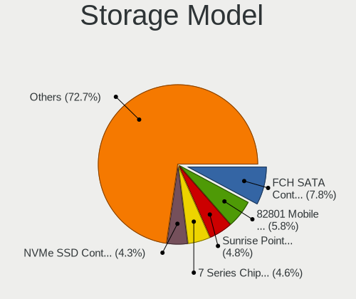
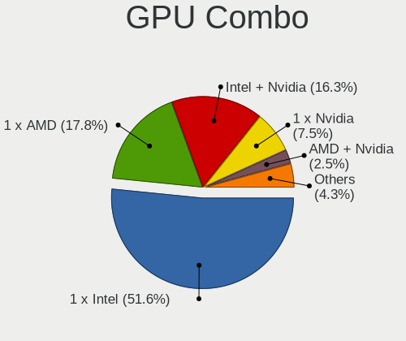
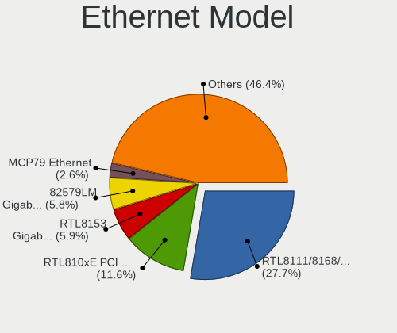
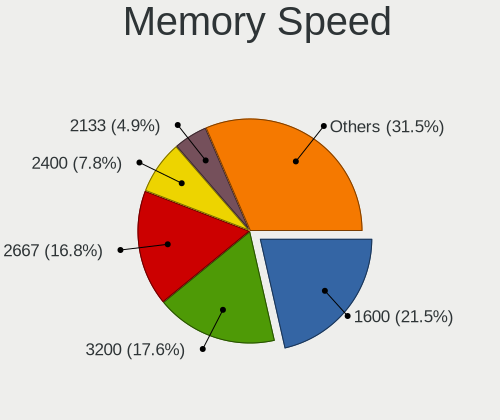

Linux in USA - Tested Hardware & Statistics (Notebooks)
-------------------------------------------------------

A project to collect tested hardware configurations for Linux in USA.

Anyone can contribute to this report by the [hw-probe](https://github.com/linuxhw/hw-probe) tool:

    sudo -E hw-probe -all -upload

Please contribute! Especially if your hardware is rare.

Contents
--------

* [ Test Cases ](#test-cases)

* [ System ](#system)
  - [ OS                       ](#os)
  - [ OS Family                ](#os-family)
  - [ Kernel                   ](#kernel)
  - [ Kernel Family            ](#kernel-family)
  - [ Kernel Major Ver.        ](#kernel-major-ver)
  - [ Arch                     ](#arch)
  - [ DE                       ](#de)
  - [ Display Server           ](#display-server)
  - [ Display Manager          ](#display-manager)
  - [ OS Lang                  ](#os-lang)
  - [ Boot Mode                ](#boot-mode)
  - [ Filesystem               ](#filesystem)
  - [ Part. scheme             ](#part-scheme)
  - [ Dual Boot with Linux/BSD ](#dual-boot-with-linuxbsd)
  - [ Dual Boot (Win)          ](#dual-boot-win)

* [ Board ](#board)
  - [ Vendor                   ](#vendor)
  - [ Model                    ](#model)
  - [ Model Family             ](#model-family)
  - [ MFG Year                 ](#mfg-year)
  - [ Form Factor              ](#form-factor)
  - [ Secure Boot              ](#secure-boot)
  - [ Coreboot                 ](#coreboot)
  - [ RAM Size                 ](#ram-size)
  - [ RAM Used                 ](#ram-used)
  - [ Total Drives             ](#total-drives)
  - [ Has CD-ROM               ](#has-cd-rom)
  - [ Has Ethernet             ](#has-ethernet)
  - [ Has WiFi                 ](#has-wifi)
  - [ Has Bluetooth            ](#has-bluetooth)

* [ Location ](#location)
  - [ Country                  ](#country)
  - [ City                     ](#city)

* [ Drives ](#drives)
  - [ Drive Vendor             ](#drive-vendor)
  - [ Drive Model              ](#drive-model)
  - [ HDD Vendor               ](#hdd-vendor)
  - [ SSD Vendor               ](#ssd-vendor)
  - [ Drive Kind               ](#drive-kind)
  - [ Drive Connector          ](#drive-connector)
  - [ Drive Size               ](#drive-size)
  - [ Space Total              ](#space-total)
  - [ Space Used               ](#space-used)
  - [ Malfunc. Drives          ](#malfunc-drives)
  - [ Malfunc. Drive Vendor    ](#malfunc-drive-vendor)
  - [ Malfunc. HDD Vendor      ](#malfunc-hdd-vendor)
  - [ Malfunc. Drive Kind      ](#malfunc-drive-kind)
  - [ Failed Drives            ](#failed-drives)
  - [ Failed Drive Vendor      ](#failed-drive-vendor)
  - [ Drive Status             ](#drive-status)

* [ Storage controller ](#storage-controller)
  - [ Storage Vendor           ](#storage-vendor)
  - [ Storage Model            ](#storage-model)
  - [ Storage Kind             ](#storage-kind)

* [ Processor ](#processor)
  - [ CPU Vendor               ](#cpu-vendor)
  - [ CPU Model                ](#cpu-model)
  - [ CPU Model Family         ](#cpu-model-family)
  - [ CPU Cores                ](#cpu-cores)
  - [ CPU Sockets              ](#cpu-sockets)
  - [ CPU Threads              ](#cpu-threads)
  - [ CPU Op-Modes             ](#cpu-op-modes)
  - [ CPU Microcode            ](#cpu-microcode)
  - [ CPU Microarch            ](#cpu-microarch)

* [ Graphics ](#graphics)
  - [ GPU Vendor               ](#gpu-vendor)
  - [ GPU Model                ](#gpu-model)
  - [ GPU Combo                ](#gpu-combo)
  - [ GPU Driver               ](#gpu-driver)
  - [ GPU Memory               ](#gpu-memory)

* [ Monitor ](#monitor)
  - [ Monitor Vendor           ](#monitor-vendor)
  - [ Monitor Model            ](#monitor-model)
  - [ Monitor Resolution       ](#monitor-resolution)
  - [ Monitor Diagonal         ](#monitor-diagonal)
  - [ Monitor Width            ](#monitor-width)
  - [ Aspect Ratio             ](#aspect-ratio)
  - [ Monitor Area             ](#monitor-area)
  - [ Pixel Density            ](#pixel-density)
  - [ Multiple Monitors        ](#multiple-monitors)

* [ Network ](#network)
  - [ Net Controller Vendor    ](#net-controller-vendor)
  - [ Net Controller Model     ](#net-controller-model)
  - [ Wireless Vendor          ](#wireless-vendor)
  - [ Wireless Model           ](#wireless-model)
  - [ Ethernet Vendor          ](#ethernet-vendor)
  - [ Ethernet Model           ](#ethernet-model)
  - [ Net Controller Kind      ](#net-controller-kind)
  - [ Used Controller          ](#used-controller)
  - [ NICs                     ](#nics)
  - [ IPv6                     ](#ipv6)

* [ Bluetooth ](#bluetooth)
  - [ Bluetooth Vendor         ](#bluetooth-vendor)
  - [ Bluetooth Model          ](#bluetooth-model)

* [ Sound ](#sound)
  - [ Sound Vendor             ](#sound-vendor)
  - [ Sound Model              ](#sound-model)

* [ Memory ](#memory)
  - [ Memory Vendor            ](#memory-vendor)
  - [ Memory Model             ](#memory-model)
  - [ Memory Kind              ](#memory-kind)
  - [ Memory Form Factor       ](#memory-form-factor)
  - [ Memory Size              ](#memory-size)
  - [ Memory Speed             ](#memory-speed)

* [ Printers & scanners ](#printers--scanners)
  - [ Printer Vendor           ](#printer-vendor)
  - [ Printer Model            ](#printer-model)
  - [ Scanner Vendor           ](#scanner-vendor)
  - [ Scanner Model            ](#scanner-model)

* [ Camera ](#camera)
  - [ Camera Vendor            ](#camera-vendor)
  - [ Camera Model             ](#camera-model)

* [ Security ](#security)
  - [ Fingerprint Vendor       ](#fingerprint-vendor)
  - [ Fingerprint Model        ](#fingerprint-model)
  - [ Chipcard Vendor          ](#chipcard-vendor)
  - [ Chipcard Model           ](#chipcard-model)

* [ Unsupported ](#unsupported)
  - [ Unsupported Devices      ](#unsupported-devices)
  - [ Unsupported Device Types ](#unsupported-device-types)

Test Cases
----------

Total: 25311

| Vendor        | Model                       | Probe                                                      | Date         |
|---------------|-----------------------------|------------------------------------------------------------|--------------|
| HP            | EliteBook 8760w             | [d061b57b29](https://linux-hardware.org/?probe=d061b57b29) | Sep 07, 2023 |
| HP            | Laptop 14-dq1xxx            | [125a7f7c0d](https://linux-hardware.org/?probe=125a7f7c0d) | Sep 07, 2023 |
| Lenovo        | ThinkPad X1 Extreme 2nd ... | [eeb4e7afd8](https://linux-hardware.org/?probe=eeb4e7afd8) | Sep 07, 2023 |
| HP            | Pavilion Gaming Laptop 1... | [5254176a5a](https://linux-hardware.org/?probe=5254176a5a) | Sep 07, 2023 |
| MSI           | Bravo 17 A4DDR              | [2592f883ef](https://linux-hardware.org/?probe=2592f883ef) | Sep 07, 2023 |
| Dell          | Latitude E6500              | [b4b035c4f7](https://linux-hardware.org/?probe=b4b035c4f7) | Sep 07, 2023 |
| ASUSTek       | ASUS TUF Dash F15 FX517Z... | [f33c62ab06](https://linux-hardware.org/?probe=f33c62ab06) | Sep 07, 2023 |
| HP            | EliteBook 2740p             | [0bada236bc](https://linux-hardware.org/?probe=0bada236bc) | Sep 07, 2023 |
| HP            | Laptop 14-dk1xxx            | [c7bea10745](https://linux-hardware.org/?probe=c7bea10745) | Sep 07, 2023 |
| Apple         | MacBookAir8,2               | [e9e8da1eea](https://linux-hardware.org/?probe=e9e8da1eea) | Sep 06, 2023 |
| HP            | ProBook 445 G7              | [373ba724e4](https://linux-hardware.org/?probe=373ba724e4) | Sep 06, 2023 |
| Lenovo        | Legion 5 15ARH05H 82B1      | [84368e642c](https://linux-hardware.org/?probe=84368e642c) | Sep 06, 2023 |
| Dell          | Inspiron 15 7000 Gaming     | [6192c839f5](https://linux-hardware.org/?probe=6192c839f5) | Sep 06, 2023 |
| GPU Compan... | GWNR71517                   | [b6a521128f](https://linux-hardware.org/?probe=b6a521128f) | Sep 06, 2023 |
| HP            | ProBook 6470b               | [4bb5a6911f](https://linux-hardware.org/?probe=4bb5a6911f) | Sep 06, 2023 |
| Dell          | Inspiron 5559               | [0428af4d14](https://linux-hardware.org/?probe=0428af4d14) | Sep 06, 2023 |
| System76      | Pangolin                    | [43dbf49440](https://linux-hardware.org/?probe=43dbf49440) | Sep 06, 2023 |
| HP            | ProBook 650 G5              | [5e6e5cd047](https://linux-hardware.org/?probe=5e6e5cd047) | Sep 06, 2023 |
| HP            | EliteBook 845 14 inch G9... | [6c4c9936b0](https://linux-hardware.org/?probe=6c4c9936b0) | Sep 06, 2023 |
| ASUSTek       | Zephyrus S GX502GV_GX502... | [3429c55014](https://linux-hardware.org/?probe=3429c55014) | Sep 06, 2023 |
| ASUSTek       | Zephyrus S GX502GV_GX502... | [72fb0f052e](https://linux-hardware.org/?probe=72fb0f052e) | Sep 06, 2023 |
| Lenovo        | Legion Pro 7 16IRX8 82WR    | [f946665a24](https://linux-hardware.org/?probe=f946665a24) | Sep 06, 2023 |
| Lenovo        | ThinkPad X1 Extreme 2nd ... | [3fe52a0e75](https://linux-hardware.org/?probe=3fe52a0e75) | Sep 06, 2023 |
| Notebook      | W230SS                      | [3d9af4f57a](https://linux-hardware.org/?probe=3d9af4f57a) | Sep 06, 2023 |
| Acer          | Swift SFX14-41G             | [611bb4fe1a](https://linux-hardware.org/?probe=611bb4fe1a) | Sep 06, 2023 |
| Dell          | Precision 5570              | [9baca62616](https://linux-hardware.org/?probe=9baca62616) | Sep 06, 2023 |
| MSI           | MS-7995                     | [3269e143a3](https://linux-hardware.org/?probe=3269e143a3) | Sep 06, 2023 |
| Dell          | Inspiron 5567               | [56c33713a8](https://linux-hardware.org/?probe=56c33713a8) | Sep 06, 2023 |
| HP            | Laptop 15-dy1xxx            | [99dd75f86a](https://linux-hardware.org/?probe=99dd75f86a) | Sep 05, 2023 |
| Purism        | Librem 15 v3                | [d3a66abc8b](https://linux-hardware.org/?probe=d3a66abc8b) | Sep 05, 2023 |
| Acer          | Swift SFX14-41G             | [38f9d1abd9](https://linux-hardware.org/?probe=38f9d1abd9) | Sep 05, 2023 |
| Acer          | Aspire E5-575G              | [054c5e3dc5](https://linux-hardware.org/?probe=054c5e3dc5) | Sep 05, 2023 |
| HP            | ZBook Studio G3             | [208f21a716](https://linux-hardware.org/?probe=208f21a716) | Sep 05, 2023 |
| HP            | EliteBook 845 14 inch G9... | [25ec8e4a16](https://linux-hardware.org/?probe=25ec8e4a16) | Sep 05, 2023 |
| Dell          | Latitude E5570              | [10d8ad7a3d](https://linux-hardware.org/?probe=10d8ad7a3d) | Sep 05, 2023 |
| HP            | Laptop 15-da0xxx            | [326d057e96](https://linux-hardware.org/?probe=326d057e96) | Sep 05, 2023 |
| Framework     | Laptop (13th Gen Intel C... | [1bcf7b95c6](https://linux-hardware.org/?probe=1bcf7b95c6) | Sep 05, 2023 |
| System76      | Pangolin                    | [461b8d48ba](https://linux-hardware.org/?probe=461b8d48ba) | Sep 05, 2023 |
| ASUSTek       | E402SA                      | [efad2958a0](https://linux-hardware.org/?probe=efad2958a0) | Sep 05, 2023 |
| Dell          | Precision 7740              | [392ca47879](https://linux-hardware.org/?probe=392ca47879) | Sep 05, 2023 |
| Lenovo        | ThinkPad T490 20N2001YUS    | [75c15ac2e8](https://linux-hardware.org/?probe=75c15ac2e8) | Sep 05, 2023 |
| Panasonic     | CF-C2CUGZXKM                | [12ed8aee3f](https://linux-hardware.org/?probe=12ed8aee3f) | Sep 05, 2023 |
| Panasonic     | CF-C2CUGZXKM                | [fdcab89946](https://linux-hardware.org/?probe=fdcab89946) | Sep 05, 2023 |
| Toshiba       | Satellite L455D             | [1d49ff24ad](https://linux-hardware.org/?probe=1d49ff24ad) | Sep 05, 2023 |
| Apple         | MacBookPro16,3              | [7f61d6c898](https://linux-hardware.org/?probe=7f61d6c898) | Sep 05, 2023 |
| Apple         | MacBookPro11,4              | [1cd7fc15b1](https://linux-hardware.org/?probe=1cd7fc15b1) | Sep 05, 2023 |
| Dell          | Precision 5680              | [fdcb7ce5d4](https://linux-hardware.org/?probe=fdcb7ce5d4) | Sep 05, 2023 |
| Dell          | XPS 13 7390                 | [5154be8883](https://linux-hardware.org/?probe=5154be8883) | Sep 05, 2023 |
| MSI           | GS75 Stealth 8SG            | [fc603fc196](https://linux-hardware.org/?probe=fc603fc196) | Sep 05, 2023 |
| HP            | EliteBook 845 G7 Noteboo... | [0131d0a313](https://linux-hardware.org/?probe=0131d0a313) | Sep 05, 2023 |
| Apple         | MacBookPro16,2              | [b47ac62db2](https://linux-hardware.org/?probe=b47ac62db2) | Sep 05, 2023 |
| Apple         | MacBookPro10,1              | [11c016fb1b](https://linux-hardware.org/?probe=11c016fb1b) | Sep 05, 2023 |
| Gigabyte      | AORUS 17 XE4                | [7987abcc44](https://linux-hardware.org/?probe=7987abcc44) | Sep 04, 2023 |
| Apple         | MacBookPro9,2               | [106e2d1e98](https://linux-hardware.org/?probe=106e2d1e98) | Sep 04, 2023 |
| Lenovo        | ThinkPad T470 20HD000RUS    | [f7250cb3ae](https://linux-hardware.org/?probe=f7250cb3ae) | Sep 04, 2023 |
| Dell          | Precision 5570              | [abddf843dd](https://linux-hardware.org/?probe=abddf843dd) | Sep 04, 2023 |
| ASUSTek       | VivoBook_ASUSLaptop M160... | [08e7b606c8](https://linux-hardware.org/?probe=08e7b606c8) | Sep 04, 2023 |
| Apple         | MacBookPro8,2               | [371c148953](https://linux-hardware.org/?probe=371c148953) | Sep 04, 2023 |
| HP            | Pavilion dv9000 (RP249UA... | [ea5e3bac5f](https://linux-hardware.org/?probe=ea5e3bac5f) | Sep 04, 2023 |
| Dell          | Latitude E6530              | [e1aa22b8b9](https://linux-hardware.org/?probe=e1aa22b8b9) | Sep 04, 2023 |
| Acer          | Aspire A315-24P             | [d082fdd668](https://linux-hardware.org/?probe=d082fdd668) | Sep 04, 2023 |
| Dell          | Inspiron 16 5625            | [f3cbaf1a86](https://linux-hardware.org/?probe=f3cbaf1a86) | Sep 04, 2023 |
| Dell          | Inspiron 16 5625            | [b0e01251ca](https://linux-hardware.org/?probe=b0e01251ca) | Sep 04, 2023 |
| Dell          | XPS 13 9380                 | [94e7b43fe2](https://linux-hardware.org/?probe=94e7b43fe2) | Sep 04, 2023 |
| Valve         | Jupiter                     | [20541373d1](https://linux-hardware.org/?probe=20541373d1) | Sep 04, 2023 |
| Dell          | Vostro 15 5510              | [7223b751c4](https://linux-hardware.org/?probe=7223b751c4) | Sep 04, 2023 |
| Acer          | Predator G3-571             | [972f320a9d](https://linux-hardware.org/?probe=972f320a9d) | Sep 04, 2023 |
| Dell          | Inspiron 7537               | [036c877144](https://linux-hardware.org/?probe=036c877144) | Sep 04, 2023 |
| Lenovo        | ThinkPad L14 Gen 1 20U10... | [68e90ee0cb](https://linux-hardware.org/?probe=68e90ee0cb) | Sep 04, 2023 |
| Unknown       | Unknown                     | [9441e027c6](https://linux-hardware.org/?probe=9441e027c6) | Sep 04, 2023 |
| Valve         | Jupiter                     | [fb306539b2](https://linux-hardware.org/?probe=fb306539b2) | Sep 04, 2023 |
| HP            | Pavilion g7                 | [a2a69279d6](https://linux-hardware.org/?probe=a2a69279d6) | Sep 04, 2023 |
| ASUSTek       | N56JN                       | [eb9458de08](https://linux-hardware.org/?probe=eb9458de08) | Sep 04, 2023 |
| Dell          | Inspiron 5759               | [8a8a236a44](https://linux-hardware.org/?probe=8a8a236a44) | Sep 04, 2023 |
| Dell          | Latitude 5480               | [3a25585a10](https://linux-hardware.org/?probe=3a25585a10) | Sep 04, 2023 |
| Apple         | MacBookAir5,1               | [e24382ee44](https://linux-hardware.org/?probe=e24382ee44) | Sep 04, 2023 |
| Dell          | Latitude E6500              | [6199709334](https://linux-hardware.org/?probe=6199709334) | Sep 04, 2023 |
| ASUSTek       | ASUSLaptop_Q540VJ           | [39ed316bb6](https://linux-hardware.org/?probe=39ed316bb6) | Sep 03, 2023 |
| Valve         | Jupiter                     | [e172cd5895](https://linux-hardware.org/?probe=e172cd5895) | Sep 03, 2023 |
| ASUSTek       | Zenbook UX3404VA_Q420VA     | [f9ae8ae2db](https://linux-hardware.org/?probe=f9ae8ae2db) | Sep 03, 2023 |
| HP            | OMEN by Laptop              | [a135074689](https://linux-hardware.org/?probe=a135074689) | Sep 03, 2023 |
| ASUSTek       | X555LAB                     | [b8aba55b59](https://linux-hardware.org/?probe=b8aba55b59) | Sep 03, 2023 |
| Dell          | Latitude 5414               | [704d861366](https://linux-hardware.org/?probe=704d861366) | Sep 03, 2023 |
| HP            | OMEN by Laptop 17-an0xx     | [884eaad43c](https://linux-hardware.org/?probe=884eaad43c) | Sep 03, 2023 |
| Apple         | MacBookPro9,2               | [a6d272539a](https://linux-hardware.org/?probe=a6d272539a) | Sep 03, 2023 |
| Dell          | Latitude 5410               | [e45d7975d2](https://linux-hardware.org/?probe=e45d7975d2) | Sep 03, 2023 |
| Acer          | Aspire ES1-711              | [36b5fac615](https://linux-hardware.org/?probe=36b5fac615) | Sep 03, 2023 |
| Unknown       | Unknown                     | [8d7616fae8](https://linux-hardware.org/?probe=8d7616fae8) | Sep 03, 2023 |
| Valve         | Jupiter                     | [413ea68e2d](https://linux-hardware.org/?probe=413ea68e2d) | Sep 03, 2023 |
| HP            | Pavilion Gaming Laptop 1... | [858212c01d](https://linux-hardware.org/?probe=858212c01d) | Sep 03, 2023 |
| HP            | Laptop 14-fq0xxx            | [d68ec21cac](https://linux-hardware.org/?probe=d68ec21cac) | Sep 03, 2023 |
| Acer          | Aspire 5349                 | [62f941ff29](https://linux-hardware.org/?probe=62f941ff29) | Sep 03, 2023 |
| Lenovo        | IdeaPad Flex-14API 81SS     | [b9c93a8c15](https://linux-hardware.org/?probe=b9c93a8c15) | Sep 03, 2023 |
| Valve         | Jupiter                     | [0f61122c7a](https://linux-hardware.org/?probe=0f61122c7a) | Sep 03, 2023 |
| Dell          | Inspiron N4010              | [78f4fd9711](https://linux-hardware.org/?probe=78f4fd9711) | Sep 03, 2023 |
| Dell          | Latitude E6500              | [308d8d0f19](https://linux-hardware.org/?probe=308d8d0f19) | Sep 03, 2023 |
| HP            | Pavilion dv5                | [977c253ff5](https://linux-hardware.org/?probe=977c253ff5) | Sep 02, 2023 |
| Dell          | Latitude E6410              | [bd6242d5b8](https://linux-hardware.org/?probe=bd6242d5b8) | Sep 02, 2023 |
| Lenovo        | IdeaPad S540-13IML 81XA     | [246a993eb7](https://linux-hardware.org/?probe=246a993eb7) | Sep 02, 2023 |
| Dell          | Latitude E6410              | [9e2aa5e0e5](https://linux-hardware.org/?probe=9e2aa5e0e5) | Sep 02, 2023 |
| Alienware     | m15 R3                      | [c2e00a5341](https://linux-hardware.org/?probe=c2e00a5341) | Sep 02, 2023 |
| Unknown       | Unknown                     | [c72be678a2](https://linux-hardware.org/?probe=c72be678a2) | Sep 02, 2023 |
| HP            | ProBook 4540s               | [816a4241fb](https://linux-hardware.org/?probe=816a4241fb) | Sep 02, 2023 |
| Dell          | Latitude E6540              | [f9e2147255](https://linux-hardware.org/?probe=f9e2147255) | Sep 02, 2023 |
| Apple         | MacBookPro11,4              | [ac1293fbf6](https://linux-hardware.org/?probe=ac1293fbf6) | Sep 02, 2023 |
| Apple         | MacBookPro11,4              | [1273e75666](https://linux-hardware.org/?probe=1273e75666) | Sep 02, 2023 |
| Lenovo        | ThinkPad T460s 20F9003CU... | [8c94711a27](https://linux-hardware.org/?probe=8c94711a27) | Sep 02, 2023 |
| HP            | Stream Laptop 14-cb1xxx     | [515e1f4bce](https://linux-hardware.org/?probe=515e1f4bce) | Sep 02, 2023 |
| Dell          | Latitude 5400               | [aac8791780](https://linux-hardware.org/?probe=aac8791780) | Sep 02, 2023 |
| Dell          | Inspiron 5720               | [9b802cfff6](https://linux-hardware.org/?probe=9b802cfff6) | Sep 02, 2023 |
| ASUSTek       | TUF Gaming FX505DU_TUF50... | [dd49edce58](https://linux-hardware.org/?probe=dd49edce58) | Sep 02, 2023 |
| Valve         | Jupiter                     | [df8dfd608f](https://linux-hardware.org/?probe=df8dfd608f) | Sep 02, 2023 |
| Dell          | Inspiron 1545               | [8ba55e98ec](https://linux-hardware.org/?probe=8ba55e98ec) | Sep 02, 2023 |
| Valve         | Jupiter                     | [8313f463cf](https://linux-hardware.org/?probe=8313f463cf) | Sep 02, 2023 |
| Dell          | XPS 15 9500                 | [88b6546b70](https://linux-hardware.org/?probe=88b6546b70) | Sep 01, 2023 |
| Dell          | Precision 7560              | [d9d73d82f2](https://linux-hardware.org/?probe=d9d73d82f2) | Sep 01, 2023 |
| ASUSTek       | X555LJ                      | [571cdd8ecf](https://linux-hardware.org/?probe=571cdd8ecf) | Sep 01, 2023 |
| Lenovo        | ThinkPad 11e 5th Gen 20L... | [f7e029febe](https://linux-hardware.org/?probe=f7e029febe) | Sep 01, 2023 |
| GPU Compan... | GWTC116-2                   | [455a21dde9](https://linux-hardware.org/?probe=455a21dde9) | Sep 01, 2023 |
| Sony          | SVS1512DCXB                 | [b712723d6c](https://linux-hardware.org/?probe=b712723d6c) | Sep 01, 2023 |
| HP            | EliteBook 8440p             | [2107ba0ad7](https://linux-hardware.org/?probe=2107ba0ad7) | Sep 01, 2023 |
| Apple         | MacBookAir4,1               | [61da3436a8](https://linux-hardware.org/?probe=61da3436a8) | Sep 01, 2023 |
| Dell          | Inspiron 13-7353            | [021bbea0d4](https://linux-hardware.org/?probe=021bbea0d4) | Sep 01, 2023 |
| Acer          | Swift SFX14-41G             | [67f553625a](https://linux-hardware.org/?probe=67f553625a) | Sep 01, 2023 |
| Lenovo        | Legion Pro 7 16IRX8 82WR    | [239b46961f](https://linux-hardware.org/?probe=239b46961f) | Sep 01, 2023 |
| Lenovo        | IdeaPad Y510P 20217         | [10951f0a65](https://linux-hardware.org/?probe=10951f0a65) | Sep 01, 2023 |
| Lenovo        | IdeaPad Y510P 20217         | [ac6c5c8969](https://linux-hardware.org/?probe=ac6c5c8969) | Sep 01, 2023 |
| Lenovo        | IdeaPad 3 14ALC6 82KT       | [9de67aa419](https://linux-hardware.org/?probe=9de67aa419) | Sep 01, 2023 |
| Toshiba       | Satellite P55t-C            | [3dd1896d54](https://linux-hardware.org/?probe=3dd1896d54) | Sep 01, 2023 |
| Lenovo        | ThinkPad X270 20HMS6AT00    | [e111bad271](https://linux-hardware.org/?probe=e111bad271) | Sep 01, 2023 |
| Lenovo        | IdeaPad 3 15ITL6 82H8       | [499b5c3b2f](https://linux-hardware.org/?probe=499b5c3b2f) | Sep 01, 2023 |
| Lenovo        | ThinkPad L390 20NR000FUS    | [b4d7adfb97](https://linux-hardware.org/?probe=b4d7adfb97) | Sep 01, 2023 |
| ASUSTek       | VivoBook_ASUSLaptop X712... | [082d8a2ebf](https://linux-hardware.org/?probe=082d8a2ebf) | Sep 01, 2023 |
| Dell          | Latitude 3320               | [7c40b4eb0d](https://linux-hardware.org/?probe=7c40b4eb0d) | Sep 01, 2023 |
| Dynabook      | TECRA A50-J                 | [0b59bbf6db](https://linux-hardware.org/?probe=0b59bbf6db) | Sep 01, 2023 |
| Dynabook      | TECRA A50-J                 | [4ea2422b26](https://linux-hardware.org/?probe=4ea2422b26) | Sep 01, 2023 |
| Lenovo        | ThinkPad T450 20BUS0B000    | [1213d3bf46](https://linux-hardware.org/?probe=1213d3bf46) | Aug 31, 2023 |
| Apple         | MacBook9,1                  | [b6a28c1e1a](https://linux-hardware.org/?probe=b6a28c1e1a) | Aug 31, 2023 |
| Valve         | Jupiter                     | [4a61e467d0](https://linux-hardware.org/?probe=4a61e467d0) | Aug 31, 2023 |
| Apple         | MacBookAir6,2               | [783d0f51f5](https://linux-hardware.org/?probe=783d0f51f5) | Aug 31, 2023 |
| Lenovo        | ThinkPad 13 2nd Gen 20J1... | [f98a2afc33](https://linux-hardware.org/?probe=f98a2afc33) | Aug 31, 2023 |
| Toshiba       | Satellite S75-B             | [2ffc319636](https://linux-hardware.org/?probe=2ffc319636) | Aug 31, 2023 |
| Lenovo        | ThinkPad X220 4290EC9       | [6ebd4f0bbf](https://linux-hardware.org/?probe=6ebd4f0bbf) | Aug 31, 2023 |
| Lenovo        | IdeaPad 320-15ABR 80XS      | [a5847ee104](https://linux-hardware.org/?probe=a5847ee104) | Aug 31, 2023 |
| Dell          | XPS 9315                    | [5676f0c210](https://linux-hardware.org/?probe=5676f0c210) | Aug 31, 2023 |
| Lenovo        | Legion Y920-17IKB Laptop... | [5976d2d9e9](https://linux-hardware.org/?probe=5976d2d9e9) | Aug 31, 2023 |
| Framework     | Laptop (12th Gen Intel C... | [3b890e064f](https://linux-hardware.org/?probe=3b890e064f) | Aug 31, 2023 |
| Lenovo        | ThinkPad T480s 20L70025U... | [917664de79](https://linux-hardware.org/?probe=917664de79) | Aug 31, 2023 |
| Lenovo        | ThinkPad T480s 20L70028U... | [b065e9bda2](https://linux-hardware.org/?probe=b065e9bda2) | Aug 31, 2023 |
| Dell          | G3 3590                     | [810c7d1698](https://linux-hardware.org/?probe=810c7d1698) | Aug 31, 2023 |
| Sony          | VPCEC390X                   | [ddad567e2a](https://linux-hardware.org/?probe=ddad567e2a) | Aug 31, 2023 |
| Notebook      | W230SS                      | [97cc6cc17f](https://linux-hardware.org/?probe=97cc6cc17f) | Aug 31, 2023 |
| Google        | Kefka                       | [284517c2b3](https://linux-hardware.org/?probe=284517c2b3) | Aug 31, 2023 |
| ASUSTek       | X555LJ                      | [49b0bd793d](https://linux-hardware.org/?probe=49b0bd793d) | Aug 31, 2023 |
| Lenovo        | ThinkPad E575 20H8000HUS    | [6af4b49ea2](https://linux-hardware.org/?probe=6af4b49ea2) | Aug 31, 2023 |
| Google        | Enguarde                    | [d67a18c110](https://linux-hardware.org/?probe=d67a18c110) | Aug 30, 2023 |
| HP            | OMEN by Gaming Laptop 16... | [b68a6514c4](https://linux-hardware.org/?probe=b68a6514c4) | Aug 30, 2023 |
| Acer          | Aspire V3-112P              | [d0d0600273](https://linux-hardware.org/?probe=d0d0600273) | Aug 30, 2023 |
| Sony          | VPCEE23FX                   | [65714e4d48](https://linux-hardware.org/?probe=65714e4d48) | Aug 30, 2023 |
| ASUSTek       | X555LAB                     | [ce793ccb8d](https://linux-hardware.org/?probe=ce793ccb8d) | Aug 30, 2023 |
| Dell          | Inspiron 16 7610            | [57c65a2bc8](https://linux-hardware.org/?probe=57c65a2bc8) | Aug 30, 2023 |
| HP            | ProBook 440 14 inch G9 N... | [b37cf7f8cf](https://linux-hardware.org/?probe=b37cf7f8cf) | Aug 30, 2023 |
| HP            | EliteBook 845 14 inch G9... | [4c595a576a](https://linux-hardware.org/?probe=4c595a576a) | Aug 30, 2023 |
| HP            | Compaq Presario CQ60        | [ac9c55fcb3](https://linux-hardware.org/?probe=ac9c55fcb3) | Aug 30, 2023 |
| Dell          | Latitude E6440              | [0b63ef8851](https://linux-hardware.org/?probe=0b63ef8851) | Aug 30, 2023 |
| Lenovo        | Legion 5 Pro 16ACH6H 82J... | [aa23e296ad](https://linux-hardware.org/?probe=aa23e296ad) | Aug 30, 2023 |
| HP            | ZBook 15 G3                 | [d88312e34b](https://linux-hardware.org/?probe=d88312e34b) | Aug 30, 2023 |
| HP            | ZBook 15 G3                 | [7943c070cc](https://linux-hardware.org/?probe=7943c070cc) | Aug 30, 2023 |
| Google        | Liara                       | [e92684405f](https://linux-hardware.org/?probe=e92684405f) | Aug 30, 2023 |
| Google        | Kefka                       | [a018ae3fb5](https://linux-hardware.org/?probe=a018ae3fb5) | Aug 30, 2023 |
| Lenovo        | ThinkPad X1 Extreme Gen ... | [15c048cb00](https://linux-hardware.org/?probe=15c048cb00) | Aug 30, 2023 |
| HP            | Dragonfly Pro Laptop PC     | [2b08121ea1](https://linux-hardware.org/?probe=2b08121ea1) | Aug 30, 2023 |
| Lenovo        | Slim 7 ProX 14ARH7 82V2     | [d37f105f74](https://linux-hardware.org/?probe=d37f105f74) | Aug 30, 2023 |
| Google        | Enguarde                    | [08ff2764b2](https://linux-hardware.org/?probe=08ff2764b2) | Aug 30, 2023 |
| HP            | Pavilion Laptop 15-cw0xx... | [90a72df8ef](https://linux-hardware.org/?probe=90a72df8ef) | Aug 29, 2023 |
| HP            | Laptop 17-by0xxx            | [4617fe766a](https://linux-hardware.org/?probe=4617fe766a) | Aug 29, 2023 |
| Apple         | MacBook4,1                  | [04424409ef](https://linux-hardware.org/?probe=04424409ef) | Aug 29, 2023 |
| ASUSTek       | ROG Zephyrus G15 GA503RW... | [7d74c2bc61](https://linux-hardware.org/?probe=7d74c2bc61) | Aug 29, 2023 |
| ASUSTek       | ROG Zephyrus G15 GA503RW... | [dcceb74a56](https://linux-hardware.org/?probe=dcceb74a56) | Aug 29, 2023 |
| Unknown       | Unknown                     | [3718299cea](https://linux-hardware.org/?probe=3718299cea) | Aug 29, 2023 |
| Google        | Enguarde                    | [e2e5a3dadc](https://linux-hardware.org/?probe=e2e5a3dadc) | Aug 29, 2023 |
| Dell          | Latitude 5480               | [88c6621b31](https://linux-hardware.org/?probe=88c6621b31) | Aug 29, 2023 |
| Google        | Enguarde                    | [e7a59ac286](https://linux-hardware.org/?probe=e7a59ac286) | Aug 29, 2023 |
| Valve         | Jupiter                     | [ea71d4832d](https://linux-hardware.org/?probe=ea71d4832d) | Aug 29, 2023 |
| Lenovo        | Legion 5 15ACH6 82JW        | [265430a40c](https://linux-hardware.org/?probe=265430a40c) | Aug 29, 2023 |
| Lenovo        | IdeaPad 1 15ADA7 82R1       | [9ed16c423b](https://linux-hardware.org/?probe=9ed16c423b) | Aug 29, 2023 |
| Dell          | Precision 7710              | [9b92626f63](https://linux-hardware.org/?probe=9b92626f63) | Aug 29, 2023 |
| Lenovo        | IdeaPad 3 14ALC6 82KT       | [fc7834595f](https://linux-hardware.org/?probe=fc7834595f) | Aug 29, 2023 |
| Apple         | MacBookPro11,3              | [561b652278](https://linux-hardware.org/?probe=561b652278) | Aug 29, 2023 |
| Lenovo        | ThinkPad T430s 2356CU8      | [2f669d797f](https://linux-hardware.org/?probe=2f669d797f) | Aug 29, 2023 |
| Lenovo        | ThinkPad T430s 2356CU8      | [39f2feeed5](https://linux-hardware.org/?probe=39f2feeed5) | Aug 29, 2023 |
| HP            | ZBook Studio G3             | [bdaea6156d](https://linux-hardware.org/?probe=bdaea6156d) | Aug 29, 2023 |
| GPU Compan... | GWNC21524                   | [4a38e28073](https://linux-hardware.org/?probe=4a38e28073) | Aug 29, 2023 |
| Valve         | Jupiter                     | [b23a3244d0](https://linux-hardware.org/?probe=b23a3244d0) | Aug 29, 2023 |
| HP            | Pavilion TS Sleekbook 14    | [c7108a7a23](https://linux-hardware.org/?probe=c7108a7a23) | Aug 29, 2023 |
| Valve         | Jupiter                     | [fff7e4f400](https://linux-hardware.org/?probe=fff7e4f400) | Aug 29, 2023 |
| HP            | Pavilion Laptop 15t-eg30... | [aa2e067c2d](https://linux-hardware.org/?probe=aa2e067c2d) | Aug 29, 2023 |
| Lenovo        | Legion 5 Pro 16ITH6 82JF    | [0ccccd5c9d](https://linux-hardware.org/?probe=0ccccd5c9d) | Aug 28, 2023 |
| Panasonic     | CF-54-2                     | [7d2f4f34c9](https://linux-hardware.org/?probe=7d2f4f34c9) | Aug 28, 2023 |
| HP            | ZBook 14 G2                 | [e56fcd0532](https://linux-hardware.org/?probe=e56fcd0532) | Aug 28, 2023 |
| Acer          | Aspire 7250                 | [5cae957ee6](https://linux-hardware.org/?probe=5cae957ee6) | Aug 28, 2023 |
| HP            | Laptop 14-dq1xxx            | [8e13da67ed](https://linux-hardware.org/?probe=8e13da67ed) | Aug 28, 2023 |
| HP            | ProBook 640 G2              | [456146b506](https://linux-hardware.org/?probe=456146b506) | Aug 28, 2023 |
| HP            | ProBook 640 G2              | [2679609644](https://linux-hardware.org/?probe=2679609644) | Aug 28, 2023 |
| Lenovo        | Yoga 3 14 80JH              | [5268d75df2](https://linux-hardware.org/?probe=5268d75df2) | Aug 28, 2023 |
| Dell          | XPS 15 7590                 | [ef97f75590](https://linux-hardware.org/?probe=ef97f75590) | Aug 28, 2023 |
| Apple         | MacBookPro9,2               | [11d516749d](https://linux-hardware.org/?probe=11d516749d) | Aug 28, 2023 |
| Apple         | MacBookPro9,2               | [960039f680](https://linux-hardware.org/?probe=960039f680) | Aug 28, 2023 |
| Lenovo        | ThinkPad T14s Gen 2i 20W... | [101a39c37a](https://linux-hardware.org/?probe=101a39c37a) | Aug 28, 2023 |
| ASUSTek       | ROG Strix G733PY_G733PY     | [b886de0613](https://linux-hardware.org/?probe=b886de0613) | Aug 28, 2023 |
| HP            | ProBook 6550b               | [2906ded48c](https://linux-hardware.org/?probe=2906ded48c) | Aug 28, 2023 |
| Dell          | Inspiron 3537               | [2b79052692](https://linux-hardware.org/?probe=2b79052692) | Aug 28, 2023 |
| Google        | Banjo                       | [fcac9f460e](https://linux-hardware.org/?probe=fcac9f460e) | Aug 28, 2023 |
| HP            | 15 Notebook PC              | [bb75fbb42b](https://linux-hardware.org/?probe=bb75fbb42b) | Aug 28, 2023 |
| Lenovo        | ThinkPad T470 20HES2RC00    | [390104a086](https://linux-hardware.org/?probe=390104a086) | Aug 28, 2023 |
| HP            | Laptop 15-ef0xxx            | [b948af0216](https://linux-hardware.org/?probe=b948af0216) | Aug 27, 2023 |
| Dell          | Inspiron 1501               | [a021a98920](https://linux-hardware.org/?probe=a021a98920) | Aug 27, 2023 |
| Framework     | Laptop                      | [b3e9d2d48d](https://linux-hardware.org/?probe=b3e9d2d48d) | Aug 27, 2023 |
| Dell          | Precision 5510              | [c6d08d9c28](https://linux-hardware.org/?probe=c6d08d9c28) | Aug 27, 2023 |
| Dell          | Wyse 5470                   | [6d45205020](https://linux-hardware.org/?probe=6d45205020) | Aug 27, 2023 |
| HP            | EliteBook 865 16 inch G9... | [b07775a194](https://linux-hardware.org/?probe=b07775a194) | Aug 27, 2023 |
| HP            | Laptop 15-db0xxx            | [2c0f5739a3](https://linux-hardware.org/?probe=2c0f5739a3) | Aug 27, 2023 |
| Valve         | Jupiter                     | [fda85e8d96](https://linux-hardware.org/?probe=fda85e8d96) | Aug 27, 2023 |
| System76      | Gazelle                     | [83bc87f8fc](https://linux-hardware.org/?probe=83bc87f8fc) | Aug 27, 2023 |
| HP            | EliteBook 840 G5            | [cd64a75511](https://linux-hardware.org/?probe=cd64a75511) | Aug 27, 2023 |
| HP            | Compaq nx6325 (EN188UT#A... | [4324feffa1](https://linux-hardware.org/?probe=4324feffa1) | Aug 27, 2023 |
| Toshiba       | Satellite C55-A             | [20dc6d4044](https://linux-hardware.org/?probe=20dc6d4044) | Aug 27, 2023 |
| Valve         | Jupiter                     | [11f20f1134](https://linux-hardware.org/?probe=11f20f1134) | Aug 27, 2023 |
| Dell          | Precision M4700             | [c65acacce9](https://linux-hardware.org/?probe=c65acacce9) | Aug 27, 2023 |
| Google        | Epaulette                   | [2633079a97](https://linux-hardware.org/?probe=2633079a97) | Aug 27, 2023 |
| Samsung       | R530/R730/R540              | [1112486ef3](https://linux-hardware.org/?probe=1112486ef3) | Aug 27, 2023 |
| Dell          | XPS 13 9310                 | [9dddd0c80b](https://linux-hardware.org/?probe=9dddd0c80b) | Aug 27, 2023 |
| Dell          | Inspiron 5570               | [0baf10cd76](https://linux-hardware.org/?probe=0baf10cd76) | Aug 27, 2023 |
| Apple         | MacBookPro9,2               | [f1422f4092](https://linux-hardware.org/?probe=f1422f4092) | Aug 27, 2023 |
| Samsung       | R530/R730/R540              | [99e5a7a753](https://linux-hardware.org/?probe=99e5a7a753) | Aug 27, 2023 |
| Dell          | Latitude E5470              | [b1efa66e79](https://linux-hardware.org/?probe=b1efa66e79) | Aug 27, 2023 |
| HUAWEI        | CREF-XX                     | [2d9703804d](https://linux-hardware.org/?probe=2d9703804d) | Aug 27, 2023 |
| HP            | Pavilion 15                 | [1731ba4ae5](https://linux-hardware.org/?probe=1731ba4ae5) | Aug 27, 2023 |
| HP            | Pavilion 15                 | [0f51268684](https://linux-hardware.org/?probe=0f51268684) | Aug 27, 2023 |
| Dell          | Precision M4700             | [8f4eef8a36](https://linux-hardware.org/?probe=8f4eef8a36) | Aug 27, 2023 |
| Framework     | Laptop (12th Gen Intel C... | [cfbb311c97](https://linux-hardware.org/?probe=cfbb311c97) | Aug 27, 2023 |
| Lenovo        | ThinkPad X1 Carbon Gen 1... | [a8600db157](https://linux-hardware.org/?probe=a8600db157) | Aug 27, 2023 |
| Lenovo        | ThinkPad P50 20ENCTO1WW     | [80851b7836](https://linux-hardware.org/?probe=80851b7836) | Aug 27, 2023 |
| Apple         | MacBookPro6,2               | [e25e18e9b1](https://linux-hardware.org/?probe=e25e18e9b1) | Aug 27, 2023 |
| Valve         | Jupiter                     | [41823ead70](https://linux-hardware.org/?probe=41823ead70) | Aug 27, 2023 |
| Valve         | Jupiter                     | [3c1874890b](https://linux-hardware.org/?probe=3c1874890b) | Aug 26, 2023 |
| Google        | Nautilus                    | [3f96b35cae](https://linux-hardware.org/?probe=3f96b35cae) | Aug 26, 2023 |
| Lenovo        | IdeaPad Z570 1024DCU        | [8a11757d37](https://linux-hardware.org/?probe=8a11757d37) | Aug 26, 2023 |
| Dell          | Inspiron 5558               | [bf1d0a62ed](https://linux-hardware.org/?probe=bf1d0a62ed) | Aug 26, 2023 |
| Panasonic     | CF53-4                      | [6228d53ef2](https://linux-hardware.org/?probe=6228d53ef2) | Aug 26, 2023 |
| HP            | 2000                        | [a63dd6e0f1](https://linux-hardware.org/?probe=a63dd6e0f1) | Aug 26, 2023 |
| Apple         | MacBookPro8,1               | [4f185f17ec](https://linux-hardware.org/?probe=4f185f17ec) | Aug 26, 2023 |
| Lenovo        | Legion 5 15ARH05H 82B1      | [5b1ded5f9e](https://linux-hardware.org/?probe=5b1ded5f9e) | Aug 26, 2023 |
| Lenovo        | ThinkPad P50 20EN001CUS     | [ba41fd65f9](https://linux-hardware.org/?probe=ba41fd65f9) | Aug 26, 2023 |
| Lenovo        | ThinkPad P50 20EN001CUS     | [e4e1b91970](https://linux-hardware.org/?probe=e4e1b91970) | Aug 26, 2023 |
| Apple         | MacBookPro7,1               | [a8d794f4bb](https://linux-hardware.org/?probe=a8d794f4bb) | Aug 26, 2023 |
| Alienware     | m16 R1                      | [75f20a1519](https://linux-hardware.org/?probe=75f20a1519) | Aug 26, 2023 |
| Google        | Madoo                       | [6644bab363](https://linux-hardware.org/?probe=6644bab363) | Aug 26, 2023 |
| HP            | ProBook 4730s               | [32f610b810](https://linux-hardware.org/?probe=32f610b810) | Aug 26, 2023 |
| Alienware     | m16 R1                      | [89cffc75ea](https://linux-hardware.org/?probe=89cffc75ea) | Aug 26, 2023 |
| HP            | Laptop 15-ef2xxx            | [b0dbfa8a76](https://linux-hardware.org/?probe=b0dbfa8a76) | Aug 26, 2023 |
| HP            | Laptop 15-ef2xxx            | [da3f894af1](https://linux-hardware.org/?probe=da3f894af1) | Aug 26, 2023 |
| Dell          | Latitude E6440              | [b2f6ae2fdd](https://linux-hardware.org/?probe=b2f6ae2fdd) | Aug 26, 2023 |
| Dell          | Latitude E6440              | [1a9a8b3267](https://linux-hardware.org/?probe=1a9a8b3267) | Aug 26, 2023 |
| ASUSTek       | VivoBook_ASUSLaptop M160... | [b7cd2c007f](https://linux-hardware.org/?probe=b7cd2c007f) | Aug 26, 2023 |
| Dell          | Inspiron 7375               | [32e62fd188](https://linux-hardware.org/?probe=32e62fd188) | Aug 26, 2023 |
| ASUSTek       | ASUS TUF Gaming F17 FX70... | [f30251883f](https://linux-hardware.org/?probe=f30251883f) | Aug 25, 2023 |
| ASUSTek       | K53SD                       | [a8bb2fa11d](https://linux-hardware.org/?probe=a8bb2fa11d) | Aug 25, 2023 |
| System76      | Gazelle                     | [b3fb438915](https://linux-hardware.org/?probe=b3fb438915) | Aug 25, 2023 |
| HP            | OMEN by Laptop 15-dh1xxx    | [6e84e686ec](https://linux-hardware.org/?probe=6e84e686ec) | Aug 25, 2023 |
| Dell          | G3 3579                     | [843084a77c](https://linux-hardware.org/?probe=843084a77c) | Aug 25, 2023 |
| Dell          | Latitude 5590               | [57e6618c1f](https://linux-hardware.org/?probe=57e6618c1f) | Aug 25, 2023 |
| Dell          | Latitude 5590               | [7e84349262](https://linux-hardware.org/?probe=7e84349262) | Aug 25, 2023 |
| HP            | Laptop 15-dy1xxx            | [03fbbf3d84](https://linux-hardware.org/?probe=03fbbf3d84) | Aug 25, 2023 |
| Lenovo        | ThinkPad 13 2nd Gen 20J1... | [4ca70b63ef](https://linux-hardware.org/?probe=4ca70b63ef) | Aug 25, 2023 |
| Apple         | MacBookPro13,2              | [3372d36e7e](https://linux-hardware.org/?probe=3372d36e7e) | Aug 25, 2023 |
| Toshiba       | Satellite C55D-B            | [b7dce1f6e0](https://linux-hardware.org/?probe=b7dce1f6e0) | Aug 25, 2023 |
| ASRock        | X570 Phantom Gaming-ITX/... | [2956ecb7bf](https://linux-hardware.org/?probe=2956ecb7bf) | Aug 25, 2023 |
| HP            | Pavilion Laptop 15-cc5xx    | [1bdd23422a](https://linux-hardware.org/?probe=1bdd23422a) | Aug 25, 2023 |
| HP            | EliteBook 645 14 inch G9... | [d02a7851a6](https://linux-hardware.org/?probe=d02a7851a6) | Aug 25, 2023 |
| Star Labs     | Lite                        | [0d0821a7dd](https://linux-hardware.org/?probe=0d0821a7dd) | Aug 25, 2023 |
| Dell          | Latitude 5400               | [88f6a1eac2](https://linux-hardware.org/?probe=88f6a1eac2) | Aug 25, 2023 |
| Lenovo        | IdeaPad 5 15ITL05 82FG      | [810ccd6f4f](https://linux-hardware.org/?probe=810ccd6f4f) | Aug 25, 2023 |
| Dell          | G5 5590                     | [c13a60889c](https://linux-hardware.org/?probe=c13a60889c) | Aug 25, 2023 |
| HUAWEI        | KPL-W0X                     | [0cb8d58c01](https://linux-hardware.org/?probe=0cb8d58c01) | Aug 25, 2023 |
| Notebook      | W230SS                      | [a479847abb](https://linux-hardware.org/?probe=a479847abb) | Aug 25, 2023 |
| Dell          | XPS 15 9520                 | [16aa1ac3af](https://linux-hardware.org/?probe=16aa1ac3af) | Aug 25, 2023 |
| Toshiba       | Satellite A505              | [a7b1465809](https://linux-hardware.org/?probe=a7b1465809) | Aug 25, 2023 |
| ASUSTek       | Zenbook UM3402YAR_UM3402... | [da3ab01b3a](https://linux-hardware.org/?probe=da3ab01b3a) | Aug 25, 2023 |
| Dell          | XPS 13 9360                 | [f5e13ec783](https://linux-hardware.org/?probe=f5e13ec783) | Aug 25, 2023 |
| HP            | EliteBook 865 16 inch G9... | [34fc2a5f83](https://linux-hardware.org/?probe=34fc2a5f83) | Aug 24, 2023 |
| Apple         | MacBookPro8,1               | [e133e7c62b](https://linux-hardware.org/?probe=e133e7c62b) | Aug 24, 2023 |
| Dell          | Latitude 3440               | [ec46985a7b](https://linux-hardware.org/?probe=ec46985a7b) | Aug 24, 2023 |
| Toshiba       | PORTEGE R705                | [cae49b36a8](https://linux-hardware.org/?probe=cae49b36a8) | Aug 24, 2023 |
| Dell          | Latitude E5570              | [2694b6c409](https://linux-hardware.org/?probe=2694b6c409) | Aug 24, 2023 |
| Lenovo        | ThinkPad T480 20L5CTO1WW    | [44e328b3a0](https://linux-hardware.org/?probe=44e328b3a0) | Aug 24, 2023 |
| Dell          | Inspiron 5379               | [df7d53dd55](https://linux-hardware.org/?probe=df7d53dd55) | Aug 24, 2023 |
| Apple         | MacBookAir8,1               | [a1a9178606](https://linux-hardware.org/?probe=a1a9178606) | Aug 24, 2023 |
| Lenovo        | ThinkPad X220 4286CTO       | [64859dd75d](https://linux-hardware.org/?probe=64859dd75d) | Aug 24, 2023 |
| Dell          | Latitude E5470              | [637ccef7bd](https://linux-hardware.org/?probe=637ccef7bd) | Aug 24, 2023 |
| HP            | EliteBook 840 G1            | [1bae9647d1](https://linux-hardware.org/?probe=1bae9647d1) | Aug 24, 2023 |
| Dell          | Inspiron 5748               | [ea2d298b05](https://linux-hardware.org/?probe=ea2d298b05) | Aug 24, 2023 |
| Dell          | Precision 5680              | [3ef7298733](https://linux-hardware.org/?probe=3ef7298733) | Aug 24, 2023 |
| Toshiba       | Satellite L655              | [18df557333](https://linux-hardware.org/?probe=18df557333) | Aug 24, 2023 |
| Valve         | Jupiter                     | [0b773e8e0c](https://linux-hardware.org/?probe=0b773e8e0c) | Aug 24, 2023 |
| HP            | Laptop 17-by4xxx            | [9fd582b91e](https://linux-hardware.org/?probe=9fd582b91e) | Aug 24, 2023 |
| Lenovo        | IdeaPad 3 15ITL05 81X8      | [ef3454780b](https://linux-hardware.org/?probe=ef3454780b) | Aug 23, 2023 |
| Acer          | Predator PT715-51           | [e187e199c9](https://linux-hardware.org/?probe=e187e199c9) | Aug 23, 2023 |
| HP            | Pavilion Notebook           | [b0ca2ee250](https://linux-hardware.org/?probe=b0ca2ee250) | Aug 23, 2023 |
| ASUSTek       | Q550LF                      | [f6531bb92a](https://linux-hardware.org/?probe=f6531bb92a) | Aug 23, 2023 |
| Dell          | XPS 15 9550                 | [3c5cdd0318](https://linux-hardware.org/?probe=3c5cdd0318) | Aug 23, 2023 |
| HP            | Pavilion Gaming Laptop 1... | [1d0505af7f](https://linux-hardware.org/?probe=1d0505af7f) | Aug 23, 2023 |
| Valve         | Jupiter                     | [3439659413](https://linux-hardware.org/?probe=3439659413) | Aug 23, 2023 |
| Chuwi         | GemiBook Pro                | [95b9733408](https://linux-hardware.org/?probe=95b9733408) | Aug 23, 2023 |
| Samsung       | 750TDA                      | [7b1ec96afa](https://linux-hardware.org/?probe=7b1ec96afa) | Aug 23, 2023 |
| ASUSTek       | Zenbook UX3402ZA_Q409ZA     | [4cd19df49e](https://linux-hardware.org/?probe=4cd19df49e) | Aug 23, 2023 |
| Lenovo        | ThinkPad T450 20BV0001US    | [34532a7998](https://linux-hardware.org/?probe=34532a7998) | Aug 23, 2023 |
| Gigabyte      | AORUS 5 KE                  | [abfb96067f](https://linux-hardware.org/?probe=abfb96067f) | Aug 23, 2023 |
| Dell          | Latitude E5420              | [102bee1da1](https://linux-hardware.org/?probe=102bee1da1) | Aug 23, 2023 |
| System76      | Darter Pro                  | [a244cb8283](https://linux-hardware.org/?probe=a244cb8283) | Aug 22, 2023 |
| HP            | Pavilion dm4                | [36ad86af35](https://linux-hardware.org/?probe=36ad86af35) | Aug 22, 2023 |
| HP            | Laptop 17-by0xxx            | [5de161ca2f](https://linux-hardware.org/?probe=5de161ca2f) | Aug 22, 2023 |
| Dell          | Latitude E5470              | [8033ce619e](https://linux-hardware.org/?probe=8033ce619e) | Aug 22, 2023 |
| Dell          | Latitude E5470              | [2fa90c8f06](https://linux-hardware.org/?probe=2fa90c8f06) | Aug 22, 2023 |
| Dell          | Inspiron 5759               | [353c7bca5a](https://linux-hardware.org/?probe=353c7bca5a) | Aug 22, 2023 |
| Dell          | Inspiron 1720               | [577e8e228f](https://linux-hardware.org/?probe=577e8e228f) | Aug 22, 2023 |
| Compal        | PBL20                       | [ae09076b4e](https://linux-hardware.org/?probe=ae09076b4e) | Aug 22, 2023 |
| Acer          | Aspire A715-75G             | [54794fb9e8](https://linux-hardware.org/?probe=54794fb9e8) | Aug 22, 2023 |
| Apple         | MacBook8,1                  | [f80e3a844a](https://linux-hardware.org/?probe=f80e3a844a) | Aug 22, 2023 |
| Dell          | Precision M4800             | [195210825b](https://linux-hardware.org/?probe=195210825b) | Aug 22, 2023 |
| Dell          | Latitude 5400               | [462247f3b0](https://linux-hardware.org/?probe=462247f3b0) | Aug 22, 2023 |
| Dell          | Inspiron 3537               | [1ad6c0c6d3](https://linux-hardware.org/?probe=1ad6c0c6d3) | Aug 22, 2023 |
| HP            | Laptop 15z-ef3xxx           | [cf603a20c0](https://linux-hardware.org/?probe=cf603a20c0) | Aug 22, 2023 |
| HP            | ZBook Studio G3             | [cc07dc8140](https://linux-hardware.org/?probe=cc07dc8140) | Aug 22, 2023 |
| Apple         | MacBookPro11,4              | [11416c14af](https://linux-hardware.org/?probe=11416c14af) | Aug 22, 2023 |
| Lenovo        | ThinkPad T460s 20F90036U... | [f30e9be6d0](https://linux-hardware.org/?probe=f30e9be6d0) | Aug 22, 2023 |
| Apple         | MacBookPro9,2               | [cc8234f447](https://linux-hardware.org/?probe=cc8234f447) | Aug 22, 2023 |
| Acer          | TMP255-M                    | [4d5632e2d0](https://linux-hardware.org/?probe=4d5632e2d0) | Aug 22, 2023 |
| HP            | Laptop 14-dk1xxx            | [fa27d6ca35](https://linux-hardware.org/?probe=fa27d6ca35) | Aug 21, 2023 |
| Lenovo        | ThinkPad X1 Carbon 3rd 2... | [62ca959d73](https://linux-hardware.org/?probe=62ca959d73) | Aug 21, 2023 |
| HP            | Laptop 15-fc0xxx            | [d2378787ac](https://linux-hardware.org/?probe=d2378787ac) | Aug 21, 2023 |
| Dell          | Latitude 3301               | [69389fff09](https://linux-hardware.org/?probe=69389fff09) | Aug 21, 2023 |
| Apple         | MacBookPro9,2               | [63b37fd7f7](https://linux-hardware.org/?probe=63b37fd7f7) | Aug 21, 2023 |
| Lenovo        | ThinkPad T430 2347C32       | [6956f76011](https://linux-hardware.org/?probe=6956f76011) | Aug 21, 2023 |
| Toshiba       | Satellite C55-A             | [ef61a3ae6a](https://linux-hardware.org/?probe=ef61a3ae6a) | Aug 21, 2023 |
| Dell          | Inspiron 5720               | [c2ca279bdd](https://linux-hardware.org/?probe=c2ca279bdd) | Aug 21, 2023 |
| Lenovo        | ThinkPad T430 2349UKM       | [ad27162219](https://linux-hardware.org/?probe=ad27162219) | Aug 21, 2023 |
| Lenovo        | Legion 5 82B5               | [6047cef31c](https://linux-hardware.org/?probe=6047cef31c) | Aug 21, 2023 |
| Lenovo        | Legion 5 82B5               | [986599dc77](https://linux-hardware.org/?probe=986599dc77) | Aug 21, 2023 |
| Lenovo        | ThinkPad P15s Gen 1 20T4... | [ceb8407c9a](https://linux-hardware.org/?probe=ceb8407c9a) | Aug 21, 2023 |
| MSI           | Katana 15 B13VGK            | [c21afd5e9f](https://linux-hardware.org/?probe=c21afd5e9f) | Aug 21, 2023 |
| Alienware     | m16 R1 AMD                  | [eacd8a0633](https://linux-hardware.org/?probe=eacd8a0633) | Aug 21, 2023 |
| Google        | Shyvana                     | [eb07bd67db](https://linux-hardware.org/?probe=eb07bd67db) | Aug 21, 2023 |
| Dell          | Studio 1558                 | [cbc26edae2](https://linux-hardware.org/?probe=cbc26edae2) | Aug 21, 2023 |
| Acer          | Aspire A515-56              | [4253b4a27e](https://linux-hardware.org/?probe=4253b4a27e) | Aug 21, 2023 |
| GPU Compan... | GWTN156-5                   | [22efc40cfd](https://linux-hardware.org/?probe=22efc40cfd) | Aug 21, 2023 |
| ASUSTek       | K53E                        | [9cce7a150e](https://linux-hardware.org/?probe=9cce7a150e) | Aug 21, 2023 |
| HP            | EliteBook 840 G6            | [9fa60a1eba](https://linux-hardware.org/?probe=9fa60a1eba) | Aug 21, 2023 |
| HP            | Pavilion Laptop 15-cc5xx    | [d39c6a5d81](https://linux-hardware.org/?probe=d39c6a5d81) | Aug 21, 2023 |
| Dell          | Latitude E6520              | [923d01a34f](https://linux-hardware.org/?probe=923d01a34f) | Aug 21, 2023 |
| HP            | Laptop 14-dk1xxx            | [aadb6b25b1](https://linux-hardware.org/?probe=aadb6b25b1) | Aug 21, 2023 |
| ASUSTek       | ASUSLaptop_Q540VJ           | [3e90075bb2](https://linux-hardware.org/?probe=3e90075bb2) | Aug 20, 2023 |
| Acer          | Aspire E5-573G              | [005b310c55](https://linux-hardware.org/?probe=005b310c55) | Aug 20, 2023 |
| HP            | Notebook                    | [5b7ff7f278](https://linux-hardware.org/?probe=5b7ff7f278) | Aug 20, 2023 |
| ASUSTek       | ASUS TUF Gaming A15 FA50... | [b6aa75cb80](https://linux-hardware.org/?probe=b6aa75cb80) | Aug 20, 2023 |
| HP            | Notebook                    | [11d2993965](https://linux-hardware.org/?probe=11d2993965) | Aug 20, 2023 |
| Apple         | MacBookPro13,3              | [7b2cc4a14c](https://linux-hardware.org/?probe=7b2cc4a14c) | Aug 20, 2023 |
| Dell          | Inspiron 15 7000 Gaming     | [8be90f267b](https://linux-hardware.org/?probe=8be90f267b) | Aug 20, 2023 |
| Dell          | Latitude E5550              | [0f3afef2ac](https://linux-hardware.org/?probe=0f3afef2ac) | Aug 20, 2023 |
| Valve         | Jupiter                     | [36e4b2146b](https://linux-hardware.org/?probe=36e4b2146b) | Aug 20, 2023 |
| HP            | Victus by Gaming Laptop ... | [872053c50b](https://linux-hardware.org/?probe=872053c50b) | Aug 20, 2023 |
| Dell          | Vostro 15 5510              | [10dca460fd](https://linux-hardware.org/?probe=10dca460fd) | Aug 20, 2023 |
| Valve         | Jupiter                     | [5fd29eeb8a](https://linux-hardware.org/?probe=5fd29eeb8a) | Aug 20, 2023 |
| System76      | Kudu Pro                    | [0fc481c5fc](https://linux-hardware.org/?probe=0fc481c5fc) | Aug 20, 2023 |
| HP            | Pavilion Laptop 15-eh0xx... | [e5512efda4](https://linux-hardware.org/?probe=e5512efda4) | Aug 20, 2023 |
| HP            | EliteBook 845 G8 Noteboo... | [58eff7a9fb](https://linux-hardware.org/?probe=58eff7a9fb) | Aug 20, 2023 |
| Google        | Madoo                       | [8eea1017dc](https://linux-hardware.org/?probe=8eea1017dc) | Aug 20, 2023 |
| HP            | 15 TouchSmart               | [d756b77e06](https://linux-hardware.org/?probe=d756b77e06) | Aug 20, 2023 |
| Acer          | Aspire 7250                 | [53122e5bc1](https://linux-hardware.org/?probe=53122e5bc1) | Aug 20, 2023 |
| Lenovo        | IdeaPad 3 15ALC6 82KU       | [e8aa871617](https://linux-hardware.org/?probe=e8aa871617) | Aug 19, 2023 |
| ASUSTek       | 1015PX                      | [9917375ef0](https://linux-hardware.org/?probe=9917375ef0) | Aug 19, 2023 |
| Chuwi         | GemiBook                    | [64a2767d60](https://linux-hardware.org/?probe=64a2767d60) | Aug 19, 2023 |
| Lenovo        | ThinkPad T430 23426QU       | [344dab6e5e](https://linux-hardware.org/?probe=344dab6e5e) | Aug 19, 2023 |
| HP            | Notebook                    | [f6e4865586](https://linux-hardware.org/?probe=f6e4865586) | Aug 19, 2023 |
| Dell          | Inspiron 1501               | [48f17500e2](https://linux-hardware.org/?probe=48f17500e2) | Aug 19, 2023 |
| Dell          | Precision 7740              | [e386da5d08](https://linux-hardware.org/?probe=e386da5d08) | Aug 19, 2023 |
| Dell          | Latitude E5470              | [ca95c6f5bc](https://linux-hardware.org/?probe=ca95c6f5bc) | Aug 19, 2023 |
| Lenovo        | ThinkPad T420 4177Q5U       | [28a17aaa12](https://linux-hardware.org/?probe=28a17aaa12) | Aug 19, 2023 |
| Lenovo        | ThinkPad X1 Carbon Gen 9... | [ab5bc08964](https://linux-hardware.org/?probe=ab5bc08964) | Aug 19, 2023 |
| HP            | Pavilion g7                 | [05c25f464a](https://linux-hardware.org/?probe=05c25f464a) | Aug 19, 2023 |
| ASUSTek       | ROG Zephyrus G15 GA503QR    | [5d063a6e59](https://linux-hardware.org/?probe=5d063a6e59) | Aug 19, 2023 |
| Dell          | XPS L521X                   | [fdd6adb89a](https://linux-hardware.org/?probe=fdd6adb89a) | Aug 18, 2023 |
| HP            | ProBook 4540s               | [f92f21e212](https://linux-hardware.org/?probe=f92f21e212) | Aug 18, 2023 |
| Dell          | Latitude E6500              | [5d1f16198a](https://linux-hardware.org/?probe=5d1f16198a) | Aug 18, 2023 |
| HP            | Laptop 14-fq0xxx            | [950ffc31ff](https://linux-hardware.org/?probe=950ffc31ff) | Aug 18, 2023 |
| Lenovo        | Legion R9000P ARX8 82WM     | [47b747684d](https://linux-hardware.org/?probe=47b747684d) | Aug 18, 2023 |
| Lenovo        | ThinkPad 13 2nd Gen 20J1... | [95c536cff4](https://linux-hardware.org/?probe=95c536cff4) | Aug 18, 2023 |
| Dell          | Latitude E6430              | [27d598d911](https://linux-hardware.org/?probe=27d598d911) | Aug 18, 2023 |
| Dell          | Precision M4700             | [50cb31f3c0](https://linux-hardware.org/?probe=50cb31f3c0) | Aug 18, 2023 |
| Gateway       | NE71B                       | [ba5e9df4ec](https://linux-hardware.org/?probe=ba5e9df4ec) | Aug 18, 2023 |
| Dell          | Latitude 7320               | [a51289d9dd](https://linux-hardware.org/?probe=a51289d9dd) | Aug 18, 2023 |
| HP            | Pavilion Laptop 15-cw1xx... | [a1ab007f7f](https://linux-hardware.org/?probe=a1ab007f7f) | Aug 18, 2023 |
| ASUSTek       | VivoBook_ASUSLaptop X712... | [faaba537ca](https://linux-hardware.org/?probe=faaba537ca) | Aug 18, 2023 |
| HP            | ProBook 445 G8 Notebook ... | [540a2db767](https://linux-hardware.org/?probe=540a2db767) | Aug 18, 2023 |
| HP            | ProBook 450 G3              | [c156f586f5](https://linux-hardware.org/?probe=c156f586f5) | Aug 18, 2023 |
| HP            | Pavilion dv5                | [edaeac5770](https://linux-hardware.org/?probe=edaeac5770) | Aug 18, 2023 |
| Acer          | Aspire 5534                 | [f007a289ff](https://linux-hardware.org/?probe=f007a289ff) | Aug 18, 2023 |
| Lenovo        | ThinkBook 13s G3 ACN 20Y... | [1289521063](https://linux-hardware.org/?probe=1289521063) | Aug 18, 2023 |
| HP            | ProBook 445 G8 Notebook ... | [99b060481a](https://linux-hardware.org/?probe=99b060481a) | Aug 18, 2023 |
| HP            | Laptop 15-dy0xxx            | [f938725821](https://linux-hardware.org/?probe=f938725821) | Aug 18, 2023 |
| Acer          | Aspire 5534                 | [a26436f976](https://linux-hardware.org/?probe=a26436f976) | Aug 18, 2023 |
| Dell          | Latitude 5414               | [0716b41629](https://linux-hardware.org/?probe=0716b41629) | Aug 18, 2023 |
| Acer          | Aspire M5-583P              | [9af5e802dc](https://linux-hardware.org/?probe=9af5e802dc) | Aug 18, 2023 |
| Lenovo        | ThinkPad T14 Gen 2i 20W1... | [748298f0c8](https://linux-hardware.org/?probe=748298f0c8) | Aug 18, 2023 |
| Lenovo        | Legion R9000P ARX8 82WM     | [753e0098e5](https://linux-hardware.org/?probe=753e0098e5) | Aug 17, 2023 |
| MSI           | Katana GF76 11UD            | [17bc04111e](https://linux-hardware.org/?probe=17bc04111e) | Aug 17, 2023 |
| Dell          | Inspiron 1545               | [29c2bc1929](https://linux-hardware.org/?probe=29c2bc1929) | Aug 17, 2023 |
| Razer         | Blade 14 - RZ09-0370        | [3f0a5a32cf](https://linux-hardware.org/?probe=3f0a5a32cf) | Aug 17, 2023 |
| Dell          | Inspiron 15-3552            | [91d473eb35](https://linux-hardware.org/?probe=91d473eb35) | Aug 17, 2023 |
| Lenovo        | K14 Gen 1 21CUS02600        | [6fedf0eae5](https://linux-hardware.org/?probe=6fedf0eae5) | Aug 17, 2023 |
| ASUSTek       | ZenBook UX482EG_UX482EG     | [c753cfdb08](https://linux-hardware.org/?probe=c753cfdb08) | Aug 17, 2023 |
| ASUSTek       | G75VW                       | [5ad85ede3b](https://linux-hardware.org/?probe=5ad85ede3b) | Aug 17, 2023 |
| Google        | Reef                        | [39c0a2d33c](https://linux-hardware.org/?probe=39c0a2d33c) | Aug 17, 2023 |
| Google        | Reef                        | [67909b7748](https://linux-hardware.org/?probe=67909b7748) | Aug 17, 2023 |
| HP            | Laptop 15-dw3xxx            | [e3cff96263](https://linux-hardware.org/?probe=e3cff96263) | Aug 17, 2023 |
| Dell          | Inspiron 1545               | [c758f82cd9](https://linux-hardware.org/?probe=c758f82cd9) | Aug 16, 2023 |
| GPU Compan... | GWTN141-1                   | [97416e9fda](https://linux-hardware.org/?probe=97416e9fda) | Aug 16, 2023 |
| HP            | EliteBook 8470p             | [ee900d5c6c](https://linux-hardware.org/?probe=ee900d5c6c) | Aug 16, 2023 |
| HP            | EliteBook 8470p             | [75f04bffdb](https://linux-hardware.org/?probe=75f04bffdb) | Aug 16, 2023 |
| HP            | Laptop 14-cm0xxx            | [418fc8664d](https://linux-hardware.org/?probe=418fc8664d) | Aug 16, 2023 |
| Google        | Kohaku                      | [40b70fd1f8](https://linux-hardware.org/?probe=40b70fd1f8) | Aug 16, 2023 |
| Lenovo        | ThinkPad P16 Gen 1 21D7S... | [6ada69d4d4](https://linux-hardware.org/?probe=6ada69d4d4) | Aug 16, 2023 |
| Shuttle       | NC03U                       | [91097c1ebf](https://linux-hardware.org/?probe=91097c1ebf) | Aug 16, 2023 |
| ASUSTek       | ROG STRIX X470-I GAMING     | [e9690dda8e](https://linux-hardware.org/?probe=e9690dda8e) | Aug 16, 2023 |
| Lenovo        | IdeaPad 5 15ABA7 82SG       | [48af3e541c](https://linux-hardware.org/?probe=48af3e541c) | Aug 16, 2023 |
| Acer          | Predator PT515-51           | [3eede93299](https://linux-hardware.org/?probe=3eede93299) | Aug 16, 2023 |
| Dell          | XPS 17 9730                 | [9c5e7cc1fb](https://linux-hardware.org/?probe=9c5e7cc1fb) | Aug 16, 2023 |
| ASUSTek       | TUF Gaming FX705DY_FX705... | [6e6a7171bf](https://linux-hardware.org/?probe=6e6a7171bf) | Aug 16, 2023 |
| Valve         | Jupiter                     | [013de8bfe6](https://linux-hardware.org/?probe=013de8bfe6) | Aug 16, 2023 |
| Lenovo        | IdeaPad 5 15ABA7 82SG       | [5b482b674c](https://linux-hardware.org/?probe=5b482b674c) | Aug 16, 2023 |
| Google        | Kohaku                      | [bd1c1970d6](https://linux-hardware.org/?probe=bd1c1970d6) | Aug 16, 2023 |
| Lenovo        | ThinkPad T440p 20AWS03V0... | [f50a83684f](https://linux-hardware.org/?probe=f50a83684f) | Aug 16, 2023 |
| Lenovo        | ThinkPad T550 20CJS1JT00    | [78cd2292c2](https://linux-hardware.org/?probe=78cd2292c2) | Aug 16, 2023 |
| HP            | 15                          | [c4b30192fa](https://linux-hardware.org/?probe=c4b30192fa) | Aug 15, 2023 |
| Dell          | XPS 13 9370                 | [6c07b9bb4b](https://linux-hardware.org/?probe=6c07b9bb4b) | Aug 15, 2023 |
| Dell          | Latitude 3301               | [8cbe049a08](https://linux-hardware.org/?probe=8cbe049a08) | Aug 15, 2023 |
| HP            | ZBook Fury 16 G9 Mobile ... | [4b7e25150a](https://linux-hardware.org/?probe=4b7e25150a) | Aug 15, 2023 |
| HP            | Laptop 15-da0xxx            | [9ec3d164a6](https://linux-hardware.org/?probe=9ec3d164a6) | Aug 15, 2023 |
| HP            | Laptop 15-da0xxx            | [7f32d40a19](https://linux-hardware.org/?probe=7f32d40a19) | Aug 15, 2023 |
| HP            | 15                          | [645730bff3](https://linux-hardware.org/?probe=645730bff3) | Aug 15, 2023 |
| Razer         | Blade 14 - RZ09-0370        | [fc92556049](https://linux-hardware.org/?probe=fc92556049) | Aug 15, 2023 |
| Framework     | Laptop (13th Gen Intel C... | [268eeb2657](https://linux-hardware.org/?probe=268eeb2657) | Aug 15, 2023 |
| HP            | 15                          | [08fc74cb7b](https://linux-hardware.org/?probe=08fc74cb7b) | Aug 15, 2023 |
| Panasonic     | CF-31BAAAZ2M                | [cb0bd3b9b9](https://linux-hardware.org/?probe=cb0bd3b9b9) | Aug 15, 2023 |
| ASUSTek       | ZenBook UX434IQ_Q407IQ      | [cfa082df13](https://linux-hardware.org/?probe=cfa082df13) | Aug 15, 2023 |
| Acer          | Nitro AN515-54              | [edc4d1a3fe](https://linux-hardware.org/?probe=edc4d1a3fe) | Aug 15, 2023 |
| Lenovo        | ThinkPad T14s Gen 3 21BS... | [ac119d72bb](https://linux-hardware.org/?probe=ac119d72bb) | Aug 15, 2023 |
| ASUSTek       | ROG Strix G712LV_G712LV     | [488d5ee081](https://linux-hardware.org/?probe=488d5ee081) | Aug 15, 2023 |
| HP            | Laptop 15-fc0xxx            | [fb346f4b46](https://linux-hardware.org/?probe=fb346f4b46) | Aug 15, 2023 |
| Lenovo        | ThinkPad X1 Carbon 3rd 2... | [c078e667a4](https://linux-hardware.org/?probe=c078e667a4) | Aug 15, 2023 |
| Lenovo        | Yoga 700-14ISK 80QD         | [71360c6f07](https://linux-hardware.org/?probe=71360c6f07) | Aug 15, 2023 |
| Apple         | MacBookAir6,2               | [431ac1b880](https://linux-hardware.org/?probe=431ac1b880) | Aug 15, 2023 |
| Toshiba       | Satellite C55D-A            | [5a86eae963](https://linux-hardware.org/?probe=5a86eae963) | Aug 15, 2023 |
| Dell          | Latitude 5414               | [de4295d568](https://linux-hardware.org/?probe=de4295d568) | Aug 15, 2023 |
| Alienware     | m15 R4                      | [40d4ad1e4f](https://linux-hardware.org/?probe=40d4ad1e4f) | Aug 14, 2023 |
| Razer         | Blade 17 (Mid 2021) - RZ... | [a14844e2b4](https://linux-hardware.org/?probe=a14844e2b4) | Aug 14, 2023 |
| Framework     | Laptop (13th Gen Intel C... | [72e71d1afc](https://linux-hardware.org/?probe=72e71d1afc) | Aug 14, 2023 |
| Apple         | MacBookPro16,1              | [18b513f5f0](https://linux-hardware.org/?probe=18b513f5f0) | Aug 14, 2023 |
| Dell          | Latitude E6420              | [176a9c4f6d](https://linux-hardware.org/?probe=176a9c4f6d) | Aug 14, 2023 |
| Lenovo        | ThinkPad E15 Gen 4 21ED0... | [8a3dc0d427](https://linux-hardware.org/?probe=8a3dc0d427) | Aug 14, 2023 |
| Dell          | Inspiron 3537               | [0cd8f644e2](https://linux-hardware.org/?probe=0cd8f644e2) | Aug 14, 2023 |
| Lenovo        | ThinkPad Edge E540 20C60... | [41b9b0bfc9](https://linux-hardware.org/?probe=41b9b0bfc9) | Aug 14, 2023 |
| HP            | Laptop 14-dq1xxx            | [102a6b136f](https://linux-hardware.org/?probe=102a6b136f) | Aug 14, 2023 |
| Dell          | Latitude E5570              | [46b35ff7e0](https://linux-hardware.org/?probe=46b35ff7e0) | Aug 14, 2023 |
| Dell          | Inspiron 15-7568            | [f9341607f1](https://linux-hardware.org/?probe=f9341607f1) | Aug 14, 2023 |
| Toshiba       | Satellite C55-A             | [8db92e82f6](https://linux-hardware.org/?probe=8db92e82f6) | Aug 14, 2023 |
| Lenovo        | ThinkPad X260 20F6005HUS    | [13b1b42ba9](https://linux-hardware.org/?probe=13b1b42ba9) | Aug 14, 2023 |
| Dell          | Latitude E5410              | [4ae8d448a2](https://linux-hardware.org/?probe=4ae8d448a2) | Aug 14, 2023 |
| GPU Compan... | GWTN156-5                   | [a1d052746a](https://linux-hardware.org/?probe=a1d052746a) | Aug 13, 2023 |
| Dell          | Latitude E6520              | [4dea72e249](https://linux-hardware.org/?probe=4dea72e249) | Aug 13, 2023 |
| Google        | Blorb                       | [d1abf19439](https://linux-hardware.org/?probe=d1abf19439) | Aug 13, 2023 |
| Notebook      | N141CU                      | [06c2f33fb5](https://linux-hardware.org/?probe=06c2f33fb5) | Aug 13, 2023 |
| Dell          | Latitude E7450              | [057d88b470](https://linux-hardware.org/?probe=057d88b470) | Aug 13, 2023 |
| Anbernic      | Win600                      | [32213b8d3b](https://linux-hardware.org/?probe=32213b8d3b) | Aug 13, 2023 |
| HP            | Pavilion Laptop 15-cc5xx    | [49d9838f26](https://linux-hardware.org/?probe=49d9838f26) | Aug 13, 2023 |
| Dell          | Precision M4500             | [a19e0d5977](https://linux-hardware.org/?probe=a19e0d5977) | Aug 13, 2023 |
| Valve         | Jupiter                     | [35eb2f8f2d](https://linux-hardware.org/?probe=35eb2f8f2d) | Aug 13, 2023 |
| Dell          | XPS M1530                   | [f2cc56bc67](https://linux-hardware.org/?probe=f2cc56bc67) | Aug 13, 2023 |
| Apple         | MacBookPro8,1               | [c7bc7c3f16](https://linux-hardware.org/?probe=c7bc7c3f16) | Aug 13, 2023 |
| HP            | Pavilion Laptop 15z-eh00... | [6f54d654ac](https://linux-hardware.org/?probe=6f54d654ac) | Aug 13, 2023 |
| Toshiba       | Satellite C55D-A            | [136ac6835c](https://linux-hardware.org/?probe=136ac6835c) | Aug 13, 2023 |
| Framework     | Laptop                      | [8ac155813e](https://linux-hardware.org/?probe=8ac155813e) | Aug 13, 2023 |
| Apple         | MacBookPro14,3              | [05a4c5e1ec](https://linux-hardware.org/?probe=05a4c5e1ec) | Aug 13, 2023 |
| Acer          | Aspire 7750G                | [494c725472](https://linux-hardware.org/?probe=494c725472) | Aug 13, 2023 |
| Sony          | VPCEH14FM                   | [4709dcb41d](https://linux-hardware.org/?probe=4709dcb41d) | Aug 13, 2023 |
| Lenovo        | ThinkPad P53s 20N6S00B00    | [3170e56ed1](https://linux-hardware.org/?probe=3170e56ed1) | Aug 13, 2023 |
| ASUSTek       | Zenbook UX535QE_UM535QE     | [c692882ce4](https://linux-hardware.org/?probe=c692882ce4) | Aug 13, 2023 |
| Unknown       | Unknown                     | [920fb19700](https://linux-hardware.org/?probe=920fb19700) | Aug 12, 2023 |
| GPU Compan... | GWNR71517                   | [a38cee5cc9](https://linux-hardware.org/?probe=a38cee5cc9) | Aug 12, 2023 |
| Valve         | Jupiter                     | [9fe8ae1836](https://linux-hardware.org/?probe=9fe8ae1836) | Aug 12, 2023 |
| Dell          | Latitude E6400              | [65c390fe0e](https://linux-hardware.org/?probe=65c390fe0e) | Aug 12, 2023 |
| Dell          | Latitude E5540              | [6f96b1dc07](https://linux-hardware.org/?probe=6f96b1dc07) | Aug 12, 2023 |
| HP            | EliteBook 845 G8 Noteboo... | [d3d3ef7119](https://linux-hardware.org/?probe=d3d3ef7119) | Aug 12, 2023 |
| Alienware     | x16 R1                      | [889b7e32ff](https://linux-hardware.org/?probe=889b7e32ff) | Aug 12, 2023 |
| Acer          | Swift SF314-512             | [7158f3e437](https://linux-hardware.org/?probe=7158f3e437) | Aug 12, 2023 |
| Dell          | Inspiron 13 5310            | [d42fa686e5](https://linux-hardware.org/?probe=d42fa686e5) | Aug 12, 2023 |
| Dell          | Inspiron 13 5310            | [45509c2727](https://linux-hardware.org/?probe=45509c2727) | Aug 12, 2023 |
| Valve         | Jupiter                     | [dbb797aa33](https://linux-hardware.org/?probe=dbb797aa33) | Aug 12, 2023 |
| Apple         | MacBookPro6,2               | [7c62a05800](https://linux-hardware.org/?probe=7c62a05800) | Aug 12, 2023 |
| Valve         | Jupiter                     | [3f6cd697d5](https://linux-hardware.org/?probe=3f6cd697d5) | Aug 12, 2023 |
| Lenovo        | ThinkPad X1 Carbon 6th 2... | [53c81d6d36](https://linux-hardware.org/?probe=53c81d6d36) | Aug 12, 2023 |
| Toshiba       | Satellite C55-A             | [d1bf5ba3c3](https://linux-hardware.org/?probe=d1bf5ba3c3) | Aug 12, 2023 |
| HP            | Pavilion g7                 | [325b804863](https://linux-hardware.org/?probe=325b804863) | Aug 12, 2023 |
| HP            | Laptop 15-dy2xxx            | [bc66f59ac5](https://linux-hardware.org/?probe=bc66f59ac5) | Aug 12, 2023 |
| HP            | Laptop 14-dq1xxx            | [6f5a32d65f](https://linux-hardware.org/?probe=6f5a32d65f) | Aug 11, 2023 |
| Dell          | Latitude E6430              | [79f523548b](https://linux-hardware.org/?probe=79f523548b) | Aug 11, 2023 |
| Unknown       | Unknown                     | [b68d99fd89](https://linux-hardware.org/?probe=b68d99fd89) | Aug 11, 2023 |
| Dell          | Latitude E6430              | [fd3c9b15f8](https://linux-hardware.org/?probe=fd3c9b15f8) | Aug 11, 2023 |
| Valve         | Jupiter                     | [dad1808c0d](https://linux-hardware.org/?probe=dad1808c0d) | Aug 11, 2023 |
| HP            | ProBook 4540s               | [4d9da5367a](https://linux-hardware.org/?probe=4d9da5367a) | Aug 11, 2023 |
| HP            | Pavilion dv6                | [1689b3fd44](https://linux-hardware.org/?probe=1689b3fd44) | Aug 11, 2023 |
| Google        | Epaulette                   | [1923498758](https://linux-hardware.org/?probe=1923498758) | Aug 11, 2023 |
| Dell          | XPS 15 9560                 | [471e3c5077](https://linux-hardware.org/?probe=471e3c5077) | Aug 11, 2023 |
| Lenovo        | ThinkPad T480s 20L70028U... | [8b2a34a407](https://linux-hardware.org/?probe=8b2a34a407) | Aug 11, 2023 |
| ASUSTek       | ROG Zephyrus G14 GA401QM... | [e22f71b79d](https://linux-hardware.org/?probe=e22f71b79d) | Aug 11, 2023 |
| Lenovo        | IdeaPad S340-15IIL 81VW     | [48a0f64b34](https://linux-hardware.org/?probe=48a0f64b34) | Aug 11, 2023 |
| Dell          | Precision 5530              | [f74dac5dcf](https://linux-hardware.org/?probe=f74dac5dcf) | Aug 11, 2023 |
| Lenovo        | ThinkPad P53s 20N6S00B00    | [c76e31ff8e](https://linux-hardware.org/?probe=c76e31ff8e) | Aug 10, 2023 |
| Lenovo        | ThinkPad E14 20RA0076US     | [ab98272b50](https://linux-hardware.org/?probe=ab98272b50) | Aug 10, 2023 |
| Lenovo        | ThinkPad X220 4291SEN       | [b62026890a](https://linux-hardware.org/?probe=b62026890a) | Aug 10, 2023 |
| Acer          | Swift SF314-512             | [e168ac1e62](https://linux-hardware.org/?probe=e168ac1e62) | Aug 10, 2023 |
| HP            | Laptop 14-dq1xxx            | [68fff65eee](https://linux-hardware.org/?probe=68fff65eee) | Aug 10, 2023 |
| Lenovo        | ThinkPad T420 4180X06       | [77e54b4b97](https://linux-hardware.org/?probe=77e54b4b97) | Aug 10, 2023 |
| HP            | Laptop 14-dq1xxx            | [81a2d0415e](https://linux-hardware.org/?probe=81a2d0415e) | Aug 10, 2023 |
| Apple         | MacBookPro5,1               | [23fc9401d3](https://linux-hardware.org/?probe=23fc9401d3) | Aug 10, 2023 |
| Google        | Kindred                     | [a45439e295](https://linux-hardware.org/?probe=a45439e295) | Aug 10, 2023 |
| Valve         | Jupiter                     | [d88c707cfc](https://linux-hardware.org/?probe=d88c707cfc) | Aug 10, 2023 |
| Lenovo        | ThinkPad T420 4180X06       | [ba950eb9e1](https://linux-hardware.org/?probe=ba950eb9e1) | Aug 10, 2023 |
| ASUSTek       | ROG Zephyrus Duo 16 GX65... | [45c782fc7e](https://linux-hardware.org/?probe=45c782fc7e) | Aug 10, 2023 |
| Lenovo        | ThinkPad T410 25372E6       | [69c4723b51](https://linux-hardware.org/?probe=69c4723b51) | Aug 10, 2023 |
| Lenovo        | ThinkPad T480 20L6S29D00    | [a728658683](https://linux-hardware.org/?probe=a728658683) | Aug 10, 2023 |
| Acer          | Nitro AN517-55              | [b77ff095f8](https://linux-hardware.org/?probe=b77ff095f8) | Aug 09, 2023 |
| HP            | EliteBook 840 G6            | [767792bf33](https://linux-hardware.org/?probe=767792bf33) | Aug 09, 2023 |
| ASUSTek       | ZenBook UX534FTC_UX534FT    | [26b98e8740](https://linux-hardware.org/?probe=26b98e8740) | Aug 09, 2023 |
| Dell          | Latitude E6420              | [1aaa4997d4](https://linux-hardware.org/?probe=1aaa4997d4) | Aug 09, 2023 |
| Lenovo        | ThinkPad T430 2347AT2       | [a874870955](https://linux-hardware.org/?probe=a874870955) | Aug 09, 2023 |
| Apple         | MacBookPro15,4              | [f63c9ffab9](https://linux-hardware.org/?probe=f63c9ffab9) | Aug 09, 2023 |
| Valve         | Jupiter                     | [613dc3eb7d](https://linux-hardware.org/?probe=613dc3eb7d) | Aug 09, 2023 |
| ASUSTek       | ZenBook UX534FTC_UX534FT    | [68eb21c824](https://linux-hardware.org/?probe=68eb21c824) | Aug 09, 2023 |
| Dell          | Latitude E6520              | [cb79d1e17c](https://linux-hardware.org/?probe=cb79d1e17c) | Aug 09, 2023 |
| Dell          | Latitude E6520              | [4516b9b475](https://linux-hardware.org/?probe=4516b9b475) | Aug 09, 2023 |
| HP            | 2000                        | [fa62a90143](https://linux-hardware.org/?probe=fa62a90143) | Aug 09, 2023 |
| ASUSTek       | ROG Zephyrus G15 GA503RM... | [5a4c9f0e5a](https://linux-hardware.org/?probe=5a4c9f0e5a) | Aug 09, 2023 |
| HP            | Notebook                    | [bac7155006](https://linux-hardware.org/?probe=bac7155006) | Aug 09, 2023 |
| HP            | Laptop 15-bw0xx             | [f23d951287](https://linux-hardware.org/?probe=f23d951287) | Aug 09, 2023 |
| HP            | Laptop 15-bw0xx             | [ff36238822](https://linux-hardware.org/?probe=ff36238822) | Aug 09, 2023 |
| Dell          | Inspiron 15-7568            | [745ebb5475](https://linux-hardware.org/?probe=745ebb5475) | Aug 09, 2023 |
| Apple         | MacBookAir4,1               | [05b5124d92](https://linux-hardware.org/?probe=05b5124d92) | Aug 09, 2023 |
| HP            | EliteBook 850 G3            | [04a319c904](https://linux-hardware.org/?probe=04a319c904) | Aug 09, 2023 |
| Toshiba       | Satellite C55-C             | [199924c140](https://linux-hardware.org/?probe=199924c140) | Aug 09, 2023 |
| HP            | ENVY Laptop 17-ch0xxx       | [01fe285324](https://linux-hardware.org/?probe=01fe285324) | Aug 09, 2023 |
| Toshiba       | Satellite C55-C             | [324b952d6b](https://linux-hardware.org/?probe=324b952d6b) | Aug 09, 2023 |
| HP            | Laptop 14-dk1xxx            | [7c59be984f](https://linux-hardware.org/?probe=7c59be984f) | Aug 09, 2023 |
| Dell          | Latitude 7320               | [6db1867722](https://linux-hardware.org/?probe=6db1867722) | Aug 09, 2023 |
| HP            | Victus by 15.6 inch Gami... | [67f88ab571](https://linux-hardware.org/?probe=67f88ab571) | Aug 08, 2023 |
| Lenovo        | ThinkPad X1 Carbon 4th 2... | [72655a5d65](https://linux-hardware.org/?probe=72655a5d65) | Aug 08, 2023 |
| HP            | ZBook 15 G2                 | [cb340460b6](https://linux-hardware.org/?probe=cb340460b6) | Aug 08, 2023 |
| Lenovo        | ThinkPad X220 4290C37       | [125ac0cbd3](https://linux-hardware.org/?probe=125ac0cbd3) | Aug 08, 2023 |
| ASUSTek       | Zenbook Pro Duo UX582ZW_... | [afa081b440](https://linux-hardware.org/?probe=afa081b440) | Aug 08, 2023 |
| HP            | ENVY Laptop 16-h1xxx        | [101c521941](https://linux-hardware.org/?probe=101c521941) | Aug 08, 2023 |
| Lenovo        | ThinkPad T480s 20L70028U... | [324819c88d](https://linux-hardware.org/?probe=324819c88d) | Aug 08, 2023 |
| Apple         | MacBookPro10,1              | [00b169d241](https://linux-hardware.org/?probe=00b169d241) | Aug 08, 2023 |
| Dell          | Inspiron 5759               | [d79ab70370](https://linux-hardware.org/?probe=d79ab70370) | Aug 08, 2023 |
| Valve         | Jupiter                     | [ff196a6c3d](https://linux-hardware.org/?probe=ff196a6c3d) | Aug 08, 2023 |
| HP            | Laptop 15-bs0xx             | [2a7e23b825](https://linux-hardware.org/?probe=2a7e23b825) | Aug 08, 2023 |
| HP            | Laptop 17-cn1xxx            | [711a5fc7ce](https://linux-hardware.org/?probe=711a5fc7ce) | Aug 08, 2023 |
| Apple         | MacBookPro10,1              | [5e0c7f7bfc](https://linux-hardware.org/?probe=5e0c7f7bfc) | Aug 08, 2023 |
| Apple         | MacBookPro10,1              | [ed97e2ea3e](https://linux-hardware.org/?probe=ed97e2ea3e) | Aug 08, 2023 |
| Acer          | Aspire A715-75G             | [57f1225daf](https://linux-hardware.org/?probe=57f1225daf) | Aug 08, 2023 |
| Dell          | Inspiron 13-7353            | [0b797c9368](https://linux-hardware.org/?probe=0b797c9368) | Aug 08, 2023 |
| Dell          | Inspiron 5759               | [e5a8c891d0](https://linux-hardware.org/?probe=e5a8c891d0) | Aug 08, 2023 |
| Dell          | XPS L501X                   | [60a937133c](https://linux-hardware.org/?probe=60a937133c) | Aug 08, 2023 |
| Toshiba       | Satellite L875D             | [de1a418102](https://linux-hardware.org/?probe=de1a418102) | Aug 08, 2023 |
| Lenovo        | Legion 5 15ARH7H 82RD       | [1e2412e487](https://linux-hardware.org/?probe=1e2412e487) | Aug 08, 2023 |
| Samsung       | 305E4A/305E5A/305E7A        | [f30c6c7bb5](https://linux-hardware.org/?probe=f30c6c7bb5) | Aug 08, 2023 |
| Dell          | Latitude E6430              | [313d3616c4](https://linux-hardware.org/?probe=313d3616c4) | Aug 08, 2023 |
| Google        | Parrot                      | [a0820a5e0c](https://linux-hardware.org/?probe=a0820a5e0c) | Aug 07, 2023 |
| Google        | Parrot                      | [f03c4efc0b](https://linux-hardware.org/?probe=f03c4efc0b) | Aug 07, 2023 |
| GPU Compan... | GWTN141-10                  | [e03fdd9f60](https://linux-hardware.org/?probe=e03fdd9f60) | Aug 07, 2023 |
| Dell          | Inspiron 13-7353            | [90fbc716ed](https://linux-hardware.org/?probe=90fbc716ed) | Aug 07, 2023 |
| System76      | Serval WS                   | [3cd45493ee](https://linux-hardware.org/?probe=3cd45493ee) | Aug 07, 2023 |
| Dell          | Inspiron 5721               | [99042a3573](https://linux-hardware.org/?probe=99042a3573) | Aug 07, 2023 |
| HP            | Pavilion Gaming Laptop 1... | [3ec4223487](https://linux-hardware.org/?probe=3ec4223487) | Aug 07, 2023 |
| Dell          | Precision M6500             | [054f8ba242](https://linux-hardware.org/?probe=054f8ba242) | Aug 07, 2023 |
| Dell          | Latitude 7490               | [e7738263f7](https://linux-hardware.org/?probe=e7738263f7) | Aug 07, 2023 |
| Dell          | Latitude 7490               | [a3b95f2fc2](https://linux-hardware.org/?probe=a3b95f2fc2) | Aug 07, 2023 |
| Acer          | Aspire 5734Z                | [158671d9c9](https://linux-hardware.org/?probe=158671d9c9) | Aug 07, 2023 |
| Apple         | MacBookPro11,1              | [0a1b8d0627](https://linux-hardware.org/?probe=0a1b8d0627) | Aug 07, 2023 |
| Dell          | Inspiron 15 3525            | [36a20bb009](https://linux-hardware.org/?probe=36a20bb009) | Aug 07, 2023 |
| HP            | Pavilion 15                 | [227895bca8](https://linux-hardware.org/?probe=227895bca8) | Aug 07, 2023 |
| Acer          | Predator PT515-51           | [e08b7b4cd8](https://linux-hardware.org/?probe=e08b7b4cd8) | Aug 07, 2023 |
| HP            | ProBook 650 G1              | [b02660749d](https://linux-hardware.org/?probe=b02660749d) | Aug 07, 2023 |
| HP            | EliteBook 840 G3            | [2e239a5f09](https://linux-hardware.org/?probe=2e239a5f09) | Aug 07, 2023 |
| MSI           | GP72 7RDX                   | [43eb53850c](https://linux-hardware.org/?probe=43eb53850c) | Aug 06, 2023 |
| Acer          | Aspire A514-54              | [e9dfd6bbb6](https://linux-hardware.org/?probe=e9dfd6bbb6) | Aug 06, 2023 |
| Acer          | Aspire A514-54              | [0a7dc12f31](https://linux-hardware.org/?probe=0a7dc12f31) | Aug 06, 2023 |
| Apple         | MacBookAir6,1               | [acf60b5aa8](https://linux-hardware.org/?probe=acf60b5aa8) | Aug 06, 2023 |
| Valve         | Jupiter                     | [f674ac251e](https://linux-hardware.org/?probe=f674ac251e) | Aug 06, 2023 |
| Lenovo        | ThinkPad X1 Carbon 7th 2... | [b1d5aab527](https://linux-hardware.org/?probe=b1d5aab527) | Aug 06, 2023 |
| Dell          | Latitude 5290 2-in-1        | [62e2743cda](https://linux-hardware.org/?probe=62e2743cda) | Aug 06, 2023 |
| Dell          | Inspiron 3520               | [eed6ad702b](https://linux-hardware.org/?probe=eed6ad702b) | Aug 06, 2023 |
| Dell          | Inspiron 3520               | [8a3ba73fae](https://linux-hardware.org/?probe=8a3ba73fae) | Aug 06, 2023 |
| MSI           | GP72 7RDX                   | [6d2bc8aa9e](https://linux-hardware.org/?probe=6d2bc8aa9e) | Aug 06, 2023 |
| GPU Compan... | GWNR71517                   | [d754d51977](https://linux-hardware.org/?probe=d754d51977) | Aug 06, 2023 |
| Unknown       | Unknown                     | [66dd893ce8](https://linux-hardware.org/?probe=66dd893ce8) | Aug 06, 2023 |
| RCA           | 038-WT9S10WM02              | [61c1a104d2](https://linux-hardware.org/?probe=61c1a104d2) | Aug 06, 2023 |
| RCA           | 038-WT9S10WM02              | [fe15934abe](https://linux-hardware.org/?probe=fe15934abe) | Aug 06, 2023 |
| GPD           | G1618-03                    | [070d548515](https://linux-hardware.org/?probe=070d548515) | Aug 06, 2023 |
| Acer          | Nitro AN515-57              | [dbb09ef76f](https://linux-hardware.org/?probe=dbb09ef76f) | Aug 06, 2023 |
| Acer          | Nitro AN515-57              | [0aa699dc73](https://linux-hardware.org/?probe=0aa699dc73) | Aug 06, 2023 |
| Lenovo        | ThinkPad T430 2342CTO       | [96dae933b5](https://linux-hardware.org/?probe=96dae933b5) | Aug 06, 2023 |
| HP            | EliteBook 845 G7 Noteboo... | [d00f65f7f0](https://linux-hardware.org/?probe=d00f65f7f0) | Aug 06, 2023 |
| Apple         | MacBookPro9,1               | [65343a7900](https://linux-hardware.org/?probe=65343a7900) | Aug 06, 2023 |
| HP            | EliteBook 845 G7 Noteboo... | [1b7eaa2e00](https://linux-hardware.org/?probe=1b7eaa2e00) | Aug 06, 2023 |
| Dell          | Inspiron 15 3511            | [217bd70a25](https://linux-hardware.org/?probe=217bd70a25) | Aug 06, 2023 |
| Apple         | MacBookPro9,2               | [7eb29a371d](https://linux-hardware.org/?probe=7eb29a371d) | Aug 06, 2023 |
| Lenovo        | ThinkPad X1 Extreme 20MF... | [c40308638c](https://linux-hardware.org/?probe=c40308638c) | Aug 05, 2023 |
| HP            | Pavilion Laptop 15-cc5xx    | [8baf99b470](https://linux-hardware.org/?probe=8baf99b470) | Aug 05, 2023 |
| ASUSTek       | VivoBook_ASUSLaptop M350... | [c8d1e98a60](https://linux-hardware.org/?probe=c8d1e98a60) | Aug 05, 2023 |
| Dell          | Inspiron 15 7000 Gaming     | [21eaf09dc9](https://linux-hardware.org/?probe=21eaf09dc9) | Aug 05, 2023 |
| Dell          | Latitude 5430               | [f63444b0be](https://linux-hardware.org/?probe=f63444b0be) | Aug 05, 2023 |
| ASUSTek       | ProArt StudioBook W5600Q... | [96211a5c87](https://linux-hardware.org/?probe=96211a5c87) | Aug 05, 2023 |
| Acer          | Nitro AN515-54              | [c4d1667ffe](https://linux-hardware.org/?probe=c4d1667ffe) | Aug 05, 2023 |
| Dell          | Inspiron 3520               | [00b2c0458a](https://linux-hardware.org/?probe=00b2c0458a) | Aug 05, 2023 |
| Apple         | MacBookPro14,1              | [08f78bf99a](https://linux-hardware.org/?probe=08f78bf99a) | Aug 05, 2023 |
| ALLDOCUBE     | i1502                       | [1ccf0b8f71](https://linux-hardware.org/?probe=1ccf0b8f71) | Aug 05, 2023 |
| HP            | EliteBook 840 G2            | [64810e5a10](https://linux-hardware.org/?probe=64810e5a10) | Aug 05, 2023 |
| Dell          | Latitude 5430 Rugged        | [11a8ce4fba](https://linux-hardware.org/?probe=11a8ce4fba) | Aug 04, 2023 |
| HP            | ZBook Studio G3             | [3f7f45a94e](https://linux-hardware.org/?probe=3f7f45a94e) | Aug 04, 2023 |
| Dell          | Latitude 5430 Rugged        | [4bf16cb575](https://linux-hardware.org/?probe=4bf16cb575) | Aug 04, 2023 |
| Apple         | MacBook8,1                  | [cf6d77d650](https://linux-hardware.org/?probe=cf6d77d650) | Aug 04, 2023 |
| Lenovo        | ThinkPad T480 20L6S9R500    | [3624b5e366](https://linux-hardware.org/?probe=3624b5e366) | Aug 04, 2023 |
| Dell          | Inspiron 3520               | [6bef2ead01](https://linux-hardware.org/?probe=6bef2ead01) | Aug 04, 2023 |
| Fujitsu       | FMVS75MWP                   | [506a18b94f](https://linux-hardware.org/?probe=506a18b94f) | Aug 04, 2023 |
| Apple         | MacBookPro8,2               | [44f5a672b7](https://linux-hardware.org/?probe=44f5a672b7) | Aug 04, 2023 |
| Apple         | MacBookPro8,2               | [a8de87477f](https://linux-hardware.org/?probe=a8de87477f) | Aug 04, 2023 |
| HP            | EliteBook 840 G3            | [9c96e1e114](https://linux-hardware.org/?probe=9c96e1e114) | Aug 04, 2023 |
| HP            | Lantis                      | [2c917365b3](https://linux-hardware.org/?probe=2c917365b3) | Aug 04, 2023 |
| HP            | ENVY Notebook               | [90325282da](https://linux-hardware.org/?probe=90325282da) | Aug 04, 2023 |
| Valve         | Jupiter                     | [26e20fe1cf](https://linux-hardware.org/?probe=26e20fe1cf) | Aug 04, 2023 |
| ASUSTek       | Zenbook UX3402ZA_Q409ZA     | [8a2dafef83](https://linux-hardware.org/?probe=8a2dafef83) | Aug 04, 2023 |
| Apple         | MacBookPro9,2               | [cf25fc0b62](https://linux-hardware.org/?probe=cf25fc0b62) | Aug 04, 2023 |
| Dell          | Inspiron 15 3511            | [3cd247313d](https://linux-hardware.org/?probe=3cd247313d) | Aug 04, 2023 |
| Lenovo        | ThinkPad E15 Gen 4 21ED0... | [51ad22a795](https://linux-hardware.org/?probe=51ad22a795) | Aug 03, 2023 |
| HP            | ENVY Laptop 16-h1xxx        | [ca0d3636a5](https://linux-hardware.org/?probe=ca0d3636a5) | Aug 03, 2023 |
| HP            | Pavilion 17                 | [e0cf9c4fce](https://linux-hardware.org/?probe=e0cf9c4fce) | Aug 03, 2023 |
| Dell          | Latitude E6420              | [178bed5f56](https://linux-hardware.org/?probe=178bed5f56) | Aug 03, 2023 |
| Google        | Enguarde                    | [663e44ce58](https://linux-hardware.org/?probe=663e44ce58) | Aug 03, 2023 |
| HP            | ENVY Laptop 16-h1xxx        | [3552dd7642](https://linux-hardware.org/?probe=3552dd7642) | Aug 03, 2023 |
| HP            | ZBook Studio G3             | [69b35fdf25](https://linux-hardware.org/?probe=69b35fdf25) | Aug 03, 2023 |
| Acer          | Nitro AN515-57              | [cef74aa3cb](https://linux-hardware.org/?probe=cef74aa3cb) | Aug 03, 2023 |
| Lenovo        | ThinkPad W541 20EGS0GY0R    | [4d618e08b3](https://linux-hardware.org/?probe=4d618e08b3) | Aug 03, 2023 |
| System76      | Bonobo WS                   | [64ba21a272](https://linux-hardware.org/?probe=64ba21a272) | Aug 03, 2023 |
| Valve         | Jupiter                     | [0d684621df](https://linux-hardware.org/?probe=0d684621df) | Aug 03, 2023 |
| Dell          | XPS 13 9370                 | [cf49ff3004](https://linux-hardware.org/?probe=cf49ff3004) | Aug 03, 2023 |
| Dell          | Latitude 5400               | [8645c3ffeb](https://linux-hardware.org/?probe=8645c3ffeb) | Aug 03, 2023 |
| Valve         | Jupiter                     | [37400e051e](https://linux-hardware.org/?probe=37400e051e) | Aug 03, 2023 |
| Lenovo        | ThinkPad X1 Carbon 6th 2... | [7df997ee08](https://linux-hardware.org/?probe=7df997ee08) | Aug 03, 2023 |
| ASUSTek       | ZenBook UX425UG_Q408UG      | [a251ad988c](https://linux-hardware.org/?probe=a251ad988c) | Aug 03, 2023 |
| HP            | Compaq Presario CQ60        | [1a14facdec](https://linux-hardware.org/?probe=1a14facdec) | Aug 03, 2023 |
| Lenovo        | ThinkPad X240 20AMS1RR0D    | [dcf2bedb58](https://linux-hardware.org/?probe=dcf2bedb58) | Aug 03, 2023 |
| Google        | Coral                       | [fc0df94d29](https://linux-hardware.org/?probe=fc0df94d29) | Aug 03, 2023 |
| System76      | Galago Pro                  | [2677fc9a99](https://linux-hardware.org/?probe=2677fc9a99) | Aug 03, 2023 |
| Dell          | Latitude E7470              | [7c8c07214a](https://linux-hardware.org/?probe=7c8c07214a) | Aug 03, 2023 |
| Dell          | Latitude E7470              | [b672c65f9b](https://linux-hardware.org/?probe=b672c65f9b) | Aug 02, 2023 |
| Acer          | Aspire A515-56              | [8b2ffc9837](https://linux-hardware.org/?probe=8b2ffc9837) | Aug 02, 2023 |
| HP            | ProBook 450 G3              | [90e7667180](https://linux-hardware.org/?probe=90e7667180) | Aug 02, 2023 |
| Lenovo        | ThinkPad X220 4286CTO       | [ee5b34b232](https://linux-hardware.org/?probe=ee5b34b232) | Aug 02, 2023 |
| HP            | Pavilion 17                 | [abad0a7963](https://linux-hardware.org/?probe=abad0a7963) | Aug 02, 2023 |
| HP            | Laptop 14-dq1xxx            | [4d98867c44](https://linux-hardware.org/?probe=4d98867c44) | Aug 02, 2023 |
| Lenovo        | IdeaPad 3 15ITL6 82H8       | [34ef2db095](https://linux-hardware.org/?probe=34ef2db095) | Aug 02, 2023 |
| HP            | Laptop 14-dq1xxx            | [675811747f](https://linux-hardware.org/?probe=675811747f) | Aug 02, 2023 |
| Acer          | Predator G3-571             | [fc950e8651](https://linux-hardware.org/?probe=fc950e8651) | Aug 02, 2023 |
| ASUSTek       | X750JN                      | [6f7dc2198b](https://linux-hardware.org/?probe=6f7dc2198b) | Aug 02, 2023 |
| Panasonic     | CF-31Q2A731M                | [28a7b62627](https://linux-hardware.org/?probe=28a7b62627) | Aug 02, 2023 |
| Toshiba       | QOSMIO X775                 | [6a4cd21dbf](https://linux-hardware.org/?probe=6a4cd21dbf) | Aug 02, 2023 |
| Lenovo        | Z50-75 80EC                 | [0b22fa6444](https://linux-hardware.org/?probe=0b22fa6444) | Aug 02, 2023 |
| Toshiba       | QOSMIO X775                 | [982148fe9c](https://linux-hardware.org/?probe=982148fe9c) | Aug 02, 2023 |
| Lenovo        | ThinkPad T14 Gen 1 20S1S... | [517b498a25](https://linux-hardware.org/?probe=517b498a25) | Aug 02, 2023 |
| Lenovo        | ThinkPad T480 20L5001BUS    | [b340a9e075](https://linux-hardware.org/?probe=b340a9e075) | Aug 02, 2023 |
| Dell          | Latitude 7280               | [40a53f89cf](https://linux-hardware.org/?probe=40a53f89cf) | Aug 02, 2023 |
| HP            | Pavilion dv5                | [58b4ce4ff9](https://linux-hardware.org/?probe=58b4ce4ff9) | Aug 02, 2023 |
| Dell          | Latitude E5410              | [15a755c4de](https://linux-hardware.org/?probe=15a755c4de) | Aug 02, 2023 |
| Apple         | MacBookPro9,2               | [19aa30337f](https://linux-hardware.org/?probe=19aa30337f) | Aug 02, 2023 |
| Dell          | XPS 9320                    | [3abc4aaf82](https://linux-hardware.org/?probe=3abc4aaf82) | Aug 02, 2023 |
| HP            | Laptop 17-cn0xxx            | [be642f02dd](https://linux-hardware.org/?probe=be642f02dd) | Aug 02, 2023 |
| Dell          | XPS 15 7590                 | [39216c08ff](https://linux-hardware.org/?probe=39216c08ff) | Aug 01, 2023 |
| Apple         | MacBookPro8,2               | [ba2cec8099](https://linux-hardware.org/?probe=ba2cec8099) | Aug 01, 2023 |
| HP            | Dragonfly Pro               | [630670f052](https://linux-hardware.org/?probe=630670f052) | Aug 01, 2023 |
| Lenovo        | ThinkPad E475 20H40006US    | [dfb33be517](https://linux-hardware.org/?probe=dfb33be517) | Aug 01, 2023 |
| ASUSTek       | VivoBook_ASUSLaptop X415... | [cbc721a89f](https://linux-hardware.org/?probe=cbc721a89f) | Aug 01, 2023 |
| Lenovo        | IdeaPad Gaming 3 15ACH6 ... | [bbf2e1b3b3](https://linux-hardware.org/?probe=bbf2e1b3b3) | Aug 01, 2023 |
| Lenovo        | ThinkPad 13 2nd Gen 20J1... | [d3250ef8d7](https://linux-hardware.org/?probe=d3250ef8d7) | Aug 01, 2023 |
| Dell          | Inspiron 15-3573            | [e29b3656ee](https://linux-hardware.org/?probe=e29b3656ee) | Aug 01, 2023 |
| Alienware     | x17 R1                      | [bcdf52a63e](https://linux-hardware.org/?probe=bcdf52a63e) | Aug 01, 2023 |
| HP            | Stream Laptop 14-cb1XX      | [957e1805d3](https://linux-hardware.org/?probe=957e1805d3) | Aug 01, 2023 |
| HP            | Stream Laptop 14-cb1XX      | [a522e7336c](https://linux-hardware.org/?probe=a522e7336c) | Aug 01, 2023 |
| Dell          | Latitude 3500               | [df5211a816](https://linux-hardware.org/?probe=df5211a816) | Aug 01, 2023 |
| HP            | Compaq Presario CQ50        | [f2a2e77d61](https://linux-hardware.org/?probe=f2a2e77d61) | Aug 01, 2023 |
| ASUSTek       | G750JX                      | [06279baf34](https://linux-hardware.org/?probe=06279baf34) | Aug 01, 2023 |
| Dell          | Latitude 5490               | [e24a9f877c](https://linux-hardware.org/?probe=e24a9f877c) | Aug 01, 2023 |
| HP            | Compaq 6910p                | [6720872cd9](https://linux-hardware.org/?probe=6720872cd9) | Aug 01, 2023 |
| Apple         | MacBookPro14,1              | [cb322d77a4](https://linux-hardware.org/?probe=cb322d77a4) | Aug 01, 2023 |
| Valve         | Jupiter                     | [02eeabe071](https://linux-hardware.org/?probe=02eeabe071) | Aug 01, 2023 |
| Lenovo        | ThinkPad E580 20KS003SUS    | [9b8485b740](https://linux-hardware.org/?probe=9b8485b740) | Aug 01, 2023 |
| HP            | EliteBook 850 G3            | [ad4e7cf4ad](https://linux-hardware.org/?probe=ad4e7cf4ad) | Aug 01, 2023 |
| HP            | Pavilion Laptop 15-cc5xx    | [d1af2e2c9f](https://linux-hardware.org/?probe=d1af2e2c9f) | Jul 31, 2023 |
| HP            | Laptop 15-ef2xxx            | [1096cf2959](https://linux-hardware.org/?probe=1096cf2959) | Jul 31, 2023 |
| Lenovo        | ThinkPad P1 20MD001VUS      | [f353e39414](https://linux-hardware.org/?probe=f353e39414) | Jul 31, 2023 |
| HP            | 355 G2                      | [db5f6adcd7](https://linux-hardware.org/?probe=db5f6adcd7) | Jul 31, 2023 |
| Acer          | Aspire R5-471T              | [443869016d](https://linux-hardware.org/?probe=443869016d) | Jul 31, 2023 |
| MSI           | GE72MVR 7RG                 | [d935650def](https://linux-hardware.org/?probe=d935650def) | Jul 31, 2023 |
| Lenovo        | ThinkPad T16 Gen 1 21BVC... | [be7baf7741](https://linux-hardware.org/?probe=be7baf7741) | Jul 31, 2023 |
| Lenovo        | ThinkPad T16 Gen 1 21BVC... | [3b0862f434](https://linux-hardware.org/?probe=3b0862f434) | Jul 31, 2023 |
| Toshiba       | Satellite S855              | [d7d26e7de3](https://linux-hardware.org/?probe=d7d26e7de3) | Jul 31, 2023 |
| Google        | Woomax                      | [da717e8156](https://linux-hardware.org/?probe=da717e8156) | Jul 31, 2023 |
| Dell          | Latitude E6430              | [9dcf92cce9](https://linux-hardware.org/?probe=9dcf92cce9) | Jul 31, 2023 |
| Lenovo        | ThinkPad T560 20FH001TUS    | [8cb9cf099a](https://linux-hardware.org/?probe=8cb9cf099a) | Jul 31, 2023 |
| HP            | Pavilion g7                 | [51997a6e91](https://linux-hardware.org/?probe=51997a6e91) | Jul 31, 2023 |
| HP            | Laptop 15-bs0xx             | [0b157cd8f7](https://linux-hardware.org/?probe=0b157cd8f7) | Jul 31, 2023 |
| MSI           | GE75 Raider 10SE            | [995b9ae73e](https://linux-hardware.org/?probe=995b9ae73e) | Jul 31, 2023 |
| HP            | Victus by Gaming Laptop ... | [de684c405f](https://linux-hardware.org/?probe=de684c405f) | Jul 31, 2023 |
| HP            | EliteBook 850 G3            | [36d9df3244](https://linux-hardware.org/?probe=36d9df3244) | Jul 31, 2023 |
| Valve         | Jupiter                     | [2c25ad9f3a](https://linux-hardware.org/?probe=2c25ad9f3a) | Jul 31, 2023 |
| Valve         | Jupiter                     | [e47da31f03](https://linux-hardware.org/?probe=e47da31f03) | Jul 31, 2023 |
| Valve         | Jupiter                     | [3bc193bd23](https://linux-hardware.org/?probe=3bc193bd23) | Jul 30, 2023 |
| Dell          | Inspiron 5558               | [de55f350ab](https://linux-hardware.org/?probe=de55f350ab) | Jul 30, 2023 |
| Dell          | XPS 15 9510                 | [8375e909e7](https://linux-hardware.org/?probe=8375e909e7) | Jul 30, 2023 |
| HP            | 355 G2                      | [25362ed5e2](https://linux-hardware.org/?probe=25362ed5e2) | Jul 30, 2023 |
| Dell          | Inspiron 15 7000 Gaming     | [04b1a06dbd](https://linux-hardware.org/?probe=04b1a06dbd) | Jul 30, 2023 |
| Lenovo        | ThinkPad T480s 20L8S3JE0... | [5e1021c76b](https://linux-hardware.org/?probe=5e1021c76b) | Jul 30, 2023 |
| Apple         | MacBookPro9,2               | [e66bd4564e](https://linux-hardware.org/?probe=e66bd4564e) | Jul 30, 2023 |
| Apple         | MacBookAir1,1               | [ac140cf8c4](https://linux-hardware.org/?probe=ac140cf8c4) | Jul 30, 2023 |
| Apple         | MacBookPro11,3              | [c7572ce663](https://linux-hardware.org/?probe=c7572ce663) | Jul 30, 2023 |
| Dell          | Latitude E7440              | [7509a5f756](https://linux-hardware.org/?probe=7509a5f756) | Jul 30, 2023 |
| Valve         | Jupiter                     | [db58810c8c](https://linux-hardware.org/?probe=db58810c8c) | Jul 30, 2023 |
| Dell          | XPS 13 9370                 | [529bf65ac4](https://linux-hardware.org/?probe=529bf65ac4) | Jul 30, 2023 |
| HP            | ProBook 640 G2              | [87a4b835cf](https://linux-hardware.org/?probe=87a4b835cf) | Jul 30, 2023 |
| Chuwi         | GemiBook                    | [f892a3970c](https://linux-hardware.org/?probe=f892a3970c) | Jul 30, 2023 |
| Lenovo        | ThinkPad T430 2344BZU       | [f7f737c592](https://linux-hardware.org/?probe=f7f737c592) | Jul 30, 2023 |
| Lenovo        | ThinkPad T430 2344BZU       | [d9c960b2b7](https://linux-hardware.org/?probe=d9c960b2b7) | Jul 30, 2023 |
| System76      | Darter Pro                  | [0220d19f38](https://linux-hardware.org/?probe=0220d19f38) | Jul 30, 2023 |
| ASUSTek       | VivoBook_ASUSLaptop E410... | [5da413f349](https://linux-hardware.org/?probe=5da413f349) | Jul 30, 2023 |
| Valve         | Jupiter                     | [9a37bd442d](https://linux-hardware.org/?probe=9a37bd442d) | Jul 30, 2023 |
| HP            | ENVY Laptop 17-cg1xxx       | [16545b3964](https://linux-hardware.org/?probe=16545b3964) | Jul 30, 2023 |
| Lenovo        | ThinkPad T480s 20L8S0YW0... | [3ff995e8b7](https://linux-hardware.org/?probe=3ff995e8b7) | Jul 30, 2023 |
| HP            | Dev One Notebook PC         | [cdbcf58dcb](https://linux-hardware.org/?probe=cdbcf58dcb) | Jul 30, 2023 |
| HP            | G60                         | [071fd8bdbe](https://linux-hardware.org/?probe=071fd8bdbe) | Jul 29, 2023 |
| Lenovo        | ThinkPad T490 20N3S5XF01    | [942cb3149b](https://linux-hardware.org/?probe=942cb3149b) | Jul 29, 2023 |
| HP            | Pavilion dv4                | [47e9cba85c](https://linux-hardware.org/?probe=47e9cba85c) | Jul 29, 2023 |
| Lenovo        | ThinkPad T570 W10DG 20JW... | [22f4bc0b5e](https://linux-hardware.org/?probe=22f4bc0b5e) | Jul 29, 2023 |
| HP            | Laptop 15-dy2xxx            | [3467c205e1](https://linux-hardware.org/?probe=3467c205e1) | Jul 29, 2023 |
| Lenovo        | ThinkPad T490 20N20031US    | [64e178e433](https://linux-hardware.org/?probe=64e178e433) | Jul 29, 2023 |
| Apple         | MacBookPro11,1              | [3fb2cba3db](https://linux-hardware.org/?probe=3fb2cba3db) | Jul 29, 2023 |
| HP            | Laptop 17-cn0xxx            | [d23aa8f750](https://linux-hardware.org/?probe=d23aa8f750) | Jul 29, 2023 |
| Apple         | MacBookPro11,3              | [8ac9af1db8](https://linux-hardware.org/?probe=8ac9af1db8) | Jul 29, 2023 |
| System76      | Pangolin                    | [3b37a9bedb](https://linux-hardware.org/?probe=3b37a9bedb) | Jul 29, 2023 |
| Lenovo        | IdeaPad 1 15ADA7 82R1       | [7207a12cd1](https://linux-hardware.org/?probe=7207a12cd1) | Jul 29, 2023 |
| Valve         | Jupiter                     | [a3d0515a92](https://linux-hardware.org/?probe=a3d0515a92) | Jul 29, 2023 |
| GPU Compan... | GWTN156-5                   | [9d7e65fc0f](https://linux-hardware.org/?probe=9d7e65fc0f) | Jul 29, 2023 |
| HP            | EliteBook 845 G7 Noteboo... | [963eb3c0a8](https://linux-hardware.org/?probe=963eb3c0a8) | Jul 29, 2023 |
| HP            | Pavilion dv5                | [d52d0f879a](https://linux-hardware.org/?probe=d52d0f879a) | Jul 29, 2023 |
| HP            | EliteBook 745 G3            | [30e5e63466](https://linux-hardware.org/?probe=30e5e63466) | Jul 29, 2023 |
| Lenovo        | ThinkPad T480s 20L8S3JE0... | [6426edf740](https://linux-hardware.org/?probe=6426edf740) | Jul 29, 2023 |
| Dell          | Precision 5510              | [56b4073d3f](https://linux-hardware.org/?probe=56b4073d3f) | Jul 29, 2023 |
| Apple         | MacBookPro9,2               | [2dbda5ea48](https://linux-hardware.org/?probe=2dbda5ea48) | Jul 29, 2023 |
| GPD           | G1621-02                    | [1710e0f480](https://linux-hardware.org/?probe=1710e0f480) | Jul 29, 2023 |
| HP            | EliteBook 850 G8 Noteboo... | [59f0eb6b57](https://linux-hardware.org/?probe=59f0eb6b57) | Jul 28, 2023 |
| Lenovo        | IdeaPad 330S-15IKB 81F5     | [aa12dbe8bf](https://linux-hardware.org/?probe=aa12dbe8bf) | Jul 28, 2023 |
| Lenovo        | ThinkPad T420 4180C31       | [7fafc1656d](https://linux-hardware.org/?probe=7fafc1656d) | Jul 28, 2023 |
| HP            | EliteBook 820 G4            | [63a72ed445](https://linux-hardware.org/?probe=63a72ed445) | Jul 28, 2023 |
| Gigabyte      | B460M DS3H AC V2-Y1         | [75e93aaa88](https://linux-hardware.org/?probe=75e93aaa88) | Jul 28, 2023 |
| Gigabyte      | B460M DS3H AC V2-Y1         | [730caebd96](https://linux-hardware.org/?probe=730caebd96) | Jul 28, 2023 |
| Dell          | Latitude 7480               | [4287f8186f](https://linux-hardware.org/?probe=4287f8186f) | Jul 28, 2023 |
| ASUSTek       | ROG Strix G713PI_G713PI     | [cb2f78abf0](https://linux-hardware.org/?probe=cb2f78abf0) | Jul 28, 2023 |
| Lenovo        | ThinkPad X220 4286CTO       | [9e892612ab](https://linux-hardware.org/?probe=9e892612ab) | Jul 28, 2023 |
| Apple         | MacBookPro9,2               | [2e6ab71954](https://linux-hardware.org/?probe=2e6ab71954) | Jul 28, 2023 |
| Dell          | Inspiron 5759               | [32fcc0f81f](https://linux-hardware.org/?probe=32fcc0f81f) | Jul 28, 2023 |
| HP            | ZBook Studio G3             | [68618d14ef](https://linux-hardware.org/?probe=68618d14ef) | Jul 28, 2023 |
| Samsung       | N250P/N145P                 | [6b6e675a4c](https://linux-hardware.org/?probe=6b6e675a4c) | Jul 28, 2023 |
| HP            | EliteBook 845 G8 Noteboo... | [dc2835b589](https://linux-hardware.org/?probe=dc2835b589) | Jul 28, 2023 |
| Valve         | Jupiter                     | [3afdfaee86](https://linux-hardware.org/?probe=3afdfaee86) | Jul 28, 2023 |
| System76      | Oryx Pro                    | [0ad8c1d8a7](https://linux-hardware.org/?probe=0ad8c1d8a7) | Jul 28, 2023 |
| Apple         | MacBookPro9,2               | [058f75de84](https://linux-hardware.org/?probe=058f75de84) | Jul 28, 2023 |
| Apple         | MacBookPro9,2               | [c26daef72c](https://linux-hardware.org/?probe=c26daef72c) | Jul 28, 2023 |
| Dell          | Inspiron 15 3520            | [49cbe32874](https://linux-hardware.org/?probe=49cbe32874) | Jul 28, 2023 |
| Valve         | Jupiter                     | [8b17f4e7f8](https://linux-hardware.org/?probe=8b17f4e7f8) | Jul 28, 2023 |
| Valve         | Jupiter                     | [f05b93c2c5](https://linux-hardware.org/?probe=f05b93c2c5) | Jul 28, 2023 |
| Lenovo        | IdeaPad 5 Pro 14ACN6 82L... | [6e4e0bebde](https://linux-hardware.org/?probe=6e4e0bebde) | Jul 28, 2023 |
| Lenovo        | IdeaPad 5 Pro 14ACN6 82L... | [63c601695f](https://linux-hardware.org/?probe=63c601695f) | Jul 28, 2023 |
| Apple         | MacBookPro9,1               | [038cfe2fee](https://linux-hardware.org/?probe=038cfe2fee) | Jul 28, 2023 |
| Google        | Reef                        | [96774077fc](https://linux-hardware.org/?probe=96774077fc) | Jul 28, 2023 |
| Valve         | Jupiter                     | [b32778a4bd](https://linux-hardware.org/?probe=b32778a4bd) | Jul 28, 2023 |
| MSI           | GP63 Leopard 8RE            | [42a81e063a](https://linux-hardware.org/?probe=42a81e063a) | Jul 28, 2023 |
| ASUSTek       | ROG Strix G533ZW_G533ZW     | [407859fa58](https://linux-hardware.org/?probe=407859fa58) | Jul 27, 2023 |
| HP            | EliteBook 8560p             | [b7ce548e5b](https://linux-hardware.org/?probe=b7ce548e5b) | Jul 27, 2023 |
| HP            | EliteBook 845 G8 Noteboo... | [ac68775946](https://linux-hardware.org/?probe=ac68775946) | Jul 27, 2023 |
| Lenovo        | ThinkPad T14 Gen 3 21AHC... | [67febbf0c0](https://linux-hardware.org/?probe=67febbf0c0) | Jul 27, 2023 |
| Dell          | Latitude E6410              | [bf77e8581a](https://linux-hardware.org/?probe=bf77e8581a) | Jul 27, 2023 |
| Dell          | Latitude E6410              | [029e692e68](https://linux-hardware.org/?probe=029e692e68) | Jul 27, 2023 |
| Dell          | Inspiron 3505               | [4e55f1802d](https://linux-hardware.org/?probe=4e55f1802d) | Jul 27, 2023 |
| Lenovo        | Z50-70 20354                | [f213363233](https://linux-hardware.org/?probe=f213363233) | Jul 27, 2023 |
| Acer          | Aspire A517-58M             | [c39540fbbc](https://linux-hardware.org/?probe=c39540fbbc) | Jul 27, 2023 |
| Google        | Blooglet                    | [d8c14e29b6](https://linux-hardware.org/?probe=d8c14e29b6) | Jul 27, 2023 |
| Google        | Vortininja                  | [70f9ee30d3](https://linux-hardware.org/?probe=70f9ee30d3) | Jul 27, 2023 |
| Dell          | Latitude E7440              | [619c6e4b99](https://linux-hardware.org/?probe=619c6e4b99) | Jul 27, 2023 |
| HP            | Laptop 14-fq1xxx            | [5de59d7736](https://linux-hardware.org/?probe=5de59d7736) | Jul 27, 2023 |
| ASUSTek       | G75VW                       | [31b48ed798](https://linux-hardware.org/?probe=31b48ed798) | Jul 27, 2023 |
| Apple         | MacBookPro8,1               | [d54574b3f8](https://linux-hardware.org/?probe=d54574b3f8) | Jul 27, 2023 |
| HP            | Dev One Notebook PC         | [b54bb52258](https://linux-hardware.org/?probe=b54bb52258) | Jul 27, 2023 |
| ASUSTek       | G75VW                       | [449fa463bc](https://linux-hardware.org/?probe=449fa463bc) | Jul 27, 2023 |
| MSI           | GF63 Thin 11UC              | [20fff2edd2](https://linux-hardware.org/?probe=20fff2edd2) | Jul 27, 2023 |
| Lenovo        | ThinkPad W541 20EF000NUS    | [af1671633e](https://linux-hardware.org/?probe=af1671633e) | Jul 27, 2023 |
| Google        | Fleex                       | [977fa266d3](https://linux-hardware.org/?probe=977fa266d3) | Jul 27, 2023 |
| HP            | Victus by Gaming Laptop ... | [1ca85a6770](https://linux-hardware.org/?probe=1ca85a6770) | Jul 27, 2023 |
| Apple         | MacBook7,1                  | [762861205a](https://linux-hardware.org/?probe=762861205a) | Jul 26, 2023 |
| GPU Compan... | GWNR71517                   | [ca3906a6c7](https://linux-hardware.org/?probe=ca3906a6c7) | Jul 26, 2023 |
| Valve         | Jupiter                     | [46476d31e0](https://linux-hardware.org/?probe=46476d31e0) | Jul 26, 2023 |
| Apple         | MacBookPro8,1               | [d0d94c9be7](https://linux-hardware.org/?probe=d0d94c9be7) | Jul 26, 2023 |
| Lenovo        | ThinkPad X1 Extreme Gen ... | [e305fd173d](https://linux-hardware.org/?probe=e305fd173d) | Jul 26, 2023 |
| Acer          | Nitro AN17-41               | [7909f8c5f3](https://linux-hardware.org/?probe=7909f8c5f3) | Jul 26, 2023 |
| Lenovo        | ThinkBook 15 G3 ACL 21A4    | [c7b69782db](https://linux-hardware.org/?probe=c7b69782db) | Jul 26, 2023 |
| Lenovo        | IdeaPad 120S-14IAP 81A5     | [b2dd23136f](https://linux-hardware.org/?probe=b2dd23136f) | Jul 26, 2023 |
| Alienware     | 17                          | [25f67e59b8](https://linux-hardware.org/?probe=25f67e59b8) | Jul 26, 2023 |
| Dell          | XPS 13 7390                 | [0217675942](https://linux-hardware.org/?probe=0217675942) | Jul 26, 2023 |
| Gateway       | NE71B                       | [341f524bc5](https://linux-hardware.org/?probe=341f524bc5) | Jul 26, 2023 |
| Lenovo        | ThinkPad T560 20FH001TUS    | [0cb1602cad](https://linux-hardware.org/?probe=0cb1602cad) | Jul 26, 2023 |
| Acer          | Aspire A515-56              | [7e0e30c1cf](https://linux-hardware.org/?probe=7e0e30c1cf) | Jul 26, 2023 |
| Acer          | Swift SF314-512             | [856e36fa9c](https://linux-hardware.org/?probe=856e36fa9c) | Jul 26, 2023 |
| Lenovo        | ThinkPad T14 Gen 3 21AHC... | [a5933aa510](https://linux-hardware.org/?probe=a5933aa510) | Jul 26, 2023 |
| Lenovo        | ThinkPad L14 Gen 1 20U6S... | [1c52a031c7](https://linux-hardware.org/?probe=1c52a031c7) | Jul 26, 2023 |
| ASUSTek       | VivoBook_ASUSLaptop X415... | [802ba60219](https://linux-hardware.org/?probe=802ba60219) | Jul 25, 2023 |
| Valve         | Jupiter                     | [bebbacfd8c](https://linux-hardware.org/?probe=bebbacfd8c) | Jul 25, 2023 |
| Dell          | XPS 13 9370                 | [835ca23b88](https://linux-hardware.org/?probe=835ca23b88) | Jul 25, 2023 |
| Acer          | Aspire 5560                 | [edd90996c4](https://linux-hardware.org/?probe=edd90996c4) | Jul 25, 2023 |
| Dell          | XPS 13 9370                 | [321bdf6295](https://linux-hardware.org/?probe=321bdf6295) | Jul 25, 2023 |
| Acer          | Aspire 3610                 | [b40dd6ad17](https://linux-hardware.org/?probe=b40dd6ad17) | Jul 25, 2023 |
| Lenovo        | ThinkPad T14 Gen 3 21AHC... | [7cd1c7cdf2](https://linux-hardware.org/?probe=7cd1c7cdf2) | Jul 25, 2023 |
| LG Electro... | 16U70Q-K.AAS7U1             | [622990f8cd](https://linux-hardware.org/?probe=622990f8cd) | Jul 25, 2023 |
| Lenovo        | ThinkPad L560 20F2S32Q00    | [0f437b5e3c](https://linux-hardware.org/?probe=0f437b5e3c) | Jul 25, 2023 |
| Apple         | MacBookPro8,1               | [86c44eb9f0](https://linux-hardware.org/?probe=86c44eb9f0) | Jul 25, 2023 |
| Dell          | Inspiron 5559               | [08569be07e](https://linux-hardware.org/?probe=08569be07e) | Jul 25, 2023 |
| Toshiba       | QOSMIO X770                 | [7eda84257a](https://linux-hardware.org/?probe=7eda84257a) | Jul 25, 2023 |
| Lenovo        | ThinkPad T480 20L6S9R600    | [c97957b91a](https://linux-hardware.org/?probe=c97957b91a) | Jul 24, 2023 |
| Valve         | Jupiter                     | [72bde0bc85](https://linux-hardware.org/?probe=72bde0bc85) | Jul 24, 2023 |
| ASUSTek       | VivoBook_ASUSLaptop E210... | [f4f494d289](https://linux-hardware.org/?probe=f4f494d289) | Jul 24, 2023 |
| Valve         | Jupiter                     | [4e9a981c7b](https://linux-hardware.org/?probe=4e9a981c7b) | Jul 24, 2023 |
| Dell          | Inspiron 3721               | [a0874e626b](https://linux-hardware.org/?probe=a0874e626b) | Jul 24, 2023 |
| Dell          | XPS 15 7590                 | [fa64a82283](https://linux-hardware.org/?probe=fa64a82283) | Jul 24, 2023 |
| Teclast       | F15Plus 2                   | [53d02a90b1](https://linux-hardware.org/?probe=53d02a90b1) | Jul 24, 2023 |
| Lenovo        | ThinkPad 13 2nd Gen 20J1... | [fd441fa52f](https://linux-hardware.org/?probe=fd441fa52f) | Jul 24, 2023 |
| ASUSTek       | ROG Strix G513IM_G513IM     | [53de15710b](https://linux-hardware.org/?probe=53de15710b) | Jul 24, 2023 |
| ASUSTek       | ASUS TUF Gaming A16 FA61... | [88cfdb061d](https://linux-hardware.org/?probe=88cfdb061d) | Jul 24, 2023 |
| Acer          | Aspire 5250                 | [1796823b8c](https://linux-hardware.org/?probe=1796823b8c) | Jul 24, 2023 |
| Lenovo        | ThinkPad T560 20FH001TUS    | [533c44b02e](https://linux-hardware.org/?probe=533c44b02e) | Jul 24, 2023 |
| ASUSTek       | ROG Strix G533ZW_G533ZW     | [53bab7ac5e](https://linux-hardware.org/?probe=53bab7ac5e) | Jul 24, 2023 |
| Dell          | Latitude 5430 Rugged        | [051aebd1a2](https://linux-hardware.org/?probe=051aebd1a2) | Jul 24, 2023 |
| Lenovo        | ThinkPad X1 Carbon 7th 2... | [fd2add1e0f](https://linux-hardware.org/?probe=fd2add1e0f) | Jul 24, 2023 |
| ASUSTek       | ROG Strix G513IM_G513IM     | [4f06d87bd5](https://linux-hardware.org/?probe=4f06d87bd5) | Jul 24, 2023 |
| Apple         | MacBookPro5,5               | [b2b0895194](https://linux-hardware.org/?probe=b2b0895194) | Jul 24, 2023 |
| Lenovo        | IdeaPad 100-15IBD 80QQ      | [af82e34283](https://linux-hardware.org/?probe=af82e34283) | Jul 24, 2023 |
| Dell          | Inspiron 15 3520            | [319cb6659d](https://linux-hardware.org/?probe=319cb6659d) | Jul 24, 2023 |
| Dell          | Inspiron 3543               | [3fd49d8f38](https://linux-hardware.org/?probe=3fd49d8f38) | Jul 24, 2023 |
| Lenovo        | ThinkPad E15 Gen 2 20T80... | [b7c7b058b7](https://linux-hardware.org/?probe=b7c7b058b7) | Jul 23, 2023 |
| HP            | Laptop 17-ak0xx             | [e9b5ae3c4d](https://linux-hardware.org/?probe=e9b5ae3c4d) | Jul 23, 2023 |
| Acer          | Nitro AN515-54              | [f1db825d10](https://linux-hardware.org/?probe=f1db825d10) | Jul 23, 2023 |
| Google        | Lillipup                    | [3915bca457](https://linux-hardware.org/?probe=3915bca457) | Jul 23, 2023 |
| HP            | EliteBook 8760w             | [30ea6db008](https://linux-hardware.org/?probe=30ea6db008) | Jul 23, 2023 |
| Dell          | XPS 15 7590                 | [f5174240a7](https://linux-hardware.org/?probe=f5174240a7) | Jul 23, 2023 |
| XIAOMI        | Redmi Book Pro 15 2023      | [0e123e6d85](https://linux-hardware.org/?probe=0e123e6d85) | Jul 23, 2023 |
| Toshiba       | Satellite S55-A             | [af52c268cd](https://linux-hardware.org/?probe=af52c268cd) | Jul 23, 2023 |
| Acer          | Aspire A315-21              | [17f482e878](https://linux-hardware.org/?probe=17f482e878) | Jul 23, 2023 |
| HP            | Pavilion Laptop 15-eh1xx... | [a700c95a0f](https://linux-hardware.org/?probe=a700c95a0f) | Jul 23, 2023 |
| ASUSTek       | B400A                       | [fa112861d2](https://linux-hardware.org/?probe=fa112861d2) | Jul 23, 2023 |
| Dell          | Latitude 5480               | [0595e16f65](https://linux-hardware.org/?probe=0595e16f65) | Jul 23, 2023 |
| GPU Compan... | GWNC21524                   | [10606e6e69](https://linux-hardware.org/?probe=10606e6e69) | Jul 23, 2023 |
| HP            | Pavilion dv6700             | [a84ff6643c](https://linux-hardware.org/?probe=a84ff6643c) | Jul 23, 2023 |
| Dell          | Latitude 3500               | [fcfa320897](https://linux-hardware.org/?probe=fcfa320897) | Jul 23, 2023 |
| Dell          | Inspiron 5566               | [6323d6b43c](https://linux-hardware.org/?probe=6323d6b43c) | Jul 23, 2023 |
| HP            | Presario CQ62               | [b736890f88](https://linux-hardware.org/?probe=b736890f88) | Jul 23, 2023 |
| Lenovo        | ThinkPad T480 20L6S6FY01    | [deaede763c](https://linux-hardware.org/?probe=deaede763c) | Jul 23, 2023 |
| Apple         | MacBookAir7,2               | [c271fa70b8](https://linux-hardware.org/?probe=c271fa70b8) | Jul 23, 2023 |
| Lenovo        | ThinkPad X220 4286CTO       | [19356a725e](https://linux-hardware.org/?probe=19356a725e) | Jul 22, 2023 |
| Dell          | Latitude 3500               | [0755576e96](https://linux-hardware.org/?probe=0755576e96) | Jul 22, 2023 |
| Dell          | Inspiron 5576               | [54c338bb01](https://linux-hardware.org/?probe=54c338bb01) | Jul 22, 2023 |
| Dell          | Inspiron 5576               | [6654328e2c](https://linux-hardware.org/?probe=6654328e2c) | Jul 22, 2023 |
| Dell          | Precision M4700             | [0a5346a25d](https://linux-hardware.org/?probe=0a5346a25d) | Jul 22, 2023 |
| Dell          | Vostro 3560                 | [05acc63d53](https://linux-hardware.org/?probe=05acc63d53) | Jul 22, 2023 |
| Dell          | Latitude 5580               | [06c9677557](https://linux-hardware.org/?probe=06c9677557) | Jul 22, 2023 |
| HP            | ENVY Laptop 17-ch2xxx       | [7d88a01e49](https://linux-hardware.org/?probe=7d88a01e49) | Jul 22, 2023 |
| Lenovo        | IdeaPad 3 15ITL6 82H8       | [ba42ca5ace](https://linux-hardware.org/?probe=ba42ca5ace) | Jul 22, 2023 |
| ASUSTek       | VivoBook_ASUSLaptop X512... | [937889abb9](https://linux-hardware.org/?probe=937889abb9) | Jul 22, 2023 |
| Lenovo        | ThinkPad X1 Carbon 6th 2... | [727fd6d08d](https://linux-hardware.org/?probe=727fd6d08d) | Jul 22, 2023 |
| HP            | Notebook                    | [fde29b5a32](https://linux-hardware.org/?probe=fde29b5a32) | Jul 22, 2023 |
| Apple         | MacBookPro11,3              | [8d48a50003](https://linux-hardware.org/?probe=8d48a50003) | Jul 22, 2023 |
| Lenovo        | ThinkPad S1 Yoga 12 20DK... | [33ee51ddc5](https://linux-hardware.org/?probe=33ee51ddc5) | Jul 22, 2023 |
| Gigabyte      | AERO 15-X9                  | [2849a149b9](https://linux-hardware.org/?probe=2849a149b9) | Jul 22, 2023 |
| Notebook      | PE60RNE_RND_RNC             | [5f2993b629](https://linux-hardware.org/?probe=5f2993b629) | Jul 22, 2023 |
| Apple         | MacBookPro11,3              | [c29abaca55](https://linux-hardware.org/?probe=c29abaca55) | Jul 22, 2023 |
| Valve         | Jupiter                     | [00ad68f9ea](https://linux-hardware.org/?probe=00ad68f9ea) | Jul 22, 2023 |
| HP            | ProBook 445 14 inch G9 N... | [1c28b8d159](https://linux-hardware.org/?probe=1c28b8d159) | Jul 22, 2023 |
| Lenovo        | IdeaPad 3 14ITL05 81X7      | [04c15ec0eb](https://linux-hardware.org/?probe=04c15ec0eb) | Jul 21, 2023 |
| Dell          | Latitude 5410               | [82217114b4](https://linux-hardware.org/?probe=82217114b4) | Jul 21, 2023 |
| Apple         | MacBookPro8,1               | [75fbfdd46a](https://linux-hardware.org/?probe=75fbfdd46a) | Jul 21, 2023 |
| Dell          | Latitude E6540              | [706be0ab49](https://linux-hardware.org/?probe=706be0ab49) | Jul 21, 2023 |
| ALLDOCUBE     | i1502                       | [1006fc7673](https://linux-hardware.org/?probe=1006fc7673) | Jul 21, 2023 |
| Lenovo        | ThinkPad T480s 20L70028U... | [af539103c5](https://linux-hardware.org/?probe=af539103c5) | Jul 21, 2023 |
| HP            | Laptop 17-cp0xxx            | [0b18f9835b](https://linux-hardware.org/?probe=0b18f9835b) | Jul 21, 2023 |
| Dell          | Inspiron 5559               | [1cd1874bc1](https://linux-hardware.org/?probe=1cd1874bc1) | Jul 21, 2023 |
| HP            | Laptop 14-fq0xxx            | [ce5f140a90](https://linux-hardware.org/?probe=ce5f140a90) | Jul 21, 2023 |
| Lenovo        | IdeaPad U430 Touch 20270    | [e922d86548](https://linux-hardware.org/?probe=e922d86548) | Jul 21, 2023 |
| Valve         | Jupiter                     | [4551de298d](https://linux-hardware.org/?probe=4551de298d) | Jul 21, 2023 |
| Dell          | Studio 1737                 | [df1ff5b464](https://linux-hardware.org/?probe=df1ff5b464) | Jul 21, 2023 |
| Acer          | Swift SF314-512             | [d82c78621f](https://linux-hardware.org/?probe=d82c78621f) | Jul 20, 2023 |
| Dell          | Latitude E5270              | [9ea13fdc27](https://linux-hardware.org/?probe=9ea13fdc27) | Jul 20, 2023 |
| Apple         | MacBookPro11,3              | [fcfe4df4c1](https://linux-hardware.org/?probe=fcfe4df4c1) | Jul 20, 2023 |
| HP            | ProBook 6460b               | [c135a2ae0e](https://linux-hardware.org/?probe=c135a2ae0e) | Jul 20, 2023 |
| Apple         | MacBookAir6,1               | [dd441dfa0d](https://linux-hardware.org/?probe=dd441dfa0d) | Jul 20, 2023 |
| HP            | Laptop 15-da0xxx            | [6e17b916ee](https://linux-hardware.org/?probe=6e17b916ee) | Jul 20, 2023 |
| Toshiba       | Satellite P505              | [67f92fe378](https://linux-hardware.org/?probe=67f92fe378) | Jul 20, 2023 |
| Apple         | MacBookPro9,2               | [dc0a2fb7ef](https://linux-hardware.org/?probe=dc0a2fb7ef) | Jul 20, 2023 |
| Apple         | MacBookPro11,1              | [04130c2675](https://linux-hardware.org/?probe=04130c2675) | Jul 20, 2023 |
| ASUSTek       | VivoBook E14 E402YA_L402... | [311144e138](https://linux-hardware.org/?probe=311144e138) | Jul 20, 2023 |
| HP            | Stream Laptop 11-ak0xxx     | [61fa9a2c91](https://linux-hardware.org/?probe=61fa9a2c91) | Jul 20, 2023 |
| ASUSTek       | K55A                        | [57730763fa](https://linux-hardware.org/?probe=57730763fa) | Jul 20, 2023 |
| Acer          | Aspire A515-47              | [9a705d5047](https://linux-hardware.org/?probe=9a705d5047) | Jul 20, 2023 |
| Apple         | MacBookPro5,5               | [af457a5412](https://linux-hardware.org/?probe=af457a5412) | Jul 20, 2023 |
| Lenovo        | ThinkPad X1 Carbon Gen 1... | [903099ae11](https://linux-hardware.org/?probe=903099ae11) | Jul 20, 2023 |
| Acer          | Aspire A515-56              | [3e0e8609c8](https://linux-hardware.org/?probe=3e0e8609c8) | Jul 19, 2023 |
| ASUSTek       | 1005HA                      | [59a0d6a7bb](https://linux-hardware.org/?probe=59a0d6a7bb) | Jul 19, 2023 |
| Valve         | Jupiter                     | [d8b50a466c](https://linux-hardware.org/?probe=d8b50a466c) | Jul 19, 2023 |
| Acer          | Swift SF314-43              | [6f00498896](https://linux-hardware.org/?probe=6f00498896) | Jul 19, 2023 |
| Lenovo        | IdeaPad 3 15ITL05 81X8      | [13a6f964eb](https://linux-hardware.org/?probe=13a6f964eb) | Jul 19, 2023 |
| Dell          | XPS 13 9360                 | [ac1a8eea0e](https://linux-hardware.org/?probe=ac1a8eea0e) | Jul 19, 2023 |
| HP            | Laptop 15-dy2xxx            | [3e6412c30b](https://linux-hardware.org/?probe=3e6412c30b) | Jul 19, 2023 |
| Acer          | Aspire 7739Z                | [3e75dec5e0](https://linux-hardware.org/?probe=3e75dec5e0) | Jul 19, 2023 |
| ASUSTek       | K53E                        | [7fddec038e](https://linux-hardware.org/?probe=7fddec038e) | Jul 19, 2023 |
| Dell          | Inspiron 3501               | [71f9656ab2](https://linux-hardware.org/?probe=71f9656ab2) | Jul 19, 2023 |
| Acer          | Aspire A515-47              | [d2ed305ac1](https://linux-hardware.org/?probe=d2ed305ac1) | Jul 19, 2023 |
| Google        | Auron_Yuna                  | [abff7f6ed0](https://linux-hardware.org/?probe=abff7f6ed0) | Jul 19, 2023 |
| Dell          | Inspiron 7400               | [f145687601](https://linux-hardware.org/?probe=f145687601) | Jul 19, 2023 |
| Lenovo        | ThinkPad P53 20QNS00X00     | [c196e05843](https://linux-hardware.org/?probe=c196e05843) | Jul 19, 2023 |
| Acer          | Nitro AN17-41               | [81c4c542a9](https://linux-hardware.org/?probe=81c4c542a9) | Jul 19, 2023 |
| LG Electro... | 15Z90N-U.ARS5U1             | [54b03a096b](https://linux-hardware.org/?probe=54b03a096b) | Jul 19, 2023 |
| Dell          | Latitude E5440              | [9d0c95f893](https://linux-hardware.org/?probe=9d0c95f893) | Jul 18, 2023 |
| Lenovo        | ThinkPad E560 20EV002JUS    | [afc31702be](https://linux-hardware.org/?probe=afc31702be) | Jul 18, 2023 |
| Apple         | MacBookAir6,1               | [1e5c6bb3a9](https://linux-hardware.org/?probe=1e5c6bb3a9) | Jul 18, 2023 |
| HP            | ProBook 6550b               | [93a086f0e1](https://linux-hardware.org/?probe=93a086f0e1) | Jul 18, 2023 |
| Sony          | VPCEE23FX                   | [2cb9bf9d50](https://linux-hardware.org/?probe=2cb9bf9d50) | Jul 18, 2023 |
| ASUSTek       | VivoBook_ASUSLaptop X415... | [3358d2f649](https://linux-hardware.org/?probe=3358d2f649) | Jul 18, 2023 |
| Acer          | Nitro AN17-41               | [cfd05752a7](https://linux-hardware.org/?probe=cfd05752a7) | Jul 18, 2023 |
| Dell          | XPS 15 9510                 | [154b34b737](https://linux-hardware.org/?probe=154b34b737) | Jul 18, 2023 |
| Lenovo        | ThinkPad P16s Gen 1 21CK... | [c6da4f3b1e](https://linux-hardware.org/?probe=c6da4f3b1e) | Jul 18, 2023 |
| Google        | Kip                         | [00dd9a1c67](https://linux-hardware.org/?probe=00dd9a1c67) | Jul 18, 2023 |
| HP            | EliteBook 845 G8 Noteboo... | [af9244e836](https://linux-hardware.org/?probe=af9244e836) | Jul 18, 2023 |
| Dell          | Latitude 3500               | [bd6b4ea554](https://linux-hardware.org/?probe=bd6b4ea554) | Jul 18, 2023 |
| HP            | 635                         | [500e11147e](https://linux-hardware.org/?probe=500e11147e) | Jul 18, 2023 |
| Valve         | Jupiter                     | [f5c7022902](https://linux-hardware.org/?probe=f5c7022902) | Jul 18, 2023 |
| Acer          | Aspire A515-56              | [4df2761b3c](https://linux-hardware.org/?probe=4df2761b3c) | Jul 18, 2023 |
| Google        | Cave                        | [e3cfe419e4](https://linux-hardware.org/?probe=e3cfe419e4) | Jul 18, 2023 |
| Lenovo        | IdeaPad 330S-15IKB 81F5     | [c4b019ee7f](https://linux-hardware.org/?probe=c4b019ee7f) | Jul 18, 2023 |
| HP            | Laptop 17-cp0xxx            | [9d9ff78d29](https://linux-hardware.org/?probe=9d9ff78d29) | Jul 18, 2023 |
| Acer          | Swift SF314-512             | [7ca00c03d6](https://linux-hardware.org/?probe=7ca00c03d6) | Jul 18, 2023 |
| Toshiba       | Satellite L755              | [da4d6e8a5c](https://linux-hardware.org/?probe=da4d6e8a5c) | Jul 18, 2023 |
| Lenovo        | ThinkPad T440s 20AQ005TU... | [53c97d91d4](https://linux-hardware.org/?probe=53c97d91d4) | Jul 18, 2023 |
| Dell          | Latitude 7490               | [9d7ea49456](https://linux-hardware.org/?probe=9d7ea49456) | Jul 18, 2023 |
| Lenovo        | ThinkPad T430 2344BPU       | [d2ffcfdd6b](https://linux-hardware.org/?probe=d2ffcfdd6b) | Jul 18, 2023 |
| HP            | ENVY Notebook               | [6851019f20](https://linux-hardware.org/?probe=6851019f20) | Jul 17, 2023 |
| ASUSTek       | ASUS TUF Dash F15 FX516P... | [1426cda0a7](https://linux-hardware.org/?probe=1426cda0a7) | Jul 17, 2023 |
| Dell          | Inspiron 5748               | [94e04f8baf](https://linux-hardware.org/?probe=94e04f8baf) | Jul 17, 2023 |
| HP            | Pavilion Notebook           | [8c5385a962](https://linux-hardware.org/?probe=8c5385a962) | Jul 17, 2023 |
| Apple         | MacBookPro9,2               | [79ab32a714](https://linux-hardware.org/?probe=79ab32a714) | Jul 17, 2023 |
| Toshiba       | Satellite S55t-C            | [be8777b248](https://linux-hardware.org/?probe=be8777b248) | Jul 17, 2023 |
| Apple         | MacBookPro9,2               | [228fca7e43](https://linux-hardware.org/?probe=228fca7e43) | Jul 17, 2023 |
| Google        | Dragonair                   | [11d9394545](https://linux-hardware.org/?probe=11d9394545) | Jul 17, 2023 |
| HP            | ZBook Studio 15.6 inch G... | [024300aad4](https://linux-hardware.org/?probe=024300aad4) | Jul 17, 2023 |
| Apple         | MacBookPro8,1               | [27c0999421](https://linux-hardware.org/?probe=27c0999421) | Jul 17, 2023 |
| Lenovo        | ThinkPad T480 20L5004HUS    | [6d453b900a](https://linux-hardware.org/?probe=6d453b900a) | Jul 17, 2023 |
| HP            | ProBook 650 G1              | [8a503591e7](https://linux-hardware.org/?probe=8a503591e7) | Jul 17, 2023 |
| Dell          | Latitude 7420               | [acf0339a4c](https://linux-hardware.org/?probe=acf0339a4c) | Jul 17, 2023 |
| Dell          | Latitude E7470              | [a3b762c162](https://linux-hardware.org/?probe=a3b762c162) | Jul 17, 2023 |
| HP            | Laptop 17-cn0xxx            | [e2973a88aa](https://linux-hardware.org/?probe=e2973a88aa) | Jul 17, 2023 |
| Acer          | Aspire A515-57T             | [dd4a3bf595](https://linux-hardware.org/?probe=dd4a3bf595) | Jul 17, 2023 |
| Dell          | Latitude E7470              | [69531585c0](https://linux-hardware.org/?probe=69531585c0) | Jul 17, 2023 |
| ASUSTek       | VivoBook_ASUSLaptop M160... | [12b07f78a0](https://linux-hardware.org/?probe=12b07f78a0) | Jul 17, 2023 |
| HP            | ENVY 15                     | [a173db4ea1](https://linux-hardware.org/?probe=a173db4ea1) | Jul 17, 2023 |
| Lenovo        | IdeaPad 3 15ITL6 82H8       | [4c3185f447](https://linux-hardware.org/?probe=4c3185f447) | Jul 17, 2023 |
| Apple         | MacBookPro11,5              | [3947a2dfd5](https://linux-hardware.org/?probe=3947a2dfd5) | Jul 16, 2023 |
| Lenovo        | ThinkPad X220 4286CTO       | [9be017a8a3](https://linux-hardware.org/?probe=9be017a8a3) | Jul 16, 2023 |
| Samsung       | 950XDB/951XDB/950XDY        | [72015ffe3b](https://linux-hardware.org/?probe=72015ffe3b) | Jul 16, 2023 |
| Dell          | Inspiron 3593               | [0f3b6cf344](https://linux-hardware.org/?probe=0f3b6cf344) | Jul 16, 2023 |

...

See full list of test cases in the file [Test_Cases.md](</Location/USA/Notebook/Test_Cases.md>).

System
------

OS
--

Installed operating systems

| Name               | Notebooks | Percent |
|--------------------|-----------|---------|
| Ubuntu 20.04       | 2058      | 11.39%  |
| Debian 11          | 1098      | 6.08%   |
| Ubuntu 18.04       | 952       | 5.27%   |
| Ubuntu 22.04       | 922       | 5.1%    |
| Pop!_OS 22.04      | 520       | 2.88%   |
| Zorin 16           | 396       | 2.19%   |
| Arch               | 325       | 1.8%    |
| Arch Rolling       | 306       | 1.69%   |
| Manjaro            | 293       | 1.62%   |
| KDE neon 20.04     | 281       | 1.56%   |
| Pop!_OS 21.04      | 279       | 1.54%   |
| Linux Mint 20.3    | 271       | 1.5%    |
| Pop!_OS 20.04      | 254       | 1.41%   |
| Pop!_OS 20.10      | 250       | 1.38%   |
| Fedora 36          | 224       | 1.24%   |
| OpenMandriva 4.3   | 210       | 1.16%   |
| Linux Mint 21.1    | 206       | 1.14%   |
| OpenMandriva 4.2   | 203       | 1.12%   |
| Linux Mint 20.2    | 203       | 1.12%   |
| Linux Mint 20.1    | 202       | 1.12%   |
| Fedora 38          | 191       | 1.06%   |
| Zorin 15           | 186       | 1.03%   |
| Ubuntu 20.10       | 182       | 1.01%   |
| ArcoLinux Rolling  | 182       | 1.01%   |
| Ubuntu 19.10       | 179       | 0.99%   |
| Linux Mint 19.3    | 174       | 0.96%   |
| Pop!_OS 21.10      | 173       | 0.96%   |
| Fedora 37          | 170       | 0.94%   |
| Xubuntu 20.04      | 167       | 0.92%   |
| Linux Mint 20      | 166       | 0.92%   |
| Ubuntu 21.10       | 161       | 0.89%   |
| Fedora 35          | 158       | 0.87%   |
| Fedora 33          | 148       | 0.82%   |
| Fedora 32          | 148       | 0.82%   |
| Fedora 34          | 146       | 0.81%   |
| Ubuntu 22.10       | 142       | 0.79%   |
| Ubuntu 19.04       | 140       | 0.77%   |
| Ubuntu 21.04       | 138       | 0.76%   |
| Linux Mint 21      | 130       | 0.72%   |
| OpenMandriva 23.03 | 123       | 0.68%   |

OS Family
---------

OS without a version

| Name          | Notebooks | Percent |
|---------------|-----------|---------|
| Ubuntu        | 4834      | 28.18%  |
| Linux Mint    | 1443      | 8.41%   |
| Pop!_OS       | 1413      | 8.24%   |
| Debian        | 1346      | 7.85%   |
| Fedora        | 1203      | 7.01%   |
| OpenMandriva  | 776       | 4.52%   |
| Arch          | 619       | 3.61%   |
| Zorin         | 609       | 3.55%   |
| Manjaro       | 558       | 3.25%   |
| KDE neon      | 405       | 2.36%   |
| SteamOS       | 387       | 2.26%   |
| Kubuntu       | 363       | 2.12%   |
| Xubuntu       | 323       | 1.88%   |
| Kali          | 247       | 1.44%   |
| ArcoLinux     | 201       | 1.17%   |
| openSUSE      | 169       | 0.99%   |
| Endless       | 163       | 0.95%   |
| Elementary    | 145       | 0.85%   |
| Gentoo        | 141       | 0.82%   |
| EndeavourOS   | 130       | 0.76%   |
| Lubuntu       | 117       | 0.68%   |
| Parrot        | 105       | 0.61%   |
| Clear Linux   | 101       | 0.59%   |
| ROSA          | 98        | 0.57%   |
| Ubuntu Unity  | 96        | 0.56%   |
| Ubuntu MATE   | 87        | 0.51%   |
| BlackPanther  | 74        | 0.43%   |
| Garuda Linux  | 73        | 0.43%   |
| MX            | 72        | 0.42%   |
| Nobara        | 71        | 0.41%   |
| LMDE          | 69        | 0.4%    |
| Ubuntu Budgie | 52        | 0.3%    |
| Peppermint    | 49        | 0.29%   |
| RHEL          | 35        | 0.2%    |
| CentOS        | 32        | 0.19%   |
| Artix         | 26        | 0.15%   |
| Xero          | 23        | 0.13%   |
| LinuxFX       | 23        | 0.13%   |
| Solus         | 21        | 0.12%   |
| Rocky Linux   | 21        | 0.12%   |

Kernel
------

Version of the Linux kernel

| Version                  | Notebooks | Percent |
|--------------------------|-----------|---------|
| 5.10.0-10-amd64          | 402       | 2.03%   |
| 5.10.0-8-amd64           | 303       | 1.53%   |
| 5.4.0-42-generic         | 292       | 1.47%   |
| 5.16.7-desktop-1omv4003  | 202       | 1.02%   |
| 5.10.14-desktop-1omv4002 | 190       | 0.96%   |
| 5.13.0-valve36-1-neptune | 188       | 0.95%   |
| 5.15.0-56-generic        | 184       | 0.93%   |
| 5.4.0-58-generic         | 152       | 0.77%   |
| 6.2.6-76060206-generic   | 147       | 0.74%   |
| 5.11.0-7620-generic      | 147       | 0.74%   |
| 5.15.0-58-generic        | 140       | 0.71%   |
| 5.4.0-48-generic         | 127       | 0.64%   |
| 5.4.0-29-generic         | 124       | 0.63%   |
| 6.2.6-desktop-1omv2390   | 121       | 0.61%   |
| 5.4.0-26-generic         | 116       | 0.59%   |
| 5.3.0-28-generic         | 114       | 0.57%   |
| 5.15.0-52-generic        | 114       | 0.57%   |
| 6.1.1-desktop-1omv2290   | 113       | 0.57%   |
| 5.4.0-52-generic         | 103       | 0.52%   |
| 5.8.0-7630-generic       | 101       | 0.51%   |
| 5.10.0-20-amd64          | 100       | 0.5%    |
| 5.15.0-46-generic        | 99        | 0.5%    |
| 5.11.0-38-generic        | 99        | 0.5%    |
| 5.15.0-48-generic        | 95        | 0.48%   |
| 5.11.0-37-generic        | 95        | 0.48%   |
| 5.4.0-91-generic         | 94        | 0.47%   |
| 5.15.0-41-generic        | 94        | 0.47%   |
| 5.13.0-39-generic        | 92        | 0.46%   |
| 5.3.0-46-generic         | 91        | 0.46%   |
| 5.11.0-27-generic        | 91        | 0.46%   |
| 5.4.0-40-generic         | 88        | 0.44%   |
| 6.0.12-76060006-generic  | 85        | 0.43%   |
| 5.13.0-30-generic        | 85        | 0.43%   |
| 5.15.0-43-generic        | 83        | 0.42%   |
| 5.8.0-43-generic         | 81        | 0.41%   |
| 5.4.0-65-generic         | 79        | 0.4%    |
| 5.10.0-16-amd64          | 79        | 0.4%    |
| 5.4.0-7634-generic       | 77        | 0.39%   |
| 5.3.0-40-generic         | 77        | 0.39%   |
| 5.15.0-47-generic        | 77        | 0.39%   |

Kernel Family
-------------

Linux kernel without a distro release

| Version | Notebooks | Percent |
|---------|-----------|---------|
| 5.4.0   | 2735      | 14.68%  |
| 5.15.0  | 1582      | 8.49%   |
| 5.10.0  | 1242      | 6.66%   |
| 5.13.0  | 1186      | 6.36%   |
| 5.11.0  | 1036      | 5.56%   |
| 5.8.0   | 918       | 4.93%   |
| 4.15.0  | 735       | 3.94%   |
| 5.19.0  | 661       | 3.55%   |
| 5.3.0   | 656       | 3.52%   |
| 5.0.0   | 392       | 2.1%    |
| 4.18.0  | 296       | 1.59%   |
| 6.2.6   | 280       | 1.5%    |
| 6.2.0   | 228       | 1.22%   |
| 5.16.7  | 205       | 1.1%    |
| 5.10.14 | 193       | 1.04%   |
| 6.1.0   | 179       | 0.96%   |
| 6.1.1   | 136       | 0.73%   |
| 4.19.0  | 136       | 0.73%   |
| 5.14.0  | 116       | 0.62%   |
| 6.0.12  | 107       | 0.57%   |
| 5.17.5  | 97        | 0.52%   |
| 5.18.0  | 82        | 0.44%   |
| 6.0.0   | 78        | 0.42%   |
| 6.1.11  | 59        | 0.32%   |
| 4.18.16 | 57        | 0.31%   |
| 6.3.5   | 53        | 0.28%   |
| 5.18.10 | 49        | 0.26%   |
| 5.16.11 | 49        | 0.26%   |
| 6.4.6   | 48        | 0.26%   |
| 6.4.11  | 46        | 0.25%   |
| 5.15.5  | 46        | 0.25%   |
| 5.9.16  | 45        | 0.24%   |
| 4.4.0   | 45        | 0.24%   |
| 5.15.15 | 44        | 0.24%   |
| 5.6.0   | 43        | 0.23%   |
| 5.16.0  | 43        | 0.23%   |
| 5.18.12 | 42        | 0.23%   |
| 5.16.15 | 39        | 0.21%   |
| 6.0.6   | 37        | 0.2%    |
| 6.2.9   | 36        | 0.19%   |

Kernel Major Ver.
-----------------

Linux kernel major version

| Version | Notebooks | Percent |
|---------|-----------|---------|
| 5.4     | 2906      | 15.82%  |
| 5.15    | 2049      | 11.16%  |
| 5.10    | 1672      | 9.1%    |
| 5.13    | 1345      | 7.32%   |
| 5.11    | 1161      | 6.32%   |
| 5.8     | 1111      | 6.05%   |
| 5.19    | 845       | 4.6%    |
| 4.15    | 737       | 4.01%   |
| 6.2     | 733       | 3.99%   |
| 5.3     | 727       | 3.96%   |
| 6.1     | 613       | 3.34%   |
| 5.16    | 519       | 2.83%   |
| 6.0     | 420       | 2.29%   |
| 5.0     | 419       | 2.28%   |
| 4.18    | 361       | 1.97%   |
| 5.18    | 357       | 1.94%   |
| 5.17    | 300       | 1.63%   |
| 5.14    | 284       | 1.55%   |
| 6.3     | 262       | 1.43%   |
| 6.4     | 242       | 1.32%   |
| 5.9     | 208       | 1.13%   |
| 4.19    | 186       | 1.01%   |
| 5.6     | 181       | 0.99%   |
| 5.12    | 152       | 0.83%   |
| 5.7     | 132       | 0.72%   |
| 5.5     | 100       | 0.54%   |
| 4.9     | 79        | 0.43%   |
| 4.4     | 54        | 0.29%   |
| 5.2     | 41        | 0.22%   |
| 5.1     | 24        | 0.13%   |
| 4.16    | 22        | 0.12%   |
| 4.12    | 20        | 0.11%   |
| 6.5     | 17        | 0.09%   |
| 3.10    | 14        | 0.08%   |
| 4.1     | 12        | 0.07%   |
| 4.20    | 11        | 0.06%   |
| 4.14    | 11        | 0.06%   |
| 4.13    | 11        | 0.06%   |
| 4.10    | 6         | 0.03%   |
| 4.8     | 4         | 0.02%   |

Arch
----

OS architecture (x86_64, i586, etc.)

| Name    | Notebooks | Percent |
|---------|-----------|---------|
| x86_64  | 16115     | 97.98%  |
| i686    | 307       | 1.87%   |
| aarch64 | 23        | 0.14%   |
| armv7l  | 2         | 0.01%   |

DE
--

Desktop Environment

| Name              | Notebooks | Percent |
|-------------------|-----------|---------|
| GNOME             | 7556      | 43.96%  |
| KDE5              | 2861      | 16.65%  |
| Unknown           | 2365      | 13.76%  |
| XFCE              | 1258      | 7.32%   |
| X-Cinnamon        | 1150      | 6.69%   |
| MATE              | 430       | 2.5%    |
| KDE               | 422       | 2.46%   |
| Cinnamon          | 175       | 1.02%   |
| LXQt              | 147       | 0.86%   |
| Pantheon          | 133       | 0.77%   |
| Unity             | 96        | 0.56%   |
| Budgie            | 86        | 0.5%    |
| i3                | 81        | 0.47%   |
| LXDE              | 71        | 0.41%   |
| KDE4              | 53        | 0.31%   |
| GNOME Flashback   | 50        | 0.29%   |
| Deepin            | 27        | 0.16%   |
| GNOME Classic     | 25        | 0.15%   |
| awesome           | 23        | 0.13%   |
| sway              | 19        | 0.11%   |
| Enlightenment     | 17        | 0.1%    |
| lightdm-xsession  | 14        | 0.08%   |
| DWM               | 14        | 0.08%   |
| Hyprland          | 12        | 0.07%   |
| xmonad            | 10        | 0.06%   |
| openbox           | 10        | 0.06%   |
| bspwm             | 10        | 0.06%   |
| Trinity           | 8         | 0.05%   |
| icewm             | 7         | 0.04%   |
| BunsenLabs        | 7         | 0.04%   |
| qtile             | 6         | 0.03%   |
| LeftWM            | 5         | 0.03%   |
| Xsession          | 4         | 0.02%   |
| none+i3           | 3         | 0.02%   |
| gamescope         | 3         | 0.02%   |
| fluxbox           | 3         | 0.02%   |
| xubuntu           | 2         | 0.01%   |
| none+xmonad       | 2         | 0.01%   |
| i3-with-shmlog    | 2         | 0.01%   |
| Yaru:ubuntu:GNOME | 1         | 0.01%   |

Display Server
--------------

X11 or Wayland

| Name        | Notebooks | Percent |
|-------------|-----------|---------|
| X11         | 12363     | 73.09%  |
| Wayland     | 2774      | 16.4%   |
| Unknown     | 1569      | 9.28%   |
| Tty         | 207       | 1.22%   |
| Unspecified | 2         | 0.01%   |

Display Manager
---------------

SDDM, LightDM, etc.

| Name    | Notebooks | Percent |
|---------|-----------|---------|
| Unknown | 9433      | 55.32%  |
| SDDM    | 2018      | 11.84%  |
| GDM3    | 1783      | 10.46%  |
| GDM     | 1634      | 9.58%   |
| LightDM | 1585      | 9.3%    |
| TDM     | 435       | 2.55%   |
| KDM     | 54        | 0.32%   |
| XDM     | 33        | 0.19%   |
| LXDM    | 29        | 0.17%   |
| SLiM    | 20        | 0.12%   |
| Ly      | 8         | 0.05%   |
| GREETD  | 7         | 0.04%   |
| MDM     | 5         | 0.03%   |
| EMPTTY  | 4         | 0.02%   |
| NODM    | 2         | 0.01%   |
| LDM     | 1         | 0.01%   |

OS Lang
-------

Language

| Lang       | Notebooks | Percent |
|------------|-----------|---------|
| en_US      | 13846     | 83.06%  |
| Unknown    | 2147      | 12.88%  |
| C          | 311       | 1.87%   |
| en_CA      | 98        | 0.59%   |
| en_GB      | 49        | 0.29%   |
| zh_CN      | 36        | 0.22%   |
| C.UTF8     | 18        | 0.11%   |
| POSIX      | 16        | 0.1%    |
| es_US      | 13        | 0.08%   |
| en_AU      | 13        | 0.08%   |
| ru_RU      | 11        | 0.07%   |
| fr_FR      | 11        | 0.07%   |
| en_IN      | 11        | 0.07%   |
| es_ES      | 8         | 0.05%   |
| de_DE      | 8         | 0.05%   |
| pl_PL      | 7         | 0.04%   |
| es_MX      | 5         | 0.03%   |
| it_IT      | 4         | 0.02%   |
| unm_US     | 3         | 0.02%   |
| pt_BR      | 3         | 0.02%   |
| fr_CA      | 3         | 0.02%   |
| es_VE      | 3         | 0.02%   |
| en_IE      | 3         | 0.02%   |
| en-US      | 3         | 0.02%   |
| ru_UA      | 2         | 0.01%   |
| ro_RO      | 2         | 0.01%   |
| ko_KR      | 2         | 0.01%   |
| es_CR      | 2         | 0.01%   |
| eo_US      | 2         | 0.01%   |
| en_US.UTF8 | 2         | 0.01%   |
| en_PH      | 2         | 0.01%   |
| ca_ES      | 2         | 0.01%   |
| uk_UA      | 1         | 0.01%   |
| tr_TR      | 1         | 0.01%   |
| osa_US     | 1         | 0.01%   |
| ja_JP      | 1         | 0.01%   |
| he_IL      | 1         | 0.01%   |
| fr_CH      | 1         | 0.01%   |
| es_SV      | 1         | 0.01%   |
| es_PR      | 1         | 0.01%   |

Boot Mode
---------

EFI or BIOS

| Mode | Notebooks | Percent |
|------|-----------|---------|
| EFI  | 8733      | 51.75%  |
| BIOS | 8141      | 48.25%  |

Filesystem
----------

Type of filesystem

| Type                | Notebooks | Percent |
|---------------------|-----------|---------|
| Ext4                | 11820     | 70.09%  |
| Btrfs               | 2034      | 12.06%  |
| Overlay             | 1731      | 10.26%  |
| Unknown             | 448       | 2.66%   |
| Tmpfs               | 325       | 1.93%   |
| Xfs                 | 250       | 1.48%   |
| Zfs                 | 173       | 1.03%   |
| Ext2                | 35        | 0.21%   |
| Ext3                | 18        | 0.11%   |
| F2fs                | 14        | 0.08%   |
| Reiserfs            | 5         | 0.03%   |
| Jfs                 | 3         | 0.02%   |
| XXXXX               | 2         | 0.01%   |
| Rootfs              | 2         | 0.01%   |
| Aufs                | 2         | 0.01%   |
| XXXXXXX             | 1         | 0.01%   |
| SquasXfs            | 1         | 0.01%   |
| Fuse.fuse-overlayfs | 1         | 0.01%   |

Part. scheme
------------

Scheme of partitioning

| Type    | Notebooks | Percent |
|---------|-----------|---------|
| Unknown | 9173      | 54.44%  |
| GPT     | 6389      | 37.92%  |
| MBR     | 1288      | 7.64%   |

Dual Boot with Linux/BSD
------------------------

Hosting more than one Linux/BSD

| Dual boot | Notebooks | Percent |
|-----------|-----------|---------|
| No        | 14735     | 88.24%  |
| Yes       | 1964      | 11.76%  |

Dual Boot (Win)
---------------

Hosting Linux and Windows

| Dual boot | Notebooks | Percent |
|-----------|-----------|---------|
| No        | 13525     | 81.15%  |
| Yes       | 3141      | 18.85%  |

Board
-----

Vendor
------

Motherboard manufacturer

| Name                           | Notebooks | Percent |
|--------------------------------|-----------|---------|
| Dell                           | 3538      | 21.52%  |
| Hewlett-Packard                | 3189      | 19.4%   |
| Lenovo                         | 2920      | 17.76%  |
| Apple                          | 1328      | 8.08%   |
| ASUSTek Computer               | 1173      | 7.14%   |
| Acer                           | 745       | 4.53%   |
| Toshiba                        | 578       | 3.52%   |
| Google                         | 433       | 2.63%   |
| Valve                          | 358       | 2.18%   |
| MSI                            | 334       | 2.03%   |
| System76                       | 262       | 1.59%   |
| Alienware                      | 145       | 0.88%   |
| Sony                           | 138       | 0.84%   |
| GPU Company                    | 108       | 0.66%   |
| Unknown                        | 102       | 0.62%   |
| Samsung Electronics            | 96        | 0.58%   |
| Gateway                        | 94        | 0.57%   |
| Framework                      | 85        | 0.52%   |
| Razer                          | 78        | 0.47%   |
| Notebook                       | 68        | 0.41%   |
| Panasonic                      | 63        | 0.38%   |
| Gigabyte Technology            | 52        | 0.32%   |
| Fujitsu                        | 35        | 0.21%   |
| HUAWEI                         | 32        | 0.19%   |
| LG Electronics                 | 30        | 0.18%   |
| GPD                            | 18        | 0.11%   |
| Eluktronics                    | 18        | 0.11%   |
| AMI                            | 18        | 0.11%   |
| Purism                         | 16        | 0.1%    |
| AZW                            | 16        | 0.1%    |
| Pine Microsystems              | 15        | 0.09%   |
| Chuwi                          | 14        | 0.09%   |
| MOTILE                         | 13        | 0.08%   |
| Getac                          | 12        | 0.07%   |
| EVOO                           | 12        | 0.07%   |
| Matsushita Electric Industrial | 11        | 0.07%   |
| TUXEDO                         | 9         | 0.05%   |
| Timi                           | 9         | 0.05%   |
| Clevo                          | 9         | 0.05%   |
| Star Labs                      | 8         | 0.05%   |

Model
-----

Motherboard model

| Name                  | Notebooks | Percent |
|-----------------------|-----------|---------|
| Apple MacBook5,2      | 366       | 2.23%   |
| Valve Jupiter         | 358       | 2.18%   |
| Unknown               | 134       | 0.82%   |
| Apple MacBookAir7,2   | 122       | 0.74%   |
| HP Notebook           | 117       | 0.71%   |
| Apple MacBookAir7,1   | 88        | 0.54%   |
| HP Pavilion dv7       | 84        | 0.51%   |
| Dell Latitude E6420   | 82        | 0.5%    |
| Google Enguarde       | 79        | 0.48%   |
| Dell Latitude E6430   | 77        | 0.47%   |
| HP 2000               | 67        | 0.41%   |
| Framework Laptop      | 66        | 0.4%    |
| HP Pavilion Notebook  | 64        | 0.39%   |
| Apple MacBook2,1      | 60        | 0.36%   |
| Apple MacBookPro9,2   | 58        | 0.35%   |
| HP Pavilion dv6       | 57        | 0.35%   |
| HP 15 Notebook PC     | 57        | 0.35%   |
| Apple MacBookPro8,1   | 56        | 0.34%   |
| Dell Latitude E6410   | 52        | 0.32%   |
| System76 Oryx Pro     | 49        | 0.3%    |
| HP Pavilion g7        | 47        | 0.29%   |
| Dell XPS 13 9370      | 46        | 0.28%   |
| Dell Latitude E6400   | 46        | 0.28%   |
| System76 Gazelle      | 45        | 0.27%   |
| HP 15                 | 45        | 0.27%   |
| Dell XPS 15 9570      | 45        | 0.27%   |
| Dell XPS 15 9500      | 44        | 0.27%   |
| HP Laptop 15-db0xxx   | 43        | 0.26%   |
| GPU Company GWTC116-2 | 43        | 0.26%   |
| Dell XPS 15 7590      | 43        | 0.26%   |
| Dell Inspiron 1545    | 42        | 0.26%   |
| Dell XPS 15 9560      | 41        | 0.25%   |
| Dell XPS 13 9300      | 40        | 0.24%   |
| Apple MacBook4,1      | 39        | 0.24%   |
| System76 Lemur Pro    | 38        | 0.23%   |
| Dell Latitude D630    | 38        | 0.23%   |
| HP Pavilion g6        | 37        | 0.23%   |
| Dell XPS 13 9360      | 37        | 0.23%   |
| Dell Latitude E7440   | 37        | 0.23%   |
| Dell Latitude E6510   | 37        | 0.23%   |

Model Family
------------

Motherboard model prefix

| Name               | Notebooks | Percent |
|--------------------|-----------|---------|
| Lenovo ThinkPad    | 1873      | 11.39%  |
| Dell Latitude      | 1226      | 7.46%   |
| Dell Inspiron      | 1047      | 6.37%   |
| HP Pavilion        | 704       | 4.28%   |
| Lenovo IdeaPad     | 601       | 3.66%   |
| Dell XPS           | 588       | 3.58%   |
| HP Laptop          | 582       | 3.54%   |
| Toshiba Satellite  | 531       | 3.23%   |
| Acer Aspire        | 494       | 3%      |
| HP EliteBook       | 447       | 2.72%   |
| Apple MacBook5     | 381       | 2.32%   |
| Dell Precision     | 375       | 2.28%   |
| Valve Jupiter      | 358       | 2.18%   |
| HP ProBook         | 260       | 1.58%   |
| Apple MacBookAir7  | 210       | 1.28%   |
| ASUS ROG           | 178       | 1.08%   |
| HP ENVY            | 177       | 1.08%   |
| ASUS VivoBook      | 173       | 1.05%   |
| Lenovo Legion      | 135       | 0.82%   |
| Unknown            | 134       | 0.82%   |
| HP ZBook           | 126       | 0.77%   |
| HP Stream          | 124       | 0.75%   |
| HP Notebook        | 117       | 0.71%   |
| HP 15              | 112       | 0.68%   |
| Apple MacBookPro8  | 103       | 0.63%   |
| Apple MacBookPro11 | 92        | 0.56%   |
| Acer Nitro         | 87        | 0.53%   |
| HP Compaq          | 86        | 0.52%   |
| HP OMEN            | 85        | 0.52%   |
| Framework Laptop   | 85        | 0.52%   |
| Google Enguarde    | 79        | 0.48%   |
| Razer Blade        | 77        | 0.47%   |
| Apple MacBookPro9  | 77        | 0.47%   |
| ASUS ZenBook       | 73        | 0.44%   |
| Acer Swift         | 68        | 0.41%   |
| HP 2000            | 67        | 0.41%   |
| Dell Vostro        | 65        | 0.4%    |
| ASUS ASUS          | 63        | 0.38%   |
| Dell Studio        | 61        | 0.37%   |
| Apple MacBook2     | 60        | 0.36%   |

MFG Year
--------

Motherboard manufacture year

| Year    | Notebooks | Percent |
|---------|-----------|---------|
| 2019    | 1481      | 9.01%   |
| 2020    | 1429      | 8.69%   |
| 2018    | 1310      | 7.97%   |
| 2021    | 1295      | 7.88%   |
| 2011    | 1229      | 7.48%   |
| 2012    | 1172      | 7.13%   |
| 2022    | 1064      | 6.47%   |
| 2015    | 1050      | 6.39%   |
| 2013    | 1009      | 6.14%   |
| 2017    | 898       | 5.46%   |
| 2016    | 882       | 5.36%   |
| 2014    | 810       | 4.93%   |
| 2009    | 779       | 4.74%   |
| 2010    | 700       | 4.26%   |
| 2008    | 677       | 4.12%   |
| 2007    | 309       | 1.88%   |
| 2023    | 142       | 0.86%   |
| 2006    | 95        | 0.58%   |
| 2005    | 42        | 0.26%   |
| Unknown | 35        | 0.21%   |
| 2003    | 16        | 0.1%    |
| 2004    | 14        | 0.09%   |
| 2002    | 2         | 0.01%   |

Form Factor
-----------

Physical design of the computer

| Name     | Notebooks | Percent |
|----------|-----------|---------|
| Notebook | 16440     | 100%    |

Secure Boot
-----------

Enabled or disabled

| State    | Notebooks | Percent |
|----------|-----------|---------|
| Disabled | 15070     | 90.7%   |
| Enabled  | 1546      | 9.3%    |

Coreboot
--------

Have coreboot on board

| Used | Notebooks | Percent |
|------|-----------|---------|
| No   | 15818     | 96.19%  |
| Yes  | 626       | 3.81%   |

RAM Size
--------

Total RAM memory

| Size in GB  | Notebooks | Percent |
|-------------|-----------|---------|
| 4.01-8.0    | 4122      | 24.71%  |
| 3.01-4.0    | 3353      | 20.1%   |
| 8.01-16.0   | 3007      | 18.02%  |
| 16.01-24.0  | 2967      | 17.78%  |
| 32.01-64.0  | 1383      | 8.29%   |
| 1.01-2.0    | 915       | 5.48%   |
| 64.01-256.0 | 363       | 2.18%   |
| 2.01-3.0    | 248       | 1.49%   |
| 24.01-32.0  | 209       | 1.25%   |
| 0.51-1.0    | 102       | 0.61%   |
| 0.01-0.5    | 13        | 0.08%   |
| Unknown     | 1         | 0.01%   |

RAM Used
--------

Used RAM memory

| Used GB    | Notebooks | Percent |
|------------|-----------|---------|
| 1.01-2.0   | 6917      | 37.87%  |
| 2.01-3.0   | 4525      | 24.77%  |
| 4.01-8.0   | 2584      | 14.15%  |
| 3.01-4.0   | 2443      | 13.37%  |
| 0.51-1.0   | 960       | 5.26%   |
| 8.01-16.0  | 600       | 3.28%   |
| 0.01-0.5   | 142       | 0.78%   |
| 16.01-24.0 | 57        | 0.31%   |
| 24.01-32.0 | 24        | 0.13%   |
| 32.01-64.0 | 12        | 0.07%   |
| Unknown    | 3         | 0.02%   |

Total Drives
------------

Number of drives on board

| Drives | Notebooks | Percent |
|--------|-----------|---------|
| 1      | 12280     | 72.57%  |
| 2      | 3801      | 22.46%  |
| 3      | 544       | 3.21%   |
| 0      | 185       | 1.09%   |
| 4      | 82        | 0.48%   |
| 5      | 20        | 0.12%   |
| 7      | 5         | 0.03%   |
| 6      | 5         | 0.03%   |

Has CD-ROM
----------

Has CD-ROM on board

| Presented | Notebooks | Percent |
|-----------|-----------|---------|
| No        | 10315     | 62.38%  |
| Yes       | 6222      | 37.62%  |

Has Ethernet
------------

Has Ethernet on board

| Presented | Notebooks | Percent |
|-----------|-----------|---------|
| Yes       | 12596     | 76.19%  |
| No        | 3936      | 23.81%  |

Has WiFi
--------

Has WiFi module

| Presented | Notebooks | Percent |
|-----------|-----------|---------|
| Yes       | 16198     | 98.41%  |
| No        | 261       | 1.59%   |

Has Bluetooth
-------------

Has Bluetooth module

| Presented | Notebooks | Percent |
|-----------|-----------|---------|
| Yes       | 12601     | 75.73%  |
| No        | 4038      | 24.27%  |

Location
--------

Country
-------

Geographic location (country)

| Country | Notebooks | Percent |
|---------|-----------|---------|
| USA     | 16440     | 100%    |

City
----

Geographic location (city)

| City             | Notebooks | Percent |
|------------------|-----------|---------|
| Bangor           | 639       | 3.66%   |
| Los Angeles      | 244       | 1.4%    |
| New York         | 238       | 1.36%   |
| Dover-Foxcroft   | 229       | 1.31%   |
| Chicago          | 217       | 1.24%   |
| Seattle          | 206       | 1.18%   |
| Dallas           | 194       | 1.11%   |
| Portland         | 178       | 1.02%   |
| Houston          | 175       | 1%      |
| Denver           | 173       | 0.99%   |
| Atlanta          | 141       | 0.81%   |
| Phoenix          | 129       | 0.74%   |
| Brooklyn         | 117       | 0.67%   |
| Austin           | 117       | 0.67%   |
| San Jose         | 100       | 0.57%   |
| Minneapolis      | 99        | 0.57%   |
| Miami            | 99        | 0.57%   |
| San Antonio      | 98        | 0.56%   |
| Washington       | 95        | 0.54%   |
| San Francisco    | 95        | 0.54%   |
| Las Vegas        | 95        | 0.54%   |
| San Diego        | 86        | 0.49%   |
| Kansas City      | 75        | 0.43%   |
| Tucson           | 72        | 0.41%   |
| Charlotte        | 72        | 0.41%   |
| Columbus         | 67        | 0.38%   |
| Rockville        | 66        | 0.38%   |
| Philadelphia     | 66        | 0.38%   |
| Orlando          | 66        | 0.38%   |
| Albuquerque      | 65        | 0.37%   |
| Pittsburgh       | 62        | 0.35%   |
| Raleigh          | 61        | 0.35%   |
| Colorado Springs | 60        | 0.34%   |
| Jacksonville     | 59        | 0.34%   |
| Salt Lake City   | 58        | 0.33%   |
| St Louis         | 56        | 0.32%   |
| Queens           | 56        | 0.32%   |
| Indianapolis     | 56        | 0.32%   |
| Rochester        | 55        | 0.31%   |
| Saint Paul       | 54        | 0.31%   |

Drives
------

Drive Vendor
------------

Hard drive vendors

| Vendor                      | Notebooks | Drives | Percent |
|-----------------------------|-----------|--------|---------|
| Samsung Electronics         | 3146      | 4456   | 15.36%  |
| Seagate                     | 2007      | 2624   | 9.8%    |
| WDC                         | 1937      | 2429   | 9.46%   |
| Unknown                     | 1837      | 2376   | 8.97%   |
| Toshiba                     | 1683      | 2060   | 8.22%   |
| SanDisk                     | 1355      | 1721   | 6.62%   |
| SK hynix                    | 849       | 1041   | 4.15%   |
| Hitachi                     | 610       | 742    | 2.98%   |
| Crucial                     | 591       | 805    | 2.89%   |
| HGST                        | 588       | 780    | 2.87%   |
| Intel                       | 578       | 792    | 2.82%   |
| Apple                       | 558       | 723    | 2.72%   |
| Kingston                    | 524       | 628    | 2.56%   |
| Micron Technology           | 406       | 481    | 1.98%   |
| Fujitsu                     | 403       | 429    | 1.97%   |
| PNY                         | 249       | 310    | 1.22%   |
| Phison                      | 196       | 246    | 0.96%   |
| A-DATA Technology           | 173       | 217    | 0.84%   |
| KIOXIA                      | 169       | 231    | 0.83%   |
| SPCC                        | 166       | 197    | 0.81%   |
| China                       | 159       | 191    | 0.78%   |
| Unknown                     | 156       | 185    | 0.76%   |
| Phison Electronics          | 151       | 176    | 0.74%   |
| LITEON                      | 132       | 154    | 0.64%   |
| Kingston Technology Company | 114       | 129    | 0.56%   |
| LITEONIT                    | 107       | 134    | 0.52%   |
| Silicon Motion              | 97        | 124    | 0.47%   |
| SABRENT                     | 92        | 111    | 0.45%   |
| Micron/Crucial Technology   | 87        | 121    | 0.42%   |
| Team                        | 69        | 86     | 0.34%   |
| Hewlett-Packard             | 57        | 79     | 0.28%   |
| O2 Micro                    | 51        | 56     | 0.25%   |
| JMicron Technology          | 49        | 55     | 0.24%   |
| Transcend                   | 45        | 54     | 0.22%   |
| OCZ                         | 42        | 46     | 0.21%   |
| Mushkin                     | 41        | 67     | 0.2%    |
| ASMT                        | 41        | 62     | 0.2%    |
| BHT                         | 33        | 41     | 0.16%   |
| Dogfish                     | 31        | 35     | 0.15%   |
| Netac                       | 30        | 37     | 0.15%   |

Drive Model
-----------

Hard drive models

| Model                                                 | Notebooks | Percent |
|-------------------------------------------------------|-----------|---------|
| Unknown MMC Card  32GB                                | 310       | 1.44%   |
| Unknown MMC Card  64GB                                | 282       | 1.31%   |
| Fujitsu MHZ2160BH FFS G1 160GB                        | 242       | 1.13%   |
| Seagate ST1000LM035-1RK172 1TB                        | 237       | 1.1%    |
| Toshiba MQ01ABD100 1TB                                | 215       | 1%      |
| HGST HTS721010A9E630 1TB                              | 173       | 0.81%   |
| Unknown MMC Card  128GB                               | 169       | 0.79%   |
| Samsung NVMe SSD Controller SM981/PM981/PM983 500GB   | 159       | 0.74%   |
| Unknown                                               | 156       | 0.73%   |
| Toshiba MQ01ABF050 500GB                              | 150       | 0.7%    |
| Seagate ST1000LM024 HN-M101MBB 1TB                    | 143       | 0.67%   |
| Samsung NVMe SSD Drive 512GB                          | 136       | 0.63%   |
| Seagate ST500LT012-1DG142 500GB                       | 134       | 0.62%   |
| Samsung SSD 860 EVO 500GB                             | 131       | 0.61%   |
| Samsung PM963 2.5" NVMe PCIe SSD 256GB                | 123       | 0.57%   |
| Unknown MMC Card  16GB                                | 121       | 0.56%   |
| Unknown SD/MMC/MS PRO 1GB                             | 120       | 0.56%   |
| Toshiba MQ04ABF100 1TB                                | 119       | 0.55%   |
| Apple SSD SM0128G 121GB                               | 111       | 0.52%   |
| Samsung SSD 860 EVO 1TB                               | 106       | 0.49%   |
| Samsung NVMe SSD Controller PM9A1/PM9A3/980PRO 1024GB | 106       | 0.49%   |
| Samsung NVMe SSD Drive 1TB                            | 104       | 0.48%   |
| Kingston Company OM3PDP3 NVMe SSD 256GB               | 97        | 0.45%   |
| Unknown MMC Card  512GB                               | 92        | 0.43%   |
| SABRENT Disk 1TB                                      | 85        | 0.4%    |
| SK hynix NVMe SSD Drive 512GB                         | 84        | 0.39%   |
| Seagate ST9500325AS 500GB                             | 84        | 0.39%   |
| Crucial CT1000MX500SSD1 1TB                           | 84        | 0.39%   |
| SanDisk NVMe SSD Drive 512GB                          | 82        | 0.38%   |
| HGST HTS541010A9E680 1TB                              | 81        | 0.38%   |
| Apple SSD AP0128H 121GB                               | 81        | 0.38%   |
| SanDisk NVMe SSD Drive 1TB                            | 80        | 0.37%   |
| HGST HTS545050A7E680 500GB                            | 80        | 0.37%   |
| Samsung NVMe SSD Drive 500GB                          | 78        | 0.36%   |
| Samsung SSD 850 EVO 500GB                             | 76        | 0.35%   |
| Samsung NVMe SSD Drive 1024GB                         | 72        | 0.34%   |
| HGST HTS725050A7E630 500GB                            | 71        | 0.33%   |
| Crucial CT500MX500SSD1 500GB                          | 71        | 0.33%   |
| Intel NVMe SSD Drive 512GB                            | 70        | 0.33%   |
| Unknown MMC Card  256GB                               | 69        | 0.32%   |

HDD Vendor
----------

Hard disk drive vendors

| Vendor              | Notebooks | Drives  | Percent |
|---------------------|-----------|---------|---------|
| Seagate             | 1922      | 2493    | 30.05%  |
| WDC                 | 1245      | 1548    | 19.46%  |
| Toshiba             | 1191      | 1442    | 18.62%  |
| Hitachi             | 610       | 742     | 9.54%   |
| HGST                | 587       | 779     | 9.18%   |
| Fujitsu             | 403       | 429     | 6.3%    |
| Unknown             | 123       | 163     | 1.92%   |
| SABRENT             | 88        | 106     | 1.38%   |
| Samsung Electronics | 71        | 79      | 1.11%   |
| Apple               | 54        | 72      | 0.84%   |
| ASMT                | 15        | 29      | 0.23%   |
| SSK                 | 13        | 14      | 0.2%    |
| External            | 11        | 13      | 0.17%   |
| USB3.0              | 8         | 11      | 0.13%   |
| IBM/Hitachi         | 8         | 11      | 0.13%   |
| JMicron Technology  | 7         | 11      | 0.11%   |
| PHD 3.0             | 5         | 5       | 0.08%   |
| HGST HTS            | 5         | 7       | 0.08%   |
| Apricorn            | 5         | 7       | 0.08%   |
| LaCie               | 3         | 3       | 0.05%   |
| USB                 | 2         | 2       | 0.03%   |
| Pioneer             | 2         | 2       | 0.03%   |
| Maxone              | 2         | 2       | 0.03%   |
| KESU                | 2         | 2       | 0.03%   |
| Inateck             | 2         | 2       | 0.03%   |
| StoreJet            | 1         | 1       | 0.02%   |
| RSH-339             | 1         | 1       | 0.02%   |
| RSH-319             | 1         | 1       | 0.02%   |
| Maxtor              | 1         | 1       | 0.02%   |
| Magnetic Data       | 1         | 2       | 0.02%   |
| HGST HDN            | 1         | 1       | 0.02%   |
| Hewlett-Packard     | 1         | 1       | 0.02%   |
| Generic-            | 1         | 2       | 0.02%   |
| Dell                | 1         | 1       | 0.02%   |
| DAS                 | 1         | 4       | 0.02%   |
| Asm                 | 1         | 1       | 0.02%   |
| ACASIS              | 1         | 1       | 0.02%   |
| AAPL                | 1         | Unknown | 0.02%   |

SSD Vendor
----------

Solid state drive vendors

| Vendor              | Notebooks | Drives | Percent |
|---------------------|-----------|--------|---------|
| Samsung Electronics | 1416      | 1934   | 23.48%  |
| SanDisk             | 681       | 880    | 11.29%  |
| Crucial             | 521       | 720    | 8.64%   |
| Kingston            | 352       | 425    | 5.84%   |
| WDC                 | 329       | 441    | 5.46%   |
| Apple               | 321       | 371    | 5.32%   |
| PNY                 | 241       | 300    | 4%      |
| Intel               | 185       | 233    | 3.07%   |
| SK hynix            | 174       | 206    | 2.89%   |
| Micron Technology   | 167       | 201    | 2.77%   |
| China               | 159       | 191    | 2.64%   |
| A-DATA Technology   | 147       | 185    | 2.44%   |
| SPCC                | 146       | 174    | 2.42%   |
| Toshiba             | 141       | 178    | 2.34%   |
| LITEON              | 120       | 142    | 1.99%   |
| LITEONIT            | 107       | 134    | 1.77%   |
| Team                | 59        | 74     | 0.98%   |
| Hewlett-Packard     | 48        | 69     | 0.8%    |
| Transcend           | 42        | 47     | 0.7%    |
| OCZ                 | 41        | 45     | 0.68%   |
| Mushkin             | 37        | 63     | 0.61%   |
| BHT                 | 33        | 41     | 0.55%   |
| Dogfish             | 31        | 35     | 0.51%   |
| Patriot             | 28        | 34     | 0.46%   |
| Netac               | 27        | 34     | 0.45%   |
| ASMT                | 25        | 31     | 0.41%   |
| Seagate             | 23        | 31     | 0.38%   |
| KingSpec            | 22        | 31     | 0.36%   |
| JMicron Technology  | 20        | 22     | 0.33%   |
| Plextor             | 19        | 26     | 0.32%   |
| Unknown             | 19        | 24     | 0.32%   |
| BIWIN               | 17        | 19     | 0.28%   |
| Dell                | 15        | 17     | 0.25%   |
| OWC                 | 13        | 17     | 0.22%   |
| KingFast            | 12        | 15     | 0.2%    |
| FORESEE             | 12        | 18     | 0.2%    |
| Zheino              | 11        | 11     | 0.18%   |
| Wibtek              | 11        | 11     | 0.18%   |
| Unknown             | 11        | 14     | 0.18%   |
| Super Talent        | 11        | 17     | 0.18%   |

Drive Kind
----------

HDD or SSD

| Kind    | Notebooks | Drives | Percent |
|---------|-----------|--------|---------|
| HDD     | 6098      | 7991   | 31.66%  |
| SSD     | 5557      | 7739   | 28.86%  |
| NVMe    | 5466      | 7831   | 28.38%  |
| MMC     | 1862      | 2387   | 9.67%   |
| Unknown | 275       | 336    | 1.43%   |

Drive Connector
---------------

SATA, SAS, NVMe, etc.

| Type | Notebooks | Drives | Percent |
|------|-----------|--------|---------|
| SATA | 10581     | 14772  | 56.1%   |
| NVMe | 5458      | 7803   | 28.94%  |
| MMC  | 1862      | 2387   | 9.87%   |
| SAS  | 960       | 1322   | 5.09%   |

Drive Size
----------

Size of hard drive

| Size in TB | Notebooks | Drives | Percent |
|------------|-----------|--------|---------|
| 0.01-0.5   | 7785      | 10283  | 66.17%  |
| 0.51-1.0   | 3398      | 4571   | 28.88%  |
| 1.01-2.0   | 467       | 697    | 3.97%   |
| 4.01-10.0  | 65        | 103    | 0.55%   |
| 3.01-4.0   | 46        | 70     | 0.39%   |
| 10.01-20.0 | 3         | 4      | 0.03%   |
| 2.01-3.0   | 2         | 2      | 0.02%   |

Space Total
-----------

Amount of disk space available on the file system

| Size in GB     | Notebooks | Percent |
|----------------|-----------|---------|
| 101-250        | 4615      | 26.47%  |
| 251-500        | 4100      | 23.52%  |
| 501-1000       | 2815      | 16.15%  |
| 1-20           | 1293      | 7.42%   |
| 1001-2000      | 1078      | 6.18%   |
| Unknown        | 1022      | 5.86%   |
| 51-100         | 1004      | 5.76%   |
| 21-50          | 656       | 3.76%   |
| More than 3000 | 532       | 3.05%   |
| 2001-3000      | 318       | 1.82%   |
| 0              | 1         | 0.01%   |

Space Used
----------

Amount of used disk space

| Used GB        | Notebooks | Percent |
|----------------|-----------|---------|
| 1-20           | 7469      | 41.15%  |
| 21-50          | 3319      | 18.29%  |
| 101-250        | 2042      | 11.25%  |
| 51-100         | 2035      | 11.21%  |
| 251-500        | 1132      | 6.24%   |
| Unknown        | 1022      | 5.63%   |
| 501-1000       | 648       | 3.57%   |
| 1001-2000      | 273       | 1.5%    |
| More than 3000 | 115       | 0.63%   |
| 2001-3000      | 87        | 0.48%   |
| 0              | 8         | 0.04%   |

Malfunc. Drives
---------------

Drive models with a malfunction

| Model                                   | Notebooks | Drives | Percent |
|-----------------------------------------|-----------|--------|---------|
| Fujitsu MHZ2160BH FFS G1 160GB          | 25        | 25     | 2.71%   |
| HGST HTS721010A9E630 1TB                | 24        | 28     | 2.6%    |
| Seagate ST1000LM024 HN-M101MBB 1TB      | 18        | 18     | 1.95%   |
| Seagate ST500LT012-9WS142 500GB         | 17        | 19     | 1.84%   |
| Seagate ST500LT012-1DG142 500GB         | 17        | 19     | 1.84%   |
| Toshiba MQ01ABD100 1TB                  | 15        | 15     | 1.62%   |
| Seagate ST9500325AS 500GB               | 14        | 14     | 1.52%   |
| HGST HTS725050A7E630 500GB              | 14        | 14     | 1.52%   |
| HGST HTS541010A9E680 1TB                | 14        | 15     | 1.52%   |
| Seagate ST1000LM035-1RK172 1TB          | 13        | 13     | 1.41%   |
| HGST HTS545050A7E680 500GB              | 12        | 12     | 1.3%    |
| Seagate ST320LT007-9ZV142 320GB         | 11        | 13     | 1.19%   |
| Seagate ST1000LX015-1U7172 1TB          | 11        | 11     | 1.19%   |
| Hitachi HTS543216L9SA02 160GB           | 11        | 11     | 1.19%   |
| Toshiba MK1653GSX 160GB                 | 9         | 9      | 0.97%   |
| Seagate ST9750420AS 752GB               | 9         | 12     | 0.97%   |
| Hitachi HTS547575A9E384 752GB           | 9         | 10     | 0.97%   |
| Toshiba MK1655GSXF 160GB                | 8         | 8      | 0.87%   |
| Seagate ST9500420AS 500GB               | 8         | 8      | 0.87%   |
| Hitachi HTS542512K9SA00 120GB           | 8         | 10     | 0.87%   |
| HGST HTS545050A7E380 500GB              | 8         | 8      | 0.87%   |
| Toshiba MQ01ABF050 500GB                | 7         | 7      | 0.76%   |
| Seagate ST9320423AS 320GB               | 7         | 7      | 0.76%   |
| Kingston RBU-SNS8350DES3128GP 128GB SSD | 7         | 7      | 0.76%   |
| Hitachi HTS547564A9E384 640GB           | 7         | 8      | 0.76%   |
| Hitachi HTS545050B9A300 500GB           | 7         | 7      | 0.76%   |
| Toshiba KSG60ZMV256G M.2 2280 256GB SSD | 6         | 7      | 0.65%   |
| SK hynix PC711 HFS001TDE9X073N 1TB      | 6         | 8      | 0.65%   |
| Hitachi HTS723232A7A364 320GB           | 6         | 7      | 0.65%   |
| HGST HTS725032A7E630 320GB              | 6         | 7      | 0.65%   |
| Crucial CT525MX300SSD1 528GB            | 6         | 7      | 0.65%   |
| Seagate ST9320325AS 320GB               | 5         | 5      | 0.54%   |
| Seagate ST500LM021-1KJ152 500GB         | 5         | 5      | 0.54%   |
| Hitachi HTS543216L9A300 160GB           | 5         | 5      | 0.54%   |
| HGST HTS541075A9E680 752GB              | 5         | 5      | 0.54%   |
| WDC WD5000LPVX-22V0TT0 500GB            | 4         | 4      | 0.43%   |
| WDC WD1600BUDT-63DPZY0 160GB            | 4         | 4      | 0.43%   |
| Toshiba MQ04ABF100 1TB                  | 4         | 4      | 0.43%   |
| Toshiba MQ01ACF050 500GB                | 4         | 4      | 0.43%   |
| Toshiba MQ01ABD075 752GB                | 4         | 6      | 0.43%   |

Malfunc. Drive Vendor
---------------------

Vendors of faulty drives

| Vendor                | Notebooks | Drives | Percent |
|-----------------------|-----------|--------|---------|
| Seagate               | 193       | 214    | 21%     |
| Toshiba               | 115       | 124    | 12.51%  |
| Hitachi               | 102       | 114    | 11.1%   |
| WDC                   | 98        | 107    | 10.66%  |
| HGST                  | 92        | 102    | 10.01%  |
| Samsung Electronics   | 44        | 53     | 4.79%   |
| Fujitsu               | 43        | 43     | 4.68%   |
| SK hynix              | 34        | 39     | 3.7%    |
| Intel                 | 32        | 38     | 3.48%   |
| Crucial               | 31        | 51     | 3.37%   |
| Kingston              | 27        | 30     | 2.94%   |
| SanDisk               | 20        | 23     | 2.18%   |
| Micron Technology     | 12        | 15     | 1.31%   |
| LITEON                | 8         | 9      | 0.87%   |
| Apple                 | 8         | 9      | 0.87%   |
| A-DATA Technology     | 8         | 9      | 0.87%   |
| LITEONIT              | 6         | 7      | 0.65%   |
| SSSTC                 | 4         | 4      | 0.44%   |
| SPCC                  | 4         | 4      | 0.44%   |
| Unknown               | 4         | 4      | 0.44%   |
| Mushkin               | 3         | 3      | 0.33%   |
| KingSpec              | 3         | 3      | 0.33%   |
| IBM/Hitachi           | 3         | 3      | 0.33%   |
| ASMT                  | 3         | 4      | 0.33%   |
| OCZ                   | 2         | 2      | 0.22%   |
| Netac                 | 2         | 3      | 0.22%   |
| HGST HTS              | 2         | 4      | 0.22%   |
| Hewlett-Packard       | 2         | 2      | 0.22%   |
| Wibtek                | 1         | 1      | 0.11%   |
| Union Memory          | 1         | 1      | 0.11%   |
| tecmiyo               | 1         | 1      | 0.11%   |
| Team                  | 1         | 1      | 0.11%   |
| SSD                   | 1         | 1      | 0.11%   |
| Realtek Semiconductor | 1         | 2      | 0.11%   |
| OWC                   | 1         | 1      | 0.11%   |
| Neo Forza             | 1         | 1      | 0.11%   |
| KingDian              | 1         | 2      | 0.11%   |
| JMicron Technology    | 1         | 1      | 0.11%   |
| Eluktro               | 1         | 1      | 0.11%   |
| China                 | 1         | 1      | 0.11%   |

Malfunc. HDD Vendor
-------------------

Vendors of faulty HDD drives

| Vendor              | Notebooks | Drives | Percent |
|---------------------|-----------|--------|---------|
| Seagate             | 193       | 214    | 29.97%  |
| Toshiba             | 104       | 110    | 16.15%  |
| Hitachi             | 102       | 114    | 15.84%  |
| HGST                | 92        | 102    | 14.29%  |
| WDC                 | 91        | 99     | 14.13%  |
| Fujitsu             | 43        | 43     | 6.68%   |
| Samsung Electronics | 8         | 8      | 1.24%   |
| IBM/Hitachi         | 3         | 3      | 0.47%   |
| HGST HTS            | 2         | 4      | 0.31%   |
| ASMT                | 2         | 3      | 0.31%   |
| Apple               | 2         | 3      | 0.31%   |
| JMicron Technology  | 1         | 1      | 0.16%   |
| Apricorn            | 1         | 1      | 0.16%   |

Malfunc. Drive Kind
-------------------

Kinds of faulty drives

| Kind | Notebooks | Drives | Percent |
|------|-----------|--------|---------|
| HDD  | 634       | 705    | 69.9%   |
| SSD  | 223       | 277    | 24.59%  |
| NVMe | 50        | 57     | 5.51%   |

Failed Drives
-------------

Failed drive models

| Model                                   | Notebooks | Drives | Percent |
|-----------------------------------------|-----------|--------|---------|
| WDC WD5000LPVX-80V0TT0 500GB            | 2         | 2      | 8.7%    |
| HGST HTS541010A9E680 1TB                | 2         | 2      | 8.7%    |
| Crucial CT500P2SSD8 500GB               | 2         | 2      | 8.7%    |
| WDC WD5000LPLX-75ZNTT0 500GB            | 1         | 1      | 4.35%   |
| WDC WD2500BEVT-75A23T0 250GB            | 1         | 2      | 4.35%   |
| WDC WD2500BEVT-60ZCT1 250GB             | 1         | 1      | 4.35%   |
| WDC WD2500BEVT-22A23T0 208GB            | 1         | 1      | 4.35%   |
| Toshiba THNSN5512GPU7 512GB             | 1         | 1      | 4.35%   |
| Toshiba MQ01ABF032 320GB                | 1         | 1      | 4.35%   |
| Toshiba MQ01ABD100 1TB                  | 1         | 1      | 4.35%   |
| Toshiba MK6465GSX 640GB                 | 1         | 1      | 4.35%   |
| Toshiba MK3261GSYN 320GB                | 1         | 1      | 4.35%   |
| SK hynix BC501 HFM256GDJTNG-8310A 256GB | 1         | 1      | 4.35%   |
| Seagate ST9500420AS 500GB               | 1         | 1      | 4.35%   |
| Seagate ST500LT012-1DG142 500GB         | 1         | 1      | 4.35%   |
| SanDisk SSD i100 24GB                   | 1         | 1      | 4.35%   |
| Kingston SV300S37A120G 120GB SSD        | 1         | 1      | 4.35%   |
| Hitachi HTS721010G9SA00 100GB           | 1         | 1      | 4.35%   |
| Hitachi HTS547575A9E384 752GB           | 1         | 2      | 4.35%   |
| Hitachi HTS547550A9E384 500GB           | 1         | 1      | 4.35%   |

Failed Drive Vendor
-------------------

Failed drive vendors

| Vendor   | Notebooks | Drives | Percent |
|----------|-----------|--------|---------|
| WDC      | 6         | 7      | 26.09%  |
| Toshiba  | 5         | 5      | 21.74%  |
| Hitachi  | 3         | 4      | 13.04%  |
| Seagate  | 2         | 2      | 8.7%    |
| HGST     | 2         | 2      | 8.7%    |
| Crucial  | 2         | 2      | 8.7%    |
| SK hynix | 1         | 1      | 4.35%   |
| SanDisk  | 1         | 1      | 4.35%   |
| Kingston | 1         | 1      | 4.35%   |

Drive Status
------------

Number of failed and malfunc. drives

| Status   | Notebooks | Drives | Percent |
|----------|-----------|--------|---------|
| Detected | 10728     | 17353  | 61.85%  |
| Works    | 5693      | 7866   | 32.82%  |
| Malfunc  | 899       | 1039   | 5.18%   |
| Failed   | 23        | 25     | 0.13%   |
| Limited  | 1         | 1      | 0.01%   |

Storage controller
------------------

Storage Vendor
--------------

Storage controller vendors

| Vendor                                  | Notebooks | Percent |
|-----------------------------------------|-----------|---------|
| Intel                                   | 10066     | 54.31%  |
| AMD                                     | 2032      | 10.96%  |
| Samsung Electronics                     | 2006      | 10.82%  |
| Sandisk                                 | 951       | 5.13%   |
| SK hynix                                | 655       | 3.53%   |
| Nvidia                                  | 537       | 2.9%    |
| Toshiba America Info Systems            | 368       | 1.99%   |
| Phison Electronics                      | 366       | 1.97%   |
| Kingston Technology Company             | 284       | 1.53%   |
| Micron Technology                       | 241       | 1.3%    |
| Apple                                   | 173       | 0.93%   |
| KIOXIA                                  | 163       | 0.88%   |
| Micron/Crucial Technology               | 153       | 0.83%   |
| Silicon Motion                          | 124       | 0.67%   |
| O2 Micro                                | 51        | 0.28%   |
| Solid State Storage Technology          | 47        | 0.25%   |
| Realtek Semiconductor                   | 44        | 0.24%   |
| Marvell Technology Group                | 44        | 0.24%   |
| ADATA Technology                        | 35        | 0.19%   |
| Union Memory (Shenzhen)                 | 34        | 0.18%   |
| Lite-On Technology                      | 32        | 0.17%   |
| Lenovo                                  | 26        | 0.14%   |
| Seagate Technology                      | 21        | 0.11%   |
| Biwin Storage Technology                | 13        | 0.07%   |
| MAXIO Technology (Hangzhou)             | 11        | 0.06%   |
| Shenzhen Longsys Electronics            | 9         | 0.05%   |
| JMicron Technology                      | 9         | 0.05%   |
| INNOGRIT                                | 8         | 0.04%   |
| ASMedia Technology                      | 8         | 0.04%   |
| Yangtze Memory Technologies             | 7         | 0.04%   |
| Silicon Integrated Systems [SiS]        | 5         | 0.03%   |
| ULi Electronics                         | 3         | 0.02%   |
| VIA Technologies                        | 2         | 0.01%   |
| Shenzhen Unionmemory Information System | 2         | 0.01%   |
| OCZ Technology Group                    | 2         | 0.01%   |
| Transcend                               | 1         | 0.01%   |
| Silicon Image                           | 1         | 0.01%   |

Storage Model
-------------

Storage controller models

| Model                                                                          | Notebooks | Percent |
|--------------------------------------------------------------------------------|-----------|---------|
| AMD FCH SATA Controller [AHCI mode]                                            | 1710      | 8.61%   |
| Intel 82801 Mobile SATA Controller [RAID mode]                                 | 1236      | 6.22%   |
| Intel Sunrise Point-LP SATA Controller [AHCI mode]                             | 1031      | 5.19%   |
| Intel 7 Series Chipset Family 6-port SATA Controller [AHCI mode]               | 964       | 4.85%   |
| Samsung NVMe SSD Controller SM981/PM981/PM983                                  | 896       | 4.51%   |
| Intel 6 Series/C200 Series Chipset Family 6 port Mobile SATA AHCI Controller   | 874       | 4.4%    |
| Intel Cannon Lake Mobile PCH SATA AHCI Controller                              | 493       | 2.48%   |
| Intel 8 Series SATA Controller 1 [AHCI mode]                                   | 456       | 2.3%    |
| Intel 82801IBM/IEM (ICH9M/ICH9M-E) 4 port SATA Controller [AHCI mode]          | 452       | 2.28%   |
| Nvidia MCP79 AHCI Controller                                                   | 441       | 2.22%   |
| Intel Volume Management Device NVMe RAID Controller                            | 429       | 2.16%   |
| Intel Wildcat Point-LP SATA Controller [AHCI Mode]                             | 426       | 2.14%   |
| Intel 8 Series/C220 Series Chipset Family 6-port SATA Controller 1 [AHCI mode] | 420       | 2.11%   |
| Samsung NVMe SSD Controller 980                                                | 369       | 1.86%   |
| Intel 82801HM/HEM (ICH8M/ICH8M-E) IDE Controller                               | 312       | 1.57%   |
| Samsung NVMe SSD Controller PM9A1/PM9A3/980PRO                                 | 288       | 1.45%   |
| Intel HM170/QM170 Chipset SATA Controller [AHCI Mode]                          | 283       | 1.42%   |
| SK hynix Gold P31/BC711/PC711 NVMe Solid State Drive                           | 273       | 1.37%   |
| Intel 5 Series/3400 Series Chipset 4 port SATA AHCI Controller                 | 270       | 1.36%   |
| Intel 82801HM/HEM (ICH8M/ICH8M-E) SATA Controller [AHCI mode]                  | 260       | 1.31%   |
| SanDisk WD Black SN750 / PC SN730 NVMe SSD                                     | 258       | 1.3%    |
| Intel 5 Series/3400 Series Chipset 6 port SATA AHCI Controller                 | 243       | 1.22%   |
| Intel Celeron/Pentium Silver Processor SATA Controller                         | 236       | 1.19%   |
| SanDisk WD Blue SN550 NVMe SSD                                                 | 207       | 1.04%   |
| AMD SB7x0/SB8x0/SB9x0 SATA Controller [AHCI mode]                              | 205       | 1.03%   |
| Samsung NVMe SSD Controller SM961/PM961/SM963                                  | 183       | 0.92%   |
| Intel Atom Processor E3800 Series SATA AHCI Controller                         | 179       | 0.9%    |
| Samsung S4LN058A01[SSUBX] AHCI SSD Controller (Apple slot)                     | 178       | 0.9%    |
| Kingston Company OM3PDP3 NVMe SSD                                              | 157       | 0.79%   |
| Intel Q170/Q150/B150/H170/H110/Z170/CM236 Chipset SATA Controller [AHCI Mode]  | 156       | 0.79%   |
| Intel Tiger Lake-LP SATA Controller                                            | 152       | 0.77%   |
| Intel SSD 660P Series                                                          | 144       | 0.73%   |
| Phison PS5013 E13 NVMe Controller                                              | 137       | 0.69%   |
| Phison E12 NVMe Controller                                                     | 136       | 0.68%   |
| Intel 400 Series Chipset Family SATA AHCI Controller                           | 136       | 0.68%   |
| Toshiba America Info Systems XG6 NVMe SSD Controller                           | 135       | 0.68%   |
| KIOXIA NVMe SSD Controller BG4 (DRAM-less)                                     | 125       | 0.63%   |
| Intel 82801G (ICH7 Family) IDE Controller                                      | 123       | 0.62%   |
| Intel Comet Lake SATA AHCI Controller                                          | 121       | 0.61%   |
| Intel 82801GBM/GHM (ICH7-M Family) SATA Controller [AHCI mode]                 | 118       | 0.59%   |

Storage Kind
------------

Kind of storage controller (IDE, SATA, NVMe, SAS, ...)

| Kind | Notebooks | Percent |
|------|-----------|---------|
| SATA | 10645     | 56.17%  |
| NVMe | 5497      | 29.01%  |
| RAID | 1737      | 9.17%   |
| IDE  | 1071      | 5.65%   |

Processor
---------

CPU Vendor
----------

Processor vendors

| Vendor       | Notebooks | Percent |
|--------------|-----------|---------|
| Intel        | 13307     | 80.93%  |
| AMD          | 3108      | 18.9%   |
| ARM          | 18        | 0.11%   |
| Unknown      | 7         | 0.04%   |
| Qualcomm     | 1         | 0.01%   |
| CentaurHauls | 1         | 0.01%   |

CPU Model
---------

Processor models

| Model                                         | Notebooks | Percent |
|-----------------------------------------------|-----------|---------|
| Intel Core 2 Duo CPU P7450 @ 2.13GHz          | 366       | 2.22%   |
| AMD Custom APU 0405                           | 358       | 2.18%   |
| Intel Core i7-9750H CPU @ 2.60GHz             | 246       | 1.49%   |
| Intel Core i7-8750H CPU @ 2.20GHz             | 215       | 1.31%   |
| Intel 11th Gen Core i5-1135G7 @ 2.40GHz       | 202       | 1.23%   |
| Intel Core i7-7700HQ CPU @ 2.80GHz            | 191       | 1.16%   |
| Intel Core i5-2520M CPU @ 2.50GHz             | 185       | 1.12%   |
| Intel Core i5-5250U CPU @ 1.60GHz             | 178       | 1.08%   |
| Intel Celeron CPU N2840 @ 2.16GHz             | 178       | 1.08%   |
| Intel Core i5-8250U CPU @ 1.60GHz             | 177       | 1.08%   |
| Intel Core i7-8550U CPU @ 1.80GHz             | 168       | 1.02%   |
| Intel Core i7-10750H CPU @ 2.60GHz            | 168       | 1.02%   |
| Intel Celeron CPU N3060 @ 1.60GHz             | 168       | 1.02%   |
| Intel 11th Gen Core i7-1165G7 @ 2.80GHz       | 161       | 0.98%   |
| Intel Core i5-3320M CPU @ 2.60GHz             | 159       | 0.97%   |
| Intel Core i5-7200U CPU @ 2.50GHz             | 153       | 0.93%   |
| Intel Celeron N4020 CPU @ 1.10GHz             | 153       | 0.93%   |
| Intel Core i5-6300U CPU @ 2.40GHz             | 150       | 0.91%   |
| Intel Core i5-3210M CPU @ 2.50GHz             | 149       | 0.91%   |
| Intel Core i5-6200U CPU @ 2.30GHz             | 139       | 0.84%   |
| Intel Core i7-6700HQ CPU @ 2.60GHz            | 135       | 0.82%   |
| Intel Core i7-8565U CPU @ 1.80GHz             | 124       | 0.75%   |
| Intel Core i5-5300U CPU @ 2.30GHz             | 123       | 0.75%   |
| Intel 11th Gen Core i7-11800H @ 2.30GHz       | 120       | 0.73%   |
| Intel Core i7-7500U CPU @ 2.70GHz             | 114       | 0.69%   |
| Intel Core i7-8650U CPU @ 1.90GHz             | 112       | 0.68%   |
| Intel Core i7-6500U CPU @ 2.50GHz             | 104       | 0.63%   |
| Intel Core i5-5200U CPU @ 2.20GHz             | 103       | 0.63%   |
| Intel Core i5 CPU M 520 @ 2.40GHz             | 95        | 0.58%   |
| AMD Ryzen 5 3500U with Radeon Vega Mobile Gfx | 95        | 0.58%   |
| Intel Core i7-5500U CPU @ 2.40GHz             | 92        | 0.56%   |
| Intel Core i5-1035G1 CPU @ 1.00GHz            | 91        | 0.55%   |
| Intel Core i5-10210U CPU @ 1.60GHz            | 91        | 0.55%   |
| Intel Core 2 Duo CPU P8600 @ 2.40GHz          | 89        | 0.54%   |
| Intel Core i7-6600U CPU @ 2.60GHz             | 87        | 0.53%   |
| Intel Core i5-4200U CPU @ 1.60GHz             | 84        | 0.51%   |
| Intel Core i7-10510U CPU @ 1.80GHz            | 83        | 0.5%    |
| Intel Core i5-8265U CPU @ 1.60GHz             | 83        | 0.5%    |
| AMD Ryzen 7 4800H with Radeon Graphics        | 80        | 0.49%   |
| Intel Core i7-1065G7 CPU @ 1.30GHz            | 75        | 0.46%   |

CPU Model Family
----------------

Processor model prefix

| Model                          | Notebooks | Percent |
|--------------------------------|-----------|---------|
| Intel Core i7                  | 4012      | 24.39%  |
| Intel Core i5                  | 3584      | 21.79%  |
| Other                          | 1634      | 9.93%   |
| Intel Core 2 Duo               | 1147      | 6.97%   |
| Intel Celeron                  | 1112      | 6.76%   |
| Intel Core i3                  | 936       | 5.69%   |
| AMD Ryzen 7                    | 454       | 2.76%   |
| AMD Ryzen 5                    | 424       | 2.58%   |
| Intel Pentium                  | 368       | 2.24%   |
| AMD A6                         | 284       | 1.73%   |
| Intel Atom                     | 205       | 1.25%   |
| AMD Ryzen 3                    | 173       | 1.05%   |
| AMD Ryzen 9                    | 167       | 1.02%   |
| AMD A8                         | 163       | 0.99%   |
| Intel Core i9                  | 145       | 0.88%   |
| AMD A10                        | 134       | 0.81%   |
| AMD Ryzen 7 PRO                | 117       | 0.71%   |
| Intel Core 2                   | 113       | 0.69%   |
| Intel Pentium Dual-Core        | 98        | 0.6%    |
| AMD E                          | 94        | 0.57%   |
| AMD A4                         | 93        | 0.57%   |
| Intel Pentium Silver           | 79        | 0.48%   |
| Intel Xeon                     | 77        | 0.47%   |
| AMD E2                         | 75        | 0.46%   |
| Intel Genuine                  | 61        | 0.37%   |
| AMD Turion 64 X2 Mobile        | 55        | 0.33%   |
| AMD Athlon                     | 52        | 0.32%   |
| Intel Pentium Dual             | 48        | 0.29%   |
| AMD E1                         | 40        | 0.24%   |
| Intel Core m3                  | 37        | 0.22%   |
| AMD A12                        | 36        | 0.22%   |
| Intel Pentium M                | 34        | 0.21%   |
| AMD Ryzen 5 PRO                | 31        | 0.19%   |
| AMD Athlon II                  | 28        | 0.17%   |
| AMD Phenom II                  | 24        | 0.15%   |
| Intel Celeron M                | 19        | 0.12%   |
| AMD FX                         | 19        | 0.12%   |
| AMD Turion X2 Dual-Core Mobile | 18        | 0.11%   |
| Intel Pentium 4                | 17        | 0.1%    |
| Intel Core m5                  | 17        | 0.1%    |

CPU Cores
---------

Number of processor cores

| Number | Notebooks | Percent |
|--------|-----------|---------|
| 2      | 8513      | 51.74%  |
| 4      | 5041      | 30.64%  |
| 6      | 1150      | 6.99%   |
| 8      | 1007      | 6.12%   |
| 1      | 368       | 2.24%   |
| 14     | 159       | 0.97%   |
| 12     | 97        | 0.59%   |
| 10     | 79        | 0.48%   |
| 16     | 17        | 0.1%    |
| 3      | 14        | 0.09%   |
| 24     | 9         | 0.05%   |
| 5      | 1         | 0.01%   |

CPU Sockets
-----------

Number of sockets

| Number | Notebooks | Percent |
|--------|-----------|---------|
| 1      | 16429     | 99.93%  |
| 2      | 11        | 0.07%   |

CPU Threads
-----------

Threads per core (Hyper-Threading)

| Number | Notebooks | Percent |
|--------|-----------|---------|
| 2      | 11904     | 72.32%  |
| 1      | 4551      | 27.65%  |
| 4      | 3         | 0.02%   |
| 8      | 2         | 0.01%   |
| 16     | 1         | 0.01%   |

CPU Op-Modes
------------

CPU Operation Modes (32-bit, 64-bit)

| Op mode        | Notebooks | Percent |
|----------------|-----------|---------|
| 32-bit, 64-bit | 16057     | 97.42%  |
| Unknown        | 259       | 1.57%   |
| 32-bit         | 159       | 0.96%   |
| 64-bit         | 8         | 0.05%   |

CPU Microcode
-------------

Microcode number

| Number     | Notebooks | Percent |
|------------|-----------|---------|
| Unknown    | 5199      | 30.37%  |
| 0x206a7    | 886       | 5.17%   |
| 0x306a9    | 836       | 4.88%   |
| 0x1067a    | 801       | 4.68%   |
| 0x306d4    | 554       | 3.24%   |
| 0x906ea    | 457       | 2.67%   |
| 0x806ea    | 442       | 2.58%   |
| 0x406e3    | 439       | 2.56%   |
| 0x40651    | 437       | 2.55%   |
| 0x806ec    | 364       | 2.13%   |
| 0x306c3    | 364       | 2.13%   |
| 0x806c1    | 355       | 2.07%   |
| 0x806e9    | 347       | 2.03%   |
| 0x30678    | 301       | 1.76%   |
| 0x20655    | 299       | 1.75%   |
| 0xa0652    | 263       | 1.54%   |
| 0x406c4    | 221       | 1.29%   |
| 0x906e9    | 195       | 1.14%   |
| 0x506e3    | 184       | 1.07%   |
| 0x0a50000c | 175       | 1.02%   |
| 0x706e5    | 169       | 0.99%   |
| 0x08108109 | 159       | 0.93%   |
| 0x706a8    | 151       | 0.88%   |
| 0x6fd      | 148       | 0.86%   |
| 0x806d1    | 145       | 0.85%   |
| 0x10676    | 143       | 0.84%   |
| 0x08108102 | 141       | 0.82%   |
| 0x20652    | 131       | 0.77%   |
| 0x906a3    | 124       | 0.72%   |
| 0x06006705 | 122       | 0.71%   |
| 0x07030105 | 119       | 0.7%    |
| 0x06001119 | 112       | 0.65%   |
| 0x506c9    | 100       | 0.58%   |
| 0x706a1    | 99        | 0.58%   |
| 0x05000119 | 95        | 0.55%   |
| 0x6f6      | 94        | 0.55%   |
| 0x806eb    | 92        | 0.54%   |
| 0x08600106 | 91        | 0.53%   |
| 0x906ed    | 86        | 0.5%    |
| 0x03000027 | 73        | 0.43%   |

CPU Microarch
-------------

Microarchitecture

| Name             | Notebooks | Percent |
|------------------|-----------|---------|
| KabyLake         | 2792      | 16.96%  |
| Haswell          | 1174      | 7.13%   |
| SandyBridge      | 1150      | 6.99%   |
| IvyBridge        | 1105      | 6.71%   |
| Penryn           | 1104      | 6.71%   |
| Skylake          | 881       | 5.35%   |
| Unknown          | 837       | 5.09%   |
| Silvermont       | 761       | 4.62%   |
| Broadwell        | 740       | 4.5%    |
| TigerLake        | 597       | 3.63%   |
| Westmere         | 549       | 3.34%   |
| CometLake        | 461       | 2.8%    |
| Zen+             | 418       | 2.54%   |
| Icelake          | 393       | 2.39%   |
| Core             | 389       | 2.36%   |
| Goldmont plus    | 351       | 2.13%   |
| Excavator        | 343       | 2.08%   |
| Zen 3            | 312       | 1.9%    |
| Zen 2            | 298       | 1.81%   |
| Alderlake Hybrid | 241       | 1.46%   |
| Puma             | 189       | 1.15%   |
| Piledriver       | 164       | 1%      |
| Bobcat           | 159       | 0.97%   |
| Goldmont         | 140       | 0.85%   |
| Zen              | 135       | 0.82%   |
| K8 Hammer        | 105       | 0.64%   |
| Jaguar           | 100       | 0.61%   |
| P6               | 96        | 0.58%   |
| K10 Llano        | 91        | 0.55%   |
| K10              | 91        | 0.55%   |
| Bonnell          | 87        | 0.53%   |
| Nehalem          | 82        | 0.5%    |
| K8 & K10 hybrid  | 61        | 0.37%   |
| Steamroller      | 25        | 0.15%   |
| NetBurst         | 20        | 0.12%   |
| Tremont          | 19        | 0.12%   |

Graphics
--------

GPU Vendor
----------

Vendors of graphics cards

| Vendor                           | Notebooks | Percent |
|----------------------------------|-----------|---------|
| Intel                            | 11784     | 59.39%  |
| Nvidia                           | 4367      | 22.01%  |
| AMD                              | 3685      | 18.57%  |
| Silicon Integrated Systems [SiS] | 2         | 0.01%   |
| ASPEED Technology                | 2         | 0.01%   |
| VIA Technologies                 | 1         | 0.01%   |
| S3 Graphics                      | 1         | 0.01%   |
| ATI Technologies                 | 1         | 0.01%   |

GPU Model
---------

Graphics card models

| Model                                                                                    | Notebooks | Percent |
|------------------------------------------------------------------------------------------|-----------|---------|
| Intel 2nd Generation Core Processor Family Integrated Graphics Controller                | 1036      | 5.07%   |
| Intel 3rd Gen Core processor Graphics Controller                                         | 1026      | 5.02%   |
| Intel CoffeeLake-H GT2 [UHD Graphics 630]                                                | 651       | 3.19%   |
| Intel UHD Graphics 620                                                                   | 586       | 2.87%   |
| Intel Haswell-ULT Integrated Graphics Controller                                         | 578       | 2.83%   |
| Intel Skylake GT2 [HD Graphics 520]                                                      | 541       | 2.65%   |
| Intel TigerLake-LP GT2 [Iris Xe Graphics]                                                | 510       | 2.5%    |
| Intel 4th Gen Core Processor Integrated Graphics Controller                              | 468       | 2.29%   |
| Intel HD Graphics 5500                                                                   | 458       | 2.24%   |
| Intel Mobile 4 Series Chipset Integrated Graphics Controller                             | 441       | 2.16%   |
| Intel Core Processor Integrated Graphics Controller                                      | 439       | 2.15%   |
| AMD Picasso/Raven 2 [Radeon Vega Series / Radeon Vega Mobile Series]                     | 429       | 2.1%    |
| Intel HD Graphics 620                                                                    | 419       | 2.05%   |
| Intel Atom Processor Z36xxx/Z37xxx Series Graphics & Display                             | 385       | 1.89%   |
| Intel Atom/Celeron/Pentium Processor x5-E8000/J3xxx/N3xxx Integrated Graphics Controller | 376       | 1.84%   |
| Nvidia C79 [GeForce 9400M G]                                                             | 368       | 1.8%    |
| Intel CometLake-H GT2 [UHD Graphics]                                                     | 365       | 1.79%   |
| AMD VanGogh [AMD Custom GPU 0405]                                                        | 358       | 1.75%   |
| Intel WhiskeyLake-U GT2 [UHD Graphics 620]                                               | 333       | 1.63%   |
| Intel GeminiLake [UHD Graphics 600]                                                      | 275       | 1.35%   |
| AMD Renoir                                                                               | 275       | 1.35%   |
| AMD Cezanne [Radeon Vega Series / Radeon Vega Mobile Series]                             | 241       | 1.18%   |
| Intel CometLake-U GT2 [UHD Graphics]                                                     | 233       | 1.14%   |
| Intel HD Graphics 630                                                                    | 230       | 1.13%   |
| Intel Mobile GM965/GL960 Integrated Graphics Controller (secondary)                      | 228       | 1.12%   |
| Intel Mobile GM965/GL960 Integrated Graphics Controller (primary)                        | 228       | 1.12%   |
| Intel Alder Lake-P Integrated Graphics Controller                                        | 220       | 1.08%   |
| Intel HD Graphics 6000                                                                   | 211       | 1.03%   |
| Intel TigerLake-H GT1 [UHD Graphics]                                                     | 199       | 0.97%   |
| Intel HD Graphics 530                                                                    | 198       | 0.97%   |
| AMD Stoney [Radeon R2/R3/R4/R5 Graphics]                                                 | 197       | 0.96%   |
| Intel Mobile 945GM/GMS/GME, 943/940GML Express Integrated Graphics Controller            | 170       | 0.83%   |
| Nvidia TU117M [GeForce GTX 1650 Mobile / Max-Q]                                          | 163       | 0.8%    |
| Nvidia GA106M [GeForce RTX 3060 Mobile / Max-Q]                                          | 157       | 0.77%   |
| Nvidia GP107M [GeForce GTX 1050 Ti Mobile]                                               | 149       | 0.73%   |
| AMD Wani [Radeon R5/R6/R7 Graphics]                                                      | 146       | 0.72%   |
| AMD Mullins [Radeon R4/R5 Graphics]                                                      | 146       | 0.72%   |
| Intel Iris Plus Graphics G1 (Ice Lake)                                                   | 145       | 0.71%   |
| Nvidia TU116M [GeForce GTX 1660 Ti Mobile]                                               | 141       | 0.69%   |
| Intel Mobile 945GM/GMS, 943/940GML Express Integrated Graphics Controller                | 130       | 0.64%   |

GPU Combo
---------

Combinations of graphics cards

| Name                     | Notebooks | Percent |
|--------------------------|-----------|---------|
| 1 x Intel                | 8663      | 52.52%  |
| 1 x AMD                  | 2826      | 17.13%  |
| Intel + Nvidia           | 2635      | 15.97%  |
| 1 x Nvidia               | 1372      | 8.32%   |
| Intel + AMD              | 383       | 2.32%   |
| AMD + Nvidia             | 342       | 2.07%   |
| 2 x AMD                  | 134       | 0.81%   |
| Other                    | 65        | 0.39%   |
| 2 x Intel                | 38        | 0.23%   |
| 2 x Nvidia               | 23        | 0.14%   |
| Intel + 2 x Nvidia       | 7         | 0.04%   |
| 1 x SiS                  | 2         | 0.01%   |
| 1 x VIA                  | 1         | 0.01%   |
| 1 x S3 Graphics          | 1         | 0.01%   |
| Nvidia + ASPEED          | 1         | 0.01%   |
| Intel + ASPEED           | 1         | 0.01%   |
| Intel + AMD + 1 x Nvidia | 1         | 0.01%   |
| AMD + 2 x Nvidia         | 1         | 0.01%   |

GPU Driver
----------

Free vs proprietary

| Driver      | Notebooks | Percent |
|-------------|-----------|---------|
| Free        | 14191     | 85.24%  |
| Proprietary | 2117      | 12.72%  |
| Unknown     | 341       | 2.05%   |

GPU Memory
----------

Total video memory

| Size in GB | Notebooks | Percent |
|------------|-----------|---------|
| Unknown    | 11337     | 67.29%  |
| 0.01-0.5   | 2204      | 13.08%  |
| 1.01-2.0   | 1208      | 7.17%   |
| 3.01-4.0   | 801       | 4.75%   |
| 0.51-1.0   | 638       | 3.79%   |
| 5.01-6.0   | 291       | 1.73%   |
| 7.01-8.0   | 255       | 1.51%   |
| 2.01-3.0   | 66        | 0.39%   |
| 8.01-16.0  | 47        | 0.28%   |

Monitor
-------

Monitor Vendor
--------------

Monitor vendors

| Vendor                  | Notebooks | Percent |
|-------------------------|-----------|---------|
| AU Optronics            | 3359      | 18.28%  |
| LG Display              | 2567      | 13.97%  |
| BOE                     | 2069      | 11.26%  |
| Chimei Innolux          | 2016      | 10.97%  |
| Samsung Electronics     | 1808      | 9.84%   |
| Apple                   | 1296      | 7.05%   |
| Sharp                   | 781       | 4.25%   |
| Dell                    | 521       | 2.83%   |
| Chi Mei Optoelectronics | 398       | 2.17%   |
| Lenovo                  | 315       | 1.71%   |
| Goldstar                | 287       | 1.56%   |
| Hewlett-Packard         | 267       | 1.45%   |
| PANDA                   | 257       | 1.4%    |
| Acer                    | 211       | 1.15%   |
| Valve                   | 209       | 1.14%   |
| InfoVision              | 180       | 0.98%   |
| LG Philips              | 142       | 0.77%   |
| Ancor Communications    | 129       | 0.7%    |
| Vizio                   | 116       | 0.63%   |
| ViewSonic               | 89        | 0.48%   |
| Sceptre Tech            | 78        | 0.42%   |
| CSO                     | 77        | 0.42%   |
| Sony                    | 73        | 0.4%    |
| AOC                     | 72        | 0.39%   |
| Analogix                | 69        | 0.38%   |
| ASUSTek Computer        | 63        | 0.34%   |
| Toshiba                 | 48        | 0.26%   |
| Insignia                | 47        | 0.26%   |
| HannStar                | 45        | 0.24%   |
| BenQ                    | 44        | 0.24%   |
| CPT                     | 40        | 0.22%   |
| Panasonic               | 38        | 0.21%   |
| LGD                     | 33        | 0.18%   |
| InnoLux Display         | 28        | 0.15%   |
| TMX                     | 27        | 0.15%   |
| Seiko/Epson             | 22        | 0.12%   |
| Philips                 | 20        | 0.11%   |
| JDI                     | 19        | 0.1%    |
| Pixio                   | 17        | 0.09%   |
| MSI                     | 17        | 0.09%   |

Monitor Model
-------------

Monitor models

| Model                                                                     | Notebooks | Percent |
|---------------------------------------------------------------------------|-----------|---------|
| Apple Color LCD APP9C5B 1280x800 286x179mm 13.3-inch                      | 217       | 1.17%   |
| Apple LCD Monitor APP9C5F 1280x800 286x179mm 13.3-inch                    | 215       | 1.16%   |
| Valve ANX7530 U VLV3001 800x1280 100x150mm 7.1-inch                       | 208       | 1.12%   |
| Samsung Electronics LCD Monitor SEC5441 1280x800 331x207mm 15.4-inch      | 166       | 0.89%   |
| AU Optronics LCD Monitor AUO10EC 1366x768 344x193mm 15.5-inch             | 151       | 0.81%   |
| AU Optronics LCD Monitor AUO235C 1366x768 256x144mm 11.6-inch             | 96        | 0.52%   |
| AU Optronics LCD Monitor AUO21ED 1920x1080 344x193mm 15.5-inch            | 92        | 0.49%   |
| Chimei Innolux LCD Monitor CMN14D4 1920x1080 309x173mm 13.9-inch          | 91        | 0.49%   |
| BOE LCD Monitor BOE095F 2256x1504 285x190mm 13.5-inch                     | 86        | 0.46%   |
| Chimei Innolux LCD Monitor CMN1132 1366x768 256x144mm 11.6-inch           | 79        | 0.43%   |
| LG Display LCD Monitor LGD02DC 1366x768 344x194mm 15.5-inch               | 76        | 0.41%   |
| AU Optronics LCD Monitor AUO22EC 1366x768 344x193mm 15.5-inch             | 74        | 0.4%    |
| Apple Color LCD APP9CDF 1440x900 286x179mm 13.3-inch                      | 74        | 0.4%    |
| Chimei Innolux LCD Monitor CMN15DB 1366x768 344x193mm 15.5-inch           | 69        | 0.37%   |
| Analogix ANX7530 U ANX7539 800x1280                                       | 69        | 0.37%   |
| LG Display LCD Monitor LGD046F 1920x1080 345x194mm 15.6-inch              | 65        | 0.35%   |
| BOE LCD Monitor BOE06A4 1366x768 344x194mm 15.5-inch                      | 64        | 0.34%   |
| Samsung Electronics LCD Monitor SEC544B 1600x900 382x214mm 17.2-inch      | 63        | 0.34%   |
| AU Optronics LCD Monitor AUO20EC 1366x768 344x193mm 15.5-inch             | 62        | 0.33%   |
| AU Optronics LCD Monitor AUO139E 1600x900 382x214mm 17.2-inch             | 59        | 0.32%   |
| AU Optronics LCD Monitor AUO38ED 1920x1080 344x193mm 15.5-inch            | 58        | 0.31%   |
| Apple Color LCD APP9CF0 1440x900 290x180mm 13.4-inch                      | 57        | 0.31%   |
| PANDA LCD Monitor NCP004D 1920x1080 344x194mm 15.5-inch                   | 56        | 0.3%    |
| Samsung Electronics LCD Monitor SDC4C48 1920x1080 344x194mm 15.5-inch     | 55        | 0.3%    |
| BOE LCD Monitor BOE0609 1366x768 256x144mm 11.6-inch                      | 55        | 0.3%    |
| Apple Color LCD APP9CF3 1366x768 260x140mm 11.6-inch                      | 55        | 0.3%    |
| Chimei Innolux LCD Monitor CMN14D5 1920x1080 309x173mm 13.9-inch          | 52        | 0.28%   |
| Apple Color LCD APP9CF2 1366x768 256x144mm 11.6-inch                      | 52        | 0.28%   |
| LG Display LCD Monitor LGD033A 1366x768 344x194mm 15.5-inch               | 51        | 0.27%   |
| AU Optronics LCD Monitor AUO159E 1600x900 382x214mm 17.2-inch             | 49        | 0.26%   |
| Chi Mei Optoelectronics LCD Monitor CMO15A7 1366x768 344x193mm 15.5-inch  | 47        | 0.25%   |
| AU Optronics LCD Monitor AUO313C 1366x768 309x173mm 13.9-inch             | 47        | 0.25%   |
| AU Optronics LCD Monitor AUO70EC 1366x768 344x193mm 15.5-inch             | 46        | 0.25%   |
| AU Optronics LCD Monitor AUO26EC 1366x768 344x193mm 15.5-inch             | 46        | 0.25%   |
| LG Display LCD Monitor LGD02D8 1366x768 277x156mm 12.5-inch               | 45        | 0.24%   |
| Chimei Innolux LCD Monitor CMN15F5 1920x1080 344x193mm 15.5-inch          | 45        | 0.24%   |
| AU Optronics LCD Monitor AUO403D 1920x1080 309x173mm 13.9-inch            | 44        | 0.24%   |
| AU Optronics LCD Monitor AUO133D 1920x1080 309x173mm 13.9-inch            | 44        | 0.24%   |
| Chimei Innolux LCD Monitor CMN15E6 1366x768 344x193mm 15.5-inch           | 42        | 0.23%   |
| Chi Mei Optoelectronics LCD Monitor CMO1720 1920x1080 382x215mm 17.3-inch | 42        | 0.23%   |

Monitor Resolution
------------------

Monitor screen resolution

| Resolution         | Notebooks | Percent |
|--------------------|-----------|---------|
| 1920x1080 (FHD)    | 6238      | 35.47%  |
| 1366x768 (WXGA)    | 5065      | 28.8%   |
| 1280x800 (WXGA)    | 1124      | 6.39%   |
| 1600x900 (HD+)     | 1106      | 6.29%   |
| 3840x2160 (4K)     | 832       | 4.73%   |
| 1440x900 (WXGA+)   | 494       | 2.81%   |
| 2560x1440 (QHD)    | 402       | 2.29%   |
| 1920x1200 (WUXGA)  | 376       | 2.14%   |
| 800x1280           | 272       | 1.55%   |
| 2560x1600          | 245       | 1.39%   |
| 2880x1800          | 162       | 0.92%   |
| 3840x2400          | 133       | 0.76%   |
| 1680x1050 (WSXGA+) | 118       | 0.67%   |
| 2560x1080          | 95        | 0.54%   |
| 2256x1504          | 92        | 0.52%   |
| 3200x1800 (QHD+)   | 90        | 0.51%   |
| 3440x1440          | 84        | 0.48%   |
| 1024x600           | 78        | 0.44%   |
| 1280x1024 (SXGA)   | 73        | 0.42%   |
| 1360x768           | 56        | 0.32%   |
| Unknown            | 49        | 0.28%   |
| 1920x540           | 48        | 0.27%   |
| 1024x768 (XGA)     | 44        | 0.25%   |
| 3072x1920          | 33        | 0.19%   |
| 3840x1080          | 29        | 0.16%   |
| 3456x2160          | 20        | 0.11%   |
| 1920x1280          | 20        | 0.11%   |
| 2240x1400          | 19        | 0.11%   |
| 3000x2000          | 16        | 0.09%   |
| 3200x2000          | 12        | 0.07%   |
| 2304x1440          | 11        | 0.06%   |
| 3840x1600          | 10        | 0.06%   |
| 2160x1440          | 10        | 0.06%   |
| 1400x1050          | 9         | 0.05%   |
| 1680x945           | 8         | 0.05%   |
| 1600x1200          | 7         | 0.04%   |
| 3840x1100          | 6         | 0.03%   |
| 2560x1700          | 5         | 0.03%   |
| 2400x1600          | 5         | 0.03%   |
| 2288x1287          | 5         | 0.03%   |

Monitor Diagonal
----------------

Diagonal size in inches

| Inches  | Notebooks | Percent |
|---------|-----------|---------|
| 15      | 6789      | 37.01%  |
| 13      | 2998      | 16.35%  |
| 14      | 2032      | 11.08%  |
| 17      | 1697      | 9.25%   |
| 11      | 729       | 3.97%   |
| 27      | 524       | 2.86%   |
| 12      | 415       | 2.26%   |
| 24      | 404       | 2.2%    |
| 23      | 320       | 1.74%   |
| Unknown | 276       | 1.5%    |
| 31      | 250       | 1.36%   |
| 21      | 238       | 1.3%    |
| 7       | 208       | 1.13%   |
| 16      | 203       | 1.11%   |
| 34      | 148       | 0.81%   |
| 18      | 123       | 0.67%   |
| 19      | 94        | 0.51%   |
| 10      | 84        | 0.46%   |
| 3       | 69        | 0.38%   |
| 32      | 68        | 0.37%   |
| 20      | 67        | 0.37%   |
| 84      | 55        | 0.3%    |
| 22      | 55        | 0.3%    |
| 72      | 44        | 0.24%   |
| 40      | 41        | 0.22%   |
| 26      | 41        | 0.22%   |
| 29      | 40        | 0.22%   |
| 54      | 36        | 0.2%    |
| 49      | 34        | 0.19%   |
| 8       | 27        | 0.15%   |
| 37      | 19        | 0.1%    |
| 74      | 18        | 0.1%    |
| 48      | 18        | 0.1%    |
| 28      | 17        | 0.09%   |
| 25      | 17        | 0.09%   |
| 42      | 15        | 0.08%   |
| 36      | 15        | 0.08%   |
| 39      | 11        | 0.06%   |
| 35      | 10        | 0.05%   |
| 52      | 9         | 0.05%   |

Monitor Width
-------------

Physical width

| Width in mm    | Notebooks | Percent |
|----------------|-----------|---------|
| 301-350        | 9857      | 54.12%  |
| 201-300        | 3089      | 16.96%  |
| 351-400        | 2006      | 11.01%  |
| 501-600        | 1168      | 6.41%   |
| 401-500        | 530       | 2.91%   |
| 601-700        | 369       | 2.03%   |
| Unknown        | 276       | 1.52%   |
| 1-100          | 272       | 1.49%   |
| 701-800        | 232       | 1.27%   |
| 1001-1500      | 138       | 0.76%   |
| 1501-2000      | 125       | 0.69%   |
| 801-900        | 90        | 0.49%   |
| 901-1000       | 32        | 0.18%   |
| 101-200        | 28        | 0.15%   |
| More than 2000 | 2         | 0.01%   |

Aspect Ratio
------------

Proportional relationship between the width and the height

| Ratio   | Notebooks | Percent |
|---------|-----------|---------|
| 16/9    | 12768     | 77.07%  |
| 16/10   | 2683      | 16.19%  |
| Unknown | 217       | 1.31%   |
| 0.67    | 208       | 1.26%   |
| 3/2     | 194       | 1.17%   |
| 21/9    | 180       | 1.09%   |
| 6/5     | 82        | 0.49%   |
| 4/3     | 78        | 0.47%   |
| 5/4     | 69        | 0.42%   |
| 32/9    | 37        | 0.22%   |
| 2.65    | 12        | 0.07%   |
| 0.62    | 12        | 0.07%   |
| 1.96    | 7         | 0.04%   |
| 3.40    | 6         | 0.04%   |
| 1.00    | 3         | 0.02%   |
| 2.12    | 2         | 0.01%   |
| 0.63    | 2         | 0.01%   |
| 0.56    | 2         | 0.01%   |
| 3.73    | 1         | 0.01%   |
| 3.20    | 1         | 0.01%   |
| 2.01    | 1         | 0.01%   |
| 2.00    | 1         | 0.01%   |
| 0.89    | 1         | 0.01%   |

Monitor Area
------------

Area in inch

| Area in inch | Notebooks | Percent |
|----------------|-----------|---------|
| 101-110        | 6730      | 36.76%  |
| 81-90          | 4013      | 21.92%  |
| 121-130        | 1453      | 7.94%   |
| 71-80          | 980       | 5.35%   |
| 201-250        | 822       | 4.49%   |
| 51-60          | 739       | 4.04%   |
| 301-350        | 561       | 3.06%   |
| 351-500        | 486       | 2.65%   |
| 61-70          | 404       | 2.21%   |
| 1-40           | 300       | 1.64%   |
| Unknown        | 276       | 1.51%   |
| 111-120        | 249       | 1.36%   |
| 151-200        | 233       | 1.27%   |
| More than 1000 | 229       | 1.25%   |
| 131-140        | 219       | 1.2%    |
| 501-1000       | 170       | 0.93%   |
| 251-300        | 161       | 0.88%   |
| 141-150        | 145       | 0.79%   |
| 41-50          | 80        | 0.44%   |
| 91-100         | 58        | 0.32%   |

Pixel Density
-------------

Pixels per inch

| Density       | Notebooks | Percent |
|---------------|-----------|---------|
| 121-160       | 6668      | 37.08%  |
| 101-120       | 5860      | 32.58%  |
| 51-100        | 2488      | 13.83%  |
| 161-240       | 1568      | 8.72%   |
| More than 240 | 870       | 4.84%   |
| Unknown       | 276       | 1.53%   |
| 1-50          | 254       | 1.41%   |

Multiple Monitors
-----------------

Total monitors connected

| Total | Notebooks | Percent |
|-------|-----------|---------|
| 1     | 13838     | 82.1%   |
| 2     | 2300      | 13.64%  |
| 0     | 392       | 2.33%   |
| 3     | 299       | 1.77%   |
| 4     | 24        | 0.14%   |
| 5     | 3         | 0.02%   |

Network
-------

Net Controller Vendor
---------------------

Controller vendors

| Vendor                                | Notebooks | Percent |
|---------------------------------------|-----------|---------|
| Intel                                 | 8942      | 35.11%  |
| Realtek Semiconductor                 | 7632      | 29.96%  |
| Qualcomm Atheros                      | 2981      | 11.7%   |
| Broadcom                              | 2105      | 8.26%   |
| Broadcom Limited                      | 717       | 2.82%   |
| Nvidia                                | 510       | 2%      |
| Marvell Technology Group              | 320       | 1.26%   |
| MediaTek                              | 298       | 1.17%   |
| ASIX Electronics                      | 283       | 1.11%   |
| Ralink Technology                     | 165       | 0.65%   |
| Ralink                                | 147       | 0.58%   |
| TP-Link                               | 129       | 0.51%   |
| Samsung Electronics                   | 124       | 0.49%   |
| DisplayLink                           | 109       | 0.43%   |
| NetGear                               | 91        | 0.36%   |
| Qualcomm                              | 89        | 0.35%   |
| Lenovo                                | 79        | 0.31%   |
| Dell                                  | 50        | 0.2%    |
| Motorola PCS                          | 47        | 0.18%   |
| Google                                | 46        | 0.18%   |
| Edimax Technology                     | 41        | 0.16%   |
| ASUSTek Computer                      | 41        | 0.16%   |
| Linksys                               | 38        | 0.15%   |
| Apple                                 | 38        | 0.15%   |
| Sierra Wireless                       | 36        | 0.14%   |
| Qualcomm Atheros Communications       | 36        | 0.14%   |
| Belkin Components                     | 29        | 0.11%   |
| Hewlett-Packard                       | 27        | 0.11%   |
| Cypress Semiconductor                 | 22        | 0.09%   |
| T & A Mobile Phones                   | 17        | 0.07%   |
| D-Link                                | 17        | 0.07%   |
| U-Blox                                | 15        | 0.06%   |
| LG Electronics                        | 15        | 0.06%   |
| JMicron Technology                    | 15        | 0.06%   |
| AMD                                   | 14        | 0.05%   |
| OnePlus Technology (Shenzhen)         | 13        | 0.05%   |
| Microsoft                             | 12        | 0.05%   |
| Arduino SA                            | 12        | 0.05%   |
| Xiaomi                                | 10        | 0.04%   |
| 802.11g Adapter [Linksys WUSB54GC v3] | 9         | 0.04%   |

Net Controller Model
--------------------

Controller models

| Model                                                             | Notebooks | Percent |
|-------------------------------------------------------------------|-----------|---------|
| Realtek RTL8111/8168/8411 PCI Express Gigabit Ethernet Controller | 3670      | 11.85%  |
| Realtek RTL810xE PCI Express Fast Ethernet controller             | 1713      | 5.53%   |
| Intel 82579LM Gigabit Network Connection (Lewisville)             | 837       | 2.7%    |
| Intel Wireless 7260                                               | 777       | 2.51%   |
| Intel Wi-Fi 6 AX200                                               | 717       | 2.32%   |
| Realtek RTL8153 Gigabit Ethernet Adapter                          | 696       | 2.25%   |
| Intel Wireless 7265                                               | 669       | 2.16%   |
| Realtek RTL8822CE 802.11ac PCIe Wireless Network Adapter          | 614       | 1.98%   |
| Intel Wireless 8265 / 8275                                        | 612       | 1.98%   |
| Broadcom BCM4322 802.11a/b/g/n Wireless LAN Controller            | 491       | 1.59%   |
| Intel Centrino Advanced-N 6205 [Taylor Peak]                      | 478       | 1.54%   |
| Qualcomm Atheros QCA6174 802.11ac Wireless Network Adapter        | 469       | 1.51%   |
| Intel Wireless 8260                                               | 468       | 1.51%   |
| Realtek RTL8821CE 802.11ac PCIe Wireless Network Adapter          | 451       | 1.46%   |
| Nvidia MCP79 Ethernet                                             | 443       | 1.43%   |
| Qualcomm Atheros QCA9377 802.11ac Wireless Network Adapter        | 417       | 1.35%   |
| Qualcomm Atheros AR9485 Wireless Network Adapter                  | 407       | 1.31%   |
| Intel Cannon Lake PCH CNVi WiFi                                   | 383       | 1.24%   |
| Intel Wi-Fi 6 AX201                                               | 367       | 1.19%   |
| Qualcomm Atheros QCA9565 / AR9565 Wireless Network Adapter        | 356       | 1.15%   |
| Intel Comet Lake PCH CNVi WiFi                                    | 347       | 1.12%   |
| Realtek RTL8188EE Wireless Network Adapter                        | 290       | 0.94%   |
| Intel Ethernet Connection (4) I219-LM                             | 276       | 0.89%   |
| Broadcom Limited BCM4360 802.11ac Wireless Network Adapter        | 274       | 0.88%   |
| Broadcom BCM4313 802.11bgn Wireless Network Adapter               | 268       | 0.87%   |
| Qualcomm Atheros AR9285 Wireless Network Adapter (PCI-Express)    | 265       | 0.86%   |
| Intel Wi-Fi 6 AX210/AX211/AX411 160MHz                            | 254       | 0.82%   |
| ASIX AX88179 Gigabit Ethernet                                     | 247       | 0.8%    |
| Intel Alder Lake-P PCH CNVi WiFi                                  | 246       | 0.79%   |
| Intel Wireless 3165                                               | 241       | 0.78%   |
| Intel 82577LM Gigabit Network Connection                          | 239       | 0.77%   |
| Intel Ethernet Connection I217-LM                                 | 238       | 0.77%   |
| Intel Centrino Ultimate-N 6300                                    | 236       | 0.76%   |
| Realtek RTL8188CE 802.11b/g/n WiFi Adapter                        | 228       | 0.74%   |
| Intel Comet Lake PCH-LP CNVi WiFi                                 | 222       | 0.72%   |
| Intel Ethernet Connection I219-LM                                 | 214       | 0.69%   |
| Intel Wireless 3160                                               | 202       | 0.65%   |
| Intel Ethernet Connection I218-LM                                 | 191       | 0.62%   |
| Broadcom BCM4331 802.11a/b/g/n                                    | 190       | 0.61%   |
| Intel Cannon Point-LP CNVi [Wireless-AC]                          | 185       | 0.6%    |

Wireless Vendor
---------------

Wireless vendors

| Vendor                                | Notebooks | Percent |
|---------------------------------------|-----------|---------|
| Intel                                 | 8429      | 49.09%  |
| Realtek Semiconductor                 | 2746      | 15.99%  |
| Qualcomm Atheros                      | 2386      | 13.89%  |
| Broadcom                              | 1848      | 10.76%  |
| Broadcom Limited                      | 577       | 3.36%   |
| MediaTek                              | 280       | 1.63%   |
| Ralink Technology                     | 165       | 0.96%   |
| Ralink                                | 147       | 0.86%   |
| TP-Link                               | 102       | 0.59%   |
| NetGear                               | 86        | 0.5%    |
| Qualcomm                              | 69        | 0.4%    |
| Dell                                  | 48        | 0.28%   |
| Edimax Technology                     | 41        | 0.24%   |
| Sierra Wireless                       | 36        | 0.21%   |
| Qualcomm Atheros Communications       | 36        | 0.21%   |
| Linksys                               | 34        | 0.2%    |
| ASUSTek Computer                      | 34        | 0.2%    |
| Belkin Components                     | 26        | 0.15%   |
| D-Link                                | 14        | 0.08%   |
| Microsoft                             | 11        | 0.06%   |
| 802.11g Adapter [Linksys WUSB54GC v3] | 9         | 0.05%   |
| D-Link System                         | 8         | 0.05%   |
| TRENDnet                              | 4         | 0.02%   |
| Qualcomm Technologies                 | 4         | 0.02%   |
| Marvell Technology Group              | 4         | 0.02%   |
| ZyDAS                                 | 3         | 0.02%   |
| Samsung Electronics                   | 3         | 0.02%   |
| Hewlett-Packard                       | 3         | 0.02%   |
| BUFFALO                               | 3         | 0.02%   |
| Tenda                                 | 2         | 0.01%   |
| U.S. Robotics                         | 1         | 0.01%   |
| Toshiba                               | 1         | 0.01%   |
| Realtek                               | 1         | 0.01%   |
| Quectel Wireless Solutions            | 1         | 0.01%   |
| Panasonic (Matsushita)                | 1         | 0.01%   |
| Micro Star International              | 1         | 0.01%   |
| Hawking Technologies                  | 1         | 0.01%   |
| Fibocom                               | 1         | 0.01%   |
| Elecom                                | 1         | 0.01%   |
| Cisco Aironet Wireless Communications | 1         | 0.01%   |

Wireless Model
--------------

Wireless models

| Model                                                          | Notebooks | Percent |
|----------------------------------------------------------------|-----------|---------|
| Intel Wireless 7260                                            | 777       | 4.47%   |
| Intel Wi-Fi 6 AX200                                            | 717       | 4.12%   |
| Intel Wireless 7265                                            | 669       | 3.85%   |
| Realtek RTL8822CE 802.11ac PCIe Wireless Network Adapter       | 614       | 3.53%   |
| Intel Wireless 8265 / 8275                                     | 612       | 3.52%   |
| Broadcom BCM4322 802.11a/b/g/n Wireless LAN Controller         | 491       | 2.82%   |
| Intel Centrino Advanced-N 6205 [Taylor Peak]                   | 478       | 2.75%   |
| Qualcomm Atheros QCA6174 802.11ac Wireless Network Adapter     | 469       | 2.7%    |
| Intel Wireless 8260                                            | 468       | 2.69%   |
| Realtek RTL8821CE 802.11ac PCIe Wireless Network Adapter       | 451       | 2.59%   |
| Qualcomm Atheros QCA9377 802.11ac Wireless Network Adapter     | 417       | 2.4%    |
| Qualcomm Atheros AR9485 Wireless Network Adapter               | 407       | 2.34%   |
| Intel Cannon Lake PCH CNVi WiFi                                | 383       | 2.2%    |
| Intel Wi-Fi 6 AX201                                            | 367       | 2.11%   |
| Qualcomm Atheros QCA9565 / AR9565 Wireless Network Adapter     | 356       | 2.05%   |
| Intel Comet Lake PCH CNVi WiFi                                 | 347       | 2%      |
| Realtek RTL8188EE Wireless Network Adapter                     | 290       | 1.67%   |
| Broadcom Limited BCM4360 802.11ac Wireless Network Adapter     | 274       | 1.58%   |
| Broadcom BCM4313 802.11bgn Wireless Network Adapter            | 268       | 1.54%   |
| Qualcomm Atheros AR9285 Wireless Network Adapter (PCI-Express) | 265       | 1.52%   |
| Intel Wi-Fi 6 AX210/AX211/AX411 160MHz                         | 254       | 1.46%   |
| Intel Alder Lake-P PCH CNVi WiFi                               | 246       | 1.41%   |
| Intel Wireless 3165                                            | 241       | 1.39%   |
| Intel Centrino Ultimate-N 6300                                 | 236       | 1.36%   |
| Realtek RTL8188CE 802.11b/g/n WiFi Adapter                     | 228       | 1.31%   |
| Intel Comet Lake PCH-LP CNVi WiFi                              | 222       | 1.28%   |
| Intel Wireless 3160                                            | 202       | 1.16%   |
| Broadcom BCM4331 802.11a/b/g/n                                 | 190       | 1.09%   |
| Intel Cannon Point-LP CNVi [Wireless-AC]                       | 185       | 1.06%   |
| Realtek RTL8822BE 802.11a/b/g/n/ac WiFi adapter                | 172       | 0.99%   |
| Intel Centrino Advanced-N 6200                                 | 164       | 0.94%   |
| MediaTek MT7921 802.11ax PCI Express Wireless Network Adapter  | 162       | 0.93%   |
| Broadcom BCM43142 802.11b/g/n                                  | 153       | 0.88%   |
| Intel Wireless-AC 9260                                         | 152       | 0.87%   |
| Intel Centrino Advanced-N 6235                                 | 151       | 0.87%   |
| Intel Tiger Lake PCH CNVi WiFi                                 | 145       | 0.83%   |
| Qualcomm Atheros AR9462 Wireless Network Adapter               | 144       | 0.83%   |
| Intel Ice Lake-LP PCH CNVi WiFi                                | 142       | 0.82%   |
| Intel Dual Band Wireless-AC 3168NGW [Stone Peak]               | 128       | 0.74%   |
| Intel Centrino Wireless-N 2230                                 | 126       | 0.72%   |

Ethernet Vendor
---------------

Ethernet vendors

| Vendor                           | Notebooks | Percent |
|----------------------------------|-----------|---------|
| Realtek Semiconductor            | 6291      | 47.68%  |
| Intel                            | 3502      | 26.54%  |
| Qualcomm Atheros                 | 863       | 6.54%   |
| Broadcom                         | 613       | 4.65%   |
| Nvidia                           | 509       | 3.86%   |
| Marvell Technology Group         | 316       | 2.4%    |
| ASIX Electronics                 | 283       | 2.15%   |
| Broadcom Limited                 | 161       | 1.22%   |
| Samsung Electronics              | 121       | 0.92%   |
| DisplayLink                      | 109       | 0.83%   |
| Lenovo                           | 77        | 0.58%   |
| Google                           | 44        | 0.33%   |
| Apple                            | 38        | 0.29%   |
| Motorola PCS                     | 29        | 0.22%   |
| TP-Link                          | 27        | 0.2%    |
| Cypress Semiconductor            | 22        | 0.17%   |
| Qualcomm                         | 19        | 0.14%   |
| MediaTek                         | 16        | 0.12%   |
| JMicron Technology               | 15        | 0.11%   |
| Hewlett-Packard                  | 15        | 0.11%   |
| LG Electronics                   | 14        | 0.11%   |
| Xiaomi                           | 10        | 0.08%   |
| T & A Mobile Phones              | 10        | 0.08%   |
| OnePlus Technology (Shenzhen)    | 10        | 0.08%   |
| ASUSTek Computer                 | 7         | 0.05%   |
| Silicon Integrated Systems [SiS] | 5         | 0.04%   |
| OPPO Electronics                 | 5         | 0.04%   |
| NetGear                          | 5         | 0.04%   |
| ICS Advent                       | 5         | 0.04%   |
| Aquantia                         | 5         | 0.04%   |
| ZTE WCDMA Technologies MSM       | 4         | 0.03%   |
| Novatel Wireless                 | 4         | 0.03%   |
| Linksys                          | 4         | 0.03%   |
| Attansic Technology              | 4         | 0.03%   |
| Microchip Technology             | 3         | 0.02%   |
| D-Link                           | 3         | 0.02%   |
| Belkin Components                | 3         | 0.02%   |
| ZyXEL Communications             | 2         | 0.02%   |
| National Semiconductor           | 2         | 0.02%   |
| Huawei Technologies              | 2         | 0.02%   |

Ethernet Model
--------------

Ethernet models

| Model                                                             | Notebooks | Percent |
|-------------------------------------------------------------------|-----------|---------|
| Realtek RTL8111/8168/8411 PCI Express Gigabit Ethernet Controller | 3670      | 27.47%  |
| Realtek RTL810xE PCI Express Fast Ethernet controller             | 1713      | 12.82%  |
| Intel 82579LM Gigabit Network Connection (Lewisville)             | 837       | 6.26%   |
| Realtek RTL8153 Gigabit Ethernet Adapter                          | 696       | 5.21%   |
| Nvidia MCP79 Ethernet                                             | 443       | 3.32%   |
| Intel Ethernet Connection (4) I219-LM                             | 276       | 2.07%   |
| ASIX AX88179 Gigabit Ethernet                                     | 247       | 1.85%   |
| Intel 82577LM Gigabit Network Connection                          | 239       | 1.79%   |
| Intel Ethernet Connection I217-LM                                 | 238       | 1.78%   |
| Intel Ethernet Connection I219-LM                                 | 214       | 1.6%    |
| Intel Ethernet Connection I218-LM                                 | 191       | 1.43%   |
| Intel Ethernet Connection (3) I218-LM                             | 184       | 1.38%   |
| Broadcom NetXtreme BCM57765 Gigabit Ethernet PCIe                 | 178       | 1.33%   |
| Intel 82567LM Gigabit Network Connection                          | 168       | 1.26%   |
| Qualcomm Atheros AR8151 v2.0 Gigabit Ethernet                     | 131       | 0.98%   |
| Qualcomm Atheros Killer E2500 Gigabit Ethernet Controller         | 124       | 0.93%   |
| Intel Ethernet Connection (7) I219-LM                             | 124       | 0.93%   |
| Intel Ethernet Connection (4) I219-V                              | 100       | 0.75%   |
| Intel Ethernet Connection (2) I219-LM                             | 100       | 0.75%   |
| Marvell Group 88E8040 PCI-E Fast Ethernet Controller              | 86        | 0.64%   |
| Qualcomm Atheros AR8162 Fast Ethernet                             | 84        | 0.63%   |
| Qualcomm Atheros AR8152 v2.0 Fast Ethernet                        | 84        | 0.63%   |
| Realtek RTL8125 2.5GbE Controller                                 | 83        | 0.62%   |
| Intel Ethernet Connection (6) I219-LM                             | 73        | 0.55%   |
| Samsung Galaxy series, misc. (tethering mode)                     | 71        | 0.53%   |
| Qualcomm Atheros Killer E2400 Gigabit Ethernet Controller         | 70        | 0.52%   |
| Marvell Group 88E8053 PCI-E Gigabit Ethernet Controller           | 67        | 0.5%    |
| Qualcomm Atheros AR8161 Gigabit Ethernet                          | 64        | 0.48%   |
| Qualcomm Atheros Killer E220x Gigabit Ethernet Controller         | 61        | 0.46%   |
| Marvell Group 88E8058 PCI-E Gigabit Ethernet Controller           | 57        | 0.43%   |
| Qualcomm Atheros QCA8171 Gigabit Ethernet                         | 56        | 0.42%   |
| Realtek Killer E3000 2.5GbE Controller                            | 55        | 0.41%   |
| Intel WiMAX Connection 2400m                                      | 55        | 0.41%   |
| Realtek Killer E2600 Gigabit Ethernet Controller                  | 54        | 0.4%    |
| Intel Ethernet Connection I219-V                                  | 53        | 0.4%    |
| Qualcomm Atheros AR8152 v1.1 Fast Ethernet                        | 51        | 0.38%   |
| Samsung GT-I9070 (network tethering, USB debugging enabled)       | 50        | 0.37%   |
| Qualcomm Atheros AR8132 Fast Ethernet                             | 50        | 0.37%   |
| Intel 82579V Gigabit Network Connection                           | 48        | 0.36%   |
| Realtek RTL8152 Fast Ethernet Adapter                             | 47        | 0.35%   |

Net Controller Kind
-------------------

Ethernet, WiFi or modem

| Kind     | Notebooks | Percent |
|----------|-----------|---------|
| WiFi     | 16196     | 55.91%  |
| Ethernet | 12560     | 43.36%  |
| Modem    | 169       | 0.58%   |
| Unknown  | 41        | 0.14%   |

Used Controller
---------------

Currently used network controller

| Kind     | Notebooks | Percent |
|----------|-----------|---------|
| WiFi     | 13812     | 79.3%   |
| Ethernet | 3601      | 20.67%  |
| Modem    | 3         | 0.02%   |
| Unknown  | 2         | 0.01%   |

NICs
----

Total network controllers on board

| Total | Notebooks | Percent |
|-------|-----------|---------|
| 2     | 11254     | 68.27%  |
| 1     | 4792      | 29.07%  |
| 0     | 287       | 1.74%   |
| 3     | 144       | 0.87%   |
| 4     | 6         | 0.04%   |
| 10    | 1         | 0.01%   |
| 8     | 1         | 0.01%   |

IPv6
----

IPv6 vs IPv4

| Used | Notebooks | Percent |
|------|-----------|---------|
| No   | 13054     | 77.4%   |
| Yes  | 3811      | 22.6%   |

Bluetooth
---------

Bluetooth Vendor
----------------

Controller vendors

| Vendor                          | Notebooks | Percent |
|---------------------------------|-----------|---------|
| Intel                           | 6445      | 50.66%  |
| Apple                           | 1221      | 9.6%    |
| Realtek Semiconductor           | 1154      | 9.07%   |
| Qualcomm Atheros Communications | 998       | 7.84%   |
| IMC Networks                    | 691       | 5.43%   |
| Broadcom                        | 640       | 5.03%   |
| Lite-On Technology              | 323       | 2.54%   |
| Foxconn / Hon Hai               | 321       | 2.52%   |
| Dell                            | 310       | 2.44%   |
| Cambridge Silicon Radio         | 135       | 1.06%   |
| Hewlett-Packard                 | 134       | 1.05%   |
| Toshiba                         | 91        | 0.72%   |
| Ralink                          | 50        | 0.39%   |
| ASUSTek Computer                | 41        | 0.32%   |
| Alps Electric                   | 37        | 0.29%   |
| Realtek                         | 20        | 0.16%   |
| MediaTek                        | 18        | 0.14%   |
| USI                             | 16        | 0.13%   |
| Ralink Technology               | 13        | 0.1%    |
| Dynex                           | 13        | 0.1%    |
| Taiyo Yuden                     | 11        | 0.09%   |
| Edimax Technology               | 11        | 0.09%   |
| Foxconn International           | 10        | 0.08%   |
| Askey Computer                  | 3         | 0.02%   |
| Primax Electronics              | 2         | 0.02%   |
| Opticis                         | 2         | 0.02%   |
| Marvell Semiconductor           | 2         | 0.02%   |
| Chicony Electronics             | 2         | 0.02%   |
| Unknown                         | 1         | 0.01%   |
| TP-Link                         | 1         | 0.01%   |
| SINO WEALTH                     | 1         | 0.01%   |
| Qcom                            | 1         | 0.01%   |
| Micro Star International        | 1         | 0.01%   |
| Kensington                      | 1         | 0.01%   |
| Fujitsu                         | 1         | 0.01%   |
| Actiontec Electronics           | 1         | 0.01%   |
| Unknown                         | 1         | 0.01%   |

Bluetooth Model
---------------

Controller models

| Model                                               | Notebooks | Percent |
|-----------------------------------------------------|-----------|---------|
| Intel Bluetooth wireless interface                  | 2793      | 21.9%   |
| Intel AX201 Bluetooth                               | 1075      | 8.43%   |
| Intel Bluetooth 9460/9560 Jefferson Peak (JfP)      | 798       | 6.26%   |
| Intel AX200 Bluetooth                               | 691       | 5.42%   |
| Realtek Bluetooth Radio                             | 653       | 5.12%   |
| Qualcomm Atheros  Bluetooth Device                  | 628       | 4.92%   |
| IMC Networks Bluetooth Radio                        | 460       | 3.61%   |
| Realtek  Bluetooth 4.2 Adapter                      | 410       | 3.21%   |
| Apple Built-in Bluetooth 2.0+EDR HCI                | 390       | 3.06%   |
| Apple Bluetooth Host Controller                     | 374       | 2.93%   |
| Intel Bluetooth Device                              | 348       | 2.73%   |
| Apple Bluetooth USB Host Controller                 | 332       | 2.6%    |
| Intel Centrino Bluetooth Wireless Transceiver       | 251       | 1.97%   |
| Intel AX210 Bluetooth                               | 251       | 1.97%   |
| Foxconn / Hon Hai Bluetooth Device                  | 151       | 1.18%   |
| Intel Wireless-AC 9260 Bluetooth Adapter            | 147       | 1.15%   |
| Cambridge Silicon Radio Bluetooth Dongle (HCI mode) | 135       | 1.06%   |
| Broadcom BCM2045B (BDC-2.1)                         | 125       | 0.98%   |
| Dell DW375 Bluetooth Module                         | 122       | 0.96%   |
| Intel Centrino Advanced-N 6230 Bluetooth adapter    | 112       | 0.88%   |
| IMC Networks Wireless_Device                        | 107       | 0.84%   |
| Qualcomm Atheros QCA61x4 Bluetooth 4.0              | 105       | 0.82%   |
| Broadcom BCM20702 Bluetooth 4.0 [ThinkPad]          | 104       | 0.82%   |
| HP Broadcom 2070 Bluetooth Combo                    | 94        | 0.74%   |
| Lite-On Bluetooth Device                            | 89        | 0.7%    |
| Qualcomm Atheros AR3012 Bluetooth 4.0               | 88        | 0.69%   |
| Lite-On Qualcomm Atheros QCA9377 Bluetooth          | 88        | 0.69%   |
| Apple Bluetooth HCI MacBookPro (HID mode)           | 84        | 0.66%   |
| Qualcomm Atheros AR9462 Bluetooth                   | 81        | 0.64%   |
| Dell BCM20702A0 Bluetooth Module                    | 76        | 0.6%    |
| Broadcom BCM20702A0 Bluetooth 4.0                   | 63        | 0.49%   |
| Lite-On Atheros AR3012 Bluetooth                    | 60        | 0.47%   |
| Broadcom HP Portable SoftSailing                    | 60        | 0.47%   |
| Qualcomm Atheros AR3011 Bluetooth                   | 53        | 0.42%   |
| Ralink RT3290 Bluetooth                             | 50        | 0.39%   |
| Realtek RTL8822BE Bluetooth 4.2 Adapter             | 49        | 0.38%   |
| Lite-On Wireless_Device                             | 48        | 0.38%   |
| IMC Networks Bluetooth Device                       | 48        | 0.38%   |
| Apple Bluetooth HCI                                 | 42        | 0.33%   |
| Realtek RTL8821A Bluetooth                          | 39        | 0.31%   |

Sound
-----

Sound Vendor
------------

Sound card vendors

| Vendor                               | Notebooks | Percent |
|--------------------------------------|-----------|---------|
| Intel                                | 12657     | 62.47%  |
| AMD                                  | 3376      | 16.66%  |
| Nvidia                               | 2978      | 14.7%   |
| C-Media Electronics                  | 140       | 0.69%   |
| Realtek Semiconductor                | 125       | 0.62%   |
| Logitech                             | 95        | 0.47%   |
| Lenovo                               | 91        | 0.45%   |
| Texas Instruments                    | 66        | 0.33%   |
| Apple                                | 61        | 0.3%    |
| JMTek                                | 58        | 0.29%   |
| Plantronics                          | 43        | 0.21%   |
| GN Netcom                            | 41        | 0.2%    |
| SteelSeries ApS                      | 28        | 0.14%   |
| Razer USA                            | 28        | 0.14%   |
| Sony                                 | 27        | 0.13%   |
| Corsair                              | 25        | 0.12%   |
| Kingston Technology                  | 24        | 0.12%   |
| Hewlett-Packard                      | 23        | 0.11%   |
| Focusrite-Novation                   | 21        | 0.1%    |
| No brand                             | 18        | 0.09%   |
| Generalplus Technology               | 18        | 0.09%   |
| Creative Technology                  | 18        | 0.09%   |
| Blue Microphones                     | 18        | 0.09%   |
| Tenx Technology                      | 14        | 0.07%   |
| ASUSTek Computer                     | 12        | 0.06%   |
| Dell                                 | 9         | 0.04%   |
| Conexant Systems                     | 9         | 0.04%   |
| PreSonus Audio Electronics           | 7         | 0.03%   |
| FiiO Electronics Technology          | 7         | 0.03%   |
| Thesycon Systemsoftware & Consulting | 6         | 0.03%   |
| KORG                                 | 6         | 0.03%   |
| Jieli Technology                     | 6         | 0.03%   |
| GYROCOM C&C                          | 6         | 0.03%   |
| Google                               | 6         | 0.03%   |
| Audio-Technica                       | 6         | 0.03%   |
| AKAI                                 | 6         | 0.03%   |
| XMOS                                 | 5         | 0.02%   |
| Silicon Integrated Systems [SiS]     | 5         | 0.02%   |
| Samsung Electronics                  | 5         | 0.02%   |
| Samson Technologies                  | 5         | 0.02%   |

Sound Model
-----------

Sound card models

| Model                                                                                             | Notebooks | Percent |
|---------------------------------------------------------------------------------------------------|-----------|---------|
| Intel Sunrise Point-LP HD Audio                                                                   | 1698      | 6.94%   |
| AMD Family 17h/19h HD Audio Controller                                                            | 1378      | 5.63%   |
| Intel 7 Series/C216 Chipset Family High Definition Audio Controller                               | 1216      | 4.97%   |
| Intel 6 Series/C200 Series Chipset Family High Definition Audio Controller                        | 1037      | 4.24%   |
| Intel Cannon Lake PCH cAVS                                                                        | 741       | 3.03%   |
| Intel Broadwell-U Audio Controller                                                                | 739       | 3.02%   |
| Intel Wildcat Point-LP High Definition Audio Controller                                           | 723       | 2.95%   |
| AMD FCH Azalia Controller                                                                         | 649       | 2.65%   |
| Intel 5 Series/3400 Series Chipset High Definition Audio                                          | 629       | 2.57%   |
| Intel Tiger Lake-LP Smart Sound Technology Audio Controller                                       | 597       | 2.44%   |
| Intel 8 Series HD Audio Controller                                                                | 592       | 2.42%   |
| Intel Haswell-ULT HD Audio Controller                                                             | 588       | 2.4%    |
| Intel 8 Series/C220 Series Chipset High Definition Audio Controller                               | 585       | 2.39%   |
| AMD Renoir Radeon High Definition Audio Controller                                                | 581       | 2.37%   |
| Intel 82801I (ICH9 Family) HD Audio Controller                                                    | 563       | 2.3%    |
| AMD Raven/Raven2/Fenghuang HDMI/DP Audio Controller                                               | 513       | 2.1%    |
| AMD Rembrandt Radeon High Definition Audio Controller                                             | 480       | 1.96%   |
| Nvidia MCP79 High Definition Audio                                                                | 445       | 1.82%   |
| Intel Xeon E3-1200 v3/4th Gen Core Processor HD Audio Controller                                  | 439       | 1.79%   |
| AMD Kabini HDMI/DP Audio                                                                          | 435       | 1.78%   |
| Intel Comet Lake PCH cAVS                                                                         | 415       | 1.7%    |
| Intel Cannon Point-LP High Definition Audio Controller                                            | 372       | 1.52%   |
| Intel Celeron/Pentium Silver Processor High Definition Audio                                      | 350       | 1.43%   |
| Intel Atom Processor Z36xxx/Z37xxx Series High Definition Audio Controller                        | 344       | 1.41%   |
| AMD Family 15h (Models 60h-6fh) Audio Controller                                                  | 333       | 1.36%   |
| Intel 82801H (ICH8 Family) HD Audio Controller                                                    | 325       | 1.33%   |
| Intel Atom/Celeron/Pentium Processor x5-E8000/J3xxx/N3xxx Series High Definition Audio Controller | 307       | 1.25%   |
| Intel CM238 HD Audio Controller                                                                   | 296       | 1.21%   |
| Intel Comet Lake PCH-LP cAVS                                                                      | 295       | 1.21%   |
| Intel Alder Lake PCH-P High Definition Audio Controller                                           | 289       | 1.18%   |
| Nvidia TU106 High Definition Audio Controller                                                     | 266       | 1.09%   |
| Intel 100 Series/C230 Series Chipset Family HD Audio Controller                                   | 264       | 1.08%   |
| AMD SBx00 Azalia (Intel HDA)                                                                      | 262       | 1.07%   |
| Intel NM10/ICH7 Family High Definition Audio Controller                                           | 247       | 1.01%   |
| Intel Ice Lake-LP Smart Sound Technology Audio Controller                                         | 232       | 0.95%   |
| Nvidia TU107 GeForce GTX 1650 High Definition Audio Controller                                    | 229       | 0.94%   |
| Intel Tiger Lake-H HD Audio Controller                                                            | 214       | 0.87%   |
| AMD High Definition Audio Controller                                                              | 197       | 0.8%    |
| Nvidia GF108 High Definition Audio Controller                                                     | 169       | 0.69%   |
| Nvidia GK107 HDMI Audio Controller                                                                | 168       | 0.69%   |

Memory
------

Memory Vendor
-------------

Memory module vendors

| Vendor              | Notebooks | Percent |
|---------------------|-----------|---------|
| Samsung Electronics | 2739      | 28.67%  |
| SK hynix            | 2530      | 26.48%  |
| Micron Technology   | 1232      | 12.9%   |
| Crucial             | 585       | 6.12%   |
| Unknown             | 519       | 5.43%   |
| Kingston            | 473       | 4.95%   |
| Elpida              | 223       | 2.33%   |
| Ramaxel Technology  | 160       | 1.67%   |
| A-DATA Technology   | 153       | 1.6%    |
| G.Skill             | 125       | 1.31%   |
| Unknown (ABCD)      | 121       | 1.27%   |
| Nanya Technology    | 119       | 1.25%   |
| Corsair             | 81        | 0.85%   |
| Team                | 60        | 0.63%   |
| Unknown             | 59        | 0.62%   |
| PNY                 | 43        | 0.45%   |
| Goldkey             | 36        | 0.38%   |
| Neo Forza           | 29        | 0.3%    |
| Avant               | 29        | 0.3%    |
| Patriot             | 27        | 0.28%   |
| Timetec             | 19        | 0.2%    |
| Sesame              | 16        | 0.17%   |
| Silicon Power       | 14        | 0.15%   |
| 4ea5                | 13        | 0.14%   |
| fef5                | 12        | 0.13%   |
| Transcend           | 10        | 0.1%    |
| Qimonda             | 10        | 0.1%    |
| Apacer              | 9         | 0.09%   |
| CSX                 | 8         | 0.08%   |
| GSkill              | 7         | 0.07%   |
| ASint Technology    | 7         | 0.07%   |
| SHARETRONIC         | 6         | 0.06%   |
| Toshiba             | 4         | 0.04%   |
| Gold Key            | 4         | 0.04%   |
| ff                  | 4         | 0.04%   |
| Unknown (0x0C26)    | 3         | 0.03%   |
| Super Talent        | 3         | 0.03%   |
| Innodisk            | 3         | 0.03%   |
| V-Color             | 2         | 0.02%   |
| Unknown (F785)      | 2         | 0.02%   |

Memory Model
------------

Memory module models

| Model                                                            | Notebooks | Percent |
|------------------------------------------------------------------|-----------|---------|
| SK hynix RAM Module 1GB SODIMM DDR2 800MT/s                      | 265       | 2.62%   |
| Samsung RAM M471B5173DB0-YK0 4GB SODIMM DDR3 1600MT/s            | 125       | 1.24%   |
| SK hynix RAM HMA81GS6AFR8N-UH 8GB SODIMM DDR4 2667MT/s           | 122       | 1.21%   |
| Unknown (ABCD) RAM 123456789012345678 4GB SODIMM LPDDR4 2400MT/s | 109       | 1.08%   |
| Samsung RAM M471A5244CB0-CTD 4GB SODIMM DDR4 3266MT/s            | 109       | 1.08%   |
| SK hynix RAM HMT451S6BFR8A-PB 4GB SODIMM DDR3 1600MT/s           | 103       | 1.02%   |
| SK hynix RAM HMT351S6CFR8C-PB 4GB SODIMM DDR3 1600MT/s           | 95        | 0.94%   |
| Samsung RAM M471A1G44AB0-CWE 8GB SODIMM DDR4 3200MT/s            | 89        | 0.88%   |
| Samsung RAM M471A1K43CB1-CTD 8GB SODIMM DDR4 2667MT/s            | 86        | 0.85%   |
| Samsung RAM M471B5273DH0-CH9 4GB SODIMM DDR3 1334MT/s            | 85        | 0.84%   |
| Samsung RAM M471B5173QH0-YK0 4GB SODIMM DDR3 1600MT/s            | 85        | 0.84%   |
| Samsung RAM M471A1K43DB1-CWE 8GB SODIMM DDR4 3200MT/s            | 77        | 0.76%   |
| Samsung RAM M471B1G73DB0-YK0 8GB SODIMM DDR3 1600MT/s            | 76        | 0.75%   |
| Samsung RAM M471A5244CB0-CWE 4GB SODIMM DDR4 3200MT/s            | 76        | 0.75%   |
| Samsung RAM M471B5674QH0-YK0 2048MB SODIMM DDR3 1600MT/s         | 74        | 0.73%   |
| SK hynix RAM Module 1GB SODIMM DDR2 667MT/s                      | 70        | 0.69%   |
| Samsung RAM M471A1K43CB1-CRC 8GB SODIMM DDR4 2667MT/s            | 66        | 0.65%   |
| Samsung RAM Module 2GB SODIMM DDR3 1600MT/s                      | 65        | 0.64%   |
| Samsung RAM M471B5173EB0-YK0 4GB SODIMM DDR3 1600MT/s            | 64        | 0.63%   |
| SK hynix RAM HMA81GS6CJR8N-VK 8GB SODIMM DDR4 2667MT/s           | 63        | 0.62%   |
| Samsung RAM M471B5273CH0-CH9 4GB SODIMM DDR3 1334MT/s            | 59        | 0.58%   |
| Micron RAM 4ATF51264HZ-2G6E1 4GB SODIMM DDR4 2667MT/s            | 59        | 0.58%   |
| Unknown                                                          | 59        | 0.58%   |
| SK hynix RAM HMAA1GS6CJR6N-XN 8GB SODIMM DDR4 3200MT/s           | 57        | 0.56%   |
| Samsung RAM M471B1G73EB0-YK0 8GB SODIMM DDR3 1600MT/s            | 55        | 0.54%   |
| Samsung RAM M471A1K43BB1-CRC 8GB SODIMM DDR4 2667MT/s            | 55        | 0.54%   |
| SK hynix RAM HMT41GS6BFR8A-PB 8192MB SODIMM DDR3 1600MT/s        | 51        | 0.5%    |
| Samsung RAM M471B5773DH0-CH9 2GB SODIMM DDR3 1600MT/s            | 51        | 0.5%    |
| Samsung RAM M471A1K43EB1-CWE 8GB SODIMM DDR4 3200MT/s            | 50        | 0.5%    |
| Samsung RAM M471B1G73QH0-YK0 8GB SODIMM DDR3 1867MT/s            | 48        | 0.48%   |
| Samsung RAM M471A1K43DB1-CTD 8GB SODIMM DDR4 2667MT/s            | 48        | 0.48%   |
| SK hynix RAM HMT451S6AFR8A-PB 4GB SODIMM DDR3 1600MT/s           | 47        | 0.47%   |
| SK hynix RAM HMA82GS6JJR8N-VK 16GB SODIMM DDR4 2667MT/s          | 46        | 0.46%   |
| SK hynix RAM H9CCNNNCLGALAR-NVD 8GB Row Of Chips LPDDR3 2133MT/s | 45        | 0.45%   |
| Samsung RAM M471A5244CB0-CRC 4GB SODIMM DDR4 2667MT/s            | 45        | 0.45%   |
| SK hynix RAM Module 4GB SODIMM DDR3 1600MT/s                     | 44        | 0.44%   |
| SK hynix RAM HMA81GS6DJR8N-XN 8GB SODIMM DDR4 3200MT/s           | 44        | 0.44%   |
| Micron RAM 8ATF1G64HZ-3G2J1 8GB SODIMM DDR4 3200MT/s             | 44        | 0.44%   |
| Micron RAM 8KTF51264HZ-1G6E1 4GB SODIMM DDR3 1600MT/s            | 42        | 0.42%   |
| SK hynix RAM HMA41GS6AFR8N-TF 8GB SODIMM DDR4 2667MT/s           | 41        | 0.41%   |

Memory Kind
-----------

Memory module kinds

| Kind    | Notebooks | Percent |
|---------|-----------|---------|
| DDR4    | 3363      | 40.57%  |
| DDR3    | 2823      | 34.06%  |
| DDR2    | 716       | 8.64%   |
| LPDDR4  | 447       | 5.39%   |
| LPDDR3  | 428       | 5.16%   |
| DDR5    | 146       | 1.76%   |
| SDRAM   | 135       | 1.63%   |
| LPDDR5  | 108       | 1.3%    |
| DDR     | 61        | 0.74%   |
| Unknown | 42        | 0.51%   |
| DRAM    | 20        | 0.24%   |

Memory Form Factor
------------------

Physical design of the memory module

| Name         | Notebooks | Percent |
|--------------|-----------|---------|
| SODIMM       | 7288      | 87.92%  |
| Row Of Chips | 723       | 8.72%   |
| Unknown      | 163       | 1.97%   |
| Chip         | 74        | 0.89%   |
| DIMM         | 41        | 0.49%   |

Memory Size
-----------

Memory module size

| Size  | Notebooks | Percent |
|-------|-----------|---------|
| 8192  | 3117      | 34.39%  |
| 4096  | 2481      | 27.38%  |
| 16384 | 1255      | 13.85%  |
| 2048  | 1190      | 13.13%  |
| 1024  | 614       | 6.77%   |
| 32768 | 354       | 3.91%   |
| 512   | 31        | 0.34%   |
| 256   | 18        | 0.2%    |
| 1536  | 2         | 0.02%   |
| 6144  | 1         | 0.01%   |

Memory Speed
------------

Memory module speed

| Speed   | Notebooks | Percent |
|---------|-----------|---------|
| 1600    | 2132      | 24.18%  |
| 2667    | 1573      | 17.84%  |
| 3200    | 1335      | 15.14%  |
| 2400    | 606       | 6.87%   |
| 2133    | 473       | 5.36%   |
| 800     | 423       | 4.8%    |
| 1334    | 338       | 3.83%   |
| 1333    | 274       | 3.11%   |
| 667     | 255       | 2.89%   |
| 1867    | 185       | 2.1%    |
| 4267    | 172       | 1.95%   |
| 1067    | 152       | 1.72%   |
| 4800    | 145       | 1.64%   |
| 3266    | 110       | 1.25%   |
| Unknown | 106       | 1.2%    |
| 6400    | 97        | 1.1%    |
| 4199    | 61        | 0.69%   |
| 2048    | 53        | 0.6%    |
| 975     | 53        | 0.6%    |
| 1066    | 46        | 0.52%   |
| 4266    | 38        | 0.43%   |
| 8400    | 36        | 0.41%   |
| 3733    | 36        | 0.41%   |
| 533     | 36        | 0.41%   |
| 2933    | 13        | 0.15%   |
| 1866    | 10        | 0.11%   |
| 333     | 10        | 0.11%   |
| 266     | 7         | 0.08%   |
| 5600    | 6         | 0.07%   |
| 1777    | 5         | 0.06%   |
| 5500    | 4         | 0.05%   |
| 3000    | 4         | 0.05%   |
| 1200    | 3         | 0.03%   |
| 400     | 3         | 0.03%   |
| 133     | 3         | 0.03%   |
| 5200    | 2         | 0.02%   |
| 1776    | 2         | 0.02%   |
| 1639    | 2         | 0.02%   |
| 933     | 2         | 0.02%   |
| 3600    | 1         | 0.01%   |

Printers & scanners
-------------------

Printer Vendor
--------------

Printer device vendors

| Vendor                 | Notebooks | Percent |
|------------------------|-----------|---------|
| Hewlett-Packard        | 65        | 44.22%  |
| Brother Industries     | 31        | 21.09%  |
| Canon                  | 30        | 20.41%  |
| Samsung Electronics    | 5         | 3.4%    |
| STMicroelectronics     | 3         | 2.04%   |
| Zebra                  | 2         | 1.36%   |
| Xerox                  | 2         | 1.36%   |
| Seiko Epson            | 2         | 1.36%   |
| Prolific Technology    | 2         | 1.36%   |
| TSC Auto ID Technology | 1         | 0.68%   |
| QinHeng Electronics    | 1         | 0.68%   |
| Pantum                 | 1         | 0.68%   |
| Dymo-CoStar            | 1         | 0.68%   |
| Dell                   | 1         | 0.68%   |

Printer Model
-------------

Printer device models

| Model                                                     | Notebooks | Percent |
|-----------------------------------------------------------|-----------|---------|
| HP LaserJet 3050                                          | 11        | 7.28%   |
| Canon PIXMA MG2500 Series                                 | 5         | 3.31%   |
| HP ENVY 4520 series                                       | 3         | 1.99%   |
| HP DeskJet 2600 series                                    | 3         | 1.99%   |
| STMicroelectronics LED badge -- mini LED display -- 11x44 | 2         | 1.32%   |
| Seiko Epson WF-3520 Series                                | 2         | 1.32%   |
| Samsung SCX-3400 Series                                   | 2         | 1.32%   |
| Prolific PL2305 Parallel Port                             | 2         | 1.32%   |
| HP LaserJet P1005                                         | 2         | 1.32%   |
| HP LaserJet 1320                                          | 2         | 1.32%   |
| HP ENVY Photo 7800 series                                 | 2         | 1.32%   |
| HP DeskJet 4100 series                                    | 2         | 1.32%   |
| HP Deskjet 3510 series                                    | 2         | 1.32%   |
| HP Deskjet 3050A                                          | 2         | 1.32%   |
| HP DeskJet 2130 series                                    | 2         | 1.32%   |
| HP DeskJet 1110 series                                    | 2         | 1.32%   |
| Canon TR8500 series                                       | 2         | 1.32%   |
| Canon PIXMA MX490 Series                                  | 2         | 1.32%   |
| Canon PIXMA MG3600 Series                                 | 2         | 1.32%   |
| Brother Printer                                           | 2         | 1.32%   |
| Brother MFC-L2710DW series                                | 2         | 1.32%   |
| Brother MFC-J485DW                                        | 2         | 1.32%   |
| Brother MFC-8690DW                                        | 2         | 1.32%   |
| Brother HL-L2340D series                                  | 2         | 1.32%   |
| Brother HL-L2305 series                                   | 2         | 1.32%   |
| Brother HL-L2300D series                                  | 2         | 1.32%   |
| Zebra ZTC ZP 500 (ZPL)                                    | 1         | 0.66%   |
| Zebra ZP 450 Printer                                      | 1         | 0.66%   |
| Xerox Phaser 6500DN                                       | 1         | 0.66%   |
| Xerox Phaser 3610                                         | 1         | 0.66%   |
| TSC Auto ID Printer                                       | 1         | 0.66%   |
| STMicroelectronics USB Printer P                          | 1         | 0.66%   |
| Samsung ML-2010P Mono Laser Printer                       | 1         | 0.66%   |
| Samsung M283x Series                                      | 1         | 0.66%   |
| Samsung M2020 Series                                      | 1         | 0.66%   |
| QinHeng CH340S                                            | 1         | 0.66%   |
| Pantum P2500W series                                      | 1         | 0.66%   |
| HP PSC 750xi                                              | 1         | 0.66%   |
| HP OfficeJet Reflash                                      | 1         | 0.66%   |
| HP OfficeJet Pro 8030 series                              | 1         | 0.66%   |

Scanner Vendor
--------------

Scanner device vendors

| Vendor                 | Notebooks | Percent |
|------------------------|-----------|---------|
| Canon                  | 10        | 47.62%  |
| Seiko Epson            | 9         | 42.86%  |
| Microtek International | 1         | 4.76%   |
| Hewlett-Packard        | 1         | 4.76%   |

Scanner Model
-------------

Scanner device models

| Model                                                       | Notebooks | Percent |
|-------------------------------------------------------------|-----------|---------|
| Seiko Epson GT-X820 [Perfection V600 Photo]                 | 2         | 9.52%   |
| Seiko Epson GT-F730 [GT-S630/Perfection V33/V330 Photo]     | 2         | 9.52%   |
| Canon CanoScan LiDE 210                                     | 2         | 9.52%   |
| Seiko Epson GT-X900 [Perfection V700/V750 Photo]            | 1         | 4.76%   |
| Seiko Epson GT-X770 [Perfection V500]                       | 1         | 4.76%   |
| Seiko Epson GT-F720 [GT-S620/Perfection V30/V300 Photo]     | 1         | 4.76%   |
| Seiko Epson GT-8200U/GT-8200UF [Perfection 1650/1650 PHOTO] | 1         | 4.76%   |
| Seiko Epson ES-D200 [GT-S50]                                | 1         | 4.76%   |
| Microtek International ScanMaker V6USL                      | 1         | 4.76%   |
| HP OfficeJet 6110                                           | 1         | 4.76%   |
| Canon CanoScan N670U/N676U/LiDE 20                          | 1         | 4.76%   |
| Canon CanoScan LiDE 70                                      | 1         | 4.76%   |
| Canon CanoScan LiDE 60                                      | 1         | 4.76%   |
| Canon CanoScan LiDE 500F                                    | 1         | 4.76%   |
| Canon CanoScan LiDE 220                                     | 1         | 4.76%   |
| Canon CanoScan LiDE 200                                     | 1         | 4.76%   |
| Canon CanoScan LiDE 110                                     | 1         | 4.76%   |
| Canon CanoScan LiDE 100                                     | 1         | 4.76%   |

Camera
------

Camera Vendor
-------------

Camera device vendors

| Vendor                                 | Notebooks | Percent |
|----------------------------------------|-----------|---------|
| Chicony Electronics                    | 2967      | 21.83%  |
| Microdia                               | 1515      | 11.15%  |
| Realtek Semiconductor                  | 1211      | 8.91%   |
| IMC Networks                           | 1113      | 8.19%   |
| Sunplus Innovation Technology          | 922       | 6.78%   |
| Bison Electronics                      | 886       | 6.52%   |
| Quanta                                 | 734       | 5.4%    |
| Cheng Uei Precision Industry (Foxlink) | 635       | 4.67%   |
| Apple                                  | 570       | 4.19%   |
| Suyin                                  | 454       | 3.34%   |
| Lite-On Technology                     | 296       | 2.18%   |
| Luxvisions Innotech Limited            | 255       | 1.88%   |
| Logitech                               | 247       | 1.82%   |
| Acer                                   | 215       | 1.58%   |
| Syntek                                 | 214       | 1.57%   |
| Ricoh                                  | 159       | 1.17%   |
| Samsung Electronics                    | 130       | 0.96%   |
| Importek                               | 124       | 0.91%   |
| Alcor Micro                            | 120       | 0.88%   |
| Lenovo                                 | 91        | 0.67%   |
| Silicon Motion                         | 90        | 0.66%   |
| Primax Electronics                     | 60        | 0.44%   |
| OmniVision Technologies                | 47        | 0.35%   |
| SunplusIT                              | 43        | 0.32%   |
| Sonix Technology                       | 42        | 0.31%   |
| Intel                                  | 32        | 0.24%   |
| icSpring                               | 28        | 0.21%   |
| ALi                                    | 28        | 0.21%   |
| Microsoft                              | 25        | 0.18%   |
| LG Electronics                         | 22        | 0.16%   |
| Z-Star Microelectronics                | 20        | 0.15%   |
| ARC International                      | 17        | 0.13%   |
| Shenzhen Kingcome Optoelectronic       | 15        | 0.11%   |
| HRY                                    | 14        | 0.1%    |
| Tobii Technology AB                    | 12        | 0.09%   |
| Razer USA                              | 12        | 0.09%   |
| Generalplus Technology                 | 11        | 0.08%   |
| GEMBIRD                                | 11        | 0.08%   |
| Genesys Logic                          | 9         | 0.07%   |
| MacroSilicon                           | 8         | 0.06%   |

Camera Model
------------

Camera device models

| Model                                                          | Notebooks | Percent |
|----------------------------------------------------------------|-----------|---------|
| Chicony Integrated Camera                                      | 682       | 4.98%   |
| Microdia Integrated_Webcam_HD                                  | 665       | 4.86%   |
| Realtek Integrated_Webcam_HD                                   | 489       | 3.57%   |
| IMC Networks Integrated Camera                                 | 345       | 2.52%   |
| Sunplus Integrated_Webcam_HD                                   | 334       | 2.44%   |
| IMC Networks USB2.0 HD UVC WebCam                              | 330       | 2.41%   |
| Bison Integrated Camera                                        | 278       | 2.03%   |
| Chicony HD WebCam                                              | 213       | 1.56%   |
| Microdia Integrated Webcam                                     | 196       | 1.43%   |
| Apple FaceTime HD Camera                                       | 176       | 1.29%   |
| Chicony HP Truevision HD                                       | 155       | 1.13%   |
| Quanta HP TrueVision HD Camera                                 | 153       | 1.12%   |
| Apple iPhone 5/5C/5S/6/SE/7/8/X                                | 142       | 1.04%   |
| Apple Built-in iSight                                          | 138       | 1.01%   |
| Syntek Integrated Camera                                       | 128       | 0.94%   |
| Samsung Galaxy series, misc. (MTP mode)                        | 126       | 0.92%   |
| Chicony USB2.0 Camera                                          | 125       | 0.91%   |
| Chicony HP TrueVision HD Camera                                | 118       | 0.86%   |
| Lite-On Integrated Camera                                      | 114       | 0.83%   |
| Chicony HP HD Camera                                           | 110       | 0.8%    |
| Bison HD Webcam                                                | 106       | 0.77%   |
| Bison BisonCam,NB Pro                                          | 102       | 0.75%   |
| Cheng Uei Precision Industry (Foxlink) HP Webcam               | 101       | 0.74%   |
| Luxvisions Innotech Limited HP TrueVision HD Camera            | 100       | 0.73%   |
| Quanta HD User Facing                                          | 99        | 0.72%   |
| Chicony TOSHIBA Web Camera - HD                                | 98        | 0.72%   |
| Cheng Uei Precision Industry (Foxlink) HP TrueVision HD Camera | 94        | 0.69%   |
| Cheng Uei Precision Industry (Foxlink) HP Truevision HD        | 94        | 0.69%   |
| Realtek Integrated Webcam HD                                   | 93        | 0.68%   |
| Chicony USB2.0 HD UVC WebCam                                   | 89        | 0.65%   |
| Suyin HP Truevision HD                                         | 87        | 0.64%   |
| Realtek USB Camera                                             | 84        | 0.61%   |
| Microdia Laptop_Integrated_Webcam_HD                           | 84        | 0.61%   |
| Chicony HD User Facing                                         | 84        | 0.61%   |
| Quanta HP Wide Vision HD Camera                                | 82        | 0.6%    |
| Chicony HP Webcam                                              | 80        | 0.58%   |
| Quanta Chromebook HD Camera                                    | 76        | 0.56%   |
| Sunplus HD WebCam                                              | 73        | 0.53%   |
| Chicony HP Wide Vision HD Camera                               | 71        | 0.52%   |
| Realtek Integrated Webcam                                      | 70        | 0.51%   |

Security
--------

Fingerprint Vendor
------------------

Fingerprint sensor vendors

| Vendor                             | Notebooks | Percent |
|------------------------------------|-----------|---------|
| Validity Sensors                   | 1075      | 40.23%  |
| Synaptics                          | 726       | 27.17%  |
| Shenzhen Goodix Technology         | 289       | 10.82%  |
| AuthenTec                          | 142       | 5.31%   |
| Upek                               | 139       | 5.2%    |
| Elan Microelectronics              | 128       | 4.79%   |
| LighTuning Technology              | 65        | 2.43%   |
| STMicroelectronics                 | 61        | 2.28%   |
| Focal-systems.Corp                 | 25        | 0.94%   |
| Samsung Electronics                | 10        | 0.37%   |
| Realtek USB2.0 Finger Print Bridge | 4         | 0.15%   |
| HOLTEK                             | 4         | 0.15%   |
| DigitalPersona                     | 4         | 0.15%   |

Fingerprint Model
-----------------

Fingerprint sensor models

| Model                                                                      | Notebooks | Percent |
|----------------------------------------------------------------------------|-----------|---------|
| Synaptics Prometheus MIS Touch Fingerprint Reader                          | 272       | 10.18%  |
| Validity Sensors VFS495 Fingerprint Reader                                 | 197       | 7.37%   |
| Synaptics Metallica MIS Touch Fingerprint Reader                           | 177       | 6.62%   |
| Validity Sensors VFS 5011 fingerprint sensor                               | 156       | 5.84%   |
| Shenzhen Goodix FingerPrint                                                | 146       | 5.46%   |
| Upek Biometric Touchchip/Touchstrip Fingerprint Sensor                     | 133       | 4.98%   |
| Validity Sensors Fingerprint scanner                                       | 116       | 4.34%   |
| Shenzhen Goodix  FingerPrint Device                                        | 103       | 3.85%   |
| Validity Sensors VFS491                                                    | 83        | 3.11%   |
| Validity Sensors VFS471 Fingerprint Reader                                 | 82        | 3.07%   |
| Validity Sensors Synaptics WBDI                                            | 80        | 2.99%   |
| Validity Sensors VFS5011 Fingerprint Reader                                | 69        | 2.58%   |
| Validity Sensors VFS7500 Touch Fingerprint Sensor                          | 68        | 2.54%   |
| Elan ELAN:Fingerprint                                                      | 61        | 2.28%   |
| AuthenTec AES2810                                                          | 61        | 2.28%   |
| STMicroelectronics Fingerprint Reader                                      | 59        | 2.21%   |
| Elan ELAN:ARM-M4                                                           | 50        | 1.87%   |
| Validity Sensors Swipe Fingerprint Sensor                                  | 49        | 1.83%   |
| Synaptics Fingerprint reader [HP G6]                                       | 47        | 1.76%   |
| Validity Sensors Synaptics VFS7552 Touch Fingerprint Sensor with PurePrint | 46        | 1.72%   |
| Validity Sensors VFS451 Fingerprint Reader                                 | 45        | 1.68%   |
| Synaptics UWP WBDI                                                         | 44        | 1.65%   |
| Shenzhen Goodix Fingerprint Reader                                         | 40        | 1.5%    |
| LighTuning ES603 Swipe Fingerprint Sensor                                  | 36        | 1.35%   |
| Synaptics FS7604 Touch Fingerprint Sensor with PurePrint                   | 34        | 1.27%   |
| Validity Sensors VFS7552 Touch Fingerprint Sensor                          | 33        | 1.24%   |
| Synaptics UWP WBDI Device                                                  | 33        | 1.24%   |
| AuthenTec AES2501 Fingerprint Sensor                                       | 27        | 1.01%   |
| Validity Sensors VFS301 Fingerprint Reader                                 | 26        | 0.97%   |
| LighTuning EgisTec Touch Fingerprint Sensor                                | 26        | 0.97%   |
| Synaptics WBDI Device                                                      | 25        | 0.94%   |
| Focal-systems.Corp FT9201Fingerprint.                                      | 25        | 0.94%   |
| Synaptics  FS7604 Touch Fingerprint Sensor with PurePrint                  | 22        | 0.82%   |
| AuthenTec Fingerprint Sensor                                               | 20        | 0.75%   |
| Synaptics WBDI Fingerprint Reader USB 086                                  | 18        | 0.67%   |
| AuthenTec AES2550 Fingerprint Sensor                                       | 18        | 0.67%   |
| Unknown                                                                    | 17        | 0.64%   |
| Synaptics Metallica MOH Touch Fingerprint Reader                           | 16        | 0.6%    |
| AuthenTec AES1600                                                          | 14        | 0.52%   |
| Elan WBF Fingerprint Sensor                                                | 13        | 0.49%   |

Chipcard Vendor
---------------

Chipcard module vendors

| Vendor                    | Notebooks | Percent |
|---------------------------|-----------|---------|
| Broadcom                  | 842       | 65.37%  |
| Alcor Micro               | 165       | 12.81%  |
| Upek                      | 100       | 7.76%   |
| O2 Micro                  | 90        | 6.99%   |
| Lenovo                    | 40        | 3.11%   |
| SCM Microsystems          | 22        | 1.71%   |
| Gemalto (was Gemplus)     | 7         | 0.54%   |
| Yubico.com                | 5         | 0.39%   |
| Realtek Semiconductor     | 5         | 0.39%   |
| OmniKey                   | 3         | 0.23%   |
| Chicony Electronics       | 2         | 0.16%   |
| Cherry                    | 2         | 0.16%   |
| Purism, SPC               | 1         | 0.08%   |
| NXP Semiconductors        | 1         | 0.08%   |
| MagTek                    | 1         | 0.08%   |
| Aladdin Knowledge Systems | 1         | 0.08%   |
| Advanced Card Systems     | 1         | 0.08%   |

Chipcard Model
--------------

Chipcard module models

| Model                                                                        | Notebooks | Percent |
|------------------------------------------------------------------------------|-----------|---------|
| Broadcom BCM5880 Secure Applications Processor                               | 402       | 31.14%  |
| Broadcom 5880                                                                | 196       | 15.18%  |
| Alcor Micro AU9540 Smartcard Reader                                          | 161       | 12.47%  |
| Broadcom BCM5880 Secure Applications Processor with fingerprint swipe sensor | 146       | 11.31%  |
| Upek TouchChip Fingerprint Coprocessor (WBF advanced mode)                   | 100       | 7.75%   |
| Broadcom 58200                                                               | 89        | 6.89%   |
| O2 Micro OZ776 CCID Smartcard Reader                                         | 74        | 5.73%   |
| Lenovo Integrated Smart Card Reader                                          | 40        | 3.1%    |
| O2 Micro Oz776 SmartCard Reader                                              | 16        | 1.24%   |
| Broadcom BCM5880 Secure Applications Processor with fingerprint touch sensor | 12        | 0.93%   |
| SCM Microsystems SCR331-LC1 / SCR3310 SmartCard Reader                       | 9         | 0.7%    |
| Yubico.com Yubikey 4/5 U2F+CCID                                              | 5         | 0.39%   |
| Realtek Semiconductor Smart Card Reader Interface                            | 5         | 0.39%   |
| Gemalto (was Gemplus) GemPC Twin SmartCard Reader                            | 4         | 0.31%   |
| SCM Microsystems SCR35xx Smart Card Reader                                   | 3         | 0.23%   |
| Gemalto (was Gemplus) Compact Smart Card Reader Writer                       | 3         | 0.23%   |
| Alcor Micro Watchdata W 1981                                                 | 3         | 0.23%   |
| SCM Microsystems SCR3500 C Contact Reader                                    | 2         | 0.15%   |
| SCM Microsystems SCR3340 - ExpressCard54 Smart Card Reader                   | 2         | 0.15%   |
| SCM Microsystems SCR331 SmartCard Reader                                     | 2         | 0.15%   |
| Chicony Electronics HP Skylab USB Smartcard Keyboard                         | 2         | 0.15%   |
| Cherry SmartCard Reader Keyboard KC 1000 SC                                  | 2         | 0.15%   |
| SCM Microsystems uTrust FIDO2 Security Key                                   | 1         | 0.08%   |
| SCM Microsystems SCR3500 A Contact Reader                                    | 1         | 0.08%   |
| SCM Microsystems SCR3311 Smart Card Reader                                   | 1         | 0.08%   |
| SCM Microsystems CLOUD 2900 R Smart Card Reader                              | 1         | 0.08%   |
| Purism, SPC Librem Key                                                       | 1         | 0.08%   |
| OmniKey CardMan Smart@Link                                                   | 1         | 0.08%   |
| OmniKey CardMan 4321                                                         | 1         | 0.08%   |
| OmniKey CardMan 3021 / 3121                                                  | 1         | 0.08%   |
| NXP Semiconductors PR533                                                     | 1         | 0.08%   |
| MagTek ZCS160-PCSC                                                           | 1         | 0.08%   |
| Alcor Micro EMV Smartcard Reader                                             | 1         | 0.08%   |
| Aladdin Knowledge Systems Token JC                                           | 1         | 0.08%   |
| Advanced Card Systems ACR38 SmartCard Reader                                 | 1         | 0.08%   |

Unsupported
-----------

Unsupported Devices
-------------------

Total unsupported devices on board

| Total | Notebooks | Percent |
|-------|-----------|---------|
| 0     | 10431     | 61.67%  |
| 1     | 5198      | 30.73%  |
| 2     | 1064      | 6.29%   |
| 3     | 153       | 0.9%    |
| 4     | 33        | 0.2%    |
| 5     | 16        | 0.09%   |
| 6     | 11        | 0.07%   |
| 8     | 5         | 0.03%   |
| 7     | 3         | 0.02%   |
| 9     | 1         | 0.01%   |

Unsupported Device Types
------------------------

Types of unsupported devices

| Type                     | Notebooks | Percent |
|--------------------------|-----------|---------|
| Fingerprint reader       | 2631      | 33.94%  |
| Graphics card            | 1333      | 17.19%  |
| Chipcard                 | 1175      | 15.16%  |
| Net/wireless             | 804       | 10.37%  |
| Multimedia controller    | 672       | 8.67%   |
| Storage                  | 218       | 2.81%   |
| Camera                   | 215       | 2.77%   |
| Communication controller | 173       | 2.23%   |
| Bluetooth                | 148       | 1.91%   |
| Sound                    | 96        | 1.24%   |
| Net/ethernet             | 78        | 1.01%   |
| Card reader              | 70        | 0.9%    |
| Network                  | 48        | 0.62%   |
| Modem                    | 48        | 0.62%   |
| Firewire controller      | 11        | 0.14%   |
| Flash memory             | 8         | 0.1%    |
| Storage/nvme             | 6         | 0.08%   |
| Dvb card                 | 6         | 0.08%   |
| Tv card                  | 3         | 0.04%   |
| Storage/ide              | 3         | 0.04%   |
| Wireless                 | 2         | 0.03%   |
| Unclassified device      | 2         | 0.03%   |
| Unassigned class         | 1         | 0.01%   |
| Storage/raid             | 1         | 0.01%   |
| Storage/ata              | 1         | 0.01%   |

