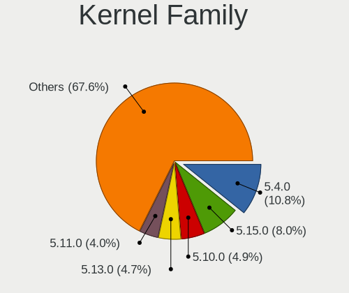
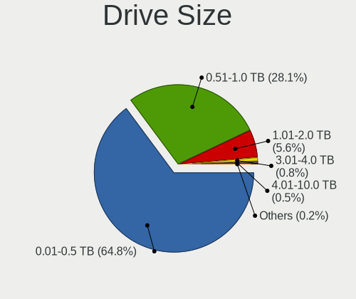
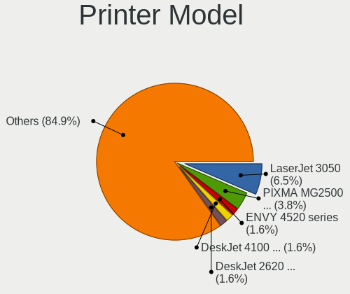
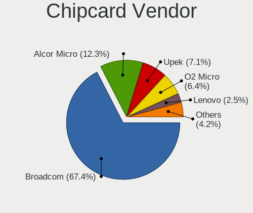

Linux in USA - Tested Hardware & Statistics (Notebooks)
-------------------------------------------------------

A project to collect tested hardware configurations for Linux in USA.

Anyone can contribute to this report by the [hw-probe](https://github.com/linuxhw/hw-probe) tool:

    sudo -E hw-probe -all -upload

Please contribute! Especially if your hardware is rare.

Contents
--------

* [ Test Cases ](#test-cases)

* [ System ](#system)
  - [ OS                       ](#os)
  - [ OS Family                ](#os-family)
  - [ Kernel                   ](#kernel)
  - [ Kernel Family            ](#kernel-family)
  - [ Kernel Major Ver.        ](#kernel-major-ver)
  - [ Arch                     ](#arch)
  - [ DE                       ](#de)
  - [ Display Server           ](#display-server)
  - [ Display Manager          ](#display-manager)
  - [ OS Lang                  ](#os-lang)
  - [ Boot Mode                ](#boot-mode)
  - [ Filesystem               ](#filesystem)
  - [ Part. scheme             ](#part-scheme)
  - [ Dual Boot with Linux/BSD ](#dual-boot-with-linuxbsd)
  - [ Dual Boot (Win)          ](#dual-boot-win)

* [ Board ](#board)
  - [ Vendor                   ](#vendor)
  - [ Model                    ](#model)
  - [ Model Family             ](#model-family)
  - [ MFG Year                 ](#mfg-year)
  - [ Form Factor              ](#form-factor)
  - [ Secure Boot              ](#secure-boot)
  - [ Coreboot                 ](#coreboot)
  - [ RAM Size                 ](#ram-size)
  - [ RAM Used                 ](#ram-used)
  - [ Total Drives             ](#total-drives)
  - [ Has CD-ROM               ](#has-cd-rom)
  - [ Has Ethernet             ](#has-ethernet)
  - [ Has WiFi                 ](#has-wifi)
  - [ Has Bluetooth            ](#has-bluetooth)

* [ Location ](#location)
  - [ Country                  ](#country)
  - [ City                     ](#city)

* [ Drives ](#drives)
  - [ Drive Vendor             ](#drive-vendor)
  - [ Drive Model              ](#drive-model)
  - [ HDD Vendor               ](#hdd-vendor)
  - [ SSD Vendor               ](#ssd-vendor)
  - [ Drive Kind               ](#drive-kind)
  - [ Drive Connector          ](#drive-connector)
  - [ Drive Size               ](#drive-size)
  - [ Space Total              ](#space-total)
  - [ Space Used               ](#space-used)
  - [ Malfunc. Drives          ](#malfunc-drives)
  - [ Malfunc. Drive Vendor    ](#malfunc-drive-vendor)
  - [ Malfunc. HDD Vendor      ](#malfunc-hdd-vendor)
  - [ Malfunc. Drive Kind      ](#malfunc-drive-kind)
  - [ Failed Drives            ](#failed-drives)
  - [ Failed Drive Vendor      ](#failed-drive-vendor)
  - [ Drive Status             ](#drive-status)

* [ Storage controller ](#storage-controller)
  - [ Storage Vendor           ](#storage-vendor)
  - [ Storage Model            ](#storage-model)
  - [ Storage Kind             ](#storage-kind)

* [ Processor ](#processor)
  - [ CPU Vendor               ](#cpu-vendor)
  - [ CPU Model                ](#cpu-model)
  - [ CPU Model Family         ](#cpu-model-family)
  - [ CPU Cores                ](#cpu-cores)
  - [ CPU Sockets              ](#cpu-sockets)
  - [ CPU Threads              ](#cpu-threads)
  - [ CPU Op-Modes             ](#cpu-op-modes)
  - [ CPU Microcode            ](#cpu-microcode)
  - [ CPU Microarch            ](#cpu-microarch)

* [ Graphics ](#graphics)
  - [ GPU Vendor               ](#gpu-vendor)
  - [ GPU Model                ](#gpu-model)
  - [ GPU Combo                ](#gpu-combo)
  - [ GPU Driver               ](#gpu-driver)
  - [ GPU Memory               ](#gpu-memory)

* [ Monitor ](#monitor)
  - [ Monitor Vendor           ](#monitor-vendor)
  - [ Monitor Model            ](#monitor-model)
  - [ Monitor Resolution       ](#monitor-resolution)
  - [ Monitor Diagonal         ](#monitor-diagonal)
  - [ Monitor Width            ](#monitor-width)
  - [ Aspect Ratio             ](#aspect-ratio)
  - [ Monitor Area             ](#monitor-area)
  - [ Pixel Density            ](#pixel-density)
  - [ Multiple Monitors        ](#multiple-monitors)

* [ Network ](#network)
  - [ Net Controller Vendor    ](#net-controller-vendor)
  - [ Net Controller Model     ](#net-controller-model)
  - [ Wireless Vendor          ](#wireless-vendor)
  - [ Wireless Model           ](#wireless-model)
  - [ Ethernet Vendor          ](#ethernet-vendor)
  - [ Ethernet Model           ](#ethernet-model)
  - [ Net Controller Kind      ](#net-controller-kind)
  - [ Used Controller          ](#used-controller)
  - [ NICs                     ](#nics)
  - [ IPv6                     ](#ipv6)

* [ Bluetooth ](#bluetooth)
  - [ Bluetooth Vendor         ](#bluetooth-vendor)
  - [ Bluetooth Model          ](#bluetooth-model)

* [ Sound ](#sound)
  - [ Sound Vendor             ](#sound-vendor)
  - [ Sound Model              ](#sound-model)

* [ Memory ](#memory)
  - [ Memory Vendor            ](#memory-vendor)
  - [ Memory Model             ](#memory-model)
  - [ Memory Kind              ](#memory-kind)
  - [ Memory Form Factor       ](#memory-form-factor)
  - [ Memory Size              ](#memory-size)
  - [ Memory Speed             ](#memory-speed)

* [ Printers & scanners ](#printers--scanners)
  - [ Printer Vendor           ](#printer-vendor)
  - [ Printer Model            ](#printer-model)
  - [ Scanner Vendor           ](#scanner-vendor)
  - [ Scanner Model            ](#scanner-model)

* [ Camera ](#camera)
  - [ Camera Vendor            ](#camera-vendor)
  - [ Camera Model             ](#camera-model)

* [ Security ](#security)
  - [ Fingerprint Vendor       ](#fingerprint-vendor)
  - [ Fingerprint Model        ](#fingerprint-model)
  - [ Chipcard Vendor          ](#chipcard-vendor)
  - [ Chipcard Model           ](#chipcard-model)

* [ Unsupported ](#unsupported)
  - [ Unsupported Devices      ](#unsupported-devices)
  - [ Unsupported Device Types ](#unsupported-device-types)

Test Cases
----------

Total: 18150

| Vendor        | Model                       | Probe                                                      | Date         |
|---------------|-----------------------------|------------------------------------------------------------|--------------|
| Google        | Enguarde                    | [50369de0be](https://linux-hardware.org/?probe=50369de0be) | Sep 01, 2022 |
| Google        | Enguarde                    | [b59a9615cd](https://linux-hardware.org/?probe=b59a9615cd) | Sep 01, 2022 |
| HP            | Laptop 15-ef1xxx            | [d27c20dcf9](https://linux-hardware.org/?probe=d27c20dcf9) | Sep 01, 2022 |
| Google        | Enguarde                    | [7acc7436b0](https://linux-hardware.org/?probe=7acc7436b0) | Sep 01, 2022 |
| Google        | Enguarde                    | [671a062f6e](https://linux-hardware.org/?probe=671a062f6e) | Sep 01, 2022 |
| Google        | Enguarde                    | [baabafd42b](https://linux-hardware.org/?probe=baabafd42b) | Sep 01, 2022 |
| Google        | Enguarde                    | [4c1595c83e](https://linux-hardware.org/?probe=4c1595c83e) | Sep 01, 2022 |
| Google        | Enguarde                    | [bb6b28b279](https://linux-hardware.org/?probe=bb6b28b279) | Sep 01, 2022 |
| Google        | Terra                       | [b7940ab738](https://linux-hardware.org/?probe=b7940ab738) | Sep 01, 2022 |
| Google        | Enguarde                    | [0cbe57b975](https://linux-hardware.org/?probe=0cbe57b975) | Sep 01, 2022 |
| Google        | Enguarde                    | [9f20842cc5](https://linux-hardware.org/?probe=9f20842cc5) | Sep 01, 2022 |
| HP            | Laptop 15-db1xxx            | [51b19bb74b](https://linux-hardware.org/?probe=51b19bb74b) | Sep 01, 2022 |
| Google        | Enguarde                    | [06969489cc](https://linux-hardware.org/?probe=06969489cc) | Sep 01, 2022 |
| Google        | Enguarde                    | [2b4231258e](https://linux-hardware.org/?probe=2b4231258e) | Sep 01, 2022 |
| Google        | Enguarde                    | [1a0596c60d](https://linux-hardware.org/?probe=1a0596c60d) | Sep 01, 2022 |
| Google        | Enguarde                    | [4dfdb5e364](https://linux-hardware.org/?probe=4dfdb5e364) | Sep 01, 2022 |
| Google        | Enguarde                    | [c6db81251c](https://linux-hardware.org/?probe=c6db81251c) | Sep 01, 2022 |
| Google        | Enguarde                    | [05f112ddb7](https://linux-hardware.org/?probe=05f112ddb7) | Sep 01, 2022 |
| Lenovo        | ThinkBook 14 G2 ITL 20VD    | [02ec70b604](https://linux-hardware.org/?probe=02ec70b604) | Sep 01, 2022 |
| HP            | Laptop 15-db0xxx            | [de848d928c](https://linux-hardware.org/?probe=de848d928c) | Sep 01, 2022 |
| Lenovo        | ThinkPad P15 Gen 1 20STC... | [0a5a3fa67e](https://linux-hardware.org/?probe=0a5a3fa67e) | Sep 01, 2022 |
| HP            | ProBook 4540s               | [b5e6fa5a71](https://linux-hardware.org/?probe=b5e6fa5a71) | Sep 01, 2022 |
| MECHREVO      | Code01 Ver2.0               | [f88772c4dc](https://linux-hardware.org/?probe=f88772c4dc) | Sep 01, 2022 |
| MECHREVO      | Code01 Ver2.0               | [0cb5fbde81](https://linux-hardware.org/?probe=0cb5fbde81) | Sep 01, 2022 |
| Valve         | Jupiter                     | [c89533e9a2](https://linux-hardware.org/?probe=c89533e9a2) | Sep 01, 2022 |
| HP            | Laptop 15-da0xxx            | [2c79168e77](https://linux-hardware.org/?probe=2c79168e77) | Sep 01, 2022 |
| Lenovo        | G50-45 80E3                 | [3080895149](https://linux-hardware.org/?probe=3080895149) | Sep 01, 2022 |
| HP            | Laptop 15-da0xxx            | [40482ce9a3](https://linux-hardware.org/?probe=40482ce9a3) | Sep 01, 2022 |
| Dell          | Inspiron 13 5310            | [b6b7c6dc62](https://linux-hardware.org/?probe=b6b7c6dc62) | Sep 01, 2022 |
| Dell          | Inspiron 15-3552            | [2eb780855d](https://linux-hardware.org/?probe=2eb780855d) | Sep 01, 2022 |
| Dell          | Inspiron 13 5310            | [6b3c188071](https://linux-hardware.org/?probe=6b3c188071) | Sep 01, 2022 |
| Dell          | Inspiron 13 5310            | [b0d6660da8](https://linux-hardware.org/?probe=b0d6660da8) | Sep 01, 2022 |
| Samsung       | 950XEE                      | [454b67dd88](https://linux-hardware.org/?probe=454b67dd88) | Sep 01, 2022 |
| Dell          | Inspiron 15-3552            | [a5e4d22ccd](https://linux-hardware.org/?probe=a5e4d22ccd) | Sep 01, 2022 |
| Apple         | MacBookAir9,1               | [51c4002c97](https://linux-hardware.org/?probe=51c4002c97) | Sep 01, 2022 |
| Lenovo        | Legion S7 15ACH6 82K8       | [d96b24b7f3](https://linux-hardware.org/?probe=d96b24b7f3) | Sep 01, 2022 |
| Alienware     | m15 R4                      | [267e4bb2dd](https://linux-hardware.org/?probe=267e4bb2dd) | Sep 01, 2022 |
| Lenovo        | Legion S7 15ACH6 82K8       | [67eb62450a](https://linux-hardware.org/?probe=67eb62450a) | Sep 01, 2022 |
| HP            | EliteBook 840 G7 Noteboo... | [b50b1adb0f](https://linux-hardware.org/?probe=b50b1adb0f) | Sep 01, 2022 |
| Dell          | Inspiron 1545               | [611306b3c0](https://linux-hardware.org/?probe=611306b3c0) | Sep 01, 2022 |
| HP            | ENVY Laptop 13-ba1xxx       | [5a4e2225a8](https://linux-hardware.org/?probe=5a4e2225a8) | Sep 01, 2022 |
| Valve         | Jupiter                     | [c348c06118](https://linux-hardware.org/?probe=c348c06118) | Sep 01, 2022 |
| HP            | G42                         | [a79b07fcd0](https://linux-hardware.org/?probe=a79b07fcd0) | Sep 01, 2022 |
| Google        | Enguarde                    | [4a240c438e](https://linux-hardware.org/?probe=4a240c438e) | Aug 31, 2022 |
| MECHREVO      | Code01 Ver2.0               | [c63c5e6700](https://linux-hardware.org/?probe=c63c5e6700) | Aug 31, 2022 |
| MECHREVO      | Code01 Ver2.0               | [bbe5fe0eac](https://linux-hardware.org/?probe=bbe5fe0eac) | Aug 31, 2022 |
| HP            | Elite x2 1012 G1            | [10455cfe0d](https://linux-hardware.org/?probe=10455cfe0d) | Aug 31, 2022 |
| HP            | 15 Notebook PC              | [1109650747](https://linux-hardware.org/?probe=1109650747) | Aug 31, 2022 |
| Dell          | Inspiron 13-7378            | [42666a5460](https://linux-hardware.org/?probe=42666a5460) | Aug 31, 2022 |
| Eluktronic... | MAG-15 2070                 | [d7fb373622](https://linux-hardware.org/?probe=d7fb373622) | Aug 31, 2022 |
| Dell          | Inspiron 15-3552            | [8e2cd928f3](https://linux-hardware.org/?probe=8e2cd928f3) | Aug 31, 2022 |
| Valve         | Jupiter                     | [dbc549504c](https://linux-hardware.org/?probe=dbc549504c) | Aug 31, 2022 |
| Dell          | Latitude E5570              | [91513d0ee3](https://linux-hardware.org/?probe=91513d0ee3) | Aug 31, 2022 |
| Acer          | Aspire R3-471T              | [01b021f810](https://linux-hardware.org/?probe=01b021f810) | Aug 31, 2022 |
| HP            | Laptop 15-dy1xxx            | [836644c18b](https://linux-hardware.org/?probe=836644c18b) | Aug 31, 2022 |
| HP            | EliteBook 820 G3            | [a0bc059a35](https://linux-hardware.org/?probe=a0bc059a35) | Aug 31, 2022 |
| HP            | EliteBook 820 G3            | [0c275e0aaa](https://linux-hardware.org/?probe=0c275e0aaa) | Aug 31, 2022 |
| Lenovo        | IdeaPad 5 15IIL05 81YK      | [6d04d534fa](https://linux-hardware.org/?probe=6d04d534fa) | Aug 31, 2022 |
| HP            | EliteBook 840 G5            | [e4b0cb981a](https://linux-hardware.org/?probe=e4b0cb981a) | Aug 31, 2022 |
| Dell          | Inspiron 5502               | [1bb776feab](https://linux-hardware.org/?probe=1bb776feab) | Aug 31, 2022 |
| Dell          | Inspiron 3493               | [dc23941a16](https://linux-hardware.org/?probe=dc23941a16) | Aug 31, 2022 |
| Google        | Enguarde                    | [7aa44db561](https://linux-hardware.org/?probe=7aa44db561) | Aug 30, 2022 |
| Lenovo        | ThinkPad Edge E530 62724... | [87cad1c0b0](https://linux-hardware.org/?probe=87cad1c0b0) | Aug 30, 2022 |
| HP            | ZBook 17                    | [98e643f5af](https://linux-hardware.org/?probe=98e643f5af) | Aug 30, 2022 |
| Dell          | XPS 15 9570                 | [6c35aeda10](https://linux-hardware.org/?probe=6c35aeda10) | Aug 30, 2022 |
| Google        | Reks                        | [71f6228c3d](https://linux-hardware.org/?probe=71f6228c3d) | Aug 30, 2022 |
| Google        | Reks                        | [48174b01b3](https://linux-hardware.org/?probe=48174b01b3) | Aug 30, 2022 |
| Google        | Terra                       | [25f50ae6d9](https://linux-hardware.org/?probe=25f50ae6d9) | Aug 30, 2022 |
| Google        | Reks                        | [e768a1940e](https://linux-hardware.org/?probe=e768a1940e) | Aug 30, 2022 |
| Dell          | Inspiron 5502               | [28a1dd084e](https://linux-hardware.org/?probe=28a1dd084e) | Aug 30, 2022 |
| Dell          | Inspiron 5502               | [df0098010e](https://linux-hardware.org/?probe=df0098010e) | Aug 30, 2022 |
| Apple         | MacBookAir7,2               | [a96a893eac](https://linux-hardware.org/?probe=a96a893eac) | Aug 30, 2022 |
| HP            | EliteBook 820 G3            | [4ea311ca8e](https://linux-hardware.org/?probe=4ea311ca8e) | Aug 30, 2022 |
| HP            | ProBook 4540s               | [0509af43f4](https://linux-hardware.org/?probe=0509af43f4) | Aug 30, 2022 |
| HP            | 2000                        | [106a330325](https://linux-hardware.org/?probe=106a330325) | Aug 30, 2022 |
| HP            | ENVY 14                     | [4dd324c355](https://linux-hardware.org/?probe=4dd324c355) | Aug 30, 2022 |
| Lenovo        | ThinkPad X1 Carbon Gen 8... | [adcfb8a267](https://linux-hardware.org/?probe=adcfb8a267) | Aug 30, 2022 |
| Valve         | Jupiter                     | [40b9dd39a6](https://linux-hardware.org/?probe=40b9dd39a6) | Aug 30, 2022 |
| Valve         | Jupiter                     | [ea6506cc93](https://linux-hardware.org/?probe=ea6506cc93) | Aug 30, 2022 |
| Ematic        | EWT118                      | [3fa43d450e](https://linux-hardware.org/?probe=3fa43d450e) | Aug 30, 2022 |
| Samsung       | 870Z5E/880Z5E/680Z5E        | [0166c06969](https://linux-hardware.org/?probe=0166c06969) | Aug 30, 2022 |
| Dell          | Inspiron 5721               | [d483434965](https://linux-hardware.org/?probe=d483434965) | Aug 29, 2022 |
| Timi          | Redmi Book Pro 15 2022      | [473daa5ce3](https://linux-hardware.org/?probe=473daa5ce3) | Aug 29, 2022 |
| HP            | 2000                        | [9705fe4434](https://linux-hardware.org/?probe=9705fe4434) | Aug 29, 2022 |
| Lenovo        | ThinkPad 13 2nd Gen 20J1... | [30b240a3fe](https://linux-hardware.org/?probe=30b240a3fe) | Aug 29, 2022 |
| Eluktronic... | MAX-17                      | [627ecbeb36](https://linux-hardware.org/?probe=627ecbeb36) | Aug 29, 2022 |
| HP            | Pavilion Laptop 17-ar0xx    | [9336d821f8](https://linux-hardware.org/?probe=9336d821f8) | Aug 29, 2022 |
| ASUSTek       | K55VM                       | [ec5806d544](https://linux-hardware.org/?probe=ec5806d544) | Aug 29, 2022 |
| System76      | Galago Pro                  | [df2c4ae77c](https://linux-hardware.org/?probe=df2c4ae77c) | Aug 29, 2022 |
| Valve         | Jupiter                     | [830c22afde](https://linux-hardware.org/?probe=830c22afde) | Aug 29, 2022 |
| Dell          | XPS 13 9360                 | [1763ee1dd0](https://linux-hardware.org/?probe=1763ee1dd0) | Aug 29, 2022 |
| Lenovo        | Legion 5 Pro 16ARH7H 82R... | [065da8ca1e](https://linux-hardware.org/?probe=065da8ca1e) | Aug 29, 2022 |
| Valve         | Jupiter                     | [43ec7fb445](https://linux-hardware.org/?probe=43ec7fb445) | Aug 29, 2022 |
| HP            | ZBook 15u G4                | [39f4830019](https://linux-hardware.org/?probe=39f4830019) | Aug 28, 2022 |
| Dell          | Precision 5750              | [2ee41b471e](https://linux-hardware.org/?probe=2ee41b471e) | Aug 28, 2022 |
| ASUSTek       | K55A                        | [5d11054a36](https://linux-hardware.org/?probe=5d11054a36) | Aug 28, 2022 |
| Dell          | Inspiron 7570               | [087341ccba](https://linux-hardware.org/?probe=087341ccba) | Aug 28, 2022 |
| Dell          | Inspiron 7570               | [157b282e20](https://linux-hardware.org/?probe=157b282e20) | Aug 28, 2022 |
| Panasonic     | CF-30KTPAZAE                | [61a8f4a768](https://linux-hardware.org/?probe=61a8f4a768) | Aug 28, 2022 |
| Apple         | MacBookPro14,1              | [31d4a8fc43](https://linux-hardware.org/?probe=31d4a8fc43) | Aug 28, 2022 |
| Dell          | Precision 5750              | [af9992756f](https://linux-hardware.org/?probe=af9992756f) | Aug 28, 2022 |
| HP            | ZBook 15u G4                | [2115d02bfd](https://linux-hardware.org/?probe=2115d02bfd) | Aug 28, 2022 |
| Google        | Eldrid                      | [ae53120bac](https://linux-hardware.org/?probe=ae53120bac) | Aug 28, 2022 |
| Framework     | Laptop                      | [71c896cd39](https://linux-hardware.org/?probe=71c896cd39) | Aug 28, 2022 |
| Dell          | Latitude 7290               | [2c017f3533](https://linux-hardware.org/?probe=2c017f3533) | Aug 28, 2022 |
| Valve         | Jupiter                     | [3848655fce](https://linux-hardware.org/?probe=3848655fce) | Aug 28, 2022 |
| Dell          | Inspiron 1545               | [ff02214b7f](https://linux-hardware.org/?probe=ff02214b7f) | Aug 28, 2022 |
| Fujitsu       | FMVNQ8P6                    | [5e34698f14](https://linux-hardware.org/?probe=5e34698f14) | Aug 28, 2022 |
| Lenovo        | ThinkPad W520 4270CTO       | [c4be3fe1b6](https://linux-hardware.org/?probe=c4be3fe1b6) | Aug 28, 2022 |
| Lenovo        | IdeaPad 3 15ITL05 81X8      | [8b4125a88a](https://linux-hardware.org/?probe=8b4125a88a) | Aug 28, 2022 |
| Lenovo        | Legion 5 Pro 16ARH7H 82R... | [af00be0ff8](https://linux-hardware.org/?probe=af00be0ff8) | Aug 28, 2022 |
| Lenovo        | ThinkPad W520 4270CTO       | [568802fb43](https://linux-hardware.org/?probe=568802fb43) | Aug 28, 2022 |
| Google        | Butterfly                   | [df8fafaf3b](https://linux-hardware.org/?probe=df8fafaf3b) | Aug 28, 2022 |
| Dell          | Latitude E5510              | [50831b94bf](https://linux-hardware.org/?probe=50831b94bf) | Aug 28, 2022 |
| Alienware     | 15                          | [f85646920a](https://linux-hardware.org/?probe=f85646920a) | Aug 28, 2022 |
| ASUSTek       | TP500LA                     | [de395dddd8](https://linux-hardware.org/?probe=de395dddd8) | Aug 28, 2022 |
| Lenovo        | IdeaPad 320-15ABR 80XS      | [2e085a419b](https://linux-hardware.org/?probe=2e085a419b) | Aug 27, 2022 |
| Lenovo        | IdeaPad 320-15ABR 80XS      | [c47cd7c7ed](https://linux-hardware.org/?probe=c47cd7c7ed) | Aug 27, 2022 |
| Acidanther... | MacBookPro12,1              | [9e48c5e245](https://linux-hardware.org/?probe=9e48c5e245) | Aug 27, 2022 |
| HP            | ENVY Notebook               | [c43c52b493](https://linux-hardware.org/?probe=c43c52b493) | Aug 27, 2022 |
| HP            | OMEN by Laptop 16-b0xxx     | [94b00f5da5](https://linux-hardware.org/?probe=94b00f5da5) | Aug 27, 2022 |
| Lenovo        | IdeaPad 3 15ITL6 82H8       | [559d6f0e42](https://linux-hardware.org/?probe=559d6f0e42) | Aug 27, 2022 |
| Acer          | Nitro AN515-57              | [decd7daef2](https://linux-hardware.org/?probe=decd7daef2) | Aug 27, 2022 |
| ASUSTek       | ROG Zephyrus G15 GA503QR... | [d6c013a669](https://linux-hardware.org/?probe=d6c013a669) | Aug 27, 2022 |
| Lenovo        | 14w 81MQ000JUS              | [d71f12bede](https://linux-hardware.org/?probe=d71f12bede) | Aug 27, 2022 |
| Google        | Eldrid                      | [6a0c6eb1de](https://linux-hardware.org/?probe=6a0c6eb1de) | Aug 27, 2022 |
| HP            | EliteBook 840 G5            | [7bd19ce9a1](https://linux-hardware.org/?probe=7bd19ce9a1) | Aug 27, 2022 |
| Valve         | Jupiter                     | [cd6744821b](https://linux-hardware.org/?probe=cd6744821b) | Aug 27, 2022 |
| Dell          | XPS 9315                    | [6ab1d7417d](https://linux-hardware.org/?probe=6ab1d7417d) | Aug 27, 2022 |
| HP            | OMEN by Laptop 15z-en100    | [41f0deff42](https://linux-hardware.org/?probe=41f0deff42) | Aug 27, 2022 |
| Lenovo        | IdeaPad 3 15ABA7 82RN       | [a23b4a8cd4](https://linux-hardware.org/?probe=a23b4a8cd4) | Aug 27, 2022 |
| HP            | EliteBook 820 G1            | [ece2ce43d2](https://linux-hardware.org/?probe=ece2ce43d2) | Aug 27, 2022 |
| HP            | ProBook 4530s               | [be1270c998](https://linux-hardware.org/?probe=be1270c998) | Aug 26, 2022 |
| Lenovo        | Legion Y740-15IRHg 81UH     | [521dd85c98](https://linux-hardware.org/?probe=521dd85c98) | Aug 26, 2022 |
| Dell          | Latitude 7350               | [c784fd2743](https://linux-hardware.org/?probe=c784fd2743) | Aug 26, 2022 |
| Valve         | Jupiter                     | [8027445785](https://linux-hardware.org/?probe=8027445785) | Aug 26, 2022 |
| Panasonic     | FZ55-1                      | [a45848f10f](https://linux-hardware.org/?probe=a45848f10f) | Aug 26, 2022 |
| Google        | Terra                       | [717b3cc17f](https://linux-hardware.org/?probe=717b3cc17f) | Aug 26, 2022 |
| Google        | Terra                       | [f9856d813e](https://linux-hardware.org/?probe=f9856d813e) | Aug 26, 2022 |
| HP            | OMEN by Laptop 15z-en100    | [04c6e61e44](https://linux-hardware.org/?probe=04c6e61e44) | Aug 26, 2022 |
| Google        | Peppy                       | [be4ecba4dc](https://linux-hardware.org/?probe=be4ecba4dc) | Aug 26, 2022 |
| ASUSTek       | ZenBook UX425UG_Q408UG      | [5b80fb349f](https://linux-hardware.org/?probe=5b80fb349f) | Aug 26, 2022 |
| MSI           | Creator 15 A11UH            | [fdd5e2b26a](https://linux-hardware.org/?probe=fdd5e2b26a) | Aug 26, 2022 |
| Lenovo        | ThinkPad T590 20N4001NUS    | [479ef1a89c](https://linux-hardware.org/?probe=479ef1a89c) | Aug 26, 2022 |
| Google        | Auron_Yuna                  | [de2984c01a](https://linux-hardware.org/?probe=de2984c01a) | Aug 26, 2022 |
| Dell          | Latitude 7424 Rugged Ext... | [9770e301cd](https://linux-hardware.org/?probe=9770e301cd) | Aug 26, 2022 |
| Dell          | Latitude 7290               | [c89afca30f](https://linux-hardware.org/?probe=c89afca30f) | Aug 26, 2022 |
| Razer         | Blade                       | [7d825be87d](https://linux-hardware.org/?probe=7d825be87d) | Aug 26, 2022 |
| Dell          | Latitude E6400              | [8517e82248](https://linux-hardware.org/?probe=8517e82248) | Aug 26, 2022 |
| Panasonic     | FZ55-1                      | [0ec106ca31](https://linux-hardware.org/?probe=0ec106ca31) | Aug 26, 2022 |
| Apple         | MacBookAir7,2               | [faf049bedc](https://linux-hardware.org/?probe=faf049bedc) | Aug 26, 2022 |
| Apple         | MacBookAir7,2               | [eed296b506](https://linux-hardware.org/?probe=eed296b506) | Aug 26, 2022 |
| ASUSTek       | S551LB                      | [efd20dadd0](https://linux-hardware.org/?probe=efd20dadd0) | Aug 26, 2022 |
| Dell          | XPS 15 9570                 | [c6fc39489e](https://linux-hardware.org/?probe=c6fc39489e) | Aug 26, 2022 |
| HP            | ProBook 6540b               | [c5f8425ba1](https://linux-hardware.org/?probe=c5f8425ba1) | Aug 25, 2022 |
| Dell          | Latitude E6400              | [714643ef93](https://linux-hardware.org/?probe=714643ef93) | Aug 25, 2022 |
| Lenovo        | IdeaPad 320-15ABR 80XS      | [34dd0d912a](https://linux-hardware.org/?probe=34dd0d912a) | Aug 25, 2022 |
| Dell          | Latitude E7250              | [98f4886ef7](https://linux-hardware.org/?probe=98f4886ef7) | Aug 25, 2022 |
| Google        | Terra                       | [72965945d5](https://linux-hardware.org/?probe=72965945d5) | Aug 25, 2022 |
| Google        | Terra                       | [78436fd3bf](https://linux-hardware.org/?probe=78436fd3bf) | Aug 25, 2022 |
| MSI           | Modern 14 A10RAS            | [af216b7b4a](https://linux-hardware.org/?probe=af216b7b4a) | Aug 25, 2022 |
| Gateway       | NV53A                       | [618b8506e2](https://linux-hardware.org/?probe=618b8506e2) | Aug 25, 2022 |
| Lenovo        | IdeaPad S340-15IWL 81N8     | [adf697ae96](https://linux-hardware.org/?probe=adf697ae96) | Aug 25, 2022 |
| Eluktronic... | MAX-17                      | [0a454665e0](https://linux-hardware.org/?probe=0a454665e0) | Aug 25, 2022 |
| Apple         | MacBookAir7,2               | [b2dc63405c](https://linux-hardware.org/?probe=b2dc63405c) | Aug 25, 2022 |
| HP            | Laptop 15-dy2xxx            | [26572efe76](https://linux-hardware.org/?probe=26572efe76) | Aug 25, 2022 |
| HP            | Laptop 14-dk0xxx            | [82da7782ec](https://linux-hardware.org/?probe=82da7782ec) | Aug 25, 2022 |
| HP            | Laptop 15-dy2xxx            | [bcd578a016](https://linux-hardware.org/?probe=bcd578a016) | Aug 25, 2022 |
| Dell          | XPS 13 9380                 | [5bb7561235](https://linux-hardware.org/?probe=5bb7561235) | Aug 25, 2022 |
| Dell          | Inspiron 600m               | [6acc515c79](https://linux-hardware.org/?probe=6acc515c79) | Aug 25, 2022 |
| Dell          | XPS 15 9560                 | [28323e5398](https://linux-hardware.org/?probe=28323e5398) | Aug 25, 2022 |
| HP            | Notebook                    | [0d4422145a](https://linux-hardware.org/?probe=0d4422145a) | Aug 25, 2022 |
| Valve         | Jupiter                     | [ebd183fc4b](https://linux-hardware.org/?probe=ebd183fc4b) | Aug 25, 2022 |
| HP            | Laptop 15-dy1xxx            | [b201192ebb](https://linux-hardware.org/?probe=b201192ebb) | Aug 25, 2022 |
| Dell          | Latitude 3570               | [287cfa2ce8](https://linux-hardware.org/?probe=287cfa2ce8) | Aug 25, 2022 |
| HP            | Pavilion Notebook           | [5d03f69f35](https://linux-hardware.org/?probe=5d03f69f35) | Aug 25, 2022 |
| HP            | ZBook 15u G4                | [dcdc803214](https://linux-hardware.org/?probe=dcdc803214) | Aug 24, 2022 |
| HP            | Pavilion dv5                | [dd2f0b859b](https://linux-hardware.org/?probe=dd2f0b859b) | Aug 24, 2022 |
| ASUSTek       | ProArt StudioBook W700G3... | [72f873111c](https://linux-hardware.org/?probe=72f873111c) | Aug 24, 2022 |
| Lenovo        | ThinkPad E490 20N8001EUS    | [1620f0e5ff](https://linux-hardware.org/?probe=1620f0e5ff) | Aug 24, 2022 |
| Valve         | Jupiter                     | [5064c9f57b](https://linux-hardware.org/?probe=5064c9f57b) | Aug 24, 2022 |
| HP            | ZBook 15u G4                | [8b26a63aa2](https://linux-hardware.org/?probe=8b26a63aa2) | Aug 24, 2022 |
| GPU Compan... | GWTC116-2                   | [f9090c46a9](https://linux-hardware.org/?probe=f9090c46a9) | Aug 24, 2022 |
| GPU Compan... | GWTC116-2                   | [ac93dd480f](https://linux-hardware.org/?probe=ac93dd480f) | Aug 24, 2022 |
| HP            | ENVY dv6                    | [e7bc07047b](https://linux-hardware.org/?probe=e7bc07047b) | Aug 24, 2022 |
| Dell          | Precision 7550              | [7a88756a0f](https://linux-hardware.org/?probe=7a88756a0f) | Aug 24, 2022 |
| HP            | Dev One Notebook PC         | [4263165650](https://linux-hardware.org/?probe=4263165650) | Aug 24, 2022 |
| Toshiba       | Satellite L855              | [73de62c6c7](https://linux-hardware.org/?probe=73de62c6c7) | Aug 24, 2022 |
| Toshiba       | Satellite C55-B             | [eaabc96ff1](https://linux-hardware.org/?probe=eaabc96ff1) | Aug 24, 2022 |
| Valve         | Jupiter                     | [de49ccefa5](https://linux-hardware.org/?probe=de49ccefa5) | Aug 24, 2022 |
| HP            | Compaq Presario CQ50        | [ca5e35f5fd](https://linux-hardware.org/?probe=ca5e35f5fd) | Aug 24, 2022 |
| HP            | 2000                        | [a17502ee0a](https://linux-hardware.org/?probe=a17502ee0a) | Aug 24, 2022 |
| Razer         | Blade                       | [b552b446f0](https://linux-hardware.org/?probe=b552b446f0) | Aug 24, 2022 |
| Razer         | Blade                       | [d13a0c3cda](https://linux-hardware.org/?probe=d13a0c3cda) | Aug 24, 2022 |
| Google        | Reks                        | [043b648dc5](https://linux-hardware.org/?probe=043b648dc5) | Aug 23, 2022 |
| Google        | Terra                       | [b720f3ca23](https://linux-hardware.org/?probe=b720f3ca23) | Aug 23, 2022 |
| Google        | Terra                       | [0fd5baced8](https://linux-hardware.org/?probe=0fd5baced8) | Aug 23, 2022 |
| Google        | Terra                       | [92efdef775](https://linux-hardware.org/?probe=92efdef775) | Aug 23, 2022 |
| Google        | Snappy                      | [89c9384dc4](https://linux-hardware.org/?probe=89c9384dc4) | Aug 23, 2022 |
| Valve         | Jupiter                     | [4c88b729d3](https://linux-hardware.org/?probe=4c88b729d3) | Aug 23, 2022 |
| ASUSTek       | VivoBook_ASUSLaptop X515... | [beb772b7f1](https://linux-hardware.org/?probe=beb772b7f1) | Aug 23, 2022 |
| Dell          | Precision M4800             | [dbe7bfeb57](https://linux-hardware.org/?probe=dbe7bfeb57) | Aug 23, 2022 |
| Dell          | Precision M4800             | [b8edb4a562](https://linux-hardware.org/?probe=b8edb4a562) | Aug 23, 2022 |
| HP            | Stream 11 Pro               | [de889aa178](https://linux-hardware.org/?probe=de889aa178) | Aug 23, 2022 |
| Lenovo        | ThinkPad 13 2nd Gen 20J1... | [351d3809aa](https://linux-hardware.org/?probe=351d3809aa) | Aug 23, 2022 |
| Lenovo        | ThinkPad E475 20H40006US    | [801a4be04d](https://linux-hardware.org/?probe=801a4be04d) | Aug 23, 2022 |
| Lenovo        | 14w 81MQ000JUS              | [3866b50e6e](https://linux-hardware.org/?probe=3866b50e6e) | Aug 23, 2022 |
| HP            | EliteBook 8470p             | [0b017b90c9](https://linux-hardware.org/?probe=0b017b90c9) | Aug 23, 2022 |
| Valve         | Jupiter                     | [161cc0c135](https://linux-hardware.org/?probe=161cc0c135) | Aug 23, 2022 |
| Apple         | MacBookAir7,1               | [079a951d65](https://linux-hardware.org/?probe=079a951d65) | Aug 23, 2022 |
| Lenovo        | Legion 5 15IMH05H 81Y6      | [62db26b1b4](https://linux-hardware.org/?probe=62db26b1b4) | Aug 23, 2022 |
| Dell          | Latitude E5470              | [4cf5f4680f](https://linux-hardware.org/?probe=4cf5f4680f) | Aug 23, 2022 |
| Acer          | Aspire A515-56              | [6243ea9fb0](https://linux-hardware.org/?probe=6243ea9fb0) | Aug 23, 2022 |
| HP            | Laptop 14-dq1xxx            | [975461703e](https://linux-hardware.org/?probe=975461703e) | Aug 23, 2022 |
| Dell          | XPS 15 9570                 | [6cc47c9a0d](https://linux-hardware.org/?probe=6cc47c9a0d) | Aug 23, 2022 |
| Lenovo        | Legion 5 15IMH05H 81Y6      | [b008c35b2b](https://linux-hardware.org/?probe=b008c35b2b) | Aug 23, 2022 |
| Lenovo        | ThinkPad T470 20HDCTO1WW    | [2e88f854f8](https://linux-hardware.org/?probe=2e88f854f8) | Aug 23, 2022 |
| VANT          | MOOVE3-15                   | [854b7f42d4](https://linux-hardware.org/?probe=854b7f42d4) | Aug 22, 2022 |
| Lenovo        | ThinkPad 13 2nd Gen 20J1... | [0e2b064aed](https://linux-hardware.org/?probe=0e2b064aed) | Aug 22, 2022 |
| Samsung       | RV411/RV511/E3511/S3511/... | [ee5962ca1e](https://linux-hardware.org/?probe=ee5962ca1e) | Aug 22, 2022 |
| Acer          | Aspire A515-43              | [bc23fbec2a](https://linux-hardware.org/?probe=bc23fbec2a) | Aug 22, 2022 |
| Lenovo        | ThinkPad T14 Gen 2a 20XL... | [47cae9ef99](https://linux-hardware.org/?probe=47cae9ef99) | Aug 22, 2022 |
| Dell          | Latitude E6400              | [51f384a71c](https://linux-hardware.org/?probe=51f384a71c) | Aug 22, 2022 |
| Toshiba       | Satellite L875D             | [45ed0eb61a](https://linux-hardware.org/?probe=45ed0eb61a) | Aug 22, 2022 |
| ASUSTek       | VivoBook_ASUS Laptop E41... | [aacdd42304](https://linux-hardware.org/?probe=aacdd42304) | Aug 22, 2022 |
| HP            | Pavilion Laptop 15-cs0xx... | [8c7493d7d1](https://linux-hardware.org/?probe=8c7493d7d1) | Aug 22, 2022 |
| Google        | Celes                       | [049d5b3dbc](https://linux-hardware.org/?probe=049d5b3dbc) | Aug 22, 2022 |
| Dell          | Latitude E6540              | [546fed0c24](https://linux-hardware.org/?probe=546fed0c24) | Aug 22, 2022 |
| Apple         | MacBookPro5,5               | [f25926e1fa](https://linux-hardware.org/?probe=f25926e1fa) | Aug 22, 2022 |
| Apple         | MacBookPro5,5               | [784c6d89a6](https://linux-hardware.org/?probe=784c6d89a6) | Aug 22, 2022 |
| Toshiba       | Satellite P55t-C            | [70560700a6](https://linux-hardware.org/?probe=70560700a6) | Aug 22, 2022 |
| Lenovo        | ThinkPad X230 2324BB5       | [0c6c383c92](https://linux-hardware.org/?probe=0c6c383c92) | Aug 22, 2022 |
| HP            | 2000                        | [8462eb5175](https://linux-hardware.org/?probe=8462eb5175) | Aug 22, 2022 |
| HP            | ProBook 4530s               | [8cf09b4a9c](https://linux-hardware.org/?probe=8cf09b4a9c) | Aug 22, 2022 |
| Valve         | Jupiter                     | [1c25a3bf8a](https://linux-hardware.org/?probe=1c25a3bf8a) | Aug 22, 2022 |
| Apple         | MacBookPro11,5              | [19d3fab687](https://linux-hardware.org/?probe=19d3fab687) | Aug 21, 2022 |
| Apple         | MacBookPro11,2              | [9856ca2463](https://linux-hardware.org/?probe=9856ca2463) | Aug 21, 2022 |
| Unknown       | Unknown                     | [35fca00a09](https://linux-hardware.org/?probe=35fca00a09) | Aug 21, 2022 |
| Dell          | G15 5511                    | [44fa9bf084](https://linux-hardware.org/?probe=44fa9bf084) | Aug 21, 2022 |
| HP            | Laptop 15-dy2xxx            | [2431fa78d1](https://linux-hardware.org/?probe=2431fa78d1) | Aug 21, 2022 |
| HP            | Laptop 15-dy2xxx            | [532e1358b6](https://linux-hardware.org/?probe=532e1358b6) | Aug 21, 2022 |
| Dell          | Latitude E6530              | [2dc6598431](https://linux-hardware.org/?probe=2dc6598431) | Aug 21, 2022 |
| HP            | Laptop 14-dk1xxx            | [4875c1533b](https://linux-hardware.org/?probe=4875c1533b) | Aug 21, 2022 |
| HP            | ENVY TS m6 Sleekbook        | [314250b1d7](https://linux-hardware.org/?probe=314250b1d7) | Aug 21, 2022 |
| MSI           | Katana GF76 11UD            | [256a057752](https://linux-hardware.org/?probe=256a057752) | Aug 21, 2022 |
| Valve         | Jupiter                     | [bc83cf9f77](https://linux-hardware.org/?probe=bc83cf9f77) | Aug 21, 2022 |
| ASUSTek       | K52F                        | [cafd25a659](https://linux-hardware.org/?probe=cafd25a659) | Aug 21, 2022 |
| Dell          | Inspiron 1520               | [052b6ab02c](https://linux-hardware.org/?probe=052b6ab02c) | Aug 21, 2022 |
| Acer          | Nitro AN515-57              | [bdc4179004](https://linux-hardware.org/?probe=bdc4179004) | Aug 21, 2022 |
| Unknown       | Unknown                     | [472eb48ecc](https://linux-hardware.org/?probe=472eb48ecc) | Aug 21, 2022 |
| Dell          | Latitude 5420               | [e8ccf9922e](https://linux-hardware.org/?probe=e8ccf9922e) | Aug 21, 2022 |
| Dell          | Latitude 5420               | [f44e5a1241](https://linux-hardware.org/?probe=f44e5a1241) | Aug 21, 2022 |
| Dell          | Precision 7720              | [60ad0b7b3d](https://linux-hardware.org/?probe=60ad0b7b3d) | Aug 21, 2022 |
| ASUSTek       | VivoBook_ASUSLaptop X712... | [2fda694b9c](https://linux-hardware.org/?probe=2fda694b9c) | Aug 20, 2022 |
| GPU Compan... | GWTN141-10                  | [3bb80937c1](https://linux-hardware.org/?probe=3bb80937c1) | Aug 20, 2022 |
| MSI           | GF75 Thin 10SCSXR           | [095c130069](https://linux-hardware.org/?probe=095c130069) | Aug 20, 2022 |
| ASUSTek       | ROG Strix G533ZW_G533ZW     | [12f4c121ea](https://linux-hardware.org/?probe=12f4c121ea) | Aug 20, 2022 |
| Dell          | Precision 7750              | [53e5baea4e](https://linux-hardware.org/?probe=53e5baea4e) | Aug 20, 2022 |
| ASUSTek       | VivoBook_ASUSLaptop X340... | [45bac2f9d1](https://linux-hardware.org/?probe=45bac2f9d1) | Aug 20, 2022 |
| Valve         | Jupiter                     | [36124147ef](https://linux-hardware.org/?probe=36124147ef) | Aug 20, 2022 |
| GPU Compan... | GWTN141-10                  | [ba4a181e92](https://linux-hardware.org/?probe=ba4a181e92) | Aug 20, 2022 |
| Dell          | Latitude E6430              | [30a702dcec](https://linux-hardware.org/?probe=30a702dcec) | Aug 20, 2022 |
| HP            | Pavilion dv6                | [0aae35eb95](https://linux-hardware.org/?probe=0aae35eb95) | Aug 19, 2022 |
| HP            | Compaq 6730b (KE718AV)      | [2bb0221a17](https://linux-hardware.org/?probe=2bb0221a17) | Aug 19, 2022 |
| Unknown       | Unknown                     | [937afb80d6](https://linux-hardware.org/?probe=937afb80d6) | Aug 19, 2022 |
| Google        | Reks                        | [e5cde69ff7](https://linux-hardware.org/?probe=e5cde69ff7) | Aug 19, 2022 |
| HP            | Stream Laptop 14-cb1XX      | [7ab9912d76](https://linux-hardware.org/?probe=7ab9912d76) | Aug 19, 2022 |
| HP            | HDX16                       | [46e0559af0](https://linux-hardware.org/?probe=46e0559af0) | Aug 19, 2022 |
| HP            | HDX16                       | [fb119a9cb4](https://linux-hardware.org/?probe=fb119a9cb4) | Aug 19, 2022 |
| MicroByte     | ezbook                      | [4539b0ee98](https://linux-hardware.org/?probe=4539b0ee98) | Aug 19, 2022 |
| HP            | 15                          | [d519e672ca](https://linux-hardware.org/?probe=d519e672ca) | Aug 19, 2022 |
| MSI           | GT62VR 7RD                  | [b5d41dd949](https://linux-hardware.org/?probe=b5d41dd949) | Aug 19, 2022 |
| Valve         | Jupiter                     | [bff4d1ca46](https://linux-hardware.org/?probe=bff4d1ca46) | Aug 19, 2022 |
| Acer          | Aspire E5-571               | [12371a2f0b](https://linux-hardware.org/?probe=12371a2f0b) | Aug 19, 2022 |
| HP            | Pavilion dm4                | [46bb1c7064](https://linux-hardware.org/?probe=46bb1c7064) | Aug 19, 2022 |
| ASUSTek       | ASUS TUF Dash F15 FX516P... | [c6bb19402d](https://linux-hardware.org/?probe=c6bb19402d) | Aug 19, 2022 |
| Dell          | Inspiron 5535               | [b62b002b47](https://linux-hardware.org/?probe=b62b002b47) | Aug 19, 2022 |
| Dell          | XPS 13 9360                 | [74b0bedd54](https://linux-hardware.org/?probe=74b0bedd54) | Aug 19, 2022 |
| HP            | Stream Laptop 14-cb1xxx     | [c954da96ad](https://linux-hardware.org/?probe=c954da96ad) | Aug 18, 2022 |
| Google        | Reks                        | [d09d250717](https://linux-hardware.org/?probe=d09d250717) | Aug 18, 2022 |
| Google        | Terra                       | [4eca7693ab](https://linux-hardware.org/?probe=4eca7693ab) | Aug 18, 2022 |
| Google        | Reks                        | [9fc034e8a0](https://linux-hardware.org/?probe=9fc034e8a0) | Aug 18, 2022 |
| Google        | Terra                       | [aabdca917b](https://linux-hardware.org/?probe=aabdca917b) | Aug 18, 2022 |
| HP            | Stream 11 Pro               | [76b11a4ddb](https://linux-hardware.org/?probe=76b11a4ddb) | Aug 18, 2022 |
| HP            | ProBook 640 G4              | [d4da530f4b](https://linux-hardware.org/?probe=d4da530f4b) | Aug 18, 2022 |
| System76      | Oryx Pro                    | [1583fbab76](https://linux-hardware.org/?probe=1583fbab76) | Aug 18, 2022 |
| Lenovo        | IdeaPad 5 15IIL05 81YK      | [658569ca5e](https://linux-hardware.org/?probe=658569ca5e) | Aug 18, 2022 |
| Toshiba       | Satellite P55t-C            | [deac60d261](https://linux-hardware.org/?probe=deac60d261) | Aug 18, 2022 |
| HP            | Pavilion g6                 | [edcd723a3f](https://linux-hardware.org/?probe=edcd723a3f) | Aug 18, 2022 |
| Acidanther... | MacBookPro12,1              | [6afa5c842e](https://linux-hardware.org/?probe=6afa5c842e) | Aug 18, 2022 |
| Apple         | MacBookPro8,2               | [5200949f98](https://linux-hardware.org/?probe=5200949f98) | Aug 18, 2022 |
| Valve         | Jupiter                     | [87f3603202](https://linux-hardware.org/?probe=87f3603202) | Aug 18, 2022 |
| Notebook      | P7xxDM2(-G)                 | [f074899985](https://linux-hardware.org/?probe=f074899985) | Aug 17, 2022 |
| Valve         | Jupiter                     | [f0dc30e9f8](https://linux-hardware.org/?probe=f0dc30e9f8) | Aug 17, 2022 |
| Lenovo        | ThinkPad T420 4177QKU       | [a18ab36f34](https://linux-hardware.org/?probe=a18ab36f34) | Aug 17, 2022 |
| Dell          | Inspiron 7520               | [96349ba82a](https://linux-hardware.org/?probe=96349ba82a) | Aug 17, 2022 |
| HP            | Pavilion Laptop 15-cs0xx... | [8aea7a68ee](https://linux-hardware.org/?probe=8aea7a68ee) | Aug 17, 2022 |
| ASUSTek       | K55A                        | [be90796111](https://linux-hardware.org/?probe=be90796111) | Aug 17, 2022 |
| Lenovo        | IdeaPad Gaming 3 15IHU6 ... | [f3731f8754](https://linux-hardware.org/?probe=f3731f8754) | Aug 17, 2022 |
| Dell          | XPS 15 9520                 | [7e75c31235](https://linux-hardware.org/?probe=7e75c31235) | Aug 17, 2022 |
| Toshiba       | Satellite C55-A             | [b5108145be](https://linux-hardware.org/?probe=b5108145be) | Aug 17, 2022 |
| Toshiba       | Satellite C55-A             | [0db7961f5a](https://linux-hardware.org/?probe=0db7961f5a) | Aug 17, 2022 |
| HP            | ProBook 4440s               | [5f3b887159](https://linux-hardware.org/?probe=5f3b887159) | Aug 17, 2022 |
| Eluktronic... | MAX-17                      | [b0aec6f095](https://linux-hardware.org/?probe=b0aec6f095) | Aug 17, 2022 |
| Lenovo        | ThinkPad X1 Carbon 3rd 2... | [dcfef0a5d7](https://linux-hardware.org/?probe=dcfef0a5d7) | Aug 17, 2022 |
| Apple         | MacBookPro14,1              | [3cc2c20e74](https://linux-hardware.org/?probe=3cc2c20e74) | Aug 16, 2022 |
| HP            | Dratini                     | [134a2600be](https://linux-hardware.org/?probe=134a2600be) | Aug 16, 2022 |
| Valve         | Jupiter                     | [af4a593873](https://linux-hardware.org/?probe=af4a593873) | Aug 16, 2022 |
| MicroByte     | ezbook                      | [0097a56b25](https://linux-hardware.org/?probe=0097a56b25) | Aug 16, 2022 |
| IPASON        | MaxBook P1X                 | [c197140e6d](https://linux-hardware.org/?probe=c197140e6d) | Aug 16, 2022 |
| Toshiba       | Satellite M645              | [b342f11704](https://linux-hardware.org/?probe=b342f11704) | Aug 16, 2022 |
| Lenovo        | IdeaPad 3 15ITL05 81X8      | [b4757c5ff7](https://linux-hardware.org/?probe=b4757c5ff7) | Aug 16, 2022 |
| Toshiba       | Satellite M645              | [f64d98a9e1](https://linux-hardware.org/?probe=f64d98a9e1) | Aug 16, 2022 |
| HP            | ENVY m7                     | [9142b4fff0](https://linux-hardware.org/?probe=9142b4fff0) | Aug 16, 2022 |
| Lenovo        | IdeaPad 5-15ARE05 81YQ      | [0a48289c39](https://linux-hardware.org/?probe=0a48289c39) | Aug 16, 2022 |
| Acer          | Aspire A515-43              | [bec0e1fbd6](https://linux-hardware.org/?probe=bec0e1fbd6) | Aug 16, 2022 |
| HP            | Stream Laptop 14-ax0XX      | [a6b5ac708a](https://linux-hardware.org/?probe=a6b5ac708a) | Aug 16, 2022 |
| Apple         | MacBookPro9,2               | [565bb62364](https://linux-hardware.org/?probe=565bb62364) | Aug 16, 2022 |
| HP            | Pavilion Notebook           | [4f32a1c7c6](https://linux-hardware.org/?probe=4f32a1c7c6) | Aug 16, 2022 |
| HP            | Pavilion Notebook           | [d588c06efc](https://linux-hardware.org/?probe=d588c06efc) | Aug 16, 2022 |
| Lenovo        | IdeaPad 110-15ISK 80UD      | [71395858f4](https://linux-hardware.org/?probe=71395858f4) | Aug 16, 2022 |
| HP            | Laptop 17-by0xxx            | [59db95ffee](https://linux-hardware.org/?probe=59db95ffee) | Aug 16, 2022 |
| IPASON        | MaxBook P1X                 | [4bed3fabf2](https://linux-hardware.org/?probe=4bed3fabf2) | Aug 16, 2022 |
| Lenovo        | ThinkBook Plus 20TG         | [1f39fbc5a8](https://linux-hardware.org/?probe=1f39fbc5a8) | Aug 16, 2022 |
| TUXEDO        | Book XUX7 Gen11             | [ecf8be45de](https://linux-hardware.org/?probe=ecf8be45de) | Aug 16, 2022 |
| TUXEDO        | Book XUX7 Gen11             | [c5c7e42e91](https://linux-hardware.org/?probe=c5c7e42e91) | Aug 16, 2022 |
| Panasonic     | CFMX4-1                     | [01074aea14](https://linux-hardware.org/?probe=01074aea14) | Aug 16, 2022 |
| Lenovo        | ThinkPad X1 Carbon Gen 8... | [2824bd0dbd](https://linux-hardware.org/?probe=2824bd0dbd) | Aug 16, 2022 |
| Google        | Terra                       | [8c5b7a9814](https://linux-hardware.org/?probe=8c5b7a9814) | Aug 15, 2022 |
| HP            | 2000                        | [9ac959eca8](https://linux-hardware.org/?probe=9ac959eca8) | Aug 15, 2022 |
| HP            | 2000                        | [caf3781c13](https://linux-hardware.org/?probe=caf3781c13) | Aug 15, 2022 |
| Valve         | Jupiter                     | [90ac03e747](https://linux-hardware.org/?probe=90ac03e747) | Aug 15, 2022 |
| Google        | Terra                       | [43c28dadff](https://linux-hardware.org/?probe=43c28dadff) | Aug 15, 2022 |
| Google        | Terra                       | [98b7a9a377](https://linux-hardware.org/?probe=98b7a9a377) | Aug 15, 2022 |
| Dell          | Latitude E6430              | [6c31827147](https://linux-hardware.org/?probe=6c31827147) | Aug 15, 2022 |
| Google        | Terra                       | [3bfcb2b1b4](https://linux-hardware.org/?probe=3bfcb2b1b4) | Aug 15, 2022 |
| Lenovo        | ThinkPad 13 2nd Gen 20J1... | [2c02d907a6](https://linux-hardware.org/?probe=2c02d907a6) | Aug 15, 2022 |
| Lenovo        | ThinkPad E475 20H40006US    | [8a91001294](https://linux-hardware.org/?probe=8a91001294) | Aug 15, 2022 |
| HP            | ZBook 15u G3                | [1c78927cbc](https://linux-hardware.org/?probe=1c78927cbc) | Aug 15, 2022 |
| Lenovo        | IdeaPad 3 14ADA05 81W0      | [332459de48](https://linux-hardware.org/?probe=332459de48) | Aug 15, 2022 |
| Sony          | VPCS131FM                   | [22e32938e6](https://linux-hardware.org/?probe=22e32938e6) | Aug 14, 2022 |
| System76      | Oryx Pro                    | [b2c1b403b8](https://linux-hardware.org/?probe=b2c1b403b8) | Aug 14, 2022 |
| Toshiba       | Satellite P50-B-103         | [39da8f51fe](https://linux-hardware.org/?probe=39da8f51fe) | Aug 14, 2022 |
| Valve         | Jupiter                     | [2adcfce1c0](https://linux-hardware.org/?probe=2adcfce1c0) | Aug 14, 2022 |
| HP            | Pavilion Gaming Laptop 1... | [2257302110](https://linux-hardware.org/?probe=2257302110) | Aug 14, 2022 |
| ASUSTek       | X756UXM                     | [68be00c00d](https://linux-hardware.org/?probe=68be00c00d) | Aug 14, 2022 |
| Lenovo        | IdeaPad 5 Pro 16ACH6 82L... | [49e3ff7af1](https://linux-hardware.org/?probe=49e3ff7af1) | Aug 14, 2022 |
| Dell          | Latitude E7470              | [1c49732e63](https://linux-hardware.org/?probe=1c49732e63) | Aug 14, 2022 |
| ASUSTek       | ZenBook UX435EG_UX435EG     | [c3fee5819a](https://linux-hardware.org/?probe=c3fee5819a) | Aug 14, 2022 |
| Apple         | MacBookAir3,2               | [0756ed833b](https://linux-hardware.org/?probe=0756ed833b) | Aug 14, 2022 |
| Acer          | Nitro AN515-42              | [f4626d5fde](https://linux-hardware.org/?probe=f4626d5fde) | Aug 14, 2022 |
| Lenovo        | N22 80S6                    | [35e0921750](https://linux-hardware.org/?probe=35e0921750) | Aug 14, 2022 |
| Valve         | Jupiter                     | [e9f1f10a4c](https://linux-hardware.org/?probe=e9f1f10a4c) | Aug 14, 2022 |
| Unknown       | Unknown                     | [dbf529a586](https://linux-hardware.org/?probe=dbf529a586) | Aug 14, 2022 |
| Acidanther... | MacBookPro14,1              | [a80ca3d01b](https://linux-hardware.org/?probe=a80ca3d01b) | Aug 14, 2022 |
| HP            | Pavilion dv9500             | [fd3bd18049](https://linux-hardware.org/?probe=fd3bd18049) | Aug 14, 2022 |
| HP            | ENVY Laptop 17-ch0xxx       | [ca9974d27e](https://linux-hardware.org/?probe=ca9974d27e) | Aug 14, 2022 |
| Dell          | Latitude E7470              | [61d0b104e9](https://linux-hardware.org/?probe=61d0b104e9) | Aug 13, 2022 |
| Valve         | Jupiter                     | [50596cb93b](https://linux-hardware.org/?probe=50596cb93b) | Aug 13, 2022 |
| HP            | Pavilion g7                 | [34a327329a](https://linux-hardware.org/?probe=34a327329a) | Aug 13, 2022 |
| System76      | Gazelle                     | [aeb90ad300](https://linux-hardware.org/?probe=aeb90ad300) | Aug 13, 2022 |
| Acer          | Nitro AN515-42              | [ca0a82cb87](https://linux-hardware.org/?probe=ca0a82cb87) | Aug 13, 2022 |
| Alienware     | x15 R2                      | [1d415b648a](https://linux-hardware.org/?probe=1d415b648a) | Aug 13, 2022 |
| Apple         | MacBookPro14,2              | [c66d476513](https://linux-hardware.org/?probe=c66d476513) | Aug 13, 2022 |
| Dell          | Inspiron 1545               | [039ac79042](https://linux-hardware.org/?probe=039ac79042) | Aug 13, 2022 |
| Purism        | Librem 15 v4                | [4448709e50](https://linux-hardware.org/?probe=4448709e50) | Aug 13, 2022 |
| Acer          | Aspire E5-575               | [60580d80c4](https://linux-hardware.org/?probe=60580d80c4) | Aug 13, 2022 |
| ASUSTek       | G74Sx                       | [309312e25d](https://linux-hardware.org/?probe=309312e25d) | Aug 13, 2022 |
| Purism        | Librem 15 v4                | [9e76f9e7ff](https://linux-hardware.org/?probe=9e76f9e7ff) | Aug 13, 2022 |
| Dell          | Latitude E6330              | [b48c021700](https://linux-hardware.org/?probe=b48c021700) | Aug 13, 2022 |
| Google        | Celes                       | [f6716098f9](https://linux-hardware.org/?probe=f6716098f9) | Aug 13, 2022 |
| ASUSTek       | ROG Zephyrus G15 GA503QR... | [601732f75e](https://linux-hardware.org/?probe=601732f75e) | Aug 13, 2022 |
| ASUSTek       | ROG Zephyrus G15 GA503QR... | [59892dec35](https://linux-hardware.org/?probe=59892dec35) | Aug 12, 2022 |
| Lenovo        | IdeaPad 3 14ADA05 81W0      | [da7cc3fcb6](https://linux-hardware.org/?probe=da7cc3fcb6) | Aug 12, 2022 |
| Dell          | Latitude 5521               | [39f7c1e9ce](https://linux-hardware.org/?probe=39f7c1e9ce) | Aug 12, 2022 |
| HP            | ZBook 15u G3                | [e0f8e83181](https://linux-hardware.org/?probe=e0f8e83181) | Aug 12, 2022 |
| Lenovo        | IdeaPad 1 15ALC7 82R4       | [db6af6dbfc](https://linux-hardware.org/?probe=db6af6dbfc) | Aug 12, 2022 |
| ASUSTek       | ROG Strix G513QY_G513QY     | [df2cc1a299](https://linux-hardware.org/?probe=df2cc1a299) | Aug 12, 2022 |
| Dell          | XPS 15 9510                 | [3cb2744dbe](https://linux-hardware.org/?probe=3cb2744dbe) | Aug 12, 2022 |
| Dell          | Inspiron N5110              | [74624820da](https://linux-hardware.org/?probe=74624820da) | Aug 12, 2022 |
| ASUSTek       | G53SW                       | [4aa126ad5b](https://linux-hardware.org/?probe=4aa126ad5b) | Aug 12, 2022 |
| HP            | Laptop 15-bs0xx             | [b3e408ce95](https://linux-hardware.org/?probe=b3e408ce95) | Aug 12, 2022 |
| HP            | Laptop 15-bs0xx             | [1fe351cfab](https://linux-hardware.org/?probe=1fe351cfab) | Aug 12, 2022 |
| Dell          | Inspiron 13-7378            | [097cd944e0](https://linux-hardware.org/?probe=097cd944e0) | Aug 12, 2022 |
| Valve         | Jupiter                     | [822737452b](https://linux-hardware.org/?probe=822737452b) | Aug 12, 2022 |
| Unknown       | Unknown                     | [ddeddb54bf](https://linux-hardware.org/?probe=ddeddb54bf) | Aug 12, 2022 |
| Unknown       | Unknown                     | [b19949df5a](https://linux-hardware.org/?probe=b19949df5a) | Aug 12, 2022 |
| Lenovo        | ThinkBook 14s-IWL 20RM      | [0045f412a9](https://linux-hardware.org/?probe=0045f412a9) | Aug 12, 2022 |
| Dell          | XPS 13 9350                 | [6f828c5743](https://linux-hardware.org/?probe=6f828c5743) | Aug 12, 2022 |
| Lenovo        | IdeaPad Slim 1-14AST-05 ... | [279c16c1e3](https://linux-hardware.org/?probe=279c16c1e3) | Aug 12, 2022 |
| Valve         | Jupiter                     | [9839802d27](https://linux-hardware.org/?probe=9839802d27) | Aug 12, 2022 |
| Sony          | SVT15115CXS                 | [f7915ecf99](https://linux-hardware.org/?probe=f7915ecf99) | Aug 12, 2022 |
| Valve         | Jupiter                     | [6b9bfad898](https://linux-hardware.org/?probe=6b9bfad898) | Aug 12, 2022 |
| Lenovo        | ThinkPad L15 Gen 2a 20X7... | [e3be6b79c1](https://linux-hardware.org/?probe=e3be6b79c1) | Aug 12, 2022 |
| Lenovo        | Legion 5 15IMH05H 81Y6      | [24534c03df](https://linux-hardware.org/?probe=24534c03df) | Aug 11, 2022 |
| Gateway       | MT6723                      | [368de1c083](https://linux-hardware.org/?probe=368de1c083) | Aug 11, 2022 |
| HP            | Laptop 14z-fq0000           | [9c62f8d392](https://linux-hardware.org/?probe=9c62f8d392) | Aug 11, 2022 |
| Dell          | G5 5505                     | [cbbcb7c9a2](https://linux-hardware.org/?probe=cbbcb7c9a2) | Aug 11, 2022 |
| HP            | ProBook 640 G5              | [321cb5faf4](https://linux-hardware.org/?probe=321cb5faf4) | Aug 11, 2022 |
| HP            | ProBook 640 G5              | [b71c89e139](https://linux-hardware.org/?probe=b71c89e139) | Aug 11, 2022 |
| HP            | ZBook 15u G3                | [16b6731497](https://linux-hardware.org/?probe=16b6731497) | Aug 11, 2022 |
| Google        | Kasumi                      | [0d1ce61572](https://linux-hardware.org/?probe=0d1ce61572) | Aug 11, 2022 |
| Google        | Kasumi                      | [47ebd6bcac](https://linux-hardware.org/?probe=47ebd6bcac) | Aug 11, 2022 |
| HP            | ENVY TS m6 Sleekbook        | [1f0a966a58](https://linux-hardware.org/?probe=1f0a966a58) | Aug 11, 2022 |
| ASUSTek       | ZenBook UX435EG_UX435EG     | [4360427600](https://linux-hardware.org/?probe=4360427600) | Aug 11, 2022 |
| Lenovo        | ThinkPad X1 Carbon Gen 1... | [3d7e2cfbcb](https://linux-hardware.org/?probe=3d7e2cfbcb) | Aug 11, 2022 |
| Lenovo        | Slim 7 ProX 14ARH7 82V2     | [27b3fb870a](https://linux-hardware.org/?probe=27b3fb870a) | Aug 11, 2022 |
| HP            | Stream Notebook PC 13       | [09b81bbcc4](https://linux-hardware.org/?probe=09b81bbcc4) | Aug 11, 2022 |
| Lenovo        | ThinkPad X1 Carbon 6th 2... | [05042a439b](https://linux-hardware.org/?probe=05042a439b) | Aug 11, 2022 |
| HP            | Laptop 17-cn0xxx            | [94a67b764b](https://linux-hardware.org/?probe=94a67b764b) | Aug 11, 2022 |
| Dell          | Inspiron 13-7378            | [637b0f0905](https://linux-hardware.org/?probe=637b0f0905) | Aug 11, 2022 |
| System76      | Galago UltraPro             | [8c38c1dac4](https://linux-hardware.org/?probe=8c38c1dac4) | Aug 11, 2022 |
| Lenovo        | ThinkPad Edge E530 62724... | [53ad80ce0d](https://linux-hardware.org/?probe=53ad80ce0d) | Aug 11, 2022 |
| ASUSTek       | ROG Zephyrus G14 GA401IV... | [d76760ffa4](https://linux-hardware.org/?probe=d76760ffa4) | Aug 11, 2022 |
| Lenovo        | IdeaPad 330-15IKB Touch ... | [0d774697cc](https://linux-hardware.org/?probe=0d774697cc) | Aug 11, 2022 |
| AZW           | SEi                         | [fb26f11a19](https://linux-hardware.org/?probe=fb26f11a19) | Aug 11, 2022 |
| Toshiba       | Satellite M645              | [9fa1e00c24](https://linux-hardware.org/?probe=9fa1e00c24) | Aug 10, 2022 |
| Dell          | Latitude 3330               | [e1f58ad934](https://linux-hardware.org/?probe=e1f58ad934) | Aug 10, 2022 |
| Dell          | Inspiron 15-3567            | [4e54f20c67](https://linux-hardware.org/?probe=4e54f20c67) | Aug 10, 2022 |
| Dell          | Latitude 3330               | [24c9c3fe68](https://linux-hardware.org/?probe=24c9c3fe68) | Aug 10, 2022 |
| Lenovo        | ThinkPad T420 4180MNU       | [437387fdc3](https://linux-hardware.org/?probe=437387fdc3) | Aug 10, 2022 |
| Dell          | Inspiron 13-7378            | [4093a81a8d](https://linux-hardware.org/?probe=4093a81a8d) | Aug 10, 2022 |
| Lenovo        | ThinkPad X230 Tablet 343... | [47608d95ea](https://linux-hardware.org/?probe=47608d95ea) | Aug 10, 2022 |
| Lenovo        | ThinkPad X230 Tablet 343... | [0bd14e553d](https://linux-hardware.org/?probe=0bd14e553d) | Aug 10, 2022 |
| Valve         | Jupiter                     | [90e751b5cf](https://linux-hardware.org/?probe=90e751b5cf) | Aug 10, 2022 |
| HP            | EliteBook 845 14 inch G9... | [644f2ccaaf](https://linux-hardware.org/?probe=644f2ccaaf) | Aug 10, 2022 |
| Apple         | MacBookPro15,4              | [494f3495c8](https://linux-hardware.org/?probe=494f3495c8) | Aug 10, 2022 |
| Lenovo        | Z40-70 20366                | [2378dda760](https://linux-hardware.org/?probe=2378dda760) | Aug 10, 2022 |
| HP            | 2000                        | [f933964387](https://linux-hardware.org/?probe=f933964387) | Aug 10, 2022 |
| Dell          | Latitude E6400              | [b1d21aa667](https://linux-hardware.org/?probe=b1d21aa667) | Aug 10, 2022 |
| Valve         | Jupiter                     | [6223a43fe2](https://linux-hardware.org/?probe=6223a43fe2) | Aug 10, 2022 |
| HUAWEI        | MACHR-WX9                   | [19f2f18728](https://linux-hardware.org/?probe=19f2f18728) | Aug 10, 2022 |
| HP            | Stream Notebook PC 13       | [9071c341a9](https://linux-hardware.org/?probe=9071c341a9) | Aug 10, 2022 |
| Apple         | MacBookPro16,2              | [c0813b6c4e](https://linux-hardware.org/?probe=c0813b6c4e) | Aug 10, 2022 |
| Apple         | MacBookPro16,2              | [d93b98ed98](https://linux-hardware.org/?probe=d93b98ed98) | Aug 10, 2022 |
| Valve         | Jupiter                     | [2cec170e55](https://linux-hardware.org/?probe=2cec170e55) | Aug 10, 2022 |
| AMI           | Unknown                     | [5cee81ed21](https://linux-hardware.org/?probe=5cee81ed21) | Aug 10, 2022 |
| Valve         | Jupiter                     | [68214f1af2](https://linux-hardware.org/?probe=68214f1af2) | Aug 10, 2022 |
| AMI           | Unknown                     | [7752037bab](https://linux-hardware.org/?probe=7752037bab) | Aug 10, 2022 |
| MSI           | GP66 Leopard 11UH           | [a85b442a71](https://linux-hardware.org/?probe=a85b442a71) | Aug 09, 2022 |
| GPU Compan... | GWTC116-2                   | [b92ffbefad](https://linux-hardware.org/?probe=b92ffbefad) | Aug 09, 2022 |
| Lenovo        | Legion 5 15ACH6H 82JU       | [96b23a0b5b](https://linux-hardware.org/?probe=96b23a0b5b) | Aug 09, 2022 |
| HP            | Laptop 14-fq0xxx            | [598febc046](https://linux-hardware.org/?probe=598febc046) | Aug 09, 2022 |
| Dell          | Latitude E5450              | [19b094ca76](https://linux-hardware.org/?probe=19b094ca76) | Aug 09, 2022 |
| GPU Compan... | GWTC116-2                   | [fa15ec0e79](https://linux-hardware.org/?probe=fa15ec0e79) | Aug 09, 2022 |
| HP            | EliteBook 8470p             | [14aebc0034](https://linux-hardware.org/?probe=14aebc0034) | Aug 09, 2022 |
| ASUSTek       | ROG Strix G513QR            | [3b19026468](https://linux-hardware.org/?probe=3b19026468) | Aug 09, 2022 |
| HP            | Laptop 15-dy1xxx            | [38d16fe95a](https://linux-hardware.org/?probe=38d16fe95a) | Aug 09, 2022 |
| Acer          | Nitro AN515-54              | [bb2e5a2390](https://linux-hardware.org/?probe=bb2e5a2390) | Aug 09, 2022 |
| Google        | Bard                        | [3fc84fe57a](https://linux-hardware.org/?probe=3fc84fe57a) | Aug 09, 2022 |
| Lenovo        | IdeaPad 3 15ALC6 82KU       | [fc8542afef](https://linux-hardware.org/?probe=fc8542afef) | Aug 09, 2022 |
| Google        | Bard                        | [9df770c0e0](https://linux-hardware.org/?probe=9df770c0e0) | Aug 09, 2022 |
| Lenovo        | ThinkPad T450s 20BXCTO1W... | [49f045d747](https://linux-hardware.org/?probe=49f045d747) | Aug 09, 2022 |
| HP            | ENVY 17                     | [eb03bdafd7](https://linux-hardware.org/?probe=eb03bdafd7) | Aug 09, 2022 |
| HP            | ENVY 17                     | [9cefe73d95](https://linux-hardware.org/?probe=9cefe73d95) | Aug 09, 2022 |
| ASUSTek       | ROG Zephyrus G15 GA503RM... | [e4be834b9b](https://linux-hardware.org/?probe=e4be834b9b) | Aug 09, 2022 |
| ASUSTek       | ROG Zephyrus G15 GA503RM... | [032e3470a6](https://linux-hardware.org/?probe=032e3470a6) | Aug 09, 2022 |
| Valve         | Jupiter                     | [e4914b879a](https://linux-hardware.org/?probe=e4914b879a) | Aug 09, 2022 |
| Lenovo        | ThinkPad T520 423946U       | [c65d210466](https://linux-hardware.org/?probe=c65d210466) | Aug 09, 2022 |
| Lenovo        | G570 4334                   | [8da94d8c9a](https://linux-hardware.org/?probe=8da94d8c9a) | Aug 09, 2022 |
| ASUSTek       | ROG Strix G513QR            | [7aa074e467](https://linux-hardware.org/?probe=7aa074e467) | Aug 08, 2022 |
| Dell          | Precision 7720              | [9f17ade16f](https://linux-hardware.org/?probe=9f17ade16f) | Aug 08, 2022 |
| Dell          | Precision 7720              | [e79faaa4c0](https://linux-hardware.org/?probe=e79faaa4c0) | Aug 08, 2022 |
| Dell          | Inspiron 7370               | [17d8e571fa](https://linux-hardware.org/?probe=17d8e571fa) | Aug 08, 2022 |
| HP            | EliteBook 840 G5            | [16b59e0aae](https://linux-hardware.org/?probe=16b59e0aae) | Aug 08, 2022 |
| Lenovo        | ThinkPad T430 2347AT2       | [4b74670050](https://linux-hardware.org/?probe=4b74670050) | Aug 08, 2022 |
| HP            | Laptop 15-dw3xxx            | [e7a185eb28](https://linux-hardware.org/?probe=e7a185eb28) | Aug 08, 2022 |
| Razer         | Blade                       | [e2d9f80c98](https://linux-hardware.org/?probe=e2d9f80c98) | Aug 08, 2022 |
| System76      | Gazelle                     | [a251ef0ac1](https://linux-hardware.org/?probe=a251ef0ac1) | Aug 08, 2022 |
| HP            | Laptop 15-dw3xxx            | [7d20ee4549](https://linux-hardware.org/?probe=7d20ee4549) | Aug 08, 2022 |
| Lenovo        | ThinkPad T420 4180MNU       | [dae7cc7b69](https://linux-hardware.org/?probe=dae7cc7b69) | Aug 08, 2022 |
| Framework     | Laptop                      | [da39a41b6b](https://linux-hardware.org/?probe=da39a41b6b) | Aug 08, 2022 |
| Framework     | Laptop                      | [f754ffd1d1](https://linux-hardware.org/?probe=f754ffd1d1) | Aug 08, 2022 |
| Dell          | Inspiron 13-7359            | [1a13c37dce](https://linux-hardware.org/?probe=1a13c37dce) | Aug 08, 2022 |
| Lenovo        | ThinkPad Edge 030244U       | [b8b2ea30e1](https://linux-hardware.org/?probe=b8b2ea30e1) | Aug 08, 2022 |
| Apple         | MacBookPro14,1              | [7115af1c63](https://linux-hardware.org/?probe=7115af1c63) | Aug 08, 2022 |
| Dell          | Latitude E6430              | [17d0fce9e5](https://linux-hardware.org/?probe=17d0fce9e5) | Aug 08, 2022 |
| Valve         | Jupiter                     | [a5b1208abc](https://linux-hardware.org/?probe=a5b1208abc) | Aug 08, 2022 |
| ASUSTek       | 1015PX                      | [af43595e7b](https://linux-hardware.org/?probe=af43595e7b) | Aug 08, 2022 |
| Dell          | Precision 7510              | [cd8482ea72](https://linux-hardware.org/?probe=cd8482ea72) | Aug 08, 2022 |
| HP            | Laptop 15-ef2xxx            | [68e632a5f6](https://linux-hardware.org/?probe=68e632a5f6) | Aug 08, 2022 |
| HP            | Laptop 15-ef2xxx            | [b1420b630f](https://linux-hardware.org/?probe=b1420b630f) | Aug 07, 2022 |
| Lenovo        | ThinkPad E560 20EV002FUS    | [37aba41425](https://linux-hardware.org/?probe=37aba41425) | Aug 07, 2022 |
| Toshiba       | Satellite M645              | [a7225934dc](https://linux-hardware.org/?probe=a7225934dc) | Aug 07, 2022 |
| Toshiba       | Satellite C55-B             | [ceb5ef998f](https://linux-hardware.org/?probe=ceb5ef998f) | Aug 07, 2022 |
| Toshiba       | Satellite C55-B             | [330d4aa711](https://linux-hardware.org/?probe=330d4aa711) | Aug 07, 2022 |
| GPU Compan... | GWTN141-10                  | [c7a19f9e04](https://linux-hardware.org/?probe=c7a19f9e04) | Aug 07, 2022 |
| Dell          | Precision 7720              | [db2f868372](https://linux-hardware.org/?probe=db2f868372) | Aug 07, 2022 |
| Lenovo        | IdeaPad Gaming 3 15ACH6 ... | [baeac16061](https://linux-hardware.org/?probe=baeac16061) | Aug 07, 2022 |
| Valve         | Jupiter                     | [37f87e94fc](https://linux-hardware.org/?probe=37f87e94fc) | Aug 07, 2022 |
| Valve         | Jupiter                     | [64a0d92417](https://linux-hardware.org/?probe=64a0d92417) | Aug 07, 2022 |
| Dell          | Inspiron 15-3567            | [c970b49f24](https://linux-hardware.org/?probe=c970b49f24) | Aug 07, 2022 |
| Alienware     | x17 R2                      | [4e7fe87198](https://linux-hardware.org/?probe=4e7fe87198) | Aug 07, 2022 |
| Acer          | Aspire 7741                 | [bc1daa0005](https://linux-hardware.org/?probe=bc1daa0005) | Aug 07, 2022 |
| Dell          | Latitude 3189               | [63c2818521](https://linux-hardware.org/?probe=63c2818521) | Aug 07, 2022 |
| HP            | Stream Laptop 14-ax0XX      | [810a9d1c2c](https://linux-hardware.org/?probe=810a9d1c2c) | Aug 07, 2022 |
| Lenovo        | Legion 5 15IMH05 82AU       | [9d837de022](https://linux-hardware.org/?probe=9d837de022) | Aug 07, 2022 |
| HP            | Stream Laptop 14-ax0XX      | [438f5cce2a](https://linux-hardware.org/?probe=438f5cce2a) | Aug 07, 2022 |
| HP            | 15 Notebook PC              | [46aa83aeb4](https://linux-hardware.org/?probe=46aa83aeb4) | Aug 07, 2022 |
| ASUSTek       | GL752VW                     | [9ff6515c13](https://linux-hardware.org/?probe=9ff6515c13) | Aug 07, 2022 |
| HP            | Pavilion g7                 | [ecd57742f3](https://linux-hardware.org/?probe=ecd57742f3) | Aug 07, 2022 |
| HP            | Laptop 17-by3xxx            | [8ef73154f3](https://linux-hardware.org/?probe=8ef73154f3) | Aug 07, 2022 |
| Apple         | MacBookPro11,5              | [221e16bfb1](https://linux-hardware.org/?probe=221e16bfb1) | Aug 07, 2022 |
| HP            | Laptop 17-by3xxx            | [f6e0bbd5d6](https://linux-hardware.org/?probe=f6e0bbd5d6) | Aug 07, 2022 |
| Lenovo        | ThinkPad T550 20CJS1MW00    | [490109686e](https://linux-hardware.org/?probe=490109686e) | Aug 07, 2022 |
| Lenovo        | IdeaPad Slim 7 Pro 14IHU... | [572cb48d3c](https://linux-hardware.org/?probe=572cb48d3c) | Aug 07, 2022 |
| ASUSTek       | X550JK                      | [a90c14a429](https://linux-hardware.org/?probe=a90c14a429) | Aug 07, 2022 |
| Lenovo        | ThinkPad X1 Carbon Gen 9... | [8e2366679b](https://linux-hardware.org/?probe=8e2366679b) | Aug 07, 2022 |
| MSI           | GL75 Leopard 10SDK          | [bfceb8ba35](https://linux-hardware.org/?probe=bfceb8ba35) | Aug 07, 2022 |
| AZW           | GT-R                        | [5d6effabbd](https://linux-hardware.org/?probe=5d6effabbd) | Aug 06, 2022 |
| AZW           | GT-R                        | [c121b194be](https://linux-hardware.org/?probe=c121b194be) | Aug 06, 2022 |
| Matsushita... | CF-52DCABZBM                | [2778e96587](https://linux-hardware.org/?probe=2778e96587) | Aug 06, 2022 |
| Apple         | MacBookPro11,5              | [968cdd1444](https://linux-hardware.org/?probe=968cdd1444) | Aug 06, 2022 |
| System76      | Oryx Pro                    | [60bd35b24f](https://linux-hardware.org/?probe=60bd35b24f) | Aug 06, 2022 |
| Lenovo        | ThinkPad E14 Gen 2 20TA0... | [80794c55e8](https://linux-hardware.org/?probe=80794c55e8) | Aug 06, 2022 |
| HP            | EliteBook 830 G5            | [28857efeeb](https://linux-hardware.org/?probe=28857efeeb) | Aug 06, 2022 |
| Dell          | XPS 9320                    | [358ffe39cd](https://linux-hardware.org/?probe=358ffe39cd) | Aug 06, 2022 |
| Dell          | Latitude E5470              | [7663151d4a](https://linux-hardware.org/?probe=7663151d4a) | Aug 06, 2022 |
| HP            | ProBook 6470b               | [24feae3534](https://linux-hardware.org/?probe=24feae3534) | Aug 06, 2022 |
| Framework     | Laptop (12th Gen Intel C... | [3f71cac385](https://linux-hardware.org/?probe=3f71cac385) | Aug 06, 2022 |
| Xplore        | iX104C5                     | [6ef6194939](https://linux-hardware.org/?probe=6ef6194939) | Aug 06, 2022 |
| GPU Compan... | GWTN141-10                  | [8a3db7da17](https://linux-hardware.org/?probe=8a3db7da17) | Aug 06, 2022 |
| Valve         | Jupiter                     | [b6c7ee76fa](https://linux-hardware.org/?probe=b6c7ee76fa) | Aug 06, 2022 |
| Acer          | Predator G3-571             | [e5e720b21b](https://linux-hardware.org/?probe=e5e720b21b) | Aug 06, 2022 |
| Sony          | SVS15117FLB                 | [2729210175](https://linux-hardware.org/?probe=2729210175) | Aug 06, 2022 |
| ASUSTek       | ZenBook UX435EG_UX435EG     | [969a86f47b](https://linux-hardware.org/?probe=969a86f47b) | Aug 06, 2022 |
| Lenovo        | ThinkPad W541 20EGS19S00    | [74fd80fb86](https://linux-hardware.org/?probe=74fd80fb86) | Aug 06, 2022 |
| MSI           | GS66 Stealth 10SGS          | [24fbb2877c](https://linux-hardware.org/?probe=24fbb2877c) | Aug 06, 2022 |
| HP            | ZBook 15 G5 QEB19B          | [16b73fe45d](https://linux-hardware.org/?probe=16b73fe45d) | Aug 06, 2022 |
| Dell          | XPS 13 9300                 | [b139d0b71f](https://linux-hardware.org/?probe=b139d0b71f) | Aug 06, 2022 |
| Toshiba       | Satellite C55-A             | [08591d01e0](https://linux-hardware.org/?probe=08591d01e0) | Aug 06, 2022 |
| MECHREVO      | Code 01 Series PF5NU1G      | [3c42214ad0](https://linux-hardware.org/?probe=3c42214ad0) | Aug 06, 2022 |
| HP            | EliteBook 8470p             | [22e9ee373f](https://linux-hardware.org/?probe=22e9ee373f) | Aug 06, 2022 |
| Lenovo        | G410 20237                  | [daea3239f0](https://linux-hardware.org/?probe=daea3239f0) | Aug 05, 2022 |
| Valve         | Jupiter                     | [6bbc4f3d0a](https://linux-hardware.org/?probe=6bbc4f3d0a) | Aug 05, 2022 |
| Google        | Phaser360                   | [9f3c85a1bc](https://linux-hardware.org/?probe=9f3c85a1bc) | Aug 05, 2022 |
| Google        | Phaser360                   | [6b98625e69](https://linux-hardware.org/?probe=6b98625e69) | Aug 05, 2022 |
| ASUSTek       | ZenBook UX435EG_UX435EG     | [d336fed4fb](https://linux-hardware.org/?probe=d336fed4fb) | Aug 05, 2022 |
| Lenovo        | ThinkPad T15 Gen 1 20S60... | [24d8a6228c](https://linux-hardware.org/?probe=24d8a6228c) | Aug 05, 2022 |
| HP            | EliteBook 8470p             | [df685682b3](https://linux-hardware.org/?probe=df685682b3) | Aug 05, 2022 |
| Dell          | Inspiron 3480               | [637d2f9f41](https://linux-hardware.org/?probe=637d2f9f41) | Aug 05, 2022 |
| HP            | Laptop 17-by4xxx            | [7867c6d24c](https://linux-hardware.org/?probe=7867c6d24c) | Aug 05, 2022 |
| HP            | 15 Notebook PC              | [c857595b97](https://linux-hardware.org/?probe=c857595b97) | Aug 05, 2022 |
| Valve         | Jupiter                     | [6f76f9d91a](https://linux-hardware.org/?probe=6f76f9d91a) | Aug 05, 2022 |
| Acer          | Aspire 7741                 | [eae703cf6f](https://linux-hardware.org/?probe=eae703cf6f) | Aug 05, 2022 |
| Dell          | XPS 9320                    | [ebc62403a7](https://linux-hardware.org/?probe=ebc62403a7) | Aug 05, 2022 |
| Acer          | Aspire A515-51              | [6c5e2de730](https://linux-hardware.org/?probe=6c5e2de730) | Aug 05, 2022 |
| Acer          | Aspire E5-571               | [16ea0ee43d](https://linux-hardware.org/?probe=16ea0ee43d) | Aug 05, 2022 |
| Sony          | SVS15117FLB                 | [1f64d30f2f](https://linux-hardware.org/?probe=1f64d30f2f) | Aug 05, 2022 |
| Dell          | Latitude E4310              | [dc6787d2b7](https://linux-hardware.org/?probe=dc6787d2b7) | Aug 05, 2022 |
| HP            | ZBook 15 G3                 | [d59939b336](https://linux-hardware.org/?probe=d59939b336) | Aug 05, 2022 |
| Lenovo        | ThinkPad T16 Gen 1 21CH0... | [e4d16e5adf](https://linux-hardware.org/?probe=e4d16e5adf) | Aug 05, 2022 |
| Acer          | Aspire V3-572               | [dadff5cef8](https://linux-hardware.org/?probe=dadff5cef8) | Aug 05, 2022 |
| HP            | ProBook 6450b               | [699b27e34f](https://linux-hardware.org/?probe=699b27e34f) | Aug 05, 2022 |
| ASUSTek       | ROG Strix G513QY_G513QY     | [96a3fde20d](https://linux-hardware.org/?probe=96a3fde20d) | Aug 05, 2022 |
| ASUSTek       | ROG Strix G513QY_G513QY     | [ed1d208252](https://linux-hardware.org/?probe=ed1d208252) | Aug 05, 2022 |
| Ematic        | EWT118                      | [a5362d970a](https://linux-hardware.org/?probe=a5362d970a) | Aug 05, 2022 |
| OnLogic       | Helix3X0                    | [4704efd8b5](https://linux-hardware.org/?probe=4704efd8b5) | Aug 05, 2022 |
| OnLogic       | Helix3X0                    | [fe16142cb8](https://linux-hardware.org/?probe=fe16142cb8) | Aug 05, 2022 |
| Acer          | Aspire 5315                 | [7be46d4930](https://linux-hardware.org/?probe=7be46d4930) | Aug 05, 2022 |
| GPD           | G1621-02                    | [58586a10a3](https://linux-hardware.org/?probe=58586a10a3) | Aug 04, 2022 |
| Dell          | Latitude 5521               | [813f58280f](https://linux-hardware.org/?probe=813f58280f) | Aug 04, 2022 |
| Dell          | Latitude 5521               | [d8ee57e2d5](https://linux-hardware.org/?probe=d8ee57e2d5) | Aug 04, 2022 |
| Dell          | Latitude E6420              | [c13142690c](https://linux-hardware.org/?probe=c13142690c) | Aug 04, 2022 |
| Gateway       | NE56R                       | [44de22f108](https://linux-hardware.org/?probe=44de22f108) | Aug 04, 2022 |
| Lenovo        | IdeaPad Y410P 20216         | [ac44b0735b](https://linux-hardware.org/?probe=ac44b0735b) | Aug 04, 2022 |
| ASUSTek       | ZenBook UX534FTC_UX534FT    | [1ff9a1956f](https://linux-hardware.org/?probe=1ff9a1956f) | Aug 04, 2022 |
| HP            | EliteBook 8460p             | [7948505598](https://linux-hardware.org/?probe=7948505598) | Aug 04, 2022 |
| Dell          | Latitude 7350               | [7e1a521215](https://linux-hardware.org/?probe=7e1a521215) | Aug 04, 2022 |
| Lenovo        | G50-80 80L0                 | [7361a88979](https://linux-hardware.org/?probe=7361a88979) | Aug 04, 2022 |
| ASUSTek       | S551LB                      | [f8b7647e77](https://linux-hardware.org/?probe=f8b7647e77) | Aug 04, 2022 |
| Apple         | MacBookPro11,3              | [debdaa7876](https://linux-hardware.org/?probe=debdaa7876) | Aug 04, 2022 |
| Apple         | MacBookAir7,2               | [ea623ea5b4](https://linux-hardware.org/?probe=ea623ea5b4) | Aug 04, 2022 |
| Dell          | Latitude E6400              | [54db9ae43d](https://linux-hardware.org/?probe=54db9ae43d) | Aug 04, 2022 |
| Dell          | Inspiron 3558               | [febed4db37](https://linux-hardware.org/?probe=febed4db37) | Aug 04, 2022 |
| OnLogic       | Helix3X0                    | [8ca2fd3322](https://linux-hardware.org/?probe=8ca2fd3322) | Aug 04, 2022 |
| Toshiba       | Satellite C55-A             | [6c1d20af90](https://linux-hardware.org/?probe=6c1d20af90) | Aug 04, 2022 |
| Lenovo        | ThinkPad Edge 0578A25       | [ef0500a1f2](https://linux-hardware.org/?probe=ef0500a1f2) | Aug 04, 2022 |
| Dell          | XPS 15 9500                 | [840cb1763f](https://linux-hardware.org/?probe=840cb1763f) | Aug 04, 2022 |
| HP            | Snappy                      | [d5e91bd56c](https://linux-hardware.org/?probe=d5e91bd56c) | Aug 04, 2022 |
| Lenovo        | ThinkPad Edge 0578A25       | [b7bd71930c](https://linux-hardware.org/?probe=b7bd71930c) | Aug 04, 2022 |
| Google        | Swanky                      | [f54bdd7887](https://linux-hardware.org/?probe=f54bdd7887) | Aug 04, 2022 |
| Lenovo        | IdeaPad U410                | [048c78d129](https://linux-hardware.org/?probe=048c78d129) | Aug 04, 2022 |
| Toshiba       | Satellite C55-A             | [721b989a1c](https://linux-hardware.org/?probe=721b989a1c) | Aug 03, 2022 |
| Lenovo        | ThinkPad T430 2347G2U       | [f6abe5392b](https://linux-hardware.org/?probe=f6abe5392b) | Aug 03, 2022 |
| Valve         | Jupiter                     | [4403a80bdc](https://linux-hardware.org/?probe=4403a80bdc) | Aug 03, 2022 |
| Lenovo        | ThinkPad Edge E531 6885C... | [7fbe005ec3](https://linux-hardware.org/?probe=7fbe005ec3) | Aug 03, 2022 |
| HP            | 255 G6 Notebook PC          | [9f2e2f9442](https://linux-hardware.org/?probe=9f2e2f9442) | Aug 03, 2022 |
| Dell          | Latitude E6500              | [5beb896e02](https://linux-hardware.org/?probe=5beb896e02) | Aug 03, 2022 |
| Lenovo        | Legion 5 15ACH6 82JW        | [85f64b5fa5](https://linux-hardware.org/?probe=85f64b5fa5) | Aug 03, 2022 |
| Dell          | G7 7500                     | [981382d336](https://linux-hardware.org/?probe=981382d336) | Aug 03, 2022 |
| ASUSTek       | VivoBook_ASUSLaptop X515... | [f74967a78b](https://linux-hardware.org/?probe=f74967a78b) | Aug 03, 2022 |
| ASUSTek       | ZenBook UX425QA_UM425QA     | [f1d5a6ab3f](https://linux-hardware.org/?probe=f1d5a6ab3f) | Aug 03, 2022 |
| HP            | Snappy                      | [0a73175862](https://linux-hardware.org/?probe=0a73175862) | Aug 03, 2022 |
| ASUSTek       | VivoBook_ASUSLaptop X712... | [8f15b50066](https://linux-hardware.org/?probe=8f15b50066) | Aug 03, 2022 |
| Apple         | MacBookPro11,1              | [9814fa3bca](https://linux-hardware.org/?probe=9814fa3bca) | Aug 03, 2022 |
| HP            | Laptop 17-by4xxx            | [711cf515aa](https://linux-hardware.org/?probe=711cf515aa) | Aug 03, 2022 |
| Toshiba       | Satellite P205              | [8ed745a2dc](https://linux-hardware.org/?probe=8ed745a2dc) | Aug 03, 2022 |
| Dell          | XPS 15 9560                 | [82b1c0b54f](https://linux-hardware.org/?probe=82b1c0b54f) | Aug 03, 2022 |
| Dell          | Inspiron N5040              | [2da4d2a843](https://linux-hardware.org/?probe=2da4d2a843) | Aug 03, 2022 |
| MSI           | Stealth GS77 12UGS          | [7502f1d760](https://linux-hardware.org/?probe=7502f1d760) | Aug 03, 2022 |
| ASUSTek       | GL703VM                     | [333e240c8e](https://linux-hardware.org/?probe=333e240c8e) | Aug 03, 2022 |
| Dell          | XPS 15 9550                 | [fe2d85b49b](https://linux-hardware.org/?probe=fe2d85b49b) | Aug 03, 2022 |
| HP            | ZBook Fury 15 G7 Mobile ... | [94ccc2e14f](https://linux-hardware.org/?probe=94ccc2e14f) | Aug 03, 2022 |
| Lenovo        | ThinkPad P17 Gen 2i 20YU... | [3df0bebc37](https://linux-hardware.org/?probe=3df0bebc37) | Aug 03, 2022 |
| GMKtec        | NucBox5                     | [9ab91e0183](https://linux-hardware.org/?probe=9ab91e0183) | Aug 03, 2022 |
| Lenovo        | ThinkBook 13s G3 ACN 20Y... | [66c117c18e](https://linux-hardware.org/?probe=66c117c18e) | Aug 03, 2022 |
| Dell          | Latitude E6500              | [0407131fba](https://linux-hardware.org/?probe=0407131fba) | Aug 02, 2022 |
| Lenovo        | ThinkPad T440 20B7004KUS    | [3c9535cf5b](https://linux-hardware.org/?probe=3c9535cf5b) | Aug 02, 2022 |
| HP            | Laptop 17-cp0xxx            | [492d014205](https://linux-hardware.org/?probe=492d014205) | Aug 02, 2022 |
| HP            | EliteBook 840 G5            | [62a6f6b85a](https://linux-hardware.org/?probe=62a6f6b85a) | Aug 02, 2022 |
| HP            | EliteBook 840 G5            | [f93096f2ff](https://linux-hardware.org/?probe=f93096f2ff) | Aug 02, 2022 |
| ASUSTek       | TUF Gaming FX505DT_FX505... | [0c0aec3e36](https://linux-hardware.org/?probe=0c0aec3e36) | Aug 02, 2022 |
| HP            | Laptop 15-dy2xxx            | [a7e9a050ea](https://linux-hardware.org/?probe=a7e9a050ea) | Aug 02, 2022 |
| Acer          | Aspire A115-32              | [d7eb24100d](https://linux-hardware.org/?probe=d7eb24100d) | Aug 02, 2022 |
| HP            | OMEN by Laptop 16-b0xxx     | [9beb1b8221](https://linux-hardware.org/?probe=9beb1b8221) | Aug 02, 2022 |
| ASUSTek       | X750JN                      | [b321cd29a8](https://linux-hardware.org/?probe=b321cd29a8) | Aug 02, 2022 |
| Dell          | Precision 5530              | [a5177f0edb](https://linux-hardware.org/?probe=a5177f0edb) | Aug 02, 2022 |
| Lenovo        | IdeaPad 1 15ALC7 82R4       | [c2520e642a](https://linux-hardware.org/?probe=c2520e642a) | Aug 02, 2022 |
| GMKtec        | NucBox5                     | [5023bc1773](https://linux-hardware.org/?probe=5023bc1773) | Aug 02, 2022 |
| Google        | Swanky                      | [daac706167](https://linux-hardware.org/?probe=daac706167) | Aug 02, 2022 |
| ASUSTek       | ZenBook UX482EAR_UX482EA... | [716563c78c](https://linux-hardware.org/?probe=716563c78c) | Aug 02, 2022 |
| Valve         | Jupiter                     | [fdb514a999](https://linux-hardware.org/?probe=fdb514a999) | Aug 01, 2022 |
| HP            | Stream Laptop 14-ds0xxx     | [a008ad925d](https://linux-hardware.org/?probe=a008ad925d) | Aug 01, 2022 |
| Dell          | Latitude E6500              | [012df8dc46](https://linux-hardware.org/?probe=012df8dc46) | Aug 01, 2022 |
| Dell          | Latitude E6500              | [5cbd654078](https://linux-hardware.org/?probe=5cbd654078) | Aug 01, 2022 |
| Dell          | Inspiron 13-7378            | [c08447d945](https://linux-hardware.org/?probe=c08447d945) | Aug 01, 2022 |
| HP            | Laptop 15-dw0xxx            | [6f8d2470bd](https://linux-hardware.org/?probe=6f8d2470bd) | Aug 01, 2022 |
| Dell          | Precision M4600             | [8ca47466f0](https://linux-hardware.org/?probe=8ca47466f0) | Aug 01, 2022 |
| Dell          | Latitude D620               | [f378606941](https://linux-hardware.org/?probe=f378606941) | Aug 01, 2022 |
| Lenovo        | ThinkPad X131e 336799U      | [a06f0caf24](https://linux-hardware.org/?probe=a06f0caf24) | Aug 01, 2022 |
| ASUSTek       | ZenBook UX425QA_UM425QA     | [6e8a2d15be](https://linux-hardware.org/?probe=6e8a2d15be) | Aug 01, 2022 |
| Apple         | MacBookPro9,2               | [5642929fd2](https://linux-hardware.org/?probe=5642929fd2) | Aug 01, 2022 |
| Lenovo        | ThinkPad E555 20DHCTO1WW    | [c376def8c9](https://linux-hardware.org/?probe=c376def8c9) | Aug 01, 2022 |
| Dell          | G15 Special Edition 5521    | [c680e6f144](https://linux-hardware.org/?probe=c680e6f144) | Aug 01, 2022 |
| Razer         | Blade                       | [cc3ce45956](https://linux-hardware.org/?probe=cc3ce45956) | Jul 31, 2022 |
| GPU Compan... | GWTN141-10                  | [d73365fe3e](https://linux-hardware.org/?probe=d73365fe3e) | Jul 31, 2022 |
| HP            | OMEN Notebook               | [a31203500e](https://linux-hardware.org/?probe=a31203500e) | Jul 31, 2022 |
| Apple         | MacBookPro11,5              | [24ccaddbf8](https://linux-hardware.org/?probe=24ccaddbf8) | Jul 31, 2022 |
| HP            | EliteBook 745 G6            | [0bcc9863e3](https://linux-hardware.org/?probe=0bcc9863e3) | Jul 31, 2022 |
| HP            | Stream Laptop 14-cb1xxx     | [1e48a30f97](https://linux-hardware.org/?probe=1e48a30f97) | Jul 31, 2022 |
| Lenovo        | IdeaPad 110S-11IBR          | [22ac116859](https://linux-hardware.org/?probe=22ac116859) | Jul 31, 2022 |
| Lenovo        | IdeaPad 110S-11IBR          | [02e0db6837](https://linux-hardware.org/?probe=02e0db6837) | Jul 31, 2022 |
| Dell          | Latitude 7480               | [70ee67e43e](https://linux-hardware.org/?probe=70ee67e43e) | Jul 31, 2022 |
| Lenovo        | ThinkPad E585 20KV000YUS    | [ddb45bfaff](https://linux-hardware.org/?probe=ddb45bfaff) | Jul 31, 2022 |
| Micro Elec... | MG-VCP17I-3080              | [06191acfe0](https://linux-hardware.org/?probe=06191acfe0) | Jul 31, 2022 |
| Google        | Celes                       | [6a4bc65f84](https://linux-hardware.org/?probe=6a4bc65f84) | Jul 31, 2022 |
| HP            | OMEN Notebook               | [74803dd358](https://linux-hardware.org/?probe=74803dd358) | Jul 31, 2022 |
| HP            | ProBook 645 G1              | [f5035ff86e](https://linux-hardware.org/?probe=f5035ff86e) | Jul 31, 2022 |
| HP            | Laptop 15-dy2xxx            | [6fe07f99fd](https://linux-hardware.org/?probe=6fe07f99fd) | Jul 31, 2022 |
| Google        | Cyan                        | [34f759ebd1](https://linux-hardware.org/?probe=34f759ebd1) | Jul 31, 2022 |
| Apple         | MacBookPro9,2               | [e57b854aeb](https://linux-hardware.org/?probe=e57b854aeb) | Jul 31, 2022 |
| Lenovo        | ThinkPad X270 W10DG 20K6... | [dd7a9dcb05](https://linux-hardware.org/?probe=dd7a9dcb05) | Jul 31, 2022 |
| HP            | EliteBook 850 G6            | [1dca756b58](https://linux-hardware.org/?probe=1dca756b58) | Jul 31, 2022 |
| HP            | Pavilion TS 14 Sleekbook    | [9264052a8c](https://linux-hardware.org/?probe=9264052a8c) | Jul 31, 2022 |
| Lenovo        | ThinkPad X270 W10DG 20K6... | [4b9354d287](https://linux-hardware.org/?probe=4b9354d287) | Jul 31, 2022 |
| Google        | Celes                       | [fae813e4dc](https://linux-hardware.org/?probe=fae813e4dc) | Jul 31, 2022 |
| Lenovo        | IdeaPad Z570 1024AMU        | [3d5ec8319b](https://linux-hardware.org/?probe=3d5ec8319b) | Jul 31, 2022 |
| Acer          | Nitro AN515-43              | [79117d81e0](https://linux-hardware.org/?probe=79117d81e0) | Jul 31, 2022 |
| Lenovo        | ThinkPad W500 406132U       | [6f403cb15a](https://linux-hardware.org/?probe=6f403cb15a) | Jul 30, 2022 |
| Toshiba       | Satellite C75D-C            | [f4a9c3bc7f](https://linux-hardware.org/?probe=f4a9c3bc7f) | Jul 30, 2022 |
| Dell          | XPS 13 9380                 | [7463861dcf](https://linux-hardware.org/?probe=7463861dcf) | Jul 30, 2022 |
| Toshiba       | Satellite C75D-C            | [f017593574](https://linux-hardware.org/?probe=f017593574) | Jul 30, 2022 |
| Framework     | Laptop                      | [426cf376b2](https://linux-hardware.org/?probe=426cf376b2) | Jul 30, 2022 |
| Dell          | Latitude E7450              | [894a489a03](https://linux-hardware.org/?probe=894a489a03) | Jul 30, 2022 |
| Dell          | Latitude E7450              | [268b4ca289](https://linux-hardware.org/?probe=268b4ca289) | Jul 30, 2022 |
| Acer          | Nitro AN515-55              | [3b08b42260](https://linux-hardware.org/?probe=3b08b42260) | Jul 30, 2022 |
| Dell          | Inspiron 5520               | [a4baade53f](https://linux-hardware.org/?probe=a4baade53f) | Jul 30, 2022 |
| Apple         | MacBookAir7,2               | [301ad5e148](https://linux-hardware.org/?probe=301ad5e148) | Jul 30, 2022 |
| Lenovo        | IdeaPad Y470 0855           | [395d0c25d7](https://linux-hardware.org/?probe=395d0c25d7) | Jul 30, 2022 |
| Dell          | Inspiron 7577               | [a2909a87b1](https://linux-hardware.org/?probe=a2909a87b1) | Jul 30, 2022 |
| Apple         | MacBookPro11,5              | [04487d99ff](https://linux-hardware.org/?probe=04487d99ff) | Jul 30, 2022 |
| Dell          | Inspiron N4010              | [7589775fb4](https://linux-hardware.org/?probe=7589775fb4) | Jul 30, 2022 |
| ASUSTek       | VivoBook_ASUSLaptop X512... | [320bc76144](https://linux-hardware.org/?probe=320bc76144) | Jul 30, 2022 |
| Google        | Auron_Paine                 | [0ac60b52f1](https://linux-hardware.org/?probe=0ac60b52f1) | Jul 30, 2022 |
| ByteSpeed     | Atlas 157Q                  | [4765148a7b](https://linux-hardware.org/?probe=4765148a7b) | Jul 30, 2022 |
| Lenovo        | G570 4334                   | [a29c1c816a](https://linux-hardware.org/?probe=a29c1c816a) | Jul 30, 2022 |
| Lenovo        | ThinkPad P53 20QN003TUS     | [bf8e504209](https://linux-hardware.org/?probe=bf8e504209) | Jul 30, 2022 |
| Acer          | Peppy                       | [d8f9cbdb86](https://linux-hardware.org/?probe=d8f9cbdb86) | Jul 30, 2022 |
| Acer          | Peppy                       | [6f4ce7e1f9](https://linux-hardware.org/?probe=6f4ce7e1f9) | Jul 30, 2022 |
| Apple         | MacBookPro9,2               | [e6d691a331](https://linux-hardware.org/?probe=e6d691a331) | Jul 30, 2022 |
| Dell          | Latitude E6520              | [0a7e1cdcaf](https://linux-hardware.org/?probe=0a7e1cdcaf) | Jul 30, 2022 |
| Valve         | Jupiter                     | [ee3b662083](https://linux-hardware.org/?probe=ee3b662083) | Jul 30, 2022 |
| HP            | OMEN by Laptop 15-dh1xxx    | [b44feede78](https://linux-hardware.org/?probe=b44feede78) | Jul 30, 2022 |
| Lenovo        | ThinkPad T15 Gen 1 20S60... | [9b362907fc](https://linux-hardware.org/?probe=9b362907fc) | Jul 30, 2022 |
| Lenovo        | ThinkPad T15 Gen 1 20S60... | [61aed5ab55](https://linux-hardware.org/?probe=61aed5ab55) | Jul 30, 2022 |
| MSI           | GF63 8RD                    | [fdb72c3ec3](https://linux-hardware.org/?probe=fdb72c3ec3) | Jul 29, 2022 |
| Apple         | MacBookPro14,1              | [a6cba0b6de](https://linux-hardware.org/?probe=a6cba0b6de) | Jul 29, 2022 |
| Apple         | MacBookPro11,5              | [1b94bd5797](https://linux-hardware.org/?probe=1b94bd5797) | Jul 29, 2022 |
| Dell          | Inspiron 3793               | [15f2e25089](https://linux-hardware.org/?probe=15f2e25089) | Jul 29, 2022 |
| Acer          | Aspire 5520                 | [d49c27a24a](https://linux-hardware.org/?probe=d49c27a24a) | Jul 29, 2022 |
| HP            | Victus by Gaming Laptop ... | [8d729c2a6b](https://linux-hardware.org/?probe=8d729c2a6b) | Jul 29, 2022 |
| Dell          | Inspiron MM061              | [6049b93435](https://linux-hardware.org/?probe=6049b93435) | Jul 29, 2022 |
| Valve         | Jupiter                     | [225e2c825e](https://linux-hardware.org/?probe=225e2c825e) | Jul 29, 2022 |
| Lenovo        | ThinkPad P53 20QN003TUS     | [cf54e60bf1](https://linux-hardware.org/?probe=cf54e60bf1) | Jul 29, 2022 |
| HP            | Pavilion Laptop 15-eh1xx... | [53a117cd64](https://linux-hardware.org/?probe=53a117cd64) | Jul 29, 2022 |
| Dell          | XPS 15 9560                 | [40ba0a0b07](https://linux-hardware.org/?probe=40ba0a0b07) | Jul 29, 2022 |
| HP            | Pavilion Laptop 15-eh1xx... | [e943a26cec](https://linux-hardware.org/?probe=e943a26cec) | Jul 29, 2022 |
| Lenovo        | ThinkPad T14s Gen 3 21CQ... | [3986399fe4](https://linux-hardware.org/?probe=3986399fe4) | Jul 29, 2022 |
| Framework     | Laptop                      | [626e3266c7](https://linux-hardware.org/?probe=626e3266c7) | Jul 29, 2022 |
| Lenovo        | ThinkPad E565 20EY000CUS    | [f8e7f7acc4](https://linux-hardware.org/?probe=f8e7f7acc4) | Jul 29, 2022 |
| GPU Compan... | GWTN141-10                  | [e392f0348d](https://linux-hardware.org/?probe=e392f0348d) | Jul 29, 2022 |
| Lenovo        | ThinkPad X240 20AMS28505    | [f159c45adf](https://linux-hardware.org/?probe=f159c45adf) | Jul 29, 2022 |
| Google        | Candy                       | [cba2906cfd](https://linux-hardware.org/?probe=cba2906cfd) | Jul 29, 2022 |
| ASUSTek       | VivoBook_ASUSLaptop X412... | [4bb1d70cf2](https://linux-hardware.org/?probe=4bb1d70cf2) | Jul 29, 2022 |
| ASUSTek       | ROG Zephyrus G14 GA401IV... | [46bb82fece](https://linux-hardware.org/?probe=46bb82fece) | Jul 29, 2022 |
| GPU Compan... | GWTN141-10                  | [dea75365be](https://linux-hardware.org/?probe=dea75365be) | Jul 29, 2022 |
| Dell          | Precision 7510              | [fb6266c1dc](https://linux-hardware.org/?probe=fb6266c1dc) | Jul 29, 2022 |
| ASUSTek       | X551MA                      | [668a02296d](https://linux-hardware.org/?probe=668a02296d) | Jul 28, 2022 |
| Dell          | Inspiron 7348               | [5d6e6f5c03](https://linux-hardware.org/?probe=5d6e6f5c03) | Jul 28, 2022 |
| ASUSTek       | VivoBook_ASUSLaptop X515... | [21fc33de37](https://linux-hardware.org/?probe=21fc33de37) | Jul 28, 2022 |
| Acer          | Aspire A515-43              | [230cf1bf3d](https://linux-hardware.org/?probe=230cf1bf3d) | Jul 28, 2022 |
| HP            | OMEN by Laptop 15-dc0xxx    | [ec8af984d2](https://linux-hardware.org/?probe=ec8af984d2) | Jul 28, 2022 |
| Dell          | Inspiron 3542               | [d0ff2340b1](https://linux-hardware.org/?probe=d0ff2340b1) | Jul 28, 2022 |
| Dell          | Inspiron 16 5625            | [7310305d22](https://linux-hardware.org/?probe=7310305d22) | Jul 28, 2022 |
| Panasonic     | CF-31-5                     | [65cb399ac7](https://linux-hardware.org/?probe=65cb399ac7) | Jul 28, 2022 |
| HP            | Laptop 15-da0xxx            | [76490ed70b](https://linux-hardware.org/?probe=76490ed70b) | Jul 28, 2022 |
| Notebook      | NH5x_NH7xHP                 | [e4e9ceb6ed](https://linux-hardware.org/?probe=e4e9ceb6ed) | Jul 28, 2022 |
| Dell          | Latitude E6400              | [1c067a436c](https://linux-hardware.org/?probe=1c067a436c) | Jul 28, 2022 |
| Lenovo        | IdeaPad 5 Pro 16ARH7 82S... | [0342de9530](https://linux-hardware.org/?probe=0342de9530) | Jul 28, 2022 |
| HP            | OMEN by Laptop 15-dc0xxx    | [cd00cf1bbe](https://linux-hardware.org/?probe=cd00cf1bbe) | Jul 28, 2022 |
| HP            | ProBook 645 G1              | [5e19387465](https://linux-hardware.org/?probe=5e19387465) | Jul 28, 2022 |
| HP            | ProBook 645 G1              | [8774828c9b](https://linux-hardware.org/?probe=8774828c9b) | Jul 28, 2022 |
| Dell          | Latitude E6510              | [8a1494370b](https://linux-hardware.org/?probe=8a1494370b) | Jul 28, 2022 |
| Lenovo        | IdeaPad 5 Pro 16ARH7 82S... | [e3c3370769](https://linux-hardware.org/?probe=e3c3370769) | Jul 28, 2022 |
| Apple         | MacBookPro11,3              | [e4d5f5d092](https://linux-hardware.org/?probe=e4d5f5d092) | Jul 28, 2022 |
| GPU Compan... | GWTN141-10                  | [acc16b54d2](https://linux-hardware.org/?probe=acc16b54d2) | Jul 28, 2022 |
| GPU Compan... | GWTN141-10                  | [38c3ffc86a](https://linux-hardware.org/?probe=38c3ffc86a) | Jul 28, 2022 |
| Lenovo        | ThinkPad X230 2325TXV       | [2c5c6ba837](https://linux-hardware.org/?probe=2c5c6ba837) | Jul 28, 2022 |
| HP            | Laptop 17z-ca300            | [e2dd650164](https://linux-hardware.org/?probe=e2dd650164) | Jul 28, 2022 |
| Toshiba       | Satellite C655              | [2a2e3da71d](https://linux-hardware.org/?probe=2a2e3da71d) | Jul 28, 2022 |
| Apple         | MacBookAir7,2               | [b547e23eb1](https://linux-hardware.org/?probe=b547e23eb1) | Jul 28, 2022 |
| Lenovo        | ThinkPad P14s Gen 1 20Y1... | [238fa8aa34](https://linux-hardware.org/?probe=238fa8aa34) | Jul 28, 2022 |
| Dell          | Latitude E6540              | [40b854996f](https://linux-hardware.org/?probe=40b854996f) | Jul 28, 2022 |
| Lenovo        | ThinkPad T420s 417152U      | [c8edf4d8b4](https://linux-hardware.org/?probe=c8edf4d8b4) | Jul 28, 2022 |
| Dell          | Inspiron 5735               | [76b13b0dc6](https://linux-hardware.org/?probe=76b13b0dc6) | Jul 28, 2022 |
| Acer          | Aspire 5253                 | [ab25bc90e6](https://linux-hardware.org/?probe=ab25bc90e6) | Jul 28, 2022 |
| HP            | OMEN by Laptop 15-ce0xx     | [c884d7548c](https://linux-hardware.org/?probe=c884d7548c) | Jul 28, 2022 |
| ASUSTek       | X750JN                      | [58fe3e4ae8](https://linux-hardware.org/?probe=58fe3e4ae8) | Jul 28, 2022 |
| Lenovo        | IdeaPad Yoga 13 20175       | [d9a5e0b7e6](https://linux-hardware.org/?probe=d9a5e0b7e6) | Jul 27, 2022 |
| Dell          | XPS 17 9710                 | [6f5c79f0da](https://linux-hardware.org/?probe=6f5c79f0da) | Jul 27, 2022 |
| LG Electro... | 17Z90Q-K.ADC9U1             | [64635e88c9](https://linux-hardware.org/?probe=64635e88c9) | Jul 27, 2022 |
| Dell          | Latitude D830               | [59dd23cfcb](https://linux-hardware.org/?probe=59dd23cfcb) | Jul 27, 2022 |
| Acer          | Aspire A517-52              | [dfd7afda26](https://linux-hardware.org/?probe=dfd7afda26) | Jul 27, 2022 |
| ASUSTek       | VivoBook_ASUSLaptop X412... | [e18d9dc7f2](https://linux-hardware.org/?probe=e18d9dc7f2) | Jul 27, 2022 |
| Dell          | XPS 13 9300                 | [8f0daaf341](https://linux-hardware.org/?probe=8f0daaf341) | Jul 27, 2022 |
| Dell          | Latitude E6330              | [5ee8d985ed](https://linux-hardware.org/?probe=5ee8d985ed) | Jul 27, 2022 |
| Lenovo        | ThinkPad T430 2347G2U       | [1285768038](https://linux-hardware.org/?probe=1285768038) | Jul 27, 2022 |
| Lenovo        | ThinkPad T430 2347G2U       | [b25d6bf66c](https://linux-hardware.org/?probe=b25d6bf66c) | Jul 27, 2022 |
| Dell          | Latitude E7450              | [4a277d4cee](https://linux-hardware.org/?probe=4a277d4cee) | Jul 27, 2022 |
| HP            | OMEN by Laptop 15-ce0xx     | [8e76bb6095](https://linux-hardware.org/?probe=8e76bb6095) | Jul 27, 2022 |
| Clevo         | M570TU                      | [b1f3c16be7](https://linux-hardware.org/?probe=b1f3c16be7) | Jul 27, 2022 |
| ASUSTek       | VivoBook_ASUSLaptop X515... | [f7d226a34a](https://linux-hardware.org/?probe=f7d226a34a) | Jul 27, 2022 |
| Valve         | Jupiter                     | [35608b206c](https://linux-hardware.org/?probe=35608b206c) | Jul 27, 2022 |
| GMKtec        | NucBox5                     | [8ac637f15c](https://linux-hardware.org/?probe=8ac637f15c) | Jul 27, 2022 |
| ASUSTek       | X750JN                      | [a4f3fc8ddd](https://linux-hardware.org/?probe=a4f3fc8ddd) | Jul 27, 2022 |
| Dell          | Inspiron 15-3567            | [3e40b1abe6](https://linux-hardware.org/?probe=3e40b1abe6) | Jul 27, 2022 |
| HP            | Stream Laptop 14-cb1XX      | [f8d4b7a1c8](https://linux-hardware.org/?probe=f8d4b7a1c8) | Jul 27, 2022 |
| Valve         | Jupiter                     | [e35fa6e699](https://linux-hardware.org/?probe=e35fa6e699) | Jul 27, 2022 |
| Apple         | MacBookPro11,3              | [664f9fe49b](https://linux-hardware.org/?probe=664f9fe49b) | Jul 27, 2022 |
| HP            | Stream Notebook PC 11       | [e3c8a52e5b](https://linux-hardware.org/?probe=e3c8a52e5b) | Jul 27, 2022 |
| Dell          | Latitude E7240              | [6af993caf7](https://linux-hardware.org/?probe=6af993caf7) | Jul 27, 2022 |
| Valve         | Jupiter                     | [f43cbe28e9](https://linux-hardware.org/?probe=f43cbe28e9) | Jul 27, 2022 |
| HP            | Pavilion dv2                | [1d7f92e6ac](https://linux-hardware.org/?probe=1d7f92e6ac) | Jul 27, 2022 |
| HP            | Pavilion dv6                | [577c3ce56c](https://linux-hardware.org/?probe=577c3ce56c) | Jul 27, 2022 |
| Acer          | Aspire A515-43              | [d378021961](https://linux-hardware.org/?probe=d378021961) | Jul 26, 2022 |
| Lenovo        | IdeaPad 1 15ALC7 82R4       | [45a7d95010](https://linux-hardware.org/?probe=45a7d95010) | Jul 26, 2022 |
| HP            | OMEN by Laptop 15z-en100    | [d796f6c916](https://linux-hardware.org/?probe=d796f6c916) | Jul 26, 2022 |
| HP            | ProBook 645 G1              | [457c35707a](https://linux-hardware.org/?probe=457c35707a) | Jul 26, 2022 |
| Unknown       | Unknown                     | [03fa847263](https://linux-hardware.org/?probe=03fa847263) | Jul 26, 2022 |
| Lenovo        | ThinkPad P1 Gen 4i 20Y30... | [fda3911bdb](https://linux-hardware.org/?probe=fda3911bdb) | Jul 26, 2022 |
| HP            | Stream Laptop 14-cb1XX      | [d3799adb65](https://linux-hardware.org/?probe=d3799adb65) | Jul 26, 2022 |
| HP            | Laptop 15-da0xxx            | [6967eac391](https://linux-hardware.org/?probe=6967eac391) | Jul 26, 2022 |
| Valve         | Jupiter                     | [d4e4413f9b](https://linux-hardware.org/?probe=d4e4413f9b) | Jul 26, 2022 |
| HP            | ProBook 450 G5              | [3aa6e1da26](https://linux-hardware.org/?probe=3aa6e1da26) | Jul 26, 2022 |
| Dell          | Inspiron 1545               | [9ca89e5baa](https://linux-hardware.org/?probe=9ca89e5baa) | Jul 26, 2022 |
| HP            | ZBook 15 G2                 | [3aa2fda09a](https://linux-hardware.org/?probe=3aa2fda09a) | Jul 26, 2022 |
| Dell          | Inspiron 13 5310            | [3824fcc8a6](https://linux-hardware.org/?probe=3824fcc8a6) | Jul 26, 2022 |
| Panasonic     | CF-53SJCZYLM                | [188bf4dcb5](https://linux-hardware.org/?probe=188bf4dcb5) | Jul 26, 2022 |
| Dell          | Latitude E6520              | [b7436c1d3d](https://linux-hardware.org/?probe=b7436c1d3d) | Jul 26, 2022 |
| Lenovo        | ThinkPad E585 20KV000YUS    | [0c8cde264e](https://linux-hardware.org/?probe=0c8cde264e) | Jul 26, 2022 |
| Valve         | Jupiter                     | [9c34e91c79](https://linux-hardware.org/?probe=9c34e91c79) | Jul 26, 2022 |
| GPU Compan... | GWNR71517                   | [44ce7e516b](https://linux-hardware.org/?probe=44ce7e516b) | Jul 26, 2022 |
| SLIMBOOK      | PROX14-10                   | [875d1f7812](https://linux-hardware.org/?probe=875d1f7812) | Jul 26, 2022 |
| Valve         | Jupiter                     | [b605f923c6](https://linux-hardware.org/?probe=b605f923c6) | Jul 25, 2022 |
| Acer          | Aspire 5251                 | [5b1dba6e1e](https://linux-hardware.org/?probe=5b1dba6e1e) | Jul 25, 2022 |
| System76      | Oryx Pro                    | [b55d1a9fe5](https://linux-hardware.org/?probe=b55d1a9fe5) | Jul 25, 2022 |
| System76      | Oryx Pro                    | [3b91037c6f](https://linux-hardware.org/?probe=3b91037c6f) | Jul 25, 2022 |
| Acer          | Nitro AN515-57              | [26be63e8a0](https://linux-hardware.org/?probe=26be63e8a0) | Jul 25, 2022 |
| System76      | Lemur Pro                   | [c6269208fe](https://linux-hardware.org/?probe=c6269208fe) | Jul 25, 2022 |
| Dell          | XPS 13 9360                 | [f4026901c2](https://linux-hardware.org/?probe=f4026901c2) | Jul 25, 2022 |
| HP            | Laptop 15-bs1xx             | [0cb611d761](https://linux-hardware.org/?probe=0cb611d761) | Jul 25, 2022 |
| Toshiba       | Satellite C875D             | [4e2e9dd71a](https://linux-hardware.org/?probe=4e2e9dd71a) | Jul 25, 2022 |
| GMKtec        | NucBox5                     | [d51a4aaa8d](https://linux-hardware.org/?probe=d51a4aaa8d) | Jul 25, 2022 |
| Dell          | Vostro 1510                 | [e4814062ec](https://linux-hardware.org/?probe=e4814062ec) | Jul 25, 2022 |
| Acer          | Nitro AN515-42              | [8c5e11fe0e](https://linux-hardware.org/?probe=8c5e11fe0e) | Jul 25, 2022 |
| ASUSTek       | ROG Zephyrus G14 GA402RJ... | [6302f1ee8b](https://linux-hardware.org/?probe=6302f1ee8b) | Jul 25, 2022 |
| Dell          | Latitude E6520              | [0675bbd9d0](https://linux-hardware.org/?probe=0675bbd9d0) | Jul 25, 2022 |
| GPU Compan... | GWTC116-2                   | [ac0f2b51c0](https://linux-hardware.org/?probe=ac0f2b51c0) | Jul 25, 2022 |
| Dell          | Precision 5550              | [c385488cf1](https://linux-hardware.org/?probe=c385488cf1) | Jul 24, 2022 |
| ASUSTek       | GL703VM                     | [7502275360](https://linux-hardware.org/?probe=7502275360) | Jul 24, 2022 |
| ASUSTek       | Q504UA                      | [373dce5a6f](https://linux-hardware.org/?probe=373dce5a6f) | Jul 24, 2022 |
| HP            | EliteBook 8470p             | [ec23b6375e](https://linux-hardware.org/?probe=ec23b6375e) | Jul 24, 2022 |
| Dell          | Latitude E6520              | [b5d9fa066a](https://linux-hardware.org/?probe=b5d9fa066a) | Jul 24, 2022 |
| HP            | EliteBook 840 G2            | [9bc2cde4bf](https://linux-hardware.org/?probe=9bc2cde4bf) | Jul 24, 2022 |
| HP            | Laptop 15-db1xxx            | [7c0eb9b401](https://linux-hardware.org/?probe=7c0eb9b401) | Jul 24, 2022 |
| Google        | Auron_Paine                 | [d3ec1ad15c](https://linux-hardware.org/?probe=d3ec1ad15c) | Jul 24, 2022 |
| ASUSTek       | Zephyrus G GU502DU_GA502... | [6d61fa0728](https://linux-hardware.org/?probe=6d61fa0728) | Jul 24, 2022 |
| Sony          | VPCEB15FM                   | [340ef685ef](https://linux-hardware.org/?probe=340ef685ef) | Jul 24, 2022 |
| HP            | Pavilion Laptop 15-cs0xx... | [3721b1c82a](https://linux-hardware.org/?probe=3721b1c82a) | Jul 24, 2022 |
| HP            | Laptop 14-df0xxx            | [b17f379bd1](https://linux-hardware.org/?probe=b17f379bd1) | Jul 23, 2022 |
| Apple         | MacBookPro9,2               | [99ee81b243](https://linux-hardware.org/?probe=99ee81b243) | Jul 23, 2022 |
| Valve         | Jupiter                     | [ca07489d53](https://linux-hardware.org/?probe=ca07489d53) | Jul 23, 2022 |
| Valve         | Jupiter                     | [2d0db23de3](https://linux-hardware.org/?probe=2d0db23de3) | Jul 23, 2022 |
| Acer          | Nitro AN515-57              | [0bacf44374](https://linux-hardware.org/?probe=0bacf44374) | Jul 23, 2022 |
| HP            | Pavilion Laptop 15-cs0xx... | [1c50bea602](https://linux-hardware.org/?probe=1c50bea602) | Jul 23, 2022 |
| Valve         | Jupiter                     | [4aece18875](https://linux-hardware.org/?probe=4aece18875) | Jul 23, 2022 |
| Dell          | Inspiron 13-7378            | [757d6a8cd5](https://linux-hardware.org/?probe=757d6a8cd5) | Jul 23, 2022 |
| Toshiba       | NB205                       | [343c825bc3](https://linux-hardware.org/?probe=343c825bc3) | Jul 23, 2022 |
| Toshiba       | NB205                       | [2dd373f150](https://linux-hardware.org/?probe=2dd373f150) | Jul 23, 2022 |
| Apple         | MacBookPro12,1              | [752155f862](https://linux-hardware.org/?probe=752155f862) | Jul 23, 2022 |
| ASUSTek       | ROG Strix G513QY_G513QY     | [e06aafac8c](https://linux-hardware.org/?probe=e06aafac8c) | Jul 23, 2022 |
| HP            | EliteBook 8540w             | [3a29c1db1d](https://linux-hardware.org/?probe=3a29c1db1d) | Jul 23, 2022 |
| Dell          | Inspiron 13-7378            | [3fed26243d](https://linux-hardware.org/?probe=3fed26243d) | Jul 23, 2022 |
| ASUSTek       | VivoBook E14 E402YA_L402... | [47420083a3](https://linux-hardware.org/?probe=47420083a3) | Jul 23, 2022 |
| Acer          | Aspire 5735                 | [f9c86e76f8](https://linux-hardware.org/?probe=f9c86e76f8) | Jul 23, 2022 |
| Acer          | Nitro AN515-57              | [4d3cf557ba](https://linux-hardware.org/?probe=4d3cf557ba) | Jul 23, 2022 |
| HP            | ZBook 15 G6                 | [6163ad2ce6](https://linux-hardware.org/?probe=6163ad2ce6) | Jul 22, 2022 |
| System76      | Serval WS                   | [18259132ff](https://linux-hardware.org/?probe=18259132ff) | Jul 22, 2022 |
| MSI           | GS66 Stealth 10SGS          | [8d7172fe7e](https://linux-hardware.org/?probe=8d7172fe7e) | Jul 22, 2022 |
| HP            | Laptop 14-dq0xxx            | [c1674c5929](https://linux-hardware.org/?probe=c1674c5929) | Jul 22, 2022 |
| Dell          | Inspiron N5010              | [826672a49e](https://linux-hardware.org/?probe=826672a49e) | Jul 22, 2022 |
| Unknown       | Unknown                     | [96af389676](https://linux-hardware.org/?probe=96af389676) | Jul 22, 2022 |
| ASUSTek       | X750JN                      | [4b0039d0ae](https://linux-hardware.org/?probe=4b0039d0ae) | Jul 22, 2022 |
| Dell          | Vostro 1400                 | [3c76ef94e8](https://linux-hardware.org/?probe=3c76ef94e8) | Jul 22, 2022 |
| Samsung       | 760XDA                      | [c3e04193b8](https://linux-hardware.org/?probe=c3e04193b8) | Jul 22, 2022 |
| GPU Compan... | GWTC116-2                   | [4763ba77ba](https://linux-hardware.org/?probe=4763ba77ba) | Jul 22, 2022 |
| ASUSTek       | X750JN                      | [6bf181ed49](https://linux-hardware.org/?probe=6bf181ed49) | Jul 22, 2022 |
| HP            | EliteBook 840 G2            | [d2ea245586](https://linux-hardware.org/?probe=d2ea245586) | Jul 22, 2022 |
| Dell          | Inspiron N5030              | [3ae520c245](https://linux-hardware.org/?probe=3ae520c245) | Jul 22, 2022 |
| HP            | ProBook 4540s               | [a2d1e2fd68](https://linux-hardware.org/?probe=a2d1e2fd68) | Jul 22, 2022 |
| Acer          | Aspire V3-572               | [5938905628](https://linux-hardware.org/?probe=5938905628) | Jul 22, 2022 |
| Lenovo        | IdeaPad 3 17ALC6 82KV       | [82252d7530](https://linux-hardware.org/?probe=82252d7530) | Jul 22, 2022 |
| Lenovo        | IdeaPad 3 17ALC6 82KV       | [078e9ebcfa](https://linux-hardware.org/?probe=078e9ebcfa) | Jul 21, 2022 |
| ASRock        | X570 Extreme4 WiFi ax       | [bc52038c74](https://linux-hardware.org/?probe=bc52038c74) | Jul 21, 2022 |
| HP            | Laptop 17-by0xxx            | [afa7d8ba6c](https://linux-hardware.org/?probe=afa7d8ba6c) | Jul 21, 2022 |
| HP            | ZBook Firefly 14 G7 Mobi... | [ed3f7b7f50](https://linux-hardware.org/?probe=ed3f7b7f50) | Jul 21, 2022 |
| Valve         | Jupiter                     | [0cd166bdb1](https://linux-hardware.org/?probe=0cd166bdb1) | Jul 21, 2022 |
| AZW           | SEi                         | [55109c037b](https://linux-hardware.org/?probe=55109c037b) | Jul 20, 2022 |
| GPU Compan... | GWNR51416                   | [ea200c839f](https://linux-hardware.org/?probe=ea200c839f) | Jul 20, 2022 |
| Dell          | Inspiron 5579               | [52e88ad171](https://linux-hardware.org/?probe=52e88ad171) | Jul 20, 2022 |
| ASUSTek       | X401A1                      | [ef7a69dc7d](https://linux-hardware.org/?probe=ef7a69dc7d) | Jul 20, 2022 |
| Dell          | Inspiron 3541               | [cb0f9c95d2](https://linux-hardware.org/?probe=cb0f9c95d2) | Jul 20, 2022 |
| AMI           | Intel                       | [2cc77b0777](https://linux-hardware.org/?probe=2cc77b0777) | Jul 20, 2022 |
| HP            | Dev One Notebook PC         | [e386bc211b](https://linux-hardware.org/?probe=e386bc211b) | Jul 20, 2022 |
| Lenovo        | IdeaPad 3 15IIL05 81WE      | [90cf247d2d](https://linux-hardware.org/?probe=90cf247d2d) | Jul 20, 2022 |
| Lenovo        | IdeaPad 3 15IIL05 81WE      | [7615eb5b46](https://linux-hardware.org/?probe=7615eb5b46) | Jul 20, 2022 |
| GPU Compan... | GWNR51416                   | [effe49f996](https://linux-hardware.org/?probe=effe49f996) | Jul 20, 2022 |
| GPU Compan... | GWNR51416                   | [8d18b6813f](https://linux-hardware.org/?probe=8d18b6813f) | Jul 20, 2022 |
| Lenovo        | ThinkPad E585 20KVCTO1WW    | [0602b2d850](https://linux-hardware.org/?probe=0602b2d850) | Jul 19, 2022 |
| HP            | ProBook 640 G5              | [36a725c595](https://linux-hardware.org/?probe=36a725c595) | Jul 19, 2022 |
| Dell          | Inspiron 5558               | [c20f045904](https://linux-hardware.org/?probe=c20f045904) | Jul 19, 2022 |
| Dell          | Latitude 5511               | [40b8fd03dd](https://linux-hardware.org/?probe=40b8fd03dd) | Jul 19, 2022 |
| Toshiba       | Satellite L655              | [e332607406](https://linux-hardware.org/?probe=e332607406) | Jul 19, 2022 |
| Dell          | Latitude 5511               | [79c390eeb7](https://linux-hardware.org/?probe=79c390eeb7) | Jul 19, 2022 |
| HP            | Laptop 15-dy2xxx            | [2d31c995c8](https://linux-hardware.org/?probe=2d31c995c8) | Jul 19, 2022 |
| Panasonic     | FZ55-2                      | [f82054fd4f](https://linux-hardware.org/?probe=f82054fd4f) | Jul 19, 2022 |
| Panasonic     | FZ55-2                      | [4b3a1972f4](https://linux-hardware.org/?probe=4b3a1972f4) | Jul 19, 2022 |
| Dell          | Latitude E5530 non-vPro     | [27a607d6ba](https://linux-hardware.org/?probe=27a607d6ba) | Jul 19, 2022 |
| HP            | 15 Notebook PC              | [0ce333723c](https://linux-hardware.org/?probe=0ce333723c) | Jul 19, 2022 |
| Apple         | MacBookPro14,1              | [786f399d7a](https://linux-hardware.org/?probe=786f399d7a) | Jul 19, 2022 |
| Apple         | MacBookPro14,1              | [19d55ade50](https://linux-hardware.org/?probe=19d55ade50) | Jul 19, 2022 |
| Google        | Butterfly                   | [ed6aa75ba5](https://linux-hardware.org/?probe=ed6aa75ba5) | Jul 19, 2022 |
| MSI           | Stealth GS77 12UGS          | [8d6d581aac](https://linux-hardware.org/?probe=8d6d581aac) | Jul 19, 2022 |
| HP            | Laptop 15-bs1xx             | [5ebcc56903](https://linux-hardware.org/?probe=5ebcc56903) | Jul 19, 2022 |
| GPU Compan... | GWTC116-2                   | [e67924ef34](https://linux-hardware.org/?probe=e67924ef34) | Jul 19, 2022 |
| GPU Compan... | GWTC116-2                   | [33266494dc](https://linux-hardware.org/?probe=33266494dc) | Jul 19, 2022 |
| Gateway       | NV53A                       | [2674f3160f](https://linux-hardware.org/?probe=2674f3160f) | Jul 19, 2022 |
| Lenovo        | 81VS                        | [03a3d3c58b](https://linux-hardware.org/?probe=03a3d3c58b) | Jul 19, 2022 |
| Gateway       | NV53A                       | [5db57ce463](https://linux-hardware.org/?probe=5db57ce463) | Jul 19, 2022 |
| Lenovo        | ThinkBook 15 G2 ITL 20VE    | [7b128b9e7a](https://linux-hardware.org/?probe=7b128b9e7a) | Jul 19, 2022 |
| Dell          | Latitude E6230              | [a66cad27e9](https://linux-hardware.org/?probe=a66cad27e9) | Jul 18, 2022 |
| Dell          | Latitude E7470              | [709a460528](https://linux-hardware.org/?probe=709a460528) | Jul 18, 2022 |
| ASUSTek       | T100HAN                     | [1f0ac1399c](https://linux-hardware.org/?probe=1f0ac1399c) | Jul 18, 2022 |
| ASUSTek       | ZenBook UX534FTC_UX534FT    | [359405a48a](https://linux-hardware.org/?probe=359405a48a) | Jul 18, 2022 |
| HP            | EliteBook 855 G8 Noteboo... | [7af8f86704](https://linux-hardware.org/?probe=7af8f86704) | Jul 18, 2022 |
| Dell          | Latitude D430               | [7ae462d6f7](https://linux-hardware.org/?probe=7ae462d6f7) | Jul 18, 2022 |
| Gateway       | NV53A                       | [88fd4b2778](https://linux-hardware.org/?probe=88fd4b2778) | Jul 18, 2022 |
| MSI           | Pulse GL66 11UEK            | [7480fb3345](https://linux-hardware.org/?probe=7480fb3345) | Jul 18, 2022 |
| HP            | EliteBook 845 G8 Noteboo... | [54152fdf16](https://linux-hardware.org/?probe=54152fdf16) | Jul 18, 2022 |
| HP            | EliteBook 840 G3            | [e34f81fcfa](https://linux-hardware.org/?probe=e34f81fcfa) | Jul 18, 2022 |
| HP            | Laptop 14-bw0xx             | [df814add04](https://linux-hardware.org/?probe=df814add04) | Jul 18, 2022 |
| HP            | ProBook 645 G1              | [4fae290326](https://linux-hardware.org/?probe=4fae290326) | Jul 18, 2022 |
| HP            | ProBook 645 G1              | [98df31ec81](https://linux-hardware.org/?probe=98df31ec81) | Jul 18, 2022 |
| HP            | Laptop 15-dy2xxx            | [2c55e11e85](https://linux-hardware.org/?probe=2c55e11e85) | Jul 18, 2022 |
| Google        | Kohaku                      | [2f21de3ff6](https://linux-hardware.org/?probe=2f21de3ff6) | Jul 18, 2022 |
| HP            | Laptop 15-dy2xxx            | [5f048b2be1](https://linux-hardware.org/?probe=5f048b2be1) | Jul 18, 2022 |
| HP            | 15 Notebook PC              | [cdadaf1ff1](https://linux-hardware.org/?probe=cdadaf1ff1) | Jul 18, 2022 |
| Valve         | Jupiter                     | [2c1ad04467](https://linux-hardware.org/?probe=2c1ad04467) | Jul 18, 2022 |
| Lenovo        | Legion S7 15ACH6 82K8       | [b903541b55](https://linux-hardware.org/?probe=b903541b55) | Jul 18, 2022 |
| Lenovo        | ThinkPad SL510 28479XU      | [092a752a62](https://linux-hardware.org/?probe=092a752a62) | Jul 18, 2022 |
| Lenovo        | ThinkPad SL510 28479XU      | [5eea2f8d37](https://linux-hardware.org/?probe=5eea2f8d37) | Jul 18, 2022 |
| MSI           | GS75 Stealth 9SF            | [24e8aca8d1](https://linux-hardware.org/?probe=24e8aca8d1) | Jul 17, 2022 |
| Apple         | MacBookPro14,1              | [f69082ab85](https://linux-hardware.org/?probe=f69082ab85) | Jul 17, 2022 |
| System76      | Lemur Pro                   | [a4adde6cf9](https://linux-hardware.org/?probe=a4adde6cf9) | Jul 17, 2022 |
| Dell          | Latitude E7440              | [6d5e0a77bd](https://linux-hardware.org/?probe=6d5e0a77bd) | Jul 17, 2022 |
| Dell          | Inspiron 3520               | [c24346deb5](https://linux-hardware.org/?probe=c24346deb5) | Jul 17, 2022 |
| HP            | Unknown                     | [01622a24ef](https://linux-hardware.org/?probe=01622a24ef) | Jul 17, 2022 |
| Dell          | Inspiron 3520               | [47f0c9c6a0](https://linux-hardware.org/?probe=47f0c9c6a0) | Jul 17, 2022 |
| Lenovo        | IdeaPad S340-15IWL 81N8     | [3cc4a578df](https://linux-hardware.org/?probe=3cc4a578df) | Jul 17, 2022 |
| Dell          | Latitude E6430              | [e81f3e9d34](https://linux-hardware.org/?probe=e81f3e9d34) | Jul 17, 2022 |
| HP            | Pavilion 17                 | [722f4eb4a9](https://linux-hardware.org/?probe=722f4eb4a9) | Jul 17, 2022 |
| HP            | Laptop 15-dy0xxx            | [cfd2b5a69c](https://linux-hardware.org/?probe=cfd2b5a69c) | Jul 17, 2022 |
| Dell          | Latitude 5420               | [fb08361409](https://linux-hardware.org/?probe=fb08361409) | Jul 17, 2022 |
| HP            | Notebook                    | [e5a1df8ba8](https://linux-hardware.org/?probe=e5a1df8ba8) | Jul 17, 2022 |
| Framework     | Laptop                      | [84d20eb09a](https://linux-hardware.org/?probe=84d20eb09a) | Jul 17, 2022 |
| Framework     | Laptop                      | [0489cc39db](https://linux-hardware.org/?probe=0489cc39db) | Jul 17, 2022 |
| Dell          | Inspiron 5515               | [502c19838a](https://linux-hardware.org/?probe=502c19838a) | Jul 17, 2022 |
| HP            | ENVY 17                     | [bc1e8b41a5](https://linux-hardware.org/?probe=bc1e8b41a5) | Jul 17, 2022 |
| Acer          | Nitro AN515-57              | [b9429f25d1](https://linux-hardware.org/?probe=b9429f25d1) | Jul 17, 2022 |
| Schenker      | XMG PRO (Late 2021)         | [a59796b464](https://linux-hardware.org/?probe=a59796b464) | Jul 17, 2022 |
| HP            | Pavilion TS 14 Sleekbook    | [3ad14bad6c](https://linux-hardware.org/?probe=3ad14bad6c) | Jul 17, 2022 |
| HP            | Pavilion TS 14 Sleekbook    | [3cb2b54c37](https://linux-hardware.org/?probe=3cb2b54c37) | Jul 17, 2022 |
| Schenker      | XMG PRO (Late 2021)         | [d739731ef5](https://linux-hardware.org/?probe=d739731ef5) | Jul 17, 2022 |
| HP            | ProBook 4520s               | [580f66ae82](https://linux-hardware.org/?probe=580f66ae82) | Jul 16, 2022 |
| Unknown       | Unknown                     | [765fbc916f](https://linux-hardware.org/?probe=765fbc916f) | Jul 16, 2022 |
| Dell          | Latitude 7480               | [bca86186a4](https://linux-hardware.org/?probe=bca86186a4) | Jul 16, 2022 |
| Lenovo        | Legion S7 15ACH6 82K8       | [1bb517b788](https://linux-hardware.org/?probe=1bb517b788) | Jul 16, 2022 |
| MSI           | GE75 Raider 10SE            | [d2ed25b6e8](https://linux-hardware.org/?probe=d2ed25b6e8) | Jul 16, 2022 |
| System76      | Oryx Pro                    | [5cac9c78e6](https://linux-hardware.org/?probe=5cac9c78e6) | Jul 16, 2022 |
| Dell          | Latitude E6540              | [595eeced49](https://linux-hardware.org/?probe=595eeced49) | Jul 16, 2022 |
| Dell          | Latitude E6540              | [804dad339b](https://linux-hardware.org/?probe=804dad339b) | Jul 16, 2022 |
| Lenovo        | ThinkPad T14 Gen 2a 20XK... | [41fd0bf728](https://linux-hardware.org/?probe=41fd0bf728) | Jul 16, 2022 |
| Acer          | Aspire A515-55              | [a22926a08a](https://linux-hardware.org/?probe=a22926a08a) | Jul 16, 2022 |
| Acer          | Aspire A515-55              | [bed4db4cf3](https://linux-hardware.org/?probe=bed4db4cf3) | Jul 16, 2022 |
| Lenovo        | ThinkPad X201 3249CTO       | [f6a90dcc74](https://linux-hardware.org/?probe=f6a90dcc74) | Jul 16, 2022 |
| HP            | Victus by Laptop 16-e1xx... | [7d2b9cb588](https://linux-hardware.org/?probe=7d2b9cb588) | Jul 16, 2022 |
| Gigabyte      | Blade Pro                   | [3c2576e897](https://linux-hardware.org/?probe=3c2576e897) | Jul 16, 2022 |
| Valve         | Jupiter                     | [b639365efd](https://linux-hardware.org/?probe=b639365efd) | Jul 16, 2022 |
| System76      | Bonobo Extreme              | [6c7f545300](https://linux-hardware.org/?probe=6c7f545300) | Jul 16, 2022 |
| Dell          | Inspiron 7520               | [018cb3fd15](https://linux-hardware.org/?probe=018cb3fd15) | Jul 16, 2022 |
| Dell          | XPS 13 9380                 | [f253678639](https://linux-hardware.org/?probe=f253678639) | Jul 16, 2022 |
| ASUSTek       | ROG Zephyrus G14 GA401QM... | [a6ae556389](https://linux-hardware.org/?probe=a6ae556389) | Jul 16, 2022 |
| ASUSTek       | ROG Zephyrus G14 GA401QM... | [970aa6e4a8](https://linux-hardware.org/?probe=970aa6e4a8) | Jul 16, 2022 |
| MSI           | GS75 Stealth 9SG            | [8707f3e800](https://linux-hardware.org/?probe=8707f3e800) | Jul 16, 2022 |
| Apple         | MacBookPro14,3              | [8ebe778d86](https://linux-hardware.org/?probe=8ebe778d86) | Jul 16, 2022 |
| HP            | ProBook 640 G5              | [93e838afb1](https://linux-hardware.org/?probe=93e838afb1) | Jul 16, 2022 |
| Framework     | Laptop                      | [80ad33bb18](https://linux-hardware.org/?probe=80ad33bb18) | Jul 16, 2022 |
| Acer          | Aspire V3-572               | [48dd04e4c8](https://linux-hardware.org/?probe=48dd04e4c8) | Jul 16, 2022 |
| Acer          | Aspire V3-572               | [3378b0fc15](https://linux-hardware.org/?probe=3378b0fc15) | Jul 16, 2022 |
| Framework     | Laptop                      | [439e4aafa7](https://linux-hardware.org/?probe=439e4aafa7) | Jul 16, 2022 |
| Lenovo        | ThinkPad X1 Carbon 7th 2... | [50c5c54f5a](https://linux-hardware.org/?probe=50c5c54f5a) | Jul 16, 2022 |
| Dell          | Vostro 3550                 | [9bd81d608a](https://linux-hardware.org/?probe=9bd81d608a) | Jul 15, 2022 |
| Toshiba       | Satellite L505D             | [1d7b1ed7c8](https://linux-hardware.org/?probe=1d7b1ed7c8) | Jul 15, 2022 |
| Lenovo        | ThinkPad P17 Gen 2i 20YU... | [1dc42453a1](https://linux-hardware.org/?probe=1dc42453a1) | Jul 15, 2022 |
| Lenovo        | ThinkPad P17 Gen 2i 20YU... | [164d1ff988](https://linux-hardware.org/?probe=164d1ff988) | Jul 15, 2022 |
| Apple         | MacBookPro8,3               | [1a8945938d](https://linux-hardware.org/?probe=1a8945938d) | Jul 15, 2022 |
| MSI           | Katana GF76 11UD            | [61b03607fa](https://linux-hardware.org/?probe=61b03607fa) | Jul 15, 2022 |
| Dell          | Latitude D630C              | [124c9fa2bd](https://linux-hardware.org/?probe=124c9fa2bd) | Jul 15, 2022 |
| Samsung       | 760XDA                      | [2e6c4cc51e](https://linux-hardware.org/?probe=2e6c4cc51e) | Jul 15, 2022 |
| Samsung       | 760XDA                      | [f1c9bdd913](https://linux-hardware.org/?probe=f1c9bdd913) | Jul 15, 2022 |
| ASUSTek       | Zephyrus S GX531GS_GX531... | [28257dbd66](https://linux-hardware.org/?probe=28257dbd66) | Jul 15, 2022 |
| Dell          | Latitude E7450              | [4bab712ccc](https://linux-hardware.org/?probe=4bab712ccc) | Jul 15, 2022 |
| Valve         | Jupiter                     | [eec9897935](https://linux-hardware.org/?probe=eec9897935) | Jul 15, 2022 |
| Apple         | MacBookPro14,3              | [35855733a4](https://linux-hardware.org/?probe=35855733a4) | Jul 15, 2022 |
| Lenovo        | ThinkPad T14s Gen 3 21CQ... | [c475c84f19](https://linux-hardware.org/?probe=c475c84f19) | Jul 15, 2022 |
| Dell          | Latitude D630C              | [41d2b7ede2](https://linux-hardware.org/?probe=41d2b7ede2) | Jul 15, 2022 |
| HP            | EliteBook 8570w             | [c21885de7f](https://linux-hardware.org/?probe=c21885de7f) | Jul 15, 2022 |
| HP            | Laptop 17z-ca200            | [1159e9b888](https://linux-hardware.org/?probe=1159e9b888) | Jul 15, 2022 |
| System76      | Pangolin                    | [690b7b5984](https://linux-hardware.org/?probe=690b7b5984) | Jul 15, 2022 |
| MSI           | Stealth GS77 12UGS          | [b5f57e7b95](https://linux-hardware.org/?probe=b5f57e7b95) | Jul 14, 2022 |
| Apple         | MacBookAir6,2               | [fe231e27cf](https://linux-hardware.org/?probe=fe231e27cf) | Jul 14, 2022 |
| Alienware     | x15 R1                      | [95ee5b34a7](https://linux-hardware.org/?probe=95ee5b34a7) | Jul 14, 2022 |
| Apple         | MacBookPro6,1               | [31e791b52a](https://linux-hardware.org/?probe=31e791b52a) | Jul 14, 2022 |
| Valve         | Jupiter                     | [d4be0d94b4](https://linux-hardware.org/?probe=d4be0d94b4) | Jul 14, 2022 |
| Valve         | Jupiter                     | [d2f117e7f3](https://linux-hardware.org/?probe=d2f117e7f3) | Jul 14, 2022 |
| ASUSTek       | G551JM                      | [599c7b9eae](https://linux-hardware.org/?probe=599c7b9eae) | Jul 14, 2022 |
| ASUSTek       | G551JM                      | [9f4536df1c](https://linux-hardware.org/?probe=9f4536df1c) | Jul 14, 2022 |
| Acer          | AOD257                      | [ba11099c7f](https://linux-hardware.org/?probe=ba11099c7f) | Jul 14, 2022 |
| System76      | Oryx Pro                    | [7cb7b3fd6a](https://linux-hardware.org/?probe=7cb7b3fd6a) | Jul 14, 2022 |
| HP            | ProBook 455 G1              | [a0dd163643](https://linux-hardware.org/?probe=a0dd163643) | Jul 14, 2022 |
| ASUSTek       | ASUS TUF Gaming A17 FA70... | [713bd9f4b0](https://linux-hardware.org/?probe=713bd9f4b0) | Jul 14, 2022 |
| HP            | Laptop 15-dy0xxx            | [a7eb387b79](https://linux-hardware.org/?probe=a7eb387b79) | Jul 14, 2022 |
| Dell          | XPS 13 9305                 | [3e8681cfea](https://linux-hardware.org/?probe=3e8681cfea) | Jul 14, 2022 |
| Lenovo        | IdeaPad 5 Pro 16IHU6 82L... | [bad418e134](https://linux-hardware.org/?probe=bad418e134) | Jul 14, 2022 |
| Lenovo        | IdeaPad Gaming 3 15ACH6 ... | [285e41f0aa](https://linux-hardware.org/?probe=285e41f0aa) | Jul 14, 2022 |
| Purism        | Librem 14                   | [5a0337506b](https://linux-hardware.org/?probe=5a0337506b) | Jul 14, 2022 |
| Samsung       | 950XED                      | [b7f59889a0](https://linux-hardware.org/?probe=b7f59889a0) | Jul 14, 2022 |
| Dell          | Latitude E6420              | [6963ab7f61](https://linux-hardware.org/?probe=6963ab7f61) | Jul 13, 2022 |
| HP            | Dev One Notebook PC         | [24c64c6221](https://linux-hardware.org/?probe=24c64c6221) | Jul 13, 2022 |
| Dell          | Inspiron MM061              | [49e71e9dc1](https://linux-hardware.org/?probe=49e71e9dc1) | Jul 13, 2022 |
| Dell          | XPS 17 9710                 | [2438f42e95](https://linux-hardware.org/?probe=2438f42e95) | Jul 13, 2022 |
| Dell          | Inspiron 11 - 3147          | [983f95105e](https://linux-hardware.org/?probe=983f95105e) | Jul 13, 2022 |
| ASUSTek       | ZenBook UX534FTC_UX534FT    | [f91143bc89](https://linux-hardware.org/?probe=f91143bc89) | Jul 13, 2022 |
| HP            | ENVY dv7                    | [679f3c3a9f](https://linux-hardware.org/?probe=679f3c3a9f) | Jul 13, 2022 |
| HP            | ENVY dv7                    | [d68b60f5cf](https://linux-hardware.org/?probe=d68b60f5cf) | Jul 13, 2022 |
| GPD           | G1621-02                    | [25da86e752](https://linux-hardware.org/?probe=25da86e752) | Jul 13, 2022 |
| HP            | ENVY m7 Notebook            | [4709f46402](https://linux-hardware.org/?probe=4709f46402) | Jul 13, 2022 |
| Dell          | Latitude E5430 non-vPro     | [dc32ae0278](https://linux-hardware.org/?probe=dc32ae0278) | Jul 13, 2022 |
| HP            | Stream Laptop 14-ax0XX      | [daf43ce57a](https://linux-hardware.org/?probe=daf43ce57a) | Jul 13, 2022 |
| Dell          | Latitude E5430 non-vPro     | [3d91fc51aa](https://linux-hardware.org/?probe=3d91fc51aa) | Jul 13, 2022 |
| HP            | Stream Laptop 14-ax0XX      | [4a587952db](https://linux-hardware.org/?probe=4a587952db) | Jul 13, 2022 |
| HP            | Laptop 15-ef2xxx            | [77bf0433d1](https://linux-hardware.org/?probe=77bf0433d1) | Jul 13, 2022 |
| Dell          | Inspiron 5559               | [a687046e06](https://linux-hardware.org/?probe=a687046e06) | Jul 13, 2022 |
| HP            | Laptop 15-ef2xxx            | [6b488ff0fd](https://linux-hardware.org/?probe=6b488ff0fd) | Jul 13, 2022 |
| Dell          | Inspiron 5559               | [c4b25937a7](https://linux-hardware.org/?probe=c4b25937a7) | Jul 13, 2022 |
| ASUSTek       | TUF Gaming FX505GT_FX505... | [de328d9562](https://linux-hardware.org/?probe=de328d9562) | Jul 13, 2022 |
| Google        | Akemi                       | [d4a36d2743](https://linux-hardware.org/?probe=d4a36d2743) | Jul 13, 2022 |
| HP            | 14                          | [99f3adaa02](https://linux-hardware.org/?probe=99f3adaa02) | Jul 13, 2022 |
| Dell          | Latitude 3500               | [f42f32c17f](https://linux-hardware.org/?probe=f42f32c17f) | Jul 12, 2022 |
| Lenovo        | ThinkPad X1 Carbon 34485... | [c13c63dba3](https://linux-hardware.org/?probe=c13c63dba3) | Jul 12, 2022 |
| HP            | EliteBook 8460p             | [b1c5cb2096](https://linux-hardware.org/?probe=b1c5cb2096) | Jul 12, 2022 |
| Acer          | Aspire one 1-431            | [cc1080bf2f](https://linux-hardware.org/?probe=cc1080bf2f) | Jul 12, 2022 |
| Dell          | Precision 3560              | [b0a21a0132](https://linux-hardware.org/?probe=b0a21a0132) | Jul 12, 2022 |
| GPU Compan... | GWTN141-10                  | [0ce04e7b03](https://linux-hardware.org/?probe=0ce04e7b03) | Jul 12, 2022 |
| Apple         | MacBookPro14,1              | [4bffd61105](https://linux-hardware.org/?probe=4bffd61105) | Jul 12, 2022 |
| HP            | Sona                        | [504fddb8e9](https://linux-hardware.org/?probe=504fddb8e9) | Jul 12, 2022 |
| Lenovo        | IdeaPad L340-15IWL 81LG     | [7cab42adeb](https://linux-hardware.org/?probe=7cab42adeb) | Jul 12, 2022 |
| Dell          | Latitude E6530              | [aa6cd1337f](https://linux-hardware.org/?probe=aa6cd1337f) | Jul 12, 2022 |
| Apple         | MacBookPro7,1               | [821459e114](https://linux-hardware.org/?probe=821459e114) | Jul 12, 2022 |
| Dell          | Inspiron 13-7378            | [e6dbbf90c6](https://linux-hardware.org/?probe=e6dbbf90c6) | Jul 11, 2022 |
| HP            | Compaq Presario C700        | [46a0239813](https://linux-hardware.org/?probe=46a0239813) | Jul 11, 2022 |
| Lenovo        | ThinkPad P17 Gen 2i 20YU... | [71c31086e6](https://linux-hardware.org/?probe=71c31086e6) | Jul 11, 2022 |
| Dell          | Latitude E6330              | [2bfc958793](https://linux-hardware.org/?probe=2bfc958793) | Jul 11, 2022 |
| Dell          | Latitude E5430 non-vPro     | [68b5b6a964](https://linux-hardware.org/?probe=68b5b6a964) | Jul 11, 2022 |
| MSI           | GS63VR 6RF                  | [30ad17796f](https://linux-hardware.org/?probe=30ad17796f) | Jul 11, 2022 |
| Dell          | Latitude E5430 non-vPro     | [44c295c1bb](https://linux-hardware.org/?probe=44c295c1bb) | Jul 11, 2022 |
| System76      | Lemur Ultra                 | [10e8deaf3b](https://linux-hardware.org/?probe=10e8deaf3b) | Jul 11, 2022 |
| Dell          | Inspiron 1520               | [23b309a911](https://linux-hardware.org/?probe=23b309a911) | Jul 10, 2022 |
| Acer          | Nitro AN515-44              | [1478a70c4b](https://linux-hardware.org/?probe=1478a70c4b) | Jul 10, 2022 |
| Dell          | Inspiron 1750               | [c39e03e656](https://linux-hardware.org/?probe=c39e03e656) | Jul 10, 2022 |
| MSI           | Creator 15 A10SET           | [d90f2aec1b](https://linux-hardware.org/?probe=d90f2aec1b) | Jul 10, 2022 |
| Dell          | Inspiron 1750               | [a885fd8b41](https://linux-hardware.org/?probe=a885fd8b41) | Jul 10, 2022 |
| Lenovo        | IdeaPad 300-17ISK 80QH      | [a02c08c229](https://linux-hardware.org/?probe=a02c08c229) | Jul 10, 2022 |
| HP            | Laptop 14-bw0xx             | [17b90f7a4b](https://linux-hardware.org/?probe=17b90f7a4b) | Jul 10, 2022 |
| HP            | Laptop 14-bw0xx             | [3b8444274b](https://linux-hardware.org/?probe=3b8444274b) | Jul 10, 2022 |
| Dell          | Latitude E6420              | [1747257b56](https://linux-hardware.org/?probe=1747257b56) | Jul 10, 2022 |
| Unknown       | Unknown                     | [2a33e52de4](https://linux-hardware.org/?probe=2a33e52de4) | Jul 10, 2022 |
| Toshiba       | NB205                       | [f4046cb02f](https://linux-hardware.org/?probe=f4046cb02f) | Jul 10, 2022 |
| Acer          | Aspire E5-521               | [7becd2f2df](https://linux-hardware.org/?probe=7becd2f2df) | Jul 10, 2022 |
| Gigabyte      | X570 I AORUS PRO WIFI       | [e621e42c4c](https://linux-hardware.org/?probe=e621e42c4c) | Jul 10, 2022 |
| Unknown       | Unknown                     | [ca41cf88fc](https://linux-hardware.org/?probe=ca41cf88fc) | Jul 10, 2022 |
| Lenovo        | V14-ADA 82C6                | [bad44ee029](https://linux-hardware.org/?probe=bad44ee029) | Jul 10, 2022 |
| Toshiba       | Satellite C660              | [fe5741239b](https://linux-hardware.org/?probe=fe5741239b) | Jul 10, 2022 |
| Dell          | Inspiron N5050              | [8002a8ec0f](https://linux-hardware.org/?probe=8002a8ec0f) | Jul 10, 2022 |
| Apple         | MacBookPro11,3              | [9b65b57a57](https://linux-hardware.org/?probe=9b65b57a57) | Jul 10, 2022 |
| Lenovo        | IdeaPad 3 15IIL05 81WE      | [8a02619147](https://linux-hardware.org/?probe=8a02619147) | Jul 10, 2022 |
| Lenovo        | ThinkPad T530 2392ARU       | [91e0a1ac52](https://linux-hardware.org/?probe=91e0a1ac52) | Jul 10, 2022 |
| HP            | ZBook Power G7 Mobile Wo... | [8270068517](https://linux-hardware.org/?probe=8270068517) | Jul 09, 2022 |
| MSI           | Summit E13FlipEvo A11MT     | [36151ae5c3](https://linux-hardware.org/?probe=36151ae5c3) | Jul 09, 2022 |
| Lenovo        | IdeaPad Gaming 3 15ACH6 ... | [041007df6c](https://linux-hardware.org/?probe=041007df6c) | Jul 09, 2022 |
| ASUSTek       | VivoBook_ASUSLaptop X512... | [7881b7d351](https://linux-hardware.org/?probe=7881b7d351) | Jul 09, 2022 |
| HP            | Laptop 17z-cp000            | [f6f0740c36](https://linux-hardware.org/?probe=f6f0740c36) | Jul 09, 2022 |
| MSI           | GL63 8RD                    | [1b4d859fab](https://linux-hardware.org/?probe=1b4d859fab) | Jul 09, 2022 |
| MSI           | MS-16G4                     | [53f40f3420](https://linux-hardware.org/?probe=53f40f3420) | Jul 09, 2022 |
| Dell          | Latitude 5400               | [46ce7cf7fe](https://linux-hardware.org/?probe=46ce7cf7fe) | Jul 09, 2022 |
| Framework     | Laptop                      | [09fa73cc57](https://linux-hardware.org/?probe=09fa73cc57) | Jul 09, 2022 |
| HP            | Pavilion g6                 | [2f0de52d8e](https://linux-hardware.org/?probe=2f0de52d8e) | Jul 08, 2022 |
| Acer          | Aspire 5349                 | [6772c90520](https://linux-hardware.org/?probe=6772c90520) | Jul 08, 2022 |
| Lenovo        | ThinkPad P17 Gen 2i 20YU... | [714c212f51](https://linux-hardware.org/?probe=714c212f51) | Jul 08, 2022 |
| Lenovo        | ThinkPad T400 2768GB4       | [498bb4a509](https://linux-hardware.org/?probe=498bb4a509) | Jul 08, 2022 |
| HP            | Presario V2000 (EC158UA#... | [d46bb41a18](https://linux-hardware.org/?probe=d46bb41a18) | Jul 08, 2022 |
| Dell          | Latitude E5420              | [1368daeddc](https://linux-hardware.org/?probe=1368daeddc) | Jul 08, 2022 |
| HP            | Presario V2000 (EC158UA#... | [c55a6d7cca](https://linux-hardware.org/?probe=c55a6d7cca) | Jul 08, 2022 |
| Acer          | Aspire 5736Z                | [81cc040232](https://linux-hardware.org/?probe=81cc040232) | Jul 08, 2022 |
| MSI           | GP60 2QE                    | [9ca68d3ac0](https://linux-hardware.org/?probe=9ca68d3ac0) | Jul 08, 2022 |
| Google        | Terra                       | [7623f51d7a](https://linux-hardware.org/?probe=7623f51d7a) | Jul 08, 2022 |
| Dell          | Latitude D630C              | [5e5cd08804](https://linux-hardware.org/?probe=5e5cd08804) | Jul 08, 2022 |
| ASUSTek       | G751JT                      | [92eb60a700](https://linux-hardware.org/?probe=92eb60a700) | Jul 08, 2022 |
| HP            | Notebook                    | [0dc44e8da9](https://linux-hardware.org/?probe=0dc44e8da9) | Jul 08, 2022 |
| Panasonic     | CF-C2AQAZXLM                | [be9cf3127a](https://linux-hardware.org/?probe=be9cf3127a) | Jul 08, 2022 |
| HP            | EliteBook 820 G3            | [d8ee87dd30](https://linux-hardware.org/?probe=d8ee87dd30) | Jul 08, 2022 |
| HP            | EliteBook 745 G6            | [159ebeaa5e](https://linux-hardware.org/?probe=159ebeaa5e) | Jul 08, 2022 |
| Lenovo        | ThinkPad E570 20H50047US    | [f11f4826ba](https://linux-hardware.org/?probe=f11f4826ba) | Jul 08, 2022 |
| Lenovo        | ThinkPad E570 20H50047US    | [50e02d8554](https://linux-hardware.org/?probe=50e02d8554) | Jul 08, 2022 |
| ASUSTek       | ROG Zephyrus G14 GA401QM... | [84f475721b](https://linux-hardware.org/?probe=84f475721b) | Jul 08, 2022 |
| Dell          | XPS 15 9520                 | [c6bd8beda4](https://linux-hardware.org/?probe=c6bd8beda4) | Jul 08, 2022 |
| Apple         | MacBookPro15,1              | [8526010078](https://linux-hardware.org/?probe=8526010078) | Jul 08, 2022 |
| Toshiba       | Satellite C75D-B            | [3624ac1024](https://linux-hardware.org/?probe=3624ac1024) | Jul 08, 2022 |
| MSI           | GS63VR 6RF                  | [097cc820d3](https://linux-hardware.org/?probe=097cc820d3) | Jul 08, 2022 |
| Dell          | Latitude E6430              | [9375063ae6](https://linux-hardware.org/?probe=9375063ae6) | Jul 08, 2022 |
| ASUSTek       | X55CR                       | [9e40e3f8ad](https://linux-hardware.org/?probe=9e40e3f8ad) | Jul 08, 2022 |
| ASUSTek       | K70IC                       | [baa2ddeb5a](https://linux-hardware.org/?probe=baa2ddeb5a) | Jul 08, 2022 |
| Alienware     | m15 R7                      | [4eb6ee73e4](https://linux-hardware.org/?probe=4eb6ee73e4) | Jul 07, 2022 |
| HP            | EliteBook 8460p             | [4f0cf74fe4](https://linux-hardware.org/?probe=4f0cf74fe4) | Jul 07, 2022 |
| Acer          | Aspire E5-521               | [f27a09f9eb](https://linux-hardware.org/?probe=f27a09f9eb) | Jul 07, 2022 |
| Lenovo        | ThinkPad T14 Gen 1 20UD0... | [42cc0cf38e](https://linux-hardware.org/?probe=42cc0cf38e) | Jul 07, 2022 |
| Lenovo        | IdeaPad 110-15ISK 80UD      | [f7ecc76d69](https://linux-hardware.org/?probe=f7ecc76d69) | Jul 07, 2022 |
| Dell          | Latitude 7480               | [1a973cec94](https://linux-hardware.org/?probe=1a973cec94) | Jul 07, 2022 |
| Dell          | Latitude 7480               | [8f2db74749](https://linux-hardware.org/?probe=8f2db74749) | Jul 07, 2022 |
| Acer          | Swift SFX14-41G             | [24ad86ecb9](https://linux-hardware.org/?probe=24ad86ecb9) | Jul 07, 2022 |
| ASUSTek       | ROG Zephyrus G14 GA401QM... | [e1f5b40789](https://linux-hardware.org/?probe=e1f5b40789) | Jul 07, 2022 |
| System76      | Lemur Pro                   | [bdc2ddb608](https://linux-hardware.org/?probe=bdc2ddb608) | Jul 07, 2022 |
| ASUSTek       | VivoBook_ASUSLaptop X515... | [a68b9a878e](https://linux-hardware.org/?probe=a68b9a878e) | Jul 07, 2022 |
| LG Electro... | 14ZT980-L.AM11U             | [ed8f6f3569](https://linux-hardware.org/?probe=ed8f6f3569) | Jul 07, 2022 |
| Lenovo        | ThinkPad X220 Tablet 429... | [861d7b3714](https://linux-hardware.org/?probe=861d7b3714) | Jul 07, 2022 |
| ASUSTek       | VivoBook 15_ASUS Laptop ... | [9a1caea5bf](https://linux-hardware.org/?probe=9a1caea5bf) | Jul 07, 2022 |
| Sony          | VPCEA36FM                   | [3e993cbd4b](https://linux-hardware.org/?probe=3e993cbd4b) | Jul 06, 2022 |
| GPU Compan... | GWTC116-2                   | [d0c0f4f120](https://linux-hardware.org/?probe=d0c0f4f120) | Jul 06, 2022 |
| Toshiba       | Satellite L505D             | [cf5fedc6e5](https://linux-hardware.org/?probe=cf5fedc6e5) | Jul 06, 2022 |
| GPU Compan... | GWTC116-2                   | [9d0dd21c70](https://linux-hardware.org/?probe=9d0dd21c70) | Jul 06, 2022 |
| HP            | Laptop 15-db0xxx            | [1290e1ad3d](https://linux-hardware.org/?probe=1290e1ad3d) | Jul 06, 2022 |
| Lenovo        | ThinkPad L380 20M5000FUS    | [9c6ab1a171](https://linux-hardware.org/?probe=9c6ab1a171) | Jul 06, 2022 |
| Panasonic     | CF-31ATXAX1M                | [46be7cc40c](https://linux-hardware.org/?probe=46be7cc40c) | Jul 06, 2022 |
| Dell          | Precision 5520              | [6e0069c450](https://linux-hardware.org/?probe=6e0069c450) | Jul 06, 2022 |
| Lenovo        | Legion 5 17ACH6 82K0        | [53417c8761](https://linux-hardware.org/?probe=53417c8761) | Jul 06, 2022 |
| ASUSTek       | ASUS TUF Gaming F15 FX50... | [59923a9781](https://linux-hardware.org/?probe=59923a9781) | Jul 06, 2022 |
| Lenovo        | IdeaPad 110-15ISK 80UD      | [92b59598e5](https://linux-hardware.org/?probe=92b59598e5) | Jul 06, 2022 |
| Lenovo        | C315 10038                  | [62fdbe3d73](https://linux-hardware.org/?probe=62fdbe3d73) | Jul 06, 2022 |
| MSI           | GP66 Leopard 10UH           | [dcbe6f403d](https://linux-hardware.org/?probe=dcbe6f403d) | Jul 06, 2022 |
| Dell          | XPS 15 9570                 | [2311c99a80](https://linux-hardware.org/?probe=2311c99a80) | Jul 06, 2022 |
| HP            | EliteBook 840 G2            | [137d7fc9ae](https://linux-hardware.org/?probe=137d7fc9ae) | Jul 06, 2022 |
| Google        | Enguarde                    | [bd97b057e3](https://linux-hardware.org/?probe=bd97b057e3) | Jul 06, 2022 |
| Google        | Peppy                       | [fe053f74c7](https://linux-hardware.org/?probe=fe053f74c7) | Jul 06, 2022 |
| Acer          | Aspire V3-572               | [4df173f8f2](https://linux-hardware.org/?probe=4df173f8f2) | Jul 06, 2022 |
| Google        | Coral                       | [47442944de](https://linux-hardware.org/?probe=47442944de) | Jul 06, 2022 |
| Acer          | Aspire V3-572               | [8dbec85d36](https://linux-hardware.org/?probe=8dbec85d36) | Jul 06, 2022 |
| Acer          | AOD255E                     | [01c9e4194b](https://linux-hardware.org/?probe=01c9e4194b) | Jul 06, 2022 |
| Dell          | Latitude E7440              | [b57ab513eb](https://linux-hardware.org/?probe=b57ab513eb) | Jul 06, 2022 |
| Google        | Candy                       | [c9d2cff4cd](https://linux-hardware.org/?probe=c9d2cff4cd) | Jul 05, 2022 |
| Razer         | Blade 15 (2022) - RZ09-0... | [3997cbeaa7](https://linux-hardware.org/?probe=3997cbeaa7) | Jul 05, 2022 |
| HP            | ENVY 17                     | [4f8ce15117](https://linux-hardware.org/?probe=4f8ce15117) | Jul 05, 2022 |
| MSI           | GS65 Stealth Thin 8RF       | [fb6e1047d3](https://linux-hardware.org/?probe=fb6e1047d3) | Jul 05, 2022 |
| Lenovo        | ThinkPad T14 Gen 1 20S1S... | [341858c479](https://linux-hardware.org/?probe=341858c479) | Jul 05, 2022 |
| HP            | EliteBook 745 G2            | [21b712ca64](https://linux-hardware.org/?probe=21b712ca64) | Jul 05, 2022 |
| HP            | ZBook 14u G4                | [834c8034b6](https://linux-hardware.org/?probe=834c8034b6) | Jul 05, 2022 |
| System76      | Oryx Pro                    | [338a8ed5ab](https://linux-hardware.org/?probe=338a8ed5ab) | Jul 05, 2022 |
| HP            | EliteBook 840 G2            | [cc55db42a4](https://linux-hardware.org/?probe=cc55db42a4) | Jul 05, 2022 |
| Dell          | Latitude E7450              | [0826a3ca22](https://linux-hardware.org/?probe=0826a3ca22) | Jul 05, 2022 |
| Lenovo        | IdeaPad 700-15ISK 80RU      | [61d8d4b071](https://linux-hardware.org/?probe=61d8d4b071) | Jul 05, 2022 |
| Valve         | Jupiter                     | [e640bab55c](https://linux-hardware.org/?probe=e640bab55c) | Jul 05, 2022 |
| HP            | Pavilion dv6                | [fcb28ad60c](https://linux-hardware.org/?probe=fcb28ad60c) | Jul 05, 2022 |
| Dell          | Inspiron 7348               | [d428d59e58](https://linux-hardware.org/?probe=d428d59e58) | Jul 05, 2022 |
| HP            | Pavilion dv6                | [31941e5972](https://linux-hardware.org/?probe=31941e5972) | Jul 05, 2022 |
| Dell          | Latitude 7280               | [b7ed5b72a9](https://linux-hardware.org/?probe=b7ed5b72a9) | Jul 05, 2022 |
| Dell          | Latitude E6410              | [51fa58eb7d](https://linux-hardware.org/?probe=51fa58eb7d) | Jul 05, 2022 |
| Google        | Candy                       | [f238084845](https://linux-hardware.org/?probe=f238084845) | Jul 05, 2022 |
| HP            | ProBook 640 G1              | [2f88b6162e](https://linux-hardware.org/?probe=2f88b6162e) | Jul 05, 2022 |
| Dell          | Inspiron 1764               | [3fa5f4d0a8](https://linux-hardware.org/?probe=3fa5f4d0a8) | Jul 05, 2022 |
| HP            | Pavilion Gaming Laptop 1... | [d285ee1f39](https://linux-hardware.org/?probe=d285ee1f39) | Jul 05, 2022 |
| HP            | Pavilion 15                 | [abbd7fd848](https://linux-hardware.org/?probe=abbd7fd848) | Jul 05, 2022 |
| Lenovo        | IdeaPad Flex-14API 81SS     | [2cbcdfe2db](https://linux-hardware.org/?probe=2cbcdfe2db) | Jul 05, 2022 |
| Dell          | Inspiron 13-5378            | [f941e990ab](https://linux-hardware.org/?probe=f941e990ab) | Jul 04, 2022 |
| HP            | ProBook 4530s               | [75f69f2c15](https://linux-hardware.org/?probe=75f69f2c15) | Jul 04, 2022 |
| Valve         | Jupiter                     | [0bd46afcda](https://linux-hardware.org/?probe=0bd46afcda) | Jul 04, 2022 |
| Toshiba       | Satellite C650D             | [23da2ae018](https://linux-hardware.org/?probe=23da2ae018) | Jul 04, 2022 |
| HP            | ZBook Power G7 Mobile Wo... | [7f64f81a29](https://linux-hardware.org/?probe=7f64f81a29) | Jul 04, 2022 |
| ASUSTek       | ZenBook UX435EG_UX435EG     | [51b138f349](https://linux-hardware.org/?probe=51b138f349) | Jul 04, 2022 |
| MSI           | GL63 8RD                    | [596d346bf1](https://linux-hardware.org/?probe=596d346bf1) | Jul 04, 2022 |
| Acer          | Aspire E5-522               | [9693c1d4ff](https://linux-hardware.org/?probe=9693c1d4ff) | Jul 04, 2022 |
| Getac         | F110                        | [2466e893d1](https://linux-hardware.org/?probe=2466e893d1) | Jul 04, 2022 |
| ASUSTek       | ROG Zephyrus G14 GA401IH... | [9e9a46d8ec](https://linux-hardware.org/?probe=9e9a46d8ec) | Jul 04, 2022 |
| HP            | ZBook 15 G3                 | [da3ec8c317](https://linux-hardware.org/?probe=da3ec8c317) | Jul 04, 2022 |
| ASUSTek       | ROG Zephyrus G14 GA401IH... | [5a6c158296](https://linux-hardware.org/?probe=5a6c158296) | Jul 04, 2022 |
| Lenovo        | V330-15IKB 81AX             | [2f915d68e5](https://linux-hardware.org/?probe=2f915d68e5) | Jul 04, 2022 |
| Lenovo        | ThinkPad T440p 20AN009CU... | [67d4a66421](https://linux-hardware.org/?probe=67d4a66421) | Jul 04, 2022 |
| HP            | Laptop 15-bs2xx             | [fc35a0726c](https://linux-hardware.org/?probe=fc35a0726c) | Jul 03, 2022 |
| HP            | ENVY 17                     | [213f20a93a](https://linux-hardware.org/?probe=213f20a93a) | Jul 03, 2022 |
| HP            | Laptop 15-dy1xxx            | [3fcdd6c039](https://linux-hardware.org/?probe=3fcdd6c039) | Jul 03, 2022 |
| Dell          | XPS 15 9500                 | [7df8533350](https://linux-hardware.org/?probe=7df8533350) | Jul 03, 2022 |
| MSI           | MPG B550 GAMING CARBON W... | [80c5bb3483](https://linux-hardware.org/?probe=80c5bb3483) | Jul 03, 2022 |
| Acer          | Aspire E5-575G              | [c1ca95889d](https://linux-hardware.org/?probe=c1ca95889d) | Jul 03, 2022 |
| System76      | Oryx Pro                    | [ecc1d416a9](https://linux-hardware.org/?probe=ecc1d416a9) | Jul 03, 2022 |
| HP            | ZBook 14 G2                 | [557028fe6a](https://linux-hardware.org/?probe=557028fe6a) | Jul 03, 2022 |
| Lenovo        | ThinkPad T460 20FMS1VC00    | [473d2621b5](https://linux-hardware.org/?probe=473d2621b5) | Jul 03, 2022 |
| Dell          | XPS 15 9500                 | [23e78da47f](https://linux-hardware.org/?probe=23e78da47f) | Jul 03, 2022 |
| Dell          | XPS 15 9500                 | [8066e2a603](https://linux-hardware.org/?probe=8066e2a603) | Jul 03, 2022 |
| Dell          | XPS 15 9570                 | [f5b850a82c](https://linux-hardware.org/?probe=f5b850a82c) | Jul 03, 2022 |
| ASUSTek       | ZenBook UX435EG_UX435EG     | [9e7e4a5d8d](https://linux-hardware.org/?probe=9e7e4a5d8d) | Jul 03, 2022 |
| Dell          | Latitude E7450              | [33c3831e59](https://linux-hardware.org/?probe=33c3831e59) | Jul 03, 2022 |
| ASUSTek       | G751JT                      | [f437b1ee99](https://linux-hardware.org/?probe=f437b1ee99) | Jul 03, 2022 |
| ASUSTek       | X542UA                      | [f5da6492ca](https://linux-hardware.org/?probe=f5da6492ca) | Jul 03, 2022 |
| HP            | ENVY dv7                    | [75393deb26](https://linux-hardware.org/?probe=75393deb26) | Jul 03, 2022 |
| HP            | ProBook 6565b               | [2d35057d85](https://linux-hardware.org/?probe=2d35057d85) | Jul 03, 2022 |
| AVERATEC      | 2500 Series                 | [4d793c3846](https://linux-hardware.org/?probe=4d793c3846) | Jul 03, 2022 |
| Dell          | Latitude E7450              | [3fb39439f1](https://linux-hardware.org/?probe=3fb39439f1) | Jul 03, 2022 |
| HP            | ProBook 6565b               | [947c54ac42](https://linux-hardware.org/?probe=947c54ac42) | Jul 03, 2022 |
| Lenovo        | Legion 5 17ACH6 82K0        | [c55ade019d](https://linux-hardware.org/?probe=c55ade019d) | Jul 02, 2022 |
| Valve         | Jupiter                     | [ac0c161f66](https://linux-hardware.org/?probe=ac0c161f66) | Jul 02, 2022 |
| HP            | Laptop 17-ca0xxx            | [acf74c21f8](https://linux-hardware.org/?probe=acf74c21f8) | Jul 02, 2022 |
| Dell          | Latitude E6330              | [a4616b3d97](https://linux-hardware.org/?probe=a4616b3d97) | Jul 02, 2022 |
| Dell          | XPS 13 9350                 | [0c8bcdbcb1](https://linux-hardware.org/?probe=0c8bcdbcb1) | Jul 02, 2022 |
| Lenovo        | Y720-15IKB 80VR             | [516b60430c](https://linux-hardware.org/?probe=516b60430c) | Jul 02, 2022 |
| Dell          | Latitude E6410              | [325a691029](https://linux-hardware.org/?probe=325a691029) | Jul 02, 2022 |
| Lenovo        | Y720-15IKB 80VR             | [c70a95cfc1](https://linux-hardware.org/?probe=c70a95cfc1) | Jul 02, 2022 |
| Dell          | Latitude 5420               | [6d169443c6](https://linux-hardware.org/?probe=6d169443c6) | Jul 02, 2022 |
| Lenovo        | ThinkPad L14 Gen 1 20U6S... | [5950f35d56](https://linux-hardware.org/?probe=5950f35d56) | Jul 02, 2022 |
| Dell          | Inspiron 3790               | [be4d1d8e1a](https://linux-hardware.org/?probe=be4d1d8e1a) | Jul 02, 2022 |
| Dell          | Inspiron 3790               | [6499131c93](https://linux-hardware.org/?probe=6499131c93) | Jul 02, 2022 |
| Dell          | Inspiron 5775               | [2eb4e324cb](https://linux-hardware.org/?probe=2eb4e324cb) | Jul 02, 2022 |
| Lenovo        | K14 Gen 1 21CUS02600        | [80fbf3aee4](https://linux-hardware.org/?probe=80fbf3aee4) | Jul 02, 2022 |
| Lenovo        | ThinkPad T470s 20HGS15V0... | [a1964585c7](https://linux-hardware.org/?probe=a1964585c7) | Jul 02, 2022 |
| Dell          | Precision 7510              | [4831b50f9a](https://linux-hardware.org/?probe=4831b50f9a) | Jul 02, 2022 |
| Dell          | Vostro 3550                 | [d68e2660b7](https://linux-hardware.org/?probe=d68e2660b7) | Jul 02, 2022 |
| Apple         | MacBookPro16,1              | [8a2f139794](https://linux-hardware.org/?probe=8a2f139794) | Jul 01, 2022 |
| Lenovo        | ThinkPad P14s Gen 1 20Y1... | [16413aeb23](https://linux-hardware.org/?probe=16413aeb23) | Jul 01, 2022 |
| Apple         | MacBookPro16,1              | [05c07aba75](https://linux-hardware.org/?probe=05c07aba75) | Jul 01, 2022 |
| Samsung       | 930XED                      | [56a04fa69d](https://linux-hardware.org/?probe=56a04fa69d) | Jul 01, 2022 |
| Apple         | MacBookPro16,1              | [3eb50f5177](https://linux-hardware.org/?probe=3eb50f5177) | Jul 01, 2022 |
| Dell          | Precision 5530              | [d6dc0ecd91](https://linux-hardware.org/?probe=d6dc0ecd91) | Jul 01, 2022 |
| Lenovo        | ThinkPad T480 20L5000UUS    | [60c86ea9e1](https://linux-hardware.org/?probe=60c86ea9e1) | Jul 01, 2022 |
| Lenovo        | ThinkPad T430 23501F9       | [e4bd671886](https://linux-hardware.org/?probe=e4bd671886) | Jul 01, 2022 |
| Dell          | Inspiron 1764               | [dd5c77d711](https://linux-hardware.org/?probe=dd5c77d711) | Jul 01, 2022 |
| Lenovo        | ThinkPad W510 4318CTO       | [27cd378ed6](https://linux-hardware.org/?probe=27cd378ed6) | Jul 01, 2022 |
| HP            | Laptop 14-fq1xxx            | [9aa0a38b17](https://linux-hardware.org/?probe=9aa0a38b17) | Jul 01, 2022 |
| HP            | Laptop 14-fq1xxx            | [b9b09609b8](https://linux-hardware.org/?probe=b9b09609b8) | Jul 01, 2022 |
| Lenovo        | ThinkPad T430 2342CTO       | [eaba15d64b](https://linux-hardware.org/?probe=eaba15d64b) | Jul 01, 2022 |
| Dell          | Precision 7510              | [c82cc3cb0f](https://linux-hardware.org/?probe=c82cc3cb0f) | Jul 01, 2022 |
| Dell          | Precision 5530              | [cc30de04b0](https://linux-hardware.org/?probe=cc30de04b0) | Jul 01, 2022 |
| Dell          | Latitude E5430 non-vPro     | [ae786e567a](https://linux-hardware.org/?probe=ae786e567a) | Jun 30, 2022 |
| Dell          | Latitude E5430 non-vPro     | [c4942af0bc](https://linux-hardware.org/?probe=c4942af0bc) | Jun 30, 2022 |
| Unknown       | Unknown                     | [b1a8d360fb](https://linux-hardware.org/?probe=b1a8d360fb) | Jun 30, 2022 |
| Dell          | Precision 5530              | [383cbca466](https://linux-hardware.org/?probe=383cbca466) | Jun 30, 2022 |
| MicroByte     | ezbook                      | [47939ef544](https://linux-hardware.org/?probe=47939ef544) | Jun 30, 2022 |
| MicroByte     | ezbook                      | [760be1c133](https://linux-hardware.org/?probe=760be1c133) | Jun 30, 2022 |
| Dell          | XPS M1330                   | [b891e49fac](https://linux-hardware.org/?probe=b891e49fac) | Jun 30, 2022 |
| Matsushita... | CF-52AJCBDBM                | [19a4ef134d](https://linux-hardware.org/?probe=19a4ef134d) | Jun 30, 2022 |
| Dell          | Inspiron 1720               | [67853c7ab3](https://linux-hardware.org/?probe=67853c7ab3) | Jun 30, 2022 |
| Dell          | Latitude 3520               | [da25da1ece](https://linux-hardware.org/?probe=da25da1ece) | Jun 30, 2022 |
| Apple         | MacBookAir3,2               | [ee189c9ba2](https://linux-hardware.org/?probe=ee189c9ba2) | Jun 30, 2022 |
| ASUSTek       | ZenBook UX435EG_UX435EG     | [8a63aad484](https://linux-hardware.org/?probe=8a63aad484) | Jun 30, 2022 |
| ASUSTek       | ZenBook UX435EG_UX435EG     | [1aafce44d8](https://linux-hardware.org/?probe=1aafce44d8) | Jun 30, 2022 |
| System76      | Gazelle                     | [9cc76ec569](https://linux-hardware.org/?probe=9cc76ec569) | Jun 30, 2022 |
| MOTILE        | M141                        | [59c616a04e](https://linux-hardware.org/?probe=59c616a04e) | Jun 30, 2022 |
| Dell          | Inspiron 5521               | [e9948fff52](https://linux-hardware.org/?probe=e9948fff52) | Jun 30, 2022 |
| Toshiba       | Satellite A665              | [72011aa2aa](https://linux-hardware.org/?probe=72011aa2aa) | Jun 30, 2022 |
| Lenovo        | IdeaPad L340-15IWL 81LG     | [99c4a61b01](https://linux-hardware.org/?probe=99c4a61b01) | Jun 30, 2022 |
| Lenovo        | ThinkPad T495 20NKS0PG00    | [ee35a21db4](https://linux-hardware.org/?probe=ee35a21db4) | Jun 30, 2022 |
| Dell          | Latitude E5430 non-vPro     | [c4ef403aed](https://linux-hardware.org/?probe=c4ef403aed) | Jun 30, 2022 |
| Dell          | Inspiron 5570               | [de7ac7a3a5](https://linux-hardware.org/?probe=de7ac7a3a5) | Jun 30, 2022 |
| Lenovo        | ThinkPad E15 Gen 2 20TDC... | [87eecce08e](https://linux-hardware.org/?probe=87eecce08e) | Jun 30, 2022 |
| HP            | EliteBook Folio 9470m       | [7c7fdefa8d](https://linux-hardware.org/?probe=7c7fdefa8d) | Jun 30, 2022 |
| Dell          | Latitude 5511               | [c76790a345](https://linux-hardware.org/?probe=c76790a345) | Jun 30, 2022 |
| Acer          | Aspire E5-521               | [717281a3f9](https://linux-hardware.org/?probe=717281a3f9) | Jun 29, 2022 |
| Acer          | Aspire E5-521               | [f532d90f38](https://linux-hardware.org/?probe=f532d90f38) | Jun 29, 2022 |
| Dell          | Inspiron 7573               | [40125eaa3a](https://linux-hardware.org/?probe=40125eaa3a) | Jun 29, 2022 |
| Dell          | Latitude D610               | [0d55e1e388](https://linux-hardware.org/?probe=0d55e1e388) | Jun 29, 2022 |
| Lenovo        | ThinkPad P50 20EQS5M100     | [d0b6aa0a1a](https://linux-hardware.org/?probe=d0b6aa0a1a) | Jun 29, 2022 |
| System76      | Oryx Pro                    | [7fa7a1ca82](https://linux-hardware.org/?probe=7fa7a1ca82) | Jun 29, 2022 |
| Toshiba       | Satellite L755D             | [87bdccce5e](https://linux-hardware.org/?probe=87bdccce5e) | Jun 29, 2022 |
| MicroByte     | ezbook                      | [5a90fc7dc4](https://linux-hardware.org/?probe=5a90fc7dc4) | Jun 29, 2022 |
| MicroByte     | ezbook                      | [139b8a650b](https://linux-hardware.org/?probe=139b8a650b) | Jun 29, 2022 |
| HP            | Pavilion Gaming Laptop 1... | [43c87260b2](https://linux-hardware.org/?probe=43c87260b2) | Jun 29, 2022 |
| Valve         | Jupiter                     | [261590e542](https://linux-hardware.org/?probe=261590e542) | Jun 29, 2022 |
| HP            | ENVY TS 17                  | [7b5d021513](https://linux-hardware.org/?probe=7b5d021513) | Jun 29, 2022 |
| Valve         | Jupiter                     | [7c233f0a07](https://linux-hardware.org/?probe=7c233f0a07) | Jun 29, 2022 |
| Toshiba       | Satellite M305              | [0f42d5a8ef](https://linux-hardware.org/?probe=0f42d5a8ef) | Jun 29, 2022 |
| Lenovo        | IdeaPad 100S-14IBR 80R9     | [e8d42a5f3b](https://linux-hardware.org/?probe=e8d42a5f3b) | Jun 29, 2022 |
| Dell          | Inspiron 11 - 3147          | [82e2b1519c](https://linux-hardware.org/?probe=82e2b1519c) | Jun 29, 2022 |
| Dell          | Inspiron 11 - 3147          | [c661afa5d3](https://linux-hardware.org/?probe=c661afa5d3) | Jun 29, 2022 |
| Alienware     | 17                          | [715b5b0dce](https://linux-hardware.org/?probe=715b5b0dce) | Jun 29, 2022 |
| Framework     | Laptop                      | [d4cd42f3af](https://linux-hardware.org/?probe=d4cd42f3af) | Jun 28, 2022 |
| Dell          | XPS 13 9310                 | [6a2b56796c](https://linux-hardware.org/?probe=6a2b56796c) | Jun 28, 2022 |
| HP            | Stream Laptop 11-ak0xxx     | [d2f3d5aefd](https://linux-hardware.org/?probe=d2f3d5aefd) | Jun 28, 2022 |
| System76      | Bonobo Extreme              | [8872466072](https://linux-hardware.org/?probe=8872466072) | Jun 28, 2022 |
| Dell          | Inspiron 5570               | [bb61360dae](https://linux-hardware.org/?probe=bb61360dae) | Jun 28, 2022 |
| Dell          | Inspiron 5570               | [4119b5740c](https://linux-hardware.org/?probe=4119b5740c) | Jun 28, 2022 |
| Eluktronic... | MECH-15 G3                  | [d307b13800](https://linux-hardware.org/?probe=d307b13800) | Jun 28, 2022 |
| HP            | G60                         | [a56da1a08a](https://linux-hardware.org/?probe=a56da1a08a) | Jun 28, 2022 |
| Dell          | Latitude 7350               | [427cc37d76](https://linux-hardware.org/?probe=427cc37d76) | Jun 28, 2022 |
| Dell          | Latitude 7350               | [65d1c5c6f5](https://linux-hardware.org/?probe=65d1c5c6f5) | Jun 28, 2022 |
| Dell          | Inspiron 1720               | [dff7498f41](https://linux-hardware.org/?probe=dff7498f41) | Jun 28, 2022 |
| Lenovo        | IdeaPad S340-15IWL 81N8     | [c4dea8fa5d](https://linux-hardware.org/?probe=c4dea8fa5d) | Jun 28, 2022 |
| ASUSTek       | X750JN                      | [4ba4d14a1a](https://linux-hardware.org/?probe=4ba4d14a1a) | Jun 28, 2022 |
| SLIMBOOK      | PROX14-AMD                  | [1b58bbb69c](https://linux-hardware.org/?probe=1b58bbb69c) | Jun 28, 2022 |
| Dell          | XPS 15 9520                 | [3a354ab130](https://linux-hardware.org/?probe=3a354ab130) | Jun 28, 2022 |
| ASUSTek       | VivoBook_ASUSLaptop E410... | [464a37068f](https://linux-hardware.org/?probe=464a37068f) | Jun 28, 2022 |
| Apple         | MacBookPro12,1              | [ed7338a47a](https://linux-hardware.org/?probe=ed7338a47a) | Jun 28, 2022 |
| Apple         | MacBook7,1                  | [2818c11c12](https://linux-hardware.org/?probe=2818c11c12) | Jun 28, 2022 |
| Dell          | Inspiron N5110              | [239e8c86c0](https://linux-hardware.org/?probe=239e8c86c0) | Jun 28, 2022 |
| HP            | G60                         | [94e4b7d021](https://linux-hardware.org/?probe=94e4b7d021) | Jun 28, 2022 |
| HP            | Pavilion Laptop 17-ar0xx    | [a767fd4cb1](https://linux-hardware.org/?probe=a767fd4cb1) | Jun 28, 2022 |
| HUAWEI        | WRT-WX9                     | [8ddbebd4b1](https://linux-hardware.org/?probe=8ddbebd4b1) | Jun 28, 2022 |
| ASUSTek       | X551MA                      | [9bdb2a5577](https://linux-hardware.org/?probe=9bdb2a5577) | Jun 28, 2022 |
| HP            | Laptop 14-dk1xxx            | [6932a00eed](https://linux-hardware.org/?probe=6932a00eed) | Jun 28, 2022 |
| GPU Compan... | GWTC116-2                   | [183f3e59fb](https://linux-hardware.org/?probe=183f3e59fb) | Jun 28, 2022 |
| Dell          | Vostro 3550                 | [5c998424fb](https://linux-hardware.org/?probe=5c998424fb) | Jun 27, 2022 |
| Dell          | Latitude E6520              | [f688527838](https://linux-hardware.org/?probe=f688527838) | Jun 27, 2022 |
| Dell          | Latitude 7480               | [87a2e9762f](https://linux-hardware.org/?probe=87a2e9762f) | Jun 27, 2022 |
| HP            | Stream Laptop 11-ak0xxx     | [f39c4bd8a0](https://linux-hardware.org/?probe=f39c4bd8a0) | Jun 27, 2022 |
| ASUSTek       | ROG Strix G512LW_G512LW     | [843cbccc63](https://linux-hardware.org/?probe=843cbccc63) | Jun 27, 2022 |
| HP            | 15 Notebook PC              | [5bf5fec549](https://linux-hardware.org/?probe=5bf5fec549) | Jun 27, 2022 |
| HP            | 15 Notebook PC              | [b88589b731](https://linux-hardware.org/?probe=b88589b731) | Jun 27, 2022 |
| Dell          | Latitude E5530 non-vPro     | [613ca6c2b5](https://linux-hardware.org/?probe=613ca6c2b5) | Jun 27, 2022 |
| Dell          | Latitude E5530 non-vPro     | [c4da661982](https://linux-hardware.org/?probe=c4da661982) | Jun 27, 2022 |
| ASUSTek       | X550IU                      | [785dae349d](https://linux-hardware.org/?probe=785dae349d) | Jun 27, 2022 |
| Dell          | Inspiron 5770               | [431ad8bfb0](https://linux-hardware.org/?probe=431ad8bfb0) | Jun 27, 2022 |
| Dell          | XPS 15 9570                 | [8cf2281f01](https://linux-hardware.org/?probe=8cf2281f01) | Jun 27, 2022 |
| Valve         | Jupiter                     | [e80815c8d4](https://linux-hardware.org/?probe=e80815c8d4) | Jun 27, 2022 |
| Dell          | Inspiron 13-7378            | [cc5a145cac](https://linux-hardware.org/?probe=cc5a145cac) | Jun 27, 2022 |
| Lenovo        | ThinkPad W520 4270CTO       | [3d239f8254](https://linux-hardware.org/?probe=3d239f8254) | Jun 27, 2022 |
| Lenovo        | ThinkBook 13s G2 ITL 20V... | [20054c6da2](https://linux-hardware.org/?probe=20054c6da2) | Jun 27, 2022 |
| Dell          | Precision M3800             | [95a0805f35](https://linux-hardware.org/?probe=95a0805f35) | Jun 27, 2022 |
| Dell          | Latitude E6430              | [76c22c2645](https://linux-hardware.org/?probe=76c22c2645) | Jun 26, 2022 |
| Lenovo        | ThinkPad T580 20LAS6XC00    | [a4b9098138](https://linux-hardware.org/?probe=a4b9098138) | Jun 26, 2022 |
| Dell          | Inspiron 7558               | [d34cfa83d3](https://linux-hardware.org/?probe=d34cfa83d3) | Jun 26, 2022 |
| HP            | Laptop 17-by4xxx            | [8e280af34e](https://linux-hardware.org/?probe=8e280af34e) | Jun 26, 2022 |
| Valve         | Jupiter                     | [e51f5d8645](https://linux-hardware.org/?probe=e51f5d8645) | Jun 26, 2022 |
| Lenovo        | ThinkPad P1 Gen 3 20TJS5... | [de3ca4e422](https://linux-hardware.org/?probe=de3ca4e422) | Jun 26, 2022 |
| Dell          | Inspiron 13-7378            | [a9fdf3f471](https://linux-hardware.org/?probe=a9fdf3f471) | Jun 26, 2022 |
| ASUSTek       | All Series                  | [19dde83002](https://linux-hardware.org/?probe=19dde83002) | Jun 26, 2022 |
| ASUSTek       | ROG Zephyrus G14 GA402RJ... | [400eaba39f](https://linux-hardware.org/?probe=400eaba39f) | Jun 26, 2022 |
| Acer          | Swift SF314-512             | [510f23fce0](https://linux-hardware.org/?probe=510f23fce0) | Jun 26, 2022 |
| Lenovo        | IdeaPad 3 15ITL05 81X8      | [240018e48a](https://linux-hardware.org/?probe=240018e48a) | Jun 26, 2022 |
| Lenovo        | ThinkPad T420s 417152U      | [cc52ed5e41](https://linux-hardware.org/?probe=cc52ed5e41) | Jun 26, 2022 |
| Google        | Banon                       | [9f0ec67d85](https://linux-hardware.org/?probe=9f0ec67d85) | Jun 26, 2022 |
| Dell          | XPS 15 9510                 | [09295615d9](https://linux-hardware.org/?probe=09295615d9) | Jun 26, 2022 |
| HP            | Pavilion Notebook           | [8e17cfd388](https://linux-hardware.org/?probe=8e17cfd388) | Jun 26, 2022 |
| HP            | Laptop 15-dy0xxx            | [125a4a06bf](https://linux-hardware.org/?probe=125a4a06bf) | Jun 26, 2022 |
| Toshiba       | TECRA M11                   | [27cafca97e](https://linux-hardware.org/?probe=27cafca97e) | Jun 25, 2022 |
| Lenovo        | Edge 15 80K9                | [9399fd58cc](https://linux-hardware.org/?probe=9399fd58cc) | Jun 25, 2022 |
| Lenovo        | ThinkPad X1 Extreme 20MF... | [68e2e0bbdb](https://linux-hardware.org/?probe=68e2e0bbdb) | Jun 25, 2022 |
| Lenovo        | ThinkPad E14 Gen 2 20T60... | [81a9b9847d](https://linux-hardware.org/?probe=81a9b9847d) | Jun 25, 2022 |
| HP            | EliteBook 8740w             | [3d88d48a84](https://linux-hardware.org/?probe=3d88d48a84) | Jun 25, 2022 |
| Google        | Candy                       | [8888e44843](https://linux-hardware.org/?probe=8888e44843) | Jun 25, 2022 |
| Valve         | Jupiter                     | [b4dd19f939](https://linux-hardware.org/?probe=b4dd19f939) | Jun 25, 2022 |
| GPU Compan... | GWTC116-2                   | [c90d6bd560](https://linux-hardware.org/?probe=c90d6bd560) | Jun 25, 2022 |
| Dell          | Latitude 5420               | [2149a24612](https://linux-hardware.org/?probe=2149a24612) | Jun 25, 2022 |
| GPU Compan... | GWTC116-2                   | [52404c379f](https://linux-hardware.org/?probe=52404c379f) | Jun 25, 2022 |
| Unknown       | Unknown                     | [6e62883390](https://linux-hardware.org/?probe=6e62883390) | Jun 25, 2022 |
| Dell          | Latitude 5490               | [4c3d48724c](https://linux-hardware.org/?probe=4c3d48724c) | Jun 25, 2022 |
| Dell          | Latitude 5490               | [3bb8a81dbf](https://linux-hardware.org/?probe=3bb8a81dbf) | Jun 25, 2022 |
| ASUSTek       | ROG Zephyrus G14 GA401IV... | [490c1074fe](https://linux-hardware.org/?probe=490c1074fe) | Jun 25, 2022 |
| ASUSTek       | ROG Zephyrus G14 GA401IV... | [51d3a22bf6](https://linux-hardware.org/?probe=51d3a22bf6) | Jun 25, 2022 |
| Toshiba       | Satellite C655D             | [35596a473f](https://linux-hardware.org/?probe=35596a473f) | Jun 24, 2022 |
| HP            | ZBook 15 G5 QEB19A          | [87a3d94edb](https://linux-hardware.org/?probe=87a3d94edb) | Jun 24, 2022 |
| ASUSTek       | G551JM                      | [2d8e7ffcb2](https://linux-hardware.org/?probe=2d8e7ffcb2) | Jun 24, 2022 |
| HP            | ZBook 15 G5 QEB19A          | [09b12eda27](https://linux-hardware.org/?probe=09b12eda27) | Jun 24, 2022 |
| ASUSTek       | ASUS TUF Dash F15 FX516P... | [e575e05b18](https://linux-hardware.org/?probe=e575e05b18) | Jun 24, 2022 |
| Acer          | Nitro AN515-57              | [10d0c2a6ea](https://linux-hardware.org/?probe=10d0c2a6ea) | Jun 24, 2022 |
| HP            | Laptop 15-db0xxx            | [26cd390b15](https://linux-hardware.org/?probe=26cd390b15) | Jun 24, 2022 |
| ASUSTek       | ZenBook UX534FTC_UX534FT    | [bb8541d805](https://linux-hardware.org/?probe=bb8541d805) | Jun 24, 2022 |
| Dell          | Latitude E7470              | [c2a22e5a3d](https://linux-hardware.org/?probe=c2a22e5a3d) | Jun 24, 2022 |
| Dell          | Latitude E7470              | [962571591a](https://linux-hardware.org/?probe=962571591a) | Jun 24, 2022 |
| Dell          | Precision 7550              | [4779d18806](https://linux-hardware.org/?probe=4779d18806) | Jun 24, 2022 |
| Acer          | Nitro AN715-51              | [a8df58056b](https://linux-hardware.org/?probe=a8df58056b) | Jun 24, 2022 |
| Lenovo        | ThinkPad T580 20LAS6XC00    | [55e631d9b6](https://linux-hardware.org/?probe=55e631d9b6) | Jun 24, 2022 |
| HP            | Laptop 17-by4xxx            | [da0fba3690](https://linux-hardware.org/?probe=da0fba3690) | Jun 24, 2022 |
| Acer          | Swift SFX14-41G             | [c3c9ce7e40](https://linux-hardware.org/?probe=c3c9ce7e40) | Jun 23, 2022 |
| Valve         | Jupiter                     | [c9ed3cf311](https://linux-hardware.org/?probe=c9ed3cf311) | Jun 23, 2022 |
| HP            | EliteBook 8540w             | [b2d1469a45](https://linux-hardware.org/?probe=b2d1469a45) | Jun 23, 2022 |
| Dell          | Latitude E5570              | [7f3b4b77f7](https://linux-hardware.org/?probe=7f3b4b77f7) | Jun 23, 2022 |
| HP            | 620                         | [4476f5f677](https://linux-hardware.org/?probe=4476f5f677) | Jun 23, 2022 |
| Acer          | Swift SFX14-41G             | [5efac1a416](https://linux-hardware.org/?probe=5efac1a416) | Jun 23, 2022 |
| Dell          | XPS 15 7590                 | [28b27f6df4](https://linux-hardware.org/?probe=28b27f6df4) | Jun 23, 2022 |
| ASUSTek       | ZenBook UX534FTC_UX534FT    | [5dd91493a8](https://linux-hardware.org/?probe=5dd91493a8) | Jun 23, 2022 |
| Apple         | MacBookPro11,1              | [58bec264ab](https://linux-hardware.org/?probe=58bec264ab) | Jun 23, 2022 |
| Dell          | G15 5510                    | [9c5777f505](https://linux-hardware.org/?probe=9c5777f505) | Jun 23, 2022 |
| HP            | Laptop 15-dy1xxx            | [00b3a0e19d](https://linux-hardware.org/?probe=00b3a0e19d) | Jun 23, 2022 |
| Lenovo        | ThinkPad T460s 20F90076U... | [f6a965ff8c](https://linux-hardware.org/?probe=f6a965ff8c) | Jun 22, 2022 |
| Dell          | Latitude E5430 non-vPro     | [8c556790c6](https://linux-hardware.org/?probe=8c556790c6) | Jun 22, 2022 |
| Lenovo        | Yoga 710-11IKB 80V6         | [f6f825d83a](https://linux-hardware.org/?probe=f6f825d83a) | Jun 22, 2022 |
| HP            | EliteBook 840 G2            | [2eda6d5691](https://linux-hardware.org/?probe=2eda6d5691) | Jun 22, 2022 |
| Dell          | Precision 5520              | [2216faa750](https://linux-hardware.org/?probe=2216faa750) | Jun 22, 2022 |
| LG Electro... | 15Z95N-G.AAC6U1             | [c5b4596c19](https://linux-hardware.org/?probe=c5b4596c19) | Jun 22, 2022 |
| Apple         | MacBookPro5,5               | [6d6e301920](https://linux-hardware.org/?probe=6d6e301920) | Jun 22, 2022 |
| HP            | Laptop 15-dy0xxx            | [b124bc6727](https://linux-hardware.org/?probe=b124bc6727) | Jun 22, 2022 |
| HP            | Stream Notebook PC 11       | [cdd05194d4](https://linux-hardware.org/?probe=cdd05194d4) | Jun 22, 2022 |
| HP            | Pavilion Gaming Laptop 1... | [d81d180baf](https://linux-hardware.org/?probe=d81d180baf) | Jun 22, 2022 |
| Dell          | Inspiron 5770               | [64eab36ead](https://linux-hardware.org/?probe=64eab36ead) | Jun 22, 2022 |
| Dell          | Latitude 5431               | [000b99b243](https://linux-hardware.org/?probe=000b99b243) | Jun 22, 2022 |
| HP            | ZBook 17 G4                 | [bf03eb0fa7](https://linux-hardware.org/?probe=bf03eb0fa7) | Jun 22, 2022 |
| Valve         | Jupiter                     | [f8722866b2](https://linux-hardware.org/?probe=f8722866b2) | Jun 22, 2022 |
| Valve         | Jupiter                     | [aa18022bce](https://linux-hardware.org/?probe=aa18022bce) | Jun 22, 2022 |
| HP            | Notebook                    | [03c703cc7f](https://linux-hardware.org/?probe=03c703cc7f) | Jun 21, 2022 |
| Dell          | Latitude E6420              | [35f1a1ea69](https://linux-hardware.org/?probe=35f1a1ea69) | Jun 21, 2022 |
| Lenovo        | V14-IIL 82C4                | [c288025720](https://linux-hardware.org/?probe=c288025720) | Jun 21, 2022 |
| HP            | Dev One Notebook PC         | [3086580cf5](https://linux-hardware.org/?probe=3086580cf5) | Jun 21, 2022 |
| HP            | Dev One Notebook PC         | [0bc7456f92](https://linux-hardware.org/?probe=0bc7456f92) | Jun 21, 2022 |
| Samsung       | 950XDB/951XDB/950XDY        | [f51131f21a](https://linux-hardware.org/?probe=f51131f21a) | Jun 21, 2022 |
| HP            | Laptop 15-bs1xx             | [11f173103f](https://linux-hardware.org/?probe=11f173103f) | Jun 21, 2022 |
| HP            | Laptop 15-bs0xx             | [30befabf68](https://linux-hardware.org/?probe=30befabf68) | Jun 21, 2022 |
| Gateway       | Sonic-C                     | [6bec9c80ea](https://linux-hardware.org/?probe=6bec9c80ea) | Jun 21, 2022 |
| System76      | Lemur Pro                   | [0350f8d8f7](https://linux-hardware.org/?probe=0350f8d8f7) | Jun 21, 2022 |
| Lenovo        | ThinkPad T430s 23539MU      | [cb159502de](https://linux-hardware.org/?probe=cb159502de) | Jun 21, 2022 |
| GEO           | GeoBook 240                 | [f08637137c](https://linux-hardware.org/?probe=f08637137c) | Jun 21, 2022 |
| Apple         | MacBookPro16,1              | [35f551b127](https://linux-hardware.org/?probe=35f551b127) | Jun 21, 2022 |
| HP            | EliteBook 8570w             | [2530e2e400](https://linux-hardware.org/?probe=2530e2e400) | Jun 21, 2022 |
| Lenovo        | ThinkPad L15 Gen 2a 20X7... | [9a9dd8fa0c](https://linux-hardware.org/?probe=9a9dd8fa0c) | Jun 21, 2022 |
| MSI           | B450 TOMAHAWK               | [b9a8ce148e](https://linux-hardware.org/?probe=b9a8ce148e) | Jun 21, 2022 |
| Dell          | Latitude E6530              | [d456333df9](https://linux-hardware.org/?probe=d456333df9) | Jun 21, 2022 |
| Dell          | XPS 13 9380                 | [dc134b17e9](https://linux-hardware.org/?probe=dc134b17e9) | Jun 21, 2022 |
| System76      | Oryx Pro                    | [c623d50d29](https://linux-hardware.org/?probe=c623d50d29) | Jun 20, 2022 |
| Lenovo        | ThinkPad X1 Extreme Gen ... | [6d9cd593ce](https://linux-hardware.org/?probe=6d9cd593ce) | Jun 20, 2022 |
| GPU Compan... | GWTC116-2                   | [bafe5e1b83](https://linux-hardware.org/?probe=bafe5e1b83) | Jun 20, 2022 |
| System76      | Lemur Pro                   | [81f0e790fd](https://linux-hardware.org/?probe=81f0e790fd) | Jun 20, 2022 |
| HP            | Pavilion Notebook           | [9b350b9918](https://linux-hardware.org/?probe=9b350b9918) | Jun 20, 2022 |
| Lenovo        | ThinkPad T14 Gen 1 20UDC... | [fd1361c7b9](https://linux-hardware.org/?probe=fd1361c7b9) | Jun 20, 2022 |
| HP            | Pavilion Gaming Laptop 1... | [16a7e0d439](https://linux-hardware.org/?probe=16a7e0d439) | Jun 20, 2022 |
| Valve         | Jupiter                     | [000682313d](https://linux-hardware.org/?probe=000682313d) | Jun 20, 2022 |
| HP            | ENVY dv7                    | [22dec86487](https://linux-hardware.org/?probe=22dec86487) | Jun 20, 2022 |
| ASUSTek       | TUF Gaming FX505DY_FX505... | [a4027cc5e4](https://linux-hardware.org/?probe=a4027cc5e4) | Jun 20, 2022 |
| HP            | EliteBook 865 16 inch G9... | [9a543a0273](https://linux-hardware.org/?probe=9a543a0273) | Jun 20, 2022 |
| Valve         | Jupiter                     | [363ab9e4ea](https://linux-hardware.org/?probe=363ab9e4ea) | Jun 20, 2022 |
| Dell          | Inspiron 15-7568            | [289df144af](https://linux-hardware.org/?probe=289df144af) | Jun 20, 2022 |
| HP            | Laptop 17-by4xxx            | [13fd86fd67](https://linux-hardware.org/?probe=13fd86fd67) | Jun 20, 2022 |
| Lenovo        | ThinkPad T460 20FMS421US    | [b290cf5fe0](https://linux-hardware.org/?probe=b290cf5fe0) | Jun 19, 2022 |
| HP            | Pavilion dv6                | [53a1dbd5d7](https://linux-hardware.org/?probe=53a1dbd5d7) | Jun 19, 2022 |
| Panasonic     | CF-31-5                     | [01297ef169](https://linux-hardware.org/?probe=01297ef169) | Jun 19, 2022 |
| Google        | Cyan                        | [2bc717cb69](https://linux-hardware.org/?probe=2bc717cb69) | Jun 19, 2022 |
| Toshiba       | Satellite A215              | [f609309a08](https://linux-hardware.org/?probe=f609309a08) | Jun 19, 2022 |
| Lenovo        | ThinkPad X1 Carbon 34483... | [fa20ff88e1](https://linux-hardware.org/?probe=fa20ff88e1) | Jun 19, 2022 |
| Micro Elec... | MG-VCP17I-3070              | [e09cfb9236](https://linux-hardware.org/?probe=e09cfb9236) | Jun 19, 2022 |
| HP            | 15 Notebook PC              | [b3efe3d4b5](https://linux-hardware.org/?probe=b3efe3d4b5) | Jun 19, 2022 |
| Acer          | Aspire V5-571               | [694dbcacc1](https://linux-hardware.org/?probe=694dbcacc1) | Jun 19, 2022 |
| ASUSTek       | U46E                        | [ba4afe1c9e](https://linux-hardware.org/?probe=ba4afe1c9e) | Jun 19, 2022 |
| Apple         | MacBookPro11,5              | [b04866cc36](https://linux-hardware.org/?probe=b04866cc36) | Jun 19, 2022 |
| Lenovo        | IdeaPad 5 15ITL05 82FG      | [0953b74855](https://linux-hardware.org/?probe=0953b74855) | Jun 19, 2022 |
| Lenovo        | IdeaPad 5 15ITL05 82FG      | [b12c8ae0c2](https://linux-hardware.org/?probe=b12c8ae0c2) | Jun 18, 2022 |
| Valve         | Jupiter                     | [dd5765a418](https://linux-hardware.org/?probe=dd5765a418) | Jun 18, 2022 |
| Dell          | Inspiron 5402               | [13967d8a50](https://linux-hardware.org/?probe=13967d8a50) | Jun 18, 2022 |
| Acer          | Predator PT515-51           | [24bd2a69db](https://linux-hardware.org/?probe=24bd2a69db) | Jun 18, 2022 |
| HP            | Pavilion dv7                | [add98928e5](https://linux-hardware.org/?probe=add98928e5) | Jun 18, 2022 |
| HP            | Pavilion dv7                | [bfecf091a6](https://linux-hardware.org/?probe=bfecf091a6) | Jun 18, 2022 |
| Acer          | Aspire E5-571               | [e82a61eb39](https://linux-hardware.org/?probe=e82a61eb39) | Jun 18, 2022 |
| Apple         | MacBookPro7,1               | [41eb5a7de2](https://linux-hardware.org/?probe=41eb5a7de2) | Jun 18, 2022 |
| Unknown       | Unknown                     | [3b7ffa4a35](https://linux-hardware.org/?probe=3b7ffa4a35) | Jun 18, 2022 |
| ASUSTek       | ROG Zephyrus G14 GA402RJ... | [91af0ec6df](https://linux-hardware.org/?probe=91af0ec6df) | Jun 18, 2022 |
| Lenovo        | ThinkPad T450 20BUS1110E    | [77dd393da8](https://linux-hardware.org/?probe=77dd393da8) | Jun 18, 2022 |
| Acer          | Aspire E5-575G              | [dc04d6eb1a](https://linux-hardware.org/?probe=dc04d6eb1a) | Jun 18, 2022 |
| Apple         | MacBookPro7,1               | [d542c2f694](https://linux-hardware.org/?probe=d542c2f694) | Jun 18, 2022 |
| Apple         | MacBookAir7,2               | [13d72fd6f0](https://linux-hardware.org/?probe=13d72fd6f0) | Jun 17, 2022 |
| Lenovo        | ThinkPad P70 20ESS04S00     | [fc29967bed](https://linux-hardware.org/?probe=fc29967bed) | Jun 17, 2022 |
| ASUSTek       | X555LAB                     | [e47cf70de1](https://linux-hardware.org/?probe=e47cf70de1) | Jun 17, 2022 |
| Valve         | Jupiter                     | [8e293bb4b1](https://linux-hardware.org/?probe=8e293bb4b1) | Jun 17, 2022 |
| Dell          | Inspiron 15-3552            | [d89b7877a0](https://linux-hardware.org/?probe=d89b7877a0) | Jun 17, 2022 |
| ASUSTek       | ASUS TUF Gaming F15 FX50... | [a20ee1d5b6](https://linux-hardware.org/?probe=a20ee1d5b6) | Jun 17, 2022 |
| HP            | Laptop 17-cp0xxx            | [124d4a2353](https://linux-hardware.org/?probe=124d4a2353) | Jun 17, 2022 |
| Dell          | Precision 7760              | [f80762d743](https://linux-hardware.org/?probe=f80762d743) | Jun 17, 2022 |
| Sony          | VGN-NW310F                  | [318b17f951](https://linux-hardware.org/?probe=318b17f951) | Jun 17, 2022 |
| Apple         | MacBookPro5,3               | [aace637cfc](https://linux-hardware.org/?probe=aace637cfc) | Jun 17, 2022 |
| MSI           | GS66 Stealth 10SE           | [fbdc7a2279](https://linux-hardware.org/?probe=fbdc7a2279) | Jun 17, 2022 |
| HP            | EliteBook 8470p             | [f72ab26d6f](https://linux-hardware.org/?probe=f72ab26d6f) | Jun 17, 2022 |
| Acer          | Nitro AN515-51              | [51caf7f2a3](https://linux-hardware.org/?probe=51caf7f2a3) | Jun 16, 2022 |
| Lenovo        | ThinkPad X140e 20BLS0040... | [f4c9e183da](https://linux-hardware.org/?probe=f4c9e183da) | Jun 16, 2022 |
| Dell          | Latitude E7470              | [38f779438a](https://linux-hardware.org/?probe=38f779438a) | Jun 16, 2022 |
| HP            | Pavilion Notebook           | [8f1d8fcd39](https://linux-hardware.org/?probe=8f1d8fcd39) | Jun 16, 2022 |
| Dell          | Latitude E7440              | [612f30d834](https://linux-hardware.org/?probe=612f30d834) | Jun 16, 2022 |
| HP            | Stream Laptop 14-cb1xxx     | [ae0f4dd18b](https://linux-hardware.org/?probe=ae0f4dd18b) | Jun 16, 2022 |
| HP            | Stream Laptop 14-cb1xxx     | [71b772c834](https://linux-hardware.org/?probe=71b772c834) | Jun 16, 2022 |
| System76      | Oryx Pro                    | [4daa6c7d77](https://linux-hardware.org/?probe=4daa6c7d77) | Jun 16, 2022 |
| Micro Elec... | MG-VCP17I-3070              | [c6d123b5ec](https://linux-hardware.org/?probe=c6d123b5ec) | Jun 16, 2022 |
| Lenovo        | ThinkPad X230 232032U       | [5485a88d4c](https://linux-hardware.org/?probe=5485a88d4c) | Jun 16, 2022 |
| Micro Elec... | MG-VCP17I-3070              | [d28d429121](https://linux-hardware.org/?probe=d28d429121) | Jun 16, 2022 |
| Google        | Lick                        | [4afa3f3535](https://linux-hardware.org/?probe=4afa3f3535) | Jun 16, 2022 |
| System76      | Galago Pro                  | [440ba53ef9](https://linux-hardware.org/?probe=440ba53ef9) | Jun 16, 2022 |
| Apple         | MacBookPro5,3               | [06bef31587](https://linux-hardware.org/?probe=06bef31587) | Jun 16, 2022 |
| Lenovo        | ThinkPad P51 20HHCTO1WW     | [f83da947b8](https://linux-hardware.org/?probe=f83da947b8) | Jun 16, 2022 |
| Dell          | Inspiron 5770               | [ddf6a54881](https://linux-hardware.org/?probe=ddf6a54881) | Jun 16, 2022 |
| HP            | Pavilion Notebook           | [5e7d518df1](https://linux-hardware.org/?probe=5e7d518df1) | Jun 16, 2022 |
| Lenovo        | IdeaPad 3 15IIL05 81WE      | [4cafd85b65](https://linux-hardware.org/?probe=4cafd85b65) | Jun 15, 2022 |
| HP            | Stream Laptop 11-y0XX       | [1ab0513045](https://linux-hardware.org/?probe=1ab0513045) | Jun 15, 2022 |
| HP            | ProBook 450 G1              | [623bb542e3](https://linux-hardware.org/?probe=623bb542e3) | Jun 15, 2022 |
| GPD           | MicroPC                     | [f6470f2f08](https://linux-hardware.org/?probe=f6470f2f08) | Jun 15, 2022 |
| Lenovo        | ThinkPad P15s Gen 2i 20W... | [b61e91e363](https://linux-hardware.org/?probe=b61e91e363) | Jun 15, 2022 |
| HP            | Laptop 17-ak0xx             | [7065eb875e](https://linux-hardware.org/?probe=7065eb875e) | Jun 15, 2022 |
| Dell          | XPS 13 9310                 | [380770f287](https://linux-hardware.org/?probe=380770f287) | Jun 15, 2022 |
| MSI           | GF63 8RC                    | [73d80896f9](https://linux-hardware.org/?probe=73d80896f9) | Jun 15, 2022 |
| Samsung       | Lumpy                       | [50dad22fb3](https://linux-hardware.org/?probe=50dad22fb3) | Jun 15, 2022 |
| ASUSTek       | GR8                         | [3cdc341eda](https://linux-hardware.org/?probe=3cdc341eda) | Jun 15, 2022 |
| HP            | Laptop 15-dy0xxx            | [35b5b0d570](https://linux-hardware.org/?probe=35b5b0d570) | Jun 15, 2022 |
| Apple         | MacBookPro8,2               | [ead1ba12f9](https://linux-hardware.org/?probe=ead1ba12f9) | Jun 15, 2022 |
| Google        | Celes                       | [7f6beef1e7](https://linux-hardware.org/?probe=7f6beef1e7) | Jun 15, 2022 |
| Dell          | Inspiron 5770               | [c554815c0e](https://linux-hardware.org/?probe=c554815c0e) | Jun 15, 2022 |
| Dell          | Latitude E6540              | [03fb6fa23c](https://linux-hardware.org/?probe=03fb6fa23c) | Jun 15, 2022 |
| Acer          | Aspire 7720                 | [3f098cc493](https://linux-hardware.org/?probe=3f098cc493) | Jun 15, 2022 |
| Acer          | Aspire 7720                 | [d60aee8a9c](https://linux-hardware.org/?probe=d60aee8a9c) | Jun 15, 2022 |
| MSI           | GF63 8RC                    | [0783338132](https://linux-hardware.org/?probe=0783338132) | Jun 15, 2022 |
| HP            | Notebook                    | [266c98b143](https://linux-hardware.org/?probe=266c98b143) | Jun 15, 2022 |
| Dell          | Inspiron 7590               | [a9a7f681bc](https://linux-hardware.org/?probe=a9a7f681bc) | Jun 14, 2022 |
| Dell          | Latitude E6510              | [d0ec96cd37](https://linux-hardware.org/?probe=d0ec96cd37) | Jun 14, 2022 |
| Dell          | Latitude E5430 non-vPro     | [8ea353673b](https://linux-hardware.org/?probe=8ea353673b) | Jun 14, 2022 |
| Unknown       | Unknown                     | [80289b06c1](https://linux-hardware.org/?probe=80289b06c1) | Jun 14, 2022 |
| Google        | sentry                      | [15c61aaa04](https://linux-hardware.org/?probe=15c61aaa04) | Jun 14, 2022 |
| Lenovo        | IdeaPad 3 15IIL05 81WE      | [39351344b4](https://linux-hardware.org/?probe=39351344b4) | Jun 14, 2022 |
| Samsung       | Lumpy                       | [4137bf9757](https://linux-hardware.org/?probe=4137bf9757) | Jun 14, 2022 |
| Dell          | Precision 7720              | [8b4da2326e](https://linux-hardware.org/?probe=8b4da2326e) | Jun 14, 2022 |
| Dell          | Precision 7720              | [bf25929cec](https://linux-hardware.org/?probe=bf25929cec) | Jun 14, 2022 |
| Lenovo        | IdeaPad Gaming 3 15ACH6 ... | [78310f030f](https://linux-hardware.org/?probe=78310f030f) | Jun 14, 2022 |
| HP            | Laptop 15-dy0xxx            | [d63a037918](https://linux-hardware.org/?probe=d63a037918) | Jun 14, 2022 |
| Toshiba       | Satellite C75D-B            | [4aadb94aa0](https://linux-hardware.org/?probe=4aadb94aa0) | Jun 14, 2022 |
| GPU Compan... | GWTC116-2                   | [e849fd55ad](https://linux-hardware.org/?probe=e849fd55ad) | Jun 14, 2022 |
| ASUSTek       | VivoBook_ASUSLaptop E410... | [31cc15c58b](https://linux-hardware.org/?probe=31cc15c58b) | Jun 14, 2022 |
| Dell          | XPS 15 9520                 | [bdbae6c543](https://linux-hardware.org/?probe=bdbae6c543) | Jun 14, 2022 |
| Apple         | MacBook7,1                  | [f14133e69e](https://linux-hardware.org/?probe=f14133e69e) | Jun 14, 2022 |
| Dell          | Latitude E6540              | [44b876534d](https://linux-hardware.org/?probe=44b876534d) | Jun 14, 2022 |
| ASUSTek       | VivoBook_ASUSLaptop X515... | [e2385e525c](https://linux-hardware.org/?probe=e2385e525c) | Jun 14, 2022 |
| Lenovo        | ThinkBook 16 G4+ IAP 21C... | [605cab3041](https://linux-hardware.org/?probe=605cab3041) | Jun 14, 2022 |
| Lenovo        | Z50-75 80EC                 | [2600b8aa7a](https://linux-hardware.org/?probe=2600b8aa7a) | Jun 14, 2022 |
| HP            | Compaq Presario CQ41        | [95ffc69f82](https://linux-hardware.org/?probe=95ffc69f82) | Jun 14, 2022 |
| Dell          | Inspiron 7737               | [6fa74e19b1](https://linux-hardware.org/?probe=6fa74e19b1) | Jun 13, 2022 |
| ASUSTek       | X55U                        | [187c8f0949](https://linux-hardware.org/?probe=187c8f0949) | Jun 13, 2022 |
| Dell          | Latitude 5590               | [94ae0e9ac7](https://linux-hardware.org/?probe=94ae0e9ac7) | Jun 13, 2022 |
| Dell          | Latitude 5590               | [d32d19aad4](https://linux-hardware.org/?probe=d32d19aad4) | Jun 13, 2022 |
| Toshiba       | Satellite C655              | [e0d79b002e](https://linux-hardware.org/?probe=e0d79b002e) | Jun 13, 2022 |
| Lenovo        | Legion 5 17ACH6 82K0        | [67dece9099](https://linux-hardware.org/?probe=67dece9099) | Jun 13, 2022 |
| ASUSTek       | K55A                        | [ed21f4bcd4](https://linux-hardware.org/?probe=ed21f4bcd4) | Jun 13, 2022 |
| Dell          | Vostro 3500                 | [cd4a50586f](https://linux-hardware.org/?probe=cd4a50586f) | Jun 13, 2022 |
| Dell          | Vostro 3500                 | [ab6653d9a1](https://linux-hardware.org/?probe=ab6653d9a1) | Jun 13, 2022 |
| Lenovo        | IdeaPad 330-15AST 81D6      | [e9bb69a4bd](https://linux-hardware.org/?probe=e9bb69a4bd) | Jun 13, 2022 |
| Lenovo        | IdeaPad 330-15AST 81D6      | [a577ed815b](https://linux-hardware.org/?probe=a577ed815b) | Jun 13, 2022 |
| Dell          | XPS 13 9310                 | [248f252b2a](https://linux-hardware.org/?probe=248f252b2a) | Jun 13, 2022 |
| Apple         | MacBookPro11,1              | [7222fb776a](https://linux-hardware.org/?probe=7222fb776a) | Jun 13, 2022 |
| Apple         | MacBook4,1                  | [83cac56441](https://linux-hardware.org/?probe=83cac56441) | Jun 13, 2022 |
| ASUSTek       | Q550LF                      | [d484b61500](https://linux-hardware.org/?probe=d484b61500) | Jun 13, 2022 |
| Dell          | Inspiron 14 5410            | [51223823bd](https://linux-hardware.org/?probe=51223823bd) | Jun 13, 2022 |
| ASUSTek       | Q550LF                      | [8849df72cf](https://linux-hardware.org/?probe=8849df72cf) | Jun 13, 2022 |
| Acer          | Aspire 5552                 | [909cdd1a0e](https://linux-hardware.org/?probe=909cdd1a0e) | Jun 12, 2022 |
| Lenovo        | IdeaPad 3 15ADA05 81W1      | [b65abaf14a](https://linux-hardware.org/?probe=b65abaf14a) | Jun 12, 2022 |
| HP            | Notebook                    | [3862d56f64](https://linux-hardware.org/?probe=3862d56f64) | Jun 12, 2022 |
| Dell          | Inspiron 3521               | [13a04a66d8](https://linux-hardware.org/?probe=13a04a66d8) | Jun 12, 2022 |
| HP            | 15 Notebook PC              | [7f939e6bec](https://linux-hardware.org/?probe=7f939e6bec) | Jun 12, 2022 |
| Dell          | Latitude E6540              | [91e07b8f2d](https://linux-hardware.org/?probe=91e07b8f2d) | Jun 12, 2022 |
| Dell          | Latitude E5440              | [1b298e03e4](https://linux-hardware.org/?probe=1b298e03e4) | Jun 12, 2022 |
| HP            | 255 G7 Notebook PC          | [0ebaae147d](https://linux-hardware.org/?probe=0ebaae147d) | Jun 12, 2022 |
| Lenovo        | ThinkPad T460s 20F90039U... | [13c169d0d3](https://linux-hardware.org/?probe=13c169d0d3) | Jun 12, 2022 |
| Razer         | Blade                       | [5c32fa6f6d](https://linux-hardware.org/?probe=5c32fa6f6d) | Jun 12, 2022 |
| Apple         | MacBookPro6,2               | [a677849f96](https://linux-hardware.org/?probe=a677849f96) | Jun 12, 2022 |
| Apple         | MacBookPro14,1              | [88294cb5aa](https://linux-hardware.org/?probe=88294cb5aa) | Jun 12, 2022 |
| Apple         | MacBookPro14,1              | [281724432e](https://linux-hardware.org/?probe=281724432e) | Jun 12, 2022 |
| HP            | EliteBook 8540w             | [e608a37bdf](https://linux-hardware.org/?probe=e608a37bdf) | Jun 12, 2022 |
| HP            | EliteBook 8540w             | [9a6d5b6597](https://linux-hardware.org/?probe=9a6d5b6597) | Jun 12, 2022 |
| Dell          | System XPS L702X            | [b79115e065](https://linux-hardware.org/?probe=b79115e065) | Jun 12, 2022 |
| GPU Compan... | GWTN141-4                   | [ba579cb383](https://linux-hardware.org/?probe=ba579cb383) | Jun 11, 2022 |
| Dell          | Latitude E6430              | [f1f41d19bd](https://linux-hardware.org/?probe=f1f41d19bd) | Jun 11, 2022 |
| ASUSTek       | X750JN                      | [519b2526f2](https://linux-hardware.org/?probe=519b2526f2) | Jun 11, 2022 |
| ASUSTek       | X750JN                      | [6748bf6f1e](https://linux-hardware.org/?probe=6748bf6f1e) | Jun 11, 2022 |
| Matsushita... | CF-W5LWEZZBM                | [380c6df037](https://linux-hardware.org/?probe=380c6df037) | Jun 11, 2022 |
| HP            | Laptop 17-cn0xxx            | [f1791f8dd5](https://linux-hardware.org/?probe=f1791f8dd5) | Jun 11, 2022 |
| MSI           | Alpha 17 A4DEK              | [42171e02bb](https://linux-hardware.org/?probe=42171e02bb) | Jun 11, 2022 |
| HP            | Pavilion Gaming Laptop 1... | [df3f1b5d8f](https://linux-hardware.org/?probe=df3f1b5d8f) | Jun 11, 2022 |
| HP            | 15 Notebook PC              | [c76783e6c4](https://linux-hardware.org/?probe=c76783e6c4) | Jun 11, 2022 |
| Lenovo        | ThinkPad T420 4180BE1       | [a3c2ffc8e0](https://linux-hardware.org/?probe=a3c2ffc8e0) | Jun 11, 2022 |
| System76      | Oryx Pro                    | [8488dcacf9](https://linux-hardware.org/?probe=8488dcacf9) | Jun 11, 2022 |
| HP            | ProBook 6470b               | [0f2aa7cfb3](https://linux-hardware.org/?probe=0f2aa7cfb3) | Jun 11, 2022 |
| Dell          | Latitude E6330              | [ddc13ef10e](https://linux-hardware.org/?probe=ddc13ef10e) | Jun 11, 2022 |
| ASUSTek       | ROG Strix G533QS_G533QS     | [0f2467dc08](https://linux-hardware.org/?probe=0f2467dc08) | Jun 11, 2022 |
| Dell          | Latitude E6410              | [6449b60d3e](https://linux-hardware.org/?probe=6449b60d3e) | Jun 11, 2022 |
| Valve         | Jupiter                     | [17406c8741](https://linux-hardware.org/?probe=17406c8741) | Jun 11, 2022 |
| Dell          | Inspiron 14 5410            | [4f422725bc](https://linux-hardware.org/?probe=4f422725bc) | Jun 11, 2022 |
| Dell          | Inspiron 13 5310            | [b27aa3ff7c](https://linux-hardware.org/?probe=b27aa3ff7c) | Jun 10, 2022 |
| Dell          | Latitude E5550              | [381a88b9fb](https://linux-hardware.org/?probe=381a88b9fb) | Jun 10, 2022 |
| Dell          | XPS 15 9560                 | [56356db832](https://linux-hardware.org/?probe=56356db832) | Jun 10, 2022 |
| Dell          | XPS 15 9560                 | [2b5507c4c1](https://linux-hardware.org/?probe=2b5507c4c1) | Jun 10, 2022 |
| Dell          | Latitude E6400              | [f3f4bd0c13](https://linux-hardware.org/?probe=f3f4bd0c13) | Jun 10, 2022 |
| Apple         | MacBookAir5,1               | [d35d8ec2b2](https://linux-hardware.org/?probe=d35d8ec2b2) | Jun 10, 2022 |
| Lenovo        | IdeaPad 3 15IIL05 81WE      | [2a3c65eda7](https://linux-hardware.org/?probe=2a3c65eda7) | Jun 10, 2022 |
| Unknown       | Unknown                     | [4588bf49bf](https://linux-hardware.org/?probe=4588bf49bf) | Jun 10, 2022 |
| HP            | Laptop 14-cm0xxx            | [e931a06edd](https://linux-hardware.org/?probe=e931a06edd) | Jun 10, 2022 |
| Samsung       | 355V4C/355V4X/355V5C/355... | [29bf5546d5](https://linux-hardware.org/?probe=29bf5546d5) | Jun 10, 2022 |
| Lenovo        | ThinkBook 14 G2 ITL 20VD    | [ffd6243fea](https://linux-hardware.org/?probe=ffd6243fea) | Jun 10, 2022 |
| HP            | Stream 11 Pro               | [c41b9d6ea0](https://linux-hardware.org/?probe=c41b9d6ea0) | Jun 10, 2022 |
| Acer          | Aspire 5736Z                | [dcaa9a66f4](https://linux-hardware.org/?probe=dcaa9a66f4) | Jun 10, 2022 |
| Dell          | Latitude D630               | [7e2c04fe28](https://linux-hardware.org/?probe=7e2c04fe28) | Jun 10, 2022 |
| MicroByte     | ezbook                      | [277d917598](https://linux-hardware.org/?probe=277d917598) | Jun 10, 2022 |
| MicroByte     | ezbook                      | [84c8480158](https://linux-hardware.org/?probe=84c8480158) | Jun 10, 2022 |
| Dell          | Latitude E5430 non-vPro     | [1522067ebd](https://linux-hardware.org/?probe=1522067ebd) | Jun 10, 2022 |
| HP            | Stream Laptop 14-cb1xxx     | [c76f63fb68](https://linux-hardware.org/?probe=c76f63fb68) | Jun 10, 2022 |
| Lenovo        | ThinkPad X230 2325TXV       | [67f152d520](https://linux-hardware.org/?probe=67f152d520) | Jun 10, 2022 |
| Dell          | Latitude E6410              | [6e26870ebe](https://linux-hardware.org/?probe=6e26870ebe) | Jun 10, 2022 |
| Valve         | Jupiter                     | [715e914cba](https://linux-hardware.org/?probe=715e914cba) | Jun 10, 2022 |
| Lenovo        | IdeaPad 5-15IIL05 81YK      | [b194866bb7](https://linux-hardware.org/?probe=b194866bb7) | Jun 10, 2022 |
| MSI           | Katana GF66 11UD            | [61c5f26bf8](https://linux-hardware.org/?probe=61c5f26bf8) | Jun 10, 2022 |
| MSI           | B450 TOMAHAWK               | [ed5235f3f4](https://linux-hardware.org/?probe=ed5235f3f4) | Jun 09, 2022 |
| Toshiba       | Satellite L775D             | [5f31e595c1](https://linux-hardware.org/?probe=5f31e595c1) | Jun 09, 2022 |
| HP            | EliteBook 8460p             | [81563f56b6](https://linux-hardware.org/?probe=81563f56b6) | Jun 09, 2022 |
| HP            | ZBook 15                    | [540fada7d4](https://linux-hardware.org/?probe=540fada7d4) | Jun 09, 2022 |
| HP            | ZBook 15                    | [5e3ff70430](https://linux-hardware.org/?probe=5e3ff70430) | Jun 09, 2022 |
| HP            | 255 G5 Notebook PC          | [519a18864f](https://linux-hardware.org/?probe=519a18864f) | Jun 09, 2022 |
| GPU Compan... | GWTN116-3                   | [bd0f56a43c](https://linux-hardware.org/?probe=bd0f56a43c) | Jun 09, 2022 |
| Lenovo        | ThinkPad T430 2349BZ7       | [9bdfb4461b](https://linux-hardware.org/?probe=9bdfb4461b) | Jun 09, 2022 |
| HP            | Laptop 14-dk1xxx            | [f895a113f9](https://linux-hardware.org/?probe=f895a113f9) | Jun 09, 2022 |
| HP            | Laptop 14-dk1xxx            | [e29eb57530](https://linux-hardware.org/?probe=e29eb57530) | Jun 09, 2022 |
| HP            | EliteBook 840 G2            | [074aca9a2b](https://linux-hardware.org/?probe=074aca9a2b) | Jun 09, 2022 |
| HP            | Elite x2 1012 G1            | [ad03ec2516](https://linux-hardware.org/?probe=ad03ec2516) | Jun 09, 2022 |
| MSI           | Prestige 15 A12UD           | [b431907e86](https://linux-hardware.org/?probe=b431907e86) | Jun 09, 2022 |
| Dell          | G7 7790                     | [58cfc35862](https://linux-hardware.org/?probe=58cfc35862) | Jun 09, 2022 |
| Dell          | G7 7790                     | [495cfbb6f3](https://linux-hardware.org/?probe=495cfbb6f3) | Jun 09, 2022 |
| HP            | Stream 11 Pro               | [dad1114af5](https://linux-hardware.org/?probe=dad1114af5) | Jun 09, 2022 |
| HP            | ENVY dv7                    | [f7401e6566](https://linux-hardware.org/?probe=f7401e6566) | Jun 09, 2022 |
| System76      | Oryx Pro                    | [bf9c9467d3](https://linux-hardware.org/?probe=bf9c9467d3) | Jun 08, 2022 |
| System76      | Oryx Pro                    | [2f96b6b08d](https://linux-hardware.org/?probe=2f96b6b08d) | Jun 08, 2022 |
| System76      | Kudu Professional           | [4ffc6fc358](https://linux-hardware.org/?probe=4ffc6fc358) | Jun 08, 2022 |
| System76      | Kudu Professional           | [0c0e2ed5b2](https://linux-hardware.org/?probe=0c0e2ed5b2) | Jun 08, 2022 |
| Acer          | Aspire 7720                 | [640b757bc8](https://linux-hardware.org/?probe=640b757bc8) | Jun 08, 2022 |
| Lenovo        | ThinkPad T530 2359CTO       | [80f593be1b](https://linux-hardware.org/?probe=80f593be1b) | Jun 08, 2022 |
| Dell          | Inspiron 13-7378            | [347f139fde](https://linux-hardware.org/?probe=347f139fde) | Jun 08, 2022 |
| HP            | EliteBook 840 G2            | [78e19a174b](https://linux-hardware.org/?probe=78e19a174b) | Jun 08, 2022 |
| Google        | Kohaku                      | [f43841c5e0](https://linux-hardware.org/?probe=f43841c5e0) | Jun 08, 2022 |
| Google        | Kohaku                      | [740a608274](https://linux-hardware.org/?probe=740a608274) | Jun 08, 2022 |
| Google        | Cyan                        | [8000f8c752](https://linux-hardware.org/?probe=8000f8c752) | Jun 08, 2022 |
| Lenovo        | ThinkPad T440s 20ARS0MV0... | [3c23c9dfc6](https://linux-hardware.org/?probe=3c23c9dfc6) | Jun 08, 2022 |
| Lenovo        | ThinkPad T400 6475AJ1       | [3ef905b44a](https://linux-hardware.org/?probe=3ef905b44a) | Jun 08, 2022 |
| Acer          | Aspire E5-521               | [62f3062226](https://linux-hardware.org/?probe=62f3062226) | Jun 08, 2022 |
| HP            | Pavilion Laptop 15-eh1xx... | [77a5e1c6f9](https://linux-hardware.org/?probe=77a5e1c6f9) | Jun 08, 2022 |
| Acer          | Aspire 7720                 | [ac4362743a](https://linux-hardware.org/?probe=ac4362743a) | Jun 07, 2022 |
| AMI           | Intel                       | [79b1f29bc4](https://linux-hardware.org/?probe=79b1f29bc4) | Jun 07, 2022 |
| AMI           | Intel                       | [d7746ec6d5](https://linux-hardware.org/?probe=d7746ec6d5) | Jun 07, 2022 |
| ASUSTek       | VivoBook E14 E402YA_L402... | [e904df65f2](https://linux-hardware.org/?probe=e904df65f2) | Jun 07, 2022 |
| Alienware     | m15                         | [0e4b4aaefa](https://linux-hardware.org/?probe=0e4b4aaefa) | Jun 07, 2022 |
| Lenovo        | ThinkPad L15 Gen 2 20X30... | [82222c1913](https://linux-hardware.org/?probe=82222c1913) | Jun 07, 2022 |
| Dell          | Inspiron 11-3168            | [9651975542](https://linux-hardware.org/?probe=9651975542) | Jun 07, 2022 |
| Dell          | Inspiron 11-3168            | [b43b02cdeb](https://linux-hardware.org/?probe=b43b02cdeb) | Jun 07, 2022 |
| HP            | OMEN by Laptop 17-cb0xxx    | [1dea88e6b2](https://linux-hardware.org/?probe=1dea88e6b2) | Jun 07, 2022 |
| Dell          | Latitude E7440              | [a658ddb5b0](https://linux-hardware.org/?probe=a658ddb5b0) | Jun 07, 2022 |
| Apple         | MacBook4,1                  | [c8e7bd54a3](https://linux-hardware.org/?probe=c8e7bd54a3) | Jun 07, 2022 |
| HP            | Laptop 14-dq0xxx            | [39cfb21bae](https://linux-hardware.org/?probe=39cfb21bae) | Jun 07, 2022 |
| Lenovo        | IdeaPad Gaming 3 15ACH6 ... | [4eb8e0924d](https://linux-hardware.org/?probe=4eb8e0924d) | Jun 07, 2022 |
| Apple         | MacBook4,1                  | [1608d3bbd6](https://linux-hardware.org/?probe=1608d3bbd6) | Jun 07, 2022 |
| HP            | Notebook                    | [e0d3324088](https://linux-hardware.org/?probe=e0d3324088) | Jun 06, 2022 |
| Apple         | MacBookPro14,3              | [0d56225d08](https://linux-hardware.org/?probe=0d56225d08) | Jun 06, 2022 |
| Lenovo        | ThinkPad P1 Gen 3 20TH00... | [42aaad44bc](https://linux-hardware.org/?probe=42aaad44bc) | Jun 06, 2022 |
| HP            | EliteBook 8740w             | [178b330cc1](https://linux-hardware.org/?probe=178b330cc1) | Jun 06, 2022 |
| HP            | Pavilion Laptop 15-eh2xx... | [15884c96c2](https://linux-hardware.org/?probe=15884c96c2) | Jun 06, 2022 |
| Dell          | XPS 13 9370                 | [568a879289](https://linux-hardware.org/?probe=568a879289) | Jun 06, 2022 |
| HP            | Laptop 17z-ca100            | [700d19ab97](https://linux-hardware.org/?probe=700d19ab97) | Jun 06, 2022 |
| Framework     | Laptop                      | [ed8e682778](https://linux-hardware.org/?probe=ed8e682778) | Jun 06, 2022 |
| Apple         | MacBookAir5,1               | [f9ac66019f](https://linux-hardware.org/?probe=f9ac66019f) | Jun 06, 2022 |
| Apple         | MacBookPro14,3              | [8fbfe75f53](https://linux-hardware.org/?probe=8fbfe75f53) | Jun 06, 2022 |
| Alienware     | M15x                        | [6d4e513283](https://linux-hardware.org/?probe=6d4e513283) | Jun 06, 2022 |
| Lenovo        | ThinkPad T420 4177CTO       | [fe28db8adc](https://linux-hardware.org/?probe=fe28db8adc) | Jun 06, 2022 |
| Lenovo        | IdeaPad Gaming 3 15ACH6 ... | [15c1f80370](https://linux-hardware.org/?probe=15c1f80370) | Jun 06, 2022 |
| GPU Compan... | GWTN156-11                  | [3923104fee](https://linux-hardware.org/?probe=3923104fee) | Jun 06, 2022 |
| Toshiba       | Satellite C75D-A            | [a5aee20b56](https://linux-hardware.org/?probe=a5aee20b56) | Jun 06, 2022 |
| Samsung       | 760XDA                      | [46350b515c](https://linux-hardware.org/?probe=46350b515c) | Jun 06, 2022 |
| Insyde        | GeminiLake                  | [4f2f6240b1](https://linux-hardware.org/?probe=4f2f6240b1) | Jun 06, 2022 |
| Insyde        | GeminiLake                  | [1c308cac35](https://linux-hardware.org/?probe=1c308cac35) | Jun 05, 2022 |
| MSI           | GS75 Stealth 9SF            | [9d18e7094e](https://linux-hardware.org/?probe=9d18e7094e) | Jun 05, 2022 |
| Dell          | Inspiron 15 3511            | [8f0924eb80](https://linux-hardware.org/?probe=8f0924eb80) | Jun 05, 2022 |
| Dell          | XPS 17 9710                 | [b0b64b93bf](https://linux-hardware.org/?probe=b0b64b93bf) | Jun 05, 2022 |
| Lenovo        | ThinkPad T450 20BVA02TCD    | [1485986503](https://linux-hardware.org/?probe=1485986503) | Jun 05, 2022 |
| Dell          | Latitude E6430              | [0ebbfb5b74](https://linux-hardware.org/?probe=0ebbfb5b74) | Jun 05, 2022 |
| Acer          | Aspire A315-21              | [43ba232aa8](https://linux-hardware.org/?probe=43ba232aa8) | Jun 05, 2022 |
| Lenovo        | ThinkPad T450 20BVA02TCD    | [2f60fd04bf](https://linux-hardware.org/?probe=2f60fd04bf) | Jun 05, 2022 |
| AZW           | GT-R                        | [42e09b9443](https://linux-hardware.org/?probe=42e09b9443) | Jun 05, 2022 |
| Dell          | Latitude 7490               | [feb1fc06d4](https://linux-hardware.org/?probe=feb1fc06d4) | Jun 05, 2022 |
| Dell          | Precision M6600             | [bb044c066c](https://linux-hardware.org/?probe=bb044c066c) | Jun 05, 2022 |
| Lenovo        | ThinkPad T470 20HES1SA00    | [805fb427ef](https://linux-hardware.org/?probe=805fb427ef) | Jun 05, 2022 |
| Dell          | Inspiron 1440               | [6218061a84](https://linux-hardware.org/?probe=6218061a84) | Jun 05, 2022 |
| HP            | EliteBook 8540w             | [241652096d](https://linux-hardware.org/?probe=241652096d) | Jun 05, 2022 |
| Dell          | Inspiron 15-7568            | [ea49cd1e8d](https://linux-hardware.org/?probe=ea49cd1e8d) | Jun 05, 2022 |
| ASUSTek       | VivoBook E14 E402YA_L402... | [cb13f37895](https://linux-hardware.org/?probe=cb13f37895) | Jun 05, 2022 |
| IP3 Tech      | KN1-NB133                   | [88a8285f6d](https://linux-hardware.org/?probe=88a8285f6d) | Jun 04, 2022 |
| GPU Compan... | GWTN156-11                  | [3593ab268c](https://linux-hardware.org/?probe=3593ab268c) | Jun 04, 2022 |
| Dell          | Inspiron 3502               | [afa1c5cd74](https://linux-hardware.org/?probe=afa1c5cd74) | Jun 04, 2022 |
| Purism        | Librem 14                   | [6dad17c85e](https://linux-hardware.org/?probe=6dad17c85e) | Jun 04, 2022 |
| Razer         | Blade 15 (2022) - RZ09-0... | [1c0171143f](https://linux-hardware.org/?probe=1c0171143f) | Jun 04, 2022 |
| HP            | Victus by Laptop 16z-e00... | [577c6ab744](https://linux-hardware.org/?probe=577c6ab744) | Jun 04, 2022 |
| HP            | Victus by Laptop 16z-e00... | [ac91896c8d](https://linux-hardware.org/?probe=ac91896c8d) | Jun 04, 2022 |
| Apple         | MacBookAir7,2               | [9de74ba486](https://linux-hardware.org/?probe=9de74ba486) | Jun 04, 2022 |
| Apple         | MacBookAir7,2               | [eb704f99ee](https://linux-hardware.org/?probe=eb704f99ee) | Jun 04, 2022 |
| Lenovo        | ThinkPad P14s Gen 2a 21A... | [41f2ca65e1](https://linux-hardware.org/?probe=41f2ca65e1) | Jun 04, 2022 |
| Dell          | Inspiron 15-5578            | [d88547de78](https://linux-hardware.org/?probe=d88547de78) | Jun 04, 2022 |
| TUXEDO        | Book_XA1510                 | [6738253853](https://linux-hardware.org/?probe=6738253853) | Jun 04, 2022 |
| Sony          | VPCSB4AFX                   | [b676e37b94](https://linux-hardware.org/?probe=b676e37b94) | Jun 04, 2022 |
| Unknown       | Apple MacBook Air (M1, 2... | [d300751b6a](https://linux-hardware.org/?probe=d300751b6a) | Jun 04, 2022 |
| Dell          | Precision 7740              | [641a9a19f4](https://linux-hardware.org/?probe=641a9a19f4) | Jun 04, 2022 |
| Lenovo        | ThinkPad T460 20FMS2A200    | [4fdc64b516](https://linux-hardware.org/?probe=4fdc64b516) | Jun 04, 2022 |
| Dell          | Inspiron 13 5310            | [5a1a71dcfd](https://linux-hardware.org/?probe=5a1a71dcfd) | Jun 03, 2022 |
| Dell          | Latitude E5430 non-vPro     | [222fe6c73e](https://linux-hardware.org/?probe=222fe6c73e) | Jun 03, 2022 |
| Dell          | Latitude E5430 non-vPro     | [5c161b1f0a](https://linux-hardware.org/?probe=5c161b1f0a) | Jun 03, 2022 |
| Dell          | Latitude E5470              | [e858488f6f](https://linux-hardware.org/?probe=e858488f6f) | Jun 03, 2022 |
| ASUSTek       | X202EP                      | [58fed0acb4](https://linux-hardware.org/?probe=58fed0acb4) | Jun 03, 2022 |
| HP            | Pavilion Laptop 15-cs3xx... | [c07bc79afc](https://linux-hardware.org/?probe=c07bc79afc) | Jun 03, 2022 |
| HP            | ZBook Fury 17.3 inch G8 ... | [2b704f7e81](https://linux-hardware.org/?probe=2b704f7e81) | Jun 03, 2022 |
| Dell          | Inspiron 5515               | [997f034219](https://linux-hardware.org/?probe=997f034219) | Jun 03, 2022 |
| Acer          | Aspire A515-51              | [fe3077da22](https://linux-hardware.org/?probe=fe3077da22) | Jun 03, 2022 |
| Acer          | Aspire A515-51              | [da6a60caab](https://linux-hardware.org/?probe=da6a60caab) | Jun 03, 2022 |
| Dell          | Latitude E6330              | [775f5f5b15](https://linux-hardware.org/?probe=775f5f5b15) | Jun 03, 2022 |
| ASUSTek       | ZenBook UX534FTC_UX534FT    | [bee032d58f](https://linux-hardware.org/?probe=bee032d58f) | Jun 03, 2022 |
| Lenovo        | IdeaPad 3 15IIL05 81WE      | [b7ff235a14](https://linux-hardware.org/?probe=b7ff235a14) | Jun 03, 2022 |
| ASUSTek       | GL703VD                     | [3a9d836e5e](https://linux-hardware.org/?probe=3a9d836e5e) | Jun 03, 2022 |
| ASUSTek       | GL703VD                     | [531d7297d9](https://linux-hardware.org/?probe=531d7297d9) | Jun 03, 2022 |
| MSI           | GL63 8RD                    | [c28afe26a9](https://linux-hardware.org/?probe=c28afe26a9) | Jun 03, 2022 |
| Dell          | Latitude E6330              | [e471e0e49d](https://linux-hardware.org/?probe=e471e0e49d) | Jun 03, 2022 |
| ASUSTek       | U52F                        | [7c956a7bb0](https://linux-hardware.org/?probe=7c956a7bb0) | Jun 03, 2022 |
| Acer          | Aspire A515-43              | [a8c04eea72](https://linux-hardware.org/?probe=a8c04eea72) | Jun 03, 2022 |
| MSI           | CX61 2PC                    | [d3decdad4c](https://linux-hardware.org/?probe=d3decdad4c) | Jun 03, 2022 |
| Lenovo        | S21e-20 80M4                | [f58679fbe0](https://linux-hardware.org/?probe=f58679fbe0) | Jun 03, 2022 |
| HP            | Pavilion Laptop 15-cs3xx... | [f36e14f4e5](https://linux-hardware.org/?probe=f36e14f4e5) | Jun 03, 2022 |
| Dell          | Latitude 5480               | [e78587e156](https://linux-hardware.org/?probe=e78587e156) | Jun 03, 2022 |
| Lenovo        | IdeaPad 3 14ALC6 82KT       | [562348dd07](https://linux-hardware.org/?probe=562348dd07) | Jun 03, 2022 |
| Lenovo        | S21e-20 80M4                | [e33c821418](https://linux-hardware.org/?probe=e33c821418) | Jun 03, 2022 |
| Valve         | Jupiter                     | [322bdc2ce3](https://linux-hardware.org/?probe=322bdc2ce3) | Jun 03, 2022 |
| Ematic        | EWT935DK                    | [13c5b6c48c](https://linux-hardware.org/?probe=13c5b6c48c) | Jun 03, 2022 |
| HP            | Pavilion g7                 | [4b91aeb69b](https://linux-hardware.org/?probe=4b91aeb69b) | Jun 03, 2022 |
| Dell          | Inspiron N4010              | [49e472d67e](https://linux-hardware.org/?probe=49e472d67e) | Jun 02, 2022 |
| HP            | Pavilion Notebook           | [0fe589689b](https://linux-hardware.org/?probe=0fe589689b) | Jun 02, 2022 |
| Lenovo        | IdeaPad 3 14ALC6 82KT       | [f1f4aec562](https://linux-hardware.org/?probe=f1f4aec562) | Jun 02, 2022 |
| Dell          | XPS 15 9560                 | [38de8409ef](https://linux-hardware.org/?probe=38de8409ef) | Jun 02, 2022 |
| Framework     | Laptop                      | [625917cfcd](https://linux-hardware.org/?probe=625917cfcd) | Jun 02, 2022 |
| Lenovo        | ThinkBook 14 G2 ITL 20VD    | [9299688b01](https://linux-hardware.org/?probe=9299688b01) | Jun 02, 2022 |
| GPU Compan... | GWNR71517                   | [89a074e539](https://linux-hardware.org/?probe=89a074e539) | Jun 02, 2022 |
| HP            | ProBook 4720s               | [686dfdc2c0](https://linux-hardware.org/?probe=686dfdc2c0) | Jun 02, 2022 |
| Dell          | 0655KV                      | [3fbdb195e5](https://linux-hardware.org/?probe=3fbdb195e5) | Jun 02, 2022 |
| Dell          | 0655KV                      | [fc28c40cef](https://linux-hardware.org/?probe=fc28c40cef) | Jun 02, 2022 |
| Toshiba       | Satellite L775D             | [d8ce39c9fa](https://linux-hardware.org/?probe=d8ce39c9fa) | Jun 02, 2022 |
| Lenovo        | Legion S7 15ACH6 82K8       | [ff63d0c19b](https://linux-hardware.org/?probe=ff63d0c19b) | Jun 02, 2022 |
| Valve         | Jupiter                     | [780d6b923a](https://linux-hardware.org/?probe=780d6b923a) | Jun 02, 2022 |
| Dell          | XPS 17 9710                 | [d17975e27b](https://linux-hardware.org/?probe=d17975e27b) | Jun 02, 2022 |
| HP            | EliteBook 840 G2            | [4d848a8124](https://linux-hardware.org/?probe=4d848a8124) | Jun 02, 2022 |
| AZW           | GT-R                        | [abcf23f69b](https://linux-hardware.org/?probe=abcf23f69b) | Jun 02, 2022 |
| HP            | EliteBook 840 G2            | [fe3edfb930](https://linux-hardware.org/?probe=fe3edfb930) | Jun 02, 2022 |
| HP            | ProBook 4720s               | [6bb3cec68c](https://linux-hardware.org/?probe=6bb3cec68c) | Jun 02, 2022 |
| HP            | EliteBook 2560p             | [f666d8a4bc](https://linux-hardware.org/?probe=f666d8a4bc) | Jun 02, 2022 |
| Dell          | Latitude 7420               | [b2ba370a59](https://linux-hardware.org/?probe=b2ba370a59) | Jun 02, 2022 |
| Dell          | Precision 3560              | [61a40987bb](https://linux-hardware.org/?probe=61a40987bb) | Jun 01, 2022 |
| Lenovo        | ThinkPad L412 0553A13       | [5eaab81b28](https://linux-hardware.org/?probe=5eaab81b28) | Jun 01, 2022 |
| Lenovo        | ThinkPad L412 0553A13       | [3468475871](https://linux-hardware.org/?probe=3468475871) | Jun 01, 2022 |
| Lenovo        | Legion Y540-15IRH 81SX      | [09fcdacb15](https://linux-hardware.org/?probe=09fcdacb15) | Jun 01, 2022 |
| Dell          | Latitude E6540              | [de2e1727bc](https://linux-hardware.org/?probe=de2e1727bc) | Jun 01, 2022 |
| Dell          | Precision M6500             | [1b68d2ca74](https://linux-hardware.org/?probe=1b68d2ca74) | Jun 01, 2022 |
| Dell          | XPS 15 9560                 | [52d59f2e3c](https://linux-hardware.org/?probe=52d59f2e3c) | Jun 01, 2022 |
| Dell          | Inspiron 15-5578            | [7c1c1fa1ce](https://linux-hardware.org/?probe=7c1c1fa1ce) | Jun 01, 2022 |
| HP            | OMEN Laptop 15-ek0xxx       | [5a584e3f70](https://linux-hardware.org/?probe=5a584e3f70) | Jun 01, 2022 |
| HP            | OMEN Laptop 15-ek0xxx       | [1e3f021750](https://linux-hardware.org/?probe=1e3f021750) | Jun 01, 2022 |
| Lenovo        | ThinkPad T510 4313CTU       | [d5c0252c4b](https://linux-hardware.org/?probe=d5c0252c4b) | Jun 01, 2022 |
| Lenovo        | ThinkPad T440s 20AQ008FU... | [3b5255ec2c](https://linux-hardware.org/?probe=3b5255ec2c) | Jun 01, 2022 |
| Apple         | MacBook2,1                  | [12cfa4cdb2](https://linux-hardware.org/?probe=12cfa4cdb2) | Jun 01, 2022 |
| Dell          | XPS 17 9710                 | [d33b756434](https://linux-hardware.org/?probe=d33b756434) | Jun 01, 2022 |
| ASUSTek       | ROG Strix G533QS_G533QS     | [7099867859](https://linux-hardware.org/?probe=7099867859) | May 31, 2022 |
| Sony          | VPCF11JFX                   | [17d6b6b0bb](https://linux-hardware.org/?probe=17d6b6b0bb) | May 31, 2022 |
| Lenovo        | ThinkPad Edge E530 32597... | [4cf2bedfe7](https://linux-hardware.org/?probe=4cf2bedfe7) | May 31, 2022 |
| HP            | EliteBook 840 G2            | [2f6bce8773](https://linux-hardware.org/?probe=2f6bce8773) | May 31, 2022 |
| Apple         | MacBookPro8,3               | [38f4cc4c5a](https://linux-hardware.org/?probe=38f4cc4c5a) | May 31, 2022 |
| Toshiba       | Satellite M305D             | [6d558c3665](https://linux-hardware.org/?probe=6d558c3665) | May 31, 2022 |
| Toshiba       | Satellite M305D             | [43315304ac](https://linux-hardware.org/?probe=43315304ac) | May 31, 2022 |
| ASUSTek       | ROG Strix G533QS_G533QS     | [aeb3a20df7](https://linux-hardware.org/?probe=aeb3a20df7) | May 31, 2022 |
| Alienware     | 15 R2                       | [776abe61ea](https://linux-hardware.org/?probe=776abe61ea) | May 31, 2022 |
| Acer          | Aspire E5-575G              | [7c44163245](https://linux-hardware.org/?probe=7c44163245) | May 31, 2022 |
| Dell          | Inspiron 3541               | [20b5815ca3](https://linux-hardware.org/?probe=20b5815ca3) | May 31, 2022 |
| Dell          | Vostro 3590                 | [e7f7489e9e](https://linux-hardware.org/?probe=e7f7489e9e) | May 30, 2022 |
| Google        | Coral                       | [c517ad03c1](https://linux-hardware.org/?probe=c517ad03c1) | May 30, 2022 |
| Google        | Droid                       | [35e3edeab3](https://linux-hardware.org/?probe=35e3edeab3) | May 30, 2022 |
| HP            | ZBook Firefly 14 inch G8... | [55e99cb697](https://linux-hardware.org/?probe=55e99cb697) | May 30, 2022 |
| Dell          | Precision 7710              | [f24e29d104](https://linux-hardware.org/?probe=f24e29d104) | May 30, 2022 |
| Dell          | Latitude E6510              | [4fe104ba1c](https://linux-hardware.org/?probe=4fe104ba1c) | May 30, 2022 |
| Framework     | Laptop                      | [f1c2a80b70](https://linux-hardware.org/?probe=f1c2a80b70) | May 30, 2022 |
| Dell          | Latitude 7320               | [63c6f252ab](https://linux-hardware.org/?probe=63c6f252ab) | May 30, 2022 |
| Dell          | Precision 7710              | [1bae5a0bf0](https://linux-hardware.org/?probe=1bae5a0bf0) | May 30, 2022 |
| HP            | EliteBook 8470p             | [d5d9d52b83](https://linux-hardware.org/?probe=d5d9d52b83) | May 30, 2022 |
| ASUSTek       | X540LA                      | [57e0b15d17](https://linux-hardware.org/?probe=57e0b15d17) | May 30, 2022 |
| GPU Compan... | GWTC116-2                   | [dbf473f0a0](https://linux-hardware.org/?probe=dbf473f0a0) | May 30, 2022 |
| GPU Compan... | GWTC116-2                   | [574439c3c6](https://linux-hardware.org/?probe=574439c3c6) | May 30, 2022 |
| HP            | Laptop 15-da0xxx            | [1780281b4c](https://linux-hardware.org/?probe=1780281b4c) | May 30, 2022 |
| HP            | EliteBook 840 G8 Noteboo... | [15fb1b0353](https://linux-hardware.org/?probe=15fb1b0353) | May 30, 2022 |
| Lenovo        | ThinkPad T480s 20L8S34C0... | [c272fc283f](https://linux-hardware.org/?probe=c272fc283f) | May 29, 2022 |
| System76      | Lemur Pro                   | [4a6174b7a4](https://linux-hardware.org/?probe=4a6174b7a4) | May 29, 2022 |
| HP            | Laptop 15-dy2xxx            | [1c71dac18b](https://linux-hardware.org/?probe=1c71dac18b) | May 29, 2022 |
| System76      | Oryx Pro                    | [5f84134f5d](https://linux-hardware.org/?probe=5f84134f5d) | May 29, 2022 |
| HP            | Laptop 14-dq0xxx            | [fac9e55ae9](https://linux-hardware.org/?probe=fac9e55ae9) | May 29, 2022 |
| Acer          | Aspire E5-571               | [8767a79d4a](https://linux-hardware.org/?probe=8767a79d4a) | May 29, 2022 |
| ASUSTek       | K55A                        | [0eb5e9ea50](https://linux-hardware.org/?probe=0eb5e9ea50) | May 29, 2022 |
| ASUSTek       | GL502VSK                    | [44fb5da9d6](https://linux-hardware.org/?probe=44fb5da9d6) | May 29, 2022 |
| Valve         | Jupiter                     | [e415de106f](https://linux-hardware.org/?probe=e415de106f) | May 29, 2022 |
| Lenovo        | Legion S7 15ACH6 82K8       | [10ade1b182](https://linux-hardware.org/?probe=10ade1b182) | May 29, 2022 |
| HP            | Pavilion Laptop 15t-eg10... | [e24b789c03](https://linux-hardware.org/?probe=e24b789c03) | May 29, 2022 |
| ASUSTek       | X555LAB                     | [24d84de091](https://linux-hardware.org/?probe=24d84de091) | May 29, 2022 |
| Toshiba       | Satellite C675              | [72daf96a34](https://linux-hardware.org/?probe=72daf96a34) | May 28, 2022 |
| HP            | OMEN by Laptop 15z-en100    | [35e3478a5d](https://linux-hardware.org/?probe=35e3478a5d) | May 28, 2022 |
| Dell          | Inspiron 1545               | [ce0e24a314](https://linux-hardware.org/?probe=ce0e24a314) | May 28, 2022 |
| Valve         | Jupiter                     | [06b56d54d4](https://linux-hardware.org/?probe=06b56d54d4) | May 28, 2022 |
| HP            | 15                          | [d44aca33f7](https://linux-hardware.org/?probe=d44aca33f7) | May 28, 2022 |
| HP            | Laptop 14-dq0xxx            | [7d47123b6c](https://linux-hardware.org/?probe=7d47123b6c) | May 28, 2022 |
| MSI           | MS-7D52                     | [f70c160542](https://linux-hardware.org/?probe=f70c160542) | May 28, 2022 |
| ASUSTek       | G750JX                      | [dfb08cef0b](https://linux-hardware.org/?probe=dfb08cef0b) | May 28, 2022 |
| Google        | Phaser360                   | [1795c158e4](https://linux-hardware.org/?probe=1795c158e4) | May 28, 2022 |
| HP            | G60                         | [a577d64352](https://linux-hardware.org/?probe=a577d64352) | May 28, 2022 |
| HP            | Pavilion Laptop 15-eh0xx... | [0000ab45a7](https://linux-hardware.org/?probe=0000ab45a7) | May 27, 2022 |
| HP            | Berknip                     | [c81d3442c2](https://linux-hardware.org/?probe=c81d3442c2) | May 27, 2022 |
| Timi          | A35S                        | [8a1bee3210](https://linux-hardware.org/?probe=8a1bee3210) | May 27, 2022 |
| Dell          | Studio 1749                 | [ac564826fe](https://linux-hardware.org/?probe=ac564826fe) | May 27, 2022 |
| Dell          | Latitude E7450              | [929e69f0ad](https://linux-hardware.org/?probe=929e69f0ad) | May 27, 2022 |
| Valve         | Jupiter                     | [1e966da4f8](https://linux-hardware.org/?probe=1e966da4f8) | May 27, 2022 |
| Gigabyte      | AORUS 15 XE4                | [f56ba4f49d](https://linux-hardware.org/?probe=f56ba4f49d) | May 27, 2022 |
| Lenovo        | ThinkPad X1 Carbon Gen 9... | [d2581e2c05](https://linux-hardware.org/?probe=d2581e2c05) | May 27, 2022 |
| Apple         | MacBookPro5,5               | [75eebad111](https://linux-hardware.org/?probe=75eebad111) | May 27, 2022 |
| MSI           | Katana GF66 11UD            | [f3ee20f625](https://linux-hardware.org/?probe=f3ee20f625) | May 27, 2022 |
| Google        | Kasumi                      | [112d887e7a](https://linux-hardware.org/?probe=112d887e7a) | May 27, 2022 |
| Google        | Kasumi                      | [9c5ae593d2](https://linux-hardware.org/?probe=9c5ae593d2) | May 27, 2022 |
| Dell          | Inspiron 15 3510            | [860cd7b1f5](https://linux-hardware.org/?probe=860cd7b1f5) | May 27, 2022 |
| Dell          | Inspiron 15 3510            | [3d9ff1d25f](https://linux-hardware.org/?probe=3d9ff1d25f) | May 27, 2022 |
| HP            | Stream Laptop 14-cb1xxx     | [50f70bc9af](https://linux-hardware.org/?probe=50f70bc9af) | May 27, 2022 |
| HP            | Pavilion Gaming Laptop 1... | [e879d3c292](https://linux-hardware.org/?probe=e879d3c292) | May 27, 2022 |
| Lenovo        | ThinkPad P1 Gen 3 20TJS3... | [88aabea122](https://linux-hardware.org/?probe=88aabea122) | May 27, 2022 |
| HP            | Laptop 14-dq0xxx            | [f1707ab670](https://linux-hardware.org/?probe=f1707ab670) | May 26, 2022 |
| Dell          | Inspiron 7559               | [61fe0db491](https://linux-hardware.org/?probe=61fe0db491) | May 26, 2022 |
| Dell          | Inspiron 7559               | [47f48c626a](https://linux-hardware.org/?probe=47f48c626a) | May 26, 2022 |
| Dell          | Inspiron 1420               | [4ca4bb715c](https://linux-hardware.org/?probe=4ca4bb715c) | May 26, 2022 |
| Acer          | Swift SF314-43              | [640f9226a1](https://linux-hardware.org/?probe=640f9226a1) | May 26, 2022 |
| HP            | Laptop 14-dq0xxx            | [d55ccb53e4](https://linux-hardware.org/?probe=d55ccb53e4) | May 26, 2022 |
| Dell          | Latitude E6540              | [9171fd4d35](https://linux-hardware.org/?probe=9171fd4d35) | May 26, 2022 |
| Dell          | Latitude E6540              | [e7a078f1a1](https://linux-hardware.org/?probe=e7a078f1a1) | May 26, 2022 |
| ASUSTek       | 1005HA                      | [0948f30719](https://linux-hardware.org/?probe=0948f30719) | May 26, 2022 |
| Lenovo        | ThinkPad T420 4236MBU       | [7a7ef6ced7](https://linux-hardware.org/?probe=7a7ef6ced7) | May 26, 2022 |
| Panasonic     | CF53-4                      | [5ca3312ac9](https://linux-hardware.org/?probe=5ca3312ac9) | May 26, 2022 |
| Lenovo        | Legion 5 15IMH05H 81Y6      | [ab2cd65153](https://linux-hardware.org/?probe=ab2cd65153) | May 26, 2022 |
| Lenovo        | ThinkPad T14s Gen 1 20UH... | [3f8118956b](https://linux-hardware.org/?probe=3f8118956b) | May 26, 2022 |
| Lenovo        | ThinkPad T14s Gen 1 20UH... | [b96c4ebd01](https://linux-hardware.org/?probe=b96c4ebd01) | May 26, 2022 |
| System76      | Galago Pro                  | [3baddb9faa](https://linux-hardware.org/?probe=3baddb9faa) | May 26, 2022 |
| Acer          | Nitro AN515-54              | [4c0609eff4](https://linux-hardware.org/?probe=4c0609eff4) | May 25, 2022 |
| Lenovo        | ThinkPad X220 4286CTO       | [4c0d37687e](https://linux-hardware.org/?probe=4c0d37687e) | May 25, 2022 |
| Lenovo        | ThinkPad S1 Yoga 12 20DK... | [fc05deca82](https://linux-hardware.org/?probe=fc05deca82) | May 25, 2022 |
| Lenovo        | ThinkPad 25 20K70004US      | [8984183801](https://linux-hardware.org/?probe=8984183801) | May 25, 2022 |
| ASUSTek       | 1005HA                      | [1d5fe9025a](https://linux-hardware.org/?probe=1d5fe9025a) | May 25, 2022 |
| Alienware     | m15 R7                      | [d8155181ec](https://linux-hardware.org/?probe=d8155181ec) | May 25, 2022 |
| Lenovo        | Legion 5 15ACH6 82JW        | [dbf37b46f6](https://linux-hardware.org/?probe=dbf37b46f6) | May 25, 2022 |
| Lenovo        | Legion 5 15ACH6 82JW        | [9fcb918138](https://linux-hardware.org/?probe=9fcb918138) | May 25, 2022 |
| Framework     | Laptop                      | [f8790adbf2](https://linux-hardware.org/?probe=f8790adbf2) | May 25, 2022 |
| System76      | Oryx Pro                    | [2652ac64a4](https://linux-hardware.org/?probe=2652ac64a4) | May 25, 2022 |
| HP            | Pavilion Laptop 15-eh2xx... | [364356854c](https://linux-hardware.org/?probe=364356854c) | May 25, 2022 |
| Lenovo        | ThinkPad T470 W10DG 20JM... | [284a30af50](https://linux-hardware.org/?probe=284a30af50) | May 25, 2022 |
| HP            | Pavilion Gaming Laptop 1... | [b672eefb50](https://linux-hardware.org/?probe=b672eefb50) | May 25, 2022 |
| ASUSTek       | TP500LA                     | [d72b249f1a](https://linux-hardware.org/?probe=d72b249f1a) | May 25, 2022 |
| Acer          | Aspire S3-391               | [d7289b7bd6](https://linux-hardware.org/?probe=d7289b7bd6) | May 25, 2022 |
| Apple         | MacBookPro14,3              | [ca090207b8](https://linux-hardware.org/?probe=ca090207b8) | May 25, 2022 |
| AMI           | Intel                       | [6f43f8000f](https://linux-hardware.org/?probe=6f43f8000f) | May 25, 2022 |
| Dell          | Precision 5560              | [117f0ea357](https://linux-hardware.org/?probe=117f0ea357) | May 25, 2022 |
| Dell          | Precision 5560              | [326ecde715](https://linux-hardware.org/?probe=326ecde715) | May 25, 2022 |
| Dell          | Inspiron 15-7568            | [7e52decd6c](https://linux-hardware.org/?probe=7e52decd6c) | May 25, 2022 |
| Dell          | Latitude 7480               | [4ba0a0ec3c](https://linux-hardware.org/?probe=4ba0a0ec3c) | May 24, 2022 |
| ASUSTek       | G551JM                      | [3db2e28ef2](https://linux-hardware.org/?probe=3db2e28ef2) | May 24, 2022 |
| Dell          | Latitude 7480               | [33c94e6121](https://linux-hardware.org/?probe=33c94e6121) | May 24, 2022 |
| Dell          | G15 5520                    | [6725c0ec16](https://linux-hardware.org/?probe=6725c0ec16) | May 24, 2022 |
| HP            | Laptop 14-fq0xxx            | [cce2c3d087](https://linux-hardware.org/?probe=cce2c3d087) | May 24, 2022 |
| ASUSTek       | TUF Gaming X570-PRO         | [a6626edfaa](https://linux-hardware.org/?probe=a6626edfaa) | May 24, 2022 |
| Dell          | Venue 8 Pro 5830            | [c07937f5ea](https://linux-hardware.org/?probe=c07937f5ea) | May 24, 2022 |
| HP            | Laptop 14-fq0xxx            | [a26b5f2e62](https://linux-hardware.org/?probe=a26b5f2e62) | May 24, 2022 |
| ASUSTek       | TUF Gaming X570-PRO         | [fca93c5473](https://linux-hardware.org/?probe=fca93c5473) | May 24, 2022 |
| Acer          | Nitro AN515-42              | [c755d907ca](https://linux-hardware.org/?probe=c755d907ca) | May 24, 2022 |
| Dell          | G15 5520                    | [93c48c8560](https://linux-hardware.org/?probe=93c48c8560) | May 24, 2022 |
| HP            | Pavilion TS 14 Sleekbook    | [18a9e78640](https://linux-hardware.org/?probe=18a9e78640) | May 24, 2022 |
| LG Electro... | 15Z95P-P.AAE8U1             | [b6f94c26a6](https://linux-hardware.org/?probe=b6f94c26a6) | May 24, 2022 |
| Lenovo        | IdeaPad 330-17IKB 81DM      | [53475a6004](https://linux-hardware.org/?probe=53475a6004) | May 24, 2022 |
| ROCK Pi       | Unknown                     | [aa891c0178](https://linux-hardware.org/?probe=aa891c0178) | May 24, 2022 |
| HP            | EliteBook 840 G8 Noteboo... | [eccd990241](https://linux-hardware.org/?probe=eccd990241) | May 24, 2022 |
| Toshiba       | Satellite L75D-A            | [0a4b6bedbf](https://linux-hardware.org/?probe=0a4b6bedbf) | May 24, 2022 |
| Valve         | Jupiter                     | [c34173715a](https://linux-hardware.org/?probe=c34173715a) | May 24, 2022 |
| Dell          | Latitude E5440              | [21f0eba93a](https://linux-hardware.org/?probe=21f0eba93a) | May 24, 2022 |
| Apple         | MacBookPro8,2               | [764a660c33](https://linux-hardware.org/?probe=764a660c33) | May 24, 2022 |
| System76      | Oryx Pro                    | [f95bed2419](https://linux-hardware.org/?probe=f95bed2419) | May 24, 2022 |
| ASUSTek       | Zephyrus G GU502DU_GA502... | [bd95cdf1cd](https://linux-hardware.org/?probe=bd95cdf1cd) | May 24, 2022 |
| HP            | Laptop 14-df0xxx            | [94992083bc](https://linux-hardware.org/?probe=94992083bc) | May 24, 2022 |
| System76      | Oryx Pro                    | [10502c5379](https://linux-hardware.org/?probe=10502c5379) | May 24, 2022 |
| Dell          | Latitude E6510              | [52b94e68a9](https://linux-hardware.org/?probe=52b94e68a9) | May 23, 2022 |
| HP            | OMEN by Laptop 16-b0xxx     | [9eef1e277c](https://linux-hardware.org/?probe=9eef1e277c) | May 23, 2022 |
| Dell          | Inspiron 3502               | [b934f2b201](https://linux-hardware.org/?probe=b934f2b201) | May 23, 2022 |
| Valve         | Jupiter                     | [6ca95b630c](https://linux-hardware.org/?probe=6ca95b630c) | May 23, 2022 |
| HP            | Laptop 14-dk1xxx            | [6f78dba14b](https://linux-hardware.org/?probe=6f78dba14b) | May 23, 2022 |
| Dell          | Precision M4400             | [681a684aa6](https://linux-hardware.org/?probe=681a684aa6) | May 23, 2022 |
| Apple         | MacBook5,1                  | [74e6dbe9af](https://linux-hardware.org/?probe=74e6dbe9af) | May 23, 2022 |
| Apple         | MacBook5,1                  | [a53d746d08](https://linux-hardware.org/?probe=a53d746d08) | May 23, 2022 |
| Dell          | System Inspiron 17 7000 ... | [5f646f4e8c](https://linux-hardware.org/?probe=5f646f4e8c) | May 23, 2022 |
| Dell          | G7 7588                     | [6224d3a656](https://linux-hardware.org/?probe=6224d3a656) | May 23, 2022 |
| Acer          | Aspire A115-32              | [c850b0c266](https://linux-hardware.org/?probe=c850b0c266) | May 23, 2022 |
| Apple         | MacBookPro11,1              | [1d4f3a60c0](https://linux-hardware.org/?probe=1d4f3a60c0) | May 23, 2022 |
| Acer          | Aspire A515-55              | [52dce4d0c3](https://linux-hardware.org/?probe=52dce4d0c3) | May 23, 2022 |
| HP            | Notebook                    | [efacf04654](https://linux-hardware.org/?probe=efacf04654) | May 23, 2022 |
| ASUSTek       | VivoBook_ASUS Laptop E21... | [601cffe31d](https://linux-hardware.org/?probe=601cffe31d) | May 22, 2022 |
| Apple         | MacBookPro11,4              | [1f931afa11](https://linux-hardware.org/?probe=1f931afa11) | May 22, 2022 |
| Toshiba       | Satellite L755D             | [3614e30a7e](https://linux-hardware.org/?probe=3614e30a7e) | May 22, 2022 |
| Samsung       | 950XDB/951XDB/950XDY        | [fc970670a8](https://linux-hardware.org/?probe=fc970670a8) | May 22, 2022 |
| ASUSTek       | G752VL                      | [6cb02316f1](https://linux-hardware.org/?probe=6cb02316f1) | May 22, 2022 |
| Lenovo        | ThinkPad T530 2359CTO       | [277734b1fe](https://linux-hardware.org/?probe=277734b1fe) | May 22, 2022 |
| ASUSTek       | ROG Strix G513QY_G513QY     | [bdb9536c9c](https://linux-hardware.org/?probe=bdb9536c9c) | May 22, 2022 |
| Apple         | MacBook4,1                  | [27f751618e](https://linux-hardware.org/?probe=27f751618e) | May 22, 2022 |
| Lenovo        | ThinkPad T530 2359CTO       | [9a7b6da037](https://linux-hardware.org/?probe=9a7b6da037) | May 22, 2022 |
| Google        | Glimmer                     | [f16458e3ea](https://linux-hardware.org/?probe=f16458e3ea) | May 22, 2022 |
| Toshiba       | Satellite Radius P55W-B     | [5b9c197c67](https://linux-hardware.org/?probe=5b9c197c67) | May 22, 2022 |
| ASUSTek       | VivoBook_ASUSLaptop X521... | [f9f00f46cc](https://linux-hardware.org/?probe=f9f00f46cc) | May 22, 2022 |
| Google        | Quawks                      | [cb763161cf](https://linux-hardware.org/?probe=cb763161cf) | May 22, 2022 |
| HP            | Laptop 15-bs0xx             | [40e9bdb15d](https://linux-hardware.org/?probe=40e9bdb15d) | May 22, 2022 |
| HP            | ProBook 470 G5              | [4be19d46e1](https://linux-hardware.org/?probe=4be19d46e1) | May 21, 2022 |
| Google        | Lulu                        | [e7a0842114](https://linux-hardware.org/?probe=e7a0842114) | May 21, 2022 |
| MSI           | CX61 2PC                    | [0efd671877](https://linux-hardware.org/?probe=0efd671877) | May 21, 2022 |
| Google        | Kasumi                      | [6e04238da2](https://linux-hardware.org/?probe=6e04238da2) | May 21, 2022 |
| Dell          | Inspiron 3541               | [9869bcac0c](https://linux-hardware.org/?probe=9869bcac0c) | May 21, 2022 |
| Lenovo        | ThinkPad T460 20FMS421US    | [47297bafb5](https://linux-hardware.org/?probe=47297bafb5) | May 21, 2022 |
| Lenovo        | ThinkPad T460 20FMS421US    | [7b878500c1](https://linux-hardware.org/?probe=7b878500c1) | May 21, 2022 |
| Dell          | System Inspiron N7110       | [d96cf27a36](https://linux-hardware.org/?probe=d96cf27a36) | May 21, 2022 |
| Lenovo        | ThinkPad E550 20DF002YUS    | [fe9f7989ef](https://linux-hardware.org/?probe=fe9f7989ef) | May 21, 2022 |
| HP            | ProBook 470 G5              | [1557d1e15f](https://linux-hardware.org/?probe=1557d1e15f) | May 21, 2022 |
| Valve         | Jupiter                     | [d706d00651](https://linux-hardware.org/?probe=d706d00651) | May 21, 2022 |
| Valve         | Jupiter                     | [317e492fa3](https://linux-hardware.org/?probe=317e492fa3) | May 21, 2022 |
| MSI           | MS-7D52                     | [1144b23f51](https://linux-hardware.org/?probe=1144b23f51) | May 21, 2022 |
| ASUSTek       | VivoBook_ASUSLaptop X513... | [f2c0dedc02](https://linux-hardware.org/?probe=f2c0dedc02) | May 20, 2022 |
| Lenovo        | ThinkPad X1 Carbon Gen 9... | [d5b9f1fd4a](https://linux-hardware.org/?probe=d5b9f1fd4a) | May 20, 2022 |
| Lenovo        | ThinkPad X1 Carbon Gen 9... | [567c91351f](https://linux-hardware.org/?probe=567c91351f) | May 20, 2022 |
| HP            | EliteBook 840 G8 Noteboo... | [42bb303b25](https://linux-hardware.org/?probe=42bb303b25) | May 20, 2022 |
| Dell          | Latitude E6410              | [b098a84988](https://linux-hardware.org/?probe=b098a84988) | May 20, 2022 |
| HP            | 255 G7 Notebook PC          | [f11383a8cc](https://linux-hardware.org/?probe=f11383a8cc) | May 20, 2022 |
| HP            | 255 G7 Notebook PC          | [5d2713e2f0](https://linux-hardware.org/?probe=5d2713e2f0) | May 20, 2022 |
| Google        | Glimmer                     | [78c39ceda9](https://linux-hardware.org/?probe=78c39ceda9) | May 20, 2022 |
| System76      | Oryx Pro                    | [d705be052a](https://linux-hardware.org/?probe=d705be052a) | May 20, 2022 |
| Dell          | Inspiron 5555               | [35c2610913](https://linux-hardware.org/?probe=35c2610913) | May 20, 2022 |
| ASUSTek       | VivoBook_ASUSLaptop X515... | [586933cfe0](https://linux-hardware.org/?probe=586933cfe0) | May 20, 2022 |
| Dell          | XPS 17 9720                 | [4481be171e](https://linux-hardware.org/?probe=4481be171e) | May 19, 2022 |
| Acer          | Swift SF314-42              | [6ea1e6d50a](https://linux-hardware.org/?probe=6ea1e6d50a) | May 19, 2022 |
| Apple         | MacBookPro8,1               | [e9a6f0bd85](https://linux-hardware.org/?probe=e9a6f0bd85) | May 19, 2022 |
| Google        | Caroline                    | [2b665e84d3](https://linux-hardware.org/?probe=2b665e84d3) | May 19, 2022 |
| Lenovo        | IdeaPad 110S-11IBR 80WG     | [c17842aaa6](https://linux-hardware.org/?probe=c17842aaa6) | May 19, 2022 |
| Toshiba       | PORTEGE Z10t-A              | [8266843e53](https://linux-hardware.org/?probe=8266843e53) | May 19, 2022 |
| Lenovo        | IdeaPad Slim 1-14AST-05 ... | [6528155c00](https://linux-hardware.org/?probe=6528155c00) | May 19, 2022 |
| Lenovo        | IdeaPad Slim 1-14AST-05 ... | [53219da3f5](https://linux-hardware.org/?probe=53219da3f5) | May 19, 2022 |
| Dell          | Precision M4500             | [8f3b6f7e89](https://linux-hardware.org/?probe=8f3b6f7e89) | May 19, 2022 |
| Dell          | XPS 15 9510                 | [c913032cb7](https://linux-hardware.org/?probe=c913032cb7) | May 19, 2022 |
| HP            | EliteBook 840 G4            | [2864dc6f0a](https://linux-hardware.org/?probe=2864dc6f0a) | May 19, 2022 |
| Google        | Celes                       | [ca6be0abba](https://linux-hardware.org/?probe=ca6be0abba) | May 19, 2022 |
| Lenovo        | ThinkPad P50 20EQS1DD00     | [819420bd66](https://linux-hardware.org/?probe=819420bd66) | May 19, 2022 |
| Lenovo        | ThinkPad P50 20EQS1DD00     | [479ab8b5d7](https://linux-hardware.org/?probe=479ab8b5d7) | May 19, 2022 |
| Dell          | Inspiron 5770               | [9ad815929d](https://linux-hardware.org/?probe=9ad815929d) | May 19, 2022 |
| System76      | Kudu                        | [78ce5e3b3e](https://linux-hardware.org/?probe=78ce5e3b3e) | May 19, 2022 |
| Samsung       | 730QCJ/730QCR               | [08452b3686](https://linux-hardware.org/?probe=08452b3686) | May 19, 2022 |
| Alienware     | m15                         | [88f12bc13a](https://linux-hardware.org/?probe=88f12bc13a) | May 18, 2022 |
| Dell          | Inspiron 5755               | [f0e2daf83f](https://linux-hardware.org/?probe=f0e2daf83f) | May 18, 2022 |
| Dell          | Latitude 5580               | [4ffe20fd16](https://linux-hardware.org/?probe=4ffe20fd16) | May 18, 2022 |
| MSI           | GS63 Stealth 8RE            | [fead5c194e](https://linux-hardware.org/?probe=fead5c194e) | May 18, 2022 |
| MSI           | GS63 Stealth 8RE            | [da579f24ed](https://linux-hardware.org/?probe=da579f24ed) | May 18, 2022 |
| Acer          | Nitro AN515-54              | [8ab9ee4b18](https://linux-hardware.org/?probe=8ab9ee4b18) | May 18, 2022 |
| HP            | Laptop 15-dy2xxx            | [75ec4a948b](https://linux-hardware.org/?probe=75ec4a948b) | May 18, 2022 |
| Dell          | Latitude E6420              | [0f06571934](https://linux-hardware.org/?probe=0f06571934) | May 18, 2022 |
| Lenovo        | ThinkPad X1 Carbon 7th 2... | [c9a82e1be0](https://linux-hardware.org/?probe=c9a82e1be0) | May 18, 2022 |
| ASUSTek       | ROG Zephyrus G14 GA402RJ... | [8ef2235464](https://linux-hardware.org/?probe=8ef2235464) | May 17, 2022 |
| Acer          | Aspire one 1-431            | [216bdf2075](https://linux-hardware.org/?probe=216bdf2075) | May 17, 2022 |
| Dell          | Latitude 7480               | [b30f6ca8ed](https://linux-hardware.org/?probe=b30f6ca8ed) | May 17, 2022 |
| Lenovo        | ThinkPad X1 Carbon 6th 2... | [a76c24b01b](https://linux-hardware.org/?probe=a76c24b01b) | May 17, 2022 |
| Lenovo        | IdeaPad Y500 20193          | [a3931c5e60](https://linux-hardware.org/?probe=a3931c5e60) | May 17, 2022 |
| ASUSTek       | ASUS TUF Dash F15 FX516P... | [aac3b4ad27](https://linux-hardware.org/?probe=aac3b4ad27) | May 17, 2022 |
| Apple         | MacBookPro11,4              | [8bf515d1d3](https://linux-hardware.org/?probe=8bf515d1d3) | May 17, 2022 |
| Dell          | XPS 15 9570                 | [ce6b14cd55](https://linux-hardware.org/?probe=ce6b14cd55) | May 17, 2022 |
| HP            | Pavilion dm3                | [2cbaf3ea69](https://linux-hardware.org/?probe=2cbaf3ea69) | May 17, 2022 |
| HP            | Laptop 14-dk1xxx            | [77a8cae8a0](https://linux-hardware.org/?probe=77a8cae8a0) | May 17, 2022 |
| Lenovo        | IdeaPad 330S-15IKB 81F5     | [39581d3868](https://linux-hardware.org/?probe=39581d3868) | May 17, 2022 |
| ASUSTek       | G73Jh                       | [2d96e5ecba](https://linux-hardware.org/?probe=2d96e5ecba) | May 17, 2022 |
| Acer          | Aspire A515-56              | [a32b5ba574](https://linux-hardware.org/?probe=a32b5ba574) | May 17, 2022 |
| Acer          | Aspire A515-56              | [27366d5566](https://linux-hardware.org/?probe=27366d5566) | May 17, 2022 |
| Lenovo        | IdeaPad Slim 7 14ITL05 8... | [2179a16a87](https://linux-hardware.org/?probe=2179a16a87) | May 17, 2022 |
| Lenovo        | IdeaPad 330S-15IKB 81F5     | [dd2fb5f70b](https://linux-hardware.org/?probe=dd2fb5f70b) | May 17, 2022 |
| Acer          | Aspire one 1-431            | [33b2da3e70](https://linux-hardware.org/?probe=33b2da3e70) | May 17, 2022 |
| ASUSTek       | G752VL                      | [8295577f79](https://linux-hardware.org/?probe=8295577f79) | May 17, 2022 |
| HP            | ProBook 6470b               | [0581bb1005](https://linux-hardware.org/?probe=0581bb1005) | May 17, 2022 |
| Dell          | Precision 5560              | [f7b7c1b7ac](https://linux-hardware.org/?probe=f7b7c1b7ac) | May 17, 2022 |
| Alienware     | 18                          | [7aa82b2786](https://linux-hardware.org/?probe=7aa82b2786) | May 17, 2022 |
| ASUSTek       | X55U                        | [29fe54133b](https://linux-hardware.org/?probe=29fe54133b) | May 17, 2022 |
| ASUSTek       | ROG Strix G713IM_G713IM     | [eb1da20105](https://linux-hardware.org/?probe=eb1da20105) | May 17, 2022 |
| Dell          | Latitude E6410              | [0d8d2a0cef](https://linux-hardware.org/?probe=0d8d2a0cef) | May 16, 2022 |
| Dell          | Latitude E6410              | [ae757ea3a4](https://linux-hardware.org/?probe=ae757ea3a4) | May 16, 2022 |
| Lenovo        | IdeaPad 110-15ACL 80TJ      | [eb5345a5c6](https://linux-hardware.org/?probe=eb5345a5c6) | May 16, 2022 |
| GPU Compan... | GWTC116-2                   | [e0c17d6d85](https://linux-hardware.org/?probe=e0c17d6d85) | May 16, 2022 |
| Dell          | Precision 5540              | [02576569ce](https://linux-hardware.org/?probe=02576569ce) | May 16, 2022 |
| Google        | Lulu                        | [c402204a03](https://linux-hardware.org/?probe=c402204a03) | May 16, 2022 |
| Lenovo        | IdeaPad Y700-17ISK 80Q0     | [cee7de1ac8](https://linux-hardware.org/?probe=cee7de1ac8) | May 16, 2022 |
| HP            | EliteBook 840 G2            | [329c389208](https://linux-hardware.org/?probe=329c389208) | May 16, 2022 |
| Dell          | Precision 5560              | [7942d71040](https://linux-hardware.org/?probe=7942d71040) | May 16, 2022 |
| Lenovo        | ThinkPad W520 4270CTO       | [bc304649a7](https://linux-hardware.org/?probe=bc304649a7) | May 16, 2022 |
| Samsung       | Lumpy                       | [84a78226dd](https://linux-hardware.org/?probe=84a78226dd) | May 16, 2022 |
| Dell          | Latitude 7480               | [72c4d9450d](https://linux-hardware.org/?probe=72c4d9450d) | May 16, 2022 |
| MSI           | GE66 Raider 11UE            | [d1a9527039](https://linux-hardware.org/?probe=d1a9527039) | May 16, 2022 |
| MSI           | GE66 Raider 11UE            | [d675d89c8a](https://linux-hardware.org/?probe=d675d89c8a) | May 16, 2022 |
| Notebook      | N8xEJEK                     | [e214afb251](https://linux-hardware.org/?probe=e214afb251) | May 16, 2022 |
| Unknown       | Unknown                     | [bb968f8b83](https://linux-hardware.org/?probe=bb968f8b83) | May 16, 2022 |
| HP            | ProBook 6550b               | [30fe7aecd2](https://linux-hardware.org/?probe=30fe7aecd2) | May 16, 2022 |
| HP            | Laptop 17-by4xxx            | [4b63d98b33](https://linux-hardware.org/?probe=4b63d98b33) | May 16, 2022 |
| HP            | Pavilion Gaming Laptop 1... | [b19acfed46](https://linux-hardware.org/?probe=b19acfed46) | May 16, 2022 |
| Lenovo        | ThinkPad W510 4318CTO       | [00acddbf24](https://linux-hardware.org/?probe=00acddbf24) | May 16, 2022 |
| Lenovo        | ThinkPad T530 23594LU       | [cbed91f90e](https://linux-hardware.org/?probe=cbed91f90e) | May 16, 2022 |
| MSI           | Alpha 15 A4DEK              | [71b7fc78c3](https://linux-hardware.org/?probe=71b7fc78c3) | May 15, 2022 |
| HP            | ENVY 14                     | [9fe635b800](https://linux-hardware.org/?probe=9fe635b800) | May 15, 2022 |
| Alienware     | m15                         | [1cadce5105](https://linux-hardware.org/?probe=1cadce5105) | May 15, 2022 |
| Lenovo        | IdeaPad 3 15ITL6 82H8       | [71e5fcaa52](https://linux-hardware.org/?probe=71e5fcaa52) | May 15, 2022 |
| Dell          | XPS 17 9710                 | [449c90c9dd](https://linux-hardware.org/?probe=449c90c9dd) | May 15, 2022 |
| Apple         | MacBookPro14,1              | [2d4d81086f](https://linux-hardware.org/?probe=2d4d81086f) | May 15, 2022 |
| Google        | Droid                       | [e938864c93](https://linux-hardware.org/?probe=e938864c93) | May 15, 2022 |
| Dell          | Inspiron 3520               | [a045c6d50f](https://linux-hardware.org/?probe=a045c6d50f) | May 15, 2022 |
| Dell          | Vostro 5471                 | [62e934492d](https://linux-hardware.org/?probe=62e934492d) | May 15, 2022 |
| ASUSTek       | K55A                        | [3391d004a7](https://linux-hardware.org/?probe=3391d004a7) | May 15, 2022 |
| Lenovo        | ThinkPad X1 Extreme 2nd ... | [6c635e0f3d](https://linux-hardware.org/?probe=6c635e0f3d) | May 15, 2022 |
| Dell          | 0655KV                      | [e915ef4c60](https://linux-hardware.org/?probe=e915ef4c60) | May 15, 2022 |
| HP            | ProBook 450 G1              | [c9da66f0e8](https://linux-hardware.org/?probe=c9da66f0e8) | May 15, 2022 |
| Dell          | Inspiron 5559               | [4b0c466a88](https://linux-hardware.org/?probe=4b0c466a88) | May 15, 2022 |
| Google        | Candy                       | [5d6a19a743](https://linux-hardware.org/?probe=5d6a19a743) | May 15, 2022 |
| HP            | Laptop 15-bs1xx             | [d247cf55a1](https://linux-hardware.org/?probe=d247cf55a1) | May 15, 2022 |
| Apple         | MacBookPro13,2              | [68e687c794](https://linux-hardware.org/?probe=68e687c794) | May 14, 2022 |
| Lenovo        | ThinkPad T410 2522W6S       | [79cd5bf620](https://linux-hardware.org/?probe=79cd5bf620) | May 14, 2022 |
| HP            | Laptop 15-da0xxx            | [3700b9d8b6](https://linux-hardware.org/?probe=3700b9d8b6) | May 14, 2022 |
| HP            | Pavilion g7                 | [d08c014458](https://linux-hardware.org/?probe=d08c014458) | May 14, 2022 |
| System76      | Oryx Pro                    | [d740686b5e](https://linux-hardware.org/?probe=d740686b5e) | May 14, 2022 |
| Dell          | Precision M6300             | [874055cf5b](https://linux-hardware.org/?probe=874055cf5b) | May 14, 2022 |
| Acer          | Aspire E5-575G              | [55a5fb9d6e](https://linux-hardware.org/?probe=55a5fb9d6e) | May 14, 2022 |
| Acer          | Aspire R5-571T              | [4d1362123c](https://linux-hardware.org/?probe=4d1362123c) | May 14, 2022 |
| Dell          | Inspiron 7380               | [ce19144efb](https://linux-hardware.org/?probe=ce19144efb) | May 14, 2022 |
| Dell          | Inspiron 5584               | [88414fb6bb](https://linux-hardware.org/?probe=88414fb6bb) | May 13, 2022 |
| Sony          | VGN-SZ430N                  | [7cb5638ef4](https://linux-hardware.org/?probe=7cb5638ef4) | May 13, 2022 |
| ASUSTek       | N80Vb                       | [74cb7e076b](https://linux-hardware.org/?probe=74cb7e076b) | May 13, 2022 |
| HP            | Pavilion dm1                | [7acb944db2](https://linux-hardware.org/?probe=7acb944db2) | May 13, 2022 |
| Dell          | System Inspiron N7110       | [f397801c5f](https://linux-hardware.org/?probe=f397801c5f) | May 13, 2022 |
| HP            | OMEN Laptop 15-en0xxx       | [98db0dde2a](https://linux-hardware.org/?probe=98db0dde2a) | May 13, 2022 |
| HP            | OMEN Laptop 15-en0xxx       | [66e43801f0](https://linux-hardware.org/?probe=66e43801f0) | May 13, 2022 |
| Apple         | MacBookPro13,2              | [5693f5ee45](https://linux-hardware.org/?probe=5693f5ee45) | May 13, 2022 |
| Dell          | XPS 15 9510                 | [836b9e0442](https://linux-hardware.org/?probe=836b9e0442) | May 13, 2022 |
| Google        | Lulu                        | [8d7f1657d0](https://linux-hardware.org/?probe=8d7f1657d0) | May 13, 2022 |
| Lenovo        | ThinkPad T14 Gen 2a 20XL... | [8c71a3bd1b](https://linux-hardware.org/?probe=8c71a3bd1b) | May 13, 2022 |
| Dell          | XPS 17 9710                 | [919abd9078](https://linux-hardware.org/?probe=919abd9078) | May 13, 2022 |
| Dell          | XPS 17 9710                 | [15bc7f6757](https://linux-hardware.org/?probe=15bc7f6757) | May 13, 2022 |
| Lenovo        | IdeaPad Slim 1-14AST-05 ... | [68ee4b094a](https://linux-hardware.org/?probe=68ee4b094a) | May 13, 2022 |
| Howard Com... | R7X                         | [bc6d6a31eb](https://linux-hardware.org/?probe=bc6d6a31eb) | May 13, 2022 |
| HP            | Pavilion 17                 | [60fbd20766](https://linux-hardware.org/?probe=60fbd20766) | May 13, 2022 |
| HP            | Stream Laptop 14-cb1xxx     | [c0e150d349](https://linux-hardware.org/?probe=c0e150d349) | May 13, 2022 |
| HP            | Stream Laptop 14-cb1xxx     | [919200b122](https://linux-hardware.org/?probe=919200b122) | May 13, 2022 |
| ASUSTek       | VivoBook_ASUSLaptop E410... | [c109401c09](https://linux-hardware.org/?probe=c109401c09) | May 13, 2022 |
| ASUSTek       | VivoBook_ASUSLaptop E410... | [1b312c5c1d](https://linux-hardware.org/?probe=1b312c5c1d) | May 13, 2022 |
| Lenovo        | ThinkPad T420s 4170CTO      | [4e58c3e210](https://linux-hardware.org/?probe=4e58c3e210) | May 13, 2022 |
| ASUSTek       | ROG Strix G533QS_G533QS     | [a2abab3a72](https://linux-hardware.org/?probe=a2abab3a72) | May 13, 2022 |
| HP            | Stream Laptop 14-cb0XX      | [3b0408920d](https://linux-hardware.org/?probe=3b0408920d) | May 13, 2022 |
| Lenovo        | IdeaPad 510-15ISK 80SR      | [deb6fa57ef](https://linux-hardware.org/?probe=deb6fa57ef) | May 12, 2022 |
| Apple         | MacBookPro8,1               | [f3ad419505](https://linux-hardware.org/?probe=f3ad419505) | May 12, 2022 |
| ASUSTek       | ROG Strix G533QS_G533QS     | [1c358bb926](https://linux-hardware.org/?probe=1c358bb926) | May 12, 2022 |
| System76      | Pangolin                    | [0f05fa93a8](https://linux-hardware.org/?probe=0f05fa93a8) | May 12, 2022 |
| Acer          | Nitro AN515-55              | [eaefbf2773](https://linux-hardware.org/?probe=eaefbf2773) | May 12, 2022 |
| Dell          | XPS 17 9710                 | [ff27218d11](https://linux-hardware.org/?probe=ff27218d11) | May 12, 2022 |
| Apple         | MacBookAir7,2               | [114ef2756f](https://linux-hardware.org/?probe=114ef2756f) | May 12, 2022 |
| Dell          | Inspiron 5770               | [05fd82be96](https://linux-hardware.org/?probe=05fd82be96) | May 12, 2022 |
| Lenovo        | ThinkPad L380 Yoga 20M70... | [dd8a564470](https://linux-hardware.org/?probe=dd8a564470) | May 11, 2022 |
| ASUSTek       | G750JM                      | [1bcf5cc7ea](https://linux-hardware.org/?probe=1bcf5cc7ea) | May 11, 2022 |
| Lenovo        | ThinkPad X395 20NL0007US    | [aea9571086](https://linux-hardware.org/?probe=aea9571086) | May 11, 2022 |
| GPU Compan... | GWTC116-2                   | [365b5a7ab2](https://linux-hardware.org/?probe=365b5a7ab2) | May 11, 2022 |
| Dell          | Latitude E6430              | [52f06b3b9e](https://linux-hardware.org/?probe=52f06b3b9e) | May 11, 2022 |
| Lenovo        | ThinkPad X1 Carbon 6th 2... | [b0951956fa](https://linux-hardware.org/?probe=b0951956fa) | May 11, 2022 |
| Google        | Cyan                        | [cec3bd0a88](https://linux-hardware.org/?probe=cec3bd0a88) | May 11, 2022 |
| LG Electro... | 17Z990-R.AAC9U1             | [dfacdafc7f](https://linux-hardware.org/?probe=dfacdafc7f) | May 11, 2022 |
| Lenovo        | ThinkPad P1 Gen 3 20TJS2... | [607c0a2833](https://linux-hardware.org/?probe=607c0a2833) | May 11, 2022 |
| Lenovo        | IdeaPad 5 15ITL05 82FG      | [73b4b6a015](https://linux-hardware.org/?probe=73b4b6a015) | May 11, 2022 |
| Dell          | Latitude E6540              | [422c7a9209](https://linux-hardware.org/?probe=422c7a9209) | May 11, 2022 |
| Dell          | Latitude E6410              | [a14c28c93f](https://linux-hardware.org/?probe=a14c28c93f) | May 11, 2022 |
| Acer          | Aspire 6930                 | [18c49ee073](https://linux-hardware.org/?probe=18c49ee073) | May 11, 2022 |
| Lenovo        | Legion 5 Pro 16ACH6H 82J... | [581d5f46ec](https://linux-hardware.org/?probe=581d5f46ec) | May 11, 2022 |
| HP            | ZBook Studio G7 Mobile W... | [4f25a82453](https://linux-hardware.org/?probe=4f25a82453) | May 11, 2022 |
| Dell          | 0655KV                      | [cb92f56b29](https://linux-hardware.org/?probe=cb92f56b29) | May 11, 2022 |
| Apple         | MacBook5,2                  | [0913ac4c8e](https://linux-hardware.org/?probe=0913ac4c8e) | May 11, 2022 |
| System76      | Pangolin                    | [da80a33b86](https://linux-hardware.org/?probe=da80a33b86) | May 11, 2022 |
| Acer          | Nitro AN515-54              | [db343a530d](https://linux-hardware.org/?probe=db343a530d) | May 11, 2022 |
| Notebook      | NS50_70MU                   | [40fe0416f5](https://linux-hardware.org/?probe=40fe0416f5) | May 11, 2022 |
| HP            | 15                          | [c54400b509](https://linux-hardware.org/?probe=c54400b509) | May 11, 2022 |
| Dell          | Inspiron 3542               | [9762e9155b](https://linux-hardware.org/?probe=9762e9155b) | May 11, 2022 |
| Lenovo        | Yoga 3 Pro-1370 80HE        | [3f587813b0](https://linux-hardware.org/?probe=3f587813b0) | May 11, 2022 |
| Google        | Rabbid                      | [2cabce6789](https://linux-hardware.org/?probe=2cabce6789) | May 10, 2022 |
| Dell          | Precision M4400             | [e6329a5fba](https://linux-hardware.org/?probe=e6329a5fba) | May 10, 2022 |
| HP            | Pavilion Laptop 14-ec0xx... | [1745c245c9](https://linux-hardware.org/?probe=1745c245c9) | May 10, 2022 |
| ASUSTek       | ROG Zephyrus G14 GA402RJ... | [ee9f39e915](https://linux-hardware.org/?probe=ee9f39e915) | May 10, 2022 |
| HP            | Pavilion Notebook           | [9bb460dd86](https://linux-hardware.org/?probe=9bb460dd86) | May 10, 2022 |
| HP            | ENVY TS 17                  | [2423c94072](https://linux-hardware.org/?probe=2423c94072) | May 10, 2022 |
| Dell          | Latitude 5414               | [dcc032e592](https://linux-hardware.org/?probe=dcc032e592) | May 10, 2022 |
| Lenovo        | ThinkPad T430 2347AT2       | [2ba7ecdb55](https://linux-hardware.org/?probe=2ba7ecdb55) | May 10, 2022 |
| Dell          | Latitude E6540              | [a5bb9f2b58](https://linux-hardware.org/?probe=a5bb9f2b58) | May 10, 2022 |
| Acer          | Swift SF314-52              | [ee252c0c42](https://linux-hardware.org/?probe=ee252c0c42) | May 10, 2022 |
| HP            | Pavilion Laptop 15z-cw10... | [67b3694f6a](https://linux-hardware.org/?probe=67b3694f6a) | May 10, 2022 |
| Lenovo        | Legion S7 15ACH6 82K8       | [37806600f2](https://linux-hardware.org/?probe=37806600f2) | May 10, 2022 |
| HP            | 15 Notebook PC              | [d88f833b65](https://linux-hardware.org/?probe=d88f833b65) | May 10, 2022 |
| Acer          | Aspire 6930                 | [ed0189e5ec](https://linux-hardware.org/?probe=ed0189e5ec) | May 10, 2022 |
| Google        | Droid                       | [35d0a5a944](https://linux-hardware.org/?probe=35d0a5a944) | May 10, 2022 |
| Acer          | Aspire 6930                 | [5a43e79289](https://linux-hardware.org/?probe=5a43e79289) | May 09, 2022 |
| Apple         | MacBookPro7,1               | [e2430a36a4](https://linux-hardware.org/?probe=e2430a36a4) | May 09, 2022 |
| HP            | Notebook                    | [200c1dabff](https://linux-hardware.org/?probe=200c1dabff) | May 09, 2022 |
| HP            | Laptop 15-db0xxx            | [42f2a531b5](https://linux-hardware.org/?probe=42f2a531b5) | May 09, 2022 |
| Notebook      | W65_W67RC                   | [9174f5a532](https://linux-hardware.org/?probe=9174f5a532) | May 09, 2022 |
| Acer          | Nitro AN515-57              | [b93966ec3c](https://linux-hardware.org/?probe=b93966ec3c) | May 09, 2022 |
| DTRI          | DT592BU                     | [dcfbac9737](https://linux-hardware.org/?probe=dcfbac9737) | May 09, 2022 |
| Dell          | Precision 5540              | [1744609574](https://linux-hardware.org/?probe=1744609574) | May 09, 2022 |
| Gateway       | P-7805u                     | [0192b23d62](https://linux-hardware.org/?probe=0192b23d62) | May 09, 2022 |
| HP            | Pavilion Notebook           | [0f04e6b439](https://linux-hardware.org/?probe=0f04e6b439) | May 09, 2022 |
| LG Electro... | 16Z90P-K.AAS9U1             | [26536e15bf](https://linux-hardware.org/?probe=26536e15bf) | May 09, 2022 |
| Dell          | XPS 15 9570                 | [43760b2df8](https://linux-hardware.org/?probe=43760b2df8) | May 09, 2022 |
| Dell          | Precision M6300             | [6cb903a178](https://linux-hardware.org/?probe=6cb903a178) | May 09, 2022 |
| Dell          | Studio 1555                 | [2c7f124d3f](https://linux-hardware.org/?probe=2c7f124d3f) | May 09, 2022 |
| Dell          | Inspiron 13-7378            | [768b19f0ff](https://linux-hardware.org/?probe=768b19f0ff) | May 09, 2022 |
| HP            | Laptop 15-dy1xxx            | [fd022c446e](https://linux-hardware.org/?probe=fd022c446e) | May 09, 2022 |
| ASUSTek       | G74Sx                       | [0ed6635d41](https://linux-hardware.org/?probe=0ed6635d41) | May 09, 2022 |
| HP            | ProBook 650 G2              | [aa7c15cb1a](https://linux-hardware.org/?probe=aa7c15cb1a) | May 09, 2022 |
| HP            | ProBook 650 G2              | [a42f9094ec](https://linux-hardware.org/?probe=a42f9094ec) | May 09, 2022 |
| HP            | Pavilion Laptop 15-cc0xx    | [324d23305d](https://linux-hardware.org/?probe=324d23305d) | May 09, 2022 |
| Lenovo        | IdeaPad Yoga 13 20175       | [019117605e](https://linux-hardware.org/?probe=019117605e) | May 08, 2022 |
| ASUSTek       | U43F                        | [ad1a88d120](https://linux-hardware.org/?probe=ad1a88d120) | May 08, 2022 |
| Lenovo        | IdeaPad 5 15ARE05 81YQ      | [296dc11e4b](https://linux-hardware.org/?probe=296dc11e4b) | May 08, 2022 |
| Unknown       | Unknown                     | [f802e84b8e](https://linux-hardware.org/?probe=f802e84b8e) | May 08, 2022 |
| Lenovo        | ThinkPad T480 20L6S8H100    | [5eefaba8d3](https://linux-hardware.org/?probe=5eefaba8d3) | May 08, 2022 |
| Dell          | Latitude E6410              | [0cac068895](https://linux-hardware.org/?probe=0cac068895) | May 08, 2022 |
| Lenovo        | ThinkPad X1 Carbon 3rd 2... | [dcdc07525d](https://linux-hardware.org/?probe=dcdc07525d) | May 08, 2022 |
| Dell          | Inspiron 13-7378            | [7a8fd14c85](https://linux-hardware.org/?probe=7a8fd14c85) | May 08, 2022 |
| Lenovo        | Y40-70 20347                | [3c9abd80e9](https://linux-hardware.org/?probe=3c9abd80e9) | May 08, 2022 |
| Lenovo        | ThinkPad T480 20L6S8H100    | [892d07e5cf](https://linux-hardware.org/?probe=892d07e5cf) | May 08, 2022 |
| Alienware     | Area-51m R2                 | [73f52aff10](https://linux-hardware.org/?probe=73f52aff10) | May 08, 2022 |
| Dell          | Latitude E6420              | [fc0e9182b3](https://linux-hardware.org/?probe=fc0e9182b3) | May 08, 2022 |
| Toshiba       | Satellite C650D             | [8aefcd7551](https://linux-hardware.org/?probe=8aefcd7551) | May 08, 2022 |
| Timi          | TM1613                      | [114752ffeb](https://linux-hardware.org/?probe=114752ffeb) | May 08, 2022 |
| Timi          | TM1613                      | [b714f7dbd8](https://linux-hardware.org/?probe=b714f7dbd8) | May 08, 2022 |
| Dell          | Inspiron 3180               | [30cfb22760](https://linux-hardware.org/?probe=30cfb22760) | May 07, 2022 |
| Dell          | Latitude E6400              | [be975db380](https://linux-hardware.org/?probe=be975db380) | May 07, 2022 |
| Dell          | Latitude E6410              | [361bcaa4cc](https://linux-hardware.org/?probe=361bcaa4cc) | May 07, 2022 |
| Google        | Lulu                        | [18ecc4a6e7](https://linux-hardware.org/?probe=18ecc4a6e7) | May 07, 2022 |
| Razer         | Blade                       | [0e1cc80117](https://linux-hardware.org/?probe=0e1cc80117) | May 07, 2022 |
| HP            | Pavilion Gaming Laptop 1... | [6e0ebf856b](https://linux-hardware.org/?probe=6e0ebf856b) | May 07, 2022 |
| Lenovo        | IdeaPad S145-14IWL 81MU     | [ca08dea33b](https://linux-hardware.org/?probe=ca08dea33b) | May 07, 2022 |
| ASUSTek       | G74Sx                       | [44f45ca8ea](https://linux-hardware.org/?probe=44f45ca8ea) | May 07, 2022 |
| ASUSTek       | VivoBook E14 E402YA_L402... | [57e085245c](https://linux-hardware.org/?probe=57e085245c) | May 07, 2022 |
| Dell          | Precision 5510              | [749eb5ff32](https://linux-hardware.org/?probe=749eb5ff32) | May 07, 2022 |
| Dell          | Latitude 7400               | [7214a2058e](https://linux-hardware.org/?probe=7214a2058e) | May 07, 2022 |
| ASUSTek       | N550JV                      | [09480b1677](https://linux-hardware.org/?probe=09480b1677) | May 07, 2022 |
| Dell          | Inspiron 3521               | [9ba6326bdc](https://linux-hardware.org/?probe=9ba6326bdc) | May 07, 2022 |
| Google        | Droid                       | [422252faa5](https://linux-hardware.org/?probe=422252faa5) | May 07, 2022 |
| Toshiba       | TECRA A50-E                 | [29935ac4c6](https://linux-hardware.org/?probe=29935ac4c6) | May 06, 2022 |
| ASUSTek       | N501VW                      | [71d02059fa](https://linux-hardware.org/?probe=71d02059fa) | May 06, 2022 |
| Lenovo        | ThinkPad W540 20BG0011US    | [1679543d3d](https://linux-hardware.org/?probe=1679543d3d) | May 06, 2022 |
| Lenovo        | Legion 5 15ARH05H 82B1      | [53e5fa5fd0](https://linux-hardware.org/?probe=53e5fa5fd0) | May 06, 2022 |
| Acer          | Nitro AN515-45              | [6ae88a39dd](https://linux-hardware.org/?probe=6ae88a39dd) | May 06, 2022 |
| HP            | Pavilion Laptop 15-eh1xx... | [0ff6d83ec3](https://linux-hardware.org/?probe=0ff6d83ec3) | May 06, 2022 |
| HP            | Laptop 17-by4xxx            | [f9fa385bcf](https://linux-hardware.org/?probe=f9fa385bcf) | May 06, 2022 |
| HP            | Mini 110-1000               | [e1a5afc203](https://linux-hardware.org/?probe=e1a5afc203) | May 06, 2022 |
| Framework     | Laptop                      | [67c58248dd](https://linux-hardware.org/?probe=67c58248dd) | May 06, 2022 |
| Lenovo        | IdeaPad 3 15ITL05 81X8      | [0ca81980a3](https://linux-hardware.org/?probe=0ca81980a3) | May 06, 2022 |
| Lenovo        | ThinkPad Twist 33472YU      | [710c086b29](https://linux-hardware.org/?probe=710c086b29) | May 06, 2022 |
| Lenovo        | ThinkPad Twist 33472YU      | [76fb8bb966](https://linux-hardware.org/?probe=76fb8bb966) | May 06, 2022 |
| Lenovo        | Z710 20250                  | [955a89377b](https://linux-hardware.org/?probe=955a89377b) | May 06, 2022 |
| Dell          | Inspiron 5575               | [0240c458be](https://linux-hardware.org/?probe=0240c458be) | May 06, 2022 |
| Dell          | XPS 13 9300                 | [080b4f2667](https://linux-hardware.org/?probe=080b4f2667) | May 06, 2022 |
| Apple         | MacBookPro6,2               | [7e44142aac](https://linux-hardware.org/?probe=7e44142aac) | May 05, 2022 |
| Dell          | Precision 3520              | [2d5c4aa671](https://linux-hardware.org/?probe=2d5c4aa671) | May 05, 2022 |
| Apple         | MacBookPro6,2               | [8e99db77e1](https://linux-hardware.org/?probe=8e99db77e1) | May 05, 2022 |
| ASUSTek       | ASUS TUF Dash F15 FX517Z... | [9df718b88f](https://linux-hardware.org/?probe=9df718b88f) | May 05, 2022 |
| Dell          | XPS 13 9310                 | [fcfb95470e](https://linux-hardware.org/?probe=fcfb95470e) | May 05, 2022 |
| Lenovo        | IdeaPad 3 17IIL05 81WF      | [f9bb1a20a9](https://linux-hardware.org/?probe=f9bb1a20a9) | May 05, 2022 |
| Toshiba       | Satellite C655              | [791bf14da8](https://linux-hardware.org/?probe=791bf14da8) | May 05, 2022 |
| Lenovo        | IdeaPad S340-15API 81NC     | [be10abdbfc](https://linux-hardware.org/?probe=be10abdbfc) | May 05, 2022 |
| HP            | 2000                        | [1616d82d8e](https://linux-hardware.org/?probe=1616d82d8e) | May 05, 2022 |
| HP            | Stream Laptop 14-ds0xxx     | [13c20da3be](https://linux-hardware.org/?probe=13c20da3be) | May 05, 2022 |
| HP            | 2000                        | [f6f20fd25e](https://linux-hardware.org/?probe=f6f20fd25e) | May 05, 2022 |
| Dell          | Latitude E7440              | [8496c35f54](https://linux-hardware.org/?probe=8496c35f54) | May 05, 2022 |
| Google        | Auron_Yuna                  | [795d9af5a7](https://linux-hardware.org/?probe=795d9af5a7) | May 05, 2022 |
| Apple         | MacBookPro14,1              | [fd19fe90e5](https://linux-hardware.org/?probe=fd19fe90e5) | May 05, 2022 |
| Lenovo        | IdeaPad Slim 1-14AST-05 ... | [4682643304](https://linux-hardware.org/?probe=4682643304) | May 05, 2022 |
| HP            | EliteBook 840 G2            | [26feab407f](https://linux-hardware.org/?probe=26feab407f) | May 05, 2022 |
| Dell          | Inspiron 1750               | [1c70ba9e33](https://linux-hardware.org/?probe=1c70ba9e33) | May 05, 2022 |
| HP            | Laptop 14-fq0xxx            | [29abb73f0b](https://linux-hardware.org/?probe=29abb73f0b) | May 05, 2022 |
| HP            | Laptop 14-fq0xxx            | [5be2ebf3e2](https://linux-hardware.org/?probe=5be2ebf3e2) | May 05, 2022 |
| Dell          | Studio 1749                 | [aa0fee4460](https://linux-hardware.org/?probe=aa0fee4460) | May 05, 2022 |
| Google        | Candy                       | [d461281743](https://linux-hardware.org/?probe=d461281743) | May 04, 2022 |
| Dell          | Latitude 3420               | [9cb2524716](https://linux-hardware.org/?probe=9cb2524716) | May 04, 2022 |
| HP            | ProBook 650 G2              | [b07b2b3c9d](https://linux-hardware.org/?probe=b07b2b3c9d) | May 04, 2022 |
| ASUSTek       | G752VT                      | [b007cf4ed2](https://linux-hardware.org/?probe=b007cf4ed2) | May 04, 2022 |
| HP            | Pavilion g7                 | [e213ff845c](https://linux-hardware.org/?probe=e213ff845c) | May 04, 2022 |
| Lenovo        | ThinkPad L412 0553A13       | [bd3cf16002](https://linux-hardware.org/?probe=bd3cf16002) | May 04, 2022 |
| Gigabyte      | P65                         | [0bbc07114a](https://linux-hardware.org/?probe=0bbc07114a) | May 04, 2022 |
| Apple         | MacBookPro14,1              | [dc913baa2b](https://linux-hardware.org/?probe=dc913baa2b) | May 04, 2022 |
| HP            | Pavilion dv7                | [978f98cef3](https://linux-hardware.org/?probe=978f98cef3) | May 04, 2022 |
| Dell          | Latitude E6530              | [089da6b706](https://linux-hardware.org/?probe=089da6b706) | May 04, 2022 |
| Alienware     | 17                          | [1a4cd056f8](https://linux-hardware.org/?probe=1a4cd056f8) | May 04, 2022 |
| Razer         | Blade 14 (2022) - RZ09-0... | [cf2375fae1](https://linux-hardware.org/?probe=cf2375fae1) | May 04, 2022 |
| Google        | Candy                       | [2c41b3e736](https://linux-hardware.org/?probe=2c41b3e736) | May 04, 2022 |
| HP            | Pavilion 13 x360 PC         | [5de9e1d61f](https://linux-hardware.org/?probe=5de9e1d61f) | May 04, 2022 |
| Dell          | Studio 1749                 | [c72c5ef974](https://linux-hardware.org/?probe=c72c5ef974) | May 04, 2022 |
| HP            | Pavilion Laptop 15z-cw10... | [923eb0c417](https://linux-hardware.org/?probe=923eb0c417) | May 03, 2022 |
| HP            | Laptop 17-by3xxx            | [86c82d9ca0](https://linux-hardware.org/?probe=86c82d9ca0) | May 03, 2022 |
| HP            | Laptop 17-by3xxx            | [a55c5c5c9f](https://linux-hardware.org/?probe=a55c5c5c9f) | May 03, 2022 |
| Dell          | Latitude E6420              | [19833f6b84](https://linux-hardware.org/?probe=19833f6b84) | May 03, 2022 |
| Dell          | Latitude E6420              | [593afa280b](https://linux-hardware.org/?probe=593afa280b) | May 03, 2022 |
| Lenovo        | ThinkPad T14 Gen 2a 20XK... | [744b50ab3b](https://linux-hardware.org/?probe=744b50ab3b) | May 03, 2022 |
| Dell          | XPS 17 9710                 | [5d62fcaf51](https://linux-hardware.org/?probe=5d62fcaf51) | May 03, 2022 |
| Toshiba       | Satellite C650D             | [ce16326df2](https://linux-hardware.org/?probe=ce16326df2) | May 03, 2022 |
| Apple         | MacBookAir6,2               | [0f8065fda6](https://linux-hardware.org/?probe=0f8065fda6) | May 03, 2022 |
| HP            | Pavilion Gaming Laptop 1... | [e126640b3b](https://linux-hardware.org/?probe=e126640b3b) | May 03, 2022 |
| Acer          | Swift SF314-54              | [e32cfbd1a0](https://linux-hardware.org/?probe=e32cfbd1a0) | May 03, 2022 |
| Lenovo        | IdeaPad 100S-14IBR 80R9     | [d8b5fec9fe](https://linux-hardware.org/?probe=d8b5fec9fe) | May 03, 2022 |
| Lenovo        | IdeaPad Slim 7 14ITL05 8... | [3eaa8fece6](https://linux-hardware.org/?probe=3eaa8fece6) | May 03, 2022 |
| Dell          | XPS M1530                   | [760cae00c1](https://linux-hardware.org/?probe=760cae00c1) | May 03, 2022 |
| Dell          | Inspiron 5755               | [5ae0d07e61](https://linux-hardware.org/?probe=5ae0d07e61) | May 03, 2022 |
| Dell          | Latitude E6520              | [fa055124dd](https://linux-hardware.org/?probe=fa055124dd) | May 03, 2022 |
| Acer          | Nitro AN515-57              | [b32500381a](https://linux-hardware.org/?probe=b32500381a) | May 03, 2022 |
| Lenovo        | IdeaPad Slim 7 14ITL05 8... | [4b44c67cde](https://linux-hardware.org/?probe=4b44c67cde) | May 02, 2022 |
| Google        | Edgar                       | [fef9eeb5db](https://linux-hardware.org/?probe=fef9eeb5db) | May 02, 2022 |
| Dell          | Precision 5520              | [bcd6d0d584](https://linux-hardware.org/?probe=bcd6d0d584) | May 02, 2022 |
| Acer          | Aspire 6930                 | [ab42c723ad](https://linux-hardware.org/?probe=ab42c723ad) | May 02, 2022 |
| Dell          | XPS 13 9310                 | [d98dcbfa7d](https://linux-hardware.org/?probe=d98dcbfa7d) | May 02, 2022 |
| Apple         | MacBookAir5,2               | [7bee091d47](https://linux-hardware.org/?probe=7bee091d47) | May 02, 2022 |
| Toshiba       | Satellite L755              | [6c38249bc4](https://linux-hardware.org/?probe=6c38249bc4) | May 02, 2022 |
| Dell          | Precision M4800             | [44583b1142](https://linux-hardware.org/?probe=44583b1142) | May 02, 2022 |
| Lenovo        | ThinkPad T420 4177Q5U       | [b4c3ba0e32](https://linux-hardware.org/?probe=b4c3ba0e32) | May 02, 2022 |
| Lenovo        | ThinkPad T420 4177Q5U       | [81a02f0bb6](https://linux-hardware.org/?probe=81a02f0bb6) | May 02, 2022 |
| Acer          | Nitro AN515-45              | [8115992c41](https://linux-hardware.org/?probe=8115992c41) | May 02, 2022 |
| Panasonic     | CF-31-5                     | [d17d17b778](https://linux-hardware.org/?probe=d17d17b778) | May 02, 2022 |
| System76      | Oryx Pro                    | [96251b761b](https://linux-hardware.org/?probe=96251b761b) | May 02, 2022 |
| Toshiba       | Satellite C650D             | [6a29f83afe](https://linux-hardware.org/?probe=6a29f83afe) | May 02, 2022 |
| HP            | EliteBook 840 G2            | [e76fc542d8](https://linux-hardware.org/?probe=e76fc542d8) | May 02, 2022 |
| Toshiba       | Satellite C650D             | [dd85719ec6](https://linux-hardware.org/?probe=dd85719ec6) | May 02, 2022 |
| Dell          | Latitude E5570              | [372feb146c](https://linux-hardware.org/?probe=372feb146c) | May 02, 2022 |
| Framework     | Laptop                      | [4de04607db](https://linux-hardware.org/?probe=4de04607db) | May 02, 2022 |
| HP            | Pavilion 15                 | [d6bd192469](https://linux-hardware.org/?probe=d6bd192469) | May 01, 2022 |
| HP            | Pavilion 15                 | [ec8a9ceb87](https://linux-hardware.org/?probe=ec8a9ceb87) | May 01, 2022 |
| Lenovo        | N22 80S6                    | [f08359857b](https://linux-hardware.org/?probe=f08359857b) | May 01, 2022 |
| ASUSTek       | ROG Strix G512LW_G512LW     | [73396d4b0b](https://linux-hardware.org/?probe=73396d4b0b) | May 01, 2022 |
| HP            | 255 G1                      | [48c43a229d](https://linux-hardware.org/?probe=48c43a229d) | May 01, 2022 |
| Apple         | MacBookPro6,2               | [ebaaf4a69b](https://linux-hardware.org/?probe=ebaaf4a69b) | May 01, 2022 |
| Lenovo        | Legion 5 15IMH05H 81Y6      | [c224bc180c](https://linux-hardware.org/?probe=c224bc180c) | May 01, 2022 |
| Apple         | MacBookPro4,1               | [be68c0201a](https://linux-hardware.org/?probe=be68c0201a) | May 01, 2022 |
| Apple         | MacBookPro4,1               | [83a8bbb313](https://linux-hardware.org/?probe=83a8bbb313) | May 01, 2022 |
| Dell          | Latitude 3410               | [1f33e5ca08](https://linux-hardware.org/?probe=1f33e5ca08) | May 01, 2022 |
| Lenovo        | Legion 7 16ITHg6 82K6       | [48afcac3f0](https://linux-hardware.org/?probe=48afcac3f0) | May 01, 2022 |
| HP            | EliteBook 8440p             | [89a959efc4](https://linux-hardware.org/?probe=89a959efc4) | May 01, 2022 |
| ASUSTek       | Zephyrus G GU502DU_GA502... | [36bd67db48](https://linux-hardware.org/?probe=36bd67db48) | May 01, 2022 |
| Lenovo        | ThinkPad T14 Gen 1 20UDC... | [acdc37bb16](https://linux-hardware.org/?probe=acdc37bb16) | May 01, 2022 |
| HP            | Laptop 14-dq2xxx            | [6cefd4f4de](https://linux-hardware.org/?probe=6cefd4f4de) | May 01, 2022 |
| Lenovo        | ThinkPad Yoga 11e 20DAS0... | [55402e38ae](https://linux-hardware.org/?probe=55402e38ae) | May 01, 2022 |
| Lenovo        | ThinkPad T420 4177QKU       | [215758ad8a](https://linux-hardware.org/?probe=215758ad8a) | Apr 30, 2022 |
| Dell          | Precision M2800             | [deffc81ac5](https://linux-hardware.org/?probe=deffc81ac5) | Apr 30, 2022 |
| Dell          | Inspiron 3793               | [9d2383d1f8](https://linux-hardware.org/?probe=9d2383d1f8) | Apr 30, 2022 |
| Alienware     | x17 R2                      | [d78db966bc](https://linux-hardware.org/?probe=d78db966bc) | Apr 30, 2022 |
| HP            | Presario C500 (GF581UA#A... | [0e01914db4](https://linux-hardware.org/?probe=0e01914db4) | Apr 30, 2022 |
| Lenovo        | 81VS                        | [1ff46f7cdc](https://linux-hardware.org/?probe=1ff46f7cdc) | Apr 30, 2022 |
| Lenovo        | 81VS                        | [ea23b0e852](https://linux-hardware.org/?probe=ea23b0e852) | Apr 30, 2022 |
| Dell          | XPS M1530                   | [757d1b099e](https://linux-hardware.org/?probe=757d1b099e) | Apr 30, 2022 |
| Lenovo        | ThinkPad Yoga 11e 20DAS0... | [df7b5507c1](https://linux-hardware.org/?probe=df7b5507c1) | Apr 30, 2022 |
| Toshiba       | Dakar10FW8                  | [fbe2aaac31](https://linux-hardware.org/?probe=fbe2aaac31) | Apr 30, 2022 |
| Lenovo        | ThinkPad P1 Gen 2 20QUS1... | [2065a3c2f3](https://linux-hardware.org/?probe=2065a3c2f3) | Apr 30, 2022 |
| HP            | EliteBook 840 G1            | [47c28082e8](https://linux-hardware.org/?probe=47c28082e8) | Apr 30, 2022 |
| Dell          | XPS 13 9343                 | [b48ccc106e](https://linux-hardware.org/?probe=b48ccc106e) | Apr 30, 2022 |
| Google        | Fleex                       | [212ff0673f](https://linux-hardware.org/?probe=212ff0673f) | Apr 30, 2022 |
| HP            | Laptop 17-by3xxx            | [087399e252](https://linux-hardware.org/?probe=087399e252) | Apr 30, 2022 |
| HP            | Laptop 17-by4xxx            | [767590ac38](https://linux-hardware.org/?probe=767590ac38) | Apr 29, 2022 |
| Dell          | Precision M6600             | [bb40a22dd3](https://linux-hardware.org/?probe=bb40a22dd3) | Apr 29, 2022 |
| TUXEDO        | Book BM15 Gen10             | [45b5b1bba9](https://linux-hardware.org/?probe=45b5b1bba9) | Apr 29, 2022 |
| Google        | Enguarde                    | [878203f099](https://linux-hardware.org/?probe=878203f099) | Apr 29, 2022 |
| HP            | ZBook 15 G3                 | [ced6ab1ae8](https://linux-hardware.org/?probe=ced6ab1ae8) | Apr 29, 2022 |
| Pine Micro... | Pine64 Pinebook Pro         | [65c9d1ca57](https://linux-hardware.org/?probe=65c9d1ca57) | Apr 29, 2022 |
| Dell          | XPS 13 9360                 | [5df7751e99](https://linux-hardware.org/?probe=5df7751e99) | Apr 29, 2022 |
| Acer          | AOD270                      | [d0fae524f9](https://linux-hardware.org/?probe=d0fae524f9) | Apr 29, 2022 |
| Acer          | AOD270                      | [44d897bc15](https://linux-hardware.org/?probe=44d897bc15) | Apr 29, 2022 |
| Lenovo        | ThinkPad X390 20Q1SCDR00    | [41a3cac1f4](https://linux-hardware.org/?probe=41a3cac1f4) | Apr 29, 2022 |
| Dell          | Latitude E7450              | [ed6e7a9362](https://linux-hardware.org/?probe=ed6e7a9362) | Apr 29, 2022 |
| Lenovo        | ThinkPad X1 Extreme 2nd ... | [12a0105da3](https://linux-hardware.org/?probe=12a0105da3) | Apr 29, 2022 |
| System76      | Oryx Pro                    | [cf999d4581](https://linux-hardware.org/?probe=cf999d4581) | Apr 29, 2022 |
| Google        | Enguarde                    | [194e2eb81b](https://linux-hardware.org/?probe=194e2eb81b) | Apr 28, 2022 |
| Lenovo        | ThinkPad L412 440332U       | [6616ce20ee](https://linux-hardware.org/?probe=6616ce20ee) | Apr 28, 2022 |
| Dell          | Precision 7510              | [afaea67857](https://linux-hardware.org/?probe=afaea67857) | Apr 28, 2022 |
| Google        | Enguarde                    | [37794c3d3a](https://linux-hardware.org/?probe=37794c3d3a) | Apr 28, 2022 |
| Lenovo        | ThinkPad T431s 20ACS03P0... | [3c0878aee3](https://linux-hardware.org/?probe=3c0878aee3) | Apr 28, 2022 |
| System76      | Oryx Pro                    | [ae46ece731](https://linux-hardware.org/?probe=ae46ece731) | Apr 28, 2022 |
| Dell          | XPS 13 9360                 | [1126937638](https://linux-hardware.org/?probe=1126937638) | Apr 28, 2022 |
| Dell          | Inspiron MP061              | [e41e5725a7](https://linux-hardware.org/?probe=e41e5725a7) | Apr 28, 2022 |
| Toshiba       | Satellite C855              | [703a704f72](https://linux-hardware.org/?probe=703a704f72) | Apr 28, 2022 |
| Lenovo        | Z50-75 80EC                 | [3e88e21f3c](https://linux-hardware.org/?probe=3e88e21f3c) | Apr 28, 2022 |
| Lenovo        | IdeaPad 320-15ABR 80XS      | [94defd50ef](https://linux-hardware.org/?probe=94defd50ef) | Apr 28, 2022 |
| Apple         | MacBookPro10,2              | [2d79aab0aa](https://linux-hardware.org/?probe=2d79aab0aa) | Apr 28, 2022 |
| Lenovo        | ThinkPad T470 W10DG 20JN... | [16f0860d82](https://linux-hardware.org/?probe=16f0860d82) | Apr 28, 2022 |
| HP            | 255 G6 Notebook PC          | [d52cf822df](https://linux-hardware.org/?probe=d52cf822df) | Apr 28, 2022 |
| Lenovo        | ThinkPad P14s Gen 1 20Y1... | [6f26e0d7bd](https://linux-hardware.org/?probe=6f26e0d7bd) | Apr 28, 2022 |
| HP            | Pavilion 13 x360 PC         | [d48ed77abc](https://linux-hardware.org/?probe=d48ed77abc) | Apr 28, 2022 |
| Dell          | Inspiron 3135               | [6ca6980f06](https://linux-hardware.org/?probe=6ca6980f06) | Apr 28, 2022 |
| Dell          | Inspiron N4010              | [820098c075](https://linux-hardware.org/?probe=820098c075) | Apr 27, 2022 |
| HP            | Pavilion 13 x360 PC         | [3e5933fe0d](https://linux-hardware.org/?probe=3e5933fe0d) | Apr 27, 2022 |
| Lenovo        | G575 4383                   | [2f6fdef961](https://linux-hardware.org/?probe=2f6fdef961) | Apr 27, 2022 |
| HP            | ProBook 455 G8 Notebook ... | [fc0cea6830](https://linux-hardware.org/?probe=fc0cea6830) | Apr 27, 2022 |
| Lenovo        | Unknown                     | [869b7e6d8d](https://linux-hardware.org/?probe=869b7e6d8d) | Apr 27, 2022 |
| Dell          | Inspiron N4010              | [4d84b677ae](https://linux-hardware.org/?probe=4d84b677ae) | Apr 27, 2022 |
| HP            | Laptop 15-bw0xx             | [dc46901a64](https://linux-hardware.org/?probe=dc46901a64) | Apr 27, 2022 |
| Lenovo        | ThinkPad L460 20FVS3X800    | [adbec7ed2e](https://linux-hardware.org/?probe=adbec7ed2e) | Apr 27, 2022 |
| HP            | 15                          | [63e5782bc3](https://linux-hardware.org/?probe=63e5782bc3) | Apr 27, 2022 |
| Lenovo        | ThinkPad T470 W10DG 20JM... | [81aed15a37](https://linux-hardware.org/?probe=81aed15a37) | Apr 27, 2022 |
| Toshiba       | Satellite C55t-C            | [1fe2032839](https://linux-hardware.org/?probe=1fe2032839) | Apr 27, 2022 |
| Toshiba       | Satellite C55t-C            | [cabf0c7464](https://linux-hardware.org/?probe=cabf0c7464) | Apr 27, 2022 |
| MSI           | GS66 Stealth 10UG           | [77b699045a](https://linux-hardware.org/?probe=77b699045a) | Apr 27, 2022 |
| Lenovo        | IdeaPad Y470 0855           | [ee26833b58](https://linux-hardware.org/?probe=ee26833b58) | Apr 27, 2022 |
| HP            | ProBook 440 G8 Notebook ... | [753e3fda7d](https://linux-hardware.org/?probe=753e3fda7d) | Apr 26, 2022 |
| ASUSTek       | ROG Zephyrus G14 GA401QE... | [fa07d6f127](https://linux-hardware.org/?probe=fa07d6f127) | Apr 26, 2022 |
| Lenovo        | ThinkPad W541 20EFCTO1WW    | [8f61feb9d0](https://linux-hardware.org/?probe=8f61feb9d0) | Apr 26, 2022 |
| Lenovo        | ThinkPad X1 Extreme 2nd ... | [e466d79804](https://linux-hardware.org/?probe=e466d79804) | Apr 26, 2022 |
| HP            | Pavilion Notebook           | [6a34230d87](https://linux-hardware.org/?probe=6a34230d87) | Apr 26, 2022 |
| Dell          | Latitude E6540              | [c3e7bcf701](https://linux-hardware.org/?probe=c3e7bcf701) | Apr 26, 2022 |
| Unknown       | Unknown                     | [885f468161](https://linux-hardware.org/?probe=885f468161) | Apr 26, 2022 |
| HP            | Stream Laptop 14-ax0XX      | [40b23da6dc](https://linux-hardware.org/?probe=40b23da6dc) | Apr 25, 2022 |
| Dell          | G15 5510                    | [ef1787abc5](https://linux-hardware.org/?probe=ef1787abc5) | Apr 25, 2022 |
| Lenovo        | ThinkBook 13s-IWL 20R9      | [604488642b](https://linux-hardware.org/?probe=604488642b) | Apr 25, 2022 |
| ASUSTek       | ROG Zephyrus G14 GA402RJ... | [0d3c8ed904](https://linux-hardware.org/?probe=0d3c8ed904) | Apr 25, 2022 |
| Google        | Enguarde                    | [9b28418435](https://linux-hardware.org/?probe=9b28418435) | Apr 25, 2022 |
| ASUSTek       | VivoBook_ASUSLaptop M350... | [4c3bf947f5](https://linux-hardware.org/?probe=4c3bf947f5) | Apr 25, 2022 |
| HP            | Laptop 15-db0xxx            | [127dd69ddf](https://linux-hardware.org/?probe=127dd69ddf) | Apr 25, 2022 |
| Lenovo        | ThinkPad T530 2359CTO       | [58199da0ee](https://linux-hardware.org/?probe=58199da0ee) | Apr 25, 2022 |
| Apple         | MacBookAir6,2               | [fe067fc3d4](https://linux-hardware.org/?probe=fe067fc3d4) | Apr 25, 2022 |
| HP            | ENVY Laptop 17-ch0xxx       | [256f703e7e](https://linux-hardware.org/?probe=256f703e7e) | Apr 25, 2022 |
| Acer          | Nitro AN515-53              | [8a96f457bb](https://linux-hardware.org/?probe=8a96f457bb) | Apr 25, 2022 |
| Apple         | MacBookAir6,2               | [fb26f3ab65](https://linux-hardware.org/?probe=fb26f3ab65) | Apr 25, 2022 |
| Dell          | Precision M3800             | [7b63874768](https://linux-hardware.org/?probe=7b63874768) | Apr 25, 2022 |
| Lenovo        | ThinkPad T420 41786VU       | [e2b4c2327b](https://linux-hardware.org/?probe=e2b4c2327b) | Apr 25, 2022 |
| ASUSTek       | ASUS TUF Gaming F15 FX50... | [8104edaf22](https://linux-hardware.org/?probe=8104edaf22) | Apr 24, 2022 |
| ASUSTek       | X550VX                      | [2e5a3b2158](https://linux-hardware.org/?probe=2e5a3b2158) | Apr 24, 2022 |
| Lenovo        | G570 4334                   | [0abccb142a](https://linux-hardware.org/?probe=0abccb142a) | Apr 24, 2022 |
| Lenovo        | IdeaPad L340-15IRH Gamin... | [54aa68a653](https://linux-hardware.org/?probe=54aa68a653) | Apr 24, 2022 |
| Lenovo        | ThinkPad L14 Gen 1 20U5S... | [228ec1a5f7](https://linux-hardware.org/?probe=228ec1a5f7) | Apr 24, 2022 |
| Lenovo        | ThinkPad W700 275236U       | [b7c7a5216b](https://linux-hardware.org/?probe=b7c7a5216b) | Apr 24, 2022 |
| Lenovo        | ThinkPad W700 275236U       | [4d31fc069f](https://linux-hardware.org/?probe=4d31fc069f) | Apr 24, 2022 |
| Lenovo        | ThinkPad X220 42875TU       | [6748d74892](https://linux-hardware.org/?probe=6748d74892) | Apr 24, 2022 |
| Dell          | Precision M3800             | [fbabacd835](https://linux-hardware.org/?probe=fbabacd835) | Apr 24, 2022 |
| MSI           | Katana GF76 11UD            | [2e4a211c66](https://linux-hardware.org/?probe=2e4a211c66) | Apr 24, 2022 |
| Lenovo        | IdeaPad 330S-15IKB 81F5     | [9877ddeaf6](https://linux-hardware.org/?probe=9877ddeaf6) | Apr 24, 2022 |
| Apple         | MacBookPro14,1              | [ce4f3d8ec8](https://linux-hardware.org/?probe=ce4f3d8ec8) | Apr 24, 2022 |
| Dell          | Inspiron 11-3168            | [79460e1288](https://linux-hardware.org/?probe=79460e1288) | Apr 24, 2022 |
| ASUSTek       | X750JN                      | [343a4c47a6](https://linux-hardware.org/?probe=343a4c47a6) | Apr 24, 2022 |
| HP            | Pavilion g6                 | [83eab02369](https://linux-hardware.org/?probe=83eab02369) | Apr 24, 2022 |
| HP            | Pavilion Gaming Laptop 1... | [2bb4e3b744](https://linux-hardware.org/?probe=2bb4e3b744) | Apr 23, 2022 |
| HP            | Pavilion Gaming Laptop 1... | [9beab176cd](https://linux-hardware.org/?probe=9beab176cd) | Apr 23, 2022 |
| HP            | EliteBook 840 G7 Noteboo... | [f57f07921b](https://linux-hardware.org/?probe=f57f07921b) | Apr 23, 2022 |
| ASUSTek       | ZenBook UX325EA_UX325EA     | [36f385210f](https://linux-hardware.org/?probe=36f385210f) | Apr 23, 2022 |
| HP            | 15                          | [d9ed47d44c](https://linux-hardware.org/?probe=d9ed47d44c) | Apr 23, 2022 |
| HP            | Pavilion Laptop 17-ar0xx    | [c1c54ece08](https://linux-hardware.org/?probe=c1c54ece08) | Apr 23, 2022 |
| HP            | Pavilion Laptop 17-ar0xx    | [9f7348e2ec](https://linux-hardware.org/?probe=9f7348e2ec) | Apr 23, 2022 |
| Dell          | Latitude 7400               | [189ae3d755](https://linux-hardware.org/?probe=189ae3d755) | Apr 23, 2022 |
| Lenovo        | ThinkPad X220 42875TU       | [2dd8baa591](https://linux-hardware.org/?probe=2dd8baa591) | Apr 23, 2022 |
| Dell          | Precision 3560              | [58f2749e54](https://linux-hardware.org/?probe=58f2749e54) | Apr 23, 2022 |
| Dell          | Precision 3560              | [72129eb241](https://linux-hardware.org/?probe=72129eb241) | Apr 23, 2022 |
| Framework     | Laptop                      | [dbc00cbd42](https://linux-hardware.org/?probe=dbc00cbd42) | Apr 23, 2022 |
| Apple         | MacBookPro9,2               | [967eac195b](https://linux-hardware.org/?probe=967eac195b) | Apr 23, 2022 |
| HP            | Pavilion g7                 | [40588f77cb](https://linux-hardware.org/?probe=40588f77cb) | Apr 23, 2022 |
| Lenovo        | IdeaPad 3 15ITL6 82H8       | [d1111c70c7](https://linux-hardware.org/?probe=d1111c70c7) | Apr 23, 2022 |
| Apple         | MacBookPro10,2              | [477b1e873f](https://linux-hardware.org/?probe=477b1e873f) | Apr 23, 2022 |
| Dell          | Inspiron 3583               | [d9c8361847](https://linux-hardware.org/?probe=d9c8361847) | Apr 23, 2022 |
| Dell          | Latitude E5440              | [91744e20c7](https://linux-hardware.org/?probe=91744e20c7) | Apr 22, 2022 |
| Lenovo        | Unknown                     | [f582eb96bb](https://linux-hardware.org/?probe=f582eb96bb) | Apr 22, 2022 |
| Google        | Enguarde                    | [d23e0dd7ea](https://linux-hardware.org/?probe=d23e0dd7ea) | Apr 22, 2022 |
| HP            | ProBook 440 G8 Notebook ... | [c8f16c0d16](https://linux-hardware.org/?probe=c8f16c0d16) | Apr 22, 2022 |
| Apple         | MacBookPro4,1               | [0773779335](https://linux-hardware.org/?probe=0773779335) | Apr 22, 2022 |
| HP            | ZBook 15 G5                 | [3b1d5e2bb8](https://linux-hardware.org/?probe=3b1d5e2bb8) | Apr 22, 2022 |
| Dell          | Latitude E5500              | [500b4b5ee2](https://linux-hardware.org/?probe=500b4b5ee2) | Apr 22, 2022 |
| HP            | Folio 13 - 2000             | [e6bd30864d](https://linux-hardware.org/?probe=e6bd30864d) | Apr 22, 2022 |
| Lenovo        | IdeaPad 330-15IKB 81DE      | [8abbc8a322](https://linux-hardware.org/?probe=8abbc8a322) | Apr 22, 2022 |
| Apple         | MacBookPro10,2              | [9936062b3c](https://linux-hardware.org/?probe=9936062b3c) | Apr 22, 2022 |
| HP            | Folio 13 - 2000             | [801488394d](https://linux-hardware.org/?probe=801488394d) | Apr 22, 2022 |
| Google        | Candy                       | [5a31bd1da8](https://linux-hardware.org/?probe=5a31bd1da8) | Apr 22, 2022 |
| Lenovo        | IdeaPad 5 Pro 16ACH6 82L... | [35e11e3e60](https://linux-hardware.org/?probe=35e11e3e60) | Apr 22, 2022 |
| Sony          | VPCEB3PGX                   | [1771623608](https://linux-hardware.org/?probe=1771623608) | Apr 22, 2022 |
| A-DATA Tec... | XENIAXe15TI7G11GXELX        | [a1e3d6d19a](https://linux-hardware.org/?probe=a1e3d6d19a) | Apr 22, 2022 |
| Google        | Droid                       | [b7b4dc6117](https://linux-hardware.org/?probe=b7b4dc6117) | Apr 22, 2022 |
| HP            | Stream Laptop 14-ds0xxx     | [288f415604](https://linux-hardware.org/?probe=288f415604) | Apr 22, 2022 |
| HP            | ProBook 440 G8 Notebook ... | [ff77bbf8ae](https://linux-hardware.org/?probe=ff77bbf8ae) | Apr 22, 2022 |
| Google        | Enguarde                    | [dbace8fc61](https://linux-hardware.org/?probe=dbace8fc61) | Apr 22, 2022 |
| Dell          | XPS M1530                   | [f22a6a2c55](https://linux-hardware.org/?probe=f22a6a2c55) | Apr 21, 2022 |
| Dell          | Inspiron 1764               | [4c6e3f36dd](https://linux-hardware.org/?probe=4c6e3f36dd) | Apr 21, 2022 |
| HP            | ZBook 15 G3                 | [664867989b](https://linux-hardware.org/?probe=664867989b) | Apr 21, 2022 |
| Dell          | Inspiron 15-3567            | [761f4046fa](https://linux-hardware.org/?probe=761f4046fa) | Apr 21, 2022 |
| ASUSTek       | TUF Gaming FX705DT_FX705... | [329905cab9](https://linux-hardware.org/?probe=329905cab9) | Apr 21, 2022 |
| Wiltronic     | iVIEW i896QW                | [34e1873984](https://linux-hardware.org/?probe=34e1873984) | Apr 21, 2022 |
| Toshiba       | Satellite P75-A             | [7530153886](https://linux-hardware.org/?probe=7530153886) | Apr 21, 2022 |
| Toshiba       | Satellite P75-A             | [c9e373245c](https://linux-hardware.org/?probe=c9e373245c) | Apr 21, 2022 |
| Gateway       | NV59C                       | [c7f652c9f8](https://linux-hardware.org/?probe=c7f652c9f8) | Apr 21, 2022 |
| MSI           | Modern 15 A11MU             | [9fc8be1cac](https://linux-hardware.org/?probe=9fc8be1cac) | Apr 21, 2022 |
| Dell          | Latitude E7250              | [fa677cf244](https://linux-hardware.org/?probe=fa677cf244) | Apr 21, 2022 |
| HP            | Notebook                    | [65e86d0311](https://linux-hardware.org/?probe=65e86d0311) | Apr 21, 2022 |
| Google        | Celes                       | [a1a2262b88](https://linux-hardware.org/?probe=a1a2262b88) | Apr 21, 2022 |
| Dell          | Precision M4600             | [0ac2adfe5a](https://linux-hardware.org/?probe=0ac2adfe5a) | Apr 21, 2022 |
| Dell          | Precision M4800             | [fb13b19803](https://linux-hardware.org/?probe=fb13b19803) | Apr 21, 2022 |
| Google        | Enguarde                    | [2bad463aa0](https://linux-hardware.org/?probe=2bad463aa0) | Apr 20, 2022 |
| Dell          | XPS 15 7590                 | [7338b3ccc3](https://linux-hardware.org/?probe=7338b3ccc3) | Apr 20, 2022 |
| Google        | Enguarde                    | [d39dbe919e](https://linux-hardware.org/?probe=d39dbe919e) | Apr 20, 2022 |
| Lenovo        | ThinkBook 14 G2 ARE 20VF    | [e87dfd05bc](https://linux-hardware.org/?probe=e87dfd05bc) | Apr 20, 2022 |
| Lenovo        | ThinkBook 14 G2 ARE 20VF    | [fae46ae55c](https://linux-hardware.org/?probe=fae46ae55c) | Apr 20, 2022 |
| Google        | Enguarde                    | [63afa83513](https://linux-hardware.org/?probe=63afa83513) | Apr 20, 2022 |
| Dell          | Inspiron 3593               | [0e990c65f0](https://linux-hardware.org/?probe=0e990c65f0) | Apr 20, 2022 |
| Dell          | Inspiron 3593               | [f42bf105dc](https://linux-hardware.org/?probe=f42bf105dc) | Apr 20, 2022 |
| Toshiba       | Satellite S75-A             | [90ba54ad32](https://linux-hardware.org/?probe=90ba54ad32) | Apr 20, 2022 |
| Google        | Enguarde                    | [75c049c0a1](https://linux-hardware.org/?probe=75c049c0a1) | Apr 20, 2022 |
| Google        | Enguarde                    | [181bb3b047](https://linux-hardware.org/?probe=181bb3b047) | Apr 20, 2022 |
| Google        | Enguarde                    | [9b62ce9d7f](https://linux-hardware.org/?probe=9b62ce9d7f) | Apr 20, 2022 |
| Google        | Enguarde                    | [3e6dd7d3ee](https://linux-hardware.org/?probe=3e6dd7d3ee) | Apr 20, 2022 |
| Dell          | XPS 13 9360                 | [ffb9cf10be](https://linux-hardware.org/?probe=ffb9cf10be) | Apr 20, 2022 |
| Dell          | Inspiron 5570               | [f7102a5d2b](https://linux-hardware.org/?probe=f7102a5d2b) | Apr 20, 2022 |
| Dell          | XPS 13 9360                 | [f174d4ced7](https://linux-hardware.org/?probe=f174d4ced7) | Apr 20, 2022 |
| HP            | Pavilion g6                 | [ee4c469a07](https://linux-hardware.org/?probe=ee4c469a07) | Apr 20, 2022 |
| Dell          | Latitude E6510              | [f082fd7a23](https://linux-hardware.org/?probe=f082fd7a23) | Apr 20, 2022 |
| HP            | Laptop 17-cn0xxx            | [2851261ddb](https://linux-hardware.org/?probe=2851261ddb) | Apr 20, 2022 |
| MSI           | GS60 2PE Ghost Pro          | [89a2ef83fd](https://linux-hardware.org/?probe=89a2ef83fd) | Apr 20, 2022 |
| Lenovo        | ThinkBook 13s-IWL 20R9      | [2fecc1fd76](https://linux-hardware.org/?probe=2fecc1fd76) | Apr 20, 2022 |
| Dell          | XPS M1530                   | [60d3e4f97f](https://linux-hardware.org/?probe=60d3e4f97f) | Apr 20, 2022 |
| Dell          | Studio 1555                 | [0bb6e11e4f](https://linux-hardware.org/?probe=0bb6e11e4f) | Apr 19, 2022 |
| Google        | Enguarde                    | [ad9cda8c65](https://linux-hardware.org/?probe=ad9cda8c65) | Apr 19, 2022 |
| GPU Compan... | GWTN141-10                  | [6c4022059c](https://linux-hardware.org/?probe=6c4022059c) | Apr 19, 2022 |
| Lenovo        | 3000 N100 076835U           | [31a5dc6cf6](https://linux-hardware.org/?probe=31a5dc6cf6) | Apr 19, 2022 |
| Google        | Enguarde                    | [8a92222bf2](https://linux-hardware.org/?probe=8a92222bf2) | Apr 19, 2022 |
| Dell          | Precision 5550              | [949f4a7658](https://linux-hardware.org/?probe=949f4a7658) | Apr 19, 2022 |
| Lenovo        | ThinkPad T440p 20AWS03H0... | [0458ae6c71](https://linux-hardware.org/?probe=0458ae6c71) | Apr 19, 2022 |
| Dell          | XPS 15 9560                 | [a6cd5f07ee](https://linux-hardware.org/?probe=a6cd5f07ee) | Apr 19, 2022 |
| ASUSTek       | ASUS TUF Gaming A15 FA50... | [7f4254b1b1](https://linux-hardware.org/?probe=7f4254b1b1) | Apr 19, 2022 |
| HP            | Laptop 15-db1xxx            | [93159530ba](https://linux-hardware.org/?probe=93159530ba) | Apr 19, 2022 |
| Sony          | VGN-SZ120P                  | [550f0939eb](https://linux-hardware.org/?probe=550f0939eb) | Apr 19, 2022 |
| Apple         | MacBookPro11,1              | [a010271a3d](https://linux-hardware.org/?probe=a010271a3d) | Apr 19, 2022 |
| Dell          | Inspiron M5010              | [eff0448051](https://linux-hardware.org/?probe=eff0448051) | Apr 19, 2022 |
| Razer         | Blade 15 (2022) - RZ09-0... | [4fe85803b7](https://linux-hardware.org/?probe=4fe85803b7) | Apr 19, 2022 |
| Toshiba       | Satellite L455              | [7f0bad47af](https://linux-hardware.org/?probe=7f0bad47af) | Apr 19, 2022 |
| Toshiba       | Satellite L455              | [3a0c54144d](https://linux-hardware.org/?probe=3a0c54144d) | Apr 19, 2022 |
| HP            | Notebook                    | [b746d96b41](https://linux-hardware.org/?probe=b746d96b41) | Apr 19, 2022 |
| Dell          | Inspiron 5521               | [7290650d08](https://linux-hardware.org/?probe=7290650d08) | Apr 19, 2022 |
| Sony          | VGN-SZ120P                  | [d8af65a51a](https://linux-hardware.org/?probe=d8af65a51a) | Apr 18, 2022 |
| Razer         | Blade 15 (2022) - RZ09-0... | [fa995794ba](https://linux-hardware.org/?probe=fa995794ba) | Apr 18, 2022 |
| Dell          | XPS 13 9310                 | [e6f96a585c](https://linux-hardware.org/?probe=e6f96a585c) | Apr 18, 2022 |
| Dell          | Latitude 7490               | [c1a1427ad0](https://linux-hardware.org/?probe=c1a1427ad0) | Apr 18, 2022 |
| Dell          | 0X574R                      | [6da5c2339f](https://linux-hardware.org/?probe=6da5c2339f) | Apr 18, 2022 |
| Apple         | MacBookAir5,2               | [2cca37f312](https://linux-hardware.org/?probe=2cca37f312) | Apr 18, 2022 |
| HP            | G42                         | [18486c3d27](https://linux-hardware.org/?probe=18486c3d27) | Apr 18, 2022 |
| Lenovo        | IdeaPad 3 15IML05 81WB      | [ab4247484f](https://linux-hardware.org/?probe=ab4247484f) | Apr 18, 2022 |
| Lenovo        | IdeaPad 3 15IML05 81WB      | [3bf424720c](https://linux-hardware.org/?probe=3bf424720c) | Apr 18, 2022 |
| HP            | 15 Notebook PC              | [e1d2871cd8](https://linux-hardware.org/?probe=e1d2871cd8) | Apr 18, 2022 |
| Apple         | MacBookPro11,1              | [c9e6f401ab](https://linux-hardware.org/?probe=c9e6f401ab) | Apr 18, 2022 |
| ASUSTek       | ROG Zephyrus G14 GA402RJ... | [81b837dc13](https://linux-hardware.org/?probe=81b837dc13) | Apr 18, 2022 |
| Apple         | MacBookPro8,2               | [a315b0490b](https://linux-hardware.org/?probe=a315b0490b) | Apr 18, 2022 |
| HP            | OMEN by Laptop              | [7178bd9e1d](https://linux-hardware.org/?probe=7178bd9e1d) | Apr 18, 2022 |
| Acer          | TMP645-M                    | [9b20e644dd](https://linux-hardware.org/?probe=9b20e644dd) | Apr 18, 2022 |
| Lenovo        | G50-45 80E3                 | [bd331015ea](https://linux-hardware.org/?probe=bd331015ea) | Apr 18, 2022 |
| Acer          | Aspire A515-43              | [c661d7a105](https://linux-hardware.org/?probe=c661d7a105) | Apr 18, 2022 |
| HP            | Spectre Notebook            | [42d4ceac84](https://linux-hardware.org/?probe=42d4ceac84) | Apr 18, 2022 |
| ASUSTek       | U47A                        | [575ed9230d](https://linux-hardware.org/?probe=575ed9230d) | Apr 17, 2022 |
| HP            | Laptop 14-dq4xxx            | [4d29f7d8eb](https://linux-hardware.org/?probe=4d29f7d8eb) | Apr 17, 2022 |
| Timi          | A7S                         | [a9d2b97739](https://linux-hardware.org/?probe=a9d2b97739) | Apr 17, 2022 |
| ASUSTek       | Zephyrus M GU502GV_GU502... | [10a97e42a3](https://linux-hardware.org/?probe=10a97e42a3) | Apr 17, 2022 |
| Dell          | Latitude 5490               | [04964a95f3](https://linux-hardware.org/?probe=04964a95f3) | Apr 17, 2022 |
| Framework     | Laptop                      | [acad8f1ccb](https://linux-hardware.org/?probe=acad8f1ccb) | Apr 17, 2022 |
| HP            | Laptop 17-cn0xxx            | [abdd8db787](https://linux-hardware.org/?probe=abdd8db787) | Apr 17, 2022 |
| HP            | Laptop 15-bw0xx             | [f11c0320c0](https://linux-hardware.org/?probe=f11c0320c0) | Apr 17, 2022 |
| HP            | Pavilion Laptop 15-cc6xx    | [42836ca452](https://linux-hardware.org/?probe=42836ca452) | Apr 17, 2022 |
| Unknown       | Unknown                     | [170b2f2002](https://linux-hardware.org/?probe=170b2f2002) | Apr 17, 2022 |
| HP            | Pavilion g6                 | [0ca03714c7](https://linux-hardware.org/?probe=0ca03714c7) | Apr 17, 2022 |
| Lenovo        | ThinkPad X1 Carbon Gen 8... | [cd9d75f503](https://linux-hardware.org/?probe=cd9d75f503) | Apr 17, 2022 |
| Dell          | Inspiron 15-5578            | [4e70c05231](https://linux-hardware.org/?probe=4e70c05231) | Apr 17, 2022 |
| Dell          | Inspiron 1501               | [ef65603ba9](https://linux-hardware.org/?probe=ef65603ba9) | Apr 17, 2022 |
| TUXEDO        | Book_XA1510                 | [441b2fd4ab](https://linux-hardware.org/?probe=441b2fd4ab) | Apr 17, 2022 |
| TUXEDO        | Book_XA1510                 | [b109942662](https://linux-hardware.org/?probe=b109942662) | Apr 17, 2022 |
| HP            | OMEN by Laptop 15-dc0xxx    | [49f90b075b](https://linux-hardware.org/?probe=49f90b075b) | Apr 17, 2022 |
| Apple         | MacBookPro8,2               | [f273c6051a](https://linux-hardware.org/?probe=f273c6051a) | Apr 17, 2022 |
| Google        | Candy                       | [77b6731597](https://linux-hardware.org/?probe=77b6731597) | Apr 17, 2022 |
| HP            | Pavilion dv6500             | [000a991767](https://linux-hardware.org/?probe=000a991767) | Apr 17, 2022 |
| Dell          | Inspiron 5555               | [9123d206b0](https://linux-hardware.org/?probe=9123d206b0) | Apr 16, 2022 |
| HP            | ENVY TS 17                  | [83c35e58d5](https://linux-hardware.org/?probe=83c35e58d5) | Apr 16, 2022 |
| Lenovo        | ThinkPad X1 Carbon Gen 9... | [1f7292b20a](https://linux-hardware.org/?probe=1f7292b20a) | Apr 16, 2022 |
| Lenovo        | ThinkBook 14p Gen 2 20YN    | [800aefa57e](https://linux-hardware.org/?probe=800aefa57e) | Apr 16, 2022 |
| HP            | Laptop 17-cp0xxx            | [e9fccc0549](https://linux-hardware.org/?probe=e9fccc0549) | Apr 16, 2022 |
| Lenovo        | IdeaPad 5 Pro 16ACH6 82L... | [a37c8a7b48](https://linux-hardware.org/?probe=a37c8a7b48) | Apr 16, 2022 |
| Alienware     | Area-51m R2                 | [e6a7b0ef42](https://linux-hardware.org/?probe=e6a7b0ef42) | Apr 16, 2022 |
| Dell          | Latitude 7480               | [7c543b7a6e](https://linux-hardware.org/?probe=7c543b7a6e) | Apr 16, 2022 |
| Lenovo        | IdeaPad 5 Pro 16ACH6 82L... | [0d918922ac](https://linux-hardware.org/?probe=0d918922ac) | Apr 16, 2022 |
| Apple         | MacBookPro8,1               | [a8c0eeb473](https://linux-hardware.org/?probe=a8c0eeb473) | Apr 16, 2022 |
| MSI           | GS65 Stealth 9SE            | [d789592552](https://linux-hardware.org/?probe=d789592552) | Apr 16, 2022 |
| Dell          | Venue 11 Pro 5130           | [333287a94f](https://linux-hardware.org/?probe=333287a94f) | Apr 16, 2022 |
| Lenovo        | IdeaPad 3 15ITL6 82H8       | [e3658d7c35](https://linux-hardware.org/?probe=e3658d7c35) | Apr 16, 2022 |
| HP            | Pavilion m7                 | [ed02e5b37c](https://linux-hardware.org/?probe=ed02e5b37c) | Apr 16, 2022 |
| Lenovo        | ThinkPad P50s 20FL000MUS    | [99fbb4446c](https://linux-hardware.org/?probe=99fbb4446c) | Apr 16, 2022 |
| Google        | Phaser360                   | [ab97623a21](https://linux-hardware.org/?probe=ab97623a21) | Apr 16, 2022 |
| Acer          | Swift SF315-52              | [90c143abed](https://linux-hardware.org/?probe=90c143abed) | Apr 16, 2022 |
| Lenovo        | ThinkPad T440p 20AWS03H0... | [64fb4146d0](https://linux-hardware.org/?probe=64fb4146d0) | Apr 16, 2022 |
| Lenovo        | IdeaPad 3 15IML05 81WR      | [81dced5e0a](https://linux-hardware.org/?probe=81dced5e0a) | Apr 16, 2022 |
| Dell          | XPS 15 9520                 | [4cf57abb44](https://linux-hardware.org/?probe=4cf57abb44) | Apr 16, 2022 |
| HP            | 14                          | [2a8a40d96b](https://linux-hardware.org/?probe=2a8a40d96b) | Apr 16, 2022 |
| Gigabyte      | G5 GD                       | [2b2833576e](https://linux-hardware.org/?probe=2b2833576e) | Apr 16, 2022 |
| HP            | Laptop 14-dq4xxx            | [a892a2412c](https://linux-hardware.org/?probe=a892a2412c) | Apr 15, 2022 |
| HP            | Pavilion Laptop 15-eg0xx... | [53cc2d28a7](https://linux-hardware.org/?probe=53cc2d28a7) | Apr 15, 2022 |
| Google        | Enguarde                    | [6e1d5488f8](https://linux-hardware.org/?probe=6e1d5488f8) | Apr 15, 2022 |
| HP            | Pavilion Laptop 15-eg0xx... | [b1e71b5b4c](https://linux-hardware.org/?probe=b1e71b5b4c) | Apr 15, 2022 |
| Lenovo        | ThinkPad T14s Gen 2i 20W... | [539ce7e59a](https://linux-hardware.org/?probe=539ce7e59a) | Apr 15, 2022 |
| Alienware     | x17 R1                      | [86a2d88704](https://linux-hardware.org/?probe=86a2d88704) | Apr 15, 2022 |
| Google        | Enguarde                    | [7c4a4092d5](https://linux-hardware.org/?probe=7c4a4092d5) | Apr 15, 2022 |
| Google        | Enguarde                    | [26c2f26771](https://linux-hardware.org/?probe=26c2f26771) | Apr 15, 2022 |
| Sony          | VPCF115FM                   | [b174df5915](https://linux-hardware.org/?probe=b174df5915) | Apr 15, 2022 |
| Dell          | Latitude E6540              | [94fbc5408f](https://linux-hardware.org/?probe=94fbc5408f) | Apr 15, 2022 |
| Apple         | MacBookPro11,5              | [5cd59453b1](https://linux-hardware.org/?probe=5cd59453b1) | Apr 15, 2022 |
| Google        | Enguarde                    | [f0ec477b78](https://linux-hardware.org/?probe=f0ec477b78) | Apr 15, 2022 |
| Toshiba       | Satellite P755              | [fc39ac9f46](https://linux-hardware.org/?probe=fc39ac9f46) | Apr 15, 2022 |
| Valve         | Jupiter                     | [48aacdeee8](https://linux-hardware.org/?probe=48aacdeee8) | Apr 15, 2022 |
| Lenovo        | IdeaPad Flex-14API 81SS     | [e9969def2d](https://linux-hardware.org/?probe=e9969def2d) | Apr 15, 2022 |
| Dell          | Inspiron 3542               | [78da1f043b](https://linux-hardware.org/?probe=78da1f043b) | Apr 15, 2022 |
| HP            | Laptop 14-dq2xxx            | [2477951c04](https://linux-hardware.org/?probe=2477951c04) | Apr 15, 2022 |
| Dell          | Studio 1537                 | [56c84908d2](https://linux-hardware.org/?probe=56c84908d2) | Apr 15, 2022 |
| Dell          | Precision 5560              | [54914c0033](https://linux-hardware.org/?probe=54914c0033) | Apr 15, 2022 |
| Dell          | Precision M4700             | [850dba476c](https://linux-hardware.org/?probe=850dba476c) | Apr 15, 2022 |
| Acer          | Aspire A515-51              | [dcae73146f](https://linux-hardware.org/?probe=dcae73146f) | Apr 15, 2022 |
| Lenovo        | ThinkPad X1 Carbon 6th 2... | [7e8c906437](https://linux-hardware.org/?probe=7e8c906437) | Apr 15, 2022 |
| Dell          | Latitude E6540              | [939dbc38d3](https://linux-hardware.org/?probe=939dbc38d3) | Apr 15, 2022 |
| Toshiba       | Satellite L505              | [92da438638](https://linux-hardware.org/?probe=92da438638) | Apr 15, 2022 |
| ASUSTek       | Q302LA                      | [9bcb945cba](https://linux-hardware.org/?probe=9bcb945cba) | Apr 15, 2022 |
| Dell          | Latitude E5470              | [9391400fc7](https://linux-hardware.org/?probe=9391400fc7) | Apr 14, 2022 |
| Samsung       | RV411/RV511/E3511/S3511/... | [eec6d07447](https://linux-hardware.org/?probe=eec6d07447) | Apr 14, 2022 |
| Samsung       | RV411/RV511/E3511/S3511/... | [5b4d5a6e7a](https://linux-hardware.org/?probe=5b4d5a6e7a) | Apr 14, 2022 |
| Lenovo        | ThinkPad T440 20B7S1970B    | [055812a1f1](https://linux-hardware.org/?probe=055812a1f1) | Apr 14, 2022 |
| Getac         | S410                        | [a0ec8cd50e](https://linux-hardware.org/?probe=a0ec8cd50e) | Apr 14, 2022 |
| Valve         | Jupiter                     | [6a042646dd](https://linux-hardware.org/?probe=6a042646dd) | Apr 14, 2022 |
| Google        | Enguarde                    | [d8235b139b](https://linux-hardware.org/?probe=d8235b139b) | Apr 14, 2022 |
| Google        | Enguarde                    | [3f5020068f](https://linux-hardware.org/?probe=3f5020068f) | Apr 14, 2022 |
| Lenovo        | Legion 5 Pro 16ACH6H 82J... | [832620cf67](https://linux-hardware.org/?probe=832620cf67) | Apr 14, 2022 |
| Framework     | Laptop                      | [a5950266d1](https://linux-hardware.org/?probe=a5950266d1) | Apr 14, 2022 |
| HP            | Laptop 15-db0xxx            | [ffe2d9db36](https://linux-hardware.org/?probe=ffe2d9db36) | Apr 14, 2022 |
| Google        | Enguarde                    | [c54f344fdb](https://linux-hardware.org/?probe=c54f344fdb) | Apr 14, 2022 |
| Sony          | VPCF115FM                   | [03f96804b2](https://linux-hardware.org/?probe=03f96804b2) | Apr 14, 2022 |
| Lenovo        | ThinkPad T14 Gen 1 20S00... | [cc1fade012](https://linux-hardware.org/?probe=cc1fade012) | Apr 14, 2022 |
| Dell          | Inspiron 7375               | [aa96823ff7](https://linux-hardware.org/?probe=aa96823ff7) | Apr 14, 2022 |
| Lenovo        | ThinkPad W541 20EGS0UB03    | [f566cb7f4c](https://linux-hardware.org/?probe=f566cb7f4c) | Apr 14, 2022 |
| Lenovo        | ThinkPad X1 Carbon 7th 2... | [c49c891a78](https://linux-hardware.org/?probe=c49c891a78) | Apr 14, 2022 |
| Google        | Enguarde                    | [089fb5aac7](https://linux-hardware.org/?probe=089fb5aac7) | Apr 14, 2022 |
| Lenovo        | ThinkPad T450 20BV000AUS    | [85267dc4f7](https://linux-hardware.org/?probe=85267dc4f7) | Apr 14, 2022 |
| Google        | Enguarde                    | [f0cbf88366](https://linux-hardware.org/?probe=f0cbf88366) | Apr 14, 2022 |
| Framework     | Laptop                      | [6846ee88e0](https://linux-hardware.org/?probe=6846ee88e0) | Apr 14, 2022 |
| HP            | Compaq Presario CQ50        | [bfa1733e6a](https://linux-hardware.org/?probe=bfa1733e6a) | Apr 14, 2022 |
| Google        | Enguarde                    | [411f63de57](https://linux-hardware.org/?probe=411f63de57) | Apr 14, 2022 |
| Valve         | Jupiter                     | [d4c9dba2a1](https://linux-hardware.org/?probe=d4c9dba2a1) | Apr 14, 2022 |
| Google        | Enguarde                    | [3fd74b2f86](https://linux-hardware.org/?probe=3fd74b2f86) | Apr 14, 2022 |
| Google        | Enguarde                    | [b06b81bc8f](https://linux-hardware.org/?probe=b06b81bc8f) | Apr 14, 2022 |
| Apple         | MacBookPro14,1              | [7bdc6ca6ed](https://linux-hardware.org/?probe=7bdc6ca6ed) | Apr 14, 2022 |
| Dell          | Latitude 5480               | [41b0487e91](https://linux-hardware.org/?probe=41b0487e91) | Apr 14, 2022 |
| HP            | Pavilion Laptop 15-cs3xx... | [3e09de906e](https://linux-hardware.org/?probe=3e09de906e) | Apr 14, 2022 |
| Lenovo        | ThinkPad X1 Carbon 4th 2... | [7204116754](https://linux-hardware.org/?probe=7204116754) | Apr 14, 2022 |
| Dell          | Precision 5540              | [cc5b5069ae](https://linux-hardware.org/?probe=cc5b5069ae) | Apr 14, 2022 |
| Lenovo        | ThinkPad T420 41786UU       | [2211278055](https://linux-hardware.org/?probe=2211278055) | Apr 14, 2022 |
| Dell          | G5 5505                     | [7c8b949b95](https://linux-hardware.org/?probe=7c8b949b95) | Apr 14, 2022 |
| Dell          | XPS 15 9500                 | [d873b2d218](https://linux-hardware.org/?probe=d873b2d218) | Apr 14, 2022 |
| Lenovo        | ThinkPad P51 20HH000AUS     | [b7365a4abd](https://linux-hardware.org/?probe=b7365a4abd) | Apr 14, 2022 |
| Lenovo        | ThinkPad T550 20CKCTO1WW    | [81d6a811d5](https://linux-hardware.org/?probe=81d6a811d5) | Apr 14, 2022 |
| Lenovo        | ThinkPad T490 20N2CTO1WW    | [6e22aff30c](https://linux-hardware.org/?probe=6e22aff30c) | Apr 14, 2022 |
| Lenovo        | ThinkPad W541 20EFCTO1WW    | [84815ec94e](https://linux-hardware.org/?probe=84815ec94e) | Apr 14, 2022 |
| Dell          | Inspiron 3180               | [9d280b4678](https://linux-hardware.org/?probe=9d280b4678) | Apr 14, 2022 |
| Lenovo        | ThinkPad P53 20QNS01C00     | [b320a8cca8](https://linux-hardware.org/?probe=b320a8cca8) | Apr 14, 2022 |
| Dell          | XPS 13 9300                 | [e579135b1d](https://linux-hardware.org/?probe=e579135b1d) | Apr 14, 2022 |
| Framework     | Laptop                      | [16d27bad7a](https://linux-hardware.org/?probe=16d27bad7a) | Apr 14, 2022 |
| System76      | Serval WS                   | [f02bcd64a2](https://linux-hardware.org/?probe=f02bcd64a2) | Apr 14, 2022 |
| Framework     | Laptop                      | [b9a5212f6c](https://linux-hardware.org/?probe=b9a5212f6c) | Apr 14, 2022 |
| Dell          | XPS 13 9300                 | [a21bd26d1e](https://linux-hardware.org/?probe=a21bd26d1e) | Apr 14, 2022 |
| Lenovo        | IdeaPad 710S Plus Touch-... | [f4578ea652](https://linux-hardware.org/?probe=f4578ea652) | Apr 13, 2022 |
| Lenovo        | ThinkPad X1 Carbon 7th 2... | [52d05bca1d](https://linux-hardware.org/?probe=52d05bca1d) | Apr 13, 2022 |
| Lenovo        | ThinkPad X1 Extreme 2nd ... | [744144c472](https://linux-hardware.org/?probe=744144c472) | Apr 13, 2022 |
| Purism        | Librem 15 v4                | [061aeeecf7](https://linux-hardware.org/?probe=061aeeecf7) | Apr 13, 2022 |
| Dell          | Inspiron 7375               | [14bf6ad207](https://linux-hardware.org/?probe=14bf6ad207) | Apr 13, 2022 |
| Dell          | XPS 13 9300                 | [1771fcfd14](https://linux-hardware.org/?probe=1771fcfd14) | Apr 13, 2022 |
| Google        | Enguarde                    | [7accbcbfdb](https://linux-hardware.org/?probe=7accbcbfdb) | Apr 13, 2022 |
| Lenovo        | ThinkPad X1 Extreme 2nd ... | [479b8d48fc](https://linux-hardware.org/?probe=479b8d48fc) | Apr 13, 2022 |
| Dell          | System Inspiron N7110       | [aa67c47f23](https://linux-hardware.org/?probe=aa67c47f23) | Apr 13, 2022 |
| HP            | EliteBook 840 G1            | [5620bf468d](https://linux-hardware.org/?probe=5620bf468d) | Apr 13, 2022 |
| Dell          | Inspiron 3521               | [b7043f3712](https://linux-hardware.org/?probe=b7043f3712) | Apr 13, 2022 |
| Dell          | XPS 13 9370                 | [20ed59527a](https://linux-hardware.org/?probe=20ed59527a) | Apr 13, 2022 |
| Lenovo        | ThinkPad T440p 20AN006GU... | [8c26cf3ce0](https://linux-hardware.org/?probe=8c26cf3ce0) | Apr 13, 2022 |
| MSI           | GF63 Thin 9SCX              | [db7617dfb0](https://linux-hardware.org/?probe=db7617dfb0) | Apr 13, 2022 |
| Dell          | Precision 7540              | [2aff9a81ff](https://linux-hardware.org/?probe=2aff9a81ff) | Apr 13, 2022 |
| Toshiba       | Satellite C855D             | [aada4d4d5e](https://linux-hardware.org/?probe=aada4d4d5e) | Apr 13, 2022 |
| HP            | EliteBook 840 G5            | [3cc44dcc8f](https://linux-hardware.org/?probe=3cc44dcc8f) | Apr 13, 2022 |
| Lenovo        | IdeaPad 5 15ARE05 81YQ      | [01e2f073c1](https://linux-hardware.org/?probe=01e2f073c1) | Apr 13, 2022 |
| Dell          | Precision 5760              | [546a52d1a9](https://linux-hardware.org/?probe=546a52d1a9) | Apr 13, 2022 |
| MSI           | GX70 3BE                    | [995842e632](https://linux-hardware.org/?probe=995842e632) | Apr 13, 2022 |
| HP            | Pavilion Notebook           | [2d62a54d55](https://linux-hardware.org/?probe=2d62a54d55) | Apr 13, 2022 |
| Dell          | Precision 5760              | [11cd26ed64](https://linux-hardware.org/?probe=11cd26ed64) | Apr 13, 2022 |
| Dell          | XPS 13 7390                 | [dcca838772](https://linux-hardware.org/?probe=dcca838772) | Apr 13, 2022 |
| Lenovo        | ThinkPad T470s 20HGS00P0... | [2c9878c68b](https://linux-hardware.org/?probe=2c9878c68b) | Apr 13, 2022 |
| Apple         | MacBookPro11,1              | [3f181a161f](https://linux-hardware.org/?probe=3f181a161f) | Apr 13, 2022 |
| HP            | OMEN Laptop 15-en0xxx       | [de2cf28654](https://linux-hardware.org/?probe=de2cf28654) | Apr 13, 2022 |
| Lenovo        | IdeaPad 5 15ALC05 82LN      | [b076cac85d](https://linux-hardware.org/?probe=b076cac85d) | Apr 13, 2022 |
| HP            | ZBook 17 G3                 | [24b2dc344a](https://linux-hardware.org/?probe=24b2dc344a) | Apr 13, 2022 |
| System76      | Pangolin                    | [3976805ed7](https://linux-hardware.org/?probe=3976805ed7) | Apr 13, 2022 |
| Lenovo        | ThinkPad T14s Gen 2a 20X... | [b2fc1649d1](https://linux-hardware.org/?probe=b2fc1649d1) | Apr 13, 2022 |
| Lenovo        | ThinkPad X230 Tablet 343... | [8a64db97de](https://linux-hardware.org/?probe=8a64db97de) | Apr 13, 2022 |
| Lenovo        | ThinkPad T420 N1004Z1       | [b92e24104f](https://linux-hardware.org/?probe=b92e24104f) | Apr 13, 2022 |
| Lenovo        | ThinkPad T480s 20L7CTO1W... | [dd7183fda2](https://linux-hardware.org/?probe=dd7183fda2) | Apr 13, 2022 |
| Lenovo        | ThinkPad 13 2nd Gen 20J1... | [7f3347b13e](https://linux-hardware.org/?probe=7f3347b13e) | Apr 13, 2022 |
| Lenovo        | ThinkPad 13 2nd Gen 20J1... | [dbe88a4373](https://linux-hardware.org/?probe=dbe88a4373) | Apr 13, 2022 |
| Dell          | Latitude E6410              | [e5e350a4a8](https://linux-hardware.org/?probe=e5e350a4a8) | Apr 13, 2022 |
| Dell          | Latitude 5580               | [3d7b173021](https://linux-hardware.org/?probe=3d7b173021) | Apr 13, 2022 |
| HP            | Pavilion Notebook           | [95a47dfd7f](https://linux-hardware.org/?probe=95a47dfd7f) | Apr 13, 2022 |
| System76      | Oryx Pro                    | [bfba9dbec0](https://linux-hardware.org/?probe=bfba9dbec0) | Apr 13, 2022 |
| Dell          | G5 5505                     | [ce1fc33387](https://linux-hardware.org/?probe=ce1fc33387) | Apr 13, 2022 |
| Lenovo        | ThinkPad T15g Gen 2i 20Y... | [6dc94a82ab](https://linux-hardware.org/?probe=6dc94a82ab) | Apr 13, 2022 |
| Dell          | Precision 7550              | [624c231f19](https://linux-hardware.org/?probe=624c231f19) | Apr 13, 2022 |
| Dell          | Precision 5550              | [08ecd3525d](https://linux-hardware.org/?probe=08ecd3525d) | Apr 13, 2022 |
| Framework     | Laptop                      | [6de996aa1e](https://linux-hardware.org/?probe=6de996aa1e) | Apr 13, 2022 |
| Apple         | MacBookAir6,1               | [e2d3867bd4](https://linux-hardware.org/?probe=e2d3867bd4) | Apr 13, 2022 |
| Acer          | Swift SF314-59              | [a6c665d142](https://linux-hardware.org/?probe=a6c665d142) | Apr 13, 2022 |
| ASUSTek       | X550VX                      | [be27a452e2](https://linux-hardware.org/?probe=be27a452e2) | Apr 13, 2022 |
| HP            | Laptop 15-db0xxx            | [5adcbc1b64](https://linux-hardware.org/?probe=5adcbc1b64) | Apr 13, 2022 |
| ASUSTek       | X550VX                      | [19bfd91984](https://linux-hardware.org/?probe=19bfd91984) | Apr 13, 2022 |
| ASUSTek       | G752VL                      | [910e126de2](https://linux-hardware.org/?probe=910e126de2) | Apr 13, 2022 |
| HP            | Stream Laptop 14-ax0XX      | [4a6bf4ec79](https://linux-hardware.org/?probe=4a6bf4ec79) | Apr 13, 2022 |
| ASUSTek       | VivoBook_ASUS Laptop E40... | [ce5b3c38ab](https://linux-hardware.org/?probe=ce5b3c38ab) | Apr 13, 2022 |
| Apple         | MacBookPro15,1              | [b9187e8521](https://linux-hardware.org/?probe=b9187e8521) | Apr 13, 2022 |
| HP            | Stream Laptop 11-y0XX       | [0b0db918aa](https://linux-hardware.org/?probe=0b0db918aa) | Apr 13, 2022 |
| Dell          | XPS 13 9380                 | [3385b17dd8](https://linux-hardware.org/?probe=3385b17dd8) | Apr 13, 2022 |
| Dell          | Latitude E6420              | [db57e5f43d](https://linux-hardware.org/?probe=db57e5f43d) | Apr 13, 2022 |
| HP            | 255 G6 Notebook PC          | [0d300b2fc3](https://linux-hardware.org/?probe=0d300b2fc3) | Apr 12, 2022 |
| HP            | Presario CQ57               | [ece28d4d57](https://linux-hardware.org/?probe=ece28d4d57) | Apr 12, 2022 |
| Acer          | Aspire E5-575G              | [07bdcd6978](https://linux-hardware.org/?probe=07bdcd6978) | Apr 12, 2022 |
| Dell          | Latitude E6430              | [88e38083ac](https://linux-hardware.org/?probe=88e38083ac) | Apr 12, 2022 |
| Apple         | MacBookAir6,1               | [9b5a7ca73e](https://linux-hardware.org/?probe=9b5a7ca73e) | Apr 12, 2022 |
| HP            | 255 G6 Notebook PC          | [4d7659bd74](https://linux-hardware.org/?probe=4d7659bd74) | Apr 12, 2022 |
| MSI           | GE66 Raider 11UE            | [45472dad72](https://linux-hardware.org/?probe=45472dad72) | Apr 12, 2022 |
| HP            | Stream Laptop 11-ak0xxx     | [93ec29bb99](https://linux-hardware.org/?probe=93ec29bb99) | Apr 12, 2022 |
| Toshiba       | Satellite A505              | [2c0a8e3ad5](https://linux-hardware.org/?probe=2c0a8e3ad5) | Apr 12, 2022 |
| MSI           | GL65 9SC                    | [2a533aa287](https://linux-hardware.org/?probe=2a533aa287) | Apr 12, 2022 |
| System76      | Darter Pro                  | [669d3cf4e4](https://linux-hardware.org/?probe=669d3cf4e4) | Apr 12, 2022 |
| Lenovo        | Y70-70 Touch 80DU           | [9ae1f72e77](https://linux-hardware.org/?probe=9ae1f72e77) | Apr 12, 2022 |
| Howard Com... | R7X                         | [e0f3701b1b](https://linux-hardware.org/?probe=e0f3701b1b) | Apr 12, 2022 |
| Razer         | Blade                       | [13c7eb09fa](https://linux-hardware.org/?probe=13c7eb09fa) | Apr 12, 2022 |
| Framework     | Laptop                      | [02b837b78a](https://linux-hardware.org/?probe=02b837b78a) | Apr 12, 2022 |
| MSI           | GE76 Raider 11UE            | [3072e065a3](https://linux-hardware.org/?probe=3072e065a3) | Apr 12, 2022 |
| Lenovo        | Yoga710-14ISK 80TY          | [839b9579c3](https://linux-hardware.org/?probe=839b9579c3) | Apr 12, 2022 |
| Dell          | Latitude E6430              | [14cec557dd](https://linux-hardware.org/?probe=14cec557dd) | Apr 11, 2022 |
| Dell          | Latitude E6430              | [fd26a6f906](https://linux-hardware.org/?probe=fd26a6f906) | Apr 11, 2022 |
| Toshiba       | Satellite E55-A             | [dc9e2fd729](https://linux-hardware.org/?probe=dc9e2fd729) | Apr 11, 2022 |
| Notebook      | X170KM-G                    | [4ecba03d19](https://linux-hardware.org/?probe=4ecba03d19) | Apr 11, 2022 |
| Razer         | Blade 15 Base Model (Ear... | [0832404b40](https://linux-hardware.org/?probe=0832404b40) | Apr 11, 2022 |
| Dell          | Latitude E6430              | [17dd873118](https://linux-hardware.org/?probe=17dd873118) | Apr 11, 2022 |
| TUXEDO        | Polaris AMD Gen2 (REN)      | [20e831b4af](https://linux-hardware.org/?probe=20e831b4af) | Apr 11, 2022 |
| Apple         | MacBookPro7,1               | [3f5e320c89](https://linux-hardware.org/?probe=3f5e320c89) | Apr 11, 2022 |
| Apple         | MacBookPro7,1               | [af85d08115](https://linux-hardware.org/?probe=af85d08115) | Apr 11, 2022 |
| Intel         | powered classmate PC        | [39f9a3dcac](https://linux-hardware.org/?probe=39f9a3dcac) | Apr 11, 2022 |
| Dell          | Studio 1537                 | [048fceac96](https://linux-hardware.org/?probe=048fceac96) | Apr 11, 2022 |
| Lenovo        | ThinkPad E590 20NB005MUS    | [5711914b1c](https://linux-hardware.org/?probe=5711914b1c) | Apr 11, 2022 |
| Alienware     | M17xR4                      | [2cfdbdd572](https://linux-hardware.org/?probe=2cfdbdd572) | Apr 11, 2022 |
| ASUSTek       | VivoBook_ASUSLaptop X512... | [5a60603c45](https://linux-hardware.org/?probe=5a60603c45) | Apr 11, 2022 |
| Apple         | MacBookPro14,1              | [1d1ff81694](https://linux-hardware.org/?probe=1d1ff81694) | Apr 11, 2022 |
| ASUSTek       | G752VL                      | [ee065014a8](https://linux-hardware.org/?probe=ee065014a8) | Apr 11, 2022 |
| HP            | 15                          | [5aeb5a94c1](https://linux-hardware.org/?probe=5aeb5a94c1) | Apr 11, 2022 |
| Lenovo        | IdeaPad 110-15ISK 80UD      | [e1b3743bc7](https://linux-hardware.org/?probe=e1b3743bc7) | Apr 10, 2022 |
| Dell          | Precision M6800             | [571eab63d2](https://linux-hardware.org/?probe=571eab63d2) | Apr 10, 2022 |
| Dell          | Precision M6800             | [236217f64d](https://linux-hardware.org/?probe=236217f64d) | Apr 10, 2022 |
| Dell          | Inspiron 1545               | [a62a7338e9](https://linux-hardware.org/?probe=a62a7338e9) | Apr 10, 2022 |
| Apple         | MacBookPro9,2               | [9ec146cb7c](https://linux-hardware.org/?probe=9ec146cb7c) | Apr 10, 2022 |
| Dell          | Inspiron 3793               | [3df5028c64](https://linux-hardware.org/?probe=3df5028c64) | Apr 10, 2022 |
| Dell          | Precision M3800             | [1ef57b39a7](https://linux-hardware.org/?probe=1ef57b39a7) | Apr 10, 2022 |
| Lenovo        | ThinkPad W520 427639U       | [79f1e842a8](https://linux-hardware.org/?probe=79f1e842a8) | Apr 10, 2022 |
| ASUSTek       | X540SAA                     | [b670324e44](https://linux-hardware.org/?probe=b670324e44) | Apr 10, 2022 |
| HP            | Pavilion 13 x360 PC         | [3abf9847e4](https://linux-hardware.org/?probe=3abf9847e4) | Apr 10, 2022 |
| Howard Com... | R7X                         | [5885bbaa90](https://linux-hardware.org/?probe=5885bbaa90) | Apr 10, 2022 |
| Acer          | Aspire 3830T                | [0132818857](https://linux-hardware.org/?probe=0132818857) | Apr 10, 2022 |
| Lenovo        | IdeaPad 3 17IIL05 81WF      | [eb69184ad7](https://linux-hardware.org/?probe=eb69184ad7) | Apr 10, 2022 |
| Lenovo        | ThinkPad W530 24474E0       | [d467b8f7ce](https://linux-hardware.org/?probe=d467b8f7ce) | Apr 10, 2022 |
| Apple         | MacBookAir3,1               | [212412e4d5](https://linux-hardware.org/?probe=212412e4d5) | Apr 09, 2022 |
| ASUSTek       | X750JN                      | [703a4e77a3](https://linux-hardware.org/?probe=703a4e77a3) | Apr 09, 2022 |
| MSI           | GS66 Stealth 11UG           | [1fc8942ea4](https://linux-hardware.org/?probe=1fc8942ea4) | Apr 09, 2022 |
| Google        | Akemi                       | [ef80c1e22e](https://linux-hardware.org/?probe=ef80c1e22e) | Apr 09, 2022 |
| HP            | 840 G6                      | [7f8b25d480](https://linux-hardware.org/?probe=7f8b25d480) | Apr 09, 2022 |
| ASUSTek       | X750JN                      | [dad9d965c5](https://linux-hardware.org/?probe=dad9d965c5) | Apr 09, 2022 |
| Lenovo        | ThinkPad T470 20HD000VUS    | [6bcb6b6f6d](https://linux-hardware.org/?probe=6bcb6b6f6d) | Apr 09, 2022 |
| Apple         | MacBookPro11,3              | [18fb9eceac](https://linux-hardware.org/?probe=18fb9eceac) | Apr 09, 2022 |
| ASUSTek       | ASUS TUF Gaming A17 FA70... | [cce4df6a0c](https://linux-hardware.org/?probe=cce4df6a0c) | Apr 09, 2022 |
| Lenovo        | ThinkPad S1 Yoga 12 20DK... | [2240b6c593](https://linux-hardware.org/?probe=2240b6c593) | Apr 09, 2022 |
| Apple         | MacBookPro14,1              | [470a09fc31](https://linux-hardware.org/?probe=470a09fc31) | Apr 09, 2022 |
| Dell          | G7 7700                     | [62180a0287](https://linux-hardware.org/?probe=62180a0287) | Apr 09, 2022 |
| Dell          | Latitude E6510              | [5c9b8036fe](https://linux-hardware.org/?probe=5c9b8036fe) | Apr 09, 2022 |
| Dell          | Latitude E5520              | [3f3548b57e](https://linux-hardware.org/?probe=3f3548b57e) | Apr 09, 2022 |
| Dell          | Latitude E5520              | [dbd85ba35f](https://linux-hardware.org/?probe=dbd85ba35f) | Apr 09, 2022 |
| Framework     | Laptop                      | [14cf383f81](https://linux-hardware.org/?probe=14cf383f81) | Apr 09, 2022 |
| Acer          | Aspire A315-21              | [163d8c26a5](https://linux-hardware.org/?probe=163d8c26a5) | Apr 09, 2022 |
| HP            | EliteBook 840 G3            | [a78a4e608e](https://linux-hardware.org/?probe=a78a4e608e) | Apr 09, 2022 |
| Acer          | Aspire one 1-431            | [cfba789097](https://linux-hardware.org/?probe=cfba789097) | Apr 09, 2022 |
| Dell          | XPS 13 9370                 | [2d822ae226](https://linux-hardware.org/?probe=2d822ae226) | Apr 08, 2022 |
| Acer          | Extensa 5620                | [ea3ff1851b](https://linux-hardware.org/?probe=ea3ff1851b) | Apr 08, 2022 |
| Gateway       | NV57H                       | [a9a0b3fb18](https://linux-hardware.org/?probe=a9a0b3fb18) | Apr 08, 2022 |
| Toshiba       | Satellite C55Dt-B           | [7e54067e6a](https://linux-hardware.org/?probe=7e54067e6a) | Apr 08, 2022 |
| Toshiba       | Satellite C55Dt-B           | [c40867ec67](https://linux-hardware.org/?probe=c40867ec67) | Apr 08, 2022 |
| Acer          | Aspire one 1-431            | [b075fcae50](https://linux-hardware.org/?probe=b075fcae50) | Apr 08, 2022 |
| Dell          | Latitude E7270              | [79cc908dcc](https://linux-hardware.org/?probe=79cc908dcc) | Apr 08, 2022 |
| Dell          | Latitude E5440              | [ef1450a7a6](https://linux-hardware.org/?probe=ef1450a7a6) | Apr 08, 2022 |
| Dell          | Latitude E5440              | [db64d0481a](https://linux-hardware.org/?probe=db64d0481a) | Apr 08, 2022 |
| Lenovo        | Y720-15IKB 80VR             | [4119278c12](https://linux-hardware.org/?probe=4119278c12) | Apr 08, 2022 |
| Lenovo        | Y720-15IKB 80VR             | [95f7ceba3b](https://linux-hardware.org/?probe=95f7ceba3b) | Apr 08, 2022 |
| Toshiba       | Satellite C655D             | [a9090685e6](https://linux-hardware.org/?probe=a9090685e6) | Apr 08, 2022 |
| Dell          | Latitude E7250              | [ba9c744af5](https://linux-hardware.org/?probe=ba9c744af5) | Apr 08, 2022 |
| Apple         | MacBookAir6,2               | [84c694e881](https://linux-hardware.org/?probe=84c694e881) | Apr 08, 2022 |
| HP            | ENVY Sleekbook 6 PC         | [2e5d15f716](https://linux-hardware.org/?probe=2e5d15f716) | Apr 08, 2022 |
| HP            | 15 Notebook PC              | [7c20470181](https://linux-hardware.org/?probe=7c20470181) | Apr 08, 2022 |
| Dell          | Inspiron 3543               | [a03fac6f8d](https://linux-hardware.org/?probe=a03fac6f8d) | Apr 07, 2022 |
| HP            | Laptop 17-by0xxx            | [40d9656aec](https://linux-hardware.org/?probe=40d9656aec) | Apr 07, 2022 |
| Dell          | Inspiron 3543               | [cd57728495](https://linux-hardware.org/?probe=cd57728495) | Apr 07, 2022 |
| Lenovo        | ThinkBook 14 G2 ARE 20VF    | [4a53e94722](https://linux-hardware.org/?probe=4a53e94722) | Apr 07, 2022 |
| HP            | Pavilion Notebook           | [f8b24828c3](https://linux-hardware.org/?probe=f8b24828c3) | Apr 07, 2022 |
| Dell          | Latitude 5480               | [82b5d0a46e](https://linux-hardware.org/?probe=82b5d0a46e) | Apr 07, 2022 |
| HP            | ENVY 15                     | [cdd8aea3c3](https://linux-hardware.org/?probe=cdd8aea3c3) | Apr 07, 2022 |
| HP            | Stream Laptop 11-ak0xxx     | [c0a176be72](https://linux-hardware.org/?probe=c0a176be72) | Apr 07, 2022 |
| Toshiba       | Satellite Click 2 L35W-B    | [f992f9305a](https://linux-hardware.org/?probe=f992f9305a) | Apr 07, 2022 |
| ASUSTek       | 1005HA                      | [6af126abbf](https://linux-hardware.org/?probe=6af126abbf) | Apr 07, 2022 |
| Lenovo        | ThinkPad T470 20HD000VUS    | [8067eb22b2](https://linux-hardware.org/?probe=8067eb22b2) | Apr 07, 2022 |
| ASUSTek       | GL553VW                     | [779c7e3858](https://linux-hardware.org/?probe=779c7e3858) | Apr 07, 2022 |
| Dell          | Inspiron 14 5410 2-in-1     | [613d6e7d3c](https://linux-hardware.org/?probe=613d6e7d3c) | Apr 07, 2022 |
| Dell          | Inspiron 11-3162            | [8c348f2f1a](https://linux-hardware.org/?probe=8c348f2f1a) | Apr 07, 2022 |
| HP            | ProBook 445 G7              | [ce5b95cf78](https://linux-hardware.org/?probe=ce5b95cf78) | Apr 07, 2022 |
| Alienware     | m15                         | [0cd462faaa](https://linux-hardware.org/?probe=0cd462faaa) | Apr 07, 2022 |
| Lenovo        | ThinkPad W520 4284EE6       | [444497b8b6](https://linux-hardware.org/?probe=444497b8b6) | Apr 07, 2022 |
| Apple         | MacBookPro8,1               | [6cd80e7357](https://linux-hardware.org/?probe=6cd80e7357) | Apr 07, 2022 |
| ASUSTek       | ROG Zephyrus G14 GA401IH... | [2f09a13f44](https://linux-hardware.org/?probe=2f09a13f44) | Apr 07, 2022 |
| MSI           | GT80S 6QD                   | [f7184626cb](https://linux-hardware.org/?probe=f7184626cb) | Apr 07, 2022 |
| Dell          | Latitude 3520               | [1ec7dedd4c](https://linux-hardware.org/?probe=1ec7dedd4c) | Apr 06, 2022 |
| Dell          | Precision 7550              | [89df3f1bfd](https://linux-hardware.org/?probe=89df3f1bfd) | Apr 06, 2022 |
| HP            | Pavilion TS 15              | [944ffb7e3f](https://linux-hardware.org/?probe=944ffb7e3f) | Apr 06, 2022 |
| Acer          | Nitro AN515-42              | [322440c462](https://linux-hardware.org/?probe=322440c462) | Apr 06, 2022 |
| HP            | EliteBook 820 G1            | [e3d9b54f28](https://linux-hardware.org/?probe=e3d9b54f28) | Apr 06, 2022 |
| Dell          | Inspiron 1545               | [af6989215e](https://linux-hardware.org/?probe=af6989215e) | Apr 06, 2022 |
| Lenovo        | ThinkPad P1 Gen 3 20TJS5... | [a668b151a3](https://linux-hardware.org/?probe=a668b151a3) | Apr 06, 2022 |
| HP            | 840 G6                      | [76665316f7](https://linux-hardware.org/?probe=76665316f7) | Apr 06, 2022 |
| ASUSTek       | ROG Zephyrus G15 GA503QR... | [3327822265](https://linux-hardware.org/?probe=3327822265) | Apr 06, 2022 |
| Dell          | Inspiron 1764               | [7280ff078b](https://linux-hardware.org/?probe=7280ff078b) | Apr 06, 2022 |
| MSI           | GE66 Raider 11UE            | [30cd3d5d00](https://linux-hardware.org/?probe=30cd3d5d00) | Apr 06, 2022 |
| HP            | Pavilion Gaming Laptop 1... | [73a02fadb2](https://linux-hardware.org/?probe=73a02fadb2) | Apr 06, 2022 |
| Toshiba       | Satellite A205              | [a10f998cea](https://linux-hardware.org/?probe=a10f998cea) | Apr 06, 2022 |
| Dell          | XPS 15 9560                 | [83ec935bc4](https://linux-hardware.org/?probe=83ec935bc4) | Apr 06, 2022 |
| MSI           | GE75 Raider 9SE             | [658e58fcab](https://linux-hardware.org/?probe=658e58fcab) | Apr 06, 2022 |
| Dell          | XPS 15 9500                 | [4cd501da13](https://linux-hardware.org/?probe=4cd501da13) | Apr 05, 2022 |
| Framework     | Laptop                      | [59a51973bb](https://linux-hardware.org/?probe=59a51973bb) | Apr 05, 2022 |
| Lenovo        | ThinkPad E525 120038U       | [03429f5a08](https://linux-hardware.org/?probe=03429f5a08) | Apr 05, 2022 |
| ASUSTek       | 1005HA                      | [93cd6f380c](https://linux-hardware.org/?probe=93cd6f380c) | Apr 05, 2022 |
| ASUSTek       | 1005HA                      | [aedb38f5de](https://linux-hardware.org/?probe=aedb38f5de) | Apr 05, 2022 |
| Lenovo        | ThinkPad E525 120038U       | [7a979a7678](https://linux-hardware.org/?probe=7a979a7678) | Apr 05, 2022 |
| ASUSTek       | 1005HA                      | [95ffbe83e4](https://linux-hardware.org/?probe=95ffbe83e4) | Apr 05, 2022 |
| ASUSTek       | 1005HA                      | [13e25ee6db](https://linux-hardware.org/?probe=13e25ee6db) | Apr 05, 2022 |
| HP            | Pavilion TS 15              | [568f9433a9](https://linux-hardware.org/?probe=568f9433a9) | Apr 05, 2022 |
| HP            | Stream Laptop 11-ak0xxx     | [8f985de338](https://linux-hardware.org/?probe=8f985de338) | Apr 05, 2022 |
| ASUSTek       | 1005HA                      | [f5f6f27478](https://linux-hardware.org/?probe=f5f6f27478) | Apr 05, 2022 |
| ASUSTek       | 1005HA                      | [f6b6435546](https://linux-hardware.org/?probe=f6b6435546) | Apr 05, 2022 |
| Google        | Treeya                      | [4ccd48fa75](https://linux-hardware.org/?probe=4ccd48fa75) | Apr 05, 2022 |
| ASUSTek       | 1005HA                      | [3e71b939a5](https://linux-hardware.org/?probe=3e71b939a5) | Apr 05, 2022 |
| ASUSTek       | 1005HA                      | [1599d3b8b5](https://linux-hardware.org/?probe=1599d3b8b5) | Apr 05, 2022 |
| Acer          | Aspire A315-31              | [219ae7c834](https://linux-hardware.org/?probe=219ae7c834) | Apr 05, 2022 |
| Lenovo        | ThinkPad T460 20FMS66R00    | [9a0f2c7fe7](https://linux-hardware.org/?probe=9a0f2c7fe7) | Apr 05, 2022 |
| HP            | ProBook 4440s               | [b42402a97e](https://linux-hardware.org/?probe=b42402a97e) | Apr 05, 2022 |
| Lenovo        | ThinkPad P70 20ESS04S00     | [18bcdf72db](https://linux-hardware.org/?probe=18bcdf72db) | Apr 05, 2022 |
| MSI           | GF63 Thin 10SC              | [f1a7708b3c](https://linux-hardware.org/?probe=f1a7708b3c) | Apr 05, 2022 |
| Sony          | VJZ141C11L                  | [bb26d704f1](https://linux-hardware.org/?probe=bb26d704f1) | Apr 05, 2022 |
| Dell          | XPS 15 9560                 | [02f61ec71d](https://linux-hardware.org/?probe=02f61ec71d) | Apr 05, 2022 |
| Gigabyte      | AERO 15 YD                  | [bac9bb4c7e](https://linux-hardware.org/?probe=bac9bb4c7e) | Apr 05, 2022 |
| Gigabyte      | AERO 15 YD                  | [55de739c49](https://linux-hardware.org/?probe=55de739c49) | Apr 05, 2022 |
| Dell          | G15 5510                    | [9577f77159](https://linux-hardware.org/?probe=9577f77159) | Apr 05, 2022 |
| Dell          | Latitude E7270              | [e71de9a286](https://linux-hardware.org/?probe=e71de9a286) | Apr 04, 2022 |
| MSI           | GT70 2OC/2OD                | [a8ad77f915](https://linux-hardware.org/?probe=a8ad77f915) | Apr 04, 2022 |
| Dell          | XPS 15 9510                 | [1d852a26c6](https://linux-hardware.org/?probe=1d852a26c6) | Apr 04, 2022 |
| ASUSTek       | ROG Zephyrus G14 GA402RJ... | [5c28fb1391](https://linux-hardware.org/?probe=5c28fb1391) | Apr 04, 2022 |
| Dell          | XPS 15 9510                 | [1df77edf05](https://linux-hardware.org/?probe=1df77edf05) | Apr 04, 2022 |
| Apple         | MacBookPro9,2               | [6fe78737f4](https://linux-hardware.org/?probe=6fe78737f4) | Apr 04, 2022 |
| Lenovo        | ThinkPad X260 20F5S0W22B    | [765eaec64d](https://linux-hardware.org/?probe=765eaec64d) | Apr 04, 2022 |
| ASUSTek       | 1005HA                      | [5a31323a98](https://linux-hardware.org/?probe=5a31323a98) | Apr 04, 2022 |
| ASUSTek       | 1005HA                      | [6d2af993e2](https://linux-hardware.org/?probe=6d2af993e2) | Apr 04, 2022 |
| ASUSTek       | U47A                        | [5dd90629ff](https://linux-hardware.org/?probe=5dd90629ff) | Apr 04, 2022 |
| Dell          | Inspiron 1764               | [9228f355dc](https://linux-hardware.org/?probe=9228f355dc) | Apr 04, 2022 |
| Dell          | XPS 13 9300                 | [4a47a3bd23](https://linux-hardware.org/?probe=4a47a3bd23) | Apr 04, 2022 |
| HP            | ZBook 15                    | [46df6ce915](https://linux-hardware.org/?probe=46df6ce915) | Apr 04, 2022 |
| HP            | Presario R4100 (PN495AV)    | [22b3001c0d](https://linux-hardware.org/?probe=22b3001c0d) | Apr 04, 2022 |
| HP            | 15 TS                       | [4ad3dad048](https://linux-hardware.org/?probe=4ad3dad048) | Apr 04, 2022 |
| Lenovo        | ThinkPad E495 20NEA00QUS    | [d9cbb34331](https://linux-hardware.org/?probe=d9cbb34331) | Apr 04, 2022 |
| HP            | EliteBook 840 G3            | [8c03dcd371](https://linux-hardware.org/?probe=8c03dcd371) | Apr 04, 2022 |
| Lenovo        | ThinkPad E495 20NEA00QUS    | [062e604ef0](https://linux-hardware.org/?probe=062e604ef0) | Apr 04, 2022 |
| Apple         | MacBookPro15,1              | [1c4423ca19](https://linux-hardware.org/?probe=1c4423ca19) | Apr 04, 2022 |
| MSI           | Modern 15 A5M               | [b96e97fa2b](https://linux-hardware.org/?probe=b96e97fa2b) | Apr 04, 2022 |
| Dell          | Inspiron N4010              | [0aac536dbf](https://linux-hardware.org/?probe=0aac536dbf) | Apr 04, 2022 |
| MSI           | GE75 Raider 9SE             | [67966ea318](https://linux-hardware.org/?probe=67966ea318) | Apr 04, 2022 |
| Apple         | MacBookAir6,2               | [656e7d1b73](https://linux-hardware.org/?probe=656e7d1b73) | Apr 04, 2022 |
| AWOW          | AK41                        | [f491f6f0fa](https://linux-hardware.org/?probe=f491f6f0fa) | Apr 04, 2022 |
| ASUSTek       | UX301LAA                    | [1c631fdb63](https://linux-hardware.org/?probe=1c631fdb63) | Apr 04, 2022 |
| Dell          | Precision M4600             | [98d32306ea](https://linux-hardware.org/?probe=98d32306ea) | Apr 04, 2022 |
| Lenovo        | ThinkPad T440 20B6005RUS    | [9104f4d730](https://linux-hardware.org/?probe=9104f4d730) | Apr 04, 2022 |
| HP            | Pavilion TS 15              | [3e3b21e230](https://linux-hardware.org/?probe=3e3b21e230) | Apr 04, 2022 |
| Lenovo        | ThinkPad T440 20B6005RUS    | [5231ab387c](https://linux-hardware.org/?probe=5231ab387c) | Apr 04, 2022 |
| Dell          | Latitude E6540              | [400dbf6141](https://linux-hardware.org/?probe=400dbf6141) | Apr 03, 2022 |
| Dell          | Inspiron 1545               | [8e5b3df957](https://linux-hardware.org/?probe=8e5b3df957) | Apr 03, 2022 |
| Dell          | Latitude E5470              | [e05f59de23](https://linux-hardware.org/?probe=e05f59de23) | Apr 03, 2022 |
| Lenovo        | ThinkPad P1 Gen 4i 20Y30... | [43ff476479](https://linux-hardware.org/?probe=43ff476479) | Apr 03, 2022 |
| HP            | Pavilion g6                 | [5469395f5c](https://linux-hardware.org/?probe=5469395f5c) | Apr 03, 2022 |
| HP            | ZBook 15 G5                 | [79f27f1c98](https://linux-hardware.org/?probe=79f27f1c98) | Apr 03, 2022 |
| ASUSTek       | X555YA                      | [8cfc92a419](https://linux-hardware.org/?probe=8cfc92a419) | Apr 03, 2022 |
| Lenovo        | ThinkPad X1 Carbon 7th 2... | [5eef69398a](https://linux-hardware.org/?probe=5eef69398a) | Apr 03, 2022 |
| HP            | Pavilion Gaming Laptop 1... | [5736b2f194](https://linux-hardware.org/?probe=5736b2f194) | Apr 03, 2022 |
| Apple         | MacBookPro10,2              | [40a40fe75c](https://linux-hardware.org/?probe=40a40fe75c) | Apr 03, 2022 |
| Lenovo        | ThinkPad T430 23427YU       | [07ada1e358](https://linux-hardware.org/?probe=07ada1e358) | Apr 03, 2022 |
| Dell          | Inspiron 3185               | [17c6187b71](https://linux-hardware.org/?probe=17c6187b71) | Apr 03, 2022 |
| Lenovo        | ThinkPad T430 23473B2       | [aa0ad3f513](https://linux-hardware.org/?probe=aa0ad3f513) | Apr 03, 2022 |
| Toshiba       | BDB                         | [985b6a2865](https://linux-hardware.org/?probe=985b6a2865) | Apr 03, 2022 |
| Dell          | XPS 15 9510                 | [ca9b5c03cb](https://linux-hardware.org/?probe=ca9b5c03cb) | Apr 03, 2022 |
| Apple         | MacBookAir5,1               | [d8657defc8](https://linux-hardware.org/?probe=d8657defc8) | Apr 02, 2022 |
| Dell          | XPS 13 9343                 | [cf8c999bb1](https://linux-hardware.org/?probe=cf8c999bb1) | Apr 02, 2022 |
| Lenovo        | IdeaPad Yoga 13 20175       | [cd942b0305](https://linux-hardware.org/?probe=cd942b0305) | Apr 02, 2022 |
| HP            | Stream Laptop 11-y0XX       | [4c2eb85ea8](https://linux-hardware.org/?probe=4c2eb85ea8) | Apr 02, 2022 |
| Valve         | Jupiter                     | [180c84c856](https://linux-hardware.org/?probe=180c84c856) | Apr 02, 2022 |
| ASUSTek       | X750JN                      | [11153fc9f1](https://linux-hardware.org/?probe=11153fc9f1) | Apr 02, 2022 |
| Toshiba       | Satellite L455              | [699e7d272d](https://linux-hardware.org/?probe=699e7d272d) | Apr 02, 2022 |
| MOTILE        | M141                        | [d93780c02c](https://linux-hardware.org/?probe=d93780c02c) | Apr 02, 2022 |
| HP            | Pavilion Laptop 15-eh0xx... | [055b15c7a9](https://linux-hardware.org/?probe=055b15c7a9) | Apr 02, 2022 |
| Dell          | Latitude E6410              | [fde59f81d5](https://linux-hardware.org/?probe=fde59f81d5) | Apr 02, 2022 |
| HP            | Pavilion dm4                | [269069b765](https://linux-hardware.org/?probe=269069b765) | Apr 01, 2022 |
| Dell          | G7 7588                     | [3ca575dc99](https://linux-hardware.org/?probe=3ca575dc99) | Apr 01, 2022 |
| Apple         | MacBook5,2                  | [dea55476fe](https://linux-hardware.org/?probe=dea55476fe) | Apr 01, 2022 |
| Apple         | MacBook5,2                  | [b96ec01020](https://linux-hardware.org/?probe=b96ec01020) | Apr 01, 2022 |
| Apple         | MacBook5,2                  | [ef9f9c2f65](https://linux-hardware.org/?probe=ef9f9c2f65) | Apr 01, 2022 |
| Apple         | MacBook5,2                  | [af9d333cd4](https://linux-hardware.org/?probe=af9d333cd4) | Apr 01, 2022 |
| Apple         | MacBook5,2                  | [b2eaafbf96](https://linux-hardware.org/?probe=b2eaafbf96) | Apr 01, 2022 |
| Apple         | MacBook5,2                  | [0804424b4a](https://linux-hardware.org/?probe=0804424b4a) | Apr 01, 2022 |
| Apple         | MacBook5,2                  | [62f07bc1cf](https://linux-hardware.org/?probe=62f07bc1cf) | Apr 01, 2022 |
| Apple         | MacBook5,2                  | [b22e4b7f86](https://linux-hardware.org/?probe=b22e4b7f86) | Apr 01, 2022 |
| Apple         | MacBook5,2                  | [574953b85a](https://linux-hardware.org/?probe=574953b85a) | Apr 01, 2022 |
| HP            | Laptop 17-ak0xx             | [27a8653896](https://linux-hardware.org/?probe=27a8653896) | Apr 01, 2022 |
| Apple         | MacBook5,2                  | [cf24d6edcd](https://linux-hardware.org/?probe=cf24d6edcd) | Apr 01, 2022 |
| Apple         | MacBook5,2                  | [48f4708670](https://linux-hardware.org/?probe=48f4708670) | Apr 01, 2022 |
| Apple         | MacBook5,2                  | [22036d225f](https://linux-hardware.org/?probe=22036d225f) | Apr 01, 2022 |
| Apple         | MacBook5,2                  | [24401fbb54](https://linux-hardware.org/?probe=24401fbb54) | Apr 01, 2022 |
| Apple         | MacBook5,2                  | [d0961cfe8d](https://linux-hardware.org/?probe=d0961cfe8d) | Apr 01, 2022 |
| Apple         | MacBook2,1                  | [b1a83acfb6](https://linux-hardware.org/?probe=b1a83acfb6) | Apr 01, 2022 |
| Apple         | MacBook5,2                  | [f584ce346d](https://linux-hardware.org/?probe=f584ce346d) | Apr 01, 2022 |
| Apple         | MacBook5,2                  | [2dc0936b94](https://linux-hardware.org/?probe=2dc0936b94) | Apr 01, 2022 |
| Apple         | MacBook5,2                  | [33ca39806c](https://linux-hardware.org/?probe=33ca39806c) | Apr 01, 2022 |
| Apple         | MacBook5,2                  | [db32d2887b](https://linux-hardware.org/?probe=db32d2887b) | Apr 01, 2022 |
| Apple         | MacBook5,2                  | [981900a07b](https://linux-hardware.org/?probe=981900a07b) | Apr 01, 2022 |
| Apple         | MacBook2,1                  | [5679458b7b](https://linux-hardware.org/?probe=5679458b7b) | Apr 01, 2022 |
| Apple         | MacBook2,1                  | [94f7b6208e](https://linux-hardware.org/?probe=94f7b6208e) | Apr 01, 2022 |
| Dell          | Vostro 3578                 | [50f088d544](https://linux-hardware.org/?probe=50f088d544) | Apr 01, 2022 |
| HP            | Pavilion Notebook           | [9375dd090a](https://linux-hardware.org/?probe=9375dd090a) | Apr 01, 2022 |
| HP            | Pavilion Notebook           | [ab016f94d5](https://linux-hardware.org/?probe=ab016f94d5) | Apr 01, 2022 |
| Lenovo        | ThinkPad Edge E530 62724... | [d7e0c70bf4](https://linux-hardware.org/?probe=d7e0c70bf4) | Apr 01, 2022 |
| Dell          | Inspiron N5110              | [d18cd45522](https://linux-hardware.org/?probe=d18cd45522) | Apr 01, 2022 |
| Dell          | Inspiron N5110              | [ec162ebae4](https://linux-hardware.org/?probe=ec162ebae4) | Apr 01, 2022 |
| HP            | Laptop 14-dk1xxx            | [4fb10b4b1b](https://linux-hardware.org/?probe=4fb10b4b1b) | Apr 01, 2022 |
| GPU Compan... | GWTN141-4                   | [81e7639a72](https://linux-hardware.org/?probe=81e7639a72) | Apr 01, 2022 |
| MSI           | Modern 15 A5M               | [401792c28e](https://linux-hardware.org/?probe=401792c28e) | Apr 01, 2022 |
| HP            | Pavilion dv6000 (GA443UA... | [b9a90b57c8](https://linux-hardware.org/?probe=b9a90b57c8) | Apr 01, 2022 |
| Alienware     | M11x                        | [f83c01bb34](https://linux-hardware.org/?probe=f83c01bb34) | Apr 01, 2022 |
| Acer          | Nitro AN515-54              | [cb8702ec94](https://linux-hardware.org/?probe=cb8702ec94) | Apr 01, 2022 |
| Dell          | Inspiron 7460               | [9658d99893](https://linux-hardware.org/?probe=9658d99893) | Apr 01, 2022 |
| Dell          | Inspiron 3501               | [a14dde61dc](https://linux-hardware.org/?probe=a14dde61dc) | Apr 01, 2022 |
| Dell          | Inspiron 7460               | [24e5262a03](https://linux-hardware.org/?probe=24e5262a03) | Apr 01, 2022 |
| ASUSTek       | K55A                        | [71137b6a1e](https://linux-hardware.org/?probe=71137b6a1e) | Apr 01, 2022 |
| Alienware     | M14xR1                      | [f3ea3f497c](https://linux-hardware.org/?probe=f3ea3f497c) | Apr 01, 2022 |
| HP            | ProBook 6550b               | [d337221af6](https://linux-hardware.org/?probe=d337221af6) | Apr 01, 2022 |
| Lenovo        | IdeaPad 3 14ALC6 82KT       | [376167460b](https://linux-hardware.org/?probe=376167460b) | Apr 01, 2022 |
| HP            | Laptop 17z-ca300            | [726d1e7b0f](https://linux-hardware.org/?probe=726d1e7b0f) | Mar 31, 2022 |
| Lenovo        | ThinkPad L512 2598AM7       | [92d91f4fb8](https://linux-hardware.org/?probe=92d91f4fb8) | Mar 31, 2022 |
| Dell          | Latitude E6430              | [87e9817856](https://linux-hardware.org/?probe=87e9817856) | Mar 31, 2022 |
| Dell          | Latitude E5430 non-vPro     | [965f8f58d5](https://linux-hardware.org/?probe=965f8f58d5) | Mar 31, 2022 |
| Lenovo        | ThinkPad P17 Gen 2i 20YU... | [7763003308](https://linux-hardware.org/?probe=7763003308) | Mar 31, 2022 |
| Dell          | Latitude E5250              | [03edbe8be4](https://linux-hardware.org/?probe=03edbe8be4) | Mar 31, 2022 |
| System76      | Pangolin                    | [17a9fddb99](https://linux-hardware.org/?probe=17a9fddb99) | Mar 31, 2022 |
| HP            | ZBook 17 G6                 | [a18aa9fa7e](https://linux-hardware.org/?probe=a18aa9fa7e) | Mar 31, 2022 |
| Apple         | MacBook7,1                  | [ea7372d041](https://linux-hardware.org/?probe=ea7372d041) | Mar 31, 2022 |
| Apple         | MacBook6,1                  | [f330902df9](https://linux-hardware.org/?probe=f330902df9) | Mar 31, 2022 |
| Apple         | MacBook7,1                  | [9a7f8f2cf8](https://linux-hardware.org/?probe=9a7f8f2cf8) | Mar 31, 2022 |
| Apple         | MacBook7,1                  | [38772371c1](https://linux-hardware.org/?probe=38772371c1) | Mar 31, 2022 |
| Apple         | MacBook7,1                  | [ec255331c0](https://linux-hardware.org/?probe=ec255331c0) | Mar 31, 2022 |
| Dell          | Precision M3800             | [9fc15d1ae6](https://linux-hardware.org/?probe=9fc15d1ae6) | Mar 31, 2022 |
| MSI           | GE66 Raider 11UE            | [11ca55cd73](https://linux-hardware.org/?probe=11ca55cd73) | Mar 31, 2022 |
| HP            | Laptop 17-ca2xxx            | [216b7bdf70](https://linux-hardware.org/?probe=216b7bdf70) | Mar 31, 2022 |
| Dell          | G15 5510                    | [79f800bf0c](https://linux-hardware.org/?probe=79f800bf0c) | Mar 31, 2022 |
| Dell          | Latitude E5430 non-vPro     | [28ddf22c68](https://linux-hardware.org/?probe=28ddf22c68) | Mar 31, 2022 |
| Lenovo        | ThinkPad L512 2598AM7       | [661c16a667](https://linux-hardware.org/?probe=661c16a667) | Mar 31, 2022 |
| ASUSTek       | Zephyrus M GU502GW          | [9d604c46d4](https://linux-hardware.org/?probe=9d604c46d4) | Mar 30, 2022 |
| Apple         | MacBook7,1                  | [d19fa42706](https://linux-hardware.org/?probe=d19fa42706) | Mar 30, 2022 |
| Apple         | MacBook4,1                  | [bf34d64bea](https://linux-hardware.org/?probe=bf34d64bea) | Mar 30, 2022 |
| Apple         | MacBook2,1                  | [c230fd441f](https://linux-hardware.org/?probe=c230fd441f) | Mar 30, 2022 |
| Dell          | Inspiron 1545               | [bd6647f441](https://linux-hardware.org/?probe=bd6647f441) | Mar 30, 2022 |
| Apple         | MacBook4,1                  | [11b3bf1895](https://linux-hardware.org/?probe=11b3bf1895) | Mar 30, 2022 |
| Dell          | Inspiron 5100               | [f83d4681a5](https://linux-hardware.org/?probe=f83d4681a5) | Mar 30, 2022 |
| Apple         | MacBook2,1                  | [760130a724](https://linux-hardware.org/?probe=760130a724) | Mar 30, 2022 |
| Apple         | MacBook2,1                  | [0eba3f5110](https://linux-hardware.org/?probe=0eba3f5110) | Mar 30, 2022 |
| Apple         | MacBook4,1                  | [9031594389](https://linux-hardware.org/?probe=9031594389) | Mar 30, 2022 |
| Acer          | AOA150                      | [a59a005250](https://linux-hardware.org/?probe=a59a005250) | Mar 30, 2022 |
| Apple         | MacBook2,1                  | [70136a8a52](https://linux-hardware.org/?probe=70136a8a52) | Mar 30, 2022 |
| Apple         | MacBook2,1                  | [4b33b74c8d](https://linux-hardware.org/?probe=4b33b74c8d) | Mar 30, 2022 |
| Dell          | Inspiron 5100               | [ba75246f7d](https://linux-hardware.org/?probe=ba75246f7d) | Mar 30, 2022 |
| Apple         | MacBook4,1                  | [23c567f8ae](https://linux-hardware.org/?probe=23c567f8ae) | Mar 30, 2022 |
| Apple         | MacBook2,1                  | [c98ccf97ad](https://linux-hardware.org/?probe=c98ccf97ad) | Mar 30, 2022 |
| Apple         | MacBook4,1                  | [44539860bb](https://linux-hardware.org/?probe=44539860bb) | Mar 30, 2022 |
| Apple         | MacBook4,1                  | [2620b02831](https://linux-hardware.org/?probe=2620b02831) | Mar 30, 2022 |
| Apple         | MacBook2,1                  | [61f09eb46a](https://linux-hardware.org/?probe=61f09eb46a) | Mar 30, 2022 |
| Dell          | Inspiron 5100               | [7752026321](https://linux-hardware.org/?probe=7752026321) | Mar 30, 2022 |
| Apple         | MacBook4,1                  | [ab864365bf](https://linux-hardware.org/?probe=ab864365bf) | Mar 30, 2022 |
| HP            | Laptop 17-ca2xxx            | [d0de552c9f](https://linux-hardware.org/?probe=d0de552c9f) | Mar 30, 2022 |
| Apple         | MacBook2,1                  | [e05e42cfe8](https://linux-hardware.org/?probe=e05e42cfe8) | Mar 30, 2022 |
| Apple         | MacBook2,1                  | [01a45d419a](https://linux-hardware.org/?probe=01a45d419a) | Mar 30, 2022 |
| Apple         | MacBook2,1                  | [933efd1329](https://linux-hardware.org/?probe=933efd1329) | Mar 30, 2022 |
| Apple         | MacBook4,1                  | [b3fbea8036](https://linux-hardware.org/?probe=b3fbea8036) | Mar 30, 2022 |
| Apple         | MacBook2,1                  | [cab2537c84](https://linux-hardware.org/?probe=cab2537c84) | Mar 30, 2022 |
| Apple         | MacBook2,1                  | [9cdc782ae4](https://linux-hardware.org/?probe=9cdc782ae4) | Mar 30, 2022 |
| Apple         | MacBook4,1                  | [82626bd1a6](https://linux-hardware.org/?probe=82626bd1a6) | Mar 30, 2022 |
| Dell          | XPS 13 7390                 | [db3d70e53a](https://linux-hardware.org/?probe=db3d70e53a) | Mar 30, 2022 |
| Apple         | MacBook2,1                  | [cd13aaa811](https://linux-hardware.org/?probe=cd13aaa811) | Mar 30, 2022 |
| Dell          | Inspiron 5100               | [62d19db44d](https://linux-hardware.org/?probe=62d19db44d) | Mar 30, 2022 |
| Pine Micro... | Pine64 Pinebook Pro         | [3c0ae7514b](https://linux-hardware.org/?probe=3c0ae7514b) | Mar 30, 2022 |
| Apple         | MacBookPro12,1              | [40e9b13efb](https://linux-hardware.org/?probe=40e9b13efb) | Mar 30, 2022 |
| Apple         | MacBook5,2                  | [d466363fa3](https://linux-hardware.org/?probe=d466363fa3) | Mar 30, 2022 |
| Apple         | MacBook2,1                  | [4f76df5f21](https://linux-hardware.org/?probe=4f76df5f21) | Mar 30, 2022 |
| Apple         | MacBookPro12,1              | [d6ff25310b](https://linux-hardware.org/?probe=d6ff25310b) | Mar 30, 2022 |
| HP            | 300-240                     | [ce3af573e2](https://linux-hardware.org/?probe=ce3af573e2) | Mar 30, 2022 |
| HP            | Pavilion dv7                | [112a1842a0](https://linux-hardware.org/?probe=112a1842a0) | Mar 30, 2022 |
| Apple         | MacBook2,1                  | [a26bba474b](https://linux-hardware.org/?probe=a26bba474b) | Mar 30, 2022 |
| Apple         | MacBook2,1                  | [e29a05bc98](https://linux-hardware.org/?probe=e29a05bc98) | Mar 30, 2022 |
| Apple         | MacBook2,1                  | [3577dffc4a](https://linux-hardware.org/?probe=3577dffc4a) | Mar 30, 2022 |
| Apple         | MacBook2,1                  | [8c3096482b](https://linux-hardware.org/?probe=8c3096482b) | Mar 30, 2022 |
| Dell          | Inspiron 5100               | [d479b367f3](https://linux-hardware.org/?probe=d479b367f3) | Mar 30, 2022 |
| Apple         | MacBook4,1                  | [5f02f56ad9](https://linux-hardware.org/?probe=5f02f56ad9) | Mar 30, 2022 |
| Apple         | MacBook2,1                  | [b15259b9b9](https://linux-hardware.org/?probe=b15259b9b9) | Mar 30, 2022 |
| Apple         | MacBook4,1                  | [781cfeebd7](https://linux-hardware.org/?probe=781cfeebd7) | Mar 30, 2022 |
| Apple         | MacBook2,1                  | [3c1da81190](https://linux-hardware.org/?probe=3c1da81190) | Mar 30, 2022 |
| Dell          | Inspiron 5100               | [64fefc70d1](https://linux-hardware.org/?probe=64fefc70d1) | Mar 30, 2022 |
| Apple         | MacBook2,1                  | [38ef312ce4](https://linux-hardware.org/?probe=38ef312ce4) | Mar 30, 2022 |
| Apple         | MacBook4,1                  | [80fbb03d04](https://linux-hardware.org/?probe=80fbb03d04) | Mar 30, 2022 |
| Apple         | MacBook4,1                  | [c561ead77d](https://linux-hardware.org/?probe=c561ead77d) | Mar 30, 2022 |
| Apple         | MacBook2,1                  | [8fb97ff64b](https://linux-hardware.org/?probe=8fb97ff64b) | Mar 30, 2022 |
| Apple         | MacBook2,1                  | [64849cb92f](https://linux-hardware.org/?probe=64849cb92f) | Mar 30, 2022 |
| Apple         | MacBook2,1                  | [71c9be4b4e](https://linux-hardware.org/?probe=71c9be4b4e) | Mar 30, 2022 |
| Apple         | MacBook2,1                  | [8c96659249](https://linux-hardware.org/?probe=8c96659249) | Mar 30, 2022 |
| Apple         | MacBook5,2                  | [ade49f5201](https://linux-hardware.org/?probe=ade49f5201) | Mar 30, 2022 |
| Apple         | MacBook2,1                  | [1db213284b](https://linux-hardware.org/?probe=1db213284b) | Mar 30, 2022 |
| HP            | Compaq nx6110 (PZ065UA#A... | [d4352ae69d](https://linux-hardware.org/?probe=d4352ae69d) | Mar 30, 2022 |
| Apple         | MacBook2,1                  | [b36ea3eb7b](https://linux-hardware.org/?probe=b36ea3eb7b) | Mar 30, 2022 |
| Apple         | MacBook2,1                  | [731fe969ef](https://linux-hardware.org/?probe=731fe969ef) | Mar 30, 2022 |
| Apple         | MacBook2,1                  | [354d8402cf](https://linux-hardware.org/?probe=354d8402cf) | Mar 30, 2022 |
| Apple         | MacBook2,1                  | [c2ceaea91f](https://linux-hardware.org/?probe=c2ceaea91f) | Mar 30, 2022 |
| Apple         | MacBook4,1                  | [ec7465ab62](https://linux-hardware.org/?probe=ec7465ab62) | Mar 30, 2022 |
| HP            | Compaq nx6110 (PZ065UA#A... | [9c5ceb2c7d](https://linux-hardware.org/?probe=9c5ceb2c7d) | Mar 30, 2022 |
| Apple         | MacBook2,1                  | [a7bbd66733](https://linux-hardware.org/?probe=a7bbd66733) | Mar 30, 2022 |
| Apple         | MacBook2,1                  | [b981a3ff94](https://linux-hardware.org/?probe=b981a3ff94) | Mar 30, 2022 |
| Apple         | MacBook2,1                  | [21fb011d5a](https://linux-hardware.org/?probe=21fb011d5a) | Mar 30, 2022 |
| Apple         | MacBook4,1                  | [97d8bc4ad6](https://linux-hardware.org/?probe=97d8bc4ad6) | Mar 30, 2022 |
| Apple         | MacBook2,1                  | [4ce8485084](https://linux-hardware.org/?probe=4ce8485084) | Mar 30, 2022 |
| Toshiba       | Satellite C655              | [dfa1ad49a0](https://linux-hardware.org/?probe=dfa1ad49a0) | Mar 30, 2022 |
| Dell          | Latitude E7250              | [a33f627737](https://linux-hardware.org/?probe=a33f627737) | Mar 30, 2022 |
| MSI           | GV62 8RD                    | [d219905770](https://linux-hardware.org/?probe=d219905770) | Mar 30, 2022 |
| HP            | Compaq nx6125 (PZ896UA#A... | [bba6b8d33d](https://linux-hardware.org/?probe=bba6b8d33d) | Mar 30, 2022 |
| HP            | Compaq nx6125 (PZ896UA#A... | [9f382b5166](https://linux-hardware.org/?probe=9f382b5166) | Mar 30, 2022 |
| Dell          | Latitude D531               | [8aa1b4069b](https://linux-hardware.org/?probe=8aa1b4069b) | Mar 30, 2022 |
| ASUSTek       | G751JT                      | [c247b0bad3](https://linux-hardware.org/?probe=c247b0bad3) | Mar 30, 2022 |
| HP            | Pavilion dv6                | [2c9a5997cf](https://linux-hardware.org/?probe=2c9a5997cf) | Mar 30, 2022 |
| ASUSTek       | G750JM                      | [03f1e79745](https://linux-hardware.org/?probe=03f1e79745) | Mar 29, 2022 |
| Apple         | MacBook2,1                  | [2515533d52](https://linux-hardware.org/?probe=2515533d52) | Mar 29, 2022 |
| Apple         | MacBook2,1                  | [f9f0d59a6a](https://linux-hardware.org/?probe=f9f0d59a6a) | Mar 29, 2022 |
| Apple         | MacBook2,1                  | [5d91344a23](https://linux-hardware.org/?probe=5d91344a23) | Mar 29, 2022 |
| Apple         | MacBook4,1                  | [048725554b](https://linux-hardware.org/?probe=048725554b) | Mar 29, 2022 |
| HP            | Compaq nx6125 (PZ849UA#A... | [9424649aa5](https://linux-hardware.org/?probe=9424649aa5) | Mar 29, 2022 |
| Apple         | MacBook2,1                  | [df356ba664](https://linux-hardware.org/?probe=df356ba664) | Mar 29, 2022 |
| Apple         | MacBook4,1                  | [3cadd2951c](https://linux-hardware.org/?probe=3cadd2951c) | Mar 29, 2022 |
| Apple         | MacBook2,1                  | [3ab0308776](https://linux-hardware.org/?probe=3ab0308776) | Mar 29, 2022 |
| HP            | Pavilion dv8000 (EP409UA... | [56c91c9396](https://linux-hardware.org/?probe=56c91c9396) | Mar 29, 2022 |
| Lenovo        | Legion 5 Pro 16ACH6H 82J... | [fd1759c341](https://linux-hardware.org/?probe=fd1759c341) | Mar 29, 2022 |
| Apple         | MacBook2,1                  | [0a003d8ab8](https://linux-hardware.org/?probe=0a003d8ab8) | Mar 29, 2022 |
| Apple         | MacBook2,1                  | [cacdb5e357](https://linux-hardware.org/?probe=cacdb5e357) | Mar 29, 2022 |
| Apple         | MacBook2,1                  | [95abe0d79d](https://linux-hardware.org/?probe=95abe0d79d) | Mar 29, 2022 |
| HP            | Compaq nx6125 (PZ849UA#A... | [b9b4a49da0](https://linux-hardware.org/?probe=b9b4a49da0) | Mar 29, 2022 |
| Dell          | Precision 7560              | [2abd72978c](https://linux-hardware.org/?probe=2abd72978c) | Mar 29, 2022 |
| Apple         | MacBook2,1                  | [9a53450a67](https://linux-hardware.org/?probe=9a53450a67) | Mar 29, 2022 |
| Apple         | MacBook2,1                  | [0a51e9f7e3](https://linux-hardware.org/?probe=0a51e9f7e3) | Mar 29, 2022 |
| Apple         | MacBook2,1                  | [d2fdc4290a](https://linux-hardware.org/?probe=d2fdc4290a) | Mar 29, 2022 |
| Apple         | MacBook2,1                  | [3881639f77](https://linux-hardware.org/?probe=3881639f77) | Mar 29, 2022 |
| Apple         | MacBook2,1                  | [0c1586c75f](https://linux-hardware.org/?probe=0c1586c75f) | Mar 29, 2022 |
| Apple         | MacBook5,2                  | [506d1ce2f4](https://linux-hardware.org/?probe=506d1ce2f4) | Mar 29, 2022 |
| Apple         | MacBook2,1                  | [f8ce95fcf1](https://linux-hardware.org/?probe=f8ce95fcf1) | Mar 29, 2022 |
| Apple         | MacBook5,2                  | [2441749cc0](https://linux-hardware.org/?probe=2441749cc0) | Mar 29, 2022 |
| Apple         | MacBook4,1                  | [47040a16f3](https://linux-hardware.org/?probe=47040a16f3) | Mar 29, 2022 |
| Apple         | MacBook5,2                  | [0394259b79](https://linux-hardware.org/?probe=0394259b79) | Mar 29, 2022 |
| Apple         | MacBook2,1                  | [bf18a492d3](https://linux-hardware.org/?probe=bf18a492d3) | Mar 29, 2022 |
| Apple         | MacBook4,1                  | [6a9aeeecb7](https://linux-hardware.org/?probe=6a9aeeecb7) | Mar 29, 2022 |
| Apple         | MacBook4,1                  | [d132380ec5](https://linux-hardware.org/?probe=d132380ec5) | Mar 29, 2022 |
| Apple         | MacBook2,1                  | [6e07849e21](https://linux-hardware.org/?probe=6e07849e21) | Mar 29, 2022 |
| Apple         | MacBook2,1                  | [1bd6fc632b](https://linux-hardware.org/?probe=1bd6fc632b) | Mar 29, 2022 |
| HP            | Laptop 17-ak0xx             | [c38a41d563](https://linux-hardware.org/?probe=c38a41d563) | Mar 29, 2022 |
| Apple         | MacBook7,1                  | [b38fbe5154](https://linux-hardware.org/?probe=b38fbe5154) | Mar 29, 2022 |
| Unknown       | Unknown                     | [a750b29a25](https://linux-hardware.org/?probe=a750b29a25) | Mar 29, 2022 |
| Lenovo        | IdeaPad 3 17ITL6 82H9       | [0befbade0d](https://linux-hardware.org/?probe=0befbade0d) | Mar 29, 2022 |
| Lenovo        | IdeaPad 3 15IML05 81WR      | [8d3e053ed8](https://linux-hardware.org/?probe=8d3e053ed8) | Mar 29, 2022 |
| BUYMPC Mic... | EU3G00                      | [28ad16f130](https://linux-hardware.org/?probe=28ad16f130) | Mar 29, 2022 |
| Apple         | MacBook5,2                  | [660ce58e45](https://linux-hardware.org/?probe=660ce58e45) | Mar 29, 2022 |
| Apple         | MacBook5,2                  | [bd0fe415fe](https://linux-hardware.org/?probe=bd0fe415fe) | Mar 29, 2022 |
| Apple         | MacBook5,2                  | [8fc2c1595f](https://linux-hardware.org/?probe=8fc2c1595f) | Mar 29, 2022 |
| Apple         | MacBook5,2                  | [f1cbe3ec83](https://linux-hardware.org/?probe=f1cbe3ec83) | Mar 29, 2022 |
| Apple         | MacBook5,2                  | [345d3921c7](https://linux-hardware.org/?probe=345d3921c7) | Mar 29, 2022 |
| Apple         | MacBook5,2                  | [3278bd5768](https://linux-hardware.org/?probe=3278bd5768) | Mar 29, 2022 |
| Apple         | MacBook5,2                  | [bf479b678d](https://linux-hardware.org/?probe=bf479b678d) | Mar 29, 2022 |
| Apple         | MacBook5,2                  | [9a7a8222ac](https://linux-hardware.org/?probe=9a7a8222ac) | Mar 29, 2022 |
| Apple         | MacBook5,2                  | [74b5af8c0c](https://linux-hardware.org/?probe=74b5af8c0c) | Mar 29, 2022 |
| Apple         | MacBook5,2                  | [a07c0e57cc](https://linux-hardware.org/?probe=a07c0e57cc) | Mar 29, 2022 |
| Apple         | MacBook5,2                  | [2313250bcb](https://linux-hardware.org/?probe=2313250bcb) | Mar 29, 2022 |
| Apple         | MacBook5,2                  | [c689323c11](https://linux-hardware.org/?probe=c689323c11) | Mar 29, 2022 |
| Apple         | MacBook5,2                  | [ab646d59d1](https://linux-hardware.org/?probe=ab646d59d1) | Mar 29, 2022 |
| Apple         | MacBook5,2                  | [018c06cb92](https://linux-hardware.org/?probe=018c06cb92) | Mar 29, 2022 |
| Apple         | MacBook5,2                  | [d2588cac79](https://linux-hardware.org/?probe=d2588cac79) | Mar 29, 2022 |
| Apple         | MacBook5,2                  | [2b871b3da9](https://linux-hardware.org/?probe=2b871b3da9) | Mar 29, 2022 |
| Apple         | MacBook5,2                  | [aa39d43d92](https://linux-hardware.org/?probe=aa39d43d92) | Mar 29, 2022 |
| MicronPc_M... | EU3G00                      | [2d442b0016](https://linux-hardware.org/?probe=2d442b0016) | Mar 29, 2022 |
| Apple         | MacBook5,2                  | [d7da50d464](https://linux-hardware.org/?probe=d7da50d464) | Mar 29, 2022 |
| Apple         | MacBook5,2                  | [5c562b0228](https://linux-hardware.org/?probe=5c562b0228) | Mar 29, 2022 |
| Apple         | MacBook5,2                  | [8c1d82154a](https://linux-hardware.org/?probe=8c1d82154a) | Mar 29, 2022 |
| Apple         | MacBook5,2                  | [9e4fb8b26d](https://linux-hardware.org/?probe=9e4fb8b26d) | Mar 29, 2022 |
| Apple         | MacBook5,2                  | [38d65a3bc2](https://linux-hardware.org/?probe=38d65a3bc2) | Mar 29, 2022 |
| Apple         | MacBook5,2                  | [d4733c58dd](https://linux-hardware.org/?probe=d4733c58dd) | Mar 29, 2022 |
| Apple         | MacBook5,2                  | [eaf3a98419](https://linux-hardware.org/?probe=eaf3a98419) | Mar 29, 2022 |
| Apple         | MacBook5,2                  | [6a6bb9ee06](https://linux-hardware.org/?probe=6a6bb9ee06) | Mar 29, 2022 |
| Dell          | Inspiron 1764               | [118c9a57aa](https://linux-hardware.org/?probe=118c9a57aa) | Mar 29, 2022 |
| HP            | OMEN by Laptop              | [88b64a12df](https://linux-hardware.org/?probe=88b64a12df) | Mar 29, 2022 |
| Lenovo        | IdeaPad Flex-14API 81SS     | [a6218b029c](https://linux-hardware.org/?probe=a6218b029c) | Mar 29, 2022 |
| Apple         | MacBookPro9,2               | [1ea47adec9](https://linux-hardware.org/?probe=1ea47adec9) | Mar 29, 2022 |
| MSI           | GE66 Raider 11UE            | [27768b901a](https://linux-hardware.org/?probe=27768b901a) | Mar 28, 2022 |
| Sony          | SVE15115FXS                 | [fd28d82701](https://linux-hardware.org/?probe=fd28d82701) | Mar 28, 2022 |
| HP            | EliteBook 850 G3            | [471e3e8293](https://linux-hardware.org/?probe=471e3e8293) | Mar 28, 2022 |
| Dell          | Precision 7550              | [66605d1c53](https://linux-hardware.org/?probe=66605d1c53) | Mar 28, 2022 |
| Apple         | MacBook4,1                  | [e9097a9cd4](https://linux-hardware.org/?probe=e9097a9cd4) | Mar 28, 2022 |
| Framework     | Laptop                      | [a22656afee](https://linux-hardware.org/?probe=a22656afee) | Mar 28, 2022 |
| Apple         | MacBook5,2                  | [440e0a4b6a](https://linux-hardware.org/?probe=440e0a4b6a) | Mar 28, 2022 |
| Apple         | MacBook5,2                  | [12f752cfc8](https://linux-hardware.org/?probe=12f752cfc8) | Mar 28, 2022 |
| Apple         | MacBook5,2                  | [a974509dee](https://linux-hardware.org/?probe=a974509dee) | Mar 28, 2022 |
| Apple         | MacBook5,2                  | [d7a5ae41f2](https://linux-hardware.org/?probe=d7a5ae41f2) | Mar 28, 2022 |
| Apple         | MacBook5,2                  | [008012c088](https://linux-hardware.org/?probe=008012c088) | Mar 28, 2022 |
| Apple         | MacBook5,2                  | [17805ee544](https://linux-hardware.org/?probe=17805ee544) | Mar 28, 2022 |
| Apple         | MacBook5,2                  | [54e0481249](https://linux-hardware.org/?probe=54e0481249) | Mar 28, 2022 |
| Apple         | MacBook5,2                  | [4d81d40f34](https://linux-hardware.org/?probe=4d81d40f34) | Mar 28, 2022 |

...

See full list of test cases in the file [Test_Cases.md](</Location/USA/Notebook/Test_Cases.md>).

System
------

OS
--

Installed operating systems

| Name                         | Notebooks | Percent |
|------------------------------|-----------|---------|
| Ubuntu 20.04                 | 1983      | 15.35%  |
| Ubuntu 18.04                 | 955       | 7.39%   |
| Debian 11                    | 887       | 6.87%   |
| Arch                         | 314       | 2.43%   |
| Pop!_OS 21.04                | 278       | 2.15%   |
| KDE neon 20.04               | 271       | 2.1%    |
| Ubuntu 22.04                 | 263       | 2.04%   |
| Pop!_OS 20.04                | 251       | 1.94%   |
| Pop!_OS 20.10                | 250       | 1.94%   |
| Zorin 16                     | 225       | 1.74%   |
| Manjaro                      | 221       | 1.71%   |
| Linux Mint 20.3              | 214       | 1.66%   |
| OpenMandriva 4.2             | 202       | 1.56%   |
| Linux Mint 20.1              | 200       | 1.55%   |
| Linux Mint 20.2              | 195       | 1.51%   |
| Ubuntu 20.10                 | 182       | 1.41%   |
| Ubuntu 19.10                 | 181       | 1.4%    |
| Zorin 15                     | 178       | 1.38%   |
| Pop!_OS 21.10                | 172       | 1.33%   |
| Linux Mint 19.3              | 171       | 1.32%   |
| Linux Mint 20                | 161       | 1.25%   |
| Ubuntu 21.10                 | 160       | 1.24%   |
| OpenMandriva 4.3             | 158       | 1.22%   |
| Fedora 35                    | 156       | 1.21%   |
| Xubuntu 20.04                | 155       | 1.2%    |
| Pop!_OS 22.04                | 155       | 1.2%    |
| Fedora 33                    | 148       | 1.15%   |
| Fedora 32                    | 148       | 1.15%   |
| Fedora 36                    | 143       | 1.11%   |
| Fedora 34                    | 143       | 1.11%   |
| Ubuntu 19.04                 | 140       | 1.08%   |
| Ubuntu 21.04                 | 138       | 1.07%   |
| Arch Rolling                 | 136       | 1.05%   |
| Kubuntu 20.04                | 104       | 0.81%   |
| ArcoLinux Rolling            | 103       | 0.8%    |
| Debian 10                    | 101       | 0.78%   |
| Ubuntu 16.04                 | 85        | 0.66%   |
| Fedora 31                    | 83        | 0.64%   |
| BlackPanther 18.1            | 70        | 0.54%   |
| Linux Mint 19.2              | 67        | 0.52%   |
| Linux Mint 19.1              | 66        | 0.51%   |
| Ubuntu 18.10                 | 64        | 0.5%    |
| EndeavourOS Rolling          | 56        | 0.43%   |
| Xubuntu 18.04                | 54        | 0.42%   |
| Endless 3.7.8                | 54        | 0.42%   |
| openSUSE Tumbleweed-XXXXXXXX | 53        | 0.41%   |
| Elementary 6.1               | 47        | 0.36%   |
| Lubuntu 20.04                | 40        | 0.31%   |
| Gentoo 2.7                   | 39        | 0.3%    |
| Peppermint 10                | 37        | 0.29%   |
| Debian Testing               | 36        | 0.28%   |
| Fedora 30                    | 35        | 0.27%   |
| Ubuntu MATE 20.04            | 34        | 0.26%   |
| KDE neon 18.04               | 32        | 0.25%   |
| Zorin 12                     | 31        | 0.24%   |
| OpenMandriva 4.90            | 31        | 0.24%   |
| Gentoo 2.6                   | 31        | 0.24%   |
| OpenMandriva 4.50            | 30        | 0.23%   |
| SteamOS 3.2                  | 28        | 0.22%   |
| Parrot 5.0                   | 28        | 0.22%   |

OS Family
---------

OS without a version

| Name          | Notebooks | Percent |
|---------------|-----------|---------|
| Ubuntu        | 3975      | 32.1%   |
| Pop!_OS       | 1059      | 8.55%   |
| Debian        | 1055      | 8.52%   |
| Linux Mint    | 1042      | 8.41%   |
| Fedora        | 806       | 6.51%   |
| Arch          | 445       | 3.59%   |
| Manjaro       | 436       | 3.52%   |
| Zorin         | 433       | 3.5%    |
| OpenMandriva  | 421       | 3.4%    |
| KDE neon      | 307       | 2.48%   |
| Xubuntu       | 262       | 2.12%   |
| Kubuntu       | 221       | 1.78%   |
| Endless       | 154       | 1.24%   |
| Kali          | 145       | 1.17%   |
| ArcoLinux     | 118       | 0.95%   |
| Elementary    | 100       | 0.81%   |
| openSUSE      | 93        | 0.75%   |
| ROSA          | 92        | 0.74%   |
| Clear Linux   | 90        | 0.73%   |
| Gentoo        | 89        | 0.72%   |
| SteamOS       | 87        | 0.7%    |
| Lubuntu       | 78        | 0.63%   |
| Parrot        | 72        | 0.58%   |
| BlackPanther  | 72        | 0.58%   |
| Ubuntu MATE   | 69        | 0.56%   |
| EndeavourOS   | 69        | 0.56%   |
| Peppermint    | 43        | 0.35%   |
| MX            | 42        | 0.34%   |
| LMDE          | 42        | 0.34%   |
| Ubuntu Budgie | 41        | 0.33%   |
| Garuda Linux  | 40        | 0.32%   |
| RHEL          | 29        | 0.23%   |
| CentOS        | 29        | 0.23%   |
| Artix         | 21        | 0.17%   |
| Solus         | 19        | 0.15%   |
| LinuxFX       | 18        | 0.15%   |
| GalliumOS     | 17        | 0.14%   |
| Reborn OS     | 14        | 0.11%   |
| Alpine        | 13        | 0.1%    |
| Slackware     | 12        | 0.1%    |
| Ubuntu Studio | 11        | 0.09%   |
| Oracle Linux  | 11        | 0.09%   |
| Xero          | 10        | 0.08%   |
| Void Linux    | 10        | 0.08%   |
| Sparky        | 8         | 0.06%   |
| Nobara        | 7         | 0.06%   |
| Manjaro-ARM   | 7         | 0.06%   |
| Feren OS      | 7         | 0.06%   |
| antiX         | 7         | 0.06%   |
| UbuntuDDE     | 6         | 0.05%   |
| Rocky Linux   | 6         | 0.05%   |
| PureOS        | 6         | 0.05%   |
| Trisquel      | 5         | 0.04%   |
| Linux Lite    | 5         | 0.04%   |
| Deepin        | 5         | 0.04%   |
| Chrome OS     | 5         | 0.04%   |
| antergos      | 5         | 0.04%   |
| Scientific    | 4         | 0.03%   |
| Q4OS          | 4         | 0.03%   |
| PCLinuxOS     | 4         | 0.03%   |

Kernel
------

Version of the Linux kernel

| Version                  | Notebooks | Percent |
|--------------------------|-----------|---------|
| 5.10.0-10-amd64          | 402       | 2.84%   |
| 5.10.0-8-amd64           | 303       | 2.14%   |
| 5.4.0-42-generic         | 292       | 2.06%   |
| 5.10.14-desktop-1omv4002 | 189       | 1.34%   |
| 5.16.7-desktop-1omv4003  | 153       | 1.08%   |
| 5.4.0-58-generic         | 152       | 1.07%   |
| 5.11.0-7620-generic      | 146       | 1.03%   |
| 5.4.0-48-generic         | 127       | 0.9%    |
| 5.4.0-29-generic         | 124       | 0.88%   |
| 5.3.0-28-generic         | 114       | 0.81%   |
| 5.4.0-26-generic         | 113       | 0.8%    |
| 5.4.0-52-generic         | 103       | 0.73%   |
| 5.8.0-7630-generic       | 101       | 0.71%   |
| 5.11.0-38-generic        | 98        | 0.69%   |
| 5.11.0-37-generic        | 95        | 0.67%   |
| 5.11.0-27-generic        | 92        | 0.65%   |
| 5.4.0-91-generic         | 91        | 0.64%   |
| 5.3.0-46-generic         | 91        | 0.64%   |
| 5.13.0-39-generic        | 91        | 0.64%   |
| 5.4.0-40-generic         | 88        | 0.62%   |
| 5.13.0-30-generic        | 81        | 0.57%   |
| 5.8.0-43-generic         | 80        | 0.57%   |
| 5.4.0-65-generic         | 78        | 0.55%   |
| 5.4.0-7634-generic       | 77        | 0.54%   |
| 5.3.0-40-generic         | 77        | 0.54%   |
| 5.4.0-54-generic         | 76        | 0.54%   |
| 5.4.0-74-generic         | 75        | 0.53%   |
| 5.11.0-7614-generic      | 74        | 0.52%   |
| 5.0.0-37-generic         | 74        | 0.52%   |
| 5.4.0-47-generic         | 73        | 0.52%   |
| 5.8.0-7642-generic       | 72        | 0.51%   |
| 5.4.0-37-generic         | 72        | 0.51%   |
| 5.11.0-40-generic        | 72        | 0.51%   |
| 5.15.0-46-generic        | 70        | 0.49%   |
| 5.11.0-43-generic        | 68        | 0.48%   |
| 5.17.5-76051705-generic  | 67        | 0.47%   |
| 5.11.0-25-generic        | 67        | 0.47%   |
| 5.13.0-28-generic        | 66        | 0.47%   |
| 5.8.0-50-generic         | 65        | 0.46%   |
| 5.4.0-31-generic         | 65        | 0.46%   |
| 5.15.0-41-generic        | 65        | 0.46%   |
| 5.4.0-56-generic         | 64        | 0.45%   |
| 5.4.0-33-generic         | 63        | 0.45%   |
| 5.4.0-73-generic         | 62        | 0.44%   |
| 5.13.0-7614-generic      | 61        | 0.43%   |
| 5.4.0-66-generic         | 60        | 0.42%   |
| 5.13.0-35-generic        | 60        | 0.42%   |
| 5.10.0-16-amd64          | 59        | 0.42%   |
| 5.4.0-7642-generic       | 58        | 0.41%   |
| 5.3.0-42-generic         | 58        | 0.41%   |
| 5.13.0-7620-generic      | 58        | 0.41%   |
| 5.11.0-41-generic        | 58        | 0.41%   |
| 5.13.0-40-generic        | 54        | 0.38%   |
| 5.13.0-27-generic        | 54        | 0.38%   |
| 5.0.0-32-generic         | 54        | 0.38%   |
| 5.8.0-48-generic         | 53        | 0.37%   |
| 5.3.0-51-generic         | 53        | 0.37%   |
| 5.15.0-43-generic        | 52        | 0.37%   |
| 5.10.0-13-amd64          | 52        | 0.37%   |
| 5.11.0-34-generic        | 50        | 0.35%   |

Kernel Family
-------------

Linux kernel without a distro release

| Version | Notebooks | Percent |
|---------|-----------|---------|
| 5.4.0   | 2630      | 19.8%   |
| 5.11.0  | 1029      | 7.74%   |
| 5.10.0  | 996       | 7.5%    |
| 5.8.0   | 915       | 6.89%   |
| 5.13.0  | 892       | 6.71%   |
| 4.15.0  | 720       | 5.42%   |
| 5.3.0   | 656       | 4.94%   |
| 5.15.0  | 427       | 3.21%   |
| 5.0.0   | 391       | 2.94%   |
| 4.18.0  | 292       | 2.2%    |
| 5.10.14 | 192       | 1.45%   |
| 5.16.7  | 156       | 1.17%   |
| 4.19.0  | 130       | 0.98%   |
| 5.17.5  | 92        | 0.69%   |
| 5.14.0  | 80        | 0.6%    |
| 4.18.16 | 55        | 0.41%   |
| 5.18.0  | 51        | 0.38%   |
| 5.16.11 | 49        | 0.37%   |
| 5.15.5  | 46        | 0.35%   |
| 5.9.16  | 45        | 0.34%   |
| 5.15.15 | 44        | 0.33%   |
| 5.6.0   | 43        | 0.32%   |
| 4.4.0   | 43        | 0.32%   |
| 5.18.10 | 41        | 0.31%   |
| 5.16.0  | 39        | 0.29%   |
| 5.16.15 | 38        | 0.29%   |
| 5.18.12 | 37        | 0.28%   |
| 5.7.0   | 36        | 0.27%   |
| 5.16.19 | 34        | 0.26%   |
| 5.15.8  | 34        | 0.26%   |
| 5.17.15 | 33        | 0.25%   |
| 5.6.14  | 31        | 0.23%   |
| 5.13.19 | 30        | 0.23%   |
| 5.13.13 | 30        | 0.23%   |
| 5.9.0   | 28        | 0.21%   |
| 5.17.1  | 28        | 0.21%   |
| 5.15.7  | 28        | 0.21%   |
| 5.18.16 | 27        | 0.2%    |
| 5.15.11 | 27        | 0.2%    |
| 5.12.4  | 27        | 0.2%    |
| 5.18.6  | 26        | 0.2%    |
| 5.19.0  | 24        | 0.18%   |
| 5.9.14  | 23        | 0.17%   |
| 5.15.12 | 23        | 0.17%   |
| 5.14.10 | 22        | 0.17%   |
| 5.13.12 | 22        | 0.17%   |
| 4.9.60  | 22        | 0.17%   |
| 5.8.4   | 21        | 0.16%   |
| 5.18.11 | 21        | 0.16%   |
| 5.9.8   | 20        | 0.15%   |
| 5.8.14  | 20        | 0.15%   |
| 5.18.13 | 20        | 0.15%   |
| 5.17.0  | 20        | 0.15%   |
| 5.11.12 | 20        | 0.15%   |
| 5.11.11 | 20        | 0.15%   |
| 5.8.18  | 19        | 0.14%   |
| 5.3.18  | 19        | 0.14%   |
| 5.15.6  | 19        | 0.14%   |
| 5.15.23 | 19        | 0.14%   |
| 4.9.20  | 19        | 0.14%   |

Kernel Major Ver.
-----------------

Linux kernel major version

| Version | Notebooks | Percent |
|---------|-----------|---------|
| 5.4     | 2798      | 21.32%  |
| 5.10    | 1419      | 10.81%  |
| 5.11    | 1153      | 8.78%   |
| 5.8     | 1109      | 8.45%   |
| 5.13    | 1051      | 8.01%   |
| 5.15    | 803       | 6.12%   |
| 5.3     | 726       | 5.53%   |
| 4.15    | 722       | 5.5%    |
| 5.16    | 454       | 3.46%   |
| 5.0     | 418       | 3.18%   |
| 4.18    | 355       | 2.7%    |
| 5.18    | 303       | 2.31%   |
| 5.17    | 273       | 2.08%   |
| 5.14    | 233       | 1.78%   |
| 5.9     | 207       | 1.58%   |
| 5.6     | 180       | 1.37%   |
| 4.19    | 180       | 1.37%   |
| 5.12    | 152       | 1.16%   |
| 5.7     | 132       | 1.01%   |
| 5.5     | 99        | 0.75%   |
| 4.9     | 77        | 0.59%   |
| 4.4     | 51        | 0.39%   |
| 5.19    | 43        | 0.33%   |
| 5.2     | 41        | 0.31%   |
| 5.1     | 24        | 0.18%   |
| 4.16    | 20        | 0.15%   |
| 4.12    | 20        | 0.15%   |
| 4.1     | 12        | 0.09%   |
| 3.10    | 12        | 0.09%   |
| 4.20    | 11        | 0.08%   |
| 4.14    | 11        | 0.08%   |
| 4.13    | 11        | 0.08%   |
| 4.10    | 6         | 0.05%   |
| 4.8     | 4         | 0.03%   |
| 4.7     | 4         | 0.03%   |
| 4.17    | 3         | 0.02%   |
| 4.6     | 2         | 0.02%   |
| 4.3     | 2         | 0.02%   |
| 5.15.6  | 1         | 0.01%   |
| 4.11    | 1         | 0.01%   |
| 3.16    | 1         | 0.01%   |
| 3.13    | 1         | 0.01%   |
| Unknown | 1         | 0.01%   |

Arch
----

OS architecture (x86_64, i586, etc.)

| Name    | Notebooks | Percent |
|---------|-----------|---------|
| x86_64  | 11645     | 97.49%  |
| i686    | 283       | 2.37%   |
| aarch64 | 16        | 0.13%   |
| armv7l  | 1         | 0.01%   |

DE
--

Desktop Environment

| Name                     | Notebooks | Percent |
|--------------------------|-----------|---------|
| GNOME                    | 5590      | 44.86%  |
| Unknown                  | 2189      | 17.57%  |
| KDE5                     | 1485      | 11.92%  |
| XFCE                     | 878       | 7.05%   |
| X-Cinnamon               | 780       | 6.26%   |
| KDE                      | 413       | 3.31%   |
| MATE                     | 302       | 2.42%   |
| Cinnamon                 | 146       | 1.17%   |
| Pantheon                 | 87        | 0.7%    |
| LXQt                     | 84        | 0.67%   |
| Unity                    | 79        | 0.63%   |
| Budgie                   | 68        | 0.55%   |
| i3                       | 58        | 0.47%   |
| LXDE                     | 57        | 0.46%   |
| KDE4                     | 52        | 0.42%   |
| GNOME Flashback          | 37        | 0.3%    |
| Deepin                   | 22        | 0.18%   |
| awesome                  | 20        | 0.16%   |
| GNOME Classic            | 17        | 0.14%   |
| Enlightenment            | 13        | 0.1%    |
| bspwm                    | 10        | 0.08%   |
| xmonad                   | 8         | 0.06%   |
| DWM                      | 8         | 0.06%   |
| Sway                     | 7         | 0.06%   |
| Openbox                  | 7         | 0.06%   |
| lightdm-xsession         | 7         | 0.06%   |
| qtile                    | 5         | 0.04%   |
| icewm                    | 5         | 0.04%   |
| Trinity                  | 4         | 0.03%   |
| LeftWM                   | 4         | 0.03%   |
| xubuntu                  | 2         | 0.02%   |
| Xsession                 | 2         | 0.02%   |
| Yaru:ubuntu:GNOME        | 1         | 0.01%   |
| xwmconfig                | 1         | 0.01%   |
| UKUI                     | 1         | 0.01%   |
| sway-dbus                | 1         | 0.01%   |
| qtile-default            | 1         | 0.01%   |
| plasma5                  | 1         | 0.01%   |
| none+xmonad              | 1         | 0.01%   |
| none+i3                  | 1         | 0.01%   |
| matchbox                 | 1         | 0.01%   |
| herbstluftwm             | 1         | 0.01%   |
| gamescope                | 1         | 0.01%   |
| fluxbox                  | 1         | 0.01%   |
| dusk                     | 1         | 0.01%   |
| default                  | 1         | 0.01%   |
| cwm                      | 1         | 0.01%   |
| /usr/bin/openbox-session | 1         | 0.01%   |

Display Server
--------------

X11 or Wayland

| Name    | Notebooks | Percent |
|---------|-----------|---------|
| X11     | 9246      | 75.63%  |
| Unknown | 1431      | 11.7%   |
| Wayland | 1407      | 11.51%  |
| Tty     | 142       | 1.16%   |

Display Manager
---------------

SDDM, LightDM, etc.

| Name    | Notebooks | Percent |
|---------|-----------|---------|
| Unknown | 7569      | 61.47%  |
| GDM     | 1330      | 10.8%   |
| SDDM    | 1185      | 9.62%   |
| LightDM | 876       | 7.11%   |
| GDM3    | 798       | 6.48%   |
| TDM     | 436       | 3.54%   |
| KDM     | 52        | 0.42%   |
| XDM     | 27        | 0.22%   |
| LXDM    | 18        | 0.15%   |
| SLiM    | 8         | 0.06%   |
| MDM     | 5         | 0.04%   |
| Ly      | 5         | 0.04%   |
| NODM    | 2         | 0.02%   |
| LDM     | 1         | 0.01%   |
| GREETD  | 1         | 0.01%   |
| EMPTTY  | 1         | 0.01%   |

OS Lang
-------

Language

| Lang              | Notebooks | Percent |
|-------------------|-----------|---------|
| en_US             | 9597      | 79.19%  |
| Unknown           | 2032      | 16.77%  |
| C                 | 241       | 1.99%   |
| en_CA             | 71        | 0.59%   |
| en_GB             | 28        | 0.23%   |
| zh_CN             | 22        | 0.18%   |
| C.UTF8            | 11        | 0.09%   |
| POSIX             | 10        | 0.08%   |
| es_US             | 10        | 0.08%   |
| en_IN             | 9         | 0.07%   |
| en_AU             | 9         | 0.07%   |
| ru_RU             | 8         | 0.07%   |
| pl_PL             | 5         | 0.04%   |
| fr_FR             | 5         | 0.04%   |
| de_DE             | 5         | 0.04%   |
| es_MX             | 4         | 0.03%   |
| es_ES             | 4         | 0.03%   |
| unm_US            | 3         | 0.02%   |
| pt_BR             | 3         | 0.02%   |
| es_VE             | 3         | 0.02%   |
| en-US             | 3         | 0.02%   |
| ru_UA             | 2         | 0.02%   |
| ro_RO             | 2         | 0.02%   |
| ko_KR             | 2         | 0.02%   |
| es_CR             | 2         | 0.02%   |
| eo_US             | 2         | 0.02%   |
| en_IE             | 2         | 0.02%   |
| ca_ES             | 2         | 0.02%   |
| tr_TR             | 1         | 0.01%   |
| osa_US            | 1         | 0.01%   |
| ja_JP             | 1         | 0.01%   |
| it_IT             | 1         | 0.01%   |
| he_IL             | 1         | 0.01%   |
| fr_CH             | 1         | 0.01%   |
| fr_CA             | 1         | 0.01%   |
| es_SV             | 1         | 0.01%   |
| es_PR             | 1         | 0.01%   |
| es_CU             | 1         | 0.01%   |
| es_CO             | 1         | 0.01%   |
| es_CL             | 1         | 0.01%   |
| es_AR             | 1         | 0.01%   |
| eo                | 1         | 0.01%   |
| en_ZA             | 1         | 0.01%   |
| en_US.UTF8        | 1         | 0.01%   |
| en_US.ISO-8859-15 | 1         | 0.01%   |
| en_PH             | 1         | 0.01%   |
| en_NZ             | 1         | 0.01%   |
| en_IL             | 1         | 0.01%   |
| cinnamon.desktop  | 1         | 0.01%   |
| aa_DJ             | 1         | 0.01%   |

Boot Mode
---------

EFI or BIOS

| Mode | Notebooks | Percent |
|------|-----------|---------|
| EFI  | 6290      | 51.44%  |
| BIOS | 5939      | 48.56%  |

Filesystem
----------

Type of filesystem

| Type                | Notebooks | Percent |
|---------------------|-----------|---------|
| Ext4                | 9003      | 73.98%  |
| Overlay             | 1363      | 11.2%   |
| Btrfs               | 979       | 8.05%   |
| Unknown             | 446       | 3.67%   |
| Xfs                 | 164       | 1.35%   |
| Zfs                 | 118       | 0.97%   |
| Ext2                | 33        | 0.27%   |
| Tmpfs               | 23        | 0.19%   |
| Ext3                | 17        | 0.14%   |
| F2fs                | 9         | 0.07%   |
| Reiserfs            | 5         | 0.04%   |
| Jfs                 | 3         | 0.02%   |
| XXXXX               | 2         | 0.02%   |
| XXXXXXX             | 1         | 0.01%   |
| SquasXfs            | 1         | 0.01%   |
| Rootfs              | 1         | 0.01%   |
| Fuse.fuse-overlayfs | 1         | 0.01%   |

Part. scheme
------------

Scheme of partitioning

| Type    | Notebooks | Percent |
|---------|-----------|---------|
| Unknown | 7413      | 60.99%  |
| GPT     | 3809      | 31.34%  |
| MBR     | 932       | 7.67%   |

Dual Boot with Linux/BSD
------------------------

Hosting more than one Linux/BSD

| Dual boot | Notebooks | Percent |
|-----------|-----------|---------|
| No        | 10640     | 87.97%  |
| Yes       | 1455      | 12.03%  |

Dual Boot (Win)
---------------

Hosting Linux and Windows

| Dual boot | Notebooks | Percent |
|-----------|-----------|---------|
| No        | 9768      | 80.76%  |
| Yes       | 2327      | 19.24%  |

Board
-----

Vendor
------

Motherboard manufacturer

| Name                           | Notebooks | Percent |
|--------------------------------|-----------|---------|
| Dell                           | 2676      | 22.41%  |
| Hewlett-Packard                | 2373      | 19.88%  |
| Lenovo                         | 2123      | 17.78%  |
| Apple                          | 1027      | 8.6%    |
| ASUSTek Computer               | 831       | 6.96%   |
| Acer                           | 538       | 4.51%   |
| Toshiba                        | 488       | 4.09%   |
| Google                         | 278       | 2.33%   |
| MSI                            | 211       | 1.77%   |
| System76                       | 203       | 1.7%    |
| Sony                           | 111       | 0.93%   |
| Alienware                      | 105       | 0.88%   |
| Gateway                        | 81        | 0.68%   |
| Valve                          | 77        | 0.64%   |
| Samsung Electronics            | 76        | 0.64%   |
| Unknown                        | 60        | 0.5%    |
| Razer                          | 54        | 0.45%   |
| Framework                      | 53        | 0.44%   |
| GPU Company                    | 52        | 0.44%   |
| Panasonic                      | 50        | 0.42%   |
| Notebook                       | 50        | 0.42%   |
| Fujitsu                        | 28        | 0.23%   |
| Gigabyte Technology            | 26        | 0.22%   |
| HUAWEI                         | 24        | 0.2%    |
| LG Electronics                 | 23        | 0.19%   |
| Eluktronics                    | 16        | 0.13%   |
| Pine Microsystems              | 14        | 0.12%   |
| AMI                            | 14        | 0.12%   |
| Purism                         | 13        | 0.11%   |
| MOTILE                         | 13        | 0.11%   |
| Matsushita Electric Industrial | 11        | 0.09%   |
| EVOO                           | 11        | 0.09%   |
| GPD                            | 10        | 0.08%   |
| Chuwi                          | 9         | 0.08%   |
| AZW                            | 8         | 0.07%   |
| Timi                           | 7         | 0.06%   |
| Getac                          | 7         | 0.06%   |
| Ematic                         | 7         | 0.06%   |
| Clevo                          | 6         | 0.05%   |
| TUXEDO                         | 5         | 0.04%   |
| Nuvision                       | 5         | 0.04%   |
| Intel Client Systems           | 5         | 0.04%   |
| eMachines                      | 5         | 0.04%   |
| ONE-NETBOOK TECHNOLOGY         | 4         | 0.03%   |
| Micro Electronics              | 4         | 0.03%   |
| MECHREVO                       | 4         | 0.03%   |
| Jumper                         | 4         | 0.03%   |
| Insyde                         | 4         | 0.03%   |
| YiFang                         | 3         | 0.03%   |
| Xplore                         | 3         | 0.03%   |
| SLIMBOOK                       | 3         | 0.03%   |
| IP3 Tech                       | 3         | 0.03%   |
| Intel                          | 3         | 0.03%   |
| GEO                            | 3         | 0.03%   |
| Dynabook                       | 3         | 0.03%   |
| Durabook                       | 3         | 0.03%   |
| Direkt-Tek                     | 3         | 0.03%   |
| CyberPowerPC                   | 3         | 0.03%   |
| Compal                         | 3         | 0.03%   |
| AWOW                           | 3         | 0.03%   |

Model
-----

Motherboard model

| Name                            | Notebooks | Percent |
|---------------------------------|-----------|---------|
| Apple MacBook5,2                | 314       | 2.63%   |
| Apple MacBookAir7,2             | 102       | 0.85%   |
| HP Notebook                     | 99        | 0.83%   |
| Unknown                         | 88        | 0.74%   |
| Apple MacBookAir7,1             | 85        | 0.71%   |
| Google Enguarde                 | 79        | 0.66%   |
| Valve Jupiter                   | 77        | 0.64%   |
| Dell Latitude E6420             | 71        | 0.59%   |
| HP Pavilion dv7                 | 70        | 0.59%   |
| Apple MacBook2,1                | 59        | 0.49%   |
| HP 2000                         | 58        | 0.49%   |
| Dell Latitude E6430             | 57        | 0.48%   |
| Framework Laptop                | 52        | 0.44%   |
| HP Pavilion Notebook            | 51        | 0.43%   |
| HP Pavilion dv6                 | 49        | 0.41%   |
| Dell Latitude E6410             | 46        | 0.39%   |
| HP 15 Notebook PC               | 45        | 0.38%   |
| System76 Oryx Pro               | 41        | 0.34%   |
| Dell XPS 13 9370                | 39        | 0.33%   |
| Dell Latitude E6400             | 38        | 0.32%   |
| Dell XPS 15 9560                | 36        | 0.3%    |
| Dell XPS 15 7590                | 36        | 0.3%    |
| Dell XPS 13 9300                | 36        | 0.3%    |
| HP Pavilion g7                  | 35        | 0.29%   |
| Dell Inspiron 1545              | 35        | 0.29%   |
| HP 15                           | 34        | 0.28%   |
| Apple MacBookPro8,1             | 34        | 0.28%   |
| Apple MacBook4,1                | 34        | 0.28%   |
| Dell XPS 15 9500                | 33        | 0.28%   |
| Dell Latitude E6510             | 33        | 0.28%   |
| Dell Latitude D630              | 33        | 0.28%   |
| HP Laptop 15-db0xxx             | 31        | 0.26%   |
| Dell Inspiron 15-3567           | 31        | 0.26%   |
| Apple MacBookPro9,2             | 31        | 0.26%   |
| Dell XPS 15 9570                | 30        | 0.25%   |
| Dell XPS 13 9360                | 30        | 0.25%   |
| System76 Lemur Pro              | 29        | 0.24%   |
| System76 Gazelle                | 29        | 0.24%   |
| Dell Latitude E6530             | 29        | 0.24%   |
| Dell Latitude E6520             | 29        | 0.24%   |
| HP Pavilion g6                  | 28        | 0.23%   |
| Apple MacBookPro8,2             | 28        | 0.23%   |
| HP Laptop 15-bs0xx              | 27        | 0.23%   |
| Dell XPS 13 9380                | 27        | 0.23%   |
| Dell Inspiron 3521              | 27        | 0.23%   |
| Acer Aspire A515-43             | 27        | 0.23%   |
| Dell XPS 13 7390                | 26        | 0.22%   |
| Dell Latitude E6540             | 26        | 0.22%   |
| System76 Galago Pro             | 25        | 0.21%   |
| GPU Company GWTC116-2           | 25        | 0.21%   |
| Razer Blade                     | 24        | 0.2%    |
| HP EliteBook 8470p              | 24        | 0.2%    |
| Dell XPS 13 9310                | 24        | 0.2%    |
| Dell Latitude E7440             | 24        | 0.2%    |
| Dell Latitude E6440             | 24        | 0.2%    |
| Dell Inspiron N5110             | 24        | 0.2%    |
| Lenovo ThinkPad E475 20H40006US | 23        | 0.19%   |
| HP Laptop 15-dy1xxx             | 23        | 0.19%   |
| HP EliteBook 840 G3             | 22        | 0.18%   |
| Dell Latitude E7450             | 22        | 0.18%   |

Model Family
------------

Motherboard model prefix

| Name                  | Notebooks | Percent |
|-----------------------|-----------|---------|
| Lenovo ThinkPad       | 1360      | 11.39%  |
| Dell Latitude         | 921       | 7.71%   |
| Dell Inspiron         | 808       | 6.77%   |
| HP Pavilion           | 541       | 4.53%   |
| Lenovo IdeaPad        | 456       | 3.82%   |
| Toshiba Satellite     | 452       | 3.79%   |
| Dell XPS              | 448       | 3.75%   |
| HP Laptop             | 395       | 3.31%   |
| Acer Aspire           | 361       | 3.02%   |
| Apple MacBook5        | 324       | 2.71%   |
| HP EliteBook          | 323       | 2.71%   |
| Dell Precision        | 263       | 2.2%    |
| HP ProBook            | 190       | 1.59%   |
| Apple MacBookAir7     | 187       | 1.57%   |
| HP ENVY               | 133       | 1.11%   |
| HP Notebook           | 99        | 0.83%   |
| ASUS ROG              | 98        | 0.82%   |
| HP Stream             | 97        | 0.81%   |
| ASUS VivoBook         | 96        | 0.8%    |
| HP ZBook              | 88        | 0.74%   |
| Unknown               | 88        | 0.74%   |
| HP 15                 | 85        | 0.71%   |
| Google Enguarde       | 79        | 0.66%   |
| Lenovo Legion         | 78        | 0.65%   |
| Valve Jupiter         | 77        | 0.64%   |
| Apple MacBookPro8     | 70        | 0.59%   |
| HP Compaq             | 68        | 0.57%   |
| HP OMEN               | 65        | 0.54%   |
| Apple MacBook2        | 59        | 0.49%   |
| HP 2000               | 58        | 0.49%   |
| Acer Nitro            | 58        | 0.49%   |
| Apple MacBookPro11    | 57        | 0.48%   |
| Razer Blade           | 53        | 0.44%   |
| Framework Laptop      | 53        | 0.44%   |
| Dell Studio           | 53        | 0.44%   |
| Dell Vostro           | 47        | 0.39%   |
| Dell System           | 47        | 0.39%   |
| Apple MacBookPro9     | 45        | 0.38%   |
| System76 Oryx         | 41        | 0.34%   |
| Acer Swift            | 41        | 0.34%   |
| HP Presario           | 37        | 0.31%   |
| ASUS ZenBook          | 37        | 0.31%   |
| Apple MacBookPro5     | 37        | 0.31%   |
| System76 Lemur        | 35        | 0.29%   |
| ASUS TUF              | 35        | 0.29%   |
| System76 Gazelle      | 34        | 0.28%   |
| ASUS ASUS             | 34        | 0.28%   |
| Apple MacBook4        | 34        | 0.28%   |
| Lenovo Yoga           | 32        | 0.27%   |
| System76 Galago       | 30        | 0.25%   |
| Dell G5               | 29        | 0.24%   |
| Acer Predator         | 29        | 0.24%   |
| Lenovo ThinkBook      | 26        | 0.22%   |
| GPU Company GWTC116-2 | 25        | 0.21%   |
| Dell G7               | 25        | 0.21%   |
| Fujitsu LIFEBOOK      | 22        | 0.18%   |
| HP 255                | 21        | 0.18%   |
| Apple MacBookPro12    | 21        | 0.18%   |
| System76 Serval       | 20        | 0.17%   |
| HP G60                | 20        | 0.17%   |

MFG Year
--------

Motherboard manufacture year

| Year    | Notebooks | Percent |
|---------|-----------|---------|
| 2019    | 1133      | 9.49%   |
| 2020    | 1024      | 8.58%   |
| 2018    | 1021      | 8.55%   |
| 2011    | 1005      | 8.42%   |
| 2012    | 889       | 7.45%   |
| 2015    | 849       | 7.11%   |
| 2021    | 779       | 6.52%   |
| 2013    | 756       | 6.33%   |
| 2016    | 715       | 5.99%   |
| 2017    | 677       | 5.67%   |
| 2009    | 658       | 5.51%   |
| 2014    | 623       | 5.22%   |
| 2008    | 572       | 4.79%   |
| 2010    | 567       | 4.75%   |
| 2007    | 265       | 2.22%   |
| 2022    | 235       | 1.97%   |
| 2006    | 88        | 0.74%   |
| 2005    | 35        | 0.29%   |
| Unknown | 24        | 0.2%    |
| 2003    | 14        | 0.12%   |
| 2004    | 8         | 0.07%   |
| 2002    | 2         | 0.02%   |

Form Factor
-----------

Physical design of the computer

| Name     | Notebooks | Percent |
|----------|-----------|---------|
| Notebook | 11939     | 100%    |

Secure Boot
-----------

Enabled or disabled

| State    | Notebooks | Percent |
|----------|-----------|---------|
| Disabled | 10901     | 90.4%   |
| Enabled  | 1158      | 9.6%    |

Coreboot
--------

Have coreboot on board

| Used | Notebooks | Percent |
|------|-----------|---------|
| No   | 11526     | 96.54%  |
| Yes  | 413       | 3.46%   |

RAM Size
--------

Total RAM memory

| Size in GB  | Notebooks | Percent |
|-------------|-----------|---------|
| 4.01-8.0    | 3014      | 24.94%  |
| 3.01-4.0    | 2651      | 21.94%  |
| 16.01-24.0  | 2083      | 17.24%  |
| 8.01-16.0   | 1992      | 16.48%  |
| 32.01-64.0  | 871       | 7.21%   |
| 1.01-2.0    | 808       | 6.69%   |
| 64.01-256.0 | 233       | 1.93%   |
| 2.01-3.0    | 205       | 1.7%    |
| 24.01-32.0  | 119       | 0.98%   |
| 0.51-1.0    | 97        | 0.8%    |
| 0.01-0.5    | 11        | 0.09%   |
| Unknown     | 1         | 0.01%   |

RAM Used
--------

Used RAM memory

| Used GB    | Notebooks | Percent |
|------------|-----------|---------|
| 1.01-2.0   | 5517      | 41.92%  |
| 2.01-3.0   | 3139      | 23.85%  |
| 4.01-8.0   | 1622      | 12.33%  |
| 3.01-4.0   | 1548      | 11.76%  |
| 0.51-1.0   | 809       | 6.15%   |
| 8.01-16.0  | 347       | 2.64%   |
| 0.01-0.5   | 115       | 0.87%   |
| 16.01-24.0 | 39        | 0.3%    |
| 24.01-32.0 | 15        | 0.11%   |
| 32.01-64.0 | 7         | 0.05%   |
| Unknown    | 2         | 0.02%   |

Total Drives
------------

Number of drives on board

| Drives | Notebooks | Percent |
|--------|-----------|---------|
| 1      | 8985      | 73.23%  |
| 2      | 2658      | 21.66%  |
| 3      | 390       | 3.18%   |
| 0      | 151       | 1.23%   |
| 4      | 60        | 0.49%   |
| 5      | 18        | 0.15%   |
| 7      | 4         | 0.03%   |
| 6      | 4         | 0.03%   |

Has CD-ROM
----------

Has CD-ROM on board

| Presented | Notebooks | Percent |
|-----------|-----------|---------|
| No        | 6936      | 57.71%  |
| Yes       | 5083      | 42.29%  |

Has Ethernet
------------

Has Ethernet on board

| Presented | Notebooks | Percent |
|-----------|-----------|---------|
| Yes       | 9404      | 78.45%  |
| No        | 2584      | 21.55%  |

Has WiFi
--------

Has WiFi module

| Presented | Notebooks | Percent |
|-----------|-----------|---------|
| Yes       | 11752     | 98.33%  |
| No        | 200       | 1.67%   |

Has Bluetooth
-------------

Has Bluetooth module

| Presented | Notebooks | Percent |
|-----------|-----------|---------|
| Yes       | 8877      | 73.51%  |
| No        | 3199      | 26.49%  |

Location
--------

Country
-------

Geographic location (country)

| Country | Notebooks | Percent |
|---------|-----------|---------|
| USA     | 11939     | 100%    |

City
----

Geographic location (city)

| City             | Notebooks | Percent |
|------------------|-----------|---------|
| Bangor           | 522       | 4.16%   |
| Dover-Foxcroft   | 229       | 1.83%   |
| Los Angeles      | 154       | 1.23%   |
| New York         | 152       | 1.21%   |
| Chicago          | 152       | 1.21%   |
| Seattle          | 142       | 1.13%   |
| Dallas           | 141       | 1.12%   |
| Portland         | 131       | 1.04%   |
| Houston          | 120       | 0.96%   |
| Denver           | 116       | 0.92%   |
| Phoenix          | 97        | 0.77%   |
| Atlanta          | 97        | 0.77%   |
| Brooklyn         | 84        | 0.67%   |
| Austin           | 81        | 0.65%   |
| Washington       | 74        | 0.59%   |
| San Jose         | 74        | 0.59%   |
| Minneapolis      | 73        | 0.58%   |
| San Francisco    | 70        | 0.56%   |
| Miami            | 66        | 0.53%   |
| Las Vegas        | 66        | 0.53%   |
| Rockville        | 62        | 0.49%   |
| San Diego        | 60        | 0.48%   |
| San Antonio      | 59        | 0.47%   |
| Queens           | 50        | 0.4%    |
| Charlotte        | 49        | 0.39%   |
| Tucson           | 48        | 0.38%   |
| Kansas City      | 48        | 0.38%   |
| Albuquerque      | 48        | 0.38%   |
| Orlando          | 47        | 0.37%   |
| Philadelphia     | 45        | 0.36%   |
| Columbus         | 45        | 0.36%   |
| Raleigh          | 42        | 0.33%   |
| Salt Lake City   | 41        | 0.33%   |
| Pittsburgh       | 40        | 0.32%   |
| Ashburn          | 39        | 0.31%   |
| Rochester        | 38        | 0.3%    |
| Jacksonville     | 38        | 0.3%    |
| Saint Paul       | 37        | 0.29%   |
| Colorado Springs | 37        | 0.29%   |
| Buffalo          | 37        | 0.29%   |
| Indianapolis     | 36        | 0.29%   |
| Springfield      | 34        | 0.27%   |
| Sacramento       | 34        | 0.27%   |
| St Louis         | 33        | 0.26%   |
| Fort Worth       | 32        | 0.26%   |
| Tampa            | 31        | 0.25%   |
| Louisville       | 31        | 0.25%   |
| Dayton           | 31        | 0.25%   |
| Cincinnati       | 30        | 0.24%   |
| Omaha            | 29        | 0.23%   |
| Madison          | 29        | 0.23%   |
| Spokane          | 28        | 0.22%   |
| Arlington        | 28        | 0.22%   |
| Richmond         | 27        | 0.22%   |
| Oklahoma City    | 27        | 0.22%   |
| Newark           | 27        | 0.22%   |
| Everett          | 27        | 0.22%   |
| Nashville        | 26        | 0.21%   |
| Mesa             | 26        | 0.21%   |
| Baltimore        | 26        | 0.21%   |

Drives
------

Drive Vendor
------------

Hard drive vendors

| Vendor                         | Notebooks | Drives | Percent |
|--------------------------------|-----------|--------|---------|
| Samsung Electronics            | 2191      | 3069   | 14.96%  |
| Seagate                        | 1652      | 2120   | 11.28%  |
| WDC                            | 1515      | 1855   | 10.35%  |
| Toshiba                        | 1367      | 1661   | 9.34%   |
| Unknown                        | 1235      | 1605   | 8.44%   |
| SanDisk                        | 842       | 1038   | 5.75%   |
| SK hynix                       | 560       | 677    | 3.82%   |
| Hitachi                        | 513       | 614    | 3.5%    |
| HGST                           | 477       | 624    | 3.26%   |
| Crucial                        | 417       | 565    | 2.85%   |
| Intel                          | 415       | 566    | 2.83%   |
| Apple                          | 401       | 493    | 2.74%   |
| Kingston                       | 376       | 424    | 2.57%   |
| Fujitsu                        | 339       | 356    | 2.32%   |
| Micron Technology              | 227       | 267    | 1.55%   |
| PNY                            | 177       | 209    | 1.21%   |
| Phison                         | 166       | 207    | 1.13%   |
| A-DATA Technology              | 140       | 168    | 0.96%   |
| SPCC                           | 119       | 147    | 0.81%   |
| LITEON                         | 108       | 123    | 0.74%   |
| China                          | 108       | 127    | 0.74%   |
| KIOXIA                         | 89        | 123    | 0.61%   |
| LITEONIT                       | 87        | 107    | 0.59%   |
| SABRENT                        | 68        | 79     | 0.46%   |
| Unknown                        | 57        | 64     | 0.39%   |
| Silicon Motion                 | 50        | 70     | 0.34%   |
| Team                           | 44        | 53     | 0.3%    |
| Hewlett-Packard                | 41        | 60     | 0.28%   |
| Micron/Crucial Technology      | 39        | 53     | 0.27%   |
| Transcend                      | 37        | 45     | 0.25%   |
| JMicron Technology             | 35        | 37     | 0.24%   |
| ASMT                           | 35        | 50     | 0.24%   |
| OCZ                            | 34        | 37     | 0.23%   |
| Mushkin                        | 33        | 50     | 0.23%   |
| BHT                            | 28        | 32     | 0.19%   |
| Lenovo                         | 26        | 28     | 0.18%   |
| Patriot                        | 24        | 30     | 0.16%   |
| BIWIN                          | 21        | 22     | 0.14%   |
| Dogfish                        | 20        | 23     | 0.14%   |
| KingSpec                       | 19        | 26     | 0.13%   |
| Dell                           | 17        | 20     | 0.12%   |
| Lite-On                        | 15        | 15     | 0.1%    |
| Corsair                        | 14        | 21     | 0.1%    |
| Zheino                         | 13        | 13     | 0.09%   |
| Plextor                        | 13        | 19     | 0.09%   |
| Phison Electronics             | 13        | 16     | 0.09%   |
| Netac                          | 13        | 14     | 0.09%   |
| Union Memory (Shenzhen)        | 12        | 12     | 0.08%   |
| SSSTC                          | 12        | 12     | 0.08%   |
| OWC                            | 12        | 13     | 0.08%   |
| FORESEE                        | 11        | 14     | 0.08%   |
| External                       | 11        | 13     | 0.08%   |
| SSK                            | 10        | 11     | 0.07%   |
| Realtek Semiconductor          | 10        | 17     | 0.07%   |
| MyDigitalSSD                   | 10        | 15     | 0.07%   |
| XPG                            | 9         | 18     | 0.06%   |
| Super Talent                   | 9         | 13     | 0.06%   |
| Solid State Storage Technology | 9         | 10     | 0.06%   |
| Union Memory                   | 8         | 9      | 0.05%   |
| PNY USB                        | 8         | 8      | 0.05%   |

Drive Model
-----------

Hard drive models

| Model                                   | Notebooks | Percent |
|-----------------------------------------|-----------|---------|
| Unknown MMC Card  32GB                  | 220       | 1.44%   |
| Fujitsu MHZ2160BH FFS G1 160GB          | 202       | 1.32%   |
| Seagate ST1000LM035-1RK172 1TB          | 195       | 1.27%   |
| Unknown MMC Card  64GB                  | 173       | 1.13%   |
| Toshiba MQ01ABD100 1TB                  | 172       | 1.12%   |
| HGST HTS721010A9E630 1TB                | 137       | 0.89%   |
| Samsung NVMe SSD Drive 512GB            | 135       | 0.88%   |
| Toshiba MQ01ABF050 500GB                | 122       | 0.8%    |
| Samsung NVMe SSD Drive 256GB            | 119       | 0.78%   |
| Seagate ST1000LM024 HN-M101MBB 1TB      | 115       | 0.75%   |
| Seagate ST500LT012-1DG142 500GB         | 108       | 0.71%   |
| Samsung SSD 860 EVO 500GB               | 107       | 0.7%    |
| Unknown MMC Card  128GB                 | 104       | 0.68%   |
| Unknown SD/MMC/MS PRO 128GB             | 100       | 0.65%   |
| Samsung NVMe SSD Drive 1TB              | 97        | 0.63%   |
| Apple SSD SM0128G 121GB                 | 95        | 0.62%   |
| Unknown MMC Card  16GB                  | 89        | 0.58%   |
| Toshiba MQ04ABF100 1TB                  | 89        | 0.58%   |
| Samsung SSD 860 EVO 1TB                 | 89        | 0.58%   |
| SK hynix NVMe SSD Drive 512GB           | 82        | 0.54%   |
| Apple SSD AP0128H 121GB                 | 79        | 0.52%   |
| SanDisk NVMe SSD Drive 512GB            | 75        | 0.49%   |
| Samsung NVMe SSD Drive 500GB            | 75        | 0.49%   |
| Seagate ST9500325AS 500GB               | 71        | 0.46%   |
| Samsung SM963 2.5" NVMe PCIe SSD 1024GB | 70        | 0.46%   |
| Intel NVMe SSD Drive 512GB              | 69        | 0.45%   |
| HGST HTS541010A9E680 1TB                | 69        | 0.45%   |
| Toshiba NVMe SSD Drive 512GB            | 65        | 0.42%   |
| Toshiba KBG30ZMS128G 128GB NVMe SSD     | 64        | 0.42%   |
| SanDisk NVMe SSD Drive 256GB            | 63        | 0.41%   |
| HGST HTS545050A7E680 500GB              | 62        | 0.4%    |
| SABRENT Disk 480GB                      | 61        | 0.4%    |
| HGST HTS725050A7E630 500GB              | 61        | 0.4%    |
| SanDisk NVMe SSD Drive 1TB              | 60        | 0.39%   |
| SK hynix NVMe SSD Drive 256GB           | 59        | 0.39%   |
| Unknown                                 | 57        | 0.37%   |
| Crucial CT500MX500SSD1 500GB            | 56        | 0.37%   |
| Samsung SSD 850 EVO 500GB               | 55        | 0.36%   |
| Toshiba MQ01ABD075 752GB                | 53        | 0.35%   |
| Seagate ST500LM021-1KJ152 500GB         | 53        | 0.35%   |
| Crucial CT1000MX500SSD1 1TB             | 53        | 0.35%   |
| Seagate ST1000LX015-1U7172 1TB          | 49        | 0.32%   |
| Samsung SSD 850 EVO 250GB               | 49        | 0.32%   |
| Hitachi HTS547575A9E384 752GB           | 49        | 0.32%   |
| Toshiba MK1655GSXF 160GB                | 47        | 0.31%   |
| Samsung SSD 970 EVO Plus 1TB            | 47        | 0.31%   |
| Seagate ST1000LM049-2GH172 1TB          | 46        | 0.3%    |
| Kingston SA400S37120G 120GB SSD         | 46        | 0.3%    |
| Kingston SA400S37240G 240GB SSD         | 45        | 0.29%   |
| SanDisk NVMe SSD Drive 500GB            | 44        | 0.29%   |
| Unknown AGND3R  16GB                    | 43        | 0.28%   |
| Toshiba MK1653GSX 160GB                 | 42        | 0.27%   |
| Seagate ST2000LM007-1R8174 2TB          | 42        | 0.27%   |
| Seagate ST2000LX001-1RG174 2TB          | 41        | 0.27%   |
| Samsung SSD 860 EVO 250GB               | 41        | 0.27%   |
| Kingston NVMe SSD Drive 512GB           | 41        | 0.27%   |
| HGST HTS541075A9E680 752GB              | 40        | 0.26%   |
| Unknown HAG2e  16GB                     | 37        | 0.24%   |
| SK hynix NVMe SSD Drive 1024GB          | 37        | 0.24%   |
| Seagate ST1000LM048-2E7172 1TB          | 37        | 0.24%   |

HDD Vendor
----------

Hard disk drive vendors

| Vendor              | Notebooks | Drives  | Percent |
|---------------------|-----------|---------|---------|
| Seagate             | 1587      | 2020    | 30.33%  |
| WDC                 | 1004      | 1224    | 19.19%  |
| Toshiba             | 980       | 1180    | 18.73%  |
| Hitachi             | 513       | 614     | 9.8%    |
| HGST                | 476       | 623     | 9.1%    |
| Fujitsu             | 339       | 356     | 6.48%   |
| Unknown             | 102       | 130     | 1.95%   |
| SABRENT             | 64        | 74      | 1.22%   |
| Samsung Electronics | 58        | 63      | 1.11%   |
| Apple               | 36        | 42      | 0.69%   |
| ASMT                | 26        | 40      | 0.5%    |
| JMicron Technology  | 7         | 11      | 0.13%   |
| USB3.0              | 6         | 7       | 0.11%   |
| IBM/Hitachi         | 6         | 8       | 0.11%   |
| HGST HTS            | 5         | 6       | 0.1%    |
| Apricorn            | 5         | 7       | 0.1%    |
| PHD 3.0             | 3         | 3       | 0.06%   |
| USB                 | 2         | 2       | 0.04%   |
| KESU                | 2         | 2       | 0.04%   |
| StoreJet            | 1         | 1       | 0.02%   |
| RSH-339             | 1         | 1       | 0.02%   |
| Maxtor              | 1         | 1       | 0.02%   |
| Maxone              | 1         | 1       | 0.02%   |
| Magnetic Data       | 1         | 2       | 0.02%   |
| HGST HDN            | 1         | 1       | 0.02%   |
| Hewlett-Packard     | 1         | 1       | 0.02%   |
| Dell                | 1         | 1       | 0.02%   |
| DAS                 | 1         | 4       | 0.02%   |
| Asm                 | 1         | 1       | 0.02%   |
| ACASIS              | 1         | 1       | 0.02%   |
| AAPL                | 1         | Unknown | 0.02%   |

SSD Vendor
----------

Solid state drive vendors

| Vendor              | Notebooks | Drives | Percent |
|---------------------|-----------|--------|---------|
| Samsung Electronics | 1100      | 1472   | 24.45%  |
| SanDisk             | 502       | 619    | 11.16%  |
| Crucial             | 377       | 514    | 8.38%   |
| Kingston            | 262       | 295    | 5.82%   |
| WDC                 | 252       | 317    | 5.6%    |
| Apple               | 229       | 256    | 5.09%   |
| PNY                 | 174       | 206    | 3.87%   |
| Intel               | 159       | 199    | 3.53%   |
| SK hynix            | 125       | 147    | 2.78%   |
| Micron Technology   | 124       | 149    | 2.76%   |
| A-DATA Technology   | 120       | 143    | 2.67%   |
| Toshiba             | 112       | 142    | 2.49%   |
| SPCC                | 108       | 134    | 2.4%    |
| China               | 108       | 127    | 2.4%    |
| LITEON              | 97        | 112    | 2.16%   |
| LITEONIT            | 87        | 107    | 1.93%   |
| Team                | 39        | 47     | 0.87%   |
| Transcend           | 35        | 39     | 0.78%   |
| Hewlett-Packard     | 34        | 52     | 0.76%   |
| OCZ                 | 33        | 36     | 0.73%   |
| Mushkin             | 30        | 47     | 0.67%   |
| BHT                 | 28        | 32     | 0.62%   |
| Patriot             | 24        | 30     | 0.53%   |
| Seagate             | 21        | 27     | 0.47%   |
| Dogfish             | 20        | 23     | 0.44%   |
| KingSpec            | 18        | 24     | 0.4%    |
| BIWIN               | 15        | 16     | 0.33%   |
| Dell                | 14        | 16     | 0.31%   |
| JMicron Technology  | 13        | 14     | 0.29%   |
| Plextor             | 12        | 18     | 0.27%   |
| Netac               | 11        | 12     | 0.24%   |
| Unknown             | 10        | 13     | 0.22%   |
| OWC                 | 10        | 10     | 0.22%   |
| MyDigitalSSD        | 10        | 15     | 0.22%   |
| FORESEE             | 10        | 13     | 0.22%   |
| Unknown             | 10        | 13     | 0.22%   |
| PNY USB             | 8         | 8      | 0.18%   |
| Corsair             | 8         | 11     | 0.18%   |
| Zheino              | 7         | 7      | 0.16%   |
| TO Exter            | 7         | 8      | 0.16%   |
| Super Talent        | 7         | 10     | 0.16%   |
| ASMT                | 7         | 8      | 0.16%   |
| Union Memory        | 5         | 6      | 0.11%   |
| Pioneer             | 5         | 8      | 0.11%   |
| Lexar               | 5         | 5      | 0.11%   |
| KingFast            | 5         | 6      | 0.11%   |
| KingDian            | 4         | 4      | 0.09%   |
| Intenso             | 4         | 4      | 0.09%   |
| SSSTC               | 3         | 3      | 0.07%   |
| Inateck             | 3         | 3      | 0.07%   |
| Gigabyte Technology | 3         | 3      | 0.07%   |
| Aura                | 3         | 3      | 0.07%   |
| Apacer              | 3         | 3      | 0.07%   |
| ZTC                 | 2         | 2      | 0.04%   |
| WDC WDB             | 2         | 2      | 0.04%   |
| W800S               | 2         | 2      | 0.04%   |
| Timetec             | 2         | 2      | 0.04%   |
| TCSUNBOW            | 2         | 2      | 0.04%   |
| T-FORCE             | 2         | 2      | 0.04%   |
| SSD                 | 2         | 2      | 0.04%   |

Drive Kind
----------

HDD or SSD

| Kind    | Notebooks | Drives | Percent |
|---------|-----------|--------|---------|
| HDD     | 4996      | 6427   | 36.06%  |
| SSD     | 4162      | 5623   | 30.04%  |
| NVMe    | 3294      | 4681   | 23.77%  |
| MMC     | 1185      | 1520   | 8.55%   |
| Unknown | 218       | 263    | 1.57%   |

Drive Connector
---------------

SATA, SAS, NVMe, etc.

| Type | Notebooks | Drives | Percent |
|------|-----------|--------|---------|
| SATA | 8373      | 11408  | 61.84%  |
| NVMe | 3284      | 4662   | 24.25%  |
| MMC  | 1185      | 1520   | 8.75%   |
| SAS  | 698       | 924    | 5.16%   |

Drive Size
----------

Size of hard drive

| Size in TB | Notebooks | Drives | Percent |
|------------|-----------|--------|---------|
| 0.01-0.5   | 6269      | 8148   | 68.08%  |
| 0.51-1.0   | 2526      | 3296   | 27.43%  |
| 1.01-2.0   | 315       | 466    | 3.42%   |
| 4.01-10.0  | 59        | 89     | 0.64%   |
| 3.01-4.0   | 36        | 47     | 0.39%   |
| 2.01-3.0   | 2         | 2      | 0.02%   |
| 10.01-20.0 | 1         | 2      | 0.01%   |

Space Total
-----------

Amount of disk space available on the file system

| Size in GB     | Notebooks | Percent |
|----------------|-----------|---------|
| 101-250        | 3483      | 27.76%  |
| 251-500        | 2955      | 23.55%  |
| 501-1000       | 1974      | 15.73%  |
| 1-20           | 935       | 7.45%   |
| Unknown        | 771       | 6.14%   |
| 51-100         | 713       | 5.68%   |
| 1001-2000      | 705       | 5.62%   |
| 21-50          | 504       | 4.02%   |
| More than 3000 | 310       | 2.47%   |
| 2001-3000      | 196       | 1.56%   |
| 0              | 1         | 0.01%   |

Space Used
----------

Amount of used disk space

| Used GB        | Notebooks | Percent |
|----------------|-----------|---------|
| 1-20           | 5675      | 43.44%  |
| 21-50          | 2324      | 17.79%  |
| 101-250        | 1416      | 10.84%  |
| 51-100         | 1402      | 10.73%  |
| Unknown        | 771       | 5.9%    |
| 251-500        | 737       | 5.64%   |
| 501-1000       | 415       | 3.18%   |
| 1001-2000      | 187       | 1.43%   |
| More than 3000 | 74        | 0.57%   |
| 2001-3000      | 59        | 0.45%   |
| 0              | 4         | 0.03%   |

Malfunc. Drives
---------------

Drive models with a malfunction

| Model                                            | Notebooks | Drives | Percent |
|--------------------------------------------------|-----------|--------|---------|
| Fujitsu MHZ2160BH FFS G1 160GB                   | 20        | 20     | 2.97%   |
| HGST HTS721010A9E630 1TB                         | 19        | 23     | 2.82%   |
| Seagate ST1000LM024 HN-M101MBB 1TB               | 14        | 14     | 2.08%   |
| Seagate ST500LT012-9WS142 500GB                  | 13        | 15     | 1.93%   |
| HGST HTS725050A7E630 500GB                       | 13        | 13     | 1.93%   |
| Seagate ST500LT012-1DG142 500GB                  | 12        | 14     | 1.78%   |
| Toshiba MQ01ABD100 1TB                           | 10        | 10     | 1.49%   |
| HGST HTS545050A7E680 500GB                       | 10        | 10     | 1.49%   |
| Toshiba MK1653GSX 160GB                          | 9         | 9      | 1.34%   |
| Seagate ST1000LX015-1U7172 1TB                   | 9         | 9      | 1.34%   |
| HGST HTS541010A9E680 1TB                         | 9         | 9      | 1.34%   |
| Seagate ST9500325AS 500GB                        | 8         | 8      | 1.19%   |
| Seagate ST1000LM035-1RK172 1TB                   | 8         | 8      | 1.19%   |
| Toshiba MK1655GSXF 160GB                         | 7         | 7      | 1.04%   |
| Seagate ST9750420AS 752GB                        | 7         | 7      | 1.04%   |
| Seagate ST320LT007-9ZV142 320GB                  | 7         | 8      | 1.04%   |
| Hitachi HTS547575A9E384 752GB                    | 7         | 7      | 1.04%   |
| Hitachi HTS545050B9A300 500GB                    | 7         | 7      | 1.04%   |
| Hitachi HTS542512K9SA00 120GB                    | 7         | 8      | 1.04%   |
| HGST HTS545050A7E380 500GB                       | 7         | 7      | 1.04%   |
| Seagate ST9500420AS 500GB                        | 6         | 6      | 0.89%   |
| Hitachi HTS543216L9SA02 160GB                    | 6         | 6      | 0.89%   |
| Toshiba MQ01ABF050 500GB                         | 5         | 5      | 0.74%   |
| Hitachi HTS547564A9E384 640GB                    | 5         | 5      | 0.74%   |
| Hitachi HTS543216L9A300 160GB                    | 5         | 5      | 0.74%   |
| HGST HTS725032A7E630 320GB                       | 5         | 6      | 0.74%   |
| Crucial CT525MX300SSD1 528GB                     | 5         | 6      | 0.74%   |
| WDC WD1600BUDT-63DPZY0 160GB                     | 4         | 4      | 0.59%   |
| Toshiba MQ01ACF050 500GB                         | 4         | 4      | 0.59%   |
| Toshiba MK3275GSX 320GB                          | 4         | 6      | 0.59%   |
| Toshiba KSG60ZMV256G M.2 2280 256GB SSD          | 4         | 5      | 0.59%   |
| Seagate ST9320423AS 320GB                        | 4         | 4      | 0.59%   |
| Seagate ST9320325AS 320GB                        | 4         | 4      | 0.59%   |
| Seagate ST500LM012 HN-M500MBB 500GB              | 4         | 4      | 0.59%   |
| Samsung Electronics MZNLH128HBHQ-000H1 128GB SSD | 4         | 6      | 0.59%   |
| Kingston SNS4151S316G 16GB SSD                   | 4         | 4      | 0.59%   |
| Hitachi HTS723232A7A364 320GB                    | 4         | 4      | 0.59%   |
| WDC WD5000LPVX-22V0TT0 500GB                     | 3         | 3      | 0.45%   |
| WDC WD3200BEVT-60ZCT1 320GB                      | 3         | 3      | 0.45%   |
| WDC WD10JPVX-22JC3T0 1TB                         | 3         | 3      | 0.45%   |
| Toshiba MQ04ABF100 1TB                           | 3         | 3      | 0.45%   |
| Toshiba MQ01ABD075 752GB                         | 3         | 4      | 0.45%   |
| Toshiba MK2561GSYN 250GB                         | 3         | 3      | 0.45%   |
| SK hynix PC711 HFS001TDE9X073N 1TB               | 3         | 3      | 0.45%   |
| Seagate ST9120822AS 120GB                        | 3         | 3      | 0.45%   |
| Seagate ST500LM021-1KJ152 500GB                  | 3         | 3      | 0.45%   |
| Seagate ST2000LM007-1R8174 2TB                   | 3         | 3      | 0.45%   |
| Kingston RBU-SNS8350DES3128GP 128GB SSD          | 3         | 3      | 0.45%   |
| Hitachi HTS545050A7E380 500GB                    | 3         | 3      | 0.45%   |
| Hitachi HTS543232L9A300 320GB                    | 3         | 3      | 0.45%   |
| Hitachi HTS542516K9SA00 160GB                    | 3         | 3      | 0.45%   |
| HGST HTS545032A7E380 320GB                       | 3         | 3      | 0.45%   |
| HGST HTS541075A9E680 752GB                       | 3         | 3      | 0.45%   |
| WDC WDS240G2G0B-00EPW0 240GB SSD                 | 2         | 2      | 0.3%    |
| WDC WD7500BPVT-80HXZT3 752GB                     | 2         | 2      | 0.3%    |
| WDC WD6400BEVT-60A0RT0 640GB                     | 2         | 3      | 0.3%    |
| WDC WD5000LPLX-08ZNTT0 500GB                     | 2         | 3      | 0.3%    |
| WDC WD5000LPCX-60VHAT1 500GB                     | 2         | 2      | 0.3%    |
| WDC WD3200BEVT-75A23T0 320GB                     | 2         | 2      | 0.3%    |
| WDC WD3200BEKT-60V5T1 320GB                      | 2         | 2      | 0.3%    |

Malfunc. Drive Vendor
---------------------

Vendors of faulty drives

| Vendor              | Notebooks | Drives | Percent |
|---------------------|-----------|--------|---------|
| Seagate             | 141       | 153    | 21.08%  |
| Toshiba             | 90        | 96     | 13.45%  |
| Hitachi             | 78        | 84     | 11.66%  |
| WDC                 | 76        | 80     | 11.36%  |
| HGST                | 73        | 79     | 10.91%  |
| Fujitsu             | 33        | 33     | 4.93%   |
| Samsung Electronics | 29        | 34     | 4.33%   |
| Intel               | 26        | 30     | 3.89%   |
| Crucial             | 21        | 34     | 3.14%   |
| SK hynix            | 18        | 20     | 2.69%   |
| Kingston            | 16        | 17     | 2.39%   |
| SanDisk             | 13        | 14     | 1.94%   |
| Micron Technology   | 9         | 12     | 1.35%   |
| A-DATA Technology   | 6         | 6      | 0.9%    |
| LITEON              | 5         | 6      | 0.75%   |
| Apple               | 5         | 6      | 0.75%   |
| LITEONIT            | 4         | 5      | 0.6%    |
| SSSTC               | 2         | 2      | 0.3%    |
| SPCC                | 2         | 2      | 0.3%    |
| Mushkin             | 2         | 2      | 0.3%    |
| KingSpec            | 2         | 2      | 0.3%    |
| IBM/Hitachi         | 2         | 2      | 0.3%    |
| HGST HTS            | 2         | 3      | 0.3%    |
| ASMT                | 2         | 2      | 0.3%    |
| Team                | 1         | 1      | 0.15%   |
| SSD                 | 1         | 1      | 0.15%   |
| OWC                 | 1         | 1      | 0.15%   |
| Netac               | 1         | 2      | 0.15%   |
| Neo Forza           | 1         | 1      | 0.15%   |
| KingDian            | 1         | 1      | 0.15%   |
| JMicron Technology  | 1         | 1      | 0.15%   |
| Hewlett-Packard     | 1         | 1      | 0.15%   |
| Eluktro             | 1         | 1      | 0.15%   |
| China               | 1         | 1      | 0.15%   |
| Apricorn            | 1         | 1      | 0.15%   |
| 240G                | 1         | 1      | 0.15%   |

Malfunc. HDD Vendor
-------------------

Vendors of faulty HDD drives

| Vendor              | Notebooks | Drives | Percent |
|---------------------|-----------|--------|---------|
| Seagate             | 141       | 153    | 28.31%  |
| Toshiba             | 82        | 87     | 16.47%  |
| Hitachi             | 78        | 84     | 15.66%  |
| WDC                 | 74        | 78     | 14.86%  |
| HGST                | 73        | 79     | 14.66%  |
| Fujitsu             | 33        | 33     | 6.63%   |
| Samsung Electronics | 7         | 7      | 1.41%   |
| IBM/Hitachi         | 2         | 2      | 0.4%    |
| HGST HTS            | 2         | 3      | 0.4%    |
| ASMT                | 2         | 2      | 0.4%    |
| Apple               | 2         | 3      | 0.4%    |
| JMicron Technology  | 1         | 1      | 0.2%    |
| Apricorn            | 1         | 1      | 0.2%    |

Malfunc. Drive Kind
-------------------

Kinds of faulty drives

| Kind | Notebooks | Drives | Percent |
|------|-----------|--------|---------|
| HDD  | 489       | 533    | 74.2%   |
| SSD  | 142       | 172    | 21.55%  |
| NVMe | 28        | 32     | 4.25%   |

Failed Drives
-------------

Failed drive models

| Model                            | Notebooks | Drives | Percent |
|----------------------------------|-----------|--------|---------|
| WDC WD5000LPVX-80V0TT0 500GB     | 2         | 2      | 9.52%   |
| HGST HTS541010A9E680 1TB         | 2         | 2      | 9.52%   |
| Crucial CT500P2SSD8 500GB        | 2         | 2      | 9.52%   |
| WDC WD5000LPLX-75ZNTT0 500GB     | 1         | 1      | 4.76%   |
| WDC WD2500BEVT-75A23T0 250GB     | 1         | 2      | 4.76%   |
| WDC WD2500BEVT-60ZCT1 250GB      | 1         | 1      | 4.76%   |
| WDC WD2500BEVT-22A23T0 250GB     | 1         | 1      | 4.76%   |
| Toshiba THNSN5512GPU7 512GB      | 1         | 1      | 4.76%   |
| Toshiba MQ01ABF032 320GB         | 1         | 1      | 4.76%   |
| Toshiba MQ01ABD100 1TB           | 1         | 1      | 4.76%   |
| Toshiba MK6465GSX 640GB          | 1         | 1      | 4.76%   |
| Seagate ST9500420AS 500GB        | 1         | 1      | 4.76%   |
| Seagate ST500LT012-1DG142 500GB  | 1         | 1      | 4.76%   |
| SanDisk SSD i100 24GB            | 1         | 1      | 4.76%   |
| Kingston SV300S37A120G 120GB SSD | 1         | 1      | 4.76%   |
| Hitachi HTS721010G9SA00 100GB    | 1         | 1      | 4.76%   |
| Hitachi HTS547575A9E384 752GB    | 1         | 2      | 4.76%   |
| Hitachi HTS547550A9E384 500GB    | 1         | 1      | 4.76%   |

Failed Drive Vendor
-------------------

Failed drive vendors

| Vendor   | Notebooks | Drives | Percent |
|----------|-----------|--------|---------|
| WDC      | 6         | 7      | 28.57%  |
| Toshiba  | 4         | 4      | 19.05%  |
| Hitachi  | 3         | 4      | 14.29%  |
| Seagate  | 2         | 2      | 9.52%   |
| HGST     | 2         | 2      | 9.52%   |
| Crucial  | 2         | 2      | 9.52%   |
| SanDisk  | 1         | 1      | 4.76%   |
| Kingston | 1         | 1      | 4.76%   |

Drive Status
------------

Number of failed and malfunc. drives

| Status   | Notebooks | Drives | Percent |
|----------|-----------|--------|---------|
| Detected | 7969      | 12618  | 63.63%  |
| Works    | 3879      | 5135   | 30.98%  |
| Malfunc  | 653       | 737    | 5.21%   |
| Failed   | 21        | 23     | 0.17%   |
| Limited  | 1         | 1      | 0.01%   |

Storage controller
------------------

Storage Vendor
--------------

Storage controller vendors

| Vendor                           | Notebooks | Percent |
|----------------------------------|-----------|---------|
| Intel                            | 7670      | 57.92%  |
| AMD                              | 1554      | 11.73%  |
| Samsung Electronics              | 1315      | 9.93%   |
| SanDisk                          | 540       | 4.08%   |
| Nvidia                           | 445       | 3.36%   |
| SK hynix                         | 417       | 3.15%   |
| Toshiba America Info Systems     | 285       | 2.15%   |
| Phison Electronics               | 194       | 1.46%   |
| Apple                            | 132       | 1%      |
| Kingston Technology Company      | 115       | 0.87%   |
| Micron Technology                | 105       | 0.79%   |
| KIOXIA                           | 86        | 0.65%   |
| Micron/Crucial Technology        | 76        | 0.57%   |
| Silicon Motion                   | 67        | 0.51%   |
| Marvell Technology Group         | 30        | 0.23%   |
| ADATA Technology                 | 29        | 0.22%   |
| Lite-On Technology               | 27        | 0.2%    |
| Solid State Storage Technology   | 24        | 0.18%   |
| Lenovo                           | 23        | 0.17%   |
| Union Memory (Shenzhen)          | 22        | 0.17%   |
| Realtek Semiconductor            | 22        | 0.17%   |
| Seagate Technology               | 17        | 0.13%   |
| JMicron Technology               | 9         | 0.07%   |
| ASMedia Technology               | 7         | 0.05%   |
| O2 Micro                         | 6         | 0.05%   |
| Unknown                          | 5         | 0.04%   |
| Shenzhen Longsys Electronics     | 4         | 0.03%   |
| Biwin Storage Technology         | 4         | 0.03%   |
| ULi Electronics                  | 3         | 0.02%   |
| Silicon Integrated Systems [SiS] | 3         | 0.02%   |
| VIA Technologies                 | 2         | 0.02%   |
| OCZ Technology Group             | 2         | 0.02%   |
| MAXIO Technology (Hangzhou)      | 2         | 0.02%   |
| Yangtze Memory Technologies      | 1         | 0.01%   |

Storage Model
-------------

Storage controller models

| Model                                                                                  | Notebooks | Percent |
|----------------------------------------------------------------------------------------|-----------|---------|
| AMD FCH SATA Controller [AHCI mode]                                                    | 1286      | 9.03%   |
| Intel 82801 Mobile SATA Controller [RAID mode]                                         | 969       | 6.81%   |
| Intel Sunrise Point-LP SATA Controller [AHCI mode]                                     | 779       | 5.47%   |
| Intel 7 Series Chipset Family 6-port SATA Controller [AHCI mode]                       | 732       | 5.14%   |
| Intel 6 Series/C200 Series Chipset Family 6 port Mobile SATA AHCI Controller           | 702       | 4.93%   |
| Samsung NVMe SSD Controller SM981/PM981/PM983                                          | 654       | 4.59%   |
| Intel 82801IBM/IEM (ICH9M/ICH9M-E) 4 port SATA Controller [AHCI mode]                  | 390       | 2.74%   |
| Intel Cannon Lake Mobile PCH SATA AHCI Controller                                      | 386       | 2.71%   |
| Intel 8 Series SATA Controller 1 [AHCI mode]                                           | 373       | 2.62%   |
| Nvidia MCP79 AHCI Controller                                                           | 367       | 2.58%   |
| Intel Wildcat Point-LP SATA Controller [AHCI Mode]                                     | 338       | 2.37%   |
| Intel 8 Series/C220 Series Chipset Family 6-port SATA Controller 1 [AHCI mode]         | 305       | 2.14%   |
| Intel 82801HM/HEM (ICH8M/ICH8M-E) IDE Controller                                       | 265       | 1.86%   |
| Intel HM170/QM170 Chipset SATA Controller [AHCI Mode]                                  | 229       | 1.61%   |
| Intel 82801HM/HEM (ICH8M/ICH8M-E) SATA Controller [AHCI mode]                          | 222       | 1.56%   |
| Intel 5 Series/3400 Series Chipset 4 port SATA AHCI Controller                         | 221       | 1.55%   |
| Intel 5 Series/3400 Series Chipset 6 port SATA AHCI Controller                         | 196       | 1.38%   |
| Intel Volume Management Device NVMe RAID Controller                                    | 194       | 1.36%   |
| Samsung NVMe SSD Controller 980                                                        | 189       | 1.33%   |
| AMD SB7x0/SB8x0/SB9x0 SATA Controller [AHCI mode]                                      | 172       | 1.21%   |
| SanDisk WD Black SN750 / PC SN730 NVMe SSD                                             | 169       | 1.19%   |
| Intel Atom Processor E3800 Series SATA AHCI Controller                                 | 150       | 1.05%   |
| Samsung Electronics SATA controller                                                    | 146       | 1.03%   |
| SK hynix Gold P31 SSD                                                                  | 142       | 1%      |
| Intel Celeron/Pentium Silver Processor SATA Controller                                 | 141       | 0.99%   |
| Samsung NVMe SSD Controller SM961/PM961/SM963                                          | 136       | 0.96%   |
| SanDisk WD Blue SN550 NVMe SSD                                                         | 130       | 0.91%   |
| Samsung NVMe SSD Controller PM9A1/PM9A3/980PRO                                         | 119       | 0.84%   |
| Intel 82801G (ICH7 Family) IDE Controller                                              | 118       | 0.83%   |
| Intel 82801GBM/GHM (ICH7-M Family) SATA Controller [AHCI mode]                         | 114       | 0.8%    |
| Toshiba America Info Systems XG6 NVMe SSD Controller                                   | 108       | 0.76%   |
| Micron Non-Volatile memory controller                                                  | 105       | 0.74%   |
| Intel Q170/Q150/B150/H170/H110/Z170/CM236 Chipset SATA Controller [AHCI Mode]          | 105       | 0.74%   |
| Intel SSD 660P Series                                                                  | 102       | 0.72%   |
| SK hynix Non-Volatile memory controller                                                | 97        | 0.68%   |
| Intel 400 Series Chipset Family SATA AHCI Controller                                   | 96        | 0.67%   |
| Phison E12 NVMe Controller                                                             | 94        | 0.66%   |
| Intel Atom/Celeron/Pentium Processor x5-E8000/J3xxx/N3xxx Series SATA Controller       | 90        | 0.63%   |
| Intel Comet Lake SATA AHCI Controller                                                  | 85        | 0.6%    |
| Apple S1X NVMe Controller                                                              | 82        | 0.58%   |
| Intel Cannon Point-LP SATA Controller [AHCI Mode]                                      | 81        | 0.57%   |
| Toshiba America Info Systems Toshiba America Info Non-Volatile memory controller       | 79        | 0.55%   |
| KIOXIA NVMe SSD Controller BG4                                                         | 78        | 0.55%   |
| Intel SSD Pro 7600p/760p/E 6100p Series                                                | 75        | 0.53%   |
| Intel Ice Lake-LP SATA Controller [AHCI mode]                                          | 75        | 0.53%   |
| Intel Tiger Lake-LP SATA Controller                                                    | 71        | 0.5%    |
| SanDisk Non-Volatile memory controller                                                 | 69        | 0.48%   |
| Intel Celeron N3350/Pentium N4200/Atom E3900 Series SATA AHCI Controller               | 68        | 0.48%   |
| Intel 82801GBM/GHM (ICH7-M Family) SATA Controller [IDE mode]                          | 68        | 0.48%   |
| SanDisk WD Blue SN500 / PC SN520 NVMe SSD                                              | 66        | 0.46%   |
| SanDisk WD Black 2018/SN750 / PC SN720 NVMe SSD                                        | 65        | 0.46%   |
| Phison PS5013 E13 NVMe Controller                                                      | 62        | 0.44%   |
| SK hynix BC511                                                                         | 60        | 0.42%   |
| SK hynix BC501 NVMe Solid State Drive                                                  | 60        | 0.42%   |
| Intel 82801HM/HEM (ICH8M/ICH8M-E) SATA Controller [IDE mode]                           | 57        | 0.4%    |
| Samsung NVMe SSD Controller SM951/PM951                                                | 56        | 0.39%   |
| Intel Non-Volatile memory controller                                                   | 52        | 0.37%   |
| Intel 6 Series/C200 Series Chipset Family Mobile SATA Controller (IDE mode, ports 0-3) | 51        | 0.36%   |
| Intel 7 Series Chipset Family 2-port SATA Controller [IDE mode]                        | 49        | 0.34%   |
| Intel 7 Series Chipset Family 4-port SATA Controller [IDE mode]                        | 48        | 0.34%   |

Storage Kind
------------

Kind of storage controller (IDE, SATA, NVMe, SAS, ...)

| Kind | Notebooks | Percent |
|------|-----------|---------|
| SATA | 8187      | 60.05%  |
| NVMe | 3324      | 24.38%  |
| RAID | 1203      | 8.82%   |
| IDE  | 919       | 6.74%   |

Processor
---------

CPU Vendor
----------

Processor vendors

| Vendor       | Notebooks | Percent |
|--------------|-----------|---------|
| Intel        | 9927      | 83.15%  |
| AMD          | 1993      | 16.69%  |
| ARM          | 16        | 0.13%   |
| Unknown      | 2         | 0.02%   |
| CentaurHauls | 1         | 0.01%   |

CPU Model
---------

Processor models

| Model                                         | Notebooks | Percent |
|-----------------------------------------------|-----------|---------|
| Intel Core 2 Duo CPU P7450 @ 2.13GHz          | 314       | 2.63%   |
| Intel Core i7-9750H CPU @ 2.60GHz             | 191       | 1.6%    |
| Intel Core i7-8750H CPU @ 2.20GHz             | 166       | 1.39%   |
| Intel Core i5-5250U CPU @ 1.60GHz             | 165       | 1.38%   |
| Intel Celeron CPU N2840 @ 2.16GHz             | 158       | 1.32%   |
| Intel Core i7-7700HQ CPU @ 2.80GHz            | 154       | 1.29%   |
| Intel Core i5-2520M CPU @ 2.50GHz             | 154       | 1.29%   |
| Intel Core i5-8250U CPU @ 1.60GHz             | 146       | 1.22%   |
| Intel Core i7-8550U CPU @ 1.80GHz             | 130       | 1.09%   |
| Intel 11th Gen Core i5-1135G7 @ 2.40GHz       | 129       | 1.08%   |
| Intel Core i5-3320M CPU @ 2.60GHz             | 123       | 1.03%   |
| Intel Celeron CPU N3060 @ 1.60GHz             | 123       | 1.03%   |
| Intel Core i5-7200U CPU @ 2.50GHz             | 117       | 0.98%   |
| Intel Core i7-10750H CPU @ 2.60GHz            | 116       | 0.97%   |
| Intel Core i5-6300U CPU @ 2.40GHz             | 110       | 0.92%   |
| Intel Core i5-3210M CPU @ 2.50GHz             | 110       | 0.92%   |
| Intel Core i7-6700HQ CPU @ 2.60GHz            | 107       | 0.9%    |
| Intel Core i5-6200U CPU @ 2.30GHz             | 103       | 0.86%   |
| Intel 11th Gen Core i7-1165G7 @ 2.80GHz       | 103       | 0.86%   |
| Intel Core i7-8565U CPU @ 1.80GHz             | 99        | 0.83%   |
| Intel Core i5-5300U CPU @ 2.30GHz             | 96        | 0.8%    |
| Intel Core i7-7500U CPU @ 2.70GHz             | 88        | 0.74%   |
| Intel Core i7-6500U CPU @ 2.50GHz             | 84        | 0.7%    |
| Intel Core i5-5200U CPU @ 2.20GHz             | 82        | 0.69%   |
| Intel Core i5 CPU M 520 @ 2.40GHz             | 81        | 0.68%   |
| Intel Core i7-5500U CPU @ 2.40GHz             | 80        | 0.67%   |
| AMD Ryzen 5 3500U with Radeon Vega Mobile Gfx | 78        | 0.65%   |
| AMD Custom APU 0405                           | 77        | 0.64%   |
| Intel Core i7-8650U CPU @ 1.90GHz             | 74        | 0.62%   |
| Intel Core 2 Duo CPU P8600 @ 2.40GHz          | 73        | 0.61%   |
| Intel Core i5-4200U CPU @ 1.60GHz             | 72        | 0.6%    |
| Intel Core 2 CPU T7200 @ 2.00GHz              | 71        | 0.59%   |
| Intel Celeron N4020 CPU @ 1.10GHz             | 71        | 0.59%   |
| Intel Core i5-10210U CPU @ 1.60GHz            | 68        | 0.57%   |
| Intel 11th Gen Core i7-11800H @ 2.30GHz       | 68        | 0.57%   |
| Intel Core i7-6600U CPU @ 2.60GHz             | 66        | 0.55%   |
| Intel Core i7-1065G7 CPU @ 1.30GHz            | 66        | 0.55%   |
| Intel Core i5-8265U CPU @ 1.60GHz             | 65        | 0.54%   |
| Intel Core i5-1035G1 CPU @ 1.00GHz            | 65        | 0.54%   |
| Intel Core i5-2450M CPU @ 2.50GHz             | 64        | 0.54%   |
| AMD Ryzen 7 4800H with Radeon Graphics        | 64        | 0.54%   |
| AMD Ryzen 3 3200U with Radeon Vega Mobile Gfx | 61        | 0.51%   |
| Intel Core i7-10510U CPU @ 1.80GHz            | 59        | 0.49%   |
| Intel Core i5-4210U CPU @ 1.70GHz             | 59        | 0.49%   |
| AMD Ryzen 5 2500U with Radeon Vega Mobile Gfx | 59        | 0.49%   |
| Intel Core i5-2410M CPU @ 2.30GHz             | 58        | 0.49%   |
| Intel Core i5-4300U CPU @ 1.90GHz             | 57        | 0.48%   |
| Intel Core i7-2670QM CPU @ 2.20GHz            | 56        | 0.47%   |
| Intel Core i7-4700MQ CPU @ 2.40GHz            | 55        | 0.46%   |
| Intel Core i5-3230M CPU @ 2.60GHz             | 52        | 0.44%   |
| Intel Celeron CPU N3050 @ 1.60GHz             | 52        | 0.44%   |
| Intel Pentium CPU N3540 @ 2.16GHz             | 51        | 0.43%   |
| Intel Core i7-8850H CPU @ 2.60GHz             | 51        | 0.43%   |
| Intel Core i7-3520M CPU @ 2.90GHz             | 49        | 0.41%   |
| Intel Core i7-3630QM CPU @ 2.40GHz            | 48        | 0.4%    |
| Intel Core i3-2350M CPU @ 2.30GHz             | 48        | 0.4%    |
| Intel Core i5-8350U CPU @ 1.70GHz             | 47        | 0.39%   |
| Intel Core i3-2310M CPU @ 2.10GHz             | 47        | 0.39%   |
| Intel Core 2 Duo CPU P8700 @ 2.53GHz          | 47        | 0.39%   |
| Intel Celeron N4000 CPU @ 1.10GHz             | 47        | 0.39%   |

CPU Model Family
----------------

Processor model prefix

| Model                                | Notebooks | Percent |
|--------------------------------------|-----------|---------|
| Intel Core i7                        | 3052      | 25.55%  |
| Intel Core i5                        | 2769      | 23.18%  |
| Intel Core 2 Duo                     | 970       | 8.12%   |
| Intel Celeron                        | 788       | 6.6%    |
| Intel Core i3                        | 738       | 6.18%   |
| Other                                | 684       | 5.73%   |
| Intel Pentium                        | 298       | 2.49%   |
| AMD Ryzen 7                          | 259       | 2.17%   |
| AMD Ryzen 5                          | 259       | 2.17%   |
| AMD A6                               | 233       | 1.95%   |
| Intel Atom                           | 167       | 1.4%    |
| AMD A8                               | 130       | 1.09%   |
| AMD Ryzen 3                          | 115       | 0.96%   |
| Intel Core i9                        | 113       | 0.95%   |
| AMD A10                              | 111       | 0.93%   |
| Intel Core 2                         | 104       | 0.87%   |
| AMD Ryzen 9                          | 86        | 0.72%   |
| Intel Pentium Dual-Core              | 83        | 0.69%   |
| AMD E                                | 78        | 0.65%   |
| AMD A4                               | 75        | 0.63%   |
| AMD Ryzen 7 PRO                      | 68        | 0.57%   |
| AMD E2                               | 65        | 0.54%   |
| Intel Xeon                           | 59        | 0.49%   |
| Intel Genuine                        | 57        | 0.48%   |
| Intel Pentium Silver                 | 51        | 0.43%   |
| AMD Turion 64 X2 Mobile              | 43        | 0.36%   |
| Intel Pentium Dual                   | 38        | 0.32%   |
| AMD A12                              | 30        | 0.25%   |
| AMD E1                               | 29        | 0.24%   |
| Intel Pentium M                      | 27        | 0.23%   |
| AMD Athlon                           | 27        | 0.23%   |
| Intel Core m3                        | 25        | 0.21%   |
| AMD Athlon II                        | 22        | 0.18%   |
| AMD Phenom II                        | 21        | 0.18%   |
| AMD FX                               | 18        | 0.15%   |
| Intel Celeron M                      | 17        | 0.14%   |
| AMD Turion X2 Dual-Core Mobile       | 16        | 0.13%   |
| Intel Pentium 4                      | 15        | 0.13%   |
| AMD Ryzen 5 PRO                      | 15        | 0.13%   |
| AMD C-50                             | 14        | 0.12%   |
| AMD Athlon X2                        | 13        | 0.11%   |
| AMD Sempron                          | 12        | 0.1%    |
| AMD C-60                             | 12        | 0.1%    |
| Intel Core M                         | 10        | 0.08%   |
| AMD Turion II                        | 10        | 0.08%   |
| AMD Turion 64 Mobile                 | 10        | 0.08%   |
| AMD Athlon II Dual-Core              | 9         | 0.08%   |
| AMD Athlon 64 X2                     | 9         | 0.08%   |
| Intel Core m5                        | 8         | 0.07%   |
| Intel Core Duo                       | 8         | 0.07%   |
| Intel Core m7                        | 7         | 0.06%   |
| Intel Core 2 Quad                    | 6         | 0.05%   |
| AMD Mobile Sempron                   | 6         | 0.05%   |
| Intel Celeron Dual-Core              | 5         | 0.04%   |
| AMD Turion Dual-Core                 | 5         | 0.04%   |
| Intel Core 2 Extreme                 | 4         | 0.03%   |
| AMD Turion X2 Ultra Dual-Core Mobile | 4         | 0.03%   |
| Intel Mobile Pentium 4               | 3         | 0.03%   |
| AMD V120                             | 3         | 0.03%   |
| AMD Turion Neo X2                    | 3         | 0.03%   |

CPU Cores
---------

Number of processor cores

| Number | Notebooks | Percent |
|--------|-----------|---------|
| 2      | 6684      | 55.94%  |
| 4      | 3480      | 29.12%  |
| 6      | 808       | 6.76%   |
| 8      | 602       | 5.04%   |
| 1      | 313       | 2.62%   |
| 14     | 21        | 0.18%   |
| 12     | 17        | 0.14%   |
| 10     | 11        | 0.09%   |
| 3      | 11        | 0.09%   |
| 16     | 2         | 0.02%   |

CPU Sockets
-----------

Number of sockets

| Number | Notebooks | Percent |
|--------|-----------|---------|
| 1      | 11927     | 99.9%   |
| 2      | 12        | 0.1%    |

CPU Threads
-----------

Threads per core (Hyper-Threading)

| Number | Notebooks | Percent |
|--------|-----------|---------|
| 2      | 8383      | 70.17%  |
| 1      | 3562      | 29.82%  |
| 8      | 2         | 0.02%   |

CPU Op-Modes
------------

CPU Operation Modes (32-bit, 64-bit)

| Op mode        | Notebooks | Percent |
|----------------|-----------|---------|
| 32-bit, 64-bit | 11574     | 96.62%  |
| Unknown        | 257       | 2.15%   |
| 32-bit         | 144       | 1.2%    |
| 64-bit         | 4         | 0.03%   |

CPU Microcode
-------------

Microcode number

| Number     | Notebooks | Percent |
|------------|-----------|---------|
| Unknown    | 2806      | 22.72%  |
| 0x206a7    | 772       | 6.25%   |
| 0x1067a    | 699       | 5.66%   |
| 0x306a9    | 697       | 5.64%   |
| 0x306d4    | 488       | 3.95%   |
| 0x906ea    | 395       | 3.2%    |
| 0x40651    | 372       | 3.01%   |
| 0x406e3    | 370       | 3%      |
| 0x806ea    | 357       | 2.89%   |
| 0x306c3    | 299       | 2.42%   |
| 0x806e9    | 281       | 2.28%   |
| 0x806ec    | 273       | 2.21%   |
| 0x30678    | 265       | 2.15%   |
| 0x20655    | 263       | 2.13%   |
| 0x806c1    | 245       | 1.98%   |
| 0xa0652    | 209       | 1.69%   |
| 0x406c4    | 178       | 1.44%   |
| 0x906e9    | 164       | 1.33%   |
| 0x506e3    | 151       | 1.22%   |
| 0x706e5    | 139       | 1.13%   |
| 0x6fd      | 132       | 1.07%   |
| 0x10676    | 131       | 1.06%   |
| 0x08108102 | 122       | 0.99%   |
| 0x20652    | 119       | 0.96%   |
| 0x06006705 | 102       | 0.83%   |
| 0x806d1    | 97        | 0.79%   |
| 0x07030105 | 97        | 0.79%   |
| 0x06001119 | 97        | 0.79%   |
| 0x6f6      | 92        | 0.74%   |
| 0x08108109 | 92        | 0.74%   |
| 0x0a50000c | 88        | 0.71%   |
| 0x706a8    | 87        | 0.7%    |
| 0x05000119 | 87        | 0.7%    |
| 0x806eb    | 79        | 0.64%   |
| 0x706a1    | 76        | 0.62%   |
| 0x906ed    | 67        | 0.54%   |
| 0x406c3    | 65        | 0.53%   |
| 0x08600106 | 65        | 0.53%   |
| 0x03000027 | 62        | 0.5%    |
| 0x506c9    | 60        | 0.49%   |
| 0x0700010f | 56        | 0.45%   |
| 0x0810100b | 54        | 0.44%   |
| 0x0600611a | 53        | 0.43%   |
| 0x08600104 | 52        | 0.42%   |
| 0x6fb      | 51        | 0.41%   |
| 0x106e5    | 48        | 0.39%   |
| 0x010000c8 | 48        | 0.39%   |
| 0x106c2    | 39        | 0.32%   |
| 0xa0660    | 33        | 0.27%   |
| 0x40661    | 33        | 0.27%   |
| 0x02000057 | 32        | 0.26%   |
| 0x6e8      | 31        | 0.25%   |
| 0x08608103 | 31        | 0.25%   |
| 0x06006118 | 31        | 0.25%   |
| 0x08600103 | 29        | 0.23%   |
| 0x06006704 | 29        | 0.23%   |
| 0x6d8      | 27        | 0.22%   |
| 0x08600102 | 27        | 0.22%   |
| 0x906a3    | 25        | 0.2%    |
| 0x106ca    | 23        | 0.19%   |

CPU Microarch
-------------

Microarchitecture

| Name             | Notebooks | Percent |
|------------------|-----------|---------|
| KabyLake         | 2086      | 17.47%  |
| SandyBridge      | 939       | 7.86%   |
| Penryn           | 934       | 7.82%   |
| Haswell          | 885       | 7.41%   |
| IvyBridge        | 848       | 7.1%    |
| Skylake          | 659       | 5.52%   |
| Silvermont       | 619       | 5.18%   |
| Broadwell        | 602       | 5.04%   |
| Westmere         | 458       | 3.83%   |
| TigerLake        | 349       | 2.92%   |
| Core             | 337       | 2.82%   |
| CometLake        | 336       | 2.81%   |
| Zen+             | 283       | 2.37%   |
| Icelake          | 283       | 2.37%   |
| Excavator        | 280       | 2.34%   |
| Zen 2            | 231       | 1.93%   |
| Unknown          | 218       | 1.83%   |
| Goldmont plus    | 198       | 1.66%   |
| Puma             | 151       | 1.26%   |
| Zen 3            | 144       | 1.21%   |
| Bobcat           | 135       | 1.13%   |
| Piledriver       | 132       | 1.11%   |
| Zen              | 101       | 0.85%   |
| P6               | 85        | 0.71%   |
| K8 Hammer        | 83        | 0.69%   |
| Goldmont         | 82        | 0.69%   |
| Jaguar           | 80        | 0.67%   |
| K10 Llano        | 76        | 0.64%   |
| K10              | 76        | 0.64%   |
| Bonnell          | 75        | 0.63%   |
| Nehalem          | 60        | 0.5%    |
| K8 & K10 hybrid  | 51        | 0.43%   |
| Alderlake Hybrid | 24        | 0.2%    |
| Steamroller      | 22        | 0.18%   |
| NetBurst         | 18        | 0.15%   |
| Tremont          | 3         | 0.03%   |

Graphics
--------

GPU Vendor
----------

Vendors of graphics cards

| Vendor                           | Notebooks | Percent |
|----------------------------------|-----------|---------|
| Intel                            | 8714      | 60.91%  |
| Nvidia                           | 3135      | 21.91%  |
| AMD                              | 2451      | 17.13%  |
| Silicon Integrated Systems [SiS] | 2         | 0.01%   |
| ASPEED Technology                | 2         | 0.01%   |
| VIA Technologies                 | 1         | 0.01%   |
| S3 Graphics                      | 1         | 0.01%   |
| ATI Technologies                 | 1         | 0.01%   |

GPU Model
---------

Graphics card models

| Model                                                                                    | Notebooks | Percent |
|------------------------------------------------------------------------------------------|-----------|---------|
| Intel 2nd Generation Core Processor Family Integrated Graphics Controller                | 849       | 5.74%   |
| Intel 3rd Gen Core processor Graphics Controller                                         | 790       | 5.34%   |
| Intel CoffeeLake-H GT2 [UHD Graphics 630]                                                | 511       | 3.46%   |
| Intel Haswell-ULT Integrated Graphics Controller                                         | 453       | 3.06%   |
| Intel UHD Graphics 620                                                                   | 439       | 2.97%   |
| Intel Skylake GT2 [HD Graphics 520]                                                      | 414       | 2.8%    |
| Intel Mobile 4 Series Chipset Integrated Graphics Controller                             | 374       | 2.53%   |
| Intel HD Graphics 5500                                                                   | 364       | 2.46%   |
| Intel Core Processor Integrated Graphics Controller                                      | 364       | 2.46%   |
| Intel 4th Gen Core Processor Integrated Graphics Controller                              | 339       | 2.29%   |
| Intel Atom Processor Z36xxx/Z37xxx Series Graphics & Display                             | 329       | 2.23%   |
| Nvidia C79 [GeForce 9400M G]                                                             | 316       | 2.14%   |
| Intel TigerLake-LP GT2 [Iris Xe Graphics]                                                | 315       | 2.13%   |
| Intel HD Graphics 620                                                                    | 292       | 1.98%   |
| Intel Atom/Celeron/Pentium Processor x5-E8000/J3xxx/N3xxx Integrated Graphics Controller | 290       | 1.96%   |
| AMD Picasso/Raven 2 [Radeon Vega Series / Radeon Vega Mobile Series]                     | 290       | 1.96%   |
| Intel CometLake-H GT2 [UHD Graphics]                                                     | 262       | 1.77%   |
| Intel WhiskeyLake-U GT2 [UHD Graphics 620]                                               | 251       | 1.7%    |
| AMD Renoir                                                                               | 209       | 1.41%   |
| Intel Mobile GM965/GL960 Integrated Graphics Controller (secondary)                      | 197       | 1.33%   |
| Intel Mobile GM965/GL960 Integrated Graphics Controller (primary)                        | 197       | 1.33%   |
| Intel HD Graphics 6000                                                                   | 188       | 1.27%   |
| Intel HD Graphics 630                                                                    | 179       | 1.21%   |
| Intel Mobile 945GM/GMS/GME, 943/940GML Express Integrated Graphics Controller            | 161       | 1.09%   |
| Intel CometLake-U GT2 [UHD Graphics]                                                     | 159       | 1.08%   |
| AMD Stoney [Radeon R2/R3/R4/R5 Graphics]                                                 | 159       | 1.08%   |
| Intel HD Graphics 530                                                                    | 152       | 1.03%   |
| Intel GeminiLake [UHD Graphics 600]                                                      | 148       | 1%      |
| AMD Cezanne                                                                              | 131       | 0.89%   |
| Intel Mobile 945GM/GMS, 943/940GML Express Integrated Graphics Controller                | 123       | 0.83%   |
| AMD Wani [Radeon R5/R6/R7 Graphics]                                                      | 121       | 0.82%   |
| Intel TigerLake-H GT1 [UHD Graphics]                                                     | 119       | 0.81%   |
| Nvidia GP107M [GeForce GTX 1050 Ti Mobile]                                               | 116       | 0.78%   |
| AMD Mullins [Radeon R4/R5 Graphics]                                                      | 116       | 0.78%   |
| Nvidia TU117M [GeForce GTX 1650 Mobile / Max-Q]                                          | 110       | 0.74%   |
| Nvidia TU116M [GeForce GTX 1660 Ti Mobile]                                               | 108       | 0.73%   |
| Intel Iris Plus Graphics G1 (Ice Lake)                                                   | 108       | 0.73%   |
| Nvidia GP107M [GeForce GTX 1050 Mobile]                                                  | 100       | 0.68%   |
| Nvidia GP106M [GeForce GTX 1060 Mobile]                                                  | 99        | 0.67%   |
| AMD Raven Ridge [Radeon Vega Series / Radeon Vega Mobile Series]                         | 90        | 0.61%   |
| Nvidia TU106M [GeForce RTX 2060 Mobile]                                                  | 80        | 0.54%   |
| Nvidia GA106M [GeForce RTX 3060 Mobile / Max-Q]                                          | 77        | 0.52%   |
| AMD VanGogh [AMD Custom GPU 0405]                                                        | 77        | 0.52%   |
| Intel Iris Plus Graphics G7                                                              | 72        | 0.49%   |
| Intel HD Graphics 500                                                                    | 71        | 0.48%   |
| AMD RS880M [Mobility Radeon HD 4225/4250]                                                | 70        | 0.47%   |
| AMD Wrestler [Radeon HD 6310]                                                            | 62        | 0.42%   |
| Nvidia GT218M [NVS 3100M]                                                                | 59        | 0.4%    |
| Nvidia GM107M [GeForce GTX 960M]                                                         | 59        | 0.4%    |
| Nvidia TU117M [GeForce GTX 1650 Ti Mobile]                                               | 55        | 0.37%   |
| AMD Seymour [Radeon HD 6400M/7400M Series]                                               | 52        | 0.35%   |
| Nvidia C79 [GeForce 9400M]                                                               | 51        | 0.35%   |
| Intel GeminiLake [UHD Graphics 605]                                                      | 50        | 0.34%   |
| Intel Comet Lake UHD Graphics                                                            | 50        | 0.34%   |
| AMD Lucienne                                                                             | 50        | 0.34%   |
| Nvidia GA104M [GeForce RTX 3070 Mobile / Max-Q]                                          | 47        | 0.32%   |
| Nvidia GF119M [NVS 4200M]                                                                | 46        | 0.31%   |
| Nvidia GF108GLM [NVS 5200M]                                                              | 45        | 0.3%    |
| Nvidia GP108M [GeForce MX150]                                                            | 44        | 0.3%    |
| Nvidia GA107M [GeForce RTX 3050 Ti Mobile]                                               | 43        | 0.29%   |

GPU Combo
---------

Combinations of graphics cards

| Name                     | Notebooks | Percent |
|--------------------------|-----------|---------|
| 1 x Intel                | 6522      | 54.46%  |
| 1 x AMD                  | 1873      | 15.64%  |
| Intel + Nvidia           | 1844      | 15.4%   |
| 1 x Nvidia               | 1093      | 9.13%   |
| Intel + AMD              | 305       | 2.55%   |
| AMD + Nvidia             | 184       | 1.54%   |
| 2 x AMD                  | 89        | 0.74%   |
| Other                    | 30        | 0.25%   |
| 2 x Nvidia               | 17        | 0.14%   |
| Intel + 2 x Nvidia       | 6         | 0.05%   |
| 2 x Intel                | 5         | 0.04%   |
| 1 x SiS                  | 2         | 0.02%   |
| 1 x VIA                  | 1         | 0.01%   |
| 1 x S3 Graphics          | 1         | 0.01%   |
| Nvidia + ASPEED          | 1         | 0.01%   |
| Intel + ASPEED           | 1         | 0.01%   |
| Intel + AMD + 1 x Nvidia | 1         | 0.01%   |

GPU Driver
----------

Free vs proprietary

| Driver      | Notebooks | Percent |
|-------------|-----------|---------|
| Free        | 10323     | 85.5%   |
| Proprietary | 1493      | 12.37%  |
| Unknown     | 258       | 2.14%   |

GPU Memory
----------

Total video memory

| Size in GB | Notebooks | Percent |
|------------|-----------|---------|
| Unknown    | 7835      | 64.1%   |
| 0.01-0.5   | 1767      | 14.46%  |
| 1.01-2.0   | 997       | 8.16%   |
| 3.01-4.0   | 629       | 5.15%   |
| 0.51-1.0   | 485       | 3.97%   |
| 5.01-6.0   | 237       | 1.94%   |
| 7.01-8.0   | 193       | 1.58%   |
| 2.01-3.0   | 55        | 0.45%   |
| 8.01-16.0  | 26        | 0.21%   |

Monitor
-------

Monitor Vendor
--------------

Monitor vendors

| Vendor                  | Notebooks | Percent |
|-------------------------|-----------|---------|
| AU Optronics            | 2452      | 18.41%  |
| LG Display              | 2000      | 15.01%  |
| Chimei Innolux          | 1433      | 10.76%  |
| Samsung Electronics     | 1405      | 10.55%  |
| BOE                     | 1372      | 10.3%   |
| Apple                   | 1006      | 7.55%   |
| Sharp                   | 566       | 4.25%   |
| Dell                    | 373       | 2.8%    |
| Chi Mei Optoelectronics | 337       | 2.53%   |
| Lenovo                  | 255       | 1.91%   |
| Hewlett-Packard         | 197       | 1.48%   |
| Goldstar                | 195       | 1.46%   |
| PANDA                   | 163       | 1.22%   |
| Acer                    | 153       | 1.15%   |
| LG Philips              | 116       | 0.87%   |
| InfoVision              | 112       | 0.84%   |
| Ancor Communications    | 85        | 0.64%   |
| Vizio                   | 83        | 0.62%   |
| ANX                     | 73        | 0.55%   |
| Sceptre Tech            | 56        | 0.42%   |
| ViewSonic               | 55        | 0.41%   |
| Sony                    | 54        | 0.41%   |
| AOC                     | 52        | 0.39%   |
| HannStar                | 39        | 0.29%   |
| Toshiba                 | 36        | 0.27%   |
| Insignia                | 36        | 0.27%   |
| ASUSTek Computer        | 36        | 0.27%   |
| CPT                     | 32        | 0.24%   |
| CSO                     | 31        | 0.23%   |
| Panasonic               | 29        | 0.22%   |
| LGD                     | 29        | 0.22%   |
| BenQ                    | 29        | 0.22%   |
| InnoLux Display         | 24        | 0.18%   |
| Seiko/Epson             | 20        | 0.15%   |
| Unknown                 | 14        | 0.11%   |
| JDI                     | 14        | 0.11%   |
| CMN                     | 14        | 0.11%   |
| KDC                     | 13        | 0.1%    |
| Quanta Display          | 12        | 0.09%   |
| Philips                 | 12        | 0.09%   |
| NEC Computers           | 12        | 0.09%   |
| ONN                     | 11        | 0.08%   |
| Lenovo Group Limited    | 11        | 0.08%   |
| TMX                     | 10        | 0.08%   |
| Pixio                   | 10        | 0.08%   |
| Hitachi                 | 9         | 0.07%   |
| Gateway                 | 9         | 0.07%   |
| Element                 | 9         | 0.07%   |
| Westinghouse            | 8         | 0.06%   |
| SANYO                   | 8         | 0.06%   |
| Seiki                   | 7         | 0.05%   |
| RTK                     | 7         | 0.05%   |
| MSI                     | 7         | 0.05%   |
| BOE Technology Group    | 7         | 0.05%   |
| SDC                     | 6         | 0.05%   |
| IBM                     | 5         | 0.04%   |
| HKC                     | 5         | 0.04%   |
| Viotek                  | 4         | 0.03%   |
| Valve                   | 4         | 0.03%   |
| Envision                | 4         | 0.03%   |

Monitor Model
-------------

Monitor models

| Model                                                                     | Notebooks | Percent |
|---------------------------------------------------------------------------|-----------|---------|
| Apple Color LCD APP9C5B 1280x800 290x180mm 13.4-inch                      | 205       | 1.52%   |
| Apple LCD Monitor APP9C5F 1280x800 286x179mm 13.3-inch                    | 171       | 1.27%   |
| Samsung Electronics LCD Monitor SEC5441 1366x768 344x194mm 15.5-inch      | 136       | 1.01%   |
| AU Optronics LCD Monitor AUO10EC 1366x768 344x193mm 15.5-inch             | 120       | 0.89%   |
| AU Optronics LCD Monitor AUO235C 1366x768 256x144mm 11.6-inch             | 73        | 0.54%   |
| ANX ANX7530 U ANX7539 800x1280                                            | 73        | 0.54%   |
| Chimei Innolux LCD Monitor CMN14D4 1920x1080 309x173mm 13.9-inch          | 70        | 0.52%   |
| AU Optronics LCD Monitor AUO21ED 1920x1080 344x193mm 15.5-inch            | 65        | 0.48%   |
| Apple Color LCD APP9CDF 1440x900 286x179mm 13.3-inch                      | 65        | 0.48%   |
| LG Display LCD Monitor LGD02DC 1366x768 344x194mm 15.5-inch               | 62        | 0.46%   |
| Chimei Innolux LCD Monitor CMN1132 1366x768 256x144mm 11.6-inch           | 58        | 0.43%   |
| AU Optronics LCD Monitor AUO22EC 1366x768 344x193mm 15.5-inch             | 57        | 0.42%   |
| BOE LCD Monitor BOE095F 2256x1504 285x190mm 13.5-inch                     | 54        | 0.4%    |
| Chimei Innolux LCD Monitor CMN15DB 1366x768 344x193mm 15.5-inch           | 53        | 0.39%   |
| BOE LCD Monitor BOE06A4 1366x768 344x194mm 15.5-inch                      | 53        | 0.39%   |
| Samsung Electronics LCD Monitor SEC544B 1600x900 382x215mm 17.3-inch      | 52        | 0.39%   |
| BOE LCD Monitor BOE0609 1366x768 256x144mm 11.6-inch                      | 52        | 0.39%   |
| Apple Color LCD APP9CF3 1366x768 260x140mm 11.6-inch                      | 50        | 0.37%   |
| Apple Color LCD APP9CF2 1366x768 256x144mm 11.6-inch                      | 49        | 0.36%   |
| AU Optronics LCD Monitor AUO38ED 1920x1080 344x193mm 15.5-inch            | 48        | 0.36%   |
| LG Display LCD Monitor LGD046F 1920x1080 345x194mm 15.6-inch              | 47        | 0.35%   |
| AU Optronics LCD Monitor AUO20EC 1366x768 344x193mm 15.5-inch             | 47        | 0.35%   |
| AU Optronics LCD Monitor AUO139E 1600x900 382x214mm 17.2-inch             | 45        | 0.33%   |
| Apple Color LCD APP9CF0 1440x900 290x180mm 13.4-inch                      | 45        | 0.33%   |
| Samsung Electronics LCD Monitor SDC4C48 1920x1080 344x194mm 15.5-inch     | 42        | 0.31%   |
| PANDA LCD Monitor NCP004D 1920x1080 344x194mm 15.5-inch                   | 41        | 0.3%    |
| LG Display LCD Monitor LGD033A 1366x768 344x194mm 15.5-inch               | 41        | 0.3%    |
| Chi Mei Optoelectronics LCD Monitor CMO15A7 1366x768 344x193mm 15.5-inch  | 41        | 0.3%    |
| AU Optronics LCD Monitor AUO26EC 1366x768 344x193mm 15.5-inch             | 39        | 0.29%   |
| AU Optronics LCD Monitor AUO159E 1600x900 382x214mm 17.2-inch             | 39        | 0.29%   |
| Lenovo LCD Monitor LEN40B1 1600x900 344x194mm 15.5-inch                   | 37        | 0.27%   |
| Chimei Innolux LCD Monitor CMN14D5 1920x1080 309x173mm 13.9-inch          | 37        | 0.27%   |
| AU Optronics LCD Monitor AUO313C 1366x768 309x173mm 13.9-inch             | 35        | 0.26%   |
| Samsung Electronics Color LCD SDCA029 2160x1440 252x168mm 11.9-inch       | 34        | 0.25%   |
| Chimei Innolux LCD Monitor CMN15E8 1920x1080 344x193mm 15.5-inch          | 34        | 0.25%   |
| Chimei Innolux LCD Monitor CMN15E6 1366x768 344x193mm 15.5-inch           | 34        | 0.25%   |
| AU Optronics LCD Monitor AUO213E 1600x900 309x174mm 14.0-inch             | 34        | 0.25%   |
| LG Display LCD Monitor LGD02D8 1366x768 277x156mm 12.5-inch               | 33        | 0.25%   |
| Chimei Innolux LCD Monitor CMN15F5 1920x1080 344x193mm 15.5-inch          | 32        | 0.24%   |
| Chi Mei Optoelectronics LCD Monitor CMO1720 1920x1080 382x215mm 17.3-inch | 32        | 0.24%   |
| AU Optronics LCD Monitor AUO70EC 1366x768 344x193mm 15.5-inch             | 32        | 0.24%   |
| AU Optronics LCD Monitor AUO133D 1920x1080 309x173mm 13.9-inch            | 32        | 0.24%   |
| Samsung Electronics LCD Monitor SDC4347 1366x768 344x193mm 15.5-inch      | 31        | 0.23%   |
| BOE LCD Monitor BOE06B3 1366x768 309x173mm 13.9-inch                      | 31        | 0.23%   |
| AU Optronics LCD Monitor AUO45EC 1366x768 344x193mm 15.5-inch             | 31        | 0.23%   |
| Sharp LCD Monitor SHP1476 3840x2160 346x194mm 15.6-inch                   | 30        | 0.22%   |
| Lenovo LCD Monitor LEN40B0 1366x768 344x193mm 15.5-inch                   | 30        | 0.22%   |
| AU Optronics LCD Monitor AUO5B2D 1920x1080 293x162mm 13.2-inch            | 30        | 0.22%   |
| Sharp LCD Monitor SHP1453 1920x1080 346x194mm 15.6-inch                   | 29        | 0.22%   |
| Samsung Electronics LCD Monitor SEC5442 1440x900 303x190mm 14.1-inch      | 29        | 0.22%   |
| Samsung Electronics LCD Monitor SDC5441 1366x768 344x194mm 15.5-inch      | 29        | 0.22%   |
| AU Optronics LCD Monitor AUO71EC 1366x768 344x193mm 15.5-inch             | 29        | 0.22%   |
| AU Optronics LCD Monitor AUO403D 1920x1080 309x173mm 13.9-inch            | 29        | 0.22%   |
| LG Display LCD Monitor LGD05E5 1920x1080 344x194mm 15.5-inch              | 28        | 0.21%   |
| Chimei Innolux LCD Monitor CMN1490 1366x768 309x173mm 13.9-inch           | 28        | 0.21%   |
| AU Optronics LCD Monitor AUO61ED 1920x1080 344x193mm 15.5-inch            | 28        | 0.21%   |
| Apple LCD Monitor APP9CC5 1280x800 286x179mm 13.3-inch                    | 28        | 0.21%   |
| LG Display LCD Monitor LGD027A 1600x900 382x215mm 17.3-inch               | 27        | 0.2%    |
| AU Optronics LCD Monitor AUO123D 1920x1080 309x173mm 13.9-inch            | 27        | 0.2%    |
| Sharp LCD Monitor SHP14D1 1920x1200 336x210mm 15.6-inch                   | 26        | 0.19%   |

Monitor Resolution
------------------

Monitor screen resolution

| Resolution         | Notebooks | Percent |
|--------------------|-----------|---------|
| 1920x1080 (FHD)    | 4336      | 33.93%  |
| 1366x768 (WXGA)    | 3964      | 31.02%  |
| 1280x800 (WXGA)    | 916       | 7.17%   |
| 1600x900 (HD+)     | 885       | 6.92%   |
| 3840x2160 (4K)     | 581       | 4.55%   |
| 1440x900 (WXGA+)   | 411       | 3.22%   |
| 2560x1440 (QHD)    | 265       | 2.07%   |
| 1920x1200 (WUXGA)  | 225       | 1.76%   |
| 2560x1600          | 116       | 0.91%   |
| 1680x1050 (WSXGA+) | 95        | 0.74%   |
| 2880x1800          | 88        | 0.69%   |
| 3840x2400          | 86        | 0.67%   |
| 800x1280           | 75        | 0.59%   |
| 3200x1800 (QHD+)   | 75        | 0.59%   |
| 1280x1024 (SXGA)   | 69        | 0.54%   |
| 1024x600           | 68        | 0.53%   |
| 2560x1080          | 60        | 0.47%   |
| 2256x1504          | 56        | 0.44%   |
| 3440x1440          | 47        | 0.37%   |
| 1360x768           | 47        | 0.37%   |
| Unknown            | 42        | 0.33%   |
| 1920x540           | 37        | 0.29%   |
| 1024x768 (XGA)     | 34        | 0.27%   |
| 3840x1080          | 24        | 0.19%   |
| 3072x1920          | 14        | 0.11%   |
| 1920x1280          | 14        | 0.11%   |
| 3000x2000          | 13        | 0.1%    |
| 1400x1050          | 8         | 0.06%   |
| 3840x1600          | 7         | 0.05%   |
| 1680x945           | 7         | 0.05%   |
| 1600x1200          | 7         | 0.05%   |
| 3456x2160          | 6         | 0.05%   |
| 2240x1400          | 6         | 0.05%   |
| 2160x1440          | 6         | 0.05%   |
| 3200x2000          | 5         | 0.04%   |
| 2288x1287          | 5         | 0.04%   |
| 1280x768           | 5         | 0.04%   |
| 1280x720 (HD)      | 5         | 0.04%   |
| 3840x1100          | 4         | 0.03%   |
| 2560x1700          | 4         | 0.03%   |
| 2304x1440          | 4         | 0.03%   |
| 3520x1080          | 3         | 0.02%   |
| 2400x1600          | 3         | 0.02%   |
| 800x480            | 2         | 0.02%   |
| 7680x2160          | 2         | 0.02%   |
| 5760x2160          | 2         | 0.02%   |
| 5760x1080          | 2         | 0.02%   |
| 5120x1080          | 2         | 0.02%   |
| 4480x1440          | 2         | 0.02%   |
| 3840x1200          | 2         | 0.02%   |
| 3600x1080          | 2         | 0.02%   |
| 3286x1080          | 2         | 0.02%   |
| 3200x1200          | 2         | 0.02%   |
| 2880x1920          | 2         | 0.02%   |
| 1600x2560          | 2         | 0.02%   |
| 1280x960           | 2         | 0.02%   |
| 9360x2160          | 1         | 0.01%   |
| 7680x1440          | 1         | 0.01%   |
| 7040x1440          | 1         | 0.01%   |
| 640x480            | 1         | 0.01%   |

Monitor Diagonal
----------------

Diagonal size in inches

| Inches  | Notebooks | Percent |
|---------|-----------|---------|
| 15      | 5067      | 38.16%  |
| 13      | 2257      | 17%     |
| 14      | 1433      | 10.79%  |
| 17      | 1244      | 9.37%   |
| 11      | 541       | 4.07%   |
| 27      | 364       | 2.74%   |
| 12      | 325       | 2.45%   |
| Unknown | 297       | 2.24%   |
| 24      | 279       | 2.1%    |
| 23      | 215       | 1.62%   |
| 31      | 182       | 1.37%   |
| 21      | 153       | 1.15%   |
| 18      | 101       | 0.76%   |
| 34      | 90        | 0.68%   |
| 19      | 79        | 0.59%   |
| 16      | 77        | 0.58%   |
| 10      | 68        | 0.51%   |
| 20      | 57        | 0.43%   |
| 32      | 47        | 0.35%   |
| 22      | 43        | 0.32%   |
| 84      | 38        | 0.29%   |
| 72      | 30        | 0.23%   |
| 29      | 26        | 0.2%    |
| 49      | 25        | 0.19%   |
| 54      | 21        | 0.16%   |
| 26      | 19        | 0.14%   |
| 48      | 18        | 0.14%   |
| 40      | 18        | 0.14%   |
| 8       | 18        | 0.14%   |
| 25      | 16        | 0.12%   |
| 37      | 14        | 0.11%   |
| 74      | 13        | 0.1%    |
| 42      | 13        | 0.1%    |
| 39      | 9         | 0.07%   |
| 28      | 9         | 0.07%   |
| 41      | 7         | 0.05%   |
| 46      | 6         | 0.05%   |
| 64      | 5         | 0.04%   |
| 52      | 5         | 0.04%   |
| 47      | 5         | 0.04%   |
| 35      | 5         | 0.04%   |
| 60      | 4         | 0.03%   |
| 44      | 4         | 0.03%   |
| 43      | 4         | 0.03%   |
| 36      | 4         | 0.03%   |
| 57      | 3         | 0.02%   |
| 7       | 3         | 0.02%   |
| 142     | 2         | 0.02%   |
| 69      | 2         | 0.02%   |
| 38      | 2         | 0.02%   |
| 30      | 2         | 0.02%   |
| 86      | 1         | 0.01%   |
| 85      | 1         | 0.01%   |
| 75      | 1         | 0.01%   |
| 65      | 1         | 0.01%   |
| 59      | 1         | 0.01%   |
| 58      | 1         | 0.01%   |
| 55      | 1         | 0.01%   |
| 33      | 1         | 0.01%   |
| 6       | 1         | 0.01%   |

Monitor Width
-------------

Physical width

| Width in mm    | Notebooks | Percent |
|----------------|-----------|---------|
| 301-350        | 7159      | 54.22%  |
| 201-300        | 2361      | 17.88%  |
| 351-400        | 1501      | 11.37%  |
| 501-600        | 803       | 6.08%   |
| 401-500        | 394       | 2.98%   |
| Unknown        | 297       | 2.25%   |
| 601-700        | 264       | 2%      |
| 701-800        | 143       | 1.08%   |
| 1001-1500      | 97        | 0.73%   |
| 1501-2000      | 86        | 0.65%   |
| 801-900        | 47        | 0.36%   |
| 901-1000       | 27        | 0.2%    |
| 101-200        | 19        | 0.14%   |
| 1-100          | 3         | 0.02%   |
| More than 2000 | 2         | 0.02%   |

Aspect Ratio
------------

Proportional relationship between the width and the height

| Ratio   | Notebooks | Percent |
|---------|-----------|---------|
| 16/9    | 9389      | 78.22%  |
| 16/10   | 1927      | 16.05%  |
| Unknown | 185       | 1.54%   |
| 3/2     | 128       | 1.07%   |
| 21/9    | 106       | 0.88%   |
| 0.62    | 78        | 0.65%   |
| 4/3     | 64        | 0.53%   |
| 5/4     | 60        | 0.5%    |
| 32/9    | 26        | 0.22%   |
| 6/5     | 12        | 0.1%    |
| 2.65    | 7         | 0.06%   |
| 1.96    | 7         | 0.06%   |
| 3.40    | 4         | 0.03%   |
| 1.00    | 3         | 0.02%   |
| 0.67    | 3         | 0.02%   |
| 3.73    | 1         | 0.01%   |
| 3.20    | 1         | 0.01%   |
| 2.01    | 1         | 0.01%   |
| 2.00    | 1         | 0.01%   |

Monitor Area
------------

Area in inch

| Area in inch | Notebooks | Percent |
|----------------|-----------|---------|
| 101-110        | 5066      | 38.18%  |
| 81-90          | 2903      | 21.88%  |
| 121-130        | 1057      | 7.97%   |
| 71-80          | 772       | 5.82%   |
| 201-250        | 560       | 4.22%   |
| 51-60          | 548       | 4.13%   |
| 301-350        | 381       | 2.87%   |
| 351-500        | 329       | 2.48%   |
| 61-70          | 315       | 2.37%   |
| Unknown        | 297       | 2.24%   |
| 151-200        | 184       | 1.39%   |
| 131-140        | 168       | 1.27%   |
| More than 1000 | 152       | 1.15%   |
| 251-300        | 117       | 0.88%   |
| 141-150        | 117       | 0.88%   |
| 501-1000       | 113       | 0.85%   |
| 111-120        | 69        | 0.52%   |
| 41-50          | 65        | 0.49%   |
| 91-100         | 34        | 0.26%   |
| 1-40           | 22        | 0.17%   |

Pixel Density
-------------

Pixels per inch

| Density       | Notebooks | Percent |
|---------------|-----------|---------|
| 121-160       | 4697      | 36.02%  |
| 101-120       | 4544      | 34.85%  |
| 51-100        | 1894      | 14.52%  |
| 161-240       | 851       | 6.53%   |
| More than 240 | 569       | 4.36%   |
| Unknown       | 297       | 2.28%   |
| 1-50          | 188       | 1.44%   |

Multiple Monitors
-----------------

Total monitors connected

| Total | Notebooks | Percent |
|-------|-----------|---------|
| 1     | 10088     | 82.7%   |
| 2     | 1606      | 13.17%  |
| 0     | 290       | 2.38%   |
| 3     | 197       | 1.62%   |
| 4     | 16        | 0.13%   |
| 5     | 1         | 0.01%   |

Network
-------

Net Controller Vendor
---------------------

Controller vendors

| Vendor                                | Notebooks | Percent |
|---------------------------------------|-----------|---------|
| Intel                                 | 6493      | 34.76%  |
| Realtek Semiconductor                 | 5412      | 28.97%  |
| Qualcomm Atheros                      | 2404      | 12.87%  |
| Broadcom                              | 1651      | 8.84%   |
| Broadcom Limited                      | 572       | 3.06%   |
| Nvidia                                | 423       | 2.26%   |
| Marvell Technology Group              | 281       | 1.5%    |
| ASIX Electronics                      | 129       | 0.69%   |
| Ralink Technology                     | 124       | 0.66%   |
| Ralink                                | 122       | 0.65%   |
| MediaTek                              | 113       | 0.6%    |
| TP-Link                               | 91        | 0.49%   |
| Samsung Electronics                   | 89        | 0.48%   |
| DisplayLink                           | 73        | 0.39%   |
| NetGear                               | 65        | 0.35%   |
| Lenovo                                | 50        | 0.27%   |
| Qualcomm                              | 45        | 0.24%   |
| Dell                                  | 37        | 0.2%    |
| Qualcomm Atheros Communications       | 29        | 0.16%   |
| Motorola PCS                          | 29        | 0.16%   |
| Google                                | 29        | 0.16%   |
| Edimax Technology                     | 28        | 0.15%   |
| Sierra Wireless                       | 27        | 0.14%   |
| ASUSTek Computer                      | 27        | 0.14%   |
| Linksys                               | 26        | 0.14%   |
| Apple                                 | 25        | 0.13%   |
| Belkin Components                     | 24        | 0.13%   |
| Hewlett-Packard                       | 23        | 0.12%   |
| Cypress Semiconductor                 | 16        | 0.09%   |
| LG Electronics                        | 14        | 0.07%   |
| JMicron Technology                    | 14        | 0.07%   |
| AMD                                   | 13        | 0.07%   |
| D-Link                                | 12        | 0.06%   |
| U-Blox                                | 10        | 0.05%   |
| Realtek                               | 10        | 0.05%   |
| T & A Mobile Phones                   | 9         | 0.05%   |
| OnePlus Technology (Shenzhen)         | 9         | 0.05%   |
| Arduino SA                            | 9         | 0.05%   |
| D-Link System                         | 8         | 0.04%   |
| Xiaomi                                | 7         | 0.04%   |
| 802.11g Adapter [Linksys WUSB54GC v3] | 7         | 0.04%   |
| Microsoft                             | 6         | 0.03%   |
| Ericsson Business Mobile Networks     | 6         | 0.03%   |
| Huawei Technologies                   | 5         | 0.03%   |
| Aquantia                              | 4         | 0.02%   |
| ZyDAS                                 | 3         | 0.02%   |
| ZTE WCDMA Technologies MSM            | 3         | 0.02%   |
| ULi Electronics                       | 3         | 0.02%   |
| Silicon Integrated Systems [SiS]      | 3         | 0.02%   |
| ICS Advent                            | 3         | 0.02%   |
| BUFFALO                               | 3         | 0.02%   |
| 3Com                                  | 3         | 0.02%   |
| ZyXEL Communications                  | 2         | 0.01%   |
| TRENDnet                              | 2         | 0.01%   |
| Sigma Designs                         | 2         | 0.01%   |
| SEGGER                                | 2         | 0.01%   |
| Raspberry Pi                          | 2         | 0.01%   |
| Novatel Wireless                      | 2         | 0.01%   |
| National Semiconductor                | 2         | 0.01%   |
| MicroPython                           | 2         | 0.01%   |

Net Controller Model
--------------------

Controller models

| Model                                                                   | Notebooks | Percent |
|-------------------------------------------------------------------------|-----------|---------|
| Realtek RTL8111/8168/8411 PCI Express Gigabit Ethernet Controller       | 2743      | 12.09%  |
| Realtek RTL810xE PCI Express Fast Ethernet controller                   | 1396      | 6.15%   |
| Intel 82579LM Gigabit Network Connection (Lewisville)                   | 655       | 2.89%   |
| Intel Wireless 7260                                                     | 607       | 2.67%   |
| Intel Wi-Fi 6 AX200                                                     | 537       | 2.37%   |
| Intel Wireless 7265                                                     | 487       | 2.15%   |
| Intel Wireless 8265 / 8275                                              | 430       | 1.89%   |
| Realtek RTL8153 Gigabit Ethernet Adapter                                | 412       | 1.82%   |
| Broadcom BCM4322 802.11a/b/g/n Wireless LAN Controller                  | 408       | 1.8%    |
| Intel Centrino Advanced-N 6205 [Taylor Peak]                            | 383       | 1.69%   |
| Nvidia MCP79 Ethernet                                                   | 369       | 1.63%   |
| Qualcomm Atheros QCA6174 802.11ac Wireless Network Adapter              | 354       | 1.56%   |
| Intel Wireless 8260                                                     | 344       | 1.52%   |
| Qualcomm Atheros QCA9377 802.11ac Wireless Network Adapter              | 332       | 1.46%   |
| Qualcomm Atheros AR9485 Wireless Network Adapter                        | 331       | 1.46%   |
| Intel Cannon Lake PCH CNVi WiFi                                         | 297       | 1.31%   |
| Realtek RTL8821CE 802.11ac PCIe Wireless Network Adapter                | 296       | 1.3%    |
| Qualcomm Atheros QCA9565 / AR9565 Wireless Network Adapter              | 292       | 1.29%   |
| Intel Comet Lake PCH CNVi WiFi                                          | 251       | 1.11%   |
| Realtek RTL8188EE Wireless Network Adapter                              | 233       | 1.03%   |
| Broadcom Limited BCM4360 802.11ac Wireless Network Adapter              | 227       | 1%      |
| Realtek RTL8822CE 802.11ac PCIe Wireless Network Adapter                | 226       | 1%      |
| Qualcomm Atheros AR9285 Wireless Network Adapter (PCI-Express)          | 224       | 0.99%   |
| Broadcom BCM4313 802.11bgn Wireless Network Adapter                     | 222       | 0.98%   |
| Intel Wi-Fi 6 AX201                                                     | 217       | 0.96%   |
| Intel 82577LM Gigabit Network Connection                                | 201       | 0.89%   |
| Realtek RTL8188CE 802.11b/g/n WiFi Adapter                              | 189       | 0.83%   |
| Intel Centrino Ultimate-N 6300                                          | 186       | 0.82%   |
| Intel Wireless 3165                                                     | 185       | 0.82%   |
| Intel Ethernet Connection (4) I219-LM                                   | 173       | 0.76%   |
| Intel Wireless 3160                                                     | 170       | 0.75%   |
| Intel Ethernet Connection I217-LM                                       | 169       | 0.74%   |
| Intel Ethernet Connection I219-LM                                       | 155       | 0.68%   |
| Intel Comet Lake PCH-LP CNVi WiFi                                       | 150       | 0.66%   |
| Intel Ethernet Connection I218-LM                                       | 147       | 0.65%   |
| Realtek RTL8822BE 802.11a/b/g/n/ac WiFi adapter                         | 144       | 0.63%   |
| Intel 82567LM Gigabit Network Connection                                | 141       | 0.62%   |
| Intel Ethernet Connection (3) I218-LM                                   | 140       | 0.62%   |
| Intel Centrino Advanced-N 6200                                          | 138       | 0.61%   |
| Intel Cannon Point-LP CNVi [Wireless-AC]                                | 136       | 0.6%    |
| Intel Wi-Fi 6 AX210/AX211/AX411 160MHz                                  | 131       | 0.58%   |
| Broadcom BCM4331 802.11a/b/g/n                                          | 124       | 0.55%   |
| Broadcom BCM43142 802.11b/g/n                                           | 122       | 0.54%   |
| Intel Centrino Advanced-N 6235                                          | 120       | 0.53%   |
| Intel Ice Lake-LP PCH CNVi WiFi                                         | 118       | 0.52%   |
| Intel Wireless-AC 9260                                                  | 115       | 0.51%   |
| Qualcomm Atheros AR9462 Wireless Network Adapter                        | 114       | 0.5%    |
| Broadcom NetXtreme BCM57765 Gigabit Ethernet PCIe                       | 113       | 0.5%    |
| Qualcomm Atheros AR8151 v2.0 Gigabit Ethernet                           | 108       | 0.48%   |
| Intel Centrino Wireless-N 1000 [Condor Peak]                            | 107       | 0.47%   |
| ASIX AX88179 Gigabit Ethernet                                           | 105       | 0.46%   |
| Qualcomm Atheros AR242x / AR542x Wireless Network Adapter (PCI-Express) | 102       | 0.45%   |
| Intel Ethernet Connection (7) I219-LM                                   | 99        | 0.44%   |
| Intel Dual Band Wireless-AC 3168NGW [Stone Peak]                        | 98        | 0.43%   |
| Intel Centrino Wireless-N 2230                                          | 98        | 0.43%   |
| Realtek RTL8723BE PCIe Wireless Network Adapter                         | 97        | 0.43%   |
| Broadcom Limited BCM4312 802.11b/g LP-PHY                               | 94        | 0.41%   |
| Broadcom BCM43224 802.11a/b/g/n                                         | 94        | 0.41%   |
| Intel WiFi Link 5100                                                    | 93        | 0.41%   |
| Intel Tiger Lake PCH CNVi WiFi                                          | 93        | 0.41%   |

Wireless Vendor
---------------

Wireless vendors

| Vendor                                | Notebooks | Percent |
|---------------------------------------|-----------|---------|
| Intel                                 | 6104      | 49.02%  |
| Qualcomm Atheros                      | 1935      | 15.54%  |
| Realtek Semiconductor                 | 1757      | 14.11%  |
| Broadcom                              | 1438      | 11.55%  |
| Broadcom Limited                      | 458       | 3.68%   |
| Ralink Technology                     | 124       | 1%      |
| Ralink                                | 122       | 0.98%   |
| MediaTek                              | 99        | 0.79%   |
| TP-Link                               | 70        | 0.56%   |
| NetGear                               | 61        | 0.49%   |
| Qualcomm                              | 35        | 0.28%   |
| Dell                                  | 35        | 0.28%   |
| Qualcomm Atheros Communications       | 29        | 0.23%   |
| Edimax Technology                     | 28        | 0.22%   |
| Sierra Wireless                       | 27        | 0.22%   |
| ASUSTek Computer                      | 24        | 0.19%   |
| Linksys                               | 23        | 0.18%   |
| Belkin Components                     | 22        | 0.18%   |
| Realtek                               | 10        | 0.08%   |
| D-Link                                | 10        | 0.08%   |
| D-Link System                         | 8         | 0.06%   |
| 802.11g Adapter [Linksys WUSB54GC v3] | 7         | 0.06%   |
| Microsoft                             | 5         | 0.04%   |
| Marvell Technology Group              | 4         | 0.03%   |
| ZyDAS                                 | 3         | 0.02%   |
| Samsung Electronics                   | 3         | 0.02%   |
| BUFFALO                               | 3         | 0.02%   |
| TRENDnet                              | 2         | 0.02%   |
| U.S. Robotics                         | 1         | 0.01%   |
| Micro Star International              | 1         | 0.01%   |
| Hewlett-Packard                       | 1         | 0.01%   |
| Hawking Technologies                  | 1         | 0.01%   |
| Elecom                                | 1         | 0.01%   |
| Cinterion                             | 1         | 0.01%   |
| 3Com                                  | 1         | 0.01%   |

Wireless Model
--------------

Wireless models

| Model                                                                                 | Notebooks | Percent |
|---------------------------------------------------------------------------------------|-----------|---------|
| Intel Wireless 7260                                                                   | 607       | 4.82%   |
| Intel Wi-Fi 6 AX200                                                                   | 537       | 4.26%   |
| Intel Wireless 7265                                                                   | 487       | 3.87%   |
| Intel Wireless 8265 / 8275                                                            | 430       | 3.41%   |
| Broadcom BCM4322 802.11a/b/g/n Wireless LAN Controller                                | 408       | 3.24%   |
| Intel Centrino Advanced-N 6205 [Taylor Peak]                                          | 383       | 3.04%   |
| Qualcomm Atheros QCA6174 802.11ac Wireless Network Adapter                            | 354       | 2.81%   |
| Intel Wireless 8260                                                                   | 344       | 2.73%   |
| Qualcomm Atheros QCA9377 802.11ac Wireless Network Adapter                            | 332       | 2.64%   |
| Qualcomm Atheros AR9485 Wireless Network Adapter                                      | 331       | 2.63%   |
| Intel Cannon Lake PCH CNVi WiFi                                                       | 297       | 2.36%   |
| Realtek RTL8821CE 802.11ac PCIe Wireless Network Adapter                              | 296       | 2.35%   |
| Qualcomm Atheros QCA9565 / AR9565 Wireless Network Adapter                            | 292       | 2.32%   |
| Intel Comet Lake PCH CNVi WiFi                                                        | 251       | 1.99%   |
| Realtek RTL8188EE Wireless Network Adapter                                            | 233       | 1.85%   |
| Broadcom Limited BCM4360 802.11ac Wireless Network Adapter                            | 227       | 1.8%    |
| Realtek RTL8822CE 802.11ac PCIe Wireless Network Adapter                              | 226       | 1.79%   |
| Qualcomm Atheros AR9285 Wireless Network Adapter (PCI-Express)                        | 224       | 1.78%   |
| Broadcom BCM4313 802.11bgn Wireless Network Adapter                                   | 222       | 1.76%   |
| Intel Wi-Fi 6 AX201                                                                   | 217       | 1.72%   |
| Realtek RTL8188CE 802.11b/g/n WiFi Adapter                                            | 189       | 1.5%    |
| Intel Centrino Ultimate-N 6300                                                        | 186       | 1.48%   |
| Intel Wireless 3165                                                                   | 185       | 1.47%   |
| Intel Wireless 3160                                                                   | 170       | 1.35%   |
| Intel Comet Lake PCH-LP CNVi WiFi                                                     | 150       | 1.19%   |
| Realtek RTL8822BE 802.11a/b/g/n/ac WiFi adapter                                       | 144       | 1.14%   |
| Intel Centrino Advanced-N 6200                                                        | 138       | 1.1%    |
| Intel Cannon Point-LP CNVi [Wireless-AC]                                              | 136       | 1.08%   |
| Intel Wi-Fi 6 AX210/AX211/AX411 160MHz                                                | 131       | 1.04%   |
| Broadcom BCM4331 802.11a/b/g/n                                                        | 124       | 0.98%   |
| Broadcom BCM43142 802.11b/g/n                                                         | 122       | 0.97%   |
| Intel Centrino Advanced-N 6235                                                        | 120       | 0.95%   |
| Intel Ice Lake-LP PCH CNVi WiFi                                                       | 118       | 0.94%   |
| Intel Wireless-AC 9260                                                                | 115       | 0.91%   |
| Qualcomm Atheros AR9462 Wireless Network Adapter                                      | 114       | 0.9%    |
| Intel Centrino Wireless-N 1000 [Condor Peak]                                          | 107       | 0.85%   |
| Qualcomm Atheros AR242x / AR542x Wireless Network Adapter (PCI-Express)               | 102       | 0.81%   |
| Intel Dual Band Wireless-AC 3168NGW [Stone Peak]                                      | 98        | 0.78%   |
| Intel Centrino Wireless-N 2230                                                        | 98        | 0.78%   |
| Realtek RTL8723BE PCIe Wireless Network Adapter                                       | 97        | 0.77%   |
| Broadcom Limited BCM4312 802.11b/g LP-PHY                                             | 94        | 0.75%   |
| Broadcom BCM43224 802.11a/b/g/n                                                       | 94        | 0.75%   |
| Intel WiFi Link 5100                                                                  | 93        | 0.74%   |
| Intel Tiger Lake PCH CNVi WiFi                                                        | 93        | 0.74%   |
| Intel PRO/Wireless 3945ABG [Golan] Network Connection                                 | 88        | 0.7%    |
| Intel PRO/Wireless 4965 AG or AGN [Kedron] Network Connection                         | 75        | 0.6%    |
| Broadcom BCM4312 802.11b/g LP-PHY                                                     | 75        | 0.6%    |
| Realtek RTL88x2bu [AC1200 Techkey]                                                    | 74        | 0.59%   |
| Realtek RTL8723DE Wireless Network Adapter                                            | 73        | 0.58%   |
| Intel PRO/Wireless 5100 AGN [Shiloh] Network Connection                               | 73        | 0.58%   |
| Intel Centrino Wireless-N 1030 [Rainbow Peak]                                         | 71        | 0.56%   |
| Broadcom BCM43228 802.11a/b/g/n                                                       | 70        | 0.56%   |
| Qualcomm Atheros AR5418 Wireless Network Adapter [AR5008E 802.11(a)bgn] (PCI-Express) | 67        | 0.53%   |
| MediaTek MT7921 802.11ax PCI Express Wireless Network Adapter                         | 62        | 0.49%   |
| Broadcom BCM4321 802.11a/b/g/n                                                        | 61        | 0.48%   |
| Realtek 802.11ac NIC                                                                  | 56        | 0.44%   |
| Qualcomm Atheros AR928X Wireless Network Adapter (PCI-Express)                        | 56        | 0.44%   |
| Intel Centrino Advanced-N + WiMAX 6250 [Kilmer Peak]                                  | 55        | 0.44%   |
| Broadcom BCM43602 802.11ac Wireless LAN SoC                                           | 55        | 0.44%   |
| Broadcom BCM4311 802.11b/g WLAN                                                       | 53        | 0.42%   |

Ethernet Vendor
---------------

Ethernet vendors

| Vendor                           | Notebooks | Percent |
|----------------------------------|-----------|---------|
| Realtek Semiconductor            | 4663      | 47.47%  |
| Intel                            | 2596      | 26.43%  |
| Qualcomm Atheros                 | 687       | 6.99%   |
| Broadcom                         | 472       | 4.8%    |
| Nvidia                           | 423       | 4.31%   |
| Marvell Technology Group         | 277       | 2.82%   |
| Broadcom Limited                 | 131       | 1.33%   |
| ASIX Electronics                 | 129       | 1.31%   |
| Samsung Electronics              | 86        | 0.88%   |
| DisplayLink                      | 73        | 0.74%   |
| Lenovo                           | 50        | 0.51%   |
| Google                           | 28        | 0.29%   |
| Apple                            | 25        | 0.25%   |
| TP-Link                          | 21        | 0.21%   |
| Motorola PCS                     | 18        | 0.18%   |
| Cypress Semiconductor            | 16        | 0.16%   |
| JMicron Technology               | 14        | 0.14%   |
| Hewlett-Packard                  | 14        | 0.14%   |
| LG Electronics                   | 13        | 0.13%   |
| MediaTek                         | 12        | 0.12%   |
| Qualcomm                         | 9         | 0.09%   |
| Xiaomi                           | 7         | 0.07%   |
| OnePlus Technology (Shenzhen)    | 7         | 0.07%   |
| NetGear                          | 4         | 0.04%   |
| Aquantia                         | 4         | 0.04%   |
| ZTE WCDMA Technologies MSM       | 3         | 0.03%   |
| T & A Mobile Phones              | 3         | 0.03%   |
| Silicon Integrated Systems [SiS] | 3         | 0.03%   |
| Linksys                          | 3         | 0.03%   |
| ICS Advent                       | 3         | 0.03%   |
| ASUSTek Computer                 | 3         | 0.03%   |
| ZyXEL Communications             | 2         | 0.02%   |
| Novatel Wireless                 | 2         | 0.02%   |
| National Semiconductor           | 2         | 0.02%   |
| Microchip Technology             | 2         | 0.02%   |
| Huawei Technologies              | 2         | 0.02%   |
| D-Link                           | 2         | 0.02%   |
| Belkin Components                | 2         | 0.02%   |
| Attansic Technology              | 2         | 0.02%   |
| 3Com                             | 2         | 0.02%   |
| VIA Technologies                 | 1         | 0.01%   |
| Spreadtrum Communications        | 1         | 0.01%   |
| QNAP System                      | 1         | 0.01%   |
| Netchip Technology               | 1         | 0.01%   |
| Motorola BCS                     | 1         | 0.01%   |
| Microsoft                        | 1         | 0.01%   |
| LSI                              | 1         | 0.01%   |
| Lab126                           | 1         | 0.01%   |
| ADMtek                           | 1         | 0.01%   |

Ethernet Model
--------------

Ethernet models

| Model                                                                          | Notebooks | Percent |
|--------------------------------------------------------------------------------|-----------|---------|
| Realtek RTL8111/8168/8411 PCI Express Gigabit Ethernet Controller              | 2743      | 27.6%   |
| Realtek RTL810xE PCI Express Fast Ethernet controller                          | 1396      | 14.05%  |
| Intel 82579LM Gigabit Network Connection (Lewisville)                          | 655       | 6.59%   |
| Realtek RTL8153 Gigabit Ethernet Adapter                                       | 412       | 4.15%   |
| Nvidia MCP79 Ethernet                                                          | 369       | 3.71%   |
| Intel 82577LM Gigabit Network Connection                                       | 201       | 2.02%   |
| Intel Ethernet Connection (4) I219-LM                                          | 173       | 1.74%   |
| Intel Ethernet Connection I217-LM                                              | 169       | 1.7%    |
| Intel Ethernet Connection I219-LM                                              | 155       | 1.56%   |
| Intel Ethernet Connection I218-LM                                              | 147       | 1.48%   |
| Intel 82567LM Gigabit Network Connection                                       | 141       | 1.42%   |
| Intel Ethernet Connection (3) I218-LM                                          | 140       | 1.41%   |
| Broadcom NetXtreme BCM57765 Gigabit Ethernet PCIe                              | 113       | 1.14%   |
| Qualcomm Atheros AR8151 v2.0 Gigabit Ethernet                                  | 108       | 1.09%   |
| ASIX AX88179 Gigabit Ethernet                                                  | 105       | 1.06%   |
| Intel Ethernet Connection (7) I219-LM                                          | 99        | 1%      |
| Qualcomm Atheros Killer E2500 Gigabit Ethernet Controller                      | 90        | 0.91%   |
| Marvell Group 88E8040 PCI-E Fast Ethernet Controller                           | 74        | 0.74%   |
| Qualcomm Atheros AR8152 v2.0 Fast Ethernet                                     | 72        | 0.72%   |
| Intel Ethernet Connection (4) I219-V                                           | 72        | 0.72%   |
| Intel Ethernet Connection (2) I219-LM                                          | 68        | 0.68%   |
| Marvell Group 88E8053 PCI-E Gigabit Ethernet Controller                        | 66        | 0.66%   |
| Qualcomm Atheros AR8162 Fast Ethernet                                          | 64        | 0.64%   |
| Qualcomm Atheros Killer E2400 Gigabit Ethernet Controller                      | 55        | 0.55%   |
| Qualcomm Atheros AR8161 Gigabit Ethernet                                       | 53        | 0.53%   |
| Marvell Group 88E8058 PCI-E Gigabit Ethernet Controller                        | 50        | 0.5%    |
| Intel Ethernet Connection (6) I219-LM                                          | 50        | 0.5%    |
| Qualcomm Atheros Killer E220x Gigabit Ethernet Controller                      | 49        | 0.49%   |
| Samsung Galaxy series, misc. (tethering mode)                                  | 48        | 0.48%   |
| Intel WiMAX Connection 2400m                                                   | 46        | 0.46%   |
| Qualcomm Atheros AR8152 v1.1 Fast Ethernet                                     | 44        | 0.44%   |
| Qualcomm Atheros QCA8171 Gigabit Ethernet                                      | 41        | 0.41%   |
| Qualcomm Atheros AR8132 Fast Ethernet                                          | 41        | 0.41%   |
| Intel 82579V Gigabit Network Connection                                        | 39        | 0.39%   |
| Samsung GT-I9070 (network tethering, USB debugging enabled)                    | 38        | 0.38%   |
| Intel Ethernet Connection I219-V                                               | 38        | 0.38%   |
| Intel 82566MM Gigabit Network Connection                                       | 37        | 0.37%   |
| Broadcom NetXtreme BCM5761 Gigabit Ethernet PCIe                               | 36        | 0.36%   |
| Intel Ethernet Connection (10) I219-V                                          | 35        | 0.35%   |
| Broadcom NetLink BCM5784M Gigabit Ethernet PCIe                                | 35        | 0.35%   |
| Broadcom Limited BCM4401-B0 100Base-TX                                         | 34        | 0.34%   |
| Qualcomm Atheros AR8131 Gigabit Ethernet                                       | 33        | 0.33%   |
| Intel Ethernet Connection (6) I219-V                                           | 33        | 0.33%   |
| Broadcom NetXtreme BCM5764M Gigabit Ethernet PCIe                              | 33        | 0.33%   |
| Broadcom NetXtreme BCM5755M Gigabit Ethernet PCI Express                       | 33        | 0.33%   |
| Realtek Killer E2600 Gigabit Ethernet Controller                               | 32        | 0.32%   |
| Realtek RTL8152 Fast Ethernet Adapter                                          | 31        | 0.31%   |
| Realtek RTL-8100/8101L/8139 PCI Fast Ethernet Adapter                          | 31        | 0.31%   |
| Realtek Killer E3000 2.5GbE Controller                                         | 31        | 0.31%   |
| Intel Ethernet Connection (7) I219-V                                           | 31        | 0.31%   |
| Broadcom NetLink BCM57785 Gigabit Ethernet PCIe                                | 31        | 0.31%   |
| Broadcom BCM4401-B0 100Base-TX                                                 | 31        | 0.31%   |
| Broadcom NetLink BCM57780 Gigabit Ethernet PCIe                                | 29        | 0.29%   |
| Intel I210 Gigabit Network Connection                                          | 27        | 0.27%   |
| Intel Ethernet controller                                                      | 27        | 0.27%   |
| Intel Ethernet Connection (5) I219-LM                                          | 27        | 0.27%   |
| Broadcom NetXtreme BCM57786 Gigabit Ethernet PCIe                              | 27        | 0.27%   |
| Marvell Group Yukon Optima 88E8059 [PCIe Gigabit Ethernet Controller with AVB] | 25        | 0.25%   |
| Intel Ethernet Connection (11) I219-LM                                         | 23        | 0.23%   |
| Realtek RTL8125 2.5GbE Controller                                              | 22        | 0.22%   |

Net Controller Kind
-------------------

Ethernet, WiFi or modem

| Kind     | Notebooks | Percent |
|----------|-----------|---------|
| WiFi     | 11752     | 55.19%  |
| Ethernet | 9383      | 44.07%  |
| Modem    | 134       | 0.63%   |
| Unknown  | 23        | 0.11%   |

Used Controller
---------------

Currently used network controller

| Kind     | Notebooks | Percent |
|----------|-----------|---------|
| WiFi     | 10021     | 79.19%  |
| Ethernet | 2629      | 20.78%  |
| Modem    | 2         | 0.02%   |
| Unknown  | 2         | 0.02%   |

NICs
----

Total network controllers on board

| Total | Notebooks | Percent |
|-------|-----------|---------|
| 2     | 8576      | 71.67%  |
| 1     | 3095      | 25.86%  |
| 0     | 180       | 1.5%    |
| 3     | 108       | 0.9%    |
| 4     | 5         | 0.04%   |
| 10    | 1         | 0.01%   |
| 8     | 1         | 0.01%   |

IPv6
----

IPv6 vs IPv4

| Used | Notebooks | Percent |
|------|-----------|---------|
| No   | 10135     | 83.21%  |
| Yes  | 2045      | 16.79%  |

Bluetooth
---------

Bluetooth Vendor
----------------

Controller vendors

| Vendor                          | Notebooks | Percent |
|---------------------------------|-----------|---------|
| Intel                           | 4496      | 50.22%  |
| Apple                           | 964       | 10.77%  |
| Qualcomm Atheros Communications | 786       | 8.78%   |
| Realtek Semiconductor           | 753       | 8.41%   |
| Broadcom                        | 524       | 5.85%   |
| IMC Networks                    | 284       | 3.17%   |
| Dell                            | 251       | 2.8%    |
| Lite-On Technology              | 226       | 2.52%   |
| Foxconn / Hon Hai               | 208       | 2.32%   |
| Cambridge Silicon Radio         | 108       | 1.21%   |
| Hewlett-Packard                 | 95        | 1.06%   |
| Toshiba                         | 75        | 0.84%   |
| Ralink                          | 42        | 0.47%   |
| Alps Electric                   | 29        | 0.32%   |
| ASUSTek Computer                | 27        | 0.3%    |
| Realtek                         | 15        | 0.17%   |
| Ralink Technology               | 11        | 0.12%   |
| Dynex                           | 11        | 0.12%   |
| Foxconn International           | 9         | 0.1%    |
| Taiyo Yuden                     | 8         | 0.09%   |
| MediaTek                        | 6         | 0.07%   |
| Edimax Technology               | 6         | 0.07%   |
| USI                             | 3         | 0.03%   |
| Askey Computer                  | 3         | 0.03%   |
| Primax Electronics              | 2         | 0.02%   |
| Opticis                         | 2         | 0.02%   |
| Marvell Semiconductor           | 2         | 0.02%   |
| Chicony Electronics             | 2         | 0.02%   |
| Unknown                         | 1         | 0.01%   |
| TP-Link                         | 1         | 0.01%   |
| Qcom                            | 1         | 0.01%   |
| Micro Star International        | 1         | 0.01%   |
| Kensington                      | 1         | 0.01%   |

Bluetooth Model
---------------

Controller models

| Model                                                                               | Notebooks | Percent |
|-------------------------------------------------------------------------------------|-----------|---------|
| Intel Bluetooth wireless interface                                                  | 2077      | 23.14%  |
| Intel AX201 Bluetooth                                                               | 690       | 7.69%   |
| Intel Bluetooth 9460/9560 Jefferson Peak (JfP)                                      | 579       | 6.45%   |
| Intel AX200 Bluetooth                                                               | 515       | 5.74%   |
| Qualcomm Atheros  Bluetooth Device                                                  | 490       | 5.46%   |
| Realtek Bluetooth Radio                                                             | 354       | 3.94%   |
| Apple Built-in Bluetooth 2.0+EDR HCI                                                | 328       | 3.65%   |
| Realtek  Bluetooth 4.2 Adapter                                                      | 311       | 3.46%   |
| Apple Bluetooth USB Host Controller                                                 | 265       | 2.95%   |
| Apple Bluetooth Host Controller                                                     | 254       | 2.83%   |
| Intel Centrino Bluetooth Wireless Transceiver                                       | 194       | 2.16%   |
| IMC Networks Bluetooth Radio                                                        | 139       | 1.55%   |
| Intel AX210 Bluetooth                                                               | 130       | 1.45%   |
| Foxconn / Hon Hai Bluetooth Device                                                  | 113       | 1.26%   |
| Intel Wireless-AC 9260 Bluetooth Adapter                                            | 110       | 1.23%   |
| Cambridge Silicon Radio Bluetooth Dongle (HCI mode)                                 | 108       | 1.2%    |
| Dell DW375 Bluetooth Module                                                         | 100       | 1.11%   |
| Broadcom BCM2045B (BDC-2.1)                                                         | 98        | 1.09%   |
| Intel Centrino Advanced-N 6230 Bluetooth adapter                                    | 96        | 1.07%   |
| Intel Wireless-AC 3168 Bluetooth                                                    | 93        | 1.04%   |
| Broadcom BCM20702 Bluetooth 4.0 [ThinkPad]                                          | 82        | 0.91%   |
| Apple Bluetooth HCI MacBookPro (HID mode)                                           | 81        | 0.9%    |
| Qualcomm Atheros QCA61x4 Bluetooth 4.0                                              | 79        | 0.88%   |
| Qualcomm Atheros AR3012 Bluetooth 4.0                                               | 74        | 0.82%   |
| Lite-On Qualcomm Atheros QCA9377 Bluetooth                                          | 70        | 0.78%   |
| Lite-On Bluetooth Device                                                            | 67        | 0.75%   |
| HP Broadcom 2070 Bluetooth Combo                                                    | 64        | 0.71%   |
| Qualcomm Atheros AR9462 Bluetooth                                                   | 61        | 0.68%   |
| Dell BCM20702A0 Bluetooth Module                                                    | 59        | 0.66%   |
| Broadcom BCM20702A0 Bluetooth 4.0                                                   | 55        | 0.61%   |
| Lite-On Atheros AR3012 Bluetooth                                                    | 52        | 0.58%   |
| IMC Networks Wireless_Device                                                        | 50        | 0.56%   |
| Qualcomm Atheros AR3011 Bluetooth                                                   | 48        | 0.53%   |
| Broadcom HP Portable SoftSailing                                                    | 45        | 0.5%    |
| Ralink RT3290 Bluetooth                                                             | 42        | 0.47%   |
| Realtek RTL8822BE Bluetooth 4.2 Adapter                                             | 40        | 0.45%   |
| IMC Networks Bluetooth Device                                                       | 37        | 0.41%   |
| Apple Bluetooth HCI                                                                 | 37        | 0.41%   |
| Realtek RTL8821A Bluetooth                                                          | 31        | 0.35%   |
| Dell Wireless 370 Bluetooth Mini-card                                               | 31        | 0.35%   |
| Toshiba Bluetooth Device                                                            | 30        | 0.33%   |
| Broadcom BCM43142 Bluetooth 4.0                                                     | 28        | 0.31%   |
| Broadcom BCM20702A0                                                                 | 28        | 0.31%   |
| Broadcom BCM43142A0 Bluetooth 4.0                                                   | 27        | 0.3%    |
| Intel Bluetooth Device                                                              | 26        | 0.29%   |
| HP Bluetooth 2.0 Interface [Broadcom BCM2045]                                       | 26        | 0.29%   |
| Toshiba BCM43142A0                                                                  | 24        | 0.27%   |
| Foxconn / Hon Hai BCM20702A0                                                        | 24        | 0.27%   |
| IMC Networks Atheros AR3012 Bluetooth 4.0 Adapter                                   | 23        | 0.26%   |
| Foxconn / Hon Hai Foxconn T77H114 BCM2070 [Single-Chip Bluetooth 2.1 + EDR Adapter] | 23        | 0.26%   |
| Dell Wireless 365 Bluetooth                                                         | 21        | 0.23%   |
| Broadcom BCM2045B (BDC-2.1) [Bluetooth Controller]                                  | 21        | 0.23%   |
| Broadcom BCM2070 Bluetooth 2.1 + EDR                                                | 20        | 0.22%   |
| Broadcom BCM2045B (BDC-2) [Bluetooth Controller]                                    | 20        | 0.22%   |
| Broadcom BCM20702A0 Bluetooth                                                       | 19        | 0.21%   |
| IMC Networks BCM20702A0                                                             | 18        | 0.2%    |
| Alps Electric UGTZ4 Bluetooth                                                       | 18        | 0.2%    |
| Realtek RTL8723B Bluetooth                                                          | 17        | 0.19%   |
| Lite-On Bluetooth Radio                                                             | 17        | 0.19%   |
| Dell Wireless 360 Bluetooth                                                         | 17        | 0.19%   |

Sound
-----

Sound Vendor
------------

Sound card vendors

| Vendor                                          | Notebooks | Percent |
|-------------------------------------------------|-----------|---------|
| Intel                                           | 9398      | 64.7%   |
| AMD                                             | 2203      | 15.17%  |
| Nvidia                                          | 2112      | 14.54%  |
| C-Media Electronics                             | 90        | 0.62%   |
| Realtek Semiconductor                           | 82        | 0.56%   |
| Logitech                                        | 72        | 0.5%    |
| Lenovo                                          | 54        | 0.37%   |
| Texas Instruments                               | 46        | 0.32%   |
| JMTek                                           | 34        | 0.23%   |
| Apple                                           | 33        | 0.23%   |
| Plantronics                                     | 31        | 0.21%   |
| GN Netcom                                       | 27        | 0.19%   |
| SteelSeries ApS                                 | 23        | 0.16%   |
| Razer USA                                       | 17        | 0.12%   |
| Focusrite-Novation                              | 17        | 0.12%   |
| No brand                                        | 15        | 0.1%    |
| Kingston Technology                             | 14        | 0.1%    |
| Sony                                            | 13        | 0.09%   |
| Creative Technology                             | 13        | 0.09%   |
| Blue Microphones                                | 12        | 0.08%   |
| Generalplus Technology                          | 11        | 0.08%   |
| Corsair                                         | 11        | 0.08%   |
| Hewlett-Packard                                 | 10        | 0.07%   |
| Tenx Technology                                 | 9         | 0.06%   |
| Conexant Systems                                | 7         | 0.05%   |
| GYROCOM C&C                                     | 6         | 0.04%   |
| Dell                                            | 6         | 0.04%   |
| Audio-Technica                                  | 6         | 0.04%   |
| M-Audio                                         | 5         | 0.03%   |
| KORG                                            | 5         | 0.03%   |
| Google                                          | 5         | 0.03%   |
| FiiO Electronics Technology                     | 5         | 0.03%   |
| AKAI                                            | 5         | 0.03%   |
| XMOS                                            | 4         | 0.03%   |
| PreSonus Audio Electronics                      | 4         | 0.03%   |
| Microsoft                                       | 4         | 0.03%   |
| Licensed by Sony Computer Entertainment America | 4         | 0.03%   |
| BR25                                            | 4         | 0.03%   |
| ULi Electronics                                 | 3         | 0.02%   |
| Silicon Integrated Systems [SiS]                | 3         | 0.02%   |
| Shure                                           | 3         | 0.02%   |
| Sennheiser Communications                       | 3         | 0.02%   |
| Samsung Electronics                             | 3         | 0.02%   |
| Microchip Technology                            | 3         | 0.02%   |
| CMX Systems                                     | 3         | 0.02%   |
| AKAI Professional M.I.                          | 3         | 0.02%   |
| Zoran Co. Personal Media Division (Nogatech)    | 2         | 0.01%   |
| Yamaha                                          | 2         | 0.01%   |
| VIA Technologies                                | 2         | 0.01%   |
| Valve Software                                  | 2         | 0.01%   |
| Thesycon Systemsoftware & Consulting            | 2         | 0.01%   |
| Syntek                                          | 2         | 0.01%   |
| Schiit Audio                                    | 2         | 0.01%   |
| SAVITECH                                        | 2         | 0.01%   |
| Samson Technologies                             | 2         | 0.01%   |
| QinHeng Electronics                             | 2         | 0.01%   |
| Numark                                          | 2         | 0.01%   |
| Midiplus                                        | 2         | 0.01%   |
| Micronas                                        | 2         | 0.01%   |
| Micro Star International                        | 2         | 0.01%   |

Sound Model
-----------

Sound card models

| Model                                                                                             | Notebooks | Percent |
|---------------------------------------------------------------------------------------------------|-----------|---------|
| Intel Sunrise Point-LP HD Audio                                                                   | 1252      | 7.12%   |
| Intel 7 Series/C216 Chipset Family High Definition Audio Controller                               | 942       | 5.36%   |
| Intel 6 Series/C200 Series Chipset Family High Definition Audio Controller                        | 843       | 4.79%   |
| AMD Family 17h/19h HD Audio Controller                                                            | 804       | 4.57%   |
| Intel Broadwell-U Audio Controller                                                                | 601       | 3.42%   |
| Intel Wildcat Point-LP High Definition Audio Controller                                           | 588       | 3.34%   |
| Intel Cannon Lake PCH cAVS                                                                        | 585       | 3.33%   |
| AMD FCH Azalia Controller                                                                         | 529       | 3.01%   |
| Intel 5 Series/3400 Series Chipset High Definition Audio                                          | 517       | 2.94%   |
| Intel 82801I (ICH9 Family) HD Audio Controller                                                    | 480       | 2.73%   |
| Intel 8 Series HD Audio Controller                                                                | 464       | 2.64%   |
| Intel Haswell-ULT HD Audio Controller                                                             | 460       | 2.62%   |
| Intel 8 Series/C220 Series Chipset High Definition Audio Controller                               | 423       | 2.41%   |
| Nvidia MCP79 High Definition Audio                                                                | 370       | 2.1%    |
| AMD Raven/Raven2/Fenghuang HDMI/DP Audio Controller                                               | 361       | 2.05%   |
| AMD Kabini HDMI/DP Audio                                                                          | 352       | 2%      |
| Intel Tiger Lake-LP Smart Sound Technology Audio Controller                                       | 349       | 1.98%   |
| AMD Renoir Radeon High Definition Audio Controller                                                | 322       | 1.83%   |
| Intel Xeon E3-1200 v3/4th Gen Core Processor HD Audio Controller                                  | 319       | 1.81%   |
| Intel Comet Lake PCH cAVS                                                                         | 300       | 1.71%   |
| Intel Atom Processor Z36xxx/Z37xxx Series High Definition Audio Controller                        | 297       | 1.69%   |
| Intel 82801H (ICH8 Family) HD Audio Controller                                                    | 278       | 1.58%   |
| AMD Family 15h (Models 60h-6fh) Audio Controller                                                  | 276       | 1.57%   |
| Intel Cannon Point-LP High Definition Audio Controller                                            | 274       | 1.56%   |
| Intel Atom/Celeron/Pentium Processor x5-E8000/J3xxx/N3xxx Series High Definition Audio Controller | 236       | 1.34%   |
| Intel CM238 HD Audio Controller                                                                   | 228       | 1.3%    |
| Intel NM10/ICH7 Family High Definition Audio Controller                                           | 224       | 1.27%   |
| AMD SBx00 Azalia (Intel HDA)                                                                      | 218       | 1.24%   |
| Intel Comet Lake PCH-LP cAVS                                                                      | 209       | 1.19%   |
| Nvidia TU106 High Definition Audio Controller                                                     | 199       | 1.13%   |
| Intel Celeron/Pentium Silver Processor High Definition Audio                                      | 197       | 1.12%   |
| Intel 100 Series/C230 Series Chipset Family HD Audio Controller                                   | 196       | 1.11%   |
| Intel Ice Lake-LP Smart Sound Technology Audio Controller                                         | 183       | 1.04%   |
| AMD High Definition Audio Controller                                                              | 159       | 0.9%    |
| Nvidia TU107 GeForce GTX 1650 High Definition Audio Controller                                    | 150       | 0.85%   |
| Nvidia GF108 High Definition Audio Controller                                                     | 133       | 0.76%   |
| AMD Trinity HDMI Audio Controller                                                                 | 131       | 0.74%   |
| Nvidia GP107GL High Definition Audio Controller                                                   | 129       | 0.73%   |
| Intel Tiger Lake-H HD Audio Controller                                                            | 129       | 0.73%   |
| Nvidia GK107 HDMI Audio Controller                                                                | 107       | 0.61%   |
| Nvidia TU116 High Definition Audio Controller                                                     | 105       | 0.6%    |
| Nvidia GP106 High Definition Audio Controller                                                     | 98        | 0.56%   |
| AMD Rembrandt Radeon High Definition Audio Controller                                             | 97        | 0.55%   |
| AMD Wrestler HDMI Audio                                                                           | 92        | 0.52%   |
| Nvidia GA104 High Definition Audio Controller                                                     | 88        | 0.5%    |
| Nvidia High Definition Audio Controller                                                           | 83        | 0.47%   |
| Intel Celeron N3350/Pentium N4200/Atom E3900 Series Audio Cluster                                 | 82        | 0.47%   |
| Realtek Semiconductor USB Audio                                                                   | 78        | 0.44%   |
| AMD BeaverCreek HDMI Audio [Radeon HD 6500D and 6400G-6600G series]                               | 76        | 0.43%   |
| Nvidia GA106 High Definition Audio Controller                                                     | 75        | 0.43%   |
| Nvidia GP104 High Definition Audio Controller                                                     | 70        | 0.4%    |
| Nvidia GF119 HDMI Audio Controller                                                                | 69        | 0.39%   |
| Nvidia GM107 High Definition Audio Controller [GeForce 940MX]                                     | 60        | 0.34%   |
| Nvidia TU104 HD Audio Controller                                                                  | 58        | 0.33%   |
| AMD Turks HDMI Audio [Radeon HD 6500/6600 / 6700M Series]                                         | 49        | 0.28%   |
| AMD RS880 HDMI Audio [Radeon HD 4200 Series]                                                      | 49        | 0.28%   |
| Nvidia GT216 HDMI Audio Controller                                                                | 48        | 0.27%   |
| AMD Oland/Hainan/Cape Verde/Pitcairn HDMI Audio [Radeon HD 7000 Series]                           | 41        | 0.23%   |
| AMD Navi 10 HDMI Audio                                                                            | 38        | 0.22%   |
| Nvidia Audio device                                                                               | 37        | 0.21%   |

Memory
------

Memory Vendor
-------------

Memory module vendors

| Vendor                             | Notebooks | Percent |
|------------------------------------|-----------|---------|
| Samsung Electronics                | 1924      | 28.91%  |
| SK hynix                           | 1829      | 27.48%  |
| Micron Technology                  | 784       | 11.78%  |
| Unknown                            | 393       | 5.91%   |
| Crucial                            | 389       | 5.85%   |
| Kingston                           | 358       | 5.38%   |
| Elpida                             | 185       | 2.78%   |
| Ramaxel Technology                 | 117       | 1.76%   |
| A-DATA Technology                  | 109       | 1.64%   |
| G.Skill                            | 84        | 1.26%   |
| Nanya Technology                   | 83        | 1.25%   |
| Unknown (ABCD)                     | 63        | 0.95%   |
| Corsair                            | 52        | 0.78%   |
| Unknown                            | 32        | 0.48%   |
| Team                               | 28        | 0.42%   |
| Goldkey                            | 27        | 0.41%   |
| PNY                                | 24        | 0.36%   |
| Neo Forza                          | 23        | 0.35%   |
| Avant                              | 22        | 0.33%   |
| Patriot                            | 18        | 0.27%   |
| Sesame                             | 10        | 0.15%   |
| Silicon Power                      | 9         | 0.14%   |
| Transcend                          | 8         | 0.12%   |
| Qimonda                            | 8         | 0.12%   |
| Apacer                             | 7         | 0.11%   |
| SHARETRONIC                        | 6         | 0.09%   |
| CSX                                | 6         | 0.09%   |
| Timetec                            | 5         | 0.08%   |
| ASint Technology                   | 5         | 0.08%   |
| Toshiba                            | 3         | 0.05%   |
| GSkill                             | 3         | 0.05%   |
| Unknown (0x8319)                   | 2         | 0.03%   |
| Unknown (0x0C26)                   | 2         | 0.03%   |
| Unknown (02BA)                     | 2         | 0.03%   |
| OCZ                                | 2         | 0.03%   |
| KomputerBay                        | 2         | 0.03%   |
| Innodisk                           | 2         | 0.03%   |
| Infineon                           | 2         | 0.03%   |
| Gold Key                           | 2         | 0.03%   |
| fef5                               | 2         | 0.03%   |
| Axiom                              | 2         | 0.03%   |
| ZION                               | 1         | 0.02%   |
| Unknown (F785)                     | 1         | 0.02%   |
| Unknown (0x8C26)                   | 1         | 0.02%   |
| Unknown (0x04E9)                   | 1         | 0.02%   |
| Unknown (0x02BA)                   | 1         | 0.02%   |
| Unknown (07F7)                     | 1         | 0.02%   |
| Teikon                             | 1         | 0.02%   |
| Super Talent                       | 1         | 0.02%   |
| Smart                              | 1         | 0.02%   |
| Patriot Memory (PDP Systems)       | 1         | 0.02%   |
| Netlist                            | 1         | 0.02%   |
| Lexar                              | 1         | 0.02%   |
| KingFast                           | 1         | 0.02%   |
| Kimtigo Semiconductor (HK) Limited | 1         | 0.02%   |
| Golden Empire                      | 1         | 0.02%   |
| Essencore                          | 1         | 0.02%   |
| Eluktro                            | 1         | 0.02%   |
| Carry                              | 1         | 0.02%   |
| A-TECH                             | 1         | 0.02%   |

Memory Model
------------

Memory module models

| Model                                                               | Notebooks | Percent |
|---------------------------------------------------------------------|-----------|---------|
| SK hynix RAM Module 1GB SODIMM DDR2 800MT/s                         | 256       | 3.64%   |
| Samsung RAM M471B5173DB0-YK0 4096MB SODIMM DDR3 1600MT/s            | 87        | 1.24%   |
| SK hynix RAM HMA81GS6AFR8N-UH 8GB SODIMM DDR4 2667MT/s              | 85        | 1.21%   |
| Samsung RAM M471A5244CB0-CTD 4096MB SODIMM DDR4 3266MT/s            | 80        | 1.14%   |
| SK hynix RAM HMT451S6BFR8A-PB 4GB SODIMM DDR3 1600MT/s              | 74        | 1.05%   |
| Samsung RAM M471B5273DH0-CH9 4096MB SODIMM DDR3 1334MT/s            | 70        | 0.99%   |
| SK hynix RAM Module 1GB SODIMM DDR2 667MT/s                         | 69        | 0.98%   |
| Samsung RAM M471B5674QH0-YK0 2GB SODIMM DDR3 1600MT/s               | 69        | 0.98%   |
| SK hynix RAM HMT351S6CFR8C-PB 4GB SODIMM DDR3 1600MT/s              | 67        | 0.95%   |
| SK hynix RAM HMT41GS6BFR8A-PB 8GB SODIMM DDR3 1600MT/s              | 63        | 0.9%    |
| Samsung RAM Module 2GB SODIMM DDR3 1600MT/s                         | 61        | 0.87%   |
| Samsung RAM M471B5173QH0-YK0 4GB SODIMM DDR3 1600MT/s               | 61        | 0.87%   |
| Samsung RAM M471A1K43CB1-CTD 8GB SODIMM DDR4 2667MT/s               | 61        | 0.87%   |
| Samsung RAM M471A1G44AB0-CWE 8GB SODIMM DDR4 3200MT/s               | 55        | 0.78%   |
| Unknown (ABCD) RAM 123456789012345678 2048MB SODIMM LPDDR4 2400MT/s | 54        | 0.77%   |
| Samsung RAM M471B1G73DB0-YK0 8GB SODIMM DDR3 1600MT/s               | 54        | 0.77%   |
| Samsung RAM M471A1K43DB1-CWE 8GB SODIMM DDR4 3200MT/s               | 54        | 0.77%   |
| Samsung RAM M471A1K43CB1-CRC 8GB SODIMM DDR4 2667MT/s               | 50        | 0.71%   |
| Samsung RAM M471B5173EB0-YK0 4GB SODIMM DDR3 1600MT/s               | 46        | 0.65%   |
| SK hynix RAM HMA81GS6CJR8N-VK 8GB SODIMM DDR4 2667MT/s              | 45        | 0.64%   |
| Samsung RAM M471B5273CH0-CH9 4096MB SODIMM DDR3 1334MT/s            | 45        | 0.64%   |
| Samsung RAM M471B5773DH0-CH9 2048MB SODIMM DDR3 1600MT/s            | 44        | 0.63%   |
| Samsung RAM M471B1G73EB0-YK0 8GB SODIMM DDR3 1600MT/s               | 42        | 0.6%    |
| Micron RAM 4ATF51264HZ-2G6E1 4GB SODIMM DDR4 2667MT/s               | 41        | 0.58%   |
| SK hynix RAM HMT351S6EFR8A-PB 4GB SODIMM DDR3 1600MT/s              | 40        | 0.57%   |
| Samsung RAM M471A1K43BB1-CRC 8GB SODIMM DDR4 2667MT/s               | 38        | 0.54%   |
| SK hynix RAM H9CCNNNCLGALAR-NVD 8GB Row Of Chips LPDDR3 2133MT/s    | 37        | 0.53%   |
| Samsung RAM M471B1G73QH0-YK0 8GB SODIMM DDR3 1600MT/s               | 37        | 0.53%   |
| Micron RAM 8ATF1G64HZ-3G2J1 8GB SODIMM DDR4 3200MT/s                | 37        | 0.53%   |
| Samsung RAM M471A5244CB0-CWE 4GB SODIMM DDR4 3200MT/s               | 36        | 0.51%   |
| Samsung RAM M471A5244CB0-CRC 4GB SODIMM DDR4 2667MT/s               | 36        | 0.51%   |
| Elpida RAM Module 4GB SODIMM DDR3 1600MT/s                          | 35        | 0.5%    |
| SK hynix RAM HMT451S6AFR8A-PB 4096MB SODIMM DDR3 1600MT/s           | 34        | 0.48%   |
| SK hynix RAM HMA82GS6JJR8N-VK 16GB SODIMM DDR4 2667MT/s             | 34        | 0.48%   |
| SK hynix RAM Module 4GB SODIMM DDR3 1600MT/s                        | 32        | 0.45%   |
| Samsung RAM M471A1K43DB1-CTD 8GB SODIMM DDR4 2667MT/s               | 32        | 0.45%   |
| Micron RAM 8KTF51264HZ-1G6E1 4096MB SODIMM DDR3 1600MT/s            | 32        | 0.45%   |
| Crucial RAM CT102464BF160B.M16 8GB SODIMM DDR3 1600MT/s             | 32        | 0.45%   |
| Unknown                                                             | 32        | 0.45%   |
| SK hynix RAM HMA41GS6AFR8N-TF 8GB SODIMM DDR4 2667MT/s              | 31        | 0.44%   |
| Samsung RAM M471B5273DH0-CK0 4GB SODIMM DDR3 1600MT/s               | 31        | 0.44%   |
| Samsung RAM M471A4G43MB1-CTD 32GB SODIMM DDR4 2667MT/s              | 30        | 0.43%   |
| SK hynix RAM HMA81GS6JJR8N-VK 8GB SODIMM DDR4 2667MT/s              | 29        | 0.41%   |
| Samsung RAM Module 1GB SODIMM DDR2 800MT/s                          | 29        | 0.41%   |
| SK hynix RAM HYMP125S64CP8-S6 2GB SODIMM DDR2 800MT/s               | 28        | 0.4%    |
| Crucial RAM CT8G4SFS824A.M8FE 8GB SODIMM DDR4 2667MT/s              | 28        | 0.4%    |
| Crucial RAM CT102464BF160B.C16 8GB SODIMM DDR3 1600MT/s             | 27        | 0.38%   |
| Samsung RAM M471A5244BB0-CRC 4GB SODIMM DDR4 2667MT/s               | 26        | 0.37%   |
| Samsung RAM M471A2K43CB1-CRC 16GB SODIMM DDR4 2667MT/s              | 26        | 0.37%   |
| Micron RAM MT52L1G32D4PG-093 8GB Row Of Chips LPDDR3 2133MT/s       | 26        | 0.37%   |
| SK hynix RAM HMA82GS6AFR8N-UH 16GB SODIMM DDR4 2667MT/s             | 25        | 0.36%   |
| Micron RAM 8ATF1G64HZ-2G6E1 8GB SODIMM DDR4 2667MT/s                | 25        | 0.36%   |
| Micron RAM 16KTF1G64HZ-1G6E1 8GB SODIMM DDR3 1600MT/s               | 25        | 0.36%   |
| SK hynix RAM Module 2GB SODIMM DDR2 800MT/s                         | 24        | 0.34%   |
| SK hynix RAM HMA851S6AFR6N-UH 4GB SODIMM DDR4 2667MT/s              | 24        | 0.34%   |
| Samsung RAM M471A2K43CB1-CTD 16GB SODIMM DDR4 8400MT/s              | 24        | 0.34%   |
| SK hynix RAM HMA81GS6DJR8N-XN 8GB SODIMM DDR4 3200MT/s              | 23        | 0.33%   |
| Samsung RAM M471B5773CHS-CH9 2GB SODIMM DDR3 4199MT/s               | 23        | 0.33%   |
| Samsung RAM Module 4GB SODIMM DDR3 1600MT/s                         | 22        | 0.31%   |
| Samsung RAM M471A1K43EB1-CWE 8GB SODIMM DDR4 3200MT/s               | 22        | 0.31%   |

Memory Kind
-----------

Memory module kinds

| Kind    | Notebooks | Percent |
|---------|-----------|---------|
| DDR4    | 2265      | 38.78%  |
| DDR3    | 2169      | 37.14%  |
| DDR2    | 606       | 10.38%  |
| LPDDR3  | 300       | 5.14%   |
| LPDDR4  | 264       | 4.52%   |
| SDRAM   | 109       | 1.87%   |
| DDR     | 46        | 0.79%   |
| Unknown | 41        | 0.7%    |
| DRAM    | 16        | 0.27%   |
| DDR5    | 14        | 0.24%   |
| LPDDR5  | 10        | 0.17%   |

Memory Form Factor
------------------

Physical design of the memory module

| Name         | Notebooks | Percent |
|--------------|-----------|---------|
| SODIMM       | 5193      | 89.06%  |
| Row Of Chips | 468       | 8.03%   |
| Unknown      | 78        | 1.34%   |
| Chip         | 60        | 1.03%   |
| DIMM         | 32        | 0.55%   |

Memory Size
-----------

Memory module size

| Size  | Notebooks | Percent |
|-------|-----------|---------|
| 4096  | 1968      | 31.18%  |
| 8192  | 1963      | 31.1%   |
| 2048  | 884       | 14.01%  |
| 16384 | 709       | 11.23%  |
| 1024  | 536       | 8.49%   |
| 32768 | 204       | 3.23%   |
| 512   | 30        | 0.48%   |
| 256   | 15        | 0.24%   |
| 1536  | 2         | 0.03%   |

Memory Speed
------------

Memory module speed

| Speed   | Notebooks | Percent |
|---------|-----------|---------|
| 1600    | 1630      | 26.26%  |
| 2667    | 1149      | 18.51%  |
| 3200    | 743       | 11.97%  |
| 2400    | 422       | 6.8%    |
| 800     | 357       | 5.75%   |
| 2133    | 354       | 5.7%    |
| 1334    | 254       | 4.09%   |
| 1333    | 217       | 3.5%    |
| 667     | 205       | 3.3%    |
| 1867    | 123       | 1.98%   |
| 4267    | 114       | 1.84%   |
| 1067    | 111       | 1.79%   |
| Unknown | 89        | 1.43%   |
| 3266    | 80        | 1.29%   |
| 4199    | 45        | 0.73%   |
| 2048    | 45        | 0.73%   |
| 975     | 43        | 0.69%   |
| 1066    | 38        | 0.61%   |
| 533     | 34        | 0.55%   |
| 4800    | 28        | 0.45%   |
| 8400    | 27        | 0.44%   |
| 3733    | 25        | 0.4%    |
| 4266    | 18        | 0.29%   |
| 6400    | 12        | 0.19%   |
| 333     | 9         | 0.15%   |
| 1866    | 8         | 0.13%   |
| 266     | 7         | 0.11%   |
| 2933    | 6         | 0.1%    |
| 400     | 3         | 0.05%   |
| 1776    | 2         | 0.03%   |
| 1200    | 2         | 0.03%   |
| 3600    | 1         | 0.02%   |
| 3000    | 1         | 0.02%   |
| 1777    | 1         | 0.02%   |
| 1639    | 1         | 0.02%   |
| 701     | 1         | 0.02%   |
| 666     | 1         | 0.02%   |

Printers & scanners
-------------------

Printer Vendor
--------------

Printer device vendors

| Vendor                 | Notebooks | Percent |
|------------------------|-----------|---------|
| Hewlett-Packard        | 53        | 44.54%  |
| Canon                  | 24        | 20.17%  |
| Brother Industries     | 24        | 20.17%  |
| Samsung Electronics    | 5         | 4.2%    |
| STMicroelectronics     | 3         | 2.52%   |
| Zebra                  | 2         | 1.68%   |
| Seiko Epson            | 2         | 1.68%   |
| Xerox                  | 1         | 0.84%   |
| TSC Auto ID Technology | 1         | 0.84%   |
| QinHeng Electronics    | 1         | 0.84%   |
| Prolific Technology    | 1         | 0.84%   |
| Pantum                 | 1         | 0.84%   |
| Dell                   | 1         | 0.84%   |

Printer Model
-------------

Printer device models

| Model                                                     | Notebooks | Percent |
|-----------------------------------------------------------|-----------|---------|
| HP LaserJet 3050                                          | 11        | 9.02%   |
| Canon PIXMA MG2500 Series                                 | 5         | 4.1%    |
| HP ENVY 4520 series                                       | 3         | 2.46%   |
| HP DeskJet 2620 All-in-One Printer                        | 3         | 2.46%   |
| STMicroelectronics LED badge -- mini LED display -- 11x44 | 2         | 1.64%   |
| Seiko Epson WF-3520 Series                                | 2         | 1.64%   |
| Samsung SCX-3400 Series                                   | 2         | 1.64%   |
| HP LaserJet 1320                                          | 2         | 1.64%   |
| HP ENVY Photo 7800 series                                 | 2         | 1.64%   |
| HP Deskjet 3510 series                                    | 2         | 1.64%   |
| HP DeskJet 2130 series                                    | 2         | 1.64%   |
| HP DeskJet 1110 series                                    | 2         | 1.64%   |
| Canon TR8500 series                                       | 2         | 1.64%   |
| Brother Printer                                           | 2         | 1.64%   |
| Brother MFC-L2710DW series                                | 2         | 1.64%   |
| Brother MFC-J485DW                                        | 2         | 1.64%   |
| Brother MFC-8690DW                                        | 2         | 1.64%   |
| Brother HL-L2340D series                                  | 2         | 1.64%   |
| Brother HL-L2305 series                                   | 2         | 1.64%   |
| Brother HL-L2300D series                                  | 2         | 1.64%   |
| Zebra ZTC ZP 500 (ZPL)                                    | 1         | 0.82%   |
| Zebra ZP 450 Printer                                      | 1         | 0.82%   |
| Xerox Phaser 6500DN                                       | 1         | 0.82%   |
| TSC Auto ID Printer                                       | 1         | 0.82%   |
| STMicroelectronics USB Printer P                          | 1         | 0.82%   |
| Samsung ML-2010P Mono Laser Printer                       | 1         | 0.82%   |
| Samsung M283x Series                                      | 1         | 0.82%   |
| Samsung M2020 Series                                      | 1         | 0.82%   |
| QinHeng CH340S                                            | 1         | 0.82%   |
| Prolific PL2305 Parallel Port                             | 1         | 0.82%   |
| Pantum P2500W series                                      | 1         | 0.82%   |
| HP PSC 750xi                                              | 1         | 0.82%   |
| HP OfficeJet Reflash                                      | 1         | 0.82%   |
| HP OfficeJet Pro 8030 series                              | 1         | 0.82%   |
| HP OfficeJet Pro 7740 series                              | 1         | 0.82%   |
| HP OfficeJet 5600 (USBHUB)                                | 1         | 0.82%   |
| HP OfficeJet 3830 series                                  | 1         | 0.82%   |
| HP LaserJet Professional P1102w                           | 1         | 0.82%   |
| HP LaserJet P2055 series                                  | 1         | 0.82%   |
| HP LaserJet P2035                                         | 1         | 0.82%   |
| HP LaserJet P1005                                         | 1         | 0.82%   |
| HP Laserjet CP1525nw                                      | 1         | 0.82%   |
| HP LaserJet 400 M401dne                                   | 1         | 0.82%   |
| HP LaserJet 1200                                          | 1         | 0.82%   |
| HP LaserJet 1012                                          | 1         | 0.82%   |
| HP EWS UPD                                                | 1         | 0.82%   |
| HP ENVY Pro 6400 series                                   | 1         | 0.82%   |
| HP ENVY Photo 6200 series                                 | 1         | 0.82%   |
| HP ENVY 6000 series                                       | 1         | 0.82%   |
| HP ENVY 5000 series                                       | 1         | 0.82%   |
| HP Deskjet F4500 series                                   | 1         | 0.82%   |
| HP DeskJet D1360                                          | 1         | 0.82%   |
| HP DeskJet 6122                                           | 1         | 0.82%   |
| HP DeskJet 4100 series                                    | 1         | 0.82%   |
| HP DeskJet 3630 series                                    | 1         | 0.82%   |
| HP Deskjet 3050A                                          | 1         | 0.82%   |
| HP Deskjet 3050 J610 series                               | 1         | 0.82%   |
| HP DeskJet 2700 series                                    | 1         | 0.82%   |
| Dell Laser Printer 1720dn                                 | 1         | 0.82%   |
| Canon TS3300 series                                       | 1         | 0.82%   |

Scanner Vendor
--------------

Scanner device vendors

| Vendor                 | Notebooks | Percent |
|------------------------|-----------|---------|
| Canon                  | 9         | 52.94%  |
| Seiko Epson            | 7         | 41.18%  |
| Microtek International | 1         | 5.88%   |

Scanner Model
-------------

Scanner device models

| Model                                                       | Notebooks | Percent |
|-------------------------------------------------------------|-----------|---------|
| Seiko Epson GT-F730 [GT-S630/Perfection V33/V330 Photo]     | 2         | 11.76%  |
| Canon CanoScan LiDE 210                                     | 2         | 11.76%  |
| Seiko Epson GT-X900 [Perfection V700/V750 Photo]            | 1         | 5.88%   |
| Seiko Epson GT-X820 [Perfection V600 Photo]                 | 1         | 5.88%   |
| Seiko Epson GT-X770 [Perfection V500]                       | 1         | 5.88%   |
| Seiko Epson GT-F720 [GT-S620/Perfection V30/V300 Photo]     | 1         | 5.88%   |
| Seiko Epson GT-8200U/GT-8200UF [Perfection 1650/1650 PHOTO] | 1         | 5.88%   |
| Microtek International ScanMaker V6USL                      | 1         | 5.88%   |
| Canon CanoScan N670U/N676U/LiDE 20                          | 1         | 5.88%   |
| Canon CanoScan LiDE 70                                      | 1         | 5.88%   |
| Canon CanoScan LiDE 60                                      | 1         | 5.88%   |
| Canon CanoScan LiDE 500F                                    | 1         | 5.88%   |
| Canon CanoScan LiDE 220                                     | 1         | 5.88%   |
| Canon CanoScan LiDE 200                                     | 1         | 5.88%   |
| Canon CanoScan LiDE 100                                     | 1         | 5.88%   |

Camera
------

Camera Vendor
-------------

Camera device vendors

| Vendor                                 | Notebooks | Percent |
|----------------------------------------|-----------|---------|
| Chicony Electronics                    | 2249      | 22.72%  |
| Microdia                               | 1091      | 11.02%  |
| Realtek Semiconductor                  | 906       | 9.15%   |
| IMC Networks                           | 771       | 7.79%   |
| Acer                                   | 766       | 7.74%   |
| Sunplus Innovation Technology          | 716       | 7.23%   |
| Quanta                                 | 490       | 4.95%   |
| Cheng Uei Precision Industry (Foxlink) | 486       | 4.91%   |
| Apple                                  | 394       | 3.98%   |
| Suyin                                  | 372       | 3.76%   |
| Lite-On Technology                     | 210       | 2.12%   |
| Logitech                               | 178       | 1.8%    |
| Syntek                                 | 153       | 1.55%   |
| Ricoh                                  | 139       | 1.4%    |
| Luxvisions Innotech Limited            | 114       | 1.15%   |
| Samsung Electronics                    | 102       | 1.03%   |
| Importek                               | 101       | 1.02%   |
| Alcor Micro                            | 91        | 0.92%   |
| Lenovo                                 | 74        | 0.75%   |
| Silicon Motion                         | 71        | 0.72%   |
| Primax Electronics                     | 46        | 0.46%   |
| OmniVision Technologies                | 38        | 0.38%   |
| SunplusIT                              | 26        | 0.26%   |
| ALi                                    | 26        | 0.26%   |
| Intel                                  | 25        | 0.25%   |
| Microsoft                              | 20        | 0.2%    |
| LG Electronics                         | 19        | 0.19%   |
| Z-Star Microelectronics                | 14        | 0.14%   |
| Unknown                                | 13        | 0.13%   |
| Vimicro                                | 11        | 0.11%   |
| icSpring                               | 11        | 0.11%   |
| Sonix Technology                       | 10        | 0.1%    |
| Generalplus Technology                 | 10        | 0.1%    |
| GEMBIRD                                | 10        | 0.1%    |
| ARC International                      | 10        | 0.1%    |
| Tobii Technology AB                    | 7         | 0.07%   |
| Sunplus Technology                     | 7         | 0.07%   |
| Razer USA                              | 6         | 0.06%   |
| MacroSilicon                           | 6         | 0.06%   |
| Jieli Technology                       | 6         | 0.06%   |
| DigiTech                               | 5         | 0.05%   |
| Alpha Imaging Technology               | 5         | 0.05%   |
| Pixart Imaging                         | 4         | 0.04%   |
| KYE Systems (Mouse Systems)            | 4         | 0.04%   |
| Hewlett-Packard                        | 4         | 0.04%   |
| GenesysLogic Technology                | 4         | 0.04%   |
| Foxconn / Hon Hai                      | 4         | 0.04%   |
| Creative Technology                    | 4         | 0.04%   |
| webcam                                 | 3         | 0.03%   |
| Novatek Microelectronics               | 3         | 0.03%   |
| Motorola PCS                           | 3         | 0.03%   |
| Huawei Technologies                    | 3         | 0.03%   |
| Genesys Logic                          | 3         | 0.03%   |
| Denron                                 | 3         | 0.03%   |
| YGTek                                  | 2         | 0.02%   |
| Xiongmai                               | 2         | 0.02%   |
| Valve Software                         | 2         | 0.02%   |
| Tobii AB                               | 2         | 0.02%   |
| Ruision                                | 2         | 0.02%   |
| Omnivision                             | 2         | 0.02%   |

Camera Model
------------

Camera device models

| Model                                                          | Notebooks | Percent |
|----------------------------------------------------------------|-----------|---------|
| Chicony Integrated Camera                                      | 494       | 4.95%   |
| Microdia Integrated_Webcam_HD                                  | 463       | 4.64%   |
| Realtek Integrated_Webcam_HD                                   | 379       | 3.8%    |
| Sunplus Integrated_Webcam_HD                                   | 259       | 2.59%   |
| IMC Networks Integrated Camera                                 | 249       | 2.49%   |
| Acer Integrated Camera                                         | 213       | 2.13%   |
| IMC Networks USB2.0 HD UVC WebCam                              | 191       | 1.91%   |
| Chicony HD Webcam                                              | 178       | 1.78%   |
| Microdia Integrated Webcam                                     | 148       | 1.48%   |
| Chicony HP Truevision HD                                       | 125       | 1.25%   |
| Quanta HP TrueVision HD Camera                                 | 120       | 1.2%    |
| Apple FaceTime HD Camera                                       | 112       | 1.12%   |
| Apple iPhone 5/5C/5S/6/SE                                      | 104       | 1.04%   |
| Apple Built-in iSight                                          | 104       | 1.04%   |
| Samsung Galaxy series, misc. (MTP mode)                        | 98        | 0.98%   |
| Chicony USB2.0 Camera                                          | 90        | 0.9%    |
| Realtek USB Camera                                             | 86        | 0.86%   |
| Chicony TOSHIBA Web Camera - HD                                | 86        | 0.86%   |
| Acer BisonCam,NB Pro                                           | 85        | 0.85%   |
| Lite-On Integrated Camera                                      | 82        | 0.82%   |
| Cheng Uei Precision Industry (Foxlink) HP Webcam               | 82        | 0.82%   |
| Syntek Integrated Camera                                       | 80        | 0.8%    |
| Chicony HP HD Camera                                           | 78        | 0.78%   |
| Chicony USB2.0 HD UVC WebCam                                   | 75        | 0.75%   |
| Suyin HP Truevision HD                                         | 74        | 0.74%   |
| Acer HD Webcam                                                 | 74        | 0.74%   |
| Chicony HP Truevision HD camera                                | 73        | 0.73%   |
| Cheng Uei Precision Industry (Foxlink) HP Truevision HD        | 73        | 0.73%   |
| Cheng Uei Precision Industry (Foxlink) HP TrueVision HD Camera | 69        | 0.69%   |
| Quanta Chromebook HD Camera                                    | 67        | 0.67%   |
| Realtek Integrated Webcam HD                                   | 66        | 0.66%   |
| Microdia Laptop_Integrated_Webcam_HD                           | 65        | 0.65%   |
| Chicony HP Webcam                                              | 61        | 0.61%   |
| Chicony Lenovo EasyCamera                                      | 59        | 0.59%   |
| Cheng Uei Precision Industry (Foxlink) Webcam                  | 59        | 0.59%   |
| Acer Lenovo EasyCamera                                         | 58        | 0.58%   |
| Realtek Integrated Webcam                                      | 57        | 0.57%   |
| Chicony USB 2.0 Camera                                         | 56        | 0.56%   |
| Quanta HD User Facing                                          | 55        | 0.55%   |
| Luxvisions Innotech Limited HP TrueVision HD Camera            | 55        | 0.55%   |
| Importek TOSHIBA Web Camera - HD                               | 55        | 0.55%   |
| Sunplus HD WebCam                                              | 54        | 0.54%   |
| Quanta HD WebCam                                               | 54        | 0.54%   |
| Chicony EasyCamera                                             | 54        | 0.54%   |
| Acer BisonCam, NB Pro                                          | 54        | 0.54%   |
| Chicony HP Wide Vision HD Camera                               | 50        | 0.5%    |
| Sunplus Laptop_Integrated_Webcam_FHD                           | 48        | 0.48%   |
| Chicony HD User Facing                                         | 48        | 0.48%   |
| Quanta HP Wide Vision HD Camera                                | 47        | 0.47%   |
| IMC Networks USB2.0 VGA UVC WebCam                             | 47        | 0.47%   |
| Chicony Integrated Camera (1280x720@30)                        | 47        | 0.47%   |
| Acer SunplusIT Integrated Camera                               | 46        | 0.46%   |
| Logitech HD Pro Webcam C920                                    | 44        | 0.44%   |
| Lenovo Integrated Webcam [R5U877]                              | 44        | 0.44%   |
| Realtek HD WebCam                                              | 43        | 0.43%   |
| Chicony Lenovo Integrated Camera (0.3MP)                       | 43        | 0.43%   |
| IMC Networks USB2.0 UVC HD Webcam                              | 42        | 0.42%   |
| Chicony HP HD Webcam                                           | 42        | 0.42%   |
| Quanta HP Webcam                                               | 41        | 0.41%   |
| Microdia Laptop_Integrated_Webcam_2M                           | 40        | 0.4%    |

Security
--------

Fingerprint Vendor
------------------

Fingerprint sensor vendors

| Vendor                     | Notebooks | Percent |
|----------------------------|-----------|---------|
| Validity Sensors           | 819       | 41.47%  |
| Synaptics                  | 491       | 24.86%  |
| Shenzhen Goodix Technology | 214       | 10.84%  |
| AuthenTec                  | 121       | 6.13%   |
| Upek                       | 114       | 5.77%   |
| Elan Microelectronics      | 90        | 4.56%   |
| LighTuning Technology      | 55        | 2.78%   |
| STMicroelectronics         | 53        | 2.68%   |
| Samsung Electronics        | 7         | 0.35%   |
| Focal-systems.Corp         | 5         | 0.25%   |
| HOLTEK                     | 3         | 0.15%   |
| DigitalPersona             | 3         | 0.15%   |

Fingerprint Model
-----------------

Fingerprint sensor models

| Model                                                                      | Notebooks | Percent |
|----------------------------------------------------------------------------|-----------|---------|
| Synaptics Prometheus MIS Touch Fingerprint Reader                          | 196       | 9.92%   |
| Validity Sensors VFS495 Fingerprint Reader                                 | 148       | 7.49%   |
| Synaptics Metallica MIS Touch Fingerprint Reader                           | 120       | 6.08%   |
| Validity Sensors VFS 5011 fingerprint sensor                               | 115       | 5.82%   |
| Shenzhen Goodix FingerPrint                                                | 114       | 5.77%   |
| Upek Biometric Touchchip/Touchstrip Fingerprint Sensor                     | 110       | 5.57%   |
| Validity Sensors Fingerprint scanner                                       | 99        | 5.01%   |
| Unknown                                                                    | 79        | 4%      |
| Shenzhen Goodix  FingerPrint Device                                        | 68        | 3.44%   |
| Validity Sensors VFS491                                                    | 65        | 3.29%   |
| Validity Sensors VFS471 Fingerprint Reader                                 | 58        | 2.94%   |
| Elan ELAN:Fingerprint                                                      | 58        | 2.94%   |
| Validity Sensors VFS5011 Fingerprint Reader                                | 57        | 2.89%   |
| AuthenTec AES2810                                                          | 53        | 2.68%   |
| STMicroelectronics Fingerprint Reader                                      | 51        | 2.58%   |
| Validity Sensors VFS7500 Touch Fingerprint Sensor                          | 47        | 2.38%   |
| Validity Sensors Synaptics WBDI                                            | 47        | 2.38%   |
| Validity Sensors Swipe Fingerprint Sensor                                  | 41        | 2.08%   |
| Synaptics  VFS7552 Touch Fingerprint Sensor with PurePrint                 | 38        | 1.92%   |
| Validity Sensors Synaptics VFS7552 Touch Fingerprint Sensor with PurePrint | 37        | 1.87%   |
| Validity Sensors VFS451 Fingerprint Reader                                 | 35        | 1.77%   |
| Shenzhen Goodix Fingerprint Reader                                         | 32        | 1.62%   |
| LighTuning ES603 Swipe Fingerprint Sensor                                  | 30        | 1.52%   |
| Validity Sensors VFS7552 Touch Fingerprint Sensor                          | 29        | 1.47%   |
| Elan ELAN:ARM-M4                                                           | 28        | 1.42%   |
| LighTuning EgisTec Touch Fingerprint Sensor                                | 23        | 1.16%   |
| Synaptics WBDI Device                                                      | 21        | 1.06%   |
| AuthenTec AES2501 Fingerprint Sensor                                       | 21        | 1.06%   |
| Validity Sensors VFS301 Fingerprint Reader                                 | 19        | 0.96%   |
| AuthenTec Fingerprint Sensor                                               | 18        | 0.91%   |
| Synaptics  FS7604 Touch Fingerprint Sensor with PurePrint                  | 15        | 0.76%   |
| AuthenTec AES2550 Fingerprint Sensor                                       | 14        | 0.71%   |
| AuthenTec AES1600                                                          | 13        | 0.66%   |
| Synaptics Metallica MOH Touch Fingerprint Reader                           | 12        | 0.61%   |
| Validity Sensors VFS101 Fingerprint Reader                                 | 10        | 0.51%   |
| Validity Sensors VFS Fingerprint sensor                                    | 8         | 0.41%   |
| Synaptics  WBDI                                                            | 8         | 0.41%   |
| Samsung Fingerprint Sensor Device - 730B                                   | 6         | 0.3%    |
| Focal-systems.Corp FT9201Fingerprint.                                      | 5         | 0.25%   |
| Upek TCS5B Fingerprint sensor                                              | 4         | 0.2%    |
| Validity Sensors VFS300 Fingerprint Reader                                 | 3         | 0.15%   |
| HOLTEK FocalTech Fingerprint Device                                        | 3         | 0.15%   |
| Elan fingerprint sensor [FeinTech FPS00200]                                | 3         | 0.15%   |
| DigitalPersona Fingerprint Reader                                          | 3         | 0.15%   |
| Synaptics  WBDI Fingerprint Reader - USB 052                               | 2         | 0.1%    |
| STMicroelectronics TouchChip Fingerprint Reader                          | 2         | 0.1%    |
| LighTuning Fingerprint Reader                                              | 2         | 0.1%    |
| AuthenTec AES1660 Fingerprint Sensor                                       | 2         | 0.1%    |
| Validity Sensors Synaptics VFS7552 Touch Fingerprint Sensor                | 1         | 0.05%   |
| Samsung Fingerprint Device                                                 | 1         | 0.05%   |
| Elan Elan Security-WBF Fingerprint Sensor                                  | 1         | 0.05%   |

Chipcard Vendor
---------------

Chipcard module vendors

| Vendor                | Notebooks | Percent |
|-----------------------|-----------|---------|
| Broadcom              | 640       | 65.11%  |
| Alcor Micro           | 122       | 12.41%  |
| O2 Micro              | 78        | 7.93%   |
| Upek                  | 73        | 7.43%   |
| Lenovo                | 34        | 3.46%   |
| SCM Microsystems      | 17        | 1.73%   |
| Yubico.com            | 5         | 0.51%   |
| Gemalto (was Gemplus) | 5         | 0.51%   |
| OmniKey               | 2         | 0.2%    |
| Cherry                | 2         | 0.2%    |
| Realtek Semiconductor | 1         | 0.1%    |
| NXP Semiconductors    | 1         | 0.1%    |
| MagTek                | 1         | 0.1%    |
| Chicony Electronics   | 1         | 0.1%    |
| Advanced Card Systems | 1         | 0.1%    |

Chipcard Model
--------------

Chipcard module models

| Model                                                                        | Notebooks | Percent |
|------------------------------------------------------------------------------|-----------|---------|
| Broadcom BCM5880 Secure Applications Processor                               | 329       | 33.4%   |
| Broadcom 5880                                                                | 127       | 12.89%  |
| Broadcom BCM5880 Secure Applications Processor with fingerprint swipe sensor | 123       | 12.49%  |
| Alcor Micro AU9540 Smartcard Reader                                          | 119       | 12.08%  |
| Upek TouchChip Fingerprint Coprocessor (WBF advanced mode)                   | 73        | 7.41%   |
| O2 Micro OZ776 CCID Smartcard Reader                                         | 64        | 6.5%    |
| Broadcom 58200                                                               | 55        | 5.58%   |
| Lenovo Integrated Smart Card Reader                                          | 34        | 3.45%   |
| O2 Micro Oz776 SmartCard Reader                                              | 14        | 1.42%   |
| Broadcom BCM5880 Secure Applications Processor with fingerprint touch sensor | 8         | 0.81%   |
| SCM Microsystems SCR331-LC1 / SCR3310 SmartCard Reader                       | 6         | 0.61%   |
| Yubico.com Yubikey 4 U2F+CCID                                                | 5         | 0.51%   |
| SCM Microsystems SCR35xx Smart Card Reader                                   | 3         | 0.3%    |
| Gemalto (was Gemplus) Compact Smart Card Reader Writer                       | 3         | 0.3%    |
| Alcor Micro Watchdata W 1981                                                 | 3         | 0.3%    |
| SCM Microsystems SCR331 SmartCard Reader                                     | 2         | 0.2%    |
| Gemalto (was Gemplus) GemPC Twin SmartCard Reader                            | 2         | 0.2%    |
| Cherry SmartCard Reader Keyboard KC 1000 SC                                  | 2         | 0.2%    |
| SCM Microsystems uTrust FIDO2 Security Key                                   | 1         | 0.1%    |
| SCM Microsystems SCR3500 C Contact Reader                                    | 1         | 0.1%    |
| SCM Microsystems SCR3500 A Contact Reader                                    | 1         | 0.1%    |
| SCM Microsystems SCR3340 - ExpressCard54 Smart Card Reader                   | 1         | 0.1%    |
| SCM Microsystems SCR3311 Smart Card Reader                                   | 1         | 0.1%    |
| SCM Microsystems CLOUD 2900 R Smart Card Reader                              | 1         | 0.1%    |
| Realtek Semiconductor Smart Card Reader Interface                            | 1         | 0.1%    |
| OmniKey CardMan Smart@Link                                                   | 1         | 0.1%    |
| OmniKey CardMan 4321                                                         | 1         | 0.1%    |
| NXP Semiconductors PR533                                                     | 1         | 0.1%    |
| MagTek ZCS160-PCSC                                                           | 1         | 0.1%    |
| Chicony Electronics HP Skylab USB Smartcard Keyboard                         | 1         | 0.1%    |
| Advanced Card Systems ACR38 SmartCard Reader                                 | 1         | 0.1%    |

Unsupported
-----------

Unsupported Devices
-------------------

Total unsupported devices on board

| Total | Notebooks | Percent |
|-------|-----------|---------|
| 0     | 7661      | 62.61%  |
| 1     | 3696      | 30.21%  |
| 2     | 733       | 5.99%   |
| 3     | 107       | 0.87%   |
| 4     | 23        | 0.19%   |
| 5     | 9         | 0.07%   |
| 6     | 4         | 0.03%   |
| 8     | 2         | 0.02%   |
| 7     | 1         | 0.01%   |

Unsupported Device Types
------------------------

Types of unsupported devices

| Type                     | Notebooks | Percent |
|--------------------------|-----------|---------|
| Fingerprint reader       | 1948      | 35.92%  |
| Chipcard                 | 909       | 16.76%  |
| Graphics card            | 728       | 13.42%  |
| Net/wireless             | 586       | 10.81%  |
| Multimedia controller    | 473       | 8.72%   |
| Storage                  | 189       | 3.49%   |
| Camera                   | 120       | 2.21%   |
| Communication controller | 118       | 2.18%   |
| Bluetooth                | 102       | 1.88%   |
| Sound                    | 55        | 1.01%   |
| Net/ethernet             | 53        | 0.98%   |
| Card reader              | 51        | 0.94%   |
| Modem                    | 35        | 0.65%   |
| Network                  | 26        | 0.48%   |
| Firewire controller      | 7         | 0.13%   |
| Flash memory             | 6         | 0.11%   |
| Dvb card                 | 5         | 0.09%   |
| Storage/nvme             | 4         | 0.07%   |
| Tv card                  | 2         | 0.04%   |
| Storage/ide              | 2         | 0.04%   |
| Wireless                 | 1         | 0.02%   |
| Unclassified device      | 1         | 0.02%   |
| Storage/raid             | 1         | 0.02%   |
| Storage/ata              | 1         | 0.02%   |

