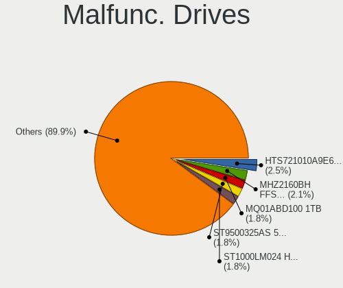
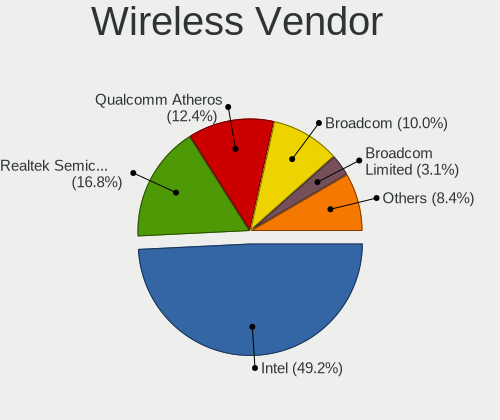
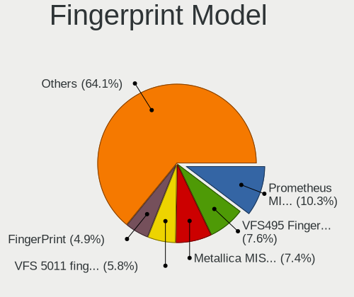

Linux in USA - Tested Hardware & Statistics (Notebooks)
-------------------------------------------------------

A project to collect tested hardware configurations for Linux in USA.

Anyone can contribute to this report by the [hw-probe](https://github.com/linuxhw/hw-probe) tool:

    sudo -E hw-probe -all -upload

Please contribute! Especially if your hardware is rare.

Contents
--------

* [ Test Cases ](#test-cases)

* [ System ](#system)
  - [ OS                       ](#os)
  - [ OS Family                ](#os-family)
  - [ Kernel                   ](#kernel)
  - [ Kernel Family            ](#kernel-family)
  - [ Kernel Major Ver.        ](#kernel-major-ver)
  - [ Arch                     ](#arch)
  - [ DE                       ](#de)
  - [ Display Server           ](#display-server)
  - [ Display Manager          ](#display-manager)
  - [ OS Lang                  ](#os-lang)
  - [ Boot Mode                ](#boot-mode)
  - [ Filesystem               ](#filesystem)
  - [ Part. scheme             ](#part-scheme)
  - [ Dual Boot with Linux/BSD ](#dual-boot-with-linuxbsd)
  - [ Dual Boot (Win)          ](#dual-boot-win)

* [ Board ](#board)
  - [ Vendor                   ](#vendor)
  - [ Model                    ](#model)
  - [ Model Family             ](#model-family)
  - [ MFG Year                 ](#mfg-year)
  - [ Form Factor              ](#form-factor)
  - [ Secure Boot              ](#secure-boot)
  - [ Coreboot                 ](#coreboot)
  - [ RAM Size                 ](#ram-size)
  - [ RAM Used                 ](#ram-used)
  - [ Total Drives             ](#total-drives)
  - [ Has CD-ROM               ](#has-cd-rom)
  - [ Has Ethernet             ](#has-ethernet)
  - [ Has WiFi                 ](#has-wifi)
  - [ Has Bluetooth            ](#has-bluetooth)

* [ Location ](#location)
  - [ Country                  ](#country)
  - [ City                     ](#city)

* [ Drives ](#drives)
  - [ Drive Vendor             ](#drive-vendor)
  - [ Drive Model              ](#drive-model)
  - [ HDD Vendor               ](#hdd-vendor)
  - [ SSD Vendor               ](#ssd-vendor)
  - [ Drive Kind               ](#drive-kind)
  - [ Drive Connector          ](#drive-connector)
  - [ Drive Size               ](#drive-size)
  - [ Space Total              ](#space-total)
  - [ Space Used               ](#space-used)
  - [ Malfunc. Drives          ](#malfunc-drives)
  - [ Malfunc. Drive Vendor    ](#malfunc-drive-vendor)
  - [ Malfunc. HDD Vendor      ](#malfunc-hdd-vendor)
  - [ Malfunc. Drive Kind      ](#malfunc-drive-kind)
  - [ Failed Drives            ](#failed-drives)
  - [ Failed Drive Vendor      ](#failed-drive-vendor)
  - [ Drive Status             ](#drive-status)

* [ Storage controller ](#storage-controller)
  - [ Storage Vendor           ](#storage-vendor)
  - [ Storage Model            ](#storage-model)
  - [ Storage Kind             ](#storage-kind)

* [ Processor ](#processor)
  - [ CPU Vendor               ](#cpu-vendor)
  - [ CPU Model                ](#cpu-model)
  - [ CPU Model Family         ](#cpu-model-family)
  - [ CPU Cores                ](#cpu-cores)
  - [ CPU Sockets              ](#cpu-sockets)
  - [ CPU Threads              ](#cpu-threads)
  - [ CPU Op-Modes             ](#cpu-op-modes)
  - [ CPU Microcode            ](#cpu-microcode)
  - [ CPU Microarch            ](#cpu-microarch)

* [ Graphics ](#graphics)
  - [ GPU Vendor               ](#gpu-vendor)
  - [ GPU Model                ](#gpu-model)
  - [ GPU Combo                ](#gpu-combo)
  - [ GPU Driver               ](#gpu-driver)
  - [ GPU Memory               ](#gpu-memory)

* [ Monitor ](#monitor)
  - [ Monitor Vendor           ](#monitor-vendor)
  - [ Monitor Model            ](#monitor-model)
  - [ Monitor Resolution       ](#monitor-resolution)
  - [ Monitor Diagonal         ](#monitor-diagonal)
  - [ Monitor Width            ](#monitor-width)
  - [ Aspect Ratio             ](#aspect-ratio)
  - [ Monitor Area             ](#monitor-area)
  - [ Pixel Density            ](#pixel-density)
  - [ Multiple Monitors        ](#multiple-monitors)

* [ Network ](#network)
  - [ Net Controller Vendor    ](#net-controller-vendor)
  - [ Net Controller Model     ](#net-controller-model)
  - [ Wireless Vendor          ](#wireless-vendor)
  - [ Wireless Model           ](#wireless-model)
  - [ Ethernet Vendor          ](#ethernet-vendor)
  - [ Ethernet Model           ](#ethernet-model)
  - [ Net Controller Kind      ](#net-controller-kind)
  - [ Used Controller          ](#used-controller)
  - [ NICs                     ](#nics)
  - [ IPv6                     ](#ipv6)

* [ Bluetooth ](#bluetooth)
  - [ Bluetooth Vendor         ](#bluetooth-vendor)
  - [ Bluetooth Model          ](#bluetooth-model)

* [ Sound ](#sound)
  - [ Sound Vendor             ](#sound-vendor)
  - [ Sound Model              ](#sound-model)

* [ Memory ](#memory)
  - [ Memory Vendor            ](#memory-vendor)
  - [ Memory Model             ](#memory-model)
  - [ Memory Kind              ](#memory-kind)
  - [ Memory Form Factor       ](#memory-form-factor)
  - [ Memory Size              ](#memory-size)
  - [ Memory Speed             ](#memory-speed)

* [ Printers & scanners ](#printers--scanners)
  - [ Printer Vendor           ](#printer-vendor)
  - [ Printer Model            ](#printer-model)
  - [ Scanner Vendor           ](#scanner-vendor)
  - [ Scanner Model            ](#scanner-model)

* [ Camera ](#camera)
  - [ Camera Vendor            ](#camera-vendor)
  - [ Camera Model             ](#camera-model)

* [ Security ](#security)
  - [ Fingerprint Vendor       ](#fingerprint-vendor)
  - [ Fingerprint Model        ](#fingerprint-model)
  - [ Chipcard Vendor          ](#chipcard-vendor)
  - [ Chipcard Model           ](#chipcard-model)

* [ Unsupported ](#unsupported)
  - [ Unsupported Devices      ](#unsupported-devices)
  - [ Unsupported Device Types ](#unsupported-device-types)

Test Cases
----------

Total: 21648

| Vendor        | Model                       | Probe                                                      | Date         |
|---------------|-----------------------------|------------------------------------------------------------|--------------|
| Dell          | XPS 15 9550                 | [0ffe1f9541](https://linux-hardware.org/?probe=0ffe1f9541) | Feb 28, 2023 |
| Dell          | Inspiron N5010              | [480ff87a20](https://linux-hardware.org/?probe=480ff87a20) | Feb 28, 2023 |
| Dell          | Inspiron 5523               | [09ccf58a6b](https://linux-hardware.org/?probe=09ccf58a6b) | Feb 28, 2023 |
| HP            | Pavilion dv7                | [e40593f800](https://linux-hardware.org/?probe=e40593f800) | Feb 28, 2023 |
| ASUSTek       | VivoBook_ASUSLaptop X412... | [87022bd601](https://linux-hardware.org/?probe=87022bd601) | Feb 28, 2023 |
| HP            | ENVY 17                     | [61d1252ef3](https://linux-hardware.org/?probe=61d1252ef3) | Feb 28, 2023 |
| Gigabyte      | AERO 15-X9                  | [18d00993bf](https://linux-hardware.org/?probe=18d00993bf) | Feb 28, 2023 |
| Apple         | MacBookPro8,1               | [ec1f27de09](https://linux-hardware.org/?probe=ec1f27de09) | Feb 28, 2023 |
| Dell          | Inspiron N5110              | [e35a1076a1](https://linux-hardware.org/?probe=e35a1076a1) | Feb 28, 2023 |
| Dell          | Inspiron 15 3511            | [99462eae5e](https://linux-hardware.org/?probe=99462eae5e) | Feb 28, 2023 |
| Lenovo        | ThinkPad X1 Extreme Gen ... | [3ab9ad10d8](https://linux-hardware.org/?probe=3ab9ad10d8) | Feb 28, 2023 |
| MECHREVO      | Jiaolong Series MRID6       | [1643b96eae](https://linux-hardware.org/?probe=1643b96eae) | Feb 28, 2023 |
| MECHREVO      | Jiaolong Series MRID6       | [b48cc99ce3](https://linux-hardware.org/?probe=b48cc99ce3) | Feb 28, 2023 |
| Lenovo        | ThinkPad X270 20HN001RUS    | [ff84200b75](https://linux-hardware.org/?probe=ff84200b75) | Feb 28, 2023 |
| HP            | Pavilion Laptop 15-cc5xx    | [4a5d167c96](https://linux-hardware.org/?probe=4a5d167c96) | Feb 28, 2023 |
| Lenovo        | Slim 7 ProX 14ARH7 82V2     | [1c61d820ff](https://linux-hardware.org/?probe=1c61d820ff) | Feb 28, 2023 |
| Lenovo        | ThinkPad X1 Carbon 5th 2... | [5c39a363d8](https://linux-hardware.org/?probe=5c39a363d8) | Feb 28, 2023 |
| Dell          | Latitude E7450              | [a36df01da9](https://linux-hardware.org/?probe=a36df01da9) | Feb 28, 2023 |
| HP            | Pavilion dv7                | [1dbb82f9ff](https://linux-hardware.org/?probe=1dbb82f9ff) | Feb 28, 2023 |
| Lenovo        | ThinkPad X1 Carbon 6th 2... | [886f442040](https://linux-hardware.org/?probe=886f442040) | Feb 28, 2023 |
| Dell          | Precision 5570              | [7e8d7c37cb](https://linux-hardware.org/?probe=7e8d7c37cb) | Feb 28, 2023 |
| Google        | Reks                        | [be1a98408d](https://linux-hardware.org/?probe=be1a98408d) | Feb 28, 2023 |
| Gateway       | Sonic-C                     | [b9f775b14e](https://linux-hardware.org/?probe=b9f775b14e) | Feb 28, 2023 |
| Toshiba       | Satellite S70-A             | [7e849f93ca](https://linux-hardware.org/?probe=7e849f93ca) | Feb 28, 2023 |
| Dell          | Latitude E7470              | [51deaef7a0](https://linux-hardware.org/?probe=51deaef7a0) | Feb 28, 2023 |
| ASUSTek       | X550CA                      | [0ce966b8fa](https://linux-hardware.org/?probe=0ce966b8fa) | Feb 27, 2023 |
| Dell          | Inspiron 5537               | [25fa030105](https://linux-hardware.org/?probe=25fa030105) | Feb 27, 2023 |
| Dell          | XPS 15 7590                 | [e1777784ac](https://linux-hardware.org/?probe=e1777784ac) | Feb 27, 2023 |
| Dell          | Inspiron 3793               | [d7b51f6048](https://linux-hardware.org/?probe=d7b51f6048) | Feb 27, 2023 |
| Valve         | Jupiter                     | [ce7b0e507f](https://linux-hardware.org/?probe=ce7b0e507f) | Feb 27, 2023 |
| Lenovo        | IdeaPad 1 15ALC7 82R4       | [47f7b39f3a](https://linux-hardware.org/?probe=47f7b39f3a) | Feb 27, 2023 |
| Dell          | Latitude E4310              | [2b2255a5b4](https://linux-hardware.org/?probe=2b2255a5b4) | Feb 27, 2023 |
| HP            | Pavilion dv7                | [d5da5f62b8](https://linux-hardware.org/?probe=d5da5f62b8) | Feb 27, 2023 |
| ASUSTek       | VivoBook_ASUSLaptop X512... | [cd19568cfc](https://linux-hardware.org/?probe=cd19568cfc) | Feb 27, 2023 |
| ASUSTek       | X541NA                      | [8c0dc3ba82](https://linux-hardware.org/?probe=8c0dc3ba82) | Feb 27, 2023 |
| Dell          | XPS L521X                   | [f9598ce828](https://linux-hardware.org/?probe=f9598ce828) | Feb 27, 2023 |
| ASUSTek       | VivoBook_ASUSLaptop E210... | [ad20f98122](https://linux-hardware.org/?probe=ad20f98122) | Feb 27, 2023 |
| Dell          | Vostro 1540                 | [8f09ea4351](https://linux-hardware.org/?probe=8f09ea4351) | Feb 27, 2023 |
| Apple         | MacBookAir6,2               | [0fb60ed4e2](https://linux-hardware.org/?probe=0fb60ed4e2) | Feb 27, 2023 |
| Valve         | Jupiter                     | [52268bbf2b](https://linux-hardware.org/?probe=52268bbf2b) | Feb 27, 2023 |
| HP            | ENVY m7 Notebook            | [14374fbcc8](https://linux-hardware.org/?probe=14374fbcc8) | Feb 27, 2023 |
| Lenovo        | ThinkPad X395 20NL0006US    | [9030fac261](https://linux-hardware.org/?probe=9030fac261) | Feb 26, 2023 |
| Acer          | Aspire V3-772G              | [83dce8f92d](https://linux-hardware.org/?probe=83dce8f92d) | Feb 26, 2023 |
| Gateway       | Sonic-C                     | [6def275f9b](https://linux-hardware.org/?probe=6def275f9b) | Feb 26, 2023 |
| HP            | Pavilion Laptop 15-cc5xx    | [13f87401ca](https://linux-hardware.org/?probe=13f87401ca) | Feb 26, 2023 |
| Acer          | Aspire 1410                 | [40b5704a1c](https://linux-hardware.org/?probe=40b5704a1c) | Feb 26, 2023 |
| Lenovo        | IdeaPad 3 15IML05 81WR      | [b19a229c5c](https://linux-hardware.org/?probe=b19a229c5c) | Feb 26, 2023 |
| Dell          | Latitude 7350               | [a8bbed94ce](https://linux-hardware.org/?probe=a8bbed94ce) | Feb 26, 2023 |
| HP            | Laptop 15-ef2xxx            | [54c4b4eb4e](https://linux-hardware.org/?probe=54c4b4eb4e) | Feb 26, 2023 |
| Lenovo        | ThinkPad X230 Tablet 343... | [be9468c864](https://linux-hardware.org/?probe=be9468c864) | Feb 26, 2023 |
| Lenovo        | ThinkPad T430 2349GUU       | [95cc420bd5](https://linux-hardware.org/?probe=95cc420bd5) | Feb 26, 2023 |
| HP            | Laptop 15-ef2xxx            | [a9e58a8737](https://linux-hardware.org/?probe=a9e58a8737) | Feb 26, 2023 |
| Lenovo        | ThinkPad X201 3626AL3       | [9c3a1f5cd5](https://linux-hardware.org/?probe=9c3a1f5cd5) | Feb 26, 2023 |
| Lenovo        | ThinkPad T430 2344BZU       | [245d23aff3](https://linux-hardware.org/?probe=245d23aff3) | Feb 26, 2023 |
| ASUSTek       | TUF Gaming FX705DT_FX705... | [8a3c646d1f](https://linux-hardware.org/?probe=8a3c646d1f) | Feb 26, 2023 |
| Lenovo        | ThinkPad E15 Gen 4 21ED0... | [85bc55a850](https://linux-hardware.org/?probe=85bc55a850) | Feb 26, 2023 |
| Dell          | Latitude E6420              | [b35fdc2f10](https://linux-hardware.org/?probe=b35fdc2f10) | Feb 26, 2023 |
| Lenovo        | ThinkPad X13s Gen 1 21BX... | [633fb08804](https://linux-hardware.org/?probe=633fb08804) | Feb 26, 2023 |
| Lenovo        | ThinkPad T61 6464A13        | [e981803528](https://linux-hardware.org/?probe=e981803528) | Feb 26, 2023 |
| Lenovo        | ThinkPad T430s 235368U      | [58a8ada163](https://linux-hardware.org/?probe=58a8ada163) | Feb 26, 2023 |
| HP            | EliteBook 745 G3            | [8cee2ac27a](https://linux-hardware.org/?probe=8cee2ac27a) | Feb 26, 2023 |
| Dell          | Inspiron 16 5620            | [1b83626bdf](https://linux-hardware.org/?probe=1b83626bdf) | Feb 26, 2023 |
| Lenovo        | IdeaPad 5 15IAL7 82SF       | [3b2a19c835](https://linux-hardware.org/?probe=3b2a19c835) | Feb 26, 2023 |
| Direkt-Tek    | DTLAPY133-1                 | [df87b3b645](https://linux-hardware.org/?probe=df87b3b645) | Feb 26, 2023 |
| Dell          | XPS L701X                   | [ad6ca78b72](https://linux-hardware.org/?probe=ad6ca78b72) | Feb 26, 2023 |
| System76      | Serval WS                   | [1b136ec80d](https://linux-hardware.org/?probe=1b136ec80d) | Feb 25, 2023 |
| Lenovo        | Legion 5 82B5               | [8db23a7237](https://linux-hardware.org/?probe=8db23a7237) | Feb 25, 2023 |
| Google        | Lars                        | [ec4b0e7bbc](https://linux-hardware.org/?probe=ec4b0e7bbc) | Feb 25, 2023 |
| GPU Compan... | GWTC116-2                   | [1475770a2a](https://linux-hardware.org/?probe=1475770a2a) | Feb 25, 2023 |
| GPU Compan... | GWTN141-10                  | [1550bec17e](https://linux-hardware.org/?probe=1550bec17e) | Feb 25, 2023 |
| GPU Compan... | GWTN141-10                  | [aa535b0731](https://linux-hardware.org/?probe=aa535b0731) | Feb 25, 2023 |
| Lenovo        | Legion 7 16ARHA7 82UH       | [31bd9738ca](https://linux-hardware.org/?probe=31bd9738ca) | Feb 25, 2023 |
| Unknown       | T3 MRD                      | [ae88920ea5](https://linux-hardware.org/?probe=ae88920ea5) | Feb 25, 2023 |
| Dell          | Inspiron 3521               | [b6321ee5a4](https://linux-hardware.org/?probe=b6321ee5a4) | Feb 25, 2023 |
| Dell          | Inspiron 3521               | [efc95d4697](https://linux-hardware.org/?probe=efc95d4697) | Feb 25, 2023 |
| HP            | Pavilion Laptop 15-cs3xx... | [0b9491b3a0](https://linux-hardware.org/?probe=0b9491b3a0) | Feb 25, 2023 |
| System76      | Galago Pro                  | [3e4391562b](https://linux-hardware.org/?probe=3e4391562b) | Feb 25, 2023 |
| Dell          | Inspiron 5537               | [0496ce1146](https://linux-hardware.org/?probe=0496ce1146) | Feb 25, 2023 |
| Dell          | Inspiron 5537               | [cb4b91f80c](https://linux-hardware.org/?probe=cb4b91f80c) | Feb 25, 2023 |
| Dell          | Inspiron 5759               | [be0b15660e](https://linux-hardware.org/?probe=be0b15660e) | Feb 25, 2023 |
| Unknown       | Unknown                     | [99c7da7e97](https://linux-hardware.org/?probe=99c7da7e97) | Feb 25, 2023 |
| HP            | Laptop 15-dy2xxx            | [7f88a11698](https://linux-hardware.org/?probe=7f88a11698) | Feb 25, 2023 |
| Lenovo        | ThinkPad Z13 Gen 1 21D2C... | [e07445a583](https://linux-hardware.org/?probe=e07445a583) | Feb 25, 2023 |
| HP            | ENVY 17                     | [7baf81c4e8](https://linux-hardware.org/?probe=7baf81c4e8) | Feb 25, 2023 |
| Unknown       | Unknown                     | [2c5d6ab621](https://linux-hardware.org/?probe=2c5d6ab621) | Feb 25, 2023 |
| MSI           | GF63 Thin 10SC              | [824f4eafd0](https://linux-hardware.org/?probe=824f4eafd0) | Feb 25, 2023 |
| HP            | ENVY 17                     | [8790ad53d8](https://linux-hardware.org/?probe=8790ad53d8) | Feb 25, 2023 |
| Dell          | XPS 15 9500                 | [96e6c2c201](https://linux-hardware.org/?probe=96e6c2c201) | Feb 25, 2023 |
| Apple         | MacBookPro16,2              | [c4cab43483](https://linux-hardware.org/?probe=c4cab43483) | Feb 25, 2023 |
| System76      | Gazelle                     | [64fcb063eb](https://linux-hardware.org/?probe=64fcb063eb) | Feb 25, 2023 |
| HP            | 2000                        | [2e234233cc](https://linux-hardware.org/?probe=2e234233cc) | Feb 25, 2023 |
| HP            | 15                          | [04741afb27](https://linux-hardware.org/?probe=04741afb27) | Feb 25, 2023 |
| HP            | Pavilion Laptop 15-cd0xx    | [dfb5281dfb](https://linux-hardware.org/?probe=dfb5281dfb) | Feb 25, 2023 |
| Gateway       | NV47H                       | [4168112a0a](https://linux-hardware.org/?probe=4168112a0a) | Feb 25, 2023 |
| Gateway       | NV47H                       | [8faf0d384e](https://linux-hardware.org/?probe=8faf0d384e) | Feb 25, 2023 |
| Toshiba       | QOSMIO X505                 | [ba222e690b](https://linux-hardware.org/?probe=ba222e690b) | Feb 25, 2023 |
| HP            | EliteBook 840 G2            | [33dc8202e9](https://linux-hardware.org/?probe=33dc8202e9) | Feb 25, 2023 |
| Toshiba       | QOSMIO X505                 | [8dd3063004](https://linux-hardware.org/?probe=8dd3063004) | Feb 25, 2023 |
| Star Labs     | StarBook                    | [fbd529b953](https://linux-hardware.org/?probe=fbd529b953) | Feb 25, 2023 |
| Lenovo        | IdeaPad 5 15IAL7 82SF       | [12d979b047](https://linux-hardware.org/?probe=12d979b047) | Feb 25, 2023 |
| Lenovo        | ThinkPad T15 Gen 2i 20W4... | [3b757c7c9c](https://linux-hardware.org/?probe=3b757c7c9c) | Feb 25, 2023 |
| Dell          | Latitude 3310               | [d989647d9d](https://linux-hardware.org/?probe=d989647d9d) | Feb 25, 2023 |
| Dell          | XPS 17 9710                 | [4066713adb](https://linux-hardware.org/?probe=4066713adb) | Feb 24, 2023 |
| Dell          | Latitude D630               | [433f06ecbb](https://linux-hardware.org/?probe=433f06ecbb) | Feb 24, 2023 |
| HP            | Laptop 17-by2xxx            | [d6a91a338c](https://linux-hardware.org/?probe=d6a91a338c) | Feb 24, 2023 |
| HP            | ProBook 450 G1              | [f7c4b009f1](https://linux-hardware.org/?probe=f7c4b009f1) | Feb 24, 2023 |
| Alienware     | m15 R7 AMD                  | [0a44dcc29e](https://linux-hardware.org/?probe=0a44dcc29e) | Feb 24, 2023 |
| Gigabyte      | AERO 15 Classic-SA          | [bc6078dda0](https://linux-hardware.org/?probe=bc6078dda0) | Feb 24, 2023 |
| Lenovo        | ThinkPad X220 Tablet 429... | [2f561a23c3](https://linux-hardware.org/?probe=2f561a23c3) | Feb 24, 2023 |
| Alienware     | m15 R7 AMD                  | [3ba05d49d8](https://linux-hardware.org/?probe=3ba05d49d8) | Feb 24, 2023 |
| Dell          | Latitude E5470              | [d7c8a049c4](https://linux-hardware.org/?probe=d7c8a049c4) | Feb 24, 2023 |
| HP            | 650                         | [ab0b350259](https://linux-hardware.org/?probe=ab0b350259) | Feb 24, 2023 |
| Acer          | AO756                       | [ca83ee78ec](https://linux-hardware.org/?probe=ca83ee78ec) | Feb 24, 2023 |
| HP            | Laptop 14-ck0xxx            | [bafb67390c](https://linux-hardware.org/?probe=bafb67390c) | Feb 24, 2023 |
| HP            | Presario CQ57               | [b41de6d094](https://linux-hardware.org/?probe=b41de6d094) | Feb 24, 2023 |
| Lenovo        | ThinkPad X230 23253Z5       | [1237b75ae4](https://linux-hardware.org/?probe=1237b75ae4) | Feb 24, 2023 |
| Dell          | Vostro 15 7510              | [38085af23d](https://linux-hardware.org/?probe=38085af23d) | Feb 24, 2023 |
| MSI           | MS-7A32                     | [2312252934](https://linux-hardware.org/?probe=2312252934) | Feb 24, 2023 |
| ASUSTek       | ROG Strix G512LW_G512LW     | [012415eb50](https://linux-hardware.org/?probe=012415eb50) | Feb 24, 2023 |
| ASUSTek       | ROG Strix G512LW_G512LW     | [e1c3e1611f](https://linux-hardware.org/?probe=e1c3e1611f) | Feb 24, 2023 |
| HP            | EliteBook Folio 9480m       | [788e0929de](https://linux-hardware.org/?probe=788e0929de) | Feb 24, 2023 |
| MSI           | GE75 Raider 9SE             | [6d0782da8e](https://linux-hardware.org/?probe=6d0782da8e) | Feb 24, 2023 |
| Apple         | MacBookPro12,1              | [3b27d3609f](https://linux-hardware.org/?probe=3b27d3609f) | Feb 24, 2023 |
| Dell          | Inspiron 3505               | [324020ca8b](https://linux-hardware.org/?probe=324020ca8b) | Feb 24, 2023 |
| HP            | Pavilion Notebook           | [fee146aaa1](https://linux-hardware.org/?probe=fee146aaa1) | Feb 24, 2023 |
| Toshiba       | Satellite A205              | [07e63c8b75](https://linux-hardware.org/?probe=07e63c8b75) | Feb 24, 2023 |
| Toshiba       | Satellite L775D             | [d8b2acd038](https://linux-hardware.org/?probe=d8b2acd038) | Feb 24, 2023 |
| Lenovo        | ThinkPad T431s 20AA000MU... | [68779350fd](https://linux-hardware.org/?probe=68779350fd) | Feb 24, 2023 |
| Apple         | MacBookPro9,2               | [c591acd5d6](https://linux-hardware.org/?probe=c591acd5d6) | Feb 24, 2023 |
| Dell          | Inspiron 5502               | [2c490934fb](https://linux-hardware.org/?probe=2c490934fb) | Feb 24, 2023 |
| HP            | Pavilion Gaming Laptop 1... | [d8d531c22a](https://linux-hardware.org/?probe=d8d531c22a) | Feb 24, 2023 |
| Lenovo        | IdeaPad 1 15ALC7 82R4       | [aef7584b8c](https://linux-hardware.org/?probe=aef7584b8c) | Feb 24, 2023 |
| MSI           | GE75 Raider 10SF            | [cc21335206](https://linux-hardware.org/?probe=cc21335206) | Feb 24, 2023 |
| Lenovo        | ThinkPad T430s 2356CU8      | [bb0d8e868d](https://linux-hardware.org/?probe=bb0d8e868d) | Feb 23, 2023 |
| Lenovo        | ThinkPad P51s 20HB0012US    | [3135124837](https://linux-hardware.org/?probe=3135124837) | Feb 23, 2023 |
| HP            | Laptop 15-bs0xx             | [dbab0ba93c](https://linux-hardware.org/?probe=dbab0ba93c) | Feb 23, 2023 |
| Lenovo        | Legion S7 15ACH6 82K8       | [c69ac67426](https://linux-hardware.org/?probe=c69ac67426) | Feb 23, 2023 |
| Acer          | Aspire A515-46              | [009fbacf68](https://linux-hardware.org/?probe=009fbacf68) | Feb 23, 2023 |
| HP            | Stream Laptop 14-cb1xxx     | [14cf9e07e0](https://linux-hardware.org/?probe=14cf9e07e0) | Feb 23, 2023 |
| HP            | Stream Laptop 14-cb1xxx     | [388f34d16e](https://linux-hardware.org/?probe=388f34d16e) | Feb 23, 2023 |
| Apple         | MacBookAir4,1               | [bc134b45c7](https://linux-hardware.org/?probe=bc134b45c7) | Feb 23, 2023 |
| ONE-NETBOO... | ONE XPLAYER 1002-C          | [33a4731a5e](https://linux-hardware.org/?probe=33a4731a5e) | Feb 23, 2023 |
| LincPlus      | P2                          | [5d4e528621](https://linux-hardware.org/?probe=5d4e528621) | Feb 23, 2023 |
| ASUSTek       | K56CA                       | [d8475e4c48](https://linux-hardware.org/?probe=d8475e4c48) | Feb 23, 2023 |
| MSI           | GF75 Thin 10SCXK            | [a64a363f58](https://linux-hardware.org/?probe=a64a363f58) | Feb 23, 2023 |
| ASUSTek       | ZenBook UX534FTC_UX534FT    | [55c6dbae70](https://linux-hardware.org/?probe=55c6dbae70) | Feb 23, 2023 |
| MSI           | GF75 Thin 10SCXK            | [3647a78d88](https://linux-hardware.org/?probe=3647a78d88) | Feb 23, 2023 |
| Dell          | Latitude 7480               | [fd80b301db](https://linux-hardware.org/?probe=fd80b301db) | Feb 23, 2023 |
| Lenovo        | G500 20236                  | [294c5c45e6](https://linux-hardware.org/?probe=294c5c45e6) | Feb 23, 2023 |
| Dell          | XPS 13 9370                 | [8923d5940e](https://linux-hardware.org/?probe=8923d5940e) | Feb 23, 2023 |
| ASUSTek       | Zenbook Pro Duo UX582ZW_... | [34016a67d9](https://linux-hardware.org/?probe=34016a67d9) | Feb 22, 2023 |
| CyberPower... | Tracer IV GM5MQ8W           | [284e8a4fb1](https://linux-hardware.org/?probe=284e8a4fb1) | Feb 22, 2023 |
| Dell          | Latitude E5570              | [338538c1c9](https://linux-hardware.org/?probe=338538c1c9) | Feb 22, 2023 |
| Dell          | Precision M4800             | [9fb203c728](https://linux-hardware.org/?probe=9fb203c728) | Feb 22, 2023 |
| HP            | Laptop 14-cf1xxx            | [8ab5fc5f5b](https://linux-hardware.org/?probe=8ab5fc5f5b) | Feb 22, 2023 |
| HP            | Laptop 14-cf1xxx            | [bfaf2fecc0](https://linux-hardware.org/?probe=bfaf2fecc0) | Feb 22, 2023 |
| Alienware     | x14                         | [0b32a33625](https://linux-hardware.org/?probe=0b32a33625) | Feb 22, 2023 |
| Alienware     | x14                         | [04094754b6](https://linux-hardware.org/?probe=04094754b6) | Feb 22, 2023 |
| HP            | ENVY TS 17                  | [69075ec507](https://linux-hardware.org/?probe=69075ec507) | Feb 22, 2023 |
| Alienware     | 17 R5                       | [1d234f85b4](https://linux-hardware.org/?probe=1d234f85b4) | Feb 22, 2023 |
| Alienware     | 17 R5                       | [5b6b8eee92](https://linux-hardware.org/?probe=5b6b8eee92) | Feb 22, 2023 |
| Acer          | AO756                       | [58f52941c7](https://linux-hardware.org/?probe=58f52941c7) | Feb 22, 2023 |
| Valve         | Jupiter                     | [b63e3b45e8](https://linux-hardware.org/?probe=b63e3b45e8) | Feb 22, 2023 |
| Lenovo        | ThinkPad X1 Carbon 5th 2... | [d47bf72cc8](https://linux-hardware.org/?probe=d47bf72cc8) | Feb 22, 2023 |
| HP            | Laptop 15-ef1xxx            | [0897c4ed73](https://linux-hardware.org/?probe=0897c4ed73) | Feb 22, 2023 |
| Valve         | Jupiter                     | [f2e4fff4ad](https://linux-hardware.org/?probe=f2e4fff4ad) | Feb 22, 2023 |
| Dell          | Latitude 3189               | [3a9dc7e02c](https://linux-hardware.org/?probe=3a9dc7e02c) | Feb 22, 2023 |
| Lenovo        | ThinkPad T450 20BUS0B000    | [6ab727e8c0](https://linux-hardware.org/?probe=6ab727e8c0) | Feb 22, 2023 |
| Gateway       | NV53A                       | [1e2b4ec4d3](https://linux-hardware.org/?probe=1e2b4ec4d3) | Feb 22, 2023 |
| Dell          | Latitude E5420              | [f5a1982d9c](https://linux-hardware.org/?probe=f5a1982d9c) | Feb 22, 2023 |
| DERE          | V14                         | [bb2d40e676](https://linux-hardware.org/?probe=bb2d40e676) | Feb 22, 2023 |
| Gateway       | NV79                        | [e66a3dc233](https://linux-hardware.org/?probe=e66a3dc233) | Feb 22, 2023 |
| Dell          | System Inspiron N7110       | [4a3b8e0755](https://linux-hardware.org/?probe=4a3b8e0755) | Feb 22, 2023 |
| Apple         | MacBookPro14,1              | [f98cec9924](https://linux-hardware.org/?probe=f98cec9924) | Feb 22, 2023 |
| Apple         | MacBookPro11,4              | [c4eab564b3](https://linux-hardware.org/?probe=c4eab564b3) | Feb 22, 2023 |
| HP            | ProBook 645 G1              | [773f9f1807](https://linux-hardware.org/?probe=773f9f1807) | Feb 22, 2023 |
| Dell          | Latitude 7530               | [4844568edb](https://linux-hardware.org/?probe=4844568edb) | Feb 21, 2023 |
| Dell          | Latitude E5570              | [47a066467a](https://linux-hardware.org/?probe=47a066467a) | Feb 21, 2023 |
| HP            | ENVY 17                     | [ea0b2e63ef](https://linux-hardware.org/?probe=ea0b2e63ef) | Feb 21, 2023 |
| Apple         | MacBookPro16,1              | [a5cff07fd8](https://linux-hardware.org/?probe=a5cff07fd8) | Feb 21, 2023 |
| HP            | 2000                        | [fcae97cda8](https://linux-hardware.org/?probe=fcae97cda8) | Feb 21, 2023 |
| Lenovo        | ThinkPad P53 20QNS00X00     | [65f3a9d691](https://linux-hardware.org/?probe=65f3a9d691) | Feb 21, 2023 |
| ASUSTek       | ZenBook UX393EA_UX393EA     | [546763e7aa](https://linux-hardware.org/?probe=546763e7aa) | Feb 21, 2023 |
| Valve         | Jupiter                     | [d4f23e8a92](https://linux-hardware.org/?probe=d4f23e8a92) | Feb 21, 2023 |
| HP            | Laptop 15-dy2xxx            | [5d32bc7f7c](https://linux-hardware.org/?probe=5d32bc7f7c) | Feb 21, 2023 |
| HP            | Laptop 15-dy2xxx            | [a00e724475](https://linux-hardware.org/?probe=a00e724475) | Feb 21, 2023 |
| Dell          | Precision 7720              | [2f7837d5b6](https://linux-hardware.org/?probe=2f7837d5b6) | Feb 21, 2023 |
| Dell          | G15 5525                    | [63bd2ac7b9](https://linux-hardware.org/?probe=63bd2ac7b9) | Feb 21, 2023 |
| Lenovo        | ThinkPad T15p Gen 3 21DA... | [dd12dc45d7](https://linux-hardware.org/?probe=dd12dc45d7) | Feb 21, 2023 |
| Dell          | Inspiron 7400               | [0d286f12f4](https://linux-hardware.org/?probe=0d286f12f4) | Feb 21, 2023 |
| GPU Compan... | GWTC116-2                   | [5fa20b737f](https://linux-hardware.org/?probe=5fa20b737f) | Feb 21, 2023 |
| Lenovo        | ThinkPad P1 Gen 4i 20Y4S... | [6ab7953740](https://linux-hardware.org/?probe=6ab7953740) | Feb 20, 2023 |
| Dell          | G15 5510                    | [a1edb7b376](https://linux-hardware.org/?probe=a1edb7b376) | Feb 20, 2023 |
| SK hynix      | HyBook                      | [494c1a322d](https://linux-hardware.org/?probe=494c1a322d) | Feb 20, 2023 |
| Lenovo        | ThinkPad Edge E540 20C60... | [cd5dcaaf88](https://linux-hardware.org/?probe=cd5dcaaf88) | Feb 20, 2023 |
| Dell          | Precision M4800             | [8f41cc730e](https://linux-hardware.org/?probe=8f41cc730e) | Feb 20, 2023 |
| HP            | Laptop 14-dq1xxx            | [37c6221f28](https://linux-hardware.org/?probe=37c6221f28) | Feb 20, 2023 |
| Lenovo        | ThinkPad X1 Carbon 7th 2... | [48dd80f1b1](https://linux-hardware.org/?probe=48dd80f1b1) | Feb 20, 2023 |
| Lenovo        | ThinkPad T15p Gen 3 21DA... | [defde684a0](https://linux-hardware.org/?probe=defde684a0) | Feb 20, 2023 |
| Lenovo        | IdeaPad S145-15IWL 81MV     | [e9dd0e6f5e](https://linux-hardware.org/?probe=e9dd0e6f5e) | Feb 20, 2023 |
| Valve         | Jupiter                     | [ea61d2236a](https://linux-hardware.org/?probe=ea61d2236a) | Feb 20, 2023 |
| Lenovo        | ThinkPad Z13 Gen 1 21D2C... | [1832e70d83](https://linux-hardware.org/?probe=1832e70d83) | Feb 20, 2023 |
| Acer          | Aspire M5-583P              | [0beb710e7c](https://linux-hardware.org/?probe=0beb710e7c) | Feb 20, 2023 |
| Lenovo        | ThinkPad Z13 Gen 1 21D2C... | [9adf6b834b](https://linux-hardware.org/?probe=9adf6b834b) | Feb 20, 2023 |
| Dell          | Vostro 7590                 | [d8afec7717](https://linux-hardware.org/?probe=d8afec7717) | Feb 20, 2023 |
| Lenovo        | ThinkPad T530 239265U       | [9f60ca6bf5](https://linux-hardware.org/?probe=9f60ca6bf5) | Feb 20, 2023 |
| Dell          | Precision 7770              | [d8db6fecdd](https://linux-hardware.org/?probe=d8db6fecdd) | Feb 20, 2023 |
| Acer          | Peppy                       | [0049af485a](https://linux-hardware.org/?probe=0049af485a) | Feb 20, 2023 |
| Acer          | Aspire M5-583P              | [e4e9744dc5](https://linux-hardware.org/?probe=e4e9744dc5) | Feb 20, 2023 |
| Dell          | Vostro 7590                 | [a3f369f79b](https://linux-hardware.org/?probe=a3f369f79b) | Feb 20, 2023 |
| HP            | ProBook 450 G1              | [b5e8826f8c](https://linux-hardware.org/?probe=b5e8826f8c) | Feb 20, 2023 |
| HP            | EliteBook 840 G3            | [b20071bc70](https://linux-hardware.org/?probe=b20071bc70) | Feb 20, 2023 |
| HP            | Pavilion dv7                | [21e9d5e341](https://linux-hardware.org/?probe=21e9d5e341) | Feb 20, 2023 |
| Dell          | XPS 15 9570                 | [248fb5acc6](https://linux-hardware.org/?probe=248fb5acc6) | Feb 20, 2023 |
| Lenovo        | ThinkPad T14s Gen 2a 20X... | [057dcdc86b](https://linux-hardware.org/?probe=057dcdc86b) | Feb 20, 2023 |
| Apple         | MacBookAir3,1               | [1e0de945b7](https://linux-hardware.org/?probe=1e0de945b7) | Feb 20, 2023 |
| Lenovo        | ThinkPad T14s Gen 2a 20X... | [89eb85b36f](https://linux-hardware.org/?probe=89eb85b36f) | Feb 19, 2023 |
| Acer          | Aspire 5734Z                | [a6cb13e7d4](https://linux-hardware.org/?probe=a6cb13e7d4) | Feb 19, 2023 |
| HP            | ProBook 645 G1              | [0e7035ecf4](https://linux-hardware.org/?probe=0e7035ecf4) | Feb 19, 2023 |
| Apple         | MacBook4,1                  | [2011c2060b](https://linux-hardware.org/?probe=2011c2060b) | Feb 19, 2023 |
| Dell          | XPS 15 9520                 | [631e48a0e5](https://linux-hardware.org/?probe=631e48a0e5) | Feb 19, 2023 |
| Dell          | Latitude E5450              | [2642ea7e3d](https://linux-hardware.org/?probe=2642ea7e3d) | Feb 19, 2023 |
| HP            | Pavilion Laptop 15-eg0xx... | [752cdf5b2b](https://linux-hardware.org/?probe=752cdf5b2b) | Feb 19, 2023 |
| HP            | 2000                        | [5fae52af82](https://linux-hardware.org/?probe=5fae52af82) | Feb 19, 2023 |
| Lenovo        | ThinkPad P53 20QNS00X00     | [2b1fc8eb09](https://linux-hardware.org/?probe=2b1fc8eb09) | Feb 19, 2023 |
| Core Innov... | CLT1564                     | [5a2d99678f](https://linux-hardware.org/?probe=5a2d99678f) | Feb 19, 2023 |
| Apple         | MacBookPro9,2               | [baa725d110](https://linux-hardware.org/?probe=baa725d110) | Feb 19, 2023 |
| Core Innov... | CLT1564                     | [6802e51afd](https://linux-hardware.org/?probe=6802e51afd) | Feb 19, 2023 |
| Lenovo        | ThinkPad T480s 20L70028U... | [ee24b75c39](https://linux-hardware.org/?probe=ee24b75c39) | Feb 19, 2023 |
| Dell          | Inspiron 14-3452            | [e08dcd6c59](https://linux-hardware.org/?probe=e08dcd6c59) | Feb 19, 2023 |
| HP            | 240 G8 Notebook PC          | [4a31ad70ba](https://linux-hardware.org/?probe=4a31ad70ba) | Feb 19, 2023 |
| ASUSTek       | VivoBook_ASUSLaptop X712... | [29d880eac0](https://linux-hardware.org/?probe=29d880eac0) | Feb 19, 2023 |
| Unknown       | Apple MacBook Air (13-in... | [de36f8128d](https://linux-hardware.org/?probe=de36f8128d) | Feb 19, 2023 |
| HP            | Laptop 15-db1xxx            | [381d9832ae](https://linux-hardware.org/?probe=381d9832ae) | Feb 19, 2023 |
| ASUSTek       | Strix 17 GL703GE            | [48ca6dc3eb](https://linux-hardware.org/?probe=48ca6dc3eb) | Feb 19, 2023 |
| HP            | Victus by Laptop 16z-e10... | [a48460122c](https://linux-hardware.org/?probe=a48460122c) | Feb 19, 2023 |
| Lenovo        | G770 1037                   | [2897d93885](https://linux-hardware.org/?probe=2897d93885) | Feb 18, 2023 |
| Acer          | Nitro AN515-55              | [3158f1e0d5](https://linux-hardware.org/?probe=3158f1e0d5) | Feb 18, 2023 |
| Acer          | Aspire A515-46              | [46a8b61785](https://linux-hardware.org/?probe=46a8b61785) | Feb 18, 2023 |
| Google        | Kled                        | [788d726509](https://linux-hardware.org/?probe=788d726509) | Feb 18, 2023 |
| Lenovo        | ThinkPad T530 2429F27       | [b835147a32](https://linux-hardware.org/?probe=b835147a32) | Feb 18, 2023 |
| Unknown       | Apple MacBook Pro (14-in... | [fb2cbe3576](https://linux-hardware.org/?probe=fb2cbe3576) | Feb 18, 2023 |
| Dell          | System Inspiron N7110       | [542553dd55](https://linux-hardware.org/?probe=542553dd55) | Feb 18, 2023 |
| Lenovo        | ThinkPad T14 Gen 2i 20W1... | [e7988c5ab6](https://linux-hardware.org/?probe=e7988c5ab6) | Feb 18, 2023 |
| Dell          | Latitude E6410              | [a08165ca92](https://linux-hardware.org/?probe=a08165ca92) | Feb 18, 2023 |
| Google        | Celes                       | [3004fce0ed](https://linux-hardware.org/?probe=3004fce0ed) | Feb 18, 2023 |
| MSI           | GE75 Raider 9SE             | [0cf7067e58](https://linux-hardware.org/?probe=0cf7067e58) | Feb 18, 2023 |
| Lenovo        | IdeaPad 1 15ADA7 82R1       | [f53b1c8aeb](https://linux-hardware.org/?probe=f53b1c8aeb) | Feb 18, 2023 |
| HP            | ENVY 17                     | [de8af1b249](https://linux-hardware.org/?probe=de8af1b249) | Feb 18, 2023 |
| Dell          | Inspiron 5579               | [ba48a0f893](https://linux-hardware.org/?probe=ba48a0f893) | Feb 18, 2023 |
| HP            | 15                          | [d148c16ade](https://linux-hardware.org/?probe=d148c16ade) | Feb 18, 2023 |
| ASUSTek       | X555DA                      | [2ac23d19ec](https://linux-hardware.org/?probe=2ac23d19ec) | Feb 18, 2023 |
| Lenovo        | ThinkPad P14s Gen 2a 21A... | [5cc4ff8271](https://linux-hardware.org/?probe=5cc4ff8271) | Feb 18, 2023 |
| ASUSTek       | VivoBook_ASUSLaptop S540... | [6d2b283e83](https://linux-hardware.org/?probe=6d2b283e83) | Feb 18, 2023 |
| HP            | Notebook                    | [9fbe66f89a](https://linux-hardware.org/?probe=9fbe66f89a) | Feb 18, 2023 |
| Dell          | Precision 5560              | [24e5de4a3d](https://linux-hardware.org/?probe=24e5de4a3d) | Feb 18, 2023 |
| Lenovo        | ThinkPad P14s Gen 2a 21A... | [75f9e575b3](https://linux-hardware.org/?probe=75f9e575b3) | Feb 18, 2023 |
| Dell          | Inspiron 14-3452            | [e2cc024607](https://linux-hardware.org/?probe=e2cc024607) | Feb 18, 2023 |
| Dell          | Inspiron 14 Plus 7420       | [59387e9081](https://linux-hardware.org/?probe=59387e9081) | Feb 18, 2023 |
| Sony          | VGN-FW270J                  | [81ce2212e9](https://linux-hardware.org/?probe=81ce2212e9) | Feb 18, 2023 |
| Lenovo        | IdeaPad 5 15ABA7 82SG       | [8b2c1c3fb2](https://linux-hardware.org/?probe=8b2c1c3fb2) | Feb 18, 2023 |
| Valve         | Jupiter                     | [f547e9585f](https://linux-hardware.org/?probe=f547e9585f) | Feb 18, 2023 |
| Dell          | G3 3590                     | [a8a3df007f](https://linux-hardware.org/?probe=a8a3df007f) | Feb 18, 2023 |
| Dell          | Latitude E5450              | [56827b29dc](https://linux-hardware.org/?probe=56827b29dc) | Feb 18, 2023 |
| HP            | G62                         | [59a7a48e19](https://linux-hardware.org/?probe=59a7a48e19) | Feb 18, 2023 |
| Lenovo        | IdeaPad 5 15ABA7 82SG       | [28531a322b](https://linux-hardware.org/?probe=28531a322b) | Feb 18, 2023 |
| Lenovo        | ThinkPad T14 Gen 2i 20W1... | [76c8c6f7ba](https://linux-hardware.org/?probe=76c8c6f7ba) | Feb 17, 2023 |
| Acer          | Aspire A515-45              | [ce9f366d7e](https://linux-hardware.org/?probe=ce9f366d7e) | Feb 17, 2023 |
| HP            | ENVY Laptop 17-cr0xxx       | [fde666c0ea](https://linux-hardware.org/?probe=fde666c0ea) | Feb 17, 2023 |
| Acer          | Aspire A515-57              | [d1cf9358f7](https://linux-hardware.org/?probe=d1cf9358f7) | Feb 17, 2023 |
| Toshiba       | Satellite S70-A             | [3361f06add](https://linux-hardware.org/?probe=3361f06add) | Feb 17, 2023 |
| HP            | Pavilion Laptop 15-eg0xx... | [4577d3d99d](https://linux-hardware.org/?probe=4577d3d99d) | Feb 17, 2023 |
| Lenovo        | ThinkPad T490 20N2001YUS    | [53ef9ffad8](https://linux-hardware.org/?probe=53ef9ffad8) | Feb 17, 2023 |
| Lenovo        | ThinkPad P14s Gen 2a 21A... | [f120e182a1](https://linux-hardware.org/?probe=f120e182a1) | Feb 17, 2023 |
| HP            | ENVY Laptop 17-cr0xxx       | [5ce5272a93](https://linux-hardware.org/?probe=5ce5272a93) | Feb 17, 2023 |
| Lenovo        | IdeaPad 1 14IGL7 82V6       | [39dfda526c](https://linux-hardware.org/?probe=39dfda526c) | Feb 17, 2023 |
| Dell          | Inspiron 17-7779            | [da4ee713d7](https://linux-hardware.org/?probe=da4ee713d7) | Feb 17, 2023 |
| HP            | Pavilion 17                 | [058dbd3d5a](https://linux-hardware.org/?probe=058dbd3d5a) | Feb 17, 2023 |
| Lenovo        | IdeaPad 1 14IGL7 82V6       | [0275b22de5](https://linux-hardware.org/?probe=0275b22de5) | Feb 17, 2023 |
| ASUSTek       | K501UX                      | [4663e9136a](https://linux-hardware.org/?probe=4663e9136a) | Feb 17, 2023 |
| Lenovo        | ThinkPad T61p 6457UN2       | [02e6818311](https://linux-hardware.org/?probe=02e6818311) | Feb 17, 2023 |
| Valve         | Jupiter                     | [30327e7c1d](https://linux-hardware.org/?probe=30327e7c1d) | Feb 17, 2023 |
| Google        | Robo                        | [303c72db93](https://linux-hardware.org/?probe=303c72db93) | Feb 17, 2023 |
| Lenovo        | ThinkPad T61p 6457UN2       | [4bf1ccfe74](https://linux-hardware.org/?probe=4bf1ccfe74) | Feb 17, 2023 |
| Acer          | Aspire A515-43              | [d78b367423](https://linux-hardware.org/?probe=d78b367423) | Feb 17, 2023 |
| Lenovo        | ThinkPad T430s 235368U      | [70741e8808](https://linux-hardware.org/?probe=70741e8808) | Feb 17, 2023 |
| Lenovo        | IdeaPad 5 15ABA7 82SG       | [aba30bb2d8](https://linux-hardware.org/?probe=aba30bb2d8) | Feb 17, 2023 |
| ASUSTek       | VivoBook_ASUS Laptop E40... | [74621881b6](https://linux-hardware.org/?probe=74621881b6) | Feb 17, 2023 |
| ASUSTek       | N73SV                       | [ba03be55f6](https://linux-hardware.org/?probe=ba03be55f6) | Feb 17, 2023 |
| HP            | 15 Notebook PC              | [4a502b4e1d](https://linux-hardware.org/?probe=4a502b4e1d) | Feb 17, 2023 |
| HP            | ENVY Laptop 13-aq1xxx       | [be8a45ca16](https://linux-hardware.org/?probe=be8a45ca16) | Feb 17, 2023 |
| HP            | ENVY Laptop 17-ch2xxx       | [c1abb80cb1](https://linux-hardware.org/?probe=c1abb80cb1) | Feb 17, 2023 |
| Lenovo        | ThinkPad P14s Gen 2a 21A... | [91c566ccc9](https://linux-hardware.org/?probe=91c566ccc9) | Feb 16, 2023 |
| Lenovo        | ThinkPad T480 20L6S8B500    | [b4cbe5bf11](https://linux-hardware.org/?probe=b4cbe5bf11) | Feb 16, 2023 |
| Dell          | Inspiron 3793               | [b997f44969](https://linux-hardware.org/?probe=b997f44969) | Feb 16, 2023 |
| HP            | EliteBook 865 16 inch G9... | [d082bb24c7](https://linux-hardware.org/?probe=d082bb24c7) | Feb 16, 2023 |
| HP            | OMEN by Laptop 17-ck0xxx    | [2751aac3e0](https://linux-hardware.org/?probe=2751aac3e0) | Feb 16, 2023 |
| Dell          | Inspiron 3793               | [08b4259fa6](https://linux-hardware.org/?probe=08b4259fa6) | Feb 16, 2023 |
| Valve         | Jupiter                     | [dcbdade16a](https://linux-hardware.org/?probe=dcbdade16a) | Feb 16, 2023 |
| Dell          | Latitude 7480               | [1a6c8a3c5f](https://linux-hardware.org/?probe=1a6c8a3c5f) | Feb 16, 2023 |
| ASUSTek       | N73SV                       | [cfd40d0e29](https://linux-hardware.org/?probe=cfd40d0e29) | Feb 16, 2023 |
| Dell          | System Inspiron N7110       | [a59b4a2c12](https://linux-hardware.org/?probe=a59b4a2c12) | Feb 16, 2023 |
| Lenovo        | ThinkPad Yoga 11e 20DAS0... | [6f0ca25023](https://linux-hardware.org/?probe=6f0ca25023) | Feb 16, 2023 |
| HP            | Stream Laptop 14-ax0XX      | [7a5d71a66a](https://linux-hardware.org/?probe=7a5d71a66a) | Feb 16, 2023 |
| ASUSTek       | Zenbook UX3402ZA_Q409ZA     | [af928b3ac7](https://linux-hardware.org/?probe=af928b3ac7) | Feb 16, 2023 |
| OriginPC      | Voyager a1600               | [9608c5afd5](https://linux-hardware.org/?probe=9608c5afd5) | Feb 16, 2023 |
| Lenovo        | ThinkPad X1 Extreme Gen ... | [e5e721aaf2](https://linux-hardware.org/?probe=e5e721aaf2) | Feb 16, 2023 |
| Google        | Blorb                       | [286353731c](https://linux-hardware.org/?probe=286353731c) | Feb 16, 2023 |
| Google        | Robo360                     | [744490a82c](https://linux-hardware.org/?probe=744490a82c) | Feb 16, 2023 |
| Dell          | Studio 1555                 | [64746b1c7d](https://linux-hardware.org/?probe=64746b1c7d) | Feb 16, 2023 |
| HP            | EliteBook Revolve 810 G1    | [a32189e068](https://linux-hardware.org/?probe=a32189e068) | Feb 16, 2023 |
| Lenovo        | ThinkPad T530 2392AQU       | [1b89c43b58](https://linux-hardware.org/?probe=1b89c43b58) | Feb 16, 2023 |
| HP            | ProBook 450 G3              | [02972b276a](https://linux-hardware.org/?probe=02972b276a) | Feb 16, 2023 |
| Sony          | VJS124                      | [5aff35a364](https://linux-hardware.org/?probe=5aff35a364) | Feb 16, 2023 |
| Dell          | 0655KV                      | [c6522cbedd](https://linux-hardware.org/?probe=c6522cbedd) | Feb 16, 2023 |
| Lenovo        | ThinkPad T480 20L5000UUS    | [a4fd7cdaa8](https://linux-hardware.org/?probe=a4fd7cdaa8) | Feb 16, 2023 |
| HP            | ENVY Laptop 17m-cg1xxx      | [7db097724e](https://linux-hardware.org/?probe=7db097724e) | Feb 16, 2023 |
| Lenovo        | ThinkPad P51 20HHCTO1WW     | [5a3b0950b3](https://linux-hardware.org/?probe=5a3b0950b3) | Feb 16, 2023 |
| HP            | Pavilion Laptop 15-eh1xx... | [a2f0d72507](https://linux-hardware.org/?probe=a2f0d72507) | Feb 15, 2023 |
| ASUSTek       | VivoBook_ASUSLaptop S540... | [159244d1a4](https://linux-hardware.org/?probe=159244d1a4) | Feb 15, 2023 |
| Lenovo        | IdeaPad 1 14IGL7 82V6       | [fbe0863656](https://linux-hardware.org/?probe=fbe0863656) | Feb 15, 2023 |
| Lenovo        | ThinkPad T16 Gen 1 21BV0... | [2c40f43461](https://linux-hardware.org/?probe=2c40f43461) | Feb 15, 2023 |
| HP            | ENVY 17                     | [7700a1f6ef](https://linux-hardware.org/?probe=7700a1f6ef) | Feb 15, 2023 |
| Acer          | Nitro AN517-52              | [c320f9d360](https://linux-hardware.org/?probe=c320f9d360) | Feb 15, 2023 |
| HP            | ENVY 17                     | [484c95f203](https://linux-hardware.org/?probe=484c95f203) | Feb 15, 2023 |
| Dell          | XPS 15 9560                 | [150c1de326](https://linux-hardware.org/?probe=150c1de326) | Feb 15, 2023 |
| Dell          | Inspiron 3542               | [646bdeb455](https://linux-hardware.org/?probe=646bdeb455) | Feb 15, 2023 |
| Google        | Robo360                     | [573d036948](https://linux-hardware.org/?probe=573d036948) | Feb 15, 2023 |
| Lenovo        | ThinkPad L480 20LS001AMX    | [6c1c0027b1](https://linux-hardware.org/?probe=6c1c0027b1) | Feb 15, 2023 |
| Dell          | Inspiron 7375               | [3916d619ed](https://linux-hardware.org/?probe=3916d619ed) | Feb 15, 2023 |
| ONE-NETBOO... | One-Mix3 Pro                | [9869b4dd9c](https://linux-hardware.org/?probe=9869b4dd9c) | Feb 15, 2023 |
| Apple         | MacBookPro8,1               | [7aa1ad0f5b](https://linux-hardware.org/?probe=7aa1ad0f5b) | Feb 15, 2023 |
| Apple         | MacBook4,1                  | [e8a460c42c](https://linux-hardware.org/?probe=e8a460c42c) | Feb 15, 2023 |
| Apple         | MacBook4,1                  | [a92df0196e](https://linux-hardware.org/?probe=a92df0196e) | Feb 15, 2023 |
| ASUSTek       | X750JN                      | [ef05f94b03](https://linux-hardware.org/?probe=ef05f94b03) | Feb 15, 2023 |
| HP            | EliteBook 865 16 inch G9... | [1b1a238b1f](https://linux-hardware.org/?probe=1b1a238b1f) | Feb 14, 2023 |
| Google        | Dragonair                   | [446b22bd3f](https://linux-hardware.org/?probe=446b22bd3f) | Feb 14, 2023 |
| Valve         | Jupiter                     | [4560eecacf](https://linux-hardware.org/?probe=4560eecacf) | Feb 14, 2023 |
| Lenovo        | ThinkPad T450s 20BWS14G0... | [5c4a26ada0](https://linux-hardware.org/?probe=5c4a26ada0) | Feb 14, 2023 |
| Dell          | Venue 8 Pro 5855            | [6e5eacb53a](https://linux-hardware.org/?probe=6e5eacb53a) | Feb 14, 2023 |
| Dell          | XPS 13 9370                 | [4b81995ab0](https://linux-hardware.org/?probe=4b81995ab0) | Feb 14, 2023 |
| Apple         | MacBookPro8,1               | [d889e988f0](https://linux-hardware.org/?probe=d889e988f0) | Feb 14, 2023 |
| Lenovo        | IdeaPad 1 15ADA7 82R1       | [76621da580](https://linux-hardware.org/?probe=76621da580) | Feb 14, 2023 |
| Dell          | Precision M3800             | [98b54858cb](https://linux-hardware.org/?probe=98b54858cb) | Feb 14, 2023 |
| Samsung       | 700T1C                      | [66c15f037d](https://linux-hardware.org/?probe=66c15f037d) | Feb 14, 2023 |
| Dell          | Inspiron 15 3511            | [1028ef9686](https://linux-hardware.org/?probe=1028ef9686) | Feb 14, 2023 |
| HP            | EliteBook 8760w             | [456d7c61ce](https://linux-hardware.org/?probe=456d7c61ce) | Feb 14, 2023 |
| Samsung       | 700T1C                      | [9e154ea3a4](https://linux-hardware.org/?probe=9e154ea3a4) | Feb 14, 2023 |
| HP            | OMEN by Laptop 17-ck0xxx    | [12431d8083](https://linux-hardware.org/?probe=12431d8083) | Feb 14, 2023 |
| Toshiba       | Satellite S70-A             | [dae43cdc3b](https://linux-hardware.org/?probe=dae43cdc3b) | Feb 14, 2023 |
| Toshiba       | Satellite S70-A             | [c946e26e5e](https://linux-hardware.org/?probe=c946e26e5e) | Feb 13, 2023 |
| Dell          | Inspiron 7400               | [4cc741a70a](https://linux-hardware.org/?probe=4cc741a70a) | Feb 13, 2023 |
| Acer          | Predator G3-571             | [5253b17542](https://linux-hardware.org/?probe=5253b17542) | Feb 13, 2023 |
| ASUSTek       | X555DG                      | [3f51c3533f](https://linux-hardware.org/?probe=3f51c3533f) | Feb 13, 2023 |
| ASUSTek       | ROG Strix G513RM_G513RM     | [b3ab77c355](https://linux-hardware.org/?probe=b3ab77c355) | Feb 13, 2023 |
| ASUSTek       | ROG Strix G513RM_G513RM     | [37c223623f](https://linux-hardware.org/?probe=37c223623f) | Feb 13, 2023 |
| HP            | ProBook 445 G7              | [7fdcffc633](https://linux-hardware.org/?probe=7fdcffc633) | Feb 13, 2023 |
| Lenovo        | ThinkPad X1 Extreme 2nd ... | [d77029e5a0](https://linux-hardware.org/?probe=d77029e5a0) | Feb 13, 2023 |
| ASUSTek       | TUF Gaming FX705DT_FX705... | [920b8786c6](https://linux-hardware.org/?probe=920b8786c6) | Feb 13, 2023 |
| HP            | ZBook Studio G3             | [f58543bc89](https://linux-hardware.org/?probe=f58543bc89) | Feb 13, 2023 |
| Lenovo        | ThinkPad T410 2522G76       | [b15d4051cd](https://linux-hardware.org/?probe=b15d4051cd) | Feb 13, 2023 |
| ASUSTek       | ROG Zephyrus G15 GA503RM    | [9e0e0bef82](https://linux-hardware.org/?probe=9e0e0bef82) | Feb 13, 2023 |
| Unknown       | Unknown                     | [e3de71f1bb](https://linux-hardware.org/?probe=e3de71f1bb) | Feb 13, 2023 |
| Gigabyte      | AORUS 17G XC                | [b178c8781a](https://linux-hardware.org/?probe=b178c8781a) | Feb 13, 2023 |
| HP            | Pavilion Laptop 15-cc5xx    | [ec5a60f94f](https://linux-hardware.org/?probe=ec5a60f94f) | Feb 13, 2023 |
| Dell          | Latitude 5414               | [ded684adbe](https://linux-hardware.org/?probe=ded684adbe) | Feb 13, 2023 |
| Unknown       | Unknown                     | [56244520e5](https://linux-hardware.org/?probe=56244520e5) | Feb 13, 2023 |
| Fujitsu       | STYLISTIC Q665              | [268703bd9e](https://linux-hardware.org/?probe=268703bd9e) | Feb 13, 2023 |
| Dell          | Latitude E5410              | [d724e9bb4d](https://linux-hardware.org/?probe=d724e9bb4d) | Feb 13, 2023 |
| Lenovo        | ThinkPad X1 Extreme 20MF... | [d38212ee96](https://linux-hardware.org/?probe=d38212ee96) | Feb 13, 2023 |
| ASUSTek       | N552VX                      | [0291bab69a](https://linux-hardware.org/?probe=0291bab69a) | Feb 13, 2023 |
| Dell          | Venue 10 Pro 5055           | [7afcfff799](https://linux-hardware.org/?probe=7afcfff799) | Feb 12, 2023 |
| Framework     | Laptop                      | [9a122792c7](https://linux-hardware.org/?probe=9a122792c7) | Feb 12, 2023 |
| MobileDema... | xTablet T1200               | [905b6efd7a](https://linux-hardware.org/?probe=905b6efd7a) | Feb 12, 2023 |
| Apple         | MacBookPro11,2              | [2314b98760](https://linux-hardware.org/?probe=2314b98760) | Feb 12, 2023 |
| Lenovo        | ThinkPad Z13 Gen 1 21D2C... | [afb25c8733](https://linux-hardware.org/?probe=afb25c8733) | Feb 12, 2023 |
| ASUSTek       | VivoBook_ASUSLaptop X340... | [50163cfc72](https://linux-hardware.org/?probe=50163cfc72) | Feb 12, 2023 |
| Lenovo        | ThinkPad Z13 Gen 1 21D2C... | [35d68b3769](https://linux-hardware.org/?probe=35d68b3769) | Feb 12, 2023 |
| Apple         | MacBookPro10,2              | [aedfc67444](https://linux-hardware.org/?probe=aedfc67444) | Feb 12, 2023 |
| Lenovo        | ThinkPad X1 Carbon 6th 2... | [1e3ceef5e6](https://linux-hardware.org/?probe=1e3ceef5e6) | Feb 12, 2023 |
| Valve         | Jupiter                     | [c6ed267983](https://linux-hardware.org/?probe=c6ed267983) | Feb 12, 2023 |
| Wortmann      | 1220595_1470122             | [85f5bd42fa](https://linux-hardware.org/?probe=85f5bd42fa) | Feb 12, 2023 |
| Wortmann      | 1220595_1470122             | [85d3b16798](https://linux-hardware.org/?probe=85d3b16798) | Feb 12, 2023 |
| ASUSTek       | ZenBook UX534FTC_UX534FT    | [0a3aa89ac9](https://linux-hardware.org/?probe=0a3aa89ac9) | Feb 12, 2023 |
| Dell          | Inspiron 5737               | [35062dd963](https://linux-hardware.org/?probe=35062dd963) | Feb 12, 2023 |
| Dell          | Latitude XT2                | [9b98bf4722](https://linux-hardware.org/?probe=9b98bf4722) | Feb 12, 2023 |
| HP            | Laptop 17-by1xxx            | [371e8cf9f1](https://linux-hardware.org/?probe=371e8cf9f1) | Feb 12, 2023 |
| ASUSTek       | X510UAR                     | [365b6606cd](https://linux-hardware.org/?probe=365b6606cd) | Feb 12, 2023 |
| Lenovo        | ThinkPad X1 Carbon 2nd 2... | [6f7c0f381e](https://linux-hardware.org/?probe=6f7c0f381e) | Feb 12, 2023 |
| HP            | ProBook 650 G2              | [b8854f5844](https://linux-hardware.org/?probe=b8854f5844) | Feb 12, 2023 |
| ASUSTek       | ZenBook UX534FTC_UX534FT    | [69cd397ac6](https://linux-hardware.org/?probe=69cd397ac6) | Feb 12, 2023 |
| Dell          | XPS 15 9500                 | [6c7c2ab736](https://linux-hardware.org/?probe=6c7c2ab736) | Feb 11, 2023 |
| ASUSTek       | Zenbook UX5401ZAS_UX5401... | [0c6da36f9d](https://linux-hardware.org/?probe=0c6da36f9d) | Feb 11, 2023 |
| Apple         | MacBookPro11,1              | [fb407bfc13](https://linux-hardware.org/?probe=fb407bfc13) | Feb 11, 2023 |
| Lenovo        | ThinkPad X270 20HN001NUS    | [4ea8b48d8d](https://linux-hardware.org/?probe=4ea8b48d8d) | Feb 11, 2023 |
| HP            | 15 Notebook PC              | [1bfd430898](https://linux-hardware.org/?probe=1bfd430898) | Feb 11, 2023 |
| HP            | Laptop 15-dy2xxx            | [131d5052d1](https://linux-hardware.org/?probe=131d5052d1) | Feb 11, 2023 |
| Micro Elec... | MG-VCP2-17A3070T            | [36512228a1](https://linux-hardware.org/?probe=36512228a1) | Feb 11, 2023 |
| Lenovo        | ThinkPad T16 Gen 1 21CH0... | [5335da53d0](https://linux-hardware.org/?probe=5335da53d0) | Feb 11, 2023 |
| HP            | 15 Notebook PC              | [807a099da1](https://linux-hardware.org/?probe=807a099da1) | Feb 11, 2023 |
| Acer          | Nitro AN517-52              | [0df307b097](https://linux-hardware.org/?probe=0df307b097) | Feb 11, 2023 |
| Valve         | Jupiter                     | [f7f81a6832](https://linux-hardware.org/?probe=f7f81a6832) | Feb 11, 2023 |
| HP            | Pavilion Power Laptop 15... | [2beb0c0b30](https://linux-hardware.org/?probe=2beb0c0b30) | Feb 11, 2023 |
| Lenovo        | ThinkPad L480 20LS001AMX    | [518f413d2f](https://linux-hardware.org/?probe=518f413d2f) | Feb 11, 2023 |
| Lenovo        | ThinkPad L480 20LS001AMX    | [a24d7423c4](https://linux-hardware.org/?probe=a24d7423c4) | Feb 11, 2023 |
| Toshiba       | TECRA R850                  | [d3f5128132](https://linux-hardware.org/?probe=d3f5128132) | Feb 11, 2023 |
| Lenovo        | ThinkPad E490 20N8002AUS    | [51492c137f](https://linux-hardware.org/?probe=51492c137f) | Feb 11, 2023 |
| Valve         | Jupiter                     | [477e8ca3c2](https://linux-hardware.org/?probe=477e8ca3c2) | Feb 11, 2023 |
| Valve         | Jupiter                     | [b071a8d7a9](https://linux-hardware.org/?probe=b071a8d7a9) | Feb 11, 2023 |
| Lenovo        | G50-45 80E3                 | [ab07f075d8](https://linux-hardware.org/?probe=ab07f075d8) | Feb 11, 2023 |
| Apple         | MacBook8,1                  | [2f1c5b90a8](https://linux-hardware.org/?probe=2f1c5b90a8) | Feb 11, 2023 |
| Dell          | Latitude E6400              | [8c489c529a](https://linux-hardware.org/?probe=8c489c529a) | Feb 11, 2023 |
| Lenovo        | G50-45 80E3                 | [24cb179c5a](https://linux-hardware.org/?probe=24cb179c5a) | Feb 11, 2023 |
| Dell          | Inspiron 7548               | [76d2d592f5](https://linux-hardware.org/?probe=76d2d592f5) | Feb 11, 2023 |
| Dell          | Inspiron N5030              | [7e7c838be0](https://linux-hardware.org/?probe=7e7c838be0) | Feb 11, 2023 |
| MSI           | GL73 8RC                    | [cb01fc38d0](https://linux-hardware.org/?probe=cb01fc38d0) | Feb 10, 2023 |
| System76      | Oryx Pro                    | [20fad7d628](https://linux-hardware.org/?probe=20fad7d628) | Feb 10, 2023 |
| MSI           | GF63 Thin 9RCX              | [9cbcfdd748](https://linux-hardware.org/?probe=9cbcfdd748) | Feb 10, 2023 |
| ASUSTek       | ROG Strix G512LW_G512LW     | [431af5693c](https://linux-hardware.org/?probe=431af5693c) | Feb 10, 2023 |
| HP            | ProBook 450 G6              | [427533836c](https://linux-hardware.org/?probe=427533836c) | Feb 10, 2023 |
| HP            | ZBook Studio G3             | [076b6947c6](https://linux-hardware.org/?probe=076b6947c6) | Feb 10, 2023 |
| ASUSTek       | ROG Strix G513RM_G513RM     | [9de8235ca5](https://linux-hardware.org/?probe=9de8235ca5) | Feb 10, 2023 |
| HP            | 15                          | [3f8f165c55](https://linux-hardware.org/?probe=3f8f165c55) | Feb 10, 2023 |
| Acer          | Predator G3-571             | [50fe192ea1](https://linux-hardware.org/?probe=50fe192ea1) | Feb 10, 2023 |
| HP            | Pavilion 15                 | [65cc737783](https://linux-hardware.org/?probe=65cc737783) | Feb 10, 2023 |
| HP            | Pavilion dv9500             | [0d7e58014a](https://linux-hardware.org/?probe=0d7e58014a) | Feb 10, 2023 |
| ASUSTek       | VivoBook_ASUSLaptop E410... | [0c03e3d9f6](https://linux-hardware.org/?probe=0c03e3d9f6) | Feb 10, 2023 |
| Dell          | Venue 11 Pro 7130 MS        | [d0cc5f80fc](https://linux-hardware.org/?probe=d0cc5f80fc) | Feb 09, 2023 |
| Google        | Robo360                     | [e7c85b2410](https://linux-hardware.org/?probe=e7c85b2410) | Feb 09, 2023 |
| HP            | EliteBook 840 G5            | [39dbdb0fa9](https://linux-hardware.org/?probe=39dbdb0fa9) | Feb 09, 2023 |
| Dell          | Venue 11 Pro 7130 MS        | [74dd2176ff](https://linux-hardware.org/?probe=74dd2176ff) | Feb 09, 2023 |
| Lenovo        | IdeaPad 1 14IGL7 82V6       | [099fe96b5c](https://linux-hardware.org/?probe=099fe96b5c) | Feb 09, 2023 |
| ASUSTek       | U47A                        | [1effc70917](https://linux-hardware.org/?probe=1effc70917) | Feb 09, 2023 |
| HP            | Mini 210-1000               | [a97b152ab2](https://linux-hardware.org/?probe=a97b152ab2) | Feb 09, 2023 |
| MSI           | GS73 Stealth 8RF            | [ccbec1376d](https://linux-hardware.org/?probe=ccbec1376d) | Feb 09, 2023 |
| HP            | EliteBook 845 G7 Noteboo... | [059d515c3c](https://linux-hardware.org/?probe=059d515c3c) | Feb 09, 2023 |
| MSI           | GS73 Stealth 8RF            | [0d5a38a089](https://linux-hardware.org/?probe=0d5a38a089) | Feb 09, 2023 |
| Valve         | Jupiter                     | [8a08e16963](https://linux-hardware.org/?probe=8a08e16963) | Feb 09, 2023 |
| Apple         | MacBookPro10,2              | [85b07c179c](https://linux-hardware.org/?probe=85b07c179c) | Feb 09, 2023 |
| Apple         | MacBookPro10,2              | [238c7a2c08](https://linux-hardware.org/?probe=238c7a2c08) | Feb 09, 2023 |
| HP            | 2000                        | [4efa73f02b](https://linux-hardware.org/?probe=4efa73f02b) | Feb 09, 2023 |
| Valve         | Jupiter                     | [6c3494fe78](https://linux-hardware.org/?probe=6c3494fe78) | Feb 09, 2023 |
| Lenovo        | IdeaPad 330S-15IKB 81F5     | [02b69364a6](https://linux-hardware.org/?probe=02b69364a6) | Feb 09, 2023 |
| Lenovo        | IdeaPad 330S-15IKB 81F5     | [83efc68bd7](https://linux-hardware.org/?probe=83efc68bd7) | Feb 09, 2023 |
| HP            | EliteBook 2570p             | [ed14b057dd](https://linux-hardware.org/?probe=ed14b057dd) | Feb 09, 2023 |
| HP            | Laptop 14-fq0xxx            | [307b9d4a7b](https://linux-hardware.org/?probe=307b9d4a7b) | Feb 09, 2023 |
| Acer          | Nitro AN515-54              | [50a60a9869](https://linux-hardware.org/?probe=50a60a9869) | Feb 09, 2023 |
| HP            | Pavilion 17                 | [6ef7e95717](https://linux-hardware.org/?probe=6ef7e95717) | Feb 09, 2023 |
| HUAWEI        | KPL-W0X                     | [43c589627c](https://linux-hardware.org/?probe=43c589627c) | Feb 09, 2023 |
| HP            | 2000                        | [1c7db18eff](https://linux-hardware.org/?probe=1c7db18eff) | Feb 09, 2023 |
| Dell          | Latitude E6430              | [3321163984](https://linux-hardware.org/?probe=3321163984) | Feb 09, 2023 |
| Dell          | XPS 13 9360                 | [db7e89340f](https://linux-hardware.org/?probe=db7e89340f) | Feb 09, 2023 |
| Lenovo        | ThinkPad Edge E430 62715... | [5c9ca6cd47](https://linux-hardware.org/?probe=5c9ca6cd47) | Feb 09, 2023 |
| HP            | 2000                        | [f76b7389d7](https://linux-hardware.org/?probe=f76b7389d7) | Feb 09, 2023 |
| ASUSTek       | ZenBook UX534FTC_UX534FT    | [f5dbc828f3](https://linux-hardware.org/?probe=f5dbc828f3) | Feb 09, 2023 |
| Dell          | Vostro 1500                 | [a7acdb0855](https://linux-hardware.org/?probe=a7acdb0855) | Feb 08, 2023 |
| HP            | Mini 210-1000               | [1546202e50](https://linux-hardware.org/?probe=1546202e50) | Feb 08, 2023 |
| Gateway       | NV570P                      | [dde44ff8ee](https://linux-hardware.org/?probe=dde44ff8ee) | Feb 08, 2023 |
| Dell          | Precision M4800             | [3f97bef125](https://linux-hardware.org/?probe=3f97bef125) | Feb 08, 2023 |
| System76      | Lemur Pro                   | [94cf78a9d9](https://linux-hardware.org/?probe=94cf78a9d9) | Feb 08, 2023 |
| Lenovo        | Legion 5 Pro 16ITH6H 82J... | [b085d3bbbb](https://linux-hardware.org/?probe=b085d3bbbb) | Feb 08, 2023 |
| Dell          | Inspiron 5555               | [f5aeb173ba](https://linux-hardware.org/?probe=f5aeb173ba) | Feb 08, 2023 |
| Lenovo        | Legion S7 16ARHA7 82UG      | [7a2dd12cd8](https://linux-hardware.org/?probe=7a2dd12cd8) | Feb 08, 2023 |
| HP            | Laptop 15-dy2xxx            | [b906f960a0](https://linux-hardware.org/?probe=b906f960a0) | Feb 08, 2023 |
| Samsung       | 950XED                      | [3e940be7c6](https://linux-hardware.org/?probe=3e940be7c6) | Feb 08, 2023 |
| Lenovo        | ThinkPad T495s 20QKS2LN0... | [4fdb5d662c](https://linux-hardware.org/?probe=4fdb5d662c) | Feb 08, 2023 |
| ASUSTek       | X510UAR                     | [0b2a31bed4](https://linux-hardware.org/?probe=0b2a31bed4) | Feb 08, 2023 |
| Dell          | Precision 7770              | [69b0982ad7](https://linux-hardware.org/?probe=69b0982ad7) | Feb 08, 2023 |
| Lenovo        | ThinkPad P1 Gen 3 20TJS1... | [9bf97a14cf](https://linux-hardware.org/?probe=9bf97a14cf) | Feb 08, 2023 |
| ASUSTek       | X510UAR                     | [b440353d20](https://linux-hardware.org/?probe=b440353d20) | Feb 08, 2023 |
| Lenovo        | G780 2182                   | [7a27aa3d93](https://linux-hardware.org/?probe=7a27aa3d93) | Feb 08, 2023 |
| Lenovo        | ThinkPad P1 Gen 3 20TJS1... | [5e5ec021d0](https://linux-hardware.org/?probe=5e5ec021d0) | Feb 08, 2023 |
| Panasonic     | CF-54-1                     | [32a2acc07e](https://linux-hardware.org/?probe=32a2acc07e) | Feb 07, 2023 |
| Unknown       | Unknown                     | [af50508abe](https://linux-hardware.org/?probe=af50508abe) | Feb 07, 2023 |
| HP            | OMEN Notebook               | [2c038a285e](https://linux-hardware.org/?probe=2c038a285e) | Feb 07, 2023 |
| HP            | 2000                        | [efa0cc6bff](https://linux-hardware.org/?probe=efa0cc6bff) | Feb 07, 2023 |
| Lenovo        | IdeaPad Flex-14API 81SS     | [0e174666ba](https://linux-hardware.org/?probe=0e174666ba) | Feb 07, 2023 |
| Dell          | Precision M4800             | [267039959b](https://linux-hardware.org/?probe=267039959b) | Feb 07, 2023 |
| Toshiba       | Satellite P75-A             | [eacc9fb2eb](https://linux-hardware.org/?probe=eacc9fb2eb) | Feb 07, 2023 |
| HP            | 15 Notebook PC              | [df487953da](https://linux-hardware.org/?probe=df487953da) | Feb 07, 2023 |
| Lenovo        | ThinkPad T440p 20AN006NU... | [e3bd76eeaf](https://linux-hardware.org/?probe=e3bd76eeaf) | Feb 07, 2023 |
| Lenovo        | ThinkPad Edge E430 62715... | [ae78404854](https://linux-hardware.org/?probe=ae78404854) | Feb 07, 2023 |
| Lenovo        | ThinkPad Edge E430 62715... | [b2c3e0fa85](https://linux-hardware.org/?probe=b2c3e0fa85) | Feb 07, 2023 |
| Dell          | Precision M4800             | [2572c61169](https://linux-hardware.org/?probe=2572c61169) | Feb 07, 2023 |
| ASUSTek       | ROG Strix G533ZW_G533ZW     | [6e7434a708](https://linux-hardware.org/?probe=6e7434a708) | Feb 07, 2023 |
| Lenovo        | ThinkPad T480s 20L8S2N80... | [2a4e6ab2d4](https://linux-hardware.org/?probe=2a4e6ab2d4) | Feb 07, 2023 |
| Google        | Asuka                       | [f4287eb578](https://linux-hardware.org/?probe=f4287eb578) | Feb 07, 2023 |
| HP            | ProBook 6465b               | [2e1281bdcf](https://linux-hardware.org/?probe=2e1281bdcf) | Feb 07, 2023 |
| Lenovo        | Legion 5 15IMH05H 81Y6      | [232eed0273](https://linux-hardware.org/?probe=232eed0273) | Feb 07, 2023 |
| Dell          | Precision 7770              | [28ba6f72d0](https://linux-hardware.org/?probe=28ba6f72d0) | Feb 07, 2023 |
| Toshiba       | Satellite C655              | [a0c2eb7db1](https://linux-hardware.org/?probe=a0c2eb7db1) | Feb 07, 2023 |
| Lenovo        | Legion S7 15ACH6 82K8       | [a8aa5d2d58](https://linux-hardware.org/?probe=a8aa5d2d58) | Feb 07, 2023 |
| HP            | Laptop 14-bs0xx             | [c3607bb4c2](https://linux-hardware.org/?probe=c3607bb4c2) | Feb 07, 2023 |
| Valve         | Jupiter                     | [75cb761a8e](https://linux-hardware.org/?probe=75cb761a8e) | Feb 07, 2023 |
| Lenovo        | Yoga 710-11IKB 80V6         | [b76e804001](https://linux-hardware.org/?probe=b76e804001) | Feb 07, 2023 |
| HP            | Laptop 17-cp2xxx            | [1274b728e9](https://linux-hardware.org/?probe=1274b728e9) | Feb 06, 2023 |
| Google        | Kefka                       | [5f290f685b](https://linux-hardware.org/?probe=5f290f685b) | Feb 06, 2023 |
| Google        | Phaser360                   | [1ca89d2ba2](https://linux-hardware.org/?probe=1ca89d2ba2) | Feb 06, 2023 |
| HP            | Laptop 17z-ca200            | [4866eb7547](https://linux-hardware.org/?probe=4866eb7547) | Feb 06, 2023 |
| Dell          | Latitude 5490               | [95de125f35](https://linux-hardware.org/?probe=95de125f35) | Feb 06, 2023 |
| Lenovo        | ThinkPad T490s 20NX002HU... | [b5fea78b50](https://linux-hardware.org/?probe=b5fea78b50) | Feb 06, 2023 |
| ASUSTek       | UX430UNR                    | [96d7a1938a](https://linux-hardware.org/?probe=96d7a1938a) | Feb 06, 2023 |
| HP            | Stream Laptop 11-ak1xxx     | [fd69abb587](https://linux-hardware.org/?probe=fd69abb587) | Feb 06, 2023 |
| Google        | Terra                       | [edfe00266c](https://linux-hardware.org/?probe=edfe00266c) | Feb 06, 2023 |
| Dell          | Precision 7770              | [d05aabf7a5](https://linux-hardware.org/?probe=d05aabf7a5) | Feb 06, 2023 |
| HP            | Stream Laptop 11-ak1xxx     | [f6ac62cbb6](https://linux-hardware.org/?probe=f6ac62cbb6) | Feb 06, 2023 |
| Dell          | Inspiron 5749               | [2fbf439175](https://linux-hardware.org/?probe=2fbf439175) | Feb 06, 2023 |
| Lenovo        | IdeaPad 110-15ISK 80UD      | [ee73dc8261](https://linux-hardware.org/?probe=ee73dc8261) | Feb 06, 2023 |
| HP            | EliteBook 8560w             | [5140856482](https://linux-hardware.org/?probe=5140856482) | Feb 06, 2023 |
| Lenovo        | IdeaPad 110-15IBR 80T7      | [12a77748a0](https://linux-hardware.org/?probe=12a77748a0) | Feb 06, 2023 |
| HP            | EliteBook 8560w             | [62c1d53a4a](https://linux-hardware.org/?probe=62c1d53a4a) | Feb 06, 2023 |
| System76      | Lemur                       | [1d1b2b225f](https://linux-hardware.org/?probe=1d1b2b225f) | Feb 06, 2023 |
| Dell          | Latitude D430               | [0c1ad39f32](https://linux-hardware.org/?probe=0c1ad39f32) | Feb 06, 2023 |
| Dell          | Inspiron 1764               | [fe67ffc7e9](https://linux-hardware.org/?probe=fe67ffc7e9) | Feb 06, 2023 |
| HP            | 2000                        | [5e672192b6](https://linux-hardware.org/?probe=5e672192b6) | Feb 06, 2023 |
| Sony          | VPCEG36FX                   | [d760d9e79b](https://linux-hardware.org/?probe=d760d9e79b) | Feb 06, 2023 |
| Google        | Akemi                       | [34b368075f](https://linux-hardware.org/?probe=34b368075f) | Feb 06, 2023 |
| HP            | 2000                        | [314142237a](https://linux-hardware.org/?probe=314142237a) | Feb 06, 2023 |
| Apple         | MacBookPro16,1              | [88ed117ac7](https://linux-hardware.org/?probe=88ed117ac7) | Feb 06, 2023 |
| HP            | 15 Notebook PC              | [1f81c7fc69](https://linux-hardware.org/?probe=1f81c7fc69) | Feb 06, 2023 |
| MSI           | Delta 15 A5EFK              | [0d660abb9c](https://linux-hardware.org/?probe=0d660abb9c) | Feb 06, 2023 |
| Valve         | Jupiter                     | [8156d0c062](https://linux-hardware.org/?probe=8156d0c062) | Feb 06, 2023 |
| Acer          | Aspire A515-44              | [daac708489](https://linux-hardware.org/?probe=daac708489) | Feb 05, 2023 |
| HP            | Presario CQ56               | [3c6de43677](https://linux-hardware.org/?probe=3c6de43677) | Feb 05, 2023 |
| ASUSTek       | GL752VW                     | [48f423dfae](https://linux-hardware.org/?probe=48f423dfae) | Feb 05, 2023 |
| Dell          | G15 5515                    | [8624b4209d](https://linux-hardware.org/?probe=8624b4209d) | Feb 05, 2023 |
| Alienware     | 17 R5                       | [7f5f8bdb1f](https://linux-hardware.org/?probe=7f5f8bdb1f) | Feb 05, 2023 |
| Valve         | Jupiter                     | [173a705760](https://linux-hardware.org/?probe=173a705760) | Feb 05, 2023 |
| Toshiba       | Satellite C55D-A            | [38083cc2a4](https://linux-hardware.org/?probe=38083cc2a4) | Feb 05, 2023 |
| ASUSTek       | ZenBook UX534FTC_UX534FT    | [f3cc45d12e](https://linux-hardware.org/?probe=f3cc45d12e) | Feb 05, 2023 |
| Apple         | MacBookPro5,4               | [a705eb3101](https://linux-hardware.org/?probe=a705eb3101) | Feb 05, 2023 |
| Apple         | MacBookPro5,4               | [7a80b2d6d7](https://linux-hardware.org/?probe=7a80b2d6d7) | Feb 05, 2023 |
| Google        | Akemi                       | [8a5ee40d58](https://linux-hardware.org/?probe=8a5ee40d58) | Feb 05, 2023 |
| Google        | Kefka                       | [59e3f92752](https://linux-hardware.org/?probe=59e3f92752) | Feb 05, 2023 |
| Lenovo        | ThinkPad E580 20KSCTO1WW    | [e5e8537cef](https://linux-hardware.org/?probe=e5e8537cef) | Feb 05, 2023 |
| Dell          | Latitude E6530              | [664b65c6a2](https://linux-hardware.org/?probe=664b65c6a2) | Feb 05, 2023 |
| HP            | ZBook 17 G3                 | [7e94a2328d](https://linux-hardware.org/?probe=7e94a2328d) | Feb 05, 2023 |
| Toshiba       | Satellite P875              | [9f70f3ba02](https://linux-hardware.org/?probe=9f70f3ba02) | Feb 05, 2023 |
| HP            | Laptop 15-bw0xx             | [0cb9ba3cf9](https://linux-hardware.org/?probe=0cb9ba3cf9) | Feb 05, 2023 |
| Lenovo        | ThinkBook 13s-IWL 20R9      | [66c0635cd4](https://linux-hardware.org/?probe=66c0635cd4) | Feb 05, 2023 |
| Valve         | Jupiter                     | [5b61f2b8c5](https://linux-hardware.org/?probe=5b61f2b8c5) | Feb 05, 2023 |
| Lenovo        | Legion S7 15ACH6 82K8       | [cd175d0d0a](https://linux-hardware.org/?probe=cd175d0d0a) | Feb 05, 2023 |
| Dell          | Precision M4800             | [adf2618bce](https://linux-hardware.org/?probe=adf2618bce) | Feb 05, 2023 |
| Dell          | XPS 13 9360                 | [19014f6f55](https://linux-hardware.org/?probe=19014f6f55) | Feb 05, 2023 |
| Google        | Coral                       | [cb8a412211](https://linux-hardware.org/?probe=cb8a412211) | Feb 05, 2023 |
| Valve         | Jupiter                     | [ad995db5a9](https://linux-hardware.org/?probe=ad995db5a9) | Feb 05, 2023 |
| Valve         | Jupiter                     | [9a22daa5b7](https://linux-hardware.org/?probe=9a22daa5b7) | Feb 04, 2023 |
| Valve         | Jupiter                     | [0d29ba6c52](https://linux-hardware.org/?probe=0d29ba6c52) | Feb 04, 2023 |
| HP            | EliteBook 840 G4            | [61e7932855](https://linux-hardware.org/?probe=61e7932855) | Feb 04, 2023 |
| HP            | EliteBook 840 G4            | [8db1be52dc](https://linux-hardware.org/?probe=8db1be52dc) | Feb 04, 2023 |
| Dell          | Latitude 3520               | [ce594f431c](https://linux-hardware.org/?probe=ce594f431c) | Feb 04, 2023 |
| Valve         | Jupiter                     | [481c84b24b](https://linux-hardware.org/?probe=481c84b24b) | Feb 04, 2023 |
| Valve         | Jupiter                     | [6a631e84c8](https://linux-hardware.org/?probe=6a631e84c8) | Feb 04, 2023 |
| HP            | Dev One Notebook PC         | [2c6c4d9777](https://linux-hardware.org/?probe=2c6c4d9777) | Feb 04, 2023 |
| HP            | Dev One Notebook PC         | [683f389938](https://linux-hardware.org/?probe=683f389938) | Feb 04, 2023 |
| Google        | Peppy                       | [75cf34ef43](https://linux-hardware.org/?probe=75cf34ef43) | Feb 04, 2023 |
| Lenovo        | ThinkPad P14s Gen 1 20S4... | [4ff2fc81bc](https://linux-hardware.org/?probe=4ff2fc81bc) | Feb 04, 2023 |
| Acer          | Aspire A715-42G             | [b983191b0d](https://linux-hardware.org/?probe=b983191b0d) | Feb 04, 2023 |
| Lenovo        | IdeaPad U310 Touch          | [6fd17687a4](https://linux-hardware.org/?probe=6fd17687a4) | Feb 04, 2023 |
| ASUSTek       | VivoBook_ASUSLaptop X515... | [448d3800ac](https://linux-hardware.org/?probe=448d3800ac) | Feb 04, 2023 |
| Apple         | MacBookPro16,2              | [03da047c21](https://linux-hardware.org/?probe=03da047c21) | Feb 04, 2023 |
| Apple         | MacBookPro9,2               | [725e7248ee](https://linux-hardware.org/?probe=725e7248ee) | Feb 04, 2023 |
| HP            | ProBook 6465b               | [00b2021fae](https://linux-hardware.org/?probe=00b2021fae) | Feb 04, 2023 |
| Dell          | XPS 9320                    | [596347688a](https://linux-hardware.org/?probe=596347688a) | Feb 03, 2023 |
| Lenovo        | ThinkPad Edge E430 62715... | [524d0c0226](https://linux-hardware.org/?probe=524d0c0226) | Feb 03, 2023 |
| HP            | Pavilion 15                 | [5909dd08e7](https://linux-hardware.org/?probe=5909dd08e7) | Feb 03, 2023 |
| Dynabook      | PORTEGE X30L-K              | [af43366b45](https://linux-hardware.org/?probe=af43366b45) | Feb 03, 2023 |
| Acer          | Swift SFX14-51G             | [9f67df0760](https://linux-hardware.org/?probe=9f67df0760) | Feb 03, 2023 |
| ASUSTek       | VivoBook 12_ASUS Laptop ... | [cccd409d2b](https://linux-hardware.org/?probe=cccd409d2b) | Feb 03, 2023 |
| Dell          | XPS 15 7590                 | [81f824a063](https://linux-hardware.org/?probe=81f824a063) | Feb 03, 2023 |
| Dell          | Inspiron 7720               | [724d6ad4ed](https://linux-hardware.org/?probe=724d6ad4ed) | Feb 03, 2023 |
| Valve         | Jupiter                     | [f5c378ced1](https://linux-hardware.org/?probe=f5c378ced1) | Feb 03, 2023 |
| Valve         | Jupiter                     | [888e91da04](https://linux-hardware.org/?probe=888e91da04) | Feb 03, 2023 |
| Dell          | Precision 7770              | [20f6b87742](https://linux-hardware.org/?probe=20f6b87742) | Feb 03, 2023 |
| HP            | Pavilion Laptop 15-cc5xx    | [0211cbb448](https://linux-hardware.org/?probe=0211cbb448) | Feb 03, 2023 |
| ASUSTek       | G751JT                      | [2085089213](https://linux-hardware.org/?probe=2085089213) | Feb 03, 2023 |
| Acer          | Predator PH315-55           | [9f90c06d52](https://linux-hardware.org/?probe=9f90c06d52) | Feb 03, 2023 |
| HP            | Laptop 17-by2xxx            | [6cbed82b57](https://linux-hardware.org/?probe=6cbed82b57) | Feb 03, 2023 |
| ASUSTek       | ROG Zephyrus G15 GA503QR... | [a84d546f50](https://linux-hardware.org/?probe=a84d546f50) | Feb 02, 2023 |
| Apple         | MacBook5,2                  | [6d7a27b213](https://linux-hardware.org/?probe=6d7a27b213) | Feb 02, 2023 |
| Dell          | Latitude 3330               | [4f60600638](https://linux-hardware.org/?probe=4f60600638) | Feb 02, 2023 |
| Lenovo        | IdeaPad Slim 7 14ITL05 8... | [7c6794cc63](https://linux-hardware.org/?probe=7c6794cc63) | Feb 02, 2023 |
| Apple         | MacBookPro6,2               | [2375b37957](https://linux-hardware.org/?probe=2375b37957) | Feb 02, 2023 |
| Lenovo        | ThinkPad T14 Gen 3 21AH0... | [27c816b62a](https://linux-hardware.org/?probe=27c816b62a) | Feb 02, 2023 |
| Acer          | Swift SF114-32              | [96b48bebd2](https://linux-hardware.org/?probe=96b48bebd2) | Feb 02, 2023 |
| Lenovo        | IdeaPad S340-15IWL 81N8     | [88be1adb45](https://linux-hardware.org/?probe=88be1adb45) | Feb 02, 2023 |
| Lenovo        | ThinkPad T460 20FMS2J300    | [741b347456](https://linux-hardware.org/?probe=741b347456) | Feb 02, 2023 |
| Dell          | XPS 13 9380                 | [3609dd4352](https://linux-hardware.org/?probe=3609dd4352) | Feb 02, 2023 |
| Lenovo        | ThinkPad E14 Gen 3 20Y7C... | [a778c402bb](https://linux-hardware.org/?probe=a778c402bb) | Feb 02, 2023 |
| ASUSTek       | ZenBook UX534FTC_UX534FT    | [3a2665872a](https://linux-hardware.org/?probe=3a2665872a) | Feb 02, 2023 |
| Dell          | Precision M6800             | [ca822058b9](https://linux-hardware.org/?probe=ca822058b9) | Feb 02, 2023 |
| HP            | Pavilion Laptop 15-cw1xx... | [690d45db9f](https://linux-hardware.org/?probe=690d45db9f) | Feb 02, 2023 |
| HP            | Victus by Laptop 16-e0xx... | [5c0569a417](https://linux-hardware.org/?probe=5c0569a417) | Feb 02, 2023 |
| Valve         | Jupiter                     | [d39cbb99f1](https://linux-hardware.org/?probe=d39cbb99f1) | Feb 02, 2023 |
| Acer          | Aspire A515-56              | [5ccded6685](https://linux-hardware.org/?probe=5ccded6685) | Feb 02, 2023 |
| Framework     | Laptop                      | [7a49bc3cd5](https://linux-hardware.org/?probe=7a49bc3cd5) | Feb 02, 2023 |
| Lenovo        | B560 433028U                | [1d90c24ad0](https://linux-hardware.org/?probe=1d90c24ad0) | Feb 02, 2023 |
| Dell          | Latitude E6540              | [7523e8a46d](https://linux-hardware.org/?probe=7523e8a46d) | Feb 02, 2023 |
| Lenovo        | ThinkPad W530 2463A49       | [374c21a672](https://linux-hardware.org/?probe=374c21a672) | Feb 02, 2023 |
| Lenovo        | ThinkPad 13 20J10046US      | [85b9d54087](https://linux-hardware.org/?probe=85b9d54087) | Feb 02, 2023 |
| Apple         | MacBook5,2                  | [b8c8ed32e5](https://linux-hardware.org/?probe=b8c8ed32e5) | Feb 01, 2023 |
| MSI           | GF63 8RD                    | [2b4a96c03d](https://linux-hardware.org/?probe=2b4a96c03d) | Feb 01, 2023 |
| Lenovo        | B560 433028U                | [693ffbd672](https://linux-hardware.org/?probe=693ffbd672) | Feb 01, 2023 |
| MSI           | GF63 8RD                    | [5b208256b0](https://linux-hardware.org/?probe=5b208256b0) | Feb 01, 2023 |
| Dell          | Latitude 7430               | [44d6dd63ce](https://linux-hardware.org/?probe=44d6dd63ce) | Feb 01, 2023 |
| Google        | Gnawty                      | [e2b489f0a7](https://linux-hardware.org/?probe=e2b489f0a7) | Feb 01, 2023 |
| MSI           | Stealth GS66 12UGS          | [aeb57895a4](https://linux-hardware.org/?probe=aeb57895a4) | Feb 01, 2023 |
| Apple         | MacBookAir7,2               | [352c998936](https://linux-hardware.org/?probe=352c998936) | Feb 01, 2023 |
| Valve         | Jupiter                     | [09c9b01e9b](https://linux-hardware.org/?probe=09c9b01e9b) | Feb 01, 2023 |
| Apple         | MacBookPro15,1              | [7f89f4417d](https://linux-hardware.org/?probe=7f89f4417d) | Feb 01, 2023 |
| MSI           | GF63 Thin 11UC              | [4f06c55846](https://linux-hardware.org/?probe=4f06c55846) | Feb 01, 2023 |
| Lenovo        | ThinkPad X1 Carbon Gen 9... | [c1862b275d](https://linux-hardware.org/?probe=c1862b275d) | Feb 01, 2023 |
| Lenovo        | ThinkPad X1 Carbon Gen 9... | [1aa5d63f0c](https://linux-hardware.org/?probe=1aa5d63f0c) | Feb 01, 2023 |
| Lenovo        | ThinkPad X220 Tablet 429... | [c4869ecf2c](https://linux-hardware.org/?probe=c4869ecf2c) | Feb 01, 2023 |
| Valve         | Jupiter                     | [eab7cc51cd](https://linux-hardware.org/?probe=eab7cc51cd) | Feb 01, 2023 |
| Acer          | Predator PH517-61           | [b16ddc31d8](https://linux-hardware.org/?probe=b16ddc31d8) | Feb 01, 2023 |
| Valve         | Jupiter                     | [304c2a8ce3](https://linux-hardware.org/?probe=304c2a8ce3) | Feb 01, 2023 |
| Valve         | Jupiter                     | [6debcb8087](https://linux-hardware.org/?probe=6debcb8087) | Feb 01, 2023 |
| Lenovo        | ThinkPad X270 20HMS0T000    | [e9854b7cf8](https://linux-hardware.org/?probe=e9854b7cf8) | Feb 01, 2023 |
| Google        | Gnawty                      | [4188917829](https://linux-hardware.org/?probe=4188917829) | Jan 31, 2023 |
| Google        | Lillipup                    | [45f9b8c3cf](https://linux-hardware.org/?probe=45f9b8c3cf) | Jan 31, 2023 |
| Lenovo        | ThinkPad X140e 20BMS03E0... | [fb4c4aebf9](https://linux-hardware.org/?probe=fb4c4aebf9) | Jan 31, 2023 |
| Lenovo        | ThinkPad T530 2429F27       | [85ac6a588d](https://linux-hardware.org/?probe=85ac6a588d) | Jan 31, 2023 |
| Dell          | Vostro 3700                 | [a663152b7c](https://linux-hardware.org/?probe=a663152b7c) | Jan 31, 2023 |
| Apple         | MacBookPro12,1              | [228ab40738](https://linux-hardware.org/?probe=228ab40738) | Jan 31, 2023 |
| Dell          | Vostro 3700                 | [ae3838cc5d](https://linux-hardware.org/?probe=ae3838cc5d) | Jan 31, 2023 |
| Dell          | Studio 1558                 | [acfea4cd33](https://linux-hardware.org/?probe=acfea4cd33) | Jan 31, 2023 |
| Google        | Casta                       | [db372f6a5f](https://linux-hardware.org/?probe=db372f6a5f) | Jan 31, 2023 |
| System76      | Lemur                       | [6dac0a5b94](https://linux-hardware.org/?probe=6dac0a5b94) | Jan 31, 2023 |
| Dell          | XPS 13 9360                 | [3aa64bf1ec](https://linux-hardware.org/?probe=3aa64bf1ec) | Jan 31, 2023 |
| Lenovo        | ThinkPad X220 Tablet 429... | [230b38f8e6](https://linux-hardware.org/?probe=230b38f8e6) | Jan 31, 2023 |
| Acer          | Aspire E5-571               | [615ee3d3fd](https://linux-hardware.org/?probe=615ee3d3fd) | Jan 31, 2023 |
| Acer          | Aspire E5-571               | [6498b44bcc](https://linux-hardware.org/?probe=6498b44bcc) | Jan 31, 2023 |
| Lenovo        | ThinkPad E560 20EV002FUS    | [0110b731e7](https://linux-hardware.org/?probe=0110b731e7) | Jan 31, 2023 |
| HP            | Pavilion dv6                | [c84439bfbf](https://linux-hardware.org/?probe=c84439bfbf) | Jan 31, 2023 |
| Google        | Robo360                     | [c9fb18664b](https://linux-hardware.org/?probe=c9fb18664b) | Jan 31, 2023 |
| Lenovo        | ThinkPad E560 20EV002FUS    | [faa0a5a1ff](https://linux-hardware.org/?probe=faa0a5a1ff) | Jan 31, 2023 |
| Acer          | Swift SF114-32              | [82d317899e](https://linux-hardware.org/?probe=82d317899e) | Jan 31, 2023 |
| Lenovo        | ThinkPad L540 20AVCTO1WW    | [d08beb0c26](https://linux-hardware.org/?probe=d08beb0c26) | Jan 31, 2023 |
| Valve         | Jupiter                     | [584a69fbac](https://linux-hardware.org/?probe=584a69fbac) | Jan 31, 2023 |
| Dell          | Latitude E5420              | [ccc3ca9853](https://linux-hardware.org/?probe=ccc3ca9853) | Jan 31, 2023 |
| Lenovo        | Legion 7 16ARHA7 82UH       | [bcaa2e6b1a](https://linux-hardware.org/?probe=bcaa2e6b1a) | Jan 30, 2023 |
| Framework     | Laptop (12th Gen Intel C... | [96671141f9](https://linux-hardware.org/?probe=96671141f9) | Jan 30, 2023 |
| Toshiba       | Satellite U845W             | [6735a45763](https://linux-hardware.org/?probe=6735a45763) | Jan 30, 2023 |
| Lenovo        | ThinkPad P50 20EN0013US     | [d3bf9fe9e3](https://linux-hardware.org/?probe=d3bf9fe9e3) | Jan 30, 2023 |
| GPU Compan... | GWTN141-10                  | [f012d6d71c](https://linux-hardware.org/?probe=f012d6d71c) | Jan 30, 2023 |
| HP            | Pavilion Notebook           | [912213d849](https://linux-hardware.org/?probe=912213d849) | Jan 30, 2023 |
| HP            | Pavilion Notebook           | [456415a23e](https://linux-hardware.org/?probe=456415a23e) | Jan 30, 2023 |
| HP            | Stream Laptop 14-cb1XX      | [3f17be7a85](https://linux-hardware.org/?probe=3f17be7a85) | Jan 30, 2023 |
| MSI           | Raider GE76 12UE            | [c69bbc917b](https://linux-hardware.org/?probe=c69bbc917b) | Jan 30, 2023 |
| HP            | ProBook 6465b               | [de7999a824](https://linux-hardware.org/?probe=de7999a824) | Jan 30, 2023 |
| Dell          | XPS 13 9360                 | [9037e30b54](https://linux-hardware.org/?probe=9037e30b54) | Jan 30, 2023 |
| Dell          | Latitude E6520              | [f042c5966b](https://linux-hardware.org/?probe=f042c5966b) | Jan 30, 2023 |
| Acer          | Swift SF114-32              | [1228d6d0f7](https://linux-hardware.org/?probe=1228d6d0f7) | Jan 30, 2023 |
| HP            | EliteBook 8560p             | [f03a63f76a](https://linux-hardware.org/?probe=f03a63f76a) | Jan 30, 2023 |
| MSI           | GE75 Raider 10SF            | [85d2ae302d](https://linux-hardware.org/?probe=85d2ae302d) | Jan 30, 2023 |
| HP            | Pavilion dv7                | [b61ed06b1e](https://linux-hardware.org/?probe=b61ed06b1e) | Jan 30, 2023 |
| HP            | Pavilion 15                 | [6ceccb3d73](https://linux-hardware.org/?probe=6ceccb3d73) | Jan 30, 2023 |
| Dell          | XPS 13 9380                 | [ec00530842](https://linux-hardware.org/?probe=ec00530842) | Jan 30, 2023 |
| Valve         | Jupiter                     | [e48701a8e1](https://linux-hardware.org/?probe=e48701a8e1) | Jan 30, 2023 |
| AZW           | GT-R                        | [6c286ec8fb](https://linux-hardware.org/?probe=6c286ec8fb) | Jan 30, 2023 |
| Dell          | XPS 15 9570                 | [1d06f2715a](https://linux-hardware.org/?probe=1d06f2715a) | Jan 30, 2023 |
| HP            | OMEN by Laptop 15z-en100    | [0c91238954](https://linux-hardware.org/?probe=0c91238954) | Jan 30, 2023 |
| Sony          | PCG-GRT230(UC)              | [0a7c76da78](https://linux-hardware.org/?probe=0a7c76da78) | Jan 30, 2023 |
| Lenovo        | ThinkPad T460s 20FAS1F20... | [39b709296b](https://linux-hardware.org/?probe=39b709296b) | Jan 30, 2023 |
| HP            | Laptop 15-dy2xxx            | [97e6b9cb60](https://linux-hardware.org/?probe=97e6b9cb60) | Jan 29, 2023 |
| HP            | Laptop 15-dy2xxx            | [e5e795e7a2](https://linux-hardware.org/?probe=e5e795e7a2) | Jan 29, 2023 |
| Lenovo        | Legion 7 15IMH05 81YT       | [b88f08d400](https://linux-hardware.org/?probe=b88f08d400) | Jan 29, 2023 |
| Google        | Lillipup                    | [194cec66f5](https://linux-hardware.org/?probe=194cec66f5) | Jan 29, 2023 |
| Dell          | G15 5520                    | [ae4bf1777e](https://linux-hardware.org/?probe=ae4bf1777e) | Jan 29, 2023 |
| Dell          | Inspiron 15-3573            | [b735bbde51](https://linux-hardware.org/?probe=b735bbde51) | Jan 29, 2023 |
| HP            | Laptop 14-fq0xxx            | [0b7bcda17a](https://linux-hardware.org/?probe=0b7bcda17a) | Jan 29, 2023 |
| Alienware     | x17 R2                      | [d004749696](https://linux-hardware.org/?probe=d004749696) | Jan 29, 2023 |
| Alienware     | x17 R2                      | [350244db5d](https://linux-hardware.org/?probe=350244db5d) | Jan 29, 2023 |
| Dell          | Inspiron 5520               | [c869e74605](https://linux-hardware.org/?probe=c869e74605) | Jan 29, 2023 |
| Valve         | Jupiter                     | [f439aa5179](https://linux-hardware.org/?probe=f439aa5179) | Jan 29, 2023 |
| Valve         | Jupiter                     | [9fdd992e96](https://linux-hardware.org/?probe=9fdd992e96) | Jan 29, 2023 |
| HP            | Pavilion dv6                | [1e739ddc0d](https://linux-hardware.org/?probe=1e739ddc0d) | Jan 29, 2023 |
| Lenovo        | ThinkPad E14 Gen 3 20Y7C... | [66ab929a6c](https://linux-hardware.org/?probe=66ab929a6c) | Jan 29, 2023 |
| Motion Com... | C5t                         | [200be33adc](https://linux-hardware.org/?probe=200be33adc) | Jan 29, 2023 |
| Toshiba       | QOSMIO X770                 | [62b104b3d2](https://linux-hardware.org/?probe=62b104b3d2) | Jan 29, 2023 |
| HP            | Laptop 15-da0xxx            | [959a9a17dd](https://linux-hardware.org/?probe=959a9a17dd) | Jan 29, 2023 |
| ASUSTek       | TUF Gaming FX505DT_FX505... | [4333734c92](https://linux-hardware.org/?probe=4333734c92) | Jan 29, 2023 |
| System76      | Lemur                       | [a6fc9167f7](https://linux-hardware.org/?probe=a6fc9167f7) | Jan 29, 2023 |
| ASUSTek       | ROG Strix G513RM_G513RM     | [4603f92b18](https://linux-hardware.org/?probe=4603f92b18) | Jan 29, 2023 |
| HP            | Pavilion dv7                | [f27e7c24c1](https://linux-hardware.org/?probe=f27e7c24c1) | Jan 29, 2023 |
| Alienware     | x15 R2                      | [51bb7a8c39](https://linux-hardware.org/?probe=51bb7a8c39) | Jan 29, 2023 |
| System76      | Darter Pro                  | [5d97ec522f](https://linux-hardware.org/?probe=5d97ec522f) | Jan 29, 2023 |
| Dell          | Precision 7510              | [4f56174991](https://linux-hardware.org/?probe=4f56174991) | Jan 29, 2023 |
| Dell          | XPS 13 7390                 | [60c03ee1f7](https://linux-hardware.org/?probe=60c03ee1f7) | Jan 29, 2023 |
| Lenovo        | ThinkPad T460 20FMS79000    | [2b397905e1](https://linux-hardware.org/?probe=2b397905e1) | Jan 29, 2023 |
| Lenovo        | ThinkPad E14 Gen 3 20Y7C... | [4b4d53bcc1](https://linux-hardware.org/?probe=4b4d53bcc1) | Jan 29, 2023 |
| Gateway       | NV570P                      | [f7d900c26c](https://linux-hardware.org/?probe=f7d900c26c) | Jan 29, 2023 |
| Toshiba       | QOSMIO X770                 | [b7cf9bee5c](https://linux-hardware.org/?probe=b7cf9bee5c) | Jan 28, 2023 |
| HP            | Laptop 17-cp2xxx            | [e04f33db90](https://linux-hardware.org/?probe=e04f33db90) | Jan 28, 2023 |
| ASUSTek       | VivoBook_ASUSLaptop X412... | [1d28352c0f](https://linux-hardware.org/?probe=1d28352c0f) | Jan 28, 2023 |
| Dell          | XPS 13 9380                 | [ed99ed692d](https://linux-hardware.org/?probe=ed99ed692d) | Jan 28, 2023 |
| Dell          | Inspiron 1521               | [8fcde91462](https://linux-hardware.org/?probe=8fcde91462) | Jan 28, 2023 |
| Lenovo        | IdeaPad 330S-15ARR 81FB     | [95053898dc](https://linux-hardware.org/?probe=95053898dc) | Jan 28, 2023 |
| Dell          | Precision 7730              | [058f16ac84](https://linux-hardware.org/?probe=058f16ac84) | Jan 28, 2023 |
| Google        | Candy                       | [2b2368d61b](https://linux-hardware.org/?probe=2b2368d61b) | Jan 28, 2023 |
| MSI           | Vector GP76 12UHSO          | [549b690251](https://linux-hardware.org/?probe=549b690251) | Jan 28, 2023 |
| Apple         | MacBookPro11,2              | [a5f320de13](https://linux-hardware.org/?probe=a5f320de13) | Jan 28, 2023 |
| HP            | EliteBook 840 G3            | [f9446c0c08](https://linux-hardware.org/?probe=f9446c0c08) | Jan 28, 2023 |
| Google        | Celes                       | [c132165ea7](https://linux-hardware.org/?probe=c132165ea7) | Jan 28, 2023 |
| Lenovo        | IdeaPad Flex-14API 81SS     | [d99ff3dbe8](https://linux-hardware.org/?probe=d99ff3dbe8) | Jan 28, 2023 |
| MSI           | Vector GP76 12UHSO          | [cbbd1d3e3e](https://linux-hardware.org/?probe=cbbd1d3e3e) | Jan 28, 2023 |
| HP            | Notebook                    | [93b7761349](https://linux-hardware.org/?probe=93b7761349) | Jan 28, 2023 |
| Dell          | XPS 13 9305                 | [684b829dbb](https://linux-hardware.org/?probe=684b829dbb) | Jan 28, 2023 |
| HP            | EliteBook 8540w (VD444AD... | [eeb394333a](https://linux-hardware.org/?probe=eeb394333a) | Jan 28, 2023 |
| HP            | Pavilion Gaming Laptop 1... | [ce2955973a](https://linux-hardware.org/?probe=ce2955973a) | Jan 27, 2023 |
| Lenovo        | IdeaPad S145-15IWL 81MV     | [f71299a9c6](https://linux-hardware.org/?probe=f71299a9c6) | Jan 27, 2023 |
| Dell          | Latitude E7440              | [9ba078f6ab](https://linux-hardware.org/?probe=9ba078f6ab) | Jan 27, 2023 |
| System76      | Lemur Pro                   | [40c5731c48](https://linux-hardware.org/?probe=40c5731c48) | Jan 27, 2023 |
| HP            | Laptop 17-cp2xxx            | [e0a29b46da](https://linux-hardware.org/?probe=e0a29b46da) | Jan 27, 2023 |
| ASUSTek       | TUF Gaming FX705DT_FX705... | [b265f91d10](https://linux-hardware.org/?probe=b265f91d10) | Jan 27, 2023 |
| HP            | EliteBook 850 G1            | [e457d836c7](https://linux-hardware.org/?probe=e457d836c7) | Jan 27, 2023 |
| Acer          | Aspire E5-571               | [cef03beca8](https://linux-hardware.org/?probe=cef03beca8) | Jan 27, 2023 |
| Dell          | Latitude E7470              | [4245585e75](https://linux-hardware.org/?probe=4245585e75) | Jan 27, 2023 |
| Apple         | MacBookPro7,1               | [1ae85a6add](https://linux-hardware.org/?probe=1ae85a6add) | Jan 27, 2023 |
| Dell          | Latitude D430               | [e171875163](https://linux-hardware.org/?probe=e171875163) | Jan 27, 2023 |
| Apple         | MacBookPro7,1               | [7f9b52e91c](https://linux-hardware.org/?probe=7f9b52e91c) | Jan 27, 2023 |
| HP            | 250 G6 Notebook PC          | [bf46f5e825](https://linux-hardware.org/?probe=bf46f5e825) | Jan 27, 2023 |
| Dynabook      | TECRA A50-J                 | [a2ad3f4eb3](https://linux-hardware.org/?probe=a2ad3f4eb3) | Jan 27, 2023 |
| HP            | ENVY Laptop 13-ba0xxx       | [e4544fb59a](https://linux-hardware.org/?probe=e4544fb59a) | Jan 27, 2023 |
| Gateway       | T-1620                      | [595ce5493d](https://linux-hardware.org/?probe=595ce5493d) | Jan 27, 2023 |
| Lenovo        | ThinkPad T14 Gen 3 21AJS... | [de71656929](https://linux-hardware.org/?probe=de71656929) | Jan 27, 2023 |
| Lenovo        | IdeaPad S145-15AST 81N3     | [c354539ab4](https://linux-hardware.org/?probe=c354539ab4) | Jan 27, 2023 |
| EVOO          | TEV-CE-141-2                | [21e4d23b45](https://linux-hardware.org/?probe=21e4d23b45) | Jan 27, 2023 |
| HP            | Laptop 15-da0xxx            | [32a666b611](https://linux-hardware.org/?probe=32a666b611) | Jan 27, 2023 |
| MSI           | Creator 17 B11UE            | [fcf56cfe4d](https://linux-hardware.org/?probe=fcf56cfe4d) | Jan 27, 2023 |
| Clevo         | W150HNM/W170HN              | [63709a14ca](https://linux-hardware.org/?probe=63709a14ca) | Jan 27, 2023 |
| Dynabook      | TECRA A50-J                 | [3921b100b4](https://linux-hardware.org/?probe=3921b100b4) | Jan 27, 2023 |
| Lenovo        | ThinkPad T14 Gen 3 21AJS... | [e35fa4ee0f](https://linux-hardware.org/?probe=e35fa4ee0f) | Jan 26, 2023 |
| ASUSTek       | GL503VD                     | [b828149d8e](https://linux-hardware.org/?probe=b828149d8e) | Jan 26, 2023 |
| ASUSTek       | GL503VD                     | [f4095c61ff](https://linux-hardware.org/?probe=f4095c61ff) | Jan 26, 2023 |
| Dell          | XPS 17 9700                 | [72161736bf](https://linux-hardware.org/?probe=72161736bf) | Jan 26, 2023 |
| Dell          | Latitude 7400               | [697e996615](https://linux-hardware.org/?probe=697e996615) | Jan 26, 2023 |
| Dell          | XPS 15 9500                 | [4109360c56](https://linux-hardware.org/?probe=4109360c56) | Jan 26, 2023 |
| GPU Compan... | GWTN156-11                  | [e7f1ea09b5](https://linux-hardware.org/?probe=e7f1ea09b5) | Jan 26, 2023 |
| Notebook      | NP5x_NP6x_NP7xHP            | [3b7c64dc34](https://linux-hardware.org/?probe=3b7c64dc34) | Jan 26, 2023 |
| Lenovo        | ThinkPad L14 Gen 1 20U6S... | [df04ffbd50](https://linux-hardware.org/?probe=df04ffbd50) | Jan 26, 2023 |
| Lenovo        | IdeaPad 1 15ADA7 82R1       | [de7bee1cd6](https://linux-hardware.org/?probe=de7bee1cd6) | Jan 26, 2023 |
| Lenovo        | ThinkPad L14 Gen 1 20U6S... | [b2ffc58bb1](https://linux-hardware.org/?probe=b2ffc58bb1) | Jan 26, 2023 |
| Google        | Robo360                     | [ea88345040](https://linux-hardware.org/?probe=ea88345040) | Jan 26, 2023 |
| Google        | Magpie                      | [34506f260e](https://linux-hardware.org/?probe=34506f260e) | Jan 26, 2023 |
| Google        | Robo360                     | [8bd94d81f4](https://linux-hardware.org/?probe=8bd94d81f4) | Jan 26, 2023 |
| ASUSTek       | VivoBook_ASUSLaptop E210... | [c89c0bb61f](https://linux-hardware.org/?probe=c89c0bb61f) | Jan 26, 2023 |
| Lenovo        | ThinkPad X1 Carbon 6th 2... | [2026175299](https://linux-hardware.org/?probe=2026175299) | Jan 26, 2023 |
| System76      | Lemur Pro                   | [097cd4c9f8](https://linux-hardware.org/?probe=097cd4c9f8) | Jan 26, 2023 |
| Alienware     | M11xR3                      | [634b7f8eb0](https://linux-hardware.org/?probe=634b7f8eb0) | Jan 26, 2023 |
| HP            | Laptop 17-by2xxx            | [556e92dc41](https://linux-hardware.org/?probe=556e92dc41) | Jan 26, 2023 |
| Lenovo        | ThinkPad T16 Gen 1 21BVC... | [912583a548](https://linux-hardware.org/?probe=912583a548) | Jan 26, 2023 |
| Valve         | Jupiter                     | [19921f7bd1](https://linux-hardware.org/?probe=19921f7bd1) | Jan 26, 2023 |
| Dell          | Precision 7510              | [6323693228](https://linux-hardware.org/?probe=6323693228) | Jan 26, 2023 |
| Dell          | Latitude D430               | [6245710c10](https://linux-hardware.org/?probe=6245710c10) | Jan 26, 2023 |
| Lenovo        | ThinkPad E15 Gen 2 20TDC... | [5cee302318](https://linux-hardware.org/?probe=5cee302318) | Jan 25, 2023 |
| HP            | Laptop 15-ef1xxx            | [5ccbc70956](https://linux-hardware.org/?probe=5ccbc70956) | Jan 25, 2023 |
| Notebook      | NL40_50CU                   | [5029ce2c1e](https://linux-hardware.org/?probe=5029ce2c1e) | Jan 25, 2023 |
| Apple         | MacBookPro3,1               | [266ef88c0c](https://linux-hardware.org/?probe=266ef88c0c) | Jan 25, 2023 |
| Google        | Blorb                       | [adae28c837](https://linux-hardware.org/?probe=adae28c837) | Jan 25, 2023 |
| Dell          | Inspiron 3521               | [ff958dd405](https://linux-hardware.org/?probe=ff958dd405) | Jan 25, 2023 |
| Apple         | MacBookPro3,1               | [910de59ed9](https://linux-hardware.org/?probe=910de59ed9) | Jan 25, 2023 |
| HP            | ProBook 6550b               | [c7983e417c](https://linux-hardware.org/?probe=c7983e417c) | Jan 25, 2023 |
| Apple         | MacBookPro10,1              | [4643f751cf](https://linux-hardware.org/?probe=4643f751cf) | Jan 25, 2023 |
| ASUSTek       | GL503VM                     | [d1a3ab57bd](https://linux-hardware.org/?probe=d1a3ab57bd) | Jan 25, 2023 |
| Valve         | Jupiter                     | [64a96949c7](https://linux-hardware.org/?probe=64a96949c7) | Jan 25, 2023 |
| Toshiba       | Satellite C55D-B            | [76bb416217](https://linux-hardware.org/?probe=76bb416217) | Jan 25, 2023 |
| Dynabook      | TECRA A50-J                 | [2f24f18672](https://linux-hardware.org/?probe=2f24f18672) | Jan 25, 2023 |
| Apple         | MacBookPro8,1               | [a4bcc57b9e](https://linux-hardware.org/?probe=a4bcc57b9e) | Jan 25, 2023 |
| ASUSTek       | ROG Zephyrus G14 GA402RK... | [993ba3e73b](https://linux-hardware.org/?probe=993ba3e73b) | Jan 25, 2023 |
| Valve         | Jupiter                     | [449d868e7f](https://linux-hardware.org/?probe=449d868e7f) | Jan 25, 2023 |
| Lenovo        | ThinkPad T460s 20FAS2M30... | [f201c986f0](https://linux-hardware.org/?probe=f201c986f0) | Jan 25, 2023 |
| Dell          | Inspiron 13-7353            | [5ebcba8c52](https://linux-hardware.org/?probe=5ebcba8c52) | Jan 25, 2023 |
| HP            | EliteBook Folio 9470m       | [5dfd026f77](https://linux-hardware.org/?probe=5dfd026f77) | Jan 25, 2023 |
| HP            | Laptop 15-bw0xx             | [821bd6d2aa](https://linux-hardware.org/?probe=821bd6d2aa) | Jan 25, 2023 |
| HP            | ProBook 4545s               | [1d832fb2f4](https://linux-hardware.org/?probe=1d832fb2f4) | Jan 25, 2023 |
| Dell          | Inspiron 5402               | [d8df4aafe8](https://linux-hardware.org/?probe=d8df4aafe8) | Jan 25, 2023 |
| HP            | Pavilion g7                 | [e96f30194b](https://linux-hardware.org/?probe=e96f30194b) | Jan 25, 2023 |
| Dell          | System Inspiron N7110       | [935a295b28](https://linux-hardware.org/?probe=935a295b28) | Jan 25, 2023 |
| Valve         | Jupiter                     | [fa5dba8dc2](https://linux-hardware.org/?probe=fa5dba8dc2) | Jan 25, 2023 |
| Lenovo        | ThinkPad T470 20HES0PF00    | [61d7aa3ef9](https://linux-hardware.org/?probe=61d7aa3ef9) | Jan 25, 2023 |
| Acer          | Nitro AN515-42              | [cb02367642](https://linux-hardware.org/?probe=cb02367642) | Jan 25, 2023 |
| Acer          | Predator G3-571             | [549910b197](https://linux-hardware.org/?probe=549910b197) | Jan 24, 2023 |
| Apple         | MacBookAir2,1               | [5be88e4512](https://linux-hardware.org/?probe=5be88e4512) | Jan 24, 2023 |
| Dell          | Precision 5570              | [2bde8abafe](https://linux-hardware.org/?probe=2bde8abafe) | Jan 24, 2023 |
| HP            | ZBook Studio G3             | [5e1a47f01a](https://linux-hardware.org/?probe=5e1a47f01a) | Jan 24, 2023 |
| Dell          | XPS 15 9570                 | [270a9bf553](https://linux-hardware.org/?probe=270a9bf553) | Jan 24, 2023 |
| HP            | Laptop 15-dy2xxx            | [af9518a90a](https://linux-hardware.org/?probe=af9518a90a) | Jan 24, 2023 |
| ASUSTek       | K501UW                      | [9e618aa121](https://linux-hardware.org/?probe=9e618aa121) | Jan 24, 2023 |
| HP            | Pavilion Laptop 15-eh1xx... | [11cca63b74](https://linux-hardware.org/?probe=11cca63b74) | Jan 24, 2023 |
| ASUSTek       | ASUS BR1100CKA BR1100CKA... | [b46dcc4bfe](https://linux-hardware.org/?probe=b46dcc4bfe) | Jan 24, 2023 |
| MSI           | Katana GF76 11UD            | [5a5a26c29e](https://linux-hardware.org/?probe=5a5a26c29e) | Jan 24, 2023 |
| Dell          | Latitude 5580               | [34ebeee5d4](https://linux-hardware.org/?probe=34ebeee5d4) | Jan 24, 2023 |
| Acer          | Swift SFA16-41              | [1c05334105](https://linux-hardware.org/?probe=1c05334105) | Jan 24, 2023 |
| LG Electro... | 17Z90Q-K.AAC7U1             | [73a0023203](https://linux-hardware.org/?probe=73a0023203) | Jan 24, 2023 |
| Dell          | Latitude E7470              | [db73b82761](https://linux-hardware.org/?probe=db73b82761) | Jan 24, 2023 |
| Toshiba       | Satellite C655D             | [bf86cea0ec](https://linux-hardware.org/?probe=bf86cea0ec) | Jan 24, 2023 |
| Dell          | Precision 7510              | [bf8b996b99](https://linux-hardware.org/?probe=bf8b996b99) | Jan 24, 2023 |
| Dell          | Inspiron 3541               | [c5c3e94a19](https://linux-hardware.org/?probe=c5c3e94a19) | Jan 24, 2023 |
| Dell          | Inspiron 3541               | [12d8081c29](https://linux-hardware.org/?probe=12d8081c29) | Jan 23, 2023 |
| Dell          | Latitude E7470              | [6fd520f670](https://linux-hardware.org/?probe=6fd520f670) | Jan 23, 2023 |
| Acer          | Aspire 5734Z                | [aaa9f9e142](https://linux-hardware.org/?probe=aaa9f9e142) | Jan 23, 2023 |
| HP            | ProBook 440 G5              | [788d350490](https://linux-hardware.org/?probe=788d350490) | Jan 23, 2023 |
| Apple         | MacBookPro9,1               | [0a597ba033](https://linux-hardware.org/?probe=0a597ba033) | Jan 23, 2023 |
| Apple         | MacBookPro9,1               | [90884b19a9](https://linux-hardware.org/?probe=90884b19a9) | Jan 23, 2023 |
| Dynabook      | TECRA A50-J                 | [689fe06d4d](https://linux-hardware.org/?probe=689fe06d4d) | Jan 23, 2023 |
| Dynabook      | TECRA A50-J                 | [92690b43cd](https://linux-hardware.org/?probe=92690b43cd) | Jan 23, 2023 |
| Toshiba       | Satellite L305              | [d1a0c1ddf7](https://linux-hardware.org/?probe=d1a0c1ddf7) | Jan 23, 2023 |
| Dell          | Latitude E6430s             | [8d46b5ae49](https://linux-hardware.org/?probe=8d46b5ae49) | Jan 23, 2023 |
| HP            | Laptop 15-bs0xx             | [04f317d2eb](https://linux-hardware.org/?probe=04f317d2eb) | Jan 23, 2023 |
| Dell          | Latitude E7470              | [525bcdd915](https://linux-hardware.org/?probe=525bcdd915) | Jan 23, 2023 |
| HP            | Pavilion Notebook           | [6383000f9e](https://linux-hardware.org/?probe=6383000f9e) | Jan 23, 2023 |
| Acer          | Aspire E5-576               | [df3e660090](https://linux-hardware.org/?probe=df3e660090) | Jan 23, 2023 |
| HP            | Pavilion Laptop 15-cw1xx... | [171ae7149e](https://linux-hardware.org/?probe=171ae7149e) | Jan 23, 2023 |
| Acer          | Nitro AN515-42              | [8692de1465](https://linux-hardware.org/?probe=8692de1465) | Jan 23, 2023 |
| ASUSTek       | VivoBook_ASUSLaptop E510... | [5c7625e3f8](https://linux-hardware.org/?probe=5c7625e3f8) | Jan 23, 2023 |
| Valve         | Jupiter                     | [f7b3f22d28](https://linux-hardware.org/?probe=f7b3f22d28) | Jan 23, 2023 |
| Acer          | Aspire A315-59              | [20b73bd156](https://linux-hardware.org/?probe=20b73bd156) | Jan 23, 2023 |
| HP            | Pavilion Gaming Laptop 1... | [6d5ca0b2e3](https://linux-hardware.org/?probe=6d5ca0b2e3) | Jan 22, 2023 |
| Lenovo        | IdeaPad 5 15ITL05 82FG      | [66287c2f72](https://linux-hardware.org/?probe=66287c2f72) | Jan 22, 2023 |
| Lenovo        | IdeaPad 5 15ITL05 82FG      | [369b022d8e](https://linux-hardware.org/?probe=369b022d8e) | Jan 22, 2023 |
| Acer          | Aspire A515-51              | [5195423178](https://linux-hardware.org/?probe=5195423178) | Jan 22, 2023 |
| Lenovo        | 14w 81MQ000JUS              | [83704151ae](https://linux-hardware.org/?probe=83704151ae) | Jan 22, 2023 |
| Dell          | Precision 7770              | [47044d362f](https://linux-hardware.org/?probe=47044d362f) | Jan 22, 2023 |
| Valve         | Jupiter                     | [5302a3d5c0](https://linux-hardware.org/?probe=5302a3d5c0) | Jan 22, 2023 |
| Valve         | Jupiter                     | [17f32c85b3](https://linux-hardware.org/?probe=17f32c85b3) | Jan 22, 2023 |
| Valve         | Jupiter                     | [c0f67c5a46](https://linux-hardware.org/?probe=c0f67c5a46) | Jan 22, 2023 |
| Carbon Sys... | Iridium 14                  | [7fcc79f37c](https://linux-hardware.org/?probe=7fcc79f37c) | Jan 22, 2023 |
| Acer          | Aspire E5-575G              | [1153793fd9](https://linux-hardware.org/?probe=1153793fd9) | Jan 22, 2023 |
| Dell          | Precision 5520              | [f2b0c15a6d](https://linux-hardware.org/?probe=f2b0c15a6d) | Jan 22, 2023 |
| HP            | EliteBook 8470p             | [601dd342aa](https://linux-hardware.org/?probe=601dd342aa) | Jan 22, 2023 |
| Dell          | Precision 5520              | [c202a2fa19](https://linux-hardware.org/?probe=c202a2fa19) | Jan 22, 2023 |
| HP            | Laptop 17-cp0xxx            | [7e1fa9aaf3](https://linux-hardware.org/?probe=7e1fa9aaf3) | Jan 22, 2023 |
| Dell          | Latitude E5510              | [03f0dbc05c](https://linux-hardware.org/?probe=03f0dbc05c) | Jan 22, 2023 |
| Valve         | Jupiter                     | [19415c4e86](https://linux-hardware.org/?probe=19415c4e86) | Jan 22, 2023 |
| HP            | Pavilion Gaming Laptop 1... | [cd1f6d8306](https://linux-hardware.org/?probe=cd1f6d8306) | Jan 21, 2023 |
| Google        | Leona                       | [59b146e197](https://linux-hardware.org/?probe=59b146e197) | Jan 21, 2023 |
| Dell          | Inspiron 1525               | [548d331968](https://linux-hardware.org/?probe=548d331968) | Jan 21, 2023 |
| Dell          | Inspiron 5379               | [070a24694c](https://linux-hardware.org/?probe=070a24694c) | Jan 21, 2023 |
| Lenovo        | IdeaPad Slim 7 14ITL05 8... | [45bc9c5f3f](https://linux-hardware.org/?probe=45bc9c5f3f) | Jan 21, 2023 |
| Dell          | Latitude E5570              | [565e8c64f1](https://linux-hardware.org/?probe=565e8c64f1) | Jan 21, 2023 |
| Google        | Relm                        | [44fb1d9db1](https://linux-hardware.org/?probe=44fb1d9db1) | Jan 21, 2023 |
| HP            | Laptop 17-cp0xxx            | [1ada8c14a9](https://linux-hardware.org/?probe=1ada8c14a9) | Jan 21, 2023 |
| ASUSTek       | N56VZ                       | [46ec3e0f8f](https://linux-hardware.org/?probe=46ec3e0f8f) | Jan 21, 2023 |
| Dell          | Latitude 7480               | [0d4396d043](https://linux-hardware.org/?probe=0d4396d043) | Jan 21, 2023 |
| ASUSTek       | Zephyrus G GU502DU_GA502... | [ae81429a64](https://linux-hardware.org/?probe=ae81429a64) | Jan 21, 2023 |
| Lenovo        | ThinkPad X120e 05962RU      | [1628e3e66e](https://linux-hardware.org/?probe=1628e3e66e) | Jan 21, 2023 |
| Dell          | Inspiron 5502               | [aa324e02b1](https://linux-hardware.org/?probe=aa324e02b1) | Jan 21, 2023 |
| Dell          | XPS 9320                    | [ebe686793d](https://linux-hardware.org/?probe=ebe686793d) | Jan 21, 2023 |
| Dell          | XPS 9320                    | [706152a268](https://linux-hardware.org/?probe=706152a268) | Jan 21, 2023 |
| Toshiba       | Satellite S70-A             | [45648850c8](https://linux-hardware.org/?probe=45648850c8) | Jan 21, 2023 |
| Fujitsu       | LIFEBOOK P1630              | [5ee218deb4](https://linux-hardware.org/?probe=5ee218deb4) | Jan 21, 2023 |
| HP            | Pavilion Gaming Laptop 1... | [f33b08f626](https://linux-hardware.org/?probe=f33b08f626) | Jan 21, 2023 |
| Lenovo        | ThinkPad T530 23943J8       | [1da6722b35](https://linux-hardware.org/?probe=1da6722b35) | Jan 21, 2023 |
| Dell          | XPS 17 9700                 | [d37b338c87](https://linux-hardware.org/?probe=d37b338c87) | Jan 21, 2023 |
| Dell          | XPS 17 9700                 | [413cd3b7cf](https://linux-hardware.org/?probe=413cd3b7cf) | Jan 21, 2023 |
| Lenovo        | IdeaPad Slim 7 14ITL05 8... | [25f8f9b164](https://linux-hardware.org/?probe=25f8f9b164) | Jan 21, 2023 |
| Valve         | Jupiter                     | [3866c39013](https://linux-hardware.org/?probe=3866c39013) | Jan 20, 2023 |
| Valve         | Jupiter                     | [5d73100448](https://linux-hardware.org/?probe=5d73100448) | Jan 20, 2023 |
| HP            | Laptop 15-ef2xxx            | [732a1b992a](https://linux-hardware.org/?probe=732a1b992a) | Jan 20, 2023 |
| MSI           | GP66 Leopard 11UH           | [cf6837bb85](https://linux-hardware.org/?probe=cf6837bb85) | Jan 20, 2023 |
| ASUSTek       | ROG Zephyrus G14 GA401IV... | [1332c6c11a](https://linux-hardware.org/?probe=1332c6c11a) | Jan 20, 2023 |
| ASUSTek       | G74Sx                       | [f3af245bf8](https://linux-hardware.org/?probe=f3af245bf8) | Jan 20, 2023 |
| Lenovo        | V570 1066AWU                | [7d86d12566](https://linux-hardware.org/?probe=7d86d12566) | Jan 20, 2023 |
| Dell          | Latitude 5320               | [35074b5a19](https://linux-hardware.org/?probe=35074b5a19) | Jan 20, 2023 |
| Acer          | Predator PH315-55           | [b628a46957](https://linux-hardware.org/?probe=b628a46957) | Jan 20, 2023 |
| Lenovo        | ThinkPad Edge E530 32597... | [2187c4b76b](https://linux-hardware.org/?probe=2187c4b76b) | Jan 20, 2023 |
| Unknown       | Unknown                     | [1de254a697](https://linux-hardware.org/?probe=1de254a697) | Jan 20, 2023 |
| Dell          | G3 3579                     | [d418b797c8](https://linux-hardware.org/?probe=d418b797c8) | Jan 20, 2023 |
| Dell          | Latitude E5570              | [6e05683356](https://linux-hardware.org/?probe=6e05683356) | Jan 20, 2023 |
| Dell          | Latitude E7450              | [c5ae2acc97](https://linux-hardware.org/?probe=c5ae2acc97) | Jan 20, 2023 |
| MSI           | GL65 Leopard 10SFK          | [8aa69f1dae](https://linux-hardware.org/?probe=8aa69f1dae) | Jan 20, 2023 |
| MSI           | GL65 Leopard 10SFK          | [0ea710bda6](https://linux-hardware.org/?probe=0ea710bda6) | Jan 20, 2023 |
| HP            | Laptop 15-bw0xx             | [0bf7ea6726](https://linux-hardware.org/?probe=0bf7ea6726) | Jan 20, 2023 |
| Apple         | MacBookPro5,3               | [630ed17760](https://linux-hardware.org/?probe=630ed17760) | Jan 20, 2023 |
| Lenovo        | ThinkPad T490s 20NYS3SX0... | [3e08ab25c6](https://linux-hardware.org/?probe=3e08ab25c6) | Jan 20, 2023 |
| Dell          | Latitude E6540              | [34c018d211](https://linux-hardware.org/?probe=34c018d211) | Jan 20, 2023 |
| MSI           | GS66 Stealth 10UE           | [d5a2a6aaa8](https://linux-hardware.org/?probe=d5a2a6aaa8) | Jan 19, 2023 |
| Acer          | Aspire A515-54              | [db5bd0e34e](https://linux-hardware.org/?probe=db5bd0e34e) | Jan 19, 2023 |
| Lenovo        | ThinkPad T460s 20FAS2M30... | [641654df50](https://linux-hardware.org/?probe=641654df50) | Jan 19, 2023 |
| ASUSTek       | ROG Strix G732LXS_G732LX... | [753a61e1de](https://linux-hardware.org/?probe=753a61e1de) | Jan 19, 2023 |
| Dell          | Precision M6800             | [bcd98b78c4](https://linux-hardware.org/?probe=bcd98b78c4) | Jan 19, 2023 |
| ASUSTek       | ROG Strix G732LXS_G732LX... | [b14d57e1a3](https://linux-hardware.org/?probe=b14d57e1a3) | Jan 19, 2023 |
| ASUSTek       | VivoBook_ASUSLaptop E410... | [80cb1c8239](https://linux-hardware.org/?probe=80cb1c8239) | Jan 19, 2023 |
| Dell          | Inspiron 3505               | [86defcfb4f](https://linux-hardware.org/?probe=86defcfb4f) | Jan 19, 2023 |
| HP            | Stream Laptop 11-ah0XX      | [6c83597890](https://linux-hardware.org/?probe=6c83597890) | Jan 19, 2023 |
| Alienware     | 15 R2                       | [3d9c86b05e](https://linux-hardware.org/?probe=3d9c86b05e) | Jan 19, 2023 |
| Dell          | Precision 7720              | [9a00916b91](https://linux-hardware.org/?probe=9a00916b91) | Jan 19, 2023 |
| Apple         | MacBook5,2                  | [433209f43d](https://linux-hardware.org/?probe=433209f43d) | Jan 19, 2023 |
| ASUSTek       | X501A                       | [2f573ed7f1](https://linux-hardware.org/?probe=2f573ed7f1) | Jan 19, 2023 |
| ASUSTek       | X501A                       | [a1c3cee60f](https://linux-hardware.org/?probe=a1c3cee60f) | Jan 19, 2023 |
| Unknown       | Unknown                     | [39bd375140](https://linux-hardware.org/?probe=39bd375140) | Jan 19, 2023 |
| HP            | 15 Notebook PC              | [5405ae6181](https://linux-hardware.org/?probe=5405ae6181) | Jan 19, 2023 |
| Valve         | Jupiter                     | [b2778fd350](https://linux-hardware.org/?probe=b2778fd350) | Jan 19, 2023 |
| Lenovo        | ThinkPad SL510 2847CZU      | [710998b216](https://linux-hardware.org/?probe=710998b216) | Jan 19, 2023 |
| Lenovo        | Legion 5 15ARH05 82B5       | [2e66a90abd](https://linux-hardware.org/?probe=2e66a90abd) | Jan 19, 2023 |
| Razer         | Blade                       | [b3f154ac11](https://linux-hardware.org/?probe=b3f154ac11) | Jan 19, 2023 |
| Apple         | MacBookPro5,2               | [8e71a8746d](https://linux-hardware.org/?probe=8e71a8746d) | Jan 19, 2023 |
| Dell          | Inspiron 1525               | [f4df69624c](https://linux-hardware.org/?probe=f4df69624c) | Jan 19, 2023 |
| HP            | Stream Laptop 14-ax0XX      | [8825aa1329](https://linux-hardware.org/?probe=8825aa1329) | Jan 19, 2023 |
| Apple         | MacBookPro8,1               | [997cce8284](https://linux-hardware.org/?probe=997cce8284) | Jan 19, 2023 |
| HP            | Laptop 15-ef2xxx            | [d9e9f47ad4](https://linux-hardware.org/?probe=d9e9f47ad4) | Jan 19, 2023 |
| Lenovo        | ThinkPad T450 20BUS39J00    | [d5c413e815](https://linux-hardware.org/?probe=d5c413e815) | Jan 19, 2023 |
| Dell          | Inspiron 5737               | [8111e45229](https://linux-hardware.org/?probe=8111e45229) | Jan 19, 2023 |
| Lenovo        | IdeaPad 5 14IIL05 81YH      | [368ed9c856](https://linux-hardware.org/?probe=368ed9c856) | Jan 18, 2023 |
| MSI           | GE76 Raider 11UE            | [09464147c8](https://linux-hardware.org/?probe=09464147c8) | Jan 18, 2023 |
| Dell          | Inspiron 15 3511            | [cb9b356a27](https://linux-hardware.org/?probe=cb9b356a27) | Jan 18, 2023 |
| HP            | Pavilion dv5                | [2ab5c1d05d](https://linux-hardware.org/?probe=2ab5c1d05d) | Jan 18, 2023 |
| HP            | EliteBook 840 G5            | [96e072d33f](https://linux-hardware.org/?probe=96e072d33f) | Jan 18, 2023 |
| Valve         | Jupiter                     | [70fdb87eeb](https://linux-hardware.org/?probe=70fdb87eeb) | Jan 18, 2023 |
| Lenovo        | V570 1066AJU                | [0dca70d8ea](https://linux-hardware.org/?probe=0dca70d8ea) | Jan 18, 2023 |
| Dell          | Inspiron 15 3511            | [8f9cf93045](https://linux-hardware.org/?probe=8f9cf93045) | Jan 18, 2023 |
| HP            | EliteBook 840 G5            | [c0667c5ea5](https://linux-hardware.org/?probe=c0667c5ea5) | Jan 18, 2023 |
| Valve         | Jupiter                     | [f40693d253](https://linux-hardware.org/?probe=f40693d253) | Jan 18, 2023 |
| HP            | Notebook                    | [1c935be3b1](https://linux-hardware.org/?probe=1c935be3b1) | Jan 18, 2023 |
| Lenovo        | ThinkPad T560 20FH001QUS    | [933f67b6b5](https://linux-hardware.org/?probe=933f67b6b5) | Jan 18, 2023 |
| HP            | Pavilion Laptop 15-cc5xx    | [c52e64925e](https://linux-hardware.org/?probe=c52e64925e) | Jan 18, 2023 |
| HP            | OMEN by Laptop 15-ce0xx     | [8c4a206094](https://linux-hardware.org/?probe=8c4a206094) | Jan 18, 2023 |
| Lenovo        | ThinkPad X1 Carbon 7th 2... | [004b2669ef](https://linux-hardware.org/?probe=004b2669ef) | Jan 18, 2023 |
| Lenovo        | ThinkPad T560 20FH001QUS    | [48a56bd8c2](https://linux-hardware.org/?probe=48a56bd8c2) | Jan 18, 2023 |
| HP            | ZBook Firefly 15.6 inch ... | [ac28c1fba4](https://linux-hardware.org/?probe=ac28c1fba4) | Jan 18, 2023 |
| Google        | Falco                       | [b4d0e9058a](https://linux-hardware.org/?probe=b4d0e9058a) | Jan 18, 2023 |
| HP            | ZBook Firefly 15.6 inch ... | [45e2d0fb2d](https://linux-hardware.org/?probe=45e2d0fb2d) | Jan 18, 2023 |
| Dell          | Precision 7510              | [112684272b](https://linux-hardware.org/?probe=112684272b) | Jan 18, 2023 |
| Dell          | Precision 7760              | [8d77225470](https://linux-hardware.org/?probe=8d77225470) | Jan 18, 2023 |
| Acer          | Swift SFX14-41G             | [1b916fe30d](https://linux-hardware.org/?probe=1b916fe30d) | Jan 18, 2023 |
| Dell          | Latitude 7490               | [b611fc6b64](https://linux-hardware.org/?probe=b611fc6b64) | Jan 18, 2023 |
| HP            | Pavilion Laptop 15-eg0xx... | [fb99330149](https://linux-hardware.org/?probe=fb99330149) | Jan 18, 2023 |
| ASUSTek       | ROG Zephyrus G15 GA503QR... | [74e5b3d0bf](https://linux-hardware.org/?probe=74e5b3d0bf) | Jan 17, 2023 |
| Dell          | Latitude E6540              | [eaaf255ed2](https://linux-hardware.org/?probe=eaaf255ed2) | Jan 17, 2023 |
| MSI           | GP66 Leopard 11UH           | [269015d6a4](https://linux-hardware.org/?probe=269015d6a4) | Jan 17, 2023 |
| Fujitsu       | LIFEBOOK P1630              | [5a9662e39b](https://linux-hardware.org/?probe=5a9662e39b) | Jan 17, 2023 |
| Apple         | MacBookPro8,1               | [da481ceeb8](https://linux-hardware.org/?probe=da481ceeb8) | Jan 17, 2023 |
| Dell          | Latitude E6440              | [f2b34c7c46](https://linux-hardware.org/?probe=f2b34c7c46) | Jan 17, 2023 |
| Dell          | XPS 13 9360                 | [7302e1ecb2](https://linux-hardware.org/?probe=7302e1ecb2) | Jan 17, 2023 |
| MSI           | Katana GF76 11UD            | [dcc8c2a63b](https://linux-hardware.org/?probe=dcc8c2a63b) | Jan 17, 2023 |
| Google        | Galtic                      | [dc327fcb42](https://linux-hardware.org/?probe=dc327fcb42) | Jan 17, 2023 |
| Lenovo        | IdeaPad S340-15API 81NC     | [674f3e9cae](https://linux-hardware.org/?probe=674f3e9cae) | Jan 17, 2023 |
| ASUSTek       | ROG Zephyrus G14 GA401IV... | [a450de43e1](https://linux-hardware.org/?probe=a450de43e1) | Jan 17, 2023 |
| Dell          | Latitude E6420              | [8aba0b46b8](https://linux-hardware.org/?probe=8aba0b46b8) | Jan 17, 2023 |
| HP            | Pavilion Laptop 15-cc5xx    | [1ae3485568](https://linux-hardware.org/?probe=1ae3485568) | Jan 17, 2023 |
| Toshiba       | Satellite C55-B             | [fb0d5dad17](https://linux-hardware.org/?probe=fb0d5dad17) | Jan 17, 2023 |
| Framework     | Laptop                      | [e94774a411](https://linux-hardware.org/?probe=e94774a411) | Jan 17, 2023 |
| HP            | 15 Notebook PC              | [8b4d292adf](https://linux-hardware.org/?probe=8b4d292adf) | Jan 17, 2023 |
| Valve         | Jupiter                     | [efadc3d4d1](https://linux-hardware.org/?probe=efadc3d4d1) | Jan 17, 2023 |
| Toshiba       | Satellite C55-B             | [c8566c8460](https://linux-hardware.org/?probe=c8566c8460) | Jan 17, 2023 |
| MSI           | Summit E13FlipEvo A12MT     | [35024faf2b](https://linux-hardware.org/?probe=35024faf2b) | Jan 17, 2023 |
| Apple         | MacBookPro8,2               | [271f6a7e85](https://linux-hardware.org/?probe=271f6a7e85) | Jan 17, 2023 |
| Dell          | Inspiron 5585               | [b92481ca4e](https://linux-hardware.org/?probe=b92481ca4e) | Jan 17, 2023 |
| Acer          | Aspire AV14-51              | [596219796d](https://linux-hardware.org/?probe=596219796d) | Jan 17, 2023 |
| HP            | Laptop 17-by3xxx            | [542c3d1ef4](https://linux-hardware.org/?probe=542c3d1ef4) | Jan 16, 2023 |
| Lenovo        | ThinkPad T14 Gen 2i 20W0... | [6c8a25d916](https://linux-hardware.org/?probe=6c8a25d916) | Jan 16, 2023 |
| Lenovo        | IdeaPad 310-15ABR 80ST      | [473ae331ec](https://linux-hardware.org/?probe=473ae331ec) | Jan 16, 2023 |
| System76      | Darter Pro                  | [89adb6d962](https://linux-hardware.org/?probe=89adb6d962) | Jan 16, 2023 |
| HP            | Pavilion Notebook           | [b31a0e1b3e](https://linux-hardware.org/?probe=b31a0e1b3e) | Jan 16, 2023 |
| Toshiba       | Satellite P775              | [4ac7834c5f](https://linux-hardware.org/?probe=4ac7834c5f) | Jan 16, 2023 |
| Framework     | Laptop                      | [cb22e14309](https://linux-hardware.org/?probe=cb22e14309) | Jan 16, 2023 |
| Toshiba       | Satellite P775              | [99e632c9a9](https://linux-hardware.org/?probe=99e632c9a9) | Jan 16, 2023 |
| Dell          | Precision 7720              | [f8e1c53257](https://linux-hardware.org/?probe=f8e1c53257) | Jan 16, 2023 |
| MSI           | Bravo 15 B5DD               | [8e35281ea5](https://linux-hardware.org/?probe=8e35281ea5) | Jan 16, 2023 |
| Valve         | Jupiter                     | [a5af650906](https://linux-hardware.org/?probe=a5af650906) | Jan 16, 2023 |
| Lenovo        | ThinkPad T430 23427YU       | [3ca2dd056d](https://linux-hardware.org/?probe=3ca2dd056d) | Jan 16, 2023 |
| HP            | EliteBook 840 G8 Noteboo... | [9b874af8a4](https://linux-hardware.org/?probe=9b874af8a4) | Jan 16, 2023 |
| Lenovo        | IdeaPad 5-15ARE05 81YQ      | [4c9bb70ea2](https://linux-hardware.org/?probe=4c9bb70ea2) | Jan 16, 2023 |
| HP            | Pavilion dv7                | [ae33b4bb24](https://linux-hardware.org/?probe=ae33b4bb24) | Jan 16, 2023 |
| Lenovo        | IdeaPad 5 15ITL05 82FG      | [6643ab6cf1](https://linux-hardware.org/?probe=6643ab6cf1) | Jan 16, 2023 |
| Lenovo        | ThinkPad X13 Gen 2i 20WL... | [92815c2da0](https://linux-hardware.org/?probe=92815c2da0) | Jan 16, 2023 |
| Lenovo        | IdeaPad 5 15ITL05 82FG      | [91fed2c125](https://linux-hardware.org/?probe=91fed2c125) | Jan 16, 2023 |
| Dell          | Inspiron N4010              | [7d03111ac0](https://linux-hardware.org/?probe=7d03111ac0) | Jan 16, 2023 |
| Dell          | Latitude E7450              | [127258c518](https://linux-hardware.org/?probe=127258c518) | Jan 16, 2023 |
| Lenovo        | G50-45 80E3                 | [24639395ef](https://linux-hardware.org/?probe=24639395ef) | Jan 16, 2023 |
| Lenovo        | IdeaPad Y570 0862           | [8c43e56714](https://linux-hardware.org/?probe=8c43e56714) | Jan 16, 2023 |
| ASUSTek       | VivoBook_ASUSLaptop S540... | [3c9f8b612c](https://linux-hardware.org/?probe=3c9f8b612c) | Jan 16, 2023 |
| Valve         | Jupiter                     | [309088a4f1](https://linux-hardware.org/?probe=309088a4f1) | Jan 16, 2023 |
| Acer          | Aspire V5-122P              | [c5d70f195f](https://linux-hardware.org/?probe=c5d70f195f) | Jan 16, 2023 |
| Google        | Candy                       | [f1609bed25](https://linux-hardware.org/?probe=f1609bed25) | Jan 16, 2023 |
| Acer          | Aspire ES1-711              | [1aef2805c2](https://linux-hardware.org/?probe=1aef2805c2) | Jan 16, 2023 |
| Dell          | Latitude 7480               | [83af73ce9c](https://linux-hardware.org/?probe=83af73ce9c) | Jan 16, 2023 |
| System76      | Lemur Pro                   | [fde9d32359](https://linux-hardware.org/?probe=fde9d32359) | Jan 16, 2023 |
| Lenovo        | ThinkPad E560 20EV002FUS    | [422c191fe5](https://linux-hardware.org/?probe=422c191fe5) | Jan 15, 2023 |
| HP            | 15 Notebook PC              | [91e7453ded](https://linux-hardware.org/?probe=91e7453ded) | Jan 15, 2023 |
| HP            | G72                         | [a185a99eee](https://linux-hardware.org/?probe=a185a99eee) | Jan 15, 2023 |
| Lenovo        | ThinkPad X1 Carbon 5th 2... | [448ae92dc8](https://linux-hardware.org/?probe=448ae92dc8) | Jan 15, 2023 |
| Acer          | Swift SF314-510G            | [b929f53536](https://linux-hardware.org/?probe=b929f53536) | Jan 15, 2023 |
| Dell          | Inspiron 7437               | [df8d69926f](https://linux-hardware.org/?probe=df8d69926f) | Jan 15, 2023 |
| Dell          | Inspiron 7437               | [0670d91eb0](https://linux-hardware.org/?probe=0670d91eb0) | Jan 15, 2023 |
| Apple         | MacBookAir5,2               | [8b9ddf331f](https://linux-hardware.org/?probe=8b9ddf331f) | Jan 15, 2023 |
| Toshiba       | Satellite L70-B             | [8ca911b4fc](https://linux-hardware.org/?probe=8ca911b4fc) | Jan 15, 2023 |
| HP            | Laptop 17-cp0xxx            | [bdd76f68c8](https://linux-hardware.org/?probe=bdd76f68c8) | Jan 15, 2023 |
| HP            | Laptop 17-cp0xxx            | [e7ecd8c99e](https://linux-hardware.org/?probe=e7ecd8c99e) | Jan 15, 2023 |
| Lenovo        | IdeaPad L340-15IRH Gamin... | [fcc6481e2a](https://linux-hardware.org/?probe=fcc6481e2a) | Jan 15, 2023 |
| Notebook      | W35xSS_370SS                | [2337667e0f](https://linux-hardware.org/?probe=2337667e0f) | Jan 15, 2023 |
| LG Electro... | 17Z90N-R.AAS9U1             | [9d6736bccd](https://linux-hardware.org/?probe=9d6736bccd) | Jan 15, 2023 |
| HP            | Pavilion Laptop 14-bk0xx    | [ebe90b5052](https://linux-hardware.org/?probe=ebe90b5052) | Jan 15, 2023 |
| Apple         | MacBook8,1                  | [64b089dfb7](https://linux-hardware.org/?probe=64b089dfb7) | Jan 15, 2023 |
| Lenovo        | ThinkPad P50 20EQS1DC00     | [90d74fe43b](https://linux-hardware.org/?probe=90d74fe43b) | Jan 15, 2023 |
| Lenovo        | ThinkPad P50 20EQS1DC00     | [226733b547](https://linux-hardware.org/?probe=226733b547) | Jan 15, 2023 |
| Lenovo        | Legion 5 17ACH6H 82JY       | [b49ce7a30a](https://linux-hardware.org/?probe=b49ce7a30a) | Jan 15, 2023 |
| Razer         | Blade 15 (2022) - RZ09-0... | [8b1ccef51d](https://linux-hardware.org/?probe=8b1ccef51d) | Jan 15, 2023 |
| HP            | Pavilion Laptop 15-cc5xx    | [3956da48cf](https://linux-hardware.org/?probe=3956da48cf) | Jan 15, 2023 |

...

See full list of test cases in the file [Test_Cases.md](</Location/USA/Notebook/Test_Cases.md>).

System
------

OS
--

Installed operating systems

| Name               | Notebooks | Percent |
|--------------------|-----------|---------|
| Ubuntu 20.04       | 2019      | 13.06%  |
| Debian 11          | 1006      | 6.51%   |
| Ubuntu 18.04       | 944       | 6.11%   |
| Ubuntu 22.04       | 636       | 4.12%   |
| Pop!_OS 22.04      | 327       | 2.12%   |
| Arch               | 325       | 2.1%    |
| Zorin 16           | 321       | 2.08%   |
| KDE neon 20.04     | 281       | 1.82%   |
| Pop!_OS 21.04      | 279       | 1.81%   |
| Manjaro            | 267       | 1.73%   |
| Linux Mint 20.3    | 257       | 1.66%   |
| Pop!_OS 20.04      | 252       | 1.63%   |
| Pop!_OS 20.10      | 250       | 1.62%   |
| Fedora 36          | 220       | 1.42%   |
| Arch Rolling       | 218       | 1.41%   |
| OpenMandriva 4.3   | 203       | 1.31%   |
| OpenMandriva 4.2   | 202       | 1.31%   |
| Linux Mint 20.1    | 201       | 1.3%    |
| Linux Mint 20.2    | 199       | 1.29%   |
| Zorin 15           | 183       | 1.18%   |
| Ubuntu 20.10       | 182       | 1.18%   |
| Ubuntu 19.10       | 179       | 1.16%   |
| Linux Mint 19.3    | 174       | 1.13%   |
| Pop!_OS 21.10      | 173       | 1.12%   |
| Xubuntu 20.04      | 164       | 1.06%   |
| Linux Mint 20      | 164       | 1.06%   |
| Ubuntu 21.10       | 161       | 1.04%   |
| Fedora 35          | 157       | 1.02%   |
| Fedora 33          | 148       | 0.96%   |
| Fedora 32          | 148       | 0.96%   |
| Fedora 34          | 143       | 0.93%   |
| Ubuntu 19.04       | 140       | 0.91%   |
| Ubuntu 21.04       | 138       | 0.89%   |
| ArcoLinux Rolling  | 125       | 0.81%   |
| Fedora 37          | 124       | 0.8%    |
| Linux Mint 21      | 119       | 0.77%   |
| Kubuntu 20.04      | 110       | 0.71%   |
| Debian 10          | 103       | 0.67%   |
| Ubuntu 22.10       | 98        | 0.63%   |
| OpenMandriva 23.01 | 97        | 0.63%   |

OS Family
---------

OS without a version

| Name          | Notebooks | Percent |
|---------------|-----------|---------|
| Ubuntu        | 4396      | 29.8%   |
| Linux Mint    | 1255      | 8.51%   |
| Pop!_OS       | 1225      | 8.3%    |
| Debian        | 1188      | 8.05%   |
| Fedora        | 982       | 6.66%   |
| OpenMandriva  | 580       | 3.93%   |
| Arch          | 533       | 3.61%   |
| Zorin         | 532       | 3.61%   |
| Manjaro       | 511       | 3.46%   |
| KDE neon      | 355       | 2.41%   |
| Kubuntu       | 305       | 2.07%   |
| Xubuntu       | 293       | 1.99%   |
| SteamOS       | 259       | 1.76%   |
| Kali          | 190       | 1.29%   |
| Endless       | 160       | 1.08%   |
| ArcoLinux     | 142       | 0.96%   |
| openSUSE      | 122       | 0.83%   |
| Elementary    | 119       | 0.81%   |
| Gentoo        | 116       | 0.79%   |
| EndeavourOS   | 97        | 0.66%   |
| Clear Linux   | 96        | 0.65%   |
| ROSA          | 94        | 0.64%   |
| Lubuntu       | 93        | 0.63%   |
| Ubuntu Unity  | 92        | 0.62%   |
| Parrot        | 86        | 0.58%   |
| Ubuntu MATE   | 80        | 0.54%   |
| BlackPanther  | 73        | 0.49%   |
| Garuda Linux  | 63        | 0.43%   |
| MX            | 56        | 0.38%   |
| LMDE          | 56        | 0.38%   |
| Ubuntu Budgie | 45        | 0.31%   |
| Peppermint    | 45        | 0.31%   |
| Nobara        | 43        | 0.29%   |
| RHEL          | 34        | 0.23%   |
| CentOS        | 30        | 0.2%    |
| Artix         | 26        | 0.18%   |
| LinuxFX       | 23        | 0.16%   |
| Solus         | 20        | 0.14%   |
| GalliumOS     | 19        | 0.13%   |
| Slackware     | 16        | 0.11%   |

Kernel
------

Version of the Linux kernel

| Version                  | Notebooks | Percent |
|--------------------------|-----------|---------|
| 5.10.0-10-amd64          | 402       | 2.37%   |
| 5.10.0-8-amd64           | 303       | 1.79%   |
| 5.4.0-42-generic         | 292       | 1.72%   |
| 5.16.7-desktop-1omv4003  | 197       | 1.16%   |
| 5.10.14-desktop-1omv4002 | 189       | 1.12%   |
| 5.15.0-56-generic        | 169       | 1%      |
| 5.4.0-58-generic         | 152       | 0.9%    |
| 5.11.0-7620-generic      | 146       | 0.86%   |
| 5.15.0-58-generic        | 133       | 0.79%   |
| 5.4.0-48-generic         | 127       | 0.75%   |
| 5.4.0-29-generic         | 124       | 0.73%   |
| 5.4.0-26-generic         | 115       | 0.68%   |
| 5.3.0-28-generic         | 114       | 0.67%   |
| 5.15.0-52-generic        | 111       | 0.66%   |
| 5.4.0-52-generic         | 103       | 0.61%   |
| 5.8.0-7630-generic       | 101       | 0.6%    |
| 5.15.0-46-generic        | 99        | 0.58%   |
| 5.11.0-38-generic        | 99        | 0.58%   |
| 5.11.0-37-generic        | 95        | 0.56%   |
| 5.15.0-48-generic        | 94        | 0.56%   |
| 6.1.1-desktop-1omv2290   | 92        | 0.54%   |
| 5.4.0-91-generic         | 92        | 0.54%   |
| 5.15.0-41-generic        | 92        | 0.54%   |
| 5.13.0-39-generic        | 92        | 0.54%   |
| 5.3.0-46-generic         | 91        | 0.54%   |
| 5.11.0-27-generic        | 91        | 0.54%   |
| 5.4.0-40-generic         | 88        | 0.52%   |
| 5.13.0-30-generic        | 85        | 0.5%    |
| 5.15.0-43-generic        | 81        | 0.48%   |
| 5.8.0-43-generic         | 80        | 0.47%   |
| 5.4.0-65-generic         | 79        | 0.47%   |
| 5.4.0-7634-generic       | 77        | 0.45%   |
| 5.3.0-40-generic         | 77        | 0.45%   |
| 5.10.0-16-amd64          | 77        | 0.45%   |
| 5.4.0-54-generic         | 76        | 0.45%   |
| 5.4.0-74-generic         | 75        | 0.44%   |
| 5.13.0-valve36-1-neptune | 74        | 0.44%   |
| 5.11.0-7614-generic      | 74        | 0.44%   |
| 5.0.0-37-generic         | 74        | 0.44%   |
| 6.0.12-76060006-generic  | 73        | 0.43%   |

Kernel Family
-------------

Linux kernel without a distro release

| Version | Notebooks | Percent |
|---------|-----------|---------|
| 5.4.0   | 2700      | 16.99%  |
| 5.15.0  | 1240      | 7.8%    |
| 5.10.0  | 1124      | 7.07%   |
| 5.13.0  | 1071      | 6.74%   |
| 5.11.0  | 1034      | 6.51%   |
| 5.8.0   | 917       | 5.77%   |
| 4.15.0  | 731       | 4.6%    |
| 5.3.0   | 656       | 4.13%   |
| 5.0.0   | 391       | 2.46%   |
| 4.18.0  | 294       | 1.85%   |
| 5.19.0  | 271       | 1.71%   |
| 5.16.7  | 200       | 1.26%   |
| 5.10.14 | 192       | 1.21%   |
| 4.19.0  | 136       | 0.86%   |
| 6.1.1   | 114       | 0.72%   |
| 5.14.0  | 101       | 0.64%   |
| 5.17.5  | 98        | 0.62%   |
| 6.0.12  | 91        | 0.57%   |
| 5.18.0  | 82        | 0.52%   |
| 6.0.0   | 60        | 0.38%   |
| 4.18.16 | 56        | 0.35%   |
| 5.16.11 | 49        | 0.31%   |
| 5.18.10 | 48        | 0.3%    |
| 5.15.5  | 47        | 0.3%    |
| 5.9.16  | 45        | 0.28%   |
| 5.15.15 | 44        | 0.28%   |
| 4.4.0   | 44        | 0.28%   |
| 5.6.0   | 43        | 0.27%   |
| 5.18.12 | 42        | 0.26%   |
| 5.16.0  | 41        | 0.26%   |
| 5.16.15 | 39        | 0.25%   |
| 6.0.6   | 37        | 0.23%   |
| 6.1.11  | 36        | 0.23%   |
| 5.7.0   | 36        | 0.23%   |
| 5.17.15 | 34        | 0.21%   |
| 5.16.19 | 34        | 0.21%   |
| 5.15.8  | 34        | 0.21%   |
| 6.0.2   | 33        | 0.21%   |
| 5.6.14  | 31        | 0.2%    |
| 5.17.1  | 31        | 0.2%    |

Kernel Major Ver.
-----------------

Linux kernel major version

| Version | Notebooks | Percent |
|---------|-----------|---------|
| 5.4     | 2869      | 18.29%  |
| 5.15    | 1697      | 10.82%  |
| 5.10    | 1551      | 9.89%   |
| 5.13    | 1230      | 7.84%   |
| 5.11    | 1159      | 7.39%   |
| 5.8     | 1110      | 7.08%   |
| 4.15    | 733       | 4.67%   |
| 5.3     | 727       | 4.64%   |
| 5.16    | 511       | 3.26%   |
| 5.19    | 456       | 2.91%   |
| 5.0     | 418       | 2.67%   |
| 6.0     | 379       | 2.42%   |
| 4.18    | 358       | 2.28%   |
| 5.18    | 355       | 2.26%   |
| 5.17    | 291       | 1.86%   |
| 6.1     | 288       | 1.84%   |
| 5.14    | 260       | 1.66%   |
| 5.9     | 208       | 1.33%   |
| 4.19    | 186       | 1.19%   |
| 5.6     | 180       | 1.15%   |
| 5.12    | 153       | 0.98%   |
| 5.7     | 132       | 0.84%   |
| 5.5     | 100       | 0.64%   |
| 4.9     | 78        | 0.5%    |
| 4.4     | 53        | 0.34%   |
| 5.2     | 41        | 0.26%   |
| 5.1     | 24        | 0.15%   |
| 4.16    | 22        | 0.14%   |
| 4.12    | 20        | 0.13%   |
| 3.10    | 13        | 0.08%   |
| 4.1     | 12        | 0.08%   |
| 4.20    | 11        | 0.07%   |
| 4.14    | 11        | 0.07%   |
| 4.13    | 11        | 0.07%   |
| 6.2     | 9         | 0.06%   |
| 4.10    | 6         | 0.04%   |
| 4.8     | 4         | 0.03%   |
| 4.7     | 4         | 0.03%   |
| 4.17    | 3         | 0.02%   |
| 4.6     | 2         | 0.01%   |

Arch
----

OS architecture (x86_64, i586, etc.)

| Name    | Notebooks | Percent |
|---------|-----------|---------|
| x86_64  | 13878     | 97.75%  |
| i686    | 298       | 2.1%    |
| aarch64 | 19        | 0.13%   |
| armv7l  | 2         | 0.01%   |

DE
--

Desktop Environment

| Name              | Notebooks | Percent |
|-------------------|-----------|---------|
| GNOME             | 6581      | 44.46%  |
| Unknown           | 2260      | 15.27%  |
| KDE5              | 2161      | 14.6%   |
| XFCE              | 1076      | 7.27%   |
| X-Cinnamon        | 975       | 6.59%   |
| KDE               | 419       | 2.83%   |
| MATE              | 363       | 2.45%   |
| Cinnamon          | 163       | 1.1%    |
| Pantheon          | 106       | 0.72%   |
| LXQt              | 102       | 0.69%   |
| Unity             | 92        | 0.62%   |
| Budgie            | 77        | 0.52%   |
| LXDE              | 68        | 0.46%   |
| i3                | 67        | 0.45%   |
| KDE4              | 53        | 0.36%   |
| GNOME Flashback   | 45        | 0.3%    |
| Deepin            | 24        | 0.16%   |
| GNOME Classic     | 22        | 0.15%   |
| awesome           | 21        | 0.14%   |
| Enlightenment     | 15        | 0.1%    |
| sway              | 12        | 0.08%   |
| xmonad            | 10        | 0.07%   |
| bspwm             | 10        | 0.07%   |
| DWM               | 9         | 0.06%   |
| openbox           | 8         | 0.05%   |
| lightdm-xsession  | 8         | 0.05%   |
| trinity           | 7         | 0.05%   |
| qtile             | 6         | 0.04%   |
| icewm             | 6         | 0.04%   |
| LeftWM            | 4         | 0.03%   |
| fluxbox           | 3         | 0.02%   |
| xubuntu           | 2         | 0.01%   |
| Xsession          | 2         | 0.01%   |
| none+xmonad       | 2         | 0.01%   |
| Hyprland          | 2         | 0.01%   |
| BunsenLabs        | 2         | 0.01%   |
| Yaru:ubuntu:GNOME | 1         | 0.01%   |
| xwmconfig         | 1         | 0.01%   |
| xinitrc           | 1         | 0.01%   |
| wayfire-session   | 1         | 0.01%   |

Display Server
--------------

X11 or Wayland

| Name        | Notebooks | Percent |
|-------------|-----------|---------|
| X11         | 10866     | 74.62%  |
| Wayland     | 2043      | 14.03%  |
| Unknown     | 1481      | 10.17%  |
| Tty         | 171       | 1.17%   |
| Unspecified | 1         | 0.01%   |

Display Manager
---------------

SDDM, LightDM, etc.

| Name    | Notebooks | Percent |
|---------|-----------|---------|
| Unknown | 8498      | 57.89%  |
| SDDM    | 1546      | 10.53%  |
| GDM     | 1491      | 10.16%  |
| GDM3    | 1321      | 9%      |
| LightDM | 1251      | 8.52%   |
| TDM     | 434       | 2.96%   |
| KDM     | 54        | 0.37%   |
| XDM     | 31        | 0.21%   |
| LXDM    | 25        | 0.17%   |
| SLiM    | 12        | 0.08%   |
| MDM     | 5         | 0.03%   |
| Ly      | 5         | 0.03%   |
| NODM    | 2         | 0.01%   |
| GREETD  | 2         | 0.01%   |
| EMPTTY  | 2         | 0.01%   |
| LDM     | 1         | 0.01%   |

OS Lang
-------

Language

| Lang       | Notebooks | Percent |
|------------|-----------|---------|
| en_US      | 11750     | 81.63%  |
| Unknown    | 2071      | 14.39%  |
| C          | 270       | 1.88%   |
| en_CA      | 83        | 0.58%   |
| en_GB      | 33        | 0.23%   |
| zh_CN      | 27        | 0.19%   |
| C.UTF8     | 16        | 0.11%   |
| POSIX      | 13        | 0.09%   |
| es_US      | 13        | 0.09%   |
| ru_RU      | 11        | 0.08%   |
| en_AU      | 11        | 0.08%   |
| fr_FR      | 10        | 0.07%   |
| en_IN      | 9         | 0.06%   |
| es_ES      | 6         | 0.04%   |
| de_DE      | 6         | 0.04%   |
| pl_PL      | 5         | 0.03%   |
| es_MX      | 5         | 0.03%   |
| unm_US     | 3         | 0.02%   |
| pt_BR      | 3         | 0.02%   |
| it_IT      | 3         | 0.02%   |
| es_VE      | 3         | 0.02%   |
| en-US      | 3         | 0.02%   |
| ru_UA      | 2         | 0.01%   |
| ro_RO      | 2         | 0.01%   |
| ko_KR      | 2         | 0.01%   |
| fr_CA      | 2         | 0.01%   |
| es_CR      | 2         | 0.01%   |
| eo_US      | 2         | 0.01%   |
| en_US.UTF8 | 2         | 0.01%   |
| en_PH      | 2         | 0.01%   |
| en_IE      | 2         | 0.01%   |
| ca_ES      | 2         | 0.01%   |
| uk_UA      | 1         | 0.01%   |
| tr_TR      | 1         | 0.01%   |
| osa_US     | 1         | 0.01%   |
| ja_JP      | 1         | 0.01%   |
| he_IL      | 1         | 0.01%   |
| fr_CH      | 1         | 0.01%   |
| es_SV      | 1         | 0.01%   |
| es_PR      | 1         | 0.01%   |

Boot Mode
---------

EFI or BIOS

| Mode | Notebooks | Percent |
|------|-----------|---------|
| EFI  | 7491      | 51.49%  |
| BIOS | 7057      | 48.51%  |

Filesystem
----------

Type of filesystem

| Type                | Notebooks | Percent |
|---------------------|-----------|---------|
| Ext4                | 10526     | 72.71%  |
| Overlay             | 1564      | 10.8%   |
| Btrfs               | 1482      | 10.24%  |
| Unknown             | 446       | 3.08%   |
| Xfs                 | 199       | 1.37%   |
| Zfs                 | 153       | 1.06%   |
| Ext2                | 35        | 0.24%   |
| Tmpfs               | 28        | 0.19%   |
| Ext3                | 18        | 0.12%   |
| F2fs                | 10        | 0.07%   |
| Reiserfs            | 5         | 0.03%   |
| Jfs                 | 3         | 0.02%   |
| XXXXX               | 2         | 0.01%   |
| Rootfs              | 2         | 0.01%   |
| XXXXXXX             | 1         | 0.01%   |
| SquasXfs            | 1         | 0.01%   |
| Fuse.fuse-overlayfs | 1         | 0.01%   |
| Aufs                | 1         | 0.01%   |

Part. scheme
------------

Scheme of partitioning

| Type    | Notebooks | Percent |
|---------|-----------|---------|
| Unknown | 8338      | 57.45%  |
| GPT     | 5066      | 34.9%   |
| MBR     | 1110      | 7.65%   |

Dual Boot with Linux/BSD
------------------------

Hosting more than one Linux/BSD

| Dual boot | Notebooks | Percent |
|-----------|-----------|---------|
| No        | 12700     | 88.22%  |
| Yes       | 1696      | 11.78%  |

Dual Boot (Win)
---------------

Hosting Linux and Windows

| Dual boot | Notebooks | Percent |
|-----------|-----------|---------|
| No        | 11651     | 81.02%  |
| Yes       | 2729      | 18.98%  |

Board
-----

Vendor
------

Motherboard manufacturer

| Name                           | Notebooks | Percent |
|--------------------------------|-----------|---------|
| Dell                           | 3108      | 21.9%   |
| Hewlett-Packard                | 2782      | 19.6%   |
| Lenovo                         | 2525      | 17.79%  |
| Apple                          | 1144      | 8.06%   |
| ASUSTek Computer               | 997       | 7.03%   |
| Acer                           | 639       | 4.5%    |
| Toshiba                        | 538       | 3.79%   |
| Google                         | 363       | 2.56%   |
| MSI                            | 276       | 1.94%   |
| Valve                          | 239       | 1.68%   |
| System76                       | 236       | 1.66%   |
| Alienware                      | 128       | 0.9%    |
| Sony                           | 122       | 0.86%   |
| Gateway                        | 89        | 0.63%   |
| Unknown                        | 87        | 0.61%   |
| Samsung Electronics            | 81        | 0.57%   |
| GPU Company                    | 79        | 0.56%   |
| Framework                      | 69        | 0.49%   |
| Razer                          | 66        | 0.47%   |
| Notebook                       | 58        | 0.41%   |
| Panasonic                      | 54        | 0.38%   |
| Gigabyte Technology            | 38        | 0.27%   |
| Fujitsu                        | 33        | 0.23%   |
| LG Electronics                 | 28        | 0.2%    |
| HUAWEI                         | 26        | 0.18%   |
| Eluktronics                    | 17        | 0.12%   |
| AMI                            | 15        | 0.11%   |
| GPD                            | 14        | 0.1%    |
| Purism                         | 13        | 0.09%   |
| Pine Microsystems              | 13        | 0.09%   |
| MOTILE                         | 13        | 0.09%   |
| AZW                            | 13        | 0.09%   |
| EVOO                           | 12        | 0.08%   |
| Matsushita Electric Industrial | 11        | 0.08%   |
| Chuwi                          | 11        | 0.08%   |
| Clevo                          | 9         | 0.06%   |
| Timi                           | 8         | 0.06%   |
| Getac                          | 8         | 0.06%   |
| ONE-NETBOOK TECHNOLOGY         | 7         | 0.05%   |
| Ematic                         | 7         | 0.05%   |

Model
-----

Motherboard model

| Name                  | Notebooks | Percent |
|-----------------------|-----------|---------|
| Apple MacBook5,2      | 318       | 2.24%   |
| Valve Jupiter         | 239       | 1.68%   |
| Unknown               | 118       | 0.83%   |
| Apple MacBookAir7,2   | 113       | 0.8%    |
| HP Notebook           | 105       | 0.74%   |
| Apple MacBookAir7,1   | 87        | 0.61%   |
| HP Pavilion dv7       | 79        | 0.56%   |
| Google Enguarde       | 79        | 0.56%   |
| Dell Latitude E6420   | 76        | 0.54%   |
| Dell Latitude E6430   | 66        | 0.47%   |
| HP 2000               | 63        | 0.44%   |
| Framework Laptop      | 60        | 0.42%   |
| Apple MacBook2,1      | 59        | 0.42%   |
| HP Pavilion Notebook  | 58        | 0.41%   |
| HP 15 Notebook PC     | 54        | 0.38%   |
| HP Pavilion dv6       | 52        | 0.37%   |
| Dell Latitude E6410   | 47        | 0.33%   |
| System76 Oryx Pro     | 45        | 0.32%   |
| Dell Latitude E6400   | 44        | 0.31%   |
| Apple MacBookPro8,1   | 44        | 0.31%   |
| HP Pavilion g7        | 42        | 0.3%    |
| Dell XPS 13 9370      | 41        | 0.29%   |
| Apple MacBookPro9,2   | 41        | 0.29%   |
| HP 15                 | 40        | 0.28%   |
| Dell XPS 15 9500      | 40        | 0.28%   |
| Dell XPS 13 9300      | 40        | 0.28%   |
| Dell XPS 15 9570      | 39        | 0.27%   |
| Dell XPS 15 9560      | 39        | 0.27%   |
| Dell XPS 15 7590      | 39        | 0.27%   |
| Apple MacBook4,1      | 38        | 0.27%   |
| System76 Lemur Pro    | 37        | 0.26%   |
| System76 Gazelle      | 37        | 0.26%   |
| Dell XPS 13 9360      | 37        | 0.26%   |
| Dell Latitude E6510   | 37        | 0.26%   |
| GPU Company GWTC116-2 | 36        | 0.25%   |
| Dell Latitude D630    | 36        | 0.25%   |
| Dell Inspiron 1545    | 36        | 0.25%   |
| Dell Inspiron 15-3567 | 34        | 0.24%   |
| HP Laptop 15-db0xxx   | 33        | 0.23%   |
| Dell Latitude E7440   | 33        | 0.23%   |

Model Family
------------

Motherboard model prefix

| Name               | Notebooks | Percent |
|--------------------|-----------|---------|
| Lenovo ThinkPad    | 1608      | 11.33%  |
| Dell Latitude      | 1069      | 7.53%   |
| Dell Inspiron      | 925       | 6.52%   |
| HP Pavilion        | 625       | 4.4%    |
| Lenovo IdeaPad     | 537       | 3.78%   |
| Dell XPS           | 525       | 3.7%    |
| Toshiba Satellite  | 496       | 3.5%    |
| HP Laptop          | 478       | 3.37%   |
| Acer Aspire        | 423       | 2.98%   |
| HP EliteBook       | 391       | 2.76%   |
| Apple MacBook5     | 330       | 2.33%   |
| Dell Precision     | 315       | 2.22%   |
| Valve Jupiter      | 239       | 1.68%   |
| HP ProBook         | 223       | 1.57%   |
| Apple MacBookAir7  | 200       | 1.41%   |
| HP ENVY            | 158       | 1.11%   |
| ASUS VivoBook      | 135       | 0.95%   |
| ASUS ROG           | 133       | 0.94%   |
| Unknown            | 118       | 0.83%   |
| HP Stream          | 116       | 0.82%   |
| Lenovo Legion      | 110       | 0.78%   |
| HP ZBook           | 105       | 0.74%   |
| HP Notebook        | 105       | 0.74%   |
| HP 15              | 103       | 0.73%   |
| Apple MacBookPro8  | 87        | 0.61%   |
| HP Compaq          | 80        | 0.56%   |
| Google Enguarde    | 79        | 0.56%   |
| HP OMEN            | 73        | 0.51%   |
| Acer Nitro         | 72        | 0.51%   |
| Apple MacBookPro11 | 70        | 0.49%   |
| Framework Laptop   | 69        | 0.49%   |
| Razer Blade        | 65        | 0.46%   |
| HP 2000            | 63        | 0.44%   |
| Apple MacBook2     | 59        | 0.42%   |
| Dell Vostro        | 58        | 0.41%   |
| Apple MacBookPro9  | 58        | 0.41%   |
| Dell Studio        | 57        | 0.4%    |
| Acer Swift         | 54        | 0.38%   |
| ASUS ZenBook       | 53        | 0.37%   |
| Dell System        | 52        | 0.37%   |

MFG Year
--------

Motherboard manufacture year

| Year    | Notebooks | Percent |
|---------|-----------|---------|
| 2019    | 1329      | 9.37%   |
| 2020    | 1233      | 8.69%   |
| 2018    | 1144      | 8.06%   |
| 2011    | 1110      | 7.82%   |
| 2021    | 1045      | 7.36%   |
| 2012    | 1038      | 7.31%   |
| 2015    | 954       | 6.72%   |
| 2013    | 896       | 6.31%   |
| 2017    | 796       | 5.61%   |
| 2016    | 796       | 5.61%   |
| 2014    | 701       | 4.94%   |
| 2022    | 697       | 4.91%   |
| 2009    | 692       | 4.88%   |
| 2010    | 638       | 4.5%    |
| 2008    | 632       | 4.45%   |
| 2007    | 289       | 2.04%   |
| 2006    | 93        | 0.66%   |
| 2005    | 39        | 0.27%   |
| Unknown | 29        | 0.2%    |
| 2003    | 16        | 0.11%   |
| 2004    | 12        | 0.08%   |
| 2023    | 10        | 0.07%   |
| 2002    | 2         | 0.01%   |

Form Factor
-----------

Physical design of the computer

| Name     | Notebooks | Percent |
|----------|-----------|---------|
| Notebook | 14191     | 100%    |

Secure Boot
-----------

Enabled or disabled

| State    | Notebooks | Percent |
|----------|-----------|---------|
| Disabled | 12958     | 90.38%  |
| Enabled  | 1379      | 9.62%   |

Coreboot
--------

Have coreboot on board

| Used | Notebooks | Percent |
|------|-----------|---------|
| No   | 13669     | 96.31%  |
| Yes  | 524       | 3.69%   |

RAM Size
--------

Total RAM memory

| Size in GB  | Notebooks | Percent |
|-------------|-----------|---------|
| 4.01-8.0    | 3573      | 24.85%  |
| 3.01-4.0    | 3025      | 21.04%  |
| 8.01-16.0   | 2502      | 17.4%   |
| 16.01-24.0  | 2501      | 17.39%  |
| 32.01-64.0  | 1119      | 7.78%   |
| 1.01-2.0    | 865       | 6.02%   |
| 64.01-256.0 | 289       | 2.01%   |
| 2.01-3.0    | 225       | 1.56%   |
| 24.01-32.0  | 165       | 1.15%   |
| 0.51-1.0    | 100       | 0.7%    |
| 0.01-0.5    | 13        | 0.09%   |
| Unknown     | 1         | 0.01%   |

RAM Used
--------

Used RAM memory

| Used GB    | Notebooks | Percent |
|------------|-----------|---------|
| 1.01-2.0   | 6219      | 39.68%  |
| 2.01-3.0   | 3847      | 24.55%  |
| 4.01-8.0   | 2073      | 13.23%  |
| 3.01-4.0   | 1974      | 12.6%   |
| 0.51-1.0   | 887       | 5.66%   |
| 8.01-16.0  | 463       | 2.95%   |
| 0.01-0.5   | 128       | 0.82%   |
| 16.01-24.0 | 48        | 0.31%   |
| 24.01-32.0 | 20        | 0.13%   |
| 32.01-64.0 | 9         | 0.06%   |
| Unknown    | 3         | 0.02%   |

Total Drives
------------

Number of drives on board

| Drives | Notebooks | Percent |
|--------|-----------|---------|
| 1      | 10645     | 72.98%  |
| 2      | 3213      | 22.03%  |
| 3      | 461       | 3.16%   |
| 0      | 168       | 1.15%   |
| 4      | 73        | 0.5%    |
| 5      | 19        | 0.13%   |
| 7      | 4         | 0.03%   |
| 6      | 4         | 0.03%   |

Has CD-ROM
----------

Has CD-ROM on board

| Presented | Notebooks | Percent |
|-----------|-----------|---------|
| No        | 8641      | 60.53%  |
| Yes       | 5635      | 39.47%  |

Has Ethernet
------------

Has Ethernet on board

| Presented | Notebooks | Percent |
|-----------|-----------|---------|
| Yes       | 10992     | 77.1%   |
| No        | 3264      | 22.9%   |

Has WiFi
--------

Has WiFi module

| Presented | Notebooks | Percent |
|-----------|-----------|---------|
| Yes       | 13969     | 98.31%  |
| No        | 240       | 1.69%   |

Has Bluetooth
-------------

Has Bluetooth module

| Presented | Notebooks | Percent |
|-----------|-----------|---------|
| Yes       | 10718     | 74.65%  |
| No        | 3639      | 25.35%  |

Location
--------

Country
-------

Geographic location (country)

| Country | Notebooks | Percent |
|---------|-----------|---------|
| USA     | 14191     | 100%    |

City
----

Geographic location (city)

| City             | Notebooks | Percent |
|------------------|-----------|---------|
| Bangor           | 573       | 3.83%   |
| Dover-Foxcroft   | 229       | 1.53%   |
| Los Angeles      | 201       | 1.34%   |
| Chicago          | 193       | 1.29%   |
| New York         | 190       | 1.27%   |
| Seattle          | 176       | 1.18%   |
| Dallas           | 170       | 1.13%   |
| Portland         | 151       | 1.01%   |
| Houston          | 147       | 0.98%   |
| Denver           | 145       | 0.97%   |
| Phoenix          | 114       | 0.76%   |
| Atlanta          | 114       | 0.76%   |
| Brooklyn         | 101       | 0.67%   |
| Austin           | 100       | 0.67%   |
| Minneapolis      | 88        | 0.59%   |
| Miami            | 88        | 0.59%   |
| San Jose         | 87        | 0.58%   |
| Washington       | 84        | 0.56%   |
| San Francisco    | 81        | 0.54%   |
| Las Vegas        | 78        | 0.52%   |
| San Diego        | 76        | 0.51%   |
| San Antonio      | 76        | 0.51%   |
| Kansas City      | 67        | 0.45%   |
| Rockville        | 64        | 0.43%   |
| Tucson           | 62        | 0.41%   |
| Charlotte        | 61        | 0.41%   |
| Queens           | 58        | 0.39%   |
| Philadelphia     | 57        | 0.38%   |
| Albuquerque      | 57        | 0.38%   |
| Raleigh          | 53        | 0.35%   |
| Columbus         | 53        | 0.35%   |
| Orlando          | 51        | 0.34%   |
| Colorado Springs | 51        | 0.34%   |
| Pittsburgh       | 50        | 0.33%   |
| Jacksonville     | 49        | 0.33%   |
| Salt Lake City   | 48        | 0.32%   |
| Rochester        | 48        | 0.32%   |
| Indianapolis     | 48        | 0.32%   |
| Saint Paul       | 44        | 0.29%   |
| Fort Worth       | 42        | 0.28%   |

Drives
------

Drive Vendor
------------

Hard drive vendors

| Vendor                      | Notebooks | Drives | Percent |
|-----------------------------|-----------|--------|---------|
| Samsung Electronics         | 2684      | 3794   | 15.31%  |
| Seagate                     | 1849      | 2392   | 10.55%  |
| WDC                         | 1717      | 2122   | 9.8%    |
| Unknown                     | 1554      | 2013   | 8.87%   |
| Toshiba                     | 1530      | 1864   | 8.73%   |
| SanDisk                     | 1069      | 1334   | 6.1%    |
| SK hynix                    | 700       | 853    | 3.99%   |
| Hitachi                     | 567       | 684    | 3.24%   |
| HGST                        | 545       | 724    | 3.11%   |
| Intel                       | 498       | 678    | 2.84%   |
| Crucial                     | 487       | 667    | 2.78%   |
| Apple                       | 475       | 590    | 2.71%   |
| Kingston                    | 463       | 544    | 2.64%   |
| Fujitsu                     | 353       | 372    | 2.01%   |
| Micron Technology           | 304       | 355    | 1.73%   |
| PNY                         | 207       | 256    | 1.18%   |
| Phison                      | 184       | 230    | 1.05%   |
| A-DATA Technology           | 161       | 199    | 0.92%   |
| SPCC                        | 140       | 169    | 0.8%    |
| China                       | 135       | 161    | 0.77%   |
| KIOXIA                      | 125       | 166    | 0.71%   |
| LITEON                      | 118       | 136    | 0.67%   |
| Unknown                     | 113       | 128    | 0.64%   |
| LITEONIT                    | 99        | 122    | 0.56%   |
| Phison Electronics          | 85        | 95     | 0.48%   |
| SABRENT                     | 81        | 96     | 0.46%   |
| Silicon Motion              | 70        | 93     | 0.4%    |
| Kingston Technology Company | 63        | 68     | 0.36%   |
| Micron/Crucial Technology   | 57        | 77     | 0.33%   |
| Team                        | 52        | 64     | 0.3%    |
| Hewlett-Packard             | 48        | 69     | 0.27%   |
| JMicron Technology          | 42        | 47     | 0.24%   |
| OCZ                         | 40        | 44     | 0.23%   |
| Transcend                   | 39        | 48     | 0.22%   |
| ASMT                        | 38        | 56     | 0.22%   |
| Mushkin                     | 36        | 57     | 0.21%   |
| O2 Micro                    | 30        | 33     | 0.17%   |
| Lenovo                      | 29        | 31     | 0.17%   |
| BHT                         | 28        | 33     | 0.16%   |
| Patriot                     | 26        | 32     | 0.15%   |

Drive Model
-----------

Hard drive models

| Model                                               | Notebooks | Percent |
|-----------------------------------------------------|-----------|---------|
| Unknown MMC Card  32GB                              | 271       | 1.47%   |
| Unknown MMC Card  64GB                              | 233       | 1.27%   |
| Seagate ST1000LM035-1RK172 1TB                      | 214       | 1.16%   |
| Fujitsu MHZ2160BH FFS G1 160GB                      | 205       | 1.12%   |
| Toshiba MQ01ABD100 1TB                              | 196       | 1.07%   |
| HGST HTS721010A9E630 1TB                            | 154       | 0.84%   |
| Toshiba MQ01ABF050 500GB                            | 138       | 0.75%   |
| Unknown MMC Card  128GB                             | 136       | 0.74%   |
| Samsung NVMe SSD Drive 512GB                        | 136       | 0.74%   |
| Seagate ST1000LM024 HN-M101MBB 1TB                  | 134       | 0.73%   |
| Samsung SM963 2.5" NVMe PCIe SSD 256GB              | 123       | 0.67%   |
| Seagate ST500LT012-1DG142 500GB                     | 120       | 0.65%   |
| Samsung SSD 860 EVO 500GB                           | 119       | 0.65%   |
| Unknown                                             | 113       | 0.61%   |
| Unknown SD/MMC/MS PRO 16GB                          | 109       | 0.59%   |
| Unknown MMC Card  16GB                              | 105       | 0.57%   |
| Toshiba MQ04ABF100 1TB                              | 105       | 0.57%   |
| Samsung NVMe SSD Drive 1TB                          | 104       | 0.57%   |
| Apple SSD SM0128G 121GB                             | 103       | 0.56%   |
| Samsung SSD 860 EVO 1TB                             | 96        | 0.52%   |
| SK hynix NVMe SSD Drive 512GB                       | 84        | 0.46%   |
| Apple SSD AP0128H 121GB                             | 81        | 0.44%   |
| Samsung NVMe SSD Controller SM981/PM981/PM983 250GB | 80        | 0.44%   |
| HGST HTS541010A9E680 1TB                            | 80        | 0.44%   |
| SanDisk NVMe SSD Drive 512GB                        | 79        | 0.43%   |
| Samsung NVMe SSD Drive 500GB                        | 78        | 0.42%   |
| Seagate ST9500325AS 500GB                           | 76        | 0.41%   |
| SABRENT Disk 256GB                                  | 74        | 0.4%    |
| Samsung NVMe SSD Drive 1024GB                       | 72        | 0.39%   |
| HGST HTS545050A7E680 500GB                          | 72        | 0.39%   |
| Samsung SSD 850 EVO 500GB                           | 71        | 0.39%   |
| Intel NVMe SSD Drive 512GB                          | 70        | 0.38%   |
| HGST HTS725050A7E630 500GB                          | 70        | 0.38%   |
| SanDisk NVMe SSD Drive 1TB                          | 67        | 0.36%   |
| Toshiba NVMe SSD Drive 512GB                        | 65        | 0.35%   |
| SanDisk NVMe SSD Drive 256GB                        | 65        | 0.35%   |
| Seagate ST500LM021-1KJ152 500GB                     | 64        | 0.35%   |
| Crucial CT1000MX500SSD1 1TB                         | 64        | 0.35%   |
| Crucial CT500MX500SSD1 500GB                        | 62        | 0.34%   |
| Toshiba NVMe SSD Drive 256GB                        | 60        | 0.33%   |

HDD Vendor
----------

Hard disk drive vendors

| Vendor              | Notebooks | Drives  | Percent |
|---------------------|-----------|---------|---------|
| Seagate             | 1774      | 2281    | 30.44%  |
| WDC                 | 1122      | 1374    | 19.25%  |
| Toshiba             | 1089      | 1313    | 18.69%  |
| Hitachi             | 567       | 684     | 9.73%   |
| HGST                | 544       | 723     | 9.33%   |
| Fujitsu             | 353       | 372     | 6.06%   |
| Unknown             | 111       | 146     | 1.9%    |
| SABRENT             | 77        | 91      | 1.32%   |
| Samsung Electronics | 66        | 71      | 1.13%   |
| Apple               | 42        | 53      | 0.72%   |
| JMicron Technology  | 22        | 27      | 0.38%   |
| ASMT                | 14        | 28      | 0.24%   |
| IBM/Hitachi         | 8         | 11      | 0.14%   |
| USB3.0              | 6         | 8       | 0.1%    |
| HGST HTS            | 5         | 7       | 0.09%   |
| Apricorn            | 5         | 7       | 0.09%   |
| PHD 3.0             | 3         | 3       | 0.05%   |
| USB                 | 2         | 2       | 0.03%   |
| Pioneer             | 2         | 2       | 0.03%   |
| Maxone              | 2         | 2       | 0.03%   |
| KESU                | 2         | 2       | 0.03%   |
| StoreJet            | 1         | 1       | 0.02%   |
| RSH-339             | 1         | 1       | 0.02%   |
| Maxtor              | 1         | 1       | 0.02%   |
| Magnetic Data       | 1         | 2       | 0.02%   |
| LaCie               | 1         | 1       | 0.02%   |
| HGST HDN            | 1         | 1       | 0.02%   |
| Hewlett-Packard     | 1         | 1       | 0.02%   |
| Dell                | 1         | 1       | 0.02%   |
| DAS                 | 1         | 4       | 0.02%   |
| Asm                 | 1         | 1       | 0.02%   |
| ACASIS              | 1         | 1       | 0.02%   |
| AAPL                | 1         | Unknown | 0.02%   |

SSD Vendor
----------

Solid state drive vendors

| Vendor              | Notebooks | Drives | Percent |
|---------------------|-----------|--------|---------|
| Samsung Electronics | 1267      | 1707   | 24.28%  |
| SanDisk             | 591       | 746    | 11.33%  |
| Crucial             | 435       | 602    | 8.34%   |
| Kingston            | 311       | 371    | 5.96%   |
| WDC                 | 289       | 381    | 5.54%   |
| Apple               | 275       | 309    | 5.27%   |
| PNY                 | 200       | 247    | 3.83%   |
| Intel               | 173       | 217    | 3.32%   |
| SK hynix            | 146       | 175    | 2.8%    |
| Micron Technology   | 142       | 171    | 2.72%   |
| A-DATA Technology   | 137       | 170    | 2.63%   |
| China               | 135       | 161    | 2.59%   |
| Toshiba             | 128       | 161    | 2.45%   |
| SPCC                | 125       | 151    | 2.4%    |
| LITEON              | 106       | 124    | 2.03%   |
| LITEONIT            | 99        | 122    | 1.9%    |
| Team                | 45        | 55     | 0.86%   |
| OCZ                 | 39        | 43     | 0.75%   |
| Hewlett-Packard     | 39        | 59     | 0.75%   |
| Transcend           | 37        | 42     | 0.71%   |
| Mushkin             | 32        | 53     | 0.61%   |
| BHT                 | 28        | 33     | 0.54%   |
| Patriot             | 26        | 32     | 0.5%    |
| Dogfish             | 26        | 29     | 0.5%    |
| ASMT                | 23        | 26     | 0.44%   |
| Seagate             | 21        | 27     | 0.4%    |
| Netac               | 20        | 21     | 0.38%   |
| KingSpec            | 20        | 29     | 0.38%   |
| Unknown             | 16        | 20     | 0.31%   |
| BIWIN               | 15        | 16     | 0.29%   |
| Plextor             | 14        | 20     | 0.27%   |
| Dell                | 14        | 16     | 0.27%   |
| OWC                 | 12        | 13     | 0.23%   |
| Unknown             | 11        | 14     | 0.21%   |
| Super Talent        | 11        | 15     | 0.21%   |
| MyDigitalSSD        | 10        | 16     | 0.19%   |
| FORESEE             | 10        | 13     | 0.19%   |
| Corsair             | 9         | 12     | 0.17%   |
| Zheino              | 8         | 8      | 0.15%   |
| TO Exter            | 8         | 9      | 0.15%   |

Drive Kind
----------

HDD or SSD

| Kind    | Notebooks | Drives | Percent |
|---------|-----------|--------|---------|
| HDD     | 5562      | 7222   | 33.6%   |
| SSD     | 4822      | 6618   | 29.13%  |
| NVMe    | 4360      | 6185   | 26.34%  |
| MMC     | 1551      | 1980   | 9.37%   |
| Unknown | 257       | 311    | 1.55%   |

Drive Connector
---------------

SATA, SAS, NVMe, etc.

| Type | Notebooks | Drives | Percent |
|------|-----------|--------|---------|
| SATA | 9463      | 13060  | 58.45%  |
| NVMe | 4350      | 6161   | 26.87%  |
| MMC  | 1551      | 1980   | 9.58%   |
| SAS  | 827       | 1115   | 5.11%   |

Drive Size
----------

Size of hard drive

| Size in TB      | Notebooks | Drives | Percent |
|-----------------|-----------|--------|---------|
| 0.01-0.5        | 7050      | 9262   | 67.44%  |
| 0.51-1.0        | 2902      | 3797   | 27.76%  |
| 1.01-2.0        | 378       | 592    | 3.62%   |
| 4.01-10.0       | 85        | 131    | 0.81%   |
| 3.01-4.0        | 20        | 25     | 0.19%   |
| 2.01-3.0        | 15        | 29     | 0.14%   |
| 10.01-20.0      | 2         | 3      | 0.02%   |
| More than 100.0 | 1         | 1      | 0.01%   |

Space Total
-----------

Amount of disk space available on the file system

| Size in GB     | Notebooks | Percent |
|----------------|-----------|---------|
| 101-250        | 4076      | 27.22%  |
| 251-500        | 3534      | 23.6%   |
| 501-1000       | 2357      | 15.74%  |
| 1-20           | 1134      | 7.57%   |
| Unknown        | 893       | 5.96%   |
| 51-100         | 879       | 5.87%   |
| 1001-2000      | 870       | 5.81%   |
| 21-50          | 573       | 3.83%   |
| More than 3000 | 402       | 2.69%   |
| 2001-3000      | 253       | 1.69%   |
| 0              | 1         | 0.01%   |

Space Used
----------

Amount of used disk space

| Used GB        | Notebooks | Percent |
|----------------|-----------|---------|
| 1-20           | 6605      | 42.38%  |
| 21-50          | 2786      | 17.88%  |
| 101-250        | 1727      | 11.08%  |
| 51-100         | 1716      | 11.01%  |
| 251-500        | 941       | 6.04%   |
| Unknown        | 893       | 5.73%   |
| 501-1000       | 527       | 3.38%   |
| 1001-2000      | 218       | 1.4%    |
| More than 3000 | 97        | 0.62%   |
| 2001-3000      | 68        | 0.44%   |
| 0              | 7         | 0.04%   |

Malfunc. Drives
---------------

Drive models with a malfunction

| Model                                            | Notebooks | Drives | Percent |
|--------------------------------------------------|-----------|--------|---------|
| HGST HTS721010A9E630 1TB                         | 21        | 25     | 2.66%   |
| Fujitsu MHZ2160BH FFS G1 160GB                   | 20        | 20     | 2.54%   |
| Seagate ST500LT012-9WS142 500GB                  | 16        | 18     | 2.03%   |
| Seagate ST500LT012-1DG142 500GB                  | 15        | 17     | 1.9%    |
| Seagate ST1000LM024 HN-M101MBB 1TB               | 15        | 15     | 1.9%    |
| HGST HTS725050A7E630 500GB                       | 14        | 14     | 1.78%   |
| HGST HTS541010A9E680 1TB                         | 14        | 14     | 1.78%   |
| HGST HTS545050A7E680 500GB                       | 11        | 11     | 1.4%    |
| Toshiba MQ01ABD100 1TB                           | 10        | 10     | 1.27%   |
| Seagate ST1000LM035-1RK172 1TB                   | 10        | 10     | 1.27%   |
| Toshiba MK1653GSX 160GB                          | 9         | 9      | 1.14%   |
| Seagate ST9750420AS 752GB                        | 9         | 11     | 1.14%   |
| Seagate ST320LT007-9ZV142 320GB                  | 9         | 11     | 1.14%   |
| Seagate ST1000LX015-1U7172 1TB                   | 9         | 9      | 1.14%   |
| Seagate ST9500420AS 500GB                        | 8         | 8      | 1.02%   |
| Seagate ST9500325AS 500GB                        | 8         | 8      | 1.02%   |
| Hitachi HTS547575A9E384 752GB                    | 8         | 8      | 1.02%   |
| Hitachi HTS542512K9SA00 120GB                    | 8         | 9      | 1.02%   |
| Toshiba MK1655GSXF 160GB                         | 7         | 7      | 0.89%   |
| Hitachi HTS545050B9A300 500GB                    | 7         | 7      | 0.89%   |
| HGST HTS545050A7E380 500GB                       | 7         | 7      | 0.89%   |
| Toshiba MQ01ABF050 500GB                         | 6         | 6      | 0.76%   |
| Seagate ST9320423AS 320GB                        | 6         | 6      | 0.76%   |
| Kingston RBU-SNS8350DES3128GP 128GB SSD          | 6         | 6      | 0.76%   |
| Hitachi HTS547564A9E384 640GB                    | 6         | 6      | 0.76%   |
| Hitachi HTS543216L9SA02 160GB                    | 6         | 6      | 0.76%   |
| HGST HTS725032A7E630 320GB                       | 6         | 7      | 0.76%   |
| Hitachi HTS723232A7A364 320GB                    | 5         | 5      | 0.63%   |
| Hitachi HTS543216L9A300 160GB                    | 5         | 5      | 0.63%   |
| HGST HTS541075A9E680 752GB                       | 5         | 5      | 0.63%   |
| Crucial CT525MX300SSD1 528GB                     | 5         | 6      | 0.63%   |
| WDC WD1600BUDT-63DPZY0 160GB                     | 4         | 4      | 0.51%   |
| Toshiba MQ01ACF050 500GB                         | 4         | 4      | 0.51%   |
| Toshiba MK3275GSX 320GB                          | 4         | 6      | 0.51%   |
| Toshiba KSG60ZMV256G M.2 2280 256GB SSD          | 4         | 5      | 0.51%   |
| SK hynix PC711 HFS001TDE9X073N 1TB               | 4         | 5      | 0.51%   |
| Seagate ST9320325AS 320GB                        | 4         | 4      | 0.51%   |
| Seagate ST9120822AS 120GB                        | 4         | 5      | 0.51%   |
| Seagate ST500LM012 HN-M500MBB 500GB              | 4         | 4      | 0.51%   |
| Samsung Electronics MZNLH128HBHQ-000H1 128GB SSD | 4         | 6      | 0.51%   |

Malfunc. Drive Vendor
---------------------

Vendors of faulty drives

| Vendor                | Notebooks | Drives | Percent |
|-----------------------|-----------|--------|---------|
| Seagate               | 164       | 183    | 20.97%  |
| Toshiba               | 95        | 102    | 12.15%  |
| Hitachi               | 89        | 96     | 11.38%  |
| HGST                  | 85        | 94     | 10.87%  |
| WDC                   | 84        | 89     | 10.74%  |
| Samsung Electronics   | 40        | 58     | 5.12%   |
| Fujitsu               | 34        | 34     | 4.35%   |
| Intel                 | 29        | 33     | 3.71%   |
| SK hynix              | 28        | 32     | 3.58%   |
| Kingston              | 22        | 24     | 2.81%   |
| Crucial               | 22        | 39     | 2.81%   |
| SanDisk               | 17        | 20     | 2.17%   |
| Micron Technology     | 10        | 13     | 1.28%   |
| A-DATA Technology     | 7         | 7      | 0.9%    |
| LITEON                | 6         | 7      | 0.77%   |
| Apple                 | 6         | 7      | 0.77%   |
| LITEONIT              | 5         | 6      | 0.64%   |
| SPCC                  | 4         | 4      | 0.51%   |
| SSSTC                 | 3         | 3      | 0.38%   |
| Mushkin               | 3         | 3      | 0.38%   |
| IBM/Hitachi           | 3         | 3      | 0.38%   |
| ASMT                  | 3         | 4      | 0.38%   |
| Unknown               | 3         | 3      | 0.38%   |
| Netac                 | 2         | 3      | 0.26%   |
| KingSpec              | 2         | 2      | 0.26%   |
| HGST HTS              | 2         | 4      | 0.26%   |
| tecmiyo               | 1         | 1      | 0.13%   |
| Team                  | 1         | 1      | 0.13%   |
| SSD                   | 1         | 1      | 0.13%   |
| Realtek Semiconductor | 1         | 2      | 0.13%   |
| OWC                   | 1         | 1      | 0.13%   |
| OCZ                   | 1         | 1      | 0.13%   |
| Neo Forza             | 1         | 1      | 0.13%   |
| KingDian              | 1         | 1      | 0.13%   |
| JMicron Technology    | 1         | 1      | 0.13%   |
| Hewlett-Packard       | 1         | 1      | 0.13%   |
| Eluktro               | 1         | 1      | 0.13%   |
| China                 | 1         | 1      | 0.13%   |
| Apricorn              | 1         | 1      | 0.13%   |
| 240G                  | 1         | 1      | 0.13%   |

Malfunc. HDD Vendor
-------------------

Vendors of faulty HDD drives

| Vendor              | Notebooks | Drives | Percent |
|---------------------|-----------|--------|---------|
| Seagate             | 164       | 183    | 29.34%  |
| Hitachi             | 89        | 96     | 15.92%  |
| Toshiba             | 87        | 92     | 15.56%  |
| HGST                | 85        | 94     | 15.21%  |
| WDC                 | 81        | 86     | 14.49%  |
| Fujitsu             | 34        | 34     | 6.08%   |
| Samsung Electronics | 8         | 8      | 1.43%   |
| IBM/Hitachi         | 3         | 3      | 0.54%   |
| HGST HTS            | 2         | 4      | 0.36%   |
| ASMT                | 2         | 3      | 0.36%   |
| Apple               | 2         | 3      | 0.36%   |
| JMicron Technology  | 1         | 1      | 0.18%   |
| Apricorn            | 1         | 1      | 0.18%   |

Malfunc. Drive Kind
-------------------

Kinds of faulty drives

| Kind | Notebooks | Drives | Percent |
|------|-----------|--------|---------|
| HDD  | 550       | 608    | 71.24%  |
| SSD  | 179       | 219    | 23.19%  |
| NVMe | 43        | 61     | 5.57%   |

Failed Drives
-------------

Failed drive models

| Model                            | Notebooks | Drives | Percent |
|----------------------------------|-----------|--------|---------|
| WDC WD5000LPVX-80V0TT0 500GB     | 2         | 2      | 9.52%   |
| HGST HTS541010A9E680 1TB         | 2         | 2      | 9.52%   |
| Crucial CT500P2SSD8 500GB        | 2         | 2      | 9.52%   |
| WDC WD5000LPLX-75ZNTT0 500GB     | 1         | 1      | 4.76%   |
| WDC WD2500BEVT-75A23T0 250GB     | 1         | 2      | 4.76%   |
| WDC WD2500BEVT-60ZCT1 250GB      | 1         | 1      | 4.76%   |
| WDC WD2500BEVT-22A23T0 250GB     | 1         | 1      | 4.76%   |
| Toshiba THNSN5512GPU7 512GB      | 1         | 1      | 4.76%   |
| Toshiba MQ01ABF032 320GB         | 1         | 1      | 4.76%   |
| Toshiba MQ01ABD100 1TB           | 1         | 1      | 4.76%   |
| Toshiba MK6465GSX 640GB          | 1         | 1      | 4.76%   |
| Seagate ST9500420AS 500GB        | 1         | 1      | 4.76%   |
| Seagate ST500LT012-1DG142 500GB  | 1         | 1      | 4.76%   |
| SanDisk SSD i100 24GB            | 1         | 1      | 4.76%   |
| Kingston SV300S37A120G 120GB SSD | 1         | 1      | 4.76%   |
| Hitachi HTS721010G9SA00 100GB    | 1         | 1      | 4.76%   |
| Hitachi HTS547575A9E384 752GB    | 1         | 2      | 4.76%   |
| Hitachi HTS547550A9E384 500GB    | 1         | 1      | 4.76%   |

Failed Drive Vendor
-------------------

Failed drive vendors

| Vendor   | Notebooks | Drives | Percent |
|----------|-----------|--------|---------|
| WDC      | 6         | 7      | 28.57%  |
| Toshiba  | 4         | 4      | 19.05%  |
| Hitachi  | 3         | 4      | 14.29%  |
| Seagate  | 2         | 2      | 9.52%   |
| HGST     | 2         | 2      | 9.52%   |
| Crucial  | 2         | 2      | 9.52%   |
| SanDisk  | 1         | 1      | 4.76%   |
| Kingston | 1         | 1      | 4.76%   |

Drive Status
------------

Number of failed and malfunc. drives

| Status   | Notebooks | Drives | Percent |
|----------|-----------|--------|---------|
| Detected | 9392      | 14968  | 62.97%  |
| Works    | 4736      | 6436   | 31.75%  |
| Malfunc  | 765       | 888    | 5.13%   |
| Failed   | 21        | 23     | 0.14%   |
| Limited  | 1         | 1      | 0.01%   |

Storage controller
------------------

Storage Vendor
--------------

Storage controller vendors

| Vendor                           | Notebooks | Percent |
|----------------------------------|-----------|---------|
| Intel                            | 8878      | 56.03%  |
| AMD                              | 1804      | 11.39%  |
| Samsung Electronics              | 1669      | 10.53%  |
| SanDisk                          | 714       | 4.51%   |
| SK hynix                         | 535       | 3.38%   |
| Nvidia                           | 468       | 2.95%   |
| Toshiba America Info Systems     | 329       | 2.08%   |
| Phison Electronics               | 286       | 1.8%    |
| Kingston Technology Company      | 212       | 1.34%   |
| Micron Technology                | 164       | 1.04%   |
| Apple                            | 150       | 0.95%   |
| KIOXIA                           | 118       | 0.74%   |
| Micron/Crucial Technology        | 105       | 0.66%   |
| Silicon Motion                   | 91        | 0.57%   |
| Solid State Storage Technology   | 37        | 0.23%   |
| Marvell Technology Group         | 37        | 0.23%   |
| ADATA Technology                 | 32        | 0.2%    |
| Realtek Semiconductor            | 30        | 0.19%   |
| O2 Micro                         | 30        | 0.19%   |
| Union Memory (Shenzhen)          | 28        | 0.18%   |
| Lite-On Technology               | 28        | 0.18%   |
| Lenovo                           | 25        | 0.16%   |
| Seagate Technology               | 18        | 0.11%   |
| JMicron Technology               | 9         | 0.06%   |
| ASMedia Technology               | 8         | 0.05%   |
| Shenzhen Longsys Electronics     | 7         | 0.04%   |
| Biwin Storage Technology         | 7         | 0.04%   |
| Silicon Integrated Systems [SiS] | 5         | 0.03%   |
| MAXIO Technology (Hangzhou)      | 5         | 0.03%   |
| INNOGRIT                         | 5         | 0.03%   |
| ULi Electronics                  | 3         | 0.02%   |
| Yangtze Memory Technologies      | 2         | 0.01%   |
| VIA Technologies                 | 2         | 0.01%   |
| OCZ Technology Group             | 2         | 0.01%   |
| Transcend                        | 1         | 0.01%   |
| Silicon Image                    | 1         | 0.01%   |

Storage Model
-------------

Storage controller models

| Model                                                                          | Notebooks | Percent |
|--------------------------------------------------------------------------------|-----------|---------|
| AMD FCH SATA Controller [AHCI mode]                                            | 1513      | 8.9%    |
| Intel 82801 Mobile SATA Controller [RAID mode]                                 | 1108      | 6.52%   |
| Intel Sunrise Point-LP SATA Controller [AHCI mode]                             | 887       | 5.22%   |
| Intel 7 Series Chipset Family 6-port SATA Controller [AHCI mode]               | 855       | 5.03%   |
| Intel 6 Series/C200 Series Chipset Family 6 port Mobile SATA AHCI Controller   | 784       | 4.61%   |
| Samsung NVMe SSD Controller SM981/PM981/PM983                                  | 782       | 4.6%    |
| Intel Cannon Lake Mobile PCH SATA AHCI Controller                              | 443       | 2.61%   |
| Intel 82801IBM/IEM (ICH9M/ICH9M-E) 4 port SATA Controller [AHCI mode]          | 419       | 2.46%   |
| Intel 8 Series SATA Controller 1 [AHCI mode]                                   | 416       | 2.45%   |
| Intel Wildcat Point-LP SATA Controller [AHCI Mode]                             | 382       | 2.25%   |
| Nvidia MCP79 AHCI Controller                                                   | 378       | 2.22%   |
| Intel 8 Series/C220 Series Chipset Family 6-port SATA Controller 1 [AHCI mode] | 365       | 2.15%   |
| Intel Volume Management Device NVMe RAID Controller                            | 305       | 1.79%   |
| Intel 82801HM/HEM (ICH8M/ICH8M-E) IDE Controller                               | 291       | 1.71%   |
| Samsung NVMe SSD Controller 980                                                | 281       | 1.65%   |
| Intel HM170/QM170 Chipset SATA Controller [AHCI Mode]                          | 252       | 1.48%   |
| Intel 82801HM/HEM (ICH8M/ICH8M-E) SATA Controller [AHCI mode]                  | 243       | 1.43%   |
| Intel 5 Series/3400 Series Chipset 4 port SATA AHCI Controller                 | 241       | 1.42%   |
| Intel 5 Series/3400 Series Chipset 6 port SATA AHCI Controller                 | 221       | 1.3%    |
| SK hynix Gold P31/PC711 NVMe Solid State Drive                                 | 211       | 1.24%   |
| SanDisk WD Black SN750 / PC SN730 NVMe SSD                                     | 210       | 1.24%   |
| Samsung NVMe SSD Controller PM9A1/PM9A3/980PRO                                 | 207       | 1.22%   |
| Intel Celeron/Pentium Silver Processor SATA Controller                         | 197       | 1.16%   |
| AMD SB7x0/SB8x0/SB9x0 SATA Controller [AHCI mode]                              | 185       | 1.09%   |
| SanDisk WD Blue SN550 NVMe SSD                                                 | 170       | 1%      |
| Intel Atom Processor E3800 Series SATA AHCI Controller                         | 166       | 0.98%   |
| Samsung Electronics SATA controller                                            | 164       | 0.96%   |
| Micron Non-Volatile memory controller                                          | 164       | 0.96%   |
| Samsung NVMe SSD Controller SM961/PM961/SM963                                  | 161       | 0.95%   |
| Intel Q170/Q150/B150/H170/H110/Z170/CM236 Chipset SATA Controller [AHCI Mode]  | 128       | 0.75%   |
| Intel SSD 660P Series                                                          | 124       | 0.73%   |
| Intel 82801G (ICH7 Family) IDE Controller                                      | 120       | 0.71%   |
| Intel 400 Series Chipset Family SATA AHCI Controller                           | 120       | 0.71%   |
| Toshiba America Info Systems XG6 NVMe SSD Controller                           | 119       | 0.7%    |
| Phison E12 NVMe Controller                                                     | 119       | 0.7%    |
| SanDisk Non-Volatile memory controller                                         | 117       | 0.69%   |
| Intel 82801GBM/GHM (ICH7-M Family) SATA Controller [AHCI mode]                 | 114       | 0.67%   |
| Kingston Company OM3PDP3 NVMe SSD                                              | 108       | 0.64%   |
| SK hynix Non-Volatile memory controller                                        | 107       | 0.63%   |
| Phison PS5013 E13 NVMe Controller                                              | 107       | 0.63%   |

Storage Kind
------------

Kind of storage controller (IDE, SATA, NVMe, SAS, ...)

| Kind | Notebooks | Percent |
|------|-----------|---------|
| SATA | 9400      | 57.81%  |
| NVMe | 4389      | 26.99%  |
| RAID | 1459      | 8.97%   |
| IDE  | 1011      | 6.22%   |

Processor
---------

CPU Vendor
----------

Processor vendors

| Vendor       | Notebooks | Percent |
|--------------|-----------|---------|
| Intel        | 11599     | 81.73%  |
| AMD          | 2570      | 18.11%  |
| ARM          | 16        | 0.11%   |
| Unknown      | 5         | 0.04%   |
| Qualcomm     | 1         | 0.01%   |
| CentaurHauls | 1         | 0.01%   |

CPU Model
---------

Processor models

| Model                                         | Notebooks | Percent |
|-----------------------------------------------|-----------|---------|
| Intel Core 2 Duo CPU P7450 @ 2.13GHz          | 318       | 2.24%   |
| AMD Custom APU 0405                           | 239       | 1.68%   |
| Intel Core i7-9750H CPU @ 2.60GHz             | 217       | 1.53%   |
| Intel Core i7-8750H CPU @ 2.20GHz             | 192       | 1.35%   |
| Intel Core i5-5250U CPU @ 1.60GHz             | 173       | 1.22%   |
| Intel Core i7-7700HQ CPU @ 2.80GHz            | 172       | 1.21%   |
| Intel Core i5-2520M CPU @ 2.50GHz             | 168       | 1.18%   |
| Intel Celeron CPU N2840 @ 2.16GHz             | 166       | 1.17%   |
| Intel Core i5-8250U CPU @ 1.60GHz             | 162       | 1.14%   |
| Intel 11th Gen Core i5-1135G7 @ 2.40GHz       | 162       | 1.14%   |
| Intel Celeron CPU N3060 @ 1.60GHz             | 156       | 1.1%    |
| Intel Core i7-8550U CPU @ 1.80GHz             | 152       | 1.07%   |
| Intel Core i7-10750H CPU @ 2.60GHz            | 143       | 1.01%   |
| Intel Core i5-3320M CPU @ 2.60GHz             | 142       | 1%      |
| Intel Core i5-7200U CPU @ 2.50GHz             | 134       | 0.94%   |
| Intel 11th Gen Core i7-1165G7 @ 2.80GHz       | 134       | 0.94%   |
| Intel Core i5-3210M CPU @ 2.50GHz             | 127       | 0.89%   |
| Intel Core i5-6300U CPU @ 2.40GHz             | 124       | 0.87%   |
| Intel Core i7-6700HQ CPU @ 2.60GHz            | 118       | 0.83%   |
| Intel Celeron N4020 CPU @ 1.10GHz             | 118       | 0.83%   |
| Intel Core i5-6200U CPU @ 2.30GHz             | 113       | 0.8%    |
| Intel Core i7-8565U CPU @ 1.80GHz             | 109       | 0.77%   |
| Intel Core i5-5300U CPU @ 2.30GHz             | 107       | 0.75%   |
| Intel Core i7-7500U CPU @ 2.70GHz             | 102       | 0.72%   |
| Intel Core i7-6500U CPU @ 2.50GHz             | 95        | 0.67%   |
| Intel 11th Gen Core i7-11800H @ 2.30GHz       | 94        | 0.66%   |
| Intel Core i5-5200U CPU @ 2.20GHz             | 91        | 0.64%   |
| Intel Core i7-8650U CPU @ 1.90GHz             | 88        | 0.62%   |
| AMD Ryzen 5 3500U with Radeon Vega Mobile Gfx | 88        | 0.62%   |
| Intel Core i7-5500U CPU @ 2.40GHz             | 87        | 0.61%   |
| Intel Core i5 CPU M 520 @ 2.40GHz             | 84        | 0.59%   |
| Intel Core 2 Duo CPU P8600 @ 2.40GHz          | 82        | 0.58%   |
| Intel Core i5-1035G1 CPU @ 1.00GHz            | 80        | 0.56%   |
| Intel Core i5-10210U CPU @ 1.60GHz            | 80        | 0.56%   |
| Intel Core i5-8265U CPU @ 1.60GHz             | 77        | 0.54%   |
| Intel Core i5-4200U CPU @ 1.60GHz             | 76        | 0.54%   |
| Intel Core 2 CPU T7200 @ 2.00GHz              | 73        | 0.51%   |
| Intel Core i7-1065G7 CPU @ 1.30GHz            | 72        | 0.51%   |
| Intel Core i7-10510U CPU @ 1.80GHz            | 72        | 0.51%   |
| Intel Core i7-6600U CPU @ 2.60GHz             | 71        | 0.5%    |

CPU Model Family
----------------

Processor model prefix

| Model                          | Notebooks | Percent |
|--------------------------------|-----------|---------|
| Intel Core i7                  | 3536      | 24.9%   |
| Intel Core i5                  | 3155      | 22.22%  |
| Other                          | 1163      | 8.19%   |
| Intel Core 2 Duo               | 1038      | 7.31%   |
| Intel Celeron                  | 980       | 6.9%    |
| Intel Core i3                  | 830       | 5.85%   |
| AMD Ryzen 7                    | 345       | 2.43%   |
| Intel Pentium                  | 338       | 2.38%   |
| AMD Ryzen 5                    | 334       | 2.35%   |
| AMD A6                         | 264       | 1.86%   |
| Intel Atom                     | 188       | 1.32%   |
| AMD A8                         | 155       | 1.09%   |
| AMD Ryzen 3                    | 149       | 1.05%   |
| Intel Core i9                  | 134       | 0.94%   |
| AMD A10                        | 124       | 0.87%   |
| AMD Ryzen 9                    | 122       | 0.86%   |
| Intel Core 2                   | 109       | 0.77%   |
| AMD Ryzen 7 PRO                | 94        | 0.66%   |
| Intel Pentium Dual-Core        | 90        | 0.63%   |
| AMD A4                         | 86        | 0.61%   |
| AMD E                          | 85        | 0.6%    |
| Intel Xeon                     | 68        | 0.48%   |
| AMD E2                         | 67        | 0.47%   |
| Intel Pentium Silver           | 66        | 0.46%   |
| Intel Genuine                  | 59        | 0.42%   |
| AMD Turion 64 X2 Mobile        | 50        | 0.35%   |
| Intel Pentium Dual             | 42        | 0.3%    |
| AMD Athlon                     | 37        | 0.26%   |
| AMD E1                         | 35        | 0.25%   |
| AMD A12                        | 35        | 0.25%   |
| Intel Pentium M                | 32        | 0.23%   |
| Intel Core m3                  | 31        | 0.22%   |
| AMD Phenom II                  | 23        | 0.16%   |
| AMD Athlon II                  | 23        | 0.16%   |
| AMD Ryzen 5 PRO                | 22        | 0.15%   |
| Intel Celeron M                | 18        | 0.13%   |
| Intel Pentium 4                | 17        | 0.12%   |
| AMD FX                         | 17        | 0.12%   |
| AMD Turion X2 Dual-Core Mobile | 16        | 0.11%   |
| AMD C-50                       | 16        | 0.11%   |

CPU Cores
---------

Number of processor cores

| Number | Notebooks | Percent |
|--------|-----------|---------|
| 2      | 7581      | 53.38%  |
| 4      | 4287      | 30.19%  |
| 6      | 981       | 6.91%   |
| 8      | 798       | 5.62%   |
| 1      | 348       | 2.45%   |
| 14     | 84        | 0.59%   |
| 12     | 57        | 0.4%    |
| 10     | 48        | 0.34%   |
| 3      | 12        | 0.08%   |
| 16     | 5         | 0.04%   |
| 5      | 1         | 0.01%   |

CPU Sockets
-----------

Number of sockets

| Number | Notebooks | Percent |
|--------|-----------|---------|
| 1      | 14180     | 99.92%  |
| 2      | 11        | 0.08%   |

CPU Threads
-----------

Threads per core (Hyper-Threading)

| Number | Notebooks | Percent |
|--------|-----------|---------|
| 2      | 10126     | 71.28%  |
| 1      | 4075      | 28.69%  |
| 8      | 2         | 0.01%   |
| 4      | 2         | 0.01%   |

CPU Op-Modes
------------

CPU Operation Modes (32-bit, 64-bit)

| Op mode        | Notebooks | Percent |
|----------------|-----------|---------|
| 32-bit, 64-bit | 13814     | 97.06%  |
| Unknown        | 258       | 1.81%   |
| 32-bit         | 153       | 1.08%   |
| 64-bit         | 7         | 0.05%   |

CPU Microcode
-------------

Microcode number

| Number     | Notebooks | Percent |
|------------|-----------|---------|
| Unknown    | 3728      | 25.37%  |
| 0x206a7    | 840       | 5.72%   |
| 0x306a9    | 795       | 5.41%   |
| 0x1067a    | 737       | 5.01%   |
| 0x306d4    | 530       | 3.61%   |
| 0x906ea    | 440       | 2.99%   |
| 0x40651    | 416       | 2.83%   |
| 0x406e3    | 409       | 2.78%   |
| 0x806ea    | 408       | 2.78%   |
| 0x306c3    | 340       | 2.31%   |
| 0x806ec    | 329       | 2.24%   |
| 0x806e9    | 326       | 2.22%   |
| 0x806c1    | 319       | 2.17%   |
| 0x30678    | 288       | 1.96%   |
| 0x20655    | 286       | 1.95%   |
| 0xa0652    | 252       | 1.71%   |
| 0x406c4    | 208       | 1.42%   |
| 0x906e9    | 183       | 1.25%   |
| 0x506e3    | 173       | 1.18%   |
| 0x706e5    | 157       | 1.07%   |
| 0x6fd      | 144       | 0.98%   |
| 0x10676    | 142       | 0.97%   |
| 0x0a50000c | 132       | 0.9%    |
| 0x08108102 | 131       | 0.89%   |
| 0x806d1    | 129       | 0.88%   |
| 0x706a8    | 129       | 0.88%   |
| 0x08108109 | 126       | 0.86%   |
| 0x20652    | 125       | 0.85%   |
| 0x07030105 | 115       | 0.78%   |
| 0x06006705 | 113       | 0.77%   |
| 0x06001119 | 105       | 0.71%   |
| 0x906a3    | 97        | 0.66%   |
| 0x706a1    | 93        | 0.63%   |
| 0x6f6      | 92        | 0.63%   |
| 0x806eb    | 90        | 0.61%   |
| 0x05000119 | 88        | 0.6%    |
| 0x506c9    | 87        | 0.59%   |
| 0x906ed    | 83        | 0.56%   |
| 0x08600106 | 70        | 0.48%   |
| 0x406c3    | 69        | 0.47%   |

CPU Microarch
-------------

Microarchitecture

| Name             | Notebooks | Percent |
|------------------|-----------|---------|
| KabyLake         | 2444      | 17.21%  |
| SandyBridge      | 1042      | 7.34%   |
| Haswell          | 1030      | 7.25%   |
| Penryn           | 998       | 7.03%   |
| IvyBridge        | 986       | 6.94%   |
| Skylake          | 739       | 5.2%    |
| Silvermont       | 708       | 4.99%   |
| Broadwell        | 671       | 4.72%   |
| Unknown          | 532       | 3.75%   |
| Westmere         | 501       | 3.53%   |
| TigerLake        | 460       | 3.24%   |
| CometLake        | 404       | 2.84%   |
| Core             | 364       | 2.56%   |
| Zen+             | 359       | 2.53%   |
| IceLake          | 339       | 2.39%   |
| Excavator        | 316       | 2.23%   |
| Goldmont plus    | 278       | 1.96%   |
| Zen 2            | 260       | 1.83%   |
| Zen 3            | 223       | 1.57%   |
| Puma             | 176       | 1.24%   |
| Piledriver       | 153       | 1.08%   |
| Bobcat           | 146       | 1.03%   |
| Alderlake Hybrid | 126       | 0.89%   |
| Zen              | 118       | 0.83%   |
| Goldmont         | 115       | 0.81%   |
| K8 Hammer        | 97        | 0.68%   |
| P6               | 91        | 0.64%   |
| Jaguar           | 91        | 0.64%   |
| K10 Llano        | 85        | 0.6%    |
| K10              | 82        | 0.58%   |
| Bonnell          | 82        | 0.58%   |
| Nehalem          | 73        | 0.51%   |
| K8 & K10 hybrid  | 56        | 0.39%   |
| Steamroller      | 23        | 0.16%   |
| NetBurst         | 20        | 0.14%   |
| Tremont          | 14        | 0.1%    |

Graphics
--------

GPU Vendor
----------

Vendors of graphics cards

| Vendor                           | Notebooks | Percent |
|----------------------------------|-----------|---------|
| Intel                            | 10247     | 60.04%  |
| Nvidia                           | 3727      | 21.84%  |
| AMD                              | 3087      | 18.09%  |
| Silicon Integrated Systems [SiS] | 2         | 0.01%   |
| ASPEED Technology                | 2         | 0.01%   |
| VIA Technologies                 | 1         | 0.01%   |
| S3 Graphics                      | 1         | 0.01%   |
| ATI Technologies                 | 1         | 0.01%   |

GPU Model
---------

Graphics card models

| Model                                                                                    | Notebooks | Percent |
|------------------------------------------------------------------------------------------|-----------|---------|
| Intel 2nd Generation Core Processor Family Integrated Graphics Controller                | 938       | 5.33%   |
| Intel 3rd Gen Core processor Graphics Controller                                         | 913       | 5.19%   |
| Intel CoffeeLake-H GT2 [UHD Graphics 630]                                                | 586       | 3.33%   |
| Intel Haswell-ULT Integrated Graphics Controller                                         | 517       | 2.94%   |
| Intel UHD Graphics 620                                                                   | 510       | 2.9%    |
| Intel Skylake GT2 [HD Graphics 520]                                                      | 459       | 2.61%   |
| Intel Mobile 4 Series Chipset Integrated Graphics Controller                             | 410       | 2.33%   |
| Intel HD Graphics 5500                                                                   | 409       | 2.32%   |
| Intel 4th Gen Core Processor Integrated Graphics Controller                              | 406       | 2.31%   |
| Intel TigerLake-LP GT2 [Iris Xe Graphics]                                                | 403       | 2.29%   |
| Intel Core Processor Integrated Graphics Controller                                      | 401       | 2.28%   |
| AMD Picasso/Raven 2 [Radeon Vega Series / Radeon Vega Mobile Series]                     | 365       | 2.07%   |
| Intel Atom Processor Z36xxx/Z37xxx Series Graphics & Display                             | 359       | 2.04%   |
| Intel HD Graphics 620                                                                    | 356       | 2.02%   |
| Intel Atom/Celeron/Pentium Processor x5-E8000/J3xxx/N3xxx Integrated Graphics Controller | 349       | 1.98%   |
| Intel CometLake-H GT2 [UHD Graphics]                                                     | 321       | 1.82%   |
| Nvidia C79 [GeForce 9400M G]                                                             | 320       | 1.82%   |
| Intel WhiskeyLake-U GT2 [UHD Graphics 620]                                               | 288       | 1.64%   |
| AMD VanGogh [AMD Custom GPU 0405]                                                        | 239       | 1.36%   |
| AMD Renoir                                                                               | 239       | 1.36%   |
| Intel GeminiLake [UHD Graphics 600]                                                      | 215       | 1.22%   |
| Intel Mobile GM965/GL960 Integrated Graphics Controller (secondary)                      | 213       | 1.21%   |
| Intel Mobile GM965/GL960 Integrated Graphics Controller (primary)                        | 213       | 1.21%   |
| Intel HD Graphics 630                                                                    | 206       | 1.17%   |
| Intel HD Graphics 6000                                                                   | 201       | 1.14%   |
| Intel CometLake-U GT2 [UHD Graphics]                                                     | 198       | 1.13%   |
| AMD Cezanne [Radeon Vega Series / Radeon Vega Mobile Series]                             | 187       | 1.06%   |
| AMD Stoney [Radeon R2/R3/R4/R5 Graphics]                                                 | 180       | 1.02%   |
| Intel HD Graphics 530                                                                    | 169       | 0.96%   |
| Intel Mobile 945GM/GMS/GME, 943/940GML Express Integrated Graphics Controller            | 165       | 0.94%   |
| Intel TigerLake-H GT1 [UHD Graphics]                                                     | 163       | 0.93%   |
| Nvidia TU117M [GeForce GTX 1650 Mobile / Max-Q]                                          | 141       | 0.8%    |
| AMD Mullins [Radeon R4/R5 Graphics]                                                      | 138       | 0.78%   |
| AMD Wani [Radeon R5/R6/R7 Graphics]                                                      | 136       | 0.77%   |
| Nvidia GP107M [GeForce GTX 1050 Ti Mobile]                                               | 134       | 0.76%   |
| Intel Alder Lake-P Integrated Graphics Controller                                        | 133       | 0.76%   |
| Nvidia TU116M [GeForce GTX 1660 Ti Mobile]                                               | 126       | 0.72%   |
| Intel Mobile 945GM/GMS, 943/940GML Express Integrated Graphics Controller                | 126       | 0.72%   |
| Intel Iris Plus Graphics G1 (Ice Lake)                                                   | 126       | 0.72%   |
| Nvidia GA106M [GeForce RTX 3060 Mobile / Max-Q]                                          | 119       | 0.68%   |

GPU Combo
---------

Combinations of graphics cards

| Name                     | Notebooks | Percent |
|--------------------------|-----------|---------|
| 1 x Intel                | 7599      | 53.37%  |
| 1 x AMD                  | 2369      | 16.64%  |
| Intel + Nvidia           | 2237      | 15.71%  |
| 1 x Nvidia               | 1215      | 8.53%   |
| Intel + AMD              | 340       | 2.39%   |
| AMD + Nvidia             | 259       | 1.82%   |
| 2 x AMD                  | 118       | 0.83%   |
| Other                    | 48        | 0.34%   |
| 2 x Intel                | 20        | 0.14%   |
| 2 x Nvidia               | 19        | 0.13%   |
| Intel + 2 x Nvidia       | 7         | 0.05%   |
| 1 x SiS                  | 2         | 0.01%   |
| 1 x VIA                  | 1         | 0.01%   |
| 1 x S3 Graphics          | 1         | 0.01%   |
| Nvidia + ASPEED          | 1         | 0.01%   |
| Intel + ASPEED           | 1         | 0.01%   |
| Intel + AMD + 1 x Nvidia | 1         | 0.01%   |
| AMD + 2 x Nvidia         | 1         | 0.01%   |

GPU Driver
----------

Free vs proprietary

| Driver      | Notebooks | Percent |
|-------------|-----------|---------|
| Free        | 12245     | 85.26%  |
| Proprietary | 1814      | 12.63%  |
| Unknown     | 303       | 2.11%   |

GPU Memory
----------

Total video memory

| Size in GB | Notebooks | Percent |
|------------|-----------|---------|
| Unknown    | 9606      | 66.08%  |
| 0.01-0.5   | 1945      | 13.38%  |
| 1.01-2.0   | 1105      | 7.6%    |
| 3.01-4.0   | 717       | 4.93%   |
| 0.51-1.0   | 570       | 3.92%   |
| 5.01-6.0   | 265       | 1.82%   |
| 7.01-8.0   | 229       | 1.58%   |
| 2.01-3.0   | 64        | 0.44%   |
| 8.01-16.0  | 37        | 0.25%   |

Monitor
-------

Monitor Vendor
--------------

Monitor vendors

| Vendor                  | Notebooks | Percent |
|-------------------------|-----------|---------|
| AU Optronics            | 2926      | 18.35%  |
| LG Display              | 2285      | 14.33%  |
| BOE                     | 1727      | 10.83%  |
| Chimei Innolux          | 1705      | 10.7%   |
| Samsung Electronics     | 1595      | 10.01%  |
| Apple                   | 1114      | 6.99%   |
| Sharp                   | 680       | 4.27%   |
| Dell                    | 448       | 2.81%   |
| Chi Mei Optoelectronics | 372       | 2.33%   |
| Lenovo                  | 288       | 1.81%   |
| Goldstar                | 247       | 1.55%   |
| Hewlett-Packard         | 232       | 1.46%   |
| PANDA                   | 216       | 1.35%   |
| Acer                    | 190       | 1.19%   |
| InfoVision              | 149       | 0.93%   |
| LG Philips              | 129       | 0.81%   |
| Ancor Communications    | 110       | 0.69%   |
| Vizio                   | 106       | 0.66%   |
| ANX                     | 95        | 0.6%    |
| Valve                   | 89        | 0.56%   |
| ViewSonic               | 75        | 0.47%   |
| Sceptre Tech            | 68        | 0.43%   |
| AOC                     | 66        | 0.41%   |
| Analogix                | 64        | 0.4%    |
| Sony                    | 62        | 0.39%   |
| CSO                     | 58        | 0.36%   |
| ASUSTek Computer        | 47        | 0.29%   |
| Toshiba                 | 45        | 0.28%   |
| Insignia                | 42        | 0.26%   |
| HannStar                | 42        | 0.26%   |
| CPT                     | 37        | 0.23%   |
| BenQ                    | 35        | 0.22%   |
| Panasonic               | 33        | 0.21%   |
| LGD                     | 30        | 0.19%   |
| InnoLux Display         | 25        | 0.16%   |
| Seiko/Epson             | 22        | 0.14%   |
| Philips                 | 18        | 0.11%   |
| JDI                     | 17        | 0.11%   |
| TMX                     | 16        | 0.1%    |
| Pixio                   | 15        | 0.09%   |

Monitor Model
-------------

Monitor models

| Model                                                                     | Notebooks | Percent |
|---------------------------------------------------------------------------|-----------|---------|
| Apple Color LCD APP9C5B 1280x800 286x179mm 13.3-inch                      | 206       | 1.28%   |
| Apple LCD Monitor APP9C5F 1280x800 286x179mm 13.3-inch                    | 177       | 1.1%    |
| Samsung Electronics LCD Monitor SEC5441 1366x768 293x165mm 13.2-inch      | 149       | 0.92%   |
| AU Optronics LCD Monitor AUO10EC 1366x768 344x193mm 15.5-inch             | 134       | 0.83%   |
| ANX ANX7530 U ANX7539 800x1280                                            | 95        | 0.59%   |
| AU Optronics LCD Monitor AUO235C 1366x768 256x144mm 11.6-inch             | 89        | 0.55%   |
| Valve ANX7530 U VLV3001 800x1280 100x150mm 7.1-inch                       | 88        | 0.55%   |
| Chimei Innolux LCD Monitor CMN14D4 1920x1080 309x173mm 13.9-inch          | 82        | 0.51%   |
| AU Optronics LCD Monitor AUO21ED 1920x1080 344x193mm 15.5-inch            | 79        | 0.49%   |
| LG Display LCD Monitor LGD02DC 1366x768 344x194mm 15.5-inch               | 71        | 0.44%   |
| BOE LCD Monitor BOE095F 2256x1504 285x190mm 13.5-inch                     | 71        | 0.44%   |
| Apple Color LCD APP9CDF 1440x900 286x179mm 13.3-inch                      | 70        | 0.43%   |
| Chimei Innolux LCD Monitor CMN1132 1366x768 256x144mm 11.6-inch           | 67        | 0.42%   |
| AU Optronics LCD Monitor AUO22EC 1366x768 344x193mm 15.5-inch             | 64        | 0.4%    |
| Analogix ANX7530 U ANX7539 800x1280                                       | 64        | 0.4%    |
| LG Display LCD Monitor LGD046F 1920x1080 344x194mm 15.5-inch              | 61        | 0.38%   |
| Samsung Electronics LCD Monitor SEC544B 1600x900 382x214mm 17.2-inch      | 60        | 0.37%   |
| Chimei Innolux LCD Monitor CMN15DB 1366x768 344x193mm 15.5-inch           | 59        | 0.37%   |
| BOE LCD Monitor BOE06A4 1366x768 344x194mm 15.5-inch                      | 56        | 0.35%   |
| BOE LCD Monitor BOE0609 1366x768 256x144mm 11.6-inch                      | 54        | 0.33%   |
| Apple Color LCD APP9CF3 1366x768 260x140mm 11.6-inch                      | 54        | 0.33%   |
| AU Optronics LCD Monitor AUO139E 1600x900 382x214mm 17.2-inch             | 53        | 0.33%   |
| AU Optronics LCD Monitor AUO20EC 1366x768 344x193mm 15.5-inch             | 52        | 0.32%   |
| Apple Color LCD APP9CF0 1440x900 290x180mm 13.4-inch                      | 52        | 0.32%   |
| PANDA LCD Monitor NCP004D 1920x1080 344x194mm 15.5-inch                   | 50        | 0.31%   |
| AU Optronics LCD Monitor AUO38ED 1920x1080 344x193mm 15.5-inch            | 50        | 0.31%   |
| Apple Color LCD APP9CF2 1366x768 256x144mm 11.6-inch                      | 50        | 0.31%   |
| Samsung Electronics LCD Monitor SDC4C48 1920x1080 344x194mm 15.5-inch     | 48        | 0.3%    |
| Chimei Innolux LCD Monitor CMN14D5 1920x1080 309x173mm 13.9-inch          | 47        | 0.29%   |
| Chi Mei Optoelectronics LCD Monitor CMO15A7 1366x768 344x193mm 15.5-inch  | 46        | 0.29%   |
| LG Display LCD Monitor LGD033A 1366x768 344x194mm 15.5-inch               | 45        | 0.28%   |
| AU Optronics LCD Monitor AUO159E 1600x900 382x214mm 17.2-inch             | 42        | 0.26%   |
| AU Optronics LCD Monitor AUO26EC 1366x768 344x193mm 15.5-inch             | 41        | 0.25%   |
| AU Optronics LCD Monitor AUO70EC 1366x768 344x193mm 15.5-inch             | 40        | 0.25%   |
| AU Optronics LCD Monitor AUO313C 1366x768 309x173mm 13.9-inch             | 40        | 0.25%   |
| Lenovo LCD Monitor LEN40B1 1600x900 344x194mm 15.5-inch                   | 39        | 0.24%   |
| Chimei Innolux LCD Monitor CMN15F5 1920x1080 344x193mm 15.5-inch          | 39        | 0.24%   |
| LG Display LCD Monitor LGD02D8 1366x768 277x156mm 12.5-inch               | 38        | 0.24%   |
| Chi Mei Optoelectronics LCD Monitor CMO1720 1920x1080 382x215mm 17.3-inch | 38        | 0.24%   |
| AU Optronics LCD Monitor AUO213E 1600x900 309x174mm 14.0-inch             | 38        | 0.24%   |

Monitor Resolution
------------------

Monitor screen resolution

| Resolution         | Notebooks | Percent |
|--------------------|-----------|---------|
| 1920x1080 (FHD)    | 5286      | 34.64%  |
| 1366x768 (WXGA)    | 4545      | 29.79%  |
| 1600x900 (HD+)     | 1004      | 6.58%   |
| 1280x800 (WXGA)    | 998       | 6.54%   |
| 3840x2160 (4K)     | 706       | 4.63%   |
| 1440x900 (WXGA+)   | 450       | 2.95%   |
| 2560x1440 (QHD)    | 329       | 2.16%   |
| 1920x1200 (WUXGA)  | 306       | 2.01%   |
| 800x1280           | 236       | 1.55%   |
| 2560x1600          | 179       | 1.17%   |
| 2880x1800          | 120       | 0.79%   |
| 3840x2400          | 110       | 0.72%   |
| 1680x1050 (WSXGA+) | 105       | 0.69%   |
| 3200x1800 (QHD+)   | 85        | 0.56%   |
| 2560x1080          | 80        | 0.52%   |
| 1280x1024 (SXGA)   | 77        | 0.5%    |
| 2256x1504          | 73        | 0.48%   |
| 1024x600           | 73        | 0.48%   |
| 3440x1440          | 68        | 0.45%   |
| 1360x768           | 55        | 0.36%   |
| 1920x540           | 44        | 0.29%   |
| Unknown            | 44        | 0.29%   |
| 1024x768 (XGA)     | 39        | 0.26%   |
| 3840x1080          | 26        | 0.17%   |
| 3072x1920          | 22        | 0.14%   |
| 1920x1280          | 16        | 0.1%    |
| 3000x2000          | 15        | 0.1%    |
| 2240x1400          | 14        | 0.09%   |
| 3456x2160          | 11        | 0.07%   |
| 3840x1600          | 10        | 0.07%   |
| 1400x1050          | 9         | 0.06%   |
| 3200x2000          | 7         | 0.05%   |
| 2304x1440          | 7         | 0.05%   |
| 2160x1440          | 7         | 0.05%   |
| 1680x945           | 7         | 0.05%   |
| 1600x1200          | 7         | 0.05%   |
| 3840x1100          | 5         | 0.03%   |
| 2288x1287          | 5         | 0.03%   |
| 1280x768           | 5         | 0.03%   |
| 1280x720 (HD)      | 5         | 0.03%   |

Monitor Diagonal
----------------

Diagonal size in inches

| Inches  | Notebooks | Percent |
|---------|-----------|---------|
| 15      | 5917      | 37.2%   |
| 13      | 2613      | 16.43%  |
| 14      | 1736      | 10.91%  |
| 17      | 1495      | 9.4%    |
| 11      | 648       | 4.07%   |
| 27      | 452       | 2.84%   |
| Unknown | 406       | 2.55%   |
| 12      | 366       | 2.3%    |
| 24      | 347       | 2.18%   |
| 23      | 272       | 1.71%   |
| 31      | 219       | 1.38%   |
| 21      | 189       | 1.19%   |
| 16      | 131       | 0.82%   |
| 34      | 125       | 0.79%   |
| 18      | 113       | 0.71%   |
| 19      | 89        | 0.56%   |
| 7       | 88        | 0.55%   |
| 10      | 75        | 0.47%   |
| 20      | 63        | 0.4%    |
| 32      | 57        | 0.36%   |
| 22      | 48        | 0.3%    |
| 84      | 45        | 0.28%   |
| 72      | 37        | 0.23%   |
| 29      | 35        | 0.22%   |
| 49      | 32        | 0.2%    |
| 40      | 32        | 0.2%    |
| 54      | 29        | 0.18%   |
| 26      | 25        | 0.16%   |
| 8       | 22        | 0.14%   |
| 37      | 19        | 0.12%   |
| 48      | 17        | 0.11%   |
| 74      | 16        | 0.1%    |
| 25      | 16        | 0.1%    |
| 42      | 13        | 0.08%   |
| 47      | 11        | 0.07%   |
| 28      | 11        | 0.07%   |
| 39      | 10        | 0.06%   |
| 36      | 9         | 0.06%   |
| 35      | 7         | 0.04%   |
| 64      | 6         | 0.04%   |

Monitor Width
-------------

Physical width

| Width in mm    | Notebooks | Percent |
|----------------|-----------|---------|
| 301-350        | 8499      | 53.77%  |
| 201-300        | 2715      | 17.18%  |
| 351-400        | 1772      | 11.21%  |
| 501-600        | 992       | 6.28%   |
| 401-500        | 462       | 2.92%   |
| Unknown        | 406       | 2.57%   |
| 601-700        | 322       | 2.04%   |
| 701-800        | 193       | 1.22%   |
| 1001-1500      | 125       | 0.79%   |
| 1501-2000      | 106       | 0.67%   |
| 1-100          | 88        | 0.56%   |
| 801-900        | 72        | 0.46%   |
| 901-1000       | 28        | 0.18%   |
| 101-200        | 23        | 0.15%   |
| More than 2000 | 2         | 0.01%   |

Aspect Ratio
------------

Proportional relationship between the width and the height

| Ratio   | Notebooks | Percent |
|---------|-----------|---------|
| 16/9    | 11103     | 77.32%  |
| 16/10   | 2273      | 15.83%  |
| Unknown | 204       | 1.42%   |
| 0.62    | 164       | 1.14%   |
| 3/2     | 160       | 1.11%   |
| 21/9    | 150       | 1.04%   |
| 0.67    | 88        | 0.61%   |
| 4/3     | 73        | 0.51%   |
| 5/4     | 67        | 0.47%   |
| 32/9    | 32        | 0.22%   |
| 6/5     | 12        | 0.08%   |
| 2.65    | 11        | 0.08%   |
| 1.96    | 7         | 0.05%   |
| 3.40    | 5         | 0.03%   |
| 1.00    | 3         | 0.02%   |
| 3.73    | 1         | 0.01%   |
| 3.20    | 1         | 0.01%   |
| 2.12    | 1         | 0.01%   |
| 2.01    | 1         | 0.01%   |
| 2.00    | 1         | 0.01%   |
| 0.89    | 1         | 0.01%   |
| 0.63    | 1         | 0.01%   |
| 0.56    | 1         | 0.01%   |

Monitor Area
------------

Area in inch

| Area in inch | Notebooks | Percent |
|----------------|-----------|---------|
| 101-110        | 5912      | 37.21%  |
| 81-90          | 3420      | 21.53%  |
| 121-130        | 1291      | 8.13%   |
| 71-80          | 898       | 5.65%   |
| 201-250        | 698       | 4.39%   |
| 51-60          | 657       | 4.14%   |
| 301-350        | 474       | 2.98%   |
| 351-500        | 417       | 2.62%   |
| Unknown        | 406       | 2.56%   |
| 61-70          | 356       | 2.24%   |
| 151-200        | 204       | 1.28%   |
| More than 1000 | 194       | 1.22%   |
| 131-140        | 180       | 1.13%   |
| 501-1000       | 149       | 0.94%   |
| 251-300        | 142       | 0.89%   |
| 141-150        | 135       | 0.85%   |
| 111-120        | 123       | 0.77%   |
| 1-40           | 111       | 0.7%    |
| 41-50          | 71        | 0.45%   |
| 91-100         | 50        | 0.31%   |

Pixel Density
-------------

Pixels per inch

| Density       | Notebooks | Percent |
|---------------|-----------|---------|
| 121-160       | 5690      | 36.47%  |
| 101-120       | 5189      | 33.26%  |
| 51-100        | 2221      | 14.23%  |
| 161-240       | 1183      | 7.58%   |
| More than 240 | 685       | 4.39%   |
| Unknown       | 406       | 2.6%    |
| 1-50          | 229       | 1.47%   |

Multiple Monitors
-----------------

Total monitors connected

| Total | Notebooks | Percent |
|-------|-----------|---------|
| 1     | 11941     | 82.22%  |
| 2     | 1960      | 13.5%   |
| 0     | 347       | 2.39%   |
| 3     | 251       | 1.73%   |
| 4     | 23        | 0.16%   |
| 5     | 1         | 0.01%   |

Network
-------

Net Controller Vendor
---------------------

Controller vendors

| Vendor                          | Notebooks | Percent |
|---------------------------------|-----------|---------|
| Intel                           | 7715      | 34.94%  |
| Realtek Semiconductor           | 6547      | 29.65%  |
| Qualcomm Atheros                | 2725      | 12.34%  |
| Broadcom                        | 1848      | 8.37%   |
| Broadcom Limited                | 654       | 2.96%   |
| Nvidia                          | 444       | 2.01%   |
| Marvell Technology Group        | 296       | 1.34%   |
| ASIX Electronics                | 217       | 0.98%   |
| MediaTek                        | 183       | 0.83%   |
| Ralink Technology               | 142       | 0.64%   |
| Ralink                          | 134       | 0.61%   |
| Samsung Electronics             | 113       | 0.51%   |
| TP-Link                         | 111       | 0.5%    |
| DisplayLink                     | 91        | 0.41%   |
| NetGear                         | 85        | 0.38%   |
| Qualcomm                        | 69        | 0.31%   |
| Lenovo                          | 65        | 0.29%   |
| Dell                            | 43        | 0.19%   |
| Motorola PCS                    | 38        | 0.17%   |
| Google                          | 37        | 0.17%   |
| Qualcomm Atheros Communications | 34        | 0.15%   |
| Linksys                         | 33        | 0.15%   |
| Edimax Technology               | 33        | 0.15%   |
| ASUSTek Computer                | 33        | 0.15%   |
| Apple                           | 33        | 0.15%   |
| Sierra Wireless                 | 30        | 0.14%   |
| Belkin Components               | 26        | 0.12%   |
| Hewlett-Packard                 | 25        | 0.11%   |
| Cypress Semiconductor           | 20        | 0.09%   |
| T & A Mobile Phones             | 15        | 0.07%   |
| LG Electronics                  | 15        | 0.07%   |
| JMicron Technology              | 15        | 0.07%   |
| D-Link                          | 15        | 0.07%   |
| AMD                             | 14        | 0.06%   |
| U-Blox                          | 13        | 0.06%   |
| OnePlus Technology (Shenzhen)   | 12        | 0.05%   |
| Microsoft                       | 10        | 0.05%   |
| Arduino SA                      | 10        | 0.05%   |
| Xiaomi                          | 9         | 0.04%   |
| D-Link System                   | 8         | 0.04%   |

Net Controller Model
--------------------

Controller models

| Model                                                             | Notebooks | Percent |
|-------------------------------------------------------------------|-----------|---------|
| Realtek RTL8111/8168/8411 PCI Express Gigabit Ethernet Controller | 3213      | 11.98%  |
| Realtek RTL810xE PCI Express Fast Ethernet controller             | 1571      | 5.86%   |
| Intel 82579LM Gigabit Network Connection (Lewisville)             | 748       | 2.79%   |
| Intel Wireless 7260                                               | 701       | 2.61%   |
| Intel Wi-Fi 6 AX200                                               | 623       | 2.32%   |
| Intel Wireless 7265                                               | 580       | 2.16%   |
| Realtek RTL8153 Gigabit Ethernet Adapter                          | 546       | 2.04%   |
| Intel Wireless 8265 / 8275                                        | 514       | 1.92%   |
| Realtek RTL8822CE 802.11ac PCIe Wireless Network Adapter          | 440       | 1.64%   |
| Intel Centrino Advanced-N 6205 [Taylor Peak]                      | 427       | 1.59%   |
| Broadcom BCM4322 802.11a/b/g/n Wireless LAN Controller            | 422       | 1.57%   |
| Qualcomm Atheros QCA6174 802.11ac Wireless Network Adapter        | 414       | 1.54%   |
| Intel Wireless 8260                                               | 390       | 1.45%   |
| Qualcomm Atheros AR9485 Wireless Network Adapter                  | 381       | 1.42%   |
| Nvidia MCP79 Ethernet                                             | 380       | 1.42%   |
| Realtek RTL8821CE 802.11ac PCIe Wireless Network Adapter          | 378       | 1.41%   |
| Qualcomm Atheros QCA9377 802.11ac Wireless Network Adapter        | 376       | 1.4%    |
| Intel Cannon Lake PCH CNVi WiFi                                   | 352       | 1.31%   |
| Qualcomm Atheros QCA9565 / AR9565 Wireless Network Adapter        | 332       | 1.24%   |
| Intel Comet Lake PCH CNVi WiFi                                    | 303       | 1.13%   |
| Intel Wi-Fi 6 AX201                                               | 280       | 1.04%   |
| Realtek RTL8188EE Wireless Network Adapter                        | 264       | 0.98%   |
| Broadcom BCM4313 802.11bgn Wireless Network Adapter               | 251       | 0.94%   |
| Broadcom Limited BCM4360 802.11ac Wireless Network Adapter        | 250       | 0.93%   |
| Qualcomm Atheros AR9285 Wireless Network Adapter (PCI-Express)    | 244       | 0.91%   |
| Intel 82577LM Gigabit Network Connection                          | 222       | 0.83%   |
| Intel Ethernet Connection (4) I219-LM                             | 219       | 0.82%   |
| Realtek RTL8188CE 802.11b/g/n WiFi Adapter                        | 213       | 0.79%   |
| Intel Wireless 3165                                               | 212       | 0.79%   |
| Intel Centrino Ultimate-N 6300                                    | 211       | 0.79%   |
| Intel Ethernet Connection I217-LM                                 | 203       | 0.76%   |
| Intel Wi-Fi 6 AX210/AX211/AX411 160MHz                            | 195       | 0.73%   |
| Intel Comet Lake PCH-LP CNVi WiFi                                 | 190       | 0.71%   |
| ASIX AX88179 Gigabit Ethernet                                     | 186       | 0.69%   |
| Intel Wireless 3160                                               | 185       | 0.69%   |
| Intel Ethernet Connection I219-LM                                 | 172       | 0.64%   |
| Intel Ethernet Connection I218-LM                                 | 172       | 0.64%   |
| Realtek RTL8822BE 802.11a/b/g/n/ac WiFi adapter                   | 163       | 0.61%   |
| Intel Ethernet Connection (3) I218-LM                             | 163       | 0.61%   |
| Intel Cannon Point-LP CNVi [Wireless-AC]                          | 158       | 0.59%   |

Wireless Vendor
---------------

Wireless vendors

| Vendor                                | Notebooks | Percent |
|---------------------------------------|-----------|---------|
| Intel                                 | 7264      | 49.09%  |
| Realtek Semiconductor                 | 2276      | 15.38%  |
| Qualcomm Atheros                      | 2189      | 14.79%  |
| Broadcom                              | 1611      | 10.89%  |
| Broadcom Limited                      | 523       | 3.53%   |
| MediaTek                              | 152       | 1.03%   |
| Ralink Technology                     | 142       | 0.96%   |
| Ralink                                | 134       | 0.91%   |
| TP-Link                               | 87        | 0.59%   |
| NetGear                               | 80        | 0.54%   |
| Qualcomm                              | 55        | 0.37%   |
| Dell                                  | 41        | 0.28%   |
| Qualcomm Atheros Communications       | 34        | 0.23%   |
| Edimax Technology                     | 33        | 0.22%   |
| Sierra Wireless                       | 30        | 0.2%    |
| Linksys                               | 29        | 0.2%    |
| ASUSTek Computer                      | 29        | 0.2%    |
| Belkin Components                     | 23        | 0.16%   |
| D-Link                                | 12        | 0.08%   |
| Microsoft                             | 9         | 0.06%   |
| D-Link System                         | 8         | 0.05%   |
| 802.11g Adapter [Linksys WUSB54GC v3] | 7         | 0.05%   |
| Marvell Technology Group              | 4         | 0.03%   |
| ZyDAS                                 | 3         | 0.02%   |
| Samsung Electronics                   | 3         | 0.02%   |
| BUFFALO                               | 3         | 0.02%   |
| TRENDnet                              | 2         | 0.01%   |
| U.S. Robotics                         | 1         | 0.01%   |
| Tenda                                 | 1         | 0.01%   |
| Realtek                               | 1         | 0.01%   |
| Quectel Wireless Solutions            | 1         | 0.01%   |
| Panasonic (Matsushita)                | 1         | 0.01%   |
| Micro Star International              | 1         | 0.01%   |
| Hewlett-Packard                       | 1         | 0.01%   |
| Hawking Technologies                  | 1         | 0.01%   |
| Fibocom                               | 1         | 0.01%   |
| Elecom                                | 1         | 0.01%   |
| Cinterion                             | 1         | 0.01%   |
| Arduino SA                            | 1         | 0.01%   |
| AboCom Systems                        | 1         | 0.01%   |

Wireless Model
--------------

Wireless models

| Model                                                          | Notebooks | Percent |
|----------------------------------------------------------------|-----------|---------|
| Intel Wireless 7260                                            | 701       | 4.68%   |
| Intel Wi-Fi 6 AX200                                            | 623       | 4.16%   |
| Intel Wireless 7265                                            | 580       | 3.87%   |
| Intel Wireless 8265 / 8275                                     | 514       | 3.43%   |
| Realtek RTL8822CE 802.11ac PCIe Wireless Network Adapter       | 440       | 2.94%   |
| Intel Centrino Advanced-N 6205 [Taylor Peak]                   | 427       | 2.85%   |
| Broadcom BCM4322 802.11a/b/g/n Wireless LAN Controller         | 422       | 2.82%   |
| Qualcomm Atheros QCA6174 802.11ac Wireless Network Adapter     | 414       | 2.77%   |
| Intel Wireless 8260                                            | 390       | 2.6%    |
| Qualcomm Atheros AR9485 Wireless Network Adapter               | 381       | 2.54%   |
| Realtek RTL8821CE 802.11ac PCIe Wireless Network Adapter       | 378       | 2.52%   |
| Qualcomm Atheros QCA9377 802.11ac Wireless Network Adapter     | 376       | 2.51%   |
| Intel Cannon Lake PCH CNVi WiFi                                | 352       | 2.35%   |
| Qualcomm Atheros QCA9565 / AR9565 Wireless Network Adapter     | 332       | 2.22%   |
| Intel Comet Lake PCH CNVi WiFi                                 | 303       | 2.02%   |
| Intel Wi-Fi 6 AX201                                            | 280       | 1.87%   |
| Realtek RTL8188EE Wireless Network Adapter                     | 264       | 1.76%   |
| Broadcom BCM4313 802.11bgn Wireless Network Adapter            | 251       | 1.68%   |
| Broadcom Limited BCM4360 802.11ac Wireless Network Adapter     | 250       | 1.67%   |
| Qualcomm Atheros AR9285 Wireless Network Adapter (PCI-Express) | 244       | 1.63%   |
| Realtek RTL8188CE 802.11b/g/n WiFi Adapter                     | 213       | 1.42%   |
| Intel Wireless 3165                                            | 212       | 1.42%   |
| Intel Centrino Ultimate-N 6300                                 | 211       | 1.41%   |
| Intel Wi-Fi 6 AX210/AX211/AX411 160MHz                         | 195       | 1.3%    |
| Intel Comet Lake PCH-LP CNVi WiFi                              | 190       | 1.27%   |
| Intel Wireless 3160                                            | 185       | 1.24%   |
| Realtek RTL8822BE 802.11a/b/g/n/ac WiFi adapter                | 163       | 1.09%   |
| Intel Cannon Point-LP CNVi [Wireless-AC]                       | 158       | 1.06%   |
| Broadcom BCM4331 802.11a/b/g/n                                 | 155       | 1.04%   |
| Intel Alder Lake-P PCH CNVi WiFi                               | 151       | 1.01%   |
| Intel Centrino Advanced-N 6200                                 | 150       | 1%      |
| Broadcom BCM43142 802.11b/g/n                                  | 138       | 0.92%   |
| Intel Centrino Advanced-N 6235                                 | 137       | 0.92%   |
| Intel Wireless-AC 9260                                         | 136       | 0.91%   |
| Intel Ice Lake-LP PCH CNVi WiFi                                | 131       | 0.87%   |
| Qualcomm Atheros AR9462 Wireless Network Adapter               | 130       | 0.87%   |
| Intel Tiger Lake PCH CNVi WiFi                                 | 121       | 0.81%   |
| Intel Dual Band Wireless-AC 3168NGW [Stone Peak]               | 119       | 0.79%   |
| Intel Centrino Wireless-N 2230                                 | 117       | 0.78%   |
| Intel Centrino Wireless-N 1000 [Condor Peak]                   | 112       | 0.75%   |

Ethernet Vendor
---------------

Ethernet vendors

| Vendor                           | Notebooks | Percent |
|----------------------------------|-----------|---------|
| Realtek Semiconductor            | 5483      | 47.65%  |
| Intel                            | 3028      | 26.31%  |
| Qualcomm Atheros                 | 784       | 6.81%   |
| Broadcom                         | 540       | 4.69%   |
| Nvidia                           | 443       | 3.85%   |
| Marvell Technology Group         | 292       | 2.54%   |
| ASIX Electronics                 | 217       | 1.89%   |
| Broadcom Limited                 | 150       | 1.3%    |
| Samsung Electronics              | 110       | 0.96%   |
| DisplayLink                      | 91        | 0.79%   |
| Lenovo                           | 63        | 0.55%   |
| Google                           | 36        | 0.31%   |
| Apple                            | 33        | 0.29%   |
| MediaTek                         | 29        | 0.25%   |
| TP-Link                          | 24        | 0.21%   |
| Motorola PCS                     | 23        | 0.2%    |
| Cypress Semiconductor            | 20        | 0.17%   |
| JMicron Technology               | 15        | 0.13%   |
| Hewlett-Packard                  | 15        | 0.13%   |
| LG Electronics                   | 14        | 0.12%   |
| Qualcomm                         | 13        | 0.11%   |
| Xiaomi                           | 9         | 0.08%   |
| OnePlus Technology (Shenzhen)    | 9         | 0.08%   |
| Silicon Integrated Systems [SiS] | 5         | 0.04%   |
| NetGear                          | 5         | 0.04%   |
| Linksys                          | 4         | 0.03%   |
| ICS Advent                       | 4         | 0.03%   |
| ASUSTek Computer                 | 4         | 0.03%   |
| Aquantia                         | 4         | 0.03%   |
| ZTE WCDMA Technologies MSM       | 3         | 0.03%   |
| T & A Mobile Phones              | 3         | 0.03%   |
| Novatel Wireless                 | 3         | 0.03%   |
| D-Link                           | 3         | 0.03%   |
| Belkin Components                | 3         | 0.03%   |
| ZyXEL Communications             | 2         | 0.02%   |
| OPPO                             | 2         | 0.02%   |
| National Semiconductor           | 2         | 0.02%   |
| Microchip Technology             | 2         | 0.02%   |
| Huawei Technologies              | 2         | 0.02%   |
| Attansic Technology              | 2         | 0.02%   |

Ethernet Model
--------------

Ethernet models

| Model                                                             | Notebooks | Percent |
|-------------------------------------------------------------------|-----------|---------|
| Realtek RTL8111/8168/8411 PCI Express Gigabit Ethernet Controller | 3213      | 27.59%  |
| Realtek RTL810xE PCI Express Fast Ethernet controller             | 1571      | 13.49%  |
| Intel 82579LM Gigabit Network Connection (Lewisville)             | 748       | 6.42%   |
| Realtek RTL8153 Gigabit Ethernet Adapter                          | 546       | 4.69%   |
| Nvidia MCP79 Ethernet                                             | 380       | 3.26%   |
| Intel 82577LM Gigabit Network Connection                          | 222       | 1.91%   |
| Intel Ethernet Connection (4) I219-LM                             | 219       | 1.88%   |
| Intel Ethernet Connection I217-LM                                 | 203       | 1.74%   |
| ASIX AX88179 Gigabit Ethernet                                     | 186       | 1.6%    |
| Intel Ethernet Connection I219-LM                                 | 172       | 1.48%   |
| Intel Ethernet Connection I218-LM                                 | 172       | 1.48%   |
| Intel Ethernet Connection (3) I218-LM                             | 163       | 1.4%    |
| Intel 82567LM Gigabit Network Connection                          | 158       | 1.36%   |
| Broadcom NetXtreme BCM57765 Gigabit Ethernet PCIe                 | 143       | 1.23%   |
| Qualcomm Atheros AR8151 v2.0 Gigabit Ethernet                     | 118       | 1.01%   |
| Intel Ethernet Connection (7) I219-LM                             | 115       | 0.99%   |
| Qualcomm Atheros Killer E2500 Gigabit Ethernet Controller         | 110       | 0.94%   |
| Intel Ethernet Connection (4) I219-V                              | 86        | 0.74%   |
| Intel Ethernet Connection (2) I219-LM                             | 82        | 0.7%    |
| Qualcomm Atheros AR8152 v2.0 Fast Ethernet                        | 78        | 0.67%   |
| Marvell Group 88E8040 PCI-E Fast Ethernet Controller              | 77        | 0.66%   |
| Qualcomm Atheros AR8162 Fast Ethernet                             | 73        | 0.63%   |
| Marvell Group 88E8053 PCI-E Gigabit Ethernet Controller           | 66        | 0.57%   |
| Samsung Galaxy series, misc. (tethering mode)                     | 62        | 0.53%   |
| Qualcomm Atheros Killer E2400 Gigabit Ethernet Controller         | 62        | 0.53%   |
| Qualcomm Atheros AR8161 Gigabit Ethernet                          | 62        | 0.53%   |
| Intel Ethernet Connection (6) I219-LM                             | 58        | 0.5%    |
| Marvell Group 88E8058 PCI-E Gigabit Ethernet Controller           | 56        | 0.48%   |
| Qualcomm Atheros Killer E220x Gigabit Ethernet Controller         | 55        | 0.47%   |
| Intel WiMAX Connection 2400m                                      | 50        | 0.43%   |
| Samsung GT-I9070 (network tethering, USB debugging enabled)       | 48        | 0.41%   |
| Qualcomm Atheros QCA8171 Gigabit Ethernet                         | 48        | 0.41%   |
| Qualcomm Atheros AR8152 v1.1 Fast Ethernet                        | 47        | 0.4%    |
| Qualcomm Atheros AR8132 Fast Ethernet                             | 47        | 0.4%    |
| Intel Ethernet Connection I219-V                                  | 45        | 0.39%   |
| Realtek RTL8125 2.5GbE Controller                                 | 44        | 0.38%   |
| Realtek Killer E2600 Gigabit Ethernet Controller                  | 44        | 0.38%   |
| Intel Ethernet Connection (10) I219-V                             | 44        | 0.38%   |
| Realtek Killer E3000 2.5GbE Controller                            | 43        | 0.37%   |
| Intel 82579V Gigabit Network Connection                           | 42        | 0.36%   |

Net Controller Kind
-------------------

Ethernet, WiFi or modem

| Kind     | Notebooks | Percent |
|----------|-----------|---------|
| WiFi     | 13967     | 55.59%  |
| Ethernet | 10968     | 43.65%  |
| Modem    | 154       | 0.61%   |
| Unknown  | 38        | 0.15%   |

Used Controller
---------------

Currently used network controller

| Kind     | Notebooks | Percent |
|----------|-----------|---------|
| WiFi     | 11915     | 79.24%  |
| Ethernet | 3116      | 20.72%  |
| Modem    | 3         | 0.02%   |
| Unknown  | 2         | 0.01%   |

NICs
----

Total network controllers on board

| Total | Notebooks | Percent |
|-------|-----------|---------|
| 2     | 9897      | 69.56%  |
| 1     | 3970      | 27.9%   |
| 0     | 232       | 1.63%   |
| 3     | 122       | 0.86%   |
| 4     | 5         | 0.04%   |
| 10    | 1         | 0.01%   |
| 8     | 1         | 0.01%   |

IPv6
----

IPv6 vs IPv4

| Used | Notebooks | Percent |
|------|-----------|---------|
| No   | 11604     | 79.98%  |
| Yes  | 2905      | 20.02%  |

Bluetooth
---------

Bluetooth Vendor
----------------

Controller vendors

| Vendor                          | Notebooks | Percent |
|---------------------------------|-----------|---------|
| Intel                           | 5460      | 50.47%  |
| Apple                           | 1064      | 9.84%   |
| Realtek Semiconductor           | 954       | 8.82%   |
| Qualcomm Atheros Communications | 902       | 8.34%   |
| Broadcom                        | 586       | 5.42%   |
| IMC Networks                    | 513       | 4.74%   |
| Dell                            | 281       | 2.6%    |
| Lite-On Technology              | 266       | 2.46%   |
| Foxconn / Hon Hai               | 256       | 2.37%   |
| Cambridge Silicon Radio         | 121       | 1.12%   |
| Hewlett-Packard                 | 115       | 1.06%   |
| Toshiba                         | 85        | 0.79%   |
| Ralink                          | 46        | 0.43%   |
| ASUSTek Computer                | 35        | 0.32%   |
| Alps Electric                   | 32        | 0.3%    |
| Realtek                         | 16        | 0.15%   |
| Taiyo Yuden                     | 11        | 0.1%    |
| Ralink Technology               | 11        | 0.1%    |
| Edimax Technology               | 11        | 0.1%    |
| Dynex                           | 11        | 0.1%    |
| Foxconn International           | 9         | 0.08%   |
| MediaTek                        | 8         | 0.07%   |
| USI                             | 7         | 0.06%   |
| Askey Computer                  | 3         | 0.03%   |
| Primax Electronics              | 2         | 0.02%   |
| Opticis                         | 2         | 0.02%   |
| Marvell Semiconductor           | 2         | 0.02%   |
| Chicony Electronics             | 2         | 0.02%   |
| Unknown                         | 1         | 0.01%   |
| TP-Link                         | 1         | 0.01%   |
| SINO WEALTH                     | 1         | 0.01%   |
| Qcom                            | 1         | 0.01%   |
| Micro Star International        | 1         | 0.01%   |
| Kensington                      | 1         | 0.01%   |
| Actiontec Electronics           | 1         | 0.01%   |

Bluetooth Model
---------------

Controller models

| Model                                               | Notebooks | Percent |
|-----------------------------------------------------|-----------|---------|
| Intel Bluetooth wireless interface                  | 2409      | 22.21%  |
| Intel AX201 Bluetooth                               | 880       | 8.11%   |
| Intel Bluetooth 9460/9560 Jefferson Peak (JfP)      | 695       | 6.41%   |
| Intel AX200 Bluetooth                               | 598       | 5.51%   |
| Qualcomm Atheros  Bluetooth Device                  | 564       | 5.2%    |
| Realtek Bluetooth Radio                             | 483       | 4.45%   |
| Realtek  Bluetooth 4.2 Adapter                      | 371       | 3.42%   |
| Apple Built-in Bluetooth 2.0+EDR HCI                | 336       | 3.1%    |
| IMC Networks Bluetooth Radio                        | 324       | 2.99%   |
| Apple Bluetooth Host Controller                     | 304       | 2.8%    |
| Apple Bluetooth USB Host Controller                 | 301       | 2.78%   |
| Intel Centrino Bluetooth Wireless Transceiver       | 228       | 2.1%    |
| Intel AX210 Bluetooth                               | 193       | 1.78%   |
| Intel Wireless-AC 9260 Bluetooth Adapter            | 131       | 1.21%   |
| Foxconn / Hon Hai Bluetooth Device                  | 131       | 1.21%   |
| Intel Bluetooth Device                              | 123       | 1.13%   |
| Cambridge Silicon Radio Bluetooth Dongle (HCI mode) | 121       | 1.12%   |
| Intel Wireless-AC 3168 Bluetooth                    | 114       | 1.05%   |
| Dell DW375 Bluetooth Module                         | 110       | 1.01%   |
| Broadcom BCM2045B (BDC-2.1)                         | 109       | 1.01%   |
| Intel Centrino Advanced-N 6230 Bluetooth adapter    | 107       | 0.99%   |
| Broadcom BCM20702 Bluetooth 4.0 [ThinkPad]          | 94        | 0.87%   |
| Qualcomm Atheros QCA61x4 Bluetooth 4.0              | 93        | 0.86%   |
| Qualcomm Atheros AR3012 Bluetooth 4.0               | 83        | 0.77%   |
| Apple Bluetooth HCI MacBookPro (HID mode)           | 83        | 0.77%   |
| Lite-On Bluetooth Device                            | 78        | 0.72%   |
| HP Broadcom 2070 Bluetooth Combo                    | 77        | 0.71%   |
| Lite-On Qualcomm Atheros QCA9377 Bluetooth          | 76        | 0.7%    |
| IMC Networks Wireless_Device                        | 76        | 0.7%    |
| Qualcomm Atheros AR9462 Bluetooth                   | 73        | 0.67%   |
| Dell BCM20702A0 Bluetooth Module                    | 67        | 0.62%   |
| Broadcom BCM20702A0 Bluetooth 4.0                   | 62        | 0.57%   |
| Lite-On Atheros AR3012 Bluetooth                    | 56        | 0.52%   |
| Broadcom HP Portable SoftSailing                    | 55        | 0.51%   |
| Qualcomm Atheros AR3011 Bluetooth                   | 50        | 0.46%   |
| Ralink RT3290 Bluetooth                             | 46        | 0.42%   |
| Realtek RTL8822BE Bluetooth 4.2 Adapter             | 45        | 0.41%   |
| IMC Networks Bluetooth Device                       | 44        | 0.41%   |
| Apple Bluetooth HCI                                 | 41        | 0.38%   |
| Realtek RTL8821A Bluetooth                          | 36        | 0.33%   |

Sound
-----

Sound Vendor
------------

Sound card vendors

| Vendor                                       | Notebooks | Percent |
|----------------------------------------------|-----------|---------|
| Intel                                        | 11033     | 63.4%   |
| AMD                                          | 2811      | 16.15%  |
| Nvidia                                       | 2524      | 14.5%   |
| C-Media Electronics                          | 119       | 0.68%   |
| Realtek Semiconductor                        | 101       | 0.58%   |
| Logitech                                     | 83        | 0.48%   |
| Lenovo                                       | 76        | 0.44%   |
| Texas Instruments                            | 57        | 0.33%   |
| Apple                                        | 46        | 0.26%   |
| JMTek                                        | 45        | 0.26%   |
| Plantronics                                  | 36        | 0.21%   |
| GN Netcom                                    | 32        | 0.18%   |
| SteelSeries ApS                              | 26        | 0.15%   |
| Corsair                                      | 22        | 0.13%   |
| Razer USA                                    | 21        | 0.12%   |
| Sony                                         | 20        | 0.11%   |
| Kingston Technology                          | 20        | 0.11%   |
| Focusrite-Novation                           | 19        | 0.11%   |
| Hewlett-Packard                              | 17        | 0.1%    |
| No brand                                     | 16        | 0.09%   |
| Blue Microphones                             | 15        | 0.09%   |
| Creative Technology                          | 14        | 0.08%   |
| Generalplus Technology                       | 13        | 0.07%   |
| Tenx Technology                              | 11        | 0.06%   |
| Conexant Systems                             | 8         | 0.05%   |
| KORG                                         | 6         | 0.03%   |
| Jieli Technology                             | 6         | 0.03%   |
| GYROCOM C&C                                  | 6         | 0.03%   |
| FiiO Electronics Technology                  | 6         | 0.03%   |
| Dell                                         | 6         | 0.03%   |
| Audio-Technica                               | 6         | 0.03%   |
| ASUSTek Computer                             | 6         | 0.03%   |
| AKAI                                         | 6         | 0.03%   |
| XMOS                                         | 5         | 0.03%   |
| Silicon Integrated Systems [SiS]             | 5         | 0.03%   |
| Samsung Electronics                          | 5         | 0.03%   |
| PreSonus Audio Electronics                   | 5         | 0.03%   |
| M-Audio                                      | 5         | 0.03%   |
| Google                                       | 5         | 0.03%   |
| Zoran Co. Personal Media Division (Nogatech) | 4         | 0.02%   |

Sound Model
-----------

Sound card models

| Model                                                                                             | Notebooks | Percent |
|---------------------------------------------------------------------------------------------------|-----------|---------|
| Intel Sunrise Point-LP HD Audio                                                                   | 1449      | 6.88%   |
| Intel 7 Series/C216 Chipset Family High Definition Audio Controller                               | 1091      | 5.18%   |
| AMD Family 17h/19h HD Audio Controller                                                            | 1072      | 5.09%   |
| Intel 6 Series/C200 Series Chipset Family High Definition Audio Controller                        | 935       | 4.44%   |
| Intel Cannon Lake PCH cAVS                                                                        | 671       | 3.19%   |
| Intel Broadwell-U Audio Controller                                                                | 670       | 3.18%   |
| Intel Wildcat Point-LP High Definition Audio Controller                                           | 656       | 3.12%   |
| AMD FCH Azalia Controller                                                                         | 602       | 2.86%   |
| Intel 5 Series/3400 Series Chipset High Definition Audio                                          | 572       | 2.72%   |
| Intel 8 Series HD Audio Controller                                                                | 529       | 2.51%   |
| Intel Haswell-ULT HD Audio Controller                                                             | 525       | 2.49%   |
| Intel 82801I (ICH9 Family) HD Audio Controller                                                    | 524       | 2.49%   |
| Intel 8 Series/C220 Series Chipset High Definition Audio Controller                               | 503       | 2.39%   |
| Intel Tiger Lake-LP Smart Sound Technology Audio Controller                                       | 460       | 2.19%   |
| AMD Raven/Raven2/Fenghuang HDMI/DP Audio Controller                                               | 440       | 2.09%   |
| AMD Renoir Radeon High Definition Audio Controller                                                | 437       | 2.08%   |
| AMD Kabini HDMI/DP Audio                                                                          | 403       | 1.91%   |
| Nvidia MCP79 High Definition Audio                                                                | 382       | 1.81%   |
| Intel Xeon E3-1200 v3/4th Gen Core Processor HD Audio Controller                                  | 382       | 1.81%   |
| Intel Comet Lake PCH cAVS                                                                         | 364       | 1.73%   |
| Intel Atom Processor Z36xxx/Z37xxx Series High Definition Audio Controller                        | 323       | 1.53%   |
| Intel Cannon Point-LP High Definition Audio Controller                                            | 321       | 1.53%   |
| AMD Family 15h (Models 60h-6fh) Audio Controller                                                  | 308       | 1.46%   |
| Intel 82801H (ICH8 Family) HD Audio Controller                                                    | 304       | 1.44%   |
| AMD Rembrandt Radeon High Definition Audio Controller                                             | 301       | 1.43%   |
| Intel Atom/Celeron/Pentium Processor x5-E8000/J3xxx/N3xxx Series High Definition Audio Controller | 287       | 1.36%   |
| Intel Celeron/Pentium Silver Processor High Definition Audio                                      | 277       | 1.32%   |
| Intel CM238 HD Audio Controller                                                                   | 260       | 1.24%   |
| Intel Comet Lake PCH-LP cAVS                                                                      | 254       | 1.21%   |
| AMD SBx00 Azalia (Intel HDA)                                                                      | 238       | 1.13%   |
| Intel NM10/ICH7 Family High Definition Audio Controller                                           | 236       | 1.12%   |
| Nvidia TU106 High Definition Audio Controller                                                     | 235       | 1.12%   |
| Intel 100 Series/C230 Series Chipset Family HD Audio Controller                                   | 223       | 1.06%   |
| Intel Ice Lake-LP Smart Sound Technology Audio Controller                                         | 207       | 0.98%   |
| Nvidia TU107 GeForce GTX 1650 High Definition Audio Controller                                    | 195       | 0.93%   |
| AMD High Definition Audio Controller                                                              | 180       | 0.86%   |
| Intel Tiger Lake-H HD Audio Controller                                                            | 178       | 0.85%   |
| Intel Alder Lake PCH-P High Definition Audio Controller                                           | 174       | 0.83%   |
| Nvidia GF108 High Definition Audio Controller                                                     | 154       | 0.73%   |
| AMD Trinity HDMI Audio Controller                                                                 | 153       | 0.73%   |

Memory
------

Memory Vendor
-------------

Memory module vendors

| Vendor              | Notebooks | Percent |
|---------------------|-----------|---------|
| Samsung Electronics | 2328      | 28.85%  |
| SK hynix            | 2174      | 26.95%  |
| Micron Technology   | 990       | 12.27%  |
| Crucial             | 481       | 5.96%   |
| Unknown             | 448       | 5.55%   |
| Kingston            | 414       | 5.13%   |
| Elpida              | 204       | 2.53%   |
| Ramaxel Technology  | 134       | 1.66%   |
| A-DATA Technology   | 131       | 1.62%   |
| Nanya Technology    | 101       | 1.25%   |
| G.Skill             | 101       | 1.25%   |
| Unknown (ABCD)      | 95        | 1.18%   |
| Unknown             | 67        | 0.83%   |
| Corsair             | 63        | 0.78%   |
| Team                | 45        | 0.56%   |
| Goldkey             | 35        | 0.43%   |
| PNY                 | 33        | 0.41%   |
| Neo Forza           | 27        | 0.33%   |
| Avant               | 24        | 0.3%    |
| Patriot             | 20        | 0.25%   |
| Timetec             | 13        | 0.16%   |
| Sesame              | 12        | 0.15%   |
| Transcend           | 10        | 0.12%   |
| Silicon Power       | 10        | 0.12%   |
| Qimonda             | 9         | 0.11%   |
| fef5                | 9         | 0.11%   |
| Apacer              | 8         | 0.1%    |
| CSX                 | 7         | 0.09%   |
| SHARETRONIC         | 6         | 0.07%   |
| ASint Technology    | 6         | 0.07%   |
| 4ea5                | 5         | 0.06%   |
| Toshiba             | 4         | 0.05%   |
| GSkill              | 4         | 0.05%   |
| Unknown (0x0C26)    | 3         | 0.04%   |
| Unknown (0x8319)    | 2         | 0.02%   |
| Unknown (02BA)      | 2         | 0.02%   |
| Super Talent        | 2         | 0.02%   |
| OCZ                 | 2         | 0.02%   |
| KomputerBay         | 2         | 0.02%   |
| Innodisk            | 2         | 0.02%   |

Memory Model
------------

Memory module models

| Model                                                            | Notebooks | Percent |
|------------------------------------------------------------------|-----------|---------|
| SK hynix RAM Module 1GB SODIMM DDR2 800MT/s                      | 258       | 3.03%   |
| Samsung RAM M471B5173DB0-YK0 4GB SODIMM DDR3 1600MT/s            | 111       | 1.3%    |
| SK hynix RAM HMA81GS6AFR8N-UH 8GB SODIMM DDR4 2667MT/s           | 103       | 1.21%   |
| Samsung RAM M471A5244CB0-CTD 4GB SODIMM DDR4 3266MT/s            | 98        | 1.15%   |
| SK hynix RAM HMT451S6BFR8A-PB 4GB SODIMM DDR3 1600MT/s           | 89        | 1.04%   |
| Unknown (ABCD) RAM 123456789012345678 2GB SODIMM LPDDR4 2400MT/s | 83        | 0.97%   |
| SK hynix RAM HMT351S6CFR8C-PB 4GB SODIMM DDR3 1600MT/s           | 82        | 0.96%   |
| Samsung RAM M471B5273DH0-CH9 4GB SODIMM DDR3 1334MT/s            | 81        | 0.95%   |
| Samsung RAM M471B5173QH0-YK0 4GB SODIMM DDR3 1600MT/s            | 76        | 0.89%   |
| Samsung RAM M471A1K43CB1-CTD 8GB SODIMM DDR4 2667MT/s            | 73        | 0.86%   |
| Samsung RAM M471B5674QH0-YK0 2GB SODIMM DDR3 1600MT/s            | 72        | 0.84%   |
| SK hynix RAM Module 1GB SODIMM DDR2 667MT/s                      | 70        | 0.82%   |
| Samsung RAM M471B1G73DB0-YK0 8192MB SODIMM DDR3 1600MT/s         | 70        | 0.82%   |
| Samsung RAM M471A1G44AB0-CWE 8GB SODIMM DDR4 3200MT/s            | 70        | 0.82%   |
| SK hynix RAM HMT41GS6BFR8A-PB 8GB SODIMM DDR3 1600MT/s           | 68        | 0.8%    |
| Samsung RAM M471A1K43DB1-CWE 8GB SODIMM DDR4 3200MT/s            | 67        | 0.79%   |
| Unknown                                                          | 67        | 0.79%   |
| Samsung RAM Module 2GB SODIMM DDR3 1600MT/s                      | 65        | 0.76%   |
| Samsung RAM M471A1K43CB1-CRC 8GB SODIMM DDR4 2667MT/s            | 59        | 0.69%   |
| SK hynix RAM HMA81GS6CJR8N-VK 8GB SODIMM DDR4 2667MT/s           | 56        | 0.66%   |
| Samsung RAM M471B5173EB0-YK0 4GB SODIMM DDR3 1600MT/s            | 55        | 0.65%   |
| Samsung RAM M471A5244CB0-CWE 4GB SODIMM DDR4 3200MT/s            | 54        | 0.63%   |
| Samsung RAM M471B5273CH0-CH9 4GB SODIMM DDR3 1334MT/s            | 52        | 0.61%   |
| Samsung RAM M471B5773DH0-CH9 2GB SODIMM DDR3 1600MT/s            | 50        | 0.59%   |
| Micron RAM 4ATF51264HZ-2G6E1 4GB SODIMM DDR4 2667MT/s            | 49        | 0.57%   |
| SK hynix RAM HMT351S6EFR8A-PB 4GB SODIMM DDR3 1600MT/s           | 47        | 0.55%   |
| Samsung RAM M471B1G73EB0-YK0 8192MB SODIMM DDR3 1600MT/s         | 46        | 0.54%   |
| Samsung RAM M471B1G73QH0-YK0 8GB SODIMM DDR3 1867MT/s            | 45        | 0.53%   |
| Samsung RAM M471A1K43BB1-CRC 8GB SODIMM DDR4 2667MT/s            | 44        | 0.52%   |
| SK hynix RAM HMT451S6AFR8A-PB 4GB SODIMM DDR3 1600MT/s           | 43        | 0.5%    |
| SK hynix RAM H9CCNNNCLGALAR-NVD 8GB Row Of Chips LPDDR3 2133MT/s | 43        | 0.5%    |
| Micron RAM 8ATF1G64HZ-3G2J1 8GB SODIMM DDR4 3200MT/s             | 42        | 0.49%   |
| SK hynix RAM HMA82GS6JJR8N-VK 16GB SODIMM DDR4 2667MT/s          | 39        | 0.46%   |
| Samsung RAM M471A5244CB0-CRC 4GB SODIMM DDR4 2667MT/s            | 39        | 0.46%   |
| SK hynix RAM Module 4GB SODIMM DDR3 1600MT/s                     | 38        | 0.45%   |
| Micron RAM 8KTF51264HZ-1G6E1 4GB SODIMM DDR3 1600MT/s            | 38        | 0.45%   |
| Elpida RAM Module 4GB SODIMM DDR3 1600MT/s                       | 38        | 0.45%   |
| Samsung RAM M471A1K43DB1-CTD 8GB SODIMM DDR4 2667MT/s            | 37        | 0.43%   |
| SK hynix RAM HMA41GS6AFR8N-TF 8GB SODIMM DDR4 2667MT/s           | 36        | 0.42%   |
| Samsung RAM M471B5273DH0-CK0 4GB SODIMM DDR3 1600MT/s            | 36        | 0.42%   |

Memory Kind
-----------

Memory module kinds

| Kind    | Notebooks | Percent |
|---------|-----------|---------|
| DDR4    | 2800      | 39.78%  |
| DDR3    | 2510      | 35.66%  |
| DDR2    | 646       | 9.18%   |
| LPDDR3  | 367       | 5.21%   |
| LPDDR4  | 354       | 5.03%   |
| SDRAM   | 119       | 1.69%   |
| DDR5    | 82        | 1.17%   |
| DDR     | 55        | 0.78%   |
| LPDDR5  | 53        | 0.75%   |
| Unknown | 33        | 0.47%   |
| DRAM    | 19        | 0.27%   |

Memory Form Factor
------------------

Physical design of the memory module

| Name         | Notebooks | Percent |
|--------------|-----------|---------|
| SODIMM       | 6210      | 88.36%  |
| Row Of Chips | 595       | 8.47%   |
| Unknown      | 120       | 1.71%   |
| Chip         | 65        | 0.92%   |
| DIMM         | 38        | 0.54%   |

Memory Size
-----------

Memory module size

| Size  | Notebooks | Percent |
|-------|-----------|---------|
| 8192  | 2492      | 32.73%  |
| 4096  | 2255      | 29.62%  |
| 2048  | 1039      | 13.65%  |
| 16384 | 943       | 12.39%  |
| 1024  | 574       | 7.54%   |
| 32768 | 261       | 3.43%   |
| 512   | 31        | 0.41%   |
| 256   | 17        | 0.22%   |
| 1536  | 2         | 0.03%   |

Memory Speed
------------

Memory module speed

| Speed   | Notebooks | Percent |
|---------|-----------|---------|
| 1600    | 1896      | 25.34%  |
| 2667    | 1361      | 18.19%  |
| 3200    | 1023      | 13.67%  |
| 2400    | 522       | 6.98%   |
| 2133    | 401       | 5.36%   |
| 800     | 365       | 4.88%   |
| 1334    | 295       | 3.94%   |
| 1333    | 246       | 3.29%   |
| 667     | 240       | 3.21%   |
| 1867    | 152       | 2.03%   |
| 4267    | 142       | 1.9%    |
| 1067    | 137       | 1.83%   |
| 3266    | 99        | 1.32%   |
| Unknown | 97        | 1.3%    |
| 4800    | 84        | 1.12%   |
| 4199    | 52        | 0.7%    |
| 6400    | 49        | 0.65%   |
| 975     | 49        | 0.65%   |
| 2048    | 47        | 0.63%   |
| 1066    | 43        | 0.57%   |
| 533     | 36        | 0.48%   |
| 8400    | 33        | 0.44%   |
| 3733    | 28        | 0.37%   |
| 4266    | 24        | 0.32%   |
| 2933    | 14        | 0.19%   |
| 333     | 10        | 0.13%   |
| 1866    | 7         | 0.09%   |
| 266     | 7         | 0.09%   |
| 3000    | 3         | 0.04%   |
| 400     | 3         | 0.04%   |
| 133     | 3         | 0.04%   |
| 1776    | 2         | 0.03%   |
| 1639    | 2         | 0.03%   |
| 1200    | 2         | 0.03%   |
| 933     | 2         | 0.03%   |
| 3600    | 1         | 0.01%   |
| 2800    | 1         | 0.01%   |
| 1777    | 1         | 0.01%   |
| 1596    | 1         | 0.01%   |
| 701     | 1         | 0.01%   |

Printers & scanners
-------------------

Printer Vendor
--------------

Printer device vendors

| Vendor                 | Notebooks | Percent |
|------------------------|-----------|---------|
| Hewlett-Packard        | 61        | 43.88%  |
| Brother Industries     | 29        | 20.86%  |
| Canon                  | 28        | 20.14%  |
| Samsung Electronics    | 5         | 3.6%    |
| STMicroelectronics     | 3         | 2.16%   |
| Zebra                  | 2         | 1.44%   |
| Xerox                  | 2         | 1.44%   |
| Seiko Epson            | 2         | 1.44%   |
| Prolific Technology    | 2         | 1.44%   |
| TSC Auto ID Technology | 1         | 0.72%   |
| QinHeng Electronics    | 1         | 0.72%   |
| Pantum                 | 1         | 0.72%   |
| Dymo-CoStar            | 1         | 0.72%   |
| Dell                   | 1         | 0.72%   |

Printer Model
-------------

Printer device models

| Model                                                     | Notebooks | Percent |
|-----------------------------------------------------------|-----------|---------|
| HP LaserJet 3050                                          | 11        | 7.69%   |
| Canon PIXMA MG2500 Series                                 | 5         | 3.5%    |
| HP ENVY 4520 series                                       | 3         | 2.1%    |
| HP DeskJet 2620 All-in-One Printer                        | 3         | 2.1%    |
| STMicroelectronics LED badge -- mini LED display -- 11x44 | 2         | 1.4%    |
| Seiko Epson WF-3520 Series                                | 2         | 1.4%    |
| Samsung SCX-3400 Series                                   | 2         | 1.4%    |
| Prolific PL2305 Parallel Port                             | 2         | 1.4%    |
| HP LaserJet P1005                                         | 2         | 1.4%    |
| HP LaserJet 1320                                          | 2         | 1.4%    |
| HP ENVY Photo 7800 series                                 | 2         | 1.4%    |
| HP Deskjet 3510 series                                    | 2         | 1.4%    |
| HP Deskjet 3050A                                          | 2         | 1.4%    |
| HP DeskJet 2130 series                                    | 2         | 1.4%    |
| HP DeskJet 1110 series                                    | 2         | 1.4%    |
| Canon TR8500 series                                       | 2         | 1.4%    |
| Canon PIXMA MX490 Series                                  | 2         | 1.4%    |
| Canon PIXMA MG3600 Series                                 | 2         | 1.4%    |
| Brother Printer                                           | 2         | 1.4%    |
| Brother MFC-L2710DW series                                | 2         | 1.4%    |
| Brother MFC-J485DW                                        | 2         | 1.4%    |
| Brother MFC-8690DW                                        | 2         | 1.4%    |
| Brother HL-L2340D series                                  | 2         | 1.4%    |
| Brother HL-L2305 series                                   | 2         | 1.4%    |
| Brother HL-L2300D series                                  | 2         | 1.4%    |
| Zebra ZTC ZP 500 (ZPL)                                    | 1         | 0.7%    |
| Zebra ZP 450 Printer                                      | 1         | 0.7%    |
| Xerox Phaser 6500DN                                       | 1         | 0.7%    |
| Xerox Phaser 3610                                         | 1         | 0.7%    |
| TSC Auto ID Printer                                       | 1         | 0.7%    |
| STMicroelectronics USB Printer P                          | 1         | 0.7%    |
| Samsung ML-2010P Mono Laser Printer                       | 1         | 0.7%    |
| Samsung M283x Series                                      | 1         | 0.7%    |
| Samsung M2020 Series                                      | 1         | 0.7%    |
| QinHeng CH340S                                            | 1         | 0.7%    |
| Pantum P2500W series                                      | 1         | 0.7%    |
| HP PSC 750xi                                              | 1         | 0.7%    |
| HP OfficeJet Reflash                                      | 1         | 0.7%    |
| HP OfficeJet Pro 8030 series                              | 1         | 0.7%    |
| HP OfficeJet Pro 7740 series                              | 1         | 0.7%    |

Scanner Vendor
--------------

Scanner device vendors

| Vendor                 | Notebooks | Percent |
|------------------------|-----------|---------|
| Seiko Epson            | 9         | 45%     |
| Canon                  | 9         | 45%     |
| Microtek International | 1         | 5%      |
| Hewlett-Packard        | 1         | 5%      |

Scanner Model
-------------

Scanner device models

| Model                                                       | Notebooks | Percent |
|-------------------------------------------------------------|-----------|---------|
| Seiko Epson GT-X820 [Perfection V600 Photo]                 | 2         | 10%     |
| Seiko Epson GT-F730 [GT-S630/Perfection V33/V330 Photo]     | 2         | 10%     |
| Canon CanoScan LiDE 210                                     | 2         | 10%     |
| Seiko Epson GT-X900 [Perfection V700/V750 Photo]            | 1         | 5%      |
| Seiko Epson GT-X770 [Perfection V500]                       | 1         | 5%      |
| Seiko Epson GT-F720 [GT-S620/Perfection V30/V300 Photo]     | 1         | 5%      |
| Seiko Epson GT-8200U/GT-8200UF [Perfection 1650/1650 PHOTO] | 1         | 5%      |
| Seiko Epson ES-D200 [GT-S50]                                | 1         | 5%      |
| Microtek International ScanMaker V6USL                      | 1         | 5%      |
| HP OfficeJet 6110                                           | 1         | 5%      |
| Canon CanoScan N670U/N676U/LiDE 20                          | 1         | 5%      |
| Canon CanoScan LiDE 70                                      | 1         | 5%      |
| Canon CanoScan LiDE 60                                      | 1         | 5%      |
| Canon CanoScan LiDE 500F                                    | 1         | 5%      |
| Canon CanoScan LiDE 220                                     | 1         | 5%      |
| Canon CanoScan LiDE 200                                     | 1         | 5%      |
| Canon CanoScan LiDE 100                                     | 1         | 5%      |

Camera
------

Camera Vendor
-------------

Camera device vendors

| Vendor                                 | Notebooks | Percent |
|----------------------------------------|-----------|---------|
| Chicony Electronics                    | 2620      | 22.35%  |
| Microdia                               | 1312      | 11.19%  |
| Realtek Semiconductor                  | 1052      | 8.97%   |
| IMC Networks                           | 945       | 8.06%   |
| Acer                                   | 912       | 7.78%   |
| Sunplus Innovation Technology          | 813       | 6.94%   |
| Quanta                                 | 621       | 5.3%    |
| Cheng Uei Precision Industry (Foxlink) | 555       | 4.73%   |
| Apple                                  | 468       | 3.99%   |
| Suyin                                  | 421       | 3.59%   |
| Lite-On Technology                     | 258       | 2.2%    |
| Logitech                               | 212       | 1.81%   |
| Syntek                                 | 188       | 1.6%    |
| Luxvisions Innotech Limited            | 152       | 1.3%    |
| Ricoh                                  | 144       | 1.23%   |
| Samsung Electronics                    | 120       | 1.02%   |
| Importek                               | 114       | 0.97%   |
| Alcor Micro                            | 107       | 0.91%   |
| Lenovo                                 | 84        | 0.72%   |
| Silicon Motion                         | 77        | 0.66%   |
| Primax Electronics                     | 52        | 0.44%   |
| OmniVision Technologies                | 43        | 0.37%   |
| SunplusIT                              | 34        | 0.29%   |
| DLEQNA19IFK6G2                         | 30        | 0.26%   |
| Intel                                  | 27        | 0.23%   |
| ALi                                    | 27        | 0.23%   |
| Sonix Technology                       | 22        | 0.19%   |
| Microsoft                              | 21        | 0.18%   |
| LG Electronics                         | 21        | 0.18%   |
| icSpring                               | 21        | 0.18%   |
| Z-Star Microelectronics                | 18        | 0.15%   |
| ARC International                      | 15        | 0.13%   |
| Unknown                                | 14        | 0.12%   |
| Generalplus Technology                 | 11        | 0.09%   |
| GEMBIRD                                | 11        | 0.09%   |
| Tobii Technology AB                    | 10        | 0.09%   |
| Razer USA                              | 8         | 0.07%   |
| Alpha Imaging Technology               | 8         | 0.07%   |
| Sunplus Technology                     | 7         | 0.06%   |
| Jieli Technology                       | 7         | 0.06%   |

Camera Model
------------

Camera device models

| Model                                                          | Notebooks | Percent |
|----------------------------------------------------------------|-----------|---------|
| Chicony Integrated Camera                                      | 587       | 4.97%   |
| Microdia Integrated_Webcam_HD                                  | 557       | 4.71%   |
| Realtek Integrated_Webcam_HD                                   | 430       | 3.64%   |
| Sunplus Integrated_Webcam_HD                                   | 297       | 2.51%   |
| IMC Networks Integrated Camera                                 | 294       | 2.49%   |
| IMC Networks USB2.0 HD UVC WebCam                              | 261       | 2.21%   |
| Acer Integrated Camera                                         | 257       | 2.17%   |
| Chicony HD Webcam                                              | 207       | 1.75%   |
| Microdia Integrated Webcam                                     | 181       | 1.53%   |
| Chicony HP Truevision HD                                       | 142       | 1.2%    |
| Apple FaceTime HD Camera                                       | 142       | 1.2%    |
| Quanta HP TrueVision HD Camera                                 | 132       | 1.12%   |
| Samsung Galaxy A5 (MTP)                                        | 116       | 0.98%   |
| Chicony USB2.0 Camera                                          | 116       | 0.98%   |
| Apple iPhone 5/5C/5S/6/SE                                      | 116       | 0.98%   |
| Apple Built-in iSight                                          | 116       | 0.98%   |
| Syntek Integrated Camera                                       | 108       | 0.91%   |
| Lite-On Integrated Camera                                      | 101       | 0.85%   |
| Acer BisonCam,NB Pro                                           | 99        | 0.84%   |
| Cheng Uei Precision Industry (Foxlink) HP Webcam               | 96        | 0.81%   |
| Chicony TOSHIBA Web Camera - HD                                | 93        | 0.79%   |
| Chicony HP HD Camera                                           | 93        | 0.79%   |
| Acer HD Webcam                                                 | 93        | 0.79%   |
| Chicony HP TrueVision HD Camera                                | 92        | 0.78%   |
| Chicony USB2.0 HD UVC WebCam                                   | 83        | 0.7%    |
| Suyin HP Truevision HD                                         | 82        | 0.69%   |
| Cheng Uei Precision Industry (Foxlink) HP Truevision HD        | 81        | 0.69%   |
| Realtek Integrated Webcam HD                                   | 80        | 0.68%   |
| Cheng Uei Precision Industry (Foxlink) HP TrueVision HD Camera | 80        | 0.68%   |
| Microdia Laptop_Integrated_Webcam_HD                           | 77        | 0.65%   |
| Quanta HD User Facing                                          | 75        | 0.63%   |
| Realtek USB Camera                                             | 73        | 0.62%   |
| Quanta Chromebook HD Camera                                    | 73        | 0.62%   |
| Chicony HP Webcam                                              | 73        | 0.62%   |
| Quanta HP Wide Vision HD Camera                                | 67        | 0.57%   |
| Chicony Lenovo EasyCamera                                      | 65        | 0.55%   |
| Realtek Integrated Webcam                                      | 64        | 0.54%   |
| Quanta HD Webcam                                               | 64        | 0.54%   |
| Acer Lenovo EasyCamera                                         | 64        | 0.54%   |
| Chicony HD User Facing                                         | 63        | 0.53%   |

Security
--------

Fingerprint Vendor
------------------

Fingerprint sensor vendors

| Vendor                             | Notebooks | Percent |
|------------------------------------|-----------|---------|
| Validity Sensors                   | 946       | 40.62%  |
| Synaptics                          | 607       | 26.06%  |
| Shenzhen Goodix Technology         | 259       | 11.12%  |
| AuthenTec                          | 134       | 5.75%   |
| Upek                               | 128       | 5.5%    |
| Elan Microelectronics              | 110       | 4.72%   |
| LighTuning Technology              | 61        | 2.62%   |
| STMicroelectronics                 | 57        | 2.45%   |
| Focal-systems.Corp                 | 13        | 0.56%   |
| Samsung Electronics                | 7         | 0.3%    |
| HOLTEK                             | 3         | 0.13%   |
| DigitalPersona                     | 3         | 0.13%   |
| Realtek USB2.0 Finger Print Bridge | 1         | 0.04%   |

Fingerprint Model
-----------------

Fingerprint sensor models

| Model                                                                      | Notebooks | Percent |
|----------------------------------------------------------------------------|-----------|---------|
| Synaptics Prometheus MIS Touch Fingerprint Reader                          | 235       | 10.09%  |
| Validity Sensors VFS495 Fingerprint Reader                                 | 168       | 7.21%   |
| Synaptics Metallica MIS Touch Fingerprint Reader                           | 143       | 6.14%   |
| Shenzhen Goodix FingerPrint                                                | 135       | 5.8%    |
| Validity Sensors VFS 5011 fingerprint sensor                               | 134       | 5.75%   |
| Upek Biometric Touchchip/Touchstrip Fingerprint Sensor                     | 123       | 5.28%   |
| Unknown                                                                    | 123       | 5.28%   |
| Validity Sensors Fingerprint scanner                                       | 108       | 4.64%   |
| Shenzhen Goodix  FingerPrint Device                                        | 86        | 3.69%   |
| Validity Sensors VFS491                                                    | 79        | 3.39%   |
| Validity Sensors VFS471 Fingerprint Reader                                 | 69        | 2.96%   |
| Elan ELAN:Fingerprint                                                      | 67        | 2.88%   |
| Validity Sensors Synaptics WBDI                                            | 65        | 2.79%   |
| Validity Sensors VFS5011 Fingerprint Reader                                | 62        | 2.66%   |
| AuthenTec AES2810                                                          | 58        | 2.49%   |
| STMicroelectronics Fingerprint Reader                                      | 55        | 2.36%   |
| Validity Sensors VFS7500 Touch Fingerprint Sensor                          | 53        | 2.28%   |
| Validity Sensors Swipe Fingerprint Sensor                                  | 46        | 1.98%   |
| Validity Sensors Synaptics VFS7552 Touch Fingerprint Sensor with PurePrint | 43        | 1.85%   |
| Synaptics  VFS7552 Touch Fingerprint Sensor with PurePrint                 | 42        | 1.8%    |
| Validity Sensors VFS451 Fingerprint Reader                                 | 40        | 1.72%   |
| Elan ELAN:ARM-M4                                                           | 39        | 1.67%   |
| Shenzhen Goodix Fingerprint Reader                                         | 38        | 1.63%   |
| Validity Sensors VFS7552 Touch Fingerprint Sensor                          | 32        | 1.37%   |
| LighTuning ES603 Swipe Fingerprint Sensor                                  | 32        | 1.37%   |
| LighTuning EgisTec Touch Fingerprint Sensor                                | 26        | 1.12%   |
| AuthenTec AES2501 Fingerprint Sensor                                       | 24        | 1.03%   |
| Validity Sensors VFS301 Fingerprint Reader                                 | 23        | 0.99%   |
| Synaptics WBDI Device                                                      | 23        | 0.99%   |
| AuthenTec Fingerprint Sensor                                               | 19        | 0.82%   |
| Synaptics  FS7604 Touch Fingerprint Sensor with PurePrint                  | 17        | 0.73%   |
| AuthenTec AES2550 Fingerprint Sensor                                       | 17        | 0.73%   |
| Synaptics Metallica MOH Touch Fingerprint Reader                           | 14        | 0.6%    |
| AuthenTec AES1600                                                          | 14        | 0.6%    |
| Focal-systems.Corp FT9201Fingerprint.                                      | 13        | 0.56%   |
| Validity Sensors VFS101 Fingerprint Reader                                 | 11        | 0.47%   |
| Validity Sensors VFS Fingerprint sensor                                    | 9         | 0.39%   |
| Synaptics  WBDI                                                            | 8         | 0.34%   |
| Samsung Fingerprint Sensor Device - 730B                                   | 6         | 0.26%   |
| Upek TCS5B Fingerprint sensor                                              | 5         | 0.21%   |

Chipcard Vendor
---------------

Chipcard module vendors

| Vendor                | Notebooks | Percent |
|-----------------------|-----------|---------|
| Broadcom              | 737       | 65.57%  |
| Alcor Micro           | 143       | 12.72%  |
| O2 Micro              | 84        | 7.47%   |
| Upek                  | 82        | 7.3%    |
| Lenovo                | 37        | 3.29%   |
| SCM Microsystems      | 19        | 1.69%   |
| Yubico.com            | 5         | 0.44%   |
| Gemalto (was Gemplus) | 5         | 0.44%   |
| Realtek Semiconductor | 3         | 0.27%   |
| OmniKey               | 2         | 0.18%   |
| Chicony Electronics   | 2         | 0.18%   |
| Cherry                | 2         | 0.18%   |
| NXP Semiconductors    | 1         | 0.09%   |
| MagTek                | 1         | 0.09%   |
| Advanced Card Systems | 1         | 0.09%   |

Chipcard Model
--------------

Chipcard module models

| Model                                                                        | Notebooks | Percent |
|------------------------------------------------------------------------------|-----------|---------|
| Broadcom BCM5880 Secure Applications Processor                               | 369       | 32.77%  |
| Broadcom 5880                                                                | 157       | 13.94%  |
| Alcor Micro AU9540 Smartcard Reader                                          | 140       | 12.43%  |
| Broadcom BCM5880 Secure Applications Processor with fingerprint swipe sensor | 134       | 11.9%   |
| Upek TouchChip Fingerprint Coprocessor (WBF advanced mode)                   | 82        | 7.28%   |
| O2 Micro OZ776 CCID Smartcard Reader                                         | 69        | 6.13%   |
| Broadcom 58200                                                               | 68        | 6.04%   |
| Lenovo Integrated Smart Card Reader                                          | 37        | 3.29%   |
| O2 Micro Oz776 SmartCard Reader                                              | 15        | 1.33%   |
| Broadcom BCM5880 Secure Applications Processor with fingerprint touch sensor | 11        | 0.98%   |
| SCM Microsystems SCR331-LC1 / SCR3310 SmartCard Reader                       | 7         | 0.62%   |
| Yubico.com Yubikey 4 U2F+CCID                                                | 5         | 0.44%   |
| SCM Microsystems SCR35xx Smart Card Reader                                   | 3         | 0.27%   |
| Realtek Semiconductor Smart Card Reader Interface                            | 3         | 0.27%   |
| Gemalto (was Gemplus) Compact Smart Card Reader Writer                       | 3         | 0.27%   |
| Alcor Micro Watchdata W 1981                                                 | 3         | 0.27%   |
| SCM Microsystems SCR3500 C Contact Reader                                    | 2         | 0.18%   |
| SCM Microsystems SCR331 SmartCard Reader                                     | 2         | 0.18%   |
| Gemalto (was Gemplus) GemPC Twin SmartCard Reader                            | 2         | 0.18%   |
| Chicony Electronics HP Skylab USB Smartcard Keyboard                         | 2         | 0.18%   |
| Cherry SmartCard Reader Keyboard KC 1000 SC                                  | 2         | 0.18%   |
| SCM Microsystems uTrust FIDO2 Security Key                                   | 1         | 0.09%   |
| SCM Microsystems SCR3500 A Contact Reader                                    | 1         | 0.09%   |
| SCM Microsystems SCR3340 - ExpressCard54 Smart Card Reader                   | 1         | 0.09%   |
| SCM Microsystems SCR3311 Smart Card Reader                                   | 1         | 0.09%   |
| SCM Microsystems CLOUD 2900 R Smart Card Reader                              | 1         | 0.09%   |
| OmniKey CardMan Smart@Link                                                   | 1         | 0.09%   |
| OmniKey CardMan 4321                                                         | 1         | 0.09%   |
| NXP Semiconductors PR533                                                     | 1         | 0.09%   |
| MagTek ZCS160-PCSC                                                           | 1         | 0.09%   |
| Advanced Card Systems ACR38 SmartCard Reader                                 | 1         | 0.09%   |

Unsupported
-----------

Unsupported Devices
-------------------

Total unsupported devices on board

| Total | Notebooks | Percent |
|-------|-----------|---------|
| 0     | 9027      | 61.93%  |
| 1     | 4444      | 30.49%  |
| 2     | 924       | 6.34%   |
| 3     | 128       | 0.88%   |
| 4     | 28        | 0.19%   |
| 5     | 15        | 0.1%    |
| 6     | 7         | 0.05%   |
| 8     | 2         | 0.01%   |
| 9     | 1         | 0.01%   |
| 7     | 1         | 0.01%   |

Unsupported Device Types
------------------------

Types of unsupported devices

| Type                     | Notebooks | Percent |
|--------------------------|-----------|---------|
| Fingerprint reader       | 2294      | 34.58%  |
| Graphics card            | 1097      | 16.54%  |
| Chipcard                 | 1036      | 15.62%  |
| Net/wireless             | 687       | 10.36%  |
| Multimedia controller    | 567       | 8.55%   |
| Storage                  | 202       | 3.04%   |
| Camera                   | 161       | 2.43%   |
| Communication controller | 149       | 2.25%   |
| Bluetooth                | 117       | 1.76%   |
| Sound                    | 70        | 1.06%   |
| Net/ethernet             | 69        | 1.04%   |
| Card reader              | 63        | 0.95%   |
| Modem                    | 43        | 0.65%   |
| Network                  | 39        | 0.59%   |
| Firewire controller      | 10        | 0.15%   |
| Flash memory             | 7         | 0.11%   |
| Dvb card                 | 6         | 0.09%   |
| Storage/nvme             | 5         | 0.08%   |
| Tv card                  | 3         | 0.05%   |
| Storage/ide              | 3         | 0.05%   |
| Wireless                 | 2         | 0.03%   |
| Unclassified device      | 2         | 0.03%   |
| Storage/raid             | 1         | 0.02%   |
| Storage/ata              | 1         | 0.02%   |

