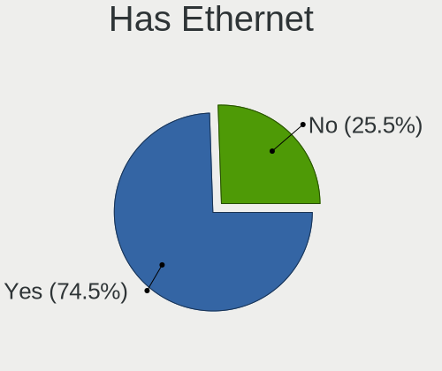
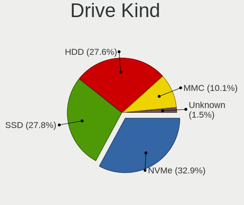
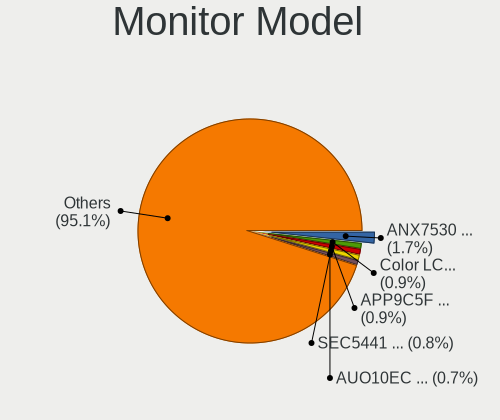
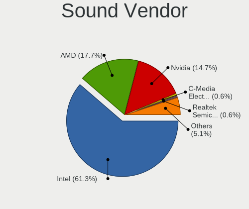

Linux in USA - Tested Hardware & Statistics (Notebooks)
-------------------------------------------------------

A project to collect tested hardware configurations for Linux in USA.

Anyone can contribute to this report by the [hw-probe](https://github.com/linuxhw/hw-probe) tool:

    sudo -E hw-probe -all -upload

Please contribute! Especially if your hardware is rare.

Contents
--------

* [ Test Cases ](#test-cases)

* [ System ](#system)
  - [ OS                       ](#os)
  - [ OS Family                ](#os-family)
  - [ Kernel                   ](#kernel)
  - [ Kernel Family            ](#kernel-family)
  - [ Kernel Major Ver.        ](#kernel-major-ver)
  - [ Arch                     ](#arch)
  - [ DE                       ](#de)
  - [ Display Server           ](#display-server)
  - [ Display Manager          ](#display-manager)
  - [ OS Lang                  ](#os-lang)
  - [ Boot Mode                ](#boot-mode)
  - [ Filesystem               ](#filesystem)
  - [ Part. scheme             ](#part-scheme)
  - [ Dual Boot with Linux/BSD ](#dual-boot-with-linuxbsd)
  - [ Dual Boot (Win)          ](#dual-boot-win)

* [ Board ](#board)
  - [ Vendor                   ](#vendor)
  - [ Model                    ](#model)
  - [ Model Family             ](#model-family)
  - [ MFG Year                 ](#mfg-year)
  - [ Form Factor              ](#form-factor)
  - [ Secure Boot              ](#secure-boot)
  - [ Coreboot                 ](#coreboot)
  - [ RAM Size                 ](#ram-size)
  - [ RAM Used                 ](#ram-used)
  - [ Total Drives             ](#total-drives)
  - [ Has CD-ROM               ](#has-cd-rom)
  - [ Has Ethernet             ](#has-ethernet)
  - [ Has WiFi                 ](#has-wifi)
  - [ Has Bluetooth            ](#has-bluetooth)

* [ Location ](#location)
  - [ Country                  ](#country)
  - [ City                     ](#city)

* [ Drives ](#drives)
  - [ Drive Vendor             ](#drive-vendor)
  - [ Drive Model              ](#drive-model)
  - [ HDD Vendor               ](#hdd-vendor)
  - [ SSD Vendor               ](#ssd-vendor)
  - [ Drive Kind               ](#drive-kind)
  - [ Drive Connector          ](#drive-connector)
  - [ Drive Size               ](#drive-size)
  - [ Space Total              ](#space-total)
  - [ Space Used               ](#space-used)
  - [ Malfunc. Drives          ](#malfunc-drives)
  - [ Malfunc. Drive Vendor    ](#malfunc-drive-vendor)
  - [ Malfunc. HDD Vendor      ](#malfunc-hdd-vendor)
  - [ Malfunc. Drive Kind      ](#malfunc-drive-kind)
  - [ Failed Drives            ](#failed-drives)
  - [ Failed Drive Vendor      ](#failed-drive-vendor)
  - [ Drive Status             ](#drive-status)

* [ Storage controller ](#storage-controller)
  - [ Storage Vendor           ](#storage-vendor)
  - [ Storage Model            ](#storage-model)
  - [ Storage Kind             ](#storage-kind)

* [ Processor ](#processor)
  - [ CPU Vendor               ](#cpu-vendor)
  - [ CPU Model                ](#cpu-model)
  - [ CPU Model Family         ](#cpu-model-family)
  - [ CPU Cores                ](#cpu-cores)
  - [ CPU Sockets              ](#cpu-sockets)
  - [ CPU Threads              ](#cpu-threads)
  - [ CPU Op-Modes             ](#cpu-op-modes)
  - [ CPU Microcode            ](#cpu-microcode)
  - [ CPU Microarch            ](#cpu-microarch)

* [ Graphics ](#graphics)
  - [ GPU Vendor               ](#gpu-vendor)
  - [ GPU Model                ](#gpu-model)
  - [ GPU Combo                ](#gpu-combo)
  - [ GPU Driver               ](#gpu-driver)
  - [ GPU Memory               ](#gpu-memory)

* [ Monitor ](#monitor)
  - [ Monitor Vendor           ](#monitor-vendor)
  - [ Monitor Model            ](#monitor-model)
  - [ Monitor Resolution       ](#monitor-resolution)
  - [ Monitor Diagonal         ](#monitor-diagonal)
  - [ Monitor Width            ](#monitor-width)
  - [ Aspect Ratio             ](#aspect-ratio)
  - [ Monitor Area             ](#monitor-area)
  - [ Pixel Density            ](#pixel-density)
  - [ Multiple Monitors        ](#multiple-monitors)

* [ Network ](#network)
  - [ Net Controller Vendor    ](#net-controller-vendor)
  - [ Net Controller Model     ](#net-controller-model)
  - [ Wireless Vendor          ](#wireless-vendor)
  - [ Wireless Model           ](#wireless-model)
  - [ Ethernet Vendor          ](#ethernet-vendor)
  - [ Ethernet Model           ](#ethernet-model)
  - [ Net Controller Kind      ](#net-controller-kind)
  - [ Used Controller          ](#used-controller)
  - [ NICs                     ](#nics)
  - [ IPv6                     ](#ipv6)

* [ Bluetooth ](#bluetooth)
  - [ Bluetooth Vendor         ](#bluetooth-vendor)
  - [ Bluetooth Model          ](#bluetooth-model)

* [ Sound ](#sound)
  - [ Sound Vendor             ](#sound-vendor)
  - [ Sound Model              ](#sound-model)

* [ Memory ](#memory)
  - [ Memory Vendor            ](#memory-vendor)
  - [ Memory Model             ](#memory-model)
  - [ Memory Kind              ](#memory-kind)
  - [ Memory Form Factor       ](#memory-form-factor)
  - [ Memory Size              ](#memory-size)
  - [ Memory Speed             ](#memory-speed)

* [ Printers & scanners ](#printers--scanners)
  - [ Printer Vendor           ](#printer-vendor)
  - [ Printer Model            ](#printer-model)
  - [ Scanner Vendor           ](#scanner-vendor)
  - [ Scanner Model            ](#scanner-model)

* [ Camera ](#camera)
  - [ Camera Vendor            ](#camera-vendor)
  - [ Camera Model             ](#camera-model)

* [ Security ](#security)
  - [ Fingerprint Vendor       ](#fingerprint-vendor)
  - [ Fingerprint Model        ](#fingerprint-model)
  - [ Chipcard Vendor          ](#chipcard-vendor)
  - [ Chipcard Model           ](#chipcard-model)

* [ Unsupported ](#unsupported)
  - [ Unsupported Devices      ](#unsupported-devices)
  - [ Unsupported Device Types ](#unsupported-device-types)

Test Cases
----------

Total: 18731

| Vendor        | Model                       | Probe                                                      | Date         |
|---------------|-----------------------------|------------------------------------------------------------|--------------|
| Lenovo        | ThinkPad Yoga 11e 20DAS0... | [dc7e0ada81](https://linux-hardware.org/?probe=dc7e0ada81) | Oct 01, 2022 |
| Google        | Blooglet                    | [0081fa7064](https://linux-hardware.org/?probe=0081fa7064) | Oct 01, 2022 |
| HP            | 255 G8 Notebook PC          | [1ea0859429](https://linux-hardware.org/?probe=1ea0859429) | Oct 01, 2022 |
| Fujitsu       | LIFEBOOK A6210              | [73c4e6626f](https://linux-hardware.org/?probe=73c4e6626f) | Oct 01, 2022 |
| Lenovo        | ThinkPad T440 20B6005JUS    | [f12950ed92](https://linux-hardware.org/?probe=f12950ed92) | Oct 01, 2022 |
| Lenovo        | ThinkPad T440 20B6005JUS    | [b395d9ce9b](https://linux-hardware.org/?probe=b395d9ce9b) | Oct 01, 2022 |
| Apple         | MacBookPro8,1               | [f42501fcc3](https://linux-hardware.org/?probe=f42501fcc3) | Oct 01, 2022 |
| HP            | Pavilion 17                 | [fa2e48904a](https://linux-hardware.org/?probe=fa2e48904a) | Oct 01, 2022 |
| MSI           | GF65 Thin 9SD               | [a761de487d](https://linux-hardware.org/?probe=a761de487d) | Oct 01, 2022 |
| Dell          | Inspiron 1200               | [becf544fa6](https://linux-hardware.org/?probe=becf544fa6) | Oct 01, 2022 |
| HP            | Pavilion dv2700             | [0da9fb0afd](https://linux-hardware.org/?probe=0da9fb0afd) | Oct 01, 2022 |
| Lenovo        | ThinkPad T440s 20AQCTO1W... | [fbe1e53387](https://linux-hardware.org/?probe=fbe1e53387) | Oct 01, 2022 |
| Valve         | Jupiter                     | [9ea6c15d28](https://linux-hardware.org/?probe=9ea6c15d28) | Oct 01, 2022 |
| Apple         | MacBookPro9,1               | [08db9e8d75](https://linux-hardware.org/?probe=08db9e8d75) | Oct 01, 2022 |
| Fujitsu       | LIFEBOOK A6210              | [dffb22efdc](https://linux-hardware.org/?probe=dffb22efdc) | Oct 01, 2022 |
| Sony          | SVF15N17CXB                 | [5082dde27d](https://linux-hardware.org/?probe=5082dde27d) | Oct 01, 2022 |
| Lenovo        | ThinkPad T470p 20J7S0DK0... | [49bd2b0248](https://linux-hardware.org/?probe=49bd2b0248) | Oct 01, 2022 |
| HP            | Laptop 15-bs0xx             | [646f4ffa8e](https://linux-hardware.org/?probe=646f4ffa8e) | Oct 01, 2022 |
| Lenovo        | ThinkPad P1 Gen 5 21DCCT... | [bde2b36c88](https://linux-hardware.org/?probe=bde2b36c88) | Oct 01, 2022 |
| HP            | 250 G6 Notebook PC          | [992cf7d019](https://linux-hardware.org/?probe=992cf7d019) | Sep 30, 2022 |
| Lenovo        | IdeaPad S540-14API 81NH     | [71ef5c4f0e](https://linux-hardware.org/?probe=71ef5c4f0e) | Sep 30, 2022 |
| Valve         | Jupiter                     | [4d1b722861](https://linux-hardware.org/?probe=4d1b722861) | Sep 30, 2022 |
| Dell          | Latitude E6420              | [e3564482f9](https://linux-hardware.org/?probe=e3564482f9) | Sep 30, 2022 |
| Dell          | Latitude E6520              | [04817b4ceb](https://linux-hardware.org/?probe=04817b4ceb) | Sep 30, 2022 |
| Lenovo        | ThinkPad T470p 20J7S0DK0... | [33353fc67c](https://linux-hardware.org/?probe=33353fc67c) | Sep 30, 2022 |
| Lenovo        | IdeaPad 5 Pro 16ARH7 82S... | [6bcbc9e08c](https://linux-hardware.org/?probe=6bcbc9e08c) | Sep 30, 2022 |
| ASUSTek       | ROG Zephyrus G15 GA503QR... | [353324cbfd](https://linux-hardware.org/?probe=353324cbfd) | Sep 30, 2022 |
| Dell          | Latitude 5420               | [36ddd1d6d7](https://linux-hardware.org/?probe=36ddd1d6d7) | Sep 30, 2022 |
| Fujitsu       | LIFEBOOK A6210              | [81653ba834](https://linux-hardware.org/?probe=81653ba834) | Sep 30, 2022 |
| Dell          | Latitude E6410              | [98545a1050](https://linux-hardware.org/?probe=98545a1050) | Sep 30, 2022 |
| Apple         | MacBookPro16,1              | [03f56ec19b](https://linux-hardware.org/?probe=03f56ec19b) | Sep 30, 2022 |
| Fujitsu       | LIFEBOOK A6210              | [9ac200d143](https://linux-hardware.org/?probe=9ac200d143) | Sep 30, 2022 |
| Toshiba       | Satellite S70-A             | [7c6b3e14ce](https://linux-hardware.org/?probe=7c6b3e14ce) | Sep 30, 2022 |
| Lenovo        | ThinkPad X1 Carbon 5th 2... | [a1bee52021](https://linux-hardware.org/?probe=a1bee52021) | Sep 29, 2022 |
| Fujitsu       | LIFEBOOK A6210              | [d31b97630d](https://linux-hardware.org/?probe=d31b97630d) | Sep 29, 2022 |
| Toshiba       | Satellite L505              | [3e91e2bfaf](https://linux-hardware.org/?probe=3e91e2bfaf) | Sep 29, 2022 |
| Dell          | Latitude D531               | [331cad8b98](https://linux-hardware.org/?probe=331cad8b98) | Sep 29, 2022 |
| ASUSTek       | ROG Zephyrus G15 GA503QR... | [25d3fc37f5](https://linux-hardware.org/?probe=25d3fc37f5) | Sep 29, 2022 |
| Valve         | Jupiter                     | [66731152dd](https://linux-hardware.org/?probe=66731152dd) | Sep 29, 2022 |
| Lenovo        | ThinkPad P53 MWS 15.6 (Q... | [8990060646](https://linux-hardware.org/?probe=8990060646) | Sep 29, 2022 |
| Valve         | Jupiter                     | [679b3600fa](https://linux-hardware.org/?probe=679b3600fa) | Sep 29, 2022 |
| ASUSTek       | X555LA                      | [5ec700ea0a](https://linux-hardware.org/?probe=5ec700ea0a) | Sep 29, 2022 |
| Apple         | MacBook7,1                  | [88d57c6319](https://linux-hardware.org/?probe=88d57c6319) | Sep 29, 2022 |
| Dell          | Latitude E6420              | [cdd7bd1cc2](https://linux-hardware.org/?probe=cdd7bd1cc2) | Sep 29, 2022 |
| Valve         | Jupiter                     | [92b774ed77](https://linux-hardware.org/?probe=92b774ed77) | Sep 29, 2022 |
| Dell          | Inspiron 1200               | [32dd972d77](https://linux-hardware.org/?probe=32dd972d77) | Sep 29, 2022 |
| Apple         | MacBookAir4,2               | [a423006d4c](https://linux-hardware.org/?probe=a423006d4c) | Sep 29, 2022 |
| Apple         | MacBookAir4,2               | [5dba6cf7fd](https://linux-hardware.org/?probe=5dba6cf7fd) | Sep 29, 2022 |
| HP            | ZBook 15 G3                 | [1d612b997a](https://linux-hardware.org/?probe=1d612b997a) | Sep 29, 2022 |
| Sony          | VPCEH12FX                   | [037cda52fd](https://linux-hardware.org/?probe=037cda52fd) | Sep 29, 2022 |
| Dell          | Inspiron 15-3552            | [9414d73ae0](https://linux-hardware.org/?probe=9414d73ae0) | Sep 29, 2022 |
| Toshiba       | Satellite C55-C             | [01ebd7e70b](https://linux-hardware.org/?probe=01ebd7e70b) | Sep 29, 2022 |
| Toshiba       | Satellite C55-C             | [d2c06711d7](https://linux-hardware.org/?probe=d2c06711d7) | Sep 29, 2022 |
| HP            | 15 Notebook PC              | [23c809d2a7](https://linux-hardware.org/?probe=23c809d2a7) | Sep 29, 2022 |
| Dell          | Precision 7550              | [75f2949521](https://linux-hardware.org/?probe=75f2949521) | Sep 29, 2022 |
| Dell          | XPS 15 9570                 | [eb3798c367](https://linux-hardware.org/?probe=eb3798c367) | Sep 28, 2022 |
| Dell          | Inspiron 3582               | [8cd21b783a](https://linux-hardware.org/?probe=8cd21b783a) | Sep 28, 2022 |
| Lenovo        | IdeaPad N585 20179          | [dcdafbbd9b](https://linux-hardware.org/?probe=dcdafbbd9b) | Sep 28, 2022 |
| Lenovo        | Legion S7 15IMH5 82BC       | [4ecc5d01c1](https://linux-hardware.org/?probe=4ecc5d01c1) | Sep 28, 2022 |
| Dell          | Inspiron 3542               | [6d35107941](https://linux-hardware.org/?probe=6d35107941) | Sep 28, 2022 |
| HP            | Pavilion dv7                | [5479c35130](https://linux-hardware.org/?probe=5479c35130) | Sep 28, 2022 |
| Apple         | MacBookPro9,2               | [5ce350f38b](https://linux-hardware.org/?probe=5ce350f38b) | Sep 28, 2022 |
| HP            | EliteBook 745 G6            | [f9eecf6781](https://linux-hardware.org/?probe=f9eecf6781) | Sep 28, 2022 |
| Lenovo        | ThinkPad E590 20NB005MUS    | [4b198e87aa](https://linux-hardware.org/?probe=4b198e87aa) | Sep 28, 2022 |
| Chuwi         | GemiBook Pro                | [fb12905329](https://linux-hardware.org/?probe=fb12905329) | Sep 28, 2022 |
| Alienware     | 14                          | [2d46ecc50e](https://linux-hardware.org/?probe=2d46ecc50e) | Sep 28, 2022 |
| Toshiba       | Satellite L855              | [19e5b180eb](https://linux-hardware.org/?probe=19e5b180eb) | Sep 28, 2022 |
| HP            | ProBook 450 G5              | [c000778875](https://linux-hardware.org/?probe=c000778875) | Sep 28, 2022 |
| Lenovo        | ThinkPad T15p Gen 3 21DA... | [216b090c47](https://linux-hardware.org/?probe=216b090c47) | Sep 28, 2022 |
| HP            | Laptop 14-dk1xxx            | [4479784a2e](https://linux-hardware.org/?probe=4479784a2e) | Sep 28, 2022 |
| Lenovo        | IdeaPad N585 20179          | [0a8aed635a](https://linux-hardware.org/?probe=0a8aed635a) | Sep 28, 2022 |
| HP            | Laptop 14-dq1xxx            | [9b3a3858bc](https://linux-hardware.org/?probe=9b3a3858bc) | Sep 28, 2022 |
| Apple         | MacBookPro8,3               | [74927fc7d2](https://linux-hardware.org/?probe=74927fc7d2) | Sep 27, 2022 |
| HP            | Pavilion Laptop 15-eg2xx... | [658f9b891f](https://linux-hardware.org/?probe=658f9b891f) | Sep 27, 2022 |
| Lenovo        | Legion 7 16ITHg6 82K6       | [a3c4032d28](https://linux-hardware.org/?probe=a3c4032d28) | Sep 27, 2022 |
| ASUSTek       | ROG Zephyrus G15 GA503QR... | [09d154c2f2](https://linux-hardware.org/?probe=09d154c2f2) | Sep 27, 2022 |
| HP            | Laptop 14-dk1xxx            | [d0808e8abe](https://linux-hardware.org/?probe=d0808e8abe) | Sep 27, 2022 |
| Lenovo        | ThinkPad T430 2347G2U       | [5b08d764b4](https://linux-hardware.org/?probe=5b08d764b4) | Sep 27, 2022 |
| ASUSTek       | ASUS TUF Gaming A15 FA50... | [6677830ce4](https://linux-hardware.org/?probe=6677830ce4) | Sep 27, 2022 |
| GPD           | G1619-04                    | [9e99ae15fb](https://linux-hardware.org/?probe=9e99ae15fb) | Sep 27, 2022 |
| HP            | ENVY m7 Notebook            | [c2739df54b](https://linux-hardware.org/?probe=c2739df54b) | Sep 27, 2022 |
| Dell          | Latitude 7290               | [31cd735fbc](https://linux-hardware.org/?probe=31cd735fbc) | Sep 27, 2022 |
| HP            | Pavilion Laptop 15-cc1xx    | [e27e7bfd76](https://linux-hardware.org/?probe=e27e7bfd76) | Sep 27, 2022 |
| Dell          | XPS 17 9700                 | [cd6dcf0de8](https://linux-hardware.org/?probe=cd6dcf0de8) | Sep 27, 2022 |
| Dell          | Latitude 5420               | [c78c69f46a](https://linux-hardware.org/?probe=c78c69f46a) | Sep 27, 2022 |
| HP            | Laptop 17-cp0xxx            | [895fae1f2e](https://linux-hardware.org/?probe=895fae1f2e) | Sep 27, 2022 |
| Lenovo        | IdeaPad 510-15IKB 80SV      | [18ee2cafd6](https://linux-hardware.org/?probe=18ee2cafd6) | Sep 27, 2022 |
| Valve         | Jupiter                     | [9a2af6352a](https://linux-hardware.org/?probe=9a2af6352a) | Sep 27, 2022 |
| Lenovo        | Legion 5 15ACH6 82JW        | [99b6a53bd2](https://linux-hardware.org/?probe=99b6a53bd2) | Sep 27, 2022 |
| Lenovo        | IdeaPad 510-15IKB 80SV      | [ffc2811bfe](https://linux-hardware.org/?probe=ffc2811bfe) | Sep 27, 2022 |
| Acer          | Aspire V5-552P              | [46395f51b5](https://linux-hardware.org/?probe=46395f51b5) | Sep 27, 2022 |
| ASUSTek       | ROG Zephyrus G14 GA401IH... | [7c62f5131f](https://linux-hardware.org/?probe=7c62f5131f) | Sep 27, 2022 |
| Lenovo        | ThinkPad T480s 20L8S6WP0... | [d0149ee0e2](https://linux-hardware.org/?probe=d0149ee0e2) | Sep 27, 2022 |
| Dell          | XPS 15 9500                 | [d9d87f101a](https://linux-hardware.org/?probe=d9d87f101a) | Sep 27, 2022 |
| ASUSTek       | GL702VSK                    | [3b69ddb263](https://linux-hardware.org/?probe=3b69ddb263) | Sep 27, 2022 |
| Lenovo        | ThinkPad T15p Gen 3 21DA... | [56131c4db0](https://linux-hardware.org/?probe=56131c4db0) | Sep 27, 2022 |
| HP            | EliteBook 840 G6            | [c9e87b7962](https://linux-hardware.org/?probe=c9e87b7962) | Sep 26, 2022 |
| Razer         | Blade Stealth               | [0c368cb815](https://linux-hardware.org/?probe=0c368cb815) | Sep 26, 2022 |
| MSI           | GT72 6QE                    | [5535b3367e](https://linux-hardware.org/?probe=5535b3367e) | Sep 26, 2022 |
| ASUSTek       | GL702VSK                    | [e91056ceab](https://linux-hardware.org/?probe=e91056ceab) | Sep 26, 2022 |
| ASUSTek       | VivoBook_ASUSLaptop E210... | [898f9bf963](https://linux-hardware.org/?probe=898f9bf963) | Sep 26, 2022 |
| MSI           | GT72 6QE                    | [d739812ce7](https://linux-hardware.org/?probe=d739812ce7) | Sep 26, 2022 |
| Sony          | PCG-GRT230(UC)              | [af843c265c](https://linux-hardware.org/?probe=af843c265c) | Sep 26, 2022 |
| Dell          | Inspiron 11-3168            | [6b1d418929](https://linux-hardware.org/?probe=6b1d418929) | Sep 26, 2022 |
| Valve         | Jupiter                     | [0f1c8fad1c](https://linux-hardware.org/?probe=0f1c8fad1c) | Sep 26, 2022 |
| AZW           | SEi                         | [ca815a2e20](https://linux-hardware.org/?probe=ca815a2e20) | Sep 26, 2022 |
| Dell          | Inspiron 5570               | [6af4756d35](https://linux-hardware.org/?probe=6af4756d35) | Sep 25, 2022 |
| ASUSTek       | VivoBook_ASUSLaptop X513... | [f8b76ec5f4](https://linux-hardware.org/?probe=f8b76ec5f4) | Sep 25, 2022 |
| AZW           | SEi                         | [063c3cc52e](https://linux-hardware.org/?probe=063c3cc52e) | Sep 25, 2022 |
| System76      | Darter Pro                  | [7ad4ae7df4](https://linux-hardware.org/?probe=7ad4ae7df4) | Sep 25, 2022 |
| AZW           | SEi                         | [055096f57a](https://linux-hardware.org/?probe=055096f57a) | Sep 25, 2022 |
| Lenovo        | ThinkPad P73 20QRS0G700     | [6ea4c40a80](https://linux-hardware.org/?probe=6ea4c40a80) | Sep 25, 2022 |
| ASUSTek       | ROG Zephyrus G14 GA401IH... | [e9de38d8eb](https://linux-hardware.org/?probe=e9de38d8eb) | Sep 25, 2022 |
| Acer          | Nitro AN515-54              | [6182e4ef84](https://linux-hardware.org/?probe=6182e4ef84) | Sep 25, 2022 |
| HP            | Laptop 17-by3xxx            | [41db205ec7](https://linux-hardware.org/?probe=41db205ec7) | Sep 25, 2022 |
| Apple         | MacBookAir7,2               | [0d1b8fe301](https://linux-hardware.org/?probe=0d1b8fe301) | Sep 25, 2022 |
| Dell          | Inspiron 14-3452            | [bb90844ff6](https://linux-hardware.org/?probe=bb90844ff6) | Sep 25, 2022 |
| HP            | Stream Laptop 14-ax0XX      | [d8a451b3e6](https://linux-hardware.org/?probe=d8a451b3e6) | Sep 25, 2022 |
| Dell          | Inspiron 3185               | [561c02f958](https://linux-hardware.org/?probe=561c02f958) | Sep 25, 2022 |
| Dell          | Inspiron 15-3567            | [9ae6efbc0f](https://linux-hardware.org/?probe=9ae6efbc0f) | Sep 25, 2022 |
| Acer          | Aspire R3-131T              | [0d44032bc0](https://linux-hardware.org/?probe=0d44032bc0) | Sep 25, 2022 |
| Alienware     | 17                          | [961361ff9a](https://linux-hardware.org/?probe=961361ff9a) | Sep 25, 2022 |
| Lenovo        | K14 Gen 1 21CUS02600        | [911a73323d](https://linux-hardware.org/?probe=911a73323d) | Sep 24, 2022 |
| Valve         | Jupiter                     | [f5183f3eed](https://linux-hardware.org/?probe=f5183f3eed) | Sep 24, 2022 |
| Acer          | Aspire E5-551               | [693dca23b3](https://linux-hardware.org/?probe=693dca23b3) | Sep 24, 2022 |
| System76      | Oryx Pro                    | [3cf39a6993](https://linux-hardware.org/?probe=3cf39a6993) | Sep 24, 2022 |
| HP            | Stream 11 Pro               | [01a4c35ec9](https://linux-hardware.org/?probe=01a4c35ec9) | Sep 24, 2022 |
| HP            | Stream 11 Pro               | [46b9ac9732](https://linux-hardware.org/?probe=46b9ac9732) | Sep 24, 2022 |
| HP            | Stream 11 Pro               | [e562c8160a](https://linux-hardware.org/?probe=e562c8160a) | Sep 24, 2022 |
| Dell          | Inspiron 14 5425            | [209be443ac](https://linux-hardware.org/?probe=209be443ac) | Sep 24, 2022 |
| Valve         | Jupiter                     | [6ddd668003](https://linux-hardware.org/?probe=6ddd668003) | Sep 24, 2022 |
| ASUSTek       | X55U                        | [e8b140c0cc](https://linux-hardware.org/?probe=e8b140c0cc) | Sep 24, 2022 |
| ASUSTek       | X55U                        | [863a5df6ad](https://linux-hardware.org/?probe=863a5df6ad) | Sep 24, 2022 |
| Toshiba       | Satellite C55D-B            | [5b2029b4d3](https://linux-hardware.org/?probe=5b2029b4d3) | Sep 24, 2022 |
| Lenovo        | ThinkPad E15 Gen 4 21ED0... | [b7a5cfcf9c](https://linux-hardware.org/?probe=b7a5cfcf9c) | Sep 24, 2022 |
| Valve         | Jupiter                     | [b70be12594](https://linux-hardware.org/?probe=b70be12594) | Sep 24, 2022 |
| HP            | Laptop 15-da0xxx            | [da14d41e78](https://linux-hardware.org/?probe=da14d41e78) | Sep 24, 2022 |
| Lenovo        | IdeaPad S340 81QG           | [2cb13a361a](https://linux-hardware.org/?probe=2cb13a361a) | Sep 24, 2022 |
| Lenovo        | ThinkPad T530 23595JU       | [0adb7bc0b1](https://linux-hardware.org/?probe=0adb7bc0b1) | Sep 24, 2022 |
| Apple         | MacBookPro9,2               | [86b6d46191](https://linux-hardware.org/?probe=86b6d46191) | Sep 24, 2022 |
| Dell          | Latitude E6500              | [491ad19866](https://linux-hardware.org/?probe=491ad19866) | Sep 24, 2022 |
| MSI           | GF65 Thin 9SEXR             | [b6f7e58295](https://linux-hardware.org/?probe=b6f7e58295) | Sep 24, 2022 |
| HP            | ProBook 4530s               | [7c6fe43c69](https://linux-hardware.org/?probe=7c6fe43c69) | Sep 24, 2022 |
| Google        | Garg360                     | [4772493ae3](https://linux-hardware.org/?probe=4772493ae3) | Sep 23, 2022 |
| HP            | ProBook 4530s               | [a533c17d9f](https://linux-hardware.org/?probe=a533c17d9f) | Sep 23, 2022 |
| Dell          | Precision 7510              | [5f94678049](https://linux-hardware.org/?probe=5f94678049) | Sep 23, 2022 |
| Lenovo        | ThinkPad E15 Gen 4 21ED0... | [e8e1108a58](https://linux-hardware.org/?probe=e8e1108a58) | Sep 23, 2022 |
| HP            | EliteBook 840 G6            | [9ccc1b86a7](https://linux-hardware.org/?probe=9ccc1b86a7) | Sep 23, 2022 |
| HP            | EliteBook 2760p             | [7d71278ac4](https://linux-hardware.org/?probe=7d71278ac4) | Sep 23, 2022 |
| Gateway       | NE56R                       | [f603edd045](https://linux-hardware.org/?probe=f603edd045) | Sep 23, 2022 |
| Google        | Banjo                       | [a7078162db](https://linux-hardware.org/?probe=a7078162db) | Sep 23, 2022 |
| ASUSTek       | TUF Gaming FX505GT_FX505... | [031f4bb4f1](https://linux-hardware.org/?probe=031f4bb4f1) | Sep 23, 2022 |
| Acer          | Swift SF314-71              | [321edce78d](https://linux-hardware.org/?probe=321edce78d) | Sep 23, 2022 |
| HP            | ENVY Laptop 15-ep1xxx       | [b2768e9e6d](https://linux-hardware.org/?probe=b2768e9e6d) | Sep 23, 2022 |
| Lenovo        | ThinkPad T495 20NKS0PG00    | [f77dda559d](https://linux-hardware.org/?probe=f77dda559d) | Sep 23, 2022 |
| Lenovo        | G500 20236                  | [0707ef3cf0](https://linux-hardware.org/?probe=0707ef3cf0) | Sep 23, 2022 |
| Apple         | MacBook4,1                  | [69a66aefdd](https://linux-hardware.org/?probe=69a66aefdd) | Sep 23, 2022 |
| Valve         | Jupiter                     | [d03b845c90](https://linux-hardware.org/?probe=d03b845c90) | Sep 23, 2022 |
| Acer          | Aspire A715-43G             | [5ecaaef0b1](https://linux-hardware.org/?probe=5ecaaef0b1) | Sep 23, 2022 |
| HP            | ENVY Notebook               | [7335c99e6a](https://linux-hardware.org/?probe=7335c99e6a) | Sep 23, 2022 |
| HP            | 15 TS                       | [6577aa9bb8](https://linux-hardware.org/?probe=6577aa9bb8) | Sep 23, 2022 |
| Dell          | Precision 7710              | [c48bccbee4](https://linux-hardware.org/?probe=c48bccbee4) | Sep 23, 2022 |
| Dell          | Latitude 5511               | [2b8d551dad](https://linux-hardware.org/?probe=2b8d551dad) | Sep 23, 2022 |
| Acer          | Aspire 5532                 | [b427a13b9b](https://linux-hardware.org/?probe=b427a13b9b) | Sep 22, 2022 |
| HP            | Laptop 17-by2xxx            | [3e71e40ba0](https://linux-hardware.org/?probe=3e71e40ba0) | Sep 22, 2022 |
| HP            | Laptop 17-by2xxx            | [4af5f4bacc](https://linux-hardware.org/?probe=4af5f4bacc) | Sep 22, 2022 |
| Lenovo        | ThinkPad P1 Gen 4i 20Y30... | [db6f733994](https://linux-hardware.org/?probe=db6f733994) | Sep 22, 2022 |
| Dell          | Inspiron 1721               | [ab0eb7f4ce](https://linux-hardware.org/?probe=ab0eb7f4ce) | Sep 22, 2022 |
| ASUSTek       | Zenbook UX5401ZAS_UX5401... | [fc2ea7b0a0](https://linux-hardware.org/?probe=fc2ea7b0a0) | Sep 22, 2022 |
| Lenovo        | IdeaPad Slim 1-14AST-05 ... | [1dbeac403e](https://linux-hardware.org/?probe=1dbeac403e) | Sep 22, 2022 |
| Samsung       | 950XDB/951XDB/950XDY        | [672d6f2fc8](https://linux-hardware.org/?probe=672d6f2fc8) | Sep 22, 2022 |
| Lenovo        | ThinkPad E560 20EV002FUS    | [2d8eefaf6a](https://linux-hardware.org/?probe=2d8eefaf6a) | Sep 22, 2022 |
| Toshiba       | Satellite P745              | [963d04c729](https://linux-hardware.org/?probe=963d04c729) | Sep 22, 2022 |
| HP            | 255 G4 Notebook PC          | [655e2f4cb5](https://linux-hardware.org/?probe=655e2f4cb5) | Sep 22, 2022 |
| MSI           | GL63 9SDK                   | [83a78aa62b](https://linux-hardware.org/?probe=83a78aa62b) | Sep 22, 2022 |
| MSI           | GL63 9SDK                   | [a0ba440640](https://linux-hardware.org/?probe=a0ba440640) | Sep 22, 2022 |
| MSI           | GS60 2PE                    | [1aaaa99706](https://linux-hardware.org/?probe=1aaaa99706) | Sep 22, 2022 |
| HP            | ProBook 6475b               | [fd9242f579](https://linux-hardware.org/?probe=fd9242f579) | Sep 22, 2022 |
| Dell          | Latitude E5550              | [00fc7734f6](https://linux-hardware.org/?probe=00fc7734f6) | Sep 22, 2022 |
| Lenovo        | IdeaPad S145-14IWL 81MU     | [fd9ba70c2c](https://linux-hardware.org/?probe=fd9ba70c2c) | Sep 22, 2022 |
| ASUSTek       | ROG Strix G513QY_G513QY     | [6f43da7fb4](https://linux-hardware.org/?probe=6f43da7fb4) | Sep 22, 2022 |
| Dell          | Inspiron 5520               | [032bbec1e3](https://linux-hardware.org/?probe=032bbec1e3) | Sep 22, 2022 |
| HP            | EliteBook 8560p             | [c018c3287e](https://linux-hardware.org/?probe=c018c3287e) | Sep 22, 2022 |
| Lenovo        | ThinkPad W520 4270CTO       | [cae7b3dc49](https://linux-hardware.org/?probe=cae7b3dc49) | Sep 22, 2022 |
| HP            | 15 Notebook PC              | [0643e29e9d](https://linux-hardware.org/?probe=0643e29e9d) | Sep 22, 2022 |
| Lenovo        | IdeaPad Gaming 3 15ACH6 ... | [e64579db81](https://linux-hardware.org/?probe=e64579db81) | Sep 22, 2022 |
| HP            | Laptop 15-da0xxx            | [d889f0c2ee](https://linux-hardware.org/?probe=d889f0c2ee) | Sep 22, 2022 |
| Lenovo        | Unknown                     | [71e2f1c31b](https://linux-hardware.org/?probe=71e2f1c31b) | Sep 21, 2022 |
| Valve         | Jupiter                     | [f9230d9e82](https://linux-hardware.org/?probe=f9230d9e82) | Sep 21, 2022 |
| Framework     | Laptop                      | [8e2d92c817](https://linux-hardware.org/?probe=8e2d92c817) | Sep 21, 2022 |
| HP            | 15 Notebook PC              | [9515dd24c0](https://linux-hardware.org/?probe=9515dd24c0) | Sep 21, 2022 |
| Valve         | Jupiter                     | [a39be03b34](https://linux-hardware.org/?probe=a39be03b34) | Sep 21, 2022 |
| Dell          | XPS 13 9310                 | [b9c698a94c](https://linux-hardware.org/?probe=b9c698a94c) | Sep 21, 2022 |
| Dell          | Latitude 7530               | [39b655888c](https://linux-hardware.org/?probe=39b655888c) | Sep 21, 2022 |
| Dell          | Latitude 7400               | [466bd310ef](https://linux-hardware.org/?probe=466bd310ef) | Sep 21, 2022 |
| Lenovo        | ThinkPad X260 20F60097US    | [f0198ed753](https://linux-hardware.org/?probe=f0198ed753) | Sep 21, 2022 |
| Lenovo        | ThinkBook 15p Gen 2 21B1    | [85cab20988](https://linux-hardware.org/?probe=85cab20988) | Sep 21, 2022 |
| Dell          | Latitude E5420              | [537bc22564](https://linux-hardware.org/?probe=537bc22564) | Sep 21, 2022 |
| Razer         | Blade 15 Mid 2019-Base      | [c1457e4e02](https://linux-hardware.org/?probe=c1457e4e02) | Sep 21, 2022 |
| Toshiba       | Satellite L855              | [4421e54d32](https://linux-hardware.org/?probe=4421e54d32) | Sep 21, 2022 |
| HP            | ENVY 15                     | [388547d18c](https://linux-hardware.org/?probe=388547d18c) | Sep 21, 2022 |
| Lenovo        | ThinkPad E560 20EV002FUS    | [6ffce551a0](https://linux-hardware.org/?probe=6ffce551a0) | Sep 21, 2022 |
| Apple         | MacBookAir6,2               | [7fc6799a48](https://linux-hardware.org/?probe=7fc6799a48) | Sep 21, 2022 |
| Dell          | Inspiron 5577               | [c6f4124e49](https://linux-hardware.org/?probe=c6f4124e49) | Sep 21, 2022 |
| Acer          | Nitro AN515-54              | [7cf2d6a810](https://linux-hardware.org/?probe=7cf2d6a810) | Sep 20, 2022 |
| Alienware     | 18                          | [91d0153265](https://linux-hardware.org/?probe=91d0153265) | Sep 20, 2022 |
| Dell          | XPS 9320                    | [cd57903024](https://linux-hardware.org/?probe=cd57903024) | Sep 20, 2022 |
| Dell          | Precision M3800             | [2d5d8707dd](https://linux-hardware.org/?probe=2d5d8707dd) | Sep 20, 2022 |
| Lenovo        | ThinkPad T490 20N2001YUS    | [5861c90514](https://linux-hardware.org/?probe=5861c90514) | Sep 20, 2022 |
| HP            | ProBook 4520s               | [af4a575c52](https://linux-hardware.org/?probe=af4a575c52) | Sep 20, 2022 |
| Dell          | XPS 13 9360                 | [2b0c376f77](https://linux-hardware.org/?probe=2b0c376f77) | Sep 20, 2022 |
| Apple         | MacBookAir7,2               | [f9f1973349](https://linux-hardware.org/?probe=f9f1973349) | Sep 20, 2022 |
| Itronix       | GD8200                      | [d9f515b935](https://linux-hardware.org/?probe=d9f515b935) | Sep 20, 2022 |
| HP            | ProBook 4520s               | [3883006a7b](https://linux-hardware.org/?probe=3883006a7b) | Sep 20, 2022 |
| Alienware     | Area-51m R2 A00             | [0ebdec6dd0](https://linux-hardware.org/?probe=0ebdec6dd0) | Sep 20, 2022 |
| Sony          | VPCEH12FX                   | [1728d15dbf](https://linux-hardware.org/?probe=1728d15dbf) | Sep 20, 2022 |
| HP            | ENVY 15                     | [b662f9b708](https://linux-hardware.org/?probe=b662f9b708) | Sep 20, 2022 |
| HP            | Dev One Notebook PC         | [97426638ff](https://linux-hardware.org/?probe=97426638ff) | Sep 20, 2022 |
| GPU Compan... | GWTN141-10                  | [6d43012457](https://linux-hardware.org/?probe=6d43012457) | Sep 20, 2022 |
| HP            | Dev One Notebook PC         | [5367a8e71f](https://linux-hardware.org/?probe=5367a8e71f) | Sep 20, 2022 |
| HP            | Pavilion g7                 | [d51d3d282a](https://linux-hardware.org/?probe=d51d3d282a) | Sep 20, 2022 |
| Lenovo        | IdeaPad 320-15IAP 80XR      | [1da95a964b](https://linux-hardware.org/?probe=1da95a964b) | Sep 20, 2022 |
| Lenovo        | ThinkPad T540p 20BFS0RK0... | [eaaf80509b](https://linux-hardware.org/?probe=eaaf80509b) | Sep 19, 2022 |
| Dell          | Latitude D610               | [47e0f0fa27](https://linux-hardware.org/?probe=47e0f0fa27) | Sep 19, 2022 |
| Dell          | Latitude D610               | [35f0ea4fc8](https://linux-hardware.org/?probe=35f0ea4fc8) | Sep 19, 2022 |
| Lenovo        | ThinkPad 13 2nd Gen 20J1... | [ae4e13ddc1](https://linux-hardware.org/?probe=ae4e13ddc1) | Sep 19, 2022 |
| Dell          | Inspiron 7559               | [ede9aab3fb](https://linux-hardware.org/?probe=ede9aab3fb) | Sep 19, 2022 |
| Dell          | Latitude E6520              | [ac5b5a53a2](https://linux-hardware.org/?probe=ac5b5a53a2) | Sep 19, 2022 |
| Valve         | Jupiter                     | [5ed6e54010](https://linux-hardware.org/?probe=5ed6e54010) | Sep 19, 2022 |
| Dell          | Latitude 5420               | [1e5a1652cc](https://linux-hardware.org/?probe=1e5a1652cc) | Sep 19, 2022 |
| Acer          | Predator PH315-52           | [959330d9c1](https://linux-hardware.org/?probe=959330d9c1) | Sep 19, 2022 |
| Apple         | MacBookPro15,1              | [b0e746792f](https://linux-hardware.org/?probe=b0e746792f) | Sep 19, 2022 |
| ASUSTek       | G74Sx                       | [e8f0a018c9](https://linux-hardware.org/?probe=e8f0a018c9) | Sep 19, 2022 |
| HP            | Pavilion dv6                | [9c52e7d0f0](https://linux-hardware.org/?probe=9c52e7d0f0) | Sep 19, 2022 |
| Clevo         | P170EM                      | [a2a4bedd11](https://linux-hardware.org/?probe=a2a4bedd11) | Sep 19, 2022 |
| Dell          | Precision M6400             | [67924c5333](https://linux-hardware.org/?probe=67924c5333) | Sep 19, 2022 |
| Lenovo        | ThinkPad 11e 20DAS09U00     | [81bd748796](https://linux-hardware.org/?probe=81bd748796) | Sep 19, 2022 |
| HP            | OMEN by Laptop 15z-en100    | [47b0aed151](https://linux-hardware.org/?probe=47b0aed151) | Sep 19, 2022 |
| Lenovo        | IdeaPad 5 15IIL05 81YK      | [514dde2498](https://linux-hardware.org/?probe=514dde2498) | Sep 19, 2022 |
| Dell          | Precision M4800             | [73d00fe344](https://linux-hardware.org/?probe=73d00fe344) | Sep 19, 2022 |
| Lenovo        | ThinkPad T430 2349S4D       | [0c4d98868f](https://linux-hardware.org/?probe=0c4d98868f) | Sep 19, 2022 |
| Dell          | Precision M6400             | [27a55639e4](https://linux-hardware.org/?probe=27a55639e4) | Sep 19, 2022 |
| Valve         | Jupiter                     | [84051314e8](https://linux-hardware.org/?probe=84051314e8) | Sep 19, 2022 |
| Dell          | XPS 13 9305                 | [9d61a37458](https://linux-hardware.org/?probe=9d61a37458) | Sep 19, 2022 |
| Framework     | Laptop                      | [8dbbe54af9](https://linux-hardware.org/?probe=8dbbe54af9) | Sep 18, 2022 |
| Alienware     | 18                          | [fda9eabd7e](https://linux-hardware.org/?probe=fda9eabd7e) | Sep 18, 2022 |
| Lenovo        | IdeaPad 130-15AST 81H5      | [bceb6698c2](https://linux-hardware.org/?probe=bceb6698c2) | Sep 18, 2022 |
| Dell          | Precision 5530              | [37520b086e](https://linux-hardware.org/?probe=37520b086e) | Sep 18, 2022 |
| Dell          | Latitude D610               | [f383e5d7ae](https://linux-hardware.org/?probe=f383e5d7ae) | Sep 18, 2022 |
| Ematic        | EWT118                      | [41670ebd30](https://linux-hardware.org/?probe=41670ebd30) | Sep 18, 2022 |
| ASUSTek       | G752VT                      | [bbd1eb7810](https://linux-hardware.org/?probe=bbd1eb7810) | Sep 18, 2022 |
| Dell          | Latitude D610               | [df13ed7396](https://linux-hardware.org/?probe=df13ed7396) | Sep 18, 2022 |
| Lenovo        | ThinkPad X1 Carbon 6th 2... | [465ce269fd](https://linux-hardware.org/?probe=465ce269fd) | Sep 18, 2022 |
| Google        | Banjo                       | [4c54fe741e](https://linux-hardware.org/?probe=4c54fe741e) | Sep 18, 2022 |
| System76      | Gazelle Professional        | [95f19a0c4c](https://linux-hardware.org/?probe=95f19a0c4c) | Sep 18, 2022 |
| Dell          | Latitude E7470              | [ceed7544ab](https://linux-hardware.org/?probe=ceed7544ab) | Sep 18, 2022 |
| Google        | Blooglet                    | [971a174a56](https://linux-hardware.org/?probe=971a174a56) | Sep 18, 2022 |
| HP            | 2000                        | [0020624077](https://linux-hardware.org/?probe=0020624077) | Sep 18, 2022 |
| Dell          | Latitude E6330              | [bbb0a5f1a1](https://linux-hardware.org/?probe=bbb0a5f1a1) | Sep 18, 2022 |
| Dell          | Latitude E6330              | [8ddda1480b](https://linux-hardware.org/?probe=8ddda1480b) | Sep 18, 2022 |
| Dell          | Latitude 3310               | [4de8502362](https://linux-hardware.org/?probe=4de8502362) | Sep 18, 2022 |
| MSI           | Sword 15 A11UD              | [e749154c3d](https://linux-hardware.org/?probe=e749154c3d) | Sep 18, 2022 |
| Lenovo        | IdeaPad L340-15API 81LW     | [65c4f113d8](https://linux-hardware.org/?probe=65c4f113d8) | Sep 18, 2022 |
| MSI           | A6000                       | [b4cc9e8ecc](https://linux-hardware.org/?probe=b4cc9e8ecc) | Sep 18, 2022 |
| Valve         | Jupiter                     | [4b802a9fe9](https://linux-hardware.org/?probe=4b802a9fe9) | Sep 18, 2022 |
| Valve         | Jupiter                     | [e65c41605f](https://linux-hardware.org/?probe=e65c41605f) | Sep 18, 2022 |
| Framework     | Laptop (12th Gen Intel C... | [5e8d80eacc](https://linux-hardware.org/?probe=5e8d80eacc) | Sep 18, 2022 |
| Dell          | Inspiron N5110              | [fa2122b6ee](https://linux-hardware.org/?probe=fa2122b6ee) | Sep 18, 2022 |
| Apple         | MacBookPro12,1              | [ba54a7bf0c](https://linux-hardware.org/?probe=ba54a7bf0c) | Sep 17, 2022 |
| Valve         | Jupiter                     | [221fd3ae1c](https://linux-hardware.org/?probe=221fd3ae1c) | Sep 17, 2022 |
| OriginPC      | NT17-PRO                    | [962138caa9](https://linux-hardware.org/?probe=962138caa9) | Sep 17, 2022 |
| Dell          | Latitude E6330              | [eb58d87a1d](https://linux-hardware.org/?probe=eb58d87a1d) | Sep 17, 2022 |
| Dell          | Latitude E6330              | [a5b11eaaaf](https://linux-hardware.org/?probe=a5b11eaaaf) | Sep 17, 2022 |
| Dell          | Inspiron MP061              | [f045e1f138](https://linux-hardware.org/?probe=f045e1f138) | Sep 17, 2022 |
| Dell          | Inspiron 15-3567            | [7ef8a544c4](https://linux-hardware.org/?probe=7ef8a544c4) | Sep 17, 2022 |
| Acer          | Aspire ES1-711              | [f9b8bfe68f](https://linux-hardware.org/?probe=f9b8bfe68f) | Sep 17, 2022 |
| ASUSTek       | TUF Gaming FX505DY_FX505... | [857c240dc4](https://linux-hardware.org/?probe=857c240dc4) | Sep 17, 2022 |
| Dell          | System XPS L702X            | [6f7b318b6d](https://linux-hardware.org/?probe=6f7b318b6d) | Sep 17, 2022 |
| Dell          | System XPS L702X            | [4b812d3653](https://linux-hardware.org/?probe=4b812d3653) | Sep 17, 2022 |
| Dell          | Latitude E5400              | [9859a54bc4](https://linux-hardware.org/?probe=9859a54bc4) | Sep 17, 2022 |
| Lenovo        | ThinkPad P1 20MD0020US      | [a701fed148](https://linux-hardware.org/?probe=a701fed148) | Sep 16, 2022 |
| System76      | Darter Pro                  | [5d1e0ddc1a](https://linux-hardware.org/?probe=5d1e0ddc1a) | Sep 16, 2022 |
| Valve         | Jupiter                     | [0db4b64dcd](https://linux-hardware.org/?probe=0db4b64dcd) | Sep 16, 2022 |
| HP            | Compaq Presario CQ50        | [dce2af5435](https://linux-hardware.org/?probe=dce2af5435) | Sep 16, 2022 |
| Valve         | Jupiter                     | [4540c4e930](https://linux-hardware.org/?probe=4540c4e930) | Sep 16, 2022 |
| ASUSTek       | GL503VD                     | [b1d97f239e](https://linux-hardware.org/?probe=b1d97f239e) | Sep 16, 2022 |
| ASUSTek       | Zenbook UM5302TA_UM5302T... | [5b94d00557](https://linux-hardware.org/?probe=5b94d00557) | Sep 16, 2022 |
| Alienware     | M17xR4                      | [210bd15049](https://linux-hardware.org/?probe=210bd15049) | Sep 16, 2022 |
| Dell          | XPS 17 9720                 | [88a30be903](https://linux-hardware.org/?probe=88a30be903) | Sep 16, 2022 |
| Lenovo        | ThinkPad 13 2nd Gen 20J1... | [7e865e8b3f](https://linux-hardware.org/?probe=7e865e8b3f) | Sep 16, 2022 |
| Lenovo        | ThinkPad T480 20L5S1S000    | [50669d6ff9](https://linux-hardware.org/?probe=50669d6ff9) | Sep 16, 2022 |
| HP            | Elite x2 1012 G1            | [0f75ea7c88](https://linux-hardware.org/?probe=0f75ea7c88) | Sep 16, 2022 |
| Dell          | Precision 7520              | [5deca1e73b](https://linux-hardware.org/?probe=5deca1e73b) | Sep 16, 2022 |
| Dell          | Inspiron 15-3567            | [3ea454c43f](https://linux-hardware.org/?probe=3ea454c43f) | Sep 16, 2022 |
| Toshiba       | Satellite C55t-C            | [9c45d5a042](https://linux-hardware.org/?probe=9c45d5a042) | Sep 16, 2022 |
| Alienware     | x15 R1                      | [00e6ae566e](https://linux-hardware.org/?probe=00e6ae566e) | Sep 16, 2022 |
| Lenovo        | IdeaPad 5 15ABA7 82SG       | [4bc5802227](https://linux-hardware.org/?probe=4bc5802227) | Sep 16, 2022 |
| System76      | Galago Pro                  | [8d6c6b18fd](https://linux-hardware.org/?probe=8d6c6b18fd) | Sep 16, 2022 |
| Dell          | XPS 13 9380                 | [6d94f648e4](https://linux-hardware.org/?probe=6d94f648e4) | Sep 16, 2022 |
| HP            | ENVY Laptop 13-ba0xxx       | [016a874005](https://linux-hardware.org/?probe=016a874005) | Sep 16, 2022 |
| Dell          | Latitude 5410               | [f476f4e380](https://linux-hardware.org/?probe=f476f4e380) | Sep 16, 2022 |
| Dell          | G5 5505                     | [25755e8605](https://linux-hardware.org/?probe=25755e8605) | Sep 16, 2022 |
| MSI           | Summit E13FlipEvo A12MT     | [465e8d2c86](https://linux-hardware.org/?probe=465e8d2c86) | Sep 15, 2022 |
| Lenovo        | ThinkPad 13 2nd Gen 20J1... | [14cbf91f0c](https://linux-hardware.org/?probe=14cbf91f0c) | Sep 15, 2022 |
| Lenovo        | IdeaPad 110S-11IBR          | [32e42e0b52](https://linux-hardware.org/?probe=32e42e0b52) | Sep 15, 2022 |
| Google        | Stout                       | [82b966b9ad](https://linux-hardware.org/?probe=82b966b9ad) | Sep 15, 2022 |
| Getac         | S410G2                      | [01ef66363e](https://linux-hardware.org/?probe=01ef66363e) | Sep 15, 2022 |
| Getac         | S410G2                      | [14c74d0b7e](https://linux-hardware.org/?probe=14c74d0b7e) | Sep 15, 2022 |
| ASUSTek       | TUF Gaming FX505DT_FX505... | [258c624b3b](https://linux-hardware.org/?probe=258c624b3b) | Sep 15, 2022 |
| ASUSTek       | 1005PE                      | [683c42315f](https://linux-hardware.org/?probe=683c42315f) | Sep 15, 2022 |
| HP            | Presario V6000 (RG289UA#... | [7f0113694a](https://linux-hardware.org/?probe=7f0113694a) | Sep 15, 2022 |
| HP            | 2000                        | [17e86a7d4b](https://linux-hardware.org/?probe=17e86a7d4b) | Sep 15, 2022 |
| ASUSTek       | ROG Zephyrus G14 GA402RJ... | [8574413795](https://linux-hardware.org/?probe=8574413795) | Sep 15, 2022 |
| Dell          | XPS 13 9360                 | [01aee97dbd](https://linux-hardware.org/?probe=01aee97dbd) | Sep 15, 2022 |
| HP            | ProBook 455 15.6 inch G9... | [027a02cfc2](https://linux-hardware.org/?probe=027a02cfc2) | Sep 15, 2022 |
| Dell          | Inspiron N5110              | [f566a009c8](https://linux-hardware.org/?probe=f566a009c8) | Sep 15, 2022 |
| Lenovo        | Slim 7 14IAP7 82SX          | [9dc2707813](https://linux-hardware.org/?probe=9dc2707813) | Sep 15, 2022 |
| HP            | Snappy                      | [d890c80994](https://linux-hardware.org/?probe=d890c80994) | Sep 15, 2022 |
| Lenovo        | IdeaPad 700-15ISK 80RU      | [00bcfb51bd](https://linux-hardware.org/?probe=00bcfb51bd) | Sep 15, 2022 |
| Valve         | Jupiter                     | [9493095ab1](https://linux-hardware.org/?probe=9493095ab1) | Sep 15, 2022 |
| Lenovo        | ThinkPad P14s Gen 1 20Y1... | [6d4adb2a44](https://linux-hardware.org/?probe=6d4adb2a44) | Sep 14, 2022 |
| HP            | Pavilion Laptop 15-eg0xx... | [5bdc2b7041](https://linux-hardware.org/?probe=5bdc2b7041) | Sep 14, 2022 |
| Lenovo        | ThinkPad X1 Carbon 3460A... | [6510ff9e5c](https://linux-hardware.org/?probe=6510ff9e5c) | Sep 14, 2022 |
| Apple         | MacBook9,1                  | [ee115a214b](https://linux-hardware.org/?probe=ee115a214b) | Sep 14, 2022 |
| Lenovo        | ThinkPad P17 Gen 2i 20YU... | [8656acec04](https://linux-hardware.org/?probe=8656acec04) | Sep 14, 2022 |
| Lenovo        | ThinkPad X1 Carbon Gen 8... | [ec8f0a9ebf](https://linux-hardware.org/?probe=ec8f0a9ebf) | Sep 14, 2022 |
| Lenovo        | ThinkPad P17 Gen 2i 20YU... | [23649c49e3](https://linux-hardware.org/?probe=23649c49e3) | Sep 14, 2022 |
| Acer          | Aspire 6530                 | [9b356c761d](https://linux-hardware.org/?probe=9b356c761d) | Sep 14, 2022 |
| Google        | Terra                       | [9dae30736d](https://linux-hardware.org/?probe=9dae30736d) | Sep 14, 2022 |
| Valve         | Jupiter                     | [28bed644da](https://linux-hardware.org/?probe=28bed644da) | Sep 14, 2022 |
| HP            | ENVY 17                     | [f6d2b13466](https://linux-hardware.org/?probe=f6d2b13466) | Sep 14, 2022 |
| Apple         | MacBook9,1                  | [4748d72784](https://linux-hardware.org/?probe=4748d72784) | Sep 14, 2022 |
| HP            | EliteBook 820 G2            | [199f191441](https://linux-hardware.org/?probe=199f191441) | Sep 14, 2022 |
| Unknown       | Unknown                     | [8b85e41d17](https://linux-hardware.org/?probe=8b85e41d17) | Sep 14, 2022 |
| Dell          | Inspiron 15-3567            | [5006dca507](https://linux-hardware.org/?probe=5006dca507) | Sep 14, 2022 |
| Dell          | Inspiron 5593               | [f7b7c249be](https://linux-hardware.org/?probe=f7b7c249be) | Sep 14, 2022 |
| Dell          | Inspiron 3558               | [51e0624bf7](https://linux-hardware.org/?probe=51e0624bf7) | Sep 13, 2022 |
| IPASON        | MaxBook P1X                 | [18d0740712](https://linux-hardware.org/?probe=18d0740712) | Sep 13, 2022 |
| Valve         | Jupiter                     | [0925a55100](https://linux-hardware.org/?probe=0925a55100) | Sep 13, 2022 |
| Google        | Terra                       | [a7150f06c7](https://linux-hardware.org/?probe=a7150f06c7) | Sep 13, 2022 |
| Dell          | Precision 5540              | [229337f709](https://linux-hardware.org/?probe=229337f709) | Sep 13, 2022 |
| HP            | Laptop 15-dy1xxx            | [bb0112b6ba](https://linux-hardware.org/?probe=bb0112b6ba) | Sep 13, 2022 |
| ASUSTek       | ASUS TUF Gaming F15 FX50... | [7326474aae](https://linux-hardware.org/?probe=7326474aae) | Sep 13, 2022 |
| Lenovo        | ThinkPad X1 Carbon 2nd 2... | [1cf1136fb8](https://linux-hardware.org/?probe=1cf1136fb8) | Sep 13, 2022 |
| HP            | EliteBook 840 G6            | [3c13816886](https://linux-hardware.org/?probe=3c13816886) | Sep 13, 2022 |
| Toshiba       | Satellite C855D             | [bae94a45be](https://linux-hardware.org/?probe=bae94a45be) | Sep 13, 2022 |
| HUAWEI        | MACH-WX9                    | [f90bed17e2](https://linux-hardware.org/?probe=f90bed17e2) | Sep 13, 2022 |
| Dell          | Inspiron 13-7378            | [689047aef1](https://linux-hardware.org/?probe=689047aef1) | Sep 13, 2022 |
| HP            | ENVY 15                     | [e3a2a0d5d7](https://linux-hardware.org/?probe=e3a2a0d5d7) | Sep 13, 2022 |
| HP            | Laptop 15-dy1xxx            | [e7b2ee5d70](https://linux-hardware.org/?probe=e7b2ee5d70) | Sep 12, 2022 |
| Dell          | Latitude 5495               | [23586ab4ef](https://linux-hardware.org/?probe=23586ab4ef) | Sep 12, 2022 |
| Lenovo        | ThinkPad 13 2nd Gen 20J1... | [7acd0e62aa](https://linux-hardware.org/?probe=7acd0e62aa) | Sep 12, 2022 |
| Google        | Terra                       | [6b591d8c39](https://linux-hardware.org/?probe=6b591d8c39) | Sep 12, 2022 |
| Dell          | Vostro 7620                 | [dc7d444958](https://linux-hardware.org/?probe=dc7d444958) | Sep 12, 2022 |
| Google        | Terra                       | [b3993f460f](https://linux-hardware.org/?probe=b3993f460f) | Sep 12, 2022 |
| Dell          | Studio 1555                 | [0d0f3de3b4](https://linux-hardware.org/?probe=0d0f3de3b4) | Sep 12, 2022 |
| Toshiba       | Satellite C655              | [16a4aa3cd8](https://linux-hardware.org/?probe=16a4aa3cd8) | Sep 12, 2022 |
| HP            | Pavilion dm1                | [eec30e7c48](https://linux-hardware.org/?probe=eec30e7c48) | Sep 12, 2022 |
| AZW           | SEi                         | [3a4d2086b0](https://linux-hardware.org/?probe=3a4d2086b0) | Sep 12, 2022 |
| Toshiba       | Satellite U845W             | [030a371841](https://linux-hardware.org/?probe=030a371841) | Sep 12, 2022 |
| Lenovo        | ThinkPad T430 2347AT2       | [703c55185d](https://linux-hardware.org/?probe=703c55185d) | Sep 12, 2022 |
| Google        | Reks                        | [28f0932e1a](https://linux-hardware.org/?probe=28f0932e1a) | Sep 12, 2022 |
| HP            | ENVY 15                     | [97caacee16](https://linux-hardware.org/?probe=97caacee16) | Sep 12, 2022 |
| Dell          | Latitude 7290               | [b05f177ae5](https://linux-hardware.org/?probe=b05f177ae5) | Sep 12, 2022 |
| Gigabyte      | AORUS 15G XC                | [4b0e97e947](https://linux-hardware.org/?probe=4b0e97e947) | Sep 12, 2022 |
| Dell          | Inspiron 13-7378            | [4e7d1fc8a7](https://linux-hardware.org/?probe=4e7d1fc8a7) | Sep 12, 2022 |
| ASUSTek       | ROG STRIX Z590-E GAMING ... | [1889334e1f](https://linux-hardware.org/?probe=1889334e1f) | Sep 12, 2022 |
| MSI           | GS60 2PE                    | [0164cbee91](https://linux-hardware.org/?probe=0164cbee91) | Sep 12, 2022 |
| ASUSTek       | ROG Strix G713QR_G713QR     | [d05595b19e](https://linux-hardware.org/?probe=d05595b19e) | Sep 12, 2022 |
| HP            | ProBook 440 G1              | [58b48039ce](https://linux-hardware.org/?probe=58b48039ce) | Sep 12, 2022 |
| Apple         | MacBookPro10,2              | [49a84739a7](https://linux-hardware.org/?probe=49a84739a7) | Sep 12, 2022 |
| Valve         | Jupiter                     | [b2b312e843](https://linux-hardware.org/?probe=b2b312e843) | Sep 12, 2022 |
| ASUSTek       | VivoBook_ASUS Laptop E40... | [2fdf233a71](https://linux-hardware.org/?probe=2fdf233a71) | Sep 12, 2022 |
| HP            | OMEN by Gaming Laptop 16... | [60d15f4f46](https://linux-hardware.org/?probe=60d15f4f46) | Sep 12, 2022 |
| ASUSTek       | VivoBook_ASUSLaptop X712... | [64b8914cb2](https://linux-hardware.org/?probe=64b8914cb2) | Sep 12, 2022 |
| ASUSTek       | VivoBook_ASUSLaptop X512... | [edb2842417](https://linux-hardware.org/?probe=edb2842417) | Sep 12, 2022 |
| Lenovo        | ThinkPad X1 Carbon Gen 9... | [410b905321](https://linux-hardware.org/?probe=410b905321) | Sep 11, 2022 |
| HP            | EliteBook 8470p             | [52f6655891](https://linux-hardware.org/?probe=52f6655891) | Sep 11, 2022 |
| Lenovo        | IdeaPad 100S-14IBR 80R9     | [c6df51fa3b](https://linux-hardware.org/?probe=c6df51fa3b) | Sep 11, 2022 |
| Lenovo        | Yoga 700-11ISK 80QE         | [e0bb471561](https://linux-hardware.org/?probe=e0bb471561) | Sep 11, 2022 |
| HP            | Laptop 15-dy2xxx            | [5523f4050c](https://linux-hardware.org/?probe=5523f4050c) | Sep 11, 2022 |
| Valve         | Jupiter                     | [438ec3fe41](https://linux-hardware.org/?probe=438ec3fe41) | Sep 11, 2022 |
| HP            | Laptop 15-da0xxx            | [00b90695a8](https://linux-hardware.org/?probe=00b90695a8) | Sep 11, 2022 |
| Dell          | Latitude 7424 Rugged Ext... | [0e5e98a9e2](https://linux-hardware.org/?probe=0e5e98a9e2) | Sep 11, 2022 |
| HP            | ENVY m6                     | [b9de3b6e35](https://linux-hardware.org/?probe=b9de3b6e35) | Sep 11, 2022 |
| Acer          | Aspire 6530                 | [89af5e8adb](https://linux-hardware.org/?probe=89af5e8adb) | Sep 11, 2022 |
| Acer          | Aspire 6530                 | [1798b7751a](https://linux-hardware.org/?probe=1798b7751a) | Sep 11, 2022 |
| HP            | Laptop 15-da0xxx            | [5cccc7ac33](https://linux-hardware.org/?probe=5cccc7ac33) | Sep 11, 2022 |
| Lenovo        | IdeaPad 3 15ITL05 81X8      | [4ff88a6670](https://linux-hardware.org/?probe=4ff88a6670) | Sep 11, 2022 |
| Gigabyte      | P64V7                       | [b9d2c998be](https://linux-hardware.org/?probe=b9d2c998be) | Sep 11, 2022 |
| Lenovo        | Slim 7 ProX 14ARH7 82V2     | [d85e0f5222](https://linux-hardware.org/?probe=d85e0f5222) | Sep 11, 2022 |
| Dell          | XPS 15 9500                 | [a400135c2f](https://linux-hardware.org/?probe=a400135c2f) | Sep 11, 2022 |
| HP            | EliteBook 8470p             | [a27d14af07](https://linux-hardware.org/?probe=a27d14af07) | Sep 11, 2022 |
| HP            | EliteBook 830 G7 Noteboo... | [2933ca56f3](https://linux-hardware.org/?probe=2933ca56f3) | Sep 11, 2022 |
| Lenovo        | ThinkPad X1 Carbon Gen 8... | [a7a06f548f](https://linux-hardware.org/?probe=a7a06f548f) | Sep 11, 2022 |
| HP            | EliteBook 840 G5            | [0f40490437](https://linux-hardware.org/?probe=0f40490437) | Sep 11, 2022 |
| Dell          | Latitude E6500              | [b80cc8553b](https://linux-hardware.org/?probe=b80cc8553b) | Sep 11, 2022 |
| ASUSTek       | S551LB                      | [85974f31bb](https://linux-hardware.org/?probe=85974f31bb) | Sep 11, 2022 |
| GPU Compan... | GWTN141-10                  | [8380b841fd](https://linux-hardware.org/?probe=8380b841fd) | Sep 10, 2022 |
| Dell          | Inspiron 3793               | [66f5acc518](https://linux-hardware.org/?probe=66f5acc518) | Sep 10, 2022 |
| Acer          | Nitro AN517-55              | [5cd8a55e0f](https://linux-hardware.org/?probe=5cd8a55e0f) | Sep 10, 2022 |
| ASUSTek       | E402BA                      | [e672656164](https://linux-hardware.org/?probe=e672656164) | Sep 10, 2022 |
| HP            | Pavilion dv6700             | [4e96c157b7](https://linux-hardware.org/?probe=4e96c157b7) | Sep 10, 2022 |
| ASUSTek       | ZenBook UX534FTC_UX534FT    | [8fb4287325](https://linux-hardware.org/?probe=8fb4287325) | Sep 10, 2022 |
| Dell          | Latitude 5520               | [909fc06073](https://linux-hardware.org/?probe=909fc06073) | Sep 10, 2022 |
| Dell          | G7 7790                     | [abeaeaad10](https://linux-hardware.org/?probe=abeaeaad10) | Sep 10, 2022 |
| HP            | Dev One Notebook PC         | [bb72f0c2f4](https://linux-hardware.org/?probe=bb72f0c2f4) | Sep 10, 2022 |
| ASUSTek       | P2540UA                     | [14f57350fb](https://linux-hardware.org/?probe=14f57350fb) | Sep 10, 2022 |
| Dell          | Inspiron 5515               | [e0a7bbacb9](https://linux-hardware.org/?probe=e0a7bbacb9) | Sep 10, 2022 |
| Dell          | Precision 3550              | [e29e0944e6](https://linux-hardware.org/?probe=e29e0944e6) | Sep 10, 2022 |
| AZW           | Z83-V                       | [70e8dba2ef](https://linux-hardware.org/?probe=70e8dba2ef) | Sep 10, 2022 |
| AZW           | Z83-V                       | [622725ab19](https://linux-hardware.org/?probe=622725ab19) | Sep 10, 2022 |
| Gigabyte      | AERO 15-SA                  | [5ec761c633](https://linux-hardware.org/?probe=5ec761c633) | Sep 09, 2022 |
| ASUSTek       | X200CA                      | [70c2613095](https://linux-hardware.org/?probe=70c2613095) | Sep 09, 2022 |
| Acer          | AO532h                      | [3ea8a4ba38](https://linux-hardware.org/?probe=3ea8a4ba38) | Sep 09, 2022 |
| Dell          | Latitude E6430              | [323203ec1c](https://linux-hardware.org/?probe=323203ec1c) | Sep 09, 2022 |
| Valve         | Jupiter                     | [17eea2b641](https://linux-hardware.org/?probe=17eea2b641) | Sep 09, 2022 |
| Apple         | MacBookPro9,2               | [228136508c](https://linux-hardware.org/?probe=228136508c) | Sep 09, 2022 |
| Lenovo        | ThinkPad T430 2347AT2       | [50f39d7738](https://linux-hardware.org/?probe=50f39d7738) | Sep 09, 2022 |
| Lenovo        | ThinkPad T540p 20BFA05FU... | [e953e3c331](https://linux-hardware.org/?probe=e953e3c331) | Sep 09, 2022 |
| Lenovo        | Legion 5 15ACH6H 82JU       | [5811e17863](https://linux-hardware.org/?probe=5811e17863) | Sep 09, 2022 |
| Dell          | Latitude E4300              | [634c1467f8](https://linux-hardware.org/?probe=634c1467f8) | Sep 09, 2022 |
| Valve         | Jupiter                     | [cb5ede9c6f](https://linux-hardware.org/?probe=cb5ede9c6f) | Sep 09, 2022 |
| ASUSTek       | GL703VM                     | [8d4de04116](https://linux-hardware.org/?probe=8d4de04116) | Sep 09, 2022 |
| Lenovo        | ThinkPad X1 Carbon Gen 8... | [7492f8d01a](https://linux-hardware.org/?probe=7492f8d01a) | Sep 09, 2022 |
| ASUSTek       | VivoBook_ASUSLaptop X412... | [628d805267](https://linux-hardware.org/?probe=628d805267) | Sep 09, 2022 |
| System76      | Galago Pro                  | [8d52d900f2](https://linux-hardware.org/?probe=8d52d900f2) | Sep 09, 2022 |
| Valve         | Jupiter                     | [9fce9d23c8](https://linux-hardware.org/?probe=9fce9d23c8) | Sep 09, 2022 |
| Lenovo        | IdeaPad 110S-11IBR          | [b1c1a2e4e0](https://linux-hardware.org/?probe=b1c1a2e4e0) | Sep 09, 2022 |
| Dell          | Inspiron 14 5410            | [315af016c7](https://linux-hardware.org/?probe=315af016c7) | Sep 09, 2022 |
| HP            | ProBook 4540s               | [9769570360](https://linux-hardware.org/?probe=9769570360) | Sep 08, 2022 |
| Valve         | Jupiter                     | [7d45c49609](https://linux-hardware.org/?probe=7d45c49609) | Sep 08, 2022 |
| HP            | ProBook 4540s               | [b99a74ee67](https://linux-hardware.org/?probe=b99a74ee67) | Sep 08, 2022 |
| Dell          | Latitude 7350               | [4a30d9431e](https://linux-hardware.org/?probe=4a30d9431e) | Sep 08, 2022 |
| HP            | Pavilion Laptop 15-cs0xx... | [10829f6091](https://linux-hardware.org/?probe=10829f6091) | Sep 08, 2022 |
| HP            | Pavilion 17                 | [3268c62c26](https://linux-hardware.org/?probe=3268c62c26) | Sep 08, 2022 |
| Lenovo        | ThinkPad T440p 20AWS1QQ0... | [242fae3988](https://linux-hardware.org/?probe=242fae3988) | Sep 08, 2022 |
| Lenovo        | G510 20238                  | [c99cb578f4](https://linux-hardware.org/?probe=c99cb578f4) | Sep 08, 2022 |
| AZW           | SEi                         | [d3531738fa](https://linux-hardware.org/?probe=d3531738fa) | Sep 08, 2022 |
| Dell          | XPS M1330                   | [57614a255b](https://linux-hardware.org/?probe=57614a255b) | Sep 08, 2022 |
| Google        | Reks                        | [a171b11595](https://linux-hardware.org/?probe=a171b11595) | Sep 08, 2022 |
| HP            | Laptop 15-ef1xxx            | [c01403937e](https://linux-hardware.org/?probe=c01403937e) | Sep 08, 2022 |
| HP            | Pavilion Laptop 15-cw0xx... | [e11963681c](https://linux-hardware.org/?probe=e11963681c) | Sep 08, 2022 |
| Google        | Rabbid                      | [636b8205ae](https://linux-hardware.org/?probe=636b8205ae) | Sep 08, 2022 |
| Google        | Rabbid                      | [f33074ee09](https://linux-hardware.org/?probe=f33074ee09) | Sep 08, 2022 |
| HP            | 255 G7 Notebook PC          | [f826db042c](https://linux-hardware.org/?probe=f826db042c) | Sep 08, 2022 |
| Acer          | Aspire R3-471T              | [05edd6d4ae](https://linux-hardware.org/?probe=05edd6d4ae) | Sep 08, 2022 |
| Acer          | Predator G3-571             | [553cf2f33f](https://linux-hardware.org/?probe=553cf2f33f) | Sep 08, 2022 |
| HP            | ENVY Laptop 17-cr0xxx       | [0bcf279fb8](https://linux-hardware.org/?probe=0bcf279fb8) | Sep 08, 2022 |
| Google        | Akemi                       | [459c9226ed](https://linux-hardware.org/?probe=459c9226ed) | Sep 07, 2022 |
| HP            | Stream Laptop 14-cb0XX      | [c2a7407550](https://linux-hardware.org/?probe=c2a7407550) | Sep 07, 2022 |
| MSI           | GS65 Stealth 9SF            | [b7c0e9f507](https://linux-hardware.org/?probe=b7c0e9f507) | Sep 07, 2022 |
| MSI           | GS65 Stealth 9SF            | [d86e74ff07](https://linux-hardware.org/?probe=d86e74ff07) | Sep 07, 2022 |
| CyberPower... | FANG Pro                    | [4bb2815c31](https://linux-hardware.org/?probe=4bb2815c31) | Sep 07, 2022 |
| HP            | 15 Notebook PC              | [c67ce341c3](https://linux-hardware.org/?probe=c67ce341c3) | Sep 07, 2022 |
| HP            | ZBook Fury 15.6 inch G8 ... | [1d387a1216](https://linux-hardware.org/?probe=1d387a1216) | Sep 07, 2022 |
| HP            | 15 Notebook PC              | [bf046aa33d](https://linux-hardware.org/?probe=bf046aa33d) | Sep 07, 2022 |
| HP            | Victus by Gaming Laptop ... | [1a8681a1f5](https://linux-hardware.org/?probe=1a8681a1f5) | Sep 07, 2022 |
| HP            | Pavilion Laptop 15-eh2xx... | [4d677cc03a](https://linux-hardware.org/?probe=4d677cc03a) | Sep 07, 2022 |
| Dell          | Vostro 7620                 | [9f745ee182](https://linux-hardware.org/?probe=9f745ee182) | Sep 07, 2022 |
| Dell          | XPS 13 7390                 | [f91eeba2bd](https://linux-hardware.org/?probe=f91eeba2bd) | Sep 07, 2022 |
| Valve         | Jupiter                     | [1669287cbb](https://linux-hardware.org/?probe=1669287cbb) | Sep 07, 2022 |
| Lenovo        | IdeaPad 3 15ITL05 81X8      | [3932661b8e](https://linux-hardware.org/?probe=3932661b8e) | Sep 07, 2022 |
| Apple         | MacBookPro11,5              | [305905e674](https://linux-hardware.org/?probe=305905e674) | Sep 07, 2022 |
| ASUSTek       | GL703VM                     | [ceb2bea906](https://linux-hardware.org/?probe=ceb2bea906) | Sep 07, 2022 |
| ASUSTek       | Zenbook UM5302TA_UM5302T... | [65d158746d](https://linux-hardware.org/?probe=65d158746d) | Sep 07, 2022 |
| Valve         | Jupiter                     | [eb15307366](https://linux-hardware.org/?probe=eb15307366) | Sep 07, 2022 |
| Lenovo        | ThinkPad E570 20H50047US    | [70b198055e](https://linux-hardware.org/?probe=70b198055e) | Sep 07, 2022 |
| Dell          | Inspiron 15-3567            | [acb723634e](https://linux-hardware.org/?probe=acb723634e) | Sep 07, 2022 |
| Lenovo        | Slim 7 ProX 14ARH7 82V2     | [ec22409311](https://linux-hardware.org/?probe=ec22409311) | Sep 07, 2022 |
| HP            | 255 G7 Notebook PC          | [818e44087d](https://linux-hardware.org/?probe=818e44087d) | Sep 07, 2022 |
| Valve         | Jupiter                     | [8cd669599d](https://linux-hardware.org/?probe=8cd669599d) | Sep 07, 2022 |
| Lenovo        | ThinkPad X1 Carbon Gen 9... | [2d00daa9f6](https://linux-hardware.org/?probe=2d00daa9f6) | Sep 07, 2022 |
| HP            | Laptop 15-dy1xxx            | [b5aa9dbddc](https://linux-hardware.org/?probe=b5aa9dbddc) | Sep 06, 2022 |
| Toshiba       | Satellite C75D-B            | [78e0cb1ca2](https://linux-hardware.org/?probe=78e0cb1ca2) | Sep 06, 2022 |
| Lenovo        | ThinkPad 13 2nd Gen 20J1... | [e3d0a2c84c](https://linux-hardware.org/?probe=e3d0a2c84c) | Sep 06, 2022 |
| Lenovo        | ThinkPad 11e 3rd Gen 20G... | [a3cd19321c](https://linux-hardware.org/?probe=a3cd19321c) | Sep 06, 2022 |
| HP            | 15                          | [c02361a2ff](https://linux-hardware.org/?probe=c02361a2ff) | Sep 06, 2022 |
| System76      | Oryx Pro                    | [66f701b53f](https://linux-hardware.org/?probe=66f701b53f) | Sep 06, 2022 |
| Dell          | Latitude E6520              | [8d45b1f987](https://linux-hardware.org/?probe=8d45b1f987) | Sep 06, 2022 |
| Acer          | Aspire A315-34              | [893afb133c](https://linux-hardware.org/?probe=893afb133c) | Sep 06, 2022 |
| Lenovo        | IdeaPad 3 15ITL05 81X8      | [826deb0c55](https://linux-hardware.org/?probe=826deb0c55) | Sep 06, 2022 |
| Lenovo        | ThinkPad X1 Carbon 7th 2... | [bffe658238](https://linux-hardware.org/?probe=bffe658238) | Sep 06, 2022 |
| HP            | ENVY 17                     | [63411dc061](https://linux-hardware.org/?probe=63411dc061) | Sep 06, 2022 |
| ASUSTek       | VivoBook_ASUSLaptop X515... | [b8200b36d4](https://linux-hardware.org/?probe=b8200b36d4) | Sep 06, 2022 |
| Toshiba       | Satellite L875D             | [3967661ea3](https://linux-hardware.org/?probe=3967661ea3) | Sep 06, 2022 |
| Apple         | MacBookPro10,1              | [e9e7867de9](https://linux-hardware.org/?probe=e9e7867de9) | Sep 06, 2022 |
| Apple         | MacBookPro10,1              | [bbd84689a3](https://linux-hardware.org/?probe=bbd84689a3) | Sep 06, 2022 |
| Dell          | Inspiron 16 5620            | [5a1fe06c62](https://linux-hardware.org/?probe=5a1fe06c62) | Sep 06, 2022 |
| Valve         | Jupiter                     | [3f0eb4cd71](https://linux-hardware.org/?probe=3f0eb4cd71) | Sep 06, 2022 |
| Dell          | XPS 9320                    | [54c8e046a1](https://linux-hardware.org/?probe=54c8e046a1) | Sep 06, 2022 |
| Lenovo        | Y520-15IKBN 80WK            | [3ce6c0f44c](https://linux-hardware.org/?probe=3ce6c0f44c) | Sep 06, 2022 |
| Dell          | Precision M4700             | [1762d6d7b8](https://linux-hardware.org/?probe=1762d6d7b8) | Sep 05, 2022 |
| Dell          | Latitude E6400              | [1de889aa64](https://linux-hardware.org/?probe=1de889aa64) | Sep 05, 2022 |
| Dell          | Latitude E6540              | [cdc8e8c4b1](https://linux-hardware.org/?probe=cdc8e8c4b1) | Sep 05, 2022 |
| ASUSTek       | VivoBook_ASUSLaptop X512... | [b327372b50](https://linux-hardware.org/?probe=b327372b50) | Sep 05, 2022 |
| Lenovo        | ThinkPad X1 Carbon Gen 9... | [d55d359a3e](https://linux-hardware.org/?probe=d55d359a3e) | Sep 05, 2022 |
| Lenovo        | ThinkPad X201 Tablet 298... | [cfaa6480e5](https://linux-hardware.org/?probe=cfaa6480e5) | Sep 05, 2022 |
| Lenovo        | IdeaPad 110S-11IBR          | [4b6000493a](https://linux-hardware.org/?probe=4b6000493a) | Sep 05, 2022 |
| Lenovo        | ThinkPad T530 2429W4Y       | [572b46f025](https://linux-hardware.org/?probe=572b46f025) | Sep 05, 2022 |
| HP            | Pavilion g7                 | [5ed29a7629](https://linux-hardware.org/?probe=5ed29a7629) | Sep 05, 2022 |
| Lenovo        | ThinkPad T470 20HD005GUS    | [af984a6d00](https://linux-hardware.org/?probe=af984a6d00) | Sep 05, 2022 |
| Lenovo        | Legion 5 15ARH05 82B5       | [cb787086fa](https://linux-hardware.org/?probe=cb787086fa) | Sep 05, 2022 |
| Acer          | Swift SF113-31              | [3c29601232](https://linux-hardware.org/?probe=3c29601232) | Sep 05, 2022 |
| Dell          | Latitude E6430              | [b8b0464d70](https://linux-hardware.org/?probe=b8b0464d70) | Sep 05, 2022 |
| Lenovo        | ThinkPad T470 W10DG 20JM... | [7dced340c5](https://linux-hardware.org/?probe=7dced340c5) | Sep 05, 2022 |
| Lenovo        | ThinkPad T470 W10DG 20JM... | [d496e01f0e](https://linux-hardware.org/?probe=d496e01f0e) | Sep 05, 2022 |
| HP            | Stream Laptop 14-cb0XX      | [e5584e9501](https://linux-hardware.org/?probe=e5584e9501) | Sep 05, 2022 |
| Valve         | Jupiter                     | [584ea1ade0](https://linux-hardware.org/?probe=584ea1ade0) | Sep 05, 2022 |
| Acer          | Nitro AN515-54              | [5b76bade7e](https://linux-hardware.org/?probe=5b76bade7e) | Sep 05, 2022 |
| Lenovo        | Legion 5 Pro 16ITH6H 82J... | [85798fb011](https://linux-hardware.org/?probe=85798fb011) | Sep 05, 2022 |
| Apple         | MacBookAir7,2               | [2efecd6c36](https://linux-hardware.org/?probe=2efecd6c36) | Sep 05, 2022 |
| Acer          | Swift SF113-31              | [f3753d28fb](https://linux-hardware.org/?probe=f3753d28fb) | Sep 05, 2022 |
| Dell          | Latitude 5511               | [3193c29c67](https://linux-hardware.org/?probe=3193c29c67) | Sep 04, 2022 |
| Google        | Akemi                       | [5f47a081e3](https://linux-hardware.org/?probe=5f47a081e3) | Sep 04, 2022 |
| Valve         | Jupiter                     | [bf34e42b02](https://linux-hardware.org/?probe=bf34e42b02) | Sep 04, 2022 |
| Lenovo        | IdeaPad 1 15ALC7 82R4       | [ce623f1d8d](https://linux-hardware.org/?probe=ce623f1d8d) | Sep 04, 2022 |
| Lenovo        | ThinkPad X201 3680IJ9       | [a4fcabd03d](https://linux-hardware.org/?probe=a4fcabd03d) | Sep 04, 2022 |
| Dell          | XPS L322X                   | [bd4b0713a8](https://linux-hardware.org/?probe=bd4b0713a8) | Sep 04, 2022 |
| Valve         | Jupiter                     | [f9942c8a6b](https://linux-hardware.org/?probe=f9942c8a6b) | Sep 04, 2022 |
| Apple         | MacBookPro8,1               | [113f737135](https://linux-hardware.org/?probe=113f737135) | Sep 04, 2022 |
| System76      | Oryx Pro                    | [78adcc218f](https://linux-hardware.org/?probe=78adcc218f) | Sep 04, 2022 |
| Lenovo        | ThinkPad X230 2320HPU       | [a8ba64ec12](https://linux-hardware.org/?probe=a8ba64ec12) | Sep 04, 2022 |
| HP            | Laptop 15-dw0xxx            | [1bd6f2ba6f](https://linux-hardware.org/?probe=1bd6f2ba6f) | Sep 04, 2022 |
| System76      | Oryx Pro                    | [0113a2a928](https://linux-hardware.org/?probe=0113a2a928) | Sep 04, 2022 |
| Google        | Banon                       | [a54fd2e29b](https://linux-hardware.org/?probe=a54fd2e29b) | Sep 04, 2022 |
| Google        | Auron_Paine                 | [19a461dd93](https://linux-hardware.org/?probe=19a461dd93) | Sep 04, 2022 |
| Apple         | MacBookPro8,3               | [934feeca3d](https://linux-hardware.org/?probe=934feeca3d) | Sep 04, 2022 |
| Lenovo        | ThinkPad T470s W10DG 20J... | [0a309ba168](https://linux-hardware.org/?probe=0a309ba168) | Sep 04, 2022 |
| Dell          | Latitude E7250              | [2af321a880](https://linux-hardware.org/?probe=2af321a880) | Sep 04, 2022 |
| Lenovo        | ThinkPad T470s W10DG 20J... | [0a4fea005a](https://linux-hardware.org/?probe=0a4fea005a) | Sep 04, 2022 |
| Jumper        | EZbook                      | [d67fae436c](https://linux-hardware.org/?probe=d67fae436c) | Sep 04, 2022 |
| Lenovo        | IdeaPad 730S-13IWL 81JB     | [6503b9f3ba](https://linux-hardware.org/?probe=6503b9f3ba) | Sep 04, 2022 |
| Lenovo        | IdeaPad 110-15ISK 80UD      | [c9d51bfae8](https://linux-hardware.org/?probe=c9d51bfae8) | Sep 04, 2022 |
| Apple         | MacBookPro11,3              | [c40b757ca3](https://linux-hardware.org/?probe=c40b757ca3) | Sep 04, 2022 |
| Google        | Kip                         | [e92d971d5e](https://linux-hardware.org/?probe=e92d971d5e) | Sep 04, 2022 |
| Dell          | Latitude 7200 2-in-1        | [67de9b81be](https://linux-hardware.org/?probe=67de9b81be) | Sep 04, 2022 |
| MSI           | GP72 7RDX                   | [5d4efc6589](https://linux-hardware.org/?probe=5d4efc6589) | Sep 04, 2022 |
| Acer          | Aspire R3-471T              | [eeedafee37](https://linux-hardware.org/?probe=eeedafee37) | Sep 04, 2022 |
| Lenovo        | IdeaPad Slim 1-14AST-05 ... | [8d611bed12](https://linux-hardware.org/?probe=8d611bed12) | Sep 04, 2022 |
| Dell          | Inspiron 5558               | [5b344b7d80](https://linux-hardware.org/?probe=5b344b7d80) | Sep 03, 2022 |
| HP            | ENVY 14                     | [2691452f22](https://linux-hardware.org/?probe=2691452f22) | Sep 03, 2022 |
| Dell          | Inspiron 13-7378            | [0ab8b4e169](https://linux-hardware.org/?probe=0ab8b4e169) | Sep 03, 2022 |
| Apple         | MacBookAir7,2               | [079d33f9b2](https://linux-hardware.org/?probe=079d33f9b2) | Sep 03, 2022 |
| Dell          | Latitude 7350               | [f52406cbf2](https://linux-hardware.org/?probe=f52406cbf2) | Sep 03, 2022 |
| HP            | Pavilion Gaming Laptop 1... | [8eec266b41](https://linux-hardware.org/?probe=8eec266b41) | Sep 03, 2022 |
| Lenovo        | ThinkPad T430 2347G2U       | [8d7c5df586](https://linux-hardware.org/?probe=8d7c5df586) | Sep 03, 2022 |
| TUXEDO        | Book_XA1510                 | [e379f966da](https://linux-hardware.org/?probe=e379f966da) | Sep 03, 2022 |
| Acer          | Nitro AN515-54              | [5b5cc6b013](https://linux-hardware.org/?probe=5b5cc6b013) | Sep 03, 2022 |
| Valve         | Jupiter                     | [f35ef3a2e1](https://linux-hardware.org/?probe=f35ef3a2e1) | Sep 03, 2022 |
| Alienware     | 14                          | [f30f3ddf3d](https://linux-hardware.org/?probe=f30f3ddf3d) | Sep 03, 2022 |
| Lenovo        | ThinkPad X220 4286CTO       | [6f2658db8b](https://linux-hardware.org/?probe=6f2658db8b) | Sep 03, 2022 |
| Acer          | Aspire A315-31              | [6237e48607](https://linux-hardware.org/?probe=6237e48607) | Sep 03, 2022 |
| Valve         | Jupiter                     | [e12248df34](https://linux-hardware.org/?probe=e12248df34) | Sep 03, 2022 |
| Dell          | Inspiron 5566               | [3c2359f16d](https://linux-hardware.org/?probe=3c2359f16d) | Sep 03, 2022 |
| HP            | OMEN by Laptop 16z-c000     | [edc4a4ce85](https://linux-hardware.org/?probe=edc4a4ce85) | Sep 03, 2022 |
| HP            | Compaq Presario CQ60        | [c2251f33ef](https://linux-hardware.org/?probe=c2251f33ef) | Sep 03, 2022 |
| Dell          | Latitude E6540              | [76dd708578](https://linux-hardware.org/?probe=76dd708578) | Sep 03, 2022 |
| Lenovo        | ThinkPad X1 Carbon 4th 2... | [ae224152de](https://linux-hardware.org/?probe=ae224152de) | Sep 03, 2022 |
| Dell          | Latitude E6540              | [223af58b88](https://linux-hardware.org/?probe=223af58b88) | Sep 03, 2022 |
| Valve         | Jupiter                     | [b5c7b2be02](https://linux-hardware.org/?probe=b5c7b2be02) | Sep 03, 2022 |
| Dell          | Latitude E5570              | [20350411cf](https://linux-hardware.org/?probe=20350411cf) | Sep 03, 2022 |
| Apple         | MacBookPro16,1              | [8add31fdfe](https://linux-hardware.org/?probe=8add31fdfe) | Sep 02, 2022 |
| Acer          | Swift SF315-41              | [634777751a](https://linux-hardware.org/?probe=634777751a) | Sep 02, 2022 |
| Acer          | Swift SF315-41              | [dd250df1ef](https://linux-hardware.org/?probe=dd250df1ef) | Sep 02, 2022 |
| Acer          | AOA150                      | [9b48d7a0b0](https://linux-hardware.org/?probe=9b48d7a0b0) | Sep 02, 2022 |
| Acer          | AOA150                      | [3146707963](https://linux-hardware.org/?probe=3146707963) | Sep 02, 2022 |
| Unknown       | Unknown                     | [44c4961820](https://linux-hardware.org/?probe=44c4961820) | Sep 02, 2022 |
| MSI           | Delta 15 A5EFK              | [b7de6bff83](https://linux-hardware.org/?probe=b7de6bff83) | Sep 02, 2022 |
| TUXEDO        | Pulse 15 Gen2               | [9b42566191](https://linux-hardware.org/?probe=9b42566191) | Sep 02, 2022 |
| ASUSTek       | VivoBook_ASUSLaptop X515... | [87fac1a064](https://linux-hardware.org/?probe=87fac1a064) | Sep 02, 2022 |
| Toshiba       | Satellite C55D-B            | [4f9267de27](https://linux-hardware.org/?probe=4f9267de27) | Sep 02, 2022 |
| Lenovo        | ThinkPad P53 MWS 15.6 (Q... | [dad5b2c8b8](https://linux-hardware.org/?probe=dad5b2c8b8) | Sep 02, 2022 |
| Dell          | Latitude E6400              | [c781ec4733](https://linux-hardware.org/?probe=c781ec4733) | Sep 02, 2022 |
| Dell          | Inspiron 1545               | [6cd44f1137](https://linux-hardware.org/?probe=6cd44f1137) | Sep 02, 2022 |
| Dell          | Latitude E6520              | [8f097a1a3f](https://linux-hardware.org/?probe=8f097a1a3f) | Sep 02, 2022 |
| HP            | Compaq Presario CQ60        | [a2c489f43b](https://linux-hardware.org/?probe=a2c489f43b) | Sep 02, 2022 |
| Acer          | Aspire A315-31              | [21d3a4bd56](https://linux-hardware.org/?probe=21d3a4bd56) | Sep 02, 2022 |
| Lenovo        | ThinkPad P53 MWS 15.6 (Q... | [6946f868d5](https://linux-hardware.org/?probe=6946f868d5) | Sep 02, 2022 |
| Valve         | Jupiter                     | [3fdc8df5b2](https://linux-hardware.org/?probe=3fdc8df5b2) | Sep 02, 2022 |
| Google        | Enguarde                    | [50369de0be](https://linux-hardware.org/?probe=50369de0be) | Sep 01, 2022 |
| Google        | Enguarde                    | [b59a9615cd](https://linux-hardware.org/?probe=b59a9615cd) | Sep 01, 2022 |
| HP            | Laptop 15-ef1xxx            | [d27c20dcf9](https://linux-hardware.org/?probe=d27c20dcf9) | Sep 01, 2022 |
| Google        | Enguarde                    | [7acc7436b0](https://linux-hardware.org/?probe=7acc7436b0) | Sep 01, 2022 |
| Google        | Enguarde                    | [671a062f6e](https://linux-hardware.org/?probe=671a062f6e) | Sep 01, 2022 |
| Google        | Enguarde                    | [baabafd42b](https://linux-hardware.org/?probe=baabafd42b) | Sep 01, 2022 |
| Google        | Enguarde                    | [4c1595c83e](https://linux-hardware.org/?probe=4c1595c83e) | Sep 01, 2022 |
| Google        | Enguarde                    | [bb6b28b279](https://linux-hardware.org/?probe=bb6b28b279) | Sep 01, 2022 |
| Google        | Terra                       | [b7940ab738](https://linux-hardware.org/?probe=b7940ab738) | Sep 01, 2022 |
| Google        | Enguarde                    | [0cbe57b975](https://linux-hardware.org/?probe=0cbe57b975) | Sep 01, 2022 |
| Google        | Enguarde                    | [9f20842cc5](https://linux-hardware.org/?probe=9f20842cc5) | Sep 01, 2022 |
| HP            | Laptop 15-db1xxx            | [51b19bb74b](https://linux-hardware.org/?probe=51b19bb74b) | Sep 01, 2022 |
| Google        | Enguarde                    | [06969489cc](https://linux-hardware.org/?probe=06969489cc) | Sep 01, 2022 |
| Google        | Enguarde                    | [2b4231258e](https://linux-hardware.org/?probe=2b4231258e) | Sep 01, 2022 |
| Google        | Enguarde                    | [1a0596c60d](https://linux-hardware.org/?probe=1a0596c60d) | Sep 01, 2022 |
| Google        | Enguarde                    | [4dfdb5e364](https://linux-hardware.org/?probe=4dfdb5e364) | Sep 01, 2022 |
| Google        | Enguarde                    | [c6db81251c](https://linux-hardware.org/?probe=c6db81251c) | Sep 01, 2022 |
| Google        | Enguarde                    | [05f112ddb7](https://linux-hardware.org/?probe=05f112ddb7) | Sep 01, 2022 |
| Lenovo        | ThinkBook 14 G2 ITL 20VD    | [02ec70b604](https://linux-hardware.org/?probe=02ec70b604) | Sep 01, 2022 |
| HP            | Laptop 15-db0xxx            | [de848d928c](https://linux-hardware.org/?probe=de848d928c) | Sep 01, 2022 |
| Lenovo        | ThinkPad P15 Gen 1 20STC... | [0a5a3fa67e](https://linux-hardware.org/?probe=0a5a3fa67e) | Sep 01, 2022 |
| HP            | ProBook 4540s               | [b5e6fa5a71](https://linux-hardware.org/?probe=b5e6fa5a71) | Sep 01, 2022 |
| MECHREVO      | Code01 Ver2.0               | [f88772c4dc](https://linux-hardware.org/?probe=f88772c4dc) | Sep 01, 2022 |
| MECHREVO      | Code01 Ver2.0               | [0cb5fbde81](https://linux-hardware.org/?probe=0cb5fbde81) | Sep 01, 2022 |
| Valve         | Jupiter                     | [c89533e9a2](https://linux-hardware.org/?probe=c89533e9a2) | Sep 01, 2022 |
| HP            | Laptop 15-da0xxx            | [2c79168e77](https://linux-hardware.org/?probe=2c79168e77) | Sep 01, 2022 |
| Lenovo        | G50-45 80E3                 | [3080895149](https://linux-hardware.org/?probe=3080895149) | Sep 01, 2022 |
| HP            | Laptop 15-da0xxx            | [40482ce9a3](https://linux-hardware.org/?probe=40482ce9a3) | Sep 01, 2022 |
| Dell          | Inspiron 13 5310            | [b6b7c6dc62](https://linux-hardware.org/?probe=b6b7c6dc62) | Sep 01, 2022 |
| Dell          | Inspiron 15-3552            | [2eb780855d](https://linux-hardware.org/?probe=2eb780855d) | Sep 01, 2022 |
| Dell          | Inspiron 13 5310            | [6b3c188071](https://linux-hardware.org/?probe=6b3c188071) | Sep 01, 2022 |
| Dell          | Inspiron 13 5310            | [b0d6660da8](https://linux-hardware.org/?probe=b0d6660da8) | Sep 01, 2022 |
| Samsung       | 950XEE                      | [454b67dd88](https://linux-hardware.org/?probe=454b67dd88) | Sep 01, 2022 |
| Dell          | Inspiron 15-3552            | [a5e4d22ccd](https://linux-hardware.org/?probe=a5e4d22ccd) | Sep 01, 2022 |
| Apple         | MacBookAir9,1               | [51c4002c97](https://linux-hardware.org/?probe=51c4002c97) | Sep 01, 2022 |
| Lenovo        | Legion S7 15ACH6 82K8       | [d96b24b7f3](https://linux-hardware.org/?probe=d96b24b7f3) | Sep 01, 2022 |
| Alienware     | m15 R4                      | [267e4bb2dd](https://linux-hardware.org/?probe=267e4bb2dd) | Sep 01, 2022 |
| Lenovo        | Legion S7 15ACH6 82K8       | [67eb62450a](https://linux-hardware.org/?probe=67eb62450a) | Sep 01, 2022 |
| HP            | EliteBook 840 G7 Noteboo... | [b50b1adb0f](https://linux-hardware.org/?probe=b50b1adb0f) | Sep 01, 2022 |
| Dell          | Inspiron 1545               | [611306b3c0](https://linux-hardware.org/?probe=611306b3c0) | Sep 01, 2022 |
| HP            | ENVY Laptop 13-ba1xxx       | [5a4e2225a8](https://linux-hardware.org/?probe=5a4e2225a8) | Sep 01, 2022 |
| Valve         | Jupiter                     | [c348c06118](https://linux-hardware.org/?probe=c348c06118) | Sep 01, 2022 |
| HP            | G42                         | [a79b07fcd0](https://linux-hardware.org/?probe=a79b07fcd0) | Sep 01, 2022 |
| Google        | Enguarde                    | [4a240c438e](https://linux-hardware.org/?probe=4a240c438e) | Aug 31, 2022 |
| MECHREVO      | Code01 Ver2.0               | [c63c5e6700](https://linux-hardware.org/?probe=c63c5e6700) | Aug 31, 2022 |
| MECHREVO      | Code01 Ver2.0               | [bbe5fe0eac](https://linux-hardware.org/?probe=bbe5fe0eac) | Aug 31, 2022 |
| HP            | Elite x2 1012 G1            | [10455cfe0d](https://linux-hardware.org/?probe=10455cfe0d) | Aug 31, 2022 |
| HP            | 15 Notebook PC              | [1109650747](https://linux-hardware.org/?probe=1109650747) | Aug 31, 2022 |
| Dell          | Inspiron 13-7378            | [42666a5460](https://linux-hardware.org/?probe=42666a5460) | Aug 31, 2022 |
| Eluktronic... | MAG-15 2070                 | [d7fb373622](https://linux-hardware.org/?probe=d7fb373622) | Aug 31, 2022 |
| Dell          | Inspiron 15-3552            | [8e2cd928f3](https://linux-hardware.org/?probe=8e2cd928f3) | Aug 31, 2022 |
| Valve         | Jupiter                     | [dbc549504c](https://linux-hardware.org/?probe=dbc549504c) | Aug 31, 2022 |
| Dell          | Latitude E5570              | [91513d0ee3](https://linux-hardware.org/?probe=91513d0ee3) | Aug 31, 2022 |
| Acer          | Aspire R3-471T              | [01b021f810](https://linux-hardware.org/?probe=01b021f810) | Aug 31, 2022 |
| HP            | Laptop 15-dy1xxx            | [836644c18b](https://linux-hardware.org/?probe=836644c18b) | Aug 31, 2022 |
| HP            | EliteBook 820 G3            | [a0bc059a35](https://linux-hardware.org/?probe=a0bc059a35) | Aug 31, 2022 |
| HP            | EliteBook 820 G3            | [0c275e0aaa](https://linux-hardware.org/?probe=0c275e0aaa) | Aug 31, 2022 |
| Lenovo        | IdeaPad 5 15IIL05 81YK      | [6d04d534fa](https://linux-hardware.org/?probe=6d04d534fa) | Aug 31, 2022 |
| HP            | EliteBook 840 G5            | [e4b0cb981a](https://linux-hardware.org/?probe=e4b0cb981a) | Aug 31, 2022 |
| Dell          | Inspiron 5502               | [1bb776feab](https://linux-hardware.org/?probe=1bb776feab) | Aug 31, 2022 |
| Dell          | Inspiron 3493               | [dc23941a16](https://linux-hardware.org/?probe=dc23941a16) | Aug 31, 2022 |
| Google        | Enguarde                    | [7aa44db561](https://linux-hardware.org/?probe=7aa44db561) | Aug 30, 2022 |
| Lenovo        | ThinkPad Edge E530 62724... | [87cad1c0b0](https://linux-hardware.org/?probe=87cad1c0b0) | Aug 30, 2022 |
| HP            | ZBook 17                    | [98e643f5af](https://linux-hardware.org/?probe=98e643f5af) | Aug 30, 2022 |
| Dell          | XPS 15 9570                 | [6c35aeda10](https://linux-hardware.org/?probe=6c35aeda10) | Aug 30, 2022 |
| Google        | Reks                        | [71f6228c3d](https://linux-hardware.org/?probe=71f6228c3d) | Aug 30, 2022 |
| Google        | Reks                        | [48174b01b3](https://linux-hardware.org/?probe=48174b01b3) | Aug 30, 2022 |
| Google        | Terra                       | [25f50ae6d9](https://linux-hardware.org/?probe=25f50ae6d9) | Aug 30, 2022 |
| Google        | Reks                        | [e768a1940e](https://linux-hardware.org/?probe=e768a1940e) | Aug 30, 2022 |
| Dell          | Inspiron 5502               | [28a1dd084e](https://linux-hardware.org/?probe=28a1dd084e) | Aug 30, 2022 |
| Dell          | Inspiron 5502               | [df0098010e](https://linux-hardware.org/?probe=df0098010e) | Aug 30, 2022 |
| Apple         | MacBookAir7,2               | [a96a893eac](https://linux-hardware.org/?probe=a96a893eac) | Aug 30, 2022 |
| HP            | EliteBook 820 G3            | [4ea311ca8e](https://linux-hardware.org/?probe=4ea311ca8e) | Aug 30, 2022 |
| HP            | ProBook 4540s               | [0509af43f4](https://linux-hardware.org/?probe=0509af43f4) | Aug 30, 2022 |
| HP            | 2000                        | [106a330325](https://linux-hardware.org/?probe=106a330325) | Aug 30, 2022 |
| HP            | ENVY 14                     | [4dd324c355](https://linux-hardware.org/?probe=4dd324c355) | Aug 30, 2022 |
| Lenovo        | ThinkPad X1 Carbon Gen 8... | [adcfb8a267](https://linux-hardware.org/?probe=adcfb8a267) | Aug 30, 2022 |
| Valve         | Jupiter                     | [40b9dd39a6](https://linux-hardware.org/?probe=40b9dd39a6) | Aug 30, 2022 |
| Valve         | Jupiter                     | [ea6506cc93](https://linux-hardware.org/?probe=ea6506cc93) | Aug 30, 2022 |
| Ematic        | EWT118                      | [3fa43d450e](https://linux-hardware.org/?probe=3fa43d450e) | Aug 30, 2022 |
| Samsung       | 870Z5E/880Z5E/680Z5E        | [0166c06969](https://linux-hardware.org/?probe=0166c06969) | Aug 30, 2022 |
| Dell          | Inspiron 5721               | [d483434965](https://linux-hardware.org/?probe=d483434965) | Aug 29, 2022 |
| Timi          | Redmi Book Pro 15 2022      | [473daa5ce3](https://linux-hardware.org/?probe=473daa5ce3) | Aug 29, 2022 |
| HP            | 2000                        | [9705fe4434](https://linux-hardware.org/?probe=9705fe4434) | Aug 29, 2022 |
| Lenovo        | ThinkPad 13 2nd Gen 20J1... | [30b240a3fe](https://linux-hardware.org/?probe=30b240a3fe) | Aug 29, 2022 |
| Eluktronic... | MAX-17                      | [627ecbeb36](https://linux-hardware.org/?probe=627ecbeb36) | Aug 29, 2022 |
| HP            | Pavilion Laptop 17-ar0xx    | [9336d821f8](https://linux-hardware.org/?probe=9336d821f8) | Aug 29, 2022 |
| ASUSTek       | K55VM                       | [ec5806d544](https://linux-hardware.org/?probe=ec5806d544) | Aug 29, 2022 |
| System76      | Galago Pro                  | [df2c4ae77c](https://linux-hardware.org/?probe=df2c4ae77c) | Aug 29, 2022 |
| Valve         | Jupiter                     | [830c22afde](https://linux-hardware.org/?probe=830c22afde) | Aug 29, 2022 |
| Dell          | XPS 13 9360                 | [1763ee1dd0](https://linux-hardware.org/?probe=1763ee1dd0) | Aug 29, 2022 |
| Lenovo        | Legion 5 Pro 16ARH7H 82R... | [065da8ca1e](https://linux-hardware.org/?probe=065da8ca1e) | Aug 29, 2022 |
| Valve         | Jupiter                     | [43ec7fb445](https://linux-hardware.org/?probe=43ec7fb445) | Aug 29, 2022 |
| HP            | ZBook 15u G4                | [39f4830019](https://linux-hardware.org/?probe=39f4830019) | Aug 28, 2022 |
| Dell          | Precision 5750              | [2ee41b471e](https://linux-hardware.org/?probe=2ee41b471e) | Aug 28, 2022 |
| ASUSTek       | K55A                        | [5d11054a36](https://linux-hardware.org/?probe=5d11054a36) | Aug 28, 2022 |
| Dell          | Inspiron 7570               | [087341ccba](https://linux-hardware.org/?probe=087341ccba) | Aug 28, 2022 |
| Dell          | Inspiron 7570               | [157b282e20](https://linux-hardware.org/?probe=157b282e20) | Aug 28, 2022 |
| Panasonic     | CF-30KTPAZAE                | [61a8f4a768](https://linux-hardware.org/?probe=61a8f4a768) | Aug 28, 2022 |
| Apple         | MacBookPro14,1              | [31d4a8fc43](https://linux-hardware.org/?probe=31d4a8fc43) | Aug 28, 2022 |
| Dell          | Precision 5750              | [af9992756f](https://linux-hardware.org/?probe=af9992756f) | Aug 28, 2022 |
| HP            | ZBook 15u G4                | [2115d02bfd](https://linux-hardware.org/?probe=2115d02bfd) | Aug 28, 2022 |
| Google        | Eldrid                      | [ae53120bac](https://linux-hardware.org/?probe=ae53120bac) | Aug 28, 2022 |
| Framework     | Laptop                      | [71c896cd39](https://linux-hardware.org/?probe=71c896cd39) | Aug 28, 2022 |
| Dell          | Latitude 7290               | [2c017f3533](https://linux-hardware.org/?probe=2c017f3533) | Aug 28, 2022 |
| Valve         | Jupiter                     | [3848655fce](https://linux-hardware.org/?probe=3848655fce) | Aug 28, 2022 |
| Dell          | Inspiron 1545               | [ff02214b7f](https://linux-hardware.org/?probe=ff02214b7f) | Aug 28, 2022 |
| Fujitsu       | FMVNQ8P6                    | [5e34698f14](https://linux-hardware.org/?probe=5e34698f14) | Aug 28, 2022 |
| Lenovo        | ThinkPad W520 4270CTO       | [c4be3fe1b6](https://linux-hardware.org/?probe=c4be3fe1b6) | Aug 28, 2022 |
| Lenovo        | IdeaPad 3 15ITL05 81X8      | [8b4125a88a](https://linux-hardware.org/?probe=8b4125a88a) | Aug 28, 2022 |
| Lenovo        | Legion 5 Pro 16ARH7H 82R... | [af00be0ff8](https://linux-hardware.org/?probe=af00be0ff8) | Aug 28, 2022 |
| Lenovo        | ThinkPad W520 4270CTO       | [568802fb43](https://linux-hardware.org/?probe=568802fb43) | Aug 28, 2022 |
| Google        | Butterfly                   | [df8fafaf3b](https://linux-hardware.org/?probe=df8fafaf3b) | Aug 28, 2022 |
| Dell          | Latitude E5510              | [50831b94bf](https://linux-hardware.org/?probe=50831b94bf) | Aug 28, 2022 |
| Alienware     | 15                          | [f85646920a](https://linux-hardware.org/?probe=f85646920a) | Aug 28, 2022 |
| ASUSTek       | TP500LA                     | [de395dddd8](https://linux-hardware.org/?probe=de395dddd8) | Aug 28, 2022 |
| Lenovo        | IdeaPad 320-15ABR 80XS      | [2e085a419b](https://linux-hardware.org/?probe=2e085a419b) | Aug 27, 2022 |
| Lenovo        | IdeaPad 320-15ABR 80XS      | [c47cd7c7ed](https://linux-hardware.org/?probe=c47cd7c7ed) | Aug 27, 2022 |
| Acidanther... | MacBookPro12,1              | [9e48c5e245](https://linux-hardware.org/?probe=9e48c5e245) | Aug 27, 2022 |
| HP            | ENVY Notebook               | [c43c52b493](https://linux-hardware.org/?probe=c43c52b493) | Aug 27, 2022 |
| HP            | OMEN by Laptop 16-b0xxx     | [94b00f5da5](https://linux-hardware.org/?probe=94b00f5da5) | Aug 27, 2022 |
| Lenovo        | IdeaPad 3 15ITL6 82H8       | [559d6f0e42](https://linux-hardware.org/?probe=559d6f0e42) | Aug 27, 2022 |
| Acer          | Nitro AN515-57              | [decd7daef2](https://linux-hardware.org/?probe=decd7daef2) | Aug 27, 2022 |
| ASUSTek       | ROG Zephyrus G15 GA503QR... | [d6c013a669](https://linux-hardware.org/?probe=d6c013a669) | Aug 27, 2022 |
| Lenovo        | 14w 81MQ000JUS              | [d71f12bede](https://linux-hardware.org/?probe=d71f12bede) | Aug 27, 2022 |
| Google        | Eldrid                      | [6a0c6eb1de](https://linux-hardware.org/?probe=6a0c6eb1de) | Aug 27, 2022 |
| HP            | EliteBook 840 G5            | [7bd19ce9a1](https://linux-hardware.org/?probe=7bd19ce9a1) | Aug 27, 2022 |
| Valve         | Jupiter                     | [cd6744821b](https://linux-hardware.org/?probe=cd6744821b) | Aug 27, 2022 |
| Dell          | XPS 9315                    | [6ab1d7417d](https://linux-hardware.org/?probe=6ab1d7417d) | Aug 27, 2022 |
| HP            | OMEN by Laptop 15z-en100    | [41f0deff42](https://linux-hardware.org/?probe=41f0deff42) | Aug 27, 2022 |
| Lenovo        | IdeaPad 3 15ABA7 82RN       | [a23b4a8cd4](https://linux-hardware.org/?probe=a23b4a8cd4) | Aug 27, 2022 |
| HP            | EliteBook 820 G1            | [ece2ce43d2](https://linux-hardware.org/?probe=ece2ce43d2) | Aug 27, 2022 |
| HP            | ProBook 4530s               | [be1270c998](https://linux-hardware.org/?probe=be1270c998) | Aug 26, 2022 |
| Lenovo        | Legion Y740-15IRHg 81UH     | [521dd85c98](https://linux-hardware.org/?probe=521dd85c98) | Aug 26, 2022 |
| Dell          | Latitude 7350               | [c784fd2743](https://linux-hardware.org/?probe=c784fd2743) | Aug 26, 2022 |
| Valve         | Jupiter                     | [8027445785](https://linux-hardware.org/?probe=8027445785) | Aug 26, 2022 |
| Panasonic     | FZ55-1                      | [a45848f10f](https://linux-hardware.org/?probe=a45848f10f) | Aug 26, 2022 |
| Google        | Terra                       | [717b3cc17f](https://linux-hardware.org/?probe=717b3cc17f) | Aug 26, 2022 |
| Google        | Terra                       | [f9856d813e](https://linux-hardware.org/?probe=f9856d813e) | Aug 26, 2022 |
| HP            | OMEN by Laptop 15z-en100    | [04c6e61e44](https://linux-hardware.org/?probe=04c6e61e44) | Aug 26, 2022 |
| Google        | Peppy                       | [be4ecba4dc](https://linux-hardware.org/?probe=be4ecba4dc) | Aug 26, 2022 |
| ASUSTek       | ZenBook UX425UG_Q408UG      | [5b80fb349f](https://linux-hardware.org/?probe=5b80fb349f) | Aug 26, 2022 |
| MSI           | Creator 15 A11UH            | [fdd5e2b26a](https://linux-hardware.org/?probe=fdd5e2b26a) | Aug 26, 2022 |
| Lenovo        | ThinkPad T590 20N4001NUS    | [479ef1a89c](https://linux-hardware.org/?probe=479ef1a89c) | Aug 26, 2022 |
| Google        | Auron_Yuna                  | [de2984c01a](https://linux-hardware.org/?probe=de2984c01a) | Aug 26, 2022 |
| Dell          | Latitude 7424 Rugged Ext... | [9770e301cd](https://linux-hardware.org/?probe=9770e301cd) | Aug 26, 2022 |
| Dell          | Latitude 7290               | [c89afca30f](https://linux-hardware.org/?probe=c89afca30f) | Aug 26, 2022 |
| Razer         | Blade                       | [7d825be87d](https://linux-hardware.org/?probe=7d825be87d) | Aug 26, 2022 |
| Dell          | Latitude E6400              | [8517e82248](https://linux-hardware.org/?probe=8517e82248) | Aug 26, 2022 |
| Panasonic     | FZ55-1                      | [0ec106ca31](https://linux-hardware.org/?probe=0ec106ca31) | Aug 26, 2022 |
| Apple         | MacBookAir7,2               | [faf049bedc](https://linux-hardware.org/?probe=faf049bedc) | Aug 26, 2022 |
| Apple         | MacBookAir7,2               | [eed296b506](https://linux-hardware.org/?probe=eed296b506) | Aug 26, 2022 |
| ASUSTek       | S551LB                      | [efd20dadd0](https://linux-hardware.org/?probe=efd20dadd0) | Aug 26, 2022 |
| Dell          | XPS 15 9570                 | [c6fc39489e](https://linux-hardware.org/?probe=c6fc39489e) | Aug 26, 2022 |
| HP            | ProBook 6540b               | [c5f8425ba1](https://linux-hardware.org/?probe=c5f8425ba1) | Aug 25, 2022 |
| Dell          | Latitude E6400              | [714643ef93](https://linux-hardware.org/?probe=714643ef93) | Aug 25, 2022 |
| Lenovo        | IdeaPad 320-15ABR 80XS      | [34dd0d912a](https://linux-hardware.org/?probe=34dd0d912a) | Aug 25, 2022 |
| Dell          | Latitude E7250              | [98f4886ef7](https://linux-hardware.org/?probe=98f4886ef7) | Aug 25, 2022 |
| Google        | Terra                       | [72965945d5](https://linux-hardware.org/?probe=72965945d5) | Aug 25, 2022 |
| Google        | Terra                       | [78436fd3bf](https://linux-hardware.org/?probe=78436fd3bf) | Aug 25, 2022 |
| MSI           | Modern 14 A10RAS            | [af216b7b4a](https://linux-hardware.org/?probe=af216b7b4a) | Aug 25, 2022 |
| Gateway       | NV53A                       | [618b8506e2](https://linux-hardware.org/?probe=618b8506e2) | Aug 25, 2022 |
| Lenovo        | IdeaPad S340-15IWL 81N8     | [adf697ae96](https://linux-hardware.org/?probe=adf697ae96) | Aug 25, 2022 |
| Eluktronic... | MAX-17                      | [0a454665e0](https://linux-hardware.org/?probe=0a454665e0) | Aug 25, 2022 |
| Apple         | MacBookAir7,2               | [b2dc63405c](https://linux-hardware.org/?probe=b2dc63405c) | Aug 25, 2022 |
| HP            | Laptop 15-dy2xxx            | [26572efe76](https://linux-hardware.org/?probe=26572efe76) | Aug 25, 2022 |
| HP            | Laptop 14-dk0xxx            | [82da7782ec](https://linux-hardware.org/?probe=82da7782ec) | Aug 25, 2022 |
| HP            | Laptop 15-dy2xxx            | [bcd578a016](https://linux-hardware.org/?probe=bcd578a016) | Aug 25, 2022 |
| Dell          | XPS 13 9380                 | [5bb7561235](https://linux-hardware.org/?probe=5bb7561235) | Aug 25, 2022 |
| Dell          | Inspiron 600m               | [6acc515c79](https://linux-hardware.org/?probe=6acc515c79) | Aug 25, 2022 |
| Dell          | XPS 15 9560                 | [28323e5398](https://linux-hardware.org/?probe=28323e5398) | Aug 25, 2022 |
| HP            | Notebook                    | [0d4422145a](https://linux-hardware.org/?probe=0d4422145a) | Aug 25, 2022 |
| Valve         | Jupiter                     | [ebd183fc4b](https://linux-hardware.org/?probe=ebd183fc4b) | Aug 25, 2022 |
| HP            | Laptop 15-dy1xxx            | [b201192ebb](https://linux-hardware.org/?probe=b201192ebb) | Aug 25, 2022 |
| Dell          | Latitude 3570               | [287cfa2ce8](https://linux-hardware.org/?probe=287cfa2ce8) | Aug 25, 2022 |
| HP            | Pavilion Notebook           | [5d03f69f35](https://linux-hardware.org/?probe=5d03f69f35) | Aug 25, 2022 |
| HP            | ZBook 15u G4                | [dcdc803214](https://linux-hardware.org/?probe=dcdc803214) | Aug 24, 2022 |
| HP            | Pavilion dv5                | [dd2f0b859b](https://linux-hardware.org/?probe=dd2f0b859b) | Aug 24, 2022 |
| ASUSTek       | ProArt StudioBook W700G3... | [72f873111c](https://linux-hardware.org/?probe=72f873111c) | Aug 24, 2022 |
| Lenovo        | ThinkPad E490 20N8001EUS    | [1620f0e5ff](https://linux-hardware.org/?probe=1620f0e5ff) | Aug 24, 2022 |
| Valve         | Jupiter                     | [5064c9f57b](https://linux-hardware.org/?probe=5064c9f57b) | Aug 24, 2022 |
| HP            | ZBook 15u G4                | [8b26a63aa2](https://linux-hardware.org/?probe=8b26a63aa2) | Aug 24, 2022 |
| GPU Compan... | GWTC116-2                   | [f9090c46a9](https://linux-hardware.org/?probe=f9090c46a9) | Aug 24, 2022 |
| GPU Compan... | GWTC116-2                   | [ac93dd480f](https://linux-hardware.org/?probe=ac93dd480f) | Aug 24, 2022 |
| HP            | ENVY dv6                    | [e7bc07047b](https://linux-hardware.org/?probe=e7bc07047b) | Aug 24, 2022 |
| Dell          | Precision 7550              | [7a88756a0f](https://linux-hardware.org/?probe=7a88756a0f) | Aug 24, 2022 |
| HP            | Dev One Notebook PC         | [4263165650](https://linux-hardware.org/?probe=4263165650) | Aug 24, 2022 |
| Toshiba       | Satellite L855              | [73de62c6c7](https://linux-hardware.org/?probe=73de62c6c7) | Aug 24, 2022 |
| Toshiba       | Satellite C55-B             | [eaabc96ff1](https://linux-hardware.org/?probe=eaabc96ff1) | Aug 24, 2022 |
| Valve         | Jupiter                     | [de49ccefa5](https://linux-hardware.org/?probe=de49ccefa5) | Aug 24, 2022 |
| HP            | Compaq Presario CQ50        | [ca5e35f5fd](https://linux-hardware.org/?probe=ca5e35f5fd) | Aug 24, 2022 |
| HP            | 2000                        | [a17502ee0a](https://linux-hardware.org/?probe=a17502ee0a) | Aug 24, 2022 |
| Razer         | Blade                       | [b552b446f0](https://linux-hardware.org/?probe=b552b446f0) | Aug 24, 2022 |
| Razer         | Blade                       | [d13a0c3cda](https://linux-hardware.org/?probe=d13a0c3cda) | Aug 24, 2022 |
| Google        | Reks                        | [043b648dc5](https://linux-hardware.org/?probe=043b648dc5) | Aug 23, 2022 |
| Google        | Terra                       | [b720f3ca23](https://linux-hardware.org/?probe=b720f3ca23) | Aug 23, 2022 |
| Google        | Terra                       | [0fd5baced8](https://linux-hardware.org/?probe=0fd5baced8) | Aug 23, 2022 |
| Google        | Terra                       | [92efdef775](https://linux-hardware.org/?probe=92efdef775) | Aug 23, 2022 |
| Google        | Snappy                      | [89c9384dc4](https://linux-hardware.org/?probe=89c9384dc4) | Aug 23, 2022 |
| Valve         | Jupiter                     | [4c88b729d3](https://linux-hardware.org/?probe=4c88b729d3) | Aug 23, 2022 |
| ASUSTek       | VivoBook_ASUSLaptop X515... | [beb772b7f1](https://linux-hardware.org/?probe=beb772b7f1) | Aug 23, 2022 |
| Dell          | Precision M4800             | [dbe7bfeb57](https://linux-hardware.org/?probe=dbe7bfeb57) | Aug 23, 2022 |
| Dell          | Precision M4800             | [b8edb4a562](https://linux-hardware.org/?probe=b8edb4a562) | Aug 23, 2022 |
| HP            | Stream 11 Pro               | [de889aa178](https://linux-hardware.org/?probe=de889aa178) | Aug 23, 2022 |
| Lenovo        | ThinkPad 13 2nd Gen 20J1... | [351d3809aa](https://linux-hardware.org/?probe=351d3809aa) | Aug 23, 2022 |
| Lenovo        | ThinkPad E475 20H40006US    | [801a4be04d](https://linux-hardware.org/?probe=801a4be04d) | Aug 23, 2022 |
| Lenovo        | 14w 81MQ000JUS              | [3866b50e6e](https://linux-hardware.org/?probe=3866b50e6e) | Aug 23, 2022 |
| HP            | EliteBook 8470p             | [0b017b90c9](https://linux-hardware.org/?probe=0b017b90c9) | Aug 23, 2022 |
| Valve         | Jupiter                     | [161cc0c135](https://linux-hardware.org/?probe=161cc0c135) | Aug 23, 2022 |
| Apple         | MacBookAir7,1               | [079a951d65](https://linux-hardware.org/?probe=079a951d65) | Aug 23, 2022 |
| Lenovo        | Legion 5 15IMH05H 81Y6      | [62db26b1b4](https://linux-hardware.org/?probe=62db26b1b4) | Aug 23, 2022 |
| Dell          | Latitude E5470              | [4cf5f4680f](https://linux-hardware.org/?probe=4cf5f4680f) | Aug 23, 2022 |
| Acer          | Aspire A515-56              | [6243ea9fb0](https://linux-hardware.org/?probe=6243ea9fb0) | Aug 23, 2022 |
| HP            | Laptop 14-dq1xxx            | [975461703e](https://linux-hardware.org/?probe=975461703e) | Aug 23, 2022 |
| Dell          | XPS 15 9570                 | [6cc47c9a0d](https://linux-hardware.org/?probe=6cc47c9a0d) | Aug 23, 2022 |
| Lenovo        | Legion 5 15IMH05H 81Y6      | [b008c35b2b](https://linux-hardware.org/?probe=b008c35b2b) | Aug 23, 2022 |
| Lenovo        | ThinkPad T470 20HDCTO1WW    | [2e88f854f8](https://linux-hardware.org/?probe=2e88f854f8) | Aug 23, 2022 |
| VANT          | MOOVE3-15                   | [854b7f42d4](https://linux-hardware.org/?probe=854b7f42d4) | Aug 22, 2022 |
| Lenovo        | ThinkPad 13 2nd Gen 20J1... | [0e2b064aed](https://linux-hardware.org/?probe=0e2b064aed) | Aug 22, 2022 |
| Samsung       | RV411/RV511/E3511/S3511/... | [ee5962ca1e](https://linux-hardware.org/?probe=ee5962ca1e) | Aug 22, 2022 |
| Acer          | Aspire A515-43              | [bc23fbec2a](https://linux-hardware.org/?probe=bc23fbec2a) | Aug 22, 2022 |
| Lenovo        | ThinkPad T14 Gen 2a 20XL... | [47cae9ef99](https://linux-hardware.org/?probe=47cae9ef99) | Aug 22, 2022 |
| Dell          | Latitude E6400              | [51f384a71c](https://linux-hardware.org/?probe=51f384a71c) | Aug 22, 2022 |
| Toshiba       | Satellite L875D             | [45ed0eb61a](https://linux-hardware.org/?probe=45ed0eb61a) | Aug 22, 2022 |
| ASUSTek       | VivoBook_ASUS Laptop E41... | [aacdd42304](https://linux-hardware.org/?probe=aacdd42304) | Aug 22, 2022 |
| HP            | Pavilion Laptop 15-cs0xx... | [8c7493d7d1](https://linux-hardware.org/?probe=8c7493d7d1) | Aug 22, 2022 |
| Google        | Celes                       | [049d5b3dbc](https://linux-hardware.org/?probe=049d5b3dbc) | Aug 22, 2022 |
| Dell          | Latitude E6540              | [546fed0c24](https://linux-hardware.org/?probe=546fed0c24) | Aug 22, 2022 |
| Apple         | MacBookPro5,5               | [f25926e1fa](https://linux-hardware.org/?probe=f25926e1fa) | Aug 22, 2022 |
| Apple         | MacBookPro5,5               | [784c6d89a6](https://linux-hardware.org/?probe=784c6d89a6) | Aug 22, 2022 |
| Toshiba       | Satellite P55t-C            | [70560700a6](https://linux-hardware.org/?probe=70560700a6) | Aug 22, 2022 |
| Lenovo        | ThinkPad X230 2324BB5       | [0c6c383c92](https://linux-hardware.org/?probe=0c6c383c92) | Aug 22, 2022 |
| HP            | 2000                        | [8462eb5175](https://linux-hardware.org/?probe=8462eb5175) | Aug 22, 2022 |
| HP            | ProBook 4530s               | [8cf09b4a9c](https://linux-hardware.org/?probe=8cf09b4a9c) | Aug 22, 2022 |
| Valve         | Jupiter                     | [1c25a3bf8a](https://linux-hardware.org/?probe=1c25a3bf8a) | Aug 22, 2022 |
| Apple         | MacBookPro11,5              | [19d3fab687](https://linux-hardware.org/?probe=19d3fab687) | Aug 21, 2022 |
| Apple         | MacBookPro11,2              | [9856ca2463](https://linux-hardware.org/?probe=9856ca2463) | Aug 21, 2022 |
| Unknown       | Unknown                     | [35fca00a09](https://linux-hardware.org/?probe=35fca00a09) | Aug 21, 2022 |
| Dell          | G15 5511                    | [44fa9bf084](https://linux-hardware.org/?probe=44fa9bf084) | Aug 21, 2022 |
| HP            | Laptop 15-dy2xxx            | [2431fa78d1](https://linux-hardware.org/?probe=2431fa78d1) | Aug 21, 2022 |
| HP            | Laptop 15-dy2xxx            | [532e1358b6](https://linux-hardware.org/?probe=532e1358b6) | Aug 21, 2022 |
| Dell          | Latitude E6530              | [2dc6598431](https://linux-hardware.org/?probe=2dc6598431) | Aug 21, 2022 |
| HP            | Laptop 14-dk1xxx            | [4875c1533b](https://linux-hardware.org/?probe=4875c1533b) | Aug 21, 2022 |
| HP            | ENVY TS m6 Sleekbook        | [314250b1d7](https://linux-hardware.org/?probe=314250b1d7) | Aug 21, 2022 |
| MSI           | Katana GF76 11UD            | [256a057752](https://linux-hardware.org/?probe=256a057752) | Aug 21, 2022 |
| Valve         | Jupiter                     | [bc83cf9f77](https://linux-hardware.org/?probe=bc83cf9f77) | Aug 21, 2022 |
| ASUSTek       | K52F                        | [cafd25a659](https://linux-hardware.org/?probe=cafd25a659) | Aug 21, 2022 |
| Dell          | Inspiron 1520               | [052b6ab02c](https://linux-hardware.org/?probe=052b6ab02c) | Aug 21, 2022 |
| Acer          | Nitro AN515-57              | [bdc4179004](https://linux-hardware.org/?probe=bdc4179004) | Aug 21, 2022 |
| Unknown       | Unknown                     | [472eb48ecc](https://linux-hardware.org/?probe=472eb48ecc) | Aug 21, 2022 |
| Dell          | Latitude 5420               | [e8ccf9922e](https://linux-hardware.org/?probe=e8ccf9922e) | Aug 21, 2022 |
| Dell          | Latitude 5420               | [f44e5a1241](https://linux-hardware.org/?probe=f44e5a1241) | Aug 21, 2022 |
| Dell          | Precision 7720              | [60ad0b7b3d](https://linux-hardware.org/?probe=60ad0b7b3d) | Aug 21, 2022 |
| ASUSTek       | VivoBook_ASUSLaptop X712... | [2fda694b9c](https://linux-hardware.org/?probe=2fda694b9c) | Aug 20, 2022 |
| GPU Compan... | GWTN141-10                  | [3bb80937c1](https://linux-hardware.org/?probe=3bb80937c1) | Aug 20, 2022 |
| MSI           | GF75 Thin 10SCSXR           | [095c130069](https://linux-hardware.org/?probe=095c130069) | Aug 20, 2022 |
| ASUSTek       | ROG Strix G533ZW_G533ZW     | [12f4c121ea](https://linux-hardware.org/?probe=12f4c121ea) | Aug 20, 2022 |
| Dell          | Precision 7750              | [53e5baea4e](https://linux-hardware.org/?probe=53e5baea4e) | Aug 20, 2022 |
| ASUSTek       | VivoBook_ASUSLaptop X340... | [45bac2f9d1](https://linux-hardware.org/?probe=45bac2f9d1) | Aug 20, 2022 |
| Valve         | Jupiter                     | [36124147ef](https://linux-hardware.org/?probe=36124147ef) | Aug 20, 2022 |
| GPU Compan... | GWTN141-10                  | [ba4a181e92](https://linux-hardware.org/?probe=ba4a181e92) | Aug 20, 2022 |
| Dell          | Latitude E6430              | [30a702dcec](https://linux-hardware.org/?probe=30a702dcec) | Aug 20, 2022 |
| HP            | Pavilion dv6                | [0aae35eb95](https://linux-hardware.org/?probe=0aae35eb95) | Aug 19, 2022 |
| HP            | Compaq 6730b (KE718AV)      | [2bb0221a17](https://linux-hardware.org/?probe=2bb0221a17) | Aug 19, 2022 |
| Unknown       | Unknown                     | [937afb80d6](https://linux-hardware.org/?probe=937afb80d6) | Aug 19, 2022 |
| Google        | Reks                        | [e5cde69ff7](https://linux-hardware.org/?probe=e5cde69ff7) | Aug 19, 2022 |
| HP            | Stream Laptop 14-cb1XX      | [7ab9912d76](https://linux-hardware.org/?probe=7ab9912d76) | Aug 19, 2022 |
| HP            | HDX16                       | [46e0559af0](https://linux-hardware.org/?probe=46e0559af0) | Aug 19, 2022 |
| HP            | HDX16                       | [fb119a9cb4](https://linux-hardware.org/?probe=fb119a9cb4) | Aug 19, 2022 |
| MicroByte     | ezbook                      | [4539b0ee98](https://linux-hardware.org/?probe=4539b0ee98) | Aug 19, 2022 |
| HP            | 15                          | [d519e672ca](https://linux-hardware.org/?probe=d519e672ca) | Aug 19, 2022 |
| MSI           | GT62VR 7RD                  | [b5d41dd949](https://linux-hardware.org/?probe=b5d41dd949) | Aug 19, 2022 |
| Valve         | Jupiter                     | [bff4d1ca46](https://linux-hardware.org/?probe=bff4d1ca46) | Aug 19, 2022 |
| Acer          | Aspire E5-571               | [12371a2f0b](https://linux-hardware.org/?probe=12371a2f0b) | Aug 19, 2022 |
| HP            | Pavilion dm4                | [46bb1c7064](https://linux-hardware.org/?probe=46bb1c7064) | Aug 19, 2022 |
| ASUSTek       | ASUS TUF Dash F15 FX516P... | [c6bb19402d](https://linux-hardware.org/?probe=c6bb19402d) | Aug 19, 2022 |
| Dell          | Inspiron 5535               | [b62b002b47](https://linux-hardware.org/?probe=b62b002b47) | Aug 19, 2022 |
| Dell          | XPS 13 9360                 | [74b0bedd54](https://linux-hardware.org/?probe=74b0bedd54) | Aug 19, 2022 |
| HP            | Stream Laptop 14-cb1xxx     | [c954da96ad](https://linux-hardware.org/?probe=c954da96ad) | Aug 18, 2022 |
| Google        | Reks                        | [d09d250717](https://linux-hardware.org/?probe=d09d250717) | Aug 18, 2022 |
| Google        | Terra                       | [4eca7693ab](https://linux-hardware.org/?probe=4eca7693ab) | Aug 18, 2022 |
| Google        | Reks                        | [9fc034e8a0](https://linux-hardware.org/?probe=9fc034e8a0) | Aug 18, 2022 |
| Google        | Terra                       | [aabdca917b](https://linux-hardware.org/?probe=aabdca917b) | Aug 18, 2022 |
| HP            | Stream 11 Pro               | [76b11a4ddb](https://linux-hardware.org/?probe=76b11a4ddb) | Aug 18, 2022 |
| HP            | ProBook 640 G4              | [d4da530f4b](https://linux-hardware.org/?probe=d4da530f4b) | Aug 18, 2022 |
| System76      | Oryx Pro                    | [1583fbab76](https://linux-hardware.org/?probe=1583fbab76) | Aug 18, 2022 |
| Lenovo        | IdeaPad 5 15IIL05 81YK      | [658569ca5e](https://linux-hardware.org/?probe=658569ca5e) | Aug 18, 2022 |
| Toshiba       | Satellite P55t-C            | [deac60d261](https://linux-hardware.org/?probe=deac60d261) | Aug 18, 2022 |
| HP            | Pavilion g6                 | [edcd723a3f](https://linux-hardware.org/?probe=edcd723a3f) | Aug 18, 2022 |
| Acidanther... | MacBookPro12,1              | [6afa5c842e](https://linux-hardware.org/?probe=6afa5c842e) | Aug 18, 2022 |
| Apple         | MacBookPro8,2               | [5200949f98](https://linux-hardware.org/?probe=5200949f98) | Aug 18, 2022 |
| Valve         | Jupiter                     | [87f3603202](https://linux-hardware.org/?probe=87f3603202) | Aug 18, 2022 |
| Notebook      | P7xxDM2(-G)                 | [f074899985](https://linux-hardware.org/?probe=f074899985) | Aug 17, 2022 |
| Valve         | Jupiter                     | [f0dc30e9f8](https://linux-hardware.org/?probe=f0dc30e9f8) | Aug 17, 2022 |
| Lenovo        | ThinkPad T420 4177QKU       | [a18ab36f34](https://linux-hardware.org/?probe=a18ab36f34) | Aug 17, 2022 |
| Dell          | Inspiron 7520               | [96349ba82a](https://linux-hardware.org/?probe=96349ba82a) | Aug 17, 2022 |
| HP            | Pavilion Laptop 15-cs0xx... | [8aea7a68ee](https://linux-hardware.org/?probe=8aea7a68ee) | Aug 17, 2022 |
| ASUSTek       | K55A                        | [be90796111](https://linux-hardware.org/?probe=be90796111) | Aug 17, 2022 |
| Lenovo        | IdeaPad Gaming 3 15IHU6 ... | [f3731f8754](https://linux-hardware.org/?probe=f3731f8754) | Aug 17, 2022 |
| Dell          | XPS 15 9520                 | [7e75c31235](https://linux-hardware.org/?probe=7e75c31235) | Aug 17, 2022 |
| Toshiba       | Satellite C55-A             | [b5108145be](https://linux-hardware.org/?probe=b5108145be) | Aug 17, 2022 |
| Toshiba       | Satellite C55-A             | [0db7961f5a](https://linux-hardware.org/?probe=0db7961f5a) | Aug 17, 2022 |
| HP            | ProBook 4440s               | [5f3b887159](https://linux-hardware.org/?probe=5f3b887159) | Aug 17, 2022 |
| Eluktronic... | MAX-17                      | [b0aec6f095](https://linux-hardware.org/?probe=b0aec6f095) | Aug 17, 2022 |
| Lenovo        | ThinkPad X1 Carbon 3rd 2... | [dcfef0a5d7](https://linux-hardware.org/?probe=dcfef0a5d7) | Aug 17, 2022 |
| Apple         | MacBookPro14,1              | [3cc2c20e74](https://linux-hardware.org/?probe=3cc2c20e74) | Aug 16, 2022 |
| HP            | Dratini                     | [134a2600be](https://linux-hardware.org/?probe=134a2600be) | Aug 16, 2022 |
| Valve         | Jupiter                     | [af4a593873](https://linux-hardware.org/?probe=af4a593873) | Aug 16, 2022 |
| MicroByte     | ezbook                      | [0097a56b25](https://linux-hardware.org/?probe=0097a56b25) | Aug 16, 2022 |
| IPASON        | MaxBook P1X                 | [c197140e6d](https://linux-hardware.org/?probe=c197140e6d) | Aug 16, 2022 |
| Toshiba       | Satellite M645              | [b342f11704](https://linux-hardware.org/?probe=b342f11704) | Aug 16, 2022 |
| Lenovo        | IdeaPad 3 15ITL05 81X8      | [b4757c5ff7](https://linux-hardware.org/?probe=b4757c5ff7) | Aug 16, 2022 |
| Toshiba       | Satellite M645              | [f64d98a9e1](https://linux-hardware.org/?probe=f64d98a9e1) | Aug 16, 2022 |
| HP            | ENVY m7                     | [9142b4fff0](https://linux-hardware.org/?probe=9142b4fff0) | Aug 16, 2022 |
| Lenovo        | IdeaPad 5-15ARE05 81YQ      | [0a48289c39](https://linux-hardware.org/?probe=0a48289c39) | Aug 16, 2022 |
| Acer          | Aspire A515-43              | [bec0e1fbd6](https://linux-hardware.org/?probe=bec0e1fbd6) | Aug 16, 2022 |
| HP            | Stream Laptop 14-ax0XX      | [a6b5ac708a](https://linux-hardware.org/?probe=a6b5ac708a) | Aug 16, 2022 |
| Apple         | MacBookPro9,2               | [565bb62364](https://linux-hardware.org/?probe=565bb62364) | Aug 16, 2022 |
| HP            | Pavilion Notebook           | [4f32a1c7c6](https://linux-hardware.org/?probe=4f32a1c7c6) | Aug 16, 2022 |
| HP            | Pavilion Notebook           | [d588c06efc](https://linux-hardware.org/?probe=d588c06efc) | Aug 16, 2022 |
| Lenovo        | IdeaPad 110-15ISK 80UD      | [71395858f4](https://linux-hardware.org/?probe=71395858f4) | Aug 16, 2022 |
| HP            | Laptop 17-by0xxx            | [59db95ffee](https://linux-hardware.org/?probe=59db95ffee) | Aug 16, 2022 |
| IPASON        | MaxBook P1X                 | [4bed3fabf2](https://linux-hardware.org/?probe=4bed3fabf2) | Aug 16, 2022 |
| Lenovo        | ThinkBook Plus 20TG         | [1f39fbc5a8](https://linux-hardware.org/?probe=1f39fbc5a8) | Aug 16, 2022 |
| TUXEDO        | Book XUX7 Gen11             | [ecf8be45de](https://linux-hardware.org/?probe=ecf8be45de) | Aug 16, 2022 |
| TUXEDO        | Book XUX7 Gen11             | [c5c7e42e91](https://linux-hardware.org/?probe=c5c7e42e91) | Aug 16, 2022 |
| Panasonic     | CFMX4-1                     | [01074aea14](https://linux-hardware.org/?probe=01074aea14) | Aug 16, 2022 |
| Lenovo        | ThinkPad X1 Carbon Gen 8... | [2824bd0dbd](https://linux-hardware.org/?probe=2824bd0dbd) | Aug 16, 2022 |
| Google        | Terra                       | [8c5b7a9814](https://linux-hardware.org/?probe=8c5b7a9814) | Aug 15, 2022 |
| HP            | 2000                        | [9ac959eca8](https://linux-hardware.org/?probe=9ac959eca8) | Aug 15, 2022 |
| HP            | 2000                        | [caf3781c13](https://linux-hardware.org/?probe=caf3781c13) | Aug 15, 2022 |
| Valve         | Jupiter                     | [90ac03e747](https://linux-hardware.org/?probe=90ac03e747) | Aug 15, 2022 |
| Google        | Terra                       | [43c28dadff](https://linux-hardware.org/?probe=43c28dadff) | Aug 15, 2022 |
| Google        | Terra                       | [98b7a9a377](https://linux-hardware.org/?probe=98b7a9a377) | Aug 15, 2022 |
| Dell          | Latitude E6430              | [6c31827147](https://linux-hardware.org/?probe=6c31827147) | Aug 15, 2022 |
| Google        | Terra                       | [3bfcb2b1b4](https://linux-hardware.org/?probe=3bfcb2b1b4) | Aug 15, 2022 |
| Lenovo        | ThinkPad 13 2nd Gen 20J1... | [2c02d907a6](https://linux-hardware.org/?probe=2c02d907a6) | Aug 15, 2022 |
| Lenovo        | ThinkPad E475 20H40006US    | [8a91001294](https://linux-hardware.org/?probe=8a91001294) | Aug 15, 2022 |
| HP            | ZBook 15u G3                | [1c78927cbc](https://linux-hardware.org/?probe=1c78927cbc) | Aug 15, 2022 |
| Lenovo        | IdeaPad 3 14ADA05 81W0      | [332459de48](https://linux-hardware.org/?probe=332459de48) | Aug 15, 2022 |
| Sony          | VPCS131FM                   | [22e32938e6](https://linux-hardware.org/?probe=22e32938e6) | Aug 14, 2022 |
| System76      | Oryx Pro                    | [b2c1b403b8](https://linux-hardware.org/?probe=b2c1b403b8) | Aug 14, 2022 |
| Toshiba       | Satellite P50-B-103         | [39da8f51fe](https://linux-hardware.org/?probe=39da8f51fe) | Aug 14, 2022 |
| Valve         | Jupiter                     | [2adcfce1c0](https://linux-hardware.org/?probe=2adcfce1c0) | Aug 14, 2022 |
| HP            | Pavilion Gaming Laptop 1... | [2257302110](https://linux-hardware.org/?probe=2257302110) | Aug 14, 2022 |
| ASUSTek       | X756UXM                     | [68be00c00d](https://linux-hardware.org/?probe=68be00c00d) | Aug 14, 2022 |
| Lenovo        | IdeaPad 5 Pro 16ACH6 82L... | [49e3ff7af1](https://linux-hardware.org/?probe=49e3ff7af1) | Aug 14, 2022 |
| Dell          | Latitude E7470              | [1c49732e63](https://linux-hardware.org/?probe=1c49732e63) | Aug 14, 2022 |
| ASUSTek       | ZenBook UX435EG_UX435EG     | [c3fee5819a](https://linux-hardware.org/?probe=c3fee5819a) | Aug 14, 2022 |
| Apple         | MacBookAir3,2               | [0756ed833b](https://linux-hardware.org/?probe=0756ed833b) | Aug 14, 2022 |
| Acer          | Nitro AN515-42              | [f4626d5fde](https://linux-hardware.org/?probe=f4626d5fde) | Aug 14, 2022 |
| Lenovo        | N22 80S6                    | [35e0921750](https://linux-hardware.org/?probe=35e0921750) | Aug 14, 2022 |
| Valve         | Jupiter                     | [e9f1f10a4c](https://linux-hardware.org/?probe=e9f1f10a4c) | Aug 14, 2022 |
| Unknown       | Unknown                     | [dbf529a586](https://linux-hardware.org/?probe=dbf529a586) | Aug 14, 2022 |
| Acidanther... | MacBookPro14,1              | [a80ca3d01b](https://linux-hardware.org/?probe=a80ca3d01b) | Aug 14, 2022 |
| HP            | Pavilion dv9500             | [fd3bd18049](https://linux-hardware.org/?probe=fd3bd18049) | Aug 14, 2022 |
| HP            | ENVY Laptop 17-ch0xxx       | [ca9974d27e](https://linux-hardware.org/?probe=ca9974d27e) | Aug 14, 2022 |
| Dell          | Latitude E7470              | [61d0b104e9](https://linux-hardware.org/?probe=61d0b104e9) | Aug 13, 2022 |
| Valve         | Jupiter                     | [50596cb93b](https://linux-hardware.org/?probe=50596cb93b) | Aug 13, 2022 |
| HP            | Pavilion g7                 | [34a327329a](https://linux-hardware.org/?probe=34a327329a) | Aug 13, 2022 |
| System76      | Gazelle                     | [aeb90ad300](https://linux-hardware.org/?probe=aeb90ad300) | Aug 13, 2022 |
| Acer          | Nitro AN515-42              | [ca0a82cb87](https://linux-hardware.org/?probe=ca0a82cb87) | Aug 13, 2022 |
| Alienware     | x15 R2                      | [1d415b648a](https://linux-hardware.org/?probe=1d415b648a) | Aug 13, 2022 |
| Apple         | MacBookPro14,2              | [c66d476513](https://linux-hardware.org/?probe=c66d476513) | Aug 13, 2022 |
| Dell          | Inspiron 1545               | [039ac79042](https://linux-hardware.org/?probe=039ac79042) | Aug 13, 2022 |
| Purism        | Librem 15 v4                | [4448709e50](https://linux-hardware.org/?probe=4448709e50) | Aug 13, 2022 |
| Acer          | Aspire E5-575               | [60580d80c4](https://linux-hardware.org/?probe=60580d80c4) | Aug 13, 2022 |
| ASUSTek       | G74Sx                       | [309312e25d](https://linux-hardware.org/?probe=309312e25d) | Aug 13, 2022 |
| Purism        | Librem 15 v4                | [9e76f9e7ff](https://linux-hardware.org/?probe=9e76f9e7ff) | Aug 13, 2022 |
| Dell          | Latitude E6330              | [b48c021700](https://linux-hardware.org/?probe=b48c021700) | Aug 13, 2022 |
| Google        | Celes                       | [f6716098f9](https://linux-hardware.org/?probe=f6716098f9) | Aug 13, 2022 |
| ASUSTek       | ROG Zephyrus G15 GA503QR... | [601732f75e](https://linux-hardware.org/?probe=601732f75e) | Aug 13, 2022 |
| ASUSTek       | ROG Zephyrus G15 GA503QR... | [59892dec35](https://linux-hardware.org/?probe=59892dec35) | Aug 12, 2022 |
| Lenovo        | IdeaPad 3 14ADA05 81W0      | [da7cc3fcb6](https://linux-hardware.org/?probe=da7cc3fcb6) | Aug 12, 2022 |
| Dell          | Latitude 5521               | [39f7c1e9ce](https://linux-hardware.org/?probe=39f7c1e9ce) | Aug 12, 2022 |
| HP            | ZBook 15u G3                | [e0f8e83181](https://linux-hardware.org/?probe=e0f8e83181) | Aug 12, 2022 |
| Lenovo        | IdeaPad 1 15ALC7 82R4       | [db6af6dbfc](https://linux-hardware.org/?probe=db6af6dbfc) | Aug 12, 2022 |
| ASUSTek       | ROG Strix G513QY_G513QY     | [df2cc1a299](https://linux-hardware.org/?probe=df2cc1a299) | Aug 12, 2022 |
| Dell          | XPS 15 9510                 | [3cb2744dbe](https://linux-hardware.org/?probe=3cb2744dbe) | Aug 12, 2022 |
| Dell          | Inspiron N5110              | [74624820da](https://linux-hardware.org/?probe=74624820da) | Aug 12, 2022 |
| ASUSTek       | G53SW                       | [4aa126ad5b](https://linux-hardware.org/?probe=4aa126ad5b) | Aug 12, 2022 |
| HP            | Laptop 15-bs0xx             | [b3e408ce95](https://linux-hardware.org/?probe=b3e408ce95) | Aug 12, 2022 |
| HP            | Laptop 15-bs0xx             | [1fe351cfab](https://linux-hardware.org/?probe=1fe351cfab) | Aug 12, 2022 |
| Dell          | Inspiron 13-7378            | [097cd944e0](https://linux-hardware.org/?probe=097cd944e0) | Aug 12, 2022 |
| Valve         | Jupiter                     | [822737452b](https://linux-hardware.org/?probe=822737452b) | Aug 12, 2022 |
| Unknown       | Unknown                     | [ddeddb54bf](https://linux-hardware.org/?probe=ddeddb54bf) | Aug 12, 2022 |
| Unknown       | Unknown                     | [b19949df5a](https://linux-hardware.org/?probe=b19949df5a) | Aug 12, 2022 |
| Lenovo        | ThinkBook 14s-IWL 20RM      | [0045f412a9](https://linux-hardware.org/?probe=0045f412a9) | Aug 12, 2022 |
| Dell          | XPS 13 9350                 | [6f828c5743](https://linux-hardware.org/?probe=6f828c5743) | Aug 12, 2022 |
| Lenovo        | IdeaPad Slim 1-14AST-05 ... | [279c16c1e3](https://linux-hardware.org/?probe=279c16c1e3) | Aug 12, 2022 |
| Valve         | Jupiter                     | [9839802d27](https://linux-hardware.org/?probe=9839802d27) | Aug 12, 2022 |
| Sony          | SVT15115CXS                 | [f7915ecf99](https://linux-hardware.org/?probe=f7915ecf99) | Aug 12, 2022 |
| Valve         | Jupiter                     | [6b9bfad898](https://linux-hardware.org/?probe=6b9bfad898) | Aug 12, 2022 |
| Lenovo        | ThinkPad L15 Gen 2a 20X7... | [e3be6b79c1](https://linux-hardware.org/?probe=e3be6b79c1) | Aug 12, 2022 |
| Lenovo        | Legion 5 15IMH05H 81Y6      | [24534c03df](https://linux-hardware.org/?probe=24534c03df) | Aug 11, 2022 |
| Gateway       | MT6723                      | [368de1c083](https://linux-hardware.org/?probe=368de1c083) | Aug 11, 2022 |
| HP            | Laptop 14z-fq0000           | [9c62f8d392](https://linux-hardware.org/?probe=9c62f8d392) | Aug 11, 2022 |
| Dell          | G5 5505                     | [cbbcb7c9a2](https://linux-hardware.org/?probe=cbbcb7c9a2) | Aug 11, 2022 |
| HP            | ProBook 640 G5              | [321cb5faf4](https://linux-hardware.org/?probe=321cb5faf4) | Aug 11, 2022 |
| HP            | ProBook 640 G5              | [b71c89e139](https://linux-hardware.org/?probe=b71c89e139) | Aug 11, 2022 |
| HP            | ZBook 15u G3                | [16b6731497](https://linux-hardware.org/?probe=16b6731497) | Aug 11, 2022 |
| Google        | Kasumi                      | [0d1ce61572](https://linux-hardware.org/?probe=0d1ce61572) | Aug 11, 2022 |
| Google        | Kasumi                      | [47ebd6bcac](https://linux-hardware.org/?probe=47ebd6bcac) | Aug 11, 2022 |
| HP            | ENVY TS m6 Sleekbook        | [1f0a966a58](https://linux-hardware.org/?probe=1f0a966a58) | Aug 11, 2022 |
| ASUSTek       | ZenBook UX435EG_UX435EG     | [4360427600](https://linux-hardware.org/?probe=4360427600) | Aug 11, 2022 |
| Lenovo        | ThinkPad X1 Carbon Gen 1... | [3d7e2cfbcb](https://linux-hardware.org/?probe=3d7e2cfbcb) | Aug 11, 2022 |
| Lenovo        | Slim 7 ProX 14ARH7 82V2     | [27b3fb870a](https://linux-hardware.org/?probe=27b3fb870a) | Aug 11, 2022 |
| HP            | Stream Notebook PC 13       | [09b81bbcc4](https://linux-hardware.org/?probe=09b81bbcc4) | Aug 11, 2022 |
| Lenovo        | ThinkPad X1 Carbon 6th 2... | [05042a439b](https://linux-hardware.org/?probe=05042a439b) | Aug 11, 2022 |
| HP            | Laptop 17-cn0xxx            | [94a67b764b](https://linux-hardware.org/?probe=94a67b764b) | Aug 11, 2022 |
| Dell          | Inspiron 13-7378            | [637b0f0905](https://linux-hardware.org/?probe=637b0f0905) | Aug 11, 2022 |
| System76      | Galago UltraPro             | [8c38c1dac4](https://linux-hardware.org/?probe=8c38c1dac4) | Aug 11, 2022 |
| Lenovo        | ThinkPad Edge E530 62724... | [53ad80ce0d](https://linux-hardware.org/?probe=53ad80ce0d) | Aug 11, 2022 |
| ASUSTek       | ROG Zephyrus G14 GA401IV... | [d76760ffa4](https://linux-hardware.org/?probe=d76760ffa4) | Aug 11, 2022 |
| Lenovo        | IdeaPad 330-15IKB Touch ... | [0d774697cc](https://linux-hardware.org/?probe=0d774697cc) | Aug 11, 2022 |
| AZW           | SEi                         | [fb26f11a19](https://linux-hardware.org/?probe=fb26f11a19) | Aug 11, 2022 |
| Toshiba       | Satellite M645              | [9fa1e00c24](https://linux-hardware.org/?probe=9fa1e00c24) | Aug 10, 2022 |
| Dell          | Latitude 3330               | [e1f58ad934](https://linux-hardware.org/?probe=e1f58ad934) | Aug 10, 2022 |
| Dell          | Inspiron 15-3567            | [4e54f20c67](https://linux-hardware.org/?probe=4e54f20c67) | Aug 10, 2022 |
| Dell          | Latitude 3330               | [24c9c3fe68](https://linux-hardware.org/?probe=24c9c3fe68) | Aug 10, 2022 |
| Lenovo        | ThinkPad T420 4180MNU       | [437387fdc3](https://linux-hardware.org/?probe=437387fdc3) | Aug 10, 2022 |

...

See full list of test cases in the file [Test_Cases.md](</Location/USA/Notebook/Test_Cases.md>).

System
------

OS
--

Installed operating systems

| Name              | Notebooks | Percent |
|-------------------|-----------|---------|
| Ubuntu 20.04      | 1974      | 14.82%  |
| Ubuntu 18.04      | 937       | 7.03%   |
| Debian 11         | 906       | 6.8%    |
| Arch              | 326       | 2.45%   |
| Ubuntu 22.04      | 324       | 2.43%   |
| Pop!_OS 21.04     | 278       | 2.09%   |
| KDE neon 20.04    | 276       | 2.07%   |
| Pop!_OS 20.04     | 251       | 1.88%   |
| Pop!_OS 20.10     | 250       | 1.88%   |
| Zorin 16          | 245       | 1.84%   |
| Manjaro           | 235       | 1.76%   |
| Linux Mint 20.3   | 224       | 1.68%   |
| OpenMandriva 4.2  | 202       | 1.52%   |
| Linux Mint 20.1   | 200       | 1.5%    |
| Linux Mint 20.2   | 196       | 1.47%   |
| Pop!_OS 22.04     | 183       | 1.37%   |
| Zorin 15          | 182       | 1.37%   |
| Ubuntu 20.10      | 181       | 1.36%   |
| Ubuntu 19.10      | 179       | 1.34%   |
| OpenMandriva 4.3  | 174       | 1.31%   |
| Pop!_OS 21.10     | 173       | 1.3%    |
| Linux Mint 19.3   | 172       | 1.29%   |
| Fedora 36         | 172       | 1.29%   |
| Linux Mint 20     | 161       | 1.21%   |
| Ubuntu 21.10      | 159       | 1.19%   |
| Xubuntu 20.04     | 157       | 1.18%   |
| Fedora 35         | 156       | 1.17%   |
| Fedora 33         | 148       | 1.11%   |
| Fedora 32         | 148       | 1.11%   |
| Fedora 34         | 143       | 1.07%   |
| Ubuntu 19.04      | 140       | 1.05%   |
| Ubuntu 21.04      | 138       | 1.04%   |
| Arch Rolling      | 138       | 1.04%   |
| Kubuntu 20.04     | 105       | 0.79%   |
| ArcoLinux Rolling | 105       | 0.79%   |
| Debian 10         | 101       | 0.76%   |
| Fedora 31         | 83        | 0.62%   |
| BlackPanther 18.1 | 71        | 0.53%   |
| Linux Mint 19.2   | 67        | 0.5%    |
| Linux Mint 19.1   | 66        | 0.5%    |

OS Family
---------

OS without a version

| Name          | Notebooks | Percent |
|---------------|-----------|---------|
| Ubuntu        | 3959      | 31.01%  |
| Pop!_OS       | 1086      | 8.51%   |
| Linux Mint    | 1080      | 8.46%   |
| Debian        | 1077      | 8.44%   |
| Fedora        | 837       | 6.56%   |
| Arch          | 459       | 3.6%    |
| Zorin         | 456       | 3.57%   |
| Manjaro       | 455       | 3.56%   |
| OpenMandriva  | 445       | 3.49%   |
| KDE neon      | 312       | 2.44%   |
| Xubuntu       | 270       | 2.11%   |
| Kubuntu       | 228       | 1.79%   |
| Kali          | 156       | 1.22%   |
| Endless       | 155       | 1.21%   |
| ArcoLinux     | 120       | 0.94%   |
| SteamOS       | 117       | 0.92%   |
| Elementary    | 103       | 0.81%   |
| openSUSE      | 95        | 0.74%   |
| Gentoo        | 94        | 0.74%   |
| Clear Linux   | 94        | 0.74%   |
| ROSA          | 92        | 0.72%   |
| Ubuntu Unity  | 81        | 0.63%   |
| Lubuntu       | 80        | 0.63%   |
| EndeavourOS   | 77        | 0.6%    |
| Parrot        | 75        | 0.59%   |
| BlackPanther  | 73        | 0.57%   |
| Ubuntu MATE   | 70        | 0.55%   |
| Garuda Linux  | 45        | 0.35%   |
| Peppermint    | 44        | 0.34%   |
| MX            | 44        | 0.34%   |
| LMDE          | 43        | 0.34%   |
| Ubuntu Budgie | 42        | 0.33%   |
| RHEL          | 30        | 0.23%   |
| CentOS        | 29        | 0.23%   |
| Artix         | 21        | 0.16%   |
| Solus         | 19        | 0.15%   |
| LinuxFX       | 19        | 0.15%   |
| GalliumOS     | 18        | 0.14%   |
| Nobara        | 15        | 0.12%   |
| Reborn OS     | 14        | 0.11%   |

Kernel
------

Version of the Linux kernel

| Version                  | Notebooks | Percent |
|--------------------------|-----------|---------|
| 5.10.0-10-amd64          | 402       | 2.75%   |
| 5.10.0-8-amd64           | 303       | 2.08%   |
| 5.4.0-42-generic         | 292       | 2%      |
| 5.10.14-desktop-1omv4002 | 189       | 1.29%   |
| 5.16.7-desktop-1omv4003  | 169       | 1.16%   |
| 5.4.0-58-generic         | 152       | 1.04%   |
| 5.11.0-7620-generic      | 146       | 1%      |
| 5.4.0-48-generic         | 127       | 0.87%   |
| 5.4.0-29-generic         | 124       | 0.85%   |
| 5.3.0-28-generic         | 114       | 0.78%   |
| 5.4.0-26-generic         | 113       | 0.77%   |
| 5.4.0-52-generic         | 103       | 0.71%   |
| 5.8.0-7630-generic       | 101       | 0.69%   |
| 5.11.0-38-generic        | 99        | 0.68%   |
| 5.15.0-46-generic        | 95        | 0.65%   |
| 5.11.0-37-generic        | 95        | 0.65%   |
| 5.4.0-91-generic         | 91        | 0.62%   |
| 5.3.0-46-generic         | 91        | 0.62%   |
| 5.13.0-39-generic        | 91        | 0.62%   |
| 5.11.0-27-generic        | 91        | 0.62%   |
| 5.4.0-40-generic         | 88        | 0.6%    |
| 5.13.0-30-generic        | 82        | 0.56%   |
| 5.8.0-43-generic         | 80        | 0.55%   |
| 5.4.0-65-generic         | 78        | 0.53%   |
| 5.4.0-7634-generic       | 77        | 0.53%   |
| 5.3.0-40-generic         | 77        | 0.53%   |
| 5.4.0-54-generic         | 76        | 0.52%   |
| 5.4.0-74-generic         | 75        | 0.51%   |
| 5.11.0-7614-generic      | 74        | 0.51%   |
| 5.0.0-37-generic         | 74        | 0.51%   |
| 5.4.0-47-generic         | 73        | 0.5%    |
| 5.8.0-7642-generic       | 72        | 0.49%   |
| 5.4.0-37-generic         | 72        | 0.49%   |
| 5.15.0-41-generic        | 72        | 0.49%   |
| 5.11.0-40-generic        | 72        | 0.49%   |
| 5.15.0-47-generic        | 68        | 0.47%   |
| 5.11.0-43-generic        | 68        | 0.47%   |
| 5.10.0-16-amd64          | 68        | 0.47%   |
| 5.17.5-76051705-generic  | 67        | 0.46%   |
| 5.11.0-25-generic        | 67        | 0.46%   |

Kernel Family
-------------

Linux kernel without a distro release

| Version | Notebooks | Percent |
|---------|-----------|---------|
| 5.4.0   | 2649      | 19.32%  |
| 5.11.0  | 1030      | 7.51%   |
| 5.10.0  | 1015      | 7.4%    |
| 5.13.0  | 925       | 6.74%   |
| 5.8.0   | 916       | 6.68%   |
| 4.15.0  | 721       | 5.26%   |
| 5.3.0   | 656       | 4.78%   |
| 5.15.0  | 568       | 4.14%   |
| 5.0.0   | 391       | 2.85%   |
| 4.18.0  | 292       | 2.13%   |
| 5.10.14 | 192       | 1.4%    |
| 5.16.7  | 172       | 1.25%   |
| 4.19.0  | 130       | 0.95%   |
| 5.17.5  | 92        | 0.67%   |
| 5.14.0  | 83        | 0.61%   |
| 5.18.0  | 66        | 0.48%   |
| 5.19.0  | 65        | 0.47%   |
| 4.18.16 | 56        | 0.41%   |
| 5.16.11 | 49        | 0.36%   |
| 5.15.5  | 46        | 0.34%   |
| 5.9.16  | 45        | 0.33%   |
| 5.15.15 | 44        | 0.32%   |
| 5.6.0   | 43        | 0.31%   |
| 4.4.0   | 43        | 0.31%   |
| 5.18.10 | 41        | 0.3%    |
| 5.16.0  | 39        | 0.28%   |
| 5.16.15 | 38        | 0.28%   |
| 5.18.12 | 37        | 0.27%   |
| 5.7.0   | 36        | 0.26%   |
| 5.17.15 | 34        | 0.25%   |
| 5.16.19 | 34        | 0.25%   |
| 5.15.8  | 34        | 0.25%   |
| 5.6.14  | 31        | 0.23%   |
| 5.13.19 | 30        | 0.22%   |
| 5.13.13 | 30        | 0.22%   |
| 5.9.0   | 28        | 0.2%    |
| 5.18.16 | 28        | 0.2%    |
| 5.17.1  | 28        | 0.2%    |
| 5.15.7  | 28        | 0.2%    |
| 5.15.11 | 27        | 0.2%    |

Kernel Major Ver.
-----------------

Linux kernel major version

| Version | Notebooks | Percent |
|---------|-----------|---------|
| 5.4     | 2817      | 20.79%  |
| 5.10    | 1439      | 10.62%  |
| 5.11    | 1154      | 8.52%   |
| 5.8     | 1110      | 8.19%   |
| 5.13    | 1084      | 8%      |
| 5.15    | 964       | 7.11%   |
| 5.3     | 726       | 5.36%   |
| 4.15    | 723       | 5.34%   |
| 5.16    | 472       | 3.48%   |
| 5.0     | 418       | 3.09%   |
| 4.18    | 356       | 2.63%   |
| 5.18    | 323       | 2.38%   |
| 5.17    | 276       | 2.04%   |
| 5.14    | 236       | 1.74%   |
| 5.9     | 207       | 1.53%   |
| 5.6     | 180       | 1.33%   |
| 4.19    | 180       | 1.33%   |
| 5.19    | 179       | 1.32%   |
| 5.12    | 152       | 1.12%   |
| 5.7     | 132       | 0.97%   |
| 5.5     | 99        | 0.73%   |
| 4.9     | 77        | 0.57%   |
| 4.4     | 51        | 0.38%   |
| 5.2     | 41        | 0.3%    |
| 5.1     | 24        | 0.18%   |
| 4.16    | 21        | 0.15%   |
| 4.12    | 20        | 0.15%   |
| 4.1     | 12        | 0.09%   |
| 3.10    | 12        | 0.09%   |
| 4.20    | 11        | 0.08%   |
| 4.14    | 11        | 0.08%   |
| 4.13    | 11        | 0.08%   |
| 4.10    | 6         | 0.04%   |
| 6.0     | 5         | 0.04%   |
| 4.8     | 4         | 0.03%   |
| 4.7     | 4         | 0.03%   |
| 4.17    | 3         | 0.02%   |
| 4.6     | 2         | 0.01%   |
| 4.3     | 2         | 0.01%   |
| 5.15.6  | 1         | 0.01%   |

Arch
----

OS architecture (x86_64, i586, etc.)

| Name    | Notebooks | Percent |
|---------|-----------|---------|
| x86_64  | 12001     | 97.53%  |
| i686    | 287       | 2.33%   |
| aarch64 | 16        | 0.13%   |
| armv7l  | 1         | 0.01%   |

DE
--

Desktop Environment

| Name              | Notebooks | Percent |
|-------------------|-----------|---------|
| GNOME             | 5746      | 44.75%  |
| Unknown           | 2205      | 17.17%  |
| KDE5              | 1598      | 12.45%  |
| XFCE              | 909       | 7.08%   |
| X-Cinnamon        | 811       | 6.32%   |
| KDE               | 415       | 3.23%   |
| MATE              | 310       | 2.41%   |
| Cinnamon          | 150       | 1.17%   |
| Pantheon          | 90        | 0.7%    |
| LXQt              | 86        | 0.67%   |
| Unity             | 81        | 0.63%   |
| Budgie            | 70        | 0.55%   |
| i3                | 58        | 0.45%   |
| LXDE              | 57        | 0.44%   |
| KDE4              | 53        | 0.41%   |
| GNOME Flashback   | 39        | 0.3%    |
| Deepin            | 22        | 0.17%   |
| awesome           | 20        | 0.16%   |
| GNOME Classic     | 18        | 0.14%   |
| Enlightenment     | 13        | 0.1%    |
| bspwm             | 10        | 0.08%   |
| xmonad            | 8         | 0.06%   |
| openbox           | 8         | 0.06%   |
| DWM               | 8         | 0.06%   |
| sway              | 7         | 0.05%   |
| lightdm-xsession  | 7         | 0.05%   |
| qtile             | 5         | 0.04%   |
| icewm             | 5         | 0.04%   |
| Trinity           | 4         | 0.03%   |
| LeftWM            | 4         | 0.03%   |
| xubuntu           | 2         | 0.02%   |
| Xsession          | 2         | 0.02%   |
| Hyprland          | 2         | 0.02%   |
| Yaru:ubuntu:GNOME | 1         | 0.01%   |
| xwmconfig         | 1         | 0.01%   |
| UKUI              | 1         | 0.01%   |
| sway-dbus         | 1         | 0.01%   |
| qtile-default     | 1         | 0.01%   |
| plasma5           | 1         | 0.01%   |
| none+xmonad       | 1         | 0.01%   |

Display Server
--------------

X11 or Wayland

| Name    | Notebooks | Percent |
|---------|-----------|---------|
| X11     | 9507      | 75.45%  |
| Wayland | 1507      | 11.96%  |
| Unknown | 1440      | 11.43%  |
| Tty     | 146       | 1.16%   |

Display Manager
---------------

SDDM, LightDM, etc.

| Name    | Notebooks | Percent |
|---------|-----------|---------|
| Unknown | 7741      | 60.96%  |
| GDM     | 1354      | 10.66%  |
| SDDM    | 1237      | 9.74%   |
| LightDM | 934       | 7.36%   |
| GDM3    | 875       | 6.89%   |
| TDM     | 433       | 3.41%   |
| KDM     | 53        | 0.42%   |
| XDM     | 27        | 0.21%   |
| LXDM    | 21        | 0.17%   |
| SLiM    | 8         | 0.06%   |
| MDM     | 5         | 0.04%   |
| Ly      | 5         | 0.04%   |
| NODM    | 2         | 0.02%   |
| LDM     | 1         | 0.01%   |
| GREETD  | 1         | 0.01%   |
| EMPTTY  | 1         | 0.01%   |

OS Lang
-------

Language

| Lang    | Notebooks | Percent |
|---------|-----------|---------|
| en_US   | 9935      | 79.59%  |
| Unknown | 2042      | 16.36%  |
| C       | 247       | 1.98%   |
| en_CA   | 74        | 0.59%   |
| en_GB   | 29        | 0.23%   |
| zh_CN   | 24        | 0.19%   |
| C.UTF8  | 12        | 0.1%    |
| POSIX   | 10        | 0.08%   |
| es_US   | 10        | 0.08%   |
| en_AU   | 10        | 0.08%   |
| en_IN   | 9         | 0.07%   |
| ru_RU   | 8         | 0.06%   |
| pl_PL   | 5         | 0.04%   |
| fr_FR   | 5         | 0.04%   |
| es_MX   | 5         | 0.04%   |
| de_DE   | 5         | 0.04%   |
| es_ES   | 4         | 0.03%   |
| unm_US  | 3         | 0.02%   |
| pt_BR   | 3         | 0.02%   |
| es_VE   | 3         | 0.02%   |
| en-US   | 3         | 0.02%   |
| ru_UA   | 2         | 0.02%   |
| ro_RO   | 2         | 0.02%   |
| ko_KR   | 2         | 0.02%   |
| es_CR   | 2         | 0.02%   |
| eo_US   | 2         | 0.02%   |
| en_IE   | 2         | 0.02%   |
| ca_ES   | 2         | 0.02%   |
| tr_TR   | 1         | 0.01%   |
| osa_US  | 1         | 0.01%   |
| ja_JP   | 1         | 0.01%   |
| it_IT   | 1         | 0.01%   |
| he_IL   | 1         | 0.01%   |
| fr_CH   | 1         | 0.01%   |
| fr_CA   | 1         | 0.01%   |
| es_SV   | 1         | 0.01%   |
| es_PR   | 1         | 0.01%   |
| es_CU   | 1         | 0.01%   |
| es_CO   | 1         | 0.01%   |
| es_CL   | 1         | 0.01%   |

Boot Mode
---------

EFI or BIOS

| Mode | Notebooks | Percent |
|------|-----------|---------|
| EFI  | 6480      | 51.44%  |
| BIOS | 6117      | 48.56%  |

Filesystem
----------

Type of filesystem

| Type                | Notebooks | Percent |
|---------------------|-----------|---------|
| Ext4                | 9242      | 73.74%  |
| Overlay             | 1398      | 11.15%  |
| Btrfs               | 1061      | 8.47%   |
| Unknown             | 446       | 3.56%   |
| Xfs                 | 169       | 1.35%   |
| Zfs                 | 122       | 0.97%   |
| Ext2                | 32        | 0.26%   |
| Tmpfs               | 23        | 0.18%   |
| Ext3                | 17        | 0.14%   |
| F2fs                | 9         | 0.07%   |
| Reiserfs            | 5         | 0.04%   |
| Jfs                 | 3         | 0.02%   |
| XXXXX               | 2         | 0.02%   |
| XXXXXXX             | 1         | 0.01%   |
| SquasXfs            | 1         | 0.01%   |
| Rootfs              | 1         | 0.01%   |
| Fuse.fuse-overlayfs | 1         | 0.01%   |

Part. scheme
------------

Scheme of partitioning

| Type    | Notebooks | Percent |
|---------|-----------|---------|
| Unknown | 7628      | 60.9%   |
| GPT     | 3940      | 31.46%  |
| MBR     | 957       | 7.64%   |

Dual Boot with Linux/BSD
------------------------

Hosting more than one Linux/BSD

| Dual boot | Notebooks | Percent |
|-----------|-----------|---------|
| No        | 10964     | 87.98%  |
| Yes       | 1498      | 12.02%  |

Dual Boot (Win)
---------------

Hosting Linux and Windows

| Dual boot | Notebooks | Percent |
|-----------|-----------|---------|
| No        | 10073     | 80.83%  |
| Yes       | 2389      | 19.17%  |

Board
-----

Vendor
------

Motherboard manufacturer

| Name                           | Notebooks | Percent |
|--------------------------------|-----------|---------|
| Dell                           | 2743      | 22.3%   |
| Hewlett-Packard                | 2438      | 19.82%  |
| Lenovo                         | 2188      | 17.79%  |
| Apple                          | 1048      | 8.52%   |
| ASUSTek Computer               | 860       | 6.99%   |
| Acer                           | 552       | 4.49%   |
| Toshiba                        | 499       | 4.06%   |
| Google                         | 292       | 2.37%   |
| MSI                            | 220       | 1.79%   |
| System76                       | 207       | 1.68%   |
| Sony                           | 113       | 0.92%   |
| Alienware                      | 108       | 0.88%   |
| Valve                          | 107       | 0.87%   |
| Gateway                        | 82        | 0.67%   |
| Samsung Electronics            | 77        | 0.63%   |
| Unknown                        | 62        | 0.5%    |
| Razer                          | 56        | 0.46%   |
| Framework                      | 56        | 0.46%   |
| GPU Company                    | 52        | 0.42%   |
| Panasonic                      | 50        | 0.41%   |
| Notebook                       | 50        | 0.41%   |
| Fujitsu                        | 29        | 0.24%   |
| Gigabyte Technology            | 28        | 0.23%   |
| HUAWEI                         | 25        | 0.2%    |
| LG Electronics                 | 23        | 0.19%   |
| Eluktronics                    | 16        | 0.13%   |
| Pine Microsystems              | 14        | 0.11%   |
| AMI                            | 14        | 0.11%   |
| Purism                         | 13        | 0.11%   |
| MOTILE                         | 13        | 0.11%   |
| Matsushita Electric Industrial | 11        | 0.09%   |
| GPD                            | 11        | 0.09%   |
| EVOO                           | 11        | 0.09%   |
| AZW                            | 11        | 0.09%   |
| Chuwi                          | 10        | 0.08%   |
| Getac                          | 8         | 0.07%   |
| Timi                           | 7         | 0.06%   |
| Ematic                         | 7         | 0.06%   |
| Clevo                          | 7         | 0.06%   |
| TUXEDO                         | 6         | 0.05%   |

Model
-----

Motherboard model

| Name                  | Notebooks | Percent |
|-----------------------|-----------|---------|
| Apple MacBook5,2      | 314       | 2.55%   |
| Valve Jupiter         | 107       | 0.87%   |
| Apple MacBookAir7,2   | 105       | 0.85%   |
| HP Notebook           | 99        | 0.8%    |
| Unknown               | 90        | 0.73%   |
| Apple MacBookAir7,1   | 85        | 0.69%   |
| Google Enguarde       | 79        | 0.64%   |
| Dell Latitude E6420   | 72        | 0.59%   |
| HP Pavilion dv7       | 70        | 0.57%   |
| HP 2000               | 59        | 0.48%   |
| Dell Latitude E6430   | 59        | 0.48%   |
| Apple MacBook2,1      | 59        | 0.48%   |
| Framework Laptop      | 54        | 0.44%   |
| HP Pavilion Notebook  | 51        | 0.41%   |
| HP Pavilion dv6       | 50        | 0.41%   |
| HP 15 Notebook PC     | 47        | 0.38%   |
| Dell Latitude E6410   | 47        | 0.38%   |
| System76 Oryx Pro     | 42        | 0.34%   |
| Dell Latitude E6400   | 40        | 0.33%   |
| Dell XPS 13 9370      | 39        | 0.32%   |
| HP Pavilion g7        | 37        | 0.3%    |
| Dell XPS 15 9560      | 36        | 0.29%   |
| Dell XPS 15 7590      | 36        | 0.29%   |
| Dell XPS 13 9300      | 36        | 0.29%   |
| Apple MacBookPro8,1   | 36        | 0.29%   |
| HP 15                 | 35        | 0.28%   |
| Dell XPS 15 9500      | 35        | 0.28%   |
| Dell Inspiron 1545    | 35        | 0.28%   |
| Apple MacBook4,1      | 35        | 0.28%   |
| Apple MacBookPro9,2   | 34        | 0.28%   |
| Dell Latitude E6510   | 33        | 0.27%   |
| Dell Latitude D630    | 33        | 0.27%   |
| Dell Inspiron 15-3567 | 33        | 0.27%   |
| HP Laptop 15-db0xxx   | 31        | 0.25%   |
| Dell XPS 13 9360      | 31        | 0.25%   |
| Dell Latitude E6520   | 31        | 0.25%   |
| Dell XPS 15 9570      | 30        | 0.24%   |
| System76 Lemur Pro    | 29        | 0.24%   |
| System76 Gazelle      | 29        | 0.24%   |
| Dell Latitude E6530   | 29        | 0.24%   |

Model Family
------------

Motherboard model prefix

| Name               | Notebooks | Percent |
|--------------------|-----------|---------|
| Lenovo ThinkPad    | 1397      | 11.36%  |
| Dell Latitude      | 946       | 7.69%   |
| Dell Inspiron      | 827       | 6.72%   |
| HP Pavilion        | 554       | 4.5%    |
| Lenovo IdeaPad     | 471       | 3.83%   |
| Toshiba Satellite  | 463       | 3.76%   |
| Dell XPS           | 456       | 3.71%   |
| HP Laptop          | 407       | 3.31%   |
| Acer Aspire        | 368       | 2.99%   |
| HP EliteBook       | 330       | 2.68%   |
| Apple MacBook5     | 324       | 2.63%   |
| Dell Precision     | 274       | 2.23%   |
| HP ProBook         | 195       | 1.59%   |
| Apple MacBookAir7  | 190       | 1.54%   |
| HP ENVY            | 141       | 1.15%   |
| Valve Jupiter      | 107       | 0.87%   |
| ASUS ROG           | 104       | 0.85%   |
| ASUS VivoBook      | 103       | 0.84%   |
| HP Stream          | 99        | 0.8%    |
| HP Notebook        | 99        | 0.8%    |
| HP ZBook           | 90        | 0.73%   |
| Unknown            | 90        | 0.73%   |
| HP 15              | 89        | 0.72%   |
| Lenovo Legion      | 83        | 0.67%   |
| Google Enguarde    | 79        | 0.64%   |
| Apple MacBookPro8  | 74        | 0.6%    |
| HP Compaq          | 70        | 0.57%   |
| HP OMEN            | 67        | 0.54%   |
| Acer Nitro         | 60        | 0.49%   |
| HP 2000            | 59        | 0.48%   |
| Apple MacBook2     | 59        | 0.48%   |
| Apple MacBookPro11 | 58        | 0.47%   |
| Framework Laptop   | 56        | 0.46%   |
| Razer Blade        | 55        | 0.45%   |
| Dell Studio        | 54        | 0.44%   |
| Apple MacBookPro9  | 49        | 0.4%    |
| Dell Vostro        | 48        | 0.39%   |
| Dell System        | 48        | 0.39%   |
| Acer Swift         | 44        | 0.36%   |
| System76 Oryx      | 42        | 0.34%   |

MFG Year
--------

Motherboard manufacture year

| Year    | Notebooks | Percent |
|---------|-----------|---------|
| 2019    | 1169      | 9.5%    |
| 2020    | 1060      | 8.62%   |
| 2018    | 1042      | 8.47%   |
| 2011    | 1014      | 8.24%   |
| 2012    | 906       | 7.37%   |
| 2015    | 872       | 7.09%   |
| 2021    | 808       | 6.57%   |
| 2013    | 772       | 6.28%   |
| 2016    | 728       | 5.92%   |
| 2017    | 696       | 5.66%   |
| 2009    | 663       | 5.39%   |
| 2014    | 641       | 5.21%   |
| 2010    | 589       | 4.79%   |
| 2008    | 583       | 4.74%   |
| 2022    | 312       | 2.54%   |
| 2007    | 268       | 2.18%   |
| 2006    | 88        | 0.72%   |
| 2005    | 38        | 0.31%   |
| Unknown | 25        | 0.2%    |
| 2003    | 15        | 0.12%   |
| 2004    | 8         | 0.07%   |
| 2002    | 2         | 0.02%   |

Form Factor
-----------

Physical design of the computer

| Name     | Notebooks | Percent |
|----------|-----------|---------|
| Notebook | 12299     | 100%    |

Secure Boot
-----------

Enabled or disabled

| State    | Notebooks | Percent |
|----------|-----------|---------|
| Disabled | 11229     | 90.4%   |
| Enabled  | 1192      | 9.6%    |

Coreboot
--------

Have coreboot on board

| Used | Notebooks | Percent |
|------|-----------|---------|
| No   | 11870     | 96.5%   |
| Yes  | 430       | 3.5%    |

RAM Size
--------

Total RAM memory

| Size in GB  | Notebooks | Percent |
|-------------|-----------|---------|
| 4.01-8.0    | 3099      | 24.88%  |
| 3.01-4.0    | 2724      | 21.87%  |
| 16.01-24.0  | 2143      | 17.21%  |
| 8.01-16.0   | 2070      | 16.62%  |
| 32.01-64.0  | 912       | 7.32%   |
| 1.01-2.0    | 818       | 6.57%   |
| 64.01-256.0 | 240       | 1.93%   |
| 2.01-3.0    | 208       | 1.67%   |
| 24.01-32.0  | 130       | 1.04%   |
| 0.51-1.0    | 97        | 0.78%   |
| 0.01-0.5    | 12        | 0.1%    |
| Unknown     | 1         | 0.01%   |

RAM Used
--------

Used RAM memory

| Used GB    | Notebooks | Percent |
|------------|-----------|---------|
| 1.01-2.0   | 5630      | 41.49%  |
| 2.01-3.0   | 3245      | 23.92%  |
| 4.01-8.0   | 1693      | 12.48%  |
| 3.01-4.0   | 1627      | 11.99%  |
| 0.51-1.0   | 823       | 6.07%   |
| 8.01-16.0  | 369       | 2.72%   |
| 0.01-0.5   | 117       | 0.86%   |
| 16.01-24.0 | 39        | 0.29%   |
| 24.01-32.0 | 15        | 0.11%   |
| 32.01-64.0 | 8         | 0.06%   |
| Unknown    | 2         | 0.01%   |

Total Drives
------------

Number of drives on board

| Drives | Notebooks | Percent |
|--------|-----------|---------|
| 1      | 9257      | 73.2%   |
| 2      | 2744      | 21.7%   |
| 3      | 404       | 3.19%   |
| 0      | 153       | 1.21%   |
| 4      | 61        | 0.48%   |
| 5      | 19        | 0.15%   |
| 7      | 4         | 0.03%   |
| 6      | 4         | 0.03%   |

Has CD-ROM
----------

Has CD-ROM on board

| Presented | Notebooks | Percent |
|-----------|-----------|---------|
| No        | 7260      | 58.69%  |
| Yes       | 5110      | 41.31%  |

Has Ethernet
------------

Has Ethernet on board

| Presented | Notebooks | Percent |
|-----------|-----------|---------|
| Yes       | 9670      | 78.29%  |
| No        | 2682      | 21.71%  |

Has WiFi
--------

Has WiFi module

| Presented | Notebooks | Percent |
|-----------|-----------|---------|
| Yes       | 12109     | 98.34%  |
| No        | 205       | 1.66%   |

Has Bluetooth
-------------

Has Bluetooth module

| Presented | Notebooks | Percent |
|-----------|-----------|---------|
| Yes       | 9170      | 73.69%  |
| No        | 3274      | 26.31%  |

Location
--------

Country
-------

Geographic location (country)

| Country | Notebooks | Percent |
|---------|-----------|---------|
| USA     | 12299     | 100%    |

City
----

Geographic location (city)

| City             | Notebooks | Percent |
|------------------|-----------|---------|
| Bangor           | 531       | 4.11%   |
| Dover-Foxcroft   | 229       | 1.77%   |
| Los Angeles      | 166       | 1.28%   |
| New York         | 157       | 1.21%   |
| Chicago          | 157       | 1.21%   |
| Seattle          | 149       | 1.15%   |
| Dallas           | 145       | 1.12%   |
| Portland         | 132       | 1.02%   |
| Houston          | 124       | 0.96%   |
| Denver           | 123       | 0.95%   |
| Phoenix          | 99        | 0.77%   |
| Atlanta          | 97        | 0.75%   |
| Brooklyn         | 87        | 0.67%   |
| Austin           | 87        | 0.67%   |
| Washington       | 78        | 0.6%    |
| San Jose         | 75        | 0.58%   |
| Minneapolis      | 74        | 0.57%   |
| San Francisco    | 71        | 0.55%   |
| Las Vegas        | 68        | 0.53%   |
| Miami            | 67        | 0.52%   |
| San Diego        | 65        | 0.5%    |
| San Antonio      | 62        | 0.48%   |
| Rockville        | 62        | 0.48%   |
| Tucson           | 54        | 0.42%   |
| Queens           | 52        | 0.4%    |
| Kansas City      | 51        | 0.39%   |
| Charlotte        | 49        | 0.38%   |
| Albuquerque      | 49        | 0.38%   |
| Philadelphia     | 47        | 0.36%   |
| Orlando          | 47        | 0.36%   |
| Raleigh          | 46        | 0.36%   |
| Columbus         | 45        | 0.35%   |
| Salt Lake City   | 42        | 0.32%   |
| Pittsburgh       | 41        | 0.32%   |
| Jacksonville     | 40        | 0.31%   |
| Saint Paul       | 39        | 0.3%    |
| Rochester        | 39        | 0.3%    |
| Colorado Springs | 39        | 0.3%    |
| Ashburn          | 39        | 0.3%    |
| Buffalo          | 37        | 0.29%   |

Drives
------

Drive Vendor
------------

Hard drive vendors

| Vendor                    | Notebooks | Drives | Percent |
|---------------------------|-----------|--------|---------|
| Samsung Electronics       | 2262      | 3178   | 14.98%  |
| Seagate                   | 1681      | 2164   | 11.13%  |
| WDC                       | 1551      | 1908   | 10.27%  |
| Toshiba                   | 1396      | 1696   | 9.25%   |
| Unknown                   | 1281      | 1672   | 8.48%   |
| SanDisk                   | 872       | 1082   | 5.78%   |
| SK hynix                  | 583       | 709    | 3.86%   |
| Hitachi                   | 523       | 628    | 3.46%   |
| HGST                      | 485       | 638    | 3.21%   |
| Intel                     | 428       | 582    | 2.83%   |
| Crucial                   | 426       | 580    | 2.82%   |
| Apple                     | 414       | 509    | 2.74%   |
| Kingston                  | 396       | 447    | 2.62%   |
| Fujitsu                   | 341       | 358    | 2.26%   |
| Micron Technology         | 237       | 283    | 1.57%   |
| PNY                       | 183       | 217    | 1.21%   |
| Phison                    | 176       | 220    | 1.17%   |
| A-DATA Technology         | 143       | 171    | 0.95%   |
| SPCC                      | 120       | 148    | 0.79%   |
| China                     | 115       | 136    | 0.76%   |
| LITEON                    | 114       | 130    | 0.76%   |
| KIOXIA                    | 95        | 131    | 0.63%   |
| LITEONIT                  | 88        | 110    | 0.58%   |
| SABRENT                   | 70        | 81     | 0.46%   |
| Unknown                   | 65        | 72     | 0.43%   |
| Silicon Motion            | 55        | 76     | 0.36%   |
| Team                      | 46        | 56     | 0.3%    |
| Micron/Crucial Technology | 44        | 60     | 0.29%   |
| Hewlett-Packard           | 42        | 61     | 0.28%   |
| Transcend                 | 37        | 46     | 0.25%   |
| JMicron Technology        | 37        | 39     | 0.25%   |
| ASMT                      | 36        | 51     | 0.24%   |
| OCZ                       | 34        | 37     | 0.23%   |
| Mushkin                   | 33        | 50     | 0.22%   |
| BHT                       | 28        | 32     | 0.19%   |
| Lenovo                    | 27        | 29     | 0.18%   |
| Patriot                   | 24        | 30     | 0.16%   |
| Phison Electronics        | 21        | 24     | 0.14%   |
| BIWIN                     | 21        | 22     | 0.14%   |
| Dogfish                   | 20        | 23     | 0.13%   |

Drive Model
-----------

Hard drive models

| Model                              | Notebooks | Percent |
|------------------------------------|-----------|---------|
| Unknown MMC Card  32GB             | 227       | 1.44%   |
| Fujitsu MHZ2160BH FFS G1 160GB     | 202       | 1.28%   |
| Seagate ST1000LM035-1RK172 1TB     | 198       | 1.25%   |
| Unknown MMC Card  64GB             | 180       | 1.14%   |
| Toshiba MQ01ABD100 1TB             | 178       | 1.13%   |
| HGST HTS721010A9E630 1TB           | 138       | 0.87%   |
| Samsung NVMe SSD Drive 512GB       | 135       | 0.85%   |
| Toshiba MQ01ABF050 500GB           | 129       | 0.82%   |
| Samsung NVMe SSD Drive 256GB       | 123       | 0.78%   |
| Seagate ST1000LM024 HN-M101MBB 1TB | 117       | 0.74%   |
| Seagate ST500LT012-1DG142 500GB    | 110       | 0.7%    |
| Samsung SSD 860 EVO 500GB          | 108       | 0.68%   |
| Unknown MMC Card  128GB            | 106       | 0.67%   |
| Samsung NVMe SSD Drive 1TB         | 103       | 0.65%   |
| Unknown SD/MMC/MS PRO 2GB          | 101       | 0.64%   |
| Apple SSD SM0128G 121GB            | 97        | 0.61%   |
| Toshiba MQ04ABF100 1TB             | 92        | 0.58%   |
| Samsung SSD 860 EVO 1TB            | 92        | 0.58%   |
| Unknown MMC Card  16GB             | 91        | 0.58%   |
| SK hynix NVMe SSD Drive 512GB      | 84        | 0.53%   |
| Apple SSD AP0128H 121GB            | 79        | 0.5%    |
| Samsung NVMe SSD Drive 500GB       | 78        | 0.49%   |
| SanDisk NVMe SSD Drive 512GB       | 77        | 0.49%   |
| Seagate ST9500325AS 500GB          | 72        | 0.46%   |
| Samsung NVMe SSD Drive 1024GB      | 72        | 0.46%   |
| Intel NVMe SSD Drive 512GB         | 70        | 0.44%   |
| HGST HTS541010A9E680 1TB           | 70        | 0.44%   |
| Toshiba NVMe SSD Drive 512GB       | 65        | 0.41%   |
| SanDisk NVMe SSD Drive 1TB         | 65        | 0.41%   |
| Unknown                            | 65        | 0.41%   |
| SanDisk NVMe SSD Drive 256GB       | 63        | 0.4%    |
| SABRENT Disk 1TB                   | 63        | 0.4%    |
| HGST HTS545050A7E680 500GB         | 63        | 0.4%    |
| HGST HTS725050A7E630 500GB         | 62        | 0.39%   |
| Toshiba NVMe SSD Drive 256GB       | 60        | 0.38%   |
| SK hynix NVMe SSD Drive 256GB      | 60        | 0.38%   |
| Samsung SSD 850 EVO 500GB          | 58        | 0.37%   |
| Crucial CT500MX500SSD1 500GB       | 57        | 0.36%   |
| Seagate ST500LM021-1KJ152 500GB    | 56        | 0.35%   |
| Crucial CT1000MX500SSD1 1TB        | 55        | 0.35%   |

HDD Vendor
----------

Hard disk drive vendors

| Vendor              | Notebooks | Drives  | Percent |
|---------------------|-----------|---------|---------|
| Seagate             | 1616      | 2064    | 30.71%  |
| WDC                 | 1028      | 1257    | 19.54%  |
| Toshiba             | 1001      | 1205    | 19.02%  |
| Hitachi             | 523       | 628     | 9.94%   |
| HGST                | 484       | 637     | 9.2%    |
| Fujitsu             | 341       | 358     | 6.48%   |
| Unknown             | 103       | 133     | 1.96%   |
| Samsung Electronics | 59        | 64      | 1.12%   |
| Apple               | 37        | 43      | 0.7%    |
| ASMT                | 14        | 26      | 0.27%   |
| JMicron Technology  | 7         | 11      | 0.13%   |
| IBM/Hitachi         | 7         | 9       | 0.13%   |
| USB3.0              | 6         | 7       | 0.11%   |
| HGST HTS            | 5         | 7       | 0.1%    |
| Apricorn            | 5         | 7       | 0.1%    |
| SABRENT             | 4         | 6       | 0.08%   |
| PHD 3.0             | 3         | 3       | 0.06%   |
| USB                 | 2         | 2       | 0.04%   |
| KESU                | 2         | 2       | 0.04%   |
| Inateck             | 2         | 2       | 0.04%   |
| StoreJet            | 1         | 1       | 0.02%   |
| RSH-339             | 1         | 1       | 0.02%   |
| Maxtor              | 1         | 1       | 0.02%   |
| Maxone              | 1         | 1       | 0.02%   |
| Magnetic Data       | 1         | 2       | 0.02%   |
| LaCie               | 1         | 1       | 0.02%   |
| HGST HDN            | 1         | 1       | 0.02%   |
| Hewlett-Packard     | 1         | 1       | 0.02%   |
| Dell                | 1         | 1       | 0.02%   |
| DAS                 | 1         | 4       | 0.02%   |
| Asm                 | 1         | 1       | 0.02%   |
| ACASIS              | 1         | 1       | 0.02%   |
| AAPL                | 1         | Unknown | 0.02%   |

SSD Vendor
----------

Solid state drive vendors

| Vendor              | Notebooks | Drives | Percent |
|---------------------|-----------|--------|---------|
| Samsung Electronics | 1130      | 1511   | 24.51%  |
| SanDisk             | 513       | 637    | 11.13%  |
| Crucial             | 385       | 528    | 8.35%   |
| Kingston            | 269       | 303    | 5.83%   |
| WDC                 | 257       | 327    | 5.57%   |
| Apple               | 237       | 266    | 5.14%   |
| PNY                 | 178       | 212    | 3.86%   |
| Intel               | 164       | 205    | 3.56%   |
| SK hynix            | 128       | 153    | 2.78%   |
| Micron Technology   | 125       | 152    | 2.71%   |
| A-DATA Technology   | 123       | 146    | 2.67%   |
| China               | 115       | 136    | 2.49%   |
| Toshiba             | 113       | 144    | 2.45%   |
| SPCC                | 109       | 135    | 2.36%   |
| LITEON              | 103       | 119    | 2.23%   |
| LITEONIT            | 88        | 110    | 1.91%   |
| Team                | 41        | 50     | 0.89%   |
| Transcend           | 35        | 40     | 0.76%   |
| Hewlett-Packard     | 34        | 52     | 0.74%   |
| OCZ                 | 33        | 36     | 0.72%   |
| Mushkin             | 30        | 47     | 0.65%   |
| BHT                 | 28        | 32     | 0.61%   |
| Patriot             | 24        | 30     | 0.52%   |
| Seagate             | 20        | 26     | 0.43%   |
| Dogfish             | 20        | 23     | 0.43%   |
| ASMT                | 20        | 22     | 0.43%   |
| KingSpec            | 18        | 25     | 0.39%   |
| BIWIN               | 15        | 16     | 0.33%   |
| Dell                | 14        | 16     | 0.3%    |
| Plextor             | 12        | 18     | 0.26%   |
| Netac               | 12        | 13     | 0.26%   |
| Unknown             | 12        | 16     | 0.26%   |
| OWC                 | 11        | 11     | 0.24%   |
| Unknown             | 10        | 13     | 0.22%   |
| MyDigitalSSD        | 10        | 15     | 0.22%   |
| FORESEE             | 10        | 13     | 0.22%   |
| Corsair             | 9         | 12     | 0.2%    |
| Super Talent        | 8         | 11     | 0.17%   |
| PNY USB             | 8         | 8      | 0.17%   |
| Zheino              | 7         | 7      | 0.15%   |

Drive Kind
----------

HDD or SSD

| Kind    | Notebooks | Drives | Percent |
|---------|-----------|--------|---------|
| HDD     | 5051      | 6487   | 35.34%  |
| SSD     | 4265      | 5783   | 29.84%  |
| NVMe    | 3513      | 5011   | 24.58%  |
| MMC     | 1237      | 1591   | 8.66%   |
| Unknown | 226       | 273    | 1.58%   |

Drive Connector
---------------

SATA, SAS, NVMe, etc.

| Type | Notebooks | Drives | Percent |
|------|-----------|--------|---------|
| SATA | 8556      | 11684  | 61.25%  |
| NVMe | 3452      | 4907   | 24.71%  |
| MMC  | 1237      | 1591   | 8.86%   |
| SAS  | 723       | 963    | 5.18%   |

Drive Size
----------

Size of hard drive

| Size in TB | Notebooks | Drives | Percent |
|------------|-----------|--------|---------|
| 0.01-0.5   | 6367      | 8276   | 68%     |
| 0.51-1.0   | 2580      | 3389   | 27.56%  |
| 1.01-2.0   | 333       | 483    | 3.56%   |
| 4.01-10.0  | 54        | 86     | 0.58%   |
| 3.01-4.0   | 24        | 30     | 0.26%   |
| 2.01-3.0   | 4         | 4      | 0.04%   |
| 10.01-20.0 | 1         | 2      | 0.01%   |

Space Total
-----------

Amount of disk space available on the file system

| Size in GB     | Notebooks | Percent |
|----------------|-----------|---------|
| 101-250        | 3587      | 27.72%  |
| 251-500        | 3048      | 23.56%  |
| 501-1000       | 2033      | 15.71%  |
| 1-20           | 964       | 7.45%   |
| Unknown        | 795       | 6.14%   |
| 1001-2000      | 735       | 5.68%   |
| 51-100         | 735       | 5.68%   |
| 21-50          | 511       | 3.95%   |
| More than 3000 | 326       | 2.52%   |
| 2001-3000      | 203       | 1.57%   |
| 0              | 1         | 0.01%   |

Space Used
----------

Amount of used disk space

| Used GB        | Notebooks | Percent |
|----------------|-----------|---------|
| 1-20           | 5818      | 43.18%  |
| 21-50          | 2389      | 17.73%  |
| 101-250        | 1468      | 10.89%  |
| 51-100         | 1461      | 10.84%  |
| Unknown        | 795       | 5.9%    |
| 251-500        | 772       | 5.73%   |
| 501-1000       | 436       | 3.24%   |
| 1001-2000      | 194       | 1.44%   |
| More than 3000 | 77        | 0.57%   |
| 2001-3000      | 61        | 0.45%   |
| 0              | 4         | 0.03%   |

Malfunc. Drives
---------------

Drive models with a malfunction

| Model                                            | Notebooks | Drives | Percent |
|--------------------------------------------------|-----------|--------|---------|
| Fujitsu MHZ2160BH FFS G1 160GB                   | 20        | 20     | 2.87%   |
| HGST HTS721010A9E630 1TB                         | 19        | 23     | 2.73%   |
| Seagate ST500LT012-9WS142 500GB                  | 14        | 16     | 2.01%   |
| Seagate ST1000LM024 HN-M101MBB 1TB               | 14        | 14     | 2.01%   |
| HGST HTS725050A7E630 500GB                       | 13        | 13     | 1.87%   |
| Seagate ST500LT012-1DG142 500GB                  | 12        | 14     | 1.72%   |
| Toshiba MQ01ABD100 1TB                           | 10        | 10     | 1.44%   |
| HGST HTS545050A7E680 500GB                       | 10        | 10     | 1.44%   |
| HGST HTS541010A9E680 1TB                         | 10        | 10     | 1.44%   |
| Toshiba MK1653GSX 160GB                          | 9         | 9      | 1.29%   |
| Seagate ST1000LX015-1U7172 1TB                   | 9         | 9      | 1.29%   |
| Seagate ST9500325AS 500GB                        | 8         | 8      | 1.15%   |
| Seagate ST1000LM035-1RK172 1TB                   | 8         | 8      | 1.15%   |
| Hitachi HTS542512K9SA00 120GB                    | 8         | 9      | 1.15%   |
| Toshiba MK1655GSXF 160GB                         | 7         | 7      | 1.01%   |
| Seagate ST9750420AS 752GB                        | 7         | 7      | 1.01%   |
| Seagate ST9500420AS 500GB                        | 7         | 7      | 1.01%   |
| Seagate ST320LT007-9ZV142 320GB                  | 7         | 9      | 1.01%   |
| Hitachi HTS547575A9E384 752GB                    | 7         | 7      | 1.01%   |
| Hitachi HTS545050B9A300 500GB                    | 7         | 7      | 1.01%   |
| HGST HTS545050A7E380 500GB                       | 7         | 7      | 1.01%   |
| Toshiba MQ01ABF050 500GB                         | 6         | 6      | 0.86%   |
| Hitachi HTS543216L9SA02 160GB                    | 6         | 6      | 0.86%   |
| HGST HTS725032A7E630 320GB                       | 6         | 7      | 0.86%   |
| Seagate ST9320423AS 320GB                        | 5         | 5      | 0.72%   |
| Kingston RBU-SNS8350DES3128GP 128GB SSD          | 5         | 5      | 0.72%   |
| Hitachi HTS723232A7A364 320GB                    | 5         | 5      | 0.72%   |
| Hitachi HTS547564A9E384 640GB                    | 5         | 5      | 0.72%   |
| Hitachi HTS543216L9A300 160GB                    | 5         | 5      | 0.72%   |
| Crucial CT525MX300SSD1 528GB                     | 5         | 6      | 0.72%   |
| WDC WD1600BUDT-63DPZY0 160GB                     | 4         | 4      | 0.57%   |
| Toshiba MQ01ACF050 500GB                         | 4         | 4      | 0.57%   |
| Toshiba MK3275GSX 320GB                          | 4         | 6      | 0.57%   |
| Toshiba KSG60ZMV256G M.2 2280 256GB SSD          | 4         | 5      | 0.57%   |
| Seagate ST9320325AS 320GB                        | 4         | 4      | 0.57%   |
| Seagate ST500LM012 HN-M500MBB 500GB              | 4         | 4      | 0.57%   |
| Samsung Electronics MZNLH128HBHQ-000H1 128GB SSD | 4         | 6      | 0.57%   |
| Kingston SNS4151S316G 16GB SSD                   | 4         | 4      | 0.57%   |
| WDC WD5000LPVX-22V0TT0 500GB                     | 3         | 3      | 0.43%   |
| WDC WD3200BEVT-60ZCT1 320GB                      | 3         | 3      | 0.43%   |

Malfunc. Drive Vendor
---------------------

Vendors of faulty drives

| Vendor              | Notebooks | Drives | Percent |
|---------------------|-----------|--------|---------|
| Seagate             | 145       | 158    | 20.95%  |
| Toshiba             | 91        | 98     | 13.15%  |
| Hitachi             | 82        | 88     | 11.85%  |
| WDC                 | 78        | 83     | 11.27%  |
| HGST                | 75        | 82     | 10.84%  |
| Fujitsu             | 33        | 33     | 4.77%   |
| Samsung Electronics | 31        | 36     | 4.48%   |
| Intel               | 27        | 31     | 3.9%    |
| Crucial             | 21        | 34     | 3.03%   |
| SK hynix            | 20        | 22     | 2.89%   |
| Kingston            | 18        | 19     | 2.6%    |
| SanDisk             | 14        | 15     | 2.02%   |
| Micron Technology   | 10        | 13     | 1.45%   |
| A-DATA Technology   | 6         | 6      | 0.87%   |
| LITEON              | 5         | 6      | 0.72%   |
| Apple               | 5         | 6      | 0.72%   |
| LITEONIT            | 4         | 5      | 0.58%   |
| SSSTC               | 3         | 3      | 0.43%   |
| SPCC                | 2         | 2      | 0.29%   |
| Mushkin             | 2         | 2      | 0.29%   |
| KingSpec            | 2         | 2      | 0.29%   |
| IBM/Hitachi         | 2         | 2      | 0.29%   |
| HGST HTS            | 2         | 4      | 0.29%   |
| ASMT                | 2         | 2      | 0.29%   |
| Team                | 1         | 1      | 0.14%   |
| SSD                 | 1         | 1      | 0.14%   |
| OWC                 | 1         | 1      | 0.14%   |
| Netac               | 1         | 2      | 0.14%   |
| Neo Forza           | 1         | 1      | 0.14%   |
| KingDian            | 1         | 1      | 0.14%   |
| JMicron Technology  | 1         | 1      | 0.14%   |
| Hewlett-Packard     | 1         | 1      | 0.14%   |
| Eluktro             | 1         | 1      | 0.14%   |
| China               | 1         | 1      | 0.14%   |
| Apricorn            | 1         | 1      | 0.14%   |
| 240G                | 1         | 1      | 0.14%   |

Malfunc. HDD Vendor
-------------------

Vendors of faulty HDD drives

| Vendor              | Notebooks | Drives | Percent |
|---------------------|-----------|--------|---------|
| Seagate             | 145       | 158    | 28.43%  |
| Toshiba             | 83        | 88     | 16.27%  |
| Hitachi             | 82        | 88     | 16.08%  |
| WDC                 | 76        | 81     | 14.9%   |
| HGST                | 75        | 82     | 14.71%  |
| Fujitsu             | 33        | 33     | 6.47%   |
| Samsung Electronics | 7         | 7      | 1.37%   |
| IBM/Hitachi         | 2         | 2      | 0.39%   |
| HGST HTS            | 2         | 4      | 0.39%   |
| Apple               | 2         | 3      | 0.39%   |
| JMicron Technology  | 1         | 1      | 0.2%    |
| ASMT                | 1         | 1      | 0.2%    |
| Apricorn            | 1         | 1      | 0.2%    |

Malfunc. Drive Kind
-------------------

Kinds of faulty drives

| Kind | Notebooks | Drives | Percent |
|------|-----------|--------|---------|
| HDD  | 501       | 549    | 73.46%  |
| SSD  | 150       | 181    | 21.99%  |
| NVMe | 31        | 35     | 4.55%   |

Failed Drives
-------------

Failed drive models

| Model                            | Notebooks | Drives | Percent |
|----------------------------------|-----------|--------|---------|
| WDC WD5000LPVX-80V0TT0 500GB     | 2         | 2      | 9.52%   |
| HGST HTS541010A9E680 1TB         | 2         | 2      | 9.52%   |
| Crucial CT500P2SSD8 500GB        | 2         | 2      | 9.52%   |
| WDC WD5000LPLX-75ZNTT0 500GB     | 1         | 1      | 4.76%   |
| WDC WD2500BEVT-75A23T0 250GB     | 1         | 2      | 4.76%   |
| WDC WD2500BEVT-60ZCT1 250GB      | 1         | 1      | 4.76%   |
| WDC WD2500BEVT-22A23T0 250GB     | 1         | 1      | 4.76%   |
| Toshiba THNSN5512GPU7 512GB      | 1         | 1      | 4.76%   |
| Toshiba MQ01ABF032 320GB         | 1         | 1      | 4.76%   |
| Toshiba MQ01ABD100 1TB           | 1         | 1      | 4.76%   |
| Toshiba MK6465GSX 640GB          | 1         | 1      | 4.76%   |
| Seagate ST9500420AS 500GB        | 1         | 1      | 4.76%   |
| Seagate ST500LT012-1DG142 500GB  | 1         | 1      | 4.76%   |
| SanDisk SSD i100 24GB            | 1         | 1      | 4.76%   |
| Kingston SV300S37A120G 120GB SSD | 1         | 1      | 4.76%   |
| Hitachi HTS721010G9SA00 100GB    | 1         | 1      | 4.76%   |
| Hitachi HTS547575A9E384 752GB    | 1         | 2      | 4.76%   |
| Hitachi HTS547550A9E384 500GB    | 1         | 1      | 4.76%   |

Failed Drive Vendor
-------------------

Failed drive vendors

| Vendor   | Notebooks | Drives | Percent |
|----------|-----------|--------|---------|
| WDC      | 6         | 7      | 28.57%  |
| Toshiba  | 4         | 4      | 19.05%  |
| Hitachi  | 3         | 4      | 14.29%  |
| Seagate  | 2         | 2      | 9.52%   |
| HGST     | 2         | 2      | 9.52%   |
| Crucial  | 2         | 2      | 9.52%   |
| SanDisk  | 1         | 1      | 4.76%   |
| Kingston | 1         | 1      | 4.76%   |

Drive Status
------------

Number of failed and malfunc. drives

| Status   | Notebooks | Drives | Percent |
|----------|-----------|--------|---------|
| Detected | 8203      | 13039  | 63.57%  |
| Works    | 4003      | 5317   | 31.02%  |
| Malfunc  | 676       | 765    | 5.24%   |
| Failed   | 21        | 23     | 0.16%   |
| Limited  | 1         | 1      | 0.01%   |

Storage controller
------------------

Storage Vendor
--------------

Storage controller vendors

| Vendor                           | Notebooks | Percent |
|----------------------------------|-----------|---------|
| Intel                            | 7861      | 57.54%  |
| AMD                              | 1597      | 11.69%  |
| Samsung Electronics              | 1365      | 9.99%   |
| SanDisk                          | 566       | 4.14%   |
| Nvidia                           | 449       | 3.29%   |
| SK hynix                         | 437       | 3.2%    |
| Toshiba America Info Systems     | 293       | 2.14%   |
| Phison Electronics               | 212       | 1.55%   |
| Apple                            | 136       | 1%      |
| Kingston Technology Company      | 133       | 0.97%   |
| Micron Technology                | 114       | 0.83%   |
| KIOXIA                           | 91        | 0.67%   |
| Micron/Crucial Technology        | 81        | 0.59%   |
| Silicon Motion                   | 73        | 0.53%   |
| Marvell Technology Group         | 31        | 0.23%   |
| ADATA Technology                 | 29        | 0.21%   |
| Lite-On Technology               | 27        | 0.2%    |
| Solid State Storage Technology   | 26        | 0.19%   |
| Union Memory (Shenzhen)          | 23        | 0.17%   |
| Realtek Semiconductor            | 23        | 0.17%   |
| Lenovo                           | 23        | 0.17%   |
| Seagate Technology               | 17        | 0.12%   |
| O2 Micro                         | 9         | 0.07%   |
| JMicron Technology               | 9         | 0.07%   |
| ASMedia Technology               | 7         | 0.05%   |
| Biwin Storage Technology         | 5         | 0.04%   |
| Unknown                          | 4         | 0.03%   |
| Silicon Integrated Systems [SiS] | 4         | 0.03%   |
| Shenzhen Longsys Electronics     | 4         | 0.03%   |
| ULi Electronics                  | 3         | 0.02%   |
| VIA Technologies                 | 2         | 0.01%   |
| OCZ Technology Group             | 2         | 0.01%   |
| MAXIO Technology (Hangzhou)      | 2         | 0.01%   |
| Yangtze Memory Technologies      | 1         | 0.01%   |
| Transcend                        | 1         | 0.01%   |
| Silicon Image                    | 1         | 0.01%   |

Storage Model
-------------

Storage controller models

| Model                                                                            | Notebooks | Percent |
|----------------------------------------------------------------------------------|-----------|---------|
| AMD FCH SATA Controller [AHCI mode]                                              | 1325      | 9.03%   |
| Intel 82801 Mobile SATA Controller [RAID mode]                                   | 991       | 6.75%   |
| Intel Sunrise Point-LP SATA Controller [AHCI mode]                               | 798       | 5.44%   |
| Intel 7 Series Chipset Family 6-port SATA Controller [AHCI mode]                 | 749       | 5.1%    |
| Intel 6 Series/C200 Series Chipset Family 6 port Mobile SATA AHCI Controller     | 718       | 4.89%   |
| Samsung NVMe SSD Controller SM981/PM981/PM983                                    | 671       | 4.57%   |
| Intel 82801IBM/IEM (ICH9M/ICH9M-E) 4 port SATA Controller [AHCI mode]            | 395       | 2.69%   |
| Intel Cannon Lake Mobile PCH SATA AHCI Controller                                | 394       | 2.68%   |
| Intel 8 Series SATA Controller 1 [AHCI mode]                                     | 380       | 2.59%   |
| Nvidia MCP79 AHCI Controller                                                     | 367       | 2.5%    |
| Intel Wildcat Point-LP SATA Controller [AHCI Mode]                               | 344       | 2.34%   |
| Intel 8 Series/C220 Series Chipset Family 6-port SATA Controller 1 [AHCI mode]   | 315       | 2.15%   |
| Intel 82801HM/HEM (ICH8M/ICH8M-E) IDE Controller                                 | 267       | 1.82%   |
| Intel HM170/QM170 Chipset SATA Controller [AHCI Mode]                            | 234       | 1.59%   |
| Intel 82801HM/HEM (ICH8M/ICH8M-E) SATA Controller [AHCI mode]                    | 224       | 1.53%   |
| Intel 5 Series/3400 Series Chipset 4 port SATA AHCI Controller                   | 222       | 1.51%   |
| Intel Volume Management Device NVMe RAID Controller                              | 207       | 1.41%   |
| Samsung NVMe SSD Controller 980                                                  | 201       | 1.37%   |
| Intel 5 Series/3400 Series Chipset 6 port SATA AHCI Controller                   | 197       | 1.34%   |
| AMD SB7x0/SB8x0/SB9x0 SATA Controller [AHCI mode]                                | 174       | 1.19%   |
| SanDisk WD Black SN750 / PC SN730 NVMe SSD                                       | 171       | 1.17%   |
| SK hynix Gold P31 SSD                                                            | 154       | 1.05%   |
| Intel Atom Processor E3800 Series SATA AHCI Controller                           | 154       | 1.05%   |
| Samsung Electronics SATA controller                                              | 149       | 1.02%   |
| Intel Celeron/Pentium Silver Processor SATA Controller                           | 147       | 1%      |
| Samsung NVMe SSD Controller SM961/PM961/SM963                                    | 142       | 0.97%   |
| SanDisk WD Blue SN550 NVMe SSD                                                   | 136       | 0.93%   |
| Samsung NVMe SSD Controller PM9A1/PM9A3/980PRO                                   | 132       | 0.9%    |
| Intel 82801G (ICH7 Family) IDE Controller                                        | 118       | 0.8%    |
| Micron Non-Volatile memory controller                                            | 114       | 0.78%   |
| Intel 82801GBM/GHM (ICH7-M Family) SATA Controller [AHCI mode]                   | 114       | 0.78%   |
| Intel Q170/Q150/B150/H170/H110/Z170/CM236 Chipset SATA Controller [AHCI Mode]    | 110       | 0.75%   |
| Toshiba America Info Systems XG6 NVMe SSD Controller                             | 109       | 0.74%   |
| Intel SSD 660P Series                                                            | 104       | 0.71%   |
| SK hynix Non-Volatile memory controller                                          | 100       | 0.68%   |
| Phison E12 NVMe Controller                                                       | 99        | 0.67%   |
| Intel 400 Series Chipset Family SATA AHCI Controller                             | 97        | 0.66%   |
| Intel Atom/Celeron/Pentium Processor x5-E8000/J3xxx/N3xxx Series SATA Controller | 95        | 0.65%   |
| Intel Comet Lake SATA AHCI Controller                                            | 92        | 0.63%   |
| Intel Cannon Point-LP SATA Controller [AHCI Mode]                                | 85        | 0.58%   |

Storage Kind
------------

Kind of storage controller (IDE, SATA, NVMe, SAS, ...)

| Kind | Notebooks | Percent |
|------|-----------|---------|
| SATA | 8382      | 59.66%  |
| NVMe | 3492      | 24.85%  |
| RAID | 1240      | 8.83%   |
| IDE  | 936       | 6.66%   |

Processor
---------

CPU Vendor
----------

Processor vendors

| Vendor       | Notebooks | Percent |
|--------------|-----------|---------|
| Intel        | 10190     | 82.85%  |
| AMD          | 2091      | 17%     |
| ARM          | 16        | 0.13%   |
| Unknown      | 2         | 0.02%   |
| CentaurHauls | 1         | 0.01%   |

CPU Model
---------

Processor models

| Model                                         | Notebooks | Percent |
|-----------------------------------------------|-----------|---------|
| Intel Core 2 Duo CPU P7450 @ 2.13GHz          | 314       | 2.55%   |
| Intel Core i7-9750H CPU @ 2.60GHz             | 200       | 1.62%   |
| Intel Core i5-5250U CPU @ 1.60GHz             | 168       | 1.36%   |
| Intel Core i7-8750H CPU @ 2.20GHz             | 166       | 1.35%   |
| Intel Celeron CPU N2840 @ 2.16GHz             | 159       | 1.29%   |
| Intel Core i7-7700HQ CPU @ 2.80GHz            | 158       | 1.28%   |
| Intel Core i5-2520M CPU @ 2.50GHz             | 156       | 1.27%   |
| Intel Core i5-8250U CPU @ 1.60GHz             | 147       | 1.19%   |
| Intel Core i7-8550U CPU @ 1.80GHz             | 134       | 1.09%   |
| Intel Celeron CPU N3060 @ 1.60GHz             | 133       | 1.08%   |
| Intel 11th Gen Core i5-1135G7 @ 2.40GHz       | 133       | 1.08%   |
| Intel Core i5-3320M CPU @ 2.60GHz             | 125       | 1.02%   |
| Intel Core i5-7200U CPU @ 2.50GHz             | 119       | 0.97%   |
| Intel Core i7-10750H CPU @ 2.60GHz            | 116       | 0.94%   |
| Intel Core i5-3210M CPU @ 2.50GHz             | 114       | 0.93%   |
| Intel Core i5-6300U CPU @ 2.40GHz             | 111       | 0.9%    |
| Intel Core i7-6700HQ CPU @ 2.60GHz            | 109       | 0.89%   |
| Intel 11th Gen Core i7-1165G7 @ 2.80GHz       | 107       | 0.87%   |
| AMD Custom APU 0405                           | 107       | 0.87%   |
| Intel Core i5-6200U CPU @ 2.30GHz             | 104       | 0.84%   |
| Intel Core i7-8565U CPU @ 1.80GHz             | 100       | 0.81%   |
| Intel Core i5-5300U CPU @ 2.30GHz             | 96        | 0.78%   |
| Intel Core i7-7500U CPU @ 2.70GHz             | 92        | 0.75%   |
| Intel Core i7-6500U CPU @ 2.50GHz             | 85        | 0.69%   |
| Intel Core i5-5200U CPU @ 2.20GHz             | 83        | 0.67%   |
| Intel Core i7-5500U CPU @ 2.40GHz             | 81        | 0.66%   |
| Intel Core i5 CPU M 520 @ 2.40GHz             | 81        | 0.66%   |
| AMD Ryzen 5 3500U with Radeon Vega Mobile Gfx | 79        | 0.64%   |
| Intel Core i7-8650U CPU @ 1.90GHz             | 76        | 0.62%   |
| Intel Core 2 Duo CPU P8600 @ 2.40GHz          | 76        | 0.62%   |
| Intel Celeron N4020 CPU @ 1.10GHz             | 74        | 0.6%    |
| Intel 11th Gen Core i7-11800H @ 2.30GHz       | 74        | 0.6%    |
| Intel Core i5-4200U CPU @ 1.60GHz             | 73        | 0.59%   |
| Intel Core 2 CPU T7200 @ 2.00GHz              | 72        | 0.58%   |
| Intel Core i5-10210U CPU @ 1.60GHz            | 71        | 0.58%   |
| Intel Core i7-6600U CPU @ 2.60GHz             | 68        | 0.55%   |
| Intel Core i7-1065G7 CPU @ 1.30GHz            | 68        | 0.55%   |
| Intel Core i5-8265U CPU @ 1.60GHz             | 68        | 0.55%   |
| Intel Core i5-1035G1 CPU @ 1.00GHz            | 68        | 0.55%   |
| AMD Ryzen 7 4800H with Radeon Graphics        | 65        | 0.53%   |

CPU Model Family
----------------

Processor model prefix

| Model                          | Notebooks | Percent |
|--------------------------------|-----------|---------|
| Intel Core i7                  | 3123      | 25.38%  |
| Intel Core i5                  | 2829      | 22.99%  |
| Intel Core 2 Duo               | 980       | 7.96%   |
| Intel Celeron                  | 821       | 6.67%   |
| Intel Core i3                  | 756       | 6.14%   |
| Other                          | 755       | 6.14%   |
| Intel Pentium                  | 308       | 2.5%    |
| AMD Ryzen 7                    | 276       | 2.24%   |
| AMD Ryzen 5                    | 269       | 2.19%   |
| AMD A6                         | 239       | 1.94%   |
| Intel Atom                     | 170       | 1.38%   |
| AMD A8                         | 135       | 1.1%    |
| Intel Core i9                  | 120       | 0.98%   |
| AMD Ryzen 3                    | 120       | 0.98%   |
| AMD A10                        | 114       | 0.93%   |
| Intel Core 2                   | 105       | 0.85%   |
| AMD Ryzen 9                    | 91        | 0.74%   |
| Intel Pentium Dual-Core        | 84        | 0.68%   |
| AMD E                          | 78        | 0.63%   |
| AMD A4                         | 76        | 0.62%   |
| AMD Ryzen 7 PRO                | 71        | 0.58%   |
| AMD E2                         | 66        | 0.54%   |
| Intel Xeon                     | 61        | 0.5%    |
| Intel Genuine                  | 57        | 0.46%   |
| Intel Pentium Silver           | 53        | 0.43%   |
| AMD Turion 64 X2 Mobile        | 46        | 0.37%   |
| Intel Pentium Dual             | 38        | 0.31%   |
| AMD E1                         | 31        | 0.25%   |
| AMD A12                        | 30        | 0.24%   |
| AMD Athlon                     | 29        | 0.24%   |
| Intel Pentium M                | 28        | 0.23%   |
| Intel Core m3                  | 26        | 0.21%   |
| AMD Athlon II                  | 22        | 0.18%   |
| AMD Phenom II                  | 21        | 0.17%   |
| Intel Celeron M                | 18        | 0.15%   |
| AMD FX                         | 18        | 0.15%   |
| Intel Pentium 4                | 16        | 0.13%   |
| AMD Turion X2 Dual-Core Mobile | 16        | 0.13%   |
| AMD Ryzen 5 PRO                | 15        | 0.12%   |
| AMD C-50                       | 14        | 0.11%   |

CPU Cores
---------

Number of processor cores

| Number | Notebooks | Percent |
|--------|-----------|---------|
| 2      | 6830      | 55.48%  |
| 4      | 3611      | 29.33%  |
| 6      | 829       | 6.73%   |
| 8      | 640       | 5.2%    |
| 1      | 322       | 2.62%   |
| 14     | 29        | 0.24%   |
| 12     | 22        | 0.18%   |
| 10     | 14        | 0.11%   |
| 3      | 11        | 0.09%   |
| 16     | 2         | 0.02%   |

CPU Sockets
-----------

Number of sockets

| Number | Notebooks | Percent |
|--------|-----------|---------|
| 1      | 12287     | 99.9%   |
| 2      | 12        | 0.1%    |

CPU Threads
-----------

Threads per core (Hyper-Threading)

| Number | Notebooks | Percent |
|--------|-----------|---------|
| 2      | 8660      | 70.36%  |
| 1      | 3646      | 29.62%  |
| 8      | 2         | 0.02%   |

CPU Op-Modes
------------

CPU Operation Modes (32-bit, 64-bit)

| Op mode        | Notebooks | Percent |
|----------------|-----------|---------|
| 32-bit, 64-bit | 11931     | 96.69%  |
| Unknown        | 257       | 2.08%   |
| 32-bit         | 147       | 1.19%   |
| 64-bit         | 4         | 0.03%   |

CPU Microcode
-------------

Microcode number

| Number     | Notebooks | Percent |
|------------|-----------|---------|
| Unknown    | 2949      | 23.18%  |
| 0x206a7    | 788       | 6.19%   |
| 0x306a9    | 709       | 5.57%   |
| 0x1067a    | 703       | 5.53%   |
| 0x306d4    | 494       | 3.88%   |
| 0x906ea    | 400       | 3.14%   |
| 0x40651    | 379       | 2.98%   |
| 0x406e3    | 377       | 2.96%   |
| 0x806ea    | 365       | 2.87%   |
| 0x306c3    | 306       | 2.41%   |
| 0x806e9    | 289       | 2.27%   |
| 0x806ec    | 284       | 2.23%   |
| 0x30678    | 272       | 2.14%   |
| 0x20655    | 264       | 2.07%   |
| 0x806c1    | 252       | 1.98%   |
| 0xa0652    | 215       | 1.69%   |
| 0x406c4    | 189       | 1.49%   |
| 0x906e9    | 166       | 1.3%    |
| 0x506e3    | 156       | 1.23%   |
| 0x706e5    | 145       | 1.14%   |
| 0x10676    | 135       | 1.06%   |
| 0x6fd      | 134       | 1.05%   |
| 0x08108102 | 125       | 0.98%   |
| 0x20652    | 120       | 0.94%   |
| 0x806d1    | 103       | 0.81%   |
| 0x06006705 | 102       | 0.8%    |
| 0x07030105 | 101       | 0.79%   |
| 0x06001119 | 101       | 0.79%   |
| 0x08108109 | 100       | 0.79%   |
| 0x0a50000c | 96        | 0.75%   |
| 0x6f6      | 92        | 0.72%   |
| 0x706a8    | 90        | 0.71%   |
| 0x05000119 | 88        | 0.69%   |
| 0x806eb    | 81        | 0.64%   |
| 0x706a1    | 78        | 0.61%   |
| 0x906ed    | 72        | 0.57%   |
| 0x406c3    | 66        | 0.52%   |
| 0x08600106 | 65        | 0.51%   |
| 0x506c9    | 64        | 0.5%    |
| 0x03000027 | 63        | 0.5%    |

CPU Microarch
-------------

Microarchitecture

| Name             | Notebooks | Percent |
|------------------|-----------|---------|
| KabyLake         | 2151      | 17.48%  |
| SandyBridge      | 959       | 7.79%   |
| Penryn           | 945       | 7.68%   |
| Haswell          | 905       | 7.35%   |
| IvyBridge        | 867       | 7.05%   |
| Skylake          | 673       | 5.47%   |
| Silvermont       | 640       | 5.2%    |
| Broadwell        | 612       | 4.97%   |
| Westmere         | 462       | 3.75%   |
| TigerLake        | 362       | 2.94%   |
| CometLake        | 345       | 2.8%    |
| Core             | 340       | 2.76%   |
| Zen+             | 294       | 2.39%   |
| Icelake          | 294       | 2.39%   |
| Excavator        | 284       | 2.31%   |
| Unknown          | 271       | 2.2%    |
| Zen 2            | 235       | 1.91%   |
| Goldmont plus    | 207       | 1.68%   |
| Zen 3            | 157       | 1.28%   |
| Puma             | 156       | 1.27%   |
| Piledriver       | 139       | 1.13%   |
| Bobcat           | 137       | 1.11%   |
| Zen              | 104       | 0.85%   |
| K8 Hammer        | 88        | 0.72%   |
| Goldmont         | 88        | 0.72%   |
| P6               | 87        | 0.71%   |
| Jaguar           | 81        | 0.66%   |
| K10 Llano        | 77        | 0.63%   |
| K10              | 77        | 0.63%   |
| Bonnell          | 77        | 0.63%   |
| Nehalem          | 61        | 0.5%    |
| K8 & K10 hybrid  | 52        | 0.42%   |
| Alderlake Hybrid | 33        | 0.27%   |
| Steamroller      | 22        | 0.18%   |
| NetBurst         | 19        | 0.15%   |
| Tremont          | 4         | 0.03%   |

Graphics
--------

GPU Vendor
----------

Vendors of graphics cards

| Vendor                           | Notebooks | Percent |
|----------------------------------|-----------|---------|
| Intel                            | 8955      | 60.72%  |
| Nvidia                           | 3229      | 21.89%  |
| AMD                              | 2558      | 17.34%  |
| Silicon Integrated Systems [SiS] | 2         | 0.01%   |
| ASPEED Technology                | 2         | 0.01%   |
| VIA Technologies                 | 1         | 0.01%   |
| S3 Graphics                      | 1         | 0.01%   |
| ATI Technologies                 | 1         | 0.01%   |

GPU Model
---------

Graphics card models

| Model                                                                                    | Notebooks | Percent |
|------------------------------------------------------------------------------------------|-----------|---------|
| Intel 2nd Generation Core Processor Family Integrated Graphics Controller                | 866       | 5.69%   |
| Intel 3rd Gen Core processor Graphics Controller                                         | 809       | 5.31%   |
| Intel CoffeeLake-H GT2 [UHD Graphics 630]                                                | 524       | 3.44%   |
| Intel Haswell-ULT Integrated Graphics Controller                                         | 461       | 3.03%   |
| Intel UHD Graphics 620                                                                   | 450       | 2.95%   |
| Intel Skylake GT2 [HD Graphics 520]                                                      | 420       | 2.76%   |
| Intel Mobile 4 Series Chipset Integrated Graphics Controller                             | 381       | 2.5%    |
| Intel HD Graphics 5500                                                                   | 371       | 2.44%   |
| Intel Core Processor Integrated Graphics Controller                                      | 368       | 2.42%   |
| Intel 4th Gen Core Processor Integrated Graphics Controller                              | 349       | 2.29%   |
| Intel Atom Processor Z36xxx/Z37xxx Series Graphics & Display                             | 335       | 2.2%    |
| Intel TigerLake-LP GT2 [Iris Xe Graphics]                                                | 325       | 2.13%   |
| Nvidia C79 [GeForce 9400M G]                                                             | 316       | 2.07%   |
| Intel Atom/Celeron/Pentium Processor x5-E8000/J3xxx/N3xxx Integrated Graphics Controller | 305       | 2%      |
| Intel HD Graphics 620                                                                    | 302       | 1.98%   |
| AMD Picasso/Raven 2 [Radeon Vega Series / Radeon Vega Mobile Series]                     | 301       | 1.98%   |
| Intel CometLake-H GT2 [UHD Graphics]                                                     | 269       | 1.77%   |
| Intel WhiskeyLake-U GT2 [UHD Graphics 620]                                               | 258       | 1.69%   |
| AMD Renoir                                                                               | 213       | 1.4%    |
| Intel Mobile GM965/GL960 Integrated Graphics Controller (secondary)                      | 199       | 1.31%   |
| Intel Mobile GM965/GL960 Integrated Graphics Controller (primary)                        | 199       | 1.31%   |
| Intel HD Graphics 6000                                                                   | 191       | 1.25%   |
| Intel HD Graphics 630                                                                    | 184       | 1.21%   |
| Intel CometLake-U GT2 [UHD Graphics]                                                     | 167       | 1.1%    |
| AMD Stoney [Radeon R2/R3/R4/R5 Graphics]                                                 | 163       | 1.07%   |
| Intel Mobile 945GM/GMS/GME, 943/940GML Express Integrated Graphics Controller            | 161       | 1.06%   |
| Intel GeminiLake [UHD Graphics 600]                                                      | 155       | 1.02%   |
| Intel HD Graphics 530                                                                    | 154       | 1.01%   |
| AMD Cezanne                                                                              | 139       | 0.91%   |
| Intel TigerLake-H GT1 [UHD Graphics]                                                     | 128       | 0.84%   |
| Intel Mobile 945GM/GMS, 943/940GML Express Integrated Graphics Controller                | 123       | 0.81%   |
| AMD Wani [Radeon R5/R6/R7 Graphics]                                                      | 121       | 0.79%   |
| AMD Mullins [Radeon R4/R5 Graphics]                                                      | 120       | 0.79%   |
| Nvidia GP107M [GeForce GTX 1050 Ti Mobile]                                               | 117       | 0.77%   |
| Nvidia TU117M [GeForce GTX 1650 Mobile / Max-Q]                                          | 115       | 0.76%   |
| Nvidia TU116M [GeForce GTX 1660 Ti Mobile]                                               | 113       | 0.74%   |
| Intel Iris Plus Graphics G1 (Ice Lake)                                                   | 112       | 0.74%   |
| AMD VanGogh [AMD Custom GPU 0405]                                                        | 107       | 0.7%    |
| Nvidia GP107M [GeForce GTX 1050 Mobile]                                                  | 103       | 0.68%   |
| Nvidia GP106M [GeForce GTX 1060 Mobile]                                                  | 99        | 0.65%   |

GPU Combo
---------

Combinations of graphics cards

| Name                     | Notebooks | Percent |
|--------------------------|-----------|---------|
| 1 x Intel                | 6688      | 54.21%  |
| 1 x AMD                  | 1958      | 15.87%  |
| Intel + Nvidia           | 1907      | 15.46%  |
| 1 x Nvidia               | 1113      | 9.02%   |
| Intel + AMD              | 311       | 2.52%   |
| AMD + Nvidia             | 195       | 1.58%   |
| 2 x AMD                  | 94        | 0.76%   |
| Other                    | 34        | 0.28%   |
| 2 x Nvidia               | 17        | 0.14%   |
| 2 x Intel                | 7         | 0.06%   |
| Intel + 2 x Nvidia       | 6         | 0.05%   |
| 1 x SiS                  | 2         | 0.02%   |
| 1 x VIA                  | 1         | 0.01%   |
| 1 x S3 Graphics          | 1         | 0.01%   |
| Nvidia + ASPEED          | 1         | 0.01%   |
| Intel + ASPEED           | 1         | 0.01%   |
| Intel + AMD + 1 x Nvidia | 1         | 0.01%   |

GPU Driver
----------

Free vs proprietary

| Driver      | Notebooks | Percent |
|-------------|-----------|---------|
| Free        | 10630     | 85.46%  |
| Proprietary | 1544      | 12.41%  |
| Unknown     | 265       | 2.13%   |

GPU Memory
----------

Total video memory

| Size in GB | Notebooks | Percent |
|------------|-----------|---------|
| Unknown    | 8121      | 64.49%  |
| 0.01-0.5   | 1798      | 14.28%  |
| 1.01-2.0   | 1017      | 8.08%   |
| 3.01-4.0   | 638       | 5.07%   |
| 0.51-1.0   | 499       | 3.96%   |
| 5.01-6.0   | 239       | 1.9%    |
| 7.01-8.0   | 198       | 1.57%   |
| 2.01-3.0   | 56        | 0.44%   |
| 8.01-16.0  | 27        | 0.21%   |

Monitor
-------

Monitor Vendor
--------------

Monitor vendors

| Vendor                  | Notebooks | Percent |
|-------------------------|-----------|---------|
| AU Optronics            | 2519      | 18.33%  |
| LG Display              | 2043      | 14.87%  |
| Chimei Innolux          | 1476      | 10.74%  |
| BOE                     | 1435      | 10.44%  |
| Samsung Electronics     | 1434      | 10.44%  |
| Apple                   | 1026      | 7.47%   |
| Sharp                   | 583       | 4.24%   |
| Dell                    | 380       | 2.77%   |
| Chi Mei Optoelectronics | 345       | 2.51%   |
| Lenovo                  | 261       | 1.9%    |
| Goldstar                | 210       | 1.53%   |
| Hewlett-Packard         | 203       | 1.48%   |
| PANDA                   | 169       | 1.23%   |
| Acer                    | 159       | 1.16%   |
| LG Philips              | 120       | 0.87%   |
| InfoVision              | 117       | 0.85%   |
| ANX                     | 95        | 0.69%   |
| Vizio                   | 89        | 0.65%   |
| Ancor Communications    | 85        | 0.62%   |
| ViewSonic               | 58        | 0.42%   |
| Sceptre Tech            | 57        | 0.41%   |
| Sony                    | 56        | 0.41%   |
| AOC                     | 54        | 0.39%   |
| HannStar                | 40        | 0.29%   |
| CSO                     | 38        | 0.28%   |
| ASUSTek Computer        | 38        | 0.28%   |
| Toshiba                 | 37        | 0.27%   |
| Insignia                | 37        | 0.27%   |
| CPT                     | 33        | 0.24%   |
| BenQ                    | 31        | 0.23%   |
| Panasonic               | 30        | 0.22%   |
| LGD                     | 30        | 0.22%   |
| InnoLux Display         | 24        | 0.17%   |
| Seiko/Epson             | 20        | 0.15%   |
| JDI                     | 16        | 0.12%   |
| Unknown                 | 14        | 0.1%    |
| CMN                     | 14        | 0.1%    |
| Philips                 | 13        | 0.09%   |
| KDC                     | 13        | 0.09%   |
| Quanta Display          | 12        | 0.09%   |

Monitor Model
-------------

Monitor models

| Model                                                                     | Notebooks | Percent |
|---------------------------------------------------------------------------|-----------|---------|
| Apple Color LCD APP9C5B 1280x800 286x179mm 13.3-inch                      | 205       | 1.48%   |
| Apple LCD Monitor APP9C5F 1280x800 286x179mm 13.3-inch                    | 172       | 1.24%   |
| Samsung Electronics LCD Monitor SEC5441 1366x768 353x198mm 15.9-inch      | 139       | 1%      |
| AU Optronics LCD Monitor AUO10EC 1366x768 344x193mm 15.5-inch             | 122       | 0.88%   |
| ANX ANX7530 U ANX7539 800x1280                                            | 95        | 0.68%   |
| AU Optronics LCD Monitor AUO235C 1366x768 256x144mm 11.6-inch             | 77        | 0.55%   |
| Chimei Innolux LCD Monitor CMN14D4 1920x1080 309x173mm 13.9-inch          | 72        | 0.52%   |
| Apple Color LCD APP9CDF 1440x900 286x179mm 13.3-inch                      | 68        | 0.49%   |
| AU Optronics LCD Monitor AUO21ED 1920x1080 344x193mm 15.5-inch            | 67        | 0.48%   |
| LG Display LCD Monitor LGD02DC 1366x768 344x194mm 15.5-inch               | 63        | 0.45%   |
| Chimei Innolux LCD Monitor CMN1132 1366x768 256x144mm 11.6-inch           | 59        | 0.42%   |
| AU Optronics LCD Monitor AUO22EC 1366x768 344x193mm 15.5-inch             | 59        | 0.42%   |
| BOE LCD Monitor BOE095F 2256x1504 285x190mm 13.5-inch                     | 57        | 0.41%   |
| Chimei Innolux LCD Monitor CMN15DB 1366x768 344x193mm 15.5-inch           | 54        | 0.39%   |
| BOE LCD Monitor BOE0609 1366x768 256x144mm 11.6-inch                      | 54        | 0.39%   |
| BOE LCD Monitor BOE06A4 1366x768 344x194mm 15.5-inch                      | 53        | 0.38%   |
| Samsung Electronics LCD Monitor SEC544B 1600x900 382x215mm 17.3-inch      | 52        | 0.37%   |
| LG Display LCD Monitor LGD046F 1920x1080 345x194mm 15.6-inch              | 51        | 0.37%   |
| Apple Color LCD APP9CF3 1366x768 260x140mm 11.6-inch                      | 50        | 0.36%   |
| AU Optronics LCD Monitor AUO38ED 1920x1080 344x193mm 15.5-inch            | 49        | 0.35%   |
| Apple Color LCD APP9CF2 1366x768 256x144mm 11.6-inch                      | 49        | 0.35%   |
| AU Optronics LCD Monitor AUO20EC 1366x768 344x193mm 15.5-inch             | 47        | 0.34%   |
| Apple Color LCD APP9CF0 1440x900 290x180mm 13.4-inch                      | 47        | 0.34%   |
| AU Optronics LCD Monitor AUO139E 1600x900 382x214mm 17.2-inch             | 45        | 0.32%   |
| Chi Mei Optoelectronics LCD Monitor CMO15A7 1366x768 344x193mm 15.5-inch  | 44        | 0.32%   |
| LG Display LCD Monitor LGD033A 1366x768 344x194mm 15.5-inch               | 43        | 0.31%   |
| Samsung Electronics LCD Monitor SDC4C48 1920x1080 344x194mm 15.5-inch     | 42        | 0.3%    |
| PANDA LCD Monitor NCP004D 1920x1080 344x194mm 15.5-inch                   | 41        | 0.3%    |
| Chimei Innolux LCD Monitor CMN14D5 1920x1080 309x173mm 13.9-inch          | 40        | 0.29%   |
| AU Optronics LCD Monitor AUO26EC 1366x768 344x193mm 15.5-inch             | 40        | 0.29%   |
| AU Optronics LCD Monitor AUO159E 1600x900 382x214mm 17.2-inch             | 39        | 0.28%   |
| Lenovo LCD Monitor LEN40B1 1600x900 345x194mm 15.6-inch                   | 38        | 0.27%   |
| AU Optronics LCD Monitor AUO313C 1366x768 309x173mm 13.9-inch             | 36        | 0.26%   |
| Samsung Electronics LCD Monitor SDCA029 3840x2160 344x194mm 15.5-inch     | 35        | 0.25%   |
| Chimei Innolux LCD Monitor CMN15E6 1366x768 344x193mm 15.5-inch           | 35        | 0.25%   |
| LG Display LCD Monitor LGD02D8 1366x768 277x156mm 12.5-inch               | 34        | 0.24%   |
| Chimei Innolux LCD Monitor CMN15F5 1920x1080 344x193mm 15.5-inch          | 34        | 0.24%   |
| Chimei Innolux LCD Monitor CMN15E8 1920x1080 344x193mm 15.5-inch          | 34        | 0.24%   |
| AU Optronics LCD Monitor AUO213E 1600x900 309x174mm 14.0-inch             | 34        | 0.24%   |
| Chi Mei Optoelectronics LCD Monitor CMO1720 1920x1080 382x215mm 17.3-inch | 33        | 0.24%   |

Monitor Resolution
------------------

Monitor screen resolution

| Resolution         | Notebooks | Percent |
|--------------------|-----------|---------|
| 1920x1080 (FHD)    | 4475      | 33.94%  |
| 1366x768 (WXGA)    | 4063      | 30.82%  |
| 1280x800 (WXGA)    | 932       | 7.07%   |
| 1600x900 (HD+)     | 899       | 6.82%   |
| 3840x2160 (4K)     | 608       | 4.61%   |
| 1440x900 (WXGA+)   | 419       | 3.18%   |
| 2560x1440 (QHD)    | 272       | 2.06%   |
| 1920x1200 (WUXGA)  | 241       | 1.83%   |
| 2560x1600          | 123       | 0.93%   |
| 800x1280           | 105       | 0.8%    |
| 1680x1050 (WSXGA+) | 97        | 0.74%   |
| 2880x1800          | 94        | 0.71%   |
| 3840x2400          | 87        | 0.66%   |
| 3200x1800 (QHD+)   | 77        | 0.58%   |
| 1280x1024 (SXGA)   | 70        | 0.53%   |
| 1024x600           | 70        | 0.53%   |
| 2560x1080          | 66        | 0.5%    |
| 2256x1504          | 59        | 0.45%   |
| 1360x768           | 51        | 0.39%   |
| 3440x1440          | 49        | 0.37%   |
| Unknown            | 42        | 0.32%   |
| 1920x540           | 38        | 0.29%   |
| 1024x768 (XGA)     | 35        | 0.27%   |
| 3840x1080          | 24        | 0.18%   |
| 3072x1920          | 18        | 0.14%   |
| 1920x1280          | 15        | 0.11%   |
| 3000x2000          | 14        | 0.11%   |
| 1400x1050          | 8         | 0.06%   |
| 3840x1600          | 7         | 0.05%   |
| 3456x2160          | 7         | 0.05%   |
| 2160x1440          | 7         | 0.05%   |
| 1680x945           | 7         | 0.05%   |
| 1600x1200          | 7         | 0.05%   |
| 2240x1400          | 6         | 0.05%   |
| 3200x2000          | 5         | 0.04%   |
| 2304x1440          | 5         | 0.04%   |
| 2288x1287          | 5         | 0.04%   |
| 1280x768           | 5         | 0.04%   |
| 1280x720 (HD)      | 5         | 0.04%   |
| 3840x1100          | 4         | 0.03%   |

Monitor Diagonal
----------------

Diagonal size in inches

| Inches  | Notebooks | Percent |
|---------|-----------|---------|
| 15      | 5210      | 38.03%  |
| 13      | 2311      | 16.87%  |
| 14      | 1472      | 10.75%  |
| 17      | 1279      | 9.34%   |
| 11      | 556       | 4.06%   |
| 27      | 379       | 2.77%   |
| 12      | 336       | 2.45%   |
| Unknown | 330       | 2.41%   |
| 24      | 290       | 2.12%   |
| 23      | 226       | 1.65%   |
| 31      | 188       | 1.37%   |
| 21      | 159       | 1.16%   |
| 18      | 102       | 0.74%   |
| 34      | 96        | 0.7%    |
| 16      | 88        | 0.64%   |
| 19      | 80        | 0.58%   |
| 10      | 70        | 0.51%   |
| 20      | 57        | 0.42%   |
| 32      | 48        | 0.35%   |
| 22      | 45        | 0.33%   |
| 84      | 38        | 0.28%   |
| 72      | 32        | 0.23%   |
| 29      | 29        | 0.21%   |
| 49      | 26        | 0.19%   |
| 54      | 21        | 0.15%   |
| 26      | 21        | 0.15%   |
| 40      | 19        | 0.14%   |
| 8       | 19        | 0.14%   |
| 48      | 18        | 0.13%   |
| 25      | 16        | 0.12%   |
| 37      | 14        | 0.1%    |
| 74      | 13        | 0.09%   |
| 42      | 13        | 0.09%   |
| 28      | 10        | 0.07%   |
| 39      | 9         | 0.07%   |
| 41      | 7         | 0.05%   |
| 47      | 6         | 0.04%   |
| 46      | 6         | 0.04%   |
| 35      | 6         | 0.04%   |
| 64      | 5         | 0.04%   |

Monitor Width
-------------

Physical width

| Width in mm    | Notebooks | Percent |
|----------------|-----------|---------|
| 301-350        | 7369      | 54.12%  |
| 201-300        | 2421      | 17.78%  |
| 351-400        | 1540      | 11.31%  |
| 501-600        | 833       | 6.12%   |
| 401-500        | 404       | 2.97%   |
| Unknown        | 330       | 2.42%   |
| 601-700        | 278       | 2.04%   |
| 701-800        | 151       | 1.11%   |
| 1001-1500      | 100       | 0.73%   |
| 1501-2000      | 89        | 0.65%   |
| 801-900        | 49        | 0.36%   |
| 901-1000       | 27        | 0.2%    |
| 101-200        | 20        | 0.15%   |
| 1-100          | 4         | 0.03%   |
| More than 2000 | 2         | 0.01%   |

Aspect Ratio
------------

Proportional relationship between the width and the height

| Ratio   | Notebooks | Percent |
|---------|-----------|---------|
| 16/9    | 9659      | 77.99%  |
| 16/10   | 1984      | 16.02%  |
| Unknown | 188       | 1.52%   |
| 3/2     | 136       | 1.1%    |
| 21/9    | 115       | 0.93%   |
| 0.62    | 108       | 0.87%   |
| 4/3     | 66        | 0.53%   |
| 5/4     | 61        | 0.49%   |
| 32/9    | 26        | 0.21%   |
| 6/5     | 12        | 0.1%    |
| 2.65    | 8         | 0.06%   |
| 1.96    | 7         | 0.06%   |
| 3.40    | 4         | 0.03%   |
| 0.67    | 4         | 0.03%   |
| 1.00    | 3         | 0.02%   |
| 3.73    | 1         | 0.01%   |
| 3.20    | 1         | 0.01%   |
| 2.01    | 1         | 0.01%   |
| 2.00    | 1         | 0.01%   |

Monitor Area
------------

Area in inch

| Area in inch | Notebooks | Percent |
|----------------|-----------|---------|
| 101-110        | 5210      | 38.07%  |
| 81-90          | 2971      | 21.71%  |
| 121-130        | 1088      | 7.95%   |
| 71-80          | 792       | 5.79%   |
| 201-250        | 582       | 4.25%   |
| 51-60          | 563       | 4.11%   |
| 301-350        | 398       | 2.91%   |
| 351-500        | 345       | 2.52%   |
| Unknown        | 330       | 2.41%   |
| 61-70          | 326       | 2.38%   |
| 151-200        | 183       | 1.34%   |
| 131-140        | 171       | 1.25%   |
| More than 1000 | 157       | 1.15%   |
| 251-300        | 126       | 0.92%   |
| 141-150        | 120       | 0.88%   |
| 501-1000       | 116       | 0.85%   |
| 111-120        | 78        | 0.57%   |
| 41-50          | 67        | 0.49%   |
| 91-100         | 38        | 0.28%   |
| 1-40           | 24        | 0.18%   |

Pixel Density
-------------

Pixels per inch

| Density       | Notebooks | Percent |
|---------------|-----------|---------|
| 121-160       | 4853      | 36.08%  |
| 101-120       | 4642      | 34.51%  |
| 51-100        | 1953      | 14.52%  |
| 161-240       | 890       | 6.62%   |
| More than 240 | 589       | 4.38%   |
| Unknown       | 330       | 2.45%   |
| 1-50          | 193       | 1.43%   |

Multiple Monitors
-----------------

Total monitors connected

| Total | Notebooks | Percent |
|-------|-----------|---------|
| 1     | 10393     | 82.67%  |
| 2     | 1658      | 13.19%  |
| 0     | 297       | 2.36%   |
| 3     | 207       | 1.65%   |
| 4     | 16        | 0.13%   |
| 5     | 1         | 0.01%   |

Network
-------

Net Controller Vendor
---------------------

Controller vendors

| Vendor                          | Notebooks | Percent |
|---------------------------------|-----------|---------|
| Intel                           | 6674      | 34.71%  |
| Realtek Semiconductor           | 5606      | 29.15%  |
| Qualcomm Atheros                | 2454      | 12.76%  |
| Broadcom                        | 1688      | 8.78%   |
| Broadcom Limited                | 588       | 3.06%   |
| Nvidia                          | 428       | 2.23%   |
| Marvell Technology Group        | 284       | 1.48%   |
| ASIX Electronics                | 145       | 0.75%   |
| Ralink Technology               | 128       | 0.67%   |
| MediaTek                        | 125       | 0.65%   |
| Ralink                          | 123       | 0.64%   |
| TP-Link                         | 98        | 0.51%   |
| Samsung Electronics             | 93        | 0.48%   |
| DisplayLink                     | 75        | 0.39%   |
| NetGear                         | 69        | 0.36%   |
| Lenovo                          | 52        | 0.27%   |
| Qualcomm                        | 51        | 0.27%   |
| Dell                            | 37        | 0.19%   |
| Qualcomm Atheros Communications | 30        | 0.16%   |
| Linksys                         | 30        | 0.16%   |
| Google                          | 30        | 0.16%   |
| Edimax Technology               | 30        | 0.16%   |
| Motorola PCS                    | 29        | 0.15%   |
| Sierra Wireless                 | 28        | 0.15%   |
| ASUSTek Computer                | 28        | 0.15%   |
| Apple                           | 27        | 0.14%   |
| Belkin Components               | 24        | 0.12%   |
| Hewlett-Packard                 | 23        | 0.12%   |
| Cypress Semiconductor           | 17        | 0.09%   |
| LG Electronics                  | 14        | 0.07%   |
| JMicron Technology              | 14        | 0.07%   |
| AMD                             | 13        | 0.07%   |
| T & A Mobile Phones             | 12        | 0.06%   |
| D-Link                          | 12        | 0.06%   |
| U-Blox                          | 11        | 0.06%   |
| Arduino SA                      | 10        | 0.05%   |
| OnePlus Technology (Shenzhen)   | 9         | 0.05%   |
| D-Link System                   | 8         | 0.04%   |
| Xiaomi                          | 7         | 0.04%   |
| Microsoft                       | 6         | 0.03%   |

Net Controller Model
--------------------

Controller models

| Model                                                             | Notebooks | Percent |
|-------------------------------------------------------------------|-----------|---------|
| Realtek RTL8111/8168/8411 PCI Express Gigabit Ethernet Controller | 2826      | 12.09%  |
| Realtek RTL810xE PCI Express Fast Ethernet controller             | 1425      | 6.1%    |
| Intel 82579LM Gigabit Network Connection (Lewisville)             | 669       | 2.86%   |
| Intel Wireless 7260                                               | 618       | 2.64%   |
| Intel Wi-Fi 6 AX200                                               | 552       | 2.36%   |
| Intel Wireless 7265                                               | 503       | 2.15%   |
| Intel Wireless 8265 / 8275                                        | 441       | 1.89%   |
| Realtek RTL8153 Gigabit Ethernet Adapter                          | 438       | 1.87%   |
| Broadcom BCM4322 802.11a/b/g/n Wireless LAN Controller            | 409       | 1.75%   |
| Intel Centrino Advanced-N 6205 [Taylor Peak]                      | 390       | 1.67%   |
| Nvidia MCP79 Ethernet                                             | 369       | 1.58%   |
| Qualcomm Atheros QCA6174 802.11ac Wireless Network Adapter        | 360       | 1.54%   |
| Intel Wireless 8260                                               | 353       | 1.51%   |
| Qualcomm Atheros AR9485 Wireless Network Adapter                  | 343       | 1.47%   |
| Qualcomm Atheros QCA9377 802.11ac Wireless Network Adapter        | 341       | 1.46%   |
| Realtek RTL8821CE 802.11ac PCIe Wireless Network Adapter          | 308       | 1.32%   |
| Intel Cannon Lake PCH CNVi WiFi                                   | 307       | 1.31%   |
| Qualcomm Atheros QCA9565 / AR9565 Wireless Network Adapter        | 297       | 1.27%   |
| Realtek RTL8822CE 802.11ac PCIe Wireless Network Adapter          | 267       | 1.14%   |
| Intel Comet Lake PCH CNVi WiFi                                    | 255       | 1.09%   |
| Realtek RTL8188EE Wireless Network Adapter                        | 241       | 1.03%   |
| Broadcom Limited BCM4360 802.11ac Wireless Network Adapter        | 231       | 0.99%   |
| Qualcomm Atheros AR9285 Wireless Network Adapter (PCI-Express)    | 228       | 0.98%   |
| Broadcom BCM4313 802.11bgn Wireless Network Adapter               | 227       | 0.97%   |
| Intel Wi-Fi 6 AX201                                               | 224       | 0.96%   |
| Intel 82577LM Gigabit Network Connection                          | 204       | 0.87%   |
| Intel Wireless 3165                                               | 192       | 0.82%   |
| Realtek RTL8188CE 802.11b/g/n WiFi Adapter                        | 191       | 0.82%   |
| Intel Centrino Ultimate-N 6300                                    | 188       | 0.8%    |
| Intel Ethernet Connection (4) I219-LM                             | 178       | 0.76%   |
| Intel Ethernet Connection I217-LM                                 | 174       | 0.74%   |
| Intel Wireless 3160                                               | 172       | 0.74%   |
| Intel Ethernet Connection I219-LM                                 | 159       | 0.68%   |
| Intel Comet Lake PCH-LP CNVi WiFi                                 | 158       | 0.68%   |
| Intel Ethernet Connection I218-LM                                 | 149       | 0.64%   |
| Realtek RTL8822BE 802.11a/b/g/n/ac WiFi adapter                   | 148       | 0.63%   |
| Intel 82567LM Gigabit Network Connection                          | 145       | 0.62%   |
| Intel Ethernet Connection (3) I218-LM                             | 143       | 0.61%   |
| Intel Wi-Fi 6 AX210/AX211/AX411 160MHz                            | 142       | 0.61%   |
| Intel Centrino Advanced-N 6200                                    | 142       | 0.61%   |

Wireless Vendor
---------------

Wireless vendors

| Vendor                                | Notebooks | Percent |
|---------------------------------------|-----------|---------|
| Intel                                 | 6273      | 48.9%   |
| Qualcomm Atheros                      | 1977      | 15.41%  |
| Realtek Semiconductor                 | 1848      | 14.41%  |
| Broadcom                              | 1472      | 11.47%  |
| Broadcom Limited                      | 469       | 3.66%   |
| Ralink Technology                     | 128       | 1%      |
| Ralink                                | 123       | 0.96%   |
| MediaTek                              | 111       | 0.87%   |
| TP-Link                               | 77        | 0.6%    |
| NetGear                               | 64        | 0.5%    |
| Qualcomm                              | 38        | 0.3%    |
| Dell                                  | 35        | 0.27%   |
| Qualcomm Atheros Communications       | 30        | 0.23%   |
| Edimax Technology                     | 30        | 0.23%   |
| Sierra Wireless                       | 28        | 0.22%   |
| Linksys                               | 27        | 0.21%   |
| ASUSTek Computer                      | 25        | 0.19%   |
| Belkin Components                     | 22        | 0.17%   |
| D-Link                                | 10        | 0.08%   |
| D-Link System                         | 8         | 0.06%   |
| Microsoft                             | 5         | 0.04%   |
| Marvell Technology Group              | 4         | 0.03%   |
| ZyDAS                                 | 3         | 0.02%   |
| Samsung Electronics                   | 3         | 0.02%   |
| BUFFALO                               | 3         | 0.02%   |
| 802.11g Adapter [Linksys WUSB54GC v3] | 3         | 0.02%   |
| TRENDnet                              | 2         | 0.02%   |
| U.S. Robotics                         | 1         | 0.01%   |
| Tenda                                 | 1         | 0.01%   |
| Realtek                               | 1         | 0.01%   |
| Micro Star International              | 1         | 0.01%   |
| Hewlett-Packard                       | 1         | 0.01%   |
| Hawking Technologies                  | 1         | 0.01%   |
| Elecom                                | 1         | 0.01%   |
| Cinterion                             | 1         | 0.01%   |
| Arduino SA                            | 1         | 0.01%   |
| 3Com                                  | 1         | 0.01%   |

Wireless Model
--------------

Wireless models

| Model                                                                   | Notebooks | Percent |
|-------------------------------------------------------------------------|-----------|---------|
| Intel Wireless 7260                                                     | 618       | 4.76%   |
| Intel Wi-Fi 6 AX200                                                     | 552       | 4.25%   |
| Intel Wireless 7265                                                     | 503       | 3.88%   |
| Intel Wireless 8265 / 8275                                              | 441       | 3.4%    |
| Broadcom BCM4322 802.11a/b/g/n Wireless LAN Controller                  | 409       | 3.15%   |
| Intel Centrino Advanced-N 6205 [Taylor Peak]                            | 390       | 3.01%   |
| Qualcomm Atheros QCA6174 802.11ac Wireless Network Adapter              | 360       | 2.77%   |
| Intel Wireless 8260                                                     | 353       | 2.72%   |
| Qualcomm Atheros AR9485 Wireless Network Adapter                        | 343       | 2.64%   |
| Qualcomm Atheros QCA9377 802.11ac Wireless Network Adapter              | 341       | 2.63%   |
| Realtek RTL8821CE 802.11ac PCIe Wireless Network Adapter                | 308       | 2.37%   |
| Intel Cannon Lake PCH CNVi WiFi                                         | 307       | 2.37%   |
| Qualcomm Atheros QCA9565 / AR9565 Wireless Network Adapter              | 297       | 2.29%   |
| Realtek RTL8822CE 802.11ac PCIe Wireless Network Adapter                | 267       | 2.06%   |
| Intel Comet Lake PCH CNVi WiFi                                          | 255       | 1.96%   |
| Realtek RTL8188EE Wireless Network Adapter                              | 241       | 1.86%   |
| Broadcom Limited BCM4360 802.11ac Wireless Network Adapter              | 231       | 1.78%   |
| Qualcomm Atheros AR9285 Wireless Network Adapter (PCI-Express)          | 228       | 1.76%   |
| Broadcom BCM4313 802.11bgn Wireless Network Adapter                     | 227       | 1.75%   |
| Intel Wi-Fi 6 AX201                                                     | 224       | 1.73%   |
| Intel Wireless 3165                                                     | 192       | 1.48%   |
| Realtek RTL8188CE 802.11b/g/n WiFi Adapter                              | 191       | 1.47%   |
| Intel Centrino Ultimate-N 6300                                          | 188       | 1.45%   |
| Intel Wireless 3160                                                     | 172       | 1.33%   |
| Intel Comet Lake PCH-LP CNVi WiFi                                       | 158       | 1.22%   |
| Realtek RTL8822BE 802.11a/b/g/n/ac WiFi adapter                         | 148       | 1.14%   |
| Intel Wi-Fi 6 AX210/AX211/AX411 160MHz                                  | 142       | 1.09%   |
| Intel Centrino Advanced-N 6200                                          | 142       | 1.09%   |
| Intel Cannon Point-LP CNVi [Wireless-AC]                                | 140       | 1.08%   |
| Realtek 802.11ac NIC                                                    | 133       | 1.02%   |
| Broadcom BCM4331 802.11a/b/g/n                                          | 132       | 1.02%   |
| Broadcom BCM43142 802.11b/g/n                                           | 126       | 0.97%   |
| Intel Centrino Advanced-N 6235                                          | 121       | 0.93%   |
| Intel Ice Lake-LP PCH CNVi WiFi                                         | 119       | 0.92%   |
| Intel Wireless-AC 9260                                                  | 118       | 0.91%   |
| Qualcomm Atheros AR9462 Wireless Network Adapter                        | 117       | 0.9%    |
| Intel Centrino Wireless-N 1000 [Condor Peak]                            | 107       | 0.82%   |
| Qualcomm Atheros AR242x / AR542x Wireless Network Adapter (PCI-Express) | 103       | 0.79%   |
| Intel Dual Band Wireless-AC 3168NGW [Stone Peak]                        | 101       | 0.78%   |
| Intel Centrino Wireless-N 2230                                          | 100       | 0.77%   |

Ethernet Vendor
---------------

Ethernet vendors

| Vendor                           | Notebooks | Percent |
|----------------------------------|-----------|---------|
| Realtek Semiconductor            | 4800      | 47.52%  |
| Intel                            | 2661      | 26.34%  |
| Qualcomm Atheros                 | 704       | 6.97%   |
| Broadcom                         | 485       | 4.8%    |
| Nvidia                           | 427       | 4.23%   |
| Marvell Technology Group         | 280       | 2.77%   |
| ASIX Electronics                 | 145       | 1.44%   |
| Broadcom Limited                 | 137       | 1.36%   |
| Samsung Electronics              | 90        | 0.89%   |
| DisplayLink                      | 75        | 0.74%   |
| Lenovo                           | 52        | 0.51%   |
| Google                           | 29        | 0.29%   |
| Apple                            | 27        | 0.27%   |
| TP-Link                          | 21        | 0.21%   |
| Motorola PCS                     | 18        | 0.18%   |
| Cypress Semiconductor            | 17        | 0.17%   |
| JMicron Technology               | 14        | 0.14%   |
| Hewlett-Packard                  | 14        | 0.14%   |
| LG Electronics                   | 13        | 0.13%   |
| Qualcomm                         | 12        | 0.12%   |
| MediaTek                         | 12        | 0.12%   |
| Xiaomi                           | 7         | 0.07%   |
| OnePlus Technology (Shenzhen)    | 7         | 0.07%   |
| NetGear                          | 5         | 0.05%   |
| Silicon Integrated Systems [SiS] | 4         | 0.04%   |
| Aquantia                         | 4         | 0.04%   |
| ZTE WCDMA Technologies MSM       | 3         | 0.03%   |
| T & A Mobile Phones              | 3         | 0.03%   |
| Linksys                          | 3         | 0.03%   |
| ICS Advent                       | 3         | 0.03%   |
| ASUSTek Computer                 | 3         | 0.03%   |
| ZyXEL Communications             | 2         | 0.02%   |
| Novatel Wireless                 | 2         | 0.02%   |
| National Semiconductor           | 2         | 0.02%   |
| Microchip Technology             | 2         | 0.02%   |
| Huawei Technologies              | 2         | 0.02%   |
| D-Link                           | 2         | 0.02%   |
| Belkin Components                | 2         | 0.02%   |
| Attansic Technology              | 2         | 0.02%   |
| 3Com                             | 2         | 0.02%   |

Ethernet Model
--------------

Ethernet models

| Model                                                             | Notebooks | Percent |
|-------------------------------------------------------------------|-----------|---------|
| Realtek RTL8111/8168/8411 PCI Express Gigabit Ethernet Controller | 2826      | 27.65%  |
| Realtek RTL810xE PCI Express Fast Ethernet controller             | 1425      | 13.94%  |
| Intel 82579LM Gigabit Network Connection (Lewisville)             | 669       | 6.54%   |
| Realtek RTL8153 Gigabit Ethernet Adapter                          | 438       | 4.28%   |
| Nvidia MCP79 Ethernet                                             | 369       | 3.61%   |
| Intel 82577LM Gigabit Network Connection                          | 204       | 2%      |
| Intel Ethernet Connection (4) I219-LM                             | 178       | 1.74%   |
| Intel Ethernet Connection I217-LM                                 | 174       | 1.7%    |
| Intel Ethernet Connection I219-LM                                 | 159       | 1.56%   |
| Intel Ethernet Connection I218-LM                                 | 149       | 1.46%   |
| Intel 82567LM Gigabit Network Connection                          | 145       | 1.42%   |
| Intel Ethernet Connection (3) I218-LM                             | 143       | 1.4%    |
| Broadcom NetXtreme BCM57765 Gigabit Ethernet PCIe                 | 121       | 1.18%   |
| ASIX AX88179 Gigabit Ethernet                                     | 119       | 1.16%   |
| Qualcomm Atheros AR8151 v2.0 Gigabit Ethernet                     | 108       | 1.06%   |
| Intel Ethernet Connection (7) I219-LM                             | 101       | 0.99%   |
| Qualcomm Atheros Killer E2500 Gigabit Ethernet Controller         | 92        | 0.9%    |
| Qualcomm Atheros AR8152 v2.0 Fast Ethernet                        | 74        | 0.72%   |
| Marvell Group 88E8040 PCI-E Fast Ethernet Controller              | 74        | 0.72%   |
| Intel Ethernet Connection (4) I219-V                              | 73        | 0.71%   |
| Intel Ethernet Connection (2) I219-LM                             | 71        | 0.69%   |
| Marvell Group 88E8053 PCI-E Gigabit Ethernet Controller           | 66        | 0.65%   |
| Qualcomm Atheros AR8162 Fast Ethernet                             | 65        | 0.64%   |
| Qualcomm Atheros Killer E2400 Gigabit Ethernet Controller         | 58        | 0.57%   |
| Qualcomm Atheros AR8161 Gigabit Ethernet                          | 54        | 0.53%   |
| Marvell Group 88E8058 PCI-E Gigabit Ethernet Controller           | 51        | 0.5%    |
| Intel Ethernet Connection (6) I219-LM                             | 51        | 0.5%    |
| Samsung Galaxy series, misc. (tethering mode)                     | 50        | 0.49%   |
| Qualcomm Atheros Killer E220x Gigabit Ethernet Controller         | 50        | 0.49%   |
| Intel WiMAX Connection 2400m                                      | 47        | 0.46%   |
| Qualcomm Atheros AR8152 v1.1 Fast Ethernet                        | 44        | 0.43%   |
| Qualcomm Atheros AR8132 Fast Ethernet                             | 44        | 0.43%   |
| Qualcomm Atheros QCA8171 Gigabit Ethernet                         | 42        | 0.41%   |
| Samsung GT-I9070 (network tethering, USB debugging enabled)       | 40        | 0.39%   |
| Intel Ethernet Connection I219-V                                  | 40        | 0.39%   |
| Intel 82579V Gigabit Network Connection                           | 39        | 0.38%   |
| Intel 82566MM Gigabit Network Connection                          | 37        | 0.36%   |
| Intel Ethernet Connection (10) I219-V                             | 36        | 0.35%   |
| Broadcom NetXtreme BCM5761 Gigabit Ethernet PCIe                  | 36        | 0.35%   |
| Intel Ethernet Connection (6) I219-V                              | 35        | 0.34%   |

Net Controller Kind
-------------------

Ethernet, WiFi or modem

| Kind     | Notebooks | Percent |
|----------|-----------|---------|
| WiFi     | 12109     | 55.23%  |
| Ethernet | 9649      | 44.01%  |
| Modem    | 141       | 0.64%   |
| Unknown  | 26        | 0.12%   |

Used Controller
---------------

Currently used network controller

| Kind     | Notebooks | Percent |
|----------|-----------|---------|
| WiFi     | 10325     | 79.2%   |
| Ethernet | 2706      | 20.76%  |
| Modem    | 3         | 0.02%   |
| Unknown  | 2         | 0.02%   |

NICs
----

Total network controllers on board

| Total | Notebooks | Percent |
|-------|-----------|---------|
| 2     | 8797      | 71.35%  |
| 1     | 3233      | 26.22%  |
| 0     | 183       | 1.48%   |
| 3     | 109       | 0.88%   |
| 4     | 5         | 0.04%   |
| 10    | 1         | 0.01%   |
| 8     | 1         | 0.01%   |

IPv6
----

IPv6 vs IPv4

| Used | Notebooks | Percent |
|------|-----------|---------|
| No   | 10377     | 82.67%  |
| Yes  | 2176      | 17.33%  |

Bluetooth
---------

Bluetooth Vendor
----------------

Controller vendors

| Vendor                          | Notebooks | Percent |
|---------------------------------|-----------|---------|
| Intel                           | 4639      | 50.15%  |
| Apple                           | 982       | 10.62%  |
| Qualcomm Atheros Communications | 801       | 8.66%   |
| Realtek Semiconductor           | 791       | 8.55%   |
| Broadcom                        | 528       | 5.71%   |
| IMC Networks                    | 330       | 3.57%   |
| Dell                            | 258       | 2.79%   |
| Lite-On Technology              | 231       | 2.5%    |
| Foxconn / Hon Hai               | 213       | 2.3%    |
| Cambridge Silicon Radio         | 112       | 1.21%   |
| Hewlett-Packard                 | 99        | 1.07%   |
| Toshiba                         | 78        | 0.84%   |
| Ralink                          | 43        | 0.46%   |
| ASUSTek Computer                | 29        | 0.31%   |
| Alps Electric                   | 29        | 0.31%   |
| Realtek                         | 15        | 0.16%   |
| Ralink Technology               | 11        | 0.12%   |
| Dynex                           | 11        | 0.12%   |
| Taiyo Yuden                     | 9         | 0.1%    |
| Foxconn International           | 9         | 0.1%    |
| Edimax Technology               | 7         | 0.08%   |
| MediaTek                        | 6         | 0.06%   |
| USI                             | 3         | 0.03%   |
| Askey Computer                  | 3         | 0.03%   |
| Primax Electronics              | 2         | 0.02%   |
| Opticis                         | 2         | 0.02%   |
| Marvell Semiconductor           | 2         | 0.02%   |
| Chicony Electronics             | 2         | 0.02%   |
| Unknown                         | 1         | 0.01%   |
| TP-Link                         | 1         | 0.01%   |
| Qcom                            | 1         | 0.01%   |
| Micro Star International        | 1         | 0.01%   |
| Kensington                      | 1         | 0.01%   |

Bluetooth Model
---------------

Controller models

| Model                                               | Notebooks | Percent |
|-----------------------------------------------------|-----------|---------|
| Intel Bluetooth wireless interface                  | 2131      | 22.98%  |
| Intel AX201 Bluetooth                               | 713       | 7.69%   |
| Intel Bluetooth 9460/9560 Jefferson Peak (JfP)      | 598       | 6.45%   |
| Intel AX200 Bluetooth                               | 531       | 5.73%   |
| Qualcomm Atheros  Bluetooth Device                  | 498       | 5.37%   |
| Realtek Bluetooth Radio                             | 409       | 4.41%   |
| Apple Built-in Bluetooth 2.0+EDR HCI                | 329       | 3.55%   |
| Realtek  Bluetooth 4.2 Adapter                      | 322       | 3.47%   |
| Apple Bluetooth USB Host Controller                 | 273       | 2.94%   |
| Apple Bluetooth Host Controller                     | 262       | 2.83%   |
| Intel Centrino Bluetooth Wireless Transceiver       | 197       | 2.12%   |
| Intel AX210 Bluetooth                               | 141       | 1.52%   |
| Foxconn / Hon Hai Bluetooth Device                  | 114       | 1.23%   |
| Intel Wireless-AC 9260 Bluetooth Adapter            | 113       | 1.22%   |
| Cambridge Silicon Radio Bluetooth Dongle (HCI mode) | 112       | 1.21%   |
| IMC Networks 802.11ac WLAN Adapter                  | 107       | 1.15%   |
| Dell DW375 Bluetooth Module                         | 102       | 1.1%    |
| Broadcom BCM2045B (BDC-2.1)                         | 100       | 1.08%   |
| Intel Centrino Advanced-N 6230 Bluetooth adapter    | 98        | 1.06%   |
| Intel Wireless-AC 3168 Bluetooth                    | 96        | 1.04%   |
| Broadcom BCM20702 Bluetooth 4.0 [ThinkPad]          | 83        | 0.89%   |
| Apple Bluetooth HCI MacBookPro (HID mode)           | 82        | 0.88%   |
| Qualcomm Atheros QCA61x4 Bluetooth 4.0              | 81        | 0.87%   |
| Qualcomm Atheros AR3012 Bluetooth 4.0               | 76        | 0.82%   |
| Lite-On Qualcomm Atheros QCA9377 Bluetooth          | 71        | 0.77%   |
| Lite-On Bluetooth Device                            | 68        | 0.73%   |
| HP Broadcom 2070 Bluetooth Combo                    | 67        | 0.72%   |
| IMC Networks Bluetooth Radio                        | 66        | 0.71%   |
| Qualcomm Atheros AR9462 Bluetooth                   | 62        | 0.67%   |
| Dell BCM20702A0 Bluetooth Module                    | 61        | 0.66%   |
| IMC Networks Wireless_Device                        | 57        | 0.61%   |
| Broadcom BCM20702A0 Bluetooth 4.0                   | 55        | 0.59%   |
| Lite-On Atheros AR3012 Bluetooth                    | 53        | 0.57%   |
| Qualcomm Atheros AR3011 Bluetooth                   | 48        | 0.52%   |
| Broadcom HP Portable SoftSailing                    | 45        | 0.49%   |
| Ralink RT3290 Bluetooth                             | 43        | 0.46%   |
| Realtek RTL8822BE Bluetooth 4.2 Adapter             | 42        | 0.45%   |
| IMC Networks Bluetooth Device                       | 40        | 0.43%   |
| Apple Bluetooth HCI                                 | 37        | 0.4%    |
| Intel Bluetooth Device                              | 36        | 0.39%   |

Sound
-----

Sound Vendor
------------

Sound card vendors

| Vendor                                          | Notebooks | Percent |
|-------------------------------------------------|-----------|---------|
| Intel                                           | 9655      | 64.46%  |
| AMD                                             | 2307      | 15.4%   |
| Nvidia                                          | 2171      | 14.49%  |
| C-Media Electronics                             | 95        | 0.63%   |
| Realtek Semiconductor                           | 85        | 0.57%   |
| Logitech                                        | 75        | 0.5%    |
| Lenovo                                          | 57        | 0.38%   |
| Texas Instruments                               | 50        | 0.33%   |
| JMTek                                           | 37        | 0.25%   |
| Apple                                           | 36        | 0.24%   |
| Plantronics                                     | 31        | 0.21%   |
| GN Netcom                                       | 27        | 0.18%   |
| SteelSeries ApS                                 | 24        | 0.16%   |
| Razer USA                                       | 17        | 0.11%   |
| Focusrite-Novation                              | 17        | 0.11%   |
| No brand                                        | 15        | 0.1%    |
| Kingston Technology                             | 15        | 0.1%    |
| Sony                                            | 14        | 0.09%   |
| Creative Technology                             | 13        | 0.09%   |
| Corsair                                         | 13        | 0.09%   |
| Blue Microphones                                | 12        | 0.08%   |
| Hewlett-Packard                                 | 11        | 0.07%   |
| Generalplus Technology                          | 11        | 0.07%   |
| Tenx Technology                                 | 9         | 0.06%   |
| Conexant Systems                                | 7         | 0.05%   |
| GYROCOM C&C                                     | 6         | 0.04%   |
| Dell                                            | 6         | 0.04%   |
| Audio-Technica                                  | 6         | 0.04%   |
| M-Audio                                         | 5         | 0.03%   |
| KORG                                            | 5         | 0.03%   |
| Google                                          | 5         | 0.03%   |
| FiiO Electronics Technology                     | 5         | 0.03%   |
| AKAI                                            | 5         | 0.03%   |
| XMOS                                            | 4         | 0.03%   |
| Silicon Integrated Systems [SiS]                | 4         | 0.03%   |
| PreSonus Audio Electronics                      | 4         | 0.03%   |
| Microsoft                                       | 4         | 0.03%   |
| Licensed by Sony Computer Entertainment America | 4         | 0.03%   |
| BR25                                            | 4         | 0.03%   |
| ULi Electronics                                 | 3         | 0.02%   |

Sound Model
-----------

Sound card models

| Model                                                                                             | Notebooks | Percent |
|---------------------------------------------------------------------------------------------------|-----------|---------|
| Intel Sunrise Point-LP HD Audio                                                                   | 1282      | 7.07%   |
| Intel 7 Series/C216 Chipset Family High Definition Audio Controller                               | 963       | 5.31%   |
| Intel 6 Series/C200 Series Chipset Family High Definition Audio Controller                        | 861       | 4.75%   |
| AMD Family 17h/19h HD Audio Controller                                                            | 844       | 4.66%   |
| Intel Broadwell-U Audio Controller                                                                | 611       | 3.37%   |
| Intel Cannon Lake PCH cAVS                                                                        | 599       | 3.3%    |
| Intel Wildcat Point-LP High Definition Audio Controller                                           | 598       | 3.3%    |
| AMD FCH Azalia Controller                                                                         | 545       | 3.01%   |
| Intel 5 Series/3400 Series Chipset High Definition Audio                                          | 522       | 2.88%   |
| Intel 82801I (ICH9 Family) HD Audio Controller                                                    | 490       | 2.7%    |
| Intel 8 Series HD Audio Controller                                                                | 472       | 2.6%    |
| Intel Haswell-ULT HD Audio Controller                                                             | 468       | 2.58%   |
| Intel 8 Series/C220 Series Chipset High Definition Audio Controller                               | 435       | 2.4%    |
| AMD Raven/Raven2/Fenghuang HDMI/DP Audio Controller                                               | 373       | 2.06%   |
| Nvidia MCP79 High Definition Audio                                                                | 370       | 2.04%   |
| Intel Tiger Lake-LP Smart Sound Technology Audio Controller                                       | 362       | 2%      |
| AMD Kabini HDMI/DP Audio                                                                          | 358       | 1.97%   |
| AMD Renoir Radeon High Definition Audio Controller                                                | 340       | 1.88%   |
| Intel Xeon E3-1200 v3/4th Gen Core Processor HD Audio Controller                                  | 329       | 1.81%   |
| Intel Comet Lake PCH cAVS                                                                         | 308       | 1.7%    |
| Intel Atom Processor Z36xxx/Z37xxx Series High Definition Audio Controller                        | 303       | 1.67%   |
| Intel Cannon Point-LP High Definition Audio Controller                                            | 285       | 1.57%   |
| Intel 82801H (ICH8 Family) HD Audio Controller                                                    | 280       | 1.54%   |
| AMD Family 15h (Models 60h-6fh) Audio Controller                                                  | 280       | 1.54%   |
| Intel Atom/Celeron/Pentium Processor x5-E8000/J3xxx/N3xxx Series High Definition Audio Controller | 250       | 1.38%   |
| Intel CM238 HD Audio Controller                                                                   | 234       | 1.29%   |
| Intel NM10/ICH7 Family High Definition Audio Controller                                           | 227       | 1.25%   |
| AMD SBx00 Azalia (Intel HDA)                                                                      | 222       | 1.22%   |
| Intel Comet Lake PCH-LP cAVS                                                                      | 219       | 1.21%   |
| Intel Celeron/Pentium Silver Processor High Definition Audio                                      | 206       | 1.14%   |
| Nvidia TU106 High Definition Audio Controller                                                     | 203       | 1.12%   |
| Intel 100 Series/C230 Series Chipset Family HD Audio Controller                                   | 202       | 1.11%   |
| Intel Ice Lake-LP Smart Sound Technology Audio Controller                                         | 189       | 1.04%   |
| AMD High Definition Audio Controller                                                              | 163       | 0.9%    |
| Nvidia TU107 GeForce GTX 1650 High Definition Audio Controller                                    | 160       | 0.88%   |
| Intel Tiger Lake-H HD Audio Controller                                                            | 139       | 0.77%   |
| AMD Trinity HDMI Audio Controller                                                                 | 138       | 0.76%   |
| Nvidia GF108 High Definition Audio Controller                                                     | 135       | 0.74%   |
| AMD Rembrandt Radeon High Definition Audio Controller                                             | 133       | 0.73%   |
| Nvidia GP107GL High Definition Audio Controller                                                   | 132       | 0.73%   |

Memory
------

Memory Vendor
-------------

Memory module vendors

| Vendor              | Notebooks | Percent |
|---------------------|-----------|---------|
| Samsung Electronics | 1989      | 28.96%  |
| SK hynix            | 1884      | 27.43%  |
| Micron Technology   | 811       | 11.81%  |
| Unknown             | 400       | 5.82%   |
| Crucial             | 396       | 5.77%   |
| Kingston            | 371       | 5.4%    |
| Elpida              | 189       | 2.75%   |
| Ramaxel Technology  | 118       | 1.72%   |
| A-DATA Technology   | 113       | 1.65%   |
| G.Skill             | 89        | 1.3%    |
| Nanya Technology    | 84        | 1.22%   |
| Unknown (ABCD)      | 66        | 0.96%   |
| Corsair             | 53        | 0.77%   |
| Unknown             | 41        | 0.6%    |
| Team                | 29        | 0.42%   |
| Goldkey             | 29        | 0.42%   |
| PNY                 | 25        | 0.36%   |
| Neo Forza           | 23        | 0.33%   |
| Avant               | 22        | 0.32%   |
| Patriot             | 19        | 0.28%   |
| Sesame              | 11        | 0.16%   |
| Transcend           | 9         | 0.13%   |
| Silicon Power       | 9         | 0.13%   |
| Timetec             | 8         | 0.12%   |
| Qimonda             | 8         | 0.12%   |
| Apacer              | 8         | 0.12%   |
| SHARETRONIC         | 6         | 0.09%   |
| CSX                 | 6         | 0.09%   |
| ASint Technology    | 5         | 0.07%   |
| Toshiba             | 3         | 0.04%   |
| GSkill              | 3         | 0.04%   |
| Unknown (0x8319)    | 2         | 0.03%   |
| Unknown (0x0C26)    | 2         | 0.03%   |
| Unknown (02BA)      | 2         | 0.03%   |
| OCZ                 | 2         | 0.03%   |
| KomputerBay         | 2         | 0.03%   |
| Innodisk            | 2         | 0.03%   |
| Infineon            | 2         | 0.03%   |
| Gold Key            | 2         | 0.03%   |
| fef5                | 2         | 0.03%   |

Memory Model
------------

Memory module models

| Model                                                            | Notebooks | Percent |
|------------------------------------------------------------------|-----------|---------|
| SK hynix RAM Module 1GB SODIMM DDR2 800MT/s                      | 256       | 3.53%   |
| Samsung RAM M471B5173DB0-YK0 4GB SODIMM DDR3 1600MT/s            | 90        | 1.24%   |
| SK hynix RAM HMA81GS6AFR8N-UH 8192MB SODIMM DDR4 2667MT/s        | 87        | 1.2%    |
| Samsung RAM M471A5244CB0-CTD 4GB SODIMM DDR4 3266MT/s            | 83        | 1.14%   |
| Samsung RAM M471B5674QH0-YK0 2048MB SODIMM DDR3 1600MT/s         | 71        | 0.98%   |
| Samsung RAM M471B5273DH0-CH9 4GB SODIMM DDR3 1334MT/s            | 71        | 0.98%   |
| SK hynix RAM Module 1GB SODIMM DDR2 667MT/s                      | 70        | 0.96%   |
| SK hynix RAM HMT351S6CFR8C-PB 4GB SODIMM DDR3 1600MT/s           | 68        | 0.94%   |
| Samsung RAM M471A1K43CB1-CTD 8GB SODIMM DDR4 2667MT/s            | 66        | 0.91%   |
| Samsung RAM M471B5173QH0-YK0 4GB SODIMM DDR3 1600MT/s            | 65        | 0.9%    |
| Samsung RAM Module 2GB SODIMM DDR3 1600MT/s                      | 62        | 0.85%   |
| Unknown (ABCD) RAM 123456789012345678 1GB SODIMM LPDDR4 2400MT/s | 56        | 0.77%   |
| Samsung RAM M471A1K43DB1-CWE 8192MB SODIMM DDR4 3200MT/s         | 56        | 0.77%   |
| Samsung RAM M471A1G44AB0-CWE 8GB SODIMM DDR4 3200MT/s            | 56        | 0.77%   |
| Samsung RAM M471B1G73DB0-YK0 8GB SODIMM DDR3 1600MT/s            | 55        | 0.76%   |
| Samsung RAM M471A1K43CB1-CRC 8GB SODIMM DDR4 2667MT/s            | 51        | 0.7%    |
| SK hynix RAM HMT451S6BFR8A-PB 4096MB SODIMM DDR3 1600MT/s        | 50        | 0.69%   |
| Samsung RAM M471B5173EB0-YK0 4GB SODIMM DDR3 1600MT/s            | 47        | 0.65%   |
| SK hynix RAM HMT41GS6BFR8A-PB 8GB SODIMM DDR3 1600MT/s           | 46        | 0.63%   |
| Samsung RAM M471B5773DH0-CH9 2GB SODIMM DDR3 1600MT/s            | 45        | 0.62%   |
| Samsung RAM M471B5273CH0-CH9 4GB SODIMM DDR3 1334MT/s            | 45        | 0.62%   |
| Samsung RAM M471B1G73EB0-YK0 8GB SODIMM DDR3 1600MT/s            | 42        | 0.58%   |
| SK hynix RAM HMT351S6EFR8A-PB 4GB SODIMM DDR3 1600MT/s           | 41        | 0.56%   |
| Micron RAM 4ATF51264HZ-2G6E1 4GB SODIMM DDR4 2667MT/s            | 41        | 0.56%   |
| Unknown                                                          | 41        | 0.56%   |
| Samsung RAM M471A5244CB0-CWE 4GB SODIMM DDR4 3200MT/s            | 39        | 0.54%   |
| Samsung RAM M471A1K43BB1-CRC 8GB SODIMM DDR4 2667MT/s            | 39        | 0.54%   |
| SK hynix RAM HMA81GS6CJR8N-VK 8192MB SODIMM DDR4 2667MT/s        | 38        | 0.52%   |
| SK hynix RAM H9CCNNNCLGALAR-NVD 8GB Row Of Chips LPDDR3 2133MT/s | 38        | 0.52%   |
| Samsung RAM M471B1G73QH0-YK0 8192MB SODIMM DDR3 1600MT/s         | 38        | 0.52%   |
| Micron RAM 8ATF1G64HZ-3G2J1 8GB SODIMM DDR4 3200MT/s             | 38        | 0.52%   |
| Samsung RAM M471A5244CB0-CRC 4GB SODIMM DDR4 2667MT/s            | 37        | 0.51%   |
| Elpida RAM Module 4GB SODIMM DDR3 1600MT/s                       | 35        | 0.48%   |
| SK hynix RAM HMA82GS6JJR8N-VK 16GB SODIMM DDR4 2667MT/s          | 34        | 0.47%   |
| SK hynix RAM Module 4GB SODIMM DDR3 1600MT/s                     | 32        | 0.44%   |
| Samsung RAM M471B5273DH0-CK0 4096MB SODIMM DDR3 1600MT/s         | 32        | 0.44%   |
| Samsung RAM M471A1K43DB1-CTD 8GB SODIMM DDR4 2667MT/s            | 32        | 0.44%   |
| Micron RAM 8KTF51264HZ-1G6E1 4096MB SODIMM DDR3 1600MT/s         | 32        | 0.44%   |
| Crucial RAM CT102464BF160B.M16 8GB SODIMM DDR3 1600MT/s          | 32        | 0.44%   |
| SK hynix RAM HMA41GS6AFR8N-TF 8GB SODIMM DDR4 2667MT/s           | 31        | 0.43%   |

Memory Kind
-----------

Memory module kinds

| Kind    | Notebooks | Percent |
|---------|-----------|---------|
| DDR4    | 2356      | 39.15%  |
| DDR3    | 2214      | 36.79%  |
| DDR2    | 614       | 10.2%   |
| LPDDR3  | 313       | 5.2%    |
| LPDDR4  | 273       | 4.54%   |
| SDRAM   | 109       | 1.81%   |
| DDR     | 49        | 0.81%   |
| Unknown | 29        | 0.48%   |
| DDR5    | 23        | 0.38%   |
| LPDDR5  | 21        | 0.35%   |
| DRAM    | 17        | 0.28%   |

Memory Form Factor
------------------

Physical design of the memory module

| Name         | Notebooks | Percent |
|--------------|-----------|---------|
| SODIMM       | 5340      | 88.88%  |
| Row Of Chips | 488       | 8.12%   |
| Unknown      | 84        | 1.4%    |
| Chip         | 63        | 1.05%   |
| DIMM         | 33        | 0.55%   |

Memory Size
-----------

Memory module size

| Size  | Notebooks | Percent |
|-------|-----------|---------|
| 8192  | 2014      | 30.96%  |
| 4096  | 2004      | 30.8%   |
| 2048  | 916       | 14.08%  |
| 16384 | 776       | 11.93%  |
| 1024  | 539       | 8.28%   |
| 32768 | 209       | 3.21%   |
| 512   | 30        | 0.46%   |
| 256   | 16        | 0.25%   |
| 1536  | 2         | 0.03%   |

Memory Speed
------------

Memory module speed

| Speed   | Notebooks | Percent |
|---------|-----------|---------|
| 1600    | 1664      | 25.98%  |
| 2667    | 1191      | 18.6%   |
| 3200    | 792       | 12.37%  |
| 2400    | 436       | 6.81%   |
| 2133    | 363       | 5.67%   |
| 800     | 358       | 5.59%   |
| 1334    | 258       | 4.03%   |
| 1333    | 224       | 3.5%    |
| 667     | 214       | 3.34%   |
| 1867    | 129       | 2.01%   |
| 4267    | 118       | 1.84%   |
| 1067    | 115       | 1.8%    |
| Unknown | 89        | 1.39%   |
| 3266    | 83        | 1.3%    |
| 4199    | 45        | 0.7%    |
| 2048    | 45        | 0.7%    |
| 975     | 44        | 0.69%   |
| 1066    | 38        | 0.59%   |
| 533     | 34        | 0.53%   |
| 4800    | 29        | 0.45%   |
| 8400    | 27        | 0.42%   |
| 3733    | 25        | 0.39%   |
| 6400    | 20        | 0.31%   |
| 4266    | 18        | 0.28%   |
| 333     | 10        | 0.16%   |
| 1866    | 7         | 0.11%   |
| 266     | 7         | 0.11%   |
| 2933    | 6         | 0.09%   |
| 400     | 3         | 0.05%   |
| 1776    | 2         | 0.03%   |
| 1200    | 2         | 0.03%   |
| 3600    | 1         | 0.02%   |
| 3000    | 1         | 0.02%   |
| 1777    | 1         | 0.02%   |
| 1639    | 1         | 0.02%   |
| 1596    | 1         | 0.02%   |
| 701     | 1         | 0.02%   |
| 666     | 1         | 0.02%   |
| 133     | 1         | 0.02%   |

Printers & scanners
-------------------

Printer Vendor
--------------

Printer device vendors

| Vendor                 | Notebooks | Percent |
|------------------------|-----------|---------|
| Hewlett-Packard        | 56        | 45.9%   |
| Canon                  | 24        | 19.67%  |
| Brother Industries     | 24        | 19.67%  |
| Samsung Electronics    | 5         | 4.1%    |
| STMicroelectronics     | 3         | 2.46%   |
| Zebra                  | 2         | 1.64%   |
| Seiko Epson            | 2         | 1.64%   |
| Xerox                  | 1         | 0.82%   |
| TSC Auto ID Technology | 1         | 0.82%   |
| QinHeng Electronics    | 1         | 0.82%   |
| Prolific Technology    | 1         | 0.82%   |
| Pantum                 | 1         | 0.82%   |
| Dell                   | 1         | 0.82%   |

Printer Model
-------------

Printer device models

| Model                                                     | Notebooks | Percent |
|-----------------------------------------------------------|-----------|---------|
| HP LaserJet 3050                                          | 11        | 8.8%    |
| Canon PIXMA MG2500 Series                                 | 5         | 4%      |
| HP ENVY 4520 series                                       | 3         | 2.4%    |
| HP DeskJet 2620 All-in-One Printer                        | 3         | 2.4%    |
| STMicroelectronics LED badge -- mini LED display -- 11x44 | 2         | 1.6%    |
| Seiko Epson WF-3520 Series                                | 2         | 1.6%    |
| Samsung SCX-3400 Series                                   | 2         | 1.6%    |
| HP LaserJet 1320                                          | 2         | 1.6%    |
| HP ENVY Photo 7800 series                                 | 2         | 1.6%    |
| HP Deskjet 3510 series                                    | 2         | 1.6%    |
| HP Deskjet 3050A                                          | 2         | 1.6%    |
| HP DeskJet 2130 series                                    | 2         | 1.6%    |
| HP DeskJet 1110 series                                    | 2         | 1.6%    |
| Canon TR8500 series                                       | 2         | 1.6%    |
| Brother Printer                                           | 2         | 1.6%    |
| Brother MFC-L2710DW series                                | 2         | 1.6%    |
| Brother MFC-J485DW                                        | 2         | 1.6%    |
| Brother MFC-8690DW                                        | 2         | 1.6%    |
| Brother HL-L2340D series                                  | 2         | 1.6%    |
| Brother HL-L2305 series                                   | 2         | 1.6%    |
| Brother HL-L2300D series                                  | 2         | 1.6%    |
| Zebra ZTC ZP 500 (ZPL)                                    | 1         | 0.8%    |
| Zebra ZP 450 Printer                                      | 1         | 0.8%    |
| Xerox Phaser 6500DN                                       | 1         | 0.8%    |
| TSC Auto ID Printer                                       | 1         | 0.8%    |
| STMicroelectronics USB Printer P                          | 1         | 0.8%    |
| Samsung ML-2010P Mono Laser Printer                       | 1         | 0.8%    |
| Samsung M283x Series                                      | 1         | 0.8%    |
| Samsung M2020 Series                                      | 1         | 0.8%    |
| QinHeng CH340S                                            | 1         | 0.8%    |
| Prolific PL2305 Parallel Port                             | 1         | 0.8%    |
| Pantum P2500W series                                      | 1         | 0.8%    |
| HP PSC 750xi                                              | 1         | 0.8%    |
| HP OfficeJet Reflash                                      | 1         | 0.8%    |
| HP OfficeJet Pro 8030 series                              | 1         | 0.8%    |
| HP OfficeJet Pro 7740 series                              | 1         | 0.8%    |
| HP OfficeJet 5600 (USBHUB)                                | 1         | 0.8%    |
| HP Officejet 4630 series                                  | 1         | 0.8%    |
| HP OfficeJet 3830 series                                  | 1         | 0.8%    |
| HP LaserJet Professional P1102w                           | 1         | 0.8%    |

Scanner Vendor
--------------

Scanner device vendors

| Vendor                 | Notebooks | Percent |
|------------------------|-----------|---------|
| Canon                  | 9         | 50%     |
| Seiko Epson            | 7         | 38.89%  |
| Microtek International | 1         | 5.56%   |
| Hewlett-Packard        | 1         | 5.56%   |

Scanner Model
-------------

Scanner device models

| Model                                                       | Notebooks | Percent |
|-------------------------------------------------------------|-----------|---------|
| Seiko Epson GT-F730 [GT-S630/Perfection V33/V330 Photo]     | 2         | 11.11%  |
| Canon CanoScan LiDE 210                                     | 2         | 11.11%  |
| Seiko Epson GT-X900 [Perfection V700/V750 Photo]            | 1         | 5.56%   |
| Seiko Epson GT-X820 [Perfection V600 Photo]                 | 1         | 5.56%   |
| Seiko Epson GT-X770 [Perfection V500]                       | 1         | 5.56%   |
| Seiko Epson GT-F720 [GT-S620/Perfection V30/V300 Photo]     | 1         | 5.56%   |
| Seiko Epson GT-8200U/GT-8200UF [Perfection 1650/1650 PHOTO] | 1         | 5.56%   |
| Microtek International ScanMaker V6USL                      | 1         | 5.56%   |
| HP OfficeJet 6110                                           | 1         | 5.56%   |
| Canon CanoScan N670U/N676U/LiDE 20                          | 1         | 5.56%   |
| Canon CanoScan LiDE 70                                      | 1         | 5.56%   |
| Canon CanoScan LiDE 60                                      | 1         | 5.56%   |
| Canon CanoScan LiDE 500F                                    | 1         | 5.56%   |
| Canon CanoScan LiDE 220                                     | 1         | 5.56%   |
| Canon CanoScan LiDE 200                                     | 1         | 5.56%   |
| Canon CanoScan LiDE 100                                     | 1         | 5.56%   |

Camera
------

Camera Vendor
-------------

Camera device vendors

| Vendor                                 | Notebooks | Percent |
|----------------------------------------|-----------|---------|
| Chicony Electronics                    | 2309      | 22.67%  |
| Microdia                               | 1125      | 11.04%  |
| Realtek Semiconductor                  | 938       | 9.21%   |
| IMC Networks                           | 799       | 7.84%   |
| Acer                                   | 795       | 7.8%    |
| Sunplus Innovation Technology          | 730       | 7.17%   |
| Quanta                                 | 514       | 5.05%   |
| Cheng Uei Precision Industry (Foxlink) | 496       | 4.87%   |
| Apple                                  | 408       | 4.01%   |
| Suyin                                  | 377       | 3.7%    |
| Lite-On Technology                     | 216       | 2.12%   |
| Logitech                               | 184       | 1.81%   |
| Syntek                                 | 160       | 1.57%   |
| Ricoh                                  | 139       | 1.36%   |
| Luxvisions Innotech Limited            | 123       | 1.21%   |
| Samsung Electronics                    | 104       | 1.02%   |
| Importek                               | 103       | 1.01%   |
| Alcor Micro                            | 93        | 0.91%   |
| Lenovo                                 | 75        | 0.74%   |
| Silicon Motion                         | 71        | 0.7%    |
| Primax Electronics                     | 46        | 0.45%   |
| OmniVision Technologies                | 39        | 0.38%   |
| SunplusIT                              | 26        | 0.26%   |
| ALi                                    | 26        | 0.26%   |
| Intel                                  | 25        | 0.25%   |
| Microsoft                              | 20        | 0.2%    |
| LG Electronics                         | 20        | 0.2%    |
| Z-Star Microelectronics                | 15        | 0.15%   |
| Unknown                                | 14        | 0.14%   |
| icSpring                               | 12        | 0.12%   |
| Sonix Technology                       | 11        | 0.11%   |
| GEMBIRD                                | 11        | 0.11%   |
| Generalplus Technology                 | 10        | 0.1%    |
| ARC International                      | 10        | 0.1%    |
| Tobii Technology AB                    | 8         | 0.08%   |
| Sunplus Technology                     | 7         | 0.07%   |
| Razer USA                              | 7         | 0.07%   |
| Jieli Technology                       | 7         | 0.07%   |
| MacroSilicon                           | 6         | 0.06%   |
| DigiTech                               | 5         | 0.05%   |

Camera Model
------------

Camera device models

| Model                                                          | Notebooks | Percent |
|----------------------------------------------------------------|-----------|---------|
| Chicony Integrated Camera                                      | 512       | 4.98%   |
| Microdia Integrated_Webcam_HD                                  | 477       | 4.64%   |
| Realtek Integrated_Webcam_HD                                   | 389       | 3.78%   |
| Sunplus Integrated_Webcam_HD                                   | 263       | 2.56%   |
| IMC Networks Integrated Camera                                 | 254       | 2.47%   |
| Acer Integrated Camera                                         | 218       | 2.12%   |
| IMC Networks USB2.0 HD UVC WebCam                              | 203       | 1.98%   |
| Chicony HD WebCam                                              | 182       | 1.77%   |
| Microdia Integrated Webcam                                     | 155       | 1.51%   |
| Chicony HP Truevision HD                                       | 129       | 1.26%   |
| Quanta HP TrueVision HD Camera                                 | 123       | 1.2%    |
| Apple FaceTime HD Camera                                       | 120       | 1.17%   |
| Apple iPhone5/5C/5S/6                                          | 106       | 1.03%   |
| Apple Built-in iSight                                          | 105       | 1.02%   |
| Samsung Galaxy A5 (MTP)                                        | 100       | 0.97%   |
| Chicony USB2.0 Camera                                          | 92        | 0.9%    |
| Realtek USB Camera                                             | 90        | 0.88%   |
| Chicony TOSHIBA Web Camera - HD                                | 87        | 0.85%   |
| Acer BisonCam,NB Pro                                           | 86        | 0.84%   |
| Syntek Integrated Camera                                       | 85        | 0.83%   |
| Lite-On Integrated Camera                                      | 85        | 0.83%   |
| Cheng Uei Precision Industry (Foxlink) HP Webcam               | 85        | 0.83%   |
| Chicony HP HD Camera                                           | 80        | 0.78%   |
| Chicony USB2.0 HD UVC WebCam                                   | 77        | 0.75%   |
| Acer HD Webcam                                                 | 77        | 0.75%   |
| Suyin HP Truevision HD                                         | 75        | 0.73%   |
| Chicony HP TrueVision HD Camera                                | 75        | 0.73%   |
| Cheng Uei Precision Industry (Foxlink) HP TrueVision HD        | 75        | 0.73%   |
| Cheng Uei Precision Industry (Foxlink) HP TrueVision HD Camera | 71        | 0.69%   |
| Quanta Chromebook HD Camera                                    | 70        | 0.68%   |
| Realtek Integrated Webcam HD                                   | 67        | 0.65%   |
| Microdia Laptop_Integrated_Webcam_HD                           | 66        | 0.64%   |
| Chicony HP Webcam                                              | 63        | 0.61%   |
| Realtek Integrated Webcam                                      | 60        | 0.58%   |
| Chicony Lenovo EasyCamera                                      | 60        | 0.58%   |
| Cheng Uei Precision Industry (Foxlink) Webcam                  | 59        | 0.57%   |
| Luxvisions Innotech Limited HP TrueVision HD Camera            | 58        | 0.56%   |
| Acer Lenovo EasyCamera                                         | 58        | 0.56%   |
| Sunplus HD WebCam                                              | 56        | 0.54%   |
| Chicony USB 2.0 Camera                                         | 56        | 0.54%   |

Security
--------

Fingerprint Vendor
------------------

Fingerprint sensor vendors

| Vendor                     | Notebooks | Percent |
|----------------------------|-----------|---------|
| Validity Sensors           | 840       | 41.46%  |
| Synaptics                  | 505       | 24.93%  |
| Shenzhen Goodix Technology | 222       | 10.96%  |
| AuthenTec                  | 121       | 5.97%   |
| Upek                       | 117       | 5.77%   |
| Elan Microelectronics      | 93        | 4.59%   |
| LighTuning Technology      | 57        | 2.81%   |
| STMicroelectronics         | 53        | 2.62%   |
| Samsung Electronics        | 7         | 0.35%   |
| Focal-systems.Corp         | 5         | 0.25%   |
| HOLTEK                     | 3         | 0.15%   |
| DigitalPersona             | 3         | 0.15%   |

Fingerprint Model
-----------------

Fingerprint sensor models

| Model                                                                      | Notebooks | Percent |
|----------------------------------------------------------------------------|-----------|---------|
| Synaptics Prometheus MIS Touch Fingerprint Reader                          | 199       | 9.82%   |
| Validity Sensors VFS495 Fingerprint Reader                                 | 150       | 7.4%    |
| Synaptics Metallica MIS Touch Fingerprint Reader                           | 125       | 6.17%   |
| Validity Sensors VFS 5011 fingerprint sensor                               | 121       | 5.97%   |
| Shenzhen Goodix FingerPrint                                                | 117       | 5.77%   |
| Upek Biometric Touchchip/Touchstrip Fingerprint Sensor                     | 113       | 5.58%   |
| Validity Sensors Fingerprint scanner                                       | 99        | 4.89%   |
| Unknown                                                                    | 82        | 4.05%   |
| Shenzhen Goodix  FingerPrint Device                                        | 71        | 3.5%    |
| Validity Sensors VFS491                                                    | 66        | 3.26%   |
| Validity Sensors VFS471 Fingerprint Reader                                 | 60        | 2.96%   |
| Elan ELAN:Fingerprint                                                      | 59        | 2.91%   |
| Validity Sensors VFS5011 Fingerprint Reader                                | 58        | 2.86%   |
| AuthenTec AES2810                                                          | 53        | 2.62%   |
| Validity Sensors Synaptics WBDI                                            | 51        | 2.52%   |
| STMicroelectronics Fingerprint Reader                                      | 51        | 2.52%   |
| Validity Sensors VFS7500 Touch Fingerprint Sensor                          | 48        | 2.37%   |
| Validity Sensors Swipe Fingerprint Sensor                                  | 42        | 2.07%   |
| Synaptics  VFS7552 Touch Fingerprint Sensor with PurePrint                 | 40        | 1.97%   |
| Validity Sensors Synaptics VFS7552 Touch Fingerprint Sensor with PurePrint | 38        | 1.88%   |
| Validity Sensors VFS451 Fingerprint Reader                                 | 36        | 1.78%   |
| Shenzhen Goodix Fingerprint Reader                                         | 34        | 1.68%   |
| LighTuning ES603 Swipe Fingerprint Sensor                                  | 30        | 1.48%   |
| Elan ELAN:ARM-M4                                                           | 30        | 1.48%   |
| Validity Sensors VFS7552 Touch Fingerprint Sensor                          | 29        | 1.43%   |
| LighTuning EgisTec Touch Fingerprint Sensor                                | 25        | 1.23%   |
| Synaptics WBDI Device                                                      | 22        | 1.09%   |
| AuthenTec AES2501 Fingerprint Sensor                                       | 21        | 1.04%   |
| Validity Sensors VFS301 Fingerprint Reader                                 | 19        | 0.94%   |
| AuthenTec Fingerprint Sensor                                               | 18        | 0.89%   |
| Synaptics  FS7604 Touch Fingerprint Sensor with PurePrint                  | 15        | 0.74%   |
| AuthenTec AES2550 Fingerprint Sensor                                       | 14        | 0.69%   |
| AuthenTec AES1600                                                          | 13        | 0.64%   |
| Synaptics Metallica MOH Touch Fingerprint Reader                           | 12        | 0.59%   |
| Validity Sensors VFS101 Fingerprint Reader                                 | 10        | 0.49%   |
| Validity Sensors VFS Fingerprint sensor                                    | 9         | 0.44%   |
| Synaptics  WBDI                                                            | 8         | 0.39%   |
| Samsung Fingerprint Sensor Device - 730B                                   | 6         | 0.3%    |
| Focal-systems.Corp FT9201Fingerprint.                                      | 5         | 0.25%   |
| Upek TCS5B Fingerprint sensor                                              | 4         | 0.2%    |

Chipcard Vendor
---------------

Chipcard module vendors

| Vendor                | Notebooks | Percent |
|-----------------------|-----------|---------|
| Broadcom              | 656       | 65.14%  |
| Alcor Micro           | 126       | 12.51%  |
| O2 Micro              | 78        | 7.75%   |
| Upek                  | 75        | 7.45%   |
| Lenovo                | 35        | 3.48%   |
| SCM Microsystems      | 18        | 1.79%   |
| Yubico.com            | 5         | 0.5%    |
| Gemalto (was Gemplus) | 5         | 0.5%    |
| OmniKey               | 2         | 0.2%    |
| Cherry                | 2         | 0.2%    |
| Realtek Semiconductor | 1         | 0.1%    |
| NXP Semiconductors    | 1         | 0.1%    |
| MagTek                | 1         | 0.1%    |
| Chicony Electronics   | 1         | 0.1%    |
| Advanced Card Systems | 1         | 0.1%    |

Chipcard Model
--------------

Chipcard module models

| Model                                                                        | Notebooks | Percent |
|------------------------------------------------------------------------------|-----------|---------|
| Broadcom BCM5880 Secure Applications Processor                               | 337       | 33.4%   |
| Broadcom 5880                                                                | 130       | 12.88%  |
| Broadcom BCM5880 Secure Applications Processor with fingerprint swipe sensor | 125       | 12.39%  |
| Alcor Micro AU9540 Smartcard Reader                                          | 123       | 12.19%  |
| Upek TouchChip Fingerprint Coprocessor (WBF advanced mode)                   | 75        | 7.43%   |
| O2 Micro OZ776 CCID Smartcard Reader                                         | 64        | 6.34%   |
| Broadcom 58200                                                               | 57        | 5.65%   |
| Lenovo Integrated Smart Card Reader                                          | 35        | 3.47%   |
| O2 Micro Oz776 SmartCard Reader                                              | 14        | 1.39%   |
| Broadcom BCM5880 Secure Applications Processor with fingerprint touch sensor | 9         | 0.89%   |
| SCM Microsystems SCR331-LC1 / SCR3310 SmartCard Reader                       | 6         | 0.59%   |
| Yubico.com Yubikey 4/5 U2F+CCID                                              | 5         | 0.5%    |
| SCM Microsystems SCR35xx Smart Card Reader                                   | 3         | 0.3%    |
| Gemalto (was Gemplus) Compact Smart Card Reader Writer                       | 3         | 0.3%    |
| Alcor Micro Watchdata W 1981                                                 | 3         | 0.3%    |
| SCM Microsystems SCR3500 C Contact Reader                                    | 2         | 0.2%    |
| SCM Microsystems SCR331 SmartCard Reader                                     | 2         | 0.2%    |
| Gemalto (was Gemplus) GemPC Twin SmartCard Reader                            | 2         | 0.2%    |
| Cherry SmartCard Reader Keyboard KC 1000 SC                                  | 2         | 0.2%    |
| SCM Microsystems uTrust FIDO2 Security Key                                   | 1         | 0.1%    |
| SCM Microsystems SCR3500 A Contact Reader                                    | 1         | 0.1%    |
| SCM Microsystems SCR3340 - ExpressCard54 Smart Card Reader                   | 1         | 0.1%    |
| SCM Microsystems SCR3311 Smart Card Reader                                   | 1         | 0.1%    |
| SCM Microsystems CLOUD 2900 R Smart Card Reader                              | 1         | 0.1%    |
| Realtek Semiconductor Smart Card Reader Interface                            | 1         | 0.1%    |
| OmniKey CardMan Smart@Link                                                   | 1         | 0.1%    |
| OmniKey CardMan 4321                                                         | 1         | 0.1%    |
| NXP Semiconductors PR533                                                     | 1         | 0.1%    |
| MagTek ZCS160-PCSC                                                           | 1         | 0.1%    |
| Chicony Electronics HP Skylab USB Smartcard Keyboard                         | 1         | 0.1%    |
| Advanced Card Systems ACR38 SmartCard Reader                                 | 1         | 0.1%    |

Unsupported
-----------

Unsupported Devices
-------------------

Total unsupported devices on board

| Total | Notebooks | Percent |
|-------|-----------|---------|
| 0     | 7811      | 61.92%  |
| 1     | 3894      | 30.87%  |
| 2     | 755       | 5.99%   |
| 3     | 111       | 0.88%   |
| 4     | 24        | 0.19%   |
| 5     | 12        | 0.1%    |
| 6     | 4         | 0.03%   |
| 8     | 2         | 0.02%   |
| 7     | 1         | 0.01%   |

Unsupported Device Types
------------------------

Types of unsupported devices

| Type                     | Notebooks | Percent |
|--------------------------|-----------|---------|
| Fingerprint reader       | 1998      | 35.16%  |
| Chipcard                 | 932       | 16.4%   |
| Graphics card            | 843       | 14.83%  |
| Net/wireless             | 605       | 10.65%  |
| Multimedia controller    | 492       | 8.66%   |
| Storage                  | 193       | 3.4%    |
| Camera                   | 127       | 2.23%   |
| Communication controller | 126       | 2.22%   |
| Bluetooth                | 105       | 1.85%   |
| Sound                    | 59        | 1.04%   |
| Net/ethernet             | 54        | 0.95%   |
| Card reader              | 53        | 0.93%   |
| Modem                    | 37        | 0.65%   |
| Network                  | 27        | 0.48%   |
| Firewire controller      | 8         | 0.14%   |
| Flash memory             | 6         | 0.11%   |
| Dvb card                 | 5         | 0.09%   |
| Storage/nvme             | 4         | 0.07%   |
| Tv card                  | 3         | 0.05%   |
| Storage/ide              | 2         | 0.04%   |
| Wireless                 | 1         | 0.02%   |
| Unclassified device      | 1         | 0.02%   |
| Storage/raid             | 1         | 0.02%   |
| Storage/ata              | 1         | 0.02%   |

