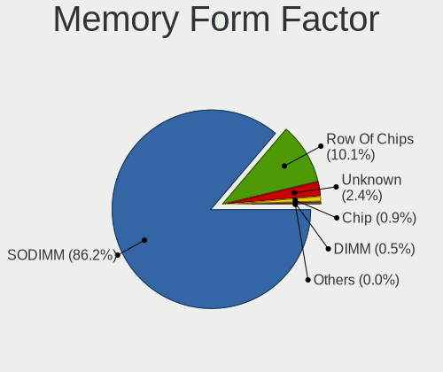

Linux in USA - Tested Hardware & Statistics (Notebooks)
-------------------------------------------------------

A project to collect tested hardware configurations for Linux in USA.

Anyone can contribute to this report by the [hw-probe](https://github.com/linuxhw/hw-probe) tool:

    sudo -E hw-probe -all -upload

Please contribute! Especially if your hardware is rare.

Contents
--------

* [ Test Cases ](#test-cases)

* [ System ](#system)
  - [ OS                       ](#os)
  - [ OS Family                ](#os-family)
  - [ Kernel                   ](#kernel)
  - [ Kernel Family            ](#kernel-family)
  - [ Kernel Major Ver.        ](#kernel-major-ver)
  - [ Arch                     ](#arch)
  - [ DE                       ](#de)
  - [ Display Server           ](#display-server)
  - [ Display Manager          ](#display-manager)
  - [ OS Lang                  ](#os-lang)
  - [ Boot Mode                ](#boot-mode)
  - [ Filesystem               ](#filesystem)
  - [ Part. scheme             ](#part-scheme)
  - [ Dual Boot with Linux/BSD ](#dual-boot-with-linuxbsd)
  - [ Dual Boot (Win)          ](#dual-boot-win)

* [ Board ](#board)
  - [ Vendor                   ](#vendor)
  - [ Model                    ](#model)
  - [ Model Family             ](#model-family)
  - [ MFG Year                 ](#mfg-year)
  - [ Form Factor              ](#form-factor)
  - [ Secure Boot              ](#secure-boot)
  - [ Coreboot                 ](#coreboot)
  - [ RAM Size                 ](#ram-size)
  - [ RAM Used                 ](#ram-used)
  - [ Total Drives             ](#total-drives)
  - [ Has CD-ROM               ](#has-cd-rom)
  - [ Has Ethernet             ](#has-ethernet)
  - [ Has WiFi                 ](#has-wifi)
  - [ Has Bluetooth            ](#has-bluetooth)

* [ Location ](#location)
  - [ Country                  ](#country)
  - [ City                     ](#city)

* [ Drives ](#drives)
  - [ Drive Vendor             ](#drive-vendor)
  - [ Drive Model              ](#drive-model)
  - [ HDD Vendor               ](#hdd-vendor)
  - [ SSD Vendor               ](#ssd-vendor)
  - [ Drive Kind               ](#drive-kind)
  - [ Drive Connector          ](#drive-connector)
  - [ Drive Size               ](#drive-size)
  - [ Space Total              ](#space-total)
  - [ Space Used               ](#space-used)
  - [ Malfunc. Drives          ](#malfunc-drives)
  - [ Malfunc. Drive Vendor    ](#malfunc-drive-vendor)
  - [ Malfunc. HDD Vendor      ](#malfunc-hdd-vendor)
  - [ Malfunc. Drive Kind      ](#malfunc-drive-kind)
  - [ Failed Drives            ](#failed-drives)
  - [ Failed Drive Vendor      ](#failed-drive-vendor)
  - [ Drive Status             ](#drive-status)

* [ Storage controller ](#storage-controller)
  - [ Storage Vendor           ](#storage-vendor)
  - [ Storage Model            ](#storage-model)
  - [ Storage Kind             ](#storage-kind)

* [ Processor ](#processor)
  - [ CPU Vendor               ](#cpu-vendor)
  - [ CPU Model                ](#cpu-model)
  - [ CPU Model Family         ](#cpu-model-family)
  - [ CPU Cores                ](#cpu-cores)
  - [ CPU Sockets              ](#cpu-sockets)
  - [ CPU Threads              ](#cpu-threads)
  - [ CPU Op-Modes             ](#cpu-op-modes)
  - [ CPU Microcode            ](#cpu-microcode)
  - [ CPU Microarch            ](#cpu-microarch)

* [ Graphics ](#graphics)
  - [ GPU Vendor               ](#gpu-vendor)
  - [ GPU Model                ](#gpu-model)
  - [ GPU Combo                ](#gpu-combo)
  - [ GPU Driver               ](#gpu-driver)
  - [ GPU Memory               ](#gpu-memory)

* [ Monitor ](#monitor)
  - [ Monitor Vendor           ](#monitor-vendor)
  - [ Monitor Model            ](#monitor-model)
  - [ Monitor Resolution       ](#monitor-resolution)
  - [ Monitor Diagonal         ](#monitor-diagonal)
  - [ Monitor Width            ](#monitor-width)
  - [ Aspect Ratio             ](#aspect-ratio)
  - [ Monitor Area             ](#monitor-area)
  - [ Pixel Density            ](#pixel-density)
  - [ Multiple Monitors        ](#multiple-monitors)

* [ Network ](#network)
  - [ Net Controller Vendor    ](#net-controller-vendor)
  - [ Net Controller Model     ](#net-controller-model)
  - [ Wireless Vendor          ](#wireless-vendor)
  - [ Wireless Model           ](#wireless-model)
  - [ Ethernet Vendor          ](#ethernet-vendor)
  - [ Ethernet Model           ](#ethernet-model)
  - [ Net Controller Kind      ](#net-controller-kind)
  - [ Used Controller          ](#used-controller)
  - [ NICs                     ](#nics)
  - [ IPv6                     ](#ipv6)

* [ Bluetooth ](#bluetooth)
  - [ Bluetooth Vendor         ](#bluetooth-vendor)
  - [ Bluetooth Model          ](#bluetooth-model)

* [ Sound ](#sound)
  - [ Sound Vendor             ](#sound-vendor)
  - [ Sound Model              ](#sound-model)

* [ Memory ](#memory)
  - [ Memory Vendor            ](#memory-vendor)
  - [ Memory Model             ](#memory-model)
  - [ Memory Kind              ](#memory-kind)
  - [ Memory Form Factor       ](#memory-form-factor)
  - [ Memory Size              ](#memory-size)
  - [ Memory Speed             ](#memory-speed)

* [ Printers & scanners ](#printers--scanners)
  - [ Printer Vendor           ](#printer-vendor)
  - [ Printer Model            ](#printer-model)
  - [ Scanner Vendor           ](#scanner-vendor)
  - [ Scanner Model            ](#scanner-model)

* [ Camera ](#camera)
  - [ Camera Vendor            ](#camera-vendor)
  - [ Camera Model             ](#camera-model)

* [ Security ](#security)
  - [ Fingerprint Vendor       ](#fingerprint-vendor)
  - [ Fingerprint Model        ](#fingerprint-model)
  - [ Chipcard Vendor          ](#chipcard-vendor)
  - [ Chipcard Model           ](#chipcard-model)

* [ Unsupported ](#unsupported)
  - [ Unsupported Devices      ](#unsupported-devices)
  - [ Unsupported Device Types ](#unsupported-device-types)

Test Cases
----------

Total: 34706

| Vendor        | Model                       | Probe                                                      | Date         |
|---------------|-----------------------------|------------------------------------------------------------|--------------|
| ASUSTek       | VivoBook_ASUSLaptop E410... | [7b12164813](https://linux-hardware.org/?probe=7b12164813) | Jan 06, 2025 |
| Acer          | Predator PH315-52           | [1ae33fb974](https://linux-hardware.org/?probe=1ae33fb974) | Jan 06, 2025 |
| Dell          | XPS 13 9305                 | [5b06a32fea](https://linux-hardware.org/?probe=5b06a32fea) | Jan 06, 2025 |
| Dell          | Latitude E7470              | [448c4c5d6e](https://linux-hardware.org/?probe=448c4c5d6e) | Jan 06, 2025 |
| MSI           | Modern 15 H AI C1MTG        | [4e43ee30f8](https://linux-hardware.org/?probe=4e43ee30f8) | Jan 06, 2025 |
| HP            | ProBook 455 G8 Notebook ... | [963fcdd477](https://linux-hardware.org/?probe=963fcdd477) | Jan 06, 2025 |
| MSI           | Modern 15 H AI C1MTG        | [ed4c4c8261](https://linux-hardware.org/?probe=ed4c4c8261) | Jan 06, 2025 |
| Acer          | Nitro ANV15-51              | [657a86fee0](https://linux-hardware.org/?probe=657a86fee0) | Jan 06, 2025 |
| Dell          | Precision M6800             | [01d1dcb2d8](https://linux-hardware.org/?probe=01d1dcb2d8) | Jan 06, 2025 |
| GPU Compan... | GWNR7L1749                  | [0f2438bc90](https://linux-hardware.org/?probe=0f2438bc90) | Jan 06, 2025 |
| Apple         | MacBookAir6,2               | [dfb4117f5c](https://linux-hardware.org/?probe=dfb4117f5c) | Jan 06, 2025 |
| Lenovo        | IdeaPad MIIX 700-12ISK 8... | [0cf3ed40e6](https://linux-hardware.org/?probe=0cf3ed40e6) | Jan 06, 2025 |
| HP            | Presario CQ57               | [970ab9cc5f](https://linux-hardware.org/?probe=970ab9cc5f) | Jan 06, 2025 |
| Alienware     | m18 R2                      | [6277d13cf5](https://linux-hardware.org/?probe=6277d13cf5) | Jan 06, 2025 |
| Lenovo        | ThinkPad T450s 20BXCTO1W... | [10131ea72a](https://linux-hardware.org/?probe=10131ea72a) | Jan 06, 2025 |
| ASUSTek       | ASUS Vivobook Pro 15 N65... | [7b915687fc](https://linux-hardware.org/?probe=7b915687fc) | Jan 06, 2025 |
| ASUSTek       | ASUS Vivobook Pro 15 N65... | [6ccd45a853](https://linux-hardware.org/?probe=6ccd45a853) | Jan 06, 2025 |
| Lenovo        | ThinkPad T14s Gen 4 21F8... | [1c78d58aab](https://linux-hardware.org/?probe=1c78d58aab) | Jan 06, 2025 |
| Dell          | Latitude 7280               | [58eef8f0dd](https://linux-hardware.org/?probe=58eef8f0dd) | Jan 06, 2025 |
| Google        | Treeya                      | [b8f7c2d75a](https://linux-hardware.org/?probe=b8f7c2d75a) | Jan 06, 2025 |
| Lenovo        | ThinkPad X395 20NLS0J400    | [7ff6bae738](https://linux-hardware.org/?probe=7ff6bae738) | Jan 06, 2025 |
| Lenovo        | ThinkPad E475 20H40006US    | [69908d16ca](https://linux-hardware.org/?probe=69908d16ca) | Jan 06, 2025 |
| Lenovo        | IdeaPad 5 15ABA7 82SG       | [22702a56ed](https://linux-hardware.org/?probe=22702a56ed) | Jan 06, 2025 |
| Valve         | Jupiter                     | [586cabc574](https://linux-hardware.org/?probe=586cabc574) | Jan 06, 2025 |
| HP            | Pavilion Gaming Laptop 1... | [f2de07e3ef](https://linux-hardware.org/?probe=f2de07e3ef) | Jan 06, 2025 |
| Lenovo        | ThinkPad E475 20H40006US    | [78b9a699ff](https://linux-hardware.org/?probe=78b9a699ff) | Jan 05, 2025 |
| Lenovo        | ThinkPad T440s 20ARS46M0... | [17ac336e9c](https://linux-hardware.org/?probe=17ac336e9c) | Jan 05, 2025 |
| HP            | Pavilion dv8                | [ab69193742](https://linux-hardware.org/?probe=ab69193742) | Jan 05, 2025 |
| Lenovo        | ThinkPad T540p 20BFS0Y00... | [8e40087118](https://linux-hardware.org/?probe=8e40087118) | Jan 05, 2025 |
| Apple         | MacBookAir6,2               | [3b5dc1b1c2](https://linux-hardware.org/?probe=3b5dc1b1c2) | Jan 05, 2025 |
| Apple         | MacBookPro9,1               | [ae5a71dde0](https://linux-hardware.org/?probe=ae5a71dde0) | Jan 05, 2025 |
| Lenovo        | ThinkPad E520 1143R77       | [3d26d596e3](https://linux-hardware.org/?probe=3d26d596e3) | Jan 05, 2025 |
| HP            | Laptop 14-dk0xxx            | [66f7231a06](https://linux-hardware.org/?probe=66f7231a06) | Jan 05, 2025 |
| Valve         | Jupiter                     | [6773d7420e](https://linux-hardware.org/?probe=6773d7420e) | Jan 05, 2025 |
| Apple         | MacBookPro5,5               | [de39de3147](https://linux-hardware.org/?probe=de39de3147) | Jan 05, 2025 |
| HP            | Presario CQ57               | [8c1782d787](https://linux-hardware.org/?probe=8c1782d787) | Jan 05, 2025 |
| Dell          | Latitude E4200              | [db5dcaf33b](https://linux-hardware.org/?probe=db5dcaf33b) | Jan 05, 2025 |
| HP            | Laptop 17-cp2xxx            | [f8146603c3](https://linux-hardware.org/?probe=f8146603c3) | Jan 05, 2025 |
| HP            | ProBook 445 G7              | [30f8996b5f](https://linux-hardware.org/?probe=30f8996b5f) | Jan 05, 2025 |
| HP            | Laptop 17-cp2xxx            | [48236cccfb](https://linux-hardware.org/?probe=48236cccfb) | Jan 05, 2025 |
| Lenovo        | IdeaPad 320-15ABR 80XS      | [4a2cbc9a5c](https://linux-hardware.org/?probe=4a2cbc9a5c) | Jan 05, 2025 |
| HP            | Pavilion Laptop 15-eh0xx... | [d87015b7dd](https://linux-hardware.org/?probe=d87015b7dd) | Jan 05, 2025 |
| Dell          | Inspiron 15-3567            | [96419f9337](https://linux-hardware.org/?probe=96419f9337) | Jan 05, 2025 |
| Acer          | Nitro AN515-55              | [87f960a021](https://linux-hardware.org/?probe=87f960a021) | Jan 05, 2025 |
| ASUSTek       | ASUS TUF Gaming A16 FA61... | [b4fcbcaf8c](https://linux-hardware.org/?probe=b4fcbcaf8c) | Jan 05, 2025 |
| Acer          | Aspire E5-521               | [91b7208a57](https://linux-hardware.org/?probe=91b7208a57) | Jan 05, 2025 |
| Dell          | Latitude 7420               | [cb90378674](https://linux-hardware.org/?probe=cb90378674) | Jan 04, 2025 |
| Dell          | Latitude 7420               | [f4490890b8](https://linux-hardware.org/?probe=f4490890b8) | Jan 04, 2025 |
| Acer          | Aspire E5-521               | [a0c069e75e](https://linux-hardware.org/?probe=a0c069e75e) | Jan 04, 2025 |
| Dell          | XPS 17 9730                 | [699b3afba1](https://linux-hardware.org/?probe=699b3afba1) | Jan 04, 2025 |
| Lenovo        | ThinkPad T440p 20AN0069U... | [dbdff3ab95](https://linux-hardware.org/?probe=dbdff3ab95) | Jan 04, 2025 |
| Lenovo        | ThinkPad T490 20N20030US    | [d4dd35d7dc](https://linux-hardware.org/?probe=d4dd35d7dc) | Jan 04, 2025 |
| HP            | 255 G6 Notebook PC          | [57b6786860](https://linux-hardware.org/?probe=57b6786860) | Jan 04, 2025 |
| HP            | ZBook 15 G3                 | [548eae93b9](https://linux-hardware.org/?probe=548eae93b9) | Jan 04, 2025 |
| HP            | EliteBook 840 G2            | [69146beeeb](https://linux-hardware.org/?probe=69146beeeb) | Jan 04, 2025 |
| HP            | 15                          | [d95bba2430](https://linux-hardware.org/?probe=d95bba2430) | Jan 04, 2025 |
| Lenovo        | ThinkPad P50 20EN0013US     | [a5acb19495](https://linux-hardware.org/?probe=a5acb19495) | Jan 04, 2025 |
| Dell          | Inspiron 3541               | [206872a37f](https://linux-hardware.org/?probe=206872a37f) | Jan 04, 2025 |
| AZW           | SER                         | [487845b4a5](https://linux-hardware.org/?probe=487845b4a5) | Jan 04, 2025 |
| HP            | Laptop 17-cn0xxx            | [6426be4511](https://linux-hardware.org/?probe=6426be4511) | Jan 04, 2025 |
| Dell          | Latitude 5290 2-in-1        | [cee01ab926](https://linux-hardware.org/?probe=cee01ab926) | Jan 04, 2025 |
| Dell          | Latitude 5290 2-in-1        | [b5b287d361](https://linux-hardware.org/?probe=b5b287d361) | Jan 04, 2025 |
| HP            | Laptop 14-dk0xxx            | [d219ce5c33](https://linux-hardware.org/?probe=d219ce5c33) | Jan 04, 2025 |
| Lenovo        | ThinkPad T560 20FH001RUS    | [00bb35dd31](https://linux-hardware.org/?probe=00bb35dd31) | Jan 04, 2025 |
| Toshiba       | Satellite C75D-B            | [6d15c78d08](https://linux-hardware.org/?probe=6d15c78d08) | Jan 04, 2025 |
| MSI           | GF63 Thin 11SC              | [3f1c75f109](https://linux-hardware.org/?probe=3f1c75f109) | Jan 04, 2025 |
| ASUSTek       | VivoBook_ASUSLaptop X160... | [59a8c42150](https://linux-hardware.org/?probe=59a8c42150) | Jan 04, 2025 |
| MSI           | Summit E13FlipEvo A12MT     | [642730a80d](https://linux-hardware.org/?probe=642730a80d) | Jan 04, 2025 |
| Dell          | XPS 15 9570                 | [5eb1399d1e](https://linux-hardware.org/?probe=5eb1399d1e) | Jan 04, 2025 |
| Apple         | MacBookPro9,2               | [bc4630757c](https://linux-hardware.org/?probe=bc4630757c) | Jan 04, 2025 |
| Apple         | MacBookPro7,1               | [7961299452](https://linux-hardware.org/?probe=7961299452) | Jan 04, 2025 |
| Gigabyte      | Z97N-WIFI                   | [94525b433d](https://linux-hardware.org/?probe=94525b433d) | Jan 04, 2025 |
| HP            | Laptop 17t-cn300            | [d7d9dcc497](https://linux-hardware.org/?probe=d7d9dcc497) | Jan 04, 2025 |
| Lenovo        | ThinkPad E475 20H40006US    | [1f287326ed](https://linux-hardware.org/?probe=1f287326ed) | Jan 04, 2025 |
| Lenovo        | ThinkPad E475 20H40006US    | [74d7973a3d](https://linux-hardware.org/?probe=74d7973a3d) | Jan 03, 2025 |
| Valve         | Jupiter                     | [5f851271c3](https://linux-hardware.org/?probe=5f851271c3) | Jan 03, 2025 |
| Valve         | Jupiter                     | [4588bcf961](https://linux-hardware.org/?probe=4588bcf961) | Jan 03, 2025 |
| ASUSTek       | U56E                        | [e777c929c0](https://linux-hardware.org/?probe=e777c929c0) | Jan 03, 2025 |
| HP            | 15                          | [8542f54ea5](https://linux-hardware.org/?probe=8542f54ea5) | Jan 03, 2025 |
| ASUSTek       | Q550LF                      | [c587210fdb](https://linux-hardware.org/?probe=c587210fdb) | Jan 03, 2025 |
| ASUSTek       | ASUS Vivobook S 14 M5406... | [c1bc9188a7](https://linux-hardware.org/?probe=c1bc9188a7) | Jan 03, 2025 |
| Toshiba       | QOSMIO X775                 | [339f01aea5](https://linux-hardware.org/?probe=339f01aea5) | Jan 03, 2025 |
| Dell          | XPS 15 9560                 | [924d90cdcc](https://linux-hardware.org/?probe=924d90cdcc) | Jan 03, 2025 |
| Dell          | XPS 15 9560                 | [5a9c188db1](https://linux-hardware.org/?probe=5a9c188db1) | Jan 03, 2025 |
| Dell          | Latitude 9420               | [8e4f82962c](https://linux-hardware.org/?probe=8e4f82962c) | Jan 03, 2025 |
| Lenovo        | IdeaPad 1 15AMN7 82VG       | [a791c57fad](https://linux-hardware.org/?probe=a791c57fad) | Jan 03, 2025 |
| Framework     | Laptop 13 (AMD Ryzen 704... | [401658b7cf](https://linux-hardware.org/?probe=401658b7cf) | Jan 03, 2025 |
| HP            | Pavilion Notebook           | [f741ec95c4](https://linux-hardware.org/?probe=f741ec95c4) | Jan 03, 2025 |
| Acer          | Nitro AN515-54              | [3eae42086a](https://linux-hardware.org/?probe=3eae42086a) | Jan 03, 2025 |
| HP            | Pavilion Notebook           | [257733ddc6](https://linux-hardware.org/?probe=257733ddc6) | Jan 03, 2025 |
| Apple         | MacBookPro12,1              | [c226449ca2](https://linux-hardware.org/?probe=c226449ca2) | Jan 03, 2025 |
| Dell          | Latitude 5440               | [18c0535aa3](https://linux-hardware.org/?probe=18c0535aa3) | Jan 03, 2025 |
| Dell          | XPS 15 9530                 | [c03c2ac397](https://linux-hardware.org/?probe=c03c2ac397) | Jan 03, 2025 |
| Google        | Candy                       | [9cd761ead3](https://linux-hardware.org/?probe=9cd761ead3) | Jan 03, 2025 |
| Lenovo        | Slim Pro 7 14ARP8 83AX      | [9acb68fefa](https://linux-hardware.org/?probe=9acb68fefa) | Jan 03, 2025 |
| Framework     | Laptop                      | [a74fd192f3](https://linux-hardware.org/?probe=a74fd192f3) | Jan 03, 2025 |
| Alienware     | m18 R2                      | [48bc0a64c1](https://linux-hardware.org/?probe=48bc0a64c1) | Jan 02, 2025 |
| Lenovo        | G585 20137                  | [f7dac7bbad](https://linux-hardware.org/?probe=f7dac7bbad) | Jan 02, 2025 |
| HP            | Laptop 17-cn0xxx            | [4fdad5bec0](https://linux-hardware.org/?probe=4fdad5bec0) | Jan 02, 2025 |
| HP            | Laptop 17t-cn300            | [a118a2798f](https://linux-hardware.org/?probe=a118a2798f) | Jan 02, 2025 |
| HP            | Pavilion dv5                | [994c479b50](https://linux-hardware.org/?probe=994c479b50) | Jan 02, 2025 |
| Dell          | Precision M6800             | [460842482c](https://linux-hardware.org/?probe=460842482c) | Jan 02, 2025 |
| Lenovo        | G500s Touch 20263           | [eb4512501c](https://linux-hardware.org/?probe=eb4512501c) | Jan 02, 2025 |
| HP            | Laptop 17-cn0xxx            | [63b427416a](https://linux-hardware.org/?probe=63b427416a) | Jan 02, 2025 |
| Razer         | Blade 15 Base Model (Lat... | [762cb6b3dd](https://linux-hardware.org/?probe=762cb6b3dd) | Jan 02, 2025 |
| HP            | EliteBook 840 G2            | [bb8d0a325f](https://linux-hardware.org/?probe=bb8d0a325f) | Jan 02, 2025 |
| HP            | Pavilion Laptop 15-eh0xx... | [49011f501a](https://linux-hardware.org/?probe=49011f501a) | Jan 02, 2025 |
| Framework     | Laptop 16 (AMD Ryzen 704... | [6cc92a635d](https://linux-hardware.org/?probe=6cc92a635d) | Jan 02, 2025 |
| Lenovo        | ThinkPad W520 428426U       | [a7aa110e08](https://linux-hardware.org/?probe=a7aa110e08) | Jan 02, 2025 |
| Dell          | Precision 5530              | [5913ba1fdc](https://linux-hardware.org/?probe=5913ba1fdc) | Jan 02, 2025 |
| HP            | ProBook 440 G7              | [b1f0f9f971](https://linux-hardware.org/?probe=b1f0f9f971) | Jan 02, 2025 |
| Lenovo        | IdeaPad 320-15ABR 80XS      | [b58899eb8b](https://linux-hardware.org/?probe=b58899eb8b) | Jan 02, 2025 |
| Lenovo        | Legion Slim 5 16ARP9 83E... | [f2904a45ad](https://linux-hardware.org/?probe=f2904a45ad) | Jan 02, 2025 |
| HP            | ENVY Laptop 17t-da000       | [c5fcd7ff93](https://linux-hardware.org/?probe=c5fcd7ff93) | Jan 02, 2025 |
| Dell          | Inspiron 5567               | [786e67f683](https://linux-hardware.org/?probe=786e67f683) | Jan 02, 2025 |
| Lenovo        | IdeaPad Pro 5 16IMH9 83D... | [bb4860483d](https://linux-hardware.org/?probe=bb4860483d) | Jan 02, 2025 |
| HP            | ProBook 4540s               | [0646f227a6](https://linux-hardware.org/?probe=0646f227a6) | Jan 02, 2025 |
| HP            | OMEN by Laptop              | [319fc5e92e](https://linux-hardware.org/?probe=319fc5e92e) | Jan 02, 2025 |
| Dell          | Inspiron 3558               | [06fdffd5e6](https://linux-hardware.org/?probe=06fdffd5e6) | Jan 02, 2025 |
| Dell          | Inspiron 15-3565            | [27354f28ea](https://linux-hardware.org/?probe=27354f28ea) | Jan 02, 2025 |
| HP            | Pavilion 17                 | [fc1f326456](https://linux-hardware.org/?probe=fc1f326456) | Jan 02, 2025 |
| Google        | Barla                       | [92ec004230](https://linux-hardware.org/?probe=92ec004230) | Jan 02, 2025 |
| Google        | Barla                       | [b12d7482fe](https://linux-hardware.org/?probe=b12d7482fe) | Jan 02, 2025 |
| Lenovo        | ThinkPad X1 Carbon 7th 2... | [497be29097](https://linux-hardware.org/?probe=497be29097) | Jan 01, 2025 |
| HP            | EliteBook 840 G1            | [f298c84729](https://linux-hardware.org/?probe=f298c84729) | Jan 01, 2025 |
| Dell          | Latitude 7390               | [ca0c827c18](https://linux-hardware.org/?probe=ca0c827c18) | Jan 01, 2025 |
| Lenovo        | IdeaCentre A700 10050       | [e7f468af21](https://linux-hardware.org/?probe=e7f468af21) | Jan 01, 2025 |
| HP            | Pavilion Notebook           | [2cd285f25b](https://linux-hardware.org/?probe=2cd285f25b) | Jan 01, 2025 |
| HP            | Pavilion Notebook           | [b20e70da0c](https://linux-hardware.org/?probe=b20e70da0c) | Jan 01, 2025 |
| HP            | Laptop 14z-em000            | [0c43124a84](https://linux-hardware.org/?probe=0c43124a84) | Jan 01, 2025 |
| HP            | Laptop 15-fc0xxx            | [ca0732e368](https://linux-hardware.org/?probe=ca0732e368) | Jan 01, 2025 |
| Apple         | MacBookAir8,2               | [66bc93d601](https://linux-hardware.org/?probe=66bc93d601) | Jan 01, 2025 |
| Dell          | Latitude 5400               | [7a418a2cca](https://linux-hardware.org/?probe=7a418a2cca) | Jan 01, 2025 |
| Dell          | Precision 5530              | [64afde2c05](https://linux-hardware.org/?probe=64afde2c05) | Jan 01, 2025 |
| ASUSTek       | U46E                        | [1855a199b3](https://linux-hardware.org/?probe=1855a199b3) | Jan 01, 2025 |
| Dell          | Latitude 5590               | [ac8442c3af](https://linux-hardware.org/?probe=ac8442c3af) | Jan 01, 2025 |
| Dell          | Latitude E6430              | [72d1edde28](https://linux-hardware.org/?probe=72d1edde28) | Jan 01, 2025 |
| Lenovo        | IdeaPad Gaming 3 15ARH05... | [f598642ee7](https://linux-hardware.org/?probe=f598642ee7) | Jan 01, 2025 |
| Samsung       | 770Z5E/780Z5E               | [1643aef813](https://linux-hardware.org/?probe=1643aef813) | Jan 01, 2025 |
| Dell          | Latitude E6430s             | [dd2c6cdd85](https://linux-hardware.org/?probe=dd2c6cdd85) | Jan 01, 2025 |
| Dell          | Latitude 3340               | [b22cafbc3b](https://linux-hardware.org/?probe=b22cafbc3b) | Jan 01, 2025 |
| HP            | Pavilion dv6                | [1c73ddb1c0](https://linux-hardware.org/?probe=1c73ddb1c0) | Jan 01, 2025 |
| Lenovo        | ThinkPad E570 20H5CTO1WW    | [ae328090f7](https://linux-hardware.org/?probe=ae328090f7) | Jan 01, 2025 |
| ASUSTek       | VivoBook_ASUSLaptop X170... | [2b6b95b19f](https://linux-hardware.org/?probe=2b6b95b19f) | Jan 01, 2025 |
| HP            | Laptop 15-dy2xxx            | [c1ed1a0524](https://linux-hardware.org/?probe=c1ed1a0524) | Jan 01, 2025 |
| ASUSTek       | VivoBook_ASUSLaptop X140... | [cb43939fff](https://linux-hardware.org/?probe=cb43939fff) | Jan 01, 2025 |
| Lenovo        | ThinkPad T14s Gen 6 21N1... | [afb68eacd9](https://linux-hardware.org/?probe=afb68eacd9) | Jan 01, 2025 |
| Toshiba       | Satellite C55-B             | [57036129ee](https://linux-hardware.org/?probe=57036129ee) | Jan 01, 2025 |
| Google        | Caroline                    | [4aef1f789f](https://linux-hardware.org/?probe=4aef1f789f) | Jan 01, 2025 |
| Apple         | MacBookPro14,3              | [b1813c3452](https://linux-hardware.org/?probe=b1813c3452) | Jan 01, 2025 |
| Apple         | MacBookPro14,3              | [d3cba6d56e](https://linux-hardware.org/?probe=d3cba6d56e) | Jan 01, 2025 |
| Valve         | Jupiter                     | [c55e30f87f](https://linux-hardware.org/?probe=c55e30f87f) | Jan 01, 2025 |
| Dell          | Inspiron 3542               | [95006e65be](https://linux-hardware.org/?probe=95006e65be) | Jan 01, 2025 |
| Dell          | Latitude 7390               | [1328b0b059](https://linux-hardware.org/?probe=1328b0b059) | Jan 01, 2025 |
| HP            | Laptop 14z-em000            | [2b45c6c699](https://linux-hardware.org/?probe=2b45c6c699) | Jan 01, 2025 |
| MSI           | Summit A16 AI+ A3HMTG       | [b064d5d8aa](https://linux-hardware.org/?probe=b064d5d8aa) | Jan 01, 2025 |
| Dell          | Latitude 5480               | [d4da596a26](https://linux-hardware.org/?probe=d4da596a26) | Jan 01, 2025 |
| Toshiba       | Satellite P755              | [919f9d689c](https://linux-hardware.org/?probe=919f9d689c) | Dec 31, 2024 |
| HP            | Pavilion dv7                | [80ac393681](https://linux-hardware.org/?probe=80ac393681) | Dec 31, 2024 |
| Lenovo        | Yoga 2 13 20344             | [1be4064009](https://linux-hardware.org/?probe=1be4064009) | Dec 31, 2024 |
| Framework     | Laptop (13th Gen Intel C... | [705dce2bdc](https://linux-hardware.org/?probe=705dce2bdc) | Dec 31, 2024 |
| HP            | ProBook 440 14 inch G9 N... | [2127fd790b](https://linux-hardware.org/?probe=2127fd790b) | Dec 31, 2024 |
| Apple         | MacBookAir6,2               | [47b07545df](https://linux-hardware.org/?probe=47b07545df) | Dec 31, 2024 |
| BOSGAME       | DNB20 series                | [7c23d0edba](https://linux-hardware.org/?probe=7c23d0edba) | Dec 31, 2024 |
| Dell          | Latitude 5400               | [0a64fb9a01](https://linux-hardware.org/?probe=0a64fb9a01) | Dec 31, 2024 |
| Dell          | Latitude 5400               | [192ab2428b](https://linux-hardware.org/?probe=192ab2428b) | Dec 31, 2024 |
| Google        | Barla                       | [270f360297](https://linux-hardware.org/?probe=270f360297) | Dec 31, 2024 |
| MSI           | Katana 15 B12VFK            | [1596a8dc1a](https://linux-hardware.org/?probe=1596a8dc1a) | Dec 31, 2024 |
| Lenovo        | IdeaPad 1 14IGL7 82V6       | [b30ae21c72](https://linux-hardware.org/?probe=b30ae21c72) | Dec 31, 2024 |
| Dell          | Latitude E6520              | [c3a5cf03a9](https://linux-hardware.org/?probe=c3a5cf03a9) | Dec 31, 2024 |
| Apple         | MacBook5,2                  | [3e1d6ce785](https://linux-hardware.org/?probe=3e1d6ce785) | Dec 31, 2024 |
| Apple         | MacBookAir6,2               | [16df9d43b9](https://linux-hardware.org/?probe=16df9d43b9) | Dec 31, 2024 |
| Gigabyte      | AORUS 15P XD                | [a91ae65b48](https://linux-hardware.org/?probe=a91ae65b48) | Dec 31, 2024 |
| Intel Clie... | LAPAC71G                    | [7554635159](https://linux-hardware.org/?probe=7554635159) | Dec 31, 2024 |
| HP            | ProBook 4540s               | [9bbe0a3b71](https://linux-hardware.org/?probe=9bbe0a3b71) | Dec 31, 2024 |
| Google        | Barla                       | [17c9f8db8c](https://linux-hardware.org/?probe=17c9f8db8c) | Dec 31, 2024 |
| HP            | Nami                        | [bd56fc3a14](https://linux-hardware.org/?probe=bd56fc3a14) | Dec 31, 2024 |
| Toshiba       | Satellite C75D-B            | [728de620aa](https://linux-hardware.org/?probe=728de620aa) | Dec 31, 2024 |
| HP            | Nami                        | [dc21545854](https://linux-hardware.org/?probe=dc21545854) | Dec 31, 2024 |
| Dell          | XPS 13 9350                 | [896eb3972d](https://linux-hardware.org/?probe=896eb3972d) | Dec 31, 2024 |
| Apple         | MacBookAir6,2               | [903e299f16](https://linux-hardware.org/?probe=903e299f16) | Dec 30, 2024 |
| Framework     | Laptop 16 (AMD Ryzen 704... | [d25adffd4b](https://linux-hardware.org/?probe=d25adffd4b) | Dec 30, 2024 |
| Valve         | Galileo                     | [d2e95667cf](https://linux-hardware.org/?probe=d2e95667cf) | Dec 30, 2024 |
| Apple         | MacBookPro5,5               | [80bf9a388e](https://linux-hardware.org/?probe=80bf9a388e) | Dec 30, 2024 |
| Apple         | MacBookPro5,5               | [8e4e44db83](https://linux-hardware.org/?probe=8e4e44db83) | Dec 30, 2024 |
| HP            | EliteBook 655 15.6 inch ... | [6278369011](https://linux-hardware.org/?probe=6278369011) | Dec 30, 2024 |
| Dell          | Precision 5530              | [b9cd482095](https://linux-hardware.org/?probe=b9cd482095) | Dec 30, 2024 |
| ASUSTek       | VivoBook_ASUSLaptop X170... | [38bd32bd79](https://linux-hardware.org/?probe=38bd32bd79) | Dec 30, 2024 |
| ASUSTek       | ASUS BR1100CKA BR1100CKA... | [27dd012145](https://linux-hardware.org/?probe=27dd012145) | Dec 30, 2024 |
| Acer          | Nitro AN515-54              | [ead2772228](https://linux-hardware.org/?probe=ead2772228) | Dec 30, 2024 |
| GPD           | G1618-04                    | [6e61e63b98](https://linux-hardware.org/?probe=6e61e63b98) | Dec 30, 2024 |
| ASUSTek       | ASUS Zenbook S 14 UX5406... | [250896c182](https://linux-hardware.org/?probe=250896c182) | Dec 30, 2024 |
| Lenovo        | ThinkPad E14 Gen 3 20Y70... | [46361a1b83](https://linux-hardware.org/?probe=46361a1b83) | Dec 30, 2024 |
| Dell          | Latitude 5400               | [b83ec20ffe](https://linux-hardware.org/?probe=b83ec20ffe) | Dec 30, 2024 |
| System76      | Darter Pro                  | [c5c16912fe](https://linux-hardware.org/?probe=c5c16912fe) | Dec 30, 2024 |
| Dell          | Precision 7720              | [888706d340](https://linux-hardware.org/?probe=888706d340) | Dec 30, 2024 |
| Framework     | Laptop (12th Gen Intel C... | [6d09d6c124](https://linux-hardware.org/?probe=6d09d6c124) | Dec 30, 2024 |
| MSI           | GF65 Thin 9SD               | [ed812824ea](https://linux-hardware.org/?probe=ed812824ea) | Dec 30, 2024 |
| Dell          | Precision 3561              | [effdc98e23](https://linux-hardware.org/?probe=effdc98e23) | Dec 30, 2024 |
| MSI           | GF65 Thin 9SD               | [a53632802a](https://linux-hardware.org/?probe=a53632802a) | Dec 30, 2024 |
| Unknown       | Unknown                     | [fae2f8fa52](https://linux-hardware.org/?probe=fae2f8fa52) | Dec 30, 2024 |
| ASUSTek       | ASUS TUF Gaming A16 FA61... | [005152678f](https://linux-hardware.org/?probe=005152678f) | Dec 30, 2024 |
| Notebook      | NH5XHPI                     | [fec43dc843](https://linux-hardware.org/?probe=fec43dc843) | Dec 29, 2024 |
| ASUSTek       | ASUS TUF Gaming A17 FA70... | [bf9d85f7a5](https://linux-hardware.org/?probe=bf9d85f7a5) | Dec 29, 2024 |
| Dell          | Inspiron 5567               | [8aea47fff9](https://linux-hardware.org/?probe=8aea47fff9) | Dec 29, 2024 |
| Dell          | XPS 13 9360                 | [4e5b03bfd7](https://linux-hardware.org/?probe=4e5b03bfd7) | Dec 29, 2024 |
| Dell          | XPS 13 9370                 | [6b3d0134ab](https://linux-hardware.org/?probe=6b3d0134ab) | Dec 29, 2024 |
| Lenovo        | ThinkPad T420s 41732AU      | [c9a701f86e](https://linux-hardware.org/?probe=c9a701f86e) | Dec 29, 2024 |
| Dell          | Precision M6600             | [071a23fb58](https://linux-hardware.org/?probe=071a23fb58) | Dec 29, 2024 |
| Dell          | Precision M6600             | [43ff956e50](https://linux-hardware.org/?probe=43ff956e50) | Dec 29, 2024 |
| ASUSTek       | VivoBook_ASUSLaptop X170... | [405fb793dc](https://linux-hardware.org/?probe=405fb793dc) | Dec 29, 2024 |
| Lenovo        | Legion Pro 7 16ARX8H 82W... | [702096b561](https://linux-hardware.org/?probe=702096b561) | Dec 29, 2024 |
| Lenovo        | Legion Pro 7 16ARX8H 82W... | [968258cf48](https://linux-hardware.org/?probe=968258cf48) | Dec 29, 2024 |
| Lenovo        | K14 Gen 1 21CUS0DF00        | [48ba2722d7](https://linux-hardware.org/?probe=48ba2722d7) | Dec 29, 2024 |
| HP            | Notebook                    | [4552d837a0](https://linux-hardware.org/?probe=4552d837a0) | Dec 29, 2024 |
| Valve         | Jupiter                     | [9361016877](https://linux-hardware.org/?probe=9361016877) | Dec 29, 2024 |
| Dell          | Latitude E6420              | [462ab6cc57](https://linux-hardware.org/?probe=462ab6cc57) | Dec 29, 2024 |
| MSI           | GT72 2QD                    | [c8a2b702aa](https://linux-hardware.org/?probe=c8a2b702aa) | Dec 29, 2024 |
| Samsung       | 750XGK                      | [13ea2575e9](https://linux-hardware.org/?probe=13ea2575e9) | Dec 29, 2024 |
| Lenovo        | Legion 5 16IRX9 83DG        | [54d9440e0d](https://linux-hardware.org/?probe=54d9440e0d) | Dec 29, 2024 |
| Samsung       | 950XDB/951XDB/950XDY        | [7d22efb355](https://linux-hardware.org/?probe=7d22efb355) | Dec 28, 2024 |
| Samsung       | 750XGK                      | [7c0257fc3e](https://linux-hardware.org/?probe=7c0257fc3e) | Dec 28, 2024 |
| Dell          | Latitude E6430              | [3bbd75ec42](https://linux-hardware.org/?probe=3bbd75ec42) | Dec 28, 2024 |
| Acer          | Aspire A315-58              | [895a738e00](https://linux-hardware.org/?probe=895a738e00) | Dec 28, 2024 |
| HP            | Laptop 17-cn0xxx            | [f1382538df](https://linux-hardware.org/?probe=f1382538df) | Dec 28, 2024 |
| Apple         | MacBookAir7,2               | [fcda8f7b53](https://linux-hardware.org/?probe=fcda8f7b53) | Dec 28, 2024 |
| GPD           | G1618-04                    | [f9fccc3291](https://linux-hardware.org/?probe=f9fccc3291) | Dec 28, 2024 |
| Apple         | MacBookAir7,2               | [218f4af079](https://linux-hardware.org/?probe=218f4af079) | Dec 28, 2024 |
| ASUSTek       | K53U                        | [aa0acbd3a4](https://linux-hardware.org/?probe=aa0acbd3a4) | Dec 28, 2024 |
| Alienware     | M17xR3                      | [2363abbe5c](https://linux-hardware.org/?probe=2363abbe5c) | Dec 28, 2024 |
| HP            | Laptop 14-dk1xxx            | [317b3a0d60](https://linux-hardware.org/?probe=317b3a0d60) | Dec 28, 2024 |
| Lenovo        | ThinkPad E16 Gen 1 21JTS... | [7366a0d1fd](https://linux-hardware.org/?probe=7366a0d1fd) | Dec 28, 2024 |
| ASUSTek       | Zenbook UX3404VA_Q410VA     | [04112caf10](https://linux-hardware.org/?probe=04112caf10) | Dec 28, 2024 |
| HP            | Victus by Gaming Laptop ... | [ed4c73ca71](https://linux-hardware.org/?probe=ed4c73ca71) | Dec 28, 2024 |
| Lenovo        | Legion S7 15ACH6 82K8       | [5f60743ad5](https://linux-hardware.org/?probe=5f60743ad5) | Dec 28, 2024 |
| Lenovo        | ThinkPad X131e 336855U      | [b0b97f4290](https://linux-hardware.org/?probe=b0b97f4290) | Dec 28, 2024 |
| Dell          | Inspiron 11 - 3147          | [f0df887cfb](https://linux-hardware.org/?probe=f0df887cfb) | Dec 28, 2024 |
| ASUSTek       | ROG Zephyrus G14 GA401IV... | [e2f614b096](https://linux-hardware.org/?probe=e2f614b096) | Dec 28, 2024 |
| Dell          | Precision 5680              | [16be64b31c](https://linux-hardware.org/?probe=16be64b31c) | Dec 28, 2024 |
| HP            | EliteBook Revolve 810 G3    | [e75ee3d7ac](https://linux-hardware.org/?probe=e75ee3d7ac) | Dec 28, 2024 |
| Google        | Robo                        | [fcc74e4162](https://linux-hardware.org/?probe=fcc74e4162) | Dec 28, 2024 |
| Lenovo        | ThinkPad T470 W10DG 20JM... | [a84d2e6201](https://linux-hardware.org/?probe=a84d2e6201) | Dec 27, 2024 |
| Apple         | MacBookPro8,1               | [c7e5641996](https://linux-hardware.org/?probe=c7e5641996) | Dec 27, 2024 |
| Lenovo        | ThinkPad T420 418062U       | [f06b701043](https://linux-hardware.org/?probe=f06b701043) | Dec 27, 2024 |
| Lenovo        | ThinkPad T420 4236N36       | [fbc061a72a](https://linux-hardware.org/?probe=fbc061a72a) | Dec 27, 2024 |
| Lenovo        | ThinkPad E460 20ET0014US    | [9ee6c676eb](https://linux-hardware.org/?probe=9ee6c676eb) | Dec 27, 2024 |
| Dell          | Inspiron 1525               | [89a2a2261a](https://linux-hardware.org/?probe=89a2a2261a) | Dec 27, 2024 |
| Lenovo        | ThinkPad T470 W10DG 20JN... | [ddbec2ef79](https://linux-hardware.org/?probe=ddbec2ef79) | Dec 27, 2024 |
| Valve         | Jupiter                     | [9c8684e346](https://linux-hardware.org/?probe=9c8684e346) | Dec 27, 2024 |
| System76      | Gazelle                     | [cb477659f5](https://linux-hardware.org/?probe=cb477659f5) | Dec 27, 2024 |
| Acer          | Aspire 5515                 | [65f32786d9](https://linux-hardware.org/?probe=65f32786d9) | Dec 27, 2024 |
| HP            | Pavilion Gaming Laptop 1... | [701ff9b72f](https://linux-hardware.org/?probe=701ff9b72f) | Dec 27, 2024 |
| Lenovo        | ThinkPad T490 20N3S64400    | [86b8ea0471](https://linux-hardware.org/?probe=86b8ea0471) | Dec 27, 2024 |
| HP            | 7Z0P3UA                     | [474af6633c](https://linux-hardware.org/?probe=474af6633c) | Dec 27, 2024 |
| Toshiba       | Satellite L850              | [9c4810944d](https://linux-hardware.org/?probe=9c4810944d) | Dec 27, 2024 |
| Dell          | Latitude 5580               | [61c3987fc9](https://linux-hardware.org/?probe=61c3987fc9) | Dec 27, 2024 |
| Lenovo        | ThinkPad E14 20RA004WUS     | [a88f8bddf3](https://linux-hardware.org/?probe=a88f8bddf3) | Dec 27, 2024 |
| ASUSTek       | ASUS Zenbook S 14 UX5406... | [3b4e12f8b0](https://linux-hardware.org/?probe=3b4e12f8b0) | Dec 27, 2024 |
| Dell          | Inspiron 11 - 3147          | [4ecd9dfdf5](https://linux-hardware.org/?probe=4ecd9dfdf5) | Dec 27, 2024 |
| Framework     | Laptop 13 (AMD Ryzen 704... | [c24b7f290f](https://linux-hardware.org/?probe=c24b7f290f) | Dec 27, 2024 |
| Lenovo        | ThinkPad L14 Gen 1 20U2S... | [77830eacc7](https://linux-hardware.org/?probe=77830eacc7) | Dec 27, 2024 |
| Eluktronic... | MAG-15 2070                 | [c25d963a38](https://linux-hardware.org/?probe=c25d963a38) | Dec 27, 2024 |
| Lenovo        | IdeaPad 3 15ITL6 82H8       | [0001b3f45a](https://linux-hardware.org/?probe=0001b3f45a) | Dec 26, 2024 |
| Valve         | Jupiter                     | [ccfb809cc8](https://linux-hardware.org/?probe=ccfb809cc8) | Dec 26, 2024 |
| GPD           | G1619-04                    | [b44a9df6e8](https://linux-hardware.org/?probe=b44a9df6e8) | Dec 26, 2024 |
| ASUSTek       | ROG Zephyrus G14 GA403UV... | [32b3387f38](https://linux-hardware.org/?probe=32b3387f38) | Dec 26, 2024 |
| ASUSTek       | ROG Zephyrus G14 GA403UV... | [ce3b8aa0e6](https://linux-hardware.org/?probe=ce3b8aa0e6) | Dec 26, 2024 |
| Apple         | MacBookPro11,3              | [8c323a18f3](https://linux-hardware.org/?probe=8c323a18f3) | Dec 26, 2024 |
| Apple         | MacBookPro11,3              | [68bd4716f4](https://linux-hardware.org/?probe=68bd4716f4) | Dec 26, 2024 |
| Dell          | Precision 5690              | [5219297c0d](https://linux-hardware.org/?probe=5219297c0d) | Dec 26, 2024 |
| Dell          | Latitude 5550               | [ee6572422c](https://linux-hardware.org/?probe=ee6572422c) | Dec 26, 2024 |
| Dell          | Latitude E5470              | [3af687bbee](https://linux-hardware.org/?probe=3af687bbee) | Dec 26, 2024 |
| Dell          | XPS 9315                    | [db4876762a](https://linux-hardware.org/?probe=db4876762a) | Dec 26, 2024 |
| Dell          | Latitude XT3                | [515fa3507a](https://linux-hardware.org/?probe=515fa3507a) | Dec 26, 2024 |
| Acer          | Aspire E1-731               | [e633d3e555](https://linux-hardware.org/?probe=e633d3e555) | Dec 26, 2024 |
| Lenovo        | Yoga 3 14 80JH              | [d17784bc63](https://linux-hardware.org/?probe=d17784bc63) | Dec 26, 2024 |
| Notebook      | W65_W67RZ                   | [fc8f4a29f7](https://linux-hardware.org/?probe=fc8f4a29f7) | Dec 26, 2024 |
| Valve         | Galileo                     | [80b78f46d2](https://linux-hardware.org/?probe=80b78f46d2) | Dec 26, 2024 |
| Lenovo        | ThinkPad T14s Gen 6 21N1... | [fa72d20c3c](https://linux-hardware.org/?probe=fa72d20c3c) | Dec 26, 2024 |
| Dell          | Inspiron 15 3510            | [3eb40bb419](https://linux-hardware.org/?probe=3eb40bb419) | Dec 26, 2024 |
| BOSGAME       | DNB20 series                | [ce3d8499eb](https://linux-hardware.org/?probe=ce3d8499eb) | Dec 26, 2024 |
| HP            | Laptop 14-fq0xxx            | [2e065da895](https://linux-hardware.org/?probe=2e065da895) | Dec 26, 2024 |
| Apple         | MacBookAir5,1               | [3e859a02ef](https://linux-hardware.org/?probe=3e859a02ef) | Dec 26, 2024 |
| Valve         | Jupiter                     | [adf8b11851](https://linux-hardware.org/?probe=adf8b11851) | Dec 26, 2024 |
| Lenovo        | ThinkPad T430 2347G2U       | [84d841764a](https://linux-hardware.org/?probe=84d841764a) | Dec 25, 2024 |
| System76      | Darter Pro                  | [5aa9da4e1e](https://linux-hardware.org/?probe=5aa9da4e1e) | Dec 25, 2024 |
| HP            | Stream Notebook PC 11       | [104ee26be6](https://linux-hardware.org/?probe=104ee26be6) | Dec 25, 2024 |
| ASUSTek       | VivoBook_ASUS Laptop E41... | [341dc448fb](https://linux-hardware.org/?probe=341dc448fb) | Dec 25, 2024 |
| Samsung       | 700Z3A/700Z4A/700Z5A/700... | [a6a8ce86e8](https://linux-hardware.org/?probe=a6a8ce86e8) | Dec 25, 2024 |
| Samsung       | 700Z3A/700Z4A/700Z5A/700... | [68bb2644f5](https://linux-hardware.org/?probe=68bb2644f5) | Dec 25, 2024 |
| Toshiba       | Satellite C655              | [5a536d713d](https://linux-hardware.org/?probe=5a536d713d) | Dec 25, 2024 |
| ASUSTek       | K53E                        | [2f5c8c3fcf](https://linux-hardware.org/?probe=2f5c8c3fcf) | Dec 25, 2024 |
| Google        | Cave                        | [bd961db2f9](https://linux-hardware.org/?probe=bd961db2f9) | Dec 25, 2024 |
| Valve         | Galileo                     | [c74d7133c4](https://linux-hardware.org/?probe=c74d7133c4) | Dec 25, 2024 |
| MSI           | Vector GP66 12UHSO          | [49d28925e5](https://linux-hardware.org/?probe=49d28925e5) | Dec 25, 2024 |
| Valve         | Jupiter                     | [b795ac1fcd](https://linux-hardware.org/?probe=b795ac1fcd) | Dec 25, 2024 |
| HP            | Notebook                    | [7d69f1f608](https://linux-hardware.org/?probe=7d69f1f608) | Dec 25, 2024 |
| Lenovo        | ThinkPad E14 Gen 3 20YE0... | [ed035fd7d8](https://linux-hardware.org/?probe=ed035fd7d8) | Dec 25, 2024 |
| Lenovo        | ThinkPad X260 20F5S69F00    | [3dfbada1cc](https://linux-hardware.org/?probe=3dfbada1cc) | Dec 25, 2024 |
| Dell          | Latitude E5520              | [5dd3cbc6a3](https://linux-hardware.org/?probe=5dd3cbc6a3) | Dec 25, 2024 |
| Dell          | Vostro V13                  | [6d6b58cad3](https://linux-hardware.org/?probe=6d6b58cad3) | Dec 25, 2024 |
| HP            | ENVY m7                     | [1eae0d7a3f](https://linux-hardware.org/?probe=1eae0d7a3f) | Dec 25, 2024 |
| Unknown       | Unknown                     | [e3c37d254f](https://linux-hardware.org/?probe=e3c37d254f) | Dec 25, 2024 |
| Lenovo        | Legion 5 15ACH6H 82JU       | [e544b8e949](https://linux-hardware.org/?probe=e544b8e949) | Dec 25, 2024 |
| Acer          | Aspire A515-46              | [899ca07b7d](https://linux-hardware.org/?probe=899ca07b7d) | Dec 25, 2024 |
| CyberPower... | Tracer V                    | [a9524e5a4f](https://linux-hardware.org/?probe=a9524e5a4f) | Dec 25, 2024 |
| HP            | Pavilion dv5                | [010343cf1d](https://linux-hardware.org/?probe=010343cf1d) | Dec 25, 2024 |
| HP            | Laptop 15-db0xxx            | [dc26ae6f85](https://linux-hardware.org/?probe=dc26ae6f85) | Dec 25, 2024 |
| Apple         | MacBookPro8,1               | [3bb45810a1](https://linux-hardware.org/?probe=3bb45810a1) | Dec 25, 2024 |
| ASUSTek       | K53SD                       | [2cd5a3c387](https://linux-hardware.org/?probe=2cd5a3c387) | Dec 25, 2024 |
| Lenovo        | ThinkPad X1 Carbon 34604... | [ee6dc942c0](https://linux-hardware.org/?probe=ee6dc942c0) | Dec 24, 2024 |
| Toshiba       | Satellite C655D             | [6d0f797746](https://linux-hardware.org/?probe=6d0f797746) | Dec 24, 2024 |
| Lenovo        | ThinkPad E14 Gen 2 20T60... | [f6852cbdbb](https://linux-hardware.org/?probe=f6852cbdbb) | Dec 24, 2024 |
| HP            | Laptop 15-ef2xxx            | [f0daa10869](https://linux-hardware.org/?probe=f0daa10869) | Dec 24, 2024 |
| Dell          | Inspiron 15 3535            | [188c0c8aeb](https://linux-hardware.org/?probe=188c0c8aeb) | Dec 24, 2024 |
| Lenovo        | ThinkPad T480s 20L7002HU... | [568f04a0e1](https://linux-hardware.org/?probe=568f04a0e1) | Dec 24, 2024 |
| Acer          | Nitro AN515-54              | [d5a56dab35](https://linux-hardware.org/?probe=d5a56dab35) | Dec 24, 2024 |
| Dell          | Latitude 7480               | [faa26e30d0](https://linux-hardware.org/?probe=faa26e30d0) | Dec 24, 2024 |
| Acer          | Aspire 5515                 | [b42e71f029](https://linux-hardware.org/?probe=b42e71f029) | Dec 24, 2024 |
| HP            | 15 TouchSmart               | [7e6d4c4c49](https://linux-hardware.org/?probe=7e6d4c4c49) | Dec 24, 2024 |
| Dell          | Precision 7670              | [7b879477ba](https://linux-hardware.org/?probe=7b879477ba) | Dec 24, 2024 |
| ASUSTek       | ROG Zephyrus G15 GA503RM    | [5da1cab939](https://linux-hardware.org/?probe=5da1cab939) | Dec 24, 2024 |
| HP            | 15                          | [20c4cf47f9](https://linux-hardware.org/?probe=20c4cf47f9) | Dec 24, 2024 |
| HP            | 15                          | [0508591afc](https://linux-hardware.org/?probe=0508591afc) | Dec 24, 2024 |
| HP            | EliteBook 755 G5            | [307803b17e](https://linux-hardware.org/?probe=307803b17e) | Dec 24, 2024 |
| Sony          | VGN-CR220E                  | [4611a18823](https://linux-hardware.org/?probe=4611a18823) | Dec 24, 2024 |
| Google        | Beetley                     | [4bffa2af9d](https://linux-hardware.org/?probe=4bffa2af9d) | Dec 24, 2024 |
| Apple         | MacBookPro14,2              | [fded50dece](https://linux-hardware.org/?probe=fded50dece) | Dec 24, 2024 |
| ASUSTek       | S301LA                      | [eeecff1e67](https://linux-hardware.org/?probe=eeecff1e67) | Dec 24, 2024 |
| HP            | ProBook 440 G7              | [205f2940e7](https://linux-hardware.org/?probe=205f2940e7) | Dec 24, 2024 |
| Google        | Lava                        | [8e4deea274](https://linux-hardware.org/?probe=8e4deea274) | Dec 24, 2024 |
| Dell          | Latitude E5530 non-vPro     | [1a50b8a0aa](https://linux-hardware.org/?probe=1a50b8a0aa) | Dec 24, 2024 |
| Dell          | Precision 5560              | [08e596bd75](https://linux-hardware.org/?probe=08e596bd75) | Dec 24, 2024 |
| Toshiba       | Satellite L355D             | [160f61f926](https://linux-hardware.org/?probe=160f61f926) | Dec 23, 2024 |
| MSI           | Cyborg 15 A12VF             | [f95b7169c1](https://linux-hardware.org/?probe=f95b7169c1) | Dec 23, 2024 |
| HP            | Laptop 14-cf2xxx            | [253b2b9f9f](https://linux-hardware.org/?probe=253b2b9f9f) | Dec 23, 2024 |
| Dell          | Inspiron 5570               | [325d9a8f2c](https://linux-hardware.org/?probe=325d9a8f2c) | Dec 23, 2024 |
| Dell          | Inspiron 5570               | [3d94539bde](https://linux-hardware.org/?probe=3d94539bde) | Dec 23, 2024 |
| Acer          | Aspire E1-731               | [fdeb7ffd07](https://linux-hardware.org/?probe=fdeb7ffd07) | Dec 23, 2024 |
| HP            | ZBook 15 G4                 | [a83dd50631](https://linux-hardware.org/?probe=a83dd50631) | Dec 23, 2024 |
| ASUSTek       | ROG Strix G513QY_G513QY     | [3c5de917d2](https://linux-hardware.org/?probe=3c5de917d2) | Dec 23, 2024 |
| HP            | Laptop 15-dy2xxx            | [a0aae5b95d](https://linux-hardware.org/?probe=a0aae5b95d) | Dec 23, 2024 |
| ASUSTek       | ASUS Zenbook 14 UM3406HA... | [15acffc895](https://linux-hardware.org/?probe=15acffc895) | Dec 23, 2024 |
| Lenovo        | Y50-70 Touch 20349          | [f897b9115c](https://linux-hardware.org/?probe=f897b9115c) | Dec 23, 2024 |
| Gigabyte      | AERO 17 XD                  | [c40df5f781](https://linux-hardware.org/?probe=c40df5f781) | Dec 23, 2024 |
| Dell          | Inspiron 3583               | [a9b3136b10](https://linux-hardware.org/?probe=a9b3136b10) | Dec 23, 2024 |
| Dell          | Inspiron 1720               | [d74511fc9f](https://linux-hardware.org/?probe=d74511fc9f) | Dec 23, 2024 |
| Dell          | Latitude E5550              | [cb0a51f3fc](https://linux-hardware.org/?probe=cb0a51f3fc) | Dec 23, 2024 |
| Lenovo        | IdeaPad Y700 Touch-15ISK... | [5e9a07ac33](https://linux-hardware.org/?probe=5e9a07ac33) | Dec 23, 2024 |
| Dell          | Latitude 5290 2-in-1        | [d9eccdb791](https://linux-hardware.org/?probe=d9eccdb791) | Dec 23, 2024 |
| Dell          | XPS 15 9550                 | [f1502af093](https://linux-hardware.org/?probe=f1502af093) | Dec 23, 2024 |
| Alienware     | M14xR2                      | [537e21183e](https://linux-hardware.org/?probe=537e21183e) | Dec 23, 2024 |
| Lenovo        | ThinkPad P52s 20LCS08300    | [8106702b3c](https://linux-hardware.org/?probe=8106702b3c) | Dec 23, 2024 |
| ASUSTek       | ROG Strix G733PZV_G733PZ... | [266a009703](https://linux-hardware.org/?probe=266a009703) | Dec 23, 2024 |
| Toshiba       | Satellite L855              | [6c895d905f](https://linux-hardware.org/?probe=6c895d905f) | Dec 23, 2024 |
| HP            | Pavilion Plus Laptop 14-... | [a1beeae5b9](https://linux-hardware.org/?probe=a1beeae5b9) | Dec 22, 2024 |
| Notebook      | NH5xAx                      | [4127c6e729](https://linux-hardware.org/?probe=4127c6e729) | Dec 22, 2024 |
| Dell          | Latitude E6430              | [2bcde0809c](https://linux-hardware.org/?probe=2bcde0809c) | Dec 22, 2024 |
| Google        | Gnawty                      | [a2b1775af7](https://linux-hardware.org/?probe=a2b1775af7) | Dec 22, 2024 |
| ASUSTek       | ASUS Zenbook 14 UM3406HA... | [da553fd756](https://linux-hardware.org/?probe=da553fd756) | Dec 22, 2024 |
| ASUSTek       | Zenbook 15 UM3504DA_UM35... | [12dfa44bee](https://linux-hardware.org/?probe=12dfa44bee) | Dec 22, 2024 |
| HP            | Victus by Gaming Laptop ... | [aa520e1fb6](https://linux-hardware.org/?probe=aa520e1fb6) | Dec 22, 2024 |
| Dell          | Latitude E6500              | [16d283695d](https://linux-hardware.org/?probe=16d283695d) | Dec 22, 2024 |
| Dell          | Inspiron 15 3510            | [84ebd422a6](https://linux-hardware.org/?probe=84ebd422a6) | Dec 22, 2024 |
| Acer          | Nitro AN515-57              | [857b365f00](https://linux-hardware.org/?probe=857b365f00) | Dec 22, 2024 |
| Valve         | Galileo                     | [b70e46f7f0](https://linux-hardware.org/?probe=b70e46f7f0) | Dec 22, 2024 |
| ASUSTek       | ASUS Zenbook 14 UX3405MA... | [40536b7105](https://linux-hardware.org/?probe=40536b7105) | Dec 22, 2024 |
| Apple         | MacBookPro14,1              | [fcae87fa0c](https://linux-hardware.org/?probe=fcae87fa0c) | Dec 22, 2024 |
| Dell          | Latitude 5530               | [a8ef875c26](https://linux-hardware.org/?probe=a8ef875c26) | Dec 22, 2024 |
| Dell          | Latitude 5530               | [d2d239c4f7](https://linux-hardware.org/?probe=d2d239c4f7) | Dec 22, 2024 |
| Toshiba       | Satellite L850              | [e71308eb8c](https://linux-hardware.org/?probe=e71308eb8c) | Dec 22, 2024 |
| Lenovo        | ThinkPad P14s Gen 5 21G2... | [424ae22644](https://linux-hardware.org/?probe=424ae22644) | Dec 22, 2024 |
| Dell          | Inspiron 5570               | [ea4a7e6f67](https://linux-hardware.org/?probe=ea4a7e6f67) | Dec 21, 2024 |
| ASUSTek       | N53SV                       | [98a9a66c57](https://linux-hardware.org/?probe=98a9a66c57) | Dec 21, 2024 |
| Lenovo        | ThinkPad T14 Gen 5 21MCC... | [e6c226ac61](https://linux-hardware.org/?probe=e6c226ac61) | Dec 21, 2024 |
| System76      | Darter Pro                  | [1e6e93d88b](https://linux-hardware.org/?probe=1e6e93d88b) | Dec 21, 2024 |
| HP            | Notebook                    | [9de5ad9f3e](https://linux-hardware.org/?probe=9de5ad9f3e) | Dec 21, 2024 |
| Acer          | Aspire E1-731               | [24c0bfe676](https://linux-hardware.org/?probe=24c0bfe676) | Dec 21, 2024 |
| Acer          | Swift SFX14-41G             | [e3fb9af71c](https://linux-hardware.org/?probe=e3fb9af71c) | Dec 21, 2024 |
| Lenovo        | ThinkPad T480 20L5004HUS    | [1bb60067dd](https://linux-hardware.org/?probe=1bb60067dd) | Dec 21, 2024 |
| Dell          | G15 5530                    | [c5dd0f5822](https://linux-hardware.org/?probe=c5dd0f5822) | Dec 21, 2024 |
| Lenovo        | ThinkPad L540 20AUS02U00    | [b1e76585dc](https://linux-hardware.org/?probe=b1e76585dc) | Dec 21, 2024 |
| Lenovo        | IdeaPad 330-15ICH 81FK      | [2472f683ab](https://linux-hardware.org/?probe=2472f683ab) | Dec 21, 2024 |
| Dell          | Latitude E6520              | [bee80d736b](https://linux-hardware.org/?probe=bee80d736b) | Dec 21, 2024 |
| Dell          | G15 5530                    | [10287313ac](https://linux-hardware.org/?probe=10287313ac) | Dec 21, 2024 |
| HP            | Pavilion Laptop 15-eh0xx... | [31289d15a2](https://linux-hardware.org/?probe=31289d15a2) | Dec 21, 2024 |
| Dell          | Latitude E6410              | [e60ec8697b](https://linux-hardware.org/?probe=e60ec8697b) | Dec 21, 2024 |
| Valve         | Galileo                     | [324e8e320b](https://linux-hardware.org/?probe=324e8e320b) | Dec 21, 2024 |
| Lenovo        | IdeaPad Slim 3 15IAN8 82... | [d62b664adb](https://linux-hardware.org/?probe=d62b664adb) | Dec 21, 2024 |
| Dell          | Inspiron 16 5625            | [5a95719cdd](https://linux-hardware.org/?probe=5a95719cdd) | Dec 20, 2024 |
| Dell          | Inspiron 1545               | [f54dbdec4a](https://linux-hardware.org/?probe=f54dbdec4a) | Dec 20, 2024 |
| Dell          | Latitude 7490               | [728f260a77](https://linux-hardware.org/?probe=728f260a77) | Dec 20, 2024 |
| ASUSTek       | VivoBook_ASUSLaptop X509... | [8e15096c09](https://linux-hardware.org/?probe=8e15096c09) | Dec 20, 2024 |
| Razer         | Blade 15 Mid 2019-Base      | [e052122061](https://linux-hardware.org/?probe=e052122061) | Dec 20, 2024 |
| Dell          | XPS 15 7590                 | [c74f2a3d62](https://linux-hardware.org/?probe=c74f2a3d62) | Dec 20, 2024 |
| Sony          | VPCF215FX                   | [96e5141db4](https://linux-hardware.org/?probe=96e5141db4) | Dec 20, 2024 |
| Acer          | Aspire A315-44P             | [290b9ea737](https://linux-hardware.org/?probe=290b9ea737) | Dec 20, 2024 |
| MSI           | GF65 Thin 9SD               | [404e3c31ea](https://linux-hardware.org/?probe=404e3c31ea) | Dec 20, 2024 |
| Lenovo        | IdeaPad Slim 3 15IAN8 82... | [43576aa7ef](https://linux-hardware.org/?probe=43576aa7ef) | Dec 20, 2024 |
| ASUSTek       | UX430UAR                    | [b7824c3d65](https://linux-hardware.org/?probe=b7824c3d65) | Dec 20, 2024 |
| HP            | 15 Notebook PC              | [1d68c69eaf](https://linux-hardware.org/?probe=1d68c69eaf) | Dec 20, 2024 |
| Acer          | Aspire 5750                 | [e61236d343](https://linux-hardware.org/?probe=e61236d343) | Dec 20, 2024 |
| Toshiba       | Satellite Radius P55W-B     | [2d39b0942b](https://linux-hardware.org/?probe=2d39b0942b) | Dec 20, 2024 |
| Dell          | Inspiron 5555               | [f4af2ae8d0](https://linux-hardware.org/?probe=f4af2ae8d0) | Dec 20, 2024 |
| ASUSTek       | X553MA                      | [a2c7b2e72e](https://linux-hardware.org/?probe=a2c7b2e72e) | Dec 20, 2024 |
| Dell          | Inspiron 1520               | [19aa8fdc9f](https://linux-hardware.org/?probe=19aa8fdc9f) | Dec 20, 2024 |
| HP            | ENVY dv7                    | [7995cb57bf](https://linux-hardware.org/?probe=7995cb57bf) | Dec 20, 2024 |
| Dell          | Latitude E7250              | [4250582bf8](https://linux-hardware.org/?probe=4250582bf8) | Dec 20, 2024 |
| HP            | InsydeH2O EFI BIOS          | [11d54a43ed](https://linux-hardware.org/?probe=11d54a43ed) | Dec 20, 2024 |
| Dell          | Latitude 5420 Rugged        | [5850f01900](https://linux-hardware.org/?probe=5850f01900) | Dec 19, 2024 |
| Dell          | Latitude 5480               | [2e3bc581e6](https://linux-hardware.org/?probe=2e3bc581e6) | Dec 19, 2024 |
| HP            | Pavilion g7                 | [ba44d0e580](https://linux-hardware.org/?probe=ba44d0e580) | Dec 19, 2024 |
| Dell          | System XPS L502X            | [c729b6579d](https://linux-hardware.org/?probe=c729b6579d) | Dec 19, 2024 |
| Toshiba       | Satellite C55Dt-A           | [0b8db124ef](https://linux-hardware.org/?probe=0b8db124ef) | Dec 19, 2024 |
| ASUSTek       | K53E                        | [c79dc7f0ab](https://linux-hardware.org/?probe=c79dc7f0ab) | Dec 19, 2024 |
| Lenovo        | ThinkPad T450 20BV000AUS    | [89ab59450d](https://linux-hardware.org/?probe=89ab59450d) | Dec 19, 2024 |
| Dell          | Precision M4300             | [6ca0ff6f70](https://linux-hardware.org/?probe=6ca0ff6f70) | Dec 19, 2024 |
| Apple         | MacBookPro5,5               | [b1518e567c](https://linux-hardware.org/?probe=b1518e567c) | Dec 19, 2024 |
| Apple         | MacBookPro11,2              | [b1e311ffdf](https://linux-hardware.org/?probe=b1e311ffdf) | Dec 19, 2024 |
| HP            | EliteBook 840 G3            | [508484c781](https://linux-hardware.org/?probe=508484c781) | Dec 19, 2024 |
| ASUSTek       | VivoBook_ASUSLaptop E210... | [35a79619d9](https://linux-hardware.org/?probe=35a79619d9) | Dec 19, 2024 |
| HP            | Laptop 15t-dy200            | [56865ed9f2](https://linux-hardware.org/?probe=56865ed9f2) | Dec 19, 2024 |
| HP            | 15 Notebook PC              | [d4d74d7666](https://linux-hardware.org/?probe=d4d74d7666) | Dec 19, 2024 |
| Dell          | Latitude E6540              | [4198198679](https://linux-hardware.org/?probe=4198198679) | Dec 19, 2024 |
| Alienware     | m15 R3                      | [2fc2e09f62](https://linux-hardware.org/?probe=2fc2e09f62) | Dec 19, 2024 |
| HP            | EliteBook 8440p             | [d711c652eb](https://linux-hardware.org/?probe=d711c652eb) | Dec 19, 2024 |
| Lenovo        | Legion Pro 7 16IRX8H 82W... | [4373e85ee0](https://linux-hardware.org/?probe=4373e85ee0) | Dec 19, 2024 |
| Dell          | Precision 5690              | [df5aa6cbe1](https://linux-hardware.org/?probe=df5aa6cbe1) | Dec 19, 2024 |
| ASUSTek       | ASUS TUF Gaming A15 FA50... | [8e2af27c85](https://linux-hardware.org/?probe=8e2af27c85) | Dec 19, 2024 |
| ASUSTek       | K55A                        | [5a4a07f120](https://linux-hardware.org/?probe=5a4a07f120) | Dec 19, 2024 |
| Framework     | Laptop 13 (AMD Ryzen 704... | [5235c9dc6c](https://linux-hardware.org/?probe=5235c9dc6c) | Dec 19, 2024 |
| BOSGAME       | DNB20 series                | [113645b0bb](https://linux-hardware.org/?probe=113645b0bb) | Dec 19, 2024 |
| Dell          | Wyse 5470                   | [85cbadcae3](https://linux-hardware.org/?probe=85cbadcae3) | Dec 19, 2024 |
| Dell          | Precision 5520              | [17f5aaa2c6](https://linux-hardware.org/?probe=17f5aaa2c6) | Dec 19, 2024 |
| GPU Compan... | GWTC116-2                   | [a8a0a4dbe9](https://linux-hardware.org/?probe=a8a0a4dbe9) | Dec 19, 2024 |
| MSI           | PE60 6QE                    | [ef19c85fc9](https://linux-hardware.org/?probe=ef19c85fc9) | Dec 19, 2024 |
| Google        | Marasov                     | [a52f3bb62d](https://linux-hardware.org/?probe=a52f3bb62d) | Dec 18, 2024 |
| Toshiba       | Satellite C55t-A            | [9d4441fe74](https://linux-hardware.org/?probe=9d4441fe74) | Dec 18, 2024 |
| HP            | Pavilion dv6700             | [6c3d7e52e4](https://linux-hardware.org/?probe=6c3d7e52e4) | Dec 18, 2024 |
| Lenovo        | ThinkPad T420 4180F64       | [278931ef6a](https://linux-hardware.org/?probe=278931ef6a) | Dec 18, 2024 |
| Google        | Morphius                    | [efd4a1413c](https://linux-hardware.org/?probe=efd4a1413c) | Dec 18, 2024 |
| GPU Compan... | GWTC116-2                   | [dc80c40690](https://linux-hardware.org/?probe=dc80c40690) | Dec 18, 2024 |
| Lenovo        | Legion 5 15ARH05H 82B1      | [c5df6b1606](https://linux-hardware.org/?probe=c5df6b1606) | Dec 18, 2024 |
| ASUSTek       | Zenbook 15 UM3504DA_UM35... | [5ec2022b69](https://linux-hardware.org/?probe=5ec2022b69) | Dec 18, 2024 |
| Lenovo        | ThinkPad T420s 417153U      | [3f6beb439c](https://linux-hardware.org/?probe=3f6beb439c) | Dec 18, 2024 |
| Lenovo        | IdeaPad 1 15IAU7 82QD       | [92fba1b3db](https://linux-hardware.org/?probe=92fba1b3db) | Dec 18, 2024 |
| HP            | EliteBook 8440p             | [7ddc005656](https://linux-hardware.org/?probe=7ddc005656) | Dec 18, 2024 |
| Lenovo        | ThinkPad X230 23068CC       | [27151c5a7d](https://linux-hardware.org/?probe=27151c5a7d) | Dec 18, 2024 |
| Lenovo        | ThinkPad X230 23068CC       | [bf9dda300e](https://linux-hardware.org/?probe=bf9dda300e) | Dec 18, 2024 |
| HP            | EliteBook 2560p             | [084e229e45](https://linux-hardware.org/?probe=084e229e45) | Dec 18, 2024 |
| HP            | Laptop 17-by4xxx            | [acb7deece7](https://linux-hardware.org/?probe=acb7deece7) | Dec 18, 2024 |
| Lenovo        | ThinkPad P14s Gen 2a 21A... | [0bb2fa170c](https://linux-hardware.org/?probe=0bb2fa170c) | Dec 18, 2024 |
| Toshiba       | Satellite L755              | [68d6a54c80](https://linux-hardware.org/?probe=68d6a54c80) | Dec 18, 2024 |
| Toshiba       | PORTEGE R700                | [71c89a13ef](https://linux-hardware.org/?probe=71c89a13ef) | Dec 18, 2024 |
| Valve         | Galileo                     | [edfdc80209](https://linux-hardware.org/?probe=edfdc80209) | Dec 18, 2024 |
| Acer          | Swift SF314-512             | [f3193ea048](https://linux-hardware.org/?probe=f3193ea048) | Dec 18, 2024 |
| HP            | Victus by Gaming Laptop ... | [5506c5ed41](https://linux-hardware.org/?probe=5506c5ed41) | Dec 18, 2024 |
| Lenovo        | V14-IIL 82C4                | [89e9c44d6a](https://linux-hardware.org/?probe=89e9c44d6a) | Dec 18, 2024 |
| Acer          | Swift SF314-512             | [769de92915](https://linux-hardware.org/?probe=769de92915) | Dec 18, 2024 |
| ASUSTek       | ASUS TUF Gaming A15 FA50... | [1c47a9e4d4](https://linux-hardware.org/?probe=1c47a9e4d4) | Dec 18, 2024 |
| Dell          | Latitude 5490               | [4c04b308b6](https://linux-hardware.org/?probe=4c04b308b6) | Dec 18, 2024 |
| Lenovo        | ThinkPad P53 MWS 15.6 (Q... | [a86913fde1](https://linux-hardware.org/?probe=a86913fde1) | Dec 18, 2024 |
| HP            | OMEN by Laptop 16-c0xxx     | [446fc9469f](https://linux-hardware.org/?probe=446fc9469f) | Dec 17, 2024 |
| HP            | Laptop 14-cf2xxx            | [43b4119b2c](https://linux-hardware.org/?probe=43b4119b2c) | Dec 17, 2024 |
| ASUSTek       | ROG Strix G713PV_G713PV     | [4ec2092033](https://linux-hardware.org/?probe=4ec2092033) | Dec 17, 2024 |
| ASUSTek       | ROG Zephyrus M16 GU603HM... | [8898414b6c](https://linux-hardware.org/?probe=8898414b6c) | Dec 17, 2024 |
| HP            | Laptop 15-bw0xx             | [3f960b1f4e](https://linux-hardware.org/?probe=3f960b1f4e) | Dec 17, 2024 |
| Lenovo        | ThinkPad E16 Gen 2 21M5C... | [6a35db1aff](https://linux-hardware.org/?probe=6a35db1aff) | Dec 17, 2024 |
| HP            | Laptop 15-bw0xx             | [3c1c1b71e8](https://linux-hardware.org/?probe=3c1c1b71e8) | Dec 17, 2024 |
| Valve         | Jupiter                     | [507ba3c279](https://linux-hardware.org/?probe=507ba3c279) | Dec 17, 2024 |
| Dell          | Inspiron N5050              | [f1b8ad0d87](https://linux-hardware.org/?probe=f1b8ad0d87) | Dec 17, 2024 |
| Lenovo        | ThinkPad T450 20BUS05A09    | [26806171d3](https://linux-hardware.org/?probe=26806171d3) | Dec 17, 2024 |
| HP            | OMEN by Laptop 15-dc1xxx    | [a7722ec293](https://linux-hardware.org/?probe=a7722ec293) | Dec 17, 2024 |
| Samsung       | 900X3N                      | [672751a071](https://linux-hardware.org/?probe=672751a071) | Dec 17, 2024 |
| Lenovo        | LOQ 15IRH8 82XV             | [18a51b24d7](https://linux-hardware.org/?probe=18a51b24d7) | Dec 17, 2024 |
| Google        | Snappy                      | [c6c182d293](https://linux-hardware.org/?probe=c6c182d293) | Dec 17, 2024 |
| GPD           | G1622-01                    | [daa5825210](https://linux-hardware.org/?probe=daa5825210) | Dec 17, 2024 |
| ASUSTek       | VivoBook_ASUSLaptop S540... | [dd3f73cd56](https://linux-hardware.org/?probe=dd3f73cd56) | Dec 17, 2024 |
| ASUSTek       | G750JW                      | [398868f146](https://linux-hardware.org/?probe=398868f146) | Dec 17, 2024 |
| Framework     | Laptop                      | [a1025297cf](https://linux-hardware.org/?probe=a1025297cf) | Dec 17, 2024 |
| GPD           | G1622-01                    | [bd716cf271](https://linux-hardware.org/?probe=bd716cf271) | Dec 17, 2024 |
| Lenovo        | Legion S7 15ACH6 82K8       | [27cdbae6a3](https://linux-hardware.org/?probe=27cdbae6a3) | Dec 17, 2024 |
| Lenovo        | ThinkPad X1 Carbon 6th 2... | [dcaa5a0395](https://linux-hardware.org/?probe=dcaa5a0395) | Dec 17, 2024 |
| Lenovo        | IdeaPad 1 15ALC7 82R4       | [1fd8e049e6](https://linux-hardware.org/?probe=1fd8e049e6) | Dec 17, 2024 |
| Dell          | Inspiron 13-5378            | [47282d0230](https://linux-hardware.org/?probe=47282d0230) | Dec 17, 2024 |
| Lenovo        | V14-IIL 82C4                | [04d36b04c4](https://linux-hardware.org/?probe=04d36b04c4) | Dec 17, 2024 |
| Dell          | Inspiron 5567               | [89c0c2e050](https://linux-hardware.org/?probe=89c0c2e050) | Dec 17, 2024 |
| Lenovo        | ThinkPad X1 Carbon 7th 2... | [21ee611b47](https://linux-hardware.org/?probe=21ee611b47) | Dec 17, 2024 |
| ASUSTek       | VivoBook_ASUSLaptop X160... | [e7ce325050](https://linux-hardware.org/?probe=e7ce325050) | Dec 16, 2024 |
| Dell          | Latitude E6430              | [8169d8c98d](https://linux-hardware.org/?probe=8169d8c98d) | Dec 16, 2024 |
| Lenovo        | ThinkPad T480 20L6S0RK00    | [16e67c3401](https://linux-hardware.org/?probe=16e67c3401) | Dec 16, 2024 |
| HP            | Pavilion Laptop 15-eh0xx... | [b12c429941](https://linux-hardware.org/?probe=b12c429941) | Dec 16, 2024 |
| Lenovo        | ThinkPad X1 Carbon 5th 2... | [42683b700f](https://linux-hardware.org/?probe=42683b700f) | Dec 16, 2024 |
| Apple         | MacBookAir5,1               | [f5f9cdb828](https://linux-hardware.org/?probe=f5f9cdb828) | Dec 16, 2024 |
| Lenovo        | ThinkPad T420 42365H1       | [76f6547c79](https://linux-hardware.org/?probe=76f6547c79) | Dec 16, 2024 |
| System76      | Lemur Pro                   | [96252caa1e](https://linux-hardware.org/?probe=96252caa1e) | Dec 16, 2024 |
| Dell          | Vostro 15 5510              | [39e539a833](https://linux-hardware.org/?probe=39e539a833) | Dec 16, 2024 |
| Valve         | Jupiter                     | [cb6ebf4600](https://linux-hardware.org/?probe=cb6ebf4600) | Dec 16, 2024 |
| Apple         | MacBook6,1                  | [69c0a3cfea](https://linux-hardware.org/?probe=69c0a3cfea) | Dec 16, 2024 |
| ASUSTek       | K55A                        | [7cba33fcaa](https://linux-hardware.org/?probe=7cba33fcaa) | Dec 15, 2024 |
| Toshiba       | Satellite C50-A             | [9926e0ee70](https://linux-hardware.org/?probe=9926e0ee70) | Dec 15, 2024 |
| Dell          | Vostro 2520                 | [807a813a68](https://linux-hardware.org/?probe=807a813a68) | Dec 15, 2024 |
| Valve         | Galileo                     | [b74863c36c](https://linux-hardware.org/?probe=b74863c36c) | Dec 15, 2024 |
| HP            | EliteBook 8470p             | [fe744f8173](https://linux-hardware.org/?probe=fe744f8173) | Dec 15, 2024 |
| HP            | Notebook                    | [d49a4a25b7](https://linux-hardware.org/?probe=d49a4a25b7) | Dec 15, 2024 |
| Dell          | Latitude 5490               | [bba4b3072d](https://linux-hardware.org/?probe=bba4b3072d) | Dec 15, 2024 |
| HP            | Pavilion Laptop 15-eh3xx... | [f9611c9af0](https://linux-hardware.org/?probe=f9611c9af0) | Dec 15, 2024 |
| Lenovo        | V15 G2 IJL 82QY             | [1d77122693](https://linux-hardware.org/?probe=1d77122693) | Dec 15, 2024 |
| HP            | Notebook                    | [c84a2c0827](https://linux-hardware.org/?probe=c84a2c0827) | Dec 15, 2024 |
| Dell          | Latitude 5401               | [873e661b3c](https://linux-hardware.org/?probe=873e661b3c) | Dec 15, 2024 |
| Dell          | Latitude E5570              | [5eb8637f79](https://linux-hardware.org/?probe=5eb8637f79) | Dec 15, 2024 |
| Acer          | Nitro AN515-54              | [1ba3199eaf](https://linux-hardware.org/?probe=1ba3199eaf) | Dec 15, 2024 |
| Apple         | MacBookPro8,2               | [b3db914035](https://linux-hardware.org/?probe=b3db914035) | Dec 15, 2024 |
| Lenovo        | ThinkPad X1 Carbon Gen 8... | [abfa48ae27](https://linux-hardware.org/?probe=abfa48ae27) | Dec 15, 2024 |
| Acer          | Aspire A515-46              | [7ad510d617](https://linux-hardware.org/?probe=7ad510d617) | Dec 15, 2024 |
| Apple         | MacBookPro8,2               | [ee05cf00fc](https://linux-hardware.org/?probe=ee05cf00fc) | Dec 15, 2024 |
| ASUSTek       | ASUS TUF Gaming A16 FA61... | [ab05b2a1ee](https://linux-hardware.org/?probe=ab05b2a1ee) | Dec 15, 2024 |
| Lenovo        | ThinkPad X1 Carbon Gen 8... | [256e4c3f4a](https://linux-hardware.org/?probe=256e4c3f4a) | Dec 15, 2024 |
| Valve         | Jupiter                     | [7f3601393d](https://linux-hardware.org/?probe=7f3601393d) | Dec 15, 2024 |
| Lenovo        | ThinkPad X1 Carbon Gen 1... | [433dcf01d3](https://linux-hardware.org/?probe=433dcf01d3) | Dec 15, 2024 |
| Dell          | Latitude E6420              | [ed611bf07e](https://linux-hardware.org/?probe=ed611bf07e) | Dec 15, 2024 |
| MSI           | GP75 Leopard 10SFK          | [d3a7a79583](https://linux-hardware.org/?probe=d3a7a79583) | Dec 15, 2024 |
| HP            | ZBook 15 G3                 | [bcc57fd377](https://linux-hardware.org/?probe=bcc57fd377) | Dec 15, 2024 |
| HP            | ZBook 15 G3                 | [e39b57f5ee](https://linux-hardware.org/?probe=e39b57f5ee) | Dec 15, 2024 |
| Lenovo        | ThinkPad P16 Gen 1 21D60... | [20b25571a7](https://linux-hardware.org/?probe=20b25571a7) | Dec 15, 2024 |
| Fujitsu       | LIFEBOOK S752               | [9a8e594e12](https://linux-hardware.org/?probe=9a8e594e12) | Dec 14, 2024 |
| Lenovo        | IdeaPad 1 15ALC7 82R4       | [b1b4e8d659](https://linux-hardware.org/?probe=b1b4e8d659) | Dec 14, 2024 |
| Unknown       | M17PRO                      | [1d61c417ca](https://linux-hardware.org/?probe=1d61c417ca) | Dec 14, 2024 |
| Lenovo        | ThinkPad T420 4180AP3       | [dc05445866](https://linux-hardware.org/?probe=dc05445866) | Dec 14, 2024 |
| LG Electro... | 17ZB90R-K.ADC8U1            | [a98308a8ff](https://linux-hardware.org/?probe=a98308a8ff) | Dec 14, 2024 |
| System76      | Galago Pro                  | [263161107b](https://linux-hardware.org/?probe=263161107b) | Dec 14, 2024 |
| ASUSTek       | ASUS Zenbook 14 UM3406HA... | [a2501d0b0b](https://linux-hardware.org/?probe=a2501d0b0b) | Dec 14, 2024 |
| Acer          | Aspire F5-573G              | [0ca4fe4591](https://linux-hardware.org/?probe=0ca4fe4591) | Dec 14, 2024 |
| Acer          | Aspire 8730                 | [8c0f6ed012](https://linux-hardware.org/?probe=8c0f6ed012) | Dec 14, 2024 |
| Dell          | Latitude E6500              | [1c4c62551f](https://linux-hardware.org/?probe=1c4c62551f) | Dec 14, 2024 |
| HP            | EliteBook 840 G3            | [dc74fc85f6](https://linux-hardware.org/?probe=dc74fc85f6) | Dec 14, 2024 |
| HP            | Snappy                      | [f296c8cad1](https://linux-hardware.org/?probe=f296c8cad1) | Dec 14, 2024 |
| GPU Compan... | GWTC116-2                   | [c77cc41329](https://linux-hardware.org/?probe=c77cc41329) | Dec 14, 2024 |
| Dell          | Latitude E5570              | [c1af283f5f](https://linux-hardware.org/?probe=c1af283f5f) | Dec 14, 2024 |
| Lenovo        | IdeaPad Slim 5 16AHP9 83... | [0e2857b70e](https://linux-hardware.org/?probe=0e2857b70e) | Dec 14, 2024 |
| HP            | Victus by Gaming Laptop ... | [9e6b6fc501](https://linux-hardware.org/?probe=9e6b6fc501) | Dec 14, 2024 |
| Framework     | Laptop 16 (AMD Ryzen 704... | [de6cae595a](https://linux-hardware.org/?probe=de6cae595a) | Dec 14, 2024 |
| HP            | ProBook 6465b               | [1400aefef7](https://linux-hardware.org/?probe=1400aefef7) | Dec 14, 2024 |
| Apple         | MacBookPro15,3              | [aae0b87eac](https://linux-hardware.org/?probe=aae0b87eac) | Dec 14, 2024 |
| Acer          | Aspire 5750                 | [758d403ee9](https://linux-hardware.org/?probe=758d403ee9) | Dec 14, 2024 |
| Lenovo        | Legion 5 15ACH6 82JW        | [eb76c0d658](https://linux-hardware.org/?probe=eb76c0d658) | Dec 13, 2024 |
| Intel Clie... | LAPBC510                    | [ad76cb1437](https://linux-hardware.org/?probe=ad76cb1437) | Dec 13, 2024 |
| Valve         | Jupiter                     | [2f36d7df07](https://linux-hardware.org/?probe=2f36d7df07) | Dec 13, 2024 |
| Acer          | Aspire 8730                 | [1ab4a28fcf](https://linux-hardware.org/?probe=1ab4a28fcf) | Dec 13, 2024 |
| Google        | Snappy                      | [98f1035abc](https://linux-hardware.org/?probe=98f1035abc) | Dec 13, 2024 |
| Dell          | XPS 13 9310                 | [31eb7f33db](https://linux-hardware.org/?probe=31eb7f33db) | Dec 13, 2024 |
| Lenovo        | IdeaPad 1 15AMN7 82VG       | [b5eb8e7554](https://linux-hardware.org/?probe=b5eb8e7554) | Dec 13, 2024 |
| HP            | 15                          | [8fa4cdeeac](https://linux-hardware.org/?probe=8fa4cdeeac) | Dec 13, 2024 |
| Dell          | XPS 15 9530                 | [fdc43e11d5](https://linux-hardware.org/?probe=fdc43e11d5) | Dec 13, 2024 |
| Dell          | Latitude E6420              | [8ff95feafc](https://linux-hardware.org/?probe=8ff95feafc) | Dec 13, 2024 |
| Acer          | Aspire E1-731               | [9aef4f99a9](https://linux-hardware.org/?probe=9aef4f99a9) | Dec 13, 2024 |
| Lenovo        | IdeaPad 1 15AMN7 82VG       | [0b9d7716cd](https://linux-hardware.org/?probe=0b9d7716cd) | Dec 13, 2024 |
| Toshiba       | Satellite A665              | [521cf2ae84](https://linux-hardware.org/?probe=521cf2ae84) | Dec 13, 2024 |
| Dell          | Inspiron 5379               | [53d1209311](https://linux-hardware.org/?probe=53d1209311) | Dec 13, 2024 |
| Razer         | Blade                       | [e4e19a2914](https://linux-hardware.org/?probe=e4e19a2914) | Dec 13, 2024 |
| Acer          | Aspire 5552                 | [1a998c8df4](https://linux-hardware.org/?probe=1a998c8df4) | Dec 13, 2024 |
| Lenovo        | Legion Y7000P-1060 81LF     | [88846b9776](https://linux-hardware.org/?probe=88846b9776) | Dec 13, 2024 |
| Dell          | XPS 15 9570                 | [4780fbff59](https://linux-hardware.org/?probe=4780fbff59) | Dec 13, 2024 |
| Dell          | Precision M4800             | [c5e65a893a](https://linux-hardware.org/?probe=c5e65a893a) | Dec 13, 2024 |
| Dell          | Precision 3551              | [598abdb472](https://linux-hardware.org/?probe=598abdb472) | Dec 13, 2024 |
| Dell          | Precision 7520              | [a60bea8ae3](https://linux-hardware.org/?probe=a60bea8ae3) | Dec 13, 2024 |
| ASUSTek       | X510UAR                     | [6e752d45d2](https://linux-hardware.org/?probe=6e752d45d2) | Dec 13, 2024 |
| Acer          | Nitro ANV15-41              | [d58a585fc6](https://linux-hardware.org/?probe=d58a585fc6) | Dec 13, 2024 |
| ASUSTek       | VivoBook_ASUSLaptop E410... | [6416968c6b](https://linux-hardware.org/?probe=6416968c6b) | Dec 12, 2024 |
| Lenovo        | IdeaPad 1 15ADA7 82R1       | [adb22b56eb](https://linux-hardware.org/?probe=adb22b56eb) | Dec 12, 2024 |
| System76      | Oryx Pro                    | [c87371b1cb](https://linux-hardware.org/?probe=c87371b1cb) | Dec 12, 2024 |
| Dell          | Inspiron 5737               | [fd6db1f48f](https://linux-hardware.org/?probe=fd6db1f48f) | Dec 12, 2024 |
| Lenovo        | ThinkPad Z13 Gen 1 21D3S... | [b8fc7010b0](https://linux-hardware.org/?probe=b8fc7010b0) | Dec 12, 2024 |
| ASUSTek       | ROG Zephyrus G14 GA402RJ... | [985546b639](https://linux-hardware.org/?probe=985546b639) | Dec 12, 2024 |
| Dell          | Latitude E6320              | [5dbc4a89ec](https://linux-hardware.org/?probe=5dbc4a89ec) | Dec 12, 2024 |
| Dell          | Latitude E6400              | [ce24f9d393](https://linux-hardware.org/?probe=ce24f9d393) | Dec 12, 2024 |
| Dell          | Inspiron 5559               | [34c0ea4ba1](https://linux-hardware.org/?probe=34c0ea4ba1) | Dec 12, 2024 |
| Google        | Droid                       | [406e167688](https://linux-hardware.org/?probe=406e167688) | Dec 12, 2024 |
| Lenovo        | ThinkPad P16s Gen 1 21BT... | [349613eb17](https://linux-hardware.org/?probe=349613eb17) | Dec 12, 2024 |
| Dell          | Latitude 5500               | [089651bb7e](https://linux-hardware.org/?probe=089651bb7e) | Dec 12, 2024 |
| Unknown       | Unknown                     | [2e17fa2c66](https://linux-hardware.org/?probe=2e17fa2c66) | Dec 12, 2024 |
| Dell          | Latitude 5480               | [e487f79948](https://linux-hardware.org/?probe=e487f79948) | Dec 12, 2024 |
| Lenovo        | IdeaPadFlex 4-1470 80SA     | [1419d9fdfa](https://linux-hardware.org/?probe=1419d9fdfa) | Dec 12, 2024 |
| Lenovo        | ThinkPad T440 20B7S1PU00    | [a5c230eea2](https://linux-hardware.org/?probe=a5c230eea2) | Dec 12, 2024 |
| MSI           | GL63 8RC                    | [d60ec33bf8](https://linux-hardware.org/?probe=d60ec33bf8) | Dec 12, 2024 |
| HP            | ZBook Studio x360 G5        | [51ce69f56e](https://linux-hardware.org/?probe=51ce69f56e) | Dec 12, 2024 |
| Dell          | Latitude E7470              | [300b02bb07](https://linux-hardware.org/?probe=300b02bb07) | Dec 12, 2024 |
| Lenovo        | Legion 5 16IRX9 83DG        | [804631a716](https://linux-hardware.org/?probe=804631a716) | Dec 12, 2024 |
| Dell          | Inspiron 5570               | [4844cf1747](https://linux-hardware.org/?probe=4844cf1747) | Dec 11, 2024 |
| Valve         | Jupiter                     | [62a914e297](https://linux-hardware.org/?probe=62a914e297) | Dec 11, 2024 |
| HP            | ENVY m7 Notebook            | [34b2928ce7](https://linux-hardware.org/?probe=34b2928ce7) | Dec 11, 2024 |
| Dell          | Latitude E6440              | [c3aebd55c6](https://linux-hardware.org/?probe=c3aebd55c6) | Dec 11, 2024 |
| Dell          | Precision 5560              | [35e91c27b7](https://linux-hardware.org/?probe=35e91c27b7) | Dec 11, 2024 |
| HP            | Laptop 15-db0xxx            | [e3f4154c48](https://linux-hardware.org/?probe=e3f4154c48) | Dec 11, 2024 |
| Lenovo        | ThinkPad E15 Gen 2 20TD0... | [cb9d160c00](https://linux-hardware.org/?probe=cb9d160c00) | Dec 11, 2024 |
| Lenovo        | ThinkPad E15 Gen 2 20TD0... | [25c2515170](https://linux-hardware.org/?probe=25c2515170) | Dec 11, 2024 |
| MSI           | Katana A15 AI B8VF          | [fa1981cbf6](https://linux-hardware.org/?probe=fa1981cbf6) | Dec 11, 2024 |
| Apple         | MacBookPro14,3              | [f70dc4d24b](https://linux-hardware.org/?probe=f70dc4d24b) | Dec 11, 2024 |
| HP            | Pavilion dv6700             | [1a8a388009](https://linux-hardware.org/?probe=1a8a388009) | Dec 11, 2024 |
| Lenovo        | IdeaPad 3 14IML05 81WA      | [6606762082](https://linux-hardware.org/?probe=6606762082) | Dec 11, 2024 |
| ASUSTek       | ROG Strix G513QY_G513QY     | [c5db58454d](https://linux-hardware.org/?probe=c5db58454d) | Dec 11, 2024 |
| Acer          | Aspire A315-41              | [98a0319c78](https://linux-hardware.org/?probe=98a0319c78) | Dec 11, 2024 |
| Valve         | Jupiter                     | [a9e67f8e9c](https://linux-hardware.org/?probe=a9e67f8e9c) | Dec 11, 2024 |
| Notebook      | NL40_50CU                   | [17bfb4311c](https://linux-hardware.org/?probe=17bfb4311c) | Dec 11, 2024 |
| Dell          | Latitude E6320              | [e20a408e20](https://linux-hardware.org/?probe=e20a408e20) | Dec 11, 2024 |
| Acer          | Nitro ANV15-41              | [31a9ee124c](https://linux-hardware.org/?probe=31a9ee124c) | Dec 11, 2024 |
| Valve         | Jupiter                     | [676c01342e](https://linux-hardware.org/?probe=676c01342e) | Dec 11, 2024 |
| Dell          | XPS 9320                    | [3ea96c1332](https://linux-hardware.org/?probe=3ea96c1332) | Dec 11, 2024 |
| Lenovo        | Legion 9 16IRX9 83G0        | [89ea566fc9](https://linux-hardware.org/?probe=89ea566fc9) | Dec 11, 2024 |
| Google        | Gnawty                      | [834d30e2c7](https://linux-hardware.org/?probe=834d30e2c7) | Dec 11, 2024 |
| Google        | Caroline                    | [cdad48b614](https://linux-hardware.org/?probe=cdad48b614) | Dec 11, 2024 |
| Samsung       | 940XFG                      | [dc618b8f3c](https://linux-hardware.org/?probe=dc618b8f3c) | Dec 10, 2024 |
| Lenovo        | ThinkPad X1 Carbon Gen 9... | [9105942b15](https://linux-hardware.org/?probe=9105942b15) | Dec 10, 2024 |
| Lenovo        | Legion 7 16IRX9 83FD        | [100ba1f308](https://linux-hardware.org/?probe=100ba1f308) | Dec 10, 2024 |
| Unknown       | Unknown                     | [bc7de4a192](https://linux-hardware.org/?probe=bc7de4a192) | Dec 10, 2024 |
| Dell          | Latitude D830               | [899fae0d1b](https://linux-hardware.org/?probe=899fae0d1b) | Dec 10, 2024 |
| HP            | Laptop 15-fd0xxx            | [e96ccf6429](https://linux-hardware.org/?probe=e96ccf6429) | Dec 10, 2024 |
| HP            | Folio 13 - 2000             | [267f773f15](https://linux-hardware.org/?probe=267f773f15) | Dec 10, 2024 |
| Acer          | Aspire A515-58M             | [2d30d6f437](https://linux-hardware.org/?probe=2d30d6f437) | Dec 10, 2024 |
| ASUSTek       | ASUS Zenbook S 16 UM5606... | [fdf8620b1d](https://linux-hardware.org/?probe=fdf8620b1d) | Dec 10, 2024 |
| HP            | Laptop 15-dy1xxx            | [d51d33b4aa](https://linux-hardware.org/?probe=d51d33b4aa) | Dec 10, 2024 |
| Dell          | Latitude E7470              | [b683114583](https://linux-hardware.org/?probe=b683114583) | Dec 10, 2024 |
| HP            | Laptop 15-dy2xxx            | [0bb2a3a7a8](https://linux-hardware.org/?probe=0bb2a3a7a8) | Dec 10, 2024 |
| Acer          | Swift SFX14-41G             | [98081a7c5a](https://linux-hardware.org/?probe=98081a7c5a) | Dec 10, 2024 |
| Acer          | Aspire A514-54              | [cbe3998f44](https://linux-hardware.org/?probe=cbe3998f44) | Dec 10, 2024 |
| ASUSTek       | VivoBook_ASUSLaptop X140... | [d4d9e3c008](https://linux-hardware.org/?probe=d4d9e3c008) | Dec 10, 2024 |
| HP            | Laptop 14-cf2xxx            | [c60ecc3c41](https://linux-hardware.org/?probe=c60ecc3c41) | Dec 10, 2024 |
| Lenovo        | ThinkPad E495 20NE0002US    | [690a841928](https://linux-hardware.org/?probe=690a841928) | Dec 10, 2024 |
| HP            | Laptop 15z-ef2xxx           | [ce2f4dd2fe](https://linux-hardware.org/?probe=ce2f4dd2fe) | Dec 09, 2024 |
| HP            | Pavilion g7                 | [3594243010](https://linux-hardware.org/?probe=3594243010) | Dec 09, 2024 |
| Dell          | Vostro 3400                 | [8280df7254](https://linux-hardware.org/?probe=8280df7254) | Dec 09, 2024 |
| Dell          | Vostro 3400                 | [9865d823ab](https://linux-hardware.org/?probe=9865d823ab) | Dec 09, 2024 |
| Lenovo        | ThinkPad 13 2nd Gen 20J1... | [c39a789b7c](https://linux-hardware.org/?probe=c39a789b7c) | Dec 09, 2024 |
| Acer          | Aspire A515-58M             | [4c12c9eeda](https://linux-hardware.org/?probe=4c12c9eeda) | Dec 09, 2024 |
| Lenovo        | IdeaPad 3 15IML05 81WR      | [54ae692554](https://linux-hardware.org/?probe=54ae692554) | Dec 09, 2024 |
| Lenovo        | IdeaPad S415 Touch 20319    | [540cf65f0b](https://linux-hardware.org/?probe=540cf65f0b) | Dec 09, 2024 |
| Toshiba       | Satellite L15W-B            | [5af999f4c9](https://linux-hardware.org/?probe=5af999f4c9) | Dec 09, 2024 |
| Lenovo        | ThinkPad X1 Carbon 2nd 2... | [7a02bde1aa](https://linux-hardware.org/?probe=7a02bde1aa) | Dec 09, 2024 |
| Intel Clie... | LAPQC71D                    | [74b3b9a1aa](https://linux-hardware.org/?probe=74b3b9a1aa) | Dec 09, 2024 |
| Google        | Pantheon                    | [b57fce54b0](https://linux-hardware.org/?probe=b57fce54b0) | Dec 09, 2024 |
| HP            | EliteBook 820 G4            | [180e325043](https://linux-hardware.org/?probe=180e325043) | Dec 09, 2024 |
| HP            | Laptop 15-da0xxx            | [b0802ab285](https://linux-hardware.org/?probe=b0802ab285) | Dec 09, 2024 |
| Dell          | Inspiron 16 7640 2-in-1     | [8a6a2e5326](https://linux-hardware.org/?probe=8a6a2e5326) | Dec 09, 2024 |
| ASUSTek       | ASUS TUF Gaming A17 FA70... | [8806a6c676](https://linux-hardware.org/?probe=8806a6c676) | Dec 09, 2024 |
| Lenovo        | ThinkPad T430 2349NZ4       | [67f174c3f1](https://linux-hardware.org/?probe=67f174c3f1) | Dec 09, 2024 |
| ASUSTek       | ASUS TUF Gaming A17 FA70... | [17a39eaa2f](https://linux-hardware.org/?probe=17a39eaa2f) | Dec 09, 2024 |
| Valve         | Galileo                     | [3ca96a14e6](https://linux-hardware.org/?probe=3ca96a14e6) | Dec 09, 2024 |
| Apple         | MacBookPro8,1               | [58a0bf4e65](https://linux-hardware.org/?probe=58a0bf4e65) | Dec 09, 2024 |
| Dell          | XPS 13 9370                 | [2e41f81cf3](https://linux-hardware.org/?probe=2e41f81cf3) | Dec 09, 2024 |
| AMI           | Intel                       | [8de5915da3](https://linux-hardware.org/?probe=8de5915da3) | Dec 08, 2024 |
| Eluktronic... | RP-15                       | [bc1a09c984](https://linux-hardware.org/?probe=bc1a09c984) | Dec 08, 2024 |
| Acer          | Aspire A315-24PT            | [095eabca76](https://linux-hardware.org/?probe=095eabca76) | Dec 08, 2024 |
| Dell          | Latitude E6430              | [a80a5df9fd](https://linux-hardware.org/?probe=a80a5df9fd) | Dec 08, 2024 |
| Google        | Samus                       | [362b80bc7d](https://linux-hardware.org/?probe=362b80bc7d) | Dec 08, 2024 |
| Unknown       | Unknown                     | [954625623a](https://linux-hardware.org/?probe=954625623a) | Dec 08, 2024 |
| Lenovo        | IdeaPad 1 14IGL05 81VU      | [1193f44f20](https://linux-hardware.org/?probe=1193f44f20) | Dec 08, 2024 |
| Google        | Gnawty                      | [b58d8f8569](https://linux-hardware.org/?probe=b58d8f8569) | Dec 08, 2024 |
| ASUSTek       | TUF Gaming FX505DT_FX505... | [a9b674b142](https://linux-hardware.org/?probe=a9b674b142) | Dec 08, 2024 |
| Unknown       | Unknown                     | [bd30f7f45d](https://linux-hardware.org/?probe=bd30f7f45d) | Dec 08, 2024 |
| HP            | EliteBook 745 G2            | [1f59ed692a](https://linux-hardware.org/?probe=1f59ed692a) | Dec 08, 2024 |
| Google        | Wolf                        | [e77139eb7a](https://linux-hardware.org/?probe=e77139eb7a) | Dec 08, 2024 |
| Dell          | Precision M4800             | [66261c03d0](https://linux-hardware.org/?probe=66261c03d0) | Dec 08, 2024 |
| HP            | Victus by Laptop 16-d1xx... | [cc10982e52](https://linux-hardware.org/?probe=cc10982e52) | Dec 08, 2024 |
| ASUSTek       | GL502VSK                    | [ccd94e881c](https://linux-hardware.org/?probe=ccd94e881c) | Dec 08, 2024 |
| Valve         | Jupiter                     | [ef940ccf9e](https://linux-hardware.org/?probe=ef940ccf9e) | Dec 08, 2024 |
| Valve         | Jupiter                     | [b1d1e201ac](https://linux-hardware.org/?probe=b1d1e201ac) | Dec 08, 2024 |
| HP            | Laptop 17z-cp300            | [af630a7da9](https://linux-hardware.org/?probe=af630a7da9) | Dec 08, 2024 |
| ASUSTek       | VivoBook_ASUSLaptop X140... | [56eed3f4a9](https://linux-hardware.org/?probe=56eed3f4a9) | Dec 08, 2024 |
| Lenovo        | ThinkPad T430 2342CTO       | [1da6908bf8](https://linux-hardware.org/?probe=1da6908bf8) | Dec 07, 2024 |
| HP            | ENVY 17 Notebook PC         | [9eb44139b9](https://linux-hardware.org/?probe=9eb44139b9) | Dec 07, 2024 |
| Dell          | Latitude E5430 non-vPro     | [3d4c7936cc](https://linux-hardware.org/?probe=3d4c7936cc) | Dec 07, 2024 |
| ASUSTek       | VivoBook_ASUSLaptop X140... | [8a324d4fb8](https://linux-hardware.org/?probe=8a324d4fb8) | Dec 07, 2024 |
| Notebook      | NJx0AU                      | [013002ebef](https://linux-hardware.org/?probe=013002ebef) | Dec 07, 2024 |
| Dell          | Latitude E5530 non-vPro     | [0bce668ad9](https://linux-hardware.org/?probe=0bce668ad9) | Dec 07, 2024 |
| Acer          | Nitro AN17-41               | [20286b99a0](https://linux-hardware.org/?probe=20286b99a0) | Dec 07, 2024 |
| Dell          | Latitude 3340               | [07c627667a](https://linux-hardware.org/?probe=07c627667a) | Dec 07, 2024 |
| Google        | Caroline                    | [6a386f12ab](https://linux-hardware.org/?probe=6a386f12ab) | Dec 07, 2024 |
| Lenovo        | 100e 2nd Gen 82GJ           | [8171e07097](https://linux-hardware.org/?probe=8171e07097) | Dec 07, 2024 |
| HP            | Laptop 17z-ca100            | [e6144203c6](https://linux-hardware.org/?probe=e6144203c6) | Dec 07, 2024 |
| Lenovo        | ThinkPad T420s 417032U      | [4ac33e7516](https://linux-hardware.org/?probe=4ac33e7516) | Dec 07, 2024 |
| Apple         | MacBookAir6,2               | [65c7ec1ad4](https://linux-hardware.org/?probe=65c7ec1ad4) | Dec 07, 2024 |
| Lenovo        | ThinkPad T430s 23539WU      | [3994091726](https://linux-hardware.org/?probe=3994091726) | Dec 07, 2024 |
| HP            | ENVY TS 15                  | [bc0ded78ae](https://linux-hardware.org/?probe=bc0ded78ae) | Dec 07, 2024 |
| HP            | Laptop 15-dy2xxx            | [5fd9df1c27](https://linux-hardware.org/?probe=5fd9df1c27) | Dec 07, 2024 |
| Unknown       | MX16                        | [b1e596210e](https://linux-hardware.org/?probe=b1e596210e) | Dec 07, 2024 |
| Lenovo        | ThinkPad T590 20N4001NUS    | [1f07a8a914](https://linux-hardware.org/?probe=1f07a8a914) | Dec 07, 2024 |
| Samsung       | 700G7C                      | [681265c670](https://linux-hardware.org/?probe=681265c670) | Dec 06, 2024 |
| Lenovo        | ThinkPad T14 Gen 1 20S1S... | [95f2f887d0](https://linux-hardware.org/?probe=95f2f887d0) | Dec 06, 2024 |
| Lenovo        | Slim Pro 7 14ARP8 83AX      | [5c9015da5d](https://linux-hardware.org/?probe=5c9015da5d) | Dec 06, 2024 |
| HP            | Pavilion dv6                | [a042be6097](https://linux-hardware.org/?probe=a042be6097) | Dec 06, 2024 |
| HP            | ProBook 650 G4              | [55466442f3](https://linux-hardware.org/?probe=55466442f3) | Dec 06, 2024 |
| Dell          | Inspiron 1545               | [9ac7ef6ed0](https://linux-hardware.org/?probe=9ac7ef6ed0) | Dec 06, 2024 |
| Toshiba       | Satellite C50-A             | [51c09a7ff2](https://linux-hardware.org/?probe=51c09a7ff2) | Dec 06, 2024 |
| HP            | ENVY 17 Notebook PC         | [12bc630175](https://linux-hardware.org/?probe=12bc630175) | Dec 06, 2024 |
| HP            | Laptop 15-dy2xxx            | [f591b54820](https://linux-hardware.org/?probe=f591b54820) | Dec 06, 2024 |
| Apple         | MacBookAir3,1               | [477a7b324b](https://linux-hardware.org/?probe=477a7b324b) | Dec 06, 2024 |
| Lenovo        | ThinkPad T14 Gen 1 20UD0... | [8ff81d690d](https://linux-hardware.org/?probe=8ff81d690d) | Dec 06, 2024 |
| Valve         | Jupiter                     | [71db1ec209](https://linux-hardware.org/?probe=71db1ec209) | Dec 06, 2024 |
| Lenovo        | ThinkPad T14 Gen 1 20S1S... | [e2dc32e766](https://linux-hardware.org/?probe=e2dc32e766) | Dec 06, 2024 |
| Lenovo        | Legion 5 16IRX9 83DG        | [b4d4e702b1](https://linux-hardware.org/?probe=b4d4e702b1) | Dec 06, 2024 |
| Gateway       | NV79C                       | [5995d6bf0f](https://linux-hardware.org/?probe=5995d6bf0f) | Dec 06, 2024 |
| ASUSTek       | ASUS TUF Dash F15 FX517Z... | [c7fd2abe95](https://linux-hardware.org/?probe=c7fd2abe95) | Dec 06, 2024 |
| Dell          | Latitude 7480               | [2a52b171cb](https://linux-hardware.org/?probe=2a52b171cb) | Dec 06, 2024 |
| Samsung       | 960XGK                      | [d5299ede05](https://linux-hardware.org/?probe=d5299ede05) | Dec 06, 2024 |
| Valve         | Jupiter                     | [2fbfef599f](https://linux-hardware.org/?probe=2fbfef599f) | Dec 06, 2024 |
| Apple         | MacBookPro8,2               | [387911d615](https://linux-hardware.org/?probe=387911d615) | Dec 06, 2024 |
| ASUSTek       | Zenbook UM3402YAR_UM3402... | [96e4ef23ce](https://linux-hardware.org/?probe=96e4ef23ce) | Dec 06, 2024 |
| Lenovo        | ThinkPad X240 20AM001JUS    | [1ac27908e6](https://linux-hardware.org/?probe=1ac27908e6) | Dec 06, 2024 |
| Dell          | XPS 13 9350                 | [513aec641c](https://linux-hardware.org/?probe=513aec641c) | Dec 06, 2024 |
| HP            | Pavilion 17                 | [0ca43719ed](https://linux-hardware.org/?probe=0ca43719ed) | Dec 06, 2024 |
| Dell          | Latitude D830               | [137bc0a643](https://linux-hardware.org/?probe=137bc0a643) | Dec 06, 2024 |
| Apple         | MacBookPro8,2               | [574943c92f](https://linux-hardware.org/?probe=574943c92f) | Dec 06, 2024 |
| HP            | Dragonfly Pro ONE           | [6db18a33b7](https://linux-hardware.org/?probe=6db18a33b7) | Dec 06, 2024 |
| Dell          | Precision 7520              | [ed3cbb674f](https://linux-hardware.org/?probe=ed3cbb674f) | Dec 05, 2024 |
| HP            | Pavilion HDX9000            | [cd2b41f1d1](https://linux-hardware.org/?probe=cd2b41f1d1) | Dec 05, 2024 |
| ASUSTek       | ASUS TUF Gaming A16 FA61... | [d2e306413d](https://linux-hardware.org/?probe=d2e306413d) | Dec 05, 2024 |
| HP            | 15 Notebook PC              | [d045ab60ba](https://linux-hardware.org/?probe=d045ab60ba) | Dec 05, 2024 |
| Dell          | Inspiron 3543               | [b2ee97d3d8](https://linux-hardware.org/?probe=b2ee97d3d8) | Dec 05, 2024 |
| HP            | ProBook 450 G2              | [439a8bd45d](https://linux-hardware.org/?probe=439a8bd45d) | Dec 05, 2024 |
| HP            | ZBook Power 16 inch G11 ... | [73a6ded96b](https://linux-hardware.org/?probe=73a6ded96b) | Dec 05, 2024 |
| ASUSTek       | Zenbook UX3404VA_Q410VA     | [0855c65cb9](https://linux-hardware.org/?probe=0855c65cb9) | Dec 05, 2024 |
| Vizio         | CT14                        | [629c233739](https://linux-hardware.org/?probe=629c233739) | Dec 05, 2024 |
| Unknown       | Unknown                     | [44923fb27f](https://linux-hardware.org/?probe=44923fb27f) | Dec 05, 2024 |
| Lenovo        | ThinkPad P14s Gen 5 AMD ... | [4ec7e106ef](https://linux-hardware.org/?probe=4ec7e106ef) | Dec 05, 2024 |
| ASUSTek       | Zenbook UM3402YAR_UM3402... | [0a72d4f1ca](https://linux-hardware.org/?probe=0a72d4f1ca) | Dec 05, 2024 |
| Acer          | Aspire 8940G                | [e2dceeb6db](https://linux-hardware.org/?probe=e2dceeb6db) | Dec 05, 2024 |
| Dell          | XPS 13 9310                 | [cf504cfd50](https://linux-hardware.org/?probe=cf504cfd50) | Dec 05, 2024 |
| Toshiba       | Satellite S55-C             | [d7586c9caa](https://linux-hardware.org/?probe=d7586c9caa) | Dec 05, 2024 |
| MSI           | PRO X870-P WIFI             | [f30b431f38](https://linux-hardware.org/?probe=f30b431f38) | Dec 05, 2024 |
| Lenovo        | ThinkPad L14 Gen 3 21C10... | [71efab9b03](https://linux-hardware.org/?probe=71efab9b03) | Dec 05, 2024 |
| Acer          | Aspire VN7-592G             | [523273e955](https://linux-hardware.org/?probe=523273e955) | Dec 05, 2024 |
| Lenovo        | ThinkPad E475 20H40006US    | [4865b7e85e](https://linux-hardware.org/?probe=4865b7e85e) | Dec 05, 2024 |
| Dell          | Latitude 5400               | [7d361e2f95](https://linux-hardware.org/?probe=7d361e2f95) | Dec 04, 2024 |
| Lenovo        | ThinkPad T480s 20L8SF100... | [e33bd93e90](https://linux-hardware.org/?probe=e33bd93e90) | Dec 04, 2024 |
| Dell          | Latitude 5550               | [fad4dc7200](https://linux-hardware.org/?probe=fad4dc7200) | Dec 04, 2024 |
| ASUSTek       | ROG Zephyrus G14 GA403UI... | [66b7b0f5df](https://linux-hardware.org/?probe=66b7b0f5df) | Dec 04, 2024 |
| Dell          | Latitude 5550               | [d7ffe92c8c](https://linux-hardware.org/?probe=d7ffe92c8c) | Dec 04, 2024 |
| HP            | Pavilion g7                 | [83ce2912da](https://linux-hardware.org/?probe=83ce2912da) | Dec 04, 2024 |
| HP            | Pavilion g7                 | [1dd4ae741d](https://linux-hardware.org/?probe=1dd4ae741d) | Dec 04, 2024 |
| Apple         | MacBook4,1                  | [915a1dbb22](https://linux-hardware.org/?probe=915a1dbb22) | Dec 04, 2024 |
| Lenovo        | IdeaPad 320-15IAP 80XR      | [27ffa8dde9](https://linux-hardware.org/?probe=27ffa8dde9) | Dec 04, 2024 |
| Valve         | Jupiter                     | [ed49188fcb](https://linux-hardware.org/?probe=ed49188fcb) | Dec 04, 2024 |
| Acer          | Aspire A315-44P             | [67fde295de](https://linux-hardware.org/?probe=67fde295de) | Dec 04, 2024 |
| Lenovo        | IdeaPad 1 15AMN7 82VG       | [c0d3064f9e](https://linux-hardware.org/?probe=c0d3064f9e) | Dec 04, 2024 |
| AMI           | Intel                       | [aea86f3fc2](https://linux-hardware.org/?probe=aea86f3fc2) | Dec 04, 2024 |
| Dell          | Precision 7710              | [2b9cc79822](https://linux-hardware.org/?probe=2b9cc79822) | Dec 04, 2024 |
| HP            | ENVY Laptop 16-h1xxx        | [de8e216552](https://linux-hardware.org/?probe=de8e216552) | Dec 04, 2024 |
| ASUSTek       | N56VZ                       | [db563e09d2](https://linux-hardware.org/?probe=db563e09d2) | Dec 04, 2024 |
| Lenovo        | Legion Slim 5 16APH8 82Y... | [261c6cc077](https://linux-hardware.org/?probe=261c6cc077) | Dec 03, 2024 |
| ASUSTek       | VivoBook_ASUSLaptop K660... | [37cc7decbf](https://linux-hardware.org/?probe=37cc7decbf) | Dec 03, 2024 |
| Dell          | Latitude 7214               | [e84846c90c](https://linux-hardware.org/?probe=e84846c90c) | Dec 03, 2024 |
| HP            | Pavilion Laptop 15t-eg30... | [eea03d6bb5](https://linux-hardware.org/?probe=eea03d6bb5) | Dec 03, 2024 |
| Dell          | Inspiron 5567               | [085d5938c0](https://linux-hardware.org/?probe=085d5938c0) | Dec 03, 2024 |
| TUXEDO        | Sirius 16 Gen2              | [354db7d135](https://linux-hardware.org/?probe=354db7d135) | Dec 03, 2024 |
| Dell          | Latitude 5590               | [02ace3d15e](https://linux-hardware.org/?probe=02ace3d15e) | Dec 03, 2024 |
| Lenovo        | IdeaPad Gaming 3 15ACH6 ... | [a62f87fac8](https://linux-hardware.org/?probe=a62f87fac8) | Dec 03, 2024 |
| ASUSTek       | ASUS TUF Gaming A16 FA61... | [8456ee2251](https://linux-hardware.org/?probe=8456ee2251) | Dec 03, 2024 |
| Lenovo        | IdeaPad 1 15AMN7 82VG       | [60c03e4401](https://linux-hardware.org/?probe=60c03e4401) | Dec 03, 2024 |
| Dell          | XPS 15 9570                 | [047e3e03f0](https://linux-hardware.org/?probe=047e3e03f0) | Dec 03, 2024 |
| Toshiba       | Satellite S70-A             | [fdbc12af06](https://linux-hardware.org/?probe=fdbc12af06) | Dec 03, 2024 |
| Dell          | Latitude 5400               | [95b7f131c3](https://linux-hardware.org/?probe=95b7f131c3) | Dec 03, 2024 |
| eMachines     | E627                        | [76f066dc32](https://linux-hardware.org/?probe=76f066dc32) | Dec 03, 2024 |
| Dell          | Inspiron 5567               | [99cb99a15c](https://linux-hardware.org/?probe=99cb99a15c) | Dec 03, 2024 |
| Acer          | Aspire 8940G                | [b2a2802135](https://linux-hardware.org/?probe=b2a2802135) | Dec 02, 2024 |
| MSI           | GE75 Raider 10SF            | [5b34c70d2f](https://linux-hardware.org/?probe=5b34c70d2f) | Dec 02, 2024 |
| Sony          | VPCEA290X                   | [2b91ccab1c](https://linux-hardware.org/?probe=2b91ccab1c) | Dec 02, 2024 |
| HP            | OMEN by Transcend Gaming... | [c7669bf99a](https://linux-hardware.org/?probe=c7669bf99a) | Dec 02, 2024 |
| Lenovo        | ThinkPad X1 Carbon Gen 8... | [52e40afb3d](https://linux-hardware.org/?probe=52e40afb3d) | Dec 02, 2024 |
| Lenovo        | IdeaPad 3 15ALC6 82KU       | [e702910c8e](https://linux-hardware.org/?probe=e702910c8e) | Dec 02, 2024 |
| Valve         | Galileo                     | [79c8763d17](https://linux-hardware.org/?probe=79c8763d17) | Dec 02, 2024 |
| ASUSTek       | VivoBook_ASUSLaptop X140... | [a917f1290b](https://linux-hardware.org/?probe=a917f1290b) | Dec 02, 2024 |
| Apple         | MacBookPro11,2              | [669a223085](https://linux-hardware.org/?probe=669a223085) | Dec 02, 2024 |
| Apple         | MacBookPro11,2              | [c629a65420](https://linux-hardware.org/?probe=c629a65420) | Dec 02, 2024 |
| ASUSTek       | VivoBook_ASUSLaptop X140... | [e664d989d6](https://linux-hardware.org/?probe=e664d989d6) | Dec 02, 2024 |
| HP            | ENVY m6 Sleekbook           | [1c326a70b7](https://linux-hardware.org/?probe=1c326a70b7) | Dec 02, 2024 |
| Lenovo        | ThinkPad X1 Carbon Gen 8... | [e4edce6c98](https://linux-hardware.org/?probe=e4edce6c98) | Dec 02, 2024 |
| Lenovo        | IdeaPad Slim 7 14ITL05 8... | [49b9aeed48](https://linux-hardware.org/?probe=49b9aeed48) | Dec 02, 2024 |
| Lenovo        | ThinkPad T14s Gen 2i 20W... | [f660d8c779](https://linux-hardware.org/?probe=f660d8c779) | Dec 02, 2024 |
| ASUSTek       | VivoBook_ASUSLaptop X515... | [fb5d35bd4b](https://linux-hardware.org/?probe=fb5d35bd4b) | Dec 01, 2024 |
| ASUSTek       | ASUS TUF Gaming A15 FA50... | [2d22964d09](https://linux-hardware.org/?probe=2d22964d09) | Dec 01, 2024 |
| Dell          | Precision 3591              | [65487c2463](https://linux-hardware.org/?probe=65487c2463) | Dec 01, 2024 |
| Lenovo        | ThinkPad P52 20MAS25B1F     | [03a115af9d](https://linux-hardware.org/?probe=03a115af9d) | Dec 01, 2024 |
| Lenovo        | IdeaPad Gaming 3 15IHU6 ... | [af48bb81c6](https://linux-hardware.org/?probe=af48bb81c6) | Dec 01, 2024 |
| Unknown       | AX16PRO                     | [603937e734](https://linux-hardware.org/?probe=603937e734) | Dec 01, 2024 |
| ASUSTek       | ROG Zephyrus G16 GA605WI... | [a238dc1bf5](https://linux-hardware.org/?probe=a238dc1bf5) | Dec 01, 2024 |
| Apple         | MacBookPro9,2               | [8018299f0e](https://linux-hardware.org/?probe=8018299f0e) | Dec 01, 2024 |
| Lenovo        | IdeaPad 3 14ITL05 81X7      | [12db03cac4](https://linux-hardware.org/?probe=12db03cac4) | Dec 01, 2024 |
| Google        | Bluebird                    | [02f1a3c1a4](https://linux-hardware.org/?probe=02f1a3c1a4) | Dec 01, 2024 |
| ASUSTek       | G750JX                      | [cde4dbbbc4](https://linux-hardware.org/?probe=cde4dbbbc4) | Dec 01, 2024 |
| Dell          | Latitude 7410               | [debd518311](https://linux-hardware.org/?probe=debd518311) | Dec 01, 2024 |
| MSI           | GE70 2OC\2OD\2OE            | [cd6ee890c8](https://linux-hardware.org/?probe=cd6ee890c8) | Dec 01, 2024 |
| ASUSTek       | ASUS TUF Gaming A16 FA61... | [46003b41c5](https://linux-hardware.org/?probe=46003b41c5) | Dec 01, 2024 |
| Dell          | Inspiron 11-3168            | [90456d790c](https://linux-hardware.org/?probe=90456d790c) | Dec 01, 2024 |
| Dell          | Inspiron 11-3168            | [35b3881cdb](https://linux-hardware.org/?probe=35b3881cdb) | Dec 01, 2024 |
| Lenovo        | ThinkPad T470 20HD000WUS    | [cc7c458456](https://linux-hardware.org/?probe=cc7c458456) | Dec 01, 2024 |
| Google        | Candy                       | [035e637f3d](https://linux-hardware.org/?probe=035e637f3d) | Dec 01, 2024 |
| Lenovo        | ThinkPad Edge 13 019727U    | [5f74e9f6ae](https://linux-hardware.org/?probe=5f74e9f6ae) | Dec 01, 2024 |
| Toshiba       | Satellite L500              | [27aa2e62cd](https://linux-hardware.org/?probe=27aa2e62cd) | Dec 01, 2024 |
| Acer          | Swift SFX14-71G             | [790804236a](https://linux-hardware.org/?probe=790804236a) | Nov 30, 2024 |
| Lenovo        | Legion Pro 7 16IRX9H 83D... | [0ee441425f](https://linux-hardware.org/?probe=0ee441425f) | Nov 30, 2024 |
| Lenovo        | ThinkPad P51 20HHCTO1WW     | [45efa5fcaa](https://linux-hardware.org/?probe=45efa5fcaa) | Nov 30, 2024 |
| HP            | ZBook Firefly 14 inch G9... | [c7c32f9e15](https://linux-hardware.org/?probe=c7c32f9e15) | Nov 30, 2024 |
| Framework     | Laptop 13 (AMD Ryzen 704... | [f67fc451ae](https://linux-hardware.org/?probe=f67fc451ae) | Nov 30, 2024 |
| Apple         | MacBookPro5,5               | [a42179c4b6](https://linux-hardware.org/?probe=a42179c4b6) | Nov 30, 2024 |
| Apple         | MacBookPro9,2               | [182c573df3](https://linux-hardware.org/?probe=182c573df3) | Nov 30, 2024 |
| Lenovo        | ThinkPad X270 20HN001MUS    | [6c580a86e2](https://linux-hardware.org/?probe=6c580a86e2) | Nov 30, 2024 |
| Dell          | Inspiron 5759               | [fc9f572f22](https://linux-hardware.org/?probe=fc9f572f22) | Nov 30, 2024 |
| Google        | Magolor                     | [d0f836378d](https://linux-hardware.org/?probe=d0f836378d) | Nov 30, 2024 |
| Lenovo        | ThinkPad P53 20QN001FUS     | [7638dfbea7](https://linux-hardware.org/?probe=7638dfbea7) | Nov 30, 2024 |
| HP            | Notebook                    | [7bc5ba9b86](https://linux-hardware.org/?probe=7bc5ba9b86) | Nov 30, 2024 |
| Google        | Magolor                     | [e021b0b08c](https://linux-hardware.org/?probe=e021b0b08c) | Nov 30, 2024 |
| Lenovo        | 14w Gen 2 82N8              | [80b52e7c83](https://linux-hardware.org/?probe=80b52e7c83) | Nov 30, 2024 |
| Unknown       | Unknown                     | [fb7e8912ab](https://linux-hardware.org/?probe=fb7e8912ab) | Nov 30, 2024 |
| Lenovo        | ThinkPad X1 Extreme 2nd ... | [c784305789](https://linux-hardware.org/?probe=c784305789) | Nov 30, 2024 |
| HP            | ENVY Laptop 16-h0xxx        | [0d30cc34bb](https://linux-hardware.org/?probe=0d30cc34bb) | Nov 30, 2024 |
| MOTILE        | M141                        | [42b7aef056](https://linux-hardware.org/?probe=42b7aef056) | Nov 30, 2024 |
| HP            | ENVY Laptop 16-h0xxx        | [259005c193](https://linux-hardware.org/?probe=259005c193) | Nov 30, 2024 |
| Lenovo        | ThinkPad E14 Gen 3 20YE0... | [f93f1205da](https://linux-hardware.org/?probe=f93f1205da) | Nov 30, 2024 |
| Lenovo        | ThinkPad X1 Carbon 6th 2... | [4dd33ed790](https://linux-hardware.org/?probe=4dd33ed790) | Nov 30, 2024 |
| Lenovo        | IdeaPad 100-15IBD 80QQ      | [d8fbae0839](https://linux-hardware.org/?probe=d8fbae0839) | Nov 30, 2024 |
| ASUSTek       | ROG Zephyrus G14 GA403UI... | [296918a3b8](https://linux-hardware.org/?probe=296918a3b8) | Nov 30, 2024 |
| Lenovo        | Legion Slim 5 16AHP9 83D... | [7454798a5c](https://linux-hardware.org/?probe=7454798a5c) | Nov 30, 2024 |
| ASUSTek       | VivoBook_ASUSLaptop X510... | [744a45efa9](https://linux-hardware.org/?probe=744a45efa9) | Nov 30, 2024 |
| Lenovo        | Yoga 710-11IKB 80V6         | [e67edc393b](https://linux-hardware.org/?probe=e67edc393b) | Nov 30, 2024 |
| Lenovo        | Legion Pro 7 16IRX9H 83D... | [e1fffcf363](https://linux-hardware.org/?probe=e1fffcf363) | Nov 29, 2024 |
| Lenovo        | ThinkPad T14 Gen 3 21AJS... | [8a363e4242](https://linux-hardware.org/?probe=8a363e4242) | Nov 29, 2024 |
| Dell          | Latitude E5400              | [64f3a906c9](https://linux-hardware.org/?probe=64f3a906c9) | Nov 29, 2024 |
| Acer          | Nitro AN515-57              | [5b6dffaf30](https://linux-hardware.org/?probe=5b6dffaf30) | Nov 29, 2024 |
| GPU Compan... | GWTN141-4                   | [b460de278e](https://linux-hardware.org/?probe=b460de278e) | Nov 29, 2024 |
| Gigabyte      | G5 MD                       | [4e38533c6a](https://linux-hardware.org/?probe=4e38533c6a) | Nov 29, 2024 |
| Gigabyte      | G5 MD                       | [b8cce303ed](https://linux-hardware.org/?probe=b8cce303ed) | Nov 29, 2024 |
| Lenovo        | V15 G4 ABP 83CR             | [7a69ccba2a](https://linux-hardware.org/?probe=7a69ccba2a) | Nov 29, 2024 |
| Lenovo        | ThinkBook 14 G5+ ARP 21H... | [82f7faf590](https://linux-hardware.org/?probe=82f7faf590) | Nov 29, 2024 |
| Apple         | MacBookAir5,2               | [40d7f2dd6a](https://linux-hardware.org/?probe=40d7f2dd6a) | Nov 29, 2024 |
| Acer          | Aspire A315-51              | [faeb785d5d](https://linux-hardware.org/?probe=faeb785d5d) | Nov 29, 2024 |
| Acer          | Aspire A315-51              | [556d7a4e02](https://linux-hardware.org/?probe=556d7a4e02) | Nov 29, 2024 |
| ASUSTek       | ASUS TUF Gaming A17 FA70... | [067f2ccdc3](https://linux-hardware.org/?probe=067f2ccdc3) | Nov 29, 2024 |
| HP            | Pavilion Notebook           | [5730e14b3f](https://linux-hardware.org/?probe=5730e14b3f) | Nov 28, 2024 |
| Acer          | Aspire A315-24PT            | [eea6a7d739](https://linux-hardware.org/?probe=eea6a7d739) | Nov 28, 2024 |
| Lenovo        | Y720-15IKB 80VR             | [df16ad7471](https://linux-hardware.org/?probe=df16ad7471) | Nov 28, 2024 |
| MSI           | Katana 15 B12VFK            | [b05408565a](https://linux-hardware.org/?probe=b05408565a) | Nov 28, 2024 |
| Dell          | Latitude E5400              | [9c7aaedec7](https://linux-hardware.org/?probe=9c7aaedec7) | Nov 28, 2024 |
| ASUSTek       | Zenbook UX3404VA_Q420VA     | [e1c8d61248](https://linux-hardware.org/?probe=e1c8d61248) | Nov 28, 2024 |
| Acer          | Aspire V5-573P              | [6e5b5fddf5](https://linux-hardware.org/?probe=6e5b5fddf5) | Nov 28, 2024 |
| Alienware     | 17                          | [8f4d5d8d8f](https://linux-hardware.org/?probe=8f4d5d8d8f) | Nov 28, 2024 |
| Google        | Bruce                       | [d8ba6d6ccb](https://linux-hardware.org/?probe=d8ba6d6ccb) | Nov 28, 2024 |
| Gateway       | NV75S                       | [c7e9f2b942](https://linux-hardware.org/?probe=c7e9f2b942) | Nov 28, 2024 |
| Toshiba       | Satellite S55-C             | [f2be068ec4](https://linux-hardware.org/?probe=f2be068ec4) | Nov 28, 2024 |
| Google        | Relm                        | [069eb7a418](https://linux-hardware.org/?probe=069eb7a418) | Nov 28, 2024 |
| Notebook      | X370SNx                     | [b3c4edd504](https://linux-hardware.org/?probe=b3c4edd504) | Nov 28, 2024 |
| Lenovo        | ThinkPad T480 20L6SK2C00    | [1e4ff70d80](https://linux-hardware.org/?probe=1e4ff70d80) | Nov 28, 2024 |
| ASUSTek       | VivoBook 15_ASUS Laptop ... | [1f9f468508](https://linux-hardware.org/?probe=1f9f468508) | Nov 28, 2024 |
| Lenovo        | ThinkPad T480 20L6SK2C00    | [985704d466](https://linux-hardware.org/?probe=985704d466) | Nov 28, 2024 |
| Framework     | Laptop 16 (AMD Ryzen 704... | [a894c8cfca](https://linux-hardware.org/?probe=a894c8cfca) | Nov 28, 2024 |
| HP            | EliteBook 845 G7 Noteboo... | [e55906c344](https://linux-hardware.org/?probe=e55906c344) | Nov 28, 2024 |
| Lenovo        | ThinkPad T470s 20HGS4G80... | [92886f4b9e](https://linux-hardware.org/?probe=92886f4b9e) | Nov 28, 2024 |
| Google        | Delbin                      | [e4f8dab394](https://linux-hardware.org/?probe=e4f8dab394) | Nov 27, 2024 |
| HP            | EliteBook 850 G1            | [0a6449c5f0](https://linux-hardware.org/?probe=0a6449c5f0) | Nov 27, 2024 |
| Lenovo        | IdeaPad Slim 5 16IRL8 82... | [97df382c2f](https://linux-hardware.org/?probe=97df382c2f) | Nov 27, 2024 |
| ASUSTek       | VivoBook_ASUSLaptop X712... | [e54c39ef6b](https://linux-hardware.org/?probe=e54c39ef6b) | Nov 27, 2024 |
| ASUSTek       | Vivobook Go E1504GA_E150... | [ed20170ba7](https://linux-hardware.org/?probe=ed20170ba7) | Nov 27, 2024 |
| Panasonic     | CF-31SBLAX1M                | [5b857b4bf0](https://linux-hardware.org/?probe=5b857b4bf0) | Nov 27, 2024 |
| Lenovo        | ThinkPad X1 Carbon 6th 2... | [90cef362ad](https://linux-hardware.org/?probe=90cef362ad) | Nov 27, 2024 |
| Dell          | Latitude E6320              | [4796ce988e](https://linux-hardware.org/?probe=4796ce988e) | Nov 27, 2024 |
| MSI           | Raider GE68HX 13VF          | [54973d8065](https://linux-hardware.org/?probe=54973d8065) | Nov 27, 2024 |
| Dell          | Latitude 5320               | [6bc9613175](https://linux-hardware.org/?probe=6bc9613175) | Nov 27, 2024 |
| Dell          | Precision 7520              | [0262100774](https://linux-hardware.org/?probe=0262100774) | Nov 27, 2024 |
| Dell          | Precision 7520              | [dccf4c6b4e](https://linux-hardware.org/?probe=dccf4c6b4e) | Nov 27, 2024 |
| HP            | 255 15.6 inch G10 Notebo... | [941bd5d7bc](https://linux-hardware.org/?probe=941bd5d7bc) | Nov 27, 2024 |
| Lenovo        | ThinkPad E14 20RAS22300     | [908173e37d](https://linux-hardware.org/?probe=908173e37d) | Nov 27, 2024 |
| Dell          | Latitude 5320               | [02848a96c6](https://linux-hardware.org/?probe=02848a96c6) | Nov 27, 2024 |
| Dell          | Inspiron 5555               | [1f517d20a4](https://linux-hardware.org/?probe=1f517d20a4) | Nov 27, 2024 |
| ASUSTek       | S301LA                      | [433fca092e](https://linux-hardware.org/?probe=433fca092e) | Nov 27, 2024 |
| ASUSTek       | S301LA                      | [7a061c369d](https://linux-hardware.org/?probe=7a061c369d) | Nov 27, 2024 |
| Toshiba       | QOSMIO X775                 | [23dbe1fbd6](https://linux-hardware.org/?probe=23dbe1fbd6) | Nov 26, 2024 |
| Dell          | Latitude 7390               | [14b5f09ec4](https://linux-hardware.org/?probe=14b5f09ec4) | Nov 26, 2024 |
| LTD Delovo... | 15Y                         | [7764295981](https://linux-hardware.org/?probe=7764295981) | Nov 26, 2024 |
| HP            | Laptop 17-cp1xxx            | [2ec416b07f](https://linux-hardware.org/?probe=2ec416b07f) | Nov 26, 2024 |
| Apple         | MacBookPro11,3              | [ac4e787ec6](https://linux-hardware.org/?probe=ac4e787ec6) | Nov 26, 2024 |
| HP            | Pavilion 17                 | [16a7e6215b](https://linux-hardware.org/?probe=16a7e6215b) | Nov 26, 2024 |
| HP            | OmniBook Ultra Laptop 14... | [5c64854b38](https://linux-hardware.org/?probe=5c64854b38) | Nov 26, 2024 |
| ASUSTek       | VivoBook_ASUSLaptop K660... | [e825f5d121](https://linux-hardware.org/?probe=e825f5d121) | Nov 26, 2024 |
| Unknown       | Unknown                     | [9e6f40d79b](https://linux-hardware.org/?probe=9e6f40d79b) | Nov 26, 2024 |
| ASUSTek       | VivoBook_ASUSLaptop K660... | [fd9da86dfc](https://linux-hardware.org/?probe=fd9da86dfc) | Nov 26, 2024 |
| Unknown       | Unknown                     | [e8125c2d97](https://linux-hardware.org/?probe=e8125c2d97) | Nov 26, 2024 |
| Dell          | Latitude E6520              | [47301f32db](https://linux-hardware.org/?probe=47301f32db) | Nov 26, 2024 |
| Dell          | Latitude E6520              | [ab38b0cf4c](https://linux-hardware.org/?probe=ab38b0cf4c) | Nov 26, 2024 |
| YiFang        | NXW9QC132                   | [62263fa4cd](https://linux-hardware.org/?probe=62263fa4cd) | Nov 26, 2024 |
| Notebook      | NH5xAx                      | [5a2f59ea4e](https://linux-hardware.org/?probe=5a2f59ea4e) | Nov 26, 2024 |
| Lenovo        | ThinkPad X1 Carbon Gen 9... | [7d10950e55](https://linux-hardware.org/?probe=7d10950e55) | Nov 26, 2024 |
| Dell          | Inspiron 1545               | [0c95fbc1c3](https://linux-hardware.org/?probe=0c95fbc1c3) | Nov 26, 2024 |
| Dell          | Inspiron 15 7000 Gaming     | [b04303ec82](https://linux-hardware.org/?probe=b04303ec82) | Nov 26, 2024 |
| Dell          | Vostro 1510                 | [b7343f8cb8](https://linux-hardware.org/?probe=b7343f8cb8) | Nov 25, 2024 |
| HP            | Pavilion dv6700             | [773caa366b](https://linux-hardware.org/?probe=773caa366b) | Nov 25, 2024 |
| Lenovo        | ThinkPad P1 Gen 7 21KVCT... | [baf2e1a758](https://linux-hardware.org/?probe=baf2e1a758) | Nov 25, 2024 |
| Dell          | Latitude E6420              | [f1db6546f8](https://linux-hardware.org/?probe=f1db6546f8) | Nov 25, 2024 |
| Lenovo        | Yoga Pro 9 16IMH9 83DN      | [e72190a7d6](https://linux-hardware.org/?probe=e72190a7d6) | Nov 25, 2024 |
| Google        | Candy                       | [cac90e3ac0](https://linux-hardware.org/?probe=cac90e3ac0) | Nov 25, 2024 |
| Apple         | MacBookPro10,1              | [e4d9733951](https://linux-hardware.org/?probe=e4d9733951) | Nov 25, 2024 |
| Dell          | Inspiron 15-3567            | [0b52a4dd46](https://linux-hardware.org/?probe=0b52a4dd46) | Nov 25, 2024 |
| Dell          | Inspiron 15-3567            | [83c44e5dcb](https://linux-hardware.org/?probe=83c44e5dcb) | Nov 25, 2024 |
| HP            | Laptop 17-by0xxx            | [31c88ef831](https://linux-hardware.org/?probe=31c88ef831) | Nov 25, 2024 |
| Acer          | Aspire A315-24PT            | [717f64a028](https://linux-hardware.org/?probe=717f64a028) | Nov 25, 2024 |
| Lenovo        | ThinkPad P51 20HJS1AM00     | [e40691b60f](https://linux-hardware.org/?probe=e40691b60f) | Nov 24, 2024 |
| HP            | Laptop 15-dy2xxx            | [9bab1fe930](https://linux-hardware.org/?probe=9bab1fe930) | Nov 24, 2024 |
| ASUSTek       | X556UQK                     | [697ad92c88](https://linux-hardware.org/?probe=697ad92c88) | Nov 24, 2024 |
| Apple         | MacBookPro12,1              | [81fc5a6ad6](https://linux-hardware.org/?probe=81fc5a6ad6) | Nov 24, 2024 |
| Apple         | MacBookPro12,1              | [5e787876e4](https://linux-hardware.org/?probe=5e787876e4) | Nov 24, 2024 |
| Apple         | MacBookPro15,2              | [73163d4ee6](https://linux-hardware.org/?probe=73163d4ee6) | Nov 24, 2024 |
| HP            | Dragonfly Pro               | [f960fc9da6](https://linux-hardware.org/?probe=f960fc9da6) | Nov 24, 2024 |
| ASUSTek       | ASUS Vivobook S 14 S5406... | [dd9902f09e](https://linux-hardware.org/?probe=dd9902f09e) | Nov 24, 2024 |
| ASUSTek       | ASUS Zenbook S 16 UM5606... | [de16a781fa](https://linux-hardware.org/?probe=de16a781fa) | Nov 24, 2024 |
| ASUSTek       | GL503VMF                    | [cb79d7ac34](https://linux-hardware.org/?probe=cb79d7ac34) | Nov 24, 2024 |
| Panasonic     | CF-30KTPJX2B                | [527ecd9958](https://linux-hardware.org/?probe=527ecd9958) | Nov 24, 2024 |
| Dell          | Inspiron 15 3525            | [bd649c215f](https://linux-hardware.org/?probe=bd649c215f) | Nov 24, 2024 |
| Unknown       | Unknown                     | [dd4b8a11bd](https://linux-hardware.org/?probe=dd4b8a11bd) | Nov 24, 2024 |
| Lenovo        | ThinkPad X220 4290DK6       | [b3e7b7af43](https://linux-hardware.org/?probe=b3e7b7af43) | Nov 24, 2024 |
| Dell          | Latitude 5420               | [a06210958b](https://linux-hardware.org/?probe=a06210958b) | Nov 24, 2024 |
| Razer         | Blade                       | [e04499fb11](https://linux-hardware.org/?probe=e04499fb11) | Nov 24, 2024 |
| Lenovo        | V330-15IKB 81AX             | [9b1d667645](https://linux-hardware.org/?probe=9b1d667645) | Nov 23, 2024 |
| Lenovo        | ThinkPad T470s 20HGS4G80... | [2176a47b77](https://linux-hardware.org/?probe=2176a47b77) | Nov 23, 2024 |
| HP            | Pavilion Laptop 14-ce0xx... | [82c29653d5](https://linux-hardware.org/?probe=82c29653d5) | Nov 23, 2024 |
| Apple         | MacBookAir6,2               | [524442d7ed](https://linux-hardware.org/?probe=524442d7ed) | Nov 23, 2024 |
| Dell          | Latitude D630               | [05aad5cca5](https://linux-hardware.org/?probe=05aad5cca5) | Nov 23, 2024 |
| Lenovo        | ThinkPad P16s Gen 2 21HL... | [74baa5a8ae](https://linux-hardware.org/?probe=74baa5a8ae) | Nov 23, 2024 |
| MSI           | GF63 8RC                    | [86cd8d621b](https://linux-hardware.org/?probe=86cd8d621b) | Nov 23, 2024 |
| HP            | ZBook Studio 15.6 inch G... | [57b9a57ac3](https://linux-hardware.org/?probe=57b9a57ac3) | Nov 23, 2024 |
| HP            | Victus by Gaming Laptop ... | [a297024700](https://linux-hardware.org/?probe=a297024700) | Nov 23, 2024 |
| Acer          | Aspire E1-731               | [f8b734fdc4](https://linux-hardware.org/?probe=f8b734fdc4) | Nov 23, 2024 |
| Lenovo        | IdeaPad 3 15ALC6 82KU       | [5730687f62](https://linux-hardware.org/?probe=5730687f62) | Nov 23, 2024 |
| HP            | Laptop 15-dy2xxx            | [5c7f57dd6e](https://linux-hardware.org/?probe=5c7f57dd6e) | Nov 23, 2024 |
| ASUSTek       | Q550LF                      | [c909346ef8](https://linux-hardware.org/?probe=c909346ef8) | Nov 23, 2024 |
| ASUSTek       | ASUS Vivobook S 14 M5406... | [6e57336944](https://linux-hardware.org/?probe=6e57336944) | Nov 23, 2024 |
| Dell          | Precision 3490              | [6a42edea54](https://linux-hardware.org/?probe=6a42edea54) | Nov 23, 2024 |
| ASUSTek       | X550LA                      | [665f2c90f8](https://linux-hardware.org/?probe=665f2c90f8) | Nov 23, 2024 |
| Valve         | Jupiter                     | [af03db7c27](https://linux-hardware.org/?probe=af03db7c27) | Nov 23, 2024 |
| Google        | Caroline                    | [3783098457](https://linux-hardware.org/?probe=3783098457) | Nov 23, 2024 |
| ASUSTek       | ASUS Zenbook S 16 UM5606... | [1d2005d912](https://linux-hardware.org/?probe=1d2005d912) | Nov 23, 2024 |
| HP            | Laptop 17-cn2xxx            | [24ac88f462](https://linux-hardware.org/?probe=24ac88f462) | Nov 23, 2024 |
| Google        | Candy                       | [0cb5a31970](https://linux-hardware.org/?probe=0cb5a31970) | Nov 23, 2024 |
| Valve         | Jupiter                     | [686f29388c](https://linux-hardware.org/?probe=686f29388c) | Nov 23, 2024 |
| Lenovo        | ThinkPad X1 Carbon 3448B... | [d4fe97da45](https://linux-hardware.org/?probe=d4fe97da45) | Nov 23, 2024 |
| Google        | Pantheon                    | [463cd15c50](https://linux-hardware.org/?probe=463cd15c50) | Nov 23, 2024 |
| Lenovo        | ThinkPad X1 Carbon 3rd 2... | [168a1bbabd](https://linux-hardware.org/?probe=168a1bbabd) | Nov 23, 2024 |
| Lenovo        | ThinkPad P52s 20LBCTO1WW    | [192bfba317](https://linux-hardware.org/?probe=192bfba317) | Nov 23, 2024 |
| Dell          | Latitude E7470              | [930cb35ee4](https://linux-hardware.org/?probe=930cb35ee4) | Nov 23, 2024 |
| HP            | Dragonfly Pro Laptop PC     | [4512acb105](https://linux-hardware.org/?probe=4512acb105) | Nov 23, 2024 |
| HP            | EliteBook 2760p             | [6e05ab8b78](https://linux-hardware.org/?probe=6e05ab8b78) | Nov 22, 2024 |
| HP            | Victus by Gaming Laptop ... | [e67448179d](https://linux-hardware.org/?probe=e67448179d) | Nov 22, 2024 |
| Lenovo        | ThinkPad T510 4349AF2       | [5e045876f3](https://linux-hardware.org/?probe=5e045876f3) | Nov 22, 2024 |
| ASUSTek       | ASUS Vivobook S 14 M5406... | [8d53651748](https://linux-hardware.org/?probe=8d53651748) | Nov 22, 2024 |
| HP            | Laptop 15-dw0xxx            | [979ceafaea](https://linux-hardware.org/?probe=979ceafaea) | Nov 22, 2024 |
| ASUSTek       | ASUS TUF Gaming F17 FX70... | [8ecfb38136](https://linux-hardware.org/?probe=8ecfb38136) | Nov 22, 2024 |
| Valve         | Jupiter                     | [c182c36dba](https://linux-hardware.org/?probe=c182c36dba) | Nov 22, 2024 |
| Apple         | MacBookPro11,3              | [9ad6cf1e22](https://linux-hardware.org/?probe=9ad6cf1e22) | Nov 22, 2024 |
| HP            | EliteBook 850 G3            | [d12508a985](https://linux-hardware.org/?probe=d12508a985) | Nov 22, 2024 |
| Acer          | Nitro ANV15-51              | [0ddea80a32](https://linux-hardware.org/?probe=0ddea80a32) | Nov 22, 2024 |
| Dell          | Latitude D630               | [135fedf2cd](https://linux-hardware.org/?probe=135fedf2cd) | Nov 22, 2024 |
| ASUSTek       | ASUS TUF Gaming A15 FA50... | [20d1b63b9a](https://linux-hardware.org/?probe=20d1b63b9a) | Nov 22, 2024 |
| ASUSTek       | ASUS TUF Gaming A15 FA50... | [e95b262427](https://linux-hardware.org/?probe=e95b262427) | Nov 22, 2024 |
| System76      | Gazelle                     | [ea1858e078](https://linux-hardware.org/?probe=ea1858e078) | Nov 22, 2024 |
| Valve         | Galileo                     | [6e6122bf10](https://linux-hardware.org/?probe=6e6122bf10) | Nov 22, 2024 |
| System76      | Gazelle                     | [ef1ee90c75](https://linux-hardware.org/?probe=ef1ee90c75) | Nov 22, 2024 |
| Acer          | Aspire one 1-431            | [f8124fcf1e](https://linux-hardware.org/?probe=f8124fcf1e) | Nov 21, 2024 |
| Dell          | Latitude 5320               | [82c6820d29](https://linux-hardware.org/?probe=82c6820d29) | Nov 21, 2024 |
| System76      | Gazelle                     | [b3ba386916](https://linux-hardware.org/?probe=b3ba386916) | Nov 21, 2024 |
| HP            | ENVY 17                     | [e060858940](https://linux-hardware.org/?probe=e060858940) | Nov 21, 2024 |
| Dell          | Latitude 7490               | [51f1937c76](https://linux-hardware.org/?probe=51f1937c76) | Nov 21, 2024 |
| Lenovo        | K14 Gen 1 21CUS0DF00        | [b795d20e32](https://linux-hardware.org/?probe=b795d20e32) | Nov 21, 2024 |
| Dell          | Inspiron 5737               | [19e8258c90](https://linux-hardware.org/?probe=19e8258c90) | Nov 21, 2024 |
| Lenovo        | Slim 7 ProX 14ARH7 82V2     | [f3b03ac048](https://linux-hardware.org/?probe=f3b03ac048) | Nov 21, 2024 |
| HP            | Laptop 15-dw0xxx            | [00fc7a8d8b](https://linux-hardware.org/?probe=00fc7a8d8b) | Nov 21, 2024 |
| Dell          | Inspiron 7348               | [b06e93e9b8](https://linux-hardware.org/?probe=b06e93e9b8) | Nov 21, 2024 |
| MSI           | GF63 Thin 10SCXR            | [9527d021b8](https://linux-hardware.org/?probe=9527d021b8) | Nov 21, 2024 |
| Lenovo        | ThinkPad T15p Gen 3 21DA... | [13b235f8ac](https://linux-hardware.org/?probe=13b235f8ac) | Nov 21, 2024 |
| ASUSTek       | X551MA                      | [0d607d5bf8](https://linux-hardware.org/?probe=0d607d5bf8) | Nov 21, 2024 |
| Lenovo        | IdeaPad 1 15ALC7 82R4       | [2c1d355ebd](https://linux-hardware.org/?probe=2c1d355ebd) | Nov 21, 2024 |
| Lenovo        | Legion 5 15ARH05 82B5       | [69a4d1cdc5](https://linux-hardware.org/?probe=69a4d1cdc5) | Nov 21, 2024 |
| Alienware     | 17                          | [f50282b636](https://linux-hardware.org/?probe=f50282b636) | Nov 21, 2024 |
| Lenovo        | IdeaPad Slim 7 Pro 14IHU... | [270f3de40e](https://linux-hardware.org/?probe=270f3de40e) | Nov 21, 2024 |
| Dell          | Latitude 5420               | [8646861463](https://linux-hardware.org/?probe=8646861463) | Nov 21, 2024 |
| Lenovo        | ThinkPad T450 20BV0003US    | [bf57991489](https://linux-hardware.org/?probe=bf57991489) | Nov 21, 2024 |
| HP            | EliteBook 8470p             | [c9f78cd582](https://linux-hardware.org/?probe=c9f78cd582) | Nov 21, 2024 |
| Lenovo        | IdeaPad Gaming 3 15ACH6 ... | [c5c68ba8ee](https://linux-hardware.org/?probe=c5c68ba8ee) | Nov 21, 2024 |
| HP            | Pavilion Power Laptop 15... | [a70d00a5f5](https://linux-hardware.org/?probe=a70d00a5f5) | Nov 21, 2024 |
| HP            | ZBook Firefly 14 inch G1... | [f449649eaa](https://linux-hardware.org/?probe=f449649eaa) | Nov 21, 2024 |
| Dell          | Precision 7720              | [6b0883ea70](https://linux-hardware.org/?probe=6b0883ea70) | Nov 21, 2024 |
| ASUSTek       | ASUS Vivobook Pro 15 N65... | [1d15b7382a](https://linux-hardware.org/?probe=1d15b7382a) | Nov 21, 2024 |
| Dell          | Latitude E7470              | [cd9674e3ee](https://linux-hardware.org/?probe=cd9674e3ee) | Nov 21, 2024 |
| Dell          | Latitude E7470              | [ddce26d0f0](https://linux-hardware.org/?probe=ddce26d0f0) | Nov 21, 2024 |
| Acer          | Aspire 8940G                | [34cae8ce91](https://linux-hardware.org/?probe=34cae8ce91) | Nov 21, 2024 |
| Dell          | Latitude E7470              | [1deb7efff9](https://linux-hardware.org/?probe=1deb7efff9) | Nov 21, 2024 |
| Lenovo        | ThinkPad L440 20ASS14M00    | [bcaf4e4da8](https://linux-hardware.org/?probe=bcaf4e4da8) | Nov 20, 2024 |
| Dell          | G3 3779                     | [41b5171b06](https://linux-hardware.org/?probe=41b5171b06) | Nov 20, 2024 |
| HP            | Stream Laptop 11-ak0xxx     | [21f300941c](https://linux-hardware.org/?probe=21f300941c) | Nov 20, 2024 |
| Lenovo        | S21e-20 80M4                | [7279b1f142](https://linux-hardware.org/?probe=7279b1f142) | Nov 20, 2024 |
| ASUSTek       | ASUS TUF Gaming A17 FA70... | [d7a91ad89e](https://linux-hardware.org/?probe=d7a91ad89e) | Nov 20, 2024 |
| MSI           | GV62 8RE                    | [9953c28833](https://linux-hardware.org/?probe=9953c28833) | Nov 20, 2024 |
| Lenovo        | ThinkPad T540p 20BFS3NJ0... | [993e703fe2](https://linux-hardware.org/?probe=993e703fe2) | Nov 20, 2024 |
| Dell          | Latitude E5430 non-vPro     | [b2bdca3443](https://linux-hardware.org/?probe=b2bdca3443) | Nov 20, 2024 |
| Lenovo        | S21e-20 80M4                | [8a738e2bfe](https://linux-hardware.org/?probe=8a738e2bfe) | Nov 20, 2024 |

...

See full list of test cases in the file [Test_Cases.md](</Location/USA/Notebook/Test_Cases.md>).

System
------

OS
--

Installed operating systems

| Name                         | Notebooks | Percent |
|------------------------------|-----------|---------|
| Ubuntu 20.04                 | 2140      | 8.54%   |
| Ubuntu 22.04                 | 1448      | 5.78%   |
| Debian 11                    | 1117      | 4.46%   |
| Ubuntu 18.04                 | 962       | 3.84%   |
| Pop!_OS 22.04                | 836       | 3.34%   |
| Arch Rolling                 | 614       | 2.45%   |
| Debian 12                    | 536       | 2.14%   |
| Zorin 16                     | 460       | 1.84%   |
| Ubuntu 24.04                 | 404       | 1.61%   |
| Fedora 40                    | 389       | 1.55%   |
| Manjaro                      | 376       | 1.5%    |
| Arch                         | 325       | 1.3%    |
| ArcoLinux Rolling            | 316       | 1.26%   |
| Linux Mint 20.3              | 297       | 1.18%   |
| Fedora 39                    | 297       | 1.18%   |
| Pop!_OS 21.04                | 282       | 1.13%   |
| KDE neon 20.04               | 282       | 1.13%   |
| Fedora 38                    | 274       | 1.09%   |
| Pop!_OS 20.04                | 254       | 1.01%   |
| Pop!_OS 20.10                | 250       | 1%      |
| Zorin 17                     | 247       | 0.99%   |
| Linux Mint 21.2              | 229       | 0.91%   |
| Linux Mint 21.1              | 225       | 0.9%    |
| Fedora 36                    | 225       | 0.9%    |
| OpenMandriva 4.3             | 218       | 0.87%   |
| KDE neon 22.04               | 216       | 0.86%   |
| Linux Mint 20.2              | 208       | 0.83%   |
| Linux Mint 20.1              | 204       | 0.81%   |
| OpenMandriva 4.2             | 203       | 0.81%   |
| OpenMandriva 23.08           | 202       | 0.81%   |
| EndeavourOS Rolling          | 198       | 0.79%   |
| Zorin 15                     | 190       | 0.76%   |
| Ubuntu 20.10                 | 185       | 0.74%   |
| openSUSE Tumbleweed-XXXXXXXX | 181       | 0.72%   |
| Ubuntu 19.10                 | 180       | 0.72%   |
| Linux Mint 19.3              | 179       | 0.71%   |
| Fedora 37                    | 174       | 0.69%   |
| Pop!_OS 21.10                | 173       | 0.69%   |
| Linux Mint 21.3              | 171       | 0.68%   |
| Xubuntu 20.04                | 170       | 0.68%   |

OS Family
---------

OS without a version

| Name          | Notebooks | Percent |
|---------------|-----------|---------|
| Ubuntu        | 5974      | 25.32%  |
| Fedora        | 2056      | 8.71%   |
| Linux Mint    | 1909      | 8.09%   |
| Debian        | 1766      | 7.48%   |
| Pop!_OS       | 1738      | 7.37%   |
| OpenMandriva  | 1277      | 5.41%   |
| Arch          | 924       | 3.92%   |
| Zorin         | 912       | 3.86%   |
| SteamOS       | 707       | 3%      |
| Manjaro       | 696       | 2.95%   |
| Kubuntu       | 545       | 2.31%   |
| KDE neon      | 533       | 2.26%   |
| Xubuntu       | 369       | 1.56%   |
| Kali          | 355       | 1.5%    |
| ArcoLinux     | 337       | 1.43%   |
| openSUSE      | 274       | 1.16%   |
| Elementary    | 219       | 0.93%   |
| EndeavourOS   | 214       | 0.91%   |
| Gentoo        | 181       | 0.77%   |
| Endless       | 169       | 0.72%   |
| Lubuntu       | 147       | 0.62%   |
| Parrot        | 141       | 0.6%    |
| Nobara        | 132       | 0.56%   |
| MX            | 131       | 0.56%   |
| Garuda Linux  | 119       | 0.5%    |
| LMDE          | 114       | 0.48%   |
| Ubuntu Unity  | 111       | 0.47%   |
| Clear Linux   | 110       | 0.47%   |
| Ubuntu MATE   | 109       | 0.46%   |
| ROSA          | 104       | 0.44%   |
| NixOS         | 76        | 0.32%   |
| BlackPanther  | 75        | 0.32%   |
| Ubuntu Budgie | 64        | 0.27%   |
| Peppermint    | 54        | 0.23%   |
| RHEL          | 44        | 0.19%   |
| CentOS        | 40        | 0.17%   |
| Xero          | 39        | 0.17%   |
| Rocky Linux   | 36        | 0.15%   |
| Bazzite       | 35        | 0.15%   |
| Artix         | 33        | 0.14%   |

Kernel
------

Version of the Linux kernel

| Version                     | Notebooks | Percent |
|-----------------------------|-----------|---------|
| 5.10.0-10-amd64             | 402       | 1.46%   |
| 5.10.0-8-amd64              | 303       | 1.1%    |
| 5.4.0-42-generic            | 292       | 1.06%   |
| 5.16.7-desktop-1omv4003     | 209       | 0.76%   |
| 5.13.0-valve36-1-neptune    | 193       | 0.7%    |
| 5.10.14-desktop-1omv4002    | 190       | 0.69%   |
| 5.15.0-56-generic           | 189       | 0.69%   |
| 6.4.11-desktop-1omv2390     | 171       | 0.62%   |
| 6.2.6-76060206-generic      | 153       | 0.56%   |
| 6.9.3-76060903-generic      | 152       | 0.55%   |
| 5.4.0-58-generic            | 151       | 0.55%   |
| 5.11.0-7620-generic         | 148       | 0.54%   |
| 5.15.0-58-generic           | 142       | 0.52%   |
| 6.1.52-valve16-1-neptune-61 | 135       | 0.49%   |
| 6.6.2-desktop-1omv2390      | 133       | 0.48%   |
| 6.2.6-desktop-1omv2390      | 130       | 0.47%   |
| 5.4.0-48-generic            | 127       | 0.46%   |
| 5.4.0-29-generic            | 124       | 0.45%   |
| 6.1.1-desktop-1omv2290      | 116       | 0.42%   |
| 5.4.0-26-generic            | 116       | 0.42%   |
| 5.3.0-28-generic            | 114       | 0.41%   |
| 5.15.0-52-generic           | 114       | 0.41%   |
| 6.8.0-45-generic            | 106       | 0.39%   |
| 6.8.0-49-generic            | 105       | 0.38%   |
| 5.4.0-52-generic            | 103       | 0.37%   |
| 5.10.0-20-amd64             | 103       | 0.37%   |
| 6.2.0-39-generic            | 102       | 0.37%   |
| 6.2.0-26-generic            | 101       | 0.37%   |
| 5.8.0-7630-generic          | 101       | 0.37%   |
| 5.15.0-46-generic           | 101       | 0.37%   |
| 6.5.0-26-generic            | 100       | 0.36%   |
| 5.11.0-38-generic           | 99        | 0.36%   |
| 5.15.0-48-generic           | 96        | 0.35%   |
| 5.11.0-37-generic           | 96        | 0.35%   |
| 6.1.0-18-amd64              | 95        | 0.35%   |
| 6.1.0-13-amd64              | 95        | 0.35%   |
| 5.13.0-39-generic           | 94        | 0.34%   |
| 5.11.0-27-generic           | 94        | 0.34%   |
| 6.12.1-desktop-1omv2490     | 93        | 0.34%   |
| 5.4.0-91-generic            | 93        | 0.34%   |

Kernel Family
-------------

Linux kernel without a distro release

| Version | Notebooks | Percent |
|---------|-----------|---------|
| 5.4.0   | 2796      | 10.77%  |
| 5.15.0  | 2067      | 7.96%   |
| 5.10.0  | 1274      | 4.91%   |
| 5.13.0  | 1221      | 4.7%    |
| 5.11.0  | 1039      | 4%      |
| 5.8.0   | 921       | 3.55%   |
| 6.5.0   | 915       | 3.53%   |
| 6.8.0   | 884       | 3.41%   |
| 4.15.0  | 748       | 2.88%   |
| 6.1.0   | 702       | 2.7%    |
| 5.19.0  | 686       | 2.64%   |
| 5.3.0   | 657       | 2.53%   |
| 6.2.0   | 630       | 2.43%   |
| 5.0.0   | 393       | 1.51%   |
| 4.18.0  | 303       | 1.17%   |
| 6.2.6   | 297       | 1.14%   |
| 6.1.52  | 245       | 0.94%   |
| 5.16.7  | 212       | 0.82%   |
| 5.10.14 | 193       | 0.74%   |
| 6.4.11  | 191       | 0.74%   |
| 6.9.3   | 181       | 0.7%    |
| 6.6.2   | 154       | 0.59%   |
| 5.14.0  | 150       | 0.58%   |
| 6.1.1   | 141       | 0.54%   |
| 4.19.0  | 137       | 0.53%   |
| 6.0.12  | 112       | 0.43%   |
| 6.12.1  | 111       | 0.43%   |
| 6.5.6   | 108       | 0.42%   |
| 5.17.5  | 99        | 0.38%   |
| 6.11.0  | 86        | 0.33%   |
| 5.18.0  | 84        | 0.32%   |
| 6.8.5   | 83        | 0.32%   |
| 6.0.0   | 80        | 0.31%   |
| 6.6.10  | 70        | 0.27%   |
| 6.4.6   | 68        | 0.26%   |
| 6.10.0  | 64        | 0.25%   |
| 6.8.7   | 63        | 0.24%   |
| 6.5.5   | 62        | 0.24%   |
| 6.8.9   | 59        | 0.23%   |
| 6.1.11  | 59        | 0.23%   |

Kernel Major Ver.
-----------------

Linux kernel major version

| Version | Notebooks | Percent |
|---------|-----------|---------|
| 5.4     | 2968      | 11.61%  |
| 5.15    | 2541      | 9.94%   |
| 5.10    | 1709      | 6.68%   |
| 6.1     | 1443      | 5.64%   |
| 5.13    | 1381      | 5.4%    |
| 6.5     | 1271      | 4.97%   |
| 6.8     | 1268      | 4.96%   |
| 6.2     | 1169      | 4.57%   |
| 5.11    | 1164      | 4.55%   |
| 5.8     | 1115      | 4.36%   |
| 5.19    | 871       | 3.41%   |
| 4.15    | 750       | 2.93%   |
| 5.3     | 728       | 2.85%   |
| 6.6     | 652       | 2.55%   |
| 5.16    | 531       | 2.08%   |
| 6.4     | 483       | 1.89%   |
| 6.9     | 439       | 1.72%   |
| 6.0     | 432       | 1.69%   |
| 5.0     | 420       | 1.64%   |
| 6.11    | 379       | 1.48%   |
| 6.10    | 369       | 1.44%   |
| 4.18    | 369       | 1.44%   |
| 5.18    | 361       | 1.41%   |
| 5.14    | 341       | 1.33%   |
| 5.17    | 304       | 1.19%   |
| 6.3     | 288       | 1.13%   |
| 6.7     | 275       | 1.08%   |
| 6.12    | 236       | 0.92%   |
| 5.9     | 209       | 0.82%   |
| 4.19    | 187       | 0.73%   |
| 5.6     | 184       | 0.72%   |
| 5.12    | 153       | 0.6%    |
| 5.7     | 133       | 0.52%   |
| 5.5     | 100       | 0.39%   |
| 4.9     | 80        | 0.31%   |
| 4.4     | 58        | 0.23%   |
| 5.2     | 41        | 0.16%   |
| 5.1     | 24        | 0.09%   |
| 4.16    | 23        | 0.09%   |
| 4.12    | 20        | 0.08%   |

Arch
----

OS architecture (x86_64, i586, etc.)

| Name    | Notebooks | Percent |
|---------|-----------|---------|
| x86_64  | 22165     | 98.3%   |
| i686    | 343       | 1.52%   |
| aarch64 | 39        | 0.17%   |
| armv7l  | 2         | 0.01%   |

DE
--

Desktop Environment

| Name             | Notebooks | Percent |
|------------------|-----------|---------|
| GNOME            | 10211     | 43.13%  |
| KDE5             | 4156      | 17.55%  |
| Unknown          | 2766      | 11.68%  |
| XFCE             | 1653      | 6.98%   |
| X-Cinnamon       | 1637      | 6.91%   |
| KDE6             | 587       | 2.48%   |
| MATE             | 554       | 2.34%   |
| KDE              | 466       | 1.97%   |
| LXQt             | 246       | 1.04%   |
| Pantheon         | 208       | 0.88%   |
| Cinnamon         | 196       | 0.83%   |
| Budgie           | 127       | 0.54%   |
| i3               | 121       | 0.51%   |
| Unity            | 112       | 0.47%   |
| LXDE             | 78        | 0.33%   |
| KDE4             | 71        | 0.3%    |
| GNOME Flashback  | 59        | 0.25%   |
| Hyprland         | 49        | 0.21%   |
| GNOME Classic    | 46        | 0.19%   |
| sway             | 40        | 0.17%   |
| Deepin           | 40        | 0.17%   |
| awesome          | 26        | 0.11%   |
| COSMIC           | 21        | 0.09%   |
| Trinity          | 20        | 0.08%   |
| lightdm-xsession | 18        | 0.08%   |
| Enlightenment    | 18        | 0.08%   |
| DWM              | 15        | 0.06%   |
| xmonad           | 12        | 0.05%   |
| openbox          | 12        | 0.05%   |
| icewm            | 12        | 0.05%   |
| bspwm            | 11        | 0.05%   |
| qtile            | 9         | 0.04%   |
| BunsenLabs       | 8         | 0.03%   |
| LeftWM           | 6         | 0.03%   |
| fluxbox          | 6         | 0.03%   |
| Endless:GNOME    | 6         | 0.03%   |
| none+i3          | 5         | 0.02%   |
| Xsession         | 4         | 0.02%   |
| i3-with-shmlog   | 3         | 0.01%   |
| gamescope        | 3         | 0.01%   |

Display Server
--------------

X11 or Wayland

| Name        | Notebooks | Percent |
|-------------|-----------|---------|
| X11         | 15517     | 66.35%  |
| Wayland     | 5834      | 24.95%  |
| Unknown     | 1733      | 7.41%   |
| Tty         | 300       | 1.28%   |
| Unspecified | 2         | 0.01%   |

Display Manager
---------------

SDDM, LightDM, etc.

| Name           | Notebooks | Percent |
|----------------|-----------|---------|
| Unknown        | 12046     | 51.33%  |
| SDDM           | 3327      | 14.18%  |
| GDM3           | 3044      | 12.97%  |
| LightDM        | 2401      | 10.23%  |
| GDM            | 1993      | 8.49%   |
| TDM            | 449       | 1.91%   |
| KDM            | 55        | 0.23%   |
| XDM            | 35        | 0.15%   |
| LXDM           | 32        | 0.14%   |
| SLiM           | 28        | 0.12%   |
| GREETD         | 18        | 0.08%   |
| Ly             | 13        | 0.06%   |
| LY-DM          | 6         | 0.03%   |
| MDM            | 5         | 0.02%   |
| EMPTTY         | 5         | 0.02%   |
| SLIMSKI        | 4         | 0.02%   |
| LEMURS         | 3         | 0.01%   |
| NODM           | 2         | 0.01%   |
| COSMIC-GREETER | 2         | 0.01%   |
| LDM            | 1         | 0.004%  |

OS Lang
-------

Language

| Lang       | Notebooks | Percent |
|------------|-----------|---------|
| en_US      | 19466     | 85.12%  |
| Unknown    | 2274      | 9.94%   |
| C          | 583       | 2.55%   |
| en_CA      | 130       | 0.57%   |
| en_GB      | 90        | 0.39%   |
| zh_CN      | 51        | 0.22%   |
| POSIX      | 28        | 0.12%   |
| C.UTF8     | 24        | 0.1%    |
| ru_RU      | 20        | 0.09%   |
| de_DE      | 20        | 0.09%   |
| fr_FR      | 17        | 0.07%   |
| es_US      | 17        | 0.07%   |
| es_ES      | 17        | 0.07%   |
| en_AU      | 16        | 0.07%   |
| en_IN      | 14        | 0.06%   |
| es_MX      | 10        | 0.04%   |
| pl_PL      | 9         | 0.04%   |
| it_IT      | 8         | 0.03%   |
| pt_BR      | 5         | 0.02%   |
| es_VE      | 4         | 0.02%   |
| en_IE      | 4         | 0.02%   |
| en-US      | 4         | 0.02%   |
| unm_US     | 3         | 0.01%   |
| ru_UA      | 3         | 0.01%   |
| fr_CA      | 3         | 0.01%   |
| ro_RO      | 2         | 0.01%   |
| pt_PT      | 2         | 0.01%   |
| ko_KR      | 2         | 0.01%   |
| fr_CH      | 2         | 0.01%   |
| es_CR      | 2         | 0.01%   |
| es_CO      | 2         | 0.01%   |
| eo_US      | 2         | 0.01%   |
| en_US.UTF8 | 2         | 0.01%   |
| en_PH      | 2         | 0.01%   |
| en_BW      | 2         | 0.01%   |
| ca_ES      | 2         | 0.01%   |
| aa_DJ      | 2         | 0.01%   |
| us         | 1         | 0.004%  |
| uk_UA      | 1         | 0.004%  |
| tr_TR      | 1         | 0.004%  |

Boot Mode
---------

EFI or BIOS

| Mode | Notebooks | Percent |
|------|-----------|---------|
| EFI  | 11792     | 50.9%   |
| BIOS | 11377     | 49.1%   |

Filesystem
----------

Type of filesystem

| Type                | Notebooks | Percent |
|---------------------|-----------|---------|
| Ext4                | 15009     | 64.4%   |
| Btrfs               | 3741      | 16.05%  |
| Overlay             | 2153      | 9.24%   |
| Tmpfs               | 1271      | 5.45%   |
| Unknown             | 451       | 1.94%   |
| Xfs                 | 346       | 1.48%   |
| Zfs                 | 215       | 0.92%   |
| Ext2                | 38        | 0.16%   |
| F2fs                | 29        | 0.12%   |
| Ext3                | 28        | 0.12%   |
| Reiserfs            | 5         | 0.02%   |
| Jfs                 | 4         | 0.02%   |
| Rootfs              | 3         | 0.01%   |
| Bcachefs            | 3         | 0.01%   |
| Aufs                | 3         | 0.01%   |
| XXXXX               | 2         | 0.01%   |
| XXXXXXX             | 1         | 0.004%  |
| XXX4                | 1         | 0.004%  |
| SquasXfs            | 1         | 0.004%  |
| Fuse.fuse-overlayfs | 1         | 0.004%  |

Part. scheme
------------

Scheme of partitioning

| Type    | Notebooks | Percent |
|---------|-----------|---------|
| Unknown | 11591     | 49.99%  |
| GPT     | 9946      | 42.9%   |
| MBR     | 1648      | 7.11%   |

Dual Boot with Linux/BSD
------------------------

Hosting more than one Linux/BSD

| Dual boot | Notebooks | Percent |
|-----------|-----------|---------|
| No        | 20381     | 88.89%  |
| Yes       | 2547      | 11.11%  |

Dual Boot (Win)
---------------

Hosting Linux and Windows

| Dual boot | Notebooks | Percent |
|-----------|-----------|---------|
| No        | 18653     | 81.55%  |
| Yes       | 4219      | 18.45%  |

Board
-----

Vendor
------

Motherboard manufacturer

| Name                           | Notebooks | Percent |
|--------------------------------|-----------|---------|
| Dell                           | 4649      | 20.62%  |
| Hewlett-Packard                | 4201      | 18.64%  |
| Lenovo                         | 4126      | 18.3%   |
| ASUSTek Computer               | 1739      | 7.71%   |
| Apple                          | 1730      | 7.67%   |
| Acer                           | 1017      | 4.51%   |
| Toshiba                        | 703       | 3.12%   |
| Valve                          | 681       | 3.02%   |
| Google                         | 660       | 2.93%   |
| MSI                            | 492       | 2.18%   |
| System76                       | 330       | 1.46%   |
| Alienware                      | 201       | 0.89%   |
| Framework                      | 177       | 0.79%   |
| Sony                           | 163       | 0.72%   |
| Unknown                        | 154       | 0.68%   |
| GPU Company                    | 146       | 0.65%   |
| Samsung Electronics            | 125       | 0.55%   |
| Razer                          | 108       | 0.48%   |
| Gateway                        | 105       | 0.47%   |
| Notebook                       | 99        | 0.44%   |
| Panasonic                      | 85        | 0.38%   |
| Gigabyte Technology            | 70        | 0.31%   |
| Fujitsu                        | 46        | 0.2%    |
| LG Electronics                 | 45        | 0.2%    |
| HUAWEI                         | 38        | 0.17%   |
| AMI                            | 29        | 0.13%   |
| GPD                            | 26        | 0.12%   |
| Eluktronics                    | 24        | 0.11%   |
| Core Innovations               | 23        | 0.1%    |
| Chuwi                          | 23        | 0.1%    |
| Pine Microsystems              | 19        | 0.08%   |
| EVOO                           | 18        | 0.08%   |
| AZW                            | 18        | 0.08%   |
| Purism                         | 16        | 0.07%   |
| Matsushita Electric Industrial | 16        | 0.07%   |
| Timi                           | 15        | 0.07%   |
| MOTILE                         | 15        | 0.07%   |
| Getac                          | 15        | 0.07%   |
| TUXEDO                         | 13        | 0.06%   |
| MECHREVO                       | 12        | 0.05%   |

Model
-----

Motherboard model

| Name                         | Notebooks | Percent |
|------------------------------|-----------|---------|
| Valve Jupiter                | 594       | 2.64%   |
| Apple MacBook5,2             | 368       | 1.63%   |
| Unknown                      | 195       | 0.87%   |
| HP Notebook                  | 153       | 0.68%   |
| Apple MacBookAir7,2          | 150       | 0.67%   |
| Dell Latitude E6420          | 100       | 0.44%   |
| Apple MacBookPro9,2          | 100       | 0.44%   |
| HP Pavilion dv7              | 96        | 0.43%   |
| Dell Latitude E6430          | 96        | 0.43%   |
| Apple MacBookAir7,1          | 95        | 0.42%   |
| Valve Galileo                | 87        | 0.39%   |
| Framework Laptop             | 83        | 0.37%   |
| HP Pavilion Notebook         | 80        | 0.35%   |
| HP 2000                      | 80        | 0.35%   |
| Apple MacBookPro8,1          | 80        | 0.35%   |
| Google Enguarde              | 79        | 0.35%   |
| HP 15 Notebook PC            | 71        | 0.31%   |
| HP Pavilion dv6              | 69        | 0.31%   |
| Dell Latitude E6400          | 63        | 0.28%   |
| Dell Latitude E6410          | 62        | 0.28%   |
| HP 15                        | 61        | 0.27%   |
| Apple MacBook2,1             | 61        | 0.27%   |
| HP Pavilion g7               | 60        | 0.27%   |
| HP Laptop 15-dy2xxx          | 60        | 0.27%   |
| System76 Gazelle             | 58        | 0.26%   |
| HP Laptop 15-db0xxx          | 57        | 0.25%   |
| System76 Oryx Pro            | 56        | 0.25%   |
| GPU Company GWTC116-2        | 54        | 0.24%   |
| Dell XPS 15 7590             | 54        | 0.24%   |
| Dell XPS 15 9570             | 52        | 0.23%   |
| Dell XPS 15 9560             | 52        | 0.23%   |
| Dell XPS 15 9500             | 51        | 0.23%   |
| Dell XPS 13 9370             | 51        | 0.23%   |
| Dell Latitude 7490           | 51        | 0.23%   |
| Dell Latitude E6520          | 50        | 0.22%   |
| Dell Inspiron 1545           | 50        | 0.22%   |
| Lenovo IdeaPad 1 14IGL7 82V6 | 48        | 0.21%   |
| Dell XPS 13 9360             | 48        | 0.21%   |
| Google Reks                  | 47        | 0.21%   |
| Dell Inspiron 3521           | 47        | 0.21%   |

Model Family
------------

Motherboard model prefix

| Name               | Notebooks | Percent |
|--------------------|-----------|---------|
| Lenovo ThinkPad    | 2589      | 11.49%  |
| Dell Latitude      | 1701      | 7.55%   |
| Dell Inspiron      | 1284      | 5.7%    |
| HP Pavilion        | 877       | 3.89%   |
| Lenovo IdeaPad     | 865       | 3.84%   |
| HP Laptop          | 826       | 3.66%   |
| Dell XPS           | 734       | 3.26%   |
| Acer Aspire        | 663       | 2.94%   |
| Toshiba Satellite  | 642       | 2.85%   |
| HP EliteBook       | 614       | 2.72%   |
| Valve Jupiter      | 594       | 2.64%   |
| Dell Precision     | 546       | 2.42%   |
| Apple MacBook5     | 387       | 1.72%   |
| HP ProBook         | 349       | 1.55%   |
| ASUS VivoBook      | 300       | 1.33%   |
| ASUS ROG           | 295       | 1.31%   |
| Apple MacBookAir7  | 245       | 1.09%   |
| HP ENVY            | 225       | 1%      |
| Lenovo Legion      | 221       | 0.98%   |
| Unknown            | 195       | 0.87%   |
| Framework Laptop   | 177       | 0.79%   |
| HP ZBook           | 175       | 0.78%   |
| ASUS ASUS          | 159       | 0.71%   |
| Apple MacBookPro11 | 157       | 0.7%    |
| HP Notebook        | 154       | 0.68%   |
| HP Stream          | 149       | 0.66%   |
| HP 15              | 144       | 0.64%   |
| Apple MacBookPro8  | 141       | 0.63%   |
| Acer Nitro         | 140       | 0.62%   |
| Apple MacBookPro9  | 131       | 0.58%   |
| HP OMEN            | 118       | 0.52%   |
| ASUS Zenbook       | 118       | 0.52%   |
| Razer Blade        | 107       | 0.47%   |
| HP Compaq          | 91        | 0.4%    |
| Acer Swift         | 89        | 0.39%   |
| Valve Galileo      | 87        | 0.39%   |
| Dell Vostro        | 85        | 0.38%   |
| HP 2000            | 80        | 0.35%   |
| Google Enguarde    | 79        | 0.35%   |
| Lenovo ThinkBook   | 72        | 0.32%   |

MFG Year
--------

Motherboard manufacture year

| Year    | Notebooks | Percent |
|---------|-----------|---------|
| 2019    | 1884      | 8.36%   |
| 2021    | 1865      | 8.27%   |
| 2020    | 1827      | 8.1%    |
| 2018    | 1669      | 7.4%    |
| 2022    | 1613      | 7.16%   |
| 2012    | 1547      | 6.86%   |
| 2011    | 1514      | 6.72%   |
| 2013    | 1382      | 6.13%   |
| 2017    | 1274      | 5.65%   |
| 2015    | 1220      | 5.41%   |
| 2014    | 1086      | 4.82%   |
| 2023    | 1033      | 4.58%   |
| 2016    | 968       | 4.29%   |
| 2010    | 844       | 3.74%   |
| 2009    | 841       | 3.73%   |
| 2008    | 825       | 3.66%   |
| 2007    | 518       | 2.3%    |
| 2024    | 383       | 1.7%    |
| 2006    | 113       | 0.5%    |
| Unknown | 52        | 0.23%   |
| 2005    | 50        | 0.22%   |
| 2004    | 16        | 0.07%   |
| 2003    | 16        | 0.07%   |
| 2002    | 2         | 0.01%   |

Form Factor
-----------

Physical design of the computer

| Name     | Notebooks | Percent |
|----------|-----------|---------|
| Notebook | 22542     | 100%    |

Secure Boot
-----------

Enabled or disabled

| State    | Notebooks | Percent |
|----------|-----------|---------|
| Disabled | 20810     | 91.36%  |
| Enabled  | 1968      | 8.64%   |

Coreboot
--------

Have coreboot on board

| Used | Notebooks | Percent |
|------|-----------|---------|
| No   | 21631     | 95.94%  |
| Yes  | 915       | 4.06%   |

RAM Size
--------

Total RAM memory

| Size in GB      | Notebooks | Percent |
|-----------------|-----------|---------|
| 4.01-8.0        | 5465      | 23.87%  |
| 8.01-16.0       | 4353      | 19.01%  |
| 3.01-4.0        | 4226      | 18.46%  |
| 16.01-24.0      | 4140      | 18.08%  |
| 32.01-64.0      | 2248      | 9.82%   |
| 1.01-2.0        | 1009      | 4.41%   |
| 64.01-256.0     | 614       | 2.68%   |
| 24.01-32.0      | 394       | 1.72%   |
| 2.01-3.0        | 317       | 1.38%   |
| 0.51-1.0        | 110       | 0.48%   |
| 0.01-0.5        | 17        | 0.07%   |
| More than 256.0 | 1         | 0.004%  |
| Unknown         | 1         | 0.004%  |

RAM Used
--------

Used RAM memory

| Used GB    | Notebooks | Percent |
|------------|-----------|---------|
| 1.01-2.0   | 8485      | 33.72%  |
| 2.01-3.0   | 6291      | 25%     |
| 4.01-8.0   | 4214      | 16.74%  |
| 3.01-4.0   | 3715      | 14.76%  |
| 0.51-1.0   | 1143      | 4.54%   |
| 8.01-16.0  | 986       | 3.92%   |
| 0.01-0.5   | 171       | 0.68%   |
| 16.01-24.0 | 104       | 0.41%   |
| 24.01-32.0 | 36        | 0.14%   |
| 32.01-64.0 | 18        | 0.07%   |
| Unknown    | 3         | 0.01%   |

Total Drives
------------

Number of drives on board

| Drives | Notebooks | Percent |
|--------|-----------|---------|
| 1      | 16818     | 72.49%  |
| 2      | 5243      | 22.6%   |
| 3      | 738       | 3.18%   |
| 0      | 225       | 0.97%   |
| 4      | 132       | 0.57%   |
| 5      | 26        | 0.11%   |
| 6      | 8         | 0.03%   |
| 7      | 6         | 0.03%   |
| 13     | 1         | 0.004%  |
| 11     | 1         | 0.004%  |
| 8      | 1         | 0.004%  |

Has CD-ROM
----------

Has CD-ROM on board

| Presented | Notebooks | Percent |
|-----------|-----------|---------|
| No        | 15046     | 66.38%  |
| Yes       | 7619      | 33.62%  |

Has Ethernet
------------

Has Ethernet on board

| Presented | Notebooks | Percent |
|-----------|-----------|---------|
| Yes       | 16918     | 74.47%  |
| No        | 5801      | 25.53%  |

Has WiFi
--------

Has WiFi module

| Presented | Notebooks | Percent |
|-----------|-----------|---------|
| Yes       | 22080     | 97.83%  |
| No        | 489       | 2.17%   |

Has Bluetooth
-------------

Has Bluetooth module

| Presented | Notebooks | Percent |
|-----------|-----------|---------|
| Yes       | 17671     | 77.52%  |
| No        | 5124      | 22.48%  |

Location
--------

Country
-------

Geographic location (country)

| Country | Notebooks | Percent |
|---------|-----------|---------|
| USA     | 22542     | 100%    |

City
----

Geographic location (city)

| City             | Notebooks | Percent |
|------------------|-----------|---------|
| Bangor           | 715       | 2.97%   |
| Los Angeles      | 433       | 1.8%    |
| New York         | 350       | 1.45%   |
| Seattle          | 309       | 1.28%   |
| Chicago          | 303       | 1.26%   |
| Dallas           | 274       | 1.14%   |
| Portland         | 251       | 1.04%   |
| Denver           | 234       | 0.97%   |
| Dover-Foxcroft   | 229       | 0.95%   |
| Houston          | 226       | 0.94%   |
| Atlanta          | 196       | 0.81%   |
| Phoenix          | 187       | 0.78%   |
| Austin           | 164       | 0.68%   |
| Minneapolis      | 144       | 0.6%    |
| Brooklyn         | 144       | 0.6%    |
| San Antonio      | 143       | 0.59%   |
| Miami            | 140       | 0.58%   |
| Las Vegas        | 135       | 0.56%   |
| San Jose         | 134       | 0.56%   |
| San Francisco    | 123       | 0.51%   |
| Washington       | 118       | 0.49%   |
| Charlotte        | 116       | 0.48%   |
| San Diego        | 114       | 0.47%   |
| Columbus         | 105       | 0.44%   |
| Jacksonville     | 100       | 0.42%   |
| Philadelphia     | 99        | 0.41%   |
| Kansas City      | 99        | 0.41%   |
| Salt Lake City   | 97        | 0.4%    |
| Pittsburgh       | 90        | 0.37%   |
| Orlando          | 89        | 0.37%   |
| Tucson           | 88        | 0.37%   |
| Rochester        | 88        | 0.37%   |
| Indianapolis     | 87        | 0.36%   |
| Raleigh          | 83        | 0.34%   |
| Albuquerque      | 83        | 0.34%   |
| St Louis         | 78        | 0.32%   |
| Colorado Springs | 73        | 0.3%    |
| Buffalo          | 72        | 0.3%    |
| Ashburn          | 72        | 0.3%    |
| Rockville        | 70        | 0.29%   |

Drives
------

Drive Vendor
------------

Hard drive vendors

| Vendor                      | Notebooks | Drives | Percent |
|-----------------------------|-----------|--------|---------|
| Samsung Electronics         | 4420      | 6310   | 15.61%  |
| Unknown                     | 2578      | 3332   | 9.1%    |
| Seagate                     | 2452      | 3269   | 8.66%   |
| WDC                         | 2371      | 3039   | 8.37%   |
| SanDisk                     | 2122      | 2732   | 7.49%   |
| Toshiba                     | 2046      | 2559   | 7.23%   |
| SK hynix                    | 1282      | 1596   | 4.53%   |
| Crucial                     | 814       | 1088   | 2.87%   |
| Apple                       | 802       | 1053   | 2.83%   |
| Intel                       | 787       | 1079   | 2.78%   |
| Micron Technology           | 767       | 897    | 2.71%   |
| Hitachi                     | 727       | 882    | 2.57%   |
| HGST                        | 715       | 940    | 2.52%   |
| Kingston                    | 682       | 873    | 2.41%   |
| Fujitsu                     | 423       | 456    | 1.49%   |
| Unknown                     | 352       | 411    | 1.24%   |
| KIOXIA                      | 332       | 422    | 1.17%   |
| Phison Electronics          | 330       | 404    | 1.17%   |
| PNY                         | 329       | 413    | 1.16%   |
| China                       | 239       | 291    | 0.84%   |
| SPCC                        | 234       | 288    | 0.83%   |
| Kingston Technology Company | 230       | 283    | 0.81%   |
| Phison                      | 211       | 268    | 0.75%   |
| A-DATA Technology           | 199       | 256    | 0.7%    |
| Micron/Crucial Technology   | 189       | 265    | 0.67%   |
| LITEON                      | 160       | 192    | 0.57%   |
| Silicon Motion              | 137       | 168    | 0.48%   |
| LITEONIT                    | 131       | 168    | 0.46%   |
| SABRENT                     | 128       | 150    | 0.45%   |
| Team                        | 101       | 129    | 0.36%   |
| O2 Micro                    | 89        | 105    | 0.31%   |
| Hewlett-Packard             | 78        | 108    | 0.28%   |
| JMicron Technology          | 66        | 74     | 0.23%   |
| Transcend                   | 56        | 65     | 0.2%    |
| MAXIO Technology (Hangzhou) | 52        | 59     | 0.18%   |
| OCZ                         | 51        | 59     | 0.18%   |
| Mushkin                     | 51        | 79     | 0.18%   |
| ASMT                        | 51        | 77     | 0.18%   |
| Patriot                     | 47        | 55     | 0.17%   |
| Realtek Semiconductor       | 46        | 66     | 0.16%   |

Drive Model
-----------

Hard drive models

| Model                                                | Notebooks | Percent |
|------------------------------------------------------|-----------|---------|
| Unknown MMC Card  32GB                               | 414       | 1.39%   |
| Unknown MMC Card  64GB                               | 404       | 1.36%   |
| Samsung NVMe SSD Controller SM981/PM981/PM983 512GB  | 356       | 1.2%    |
| Unknown                                              | 352       | 1.19%   |
| Seagate ST1000LM035-1RK172 1TB                       | 294       | 0.99%   |
| Toshiba MQ01ABD100 1TB                               | 263       | 0.89%   |
| Unknown MMC Card  128GB                              | 250       | 0.84%   |
| Samsung NVMe SSD Controller PM9A1/PM9A3/980PRO 512GB | 246       | 0.83%   |
| Fujitsu MHZ2160BH FFS G1 160GB                       | 243       | 0.82%   |
| HGST HTS721010A9E630 1TB                             | 213       | 0.72%   |
| Toshiba MQ01ABF050 500GB                             | 184       | 0.62%   |
| Seagate ST1000LM024 HN-M101MBB 1TB                   | 175       | 0.59%   |
| Kingston Company OM3PDP3 NVMe SSD 512GB              | 169       | 0.57%   |
| Unknown MMC Card  512GB                              | 165       | 0.56%   |
| Samsung SSD 860 EVO 500GB                            | 164       | 0.55%   |
| Seagate ST500LT012-1DG142 500GB                      | 157       | 0.53%   |
| Unknown SD/MMC/MS PRO 128GB                          | 155       | 0.52%   |
| Unknown MMC Card  16GB                               | 153       | 0.52%   |
| Toshiba MQ04ABF100 1TB                               | 152       | 0.51%   |
| Apple SSD SM0128G 121GB                              | 139       | 0.47%   |
| Phison PS5013 E13 NVMe Controller 512GB              | 138       | 0.46%   |
| Samsung NVMe SSD Drive 512GB                         | 136       | 0.46%   |
| Samsung SSD 860 EVO 1TB                              | 128       | 0.43%   |
| Sandisk WD Black SN750 / PC SN730 NVMe SSD 512GB     | 126       | 0.42%   |
| Crucial CT1000MX500SSD1 1TB                          | 125       | 0.42%   |
| Unknown MMC Card  256GB                              | 124       | 0.42%   |
| Samsung NVMe SSD Drive 256GB                         | 123       | 0.41%   |
| SanDisk NVMe SSD Drive 1TB                           | 116       | 0.39%   |
| SABRENT Disk 2TB                                     | 114       | 0.38%   |
| SanDisk NVMe SSD Drive 512GB                         | 107       | 0.36%   |
| Samsung NVMe SSD Drive 1TB                           | 104       | 0.35%   |
| HGST HTS541010A9E680 1TB                             | 101       | 0.34%   |
| Seagate ST9500325AS 500GB                            | 100       | 0.34%   |
| Samsung SSD 850 EVO 500GB                            | 100       | 0.34%   |
| Micron/Crucial P2 NVMe PCIe SSD 500GB                | 96        | 0.32%   |
| HGST HTS545050A7E680 500GB                           | 92        | 0.31%   |
| Crucial CT500MX500SSD1 500GB                         | 92        | 0.31%   |
| Sandisk WD Blue SN550 NVMe SSD 256GB                 | 88        | 0.3%    |
| Kingston SA400S37240G 240GB SSD                      | 86        | 0.29%   |
| SK hynix NVMe SSD Drive 512GB                        | 84        | 0.28%   |

HDD Vendor
----------

Hard disk drive vendors

| Vendor              | Notebooks | Drives | Percent |
|---------------------|-----------|--------|---------|
| Seagate             | 2342      | 3093   | 30.33%  |
| WDC                 | 1500      | 1905   | 19.43%  |
| Toshiba             | 1409      | 1745   | 18.25%  |
| Hitachi             | 727       | 882    | 9.42%   |
| HGST                | 713       | 938    | 9.23%   |
| Fujitsu             | 423       | 456    | 5.48%   |
| Unknown             | 158       | 202    | 2.05%   |
| SABRENT             | 121       | 142    | 1.57%   |
| Samsung Electronics | 87        | 97     | 1.13%   |
| Apple               | 68        | 84     | 0.88%   |
| ASMT                | 43        | 69     | 0.56%   |
| JMicron Technology  | 34        | 41     | 0.44%   |
| External            | 15        | 21     | 0.19%   |
| TO Exter            | 10        | 11     | 0.13%   |
| IBM/Hitachi         | 9         | 12     | 0.12%   |
| HGST HTS            | 7         | 10     | 0.09%   |
| Apricorn            | 6         | 8      | 0.08%   |
| LaCie               | 5         | 6      | 0.06%   |
| KESU                | 4         | 4      | 0.05%   |
| Inateck             | 4         | 4      | 0.05%   |
| ASMedia             | 4         | 4      | 0.05%   |
| Maxone              | 3         | 3      | 0.04%   |
| MaxDigital          | 3         | 3      | 0.04%   |
| USB3.0              | 2         | 3      | 0.03%   |
| USB                 | 2         | 2      | 0.03%   |
| STEC                | 2         | 4      | 0.03%   |
| Min Yi U            | 2         | 2      | 0.03%   |
| Generic-            | 2         | 3      | 0.03%   |
| Asm                 | 2         | 2      | 0.03%   |
| USB 3.0             | 1         | 1      | 0.01%   |
| StoreJet            | 1         | 1      | 0.01%   |
| RSH-339             | 1         | 1      | 0.01%   |
| RSH-319             | 1         | 1      | 0.01%   |
| Maxtor              | 1         | 1      | 0.01%   |
| Magnetic Data       | 1         | 2      | 0.01%   |
| HGST HDN            | 1         | 1      | 0.01%   |
| Hewlett-Packard     | 1         | 1      | 0.01%   |
| FC-1307             | 1         | 2      | 0.01%   |
| EAGET               | 1         | 1      | 0.01%   |
| Dell                | 1         | 1      | 0.01%   |

SSD Vendor
----------

Solid state drive vendors

| Vendor              | Notebooks | Drives | Percent |
|---------------------|-----------|--------|---------|
| Samsung Electronics | 1806      | 2488   | 22.68%  |
| SanDisk             | 861       | 1129   | 10.81%  |
| Crucial             | 695       | 946    | 8.73%   |
| Apple               | 476       | 546    | 5.98%   |
| Kingston            | 455       | 593    | 5.71%   |
| WDC                 | 437       | 602    | 5.49%   |
| PNY                 | 319       | 401    | 4.01%   |
| Intel               | 243       | 308    | 3.05%   |
| China               | 239       | 291    | 3%      |
| Micron Technology   | 236       | 279    | 2.96%   |
| SK hynix            | 228       | 271    | 2.86%   |
| SPCC                | 200       | 248    | 2.51%   |
| Toshiba             | 176       | 223    | 2.21%   |
| A-DATA Technology   | 168       | 218    | 2.11%   |
| LITEON              | 147       | 179    | 1.85%   |
| LITEONIT            | 131       | 168    | 1.65%   |
| Team                | 84        | 109    | 1.06%   |
| Hewlett-Packard     | 64        | 92     | 0.8%    |
| Transcend           | 53        | 58     | 0.67%   |
| OCZ                 | 50        | 58     | 0.63%   |
| Mushkin             | 44        | 72     | 0.55%   |
| Patriot             | 43        | 51     | 0.54%   |
| Netac               | 42        | 49     | 0.53%   |
| BHT                 | 42        | 52     | 0.53%   |
| Dogfish             | 41        | 45     | 0.51%   |
| Unknown             | 37        | 44     | 0.46%   |
| Seagate             | 31        | 42     | 0.39%   |
| KingSpec            | 31        | 42     | 0.39%   |
| SSSTC               | 26        | 28     | 0.33%   |
| Lexar               | 26        | 34     | 0.33%   |
| Wibtek              | 22        | 34     | 0.28%   |
| Plextor             | 21        | 29     | 0.26%   |
| OWC                 | 20        | 26     | 0.25%   |
| BIWIN               | 20        | 22     | 0.25%   |
| Dell                | 18        | 20     | 0.23%   |
| FORESEE             | 17        | 23     | 0.21%   |
| KingFast            | 15        | 19     | 0.19%   |
| Fanxiang            | 14        | 14     | 0.18%   |
| Corsair             | 14        | 17     | 0.18%   |
| Zheino              | 13        | 13     | 0.16%   |

Drive Kind
----------

HDD or SSD

| Kind    | Notebooks | Drives | Percent |
|---------|-----------|--------|---------|
| NVMe    | 8720      | 12653  | 32.9%   |
| SSD     | 7364      | 10311  | 27.79%  |
| HDD     | 7325      | 9774   | 27.64%  |
| MMC     | 2684      | 3450   | 10.13%  |
| Unknown | 410       | 503    | 1.55%   |

Drive Connector
---------------

SATA, SAS, NVMe, etc.

| Type | Notebooks | Drives | Percent |
|------|-----------|--------|---------|
| SATA | 13262     | 18811  | 51.01%  |
| NVMe | 8691      | 12546  | 33.43%  |
| MMC  | 2684      | 3450   | 10.32%  |
| SAS  | 1361      | 1884   | 5.24%   |

Drive Size
----------

Size of hard drive

| Size in TB | Notebooks | Drives | Percent |
|------------|-----------|--------|---------|
| 0.01-0.5   | 9644      | 12898  | 64.85%  |
| 0.51-1.0   | 4180      | 5633   | 28.11%  |
| 1.01-2.0   | 833       | 1235   | 5.6%    |
| 3.01-4.0   | 119       | 155    | 0.8%    |
| 4.01-10.0  | 73        | 123    | 0.49%   |
| 10.01-20.0 | 16        | 30     | 0.11%   |
| 2.01-3.0   | 6         | 6      | 0.04%   |
| 20.01-50.0 | 1         | 5      | 0.01%   |

Space Total
-----------

Amount of disk space available on the file system

| Size in GB     | Notebooks | Percent |
|----------------|-----------|---------|
| 101-250        | 6018      | 25.03%  |
| 251-500        | 5484      | 22.81%  |
| 501-1000       | 4097      | 17.04%  |
| 1001-2000      | 1815      | 7.55%   |
| 1-20           | 1815      | 7.55%   |
| 51-100         | 1340      | 5.57%   |
| Unknown        | 1236      | 5.14%   |
| More than 3000 | 883       | 3.67%   |
| 21-50          | 847       | 3.52%   |
| 2001-3000      | 507       | 2.11%   |
| 0              | 1         | 0.004%  |

Space Used
----------

Amount of used disk space

| Used GB        | Notebooks | Percent |
|----------------|-----------|---------|
| 1-20           | 9924      | 39.61%  |
| 21-50          | 4629      | 18.47%  |
| 101-250        | 2907      | 11.6%   |
| 51-100         | 2837      | 11.32%  |
| 251-500        | 1669      | 6.66%   |
| Unknown        | 1236      | 4.93%   |
| 501-1000       | 1041      | 4.15%   |
| 1001-2000      | 472       | 1.88%   |
| More than 3000 | 171       | 0.68%   |
| 2001-3000      | 145       | 0.58%   |
| 0              | 25        | 0.1%    |

Malfunc. Drives
---------------

Drive models with a malfunction

| Model                                   | Notebooks | Drives | Percent |
|-----------------------------------------|-----------|--------|---------|
| HGST HTS721010A9E630 1TB                | 30        | 34     | 2.5%    |
| Fujitsu MHZ2160BH FFS G1 160GB          | 25        | 25     | 2.08%   |
| Toshiba MQ01ABD100 1TB                  | 22        | 29     | 1.83%   |
| Seagate ST9500325AS 500GB               | 22        | 22     | 1.83%   |
| Seagate ST1000LM024 HN-M101MBB 1TB      | 22        | 22     | 1.83%   |
| Seagate ST500LT012-1DG142 500GB         | 20        | 23     | 1.67%   |
| Seagate ST500LT012-9WS142 500GB         | 19        | 22     | 1.58%   |
| Seagate ST1000LM035-1RK172 1TB          | 17        | 17     | 1.42%   |
| HGST HTS541010A9E680 1TB                | 17        | 18     | 1.42%   |
| HGST HTS545050A7E680 500GB              | 16        | 17     | 1.33%   |
| HGST HTS725050A7E630 500GB              | 15        | 16     | 1.25%   |
| Seagate ST320LT007-9ZV142 320GB         | 12        | 14     | 1%      |
| Hitachi HTS547575A9E384 752GB           | 12        | 13     | 1%      |
| Toshiba MQ01ABF050 500GB                | 11        | 11     | 0.92%   |
| Seagate ST1000LX015-1U7172 1TB          | 11        | 12     | 0.92%   |
| Hitachi HTS543216L9SA02 160GB           | 11        | 11     | 0.92%   |
| Seagate ST9500420AS 500GB               | 10        | 10     | 0.83%   |
| HGST HTS545050A7E380 500GB              | 10        | 10     | 0.83%   |
| Toshiba MK1653GSX 160GB                 | 9         | 9      | 0.75%   |
| SSSTC CVB-8D128-HP 128GB SSD            | 9         | 9      | 0.75%   |
| Seagate ST9750420AS 752GB               | 9         | 12     | 0.75%   |
| HGST HTS541075A9E680 752GB              | 9         | 9      | 0.75%   |
| Toshiba MK1655GSXF 160GB                | 8         | 9      | 0.67%   |
| Seagate ST500LM021-1KJ152 500GB         | 8         | 8      | 0.67%   |
| Hitachi HTS723232A7A364 320GB           | 8         | 9      | 0.67%   |
| Hitachi HTS547564A9E384 640GB           | 8         | 9      | 0.67%   |
| Hitachi HTS545050B9A300 500GB           | 8         | 8      | 0.67%   |
| Hitachi HTS542512K9SA00 120GB           | 8         | 10     | 0.67%   |
| Crucial CT525MX300SSD1 528GB            | 8         | 9      | 0.67%   |
| SK hynix PC711 HFS001TDE9X073N 1TB      | 7         | 9      | 0.58%   |
| Seagate ST9320423AS 320GB               | 7         | 7      | 0.58%   |
| Kingston RBU-SNS8350DES3128GP 128GB SSD | 7         | 7      | 0.58%   |
| Toshiba MQ01ABD075 752GB                | 6         | 8      | 0.5%    |
| Toshiba KSG60ZMV256G M.2 2280 256GB SSD | 6         | 9      | 0.5%    |
| Kingston SNS4151S316G 16GB SSD          | 6         | 6      | 0.5%    |
| Hitachi HTS545050A7E380 500GB           | 6         | 7      | 0.5%    |
| HGST HTS725032A7E630 320GB              | 6         | 7      | 0.5%    |
| Toshiba MQ01ACF050 500GB                | 5         | 5      | 0.42%   |
| SK hynix HFS256G39TND-N210A 256GB SSD   | 5         | 6      | 0.42%   |
| SK hynix BC711 HFM512GD3JX013N 512GB    | 5         | 5      | 0.42%   |

Malfunc. Drive Vendor
---------------------

Vendors of faulty drives

| Vendor                | Notebooks | Drives | Percent |
|-----------------------|-----------|--------|---------|
| Seagate               | 239       | 264    | 20.03%  |
| Toshiba               | 150       | 174    | 12.57%  |
| WDC                   | 127       | 140    | 10.65%  |
| Hitachi               | 126       | 140    | 10.56%  |
| HGST                  | 115       | 127    | 9.64%   |
| Samsung Electronics   | 65        | 85     | 5.45%   |
| SK hynix              | 48        | 54     | 4.02%   |
| Fujitsu               | 47        | 47     | 3.94%   |
| Intel                 | 41        | 47     | 3.44%   |
| Crucial               | 41        | 62     | 3.44%   |
| SanDisk               | 30        | 33     | 2.51%   |
| Kingston              | 30        | 33     | 2.51%   |
| Micron Technology     | 15        | 18     | 1.26%   |
| Apple                 | 14        | 15     | 1.17%   |
| SSSTC                 | 12        | 12     | 1.01%   |
| A-DATA Technology     | 11        | 13     | 0.92%   |
| LITEON                | 9         | 10     | 0.75%   |
| LITEONIT              | 8         | 9      | 0.67%   |
| SPCC                  | 6         | 6      | 0.5%    |
| Mushkin               | 5         | 5      | 0.42%   |
| IBM/Hitachi           | 4         | 4      | 0.34%   |
| ASMT                  | 4         | 7      | 0.34%   |
| Unknown               | 4         | 4      | 0.34%   |
| Netac                 | 3         | 4      | 0.25%   |
| KingSpec              | 3         | 3      | 0.25%   |
| Hewlett-Packard       | 3         | 3      | 0.25%   |
| China                 | 3         | 3      | 0.25%   |
| Unknown               | 2         | 2      | 0.17%   |
| Team                  | 2         | 2      | 0.17%   |
| OCZ                   | 2         | 3      | 0.17%   |
| HGST HTS              | 2         | 4      | 0.17%   |
| Wibtek                | 1         | 3      | 0.08%   |
| Union Memory          | 1         | 1      | 0.08%   |
| Transcend             | 1         | 1      | 0.08%   |
| tecmiyo               | 1         | 1      | 0.08%   |
| SSD                   | 1         | 1      | 0.08%   |
| SABRENT               | 1         | 1      | 0.08%   |
| Realtek Semiconductor | 1         | 2      | 0.08%   |
| Patriot               | 1         | 1      | 0.08%   |
| OWC                   | 1         | 1      | 0.08%   |

Malfunc. HDD Vendor
-------------------

Vendors of faulty HDD drives

| Vendor              | Notebooks | Drives | Percent |
|---------------------|-----------|--------|---------|
| Seagate             | 239       | 264    | 29.65%  |
| Toshiba             | 136       | 154    | 16.87%  |
| Hitachi             | 126       | 140    | 15.63%  |
| WDC                 | 116       | 128    | 14.39%  |
| HGST                | 115       | 127    | 14.27%  |
| Fujitsu             | 47        | 47     | 5.83%   |
| Samsung Electronics | 11        | 11     | 1.36%   |
| IBM/Hitachi         | 4         | 4      | 0.5%    |
| ASMT                | 4         | 7      | 0.5%    |
| Apple               | 3         | 4      | 0.37%   |
| HGST HTS            | 2         | 4      | 0.25%   |
| SABRENT             | 1         | 1      | 0.12%   |
| JMicron Technology  | 1         | 1      | 0.12%   |
| Apricorn            | 1         | 1      | 0.12%   |

Malfunc. Drive Kind
-------------------

Kinds of faulty drives

| Kind | Notebooks | Drives | Percent |
|------|-----------|--------|---------|
| HDD  | 793       | 893    | 67.32%  |
| SSD  | 310       | 383    | 26.32%  |
| NVMe | 74        | 86     | 6.28%   |
| MMC  | 1         | 1      | 0.08%   |

Failed Drives
-------------

Failed drive models

| Model                                            | Notebooks | Drives | Percent |
|--------------------------------------------------|-----------|--------|---------|
| WDC WD3200BEVT-00ZCT0 320GB                      | 3         | 3      | 8.57%   |
| WDC WD5000LPVX-80V0TT0 500GB                     | 2         | 2      | 5.71%   |
| HGST HTS541010A9E680 1TB                         | 2         | 2      | 5.71%   |
| Crucial CT500P2SSD8 500GB                        | 2         | 2      | 5.71%   |
| WDC WD5000LPLX-75ZNTT0 500GB                     | 1         | 1      | 2.86%   |
| WDC WD2500BEVT-75A23T0 250GB                     | 1         | 2      | 2.86%   |
| WDC WD2500BEVT-60ZCT1 250GB                      | 1         | 1      | 2.86%   |
| WDC WD2500BEVT-22A23T0 250GB                     | 1         | 1      | 2.86%   |
| Toshiba XG6 NVMe SSD Controller 1024GB           | 1         | 1      | 2.86%   |
| Toshiba THNSN5512GPU7 512GB                      | 1         | 1      | 2.86%   |
| Toshiba THNSN5256GPUK NVMe 256GB                 | 1         | 1      | 2.86%   |
| Toshiba MQ01ABF032 320GB                         | 1         | 1      | 2.86%   |
| Toshiba MQ01ABD100 1TB                           | 1         | 1      | 2.86%   |
| Toshiba MK6465GSX 640GB                          | 1         | 1      | 2.86%   |
| Toshiba MK3261GSYN 320GB                         | 1         | 1      | 2.86%   |
| Toshiba MK2565GSXN 250GB                         | 1         | 1      | 2.86%   |
| SK hynix PC401 NVMe Solid State Drive 256GB      | 1         | 1      | 2.86%   |
| SK hynix BC501 HFM256GDJTNG-8310A 256GB          | 1         | 1      | 2.86%   |
| Seagate ST9500420AS 500GB                        | 1         | 1      | 2.86%   |
| Seagate ST500LT012-1DG142 500GB                  | 1         | 1      | 2.86%   |
| SanDisk SSD i100 24GB                            | 1         | 1      | 2.86%   |
| Samsung Electronics MZ7TY256HDHP-000L1 256GB SSD | 1         | 1      | 2.86%   |
| Kingston SV300S37A120G 120GB SSD                 | 1         | 1      | 2.86%   |
| JM icron Tech 2TB                                | 1         | 1      | 2.86%   |
| Intenso JAJP600M1TB                              | 1         | 1      | 2.86%   |
| Intel SSDSCKKF256H6 SATA 256GB                   | 1         | 1      | 2.86%   |
| Hitachi HTS721010G9SA00 100GB                    | 1         | 1      | 2.86%   |
| Hitachi HTS547575A9E384 752GB                    | 1         | 2      | 2.86%   |
| Hitachi HTS547550A9E384 500GB                    | 1         | 1      | 2.86%   |
| HGST HTS721010A9E630 1TB                         | 1         | 1      | 2.86%   |

Failed Drive Vendor
-------------------

Failed drive vendors

| Vendor              | Notebooks | Drives | Percent |
|---------------------|-----------|--------|---------|
| WDC                 | 9         | 10     | 25.71%  |
| Toshiba             | 8         | 8      | 22.86%  |
| Hitachi             | 3         | 4      | 8.57%   |
| HGST                | 3         | 3      | 8.57%   |
| SK hynix            | 2         | 2      | 5.71%   |
| Seagate             | 2         | 2      | 5.71%   |
| Crucial             | 2         | 2      | 5.71%   |
| SanDisk             | 1         | 1      | 2.86%   |
| Samsung Electronics | 1         | 1      | 2.86%   |
| Kingston            | 1         | 1      | 2.86%   |
| JM icron            | 1         | 1      | 2.86%   |
| Intenso             | 1         | 1      | 2.86%   |
| Intel               | 1         | 1      | 2.86%   |

Drive Status
------------

Number of failed and malfunc. drives

| Status   | Notebooks | Drives | Percent |
|----------|-----------|--------|---------|
| Detected | 14571     | 23889  | 61.1%   |
| Works    | 8071      | 11399  | 33.84%  |
| Malfunc  | 1169      | 1363   | 4.9%    |
| Failed   | 35        | 37     | 0.15%   |
| Limited  | 2         | 2      | 0.01%   |
| Fixed    | 1         | 1      | 0.004%  |

Storage controller
------------------

Storage Vendor
--------------

Storage controller vendors

| Vendor                                  | Notebooks | Percent |
|-----------------------------------------|-----------|---------|
| Intel                                   | 13263     | 51.35%  |
| Samsung Electronics                     | 2970      | 11.5%   |
| AMD                                     | 2528      | 9.79%   |
| Sandisk                                 | 1597      | 6.18%   |
| SK hynix                                | 1037      | 4.02%   |
| Nvidia                                  | 589       | 2.28%   |
| Phison Electronics                      | 574       | 2.22%   |
| Micron Technology                       | 543       | 2.1%    |
| Toshiba America Info Systems            | 491       | 1.9%    |
| Kingston Technology Company             | 451       | 1.75%   |
| KIOXIA                                  | 313       | 1.21%   |
| Micron/Crucial Technology               | 290       | 1.12%   |
| Apple                                   | 239       | 0.93%   |
| Silicon Motion                          | 179       | 0.69%   |
| O2 Micro                                | 89        | 0.34%   |
| Realtek Semiconductor                   | 80        | 0.31%   |
| Marvell Technology Group                | 71        | 0.27%   |
| Solid State Storage Technology          | 65        | 0.25%   |
| MAXIO Technology (Hangzhou)             | 64        | 0.25%   |
| Union Memory (Shenzhen)                 | 55        | 0.21%   |
| ADATA Technology                        | 48        | 0.19%   |
| Lite-On Technology                      | 40        | 0.15%   |
| Shenzhen Longsys Electronics            | 39        | 0.15%   |
| Lenovo                                  | 33        | 0.13%   |
| Seagate Technology                      | 28        | 0.11%   |
| Solidigm                                | 27        | 0.1%    |
| INNOGRIT                                | 27        | 0.1%    |
| Biwin Storage Technology                | 20        | 0.08%   |
| Yangtze Memory Technologies             | 17        | 0.07%   |
| ASMedia Technology                      | 15        | 0.06%   |
| JMicron Technology                      | 12        | 0.05%   |
| Shenzhen Unionmemory Information System | 6         | 0.02%   |
| Silicon Integrated Systems [SiS]        | 5         | 0.02%   |
| Hosin Global Electronics                | 5         | 0.02%   |
| ULi Electronics                         | 3         | 0.01%   |
| VIA Technologies                        | 2         | 0.01%   |
| Transcend                               | 2         | 0.01%   |
| Silicon Image                           | 2         | 0.01%   |
| OCZ Technology Group                    | 2         | 0.01%   |
| TenaFe                                  | 1         | 0.004%  |

Storage Model
-------------

Storage controller models

| Model                                                                          | Notebooks | Percent |
|--------------------------------------------------------------------------------|-----------|---------|
| AMD FCH SATA Controller [AHCI mode]                                            | 2156      | 7.82%   |
| Intel 82801 Mobile SATA Controller [RAID mode]                                 | 1585      | 5.75%   |
| Intel Sunrise Point-LP SATA Controller [AHCI mode]                             | 1331      | 4.83%   |
| Intel 7 Series Chipset Family 6-port SATA Controller [AHCI mode]               | 1273      | 4.62%   |
| Samsung NVMe SSD Controller SM981/PM981/PM983                                  | 1175      | 4.26%   |
| Intel 6 Series/C200 Series Chipset Family 6 port Mobile SATA AHCI Controller   | 1089      | 3.95%   |
| Intel Volume Management Device NVMe RAID Controller                            | 726       | 2.63%   |
| Intel Cannon Lake Mobile PCH SATA AHCI Controller                              | 633       | 2.3%    |
| Intel 8 Series SATA Controller 1 [AHCI mode]                                   | 607       | 2.2%    |
| Samsung NVMe SSD Controller 980 (DRAM-less)                                    | 576       | 2.09%   |
| Intel Wildcat Point-LP SATA Controller [AHCI Mode]                             | 557       | 2.02%   |
| Intel 8 Series/C220 Series Chipset Family 6-port SATA Controller 1 [AHCI mode] | 538       | 1.95%   |
| Intel 82801IBM/IEM (ICH9M/ICH9M-E) 4 port SATA Controller [AHCI mode]          | 509       | 1.85%   |
| Samsung NVMe SSD Controller PM9A1/PM9A3/980PRO                                 | 497       | 1.8%    |
| Nvidia MCP79 AHCI Controller                                                   | 470       | 1.71%   |
| SK hynix Gold P31/BC711/PC711 NVMe Solid State Drive                           | 401       | 1.45%   |
| Intel 82801HM/HEM (ICH8M/ICH8M-E) IDE Controller                               | 367       | 1.33%   |
| Intel HM170/QM170 Chipset SATA Controller [AHCI Mode]                          | 363       | 1.32%   |
| Intel Celeron/Pentium Silver Processor SATA Controller                         | 361       | 1.31%   |
| SanDisk Extreme Pro / WD Black SN750 / PC SN730 / Red SN700 NVMe SSD           | 329       | 1.19%   |
| Intel 5 Series/3400 Series Chipset 4 port SATA AHCI Controller                 | 317       | 1.15%   |
| Intel 82801HM/HEM (ICH8M/ICH8M-E) SATA Controller [AHCI mode]                  | 305       | 1.11%   |
| Intel 5 Series/3400 Series Chipset 6 port SATA AHCI Controller                 | 288       | 1.04%   |
| SanDisk Ultra 3D / WD PC SN530, IX SN530, Blue SN550 NVMe SSD (DRAM-less)      | 267       | 0.97%   |
| SanDisk WD Black SN770 / PC SN740 256GB / PC SN560 (DRAM-less) NVMe SSD        | 250       | 0.91%   |
| AMD SB7x0/SB8x0/SB9x0 SATA Controller [AHCI mode]                              | 241       | 0.87%   |
| Samsung NVMe SSD Controller SM961/PM961/SM963                                  | 240       | 0.87%   |
| Samsung S4LN058A01[SSUBX] AHCI SSD Controller (Apple slot)                     | 235       | 0.85%   |
| Kingston Company OM3PDP3 NVMe SSD                                              | 235       | 0.85%   |
| Intel Tiger Lake-LP SATA Controller                                            | 232       | 0.84%   |
| Intel Atom Processor E3800 Series SATA AHCI Controller                         | 216       | 0.78%   |
| Intel Q170/Q150/B150/H170/H110/Z170/CM236 Chipset SATA Controller [AHCI Mode]  | 215       | 0.78%   |
| Phison PS5013-E13 PCIe3 NVMe Controller (DRAM-less)                            | 212       | 0.77%   |
| Toshiba America Info Systems XG6 NVMe SSD Controller                           | 201       | 0.73%   |
| Intel SSD 660P Series                                                          | 187       | 0.68%   |
| Intel 400 Series Chipset Family SATA AHCI Controller                           | 185       | 0.67%   |
| KIOXIA NVMe SSD Controller BG4 (DRAM-less)                                     | 182       | 0.66%   |
| Intel Comet Lake SATA AHCI Controller                                          | 164       | 0.6%    |
| Phison E12 NVMe Controller                                                     | 163       | 0.59%   |
| Intel Volume Management Device NVMe RAID Controller Intel Corporation          | 159       | 0.58%   |

Storage Kind
------------

Kind of storage controller (IDE, SATA, NVMe, SAS, ...)

| Kind | Notebooks | Percent |
|------|-----------|---------|
| SATA | 13637     | 52.09%  |
| NVMe | 8726      | 33.33%  |
| RAID | 2565      | 9.8%    |
| IDE  | 1251      | 4.78%   |
| SAS  | 1         | 0.004%  |

Processor
---------

CPU Vendor
----------

Processor vendors

| Vendor       | Notebooks | Percent |
|--------------|-----------|---------|
| Intel        | 17908     | 79.43%  |
| AMD          | 4596      | 20.38%  |
| ARM          | 25        | 0.11%   |
| Unknown      | 14        | 0.06%   |
| Qualcomm     | 3         | 0.01%   |
| CentaurHauls | 1         | 0.004%  |

CPU Model
---------

Processor models

| Model                                         | Notebooks | Percent |
|-----------------------------------------------|-----------|---------|
| AMD Custom APU 0405                           | 622       | 2.76%   |
| Intel Core 2 Duo CPU P7450 @ 2.13GHz          | 367       | 1.63%   |
| Intel Core i7-9750H CPU @ 2.60GHz             | 300       | 1.33%   |
| Intel 11th Gen Core i5-1135G7 @ 2.40GHz       | 286       | 1.27%   |
| Intel Core i7-8750H CPU @ 2.20GHz             | 270       | 1.2%    |
| Intel Celeron N4020 CPU @ 1.10GHz             | 259       | 1.15%   |
| Intel Core i7-7700HQ CPU @ 2.80GHz            | 237       | 1.05%   |
| Intel Core i5-2520M CPU @ 2.50GHz             | 237       | 1.05%   |
| Intel Core i5-8250U CPU @ 1.60GHz             | 225       | 1%      |
| Intel 11th Gen Core i7-1165G7 @ 2.80GHz       | 223       | 0.99%   |
| Intel Core i7-10750H CPU @ 2.60GHz            | 219       | 0.97%   |
| Intel Celeron CPU N3060 @ 1.60GHz             | 217       | 0.96%   |
| Intel Core i5-3210M CPU @ 2.50GHz             | 211       | 0.93%   |
| Intel Celeron CPU N2840 @ 2.16GHz             | 210       | 0.93%   |
| Intel Core i7-8550U CPU @ 1.80GHz             | 205       | 0.91%   |
| Intel Core i5-7200U CPU @ 2.50GHz             | 203       | 0.9%    |
| Intel Core i5-6300U CPU @ 2.40GHz             | 202       | 0.89%   |
| Intel Core i5-5250U CPU @ 1.60GHz             | 199       | 0.88%   |
| Intel Core i5-3320M CPU @ 2.60GHz             | 183       | 0.81%   |
| Intel Core i7-8650U CPU @ 1.90GHz             | 178       | 0.79%   |
| Intel Core i5-6200U CPU @ 2.30GHz             | 177       | 0.78%   |
| Intel Core i7-6700HQ CPU @ 2.60GHz            | 173       | 0.77%   |
| Intel 11th Gen Core i7-11800H @ 2.30GHz       | 170       | 0.75%   |
| Intel Core i5-5300U CPU @ 2.30GHz             | 153       | 0.68%   |
| Intel Core i5-8350U CPU @ 1.70GHz             | 146       | 0.65%   |
| Intel Core i7-7500U CPU @ 2.70GHz             | 145       | 0.64%   |
| Intel Core i7-8565U CPU @ 1.80GHz             | 143       | 0.63%   |
| Intel Core i5-5200U CPU @ 2.20GHz             | 139       | 0.62%   |
| Intel 11th Gen Core i3-1115G4 @ 3.00GHz       | 123       | 0.54%   |
| Intel Core i5-1035G1 CPU @ 1.00GHz            | 121       | 0.54%   |
| Intel Celeron CPU N3350 @ 1.10GHz             | 121       | 0.54%   |
| Intel Core i7-6500U CPU @ 2.50GHz             | 120       | 0.53%   |
| Intel Core i5-10210U CPU @ 1.60GHz            | 118       | 0.52%   |
| Intel Core i7-6600U CPU @ 2.60GHz             | 117       | 0.52%   |
| Intel Core i7-5500U CPU @ 2.40GHz             | 116       | 0.51%   |
| Intel Core i5-8265U CPU @ 1.60GHz             | 114       | 0.5%    |
| Intel Core i5 CPU M 520 @ 2.40GHz             | 114       | 0.5%    |
| Intel 12th Gen Core i7-12700H                 | 114       | 0.5%    |
| AMD Ryzen 5 3500U with Radeon Vega Mobile Gfx | 113       | 0.5%    |
| Intel Core i7-10510U CPU @ 1.80GHz            | 112       | 0.5%    |

CPU Model Family
----------------

Processor model prefix

| Model                          | Notebooks | Percent |
|--------------------------------|-----------|---------|
| Intel Core i7                  | 5206      | 23.08%  |
| Intel Core i5                  | 4771      | 21.15%  |
| Other                          | 3021      | 13.39%  |
| Intel Celeron                  | 1557      | 6.9%    |
| Intel Core 2 Duo               | 1305      | 5.78%   |
| Intel Core i3                  | 1150      | 5.1%    |
| AMD Ryzen 7                    | 802       | 3.56%   |
| AMD Ryzen 5                    | 619       | 2.74%   |
| Intel Pentium                  | 448       | 1.99%   |
| AMD A6                         | 342       | 1.52%   |
| AMD Ryzen 9                    | 295       | 1.31%   |
| AMD Ryzen 3                    | 251       | 1.11%   |
| Intel Atom                     | 240       | 1.06%   |
| AMD A8                         | 206       | 0.91%   |
| Intel Core i9                  | 204       | 0.9%    |
| AMD Ryzen 7 PRO                | 185       | 0.82%   |
| AMD A10                        | 163       | 0.72%   |
| Intel Core 2                   | 123       | 0.55%   |
| AMD A4                         | 119       | 0.53%   |
| Intel Pentium Silver           | 114       | 0.51%   |
| Intel Pentium Dual-Core        | 110       | 0.49%   |
| AMD E                          | 107       | 0.47%   |
| Intel Xeon                     | 100       | 0.44%   |
| AMD E2                         | 97        | 0.43%   |
| Intel Core                     | 82        | 0.36%   |
| AMD Athlon                     | 74        | 0.33%   |
| Intel Genuine                  | 71        | 0.31%   |
| AMD Ryzen 5 PRO                | 60        | 0.27%   |
| AMD Turion 64 X2 Mobile        | 58        | 0.26%   |
| Intel Pentium Dual             | 55        | 0.24%   |
| Intel Core m3                  | 54        | 0.24%   |
| AMD A12                        | 47        | 0.21%   |
| AMD E1                         | 46        | 0.2%    |
| Intel Pentium M                | 41        | 0.18%   |
| AMD Athlon II                  | 34        | 0.15%   |
| AMD Phenom II                  | 28        | 0.12%   |
| Intel Core M                   | 25        | 0.11%   |
| Intel Celeron M                | 22        | 0.1%    |
| AMD FX                         | 22        | 0.1%    |
| AMD Turion X2 Dual-Core Mobile | 20        | 0.09%   |

CPU Cores
---------

Number of processor cores

| Number | Notebooks | Percent |
|--------|-----------|---------|
| 2      | 10805     | 47.88%  |
| 4      | 7033      | 31.16%  |
| 8      | 1694      | 7.51%   |
| 6      | 1600      | 7.09%   |
| 1      | 413       | 1.83%   |
| 14     | 335       | 1.48%   |
| 10     | 274       | 1.21%   |
| 12     | 215       | 0.95%   |
| 16     | 101       | 0.45%   |
| 24     | 74        | 0.33%   |
| 3      | 16        | 0.07%   |
| 20     | 4         | 0.02%   |
| 5      | 2         | 0.01%   |
| 128    | 1         | 0.004%  |
| 48     | 1         | 0.004%  |

CPU Sockets
-----------

Number of sockets

| Number | Notebooks | Percent |
|--------|-----------|---------|
| 1      | 22525     | 99.91%  |
| 2      | 20        | 0.09%   |

CPU Threads
-----------

Threads per core (Hyper-Threading)

| Number | Notebooks | Percent |
|--------|-----------|---------|
| 2      | 16767     | 74.25%  |
| 1      | 5807      | 25.72%  |
| 8      | 4         | 0.02%   |
| 4      | 3         | 0.01%   |
| 16     | 1         | 0.004%  |

CPU Op-Modes
------------

CPU Operation Modes (32-bit, 64-bit)

| Op mode        | Notebooks | Percent |
|----------------|-----------|---------|
| 32-bit, 64-bit | 22118     | 97.92%  |
| Unknown        | 263       | 1.16%   |
| 32-bit         | 185       | 0.82%   |
| 64-bit         | 21        | 0.09%   |

CPU Microcode
-------------

Microcode number

| Number     | Notebooks | Percent |
|------------|-----------|---------|
| Unknown    | 10374     | 44.18%  |
| 0x206a7    | 951       | 4.05%   |
| 0x306a9    | 913       | 3.89%   |
| 0x1067a    | 825       | 3.51%   |
| 0x306d4    | 586       | 2.5%    |
| 0x806ea    | 484       | 2.06%   |
| 0x906ea    | 480       | 2.04%   |
| 0x40651    | 479       | 2.04%   |
| 0x406e3    | 467       | 1.99%   |
| 0x806ec    | 402       | 1.71%   |
| 0x806c1    | 390       | 1.66%   |
| 0x306c3    | 382       | 1.63%   |
| 0x806e9    | 371       | 1.58%   |
| 0x20655    | 319       | 1.36%   |
| 0x30678    | 317       | 1.35%   |
| 0xa0652    | 276       | 1.18%   |
| 0x406c4    | 262       | 1.12%   |
| 0x906e9    | 204       | 0.87%   |
| 0x0a50000c | 203       | 0.86%   |
| 0x506e3    | 193       | 0.82%   |
| 0x08108109 | 187       | 0.8%    |
| 0x706e5    | 185       | 0.79%   |
| 0x706a8    | 173       | 0.74%   |
| 0x806d1    | 157       | 0.67%   |
| 0x6fd      | 157       | 0.67%   |
| 0x08108102 | 153       | 0.65%   |
| 0x10676    | 144       | 0.61%   |
| 0x906a3    | 139       | 0.59%   |
| 0x20652    | 138       | 0.59%   |
| 0x06006705 | 134       | 0.57%   |
| 0x07030105 | 131       | 0.56%   |
| 0x06001119 | 119       | 0.51%   |
| 0x506c9    | 109       | 0.46%   |
| 0x706a1    | 106       | 0.45%   |
| 0x08600106 | 105       | 0.45%   |
| 0x05000119 | 100       | 0.43%   |
| 0x0a404102 | 98        | 0.42%   |
| 0x806eb    | 96        | 0.41%   |
| 0x6f6      | 96        | 0.41%   |
| 0x906ed    | 88        | 0.37%   |

CPU Microarch
-------------

Microarchitecture

| Name              | Notebooks | Percent |
|-------------------|-----------|---------|
| KabyLake          | 3761      | 16.64%  |
| Unknown           | 2026      | 8.96%   |
| Haswell           | 1580      | 6.99%   |
| IvyBridge         | 1449      | 6.41%   |
| SandyBridge       | 1433      | 6.34%   |
| Penryn            | 1244      | 5.5%    |
| Skylake           | 1133      | 5.01%   |
| Broadwell         | 944       | 4.18%   |
| Silvermont        | 928       | 4.1%    |
| TigerLake         | 879       | 3.89%   |
| Westmere          | 652       | 2.88%   |
| Alderlake Hybrid  | 616       | 2.72%   |
| CometLake         | 593       | 2.62%   |
| Goldmont plus     | 550       | 2.43%   |
| IceLake           | 530       | 2.34%   |
| Zen+              | 529       | 2.34%   |
| Zen 3             | 521       | 2.3%    |
| Core              | 447       | 1.98%   |
| Excavator         | 443       | 1.96%   |
| Zen 2             | 380       | 1.68%   |
| Puma              | 235       | 1.04%   |
| Goldmont          | 209       | 0.92%   |
| Piledriver        | 194       | 0.86%   |
| Bobcat            | 182       | 0.81%   |
| Zen               | 173       | 0.77%   |
| Jaguar            | 120       | 0.53%   |
| P6                | 116       | 0.51%   |
| K8 Hammer         | 114       | 0.5%    |
| K10               | 111       | 0.49%   |
| K10 Llano         | 107       | 0.47%   |
| Bonnell           | 99        | 0.44%   |
| Nehalem           | 95        | 0.42%   |
| K8 & K10 hybrid   | 67        | 0.3%    |
| Meteorlake Hybrid | 39        | 0.17%   |
| Tremont           | 38        | 0.17%   |
| Steamroller       | 30        | 0.13%   |
| NetBurst          | 21        | 0.09%   |
| Gracemont         | 16        | 0.07%   |
| Lunarlake Hybrid  | 4         | 0.02%   |

Graphics
--------

GPU Vendor
----------

Vendors of graphics cards

| Vendor                           | Notebooks | Percent |
|----------------------------------|-----------|---------|
| Intel                            | 16055     | 58.71%  |
| Nvidia                           | 5968      | 21.82%  |
| AMD                              | 5314      | 19.43%  |
| ASPEED Technology                | 3         | 0.01%   |
| Silicon Integrated Systems [SiS] | 2         | 0.01%   |
| S3 Graphics                      | 2         | 0.01%   |
| VIA Technologies                 | 1         | 0.004%  |
| ATI Technologies                 | 1         | 0.004%  |

GPU Model
---------

Graphics card models

| Model                                                                                    | Notebooks | Percent |
|------------------------------------------------------------------------------------------|-----------|---------|
| Intel 3rd Gen Core processor Graphics Controller                                         | 1352      | 4.81%   |
| Intel 2nd Generation Core Processor Family Integrated Graphics Controller                | 1291      | 4.6%    |
| Intel UHD Graphics 620                                                                   | 830       | 2.95%   |
| Intel CoffeeLake-H GT2 [UHD Graphics 630]                                                | 829       | 2.95%   |
| Intel Haswell-ULT Integrated Graphics Controller                                         | 787       | 2.8%    |
| Intel TigerLake-LP GT2 [Iris Xe Graphics]                                                | 727       | 2.59%   |
| Intel Skylake GT2 [HD Graphics 520]                                                      | 690       | 2.46%   |
| Intel 4th Gen Core Processor Integrated Graphics Controller                              | 595       | 2.12%   |
| AMD VanGogh [AMD Custom GPU 0405]                                                        | 594       | 2.11%   |
| Intel HD Graphics 5500                                                                   | 592       | 2.11%   |
| Intel HD Graphics 620                                                                    | 565       | 2.01%   |
| AMD Picasso/Raven 2 [Radeon Vega Series / Radeon Vega Mobile Series]                     | 546       | 1.94%   |
| Intel Core Processor Integrated Graphics Controller                                      | 519       | 1.85%   |
| Intel Mobile 4 Series Chipset Integrated Graphics Controller                             | 507       | 1.8%    |
| Intel CometLake-H GT2 [UHD Graphics]                                                     | 482       | 1.72%   |
| Intel Atom/Celeron/Pentium Processor x5-E8000/J3xxx/N3xxx Integrated Graphics Controller | 470       | 1.67%   |
| Intel Atom Processor Z36xxx/Z37xxx Series Graphics & Display                             | 458       | 1.63%   |
| Intel WhiskeyLake-U GT2 [UHD Graphics 620]                                               | 446       | 1.59%   |
| Intel GeminiLake [UHD Graphics 600]                                                      | 445       | 1.58%   |
| Nvidia C79 [GeForce 9400M G]                                                             | 372       | 1.32%   |
| AMD Cezanne [Radeon Vega Series / Radeon Vega Mobile Series]                             | 366       | 1.3%    |
| AMD Renoir [Radeon Vega Series / Radeon Vega Mobile Series]                              | 352       | 1.25%   |
| Intel Alder Lake-P GT2 [Iris Xe Graphics]                                                | 334       | 1.19%   |
| Intel CometLake-U GT2 [UHD Graphics]                                                     | 326       | 1.16%   |
| Intel TigerLake-H GT1 [UHD Graphics]                                                     | 310       | 1.1%    |
| Nvidia TU117M [GeForce GTX 1650 Mobile / Max-Q]                                          | 305       | 1.09%   |
| Intel HD Graphics 630                                                                    | 298       | 1.06%   |
| Intel Mobile GM965/GL960 Integrated Graphics Controller (secondary)                      | 268       | 0.95%   |
| Intel Mobile GM965/GL960 Integrated Graphics Controller (primary)                        | 268       | 0.95%   |
| Intel HD Graphics 530                                                                    | 263       | 0.94%   |
| AMD Stoney [Radeon R2/R3/R4/R5 Graphics]                                                 | 259       | 0.92%   |
| AMD Rembrandt [Radeon 680M]                                                              | 259       | 0.92%   |
| Intel HD Graphics 6000                                                                   | 246       | 0.88%   |
| Nvidia GA106M [GeForce RTX 3060 Mobile / Max-Q]                                          | 241       | 0.86%   |
| Intel Raptor Lake-P [Iris Xe Graphics]                                                   | 201       | 0.72%   |
| Intel Mobile 945GM/GMS/GME, 943/940GML Express Integrated Graphics Controller            | 191       | 0.68%   |
| Intel Iris Plus Graphics G1 (Ice Lake)                                                   | 189       | 0.67%   |
| Nvidia TU116M [GeForce GTX 1660 Ti Mobile]                                               | 184       | 0.66%   |
| Nvidia GP107M [GeForce GTX 1050 Ti Mobile]                                               | 184       | 0.66%   |
| AMD Wani [Radeon R5/R6/R7 Graphics]                                                      | 183       | 0.65%   |

GPU Combo
---------

Combinations of graphics cards

| Name                     | Notebooks | Percent |
|--------------------------|-----------|---------|
| 1 x Intel                | 11683     | 51.59%  |
| 1 x AMD                  | 4039      | 17.84%  |
| Intel + Nvidia           | 3690      | 16.29%  |
| 1 x Nvidia               | 1694      | 7.48%   |
| AMD + Nvidia             | 571       | 2.52%   |
| Intel + AMD              | 491       | 2.17%   |
| 2 x AMD                  | 217       | 0.96%   |
| Other                    | 115       | 0.51%   |
| 2 x Intel                | 94        | 0.42%   |
| 2 x Nvidia               | 29        | 0.13%   |
| Intel + 2 x Nvidia       | 9         | 0.04%   |
| 1 x SiS                  | 2         | 0.01%   |
| 1 x S3 Graphics          | 2         | 0.01%   |
| Nvidia + ASPEED          | 2         | 0.01%   |
| Intel + AMD + 1 x Nvidia | 2         | 0.01%   |
| 2 x AMD + 1 x Nvidia     | 1         | 0.004%  |
| 1 x VIA                  | 1         | 0.004%  |
| Intel + ASPEED           | 1         | 0.004%  |
| 1 x ASPEED               | 1         | 0.004%  |
| AMD + 2 x Nvidia         | 1         | 0.004%  |

GPU Driver
----------

Free vs proprietary

| Driver      | Notebooks | Percent |
|-------------|-----------|---------|
| Free        | 19195     | 83.84%  |
| Proprietary | 2994      | 13.08%  |
| Unknown     | 706       | 3.08%   |

GPU Memory
----------

Total video memory

| Size in GB | Notebooks | Percent |
|------------|-----------|---------|
| Unknown    | 16389     | 70.96%  |
| 0.01-0.5   | 2658      | 11.51%  |
| 1.01-2.0   | 1401      | 6.07%   |
| 3.01-4.0   | 984       | 4.26%   |
| 0.51-1.0   | 783       | 3.39%   |
| 5.01-6.0   | 369       | 1.6%    |
| 7.01-8.0   | 360       | 1.56%   |
| 2.01-3.0   | 81        | 0.35%   |
| 8.01-16.0  | 69        | 0.3%    |
| 16.01-24.0 | 2         | 0.01%   |

Monitor
-------

Monitor Vendor
--------------

Monitor vendors

| Vendor                  | Notebooks | Percent |
|-------------------------|-----------|---------|
| AU Optronics            | 4535      | 17.9%   |
| LG Display              | 3296      | 13.01%  |
| BOE                     | 3176      | 12.53%  |
| Chimei Innolux          | 2846      | 11.23%  |
| Samsung Electronics     | 2439      | 9.63%   |
| Apple                   | 1688      | 6.66%   |
| Sharp                   | 995       | 3.93%   |
| Dell                    | 711       | 2.81%   |
| Valve                   | 523       | 2.06%   |
| Chi Mei Optoelectronics | 473       | 1.87%   |
| Goldstar                | 399       | 1.57%   |
| Lenovo                  | 385       | 1.52%   |
| Hewlett-Packard         | 362       | 1.43%   |
| PANDA                   | 344       | 1.36%   |
| Acer                    | 287       | 1.13%   |
| InfoVision              | 281       | 1.11%   |
| LG Philips              | 169       | 0.67%   |
| Vizio                   | 166       | 0.66%   |
| Ancor Communications    | 164       | 0.65%   |
| CSO                     | 149       | 0.59%   |
| ViewSonic               | 115       | 0.45%   |
| Sceptre Tech            | 110       | 0.43%   |
| AOC                     | 102       | 0.4%    |
| ASUSTek Computer        | 97        | 0.38%   |
| Sony                    | 93        | 0.37%   |
| Analogix                | 70        | 0.28%   |
| Toshiba                 | 66        | 0.26%   |
| TMX                     | 59        | 0.23%   |
| Insignia                | 59        | 0.23%   |
| Panasonic               | 58        | 0.23%   |
| BenQ                    | 56        | 0.22%   |
| HannStar                | 53        | 0.21%   |
| CPT                     | 48        | 0.19%   |
| HKC                     | 39        | 0.15%   |
| LGD                     | 34        | 0.13%   |
| InnoLux Display         | 32        | 0.13%   |
| MSI                     | 31        | 0.12%   |
| Pixio                   | 30        | 0.12%   |
| Philips                 | 29        | 0.11%   |
| ONN                     | 25        | 0.1%    |

Monitor Model
-------------

Monitor models

| Model                                                                    | Notebooks | Percent |
|--------------------------------------------------------------------------|-----------|---------|
| Valve ANX7530 U VLV3001 800x1280 100x150mm 7.1-inch                      | 435       | 1.7%    |
| Apple Color LCD APP9C5B 1280x800 286x179mm 13.3-inch                     | 219       | 0.85%   |
| Apple LCD Monitor APP9C5F 1280x800 286x179mm 13.3-inch                   | 218       | 0.85%   |
| Samsung Electronics LCD Monitor SEC5441 1280x800 286x179mm 13.3-inch     | 205       | 0.8%    |
| AU Optronics LCD Monitor AUO10EC 1366x768 344x193mm 15.5-inch            | 180       | 0.7%    |
| BOE LCD Monitor BOE095F 2256x1504 285x190mm 13.5-inch                    | 122       | 0.48%   |
| AU Optronics LCD Monitor AUO21ED 1920x1080 344x193mm 15.5-inch           | 120       | 0.47%   |
| Chimei Innolux LCD Monitor CMN14D4 1920x1080 309x173mm 13.9-inch         | 118       | 0.46%   |
| AU Optronics LCD Monitor AUO235C 1366x768 256x144mm 11.6-inch            | 113       | 0.44%   |
| Chimei Innolux LCD Monitor CMN1132 1366x768 256x144mm 11.6-inch          | 109       | 0.43%   |
| Apple Color LCD APP9CDF 1440x900 286x179mm 13.3-inch                     | 97        | 0.38%   |
| AU Optronics LCD Monitor AUO20EC 1366x768 344x193mm 15.5-inch            | 88        | 0.34%   |
| Chimei Innolux LCD Monitor CMN14D6 1366x768 309x173mm 13.9-inch          | 87        | 0.34%   |
| AU Optronics LCD Monitor AUO22EC 1366x768 344x193mm 15.5-inch            | 87        | 0.34%   |
| LG Display LCD Monitor LGD02DC 1366x768 344x194mm 15.5-inch              | 86        | 0.34%   |
| BOE LCD Monitor BOE06A4 1366x768 344x194mm 15.5-inch                     | 86        | 0.34%   |
| Samsung Electronics LCD Monitor SEC544B 1600x900 382x215mm 17.3-inch     | 85        | 0.33%   |
| Apple Color LCD APP9CF0 1440x900 290x180mm 13.4-inch                     | 81        | 0.32%   |
| Chimei Innolux LCD Monitor CMN15DB 1366x768 344x193mm 15.5-inch          | 80        | 0.31%   |
| LG Display LCD Monitor LGD046F 1920x1080 344x194mm 15.5-inch             | 78        | 0.3%    |
| PANDA LCD Monitor NCP004D 1920x1080 344x194mm 15.5-inch                  | 74        | 0.29%   |
| AU Optronics LCD Monitor AUO38ED 1920x1080 344x193mm 15.5-inch           | 74        | 0.29%   |
| Valve ANX7530 U VLV3003 800x1280 100x160mm 7.4-inch                      | 73        | 0.28%   |
| Samsung Electronics LCD Monitor SDC4C48 1920x1080 239x134mm 10.8-inch    | 71        | 0.28%   |
| Chimei Innolux LCD Monitor CMN1521 1920x1080 344x193mm 15.5-inch         | 71        | 0.28%   |
| BOE LCD Monitor BOE0609 1366x768 256x144mm 11.6-inch                     | 71        | 0.28%   |
| AU Optronics LCD Monitor AUO139E 1600x900 382x214mm 17.2-inch            | 70        | 0.27%   |
| Analogix ANX7530 U ANX7539 800x1280                                      | 69        | 0.27%   |
| Chimei Innolux LCD Monitor CMN15F5 1920x1080 344x193mm 15.5-inch         | 66        | 0.26%   |
| Chimei Innolux LCD Monitor CMN14C9 1920x1080 309x173mm 13.9-inch         | 64        | 0.25%   |
| Apple Color LCD APP9CF2 1366x768 256x144mm 11.6-inch                     | 64        | 0.25%   |
| Apple Color LCD APP9CF3 1366x768 260x140mm 11.6-inch                     | 63        | 0.25%   |
| Chimei Innolux LCD Monitor CMN14D5 1920x1080 309x173mm 13.9-inch         | 61        | 0.24%   |
| AU Optronics LCD Monitor AUO159E 1600x900 382x214mm 17.2-inch            | 61        | 0.24%   |
| Chi Mei Optoelectronics LCD Monitor CMO15A7 1366x768 344x193mm 15.5-inch | 60        | 0.23%   |
| AU Optronics LCD Monitor AUO70EC 1366x768 344x193mm 15.5-inch            | 58        | 0.23%   |
| AU Optronics LCD Monitor AUO26EC 1366x768 344x193mm 15.5-inch            | 58        | 0.23%   |
| AU Optronics LCD Monitor AUO213E 1600x900 309x174mm 14.0-inch            | 58        | 0.23%   |
| AU Optronics LCD Monitor AUO133D 1920x1080 309x173mm 13.9-inch           | 58        | 0.23%   |
| AU Optronics LCD Monitor AUO403D 1920x1080 309x174mm 14.0-inch           | 57        | 0.22%   |

Monitor Resolution
------------------

Monitor screen resolution

| Resolution         | Notebooks | Percent |
|--------------------|-----------|---------|
| 1920x1080 (FHD)    | 8822      | 36.42%  |
| 1366x768 (WXGA)    | 6424      | 26.52%  |
| 1600x900 (HD+)     | 1379      | 5.69%   |
| 1280x800 (WXGA)    | 1299      | 5.36%   |
| 3840x2160 (4K)     | 1147      | 4.73%   |
| 1920x1200 (WUXGA)  | 713       | 2.94%   |
| 1440x900 (WXGA+)   | 626       | 2.58%   |
| 2560x1440 (QHD)    | 595       | 2.46%   |
| 800x1280           | 581       | 2.4%    |
| 2560x1600          | 498       | 2.06%   |
| 2880x1800          | 333       | 1.37%   |
| 3840x2400          | 203       | 0.84%   |
| 2256x1504          | 163       | 0.67%   |
| 1680x1050 (WSXGA+) | 155       | 0.64%   |
| 3440x1440          | 138       | 0.57%   |
| 2560x1080          | 124       | 0.51%   |
| 3200x1800 (QHD+)   | 113       | 0.47%   |
| 1024x600           | 89        | 0.37%   |
| 1280x1024 (SXGA)   | 83        | 0.34%   |
| 1920x540           | 74        | 0.31%   |
| 1360x768           | 63        | 0.26%   |
| Unknown            | 59        | 0.24%   |
| 3072x1920          | 57        | 0.24%   |
| 1024x768 (XGA)     | 49        | 0.2%    |
| 3840x1080          | 42        | 0.17%   |
| 3200x2000          | 31        | 0.13%   |
| 3456x2160          | 29        | 0.12%   |
| 2240x1400          | 27        | 0.11%   |
| 1920x1280          | 26        | 0.11%   |
| 3000x2000          | 18        | 0.07%   |
| 2304x1440          | 18        | 0.07%   |
| 2160x1440          | 18        | 0.07%   |
| 3840x1100          | 17        | 0.07%   |
| 2288x1287          | 15        | 0.06%   |
| 1680x945           | 13        | 0.05%   |
| 1400x1050          | 13        | 0.05%   |
| 3840x1600          | 11        | 0.05%   |
| 1600x2560          | 11        | 0.05%   |
| 1600x1200          | 11        | 0.05%   |
| 2880x1620          | 10        | 0.04%   |

Monitor Diagonal
----------------

Diagonal size in inches

| Inches  | Notebooks | Percent |
|---------|-----------|---------|
| 15      | 9023      | 35.67%  |
| 13      | 4053      | 16.02%  |
| 14      | 2929      | 11.58%  |
| 17      | 2170      | 8.58%   |
| 11      | 934       | 3.69%   |
| 27      | 726       | 2.87%   |
| 24      | 594       | 2.35%   |
| 16      | 582       | 2.3%    |
| 12      | 523       | 2.07%   |
| 7       | 523       | 2.07%   |
| 31      | 432       | 1.71%   |
| 23      | 417       | 1.65%   |
| Unknown | 337       | 1.33%   |
| 21      | 317       | 1.25%   |
| 34      | 212       | 0.84%   |
| 18      | 167       | 0.66%   |
| 19      | 118       | 0.47%   |
| 32      | 109       | 0.43%   |
| 10      | 98        | 0.39%   |
| 20      | 91        | 0.36%   |
| 84      | 78        | 0.31%   |
| 54      | 78        | 0.31%   |
| 22      | 71        | 0.28%   |
| 3       | 69        | 0.27%   |
| 40      | 67        | 0.26%   |
| 72      | 61        | 0.24%   |
| 29      | 50        | 0.2%    |
| 26      | 40        | 0.16%   |
| 49      | 34        | 0.13%   |
| 48      | 33        | 0.13%   |
| 8       | 32        | 0.13%   |
| 74      | 30        | 0.12%   |
| 25      | 24        | 0.09%   |
| 28      | 23        | 0.09%   |
| 37      | 21        | 0.08%   |
| 36      | 20        | 0.08%   |
| 42      | 19        | 0.08%   |
| 35      | 17        | 0.07%   |
| 52      | 15        | 0.06%   |
| 38      | 15        | 0.06%   |

Monitor Width
-------------

Physical width

| Width in mm    | Notebooks | Percent |
|----------------|-----------|---------|
| 301-350        | 13727     | 54.69%  |
| 201-300        | 3995      | 15.92%  |
| 351-400        | 2582      | 10.29%  |
| 501-600        | 1620      | 6.45%   |
| 401-500        | 695       | 2.77%   |
| 1-100          | 582       | 2.32%   |
| 601-700        | 579       | 2.31%   |
| 701-800        | 339       | 1.35%   |
| Unknown        | 337       | 1.34%   |
| 1001-1500      | 230       | 0.92%   |
| 1501-2000      | 190       | 0.76%   |
| 801-900        | 135       | 0.54%   |
| 901-1000       | 44        | 0.18%   |
| 101-200        | 35        | 0.14%   |
| More than 2000 | 10        | 0.04%   |

Aspect Ratio
------------

Proportional relationship between the width and the height

| Ratio   | Notebooks | Percent |
|---------|-----------|---------|
| 16/9    | 17222     | 75.26%  |
| 16/10   | 3932      | 17.18%  |
| 0.67    | 436       | 1.91%   |
| 3/2     | 301       | 1.32%   |
| 21/9    | 252       | 1.1%    |
| Unknown | 244       | 1.07%   |
| 0.62    | 101       | 0.44%   |
| 4/3     | 83        | 0.36%   |
| 6/5     | 82        | 0.36%   |
| 5/4     | 81        | 0.35%   |
| 32/9    | 60        | 0.26%   |
| 2.65    | 20        | 0.09%   |
| 3.40    | 17        | 0.07%   |
| 0.56    | 14        | 0.06%   |
| 1.96    | 12        | 0.05%   |
| 1.00    | 11        | 0.05%   |
| 0.63    | 4         | 0.02%   |
| 2.12    | 3         | 0.01%   |
| 0.89    | 2         | 0.01%   |
| 3.73    | 1         | 0.004%  |
| 3.20    | 1         | 0.004%  |
| 2.58    | 1         | 0.004%  |
| 2.50    | 1         | 0.004%  |
| 2.01    | 1         | 0.004%  |
| 2.00    | 1         | 0.004%  |
| 0.25    | 1         | 0.004%  |

Monitor Area
------------

Area in inch

| Area in inch | Notebooks | Percent |
|----------------|-----------|---------|
| 101-110        | 8965      | 35.54%  |
| 81-90          | 5611      | 22.24%  |
| 121-130        | 1888      | 7.48%   |
| 71-80          | 1292      | 5.12%   |
| 201-250        | 1094      | 4.34%   |
| 51-60          | 956       | 3.79%   |
| 351-500        | 782       | 3.1%    |
| 301-350        | 757       | 3%      |
| 1-40           | 616       | 2.44%   |
| 111-120        | 609       | 2.41%   |
| 61-70          | 508       | 2.01%   |
| More than 1000 | 365       | 1.45%   |
| Unknown        | 337       | 1.34%   |
| 151-200        | 307       | 1.22%   |
| 131-140        | 267       | 1.06%   |
| 501-1000       | 251       | 0.99%   |
| 251-300        | 244       | 0.97%   |
| 141-150        | 189       | 0.75%   |
| 91-100         | 96        | 0.38%   |
| 41-50          | 94        | 0.37%   |

Pixel Density
-------------

Pixels per inch

| Density       | Notebooks | Percent |
|---------------|-----------|---------|
| 121-160       | 9371      | 37.78%  |
| 101-120       | 7441      | 30%     |
| 51-100        | 3359      | 13.54%  |
| 161-240       | 2726      | 10.99%  |
| More than 240 | 1190      | 4.8%    |
| 1-50          | 383       | 1.54%   |
| Unknown       | 337       | 1.36%   |

Multiple Monitors
-----------------

Total monitors connected

| Total | Notebooks | Percent |
|-------|-----------|---------|
| 1     | 18939     | 81.85%  |
| 2     | 3200      | 13.83%  |
| 0     | 544       | 2.35%   |
| 3     | 416       | 1.8%    |
| 4     | 35        | 0.15%   |
| 5     | 4         | 0.02%   |

Network
-------

Net Controller Vendor
---------------------

Controller vendors

| Vendor                          | Notebooks | Percent |
|---------------------------------|-----------|---------|
| Intel                           | 12203     | 35.26%  |
| Realtek Semiconductor           | 10609     | 30.66%  |
| Qualcomm Atheros                | 3652      | 10.55%  |
| Broadcom                        | 2688      | 7.77%   |
| Broadcom Limited                | 891       | 2.57%   |
| MediaTek                        | 722       | 2.09%   |
| Nvidia                          | 549       | 1.59%   |
| ASIX Electronics                | 476       | 1.38%   |
| Marvell Technology Group        | 367       | 1.06%   |
| Qualcomm                        | 238       | 0.69%   |
| Ralink Technology               | 201       | 0.58%   |
| TP-Link                         | 199       | 0.58%   |
| Ralink                          | 182       | 0.53%   |
| Samsung Electronics             | 177       | 0.51%   |
| DisplayLink                     | 159       | 0.46%   |
| NetGear                         | 129       | 0.37%   |
| Lenovo                          | 103       | 0.3%    |
| Google                          | 76        | 0.22%   |
| Motorola PCS                    | 74        | 0.21%   |
| Dell                            | 66        | 0.19%   |
| ASUSTek Computer                | 58        | 0.17%   |
| Edimax Technology               | 55        | 0.16%   |
| Apple                           | 55        | 0.16%   |
| Linksys                         | 53        | 0.15%   |
| Sierra Wireless                 | 48        | 0.14%   |
| Qualcomm Atheros Communications | 44        | 0.13%   |
| Belkin Components               | 38        | 0.11%   |
| Hewlett-Packard                 | 34        | 0.1%    |
| Cypress Semiconductor           | 30        | 0.09%   |
| U-Blox                          | 23        | 0.07%   |
| D-Link                          | 22        | 0.06%   |
| Microsoft                       | 20        | 0.06%   |
| T & A Mobile Phones             | 19        | 0.05%   |
| Qualcomm Technologies           | 18        | 0.05%   |
| JMicron Technology              | 17        | 0.05%   |
| LG Electronics                  | 15        | 0.04%   |
| Arduino SA                      | 15        | 0.04%   |
| AMD                             | 15        | 0.04%   |
| ZTE WCDMA Technologies MSM      | 14        | 0.04%   |
| OnePlus Technology (Shenzhen)   | 13        | 0.04%   |

Net Controller Model
--------------------

Controller models

| Model                                                                  | Notebooks | Percent |
|------------------------------------------------------------------------|-----------|---------|
| Realtek RTL8111/8168/8211/8411 PCI Express Gigabit Ethernet Controller | 4995      | 11.87%  |
| Realtek RTL810xE PCI Express Fast Ethernet controller                  | 2101      | 4.99%   |
| Realtek RTL8153 Gigabit Ethernet Adapter                               | 1061      | 2.52%   |
| Intel 82579LM Gigabit Network Connection (Lewisville)                  | 1053      | 2.5%    |
| Realtek RTL8822CE 802.11ac PCIe Wireless Network Adapter               | 974       | 2.31%   |
| Intel Wireless 7260                                                    | 956       | 2.27%   |
| Intel Wi-Fi 6 AX200                                                    | 929       | 2.21%   |
| Intel Wireless 8265 / 8275                                             | 900       | 2.14%   |
| Intel Wireless 7265                                                    | 888       | 2.11%   |
| Realtek RTL8821CE 802.11ac PCIe Wireless Network Adapter               | 650       | 1.54%   |
| Intel Centrino Advanced-N 6205 [Taylor Peak]                           | 605       | 1.44%   |
| Qualcomm Atheros QCA6174 802.11ac Wireless Network Adapter             | 602       | 1.43%   |
| Intel Wireless 8260                                                    | 602       | 1.43%   |
| Intel Wi-Fi 6 AX201                                                    | 535       | 1.27%   |
| Broadcom BCM4322 802.11a/b/g/n Wireless LAN Controller                 | 530       | 1.26%   |
| Qualcomm Atheros QCA9377 802.11ac Wireless Network Adapter             | 509       | 1.21%   |
| Qualcomm Atheros AR9485 Wireless Network Adapter                       | 492       | 1.17%   |
| Intel Cannon Lake PCH CNVi WiFi                                        | 487       | 1.16%   |
| Nvidia MCP79 Ethernet                                                  | 473       | 1.12%   |
| Intel Ethernet Connection (4) I219-LM                                  | 464       | 1.1%    |
| Intel Comet Lake PCH CNVi WiFi                                         | 454       | 1.08%   |
| Intel Alder Lake-P PCH CNVi WiFi                                       | 450       | 1.07%   |
| Qualcomm Atheros QCA9565 / AR9565 Wireless Network Adapter             | 431       | 1.02%   |
| ASIX AX88179 Gigabit Ethernet                                          | 428       | 1.02%   |
| Intel Wi-Fi 6E(802.11ax) AX210/AX1675* 2x2 [Typhoon Peak]              | 416       | 0.99%   |
| Realtek RTL8188EE Wireless Network Adapter                             | 376       | 0.89%   |
| Broadcom Limited BCM4360 802.11ac Dual Band Wireless Network Adapter   | 355       | 0.84%   |
| Broadcom BCM4313 802.11bgn Wireless Network Adapter                    | 325       | 0.77%   |
| MediaTek MT7921 802.11ax PCI Express Wireless Network Adapter          | 314       | 0.75%   |
| Intel Ethernet Connection I217-LM                                      | 314       | 0.75%   |
| Qualcomm Atheros AR9285 Wireless Network Adapter (PCI-Express)         | 308       | 0.73%   |
| Intel Wireless 3165                                                    | 308       | 0.73%   |
| Intel Comet Lake PCH-LP CNVi WiFi                                      | 307       | 0.73%   |
| Intel Centrino Ultimate-N 6300                                         | 290       | 0.69%   |
| Broadcom BCM4331 802.11a/b/g/n                                         | 286       | 0.68%   |
| Intel Ethernet Connection I219-LM                                      | 285       | 0.68%   |
| Intel 82577LM Gigabit Network Connection                               | 281       | 0.67%   |
| Realtek RTL8188CE 802.11b/g/n WiFi Adapter                             | 273       | 0.65%   |
| Broadcom NetXtreme BCM57765 Gigabit Ethernet PCIe                      | 271       | 0.64%   |
| Realtek RTL8852BE PCIe 802.11ax Wireless Network Controller            | 257       | 0.61%   |

Wireless Vendor
---------------

Wireless vendors

| Vendor                                | Notebooks | Percent |
|---------------------------------------|-----------|---------|
| Intel                                 | 11511     | 49.23%  |
| Realtek Semiconductor                 | 3922      | 16.77%  |
| Qualcomm Atheros                      | 2910      | 12.44%  |
| Broadcom                              | 2338      | 10%     |
| Broadcom Limited                      | 735       | 3.14%   |
| MediaTek                              | 629       | 2.69%   |
| Qualcomm                              | 213       | 0.91%   |
| Ralink Technology                     | 201       | 0.86%   |
| Ralink                                | 182       | 0.78%   |
| TP-Link                               | 161       | 0.69%   |
| NetGear                               | 123       | 0.53%   |
| Dell                                  | 63        | 0.27%   |
| Edimax Technology                     | 55        | 0.24%   |
| ASUSTek Computer                      | 49        | 0.21%   |
| Sierra Wireless                       | 48        | 0.21%   |
| Qualcomm Atheros Communications       | 44        | 0.19%   |
| Linksys                               | 42        | 0.18%   |
| Belkin Components                     | 34        | 0.15%   |
| D-Link                                | 19        | 0.08%   |
| Qualcomm Technologies                 | 17        | 0.07%   |
| Microsoft                             | 17        | 0.07%   |
| 802.11g Adapter [Linksys WUSB54GC v3] | 12        | 0.05%   |
| D-Link System                         | 10        | 0.04%   |
| ZyDAS                                 | 5         | 0.02%   |
| TRENDnet                              | 5         | 0.02%   |
| Marvell Technology Group              | 4         | 0.02%   |
| Samsung Electronics                   | 3         | 0.01%   |
| Realtek                               | 3         | 0.01%   |
| Hewlett-Packard                       | 3         | 0.01%   |
| Fibocom                               | 3         | 0.01%   |
| BUFFALO                               | 3         | 0.01%   |
| Tenda                                 | 2         | 0.01%   |
| Arduino SA                            | 2         | 0.01%   |
| AboCom Systems                        | 2         | 0.01%   |
| ZyXEL Communications                  | 1         | 0.004%  |
| Wilocity                              | 1         | 0.004%  |
| U.S. Robotics                         | 1         | 0.004%  |
| Toshiba                               | 1         | 0.004%  |
| Senao                                 | 1         | 0.004%  |
| Quectel Wireless Solutions            | 1         | 0.004%  |

Wireless Model
--------------

Wireless models

| Model                                                                | Notebooks | Percent |
|----------------------------------------------------------------------|-----------|---------|
| Realtek RTL8822CE 802.11ac PCIe Wireless Network Adapter             | 974       | 4.11%   |
| Intel Wireless 7260                                                  | 956       | 4.04%   |
| Intel Wi-Fi 6 AX200                                                  | 929       | 3.92%   |
| Intel Wireless 8265 / 8275                                           | 900       | 3.8%    |
| Intel Wireless 7265                                                  | 888       | 3.75%   |
| Realtek RTL8821CE 802.11ac PCIe Wireless Network Adapter             | 650       | 2.75%   |
| Intel Centrino Advanced-N 6205 [Taylor Peak]                         | 605       | 2.56%   |
| Qualcomm Atheros QCA6174 802.11ac Wireless Network Adapter           | 602       | 2.54%   |
| Intel Wireless 8260                                                  | 602       | 2.54%   |
| Intel Wi-Fi 6 AX201                                                  | 535       | 2.26%   |
| Broadcom BCM4322 802.11a/b/g/n Wireless LAN Controller               | 530       | 2.24%   |
| Qualcomm Atheros QCA9377 802.11ac Wireless Network Adapter           | 509       | 2.15%   |
| Qualcomm Atheros AR9485 Wireless Network Adapter                     | 492       | 2.08%   |
| Intel Cannon Lake PCH CNVi WiFi                                      | 487       | 2.06%   |
| Intel Comet Lake PCH CNVi WiFi                                       | 454       | 1.92%   |
| Intel Alder Lake-P PCH CNVi WiFi                                     | 446       | 1.88%   |
| Qualcomm Atheros QCA9565 / AR9565 Wireless Network Adapter           | 431       | 1.82%   |
| Intel Wi-Fi 6E(802.11ax) AX210/AX1675* 2x2 [Typhoon Peak]            | 416       | 1.76%   |
| Realtek RTL8188EE Wireless Network Adapter                           | 376       | 1.59%   |
| Broadcom Limited BCM4360 802.11ac Dual Band Wireless Network Adapter | 355       | 1.5%    |
| Broadcom BCM4313 802.11bgn Wireless Network Adapter                  | 325       | 1.37%   |
| MediaTek MT7921 802.11ax PCI Express Wireless Network Adapter        | 314       | 1.33%   |
| Qualcomm Atheros AR9285 Wireless Network Adapter (PCI-Express)       | 308       | 1.3%    |
| Intel Wireless 3165                                                  | 308       | 1.3%    |
| Intel Comet Lake PCH-LP CNVi WiFi                                    | 307       | 1.3%    |
| Intel Centrino Ultimate-N 6300                                       | 290       | 1.22%   |
| Broadcom BCM4331 802.11a/b/g/n                                       | 286       | 1.21%   |
| Realtek RTL8188CE 802.11b/g/n WiFi Adapter                           | 273       | 1.15%   |
| Intel Cannon Point-LP CNVi [Wireless-AC]                             | 253       | 1.07%   |
| Intel Wireless 3160                                                  | 248       | 1.05%   |
| Intel Tiger Lake PCH CNVi WiFi                                       | 229       | 0.97%   |
| Realtek RTL8822BE 802.11a/b/g/n/ac WiFi adapter                      | 224       | 0.95%   |
| Realtek RTL8852BE PCIe 802.11ax Wireless Network Controller          | 223       | 0.94%   |
| Qualcomm Atheros AR9462 Wireless Network Adapter                     | 200       | 0.84%   |
| Intel Centrino Advanced-N 6200                                       | 199       | 0.84%   |
| Intel Centrino Advanced-N 6235                                       | 194       | 0.82%   |
| Intel Wi-Fi 5(802.11ac) Wireless-AC 9x6x [Thunder Peak]              | 193       | 0.82%   |
| Broadcom BCM43142 802.11b/g/n                                        | 190       | 0.8%    |
| Intel Raptor Lake PCH CNVi WiFi                                      | 189       | 0.8%    |
| Intel Ice Lake-LP PCH CNVi WiFi                                      | 174       | 0.73%   |

Ethernet Vendor
---------------

Ethernet vendors

| Vendor                           | Notebooks | Percent |
|----------------------------------|-----------|---------|
| Realtek Semiconductor            | 8566      | 48.21%  |
| Intel                            | 4788      | 26.95%  |
| Qualcomm Atheros                 | 1053      | 5.93%   |
| Broadcom                         | 849       | 4.78%   |
| Nvidia                           | 549       | 3.09%   |
| ASIX Electronics                 | 476       | 2.68%   |
| Marvell Technology Group         | 363       | 2.04%   |
| Broadcom Limited                 | 181       | 1.02%   |
| DisplayLink                      | 159       | 0.89%   |
| Samsung Electronics              | 107       | 0.6%    |
| Lenovo                           | 100       | 0.56%   |
| MediaTek                         | 87        | 0.49%   |
| Motorola PCS                     | 74        | 0.42%   |
| Google                           | 64        | 0.36%   |
| Apple                            | 55        | 0.31%   |
| TP-Link                          | 38        | 0.21%   |
| Cypress Semiconductor            | 30        | 0.17%   |
| Qualcomm                         | 23        | 0.13%   |
| Hewlett-Packard                  | 19        | 0.11%   |
| JMicron Technology               | 17        | 0.1%    |
| LG Electronics                   | 14        | 0.08%   |
| T & A Mobile Phones              | 12        | 0.07%   |
| OPPO Electronics                 | 12        | 0.07%   |
| Xiaomi                           | 11        | 0.06%   |
| Linksys                          | 11        | 0.06%   |
| OnePlus Technology (Shenzhen)    | 10        | 0.06%   |
| ICS Advent                       | 9         | 0.05%   |
| ASUSTek Computer                 | 9         | 0.05%   |
| Aquantia                         | 8         | 0.05%   |
| NetGear                          | 6         | 0.03%   |
| Silicon Integrated Systems [SiS] | 5         | 0.03%   |
| Novatel Wireless                 | 5         | 0.03%   |
| Attansic Technology              | 5         | 0.03%   |
| ZTE WCDMA Technologies MSM       | 4         | 0.02%   |
| Microchip Technology             | 4         | 0.02%   |
| Belkin Components                | 4         | 0.02%   |
| Rivet                            | 3         | 0.02%   |
| Microsoft                        | 3         | 0.02%   |
| Huawei Technologies              | 3         | 0.02%   |
| D-Link                           | 3         | 0.02%   |

Ethernet Model
--------------

Ethernet models

| Model                                                                  | Notebooks | Percent |
|------------------------------------------------------------------------|-----------|---------|
| Realtek RTL8111/8168/8211/8411 PCI Express Gigabit Ethernet Controller | 4995      | 27.67%  |
| Realtek RTL810xE PCI Express Fast Ethernet controller                  | 2101      | 11.64%  |
| Realtek RTL8153 Gigabit Ethernet Adapter                               | 1061      | 5.88%   |
| Intel 82579LM Gigabit Network Connection (Lewisville)                  | 1053      | 5.83%   |
| Nvidia MCP79 Ethernet                                                  | 473       | 2.62%   |
| Intel Ethernet Connection (4) I219-LM                                  | 464       | 2.57%   |
| ASIX AX88179 Gigabit Ethernet                                          | 428       | 2.37%   |
| Intel Ethernet Connection I217-LM                                      | 314       | 1.74%   |
| Intel Ethernet Connection I219-LM                                      | 285       | 1.58%   |
| Intel 82577LM Gigabit Network Connection                               | 281       | 1.56%   |
| Broadcom NetXtreme BCM57765 Gigabit Ethernet PCIe                      | 271       | 1.5%    |
| Intel Ethernet Connection I218-LM                                      | 251       | 1.39%   |
| Intel Ethernet Connection (3) I218-LM                                  | 236       | 1.31%   |
| Intel 82567LM Gigabit Network Connection                               | 204       | 1.13%   |
| Intel Ethernet Connection (7) I219-LM                                  | 165       | 0.91%   |
| Qualcomm Atheros AR8151 v2.0 Gigabit Ethernet                          | 158       | 0.88%   |
| Realtek RTL8125 2.5GbE Controller                                      | 150       | 0.83%   |
| Qualcomm Atheros Killer E2500 Gigabit Ethernet Controller              | 146       | 0.81%   |
| Intel Ethernet Connection (4) I219-V                                   | 138       | 0.76%   |
| Intel Ethernet Connection (2) I219-LM                                  | 134       | 0.74%   |
| Intel Ethernet Connection (6) I219-LM                                  | 126       | 0.7%    |
| Samsung Galaxy series, misc. (tethering mode)                          | 107       | 0.59%   |
| Qualcomm Atheros AR8162 Fast Ethernet                                  | 106       | 0.59%   |
| Marvell Group 88E8040 PCI-E Fast Ethernet Controller                   | 103       | 0.57%   |
| Realtek Killer E2600 GbE Controller                                    | 95        | 0.53%   |
| Qualcomm Atheros AR8152 v2.0 Fast Ethernet                             | 93        | 0.52%   |
| Realtek Killer E3000 2.5GbE Controller                                 | 88        | 0.49%   |
| Qualcomm Atheros Killer E2400 Gigabit Ethernet Controller              | 88        | 0.49%   |
| Qualcomm Atheros AR8161 Gigabit Ethernet                               | 86        | 0.48%   |
| Qualcomm Atheros Killer E220x Gigabit Ethernet Controller              | 81        | 0.45%   |
| Qualcomm Atheros QCA8171 Gigabit Ethernet                              | 80        | 0.44%   |
| Realtek RTL8152 Fast Ethernet Adapter                                  | 77        | 0.43%   |
| Intel Ethernet Connection I219-V                                       | 72        | 0.4%    |
| Marvell Group 88E8053 PCI-E Gigabit Ethernet Controller                | 69        | 0.38%   |
| Intel Ethernet Connection (6) I219-V                                   | 67        | 0.37%   |
| MediaTek MT7922 802.11ax PCI Express Wireless Network Adapter          | 66        | 0.37%   |
| Intel Ethernet Connection (5) I219-LM                                  | 66        | 0.37%   |
| Marvell Group 88E8058 PCI-E Gigabit Ethernet Controller                | 65        | 0.36%   |
| Intel WiMAX Connection 2400m                                           | 63        | 0.35%   |
| Intel Ethernet Connection (10) I219-V                                  | 63        | 0.35%   |

Net Controller Kind
-------------------

Ethernet, WiFi or modem

| Kind     | Notebooks | Percent |
|----------|-----------|---------|
| WiFi     | 22077     | 56.21%  |
| Ethernet | 16850     | 42.9%   |
| Modem    | 311       | 0.79%   |
| Unknown  | 38        | 0.1%    |

Used Controller
---------------

Currently used network controller

| Kind     | Notebooks | Percent |
|----------|-----------|---------|
| WiFi     | 18797     | 79.01%  |
| Ethernet | 4974      | 20.91%  |
| Modem    | 16        | 0.07%   |
| Unknown  | 3         | 0.01%   |

NICs
----

Total network controllers on board

| Total | Notebooks | Percent |
|-------|-----------|---------|
| 2     | 14816     | 65.56%  |
| 1     | 7191      | 31.82%  |
| 0     | 389       | 1.72%   |
| 3     | 190       | 0.84%   |
| 4     | 9         | 0.04%   |
| 13    | 1         | 0.004%  |
| 10    | 1         | 0.004%  |
| 8     | 1         | 0.004%  |
| 5     | 1         | 0.004%  |

IPv6
----

IPv6 vs IPv4

| Used | Notebooks | Percent |
|------|-----------|---------|
| No   | 17014     | 73.32%  |
| Yes  | 6190      | 26.68%  |

Bluetooth
---------

Bluetooth Vendor
----------------

Controller vendors

| Vendor                          | Notebooks | Percent |
|---------------------------------|-----------|---------|
| Intel                           | 9084      | 50.87%  |
| Realtek Semiconductor           | 1751      | 9.81%   |
| Apple                           | 1550      | 8.68%   |
| Qualcomm Atheros Communications | 1255      | 7.03%   |
| IMC Networks                    | 1180      | 6.61%   |
| Broadcom                        | 790       | 4.42%   |
| Foxconn / Hon Hai               | 523       | 2.93%   |
| Lite-On Technology              | 430       | 2.41%   |
| Dell                            | 386       | 2.16%   |
| Hewlett-Packard                 | 168       | 0.94%   |
| Cambridge Silicon Radio         | 164       | 0.92%   |
| Toshiba                         | 116       | 0.65%   |
| MediaTek                        | 106       | 0.59%   |
| Ralink                          | 66        | 0.37%   |
| USI                             | 54        | 0.3%    |
| ASUSTek Computer                | 50        | 0.28%   |
| Alps Electric                   | 49        | 0.27%   |
| Realtek                         | 28        | 0.16%   |
| Edimax Technology               | 18        | 0.1%    |
| Dynex                           | 18        | 0.1%    |
| Taiyo Yuden                     | 14        | 0.08%   |
| Ralink Technology               | 14        | 0.08%   |
| Foxconn International           | 12        | 0.07%   |
| TP-Link                         | 6         | 0.03%   |
| Askey Computer                  | 4         | 0.02%   |
| Actions                         | 3         | 0.02%   |
| Primax Electronics              | 2         | 0.01%   |
| Opticis                         | 2         | 0.01%   |
| Marvell Semiconductor           | 2         | 0.01%   |
| Chicony Electronics             | 2         | 0.01%   |
| Unknown                         | 2         | 0.01%   |
| Unknown                         | 1         | 0.01%   |
| SINO WEALTH                     | 1         | 0.01%   |
| Qcom                            | 1         | 0.01%   |
| Micro Star International        | 1         | 0.01%   |
| Kensington                      | 1         | 0.01%   |
| HTC (High Tech Computer)        | 1         | 0.01%   |
| Fujitsu                         | 1         | 0.01%   |
| Actiontec Electronics           | 1         | 0.01%   |

Bluetooth Model
---------------

Controller models

| Model                                               | Notebooks | Percent |
|-----------------------------------------------------|-----------|---------|
| Intel Bluetooth wireless interface                  | 3683      | 20.58%  |
| Intel AX201 Bluetooth                               | 1605      | 8.97%   |
| Intel Bluetooth 9460/9560 Jefferson Peak (JfP)      | 1075      | 6.01%   |
| Realtek Bluetooth Radio                             | 1019      | 5.69%   |
| Intel AX200 Bluetooth                               | 897       | 5.01%   |
| Qualcomm Atheros  Bluetooth Device                  | 781       | 4.36%   |
| IMC Networks Bluetooth Radio                        | 762       | 4.26%   |
| Intel AX211 Bluetooth                               | 614       | 3.43%   |
| Apple Bluetooth Host Controller                     | 552       | 3.08%   |
| Realtek  Bluetooth 4.2 Adapter                      | 529       | 2.96%   |
| Apple Bluetooth USB Host Controller                 | 459       | 2.56%   |
| Apple Built-in Bluetooth 2.0+EDR HCI                | 406       | 2.27%   |
| Intel AX210 Bluetooth                               | 404       | 2.26%   |
| Intel Centrino Bluetooth Wireless Transceiver       | 316       | 1.77%   |
| IMC Networks Wireless_Device                        | 253       | 1.41%   |
| Foxconn / Hon Hai Bluetooth Device                  | 197       | 1.1%    |
| Intel Wireless-AC 9260 Bluetooth Adapter            | 187       | 1.04%   |
| Intel Wireless-AC 3168 Bluetooth                    | 165       | 0.92%   |
| Cambridge Silicon Radio Bluetooth Dongle (HCI mode) | 164       | 0.92%   |
| Broadcom BCM2045B (BDC-2.1)                         | 162       | 0.91%   |
| Dell DW375 Bluetooth Module                         | 151       | 0.84%   |
| Qualcomm Atheros QCA61x4 Bluetooth 4.0              | 134       | 0.75%   |
| Broadcom BCM20702 Bluetooth 4.0 [ThinkPad]          | 133       | 0.74%   |
| Foxconn / Hon Hai Wireless_Device                   | 132       | 0.74%   |
| Intel Centrino Advanced-N 6230 Bluetooth adapter    | 130       | 0.73%   |
| Qualcomm Atheros AR3012 Bluetooth 4.0               | 123       | 0.69%   |
| HP Broadcom 2070 Bluetooth Combo                    | 122       | 0.68%   |
| Lite-On Qualcomm Atheros QCA9377 Bluetooth          | 120       | 0.67%   |
| Lite-On Bluetooth Device                            | 112       | 0.63%   |
| Qualcomm Atheros AR9462 Bluetooth                   | 103       | 0.58%   |
| MediaTek Wireless_Device                            | 103       | 0.58%   |
| Dell BCM20702A0 Bluetooth Module                    | 96        | 0.54%   |
| Apple Bluetooth HCI MacBookPro (HID mode)           | 85        | 0.47%   |
| Lite-On Wireless_Device                             | 79        | 0.44%   |
| Broadcom HP Portable SoftSailing                    | 74        | 0.41%   |
| Broadcom BCM20702A0 Bluetooth 4.0                   | 68        | 0.38%   |
| Lite-On Atheros AR3012 Bluetooth                    | 67        | 0.37%   |
| Ralink RT3290 Bluetooth                             | 66        | 0.37%   |
| Realtek RTL8822BE Bluetooth 4.2 Adapter             | 65        | 0.36%   |
| Qualcomm Atheros AR3011 Bluetooth                   | 63        | 0.35%   |

Sound
-----

Sound Vendor
------------

Sound card vendors

| Vendor                                       | Notebooks | Percent |
|----------------------------------------------|-----------|---------|
| Intel                                        | 17162     | 61.33%  |
| AMD                                          | 4954      | 17.7%   |
| Nvidia                                       | 4107      | 14.68%  |
| C-Media Electronics                          | 172       | 0.61%   |
| Realtek Semiconductor                        | 158       | 0.56%   |
| Logitech                                     | 123       | 0.44%   |
| Lenovo                                       | 118       | 0.42%   |
| Apple                                        | 103       | 0.37%   |
| Texas Instruments                            | 83        | 0.3%    |
| JMTek                                        | 72        | 0.26%   |
| GN Netcom                                    | 65        | 0.23%   |
| Sony                                         | 57        | 0.2%    |
| Plantronics                                  | 53        | 0.19%   |
| SteelSeries ApS                              | 47        | 0.17%   |
| Razer USA                                    | 45        | 0.16%   |
| Hewlett-Packard                              | 39        | 0.14%   |
| Generalplus Technology                       | 34        | 0.12%   |
| Kingston Technology                          | 31        | 0.11%   |
| Corsair                                      | 30        | 0.11%   |
| Focusrite-Novation                           | 29        | 0.1%    |
| Creative Technology                          | 26        | 0.09%   |
| Blue Microphones                             | 23        | 0.08%   |
| No brand                                     | 22        | 0.08%   |
| ASUSTek Computer                             | 22        | 0.08%   |
| Tenx Technology                              | 18        | 0.06%   |
| Conexant Systems                             | 15        | 0.05%   |
| Jieli Technology                             | 11        | 0.04%   |
| PreSonus Audio Electronics                   | 10        | 0.04%   |
| Dell                                         | 10        | 0.04%   |
| Audio-Technica                               | 9         | 0.03%   |
| Zoran Co. Personal Media Division (Nogatech) | 8         | 0.03%   |
| Silicon Motion                               | 8         | 0.03%   |
| M-Audio                                      | 8         | 0.03%   |
| Thesycon Systemsoftware & Consulting         | 7         | 0.03%   |
| Samsung Electronics                          | 7         | 0.03%   |
| Samson Technologies                          | 7         | 0.03%   |
| KORG                                         | 7         | 0.03%   |
| GYROCOM C&C                                  | 7         | 0.03%   |
| Google                                       | 7         | 0.03%   |
| FiiO Electronics Technology                  | 7         | 0.03%   |

Sound Model
-----------

Sound card models

| Model                                                                                             | Notebooks | Percent |
|---------------------------------------------------------------------------------------------------|-----------|---------|
| Intel Sunrise Point-LP HD Audio                                                                   | 2303      | 6.8%    |
| AMD Family 17h/19h/1ah HD Audio Controller                                                        | 2240      | 6.61%   |
| Intel 7 Series/C216 Chipset Family High Definition Audio Controller                               | 1581      | 4.67%   |
| Intel 6 Series/C200 Series Chipset Family High Definition Audio Controller                        | 1299      | 3.84%   |
| AMD Rembrandt Radeon High Definition Audio Controller                                             | 1162      | 3.43%   |
| Intel Broadwell-U Audio Controller                                                                | 943       | 2.78%   |
| Intel Cannon Lake PCH cAVS                                                                        | 941       | 2.78%   |
| Intel Wildcat Point-LP High Definition Audio Controller                                           | 922       | 2.72%   |
| AMD Renoir Radeon High Definition Audio Controller                                                | 888       | 2.62%   |
| Intel Tiger Lake-LP Smart Sound Technology Audio Controller                                       | 877       | 2.59%   |
| Intel 8 Series HD Audio Controller                                                                | 801       | 2.37%   |
| Intel Haswell-ULT HD Audio Controller                                                             | 797       | 2.35%   |
| Intel 8 Series/C220 Series Chipset High Definition Audio Controller                               | 780       | 2.3%    |
| AMD FCH Azalia Controller                                                                         | 777       | 2.29%   |
| Intel 5 Series/3400 Series Chipset High Definition Audio                                          | 745       | 2.2%    |
| Intel 82801I (ICH9 Family) HD Audio Controller                                                    | 648       | 1.91%   |
| AMD Raven/Raven2/Fenghuang HDMI/DP Audio Controller                                               | 648       | 1.91%   |
| Intel Xeon E3-1200 v3/4th Gen Core Processor HD Audio Controller                                  | 561       | 1.66%   |
| Intel Alder Lake PCH-P High Definition Audio Controller                                           | 559       | 1.65%   |
| Intel Celeron/Pentium Silver Processor High Definition Audio                                      | 549       | 1.62%   |
| Intel Comet Lake PCH cAVS                                                                         | 541       | 1.6%    |
| AMD Kabini HDMI/DP Audio                                                                          | 538       | 1.59%   |
| Intel Cannon Point-LP High Definition Audio Controller                                            | 502       | 1.48%   |
| Nvidia MCP79 High Definition Audio                                                                | 476       | 1.41%   |
| AMD Family 15h (Models 60h-6fh) Audio Controller                                                  | 421       | 1.24%   |
| Intel Atom Processor Z36xxx/Z37xxx Series High Definition Audio Controller                        | 406       | 1.2%    |
| Intel Comet Lake PCH-LP cAVS                                                                      | 399       | 1.18%   |
| Intel Atom/Celeron/Pentium Processor x5-E8000/J3xxx/N3xxx Series High Definition Audio Controller | 391       | 1.15%   |
| Intel CM238 HD Audio Controller                                                                   | 385       | 1.14%   |
| Intel 82801H (ICH8 Family) HD Audio Controller                                                    | 382       | 1.13%   |
| Intel 100 Series/C230 Series Chipset Family HD Audio Controller                                   | 342       | 1.01%   |
| Intel Tiger Lake-H HD Audio Controller                                                            | 338       | 1%      |
| Nvidia TU106 High Definition Audio Controller                                                     | 337       | 1%      |
| Intel Ice Lake-LP Smart Sound Technology Audio Controller                                         | 315       | 0.93%   |
| Nvidia TU107 GeForce GTX 1650 High Definition Audio Controller                                    | 309       | 0.91%   |
| AMD SBx00 Azalia (Intel HDA)                                                                      | 303       | 0.89%   |
| Intel NM10/ICH7 Family High Definition Audio Controller                                           | 281       | 0.83%   |
| AMD High Definition Audio Controller                                                              | 259       | 0.76%   |
| Nvidia GA106 High Definition Audio Controller                                                     | 247       | 0.73%   |
| Nvidia GA104 High Definition Audio Controller                                                     | 246       | 0.73%   |

Memory
------

Memory Vendor
-------------

Memory module vendors

| Vendor              | Notebooks | Percent |
|---------------------|-----------|---------|
| Samsung Electronics | 3776      | 28.37%  |
| SK hynix            | 3410      | 25.62%  |
| Micron Technology   | 1795      | 13.49%  |
| Crucial             | 861       | 6.47%   |
| Unknown             | 637       | 4.79%   |
| Kingston            | 635       | 4.77%   |
| Elpida              | 274       | 2.06%   |
| Ramaxel Technology  | 218       | 1.64%   |
| A-DATA Technology   | 215       | 1.62%   |
| Unknown (ABCD)      | 178       | 1.34%   |
| G.Skill             | 176       | 1.32%   |
| Unknown             | 170       | 1.28%   |
| Nanya Technology    | 164       | 1.23%   |
| Corsair             | 132       | 0.99%   |
| Team                | 97        | 0.73%   |
| PNY                 | 58        | 0.44%   |
| Timetec             | 48        | 0.36%   |
| Neo Forza           | 42        | 0.32%   |
| Goldkey             | 42        | 0.32%   |
| Patriot             | 40        | 0.3%    |
| Avant               | 39        | 0.29%   |
| 4ea5                | 28        | 0.21%   |
| fef5                | 22        | 0.17%   |
| Sesame              | 19        | 0.14%   |
| Silicon Power       | 18        | 0.14%   |
| Transcend           | 14        | 0.11%   |
| ff                  | 13        | 0.1%    |
| Apacer              | 13        | 0.1%    |
| Qimonda             | 11        | 0.08%   |
| ASint Technology    | 11        | 0.08%   |
| CSX                 | 10        | 0.08%   |
| GSkill              | 9         | 0.07%   |
| Gold Key            | 7         | 0.05%   |
| Unknown (0x0C26)    | 6         | 0.05%   |
| SHARETRONIC         | 6         | 0.05%   |
| Lexar               | 5         | 0.04%   |
| Toshiba             | 4         | 0.03%   |
| Innodisk            | 4         | 0.03%   |
| Axiom               | 4         | 0.03%   |
| 8CFD000080AD        | 4         | 0.03%   |

Memory Model
------------

Memory module models

| Model                                                            | Notebooks | Percent |
|------------------------------------------------------------------|-----------|---------|
| SK hynix RAM Module 1GB SODIMM DDR2 800MT/s                      | 266       | 1.89%   |
| Unknown                                                          | 170       | 1.21%   |
| Unknown (ABCD) RAM 123456789012345678 2GB SODIMM LPDDR3 2400MT/s | 164       | 1.17%   |
| Samsung RAM M471B5173DB0-YK0 4GB SODIMM DDR3 1600MT/s            | 156       | 1.11%   |
| SK hynix RAM HMA81GS6AFR8N-UH 8GB SODIMM DDR4 2667MT/s           | 155       | 1.1%    |
| Samsung RAM M471A5244CB0-CTD 4GB SODIMM DDR4 3266MT/s            | 144       | 1.02%   |
| Samsung RAM M471A5244CB0-CWE 4096MB SODIMM DDR4 3200MT/s         | 125       | 0.89%   |
| Samsung RAM M471A1G44AB0-CWE 8GB SODIMM DDR4 3200MT/s            | 125       | 0.89%   |
| SK hynix RAM HMT351S6CFR8C-PB 4GB SODIMM DDR3 1600MT/s           | 118       | 0.84%   |
| Samsung RAM M471B5273DH0-CH9 4GB SODIMM DDR3 1334MT/s            | 110       | 0.78%   |
| Samsung RAM M471B5173QH0-YK0 4GB SODIMM DDR3 1600MT/s            | 104       | 0.74%   |
| Samsung RAM M471A1K43CB1-CTD 8GB SODIMM DDR4 2667MT/s            | 104       | 0.74%   |
| Samsung RAM M471A1K43DB1-CWE 8GB SODIMM DDR4 3200MT/s            | 103       | 0.73%   |
| Samsung RAM M471B1G73DB0-YK0 8GB SODIMM DDR3 1600MT/s            | 100       | 0.71%   |
| SK hynix RAM HMT41GS6BFR8A-PB 8GB SODIMM DDR3 1600MT/s           | 99        | 0.7%    |
| SK hynix RAM HMAA1GS6CJR6N-XN 8GB SODIMM DDR4 3200MT/s           | 95        | 0.68%   |
| SK hynix RAM HMT451S6BFR8A-PB 4096MB SODIMM DDR3 1600MT/s        | 88        | 0.63%   |
| Samsung RAM M471A1K43CB1-CRC 8GB SODIMM DDR4 2667MT/s            | 84        | 0.6%    |
| Samsung RAM M471B5173EB0-YK0 4GB SODIMM DDR3 1600MT/s            | 83        | 0.59%   |
| Samsung RAM M471B5674QH0-YK0 2GB SODIMM DDR3 3200MT/s            | 82        | 0.58%   |
| Samsung RAM M471A1K43BB1-CRC 8GB SODIMM DDR4 2667MT/s            | 78        | 0.56%   |
| SK hynix RAM HMA81GS6CJR8N-VK 8GB SODIMM DDR4 2667MT/s           | 72        | 0.51%   |
| Samsung RAM M471A1K43EB1-CWE 8GB SODIMM DDR4 3200MT/s            | 72        | 0.51%   |
| SK hynix RAM Module 4GB SODIMM DDR3 1600MT/s                     | 70        | 0.5%    |
| SK hynix RAM Module 1GB SODIMM DDR2 667MT/s                      | 70        | 0.5%    |
| Samsung RAM M471B5273CH0-CH9 4GB SODIMM DDR3 1334MT/s            | 70        | 0.5%    |
| Samsung RAM M471B1G73EB0-YK0 8GB SODIMM DDR3 1600MT/s            | 70        | 0.5%    |
| Samsung RAM K4E8E324EB-EGCF 2GB LPDDR3 1867MT/s                  | 70        | 0.5%    |
| Micron RAM 4ATF51264HZ-2G6E1 4GB SODIMM DDR4 2667MT/s            | 70        | 0.5%    |
| Samsung RAM Module 2GB SODIMM DDR3 1600MT/s                      | 69        | 0.49%   |
| SK hynix RAM HMA81GS6DJR8N-XN 8GB SODIMM DDR4 3200MT/s           | 66        | 0.47%   |
| SK hynix RAM HMT351S6EFR8A-PB 4GB SODIMM DDR3 1600MT/s           | 65        | 0.46%   |
| Samsung RAM M471B1G73QH0-YK0 8GB SODIMM DDR3 1600MT/s            | 65        | 0.46%   |
| SK hynix RAM HMT451S6AFR8A-PB 4GB SODIMM DDR3 1600MT/s           | 64        | 0.46%   |
| Samsung RAM M471A1K43DB1-CTD 8GB SODIMM DDR4 2667MT/s            | 63        | 0.45%   |
| SK hynix RAM HMA82GS6AFR8N-UH 16GB SODIMM DDR4 2667MT/s          | 62        | 0.44%   |
| Micron RAM 8ATF1G64HZ-3G2J1 8GB SODIMM DDR4 3200MT/s             | 61        | 0.43%   |
| Samsung RAM M471B5773DH0-CH9 2GB SODIMM DDR3 1600MT/s            | 59        | 0.42%   |
| Micron RAM 8KTF51264HZ-1G6E1 4GB SODIMM DDR3 1600MT/s            | 59        | 0.42%   |
| Crucial RAM CT102464BF160B.M16 8GB SODIMM DDR3 1600MT/s          | 58        | 0.41%   |

Memory Kind
-----------

Memory module kinds

| Kind    | Notebooks | Percent |
|---------|-----------|---------|
| DDR4    | 4770      | 41.36%  |
| DDR3    | 3620      | 31.39%  |
| DDR2    | 786       | 6.81%   |
| LPDDR4  | 646       | 5.6%    |
| LPDDR3  | 577       | 5%      |
| DDR5    | 446       | 3.87%   |
| LPDDR5  | 374       | 3.24%   |
| SDRAM   | 163       | 1.41%   |
| DDR     | 75        | 0.65%   |
| Unknown | 56        | 0.49%   |
| DRAM    | 21        | 0.18%   |

Memory Form Factor
------------------

Physical design of the memory module

| Name            | Notebooks | Percent |
|-----------------|-----------|---------|
| SODIMM          | 9933      | 86.21%  |
| Row Of Chips    | 1159      | 10.06%  |
| Unknown         | 273       | 2.37%   |
| Chip            | 99        | 0.86%   |
| DIMM            | 53        | 0.46%   |
| Proprietary Car | 5         | 0.04%   |

Memory Size
-----------

Memory module size

| Size   | Notebooks | Percent |
|--------|-----------|---------|
| 8192   | 4373      | 34.62%  |
| 4096   | 3338      | 26.43%  |
| 16384  | 2062      | 16.32%  |
| 2048   | 1476      | 11.69%  |
| 1024   | 699       | 5.53%   |
| 32768  | 604       | 4.78%   |
| 512    | 39        | 0.31%   |
| 256    | 20        | 0.16%   |
| 49152  | 4         | 0.03%   |
| 6144   | 4         | 0.03%   |
| 65536  | 3         | 0.02%   |
| 12288  | 3         | 0.02%   |
| 3072   | 2         | 0.02%   |
| 1536   | 2         | 0.02%   |
| 131072 | 1         | 0.01%   |
| 5120   | 1         | 0.01%   |

Memory Speed
------------

Memory module speed

| Speed   | Notebooks | Percent |
|---------|-----------|---------|
| 1600    | 2634      | 21.45%  |
| 3200    | 2164      | 17.62%  |
| 2667    | 2057      | 16.75%  |
| 2400    | 955       | 7.78%   |
| 2133    | 606       | 4.94%   |
| 800     | 444       | 3.62%   |
| 1334    | 436       | 3.55%   |
| 1333    | 350       | 2.85%   |
| 4800    | 297       | 2.42%   |
| 667     | 290       | 2.36%   |
| 1867    | 281       | 2.29%   |
| 6400    | 255       | 2.08%   |
| 4267    | 222       | 1.81%   |
| 1067    | 171       | 1.39%   |
| 5600    | 152       | 1.24%   |
| 3266    | 145       | 1.18%   |
| Unknown | 134       | 1.09%   |
| 4199    | 74        | 0.6%    |
| 975     | 66        | 0.54%   |
| 2048    | 65        | 0.53%   |
| 4266    | 64        | 0.52%   |
| 8400    | 53        | 0.43%   |
| 1066    | 53        | 0.43%   |
| 7500    | 48        | 0.39%   |
| 3733    | 48        | 0.39%   |
| 533     | 41        | 0.33%   |
| 2933    | 26        | 0.21%   |
| 7467    | 25        | 0.2%    |
| 1596    | 17        | 0.14%   |
| 8533    | 13        | 0.11%   |
| 5500    | 12        | 0.1%    |
| 1866    | 12        | 0.1%    |
| 5200    | 10        | 0.08%   |
| 333     | 9         | 0.07%   |
| 266     | 7         | 0.06%   |
| 3000    | 6         | 0.05%   |
| 933     | 4         | 0.03%   |
| 400     | 4         | 0.03%   |
| 1639    | 3         | 0.02%   |
| 1200    | 3         | 0.02%   |

Printers & scanners
-------------------

Printer Vendor
--------------

Printer device vendors

| Vendor                 | Notebooks | Percent |
|------------------------|-----------|---------|
| Hewlett-Packard        | 78        | 43.33%  |
| Canon                  | 37        | 20.56%  |
| Brother Industries     | 36        | 20%     |
| Seiko Epson            | 5         | 2.78%   |
| Samsung Electronics    | 5         | 2.78%   |
| STMicroelectronics     | 3         | 1.67%   |
| Zebra                  | 2         | 1.11%   |
| Xerox                  | 2         | 1.11%   |
| QinHeng Electronics    | 2         | 1.11%   |
| Prolific Technology    | 2         | 1.11%   |
| Pantum                 | 2         | 1.11%   |
| Dymo-CoStar            | 2         | 1.11%   |
| TSC Auto ID Technology | 1         | 0.56%   |
| Lexmark International  | 1         | 0.56%   |
| iDPRT                  | 1         | 0.56%   |
| Dell                   | 1         | 0.56%   |

Printer Model
-------------

Printer device models

| Model                                                     | Notebooks | Percent |
|-----------------------------------------------------------|-----------|---------|
| HP LaserJet 3050                                          | 12        | 6.49%   |
| Canon PIXMA MG2500 Series                                 | 7         | 3.78%   |
| HP ENVY 4520 series                                       | 3         | 1.62%   |
| HP DeskJet 4100 series                                    | 3         | 1.62%   |
| HP DeskJet 2620 All-in-One Printer                        | 3         | 1.62%   |
| Canon PIXMA MG3600 Series                                 | 3         | 1.62%   |
| STMicroelectronics LED badge -- mini LED display -- 11x44 | 2         | 1.08%   |
| Seiko Epson XP-4100 Series                                | 2         | 1.08%   |
| Seiko Epson WF-3520 Series                                | 2         | 1.08%   |
| Samsung SCX-3400 Series                                   | 2         | 1.08%   |
| QinHeng CH340S                                            | 2         | 1.08%   |
| Prolific PL2305 Parallel Port                             | 2         | 1.08%   |
| Pantum P2500W series                                      | 2         | 1.08%   |
| HP Officejet 4630 series                                  | 2         | 1.08%   |
| HP LaserJet P1006                                         | 2         | 1.08%   |
| HP LaserJet P1005                                         | 2         | 1.08%   |
| HP LaserJet 1320                                          | 2         | 1.08%   |
| HP LaserJet 1160 series                                   | 2         | 1.08%   |
| HP HP LaserJet P2035                                      | 2         | 1.08%   |
| HP HP LaserJet M14-M17                                    | 2         | 1.08%   |
| HP ENVY Photo 7800 series                                 | 2         | 1.08%   |
| HP Deskjet 3510 series                                    | 2         | 1.08%   |
| HP Deskjet 3050A                                          | 2         | 1.08%   |
| HP DeskJet 2130 series                                    | 2         | 1.08%   |
| HP DeskJet 1110 series                                    | 2         | 1.08%   |
| Canon TR8500 series                                       | 2         | 1.08%   |
| Canon PIXMA MX490 Series                                  | 2         | 1.08%   |
| Brother MFC-L2710DW series                                | 2         | 1.08%   |
| Brother MFC-J485DW                                        | 2         | 1.08%   |
| Brother MFC-8690DW                                        | 2         | 1.08%   |
| Brother MFC-7340                                          | 2         | 1.08%   |
| Brother HL-L2370DW series                                 | 2         | 1.08%   |
| Brother HL-L2340D series                                  | 2         | 1.08%   |
| Brother HL-L2320D series                                  | 2         | 1.08%   |
| Brother HL-L2305 series                                   | 2         | 1.08%   |
| Brother HL-L2300D series                                  | 2         | 1.08%   |
| Zebra ZTC ZP 500 (ZPL)                                    | 1         | 0.54%   |
| Zebra ZP 450 Printer                                      | 1         | 0.54%   |
| Xerox Phaser 6500N                                        | 1         | 0.54%   |
| Xerox Phaser 3610                                         | 1         | 0.54%   |

Scanner Vendor
--------------

Scanner device vendors

| Vendor                 | Notebooks | Percent |
|------------------------|-----------|---------|
| Canon                  | 12        | 46.15%  |
| Seiko Epson            | 11        | 42.31%  |
| Mustek Systems         | 1         | 3.85%   |
| Microtek International | 1         | 3.85%   |
| Hewlett-Packard        | 1         | 3.85%   |

Scanner Model
-------------

Scanner device models

| Model                                                       | Notebooks | Percent |
|-------------------------------------------------------------|-----------|---------|
| Seiko Epson GT-X820 [Perfection V600 Photo]                 | 2         | 7.69%   |
| Seiko Epson GT-F730 [GT-S630/Perfection V33/V330 Photo]     | 2         | 7.69%   |
| Canon CanoScan N670U/N676U/LiDE 20                          | 2         | 7.69%   |
| Canon CanoScan LiDE 210                                     | 2         | 7.69%   |
| Seiko Epson GT-X900 [Perfection V700/V750 Photo]            | 1         | 3.85%   |
| Seiko Epson GT-X770 [Perfection V500]                       | 1         | 3.85%   |
| Seiko Epson GT-F720 [GT-S620/Perfection V30/V300 Photo]     | 1         | 3.85%   |
| Seiko Epson GT-F600 [Perfection 4180]                       | 1         | 3.85%   |
| Seiko Epson GT-8200U/GT-8200UF [Perfection 1650/1650 PHOTO] | 1         | 3.85%   |
| Seiko Epson GT-1500 [GT-D1000]                              | 1         | 3.85%   |
| Seiko Epson ES-D200 [GT-S50]                                | 1         | 3.85%   |
| Mustek Systems BearPaw 1200 TA/CS                           | 1         | 3.85%   |
| Microtek International ScanMaker V6USL                      | 1         | 3.85%   |
| HP OfficeJet 6110                                           | 1         | 3.85%   |
| Canon CanoScan LiDE 70                                      | 1         | 3.85%   |
| Canon CanoScan LiDE 60                                      | 1         | 3.85%   |
| Canon CanoScan LiDE 500F                                    | 1         | 3.85%   |
| Canon CanoScan LiDE 220                                     | 1         | 3.85%   |
| Canon CanoScan LiDE 200                                     | 1         | 3.85%   |
| Canon CanoScan LiDE 110                                     | 1         | 3.85%   |
| Canon CanoScan LiDE 100                                     | 1         | 3.85%   |
| Canon CanoScan 4200F                                        | 1         | 3.85%   |

Camera
------

Camera Vendor
-------------

Camera device vendors

| Vendor                                 | Notebooks | Percent |
|----------------------------------------|-----------|---------|
| Chicony Electronics                    | 4006      | 21.52%  |
| Microdia                               | 1967      | 10.57%  |
| Realtek Semiconductor                  | 1654      | 8.89%   |
| IMC Networks                           | 1516      | 8.15%   |
| Sunplus Innovation Technology          | 1228      | 6.6%    |
| Bison Electronics                      | 1176      | 6.32%   |
| Quanta                                 | 1063      | 5.71%   |
| Cheng Uei Precision Industry (Foxlink) | 819       | 4.4%    |
| Apple                                  | 794       | 4.27%   |
| Suyin                                  | 574       | 3.08%   |
| Luxvisions Innotech Limited            | 466       | 2.5%    |
| Lite-On Technology                     | 411       | 2.21%   |
| Acer                                   | 352       | 1.89%   |
| Logitech                               | 341       | 1.83%   |
| Syntek                                 | 300       | 1.61%   |
| Ricoh                                  | 193       | 1.04%   |
| Samsung Electronics                    | 170       | 0.91%   |
| Alcor Micro                            | 163       | 0.88%   |
| Importek                               | 159       | 0.85%   |
| Sonix Technology                       | 142       | 0.76%   |
| Silicon Motion                         | 118       | 0.63%   |
| Lenovo                                 | 104       | 0.56%   |
| Primax Electronics                     | 73        | 0.39%   |
| Shinetech                              | 72        | 0.39%   |
| SunplusIT                              | 71        | 0.38%   |
| icSpring                               | 62        | 0.33%   |
| OmniVision Technologies                | 56        | 0.3%    |
| Intel                                  | 38        | 0.2%    |
| ALi                                    | 35        | 0.19%   |
| Microsoft                              | 28        | 0.15%   |
| LG Electronics                         | 24        | 0.13%   |
| Z-Star Microelectronics                | 23        | 0.12%   |
| ARC International                      | 20        | 0.11%   |
| Shenzhen Kingcome Optoelectronic       | 19        | 0.1%    |
| HRY                                    | 17        | 0.09%   |
| Razer USA                              | 15        | 0.08%   |
| Tobii Technology AB                    | 14        | 0.08%   |
| Generalplus Technology                 | 13        | 0.07%   |
| GEMBIRD                                | 13        | 0.07%   |
| Goodong                                | 12        | 0.06%   |

Camera Model
------------

Camera device models

| Model                                                          | Notebooks | Percent |
|----------------------------------------------------------------|-----------|---------|
| Chicony Integrated Camera                                      | 1002      | 5.34%   |
| Microdia Integrated_Webcam_HD                                  | 886       | 4.73%   |
| Realtek Integrated_Webcam_HD                                   | 676       | 3.61%   |
| IMC Networks USB2.0 HD UVC WebCam                              | 479       | 2.55%   |
| IMC Networks Integrated Camera                                 | 477       | 2.54%   |
| Sunplus Integrated_Webcam_HD                                   | 438       | 2.34%   |
| Bison Integrated Camera                                        | 399       | 2.13%   |
| Apple FaceTime HD Camera                                       | 265       | 1.41%   |
| Chicony HD Webcam                                              | 261       | 1.39%   |
| Microdia Integrated Webcam                                     | 239       | 1.27%   |
| Chicony HP TrueVision HD                                       | 198       | 1.06%   |
| Quanta HP TrueVision HD Camera                                 | 194       | 1.03%   |
| Syntek Integrated Camera                                       | 192       | 1.02%   |
| Chicony HP Truevision HD camera                                | 188       | 1%      |
| Apple iPhone 5/5C/5S/6/SE/7/8/X/XR                             | 186       | 0.99%   |
| Apple Built-in iSight                                          | 186       | 0.99%   |
| Samsung Galaxy series, misc. (MTP mode)                        | 166       | 0.89%   |
| Lite-On Integrated Camera                                      | 159       | 0.85%   |
| Luxvisions Innotech Limited HP TrueVision HD Camera            | 156       | 0.83%   |
| Chicony HP HD Camera                                           | 154       | 0.82%   |
| Quanta HD User Facing                                          | 152       | 0.81%   |
| Bison HD Webcam                                                | 150       | 0.8%    |
| Acer BisonCam,NB Pro                                           | 142       | 0.76%   |
| Realtek Integrated Webcam HD                                   | 129       | 0.69%   |
| Chicony USB2.0 Camera                                          | 125       | 0.67%   |
| Chicony Integrated Camera (1280x720@30)                        | 123       | 0.66%   |
| Cheng Uei Precision Industry (Foxlink) HP Webcam               | 123       | 0.66%   |
| Quanta HP Wide Vision HD Camera                                | 122       | 0.65%   |
| Cheng Uei Precision Industry (Foxlink) HP TrueVision HD Camera | 118       | 0.63%   |
| Chicony TOSHIBA Web Camera - HD                                | 116       | 0.62%   |
| Chicony HD User Facing                                         | 116       | 0.62%   |
| Cheng Uei Precision Industry (Foxlink) HP Truevision HD        | 114       | 0.61%   |
| Luxvisions Innotech Limited Integrated Camera                  | 113       | 0.6%    |
| Suyin HP TrueVision HD                                         | 111       | 0.59%   |
| Chicony USB2.0 HD UVC WebCam                                   | 109       | 0.58%   |
| Quanta Chromebook HD Camera                                    | 108       | 0.58%   |
| Microdia Laptop_Integrated_Webcam_HD                           | 106       | 0.57%   |
| Realtek USB Camera                                             | 105       | 0.56%   |
| Chicony HP Wide Vision HD Camera                               | 101       | 0.54%   |
| Bison SunplusIT Integrated Camera                              | 101       | 0.54%   |

Security
--------

Fingerprint Vendor
------------------

Fingerprint sensor vendors

| Vendor                             | Notebooks | Percent |
|------------------------------------|-----------|---------|
| Validity Sensors                   | 1382      | 38.89%  |
| Synaptics                          | 1082      | 30.44%  |
| Shenzhen Goodix Technology         | 367       | 10.33%  |
| Elan Microelectronics              | 175       | 4.92%   |
| Upek                               | 169       | 4.76%   |
| AuthenTec                          | 163       | 4.59%   |
| LighTuning Technology              | 78        | 2.19%   |
| STMicroelectronics                 | 72        | 2.03%   |
| Focal-systems.Corp                 | 31        | 0.87%   |
| Samsung Electronics                | 14        | 0.39%   |
| HOLTEK                             | 7         | 0.2%    |
| DigitalPersona                     | 6         | 0.17%   |
| Realtek USB2.0 Finger Print Bridge | 5         | 0.14%   |
| FocalTech                          | 3         | 0.08%   |

Fingerprint Model
-----------------

Fingerprint sensor models

| Model                                                                      | Notebooks | Percent |
|----------------------------------------------------------------------------|-----------|---------|
| Synaptics Prometheus MIS Touch Fingerprint Reader                          | 366       | 10.3%   |
| Validity Sensors VFS495 Fingerprint Reader                                 | 270       | 7.59%   |
| Synaptics Metallica MIS Touch Fingerprint Reader                           | 262       | 7.37%   |
| Validity Sensors VFS 5011 fingerprint sensor                               | 205       | 5.77%   |
| Shenzhen Goodix FingerPrint                                                | 173       | 4.87%   |
| Upek Biometric Touchchip/Touchstrip Fingerprint Sensor                     | 163       | 4.59%   |
| Shenzhen Goodix  Fingerprint Device                                        | 144       | 4.05%   |
| Validity Sensors Fingerprint scanner                                       | 132       | 3.71%   |
| Validity Sensors Synaptics WBDI                                            | 117       | 3.29%   |
| Validity Sensors VFS471 Fingerprint Reader                                 | 104       | 2.93%   |
| Validity Sensors VFS491                                                    | 101       | 2.84%   |
| Validity Sensors VFS5011 Fingerprint Reader                                | 84        | 2.36%   |
| Validity Sensors VFS7500 Touch Fingerprint Sensor                          | 83        | 2.33%   |
| Elan ELAN:Fingerprint                                                      | 80        | 2.25%   |
| Elan ELAN:ARM-M4                                                           | 77        | 2.17%   |
| Synaptics UWP WBDI Device                                                  | 70        | 1.97%   |
| STMicroelectronics Fingerprint Reader                                      | 70        | 1.97%   |
| AuthenTec AES2810                                                          | 68        | 1.91%   |
| Validity Sensors Swipe Fingerprint Sensor                                  | 67        | 1.88%   |
| Synaptics Fingerprint reader [HP G6]                                       | 64        | 1.8%    |
| Validity Sensors Synaptics VFS7552 Touch Fingerprint Sensor with PurePrint | 62        | 1.74%   |
| Synaptics FS7604 Touch Fingerprint Sensor with PurePrint                   | 60        | 1.69%   |
| Synaptics Prometheus Fingerprint Reader                                    | 53        | 1.49%   |
| Validity Sensors VFS451 Fingerprint Reader                                 | 50        | 1.41%   |
| Shenzhen Goodix Fingerprint Reader                                         | 50        | 1.41%   |
| LighTuning ES603 Swipe Fingerprint Sensor                                  | 46        | 1.29%   |
| Validity Sensors VFS7552 Touch Fingerprint Sensor                          | 42        | 1.18%   |
| Synaptics TouchPad                                                         | 34        | 0.96%   |
| Validity Sensors VFS301 Fingerprint Reader                                 | 32        | 0.9%    |
| Synaptics  FS7604 Touch Fingerprint Sensor with PurePrint                  | 31        | 0.87%   |
| Focal-systems.Corp FT9201Fingerprint.                                  | 31        | 0.87%   |
| Synaptics WBDI Device                                                      | 30        | 0.84%   |
| AuthenTec AES2501 Fingerprint Sensor                                       | 30        | 0.84%   |
| LighTuning EgisTec Touch Fingerprint Sensor                                | 27        | 0.76%   |
| Synaptics WBDI Fingerprint Reader USB 086                                  | 25        | 0.7%    |
| AuthenTec Fingerprint Sensor                                               | 25        | 0.7%    |
| Synaptics Metallica MOH Touch Fingerprint Reader                           | 22        | 0.62%   |
| AuthenTec AES2550 Fingerprint Sensor                                       | 20        | 0.56%   |
| Unknown                                                                    | 19        | 0.53%   |
| Synaptics UWP WBDI                                                         | 18        | 0.51%   |

Chipcard Vendor
---------------

Chipcard module vendors

| Vendor                    | Notebooks | Percent |
|---------------------------|-----------|---------|
| Broadcom                  | 1194      | 67.42%  |
| Alcor Micro               | 218       | 12.31%  |
| Upek                      | 126       | 7.11%   |
| O2 Micro                  | 113       | 6.38%   |
| Lenovo                    | 45        | 2.54%   |
| SCM Microsystems          | 29        | 1.64%   |
| Gemalto (was Gemplus)     | 11        | 0.62%   |
| Yubico.com                | 8         | 0.45%   |
| Realtek Semiconductor     | 6         | 0.34%   |
| OmniKey                   | 5         | 0.28%   |
| Chicony Electronics       | 4         | 0.23%   |
| CHERRY                    | 3         | 0.17%   |
| Advanced Card Systems     | 2         | 0.11%   |
| Thetis                    | 1         | 0.06%   |
| Purism, SPC               | 1         | 0.06%   |
| NXP Semiconductors        | 1         | 0.06%   |
| MagTek                    | 1         | 0.06%   |
| Jing-Mold Enterprise      | 1         | 0.06%   |
| Clay Logic                | 1         | 0.06%   |
| Aladdin Knowledge Systems | 1         | 0.06%   |

Chipcard Model
--------------

Chipcard module models

| Model                                                                        | Notebooks | Percent |
|------------------------------------------------------------------------------|-----------|---------|
| Broadcom BCM5880 Secure Applications Processor                               | 510       | 28.75%  |
| Broadcom 5880                                                                | 304       | 17.14%  |
| Alcor Micro AU9540 Smartcard Reader                                          | 213       | 12.01%  |
| Broadcom BCM5880 Secure Applications Processor with fingerprint swipe sensor | 185       | 10.43%  |
| Broadcom 58200                                                               | 182       | 10.26%  |
| Upek TouchChip Fingerprint Coprocessor (WBF advanced mode)                   | 126       | 7.1%    |
| O2 Micro OZ776 CCID Smartcard Reader                                         | 91        | 5.13%   |
| Lenovo Integrated Smart Card Reader                                          | 45        | 2.54%   |
| O2 Micro Oz776 SmartCard Reader                                              | 22        | 1.24%   |
| Broadcom BCM5880 Secure Applications Processor with fingerprint touch sensor | 16        | 0.9%    |
| SCM Microsystems SCR331-LC1 / SCR3310 SmartCard Reader                       | 13        | 0.73%   |
| Yubico.com Yubikey 4/5 U2F+CCID                                              | 8         | 0.45%   |
| Gemalto (was Gemplus) GemPC Twin SmartCard Reader                            | 7         | 0.39%   |
| Realtek Semiconductor Smart Card Reader Interface                            | 6         | 0.34%   |
| SCM Microsystems SCR35xx Smart Card Reader                                   | 4         | 0.23%   |
| SCM Microsystems SCR3340 - ExpressCard54 Smart Card Reader                   | 4         | 0.23%   |
| Gemalto (was Gemplus) Compact Smart Card Reader Writer                       | 4         | 0.23%   |
| Chicony Electronics HP Skylab USB Smartcard Keyboard                         | 4         | 0.23%   |
| Alcor Micro Watchdata W 1981                                                 | 4         | 0.23%   |
| OmniKey CardMan Smart@Link                                                   | 3         | 0.17%   |
| SCM Microsystems SCR3500 C Contact Reader                                    | 2         | 0.11%   |
| SCM Microsystems SCR331 SmartCard Reader                                     | 2         | 0.11%   |
| CHERRY SmartCard Reader Keyboard KC 1000 SC                                  | 2         | 0.11%   |
| Thetis Security Key(FE25)                                                    | 1         | 0.06%   |
| SCM Microsystems uTrust FIDO2 Security Key                                   | 1         | 0.06%   |
| SCM Microsystems SCR3500 A Contact Reader                                    | 1         | 0.06%   |
| SCM Microsystems SCR3311 Smart Card Reader                                   | 1         | 0.06%   |
| SCM Microsystems CLOUD 2900 R Smart Card Reader                              | 1         | 0.06%   |
| Purism, SPC Librem Key                                                       | 1         | 0.06%   |
| OmniKey CardMan 4321                                                         | 1         | 0.06%   |
| OmniKey CardMan 3021 / 3121                                                  | 1         | 0.06%   |
| NXP Semiconductors PR533                                                     | 1         | 0.06%   |
| MagTek ZCS160-PCSC                                                           | 1         | 0.06%   |
| Jing-Mold Enterprise HP USB Business Slim Smartcard CCID Keyboard            | 1         | 0.06%   |
| Clay Logic CanoKey Pigeon                                                    | 1         | 0.06%   |
| Cherry Smart Terminal XX44                                                   | 1         | 0.06%   |
| Alcor Micro EMV Smartcard Reader                                             | 1         | 0.06%   |
| Aladdin Knowledge Systems Token JC                                           | 1         | 0.06%   |
| Advanced Card Systems ACR39U                                                 | 1         | 0.06%   |
| Advanced Card Systems ACR38 SmartCard Reader                                 | 1         | 0.06%   |

Unsupported
-----------

Unsupported Devices
-------------------

Total unsupported devices on board

| Total | Notebooks | Percent |
|-------|-----------|---------|
| 0     | 14216     | 61.18%  |
| 1     | 7218      | 31.07%  |
| 2     | 1499      | 6.45%   |
| 3     | 214       | 0.92%   |
| 4     | 46        | 0.2%    |
| 5     | 16        | 0.07%   |
| 6     | 13        | 0.06%   |
| 8     | 6         | 0.03%   |
| 9     | 4         | 0.02%   |
| 7     | 3         | 0.01%   |

Unsupported Device Types
------------------------

Types of unsupported devices

| Type                     | Notebooks | Percent |
|--------------------------|-----------|---------|
| Fingerprint reader       | 3503      | 32.38%  |
| Graphics card            | 2072      | 19.16%  |
| Chipcard                 | 1578      | 14.59%  |
| Net/wireless             | 1080      | 9.98%   |
| Multimedia controller    | 1022      | 9.45%   |
| Camera                   | 307       | 2.84%   |
| Storage                  | 282       | 2.61%   |
| Communication controller | 242       | 2.24%   |
| Bluetooth                | 191       | 1.77%   |
| Sound                    | 149       | 1.38%   |
| Net/ethernet             | 109       | 1.01%   |
| Card reader              | 97        | 0.9%    |
| Modem                    | 63        | 0.58%   |
| Network                  | 60        | 0.55%   |
| Firewire controller      | 14        | 0.13%   |
| Unassigned class         | 8         | 0.07%   |
| Flash memory             | 8         | 0.07%   |
| Storage/nvme             | 7         | 0.06%   |
| Dvb card                 | 6         | 0.06%   |
| Wireless                 | 4         | 0.04%   |
| Tv card                  | 4         | 0.04%   |
| Storage/raid             | 4         | 0.04%   |
| Storage/ide              | 4         | 0.04%   |
| Unclassified device      | 2         | 0.02%   |
| Storage/ata              | 1         | 0.01%   |

