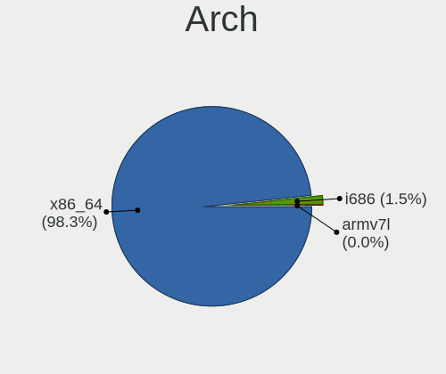
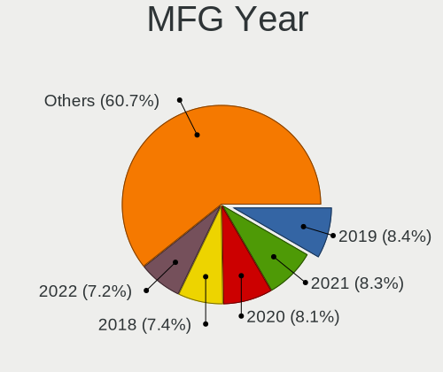
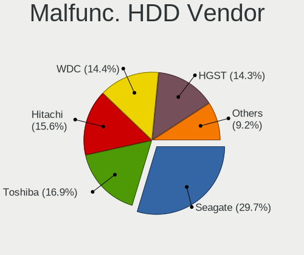
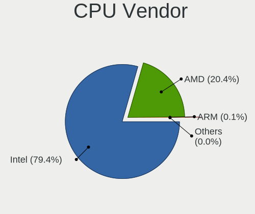

Linux in USA - Tested Hardware & Statistics (Notebooks)
-------------------------------------------------------

A project to collect tested hardware configurations for Linux in USA.

Anyone can contribute to this report by the [hw-probe](https://github.com/linuxhw/hw-probe) tool:

    sudo -E hw-probe -all -upload

Please contribute! Especially if your hardware is rare.

Contents
--------

* [ Test Cases ](#test-cases)

* [ System ](#system)
  - [ OS                       ](#os)
  - [ OS Family                ](#os-family)
  - [ Kernel                   ](#kernel)
  - [ Kernel Family            ](#kernel-family)
  - [ Kernel Major Ver.        ](#kernel-major-ver)
  - [ Arch                     ](#arch)
  - [ DE                       ](#de)
  - [ Display Server           ](#display-server)
  - [ Display Manager          ](#display-manager)
  - [ OS Lang                  ](#os-lang)
  - [ Boot Mode                ](#boot-mode)
  - [ Filesystem               ](#filesystem)
  - [ Part. scheme             ](#part-scheme)
  - [ Dual Boot with Linux/BSD ](#dual-boot-with-linuxbsd)
  - [ Dual Boot (Win)          ](#dual-boot-win)

* [ Board ](#board)
  - [ Vendor                   ](#vendor)
  - [ Model                    ](#model)
  - [ Model Family             ](#model-family)
  - [ MFG Year                 ](#mfg-year)
  - [ Form Factor              ](#form-factor)
  - [ Secure Boot              ](#secure-boot)
  - [ Coreboot                 ](#coreboot)
  - [ RAM Size                 ](#ram-size)
  - [ RAM Used                 ](#ram-used)
  - [ Total Drives             ](#total-drives)
  - [ Has CD-ROM               ](#has-cd-rom)
  - [ Has Ethernet             ](#has-ethernet)
  - [ Has WiFi                 ](#has-wifi)
  - [ Has Bluetooth            ](#has-bluetooth)

* [ Location ](#location)
  - [ Country                  ](#country)
  - [ City                     ](#city)

* [ Drives ](#drives)
  - [ Drive Vendor             ](#drive-vendor)
  - [ Drive Model              ](#drive-model)
  - [ HDD Vendor               ](#hdd-vendor)
  - [ SSD Vendor               ](#ssd-vendor)
  - [ Drive Kind               ](#drive-kind)
  - [ Drive Connector          ](#drive-connector)
  - [ Drive Size               ](#drive-size)
  - [ Space Total              ](#space-total)
  - [ Space Used               ](#space-used)
  - [ Malfunc. Drives          ](#malfunc-drives)
  - [ Malfunc. Drive Vendor    ](#malfunc-drive-vendor)
  - [ Malfunc. HDD Vendor      ](#malfunc-hdd-vendor)
  - [ Malfunc. Drive Kind      ](#malfunc-drive-kind)
  - [ Failed Drives            ](#failed-drives)
  - [ Failed Drive Vendor      ](#failed-drive-vendor)
  - [ Drive Status             ](#drive-status)

* [ Storage controller ](#storage-controller)
  - [ Storage Vendor           ](#storage-vendor)
  - [ Storage Model            ](#storage-model)
  - [ Storage Kind             ](#storage-kind)

* [ Processor ](#processor)
  - [ CPU Vendor               ](#cpu-vendor)
  - [ CPU Model                ](#cpu-model)
  - [ CPU Model Family         ](#cpu-model-family)
  - [ CPU Cores                ](#cpu-cores)
  - [ CPU Sockets              ](#cpu-sockets)
  - [ CPU Threads              ](#cpu-threads)
  - [ CPU Op-Modes             ](#cpu-op-modes)
  - [ CPU Microcode            ](#cpu-microcode)
  - [ CPU Microarch            ](#cpu-microarch)

* [ Graphics ](#graphics)
  - [ GPU Vendor               ](#gpu-vendor)
  - [ GPU Model                ](#gpu-model)
  - [ GPU Combo                ](#gpu-combo)
  - [ GPU Driver               ](#gpu-driver)
  - [ GPU Memory               ](#gpu-memory)

* [ Monitor ](#monitor)
  - [ Monitor Vendor           ](#monitor-vendor)
  - [ Monitor Model            ](#monitor-model)
  - [ Monitor Resolution       ](#monitor-resolution)
  - [ Monitor Diagonal         ](#monitor-diagonal)
  - [ Monitor Width            ](#monitor-width)
  - [ Aspect Ratio             ](#aspect-ratio)
  - [ Monitor Area             ](#monitor-area)
  - [ Pixel Density            ](#pixel-density)
  - [ Multiple Monitors        ](#multiple-monitors)

* [ Network ](#network)
  - [ Net Controller Vendor    ](#net-controller-vendor)
  - [ Net Controller Model     ](#net-controller-model)
  - [ Wireless Vendor          ](#wireless-vendor)
  - [ Wireless Model           ](#wireless-model)
  - [ Ethernet Vendor          ](#ethernet-vendor)
  - [ Ethernet Model           ](#ethernet-model)
  - [ Net Controller Kind      ](#net-controller-kind)
  - [ Used Controller          ](#used-controller)
  - [ NICs                     ](#nics)
  - [ IPv6                     ](#ipv6)

* [ Bluetooth ](#bluetooth)
  - [ Bluetooth Vendor         ](#bluetooth-vendor)
  - [ Bluetooth Model          ](#bluetooth-model)

* [ Sound ](#sound)
  - [ Sound Vendor             ](#sound-vendor)
  - [ Sound Model              ](#sound-model)

* [ Memory ](#memory)
  - [ Memory Vendor            ](#memory-vendor)
  - [ Memory Model             ](#memory-model)
  - [ Memory Kind              ](#memory-kind)
  - [ Memory Form Factor       ](#memory-form-factor)
  - [ Memory Size              ](#memory-size)
  - [ Memory Speed             ](#memory-speed)

* [ Printers & scanners ](#printers--scanners)
  - [ Printer Vendor           ](#printer-vendor)
  - [ Printer Model            ](#printer-model)
  - [ Scanner Vendor           ](#scanner-vendor)
  - [ Scanner Model            ](#scanner-model)

* [ Camera ](#camera)
  - [ Camera Vendor            ](#camera-vendor)
  - [ Camera Model             ](#camera-model)

* [ Security ](#security)
  - [ Fingerprint Vendor       ](#fingerprint-vendor)
  - [ Fingerprint Model        ](#fingerprint-model)
  - [ Chipcard Vendor          ](#chipcard-vendor)
  - [ Chipcard Model           ](#chipcard-model)

* [ Unsupported ](#unsupported)
  - [ Unsupported Devices      ](#unsupported-devices)
  - [ Unsupported Device Types ](#unsupported-device-types)

Test Cases
----------

Total: 19205

| Vendor        | Model                       | Probe                                                      | Date         |
|---------------|-----------------------------|------------------------------------------------------------|--------------|
| Lenovo        | ThinkPad E475 20H40006US    | [d59bd1e8f1](https://linux-hardware.org/?probe=d59bd1e8f1) | Nov 02, 2022 |
| Panasonic     | CF-31WBLEHLM                | [623af75bb3](https://linux-hardware.org/?probe=623af75bb3) | Nov 02, 2022 |
| Panasonic     | CF-31WBLEHLM                | [52e7c62bae](https://linux-hardware.org/?probe=52e7c62bae) | Nov 02, 2022 |
| Lenovo        | ThinkPad T61 6464A13        | [5f850cbab6](https://linux-hardware.org/?probe=5f850cbab6) | Nov 02, 2022 |
| Lenovo        | ThinkPad Yoga 11e 20DAS0... | [d9de10d93e](https://linux-hardware.org/?probe=d9de10d93e) | Nov 02, 2022 |
| Lenovo        | ThinkPad E475 20H40006US    | [4342ecb0f9](https://linux-hardware.org/?probe=4342ecb0f9) | Nov 02, 2022 |
| Google        | Terra                       | [46299bf228](https://linux-hardware.org/?probe=46299bf228) | Nov 02, 2022 |
| Lenovo        | ThinkPad E475 20H40006US    | [fd32769391](https://linux-hardware.org/?probe=fd32769391) | Nov 02, 2022 |
| Lenovo        | ThinkPad E475 20H40006US    | [d3c1c92563](https://linux-hardware.org/?probe=d3c1c92563) | Nov 02, 2022 |
| Lenovo        | ThinkPad E475 20H40006US    | [0ffaee423b](https://linux-hardware.org/?probe=0ffaee423b) | Nov 02, 2022 |
| Valve         | Jupiter                     | [f6295954bc](https://linux-hardware.org/?probe=f6295954bc) | Nov 02, 2022 |
| Valve         | Jupiter                     | [13e280e72f](https://linux-hardware.org/?probe=13e280e72f) | Nov 02, 2022 |
| HP            | Pavilion dv8                | [21af5313f0](https://linux-hardware.org/?probe=21af5313f0) | Nov 02, 2022 |
| Panasonic     | CF-C1BWFBZ1M                | [18a81d5db2](https://linux-hardware.org/?probe=18a81d5db2) | Nov 02, 2022 |
| ASUSTek       | ROG Zephyrus G14 GA402RJ... | [7b51138a0b](https://linux-hardware.org/?probe=7b51138a0b) | Nov 02, 2022 |
| HP            | Pavilion x2 Detachable P... | [b4d63f4835](https://linux-hardware.org/?probe=b4d63f4835) | Nov 02, 2022 |
| Dell          | Latitude 5591               | [bcd8aef9a0](https://linux-hardware.org/?probe=bcd8aef9a0) | Nov 02, 2022 |
| GPU Compan... | GWTN156-2BK                 | [a7fb2c2163](https://linux-hardware.org/?probe=a7fb2c2163) | Nov 02, 2022 |
| ASUSTek       | Zephyrus S GX531GS_GX531... | [4823244248](https://linux-hardware.org/?probe=4823244248) | Nov 01, 2022 |
| Intel Clie... | CMCN1CC                     | [719731b244](https://linux-hardware.org/?probe=719731b244) | Nov 01, 2022 |
| Razer         | Blade 15 Advanced Model ... | [e0a589194b](https://linux-hardware.org/?probe=e0a589194b) | Nov 01, 2022 |
| Apple         | MacBookPro12,1              | [e08326bc94](https://linux-hardware.org/?probe=e08326bc94) | Nov 01, 2022 |
| Apple         | MacBookPro9,2               | [69768228d4](https://linux-hardware.org/?probe=69768228d4) | Nov 01, 2022 |
| Acer          | Aspire A515-46              | [ef6bcab217](https://linux-hardware.org/?probe=ef6bcab217) | Nov 01, 2022 |
| Unknown       | Unknown                     | [9608724116](https://linux-hardware.org/?probe=9608724116) | Nov 01, 2022 |
| Apple         | MacBookPro9,2               | [4cdb36db63](https://linux-hardware.org/?probe=4cdb36db63) | Nov 01, 2022 |
| Apple         | MacBookPro9,2               | [d63c5de91b](https://linux-hardware.org/?probe=d63c5de91b) | Nov 01, 2022 |
| HP            | Stream Laptop 14-ax0XX      | [bbbf28359b](https://linux-hardware.org/?probe=bbbf28359b) | Nov 01, 2022 |
| Dell          | Inspiron 15 3511            | [85c215eebf](https://linux-hardware.org/?probe=85c215eebf) | Nov 01, 2022 |
| GPU Compan... | GWTN156-2BK                 | [99ab599fbc](https://linux-hardware.org/?probe=99ab599fbc) | Nov 01, 2022 |
| ASUSTek       | K54C                        | [dd4f63b1e4](https://linux-hardware.org/?probe=dd4f63b1e4) | Nov 01, 2022 |
| HP            | Pavilion dv7                | [5fdb241389](https://linux-hardware.org/?probe=5fdb241389) | Oct 31, 2022 |
| Dell          | XPS 13 9310                 | [d284b1709a](https://linux-hardware.org/?probe=d284b1709a) | Oct 31, 2022 |
| HP            | Laptop 15-bs2xx             | [7c94d16c1c](https://linux-hardware.org/?probe=7c94d16c1c) | Oct 31, 2022 |
| Dell          | Vostro 7620                 | [2ccd56ee29](https://linux-hardware.org/?probe=2ccd56ee29) | Oct 31, 2022 |
| Dell          | Latitude E6530              | [5f82f9b682](https://linux-hardware.org/?probe=5f82f9b682) | Oct 31, 2022 |
| Dell          | Precision M6700             | [e5952f6f57](https://linux-hardware.org/?probe=e5952f6f57) | Oct 31, 2022 |
| Dell          | Precision M6700             | [aa4b5e4400](https://linux-hardware.org/?probe=aa4b5e4400) | Oct 31, 2022 |
| HP            | ENVY NOTEBOOK PC            | [f2893aaedf](https://linux-hardware.org/?probe=f2893aaedf) | Oct 31, 2022 |
| HP            | ENVY 17                     | [5b845d9ee3](https://linux-hardware.org/?probe=5b845d9ee3) | Oct 31, 2022 |
| Dell          | Vostro 7620                 | [7f41a14301](https://linux-hardware.org/?probe=7f41a14301) | Oct 31, 2022 |
| Lenovo        | ThinkPad S1 Yoga 20CD00B... | [0e06dcc642](https://linux-hardware.org/?probe=0e06dcc642) | Oct 31, 2022 |
| Valve         | Jupiter                     | [92b732ad9a](https://linux-hardware.org/?probe=92b732ad9a) | Oct 31, 2022 |
| Dell          | Vostro 7620                 | [00dae3fbc5](https://linux-hardware.org/?probe=00dae3fbc5) | Oct 31, 2022 |
| Apple         | MacBookPro11,3              | [64d1c159aa](https://linux-hardware.org/?probe=64d1c159aa) | Oct 30, 2022 |
| ASUSTek       | ROG Zephyrus G15 GA503RM... | [76906648cb](https://linux-hardware.org/?probe=76906648cb) | Oct 30, 2022 |
| HP            | Laptop 15-da0xxx            | [b903c0e375](https://linux-hardware.org/?probe=b903c0e375) | Oct 30, 2022 |
| Lenovo        | IdeaPad 100S-14IBR 80R9     | [91d1732515](https://linux-hardware.org/?probe=91d1732515) | Oct 30, 2022 |
| HP            | Laptop 15-bs1xx             | [fabbcc9035](https://linux-hardware.org/?probe=fabbcc9035) | Oct 30, 2022 |
| Apple         | MacBookPro13,3              | [b028075707](https://linux-hardware.org/?probe=b028075707) | Oct 30, 2022 |
| HP            | Pavilion Laptop 15-eh0xx... | [d8f6faad10](https://linux-hardware.org/?probe=d8f6faad10) | Oct 30, 2022 |
| HP            | Stream Laptop 14-cb1xxx     | [75dcd27c77](https://linux-hardware.org/?probe=75dcd27c77) | Oct 30, 2022 |
| Valve         | Jupiter                     | [2d381c1626](https://linux-hardware.org/?probe=2d381c1626) | Oct 30, 2022 |
| HP            | Pavilion Laptop 15-eh0xx... | [6c3a410233](https://linux-hardware.org/?probe=6c3a410233) | Oct 30, 2022 |
| Lenovo        | ThinkPad X1 Carbon Gen 8... | [df654ca0b1](https://linux-hardware.org/?probe=df654ca0b1) | Oct 30, 2022 |
| Lenovo        | ThinkPad L15 Gen 2 20X30... | [418b143f46](https://linux-hardware.org/?probe=418b143f46) | Oct 30, 2022 |
| Dell          | Latitude 7490               | [95d0006efb](https://linux-hardware.org/?probe=95d0006efb) | Oct 30, 2022 |
| GPU Compan... | GWTN141-10                  | [189fca8ab3](https://linux-hardware.org/?probe=189fca8ab3) | Oct 30, 2022 |
| Dell          | Latitude E7450              | [32a6333f4b](https://linux-hardware.org/?probe=32a6333f4b) | Oct 30, 2022 |
| HP            | ProBook 640 G4              | [0a7776630f](https://linux-hardware.org/?probe=0a7776630f) | Oct 30, 2022 |
| HP            | Unknown                     | [6e024c825e](https://linux-hardware.org/?probe=6e024c825e) | Oct 30, 2022 |
| Dell          | Latitude E6510              | [84a61bf436](https://linux-hardware.org/?probe=84a61bf436) | Oct 30, 2022 |
| HP            | Laptop 17-by1xxx            | [b3e8975edf](https://linux-hardware.org/?probe=b3e8975edf) | Oct 29, 2022 |
| ASUSTek       | ROG Zephyrus G14 GA402RJ... | [1753d78397](https://linux-hardware.org/?probe=1753d78397) | Oct 29, 2022 |
| Valve         | Jupiter                     | [dfc3eee826](https://linux-hardware.org/?probe=dfc3eee826) | Oct 29, 2022 |
| Valve         | Jupiter                     | [0405c29890](https://linux-hardware.org/?probe=0405c29890) | Oct 29, 2022 |
| Dell          | XPS 13 9300                 | [cc62dbe2f6](https://linux-hardware.org/?probe=cc62dbe2f6) | Oct 29, 2022 |
| Dell          | XPS 13 9300                 | [301aab9126](https://linux-hardware.org/?probe=301aab9126) | Oct 29, 2022 |
| ASUSTek       | Q550LF                      | [383c45edce](https://linux-hardware.org/?probe=383c45edce) | Oct 29, 2022 |
| Dell          | Latitude E7450              | [012cd7214b](https://linux-hardware.org/?probe=012cd7214b) | Oct 29, 2022 |
| Dell          | Latitude E7450              | [635a60671d](https://linux-hardware.org/?probe=635a60671d) | Oct 29, 2022 |
| Dell          | XPS 17 9720                 | [270b988521](https://linux-hardware.org/?probe=270b988521) | Oct 29, 2022 |
| Lenovo        | ThinkPad P1 Gen 5 21DC00... | [74f0ca8e11](https://linux-hardware.org/?probe=74f0ca8e11) | Oct 29, 2022 |
| Lenovo        | ThinkPad E475 20H40006US    | [60d1db050b](https://linux-hardware.org/?probe=60d1db050b) | Oct 28, 2022 |
| Lenovo        | ThinkPad E475 20H40006US    | [2a9f06c2b4](https://linux-hardware.org/?probe=2a9f06c2b4) | Oct 28, 2022 |
| Lenovo        | ThinkPad E475 20H40006US    | [787904d265](https://linux-hardware.org/?probe=787904d265) | Oct 28, 2022 |
| Google        | Delbin                      | [4d43e7a995](https://linux-hardware.org/?probe=4d43e7a995) | Oct 28, 2022 |
| Lenovo        | ThinkPad T530 239242U       | [dbf70338e9](https://linux-hardware.org/?probe=dbf70338e9) | Oct 28, 2022 |
| HP            | ZBook 15 G3                 | [c60b429baa](https://linux-hardware.org/?probe=c60b429baa) | Oct 28, 2022 |
| Toshiba       | Satellite C75D-B            | [4f644b7d3b](https://linux-hardware.org/?probe=4f644b7d3b) | Oct 28, 2022 |
| Dell          | XPS 17 9700                 | [81121b7762](https://linux-hardware.org/?probe=81121b7762) | Oct 28, 2022 |
| Dell          | Latitude E6440              | [73072d8574](https://linux-hardware.org/?probe=73072d8574) | Oct 28, 2022 |
| HP            | Presario V6000 (RV053UA#... | [ca121e3727](https://linux-hardware.org/?probe=ca121e3727) | Oct 28, 2022 |
| Lenovo        | IdeaPad Slim 7 14ITL05 8... | [d5c2f29c22](https://linux-hardware.org/?probe=d5c2f29c22) | Oct 28, 2022 |
| Unknown       | Unknown                     | [3cfb5e74d3](https://linux-hardware.org/?probe=3cfb5e74d3) | Oct 28, 2022 |
| HP            | 255 G8 Notebook PC          | [2ad60a938a](https://linux-hardware.org/?probe=2ad60a938a) | Oct 28, 2022 |
| Lenovo        | IdeaPad 3 15IIL05 81WE      | [4bf648c91f](https://linux-hardware.org/?probe=4bf648c91f) | Oct 28, 2022 |
| Acer          | Predator G3-571             | [a5c2027983](https://linux-hardware.org/?probe=a5c2027983) | Oct 28, 2022 |
| Dell          | XPS 15 9520                 | [d04e962e56](https://linux-hardware.org/?probe=d04e962e56) | Oct 28, 2022 |
| HP            | Pavilion Laptop 15-cc0xx    | [0ca2ea7180](https://linux-hardware.org/?probe=0ca2ea7180) | Oct 28, 2022 |
| HP            | EliteBook 840 G8 Noteboo... | [02c6d1fe1a](https://linux-hardware.org/?probe=02c6d1fe1a) | Oct 28, 2022 |
| Dell          | Inspiron 11 - 3147          | [58d46fb47f](https://linux-hardware.org/?probe=58d46fb47f) | Oct 28, 2022 |
| Lenovo        | IdeaPad Slim 1-14AST-05 ... | [4b4c00b0a9](https://linux-hardware.org/?probe=4b4c00b0a9) | Oct 28, 2022 |
| Apple         | MacBookAir7,2               | [257dd556a1](https://linux-hardware.org/?probe=257dd556a1) | Oct 28, 2022 |
| HP            | OMEN Notebook PC 15         | [fea0167027](https://linux-hardware.org/?probe=fea0167027) | Oct 28, 2022 |
| Dell          | Inspiron 5505               | [060a5573fd](https://linux-hardware.org/?probe=060a5573fd) | Oct 28, 2022 |
| Dell          | Latitude E6430              | [cb4eb1f556](https://linux-hardware.org/?probe=cb4eb1f556) | Oct 28, 2022 |
| HP            | Laptop 15-db0xxx            | [b82aebb005](https://linux-hardware.org/?probe=b82aebb005) | Oct 28, 2022 |
| Lenovo        | ThinkPad E475 20H40006US    | [63565608d1](https://linux-hardware.org/?probe=63565608d1) | Oct 28, 2022 |
| Google        | Boten                       | [2ed6baabf0](https://linux-hardware.org/?probe=2ed6baabf0) | Oct 27, 2022 |
| System76      | Oryx Pro                    | [ff42b6e74a](https://linux-hardware.org/?probe=ff42b6e74a) | Oct 27, 2022 |
| HP            | Laptop 15-da0xxx            | [efdb76f667](https://linux-hardware.org/?probe=efdb76f667) | Oct 27, 2022 |
| Dell          | Inspiron 5585               | [9f487c505e](https://linux-hardware.org/?probe=9f487c505e) | Oct 27, 2022 |
| ASUSTek       | Q304UAK                     | [2c51d603ee](https://linux-hardware.org/?probe=2c51d603ee) | Oct 27, 2022 |
| Lenovo        | ThinkPad E475 20H40006US    | [3ab1fbc8e8](https://linux-hardware.org/?probe=3ab1fbc8e8) | Oct 27, 2022 |
| Lenovo        | ThinkPad E475 20H40006US    | [faafe16cfb](https://linux-hardware.org/?probe=faafe16cfb) | Oct 27, 2022 |
| ASUSTek       | Q304UAK                     | [4b624e6f98](https://linux-hardware.org/?probe=4b624e6f98) | Oct 27, 2022 |
| Dell          | Latitude E6510              | [2cb824b444](https://linux-hardware.org/?probe=2cb824b444) | Oct 27, 2022 |
| HP            | EliteBook 840 G3            | [fdfd74a1ac](https://linux-hardware.org/?probe=fdfd74a1ac) | Oct 27, 2022 |
| MSI           | GL75 Leopard 10SFK          | [c05a05a275](https://linux-hardware.org/?probe=c05a05a275) | Oct 27, 2022 |
| Apple         | MacBookAir7,2               | [abadd71c90](https://linux-hardware.org/?probe=abadd71c90) | Oct 27, 2022 |
| System76      | Gazelle                     | [a15498ff22](https://linux-hardware.org/?probe=a15498ff22) | Oct 26, 2022 |
| Dell          | Vostro 7620                 | [90f96ae099](https://linux-hardware.org/?probe=90f96ae099) | Oct 26, 2022 |
| Valve         | Jupiter                     | [746fdbcdec](https://linux-hardware.org/?probe=746fdbcdec) | Oct 26, 2022 |
| Acer          | Aspire A515-52              | [81371581d1](https://linux-hardware.org/?probe=81371581d1) | Oct 26, 2022 |
| Lenovo        | ThinkPad E475 20H40006US    | [bfd570bbef](https://linux-hardware.org/?probe=bfd570bbef) | Oct 26, 2022 |
| Lenovo        | ThinkPad E475 20H40006US    | [58820ca517](https://linux-hardware.org/?probe=58820ca517) | Oct 26, 2022 |
| Lenovo        | ThinkPad E475 20H40006US    | [6b9a3ab27e](https://linux-hardware.org/?probe=6b9a3ab27e) | Oct 26, 2022 |
| HP            | Laptop 15-da0xxx            | [ed1b801fcd](https://linux-hardware.org/?probe=ed1b801fcd) | Oct 26, 2022 |
| Lenovo        | ThinkPad E475 20H40006US    | [a5bd8bebc7](https://linux-hardware.org/?probe=a5bd8bebc7) | Oct 26, 2022 |
| Dell          | XPS 13 9360                 | [e0c3407d30](https://linux-hardware.org/?probe=e0c3407d30) | Oct 26, 2022 |
| Lenovo        | ThinkPad E475 20H40006US    | [bce3a8b1b3](https://linux-hardware.org/?probe=bce3a8b1b3) | Oct 26, 2022 |
| Lenovo        | ThinkPad E475 20H40006US    | [65a1d5242f](https://linux-hardware.org/?probe=65a1d5242f) | Oct 26, 2022 |
| Lenovo        | 100w Gen 3 82J0             | [2554c81cce](https://linux-hardware.org/?probe=2554c81cce) | Oct 26, 2022 |
| Google        | Akemi                       | [45fd84f413](https://linux-hardware.org/?probe=45fd84f413) | Oct 26, 2022 |
| Dell          | Latitude E6510              | [ddb0a31443](https://linux-hardware.org/?probe=ddb0a31443) | Oct 26, 2022 |
| Dell          | Latitude E4300              | [8ee3fadd0b](https://linux-hardware.org/?probe=8ee3fadd0b) | Oct 26, 2022 |
| HP            | Laptop 14-dk1xxx            | [ac94d759e9](https://linux-hardware.org/?probe=ac94d759e9) | Oct 26, 2022 |
| HP            | Laptop 17t-cn200            | [179c1e53a9](https://linux-hardware.org/?probe=179c1e53a9) | Oct 26, 2022 |
| HP            | EliteBook 840 G1            | [6e52390b4f](https://linux-hardware.org/?probe=6e52390b4f) | Oct 26, 2022 |
| Notebook      | PD5x_7xPNP_PNR_PNN_PNT      | [93229f0fab](https://linux-hardware.org/?probe=93229f0fab) | Oct 26, 2022 |
| HP            | Pavilion g6                 | [353259fad4](https://linux-hardware.org/?probe=353259fad4) | Oct 26, 2022 |
| Lenovo        | ThinkPad E475 20H40006US    | [93b8dd8c3e](https://linux-hardware.org/?probe=93b8dd8c3e) | Oct 25, 2022 |
| Lenovo        | ThinkPad E475 20H40006US    | [5e08852d18](https://linux-hardware.org/?probe=5e08852d18) | Oct 25, 2022 |
| HP            | Pavilion g6                 | [448d52b32f](https://linux-hardware.org/?probe=448d52b32f) | Oct 25, 2022 |
| Dell          | XPS 15 9500                 | [8260478f31](https://linux-hardware.org/?probe=8260478f31) | Oct 25, 2022 |
| Lenovo        | ThinkPad T440p 20AN0069U... | [bb90eb1ad1](https://linux-hardware.org/?probe=bb90eb1ad1) | Oct 25, 2022 |
| Lenovo        | ThinkPad E475 20H40006US    | [438afb4185](https://linux-hardware.org/?probe=438afb4185) | Oct 25, 2022 |
| Google        | Relm                        | [837a90164b](https://linux-hardware.org/?probe=837a90164b) | Oct 25, 2022 |
| MSI           | GT70 2PE                    | [26d9f8ba04](https://linux-hardware.org/?probe=26d9f8ba04) | Oct 25, 2022 |
| Toshiba       | dynabook MX/33KBL           | [7ee9057da2](https://linux-hardware.org/?probe=7ee9057da2) | Oct 25, 2022 |
| Dell          | Latitude E7450              | [45e65cd626](https://linux-hardware.org/?probe=45e65cd626) | Oct 25, 2022 |
| HP            | EliteBook 8570p             | [c3ec764ff3](https://linux-hardware.org/?probe=c3ec764ff3) | Oct 25, 2022 |
| HP            | 8433 11                     | [81740a5a8e](https://linux-hardware.org/?probe=81740a5a8e) | Oct 25, 2022 |
| Dell          | XPS 9315                    | [c18dd688a1](https://linux-hardware.org/?probe=c18dd688a1) | Oct 25, 2022 |
| Dell          | Inspiron N5030              | [dbc717a299](https://linux-hardware.org/?probe=dbc717a299) | Oct 25, 2022 |
| HP            | 250 G6 Notebook PC          | [e2baff543b](https://linux-hardware.org/?probe=e2baff543b) | Oct 24, 2022 |
| Dell          | XPS 15 9570                 | [d76c41ef1b](https://linux-hardware.org/?probe=d76c41ef1b) | Oct 24, 2022 |
| HP            | G60                         | [ec1164f001](https://linux-hardware.org/?probe=ec1164f001) | Oct 24, 2022 |
| System76      | Galago UltraPro             | [caf6a992bb](https://linux-hardware.org/?probe=caf6a992bb) | Oct 24, 2022 |
| Lenovo        | IdeaPad S145-15AST 81N3     | [bfa28dd791](https://linux-hardware.org/?probe=bfa28dd791) | Oct 24, 2022 |
| ASUSTek       | VivoBook_ASUSLaptop X512... | [a14f339a4a](https://linux-hardware.org/?probe=a14f339a4a) | Oct 24, 2022 |
| ASUSTek       | VivoBook_ASUSLaptop E510... | [7733e4f8d5](https://linux-hardware.org/?probe=7733e4f8d5) | Oct 24, 2022 |
| Valve         | Jupiter                     | [1963771551](https://linux-hardware.org/?probe=1963771551) | Oct 24, 2022 |
| Dell          | Latitude E6420              | [eb53f0d580](https://linux-hardware.org/?probe=eb53f0d580) | Oct 24, 2022 |
| Valve         | Jupiter                     | [e474d0929b](https://linux-hardware.org/?probe=e474d0929b) | Oct 24, 2022 |
| Lenovo        | ThinkPad T440p 20AN0069U... | [37028111aa](https://linux-hardware.org/?probe=37028111aa) | Oct 24, 2022 |
| ASUSTek       | VivoBook_ASUSLaptop E510... | [d4c62f39e3](https://linux-hardware.org/?probe=d4c62f39e3) | Oct 24, 2022 |
| Alienware     | M11xR3                      | [62bf8b7b02](https://linux-hardware.org/?probe=62bf8b7b02) | Oct 24, 2022 |
| Acer          | Aspire A515-51              | [64030c9ba3](https://linux-hardware.org/?probe=64030c9ba3) | Oct 24, 2022 |
| ASUSTek       | K54C                        | [acf64b4ced](https://linux-hardware.org/?probe=acf64b4ced) | Oct 24, 2022 |
| HP            | EliteBook 8470p             | [918b0ef1ab](https://linux-hardware.org/?probe=918b0ef1ab) | Oct 24, 2022 |
| ASUSTek       | UX31A                       | [4b7e610e25](https://linux-hardware.org/?probe=4b7e610e25) | Oct 24, 2022 |
| Dell          | Latitude 3120               | [2799c3fe8e](https://linux-hardware.org/?probe=2799c3fe8e) | Oct 24, 2022 |
| HP            | Compaq Presario CQ50        | [8546f55697](https://linux-hardware.org/?probe=8546f55697) | Oct 24, 2022 |
| HP            | Compaq Presario CQ50        | [3b1b5c18c6](https://linux-hardware.org/?probe=3b1b5c18c6) | Oct 24, 2022 |
| Apple         | MacBookPro8,2               | [200f2ac48e](https://linux-hardware.org/?probe=200f2ac48e) | Oct 24, 2022 |
| Apple         | MacBookAir7,2               | [7b901320c7](https://linux-hardware.org/?probe=7b901320c7) | Oct 24, 2022 |
| Apple         | MacBookAir7,2               | [daac29aff2](https://linux-hardware.org/?probe=daac29aff2) | Oct 24, 2022 |
| HP            | Laptop 17-by0xxx            | [faedd5a008](https://linux-hardware.org/?probe=faedd5a008) | Oct 24, 2022 |
| Lenovo        | IdeaPad U430 Touch 20270    | [7f8cffc431](https://linux-hardware.org/?probe=7f8cffc431) | Oct 24, 2022 |
| Dell          | Latitude 7490               | [63d27972e4](https://linux-hardware.org/?probe=63d27972e4) | Oct 24, 2022 |
| System76      | Gazelle                     | [77686d0854](https://linux-hardware.org/?probe=77686d0854) | Oct 24, 2022 |
| Lenovo        | ThinkPad X240 20AMS56K00    | [efa84f3716](https://linux-hardware.org/?probe=efa84f3716) | Oct 24, 2022 |
| Apple         | MacBookAir7,2               | [d7e99b5869](https://linux-hardware.org/?probe=d7e99b5869) | Oct 24, 2022 |
| Toshiba       | Satellite C875              | [cf74a87a61](https://linux-hardware.org/?probe=cf74a87a61) | Oct 23, 2022 |
| ASUSTek       | ROG Zephyrus G14 GA401QM... | [3912d818bd](https://linux-hardware.org/?probe=3912d818bd) | Oct 23, 2022 |
| Dell          | Inspiron 3580               | [41dce71fbf](https://linux-hardware.org/?probe=41dce71fbf) | Oct 23, 2022 |
| Razer         | Blade 15 (2022) - RZ09-0... | [c70d6b90b6](https://linux-hardware.org/?probe=c70d6b90b6) | Oct 23, 2022 |
| HP            | Laptop 15-da0xxx            | [4e299308f5](https://linux-hardware.org/?probe=4e299308f5) | Oct 23, 2022 |
| HP            | Laptop 15-dw3xxx            | [7fc90c0634](https://linux-hardware.org/?probe=7fc90c0634) | Oct 23, 2022 |
| GPU Compan... | GWTC116-2                   | [9288e7d8ab](https://linux-hardware.org/?probe=9288e7d8ab) | Oct 23, 2022 |
| Dell          | XPS 13 9350                 | [140dd1070e](https://linux-hardware.org/?probe=140dd1070e) | Oct 23, 2022 |
| Dell          | Inspiron 13-7378            | [fbd3c71f34](https://linux-hardware.org/?probe=fbd3c71f34) | Oct 23, 2022 |
| Dell          | XPS 9320                    | [a70940af34](https://linux-hardware.org/?probe=a70940af34) | Oct 23, 2022 |
| Toshiba       | Satellite C75D-B            | [3e39042f59](https://linux-hardware.org/?probe=3e39042f59) | Oct 23, 2022 |
| Valve         | Jupiter                     | [3e696c2b87](https://linux-hardware.org/?probe=3e696c2b87) | Oct 23, 2022 |
| Toshiba       | Satellite C75D-B            | [b7412d4350](https://linux-hardware.org/?probe=b7412d4350) | Oct 23, 2022 |
| HP            | 15                          | [5baa47ecd1](https://linux-hardware.org/?probe=5baa47ecd1) | Oct 23, 2022 |
| Unknown       | Unknown                     | [05da6717ed](https://linux-hardware.org/?probe=05da6717ed) | Oct 23, 2022 |
| ASUSTek       | VivoBook 12_ASUS Laptop ... | [62bdd854b4](https://linux-hardware.org/?probe=62bdd854b4) | Oct 23, 2022 |
| Toshiba       | Satellite L775              | [180b9ab9ae](https://linux-hardware.org/?probe=180b9ab9ae) | Oct 23, 2022 |
| Dell          | Latitude E6320              | [d1d5d25693](https://linux-hardware.org/?probe=d1d5d25693) | Oct 23, 2022 |
| Dell          | Vostro 1520                 | [a5106ca47d](https://linux-hardware.org/?probe=a5106ca47d) | Oct 22, 2022 |
| HP            | Laptop 14-dk1xxx            | [65efc061c0](https://linux-hardware.org/?probe=65efc061c0) | Oct 22, 2022 |
| HP            | EliteBook 8540w             | [093b0de584](https://linux-hardware.org/?probe=093b0de584) | Oct 22, 2022 |
| HP            | 15                          | [2831771472](https://linux-hardware.org/?probe=2831771472) | Oct 22, 2022 |
| Acer          | Aspire E5-411               | [f4fa3fce70](https://linux-hardware.org/?probe=f4fa3fce70) | Oct 22, 2022 |
| HP            | ENVY m6                     | [815a490c76](https://linux-hardware.org/?probe=815a490c76) | Oct 22, 2022 |
| Dell          | Latitude E4300              | [fb144bfcb2](https://linux-hardware.org/?probe=fb144bfcb2) | Oct 22, 2022 |
| System76      | Oryx Pro                    | [7de5d55c99](https://linux-hardware.org/?probe=7de5d55c99) | Oct 22, 2022 |
| Lenovo        | Y520-15IKBM 80YY            | [1ead4d1247](https://linux-hardware.org/?probe=1ead4d1247) | Oct 22, 2022 |
| Unknown       | Unknown                     | [51af31314f](https://linux-hardware.org/?probe=51af31314f) | Oct 22, 2022 |
| Lenovo        | ThinkPad P1 20MES03F00      | [73a14e1079](https://linux-hardware.org/?probe=73a14e1079) | Oct 22, 2022 |
| Lenovo        | ThinkPad T430 2347BT4       | [c3576df0c7](https://linux-hardware.org/?probe=c3576df0c7) | Oct 22, 2022 |
| Lenovo        | ThinkPad T480s 20L7CTO1W... | [df42ee1916](https://linux-hardware.org/?probe=df42ee1916) | Oct 22, 2022 |
| HP            | 2000                        | [0aa2a7b078](https://linux-hardware.org/?probe=0aa2a7b078) | Oct 22, 2022 |
| Apple         | MacBookPro7,1               | [aa571dded9](https://linux-hardware.org/?probe=aa571dded9) | Oct 22, 2022 |
| ASUSTek       | Strix 17 GL703GE            | [ba9ce3edc4](https://linux-hardware.org/?probe=ba9ce3edc4) | Oct 22, 2022 |
| Dell          | Studio 1558                 | [ac449d0411](https://linux-hardware.org/?probe=ac449d0411) | Oct 21, 2022 |
| HP            | Laptop 17-by4xxx            | [6090ec7241](https://linux-hardware.org/?probe=6090ec7241) | Oct 21, 2022 |
| Apple         | MacBook5,2                  | [165ce75570](https://linux-hardware.org/?probe=165ce75570) | Oct 21, 2022 |
| Acer          | Predator PH517-61           | [e30217884a](https://linux-hardware.org/?probe=e30217884a) | Oct 21, 2022 |
| Unknown       | CZ-17                       | [37035fb17f](https://linux-hardware.org/?probe=37035fb17f) | Oct 21, 2022 |
| HP            | ENVY m6                     | [d11f002c16](https://linux-hardware.org/?probe=d11f002c16) | Oct 21, 2022 |
| HP            | Laptop 15-da0xxx            | [f4510d3faa](https://linux-hardware.org/?probe=f4510d3faa) | Oct 21, 2022 |
| Dell          | Latitude E6400              | [d899ab2ef4](https://linux-hardware.org/?probe=d899ab2ef4) | Oct 21, 2022 |
| Dell          | Studio 1558                 | [b31ff30942](https://linux-hardware.org/?probe=b31ff30942) | Oct 21, 2022 |
| System76      | Galago Pro                  | [459c28f149](https://linux-hardware.org/?probe=459c28f149) | Oct 21, 2022 |
| Lenovo        | ThinkPad T520 42434WU       | [d118d39c58](https://linux-hardware.org/?probe=d118d39c58) | Oct 21, 2022 |
| Valve         | Jupiter                     | [13c98e0adc](https://linux-hardware.org/?probe=13c98e0adc) | Oct 21, 2022 |
| ASUSTek       | Q550LF                      | [0d24151944](https://linux-hardware.org/?probe=0d24151944) | Oct 21, 2022 |
| Dell          | XPS 15 9570                 | [85dd4861a0](https://linux-hardware.org/?probe=85dd4861a0) | Oct 21, 2022 |
| ASUSTek       | ROG Zephyrus G15 GA503RM... | [d6275970a0](https://linux-hardware.org/?probe=d6275970a0) | Oct 21, 2022 |
| Acer          | Aspire E5-551               | [0e72f3b2e8](https://linux-hardware.org/?probe=0e72f3b2e8) | Oct 21, 2022 |
| HP            | Laptop 15-bs2xx             | [0fd75382e9](https://linux-hardware.org/?probe=0fd75382e9) | Oct 21, 2022 |
| Valve         | Jupiter                     | [2582be110d](https://linux-hardware.org/?probe=2582be110d) | Oct 21, 2022 |
| Dell          | Latitude E6500              | [d64ffd6f2e](https://linux-hardware.org/?probe=d64ffd6f2e) | Oct 20, 2022 |
| HP            | EliteBook 850 G7 Noteboo... | [accf56cedc](https://linux-hardware.org/?probe=accf56cedc) | Oct 20, 2022 |
| Valve         | Jupiter                     | [7cb825e738](https://linux-hardware.org/?probe=7cb825e738) | Oct 20, 2022 |
| HP            | EliteBook 745 G3            | [3bfbc8dcac](https://linux-hardware.org/?probe=3bfbc8dcac) | Oct 20, 2022 |
| HP            | ZBook 17                    | [6dc9848327](https://linux-hardware.org/?probe=6dc9848327) | Oct 20, 2022 |
| HP            | Laptop 15-ef2xxx            | [823d998220](https://linux-hardware.org/?probe=823d998220) | Oct 20, 2022 |
| Apple         | MacBook5,2                  | [1e76467975](https://linux-hardware.org/?probe=1e76467975) | Oct 20, 2022 |
| Lenovo        | ThinkPad T14 Gen 3 21CFC... | [facb462239](https://linux-hardware.org/?probe=facb462239) | Oct 20, 2022 |
| MSI           | GF65 Thin 10SDR             | [debce2faa6](https://linux-hardware.org/?probe=debce2faa6) | Oct 20, 2022 |
| Dell          | Latitude E6500              | [1f99367f55](https://linux-hardware.org/?probe=1f99367f55) | Oct 20, 2022 |
| ASUSTek       | Zenbook Pro Duo UX582ZW_... | [504036a2f6](https://linux-hardware.org/?probe=504036a2f6) | Oct 20, 2022 |
| HP            | Laptop 15-bs2xx             | [7254534946](https://linux-hardware.org/?probe=7254534946) | Oct 20, 2022 |
| Apple         | MacBookPro15,2              | [dac94a562a](https://linux-hardware.org/?probe=dac94a562a) | Oct 20, 2022 |
| Framework     | Laptop (12th Gen Intel C... | [d0dcb7e6e3](https://linux-hardware.org/?probe=d0dcb7e6e3) | Oct 20, 2022 |
| Acer          | Aspire 7720Z                | [164c89c324](https://linux-hardware.org/?probe=164c89c324) | Oct 20, 2022 |
| HP            | Pavilion Gaming Laptop 1... | [9520ca5252](https://linux-hardware.org/?probe=9520ca5252) | Oct 20, 2022 |
| System76      | Lemur Pro                   | [df61411c9d](https://linux-hardware.org/?probe=df61411c9d) | Oct 20, 2022 |
| HP            | Laptop 14-dk1xxx            | [cac272451b](https://linux-hardware.org/?probe=cac272451b) | Oct 20, 2022 |
| Gigabyte      | AERO 17 XD                  | [ca3dd06f6b](https://linux-hardware.org/?probe=ca3dd06f6b) | Oct 20, 2022 |
| Lenovo        | G505s 20255                 | [a105e25fa5](https://linux-hardware.org/?probe=a105e25fa5) | Oct 20, 2022 |
| Gigabyte      | G5 KD                       | [c0f91f7282](https://linux-hardware.org/?probe=c0f91f7282) | Oct 20, 2022 |
| GPU Compan... | GWNR71517                   | [27ae96160e](https://linux-hardware.org/?probe=27ae96160e) | Oct 20, 2022 |
| MSI           | GE75 Raider 10SF            | [dd4102e2e7](https://linux-hardware.org/?probe=dd4102e2e7) | Oct 20, 2022 |
| Gigabyte      | G5 KD                       | [35db9f3cd8](https://linux-hardware.org/?probe=35db9f3cd8) | Oct 19, 2022 |
| GPU Compan... | GWNR71517                   | [d55bceb8fb](https://linux-hardware.org/?probe=d55bceb8fb) | Oct 19, 2022 |
| DTRI          | DT313TT                     | [e4089d89b4](https://linux-hardware.org/?probe=e4089d89b4) | Oct 19, 2022 |
| Framework     | Laptop                      | [ade55fca33](https://linux-hardware.org/?probe=ade55fca33) | Oct 19, 2022 |
| Framework     | Laptop                      | [57af01b405](https://linux-hardware.org/?probe=57af01b405) | Oct 19, 2022 |
| System76      | Kudu                        | [49c0e1c400](https://linux-hardware.org/?probe=49c0e1c400) | Oct 19, 2022 |
| MOTILE        | M141                        | [a6da22306f](https://linux-hardware.org/?probe=a6da22306f) | Oct 19, 2022 |
| ASUSTek       | X541NA                      | [5b61fd3a38](https://linux-hardware.org/?probe=5b61fd3a38) | Oct 19, 2022 |
| Acer          | Aspire A515-51              | [0022d7c5ef](https://linux-hardware.org/?probe=0022d7c5ef) | Oct 19, 2022 |
| Acer          | Aspire V5-571PG             | [e00a049460](https://linux-hardware.org/?probe=e00a049460) | Oct 19, 2022 |
| Dell          | XPS 9320                    | [8dd41b53b6](https://linux-hardware.org/?probe=8dd41b53b6) | Oct 19, 2022 |
| HP            | ProBook 440 G2              | [9f40520008](https://linux-hardware.org/?probe=9f40520008) | Oct 19, 2022 |
| Toshiba       | Satellite C55-B             | [22d1900d19](https://linux-hardware.org/?probe=22d1900d19) | Oct 19, 2022 |
| Lenovo        | IdeaPad 330S-15ARR 81FB     | [4de39d4a1c](https://linux-hardware.org/?probe=4de39d4a1c) | Oct 19, 2022 |
| Lenovo        | IdeaPad 1 14IAU7 82QC       | [429cfdd3df](https://linux-hardware.org/?probe=429cfdd3df) | Oct 19, 2022 |
| HP            | Pavilion Laptop 15-eh2xx... | [127f1add13](https://linux-hardware.org/?probe=127f1add13) | Oct 18, 2022 |
| Lenovo        | ThinkPad T14 Gen 3 21CFC... | [5e31cc470c](https://linux-hardware.org/?probe=5e31cc470c) | Oct 18, 2022 |
| HP            | ENVY Laptop 17-bw0xxx       | [6b7263006f](https://linux-hardware.org/?probe=6b7263006f) | Oct 18, 2022 |
| Dell          | Inspiron 3520               | [a6631e1118](https://linux-hardware.org/?probe=a6631e1118) | Oct 18, 2022 |
| HP            | 15                          | [072d4ee592](https://linux-hardware.org/?probe=072d4ee592) | Oct 18, 2022 |
| Lenovo        | IdeaPad S145-15IWL 81MV     | [4644a299f3](https://linux-hardware.org/?probe=4644a299f3) | Oct 18, 2022 |
| ASUSTek       | VivoBook_ASUSLaptop X515... | [5fa4e96f1c](https://linux-hardware.org/?probe=5fa4e96f1c) | Oct 18, 2022 |
| HP            | EliteBook 745 G3            | [e800d683ef](https://linux-hardware.org/?probe=e800d683ef) | Oct 18, 2022 |
| Sony          | SVE14A27CXH                 | [85398590ee](https://linux-hardware.org/?probe=85398590ee) | Oct 18, 2022 |
| Sony          | SVE14A27CXH                 | [76a531edcf](https://linux-hardware.org/?probe=76a531edcf) | Oct 18, 2022 |
| Toshiba       | Satellite L855D             | [09dcc1a805](https://linux-hardware.org/?probe=09dcc1a805) | Oct 18, 2022 |
| Toshiba       | Satellite L855D             | [ac86cf3035](https://linux-hardware.org/?probe=ac86cf3035) | Oct 18, 2022 |
| Sony          | PCG-GRT230(UC)              | [b33a31225b](https://linux-hardware.org/?probe=b33a31225b) | Oct 18, 2022 |
| MOTILE        | M141                        | [c9ca7c65f0](https://linux-hardware.org/?probe=c9ca7c65f0) | Oct 18, 2022 |
| ASUSTek       | X555LAB                     | [b0fb3c2590](https://linux-hardware.org/?probe=b0fb3c2590) | Oct 18, 2022 |
| HP            | Laptop 14-dk1xxx            | [caf126d0af](https://linux-hardware.org/?probe=caf126d0af) | Oct 18, 2022 |
| Dell          | Latitude 5511               | [414fb81bec](https://linux-hardware.org/?probe=414fb81bec) | Oct 18, 2022 |
| ASUSTek       | ROG Zephyrus G14 GA401IH... | [ed64a103f1](https://linux-hardware.org/?probe=ed64a103f1) | Oct 18, 2022 |
| HP            | EliteBook Folio 9470m       | [c1e67135ac](https://linux-hardware.org/?probe=c1e67135ac) | Oct 18, 2022 |
| HP            | Laptop 15-dy0xxx            | [2d1482e433](https://linux-hardware.org/?probe=2d1482e433) | Oct 18, 2022 |
| Lenovo        | ThinkPad T480s 20L7CTO1W... | [9f41760316](https://linux-hardware.org/?probe=9f41760316) | Oct 18, 2022 |
| HP            | Notebook                    | [01692e8f30](https://linux-hardware.org/?probe=01692e8f30) | Oct 18, 2022 |
| System76      | Lemur Pro                   | [53226822f5](https://linux-hardware.org/?probe=53226822f5) | Oct 18, 2022 |
| Dell          | Precision 5760              | [4255007db8](https://linux-hardware.org/?probe=4255007db8) | Oct 18, 2022 |
| HP            | Pavilion g7                 | [fd7f103176](https://linux-hardware.org/?probe=fd7f103176) | Oct 17, 2022 |
| Dell          | XPS 17 9700                 | [5368bd3ad6](https://linux-hardware.org/?probe=5368bd3ad6) | Oct 17, 2022 |
| Dell          | Inspiron 1545               | [2f82a1bbaa](https://linux-hardware.org/?probe=2f82a1bbaa) | Oct 17, 2022 |
| Valve         | Jupiter                     | [fb6fa1c746](https://linux-hardware.org/?probe=fb6fa1c746) | Oct 17, 2022 |
| Lenovo        | Legion Y740-17IRH 81UG      | [67aec6ad33](https://linux-hardware.org/?probe=67aec6ad33) | Oct 17, 2022 |
| Acer          | Aspire E5-411               | [01979e17ce](https://linux-hardware.org/?probe=01979e17ce) | Oct 17, 2022 |
| Lenovo        | ThinkPad 13 2nd Gen 20J1... | [e076f9208c](https://linux-hardware.org/?probe=e076f9208c) | Oct 17, 2022 |
| Dell          | Latitude 7212 Rugged Ext... | [0a38646448](https://linux-hardware.org/?probe=0a38646448) | Oct 17, 2022 |
| Lenovo        | IdeaPad S145-15IWL 81MV     | [41d3e4e97d](https://linux-hardware.org/?probe=41d3e4e97d) | Oct 17, 2022 |
| HP            | Pavilion dv8                | [d290113849](https://linux-hardware.org/?probe=d290113849) | Oct 17, 2022 |
| Samsung       | 950XDB/951XDB/950XDY        | [e39622cea9](https://linux-hardware.org/?probe=e39622cea9) | Oct 17, 2022 |
| HP            | ENVY 15                     | [17681478e1](https://linux-hardware.org/?probe=17681478e1) | Oct 17, 2022 |
| Valve         | Jupiter                     | [0526c93d55](https://linux-hardware.org/?probe=0526c93d55) | Oct 17, 2022 |
| HP            | Pavilion Notebook           | [f188526e04](https://linux-hardware.org/?probe=f188526e04) | Oct 17, 2022 |
| Lenovo        | ThinkPad X240 20AMS4AW00    | [b3de6f312b](https://linux-hardware.org/?probe=b3de6f312b) | Oct 17, 2022 |
| Dell          | Inspiron 5759               | [f93d1bc535](https://linux-hardware.org/?probe=f93d1bc535) | Oct 17, 2022 |
| HP            | G62                         | [839b09744e](https://linux-hardware.org/?probe=839b09744e) | Oct 17, 2022 |
| Lenovo        | Y520-15IKBN 80WK            | [e38add57d6](https://linux-hardware.org/?probe=e38add57d6) | Oct 17, 2022 |
| Valve         | Jupiter                     | [8a5f4671f1](https://linux-hardware.org/?probe=8a5f4671f1) | Oct 17, 2022 |
| Acer          | Aspire 6930                 | [7ef117fa52](https://linux-hardware.org/?probe=7ef117fa52) | Oct 17, 2022 |
| Apple         | MacBook5,1                  | [84200c663d](https://linux-hardware.org/?probe=84200c663d) | Oct 17, 2022 |
| Google        | Robo                        | [5f400d272d](https://linux-hardware.org/?probe=5f400d272d) | Oct 16, 2022 |
| Valve         | Jupiter                     | [281229d9ba](https://linux-hardware.org/?probe=281229d9ba) | Oct 16, 2022 |
| HP            | ENVY dv6                    | [7fdc87c798](https://linux-hardware.org/?probe=7fdc87c798) | Oct 16, 2022 |
| Apple         | MacBookPro11,1              | [09af41cbf8](https://linux-hardware.org/?probe=09af41cbf8) | Oct 16, 2022 |
| HP            | ENVY dv6                    | [db457a0ffc](https://linux-hardware.org/?probe=db457a0ffc) | Oct 16, 2022 |
| Toshiba       | Satellite C55-A             | [f93fb31ad5](https://linux-hardware.org/?probe=f93fb31ad5) | Oct 16, 2022 |
| Lenovo        | ThinkPad P14s Gen 1 20Y1... | [f98ff2b890](https://linux-hardware.org/?probe=f98ff2b890) | Oct 16, 2022 |
| ASUSTek       | ROG Zephyrus G14 GA401QM... | [62fd5f4526](https://linux-hardware.org/?probe=62fd5f4526) | Oct 16, 2022 |
| Lenovo        | Legion Y545 81Q6            | [b6162e2c5e](https://linux-hardware.org/?probe=b6162e2c5e) | Oct 16, 2022 |
| Lenovo        | ThinkPad P14s Gen 1 20Y1... | [77c8619d03](https://linux-hardware.org/?probe=77c8619d03) | Oct 16, 2022 |
| Framework     | Laptop (12th Gen Intel C... | [502f19e8b3](https://linux-hardware.org/?probe=502f19e8b3) | Oct 16, 2022 |
| Lenovo        | ThinkPad P50 20EQS6DV00     | [472b64041d](https://linux-hardware.org/?probe=472b64041d) | Oct 16, 2022 |
| Dell          | Latitude E6530              | [174d5aa79f](https://linux-hardware.org/?probe=174d5aa79f) | Oct 16, 2022 |
| Lenovo        | IdeaPad 3 15ITL05 81X8      | [c5b6ba786e](https://linux-hardware.org/?probe=c5b6ba786e) | Oct 16, 2022 |
| Dell          | XPS 15 7590                 | [f60fd55235](https://linux-hardware.org/?probe=f60fd55235) | Oct 16, 2022 |
| HP            | Pavilion Gaming Laptop 1... | [2a36feb313](https://linux-hardware.org/?probe=2a36feb313) | Oct 16, 2022 |
| Lenovo        | ThinkPad 11e 20ED001HUS     | [3c26d95ed7](https://linux-hardware.org/?probe=3c26d95ed7) | Oct 16, 2022 |
| HP            | Laptop 15-db0xxx            | [2880d58cb7](https://linux-hardware.org/?probe=2880d58cb7) | Oct 16, 2022 |
| Dell          | Latitude E6430              | [3119285bf0](https://linux-hardware.org/?probe=3119285bf0) | Oct 16, 2022 |
| HP            | DR56-ICA22225GL0            | [eec0921010](https://linux-hardware.org/?probe=eec0921010) | Oct 16, 2022 |
| Lenovo        | ThinkPad T14 Gen 2a 20XK... | [b11fa8e1dd](https://linux-hardware.org/?probe=b11fa8e1dd) | Oct 16, 2022 |
| LG Electro... | 17Z95P-K.ADE9U1             | [6a926f9477](https://linux-hardware.org/?probe=6a926f9477) | Oct 15, 2022 |
| HP            | Laptop 15-ef2xxx            | [b3267ce847](https://linux-hardware.org/?probe=b3267ce847) | Oct 15, 2022 |
| HP            | Laptop 15-ef2xxx            | [fb37bc6617](https://linux-hardware.org/?probe=fb37bc6617) | Oct 15, 2022 |
| HP            | ZBook 14u G5                | [c35a9f90e8](https://linux-hardware.org/?probe=c35a9f90e8) | Oct 15, 2022 |
| HP            | Pavilion ZV6100 (EC356UA... | [a001b5a9f9](https://linux-hardware.org/?probe=a001b5a9f9) | Oct 15, 2022 |
| Apple         | MacBookPro11,1              | [209d243342](https://linux-hardware.org/?probe=209d243342) | Oct 15, 2022 |
| ASUSTek       | ROG Strix G513QY_G513QY     | [d56a8a035a](https://linux-hardware.org/?probe=d56a8a035a) | Oct 15, 2022 |
| HP            | ProBook 445 G8 Notebook ... | [6adb156840](https://linux-hardware.org/?probe=6adb156840) | Oct 15, 2022 |
| HP            | ENVY Notebook               | [ae760be223](https://linux-hardware.org/?probe=ae760be223) | Oct 15, 2022 |
| Dell          | Precision M4500             | [36048a8407](https://linux-hardware.org/?probe=36048a8407) | Oct 15, 2022 |
| ASUSTek       | ASUS TUF Gaming A15 FA50... | [ab212a80b4](https://linux-hardware.org/?probe=ab212a80b4) | Oct 14, 2022 |
| Lenovo        | ThinkPad X220 Tablet 429... | [6a85eb0ff4](https://linux-hardware.org/?probe=6a85eb0ff4) | Oct 14, 2022 |
| Acer          | Aspire A315-59              | [bf2667eaa7](https://linux-hardware.org/?probe=bf2667eaa7) | Oct 14, 2022 |
| HP            | Pavilion g6                 | [2729d4b101](https://linux-hardware.org/?probe=2729d4b101) | Oct 14, 2022 |
| ASUSTek       | ASUS TUF Gaming A15 FA50... | [49821787e4](https://linux-hardware.org/?probe=49821787e4) | Oct 14, 2022 |
| Valve         | Jupiter                     | [9ed7280a28](https://linux-hardware.org/?probe=9ed7280a28) | Oct 14, 2022 |
| Google        | Dragonair                   | [4cfbc6aeac](https://linux-hardware.org/?probe=4cfbc6aeac) | Oct 14, 2022 |
| HP            | Pavilion dv7                | [44ae8ac465](https://linux-hardware.org/?probe=44ae8ac465) | Oct 14, 2022 |
| Lenovo        | IdeaPad Slim 1-14AST-05 ... | [a64b309cc1](https://linux-hardware.org/?probe=a64b309cc1) | Oct 14, 2022 |
| Lenovo        | IdeaPad Slim 1-14AST-05 ... | [aa84357510](https://linux-hardware.org/?probe=aa84357510) | Oct 14, 2022 |
| Dell          | Inspiron 7570               | [af3f7a2809](https://linux-hardware.org/?probe=af3f7a2809) | Oct 14, 2022 |
| Lenovo        | IdeaPad 3 17ITL6 82H9       | [82bb539c72](https://linux-hardware.org/?probe=82bb539c72) | Oct 14, 2022 |
| Lenovo        | ThinkPad Edge E530 32597... | [eac31aa954](https://linux-hardware.org/?probe=eac31aa954) | Oct 14, 2022 |
| HP            | EliteBook 850 G7 Noteboo... | [772645390a](https://linux-hardware.org/?probe=772645390a) | Oct 14, 2022 |
| HP            | EliteBook 850 G7 Noteboo... | [7e770fd62b](https://linux-hardware.org/?probe=7e770fd62b) | Oct 14, 2022 |
| Valve         | Jupiter                     | [e5f2c8aaae](https://linux-hardware.org/?probe=e5f2c8aaae) | Oct 14, 2022 |
| Valve         | Jupiter                     | [261a0464f4](https://linux-hardware.org/?probe=261a0464f4) | Oct 14, 2022 |
| AZW           | MINI S                      | [d12969169f](https://linux-hardware.org/?probe=d12969169f) | Oct 14, 2022 |
| HP            | Compaq Presario CQ60        | [b040c6de83](https://linux-hardware.org/?probe=b040c6de83) | Oct 14, 2022 |
| Google        | Robo                        | [d070697e72](https://linux-hardware.org/?probe=d070697e72) | Oct 13, 2022 |
| HP            | Pavilion dv7                | [ff54530690](https://linux-hardware.org/?probe=ff54530690) | Oct 13, 2022 |
| Lenovo        | ThinkPad T490 20N20046US    | [a698e6de4d](https://linux-hardware.org/?probe=a698e6de4d) | Oct 13, 2022 |
| Dell          | Precision 5550              | [c98624cbd4](https://linux-hardware.org/?probe=c98624cbd4) | Oct 13, 2022 |
| Dell          | Precision M6700             | [e198a003b6](https://linux-hardware.org/?probe=e198a003b6) | Oct 13, 2022 |
| Apple         | MacBookPro15,2              | [0efd118ac1](https://linux-hardware.org/?probe=0efd118ac1) | Oct 13, 2022 |
| Apple         | MacBookPro15,2              | [375ecae8fb](https://linux-hardware.org/?probe=375ecae8fb) | Oct 13, 2022 |
| System76      | Lemur Pro                   | [ec569ddc8f](https://linux-hardware.org/?probe=ec569ddc8f) | Oct 13, 2022 |
| Valve         | Jupiter                     | [cb0355ddf3](https://linux-hardware.org/?probe=cb0355ddf3) | Oct 13, 2022 |
| Acer          | Aspire E5-575G              | [ccb288d56f](https://linux-hardware.org/?probe=ccb288d56f) | Oct 13, 2022 |
| MSI           | Katana GF76 11UD            | [3c11d61a58](https://linux-hardware.org/?probe=3c11d61a58) | Oct 13, 2022 |
| Dell          | XPS 13 9310                 | [99232ffba3](https://linux-hardware.org/?probe=99232ffba3) | Oct 13, 2022 |
| Dell          | Precision 3550              | [e4d97d0229](https://linux-hardware.org/?probe=e4d97d0229) | Oct 13, 2022 |
| Alienware     | M15x                        | [c97318d8ee](https://linux-hardware.org/?probe=c97318d8ee) | Oct 13, 2022 |
| Lenovo        | IdeaPad P500 Touch 20253    | [fd562a0b1b](https://linux-hardware.org/?probe=fd562a0b1b) | Oct 13, 2022 |
| Dell          | XPS 15 9500                 | [e744ed6ac6](https://linux-hardware.org/?probe=e744ed6ac6) | Oct 12, 2022 |
| HP            | ProBook 640 G4              | [3d832d1780](https://linux-hardware.org/?probe=3d832d1780) | Oct 12, 2022 |
| MSI           | Katana GF76 11UD            | [236e24530f](https://linux-hardware.org/?probe=236e24530f) | Oct 12, 2022 |
| Lenovo        | ThinkPad T530 23595JU       | [e560a29570](https://linux-hardware.org/?probe=e560a29570) | Oct 12, 2022 |
| Dell          | Precision M6700             | [4c867e9075](https://linux-hardware.org/?probe=4c867e9075) | Oct 12, 2022 |
| Lenovo        | ThinkPad E14 Gen 3 20Y7C... | [5f013faf39](https://linux-hardware.org/?probe=5f013faf39) | Oct 12, 2022 |
| Lenovo        | ThinkPad L15 Gen 2a 20X7... | [d3ade506f7](https://linux-hardware.org/?probe=d3ade506f7) | Oct 12, 2022 |
| Star Labs     | StarLite                    | [627ad33197](https://linux-hardware.org/?probe=627ad33197) | Oct 12, 2022 |
| Razer         | Blade                       | [c7386df23f](https://linux-hardware.org/?probe=c7386df23f) | Oct 12, 2022 |
| MSI           | MS-N014                     | [4c41640fd3](https://linux-hardware.org/?probe=4c41640fd3) | Oct 12, 2022 |
| MSI           | MS-N014                     | [3144cac65a](https://linux-hardware.org/?probe=3144cac65a) | Oct 12, 2022 |
| HP            | EliteBook 8570p             | [51954462c5](https://linux-hardware.org/?probe=51954462c5) | Oct 12, 2022 |
| Apple         | MacBookPro9,2               | [f342c9d44a](https://linux-hardware.org/?probe=f342c9d44a) | Oct 12, 2022 |
| HP            | Pavilion 15                 | [8b93ec27f4](https://linux-hardware.org/?probe=8b93ec27f4) | Oct 12, 2022 |
| HP            | ProBook 440 G2              | [f3f47fa6af](https://linux-hardware.org/?probe=f3f47fa6af) | Oct 12, 2022 |
| GPU Compan... | GWTN141-10                  | [1feb5d7501](https://linux-hardware.org/?probe=1feb5d7501) | Oct 12, 2022 |
| HP            | Laptop 14-dk1xxx            | [c596f161bc](https://linux-hardware.org/?probe=c596f161bc) | Oct 12, 2022 |
| MSI           | GE72 2QF                    | [22904f1270](https://linux-hardware.org/?probe=22904f1270) | Oct 12, 2022 |
| MSI           | GE72 2QF                    | [ecd8555f97](https://linux-hardware.org/?probe=ecd8555f97) | Oct 12, 2022 |
| GPU Compan... | GWTC116-2                   | [93ee54a067](https://linux-hardware.org/?probe=93ee54a067) | Oct 11, 2022 |
| Unknown       | Unknown                     | [ac743b08fa](https://linux-hardware.org/?probe=ac743b08fa) | Oct 11, 2022 |
| Dell          | XPS 15 9520                 | [338466b00c](https://linux-hardware.org/?probe=338466b00c) | Oct 11, 2022 |
| HP            | ProBook 4530s               | [62540370d6](https://linux-hardware.org/?probe=62540370d6) | Oct 11, 2022 |
| HP            | ProBook 4530s               | [a829511328](https://linux-hardware.org/?probe=a829511328) | Oct 11, 2022 |
| HP            | Laptop 15-da0xxx            | [739b145e6e](https://linux-hardware.org/?probe=739b145e6e) | Oct 11, 2022 |
| System76      | Oryx Pro                    | [5e2fd69a86](https://linux-hardware.org/?probe=5e2fd69a86) | Oct 11, 2022 |
| Valve         | Jupiter                     | [62bdf474b3](https://linux-hardware.org/?probe=62bdf474b3) | Oct 11, 2022 |
| Lenovo        | ThinkPad E590 20NB005MUS    | [7a11da121e](https://linux-hardware.org/?probe=7a11da121e) | Oct 11, 2022 |
| HP            | ProBook 640 G1              | [06fbfa78a5](https://linux-hardware.org/?probe=06fbfa78a5) | Oct 11, 2022 |
| Dell          | Precision 7720              | [2252c7bd79](https://linux-hardware.org/?probe=2252c7bd79) | Oct 11, 2022 |
| Acer          | Swift SF314-42              | [e009be07a6](https://linux-hardware.org/?probe=e009be07a6) | Oct 11, 2022 |
| IBM           | ThinkPad R51 1836Q4U        | [f77e633009](https://linux-hardware.org/?probe=f77e633009) | Oct 11, 2022 |
| LG Electro... | 17Z95P-K.ADE9U1             | [6f4dcc0770](https://linux-hardware.org/?probe=6f4dcc0770) | Oct 11, 2022 |
| IBM           | ThinkPad T42 2373K1U        | [934a3226e9](https://linux-hardware.org/?probe=934a3226e9) | Oct 11, 2022 |
| Acer          | Aspire ES1-571              | [3e2cf72b67](https://linux-hardware.org/?probe=3e2cf72b67) | Oct 11, 2022 |
| Alienware     | M14xR2                      | [0c892d2ce0](https://linux-hardware.org/?probe=0c892d2ce0) | Oct 11, 2022 |
| Acer          | Aspire ES1-571              | [6c313eca4e](https://linux-hardware.org/?probe=6c313eca4e) | Oct 11, 2022 |
| Dell          | Precision 5530              | [cb79b7a190](https://linux-hardware.org/?probe=cb79b7a190) | Oct 11, 2022 |
| Dell          | Precision 5530              | [a3cdb3d17b](https://linux-hardware.org/?probe=a3cdb3d17b) | Oct 11, 2022 |
| Lenovo        | ThinkPad P51 W10DG 20MNS... | [1680df8cd8](https://linux-hardware.org/?probe=1680df8cd8) | Oct 11, 2022 |
| Toshiba       | Satellite C75D-B            | [7ba818df9e](https://linux-hardware.org/?probe=7ba818df9e) | Oct 11, 2022 |
| HP            | Laptop 17-by4xxx            | [392c089837](https://linux-hardware.org/?probe=392c089837) | Oct 10, 2022 |
| Dell          | Inspiron 15 7000 Gaming     | [f4a46537c2](https://linux-hardware.org/?probe=f4a46537c2) | Oct 10, 2022 |
| HP            | Pavilion Notebook           | [65ec5b04bb](https://linux-hardware.org/?probe=65ec5b04bb) | Oct 10, 2022 |
| Valve         | Jupiter                     | [6da0b199d1](https://linux-hardware.org/?probe=6da0b199d1) | Oct 10, 2022 |
| Lenovo        | ThinkPad T430 2344BZU       | [59f6b7653c](https://linux-hardware.org/?probe=59f6b7653c) | Oct 10, 2022 |
| Lenovo        | ThinkPad L14 Gen 1 20U6S... | [2fd0606037](https://linux-hardware.org/?probe=2fd0606037) | Oct 10, 2022 |
| HP            | EliteBook 8460p             | [639306ec8a](https://linux-hardware.org/?probe=639306ec8a) | Oct 10, 2022 |
| GPU Compan... | GWTC116-2                   | [68142ee7f1](https://linux-hardware.org/?probe=68142ee7f1) | Oct 10, 2022 |
| Framework     | Laptop                      | [b5fe425089](https://linux-hardware.org/?probe=b5fe425089) | Oct 10, 2022 |
| HP            | 2000                        | [3341a26d0c](https://linux-hardware.org/?probe=3341a26d0c) | Oct 10, 2022 |
| Apple         | MacBook5,2                  | [4687cf8900](https://linux-hardware.org/?probe=4687cf8900) | Oct 10, 2022 |
| Dell          | Latitude 7300               | [a461f5a749](https://linux-hardware.org/?probe=a461f5a749) | Oct 10, 2022 |
| HP            | Laptop 14-dk1xxx            | [16ce1ec6e1](https://linux-hardware.org/?probe=16ce1ec6e1) | Oct 09, 2022 |
| ASUSTek       | ASUS TUF Gaming A15 FA50... | [abb2efd530](https://linux-hardware.org/?probe=abb2efd530) | Oct 09, 2022 |
| Valve         | Jupiter                     | [a5c71515b9](https://linux-hardware.org/?probe=a5c71515b9) | Oct 09, 2022 |
| Lenovo        | G500 20236                  | [897321f579](https://linux-hardware.org/?probe=897321f579) | Oct 09, 2022 |
| Gateway       | NV54 Series                 | [88b57ed4e4](https://linux-hardware.org/?probe=88b57ed4e4) | Oct 09, 2022 |
| Dell          | Latitude 3410               | [e32ea6d41b](https://linux-hardware.org/?probe=e32ea6d41b) | Oct 09, 2022 |
| Dell          | Latitude 3410               | [3ceebebf71](https://linux-hardware.org/?probe=3ceebebf71) | Oct 09, 2022 |
| HP            | ProBook 6475b               | [e44eda5619](https://linux-hardware.org/?probe=e44eda5619) | Oct 09, 2022 |
| Gigabyte      | AERO 16 XE5                 | [d15dc371f4](https://linux-hardware.org/?probe=d15dc371f4) | Oct 09, 2022 |
| Dell          | Vostro 1520                 | [2de097618b](https://linux-hardware.org/?probe=2de097618b) | Oct 09, 2022 |
| ASUSTek       | Zenbook UM5302TA_UM5302T... | [8ddfbe22bc](https://linux-hardware.org/?probe=8ddfbe22bc) | Oct 09, 2022 |
| Dell          | Precision 5560              | [001c5b0c94](https://linux-hardware.org/?probe=001c5b0c94) | Oct 09, 2022 |
| Dell          | Latitude 5310               | [f694e6b10e](https://linux-hardware.org/?probe=f694e6b10e) | Oct 09, 2022 |
| Framework     | Laptop                      | [3d25e7f96c](https://linux-hardware.org/?probe=3d25e7f96c) | Oct 09, 2022 |
| Valve         | Jupiter                     | [34b991043f](https://linux-hardware.org/?probe=34b991043f) | Oct 09, 2022 |
| Timi          | Mi Laptop Pro 15            | [f756c2bb92](https://linux-hardware.org/?probe=f756c2bb92) | Oct 09, 2022 |
| MSI           | MS-7A34                     | [9f2f5898d2](https://linux-hardware.org/?probe=9f2f5898d2) | Oct 09, 2022 |
| MSI           | MS-7A34                     | [2b1c4c2738](https://linux-hardware.org/?probe=2b1c4c2738) | Oct 09, 2022 |
| Gigabyte      | AERO 15-X9                  | [aad99b4421](https://linux-hardware.org/?probe=aad99b4421) | Oct 09, 2022 |
| HP            | Laptop 14-dq1xxx            | [61b68ac399](https://linux-hardware.org/?probe=61b68ac399) | Oct 09, 2022 |
| HP            | EliteBook 8470p             | [31b9646e35](https://linux-hardware.org/?probe=31b9646e35) | Oct 09, 2022 |
| HP            | EliteBook 8470p             | [98149f60bb](https://linux-hardware.org/?probe=98149f60bb) | Oct 09, 2022 |
| HP            | EliteBook 8470p             | [78a84e1cfe](https://linux-hardware.org/?probe=78a84e1cfe) | Oct 09, 2022 |
| Acer          | Aspire V5-471               | [46e5edbd41](https://linux-hardware.org/?probe=46e5edbd41) | Oct 08, 2022 |
| Valve         | Jupiter                     | [c5c31bcc13](https://linux-hardware.org/?probe=c5c31bcc13) | Oct 08, 2022 |
| ASUSTek       | X555UA                      | [9cf559ac01](https://linux-hardware.org/?probe=9cf559ac01) | Oct 08, 2022 |
| Gigabyte      | AERO 15-X9                  | [1f634e5071](https://linux-hardware.org/?probe=1f634e5071) | Oct 08, 2022 |
| GPU Compan... | GWTN116-3                   | [caf9a63020](https://linux-hardware.org/?probe=caf9a63020) | Oct 08, 2022 |
| Toshiba       | Satellite C55D-B            | [46dd70675e](https://linux-hardware.org/?probe=46dd70675e) | Oct 08, 2022 |
| ASUSTek       | 1005HA                      | [c07a105463](https://linux-hardware.org/?probe=c07a105463) | Oct 08, 2022 |
| Dell          | Venue 11 Pro 5130           | [776d52e413](https://linux-hardware.org/?probe=776d52e413) | Oct 08, 2022 |
| Apple         | MacBookPro5,5               | [faef78b510](https://linux-hardware.org/?probe=faef78b510) | Oct 08, 2022 |
| Valve         | Jupiter                     | [30d44ab77b](https://linux-hardware.org/?probe=30d44ab77b) | Oct 08, 2022 |
| Acer          | Aspire one 1-431            | [4677d9fd76](https://linux-hardware.org/?probe=4677d9fd76) | Oct 08, 2022 |
| HP            | Laptop 15-ef1xxx            | [9d44a35e48](https://linux-hardware.org/?probe=9d44a35e48) | Oct 08, 2022 |
| Dell          | G7 7500                     | [e50429ccfa](https://linux-hardware.org/?probe=e50429ccfa) | Oct 08, 2022 |
| Lenovo        | Legion S7 16IAH7 82TF       | [9836cb655c](https://linux-hardware.org/?probe=9836cb655c) | Oct 08, 2022 |
| Dell          | Inspiron 1200               | [45c46e1b91](https://linux-hardware.org/?probe=45c46e1b91) | Oct 08, 2022 |
| Lenovo        | IdeaPad Y510P 20217         | [fddd82ba56](https://linux-hardware.org/?probe=fddd82ba56) | Oct 08, 2022 |
| Dell          | Inspiron 3537               | [39b5d635aa](https://linux-hardware.org/?probe=39b5d635aa) | Oct 08, 2022 |
| Lenovo        | IdeaPad Y510P 20217         | [9a16ca15b3](https://linux-hardware.org/?probe=9a16ca15b3) | Oct 08, 2022 |
| Lenovo        | ThinkPad P1 Gen 4i 20Y30... | [973605d3af](https://linux-hardware.org/?probe=973605d3af) | Oct 07, 2022 |
| Lenovo        | ThinkPad P1 Gen 4i 20Y30... | [74f6e9db69](https://linux-hardware.org/?probe=74f6e9db69) | Oct 07, 2022 |
| ASUSTek       | ASUS TUF Gaming A17 FA70... | [2d464da9c8](https://linux-hardware.org/?probe=2d464da9c8) | Oct 07, 2022 |
| HP            | ZBook 17 G6                 | [c215e9e17e](https://linux-hardware.org/?probe=c215e9e17e) | Oct 07, 2022 |
| Valve         | Jupiter                     | [e064c0c3be](https://linux-hardware.org/?probe=e064c0c3be) | Oct 07, 2022 |
| Dell          | Inspiron 7559               | [c963b4157a](https://linux-hardware.org/?probe=c963b4157a) | Oct 07, 2022 |
| Dell          | Latitude E6400              | [509deb10b3](https://linux-hardware.org/?probe=509deb10b3) | Oct 07, 2022 |
| Lenovo        | 100w Gen 3 82J0             | [a399d3ed8f](https://linux-hardware.org/?probe=a399d3ed8f) | Oct 07, 2022 |
| Alienware     | 17 R4                       | [cac06d6050](https://linux-hardware.org/?probe=cac06d6050) | Oct 07, 2022 |
| Dell          | Latitude 5580               | [4bcae73c95](https://linux-hardware.org/?probe=4bcae73c95) | Oct 07, 2022 |
| Valve         | Jupiter                     | [ee7a8c8340](https://linux-hardware.org/?probe=ee7a8c8340) | Oct 07, 2022 |
| Google        | Setzer                      | [cdb57d7ddf](https://linux-hardware.org/?probe=cdb57d7ddf) | Oct 07, 2022 |
| Framework     | Laptop (12th Gen Intel C... | [be6b59f511](https://linux-hardware.org/?probe=be6b59f511) | Oct 07, 2022 |
| Valve         | Jupiter                     | [1ebf39c097](https://linux-hardware.org/?probe=1ebf39c097) | Oct 07, 2022 |
| Apple         | MacBookPro9,2               | [d5247cbbc3](https://linux-hardware.org/?probe=d5247cbbc3) | Oct 06, 2022 |
| Apple         | MacBookPro9,2               | [acc90115ba](https://linux-hardware.org/?probe=acc90115ba) | Oct 06, 2022 |
| Acer          | Aspire E5-551               | [8d8a6c5632](https://linux-hardware.org/?probe=8d8a6c5632) | Oct 06, 2022 |
| Lenovo        | ThinkPad P17 Gen 2i 20YU... | [b67d9b67e4](https://linux-hardware.org/?probe=b67d9b67e4) | Oct 06, 2022 |
| Valve         | Jupiter                     | [8dcc3b36a0](https://linux-hardware.org/?probe=8dcc3b36a0) | Oct 06, 2022 |
| Dell          | Inspiron 5555               | [9a6455f4f1](https://linux-hardware.org/?probe=9a6455f4f1) | Oct 06, 2022 |
| ASUSTek       | VivoBook_ASUS Laptop E51... | [448fa6d328](https://linux-hardware.org/?probe=448fa6d328) | Oct 06, 2022 |
| ASUSTek       | VivoBook_ASUS Laptop E51... | [a07640b51c](https://linux-hardware.org/?probe=a07640b51c) | Oct 06, 2022 |
| Dell          | Precision M4500             | [e29243de7f](https://linux-hardware.org/?probe=e29243de7f) | Oct 06, 2022 |
| HP            | Laptop 15-da0xxx            | [e6c8649fc8](https://linux-hardware.org/?probe=e6c8649fc8) | Oct 06, 2022 |
| Acer          | Predator PH315-53           | [0f3387ce35](https://linux-hardware.org/?probe=0f3387ce35) | Oct 06, 2022 |
| Apple         | MacBookPro11,3              | [70a6be408e](https://linux-hardware.org/?probe=70a6be408e) | Oct 06, 2022 |
| Valve         | Jupiter                     | [9222d376ab](https://linux-hardware.org/?probe=9222d376ab) | Oct 06, 2022 |
| Valve         | Jupiter                     | [4905b59499](https://linux-hardware.org/?probe=4905b59499) | Oct 06, 2022 |
| Dell          | Precision M4800             | [27c7c49be6](https://linux-hardware.org/?probe=27c7c49be6) | Oct 06, 2022 |
| Dell          | Latitude E6500              | [84fa5b35ed](https://linux-hardware.org/?probe=84fa5b35ed) | Oct 06, 2022 |
| ASUSTek       | ZenBook UX434IQ_Q407IQ      | [fa7e7d106e](https://linux-hardware.org/?probe=fa7e7d106e) | Oct 06, 2022 |
| Valve         | Jupiter                     | [641bcdd8c5](https://linux-hardware.org/?probe=641bcdd8c5) | Oct 05, 2022 |
| Valve         | Jupiter                     | [2f421c5aa6](https://linux-hardware.org/?probe=2f421c5aa6) | Oct 05, 2022 |
| Valve         | Jupiter                     | [c1206634aa](https://linux-hardware.org/?probe=c1206634aa) | Oct 05, 2022 |
| ASUSTek       | VivoBook_ASUSLaptop X340... | [cb5b4abce0](https://linux-hardware.org/?probe=cb5b4abce0) | Oct 05, 2022 |
| ASUSTek       | X55U                        | [88b9f9be12](https://linux-hardware.org/?probe=88b9f9be12) | Oct 05, 2022 |
| Google        | Akemi                       | [5a165f46bc](https://linux-hardware.org/?probe=5a165f46bc) | Oct 05, 2022 |
| Acer          | Aspire A115-32              | [928b074a2a](https://linux-hardware.org/?probe=928b074a2a) | Oct 05, 2022 |
| Toshiba       | Satellite P755              | [9b8147c1f7](https://linux-hardware.org/?probe=9b8147c1f7) | Oct 05, 2022 |
| HP            | EliteBook 840 G6            | [397e5be75c](https://linux-hardware.org/?probe=397e5be75c) | Oct 05, 2022 |
| HP            | EliteBook 8570p             | [3079a45a56](https://linux-hardware.org/?probe=3079a45a56) | Oct 05, 2022 |
| Valve         | Jupiter                     | [2fda8270f0](https://linux-hardware.org/?probe=2fda8270f0) | Oct 05, 2022 |
| HP            | EliteBook 8460p             | [02d4090cce](https://linux-hardware.org/?probe=02d4090cce) | Oct 05, 2022 |
| HP            | EliteBook 8460p             | [4f037d4c3d](https://linux-hardware.org/?probe=4f037d4c3d) | Oct 05, 2022 |
| Lenovo        | IdeaPad 3 15ITL05 81X8      | [f9224c972e](https://linux-hardware.org/?probe=f9224c972e) | Oct 05, 2022 |
| Apple         | MacBookPro9,2               | [77176ee82a](https://linux-hardware.org/?probe=77176ee82a) | Oct 05, 2022 |
| Apple         | MacBookPro9,2               | [62e168299d](https://linux-hardware.org/?probe=62e168299d) | Oct 05, 2022 |
| Toshiba       | NB505                       | [9de39780b5](https://linux-hardware.org/?probe=9de39780b5) | Oct 05, 2022 |
| HP            | EliteBook 8470p             | [1a9f9eed66](https://linux-hardware.org/?probe=1a9f9eed66) | Oct 05, 2022 |
| Lenovo        | ThinkPad 11e 20ED001HUS     | [8e23fa0da2](https://linux-hardware.org/?probe=8e23fa0da2) | Oct 05, 2022 |
| GPU Compan... | GWTN116-3                   | [b838d87a4b](https://linux-hardware.org/?probe=b838d87a4b) | Oct 05, 2022 |
| Dell          | Inspiron 3558               | [6f34c34ca6](https://linux-hardware.org/?probe=6f34c34ca6) | Oct 05, 2022 |
| Toshiba       | Satellite C655D             | [80ec8503c0](https://linux-hardware.org/?probe=80ec8503c0) | Oct 05, 2022 |
| Dell          | Inspiron 3558               | [0c5818ef54](https://linux-hardware.org/?probe=0c5818ef54) | Oct 05, 2022 |
| Lenovo        | ThinkPad T14s Gen 2a 20X... | [0e52b51f87](https://linux-hardware.org/?probe=0e52b51f87) | Oct 05, 2022 |
| Lenovo        | G50-45 80E3                 | [6cc574060e](https://linux-hardware.org/?probe=6cc574060e) | Oct 05, 2022 |
| Apple         | MacBookPro14,1              | [3d5136540e](https://linux-hardware.org/?probe=3d5136540e) | Oct 05, 2022 |
| CyberPower... | FANG Pro                    | [e8734135b0](https://linux-hardware.org/?probe=e8734135b0) | Oct 05, 2022 |
| Lenovo        | IdeaPad N585 20179          | [dd6693ffa9](https://linux-hardware.org/?probe=dd6693ffa9) | Oct 05, 2022 |
| HP            | EliteBook 8460p             | [8b9d1152e4](https://linux-hardware.org/?probe=8b9d1152e4) | Oct 04, 2022 |
| Dell          | XPS 13 9360                 | [1454b8225c](https://linux-hardware.org/?probe=1454b8225c) | Oct 04, 2022 |
| Lenovo        | ThinkPad T470 20HES0FW00    | [33a0cb05e8](https://linux-hardware.org/?probe=33a0cb05e8) | Oct 04, 2022 |
| Valve         | Jupiter                     | [9dd9e70e1f](https://linux-hardware.org/?probe=9dd9e70e1f) | Oct 04, 2022 |
| Google        | Setzer                      | [6bafaabd48](https://linux-hardware.org/?probe=6bafaabd48) | Oct 04, 2022 |
| Lenovo        | ThinkPad T520 424329U       | [3e16bd83b6](https://linux-hardware.org/?probe=3e16bd83b6) | Oct 04, 2022 |
| Lenovo        | ThinkPad 13 2nd Gen 20J1... | [8631c6f717](https://linux-hardware.org/?probe=8631c6f717) | Oct 04, 2022 |
| Lenovo        | ThinkPad X1 Carbon Gen 9... | [a4b830a39b](https://linux-hardware.org/?probe=a4b830a39b) | Oct 04, 2022 |
| HP            | ZBook Power G7 Mobile Wo... | [b78c69e096](https://linux-hardware.org/?probe=b78c69e096) | Oct 04, 2022 |
| HP            | Laptop 17-by4xxx            | [e0a8530172](https://linux-hardware.org/?probe=e0a8530172) | Oct 04, 2022 |
| MSI           | GP66 Leopard 11UG           | [6ad64f985d](https://linux-hardware.org/?probe=6ad64f985d) | Oct 04, 2022 |
| Lenovo        | ThinkPad 13 2nd Gen 20J1... | [5b2fac59ea](https://linux-hardware.org/?probe=5b2fac59ea) | Oct 04, 2022 |
| HP            | Laptop 15-da0xxx            | [5a43681142](https://linux-hardware.org/?probe=5a43681142) | Oct 04, 2022 |
| Dell          | Precision M4800             | [1099761dca](https://linux-hardware.org/?probe=1099761dca) | Oct 04, 2022 |
| HP            | Laptop 15s-fq2xxx           | [16239ef0f5](https://linux-hardware.org/?probe=16239ef0f5) | Oct 04, 2022 |
| Lenovo        | ThinkPad T410 2518C3U       | [4d250adf3b](https://linux-hardware.org/?probe=4d250adf3b) | Oct 04, 2022 |
| HP            | Stream Laptop 14-cb1xxx     | [a38d4c3754](https://linux-hardware.org/?probe=a38d4c3754) | Oct 04, 2022 |
| Apple         | MacBookPro10,1              | [3bc5547f39](https://linux-hardware.org/?probe=3bc5547f39) | Oct 04, 2022 |
| Lenovo        | ThinkPad W520 4284AV9       | [732ad5b2fb](https://linux-hardware.org/?probe=732ad5b2fb) | Oct 04, 2022 |
| Valve         | Jupiter                     | [4bc40da6ce](https://linux-hardware.org/?probe=4bc40da6ce) | Oct 04, 2022 |
| Lenovo        | ThinkPad T15p Gen 3 21DA... | [e07e70b822](https://linux-hardware.org/?probe=e07e70b822) | Oct 04, 2022 |
| Lenovo        | ThinkPad E590 20NB005MUS    | [76709f5d09](https://linux-hardware.org/?probe=76709f5d09) | Oct 04, 2022 |
| Google        | Careena                     | [7ac4802a10](https://linux-hardware.org/?probe=7ac4802a10) | Oct 04, 2022 |
| Dell          | Latitude E6540              | [2deb597bbe](https://linux-hardware.org/?probe=2deb597bbe) | Oct 04, 2022 |
| Dell          | Latitude 3340               | [100b89b0a9](https://linux-hardware.org/?probe=100b89b0a9) | Oct 04, 2022 |
| System76      | Lemur Pro                   | [8842585a92](https://linux-hardware.org/?probe=8842585a92) | Oct 03, 2022 |
| HP            | 2000                        | [e6f8f7196d](https://linux-hardware.org/?probe=e6f8f7196d) | Oct 03, 2022 |
| Lenovo        | ThinkPad T430 2344BZU       | [ae4533cfd6](https://linux-hardware.org/?probe=ae4533cfd6) | Oct 03, 2022 |
| Sony          | SVE14A27CXH                 | [09cb572f35](https://linux-hardware.org/?probe=09cb572f35) | Oct 03, 2022 |
| Valve         | Jupiter                     | [047b9291b1](https://linux-hardware.org/?probe=047b9291b1) | Oct 03, 2022 |
| Lenovo        | ThinkPad T430 2347G2U       | [ab06dd40c4](https://linux-hardware.org/?probe=ab06dd40c4) | Oct 03, 2022 |
| Lenovo        | ThinkPad E570 20H5009MUS    | [5b3df02ed5](https://linux-hardware.org/?probe=5b3df02ed5) | Oct 03, 2022 |
| MicroByte     | ezbook                      | [b5204c651f](https://linux-hardware.org/?probe=b5204c651f) | Oct 03, 2022 |
| HP            | Unknown                     | [0a6433c4fe](https://linux-hardware.org/?probe=0a6433c4fe) | Oct 03, 2022 |
| MSI           | GE66 Raider 11UE            | [0eb2e22fc1](https://linux-hardware.org/?probe=0eb2e22fc1) | Oct 03, 2022 |
| Lenovo        | ThinkPad E570 20H5009MUS    | [70451644fc](https://linux-hardware.org/?probe=70451644fc) | Oct 03, 2022 |
| Toshiba       | Satellite L855              | [66e22581f7](https://linux-hardware.org/?probe=66e22581f7) | Oct 03, 2022 |
| Fujitsu       | LIFEBOOK T5010              | [2637a452d0](https://linux-hardware.org/?probe=2637a452d0) | Oct 03, 2022 |
| Apple         | MacBookPro11,1              | [45a46cdb72](https://linux-hardware.org/?probe=45a46cdb72) | Oct 03, 2022 |
| Valve         | Jupiter                     | [c411f31824](https://linux-hardware.org/?probe=c411f31824) | Oct 03, 2022 |
| Apple         | MacBookAir7,2               | [ae39aea3e9](https://linux-hardware.org/?probe=ae39aea3e9) | Oct 02, 2022 |
| Unknown       | Unknown                     | [adbf8a4c0b](https://linux-hardware.org/?probe=adbf8a4c0b) | Oct 02, 2022 |
| Framework     | Laptop (12th Gen Intel C... | [92aca0d081](https://linux-hardware.org/?probe=92aca0d081) | Oct 02, 2022 |
| Apple         | MacBookAir6,1               | [f5e8b6c1eb](https://linux-hardware.org/?probe=f5e8b6c1eb) | Oct 02, 2022 |
| Apple         | MacBookAir6,1               | [8e5a2bb3a6](https://linux-hardware.org/?probe=8e5a2bb3a6) | Oct 02, 2022 |
| HP            | Laptop 14-dk0xxx            | [4283f9a4bd](https://linux-hardware.org/?probe=4283f9a4bd) | Oct 02, 2022 |
| Valve         | Jupiter                     | [5692645981](https://linux-hardware.org/?probe=5692645981) | Oct 02, 2022 |
| Alienware     | M11x R2                     | [449f363b87](https://linux-hardware.org/?probe=449f363b87) | Oct 02, 2022 |
| Alienware     | M11x R2                     | [3d4bab899a](https://linux-hardware.org/?probe=3d4bab899a) | Oct 02, 2022 |
| Dell          | Inspiron 17-7779            | [5bd534e938](https://linux-hardware.org/?probe=5bd534e938) | Oct 02, 2022 |
| ASUSTek       | GL502VM                     | [1d1616405d](https://linux-hardware.org/?probe=1d1616405d) | Oct 02, 2022 |
| Acer          | Aspire V5-471               | [fe551b92a5](https://linux-hardware.org/?probe=fe551b92a5) | Oct 02, 2022 |
| Unknown       | Unknown                     | [7e59447ab7](https://linux-hardware.org/?probe=7e59447ab7) | Oct 02, 2022 |
| Micro Elec... | Element                     | [9cee0f76c1](https://linux-hardware.org/?probe=9cee0f76c1) | Oct 02, 2022 |
| Sony          | PCG-GRT230(UC)              | [cab24d4c04](https://linux-hardware.org/?probe=cab24d4c04) | Oct 01, 2022 |
| Lenovo        | ThinkPad Yoga 11e 20DAS0... | [dc7e0ada81](https://linux-hardware.org/?probe=dc7e0ada81) | Oct 01, 2022 |
| Google        | Blooglet                    | [0081fa7064](https://linux-hardware.org/?probe=0081fa7064) | Oct 01, 2022 |
| HP            | 255 G8 Notebook PC          | [1ea0859429](https://linux-hardware.org/?probe=1ea0859429) | Oct 01, 2022 |
| Fujitsu       | LIFEBOOK A6210              | [73c4e6626f](https://linux-hardware.org/?probe=73c4e6626f) | Oct 01, 2022 |
| Lenovo        | ThinkPad T440 20B6005JUS    | [f12950ed92](https://linux-hardware.org/?probe=f12950ed92) | Oct 01, 2022 |
| Lenovo        | ThinkPad T440 20B6005JUS    | [b395d9ce9b](https://linux-hardware.org/?probe=b395d9ce9b) | Oct 01, 2022 |
| Apple         | MacBookPro8,1               | [f42501fcc3](https://linux-hardware.org/?probe=f42501fcc3) | Oct 01, 2022 |
| HP            | Pavilion 17                 | [fa2e48904a](https://linux-hardware.org/?probe=fa2e48904a) | Oct 01, 2022 |
| MSI           | GF65 Thin 9SD               | [a761de487d](https://linux-hardware.org/?probe=a761de487d) | Oct 01, 2022 |
| HP            | Pavilion dv2700             | [0da9fb0afd](https://linux-hardware.org/?probe=0da9fb0afd) | Oct 01, 2022 |
| Lenovo        | ThinkPad T440s 20AQCTO1W... | [fbe1e53387](https://linux-hardware.org/?probe=fbe1e53387) | Oct 01, 2022 |
| Valve         | Jupiter                     | [9ea6c15d28](https://linux-hardware.org/?probe=9ea6c15d28) | Oct 01, 2022 |
| Apple         | MacBookPro9,1               | [08db9e8d75](https://linux-hardware.org/?probe=08db9e8d75) | Oct 01, 2022 |
| Fujitsu       | LIFEBOOK A6210              | [dffb22efdc](https://linux-hardware.org/?probe=dffb22efdc) | Oct 01, 2022 |
| Sony          | SVF15N17CXB                 | [5082dde27d](https://linux-hardware.org/?probe=5082dde27d) | Oct 01, 2022 |
| Lenovo        | ThinkPad T470p 20J7S0DK0... | [49bd2b0248](https://linux-hardware.org/?probe=49bd2b0248) | Oct 01, 2022 |
| HP            | Laptop 15-bs0xx             | [646f4ffa8e](https://linux-hardware.org/?probe=646f4ffa8e) | Oct 01, 2022 |
| Lenovo        | ThinkPad P1 Gen 5 21DCCT... | [bde2b36c88](https://linux-hardware.org/?probe=bde2b36c88) | Oct 01, 2022 |
| HP            | 250 G6 Notebook PC          | [992cf7d019](https://linux-hardware.org/?probe=992cf7d019) | Sep 30, 2022 |
| Lenovo        | IdeaPad S540-14API 81NH     | [71ef5c4f0e](https://linux-hardware.org/?probe=71ef5c4f0e) | Sep 30, 2022 |
| Valve         | Jupiter                     | [4d1b722861](https://linux-hardware.org/?probe=4d1b722861) | Sep 30, 2022 |
| Dell          | Latitude E6420              | [e3564482f9](https://linux-hardware.org/?probe=e3564482f9) | Sep 30, 2022 |
| Dell          | Latitude E6520              | [04817b4ceb](https://linux-hardware.org/?probe=04817b4ceb) | Sep 30, 2022 |
| Lenovo        | ThinkPad T470p 20J7S0DK0... | [33353fc67c](https://linux-hardware.org/?probe=33353fc67c) | Sep 30, 2022 |
| Lenovo        | IdeaPad 5 Pro 16ARH7 82S... | [6bcbc9e08c](https://linux-hardware.org/?probe=6bcbc9e08c) | Sep 30, 2022 |
| ASUSTek       | ROG Zephyrus G15 GA503QR... | [353324cbfd](https://linux-hardware.org/?probe=353324cbfd) | Sep 30, 2022 |
| Dell          | Latitude 5420               | [36ddd1d6d7](https://linux-hardware.org/?probe=36ddd1d6d7) | Sep 30, 2022 |
| Fujitsu       | LIFEBOOK A6210              | [81653ba834](https://linux-hardware.org/?probe=81653ba834) | Sep 30, 2022 |
| Dell          | Latitude E6410              | [98545a1050](https://linux-hardware.org/?probe=98545a1050) | Sep 30, 2022 |
| Apple         | MacBookPro16,1              | [03f56ec19b](https://linux-hardware.org/?probe=03f56ec19b) | Sep 30, 2022 |
| Toshiba       | Satellite S70-A             | [7c6b3e14ce](https://linux-hardware.org/?probe=7c6b3e14ce) | Sep 30, 2022 |
| Lenovo        | ThinkPad X1 Carbon 5th 2... | [a1bee52021](https://linux-hardware.org/?probe=a1bee52021) | Sep 29, 2022 |
| Fujitsu       | LIFEBOOK A6210              | [d31b97630d](https://linux-hardware.org/?probe=d31b97630d) | Sep 29, 2022 |
| Toshiba       | Satellite L505              | [3e91e2bfaf](https://linux-hardware.org/?probe=3e91e2bfaf) | Sep 29, 2022 |
| Dell          | Latitude D531               | [331cad8b98](https://linux-hardware.org/?probe=331cad8b98) | Sep 29, 2022 |
| ASUSTek       | ROG Zephyrus G15 GA503QR... | [25d3fc37f5](https://linux-hardware.org/?probe=25d3fc37f5) | Sep 29, 2022 |
| Valve         | Jupiter                     | [66731152dd](https://linux-hardware.org/?probe=66731152dd) | Sep 29, 2022 |
| Lenovo        | ThinkPad P53 MWS 15.6 (Q... | [8990060646](https://linux-hardware.org/?probe=8990060646) | Sep 29, 2022 |
| Valve         | Jupiter                     | [679b3600fa](https://linux-hardware.org/?probe=679b3600fa) | Sep 29, 2022 |
| ASUSTek       | X555LA                      | [5ec700ea0a](https://linux-hardware.org/?probe=5ec700ea0a) | Sep 29, 2022 |
| Apple         | MacBook7,1                  | [88d57c6319](https://linux-hardware.org/?probe=88d57c6319) | Sep 29, 2022 |
| Dell          | Latitude E6420              | [cdd7bd1cc2](https://linux-hardware.org/?probe=cdd7bd1cc2) | Sep 29, 2022 |
| Valve         | Jupiter                     | [92b774ed77](https://linux-hardware.org/?probe=92b774ed77) | Sep 29, 2022 |
| Dell          | Inspiron 1200               | [32dd972d77](https://linux-hardware.org/?probe=32dd972d77) | Sep 29, 2022 |
| Apple         | MacBookAir4,2               | [a423006d4c](https://linux-hardware.org/?probe=a423006d4c) | Sep 29, 2022 |
| Apple         | MacBookAir4,2               | [5dba6cf7fd](https://linux-hardware.org/?probe=5dba6cf7fd) | Sep 29, 2022 |
| HP            | ZBook 15 G3                 | [1d612b997a](https://linux-hardware.org/?probe=1d612b997a) | Sep 29, 2022 |
| Sony          | VPCEH12FX                   | [037cda52fd](https://linux-hardware.org/?probe=037cda52fd) | Sep 29, 2022 |
| Dell          | Inspiron 15-3552            | [9414d73ae0](https://linux-hardware.org/?probe=9414d73ae0) | Sep 29, 2022 |
| Toshiba       | Satellite C55-C             | [01ebd7e70b](https://linux-hardware.org/?probe=01ebd7e70b) | Sep 29, 2022 |
| Toshiba       | Satellite C55-C             | [d2c06711d7](https://linux-hardware.org/?probe=d2c06711d7) | Sep 29, 2022 |
| HP            | 15 Notebook PC              | [23c809d2a7](https://linux-hardware.org/?probe=23c809d2a7) | Sep 29, 2022 |
| Dell          | Precision 7550              | [75f2949521](https://linux-hardware.org/?probe=75f2949521) | Sep 29, 2022 |
| Dell          | XPS 15 9570                 | [eb3798c367](https://linux-hardware.org/?probe=eb3798c367) | Sep 28, 2022 |
| Dell          | Inspiron 3582               | [8cd21b783a](https://linux-hardware.org/?probe=8cd21b783a) | Sep 28, 2022 |
| Lenovo        | IdeaPad N585 20179          | [dcdafbbd9b](https://linux-hardware.org/?probe=dcdafbbd9b) | Sep 28, 2022 |
| Lenovo        | Legion S7 15IMH5 82BC       | [4ecc5d01c1](https://linux-hardware.org/?probe=4ecc5d01c1) | Sep 28, 2022 |
| Dell          | Inspiron 3542               | [6d35107941](https://linux-hardware.org/?probe=6d35107941) | Sep 28, 2022 |
| HP            | Pavilion dv7                | [5479c35130](https://linux-hardware.org/?probe=5479c35130) | Sep 28, 2022 |
| Apple         | MacBookPro9,2               | [5ce350f38b](https://linux-hardware.org/?probe=5ce350f38b) | Sep 28, 2022 |
| HP            | EliteBook 745 G6            | [f9eecf6781](https://linux-hardware.org/?probe=f9eecf6781) | Sep 28, 2022 |
| Lenovo        | ThinkPad E590 20NB005MUS    | [4b198e87aa](https://linux-hardware.org/?probe=4b198e87aa) | Sep 28, 2022 |
| Chuwi         | GemiBook Pro                | [fb12905329](https://linux-hardware.org/?probe=fb12905329) | Sep 28, 2022 |
| Alienware     | 14                          | [2d46ecc50e](https://linux-hardware.org/?probe=2d46ecc50e) | Sep 28, 2022 |
| Toshiba       | Satellite L855              | [19e5b180eb](https://linux-hardware.org/?probe=19e5b180eb) | Sep 28, 2022 |
| HP            | ProBook 450 G5              | [c000778875](https://linux-hardware.org/?probe=c000778875) | Sep 28, 2022 |
| HP            | Laptop 14-dk1xxx            | [4479784a2e](https://linux-hardware.org/?probe=4479784a2e) | Sep 28, 2022 |
| Lenovo        | IdeaPad N585 20179          | [0a8aed635a](https://linux-hardware.org/?probe=0a8aed635a) | Sep 28, 2022 |
| HP            | Laptop 14-dq1xxx            | [9b3a3858bc](https://linux-hardware.org/?probe=9b3a3858bc) | Sep 28, 2022 |
| Apple         | MacBookPro8,3               | [74927fc7d2](https://linux-hardware.org/?probe=74927fc7d2) | Sep 27, 2022 |
| HP            | Pavilion Laptop 15-eg2xx... | [658f9b891f](https://linux-hardware.org/?probe=658f9b891f) | Sep 27, 2022 |
| Lenovo        | Legion 7 16ITHg6 82K6       | [a3c4032d28](https://linux-hardware.org/?probe=a3c4032d28) | Sep 27, 2022 |
| ASUSTek       | ROG Zephyrus G15 GA503QR... | [09d154c2f2](https://linux-hardware.org/?probe=09d154c2f2) | Sep 27, 2022 |
| HP            | Laptop 14-dk1xxx            | [d0808e8abe](https://linux-hardware.org/?probe=d0808e8abe) | Sep 27, 2022 |
| Lenovo        | ThinkPad T430 2347G2U       | [5b08d764b4](https://linux-hardware.org/?probe=5b08d764b4) | Sep 27, 2022 |
| ASUSTek       | ASUS TUF Gaming A15 FA50... | [6677830ce4](https://linux-hardware.org/?probe=6677830ce4) | Sep 27, 2022 |
| GPD           | G1619-04                    | [9e99ae15fb](https://linux-hardware.org/?probe=9e99ae15fb) | Sep 27, 2022 |
| HP            | ENVY m7 Notebook            | [c2739df54b](https://linux-hardware.org/?probe=c2739df54b) | Sep 27, 2022 |
| Dell          | Latitude 7290               | [31cd735fbc](https://linux-hardware.org/?probe=31cd735fbc) | Sep 27, 2022 |
| HP            | Pavilion Laptop 15-cc1xx    | [e27e7bfd76](https://linux-hardware.org/?probe=e27e7bfd76) | Sep 27, 2022 |
| Dell          | XPS 17 9700                 | [cd6dcf0de8](https://linux-hardware.org/?probe=cd6dcf0de8) | Sep 27, 2022 |
| Dell          | Latitude 5420               | [c78c69f46a](https://linux-hardware.org/?probe=c78c69f46a) | Sep 27, 2022 |
| HP            | Laptop 17-cp0xxx            | [895fae1f2e](https://linux-hardware.org/?probe=895fae1f2e) | Sep 27, 2022 |
| Lenovo        | IdeaPad 510-15IKB 80SV      | [18ee2cafd6](https://linux-hardware.org/?probe=18ee2cafd6) | Sep 27, 2022 |
| Valve         | Jupiter                     | [9a2af6352a](https://linux-hardware.org/?probe=9a2af6352a) | Sep 27, 2022 |
| Lenovo        | Legion 5 15ACH6 82JW        | [99b6a53bd2](https://linux-hardware.org/?probe=99b6a53bd2) | Sep 27, 2022 |
| Lenovo        | IdeaPad 510-15IKB 80SV      | [ffc2811bfe](https://linux-hardware.org/?probe=ffc2811bfe) | Sep 27, 2022 |
| Acer          | Aspire V5-552P              | [46395f51b5](https://linux-hardware.org/?probe=46395f51b5) | Sep 27, 2022 |
| ASUSTek       | ROG Zephyrus G14 GA401IH... | [7c62f5131f](https://linux-hardware.org/?probe=7c62f5131f) | Sep 27, 2022 |
| Lenovo        | ThinkPad T480s 20L8S6WP0... | [d0149ee0e2](https://linux-hardware.org/?probe=d0149ee0e2) | Sep 27, 2022 |
| Dell          | XPS 15 9500                 | [d9d87f101a](https://linux-hardware.org/?probe=d9d87f101a) | Sep 27, 2022 |
| ASUSTek       | GL702VSK                    | [3b69ddb263](https://linux-hardware.org/?probe=3b69ddb263) | Sep 27, 2022 |
| Lenovo        | ThinkPad T15p Gen 3 21DA... | [56131c4db0](https://linux-hardware.org/?probe=56131c4db0) | Sep 27, 2022 |
| Razer         | Blade Stealth               | [0c368cb815](https://linux-hardware.org/?probe=0c368cb815) | Sep 26, 2022 |
| MSI           | GT72 6QE                    | [5535b3367e](https://linux-hardware.org/?probe=5535b3367e) | Sep 26, 2022 |
| ASUSTek       | GL702VSK                    | [e91056ceab](https://linux-hardware.org/?probe=e91056ceab) | Sep 26, 2022 |
| ASUSTek       | VivoBook_ASUSLaptop E210... | [898f9bf963](https://linux-hardware.org/?probe=898f9bf963) | Sep 26, 2022 |
| MSI           | GT72 6QE                    | [d739812ce7](https://linux-hardware.org/?probe=d739812ce7) | Sep 26, 2022 |
| Sony          | PCG-GRT230(UC)              | [af843c265c](https://linux-hardware.org/?probe=af843c265c) | Sep 26, 2022 |
| Dell          | Inspiron 11-3168            | [6b1d418929](https://linux-hardware.org/?probe=6b1d418929) | Sep 26, 2022 |
| Valve         | Jupiter                     | [0f1c8fad1c](https://linux-hardware.org/?probe=0f1c8fad1c) | Sep 26, 2022 |
| AZW           | SEi                         | [ca815a2e20](https://linux-hardware.org/?probe=ca815a2e20) | Sep 26, 2022 |
| Dell          | Inspiron 5570               | [6af4756d35](https://linux-hardware.org/?probe=6af4756d35) | Sep 25, 2022 |
| ASUSTek       | VivoBook_ASUSLaptop X513... | [f8b76ec5f4](https://linux-hardware.org/?probe=f8b76ec5f4) | Sep 25, 2022 |
| AZW           | SEi                         | [063c3cc52e](https://linux-hardware.org/?probe=063c3cc52e) | Sep 25, 2022 |
| Lenovo        | ThinkPad P73 20QRS0G700     | [6ea4c40a80](https://linux-hardware.org/?probe=6ea4c40a80) | Sep 25, 2022 |
| ASUSTek       | ROG Zephyrus G14 GA401IH... | [e9de38d8eb](https://linux-hardware.org/?probe=e9de38d8eb) | Sep 25, 2022 |
| Acer          | Nitro AN515-54              | [6182e4ef84](https://linux-hardware.org/?probe=6182e4ef84) | Sep 25, 2022 |
| HP            | Laptop 17-by3xxx            | [41db205ec7](https://linux-hardware.org/?probe=41db205ec7) | Sep 25, 2022 |
| Apple         | MacBookAir7,2               | [0d1b8fe301](https://linux-hardware.org/?probe=0d1b8fe301) | Sep 25, 2022 |
| Dell          | Inspiron 14-3452            | [bb90844ff6](https://linux-hardware.org/?probe=bb90844ff6) | Sep 25, 2022 |
| HP            | Stream Laptop 14-ax0XX      | [d8a451b3e6](https://linux-hardware.org/?probe=d8a451b3e6) | Sep 25, 2022 |
| Dell          | Inspiron 3185               | [561c02f958](https://linux-hardware.org/?probe=561c02f958) | Sep 25, 2022 |
| Dell          | Inspiron 15-3567            | [9ae6efbc0f](https://linux-hardware.org/?probe=9ae6efbc0f) | Sep 25, 2022 |
| Acer          | Aspire R3-131T              | [0d44032bc0](https://linux-hardware.org/?probe=0d44032bc0) | Sep 25, 2022 |
| Alienware     | 17                          | [961361ff9a](https://linux-hardware.org/?probe=961361ff9a) | Sep 25, 2022 |
| Lenovo        | K14 Gen 1 21CUS02600        | [911a73323d](https://linux-hardware.org/?probe=911a73323d) | Sep 24, 2022 |
| Valve         | Jupiter                     | [f5183f3eed](https://linux-hardware.org/?probe=f5183f3eed) | Sep 24, 2022 |
| Acer          | Aspire E5-551               | [693dca23b3](https://linux-hardware.org/?probe=693dca23b3) | Sep 24, 2022 |
| System76      | Oryx Pro                    | [3cf39a6993](https://linux-hardware.org/?probe=3cf39a6993) | Sep 24, 2022 |
| HP            | Stream 11 Pro               | [01a4c35ec9](https://linux-hardware.org/?probe=01a4c35ec9) | Sep 24, 2022 |
| HP            | Stream 11 Pro               | [46b9ac9732](https://linux-hardware.org/?probe=46b9ac9732) | Sep 24, 2022 |
| Dell          | Inspiron 14 5425            | [209be443ac](https://linux-hardware.org/?probe=209be443ac) | Sep 24, 2022 |
| Valve         | Jupiter                     | [6ddd668003](https://linux-hardware.org/?probe=6ddd668003) | Sep 24, 2022 |
| ASUSTek       | X55U                        | [863a5df6ad](https://linux-hardware.org/?probe=863a5df6ad) | Sep 24, 2022 |
| Toshiba       | Satellite C55D-B            | [5b2029b4d3](https://linux-hardware.org/?probe=5b2029b4d3) | Sep 24, 2022 |
| Lenovo        | ThinkPad E15 Gen 4 21ED0... | [b7a5cfcf9c](https://linux-hardware.org/?probe=b7a5cfcf9c) | Sep 24, 2022 |
| Valve         | Jupiter                     | [b70be12594](https://linux-hardware.org/?probe=b70be12594) | Sep 24, 2022 |
| HP            | Laptop 15-da0xxx            | [da14d41e78](https://linux-hardware.org/?probe=da14d41e78) | Sep 24, 2022 |
| Lenovo        | IdeaPad S340 81QG           | [2cb13a361a](https://linux-hardware.org/?probe=2cb13a361a) | Sep 24, 2022 |
| Lenovo        | ThinkPad T530 23595JU       | [0adb7bc0b1](https://linux-hardware.org/?probe=0adb7bc0b1) | Sep 24, 2022 |
| Apple         | MacBookPro9,2               | [86b6d46191](https://linux-hardware.org/?probe=86b6d46191) | Sep 24, 2022 |
| Dell          | Latitude E6500              | [491ad19866](https://linux-hardware.org/?probe=491ad19866) | Sep 24, 2022 |
| MSI           | GF65 Thin 9SEXR             | [b6f7e58295](https://linux-hardware.org/?probe=b6f7e58295) | Sep 24, 2022 |
| HP            | ProBook 4530s               | [7c6fe43c69](https://linux-hardware.org/?probe=7c6fe43c69) | Sep 24, 2022 |
| Google        | Robo                        | [4772493ae3](https://linux-hardware.org/?probe=4772493ae3) | Sep 23, 2022 |
| HP            | ProBook 4530s               | [a533c17d9f](https://linux-hardware.org/?probe=a533c17d9f) | Sep 23, 2022 |
| Dell          | Precision 7510              | [5f94678049](https://linux-hardware.org/?probe=5f94678049) | Sep 23, 2022 |
| Lenovo        | ThinkPad E15 Gen 4 21ED0... | [e8e1108a58](https://linux-hardware.org/?probe=e8e1108a58) | Sep 23, 2022 |
| HP            | EliteBook 840 G6            | [9ccc1b86a7](https://linux-hardware.org/?probe=9ccc1b86a7) | Sep 23, 2022 |
| HP            | EliteBook 2760p             | [7d71278ac4](https://linux-hardware.org/?probe=7d71278ac4) | Sep 23, 2022 |
| Gateway       | NE56R                       | [f603edd045](https://linux-hardware.org/?probe=f603edd045) | Sep 23, 2022 |
| Google        | Banjo                       | [a7078162db](https://linux-hardware.org/?probe=a7078162db) | Sep 23, 2022 |
| ASUSTek       | TUF Gaming FX505GT_FX505... | [031f4bb4f1](https://linux-hardware.org/?probe=031f4bb4f1) | Sep 23, 2022 |
| Acer          | Swift SF314-71              | [321edce78d](https://linux-hardware.org/?probe=321edce78d) | Sep 23, 2022 |
| HP            | ENVY Laptop 15-ep1xxx       | [b2768e9e6d](https://linux-hardware.org/?probe=b2768e9e6d) | Sep 23, 2022 |
| Lenovo        | ThinkPad T495 20NKS0PG00    | [f77dda559d](https://linux-hardware.org/?probe=f77dda559d) | Sep 23, 2022 |
| Lenovo        | G500 20236                  | [0707ef3cf0](https://linux-hardware.org/?probe=0707ef3cf0) | Sep 23, 2022 |
| Apple         | MacBook4,1                  | [69a66aefdd](https://linux-hardware.org/?probe=69a66aefdd) | Sep 23, 2022 |
| Valve         | Jupiter                     | [d03b845c90](https://linux-hardware.org/?probe=d03b845c90) | Sep 23, 2022 |
| Acer          | Aspire A715-43G             | [5ecaaef0b1](https://linux-hardware.org/?probe=5ecaaef0b1) | Sep 23, 2022 |
| HP            | ENVY Notebook               | [7335c99e6a](https://linux-hardware.org/?probe=7335c99e6a) | Sep 23, 2022 |
| HP            | 15 TS                       | [6577aa9bb8](https://linux-hardware.org/?probe=6577aa9bb8) | Sep 23, 2022 |
| Dell          | Precision 7710              | [c48bccbee4](https://linux-hardware.org/?probe=c48bccbee4) | Sep 23, 2022 |
| Dell          | Latitude 5511               | [2b8d551dad](https://linux-hardware.org/?probe=2b8d551dad) | Sep 23, 2022 |
| Acer          | Aspire 5532                 | [b427a13b9b](https://linux-hardware.org/?probe=b427a13b9b) | Sep 22, 2022 |
| HP            | Laptop 17-by2xxx            | [3e71e40ba0](https://linux-hardware.org/?probe=3e71e40ba0) | Sep 22, 2022 |
| HP            | Laptop 17-by2xxx            | [4af5f4bacc](https://linux-hardware.org/?probe=4af5f4bacc) | Sep 22, 2022 |
| Lenovo        | ThinkPad P1 Gen 4i 20Y30... | [db6f733994](https://linux-hardware.org/?probe=db6f733994) | Sep 22, 2022 |
| Dell          | Inspiron 1721               | [ab0eb7f4ce](https://linux-hardware.org/?probe=ab0eb7f4ce) | Sep 22, 2022 |
| ASUSTek       | Zenbook UX5401ZAS_UX5401... | [fc2ea7b0a0](https://linux-hardware.org/?probe=fc2ea7b0a0) | Sep 22, 2022 |
| Lenovo        | IdeaPad Slim 1-14AST-05 ... | [1dbeac403e](https://linux-hardware.org/?probe=1dbeac403e) | Sep 22, 2022 |
| Samsung       | 950XDB/951XDB/950XDY        | [672d6f2fc8](https://linux-hardware.org/?probe=672d6f2fc8) | Sep 22, 2022 |
| Lenovo        | ThinkPad E560 20EV002FUS    | [2d8eefaf6a](https://linux-hardware.org/?probe=2d8eefaf6a) | Sep 22, 2022 |
| Toshiba       | Satellite P745              | [963d04c729](https://linux-hardware.org/?probe=963d04c729) | Sep 22, 2022 |
| HP            | 255 G4 Notebook PC          | [655e2f4cb5](https://linux-hardware.org/?probe=655e2f4cb5) | Sep 22, 2022 |
| MSI           | GL63 9SDK                   | [83a78aa62b](https://linux-hardware.org/?probe=83a78aa62b) | Sep 22, 2022 |
| MSI           | GL63 9SDK                   | [a0ba440640](https://linux-hardware.org/?probe=a0ba440640) | Sep 22, 2022 |
| MSI           | GS60 2PE                    | [1aaaa99706](https://linux-hardware.org/?probe=1aaaa99706) | Sep 22, 2022 |
| HP            | ProBook 6475b               | [fd9242f579](https://linux-hardware.org/?probe=fd9242f579) | Sep 22, 2022 |
| Dell          | Latitude E5550              | [00fc7734f6](https://linux-hardware.org/?probe=00fc7734f6) | Sep 22, 2022 |
| Lenovo        | IdeaPad S145-14IWL 81MU     | [fd9ba70c2c](https://linux-hardware.org/?probe=fd9ba70c2c) | Sep 22, 2022 |
| ASUSTek       | ROG Strix G513QY_G513QY     | [6f43da7fb4](https://linux-hardware.org/?probe=6f43da7fb4) | Sep 22, 2022 |
| Dell          | Inspiron 5520               | [032bbec1e3](https://linux-hardware.org/?probe=032bbec1e3) | Sep 22, 2022 |
| HP            | EliteBook 8560p             | [c018c3287e](https://linux-hardware.org/?probe=c018c3287e) | Sep 22, 2022 |
| Lenovo        | ThinkPad W520 4270CTO       | [cae7b3dc49](https://linux-hardware.org/?probe=cae7b3dc49) | Sep 22, 2022 |
| HP            | 15 Notebook PC              | [0643e29e9d](https://linux-hardware.org/?probe=0643e29e9d) | Sep 22, 2022 |
| Lenovo        | IdeaPad Gaming 3 15ACH6 ... | [e64579db81](https://linux-hardware.org/?probe=e64579db81) | Sep 22, 2022 |
| Lenovo        | Unknown                     | [71e2f1c31b](https://linux-hardware.org/?probe=71e2f1c31b) | Sep 21, 2022 |
| Valve         | Jupiter                     | [f9230d9e82](https://linux-hardware.org/?probe=f9230d9e82) | Sep 21, 2022 |
| Framework     | Laptop                      | [8e2d92c817](https://linux-hardware.org/?probe=8e2d92c817) | Sep 21, 2022 |
| HP            | 15 Notebook PC              | [9515dd24c0](https://linux-hardware.org/?probe=9515dd24c0) | Sep 21, 2022 |
| Valve         | Jupiter                     | [a39be03b34](https://linux-hardware.org/?probe=a39be03b34) | Sep 21, 2022 |
| Dell          | Latitude 7530               | [39b655888c](https://linux-hardware.org/?probe=39b655888c) | Sep 21, 2022 |
| Dell          | Latitude 7400               | [466bd310ef](https://linux-hardware.org/?probe=466bd310ef) | Sep 21, 2022 |
| Lenovo        | ThinkPad X260 20F60097US    | [f0198ed753](https://linux-hardware.org/?probe=f0198ed753) | Sep 21, 2022 |
| Lenovo        | ThinkBook 15p Gen 2 21B1    | [85cab20988](https://linux-hardware.org/?probe=85cab20988) | Sep 21, 2022 |
| Dell          | Latitude E5420              | [537bc22564](https://linux-hardware.org/?probe=537bc22564) | Sep 21, 2022 |
| Razer         | Blade 15 Mid 2019-Base      | [c1457e4e02](https://linux-hardware.org/?probe=c1457e4e02) | Sep 21, 2022 |
| Toshiba       | Satellite L855              | [4421e54d32](https://linux-hardware.org/?probe=4421e54d32) | Sep 21, 2022 |
| HP            | ENVY 15                     | [388547d18c](https://linux-hardware.org/?probe=388547d18c) | Sep 21, 2022 |
| Lenovo        | ThinkPad E560 20EV002FUS    | [6ffce551a0](https://linux-hardware.org/?probe=6ffce551a0) | Sep 21, 2022 |
| Apple         | MacBookAir6,2               | [7fc6799a48](https://linux-hardware.org/?probe=7fc6799a48) | Sep 21, 2022 |
| Dell          | Inspiron 5577               | [c6f4124e49](https://linux-hardware.org/?probe=c6f4124e49) | Sep 21, 2022 |
| Acer          | Nitro AN515-54              | [7cf2d6a810](https://linux-hardware.org/?probe=7cf2d6a810) | Sep 20, 2022 |
| Alienware     | 18                          | [91d0153265](https://linux-hardware.org/?probe=91d0153265) | Sep 20, 2022 |
| Dell          | XPS 9320                    | [cd57903024](https://linux-hardware.org/?probe=cd57903024) | Sep 20, 2022 |
| Dell          | Precision M3800             | [2d5d8707dd](https://linux-hardware.org/?probe=2d5d8707dd) | Sep 20, 2022 |
| Lenovo        | ThinkPad T490 20N2001YUS    | [5861c90514](https://linux-hardware.org/?probe=5861c90514) | Sep 20, 2022 |
| HP            | ProBook 4520s               | [af4a575c52](https://linux-hardware.org/?probe=af4a575c52) | Sep 20, 2022 |
| Dell          | XPS 13 9360                 | [2b0c376f77](https://linux-hardware.org/?probe=2b0c376f77) | Sep 20, 2022 |
| Apple         | MacBookAir7,2               | [f9f1973349](https://linux-hardware.org/?probe=f9f1973349) | Sep 20, 2022 |
| Itronix       | GD8200                      | [d9f515b935](https://linux-hardware.org/?probe=d9f515b935) | Sep 20, 2022 |
| HP            | ProBook 4520s               | [3883006a7b](https://linux-hardware.org/?probe=3883006a7b) | Sep 20, 2022 |
| Alienware     | Area-51m R2 A00             | [0ebdec6dd0](https://linux-hardware.org/?probe=0ebdec6dd0) | Sep 20, 2022 |
| Sony          | VPCEH12FX                   | [1728d15dbf](https://linux-hardware.org/?probe=1728d15dbf) | Sep 20, 2022 |
| HP            | Dev One Notebook PC         | [97426638ff](https://linux-hardware.org/?probe=97426638ff) | Sep 20, 2022 |
| GPU Compan... | GWTN141-10                  | [6d43012457](https://linux-hardware.org/?probe=6d43012457) | Sep 20, 2022 |
| HP            | Dev One Notebook PC         | [5367a8e71f](https://linux-hardware.org/?probe=5367a8e71f) | Sep 20, 2022 |
| HP            | Pavilion g7                 | [d51d3d282a](https://linux-hardware.org/?probe=d51d3d282a) | Sep 20, 2022 |
| Lenovo        | IdeaPad 320-15IAP 80XR      | [1da95a964b](https://linux-hardware.org/?probe=1da95a964b) | Sep 20, 2022 |
| Lenovo        | ThinkPad T540p 20BFS0RK0... | [eaaf80509b](https://linux-hardware.org/?probe=eaaf80509b) | Sep 19, 2022 |
| Dell          | Latitude D610               | [47e0f0fa27](https://linux-hardware.org/?probe=47e0f0fa27) | Sep 19, 2022 |
| Dell          | Inspiron 7559               | [ede9aab3fb](https://linux-hardware.org/?probe=ede9aab3fb) | Sep 19, 2022 |
| Dell          | Latitude E6520              | [ac5b5a53a2](https://linux-hardware.org/?probe=ac5b5a53a2) | Sep 19, 2022 |
| Valve         | Jupiter                     | [5ed6e54010](https://linux-hardware.org/?probe=5ed6e54010) | Sep 19, 2022 |
| Dell          | Latitude 5420               | [1e5a1652cc](https://linux-hardware.org/?probe=1e5a1652cc) | Sep 19, 2022 |
| Acer          | Predator PH315-52           | [959330d9c1](https://linux-hardware.org/?probe=959330d9c1) | Sep 19, 2022 |
| Apple         | MacBookPro15,1              | [b0e746792f](https://linux-hardware.org/?probe=b0e746792f) | Sep 19, 2022 |
| ASUSTek       | G74Sx                       | [e8f0a018c9](https://linux-hardware.org/?probe=e8f0a018c9) | Sep 19, 2022 |
| HP            | Pavilion dv6                | [9c52e7d0f0](https://linux-hardware.org/?probe=9c52e7d0f0) | Sep 19, 2022 |
| Clevo         | P170EM                      | [a2a4bedd11](https://linux-hardware.org/?probe=a2a4bedd11) | Sep 19, 2022 |
| Dell          | Precision M6400             | [67924c5333](https://linux-hardware.org/?probe=67924c5333) | Sep 19, 2022 |
| Lenovo        | ThinkPad 11e 20DAS09U00     | [81bd748796](https://linux-hardware.org/?probe=81bd748796) | Sep 19, 2022 |
| HP            | OMEN by Laptop 15z-en100    | [47b0aed151](https://linux-hardware.org/?probe=47b0aed151) | Sep 19, 2022 |
| Lenovo        | IdeaPad 5 15IIL05 81YK      | [514dde2498](https://linux-hardware.org/?probe=514dde2498) | Sep 19, 2022 |
| Dell          | Precision M4800             | [73d00fe344](https://linux-hardware.org/?probe=73d00fe344) | Sep 19, 2022 |
| Lenovo        | ThinkPad T430 2349S4D       | [0c4d98868f](https://linux-hardware.org/?probe=0c4d98868f) | Sep 19, 2022 |
| Dell          | Precision M6400             | [27a55639e4](https://linux-hardware.org/?probe=27a55639e4) | Sep 19, 2022 |
| Valve         | Jupiter                     | [84051314e8](https://linux-hardware.org/?probe=84051314e8) | Sep 19, 2022 |
| Dell          | XPS 13 9305                 | [9d61a37458](https://linux-hardware.org/?probe=9d61a37458) | Sep 19, 2022 |
| Framework     | Laptop                      | [8dbbe54af9](https://linux-hardware.org/?probe=8dbbe54af9) | Sep 18, 2022 |
| Alienware     | 18                          | [fda9eabd7e](https://linux-hardware.org/?probe=fda9eabd7e) | Sep 18, 2022 |
| Lenovo        | IdeaPad 130-15AST 81H5      | [bceb6698c2](https://linux-hardware.org/?probe=bceb6698c2) | Sep 18, 2022 |
| Dell          | Precision 5530              | [37520b086e](https://linux-hardware.org/?probe=37520b086e) | Sep 18, 2022 |
| Ematic        | EWT118                      | [41670ebd30](https://linux-hardware.org/?probe=41670ebd30) | Sep 18, 2022 |
| ASUSTek       | G752VT                      | [bbd1eb7810](https://linux-hardware.org/?probe=bbd1eb7810) | Sep 18, 2022 |
| Dell          | Latitude D610               | [df13ed7396](https://linux-hardware.org/?probe=df13ed7396) | Sep 18, 2022 |
| Lenovo        | ThinkPad X1 Carbon 6th 2... | [465ce269fd](https://linux-hardware.org/?probe=465ce269fd) | Sep 18, 2022 |
| Google        | Banjo                       | [4c54fe741e](https://linux-hardware.org/?probe=4c54fe741e) | Sep 18, 2022 |
| System76      | Gazelle Professional        | [95f19a0c4c](https://linux-hardware.org/?probe=95f19a0c4c) | Sep 18, 2022 |
| Dell          | Latitude E7470              | [ceed7544ab](https://linux-hardware.org/?probe=ceed7544ab) | Sep 18, 2022 |
| Google        | Blooglet                    | [971a174a56](https://linux-hardware.org/?probe=971a174a56) | Sep 18, 2022 |
| HP            | 2000                        | [0020624077](https://linux-hardware.org/?probe=0020624077) | Sep 18, 2022 |
| Dell          | Latitude E6330              | [bbb0a5f1a1](https://linux-hardware.org/?probe=bbb0a5f1a1) | Sep 18, 2022 |
| Dell          | Latitude 3310               | [4de8502362](https://linux-hardware.org/?probe=4de8502362) | Sep 18, 2022 |
| MSI           | Sword 15 A11UD              | [e749154c3d](https://linux-hardware.org/?probe=e749154c3d) | Sep 18, 2022 |
| Lenovo        | IdeaPad L340-15API 81LW     | [65c4f113d8](https://linux-hardware.org/?probe=65c4f113d8) | Sep 18, 2022 |
| MSI           | A6000                       | [b4cc9e8ecc](https://linux-hardware.org/?probe=b4cc9e8ecc) | Sep 18, 2022 |
| Valve         | Jupiter                     | [4b802a9fe9](https://linux-hardware.org/?probe=4b802a9fe9) | Sep 18, 2022 |
| Valve         | Jupiter                     | [e65c41605f](https://linux-hardware.org/?probe=e65c41605f) | Sep 18, 2022 |
| Framework     | Laptop (12th Gen Intel C... | [5e8d80eacc](https://linux-hardware.org/?probe=5e8d80eacc) | Sep 18, 2022 |
| Dell          | Inspiron N5110              | [fa2122b6ee](https://linux-hardware.org/?probe=fa2122b6ee) | Sep 18, 2022 |
| Apple         | MacBookPro12,1              | [ba54a7bf0c](https://linux-hardware.org/?probe=ba54a7bf0c) | Sep 17, 2022 |
| Valve         | Jupiter                     | [221fd3ae1c](https://linux-hardware.org/?probe=221fd3ae1c) | Sep 17, 2022 |
| OriginPC      | NT17-PRO                    | [962138caa9](https://linux-hardware.org/?probe=962138caa9) | Sep 17, 2022 |
| Dell          | Inspiron MP061              | [f045e1f138](https://linux-hardware.org/?probe=f045e1f138) | Sep 17, 2022 |
| Dell          | Inspiron 15-3567            | [7ef8a544c4](https://linux-hardware.org/?probe=7ef8a544c4) | Sep 17, 2022 |
| Acer          | Aspire ES1-711              | [f9b8bfe68f](https://linux-hardware.org/?probe=f9b8bfe68f) | Sep 17, 2022 |
| ASUSTek       | TUF Gaming FX505DY_FX505... | [857c240dc4](https://linux-hardware.org/?probe=857c240dc4) | Sep 17, 2022 |
| Dell          | System XPS L702X            | [6f7b318b6d](https://linux-hardware.org/?probe=6f7b318b6d) | Sep 17, 2022 |
| Dell          | System XPS L702X            | [4b812d3653](https://linux-hardware.org/?probe=4b812d3653) | Sep 17, 2022 |
| Dell          | Latitude E5400              | [9859a54bc4](https://linux-hardware.org/?probe=9859a54bc4) | Sep 17, 2022 |
| Lenovo        | ThinkPad P1 20MD0020US      | [a701fed148](https://linux-hardware.org/?probe=a701fed148) | Sep 16, 2022 |
| System76      | Darter Pro                  | [5d1e0ddc1a](https://linux-hardware.org/?probe=5d1e0ddc1a) | Sep 16, 2022 |
| Valve         | Jupiter                     | [0db4b64dcd](https://linux-hardware.org/?probe=0db4b64dcd) | Sep 16, 2022 |
| HP            | Compaq Presario CQ50        | [dce2af5435](https://linux-hardware.org/?probe=dce2af5435) | Sep 16, 2022 |
| Valve         | Jupiter                     | [4540c4e930](https://linux-hardware.org/?probe=4540c4e930) | Sep 16, 2022 |
| ASUSTek       | GL503VD                     | [b1d97f239e](https://linux-hardware.org/?probe=b1d97f239e) | Sep 16, 2022 |
| ASUSTek       | Zenbook UM5302TA_UM5302T... | [5b94d00557](https://linux-hardware.org/?probe=5b94d00557) | Sep 16, 2022 |
| Alienware     | M17xR4                      | [210bd15049](https://linux-hardware.org/?probe=210bd15049) | Sep 16, 2022 |
| Dell          | XPS 17 9720                 | [88a30be903](https://linux-hardware.org/?probe=88a30be903) | Sep 16, 2022 |
| Lenovo        | ThinkPad 13 2nd Gen 20J1... | [7e865e8b3f](https://linux-hardware.org/?probe=7e865e8b3f) | Sep 16, 2022 |
| Lenovo        | ThinkPad T480 20L5S1S000    | [50669d6ff9](https://linux-hardware.org/?probe=50669d6ff9) | Sep 16, 2022 |
| HP            | Elite x2 1012 G1            | [0f75ea7c88](https://linux-hardware.org/?probe=0f75ea7c88) | Sep 16, 2022 |
| Dell          | Precision 7520              | [5deca1e73b](https://linux-hardware.org/?probe=5deca1e73b) | Sep 16, 2022 |
| Dell          | Inspiron 15-3567            | [3ea454c43f](https://linux-hardware.org/?probe=3ea454c43f) | Sep 16, 2022 |
| Toshiba       | Satellite C55t-C            | [9c45d5a042](https://linux-hardware.org/?probe=9c45d5a042) | Sep 16, 2022 |
| Alienware     | x15 R1                      | [00e6ae566e](https://linux-hardware.org/?probe=00e6ae566e) | Sep 16, 2022 |
| Lenovo        | IdeaPad 5 15ABA7 82SG       | [4bc5802227](https://linux-hardware.org/?probe=4bc5802227) | Sep 16, 2022 |
| System76      | Galago Pro                  | [8d6c6b18fd](https://linux-hardware.org/?probe=8d6c6b18fd) | Sep 16, 2022 |
| Dell          | XPS 13 9380                 | [6d94f648e4](https://linux-hardware.org/?probe=6d94f648e4) | Sep 16, 2022 |
| HP            | ENVY Laptop 13-ba0xxx       | [016a874005](https://linux-hardware.org/?probe=016a874005) | Sep 16, 2022 |
| Dell          | Latitude 5410               | [f476f4e380](https://linux-hardware.org/?probe=f476f4e380) | Sep 16, 2022 |
| Dell          | G5 5505                     | [25755e8605](https://linux-hardware.org/?probe=25755e8605) | Sep 16, 2022 |
| MSI           | Summit E13FlipEvo A12MT     | [465e8d2c86](https://linux-hardware.org/?probe=465e8d2c86) | Sep 15, 2022 |
| Lenovo        | ThinkPad 13 2nd Gen 20J1... | [14cbf91f0c](https://linux-hardware.org/?probe=14cbf91f0c) | Sep 15, 2022 |
| Lenovo        | IdeaPad 110S-11IBR          | [32e42e0b52](https://linux-hardware.org/?probe=32e42e0b52) | Sep 15, 2022 |
| Google        | Stout                       | [82b966b9ad](https://linux-hardware.org/?probe=82b966b9ad) | Sep 15, 2022 |
| Getac         | S410G2                      | [01ef66363e](https://linux-hardware.org/?probe=01ef66363e) | Sep 15, 2022 |
| Getac         | S410G2                      | [14c74d0b7e](https://linux-hardware.org/?probe=14c74d0b7e) | Sep 15, 2022 |
| ASUSTek       | TUF Gaming FX505DT_FX505... | [258c624b3b](https://linux-hardware.org/?probe=258c624b3b) | Sep 15, 2022 |
| ASUSTek       | 1005PE                      | [683c42315f](https://linux-hardware.org/?probe=683c42315f) | Sep 15, 2022 |
| HP            | Presario V6000 (RG289UA#... | [7f0113694a](https://linux-hardware.org/?probe=7f0113694a) | Sep 15, 2022 |
| HP            | 2000                        | [17e86a7d4b](https://linux-hardware.org/?probe=17e86a7d4b) | Sep 15, 2022 |
| ASUSTek       | ROG Zephyrus G14 GA402RJ... | [8574413795](https://linux-hardware.org/?probe=8574413795) | Sep 15, 2022 |
| Dell          | XPS 13 9360                 | [01aee97dbd](https://linux-hardware.org/?probe=01aee97dbd) | Sep 15, 2022 |
| HP            | ProBook 455 15.6 inch G9... | [027a02cfc2](https://linux-hardware.org/?probe=027a02cfc2) | Sep 15, 2022 |
| Dell          | Inspiron N5110              | [f566a009c8](https://linux-hardware.org/?probe=f566a009c8) | Sep 15, 2022 |
| Lenovo        | Slim 7 14IAP7 82SX          | [9dc2707813](https://linux-hardware.org/?probe=9dc2707813) | Sep 15, 2022 |
| HP            | Snappy                      | [d890c80994](https://linux-hardware.org/?probe=d890c80994) | Sep 15, 2022 |
| Lenovo        | IdeaPad 700-15ISK 80RU      | [00bcfb51bd](https://linux-hardware.org/?probe=00bcfb51bd) | Sep 15, 2022 |
| Valve         | Jupiter                     | [9493095ab1](https://linux-hardware.org/?probe=9493095ab1) | Sep 15, 2022 |
| Lenovo        | ThinkPad P14s Gen 1 20Y1... | [6d4adb2a44](https://linux-hardware.org/?probe=6d4adb2a44) | Sep 14, 2022 |
| HP            | Pavilion Laptop 15-eg0xx... | [5bdc2b7041](https://linux-hardware.org/?probe=5bdc2b7041) | Sep 14, 2022 |
| Lenovo        | ThinkPad X1 Carbon 3460A... | [6510ff9e5c](https://linux-hardware.org/?probe=6510ff9e5c) | Sep 14, 2022 |
| Apple         | MacBook9,1                  | [ee115a214b](https://linux-hardware.org/?probe=ee115a214b) | Sep 14, 2022 |
| Lenovo        | ThinkPad P17 Gen 2i 20YU... | [8656acec04](https://linux-hardware.org/?probe=8656acec04) | Sep 14, 2022 |
| Lenovo        | ThinkPad X1 Carbon Gen 8... | [ec8f0a9ebf](https://linux-hardware.org/?probe=ec8f0a9ebf) | Sep 14, 2022 |
| Lenovo        | ThinkPad P17 Gen 2i 20YU... | [23649c49e3](https://linux-hardware.org/?probe=23649c49e3) | Sep 14, 2022 |
| Acer          | Aspire 6530                 | [9b356c761d](https://linux-hardware.org/?probe=9b356c761d) | Sep 14, 2022 |
| Google        | Terra                       | [9dae30736d](https://linux-hardware.org/?probe=9dae30736d) | Sep 14, 2022 |
| Valve         | Jupiter                     | [28bed644da](https://linux-hardware.org/?probe=28bed644da) | Sep 14, 2022 |
| HP            | ENVY 17                     | [f6d2b13466](https://linux-hardware.org/?probe=f6d2b13466) | Sep 14, 2022 |
| Apple         | MacBook9,1                  | [4748d72784](https://linux-hardware.org/?probe=4748d72784) | Sep 14, 2022 |
| HP            | EliteBook 820 G2            | [199f191441](https://linux-hardware.org/?probe=199f191441) | Sep 14, 2022 |
| Unknown       | Unknown                     | [8b85e41d17](https://linux-hardware.org/?probe=8b85e41d17) | Sep 14, 2022 |
| Dell          | Inspiron 15-3567            | [5006dca507](https://linux-hardware.org/?probe=5006dca507) | Sep 14, 2022 |
| Dell          | Inspiron 5593               | [f7b7c249be](https://linux-hardware.org/?probe=f7b7c249be) | Sep 14, 2022 |
| Dell          | Inspiron 3558               | [51e0624bf7](https://linux-hardware.org/?probe=51e0624bf7) | Sep 13, 2022 |
| IPASON        | MaxBook P1X                 | [18d0740712](https://linux-hardware.org/?probe=18d0740712) | Sep 13, 2022 |
| Valve         | Jupiter                     | [0925a55100](https://linux-hardware.org/?probe=0925a55100) | Sep 13, 2022 |
| Google        | Terra                       | [a7150f06c7](https://linux-hardware.org/?probe=a7150f06c7) | Sep 13, 2022 |
| Dell          | Precision 5540              | [229337f709](https://linux-hardware.org/?probe=229337f709) | Sep 13, 2022 |
| HP            | Laptop 15-dy1xxx            | [bb0112b6ba](https://linux-hardware.org/?probe=bb0112b6ba) | Sep 13, 2022 |
| ASUSTek       | ASUS TUF Gaming F15 FX50... | [7326474aae](https://linux-hardware.org/?probe=7326474aae) | Sep 13, 2022 |
| Lenovo        | ThinkPad X1 Carbon 2nd 2... | [1cf1136fb8](https://linux-hardware.org/?probe=1cf1136fb8) | Sep 13, 2022 |
| HP            | EliteBook 840 G6            | [3c13816886](https://linux-hardware.org/?probe=3c13816886) | Sep 13, 2022 |
| Toshiba       | Satellite C855D             | [bae94a45be](https://linux-hardware.org/?probe=bae94a45be) | Sep 13, 2022 |
| HUAWEI        | MACH-WX9                    | [f90bed17e2](https://linux-hardware.org/?probe=f90bed17e2) | Sep 13, 2022 |
| Dell          | Inspiron 13-7378            | [689047aef1](https://linux-hardware.org/?probe=689047aef1) | Sep 13, 2022 |
| HP            | Laptop 15-dy1xxx            | [e7b2ee5d70](https://linux-hardware.org/?probe=e7b2ee5d70) | Sep 12, 2022 |
| Dell          | Latitude 5495               | [23586ab4ef](https://linux-hardware.org/?probe=23586ab4ef) | Sep 12, 2022 |
| Lenovo        | ThinkPad 13 2nd Gen 20J1... | [7acd0e62aa](https://linux-hardware.org/?probe=7acd0e62aa) | Sep 12, 2022 |
| Google        | Terra                       | [6b591d8c39](https://linux-hardware.org/?probe=6b591d8c39) | Sep 12, 2022 |
| Dell          | Vostro 7620                 | [dc7d444958](https://linux-hardware.org/?probe=dc7d444958) | Sep 12, 2022 |
| Dell          | Studio 1555                 | [0d0f3de3b4](https://linux-hardware.org/?probe=0d0f3de3b4) | Sep 12, 2022 |
| Toshiba       | Satellite C655              | [16a4aa3cd8](https://linux-hardware.org/?probe=16a4aa3cd8) | Sep 12, 2022 |
| HP            | Pavilion dm1                | [eec30e7c48](https://linux-hardware.org/?probe=eec30e7c48) | Sep 12, 2022 |
| AZW           | SEi                         | [3a4d2086b0](https://linux-hardware.org/?probe=3a4d2086b0) | Sep 12, 2022 |
| Toshiba       | Satellite U845W             | [030a371841](https://linux-hardware.org/?probe=030a371841) | Sep 12, 2022 |
| Lenovo        | ThinkPad T430 2347AT2       | [703c55185d](https://linux-hardware.org/?probe=703c55185d) | Sep 12, 2022 |
| Google        | Reks                        | [28f0932e1a](https://linux-hardware.org/?probe=28f0932e1a) | Sep 12, 2022 |
| HP            | ENVY 15                     | [97caacee16](https://linux-hardware.org/?probe=97caacee16) | Sep 12, 2022 |
| Dell          | Latitude 7290               | [b05f177ae5](https://linux-hardware.org/?probe=b05f177ae5) | Sep 12, 2022 |
| Gigabyte      | AORUS 15G XC                | [4b0e97e947](https://linux-hardware.org/?probe=4b0e97e947) | Sep 12, 2022 |
| Dell          | Inspiron 13-7378            | [4e7d1fc8a7](https://linux-hardware.org/?probe=4e7d1fc8a7) | Sep 12, 2022 |
| ASUSTek       | ROG STRIX Z590-E GAMING ... | [1889334e1f](https://linux-hardware.org/?probe=1889334e1f) | Sep 12, 2022 |
| MSI           | GS60 2PE                    | [0164cbee91](https://linux-hardware.org/?probe=0164cbee91) | Sep 12, 2022 |
| ASUSTek       | ROG Strix G713QR_G713QR     | [d05595b19e](https://linux-hardware.org/?probe=d05595b19e) | Sep 12, 2022 |
| HP            | ProBook 440 G1              | [58b48039ce](https://linux-hardware.org/?probe=58b48039ce) | Sep 12, 2022 |
| Apple         | MacBookPro10,2              | [49a84739a7](https://linux-hardware.org/?probe=49a84739a7) | Sep 12, 2022 |
| Valve         | Jupiter                     | [b2b312e843](https://linux-hardware.org/?probe=b2b312e843) | Sep 12, 2022 |
| ASUSTek       | VivoBook_ASUS Laptop E40... | [2fdf233a71](https://linux-hardware.org/?probe=2fdf233a71) | Sep 12, 2022 |
| HP            | OMEN by Gaming Laptop 16... | [60d15f4f46](https://linux-hardware.org/?probe=60d15f4f46) | Sep 12, 2022 |
| ASUSTek       | VivoBook_ASUSLaptop X712... | [64b8914cb2](https://linux-hardware.org/?probe=64b8914cb2) | Sep 12, 2022 |
| ASUSTek       | VivoBook_ASUSLaptop X512... | [edb2842417](https://linux-hardware.org/?probe=edb2842417) | Sep 12, 2022 |
| Lenovo        | ThinkPad X1 Carbon Gen 9... | [410b905321](https://linux-hardware.org/?probe=410b905321) | Sep 11, 2022 |
| HP            | EliteBook 8470p             | [52f6655891](https://linux-hardware.org/?probe=52f6655891) | Sep 11, 2022 |
| Lenovo        | IdeaPad 100S-14IBR 80R9     | [c6df51fa3b](https://linux-hardware.org/?probe=c6df51fa3b) | Sep 11, 2022 |
| Lenovo        | Yoga 700-11ISK 80QE         | [e0bb471561](https://linux-hardware.org/?probe=e0bb471561) | Sep 11, 2022 |
| HP            | Laptop 15-dy2xxx            | [5523f4050c](https://linux-hardware.org/?probe=5523f4050c) | Sep 11, 2022 |
| Valve         | Jupiter                     | [438ec3fe41](https://linux-hardware.org/?probe=438ec3fe41) | Sep 11, 2022 |
| HP            | Laptop 15-da0xxx            | [00b90695a8](https://linux-hardware.org/?probe=00b90695a8) | Sep 11, 2022 |
| Dell          | Latitude 7424 Rugged Ext... | [0e5e98a9e2](https://linux-hardware.org/?probe=0e5e98a9e2) | Sep 11, 2022 |
| HP            | ENVY m6                     | [b9de3b6e35](https://linux-hardware.org/?probe=b9de3b6e35) | Sep 11, 2022 |
| Acer          | Aspire 6530                 | [89af5e8adb](https://linux-hardware.org/?probe=89af5e8adb) | Sep 11, 2022 |
| Acer          | Aspire 6530                 | [1798b7751a](https://linux-hardware.org/?probe=1798b7751a) | Sep 11, 2022 |
| HP            | Laptop 15-da0xxx            | [5cccc7ac33](https://linux-hardware.org/?probe=5cccc7ac33) | Sep 11, 2022 |
| Lenovo        | IdeaPad 3 15ITL05 81X8      | [4ff88a6670](https://linux-hardware.org/?probe=4ff88a6670) | Sep 11, 2022 |
| Gigabyte      | P64V7                       | [b9d2c998be](https://linux-hardware.org/?probe=b9d2c998be) | Sep 11, 2022 |
| Lenovo        | Slim 7 ProX 14ARH7 82V2     | [d85e0f5222](https://linux-hardware.org/?probe=d85e0f5222) | Sep 11, 2022 |
| Dell          | XPS 15 9500                 | [a400135c2f](https://linux-hardware.org/?probe=a400135c2f) | Sep 11, 2022 |
| HP            | EliteBook 830 G7 Noteboo... | [2933ca56f3](https://linux-hardware.org/?probe=2933ca56f3) | Sep 11, 2022 |
| Lenovo        | ThinkPad X1 Carbon Gen 8... | [a7a06f548f](https://linux-hardware.org/?probe=a7a06f548f) | Sep 11, 2022 |
| HP            | EliteBook 840 G5            | [0f40490437](https://linux-hardware.org/?probe=0f40490437) | Sep 11, 2022 |
| Dell          | Latitude E6500              | [b80cc8553b](https://linux-hardware.org/?probe=b80cc8553b) | Sep 11, 2022 |
| ASUSTek       | S551LB                      | [85974f31bb](https://linux-hardware.org/?probe=85974f31bb) | Sep 11, 2022 |
| GPU Compan... | GWTN141-10                  | [8380b841fd](https://linux-hardware.org/?probe=8380b841fd) | Sep 10, 2022 |
| Dell          | Inspiron 3793               | [66f5acc518](https://linux-hardware.org/?probe=66f5acc518) | Sep 10, 2022 |
| Acer          | Nitro AN517-55              | [5cd8a55e0f](https://linux-hardware.org/?probe=5cd8a55e0f) | Sep 10, 2022 |
| ASUSTek       | E402BA                      | [e672656164](https://linux-hardware.org/?probe=e672656164) | Sep 10, 2022 |
| HP            | Pavilion dv6700             | [4e96c157b7](https://linux-hardware.org/?probe=4e96c157b7) | Sep 10, 2022 |
| ASUSTek       | ZenBook UX534FTC_UX534FT    | [8fb4287325](https://linux-hardware.org/?probe=8fb4287325) | Sep 10, 2022 |
| Dell          | Latitude 5520               | [909fc06073](https://linux-hardware.org/?probe=909fc06073) | Sep 10, 2022 |
| Dell          | G7 7790                     | [abeaeaad10](https://linux-hardware.org/?probe=abeaeaad10) | Sep 10, 2022 |
| HP            | Dev One Notebook PC         | [bb72f0c2f4](https://linux-hardware.org/?probe=bb72f0c2f4) | Sep 10, 2022 |
| ASUSTek       | P2540UA                     | [14f57350fb](https://linux-hardware.org/?probe=14f57350fb) | Sep 10, 2022 |
| Dell          | Inspiron 5515               | [e0a7bbacb9](https://linux-hardware.org/?probe=e0a7bbacb9) | Sep 10, 2022 |
| Dell          | Precision 3550              | [e29e0944e6](https://linux-hardware.org/?probe=e29e0944e6) | Sep 10, 2022 |
| AZW           | Z83-V                       | [70e8dba2ef](https://linux-hardware.org/?probe=70e8dba2ef) | Sep 10, 2022 |
| AZW           | Z83-V                       | [622725ab19](https://linux-hardware.org/?probe=622725ab19) | Sep 10, 2022 |
| Gigabyte      | AERO 15-SA                  | [5ec761c633](https://linux-hardware.org/?probe=5ec761c633) | Sep 09, 2022 |
| ASUSTek       | X200CA                      | [70c2613095](https://linux-hardware.org/?probe=70c2613095) | Sep 09, 2022 |
| Acer          | AO532h                      | [3ea8a4ba38](https://linux-hardware.org/?probe=3ea8a4ba38) | Sep 09, 2022 |
| Dell          | Latitude E6430              | [323203ec1c](https://linux-hardware.org/?probe=323203ec1c) | Sep 09, 2022 |
| Valve         | Jupiter                     | [17eea2b641](https://linux-hardware.org/?probe=17eea2b641) | Sep 09, 2022 |
| Apple         | MacBookPro9,2               | [228136508c](https://linux-hardware.org/?probe=228136508c) | Sep 09, 2022 |
| Lenovo        | ThinkPad T430 2347AT2       | [50f39d7738](https://linux-hardware.org/?probe=50f39d7738) | Sep 09, 2022 |
| Lenovo        | ThinkPad T540p 20BFA05FU... | [e953e3c331](https://linux-hardware.org/?probe=e953e3c331) | Sep 09, 2022 |
| Lenovo        | Legion 5 15ACH6H 82JU       | [5811e17863](https://linux-hardware.org/?probe=5811e17863) | Sep 09, 2022 |
| Dell          | Latitude E4300              | [634c1467f8](https://linux-hardware.org/?probe=634c1467f8) | Sep 09, 2022 |
| Valve         | Jupiter                     | [cb5ede9c6f](https://linux-hardware.org/?probe=cb5ede9c6f) | Sep 09, 2022 |
| ASUSTek       | GL703VM                     | [8d4de04116](https://linux-hardware.org/?probe=8d4de04116) | Sep 09, 2022 |
| ASUSTek       | VivoBook_ASUSLaptop X412... | [628d805267](https://linux-hardware.org/?probe=628d805267) | Sep 09, 2022 |
| System76      | Galago Pro                  | [8d52d900f2](https://linux-hardware.org/?probe=8d52d900f2) | Sep 09, 2022 |
| Valve         | Jupiter                     | [9fce9d23c8](https://linux-hardware.org/?probe=9fce9d23c8) | Sep 09, 2022 |
| Lenovo        | IdeaPad 110S-11IBR          | [b1c1a2e4e0](https://linux-hardware.org/?probe=b1c1a2e4e0) | Sep 09, 2022 |
| Dell          | Inspiron 14 5410            | [315af016c7](https://linux-hardware.org/?probe=315af016c7) | Sep 09, 2022 |
| HP            | ProBook 4540s               | [9769570360](https://linux-hardware.org/?probe=9769570360) | Sep 08, 2022 |
| Valve         | Jupiter                     | [7d45c49609](https://linux-hardware.org/?probe=7d45c49609) | Sep 08, 2022 |
| HP            | ProBook 4540s               | [b99a74ee67](https://linux-hardware.org/?probe=b99a74ee67) | Sep 08, 2022 |
| Dell          | Latitude 7350               | [4a30d9431e](https://linux-hardware.org/?probe=4a30d9431e) | Sep 08, 2022 |
| HP            | Pavilion Laptop 15-cs0xx... | [10829f6091](https://linux-hardware.org/?probe=10829f6091) | Sep 08, 2022 |
| HP            | Pavilion 17                 | [3268c62c26](https://linux-hardware.org/?probe=3268c62c26) | Sep 08, 2022 |
| Lenovo        | ThinkPad T440p 20AWS1QQ0... | [242fae3988](https://linux-hardware.org/?probe=242fae3988) | Sep 08, 2022 |
| Lenovo        | G510 20238                  | [c99cb578f4](https://linux-hardware.org/?probe=c99cb578f4) | Sep 08, 2022 |
| AZW           | SEi                         | [d3531738fa](https://linux-hardware.org/?probe=d3531738fa) | Sep 08, 2022 |

...

See full list of test cases in the file [Test_Cases.md](</Location/USA/Notebook/Test_Cases.md>).

System
------

OS
--

Installed operating systems

| Name              | Notebooks | Percent |
|-------------------|-----------|---------|
| Ubuntu 20.04      | 1984      | 14.45%  |
| Ubuntu 18.04      | 939       | 6.84%   |
| Debian 11         | 930       | 6.78%   |
| Ubuntu 22.04      | 389       | 2.83%   |
| Arch              | 325       | 2.37%   |
| KDE neon 20.04    | 280       | 2.04%   |
| Pop!_OS 21.04     | 278       | 2.03%   |
| Zorin 16          | 258       | 1.88%   |
| Pop!_OS 20.04     | 251       | 1.83%   |
| Pop!_OS 20.10     | 250       | 1.82%   |
| Manjaro           | 242       | 1.76%   |
| Linux Mint 20.3   | 232       | 1.69%   |
| Pop!_OS 22.04     | 216       | 1.57%   |
| OpenMandriva 4.2  | 202       | 1.47%   |
| Linux Mint 20.1   | 200       | 1.46%   |
| Fedora 36         | 199       | 1.45%   |
| Linux Mint 20.2   | 197       | 1.44%   |
| Zorin 15          | 182       | 1.33%   |
| OpenMandriva 4.3  | 182       | 1.33%   |
| Ubuntu 20.10      | 181       | 1.32%   |
| Ubuntu 19.10      | 179       | 1.3%    |
| Pop!_OS 21.10     | 173       | 1.26%   |
| Linux Mint 19.3   | 173       | 1.26%   |
| Linux Mint 20     | 162       | 1.18%   |
| Xubuntu 20.04     | 160       | 1.17%   |
| Ubuntu 21.10      | 160       | 1.17%   |
| Arch Rolling      | 159       | 1.16%   |
| Fedora 35         | 156       | 1.14%   |
| Fedora 33         | 148       | 1.08%   |
| Fedora 32         | 148       | 1.08%   |
| Fedora 34         | 142       | 1.03%   |
| Ubuntu 19.04      | 140       | 1.02%   |
| Ubuntu 21.04      | 138       | 1.01%   |
| ArcoLinux Rolling | 109       | 0.79%   |
| Kubuntu 20.04     | 105       | 0.76%   |
| Debian 10         | 102       | 0.74%   |
| Fedora 31         | 83        | 0.6%    |
| BlackPanther 18.1 | 71        | 0.52%   |
| Linux Mint 21     | 67        | 0.49%   |
| Linux Mint 19.2   | 67        | 0.49%   |

OS Family
---------

OS without a version

| Name          | Notebooks | Percent |
|---------------|-----------|---------|
| Ubuntu        | 4039      | 30.73%  |
| Pop!_OS       | 1118      | 8.51%   |
| Linux Mint    | 1111      | 8.45%   |
| Debian        | 1103      | 8.39%   |
| Fedora        | 866       | 6.59%   |
| Arch          | 476       | 3.62%   |
| Zorin         | 469       | 3.57%   |
| Manjaro       | 465       | 3.54%   |
| OpenMandriva  | 457       | 3.48%   |
| KDE neon      | 321       | 2.44%   |
| Xubuntu       | 277       | 2.11%   |
| Kubuntu       | 241       | 1.83%   |
| Kali          | 167       | 1.27%   |
| Endless       | 155       | 1.18%   |
| SteamOS       | 151       | 1.15%   |
| ArcoLinux     | 126       | 0.96%   |
| Elementary    | 105       | 0.8%    |
| openSUSE      | 100       | 0.76%   |
| Gentoo        | 98        | 0.75%   |
| Clear Linux   | 95        | 0.72%   |
| ROSA          | 93        | 0.71%   |
| Ubuntu Unity  | 84        | 0.64%   |
| Lubuntu       | 81        | 0.62%   |
| EndeavourOS   | 81        | 0.62%   |
| Parrot        | 79        | 0.6%    |
| BlackPanther  | 73        | 0.56%   |
| Ubuntu MATE   | 70        | 0.53%   |
| Garuda Linux  | 49        | 0.37%   |
| MX            | 46        | 0.35%   |
| Peppermint    | 45        | 0.34%   |
| LMDE          | 44        | 0.33%   |
| Ubuntu Budgie | 43        | 0.33%   |
| RHEL          | 30        | 0.23%   |
| CentOS        | 29        | 0.22%   |
| Nobara        | 22        | 0.17%   |
| Artix         | 22        | 0.17%   |
| Solus         | 19        | 0.14%   |
| LinuxFX       | 19        | 0.14%   |
| GalliumOS     | 18        | 0.14%   |
| Reborn OS     | 14        | 0.11%   |

Kernel
------

Version of the Linux kernel

| Version                  | Notebooks | Percent |
|--------------------------|-----------|---------|
| 5.10.0-10-amd64          | 402       | 2.67%   |
| 5.10.0-8-amd64           | 303       | 2.01%   |
| 5.4.0-42-generic         | 292       | 1.94%   |
| 5.10.14-desktop-1omv4002 | 189       | 1.26%   |
| 5.16.7-desktop-1omv4003  | 177       | 1.18%   |
| 5.4.0-58-generic         | 152       | 1.01%   |
| 5.11.0-7620-generic      | 146       | 0.97%   |
| 5.4.0-48-generic         | 127       | 0.84%   |
| 5.4.0-29-generic         | 124       | 0.82%   |
| 5.4.0-26-generic         | 114       | 0.76%   |
| 5.3.0-28-generic         | 114       | 0.76%   |
| 5.4.0-52-generic         | 103       | 0.68%   |
| 5.8.0-7630-generic       | 101       | 0.67%   |
| 5.11.0-38-generic        | 99        | 0.66%   |
| 5.15.0-46-generic        | 97        | 0.64%   |
| 5.11.0-37-generic        | 95        | 0.63%   |
| 5.13.0-39-generic        | 92        | 0.61%   |
| 5.4.0-91-generic         | 91        | 0.6%    |
| 5.3.0-46-generic         | 91        | 0.6%    |
| 5.11.0-27-generic        | 91        | 0.6%    |
| 5.15.0-48-generic        | 89        | 0.59%   |
| 5.4.0-40-generic         | 88        | 0.58%   |
| 5.13.0-30-generic        | 83        | 0.55%   |
| 5.8.0-43-generic         | 80        | 0.53%   |
| 5.4.0-65-generic         | 79        | 0.52%   |
| 5.4.0-7634-generic       | 77        | 0.51%   |
| 5.3.0-40-generic         | 77        | 0.51%   |
| 5.15.0-41-generic        | 77        | 0.51%   |
| 5.4.0-54-generic         | 76        | 0.5%    |
| 5.4.0-74-generic         | 75        | 0.5%    |
| 5.10.0-16-amd64          | 75        | 0.5%    |
| 5.11.0-7614-generic      | 74        | 0.49%   |
| 5.0.0-37-generic         | 74        | 0.49%   |
| 5.4.0-47-generic         | 73        | 0.49%   |
| 5.8.0-7642-generic       | 72        | 0.48%   |
| 5.4.0-37-generic         | 72        | 0.48%   |
| 5.11.0-40-generic        | 72        | 0.48%   |
| 5.15.0-47-generic        | 70        | 0.47%   |
| 5.11.0-43-generic        | 68        | 0.45%   |
| 5.17.5-76051705-generic  | 67        | 0.45%   |

Kernel Family
-------------

Linux kernel without a distro release

| Version | Notebooks | Percent |
|---------|-----------|---------|
| 5.4.0   | 2663      | 18.85%  |
| 5.10.0  | 1036      | 7.34%   |
| 5.11.0  | 1031      | 7.3%    |
| 5.13.0  | 962       | 6.81%   |
| 5.8.0   | 916       | 6.49%   |
| 4.15.0  | 723       | 5.12%   |
| 5.15.0  | 700       | 4.96%   |
| 5.3.0   | 656       | 4.64%   |
| 5.0.0   | 391       | 2.77%   |
| 4.18.0  | 292       | 2.07%   |
| 5.10.14 | 192       | 1.36%   |
| 5.16.7  | 180       | 1.27%   |
| 4.19.0  | 131       | 0.93%   |
| 5.19.0  | 101       | 0.72%   |
| 5.17.5  | 92        | 0.65%   |
| 5.14.0  | 85        | 0.6%    |
| 5.18.0  | 77        | 0.55%   |
| 4.18.16 | 56        | 0.4%    |
| 5.16.11 | 49        | 0.35%   |
| 5.15.5  | 46        | 0.33%   |
| 5.9.16  | 45        | 0.32%   |
| 5.15.15 | 44        | 0.31%   |
| 5.6.0   | 43        | 0.3%    |
| 4.4.0   | 43        | 0.3%    |
| 5.18.10 | 41        | 0.29%   |
| 5.16.0  | 40        | 0.28%   |
| 5.18.12 | 39        | 0.28%   |
| 5.16.15 | 38        | 0.27%   |
| 5.7.0   | 36        | 0.25%   |
| 5.17.15 | 34        | 0.24%   |
| 5.16.19 | 34        | 0.24%   |
| 5.15.8  | 34        | 0.24%   |
| 5.6.14  | 31        | 0.22%   |
| 5.17.1  | 30        | 0.21%   |
| 5.13.19 | 30        | 0.21%   |
| 5.13.13 | 30        | 0.21%   |
| 5.9.0   | 28        | 0.2%    |
| 5.15.7  | 28        | 0.2%    |
| 5.12.4  | 27        | 0.19%   |
| 6.0.2   | 26        | 0.18%   |

Kernel Major Ver.
-----------------

Linux kernel major version

| Version | Notebooks | Percent |
|---------|-----------|---------|
| 5.4     | 2832      | 20.3%   |
| 5.10    | 1460      | 10.47%  |
| 5.11    | 1155      | 8.28%   |
| 5.13    | 1121      | 8.04%   |
| 5.15    | 1113      | 7.98%   |
| 5.8     | 1110      | 7.96%   |
| 5.3     | 727       | 5.21%   |
| 4.15    | 725       | 5.2%    |
| 5.16    | 481       | 3.45%   |
| 5.0     | 418       | 3%      |
| 4.18    | 356       | 2.55%   |
| 5.18    | 336       | 2.41%   |
| 5.17    | 281       | 2.01%   |
| 5.19    | 267       | 1.91%   |
| 5.14    | 238       | 1.71%   |
| 5.9     | 207       | 1.48%   |
| 4.19    | 181       | 1.3%    |
| 5.6     | 180       | 1.29%   |
| 5.12    | 152       | 1.09%   |
| 5.7     | 132       | 0.95%   |
| 5.5     | 99        | 0.71%   |
| 4.9     | 77        | 0.55%   |
| 6.0     | 62        | 0.44%   |
| 4.4     | 51        | 0.37%   |
| 5.2     | 41        | 0.29%   |
| 5.1     | 24        | 0.17%   |
| 4.16    | 21        | 0.15%   |
| 4.12    | 20        | 0.14%   |
| 4.1     | 12        | 0.09%   |
| 3.10    | 12        | 0.09%   |
| 4.20    | 11        | 0.08%   |
| 4.14    | 11        | 0.08%   |
| 4.13    | 11        | 0.08%   |
| 4.10    | 6         | 0.04%   |
| 4.8     | 4         | 0.03%   |
| 4.7     | 4         | 0.03%   |
| 4.17    | 3         | 0.02%   |
| 4.6     | 2         | 0.01%   |
| 4.3     | 2         | 0.01%   |
| 5.15.6  | 1         | 0.01%   |

Arch
----

OS architecture (x86_64, i586, etc.)

| Name    | Notebooks | Percent |
|---------|-----------|---------|
| x86_64  | 12355     | 97.58%  |
| i686    | 290       | 2.29%   |
| aarch64 | 15        | 0.12%   |
| armv7l  | 2         | 0.02%   |

DE
--

Desktop Environment

| Name              | Notebooks | Percent |
|-------------------|-----------|---------|
| GNOME             | 5901      | 44.67%  |
| Unknown           | 2219      | 16.8%   |
| KDE5              | 1701      | 12.88%  |
| XFCE              | 947       | 7.17%   |
| X-Cinnamon        | 839       | 6.35%   |
| KDE               | 415       | 3.14%   |
| MATE              | 320       | 2.42%   |
| Cinnamon          | 151       | 1.14%   |
| Pantheon          | 92        | 0.7%    |
| LXQt              | 89        | 0.67%   |
| Unity             | 84        | 0.64%   |
| Budgie            | 74        | 0.56%   |
| LXDE              | 60        | 0.45%   |
| i3                | 60        | 0.45%   |
| KDE4              | 53        | 0.4%    |
| GNOME Flashback   | 42        | 0.32%   |
| Deepin            | 22        | 0.17%   |
| awesome           | 20        | 0.15%   |
| GNOME Classic     | 18        | 0.14%   |
| Enlightenment     | 13        | 0.1%    |
| bspwm             | 10        | 0.08%   |
| xmonad            | 9         | 0.07%   |
| Openbox           | 8         | 0.06%   |
| DWM               | 8         | 0.06%   |
| sway              | 7         | 0.05%   |
| lightdm-xsession  | 7         | 0.05%   |
| trinity           | 5         | 0.04%   |
| qtile             | 5         | 0.04%   |
| icewm             | 5         | 0.04%   |
| LeftWM            | 4         | 0.03%   |
| xubuntu           | 2         | 0.02%   |
| Xsession          | 2         | 0.02%   |
| none+xmonad       | 2         | 0.02%   |
| Hyprland          | 2         | 0.02%   |
| Yaru:ubuntu:GNOME | 1         | 0.01%   |
| xwmconfig         | 1         | 0.01%   |
| UKUI              | 1         | 0.01%   |
| sway-dbus         | 1         | 0.01%   |
| qtile-default     | 1         | 0.01%   |
| plasma5           | 1         | 0.01%   |

Display Server
--------------

X11 or Wayland

| Name    | Notebooks | Percent |
|---------|-----------|---------|
| X11     | 9767      | 75.29%  |
| Wayland | 1604      | 12.36%  |
| Unknown | 1448      | 11.16%  |
| Tty     | 154       | 1.19%   |

Display Manager
---------------

SDDM, LightDM, etc.

| Name    | Notebooks | Percent |
|---------|-----------|---------|
| Unknown | 7910      | 60.5%   |
| GDM     | 1371      | 10.49%  |
| SDDM    | 1280      | 9.79%   |
| LightDM | 993       | 7.6%    |
| GDM3    | 960       | 7.34%   |
| TDM     | 433       | 3.31%   |
| KDM     | 53        | 0.41%   |
| XDM     | 27        | 0.21%   |
| LXDM    | 22        | 0.17%   |
| SLiM    | 9         | 0.07%   |
| MDM     | 5         | 0.04%   |
| Ly      | 5         | 0.04%   |
| NODM    | 2         | 0.02%   |
| EMPTTY  | 2         | 0.02%   |
| LDM     | 1         | 0.01%   |
| GREETD  | 1         | 0.01%   |

OS Lang
-------

Language

| Lang       | Notebooks | Percent |
|------------|-----------|---------|
| en_US      | 10272     | 79.96%  |
| Unknown    | 2055      | 16%     |
| C          | 251       | 1.95%   |
| en_CA      | 75        | 0.58%   |
| en_GB      | 29        | 0.23%   |
| zh_CN      | 25        | 0.19%   |
| C.UTF8     | 12        | 0.09%   |
| POSIX      | 11        | 0.09%   |
| en_AU      | 11        | 0.09%   |
| es_US      | 10        | 0.08%   |
| ru_RU      | 9         | 0.07%   |
| en_IN      | 9         | 0.07%   |
| de_DE      | 6         | 0.05%   |
| pl_PL      | 5         | 0.04%   |
| fr_FR      | 5         | 0.04%   |
| es_MX      | 5         | 0.04%   |
| es_ES      | 5         | 0.04%   |
| unm_US     | 3         | 0.02%   |
| pt_BR      | 3         | 0.02%   |
| es_VE      | 3         | 0.02%   |
| en-US      | 3         | 0.02%   |
| ru_UA      | 2         | 0.02%   |
| ro_RO      | 2         | 0.02%   |
| ko_KR      | 2         | 0.02%   |
| it_IT      | 2         | 0.02%   |
| es_CR      | 2         | 0.02%   |
| eo_US      | 2         | 0.02%   |
| en_US.UTF8 | 2         | 0.02%   |
| en_PH      | 2         | 0.02%   |
| en_IE      | 2         | 0.02%   |
| ca_ES      | 2         | 0.02%   |
| uk_UA      | 1         | 0.01%   |
| tr_TR      | 1         | 0.01%   |
| osa_US     | 1         | 0.01%   |
| ja_JP      | 1         | 0.01%   |
| he_IL      | 1         | 0.01%   |
| fr_CH      | 1         | 0.01%   |
| fr_CA      | 1         | 0.01%   |
| es_SV      | 1         | 0.01%   |
| es_PR      | 1         | 0.01%   |

Boot Mode
---------

EFI or BIOS

| Mode | Notebooks | Percent |
|------|-----------|---------|
| EFI  | 6636      | 51.18%  |
| BIOS | 6330      | 48.82%  |

Filesystem
----------

Type of filesystem

| Type                | Notebooks | Percent |
|---------------------|-----------|---------|
| Ext4                | 9493      | 73.59%  |
| Overlay             | 1418      | 10.99%  |
| Btrfs               | 1146      | 8.88%   |
| Unknown             | 446       | 3.46%   |
| Xfs                 | 171       | 1.33%   |
| Zfs                 | 127       | 0.98%   |
| Ext2                | 33        | 0.26%   |
| Tmpfs               | 25        | 0.19%   |
| Ext3                | 17        | 0.13%   |
| F2fs                | 10        | 0.08%   |
| Reiserfs            | 5         | 0.04%   |
| Jfs                 | 3         | 0.02%   |
| XXXXX               | 2         | 0.02%   |
| XXXXXXX             | 1         | 0.01%   |
| SquasXfs            | 1         | 0.01%   |
| Rootfs              | 1         | 0.01%   |
| Fuse.fuse-overlayfs | 1         | 0.01%   |

Part. scheme
------------

Scheme of partitioning

| Type    | Notebooks | Percent |
|---------|-----------|---------|
| Unknown | 7785      | 60.32%  |
| GPT     | 4126      | 31.97%  |
| MBR     | 995       | 7.71%   |

Dual Boot with Linux/BSD
------------------------

Hosting more than one Linux/BSD

| Dual boot | Notebooks | Percent |
|-----------|-----------|---------|
| No        | 11300     | 88.12%  |
| Yes       | 1524      | 11.88%  |

Dual Boot (Win)
---------------

Hosting Linux and Windows

| Dual boot | Notebooks | Percent |
|-----------|-----------|---------|
| No        | 10375     | 80.89%  |
| Yes       | 2451      | 19.11%  |

Board
-----

Vendor
------

Motherboard manufacturer

| Name                           | Notebooks | Percent |
|--------------------------------|-----------|---------|
| Dell                           | 2804      | 22.16%  |
| Hewlett-Packard                | 2514      | 19.86%  |
| Lenovo                         | 2237      | 17.68%  |
| Apple                          | 1069      | 8.45%   |
| ASUSTek Computer               | 885       | 6.99%   |
| Acer                           | 568       | 4.49%   |
| Toshiba                        | 511       | 4.04%   |
| Google                         | 300       | 2.37%   |
| MSI                            | 227       | 1.79%   |
| System76                       | 216       | 1.71%   |
| Valve                          | 138       | 1.09%   |
| Sony                           | 114       | 0.9%    |
| Alienware                      | 113       | 0.89%   |
| Gateway                        | 83        | 0.66%   |
| Samsung Electronics            | 77        | 0.61%   |
| Unknown                        | 67        | 0.53%   |
| Framework                      | 62        | 0.49%   |
| Razer                          | 59        | 0.47%   |
| GPU Company                    | 57        | 0.45%   |
| Panasonic                      | 52        | 0.41%   |
| Notebook                       | 51        | 0.4%    |
| Gigabyte Technology            | 32        | 0.25%   |
| Fujitsu                        | 30        | 0.24%   |
| HUAWEI                         | 25        | 0.2%    |
| LG Electronics                 | 24        | 0.19%   |
| Eluktronics                    | 16        | 0.13%   |
| AMI                            | 14        | 0.11%   |
| Purism                         | 13        | 0.1%    |
| Pine Microsystems              | 13        | 0.1%    |
| MOTILE                         | 13        | 0.1%    |
| AZW                            | 12        | 0.09%   |
| Matsushita Electric Industrial | 11        | 0.09%   |
| GPD                            | 11        | 0.09%   |
| EVOO                           | 11        | 0.09%   |
| Chuwi                          | 10        | 0.08%   |
| Timi                           | 8         | 0.06%   |
| Getac                          | 8         | 0.06%   |
| Ematic                         | 7         | 0.06%   |
| Clevo                          | 7         | 0.06%   |
| TUXEDO                         | 6         | 0.05%   |

Model
-----

Motherboard model

| Name                  | Notebooks | Percent |
|-----------------------|-----------|---------|
| Apple MacBook5,2      | 316       | 2.5%    |
| Valve Jupiter         | 138       | 1.09%   |
| Apple MacBookAir7,2   | 110       | 0.87%   |
| HP Notebook           | 100       | 0.79%   |
| Unknown               | 97        | 0.77%   |
| Apple MacBookAir7,1   | 85        | 0.67%   |
| Google Enguarde       | 79        | 0.62%   |
| HP Pavilion dv7       | 73        | 0.58%   |
| Dell Latitude E6420   | 73        | 0.58%   |
| HP 2000               | 61        | 0.48%   |
| Dell Latitude E6430   | 61        | 0.48%   |
| Apple MacBook2,1      | 59        | 0.47%   |
| Framework Laptop      | 57        | 0.45%   |
| HP Pavilion Notebook  | 53        | 0.42%   |
| HP Pavilion dv6       | 50        | 0.4%    |
| HP 15 Notebook PC     | 47        | 0.37%   |
| Dell Latitude E6410   | 47        | 0.37%   |
| System76 Oryx Pro     | 43        | 0.34%   |
| Dell Latitude E6400   | 42        | 0.33%   |
| Dell XPS 13 9370      | 39        | 0.31%   |
| HP Pavilion g7        | 38        | 0.3%    |
| HP 15                 | 37        | 0.29%   |
| Dell XPS 15 9500      | 37        | 0.29%   |
| Dell XPS 13 9300      | 37        | 0.29%   |
| Dell XPS 15 9560      | 36        | 0.28%   |
| Dell XPS 15 7590      | 36        | 0.28%   |
| Dell Inspiron 1545    | 36        | 0.28%   |
| Apple MacBookPro9,2   | 36        | 0.28%   |
| Apple MacBookPro8,1   | 36        | 0.28%   |
| Dell Latitude E6510   | 35        | 0.28%   |
| Apple MacBook4,1      | 35        | 0.28%   |
| System76 Lemur Pro    | 33        | 0.26%   |
| HP Laptop 15-db0xxx   | 33        | 0.26%   |
| Dell Latitude D630    | 33        | 0.26%   |
| Dell Inspiron 15-3567 | 33        | 0.26%   |
| Dell XPS 13 9360      | 32        | 0.25%   |
| System76 Gazelle      | 31        | 0.24%   |
| Dell XPS 15 9570      | 31        | 0.24%   |
| Dell Latitude E6520   | 31        | 0.24%   |
| HP Pavilion g6        | 30        | 0.24%   |

Model Family
------------

Motherboard model prefix

| Name               | Notebooks | Percent |
|--------------------|-----------|---------|
| Lenovo ThinkPad    | 1426      | 11.27%  |
| Dell Latitude      | 967       | 7.64%   |
| Dell Inspiron      | 839       | 6.63%   |
| HP Pavilion        | 570       | 4.5%    |
| Lenovo IdeaPad     | 483       | 3.82%   |
| Toshiba Satellite  | 473       | 3.74%   |
| Dell XPS           | 470       | 3.71%   |
| HP Laptop          | 428       | 3.38%   |
| Acer Aspire        | 381       | 3.01%   |
| HP EliteBook       | 340       | 2.69%   |
| Apple MacBook5     | 327       | 2.58%   |
| Dell Precision     | 284       | 2.24%   |
| HP ProBook         | 200       | 1.58%   |
| Apple MacBookAir7  | 195       | 1.54%   |
| HP ENVY            | 146       | 1.15%   |
| Valve Jupiter      | 138       | 1.09%   |
| ASUS ROG           | 111       | 0.88%   |
| ASUS VivoBook      | 108       | 0.85%   |
| HP Stream          | 100       | 0.79%   |
| HP Notebook        | 100       | 0.79%   |
| Unknown            | 97        | 0.77%   |
| HP ZBook           | 93        | 0.73%   |
| HP 15              | 91        | 0.72%   |
| Lenovo Legion      | 86        | 0.68%   |
| Google Enguarde    | 79        | 0.62%   |
| Apple MacBookPro8  | 75        | 0.59%   |
| HP Compaq          | 72        | 0.57%   |
| HP OMEN            | 68        | 0.54%   |
| Framework Laptop   | 62        | 0.49%   |
| Apple MacBookPro11 | 62        | 0.49%   |
| HP 2000            | 61        | 0.48%   |
| Acer Nitro         | 60        | 0.47%   |
| Apple MacBook2     | 59        | 0.47%   |
| Razer Blade        | 58        | 0.46%   |
| Dell Studio        | 55        | 0.43%   |
| Apple MacBookPro9  | 51        | 0.4%    |
| Dell Vostro        | 50        | 0.4%    |
| Dell System        | 48        | 0.38%   |
| Acer Swift         | 45        | 0.36%   |
| System76 Oryx      | 43        | 0.34%   |

MFG Year
--------

Motherboard manufacture year

| Year    | Notebooks | Percent |
|---------|-----------|---------|
| 2019    | 1204      | 9.51%   |
| 2020    | 1088      | 8.6%    |
| 2018    | 1054      | 8.33%   |
| 2011    | 1039      | 8.21%   |
| 2012    | 928       | 7.33%   |
| 2015    | 896       | 7.08%   |
| 2021    | 849       | 6.71%   |
| 2013    | 796       | 6.29%   |
| 2016    | 739       | 5.84%   |
| 2017    | 711       | 5.62%   |
| 2009    | 674       | 5.33%   |
| 2014    | 655       | 5.18%   |
| 2010    | 600       | 4.74%   |
| 2008    | 593       | 4.69%   |
| 2022    | 381       | 3.01%   |
| 2007    | 270       | 2.13%   |
| 2006    | 89        | 0.7%    |
| 2005    | 39        | 0.31%   |
| Unknown | 25        | 0.2%    |
| 2003    | 15        | 0.12%   |
| 2004    | 9         | 0.07%   |
| 2002    | 2         | 0.02%   |

Form Factor
-----------

Physical design of the computer

| Name     | Notebooks | Percent |
|----------|-----------|---------|
| Notebook | 12656     | 100%    |

Secure Boot
-----------

Enabled or disabled

| State    | Notebooks | Percent |
|----------|-----------|---------|
| Disabled | 11566     | 90.49%  |
| Enabled  | 1216      | 9.51%   |

Coreboot
--------

Have coreboot on board

| Used | Notebooks | Percent |
|------|-----------|---------|
| No   | 12213     | 96.49%  |
| Yes  | 444       | 3.51%   |

RAM Size
--------

Total RAM memory

| Size in GB  | Notebooks | Percent |
|-------------|-----------|---------|
| 4.01-8.0    | 3198      | 24.96%  |
| 3.01-4.0    | 2775      | 21.65%  |
| 16.01-24.0  | 2210      | 17.25%  |
| 8.01-16.0   | 2144      | 16.73%  |
| 32.01-64.0  | 947       | 7.39%   |
| 1.01-2.0    | 831       | 6.48%   |
| 64.01-256.0 | 248       | 1.94%   |
| 2.01-3.0    | 213       | 1.66%   |
| 24.01-32.0  | 137       | 1.07%   |
| 0.51-1.0    | 99        | 0.77%   |
| 0.01-0.5    | 12        | 0.09%   |
| Unknown     | 1         | 0.01%   |

RAM Used
--------

Used RAM memory

| Used GB    | Notebooks | Percent |
|------------|-----------|---------|
| 1.01-2.0   | 5743      | 41.11%  |
| 2.01-3.0   | 3371      | 24.13%  |
| 4.01-8.0   | 1762      | 12.61%  |
| 3.01-4.0   | 1679      | 12.02%  |
| 0.51-1.0   | 841       | 6.02%   |
| 8.01-16.0  | 388       | 2.78%   |
| 0.01-0.5   | 118       | 0.84%   |
| 16.01-24.0 | 41        | 0.29%   |
| 24.01-32.0 | 17        | 0.12%   |
| 32.01-64.0 | 8         | 0.06%   |
| Unknown    | 3         | 0.02%   |

Total Drives
------------

Number of drives on board

| Drives | Notebooks | Percent |
|--------|-----------|---------|
| 1      | 9515      | 73.13%  |
| 2      | 2839      | 21.82%  |
| 3      | 413       | 3.17%   |
| 0      | 154       | 1.18%   |
| 4      | 63        | 0.48%   |
| 5      | 19        | 0.15%   |
| 7      | 4         | 0.03%   |
| 6      | 4         | 0.03%   |

Has CD-ROM
----------

Has CD-ROM on board

| Presented | Notebooks | Percent |
|-----------|-----------|---------|
| No        | 7494      | 58.86%  |
| Yes       | 5237      | 41.14%  |

Has Ethernet
------------

Has Ethernet on board

| Presented | Notebooks | Percent |
|-----------|-----------|---------|
| Yes       | 9936      | 78.16%  |
| No        | 2776      | 21.84%  |

Has WiFi
--------

Has WiFi module

| Presented | Notebooks | Percent |
|-----------|-----------|---------|
| Yes       | 12461     | 98.33%  |
| No        | 212       | 1.67%   |

Has Bluetooth
-------------

Has Bluetooth module

| Presented | Notebooks | Percent |
|-----------|-----------|---------|
| Yes       | 9444      | 73.75%  |
| No        | 3362      | 26.25%  |

Location
--------

Country
-------

Geographic location (country)

| Country | Notebooks | Percent |
|---------|-----------|---------|
| USA     | 12656     | 100%    |

City
----

Geographic location (city)

| City             | Notebooks | Percent |
|------------------|-----------|---------|
| Bangor           | 542       | 4.07%   |
| Dover-Foxcroft   | 229       | 1.72%   |
| Los Angeles      | 178       | 1.34%   |
| Chicago          | 167       | 1.25%   |
| New York         | 164       | 1.23%   |
| Seattle          | 156       | 1.17%   |
| Dallas           | 154       | 1.16%   |
| Portland         | 136       | 1.02%   |
| Houston          | 127       | 0.95%   |
| Denver           | 126       | 0.95%   |
| Phoenix          | 105       | 0.79%   |
| Atlanta          | 98        | 0.74%   |
| Brooklyn         | 88        | 0.66%   |
| Austin           | 87        | 0.65%   |
| Washington       | 78        | 0.59%   |
| Minneapolis      | 76        | 0.57%   |
| San Jose         | 75        | 0.56%   |
| San Francisco    | 71        | 0.53%   |
| Miami            | 71        | 0.53%   |
| Las Vegas        | 69        | 0.52%   |
| San Diego        | 68        | 0.51%   |
| San Antonio      | 64        | 0.48%   |
| Rockville        | 63        | 0.47%   |
| Tucson           | 56        | 0.42%   |
| Kansas City      | 56        | 0.42%   |
| Queens           | 54        | 0.41%   |
| Charlotte        | 52        | 0.39%   |
| Albuquerque      | 50        | 0.38%   |
| Philadelphia     | 48        | 0.36%   |
| Raleigh          | 47        | 0.35%   |
| Orlando          | 47        | 0.35%   |
| Columbus         | 46        | 0.35%   |
| Salt Lake City   | 45        | 0.34%   |
| Jacksonville     | 43        | 0.32%   |
| Rochester        | 42        | 0.32%   |
| Colorado Springs | 42        | 0.32%   |
| Pittsburgh       | 41        | 0.31%   |
| Ashburn          | 41        | 0.31%   |
| Saint Paul       | 40        | 0.3%    |
| Indianapolis     | 39        | 0.29%   |

Drives
------

Drive Vendor
------------

Hard drive vendors

| Vendor                    | Notebooks | Drives | Percent |
|---------------------------|-----------|--------|---------|
| Samsung Electronics       | 2336      | 3283   | 15.01%  |
| Seagate                   | 1722      | 2210   | 11.06%  |
| WDC                       | 1580      | 1947   | 10.15%  |
| Toshiba                   | 1431      | 1733   | 9.19%   |
| Unknown                   | 1337      | 1736   | 8.59%   |
| SanDisk                   | 914       | 1134   | 5.87%   |
| SK hynix                  | 605       | 733    | 3.89%   |
| Hitachi                   | 534       | 641    | 3.43%   |
| HGST                      | 495       | 652    | 3.18%   |
| Crucial                   | 436       | 594    | 2.8%    |
| Intel                     | 434       | 590    | 2.79%   |
| Apple                     | 429       | 525    | 2.76%   |
| Kingston                  | 406       | 475    | 2.61%   |
| Fujitsu                   | 344       | 362    | 2.21%   |
| Micron Technology         | 246       | 293    | 1.58%   |
| PNY                       | 192       | 228    | 1.23%   |
| Phison                    | 177       | 222    | 1.14%   |
| A-DATA Technology         | 146       | 176    | 0.94%   |
| SPCC                      | 123       | 151    | 0.79%   |
| China                     | 118       | 141    | 0.76%   |
| LITEON                    | 115       | 131    | 0.74%   |
| KIOXIA                    | 101       | 138    | 0.65%   |
| LITEONIT                  | 89        | 111    | 0.57%   |
| SABRENT                   | 71        | 84     | 0.46%   |
| Unknown                   | 70        | 77     | 0.45%   |
| Silicon Motion            | 56        | 77     | 0.36%   |
| Team                      | 48        | 59     | 0.31%   |
| Micron/Crucial Technology | 48        | 65     | 0.31%   |
| Hewlett-Packard           | 42        | 62     | 0.27%   |
| Phison Electronics        | 39        | 43     | 0.25%   |
| Transcend                 | 37        | 46     | 0.24%   |
| JMicron Technology        | 37        | 41     | 0.24%   |
| ASMT                      | 36        | 51     | 0.23%   |
| OCZ                       | 35        | 38     | 0.22%   |
| Mushkin                   | 33        | 50     | 0.21%   |
| BHT                       | 28        | 32     | 0.18%   |
| Lenovo                    | 27        | 29     | 0.17%   |
| Patriot                   | 24        | 30     | 0.15%   |
| BIWIN                     | 21        | 22     | 0.13%   |
| Dogfish                   | 20        | 23     | 0.13%   |

Drive Model
-----------

Hard drive models

| Model                                  | Notebooks | Percent |
|----------------------------------------|-----------|---------|
| Unknown MMC Card  32GB                 | 237       | 1.45%   |
| Fujitsu MHZ2160BH FFS G1 160GB         | 203       | 1.24%   |
| Seagate ST1000LM035-1RK172 1TB         | 202       | 1.24%   |
| Unknown MMC Card  64GB                 | 188       | 1.15%   |
| Toshiba MQ01ABD100 1TB                 | 180       | 1.1%    |
| HGST HTS721010A9E630 1TB               | 141       | 0.86%   |
| Samsung NVMe SSD Drive 512GB           | 135       | 0.83%   |
| Toshiba MQ01ABF050 500GB               | 133       | 0.82%   |
| Samsung SM963 2.5" NVMe PCIe SSD 256GB | 123       | 0.75%   |
| Seagate ST1000LM024 HN-M101MBB 1TB     | 122       | 0.75%   |
| Seagate ST500LT012-1DG142 500GB        | 114       | 0.7%    |
| Unknown MMC Card  128GB                | 113       | 0.69%   |
| Samsung SSD 860 EVO 500GB              | 111       | 0.68%   |
| Unknown SD/MMC/MS PRO 1TB              | 104       | 0.64%   |
| Samsung NVMe SSD Drive 1TB             | 104       | 0.64%   |
| Apple SSD SM0128G 121GB                | 98        | 0.6%    |
| Toshiba MQ04ABF100 1TB                 | 97        | 0.59%   |
| Unknown MMC Card  16GB                 | 96        | 0.59%   |
| Samsung SSD 860 EVO 1TB                | 93        | 0.57%   |
| SK hynix NVMe SSD Drive 512GB          | 84        | 0.52%   |
| Apple SSD AP0128H 121GB                | 79        | 0.48%   |
| Samsung NVMe SSD Drive 500GB           | 78        | 0.48%   |
| SanDisk NVMe SSD Drive 512GB           | 77        | 0.47%   |
| Seagate ST9500325AS 500GB              | 72        | 0.44%   |
| Samsung NVMe SSD Drive 1024GB          | 72        | 0.44%   |
| HGST HTS541010A9E680 1TB               | 72        | 0.44%   |
| Intel NVMe SSD Drive 512GB             | 70        | 0.43%   |
| Unknown                                | 70        | 0.43%   |
| Toshiba NVMe SSD Drive 512GB           | 65        | 0.4%    |
| SanDisk NVMe SSD Drive 1TB             | 65        | 0.4%    |
| SABRENT Disk 500GB                     | 64        | 0.39%   |
| HGST HTS545050A7E680 500GB             | 64        | 0.39%   |
| SanDisk NVMe SSD Drive 256GB           | 63        | 0.39%   |
| HGST HTS725050A7E630 500GB             | 62        | 0.38%   |
| Toshiba NVMe SSD Drive 256GB           | 60        | 0.37%   |
| SK hynix NVMe SSD Drive 256GB          | 60        | 0.37%   |
| Samsung SSD 850 EVO 500GB              | 60        | 0.37%   |
| Crucial CT500MX500SSD1 500GB           | 58        | 0.36%   |
| Seagate ST500LM021-1KJ152 500GB        | 56        | 0.34%   |
| Crucial CT1000MX500SSD1 1TB            | 56        | 0.34%   |

HDD Vendor
----------

Hard disk drive vendors

| Vendor              | Notebooks | Drives  | Percent |
|---------------------|-----------|---------|---------|
| Seagate             | 1656      | 2109    | 30.49%  |
| WDC                 | 1047      | 1280    | 19.27%  |
| Toshiba             | 1022      | 1227    | 18.81%  |
| Hitachi             | 534       | 641     | 9.83%   |
| HGST                | 494       | 651     | 9.09%   |
| Fujitsu             | 344       | 362     | 6.33%   |
| Unknown             | 106       | 139     | 1.95%   |
| SABRENT             | 67        | 79      | 1.23%   |
| Samsung Electronics | 63        | 68      | 1.16%   |
| Apple               | 39        | 45      | 0.72%   |
| ASMT                | 8         | 18      | 0.15%   |
| JMicron Technology  | 7         | 11      | 0.13%   |
| IBM/Hitachi         | 7         | 10      | 0.13%   |
| USB3.0              | 6         | 8       | 0.11%   |
| HGST HTS            | 5         | 7       | 0.09%   |
| Apricorn            | 5         | 7       | 0.09%   |
| PHD 3.0             | 3         | 3       | 0.06%   |
| USB                 | 2         | 2       | 0.04%   |
| KESU                | 2         | 2       | 0.04%   |
| Inateck             | 2         | 2       | 0.04%   |
| StoreJet            | 1         | 1       | 0.02%   |
| RSH-339             | 1         | 1       | 0.02%   |
| Maxtor              | 1         | 1       | 0.02%   |
| Maxone              | 1         | 1       | 0.02%   |
| Magnetic Data       | 1         | 2       | 0.02%   |
| LaCie               | 1         | 1       | 0.02%   |
| HGST HDN            | 1         | 1       | 0.02%   |
| Hewlett-Packard     | 1         | 1       | 0.02%   |
| Dell                | 1         | 1       | 0.02%   |
| DAS                 | 1         | 4       | 0.02%   |
| Asm                 | 1         | 1       | 0.02%   |
| ACASIS              | 1         | 1       | 0.02%   |
| AAPL                | 1         | Unknown | 0.02%   |

SSD Vendor
----------

Solid state drive vendors

| Vendor              | Notebooks | Drives | Percent |
|---------------------|-----------|--------|---------|
| Samsung Electronics | 1156      | 1547   | 24.43%  |
| SanDisk             | 529       | 658    | 11.18%  |
| Crucial             | 394       | 541    | 8.33%   |
| Kingston            | 276       | 328    | 5.83%   |
| WDC                 | 262       | 338    | 5.54%   |
| Apple               | 248       | 278    | 5.24%   |
| PNY                 | 186       | 222    | 3.93%   |
| Intel               | 165       | 206    | 3.49%   |
| SK hynix            | 131       | 156    | 2.77%   |
| Micron Technology   | 126       | 154    | 2.66%   |
| A-DATA Technology   | 125       | 150    | 2.64%   |
| Toshiba             | 118       | 149    | 2.49%   |
| China               | 118       | 141    | 2.49%   |
| SPCC                | 111       | 137    | 2.35%   |
| LITEON              | 103       | 119    | 2.18%   |
| LITEONIT            | 89        | 111    | 1.88%   |
| Team                | 43        | 53     | 0.91%   |
| Transcend           | 35        | 40     | 0.74%   |
| OCZ                 | 34        | 37     | 0.72%   |
| Hewlett-Packard     | 34        | 53     | 0.72%   |
| Mushkin             | 30        | 47     | 0.63%   |
| BHT                 | 28        | 32     | 0.59%   |
| ASMT                | 27        | 31     | 0.57%   |
| Patriot             | 24        | 30     | 0.51%   |
| Seagate             | 20        | 26     | 0.42%   |
| Dogfish             | 20        | 23     | 0.42%   |
| KingSpec            | 18        | 25     | 0.38%   |
| BIWIN               | 15        | 16     | 0.32%   |
| Dell                | 14        | 16     | 0.3%    |
| Unknown             | 14        | 18     | 0.3%    |
| Netac               | 13        | 14     | 0.27%   |
| Plextor             | 12        | 18     | 0.25%   |
| OWC                 | 11        | 11     | 0.23%   |
| Unknown             | 10        | 13     | 0.21%   |
| MyDigitalSSD        | 10        | 15     | 0.21%   |
| FORESEE             | 10        | 13     | 0.21%   |
| Super Talent        | 9         | 12     | 0.19%   |
| Corsair             | 9         | 12     | 0.19%   |
| PNY USB             | 8         | 8      | 0.17%   |
| Zheino              | 7         | 7      | 0.15%   |

Drive Kind
----------

HDD or SSD

| Kind    | Notebooks | Drives | Percent |
|---------|-----------|--------|---------|
| HDD     | 5192      | 6687   | 35.28%  |
| SSD     | 4374      | 5958   | 29.72%  |
| NVMe    | 3627      | 5151   | 24.65%  |
| MMC     | 1292      | 1654   | 8.78%   |
| Unknown | 231       | 281    | 1.57%   |

Drive Connector
---------------

SATA, SAS, NVMe, etc.

| Type | Notebooks | Drives | Percent |
|------|-----------|--------|---------|
| SATA | 8746      | 11969  | 60.8%   |
| NVMe | 3609      | 5117   | 25.09%  |
| MMC  | 1292      | 1654   | 8.98%   |
| SAS  | 739       | 991    | 5.14%   |

Drive Size
----------

Size of hard drive

| Size in TB | Notebooks | Drives | Percent |
|------------|-----------|--------|---------|
| 0.01-0.5   | 6436      | 8342   | 66.72%  |
| 0.51-1.0   | 2734      | 3606   | 28.34%  |
| 1.01-2.0   | 363       | 529    | 3.76%   |
| 3.01-4.0   | 59        | 89     | 0.61%   |
| 4.01-10.0  | 48        | 72     | 0.5%    |
| 2.01-3.0   | 5         | 5      | 0.05%   |
| 10.01-20.0 | 1         | 2      | 0.01%   |

Space Total
-----------

Amount of disk space available on the file system

| Size in GB     | Notebooks | Percent |
|----------------|-----------|---------|
| 101-250        | 3671      | 27.56%  |
| 251-500        | 3144      | 23.6%   |
| 501-1000       | 2099      | 15.76%  |
| 1-20           | 990       | 7.43%   |
| Unknown        | 822       | 6.17%   |
| 51-100         | 756       | 5.68%   |
| 1001-2000      | 754       | 5.66%   |
| 21-50          | 526       | 3.95%   |
| More than 3000 | 341       | 2.56%   |
| 2001-3000      | 216       | 1.62%   |
| 0              | 1         | 0.01%   |

Space Used
----------

Amount of used disk space

| Used GB        | Notebooks | Percent |
|----------------|-----------|---------|
| 1-20           | 5953      | 42.91%  |
| 21-50          | 2467      | 17.78%  |
| 101-250        | 1524      | 10.99%  |
| 51-100         | 1506      | 10.86%  |
| Unknown        | 822       | 5.93%   |
| 251-500        | 800       | 5.77%   |
| 501-1000       | 458       | 3.3%    |
| 1001-2000      | 198       | 1.43%   |
| More than 3000 | 78        | 0.56%   |
| 2001-3000      | 62        | 0.45%   |
| 0              | 5         | 0.04%   |

Malfunc. Drives
---------------

Drive models with a malfunction

| Model                                            | Notebooks | Drives | Percent |
|--------------------------------------------------|-----------|--------|---------|
| Fujitsu MHZ2160BH FFS G1 160GB                   | 20        | 20     | 2.82%   |
| HGST HTS721010A9E630 1TB                         | 19        | 24     | 2.68%   |
| Seagate ST500LT012-9WS142 500GB                  | 14        | 16     | 1.97%   |
| Seagate ST1000LM024 HN-M101MBB 1TB               | 14        | 14     | 1.97%   |
| Seagate ST500LT012-1DG142 500GB                  | 13        | 15     | 1.83%   |
| HGST HTS725050A7E630 500GB                       | 13        | 13     | 1.83%   |
| Toshiba MQ01ABD100 1TB                           | 10        | 10     | 1.41%   |
| HGST HTS545050A7E680 500GB                       | 10        | 10     | 1.41%   |
| HGST HTS541010A9E680 1TB                         | 10        | 10     | 1.41%   |
| Toshiba MK1653GSX 160GB                          | 9         | 9      | 1.27%   |
| Seagate ST1000LX015-1U7172 1TB                   | 9         | 9      | 1.27%   |
| Seagate ST9750420AS 752GB                        | 8         | 9      | 1.13%   |
| Seagate ST9500420AS 500GB                        | 8         | 8      | 1.13%   |
| Seagate ST9500325AS 500GB                        | 8         | 8      | 1.13%   |
| Seagate ST1000LM035-1RK172 1TB                   | 8         | 8      | 1.13%   |
| Hitachi HTS542512K9SA00 120GB                    | 8         | 9      | 1.13%   |
| Toshiba MK1655GSXF 160GB                         | 7         | 7      | 0.99%   |
| Seagate ST320LT007-9ZV142 320GB                  | 7         | 9      | 0.99%   |
| Hitachi HTS547575A9E384 752GB                    | 7         | 7      | 0.99%   |
| Hitachi HTS545050B9A300 500GB                    | 7         | 7      | 0.99%   |
| HGST HTS545050A7E380 500GB                       | 7         | 7      | 0.99%   |
| Toshiba MQ01ABF050 500GB                         | 6         | 6      | 0.85%   |
| Seagate ST9320423AS 320GB                        | 6         | 6      | 0.85%   |
| Kingston RBU-SNS8350DES3128GP 128GB SSD          | 6         | 6      | 0.85%   |
| Hitachi HTS543216L9SA02 160GB                    | 6         | 6      | 0.85%   |
| HGST HTS725032A7E630 320GB                       | 6         | 7      | 0.85%   |
| Hitachi HTS723232A7A364 320GB                    | 5         | 5      | 0.7%    |
| Hitachi HTS547564A9E384 640GB                    | 5         | 5      | 0.7%    |
| Hitachi HTS543216L9A300 160GB                    | 5         | 5      | 0.7%    |
| Crucial CT525MX300SSD1 528GB                     | 5         | 6      | 0.7%    |
| WDC WD1600BUDT-63DPZY0 160GB                     | 4         | 4      | 0.56%   |
| Toshiba MQ01ACF050 500GB                         | 4         | 4      | 0.56%   |
| Toshiba MK3275GSX 320GB                          | 4         | 6      | 0.56%   |
| Toshiba KSG60ZMV256G M.2 2280 256GB SSD          | 4         | 5      | 0.56%   |
| Seagate ST9320325AS 320GB                        | 4         | 4      | 0.56%   |
| Seagate ST500LM012 HN-M500MBB 500GB              | 4         | 4      | 0.56%   |
| Samsung Electronics MZNLH128HBHQ-000H1 128GB SSD | 4         | 6      | 0.56%   |
| Kingston SNS4151S316G 16GB SSD                   | 4         | 4      | 0.56%   |
| WDC WD5000LPVX-22V0TT0 500GB                     | 3         | 3      | 0.42%   |
| WDC WD3200BEVT-60ZCT1 320GB                      | 3         | 3      | 0.42%   |

Malfunc. Drive Vendor
---------------------

Vendors of faulty drives

| Vendor              | Notebooks | Drives | Percent |
|---------------------|-----------|--------|---------|
| Seagate             | 149       | 163    | 21.1%   |
| Toshiba             | 92        | 99     | 13.03%  |
| Hitachi             | 82        | 88     | 11.61%  |
| WDC                 | 80        | 85     | 11.33%  |
| HGST                | 75        | 83     | 10.62%  |
| Samsung Electronics | 33        | 39     | 4.67%   |
| Fujitsu             | 33        | 33     | 4.67%   |
| Intel               | 27        | 31     | 3.82%   |
| Crucial             | 21        | 34     | 2.97%   |
| SK hynix            | 20        | 22     | 2.83%   |
| Kingston            | 19        | 20     | 2.69%   |
| SanDisk             | 15        | 16     | 2.12%   |
| Micron Technology   | 10        | 13     | 1.42%   |
| A-DATA Technology   | 7         | 7      | 0.99%   |
| LITEON              | 5         | 6      | 0.71%   |
| Apple               | 5         | 6      | 0.71%   |
| LITEONIT            | 4         | 5      | 0.57%   |
| SSSTC               | 3         | 3      | 0.42%   |
| SPCC                | 3         | 3      | 0.42%   |
| Mushkin             | 2         | 2      | 0.28%   |
| KingSpec            | 2         | 2      | 0.28%   |
| IBM/Hitachi         | 2         | 2      | 0.28%   |
| HGST HTS            | 2         | 4      | 0.28%   |
| ASMT                | 2         | 2      | 0.28%   |
| tecmiyo             | 1         | 1      | 0.14%   |
| Team                | 1         | 1      | 0.14%   |
| SSD                 | 1         | 1      | 0.14%   |
| OWC                 | 1         | 1      | 0.14%   |
| Netac               | 1         | 2      | 0.14%   |
| Neo Forza           | 1         | 1      | 0.14%   |
| KingDian            | 1         | 1      | 0.14%   |
| JMicron Technology  | 1         | 1      | 0.14%   |
| Hewlett-Packard     | 1         | 1      | 0.14%   |
| Eluktro             | 1         | 1      | 0.14%   |
| China               | 1         | 1      | 0.14%   |
| Apricorn            | 1         | 1      | 0.14%   |
| 240G                | 1         | 1      | 0.14%   |

Malfunc. HDD Vendor
-------------------

Vendors of faulty HDD drives

| Vendor              | Notebooks | Drives | Percent |
|---------------------|-----------|--------|---------|
| Seagate             | 149       | 163    | 28.76%  |
| Toshiba             | 84        | 89     | 16.22%  |
| Hitachi             | 82        | 88     | 15.83%  |
| WDC                 | 78        | 83     | 15.06%  |
| HGST                | 75        | 83     | 14.48%  |
| Fujitsu             | 33        | 33     | 6.37%   |
| Samsung Electronics | 8         | 8      | 1.54%   |
| IBM/Hitachi         | 2         | 2      | 0.39%   |
| HGST HTS            | 2         | 4      | 0.39%   |
| Apple               | 2         | 3      | 0.39%   |
| JMicron Technology  | 1         | 1      | 0.19%   |
| ASMT                | 1         | 1      | 0.19%   |
| Apricorn            | 1         | 1      | 0.19%   |

Malfunc. Drive Kind
-------------------

Kinds of faulty drives

| Kind | Notebooks | Drives | Percent |
|------|-----------|--------|---------|
| HDD  | 509       | 559    | 73.13%  |
| SSD  | 155       | 187    | 22.27%  |
| NVMe | 32        | 36     | 4.6%    |

Failed Drives
-------------

Failed drive models

| Model                            | Notebooks | Drives | Percent |
|----------------------------------|-----------|--------|---------|
| WDC WD5000LPVX-80V0TT0 500GB     | 2         | 2      | 9.52%   |
| HGST HTS541010A9E680 1TB         | 2         | 2      | 9.52%   |
| Crucial CT500P2SSD8 500GB        | 2         | 2      | 9.52%   |
| WDC WD5000LPLX-75ZNTT0 500GB     | 1         | 1      | 4.76%   |
| WDC WD2500BEVT-75A23T0 250GB     | 1         | 2      | 4.76%   |
| WDC WD2500BEVT-60ZCT1 250GB      | 1         | 1      | 4.76%   |
| WDC WD2500BEVT-22A23T0 250GB     | 1         | 1      | 4.76%   |
| Toshiba THNSN5512GPU7 512GB      | 1         | 1      | 4.76%   |
| Toshiba MQ01ABF032 320GB         | 1         | 1      | 4.76%   |
| Toshiba MQ01ABD100 1TB           | 1         | 1      | 4.76%   |
| Toshiba MK6465GSX 640GB          | 1         | 1      | 4.76%   |
| Seagate ST9500420AS 500GB        | 1         | 1      | 4.76%   |
| Seagate ST500LT012-1DG142 500GB  | 1         | 1      | 4.76%   |
| SanDisk SSD i100 24GB            | 1         | 1      | 4.76%   |
| Kingston SV300S37A120G 120GB SSD | 1         | 1      | 4.76%   |
| Hitachi HTS721010G9SA00 100GB    | 1         | 1      | 4.76%   |
| Hitachi HTS547575A9E384 752GB    | 1         | 2      | 4.76%   |
| Hitachi HTS547550A9E384 500GB    | 1         | 1      | 4.76%   |

Failed Drive Vendor
-------------------

Failed drive vendors

| Vendor   | Notebooks | Drives | Percent |
|----------|-----------|--------|---------|
| WDC      | 6         | 7      | 28.57%  |
| Toshiba  | 4         | 4      | 19.05%  |
| Hitachi  | 3         | 4      | 14.29%  |
| Seagate  | 2         | 2      | 9.52%   |
| HGST     | 2         | 2      | 9.52%   |
| Crucial  | 2         | 2      | 9.52%   |
| SanDisk  | 1         | 1      | 4.76%   |
| Kingston | 1         | 1      | 4.76%   |

Drive Status
------------

Number of failed and malfunc. drives

| Status   | Notebooks | Drives | Percent |
|----------|-----------|--------|---------|
| Detected | 8444      | 13417  | 63.62%  |
| Works    | 4118      | 5508   | 31.03%  |
| Malfunc  | 689       | 782    | 5.19%   |
| Failed   | 21        | 23     | 0.16%   |
| Limited  | 1         | 1      | 0.01%   |

Storage controller
------------------

Storage Vendor
--------------

Storage controller vendors

| Vendor                           | Notebooks | Percent |
|----------------------------------|-----------|---------|
| Intel                            | 8043      | 57.17%  |
| AMD                              | 1639      | 11.65%  |
| Samsung Electronics              | 1417      | 10.07%  |
| SanDisk                          | 596       | 4.24%   |
| Nvidia                           | 456       | 3.24%   |
| SK hynix                         | 455       | 3.23%   |
| Toshiba America Info Systems     | 305       | 2.17%   |
| Phison Electronics               | 231       | 1.64%   |
| Kingston Technology Company      | 148       | 1.05%   |
| Apple                            | 138       | 0.98%   |
| Micron Technology                | 122       | 0.87%   |
| KIOXIA                           | 95        | 0.68%   |
| Micron/Crucial Technology        | 86        | 0.61%   |
| Silicon Motion                   | 74        | 0.53%   |
| Marvell Technology Group         | 34        | 0.24%   |
| Solid State Storage Technology   | 29        | 0.21%   |
| ADATA Technology                 | 29        | 0.21%   |
| Lite-On Technology               | 28        | 0.2%    |
| Realtek Semiconductor            | 25        | 0.18%   |
| Union Memory (Shenzhen)          | 24        | 0.17%   |
| Lenovo                           | 23        | 0.16%   |
| Seagate Technology               | 17        | 0.12%   |
| O2 Micro                         | 11        | 0.08%   |
| JMicron Technology               | 9         | 0.06%   |
| ASMedia Technology               | 6         | 0.04%   |
| Biwin Storage Technology         | 5         | 0.04%   |
| Unknown                          | 4         | 0.03%   |
| Silicon Integrated Systems [SiS] | 4         | 0.03%   |
| Shenzhen Longsys Electronics     | 4         | 0.03%   |
| ULi Electronics                  | 3         | 0.02%   |
| VIA Technologies                 | 2         | 0.01%   |
| OCZ Technology Group             | 2         | 0.01%   |
| MAXIO Technology (Hangzhou)      | 2         | 0.01%   |
| Yangtze Memory Technologies      | 1         | 0.01%   |
| Transcend                        | 1         | 0.01%   |
| Silicon Image                    | 1         | 0.01%   |

Storage Model
-------------

Storage controller models

| Model                                                                            | Notebooks | Percent |
|----------------------------------------------------------------------------------|-----------|---------|
| AMD FCH SATA Controller [AHCI mode]                                              | 1363      | 9.02%   |
| Intel 82801 Mobile SATA Controller [RAID mode]                                   | 1014      | 6.71%   |
| Intel Sunrise Point-LP SATA Controller [AHCI mode]                               | 814       | 5.39%   |
| Intel 7 Series Chipset Family 6-port SATA Controller [AHCI mode]                 | 770       | 5.1%    |
| Intel 6 Series/C200 Series Chipset Family 6 port Mobile SATA AHCI Controller     | 731       | 4.84%   |
| Samsung NVMe SSD Controller SM981/PM981/PM983                                    | 688       | 4.55%   |
| Intel 82801IBM/IEM (ICH9M/ICH9M-E) 4 port SATA Controller [AHCI mode]            | 403       | 2.67%   |
| Intel Cannon Lake Mobile PCH SATA AHCI Controller                                | 402       | 2.66%   |
| Intel 8 Series SATA Controller 1 [AHCI mode]                                     | 387       | 2.56%   |
| Nvidia MCP79 AHCI Controller                                                     | 370       | 2.45%   |
| Intel Wildcat Point-LP SATA Controller [AHCI Mode]                               | 349       | 2.31%   |
| Intel 8 Series/C220 Series Chipset Family 6-port SATA Controller 1 [AHCI mode]   | 324       | 2.14%   |
| Intel 82801HM/HEM (ICH8M/ICH8M-E) IDE Controller                                 | 269       | 1.78%   |
| Intel HM170/QM170 Chipset SATA Controller [AHCI Mode]                            | 238       | 1.58%   |
| Intel 82801HM/HEM (ICH8M/ICH8M-E) SATA Controller [AHCI mode]                    | 226       | 1.5%    |
| Intel 5 Series/3400 Series Chipset 4 port SATA AHCI Controller                   | 224       | 1.48%   |
| Intel Volume Management Device NVMe RAID Controller                              | 221       | 1.46%   |
| Samsung NVMe SSD Controller 980                                                  | 215       | 1.42%   |
| Intel 5 Series/3400 Series Chipset 6 port SATA AHCI Controller                   | 203       | 1.34%   |
| SanDisk WD Black SN750 / PC SN730 NVMe SSD                                       | 182       | 1.2%    |
| AMD SB7x0/SB8x0/SB9x0 SATA Controller [AHCI mode]                                | 177       | 1.17%   |
| SK hynix Gold P31 SSD                                                            | 163       | 1.08%   |
| Intel Celeron/Pentium Silver Processor SATA Controller                           | 158       | 1.05%   |
| Intel Atom Processor E3800 Series SATA AHCI Controller                           | 157       | 1.04%   |
| Samsung Electronics SATA controller                                              | 155       | 1.03%   |
| Samsung NVMe SSD Controller SM961/PM961/SM963                                    | 145       | 0.96%   |
| SanDisk WD Blue SN550 NVMe SSD                                                   | 143       | 0.95%   |
| Samsung NVMe SSD Controller PM9A1/PM9A3/980PRO                                   | 143       | 0.95%   |
| Micron Non-Volatile memory controller                                            | 122       | 0.81%   |
| Intel 82801G (ICH7 Family) IDE Controller                                        | 118       | 0.78%   |
| Intel 82801GBM/GHM (ICH7-M Family) SATA Controller [AHCI mode]                   | 114       | 0.75%   |
| Toshiba America Info Systems XG6 NVMe SSD Controller                             | 113       | 0.75%   |
| Intel Q170/Q150/B150/H170/H110/Z170/CM236 Chipset SATA Controller [AHCI Mode]    | 112       | 0.74%   |
| Intel SSD 660P Series                                                            | 105       | 0.7%    |
| Phison E12 NVMe Controller                                                       | 104       | 0.69%   |
| SK hynix Non-Volatile memory controller                                          | 103       | 0.68%   |
| Intel 400 Series Chipset Family SATA AHCI Controller                             | 101       | 0.67%   |
| Intel Atom/Celeron/Pentium Processor x5-E8000/J3xxx/N3xxx Series SATA Controller | 96        | 0.64%   |
| Intel Comet Lake SATA AHCI Controller                                            | 94        | 0.62%   |
| Toshiba America Info Systems Toshiba America Info Non-Volatile memory controller | 88        | 0.58%   |

Storage Kind
------------

Kind of storage controller (IDE, SATA, NVMe, SAS, ...)

| Kind | Notebooks | Percent |
|------|-----------|---------|
| SATA | 8582      | 59.35%  |
| NVMe | 3650      | 25.24%  |
| RAID | 1277      | 8.83%   |
| IDE  | 950       | 6.57%   |

Processor
---------

CPU Vendor
----------

Processor vendors

| Vendor       | Notebooks | Percent |
|--------------|-----------|---------|
| Intel        | 10453     | 82.59%  |
| AMD          | 2185      | 17.26%  |
| ARM          | 15        | 0.12%   |
| Unknown      | 2         | 0.02%   |
| Qualcomm     | 1         | 0.01%   |
| CentaurHauls | 1         | 0.01%   |

CPU Model
---------

Processor models

| Model                                         | Notebooks | Percent |
|-----------------------------------------------|-----------|---------|
| Intel Core 2 Duo CPU P7450 @ 2.13GHz          | 316       | 2.49%   |
| Intel Core i7-9750H CPU @ 2.60GHz             | 203       | 1.6%    |
| Intel Core i7-8750H CPU @ 2.20GHz             | 171       | 1.35%   |
| Intel Core i5-5250U CPU @ 1.60GHz             | 171       | 1.35%   |
| Intel Core i5-2520M CPU @ 2.50GHz             | 163       | 1.29%   |
| Intel Core i7-7700HQ CPU @ 2.80GHz            | 160       | 1.26%   |
| Intel Celeron CPU N2840 @ 2.16GHz             | 159       | 1.26%   |
| Intel Core i5-8250U CPU @ 1.60GHz             | 148       | 1.17%   |
| Intel 11th Gen Core i5-1135G7 @ 2.40GHz       | 140       | 1.11%   |
| Intel Core i7-8550U CPU @ 1.80GHz             | 139       | 1.1%    |
| AMD Custom APU 0405                           | 138       | 1.09%   |
| Intel Celeron CPU N3060 @ 1.60GHz             | 137       | 1.08%   |
| Intel Core i5-3320M CPU @ 2.60GHz             | 128       | 1.01%   |
| Intel Core i7-10750H CPU @ 2.60GHz            | 122       | 0.96%   |
| Intel Core i5-7200U CPU @ 2.50GHz             | 122       | 0.96%   |
| Intel Core i5-3210M CPU @ 2.50GHz             | 117       | 0.92%   |
| Intel 11th Gen Core i7-1165G7 @ 2.80GHz       | 112       | 0.88%   |
| Intel Core i5-6300U CPU @ 2.40GHz             | 111       | 0.88%   |
| Intel Core i7-6700HQ CPU @ 2.60GHz            | 110       | 0.87%   |
| Intel Core i5-6200U CPU @ 2.30GHz             | 107       | 0.84%   |
| Intel Core i7-8565U CPU @ 1.80GHz             | 100       | 0.79%   |
| Intel Core i5-5300U CPU @ 2.30GHz             | 96        | 0.76%   |
| Intel Core i7-7500U CPU @ 2.70GHz             | 95        | 0.75%   |
| Intel Core i7-6500U CPU @ 2.50GHz             | 87        | 0.69%   |
| Intel Core i5-5200U CPU @ 2.20GHz             | 86        | 0.68%   |
| Intel Core i7-5500U CPU @ 2.40GHz             | 81        | 0.64%   |
| Intel Core i5 CPU M 520 @ 2.40GHz             | 81        | 0.64%   |
| Intel Celeron N4020 CPU @ 1.10GHz             | 80        | 0.63%   |
| AMD Ryzen 5 3500U with Radeon Vega Mobile Gfx | 80        | 0.63%   |
| Intel 11th Gen Core i7-11800H @ 2.30GHz       | 79        | 0.62%   |
| Intel Core 2 Duo CPU P8600 @ 2.40GHz          | 78        | 0.62%   |
| Intel Core i7-8650U CPU @ 1.90GHz             | 77        | 0.61%   |
| Intel Core i5-4200U CPU @ 1.60GHz             | 74        | 0.58%   |
| Intel Core i5-10210U CPU @ 1.60GHz            | 73        | 0.58%   |
| Intel Core 2 CPU T7200 @ 2.00GHz              | 72        | 0.57%   |
| Intel Core i5-8265U CPU @ 1.60GHz             | 70        | 0.55%   |
| Intel Core i5-1035G1 CPU @ 1.00GHz            | 70        | 0.55%   |
| Intel Core i7-1065G7 CPU @ 1.30GHz            | 69        | 0.54%   |
| Intel Core i7-6600U CPU @ 2.60GHz             | 68        | 0.54%   |
| AMD Ryzen 7 4800H with Radeon Graphics        | 66        | 0.52%   |

CPU Model Family
----------------

Processor model prefix

| Model                          | Notebooks | Percent |
|--------------------------------|-----------|---------|
| Intel Core i7                  | 3203      | 25.29%  |
| Intel Core i5                  | 2892      | 22.84%  |
| Intel Core 2 Duo               | 991       | 7.83%   |
| Intel Celeron                  | 845       | 6.67%   |
| Other                          | 840       | 6.63%   |
| Intel Core i3                  | 768       | 6.06%   |
| Intel Pentium                  | 314       | 2.48%   |
| AMD Ryzen 7                    | 284       | 2.24%   |
| AMD Ryzen 5                    | 275       | 2.17%   |
| AMD A6                         | 245       | 1.93%   |
| Intel Atom                     | 175       | 1.38%   |
| AMD A8                         | 139       | 1.1%    |
| AMD Ryzen 3                    | 126       | 0.99%   |
| Intel Core i9                  | 121       | 0.96%   |
| AMD A10                        | 118       | 0.93%   |
| Intel Core 2                   | 105       | 0.83%   |
| AMD Ryzen 9                    | 99        | 0.78%   |
| Intel Pentium Dual-Core        | 86        | 0.68%   |
| AMD E                          | 80        | 0.63%   |
| AMD A4                         | 79        | 0.62%   |
| AMD Ryzen 7 PRO                | 71        | 0.56%   |
| AMD E2                         | 66        | 0.52%   |
| Intel Xeon                     | 63        | 0.5%    |
| Intel Genuine                  | 58        | 0.46%   |
| Intel Pentium Silver           | 56        | 0.44%   |
| AMD Turion 64 X2 Mobile        | 47        | 0.37%   |
| Intel Pentium Dual             | 39        | 0.31%   |
| AMD E1                         | 32        | 0.25%   |
| Intel Pentium M                | 30        | 0.24%   |
| AMD Athlon                     | 30        | 0.24%   |
| AMD A12                        | 30        | 0.24%   |
| Intel Core m3                  | 26        | 0.21%   |
| AMD Phenom II                  | 22        | 0.17%   |
| AMD Athlon II                  | 22        | 0.17%   |
| Intel Celeron M                | 18        | 0.14%   |
| AMD Ryzen 5 PRO                | 17        | 0.13%   |
| AMD FX                         | 17        | 0.13%   |
| Intel Pentium 4                | 16        | 0.13%   |
| AMD Turion X2 Dual-Core Mobile | 16        | 0.13%   |
| AMD C-50                       | 15        | 0.12%   |

CPU Cores
---------

Number of processor cores

| Number | Notebooks | Percent |
|--------|-----------|---------|
| 2      | 6981      | 55.11%  |
| 4      | 3738      | 29.51%  |
| 6      | 855       | 6.75%   |
| 8      | 664       | 5.24%   |
| 1      | 332       | 2.62%   |
| 14     | 40        | 0.32%   |
| 12     | 27        | 0.21%   |
| 10     | 17        | 0.13%   |
| 3      | 11        | 0.09%   |
| 16     | 2         | 0.02%   |

CPU Sockets
-----------

Number of sockets

| Number | Notebooks | Percent |
|--------|-----------|---------|
| 1      | 12645     | 99.91%  |
| 2      | 11        | 0.09%   |

CPU Threads
-----------

Threads per core (Hyper-Threading)

| Number | Notebooks | Percent |
|--------|-----------|---------|
| 2      | 8931      | 70.51%  |
| 1      | 3733      | 29.47%  |
| 8      | 2         | 0.02%   |

CPU Op-Modes
------------

CPU Operation Modes (32-bit, 64-bit)

| Op mode        | Notebooks | Percent |
|----------------|-----------|---------|
| 32-bit, 64-bit | 12285     | 96.76%  |
| Unknown        | 258       | 2.03%   |
| 32-bit         | 149       | 1.17%   |
| 64-bit         | 4         | 0.03%   |

CPU Microcode
-------------

Microcode number

| Number     | Notebooks | Percent |
|------------|-----------|---------|
| Unknown    | 3120      | 23.82%  |
| 0x206a7    | 796       | 6.08%   |
| 0x306a9    | 726       | 5.54%   |
| 0x1067a    | 713       | 5.44%   |
| 0x306d4    | 502       | 3.83%   |
| 0x906ea    | 407       | 3.11%   |
| 0x40651    | 387       | 2.95%   |
| 0x406e3    | 379       | 2.89%   |
| 0x806ea    | 372       | 2.84%   |
| 0x306c3    | 308       | 2.35%   |
| 0x806e9    | 297       | 2.27%   |
| 0x806ec    | 293       | 2.24%   |
| 0x30678    | 274       | 2.09%   |
| 0x806c1    | 267       | 2.04%   |
| 0x20655    | 267       | 2.04%   |
| 0xa0652    | 219       | 1.67%   |
| 0x406c4    | 192       | 1.47%   |
| 0x906e9    | 168       | 1.28%   |
| 0x506e3    | 159       | 1.21%   |
| 0x706e5    | 146       | 1.11%   |
| 0x6fd      | 136       | 1.04%   |
| 0x10676    | 136       | 1.04%   |
| 0x08108102 | 126       | 0.96%   |
| 0x20652    | 120       | 0.92%   |
| 0x806d1    | 107       | 0.82%   |
| 0x07030105 | 105       | 0.8%    |
| 0x06006705 | 105       | 0.8%    |
| 0x08108109 | 104       | 0.79%   |
| 0x06001119 | 103       | 0.79%   |
| 0x0a50000c | 102       | 0.78%   |
| 0x706a8    | 97        | 0.74%   |
| 0x6f6      | 92        | 0.7%    |
| 0x05000119 | 88        | 0.67%   |
| 0x806eb    | 83        | 0.63%   |
| 0x706a1    | 82        | 0.63%   |
| 0x906ed    | 73        | 0.56%   |
| 0x506c9    | 67        | 0.51%   |
| 0x406c3    | 66        | 0.5%    |
| 0x08600106 | 65        | 0.5%    |
| 0x03000027 | 64        | 0.49%   |

CPU Microarch
-------------

Microarchitecture

| Name             | Notebooks | Percent |
|------------------|-----------|---------|
| KabyLake         | 2205      | 17.41%  |
| SandyBridge      | 978       | 7.72%   |
| Penryn           | 960       | 7.58%   |
| Haswell          | 927       | 7.32%   |
| IvyBridge        | 890       | 7.03%   |
| Skylake          | 682       | 5.39%   |
| Silvermont       | 650       | 5.13%   |
| Broadwell        | 624       | 4.93%   |
| Westmere         | 469       | 3.7%    |
| TigerLake        | 384       | 3.03%   |
| CometLake        | 355       | 2.8%    |
| Core             | 342       | 2.7%    |
| Unknown          | 324       | 2.56%   |
| Zen+             | 305       | 2.41%   |
| Icelake          | 301       | 2.38%   |
| Excavator        | 294       | 2.32%   |
| Zen 2            | 240       | 1.9%    |
| Goldmont plus    | 219       | 1.73%   |
| Zen 3            | 163       | 1.29%   |
| Puma             | 161       | 1.27%   |
| Piledriver       | 143       | 1.13%   |
| Bobcat           | 140       | 1.11%   |
| Zen              | 108       | 0.85%   |
| Goldmont         | 92        | 0.73%   |
| K8 Hammer        | 91        | 0.72%   |
| P6               | 89        | 0.7%    |
| Jaguar           | 82        | 0.65%   |
| K10              | 79        | 0.62%   |
| Bonnell          | 79        | 0.62%   |
| K10 Llano        | 78        | 0.62%   |
| Nehalem          | 65        | 0.51%   |
| K8 & K10 hybrid  | 53        | 0.42%   |
| Alderlake Hybrid | 46        | 0.36%   |
| Steamroller      | 22        | 0.17%   |
| NetBurst         | 19        | 0.15%   |
| Tremont          | 5         | 0.04%   |

Graphics
--------

GPU Vendor
----------

Vendors of graphics cards

| Vendor                           | Notebooks | Percent |
|----------------------------------|-----------|---------|
| Intel                            | 9196      | 60.54%  |
| Nvidia                           | 3327      | 21.9%   |
| AMD                              | 2659      | 17.51%  |
| Silicon Integrated Systems [SiS] | 2         | 0.01%   |
| ASPEED Technology                | 2         | 0.01%   |
| VIA Technologies                 | 1         | 0.01%   |
| S3 Graphics                      | 1         | 0.01%   |
| ATI Technologies                 | 1         | 0.01%   |

GPU Model
---------

Graphics card models

| Model                                                                                    | Notebooks | Percent |
|------------------------------------------------------------------------------------------|-----------|---------|
| Intel 2nd Generation Core Processor Family Integrated Graphics Controller                | 884       | 5.64%   |
| Intel 3rd Gen Core processor Graphics Controller                                         | 830       | 5.29%   |
| Intel CoffeeLake-H GT2 [UHD Graphics 630]                                                | 534       | 3.41%   |
| Intel Haswell-ULT Integrated Graphics Controller                                         | 471       | 3%      |
| Intel UHD Graphics 620                                                                   | 460       | 2.93%   |
| Intel Skylake GT2 [HD Graphics 520]                                                      | 425       | 2.71%   |
| Intel Mobile 4 Series Chipset Integrated Graphics Controller                             | 391       | 2.49%   |
| Intel HD Graphics 5500                                                                   | 377       | 2.4%    |
| Intel Core Processor Integrated Graphics Controller                                      | 372       | 2.37%   |
| Intel 4th Gen Core Processor Integrated Graphics Controller                              | 358       | 2.28%   |
| Intel TigerLake-LP GT2 [Iris Xe Graphics]                                                | 343       | 2.19%   |
| Intel Atom Processor Z36xxx/Z37xxx Series Graphics & Display                             | 340       | 2.17%   |
| Nvidia C79 [GeForce 9400M G]                                                             | 318       | 2.03%   |
| AMD Picasso/Raven 2 [Radeon Vega Series / Radeon Vega Mobile Series]                     | 312       | 1.99%   |
| Intel HD Graphics 620                                                                    | 311       | 1.98%   |
| Intel Atom/Celeron/Pentium Processor x5-E8000/J3xxx/N3xxx Integrated Graphics Controller | 310       | 1.98%   |
| Intel CometLake-H GT2 [UHD Graphics]                                                     | 279       | 1.78%   |
| Intel WhiskeyLake-U GT2 [UHD Graphics 620]                                               | 262       | 1.67%   |
| AMD Renoir                                                                               | 218       | 1.39%   |
| Intel Mobile GM965/GL960 Integrated Graphics Controller (secondary)                      | 201       | 1.28%   |
| Intel Mobile GM965/GL960 Integrated Graphics Controller (primary)                        | 201       | 1.28%   |
| Intel HD Graphics 6000                                                                   | 196       | 1.25%   |
| Intel HD Graphics 630                                                                    | 189       | 1.21%   |
| Intel CometLake-U GT2 [UHD Graphics]                                                     | 176       | 1.12%   |
| AMD Stoney [Radeon R2/R3/R4/R5 Graphics]                                                 | 168       | 1.07%   |
| Intel GeminiLake [UHD Graphics 600]                                                      | 164       | 1.05%   |
| Intel Mobile 945GM/GMS/GME, 943/940GML Express Integrated Graphics Controller            | 161       | 1.03%   |
| Intel HD Graphics 530                                                                    | 155       | 0.99%   |
| AMD Cezanne                                                                              | 145       | 0.92%   |
| AMD VanGogh [AMD Custom GPU 0405]                                                        | 138       | 0.88%   |
| Intel TigerLake-H GT1 [UHD Graphics]                                                     | 136       | 0.87%   |
| AMD Wani [Radeon R5/R6/R7 Graphics]                                                      | 126       | 0.8%    |
| AMD Mullins [Radeon R4/R5 Graphics]                                                      | 125       | 0.8%    |
| Intel Mobile 945GM/GMS, 943/940GML Express Integrated Graphics Controller                | 123       | 0.78%   |
| Nvidia GP107M [GeForce GTX 1050 Ti Mobile]                                               | 120       | 0.77%   |
| Nvidia TU117M [GeForce GTX 1650 Mobile / Max-Q]                                          | 117       | 0.75%   |
| Nvidia TU116M [GeForce GTX 1660 Ti Mobile]                                               | 116       | 0.74%   |
| Intel Iris Plus Graphics G1 (Ice Lake)                                                   | 114       | 0.73%   |
| Nvidia GP107M [GeForce GTX 1050 Mobile]                                                  | 103       | 0.66%   |
| Nvidia GP106M [GeForce GTX 1060 Mobile]                                                  | 100       | 0.64%   |

GPU Combo
---------

Combinations of graphics cards

| Name                     | Notebooks | Percent |
|--------------------------|-----------|---------|
| 1 x Intel                | 6852      | 53.97%  |
| 1 x AMD                  | 2041      | 16.08%  |
| Intel + Nvidia           | 1975      | 15.56%  |
| 1 x Nvidia               | 1134      | 8.93%   |
| Intel + AMD              | 315       | 2.48%   |
| AMD + Nvidia             | 205       | 1.61%   |
| 2 x AMD                  | 98        | 0.77%   |
| Other                    | 35        | 0.28%   |
| 2 x Nvidia               | 17        | 0.13%   |
| 2 x Intel                | 10        | 0.08%   |
| Intel + 2 x Nvidia       | 6         | 0.05%   |
| 1 x SiS                  | 2         | 0.02%   |
| 1 x VIA                  | 1         | 0.01%   |
| 1 x S3 Graphics          | 1         | 0.01%   |
| Nvidia + ASPEED          | 1         | 0.01%   |
| Intel + ASPEED           | 1         | 0.01%   |
| Intel + AMD + 1 x Nvidia | 1         | 0.01%   |

GPU Driver
----------

Free vs proprietary

| Driver      | Notebooks | Percent |
|-------------|-----------|---------|
| Free        | 10932     | 85.39%  |
| Proprietary | 1595      | 12.46%  |
| Unknown     | 275       | 2.15%   |

GPU Memory
----------

Total video memory

| Size in GB | Notebooks | Percent |
|------------|-----------|---------|
| Unknown    | 8412      | 64.89%  |
| 0.01-0.5   | 1827      | 14.09%  |
| 1.01-2.0   | 1026      | 7.91%   |
| 3.01-4.0   | 648       | 5%      |
| 0.51-1.0   | 517       | 3.99%   |
| 5.01-6.0   | 245       | 1.89%   |
| 7.01-8.0   | 204       | 1.57%   |
| 2.01-3.0   | 57        | 0.44%   |
| 8.01-16.0  | 28        | 0.22%   |

Monitor
-------

Monitor Vendor
--------------

Monitor vendors

| Vendor                  | Notebooks | Percent |
|-------------------------|-----------|---------|
| AU Optronics            | 2582      | 18.23%  |
| LG Display              | 2086      | 14.73%  |
| Chimei Innolux          | 1512      | 10.68%  |
| BOE                     | 1491      | 10.53%  |
| Samsung Electronics     | 1479      | 10.44%  |
| Apple                   | 1045      | 7.38%   |
| Sharp                   | 606       | 4.28%   |
| Dell                    | 392       | 2.77%   |
| Chi Mei Optoelectronics | 353       | 2.49%   |
| Lenovo                  | 265       | 1.87%   |
| Goldstar                | 220       | 1.55%   |
| Hewlett-Packard         | 210       | 1.48%   |
| PANDA                   | 179       | 1.26%   |
| Acer                    | 162       | 1.14%   |
| LG Philips              | 121       | 0.85%   |
| InfoVision              | 121       | 0.85%   |
| ANX                     | 95        | 0.67%   |
| Vizio                   | 93        | 0.66%   |
| Ancor Communications    | 91        | 0.64%   |
| ViewSonic               | 64        | 0.45%   |
| Sceptre Tech            | 60        | 0.42%   |
| Sony                    | 56        | 0.4%    |
| AOC                     | 55        | 0.39%   |
| ASUSTek Computer        | 42        | 0.3%    |
| HannStar                | 41        | 0.29%   |
| Toshiba                 | 39        | 0.28%   |
| CSO                     | 39        | 0.28%   |
| Insignia                | 38        | 0.27%   |
| Analogix                | 35        | 0.25%   |
| CPT                     | 33        | 0.23%   |
| BenQ                    | 31        | 0.22%   |
| Panasonic               | 30        | 0.21%   |
| LGD                     | 30        | 0.21%   |
| InnoLux Display         | 25        | 0.18%   |
| Seiko/Epson             | 20        | 0.14%   |
| JDI                     | 16        | 0.11%   |
| Unknown                 | 14        | 0.1%    |
| CMN                     | 14        | 0.1%    |
| Philips                 | 13        | 0.09%   |
| KDC                     | 13        | 0.09%   |

Monitor Model
-------------

Monitor models

| Model                                                                     | Notebooks | Percent |
|---------------------------------------------------------------------------|-----------|---------|
| Apple Color LCD APP9C5B 1280x800 286x179mm 13.3-inch                      | 205       | 1.43%   |
| Apple LCD Monitor APP9C5F 1280x800 286x179mm 13.3-inch                    | 173       | 1.21%   |
| Samsung Electronics LCD Monitor SEC5441 1366x768 344x194mm 15.5-inch      | 145       | 1.01%   |
| AU Optronics LCD Monitor AUO10EC 1366x768 344x193mm 15.5-inch             | 127       | 0.89%   |
| ANX ANX7530 U ANX7539 800x1280                                            | 95        | 0.66%   |
| AU Optronics LCD Monitor AUO235C 1366x768 256x144mm 11.6-inch             | 78        | 0.54%   |
| Chimei Innolux LCD Monitor CMN14D4 1920x1080 309x173mm 13.9-inch          | 72        | 0.5%    |
| Apple Color LCD APP9CDF 1440x900 286x179mm 13.3-inch                      | 69        | 0.48%   |
| AU Optronics LCD Monitor AUO21ED 1920x1080 344x193mm 15.5-inch            | 67        | 0.47%   |
| LG Display LCD Monitor LGD02DC 1366x768 344x194mm 15.5-inch               | 64        | 0.45%   |
| BOE LCD Monitor BOE095F 2256x1504 285x190mm 13.5-inch                     | 63        | 0.44%   |
| Chimei Innolux LCD Monitor CMN1132 1366x768 256x144mm 11.6-inch           | 61        | 0.43%   |
| AU Optronics LCD Monitor AUO22EC 1366x768 344x193mm 15.5-inch             | 60        | 0.42%   |
| Samsung Electronics LCD Monitor SEC544B 1600x900 344x194mm 15.5-inch      | 55        | 0.38%   |
| BOE LCD Monitor BOE06A4 1366x768 344x194mm 15.5-inch                      | 55        | 0.38%   |
| Chimei Innolux LCD Monitor CMN15DB 1366x768 344x193mm 15.5-inch           | 54        | 0.38%   |
| BOE LCD Monitor BOE0609 1366x768 256x144mm 11.6-inch                      | 54        | 0.38%   |
| LG Display LCD Monitor LGD046F 1920x1080 345x194mm 15.6-inch              | 52        | 0.36%   |
| Apple Color LCD APP9CF3 1366x768 260x140mm 11.6-inch                      | 51        | 0.36%   |
| AU Optronics LCD Monitor AUO38ED 1920x1080 344x193mm 15.5-inch            | 49        | 0.34%   |
| Apple Color LCD APP9CF2 1366x768 256x144mm 11.6-inch                      | 49        | 0.34%   |
| Apple Color LCD APP9CF0 1440x900 290x180mm 13.4-inch                      | 48        | 0.34%   |
| AU Optronics LCD Monitor AUO20EC 1366x768 344x193mm 15.5-inch             | 47        | 0.33%   |
| AU Optronics LCD Monitor AUO139E 1600x900 382x214mm 17.2-inch             | 47        | 0.33%   |
| Chimei Innolux LCD Monitor CMN14D5 1920x1080 309x173mm 13.9-inch          | 44        | 0.31%   |
| Chi Mei Optoelectronics LCD Monitor CMO15A7 1366x768 344x193mm 15.5-inch  | 44        | 0.31%   |
| Samsung Electronics LCD Monitor SDC4C48 1920x1080 410x230mm 18.5-inch     | 43        | 0.3%    |
| PANDA LCD Monitor NCP004D 1920x1080 344x194mm 15.5-inch                   | 43        | 0.3%    |
| LG Display LCD Monitor LGD033A 1366x768 344x194mm 15.5-inch               | 43        | 0.3%    |
| AU Optronics LCD Monitor AUO26EC 1366x768 344x193mm 15.5-inch             | 40        | 0.28%   |
| AU Optronics LCD Monitor AUO313C 1366x768 309x173mm 13.9-inch             | 39        | 0.27%   |
| AU Optronics LCD Monitor AUO159E 1600x900 382x214mm 17.2-inch             | 39        | 0.27%   |
| Lenovo LCD Monitor LEN40B1 1600x900 345x194mm 15.6-inch                   | 38        | 0.27%   |
| AU Optronics LCD Monitor AUO213E 1600x900 309x174mm 14.0-inch             | 36        | 0.25%   |
| Samsung Electronics LCD Monitor SDCA029 3840x2160 344x194mm 15.5-inch     | 35        | 0.24%   |
| LG Display LCD Monitor LGD02D8 1366x768 277x156mm 12.5-inch               | 35        | 0.24%   |
| Chimei Innolux LCD Monitor CMN15F5 1920x1080 344x193mm 15.5-inch          | 35        | 0.24%   |
| Chimei Innolux LCD Monitor CMN15E6 1366x768 344x193mm 15.5-inch           | 35        | 0.24%   |
| Chi Mei Optoelectronics LCD Monitor CMO1720 1920x1080 382x215mm 17.3-inch | 35        | 0.24%   |
| AU Optronics LCD Monitor AUO70EC 1366x768 344x193mm 15.5-inch             | 35        | 0.24%   |

Monitor Resolution
------------------

Monitor screen resolution

| Resolution         | Notebooks | Percent |
|--------------------|-----------|---------|
| 1920x1080 (FHD)    | 4607      | 33.94%  |
| 1366x768 (WXGA)    | 4165      | 30.69%  |
| 1280x800 (WXGA)    | 944       | 6.95%   |
| 1600x900 (HD+)     | 920       | 6.78%   |
| 3840x2160 (4K)     | 625       | 4.6%    |
| 1440x900 (WXGA+)   | 428       | 3.15%   |
| 2560x1440 (QHD)    | 285       | 2.1%    |
| 1920x1200 (WUXGA)  | 255       | 1.88%   |
| 800x1280           | 135       | 0.99%   |
| 2560x1600          | 134       | 0.99%   |
| 1680x1050 (WSXGA+) | 98        | 0.72%   |
| 2880x1800          | 97        | 0.71%   |
| 3840x2400          | 90        | 0.66%   |
| 3200x1800 (QHD+)   | 77        | 0.57%   |
| 1024x600           | 72        | 0.53%   |
| 2560x1080          | 71        | 0.52%   |
| 1280x1024 (SXGA)   | 71        | 0.52%   |
| 2256x1504          | 65        | 0.48%   |
| 3440x1440          | 52        | 0.38%   |
| 1360x768           | 52        | 0.38%   |
| Unknown            | 42        | 0.31%   |
| 1920x540           | 38        | 0.28%   |
| 1024x768 (XGA)     | 35        | 0.26%   |
| 3840x1080          | 25        | 0.18%   |
| 3072x1920          | 18        | 0.13%   |
| 3000x2000          | 15        | 0.11%   |
| 1920x1280          | 15        | 0.11%   |
| 3456x2160          | 9         | 0.07%   |
| 1400x1050          | 8         | 0.06%   |
| 3840x1600          | 7         | 0.05%   |
| 2160x1440          | 7         | 0.05%   |
| 1680x945           | 7         | 0.05%   |
| 1600x1200          | 7         | 0.05%   |
| 2240x1400          | 6         | 0.04%   |
| 3840x1100          | 5         | 0.04%   |
| 3200x2000          | 5         | 0.04%   |
| 2304x1440          | 5         | 0.04%   |
| 2288x1287          | 5         | 0.04%   |
| 1280x768           | 5         | 0.04%   |
| 1280x720 (HD)      | 5         | 0.04%   |

Monitor Diagonal
----------------

Diagonal size in inches

| Inches  | Notebooks | Percent |
|---------|-----------|---------|
| 15      | 5346      | 37.87%  |
| 13      | 2377      | 16.84%  |
| 14      | 1509      | 10.69%  |
| 17      | 1320      | 9.35%   |
| 11      | 571       | 4.04%   |
| 27      | 398       | 2.82%   |
| Unknown | 358       | 2.54%   |
| 12      | 339       | 2.4%    |
| 24      | 305       | 2.16%   |
| 23      | 235       | 1.66%   |
| 31      | 193       | 1.37%   |
| 21      | 165       | 1.17%   |
| 18      | 105       | 0.74%   |
| 34      | 103       | 0.73%   |
| 16      | 92        | 0.65%   |
| 19      | 82        | 0.58%   |
| 10      | 72        | 0.51%   |
| 20      | 58        | 0.41%   |
| 32      | 51        | 0.36%   |
| 22      | 45        | 0.32%   |
| 84      | 38        | 0.27%   |
| 72      | 32        | 0.23%   |
| 29      | 31        | 0.22%   |
| 49      | 27        | 0.19%   |
| 54      | 22        | 0.16%   |
| 40      | 21        | 0.15%   |
| 26      | 21        | 0.15%   |
| 8       | 19        | 0.13%   |
| 48      | 18        | 0.13%   |
| 37      | 15        | 0.11%   |
| 25      | 15        | 0.11%   |
| 74      | 14        | 0.1%    |
| 42      | 13        | 0.09%   |
| 28      | 10        | 0.07%   |
| 39      | 9         | 0.06%   |
| 7       | 9         | 0.06%   |
| 47      | 7         | 0.05%   |
| 46      | 7         | 0.05%   |
| 41      | 7         | 0.05%   |
| 36      | 6         | 0.04%   |

Monitor Width
-------------

Physical width

| Width in mm    | Notebooks | Percent |
|----------------|-----------|---------|
| 301-350        | 7567      | 53.92%  |
| 201-300        | 2478      | 17.66%  |
| 351-400        | 1587      | 11.31%  |
| 501-600        | 871       | 6.21%   |
| 401-500        | 416       | 2.96%   |
| Unknown        | 358       | 2.55%   |
| 601-700        | 289       | 2.06%   |
| 701-800        | 161       | 1.15%   |
| 1001-1500      | 104       | 0.74%   |
| 1501-2000      | 92        | 0.66%   |
| 801-900        | 53        | 0.38%   |
| 901-1000       | 27        | 0.19%   |
| 101-200        | 20        | 0.14%   |
| 1-100          | 9         | 0.06%   |
| More than 2000 | 2         | 0.01%   |

Aspect Ratio
------------

Proportional relationship between the width and the height

| Ratio   | Notebooks | Percent |
|---------|-----------|---------|
| 16/9    | 9928      | 77.78%  |
| 16/10   | 2041      | 15.99%  |
| Unknown | 190       | 1.49%   |
| 3/2     | 144       | 1.13%   |
| 0.62    | 134       | 1.05%   |
| 21/9    | 122       | 0.96%   |
| 4/3     | 66        | 0.52%   |
| 5/4     | 62        | 0.49%   |
| 32/9    | 27        | 0.21%   |
| 6/5     | 12        | 0.09%   |
| 2.65    | 9         | 0.07%   |
| 0.67    | 9         | 0.07%   |
| 1.96    | 7         | 0.05%   |
| 3.40    | 5         | 0.04%   |
| 1.00    | 3         | 0.02%   |
| 3.73    | 1         | 0.01%   |
| 3.20    | 1         | 0.01%   |
| 2.12    | 1         | 0.01%   |
| 2.01    | 1         | 0.01%   |
| 2.00    | 1         | 0.01%   |

Monitor Area
------------

Area in inch

| Area in inch | Notebooks | Percent |
|----------------|-----------|---------|
| 101-110        | 5344      | 37.89%  |
| 81-90          | 3054      | 21.65%  |
| 121-130        | 1127      | 7.99%   |
| 71-80          | 811       | 5.75%   |
| 201-250        | 603       | 4.28%   |
| 51-60          | 579       | 4.11%   |
| 301-350        | 417       | 2.96%   |
| 351-500        | 359       | 2.55%   |
| Unknown        | 358       | 2.54%   |
| 61-70          | 329       | 2.33%   |
| 151-200        | 187       | 1.33%   |
| 131-140        | 172       | 1.22%   |
| More than 1000 | 161       | 1.14%   |
| 251-300        | 134       | 0.95%   |
| 141-150        | 124       | 0.88%   |
| 501-1000       | 124       | 0.88%   |
| 111-120        | 84        | 0.6%    |
| 41-50          | 69        | 0.49%   |
| 91-100         | 38        | 0.27%   |
| 1-40           | 29        | 0.21%   |

Pixel Density
-------------

Pixels per inch

| Density       | Notebooks | Percent |
|---------------|-----------|---------|
| 121-160       | 4985      | 35.96%  |
| 101-120       | 4761      | 34.35%  |
| 51-100        | 2019      | 14.57%  |
| 161-240       | 935       | 6.75%   |
| More than 240 | 602       | 4.34%   |
| Unknown       | 358       | 2.58%   |
| 1-50          | 201       | 1.45%   |

Multiple Monitors
-----------------

Total monitors connected

| Total | Notebooks | Percent |
|-------|-----------|---------|
| 1     | 10678     | 82.51%  |
| 2     | 1719      | 13.28%  |
| 0     | 310       | 2.4%    |
| 3     | 218       | 1.68%   |
| 4     | 16        | 0.12%   |
| 5     | 1         | 0.01%   |

Network
-------

Net Controller Vendor
---------------------

Controller vendors

| Vendor                          | Notebooks | Percent |
|---------------------------------|-----------|---------|
| Intel                           | 6862      | 34.67%  |
| Realtek Semiconductor           | 5797      | 29.29%  |
| Qualcomm Atheros                | 2505      | 12.66%  |
| Broadcom                        | 1724      | 8.71%   |
| Broadcom Limited                | 603       | 3.05%   |
| Nvidia                          | 435       | 2.2%    |
| Marvell Technology Group        | 285       | 1.44%   |
| ASIX Electronics                | 163       | 0.82%   |
| MediaTek                        | 135       | 0.68%   |
| Ralink Technology               | 129       | 0.65%   |
| Ralink                          | 125       | 0.63%   |
| TP-Link                         | 102       | 0.52%   |
| Samsung Electronics             | 98        | 0.5%    |
| DisplayLink                     | 80        | 0.4%    |
| NetGear                         | 72        | 0.36%   |
| Qualcomm                        | 54        | 0.27%   |
| Lenovo                          | 54        | 0.27%   |
| Dell                            | 38        | 0.19%   |
| Google                          | 33        | 0.17%   |
| Qualcomm Atheros Communications | 31        | 0.16%   |
| Linksys                         | 31        | 0.16%   |
| Edimax Technology               | 31        | 0.16%   |
| ASUSTek Computer                | 31        | 0.16%   |
| Motorola PCS                    | 30        | 0.15%   |
| Apple                           | 30        | 0.15%   |
| Sierra Wireless                 | 29        | 0.15%   |
| Belkin Components               | 24        | 0.12%   |
| Hewlett-Packard                 | 23        | 0.12%   |
| Cypress Semiconductor           | 18        | 0.09%   |
| LG Electronics                  | 15        | 0.08%   |
| JMicron Technology              | 14        | 0.07%   |
| AMD                             | 14        | 0.07%   |
| T & A Mobile Phones             | 12        | 0.06%   |
| D-Link                          | 12        | 0.06%   |
| U-Blox                          | 11        | 0.06%   |
| Arduino SA                      | 10        | 0.05%   |
| D-Link System                   | 8         | 0.04%   |
| Xiaomi                          | 7         | 0.04%   |
| OnePlus                         | 7         | 0.04%   |
| Microsoft                       | 7         | 0.04%   |

Net Controller Model
--------------------

Controller models

| Model                                                             | Notebooks | Percent |
|-------------------------------------------------------------------|-----------|---------|
| Realtek RTL8111/8168/8411 PCI Express Gigabit Ethernet Controller | 2904      | 12.08%  |
| Realtek RTL810xE PCI Express Fast Ethernet controller             | 1456      | 6.06%   |
| Intel 82579LM Gigabit Network Connection (Lewisville)             | 689       | 2.87%   |
| Intel Wireless 7260                                               | 635       | 2.64%   |
| Intel Wi-Fi 6 AX200                                               | 561       | 2.33%   |
| Intel Wireless 7265                                               | 510       | 2.12%   |
| Realtek RTL8153 Gigabit Ethernet Adapter                          | 464       | 1.93%   |
| Intel Wireless 8265 / 8275                                        | 451       | 1.88%   |
| Broadcom BCM4322 802.11a/b/g/n Wireless LAN Controller            | 413       | 1.72%   |
| Intel Centrino Advanced-N 6205 [Taylor Peak]                      | 400       | 1.66%   |
| Nvidia MCP79 Ethernet                                             | 373       | 1.55%   |
| Qualcomm Atheros QCA6174 802.11ac Wireless Network Adapter        | 364       | 1.51%   |
| Intel Wireless 8260                                               | 358       | 1.49%   |
| Qualcomm Atheros AR9485 Wireless Network Adapter                  | 349       | 1.45%   |
| Qualcomm Atheros QCA9377 802.11ac Wireless Network Adapter        | 347       | 1.44%   |
| Realtek RTL8821CE 802.11ac PCIe Wireless Network Adapter          | 326       | 1.36%   |
| Intel Cannon Lake PCH CNVi WiFi                                   | 316       | 1.31%   |
| Realtek RTL8822CE 802.11ac PCIe Wireless Network Adapter          | 304       | 1.26%   |
| Qualcomm Atheros QCA9565 / AR9565 Wireless Network Adapter        | 304       | 1.26%   |
| Intel Comet Lake PCH CNVi WiFi                                    | 265       | 1.1%    |
| Realtek RTL8188EE Wireless Network Adapter                        | 244       | 1.01%   |
| Broadcom Limited BCM4360 802.11ac Wireless Network Adapter        | 239       | 0.99%   |
| Intel Wi-Fi 6 AX201                                               | 233       | 0.97%   |
| Broadcom BCM4313 802.11bgn Wireless Network Adapter               | 233       | 0.97%   |
| Qualcomm Atheros AR9285 Wireless Network Adapter (PCI-Express)    | 232       | 0.97%   |
| Intel 82577LM Gigabit Network Connection                          | 209       | 0.87%   |
| Realtek RTL8188CE 802.11b/g/n WiFi Adapter                        | 199       | 0.83%   |
| Intel Wireless 3165                                               | 196       | 0.82%   |
| Intel Centrino Ultimate-N 6300                                    | 194       | 0.81%   |
| Intel Ethernet Connection (4) I219-LM                             | 184       | 0.77%   |
| Intel Ethernet Connection I217-LM                                 | 179       | 0.74%   |
| Intel Wireless 3160                                               | 178       | 0.74%   |
| Intel Comet Lake PCH-LP CNVi WiFi                                 | 168       | 0.7%    |
| Intel Ethernet Connection I219-LM                                 | 159       | 0.66%   |
| Intel Wi-Fi 6 AX210/AX211/AX411 160MHz                            | 155       | 0.64%   |
| Intel Ethernet Connection I218-LM                                 | 151       | 0.63%   |
| Realtek RTL8822BE 802.11a/b/g/n/ac WiFi adapter                   | 150       | 0.62%   |
| Intel 82567LM Gigabit Network Connection                          | 149       | 0.62%   |
| Intel Ethernet Connection (3) I218-LM                             | 144       | 0.6%    |
| Intel Centrino Advanced-N 6200                                    | 144       | 0.6%    |

Wireless Vendor
---------------

Wireless vendors

| Vendor                                | Notebooks | Percent |
|---------------------------------------|-----------|---------|
| Intel                                 | 6447      | 48.83%  |
| Qualcomm Atheros                      | 2013      | 15.25%  |
| Realtek Semiconductor                 | 1934      | 14.65%  |
| Broadcom                              | 1504      | 11.39%  |
| Broadcom Limited                      | 484       | 3.67%   |
| Ralink Technology                     | 129       | 0.98%   |
| Ralink                                | 125       | 0.95%   |
| MediaTek                              | 121       | 0.92%   |
| TP-Link                               | 81        | 0.61%   |
| NetGear                               | 67        | 0.51%   |
| Qualcomm                              | 41        | 0.31%   |
| Dell                                  | 36        | 0.27%   |
| Qualcomm Atheros Communications       | 31        | 0.23%   |
| Edimax Technology                     | 31        | 0.23%   |
| Sierra Wireless                       | 29        | 0.22%   |
| Linksys                               | 28        | 0.21%   |
| ASUSTek Computer                      | 27        | 0.2%    |
| Belkin Components                     | 22        | 0.17%   |
| D-Link                                | 10        | 0.08%   |
| D-Link System                         | 8         | 0.06%   |
| Microsoft                             | 6         | 0.05%   |
| Marvell Technology Group              | 4         | 0.03%   |
| ZyDAS                                 | 3         | 0.02%   |
| Samsung Electronics                   | 3         | 0.02%   |
| BUFFALO                               | 3         | 0.02%   |
| 802.11g Adapter [Linksys WUSB54GC v3] | 3         | 0.02%   |
| TRENDnet                              | 2         | 0.02%   |
| U.S. Robotics                         | 1         | 0.01%   |
| Tenda                                 | 1         | 0.01%   |
| Realtek                               | 1         | 0.01%   |
| Micro Star International              | 1         | 0.01%   |
| Hewlett-Packard                       | 1         | 0.01%   |
| Hawking Technologies                  | 1         | 0.01%   |
| Elecom                                | 1         | 0.01%   |
| Cinterion                             | 1         | 0.01%   |
| Arduino SA                            | 1         | 0.01%   |
| 3Com                                  | 1         | 0.01%   |

Wireless Model
--------------

Wireless models

| Model                                                                   | Notebooks | Percent |
|-------------------------------------------------------------------------|-----------|---------|
| Intel Wireless 7260                                                     | 635       | 4.75%   |
| Intel Wi-Fi 6 AX200                                                     | 561       | 4.2%    |
| Intel Wireless 7265                                                     | 510       | 3.82%   |
| Intel Wireless 8265 / 8275                                              | 451       | 3.38%   |
| Broadcom BCM4322 802.11a/b/g/n Wireless LAN Controller                  | 413       | 3.09%   |
| Intel Centrino Advanced-N 6205 [Taylor Peak]                            | 400       | 2.99%   |
| Qualcomm Atheros QCA6174 802.11ac Wireless Network Adapter              | 364       | 2.72%   |
| Intel Wireless 8260                                                     | 358       | 2.68%   |
| Qualcomm Atheros AR9485 Wireless Network Adapter                        | 349       | 2.61%   |
| Qualcomm Atheros QCA9377 802.11ac Wireless Network Adapter              | 347       | 2.6%    |
| Realtek RTL8821CE 802.11ac PCIe Wireless Network Adapter                | 326       | 2.44%   |
| Intel Cannon Lake PCH CNVi WiFi                                         | 316       | 2.36%   |
| Realtek RTL8822CE 802.11ac PCIe Wireless Network Adapter                | 304       | 2.28%   |
| Qualcomm Atheros QCA9565 / AR9565 Wireless Network Adapter              | 304       | 2.28%   |
| Intel Comet Lake PCH CNVi WiFi                                          | 265       | 1.98%   |
| Realtek RTL8188EE Wireless Network Adapter                              | 244       | 1.83%   |
| Broadcom Limited BCM4360 802.11ac Wireless Network Adapter              | 239       | 1.79%   |
| Intel Wi-Fi 6 AX201                                                     | 233       | 1.74%   |
| Broadcom BCM4313 802.11bgn Wireless Network Adapter                     | 233       | 1.74%   |
| Qualcomm Atheros AR9285 Wireless Network Adapter (PCI-Express)          | 232       | 1.74%   |
| Realtek RTL8188CE 802.11b/g/n WiFi Adapter                              | 199       | 1.49%   |
| Intel Wireless 3165                                                     | 196       | 1.47%   |
| Intel Centrino Ultimate-N 6300                                          | 194       | 1.45%   |
| Intel Wireless 3160                                                     | 178       | 1.33%   |
| Intel Comet Lake PCH-LP CNVi WiFi                                       | 168       | 1.26%   |
| Intel Wi-Fi 6 AX210/AX211/AX411 160MHz                                  | 155       | 1.16%   |
| Realtek RTL8822BE 802.11a/b/g/n/ac WiFi adapter                         | 150       | 1.12%   |
| Intel Centrino Advanced-N 6200                                          | 144       | 1.08%   |
| Intel Cannon Point-LP CNVi [Wireless-AC]                                | 143       | 1.07%   |
| Broadcom BCM4331 802.11a/b/g/n                                          | 135       | 1.01%   |
| Broadcom BCM43142 802.11b/g/n                                           | 131       | 0.98%   |
| Intel Centrino Advanced-N 6235                                          | 123       | 0.92%   |
| Intel Wireless-AC 9260                                                  | 122       | 0.91%   |
| Qualcomm Atheros AR9462 Wireless Network Adapter                        | 121       | 0.91%   |
| Intel Ice Lake-LP PCH CNVi WiFi                                         | 121       | 0.91%   |
| Intel Centrino Wireless-N 1000 [Condor Peak]                            | 107       | 0.8%    |
| Qualcomm Atheros AR242x / AR542x Wireless Network Adapter (PCI-Express) | 106       | 0.79%   |
| Intel Dual Band Wireless-AC 3168NGW [Stone Peak]                        | 104       | 0.78%   |
| Intel Tiger Lake PCH CNVi WiFi                                          | 103       | 0.77%   |
| Intel Centrino Wireless-N 2230                                          | 102       | 0.76%   |

Ethernet Vendor
---------------

Ethernet vendors

| Vendor                           | Notebooks | Percent |
|----------------------------------|-----------|---------|
| Realtek Semiconductor            | 4942      | 47.6%   |
| Intel                            | 2725      | 26.25%  |
| Qualcomm Atheros                 | 723       | 6.96%   |
| Broadcom                         | 492       | 4.74%   |
| Nvidia                           | 434       | 4.18%   |
| Marvell Technology Group         | 281       | 2.71%   |
| ASIX Electronics                 | 163       | 1.57%   |
| Broadcom Limited                 | 137       | 1.32%   |
| Samsung Electronics              | 95        | 0.92%   |
| DisplayLink                      | 80        | 0.77%   |
| Lenovo                           | 54        | 0.52%   |
| Google                           | 32        | 0.31%   |
| Apple                            | 30        | 0.29%   |
| TP-Link                          | 21        | 0.2%    |
| Motorola PCS                     | 18        | 0.17%   |
| Cypress Semiconductor            | 18        | 0.17%   |
| LG Electronics                   | 14        | 0.13%   |
| JMicron Technology               | 14        | 0.13%   |
| Hewlett-Packard                  | 14        | 0.13%   |
| Qualcomm                         | 12        | 0.12%   |
| MediaTek                         | 12        | 0.12%   |
| Xiaomi                           | 7         | 0.07%   |
| OnePlus                          | 7         | 0.07%   |
| NetGear                          | 5         | 0.05%   |
| Silicon Integrated Systems [SiS] | 4         | 0.04%   |
| ASUSTek Computer                 | 4         | 0.04%   |
| Aquantia                         | 4         | 0.04%   |
| ZTE WCDMA Technologies MSM       | 3         | 0.03%   |
| T & A Mobile Phones              | 3         | 0.03%   |
| Novatel Wireless                 | 3         | 0.03%   |
| Linksys                          | 3         | 0.03%   |
| ICS Advent                       | 3         | 0.03%   |
| ZyXEL Communications             | 2         | 0.02%   |
| National Semiconductor           | 2         | 0.02%   |
| Microchip Technology             | 2         | 0.02%   |
| Huawei Technologies              | 2         | 0.02%   |
| D-Link                           | 2         | 0.02%   |
| Belkin Components                | 2         | 0.02%   |
| Attansic Technology              | 2         | 0.02%   |
| 3Com                             | 2         | 0.02%   |

Ethernet Model
--------------

Ethernet models

| Model                                                             | Notebooks | Percent |
|-------------------------------------------------------------------|-----------|---------|
| Realtek RTL8111/8168/8411 PCI Express Gigabit Ethernet Controller | 2904      | 27.65%  |
| Realtek RTL810xE PCI Express Fast Ethernet controller             | 1456      | 13.86%  |
| Intel 82579LM Gigabit Network Connection (Lewisville)             | 689       | 6.56%   |
| Realtek RTL8153 Gigabit Ethernet Adapter                          | 464       | 4.42%   |
| Nvidia MCP79 Ethernet                                             | 373       | 3.55%   |
| Intel 82577LM Gigabit Network Connection                          | 209       | 1.99%   |
| Intel Ethernet Connection (4) I219-LM                             | 184       | 1.75%   |
| Intel Ethernet Connection I217-LM                                 | 179       | 1.7%    |
| Intel Ethernet Connection I219-LM                                 | 159       | 1.51%   |
| Intel Ethernet Connection I218-LM                                 | 151       | 1.44%   |
| Intel 82567LM Gigabit Network Connection                          | 149       | 1.42%   |
| Intel Ethernet Connection (3) I218-LM                             | 144       | 1.37%   |
| ASIX AX88179 Gigabit Ethernet                                     | 137       | 1.3%    |
| Broadcom NetXtreme BCM57765 Gigabit Ethernet PCIe                 | 124       | 1.18%   |
| Qualcomm Atheros AR8151 v2.0 Gigabit Ethernet                     | 111       | 1.06%   |
| Intel Ethernet Connection (7) I219-LM                             | 103       | 0.98%   |
| Qualcomm Atheros Killer E2500 Gigabit Ethernet Controller         | 96        | 0.91%   |
| Marvell Group 88E8040 PCI-E Fast Ethernet Controller              | 75        | 0.71%   |
| Intel Ethernet Connection (4) I219-V                              | 75        | 0.71%   |
| Qualcomm Atheros AR8152 v2.0 Fast Ethernet                        | 74        | 0.7%    |
| Intel Ethernet Connection (2) I219-LM                             | 72        | 0.69%   |
| Qualcomm Atheros AR8162 Fast Ethernet                             | 67        | 0.64%   |
| Marvell Group 88E8053 PCI-E Gigabit Ethernet Controller           | 66        | 0.63%   |
| Qualcomm Atheros Killer E2400 Gigabit Ethernet Controller         | 58        | 0.55%   |
| Qualcomm Atheros AR8161 Gigabit Ethernet                          | 55        | 0.52%   |
| Samsung Galaxy series, misc. (tethering mode)                     | 53        | 0.5%    |
| Qualcomm Atheros Killer E220x Gigabit Ethernet Controller         | 52        | 0.5%    |
| Intel Ethernet Connection (6) I219-LM                             | 52        | 0.5%    |
| Marvell Group 88E8058 PCI-E Gigabit Ethernet Controller           | 51        | 0.49%   |
| Intel WiMAX Connection 2400m                                      | 47        | 0.45%   |
| Qualcomm Atheros AR8132 Fast Ethernet                             | 46        | 0.44%   |
| Qualcomm Atheros AR8152 v1.1 Fast Ethernet                        | 45        | 0.43%   |
| Qualcomm Atheros QCA8171 Gigabit Ethernet                         | 43        | 0.41%   |
| Samsung GT-I9070 (network tethering, USB debugging enabled)       | 42        | 0.4%    |
| Intel Ethernet Connection I219-V                                  | 41        | 0.39%   |
| Intel 82579V Gigabit Network Connection                           | 39        | 0.37%   |
| Intel 82566MM Gigabit Network Connection                          | 38        | 0.36%   |
| Intel Ethernet Connection (10) I219-V                             | 37        | 0.35%   |
| Broadcom NetXtreme BCM5761 Gigabit Ethernet PCIe                  | 36        | 0.34%   |
| Broadcom NetLink BCM5784M Gigabit Ethernet PCIe                   | 36        | 0.34%   |

Net Controller Kind
-------------------

Ethernet, WiFi or modem

| Kind     | Notebooks | Percent |
|----------|-----------|---------|
| WiFi     | 12461     | 55.27%  |
| Ethernet | 9914      | 43.97%  |
| Modem    | 145       | 0.64%   |
| Unknown  | 27        | 0.12%   |

Used Controller
---------------

Currently used network controller

| Kind     | Notebooks | Percent |
|----------|-----------|---------|
| WiFi     | 10619     | 79.12%  |
| Ethernet | 2797      | 20.84%  |
| Modem    | 3         | 0.02%   |
| Unknown  | 2         | 0.01%   |

NICs
----

Total network controllers on board

| Total | Notebooks | Percent |
|-------|-----------|---------|
| 2     | 9006      | 70.97%  |
| 1     | 3375      | 26.6%   |
| 0     | 191       | 1.51%   |
| 3     | 111       | 0.87%   |
| 4     | 5         | 0.04%   |
| 10    | 1         | 0.01%   |
| 8     | 1         | 0.01%   |

IPv6
----

IPv6 vs IPv4

| Used | Notebooks | Percent |
|------|-----------|---------|
| No   | 10602     | 82.05%  |
| Yes  | 2319      | 17.95%  |

Bluetooth
---------

Bluetooth Vendor
----------------

Controller vendors

| Vendor                          | Notebooks | Percent |
|---------------------------------|-----------|---------|
| Intel                           | 4772      | 50.09%  |
| Apple                           | 1000      | 10.5%   |
| Realtek Semiconductor           | 818       | 8.59%   |
| Qualcomm Atheros Communications | 815       | 8.55%   |
| Broadcom                        | 544       | 5.71%   |
| IMC Networks                    | 371       | 3.89%   |
| Dell                            | 266       | 2.79%   |
| Lite-On Technology              | 236       | 2.48%   |
| Foxconn / Hon Hai               | 217       | 2.28%   |
| Cambridge Silicon Radio         | 114       | 1.2%    |
| Hewlett-Packard                 | 101       | 1.06%   |
| Toshiba                         | 80        | 0.84%   |
| Ralink                          | 43        | 0.45%   |
| Alps Electric                   | 30        | 0.31%   |
| ASUSTek Computer                | 29        | 0.3%    |
| Realtek                         | 16        | 0.17%   |
| Ralink Technology               | 11        | 0.12%   |
| Dynex                           | 11        | 0.12%   |
| Taiyo Yuden                     | 10        | 0.1%    |
| Foxconn International           | 9         | 0.09%   |
| Edimax Technology               | 7         | 0.07%   |
| MediaTek                        | 6         | 0.06%   |
| USI                             | 4         | 0.04%   |
| Askey Computer                  | 3         | 0.03%   |
| Primax Electronics              | 2         | 0.02%   |
| Opticis                         | 2         | 0.02%   |
| Marvell Semiconductor           | 2         | 0.02%   |
| Chicony Electronics             | 2         | 0.02%   |
| Unknown                         | 1         | 0.01%   |
| TP-Link                         | 1         | 0.01%   |
| Qcom                            | 1         | 0.01%   |
| Micro Star International        | 1         | 0.01%   |
| Kensington                      | 1         | 0.01%   |
| Actiontec Electronics           | 1         | 0.01%   |

Bluetooth Model
---------------

Controller models

| Model                                               | Notebooks | Percent |
|-----------------------------------------------------|-----------|---------|
| Intel Bluetooth wireless interface                  | 2172      | 22.74%  |
| Intel AX201 Bluetooth                               | 741       | 7.76%   |
| Intel Bluetooth 9460/9560 Jefferson Peak (JfP)      | 619       | 6.48%   |
| Intel AX200 Bluetooth                               | 539       | 5.64%   |
| Qualcomm Atheros  Bluetooth Device                  | 507       | 5.31%   |
| Realtek Bluetooth Radio                             | 394       | 4.12%   |
| Realtek  Bluetooth 4.2 Adapter                      | 332       | 3.48%   |
| Apple Built-in Bluetooth 2.0+EDR HCI                | 331       | 3.46%   |
| Apple Bluetooth USB Host Controller                 | 281       | 2.94%   |
| Apple Bluetooth Host Controller                     | 270       | 2.83%   |
| IMC Networks Bluetooth Radio                        | 207       | 2.17%   |
| Intel Centrino Bluetooth Wireless Transceiver       | 201       | 2.1%    |
| Intel AX210 Bluetooth                               | 154       | 1.61%   |
| Intel Wireless-AC 9260 Bluetooth Adapter            | 117       | 1.22%   |
| Foxconn / Hon Hai Bluetooth Device                  | 117       | 1.22%   |
| Cambridge Silicon Radio Bluetooth Dongle (HCI mode) | 114       | 1.19%   |
| Dell DW375 Bluetooth Module                         | 105       | 1.1%    |
| Broadcom BCM2045B (BDC-2.1)                         | 104       | 1.09%   |
| Intel Wireless-AC 3168 Bluetooth                    | 99        | 1.04%   |
| Intel Centrino Advanced-N 6230 Bluetooth adapter    | 98        | 1.03%   |
| Broadcom BCM20702 Bluetooth 4.0 [ThinkPad]          | 84        | 0.88%   |
| Qualcomm Atheros QCA61x4 Bluetooth 4.0              | 82        | 0.86%   |
| Apple Bluetooth HCI MacBookPro (HID mode)           | 82        | 0.86%   |
| Qualcomm Atheros AR3012 Bluetooth 4.0               | 79        | 0.83%   |
| Lite-On Qualcomm Atheros QCA9377 Bluetooth          | 72        | 0.75%   |
| Lite-On Bluetooth Device                            | 69        | 0.72%   |
| HP Broadcom 2070 Bluetooth Combo                    | 69        | 0.72%   |
| IMC Networks Wireless_Device                        | 64        | 0.67%   |
| Qualcomm Atheros AR9462 Bluetooth                   | 63        | 0.66%   |
| Dell BCM20702A0 Bluetooth Module                    | 62        | 0.65%   |
| Broadcom BCM20702A0 Bluetooth 4.0                   | 56        | 0.59%   |
| Lite-On Atheros AR3012 Bluetooth                    | 53        | 0.55%   |
| Intel Bluetooth Device                              | 49        | 0.51%   |
| Qualcomm Atheros AR3011 Bluetooth                   | 48        | 0.5%    |
| Broadcom HP Portable SoftSailing                    | 48        | 0.5%    |
| Ralink RT3290 Bluetooth                             | 43        | 0.45%   |
| Realtek RTL8822BE Bluetooth 4.2 Adapter             | 42        | 0.44%   |
| IMC Networks Bluetooth Device                       | 40        | 0.42%   |
| Apple Bluetooth HCI                                 | 37        | 0.39%   |
| Dell Wireless 370 Bluetooth Mini-card               | 34        | 0.36%   |

Sound
-----

Sound Vendor
------------

Sound card vendors

| Vendor                                          | Notebooks | Percent |
|-------------------------------------------------|-----------|---------|
| Intel                                           | 9911      | 64.17%  |
| AMD                                             | 2402      | 15.55%  |
| Nvidia                                          | 2246      | 14.54%  |
| C-Media Electronics                             | 99        | 0.64%   |
| Realtek Semiconductor                           | 91        | 0.59%   |
| Logitech                                        | 77        | 0.5%    |
| Lenovo                                          | 61        | 0.39%   |
| Texas Instruments                               | 52        | 0.34%   |
| JMTek                                           | 39        | 0.25%   |
| Apple                                           | 38        | 0.25%   |
| Plantronics                                     | 32        | 0.21%   |
| GN Netcom                                       | 28        | 0.18%   |
| SteelSeries ApS                                 | 25        | 0.16%   |
| Razer USA                                       | 18        | 0.12%   |
| Focusrite-Novation                              | 17        | 0.11%   |
| Kingston Technology                             | 16        | 0.1%    |
| Corsair                                         | 16        | 0.1%    |
| No brand                                        | 15        | 0.1%    |
| Sony                                            | 14        | 0.09%   |
| Creative Technology                             | 14        | 0.09%   |
| Generalplus Technology                          | 13        | 0.08%   |
| Hewlett-Packard                                 | 12        | 0.08%   |
| Blue Microphones                                | 12        | 0.08%   |
| Tenx Technology                                 | 10        | 0.06%   |
| Conexant Systems                                | 7         | 0.05%   |
| GYROCOM C&C                                     | 6         | 0.04%   |
| Dell                                            | 6         | 0.04%   |
| Audio-Technica                                  | 6         | 0.04%   |
| M-Audio                                         | 5         | 0.03%   |
| KORG                                            | 5         | 0.03%   |
| Google                                          | 5         | 0.03%   |
| FiiO Electronics Technology                     | 5         | 0.03%   |
| AKAI                                            | 5         | 0.03%   |
| XMOS                                            | 4         | 0.03%   |
| Silicon Integrated Systems [SiS]                | 4         | 0.03%   |
| PreSonus Audio Electronics                      | 4         | 0.03%   |
| Microsoft                                       | 4         | 0.03%   |
| Microchip Technology                            | 4         | 0.03%   |
| Licensed by Sony Computer Entertainment America | 4         | 0.03%   |
| Jieli Technology                                | 4         | 0.03%   |

Sound Model
-----------

Sound card models

| Model                                                                                             | Notebooks | Percent |
|---------------------------------------------------------------------------------------------------|-----------|---------|
| Intel Sunrise Point-LP HD Audio                                                                   | 1308      | 7%      |
| Intel 7 Series/C216 Chipset Family High Definition Audio Controller                               | 989       | 5.29%   |
| Intel 6 Series/C200 Series Chipset Family High Definition Audio Controller                        | 877       | 4.69%   |
| AMD Family 17h/19h HD Audio Controller                                                            | 872       | 4.67%   |
| Intel Broadwell-U Audio Controller                                                                | 623       | 3.33%   |
| Intel Cannon Lake PCH cAVS                                                                        | 612       | 3.28%   |
| Intel Wildcat Point-LP High Definition Audio Controller                                           | 610       | 3.26%   |
| AMD FCH Azalia Controller                                                                         | 558       | 2.99%   |
| Intel 5 Series/3400 Series Chipset High Definition Audio                                          | 533       | 2.85%   |
| Intel 82801I (ICH9 Family) HD Audio Controller                                                    | 501       | 2.68%   |
| Intel 8 Series HD Audio Controller                                                                | 482       | 2.58%   |
| Intel Haswell-ULT HD Audio Controller                                                             | 478       | 2.56%   |
| Intel 8 Series/C220 Series Chipset High Definition Audio Controller                               | 447       | 2.39%   |
| AMD Raven/Raven2/Fenghuang HDMI/DP Audio Controller                                               | 385       | 2.06%   |
| Intel Tiger Lake-LP Smart Sound Technology Audio Controller                                       | 384       | 2.06%   |
| Nvidia MCP79 High Definition Audio                                                                | 374       | 2%      |
| AMD Kabini HDMI/DP Audio                                                                          | 369       | 1.97%   |
| AMD Renoir Radeon High Definition Audio Controller                                                | 350       | 1.87%   |
| Intel Xeon E3-1200 v3/4th Gen Core Processor HD Audio Controller                                  | 337       | 1.8%    |
| Intel Comet Lake PCH cAVS                                                                         | 318       | 1.7%    |
| Intel Atom Processor Z36xxx/Z37xxx Series High Definition Audio Controller                        | 306       | 1.64%   |
| Intel Cannon Point-LP High Definition Audio Controller                                            | 292       | 1.56%   |
| AMD Family 15h (Models 60h-6fh) Audio Controller                                                  | 289       | 1.55%   |
| Intel 82801H (ICH8 Family) HD Audio Controller                                                    | 282       | 1.51%   |
| Intel Atom/Celeron/Pentium Processor x5-E8000/J3xxx/N3xxx Series High Definition Audio Controller | 254       | 1.36%   |
| Intel CM238 HD Audio Controller                                                                   | 239       | 1.28%   |
| Intel NM10/ICH7 Family High Definition Audio Controller                                           | 229       | 1.23%   |
| Intel Comet Lake PCH-LP cAVS                                                                      | 228       | 1.22%   |
| AMD SBx00 Azalia (Intel HDA)                                                                      | 225       | 1.2%    |
| Intel Celeron/Pentium Silver Processor High Definition Audio                                      | 218       | 1.17%   |
| Nvidia TU106 High Definition Audio Controller                                                     | 211       | 1.13%   |
| Intel 100 Series/C230 Series Chipset Family HD Audio Controller                                   | 205       | 1.1%    |
| Intel Ice Lake-LP Smart Sound Technology Audio Controller                                         | 192       | 1.03%   |
| AMD Rembrandt Radeon High Definition Audio Controller                                             | 169       | 0.9%    |
| AMD High Definition Audio Controller                                                              | 168       | 0.9%    |
| Nvidia TU107 GeForce GTX 1650 High Definition Audio Controller                                    | 164       | 0.88%   |
| Intel Tiger Lake-H HD Audio Controller                                                            | 147       | 0.79%   |
| AMD Trinity HDMI Audio Controller                                                                 | 143       | 0.77%   |
| Nvidia GF108 High Definition Audio Controller                                                     | 139       | 0.74%   |
| Nvidia GP107GL High Definition Audio Controller                                                   | 133       | 0.71%   |

Memory
------

Memory Vendor
-------------

Memory module vendors

| Vendor              | Notebooks | Percent |
|---------------------|-----------|---------|
| Samsung Electronics | 2046      | 29.01%  |
| SK hynix            | 1922      | 27.25%  |
| Micron Technology   | 836       | 11.85%  |
| Unknown             | 412       | 5.84%   |
| Crucial             | 410       | 5.81%   |
| Kingston            | 376       | 5.33%   |
| Elpida              | 191       | 2.71%   |
| Ramaxel Technology  | 120       | 1.7%    |
| A-DATA Technology   | 117       | 1.66%   |
| G.Skill             | 90        | 1.28%   |
| Nanya Technology    | 88        | 1.25%   |
| Unknown (ABCD)      | 70        | 0.99%   |
| Corsair             | 53        | 0.75%   |
| Unknown             | 46        | 0.65%   |
| Team                | 31        | 0.44%   |
| Goldkey             | 29        | 0.41%   |
| PNY                 | 26        | 0.37%   |
| Neo Forza           | 24        | 0.34%   |
| Avant               | 23        | 0.33%   |
| Patriot             | 19        | 0.27%   |
| Timetec             | 11        | 0.16%   |
| Sesame              | 11        | 0.16%   |
| Transcend           | 9         | 0.13%   |
| Silicon Power       | 9         | 0.13%   |
| Qimonda             | 8         | 0.11%   |
| Apacer              | 8         | 0.11%   |
| SHARETRONIC         | 6         | 0.09%   |
| CSX                 | 6         | 0.09%   |
| ASint Technology    | 5         | 0.07%   |
| fef5                | 4         | 0.06%   |
| Unknown (0x0C26)    | 3         | 0.04%   |
| Toshiba             | 3         | 0.04%   |
| GSkill              | 3         | 0.04%   |
| Unknown (0x8319)    | 2         | 0.03%   |
| Unknown (02BA)      | 2         | 0.03%   |
| OCZ                 | 2         | 0.03%   |
| KomputerBay         | 2         | 0.03%   |
| Innodisk            | 2         | 0.03%   |
| Infineon            | 2         | 0.03%   |
| Gold Key            | 2         | 0.03%   |

Memory Model
------------

Memory module models

| Model                                                               | Notebooks | Percent |
|---------------------------------------------------------------------|-----------|---------|
| SK hynix RAM Module 1GB SODIMM DDR2 800MT/s                         | 257       | 3.44%   |
| Samsung RAM M471B5173DB0-YK0 4GB SODIMM DDR3 1600MT/s               | 95        | 1.27%   |
| SK hynix RAM HMA81GS6AFR8N-UH 8GB SODIMM DDR4 2667MT/s              | 89        | 1.19%   |
| Samsung RAM M471A5244CB0-CTD 4GB SODIMM DDR4 3266MT/s               | 86        | 1.15%   |
| Samsung RAM M471B5674QH0-YK0 2GB SODIMM DDR3 1600MT/s               | 72        | 0.96%   |
| Samsung RAM M471B5273DH0-CH9 4GB SODIMM DDR3 1334MT/s               | 72        | 0.96%   |
| SK hynix RAM HMT351S6CFR8C-PB 4GB SODIMM DDR3 1600MT/s              | 71        | 0.95%   |
| SK hynix RAM Module 1GB SODIMM DDR2 667MT/s                         | 70        | 0.94%   |
| Samsung RAM M471B5173QH0-YK0 4GB SODIMM DDR3 1600MT/s               | 68        | 0.91%   |
| Samsung RAM M471A1K43CB1-CTD 8GB SODIMM DDR4 2667MT/s               | 68        | 0.91%   |
| SK hynix RAM HMT41GS6BFR8A-PB 8GB SODIMM DDR3 1600MT/s              | 64        | 0.86%   |
| SK hynix RAM HMT451S6BFR8A-PB 4GB SODIMM DDR3 1600MT/s              | 63        | 0.84%   |
| Samsung RAM Module 2GB SODIMM DDR3 1600MT/s                         | 62        | 0.83%   |
| Unknown (ABCD) RAM 123456789012345678 2GB SODIMM LPDDR4 2400MT/s    | 60        | 0.8%    |
| Samsung RAM M471B1G73DB0-YK0 8GB SODIMM DDR3 1600MT/s               | 59        | 0.79%   |
| Samsung RAM M471A1G44AB0-CWE 8GB SODIMM DDR4 3200MT/s               | 59        | 0.79%   |
| Samsung RAM M471A1K43DB1-CWE 8GB SODIMM DDR4 3200MT/s               | 56        | 0.75%   |
| Samsung RAM M471A1K43CB1-CRC 8GB SODIMM DDR4 2667MT/s               | 55        | 0.74%   |
| SK hynix RAM HMA81GS6CJR8N-VK 8GB SODIMM DDR4 2667MT/s              | 48        | 0.64%   |
| Samsung RAM M471B5173EB0-YK0 4GB SODIMM DDR3 1600MT/s               | 47        | 0.63%   |
| Samsung RAM M471B5773DH0-CH9 2GB SODIMM DDR3 1600MT/s               | 46        | 0.62%   |
| Unknown                                                             | 46        | 0.62%   |
| Samsung RAM M471B5273CH0-CH9 4GB SODIMM DDR3 1334MT/s               | 45        | 0.6%    |
| Samsung RAM M471B1G73EB0-YK0 8GB SODIMM DDR3 1600MT/s               | 43        | 0.58%   |
| SK hynix RAM HMT351S6EFR8A-PB 4GB SODIMM DDR3 1600MT/s              | 42        | 0.56%   |
| Micron RAM 4ATF51264HZ-2G6E1 4GB SODIMM DDR4 2667MT/s               | 42        | 0.56%   |
| Samsung RAM M471A5244CB0-CWE 4GB SODIMM DDR4 3200MT/s               | 41        | 0.55%   |
| Samsung RAM M471A1K43BB1-CRC 8GB SODIMM DDR4 2667MT/s               | 41        | 0.55%   |
| SK hynix RAM H9CCNNNCLGALAR-NVD 8192MB Row Of Chips LPDDR3 2133MT/s | 39        | 0.52%   |
| Samsung RAM M471B1G73QH0-YK0 8GB SODIMM DDR3 1600MT/s               | 39        | 0.52%   |
| Samsung RAM M471A5244CB0-CRC 4GB SODIMM DDR4 2667MT/s               | 38        | 0.51%   |
| Micron RAM 8ATF1G64HZ-3G2J1 8GB SODIMM DDR4 3200MT/s                | 38        | 0.51%   |
| Elpida RAM Module 4GB SODIMM DDR3 1600MT/s                          | 36        | 0.48%   |
| SK hynix RAM Module 4GB SODIMM DDR3 1600MT/s                        | 34        | 0.46%   |
| SK hynix RAM HMA82GS6JJR8N-VK 16GB SODIMM DDR4 2667MT/s             | 34        | 0.46%   |
| Samsung RAM M471A1K43DB1-CTD 8GB SODIMM DDR4 2667MT/s               | 33        | 0.44%   |
| Crucial RAM CT102464BF160B.M16 8GB SODIMM DDR3 1600MT/s             | 33        | 0.44%   |
| SK hynix RAM HMT451S6AFR8A-PB 4GB SODIMM DDR3 1600MT/s              | 32        | 0.43%   |
| Samsung RAM M471B5273DH0-CK0 4GB SODIMM DDR3 1600MT/s               | 32        | 0.43%   |
| Samsung RAM M471A4G43MB1-CTD 32GB SODIMM DDR4 2667MT/s              | 32        | 0.43%   |

Memory Kind
-----------

Memory module kinds

| Kind    | Notebooks | Percent |
|---------|-----------|---------|
| DDR4    | 2429      | 39.32%  |
| DDR3    | 2258      | 36.55%  |
| DDR2    | 620       | 10.04%  |
| LPDDR3  | 318       | 5.15%   |
| LPDDR4  | 283       | 4.58%   |
| SDRAM   | 112       | 1.81%   |
| DDR     | 50        | 0.81%   |
| DDR5    | 34        | 0.55%   |
| Unknown | 31        | 0.5%    |
| LPDDR5  | 25        | 0.4%    |
| DRAM    | 18        | 0.29%   |

Memory Form Factor
------------------

Physical design of the memory module

| Name         | Notebooks | Percent |
|--------------|-----------|---------|
| SODIMM       | 5483      | 88.92%  |
| Row Of Chips | 498       | 8.08%   |
| Unknown      | 88        | 1.43%   |
| Chip         | 64        | 1.04%   |
| DIMM         | 33        | 0.54%   |

Memory Size
-----------

Memory module size

| Size  | Notebooks | Percent |
|-------|-----------|---------|
| 8192  | 2068      | 30.95%  |
| 4096  | 2063      | 30.87%  |
| 2048  | 931       | 13.93%  |
| 16384 | 808       | 12.09%  |
| 1024  | 547       | 8.19%   |
| 32768 | 217       | 3.25%   |
| 512   | 30        | 0.45%   |
| 256   | 16        | 0.24%   |
| 1536  | 2         | 0.03%   |

Memory Speed
------------

Memory module speed

| Speed   | Notebooks | Percent |
|---------|-----------|---------|
| 1600    | 1698      | 25.82%  |
| 2667    | 1224      | 18.61%  |
| 3200    | 822       | 12.5%   |
| 2400    | 453       | 6.89%   |
| 2133    | 366       | 5.57%   |
| 800     | 361       | 5.49%   |
| 1334    | 264       | 4.01%   |
| 1333    | 227       | 3.45%   |
| 667     | 218       | 3.32%   |
| 1867    | 132       | 2.01%   |
| 1067    | 120       | 1.82%   |
| 4267    | 119       | 1.81%   |
| Unknown | 91        | 1.38%   |
| 3266    | 86        | 1.31%   |
| 4199    | 47        | 0.71%   |
| 2048    | 46        | 0.7%    |
| 975     | 45        | 0.68%   |
| 4800    | 38        | 0.58%   |
| 1066    | 38        | 0.58%   |
| 533     | 35        | 0.53%   |
| 8400    | 29        | 0.44%   |
| 3733    | 27        | 0.41%   |
| 6400    | 24        | 0.36%   |
| 4266    | 19        | 0.29%   |
| 333     | 10        | 0.15%   |
| 2933    | 8         | 0.12%   |
| 1866    | 7         | 0.11%   |
| 266     | 7         | 0.11%   |
| 400     | 3         | 0.05%   |
| 1776    | 2         | 0.03%   |
| 1200    | 2         | 0.03%   |
| 3600    | 1         | 0.02%   |
| 3000    | 1         | 0.02%   |
| 1777    | 1         | 0.02%   |
| 1639    | 1         | 0.02%   |
| 1596    | 1         | 0.02%   |
| 701     | 1         | 0.02%   |
| 666     | 1         | 0.02%   |
| 133     | 1         | 0.02%   |

Printers & scanners
-------------------

Printer Vendor
--------------

Printer device vendors

| Vendor                 | Notebooks | Percent |
|------------------------|-----------|---------|
| Hewlett-Packard        | 56        | 45.16%  |
| Brother Industries     | 26        | 20.97%  |
| Canon                  | 24        | 19.35%  |
| Samsung Electronics    | 5         | 4.03%   |
| STMicroelectronics     | 3         | 2.42%   |
| Zebra                  | 2         | 1.61%   |
| Seiko Epson            | 2         | 1.61%   |
| Xerox                  | 1         | 0.81%   |
| TSC Auto ID Technology | 1         | 0.81%   |
| QinHeng Electronics    | 1         | 0.81%   |
| Prolific Technology    | 1         | 0.81%   |
| Pantum                 | 1         | 0.81%   |
| Dell                   | 1         | 0.81%   |

Printer Model
-------------

Printer device models

| Model                                                     | Notebooks | Percent |
|-----------------------------------------------------------|-----------|---------|
| HP LaserJet 3050                                          | 11        | 8.66%   |
| Canon PIXMA MG2500 Series                                 | 5         | 3.94%   |
| HP ENVY 4520 series                                       | 3         | 2.36%   |
| HP DeskJet 2620 All-in-One Printer                        | 3         | 2.36%   |
| STMicroelectronics LED badge -- mini LED display -- 11x44 | 2         | 1.57%   |
| Seiko Epson WF-3520 Series                                | 2         | 1.57%   |
| Samsung SCX-3400 Series                                   | 2         | 1.57%   |
| HP LaserJet 1320                                          | 2         | 1.57%   |
| HP ENVY Photo 7800 series                                 | 2         | 1.57%   |
| HP Deskjet 3510 series                                    | 2         | 1.57%   |
| HP Deskjet 3050A                                          | 2         | 1.57%   |
| HP DeskJet 2130 series                                    | 2         | 1.57%   |
| HP DeskJet 1110 series                                    | 2         | 1.57%   |
| Canon TR8500 series                                       | 2         | 1.57%   |
| Brother Printer                                           | 2         | 1.57%   |
| Brother MFC-L2710DW series                                | 2         | 1.57%   |
| Brother MFC-J485DW                                        | 2         | 1.57%   |
| Brother MFC-8690DW                                        | 2         | 1.57%   |
| Brother HL-L2340D series                                  | 2         | 1.57%   |
| Brother HL-L2305 series                                   | 2         | 1.57%   |
| Brother HL-L2300D series                                  | 2         | 1.57%   |
| Zebra ZTC ZP 500 (ZPL)                                    | 1         | 0.79%   |
| Zebra ZP 450 Printer                                      | 1         | 0.79%   |
| Xerox Phaser 6500DN                                       | 1         | 0.79%   |
| TSC Auto ID Printer                                       | 1         | 0.79%   |
| STMicroelectronics USB Printer P                          | 1         | 0.79%   |
| Samsung ML-2010P Mono Laser Printer                       | 1         | 0.79%   |
| Samsung M283x Series                                      | 1         | 0.79%   |
| Samsung M2020 Series                                      | 1         | 0.79%   |
| QinHeng CH340S                                            | 1         | 0.79%   |
| Prolific PL2305 Parallel Port                             | 1         | 0.79%   |
| Pantum P2500W series                                      | 1         | 0.79%   |
| HP PSC 750xi                                              | 1         | 0.79%   |
| HP OfficeJet Reflash                                      | 1         | 0.79%   |
| HP OfficeJet Pro 8030 series                              | 1         | 0.79%   |
| HP OfficeJet Pro 7740 series                              | 1         | 0.79%   |
| HP OfficeJet 5600 (USBHUB)                                | 1         | 0.79%   |
| HP Officejet 4630 series                                  | 1         | 0.79%   |
| HP OfficeJet 3830 series                                  | 1         | 0.79%   |
| HP LaserJet Professional P1102w                           | 1         | 0.79%   |

Scanner Vendor
--------------

Scanner device vendors

| Vendor                 | Notebooks | Percent |
|------------------------|-----------|---------|
| Canon                  | 9         | 50%     |
| Seiko Epson            | 7         | 38.89%  |
| Microtek International | 1         | 5.56%   |
| Hewlett-Packard        | 1         | 5.56%   |

Scanner Model
-------------

Scanner device models

| Model                                                       | Notebooks | Percent |
|-------------------------------------------------------------|-----------|---------|
| Seiko Epson GT-F730 [GT-S630/Perfection V33/V330 Photo]     | 2         | 11.11%  |
| Canon CanoScan LiDE 210                                     | 2         | 11.11%  |
| Seiko Epson GT-X900 [Perfection V700/V750 Photo]            | 1         | 5.56%   |
| Seiko Epson GT-X820 [Perfection V600 Photo]                 | 1         | 5.56%   |
| Seiko Epson GT-X770 [Perfection V500]                       | 1         | 5.56%   |
| Seiko Epson GT-F720 [GT-S620/Perfection V30/V300 Photo]     | 1         | 5.56%   |
| Seiko Epson GT-8200U/GT-8200UF [Perfection 1650/1650 PHOTO] | 1         | 5.56%   |
| Microtek International ScanMaker V6USL                      | 1         | 5.56%   |
| HP OfficeJet 6110                                           | 1         | 5.56%   |
| Canon CanoScan N670U/N676U/LiDE 20                          | 1         | 5.56%   |
| Canon CanoScan LiDE 70                                      | 1         | 5.56%   |
| Canon CanoScan LiDE 60                                      | 1         | 5.56%   |
| Canon CanoScan LiDE 500F                                    | 1         | 5.56%   |
| Canon CanoScan LiDE 220                                     | 1         | 5.56%   |
| Canon CanoScan LiDE 200                                     | 1         | 5.56%   |
| Canon CanoScan LiDE 100                                     | 1         | 5.56%   |

Camera
------

Camera Vendor
-------------

Camera device vendors

| Vendor                                 | Notebooks | Percent |
|----------------------------------------|-----------|---------|
| Chicony Electronics                    | 2378      | 22.75%  |
| Microdia                               | 1157      | 11.07%  |
| Realtek Semiconductor                  | 958       | 9.16%   |
| IMC Networks                           | 826       | 7.9%    |
| Acer                                   | 808       | 7.73%   |
| Sunplus Innovation Technology          | 743       | 7.11%   |
| Quanta                                 | 530       | 5.07%   |
| Cheng Uei Precision Industry (Foxlink) | 506       | 4.84%   |
| Apple                                  | 416       | 3.98%   |
| Suyin                                  | 393       | 3.76%   |
| Lite-On Technology                     | 222       | 2.12%   |
| Logitech                               | 190       | 1.82%   |
| Syntek                                 | 162       | 1.55%   |
| Ricoh                                  | 141       | 1.35%   |
| Luxvisions Innotech Limited            | 127       | 1.21%   |
| Importek                               | 108       | 1.03%   |
| Samsung Electronics                    | 106       | 1.01%   |
| Alcor Micro                            | 95        | 0.91%   |
| Lenovo                                 | 76        | 0.73%   |
| Silicon Motion                         | 71        | 0.68%   |
| Primax Electronics                     | 47        | 0.45%   |
| OmniVision Technologies                | 39        | 0.37%   |
| SunplusIT                              | 27        | 0.26%   |
| ALi                                    | 26        | 0.25%   |
| Intel                                  | 25        | 0.24%   |
| Microsoft                              | 20        | 0.19%   |
| LG Electronics                         | 20        | 0.19%   |
| Z-Star Microelectronics                | 17        | 0.16%   |
| Unknown                                | 14        | 0.13%   |
| icSpring                               | 14        | 0.13%   |
| Sonix Technology                       | 12        | 0.11%   |
| GEMBIRD                                | 11        | 0.11%   |
| ARC International                      | 11        | 0.11%   |
| Generalplus Technology                 | 10        | 0.1%    |
| Tobii Technology AB                    | 9         | 0.09%   |
| Sunplus Technology                     | 7         | 0.07%   |
| Razer USA                              | 7         | 0.07%   |
| Jieli Technology                       | 7         | 0.07%   |
| MacroSilicon                           | 6         | 0.06%   |
| DigiTech                               | 5         | 0.05%   |

Camera Model
------------

Camera device models

| Model                                                          | Notebooks | Percent |
|----------------------------------------------------------------|-----------|---------|
| Chicony Integrated Camera                                      | 527       | 5%      |
| Microdia Integrated_Webcam_HD                                  | 477       | 4.52%   |
| Realtek Integrated_Webcam_HD                                   | 397       | 3.76%   |
| Sunplus Integrated_Webcam_HD                                   | 269       | 2.55%   |
| IMC Networks Integrated Camera                                 | 259       | 2.46%   |
| Acer Integrated Camera                                         | 220       | 2.09%   |
| IMC Networks USB2.0 HD UVC WebCam                              | 215       | 2.04%   |
| Chicony HD Webcam                                              | 187       | 1.77%   |
| Microdia Integrated Webcam                                     | 158       | 1.5%    |
| Chicony HP Truevision HD                                       | 134       | 1.27%   |
| Quanta HP TrueVision HD Camera                                 | 126       | 1.19%   |
| Apple FaceTime HD Camera                                       | 123       | 1.17%   |
| Apple iPhone 5/5C/5S/6/SE                                      | 108       | 1.02%   |
| Apple Built-in iSight                                          | 107       | 1.01%   |
| Samsung Galaxy series, misc. (MTP mode)                        | 102       | 0.97%   |
| Chicony USB2.0 Camera                                          | 100       | 0.95%   |
| Acer BisonCam,NB Pro                                           | 89        | 0.84%   |
| Chicony TOSHIBA Web Camera - HD                                | 88        | 0.83%   |
| Cheng Uei Precision Industry (Foxlink) HP Webcam               | 88        | 0.83%   |
| Lite-On Integrated Camera                                      | 87        | 0.82%   |
| Syntek Integrated Camera                                       | 86        | 0.82%   |
| Chicony HP HD Camera                                           | 86        | 0.82%   |
| Acer HD Webcam                                                 | 79        | 0.75%   |
| Chicony USB2.0 HD UVC WebCam                                   | 77        | 0.73%   |
| Chicony HP TrueVision HD Camera                                | 77        | 0.73%   |
| Cheng Uei Precision Industry (Foxlink) HP Truevision HD        | 77        | 0.73%   |
| Suyin HP Truevision HD                                         | 76        | 0.72%   |
| Cheng Uei Precision Industry (Foxlink) HP TrueVision HD Camera | 73        | 0.69%   |
| Realtek USB Camera                                             | 71        | 0.67%   |
| Quanta Chromebook HD Camera                                    | 71        | 0.67%   |
| Realtek Integrated Webcam HD                                   | 69        | 0.65%   |
| Microdia Laptop_Integrated_Webcam_HD                           | 69        | 0.65%   |
| Chicony HP Webcam                                              | 65        | 0.62%   |
| Chicony Lenovo EasyCamera                                      | 62        | 0.59%   |
| Luxvisions Innotech Limited HP TrueVision HD Camera            | 61        | 0.58%   |
| Realtek Integrated Webcam                                      | 60        | 0.57%   |
| Cheng Uei Precision Industry (Foxlink) Webcam                  | 59        | 0.56%   |
| Acer Lenovo EasyCamera                                         | 59        | 0.56%   |
| Quanta HD User Facing                                          | 58        | 0.55%   |
| Chicony EasyCamera                                             | 57        | 0.54%   |

Security
--------

Fingerprint Vendor
------------------

Fingerprint sensor vendors

| Vendor                     | Notebooks | Percent |
|----------------------------|-----------|---------|
| Validity Sensors           | 857       | 41.42%  |
| Synaptics                  | 511       | 24.7%   |
| Shenzhen Goodix Technology | 230       | 11.12%  |
| AuthenTec                  | 122       | 5.9%    |
| Upek                       | 120       | 5.8%    |
| Elan Microelectronics      | 97        | 4.69%   |
| LighTuning Technology      | 57        | 2.75%   |
| STMicroelectronics         | 55        | 2.66%   |
| Samsung Electronics        | 7         | 0.34%   |
| Focal-systems.Corp         | 7         | 0.34%   |
| HOLTEK                     | 3         | 0.14%   |
| DigitalPersona             | 3         | 0.14%   |

Fingerprint Model
-----------------

Fingerprint sensor models

| Model                                                                      | Notebooks | Percent |
|----------------------------------------------------------------------------|-----------|---------|
| Synaptics Prometheus MIS Touch Fingerprint Reader                          | 202       | 9.76%   |
| Validity Sensors VFS495 Fingerprint Reader                                 | 154       | 7.44%   |
| Synaptics Metallica MIS Touch Fingerprint Reader                           | 126       | 6.09%   |
| Validity Sensors VFS 5011 fingerprint sensor                               | 122       | 5.9%    |
| Shenzhen Goodix FingerPrint                                                | 122       | 5.9%    |
| Upek Biometric Touchchip/Touchstrip Fingerprint Sensor                     | 116       | 5.61%   |
| Validity Sensors Fingerprint scanner                                       | 101       | 4.88%   |
| Unknown                                                                    | 83        | 4.01%   |
| Shenzhen Goodix  FingerPrint Device                                        | 73        | 3.53%   |
| Validity Sensors VFS491                                                    | 69        | 3.33%   |
| Validity Sensors VFS471 Fingerprint Reader                                 | 62        | 3%      |
| Elan ELAN:Fingerprint                                                      | 62        | 3%      |
| Validity Sensors VFS5011 Fingerprint Reader                                | 58        | 2.8%    |
| STMicroelectronics Fingerprint Reader                                      | 53        | 2.56%   |
| AuthenTec AES2810                                                          | 53        | 2.56%   |
| Validity Sensors Synaptics WBDI                                            | 51        | 2.46%   |
| Validity Sensors VFS7500 Touch Fingerprint Sensor                          | 49        | 2.37%   |
| Validity Sensors Swipe Fingerprint Sensor                                  | 42        | 2.03%   |
| Synaptics  VFS7552 Touch Fingerprint Sensor with PurePrint                 | 41        | 1.98%   |
| Validity Sensors Synaptics VFS7552 Touch Fingerprint Sensor with PurePrint | 39        | 1.88%   |
| Validity Sensors VFS451 Fingerprint Reader                                 | 36        | 1.74%   |
| Shenzhen Goodix Fingerprint Reader                                         | 35        | 1.69%   |
| Elan ELAN:ARM-M4                                                           | 31        | 1.5%    |
| LighTuning EgisTec_ES603                                                   | 30        | 1.45%   |
| Validity Sensors VFS7552 Touch Fingerprint Sensor                          | 29        | 1.4%    |
| LighTuning EgisTec Touch Fingerprint Sensor                                | 25        | 1.21%   |
| Validity Sensors VFS301 Fingerprint Reader                                 | 22        | 1.06%   |
| Synaptics WBDI Device                                                      | 22        | 1.06%   |
| AuthenTec AES2501 Fingerprint Sensor                                       | 21        | 1.01%   |
| AuthenTec Fingerprint Sensor                                               | 18        | 0.87%   |
| Synaptics  FS7604 Touch Fingerprint Sensor with PurePrint                  | 15        | 0.72%   |
| AuthenTec AES2550 Fingerprint Sensor                                       | 15        | 0.72%   |
| AuthenTec AES1600                                                          | 13        | 0.63%   |
| Synaptics Metallica MOH Touch Fingerprint Reader                           | 12        | 0.58%   |
| Validity Sensors VFS101 Fingerprint Reader                                 | 10        | 0.48%   |
| Validity Sensors VFS Fingerprint sensor                                    | 9         | 0.43%   |
| Synaptics  WBDI                                                            | 8         | 0.39%   |
| Focal-systems.Corp FT9201Fingerprint.                                      | 7         | 0.34%   |
| Samsung Fingerprint Sensor Device - 730B                                   | 6         | 0.29%   |
| Upek TCS5B Fingerprint sensor                                              | 4         | 0.19%   |

Chipcard Vendor
---------------

Chipcard module vendors

| Vendor                | Notebooks | Percent |
|-----------------------|-----------|---------|
| Broadcom              | 673       | 65.4%   |
| Alcor Micro           | 130       | 12.63%  |
| O2 Micro              | 78        | 7.58%   |
| Upek                  | 76        | 7.39%   |
| Lenovo                | 35        | 3.4%    |
| SCM Microsystems      | 18        | 1.75%   |
| Yubico.com            | 5         | 0.49%   |
| Gemalto (was Gemplus) | 5         | 0.49%   |
| OmniKey               | 2         | 0.19%   |
| Cherry                | 2         | 0.19%   |
| Realtek Semiconductor | 1         | 0.1%    |
| NXP Semiconductors    | 1         | 0.1%    |
| MagTek                | 1         | 0.1%    |
| Chicony Electronics   | 1         | 0.1%    |
| Advanced Card Systems | 1         | 0.1%    |

Chipcard Model
--------------

Chipcard module models

| Model                                                                        | Notebooks | Percent |
|------------------------------------------------------------------------------|-----------|---------|
| Broadcom BCM5880 Secure Applications Processor                               | 346       | 33.56%  |
| Broadcom 5880                                                                | 134       | 13%     |
| Broadcom BCM5880 Secure Applications Processor with fingerprint swipe sensor | 127       | 12.32%  |
| Alcor Micro AU9540 Smartcard Reader                                          | 127       | 12.32%  |
| Upek TouchChip Fingerprint Coprocessor (WBF advanced mode)                   | 76        | 7.37%   |
| O2 Micro OZ776 CCID Smartcard Reader                                         | 64        | 6.21%   |
| Broadcom 58200                                                               | 59        | 5.72%   |
| Lenovo Integrated Smart Card Reader                                          | 35        | 3.39%   |
| O2 Micro Oz776 SmartCard Reader                                              | 14        | 1.36%   |
| Broadcom BCM5880 Secure Applications Processor with fingerprint touch sensor | 9         | 0.87%   |
| SCM Microsystems SCR331-LC1 / SCR3310 SmartCard Reader                       | 6         | 0.58%   |
| Yubico.com Yubikey 4/5 U2F+CCID                                              | 5         | 0.48%   |
| SCM Microsystems SCR35xx Smart Card Reader                                   | 3         | 0.29%   |
| Gemalto (was Gemplus) Compact Smart Card Reader Writer                       | 3         | 0.29%   |
| Alcor Micro Watchdata W 1981                                                 | 3         | 0.29%   |
| SCM Microsystems SCR3500 C Contact Reader                                    | 2         | 0.19%   |
| SCM Microsystems SCR331 SmartCard Reader                                     | 2         | 0.19%   |
| Gemalto (was Gemplus) GemPC Twin SmartCard Reader                            | 2         | 0.19%   |
| Cherry SmartCard Reader Keyboard KC 1000 SC                                  | 2         | 0.19%   |
| SCM Microsystems uTrust FIDO2 Security Key                                   | 1         | 0.1%    |
| SCM Microsystems SCR3500 A Contact Reader                                    | 1         | 0.1%    |
| SCM Microsystems SCR3340 - ExpressCard54 Smart Card Reader                   | 1         | 0.1%    |
| SCM Microsystems SCR3311 Smart Card Reader                                   | 1         | 0.1%    |
| SCM Microsystems CLOUD 2900 R Smart Card Reader                              | 1         | 0.1%    |
| Realtek Semiconductor Smart Card Reader Interface                            | 1         | 0.1%    |
| OmniKey CardMan Smart@Link                                                   | 1         | 0.1%    |
| OmniKey CardMan 4321                                                         | 1         | 0.1%    |
| NXP Semiconductors PR533                                                     | 1         | 0.1%    |
| MagTek ZCS160-PCSC                                                           | 1         | 0.1%    |
| Chicony Electronics HP Skylab USB Smartcard Keyboard                         | 1         | 0.1%    |
| Advanced Card Systems ACR38 SmartCard Reader                                 | 1         | 0.1%    |

Unsupported
-----------

Unsupported Devices
-------------------

Total unsupported devices on board

| Total | Notebooks | Percent |
|-------|-----------|---------|
| 0     | 8088      | 62.28%  |
| 1     | 3965      | 30.53%  |
| 2     | 777       | 5.98%   |
| 3     | 114       | 0.88%   |
| 4     | 23        | 0.18%   |
| 5     | 12        | 0.09%   |
| 6     | 5         | 0.04%   |
| 8     | 2         | 0.02%   |
| 7     | 1         | 0.01%   |

Unsupported Device Types
------------------------

Types of unsupported devices

| Type                     | Notebooks | Percent |
|--------------------------|-----------|---------|
| Fingerprint reader       | 2041      | 35.17%  |
| Chipcard                 | 951       | 16.39%  |
| Graphics card            | 837       | 14.42%  |
| Net/wireless             | 623       | 10.74%  |
| Multimedia controller    | 509       | 8.77%   |
| Storage                  | 196       | 3.38%   |
| Camera                   | 133       | 2.29%   |
| Communication controller | 131       | 2.26%   |
| Bluetooth                | 107       | 1.84%   |
| Sound                    | 60        | 1.03%   |
| Net/ethernet             | 59        | 1.02%   |
| Card reader              | 54        | 0.93%   |
| Modem                    | 39        | 0.67%   |
| Network                  | 29        | 0.5%    |
| Firewire controller      | 9         | 0.16%   |
| Flash memory             | 6         | 0.1%    |
| Dvb card                 | 5         | 0.09%   |
| Storage/nvme             | 4         | 0.07%   |
| Tv card                  | 3         | 0.05%   |
| Unclassified device      | 2         | 0.03%   |
| Storage/ide              | 2         | 0.03%   |
| Wireless                 | 1         | 0.02%   |
| Storage/raid             | 1         | 0.02%   |
| Storage/ata              | 1         | 0.02%   |

