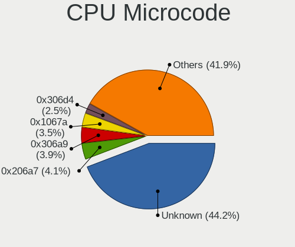
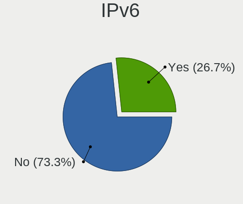

Linux in USA - Tested Hardware & Statistics (Notebooks)
-------------------------------------------------------

A project to collect tested hardware configurations for Linux in USA.

Anyone can contribute to this report by the [hw-probe](https://github.com/linuxhw/hw-probe) tool:

    sudo -E hw-probe -all -upload

Please contribute! Especially if your hardware is rare.

Contents
--------

* [ Test Cases ](#test-cases)

* [ System ](#system)
  - [ OS                       ](#os)
  - [ OS Family                ](#os-family)
  - [ Kernel                   ](#kernel)
  - [ Kernel Family            ](#kernel-family)
  - [ Kernel Major Ver.        ](#kernel-major-ver)
  - [ Arch                     ](#arch)
  - [ DE                       ](#de)
  - [ Display Server           ](#display-server)
  - [ Display Manager          ](#display-manager)
  - [ OS Lang                  ](#os-lang)
  - [ Boot Mode                ](#boot-mode)
  - [ Filesystem               ](#filesystem)
  - [ Part. scheme             ](#part-scheme)
  - [ Dual Boot with Linux/BSD ](#dual-boot-with-linuxbsd)
  - [ Dual Boot (Win)          ](#dual-boot-win)

* [ Board ](#board)
  - [ Vendor                   ](#vendor)
  - [ Model                    ](#model)
  - [ Model Family             ](#model-family)
  - [ MFG Year                 ](#mfg-year)
  - [ Form Factor              ](#form-factor)
  - [ Secure Boot              ](#secure-boot)
  - [ Coreboot                 ](#coreboot)
  - [ RAM Size                 ](#ram-size)
  - [ RAM Used                 ](#ram-used)
  - [ Total Drives             ](#total-drives)
  - [ Has CD-ROM               ](#has-cd-rom)
  - [ Has Ethernet             ](#has-ethernet)
  - [ Has WiFi                 ](#has-wifi)
  - [ Has Bluetooth            ](#has-bluetooth)

* [ Location ](#location)
  - [ Country                  ](#country)
  - [ City                     ](#city)

* [ Drives ](#drives)
  - [ Drive Vendor             ](#drive-vendor)
  - [ Drive Model              ](#drive-model)
  - [ HDD Vendor               ](#hdd-vendor)
  - [ SSD Vendor               ](#ssd-vendor)
  - [ Drive Kind               ](#drive-kind)
  - [ Drive Connector          ](#drive-connector)
  - [ Drive Size               ](#drive-size)
  - [ Space Total              ](#space-total)
  - [ Space Used               ](#space-used)
  - [ Malfunc. Drives          ](#malfunc-drives)
  - [ Malfunc. Drive Vendor    ](#malfunc-drive-vendor)
  - [ Malfunc. HDD Vendor      ](#malfunc-hdd-vendor)
  - [ Malfunc. Drive Kind      ](#malfunc-drive-kind)
  - [ Failed Drives            ](#failed-drives)
  - [ Failed Drive Vendor      ](#failed-drive-vendor)
  - [ Drive Status             ](#drive-status)

* [ Storage controller ](#storage-controller)
  - [ Storage Vendor           ](#storage-vendor)
  - [ Storage Model            ](#storage-model)
  - [ Storage Kind             ](#storage-kind)

* [ Processor ](#processor)
  - [ CPU Vendor               ](#cpu-vendor)
  - [ CPU Model                ](#cpu-model)
  - [ CPU Model Family         ](#cpu-model-family)
  - [ CPU Cores                ](#cpu-cores)
  - [ CPU Sockets              ](#cpu-sockets)
  - [ CPU Threads              ](#cpu-threads)
  - [ CPU Op-Modes             ](#cpu-op-modes)
  - [ CPU Microcode            ](#cpu-microcode)
  - [ CPU Microarch            ](#cpu-microarch)

* [ Graphics ](#graphics)
  - [ GPU Vendor               ](#gpu-vendor)
  - [ GPU Model                ](#gpu-model)
  - [ GPU Combo                ](#gpu-combo)
  - [ GPU Driver               ](#gpu-driver)
  - [ GPU Memory               ](#gpu-memory)

* [ Monitor ](#monitor)
  - [ Monitor Vendor           ](#monitor-vendor)
  - [ Monitor Model            ](#monitor-model)
  - [ Monitor Resolution       ](#monitor-resolution)
  - [ Monitor Diagonal         ](#monitor-diagonal)
  - [ Monitor Width            ](#monitor-width)
  - [ Aspect Ratio             ](#aspect-ratio)
  - [ Monitor Area             ](#monitor-area)
  - [ Pixel Density            ](#pixel-density)
  - [ Multiple Monitors        ](#multiple-monitors)

* [ Network ](#network)
  - [ Net Controller Vendor    ](#net-controller-vendor)
  - [ Net Controller Model     ](#net-controller-model)
  - [ Wireless Vendor          ](#wireless-vendor)
  - [ Wireless Model           ](#wireless-model)
  - [ Ethernet Vendor          ](#ethernet-vendor)
  - [ Ethernet Model           ](#ethernet-model)
  - [ Net Controller Kind      ](#net-controller-kind)
  - [ Used Controller          ](#used-controller)
  - [ NICs                     ](#nics)
  - [ IPv6                     ](#ipv6)

* [ Bluetooth ](#bluetooth)
  - [ Bluetooth Vendor         ](#bluetooth-vendor)
  - [ Bluetooth Model          ](#bluetooth-model)

* [ Sound ](#sound)
  - [ Sound Vendor             ](#sound-vendor)
  - [ Sound Model              ](#sound-model)

* [ Memory ](#memory)
  - [ Memory Vendor            ](#memory-vendor)
  - [ Memory Model             ](#memory-model)
  - [ Memory Kind              ](#memory-kind)
  - [ Memory Form Factor       ](#memory-form-factor)
  - [ Memory Size              ](#memory-size)
  - [ Memory Speed             ](#memory-speed)

* [ Printers & scanners ](#printers--scanners)
  - [ Printer Vendor           ](#printer-vendor)
  - [ Printer Model            ](#printer-model)
  - [ Scanner Vendor           ](#scanner-vendor)
  - [ Scanner Model            ](#scanner-model)

* [ Camera ](#camera)
  - [ Camera Vendor            ](#camera-vendor)
  - [ Camera Model             ](#camera-model)

* [ Security ](#security)
  - [ Fingerprint Vendor       ](#fingerprint-vendor)
  - [ Fingerprint Model        ](#fingerprint-model)
  - [ Chipcard Vendor          ](#chipcard-vendor)
  - [ Chipcard Model           ](#chipcard-model)

* [ Unsupported ](#unsupported)
  - [ Unsupported Devices      ](#unsupported-devices)
  - [ Unsupported Device Types ](#unsupported-device-types)

Test Cases
----------

Total: 27424

| Vendor        | Model                       | Probe                                                      | Date         |
|---------------|-----------------------------|------------------------------------------------------------|--------------|
| HP            | ENVY Laptop 17-ch1xxx       | [d41bca7300](https://linux-hardware.org/?probe=d41bca7300) | Dec 24, 2023 |
| Lenovo        | ThinkPad E460 20ET0016US    | [96959ec0a3](https://linux-hardware.org/?probe=96959ec0a3) | Dec 24, 2023 |
| HP            | ENVY Laptop 17-ch1xxx       | [8080c75b27](https://linux-hardware.org/?probe=8080c75b27) | Dec 24, 2023 |
| ASUSTek       | G75VW                       | [63fa97bd36](https://linux-hardware.org/?probe=63fa97bd36) | Dec 24, 2023 |
| Lenovo        | IdeaPad 3 15IAU7 82RK       | [a69b3fa1ca](https://linux-hardware.org/?probe=a69b3fa1ca) | Dec 24, 2023 |
| Apple         | MacBookAir7,1               | [f666ec3927](https://linux-hardware.org/?probe=f666ec3927) | Dec 24, 2023 |
| Dell          | Inspiron 5720               | [bcb6745ac2](https://linux-hardware.org/?probe=bcb6745ac2) | Dec 24, 2023 |
| Lenovo        | IdeaPad 3 15IAU7 82RK       | [9ac48a1719](https://linux-hardware.org/?probe=9ac48a1719) | Dec 24, 2023 |
| Toshiba       | Satellite A205              | [c3680bfd29](https://linux-hardware.org/?probe=c3680bfd29) | Dec 24, 2023 |
| Lenovo        | IdeaPad 100-15IBD 80QQ      | [f8abeb2607](https://linux-hardware.org/?probe=f8abeb2607) | Dec 24, 2023 |
| ASUSTek       | ROG Zephyrus G14 GA402RJ... | [29b4b5a349](https://linux-hardware.org/?probe=29b4b5a349) | Dec 24, 2023 |
| HP            | Pavilion g7                 | [bbe3fb1914](https://linux-hardware.org/?probe=bbe3fb1914) | Dec 24, 2023 |
| HP            | Notebook                    | [69bef099c0](https://linux-hardware.org/?probe=69bef099c0) | Dec 24, 2023 |
| Dell          | Precision 3560              | [b945ab8339](https://linux-hardware.org/?probe=b945ab8339) | Dec 24, 2023 |
| Valve         | Galileo                     | [aa141b8ea2](https://linux-hardware.org/?probe=aa141b8ea2) | Dec 24, 2023 |
| Apple         | MacBookAir6,2               | [a3af8ee68a](https://linux-hardware.org/?probe=a3af8ee68a) | Dec 24, 2023 |
| HP            | Laptop 15-ef2xxx            | [31291c7bc9](https://linux-hardware.org/?probe=31291c7bc9) | Dec 24, 2023 |
| Lenovo        | ThinkPad T520 424049U       | [c393fb64e3](https://linux-hardware.org/?probe=c393fb64e3) | Dec 24, 2023 |
| Acer          | Aspire A515-43              | [922518c025](https://linux-hardware.org/?probe=922518c025) | Dec 23, 2023 |
| Apple         | MacBookPro9,1               | [a70e7da743](https://linux-hardware.org/?probe=a70e7da743) | Dec 23, 2023 |
| Lenovo        | ThinkPad T420 4178AFU       | [67caa6c117](https://linux-hardware.org/?probe=67caa6c117) | Dec 23, 2023 |
| HP            | ZBook 17 G5                 | [ad6c489ffc](https://linux-hardware.org/?probe=ad6c489ffc) | Dec 23, 2023 |
| Lenovo        | ThinkPad T520 424049U       | [d800424ece](https://linux-hardware.org/?probe=d800424ece) | Dec 23, 2023 |
| ASUSTek       | GL503VM                     | [dfedaea706](https://linux-hardware.org/?probe=dfedaea706) | Dec 23, 2023 |
| ASUSTek       | GL503VM                     | [05b212db99](https://linux-hardware.org/?probe=05b212db99) | Dec 23, 2023 |
| Framework     | Laptop (12th Gen Intel C... | [ef18e09b69](https://linux-hardware.org/?probe=ef18e09b69) | Dec 23, 2023 |
| IBM           | ThinkPad R50e 1842QDU       | [32a349ab97](https://linux-hardware.org/?probe=32a349ab97) | Dec 23, 2023 |
| Lenovo        | ThinkPad T420 4178AFU       | [c2681f33cc](https://linux-hardware.org/?probe=c2681f33cc) | Dec 23, 2023 |
| Lenovo        | IdeaPad 5 14ARE05 81YM      | [6b0368fd61](https://linux-hardware.org/?probe=6b0368fd61) | Dec 23, 2023 |
| ASUSTek       | ASUS TUF Gaming A15 FA50... | [5c4d1c7d64](https://linux-hardware.org/?probe=5c4d1c7d64) | Dec 23, 2023 |
| HP            | Victus by Gaming Laptop ... | [95adcc5c56](https://linux-hardware.org/?probe=95adcc5c56) | Dec 23, 2023 |
| Valve         | Jupiter                     | [6fd8f41741](https://linux-hardware.org/?probe=6fd8f41741) | Dec 23, 2023 |
| Dell          | Latitude E6330              | [afca8c73b2](https://linux-hardware.org/?probe=afca8c73b2) | Dec 23, 2023 |
| Dell          | System XPS L322X            | [6b050ff1c8](https://linux-hardware.org/?probe=6b050ff1c8) | Dec 23, 2023 |
| Sony          | VPCF215FX                   | [1a79c8b60f](https://linux-hardware.org/?probe=1a79c8b60f) | Dec 23, 2023 |
| System76      | Serval WS                   | [92d124a8aa](https://linux-hardware.org/?probe=92d124a8aa) | Dec 23, 2023 |
| GPU Compan... | GWTN116-3                   | [89366f9a48](https://linux-hardware.org/?probe=89366f9a48) | Dec 23, 2023 |
| ASUSTek       | X555LAB                     | [6a3b9f5bb2](https://linux-hardware.org/?probe=6a3b9f5bb2) | Dec 23, 2023 |
| HP            | Pavilion dv6                | [c4a6b58303](https://linux-hardware.org/?probe=c4a6b58303) | Dec 23, 2023 |
| Lenovo        | Slim Pro 7 14ARP8 83AX      | [1ace47e8fd](https://linux-hardware.org/?probe=1ace47e8fd) | Dec 23, 2023 |
| ATARI         | VCS 800 Black Walnut        | [34456982d3](https://linux-hardware.org/?probe=34456982d3) | Dec 23, 2023 |
| Dell          | Latitude E6400              | [1a10fd9a2e](https://linux-hardware.org/?probe=1a10fd9a2e) | Dec 23, 2023 |
| System76      | Gazelle                     | [6671df79bd](https://linux-hardware.org/?probe=6671df79bd) | Dec 23, 2023 |
| System76      | Serval WS                   | [a250c12d1d](https://linux-hardware.org/?probe=a250c12d1d) | Dec 23, 2023 |
| Apple         | MacBookPro9,1               | [e3576ca49c](https://linux-hardware.org/?probe=e3576ca49c) | Dec 23, 2023 |
| Lenovo        | ThinkPad E15 20RD002RUS     | [6ba8bb7550](https://linux-hardware.org/?probe=6ba8bb7550) | Dec 23, 2023 |
| Google        | Reks                        | [52375a57c5](https://linux-hardware.org/?probe=52375a57c5) | Dec 22, 2023 |
| Pine Micro... | Pine64 Pinebook Pro         | [961dddc49e](https://linux-hardware.org/?probe=961dddc49e) | Dec 22, 2023 |
| Lenovo        | ThinkBook 15 G2 ARE 20VG    | [f5f4795192](https://linux-hardware.org/?probe=f5f4795192) | Dec 22, 2023 |
| ASUSTek       | ASUSLaptop_Q540VJ           | [937842fe5d](https://linux-hardware.org/?probe=937842fe5d) | Dec 22, 2023 |
| HP            | G62                         | [9f6a13bc50](https://linux-hardware.org/?probe=9f6a13bc50) | Dec 22, 2023 |
| Valve         | Jupiter                     | [482500f7b0](https://linux-hardware.org/?probe=482500f7b0) | Dec 22, 2023 |
| ASUSTek       | X75A                        | [ed3c88f944](https://linux-hardware.org/?probe=ed3c88f944) | Dec 22, 2023 |
| Lenovo        | ThinkPad T480 20L5004HUS    | [10c32df82e](https://linux-hardware.org/?probe=10c32df82e) | Dec 22, 2023 |
| Dell          | Latitude 5580               | [e20360557a](https://linux-hardware.org/?probe=e20360557a) | Dec 22, 2023 |
| Valve         | Jupiter                     | [4899962b6a](https://linux-hardware.org/?probe=4899962b6a) | Dec 22, 2023 |
| Dell          | Latitude 5414               | [9b02eedb05](https://linux-hardware.org/?probe=9b02eedb05) | Dec 22, 2023 |
| Toshiba       | Satellite C55D-B            | [d705d8ee57](https://linux-hardware.org/?probe=d705d8ee57) | Dec 22, 2023 |
| Google        | Garg                        | [05bbd9f9f8](https://linux-hardware.org/?probe=05bbd9f9f8) | Dec 22, 2023 |
| Eluktronic... | MECH-17                     | [0a69b2e084](https://linux-hardware.org/?probe=0a69b2e084) | Dec 22, 2023 |
| Lenovo        | IdeaPad 3 15IIL05 81WE      | [684b42a95a](https://linux-hardware.org/?probe=684b42a95a) | Dec 22, 2023 |
| Dell          | Precision 5480              | [7cc190b5c0](https://linux-hardware.org/?probe=7cc190b5c0) | Dec 22, 2023 |
| LG Electro... | 17U70Q-P.AAS7U1             | [8846a0ac06](https://linux-hardware.org/?probe=8846a0ac06) | Dec 21, 2023 |
| Lenovo        | ThinkPad T14s Gen 2a 20X... | [6f60c08653](https://linux-hardware.org/?probe=6f60c08653) | Dec 21, 2023 |
| Lenovo        | ThinkPad T14s Gen 2a 20X... | [cf835775a4](https://linux-hardware.org/?probe=cf835775a4) | Dec 21, 2023 |
| Lenovo        | ThinkPad T420 4177QGU       | [7ec167a926](https://linux-hardware.org/?probe=7ec167a926) | Dec 21, 2023 |
| Lenovo        | ThinkPad T470 W10DG 20JM... | [c5c9d669ae](https://linux-hardware.org/?probe=c5c9d669ae) | Dec 21, 2023 |
| Apple         | MacBookPro16,1              | [d67a62b447](https://linux-hardware.org/?probe=d67a62b447) | Dec 21, 2023 |
| ASUSTek       | X75A                        | [6d9c65c8ac](https://linux-hardware.org/?probe=6d9c65c8ac) | Dec 21, 2023 |
| Lenovo        | ThinkPad T14 Gen 2i 20W1... | [972314af13](https://linux-hardware.org/?probe=972314af13) | Dec 21, 2023 |
| Google        | Reks                        | [9a6f15c5d9](https://linux-hardware.org/?probe=9a6f15c5d9) | Dec 21, 2023 |
| Fujitsu       | LIFEBOOK T5010              | [27e7d6f705](https://linux-hardware.org/?probe=27e7d6f705) | Dec 21, 2023 |
| HP            | Pavilion dv7                | [ef719917ef](https://linux-hardware.org/?probe=ef719917ef) | Dec 21, 2023 |
| Lenovo        | ThinkPad T440 20B6005BUS    | [d699475273](https://linux-hardware.org/?probe=d699475273) | Dec 21, 2023 |
| Lenovo        | ThinkPad T440 20B70048US    | [f937778ee0](https://linux-hardware.org/?probe=f937778ee0) | Dec 21, 2023 |
| HP            | Pavilion dv7                | [cd7f768fe8](https://linux-hardware.org/?probe=cd7f768fe8) | Dec 21, 2023 |
| Toshiba       | Satellite L15-B             | [0b1e126b9b](https://linux-hardware.org/?probe=0b1e126b9b) | Dec 21, 2023 |
| Acer          | Aspire M5-581T              | [c99da67d31](https://linux-hardware.org/?probe=c99da67d31) | Dec 21, 2023 |
| Dell          | Latitude E6520              | [9e16e8b2a6](https://linux-hardware.org/?probe=9e16e8b2a6) | Dec 21, 2023 |
| HP            | ProBook 445 G7              | [4153ae7cc6](https://linux-hardware.org/?probe=4153ae7cc6) | Dec 21, 2023 |
| Lenovo        | ThinkPad T14 Gen 3 21AH0... | [03b86f8fd8](https://linux-hardware.org/?probe=03b86f8fd8) | Dec 21, 2023 |
| System76      | Adder WS                    | [d272c23e51](https://linux-hardware.org/?probe=d272c23e51) | Dec 21, 2023 |
| Acer          | Swift SF314-54              | [edc5223b9b](https://linux-hardware.org/?probe=edc5223b9b) | Dec 21, 2023 |
| Google        | Garg                        | [fb4804bee9](https://linux-hardware.org/?probe=fb4804bee9) | Dec 21, 2023 |
| Google        | Garg                        | [d2558e0746](https://linux-hardware.org/?probe=d2558e0746) | Dec 21, 2023 |
| Lenovo        | ThinkBook 15 G2 ARE 20VG    | [1e223a9ea1](https://linux-hardware.org/?probe=1e223a9ea1) | Dec 21, 2023 |
| MSI           | GF65 Thin 10SDR             | [73408e34a6](https://linux-hardware.org/?probe=73408e34a6) | Dec 21, 2023 |
| Lenovo        | ThinkPad T550 20CJS1MW00    | [f5bb1db361](https://linux-hardware.org/?probe=f5bb1db361) | Dec 21, 2023 |
| Lenovo        | Legion 5 15IAH7H 82RB       | [57d4ccc05e](https://linux-hardware.org/?probe=57d4ccc05e) | Dec 21, 2023 |
| Lenovo        | ThinkPad T490 20RY0002US    | [95dfdb9327](https://linux-hardware.org/?probe=95dfdb9327) | Dec 21, 2023 |
| Sony          | VGN-NW270F                  | [eee640a54d](https://linux-hardware.org/?probe=eee640a54d) | Dec 20, 2023 |
| ASUSTek       | ROG Zephyrus G15 GA503QR... | [fb187c2fa4](https://linux-hardware.org/?probe=fb187c2fa4) | Dec 20, 2023 |
| Lenovo        | IdeaPad S340-15APITOUCH ... | [0eb3eaa1c6](https://linux-hardware.org/?probe=0eb3eaa1c6) | Dec 20, 2023 |
| Toshiba       | Satellite C850              | [caa584d966](https://linux-hardware.org/?probe=caa584d966) | Dec 20, 2023 |
| Dell          | XPS 15 9510                 | [107d6edb72](https://linux-hardware.org/?probe=107d6edb72) | Dec 20, 2023 |
| Toshiba       | Satellite C55D-B            | [dfd0e27118](https://linux-hardware.org/?probe=dfd0e27118) | Dec 20, 2023 |
| Lenovo        | ThinkPad T440 20B6005BUS    | [bf412b1477](https://linux-hardware.org/?probe=bf412b1477) | Dec 20, 2023 |
| Lenovo        | ThinkPad T440 20B70048US    | [d6a79599da](https://linux-hardware.org/?probe=d6a79599da) | Dec 20, 2023 |
| Google        | Garg                        | [0f05d3580a](https://linux-hardware.org/?probe=0f05d3580a) | Dec 20, 2023 |
| HP            | Stream Laptop 14-cb1xxx     | [e3dded7dc3](https://linux-hardware.org/?probe=e3dded7dc3) | Dec 20, 2023 |
| Dell          | Precision 5510              | [033bf69fdf](https://linux-hardware.org/?probe=033bf69fdf) | Dec 20, 2023 |
| Dell          | Precision 5510              | [a40fa883d2](https://linux-hardware.org/?probe=a40fa883d2) | Dec 20, 2023 |
| Lenovo        | ThinkPad E15 Gen 2 20TDS... | [44a01e07bb](https://linux-hardware.org/?probe=44a01e07bb) | Dec 20, 2023 |
| Valve         | Jupiter                     | [ceba2299c2](https://linux-hardware.org/?probe=ceba2299c2) | Dec 20, 2023 |
| System76      | Serval WS                   | [7475c97028](https://linux-hardware.org/?probe=7475c97028) | Dec 20, 2023 |
| Dell          | Inspiron 1750               | [508bf60ff7](https://linux-hardware.org/?probe=508bf60ff7) | Dec 20, 2023 |
| Lenovo        | ThinkPad T550 20CJS1MW00    | [e6bc9160c8](https://linux-hardware.org/?probe=e6bc9160c8) | Dec 20, 2023 |
| HP            | Laptop 15-da0xxx            | [a2b93e4d4d](https://linux-hardware.org/?probe=a2b93e4d4d) | Dec 20, 2023 |
| Google        | Cave                        | [ec9d49335f](https://linux-hardware.org/?probe=ec9d49335f) | Dec 20, 2023 |
| ASUSTek       | X550LA                      | [fd673bac37](https://linux-hardware.org/?probe=fd673bac37) | Dec 20, 2023 |
| Dell          | Inspiron 3721               | [2fd8b3f8fc](https://linux-hardware.org/?probe=2fd8b3f8fc) | Dec 20, 2023 |
| Dell          | Latitude 3460               | [c3b4a00583](https://linux-hardware.org/?probe=c3b4a00583) | Dec 19, 2023 |
| Dell          | Latitude 3460               | [3b425238a6](https://linux-hardware.org/?probe=3b425238a6) | Dec 19, 2023 |
| Dell          | Latitude E5270              | [c25a5b1bc7](https://linux-hardware.org/?probe=c25a5b1bc7) | Dec 19, 2023 |
| Valve         | Jupiter                     | [feae313bc0](https://linux-hardware.org/?probe=feae313bc0) | Dec 19, 2023 |
| Google        | Swanky                      | [46b7f27873](https://linux-hardware.org/?probe=46b7f27873) | Dec 19, 2023 |
| System76      | Pangolin                    | [a0cf57c6d1](https://linux-hardware.org/?probe=a0cf57c6d1) | Dec 19, 2023 |
| Lenovo        | ThinkPad T470p 20J6CTO1W... | [a074081eb1](https://linux-hardware.org/?probe=a074081eb1) | Dec 19, 2023 |
| HP            | Dev One Notebook PC         | [b10cd89445](https://linux-hardware.org/?probe=b10cd89445) | Dec 19, 2023 |
| HP            | Laptop 15-dw0xxx            | [4d59263eb3](https://linux-hardware.org/?probe=4d59263eb3) | Dec 19, 2023 |
| Lenovo        | ThinkPad T14 Gen 3 21AH0... | [e37edfc830](https://linux-hardware.org/?probe=e37edfc830) | Dec 19, 2023 |
| Dell          | XPS 13 9310                 | [3a4a73b5f1](https://linux-hardware.org/?probe=3a4a73b5f1) | Dec 19, 2023 |
| Dell          | Inspiron 3542               | [7d3f7e97ce](https://linux-hardware.org/?probe=7d3f7e97ce) | Dec 19, 2023 |
| Dell          | Inspiron 1545               | [fc8665de21](https://linux-hardware.org/?probe=fc8665de21) | Dec 18, 2023 |
| Lenovo        | ThinkPad T450s 20BX001LU... | [b3a6780db5](https://linux-hardware.org/?probe=b3a6780db5) | Dec 18, 2023 |
| Lenovo        | ThinkPad X240 20AMS0VU00    | [ecca798714](https://linux-hardware.org/?probe=ecca798714) | Dec 18, 2023 |
| HP            | Laptop 15-ef2xxx            | [f0d39c9ef3](https://linux-hardware.org/?probe=f0d39c9ef3) | Dec 18, 2023 |
| Acer          | Aspire A715-51G             | [1232ff1050](https://linux-hardware.org/?probe=1232ff1050) | Dec 18, 2023 |
| Dell          | Latitude 7490               | [6fe6e99364](https://linux-hardware.org/?probe=6fe6e99364) | Dec 18, 2023 |
| HP            | Pavilion dv6700             | [dd31f0d1ec](https://linux-hardware.org/?probe=dd31f0d1ec) | Dec 18, 2023 |
| Toshiba       | Satellite C55-A             | [6c0f2ad0c9](https://linux-hardware.org/?probe=6c0f2ad0c9) | Dec 18, 2023 |
| Valve         | Galileo                     | [b79c5fbf78](https://linux-hardware.org/?probe=b79c5fbf78) | Dec 18, 2023 |
| Toshiba       | Satellite C55-A             | [0ae780878c](https://linux-hardware.org/?probe=0ae780878c) | Dec 18, 2023 |
| ASUSTek       | X550LA                      | [759db70e03](https://linux-hardware.org/?probe=759db70e03) | Dec 18, 2023 |
| HP            | 15 Notebook PC              | [1293ea8b65](https://linux-hardware.org/?probe=1293ea8b65) | Dec 18, 2023 |
| Valve         | Jupiter                     | [b5b29d3c59](https://linux-hardware.org/?probe=b5b29d3c59) | Dec 18, 2023 |
| Acer          | Aspire 5349                 | [f81cd33147](https://linux-hardware.org/?probe=f81cd33147) | Dec 18, 2023 |
| ASUSTek       | ZenBook UX434IQ_Q407IQ      | [81ea786e13](https://linux-hardware.org/?probe=81ea786e13) | Dec 18, 2023 |
| Dell          | Latitude E6410              | [ad9c836840](https://linux-hardware.org/?probe=ad9c836840) | Dec 18, 2023 |
| HP            | 250 15.6 inch G9 Noteboo... | [612482d238](https://linux-hardware.org/?probe=612482d238) | Dec 18, 2023 |
| Dell          | XPS 15 7590                 | [7e2afccdd6](https://linux-hardware.org/?probe=7e2afccdd6) | Dec 18, 2023 |
| Acer          | Nitro AN515-55              | [bdecd800b4](https://linux-hardware.org/?probe=bdecd800b4) | Dec 18, 2023 |
| Lenovo        | ThinkPad X1 Carbon 2nd 2... | [7b289201bc](https://linux-hardware.org/?probe=7b289201bc) | Dec 17, 2023 |
| HP            | Dev One Notebook PC         | [3c5fc22ea0](https://linux-hardware.org/?probe=3c5fc22ea0) | Dec 17, 2023 |
| Acer          | Aspire A315-51              | [4169b122de](https://linux-hardware.org/?probe=4169b122de) | Dec 17, 2023 |
| Valve         | Galileo                     | [c02b71450c](https://linux-hardware.org/?probe=c02b71450c) | Dec 17, 2023 |
| Valve         | Jupiter                     | [0cda5b9141](https://linux-hardware.org/?probe=0cda5b9141) | Dec 17, 2023 |
| Valve         | Galileo                     | [355d2e1a38](https://linux-hardware.org/?probe=355d2e1a38) | Dec 17, 2023 |
| HP            | Laptop 17-cp0xxx            | [341ecee745](https://linux-hardware.org/?probe=341ecee745) | Dec 17, 2023 |
| Lenovo        | Y50-70 20378                | [07c7da687a](https://linux-hardware.org/?probe=07c7da687a) | Dec 17, 2023 |
| Lenovo        | Y50-70 20378                | [e6ad27a4dd](https://linux-hardware.org/?probe=e6ad27a4dd) | Dec 17, 2023 |
| HP            | Laptop 15-bw0xx             | [91a9e2e8c4](https://linux-hardware.org/?probe=91a9e2e8c4) | Dec 17, 2023 |
| MSI           | PE70 6QE                    | [efc671c7c2](https://linux-hardware.org/?probe=efc671c7c2) | Dec 17, 2023 |
| MSI           | PE70 6QE                    | [c99e0d38ea](https://linux-hardware.org/?probe=c99e0d38ea) | Dec 17, 2023 |
| ASUSTek       | ROG Strix G814JZ_G814JZ     | [b8d81eb2c9](https://linux-hardware.org/?probe=b8d81eb2c9) | Dec 17, 2023 |
| Acer          | Aspire M5-583P              | [34b9748756](https://linux-hardware.org/?probe=34b9748756) | Dec 17, 2023 |
| ASUSTek       | ROG Strix G814JZ_G814JZ     | [19d43a41f8](https://linux-hardware.org/?probe=19d43a41f8) | Dec 17, 2023 |
| HP            | Pavilion Laptop 15-cs3xx... | [304fbf1e83](https://linux-hardware.org/?probe=304fbf1e83) | Dec 17, 2023 |
| HP            | Notebook                    | [88e0b592ea](https://linux-hardware.org/?probe=88e0b592ea) | Dec 17, 2023 |
| Valve         | Jupiter                     | [241ed280af](https://linux-hardware.org/?probe=241ed280af) | Dec 17, 2023 |
| Fujitsu       | LIFEBOOK U727               | [dceda9b2a1](https://linux-hardware.org/?probe=dceda9b2a1) | Dec 17, 2023 |
| HP            | Pavilion dv6                | [dd14fcb656](https://linux-hardware.org/?probe=dd14fcb656) | Dec 17, 2023 |
| ASUSTek       | ROG Zephyrus G14 GA402RJ... | [ead7baed80](https://linux-hardware.org/?probe=ead7baed80) | Dec 17, 2023 |
| ASUSTek       | S550CB                      | [20c9c415c9](https://linux-hardware.org/?probe=20c9c415c9) | Dec 17, 2023 |
| Lenovo        | ThinkPad T480 20L50011US    | [c93d5be9d6](https://linux-hardware.org/?probe=c93d5be9d6) | Dec 17, 2023 |
| Apple         | MacBookPro9,2               | [3a08b4d1ea](https://linux-hardware.org/?probe=3a08b4d1ea) | Dec 17, 2023 |
| Dell          | Inspiron 3542               | [6b3cd841db](https://linux-hardware.org/?probe=6b3cd841db) | Dec 17, 2023 |
| ASUSTek       | K53SD                       | [1c0bbe412c](https://linux-hardware.org/?probe=1c0bbe412c) | Dec 17, 2023 |
| Dell          | Latitude E6430              | [13af5c2dc4](https://linux-hardware.org/?probe=13af5c2dc4) | Dec 17, 2023 |
| LG Electro... | 16Z90R-A.ADC8U1             | [5ae89dd818](https://linux-hardware.org/?probe=5ae89dd818) | Dec 16, 2023 |
| Dell          | Latitude 7350               | [ab9a873c1e](https://linux-hardware.org/?probe=ab9a873c1e) | Dec 16, 2023 |
| Lenovo        | IdeaPad Slim 9 14ITL5 82... | [9e217a08be](https://linux-hardware.org/?probe=9e217a08be) | Dec 16, 2023 |
| Lenovo        | ThinkPad T460 20FNCTO1WW    | [8e419e7090](https://linux-hardware.org/?probe=8e419e7090) | Dec 16, 2023 |
| Lenovo        | B50-80 80LT                 | [ea695bd9c5](https://linux-hardware.org/?probe=ea695bd9c5) | Dec 16, 2023 |
| Lenovo        | B50-80 80LT                 | [40d547e3f5](https://linux-hardware.org/?probe=40d547e3f5) | Dec 16, 2023 |
| ASUSTek       | Zenbook UM6702RC_RM6702R... | [c3c947f23f](https://linux-hardware.org/?probe=c3c947f23f) | Dec 16, 2023 |
| ASUSTek       | VivoBook_ASUSLaptop M160... | [db30b82451](https://linux-hardware.org/?probe=db30b82451) | Dec 16, 2023 |
| Lenovo        | IdeaPad S400 20195          | [f4c6ceeca3](https://linux-hardware.org/?probe=f4c6ceeca3) | Dec 16, 2023 |
| Acer          | Aspire A515-56T             | [9579acc8a0](https://linux-hardware.org/?probe=9579acc8a0) | Dec 16, 2023 |
| Framework     | Laptop 13 (AMD Ryzen 704... | [7b3d7fcb72](https://linux-hardware.org/?probe=7b3d7fcb72) | Dec 16, 2023 |
| System76      | Bonobo WS                   | [22f5ef6fce](https://linux-hardware.org/?probe=22f5ef6fce) | Dec 16, 2023 |
| Framework     | Laptop 13 (AMD Ryzen 704... | [251ac554a9](https://linux-hardware.org/?probe=251ac554a9) | Dec 16, 2023 |
| MSI           | GP62MVR 7RFX                | [fcb56f79d6](https://linux-hardware.org/?probe=fcb56f79d6) | Dec 16, 2023 |
| Valve         | Jupiter                     | [dfdfbefee5](https://linux-hardware.org/?probe=dfdfbefee5) | Dec 16, 2023 |
| Dell          | Precision 7510              | [c70e7da2e8](https://linux-hardware.org/?probe=c70e7da2e8) | Dec 16, 2023 |
| ASUSTek       | ASUSLaptop_Q540VJ           | [88312d177f](https://linux-hardware.org/?probe=88312d177f) | Dec 16, 2023 |
| HP            | Notebook                    | [5bbbe8e356](https://linux-hardware.org/?probe=5bbbe8e356) | Dec 16, 2023 |
| ASUSTek       | Q524UQ                      | [8466629595](https://linux-hardware.org/?probe=8466629595) | Dec 16, 2023 |
| Dell          | Inspiron 1545               | [3f47a63c82](https://linux-hardware.org/?probe=3f47a63c82) | Dec 16, 2023 |
| Lenovo        | ThinkPad E14 Gen 4 21E30... | [10f1017f04](https://linux-hardware.org/?probe=10f1017f04) | Dec 16, 2023 |
| Dell          | Inspiron 5447               | [0e868b4cba](https://linux-hardware.org/?probe=0e868b4cba) | Dec 15, 2023 |
| Dell          | Inspiron 5447               | [60320e4007](https://linux-hardware.org/?probe=60320e4007) | Dec 15, 2023 |
| ASUSTek       | X555LAB                     | [199ffa8815](https://linux-hardware.org/?probe=199ffa8815) | Dec 15, 2023 |
| Valve         | Jupiter                     | [ee39964f52](https://linux-hardware.org/?probe=ee39964f52) | Dec 15, 2023 |
| Apple         | MacBookPro5,3               | [f882c29faa](https://linux-hardware.org/?probe=f882c29faa) | Dec 15, 2023 |
| Lenovo        | ThinkBook 13s G2 ITL 20V... | [e03062f53d](https://linux-hardware.org/?probe=e03062f53d) | Dec 15, 2023 |
| HP            | Notebook                    | [26c91fe276](https://linux-hardware.org/?probe=26c91fe276) | Dec 15, 2023 |
| HP            | EliteBook 745 G3            | [ec4a48125c](https://linux-hardware.org/?probe=ec4a48125c) | Dec 15, 2023 |
| HP            | EliteBook 745 G3            | [d43271b873](https://linux-hardware.org/?probe=d43271b873) | Dec 15, 2023 |
| Dell          | XPS 15 9550                 | [de4b8201ef](https://linux-hardware.org/?probe=de4b8201ef) | Dec 15, 2023 |
| Dell          | Vostro 7500                 | [65dfb6fec4](https://linux-hardware.org/?probe=65dfb6fec4) | Dec 15, 2023 |
| HP            | Stream Laptop 14-DS0xxx     | [3e26902ac1](https://linux-hardware.org/?probe=3e26902ac1) | Dec 15, 2023 |
| Valve         | Jupiter                     | [4e56fce432](https://linux-hardware.org/?probe=4e56fce432) | Dec 15, 2023 |
| Lenovo        | IdeaPad 1 15AMN7 82VG       | [6a2633018c](https://linux-hardware.org/?probe=6a2633018c) | Dec 15, 2023 |
| Lenovo        | IdeaPad Gaming 3 15ACH6 ... | [4cb7a5528b](https://linux-hardware.org/?probe=4cb7a5528b) | Dec 15, 2023 |
| Apple         | MacBookPro5,3               | [066c7e2b1a](https://linux-hardware.org/?probe=066c7e2b1a) | Dec 15, 2023 |
| Lenovo        | Slim 7 ProX 14ARH7 82V2     | [b342bc9627](https://linux-hardware.org/?probe=b342bc9627) | Dec 14, 2023 |
| Apple         | MacBookPro10,2              | [435c0197d1](https://linux-hardware.org/?probe=435c0197d1) | Dec 14, 2023 |
| Dell          | Latitude E5450              | [b616faa68f](https://linux-hardware.org/?probe=b616faa68f) | Dec 14, 2023 |
| Apple         | MacBookAir9,1               | [6cadf8d04e](https://linux-hardware.org/?probe=6cadf8d04e) | Dec 14, 2023 |
| Lenovo        | ThinkPad T450 20BUS50Q16    | [789b2d6914](https://linux-hardware.org/?probe=789b2d6914) | Dec 14, 2023 |
| Apple         | MacBookAir7,2               | [09a184f2e4](https://linux-hardware.org/?probe=09a184f2e4) | Dec 14, 2023 |
| Dell          | Inspiron 5759               | [9caa48ce75](https://linux-hardware.org/?probe=9caa48ce75) | Dec 14, 2023 |
| Apple         | MacBookPro10,2              | [b95f42f691](https://linux-hardware.org/?probe=b95f42f691) | Dec 14, 2023 |
| HP            | ProBook 650 G1              | [f58535cbfe](https://linux-hardware.org/?probe=f58535cbfe) | Dec 14, 2023 |
| HP            | Laptop 17-by4xxx            | [bb89121e0c](https://linux-hardware.org/?probe=bb89121e0c) | Dec 14, 2023 |
| HP            | OMEN by Laptop 16-c0xxx     | [6855d17ce1](https://linux-hardware.org/?probe=6855d17ce1) | Dec 14, 2023 |
| Dell          | Precision 5520              | [b3ea29b5a2](https://linux-hardware.org/?probe=b3ea29b5a2) | Dec 14, 2023 |
| Lenovo        | ThinkPad X1 Carbon 6th 2... | [4919d10355](https://linux-hardware.org/?probe=4919d10355) | Dec 14, 2023 |
| Valve         | Galileo                     | [adb5dc0f2d](https://linux-hardware.org/?probe=adb5dc0f2d) | Dec 14, 2023 |
| Dell          | Latitude 5590               | [c52c1d4f2e](https://linux-hardware.org/?probe=c52c1d4f2e) | Dec 14, 2023 |
| Valve         | Jupiter                     | [c2879ac10a](https://linux-hardware.org/?probe=c2879ac10a) | Dec 14, 2023 |
| Lenovo        | ThinkPad T480 20L50011US    | [0ece599b11](https://linux-hardware.org/?probe=0ece599b11) | Dec 14, 2023 |
| HP            | ProBook 4540s               | [24875256cd](https://linux-hardware.org/?probe=24875256cd) | Dec 14, 2023 |
| A-DATA Tec... | XENIA 14                    | [ebbefc4570](https://linux-hardware.org/?probe=ebbefc4570) | Dec 14, 2023 |
| Lenovo        | Flex 2 Pro-15               | [da278da4b6](https://linux-hardware.org/?probe=da278da4b6) | Dec 13, 2023 |
| Valve         | Jupiter                     | [4e38f77c8d](https://linux-hardware.org/?probe=4e38f77c8d) | Dec 13, 2023 |
| ASUSTek       | X75A1                       | [e7d274ca96](https://linux-hardware.org/?probe=e7d274ca96) | Dec 13, 2023 |
| Valve         | Galileo                     | [719db5099f](https://linux-hardware.org/?probe=719db5099f) | Dec 13, 2023 |
| Lenovo        | ThinkPad T14 Gen 3 21AH0... | [05ff735f51](https://linux-hardware.org/?probe=05ff735f51) | Dec 13, 2023 |
| Unknown       | Unknown                     | [4517e8a60b](https://linux-hardware.org/?probe=4517e8a60b) | Dec 13, 2023 |
| Dell          | Latitude 5424 Rugged        | [ce56e420fc](https://linux-hardware.org/?probe=ce56e420fc) | Dec 13, 2023 |
| Lenovo        | ThinkPad T460 20FNCTO1WW    | [042bbde845](https://linux-hardware.org/?probe=042bbde845) | Dec 13, 2023 |
| Acer          | Aspire 7740                 | [2122676b51](https://linux-hardware.org/?probe=2122676b51) | Dec 13, 2023 |
| ASUSTek       | VivoBook_ASUSLaptop K660... | [6a742a5308](https://linux-hardware.org/?probe=6a742a5308) | Dec 13, 2023 |
| HP            | Pavilion dv6                | [ebc05992b6](https://linux-hardware.org/?probe=ebc05992b6) | Dec 13, 2023 |
| MSI           | GL62M 7RD                   | [fd87c3c373](https://linux-hardware.org/?probe=fd87c3c373) | Dec 12, 2023 |
| HC            | HCAR357-MI                  | [daaf3e0f5f](https://linux-hardware.org/?probe=daaf3e0f5f) | Dec 12, 2023 |
| Lenovo        | ThinkPad E490 20N9S13000    | [d93593921b](https://linux-hardware.org/?probe=d93593921b) | Dec 12, 2023 |
| Acer          | Aspire E1-522               | [e438bd7bc2](https://linux-hardware.org/?probe=e438bd7bc2) | Dec 12, 2023 |
| Acer          | Aspire E1-522               | [0ba0422412](https://linux-hardware.org/?probe=0ba0422412) | Dec 12, 2023 |
| Dell          | G7 7700                     | [9d4e191ab5](https://linux-hardware.org/?probe=9d4e191ab5) | Dec 12, 2023 |
| GPU Compan... | GWTC116-2                   | [10e35dbb2a](https://linux-hardware.org/?probe=10e35dbb2a) | Dec 12, 2023 |
| Lenovo        | IdeaPad 3 17IIL05 81WF      | [84fd94c616](https://linux-hardware.org/?probe=84fd94c616) | Dec 12, 2023 |
| Apple         | MacBookPro11,2              | [cc03da082a](https://linux-hardware.org/?probe=cc03da082a) | Dec 12, 2023 |
| Alienware     | M17x                        | [da64c97fa8](https://linux-hardware.org/?probe=da64c97fa8) | Dec 12, 2023 |
| ASUSTek       | VivoBook_ASUSLaptop M150... | [e617c5041f](https://linux-hardware.org/?probe=e617c5041f) | Dec 12, 2023 |
| Acer          | Aspire E5-576               | [72fc5247a6](https://linux-hardware.org/?probe=72fc5247a6) | Dec 12, 2023 |
| Lenovo        | IdeaPad 1 14IGL7 82V6       | [8d9963d61d](https://linux-hardware.org/?probe=8d9963d61d) | Dec 11, 2023 |
| Valve         | Jupiter                     | [3f0800eb70](https://linux-hardware.org/?probe=3f0800eb70) | Dec 11, 2023 |
| Toshiba       | Satellite A665D             | [b8fc9ba683](https://linux-hardware.org/?probe=b8fc9ba683) | Dec 11, 2023 |
| Dell          | Latitude 7290               | [89a710e338](https://linux-hardware.org/?probe=89a710e338) | Dec 11, 2023 |
| Lenovo        | IdeaPad 3 15IIL05 81WE      | [dac56d16cd](https://linux-hardware.org/?probe=dac56d16cd) | Dec 11, 2023 |
| Valve         | Galileo                     | [494f369350](https://linux-hardware.org/?probe=494f369350) | Dec 11, 2023 |
| Dell          | XPS 15 9520                 | [e0f273e27d](https://linux-hardware.org/?probe=e0f273e27d) | Dec 11, 2023 |
| Valve         | Jupiter                     | [449a971a56](https://linux-hardware.org/?probe=449a971a56) | Dec 11, 2023 |
| Dell          | Latitude 5590               | [ebdbfc1740](https://linux-hardware.org/?probe=ebdbfc1740) | Dec 11, 2023 |
| Dell          | Inspiron 5755               | [4b70400e52](https://linux-hardware.org/?probe=4b70400e52) | Dec 11, 2023 |
| ASUSTek       | U52F                        | [5bdf8ec184](https://linux-hardware.org/?probe=5bdf8ec184) | Dec 11, 2023 |
| ASUSTek       | TUF Gaming FX505GD_FX505... | [be5332c927](https://linux-hardware.org/?probe=be5332c927) | Dec 11, 2023 |
| Dell          | Precision M6500             | [5b287ea21f](https://linux-hardware.org/?probe=5b287ea21f) | Dec 11, 2023 |
| Apple         | MacBookPro11,1              | [539d1d09fe](https://linux-hardware.org/?probe=539d1d09fe) | Dec 11, 2023 |
| Lenovo        | ThinkPad T470s 20HF005NU... | [0d9a5839df](https://linux-hardware.org/?probe=0d9a5839df) | Dec 11, 2023 |
| Framework     | Laptop 13 (AMD Ryzen 704... | [c2dd869dcf](https://linux-hardware.org/?probe=c2dd869dcf) | Dec 10, 2023 |
| System76      | Lemur Pro                   | [05062ae2dd](https://linux-hardware.org/?probe=05062ae2dd) | Dec 10, 2023 |
| Dell          | XPS 15 9510                 | [b88a7e6159](https://linux-hardware.org/?probe=b88a7e6159) | Dec 10, 2023 |
| Dell          | Precision 3540              | [b4316bc7e3](https://linux-hardware.org/?probe=b4316bc7e3) | Dec 10, 2023 |
| ASUSTek       | VivoBook_ASUSLaptop X160... | [96b05f5be6](https://linux-hardware.org/?probe=96b05f5be6) | Dec 10, 2023 |
| Dell          | Precision 3550              | [0235a02831](https://linux-hardware.org/?probe=0235a02831) | Dec 10, 2023 |
| ASUSTek       | ROG Zephyrus G14 GA401IV... | [e7febd26d4](https://linux-hardware.org/?probe=e7febd26d4) | Dec 10, 2023 |
| Lenovo        | ThinkPad T430s 2356C45      | [a76e3d7e43](https://linux-hardware.org/?probe=a76e3d7e43) | Dec 10, 2023 |
| Lenovo        | IdeaPad 3 15ITL6 82H8       | [b9c86c02e7](https://linux-hardware.org/?probe=b9c86c02e7) | Dec 10, 2023 |
| Lenovo        | IdeaPad Slim 5 16IRL8 82... | [1709e5c519](https://linux-hardware.org/?probe=1709e5c519) | Dec 10, 2023 |
| HP            | Laptop 15-da0xxx            | [2722000dd3](https://linux-hardware.org/?probe=2722000dd3) | Dec 10, 2023 |
| Lenovo        | ThinkPad X1 Carbon Gen 8... | [60b75920a4](https://linux-hardware.org/?probe=60b75920a4) | Dec 10, 2023 |
| HP            | Pavilion 17                 | [6822e2b412](https://linux-hardware.org/?probe=6822e2b412) | Dec 10, 2023 |
| Dell          | Precision 5480              | [e2ef5d90ca](https://linux-hardware.org/?probe=e2ef5d90ca) | Dec 10, 2023 |
| Lenovo        | ThinkPad E560 20EWS0M900    | [c753b49018](https://linux-hardware.org/?probe=c753b49018) | Dec 10, 2023 |
| Acer          | Nitro AN515-58              | [9939fe96d2](https://linux-hardware.org/?probe=9939fe96d2) | Dec 10, 2023 |
| Acer          | Aspire A515-54              | [d3869522c0](https://linux-hardware.org/?probe=d3869522c0) | Dec 10, 2023 |
| HP            | Laptop 17-cp0xxx            | [2199caf331](https://linux-hardware.org/?probe=2199caf331) | Dec 10, 2023 |
| HP            | Laptop 15-bw0xx             | [69ebcd04b9](https://linux-hardware.org/?probe=69ebcd04b9) | Dec 10, 2023 |
| Apple         | MacBookPro8,3               | [08a4bea1d7](https://linux-hardware.org/?probe=08a4bea1d7) | Dec 09, 2023 |
| Google        | Gallop                      | [83663e2906](https://linux-hardware.org/?probe=83663e2906) | Dec 09, 2023 |
| ASUSTek       | ASUS TUF Gaming A15 FA50... | [e7b5bdd470](https://linux-hardware.org/?probe=e7b5bdd470) | Dec 09, 2023 |
| HP            | EliteBook 8560w             | [0de5475eb8](https://linux-hardware.org/?probe=0de5475eb8) | Dec 09, 2023 |
| Dell          | Latitude 7490               | [bbbf303467](https://linux-hardware.org/?probe=bbbf303467) | Dec 09, 2023 |
| BOSGAME       | DNB20 series                | [d825ed757b](https://linux-hardware.org/?probe=d825ed757b) | Dec 09, 2023 |
| Dell          | G15 5515                    | [d815dec1af](https://linux-hardware.org/?probe=d815dec1af) | Dec 09, 2023 |
| Unknown       | Unknown                     | [185aa8e9fe](https://linux-hardware.org/?probe=185aa8e9fe) | Dec 09, 2023 |
| Apple         | MacBookPro12,1              | [9d633902a0](https://linux-hardware.org/?probe=9d633902a0) | Dec 09, 2023 |
| HP            | Pavilion Gaming Laptop 1... | [e800d95054](https://linux-hardware.org/?probe=e800d95054) | Dec 09, 2023 |
| Lenovo        | ThinkPad T60 1952AP2        | [803ecc2001](https://linux-hardware.org/?probe=803ecc2001) | Dec 09, 2023 |
| Toshiba       | QOSMIO X770                 | [945c57d421](https://linux-hardware.org/?probe=945c57d421) | Dec 09, 2023 |
| ASUSTek       | VivoBook_ASUSLaptop X415... | [051769648f](https://linux-hardware.org/?probe=051769648f) | Dec 09, 2023 |
| Lenovo        | ThinkPad X220 4290B19       | [1515bfc49e](https://linux-hardware.org/?probe=1515bfc49e) | Dec 09, 2023 |
| Framework     | Laptop (13th Gen Intel C... | [490ad0881a](https://linux-hardware.org/?probe=490ad0881a) | Dec 09, 2023 |
| Lenovo        | ThinkPad P51s 20HBCTO1WW    | [4c18329d9d](https://linux-hardware.org/?probe=4c18329d9d) | Dec 09, 2023 |
| HP            | Laptop 15-da0xxx            | [4106c6dbcf](https://linux-hardware.org/?probe=4106c6dbcf) | Dec 09, 2023 |
| Dell          | Precision 3550              | [a3be7ab761](https://linux-hardware.org/?probe=a3be7ab761) | Dec 09, 2023 |
| Valve         | Jupiter                     | [c40a4f6672](https://linux-hardware.org/?probe=c40a4f6672) | Dec 08, 2023 |
| HP            | Laptop 15-bw0xx             | [b00663cde8](https://linux-hardware.org/?probe=b00663cde8) | Dec 08, 2023 |
| ASUSTek       | TP501UAM                    | [3465474829](https://linux-hardware.org/?probe=3465474829) | Dec 08, 2023 |
| Lenovo        | IdeaPad 3 17IIL05 81WF      | [edabe3eb37](https://linux-hardware.org/?probe=edabe3eb37) | Dec 08, 2023 |
| Toshiba       | Satellite A665D             | [7d646d3dbd](https://linux-hardware.org/?probe=7d646d3dbd) | Dec 08, 2023 |
| Dell          | Latitude E7470              | [81a17083f6](https://linux-hardware.org/?probe=81a17083f6) | Dec 08, 2023 |
| ASUSTek       | VivoBook_ASUS Laptop E51... | [6cd48c055d](https://linux-hardware.org/?probe=6cd48c055d) | Dec 08, 2023 |
| MSI           | Katana GF76 11UD            | [a489e0db56](https://linux-hardware.org/?probe=a489e0db56) | Dec 08, 2023 |
| Panasonic     | CF-31JHG8M1M                | [9e99acdb69](https://linux-hardware.org/?probe=9e99acdb69) | Dec 08, 2023 |
| Dell          | Latitude E5470              | [cea78b64d4](https://linux-hardware.org/?probe=cea78b64d4) | Dec 08, 2023 |
| MSI           | Katana GF76 11UD            | [0f09b2440c](https://linux-hardware.org/?probe=0f09b2440c) | Dec 08, 2023 |
| Valve         | Galileo                     | [0eacb54dca](https://linux-hardware.org/?probe=0eacb54dca) | Dec 08, 2023 |
| Alienware     | 17 R3                       | [b426716979](https://linux-hardware.org/?probe=b426716979) | Dec 08, 2023 |
| Acer          | Nitro AN515-54              | [045ab5efca](https://linux-hardware.org/?probe=045ab5efca) | Dec 08, 2023 |
| Gateway       | NV57H                       | [8e41b1ac70](https://linux-hardware.org/?probe=8e41b1ac70) | Dec 08, 2023 |
| Lenovo        | ThinkPad T60 1952AP2        | [90a7c09cb5](https://linux-hardware.org/?probe=90a7c09cb5) | Dec 08, 2023 |
| Dell          | Precision M4700             | [54abe2ce35](https://linux-hardware.org/?probe=54abe2ce35) | Dec 08, 2023 |
| HP            | Pavilion dv6                | [e6522f1c77](https://linux-hardware.org/?probe=e6522f1c77) | Dec 08, 2023 |
| HP            | 15 Notebook PC              | [35b7f5d288](https://linux-hardware.org/?probe=35b7f5d288) | Dec 08, 2023 |
| Valve         | Jupiter                     | [dfa143c1c0](https://linux-hardware.org/?probe=dfa143c1c0) | Dec 08, 2023 |
| Alienware     | x15 R1                      | [08aa034a6d](https://linux-hardware.org/?probe=08aa034a6d) | Dec 08, 2023 |
| Adreamer      | Mybook PN1308P              | [e2dba2aff0](https://linux-hardware.org/?probe=e2dba2aff0) | Dec 08, 2023 |
| ASUSTek       | G750JX                      | [acb5d61dd5](https://linux-hardware.org/?probe=acb5d61dd5) | Dec 08, 2023 |
| Lenovo        | ThinkPad X1 Carbon Gen 1... | [7f76b4716d](https://linux-hardware.org/?probe=7f76b4716d) | Dec 08, 2023 |
| Dell          | G7 7700                     | [aa754020ce](https://linux-hardware.org/?probe=aa754020ce) | Dec 08, 2023 |
| ASUSTek       | ASUS TUF Gaming A15 FA50... | [529932bcd4](https://linux-hardware.org/?probe=529932bcd4) | Dec 08, 2023 |
| HP            | 15 Notebook PC              | [37a360ec8a](https://linux-hardware.org/?probe=37a360ec8a) | Dec 08, 2023 |
| Lenovo        | ThinkPad X1 Carbon Gen 1... | [0a3a227554](https://linux-hardware.org/?probe=0a3a227554) | Dec 08, 2023 |
| Valve         | Galileo                     | [f72b98880f](https://linux-hardware.org/?probe=f72b98880f) | Dec 07, 2023 |
| Sony          | VPCEB25FX                   | [f2d99590ca](https://linux-hardware.org/?probe=f2d99590ca) | Dec 07, 2023 |
| Lenovo        | ThinkPad T430 23498Y3       | [5382654b9b](https://linux-hardware.org/?probe=5382654b9b) | Dec 07, 2023 |
| Lenovo        | ThinkPad E14 Gen 2 20TA0... | [c37147ae36](https://linux-hardware.org/?probe=c37147ae36) | Dec 07, 2023 |
| HP            | Stream Laptop 14-cb1XX      | [fc2efc3edb](https://linux-hardware.org/?probe=fc2efc3edb) | Dec 07, 2023 |
| Valve         | Jupiter                     | [602605d28d](https://linux-hardware.org/?probe=602605d28d) | Dec 07, 2023 |
| Dell          | Inspiron 13 5310            | [8a4776f925](https://linux-hardware.org/?probe=8a4776f925) | Dec 07, 2023 |
| Chuwi         | CoreBook X                  | [6364cca19b](https://linux-hardware.org/?probe=6364cca19b) | Dec 07, 2023 |
| Alienware     | M17xR3                      | [0522045eab](https://linux-hardware.org/?probe=0522045eab) | Dec 07, 2023 |
| Dell          | Vostro 1520                 | [ac1c78d3a4](https://linux-hardware.org/?probe=ac1c78d3a4) | Dec 07, 2023 |
| Acer          | Aspire A315-51              | [66fc06c54d](https://linux-hardware.org/?probe=66fc06c54d) | Dec 07, 2023 |
| ASUSTek       | ROG Zephyrus G15 GA503QR... | [90ffb00870](https://linux-hardware.org/?probe=90ffb00870) | Dec 07, 2023 |
| Dell          | Precision 7550              | [11f63c8ba3](https://linux-hardware.org/?probe=11f63c8ba3) | Dec 07, 2023 |
| ASUSTek       | VivoBook_ASUS Laptop E51... | [2c7c5b2119](https://linux-hardware.org/?probe=2c7c5b2119) | Dec 06, 2023 |
| HP            | ZBook Studio G3             | [6dc3d18916](https://linux-hardware.org/?probe=6dc3d18916) | Dec 06, 2023 |
| Acer          | Nitro AN515-58              | [a475eb0eb8](https://linux-hardware.org/?probe=a475eb0eb8) | Dec 06, 2023 |
| Dell          | Latitude 7350               | [3fb5b65dba](https://linux-hardware.org/?probe=3fb5b65dba) | Dec 06, 2023 |
| HP            | EliteBook 840 G3            | [c9f70274cf](https://linux-hardware.org/?probe=c9f70274cf) | Dec 06, 2023 |
| Dell          | Latitude E7440              | [6b3c7ea2b5](https://linux-hardware.org/?probe=6b3c7ea2b5) | Dec 06, 2023 |
| HP            | EliteBook 845 14 inch G9... | [0d809d54ad](https://linux-hardware.org/?probe=0d809d54ad) | Dec 06, 2023 |
| Dell          | G5 5505                     | [74d0a53db4](https://linux-hardware.org/?probe=74d0a53db4) | Dec 06, 2023 |
| HP            | Notebook                    | [8431ed2498](https://linux-hardware.org/?probe=8431ed2498) | Dec 06, 2023 |
| Lenovo        | IdeaPad 3 15ITL6 82H8       | [6c558ca3cf](https://linux-hardware.org/?probe=6c558ca3cf) | Dec 06, 2023 |
| Dell          | Latitude 3330               | [843751ec33](https://linux-hardware.org/?probe=843751ec33) | Dec 06, 2023 |
| HP            | EliteBook 850 G3            | [baf21dcbce](https://linux-hardware.org/?probe=baf21dcbce) | Dec 06, 2023 |
| Toshiba       | Satellite L855              | [d737055b41](https://linux-hardware.org/?probe=d737055b41) | Dec 06, 2023 |
| Dell          | Latitude 7490               | [364b5c38d4](https://linux-hardware.org/?probe=364b5c38d4) | Dec 06, 2023 |
| Lenovo        | ThinkPad E460 20ET0014US    | [b1cf294932](https://linux-hardware.org/?probe=b1cf294932) | Dec 06, 2023 |
| Lenovo        | IdeaPad 100-15IBD 80QQ      | [c1a6e3eb9e](https://linux-hardware.org/?probe=c1a6e3eb9e) | Dec 06, 2023 |
| GPU Compan... | GWTC116-2                   | [db1b3d8020](https://linux-hardware.org/?probe=db1b3d8020) | Dec 06, 2023 |
| Apple         | MacBookPro11,2              | [196d6bc9e8](https://linux-hardware.org/?probe=196d6bc9e8) | Dec 05, 2023 |
| Valve         | Jupiter                     | [f7115ec7c0](https://linux-hardware.org/?probe=f7115ec7c0) | Dec 05, 2023 |
| HP            | ProBook 640 G5              | [419da197bb](https://linux-hardware.org/?probe=419da197bb) | Dec 05, 2023 |
| HP            | EliteBook 725 G3            | [21e9914be2](https://linux-hardware.org/?probe=21e9914be2) | Dec 05, 2023 |
| HP            | ProBook 640 G5              | [745d537d97](https://linux-hardware.org/?probe=745d537d97) | Dec 05, 2023 |
| Apple         | MacBookPro11,5              | [749492541f](https://linux-hardware.org/?probe=749492541f) | Dec 05, 2023 |
| Lenovo        | ThinkPad E14 Gen 2 20TA0... | [a2c9c3b295](https://linux-hardware.org/?probe=a2c9c3b295) | Dec 05, 2023 |
| Apple         | MacBookPro15,1              | [60aacd19d6](https://linux-hardware.org/?probe=60aacd19d6) | Dec 05, 2023 |
| HP            | Laptop 15-dy2xxx            | [729837dc5c](https://linux-hardware.org/?probe=729837dc5c) | Dec 05, 2023 |
| Dell          | Latitude E6440              | [74db313788](https://linux-hardware.org/?probe=74db313788) | Dec 05, 2023 |
| Lenovo        | ThinkPad T480 20L50011US    | [ac97a3fe1c](https://linux-hardware.org/?probe=ac97a3fe1c) | Dec 05, 2023 |
| Apple         | MacBookAir4,2               | [2b7a417b76](https://linux-hardware.org/?probe=2b7a417b76) | Dec 04, 2023 |
| Lenovo        | ThinkPad T450 20BUS50Q16    | [ad47002b34](https://linux-hardware.org/?probe=ad47002b34) | Dec 04, 2023 |
| Dell          | Inspiron 5584               | [d077f362ea](https://linux-hardware.org/?probe=d077f362ea) | Dec 04, 2023 |
| Lenovo        | ThinkPad T14 Gen 1 20S00... | [2ace6b74e5](https://linux-hardware.org/?probe=2ace6b74e5) | Dec 04, 2023 |
| Lenovo        | ThinkPad T480s 20L8S1WH0... | [01485bc011](https://linux-hardware.org/?probe=01485bc011) | Dec 04, 2023 |
| HP            | Stream Notebook             | [2f50077231](https://linux-hardware.org/?probe=2f50077231) | Dec 04, 2023 |
| Dynabook      | TECRA A50-J                 | [7aa8d3fb6d](https://linux-hardware.org/?probe=7aa8d3fb6d) | Dec 04, 2023 |
| Panasonic     | CF-52SL3DD1M                | [efdec9a15c](https://linux-hardware.org/?probe=efdec9a15c) | Dec 04, 2023 |
| Acer          | Aspire A317-53              | [2bd5efd212](https://linux-hardware.org/?probe=2bd5efd212) | Dec 04, 2023 |
| Alienware     | 17 R5                       | [e0fdc679e3](https://linux-hardware.org/?probe=e0fdc679e3) | Dec 04, 2023 |
| Alienware     | 17 R5                       | [1e44992982](https://linux-hardware.org/?probe=1e44992982) | Dec 04, 2023 |
| Dell          | XPS 13 9350                 | [aec9f3cb3c](https://linux-hardware.org/?probe=aec9f3cb3c) | Dec 04, 2023 |
| Micro Comp... | Venus series                | [f2c2867f9e](https://linux-hardware.org/?probe=f2c2867f9e) | Dec 04, 2023 |
| Toshiba       | Satellite C855D             | [84e97d4578](https://linux-hardware.org/?probe=84e97d4578) | Dec 04, 2023 |
| Dell          | Latitude 7350               | [74c3983604](https://linux-hardware.org/?probe=74c3983604) | Dec 04, 2023 |
| HP            | OMEN Laptop 15-en1xxx       | [caba6d5ee8](https://linux-hardware.org/?probe=caba6d5ee8) | Dec 04, 2023 |
| Lenovo        | ThinkPad T530 2392ASU       | [859f5cb215](https://linux-hardware.org/?probe=859f5cb215) | Dec 04, 2023 |
| HP            | ZBook Studio 15.6 inch G... | [7a78497797](https://linux-hardware.org/?probe=7a78497797) | Dec 03, 2023 |
| Valve         | Jupiter                     | [286c2304f5](https://linux-hardware.org/?probe=286c2304f5) | Dec 03, 2023 |
| Alienware     | M17x                        | [f1c871bbd9](https://linux-hardware.org/?probe=f1c871bbd9) | Dec 03, 2023 |
| Lenovo        | ThinkPad T440s 20AQ005TU... | [3c9d00c839](https://linux-hardware.org/?probe=3c9d00c839) | Dec 03, 2023 |
| Valve         | Jupiter                     | [21c483ddcf](https://linux-hardware.org/?probe=21c483ddcf) | Dec 03, 2023 |
| HP            | ProBook 640 G1              | [287093ae53](https://linux-hardware.org/?probe=287093ae53) | Dec 03, 2023 |
| Dell          | Latitude D630               | [84a1008ee2](https://linux-hardware.org/?probe=84a1008ee2) | Dec 03, 2023 |
| Valve         | Jupiter                     | [36af755784](https://linux-hardware.org/?probe=36af755784) | Dec 03, 2023 |
| HP            | Pavilion 13 x360 PC         | [d481339f2f](https://linux-hardware.org/?probe=d481339f2f) | Dec 03, 2023 |
| HP            | EliteBook 2540p             | [3819853378](https://linux-hardware.org/?probe=3819853378) | Dec 03, 2023 |
| Dell          | Latitude E6530              | [514326bb46](https://linux-hardware.org/?probe=514326bb46) | Dec 03, 2023 |
| HP            | Pavilion Laptop 15-eh1xx... | [2f37d84587](https://linux-hardware.org/?probe=2f37d84587) | Dec 03, 2023 |
| HP            | Pavilion 13 x360 PC         | [359c30e001](https://linux-hardware.org/?probe=359c30e001) | Dec 03, 2023 |
| Lenovo        | ThinkPad T480 20L5004HUS    | [c0681fbe8a](https://linux-hardware.org/?probe=c0681fbe8a) | Dec 03, 2023 |
| ASUSTek       | X705UDR                     | [ea5c2b889d](https://linux-hardware.org/?probe=ea5c2b889d) | Dec 03, 2023 |
| Lenovo        | ThinkPad T480 20L5004HUS    | [54178ea597](https://linux-hardware.org/?probe=54178ea597) | Dec 03, 2023 |
| HP            | Laptop 15-dw2xxx            | [44390c058f](https://linux-hardware.org/?probe=44390c058f) | Dec 03, 2023 |
| HP            | Laptop 15-dw2xxx            | [e9530a4f63](https://linux-hardware.org/?probe=e9530a4f63) | Dec 03, 2023 |
| HP            | Victus by Gaming Laptop ... | [f150b37e9f](https://linux-hardware.org/?probe=f150b37e9f) | Dec 03, 2023 |
| Dell          | Inspiron 3542               | [793b594721](https://linux-hardware.org/?probe=793b594721) | Dec 03, 2023 |
| HP            | Pavilion dv5                | [40e03f76cf](https://linux-hardware.org/?probe=40e03f76cf) | Dec 03, 2023 |
| System76      | Lemur Pro                   | [8dcc66a7e6](https://linux-hardware.org/?probe=8dcc66a7e6) | Dec 03, 2023 |
| Toshiba       | Satellite L305              | [a2ac14b9d1](https://linux-hardware.org/?probe=a2ac14b9d1) | Dec 03, 2023 |
| HP            | Pavilion 15                 | [fecd529c90](https://linux-hardware.org/?probe=fecd529c90) | Dec 03, 2023 |
| ASRock        | B550M Steel Legend          | [532cab64b5](https://linux-hardware.org/?probe=532cab64b5) | Dec 03, 2023 |
| Dell          | Inspiron 13-5378            | [0beeed51bc](https://linux-hardware.org/?probe=0beeed51bc) | Dec 03, 2023 |
| Lenovo        | ThinkPad T480 20L5004HUS    | [e6f0d9a3ae](https://linux-hardware.org/?probe=e6f0d9a3ae) | Dec 03, 2023 |
| Lenovo        | ThinkPad E585 20KV0010US    | [521b65ac7a](https://linux-hardware.org/?probe=521b65ac7a) | Dec 03, 2023 |
| Dell          | XPS 13 9360                 | [f5b7c2899a](https://linux-hardware.org/?probe=f5b7c2899a) | Dec 03, 2023 |
| Dell          | Inspiron 5515               | [e099b86288](https://linux-hardware.org/?probe=e099b86288) | Dec 02, 2023 |
| HP            | Laptop 15-bs0xx             | [d767fe9238](https://linux-hardware.org/?probe=d767fe9238) | Dec 02, 2023 |
| Alienware     | 18                          | [e2dc3b99fc](https://linux-hardware.org/?probe=e2dc3b99fc) | Dec 02, 2023 |
| Lenovo        | ThinkPad T420 4180AP3       | [b517b29f25](https://linux-hardware.org/?probe=b517b29f25) | Dec 02, 2023 |
| Valve         | Galileo                     | [7c11f8f225](https://linux-hardware.org/?probe=7c11f8f225) | Dec 02, 2023 |
| Valve         | Galileo                     | [63234eea22](https://linux-hardware.org/?probe=63234eea22) | Dec 02, 2023 |
| Valve         | Jupiter                     | [c7865c15b0](https://linux-hardware.org/?probe=c7865c15b0) | Dec 02, 2023 |
| Lenovo        | ThinkPad X1 Carbon Gen 1... | [9d3a34c3da](https://linux-hardware.org/?probe=9d3a34c3da) | Dec 02, 2023 |
| Lenovo        | ThinkPad L450 20DSS1G63Q    | [0bb363e4fc](https://linux-hardware.org/?probe=0bb363e4fc) | Dec 02, 2023 |
| HP            | 255 G5 Notebook PC          | [dd74ec6df7](https://linux-hardware.org/?probe=dd74ec6df7) | Dec 02, 2023 |
| HP            | 255 G5 Notebook PC          | [e2b2e32290](https://linux-hardware.org/?probe=e2b2e32290) | Dec 02, 2023 |
| ASUSTek       | Zenbook UM6702RC_RM6702R... | [54bfb4d865](https://linux-hardware.org/?probe=54bfb4d865) | Dec 02, 2023 |
| Dell          | Latitude 7400               | [acfa4488ca](https://linux-hardware.org/?probe=acfa4488ca) | Dec 02, 2023 |
| Valve         | Jupiter                     | [dc16a663fa](https://linux-hardware.org/?probe=dc16a663fa) | Dec 02, 2023 |
| Unknown       | Unknown                     | [ecae393240](https://linux-hardware.org/?probe=ecae393240) | Dec 02, 2023 |
| Dell          | Inspiron 15-3565            | [6e0eb386a4](https://linux-hardware.org/?probe=6e0eb386a4) | Dec 02, 2023 |
| Apple         | MacBookPro9,2               | [d72522d400](https://linux-hardware.org/?probe=d72522d400) | Dec 02, 2023 |
| Lenovo        | ThinkBook 15 G2 ARE 20VG    | [5568b58564](https://linux-hardware.org/?probe=5568b58564) | Dec 02, 2023 |
| SK hynix      | HyBook                      | [4c0f06eb94](https://linux-hardware.org/?probe=4c0f06eb94) | Dec 02, 2023 |
| HP            | ZBook 15 G2                 | [ba6823f38e](https://linux-hardware.org/?probe=ba6823f38e) | Dec 02, 2023 |
| Framework     | Laptop                      | [92f0d97b05](https://linux-hardware.org/?probe=92f0d97b05) | Dec 02, 2023 |
| Framework     | Laptop                      | [995d231691](https://linux-hardware.org/?probe=995d231691) | Dec 02, 2023 |
| Toshiba       | TECRA R950                  | [8ab7278f60](https://linux-hardware.org/?probe=8ab7278f60) | Dec 01, 2023 |
| Toshiba       | TECRA R950                  | [9634f68cab](https://linux-hardware.org/?probe=9634f68cab) | Dec 01, 2023 |
| HP            | 240 G7                      | [ad50ca6a6e](https://linux-hardware.org/?probe=ad50ca6a6e) | Dec 01, 2023 |
| Apple         | MacBookPro9,2               | [1784c4c5b0](https://linux-hardware.org/?probe=1784c4c5b0) | Dec 01, 2023 |
| Dell          | Inspiron 7720               | [974a2661e2](https://linux-hardware.org/?probe=974a2661e2) | Dec 01, 2023 |
| HP            | EliteBook 6930p             | [0fefa1b40e](https://linux-hardware.org/?probe=0fefa1b40e) | Dec 01, 2023 |
| Dell          | Studio 1737                 | [4e400ded4b](https://linux-hardware.org/?probe=4e400ded4b) | Dec 01, 2023 |
| Dell          | Inspiron 1545               | [7fbbf18938](https://linux-hardware.org/?probe=7fbbf18938) | Dec 01, 2023 |
| Lenovo        | ThinkPad T480s 20L7002CU... | [679acd4c7a](https://linux-hardware.org/?probe=679acd4c7a) | Dec 01, 2023 |
| Lenovo        | 14w Gen 2 82N8              | [bc02b5a084](https://linux-hardware.org/?probe=bc02b5a084) | Dec 01, 2023 |
| HP            | Pavilion 17                 | [6894411a12](https://linux-hardware.org/?probe=6894411a12) | Dec 01, 2023 |
| Acer          | Aspire A317-53              | [3c418227c7](https://linux-hardware.org/?probe=3c418227c7) | Dec 01, 2023 |
| Lenovo        | ThinkPad X60 1706M8U        | [ab0582fe71](https://linux-hardware.org/?probe=ab0582fe71) | Dec 01, 2023 |
| ASUSTek       | Zenbook 15 UM3504DA_UM35... | [ea481bfb9d](https://linux-hardware.org/?probe=ea481bfb9d) | Dec 01, 2023 |
| Dell          | Latitude E6520              | [1cb2209cef](https://linux-hardware.org/?probe=1cb2209cef) | Dec 01, 2023 |
| Apple         | MacBookPro8,1               | [ad16e37b50](https://linux-hardware.org/?probe=ad16e37b50) | Dec 01, 2023 |
| Dell          | XPS420                      | [2204a9646d](https://linux-hardware.org/?probe=2204a9646d) | Dec 01, 2023 |
| Dell          | Inspiron 15-7568            | [80d4969c23](https://linux-hardware.org/?probe=80d4969c23) | Dec 01, 2023 |
| Dell          | Latitude E6440              | [4459a634ca](https://linux-hardware.org/?probe=4459a634ca) | Dec 01, 2023 |
| Acer          | Nitro AN515-54              | [3953185e28](https://linux-hardware.org/?probe=3953185e28) | Dec 01, 2023 |
| Toshiba       | Satellite L775              | [da7cc192f7](https://linux-hardware.org/?probe=da7cc192f7) | Dec 01, 2023 |
| Lenovo        | ThinkPad T14s Gen 1 20T1... | [5c4714ecce](https://linux-hardware.org/?probe=5c4714ecce) | Dec 01, 2023 |
| HP            | 15 Notebook PC              | [b431f0a398](https://linux-hardware.org/?probe=b431f0a398) | Dec 01, 2023 |
| Lenovo        | ThinkPad L14 Gen 4 21H1C... | [7590036270](https://linux-hardware.org/?probe=7590036270) | Dec 01, 2023 |
| Lenovo        | Legion 7 16ARHA7 82UH       | [5f31cddd2f](https://linux-hardware.org/?probe=5f31cddd2f) | Dec 01, 2023 |
| HP            | Laptop 15-bs0xx             | [02f2ca658e](https://linux-hardware.org/?probe=02f2ca658e) | Dec 01, 2023 |
| Valve         | Galileo                     | [3006af1c16](https://linux-hardware.org/?probe=3006af1c16) | Dec 01, 2023 |
| HP            | Laptop 15-bs0xx             | [e812beed5d](https://linux-hardware.org/?probe=e812beed5d) | Dec 01, 2023 |
| Google        | Jinlon                      | [563dc8024c](https://linux-hardware.org/?probe=563dc8024c) | Nov 30, 2023 |
| Lenovo        | ThinkPad T410 2518C3U       | [d95358436c](https://linux-hardware.org/?probe=d95358436c) | Nov 30, 2023 |
| Acer          | Nitro AN515-54              | [7c4f4d3207](https://linux-hardware.org/?probe=7c4f4d3207) | Nov 30, 2023 |
| Lenovo        | IdeaPad 5 15IIL05 81YK      | [120ad9d1f3](https://linux-hardware.org/?probe=120ad9d1f3) | Nov 30, 2023 |
| ASUSTek       | ASUS TUF Gaming A15 FA50... | [863d4d2b8f](https://linux-hardware.org/?probe=863d4d2b8f) | Nov 30, 2023 |
| Lenovo        | ThinkPad T480 20L6S4XW00    | [13a434ff63](https://linux-hardware.org/?probe=13a434ff63) | Nov 30, 2023 |
| Pine Micro... | Pine64 Pinebook Pro         | [1b0dd94e69](https://linux-hardware.org/?probe=1b0dd94e69) | Nov 30, 2023 |
| Acer          | Nitro AN515-42              | [4c24f3fddf](https://linux-hardware.org/?probe=4c24f3fddf) | Nov 30, 2023 |
| Lenovo        | ThinkPad X1 Carbon 6th 2... | [3ed69dec15](https://linux-hardware.org/?probe=3ed69dec15) | Nov 30, 2023 |
| HP            | Laptop 15-bs1xx             | [e8f82bc03f](https://linux-hardware.org/?probe=e8f82bc03f) | Nov 29, 2023 |
| Toshiba       | Satellite L455D             | [d08710e3d3](https://linux-hardware.org/?probe=d08710e3d3) | Nov 29, 2023 |
| Lenovo        | ThinkPad L540 20AUS01H00    | [6bdb162853](https://linux-hardware.org/?probe=6bdb162853) | Nov 29, 2023 |
| Google        | Nautilus                    | [1b255e77a3](https://linux-hardware.org/?probe=1b255e77a3) | Nov 29, 2023 |
| ASUSTek       | GL702VM                     | [0f104614aa](https://linux-hardware.org/?probe=0f104614aa) | Nov 29, 2023 |
| HP            | Laptop 17-by3xxx            | [63860f689c](https://linux-hardware.org/?probe=63860f689c) | Nov 29, 2023 |
| Lenovo        | IdeaPad Slim 1-14AST-05 ... | [3b82362902](https://linux-hardware.org/?probe=3b82362902) | Nov 29, 2023 |
| Apple         | MacBookPro13,1              | [6074c742c1](https://linux-hardware.org/?probe=6074c742c1) | Nov 29, 2023 |
| Alienware     | 17                          | [1c23fa6051](https://linux-hardware.org/?probe=1c23fa6051) | Nov 29, 2023 |
| HP            | Laptop 15-da0xxx            | [4d9e778bd2](https://linux-hardware.org/?probe=4d9e778bd2) | Nov 29, 2023 |
| Valve         | Jupiter                     | [e92fd78128](https://linux-hardware.org/?probe=e92fd78128) | Nov 29, 2023 |
| Lenovo        | IdeaPad Slim 5 16IRL8 82... | [ef2a2ab2a9](https://linux-hardware.org/?probe=ef2a2ab2a9) | Nov 29, 2023 |
| ASUSTek       | ASUS TUF Gaming A16 FA61... | [fa60a82ab5](https://linux-hardware.org/?probe=fa60a82ab5) | Nov 29, 2023 |
| Lenovo        | ThinkPad X1 Carbon 7th 2... | [5e08371b05](https://linux-hardware.org/?probe=5e08371b05) | Nov 29, 2023 |
| Dell          | Inspiron 5558               | [c934dcacd6](https://linux-hardware.org/?probe=c934dcacd6) | Nov 29, 2023 |
| Valve         | Jupiter                     | [b5216ccd78](https://linux-hardware.org/?probe=b5216ccd78) | Nov 29, 2023 |
| Valve         | Galileo                     | [f8322860f1](https://linux-hardware.org/?probe=f8322860f1) | Nov 29, 2023 |
| Lenovo        | ThinkPad E560 20EV002FUS    | [e9f95fd344](https://linux-hardware.org/?probe=e9f95fd344) | Nov 29, 2023 |
| ASUSTek       | K501UW                      | [37ecb34a8a](https://linux-hardware.org/?probe=37ecb34a8a) | Nov 29, 2023 |
| Lenovo        | Legion 7 16ITHg6 82K6       | [ce91016387](https://linux-hardware.org/?probe=ce91016387) | Nov 29, 2023 |
| LG Electro... | 17Z90Q-K.AAC7U1             | [6af16f3cbb](https://linux-hardware.org/?probe=6af16f3cbb) | Nov 29, 2023 |
| Lenovo        | IdeaPad Slim 5 16IRL8 82... | [414132dc07](https://linux-hardware.org/?probe=414132dc07) | Nov 29, 2023 |
| Dell          | Precision 7560              | [035f0d6f41](https://linux-hardware.org/?probe=035f0d6f41) | Nov 29, 2023 |
| HP            | Stream Laptop 11-ak0xxx     | [16dda5c039](https://linux-hardware.org/?probe=16dda5c039) | Nov 29, 2023 |
| Dell          | Latitude E6540              | [9b16b68bbe](https://linux-hardware.org/?probe=9b16b68bbe) | Nov 28, 2023 |
| HP            | 15                          | [c1ca96368f](https://linux-hardware.org/?probe=c1ca96368f) | Nov 28, 2023 |
| Pine Micro... | Pine64 Pinebook Pro         | [29d00359b8](https://linux-hardware.org/?probe=29d00359b8) | Nov 28, 2023 |
| Acer          | Aspire 5742                 | [88ea78aaf0](https://linux-hardware.org/?probe=88ea78aaf0) | Nov 28, 2023 |
| ASUSTek       | Q550LF                      | [c09615021b](https://linux-hardware.org/?probe=c09615021b) | Nov 28, 2023 |
| HP            | EliteBook 840 G5            | [2efe0e2a59](https://linux-hardware.org/?probe=2efe0e2a59) | Nov 28, 2023 |
| Samsung       | 760XDA                      | [f502815b13](https://linux-hardware.org/?probe=f502815b13) | Nov 28, 2023 |
| Lenovo        | IdeaPad 330-15IGM 81D1      | [64b58279b2](https://linux-hardware.org/?probe=64b58279b2) | Nov 28, 2023 |
| Lenovo        | IdeaPad 3 15IIL05 81WE      | [35775b438a](https://linux-hardware.org/?probe=35775b438a) | Nov 28, 2023 |
| Toshiba       | Satellite L855              | [b1f194a955](https://linux-hardware.org/?probe=b1f194a955) | Nov 28, 2023 |
| Lenovo        | ThinkPad T540p 20BFS31F0... | [8db080dffe](https://linux-hardware.org/?probe=8db080dffe) | Nov 28, 2023 |
| HP            | ZBook 14 G2                 | [124f1ff011](https://linux-hardware.org/?probe=124f1ff011) | Nov 28, 2023 |
| HP            | Laptop 15-dy2xxx            | [10a019bb7e](https://linux-hardware.org/?probe=10a019bb7e) | Nov 28, 2023 |
| MSI           | Prestige 16Studio A13VF     | [4d8fb7dd05](https://linux-hardware.org/?probe=4d8fb7dd05) | Nov 28, 2023 |
| Framework     | Laptop (13th Gen Intel C... | [8c82a1d8c3](https://linux-hardware.org/?probe=8c82a1d8c3) | Nov 28, 2023 |
| Toshiba       | Satellite L305              | [59abc93874](https://linux-hardware.org/?probe=59abc93874) | Nov 28, 2023 |
| HP            | Laptop 15-dy2xxx            | [144a7d4106](https://linux-hardware.org/?probe=144a7d4106) | Nov 28, 2023 |
| HP            | ENVY Laptop 17-cr0xxx       | [160556d559](https://linux-hardware.org/?probe=160556d559) | Nov 28, 2023 |
| HP            | EliteBook 845 G7 Noteboo... | [5358617403](https://linux-hardware.org/?probe=5358617403) | Nov 28, 2023 |
| Google        | Fleex                       | [0f905372c0](https://linux-hardware.org/?probe=0f905372c0) | Nov 28, 2023 |
| HP            | Laptop 15-dy2xxx            | [c56c2fcff2](https://linux-hardware.org/?probe=c56c2fcff2) | Nov 28, 2023 |
| HP            | 15                          | [aba1e87e5c](https://linux-hardware.org/?probe=aba1e87e5c) | Nov 28, 2023 |
| GPU Compan... | GWTC116-2                   | [3363b8258e](https://linux-hardware.org/?probe=3363b8258e) | Nov 28, 2023 |
| SGIN          | M15                         | [c7fb994367](https://linux-hardware.org/?probe=c7fb994367) | Nov 28, 2023 |
| Valve         | Jupiter                     | [2ceef57eaa](https://linux-hardware.org/?probe=2ceef57eaa) | Nov 28, 2023 |
| Lenovo        | Yoga 3 Pro-1370 80HE        | [0dbf67ab6f](https://linux-hardware.org/?probe=0dbf67ab6f) | Nov 28, 2023 |
| HP            | G60                         | [eb7f66cedc](https://linux-hardware.org/?probe=eb7f66cedc) | Nov 28, 2023 |
| HUAWEI        | MACH-WX9                    | [a09dd535a7](https://linux-hardware.org/?probe=a09dd535a7) | Nov 28, 2023 |
| HP            | ZBook 15 G6                 | [1f87fc5fca](https://linux-hardware.org/?probe=1f87fc5fca) | Nov 28, 2023 |
| Valve         | Jupiter                     | [9544f59716](https://linux-hardware.org/?probe=9544f59716) | Nov 27, 2023 |
| Dell          | XPS 15 9550                 | [6d2e371a5f](https://linux-hardware.org/?probe=6d2e371a5f) | Nov 27, 2023 |
| Lenovo        | ThinkPad T480 20L6S42P00    | [bab4b2e0cf](https://linux-hardware.org/?probe=bab4b2e0cf) | Nov 27, 2023 |
| Dell          | Precision 5520              | [4d773def1d](https://linux-hardware.org/?probe=4d773def1d) | Nov 27, 2023 |
| Lenovo        | ThinkPad X1 Carbon 6th 2... | [d940db14d3](https://linux-hardware.org/?probe=d940db14d3) | Nov 27, 2023 |
| Apple         | MacBookPro10,1              | [3982dc173a](https://linux-hardware.org/?probe=3982dc173a) | Nov 27, 2023 |
| Lenovo        | Flex 2 Pro-15               | [7e7f94ca3b](https://linux-hardware.org/?probe=7e7f94ca3b) | Nov 27, 2023 |
| Dell          | Inspiron 5593               | [fc19161855](https://linux-hardware.org/?probe=fc19161855) | Nov 27, 2023 |
| Dell          | Precision 7670              | [450a8674d6](https://linux-hardware.org/?probe=450a8674d6) | Nov 27, 2023 |
| Lenovo        | ThinkPad T490 20N3S2YS00    | [635d73bd44](https://linux-hardware.org/?probe=635d73bd44) | Nov 27, 2023 |
| Lenovo        | ThinkBook 14-IIL 20SL       | [9ba9e50996](https://linux-hardware.org/?probe=9ba9e50996) | Nov 27, 2023 |
| Lenovo        | ThinkPad T480s 20L70028U... | [a54c387b5f](https://linux-hardware.org/?probe=a54c387b5f) | Nov 27, 2023 |
| Dell          | Inspiron 5585               | [fd11deddc6](https://linux-hardware.org/?probe=fd11deddc6) | Nov 27, 2023 |
| Dell          | Inspiron 5585               | [28ebcf2199](https://linux-hardware.org/?probe=28ebcf2199) | Nov 27, 2023 |
| Acer          | Aspire A515-56              | [419daf1e57](https://linux-hardware.org/?probe=419daf1e57) | Nov 27, 2023 |
| Micro Elec... | MG-VCP17A-3070              | [d252e49a50](https://linux-hardware.org/?probe=d252e49a50) | Nov 27, 2023 |
| ASUSTek       | ASUS TUF Gaming F15 FX50... | [4256ad6b53](https://linux-hardware.org/?probe=4256ad6b53) | Nov 27, 2023 |
| Valve         | Jupiter                     | [2a0b1b3a9b](https://linux-hardware.org/?probe=2a0b1b3a9b) | Nov 27, 2023 |
| Dell          | Inspiron 3537               | [d69ca1d353](https://linux-hardware.org/?probe=d69ca1d353) | Nov 27, 2023 |
| Sony          | VPCSB16FH                   | [9e4d687ce4](https://linux-hardware.org/?probe=9e4d687ce4) | Nov 27, 2023 |
| Lenovo        | ThinkPad T520 4242AU2       | [71ffabfcb1](https://linux-hardware.org/?probe=71ffabfcb1) | Nov 27, 2023 |
| ASUSTek       | S301LA                      | [a42a950602](https://linux-hardware.org/?probe=a42a950602) | Nov 27, 2023 |
| Unknown       | Unknown                     | [5cf9f0b3e1](https://linux-hardware.org/?probe=5cf9f0b3e1) | Nov 27, 2023 |
| Acer          | Aspire A515-46              | [c3618a788c](https://linux-hardware.org/?probe=c3618a788c) | Nov 27, 2023 |
| HP            | Laptop 14-dk0xxx            | [9e97507512](https://linux-hardware.org/?probe=9e97507512) | Nov 27, 2023 |
| HP            | Notebook                    | [be0de1221c](https://linux-hardware.org/?probe=be0de1221c) | Nov 26, 2023 |
| Lenovo        | Legion 7 15IMH05 81YT       | [f18c7cb67b](https://linux-hardware.org/?probe=f18c7cb67b) | Nov 26, 2023 |
| Google        | Osiris                      | [104c509853](https://linux-hardware.org/?probe=104c509853) | Nov 26, 2023 |
| Apple         | MacBook10,1                 | [78c3cc842b](https://linux-hardware.org/?probe=78c3cc842b) | Nov 26, 2023 |
| HP            | Laptop 15-bw0xx             | [542c0ce906](https://linux-hardware.org/?probe=542c0ce906) | Nov 26, 2023 |
| Lenovo        | Yoga 3 Pro-1370 80HE        | [61a33862ad](https://linux-hardware.org/?probe=61a33862ad) | Nov 26, 2023 |
| HP            | EliteBook 820 G3            | [88ed16eec1](https://linux-hardware.org/?probe=88ed16eec1) | Nov 26, 2023 |
| Acer          | Aspire E5-576G              | [cbce88f621](https://linux-hardware.org/?probe=cbce88f621) | Nov 26, 2023 |
| Dell          | Inspiron 5770               | [c35b932f41](https://linux-hardware.org/?probe=c35b932f41) | Nov 26, 2023 |
| Valve         | Jupiter                     | [fe89edacdc](https://linux-hardware.org/?probe=fe89edacdc) | Nov 26, 2023 |
| Valve         | Jupiter                     | [d760d5c451](https://linux-hardware.org/?probe=d760d5c451) | Nov 26, 2023 |
| HP            | Notebook                    | [91ce2608c6](https://linux-hardware.org/?probe=91ce2608c6) | Nov 26, 2023 |
| Dell          | XPS 13 9370                 | [2961332bce](https://linux-hardware.org/?probe=2961332bce) | Nov 26, 2023 |
| Lenovo        | ThinkPad P72 20MBCTO1WW     | [25fd880050](https://linux-hardware.org/?probe=25fd880050) | Nov 26, 2023 |
| Toshiba       | Satellite L855              | [420c85d7b3](https://linux-hardware.org/?probe=420c85d7b3) | Nov 26, 2023 |
| HP            | 2000                        | [a9e55a3aac](https://linux-hardware.org/?probe=a9e55a3aac) | Nov 26, 2023 |
| Acer          | Aspire S3-391               | [ee4eefb0d4](https://linux-hardware.org/?probe=ee4eefb0d4) | Nov 26, 2023 |
| GPU Compan... | GWTN156-2BK                 | [4dee905c74](https://linux-hardware.org/?probe=4dee905c74) | Nov 26, 2023 |
| HP            | Pavilion TS Sleekbook 15    | [3a3a75aa94](https://linux-hardware.org/?probe=3a3a75aa94) | Nov 26, 2023 |
| MSI           | Stealth GS77 12UE           | [92c0eb2e6b](https://linux-hardware.org/?probe=92c0eb2e6b) | Nov 26, 2023 |
| Lenovo        | ThinkPad T440p 20AN0069U... | [79c8961819](https://linux-hardware.org/?probe=79c8961819) | Nov 26, 2023 |
| Dell          | Latitude 12 Rugged Table... | [012c390a1c](https://linux-hardware.org/?probe=012c390a1c) | Nov 26, 2023 |
| HP            | Laptop 15-dy2xxx            | [484699c792](https://linux-hardware.org/?probe=484699c792) | Nov 26, 2023 |
| Lenovo        | ThinkPad P15v Gen 3 21D9... | [678db1a63a](https://linux-hardware.org/?probe=678db1a63a) | Nov 25, 2023 |
| Lenovo        | ThinkPad T470s 20HGS1080... | [37c32a9af7](https://linux-hardware.org/?probe=37c32a9af7) | Nov 25, 2023 |
| Toshiba       | Satellite L55t-A            | [b037dccb20](https://linux-hardware.org/?probe=b037dccb20) | Nov 25, 2023 |
| ASUSTek       | VivoBook_ASUSLaptop K660... | [78063879b6](https://linux-hardware.org/?probe=78063879b6) | Nov 25, 2023 |
| ASUSTek       | VivoBook_ASUSLaptop K660... | [4ded9e9bd5](https://linux-hardware.org/?probe=4ded9e9bd5) | Nov 25, 2023 |
| ASUSTek       | VivoBook_ASUSLaptop K660... | [cf0970cabe](https://linux-hardware.org/?probe=cf0970cabe) | Nov 25, 2023 |
| ASUSTek       | VivoBook_ASUSLaptop X712... | [791f093fc3](https://linux-hardware.org/?probe=791f093fc3) | Nov 25, 2023 |
| HP            | Pavilion TS Sleekbook 15    | [9c76ca1014](https://linux-hardware.org/?probe=9c76ca1014) | Nov 25, 2023 |
| Alienware     | x14                         | [af501023a5](https://linux-hardware.org/?probe=af501023a5) | Nov 25, 2023 |
| Toshiba       | TECRA W50-A                 | [91a2348496](https://linux-hardware.org/?probe=91a2348496) | Nov 25, 2023 |
| Dell          | Latitude E5540              | [29c4fc6485](https://linux-hardware.org/?probe=29c4fc6485) | Nov 25, 2023 |
| Acer          | Aspire E5-576G              | [3ce4659fcd](https://linux-hardware.org/?probe=3ce4659fcd) | Nov 25, 2023 |
| Lenovo        | ThinkPad T470p 20J6CTO1W... | [9e623760a1](https://linux-hardware.org/?probe=9e623760a1) | Nov 25, 2023 |
| Lenovo        | ThinkPad T470p 20J6CTO1W... | [8f6ce26933](https://linux-hardware.org/?probe=8f6ce26933) | Nov 25, 2023 |
| Valve         | Galileo                     | [905889b654](https://linux-hardware.org/?probe=905889b654) | Nov 25, 2023 |
| HP            | Laptop 15-fc0xxx            | [6f3cf47d7d](https://linux-hardware.org/?probe=6f3cf47d7d) | Nov 25, 2023 |
| ASUSTek       | Unknown                     | [7cb8811992](https://linux-hardware.org/?probe=7cb8811992) | Nov 25, 2023 |
| ASUSTek       | Unknown                     | [9d2fdb067c](https://linux-hardware.org/?probe=9d2fdb067c) | Nov 25, 2023 |
| ASUSTek       | VivoBook_ASUSLaptop M650... | [8131bff614](https://linux-hardware.org/?probe=8131bff614) | Nov 25, 2023 |
| HP            | Laptop 15z-ef3xxx           | [278b62313d](https://linux-hardware.org/?probe=278b62313d) | Nov 25, 2023 |
| HP            | EliteBook 865 16 inch G9... | [9620d48b2f](https://linux-hardware.org/?probe=9620d48b2f) | Nov 25, 2023 |
| Lenovo        | ThinkPad E560 20EWS0M900    | [344eaa9a2a](https://linux-hardware.org/?probe=344eaa9a2a) | Nov 25, 2023 |
| Lenovo        | G510 20238                  | [75a5b58cb8](https://linux-hardware.org/?probe=75a5b58cb8) | Nov 25, 2023 |
| HP            | EliteBook 840 G5            | [4e7c1f967f](https://linux-hardware.org/?probe=4e7c1f967f) | Nov 24, 2023 |
| HP            | EliteBook 840 G5            | [a886bd351a](https://linux-hardware.org/?probe=a886bd351a) | Nov 24, 2023 |
| HP            | EliteBook 840 G5            | [386171f14d](https://linux-hardware.org/?probe=386171f14d) | Nov 24, 2023 |
| Valve         | Galileo                     | [15994404a2](https://linux-hardware.org/?probe=15994404a2) | Nov 24, 2023 |
| HP            | EliteBook 840 G5            | [ac1dfd9609](https://linux-hardware.org/?probe=ac1dfd9609) | Nov 24, 2023 |
| Dell          | Latitude D830               | [472b675869](https://linux-hardware.org/?probe=472b675869) | Nov 24, 2023 |
| Valve         | Jupiter                     | [68d1729e3b](https://linux-hardware.org/?probe=68d1729e3b) | Nov 24, 2023 |
| Lenovo        | ThinkPad T440p 20AN0069U... | [8edef55308](https://linux-hardware.org/?probe=8edef55308) | Nov 24, 2023 |
| Dell          | Latitude E5450              | [1a04febc14](https://linux-hardware.org/?probe=1a04febc14) | Nov 24, 2023 |
| Lenovo        | ThinkPad X260 20F6CTO1WW    | [a67fd8af5c](https://linux-hardware.org/?probe=a67fd8af5c) | Nov 24, 2023 |
| Lenovo        | IdeaPad S145-15IWL 81MV     | [3ea30bf13e](https://linux-hardware.org/?probe=3ea30bf13e) | Nov 24, 2023 |
| Lenovo        | IdeaPad S145-15IWL 81MV     | [8fd3c93367](https://linux-hardware.org/?probe=8fd3c93367) | Nov 24, 2023 |
| Valve         | Jupiter                     | [8ba2f4981d](https://linux-hardware.org/?probe=8ba2f4981d) | Nov 24, 2023 |
| Gateway       | P-6301                      | [d16a00d10d](https://linux-hardware.org/?probe=d16a00d10d) | Nov 24, 2023 |
| Dell          | G3 3500                     | [c53dff54a2](https://linux-hardware.org/?probe=c53dff54a2) | Nov 24, 2023 |
| Gateway       | P-6301                      | [d9c74ac6f8](https://linux-hardware.org/?probe=d9c74ac6f8) | Nov 24, 2023 |
| HP            | Stream Laptop 14-cb1xxx     | [eb779ea004](https://linux-hardware.org/?probe=eb779ea004) | Nov 24, 2023 |
| HP            | Stream Laptop 14-cb1xxx     | [0d60447eea](https://linux-hardware.org/?probe=0d60447eea) | Nov 24, 2023 |
| Lenovo        | ThinkBook 15 G3 ACL 21A4    | [339e20f716](https://linux-hardware.org/?probe=339e20f716) | Nov 24, 2023 |
| Dell          | Inspiron 1750               | [4d256b493c](https://linux-hardware.org/?probe=4d256b493c) | Nov 23, 2023 |
| Lenovo        | ThinkPad T440s 20ARS0LE0... | [3da7eab7e8](https://linux-hardware.org/?probe=3da7eab7e8) | Nov 23, 2023 |
| Valve         | Galileo                     | [0e0c27070c](https://linux-hardware.org/?probe=0e0c27070c) | Nov 23, 2023 |
| HP            | Laptop 17-cp0xxx            | [7f23e0e274](https://linux-hardware.org/?probe=7f23e0e274) | Nov 23, 2023 |
| Dell          | Precision M4700             | [bb717e3193](https://linux-hardware.org/?probe=bb717e3193) | Nov 23, 2023 |
| Lenovo        | IdeaPad 130-15AST 81H5      | [b6496b25f7](https://linux-hardware.org/?probe=b6496b25f7) | Nov 23, 2023 |
| Apple         | MacBookAir7,2               | [f7e288a635](https://linux-hardware.org/?probe=f7e288a635) | Nov 23, 2023 |
| ASUSTek       | E403SA                      | [01b3727f1a](https://linux-hardware.org/?probe=01b3727f1a) | Nov 23, 2023 |
| Lenovo        | IdeaPad 110-15ISK 80UD      | [e897dd5b20](https://linux-hardware.org/?probe=e897dd5b20) | Nov 23, 2023 |
| HP            | Notebook                    | [897e3bf444](https://linux-hardware.org/?probe=897e3bf444) | Nov 23, 2023 |
| Acer          | Aspire E5-576               | [714225261c](https://linux-hardware.org/?probe=714225261c) | Nov 23, 2023 |
| Dell          | Latitude E5450              | [173c3b97bb](https://linux-hardware.org/?probe=173c3b97bb) | Nov 23, 2023 |
| Lenovo        | ThinkPad T450s 20BX001MU... | [80d4678e90](https://linux-hardware.org/?probe=80d4678e90) | Nov 23, 2023 |
| Lenovo        | ThinkPad T14s Gen 3 21CQ... | [97b04abe7f](https://linux-hardware.org/?probe=97b04abe7f) | Nov 22, 2023 |
| Lenovo        | ThinkPad T480 20L5CTO1WW    | [20aa8a380c](https://linux-hardware.org/?probe=20aa8a380c) | Nov 22, 2023 |
| HP            | EliteBook 840 G8 Noteboo... | [58252e8597](https://linux-hardware.org/?probe=58252e8597) | Nov 22, 2023 |
| Google        | Edgar                       | [12d8e1b6af](https://linux-hardware.org/?probe=12d8e1b6af) | Nov 22, 2023 |
| Google        | Samus                       | [d87150c47b](https://linux-hardware.org/?probe=d87150c47b) | Nov 22, 2023 |
| ASUSTek       | ROG Zephyrus M16 GU603HE... | [8d492b21b0](https://linux-hardware.org/?probe=8d492b21b0) | Nov 22, 2023 |
| Lenovo        | ThinkBook 14-IIL 20SL       | [3f798c7bfd](https://linux-hardware.org/?probe=3f798c7bfd) | Nov 22, 2023 |
| Lenovo        | ThinkPad P52 20MAS21905     | [ada7aab2dd](https://linux-hardware.org/?probe=ada7aab2dd) | Nov 22, 2023 |
| Samsung       | 760XDA                      | [491ebf48ff](https://linux-hardware.org/?probe=491ebf48ff) | Nov 22, 2023 |
| Dell          | XPS 15 9530                 | [2720b6f6d4](https://linux-hardware.org/?probe=2720b6f6d4) | Nov 22, 2023 |
| ASUSTek       | ZenBook UX534FTC_UX534FT    | [228087556b](https://linux-hardware.org/?probe=228087556b) | Nov 22, 2023 |
| Valve         | Jupiter                     | [678fc160d6](https://linux-hardware.org/?probe=678fc160d6) | Nov 22, 2023 |
| Lenovo        | LOQ 15IRH8 82XV             | [6785d4e239](https://linux-hardware.org/?probe=6785d4e239) | Nov 22, 2023 |
| Dell          | Latitude 3380               | [aac9f14eb9](https://linux-hardware.org/?probe=aac9f14eb9) | Nov 22, 2023 |
| Dell          | Latitude 7440               | [fa13937043](https://linux-hardware.org/?probe=fa13937043) | Nov 22, 2023 |
| Google        | Bluebird                    | [3e2dd5433f](https://linux-hardware.org/?probe=3e2dd5433f) | Nov 22, 2023 |
| Google        | Bluebird                    | [d267ea0312](https://linux-hardware.org/?probe=d267ea0312) | Nov 22, 2023 |
| Acer          | Nitro AN515-54              | [59580145e5](https://linux-hardware.org/?probe=59580145e5) | Nov 22, 2023 |
| Lenovo        | ThinkPad T420 4180KHU       | [cb4a42ed82](https://linux-hardware.org/?probe=cb4a42ed82) | Nov 22, 2023 |
| ASUSTek       | ROG Strix G614JV_G614JV     | [fbde674650](https://linux-hardware.org/?probe=fbde674650) | Nov 22, 2023 |
| Dell          | Latitude E5450              | [51011f2935](https://linux-hardware.org/?probe=51011f2935) | Nov 21, 2023 |
| HP            | EliteBook 8470p             | [40b88a9c74](https://linux-hardware.org/?probe=40b88a9c74) | Nov 21, 2023 |
| Valve         | Jupiter                     | [3bac0a6d11](https://linux-hardware.org/?probe=3bac0a6d11) | Nov 21, 2023 |
| Lenovo        | ThinkPad E14 Gen 4 21EBC... | [360ad65af8](https://linux-hardware.org/?probe=360ad65af8) | Nov 21, 2023 |
| Google        | Pujjo                       | [a196388078](https://linux-hardware.org/?probe=a196388078) | Nov 21, 2023 |
| Gigabyte      | AX370-Gaming-CF se1         | [541752a388](https://linux-hardware.org/?probe=541752a388) | Nov 21, 2023 |
| Lenovo        | LOQ 15IRH8 82XV             | [aa9cb9ab67](https://linux-hardware.org/?probe=aa9cb9ab67) | Nov 21, 2023 |
| Valve         | Jupiter                     | [57479f92a2](https://linux-hardware.org/?probe=57479f92a2) | Nov 21, 2023 |
| Apple         | MacBookPro5,5               | [a87476e787](https://linux-hardware.org/?probe=a87476e787) | Nov 21, 2023 |
| HP            | ZBook 15 G2                 | [7a6763208d](https://linux-hardware.org/?probe=7a6763208d) | Nov 21, 2023 |
| Valve         | Jupiter                     | [e782bdc7ec](https://linux-hardware.org/?probe=e782bdc7ec) | Nov 21, 2023 |
| MSI           | Stealth 16Studio A13VG      | [03d7d46dd0](https://linux-hardware.org/?probe=03d7d46dd0) | Nov 21, 2023 |
| HP            | Stream Notebook PC 11       | [c363e01e5f](https://linux-hardware.org/?probe=c363e01e5f) | Nov 21, 2023 |
| HP            | ZBook Studio G3             | [31da514274](https://linux-hardware.org/?probe=31da514274) | Nov 21, 2023 |
| Apple         | MacBookPro11,1              | [82431655c4](https://linux-hardware.org/?probe=82431655c4) | Nov 21, 2023 |
| Apple         | MacBookPro11,1              | [940aa6936c](https://linux-hardware.org/?probe=940aa6936c) | Nov 21, 2023 |
| Lenovo        | B580 20144                  | [634e12256a](https://linux-hardware.org/?probe=634e12256a) | Nov 21, 2023 |
| Fujitsu       | LIFEBOOK T936               | [524d4c2bdd](https://linux-hardware.org/?probe=524d4c2bdd) | Nov 21, 2023 |
| HP            | Pavilion dv6                | [1407b8e2b3](https://linux-hardware.org/?probe=1407b8e2b3) | Nov 21, 2023 |
| Apple         | MacBookPro15,2              | [eb1dc5dbda](https://linux-hardware.org/?probe=eb1dc5dbda) | Nov 21, 2023 |
| Lenovo        | ThinkPad X280 20KFCTO1WW    | [eb4b335400](https://linux-hardware.org/?probe=eb4b335400) | Nov 21, 2023 |
| Acer          | Aspire A515-43              | [294889610d](https://linux-hardware.org/?probe=294889610d) | Nov 20, 2023 |
| MSI           | Raider GE76 12UE            | [bad07cc00d](https://linux-hardware.org/?probe=bad07cc00d) | Nov 20, 2023 |
| Dell          | Inspiron 3501               | [c207576b9e](https://linux-hardware.org/?probe=c207576b9e) | Nov 20, 2023 |
| Lenovo        | ThinkPad Edge E530 32599... | [f472f3fd2e](https://linux-hardware.org/?probe=f472f3fd2e) | Nov 20, 2023 |
| Apple         | MacBookPro15,2              | [07e0aacd4c](https://linux-hardware.org/?probe=07e0aacd4c) | Nov 20, 2023 |
| Dell          | Inspiron 3501               | [8ed6bf7673](https://linux-hardware.org/?probe=8ed6bf7673) | Nov 20, 2023 |
| ASUSTek       | ROG Strix G513RC_G513RC     | [86845a8402](https://linux-hardware.org/?probe=86845a8402) | Nov 20, 2023 |
| HP            | Laptop 17-ca0xxx            | [f284bf043f](https://linux-hardware.org/?probe=f284bf043f) | Nov 20, 2023 |
| Dell          | Latitude E5500              | [657426e5e9](https://linux-hardware.org/?probe=657426e5e9) | Nov 20, 2023 |
| Unknown       | Unknown                     | [3bbd75201c](https://linux-hardware.org/?probe=3bbd75201c) | Nov 20, 2023 |
| Valve         | Jupiter                     | [4d99a400c5](https://linux-hardware.org/?probe=4d99a400c5) | Nov 20, 2023 |
| HP            | EliteBook 8540p             | [35c40648e5](https://linux-hardware.org/?probe=35c40648e5) | Nov 20, 2023 |
| Apple         | MacBookPro9,2               | [828da99472](https://linux-hardware.org/?probe=828da99472) | Nov 20, 2023 |
| Apple         | MacBookPro10,2              | [a41e49fbb9](https://linux-hardware.org/?probe=a41e49fbb9) | Nov 20, 2023 |
| HP            | Pavilion dv6                | [7c2ae53c17](https://linux-hardware.org/?probe=7c2ae53c17) | Nov 20, 2023 |
| Framework     | Laptop (13th Gen Intel C... | [3a8da808e0](https://linux-hardware.org/?probe=3a8da808e0) | Nov 20, 2023 |
| Apple         | MacBookPro11,1              | [5dfd18dfc1](https://linux-hardware.org/?probe=5dfd18dfc1) | Nov 20, 2023 |
| Apple         | MacBookPro11,1              | [b53cd95828](https://linux-hardware.org/?probe=b53cd95828) | Nov 20, 2023 |
| HP            | ProBook 6570b               | [39ba398a11](https://linux-hardware.org/?probe=39ba398a11) | Nov 20, 2023 |
| Dell          | Latitude 5401               | [b3698296b0](https://linux-hardware.org/?probe=b3698296b0) | Nov 20, 2023 |
| Dell          | Inspiron 5584               | [9e43d7f684](https://linux-hardware.org/?probe=9e43d7f684) | Nov 20, 2023 |
| Google        | Kefka                       | [7522f0b2f5](https://linux-hardware.org/?probe=7522f0b2f5) | Nov 20, 2023 |
| Dell          | Latitude E5520              | [c8e072f47b](https://linux-hardware.org/?probe=c8e072f47b) | Nov 19, 2023 |
| Dell          | Inspiron 3583               | [62a9e9f64e](https://linux-hardware.org/?probe=62a9e9f64e) | Nov 19, 2023 |
| HP            | Notebook                    | [3b356149fd](https://linux-hardware.org/?probe=3b356149fd) | Nov 19, 2023 |
| Lenovo        | IdeaPad Yoga 2 Pro 20266    | [8bf049bac1](https://linux-hardware.org/?probe=8bf049bac1) | Nov 19, 2023 |
| HP            | Pavilion dv6                | [4b2380d3ab](https://linux-hardware.org/?probe=4b2380d3ab) | Nov 19, 2023 |
| Dell          | XPS 15 7590                 | [a40bc78bcf](https://linux-hardware.org/?probe=a40bc78bcf) | Nov 19, 2023 |
| Dell          | Latitude 5580               | [499c9fbac8](https://linux-hardware.org/?probe=499c9fbac8) | Nov 19, 2023 |
| Valve         | Jupiter                     | [b3d483cfb9](https://linux-hardware.org/?probe=b3d483cfb9) | Nov 19, 2023 |
| HP            | Laptop 14-df0xxx            | [aaa013c1b1](https://linux-hardware.org/?probe=aaa013c1b1) | Nov 19, 2023 |
| Toshiba       | QOSMIO X70-A                | [4173fd74a2](https://linux-hardware.org/?probe=4173fd74a2) | Nov 19, 2023 |
| HP            | 15-AF175NR Notebook PC      | [2f6436a60a](https://linux-hardware.org/?probe=2f6436a60a) | Nov 19, 2023 |
| Dell          | Inspiron 3543               | [6246347237](https://linux-hardware.org/?probe=6246347237) | Nov 19, 2023 |
| HP            | 15-AF175NR Notebook PC      | [5515a544e4](https://linux-hardware.org/?probe=5515a544e4) | Nov 19, 2023 |
| ASUSTek       | ZenBook UX534FTC_UX534FT    | [b96e1019c8](https://linux-hardware.org/?probe=b96e1019c8) | Nov 19, 2023 |
| Lenovo        | ThinkPad E560 20EWS0M900    | [bcaaff7eea](https://linux-hardware.org/?probe=bcaaff7eea) | Nov 19, 2023 |
| HP            | Pavilion dv6                | [bab0d77625](https://linux-hardware.org/?probe=bab0d77625) | Nov 19, 2023 |
| Lenovo        | ThinkPad T14 Gen 2a 20XK... | [355e11bb80](https://linux-hardware.org/?probe=355e11bb80) | Nov 19, 2023 |
| MSI           | GE76 Raider 11UE            | [9d0a216d82](https://linux-hardware.org/?probe=9d0a216d82) | Nov 19, 2023 |
| Apple         | MacBookPro10,2              | [414a04328d](https://linux-hardware.org/?probe=414a04328d) | Nov 19, 2023 |
| HP            | Pavilion Gaming Laptop 1... | [ab4faca57e](https://linux-hardware.org/?probe=ab4faca57e) | Nov 19, 2023 |
| HP            | ProBook 640 G1              | [702a886d45](https://linux-hardware.org/?probe=702a886d45) | Nov 19, 2023 |
| Dell          | Precision M6500             | [9bd0aab68e](https://linux-hardware.org/?probe=9bd0aab68e) | Nov 19, 2023 |
| Dell          | Latitude 5400               | [9b2e3ff17c](https://linux-hardware.org/?probe=9b2e3ff17c) | Nov 19, 2023 |
| Apple         | MacBookPro9,2               | [9684410209](https://linux-hardware.org/?probe=9684410209) | Nov 19, 2023 |
| Lenovo        | ThinkBook 15 G2 ARE 20VG    | [91f7d584f3](https://linux-hardware.org/?probe=91f7d584f3) | Nov 19, 2023 |
| Lenovo        | ThinkBook 15 G2 ARE 20VG    | [ef77e621d0](https://linux-hardware.org/?probe=ef77e621d0) | Nov 19, 2023 |
| Lenovo        | Legion 5 15ARH05 82B5       | [c7d86840e8](https://linux-hardware.org/?probe=c7d86840e8) | Nov 19, 2023 |
| Unknown       | Unknown                     | [0131d7730a](https://linux-hardware.org/?probe=0131d7730a) | Nov 18, 2023 |
| Lenovo        | ThinkPad X1 Carbon 6th 2... | [433711d5d8](https://linux-hardware.org/?probe=433711d5d8) | Nov 18, 2023 |
| Alienware     | Area-51m R2                 | [0ed781b812](https://linux-hardware.org/?probe=0ed781b812) | Nov 18, 2023 |
| HP            | Victus by Gaming Laptop ... | [d46bf1bcb4](https://linux-hardware.org/?probe=d46bf1bcb4) | Nov 18, 2023 |
| MSI           | Prestige 14Evo A11M         | [cc8499c524](https://linux-hardware.org/?probe=cc8499c524) | Nov 18, 2023 |
| AMI           | Intel                       | [d590688338](https://linux-hardware.org/?probe=d590688338) | Nov 18, 2023 |
| Dell          | Latitude 3189               | [915f8dc0af](https://linux-hardware.org/?probe=915f8dc0af) | Nov 18, 2023 |
| Lenovo        | IdeaPad N585 20179          | [b8bca4e3cd](https://linux-hardware.org/?probe=b8bca4e3cd) | Nov 18, 2023 |
| Dell          | Latitude 5430               | [a2757959fc](https://linux-hardware.org/?probe=a2757959fc) | Nov 18, 2023 |
| Valve         | Jupiter                     | [2c773bdad4](https://linux-hardware.org/?probe=2c773bdad4) | Nov 18, 2023 |
| ASUSTek       | ROG Zephyrus G14 GA402XY... | [8d3b6e85bc](https://linux-hardware.org/?probe=8d3b6e85bc) | Nov 18, 2023 |
| HP            | Stream Notebook             | [5d318f7956](https://linux-hardware.org/?probe=5d318f7956) | Nov 18, 2023 |
| Valve         | Jupiter                     | [adbc907a31](https://linux-hardware.org/?probe=adbc907a31) | Nov 18, 2023 |
| Lenovo        | ThinkPad E560 20EWS0M900    | [08bbcc2f7f](https://linux-hardware.org/?probe=08bbcc2f7f) | Nov 18, 2023 |
| HP            | Pavilion g7                 | [2e292ab326](https://linux-hardware.org/?probe=2e292ab326) | Nov 18, 2023 |
| Lenovo        | ThinkPad T550 20CJS1MW00    | [ea53f8ef4f](https://linux-hardware.org/?probe=ea53f8ef4f) | Nov 18, 2023 |
| HP            | Pavilion g7                 | [4c5b84e4bb](https://linux-hardware.org/?probe=4c5b84e4bb) | Nov 18, 2023 |
| Valve         | Jupiter                     | [9d693c070e](https://linux-hardware.org/?probe=9d693c070e) | Nov 18, 2023 |
| Dell          | Inspiron 3543               | [7e856f1c80](https://linux-hardware.org/?probe=7e856f1c80) | Nov 18, 2023 |
| HP            | Laptop 17-ca2xxx            | [04b03f36a6](https://linux-hardware.org/?probe=04b03f36a6) | Nov 18, 2023 |
| Lenovo        | ThinkPad 13 2nd Gen 20J1... | [0fcb08b949](https://linux-hardware.org/?probe=0fcb08b949) | Nov 18, 2023 |
| Lenovo        | ThinkPad L14 Gen 2a 20X5... | [0c33961f58](https://linux-hardware.org/?probe=0c33961f58) | Nov 17, 2023 |
| Dell          | Precision 5680              | [93a3cfb44e](https://linux-hardware.org/?probe=93a3cfb44e) | Nov 17, 2023 |
| HP            | Pavilion dv5                | [0ad6009c48](https://linux-hardware.org/?probe=0ad6009c48) | Nov 17, 2023 |
| HP            | Pavilion dv5                | [f79c95680b](https://linux-hardware.org/?probe=f79c95680b) | Nov 17, 2023 |
| HP            | EliteBook 840 G4            | [7d2d46e750](https://linux-hardware.org/?probe=7d2d46e750) | Nov 17, 2023 |
| Lenovo        | ThinkPad T570 20H9004FUS    | [6b52667081](https://linux-hardware.org/?probe=6b52667081) | Nov 17, 2023 |
| Lenovo        | ThinkPad T570 20H9004FUS    | [d60628038e](https://linux-hardware.org/?probe=d60628038e) | Nov 17, 2023 |
| Google        | Kano                        | [3a0f7846c4](https://linux-hardware.org/?probe=3a0f7846c4) | Nov 17, 2023 |
| Dell          | Latitude 3410               | [edb19e1704](https://linux-hardware.org/?probe=edb19e1704) | Nov 17, 2023 |
| Google        | Kano                        | [0c5e699794](https://linux-hardware.org/?probe=0c5e699794) | Nov 17, 2023 |
| HP            | Pavilion dv6                | [2aaedc3314](https://linux-hardware.org/?probe=2aaedc3314) | Nov 17, 2023 |
| Dell          | Latitude 5430 Rugged        | [a6dbcbf7a9](https://linux-hardware.org/?probe=a6dbcbf7a9) | Nov 17, 2023 |
| Lenovo        | ThinkPad P52s 20LB0026US    | [bdee77c684](https://linux-hardware.org/?probe=bdee77c684) | Nov 17, 2023 |
| Dell          | Latitude E6530              | [f43bd72db4](https://linux-hardware.org/?probe=f43bd72db4) | Nov 16, 2023 |
| Apple         | MacBookPro11,4              | [f21a42a965](https://linux-hardware.org/?probe=f21a42a965) | Nov 16, 2023 |
| Apple         | MacBookAir5,1               | [c431e70be5](https://linux-hardware.org/?probe=c431e70be5) | Nov 16, 2023 |
| Alienware     | m15 R7 AMD                  | [90a140aa10](https://linux-hardware.org/?probe=90a140aa10) | Nov 16, 2023 |
| Valve         | Jupiter                     | [10f96b411d](https://linux-hardware.org/?probe=10f96b411d) | Nov 16, 2023 |
| Lenovo        | ThinkPad T470s W10DG 20J... | [fade86e55e](https://linux-hardware.org/?probe=fade86e55e) | Nov 16, 2023 |
| MSI           | B450 TOMAHAWK MAX II        | [aca7636589](https://linux-hardware.org/?probe=aca7636589) | Nov 16, 2023 |
| MSI           | GF62 8RC                    | [8e186cf8b9](https://linux-hardware.org/?probe=8e186cf8b9) | Nov 16, 2023 |
| MSI           | B450 TOMAHAWK MAX II        | [7856865861](https://linux-hardware.org/?probe=7856865861) | Nov 16, 2023 |
| Apple         | MacBookPro9,2               | [ac7deed0de](https://linux-hardware.org/?probe=ac7deed0de) | Nov 16, 2023 |
| ASUSTek       | TP501UAM                    | [f4f66e877f](https://linux-hardware.org/?probe=f4f66e877f) | Nov 16, 2023 |
| Valve         | Jupiter                     | [af72567b85](https://linux-hardware.org/?probe=af72567b85) | Nov 16, 2023 |
| HP            | ENVY Laptop 17-cr1xxx       | [806f9b287d](https://linux-hardware.org/?probe=806f9b287d) | Nov 16, 2023 |
| Dell          | XPS 9315                    | [de79c7b970](https://linux-hardware.org/?probe=de79c7b970) | Nov 16, 2023 |
| Toshiba       | Satellite C55-C             | [30653c48a7](https://linux-hardware.org/?probe=30653c48a7) | Nov 15, 2023 |
| HP            | Laptop 14-ck0xxx            | [b082377950](https://linux-hardware.org/?probe=b082377950) | Nov 15, 2023 |
| Notebook      | PA70Hx                      | [14799f850b](https://linux-hardware.org/?probe=14799f850b) | Nov 15, 2023 |
| HP            | ENVY Laptop 13-ba1xxx       | [ce6a10d6a3](https://linux-hardware.org/?probe=ce6a10d6a3) | Nov 15, 2023 |
| Apple         | MacBookPro11,1              | [3305f0e8ca](https://linux-hardware.org/?probe=3305f0e8ca) | Nov 15, 2023 |
| Valve         | Jupiter                     | [751a8a13dc](https://linux-hardware.org/?probe=751a8a13dc) | Nov 15, 2023 |
| Google        | Markarth                    | [5fb5241c23](https://linux-hardware.org/?probe=5fb5241c23) | Nov 15, 2023 |
| Dell          | XPS 13 9360                 | [b9f38bd221](https://linux-hardware.org/?probe=b9f38bd221) | Nov 15, 2023 |
| Dell          | Latitude 3340               | [2b92bb812f](https://linux-hardware.org/?probe=2b92bb812f) | Nov 15, 2023 |
| Lenovo        | Legion Y9000P IAH7H 82RF    | [7725a67bda](https://linux-hardware.org/?probe=7725a67bda) | Nov 15, 2023 |
| Lenovo        | Legion Y9000P IAH7H 82RF    | [d643e4ee02](https://linux-hardware.org/?probe=d643e4ee02) | Nov 15, 2023 |
| HP            | Laptop 14-fq0xxx            | [a5718f2f4d](https://linux-hardware.org/?probe=a5718f2f4d) | Nov 15, 2023 |
| Lenovo        | ThinkPad T570 W10DG 20JW... | [ccf529e662](https://linux-hardware.org/?probe=ccf529e662) | Nov 15, 2023 |
| HP            | ENVY m7 Notebook            | [9246faa417](https://linux-hardware.org/?probe=9246faa417) | Nov 15, 2023 |
| Eluktronic... | MAX-15                      | [42c14d9b39](https://linux-hardware.org/?probe=42c14d9b39) | Nov 15, 2023 |
| Alienware     | 18                          | [129d60c7cc](https://linux-hardware.org/?probe=129d60c7cc) | Nov 15, 2023 |
| HP            | Pavilion Laptop 15-cc1xx    | [b89d3678bb](https://linux-hardware.org/?probe=b89d3678bb) | Nov 15, 2023 |
| LG Electro... | 14Z90RS-K.AAW7U1            | [2921cb3437](https://linux-hardware.org/?probe=2921cb3437) | Nov 14, 2023 |
| ASUSTek       | VivoBook_ASUSLaptop K660... | [018253183e](https://linux-hardware.org/?probe=018253183e) | Nov 14, 2023 |
| Dell          | Latitude 5580               | [3f5fba6417](https://linux-hardware.org/?probe=3f5fba6417) | Nov 14, 2023 |
| HP            | Laptop 15-dy2xxx            | [34d5626656](https://linux-hardware.org/?probe=34d5626656) | Nov 14, 2023 |
| Dell          | Latitude E5500              | [f6a14cca8f](https://linux-hardware.org/?probe=f6a14cca8f) | Nov 14, 2023 |
| Dell          | Inspiron 3543               | [305bd0b03f](https://linux-hardware.org/?probe=305bd0b03f) | Nov 14, 2023 |
| Dell          | G3 3779                     | [af4af2b0b5](https://linux-hardware.org/?probe=af4af2b0b5) | Nov 14, 2023 |
| MSI           | GS66 Stealth 10SF           | [99b8a18021](https://linux-hardware.org/?probe=99b8a18021) | Nov 14, 2023 |
| Dell          | XPS 17 9720                 | [d7e50818b4](https://linux-hardware.org/?probe=d7e50818b4) | Nov 14, 2023 |
| Dell          | G3 3779                     | [e48e3e3d67](https://linux-hardware.org/?probe=e48e3e3d67) | Nov 14, 2023 |
| Gateway       | P-7805u                     | [b613a7801b](https://linux-hardware.org/?probe=b613a7801b) | Nov 14, 2023 |
| HP            | EliteBook 8470p             | [a5def4d720](https://linux-hardware.org/?probe=a5def4d720) | Nov 14, 2023 |
| Lenovo        | ThinkPad E15 Gen 4 21E60... | [94eceff0ed](https://linux-hardware.org/?probe=94eceff0ed) | Nov 14, 2023 |
| Dell          | Precision 7720              | [1f358e68ee](https://linux-hardware.org/?probe=1f358e68ee) | Nov 13, 2023 |
| Dell          | Precision 7720              | [facdc5c2a4](https://linux-hardware.org/?probe=facdc5c2a4) | Nov 13, 2023 |
| MSI           | GT70                        | [e2c0bb5bfe](https://linux-hardware.org/?probe=e2c0bb5bfe) | Nov 13, 2023 |
| HP            | 2000                        | [70a37e88d6](https://linux-hardware.org/?probe=70a37e88d6) | Nov 13, 2023 |
| Lenovo        | ThinkPad T550 20CJS1MW00    | [ac6e58c0eb](https://linux-hardware.org/?probe=ac6e58c0eb) | Nov 13, 2023 |
| ASUSTek       | ROG G703GI_G7BI             | [f1e3e6eb2c](https://linux-hardware.org/?probe=f1e3e6eb2c) | Nov 13, 2023 |
| ASUSTek       | VivoBook_ASUSLaptop X712... | [6b6cc6823a](https://linux-hardware.org/?probe=6b6cc6823a) | Nov 13, 2023 |
| Dell          | Latitude E4310              | [85fad762d0](https://linux-hardware.org/?probe=85fad762d0) | Nov 13, 2023 |
| Fujitsu       | LIFEBOOK U759               | [5b992613d3](https://linux-hardware.org/?probe=5b992613d3) | Nov 13, 2023 |
| Sony          | VGN-SZ750N                  | [aa0a3e3559](https://linux-hardware.org/?probe=aa0a3e3559) | Nov 13, 2023 |
| HP            | Laptop 15-dy2xxx            | [189c917237](https://linux-hardware.org/?probe=189c917237) | Nov 13, 2023 |
| HP            | ZBook 15 G2                 | [960b3732b0](https://linux-hardware.org/?probe=960b3732b0) | Nov 13, 2023 |
| HP            | Laptop 14-cm0xxx            | [e2b369a154](https://linux-hardware.org/?probe=e2b369a154) | Nov 13, 2023 |
| Lenovo        | Slim 7 ProX 14ARH7 82V2     | [f36053c77c](https://linux-hardware.org/?probe=f36053c77c) | Nov 13, 2023 |
| ASUSTek       | K54C                        | [a0369b192d](https://linux-hardware.org/?probe=a0369b192d) | Nov 13, 2023 |
| Samsung       | RV420/RV520/RV720/E3530/... | [226af1608f](https://linux-hardware.org/?probe=226af1608f) | Nov 13, 2023 |
| Lenovo        | ThinkPad X1 Carbon Gen 1... | [11995be92f](https://linux-hardware.org/?probe=11995be92f) | Nov 13, 2023 |
| SGIN          | M15                         | [6e69cd90eb](https://linux-hardware.org/?probe=6e69cd90eb) | Nov 13, 2023 |
| HP            | Pavilion Gaming Laptop 1... | [2802d9278d](https://linux-hardware.org/?probe=2802d9278d) | Nov 13, 2023 |
| System76      | Lemur Pro                   | [35e6e1214c](https://linux-hardware.org/?probe=35e6e1214c) | Nov 12, 2023 |
| Acer          | Swift SF314-512             | [10902dfb11](https://linux-hardware.org/?probe=10902dfb11) | Nov 12, 2023 |
| Apple         | MacBookPro8,3               | [e9232ecc1b](https://linux-hardware.org/?probe=e9232ecc1b) | Nov 12, 2023 |
| Dell          | Precision M3800             | [b84dd534c9](https://linux-hardware.org/?probe=b84dd534c9) | Nov 12, 2023 |
| Dell          | Inspiron 1545               | [b92eb60192](https://linux-hardware.org/?probe=b92eb60192) | Nov 12, 2023 |
| HP            | Pavilion dv6700             | [27e526a564](https://linux-hardware.org/?probe=27e526a564) | Nov 12, 2023 |
| HP            | Pavilion Gaming Laptop 1... | [9dd24e5aaa](https://linux-hardware.org/?probe=9dd24e5aaa) | Nov 12, 2023 |
| Acer          | Predator PH315-54           | [836439ab9f](https://linux-hardware.org/?probe=836439ab9f) | Nov 12, 2023 |
| AMI           | Intel                       | [edd354c62b](https://linux-hardware.org/?probe=edd354c62b) | Nov 12, 2023 |
| HP            | Pavilion Laptop 14-bk0xx    | [63c1b9a13e](https://linux-hardware.org/?probe=63c1b9a13e) | Nov 12, 2023 |
| HP            | EliteBook 8470p             | [87ddc0384e](https://linux-hardware.org/?probe=87ddc0384e) | Nov 11, 2023 |
| Toshiba       | Satellite C55D-A            | [2f05379387](https://linux-hardware.org/?probe=2f05379387) | Nov 11, 2023 |
| HP            | Pavilion Laptop 14-bk0xx    | [6fcb2ca951](https://linux-hardware.org/?probe=6fcb2ca951) | Nov 11, 2023 |
| Acer          | Aspire 5750                 | [60981bc50d](https://linux-hardware.org/?probe=60981bc50d) | Nov 11, 2023 |
| Dell          | Latitude 5400               | [20fbcafabe](https://linux-hardware.org/?probe=20fbcafabe) | Nov 11, 2023 |
| ASUSTek       | Q524UQ                      | [0fe339b29a](https://linux-hardware.org/?probe=0fe339b29a) | Nov 11, 2023 |
| Samsung       | QX311/QX411/QX412/QX511     | [7e9005c96d](https://linux-hardware.org/?probe=7e9005c96d) | Nov 11, 2023 |
| Apple         | MacBookAir4,2               | [27a48b18b4](https://linux-hardware.org/?probe=27a48b18b4) | Nov 11, 2023 |
| Toshiba       | Satellite L655              | [b3c59942a1](https://linux-hardware.org/?probe=b3c59942a1) | Nov 11, 2023 |
| Apple         | MacBookPro9,2               | [9e6140b883](https://linux-hardware.org/?probe=9e6140b883) | Nov 11, 2023 |
| HP            | Presario CQ62               | [584d709751](https://linux-hardware.org/?probe=584d709751) | Nov 11, 2023 |
| Apple         | MacBookPro11,1              | [d74586c171](https://linux-hardware.org/?probe=d74586c171) | Nov 11, 2023 |
| HP            | Pavilion dv6                | [877b6ec027](https://linux-hardware.org/?probe=877b6ec027) | Nov 11, 2023 |
| Notebook      | PA70Hx                      | [f22d74d5eb](https://linux-hardware.org/?probe=f22d74d5eb) | Nov 11, 2023 |
| Lenovo        | IdeaPadFlex 4-1470 80SA     | [a206fa30d7](https://linux-hardware.org/?probe=a206fa30d7) | Nov 11, 2023 |
| Lenovo        | Legion Y545 81Q6            | [f254d9deef](https://linux-hardware.org/?probe=f254d9deef) | Nov 11, 2023 |
| GPU Compan... | GWTN156-2BK                 | [9d1efed149](https://linux-hardware.org/?probe=9d1efed149) | Nov 11, 2023 |
| Lenovo        | ThinkPad P1 Gen 3 20TJS2... | [7d86488ec6](https://linux-hardware.org/?probe=7d86488ec6) | Nov 11, 2023 |
| Dell          | Precision M6800             | [4ad69afe3a](https://linux-hardware.org/?probe=4ad69afe3a) | Nov 11, 2023 |
| HP            | Stream Notebook             | [f93159b053](https://linux-hardware.org/?probe=f93159b053) | Nov 11, 2023 |
| ASUSTek       | ZenBook Pro Duo UX581GV_... | [885ca0663e](https://linux-hardware.org/?probe=885ca0663e) | Nov 11, 2023 |
| ASUSTek       | ZenBook Pro Duo UX581GV_... | [ba3527587e](https://linux-hardware.org/?probe=ba3527587e) | Nov 11, 2023 |
| GPU Compan... | GWTC116-2                   | [c7c986cc90](https://linux-hardware.org/?probe=c7c986cc90) | Nov 10, 2023 |
| HP            | Dragonfly Pro               | [c68e8688a2](https://linux-hardware.org/?probe=c68e8688a2) | Nov 10, 2023 |
| Apple         | MacBookPro9,2               | [e4fd0fa1f0](https://linux-hardware.org/?probe=e4fd0fa1f0) | Nov 10, 2023 |
| Dell          | XPS 13 9370                 | [8d5b1b0080](https://linux-hardware.org/?probe=8d5b1b0080) | Nov 10, 2023 |
| HP            | Laptop 14-fq0xxx            | [a309ad16a6](https://linux-hardware.org/?probe=a309ad16a6) | Nov 10, 2023 |
| Acer          | Nitro AN17-41               | [63911d68d6](https://linux-hardware.org/?probe=63911d68d6) | Nov 10, 2023 |
| ASUSTek       | ASUS TUF Gaming A17 FA70... | [a492218bc1](https://linux-hardware.org/?probe=a492218bc1) | Nov 10, 2023 |
| ASUSTek       | ASUS TUF Gaming A17 FA70... | [ade4e806fd](https://linux-hardware.org/?probe=ade4e806fd) | Nov 10, 2023 |
| Apple         | MacBookPro9,1               | [3bd9aacc85](https://linux-hardware.org/?probe=3bd9aacc85) | Nov 10, 2023 |
| Lenovo        | ThinkPad X395 20NLS0J400    | [f5d1d61be6](https://linux-hardware.org/?probe=f5d1d61be6) | Nov 10, 2023 |
| System76      | Pangolin                    | [f71f405b6d](https://linux-hardware.org/?probe=f71f405b6d) | Nov 10, 2023 |
| Sony          | VGN-FZ140E                  | [6c88ea3af0](https://linux-hardware.org/?probe=6c88ea3af0) | Nov 10, 2023 |
| Dell          | Inspiron 5720               | [66535e2501](https://linux-hardware.org/?probe=66535e2501) | Nov 10, 2023 |
| Framework     | Laptop 13 (AMD Ryzen 704... | [2f1c3e00ef](https://linux-hardware.org/?probe=2f1c3e00ef) | Nov 10, 2023 |
| HP            | Laptop 14-dq2xxx            | [c4b5750cf0](https://linux-hardware.org/?probe=c4b5750cf0) | Nov 09, 2023 |
| Lenovo        | ThinkPad E15 Gen 2 20TD0... | [60d38c4fae](https://linux-hardware.org/?probe=60d38c4fae) | Nov 09, 2023 |
| HP            | Pavilion Laptop 15-eg0xx... | [faf465319b](https://linux-hardware.org/?probe=faf465319b) | Nov 09, 2023 |
| Lenovo        | IdeaPad 3 15ITL6 82H8       | [12ca74d813](https://linux-hardware.org/?probe=12ca74d813) | Nov 09, 2023 |
| Lenovo        | Z40-70 20366                | [f1968605c1](https://linux-hardware.org/?probe=f1968605c1) | Nov 09, 2023 |
| HP            | ProBook 6460b               | [1f7edfc832](https://linux-hardware.org/?probe=1f7edfc832) | Nov 09, 2023 |
| HONOR         | GLO-GXXX                    | [a1519ee799](https://linux-hardware.org/?probe=a1519ee799) | Nov 09, 2023 |
| ASUSTek       | ZenBook Pro Duo UX582HS_... | [b845aeef55](https://linux-hardware.org/?probe=b845aeef55) | Nov 09, 2023 |
| ASUSTek       | ROG Zephyrus M16 GU603HE... | [4b96ca83d1](https://linux-hardware.org/?probe=4b96ca83d1) | Nov 09, 2023 |
| HP            | Pavilion Laptop 15t-eg00... | [c594d3daae](https://linux-hardware.org/?probe=c594d3daae) | Nov 09, 2023 |
| ASUSTek       | ASUS TUF Gaming A16 FA61... | [c048c3b791](https://linux-hardware.org/?probe=c048c3b791) | Nov 09, 2023 |
| HP            | Pavilion Notebook           | [b0e940c986](https://linux-hardware.org/?probe=b0e940c986) | Nov 09, 2023 |
| HP            | Pavilion Notebook           | [6f78578b19](https://linux-hardware.org/?probe=6f78578b19) | Nov 09, 2023 |
| Valve         | Jupiter                     | [196bc6a3db](https://linux-hardware.org/?probe=196bc6a3db) | Nov 08, 2023 |
| Lenovo        | ThinkPad L14 Gen 4 21H5C... | [0a9d218a26](https://linux-hardware.org/?probe=0a9d218a26) | Nov 08, 2023 |
| Framework     | Laptop (13th Gen Intel C... | [5792e73603](https://linux-hardware.org/?probe=5792e73603) | Nov 08, 2023 |
| HP            | Stream Notebook PC 13       | [25387a2c6f](https://linux-hardware.org/?probe=25387a2c6f) | Nov 08, 2023 |
| Dell          | Precision 3551              | [da2f2a5993](https://linux-hardware.org/?probe=da2f2a5993) | Nov 08, 2023 |
| ASUSTek       | VivoBook_ASUSLaptop K660... | [46458a043d](https://linux-hardware.org/?probe=46458a043d) | Nov 08, 2023 |
| Dell          | XPS 13 9370                 | [b6038fadcd](https://linux-hardware.org/?probe=b6038fadcd) | Nov 08, 2023 |
| Lenovo        | IdeaPad 330-15IGM 81D1      | [27fda59de0](https://linux-hardware.org/?probe=27fda59de0) | Nov 08, 2023 |
| Samsung       | 950XED                      | [15461f61f0](https://linux-hardware.org/?probe=15461f61f0) | Nov 08, 2023 |
| HP            | Compaq Presario A900        | [1593f3e8b1](https://linux-hardware.org/?probe=1593f3e8b1) | Nov 08, 2023 |
| Lenovo        | ThinkPad E560 20EV002FUS    | [d2ce7f8ca6](https://linux-hardware.org/?probe=d2ce7f8ca6) | Nov 08, 2023 |
| Lenovo        | ThinkPad E560 20EV002FUS    | [e4f3bd771d](https://linux-hardware.org/?probe=e4f3bd771d) | Nov 08, 2023 |
| HP            | Laptop 17-ca2xxx            | [deb871d233](https://linux-hardware.org/?probe=deb871d233) | Nov 08, 2023 |
| Acer          | Swift SF314-512             | [895d64deec](https://linux-hardware.org/?probe=895d64deec) | Nov 08, 2023 |
| Dell          | Latitude E7440              | [31b059f91b](https://linux-hardware.org/?probe=31b059f91b) | Nov 08, 2023 |
| Dell          | Latitude 5414               | [ad924833a5](https://linux-hardware.org/?probe=ad924833a5) | Nov 08, 2023 |
| HP            | ProBook 6565b               | [1025bd7847](https://linux-hardware.org/?probe=1025bd7847) | Nov 08, 2023 |
| Unknown       | Unknown                     | [526930f6aa](https://linux-hardware.org/?probe=526930f6aa) | Nov 08, 2023 |
| Samsung       | 760XDA                      | [ea2ce7acc9](https://linux-hardware.org/?probe=ea2ce7acc9) | Nov 08, 2023 |
| Apple         | MacBookPro9,1               | [cdfa1c48b4](https://linux-hardware.org/?probe=cdfa1c48b4) | Nov 08, 2023 |
| Dell          | G7 7500                     | [91adca1093](https://linux-hardware.org/?probe=91adca1093) | Nov 07, 2023 |
| Apple         | MacBook5,2                  | [24a63b1a77](https://linux-hardware.org/?probe=24a63b1a77) | Nov 07, 2023 |
| HP            | ProBook 450 15.6 inch G9... | [da358e24b6](https://linux-hardware.org/?probe=da358e24b6) | Nov 07, 2023 |
| HP            | ProBook 450 15.6 inch G9... | [895fc6adb6](https://linux-hardware.org/?probe=895fc6adb6) | Nov 07, 2023 |
| Apple         | MacBookAir7,1               | [dcbc2d171e](https://linux-hardware.org/?probe=dcbc2d171e) | Nov 07, 2023 |
| Lenovo        | Legion 5 15IMH05 82AU       | [e65bfd3de3](https://linux-hardware.org/?probe=e65bfd3de3) | Nov 07, 2023 |
| Google        | Kefka                       | [a526ed7048](https://linux-hardware.org/?probe=a526ed7048) | Nov 07, 2023 |
| ASUSTek       | ROG Zephyrus G14 GA401IH... | [5a5dbd719b](https://linux-hardware.org/?probe=5a5dbd719b) | Nov 07, 2023 |
| Valve         | Jupiter                     | [58ecc57dcf](https://linux-hardware.org/?probe=58ecc57dcf) | Nov 07, 2023 |
| Lenovo        | ThinkPad X280 20KFCTO1WW    | [d847f42603](https://linux-hardware.org/?probe=d847f42603) | Nov 07, 2023 |
| Google        | Sand                        | [97e4755fe5](https://linux-hardware.org/?probe=97e4755fe5) | Nov 07, 2023 |
| Lenovo        | ThinkPad X280 20KFCTO1WW    | [752c83c717](https://linux-hardware.org/?probe=752c83c717) | Nov 07, 2023 |
| HP            | Notebook                    | [e18c5aca5b](https://linux-hardware.org/?probe=e18c5aca5b) | Nov 07, 2023 |
| Framework     | Laptop (12th Gen Intel C... | [2f6078ab72](https://linux-hardware.org/?probe=2f6078ab72) | Nov 07, 2023 |
| Lenovo        | ThinkPad X1 Carbon Gen 1... | [8ef23bbac8](https://linux-hardware.org/?probe=8ef23bbac8) | Nov 07, 2023 |
| Lenovo        | ThinkPad X1 Carbon Gen 1... | [003be2f197](https://linux-hardware.org/?probe=003be2f197) | Nov 07, 2023 |
| Dell          | Latitude E4310              | [57d2a2984f](https://linux-hardware.org/?probe=57d2a2984f) | Nov 07, 2023 |
| Lenovo        | Legion 7 15IMH05 81YT       | [6f5721955b](https://linux-hardware.org/?probe=6f5721955b) | Nov 07, 2023 |
| HP            | Laptop 17-bs0xx             | [2887cb4781](https://linux-hardware.org/?probe=2887cb4781) | Nov 07, 2023 |
| HP            | ZBook Firefly 14 inch G8... | [d729a52bbb](https://linux-hardware.org/?probe=d729a52bbb) | Nov 07, 2023 |
| HP            | 255 G5 Notebook PC          | [fd6fea5dc4](https://linux-hardware.org/?probe=fd6fea5dc4) | Nov 07, 2023 |
| HP            | 255 G5 Notebook PC          | [b3d5669f5f](https://linux-hardware.org/?probe=b3d5669f5f) | Nov 07, 2023 |
| ASUSTek       | VivoBook_ASUSLaptop X160... | [b9eabfe817](https://linux-hardware.org/?probe=b9eabfe817) | Nov 07, 2023 |
| Lenovo        | ThinkPad T480s 20L7002HU... | [53fd99e067](https://linux-hardware.org/?probe=53fd99e067) | Nov 06, 2023 |
| MSI           | Modern 15 A10M              | [e1120cd270](https://linux-hardware.org/?probe=e1120cd270) | Nov 06, 2023 |
| Dell          | G7 7500                     | [3678c5437b](https://linux-hardware.org/?probe=3678c5437b) | Nov 06, 2023 |
| Dell          | Precision 3561              | [8fd1f7d515](https://linux-hardware.org/?probe=8fd1f7d515) | Nov 06, 2023 |
| Lenovo        | ThinkPad T480s 20L7002HU... | [d8adc9ee0d](https://linux-hardware.org/?probe=d8adc9ee0d) | Nov 06, 2023 |
| HP            | Pavilion Laptop 15t-eg00... | [d86018bbd8](https://linux-hardware.org/?probe=d86018bbd8) | Nov 06, 2023 |
| HP            | Pavilion Gaming Laptop 1... | [b837317e37](https://linux-hardware.org/?probe=b837317e37) | Nov 06, 2023 |
| HP            | Laptop 15-ef2xxx            | [dd143f192c](https://linux-hardware.org/?probe=dd143f192c) | Nov 06, 2023 |
| MSI           | Sword 15 A12UGS             | [956c05cdfe](https://linux-hardware.org/?probe=956c05cdfe) | Nov 06, 2023 |
| Acer          | Aspire E5-575               | [d3d84cf96a](https://linux-hardware.org/?probe=d3d84cf96a) | Nov 06, 2023 |
| HONOR         | GLO-GXXX                    | [c6d6619fd9](https://linux-hardware.org/?probe=c6d6619fd9) | Nov 06, 2023 |
| Acer          | TMP645-M                    | [a062c55357](https://linux-hardware.org/?probe=a062c55357) | Nov 06, 2023 |
| Lenovo        | ThinkPad T480s 20L7002HU... | [f09ace6b9d](https://linux-hardware.org/?probe=f09ace6b9d) | Nov 06, 2023 |
| HP            | ProBook 450 15.6 inch G9... | [37d32a1fd5](https://linux-hardware.org/?probe=37d32a1fd5) | Nov 06, 2023 |
| Dell          | Precision M4800             | [e67352eb0f](https://linux-hardware.org/?probe=e67352eb0f) | Nov 06, 2023 |
| Apple         | MacBookPro11,1              | [2d84377719](https://linux-hardware.org/?probe=2d84377719) | Nov 06, 2023 |
| HP            | OMEN by Laptop 15-dc1xxx    | [6aaef57f51](https://linux-hardware.org/?probe=6aaef57f51) | Nov 06, 2023 |
| Lenovo        | ThinkPad T440s 20ARS0HB0... | [95376bfed1](https://linux-hardware.org/?probe=95376bfed1) | Nov 06, 2023 |
| Dell          | Venue 11 Pro 5130           | [d643312744](https://linux-hardware.org/?probe=d643312744) | Nov 06, 2023 |
| GPU Compan... | GWNR71517                   | [7676ff267d](https://linux-hardware.org/?probe=7676ff267d) | Nov 06, 2023 |
| Lenovo        | Y720-15IKB 80VR             | [7cc876dcfa](https://linux-hardware.org/?probe=7cc876dcfa) | Nov 06, 2023 |
| Lenovo        | ThinkPad T420 4180FB5       | [5abc3caec3](https://linux-hardware.org/?probe=5abc3caec3) | Nov 06, 2023 |
| Lenovo        | ThinkPad P50 20EQS42M00     | [f4761a87e1](https://linux-hardware.org/?probe=f4761a87e1) | Nov 06, 2023 |
| Dell          | Latitude E6410              | [b6ac4a50b7](https://linux-hardware.org/?probe=b6ac4a50b7) | Nov 06, 2023 |
| HP            | Victus by Laptop 16-d1xx... | [1cf99ffe12](https://linux-hardware.org/?probe=1cf99ffe12) | Nov 05, 2023 |
| HP            | Victus by Laptop 16-d1xx... | [cf8911c5e0](https://linux-hardware.org/?probe=cf8911c5e0) | Nov 05, 2023 |
| Lenovo        | ThinkPad T480s 20L7002HU... | [92ef56cc92](https://linux-hardware.org/?probe=92ef56cc92) | Nov 05, 2023 |
| Lenovo        | IdeaPad 320-15ABR 80XS      | [c64e4d8a0b](https://linux-hardware.org/?probe=c64e4d8a0b) | Nov 05, 2023 |
| Dell          | Inspiron 3521               | [00f864bd9e](https://linux-hardware.org/?probe=00f864bd9e) | Nov 05, 2023 |
| Dell          | Latitude E7450              | [71fe592aa3](https://linux-hardware.org/?probe=71fe592aa3) | Nov 05, 2023 |
| Valve         | Jupiter                     | [2e74968a1e](https://linux-hardware.org/?probe=2e74968a1e) | Nov 05, 2023 |
| Valve         | Jupiter                     | [edb0760b00](https://linux-hardware.org/?probe=edb0760b00) | Nov 05, 2023 |
| Google        | Pyro                        | [2fd8f11a53](https://linux-hardware.org/?probe=2fd8f11a53) | Nov 05, 2023 |
| Apple         | MacBookAir7,1               | [23e52fc4f5](https://linux-hardware.org/?probe=23e52fc4f5) | Nov 05, 2023 |
| Lenovo        | ThinkPad T470 W10DG 20JN... | [263a417420](https://linux-hardware.org/?probe=263a417420) | Nov 05, 2023 |
| Dell          | XPS 15 7590                 | [63e30986f6](https://linux-hardware.org/?probe=63e30986f6) | Nov 05, 2023 |
| Valve         | Jupiter                     | [555d9146a4](https://linux-hardware.org/?probe=555d9146a4) | Nov 05, 2023 |
| Google        | Nami                        | [19c94b9484](https://linux-hardware.org/?probe=19c94b9484) | Nov 05, 2023 |
| ASUSTek       | VivoBook_ASUSLaptop X512... | [b2cfb39c04](https://linux-hardware.org/?probe=b2cfb39c04) | Nov 05, 2023 |
| HP            | EliteBook 8470p             | [f154c5979f](https://linux-hardware.org/?probe=f154c5979f) | Nov 05, 2023 |
| Dell          | Latitude 5520               | [46be4f4eec](https://linux-hardware.org/?probe=46be4f4eec) | Nov 05, 2023 |
| Valve         | Jupiter                     | [4ece1b1597](https://linux-hardware.org/?probe=4ece1b1597) | Nov 05, 2023 |
| Google        | Taeko                       | [d148b001d9](https://linux-hardware.org/?probe=d148b001d9) | Nov 05, 2023 |
| Toshiba       | QOSMIO X505                 | [e5e5eb9254](https://linux-hardware.org/?probe=e5e5eb9254) | Nov 05, 2023 |
| Lenovo        | IdeaPad 5 15ITL05 82FG      | [cfdf343144](https://linux-hardware.org/?probe=cfdf343144) | Nov 04, 2023 |
| Lenovo        | IdeaPad 5 15ITL05 82FG      | [237bd5cfb2](https://linux-hardware.org/?probe=237bd5cfb2) | Nov 04, 2023 |
| ASUSTek       | ROG Strix G733QR_G733QR     | [5b7dc65a39](https://linux-hardware.org/?probe=5b7dc65a39) | Nov 04, 2023 |
| System76      | Oryx Pro                    | [ea89273272](https://linux-hardware.org/?probe=ea89273272) | Nov 04, 2023 |
| Lenovo        | ThinkPad T14s Gen 3 21CQ... | [6ea9e5b141](https://linux-hardware.org/?probe=6ea9e5b141) | Nov 04, 2023 |
| Lenovo        | ThinkPad T480s 20L8S2N80... | [87abd90a63](https://linux-hardware.org/?probe=87abd90a63) | Nov 04, 2023 |
| HP            | Pavilion 17                 | [54cf91ddc7](https://linux-hardware.org/?probe=54cf91ddc7) | Nov 04, 2023 |
| HP            | ZBook Studio G3             | [1fcf1ef0b5](https://linux-hardware.org/?probe=1fcf1ef0b5) | Nov 04, 2023 |
| Lenovo        | Legion Y545 81Q6            | [c2fa613f00](https://linux-hardware.org/?probe=c2fa613f00) | Nov 04, 2023 |
| HP            | Laptop 14-bw0xx             | [aea5699bb8](https://linux-hardware.org/?probe=aea5699bb8) | Nov 04, 2023 |
| Lenovo        | Legion 5 15ARH05H 82B1      | [3d8056e30e](https://linux-hardware.org/?probe=3d8056e30e) | Nov 04, 2023 |
| HP            | ZBook Studio G3             | [eb90a23afa](https://linux-hardware.org/?probe=eb90a23afa) | Nov 04, 2023 |
| HP            | OMEN by Laptop 17-ck1xxx    | [bea6a6babf](https://linux-hardware.org/?probe=bea6a6babf) | Nov 04, 2023 |
| Lenovo        | ThinkPad T530 2429F27       | [0767db36fe](https://linux-hardware.org/?probe=0767db36fe) | Nov 04, 2023 |
| Lenovo        | Legion 5 15ARH05H 82B1      | [546178d07d](https://linux-hardware.org/?probe=546178d07d) | Nov 04, 2023 |
| Lenovo        | IdeaPad 330-15IGM 81D1      | [afbfce6e52](https://linux-hardware.org/?probe=afbfce6e52) | Nov 04, 2023 |
| Toshiba       | TECRA W50-A                 | [ad6c61de24](https://linux-hardware.org/?probe=ad6c61de24) | Nov 04, 2023 |
| Dell          | Precision 7560              | [54a8deb305](https://linux-hardware.org/?probe=54a8deb305) | Nov 04, 2023 |
| Lenovo        | ThinkPad T14s Gen 3 21CQ... | [d17e6059bb](https://linux-hardware.org/?probe=d17e6059bb) | Nov 03, 2023 |
| ASUSTek       | ROG Flow X13 GV301QH_GV3... | [de4c3bfe46](https://linux-hardware.org/?probe=de4c3bfe46) | Nov 03, 2023 |
| HP            | EliteBook 6930p             | [300c72bf93](https://linux-hardware.org/?probe=300c72bf93) | Nov 03, 2023 |
| System76      | Oryx Pro                    | [1704acc89b](https://linux-hardware.org/?probe=1704acc89b) | Nov 03, 2023 |
| Lenovo        | ThinkPad T460p 20FXS0960... | [10407542ab](https://linux-hardware.org/?probe=10407542ab) | Nov 03, 2023 |
| Lenovo        | B560 433028U                | [37a6693c3d](https://linux-hardware.org/?probe=37a6693c3d) | Nov 03, 2023 |
| Google        | Phaser360                   | [9915a1a3be](https://linux-hardware.org/?probe=9915a1a3be) | Nov 03, 2023 |
| Google        | Enguarde                    | [bc6a541eb9](https://linux-hardware.org/?probe=bc6a541eb9) | Nov 03, 2023 |
| HP            | Compaq 6730s                | [073756d958](https://linux-hardware.org/?probe=073756d958) | Nov 03, 2023 |
| Lenovo        | ThinkPad T420s 417032U      | [76247c39f4](https://linux-hardware.org/?probe=76247c39f4) | Nov 03, 2023 |
| ASUSTek       | X550VQ                      | [b6d6ff10aa](https://linux-hardware.org/?probe=b6d6ff10aa) | Nov 03, 2023 |
| Lenovo        | ThinkPad X1 Carbon 5th 2... | [2ac0d5a547](https://linux-hardware.org/?probe=2ac0d5a547) | Nov 03, 2023 |
| Lenovo        | ThinkPad 11e 5th Gen 20L... | [fca8401d97](https://linux-hardware.org/?probe=fca8401d97) | Nov 03, 2023 |
| HP            | ProBook 445 G7              | [400a0e689f](https://linux-hardware.org/?probe=400a0e689f) | Nov 03, 2023 |
| Lenovo        | ThinkBook Plus G3 IAP 21... | [a6fabd1a6d](https://linux-hardware.org/?probe=a6fabd1a6d) | Nov 03, 2023 |
| Dell          | Inspiron 15-7568            | [70b564a0db](https://linux-hardware.org/?probe=70b564a0db) | Nov 03, 2023 |
| HP            | OMEN by Laptop 15-dc1xxx    | [0be20c3fe3](https://linux-hardware.org/?probe=0be20c3fe3) | Nov 03, 2023 |
| Dell          | Latitude E5530 non-vPro     | [491aa458cc](https://linux-hardware.org/?probe=491aa458cc) | Nov 03, 2023 |
| Dell          | Latitude 5511               | [66a8176344](https://linux-hardware.org/?probe=66a8176344) | Nov 03, 2023 |
| Framework     | Laptop 13 (AMD Ryzen 704... | [1b43feda1f](https://linux-hardware.org/?probe=1b43feda1f) | Nov 03, 2023 |

...

See full list of test cases in the file [Test_Cases.md](</Location/USA/Notebook/Test_Cases.md>).

System
------

OS
--

Installed operating systems

| Name              | Notebooks | Percent |
|-------------------|-----------|---------|
| Ubuntu 20.04      | 2077      | 10.58%  |
| Ubuntu 22.04      | 1110      | 5.66%   |
| Debian 11         | 1105      | 5.63%   |
| Ubuntu 18.04      | 954       | 4.86%   |
| Pop!_OS 22.04     | 591       | 3.01%   |
| Zorin 16          | 431       | 2.2%    |
| Arch Rolling      | 363       | 1.85%   |
| Arch              | 325       | 1.66%   |
| Manjaro           | 311       | 1.58%   |
| Linux Mint 20.3   | 282       | 1.44%   |
| KDE neon 20.04    | 281       | 1.43%   |
| Pop!_OS 21.04     | 279       | 1.42%   |
| Fedora 38         | 261       | 1.33%   |
| Pop!_OS 20.04     | 254       | 1.29%   |
| Pop!_OS 20.10     | 250       | 1.27%   |
| Debian 12         | 237       | 1.21%   |
| Fedora 36         | 224       | 1.14%   |
| OpenMandriva 4.3  | 215       | 1.1%    |
| Linux Mint 21.1   | 214       | 1.09%   |
| ArcoLinux Rolling | 214       | 1.09%   |
| Linux Mint 20.2   | 205       | 1.04%   |
| OpenMandriva 4.2  | 203       | 1.03%   |
| Linux Mint 20.1   | 202       | 1.03%   |
| Zorin 15          | 187       | 0.95%   |
| Ubuntu 20.10      | 184       | 0.94%   |
| Ubuntu 19.10      | 179       | 0.91%   |
| Linux Mint 19.3   | 175       | 0.89%   |
| Pop!_OS 21.10     | 173       | 0.88%   |
| Fedora 37         | 173       | 0.88%   |
| Xubuntu 20.04     | 169       | 0.86%   |
| Linux Mint 20     | 166       | 0.85%   |
| Linux Mint 21.2   | 163       | 0.83%   |
| Ubuntu 21.10      | 162       | 0.83%   |
| Fedora 35         | 159       | 0.81%   |
| Fedora 33         | 149       | 0.76%   |
| Fedora 32         | 148       | 0.75%   |
| Ubuntu 22.10      | 147       | 0.75%   |
| Fedora 34         | 147       | 0.75%   |
| Ubuntu 19.04      | 140       | 0.71%   |
| Ubuntu 21.04      | 138       | 0.7%    |

OS Family
---------

OS without a version

| Name          | Notebooks | Percent |
|---------------|-----------|---------|
| Ubuntu        | 5110      | 27.55%  |
| Linux Mint    | 1572      | 8.48%   |
| Pop!_OS       | 1480      | 7.98%   |
| Debian        | 1465      | 7.9%    |
| Fedora        | 1341      | 7.23%   |
| OpenMandriva  | 872       | 4.7%    |
| Arch          | 675       | 3.64%   |
| Zorin         | 646       | 3.48%   |
| Manjaro       | 589       | 3.18%   |
| SteamOS       | 473       | 2.55%   |
| KDE neon      | 431       | 2.32%   |
| Kubuntu       | 390       | 2.1%    |
| Xubuntu       | 334       | 1.8%    |
| Kali          | 274       | 1.48%   |
| ArcoLinux     | 232       | 1.25%   |
| openSUSE      | 190       | 1.02%   |
| Endless       | 164       | 0.88%   |
| Elementary    | 155       | 0.84%   |
| EndeavourOS   | 151       | 0.81%   |
| Gentoo        | 150       | 0.81%   |
| Lubuntu       | 128       | 0.69%   |
| Parrot        | 108       | 0.58%   |
| Clear Linux   | 105       | 0.57%   |
| Ubuntu Unity  | 102       | 0.55%   |
| ROSA          | 98        | 0.53%   |
| Ubuntu MATE   | 95        | 0.51%   |
| Nobara        | 83        | 0.45%   |
| MX            | 83        | 0.45%   |
| LMDE          | 80        | 0.43%   |
| Garuda Linux  | 80        | 0.43%   |
| BlackPanther  | 74        | 0.4%    |
| Ubuntu Budgie | 55        | 0.3%    |
| Peppermint    | 51        | 0.27%   |
| RHEL          | 37        | 0.2%    |
| Xero          | 34        | 0.18%   |
| CentOS        | 33        | 0.18%   |
| NixOS         | 32        | 0.17%   |
| Artix         | 30        | 0.16%   |
| Rocky Linux   | 25        | 0.13%   |
| LinuxFX       | 23        | 0.12%   |

Kernel
------

Version of the Linux kernel

| Version                  | Notebooks | Percent |
|--------------------------|-----------|---------|
| 5.10.0-10-amd64          | 402       | 1.87%   |
| 5.10.0-8-amd64           | 303       | 1.41%   |
| 5.4.0-42-generic         | 292       | 1.36%   |
| 5.16.7-desktop-1omv4003  | 206       | 0.96%   |
| 5.13.0-valve36-1-neptune | 192       | 0.89%   |
| 5.10.14-desktop-1omv4002 | 190       | 0.88%   |
| 5.15.0-56-generic        | 189       | 0.88%   |
| 6.2.6-76060206-generic   | 152       | 0.71%   |
| 5.4.0-58-generic         | 152       | 0.71%   |
| 5.11.0-7620-generic      | 147       | 0.68%   |
| 5.15.0-58-generic        | 143       | 0.66%   |
| 6.2.6-desktop-1omv2390   | 128       | 0.59%   |
| 5.4.0-48-generic         | 127       | 0.59%   |
| 5.4.0-29-generic         | 124       | 0.58%   |
| 5.4.0-26-generic         | 116       | 0.54%   |
| 6.1.1-desktop-1omv2290   | 114       | 0.53%   |
| 5.3.0-28-generic         | 114       | 0.53%   |
| 5.15.0-52-generic        | 114       | 0.53%   |
| 5.4.0-52-generic         | 103       | 0.48%   |
| 5.10.0-20-amd64          | 103       | 0.48%   |
| 5.8.0-7630-generic       | 101       | 0.47%   |
| 5.15.0-46-generic        | 100       | 0.46%   |
| 5.11.0-38-generic        | 99        | 0.46%   |
| 5.4.0-91-generic         | 96        | 0.45%   |
| 5.15.0-48-generic        | 95        | 0.44%   |
| 5.11.0-37-generic        | 95        | 0.44%   |
| 5.15.0-41-generic        | 94        | 0.44%   |
| 5.13.0-39-generic        | 92        | 0.43%   |
| 5.3.0-46-generic         | 91        | 0.42%   |
| 5.11.0-27-generic        | 91        | 0.42%   |
| 6.1.0-13-amd64           | 90        | 0.42%   |
| 5.4.0-40-generic         | 88        | 0.41%   |
| 6.0.12-76060006-generic  | 87        | 0.4%    |
| 6.2.0-26-generic         | 85        | 0.39%   |
| 5.13.0-30-generic        | 85        | 0.39%   |
| 5.15.0-43-generic        | 84        | 0.39%   |
| 5.8.0-43-generic         | 81        | 0.38%   |
| 5.4.0-65-generic         | 79        | 0.37%   |
| 5.10.0-16-amd64          | 79        | 0.37%   |
| 5.4.0-7634-generic       | 77        | 0.36%   |

Kernel Family
-------------

Linux kernel without a distro release

| Version | Notebooks | Percent |
|---------|-----------|---------|
| 5.4.0   | 2758      | 13.62%  |
| 5.15.0  | 1767      | 8.73%   |
| 5.10.0  | 1259      | 6.22%   |
| 5.13.0  | 1217      | 6.01%   |
| 5.11.0  | 1036      | 5.12%   |
| 5.8.0   | 920       | 4.54%   |
| 4.15.0  | 737       | 3.64%   |
| 5.19.0  | 673       | 3.32%   |
| 5.3.0   | 656       | 3.24%   |
| 6.2.0   | 524       | 2.59%   |
| 5.0.0   | 392       | 1.94%   |
| 6.1.0   | 353       | 1.74%   |
| 4.18.0  | 301       | 1.49%   |
| 6.2.6   | 292       | 1.44%   |
| 5.16.7  | 209       | 1.03%   |
| 5.10.14 | 193       | 0.95%   |
| 6.1.1   | 138       | 0.68%   |
| 4.19.0  | 136       | 0.67%   |
| 5.14.0  | 121       | 0.6%    |
| 6.0.12  | 109       | 0.54%   |
| 6.5.0   | 107       | 0.53%   |
| 5.17.5  | 97        | 0.48%   |
| 5.18.0  | 82        | 0.4%    |
| 6.0.0   | 78        | 0.39%   |
| 6.4.11  | 76        | 0.38%   |
| 6.6.2   | 67        | 0.33%   |
| 6.4.6   | 66        | 0.33%   |
| 6.5.6   | 65        | 0.32%   |
| 6.1.52  | 64        | 0.32%   |
| 6.1.11  | 59        | 0.29%   |
| 6.5.5   | 57        | 0.28%   |
| 4.18.16 | 57        | 0.28%   |
| 6.3.5   | 54        | 0.27%   |
| 6.2.9   | 49        | 0.24%   |
| 5.18.10 | 49        | 0.24%   |
| 5.16.11 | 49        | 0.24%   |
| 5.15.5  | 46        | 0.23%   |
| 4.4.0   | 46        | 0.23%   |
| 5.9.16  | 45        | 0.22%   |
| 5.15.15 | 44        | 0.22%   |

Kernel Major Ver.
-----------------

Linux kernel major version

| Version | Notebooks | Percent |
|---------|-----------|---------|
| 5.4     | 2929      | 14.68%  |
| 5.15    | 2235      | 11.2%   |
| 5.10    | 1689      | 8.46%   |
| 5.13    | 1376      | 6.9%    |
| 5.11    | 1161      | 5.82%   |
| 5.8     | 1114      | 5.58%   |
| 6.2     | 1057      | 5.3%    |
| 6.1     | 887       | 4.45%   |
| 5.19    | 857       | 4.3%    |
| 4.15    | 739       | 3.7%    |
| 5.3     | 727       | 3.64%   |
| 5.16    | 524       | 2.63%   |
| 6.0     | 425       | 2.13%   |
| 5.0     | 419       | 2.1%    |
| 6.5     | 414       | 2.07%   |
| 4.18    | 366       | 1.83%   |
| 5.18    | 358       | 1.79%   |
| 6.4     | 337       | 1.69%   |
| 5.17    | 302       | 1.51%   |
| 5.14    | 293       | 1.47%   |
| 6.3     | 280       | 1.4%    |
| 5.9     | 208       | 1.04%   |
| 4.19    | 186       | 0.93%   |
| 5.6     | 182       | 0.91%   |
| 6.6     | 172       | 0.86%   |
| 5.12    | 152       | 0.76%   |
| 5.7     | 132       | 0.66%   |
| 5.5     | 100       | 0.5%    |
| 4.9     | 79        | 0.4%    |
| 4.4     | 56        | 0.28%   |
| 5.2     | 41        | 0.21%   |
| 5.1     | 24        | 0.12%   |
| 4.16    | 22        | 0.11%   |
| 4.12    | 20        | 0.1%    |
| 3.10    | 15        | 0.08%   |
| 4.1     | 12        | 0.06%   |
| 4.20    | 11        | 0.06%   |
| 4.14    | 11        | 0.06%   |
| 4.13    | 11        | 0.06%   |
| 4.10    | 6         | 0.03%   |

Arch
----

OS architecture (x86_64, i586, etc.)

| Name    | Notebooks | Percent |
|---------|-----------|---------|
| x86_64  | 17412     | 98.06%  |
| i686    | 316       | 1.78%   |
| aarch64 | 27        | 0.15%   |
| armv7l  | 2         | 0.01%   |

DE
--

Desktop Environment

| Name             | Notebooks | Percent |
|------------------|-----------|---------|
| GNOME            | 8147      | 43.88%  |
| KDE5             | 3231      | 17.4%   |
| Unknown          | 2429      | 13.08%  |
| XFCE             | 1356      | 7.3%    |
| X-Cinnamon       | 1266      | 6.82%   |
| MATE             | 469       | 2.53%   |
| KDE              | 426       | 2.29%   |
| Cinnamon         | 177       | 0.95%   |
| LXQt             | 168       | 0.9%    |
| Pantheon         | 144       | 0.78%   |
| Unity            | 102       | 0.55%   |
| Budgie           | 100       | 0.54%   |
| i3               | 86        | 0.46%   |
| LXDE             | 73        | 0.39%   |
| GNOME Flashback  | 55        | 0.3%    |
| KDE4             | 53        | 0.29%   |
| GNOME Classic    | 30        | 0.16%   |
| Deepin           | 28        | 0.15%   |
| sway             | 24        | 0.13%   |
| awesome          | 23        | 0.12%   |
| Hyprland         | 21        | 0.11%   |
| Enlightenment    | 17        | 0.09%   |
| lightdm-xsession | 15        | 0.08%   |
| DWM              | 14        | 0.08%   |
| Openbox          | 11        | 0.06%   |
| xmonad           | 10        | 0.05%   |
| bspwm            | 10        | 0.05%   |
| Trinity          | 9         | 0.05%   |
| icewm            | 8         | 0.04%   |
| qtile            | 7         | 0.04%   |
| BunsenLabs       | 7         | 0.04%   |
| LeftWM           | 5         | 0.03%   |
| Xsession         | 4         | 0.02%   |
| fluxbox          | 4         | 0.02%   |
| none+i3          | 3         | 0.02%   |
| gamescope        | 3         | 0.02%   |
| xubuntu          | 2         | 0.01%   |
| none+xmonad      | 2         | 0.01%   |
| KDE6             | 2         | 0.01%   |
| i3-with-shmlog   | 2         | 0.01%   |

Display Server
--------------

X11 or Wayland

| Name        | Notebooks | Percent |
|-------------|-----------|---------|
| X11         | 13134     | 71.73%  |
| Wayland     | 3329      | 18.18%  |
| Unknown     | 1622      | 8.86%   |
| Tty         | 224       | 1.22%   |
| Unspecified | 2         | 0.01%   |

Display Manager
---------------

SDDM, LightDM, etc.

| Name    | Notebooks | Percent |
|---------|-----------|---------|
| Unknown | 10001     | 54.28%  |
| SDDM    | 2264      | 12.29%  |
| GDM3    | 2077      | 11.27%  |
| LightDM | 1753      | 9.51%   |
| GDM     | 1721      | 9.34%   |
| TDM     | 436       | 2.37%   |
| KDM     | 54        | 0.29%   |
| XDM     | 33        | 0.18%   |
| LXDM    | 30        | 0.16%   |
| SLiM    | 25        | 0.14%   |
| GREETD  | 9         | 0.05%   |
| Ly      | 8         | 0.04%   |
| MDM     | 5         | 0.03%   |
| EMPTTY  | 4         | 0.02%   |
| NODM    | 2         | 0.01%   |
| SLIMSKI | 1         | 0.01%   |
| LEMURS  | 1         | 0.01%   |
| LDM     | 1         | 0.01%   |

OS Lang
-------

Language

| Lang       | Notebooks | Percent |
|------------|-----------|---------|
| en_US      | 15046     | 83.59%  |
| Unknown    | 2190      | 12.17%  |
| C          | 367       | 2.04%   |
| en_CA      | 104       | 0.58%   |
| en_GB      | 57        | 0.32%   |
| zh_CN      | 37        | 0.21%   |
| POSIX      | 18        | 0.1%    |
| C.UTF8     | 18        | 0.1%    |
| es_US      | 15        | 0.08%   |
| en_AU      | 13        | 0.07%   |
| ru_RU      | 12        | 0.07%   |
| fr_FR      | 12        | 0.07%   |
| en_IN      | 11        | 0.06%   |
| es_ES      | 9         | 0.05%   |
| de_DE      | 9         | 0.05%   |
| pl_PL      | 8         | 0.04%   |
| es_MX      | 7         | 0.04%   |
| it_IT      | 5         | 0.03%   |
| es_VE      | 4         | 0.02%   |
| en-US      | 4         | 0.02%   |
| unm_US     | 3         | 0.02%   |
| pt_BR      | 3         | 0.02%   |
| fr_CA      | 3         | 0.02%   |
| en_IE      | 3         | 0.02%   |
| ru_UA      | 2         | 0.01%   |
| ro_RO      | 2         | 0.01%   |
| ko_KR      | 2         | 0.01%   |
| es_CR      | 2         | 0.01%   |
| es_CO      | 2         | 0.01%   |
| eo_US      | 2         | 0.01%   |
| en_US.UTF8 | 2         | 0.01%   |
| en_PH      | 2         | 0.01%   |
| ca_ES      | 2         | 0.01%   |
| uk_UA      | 1         | 0.01%   |
| tr_TR      | 1         | 0.01%   |
| osa_US     | 1         | 0.01%   |
| ja_JP      | 1         | 0.01%   |
| he_IL      | 1         | 0.01%   |
| fr_CH      | 1         | 0.01%   |
| es_SV      | 1         | 0.01%   |

Boot Mode
---------

EFI or BIOS

| Mode | Notebooks | Percent |
|------|-----------|---------|
| EFI  | 9456      | 51.89%  |
| BIOS | 8768      | 48.11%  |

Filesystem
----------

Type of filesystem

| Type                | Notebooks | Percent |
|---------------------|-----------|---------|
| Ext4                | 12504     | 68.45%  |
| Btrfs               | 2362      | 12.93%  |
| Overlay             | 1847      | 10.11%  |
| Tmpfs               | 554       | 3.03%   |
| Unknown             | 448       | 2.45%   |
| Xfs                 | 274       | 1.5%    |
| Zfs                 | 183       | 1%      |
| Ext2                | 37        | 0.2%    |
| Ext3                | 21        | 0.11%   |
| F2fs                | 20        | 0.11%   |
| Reiserfs            | 5         | 0.03%   |
| Jfs                 | 3         | 0.02%   |
| XXXXX               | 2         | 0.01%   |
| Rootfs              | 2         | 0.01%   |
| Aufs                | 2         | 0.01%   |
| XXXXXXX             | 1         | 0.01%   |
| SquasXfs            | 1         | 0.01%   |
| Fuse.fuse-overlayfs | 1         | 0.01%   |

Part. scheme
------------

Scheme of partitioning

| Type    | Notebooks | Percent |
|---------|-----------|---------|
| Unknown | 9683      | 53.17%  |
| GPT     | 7132      | 39.17%  |
| MBR     | 1395      | 7.66%   |

Dual Boot with Linux/BSD
------------------------

Hosting more than one Linux/BSD

| Dual boot | Notebooks | Percent |
|-----------|-----------|---------|
| No        | 15931     | 88.3%   |
| Yes       | 2110      | 11.7%   |

Dual Boot (Win)
---------------

Hosting Linux and Windows

| Dual boot | Notebooks | Percent |
|-----------|-----------|---------|
| No        | 14624     | 81.25%  |
| Yes       | 3374      | 18.75%  |

Board
-----

Vendor
------

Motherboard manufacturer

| Name                           | Notebooks | Percent |
|--------------------------------|-----------|---------|
| Dell                           | 3763      | 21.2%   |
| Hewlett-Packard                | 3427      | 19.31%  |
| Lenovo                         | 3172      | 17.87%  |
| Apple                          | 1401      | 7.89%   |
| ASUSTek Computer               | 1275      | 7.18%   |
| Acer                           | 793       | 4.47%   |
| Toshiba                        | 612       | 3.45%   |
| Google                         | 507       | 2.86%   |
| Valve                          | 445       | 2.51%   |
| MSI                            | 362       | 2.04%   |
| System76                       | 278       | 1.57%   |
| Alienware                      | 161       | 0.91%   |
| Sony                           | 144       | 0.81%   |
| GPU Company                    | 117       | 0.66%   |
| Unknown                        | 112       | 0.63%   |
| Samsung Electronics            | 105       | 0.59%   |
| Framework                      | 101       | 0.57%   |
| Gateway                        | 97        | 0.55%   |
| Razer                          | 83        | 0.47%   |
| Notebook                       | 74        | 0.42%   |
| Panasonic                      | 71        | 0.4%    |
| Gigabyte Technology            | 55        | 0.31%   |
| Fujitsu                        | 41        | 0.23%   |
| LG Electronics                 | 36        | 0.2%    |
| HUAWEI                         | 33        | 0.19%   |
| Eluktronics                    | 21        | 0.12%   |
| AMI                            | 21        | 0.12%   |
| GPD                            | 18        | 0.1%    |
| Pine Microsystems              | 17        | 0.1%    |
| Purism                         | 16        | 0.09%   |
| AZW                            | 16        | 0.09%   |
| Chuwi                          | 15        | 0.08%   |
| MOTILE                         | 13        | 0.07%   |
| Matsushita Electric Industrial | 12        | 0.07%   |
| Getac                          | 12        | 0.07%   |
| EVOO                           | 12        | 0.07%   |
| TUXEDO                         | 9         | 0.05%   |
| Timi                           | 9         | 0.05%   |
| Micro Electronics              | 9         | 0.05%   |
| IBM                            | 9         | 0.05%   |

Model
-----

Motherboard model

| Name                  | Notebooks | Percent |
|-----------------------|-----------|---------|
| Valve Jupiter         | 431       | 2.43%   |
| Apple MacBook5,2      | 366       | 2.06%   |
| Unknown               | 145       | 0.82%   |
| HP Notebook           | 131       | 0.74%   |
| Apple MacBookAir7,2   | 127       | 0.72%   |
| Apple MacBookAir7,1   | 91        | 0.51%   |
| HP Pavilion dv7       | 85        | 0.48%   |
| Dell Latitude E6420   | 83        | 0.47%   |
| Dell Latitude E6430   | 80        | 0.45%   |
| Google Enguarde       | 79        | 0.45%   |
| HP 2000               | 70        | 0.39%   |
| Framework Laptop      | 68        | 0.38%   |
| HP Pavilion Notebook  | 67        | 0.38%   |
| Apple MacBookPro9,2   | 64        | 0.36%   |
| HP Pavilion dv6       | 61        | 0.34%   |
| HP 15 Notebook PC     | 60        | 0.34%   |
| Apple MacBookPro8,1   | 60        | 0.34%   |
| Apple MacBook2,1      | 60        | 0.34%   |
| Dell Latitude E6410   | 56        | 0.32%   |
| HP Pavilion g7        | 51        | 0.29%   |
| System76 Oryx Pro     | 50        | 0.28%   |
| Dell Latitude E6400   | 49        | 0.28%   |
| HP 15                 | 48        | 0.27%   |
| System76 Gazelle      | 47        | 0.26%   |
| GPU Company GWTC116-2 | 47        | 0.26%   |
| Google Reks           | 47        | 0.26%   |
| Dell XPS 13 9370      | 47        | 0.26%   |
| Dell XPS 15 9500      | 46        | 0.26%   |
| HP Laptop 15-db0xxx   | 45        | 0.25%   |
| Dell XPS 15 9570      | 45        | 0.25%   |
| Dell XPS 15 7590      | 45        | 0.25%   |
| Dell Inspiron 1545    | 44        | 0.25%   |
| Dell XPS 15 9560      | 41        | 0.23%   |
| Dell XPS 13 9300      | 41        | 0.23%   |
| System76 Lemur Pro    | 40        | 0.23%   |
| HP Pavilion g6        | 39        | 0.22%   |
| Dell XPS 13 9360      | 39        | 0.22%   |
| Dell Latitude E7440   | 39        | 0.22%   |
| Apple MacBook4,1      | 39        | 0.22%   |
| Dell Latitude D630    | 38        | 0.21%   |

Model Family
------------

Motherboard model prefix

| Name               | Notebooks | Percent |
|--------------------|-----------|---------|
| Lenovo ThinkPad    | 2030      | 11.44%  |
| Dell Latitude      | 1319      | 7.43%   |
| Dell Inspiron      | 1096      | 6.17%   |
| HP Pavilion        | 744       | 4.19%   |
| Lenovo IdeaPad     | 655       | 3.69%   |
| HP Laptop          | 638       | 3.59%   |
| Dell XPS           | 614       | 3.46%   |
| Toshiba Satellite  | 558       | 3.14%   |
| Acer Aspire        | 526       | 2.96%   |
| HP EliteBook       | 481       | 2.71%   |
| Valve Jupiter      | 431       | 2.43%   |
| Dell Precision     | 406       | 2.29%   |
| Apple MacBook5     | 381       | 2.15%   |
| HP ProBook         | 281       | 1.58%   |
| Apple MacBookAir7  | 218       | 1.23%   |
| ASUS ROG           | 205       | 1.15%   |
| ASUS VivoBook      | 194       | 1.09%   |
| HP ENVY            | 186       | 1.05%   |
| Lenovo Legion      | 151       | 0.85%   |
| Unknown            | 145       | 0.82%   |
| HP ZBook           | 135       | 0.76%   |
| HP Stream          | 132       | 0.74%   |
| HP Notebook        | 131       | 0.74%   |
| HP 15              | 119       | 0.67%   |
| Apple MacBookPro8  | 110       | 0.62%   |
| Apple MacBookPro11 | 105       | 0.59%   |
| Framework Laptop   | 101       | 0.57%   |
| Acer Nitro         | 96        | 0.54%   |
| HP OMEN            | 93        | 0.52%   |
| HP Compaq          | 88        | 0.5%    |
| Apple MacBookPro9  | 87        | 0.49%   |
| ASUS Zenbook       | 83        | 0.47%   |
| Razer Blade        | 82        | 0.46%   |
| Google Enguarde    | 79        | 0.45%   |
| ASUS ASUS          | 72        | 0.41%   |
| Acer Swift         | 72        | 0.41%   |
| HP 2000            | 70        | 0.39%   |
| Dell Vostro        | 70        | 0.39%   |
| Dell Studio        | 63        | 0.35%   |
| Apple MacBook2     | 60        | 0.34%   |

MFG Year
--------

Motherboard manufacture year

| Year    | Notebooks | Percent |
|---------|-----------|---------|
| 2019    | 1555      | 8.76%   |
| 2020    | 1536      | 8.65%   |
| 2021    | 1405      | 7.92%   |
| 2018    | 1390      | 7.83%   |
| 2011    | 1297      | 7.31%   |
| 2012    | 1270      | 7.15%   |
| 2022    | 1198      | 6.75%   |
| 2013    | 1099      | 6.19%   |
| 2015    | 964       | 5.43%   |
| 2017    | 958       | 5.4%    |
| 2016    | 913       | 5.14%   |
| 2014    | 905       | 5.1%    |
| 2009    | 796       | 4.48%   |
| 2010    | 727       | 4.1%    |
| 2008    | 704       | 3.97%   |
| 2007    | 445       | 2.51%   |
| 2023    | 371       | 2.09%   |
| 2006    | 98        | 0.55%   |
| 2005    | 45        | 0.25%   |
| Unknown | 41        | 0.23%   |
| 2003    | 16        | 0.09%   |
| 2004    | 15        | 0.08%   |
| 2002    | 2         | 0.01%   |

Form Factor
-----------

Physical design of the computer

| Name     | Notebooks | Percent |
|----------|-----------|---------|
| Notebook | 17750     | 100%    |

Secure Boot
-----------

Enabled or disabled

| State    | Notebooks | Percent |
|----------|-----------|---------|
| Disabled | 16301     | 90.88%  |
| Enabled  | 1636      | 9.12%   |

Coreboot
--------

Have coreboot on board

| Used | Notebooks | Percent |
|------|-----------|---------|
| No   | 17041     | 95.98%  |
| Yes  | 713       | 4.02%   |

RAM Size
--------

Total RAM memory

| Size in GB  | Notebooks | Percent |
|-------------|-----------|---------|
| 4.01-8.0    | 4425      | 24.56%  |
| 3.01-4.0    | 3571      | 19.82%  |
| 8.01-16.0   | 3301      | 18.32%  |
| 16.01-24.0  | 3189      | 17.7%   |
| 32.01-64.0  | 1563      | 8.68%   |
| 1.01-2.0    | 936       | 5.2%    |
| 64.01-256.0 | 415       | 2.3%    |
| 2.01-3.0    | 260       | 1.44%   |
| 24.01-32.0  | 237       | 1.32%   |
| 0.51-1.0    | 103       | 0.57%   |
| 0.01-0.5    | 14        | 0.08%   |
| Unknown     | 1         | 0.01%   |

RAM Used
--------

Used RAM memory

| Used GB    | Notebooks | Percent |
|------------|-----------|---------|
| 1.01-2.0   | 7293      | 36.93%  |
| 2.01-3.0   | 4924      | 24.94%  |
| 4.01-8.0   | 2896      | 14.67%  |
| 3.01-4.0   | 2692      | 13.63%  |
| 0.51-1.0   | 1006      | 5.09%   |
| 8.01-16.0  | 677       | 3.43%   |
| 0.01-0.5   | 148       | 0.75%   |
| 16.01-24.0 | 66        | 0.33%   |
| 24.01-32.0 | 28        | 0.14%   |
| 32.01-64.0 | 14        | 0.07%   |
| Unknown    | 3         | 0.02%   |

Total Drives
------------

Number of drives on board

| Drives | Notebooks | Percent |
|--------|-----------|---------|
| 1      | 13229     | 72.4%   |
| 2      | 4133      | 22.62%  |
| 3      | 590       | 3.23%   |
| 0      | 195       | 1.07%   |
| 4      | 91        | 0.5%    |
| 5      | 23        | 0.13%   |
| 6      | 6         | 0.03%   |
| 7      | 5         | 0.03%   |

Has CD-ROM
----------

Has CD-ROM on board

| Presented | Notebooks | Percent |
|-----------|-----------|---------|
| No        | 11229     | 62.86%  |
| Yes       | 6635      | 37.14%  |

Has Ethernet
------------

Has Ethernet on board

| Presented | Notebooks | Percent |
|-----------|-----------|---------|
| Yes       | 13508     | 75.63%  |
| No        | 4352      | 24.37%  |

Has WiFi
--------

Has WiFi module

| Presented | Notebooks | Percent |
|-----------|-----------|---------|
| Yes       | 17498     | 98.46%  |
| No        | 273       | 1.54%   |

Has Bluetooth
-------------

Has Bluetooth module

| Presented | Notebooks | Percent |
|-----------|-----------|---------|
| Yes       | 13688     | 76.2%   |
| No        | 4275      | 23.8%   |

Location
--------

Country
-------

Geographic location (country)

| Country | Notebooks | Percent |
|---------|-----------|---------|
| USA     | 17750     | 100%    |

City
----

Geographic location (city)

| City             | Notebooks | Percent |
|------------------|-----------|---------|
| Bangor           | 676       | 3.57%   |
| Los Angeles      | 275       | 1.45%   |
| New York         | 262       | 1.39%   |
| Seattle          | 230       | 1.22%   |
| Chicago          | 230       | 1.22%   |
| Dover-Foxcroft   | 229       | 1.21%   |
| Dallas           | 212       | 1.12%   |
| Portland         | 196       | 1.04%   |
| Houston          | 188       | 0.99%   |
| Denver           | 185       | 0.98%   |
| Atlanta          | 153       | 0.81%   |
| Phoenix          | 140       | 0.74%   |
| Austin           | 124       | 0.66%   |
| Brooklyn         | 120       | 0.63%   |
| Minneapolis      | 111       | 0.59%   |
| Miami            | 107       | 0.57%   |
| San Jose         | 106       | 0.56%   |
| San Antonio      | 105       | 0.56%   |
| Las Vegas        | 104       | 0.55%   |
| San Francisco    | 100       | 0.53%   |
| Washington       | 99        | 0.52%   |
| San Diego        | 93        | 0.49%   |
| Charlotte        | 86        | 0.45%   |
| Kansas City      | 77        | 0.41%   |
| Tucson           | 75        | 0.4%    |
| Columbus         | 74        | 0.39%   |
| Philadelphia     | 73        | 0.39%   |
| Albuquerque      | 70        | 0.37%   |
| Orlando          | 69        | 0.36%   |
| Pittsburgh       | 68        | 0.36%   |
| Rockville        | 67        | 0.35%   |
| Raleigh          | 66        | 0.35%   |
| Jacksonville     | 65        | 0.34%   |
| Salt Lake City   | 64        | 0.34%   |
| Rochester        | 61        | 0.32%   |
| Indianapolis     | 61        | 0.32%   |
| Colorado Springs | 61        | 0.32%   |
| St Louis         | 60        | 0.32%   |
| Queens           | 56        | 0.3%    |
| Saint Paul       | 55        | 0.29%   |

Drives
------

Drive Vendor
------------

Hard drive vendors

| Vendor                      | Notebooks | Drives | Percent |
|-----------------------------|-----------|--------|---------|
| Samsung Electronics         | 3420      | 4873   | 15.41%  |
| Seagate                     | 2116      | 2783   | 9.54%   |
| WDC                         | 2063      | 2606   | 9.3%    |
| Unknown                     | 1999      | 2607   | 9.01%   |
| Toshiba                     | 1752      | 2159   | 7.9%    |
| SanDisk                     | 1500      | 1913   | 6.76%   |
| SK hynix                    | 932       | 1147   | 4.2%    |
| Crucial                     | 655       | 887    | 2.95%   |
| Hitachi                     | 637       | 774    | 2.87%   |
| Intel                       | 620       | 854    | 2.79%   |
| HGST                        | 619       | 819    | 2.79%   |
| Apple                       | 608       | 782    | 2.74%   |
| Kingston                    | 557       | 696    | 2.51%   |
| Micron Technology           | 479       | 560    | 2.16%   |
| Fujitsu                     | 406       | 434    | 1.83%   |
| PNY                         | 265       | 333    | 1.19%   |
| Unknown                     | 206       | 239    | 0.93%   |
| Phison                      | 200       | 251    | 0.9%    |
| Phison Electronics          | 198       | 232    | 0.89%   |
| KIOXIA                      | 194       | 259    | 0.87%   |
| SPCC                        | 185       | 221    | 0.83%   |
| China                       | 179       | 216    | 0.81%   |
| A-DATA Technology           | 177       | 224    | 0.8%    |
| Kingston Technology Company | 140       | 167    | 0.63%   |
| LITEON                      | 138       | 162    | 0.62%   |
| LITEONIT                    | 112       | 142    | 0.5%    |
| Micron/Crucial Technology   | 107       | 148    | 0.48%   |
| SABRENT                     | 105       | 125    | 0.47%   |
| Silicon Motion              | 104       | 132    | 0.47%   |
| Team                        | 79        | 96     | 0.36%   |
| Hewlett-Packard             | 65        | 88     | 0.29%   |
| O2 Micro                    | 63        | 69     | 0.28%   |
| JMicron Technology          | 54        | 61     | 0.24%   |
| Transcend                   | 49        | 58     | 0.22%   |
| OCZ                         | 44        | 49     | 0.2%    |
| ASMT                        | 44        | 66     | 0.2%    |
| Mushkin                     | 43        | 70     | 0.19%   |
| Dogfish                     | 36        | 40     | 0.16%   |
| BHT                         | 36        | 45     | 0.16%   |
| Netac                       | 32        | 39     | 0.14%   |

Drive Model
-----------

Hard drive models

| Model                                               | Notebooks | Percent |
|-----------------------------------------------------|-----------|---------|
| Unknown MMC Card  32GB                              | 326       | 1.4%    |
| Unknown MMC Card  64GB                              | 308       | 1.32%   |
| Seagate ST1000LM035-1RK172 1TB                      | 253       | 1.09%   |
| Fujitsu MHZ2160BH FFS G1 160GB                      | 242       | 1.04%   |
| Toshiba MQ01ABD100 1TB                              | 224       | 0.96%   |
| Samsung NVMe SSD Controller SM981/PM981/PM983 250GB | 211       | 0.91%   |
| Unknown                                             | 206       | 0.89%   |
| Unknown MMC Card  128GB                             | 185       | 0.79%   |
| HGST HTS721010A9E630 1TB                            | 180       | 0.77%   |
| Toshiba MQ01ABF050 500GB                            | 156       | 0.67%   |
| Seagate ST1000LM024 HN-M101MBB 1TB                  | 152       | 0.65%   |
| Seagate ST500LT012-1DG142 500GB                     | 141       | 0.61%   |
| Samsung SSD 860 EVO 500GB                           | 139       | 0.6%    |
| Samsung NVMe SSD Controller PM9A1/PM9A3/980PRO 2TB  | 139       | 0.6%    |
| Samsung NVMe SSD Drive 512GB                        | 136       | 0.58%   |
| Unknown SD/MMC/MS PRO 128GB                         | 132       | 0.57%   |
| Unknown MMC Card  16GB                              | 128       | 0.55%   |
| Toshiba MQ04ABF100 1TB                              | 124       | 0.53%   |
| Samsung PM963 2.5" NVMe PCIe SSD 256GB              | 123       | 0.53%   |
| Apple SSD SM0128G 121GB                             | 115       | 0.49%   |
| Kingston Company OM3PDP3 NVMe SSD 256GB             | 114       | 0.49%   |
| Unknown MMC Card  512GB                             | 112       | 0.48%   |
| Samsung SSD 860 EVO 1TB                             | 109       | 0.47%   |
| Samsung NVMe SSD Drive 1TB                          | 104       | 0.45%   |
| SABRENT Disk 500GB                                  | 96        | 0.41%   |
| Crucial CT1000MX500SSD1 1TB                         | 96        | 0.41%   |
| Phison PS5013 E13 NVMe Controller 512GB             | 89        | 0.38%   |
| SanDisk NVMe SSD Drive 1TB                          | 88        | 0.38%   |
| Seagate ST9500325AS 500GB                           | 86        | 0.37%   |
| SanDisk NVMe SSD Drive 512GB                        | 86        | 0.37%   |
| HGST HTS541010A9E680 1TB                            | 85        | 0.37%   |
| SK hynix NVMe SSD Drive 512GB                       | 84        | 0.36%   |
| Samsung SSD 850 EVO 500GB                           | 84        | 0.36%   |
| Unknown MMC Card  256GB                             | 82        | 0.35%   |
| Sandisk WD Black SN750 / PC SN730 NVMe SSD 500GB    | 82        | 0.35%   |
| HGST HTS545050A7E680 500GB                          | 82        | 0.35%   |
| Apple SSD AP0128H 121GB                             | 81        | 0.35%   |
| Crucial CT500MX500SSD1 500GB                        | 80        | 0.34%   |
| Samsung NVMe SSD Drive 500GB                        | 78        | 0.34%   |
| Samsung SSD 970 EVO Plus 1TB                        | 75        | 0.32%   |

HDD Vendor
----------

Hard disk drive vendors

| Vendor              | Notebooks | Drives  | Percent |
|---------------------|-----------|---------|---------|
| Seagate             | 2029      | 2648    | 30.63%  |
| WDC                 | 1324      | 1654    | 19.99%  |
| Toshiba             | 1230      | 1501    | 18.57%  |
| Hitachi             | 637       | 774     | 9.62%   |
| HGST                | 618       | 818     | 9.33%   |
| Fujitsu             | 406       | 434     | 6.13%   |
| Unknown             | 135       | 175     | 2.04%   |
| Samsung Electronics | 75        | 84      | 1.13%   |
| Apple               | 56        | 75      | 0.85%   |
| SSK                 | 13        | 14      | 0.2%    |
| External            | 12        | 14      | 0.18%   |
| ASMT                | 10        | 21      | 0.15%   |
| USB3.0              | 9         | 12      | 0.14%   |
| TO Exter            | 9         | 10      | 0.14%   |
| IBM/Hitachi         | 9         | 12      | 0.14%   |
| JMicron Technology  | 7         | 11      | 0.11%   |
| SABRENT             | 6         | 8       | 0.09%   |
| Apricorn            | 6         | 8       | 0.09%   |
| HGST HTS            | 5         | 7       | 0.08%   |
| KESU                | 4         | 4       | 0.06%   |
| LaCie               | 3         | 3       | 0.05%   |
| USB                 | 2         | 2       | 0.03%   |
| Pioneer             | 2         | 2       | 0.03%   |
| Maxone              | 2         | 2       | 0.03%   |
| Inateck             | 2         | 2       | 0.03%   |
| StoreJet            | 1         | 1       | 0.02%   |
| RSH-339             | 1         | 1       | 0.02%   |
| RSH-319             | 1         | 1       | 0.02%   |
| Maxtor              | 1         | 1       | 0.02%   |
| Magnetic Data       | 1         | 2       | 0.02%   |
| HGST HDN            | 1         | 1       | 0.02%   |
| Hewlett-Packard     | 1         | 1       | 0.02%   |
| Generic-            | 1         | 2       | 0.02%   |
| Dell                | 1         | 1       | 0.02%   |
| DAS                 | 1         | 4       | 0.02%   |
| Asm                 | 1         | 1       | 0.02%   |
| ACASIS              | 1         | 1       | 0.02%   |
| AAPL                | 1         | Unknown | 0.02%   |

SSD Vendor
----------

Solid state drive vendors

| Vendor              | Notebooks | Drives | Percent |
|---------------------|-----------|--------|---------|
| Samsung Electronics | 1501      | 2058   | 23.17%  |
| SanDisk             | 714       | 923    | 11.02%  |
| Crucial             | 573       | 787    | 8.84%   |
| Kingston            | 374       | 478    | 5.77%   |
| WDC                 | 358       | 485    | 5.53%   |
| Apple               | 353       | 405    | 5.45%   |
| PNY                 | 257       | 323    | 3.97%   |
| Intel               | 198       | 247    | 3.06%   |
| Micron Technology   | 188       | 222    | 2.9%    |
| SK hynix            | 183       | 221    | 2.82%   |
| China               | 179       | 216    | 2.76%   |
| SPCC                | 159       | 192    | 2.45%   |
| A-DATA Technology   | 151       | 192    | 2.33%   |
| Toshiba             | 150       | 189    | 2.32%   |
| LITEON              | 125       | 149    | 1.93%   |
| LITEONIT            | 112       | 142    | 1.73%   |
| Team                | 67        | 82     | 1.03%   |
| Hewlett-Packard     | 54        | 76     | 0.83%   |
| Transcend           | 46        | 51     | 0.71%   |
| OCZ                 | 43        | 48     | 0.66%   |
| Mushkin             | 39        | 66     | 0.6%    |
| Dogfish             | 36        | 40     | 0.56%   |
| BHT                 | 36        | 45     | 0.56%   |
| ASMT                | 32        | 42     | 0.49%   |
| Patriot             | 29        | 35     | 0.45%   |
| Netac               | 29        | 36     | 0.45%   |
| Seagate             | 23        | 31     | 0.35%   |
| KingSpec            | 23        | 32     | 0.35%   |
| JMicron Technology  | 21        | 24     | 0.32%   |
| Plextor             | 19        | 26     | 0.29%   |
| Unknown             | 19        | 24     | 0.29%   |
| Lexar               | 18        | 20     | 0.28%   |
| BIWIN               | 17        | 19     | 0.26%   |
| Dell                | 16        | 18     | 0.25%   |
| Wibtek              | 14        | 19     | 0.22%   |
| OWC                 | 13        | 17     | 0.2%    |
| KingFast            | 13        | 16     | 0.2%    |
| FORESEE             | 13        | 19     | 0.2%    |
| Corsair             | 12        | 15     | 0.19%   |
| Zheino              | 11        | 11     | 0.17%   |

Drive Kind
----------

HDD or SSD

| Kind    | Notebooks | Drives | Percent |
|---------|-----------|--------|---------|
| HDD     | 6338      | 8312   | 30.42%  |
| NVMe    | 6175      | 8914   | 29.64%  |
| SSD     | 5969      | 8348   | 28.65%  |
| MMC     | 2059      | 2657   | 9.88%   |
| Unknown | 295       | 360    | 1.42%   |

Drive Connector
---------------

SATA, SAS, NVMe, etc.

| Type | Notebooks | Drives | Percent |
|------|-----------|--------|---------|
| SATA | 11207     | 15734  | 54.9%   |
| NVMe | 6097      | 8757   | 29.87%  |
| MMC  | 2059      | 2657   | 10.09%  |
| SAS  | 1051      | 1443   | 5.15%   |

Drive Size
----------

Size of hard drive

| Size in TB | Notebooks | Drives | Percent |
|------------|-----------|--------|---------|
| 0.01-0.5   | 8226      | 10922  | 66.3%   |
| 0.51-1.0   | 3559      | 4784   | 28.68%  |
| 1.01-2.0   | 471       | 729    | 3.8%    |
| 4.01-10.0  | 100       | 157    | 0.81%   |
| 3.01-4.0   | 46        | 61     | 0.37%   |
| 2.01-3.0   | 3         | 3      | 0.02%   |
| 10.01-20.0 | 3         | 4      | 0.02%   |

Space Total
-----------

Amount of disk space available on the file system

| Size in GB     | Notebooks | Percent |
|----------------|-----------|---------|
| 101-250        | 4920      | 26.08%  |
| 251-500        | 4380      | 23.22%  |
| 501-1000       | 3110      | 16.49%  |
| 1-20           | 1434      | 7.6%    |
| 1001-2000      | 1210      | 6.42%   |
| 51-100         | 1076      | 5.7%    |
| Unknown        | 1068      | 5.66%   |
| 21-50          | 696       | 3.69%   |
| More than 3000 | 609       | 3.23%   |
| 2001-3000      | 358       | 1.9%    |
| 0              | 1         | 0.01%   |

Space Used
----------

Amount of used disk space

| Used GB        | Notebooks | Percent |
|----------------|-----------|---------|
| 1-20           | 7999      | 40.75%  |
| 21-50          | 3603      | 18.36%  |
| 101-250        | 2225      | 11.34%  |
| 51-100         | 2211      | 11.26%  |
| 251-500        | 1242      | 6.33%   |
| Unknown        | 1068      | 5.44%   |
| 501-1000       | 719       | 3.66%   |
| 1001-2000      | 324       | 1.65%   |
| More than 3000 | 126       | 0.64%   |
| 2001-3000      | 101       | 0.51%   |
| 0              | 11        | 0.06%   |

Malfunc. Drives
---------------

Drive models with a malfunction

| Model                                   | Notebooks | Drives | Percent |
|-----------------------------------------|-----------|--------|---------|
| HGST HTS721010A9E630 1TB                | 25        | 29     | 2.56%   |
| Fujitsu MHZ2160BH FFS G1 160GB          | 25        | 25     | 2.56%   |
| Seagate ST1000LM024 HN-M101MBB 1TB      | 20        | 20     | 2.04%   |
| Seagate ST500LT012-1DG142 500GB         | 18        | 20     | 1.84%   |
| Toshiba MQ01ABD100 1TB                  | 17        | 18     | 1.74%   |
| Seagate ST500LT012-9WS142 500GB         | 17        | 19     | 1.74%   |
| Seagate ST9500325AS 500GB               | 15        | 15     | 1.53%   |
| HGST HTS725050A7E630 500GB              | 15        | 15     | 1.53%   |
| HGST HTS541010A9E680 1TB                | 15        | 16     | 1.53%   |
| Seagate ST1000LM035-1RK172 1TB          | 14        | 14     | 1.43%   |
| HGST HTS545050A7E680 500GB              | 13        | 13     | 1.33%   |
| Seagate ST320LT007-9ZV142 320GB         | 11        | 13     | 1.12%   |
| Seagate ST1000LX015-1U7172 1TB          | 11        | 12     | 1.12%   |
| Hitachi HTS543216L9SA02 160GB           | 11        | 11     | 1.12%   |
| Toshiba MK1653GSX 160GB                 | 9         | 9      | 0.92%   |
| Seagate ST9750420AS 752GB               | 9         | 12     | 0.92%   |
| Seagate ST9500420AS 500GB               | 9         | 9      | 0.92%   |
| Hitachi HTS547575A9E384 752GB           | 9         | 10     | 0.92%   |
| Toshiba MK1655GSXF 160GB                | 8         | 8      | 0.82%   |
| Hitachi HTS542512K9SA00 120GB           | 8         | 10     | 0.82%   |
| HGST HTS545050A7E380 500GB              | 8         | 8      | 0.82%   |
| Toshiba MQ01ABF050 500GB                | 7         | 7      | 0.72%   |
| SK hynix PC711 HFS001TDE9X073N 1024GB   | 7         | 9      | 0.72%   |
| Seagate ST9320423AS 320GB               | 7         | 7      | 0.72%   |
| Kingston RBU-SNS8350DES3128GP 128GB SSD | 7         | 7      | 0.72%   |
| Hitachi HTS547564A9E384 640GB           | 7         | 8      | 0.72%   |
| Hitachi HTS545050B9A300 500GB           | 7         | 7      | 0.72%   |
| Crucial CT525MX300SSD1 528GB            | 7         | 8      | 0.72%   |
| Toshiba KSG60ZMV256G M.2 2280 256GB SSD | 6         | 8      | 0.61%   |
| Hitachi HTS723232A7A364 320GB           | 6         | 7      | 0.61%   |
| HGST HTS725032A7E630 320GB              | 6         | 7      | 0.61%   |
| HGST HTS541075A9E680 752GB              | 6         | 6      | 0.61%   |
| Seagate ST9320325AS 320GB               | 5         | 5      | 0.51%   |
| Seagate ST500LM021-1KJ152 500GB         | 5         | 5      | 0.51%   |
| Hitachi HTS543216L9A300 160GB           | 5         | 5      | 0.51%   |
| WDC WD5000LPVX-22V0TT0 500GB            | 4         | 4      | 0.41%   |
| WDC WD1600BUDT-63DPZY0 160GB            | 4         | 4      | 0.41%   |
| Toshiba MQ04ABF100 1TB                  | 4         | 4      | 0.41%   |
| Toshiba MQ01ACF050 500GB                | 4         | 4      | 0.41%   |
| Toshiba MQ01ABD075 752GB                | 4         | 6      | 0.41%   |

Malfunc. Drive Vendor
---------------------

Vendors of faulty drives

| Vendor                | Notebooks | Drives | Percent |
|-----------------------|-----------|--------|---------|
| Seagate               | 204       | 226    | 20.97%  |
| Toshiba               | 120       | 132    | 12.33%  |
| Hitachi               | 105       | 117    | 10.79%  |
| WDC                   | 104       | 113    | 10.69%  |
| HGST                  | 97        | 107    | 9.97%   |
| Samsung Electronics   | 49        | 61     | 5.04%   |
| Fujitsu               | 44        | 44     | 4.52%   |
| SK hynix              | 36        | 41     | 3.7%    |
| Crucial               | 35        | 55     | 3.6%    |
| Intel                 | 34        | 40     | 3.49%   |
| Kingston              | 27        | 30     | 2.77%   |
| SanDisk               | 21        | 24     | 2.16%   |
| Micron Technology     | 12        | 15     | 1.23%   |
| LITEON                | 9         | 10     | 0.92%   |
| Apple                 | 9         | 10     | 0.92%   |
| A-DATA Technology     | 8         | 9      | 0.82%   |
| LITEONIT              | 7         | 8      | 0.72%   |
| SSSTC                 | 4         | 4      | 0.41%   |
| SPCC                  | 4         | 4      | 0.41%   |
| IBM/Hitachi           | 4         | 4      | 0.41%   |
| Unknown               | 4         | 4      | 0.41%   |
| Mushkin               | 3         | 3      | 0.31%   |
| KingSpec              | 3         | 3      | 0.31%   |
| ASMT                  | 3         | 4      | 0.31%   |
| OCZ                   | 2         | 3      | 0.21%   |
| Netac                 | 2         | 3      | 0.21%   |
| HGST HTS              | 2         | 4      | 0.21%   |
| Hewlett-Packard       | 2         | 2      | 0.21%   |
| Wibtek                | 1         | 1      | 0.1%    |
| Union Memory          | 1         | 1      | 0.1%    |
| Transcend             | 1         | 1      | 0.1%    |
| tecmiyo               | 1         | 1      | 0.1%    |
| Team                  | 1         | 1      | 0.1%    |
| SSD                   | 1         | 1      | 0.1%    |
| SABRENT               | 1         | 1      | 0.1%    |
| Realtek Semiconductor | 1         | 2      | 0.1%    |
| OWC                   | 1         | 1      | 0.1%    |
| Neo Forza             | 1         | 1      | 0.1%    |
| Lexar                 | 1         | 1      | 0.1%    |
| KingDian              | 1         | 2      | 0.1%    |

Malfunc. HDD Vendor
-------------------

Vendors of faulty HDD drives

| Vendor              | Notebooks | Drives | Percent |
|---------------------|-----------|--------|---------|
| Seagate             | 204       | 226    | 30.18%  |
| Toshiba             | 109       | 117    | 16.12%  |
| Hitachi             | 105       | 117    | 15.53%  |
| HGST                | 97        | 107    | 14.35%  |
| WDC                 | 96        | 104    | 14.2%   |
| Fujitsu             | 44        | 44     | 6.51%   |
| Samsung Electronics | 9         | 9      | 1.33%   |
| IBM/Hitachi         | 4         | 4      | 0.59%   |
| Apple               | 3         | 4      | 0.44%   |
| HGST HTS            | 2         | 4      | 0.3%    |
| JMicron Technology  | 1         | 1      | 0.15%   |
| ASMT                | 1         | 1      | 0.15%   |
| Apricorn            | 1         | 1      | 0.15%   |

Malfunc. Drive Kind
-------------------

Kinds of faulty drives

| Kind | Notebooks | Drives | Percent |
|------|-----------|--------|---------|
| HDD  | 666       | 739    | 69.3%   |
| SSD  | 238       | 298    | 24.77%  |
| NVMe | 57        | 65     | 5.93%   |

Failed Drives
-------------

Failed drive models

| Model                                       | Notebooks | Drives | Percent |
|---------------------------------------------|-----------|--------|---------|
| WDC WD5000LPVX-80V0TT0 500GB                | 2         | 2      | 7.69%   |
| HGST HTS541010A9E680 1TB                    | 2         | 2      | 7.69%   |
| Crucial CT500P2SSD8 500GB                   | 2         | 2      | 7.69%   |
| WDC WD5000LPLX-75ZNTT0 500GB                | 1         | 1      | 3.85%   |
| WDC WD2500BEVT-75A23T0 250GB                | 1         | 2      | 3.85%   |
| WDC WD2500BEVT-60ZCT1 250GB                 | 1         | 1      | 3.85%   |
| WDC WD2500BEVT-22A23T0 250GB                | 1         | 1      | 3.85%   |
| Toshiba THNSN5512GPU7 512GB                 | 1         | 1      | 3.85%   |
| Toshiba MQ01ABF032 320GB                    | 1         | 1      | 3.85%   |
| Toshiba MQ01ABD100 1TB                      | 1         | 1      | 3.85%   |
| Toshiba MK6465GSX 640GB                     | 1         | 1      | 3.85%   |
| Toshiba MK3261GSYN 320GB                    | 1         | 1      | 3.85%   |
| SK hynix PC401 NVMe Solid State Drive 256GB | 1         | 1      | 3.85%   |
| SK hynix BC501 HFM256GDJTNG-8310A 256GB     | 1         | 1      | 3.85%   |
| Seagate ST9500420AS 500GB                   | 1         | 1      | 3.85%   |
| Seagate ST500LT012-1DG142 500GB             | 1         | 1      | 3.85%   |
| SanDisk SSD i100 24GB                       | 1         | 1      | 3.85%   |
| Kingston SV300S37A120G 120GB SSD            | 1         | 1      | 3.85%   |
| Intenso JAJP600M1TB                         | 1         | 1      | 3.85%   |
| Intel SSDSCKKF256H6 SATA 256GB              | 1         | 1      | 3.85%   |
| Hitachi HTS721010G9SA00 100GB               | 1         | 1      | 3.85%   |
| Hitachi HTS547575A9E384 752GB               | 1         | 2      | 3.85%   |
| Hitachi HTS547550A9E384 500GB               | 1         | 1      | 3.85%   |

Failed Drive Vendor
-------------------

Failed drive vendors

| Vendor   | Notebooks | Drives | Percent |
|----------|-----------|--------|---------|
| WDC      | 6         | 7      | 23.08%  |
| Toshiba  | 5         | 5      | 19.23%  |
| Hitachi  | 3         | 4      | 11.54%  |
| SK hynix | 2         | 2      | 7.69%   |
| Seagate  | 2         | 2      | 7.69%   |
| HGST     | 2         | 2      | 7.69%   |
| Crucial  | 2         | 2      | 7.69%   |
| SanDisk  | 1         | 1      | 3.85%   |
| Kingston | 1         | 1      | 3.85%   |
| Intenso  | 1         | 1      | 3.85%   |
| Intel    | 1         | 1      | 3.85%   |

Drive Status
------------

Number of failed and malfunc. drives

| Status   | Notebooks | Drives | Percent |
|----------|-----------|--------|---------|
| Detected | 11556     | 18781  | 61.66%  |
| Works    | 6206      | 8678   | 33.11%  |
| Malfunc  | 952       | 1102   | 5.08%   |
| Failed   | 26        | 28     | 0.14%   |
| Fixed    | 1         | 1      | 0.01%   |
| Limited  | 1         | 1      | 0.01%   |

Storage controller
------------------

Storage Vendor
--------------

Storage controller vendors

| Vendor                                  | Notebooks | Percent |
|-----------------------------------------|-----------|---------|
| Intel                                   | 10749     | 53.63%  |
| Samsung Electronics                     | 2204      | 11%     |
| AMD                                     | 2151      | 10.73%  |
| SanDisk                                 | 1076      | 5.37%   |
| SK hynix                                | 729       | 3.64%   |
| Nvidia                                  | 544       | 2.71%   |
| Phison Electronics                      | 421       | 2.1%    |
| Toshiba America Info Systems            | 391       | 1.95%   |
| Kingston Technology Company             | 320       | 1.6%    |
| Micron Technology                       | 293       | 1.46%   |
| Apple                                   | 188       | 0.94%   |
| KIOXIA                                  | 185       | 0.92%   |
| Micron/Crucial Technology               | 183       | 0.91%   |
| Silicon Motion                          | 134       | 0.67%   |
| O2 Micro                                | 63        | 0.31%   |
| Realtek Semiconductor                   | 53        | 0.26%   |
| Marvell Technology Group                | 52        | 0.26%   |
| Solid State Storage Technology          | 50        | 0.25%   |
| Union Memory (Shenzhen)                 | 40        | 0.2%    |
| ADATA Technology                        | 37        | 0.18%   |
| Lite-On Technology                      | 34        | 0.17%   |
| Lenovo                                  | 27        | 0.13%   |
| Seagate Technology                      | 22        | 0.11%   |
| MAXIO Technology (Hangzhou)             | 17        | 0.08%   |
| Biwin Storage Technology                | 14        | 0.07%   |
| Shenzhen Longsys Electronics            | 11        | 0.05%   |
| JMicron Technology                      | 11        | 0.05%   |
| INNOGRIT                                | 10        | 0.05%   |
| ASMedia Technology                      | 9         | 0.04%   |
| Yangtze Memory Technologies             | 7         | 0.03%   |
| Silicon Integrated Systems [SiS]        | 5         | 0.02%   |
| ULi Electronics                         | 3         | 0.01%   |
| VIA Technologies                        | 2         | 0.01%   |
| Solidigm                                | 2         | 0.01%   |
| Shenzhen Unionmemory Information System | 2         | 0.01%   |
| OCZ Technology Group                    | 2         | 0.01%   |
| Transcend                               | 1         | 0.005%  |
| Silicon Image                           | 1         | 0.005%  |

Storage Model
-------------

Storage controller models

| Model                                                                          | Notebooks | Percent |
|--------------------------------------------------------------------------------|-----------|---------|
| AMD FCH SATA Controller [AHCI mode]                                            | 1818      | 8.47%   |
| Intel 82801 Mobile SATA Controller [RAID mode]                                 | 1313      | 6.12%   |
| Intel Sunrise Point-LP SATA Controller [AHCI mode]                             | 1094      | 5.1%    |
| Intel 7 Series Chipset Family 6-port SATA Controller [AHCI mode]               | 1035      | 4.82%   |
| Samsung NVMe SSD Controller SM981/PM981/PM983                                  | 970       | 4.52%   |
| Intel 6 Series/C200 Series Chipset Family 6 port Mobile SATA AHCI Controller   | 930       | 4.33%   |
| Intel Cannon Lake Mobile PCH SATA AHCI Controller                              | 519       | 2.42%   |
| Intel 8 Series SATA Controller 1 [AHCI mode]                                   | 499       | 2.33%   |
| Intel Volume Management Device NVMe RAID Controller                            | 475       | 2.21%   |
| Intel 82801IBM/IEM (ICH9M/ICH9M-E) 4 port SATA Controller [AHCI mode]          | 470       | 2.19%   |
| Intel Wildcat Point-LP SATA Controller [AHCI Mode]                             | 460       | 2.14%   |
| Intel 8 Series/C220 Series Chipset Family 6-port SATA Controller 1 [AHCI mode] | 455       | 2.12%   |
| Nvidia MCP79 AHCI Controller                                                   | 443       | 2.06%   |
| Samsung NVMe SSD Controller 980 (DRAM-less)                                    | 416       | 1.94%   |
| Samsung NVMe SSD Controller PM9A1/PM9A3/980PRO                                 | 338       | 1.58%   |
| Intel 82801HM/HEM (ICH8M/ICH8M-E) IDE Controller                               | 326       | 1.52%   |
| SK hynix Gold P31/BC711/PC711 NVMe Solid State Drive                           | 301       | 1.4%    |
| Intel HM170/QM170 Chipset SATA Controller [AHCI Mode]                          | 296       | 1.38%   |
| Intel 5 Series/3400 Series Chipset 4 port SATA AHCI Controller                 | 279       | 1.3%    |
| SanDisk Extreme Pro / WD Black SN750 / PC SN730 / Red SN700 NVMe SSD           | 272       | 1.27%   |
| Intel 82801HM/HEM (ICH8M/ICH8M-E) SATA Controller [AHCI mode]                  | 270       | 1.26%   |
| Intel Celeron/Pentium Silver Processor SATA Controller                         | 256       | 1.19%   |
| Intel 5 Series/3400 Series Chipset 6 port SATA AHCI Controller                 | 252       | 1.17%   |
| SanDisk Ultra 3D / WD Blue SN550 NVMe SSD                                      | 220       | 1.03%   |
| AMD SB7x0/SB8x0/SB9x0 SATA Controller [AHCI mode]                              | 211       | 0.98%   |
| Samsung NVMe SSD Controller SM961/PM961/SM963                                  | 195       | 0.91%   |
| Samsung S4LN058A01[SSUBX] AHCI SSD Controller (Apple slot)                     | 186       | 0.87%   |
| Intel Atom Processor E3800 Series SATA AHCI Controller                         | 182       | 0.85%   |
| Kingston Company OM3PDP3 NVMe SSD                                              | 175       | 0.82%   |
| Intel Q170/Q150/B150/H170/H110/Z170/CM236 Chipset SATA Controller [AHCI Mode]  | 167       | 0.78%   |
| Intel Tiger Lake-LP SATA Controller                                            | 166       | 0.77%   |
| Phison PS5013-E13 PCIe3 NVMe Controller (DRAM-less)                            | 159       | 0.74%   |
| Intel 400 Series Chipset Family SATA AHCI Controller                           | 151       | 0.7%    |
| Intel SSD 660P Series                                                          | 150       | 0.7%    |
| Toshiba America Info Systems XG6 NVMe SSD Controller                           | 146       | 0.68%   |
| Phison E12 NVMe Controller                                                     | 141       | 0.66%   |
| KIOXIA NVMe SSD Controller BG4 (DRAM-less)                                     | 132       | 0.62%   |
| Intel Comet Lake SATA AHCI Controller                                          | 128       | 0.6%    |
| Intel 82801G (ICH7 Family) IDE Controller                                      | 124       | 0.58%   |
| Intel Cannon Point-LP SATA Controller [AHCI Mode]                              | 120       | 0.56%   |

Storage Kind
------------

Kind of storage controller (IDE, SATA, NVMe, SAS, ...)

| Kind | Notebooks | Percent |
|------|-----------|---------|
| SATA | 11297     | 55.26%  |
| NVMe | 6136      | 30.01%  |
| RAID | 1897      | 9.28%   |
| IDE  | 1114      | 5.45%   |

Processor
---------

CPU Vendor
----------

Processor vendors

| Vendor       | Notebooks | Percent |
|--------------|-----------|---------|
| Intel        | 14292     | 80.5%   |
| AMD          | 3430      | 19.32%  |
| ARM          | 20        | 0.11%   |
| Unknown      | 8         | 0.05%   |
| Qualcomm     | 2         | 0.01%   |
| CentaurHauls | 1         | 0.01%   |

CPU Model
---------

Processor models

| Model                                         | Notebooks | Percent |
|-----------------------------------------------|-----------|---------|
| AMD Custom APU 0405                           | 445       | 2.5%    |
| Intel Core 2 Duo CPU P7450 @ 2.13GHz          | 366       | 2.06%   |
| Intel Core i7-9750H CPU @ 2.60GHz             | 254       | 1.43%   |
| Intel Core i7-8750H CPU @ 2.20GHz             | 224       | 1.26%   |
| Intel 11th Gen Core i5-1135G7 @ 2.40GHz       | 215       | 1.21%   |
| Intel Celeron CPU N3060 @ 1.60GHz             | 204       | 1.15%   |
| Intel Core i7-7700HQ CPU @ 2.80GHz            | 199       | 1.12%   |
| Intel Core i5-2520M CPU @ 2.50GHz             | 194       | 1.09%   |
| Intel Core i5-8250U CPU @ 1.60GHz             | 185       | 1.04%   |
| Intel Core i7-10750H CPU @ 2.60GHz            | 184       | 1.04%   |
| Intel Core i5-5250U CPU @ 1.60GHz             | 183       | 1.03%   |
| Intel Celeron CPU N2840 @ 2.16GHz             | 181       | 1.02%   |
| Intel Core i7-8550U CPU @ 1.80GHz             | 174       | 0.98%   |
| Intel Celeron N4020 CPU @ 1.10GHz             | 172       | 0.97%   |
| Intel 11th Gen Core i7-1165G7 @ 2.80GHz       | 171       | 0.96%   |
| Intel Core i5-7200U CPU @ 2.50GHz             | 168       | 0.95%   |
| Intel Core i5-3320M CPU @ 2.60GHz             | 165       | 0.93%   |
| Intel Core i5-6300U CPU @ 2.40GHz             | 160       | 0.9%    |
| Intel Core i5-3210M CPU @ 2.50GHz             | 158       | 0.89%   |
| Intel Core i5-6200U CPU @ 2.30GHz             | 151       | 0.85%   |
| Intel Core i7-6700HQ CPU @ 2.60GHz            | 142       | 0.8%    |
| Intel 11th Gen Core i7-11800H @ 2.30GHz       | 132       | 0.74%   |
| Intel Core i5-5300U CPU @ 2.30GHz             | 130       | 0.73%   |
| Intel Core i7-8650U CPU @ 1.90GHz             | 128       | 0.72%   |
| Intel Core i7-8565U CPU @ 1.80GHz             | 126       | 0.71%   |
| Intel Core i7-7500U CPU @ 2.70GHz             | 119       | 0.67%   |
| Intel Core i7-6500U CPU @ 2.50GHz             | 109       | 0.61%   |
| Intel Core i5-5200U CPU @ 2.20GHz             | 106       | 0.6%    |
| Intel Core i5-1035G1 CPU @ 1.00GHz            | 99        | 0.56%   |
| Intel Core i5 CPU M 520 @ 2.40GHz             | 99        | 0.56%   |
| Intel Core i7-5500U CPU @ 2.40GHz             | 98        | 0.55%   |
| Intel Core i5-10210U CPU @ 1.60GHz            | 98        | 0.55%   |
| AMD Ryzen 5 3500U with Radeon Vega Mobile Gfx | 98        | 0.55%   |
| Intel Core i7-6600U CPU @ 2.60GHz             | 94        | 0.53%   |
| Intel Core 2 Duo CPU P8600 @ 2.40GHz          | 92        | 0.52%   |
| Intel Core i7-10510U CPU @ 1.80GHz            | 91        | 0.51%   |
| Intel Core i5-8350U CPU @ 1.70GHz             | 89        | 0.5%    |
| Intel Core i5-4200U CPU @ 1.60GHz             | 89        | 0.5%    |
| Intel Core i5-8265U CPU @ 1.60GHz             | 87        | 0.49%   |
| AMD Ryzen 7 4800H with Radeon Graphics        | 87        | 0.49%   |

CPU Model Family
----------------

Processor model prefix

| Model                          | Notebooks | Percent |
|--------------------------------|-----------|---------|
| Intel Core i7                  | 4269      | 24.04%  |
| Intel Core i5                  | 3836      | 21.6%   |
| Other                          | 1943      | 10.94%  |
| Intel Celeron                  | 1222      | 6.88%   |
| Intel Core 2 Duo               | 1178      | 6.63%   |
| Intel Core i3                  | 1003      | 5.65%   |
| AMD Ryzen 7                    | 510       | 2.87%   |
| AMD Ryzen 5                    | 472       | 2.66%   |
| Intel Pentium                  | 384       | 2.16%   |
| AMD A6                         | 300       | 1.69%   |
| Intel Atom                     | 209       | 1.18%   |
| AMD Ryzen 9                    | 192       | 1.08%   |
| AMD Ryzen 3                    | 186       | 1.05%   |
| AMD A8                         | 174       | 0.98%   |
| Intel Core i9                  | 154       | 0.87%   |
| AMD A10                        | 139       | 0.78%   |
| AMD Ryzen 7 PRO                | 135       | 0.76%   |
| Intel Core 2                   | 114       | 0.64%   |
| Intel Pentium Dual-Core        | 100       | 0.56%   |
| AMD A4                         | 99        | 0.56%   |
| AMD E                          | 95        | 0.53%   |
| Intel Pentium Silver           | 82        | 0.46%   |
| AMD E2                         | 82        | 0.46%   |
| Intel Xeon                     | 79        | 0.44%   |
| Intel Genuine                  | 63        | 0.35%   |
| AMD Turion 64 X2 Mobile        | 55        | 0.31%   |
| AMD Athlon                     | 55        | 0.31%   |
| Intel Pentium Dual             | 51        | 0.29%   |
| Intel Core m3                  | 43        | 0.24%   |
| AMD E1                         | 43        | 0.24%   |
| AMD A12                        | 38        | 0.21%   |
| Intel Pentium M                | 37        | 0.21%   |
| AMD Ryzen 5 PRO                | 35        | 0.2%    |
| AMD Athlon II                  | 28        | 0.16%   |
| AMD Phenom II                  | 25        | 0.14%   |
| Intel Core M                   | 20        | 0.11%   |
| Intel Celeron M                | 20        | 0.11%   |
| AMD FX                         | 20        | 0.11%   |
| AMD Turion X2 Dual-Core Mobile | 18        | 0.1%    |
| Intel Pentium 4                | 17        | 0.1%    |

CPU Cores
---------

Number of processor cores

| Number | Notebooks | Percent |
|--------|-----------|---------|
| 2      | 9056      | 50.98%  |
| 4      | 5447      | 30.66%  |
| 6      | 1245      | 7.01%   |
| 8      | 1134      | 6.38%   |
| 1      | 384       | 2.16%   |
| 14     | 200       | 1.13%   |
| 10     | 125       | 0.7%    |
| 12     | 120       | 0.68%   |
| 24     | 19        | 0.11%   |
| 16     | 19        | 0.11%   |
| 3      | 14        | 0.08%   |
| 5      | 2         | 0.01%   |

CPU Sockets
-----------

Number of sockets

| Number | Notebooks | Percent |
|--------|-----------|---------|
| 1      | 17739     | 99.94%  |
| 2      | 11        | 0.06%   |

CPU Threads
-----------

Threads per core (Hyper-Threading)

| Number | Notebooks | Percent |
|--------|-----------|---------|
| 2      | 12945     | 72.82%  |
| 1      | 4824      | 27.14%  |
| 8      | 4         | 0.02%   |
| 4      | 3         | 0.02%   |
| 16     | 1         | 0.01%   |

CPU Op-Modes
------------

CPU Operation Modes (32-bit, 64-bit)

| Op mode        | Notebooks | Percent |
|----------------|-----------|---------|
| 32-bit, 64-bit | 17355     | 97.53%  |
| Unknown        | 260       | 1.46%   |
| 32-bit         | 167       | 0.94%   |
| 64-bit         | 12        | 0.07%   |

CPU Microcode
-------------

Microcode number

| Number     | Notebooks | Percent |
|------------|-----------|---------|
| Unknown    | 6140      | 33.17%  |
| 0x206a7    | 912       | 4.93%   |
| 0x306a9    | 858       | 4.64%   |
| 0x1067a    | 808       | 4.37%   |
| 0x306d4    | 566       | 3.06%   |
| 0x906ea    | 465       | 2.51%   |
| 0x806ea    | 455       | 2.46%   |
| 0x40651    | 452       | 2.44%   |
| 0x406e3    | 449       | 2.43%   |
| 0x806ec    | 377       | 2.04%   |
| 0x306c3    | 372       | 2.01%   |
| 0x806c1    | 361       | 1.95%   |
| 0x806e9    | 355       | 1.92%   |
| 0x20655    | 304       | 1.64%   |
| 0x30678    | 302       | 1.63%   |
| 0xa0652    | 267       | 1.44%   |
| 0x406c4    | 255       | 1.38%   |
| 0x906e9    | 198       | 1.07%   |
| 0x506e3    | 187       | 1.01%   |
| 0x0a50000c | 185       | 1%      |
| 0x706e5    | 176       | 0.95%   |
| 0x08108109 | 172       | 0.93%   |
| 0x706a8    | 161       | 0.87%   |
| 0x6fd      | 154       | 0.83%   |
| 0x806d1    | 150       | 0.81%   |
| 0x08108102 | 147       | 0.79%   |
| 0x10676    | 143       | 0.77%   |
| 0x20652    | 135       | 0.73%   |
| 0x906a3    | 131       | 0.71%   |
| 0x06006705 | 128       | 0.69%   |
| 0x07030105 | 121       | 0.65%   |
| 0x06001119 | 116       | 0.63%   |
| 0x506c9    | 104       | 0.56%   |
| 0x08600106 | 101       | 0.55%   |
| 0x706a1    | 100       | 0.54%   |
| 0x05000119 | 97        | 0.52%   |
| 0x6f6      | 94        | 0.51%   |
| 0x806eb    | 93        | 0.5%    |
| 0x906ed    | 86        | 0.46%   |
| 0x0a404102 | 82        | 0.44%   |

CPU Microarch
-------------

Microarchitecture

| Name             | Notebooks | Percent |
|------------------|-----------|---------|
| KabyLake         | 2975      | 16.74%  |
| Haswell          | 1273      | 7.16%   |
| SandyBridge      | 1221      | 6.87%   |
| IvyBridge        | 1181      | 6.64%   |
| Penryn           | 1133      | 6.37%   |
| Unknown          | 1041      | 5.86%   |
| Skylake          | 941       | 5.29%   |
| Silvermont       | 814       | 4.58%   |
| Broadwell        | 789       | 4.44%   |
| TigerLake        | 646       | 3.63%   |
| Westmere         | 573       | 3.22%   |
| CometLake        | 494       | 2.78%   |
| Zen+             | 446       | 2.51%   |
| Icelake          | 433       | 2.44%   |
| Core             | 404       | 2.27%   |
| Goldmont plus    | 386       | 2.17%   |
| Excavator        | 370       | 2.08%   |
| Zen 3            | 358       | 2.01%   |
| Alderlake Hybrid | 333       | 1.87%   |
| Zen 2            | 328       | 1.85%   |
| Puma             | 200       | 1.13%   |
| Piledriver       | 173       | 0.97%   |
| Bobcat           | 164       | 0.92%   |
| Goldmont         | 150       | 0.84%   |
| Zen              | 144       | 0.81%   |
| K8 Hammer        | 105       | 0.59%   |
| Jaguar           | 105       | 0.59%   |
| P6               | 102       | 0.57%   |
| K10              | 96        | 0.54%   |
| K10 Llano        | 94        | 0.53%   |
| Bonnell          | 89        | 0.5%    |
| Nehalem          | 85        | 0.48%   |
| K8 & K10 hybrid  | 62        | 0.35%   |
| Steamroller      | 25        | 0.14%   |
| Tremont          | 23        | 0.13%   |
| NetBurst         | 20        | 0.11%   |
| Gracemont        | 1         | 0.01%   |

Graphics
--------

GPU Vendor
----------

Vendors of graphics cards

| Vendor                           | Notebooks | Percent |
|----------------------------------|-----------|---------|
| Intel                            | 12695     | 59.23%  |
| Nvidia                           | 4685      | 21.86%  |
| AMD                              | 4047      | 18.88%  |
| Silicon Integrated Systems [SiS] | 2         | 0.01%   |
| ASPEED Technology                | 2         | 0.01%   |
| VIA Technologies                 | 1         | 0.005%  |
| S3 Graphics                      | 1         | 0.005%  |
| ATI Technologies                 | 1         | 0.005%  |

GPU Model
---------

Graphics card models

| Model                                                                                    | Notebooks | Percent |
|------------------------------------------------------------------------------------------|-----------|---------|
| Intel 2nd Generation Core Processor Family Integrated Graphics Controller                | 1099      | 4.99%   |
| Intel 3rd Gen Core processor Graphics Controller                                         | 1097      | 4.98%   |
| Intel CoffeeLake-H GT2 [UHD Graphics 630]                                                | 678       | 3.08%   |
| Intel UHD Graphics 620                                                                   | 639       | 2.9%    |
| Intel Haswell-ULT Integrated Graphics Controller                                         | 634       | 2.88%   |
| Intel Skylake GT2 [HD Graphics 520]                                                      | 577       | 2.62%   |
| Intel TigerLake-LP GT2 [Iris Xe Graphics]                                                | 548       | 2.49%   |
| Intel 4th Gen Core Processor Integrated Graphics Controller                              | 501       | 2.27%   |
| Intel HD Graphics 5500                                                                   | 490       | 2.22%   |
| Intel Mobile 4 Series Chipset Integrated Graphics Controller                             | 460       | 2.09%   |
| Intel Core Processor Integrated Graphics Controller                                      | 459       | 2.08%   |
| AMD Picasso/Raven 2 [Radeon Vega Series / Radeon Vega Mobile Series]                     | 458       | 2.08%   |
| Intel HD Graphics 620                                                                    | 450       | 2.04%   |
| AMD VanGogh [AMD Custom GPU 0405]                                                        | 431       | 1.96%   |
| Intel Atom/Celeron/Pentium Processor x5-E8000/J3xxx/N3xxx Integrated Graphics Controller | 421       | 1.91%   |
| Intel CometLake-H GT2 [UHD Graphics]                                                     | 393       | 1.78%   |
| Intel Atom Processor Z36xxx/Z37xxx Series Graphics & Display                             | 393       | 1.78%   |
| Nvidia C79 [GeForce 9400M G]                                                             | 369       | 1.67%   |
| Intel WhiskeyLake-U GT2 [UHD Graphics 620]                                               | 350       | 1.59%   |
| Intel GeminiLake [UHD Graphics 600]                                                      | 307       | 1.39%   |
| AMD Renoir [Radeon RX Vega 6 (Ryzen 4000/5000 Mobile Series)]                            | 305       | 1.38%   |
| AMD Cezanne [Radeon Vega Series / Radeon Vega Mobile Series]                             | 272       | 1.23%   |
| Intel CometLake-U GT2 [UHD Graphics]                                                     | 253       | 1.15%   |
| Intel Alder Lake-P GT2 [Iris Xe Graphics]                                                | 242       | 1.1%    |
| Intel HD Graphics 630                                                                    | 239       | 1.08%   |
| Intel Mobile GM965/GL960 Integrated Graphics Controller (secondary)                      | 236       | 1.07%   |
| Intel Mobile GM965/GL960 Integrated Graphics Controller (primary)                        | 236       | 1.07%   |
| Nvidia TU117M [GeForce GTX 1650 Mobile / Max-Q]                                          | 235       | 1.07%   |
| Intel TigerLake-H GT1 [UHD Graphics]                                                     | 222       | 1.01%   |
| Intel HD Graphics 6000                                                                   | 219       | 0.99%   |
| AMD Stoney [Radeon R2/R3/R4/R5 Graphics]                                                 | 215       | 0.98%   |
| Intel HD Graphics 530                                                                    | 214       | 0.97%   |
| Nvidia GA106M [GeForce RTX 3060 Mobile / Max-Q]                                          | 178       | 0.81%   |
| Intel Mobile 945GM/GMS/GME, 943/940GML Express Integrated Graphics Controller            | 173       | 0.79%   |
| Intel Iris Plus Graphics G1 (Ice Lake)                                                   | 158       | 0.72%   |
| AMD Wani [Radeon R5/R6/R7 Graphics]                                                      | 155       | 0.7%    |
| Nvidia GP107M [GeForce GTX 1050 Ti Mobile]                                               | 154       | 0.7%    |
| Nvidia TU116M [GeForce GTX 1660 Ti Mobile]                                               | 152       | 0.69%   |
| AMD Mullins [Radeon R4/R5 Graphics]                                                      | 152       | 0.69%   |
| AMD Rembrandt [Radeon 680M]                                                              | 149       | 0.68%   |

GPU Combo
---------

Combinations of graphics cards

| Name                     | Notebooks | Percent |
|--------------------------|-----------|---------|
| 1 x Intel                | 9324      | 52.34%  |
| 1 x AMD                  | 3096      | 17.38%  |
| Intel + Nvidia           | 2838      | 15.93%  |
| 1 x Nvidia               | 1441      | 8.09%   |
| Intel + AMD              | 413       | 2.32%   |
| AMD + Nvidia             | 392       | 2.2%    |
| 2 x AMD                  | 146       | 0.82%   |
| Other                    | 77        | 0.43%   |
| 2 x Intel                | 48        | 0.27%   |
| 2 x Nvidia               | 24        | 0.13%   |
| Intel + 2 x Nvidia       | 8         | 0.04%   |
| 1 x SiS                  | 2         | 0.01%   |
| 1 x VIA                  | 1         | 0.01%   |
| 1 x S3 Graphics          | 1         | 0.01%   |
| Nvidia + ASPEED          | 1         | 0.01%   |
| Intel + ASPEED           | 1         | 0.01%   |
| Intel + AMD + 1 x Nvidia | 1         | 0.01%   |
| AMD + 2 x Nvidia         | 1         | 0.01%   |

GPU Driver
----------

Free vs proprietary

| Driver      | Notebooks | Percent |
|-------------|-----------|---------|
| Free        | 15304     | 85.02%  |
| Proprietary | 2299      | 12.77%  |
| Unknown     | 397       | 2.21%   |

GPU Memory
----------

Total video memory

| Size in GB | Notebooks | Percent |
|------------|-----------|---------|
| Unknown    | 12393     | 68.13%  |
| 0.01-0.5   | 2310      | 12.7%   |
| 1.01-2.0   | 1253      | 6.89%   |
| 3.01-4.0   | 851       | 4.68%   |
| 0.51-1.0   | 672       | 3.69%   |
| 5.01-6.0   | 310       | 1.7%    |
| 7.01-8.0   | 280       | 1.54%   |
| 2.01-3.0   | 71        | 0.39%   |
| 8.01-16.0  | 51        | 0.28%   |

Monitor
-------

Monitor Vendor
--------------

Monitor vendors

| Vendor                  | Notebooks | Percent |
|-------------------------|-----------|---------|
| AU Optronics            | 3594      | 18.06%  |
| LG Display              | 2734      | 13.74%  |
| BOE                     | 2319      | 11.65%  |
| Chimei Innolux          | 2202      | 11.06%  |
| Samsung Electronics     | 1943      | 9.76%   |
| Apple                   | 1367      | 6.87%   |
| Sharp                   | 822       | 4.13%   |
| Dell                    | 568       | 2.85%   |
| Chi Mei Optoelectronics | 415       | 2.09%   |
| Lenovo                  | 332       | 1.67%   |
| Goldstar                | 308       | 1.55%   |
| Valve                   | 296       | 1.49%   |
| Hewlett-Packard         | 290       | 1.46%   |
| PANDA                   | 276       | 1.39%   |
| Acer                    | 228       | 1.15%   |
| InfoVision              | 210       | 1.06%   |
| LG Philips              | 148       | 0.74%   |
| Ancor Communications    | 143       | 0.72%   |
| Vizio                   | 129       | 0.65%   |
| ViewSonic               | 98        | 0.49%   |
| CSO                     | 88        | 0.44%   |
| Sceptre Tech            | 85        | 0.43%   |
| AOC                     | 79        | 0.4%    |
| Sony                    | 78        | 0.39%   |
| ASUSTek Computer        | 69        | 0.35%   |
| Analogix                | 69        | 0.35%   |
| Toshiba                 | 55        | 0.28%   |
| Insignia                | 48        | 0.24%   |
| HannStar                | 47        | 0.24%   |
| BenQ                    | 46        | 0.23%   |
| Panasonic               | 44        | 0.22%   |
| CPT                     | 43        | 0.22%   |
| LGD                     | 34        | 0.17%   |
| TMX                     | 32        | 0.16%   |
| InnoLux Display         | 28        | 0.14%   |
| Philips                 | 25        | 0.13%   |
| Seiko/Epson             | 22        | 0.11%   |
| MSI                     | 19        | 0.1%    |
| JDI                     | 19        | 0.1%    |
| Quanta Display          | 18        | 0.09%   |

Monitor Model
-------------

Monitor models

| Model                                                                    | Notebooks | Percent |
|--------------------------------------------------------------------------|-----------|---------|
| Valve ANX7530 U VLV3001 800x1280 100x150mm 7.1-inch                      | 281       | 1.4%    |
| Apple Color LCD APP9C5B 1280x800 286x179mm 13.3-inch                     | 217       | 1.08%   |
| Apple LCD Monitor APP9C5F 1280x800 286x179mm 13.3-inch                   | 215       | 1.07%   |
| Samsung Electronics LCD Monitor SEC5441 1366x768 309x174mm 14.0-inch     | 171       | 0.85%   |
| AU Optronics LCD Monitor AUO10EC 1366x768 344x193mm 15.5-inch            | 159       | 0.79%   |
| Chimei Innolux LCD Monitor CMN14D4 1920x1080 309x173mm 13.9-inch         | 98        | 0.49%   |
| AU Optronics LCD Monitor AUO235C 1366x768 256x144mm 11.6-inch            | 98        | 0.49%   |
| AU Optronics LCD Monitor AUO21ED 1920x1080 344x194mm 15.5-inch           | 95        | 0.47%   |
| BOE LCD Monitor BOE095F 2256x1504 285x190mm 13.5-inch                    | 92        | 0.46%   |
| Chimei Innolux LCD Monitor CMN1132 1366x768 256x144mm 11.6-inch          | 91        | 0.45%   |
| AU Optronics LCD Monitor AUO22EC 1366x768 344x193mm 15.5-inch            | 80        | 0.4%    |
| LG Display LCD Monitor LGD02DC 1366x768 344x194mm 15.5-inch              | 78        | 0.39%   |
| Apple Color LCD APP9CDF 1440x900 286x179mm 13.3-inch                     | 77        | 0.38%   |
| Chimei Innolux LCD Monitor CMN15DB 1366x768 344x193mm 15.5-inch          | 74        | 0.37%   |
| BOE LCD Monitor BOE06A4 1366x768 344x194mm 15.5-inch                     | 72        | 0.36%   |
| BOE LCD Monitor BOE0609 1366x768 256x144mm 11.6-inch                     | 71        | 0.35%   |
| Samsung Electronics LCD Monitor SEC544B 1600x900 382x215mm 17.3-inch     | 70        | 0.35%   |
| LG Display LCD Monitor LGD046F 1920x1080 344x194mm 15.5-inch             | 69        | 0.34%   |
| Analogix ANX7530 U ANX7539 800x1280                                      | 69        | 0.34%   |
| AU Optronics LCD Monitor AUO20EC 1366x768 344x193mm 15.5-inch            | 65        | 0.32%   |
| AU Optronics LCD Monitor AUO38ED 1920x1080 344x193mm 15.5-inch           | 62        | 0.31%   |
| Apple Color LCD APP9CF0 1440x900 290x180mm 13.4-inch                     | 62        | 0.31%   |
| AU Optronics LCD Monitor AUO139E 1600x900 382x214mm 17.2-inch            | 61        | 0.3%    |
| Samsung Electronics LCD Monitor SDC4C48 1920x1080 309x174mm 14.0-inch    | 58        | 0.29%   |
| PANDA LCD Monitor NCP004D 1920x1080 344x194mm 15.5-inch                  | 57        | 0.28%   |
| Apple Color LCD APP9CF3 1366x768 260x140mm 11.6-inch                     | 57        | 0.28%   |
| Chimei Innolux LCD Monitor CMN14D5 1920x1080 309x173mm 13.9-inch         | 54        | 0.27%   |
| Apple Color LCD APP9CF2 1366x768 256x144mm 11.6-inch                     | 54        | 0.27%   |
| AU Optronics LCD Monitor AUO159E 1600x900 382x214mm 17.2-inch            | 52        | 0.26%   |
| LG Display LCD Monitor LGD033A 1366x768 344x194mm 15.5-inch              | 51        | 0.25%   |
| Chimei Innolux LCD Monitor CMN15F5 1920x1080 344x193mm 15.5-inch         | 50        | 0.25%   |
| AU Optronics LCD Monitor AUO133D 1920x1080 309x173mm 13.9-inch           | 50        | 0.25%   |
| Chi Mei Optoelectronics LCD Monitor CMO15A7 1366x768 344x193mm 15.5-inch | 49        | 0.24%   |
| AU Optronics LCD Monitor AUO70EC 1366x768 344x193mm 15.5-inch            | 49        | 0.24%   |
| AU Optronics LCD Monitor AUO313C 1366x768 309x173mm 13.9-inch            | 49        | 0.24%   |
| AU Optronics LCD Monitor AUO26EC 1366x768 344x193mm 15.5-inch            | 48        | 0.24%   |
| LG Display LCD Monitor LGD02D8 1366x768 277x156mm 12.5-inch              | 46        | 0.23%   |
| Chimei Innolux LCD Monitor CMN14C9 1920x1080 309x173mm 13.9-inch         | 46        | 0.23%   |
| AU Optronics LCD Monitor AUO213E 1600x900 309x174mm 14.0-inch            | 46        | 0.23%   |
| AU Optronics LCD Monitor AUO403D 1920x1080 309x174mm 14.0-inch           | 45        | 0.22%   |

Monitor Resolution
------------------

Monitor screen resolution

| Resolution         | Notebooks | Percent |
|--------------------|-----------|---------|
| 1920x1080 (FHD)    | 6798      | 35.73%  |
| 1366x768 (WXGA)    | 5391      | 28.33%  |
| 1600x900 (HD+)     | 1175      | 6.18%   |
| 1280x800 (WXGA)    | 1150      | 6.04%   |
| 3840x2160 (4K)     | 906       | 4.76%   |
| 1440x900 (WXGA+)   | 524       | 2.75%   |
| 2560x1440 (QHD)    | 439       | 2.31%   |
| 1920x1200 (WUXGA)  | 438       | 2.3%    |
| 800x1280           | 357       | 1.88%   |
| 2560x1600          | 288       | 1.51%   |
| 2880x1800          | 180       | 0.95%   |
| 3840x2400          | 144       | 0.76%   |
| 1680x1050 (WSXGA+) | 127       | 0.67%   |
| 2256x1504          | 109       | 0.57%   |
| 2560x1080          | 98        | 0.52%   |
| 3440x1440          | 97        | 0.51%   |
| 3200x1800 (QHD+)   | 94        | 0.49%   |
| 1024x600           | 80        | 0.42%   |
| 1280x1024 (SXGA)   | 77        | 0.4%    |
| 1360x768           | 57        | 0.3%    |
| 1920x540           | 55        | 0.29%   |
| Unknown            | 52        | 0.27%   |
| 1024x768 (XGA)     | 45        | 0.24%   |
| 3072x1920          | 40        | 0.21%   |
| 3840x1080          | 32        | 0.17%   |
| 1920x1280          | 22        | 0.12%   |
| 3456x2160          | 21        | 0.11%   |
| 2240x1400          | 20        | 0.11%   |
| 3000x2000          | 17        | 0.09%   |
| 3200x2000          | 13        | 0.07%   |
| 2304x1440          | 12        | 0.06%   |
| 2160x1440          | 12        | 0.06%   |
| 3840x1600          | 10        | 0.05%   |
| 1400x1050          | 10        | 0.05%   |
| 3840x1100          | 9         | 0.05%   |
| 1680x945           | 9         | 0.05%   |
| 1600x1200          | 8         | 0.04%   |
| 2560x1700          | 6         | 0.03%   |
| 2400x1600          | 6         | 0.03%   |
| 2288x1287          | 6         | 0.03%   |

Monitor Diagonal
----------------

Diagonal size in inches

| Inches  | Notebooks | Percent |
|---------|-----------|---------|
| 15      | 7257      | 36.52%  |
| 13      | 3218      | 16.2%   |
| 14      | 2213      | 11.14%  |
| 17      | 1822      | 9.17%   |
| 11      | 792       | 3.99%   |
| 27      | 577       | 2.9%    |
| 12      | 443       | 2.23%   |
| 24      | 440       | 2.21%   |
| 23      | 348       | 1.75%   |
| 7       | 296       | 1.49%   |
| Unknown | 293       | 1.47%   |
| 31      | 274       | 1.38%   |
| 21      | 266       | 1.34%   |
| 16      | 262       | 1.32%   |
| 34      | 159       | 0.8%    |
| 18      | 131       | 0.66%   |
| 19      | 103       | 0.52%   |
| 10      | 87        | 0.44%   |
| 32      | 77        | 0.39%   |
| 20      | 72        | 0.36%   |
| 3       | 69        | 0.35%   |
| 84      | 61        | 0.31%   |
| 22      | 59        | 0.3%    |
| 54      | 52        | 0.26%   |
| 40      | 50        | 0.25%   |
| 72      | 49        | 0.25%   |
| 29      | 43        | 0.22%   |
| 26      | 35        | 0.18%   |
| 8       | 29        | 0.15%   |
| 49      | 28        | 0.14%   |
| 74      | 23        | 0.12%   |
| 37      | 20        | 0.1%    |
| 48      | 19        | 0.1%    |
| 28      | 19        | 0.1%    |
| 25      | 19        | 0.1%    |
| 36      | 16        | 0.08%   |
| 42      | 15        | 0.08%   |
| 35      | 12        | 0.06%   |
| 86      | 11        | 0.06%   |
| 39      | 11        | 0.06%   |

Monitor Width
-------------

Physical width

| Width in mm    | Notebooks | Percent |
|----------------|-----------|---------|
| 301-350        | 10648     | 54%     |
| 201-300        | 3295      | 16.71%  |
| 351-400        | 2152      | 10.91%  |
| 501-600        | 1267      | 6.42%   |
| 401-500        | 578       | 2.93%   |
| 601-700        | 403       | 2.04%   |
| 1-100          | 358       | 1.82%   |
| Unknown        | 293       | 1.49%   |
| 701-800        | 253       | 1.28%   |
| 1001-1500      | 159       | 0.81%   |
| 1501-2000      | 146       | 0.74%   |
| 801-900        | 102       | 0.52%   |
| 901-1000       | 33        | 0.17%   |
| 101-200        | 30        | 0.15%   |
| More than 2000 | 3         | 0.02%   |

Aspect Ratio
------------

Proportional relationship between the width and the height

| Ratio   | Notebooks | Percent |
|---------|-----------|---------|
| 16/9    | 13754     | 76.76%  |
| 16/10   | 2894      | 16.15%  |
| 0.67    | 282       | 1.57%   |
| Unknown | 227       | 1.27%   |
| 3/2     | 219       | 1.22%   |
| 21/9    | 193       | 1.08%   |
| 6/5     | 82        | 0.46%   |
| 4/3     | 74        | 0.41%   |
| 5/4     | 73        | 0.41%   |
| 32/9    | 42        | 0.23%   |
| 0.62    | 27        | 0.15%   |
| 2.65    | 13        | 0.07%   |
| 0.56    | 10        | 0.06%   |
| 3.40    | 9         | 0.05%   |
| 1.96    | 7         | 0.04%   |
| 1.00    | 4         | 0.02%   |
| 2.12    | 2         | 0.01%   |
| 0.63    | 2         | 0.01%   |
| 3.73    | 1         | 0.01%   |
| 3.20    | 1         | 0.01%   |
| 2.01    | 1         | 0.01%   |
| 2.00    | 1         | 0.01%   |
| 0.89    | 1         | 0.01%   |

Monitor Area
------------

Area in inch

| Area in inch | Notebooks | Percent |
|----------------|-----------|---------|
| 101-110        | 7197      | 36.31%  |
| 81-90          | 4338      | 21.88%  |
| 121-130        | 1573      | 7.94%   |
| 71-80          | 1045      | 5.27%   |
| 201-250        | 888       | 4.48%   |
| 51-60          | 805       | 4.06%   |
| 301-350        | 607       | 3.06%   |
| 351-500        | 536       | 2.7%    |
| 61-70          | 431       | 2.17%   |
| 1-40           | 388       | 1.96%   |
| 111-120        | 295       | 1.49%   |
| Unknown        | 293       | 1.48%   |
| More than 1000 | 268       | 1.35%   |
| 151-200        | 262       | 1.32%   |
| 131-140        | 234       | 1.18%   |
| 501-1000       | 185       | 0.93%   |
| 251-300        | 175       | 0.88%   |
| 141-150        | 153       | 0.77%   |
| 41-50          | 83        | 0.42%   |
| 91-100         | 67        | 0.34%   |

Pixel Density
-------------

Pixels per inch

| Density       | Notebooks | Percent |
|---------------|-----------|---------|
| 121-160       | 7262      | 37.31%  |
| 101-120       | 6210      | 31.9%   |
| 51-100        | 2671      | 13.72%  |
| 161-240       | 1821      | 9.36%   |
| More than 240 | 927       | 4.76%   |
| Unknown       | 293       | 1.51%   |
| 1-50          | 281       | 1.44%   |

Multiple Monitors
-----------------

Total monitors connected

| Total | Notebooks | Percent |
|-------|-----------|---------|
| 1     | 14904     | 81.9%   |
| 2     | 2502      | 13.75%  |
| 0     | 426       | 2.34%   |
| 3     | 337       | 1.85%   |
| 4     | 26        | 0.14%   |
| 5     | 3         | 0.02%   |

Network
-------

Net Controller Vendor
---------------------

Controller vendors

| Vendor                                | Notebooks | Percent |
|---------------------------------------|-----------|---------|
| Intel                                 | 9667      | 35.22%  |
| Realtek Semiconductor                 | 8294      | 30.21%  |
| Qualcomm Atheros                      | 3121      | 11.37%  |
| Broadcom                              | 2216      | 8.07%   |
| Broadcom Limited                      | 760       | 2.77%   |
| Nvidia                                | 515       | 1.88%   |
| MediaTek                              | 364       | 1.33%   |
| ASIX Electronics                      | 335       | 1.22%   |
| Marvell Technology Group              | 332       | 1.21%   |
| Ralink Technology                     | 176       | 0.64%   |
| Ralink                                | 157       | 0.57%   |
| TP-Link                               | 137       | 0.5%    |
| Samsung Electronics                   | 130       | 0.47%   |
| DisplayLink                           | 130       | 0.47%   |
| Qualcomm                              | 113       | 0.41%   |
| NetGear                               | 101       | 0.37%   |
| Lenovo                                | 87        | 0.32%   |
| Motorola PCS                          | 57        | 0.21%   |
| Dell                                  | 53        | 0.19%   |
| Google                                | 51        | 0.19%   |
| ASUSTek Computer                      | 47        | 0.17%   |
| Edimax Technology                     | 43        | 0.16%   |
| Linksys                               | 42        | 0.15%   |
| Apple                                 | 40        | 0.15%   |
| Sierra Wireless                       | 38        | 0.14%   |
| Qualcomm Atheros Communications       | 38        | 0.14%   |
| Belkin Components                     | 34        | 0.12%   |
| Hewlett-Packard                       | 29        | 0.11%   |
| Cypress Semiconductor                 | 23        | 0.08%   |
| D-Link                                | 19        | 0.07%   |
| T & A Mobile Phones                   | 17        | 0.06%   |
| U-Blox                                | 15        | 0.05%   |
| LG Electronics                        | 15        | 0.05%   |
| JMicron Technology                    | 15        | 0.05%   |
| Microsoft                             | 14        | 0.05%   |
| AMD                                   | 14        | 0.05%   |
| OnePlus Technology (Shenzhen)         | 13        | 0.05%   |
| Arduino SA                            | 13        | 0.05%   |
| Xiaomi                                | 11        | 0.04%   |
| 802.11g Adapter [Linksys WUSB54GC v3] | 10        | 0.04%   |

Net Controller Model
--------------------

Controller models

| Model                                                                | Notebooks | Percent |
|----------------------------------------------------------------------|-----------|---------|
| Realtek RTL8111/8168/8411 PCI Express Gigabit Ethernet Controller    | 3938      | 11.79%  |
| Realtek RTL810xE PCI Express Fast Ethernet controller                | 1815      | 5.44%   |
| Intel 82579LM Gigabit Network Connection (Lewisville)                | 891       | 2.67%   |
| Intel Wireless 7260                                                  | 823       | 2.46%   |
| Realtek RTL8153 Gigabit Ethernet Adapter                             | 773       | 2.32%   |
| Intel Wi-Fi 6 AX200                                                  | 771       | 2.31%   |
| Intel Wireless 7265                                                  | 745       | 2.23%   |
| Realtek RTL8822CE 802.11ac PCIe Wireless Network Adapter             | 718       | 2.15%   |
| Intel Wireless 8265 / 8275                                           | 671       | 2.01%   |
| Intel Centrino Advanced-N 6205 [Taylor Peak]                         | 506       | 1.52%   |
| Intel Wireless 8260                                                  | 497       | 1.49%   |
| Broadcom BCM4322 802.11a/b/g/n Wireless LAN Controller               | 496       | 1.49%   |
| Realtek RTL8821CE 802.11ac PCIe Wireless Network Adapter             | 493       | 1.48%   |
| Qualcomm Atheros QCA6174 802.11ac Wireless Network Adapter           | 491       | 1.47%   |
| Nvidia MCP79 Ethernet                                                | 447       | 1.34%   |
| Qualcomm Atheros QCA9377 802.11ac Wireless Network Adapter           | 436       | 1.31%   |
| Qualcomm Atheros AR9485 Wireless Network Adapter                     | 424       | 1.27%   |
| Intel Cannon Lake PCH CNVi WiFi                                      | 403       | 1.21%   |
| Intel Wi-Fi 6 AX201                                                  | 397       | 1.19%   |
| Intel Comet Lake PCH CNVi WiFi                                       | 378       | 1.13%   |
| Qualcomm Atheros QCA9565 / AR9565 Wireless Network Adapter           | 370       | 1.11%   |
| Intel Ethernet Connection (4) I219-LM                                | 318       | 0.95%   |
| Realtek RTL8188EE Wireless Network Adapter                           | 309       | 0.93%   |
| ASIX AX88179 Gigabit Ethernet                                        | 294       | 0.88%   |
| Broadcom Limited BCM4360 802.11ac Dual Band Wireless Network Adapter | 293       | 0.88%   |
| Intel Alder Lake-P PCH CNVi WiFi                                     | 292       | 0.87%   |
| Intel Wi-Fi 6 AX210/AX211/AX411 160MHz                               | 290       | 0.87%   |
| Broadcom BCM4313 802.11bgn Wireless Network Adapter                  | 284       | 0.85%   |
| Qualcomm Atheros AR9285 Wireless Network Adapter (PCI-Express)       | 276       | 0.83%   |
| Intel Ethernet Connection I217-LM                                    | 258       | 0.77%   |
| Intel Wireless 3165                                                  | 256       | 0.77%   |
| Intel Centrino Ultimate-N 6300                                       | 250       | 0.75%   |
| Intel 82577LM Gigabit Network Connection                             | 250       | 0.75%   |
| Realtek RTL8188CE 802.11b/g/n WiFi Adapter                           | 243       | 0.73%   |
| Intel Comet Lake PCH-LP CNVi WiFi                                    | 238       | 0.71%   |
| Intel Ethernet Connection I219-LM                                    | 231       | 0.69%   |
| Intel Wireless 3160                                                  | 216       | 0.65%   |
| Broadcom BCM4331 802.11a/b/g/n                                       | 209       | 0.63%   |
| Intel Ethernet Connection I218-LM                                    | 205       | 0.61%   |
| Intel Ethernet Connection (3) I218-LM                                | 197       | 0.59%   |

Wireless Vendor
---------------

Wireless vendors

| Vendor                                | Notebooks | Percent |
|---------------------------------------|-----------|---------|
| Intel                                 | 9124      | 49.2%   |
| Realtek Semiconductor                 | 3036      | 16.37%  |
| Qualcomm Atheros                      | 2489      | 13.42%  |
| Broadcom                              | 1939      | 10.46%  |
| Broadcom Limited                      | 616       | 3.32%   |
| MediaTek                              | 342       | 1.84%   |
| Ralink Technology                     | 176       | 0.95%   |
| Ralink                                | 157       | 0.85%   |
| TP-Link                               | 109       | 0.59%   |
| NetGear                               | 96        | 0.52%   |
| Qualcomm                              | 94        | 0.51%   |
| Dell                                  | 51        | 0.27%   |
| Edimax Technology                     | 43        | 0.23%   |
| ASUSTek Computer                      | 39        | 0.21%   |
| Sierra Wireless                       | 38        | 0.2%    |
| Qualcomm Atheros Communications       | 38        | 0.2%    |
| Linksys                               | 37        | 0.2%    |
| Belkin Components                     | 31        | 0.17%   |
| D-Link                                | 16        | 0.09%   |
| Microsoft                             | 13        | 0.07%   |
| 802.11g Adapter [Linksys WUSB54GC v3] | 10        | 0.05%   |
| D-Link System                         | 9         | 0.05%   |
| ZyDAS                                 | 4         | 0.02%   |
| TRENDnet                              | 4         | 0.02%   |
| Qualcomm Technologies                 | 4         | 0.02%   |
| Marvell Technology Group              | 4         | 0.02%   |
| Samsung Electronics                   | 3         | 0.02%   |
| Hewlett-Packard                       | 3         | 0.02%   |
| BUFFALO                               | 3         | 0.02%   |
| Tenda                                 | 2         | 0.01%   |
| ZyXEL Communications                  | 1         | 0.01%   |
| U.S. Robotics                         | 1         | 0.01%   |
| Toshiba                               | 1         | 0.01%   |
| Realtek                               | 1         | 0.01%   |
| Quectel Wireless Solutions            | 1         | 0.01%   |
| Panasonic (Matsushita)                | 1         | 0.01%   |
| Micro Star International              | 1         | 0.01%   |
| Hawking Technologies                  | 1         | 0.01%   |
| Fibocom                               | 1         | 0.01%   |
| Elecom                                | 1         | 0.01%   |

Wireless Model
--------------

Wireless models

| Model                                                                | Notebooks | Percent |
|----------------------------------------------------------------------|-----------|---------|
| Intel Wireless 7260                                                  | 823       | 4.38%   |
| Intel Wi-Fi 6 AX200                                                  | 771       | 4.11%   |
| Intel Wireless 7265                                                  | 745       | 3.97%   |
| Realtek RTL8822CE 802.11ac PCIe Wireless Network Adapter             | 718       | 3.82%   |
| Intel Wireless 8265 / 8275                                           | 671       | 3.57%   |
| Intel Centrino Advanced-N 6205 [Taylor Peak]                         | 506       | 2.69%   |
| Intel Wireless 8260                                                  | 497       | 2.65%   |
| Broadcom BCM4322 802.11a/b/g/n Wireless LAN Controller               | 496       | 2.64%   |
| Realtek RTL8821CE 802.11ac PCIe Wireless Network Adapter             | 493       | 2.63%   |
| Qualcomm Atheros QCA6174 802.11ac Wireless Network Adapter           | 491       | 2.61%   |
| Qualcomm Atheros QCA9377 802.11ac Wireless Network Adapter           | 436       | 2.32%   |
| Qualcomm Atheros AR9485 Wireless Network Adapter                     | 424       | 2.26%   |
| Intel Cannon Lake PCH CNVi WiFi                                      | 403       | 2.15%   |
| Intel Wi-Fi 6 AX201                                                  | 397       | 2.11%   |
| Intel Comet Lake PCH CNVi WiFi                                       | 378       | 2.01%   |
| Qualcomm Atheros QCA9565 / AR9565 Wireless Network Adapter           | 370       | 1.97%   |
| Realtek RTL8188EE Wireless Network Adapter                           | 309       | 1.65%   |
| Broadcom Limited BCM4360 802.11ac Dual Band Wireless Network Adapter | 293       | 1.56%   |
| Intel Alder Lake-P PCH CNVi WiFi                                     | 292       | 1.55%   |
| Intel Wi-Fi 6 AX210/AX211/AX411 160MHz                               | 290       | 1.54%   |
| Broadcom BCM4313 802.11bgn Wireless Network Adapter                  | 284       | 1.51%   |
| Qualcomm Atheros AR9285 Wireless Network Adapter (PCI-Express)       | 276       | 1.47%   |
| Intel Wireless 3165                                                  | 256       | 1.36%   |
| Intel Centrino Ultimate-N 6300                                       | 250       | 1.33%   |
| Realtek RTL8188CE 802.11b/g/n WiFi Adapter                           | 243       | 1.29%   |
| Intel Comet Lake PCH-LP CNVi WiFi                                    | 238       | 1.27%   |
| Intel Wireless 3160                                                  | 216       | 1.15%   |
| Broadcom BCM4331 802.11a/b/g/n                                       | 209       | 1.11%   |
| Intel Cannon Point-LP CNVi [Wireless-AC]                             | 194       | 1.03%   |
| Realtek RTL8822BE 802.11a/b/g/n/ac WiFi adapter                      | 185       | 0.99%   |
| MediaTek MT7921 802.11ax PCI Express Wireless Network Adapter        | 183       | 0.97%   |
| Intel Centrino Advanced-N 6200                                       | 170       | 0.91%   |
| Intel Centrino Advanced-N 6235                                       | 168       | 0.89%   |
| Broadcom BCM43142 802.11b/g/n                                        | 163       | 0.87%   |
| Intel Tiger Lake PCH CNVi WiFi                                       | 161       | 0.86%   |
| Intel Wireless-AC 9260                                               | 159       | 0.85%   |
| Qualcomm Atheros AR9462 Wireless Network Adapter                     | 154       | 0.82%   |
| Intel Ice Lake-LP PCH CNVi WiFi                                      | 153       | 0.81%   |
| Intel Dual Band Wireless-AC 3168NGW [Stone Peak]                     | 140       | 0.75%   |
| Intel Centrino Wireless-N 1000 [Condor Peak]                         | 131       | 0.7%    |

Ethernet Vendor
---------------

Ethernet vendors

| Vendor                           | Notebooks | Percent |
|----------------------------------|-----------|---------|
| Realtek Semiconductor            | 6777      | 47.94%  |
| Intel                            | 3783      | 26.76%  |
| Qualcomm Atheros                 | 906       | 6.41%   |
| Broadcom                         | 662       | 4.68%   |
| Nvidia                           | 514       | 3.64%   |
| ASIX Electronics                 | 335       | 2.37%   |
| Marvell Technology Group         | 328       | 2.32%   |
| Broadcom Limited                 | 166       | 1.17%   |
| DisplayLink                      | 130       | 0.92%   |
| Lenovo                           | 84        | 0.59%   |
| Samsung Electronics              | 75        | 0.53%   |
| Google                           | 49        | 0.35%   |
| Apple                            | 40        | 0.28%   |
| Motorola PCS                     | 33        | 0.23%   |
| TP-Link                          | 28        | 0.2%    |
| Cypress Semiconductor            | 23        | 0.16%   |
| MediaTek                         | 19        | 0.13%   |
| Qualcomm                         | 18        | 0.13%   |
| Hewlett-Packard                  | 17        | 0.12%   |
| JMicron Technology               | 15        | 0.11%   |
| LG Electronics                   | 14        | 0.1%    |
| Xiaomi                           | 11        | 0.08%   |
| T & A Mobile Phones              | 10        | 0.07%   |
| OnePlus Technology (Shenzhen)    | 10        | 0.07%   |
| ICS Advent                       | 8         | 0.06%   |
| ASUSTek Computer                 | 8         | 0.06%   |
| OPPO Electronics                 | 7         | 0.05%   |
| Aquantia                         | 7         | 0.05%   |
| Silicon Integrated Systems [SiS] | 5         | 0.04%   |
| Novatel Wireless                 | 5         | 0.04%   |
| NetGear                          | 5         | 0.04%   |
| Linksys                          | 5         | 0.04%   |
| ZTE WCDMA Technologies MSM       | 4         | 0.03%   |
| Attansic Technology              | 4         | 0.03%   |
| Microchip Technology             | 3         | 0.02%   |
| D-Link                           | 3         | 0.02%   |
| Belkin Components                | 3         | 0.02%   |
| ZyXEL Communications             | 2         | 0.01%   |
| National Semiconductor           | 2         | 0.01%   |
| Huawei Technologies              | 2         | 0.01%   |

Ethernet Model
--------------

Ethernet models

| Model                                                             | Notebooks | Percent |
|-------------------------------------------------------------------|-----------|---------|
| Realtek RTL8111/8168/8411 PCI Express Gigabit Ethernet Controller | 3938      | 27.48%  |
| Realtek RTL810xE PCI Express Fast Ethernet controller             | 1815      | 12.67%  |
| Intel 82579LM Gigabit Network Connection (Lewisville)             | 891       | 6.22%   |
| Realtek RTL8153 Gigabit Ethernet Adapter                          | 773       | 5.4%    |
| Nvidia MCP79 Ethernet                                             | 447       | 3.12%   |
| Intel Ethernet Connection (4) I219-LM                             | 318       | 2.22%   |
| ASIX AX88179 Gigabit Ethernet                                     | 294       | 2.05%   |
| Intel Ethernet Connection I217-LM                                 | 258       | 1.8%    |
| Intel 82577LM Gigabit Network Connection                          | 250       | 1.74%   |
| Intel Ethernet Connection I219-LM                                 | 231       | 1.61%   |
| Intel Ethernet Connection I218-LM                                 | 205       | 1.43%   |
| Intel Ethernet Connection (3) I218-LM                             | 197       | 1.37%   |
| Broadcom NetXtreme BCM57765 Gigabit Ethernet PCIe                 | 195       | 1.36%   |
| Intel 82567LM Gigabit Network Connection                          | 174       | 1.21%   |
| Qualcomm Atheros AR8151 v2.0 Gigabit Ethernet                     | 138       | 0.96%   |
| Intel Ethernet Connection (7) I219-LM                             | 131       | 0.91%   |
| Qualcomm Atheros Killer E2500 Gigabit Ethernet Controller         | 126       | 0.88%   |
| Intel Ethernet Connection (4) I219-V                              | 109       | 0.76%   |
| Intel Ethernet Connection (2) I219-LM                             | 109       | 0.76%   |
| Realtek RTL8125 2.5GbE Controller                                 | 101       | 0.7%    |
| Qualcomm Atheros AR8162 Fast Ethernet                             | 90        | 0.63%   |
| Marvell Group 88E8040 PCI-E Fast Ethernet Controller              | 90        | 0.63%   |
| Qualcomm Atheros AR8152 v2.0 Fast Ethernet                        | 87        | 0.61%   |
| Intel Ethernet Connection (6) I219-LM                             | 81        | 0.57%   |
| Samsung Galaxy series, misc. (tethering mode)                     | 75        | 0.52%   |
| Qualcomm Atheros Killer E2400 Gigabit Ethernet Controller         | 72        | 0.5%    |
| Qualcomm Atheros AR8161 Gigabit Ethernet                          | 71        | 0.5%    |
| Qualcomm Atheros Killer E220x Gigabit Ethernet Controller         | 67        | 0.47%   |
| Marvell Group 88E8053 PCI-E Gigabit Ethernet Controller           | 67        | 0.47%   |
| Realtek Killer E3000 2.5GbE Controller                            | 62        | 0.43%   |
| Realtek Killer E2600 Gigabit Ethernet Controller                  | 61        | 0.43%   |
| Intel Ethernet Connection I219-V                                  | 60        | 0.42%   |
| Qualcomm Atheros QCA8171 Gigabit Ethernet                         | 59        | 0.41%   |
| Marvell Group 88E8058 PCI-E Gigabit Ethernet Controller           | 57        | 0.4%    |
| Intel WiMAX Connection 2400m                                      | 57        | 0.4%    |
| Realtek RTL8152 Fast Ethernet Adapter                             | 54        | 0.38%   |
| Qualcomm Atheros AR8152 v1.1 Fast Ethernet                        | 51        | 0.36%   |
| Qualcomm Atheros AR8132 Fast Ethernet                             | 51        | 0.36%   |
| Intel Ethernet Connection (10) I219-V                             | 50        | 0.35%   |
| Intel Ethernet Connection (6) I219-V                              | 49        | 0.34%   |

Net Controller Kind
-------------------

Ethernet, WiFi or modem

| Kind     | Notebooks | Percent |
|----------|-----------|---------|
| WiFi     | 17496     | 56.01%  |
| Ethernet | 13465     | 43.1%   |
| Modem    | 229       | 0.73%   |
| Unknown  | 49        | 0.16%   |

Used Controller
---------------

Currently used network controller

| Kind     | Notebooks | Percent |
|----------|-----------|---------|
| WiFi     | 14926     | 79.33%  |
| Ethernet | 3881      | 20.63%  |
| Modem    | 6         | 0.03%   |
| Unknown  | 2         | 0.01%   |

NICs
----

Total network controllers on board

| Total | Notebooks | Percent |
|-------|-----------|---------|
| 2     | 12037     | 67.62%  |
| 1     | 5295      | 29.75%  |
| 0     | 303       | 1.7%    |
| 3     | 156       | 0.88%   |
| 4     | 7         | 0.04%   |
| 10    | 1         | 0.01%   |
| 8     | 1         | 0.01%   |

IPv6
----

IPv6 vs IPv4

| Used | Notebooks | Percent |
|------|-----------|---------|
| No   | 13889     | 76.19%  |
| Yes  | 4341      | 23.81%  |

Bluetooth
---------

Bluetooth Vendor
----------------

Controller vendors

| Vendor                          | Notebooks | Percent |
|---------------------------------|-----------|---------|
| Intel                           | 7030      | 50.87%  |
| Realtek Semiconductor           | 1288      | 9.32%   |
| Apple                           | 1281      | 9.27%   |
| Qualcomm Atheros Communications | 1041      | 7.53%   |
| IMC Networks                    | 811       | 5.87%   |
| Broadcom                        | 673       | 4.87%   |
| Foxconn / Hon Hai               | 352       | 2.55%   |
| Lite-On Technology              | 342       | 2.47%   |
| Dell                            | 322       | 2.33%   |
| Cambridge Silicon Radio         | 146       | 1.06%   |
| Hewlett-Packard                 | 140       | 1.01%   |
| Toshiba                         | 97        | 0.7%    |
| Ralink                          | 55        | 0.4%    |
| ASUSTek Computer                | 46        | 0.33%   |
| Alps Electric                   | 41        | 0.3%    |
| MediaTek                        | 29        | 0.21%   |
| Realtek                         | 22        | 0.16%   |
| USI                             | 19        | 0.14%   |
| Ralink Technology               | 14        | 0.1%    |
| Dynex                           | 14        | 0.1%    |
| Taiyo Yuden                     | 13        | 0.09%   |
| Edimax Technology               | 11        | 0.08%   |
| Foxconn International           | 10        | 0.07%   |
| Askey Computer                  | 4         | 0.03%   |
| TP-Link                         | 2         | 0.01%   |
| Primax Electronics              | 2         | 0.01%   |
| Opticis                         | 2         | 0.01%   |
| Marvell Semiconductor           | 2         | 0.01%   |
| Chicony Electronics             | 2         | 0.01%   |
| Unknown                         | 1         | 0.01%   |
| SINO WEALTH                     | 1         | 0.01%   |
| Qcom                            | 1         | 0.01%   |
| Micro Star International        | 1         | 0.01%   |
| Kensington                      | 1         | 0.01%   |
| Fujitsu                         | 1         | 0.01%   |
| Actiontec Electronics           | 1         | 0.01%   |
| Actions                         | 1         | 0.01%   |
| Unknown                         | 1         | 0.01%   |

Bluetooth Model
---------------

Controller models

| Model                                               | Notebooks | Percent |
|-----------------------------------------------------|-----------|---------|
| Intel Bluetooth wireless interface                  | 3021      | 21.81%  |
| Intel AX201 Bluetooth                               | 1177      | 8.5%    |
| Intel Bluetooth 9460/9560 Jefferson Peak (JfP)      | 850       | 6.14%   |
| Intel AX200 Bluetooth                               | 745       | 5.38%   |
| Qualcomm Atheros  Bluetooth Device                  | 653       | 4.71%   |
| Realtek Bluetooth Radio                             | 603       | 4.35%   |
| IMC Networks Bluetooth Radio                        | 545       | 3.93%   |
| Realtek  Bluetooth 4.2 Adapter                      | 436       | 3.15%   |
| Apple Bluetooth Host Controller                     | 410       | 2.96%   |
| Apple Built-in Bluetooth 2.0+EDR HCI                | 393       | 2.84%   |
| Apple Bluetooth USB Host Controller                 | 353       | 2.55%   |
| Intel Bluetooth Device                              | 301       | 2.17%   |
| Intel AX210 Bluetooth                               | 282       | 2.04%   |
| Intel Centrino Bluetooth Wireless Transceiver       | 270       | 1.95%   |
| Realtek 802.11ac WLAN Adapter                       | 166       | 1.2%    |
| Foxconn / Hon Hai Bluetooth Device                  | 158       | 1.14%   |
| Intel Wireless-AC 9260 Bluetooth Adapter            | 153       | 1.1%    |
| Cambridge Silicon Radio Bluetooth Dongle (HCI mode) | 146       | 1.05%   |
| Intel Wireless-AC 3168 Bluetooth                    | 135       | 0.97%   |
| Broadcom BCM2045B (BDC-2.1)                         | 134       | 0.97%   |
| IMC Networks Wireless_Device                        | 132       | 0.95%   |
| Dell DW375 Bluetooth Module                         | 127       | 0.92%   |
| Intel Centrino Advanced-N 6230 Bluetooth adapter    | 117       | 0.84%   |
| Broadcom BCM20702 Bluetooth 4.0 [ThinkPad]          | 109       | 0.79%   |
| Qualcomm Atheros QCA61x4 Bluetooth 4.0              | 108       | 0.78%   |
| HP Broadcom 2070 Bluetooth Combo                    | 99        | 0.71%   |
| Lite-On Qualcomm Atheros QCA9377 Bluetooth          | 96        | 0.69%   |
| Lite-On Bluetooth Device                            | 96        | 0.69%   |
| Qualcomm Atheros AR3012 Bluetooth 4.0               | 92        | 0.66%   |
| Qualcomm Atheros AR9462 Bluetooth                   | 87        | 0.63%   |
| Apple Bluetooth HCI MacBookPro (HID mode)           | 84        | 0.61%   |
| Dell BCM20702A0 Bluetooth Module                    | 78        | 0.56%   |
| Broadcom BCM20702A0 Bluetooth 4.0                   | 65        | 0.47%   |
| Broadcom HP Portable SoftSailing                    | 63        | 0.45%   |
| Lite-On Atheros AR3012 Bluetooth                    | 60        | 0.43%   |
| Qualcomm Atheros AR3011 Bluetooth                   | 56        | 0.4%    |
| Realtek RTL8822BE Bluetooth 4.2 Adapter             | 55        | 0.4%    |
| Ralink RT3290 Bluetooth                             | 55        | 0.4%    |
| IMC Networks Bluetooth Device                       | 53        | 0.38%   |
| Lite-On Wireless_Device                             | 50        | 0.36%   |

Sound
-----

Sound Vendor
------------

Sound card vendors

| Vendor                                       | Notebooks | Percent |
|----------------------------------------------|-----------|---------|
| Intel                                        | 13626     | 62.17%  |
| AMD                                          | 3723      | 16.99%  |
| Nvidia                                       | 3202      | 14.61%  |
| C-Media Electronics                          | 149       | 0.68%   |
| Realtek Semiconductor                        | 131       | 0.6%    |
| Lenovo                                       | 99        | 0.45%   |
| Logitech                                     | 98        | 0.45%   |
| Apple                                        | 74        | 0.34%   |
| Texas Instruments                            | 70        | 0.32%   |
| JMTek                                        | 66        | 0.3%    |
| GN Netcom                                    | 48        | 0.22%   |
| Plantronics                                  | 44        | 0.2%    |
| Sony                                         | 32        | 0.15%   |
| SteelSeries ApS                              | 31        | 0.14%   |
| Razer USA                                    | 31        | 0.14%   |
| Kingston Technology                          | 28        | 0.13%   |
| Hewlett-Packard                              | 27        | 0.12%   |
| Corsair                                      | 25        | 0.11%   |
| Generalplus Technology                       | 23        | 0.1%    |
| Focusrite-Novation                           | 21        | 0.1%    |
| No brand                                     | 20        | 0.09%   |
| Creative Technology                          | 20        | 0.09%   |
| Blue Microphones                             | 18        | 0.08%   |
| Tenx Technology                              | 16        | 0.07%   |
| ASUSTek Computer                             | 12        | 0.05%   |
| Dell                                         | 9         | 0.04%   |
| Conexant Systems                             | 9         | 0.04%   |
| PreSonus Audio Electronics                   | 8         | 0.04%   |
| BR25                                         | 8         | 0.04%   |
| Audio-Technica                               | 8         | 0.04%   |
| Google                                       | 7         | 0.03%   |
| FiiO Electronics Technology                  | 7         | 0.03%   |
| Thesycon Systemsoftware & Consulting         | 6         | 0.03%   |
| Samson Technologies                          | 6         | 0.03%   |
| Microchip Technology                         | 6         | 0.03%   |
| KORG                                         | 6         | 0.03%   |
| GYROCOM C&C                                  | 6         | 0.03%   |
| AKAI                                         | 6         | 0.03%   |
| Zoran Co. Personal Media Division (Nogatech) | 5         | 0.02%   |
| XMOS                                         | 5         | 0.02%   |

Sound Model
-----------

Sound card models

| Model                                                                                             | Notebooks | Percent |
|---------------------------------------------------------------------------------------------------|-----------|---------|
| Intel Sunrise Point-LP HD Audio                                                                   | 1829      | 6.9%    |
| AMD Family 17h/19h HD Audio Controller                                                            | 1540      | 5.81%   |
| Intel 7 Series/C216 Chipset Family High Definition Audio Controller                               | 1301      | 4.91%   |
| Intel 6 Series/C200 Series Chipset Family High Definition Audio Controller                        | 1099      | 4.15%   |
| Intel Broadwell-U Audio Controller                                                                | 788       | 2.97%   |
| Intel Cannon Lake PCH cAVS                                                                        | 774       | 2.92%   |
| Intel Wildcat Point-LP High Definition Audio Controller                                           | 770       | 2.91%   |
| AMD FCH Azalia Controller                                                                         | 681       | 2.57%   |
| Intel 5 Series/3400 Series Chipset High Definition Audio                                          | 656       | 2.48%   |
| AMD Renoir Radeon High Definition Audio Controller                                                | 651       | 2.46%   |
| Intel 8 Series HD Audio Controller                                                                | 647       | 2.44%   |
| Intel Tiger Lake-LP Smart Sound Technology Audio Controller                                       | 646       | 2.44%   |
| Intel Haswell-ULT HD Audio Controller                                                             | 644       | 2.43%   |
| Intel 8 Series/C220 Series Chipset High Definition Audio Controller                               | 628       | 2.37%   |
| AMD Rembrandt Radeon High Definition Audio Controller                                             | 612       | 2.31%   |
| Intel 82801I (ICH9 Family) HD Audio Controller                                                    | 586       | 2.21%   |
| AMD Raven/Raven2/Fenghuang HDMI/DP Audio Controller                                               | 546       | 2.06%   |
| Intel Xeon E3-1200 v3/4th Gen Core Processor HD Audio Controller                                  | 470       | 1.77%   |
| AMD Kabini HDMI/DP Audio                                                                          | 460       | 1.74%   |
| Nvidia MCP79 High Definition Audio                                                                | 449       | 1.69%   |
| Intel Comet Lake PCH cAVS                                                                         | 448       | 1.69%   |
| Intel Cannon Point-LP High Definition Audio Controller                                            | 393       | 1.48%   |
| Intel Celeron/Pentium Silver Processor High Definition Audio                                      | 385       | 1.45%   |
| AMD Family 15h (Models 60h-6fh) Audio Controller                                                  | 359       | 1.36%   |
| Intel Atom/Celeron/Pentium Processor x5-E8000/J3xxx/N3xxx Series High Definition Audio Controller | 352       | 1.33%   |
| Intel Atom Processor Z36xxx/Z37xxx Series High Definition Audio Controller                        | 350       | 1.32%   |
| Intel Alder Lake PCH-P High Definition Audio Controller                                           | 346       | 1.31%   |
| Intel 82801H (ICH8 Family) HD Audio Controller                                                    | 339       | 1.28%   |
| Intel Comet Lake PCH-LP cAVS                                                                      | 316       | 1.19%   |
| Intel CM238 HD Audio Controller                                                                   | 310       | 1.17%   |
| Nvidia TU106 High Definition Audio Controller                                                     | 281       | 1.06%   |
| Intel 100 Series/C230 Series Chipset Family HD Audio Controller                                   | 280       | 1.06%   |
| AMD SBx00 Azalia (Intel HDA)                                                                      | 268       | 1.01%   |
| Intel NM10/ICH7 Family High Definition Audio Controller                                           | 252       | 0.95%   |
| Intel Ice Lake-LP Smart Sound Technology Audio Controller                                         | 250       | 0.94%   |
| Nvidia TU107 GeForce GTX 1650 High Definition Audio Controller                                    | 247       | 0.93%   |
| Intel Tiger Lake-H HD Audio Controller                                                            | 241       | 0.91%   |
| AMD High Definition Audio Controller                                                              | 215       | 0.81%   |
| Nvidia GA104 High Definition Audio Controller                                                     | 186       | 0.7%    |
| Nvidia GK107 HDMI Audio Controller                                                                | 183       | 0.69%   |

Memory
------

Memory Vendor
-------------

Memory module vendors

| Vendor              | Notebooks | Percent |
|---------------------|-----------|---------|
| Samsung Electronics | 2999      | 28.87%  |
| SK hynix            | 2719      | 26.18%  |
| Micron Technology   | 1340      | 12.9%   |
| Crucial             | 643       | 6.19%   |
| Unknown             | 540       | 5.2%    |
| Kingston            | 510       | 4.91%   |
| Elpida              | 238       | 2.29%   |
| Ramaxel Technology  | 179       | 1.72%   |
| A-DATA Technology   | 166       | 1.6%    |
| G.Skill             | 139       | 1.34%   |
| Unknown (ABCD)      | 130       | 1.25%   |
| Nanya Technology    | 130       | 1.25%   |
| Corsair             | 87        | 0.84%   |
| Unknown             | 77        | 0.74%   |
| Team                | 69        | 0.66%   |
| PNY                 | 48        | 0.46%   |
| Goldkey             | 36        | 0.35%   |
| Avant               | 32        | 0.31%   |
| Neo Forza           | 31        | 0.3%    |
| Patriot             | 29        | 0.28%   |
| Timetec             | 24        | 0.23%   |
| Sesame              | 18        | 0.17%   |
| 4ea5                | 16        | 0.15%   |
| Silicon Power       | 15        | 0.14%   |
| fef5                | 15        | 0.14%   |
| Transcend           | 11        | 0.11%   |
| Qimonda             | 10        | 0.1%    |
| ASint Technology    | 9         | 0.09%   |
| Apacer              | 9         | 0.09%   |
| CSX                 | 8         | 0.08%   |
| GSkill              | 7         | 0.07%   |
| ff                  | 7         | 0.07%   |
| SHARETRONIC         | 6         | 0.06%   |
| Unknown (0x0C26)    | 5         | 0.05%   |
| Gold Key            | 5         | 0.05%   |
| Toshiba             | 4         | 0.04%   |
| Super Talent        | 3         | 0.03%   |
| Innodisk            | 3         | 0.03%   |
| Axiom               | 3         | 0.03%   |
| V-Color             | 2         | 0.02%   |

Memory Model
------------

Memory module models

| Model                                                            | Notebooks | Percent |
|------------------------------------------------------------------|-----------|---------|
| SK hynix RAM Module 1GB SODIMM DDR2 800MT/s                      | 265       | 2.41%   |
| Samsung RAM M471B5173DB0-YK0 4GB SODIMM DDR3 1600MT/s            | 134       | 1.22%   |
| SK hynix RAM HMA81GS6AFR8N-UH 8GB SODIMM DDR4 2667MT/s           | 128       | 1.17%   |
| Unknown (ABCD) RAM 123456789012345678 2GB SODIMM LPDDR4 2400MT/s | 118       | 1.07%   |
| Samsung RAM M471A5244CB0-CTD 4GB SODIMM DDR4 3266MT/s            | 115       | 1.05%   |
| SK hynix RAM HMT351S6CFR8C-PB 4GB SODIMM DDR3 1600MT/s           | 102       | 0.93%   |
| SK hynix RAM HMT451S6BFR8A-PB 4GB SODIMM DDR3 1600MT/s           | 96        | 0.87%   |
| Samsung RAM M471A1G44AB0-CWE 8GB SODIMM DDR4 3200MT/s            | 96        | 0.87%   |
| Samsung RAM M471B5273DH0-CH9 4GB SODIMM DDR3 1334MT/s            | 93        | 0.85%   |
| Samsung RAM M471B5173QH0-YK0 4GB SODIMM DDR3 1600MT/s            | 92        | 0.84%   |
| Samsung RAM M471A1K43CB1-CTD 8GB SODIMM DDR4 2667MT/s            | 90        | 0.82%   |
| Samsung RAM M471A5244CB0-CWE 4GB SODIMM DDR4 3200MT/s            | 89        | 0.81%   |
| SK hynix RAM HMT41GS6BFR8A-PB 8GB SODIMM DDR3 1600MT/s           | 83        | 0.76%   |
| Samsung RAM M471B1G73DB0-YK0 8GB SODIMM DDR3 1600MT/s            | 82        | 0.75%   |
| Samsung RAM M471A1K43DB1-CWE 8GB SODIMM DDR4 3200MT/s            | 82        | 0.75%   |
| Unknown                                                          | 77        | 0.7%    |
| Samsung RAM M471B5674QH0-YK0 2GB SODIMM DDR3 3200MT/s            | 76        | 0.69%   |
| Samsung RAM M471A1K43CB1-CRC 8GB SODIMM DDR4 2667MT/s            | 71        | 0.65%   |
| SK hynix RAM Module 1GB SODIMM DDR2 667MT/s                      | 70        | 0.64%   |
| SK hynix RAM HMA81GS6CJR8N-VK 8GB SODIMM DDR4 2667MT/s           | 68        | 0.62%   |
| Samsung RAM M471B5173EB0-YK0 4GB SODIMM DDR3 1600MT/s            | 67        | 0.61%   |
| Samsung RAM K4E8E324EB-EGCF 2GB LPDDR3 1867MT/s                  | 66        | 0.6%    |
| Samsung RAM Module 2GB SODIMM DDR3 1600MT/s                      | 65        | 0.59%   |
| SK hynix RAM HMAA1GS6CJR6N-XN 8GB SODIMM DDR4 3200MT/s           | 62        | 0.56%   |
| Samsung RAM M471B5273CH0-CH9 4GB SODIMM DDR3 1334MT/s            | 62        | 0.56%   |
| Samsung RAM M471A1K43BB1-CRC 8192MB SODIMM DDR4 2667MT/s         | 62        | 0.56%   |
| Micron RAM 4ATF51264HZ-2G6E1 4GB SODIMM DDR4 2667MT/s            | 62        | 0.56%   |
| Samsung RAM M471B1G73EB0-YK0 8GB SODIMM DDR3 1600MT/s            | 60        | 0.55%   |
| Samsung RAM M471A1K43EB1-CWE 8GB SODIMM DDR4 3200MT/s            | 57        | 0.52%   |
| SK hynix RAM Module 4GB SODIMM DDR3 1600MT/s                     | 54        | 0.49%   |
| Samsung RAM M471B5773DH0-CH9 2GB SODIMM DDR3 1600MT/s            | 54        | 0.49%   |
| Samsung RAM M471B1G73QH0-YK0 8GB SODIMM DDR3 1867MT/s            | 53        | 0.48%   |
| Samsung RAM M471A1K43DB1-CTD 8GB SODIMM DDR4 2667MT/s            | 51        | 0.46%   |
| SK hynix RAM HMA82GS6JJR8N-VK 16GB SODIMM DDR4 2667MT/s          | 50        | 0.46%   |
| SK hynix RAM HMT451S6AFR8A-PB 4GB SODIMM DDR3 1600MT/s           | 49        | 0.45%   |
| SK hynix RAM HMA81GS6DJR8N-XN 8GB SODIMM DDR4 3200MT/s           | 49        | 0.45%   |
| Micron RAM 8ATF1G64HZ-3G2J1 8GB SODIMM DDR4 3200MT/s             | 49        | 0.45%   |
| Samsung RAM M471A5244CB0-CRC 4096MB SODIMM DDR4 2667MT/s         | 48        | 0.44%   |
| SK hynix RAM HMA41GS6AFR8N-TF 8GB SODIMM DDR4 2667MT/s           | 46        | 0.42%   |
| SK hynix RAM H9CCNNNCLGALAR-NVD 8GB Row Of Chips LPDDR3 2133MT/s | 46        | 0.42%   |

Memory Kind
-----------

Memory module kinds

| Kind    | Notebooks | Percent |
|---------|-----------|---------|
| DDR4    | 3652      | 40.63%  |
| DDR3    | 3018      | 33.57%  |
| DDR2    | 733       | 8.15%   |
| LPDDR4  | 490       | 5.45%   |
| LPDDR3  | 483       | 5.37%   |
| DDR5    | 188       | 2.09%   |
| LPDDR5  | 152       | 1.69%   |
| SDRAM   | 141       | 1.57%   |
| DDR     | 66        | 0.73%   |
| Unknown | 46        | 0.51%   |
| DRAM    | 20        | 0.22%   |

Memory Form Factor
------------------

Physical design of the memory module

| Name            | Notebooks | Percent |
|-----------------|-----------|---------|
| SODIMM          | 7847      | 87.3%   |
| Row Of Chips    | 799       | 8.89%   |
| Unknown         | 217       | 2.41%   |
| Chip            | 84        | 0.93%   |
| DIMM            | 41        | 0.46%   |
| Proprietary Car | 1         | 0.01%   |

Memory Size
-----------

Memory module size

| Size  | Notebooks | Percent |
|-------|-----------|---------|
| 8192  | 3374      | 34.27%  |
| 4096  | 2683      | 27.25%  |
| 16384 | 1409      | 14.31%  |
| 2048  | 1282      | 13.02%  |
| 1024  | 638       | 6.48%   |
| 32768 | 402       | 4.08%   |
| 512   | 33        | 0.34%   |
| 256   | 19        | 0.19%   |
| 6144  | 2         | 0.02%   |
| 1536  | 2         | 0.02%   |
| 65536 | 1         | 0.01%   |
| 49152 | 1         | 0.01%   |

Memory Speed
------------

Memory module speed

| Speed   | Notebooks | Percent |
|---------|-----------|---------|
| 1600    | 2214      | 23.13%  |
| 2667    | 1683      | 17.58%  |
| 3200    | 1577      | 16.48%  |
| 2400    | 658       | 6.87%   |
| 2133    | 498       | 5.2%    |
| 800     | 427       | 4.46%   |
| 1334    | 363       | 3.79%   |
| 1333    | 294       | 3.07%   |
| 667     | 263       | 2.75%   |
| 1867    | 234       | 2.44%   |
| 4267    | 185       | 1.93%   |
| 4800    | 178       | 1.86%   |
| 1067    | 153       | 1.6%    |
| 6400    | 136       | 1.42%   |
| 3266    | 116       | 1.21%   |
| Unknown | 112       | 1.17%   |
| 4199    | 64        | 0.67%   |
| 2048    | 56        | 0.59%   |
| 975     | 56        | 0.59%   |
| 1066    | 46        | 0.48%   |
| 4266    | 43        | 0.45%   |
| 8400    | 41        | 0.43%   |
| 533     | 39        | 0.41%   |
| 3733    | 37        | 0.39%   |
| 5600    | 16        | 0.17%   |
| 2933    | 14        | 0.15%   |
| 1866    | 12        | 0.13%   |
| 333     | 9         | 0.09%   |
| 266     | 7         | 0.07%   |
| 5500    | 5         | 0.05%   |
| 3000    | 5         | 0.05%   |
| 400     | 4         | 0.04%   |
| 5200    | 3         | 0.03%   |
| 1200    | 3         | 0.03%   |
| 133     | 3         | 0.03%   |
| 7467    | 2         | 0.02%   |
| 1776    | 2         | 0.02%   |
| 1639    | 2         | 0.02%   |
| 933     | 2         | 0.02%   |
| 666     | 2         | 0.02%   |

Printers & scanners
-------------------

Printer Vendor
--------------

Printer device vendors

| Vendor                 | Notebooks | Percent |
|------------------------|-----------|---------|
| Hewlett-Packard        | 65        | 43.05%  |
| Canon                  | 32        | 21.19%  |
| Brother Industries     | 32        | 21.19%  |
| Samsung Electronics    | 5         | 3.31%   |
| STMicroelectronics     | 3         | 1.99%   |
| Zebra                  | 2         | 1.32%   |
| Xerox                  | 2         | 1.32%   |
| Seiko Epson            | 2         | 1.32%   |
| Prolific Technology    | 2         | 1.32%   |
| Dymo-CoStar            | 2         | 1.32%   |
| TSC Auto ID Technology | 1         | 0.66%   |
| QinHeng Electronics    | 1         | 0.66%   |
| Pantum                 | 1         | 0.66%   |
| Dell                   | 1         | 0.66%   |

Printer Model
-------------

Printer device models

| Model                                                     | Notebooks | Percent |
|-----------------------------------------------------------|-----------|---------|
| HP LaserJet 3050                                          | 11        | 7.05%   |
| Canon PIXMA MG2500 Series                                 | 6         | 3.85%   |
| HP ENVY 4520 series                                       | 3         | 1.92%   |
| HP DeskJet 2620 All-in-One Printer                        | 3         | 1.92%   |
| Canon PIXMA MG3600 Series                                 | 3         | 1.92%   |
| STMicroelectronics LED badge -- mini LED display -- 11x44 | 2         | 1.28%   |
| Seiko Epson WF-3520 Series                                | 2         | 1.28%   |
| Samsung SCX-3400 Series                                   | 2         | 1.28%   |
| Prolific PL2305 Parallel Port                             | 2         | 1.28%   |
| HP LaserJet P1005                                         | 2         | 1.28%   |
| HP LaserJet 1320                                          | 2         | 1.28%   |
| HP ENVY Photo 7800 series                                 | 2         | 1.28%   |
| HP DeskJet 4100 series                                    | 2         | 1.28%   |
| HP Deskjet 3510 series                                    | 2         | 1.28%   |
| HP Deskjet 3050A                                          | 2         | 1.28%   |
| HP DeskJet 2130 series                                    | 2         | 1.28%   |
| HP DeskJet 1110 series                                    | 2         | 1.28%   |
| Canon TR8500 series                                       | 2         | 1.28%   |
| Canon PIXMA MX490 Series                                  | 2         | 1.28%   |
| Brother Printer                                           | 2         | 1.28%   |
| Brother MFC-L2710DW series                                | 2         | 1.28%   |
| Brother MFC-J485DW                                        | 2         | 1.28%   |
| Brother MFC-8690DW                                        | 2         | 1.28%   |
| Brother HL-L2340D series                                  | 2         | 1.28%   |
| Brother HL-L2320D series                                  | 2         | 1.28%   |
| Brother HL-L2305 series                                   | 2         | 1.28%   |
| Brother HL-L2300D series                                  | 2         | 1.28%   |
| Zebra ZTC ZP 500 (ZPL)                                    | 1         | 0.64%   |
| Zebra ZP 450 Printer                                      | 1         | 0.64%   |
| Xerox Phaser 6500N                                        | 1         | 0.64%   |
| Xerox Phaser 3610                                         | 1         | 0.64%   |
| TSC Auto ID Printer                                       | 1         | 0.64%   |
| STMicroelectronics USB Printer P                          | 1         | 0.64%   |
| Samsung ML-2010P Mono Laser Printer                       | 1         | 0.64%   |
| Samsung M283x Series                                      | 1         | 0.64%   |
| Samsung M2020 Series                                      | 1         | 0.64%   |
| QinHeng CH340S                                            | 1         | 0.64%   |
| Pantum P2500W series                                      | 1         | 0.64%   |
| HP PSC 750xi                                              | 1         | 0.64%   |
| HP OfficeJet Reflash                                      | 1         | 0.64%   |

Scanner Vendor
--------------

Scanner device vendors

| Vendor                 | Notebooks | Percent |
|------------------------|-----------|---------|
| Canon                  | 10        | 47.62%  |
| Seiko Epson            | 9         | 42.86%  |
| Microtek International | 1         | 4.76%   |
| Hewlett-Packard        | 1         | 4.76%   |

Scanner Model
-------------

Scanner device models

| Model                                                       | Notebooks | Percent |
|-------------------------------------------------------------|-----------|---------|
| Seiko Epson GT-X820 [Perfection V600 Photo]                 | 2         | 9.52%   |
| Seiko Epson GT-F730 [GT-S630/Perfection V33/V330 Photo]     | 2         | 9.52%   |
| Canon CanoScan LiDE 210                                     | 2         | 9.52%   |
| Seiko Epson GT-X900 [Perfection V700/V750 Photo]            | 1         | 4.76%   |
| Seiko Epson GT-X770 [Perfection V500]                       | 1         | 4.76%   |
| Seiko Epson GT-F720 [GT-S620/Perfection V30/V300 Photo]     | 1         | 4.76%   |
| Seiko Epson GT-8200U/GT-8200UF [Perfection 1650/1650 PHOTO] | 1         | 4.76%   |
| Seiko Epson ES-D200 [GT-S50]                                | 1         | 4.76%   |
| Microtek International ScanMaker V6USL                      | 1         | 4.76%   |
| HP OfficeJet 6110                                           | 1         | 4.76%   |
| Canon CanoScan N670U/N676U/LiDE 20                          | 1         | 4.76%   |
| Canon CanoScan LiDE 70                                      | 1         | 4.76%   |
| Canon CanoScan LiDE 60                                      | 1         | 4.76%   |
| Canon CanoScan LiDE 500F                                    | 1         | 4.76%   |
| Canon CanoScan LiDE 220                                     | 1         | 4.76%   |
| Canon CanoScan LiDE 200                                     | 1         | 4.76%   |
| Canon CanoScan LiDE 110                                     | 1         | 4.76%   |
| Canon CanoScan LiDE 100                                     | 1         | 4.76%   |

Camera
------

Camera Vendor
-------------

Camera device vendors

| Vendor                                 | Notebooks | Percent |
|----------------------------------------|-----------|---------|
| Chicony Electronics                    | 3181      | 21.69%  |
| Microdia                               | 1608      | 10.96%  |
| Realtek Semiconductor                  | 1303      | 8.89%   |
| IMC Networks                           | 1199      | 8.18%   |
| Sunplus Innovation Technology          | 991       | 6.76%   |
| Bison Electronics                      | 889       | 6.06%   |
| Quanta                                 | 837       | 5.71%   |
| Cheng Uei Precision Industry (Foxlink) | 683       | 4.66%   |
| Apple                                  | 615       | 4.19%   |
| Suyin                                  | 484       | 3.3%    |
| Lite-On Technology                     | 315       | 2.15%   |
| Acer                                   | 307       | 2.09%   |
| Luxvisions Innotech Limited            | 275       | 1.88%   |
| Logitech                               | 270       | 1.84%   |
| Syntek                                 | 232       | 1.58%   |
| Ricoh                                  | 167       | 1.14%   |
| Samsung Electronics                    | 143       | 0.98%   |
| Importek                               | 134       | 0.91%   |
| Alcor Micro                            | 124       | 0.85%   |
| Silicon Motion                         | 96        | 0.65%   |
| Lenovo                                 | 93        | 0.63%   |
| Primax Electronics                     | 64        | 0.44%   |
| Sonix Technology                       | 61        | 0.42%   |
| SunplusIT                              | 50        | 0.34%   |
| OmniVision Technologies                | 48        | 0.33%   |
| Intel                                  | 34        | 0.23%   |
| ALi                                    | 31        | 0.21%   |
| icSpring                               | 29        | 0.2%    |
| Microsoft                              | 25        | 0.17%   |
| LG Electronics                         | 22        | 0.15%   |
| Z-Star Microelectronics                | 21        | 0.14%   |
| ARC International                      | 18        | 0.12%   |
| Shenzhen Kingcome Optoelectronic       | 16        | 0.11%   |
| HRY                                    | 14        | 0.1%    |
| Tobii Technology AB                    | 13        | 0.09%   |
| Razer USA                              | 12        | 0.08%   |
| GEMBIRD                                | 12        | 0.08%   |
| Generalplus Technology                 | 11        | 0.08%   |
| 8SSC20F27114V1SR0BK1X4S                | 10        | 0.07%   |
| Goodong                                | 9         | 0.06%   |

Camera Model
------------

Camera device models

| Model                                                          | Notebooks | Percent |
|----------------------------------------------------------------|-----------|---------|
| Chicony Integrated Camera                                      | 748       | 5.07%   |
| Microdia Integrated_Webcam_HD                                  | 704       | 4.77%   |
| Realtek Integrated_Webcam_HD                                   | 517       | 3.5%    |
| IMC Networks Integrated Camera                                 | 377       | 2.55%   |
| IMC Networks USB2.0 HD UVC WebCam                              | 359       | 2.43%   |
| Sunplus Integrated_Webcam_HD                                   | 351       | 2.38%   |
| Bison Integrated Camera                                        | 328       | 2.22%   |
| Chicony HD WebCam                                              | 239       | 1.62%   |
| Microdia Integrated Webcam                                     | 204       | 1.38%   |
| Apple FaceTime HD Camera                                       | 192       | 1.3%    |
| Chicony HP TrueVision HD                                       | 164       | 1.11%   |
| Quanta HP TrueVision HD Camera                                 | 159       | 1.08%   |
| Apple iPhone 5/5C/5S/6/SE/7/8/X/XR                             | 155       | 1.05%   |
| Apple Built-in iSight                                          | 144       | 0.98%   |
| Samsung Galaxy series, misc. (MTP mode)                        | 139       | 0.94%   |
| Syntek Integrated Camera                                       | 138       | 0.93%   |
| Realtek USB Camera                                             | 137       | 0.93%   |
| Chicony HP TrueVision HD Camera                                | 137       | 0.93%   |
| Lite-On Integrated Camera                                      | 121       | 0.82%   |
| Chicony HP HD Camera                                           | 117       | 0.79%   |
| Acer BisonCam,NB Pro                                           | 117       | 0.79%   |
| Quanta HD User Facing                                          | 114       | 0.77%   |
| Bison HD Webcam                                                | 113       | 0.77%   |
| Luxvisions Innotech Limited HP TrueVision HD Camera            | 112       | 0.76%   |
| Quanta Chromebook HD Camera                                    | 107       | 0.72%   |
| Cheng Uei Precision Industry (Foxlink) HP Webcam               | 103       | 0.7%    |
| Cheng Uei Precision Industry (Foxlink) HP TrueVision HD        | 103       | 0.7%    |
| Chicony TOSHIBA Web Camera - HD                                | 101       | 0.68%   |
| Cheng Uei Precision Industry (Foxlink) HP TrueVision HD Camera | 100       | 0.68%   |
| Suyin HP Truevision HD                                         | 95        | 0.64%   |
| Quanta HP Wide Vision HD Camera                                | 92        | 0.62%   |
| Chicony USB2.0 HD UVC WebCam                                   | 92        | 0.62%   |
| Microdia Laptop_Integrated_Webcam_HD                           | 89        | 0.6%    |
| Chicony HP Webcam                                              | 88        | 0.6%    |
| Chicony HD User Facing                                         | 87        | 0.59%   |
| Chicony Chicony USB2.0 Camera                                  | 83        | 0.56%   |
| Chicony Integrated Camera (1280x720@30)                        | 81        | 0.55%   |
| Realtek Integrated Webcam                                      | 76        | 0.51%   |
| Chicony HP Wide Vision HD Camera                               | 76        | 0.51%   |
| Bison SunplusIT Integrated Camera                              | 75        | 0.51%   |

Security
--------

Fingerprint Vendor
------------------

Fingerprint sensor vendors

| Vendor                             | Notebooks | Percent |
|------------------------------------|-----------|---------|
| Validity Sensors                   | 1141      | 39.92%  |
| Synaptics                          | 787       | 27.54%  |
| Shenzhen Goodix Technology         | 309       | 10.81%  |
| AuthenTec                          | 150       | 5.25%   |
| Upek                               | 149       | 5.21%   |
| Elan Microelectronics              | 136       | 4.76%   |
| LighTuning Technology              | 68        | 2.38%   |
| STMicroelectronics                 | 65        | 2.27%   |
| Focal-systems.Corp                 | 26        | 0.91%   |
| Samsung Electronics                | 11        | 0.38%   |
| HOLTEK                             | 6         | 0.21%   |
| Realtek USB2.0 Finger Print Bridge | 5         | 0.17%   |
| DigitalPersona                     | 5         | 0.17%   |

Fingerprint Model
-----------------

Fingerprint sensor models

| Model                                                                      | Notebooks | Percent |
|----------------------------------------------------------------------------|-----------|---------|
| Synaptics Prometheus MIS Touch Fingerprint Reader                          | 288       | 10.08%  |
| Validity Sensors VFS495 Fingerprint Reader                                 | 210       | 7.35%   |
| Synaptics Metallica MIS Touch Fingerprint Reader                           | 201       | 7.03%   |
| Validity Sensors VFS 5011 fingerprint sensor                               | 168       | 5.88%   |
| Shenzhen Goodix FingerPrint                                                | 151       | 5.28%   |
| Upek Biometric Touchchip/Touchstrip Fingerprint Sensor                     | 143       | 5%      |
| Validity Sensors Fingerprint scanner                                       | 119       | 4.16%   |
| Shenzhen Goodix  FingerPrint Device                                        | 114       | 3.99%   |
| Validity Sensors VFS491                                                    | 89        | 3.11%   |
| Validity Sensors Synaptics WBDI                                            | 88        | 3.08%   |
| Validity Sensors VFS471 Fingerprint Reader                                 | 87        | 3.04%   |
| Elan ELAN:Fingerprint                                                      | 76        | 2.66%   |
| Validity Sensors VFS5011 Fingerprint Reader                                | 75        | 2.62%   |
| Validity Sensors VFS7500 Touch Fingerprint Sensor                          | 71        | 2.48%   |
| STMicroelectronics Fingerprint Reader                                      | 63        | 2.2%    |
| AuthenTec AES2810                                                          | 62        | 2.17%   |
| Elan ELAN:ARM-M4                                                           | 56        | 1.96%   |
| Validity Sensors Swipe Fingerprint Sensor                                  | 51        | 1.78%   |
| Validity Sensors Synaptics VFS7552 Touch Fingerprint Sensor with PurePrint | 49        | 1.71%   |
| Synaptics Fingerprint reader [HP G6]                                       | 49        | 1.71%   |
| Validity Sensors VFS451 Fingerprint Reader                                 | 45        | 1.57%   |
| Shenzhen Goodix Fingerprint Reader                                         | 44        | 1.54%   |
| Synaptics FS7604 Touch Fingerprint Sensor with PurePrint                   | 37        | 1.29%   |
| LighTuning ES603 Swipe Fingerprint Sensor                                  | 37        | 1.29%   |
| Synaptics UWP WBDI Device                                                  | 36        | 1.26%   |
| Validity Sensors VFS7552 Touch Fingerprint Sensor                          | 33        | 1.15%   |
| Synaptics TouchPad                                                         | 29        | 1.01%   |
| Validity Sensors VFS301 Fingerprint Reader                                 | 28        | 0.98%   |
| AuthenTec AES2501 Fingerprint Sensor                                       | 28        | 0.98%   |
| Synaptics WBDI Device                                                      | 27        | 0.94%   |
| LighTuning EgisTec Touch Fingerprint Sensor                                | 27        | 0.94%   |
| Focal-systems.Corp FT9201Fingerprint.                                      | 26        | 0.91%   |
| Synaptics  FS7604 Touch Fingerprint Sensor with PurePrint                  | 24        | 0.84%   |
| AuthenTec Fingerprint Sensor                                               | 23        | 0.8%    |
| AuthenTec AES2550 Fingerprint Sensor                                       | 20        | 0.7%    |
| Synaptics WBDI Fingerprint Reader USB 086                                  | 19        | 0.66%   |
| Synaptics Metallica MOH Touch Fingerprint Reader                           | 19        | 0.66%   |
| Synaptics UWP WBDI                                                         | 18        | 0.63%   |
| Unknown                                                                    | 18        | 0.63%   |
| AuthenTec AES1600                                                          | 14        | 0.49%   |

Chipcard Vendor
---------------

Chipcard module vendors

| Vendor                    | Notebooks | Percent |
|---------------------------|-----------|---------|
| Broadcom                  | 908       | 65.61%  |
| Alcor Micro               | 177       | 12.79%  |
| Upek                      | 105       | 7.59%   |
| O2 Micro                  | 96        | 6.94%   |
| Lenovo                    | 41        | 2.96%   |
| SCM Microsystems          | 24        | 1.73%   |
| Gemalto (was Gemplus)     | 9         | 0.65%   |
| Yubico.com                | 6         | 0.43%   |
| Realtek Semiconductor     | 6         | 0.43%   |
| OmniKey                   | 3         | 0.22%   |
| Chicony Electronics       | 2         | 0.14%   |
| Cherry                    | 2         | 0.14%   |
| Purism, SPC               | 1         | 0.07%   |
| NXP Semiconductors        | 1         | 0.07%   |
| MagTek                    | 1         | 0.07%   |
| Aladdin Knowledge Systems | 1         | 0.07%   |
| Advanced Card Systems     | 1         | 0.07%   |

Chipcard Model
--------------

Chipcard module models

| Model                                                                        | Notebooks | Percent |
|------------------------------------------------------------------------------|-----------|---------|
| Broadcom BCM5880 Secure Applications Processor                               | 419       | 30.21%  |
| Broadcom 5880                                                                | 222       | 16.01%  |
| Alcor Micro AU9540 Smartcard Reader                                          | 173       | 12.47%  |
| Broadcom BCM5880 Secure Applications Processor with fingerprint swipe sensor | 153       | 11.03%  |
| Upek TouchChip Fingerprint Coprocessor (WBF advanced mode)                   | 105       | 7.57%   |
| Broadcom 58200                                                               | 105       | 7.57%   |
| O2 Micro OZ776 CCID Smartcard Reader                                         | 78        | 5.62%   |
| Lenovo Integrated Smart Card Reader                                          | 41        | 2.96%   |
| O2 Micro Oz776 SmartCard Reader                                              | 18        | 1.3%    |
| Broadcom BCM5880 Secure Applications Processor with fingerprint touch sensor | 12        | 0.87%   |
| SCM Microsystems SCR331-LC1 / SCR3310 SmartCard Reader                       | 11        | 0.79%   |
| Yubico.com Yubikey 4/5 U2F+CCID                                              | 6         | 0.43%   |
| Realtek Semiconductor Smart Card Reader Interface                            | 6         | 0.43%   |
| Gemalto (was Gemplus) GemPC Twin SmartCard Reader                            | 5         | 0.36%   |
| Gemalto (was Gemplus) Compact Smart Card Reader Writer                       | 4         | 0.29%   |
| SCM Microsystems SCR35xx Smart Card Reader                                   | 3         | 0.22%   |
| Alcor Micro Watchdata W 1981                                                 | 3         | 0.22%   |
| SCM Microsystems SCR3500 C Contact Reader                                    | 2         | 0.14%   |
| SCM Microsystems SCR3340 - ExpressCard54 Smart Card Reader                   | 2         | 0.14%   |
| SCM Microsystems SCR331 SmartCard Reader                                     | 2         | 0.14%   |
| Chicony Electronics HP Skylab USB Smartcard Keyboard                         | 2         | 0.14%   |
| Cherry SmartCard Reader Keyboard KC 1000 SC                                  | 2         | 0.14%   |
| SCM Microsystems uTrust FIDO2 Security Key                                   | 1         | 0.07%   |
| SCM Microsystems SCR3500 A Contact Reader                                    | 1         | 0.07%   |
| SCM Microsystems SCR3311 Smart Card Reader                                   | 1         | 0.07%   |
| SCM Microsystems CLOUD 2900 R Smart Card Reader                              | 1         | 0.07%   |
| Purism, SPC Librem Key                                                       | 1         | 0.07%   |
| OmniKey CardMan Smart@Link                                                   | 1         | 0.07%   |
| OmniKey CardMan 4321                                                         | 1         | 0.07%   |
| OmniKey CardMan 3021 / 3121                                                  | 1         | 0.07%   |
| NXP Semiconductors PR533                                                     | 1         | 0.07%   |
| MagTek ZCS160-PCSC                                                           | 1         | 0.07%   |
| Alcor Micro EMV Smartcard Reader                                             | 1         | 0.07%   |
| Aladdin Knowledge Systems Token JC                                           | 1         | 0.07%   |
| Advanced Card Systems ACR38 SmartCard Reader                                 | 1         | 0.07%   |

Unsupported
-----------

Unsupported Devices
-------------------

Total unsupported devices on board

| Total | Notebooks | Percent |
|-------|-----------|---------|
| 0     | 11141     | 60.92%  |
| 1     | 5783      | 31.62%  |
| 2     | 1130      | 6.18%   |
| 3     | 160       | 0.87%   |
| 4     | 36        | 0.2%    |
| 5     | 15        | 0.08%   |
| 6     | 12        | 0.07%   |
| 8     | 5         | 0.03%   |
| 7     | 3         | 0.02%   |
| 9     | 2         | 0.01%   |

Unsupported Device Types
------------------------

Types of unsupported devices

| Type                     | Notebooks | Percent |
|--------------------------|-----------|---------|
| Fingerprint reader       | 2814      | 33.11%  |
| Graphics card            | 1576      | 18.54%  |
| Chipcard                 | 1261      | 14.84%  |
| Net/wireless             | 875       | 10.29%  |
| Multimedia controller    | 740       | 8.71%   |
| Camera                   | 234       | 2.75%   |
| Storage                  | 232       | 2.73%   |
| Communication controller | 184       | 2.16%   |
| Bluetooth                | 158       | 1.86%   |
| Sound                    | 111       | 1.31%   |
| Net/ethernet             | 87        | 1.02%   |
| Card reader              | 77        | 0.91%   |
| Modem                    | 53        | 0.62%   |
| Network                  | 51        | 0.6%    |
| Firewire controller      | 11        | 0.13%   |
| Flash memory             | 8         | 0.09%   |
| Storage/nvme             | 6         | 0.07%   |
| Dvb card                 | 6         | 0.07%   |
| Unassigned class         | 3         | 0.04%   |
| Tv card                  | 3         | 0.04%   |
| Storage/ide              | 3         | 0.04%   |
| Wireless                 | 2         | 0.02%   |
| Unclassified device      | 2         | 0.02%   |
| Storage/raid             | 2         | 0.02%   |
| Storage/ata              | 1         | 0.01%   |

