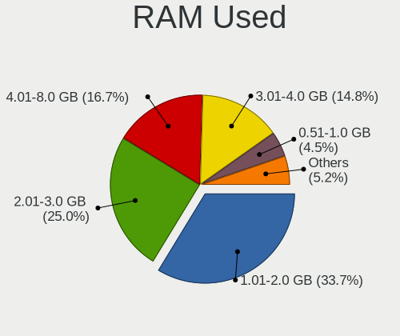
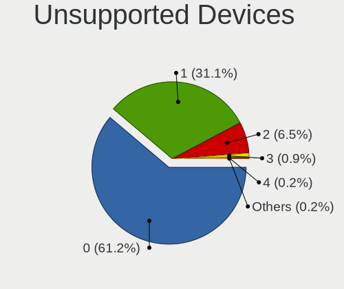

Linux in USA - Tested Hardware & Statistics (Notebooks)
-------------------------------------------------------

A project to collect tested hardware configurations for Linux in USA.

Anyone can contribute to this report by the [hw-probe](https://github.com/linuxhw/hw-probe) tool:

    sudo -E hw-probe -all -upload

Please contribute! Especially if your hardware is rare.

Contents
--------

* [ Test Cases ](#test-cases)

* [ System ](#system)
  - [ OS                       ](#os)
  - [ OS Family                ](#os-family)
  - [ Kernel                   ](#kernel)
  - [ Kernel Family            ](#kernel-family)
  - [ Kernel Major Ver.        ](#kernel-major-ver)
  - [ Arch                     ](#arch)
  - [ DE                       ](#de)
  - [ Display Server           ](#display-server)
  - [ Display Manager          ](#display-manager)
  - [ OS Lang                  ](#os-lang)
  - [ Boot Mode                ](#boot-mode)
  - [ Filesystem               ](#filesystem)
  - [ Part. scheme             ](#part-scheme)
  - [ Dual Boot with Linux/BSD ](#dual-boot-with-linuxbsd)
  - [ Dual Boot (Win)          ](#dual-boot-win)

* [ Board ](#board)
  - [ Vendor                   ](#vendor)
  - [ Model                    ](#model)
  - [ Model Family             ](#model-family)
  - [ MFG Year                 ](#mfg-year)
  - [ Form Factor              ](#form-factor)
  - [ Secure Boot              ](#secure-boot)
  - [ Coreboot                 ](#coreboot)
  - [ RAM Size                 ](#ram-size)
  - [ RAM Used                 ](#ram-used)
  - [ Total Drives             ](#total-drives)
  - [ Has CD-ROM               ](#has-cd-rom)
  - [ Has Ethernet             ](#has-ethernet)
  - [ Has WiFi                 ](#has-wifi)
  - [ Has Bluetooth            ](#has-bluetooth)

* [ Location ](#location)
  - [ Country                  ](#country)
  - [ City                     ](#city)

* [ Drives ](#drives)
  - [ Drive Vendor             ](#drive-vendor)
  - [ Drive Model              ](#drive-model)
  - [ HDD Vendor               ](#hdd-vendor)
  - [ SSD Vendor               ](#ssd-vendor)
  - [ Drive Kind               ](#drive-kind)
  - [ Drive Connector          ](#drive-connector)
  - [ Drive Size               ](#drive-size)
  - [ Space Total              ](#space-total)
  - [ Space Used               ](#space-used)
  - [ Malfunc. Drives          ](#malfunc-drives)
  - [ Malfunc. Drive Vendor    ](#malfunc-drive-vendor)
  - [ Malfunc. HDD Vendor      ](#malfunc-hdd-vendor)
  - [ Malfunc. Drive Kind      ](#malfunc-drive-kind)
  - [ Failed Drives            ](#failed-drives)
  - [ Failed Drive Vendor      ](#failed-drive-vendor)
  - [ Drive Status             ](#drive-status)

* [ Storage controller ](#storage-controller)
  - [ Storage Vendor           ](#storage-vendor)
  - [ Storage Model            ](#storage-model)
  - [ Storage Kind             ](#storage-kind)

* [ Processor ](#processor)
  - [ CPU Vendor               ](#cpu-vendor)
  - [ CPU Model                ](#cpu-model)
  - [ CPU Model Family         ](#cpu-model-family)
  - [ CPU Cores                ](#cpu-cores)
  - [ CPU Sockets              ](#cpu-sockets)
  - [ CPU Threads              ](#cpu-threads)
  - [ CPU Op-Modes             ](#cpu-op-modes)
  - [ CPU Microcode            ](#cpu-microcode)
  - [ CPU Microarch            ](#cpu-microarch)

* [ Graphics ](#graphics)
  - [ GPU Vendor               ](#gpu-vendor)
  - [ GPU Model                ](#gpu-model)
  - [ GPU Combo                ](#gpu-combo)
  - [ GPU Driver               ](#gpu-driver)
  - [ GPU Memory               ](#gpu-memory)

* [ Monitor ](#monitor)
  - [ Monitor Vendor           ](#monitor-vendor)
  - [ Monitor Model            ](#monitor-model)
  - [ Monitor Resolution       ](#monitor-resolution)
  - [ Monitor Diagonal         ](#monitor-diagonal)
  - [ Monitor Width            ](#monitor-width)
  - [ Aspect Ratio             ](#aspect-ratio)
  - [ Monitor Area             ](#monitor-area)
  - [ Pixel Density            ](#pixel-density)
  - [ Multiple Monitors        ](#multiple-monitors)

* [ Network ](#network)
  - [ Net Controller Vendor    ](#net-controller-vendor)
  - [ Net Controller Model     ](#net-controller-model)
  - [ Wireless Vendor          ](#wireless-vendor)
  - [ Wireless Model           ](#wireless-model)
  - [ Ethernet Vendor          ](#ethernet-vendor)
  - [ Ethernet Model           ](#ethernet-model)
  - [ Net Controller Kind      ](#net-controller-kind)
  - [ Used Controller          ](#used-controller)
  - [ NICs                     ](#nics)
  - [ IPv6                     ](#ipv6)

* [ Bluetooth ](#bluetooth)
  - [ Bluetooth Vendor         ](#bluetooth-vendor)
  - [ Bluetooth Model          ](#bluetooth-model)

* [ Sound ](#sound)
  - [ Sound Vendor             ](#sound-vendor)
  - [ Sound Model              ](#sound-model)

* [ Memory ](#memory)
  - [ Memory Vendor            ](#memory-vendor)
  - [ Memory Model             ](#memory-model)
  - [ Memory Kind              ](#memory-kind)
  - [ Memory Form Factor       ](#memory-form-factor)
  - [ Memory Size              ](#memory-size)
  - [ Memory Speed             ](#memory-speed)

* [ Printers & scanners ](#printers--scanners)
  - [ Printer Vendor           ](#printer-vendor)
  - [ Printer Model            ](#printer-model)
  - [ Scanner Vendor           ](#scanner-vendor)
  - [ Scanner Model            ](#scanner-model)

* [ Camera ](#camera)
  - [ Camera Vendor            ](#camera-vendor)
  - [ Camera Model             ](#camera-model)

* [ Security ](#security)
  - [ Fingerprint Vendor       ](#fingerprint-vendor)
  - [ Fingerprint Model        ](#fingerprint-model)
  - [ Chipcard Vendor          ](#chipcard-vendor)
  - [ Chipcard Model           ](#chipcard-model)

* [ Unsupported ](#unsupported)
  - [ Unsupported Devices      ](#unsupported-devices)
  - [ Unsupported Device Types ](#unsupported-device-types)

Test Cases
----------

Total: 19741

| Vendor        | Model                       | Probe                                                      | Date         |
|---------------|-----------------------------|------------------------------------------------------------|--------------|
| Valve         | Jupiter                     | [ec26a28bff](https://linux-hardware.org/?probe=ec26a28bff) | Dec 01, 2022 |
| HP            | Stream Laptop 14-cb1XX      | [e8ecfcc3cd](https://linux-hardware.org/?probe=e8ecfcc3cd) | Dec 01, 2022 |
| HP            | Stream Laptop 14-cb1XX      | [80c9d45a14](https://linux-hardware.org/?probe=80c9d45a14) | Dec 01, 2022 |
| Lenovo        | Legion S7 15ACH6 82K8       | [4ab89a8ad2](https://linux-hardware.org/?probe=4ab89a8ad2) | Dec 01, 2022 |
| Dell          | XPS 13 9300                 | [d6c50b1786](https://linux-hardware.org/?probe=d6c50b1786) | Dec 01, 2022 |
| MSI           | GS75 Stealth 8SG            | [70be467762](https://linux-hardware.org/?probe=70be467762) | Dec 01, 2022 |
| HP            | EliteBook 8730w             | [fa27703043](https://linux-hardware.org/?probe=fa27703043) | Dec 01, 2022 |
| MSI           | GF63 Thin 9SC               | [057b0039b7](https://linux-hardware.org/?probe=057b0039b7) | Dec 01, 2022 |
| ASUSTek       | GL503VM                     | [dbd4aba670](https://linux-hardware.org/?probe=dbd4aba670) | Dec 01, 2022 |
| ASUSTek       | VivoBook_ASUSLaptop E410... | [62ae8cb7dc](https://linux-hardware.org/?probe=62ae8cb7dc) | Dec 01, 2022 |
| ASUSTek       | GL503VM                     | [3db38d22b3](https://linux-hardware.org/?probe=3db38d22b3) | Dec 01, 2022 |
| Lenovo        | Legion 5 Pro 16ACH6H 82J... | [794fbb64f9](https://linux-hardware.org/?probe=794fbb64f9) | Dec 01, 2022 |
| Dell          | Latitude E7240              | [0945377dfb](https://linux-hardware.org/?probe=0945377dfb) | Dec 01, 2022 |
| In-Sing       | NK81J                       | [bca0a3709f](https://linux-hardware.org/?probe=bca0a3709f) | Dec 01, 2022 |
| Lenovo        | ThinkPad X13 Gen 1 20UFC... | [cccb2da575](https://linux-hardware.org/?probe=cccb2da575) | Dec 01, 2022 |
| Apple         | MacBookPro11,4              | [138689463a](https://linux-hardware.org/?probe=138689463a) | Dec 01, 2022 |
| Lenovo        | ThinkPad X13 Gen 2a 20XH... | [f0ee9f78bd](https://linux-hardware.org/?probe=f0ee9f78bd) | Dec 01, 2022 |
| HP            | ProBook 450 G2              | [552ac907a0](https://linux-hardware.org/?probe=552ac907a0) | Dec 01, 2022 |
| GPU Compan... | GWTC116-2                   | [d004be9ab6](https://linux-hardware.org/?probe=d004be9ab6) | Dec 01, 2022 |
| Apple         | MacBookPro11,4              | [16d0cef78c](https://linux-hardware.org/?probe=16d0cef78c) | Dec 01, 2022 |
| HP            | EliteBook 8570w             | [a4ae0cdd6a](https://linux-hardware.org/?probe=a4ae0cdd6a) | Dec 01, 2022 |
| Google        | Cyan                        | [4aa7125981](https://linux-hardware.org/?probe=4aa7125981) | Nov 30, 2022 |
| Lenovo        | ThinkPad P1 Gen 3 20TJS5... | [2df1670891](https://linux-hardware.org/?probe=2df1670891) | Nov 30, 2022 |
| GPU Compan... | GWTN156-2BK                 | [1ed3629f61](https://linux-hardware.org/?probe=1ed3629f61) | Nov 30, 2022 |
| ASUSTek       | ASUS TUF Gaming A15 FA50... | [66b6e49eb5](https://linux-hardware.org/?probe=66b6e49eb5) | Nov 30, 2022 |
| Dell          | G15 5511                    | [d2c2cb8454](https://linux-hardware.org/?probe=d2c2cb8454) | Nov 30, 2022 |
| Dell          | G15 5511                    | [f9e456efd0](https://linux-hardware.org/?probe=f9e456efd0) | Nov 30, 2022 |
| ASUSTek       | N550JV                      | [c39c35ea09](https://linux-hardware.org/?probe=c39c35ea09) | Nov 30, 2022 |
| Dell          | Latitude E6530              | [c90145516a](https://linux-hardware.org/?probe=c90145516a) | Nov 30, 2022 |
| HP            | Laptop 14-dk1xxx            | [9dbd54884d](https://linux-hardware.org/?probe=9dbd54884d) | Nov 30, 2022 |
| Acer          | Aspire E5-575               | [b393262562](https://linux-hardware.org/?probe=b393262562) | Nov 30, 2022 |
| Lenovo        | ThinkBook 14s-IWL 20RM      | [d77cb5ebb0](https://linux-hardware.org/?probe=d77cb5ebb0) | Nov 30, 2022 |
| Dell          | Inspiron 15-3552            | [e740b148c1](https://linux-hardware.org/?probe=e740b148c1) | Nov 30, 2022 |
| Dell          | Inspiron 3580               | [6bc2705d99](https://linux-hardware.org/?probe=6bc2705d99) | Nov 30, 2022 |
| GPU Compan... | GWTN156-2BK                 | [dbba08e68e](https://linux-hardware.org/?probe=dbba08e68e) | Nov 30, 2022 |
| Lenovo        | ThinkPad X1 Carbon 6th 2... | [38c4009dba](https://linux-hardware.org/?probe=38c4009dba) | Nov 30, 2022 |
| HP            | Stream Laptop 14-cb1xxx     | [6f96ec5e1d](https://linux-hardware.org/?probe=6f96ec5e1d) | Nov 29, 2022 |
| MSI           | Katana GF76 11UD            | [186950bae6](https://linux-hardware.org/?probe=186950bae6) | Nov 29, 2022 |
| MSI           | Katana GF76 11UD            | [48bb9075a7](https://linux-hardware.org/?probe=48bb9075a7) | Nov 29, 2022 |
| Dell          | Inspiron 3521               | [2ecbfd5e39](https://linux-hardware.org/?probe=2ecbfd5e39) | Nov 29, 2022 |
| ASUSTek       | N61Jv                       | [5eb5f5e384](https://linux-hardware.org/?probe=5eb5f5e384) | Nov 29, 2022 |
| HP            | ZBook Power G7 Mobile Wo... | [bb023e130b](https://linux-hardware.org/?probe=bb023e130b) | Nov 29, 2022 |
| HP            | EliteBook 845 G8 Noteboo... | [a41d7dbfb1](https://linux-hardware.org/?probe=a41d7dbfb1) | Nov 29, 2022 |
| Dell          | Inspiron 15-3567            | [b06377f324](https://linux-hardware.org/?probe=b06377f324) | Nov 29, 2022 |
| Valve         | Jupiter                     | [a9299c074e](https://linux-hardware.org/?probe=a9299c074e) | Nov 29, 2022 |
| HP            | 15 Notebook PC              | [3f524b291e](https://linux-hardware.org/?probe=3f524b291e) | Nov 29, 2022 |
| HP            | 15 Notebook PC              | [3b9651372a](https://linux-hardware.org/?probe=3b9651372a) | Nov 29, 2022 |
| Alienware     | 17 R3                       | [1cf396c1ef](https://linux-hardware.org/?probe=1cf396c1ef) | Nov 29, 2022 |
| Valve         | Jupiter                     | [de1a950876](https://linux-hardware.org/?probe=de1a950876) | Nov 29, 2022 |
| Toshiba       | Satellite A305              | [3defab8cbd](https://linux-hardware.org/?probe=3defab8cbd) | Nov 29, 2022 |
| Acer          | Nitro AN517-51              | [c20385f7bd](https://linux-hardware.org/?probe=c20385f7bd) | Nov 29, 2022 |
| Unknown       | Unknown                     | [d2789773ef](https://linux-hardware.org/?probe=d2789773ef) | Nov 29, 2022 |
| Dell          | Latitude 5411               | [122facad78](https://linux-hardware.org/?probe=122facad78) | Nov 28, 2022 |
| Dell          | Precision 5760              | [0e19ec2f3d](https://linux-hardware.org/?probe=0e19ec2f3d) | Nov 28, 2022 |
| HP            | EliteBook 845 G7 Noteboo... | [e1495dc120](https://linux-hardware.org/?probe=e1495dc120) | Nov 28, 2022 |
| Apple         | MacBookPro10,1              | [c0c2f77cdb](https://linux-hardware.org/?probe=c0c2f77cdb) | Nov 28, 2022 |
| Google        | Akemi                       | [89c466ffd4](https://linux-hardware.org/?probe=89c466ffd4) | Nov 28, 2022 |
| Lenovo        | ThinkPad X1 Carbon 3rd 2... | [69a6535286](https://linux-hardware.org/?probe=69a6535286) | Nov 28, 2022 |
| Lenovo        | ThinkPad T450 20BV0005US    | [a98e281c16](https://linux-hardware.org/?probe=a98e281c16) | Nov 28, 2022 |
| Lenovo        | ThinkPad T450 20BV0005US    | [c06b73c5c3](https://linux-hardware.org/?probe=c06b73c5c3) | Nov 28, 2022 |
| HP            | Stream Laptop 14-cb1xxx     | [1bf2bd6761](https://linux-hardware.org/?probe=1bf2bd6761) | Nov 28, 2022 |
| Dell          | G3 3779                     | [3e85396dae](https://linux-hardware.org/?probe=3e85396dae) | Nov 28, 2022 |
| Framework     | Laptop (12th Gen Intel C... | [7578d56f26](https://linux-hardware.org/?probe=7578d56f26) | Nov 28, 2022 |
| HP            | Laptop 15-dy2xxx            | [a1c088bc35](https://linux-hardware.org/?probe=a1c088bc35) | Nov 28, 2022 |
| Valve         | Jupiter                     | [637e97b132](https://linux-hardware.org/?probe=637e97b132) | Nov 28, 2022 |
| Lenovo        | ThinkPad T14 Gen 1 20S00... | [b79b60e4b3](https://linux-hardware.org/?probe=b79b60e4b3) | Nov 28, 2022 |
| Lenovo        | V14-IIL 82C4                | [407b574c57](https://linux-hardware.org/?probe=407b574c57) | Nov 28, 2022 |
| HP            | Laptop 15-da0xxx            | [eb168566ee](https://linux-hardware.org/?probe=eb168566ee) | Nov 28, 2022 |
| Dell          | Precision M4700             | [17f1344975](https://linux-hardware.org/?probe=17f1344975) | Nov 28, 2022 |
| HP            | EliteBook 8470w             | [7008753054](https://linux-hardware.org/?probe=7008753054) | Nov 28, 2022 |
| Lenovo        | Flex 2-15 20405             | [7e37de4475](https://linux-hardware.org/?probe=7e37de4475) | Nov 28, 2022 |
| ASUSTek       | S551LB                      | [d74127627f](https://linux-hardware.org/?probe=d74127627f) | Nov 28, 2022 |
| HP            | Victus by Gaming Laptop ... | [e1dcd6d119](https://linux-hardware.org/?probe=e1dcd6d119) | Nov 28, 2022 |
| MSI           | GP72 7RDX                   | [648eb6d88a](https://linux-hardware.org/?probe=648eb6d88a) | Nov 28, 2022 |
| Lenovo        | ThinkPad T430 2344BZU       | [0dcd2bdc50](https://linux-hardware.org/?probe=0dcd2bdc50) | Nov 28, 2022 |
| Lenovo        | ThinkPad X1 Extreme 20MF... | [f18a4c8031](https://linux-hardware.org/?probe=f18a4c8031) | Nov 28, 2022 |
| HP            | Laptop 14-fq1xxx            | [7837242848](https://linux-hardware.org/?probe=7837242848) | Nov 27, 2022 |
| Toshiba       | Satellite L775D             | [bf6fc6fd49](https://linux-hardware.org/?probe=bf6fc6fd49) | Nov 27, 2022 |
| Lenovo        | ThinkPad X260 20F6005HUS    | [6418eda1a9](https://linux-hardware.org/?probe=6418eda1a9) | Nov 27, 2022 |
| ASUSTek       | TUF Gaming FX705GM_FX705... | [3515e0a362](https://linux-hardware.org/?probe=3515e0a362) | Nov 27, 2022 |
| System76      | Oryx Pro                    | [c7d2918a69](https://linux-hardware.org/?probe=c7d2918a69) | Nov 27, 2022 |
| Gateway       | M-1631U                     | [f0f0517dab](https://linux-hardware.org/?probe=f0f0517dab) | Nov 27, 2022 |
| Lenovo        | ThinkPad T14 Gen 2i 20W1... | [620cab185f](https://linux-hardware.org/?probe=620cab185f) | Nov 27, 2022 |
| Notebook      | NP5x_NP6x_NP7xPNP           | [3dd83d6d9d](https://linux-hardware.org/?probe=3dd83d6d9d) | Nov 27, 2022 |
| Dell          | XPS 15 9560                 | [47782768eb](https://linux-hardware.org/?probe=47782768eb) | Nov 27, 2022 |
| HP            | Laptop 15s-eq2xxx           | [bdc1a14cd4](https://linux-hardware.org/?probe=bdc1a14cd4) | Nov 27, 2022 |
| Dell          | Precision M4700             | [7f5ebe66b6](https://linux-hardware.org/?probe=7f5ebe66b6) | Nov 27, 2022 |
| HP            | ENVY Laptop 17-ce1xxx       | [60c25a49bc](https://linux-hardware.org/?probe=60c25a49bc) | Nov 27, 2022 |
| Alienware     | 17                          | [08ebf1e9a2](https://linux-hardware.org/?probe=08ebf1e9a2) | Nov 27, 2022 |
| HP            | Laptop 14-fq1xxx            | [49dc64dc76](https://linux-hardware.org/?probe=49dc64dc76) | Nov 27, 2022 |
| Lenovo        | ThinkPad T14 Gen 3 21CFC... | [4e7809f7f6](https://linux-hardware.org/?probe=4e7809f7f6) | Nov 27, 2022 |
| Google        | Lick                        | [44ac0c9573](https://linux-hardware.org/?probe=44ac0c9573) | Nov 27, 2022 |
| Lenovo        | ThinkPad T450 20BV0001US    | [3d1b8f282a](https://linux-hardware.org/?probe=3d1b8f282a) | Nov 27, 2022 |
| Lenovo        | Legion 5 Pro 16ARH7H 82R... | [7a5c0ebf68](https://linux-hardware.org/?probe=7a5c0ebf68) | Nov 26, 2022 |
| HP            | Stream Laptop 14-cb1xxx     | [74573171b1](https://linux-hardware.org/?probe=74573171b1) | Nov 26, 2022 |
| Dell          | G5 5587                     | [07d47da161](https://linux-hardware.org/?probe=07d47da161) | Nov 26, 2022 |
| ASUSTek       | U56E                        | [4222387904](https://linux-hardware.org/?probe=4222387904) | Nov 26, 2022 |
| Dell          | Latitude 3580               | [e52f5dfaaa](https://linux-hardware.org/?probe=e52f5dfaaa) | Nov 26, 2022 |
| Dell          | Latitude 3580               | [c54a91a217](https://linux-hardware.org/?probe=c54a91a217) | Nov 26, 2022 |
| Dell          | Inspiron 3521               | [015854e59a](https://linux-hardware.org/?probe=015854e59a) | Nov 26, 2022 |
| Dell          | Inspiron 1440               | [fe31844ca3](https://linux-hardware.org/?probe=fe31844ca3) | Nov 26, 2022 |
| Acer          | Nitro AN515-54              | [e82fa602d4](https://linux-hardware.org/?probe=e82fa602d4) | Nov 26, 2022 |
| HP            | G61                         | [314cbc992f](https://linux-hardware.org/?probe=314cbc992f) | Nov 26, 2022 |
| HP            | Stream Laptop 14-cb1xxx     | [07eb92cc07](https://linux-hardware.org/?probe=07eb92cc07) | Nov 26, 2022 |
| Acer          | Nitro AN515-54              | [604339bd15](https://linux-hardware.org/?probe=604339bd15) | Nov 26, 2022 |
| Valve         | Jupiter                     | [caf4a9c4d8](https://linux-hardware.org/?probe=caf4a9c4d8) | Nov 26, 2022 |
| Valve         | Jupiter                     | [c17d27ef9b](https://linux-hardware.org/?probe=c17d27ef9b) | Nov 26, 2022 |
| Dell          | Latitude E6510              | [694a3d79be](https://linux-hardware.org/?probe=694a3d79be) | Nov 26, 2022 |
| HP            | OMEN by Laptop 15t-ek000    | [4189c96f5e](https://linux-hardware.org/?probe=4189c96f5e) | Nov 26, 2022 |
| ASUSTek       | VivoBook_ASUSLaptop X512... | [bede773ce4](https://linux-hardware.org/?probe=bede773ce4) | Nov 26, 2022 |
| HP            | Pavilion ZV6100 (EC356UA... | [c6fcc7764f](https://linux-hardware.org/?probe=c6fcc7764f) | Nov 26, 2022 |
| Lenovo        | ThinkPad X1 Carbon 5th 2... | [5a6ef91469](https://linux-hardware.org/?probe=5a6ef91469) | Nov 26, 2022 |
| ASUSTek       | U56E                        | [8b783ab1ac](https://linux-hardware.org/?probe=8b783ab1ac) | Nov 26, 2022 |
| System76      | Gazelle                     | [dd481baf69](https://linux-hardware.org/?probe=dd481baf69) | Nov 26, 2022 |
| GPU Compan... | GWNR71517                   | [15173435f0](https://linux-hardware.org/?probe=15173435f0) | Nov 26, 2022 |
| Lenovo        | ThinkPad T14 Gen 1 20S0C... | [b669fa97c4](https://linux-hardware.org/?probe=b669fa97c4) | Nov 26, 2022 |
| HP            | ENVY 17 Leap Motion SE N... | [6df7dc0467](https://linux-hardware.org/?probe=6df7dc0467) | Nov 26, 2022 |
| Lenovo        | Legion S7 15ACH6 82K8       | [91fa73480c](https://linux-hardware.org/?probe=91fa73480c) | Nov 26, 2022 |
| Lenovo        | Legion S7 15ACH6 82K8       | [93576caa19](https://linux-hardware.org/?probe=93576caa19) | Nov 26, 2022 |
| Dell          | XPS 13 7390                 | [57f43b148c](https://linux-hardware.org/?probe=57f43b148c) | Nov 26, 2022 |
| MSI           | Alpha 17 B5EEK              | [0cd6df782e](https://linux-hardware.org/?probe=0cd6df782e) | Nov 26, 2022 |
| Dell          | Latitude E6440              | [348f786878](https://linux-hardware.org/?probe=348f786878) | Nov 26, 2022 |
| Google        | Glimmer                     | [8ad30368c9](https://linux-hardware.org/?probe=8ad30368c9) | Nov 26, 2022 |
| ASUSTek       | ZenBook UX534FTC_UX534FT    | [d845cbb51d](https://linux-hardware.org/?probe=d845cbb51d) | Nov 26, 2022 |
| ASUSTek       | ZenBook UX333FA_UX333FA     | [02eeb74e28](https://linux-hardware.org/?probe=02eeb74e28) | Nov 25, 2022 |
| HP            | Pavilion TS Sleekbook 14    | [26440cddbb](https://linux-hardware.org/?probe=26440cddbb) | Nov 25, 2022 |
| Apple         | MacBookPro15,1              | [e7a9d49cf6](https://linux-hardware.org/?probe=e7a9d49cf6) | Nov 25, 2022 |
| Apple         | MacBookPro15,1              | [07bf4fe381](https://linux-hardware.org/?probe=07bf4fe381) | Nov 25, 2022 |
| MSI           | GE72VR 7RF                  | [a034af6b70](https://linux-hardware.org/?probe=a034af6b70) | Nov 25, 2022 |
| Lenovo        | ThinkPad P1 Gen 2 20QTS0... | [37d3dc95f1](https://linux-hardware.org/?probe=37d3dc95f1) | Nov 25, 2022 |
| Dell          | Latitude E6530              | [9f1bcb6f10](https://linux-hardware.org/?probe=9f1bcb6f10) | Nov 25, 2022 |
| MSI           | Modern 14 B10MW             | [9768df6ae0](https://linux-hardware.org/?probe=9768df6ae0) | Nov 25, 2022 |
| Lenovo        | IdeaPad 5 Pro 14ACN6 82L... | [57c8d65b2e](https://linux-hardware.org/?probe=57c8d65b2e) | Nov 25, 2022 |
| MSI           | Modern 14 B10MW             | [1564025817](https://linux-hardware.org/?probe=1564025817) | Nov 25, 2022 |
| Sony          | VGN-FE770G                  | [c59f41adb7](https://linux-hardware.org/?probe=c59f41adb7) | Nov 25, 2022 |
| HP            | EliteBook 840 G5            | [8967d04a19](https://linux-hardware.org/?probe=8967d04a19) | Nov 25, 2022 |
| Apple         | MacBookPro10,1              | [b47217fa0c](https://linux-hardware.org/?probe=b47217fa0c) | Nov 25, 2022 |
| Apple         | MacBookPro10,1              | [3f08c2fb11](https://linux-hardware.org/?probe=3f08c2fb11) | Nov 25, 2022 |
| Dell          | Latitude E5570              | [ed2e9cfb4f](https://linux-hardware.org/?probe=ed2e9cfb4f) | Nov 24, 2022 |
| Acer          | Nitro AN515-54              | [9226b4c616](https://linux-hardware.org/?probe=9226b4c616) | Nov 24, 2022 |
| Lenovo        | Flex 2-15 20405             | [054a6670b3](https://linux-hardware.org/?probe=054a6670b3) | Nov 24, 2022 |
| Dell          | Latitude E6440              | [21d39df616](https://linux-hardware.org/?probe=21d39df616) | Nov 24, 2022 |
| Lenovo        | B50-30 20382                | [3706f368de](https://linux-hardware.org/?probe=3706f368de) | Nov 24, 2022 |
| Valve         | Jupiter                     | [5751db0994](https://linux-hardware.org/?probe=5751db0994) | Nov 24, 2022 |
| ASUSTek       | Q550LF                      | [713f7b2c74](https://linux-hardware.org/?probe=713f7b2c74) | Nov 24, 2022 |
| Lenovo        | ThinkPad T470s 20HFCTO1W... | [8ef888a4a1](https://linux-hardware.org/?probe=8ef888a4a1) | Nov 24, 2022 |
| Toshiba       | Satellite S55t-B            | [4b01021314](https://linux-hardware.org/?probe=4b01021314) | Nov 24, 2022 |
| HP            | Notebook                    | [d65b0a06fe](https://linux-hardware.org/?probe=d65b0a06fe) | Nov 24, 2022 |
| HP            | Notebook                    | [54b351457e](https://linux-hardware.org/?probe=54b351457e) | Nov 24, 2022 |
| Gigabyte      | B450 AORUS PRO WIFI-CF      | [9324629428](https://linux-hardware.org/?probe=9324629428) | Nov 24, 2022 |
| Gigabyte      | B450 AORUS PRO WIFI-CF      | [22a1c81a68](https://linux-hardware.org/?probe=22a1c81a68) | Nov 24, 2022 |
| Razer         | Blade Stealth               | [98889c6c3e](https://linux-hardware.org/?probe=98889c6c3e) | Nov 23, 2022 |
| Dell          | XPS 9320                    | [2208b7b7e8](https://linux-hardware.org/?probe=2208b7b7e8) | Nov 23, 2022 |
| Dell          | Precision 5550              | [c4c95dec1e](https://linux-hardware.org/?probe=c4c95dec1e) | Nov 23, 2022 |
| ASUSTek       | ZenBook UX534FTC_UX534FT    | [5b18e83e0d](https://linux-hardware.org/?probe=5b18e83e0d) | Nov 23, 2022 |
| Dell          | Inspiron 5584               | [0a26a75b62](https://linux-hardware.org/?probe=0a26a75b62) | Nov 23, 2022 |
| Valve         | Jupiter                     | [29f6c597e4](https://linux-hardware.org/?probe=29f6c597e4) | Nov 23, 2022 |
| HP            | Laptop 15-da0xxx            | [fa989478ad](https://linux-hardware.org/?probe=fa989478ad) | Nov 23, 2022 |
| Sony          | SVT13126CYS                 | [4ac3d95e3a](https://linux-hardware.org/?probe=4ac3d95e3a) | Nov 23, 2022 |
| Valve         | Jupiter                     | [4c3a9fe5ae](https://linux-hardware.org/?probe=4c3a9fe5ae) | Nov 23, 2022 |
| HP            | Pavilion dv7                | [aa62e3eea2](https://linux-hardware.org/?probe=aa62e3eea2) | Nov 23, 2022 |
| Acer          | Nitro AN517-55              | [c36c99c55a](https://linux-hardware.org/?probe=c36c99c55a) | Nov 23, 2022 |
| HP            | Pavilion Laptop 15-cs0xx... | [1f12ee6869](https://linux-hardware.org/?probe=1f12ee6869) | Nov 23, 2022 |
| Dell          | Latitude E7470              | [03725ebee3](https://linux-hardware.org/?probe=03725ebee3) | Nov 22, 2022 |
| Acer          | Aspire A515-43              | [9c91ce23b5](https://linux-hardware.org/?probe=9c91ce23b5) | Nov 22, 2022 |
| Lenovo        | IdeaPad U310 Touch          | [09beadc5ae](https://linux-hardware.org/?probe=09beadc5ae) | Nov 22, 2022 |
| Lenovo        | ThinkPad W510 43192PU       | [98fac29e02](https://linux-hardware.org/?probe=98fac29e02) | Nov 22, 2022 |
| Lenovo        | ThinkPad W510 43192PU       | [53882f751e](https://linux-hardware.org/?probe=53882f751e) | Nov 22, 2022 |
| Lenovo        | ThinkPad 13 2nd Gen 20J1... | [363e0b0149](https://linux-hardware.org/?probe=363e0b0149) | Nov 22, 2022 |
| Lenovo        | ThinkPad X1 Carbon Gen 9... | [65a3383e83](https://linux-hardware.org/?probe=65a3383e83) | Nov 22, 2022 |
| Lenovo        | ThinkPad T490 20N3S89D02    | [1d3c5d652a](https://linux-hardware.org/?probe=1d3c5d652a) | Nov 22, 2022 |
| Dell          | Latitude E5440              | [9a39d45cee](https://linux-hardware.org/?probe=9a39d45cee) | Nov 22, 2022 |
| Apple         | MacBookPro9,2               | [3e176f0c26](https://linux-hardware.org/?probe=3e176f0c26) | Nov 22, 2022 |
| HP            | ProBook 6570b               | [b7bd63db1c](https://linux-hardware.org/?probe=b7bd63db1c) | Nov 22, 2022 |
| Dell          | Latitude E6540              | [9a3ff03cbb](https://linux-hardware.org/?probe=9a3ff03cbb) | Nov 22, 2022 |
| Lenovo        | ThinkPad P53 20QNS00X00     | [d49ca08585](https://linux-hardware.org/?probe=d49ca08585) | Nov 22, 2022 |
| HP            | 255 G6 Notebook PC          | [149cee1720](https://linux-hardware.org/?probe=149cee1720) | Nov 22, 2022 |
| Acer          | Swift SF314-512             | [c47110d9a5](https://linux-hardware.org/?probe=c47110d9a5) | Nov 22, 2022 |
| Panasonic     | CF-193H101FW                | [ea4c2233bf](https://linux-hardware.org/?probe=ea4c2233bf) | Nov 22, 2022 |
| Lenovo        | ThinkPad X1 Nano Gen 1 2... | [d48ad61c01](https://linux-hardware.org/?probe=d48ad61c01) | Nov 22, 2022 |
| Dell          | Latitude 7390               | [8364d36618](https://linux-hardware.org/?probe=8364d36618) | Nov 22, 2022 |
| Apple         | MacBookPro11,5              | [52bcd3f8b9](https://linux-hardware.org/?probe=52bcd3f8b9) | Nov 22, 2022 |
| HP            | EliteBook 8460w             | [cdb72eea80](https://linux-hardware.org/?probe=cdb72eea80) | Nov 22, 2022 |
| Dell          | XPS 13 9300                 | [3f9c0d5b63](https://linux-hardware.org/?probe=3f9c0d5b63) | Nov 22, 2022 |
| Alienware     | 15 R3                       | [7ea992fb7a](https://linux-hardware.org/?probe=7ea992fb7a) | Nov 22, 2022 |
| HP            | Notebook                    | [a062aaddcd](https://linux-hardware.org/?probe=a062aaddcd) | Nov 21, 2022 |
| HP            | Laptop 15-da0xxx            | [aef0888523](https://linux-hardware.org/?probe=aef0888523) | Nov 21, 2022 |
| Lenovo        | G50-45 80E3                 | [680aac00bd](https://linux-hardware.org/?probe=680aac00bd) | Nov 21, 2022 |
| HP            | Laptop 17-cn0xxx            | [3b9a05e385](https://linux-hardware.org/?probe=3b9a05e385) | Nov 21, 2022 |
| HP            | Laptop 17-cn0xxx            | [489ded27aa](https://linux-hardware.org/?probe=489ded27aa) | Nov 21, 2022 |
| Valve         | Jupiter                     | [575ab984df](https://linux-hardware.org/?probe=575ab984df) | Nov 21, 2022 |
| HP            | Pavilion g7                 | [cecc9627ef](https://linux-hardware.org/?probe=cecc9627ef) | Nov 21, 2022 |
| Dell          | Latitude 6430U              | [19b72ef7ba](https://linux-hardware.org/?probe=19b72ef7ba) | Nov 21, 2022 |
| Dell          | XPS 13 7390                 | [d5ff0e96dd](https://linux-hardware.org/?probe=d5ff0e96dd) | Nov 21, 2022 |
| HP            | 15 Notebook PC              | [d7e79c0477](https://linux-hardware.org/?probe=d7e79c0477) | Nov 21, 2022 |
| Alienware     | 17                          | [16b37ce649](https://linux-hardware.org/?probe=16b37ce649) | Nov 21, 2022 |
| Acer          | Swift SF314-42              | [5ec428f8b3](https://linux-hardware.org/?probe=5ec428f8b3) | Nov 21, 2022 |
| Dell          | Precision M4800             | [26105a77eb](https://linux-hardware.org/?probe=26105a77eb) | Nov 21, 2022 |
| Micro Elec... | MG-VCTR002-2060             | [3ba115909e](https://linux-hardware.org/?probe=3ba115909e) | Nov 21, 2022 |
| Dell          | Latitude 7420               | [ca5319fd67](https://linux-hardware.org/?probe=ca5319fd67) | Nov 21, 2022 |
| GPD           | G1619-03                    | [529efbdb0b](https://linux-hardware.org/?probe=529efbdb0b) | Nov 20, 2022 |
| GPD           | G1619-03                    | [66b1290cea](https://linux-hardware.org/?probe=66b1290cea) | Nov 20, 2022 |
| Lenovo        | ThinkPad X13 Gen 1 20UFC... | [6355251bd6](https://linux-hardware.org/?probe=6355251bd6) | Nov 20, 2022 |
| HP            | Pavilion 17                 | [fb907a2d35](https://linux-hardware.org/?probe=fb907a2d35) | Nov 20, 2022 |
| HP            | Pavilion 17                 | [7af6f3d045](https://linux-hardware.org/?probe=7af6f3d045) | Nov 20, 2022 |
| ASUSTek       | VivoBook_ASUSLaptop X512... | [6722142846](https://linux-hardware.org/?probe=6722142846) | Nov 20, 2022 |
| HP            | EliteBook 830 G7 Noteboo... | [1b60e76184](https://linux-hardware.org/?probe=1b60e76184) | Nov 20, 2022 |
| MSI           | Katana GF76 11UD            | [1f47d7c31b](https://linux-hardware.org/?probe=1f47d7c31b) | Nov 20, 2022 |
| GPU Compan... | GWTN156-2BK                 | [ed63205687](https://linux-hardware.org/?probe=ed63205687) | Nov 20, 2022 |
| Apple         | MacBookAir4,2               | [7d3f0e5604](https://linux-hardware.org/?probe=7d3f0e5604) | Nov 20, 2022 |
| Framework     | Laptop                      | [6cc495c0d9](https://linux-hardware.org/?probe=6cc495c0d9) | Nov 20, 2022 |
| HP            | Pavilion dv6                | [012b257351](https://linux-hardware.org/?probe=012b257351) | Nov 20, 2022 |
| Sony          | VPCF126FM                   | [a6d886ea4c](https://linux-hardware.org/?probe=a6d886ea4c) | Nov 20, 2022 |
| Sony          | VPCF126FM                   | [2e0ff74a64](https://linux-hardware.org/?probe=2e0ff74a64) | Nov 20, 2022 |
| Lenovo        | ThinkPad X240 20AMS56K00    | [5ff1608320](https://linux-hardware.org/?probe=5ff1608320) | Nov 19, 2022 |
| Google        | Celes                       | [00ed0ea4b5](https://linux-hardware.org/?probe=00ed0ea4b5) | Nov 19, 2022 |
| Lenovo        | ThinkPad P1 Gen 2 20QUS1... | [f5cbe0bfa2](https://linux-hardware.org/?probe=f5cbe0bfa2) | Nov 19, 2022 |
| Google        | Gandof                      | [807d0e548c](https://linux-hardware.org/?probe=807d0e548c) | Nov 19, 2022 |
| Dell          | XPS 13 9380                 | [d42bddbd11](https://linux-hardware.org/?probe=d42bddbd11) | Nov 19, 2022 |
| Acer          | Nitro AN517-51              | [de8506cc0b](https://linux-hardware.org/?probe=de8506cc0b) | Nov 19, 2022 |
| Lenovo        | ThinkPad P1 Gen 4i 20Y30... | [41ffb4e75f](https://linux-hardware.org/?probe=41ffb4e75f) | Nov 19, 2022 |
| Dell          | Precision 7740              | [4f8e2a6c24](https://linux-hardware.org/?probe=4f8e2a6c24) | Nov 19, 2022 |
| HP            | Pavilion 17                 | [1d4d49c9e4](https://linux-hardware.org/?probe=1d4d49c9e4) | Nov 19, 2022 |
| GPU Compan... | GWTC116-2                   | [2832277aea](https://linux-hardware.org/?probe=2832277aea) | Nov 19, 2022 |
| Lenovo        | IdeaPad 130-15AST 81H5      | [d4b8ffffe1](https://linux-hardware.org/?probe=d4b8ffffe1) | Nov 19, 2022 |
| ASUSTek       | Zenbook UM6702RA_RM6702R... | [05c9ad6f4a](https://linux-hardware.org/?probe=05c9ad6f4a) | Nov 19, 2022 |
| GPU Compan... | GWTC116-2                   | [1093c84975](https://linux-hardware.org/?probe=1093c84975) | Nov 19, 2022 |
| ASUSTek       | ASUS TUF Dash F15 FX516P... | [87219ba8e3](https://linux-hardware.org/?probe=87219ba8e3) | Nov 19, 2022 |
| Google        | Lick                        | [6d8750d974](https://linux-hardware.org/?probe=6d8750d974) | Nov 19, 2022 |
| Valve         | Jupiter                     | [c89535828a](https://linux-hardware.org/?probe=c89535828a) | Nov 19, 2022 |
| GPU Compan... | GWTN156-2BK                 | [a7c034bd91](https://linux-hardware.org/?probe=a7c034bd91) | Nov 19, 2022 |
| ASUSTek       | ZenBook UX425UG_Q408UG      | [6a39161e50](https://linux-hardware.org/?probe=6a39161e50) | Nov 19, 2022 |
| Toshiba       | QOSMIO X70-A                | [75f0b58b20](https://linux-hardware.org/?probe=75f0b58b20) | Nov 19, 2022 |
| GPU Compan... | GWTC116-2                   | [4825e06bd4](https://linux-hardware.org/?probe=4825e06bd4) | Nov 19, 2022 |
| GPU Compan... | GWTC116-2                   | [57bcd4363a](https://linux-hardware.org/?probe=57bcd4363a) | Nov 19, 2022 |
| Alienware     | m15 R4                      | [2db8555d73](https://linux-hardware.org/?probe=2db8555d73) | Nov 18, 2022 |
| Lenovo        | Legion 5 15IMH05H 81Y6      | [53a2707274](https://linux-hardware.org/?probe=53a2707274) | Nov 18, 2022 |
| ASUSTek       | 1000                        | [773943bcb2](https://linux-hardware.org/?probe=773943bcb2) | Nov 18, 2022 |
| Apple         | MacBookPro15,1              | [c5f8626928](https://linux-hardware.org/?probe=c5f8626928) | Nov 18, 2022 |
| Dell          | Inspiron 5759               | [8cdba26964](https://linux-hardware.org/?probe=8cdba26964) | Nov 18, 2022 |
| Valve         | Jupiter                     | [d7c9c529b6](https://linux-hardware.org/?probe=d7c9c529b6) | Nov 18, 2022 |
| Dell          | Inspiron 3541               | [2a6e669ccd](https://linux-hardware.org/?probe=2a6e669ccd) | Nov 18, 2022 |
| Unknown       | Unknown                     | [ef7af01d47](https://linux-hardware.org/?probe=ef7af01d47) | Nov 18, 2022 |
| Unknown       | Unknown                     | [ceca708c95](https://linux-hardware.org/?probe=ceca708c95) | Nov 18, 2022 |
| Lenovo        | Legion 5 82B5               | [907810c0ac](https://linux-hardware.org/?probe=907810c0ac) | Nov 18, 2022 |
| Lenovo        | ThinkPad T450 20BUS05B08    | [c73ccd5e36](https://linux-hardware.org/?probe=c73ccd5e36) | Nov 18, 2022 |
| Google        | Terra                       | [9fcc3fb18a](https://linux-hardware.org/?probe=9fcc3fb18a) | Nov 18, 2022 |
| Google        | Careena                     | [81dd8e9906](https://linux-hardware.org/?probe=81dd8e9906) | Nov 18, 2022 |
| HP            | EliteBook 840 14 inch G9... | [b5d4ff63a5](https://linux-hardware.org/?probe=b5d4ff63a5) | Nov 18, 2022 |
| Dell          | Inspiron N5110              | [1688df8c29](https://linux-hardware.org/?probe=1688df8c29) | Nov 18, 2022 |
| Dell          | Inspiron N5110              | [5bfb8e97b6](https://linux-hardware.org/?probe=5bfb8e97b6) | Nov 17, 2022 |
| System76      | Gazelle                     | [eaca9ddf02](https://linux-hardware.org/?probe=eaca9ddf02) | Nov 17, 2022 |
| Dell          | XPS 13 9310                 | [f65712c862](https://linux-hardware.org/?probe=f65712c862) | Nov 17, 2022 |
| Lenovo        | ThinkPad T550 20CJS18S00    | [ba94994594](https://linux-hardware.org/?probe=ba94994594) | Nov 17, 2022 |
| Google        | Candy                       | [5c5ea3b081](https://linux-hardware.org/?probe=5c5ea3b081) | Nov 17, 2022 |
| Acer          | Aspire A515-51              | [ee9d0faeef](https://linux-hardware.org/?probe=ee9d0faeef) | Nov 17, 2022 |
| Lenovo        | ThinkPad T480s 20L8S34C0... | [87cbc6b719](https://linux-hardware.org/?probe=87cbc6b719) | Nov 17, 2022 |
| Lenovo        | IdeaPad 5 Pro 16ARH7 82S... | [5c079d3e41](https://linux-hardware.org/?probe=5c079d3e41) | Nov 17, 2022 |
| Dell          | Inspiron MM061              | [ff50122fcf](https://linux-hardware.org/?probe=ff50122fcf) | Nov 17, 2022 |
| Google        | Nightfury                   | [4c9f7eb996](https://linux-hardware.org/?probe=4c9f7eb996) | Nov 16, 2022 |
| Lenovo        | ThinkPad T450 20BV000BUS    | [6d8294f2a7](https://linux-hardware.org/?probe=6d8294f2a7) | Nov 16, 2022 |
| Lenovo        | ThinkPad T450 20BV000BUS    | [009bd02b8f](https://linux-hardware.org/?probe=009bd02b8f) | Nov 16, 2022 |
| ASUSTek       | VivoBook_ASUSLaptop X513... | [8b2d48cd24](https://linux-hardware.org/?probe=8b2d48cd24) | Nov 16, 2022 |
| MSI           | Katana GF76 11UD            | [fec345f330](https://linux-hardware.org/?probe=fec345f330) | Nov 16, 2022 |
| Dell          | XPS 15 9570                 | [69b281a787](https://linux-hardware.org/?probe=69b281a787) | Nov 16, 2022 |
| Lenovo        | ThinkPad 13 2nd Gen 20J1... | [8fe0bcfe69](https://linux-hardware.org/?probe=8fe0bcfe69) | Nov 16, 2022 |
| Gateway       | NV59C                       | [b3be978b72](https://linux-hardware.org/?probe=b3be978b72) | Nov 16, 2022 |
| HP            | Pavilion g7                 | [256d553edb](https://linux-hardware.org/?probe=256d553edb) | Nov 16, 2022 |
| Dell          | Inspiron 15 3511            | [6521122f46](https://linux-hardware.org/?probe=6521122f46) | Nov 16, 2022 |
| Dell          | Inspiron 15 3511            | [68942d8309](https://linux-hardware.org/?probe=68942d8309) | Nov 16, 2022 |
| Valve         | Jupiter                     | [01e0010535](https://linux-hardware.org/?probe=01e0010535) | Nov 16, 2022 |
| HP            | EliteBook 840 G8 Noteboo... | [e7152e6cb3](https://linux-hardware.org/?probe=e7152e6cb3) | Nov 16, 2022 |
| Lenovo        | ThinkPad E15 Gen 4 21E60... | [bafff409d9](https://linux-hardware.org/?probe=bafff409d9) | Nov 16, 2022 |
| HP            | EliteBook 840 G8 Noteboo... | [a30ec58d99](https://linux-hardware.org/?probe=a30ec58d99) | Nov 16, 2022 |
| Apple         | MacBookPro8,1               | [6f3ecf327d](https://linux-hardware.org/?probe=6f3ecf327d) | Nov 16, 2022 |
| MSI           | GL65 Leopard 10SFKV         | [84668eb3a8](https://linux-hardware.org/?probe=84668eb3a8) | Nov 16, 2022 |
| MSI           | GL65 Leopard 10SFKV         | [316e275c13](https://linux-hardware.org/?probe=316e275c13) | Nov 16, 2022 |
| Dell          | Studio 1458                 | [7a918cce47](https://linux-hardware.org/?probe=7a918cce47) | Nov 16, 2022 |
| ASUSTek       | ZenBook UX425UG_Q408UG      | [e2982c0c35](https://linux-hardware.org/?probe=e2982c0c35) | Nov 16, 2022 |
| Lenovo        | ThinkPad T490 20N20046US    | [34882fc8cb](https://linux-hardware.org/?probe=34882fc8cb) | Nov 16, 2022 |
| Lenovo        | ThinkPad T440 20B6009TUS    | [57ae2fbd3c](https://linux-hardware.org/?probe=57ae2fbd3c) | Nov 16, 2022 |
| Dell          | Inspiron 5584               | [f11ce2dd6c](https://linux-hardware.org/?probe=f11ce2dd6c) | Nov 16, 2022 |
| Lenovo        | ThinkPad E15 Gen 4 21E60... | [2cc4a2cf6d](https://linux-hardware.org/?probe=2cc4a2cf6d) | Nov 16, 2022 |
| Toshiba       | Satellite L775              | [c49b4cc5bc](https://linux-hardware.org/?probe=c49b4cc5bc) | Nov 16, 2022 |
| Dell          | XPS 15 9550                 | [12ec05ef8f](https://linux-hardware.org/?probe=12ec05ef8f) | Nov 15, 2022 |
| Lenovo        | ThinkPad 13 2nd Gen 20J1... | [867825d906](https://linux-hardware.org/?probe=867825d906) | Nov 15, 2022 |
| Dell          | Latitude E7250              | [907a7245b4](https://linux-hardware.org/?probe=907a7245b4) | Nov 15, 2022 |
| HP            | Pavilion Aero Laptop 13-... | [76d056b728](https://linux-hardware.org/?probe=76d056b728) | Nov 15, 2022 |
| Dell          | Latitude E7450              | [1fba71c904](https://linux-hardware.org/?probe=1fba71c904) | Nov 15, 2022 |
| HP            | Notebook                    | [97d2c12df7](https://linux-hardware.org/?probe=97d2c12df7) | Nov 15, 2022 |
| GPU Compan... | GWTN116-3                   | [f8d8191f69](https://linux-hardware.org/?probe=f8d8191f69) | Nov 15, 2022 |
| Acer          | Swift SF314-43              | [bc5218c5da](https://linux-hardware.org/?probe=bc5218c5da) | Nov 15, 2022 |
| IBM           | ThinkPad X31 2672JBU        | [ea0c82f4eb](https://linux-hardware.org/?probe=ea0c82f4eb) | Nov 15, 2022 |
| Lenovo        | IdeaPad 5 15IAL7 82SF       | [a0e1c9ecce](https://linux-hardware.org/?probe=a0e1c9ecce) | Nov 15, 2022 |
| Lenovo        | IdeaPad L340-17API 81LY     | [06e1e49d75](https://linux-hardware.org/?probe=06e1e49d75) | Nov 15, 2022 |
| Lenovo        | ThinkPad T15 Gen 2i 20W4... | [862e9a2c25](https://linux-hardware.org/?probe=862e9a2c25) | Nov 15, 2022 |
| Lenovo        | ThinkPad T15 Gen 2i 20W4... | [a94cf56482](https://linux-hardware.org/?probe=a94cf56482) | Nov 15, 2022 |
| Lenovo        | ThinkPad T450 20BVA02TCD    | [426dec8739](https://linux-hardware.org/?probe=426dec8739) | Nov 15, 2022 |
| Lenovo        | ThinkPad T450 20BVA02TCD    | [f55f35c2fe](https://linux-hardware.org/?probe=f55f35c2fe) | Nov 15, 2022 |
| Dell          | Latitude E7440              | [22aa972c86](https://linux-hardware.org/?probe=22aa972c86) | Nov 15, 2022 |
| Toshiba       | Satellite L775              | [cdf5bd8045](https://linux-hardware.org/?probe=cdf5bd8045) | Nov 15, 2022 |
| Toshiba       | Satellite C55-C             | [b240ae5338](https://linux-hardware.org/?probe=b240ae5338) | Nov 15, 2022 |
| ASUSTek       | VivoBook_ASUSLaptop X415... | [3ee89779cd](https://linux-hardware.org/?probe=3ee89779cd) | Nov 15, 2022 |
| Toshiba       | Satellite C55-C             | [d1049db1fb](https://linux-hardware.org/?probe=d1049db1fb) | Nov 15, 2022 |
| Lenovo        | ThinkPad T440s 20AQ008FU... | [e610a450a6](https://linux-hardware.org/?probe=e610a450a6) | Nov 14, 2022 |
| ASUSTek       | ASUS BR1100CKA BR1100CKA... | [9884754d7b](https://linux-hardware.org/?probe=9884754d7b) | Nov 14, 2022 |
| HP            | Pavilion g7                 | [04ea10864b](https://linux-hardware.org/?probe=04ea10864b) | Nov 14, 2022 |
| HP            | Laptop 15-dy2xxx            | [a49a9f72c4](https://linux-hardware.org/?probe=a49a9f72c4) | Nov 14, 2022 |
| Lenovo        | ThinkPad P70 20ESS04S00     | [9d3bdcdcbc](https://linux-hardware.org/?probe=9d3bdcdcbc) | Nov 14, 2022 |
| Apple         | MacBookPro16,2              | [8c63644200](https://linux-hardware.org/?probe=8c63644200) | Nov 14, 2022 |
| Lenovo        | ThinkPad P70 20ESS04S00     | [5a1f179b71](https://linux-hardware.org/?probe=5a1f179b71) | Nov 14, 2022 |
| Lenovo        | ThinkPad P70 20ESS04S00     | [073ddd4907](https://linux-hardware.org/?probe=073ddd4907) | Nov 14, 2022 |
| Lenovo        | ThinkPad T530 2359CTO       | [ddc4eaf057](https://linux-hardware.org/?probe=ddc4eaf057) | Nov 13, 2022 |
| Lenovo        | Flex 2-15 20405             | [d360e03bd5](https://linux-hardware.org/?probe=d360e03bd5) | Nov 13, 2022 |
| Dell          | Inspiron 15 3511            | [43214de971](https://linux-hardware.org/?probe=43214de971) | Nov 13, 2022 |
| Lenovo        | Flex 2-15 20405             | [6024035af3](https://linux-hardware.org/?probe=6024035af3) | Nov 13, 2022 |
| HP            | ProBook 430 G7              | [a7f77757c7](https://linux-hardware.org/?probe=a7f77757c7) | Nov 13, 2022 |
| Valve         | Jupiter                     | [f90da254ff](https://linux-hardware.org/?probe=f90da254ff) | Nov 13, 2022 |
| Lenovo        | ThinkPad X13 Gen 2a 20XH... | [ca85c59fad](https://linux-hardware.org/?probe=ca85c59fad) | Nov 13, 2022 |
| Valve         | Jupiter                     | [649043bb19](https://linux-hardware.org/?probe=649043bb19) | Nov 13, 2022 |
| Unknown       | Unknown                     | [344e5842d1](https://linux-hardware.org/?probe=344e5842d1) | Nov 13, 2022 |
| Dell          | Inspiron 3521               | [c644f80930](https://linux-hardware.org/?probe=c644f80930) | Nov 13, 2022 |
| Lenovo        | Yoga 2 Pro 20266            | [1ffd876978](https://linux-hardware.org/?probe=1ffd876978) | Nov 13, 2022 |
| MSI           | GL73 9SC                    | [25b89592e0](https://linux-hardware.org/?probe=25b89592e0) | Nov 13, 2022 |
| GPU Compan... | GWTN141-10                  | [1e4f22395f](https://linux-hardware.org/?probe=1e4f22395f) | Nov 13, 2022 |
| GPU Compan... | GWTN141-10                  | [7325cce71f](https://linux-hardware.org/?probe=7325cce71f) | Nov 13, 2022 |
| MSI           | GL73 9SC                    | [86b0a359fa](https://linux-hardware.org/?probe=86b0a359fa) | Nov 13, 2022 |
| Lenovo        | ThinkPad T16 Gen 1 21CH0... | [7290725ced](https://linux-hardware.org/?probe=7290725ced) | Nov 13, 2022 |
| Lenovo        | IdeaPad 3 17ITL6 82H9       | [486c0c83a8](https://linux-hardware.org/?probe=486c0c83a8) | Nov 13, 2022 |
| Apple         | MacBookPro10,1              | [d433817b4f](https://linux-hardware.org/?probe=d433817b4f) | Nov 13, 2022 |
| Lenovo        | ThinkPad W541 20EGS1PL00    | [e8a3d24ad8](https://linux-hardware.org/?probe=e8a3d24ad8) | Nov 13, 2022 |
| ASUSTek       | VivoBook E14 E402YA_L402... | [213d8f5688](https://linux-hardware.org/?probe=213d8f5688) | Nov 13, 2022 |
| Lenovo        | ThinkPad W541 20EGS1PL00    | [4a2754717f](https://linux-hardware.org/?probe=4a2754717f) | Nov 13, 2022 |
| HP            | Laptop 15-dw3xxx            | [146a0f987b](https://linux-hardware.org/?probe=146a0f987b) | Nov 13, 2022 |
| Lenovo        | ThinkPad W541 20EGS1PL00    | [9942430a14](https://linux-hardware.org/?probe=9942430a14) | Nov 13, 2022 |
| Lenovo        | ThinkPad T530 2429A11       | [f5aa671555](https://linux-hardware.org/?probe=f5aa671555) | Nov 13, 2022 |
| Toshiba       | Satellite L775              | [a8c9c0ffda](https://linux-hardware.org/?probe=a8c9c0ffda) | Nov 12, 2022 |
| Lenovo        | ThinkPad T14s Gen 3 21BR... | [0c889920b5](https://linux-hardware.org/?probe=0c889920b5) | Nov 12, 2022 |
| Lenovo        | ThinkPad X1 Carbon 5th 2... | [be205ddec9](https://linux-hardware.org/?probe=be205ddec9) | Nov 12, 2022 |
| HP            | ZBook 14                    | [27b57aad86](https://linux-hardware.org/?probe=27b57aad86) | Nov 12, 2022 |
| Acer          | Swift SF314-512             | [eb533b483e](https://linux-hardware.org/?probe=eb533b483e) | Nov 12, 2022 |
| MSI           | GF65 Thin 9SD               | [07d4e41a25](https://linux-hardware.org/?probe=07d4e41a25) | Nov 12, 2022 |
| Lenovo        | Legion S7 15ACH6 82K8       | [3e75f5aa87](https://linux-hardware.org/?probe=3e75f5aa87) | Nov 12, 2022 |
| GPU Compan... | GWTC116-2                   | [978facebde](https://linux-hardware.org/?probe=978facebde) | Nov 12, 2022 |
| Dell          | Precision 5530              | [9737fe3732](https://linux-hardware.org/?probe=9737fe3732) | Nov 12, 2022 |
| Valve         | Jupiter                     | [829b573205](https://linux-hardware.org/?probe=829b573205) | Nov 12, 2022 |
| GPU Compan... | GWTC116-2                   | [9e0c2df66d](https://linux-hardware.org/?probe=9e0c2df66d) | Nov 12, 2022 |
| HP            | EliteBook 840 G2            | [91bdce735b](https://linux-hardware.org/?probe=91bdce735b) | Nov 12, 2022 |
| HP            | ZBook 15 G3                 | [824c0f9b36](https://linux-hardware.org/?probe=824c0f9b36) | Nov 12, 2022 |
| Lenovo        | ThinkPad T16 Gen 1 21CH0... | [7fded9a538](https://linux-hardware.org/?probe=7fded9a538) | Nov 12, 2022 |
| Lenovo        | ThinkPad X131e 3371AL2      | [174f3ef66b](https://linux-hardware.org/?probe=174f3ef66b) | Nov 12, 2022 |
| MSI           | Summit E16Flip A11UCT       | [57ac3af417](https://linux-hardware.org/?probe=57ac3af417) | Nov 12, 2022 |
| Lenovo        | ThinkPad X131e 3371AL2      | [2d4ac113ec](https://linux-hardware.org/?probe=2d4ac113ec) | Nov 12, 2022 |
| Lenovo        | ThinkPad T530 2394D56       | [3d44b768e5](https://linux-hardware.org/?probe=3d44b768e5) | Nov 12, 2022 |
| HP            | 15 Notebook PC              | [f1625a3969](https://linux-hardware.org/?probe=f1625a3969) | Nov 12, 2022 |
| Dell          | Precision 7760              | [89bd5c74fb](https://linux-hardware.org/?probe=89bd5c74fb) | Nov 12, 2022 |
| Apple         | MacBookAir6,2               | [c6b54c443e](https://linux-hardware.org/?probe=c6b54c443e) | Nov 12, 2022 |
| Dell          | XPS 15 9560                 | [cbfad6591d](https://linux-hardware.org/?probe=cbfad6591d) | Nov 12, 2022 |
| MSI           | GF65 Thin 9SD               | [17b1c5bc7c](https://linux-hardware.org/?probe=17b1c5bc7c) | Nov 12, 2022 |
| IBM           | ThinkPad X31 2672JBU        | [9f627ba3f8](https://linux-hardware.org/?probe=9f627ba3f8) | Nov 12, 2022 |
| Acer          | Aspire 7741                 | [d5166a002a](https://linux-hardware.org/?probe=d5166a002a) | Nov 11, 2022 |
| HP            | Laptop 17-cp0xxx            | [484a22794f](https://linux-hardware.org/?probe=484a22794f) | Nov 11, 2022 |
| Google        | Blooglet                    | [bd55466988](https://linux-hardware.org/?probe=bd55466988) | Nov 11, 2022 |
| MSI           | GF65 Thin 9SD               | [f0b46e9613](https://linux-hardware.org/?probe=f0b46e9613) | Nov 11, 2022 |
| Apple         | MacBook3,1                  | [3bafc2796b](https://linux-hardware.org/?probe=3bafc2796b) | Nov 11, 2022 |
| Lenovo        | 81VS                        | [fe442bef90](https://linux-hardware.org/?probe=fe442bef90) | Nov 11, 2022 |
| Lenovo        | 81VS                        | [82d3da4e42](https://linux-hardware.org/?probe=82d3da4e42) | Nov 11, 2022 |
| Lenovo        | ThinkPad W700 275236U       | [c79bbe36c5](https://linux-hardware.org/?probe=c79bbe36c5) | Nov 11, 2022 |
| ASUSTek       | ROG Strix G513QY_G513QY     | [9db585ddc5](https://linux-hardware.org/?probe=9db585ddc5) | Nov 11, 2022 |
| Dell          | Latitude E6540              | [5ac9150dae](https://linux-hardware.org/?probe=5ac9150dae) | Nov 11, 2022 |
| HP            | Spectre x2 Detachable       | [0c480bd74d](https://linux-hardware.org/?probe=0c480bd74d) | Nov 11, 2022 |
| HP            | 15                          | [417e49cdee](https://linux-hardware.org/?probe=417e49cdee) | Nov 11, 2022 |
| HP            | Laptop 15-da0xxx            | [bbf3d0b1ca](https://linux-hardware.org/?probe=bbf3d0b1ca) | Nov 11, 2022 |
| HP            | ProBook 450 G6              | [03b71f22e1](https://linux-hardware.org/?probe=03b71f22e1) | Nov 11, 2022 |
| Dell          | Latitude 7480               | [c75855bf16](https://linux-hardware.org/?probe=c75855bf16) | Nov 11, 2022 |
| ASUSTek       | ROG Zephyrus G15 GA503QR... | [bd41addcfd](https://linux-hardware.org/?probe=bd41addcfd) | Nov 11, 2022 |
| HP            | EliteBook 840 G1            | [4ed347e186](https://linux-hardware.org/?probe=4ed347e186) | Nov 11, 2022 |
| Lenovo        | G500 20236                  | [1f9e0a7e16](https://linux-hardware.org/?probe=1f9e0a7e16) | Nov 11, 2022 |
| Lenovo        | G500 20236                  | [d3a6ca47df](https://linux-hardware.org/?probe=d3a6ca47df) | Nov 11, 2022 |
| Lenovo        | ThinkPad P15v Gen 1 20TQ... | [d8adeb01a9](https://linux-hardware.org/?probe=d8adeb01a9) | Nov 10, 2022 |
| System76      | Lemur Pro                   | [7df985e36a](https://linux-hardware.org/?probe=7df985e36a) | Nov 10, 2022 |
| ASUSTek       | G750JM                      | [a56072cda3](https://linux-hardware.org/?probe=a56072cda3) | Nov 10, 2022 |
| HP            | EliteBook 8470p             | [45f26463b7](https://linux-hardware.org/?probe=45f26463b7) | Nov 10, 2022 |
| Lenovo        | ThinkPad P1 Gen 4i 20Y30... | [02d018d781](https://linux-hardware.org/?probe=02d018d781) | Nov 10, 2022 |
| ASUSTek       | K54C                        | [e347d4a0f5](https://linux-hardware.org/?probe=e347d4a0f5) | Nov 10, 2022 |
| Lenovo        | ThinkPad P53 20QNS00X00     | [7973c1467f](https://linux-hardware.org/?probe=7973c1467f) | Nov 10, 2022 |
| ASUSTek       | ROG Zephyrus G14 GA402RJ... | [ffa33ab238](https://linux-hardware.org/?probe=ffa33ab238) | Nov 10, 2022 |
| GPU Compan... | GWTN156-4                   | [e6f0c26d18](https://linux-hardware.org/?probe=e6f0c26d18) | Nov 10, 2022 |
| Lenovo        | ThinkPad P70 20ESS04S00     | [690d3634b2](https://linux-hardware.org/?probe=690d3634b2) | Nov 10, 2022 |
| Lenovo        | ThinkPad P70 20ESS04S00     | [01b85c4c2a](https://linux-hardware.org/?probe=01b85c4c2a) | Nov 10, 2022 |
| Dell          | XPS 15 9570                 | [44c3eceeee](https://linux-hardware.org/?probe=44c3eceeee) | Nov 10, 2022 |
| Google        | Delbin                      | [0beab48ace](https://linux-hardware.org/?probe=0beab48ace) | Nov 10, 2022 |
| Dell          | Latitude E6530              | [f71e1a930c](https://linux-hardware.org/?probe=f71e1a930c) | Nov 10, 2022 |
| HP            | Pavilion g7                 | [ae04263783](https://linux-hardware.org/?probe=ae04263783) | Nov 09, 2022 |
| Apple         | MacBookPro8,1               | [04f638ebcf](https://linux-hardware.org/?probe=04f638ebcf) | Nov 09, 2022 |
| Apple         | MacBookPro8,1               | [aadd864fe5](https://linux-hardware.org/?probe=aadd864fe5) | Nov 09, 2022 |
| Dell          | XPS 13 9300                 | [af6fa726d1](https://linux-hardware.org/?probe=af6fa726d1) | Nov 09, 2022 |
| Dell          | Inspiron 14 Plus 7420       | [a996c06867](https://linux-hardware.org/?probe=a996c06867) | Nov 09, 2022 |
| HP            | Laptop 15-da0xxx            | [9a652cbcbd](https://linux-hardware.org/?probe=9a652cbcbd) | Nov 09, 2022 |
| Lenovo        | ThinkPad P53 20QQS44Q00     | [29ddbee669](https://linux-hardware.org/?probe=29ddbee669) | Nov 09, 2022 |
| Lenovo        | ThinkPad W541 20EFCTO1WW    | [4a6aec2eb8](https://linux-hardware.org/?probe=4a6aec2eb8) | Nov 09, 2022 |
| HP            | ZBook 17                    | [e866fa1319](https://linux-hardware.org/?probe=e866fa1319) | Nov 09, 2022 |
| Libiquity     | Taurinus X200               | [75c0f41e26](https://linux-hardware.org/?probe=75c0f41e26) | Nov 09, 2022 |
| Lenovo        | ThinkPad P53 20QNS00X00     | [17c345f111](https://linux-hardware.org/?probe=17c345f111) | Nov 09, 2022 |
| HP            | ENVY 15                     | [716fe10a4a](https://linux-hardware.org/?probe=716fe10a4a) | Nov 09, 2022 |
| Lenovo        | ThinkPad X1 Carbon 5th 2... | [a72c604f03](https://linux-hardware.org/?probe=a72c604f03) | Nov 09, 2022 |
| Unknown       | Unknown                     | [c46b9195f3](https://linux-hardware.org/?probe=c46b9195f3) | Nov 09, 2022 |
| ASUSTek       | ROG Zephyrus G15 GA503QR... | [2067c76d7b](https://linux-hardware.org/?probe=2067c76d7b) | Nov 09, 2022 |
| HP            | ProBook 6470b               | [bfe52d67a3](https://linux-hardware.org/?probe=bfe52d67a3) | Nov 09, 2022 |
| Apple         | MacBookPro8,1               | [1b5ab725ab](https://linux-hardware.org/?probe=1b5ab725ab) | Nov 09, 2022 |
| Lenovo        | Legion 7 16IAX7 82TD        | [d224ed7da8](https://linux-hardware.org/?probe=d224ed7da8) | Nov 09, 2022 |
| Dell          | Latitude E5470              | [a9c69c7418](https://linux-hardware.org/?probe=a9c69c7418) | Nov 09, 2022 |
| GPU Compan... | GWTN156-2BK                 | [cf64038190](https://linux-hardware.org/?probe=cf64038190) | Nov 08, 2022 |
| HP            | ZBook 17                    | [af26e94623](https://linux-hardware.org/?probe=af26e94623) | Nov 08, 2022 |
| DERE          | V14                         | [0431077216](https://linux-hardware.org/?probe=0431077216) | Nov 08, 2022 |
| HP            | Pavilion g7                 | [47c2e96181](https://linux-hardware.org/?probe=47c2e96181) | Nov 08, 2022 |
| Dell          | Precision 7550              | [50e8d4193f](https://linux-hardware.org/?probe=50e8d4193f) | Nov 08, 2022 |
| MSI           | Unknown                     | [76090d77bf](https://linux-hardware.org/?probe=76090d77bf) | Nov 08, 2022 |
| HP            | ZBook 15 G3                 | [a641c45d6b](https://linux-hardware.org/?probe=a641c45d6b) | Nov 08, 2022 |
| Gateway       | ML6732                      | [7889349228](https://linux-hardware.org/?probe=7889349228) | Nov 08, 2022 |
| Dell          | Inspiron 3580               | [33b2dbfcc2](https://linux-hardware.org/?probe=33b2dbfcc2) | Nov 08, 2022 |
| Dell          | Inspiron 3580               | [265707c6a3](https://linux-hardware.org/?probe=265707c6a3) | Nov 08, 2022 |
| Razer         | Blade 15 Advanced Model ... | [0596fa3f71](https://linux-hardware.org/?probe=0596fa3f71) | Nov 08, 2022 |
| HP            | OMEN by Laptop 16-c0xxx     | [5584c6e2d1](https://linux-hardware.org/?probe=5584c6e2d1) | Nov 08, 2022 |
| Valve         | Jupiter                     | [020eadb15a](https://linux-hardware.org/?probe=020eadb15a) | Nov 08, 2022 |
| Dell          | Latitude E5550              | [fb23ef865d](https://linux-hardware.org/?probe=fb23ef865d) | Nov 08, 2022 |
| Dell          | Latitude E5550              | [61527de973](https://linux-hardware.org/?probe=61527de973) | Nov 08, 2022 |
| HP            | OMEN by Laptop 16-c0xxx     | [8ba7f1aa17](https://linux-hardware.org/?probe=8ba7f1aa17) | Nov 08, 2022 |
| Apple         | MacBookAir7,2               | [c4afe62f3b](https://linux-hardware.org/?probe=c4afe62f3b) | Nov 08, 2022 |
| Google        | Lick                        | [8a161ee3b6](https://linux-hardware.org/?probe=8a161ee3b6) | Nov 08, 2022 |
| ASUSTek       | ASUS TUF Gaming F15 FX50... | [fc4fb9249e](https://linux-hardware.org/?probe=fc4fb9249e) | Nov 08, 2022 |
| Valve         | Jupiter                     | [88af410b70](https://linux-hardware.org/?probe=88af410b70) | Nov 07, 2022 |
| HP            | ENVY NOTEBOOK PC            | [ba3abf3883](https://linux-hardware.org/?probe=ba3abf3883) | Nov 07, 2022 |
| Lenovo        | ThinkPad T14 Gen 3 21CFC... | [0527a7a983](https://linux-hardware.org/?probe=0527a7a983) | Nov 07, 2022 |
| Lenovo        | ThinkPad P50 20EQS16P00     | [ca4bb217ab](https://linux-hardware.org/?probe=ca4bb217ab) | Nov 07, 2022 |
| Lenovo        | ThinkPad W700 275236U       | [d3580b26c6](https://linux-hardware.org/?probe=d3580b26c6) | Nov 06, 2022 |
| Lenovo        | ThinkPad W541 20EGS1PL00    | [9ecb4935a5](https://linux-hardware.org/?probe=9ecb4935a5) | Nov 06, 2022 |
| Google        | Cave                        | [ce7f60e0ee](https://linux-hardware.org/?probe=ce7f60e0ee) | Nov 06, 2022 |
| Acer          | Aspire E5-553G              | [d62b0333d7](https://linux-hardware.org/?probe=d62b0333d7) | Nov 06, 2022 |
| Google        | Cave                        | [63e06049da](https://linux-hardware.org/?probe=63e06049da) | Nov 06, 2022 |
| Dell          | Inspiron 5379               | [f18d0b8b8a](https://linux-hardware.org/?probe=f18d0b8b8a) | Nov 06, 2022 |
| Gigabyte      | AERO 15-X9                  | [f4ef4d30b0](https://linux-hardware.org/?probe=f4ef4d30b0) | Nov 06, 2022 |
| Dell          | Inspiron 5379               | [141de7e9a7](https://linux-hardware.org/?probe=141de7e9a7) | Nov 06, 2022 |
| HP            | 15 Notebook PC              | [ba76e04444](https://linux-hardware.org/?probe=ba76e04444) | Nov 06, 2022 |
| Lenovo        | ThinkPad X1 Carbon 5th 2... | [1cc6297ab8](https://linux-hardware.org/?probe=1cc6297ab8) | Nov 06, 2022 |
| Valve         | Jupiter                     | [9e7987531b](https://linux-hardware.org/?probe=9e7987531b) | Nov 06, 2022 |
| MSI           | GS60 6QE                    | [0e3f36f88f](https://linux-hardware.org/?probe=0e3f36f88f) | Nov 06, 2022 |
| Lenovo        | ThinkPad X1 Carbon 6th 2... | [af69f66287](https://linux-hardware.org/?probe=af69f66287) | Nov 06, 2022 |
| Valve         | Jupiter                     | [2cc3a0b5de](https://linux-hardware.org/?probe=2cc3a0b5de) | Nov 06, 2022 |
| Toshiba       | Satellite P55-B             | [2633d644c5](https://linux-hardware.org/?probe=2633d644c5) | Nov 05, 2022 |
| Toshiba       | Satellite P55-B             | [9bee514d84](https://linux-hardware.org/?probe=9bee514d84) | Nov 05, 2022 |
| Lenovo        | ThinkPad P50 20EQS16P00     | [d10e0ce942](https://linux-hardware.org/?probe=d10e0ce942) | Nov 05, 2022 |
| Lenovo        | ThinkPad T14s Gen 2a 20X... | [d9952c90a5](https://linux-hardware.org/?probe=d9952c90a5) | Nov 05, 2022 |
| Lenovo        | ThinkPad T14 Gen 2a 20XK... | [dbd7d3ea80](https://linux-hardware.org/?probe=dbd7d3ea80) | Nov 05, 2022 |
| Dell          | Inspiron 15 3510            | [fb8bc290d6](https://linux-hardware.org/?probe=fb8bc290d6) | Nov 05, 2022 |
| HP            | EliteBook 8560w             | [79ef8c0fb9](https://linux-hardware.org/?probe=79ef8c0fb9) | Nov 05, 2022 |
| Dell          | Latitude E5410              | [80819d6c1e](https://linux-hardware.org/?probe=80819d6c1e) | Nov 05, 2022 |
| ASUSTek       | X200CA                      | [673e0589ca](https://linux-hardware.org/?probe=673e0589ca) | Nov 05, 2022 |
| Lenovo        | IdeaPad 330-15ARR 81D2      | [b74fb78620](https://linux-hardware.org/?probe=b74fb78620) | Nov 05, 2022 |
| HP            | Stream 11 Pro               | [ff1118d35b](https://linux-hardware.org/?probe=ff1118d35b) | Nov 05, 2022 |
| HP            | Stream 11 Pro               | [0045507ded](https://linux-hardware.org/?probe=0045507ded) | Nov 05, 2022 |
| System76      | Galago Pro                  | [8728b448e9](https://linux-hardware.org/?probe=8728b448e9) | Nov 05, 2022 |
| HP            | ENVY NOTEBOOK PC            | [b0600fe299](https://linux-hardware.org/?probe=b0600fe299) | Nov 05, 2022 |
| HP            | Pavilion Laptop 15-cs0xx... | [8a5d0e3028](https://linux-hardware.org/?probe=8a5d0e3028) | Nov 05, 2022 |
| HP            | ProBook 640 G1              | [8641947cf9](https://linux-hardware.org/?probe=8641947cf9) | Nov 05, 2022 |
| Toshiba       | Satellite C75D-B            | [c125fc089c](https://linux-hardware.org/?probe=c125fc089c) | Nov 05, 2022 |
| Unknown       | Unknown                     | [7cd5f4c280](https://linux-hardware.org/?probe=7cd5f4c280) | Nov 05, 2022 |
| Valve         | Jupiter                     | [946d382a37](https://linux-hardware.org/?probe=946d382a37) | Nov 05, 2022 |
| Dell          | Inspiron 15 3510            | [f0f862d5c5](https://linux-hardware.org/?probe=f0f862d5c5) | Nov 05, 2022 |
| Lenovo        | IdeaPad 5 15ITL05 82FG      | [461ea330b9](https://linux-hardware.org/?probe=461ea330b9) | Nov 05, 2022 |
| Lenovo        | IdeaPad 5 15ITL05 82FG      | [fffcccb5c7](https://linux-hardware.org/?probe=fffcccb5c7) | Nov 05, 2022 |
| ASUSTek       | X750JN                      | [3c8b130af7](https://linux-hardware.org/?probe=3c8b130af7) | Nov 05, 2022 |
| Dell          | Latitude 5591               | [e0e1ffe014](https://linux-hardware.org/?probe=e0e1ffe014) | Nov 05, 2022 |
| Dell          | Latitude 5591               | [b649030512](https://linux-hardware.org/?probe=b649030512) | Nov 05, 2022 |
| Dell          | Precision M4700             | [d4f03d4701](https://linux-hardware.org/?probe=d4f03d4701) | Nov 05, 2022 |
| Lenovo        | ThinkPad 13 2nd Gen 20J1... | [605e06c6ad](https://linux-hardware.org/?probe=605e06c6ad) | Nov 04, 2022 |
| Google        | Terra                       | [90518f31df](https://linux-hardware.org/?probe=90518f31df) | Nov 04, 2022 |
| Unknown       | Apple MacBook Pro (16-in... | [9ee5fa730e](https://linux-hardware.org/?probe=9ee5fa730e) | Nov 04, 2022 |
| HP            | EliteBook 8560w             | [422545fa5b](https://linux-hardware.org/?probe=422545fa5b) | Nov 04, 2022 |
| Google        | Terra                       | [46ffa8092b](https://linux-hardware.org/?probe=46ffa8092b) | Nov 04, 2022 |
| Google        | Terra                       | [fc3f4b0ba5](https://linux-hardware.org/?probe=fc3f4b0ba5) | Nov 04, 2022 |
| Google        | Terra                       | [41017e02e4](https://linux-hardware.org/?probe=41017e02e4) | Nov 04, 2022 |
| Google        | Terra                       | [7429a311e4](https://linux-hardware.org/?probe=7429a311e4) | Nov 04, 2022 |
| SK hynix      | HyBook                      | [e758cde5ed](https://linux-hardware.org/?probe=e758cde5ed) | Nov 04, 2022 |
| Lenovo        | ThinkPad P50 20EQS16P00     | [0622b6fa8f](https://linux-hardware.org/?probe=0622b6fa8f) | Nov 04, 2022 |
| Lenovo        | ThinkPad P50 20EQS16P00     | [bec7082d7a](https://linux-hardware.org/?probe=bec7082d7a) | Nov 04, 2022 |
| Alienware     | x17 R2                      | [2e25d30db1](https://linux-hardware.org/?probe=2e25d30db1) | Nov 04, 2022 |
| Apple         | MacBookPro10,1              | [fa19e49b0a](https://linux-hardware.org/?probe=fa19e49b0a) | Nov 04, 2022 |
| Lenovo        | ThinkPad X1 Carbon 6th 2... | [55a11054db](https://linux-hardware.org/?probe=55a11054db) | Nov 04, 2022 |
| Lenovo        | IdeaPad Yoga 13 20175       | [a2d3502165](https://linux-hardware.org/?probe=a2d3502165) | Nov 04, 2022 |
| Lenovo        | G50-45 80E3                 | [011d776675](https://linux-hardware.org/?probe=011d776675) | Nov 04, 2022 |
| Lenovo        | ThinkPad T14s Gen 2a 20X... | [0c186f330b](https://linux-hardware.org/?probe=0c186f330b) | Nov 04, 2022 |
| Lenovo        | ThinkPad T14s Gen 2a 20X... | [2d53ffb628](https://linux-hardware.org/?probe=2d53ffb628) | Nov 04, 2022 |
| HP            | ZBook 15 G3                 | [c9c8a9e899](https://linux-hardware.org/?probe=c9c8a9e899) | Nov 04, 2022 |
| Lenovo        | ThinkPad P1 Gen 4i 20Y30... | [d63435720c](https://linux-hardware.org/?probe=d63435720c) | Nov 04, 2022 |
| HP            | Laptop 14-dk1xxx            | [730f3afe01](https://linux-hardware.org/?probe=730f3afe01) | Nov 04, 2022 |
| Lenovo        | Legion S7 15ACH6 82K8       | [b60f8a187c](https://linux-hardware.org/?probe=b60f8a187c) | Nov 04, 2022 |
| DTRI          | DT313TT                     | [a50a12ecd0](https://linux-hardware.org/?probe=a50a12ecd0) | Nov 03, 2022 |
| Toshiba       | Satellite L855D             | [8ac5a3b401](https://linux-hardware.org/?probe=8ac5a3b401) | Nov 03, 2022 |
| Intel Clie... | CMCN1CC                     | [e6ed7a44b0](https://linux-hardware.org/?probe=e6ed7a44b0) | Nov 03, 2022 |
| Lenovo        | ThinkPad 13 2nd Gen 20J1... | [67e9f8d2f4](https://linux-hardware.org/?probe=67e9f8d2f4) | Nov 03, 2022 |
| Lenovo        | ThinkPad 13 2nd Gen 20J1... | [ecf54fa708](https://linux-hardware.org/?probe=ecf54fa708) | Nov 03, 2022 |
| Lenovo        | ThinkPad 13 2nd Gen 20J1... | [8681693f03](https://linux-hardware.org/?probe=8681693f03) | Nov 03, 2022 |
| Lenovo        | ThinkPad X13 Gen 3 21CM0... | [7a2dab8dde](https://linux-hardware.org/?probe=7a2dab8dde) | Nov 03, 2022 |
| Lenovo        | ThinkPad E475 20H40006US    | [c80c7a9048](https://linux-hardware.org/?probe=c80c7a9048) | Nov 03, 2022 |
| ASUSTek       | ROG Strix G512LW_G512LW     | [ca5335acd5](https://linux-hardware.org/?probe=ca5335acd5) | Nov 03, 2022 |
| Lenovo        | ThinkPad E475 20H40006US    | [e507b9a974](https://linux-hardware.org/?probe=e507b9a974) | Nov 03, 2022 |
| SAGER         | D900F                       | [7e0d0de36a](https://linux-hardware.org/?probe=7e0d0de36a) | Nov 03, 2022 |
| Lenovo        | Legion Y530-15ICH 81FV      | [30cd9b0d29](https://linux-hardware.org/?probe=30cd9b0d29) | Nov 03, 2022 |
| Lenovo        | ThinkPad E475 20H40006US    | [464cc2acc3](https://linux-hardware.org/?probe=464cc2acc3) | Nov 03, 2022 |
| ASUSTek       | K55A                        | [1c8dbe2e2a](https://linux-hardware.org/?probe=1c8dbe2e2a) | Nov 03, 2022 |
| Dell          | Inspiron 5379               | [329ecd4e64](https://linux-hardware.org/?probe=329ecd4e64) | Nov 03, 2022 |
| Apple         | MacBookAir6,2               | [fa6ec2e89c](https://linux-hardware.org/?probe=fa6ec2e89c) | Nov 03, 2022 |
| Lenovo        | ThinkPad T470 20HDCTO1WW    | [984c379f69](https://linux-hardware.org/?probe=984c379f69) | Nov 03, 2022 |
| MSI           | GF63 Thin 9SC               | [8465b2a3f1](https://linux-hardware.org/?probe=8465b2a3f1) | Nov 03, 2022 |
| HP            | EliteBook 8570p             | [00fcfee8fa](https://linux-hardware.org/?probe=00fcfee8fa) | Nov 03, 2022 |
| Unknown       | Cherry Trail CR             | [0c0dcc0c23](https://linux-hardware.org/?probe=0c0dcc0c23) | Nov 03, 2022 |
| HP            | 15 Notebook PC              | [d17e8e8e36](https://linux-hardware.org/?probe=d17e8e8e36) | Nov 03, 2022 |
| MSI           | Katana GF76 12UE            | [4359d2a528](https://linux-hardware.org/?probe=4359d2a528) | Nov 02, 2022 |
| Samsung       | 750TDA                      | [9c95bf5fbd](https://linux-hardware.org/?probe=9c95bf5fbd) | Nov 02, 2022 |
| Lenovo        | ThinkPad E475 20H40006US    | [d59bd1e8f1](https://linux-hardware.org/?probe=d59bd1e8f1) | Nov 02, 2022 |
| Panasonic     | CF-31WBLEHLM                | [623af75bb3](https://linux-hardware.org/?probe=623af75bb3) | Nov 02, 2022 |
| Panasonic     | CF-31WBLEHLM                | [52e7c62bae](https://linux-hardware.org/?probe=52e7c62bae) | Nov 02, 2022 |
| Lenovo        | ThinkPad T61 6464A13        | [5f850cbab6](https://linux-hardware.org/?probe=5f850cbab6) | Nov 02, 2022 |
| Lenovo        | ThinkPad Yoga 11e 20DAS0... | [d9de10d93e](https://linux-hardware.org/?probe=d9de10d93e) | Nov 02, 2022 |
| Lenovo        | ThinkPad E475 20H40006US    | [4342ecb0f9](https://linux-hardware.org/?probe=4342ecb0f9) | Nov 02, 2022 |
| Google        | Terra                       | [46299bf228](https://linux-hardware.org/?probe=46299bf228) | Nov 02, 2022 |
| Lenovo        | ThinkPad E475 20H40006US    | [fd32769391](https://linux-hardware.org/?probe=fd32769391) | Nov 02, 2022 |
| Lenovo        | ThinkPad E475 20H40006US    | [d3c1c92563](https://linux-hardware.org/?probe=d3c1c92563) | Nov 02, 2022 |
| Lenovo        | ThinkPad E475 20H40006US    | [0ffaee423b](https://linux-hardware.org/?probe=0ffaee423b) | Nov 02, 2022 |
| Valve         | Jupiter                     | [f6295954bc](https://linux-hardware.org/?probe=f6295954bc) | Nov 02, 2022 |
| Valve         | Jupiter                     | [13e280e72f](https://linux-hardware.org/?probe=13e280e72f) | Nov 02, 2022 |
| HP            | Pavilion dv8                | [21af5313f0](https://linux-hardware.org/?probe=21af5313f0) | Nov 02, 2022 |
| Panasonic     | CF-C1BWFBZ1M                | [18a81d5db2](https://linux-hardware.org/?probe=18a81d5db2) | Nov 02, 2022 |
| ASUSTek       | ROG Zephyrus G14 GA402RJ... | [7b51138a0b](https://linux-hardware.org/?probe=7b51138a0b) | Nov 02, 2022 |
| HP            | Pavilion x2 Detachable P... | [b4d63f4835](https://linux-hardware.org/?probe=b4d63f4835) | Nov 02, 2022 |
| Dell          | Latitude 5591               | [bcd8aef9a0](https://linux-hardware.org/?probe=bcd8aef9a0) | Nov 02, 2022 |
| GPU Compan... | GWTN156-2BK                 | [a7fb2c2163](https://linux-hardware.org/?probe=a7fb2c2163) | Nov 02, 2022 |
| ASUSTek       | Zephyrus S GX531GS_GX531... | [4823244248](https://linux-hardware.org/?probe=4823244248) | Nov 01, 2022 |
| Intel Clie... | CMCN1CC                     | [719731b244](https://linux-hardware.org/?probe=719731b244) | Nov 01, 2022 |
| Razer         | Blade 15 Advanced Model ... | [e0a589194b](https://linux-hardware.org/?probe=e0a589194b) | Nov 01, 2022 |
| Apple         | MacBookPro12,1              | [e08326bc94](https://linux-hardware.org/?probe=e08326bc94) | Nov 01, 2022 |
| Apple         | MacBookPro9,2               | [69768228d4](https://linux-hardware.org/?probe=69768228d4) | Nov 01, 2022 |
| Acer          | Aspire A515-46              | [ef6bcab217](https://linux-hardware.org/?probe=ef6bcab217) | Nov 01, 2022 |
| Unknown       | Unknown                     | [9608724116](https://linux-hardware.org/?probe=9608724116) | Nov 01, 2022 |
| Apple         | MacBookPro9,2               | [4cdb36db63](https://linux-hardware.org/?probe=4cdb36db63) | Nov 01, 2022 |
| Apple         | MacBookPro9,2               | [d63c5de91b](https://linux-hardware.org/?probe=d63c5de91b) | Nov 01, 2022 |
| HP            | Stream Laptop 14-ax0XX      | [bbbf28359b](https://linux-hardware.org/?probe=bbbf28359b) | Nov 01, 2022 |
| Dell          | Inspiron 15 3511            | [85c215eebf](https://linux-hardware.org/?probe=85c215eebf) | Nov 01, 2022 |
| GPU Compan... | GWTN156-2BK                 | [99ab599fbc](https://linux-hardware.org/?probe=99ab599fbc) | Nov 01, 2022 |
| ASUSTek       | K54C                        | [dd4f63b1e4](https://linux-hardware.org/?probe=dd4f63b1e4) | Nov 01, 2022 |
| HP            | Pavilion dv7                | [5fdb241389](https://linux-hardware.org/?probe=5fdb241389) | Oct 31, 2022 |
| Dell          | XPS 13 9310                 | [d284b1709a](https://linux-hardware.org/?probe=d284b1709a) | Oct 31, 2022 |
| HP            | Laptop 15-bs2xx             | [7c94d16c1c](https://linux-hardware.org/?probe=7c94d16c1c) | Oct 31, 2022 |
| Dell          | Vostro 7620                 | [2ccd56ee29](https://linux-hardware.org/?probe=2ccd56ee29) | Oct 31, 2022 |
| Dell          | Latitude E6530              | [5f82f9b682](https://linux-hardware.org/?probe=5f82f9b682) | Oct 31, 2022 |
| Dell          | Precision M6700             | [e5952f6f57](https://linux-hardware.org/?probe=e5952f6f57) | Oct 31, 2022 |
| Dell          | Precision M6700             | [aa4b5e4400](https://linux-hardware.org/?probe=aa4b5e4400) | Oct 31, 2022 |
| HP            | ENVY NOTEBOOK PC            | [f2893aaedf](https://linux-hardware.org/?probe=f2893aaedf) | Oct 31, 2022 |
| HP            | ENVY 17                     | [5b845d9ee3](https://linux-hardware.org/?probe=5b845d9ee3) | Oct 31, 2022 |
| Dell          | Vostro 7620                 | [7f41a14301](https://linux-hardware.org/?probe=7f41a14301) | Oct 31, 2022 |
| Lenovo        | ThinkPad S1 Yoga 20CD00B... | [0e06dcc642](https://linux-hardware.org/?probe=0e06dcc642) | Oct 31, 2022 |
| Unknown       | Unknown                     | [d808be6d90](https://linux-hardware.org/?probe=d808be6d90) | Oct 31, 2022 |
| Valve         | Jupiter                     | [92b732ad9a](https://linux-hardware.org/?probe=92b732ad9a) | Oct 31, 2022 |
| Dell          | Vostro 7620                 | [00dae3fbc5](https://linux-hardware.org/?probe=00dae3fbc5) | Oct 31, 2022 |
| Apple         | MacBookPro11,3              | [64d1c159aa](https://linux-hardware.org/?probe=64d1c159aa) | Oct 30, 2022 |
| ASUSTek       | ROG Zephyrus G15 GA503RM... | [76906648cb](https://linux-hardware.org/?probe=76906648cb) | Oct 30, 2022 |
| HP            | Laptop 15-da0xxx            | [b903c0e375](https://linux-hardware.org/?probe=b903c0e375) | Oct 30, 2022 |
| Lenovo        | IdeaPad 100S-14IBR 80R9     | [91d1732515](https://linux-hardware.org/?probe=91d1732515) | Oct 30, 2022 |
| HP            | Laptop 15-bs1xx             | [fabbcc9035](https://linux-hardware.org/?probe=fabbcc9035) | Oct 30, 2022 |
| Apple         | MacBookPro13,3              | [b028075707](https://linux-hardware.org/?probe=b028075707) | Oct 30, 2022 |
| HP            | Pavilion Laptop 15-eh0xx... | [d8f6faad10](https://linux-hardware.org/?probe=d8f6faad10) | Oct 30, 2022 |
| HP            | Stream Laptop 14-cb1xxx     | [75dcd27c77](https://linux-hardware.org/?probe=75dcd27c77) | Oct 30, 2022 |
| Valve         | Jupiter                     | [2d381c1626](https://linux-hardware.org/?probe=2d381c1626) | Oct 30, 2022 |
| HP            | Pavilion Laptop 15-eh0xx... | [6c3a410233](https://linux-hardware.org/?probe=6c3a410233) | Oct 30, 2022 |
| Lenovo        | ThinkPad X1 Carbon Gen 8... | [df654ca0b1](https://linux-hardware.org/?probe=df654ca0b1) | Oct 30, 2022 |
| Lenovo        | ThinkPad L15 Gen 2 20X30... | [418b143f46](https://linux-hardware.org/?probe=418b143f46) | Oct 30, 2022 |
| Dell          | Latitude 7490               | [95d0006efb](https://linux-hardware.org/?probe=95d0006efb) | Oct 30, 2022 |
| GPU Compan... | GWTN141-10                  | [189fca8ab3](https://linux-hardware.org/?probe=189fca8ab3) | Oct 30, 2022 |
| Dell          | Latitude E7450              | [32a6333f4b](https://linux-hardware.org/?probe=32a6333f4b) | Oct 30, 2022 |
| HP            | ProBook 640 G4              | [0a7776630f](https://linux-hardware.org/?probe=0a7776630f) | Oct 30, 2022 |
| HP            | Unknown                     | [6e024c825e](https://linux-hardware.org/?probe=6e024c825e) | Oct 30, 2022 |
| Dell          | Latitude E6510              | [84a61bf436](https://linux-hardware.org/?probe=84a61bf436) | Oct 30, 2022 |
| HP            | Laptop 17-by1xxx            | [b3e8975edf](https://linux-hardware.org/?probe=b3e8975edf) | Oct 29, 2022 |
| ASUSTek       | ROG Zephyrus G14 GA402RJ... | [1753d78397](https://linux-hardware.org/?probe=1753d78397) | Oct 29, 2022 |
| Valve         | Jupiter                     | [dfc3eee826](https://linux-hardware.org/?probe=dfc3eee826) | Oct 29, 2022 |
| Valve         | Jupiter                     | [0405c29890](https://linux-hardware.org/?probe=0405c29890) | Oct 29, 2022 |
| Dell          | XPS 13 9300                 | [cc62dbe2f6](https://linux-hardware.org/?probe=cc62dbe2f6) | Oct 29, 2022 |
| Dell          | XPS 13 9300                 | [301aab9126](https://linux-hardware.org/?probe=301aab9126) | Oct 29, 2022 |
| ASUSTek       | Q550LF                      | [383c45edce](https://linux-hardware.org/?probe=383c45edce) | Oct 29, 2022 |
| Dell          | Latitude E7450              | [012cd7214b](https://linux-hardware.org/?probe=012cd7214b) | Oct 29, 2022 |
| Dell          | Latitude E7450              | [635a60671d](https://linux-hardware.org/?probe=635a60671d) | Oct 29, 2022 |
| Dell          | XPS 17 9720                 | [270b988521](https://linux-hardware.org/?probe=270b988521) | Oct 29, 2022 |
| Lenovo        | ThinkPad P1 Gen 5 21DC00... | [74f0ca8e11](https://linux-hardware.org/?probe=74f0ca8e11) | Oct 29, 2022 |
| Lenovo        | ThinkPad E475 20H40006US    | [60d1db050b](https://linux-hardware.org/?probe=60d1db050b) | Oct 28, 2022 |
| Lenovo        | ThinkPad E475 20H40006US    | [2a9f06c2b4](https://linux-hardware.org/?probe=2a9f06c2b4) | Oct 28, 2022 |
| Lenovo        | ThinkPad E475 20H40006US    | [787904d265](https://linux-hardware.org/?probe=787904d265) | Oct 28, 2022 |
| Google        | Delbin                      | [4d43e7a995](https://linux-hardware.org/?probe=4d43e7a995) | Oct 28, 2022 |
| Lenovo        | ThinkPad T530 239242U       | [dbf70338e9](https://linux-hardware.org/?probe=dbf70338e9) | Oct 28, 2022 |
| HP            | ZBook 15 G3                 | [c60b429baa](https://linux-hardware.org/?probe=c60b429baa) | Oct 28, 2022 |
| Toshiba       | Satellite C75D-B            | [4f644b7d3b](https://linux-hardware.org/?probe=4f644b7d3b) | Oct 28, 2022 |
| Dell          | XPS 17 9700                 | [81121b7762](https://linux-hardware.org/?probe=81121b7762) | Oct 28, 2022 |
| Dell          | Latitude E6440              | [73072d8574](https://linux-hardware.org/?probe=73072d8574) | Oct 28, 2022 |
| HP            | Presario V6000 (RV053UA#... | [ca121e3727](https://linux-hardware.org/?probe=ca121e3727) | Oct 28, 2022 |
| Lenovo        | IdeaPad Slim 7 14ITL05 8... | [d5c2f29c22](https://linux-hardware.org/?probe=d5c2f29c22) | Oct 28, 2022 |
| Unknown       | Unknown                     | [3cfb5e74d3](https://linux-hardware.org/?probe=3cfb5e74d3) | Oct 28, 2022 |
| HP            | 255 G8 Notebook PC          | [2ad60a938a](https://linux-hardware.org/?probe=2ad60a938a) | Oct 28, 2022 |
| Lenovo        | IdeaPad 3 15IIL05 81WE      | [4bf648c91f](https://linux-hardware.org/?probe=4bf648c91f) | Oct 28, 2022 |
| Acer          | Predator G3-571             | [a5c2027983](https://linux-hardware.org/?probe=a5c2027983) | Oct 28, 2022 |
| Dell          | XPS 15 9520                 | [d04e962e56](https://linux-hardware.org/?probe=d04e962e56) | Oct 28, 2022 |
| HP            | Pavilion Laptop 15-cc0xx    | [0ca2ea7180](https://linux-hardware.org/?probe=0ca2ea7180) | Oct 28, 2022 |
| HP            | EliteBook 840 G8 Noteboo... | [02c6d1fe1a](https://linux-hardware.org/?probe=02c6d1fe1a) | Oct 28, 2022 |
| Dell          | Inspiron 11 - 3147          | [58d46fb47f](https://linux-hardware.org/?probe=58d46fb47f) | Oct 28, 2022 |
| Lenovo        | IdeaPad Slim 1-14AST-05 ... | [4b4c00b0a9](https://linux-hardware.org/?probe=4b4c00b0a9) | Oct 28, 2022 |
| Apple         | MacBookAir7,2               | [257dd556a1](https://linux-hardware.org/?probe=257dd556a1) | Oct 28, 2022 |
| HP            | OMEN Notebook PC 15         | [fea0167027](https://linux-hardware.org/?probe=fea0167027) | Oct 28, 2022 |
| Dell          | Inspiron 5505               | [060a5573fd](https://linux-hardware.org/?probe=060a5573fd) | Oct 28, 2022 |
| Dell          | Latitude E6430              | [cb4eb1f556](https://linux-hardware.org/?probe=cb4eb1f556) | Oct 28, 2022 |
| HP            | Laptop 15-db0xxx            | [b82aebb005](https://linux-hardware.org/?probe=b82aebb005) | Oct 28, 2022 |
| Lenovo        | ThinkPad E475 20H40006US    | [63565608d1](https://linux-hardware.org/?probe=63565608d1) | Oct 28, 2022 |
| Google        | Boten                       | [2ed6baabf0](https://linux-hardware.org/?probe=2ed6baabf0) | Oct 27, 2022 |
| System76      | Oryx Pro                    | [ff42b6e74a](https://linux-hardware.org/?probe=ff42b6e74a) | Oct 27, 2022 |
| HP            | Laptop 15-da0xxx            | [efdb76f667](https://linux-hardware.org/?probe=efdb76f667) | Oct 27, 2022 |
| Dell          | Inspiron 5585               | [9f487c505e](https://linux-hardware.org/?probe=9f487c505e) | Oct 27, 2022 |
| ASUSTek       | Q304UAK                     | [2c51d603ee](https://linux-hardware.org/?probe=2c51d603ee) | Oct 27, 2022 |
| Lenovo        | ThinkPad E475 20H40006US    | [3ab1fbc8e8](https://linux-hardware.org/?probe=3ab1fbc8e8) | Oct 27, 2022 |
| Lenovo        | ThinkPad E475 20H40006US    | [faafe16cfb](https://linux-hardware.org/?probe=faafe16cfb) | Oct 27, 2022 |
| ASUSTek       | Q304UAK                     | [4b624e6f98](https://linux-hardware.org/?probe=4b624e6f98) | Oct 27, 2022 |
| Dell          | Latitude E6510              | [2cb824b444](https://linux-hardware.org/?probe=2cb824b444) | Oct 27, 2022 |
| HP            | EliteBook 840 G3            | [fdfd74a1ac](https://linux-hardware.org/?probe=fdfd74a1ac) | Oct 27, 2022 |
| MSI           | GL75 Leopard 10SFK          | [c05a05a275](https://linux-hardware.org/?probe=c05a05a275) | Oct 27, 2022 |
| Apple         | MacBookAir7,2               | [abadd71c90](https://linux-hardware.org/?probe=abadd71c90) | Oct 27, 2022 |
| System76      | Gazelle                     | [a15498ff22](https://linux-hardware.org/?probe=a15498ff22) | Oct 26, 2022 |
| Dell          | Vostro 7620                 | [90f96ae099](https://linux-hardware.org/?probe=90f96ae099) | Oct 26, 2022 |
| Valve         | Jupiter                     | [746fdbcdec](https://linux-hardware.org/?probe=746fdbcdec) | Oct 26, 2022 |
| Acer          | Aspire A515-52              | [81371581d1](https://linux-hardware.org/?probe=81371581d1) | Oct 26, 2022 |
| Lenovo        | ThinkPad E475 20H40006US    | [bfd570bbef](https://linux-hardware.org/?probe=bfd570bbef) | Oct 26, 2022 |
| Lenovo        | ThinkPad E475 20H40006US    | [58820ca517](https://linux-hardware.org/?probe=58820ca517) | Oct 26, 2022 |
| Lenovo        | ThinkPad E475 20H40006US    | [6b9a3ab27e](https://linux-hardware.org/?probe=6b9a3ab27e) | Oct 26, 2022 |
| HP            | Laptop 15-da0xxx            | [ed1b801fcd](https://linux-hardware.org/?probe=ed1b801fcd) | Oct 26, 2022 |
| Lenovo        | ThinkPad E475 20H40006US    | [a5bd8bebc7](https://linux-hardware.org/?probe=a5bd8bebc7) | Oct 26, 2022 |
| Dell          | XPS 13 9360                 | [e0c3407d30](https://linux-hardware.org/?probe=e0c3407d30) | Oct 26, 2022 |
| Lenovo        | ThinkPad E475 20H40006US    | [bce3a8b1b3](https://linux-hardware.org/?probe=bce3a8b1b3) | Oct 26, 2022 |
| Lenovo        | ThinkPad E475 20H40006US    | [65a1d5242f](https://linux-hardware.org/?probe=65a1d5242f) | Oct 26, 2022 |
| Lenovo        | 100w Gen 3 82J0             | [2554c81cce](https://linux-hardware.org/?probe=2554c81cce) | Oct 26, 2022 |
| Google        | Akemi                       | [45fd84f413](https://linux-hardware.org/?probe=45fd84f413) | Oct 26, 2022 |
| Dell          | Latitude E6510              | [ddb0a31443](https://linux-hardware.org/?probe=ddb0a31443) | Oct 26, 2022 |
| Dell          | Latitude E4300              | [8ee3fadd0b](https://linux-hardware.org/?probe=8ee3fadd0b) | Oct 26, 2022 |
| HP            | Laptop 14-dk1xxx            | [ac94d759e9](https://linux-hardware.org/?probe=ac94d759e9) | Oct 26, 2022 |
| HP            | Laptop 17t-cn200            | [179c1e53a9](https://linux-hardware.org/?probe=179c1e53a9) | Oct 26, 2022 |
| HP            | EliteBook 840 G1            | [6e52390b4f](https://linux-hardware.org/?probe=6e52390b4f) | Oct 26, 2022 |
| Notebook      | PD5x_7xPNP_PNR_PNN_PNT      | [93229f0fab](https://linux-hardware.org/?probe=93229f0fab) | Oct 26, 2022 |
| HP            | Pavilion g6                 | [353259fad4](https://linux-hardware.org/?probe=353259fad4) | Oct 26, 2022 |
| Lenovo        | ThinkPad E475 20H40006US    | [93b8dd8c3e](https://linux-hardware.org/?probe=93b8dd8c3e) | Oct 25, 2022 |
| Lenovo        | ThinkPad E475 20H40006US    | [5e08852d18](https://linux-hardware.org/?probe=5e08852d18) | Oct 25, 2022 |
| HP            | Pavilion g6                 | [448d52b32f](https://linux-hardware.org/?probe=448d52b32f) | Oct 25, 2022 |
| Dell          | XPS 15 9500                 | [8260478f31](https://linux-hardware.org/?probe=8260478f31) | Oct 25, 2022 |
| Lenovo        | ThinkPad T440p 20AN0069U... | [bb90eb1ad1](https://linux-hardware.org/?probe=bb90eb1ad1) | Oct 25, 2022 |
| Lenovo        | ThinkPad E475 20H40006US    | [438afb4185](https://linux-hardware.org/?probe=438afb4185) | Oct 25, 2022 |
| Google        | Relm                        | [837a90164b](https://linux-hardware.org/?probe=837a90164b) | Oct 25, 2022 |
| MSI           | GT70 2PE                    | [26d9f8ba04](https://linux-hardware.org/?probe=26d9f8ba04) | Oct 25, 2022 |
| Toshiba       | dynabook MX/33KBL           | [7ee9057da2](https://linux-hardware.org/?probe=7ee9057da2) | Oct 25, 2022 |
| Dell          | Latitude E7450              | [45e65cd626](https://linux-hardware.org/?probe=45e65cd626) | Oct 25, 2022 |
| HP            | EliteBook 8570p             | [c3ec764ff3](https://linux-hardware.org/?probe=c3ec764ff3) | Oct 25, 2022 |
| HP            | 8433 11                     | [81740a5a8e](https://linux-hardware.org/?probe=81740a5a8e) | Oct 25, 2022 |
| Dell          | XPS 9315                    | [c18dd688a1](https://linux-hardware.org/?probe=c18dd688a1) | Oct 25, 2022 |
| Dell          | Inspiron N5030              | [dbc717a299](https://linux-hardware.org/?probe=dbc717a299) | Oct 25, 2022 |
| HP            | 250 G6 Notebook PC          | [e2baff543b](https://linux-hardware.org/?probe=e2baff543b) | Oct 24, 2022 |
| Dell          | XPS 15 9570                 | [d76c41ef1b](https://linux-hardware.org/?probe=d76c41ef1b) | Oct 24, 2022 |
| HP            | G60                         | [ec1164f001](https://linux-hardware.org/?probe=ec1164f001) | Oct 24, 2022 |
| System76      | Galago UltraPro             | [caf6a992bb](https://linux-hardware.org/?probe=caf6a992bb) | Oct 24, 2022 |
| Lenovo        | IdeaPad S145-15AST 81N3     | [bfa28dd791](https://linux-hardware.org/?probe=bfa28dd791) | Oct 24, 2022 |
| ASUSTek       | VivoBook_ASUSLaptop X512... | [a14f339a4a](https://linux-hardware.org/?probe=a14f339a4a) | Oct 24, 2022 |
| ASUSTek       | VivoBook_ASUSLaptop E510... | [7733e4f8d5](https://linux-hardware.org/?probe=7733e4f8d5) | Oct 24, 2022 |
| Valve         | Jupiter                     | [1963771551](https://linux-hardware.org/?probe=1963771551) | Oct 24, 2022 |
| Dell          | Latitude E6420              | [eb53f0d580](https://linux-hardware.org/?probe=eb53f0d580) | Oct 24, 2022 |
| Valve         | Jupiter                     | [e474d0929b](https://linux-hardware.org/?probe=e474d0929b) | Oct 24, 2022 |
| Lenovo        | ThinkPad T440p 20AN0069U... | [37028111aa](https://linux-hardware.org/?probe=37028111aa) | Oct 24, 2022 |
| ASUSTek       | VivoBook_ASUSLaptop E510... | [d4c62f39e3](https://linux-hardware.org/?probe=d4c62f39e3) | Oct 24, 2022 |
| Alienware     | M11xR3                      | [62bf8b7b02](https://linux-hardware.org/?probe=62bf8b7b02) | Oct 24, 2022 |
| Acer          | Aspire A515-51              | [64030c9ba3](https://linux-hardware.org/?probe=64030c9ba3) | Oct 24, 2022 |
| ASUSTek       | K54C                        | [acf64b4ced](https://linux-hardware.org/?probe=acf64b4ced) | Oct 24, 2022 |
| HP            | EliteBook 8470p             | [918b0ef1ab](https://linux-hardware.org/?probe=918b0ef1ab) | Oct 24, 2022 |
| ASUSTek       | UX31A                       | [4b7e610e25](https://linux-hardware.org/?probe=4b7e610e25) | Oct 24, 2022 |
| Dell          | Latitude 3120               | [2799c3fe8e](https://linux-hardware.org/?probe=2799c3fe8e) | Oct 24, 2022 |
| HP            | Compaq Presario CQ50        | [8546f55697](https://linux-hardware.org/?probe=8546f55697) | Oct 24, 2022 |
| HP            | Compaq Presario CQ50        | [3b1b5c18c6](https://linux-hardware.org/?probe=3b1b5c18c6) | Oct 24, 2022 |
| Apple         | MacBookPro8,2               | [200f2ac48e](https://linux-hardware.org/?probe=200f2ac48e) | Oct 24, 2022 |
| Apple         | MacBookAir7,2               | [7b901320c7](https://linux-hardware.org/?probe=7b901320c7) | Oct 24, 2022 |
| Apple         | MacBookAir7,2               | [daac29aff2](https://linux-hardware.org/?probe=daac29aff2) | Oct 24, 2022 |
| HP            | Laptop 17-by0xxx            | [faedd5a008](https://linux-hardware.org/?probe=faedd5a008) | Oct 24, 2022 |
| Lenovo        | IdeaPad U430 Touch 20270    | [7f8cffc431](https://linux-hardware.org/?probe=7f8cffc431) | Oct 24, 2022 |
| Dell          | Latitude 7490               | [63d27972e4](https://linux-hardware.org/?probe=63d27972e4) | Oct 24, 2022 |
| System76      | Gazelle                     | [77686d0854](https://linux-hardware.org/?probe=77686d0854) | Oct 24, 2022 |
| Lenovo        | ThinkPad X240 20AMS56K00    | [efa84f3716](https://linux-hardware.org/?probe=efa84f3716) | Oct 24, 2022 |
| Apple         | MacBookAir7,2               | [d7e99b5869](https://linux-hardware.org/?probe=d7e99b5869) | Oct 24, 2022 |
| Toshiba       | Satellite C875              | [cf74a87a61](https://linux-hardware.org/?probe=cf74a87a61) | Oct 23, 2022 |
| ASUSTek       | ROG Zephyrus G14 GA401QM... | [3912d818bd](https://linux-hardware.org/?probe=3912d818bd) | Oct 23, 2022 |
| Dell          | Inspiron 3580               | [41dce71fbf](https://linux-hardware.org/?probe=41dce71fbf) | Oct 23, 2022 |
| Razer         | Blade 15 (2022) - RZ09-0... | [c70d6b90b6](https://linux-hardware.org/?probe=c70d6b90b6) | Oct 23, 2022 |
| HP            | Laptop 15-da0xxx            | [4e299308f5](https://linux-hardware.org/?probe=4e299308f5) | Oct 23, 2022 |
| HP            | Laptop 15-dw3xxx            | [7fc90c0634](https://linux-hardware.org/?probe=7fc90c0634) | Oct 23, 2022 |
| GPU Compan... | GWTC116-2                   | [9288e7d8ab](https://linux-hardware.org/?probe=9288e7d8ab) | Oct 23, 2022 |
| Dell          | XPS 13 9350                 | [140dd1070e](https://linux-hardware.org/?probe=140dd1070e) | Oct 23, 2022 |
| Dell          | Inspiron 13-7378            | [fbd3c71f34](https://linux-hardware.org/?probe=fbd3c71f34) | Oct 23, 2022 |
| Dell          | XPS 9320                    | [a70940af34](https://linux-hardware.org/?probe=a70940af34) | Oct 23, 2022 |
| Toshiba       | Satellite C75D-B            | [3e39042f59](https://linux-hardware.org/?probe=3e39042f59) | Oct 23, 2022 |
| Valve         | Jupiter                     | [3e696c2b87](https://linux-hardware.org/?probe=3e696c2b87) | Oct 23, 2022 |
| Toshiba       | Satellite C75D-B            | [b7412d4350](https://linux-hardware.org/?probe=b7412d4350) | Oct 23, 2022 |
| HP            | 15                          | [5baa47ecd1](https://linux-hardware.org/?probe=5baa47ecd1) | Oct 23, 2022 |
| Unknown       | Unknown                     | [05da6717ed](https://linux-hardware.org/?probe=05da6717ed) | Oct 23, 2022 |
| ASUSTek       | VivoBook 12_ASUS Laptop ... | [62bdd854b4](https://linux-hardware.org/?probe=62bdd854b4) | Oct 23, 2022 |
| Toshiba       | Satellite L775              | [180b9ab9ae](https://linux-hardware.org/?probe=180b9ab9ae) | Oct 23, 2022 |
| Dell          | Latitude E6320              | [d1d5d25693](https://linux-hardware.org/?probe=d1d5d25693) | Oct 23, 2022 |
| Dell          | Vostro 1520                 | [a5106ca47d](https://linux-hardware.org/?probe=a5106ca47d) | Oct 22, 2022 |
| HP            | Laptop 14-dk1xxx            | [65efc061c0](https://linux-hardware.org/?probe=65efc061c0) | Oct 22, 2022 |
| HP            | EliteBook 8540w             | [093b0de584](https://linux-hardware.org/?probe=093b0de584) | Oct 22, 2022 |
| HP            | 15                          | [2831771472](https://linux-hardware.org/?probe=2831771472) | Oct 22, 2022 |
| Acer          | Aspire E5-411               | [f4fa3fce70](https://linux-hardware.org/?probe=f4fa3fce70) | Oct 22, 2022 |
| HP            | ENVY m6                     | [815a490c76](https://linux-hardware.org/?probe=815a490c76) | Oct 22, 2022 |
| Dell          | Latitude E4300              | [fb144bfcb2](https://linux-hardware.org/?probe=fb144bfcb2) | Oct 22, 2022 |
| System76      | Oryx Pro                    | [7de5d55c99](https://linux-hardware.org/?probe=7de5d55c99) | Oct 22, 2022 |
| Lenovo        | Y520-15IKBM 80YY            | [1ead4d1247](https://linux-hardware.org/?probe=1ead4d1247) | Oct 22, 2022 |
| Unknown       | Unknown                     | [51af31314f](https://linux-hardware.org/?probe=51af31314f) | Oct 22, 2022 |
| Lenovo        | ThinkPad P1 20MES03F00      | [73a14e1079](https://linux-hardware.org/?probe=73a14e1079) | Oct 22, 2022 |
| Lenovo        | ThinkPad T430 2347BT4       | [c3576df0c7](https://linux-hardware.org/?probe=c3576df0c7) | Oct 22, 2022 |
| Lenovo        | ThinkPad T480s 20L7CTO1W... | [df42ee1916](https://linux-hardware.org/?probe=df42ee1916) | Oct 22, 2022 |
| HP            | 2000                        | [0aa2a7b078](https://linux-hardware.org/?probe=0aa2a7b078) | Oct 22, 2022 |
| Apple         | MacBookPro7,1               | [aa571dded9](https://linux-hardware.org/?probe=aa571dded9) | Oct 22, 2022 |
| ASUSTek       | Strix 17 GL703GE            | [ba9ce3edc4](https://linux-hardware.org/?probe=ba9ce3edc4) | Oct 22, 2022 |
| Dell          | Studio 1558                 | [ac449d0411](https://linux-hardware.org/?probe=ac449d0411) | Oct 21, 2022 |
| HP            | Laptop 17-by4xxx            | [6090ec7241](https://linux-hardware.org/?probe=6090ec7241) | Oct 21, 2022 |
| Apple         | MacBook5,2                  | [165ce75570](https://linux-hardware.org/?probe=165ce75570) | Oct 21, 2022 |
| Acer          | Predator PH517-61           | [e30217884a](https://linux-hardware.org/?probe=e30217884a) | Oct 21, 2022 |
| Unknown       | CZ-17                       | [37035fb17f](https://linux-hardware.org/?probe=37035fb17f) | Oct 21, 2022 |
| HP            | ENVY m6                     | [d11f002c16](https://linux-hardware.org/?probe=d11f002c16) | Oct 21, 2022 |
| HP            | Laptop 15-da0xxx            | [f4510d3faa](https://linux-hardware.org/?probe=f4510d3faa) | Oct 21, 2022 |
| Dell          | Latitude E6400              | [d899ab2ef4](https://linux-hardware.org/?probe=d899ab2ef4) | Oct 21, 2022 |
| Dell          | Studio 1558                 | [b31ff30942](https://linux-hardware.org/?probe=b31ff30942) | Oct 21, 2022 |
| System76      | Galago Pro                  | [459c28f149](https://linux-hardware.org/?probe=459c28f149) | Oct 21, 2022 |
| Lenovo        | ThinkPad T520 42434WU       | [d118d39c58](https://linux-hardware.org/?probe=d118d39c58) | Oct 21, 2022 |
| Valve         | Jupiter                     | [13c98e0adc](https://linux-hardware.org/?probe=13c98e0adc) | Oct 21, 2022 |
| ASUSTek       | Q550LF                      | [0d24151944](https://linux-hardware.org/?probe=0d24151944) | Oct 21, 2022 |
| Dell          | XPS 15 9570                 | [85dd4861a0](https://linux-hardware.org/?probe=85dd4861a0) | Oct 21, 2022 |
| ASUSTek       | ROG Zephyrus G15 GA503RM... | [d6275970a0](https://linux-hardware.org/?probe=d6275970a0) | Oct 21, 2022 |
| Acer          | Aspire E5-551               | [0e72f3b2e8](https://linux-hardware.org/?probe=0e72f3b2e8) | Oct 21, 2022 |
| HP            | Laptop 15-bs2xx             | [0fd75382e9](https://linux-hardware.org/?probe=0fd75382e9) | Oct 21, 2022 |
| Valve         | Jupiter                     | [2582be110d](https://linux-hardware.org/?probe=2582be110d) | Oct 21, 2022 |
| Dell          | Latitude E6500              | [d64ffd6f2e](https://linux-hardware.org/?probe=d64ffd6f2e) | Oct 20, 2022 |
| HP            | EliteBook 850 G7 Noteboo... | [accf56cedc](https://linux-hardware.org/?probe=accf56cedc) | Oct 20, 2022 |
| Valve         | Jupiter                     | [7cb825e738](https://linux-hardware.org/?probe=7cb825e738) | Oct 20, 2022 |
| HP            | EliteBook 745 G3            | [3bfbc8dcac](https://linux-hardware.org/?probe=3bfbc8dcac) | Oct 20, 2022 |
| HP            | ZBook 17                    | [6dc9848327](https://linux-hardware.org/?probe=6dc9848327) | Oct 20, 2022 |
| HP            | Laptop 15-ef2xxx            | [823d998220](https://linux-hardware.org/?probe=823d998220) | Oct 20, 2022 |
| Apple         | MacBook5,2                  | [1e76467975](https://linux-hardware.org/?probe=1e76467975) | Oct 20, 2022 |
| Lenovo        | ThinkPad T14 Gen 3 21CFC... | [facb462239](https://linux-hardware.org/?probe=facb462239) | Oct 20, 2022 |
| MSI           | GF65 Thin 10SDR             | [debce2faa6](https://linux-hardware.org/?probe=debce2faa6) | Oct 20, 2022 |
| Dell          | Latitude E6500              | [1f99367f55](https://linux-hardware.org/?probe=1f99367f55) | Oct 20, 2022 |
| ASUSTek       | Zenbook Pro Duo UX582ZW_... | [504036a2f6](https://linux-hardware.org/?probe=504036a2f6) | Oct 20, 2022 |
| HP            | Laptop 15-bs2xx             | [7254534946](https://linux-hardware.org/?probe=7254534946) | Oct 20, 2022 |
| Apple         | MacBookPro15,2              | [dac94a562a](https://linux-hardware.org/?probe=dac94a562a) | Oct 20, 2022 |
| Framework     | Laptop (12th Gen Intel C... | [d0dcb7e6e3](https://linux-hardware.org/?probe=d0dcb7e6e3) | Oct 20, 2022 |
| Acer          | Aspire 7720Z                | [164c89c324](https://linux-hardware.org/?probe=164c89c324) | Oct 20, 2022 |
| HP            | Pavilion Gaming Laptop 1... | [9520ca5252](https://linux-hardware.org/?probe=9520ca5252) | Oct 20, 2022 |
| System76      | Lemur Pro                   | [df61411c9d](https://linux-hardware.org/?probe=df61411c9d) | Oct 20, 2022 |
| HP            | Laptop 14-dk1xxx            | [cac272451b](https://linux-hardware.org/?probe=cac272451b) | Oct 20, 2022 |
| Gigabyte      | AERO 17 XD                  | [ca3dd06f6b](https://linux-hardware.org/?probe=ca3dd06f6b) | Oct 20, 2022 |
| Lenovo        | G505s 20255                 | [a105e25fa5](https://linux-hardware.org/?probe=a105e25fa5) | Oct 20, 2022 |
| Gigabyte      | G5 KD                       | [c0f91f7282](https://linux-hardware.org/?probe=c0f91f7282) | Oct 20, 2022 |
| GPU Compan... | GWNR71517                   | [27ae96160e](https://linux-hardware.org/?probe=27ae96160e) | Oct 20, 2022 |
| MSI           | GE75 Raider 10SF            | [dd4102e2e7](https://linux-hardware.org/?probe=dd4102e2e7) | Oct 20, 2022 |
| Gigabyte      | G5 KD                       | [35db9f3cd8](https://linux-hardware.org/?probe=35db9f3cd8) | Oct 19, 2022 |
| GPU Compan... | GWNR71517                   | [d55bceb8fb](https://linux-hardware.org/?probe=d55bceb8fb) | Oct 19, 2022 |
| DTRI          | DT313TT                     | [e4089d89b4](https://linux-hardware.org/?probe=e4089d89b4) | Oct 19, 2022 |
| Framework     | Laptop                      | [ade55fca33](https://linux-hardware.org/?probe=ade55fca33) | Oct 19, 2022 |
| Framework     | Laptop                      | [57af01b405](https://linux-hardware.org/?probe=57af01b405) | Oct 19, 2022 |
| System76      | Kudu                        | [49c0e1c400](https://linux-hardware.org/?probe=49c0e1c400) | Oct 19, 2022 |
| MOTILE        | M141                        | [a6da22306f](https://linux-hardware.org/?probe=a6da22306f) | Oct 19, 2022 |
| ASUSTek       | X541NA                      | [5b61fd3a38](https://linux-hardware.org/?probe=5b61fd3a38) | Oct 19, 2022 |
| Acer          | Aspire A515-51              | [0022d7c5ef](https://linux-hardware.org/?probe=0022d7c5ef) | Oct 19, 2022 |
| Acer          | Aspire V5-571PG             | [e00a049460](https://linux-hardware.org/?probe=e00a049460) | Oct 19, 2022 |
| Dell          | XPS 9320                    | [8dd41b53b6](https://linux-hardware.org/?probe=8dd41b53b6) | Oct 19, 2022 |
| HP            | ProBook 440 G2              | [9f40520008](https://linux-hardware.org/?probe=9f40520008) | Oct 19, 2022 |
| Toshiba       | Satellite C55-B             | [22d1900d19](https://linux-hardware.org/?probe=22d1900d19) | Oct 19, 2022 |
| Lenovo        | IdeaPad 330S-15ARR 81FB     | [4de39d4a1c](https://linux-hardware.org/?probe=4de39d4a1c) | Oct 19, 2022 |
| Lenovo        | IdeaPad 1 14IAU7 82QC       | [429cfdd3df](https://linux-hardware.org/?probe=429cfdd3df) | Oct 19, 2022 |
| HP            | Pavilion Laptop 15-eh2xx... | [127f1add13](https://linux-hardware.org/?probe=127f1add13) | Oct 18, 2022 |
| Lenovo        | ThinkPad T14 Gen 3 21CFC... | [5e31cc470c](https://linux-hardware.org/?probe=5e31cc470c) | Oct 18, 2022 |
| HP            | ENVY Laptop 17-bw0xxx       | [6b7263006f](https://linux-hardware.org/?probe=6b7263006f) | Oct 18, 2022 |
| Dell          | Inspiron 3520               | [a6631e1118](https://linux-hardware.org/?probe=a6631e1118) | Oct 18, 2022 |
| HP            | 15                          | [072d4ee592](https://linux-hardware.org/?probe=072d4ee592) | Oct 18, 2022 |
| Lenovo        | IdeaPad S145-15IWL 81MV     | [4644a299f3](https://linux-hardware.org/?probe=4644a299f3) | Oct 18, 2022 |
| ASUSTek       | VivoBook_ASUSLaptop X515... | [5fa4e96f1c](https://linux-hardware.org/?probe=5fa4e96f1c) | Oct 18, 2022 |
| HP            | EliteBook 745 G3            | [e800d683ef](https://linux-hardware.org/?probe=e800d683ef) | Oct 18, 2022 |
| Sony          | SVE14A27CXH                 | [85398590ee](https://linux-hardware.org/?probe=85398590ee) | Oct 18, 2022 |
| Sony          | SVE14A27CXH                 | [76a531edcf](https://linux-hardware.org/?probe=76a531edcf) | Oct 18, 2022 |
| Toshiba       | Satellite L855D             | [09dcc1a805](https://linux-hardware.org/?probe=09dcc1a805) | Oct 18, 2022 |
| Toshiba       | Satellite L855D             | [ac86cf3035](https://linux-hardware.org/?probe=ac86cf3035) | Oct 18, 2022 |
| Sony          | PCG-GRT230(UC)              | [b33a31225b](https://linux-hardware.org/?probe=b33a31225b) | Oct 18, 2022 |
| MOTILE        | M141                        | [c9ca7c65f0](https://linux-hardware.org/?probe=c9ca7c65f0) | Oct 18, 2022 |
| ASUSTek       | X555LAB                     | [b0fb3c2590](https://linux-hardware.org/?probe=b0fb3c2590) | Oct 18, 2022 |
| HP            | Laptop 14-dk1xxx            | [caf126d0af](https://linux-hardware.org/?probe=caf126d0af) | Oct 18, 2022 |
| Dell          | Latitude 5511               | [414fb81bec](https://linux-hardware.org/?probe=414fb81bec) | Oct 18, 2022 |
| ASUSTek       | ROG Zephyrus G14 GA401IH... | [ed64a103f1](https://linux-hardware.org/?probe=ed64a103f1) | Oct 18, 2022 |
| HP            | EliteBook Folio 9470m       | [c1e67135ac](https://linux-hardware.org/?probe=c1e67135ac) | Oct 18, 2022 |
| HP            | Laptop 15-dy0xxx            | [2d1482e433](https://linux-hardware.org/?probe=2d1482e433) | Oct 18, 2022 |
| Lenovo        | ThinkPad T480s 20L7CTO1W... | [9f41760316](https://linux-hardware.org/?probe=9f41760316) | Oct 18, 2022 |
| HP            | Notebook                    | [01692e8f30](https://linux-hardware.org/?probe=01692e8f30) | Oct 18, 2022 |
| System76      | Lemur Pro                   | [53226822f5](https://linux-hardware.org/?probe=53226822f5) | Oct 18, 2022 |
| Dell          | Precision 5760              | [4255007db8](https://linux-hardware.org/?probe=4255007db8) | Oct 18, 2022 |
| HP            | Pavilion g7                 | [fd7f103176](https://linux-hardware.org/?probe=fd7f103176) | Oct 17, 2022 |
| Dell          | XPS 17 9700                 | [5368bd3ad6](https://linux-hardware.org/?probe=5368bd3ad6) | Oct 17, 2022 |
| Dell          | Inspiron 1545               | [2f82a1bbaa](https://linux-hardware.org/?probe=2f82a1bbaa) | Oct 17, 2022 |
| Valve         | Jupiter                     | [fb6fa1c746](https://linux-hardware.org/?probe=fb6fa1c746) | Oct 17, 2022 |
| Lenovo        | Legion Y740-17IRH 81UG      | [67aec6ad33](https://linux-hardware.org/?probe=67aec6ad33) | Oct 17, 2022 |
| Acer          | Aspire E5-411               | [01979e17ce](https://linux-hardware.org/?probe=01979e17ce) | Oct 17, 2022 |
| Lenovo        | ThinkPad 13 2nd Gen 20J1... | [e076f9208c](https://linux-hardware.org/?probe=e076f9208c) | Oct 17, 2022 |
| Dell          | Latitude 7212 Rugged Ext... | [0a38646448](https://linux-hardware.org/?probe=0a38646448) | Oct 17, 2022 |
| Lenovo        | IdeaPad S145-15IWL 81MV     | [41d3e4e97d](https://linux-hardware.org/?probe=41d3e4e97d) | Oct 17, 2022 |
| HP            | Pavilion dv8                | [d290113849](https://linux-hardware.org/?probe=d290113849) | Oct 17, 2022 |
| Samsung       | 950XDB/951XDB/950XDY        | [e39622cea9](https://linux-hardware.org/?probe=e39622cea9) | Oct 17, 2022 |
| HP            | ENVY 15                     | [17681478e1](https://linux-hardware.org/?probe=17681478e1) | Oct 17, 2022 |
| Valve         | Jupiter                     | [0526c93d55](https://linux-hardware.org/?probe=0526c93d55) | Oct 17, 2022 |
| HP            | Pavilion Notebook           | [f188526e04](https://linux-hardware.org/?probe=f188526e04) | Oct 17, 2022 |
| Lenovo        | ThinkPad X240 20AMS4AW00    | [b3de6f312b](https://linux-hardware.org/?probe=b3de6f312b) | Oct 17, 2022 |
| Dell          | Inspiron 5759               | [f93d1bc535](https://linux-hardware.org/?probe=f93d1bc535) | Oct 17, 2022 |
| HP            | G62                         | [839b09744e](https://linux-hardware.org/?probe=839b09744e) | Oct 17, 2022 |
| Lenovo        | Y520-15IKBN 80WK            | [e38add57d6](https://linux-hardware.org/?probe=e38add57d6) | Oct 17, 2022 |
| Valve         | Jupiter                     | [8a5f4671f1](https://linux-hardware.org/?probe=8a5f4671f1) | Oct 17, 2022 |
| Acer          | Aspire 6930                 | [7ef117fa52](https://linux-hardware.org/?probe=7ef117fa52) | Oct 17, 2022 |
| Apple         | MacBook5,1                  | [84200c663d](https://linux-hardware.org/?probe=84200c663d) | Oct 17, 2022 |
| Google        | Robo                        | [5f400d272d](https://linux-hardware.org/?probe=5f400d272d) | Oct 16, 2022 |
| Valve         | Jupiter                     | [281229d9ba](https://linux-hardware.org/?probe=281229d9ba) | Oct 16, 2022 |
| HP            | ENVY dv6                    | [7fdc87c798](https://linux-hardware.org/?probe=7fdc87c798) | Oct 16, 2022 |
| Apple         | MacBookPro11,1              | [09af41cbf8](https://linux-hardware.org/?probe=09af41cbf8) | Oct 16, 2022 |
| HP            | ENVY dv6                    | [db457a0ffc](https://linux-hardware.org/?probe=db457a0ffc) | Oct 16, 2022 |
| Toshiba       | Satellite C55-A             | [f93fb31ad5](https://linux-hardware.org/?probe=f93fb31ad5) | Oct 16, 2022 |
| Lenovo        | ThinkPad P14s Gen 1 20Y1... | [f98ff2b890](https://linux-hardware.org/?probe=f98ff2b890) | Oct 16, 2022 |
| ASUSTek       | ROG Zephyrus G14 GA401QM... | [62fd5f4526](https://linux-hardware.org/?probe=62fd5f4526) | Oct 16, 2022 |
| Lenovo        | Legion Y545 81Q6            | [b6162e2c5e](https://linux-hardware.org/?probe=b6162e2c5e) | Oct 16, 2022 |
| Lenovo        | ThinkPad P14s Gen 1 20Y1... | [77c8619d03](https://linux-hardware.org/?probe=77c8619d03) | Oct 16, 2022 |
| Framework     | Laptop (12th Gen Intel C... | [502f19e8b3](https://linux-hardware.org/?probe=502f19e8b3) | Oct 16, 2022 |
| Lenovo        | ThinkPad P50 20EQS6DV00     | [472b64041d](https://linux-hardware.org/?probe=472b64041d) | Oct 16, 2022 |
| Dell          | Latitude E6530              | [174d5aa79f](https://linux-hardware.org/?probe=174d5aa79f) | Oct 16, 2022 |
| Lenovo        | IdeaPad 3 15ITL05 81X8      | [c5b6ba786e](https://linux-hardware.org/?probe=c5b6ba786e) | Oct 16, 2022 |
| Dell          | XPS 15 7590                 | [f60fd55235](https://linux-hardware.org/?probe=f60fd55235) | Oct 16, 2022 |
| HP            | Pavilion Gaming Laptop 1... | [2a36feb313](https://linux-hardware.org/?probe=2a36feb313) | Oct 16, 2022 |
| Lenovo        | ThinkPad 11e 20ED001HUS     | [3c26d95ed7](https://linux-hardware.org/?probe=3c26d95ed7) | Oct 16, 2022 |
| HP            | Laptop 15-db0xxx            | [2880d58cb7](https://linux-hardware.org/?probe=2880d58cb7) | Oct 16, 2022 |
| Dell          | Latitude E6430              | [3119285bf0](https://linux-hardware.org/?probe=3119285bf0) | Oct 16, 2022 |
| HP            | DR56-ICA22225GL0            | [eec0921010](https://linux-hardware.org/?probe=eec0921010) | Oct 16, 2022 |
| Lenovo        | ThinkPad T14 Gen 2a 20XK... | [b11fa8e1dd](https://linux-hardware.org/?probe=b11fa8e1dd) | Oct 16, 2022 |
| LG Electro... | 17Z95P-K.ADE9U1             | [6a926f9477](https://linux-hardware.org/?probe=6a926f9477) | Oct 15, 2022 |
| HP            | Laptop 15-ef2xxx            | [b3267ce847](https://linux-hardware.org/?probe=b3267ce847) | Oct 15, 2022 |
| HP            | Laptop 15-ef2xxx            | [fb37bc6617](https://linux-hardware.org/?probe=fb37bc6617) | Oct 15, 2022 |
| HP            | ZBook 14u G5                | [c35a9f90e8](https://linux-hardware.org/?probe=c35a9f90e8) | Oct 15, 2022 |
| HP            | Pavilion ZV6100 (EC356UA... | [a001b5a9f9](https://linux-hardware.org/?probe=a001b5a9f9) | Oct 15, 2022 |
| Apple         | MacBookPro11,1              | [209d243342](https://linux-hardware.org/?probe=209d243342) | Oct 15, 2022 |
| ASUSTek       | ROG Strix G513QY_G513QY     | [d56a8a035a](https://linux-hardware.org/?probe=d56a8a035a) | Oct 15, 2022 |
| HP            | ProBook 445 G8 Notebook ... | [6adb156840](https://linux-hardware.org/?probe=6adb156840) | Oct 15, 2022 |
| HP            | ENVY Notebook               | [ae760be223](https://linux-hardware.org/?probe=ae760be223) | Oct 15, 2022 |
| Dell          | Precision M4500             | [36048a8407](https://linux-hardware.org/?probe=36048a8407) | Oct 15, 2022 |
| ASUSTek       | ASUS TUF Gaming A15 FA50... | [ab212a80b4](https://linux-hardware.org/?probe=ab212a80b4) | Oct 14, 2022 |
| Lenovo        | ThinkPad X220 Tablet 429... | [6a85eb0ff4](https://linux-hardware.org/?probe=6a85eb0ff4) | Oct 14, 2022 |
| Acer          | Aspire A315-59              | [bf2667eaa7](https://linux-hardware.org/?probe=bf2667eaa7) | Oct 14, 2022 |
| HP            | Pavilion g6                 | [2729d4b101](https://linux-hardware.org/?probe=2729d4b101) | Oct 14, 2022 |
| ASUSTek       | ASUS TUF Gaming A15 FA50... | [49821787e4](https://linux-hardware.org/?probe=49821787e4) | Oct 14, 2022 |
| Valve         | Jupiter                     | [9ed7280a28](https://linux-hardware.org/?probe=9ed7280a28) | Oct 14, 2022 |
| Google        | Dragonair                   | [4cfbc6aeac](https://linux-hardware.org/?probe=4cfbc6aeac) | Oct 14, 2022 |
| HP            | Pavilion dv7                | [44ae8ac465](https://linux-hardware.org/?probe=44ae8ac465) | Oct 14, 2022 |
| Lenovo        | IdeaPad Slim 1-14AST-05 ... | [a64b309cc1](https://linux-hardware.org/?probe=a64b309cc1) | Oct 14, 2022 |
| Lenovo        | IdeaPad Slim 1-14AST-05 ... | [aa84357510](https://linux-hardware.org/?probe=aa84357510) | Oct 14, 2022 |
| Dell          | Inspiron 7570               | [af3f7a2809](https://linux-hardware.org/?probe=af3f7a2809) | Oct 14, 2022 |
| Lenovo        | IdeaPad 3 17ITL6 82H9       | [82bb539c72](https://linux-hardware.org/?probe=82bb539c72) | Oct 14, 2022 |
| Lenovo        | ThinkPad Edge E530 32597... | [eac31aa954](https://linux-hardware.org/?probe=eac31aa954) | Oct 14, 2022 |
| HP            | EliteBook 850 G7 Noteboo... | [772645390a](https://linux-hardware.org/?probe=772645390a) | Oct 14, 2022 |
| HP            | EliteBook 850 G7 Noteboo... | [7e770fd62b](https://linux-hardware.org/?probe=7e770fd62b) | Oct 14, 2022 |
| Valve         | Jupiter                     | [e5f2c8aaae](https://linux-hardware.org/?probe=e5f2c8aaae) | Oct 14, 2022 |
| Valve         | Jupiter                     | [261a0464f4](https://linux-hardware.org/?probe=261a0464f4) | Oct 14, 2022 |
| AZW           | MINI S                      | [d12969169f](https://linux-hardware.org/?probe=d12969169f) | Oct 14, 2022 |
| HP            | Compaq Presario CQ60        | [b040c6de83](https://linux-hardware.org/?probe=b040c6de83) | Oct 14, 2022 |
| Google        | Robo                        | [d070697e72](https://linux-hardware.org/?probe=d070697e72) | Oct 13, 2022 |
| HP            | Pavilion dv7                | [ff54530690](https://linux-hardware.org/?probe=ff54530690) | Oct 13, 2022 |
| Lenovo        | ThinkPad T490 20N20046US    | [a698e6de4d](https://linux-hardware.org/?probe=a698e6de4d) | Oct 13, 2022 |
| Dell          | Precision 5550              | [c98624cbd4](https://linux-hardware.org/?probe=c98624cbd4) | Oct 13, 2022 |
| Dell          | Precision M6700             | [e198a003b6](https://linux-hardware.org/?probe=e198a003b6) | Oct 13, 2022 |
| Apple         | MacBookPro15,2              | [0efd118ac1](https://linux-hardware.org/?probe=0efd118ac1) | Oct 13, 2022 |
| Apple         | MacBookPro15,2              | [375ecae8fb](https://linux-hardware.org/?probe=375ecae8fb) | Oct 13, 2022 |
| System76      | Lemur Pro                   | [ec569ddc8f](https://linux-hardware.org/?probe=ec569ddc8f) | Oct 13, 2022 |
| Valve         | Jupiter                     | [cb0355ddf3](https://linux-hardware.org/?probe=cb0355ddf3) | Oct 13, 2022 |
| Acer          | Aspire E5-575G              | [ccb288d56f](https://linux-hardware.org/?probe=ccb288d56f) | Oct 13, 2022 |
| MSI           | Katana GF76 11UD            | [3c11d61a58](https://linux-hardware.org/?probe=3c11d61a58) | Oct 13, 2022 |
| Dell          | XPS 13 9310                 | [99232ffba3](https://linux-hardware.org/?probe=99232ffba3) | Oct 13, 2022 |
| Dell          | Precision 3550              | [e4d97d0229](https://linux-hardware.org/?probe=e4d97d0229) | Oct 13, 2022 |
| Alienware     | M15x                        | [c97318d8ee](https://linux-hardware.org/?probe=c97318d8ee) | Oct 13, 2022 |
| Lenovo        | IdeaPad P500 Touch 20253    | [fd562a0b1b](https://linux-hardware.org/?probe=fd562a0b1b) | Oct 13, 2022 |
| Dell          | XPS 15 9500                 | [e744ed6ac6](https://linux-hardware.org/?probe=e744ed6ac6) | Oct 12, 2022 |
| HP            | ProBook 640 G4              | [3d832d1780](https://linux-hardware.org/?probe=3d832d1780) | Oct 12, 2022 |
| MSI           | Katana GF76 11UD            | [236e24530f](https://linux-hardware.org/?probe=236e24530f) | Oct 12, 2022 |
| Lenovo        | ThinkPad T530 23595JU       | [e560a29570](https://linux-hardware.org/?probe=e560a29570) | Oct 12, 2022 |
| Dell          | Precision M6700             | [4c867e9075](https://linux-hardware.org/?probe=4c867e9075) | Oct 12, 2022 |
| Lenovo        | ThinkPad E14 Gen 3 20Y7C... | [5f013faf39](https://linux-hardware.org/?probe=5f013faf39) | Oct 12, 2022 |
| Lenovo        | ThinkPad L15 Gen 2a 20X7... | [d3ade506f7](https://linux-hardware.org/?probe=d3ade506f7) | Oct 12, 2022 |
| Star Labs     | StarLite                    | [627ad33197](https://linux-hardware.org/?probe=627ad33197) | Oct 12, 2022 |
| Razer         | Blade                       | [c7386df23f](https://linux-hardware.org/?probe=c7386df23f) | Oct 12, 2022 |
| MSI           | MS-N014                     | [4c41640fd3](https://linux-hardware.org/?probe=4c41640fd3) | Oct 12, 2022 |
| MSI           | MS-N014                     | [3144cac65a](https://linux-hardware.org/?probe=3144cac65a) | Oct 12, 2022 |
| HP            | EliteBook 8570p             | [51954462c5](https://linux-hardware.org/?probe=51954462c5) | Oct 12, 2022 |
| Apple         | MacBookPro9,2               | [f342c9d44a](https://linux-hardware.org/?probe=f342c9d44a) | Oct 12, 2022 |
| HP            | Pavilion 15                 | [8b93ec27f4](https://linux-hardware.org/?probe=8b93ec27f4) | Oct 12, 2022 |
| HP            | ProBook 440 G2              | [f3f47fa6af](https://linux-hardware.org/?probe=f3f47fa6af) | Oct 12, 2022 |
| GPU Compan... | GWTN141-10                  | [1feb5d7501](https://linux-hardware.org/?probe=1feb5d7501) | Oct 12, 2022 |
| HP            | Laptop 14-dk1xxx            | [c596f161bc](https://linux-hardware.org/?probe=c596f161bc) | Oct 12, 2022 |
| MSI           | GE72 2QF                    | [22904f1270](https://linux-hardware.org/?probe=22904f1270) | Oct 12, 2022 |
| MSI           | GE72 2QF                    | [ecd8555f97](https://linux-hardware.org/?probe=ecd8555f97) | Oct 12, 2022 |
| GPU Compan... | GWTC116-2                   | [93ee54a067](https://linux-hardware.org/?probe=93ee54a067) | Oct 11, 2022 |
| Unknown       | Unknown                     | [ac743b08fa](https://linux-hardware.org/?probe=ac743b08fa) | Oct 11, 2022 |
| Dell          | XPS 15 9520                 | [338466b00c](https://linux-hardware.org/?probe=338466b00c) | Oct 11, 2022 |
| HP            | ProBook 4530s               | [62540370d6](https://linux-hardware.org/?probe=62540370d6) | Oct 11, 2022 |
| HP            | ProBook 4530s               | [a829511328](https://linux-hardware.org/?probe=a829511328) | Oct 11, 2022 |
| HP            | Laptop 15-da0xxx            | [739b145e6e](https://linux-hardware.org/?probe=739b145e6e) | Oct 11, 2022 |
| System76      | Oryx Pro                    | [5e2fd69a86](https://linux-hardware.org/?probe=5e2fd69a86) | Oct 11, 2022 |
| Valve         | Jupiter                     | [62bdf474b3](https://linux-hardware.org/?probe=62bdf474b3) | Oct 11, 2022 |
| Lenovo        | ThinkPad E590 20NB005MUS    | [7a11da121e](https://linux-hardware.org/?probe=7a11da121e) | Oct 11, 2022 |
| HP            | ProBook 640 G1              | [06fbfa78a5](https://linux-hardware.org/?probe=06fbfa78a5) | Oct 11, 2022 |
| Dell          | Precision 7720              | [2252c7bd79](https://linux-hardware.org/?probe=2252c7bd79) | Oct 11, 2022 |
| Acer          | Swift SF314-42              | [e009be07a6](https://linux-hardware.org/?probe=e009be07a6) | Oct 11, 2022 |
| IBM           | ThinkPad R51 1836Q4U        | [f77e633009](https://linux-hardware.org/?probe=f77e633009) | Oct 11, 2022 |
| LG Electro... | 17Z95P-K.ADE9U1             | [6f4dcc0770](https://linux-hardware.org/?probe=6f4dcc0770) | Oct 11, 2022 |
| IBM           | ThinkPad T42 2373K1U        | [934a3226e9](https://linux-hardware.org/?probe=934a3226e9) | Oct 11, 2022 |
| Acer          | Aspire ES1-571              | [3e2cf72b67](https://linux-hardware.org/?probe=3e2cf72b67) | Oct 11, 2022 |
| Alienware     | M14xR2                      | [0c892d2ce0](https://linux-hardware.org/?probe=0c892d2ce0) | Oct 11, 2022 |
| Acer          | Aspire ES1-571              | [6c313eca4e](https://linux-hardware.org/?probe=6c313eca4e) | Oct 11, 2022 |
| Dell          | Precision 5530              | [cb79b7a190](https://linux-hardware.org/?probe=cb79b7a190) | Oct 11, 2022 |
| Dell          | Precision 5530              | [a3cdb3d17b](https://linux-hardware.org/?probe=a3cdb3d17b) | Oct 11, 2022 |
| Lenovo        | ThinkPad P51 W10DG 20MNS... | [1680df8cd8](https://linux-hardware.org/?probe=1680df8cd8) | Oct 11, 2022 |
| Toshiba       | Satellite C75D-B            | [7ba818df9e](https://linux-hardware.org/?probe=7ba818df9e) | Oct 11, 2022 |
| HP            | Laptop 17-by4xxx            | [392c089837](https://linux-hardware.org/?probe=392c089837) | Oct 10, 2022 |
| Dell          | Inspiron 15 7000 Gaming     | [f4a46537c2](https://linux-hardware.org/?probe=f4a46537c2) | Oct 10, 2022 |
| HP            | Pavilion Notebook           | [65ec5b04bb](https://linux-hardware.org/?probe=65ec5b04bb) | Oct 10, 2022 |
| Valve         | Jupiter                     | [6da0b199d1](https://linux-hardware.org/?probe=6da0b199d1) | Oct 10, 2022 |
| Lenovo        | ThinkPad T430 2344BZU       | [59f6b7653c](https://linux-hardware.org/?probe=59f6b7653c) | Oct 10, 2022 |
| Lenovo        | ThinkPad L14 Gen 1 20U6S... | [2fd0606037](https://linux-hardware.org/?probe=2fd0606037) | Oct 10, 2022 |
| HP            | EliteBook 8460p             | [639306ec8a](https://linux-hardware.org/?probe=639306ec8a) | Oct 10, 2022 |
| GPU Compan... | GWTC116-2                   | [68142ee7f1](https://linux-hardware.org/?probe=68142ee7f1) | Oct 10, 2022 |
| Framework     | Laptop                      | [b5fe425089](https://linux-hardware.org/?probe=b5fe425089) | Oct 10, 2022 |
| HP            | 2000                        | [3341a26d0c](https://linux-hardware.org/?probe=3341a26d0c) | Oct 10, 2022 |
| Apple         | MacBook5,2                  | [4687cf8900](https://linux-hardware.org/?probe=4687cf8900) | Oct 10, 2022 |
| Dell          | Latitude 7300               | [a461f5a749](https://linux-hardware.org/?probe=a461f5a749) | Oct 10, 2022 |
| HP            | Laptop 14-dk1xxx            | [16ce1ec6e1](https://linux-hardware.org/?probe=16ce1ec6e1) | Oct 09, 2022 |
| ASUSTek       | ASUS TUF Gaming A15 FA50... | [abb2efd530](https://linux-hardware.org/?probe=abb2efd530) | Oct 09, 2022 |
| Valve         | Jupiter                     | [a5c71515b9](https://linux-hardware.org/?probe=a5c71515b9) | Oct 09, 2022 |
| Lenovo        | G500 20236                  | [897321f579](https://linux-hardware.org/?probe=897321f579) | Oct 09, 2022 |
| Gateway       | NV54 Series                 | [88b57ed4e4](https://linux-hardware.org/?probe=88b57ed4e4) | Oct 09, 2022 |
| Dell          | Latitude 3410               | [e32ea6d41b](https://linux-hardware.org/?probe=e32ea6d41b) | Oct 09, 2022 |
| Dell          | Latitude 3410               | [3ceebebf71](https://linux-hardware.org/?probe=3ceebebf71) | Oct 09, 2022 |
| HP            | ProBook 6475b               | [e44eda5619](https://linux-hardware.org/?probe=e44eda5619) | Oct 09, 2022 |
| Gigabyte      | AERO 16 XE5                 | [d15dc371f4](https://linux-hardware.org/?probe=d15dc371f4) | Oct 09, 2022 |
| Dell          | Vostro 1520                 | [2de097618b](https://linux-hardware.org/?probe=2de097618b) | Oct 09, 2022 |
| ASUSTek       | Zenbook UM5302TA_UM5302T... | [8ddfbe22bc](https://linux-hardware.org/?probe=8ddfbe22bc) | Oct 09, 2022 |
| Dell          | Precision 5560              | [001c5b0c94](https://linux-hardware.org/?probe=001c5b0c94) | Oct 09, 2022 |
| Dell          | Latitude 5310               | [f694e6b10e](https://linux-hardware.org/?probe=f694e6b10e) | Oct 09, 2022 |
| Framework     | Laptop                      | [3d25e7f96c](https://linux-hardware.org/?probe=3d25e7f96c) | Oct 09, 2022 |
| Valve         | Jupiter                     | [34b991043f](https://linux-hardware.org/?probe=34b991043f) | Oct 09, 2022 |
| Timi          | Mi Laptop Pro 15            | [f756c2bb92](https://linux-hardware.org/?probe=f756c2bb92) | Oct 09, 2022 |
| MSI           | MS-7A34                     | [9f2f5898d2](https://linux-hardware.org/?probe=9f2f5898d2) | Oct 09, 2022 |
| MSI           | MS-7A34                     | [2b1c4c2738](https://linux-hardware.org/?probe=2b1c4c2738) | Oct 09, 2022 |
| Gigabyte      | AERO 15-X9                  | [aad99b4421](https://linux-hardware.org/?probe=aad99b4421) | Oct 09, 2022 |
| HP            | Laptop 14-dq1xxx            | [61b68ac399](https://linux-hardware.org/?probe=61b68ac399) | Oct 09, 2022 |
| HP            | EliteBook 8470p             | [31b9646e35](https://linux-hardware.org/?probe=31b9646e35) | Oct 09, 2022 |
| HP            | EliteBook 8470p             | [98149f60bb](https://linux-hardware.org/?probe=98149f60bb) | Oct 09, 2022 |
| HP            | EliteBook 8470p             | [78a84e1cfe](https://linux-hardware.org/?probe=78a84e1cfe) | Oct 09, 2022 |
| Acer          | Aspire V5-471               | [46e5edbd41](https://linux-hardware.org/?probe=46e5edbd41) | Oct 08, 2022 |
| Valve         | Jupiter                     | [c5c31bcc13](https://linux-hardware.org/?probe=c5c31bcc13) | Oct 08, 2022 |
| ASUSTek       | X555UA                      | [9cf559ac01](https://linux-hardware.org/?probe=9cf559ac01) | Oct 08, 2022 |
| Gigabyte      | AERO 15-X9                  | [1f634e5071](https://linux-hardware.org/?probe=1f634e5071) | Oct 08, 2022 |
| GPU Compan... | GWTN116-3                   | [caf9a63020](https://linux-hardware.org/?probe=caf9a63020) | Oct 08, 2022 |
| Toshiba       | Satellite C55D-B            | [46dd70675e](https://linux-hardware.org/?probe=46dd70675e) | Oct 08, 2022 |
| ASUSTek       | 1005HA                      | [c07a105463](https://linux-hardware.org/?probe=c07a105463) | Oct 08, 2022 |
| Dell          | Venue 11 Pro 5130           | [776d52e413](https://linux-hardware.org/?probe=776d52e413) | Oct 08, 2022 |
| Apple         | MacBookPro5,5               | [faef78b510](https://linux-hardware.org/?probe=faef78b510) | Oct 08, 2022 |
| Valve         | Jupiter                     | [30d44ab77b](https://linux-hardware.org/?probe=30d44ab77b) | Oct 08, 2022 |
| Acer          | Aspire one 1-431            | [4677d9fd76](https://linux-hardware.org/?probe=4677d9fd76) | Oct 08, 2022 |
| HP            | Laptop 15-ef1xxx            | [9d44a35e48](https://linux-hardware.org/?probe=9d44a35e48) | Oct 08, 2022 |
| Dell          | G7 7500                     | [e50429ccfa](https://linux-hardware.org/?probe=e50429ccfa) | Oct 08, 2022 |
| Lenovo        | Legion S7 16IAH7 82TF       | [9836cb655c](https://linux-hardware.org/?probe=9836cb655c) | Oct 08, 2022 |
| Dell          | Inspiron 1200               | [45c46e1b91](https://linux-hardware.org/?probe=45c46e1b91) | Oct 08, 2022 |
| Lenovo        | IdeaPad Y510P 20217         | [fddd82ba56](https://linux-hardware.org/?probe=fddd82ba56) | Oct 08, 2022 |
| Dell          | Inspiron 3537               | [39b5d635aa](https://linux-hardware.org/?probe=39b5d635aa) | Oct 08, 2022 |
| Lenovo        | IdeaPad Y510P 20217         | [9a16ca15b3](https://linux-hardware.org/?probe=9a16ca15b3) | Oct 08, 2022 |
| Lenovo        | ThinkPad P1 Gen 4i 20Y30... | [973605d3af](https://linux-hardware.org/?probe=973605d3af) | Oct 07, 2022 |
| Lenovo        | ThinkPad P1 Gen 4i 20Y30... | [74f6e9db69](https://linux-hardware.org/?probe=74f6e9db69) | Oct 07, 2022 |
| ASUSTek       | ASUS TUF Gaming A17 FA70... | [2d464da9c8](https://linux-hardware.org/?probe=2d464da9c8) | Oct 07, 2022 |
| HP            | ZBook 17 G6                 | [c215e9e17e](https://linux-hardware.org/?probe=c215e9e17e) | Oct 07, 2022 |
| Valve         | Jupiter                     | [e064c0c3be](https://linux-hardware.org/?probe=e064c0c3be) | Oct 07, 2022 |
| Dell          | Inspiron 7559               | [c963b4157a](https://linux-hardware.org/?probe=c963b4157a) | Oct 07, 2022 |
| Dell          | Latitude E6400              | [509deb10b3](https://linux-hardware.org/?probe=509deb10b3) | Oct 07, 2022 |
| Lenovo        | 100w Gen 3 82J0             | [a399d3ed8f](https://linux-hardware.org/?probe=a399d3ed8f) | Oct 07, 2022 |
| Alienware     | 17 R4                       | [cac06d6050](https://linux-hardware.org/?probe=cac06d6050) | Oct 07, 2022 |
| Dell          | Latitude 5580               | [4bcae73c95](https://linux-hardware.org/?probe=4bcae73c95) | Oct 07, 2022 |
| Valve         | Jupiter                     | [ee7a8c8340](https://linux-hardware.org/?probe=ee7a8c8340) | Oct 07, 2022 |

...

See full list of test cases in the file [Test_Cases.md](</Location/USA/Notebook/Test_Cases.md>).

System
------

OS
--

Installed operating systems

| Name                | Notebooks | Percent |
|---------------------|-----------|---------|
| Ubuntu 20.04        | 1998      | 14.17%  |
| Debian 11           | 948       | 6.72%   |
| Ubuntu 18.04        | 941       | 6.67%   |
| Ubuntu 22.04        | 447       | 3.17%   |
| Arch                | 325       | 2.31%   |
| KDE neon 20.04      | 280       | 1.99%   |
| Pop!_OS 21.04       | 278       | 1.97%   |
| Zorin 16            | 264       | 1.87%   |
| Pop!_OS 20.04       | 252       | 1.79%   |
| Pop!_OS 20.10       | 250       | 1.77%   |
| Manjaro             | 247       | 1.75%   |
| Pop!_OS 22.04       | 239       | 1.7%    |
| Linux Mint 20.3     | 239       | 1.7%    |
| Fedora 36           | 213       | 1.51%   |
| OpenMandriva 4.2    | 202       | 1.43%   |
| Linux Mint 20.1     | 200       | 1.42%   |
| Linux Mint 20.2     | 198       | 1.4%    |
| OpenMandriva 4.3    | 189       | 1.34%   |
| Zorin 15            | 182       | 1.29%   |
| Ubuntu 20.10        | 181       | 1.28%   |
| Ubuntu 19.10        | 179       | 1.27%   |
| Arch Rolling        | 175       | 1.24%   |
| Pop!_OS 21.10       | 173       | 1.23%   |
| Linux Mint 19.3     | 173       | 1.23%   |
| Linux Mint 20       | 162       | 1.15%   |
| Xubuntu 20.04       | 161       | 1.14%   |
| Ubuntu 21.10        | 161       | 1.14%   |
| Fedora 35           | 157       | 1.11%   |
| Fedora 33           | 148       | 1.05%   |
| Fedora 32           | 148       | 1.05%   |
| Fedora 34           | 142       | 1.01%   |
| Ubuntu 19.04        | 140       | 0.99%   |
| Ubuntu 21.04        | 138       | 0.98%   |
| ArcoLinux Rolling   | 113       | 0.8%    |
| Kubuntu 20.04       | 106       | 0.75%   |
| Debian 10           | 103       | 0.73%   |
| Linux Mint 21       | 92        | 0.65%   |
| Fedora 31           | 83        | 0.59%   |
| BlackPanther 18.1   | 71        | 0.5%    |
| EndeavourOS Rolling | 68        | 0.48%   |

OS Family
---------

OS without a version

| Name          | Notebooks | Percent |
|---------------|-----------|---------|
| Ubuntu        | 4123      | 30.58%  |
| Linux Mint    | 1143      | 8.48%   |
| Pop!_OS       | 1140      | 8.46%   |
| Debian        | 1125      | 8.34%   |
| Fedora        | 900       | 6.68%   |
| Arch          | 492       | 3.65%   |
| Zorin         | 475       | 3.52%   |
| Manjaro       | 472       | 3.5%    |
| OpenMandriva  | 467       | 3.46%   |
| KDE neon      | 328       | 2.43%   |
| Xubuntu       | 279       | 2.07%   |
| Kubuntu       | 256       | 1.9%    |
| Kali          | 175       | 1.3%    |
| SteamOS       | 169       | 1.25%   |
| Endless       | 156       | 1.16%   |
| ArcoLinux     | 130       | 0.96%   |
| Elementary    | 108       | 0.8%    |
| openSUSE      | 107       | 0.79%   |
| Gentoo        | 99        | 0.73%   |
| Clear Linux   | 96        | 0.71%   |
| ROSA          | 93        | 0.69%   |
| Ubuntu Unity  | 86        | 0.64%   |
| EndeavourOS   | 84        | 0.62%   |
| Lubuntu       | 83        | 0.62%   |
| Parrot        | 79        | 0.59%   |
| BlackPanther  | 73        | 0.54%   |
| Ubuntu MATE   | 71        | 0.53%   |
| Garuda Linux  | 52        | 0.39%   |
| MX            | 49        | 0.36%   |
| LMDE          | 46        | 0.34%   |
| Peppermint    | 45        | 0.33%   |
| Ubuntu Budgie | 44        | 0.33%   |
| RHEL          | 31        | 0.23%   |
| CentOS        | 30        | 0.22%   |
| Nobara        | 26        | 0.19%   |
| Artix         | 22        | 0.16%   |
| LinuxFX       | 20        | 0.15%   |
| Solus         | 19        | 0.14%   |
| GalliumOS     | 18        | 0.13%   |
| Reborn OS     | 15        | 0.11%   |

Kernel
------

Version of the Linux kernel

| Version                  | Notebooks | Percent |
|--------------------------|-----------|---------|
| 5.10.0-10-amd64          | 402       | 2.6%    |
| 5.10.0-8-amd64           | 303       | 1.96%   |
| 5.4.0-42-generic         | 292       | 1.89%   |
| 5.10.14-desktop-1omv4002 | 189       | 1.22%   |
| 5.16.7-desktop-1omv4003  | 184       | 1.19%   |
| 5.4.0-58-generic         | 152       | 0.98%   |
| 5.11.0-7620-generic      | 146       | 0.94%   |
| 5.4.0-48-generic         | 127       | 0.82%   |
| 5.4.0-29-generic         | 124       | 0.8%    |
| 5.4.0-26-generic         | 114       | 0.74%   |
| 5.3.0-28-generic         | 114       | 0.74%   |
| 5.4.0-52-generic         | 103       | 0.67%   |
| 5.15.0-52-generic        | 102       | 0.66%   |
| 5.8.0-7630-generic       | 101       | 0.65%   |
| 5.11.0-38-generic        | 99        | 0.64%   |
| 5.15.0-46-generic        | 97        | 0.63%   |
| 5.11.0-37-generic        | 95        | 0.61%   |
| 5.15.0-48-generic        | 92        | 0.59%   |
| 5.13.0-39-generic        | 92        | 0.59%   |
| 5.4.0-91-generic         | 91        | 0.59%   |
| 5.3.0-46-generic         | 91        | 0.59%   |
| 5.11.0-27-generic        | 91        | 0.59%   |
| 5.4.0-40-generic         | 88        | 0.57%   |
| 5.13.0-30-generic        | 84        | 0.54%   |
| 5.15.0-41-generic        | 82        | 0.53%   |
| 5.8.0-43-generic         | 80        | 0.52%   |
| 5.4.0-65-generic         | 79        | 0.51%   |
| 5.4.0-7634-generic       | 77        | 0.5%    |
| 5.3.0-40-generic         | 77        | 0.5%    |
| 5.10.0-16-amd64          | 77        | 0.5%    |
| 5.4.0-54-generic         | 76        | 0.49%   |
| 5.4.0-74-generic         | 75        | 0.48%   |
| 5.11.0-7614-generic      | 74        | 0.48%   |
| 5.0.0-37-generic         | 74        | 0.48%   |
| 5.4.0-47-generic         | 73        | 0.47%   |
| 5.8.0-7642-generic       | 72        | 0.47%   |
| 5.4.0-37-generic         | 72        | 0.47%   |
| 5.11.0-40-generic        | 72        | 0.47%   |
| 5.15.0-47-generic        | 70        | 0.45%   |
| 5.17.5-76051705-generic  | 68        | 0.44%   |

Kernel Family
-------------

Linux kernel without a distro release

| Version | Notebooks | Percent |
|---------|-----------|---------|
| 5.4.0   | 2673      | 18.42%  |
| 5.10.0  | 1056      | 7.28%   |
| 5.11.0  | 1032      | 7.11%   |
| 5.13.0  | 982       | 6.77%   |
| 5.8.0   | 916       | 6.31%   |
| 5.15.0  | 825       | 5.68%   |
| 4.15.0  | 725       | 5%      |
| 5.3.0   | 656       | 4.52%   |
| 5.0.0   | 391       | 2.69%   |
| 4.18.0  | 292       | 2.01%   |
| 5.10.14 | 192       | 1.32%   |
| 5.16.7  | 187       | 1.29%   |
| 4.19.0  | 133       | 0.92%   |
| 5.19.0  | 131       | 0.9%    |
| 5.17.5  | 96        | 0.66%   |
| 5.14.0  | 88        | 0.61%   |
| 5.18.0  | 79        | 0.54%   |
| 4.18.16 | 56        | 0.39%   |
| 5.16.11 | 49        | 0.34%   |
| 5.15.5  | 47        | 0.32%   |
| 5.9.16  | 45        | 0.31%   |
| 5.15.15 | 44        | 0.3%    |
| 4.4.0   | 44        | 0.3%    |
| 5.6.0   | 43        | 0.3%    |
| 5.18.10 | 43        | 0.3%    |
| 5.18.12 | 40        | 0.28%   |
| 5.16.0  | 40        | 0.28%   |
| 5.16.15 | 38        | 0.26%   |
| 5.7.0   | 36        | 0.25%   |
| 5.17.15 | 34        | 0.23%   |
| 5.16.19 | 34        | 0.23%   |
| 5.15.8  | 34        | 0.23%   |
| 6.0.2   | 31        | 0.21%   |
| 5.6.14  | 31        | 0.21%   |
| 5.17.1  | 31        | 0.21%   |
| 5.13.19 | 30        | 0.21%   |
| 5.13.13 | 30        | 0.21%   |
| 5.9.0   | 29        | 0.2%    |
| 5.17.0  | 28        | 0.19%   |
| 5.15.7  | 28        | 0.19%   |

Kernel Major Ver.
-----------------

Linux kernel major version

| Version | Notebooks | Percent |
|---------|-----------|---------|
| 5.4     | 2842      | 19.84%  |
| 5.10    | 1480      | 10.33%  |
| 5.15    | 1246      | 8.7%    |
| 5.11    | 1156      | 8.07%   |
| 5.13    | 1141      | 7.96%   |
| 5.8     | 1110      | 7.75%   |
| 5.3     | 727       | 5.07%   |
| 4.15    | 727       | 5.07%   |
| 5.16    | 491       | 3.43%   |
| 5.0     | 418       | 2.92%   |
| 4.18    | 356       | 2.48%   |
| 5.18    | 342       | 2.39%   |
| 5.19    | 308       | 2.15%   |
| 5.17    | 286       | 2%      |
| 5.14    | 245       | 1.71%   |
| 5.9     | 208       | 1.45%   |
| 4.19    | 183       | 1.28%   |
| 5.6     | 180       | 1.26%   |
| 6.0     | 175       | 1.22%   |
| 5.12    | 153       | 1.07%   |
| 5.7     | 132       | 0.92%   |
| 5.5     | 100       | 0.7%    |
| 4.9     | 78        | 0.54%   |
| 4.4     | 52        | 0.36%   |
| 5.2     | 41        | 0.29%   |
| 5.1     | 24        | 0.17%   |
| 4.16    | 21        | 0.15%   |
| 4.12    | 20        | 0.14%   |
| 3.10    | 13        | 0.09%   |
| 4.1     | 12        | 0.08%   |
| 4.20    | 11        | 0.08%   |
| 4.14    | 11        | 0.08%   |
| 4.13    | 11        | 0.08%   |
| 4.10    | 6         | 0.04%   |
| 4.8     | 4         | 0.03%   |
| 4.7     | 4         | 0.03%   |
| 4.17    | 3         | 0.02%   |
| 4.6     | 2         | 0.01%   |
| 4.3     | 2         | 0.01%   |
| 6.1     | 1         | 0.01%   |

Arch
----

OS architecture (x86_64, i586, etc.)

| Name    | Notebooks | Percent |
|---------|-----------|---------|
| x86_64  | 12678     | 97.61%  |
| i686    | 292       | 2.25%   |
| aarch64 | 16        | 0.12%   |
| armv7l  | 2         | 0.02%   |

DE
--

Desktop Environment

| Name              | Notebooks | Percent |
|-------------------|-----------|---------|
| GNOME             | 6055      | 44.69%  |
| Unknown           | 2232      | 16.47%  |
| KDE5              | 1779      | 13.13%  |
| XFCE              | 978       | 7.22%   |
| X-Cinnamon        | 865       | 6.38%   |
| KDE               | 416       | 3.07%   |
| MATE              | 327       | 2.41%   |
| Cinnamon          | 154       | 1.14%   |
| Pantheon          | 95        | 0.7%    |
| LXQt              | 91        | 0.67%   |
| Unity             | 86        | 0.63%   |
| Budgie            | 76        | 0.56%   |
| LXDE              | 65        | 0.48%   |
| i3                | 62        | 0.46%   |
| KDE4              | 53        | 0.39%   |
| GNOME Flashback   | 44        | 0.32%   |
| Deepin            | 22        | 0.16%   |
| GNOME Classic     | 20        | 0.15%   |
| Awesome           | 20        | 0.15%   |
| enlightenment     | 14        | 0.1%    |
| bspwm             | 10        | 0.07%   |
| xmonad            | 9         | 0.07%   |
| sway              | 9         | 0.07%   |
| Openbox           | 8         | 0.06%   |
| DWM               | 8         | 0.06%   |
| lightdm-xsession  | 7         | 0.05%   |
| icewm             | 6         | 0.04%   |
| trinity           | 5         | 0.04%   |
| qtile             | 5         | 0.04%   |
| LeftWM            | 4         | 0.03%   |
| xubuntu           | 2         | 0.01%   |
| Xsession          | 2         | 0.01%   |
| none+xmonad       | 2         | 0.01%   |
| Hyprland          | 2         | 0.01%   |
| fluxbox           | 2         | 0.01%   |
| Yaru:ubuntu:GNOME | 1         | 0.01%   |
| xwmconfig         | 1         | 0.01%   |
| UKUI              | 1         | 0.01%   |
| sway-dbus         | 1         | 0.01%   |
| qtile-default     | 1         | 0.01%   |

Display Server
--------------

X11 or Wayland

| Name    | Notebooks | Percent |
|---------|-----------|---------|
| X11     | 9996      | 75.08%  |
| Wayland | 1699      | 12.76%  |
| Unknown | 1460      | 10.97%  |
| Tty     | 159       | 1.19%   |

Display Manager
---------------

SDDM, LightDM, etc.

| Name    | Notebooks | Percent |
|---------|-----------|---------|
| Unknown | 8033      | 59.88%  |
| GDM     | 1397      | 10.41%  |
| SDDM    | 1330      | 9.91%   |
| LightDM | 1054      | 7.86%   |
| GDM3    | 1040      | 7.75%   |
| TDM     | 433       | 3.23%   |
| KDM     | 53        | 0.4%    |
| XDM     | 28        | 0.21%   |
| LXDM    | 23        | 0.17%   |
| SLiM    | 9         | 0.07%   |
| MDM     | 5         | 0.04%   |
| Ly      | 5         | 0.04%   |
| NODM    | 2         | 0.01%   |
| EMPTTY  | 2         | 0.01%   |
| LDM     | 1         | 0.01%   |
| GREETD  | 1         | 0.01%   |

OS Lang
-------

Language

| Lang       | Notebooks | Percent |
|------------|-----------|---------|
| en_US      | 10584     | 80.33%  |
| Unknown    | 2063      | 15.66%  |
| C          | 254       | 1.93%   |
| en_CA      | 77        | 0.58%   |
| en_GB      | 29        | 0.22%   |
| zh_CN      | 25        | 0.19%   |
| POSIX      | 12        | 0.09%   |
| C.UTF8     | 12        | 0.09%   |
| en_AU      | 11        | 0.08%   |
| es_US      | 10        | 0.08%   |
| ru_RU      | 9         | 0.07%   |
| en_IN      | 9         | 0.07%   |
| fr_FR      | 6         | 0.05%   |
| de_DE      | 6         | 0.05%   |
| pl_PL      | 5         | 0.04%   |
| es_MX      | 5         | 0.04%   |
| es_ES      | 5         | 0.04%   |
| unm_US     | 3         | 0.02%   |
| pt_BR      | 3         | 0.02%   |
| it_IT      | 3         | 0.02%   |
| es_VE      | 3         | 0.02%   |
| en-US      | 3         | 0.02%   |
| ru_UA      | 2         | 0.02%   |
| ro_RO      | 2         | 0.02%   |
| ko_KR      | 2         | 0.02%   |
| es_CR      | 2         | 0.02%   |
| eo_US      | 2         | 0.02%   |
| en_US.UTF8 | 2         | 0.02%   |
| en_PH      | 2         | 0.02%   |
| en_IE      | 2         | 0.02%   |
| ca_ES      | 2         | 0.02%   |
| uk_UA      | 1         | 0.01%   |
| tr_TR      | 1         | 0.01%   |
| osa_US     | 1         | 0.01%   |
| ja_JP      | 1         | 0.01%   |
| he_IL      | 1         | 0.01%   |
| fr_CH      | 1         | 0.01%   |
| fr_CA      | 1         | 0.01%   |
| es_SV      | 1         | 0.01%   |
| es_PR      | 1         | 0.01%   |

Boot Mode
---------

EFI or BIOS

| Mode | Notebooks | Percent |
|------|-----------|---------|
| EFI  | 6834      | 51.37%  |
| BIOS | 6469      | 48.63%  |

Filesystem
----------

Type of filesystem

| Type                | Notebooks | Percent |
|---------------------|-----------|---------|
| Ext4                | 9724      | 73.49%  |
| Overlay             | 1438      | 10.87%  |
| Btrfs               | 1215      | 9.18%   |
| Unknown             | 446       | 3.37%   |
| Xfs                 | 176       | 1.33%   |
| Zfs                 | 133       | 1.01%   |
| Ext2                | 33        | 0.25%   |
| Tmpfs               | 25        | 0.19%   |
| Ext3                | 17        | 0.13%   |
| F2fs                | 10        | 0.08%   |
| Reiserfs            | 5         | 0.04%   |
| Jfs                 | 3         | 0.02%   |
| XXXXX               | 2         | 0.02%   |
| XXXXXXX             | 1         | 0.01%   |
| SquasXfs            | 1         | 0.01%   |
| Rootfs              | 1         | 0.01%   |
| Fuse.fuse-overlayfs | 1         | 0.01%   |

Part. scheme
------------

Scheme of partitioning

| Type    | Notebooks | Percent |
|---------|-----------|---------|
| Unknown | 7892      | 59.56%  |
| GPT     | 4343      | 32.78%  |
| MBR     | 1015      | 7.66%   |

Dual Boot with Linux/BSD
------------------------

Hosting more than one Linux/BSD

| Dual boot | Notebooks | Percent |
|-----------|-----------|---------|
| No        | 11606     | 88.18%  |
| Yes       | 1556      | 11.82%  |

Dual Boot (Win)
---------------

Hosting Linux and Windows

| Dual boot | Notebooks | Percent |
|-----------|-----------|---------|
| No        | 10648     | 80.94%  |
| Yes       | 2507      | 19.06%  |

Board
-----

Vendor
------

Motherboard manufacturer

| Name                           | Notebooks | Percent |
|--------------------------------|-----------|---------|
| Dell                           | 2862      | 22.05%  |
| Hewlett-Packard                | 2563      | 19.74%  |
| Lenovo                         | 2308      | 17.78%  |
| Apple                          | 1083      | 8.34%   |
| ASUSTek Computer               | 911       | 7.02%   |
| Acer                           | 580       | 4.47%   |
| Toshiba                        | 516       | 3.97%   |
| Google                         | 318       | 2.45%   |
| MSI                            | 241       | 1.86%   |
| System76                       | 220       | 1.69%   |
| Valve                          | 154       | 1.19%   |
| Sony                           | 117       | 0.9%    |
| Alienware                      | 117       | 0.9%    |
| Gateway                        | 85        | 0.65%   |
| Samsung Electronics            | 78        | 0.6%    |
| Unknown                        | 74        | 0.57%   |
| GPU Company                    | 64        | 0.49%   |
| Framework                      | 64        | 0.49%   |
| Razer                          | 61        | 0.47%   |
| Panasonic                      | 53        | 0.41%   |
| Notebook                       | 52        | 0.4%    |
| Gigabyte Technology            | 33        | 0.25%   |
| Fujitsu                        | 30        | 0.23%   |
| HUAWEI                         | 25        | 0.19%   |
| LG Electronics                 | 24        | 0.18%   |
| Eluktronics                    | 16        | 0.12%   |
| AMI                            | 14        | 0.11%   |
| Purism                         | 13        | 0.1%    |
| Pine Microsystems              | 13        | 0.1%    |
| MOTILE                         | 13        | 0.1%    |
| GPD                            | 12        | 0.09%   |
| AZW                            | 12        | 0.09%   |
| Matsushita Electric Industrial | 11        | 0.08%   |
| EVOO                           | 11        | 0.08%   |
| Chuwi                          | 10        | 0.08%   |
| Timi                           | 8         | 0.06%   |
| Getac                          | 8         | 0.06%   |
| Ematic                         | 7         | 0.05%   |
| Clevo                          | 7         | 0.05%   |
| TUXEDO                         | 6         | 0.05%   |

Model
-----

Motherboard model

| Name                  | Notebooks | Percent |
|-----------------------|-----------|---------|
| Apple MacBook5,2      | 316       | 2.43%   |
| Valve Jupiter         | 154       | 1.19%   |
| Apple MacBookAir7,2   | 111       | 0.86%   |
| Unknown               | 105       | 0.81%   |
| HP Notebook           | 102       | 0.79%   |
| Apple MacBookAir7,1   | 85        | 0.65%   |
| Google Enguarde       | 79        | 0.61%   |
| HP Pavilion dv7       | 74        | 0.57%   |
| Dell Latitude E6420   | 73        | 0.56%   |
| HP 2000               | 61        | 0.47%   |
| Dell Latitude E6430   | 61        | 0.47%   |
| Apple MacBook2,1      | 59        | 0.45%   |
| Framework Laptop      | 58        | 0.45%   |
| HP Pavilion Notebook  | 53        | 0.41%   |
| HP Pavilion dv6       | 50        | 0.39%   |
| HP 15 Notebook PC     | 50        | 0.39%   |
| Dell Latitude E6410   | 47        | 0.36%   |
| System76 Oryx Pro     | 43        | 0.33%   |
| Dell Latitude E6400   | 42        | 0.32%   |
| Dell XPS 13 9300      | 40        | 0.31%   |
| HP Pavilion g7        | 39        | 0.3%    |
| Dell XPS 13 9370      | 39        | 0.3%    |
| Apple MacBookPro8,1   | 39        | 0.3%    |
| HP 15                 | 37        | 0.29%   |
| Dell XPS 15 9560      | 37        | 0.29%   |
| Dell XPS 15 9500      | 37        | 0.29%   |
| Apple MacBookPro9,2   | 37        | 0.29%   |
| Dell XPS 15 7590      | 36        | 0.28%   |
| Dell Inspiron 1545    | 36        | 0.28%   |
| Dell Latitude E6510   | 35        | 0.27%   |
| Apple MacBook4,1      | 35        | 0.27%   |
| System76 Lemur Pro    | 34        | 0.26%   |
| Dell Inspiron 15-3567 | 34        | 0.26%   |
| System76 Gazelle      | 33        | 0.25%   |
| HP Laptop 15-db0xxx   | 33        | 0.25%   |
| Dell XPS 15 9570      | 33        | 0.25%   |
| Dell Latitude D630    | 33        | 0.25%   |
| Dell XPS 13 9360      | 32        | 0.25%   |
| Dell Latitude E6520   | 31        | 0.24%   |
| HP Pavilion g6        | 30        | 0.23%   |

Model Family
------------

Motherboard model prefix

| Name               | Notebooks | Percent |
|--------------------|-----------|---------|
| Lenovo ThinkPad    | 1474      | 11.35%  |
| Dell Latitude      | 986       | 7.6%    |
| Dell Inspiron      | 855       | 6.59%   |
| HP Pavilion        | 578       | 4.45%   |
| Lenovo IdeaPad     | 490       | 3.77%   |
| Dell XPS           | 481       | 3.71%   |
| Toshiba Satellite  | 477       | 3.67%   |
| HP Laptop          | 436       | 3.36%   |
| Acer Aspire        | 385       | 2.97%   |
| HP EliteBook       | 350       | 2.7%    |
| Apple MacBook5     | 327       | 2.52%   |
| Dell Precision     | 292       | 2.25%   |
| HP ProBook         | 205       | 1.58%   |
| Apple MacBookAir7  | 196       | 1.51%   |
| Valve Jupiter      | 154       | 1.19%   |
| HP ENVY            | 148       | 1.14%   |
| ASUS ROG           | 116       | 0.89%   |
| ASUS VivoBook      | 113       | 0.87%   |
| Unknown            | 105       | 0.81%   |
| HP Stream          | 104       | 0.8%    |
| HP Notebook        | 102       | 0.79%   |
| Lenovo Legion      | 96        | 0.74%   |
| HP ZBook           | 94        | 0.72%   |
| HP 15              | 94        | 0.72%   |
| Google Enguarde    | 79        | 0.61%   |
| Apple MacBookPro8  | 78        | 0.6%    |
| HP Compaq          | 72        | 0.55%   |
| HP OMEN            | 70        | 0.54%   |
| Framework Laptop   | 64        | 0.49%   |
| Acer Nitro         | 64        | 0.49%   |
| Apple MacBookPro11 | 63        | 0.49%   |
| HP 2000            | 61        | 0.47%   |
| Razer Blade        | 60        | 0.46%   |
| Apple MacBook2     | 59        | 0.45%   |
| Dell Studio        | 56        | 0.43%   |
| Apple MacBookPro9  | 52        | 0.4%    |
| Dell Vostro        | 50        | 0.39%   |
| Acer Swift         | 49        | 0.38%   |
| Dell System        | 48        | 0.37%   |
| ASUS ZenBook       | 46        | 0.35%   |

MFG Year
--------

Motherboard manufacture year

| Year    | Notebooks | Percent |
|---------|-----------|---------|
| 2019    | 1234      | 9.51%   |
| 2020    | 1128      | 8.69%   |
| 2018    | 1076      | 8.29%   |
| 2011    | 1048      | 8.07%   |
| 2012    | 945       | 7.28%   |
| 2015    | 920       | 7.09%   |
| 2021    | 898       | 6.92%   |
| 2013    | 816       | 6.29%   |
| 2016    | 751       | 5.78%   |
| 2017    | 722       | 5.56%   |
| 2009    | 677       | 5.21%   |
| 2014    | 665       | 5.12%   |
| 2010    | 606       | 4.67%   |
| 2008    | 599       | 4.61%   |
| 2022    | 443       | 3.41%   |
| 2007    | 271       | 2.09%   |
| 2006    | 91        | 0.7%    |
| 2005    | 39        | 0.3%    |
| Unknown | 26        | 0.2%    |
| 2003    | 15        | 0.12%   |
| 2004    | 10        | 0.08%   |
| 2002    | 2         | 0.02%   |

Form Factor
-----------

Physical design of the computer

| Name     | Notebooks | Percent |
|----------|-----------|---------|
| Notebook | 12982     | 100%    |

Secure Boot
-----------

Enabled or disabled

| State    | Notebooks | Percent |
|----------|-----------|---------|
| Disabled | 11856     | 90.41%  |
| Enabled  | 1257      | 9.59%   |

Coreboot
--------

Have coreboot on board

| Used | Notebooks | Percent |
|------|-----------|---------|
| No   | 12517     | 96.41%  |
| Yes  | 466       | 3.59%   |

RAM Size
--------

Total RAM memory

| Size in GB  | Notebooks | Percent |
|-------------|-----------|---------|
| 4.01-8.0    | 3267      | 24.85%  |
| 3.01-4.0    | 2835      | 21.57%  |
| 16.01-24.0  | 2274      | 17.3%   |
| 8.01-16.0   | 2215      | 16.85%  |
| 32.01-64.0  | 987       | 7.51%   |
| 1.01-2.0    | 832       | 6.33%   |
| 64.01-256.0 | 261       | 1.99%   |
| 2.01-3.0    | 217       | 1.65%   |
| 24.01-32.0  | 144       | 1.1%    |
| 0.51-1.0    | 100       | 0.76%   |
| 0.01-0.5    | 12        | 0.09%   |
| Unknown     | 1         | 0.01%   |

RAM Used
--------

Used RAM memory

| Used GB    | Notebooks | Percent |
|------------|-----------|---------|
| 1.01-2.0   | 5837      | 40.73%  |
| 2.01-3.0   | 3484      | 24.31%  |
| 4.01-8.0   | 1830      | 12.77%  |
| 3.01-4.0   | 1730      | 12.07%  |
| 0.51-1.0   | 848       | 5.92%   |
| 8.01-16.0  | 413       | 2.88%   |
| 0.01-0.5   | 119       | 0.83%   |
| 16.01-24.0 | 43        | 0.3%    |
| 24.01-32.0 | 17        | 0.12%   |
| 32.01-64.0 | 8         | 0.06%   |
| Unknown    | 3         | 0.02%   |

Total Drives
------------

Number of drives on board

| Drives | Notebooks | Percent |
|--------|-----------|---------|
| 1      | 9736      | 72.95%  |
| 2      | 2936      | 22%     |
| 3      | 426       | 3.19%   |
| 0      | 156       | 1.17%   |
| 4      | 66        | 0.49%   |
| 5      | 19        | 0.14%   |
| 7      | 4         | 0.03%   |
| 6      | 4         | 0.03%   |

Has CD-ROM
----------

Has CD-ROM on board

| Presented | Notebooks | Percent |
|-----------|-----------|---------|
| No        | 7755      | 59.38%  |
| Yes       | 5306      | 40.62%  |

Has Ethernet
------------

Has Ethernet on board

| Presented | Notebooks | Percent |
|-----------|-----------|---------|
| Yes       | 10154     | 77.87%  |
| No        | 2885      | 22.13%  |

Has WiFi
--------

Has WiFi module

| Presented | Notebooks | Percent |
|-----------|-----------|---------|
| Yes       | 12786     | 98.35%  |
| No        | 214       | 1.65%   |

Has Bluetooth
-------------

Has Bluetooth module

| Presented | Notebooks | Percent |
|-----------|-----------|---------|
| Yes       | 9713      | 73.94%  |
| No        | 3423      | 26.06%  |

Location
--------

Country
-------

Geographic location (country)

| Country | Notebooks | Percent |
|---------|-----------|---------|
| USA     | 12982     | 100%    |

City
----

Geographic location (city)

| City             | Notebooks | Percent |
|------------------|-----------|---------|
| Bangor           | 546       | 4%      |
| Dover-Foxcroft   | 229       | 1.68%   |
| Los Angeles      | 186       | 1.36%   |
| Chicago          | 172       | 1.26%   |
| New York         | 167       | 1.22%   |
| Dallas           | 160       | 1.17%   |
| Seattle          | 157       | 1.15%   |
| Portland         | 140       | 1.02%   |
| Houston          | 133       | 0.97%   |
| Denver           | 128       | 0.94%   |
| Phoenix          | 107       | 0.78%   |
| Atlanta          | 99        | 0.72%   |
| Brooklyn         | 92        | 0.67%   |
| Austin           | 89        | 0.65%   |
| Washington       | 79        | 0.58%   |
| Minneapolis      | 78        | 0.57%   |
| San Jose         | 76        | 0.56%   |
| San Francisco    | 75        | 0.55%   |
| San Diego        | 74        | 0.54%   |
| Miami            | 74        | 0.54%   |
| Las Vegas        | 70        | 0.51%   |
| San Antonio      | 65        | 0.48%   |
| Rockville        | 63        | 0.46%   |
| Kansas City      | 57        | 0.42%   |
| Tucson           | 56        | 0.41%   |
| Queens           | 56        | 0.41%   |
| Charlotte        | 54        | 0.4%    |
| Philadelphia     | 51        | 0.37%   |
| Albuquerque      | 51        | 0.37%   |
| Raleigh          | 48        | 0.35%   |
| Orlando          | 47        | 0.34%   |
| Columbus         | 47        | 0.34%   |
| Salt Lake City   | 46        | 0.34%   |
| Jacksonville     | 45        | 0.33%   |
| Rochester        | 43        | 0.31%   |
| Pittsburgh       | 43        | 0.31%   |
| Colorado Springs | 43        | 0.31%   |
| Saint Paul       | 41        | 0.3%    |
| Ashburn          | 41        | 0.3%    |
| Indianapolis     | 40        | 0.29%   |

Drives
------

Drive Vendor
------------

Hard drive vendors

| Vendor                      | Notebooks | Drives | Percent |
|-----------------------------|-----------|--------|---------|
| Samsung Electronics         | 2419      | 3433   | 15.12%  |
| Seagate                     | 1746      | 2254   | 10.91%  |
| WDC                         | 1611      | 1988   | 10.07%  |
| Toshiba                     | 1455      | 1765   | 9.09%   |
| Unknown                     | 1394      | 1803   | 8.71%   |
| SanDisk                     | 944       | 1176   | 5.9%    |
| SK hynix                    | 630       | 763    | 3.94%   |
| Hitachi                     | 539       | 650    | 3.37%   |
| HGST                        | 506       | 669    | 3.16%   |
| Intel                       | 449       | 613    | 2.81%   |
| Crucial                     | 444       | 607    | 2.78%   |
| Apple                       | 439       | 538    | 2.74%   |
| Kingston                    | 414       | 487    | 2.59%   |
| Fujitsu                     | 345       | 363    | 2.16%   |
| Micron Technology           | 256       | 303    | 1.6%    |
| PNY                         | 193       | 235    | 1.21%   |
| Phison                      | 181       | 227    | 1.13%   |
| A-DATA Technology           | 151       | 183    | 0.94%   |
| SPCC                        | 127       | 155    | 0.79%   |
| China                       | 121       | 145    | 0.76%   |
| LITEON                      | 115       | 132    | 0.72%   |
| KIOXIA                      | 104       | 143    | 0.65%   |
| LITEONIT                    | 90        | 112    | 0.56%   |
| Unknown                     | 82        | 90     | 0.51%   |
| SABRENT                     | 76        | 89     | 0.48%   |
| Silicon Motion              | 59        | 80     | 0.37%   |
| Micron/Crucial Technology   | 50        | 67     | 0.31%   |
| Team                        | 49        | 60     | 0.31%   |
| Phison Electronics          | 47        | 52     | 0.29%   |
| Hewlett-Packard             | 43        | 64     | 0.27%   |
| Transcend                   | 38        | 47     | 0.24%   |
| JMicron Technology          | 38        | 43     | 0.24%   |
| ASMT                        | 37        | 52     | 0.23%   |
| OCZ                         | 36        | 39     | 0.23%   |
| Mushkin                     | 33        | 51     | 0.21%   |
| Kingston Technology Company | 30        | 30     | 0.19%   |
| BHT                         | 28        | 33     | 0.18%   |
| Lenovo                      | 27        | 29     | 0.17%   |
| Patriot                     | 25        | 31     | 0.16%   |
| Dogfish                     | 22        | 25     | 0.14%   |

Drive Model
-----------

Hard drive models

| Model                                  | Notebooks | Percent |
|----------------------------------------|-----------|---------|
| Unknown MMC Card  32GB                 | 246       | 1.47%   |
| Seagate ST1000LM035-1RK172 1TB         | 205       | 1.22%   |
| Fujitsu MHZ2160BH FFS G1 160GB         | 203       | 1.21%   |
| Unknown MMC Card  64GB                 | 201       | 1.2%    |
| Toshiba MQ01ABD100 1TB                 | 185       | 1.1%    |
| HGST HTS721010A9E630 1TB               | 145       | 0.86%   |
| Samsung NVMe SSD Drive 512GB           | 135       | 0.8%    |
| Toshiba MQ01ABF050 500GB               | 134       | 0.8%    |
| Samsung SM963 2.5" NVMe PCIe SSD 256GB | 123       | 0.73%   |
| Seagate ST1000LM024 HN-M101MBB 1TB     | 122       | 0.73%   |
| Seagate ST500LT012-1DG142 500GB        | 116       | 0.69%   |
| Samsung SSD 860 EVO 500GB              | 115       | 0.69%   |
| Unknown MMC Card  128GB                | 114       | 0.68%   |
| Unknown SD/MMC/MS PRO 8GB              | 105       | 0.63%   |
| Samsung NVMe SSD Drive 1TB             | 104       | 0.62%   |
| Toshiba MQ04ABF100 1TB                 | 99        | 0.59%   |
| Apple SSD SM0128G 121GB                | 99        | 0.59%   |
| Unknown MMC Card  16GB                 | 98        | 0.58%   |
| Samsung SSD 860 EVO 1TB                | 95        | 0.57%   |
| SK hynix NVMe SSD Drive 512GB          | 84        | 0.5%    |
| Unknown                                | 82        | 0.49%   |
| Apple SSD AP0128H 121GB                | 79        | 0.47%   |
| Samsung NVMe SSD Drive 500GB           | 78        | 0.46%   |
| SanDisk NVMe SSD Drive 512GB           | 77        | 0.46%   |
| HGST HTS541010A9E680 1TB               | 73        | 0.44%   |
| Seagate ST9500325AS 500GB              | 72        | 0.43%   |
| Samsung NVMe SSD Drive 1024GB          | 72        | 0.43%   |
| Intel NVMe SSD Drive 512GB             | 70        | 0.42%   |
| SABRENT Disk 500GB                     | 69        | 0.41%   |
| Toshiba NVMe SSD Drive 512GB           | 65        | 0.39%   |
| SanDisk NVMe SSD Drive 1TB             | 65        | 0.39%   |
| HGST HTS545050A7E680 500GB             | 64        | 0.38%   |
| SanDisk NVMe SSD Drive 256GB           | 63        | 0.38%   |
| HGST HTS725050A7E630 500GB             | 63        | 0.38%   |
| Samsung SSD 850 EVO 500GB              | 61        | 0.36%   |
| Toshiba NVMe SSD Drive 256GB           | 60        | 0.36%   |
| SK hynix NVMe SSD Drive 256GB          | 60        | 0.36%   |
| Crucial CT500MX500SSD1 500GB           | 59        | 0.35%   |
| Seagate ST500LM021-1KJ152 500GB        | 58        | 0.35%   |
| Crucial CT1000MX500SSD1 1TB            | 57        | 0.34%   |

HDD Vendor
----------

Hard disk drive vendors

| Vendor              | Notebooks | Drives  | Percent |
|---------------------|-----------|---------|---------|
| Seagate             | 1678      | 2151    | 30.76%  |
| WDC                 | 1064      | 1300    | 19.51%  |
| Toshiba             | 1037      | 1245    | 19.01%  |
| Hitachi             | 539       | 650     | 9.88%   |
| HGST                | 505       | 668     | 9.26%   |
| Fujitsu             | 345       | 363     | 6.32%   |
| Unknown             | 107       | 140     | 1.96%   |
| Samsung Electronics | 63        | 68      | 1.15%   |
| Apple               | 39        | 45      | 0.71%   |
| ASMT                | 27        | 41      | 0.49%   |
| JMicron Technology  | 7         | 11      | 0.13%   |
| IBM/Hitachi         | 7         | 10      | 0.13%   |
| HGST HTS            | 5         | 7       | 0.09%   |
| Apricorn            | 5         | 7       | 0.09%   |
| SABRENT             | 4         | 6       | 0.07%   |
| PHD 3.0             | 3         | 3       | 0.05%   |
| USB                 | 2         | 2       | 0.04%   |
| KESU                | 2         | 2       | 0.04%   |
| Inateck             | 2         | 2       | 0.04%   |
| USB3.0              | 1         | 1       | 0.02%   |
| StoreJet            | 1         | 1       | 0.02%   |
| RSH-339             | 1         | 1       | 0.02%   |
| Maxtor              | 1         | 1       | 0.02%   |
| Maxone              | 1         | 1       | 0.02%   |
| Magnetic Data       | 1         | 2       | 0.02%   |
| LaCie               | 1         | 1       | 0.02%   |
| HGST HDN            | 1         | 1       | 0.02%   |
| Hewlett-Packard     | 1         | 1       | 0.02%   |
| Dell                | 1         | 1       | 0.02%   |
| DAS                 | 1         | 4       | 0.02%   |
| Asm                 | 1         | 1       | 0.02%   |
| ACASIS              | 1         | 1       | 0.02%   |
| AAPL                | 1         | Unknown | 0.02%   |

SSD Vendor
----------

Solid state drive vendors

| Vendor              | Notebooks | Drives | Percent |
|---------------------|-----------|--------|---------|
| Samsung Electronics | 1181      | 1588   | 24.39%  |
| SanDisk             | 543       | 680    | 11.21%  |
| Crucial             | 401       | 552    | 8.28%   |
| Kingston            | 281       | 336    | 5.8%    |
| WDC                 | 271       | 351    | 5.6%    |
| Apple               | 255       | 285    | 5.27%   |
| PNY                 | 187       | 229    | 3.86%   |
| Intel               | 168       | 211    | 3.47%   |
| SK hynix            | 134       | 160    | 2.77%   |
| Micron Technology   | 130       | 158    | 2.68%   |
| A-DATA Technology   | 129       | 156    | 2.66%   |
| China               | 121       | 145    | 2.5%    |
| Toshiba             | 120       | 153    | 2.48%   |
| SPCC                | 114       | 140    | 2.35%   |
| LITEON              | 103       | 120    | 2.13%   |
| LITEONIT            | 90        | 112    | 1.86%   |
| Team                | 44        | 54     | 0.91%   |
| Transcend           | 36        | 41     | 0.74%   |
| OCZ                 | 35        | 38     | 0.72%   |
| Hewlett-Packard     | 34        | 54     | 0.7%    |
| Mushkin             | 30        | 48     | 0.62%   |
| BHT                 | 28        | 33     | 0.58%   |
| Patriot             | 25        | 31     | 0.52%   |
| Dogfish             | 22        | 25     | 0.45%   |
| Seagate             | 20        | 26     | 0.41%   |
| KingSpec            | 20        | 28     | 0.41%   |
| Unknown             | 17        | 21     | 0.35%   |
| BIWIN               | 15        | 16     | 0.31%   |
| Netac               | 14        | 15     | 0.29%   |
| JMicron Technology  | 14        | 15     | 0.29%   |
| Dell                | 14        | 16     | 0.29%   |
| Plextor             | 13        | 19     | 0.27%   |
| Super Talent        | 11        | 15     | 0.23%   |
| OWC                 | 11        | 11     | 0.23%   |
| Unknown             | 10        | 13     | 0.21%   |
| MyDigitalSSD        | 10        | 16     | 0.21%   |
| FORESEE             | 10        | 13     | 0.21%   |
| Corsair             | 9         | 12     | 0.19%   |
| TO Exter            | 8         | 9      | 0.17%   |
| PNY USB             | 8         | 8      | 0.17%   |

Drive Kind
----------

HDD or SSD

| Kind    | Notebooks | Drives | Percent |
|---------|-----------|--------|---------|
| HDD     | 5232      | 6738   | 34.59%  |
| SSD     | 4479      | 6127   | 29.61%  |
| NVMe    | 3825      | 5472   | 25.29%  |
| MMC     | 1357      | 1730   | 8.97%   |
| Unknown | 234       | 285    | 1.55%   |

Drive Connector
---------------

SATA, SAS, NVMe, etc.

| Type | Notebooks | Drives | Percent |
|------|-----------|--------|---------|
| SATA | 8897      | 12236  | 60.2%   |
| NVMe | 3767      | 5369   | 25.49%  |
| MMC  | 1357      | 1730   | 9.18%   |
| SAS  | 759       | 1017   | 5.14%   |

Drive Size
----------

Size of hard drive

| Size in TB | Notebooks | Drives | Percent |
|------------|-----------|--------|---------|
| 0.01-0.5   | 6592      | 8599   | 67.44%  |
| 0.51-1.0   | 2723      | 3593   | 27.86%  |
| 1.01-2.0   | 346       | 501    | 3.54%   |
| 4.01-10.0  | 68        | 102    | 0.7%    |
| 3.01-4.0   | 36        | 57     | 0.37%   |
| 10.01-20.0 | 7         | 10     | 0.07%   |
| 2.01-3.0   | 3         | 3      | 0.03%   |

Space Total
-----------

Amount of disk space available on the file system

| Size in GB     | Notebooks | Percent |
|----------------|-----------|---------|
| 101-250        | 3755      | 27.47%  |
| 251-500        | 3223      | 23.58%  |
| 501-1000       | 2150      | 15.73%  |
| 1-20           | 1018      | 7.45%   |
| Unknown        | 838       | 6.13%   |
| 1001-2000      | 785       | 5.74%   |
| 51-100         | 785       | 5.74%   |
| 21-50          | 536       | 3.92%   |
| More than 3000 | 352       | 2.58%   |
| 2001-3000      | 226       | 1.65%   |
| 0              | 1         | 0.01%   |

Space Used
----------

Amount of used disk space

| Used GB        | Notebooks | Percent |
|----------------|-----------|---------|
| 1-20           | 6082      | 42.69%  |
| 21-50          | 2529      | 17.75%  |
| 101-250        | 1583      | 11.11%  |
| 51-100         | 1549      | 10.87%  |
| Unknown        | 838       | 5.88%   |
| 251-500        | 827       | 5.81%   |
| 501-1000       | 481       | 3.38%   |
| 1001-2000      | 207       | 1.45%   |
| More than 3000 | 80        | 0.56%   |
| 2001-3000      | 65        | 0.46%   |
| 0              | 5         | 0.04%   |

Malfunc. Drives
---------------

Drive models with a malfunction

| Model                                            | Notebooks | Drives | Percent |
|--------------------------------------------------|-----------|--------|---------|
| HGST HTS721010A9E630 1TB                         | 20        | 25     | 2.75%   |
| Fujitsu MHZ2160BH FFS G1 160GB                   | 20        | 20     | 2.75%   |
| Seagate ST500LT012-9WS142 500GB                  | 14        | 16     | 1.93%   |
| Seagate ST500LT012-1DG142 500GB                  | 14        | 16     | 1.93%   |
| Seagate ST1000LM024 HN-M101MBB 1TB               | 14        | 14     | 1.93%   |
| HGST HTS725050A7E630 500GB                       | 13        | 13     | 1.79%   |
| Toshiba MQ01ABD100 1TB                           | 10        | 10     | 1.38%   |
| HGST HTS545050A7E680 500GB                       | 10        | 10     | 1.38%   |
| HGST HTS541010A9E680 1TB                         | 10        | 10     | 1.38%   |
| Toshiba MK1653GSX 160GB                          | 9         | 9      | 1.24%   |
| Seagate ST320LT007-9ZV142 320GB                  | 9         | 11     | 1.24%   |
| Seagate ST1000LX015-1U7172 1TB                   | 9         | 9      | 1.24%   |
| Seagate ST1000LM035-1RK172 1TB                   | 9         | 9      | 1.24%   |
| Seagate ST9750420AS 752GB                        | 8         | 9      | 1.1%    |
| Seagate ST9500420AS 500GB                        | 8         | 8      | 1.1%    |
| Seagate ST9500325AS 500GB                        | 8         | 8      | 1.1%    |
| Hitachi HTS547575A9E384 752GB                    | 8         | 8      | 1.1%    |
| Hitachi HTS542512K9SA00 120GB                    | 8         | 9      | 1.1%    |
| Toshiba MK1655GSXF 160GB                         | 7         | 7      | 0.96%   |
| Hitachi HTS545050B9A300 500GB                    | 7         | 7      | 0.96%   |
| HGST HTS545050A7E380 500GB                       | 7         | 7      | 0.96%   |
| Toshiba MQ01ABF050 500GB                         | 6         | 6      | 0.83%   |
| Seagate ST9320423AS 320GB                        | 6         | 6      | 0.83%   |
| Hitachi HTS547564A9E384 640GB                    | 6         | 6      | 0.83%   |
| Hitachi HTS543216L9SA02 160GB                    | 6         | 6      | 0.83%   |
| HGST HTS725032A7E630 320GB                       | 6         | 7      | 0.83%   |
| Kingston RBU-SNS8350DES3128GP 128GB SSD          | 5         | 5      | 0.69%   |
| Hitachi HTS723232A7A364 320GB                    | 5         | 5      | 0.69%   |
| Hitachi HTS543216L9A300 160GB                    | 5         | 5      | 0.69%   |
| Crucial CT525MX300SSD1 528GB                     | 5         | 6      | 0.69%   |
| WDC WD1600BUDT-63DPZY0 160GB                     | 4         | 4      | 0.55%   |
| Toshiba MQ01ACF050 500GB                         | 4         | 4      | 0.55%   |
| Toshiba MK3275GSX 320GB                          | 4         | 6      | 0.55%   |
| Toshiba KSG60ZMV256G M.2 2280 256GB SSD          | 4         | 5      | 0.55%   |
| Seagate ST9320325AS 320GB                        | 4         | 4      | 0.55%   |
| Seagate ST500LM012 HN-M500MBB 500GB              | 4         | 4      | 0.55%   |
| Samsung Electronics MZNLH128HBHQ-000H1 128GB SSD | 4         | 6      | 0.55%   |
| Kingston SNS4151S316G 16GB SSD                   | 4         | 4      | 0.55%   |
| WDC WD5000LPVX-22V0TT0 500GB                     | 3         | 3      | 0.41%   |
| WDC WD3200BEVT-60ZCT1 320GB                      | 3         | 3      | 0.41%   |

Malfunc. Drive Vendor
---------------------

Vendors of faulty drives

| Vendor                | Notebooks | Drives | Percent |
|-----------------------|-----------|--------|---------|
| Seagate               | 153       | 168    | 21.22%  |
| Toshiba               | 92        | 99     | 12.76%  |
| Hitachi               | 84        | 90     | 11.65%  |
| WDC                   | 80        | 85     | 11.1%   |
| HGST                  | 76        | 86     | 10.54%  |
| Samsung Electronics   | 35        | 53     | 4.85%   |
| Fujitsu               | 33        | 33     | 4.58%   |
| Intel                 | 28        | 32     | 3.88%   |
| SK hynix              | 22        | 24     | 3.05%   |
| Crucial               | 21        | 35     | 2.91%   |
| Kingston              | 18        | 19     | 2.5%    |
| SanDisk               | 16        | 18     | 2.22%   |
| Micron Technology     | 10        | 13     | 1.39%   |
| A-DATA Technology     | 7         | 7      | 0.97%   |
| Apple                 | 6         | 7      | 0.83%   |
| LITEON                | 5         | 6      | 0.69%   |
| LITEONIT              | 4         | 5      | 0.55%   |
| SSSTC                 | 3         | 3      | 0.42%   |
| SPCC                  | 3         | 3      | 0.42%   |
| Mushkin               | 2         | 2      | 0.28%   |
| KingSpec              | 2         | 2      | 0.28%   |
| IBM/Hitachi           | 2         | 2      | 0.28%   |
| HGST HTS              | 2         | 4      | 0.28%   |
| ASMT                  | 2         | 2      | 0.28%   |
| tecmiyo               | 1         | 1      | 0.14%   |
| Team                  | 1         | 1      | 0.14%   |
| SSD                   | 1         | 1      | 0.14%   |
| Realtek Semiconductor | 1         | 2      | 0.14%   |
| OWC                   | 1         | 1      | 0.14%   |
| Netac                 | 1         | 2      | 0.14%   |
| Neo Forza             | 1         | 1      | 0.14%   |
| KingDian              | 1         | 1      | 0.14%   |
| JMicron Technology    | 1         | 1      | 0.14%   |
| Hewlett-Packard       | 1         | 1      | 0.14%   |
| Eluktro               | 1         | 1      | 0.14%   |
| China                 | 1         | 1      | 0.14%   |
| Apricorn              | 1         | 1      | 0.14%   |
| 240G                  | 1         | 1      | 0.14%   |
| Unknown               | 1         | 1      | 0.14%   |

Malfunc. HDD Vendor
-------------------

Vendors of faulty HDD drives

| Vendor              | Notebooks | Drives | Percent |
|---------------------|-----------|--------|---------|
| Seagate             | 153       | 168    | 29.09%  |
| Toshiba             | 84        | 89     | 15.97%  |
| Hitachi             | 84        | 90     | 15.97%  |
| WDC                 | 78        | 83     | 14.83%  |
| HGST                | 76        | 86     | 14.45%  |
| Fujitsu             | 33        | 33     | 6.27%   |
| Samsung Electronics | 8         | 8      | 1.52%   |
| IBM/Hitachi         | 2         | 2      | 0.38%   |
| HGST HTS            | 2         | 4      | 0.38%   |
| ASMT                | 2         | 2      | 0.38%   |
| Apple               | 2         | 3      | 0.38%   |
| JMicron Technology  | 1         | 1      | 0.19%   |
| Apricorn            | 1         | 1      | 0.19%   |

Malfunc. Drive Kind
-------------------

Kinds of faulty drives

| Kind | Notebooks | Drives | Percent |
|------|-----------|--------|---------|
| HDD  | 517       | 570    | 72.71%  |
| SSD  | 158       | 192    | 22.22%  |
| NVMe | 36        | 53     | 5.06%   |

Failed Drives
-------------

Failed drive models

| Model                            | Notebooks | Drives | Percent |
|----------------------------------|-----------|--------|---------|
| WDC WD5000LPVX-80V0TT0 500GB     | 2         | 2      | 9.52%   |
| HGST HTS541010A9E680 1TB         | 2         | 2      | 9.52%   |
| Crucial CT500P2SSD8 500GB        | 2         | 2      | 9.52%   |
| WDC WD5000LPLX-75ZNTT0 500GB     | 1         | 1      | 4.76%   |
| WDC WD2500BEVT-75A23T0 250GB     | 1         | 2      | 4.76%   |
| WDC WD2500BEVT-60ZCT1 250GB      | 1         | 1      | 4.76%   |
| WDC WD2500BEVT-22A23T0 250GB     | 1         | 1      | 4.76%   |
| Toshiba THNSN5512GPU7 512GB      | 1         | 1      | 4.76%   |
| Toshiba MQ01ABF032 320GB         | 1         | 1      | 4.76%   |
| Toshiba MQ01ABD100 1TB           | 1         | 1      | 4.76%   |
| Toshiba MK6465GSX 640GB          | 1         | 1      | 4.76%   |
| Seagate ST9500420AS 500GB        | 1         | 1      | 4.76%   |
| Seagate ST500LT012-1DG142 500GB  | 1         | 1      | 4.76%   |
| SanDisk SSD i100 24GB            | 1         | 1      | 4.76%   |
| Kingston SV300S37A120G 120GB SSD | 1         | 1      | 4.76%   |
| Hitachi HTS721010G9SA00 100GB    | 1         | 1      | 4.76%   |
| Hitachi HTS547575A9E384 752GB    | 1         | 2      | 4.76%   |
| Hitachi HTS547550A9E384 500GB    | 1         | 1      | 4.76%   |

Failed Drive Vendor
-------------------

Failed drive vendors

| Vendor   | Notebooks | Drives | Percent |
|----------|-----------|--------|---------|
| WDC      | 6         | 7      | 28.57%  |
| Toshiba  | 4         | 4      | 19.05%  |
| Hitachi  | 3         | 4      | 14.29%  |
| Seagate  | 2         | 2      | 9.52%   |
| HGST     | 2         | 2      | 9.52%   |
| Crucial  | 2         | 2      | 9.52%   |
| SanDisk  | 1         | 1      | 4.76%   |
| Kingston | 1         | 1      | 4.76%   |

Drive Status
------------

Number of failed and malfunc. drives

| Status   | Notebooks | Drives | Percent |
|----------|-----------|--------|---------|
| Detected | 8636      | 13759  | 63.36%  |
| Works    | 4267      | 5754   | 31.31%  |
| Malfunc  | 704       | 815    | 5.17%   |
| Failed   | 21        | 23     | 0.15%   |
| Limited  | 1         | 1      | 0.01%   |

Storage controller
------------------

Storage Vendor
--------------

Storage controller vendors

| Vendor                           | Notebooks | Percent |
|----------------------------------|-----------|---------|
| Intel                            | 8222      | 56.92%  |
| AMD                              | 1667      | 11.54%  |
| Samsung Electronics              | 1479      | 10.24%  |
| SanDisk                          | 618       | 4.28%   |
| SK hynix                         | 477       | 3.3%    |
| Nvidia                           | 456       | 3.16%   |
| Toshiba America Info Systems     | 312       | 2.16%   |
| Phison Electronics               | 243       | 1.68%   |
| Kingston Technology Company      | 162       | 1.12%   |
| Apple                            | 140       | 0.97%   |
| Micron Technology                | 128       | 0.89%   |
| KIOXIA                           | 98        | 0.68%   |
| Micron/Crucial Technology        | 89        | 0.62%   |
| Silicon Motion                   | 78        | 0.54%   |
| Marvell Technology Group         | 35        | 0.24%   |
| Solid State Storage Technology   | 32        | 0.22%   |
| ADATA Technology                 | 30        | 0.21%   |
| Lite-On Technology               | 28        | 0.19%   |
| Realtek Semiconductor            | 26        | 0.18%   |
| Union Memory (Shenzhen)          | 25        | 0.17%   |
| Lenovo                           | 23        | 0.16%   |
| Seagate Technology               | 18        | 0.12%   |
| O2 Micro                         | 13        | 0.09%   |
| JMicron Technology               | 9         | 0.06%   |
| ASMedia Technology               | 7         | 0.05%   |
| Biwin Storage Technology         | 5         | 0.03%   |
| Silicon Integrated Systems [SiS] | 4         | 0.03%   |
| Shenzhen Longsys Electronics     | 4         | 0.03%   |
| INNOGRIT                         | 4         | 0.03%   |
| ULi Electronics                  | 3         | 0.02%   |
| VIA Technologies                 | 2         | 0.01%   |
| OCZ Technology Group             | 2         | 0.01%   |
| MAXIO Technology (Hangzhou)      | 2         | 0.01%   |
| Yangtze Memory Technologies      | 1         | 0.01%   |
| Transcend                        | 1         | 0.01%   |
| Silicon Image                    | 1         | 0.01%   |

Storage Model
-------------

Storage controller models

| Model                                                                            | Notebooks | Percent |
|----------------------------------------------------------------------------------|-----------|---------|
| AMD FCH SATA Controller [AHCI mode]                                              | 1389      | 8.96%   |
| Intel 82801 Mobile SATA Controller [RAID mode]                                   | 1038      | 6.69%   |
| Intel Sunrise Point-LP SATA Controller [AHCI mode]                               | 826       | 5.33%   |
| Intel 7 Series Chipset Family 6-port SATA Controller [AHCI mode]                 | 786       | 5.07%   |
| Intel 6 Series/C200 Series Chipset Family 6 port Mobile SATA AHCI Controller     | 742       | 4.78%   |
| Samsung NVMe SSD Controller SM981/PM981/PM983                                    | 712       | 4.59%   |
| Intel Cannon Lake Mobile PCH SATA AHCI Controller                                | 415       | 2.68%   |
| Intel 82801IBM/IEM (ICH9M/ICH9M-E) 4 port SATA Controller [AHCI mode]            | 404       | 2.61%   |
| Intel 8 Series SATA Controller 1 [AHCI mode]                                     | 392       | 2.53%   |
| Nvidia MCP79 AHCI Controller                                                     | 370       | 2.39%   |
| Intel Wildcat Point-LP SATA Controller [AHCI Mode]                               | 357       | 2.3%    |
| Intel 8 Series/C220 Series Chipset Family 6-port SATA Controller 1 [AHCI mode]   | 336       | 2.17%   |
| Intel 82801HM/HEM (ICH8M/ICH8M-E) IDE Controller                                 | 272       | 1.75%   |
| Intel HM170/QM170 Chipset SATA Controller [AHCI Mode]                            | 241       | 1.55%   |
| Intel Volume Management Device NVMe RAID Controller                              | 235       | 1.52%   |
| Samsung NVMe SSD Controller 980                                                  | 232       | 1.5%    |
| Intel 82801HM/HEM (ICH8M/ICH8M-E) SATA Controller [AHCI mode]                    | 228       | 1.47%   |
| Intel 5 Series/3400 Series Chipset 4 port SATA AHCI Controller                   | 227       | 1.46%   |
| Intel 5 Series/3400 Series Chipset 6 port SATA AHCI Controller                   | 206       | 1.33%   |
| SanDisk WD Black SN750 / PC SN730 NVMe SSD                                       | 189       | 1.22%   |
| AMD SB7x0/SB8x0/SB9x0 SATA Controller [AHCI mode]                                | 178       | 1.15%   |
| SK hynix Gold P31/PC711 NVMe Solid State Drive                                   | 176       | 1.13%   |
| Intel Celeron/Pentium Silver Processor SATA Controller                           | 166       | 1.07%   |
| Intel Atom Processor E3800 Series SATA AHCI Controller                           | 160       | 1.03%   |
| Samsung NVMe SSD Controller PM9A1/PM9A3/980PRO                                   | 158       | 1.02%   |
| Samsung Electronics SATA controller                                              | 157       | 1.01%   |
| Samsung NVMe SSD Controller SM961/PM961/SM963                                    | 150       | 0.97%   |
| SanDisk WD Blue SN550 NVMe SSD                                                   | 146       | 0.94%   |
| Micron Non-Volatile memory controller                                            | 128       | 0.83%   |
| Intel 82801G (ICH7 Family) IDE Controller                                        | 119       | 0.77%   |
| Intel Q170/Q150/B150/H170/H110/Z170/CM236 Chipset SATA Controller [AHCI Mode]    | 116       | 0.75%   |
| Toshiba America Info Systems XG6 NVMe SSD Controller                             | 114       | 0.74%   |
| Intel 82801GBM/GHM (ICH7-M Family) SATA Controller [AHCI mode]                   | 114       | 0.74%   |
| SK hynix Non-Volatile memory controller                                          | 109       | 0.7%    |
| Intel SSD 660P Series                                                            | 109       | 0.7%    |
| Phison E12 NVMe Controller                                                       | 108       | 0.7%    |
| Intel 400 Series Chipset Family SATA AHCI Controller                             | 104       | 0.67%   |
| Intel Atom/Celeron/Pentium Processor x5-E8000/J3xxx/N3xxx Series SATA Controller | 98        | 0.63%   |
| Intel Comet Lake SATA AHCI Controller                                            | 97        | 0.63%   |
| Toshiba America Info Systems XG5 NVMe SSD Controller                             | 90        | 0.58%   |

Storage Kind
------------

Kind of storage controller (IDE, SATA, NVMe, SAS, ...)

| Kind | Notebooks | Percent |
|------|-----------|---------|
| SATA | 8745      | 58.96%  |
| NVMe | 3808      | 25.68%  |
| RAID | 1316      | 8.87%   |
| IDE  | 962       | 6.49%   |

Processor
---------

CPU Vendor
----------

Processor vendors

| Vendor       | Notebooks | Percent |
|--------------|-----------|---------|
| Intel        | 10702     | 82.43%  |
| AMD          | 2261      | 17.42%  |
| ARM          | 15        | 0.12%   |
| Unknown      | 3         | 0.02%   |
| Qualcomm     | 1         | 0.01%   |
| CentaurHauls | 1         | 0.01%   |

CPU Model
---------

Processor models

| Model                                         | Notebooks | Percent |
|-----------------------------------------------|-----------|---------|
| Intel Core 2 Duo CPU P7450 @ 2.13GHz          | 316       | 2.43%   |
| Intel Core i7-9750H CPU @ 2.60GHz             | 207       | 1.59%   |
| Intel Core i7-8750H CPU @ 2.20GHz             | 177       | 1.36%   |
| Intel Core i5-5250U CPU @ 1.60GHz             | 171       | 1.32%   |
| Intel Core i7-7700HQ CPU @ 2.80GHz            | 163       | 1.25%   |
| Intel Core i5-2520M CPU @ 2.50GHz             | 163       | 1.25%   |
| Intel Celeron CPU N2840 @ 2.16GHz             | 161       | 1.24%   |
| AMD Custom APU 0405                           | 154       | 1.18%   |
| Intel Core i5-8250U CPU @ 1.60GHz             | 150       | 1.15%   |
| Intel Celeron CPU N3060 @ 1.60GHz             | 144       | 1.11%   |
| Intel 11th Gen Core i5-1135G7 @ 2.40GHz       | 143       | 1.1%    |
| Intel Core i7-8550U CPU @ 1.80GHz             | 141       | 1.08%   |
| Intel Core i5-3320M CPU @ 2.60GHz             | 131       | 1.01%   |
| Intel Core i7-10750H CPU @ 2.60GHz            | 126       | 0.97%   |
| Intel Core i5-7200U CPU @ 2.50GHz             | 123       | 0.95%   |
| Intel Core i5-3210M CPU @ 2.50GHz             | 119       | 0.92%   |
| Intel 11th Gen Core i7-1165G7 @ 2.80GHz       | 116       | 0.89%   |
| Intel Core i7-6700HQ CPU @ 2.60GHz            | 113       | 0.87%   |
| Intel Core i5-6300U CPU @ 2.40GHz             | 113       | 0.87%   |
| Intel Core i5-6200U CPU @ 2.30GHz             | 108       | 0.83%   |
| Intel Core i7-8565U CPU @ 1.80GHz             | 103       | 0.79%   |
| Intel Core i5-5300U CPU @ 2.30GHz             | 99        | 0.76%   |
| Intel Core i7-7500U CPU @ 2.70GHz             | 98        | 0.75%   |
| Intel Celeron N4020 CPU @ 1.10GHz             | 92        | 0.71%   |
| Intel Core i7-6500U CPU @ 2.50GHz             | 88        | 0.68%   |
| Intel Core i5-5200U CPU @ 2.20GHz             | 87        | 0.67%   |
| Intel Core i7-5500U CPU @ 2.40GHz             | 82        | 0.63%   |
| Intel 11th Gen Core i7-11800H @ 2.30GHz       | 82        | 0.63%   |
| Intel Core i5 CPU M 520 @ 2.40GHz             | 81        | 0.62%   |
| AMD Ryzen 5 3500U with Radeon Vega Mobile Gfx | 81        | 0.62%   |
| Intel Core i7-8650U CPU @ 1.90GHz             | 79        | 0.61%   |
| Intel Core 2 Duo CPU P8600 @ 2.40GHz          | 78        | 0.6%    |
| Intel Core i5-10210U CPU @ 1.60GHz            | 75        | 0.58%   |
| Intel Core i5-4200U CPU @ 1.60GHz             | 74        | 0.57%   |
| Intel Core i5-1035G1 CPU @ 1.00GHz            | 73        | 0.56%   |
| Intel Core 2 CPU T7200 @ 2.00GHz              | 73        | 0.56%   |
| Intel Core i7-1065G7 CPU @ 1.30GHz            | 71        | 0.55%   |
| Intel Core i5-8265U CPU @ 1.60GHz             | 71        | 0.55%   |
| Intel Core i7-6600U CPU @ 2.60GHz             | 68        | 0.52%   |
| Intel Core i7-10510U CPU @ 1.80GHz            | 68        | 0.52%   |

CPU Model Family
----------------

Processor model prefix

| Model                          | Notebooks | Percent |
|--------------------------------|-----------|---------|
| Intel Core i7                  | 3284      | 25.28%  |
| Intel Core i5                  | 2946      | 22.68%  |
| Intel Core 2 Duo               | 993       | 7.64%   |
| Other                          | 897       | 6.91%   |
| Intel Celeron                  | 884       | 6.81%   |
| Intel Core i3                  | 782       | 6.02%   |
| Intel Pentium                  | 317       | 2.44%   |
| AMD Ryzen 7                    | 299       | 2.3%    |
| AMD Ryzen 5                    | 285       | 2.19%   |
| AMD A6                         | 250       | 1.92%   |
| Intel Atom                     | 177       | 1.36%   |
| AMD A8                         | 142       | 1.09%   |
| AMD Ryzen 3                    | 130       | 1%      |
| Intel Core i9                  | 124       | 0.95%   |
| AMD A10                        | 119       | 0.92%   |
| Intel Core 2                   | 108       | 0.83%   |
| AMD Ryzen 9                    | 104       | 0.8%    |
| Intel Pentium Dual-Core        | 87        | 0.67%   |
| AMD Ryzen 7 PRO                | 81        | 0.62%   |
| AMD E                          | 81        | 0.62%   |
| AMD A4                         | 80        | 0.62%   |
| AMD E2                         | 67        | 0.52%   |
| Intel Xeon                     | 66        | 0.51%   |
| Intel Genuine                  | 58        | 0.45%   |
| Intel Pentium Silver           | 56        | 0.43%   |
| AMD Turion 64 X2 Mobile        | 48        | 0.37%   |
| Intel Pentium Dual             | 40        | 0.31%   |
| AMD E1                         | 32        | 0.25%   |
| Intel Pentium M                | 31        | 0.24%   |
| AMD A12                        | 31        | 0.24%   |
| AMD Athlon                     | 30        | 0.23%   |
| Intel Core m3                  | 28        | 0.22%   |
| AMD Phenom II                  | 22        | 0.17%   |
| AMD Athlon II                  | 22        | 0.17%   |
| Intel Celeron M                | 18        | 0.14%   |
| AMD Ryzen 5 PRO                | 17        | 0.13%   |
| AMD FX                         | 17        | 0.13%   |
| Intel Pentium 4                | 16        | 0.12%   |
| AMD Turion X2 Dual-Core Mobile | 16        | 0.12%   |
| AMD C-50                       | 15        | 0.12%   |

CPU Cores
---------

Number of processor cores

| Number | Notebooks | Percent |
|--------|-----------|---------|
| 2      | 7103      | 54.67%  |
| 4      | 3856      | 29.68%  |
| 6      | 883       | 6.8%    |
| 8      | 704       | 5.42%   |
| 1      | 335       | 2.58%   |
| 14     | 44        | 0.34%   |
| 12     | 34        | 0.26%   |
| 10     | 20        | 0.15%   |
| 3      | 11        | 0.08%   |
| 16     | 3         | 0.02%   |

CPU Sockets
-----------

Number of sockets

| Number | Notebooks | Percent |
|--------|-----------|---------|
| 1      | 12970     | 99.91%  |
| 2      | 12        | 0.09%   |

CPU Threads
-----------

Threads per core (Hyper-Threading)

| Number | Notebooks | Percent |
|--------|-----------|---------|
| 2      | 9190      | 70.73%  |
| 1      | 3801      | 29.25%  |
| 8      | 2         | 0.02%   |

CPU Op-Modes
------------

CPU Operation Modes (32-bit, 64-bit)

| Op mode        | Notebooks | Percent |
|----------------|-----------|---------|
| 32-bit, 64-bit | 12609     | 96.82%  |
| Unknown        | 258       | 1.98%   |
| 32-bit         | 151       | 1.16%   |
| 64-bit         | 5         | 0.04%   |

CPU Microcode
-------------

Microcode number

| Number     | Notebooks | Percent |
|------------|-----------|---------|
| Unknown    | 3243      | 24.13%  |
| 0x206a7    | 808       | 6.01%   |
| 0x306a9    | 736       | 5.48%   |
| 0x1067a    | 714       | 5.31%   |
| 0x306d4    | 507       | 3.77%   |
| 0x906ea    | 416       | 3.1%    |
| 0x40651    | 390       | 2.9%    |
| 0x406e3    | 385       | 2.87%   |
| 0x806ea    | 382       | 2.84%   |
| 0x306c3    | 320       | 2.38%   |
| 0x806ec    | 308       | 2.29%   |
| 0x806e9    | 303       | 2.25%   |
| 0x806c1    | 282       | 2.1%    |
| 0x30678    | 279       | 2.08%   |
| 0x20655    | 268       | 1.99%   |
| 0xa0652    | 226       | 1.68%   |
| 0x406c4    | 198       | 1.47%   |
| 0x906e9    | 170       | 1.27%   |
| 0x506e3    | 164       | 1.22%   |
| 0x706e5    | 148       | 1.1%    |
| 0x6fd      | 137       | 1.02%   |
| 0x10676    | 136       | 1.01%   |
| 0x08108102 | 126       | 0.94%   |
| 0x20652    | 121       | 0.9%    |
| 0x806d1    | 113       | 0.84%   |
| 0x0a50000c | 109       | 0.81%   |
| 0x706a8    | 107       | 0.8%    |
| 0x07030105 | 107       | 0.8%    |
| 0x06006705 | 106       | 0.79%   |
| 0x08108109 | 105       | 0.78%   |
| 0x06001119 | 103       | 0.77%   |
| 0x6f6      | 92        | 0.68%   |
| 0x05000119 | 88        | 0.65%   |
| 0x806eb    | 84        | 0.63%   |
| 0x706a1    | 84        | 0.63%   |
| 0x906ed    | 80        | 0.6%    |
| 0x506c9    | 71        | 0.53%   |
| 0x08600106 | 67        | 0.5%    |
| 0x406c3    | 66        | 0.49%   |
| 0x03000027 | 64        | 0.48%   |

CPU Microarch
-------------

Microarchitecture

| Name             | Notebooks | Percent |
|------------------|-----------|---------|
| KabyLake         | 2267      | 17.45%  |
| SandyBridge      | 991       | 7.63%   |
| Penryn           | 962       | 7.4%    |
| Haswell          | 951       | 7.32%   |
| IvyBridge        | 909       | 7%      |
| Skylake          | 694       | 5.34%   |
| Silvermont       | 665       | 5.12%   |
| Broadwell        | 634       | 4.88%   |
| Westmere         | 472       | 3.63%   |
| TigerLake        | 403       | 3.1%    |
| CometLake        | 364       | 2.8%    |
| Unknown          | 357       | 2.75%   |
| Core             | 347       | 2.67%   |
| Icelake          | 313       | 2.41%   |
| Zen+             | 312       | 2.4%    |
| Excavator        | 299       | 2.3%    |
| Zen 2            | 246       | 1.89%   |
| Goldmont plus    | 235       | 1.81%   |
| Zen 3            | 183       | 1.41%   |
| Puma             | 165       | 1.27%   |
| Piledriver       | 144       | 1.11%   |
| Bobcat           | 141       | 1.09%   |
| Zen              | 110       | 0.85%   |
| Goldmont         | 96        | 0.74%   |
| K8 Hammer        | 92        | 0.71%   |
| P6               | 90        | 0.69%   |
| Jaguar           | 82        | 0.63%   |
| K10              | 80        | 0.62%   |
| Bonnell          | 80        | 0.62%   |
| K10 Llano        | 79        | 0.61%   |
| Nehalem          | 69        | 0.53%   |
| Alderlake Hybrid | 58        | 0.45%   |
| K8 & K10 hybrid  | 53        | 0.41%   |
| Steamroller      | 23        | 0.18%   |
| NetBurst         | 19        | 0.15%   |
| Tremont          | 7         | 0.05%   |

Graphics
--------

GPU Vendor
----------

Vendors of graphics cards

| Vendor                           | Notebooks | Percent |
|----------------------------------|-----------|---------|
| Intel                            | 9423      | 60.42%  |
| Nvidia                           | 3422      | 21.94%  |
| AMD                              | 2745      | 17.6%   |
| Silicon Integrated Systems [SiS] | 2         | 0.01%   |
| ASPEED Technology                | 2         | 0.01%   |
| VIA Technologies                 | 1         | 0.01%   |
| S3 Graphics                      | 1         | 0.01%   |
| ATI Technologies                 | 1         | 0.01%   |

GPU Model
---------

Graphics card models

| Model                                                                                    | Notebooks | Percent |
|------------------------------------------------------------------------------------------|-----------|---------|
| Intel 2nd Generation Core Processor Family Integrated Graphics Controller                | 894       | 5.55%   |
| Intel 3rd Gen Core processor Graphics Controller                                         | 845       | 5.25%   |
| Intel CoffeeLake-H GT2 [UHD Graphics 630]                                                | 552       | 3.43%   |
| Intel Haswell-ULT Integrated Graphics Controller                                         | 479       | 2.98%   |
| Intel UHD Graphics 620                                                                   | 470       | 2.92%   |
| Intel Skylake GT2 [HD Graphics 520]                                                      | 429       | 2.66%   |
| Intel Mobile 4 Series Chipset Integrated Graphics Controller                             | 393       | 2.44%   |
| Intel HD Graphics 5500                                                                   | 386       | 2.4%    |
| Intel Core Processor Integrated Graphics Controller                                      | 375       | 2.33%   |
| Intel 4th Gen Core Processor Integrated Graphics Controller                              | 373       | 2.32%   |
| Intel TigerLake-LP GT2 [Iris Xe Graphics]                                                | 356       | 2.21%   |
| Intel Atom Processor Z36xxx/Z37xxx Series Graphics & Display                             | 345       | 2.14%   |
| Intel HD Graphics 620                                                                    | 323       | 2.01%   |
| Intel Atom/Celeron/Pentium Processor x5-E8000/J3xxx/N3xxx Integrated Graphics Controller | 320       | 1.99%   |
| Nvidia C79 [GeForce 9400M G]                                                             | 318       | 1.98%   |
| AMD Picasso/Raven 2 [Radeon Vega Series / Radeon Vega Mobile Series]                     | 318       | 1.98%   |
| Intel CometLake-H GT2 [UHD Graphics]                                                     | 286       | 1.78%   |
| Intel WhiskeyLake-U GT2 [UHD Graphics 620]                                               | 269       | 1.67%   |
| AMD Renoir                                                                               | 224       | 1.39%   |
| Intel Mobile GM965/GL960 Integrated Graphics Controller (secondary)                      | 203       | 1.26%   |
| Intel Mobile GM965/GL960 Integrated Graphics Controller (primary)                        | 203       | 1.26%   |
| Intel HD Graphics 6000                                                                   | 197       | 1.22%   |
| Intel HD Graphics 630                                                                    | 192       | 1.19%   |
| Intel CometLake-U GT2 [UHD Graphics]                                                     | 186       | 1.16%   |
| Intel GeminiLake [UHD Graphics 600]                                                      | 180       | 1.12%   |
| AMD Stoney [Radeon R2/R3/R4/R5 Graphics]                                                 | 172       | 1.07%   |
| Intel Mobile 945GM/GMS/GME, 943/940GML Express Integrated Graphics Controller            | 163       | 1.01%   |
| AMD Cezanne [Radeon Vega Series / Radeon Vega Mobile Series]                             | 162       | 1.01%   |
| Intel HD Graphics 530                                                                    | 160       | 0.99%   |
| AMD VanGogh [AMD Custom GPU 0405]                                                        | 154       | 0.96%   |
| Intel TigerLake-H GT1 [UHD Graphics]                                                     | 141       | 0.88%   |
| AMD Mullins [Radeon R4/R5 Graphics]                                                      | 129       | 0.8%    |
| AMD Wani [Radeon R5/R6/R7 Graphics]                                                      | 127       | 0.79%   |
| Nvidia TU117M [GeForce GTX 1650 Mobile / Max-Q]                                          | 124       | 0.77%   |
| Nvidia GP107M [GeForce GTX 1050 Ti Mobile]                                               | 124       | 0.77%   |
| Intel Mobile 945GM/GMS, 943/940GML Express Integrated Graphics Controller                | 124       | 0.77%   |
| Nvidia TU116M [GeForce GTX 1660 Ti Mobile]                                               | 118       | 0.73%   |
| Intel Iris Plus Graphics G1 (Ice Lake)                                                   | 117       | 0.73%   |
| Nvidia GP107M [GeForce GTX 1050 Mobile]                                                  | 105       | 0.65%   |
| Nvidia GP106M [GeForce GTX 1060 Mobile]                                                  | 104       | 0.65%   |

GPU Combo
---------

Combinations of graphics cards

| Name                     | Notebooks | Percent |
|--------------------------|-----------|---------|
| 1 x Intel                | 7008      | 53.81%  |
| 1 x AMD                  | 2102      | 16.14%  |
| Intel + Nvidia           | 2037      | 15.64%  |
| 1 x Nvidia               | 1153      | 8.85%   |
| Intel + AMD              | 320       | 2.46%   |
| AMD + Nvidia             | 219       | 1.68%   |
| 2 x AMD                  | 104       | 0.8%    |
| Other                    | 39        | 0.3%    |
| 2 x Nvidia               | 17        | 0.13%   |
| 2 x Intel                | 11        | 0.08%   |
| Intel + 2 x Nvidia       | 7         | 0.05%   |
| 1 x SiS                  | 2         | 0.02%   |
| 1 x VIA                  | 1         | 0.01%   |
| 1 x S3 Graphics          | 1         | 0.01%   |
| Nvidia + ASPEED          | 1         | 0.01%   |
| Intel + ASPEED           | 1         | 0.01%   |
| Intel + AMD + 1 x Nvidia | 1         | 0.01%   |

GPU Driver
----------

Free vs proprietary

| Driver      | Notebooks | Percent |
|-------------|-----------|---------|
| Free        | 11200     | 85.28%  |
| Proprietary | 1653      | 12.59%  |
| Unknown     | 280       | 2.13%   |

GPU Memory
----------

Total video memory

| Size in GB | Notebooks | Percent |
|------------|-----------|---------|
| Unknown    | 8664      | 65.15%  |
| 0.01-0.5   | 1841      | 13.84%  |
| 1.01-2.0   | 1044      | 7.85%   |
| 3.01-4.0   | 667       | 5.02%   |
| 0.51-1.0   | 533       | 4.01%   |
| 5.01-6.0   | 252       | 1.89%   |
| 7.01-8.0   | 209       | 1.57%   |
| 2.01-3.0   | 59        | 0.44%   |
| 8.01-16.0  | 30        | 0.23%   |

Monitor
-------

Monitor Vendor
--------------

Monitor vendors

| Vendor                  | Notebooks | Percent |
|-------------------------|-----------|---------|
| AU Optronics            | 2661      | 18.3%   |
| LG Display              | 2120      | 14.58%  |
| Chimei Innolux          | 1556      | 10.7%   |
| BOE                     | 1544      | 10.62%  |
| Samsung Electronics     | 1504      | 10.34%  |
| Apple                   | 1059      | 7.28%   |
| Sharp                   | 623       | 4.28%   |
| Dell                    | 408       | 2.81%   |
| Chi Mei Optoelectronics | 355       | 2.44%   |
| Lenovo                  | 269       | 1.85%   |
| Goldstar                | 222       | 1.53%   |
| Hewlett-Packard         | 216       | 1.49%   |
| PANDA                   | 186       | 1.28%   |
| Acer                    | 168       | 1.16%   |
| InfoVision              | 130       | 0.89%   |
| LG Philips              | 122       | 0.84%   |
| Ancor Communications    | 97        | 0.67%   |
| Vizio                   | 96        | 0.66%   |
| ANX                     | 95        | 0.65%   |
| ViewSonic               | 64        | 0.44%   |
| Sceptre Tech            | 62        | 0.43%   |
| Sony                    | 57        | 0.39%   |
| AOC                     | 57        | 0.39%   |
| Analogix                | 49        | 0.34%   |
| CSO                     | 45        | 0.31%   |
| ASUSTek Computer        | 44        | 0.3%    |
| HannStar                | 42        | 0.29%   |
| Toshiba                 | 41        | 0.28%   |
| Insignia                | 39        | 0.27%   |
| CPT                     | 33        | 0.23%   |
| BenQ                    | 33        | 0.23%   |
| Panasonic               | 30        | 0.21%   |
| LGD                     | 30        | 0.21%   |
| InnoLux Display         | 25        | 0.17%   |
| Seiko/Epson             | 20        | 0.14%   |
| JDI                     | 16        | 0.11%   |
| Valve                   | 14        | 0.1%    |
| Unknown                 | 14        | 0.1%    |
| KDC                     | 14        | 0.1%    |
| CMN                     | 14        | 0.1%    |

Monitor Model
-------------

Monitor models

| Model                                                                     | Notebooks | Percent |
|---------------------------------------------------------------------------|-----------|---------|
| Apple Color LCD APP9C5B 1280x800 286x179mm 13.3-inch                      | 205       | 1.39%   |
| Apple LCD Monitor APP9C5F 1280x800 286x179mm 13.3-inch                    | 173       | 1.18%   |
| Samsung Electronics LCD Monitor SEC5441 1366x768 344x194mm 15.5-inch      | 145       | 0.99%   |
| AU Optronics LCD Monitor AUO10EC 1366x768 344x193mm 15.5-inch             | 128       | 0.87%   |
| ANX ANX7530 U ANX7539 800x1280                                            | 95        | 0.65%   |
| AU Optronics LCD Monitor AUO235C 1366x768 256x144mm 11.6-inch             | 85        | 0.58%   |
| Chimei Innolux LCD Monitor CMN14D4 1920x1080 309x173mm 13.9-inch          | 75        | 0.51%   |
| AU Optronics LCD Monitor AUO21ED 1920x1080 344x193mm 15.5-inch            | 70        | 0.48%   |
| Apple Color LCD APP9CDF 1440x900 286x179mm 13.3-inch                      | 69        | 0.47%   |
| LG Display LCD Monitor LGD02DC 1366x768 344x194mm 15.5-inch               | 65        | 0.44%   |
| BOE LCD Monitor BOE095F 2256x1504 285x190mm 13.5-inch                     | 65        | 0.44%   |
| Chimei Innolux LCD Monitor CMN1132 1366x768 256x144mm 11.6-inch           | 61        | 0.41%   |
| AU Optronics LCD Monitor AUO22EC 1366x768 344x193mm 15.5-inch             | 60        | 0.41%   |
| Samsung Electronics LCD Monitor SEC544B 1600x900 310x174mm 14.0-inch      | 55        | 0.37%   |
| LG Display LCD Monitor LGD046F 1920x1080 345x194mm 15.6-inch              | 55        | 0.37%   |
| BOE LCD Monitor BOE06A4 1366x768 344x194mm 15.5-inch                      | 55        | 0.37%   |
| Chimei Innolux LCD Monitor CMN15DB 1366x768 344x193mm 15.5-inch           | 54        | 0.37%   |
| BOE LCD Monitor BOE0609 1366x768 256x144mm 11.6-inch                      | 54        | 0.37%   |
| Apple Color LCD APP9CF3 1366x768 260x140mm 11.6-inch                      | 51        | 0.35%   |
| Apple Color LCD APP9CF0 1440x900 290x180mm 13.4-inch                      | 51        | 0.35%   |
| AU Optronics LCD Monitor AUO38ED 1920x1080 344x193mm 15.5-inch            | 49        | 0.33%   |
| AU Optronics LCD Monitor AUO139E 1600x900 382x214mm 17.2-inch             | 49        | 0.33%   |
| Apple Color LCD APP9CF2 1366x768 256x144mm 11.6-inch                      | 49        | 0.33%   |
| Analogix ANX7530 U ANX7539 800x1280                                       | 49        | 0.33%   |
| AU Optronics LCD Monitor AUO20EC 1366x768 344x193mm 15.5-inch             | 48        | 0.33%   |
| Samsung Electronics LCD Monitor SDC4C48 1920x1080 344x194mm 15.5-inch     | 45        | 0.31%   |
| PANDA LCD Monitor NCP004D 1920x1080 344x194mm 15.5-inch                   | 45        | 0.31%   |
| Chimei Innolux LCD Monitor CMN14D5 1920x1080 309x173mm 13.9-inch          | 44        | 0.3%    |
| Chi Mei Optoelectronics LCD Monitor CMO15A7 1366x768 344x193mm 15.5-inch  | 44        | 0.3%    |
| LG Display LCD Monitor LGD033A 1366x768 344x194mm 15.5-inch               | 43        | 0.29%   |
| AU Optronics LCD Monitor AUO26EC 1366x768 344x193mm 15.5-inch             | 40        | 0.27%   |
| AU Optronics LCD Monitor AUO159E 1600x900 382x214mm 17.2-inch             | 40        | 0.27%   |
| Lenovo LCD Monitor LEN40B1 1600x900 345x194mm 15.6-inch                   | 39        | 0.27%   |
| AU Optronics LCD Monitor AUO313C 1366x768 309x173mm 13.9-inch             | 39        | 0.27%   |
| AU Optronics LCD Monitor AUO70EC 1366x768 344x193mm 15.5-inch             | 37        | 0.25%   |
| Chimei Innolux LCD Monitor CMN15E6 1366x768 344x193mm 15.5-inch           | 36        | 0.24%   |
| Chi Mei Optoelectronics LCD Monitor CMO1720 1920x1080 382x215mm 17.3-inch | 36        | 0.24%   |
| AU Optronics LCD Monitor AUO213E 1600x900 309x174mm 14.0-inch             | 36        | 0.24%   |
| Samsung Electronics LCD Monitor SDCA029 3840x2160 344x194mm 15.5-inch     | 35        | 0.24%   |
| LG Display LCD Monitor LGD02D8 1366x768 277x156mm 12.5-inch               | 35        | 0.24%   |

Monitor Resolution
------------------

Monitor screen resolution

| Resolution         | Notebooks | Percent |
|--------------------|-----------|---------|
| 1920x1080 (FHD)    | 4755      | 34.12%  |
| 1366x768 (WXGA)    | 4246      | 30.47%  |
| 1280x800 (WXGA)    | 954       | 6.85%   |
| 1600x900 (HD+)     | 938       | 6.73%   |
| 3840x2160 (4K)     | 643       | 4.61%   |
| 1440x900 (WXGA+)   | 434       | 3.11%   |
| 2560x1440 (QHD)    | 299       | 2.15%   |
| 1920x1200 (WUXGA)  | 267       | 1.92%   |
| 800x1280           | 151       | 1.08%   |
| 2560x1600          | 146       | 1.05%   |
| 2880x1800          | 101       | 0.72%   |
| 1680x1050 (WSXGA+) | 98        | 0.7%    |
| 3840x2400          | 93        | 0.67%   |
| 3200x1800 (QHD+)   | 79        | 0.57%   |
| 2560x1080          | 72        | 0.52%   |
| 1280x1024 (SXGA)   | 72        | 0.52%   |
| 1024x600           | 72        | 0.52%   |
| 2256x1504          | 67        | 0.48%   |
| 3440x1440          | 56        | 0.4%    |
| 1360x768           | 53        | 0.38%   |
| Unknown            | 42        | 0.3%    |
| 1920x540           | 40        | 0.29%   |
| 1024x768 (XGA)     | 36        | 0.26%   |
| 3840x1080          | 25        | 0.18%   |
| 3072x1920          | 18        | 0.13%   |
| 1920x1280          | 16        | 0.11%   |
| 3000x2000          | 15        | 0.11%   |
| 3456x2160          | 9         | 0.06%   |
| 2240x1400          | 9         | 0.06%   |
| 1400x1050          | 8         | 0.06%   |
| 3840x1600          | 7         | 0.05%   |
| 2160x1440          | 7         | 0.05%   |
| 1680x945           | 7         | 0.05%   |
| 1600x1200          | 7         | 0.05%   |
| 3200x2000          | 6         | 0.04%   |
| 3840x1100          | 5         | 0.04%   |
| 2304x1440          | 5         | 0.04%   |
| 2288x1287          | 5         | 0.04%   |
| 1280x768           | 5         | 0.04%   |
| 1280x720 (HD)      | 5         | 0.04%   |

Monitor Diagonal
----------------

Diagonal size in inches

| Inches  | Notebooks | Percent |
|---------|-----------|---------|
| 15      | 5468      | 37.72%  |
| 13      | 2435      | 16.8%   |
| 14      | 1550      | 10.69%  |
| 17      | 1357      | 9.36%   |
| 11      | 592       | 4.08%   |
| 27      | 414       | 2.86%   |
| Unknown | 374       | 2.58%   |
| 12      | 344       | 2.37%   |
| 24      | 312       | 2.15%   |
| 23      | 242       | 1.67%   |
| 31      | 200       | 1.38%   |
| 21      | 170       | 1.17%   |
| 34      | 108       | 0.74%   |
| 18      | 107       | 0.74%   |
| 16      | 103       | 0.71%   |
| 19      | 83        | 0.57%   |
| 10      | 72        | 0.5%    |
| 20      | 59        | 0.41%   |
| 32      | 53        | 0.37%   |
| 22      | 45        | 0.31%   |
| 84      | 38        | 0.26%   |
| 72      | 32        | 0.22%   |
| 29      | 32        | 0.22%   |
| 49      | 29        | 0.2%    |
| 54      | 24        | 0.17%   |
| 26      | 22        | 0.15%   |
| 8       | 19        | 0.13%   |
| 48      | 18        | 0.12%   |
| 40      | 18        | 0.12%   |
| 37      | 16        | 0.11%   |
| 74      | 15        | 0.1%    |
| 25      | 15        | 0.1%    |
| 42      | 13        | 0.09%   |
| 7       | 13        | 0.09%   |
| 28      | 11        | 0.08%   |
| 39      | 9         | 0.06%   |
| 47      | 7         | 0.05%   |
| 46      | 7         | 0.05%   |
| 41      | 7         | 0.05%   |
| 36      | 6         | 0.04%   |

Monitor Width
-------------

Physical width

| Width in mm    | Notebooks | Percent |
|----------------|-----------|---------|
| 301-350        | 7757      | 53.83%  |
| 201-300        | 2543      | 17.65%  |
| 351-400        | 1626      | 11.28%  |
| 501-600        | 901       | 6.25%   |
| 401-500        | 425       | 2.95%   |
| Unknown        | 374       | 2.6%    |
| 601-700        | 297       | 2.06%   |
| 701-800        | 168       | 1.17%   |
| 1001-1500      | 111       | 0.77%   |
| 1501-2000      | 93        | 0.65%   |
| 801-900        | 53        | 0.37%   |
| 901-1000       | 28        | 0.19%   |
| 101-200        | 20        | 0.14%   |
| 1-100          | 13        | 0.09%   |
| More than 2000 | 2         | 0.01%   |

Aspect Ratio
------------

Proportional relationship between the width and the height

| Ratio   | Notebooks | Percent |
|---------|-----------|---------|
| 16/9    | 10182     | 77.72%  |
| 16/10   | 2093      | 15.98%  |
| Unknown | 191       | 1.46%   |
| 3/2     | 148       | 1.13%   |
| 0.62    | 147       | 1.12%   |
| 21/9    | 127       | 0.97%   |
| 4/3     | 68        | 0.52%   |
| 5/4     | 62        | 0.47%   |
| 32/9    | 29        | 0.22%   |
| 0.67    | 13        | 0.1%    |
| 6/5     | 12        | 0.09%   |
| 2.65    | 9         | 0.07%   |
| 1.96    | 7         | 0.05%   |
| 3.40    | 5         | 0.04%   |
| 1.00    | 3         | 0.02%   |
| 3.73    | 1         | 0.01%   |
| 3.20    | 1         | 0.01%   |
| 2.12    | 1         | 0.01%   |
| 2.01    | 1         | 0.01%   |
| 2.00    | 1         | 0.01%   |

Monitor Area
------------

Area in inch

| Area in inch | Notebooks | Percent |
|----------------|-----------|---------|
| 101-110        | 5468      | 37.76%  |
| 81-90          | 3123      | 21.56%  |
| 121-130        | 1162      | 8.02%   |
| 71-80          | 840       | 5.8%    |
| 201-250        | 621       | 4.29%   |
| 51-60          | 600       | 4.14%   |
| 301-350        | 435       | 3%      |
| 351-500        | 375       | 2.59%   |
| Unknown        | 374       | 2.58%   |
| 61-70          | 334       | 2.31%   |
| 151-200        | 189       | 1.31%   |
| 131-140        | 174       | 1.2%    |
| More than 1000 | 169       | 1.17%   |
| 251-300        | 134       | 0.93%   |
| 141-150        | 126       | 0.87%   |
| 501-1000       | 125       | 0.86%   |
| 111-120        | 93        | 0.64%   |
| 41-50          | 69        | 0.48%   |
| 91-100         | 38        | 0.26%   |
| 1-40           | 33        | 0.23%   |

Pixel Density
-------------

Pixels per inch

| Density       | Notebooks | Percent |
|---------------|-----------|---------|
| 121-160       | 5140      | 36.11%  |
| 101-120       | 4850      | 34.07%  |
| 51-100        | 2059      | 14.47%  |
| 161-240       | 984       | 6.91%   |
| More than 240 | 618       | 4.34%   |
| Unknown       | 374       | 2.63%   |
| 1-50          | 209       | 1.47%   |

Multiple Monitors
-----------------

Total monitors connected

| Total | Notebooks | Percent |
|-------|-----------|---------|
| 1     | 10948     | 82.44%  |
| 2     | 1775      | 13.37%  |
| 0     | 315       | 2.37%   |
| 3     | 224       | 1.69%   |
| 4     | 17        | 0.13%   |
| 5     | 1         | 0.01%   |

Network
-------

Net Controller Vendor
---------------------

Controller vendors

| Vendor                          | Notebooks | Percent |
|---------------------------------|-----------|---------|
| Intel                           | 7053      | 34.78%  |
| Realtek Semiconductor           | 5948      | 29.33%  |
| Qualcomm Atheros                | 2551      | 12.58%  |
| Broadcom                        | 1747      | 8.62%   |
| Broadcom Limited                | 610       | 3.01%   |
| Nvidia                          | 435       | 2.15%   |
| Marvell Technology Group        | 287       | 1.42%   |
| ASIX Electronics                | 173       | 0.85%   |
| MediaTek                        | 145       | 0.72%   |
| Ralink Technology               | 132       | 0.65%   |
| Ralink                          | 128       | 0.63%   |
| TP-Link                         | 104       | 0.51%   |
| Samsung Electronics             | 101       | 0.5%    |
| DisplayLink                     | 84        | 0.41%   |
| NetGear                         | 77        | 0.38%   |
| Qualcomm                        | 58        | 0.29%   |
| Lenovo                          | 57        | 0.28%   |
| Dell                            | 39        | 0.19%   |
| Google                          | 34        | 0.17%   |
| Qualcomm Atheros Communications | 33        | 0.16%   |
| Apple                           | 33        | 0.16%   |
| Linksys                         | 32        | 0.16%   |
| Edimax Technology               | 32        | 0.16%   |
| ASUSTek Computer                | 32        | 0.16%   |
| Motorola PCS                    | 30        | 0.15%   |
| Sierra Wireless                 | 29        | 0.14%   |
| Belkin Components               | 25        | 0.12%   |
| Hewlett-Packard                 | 24        | 0.12%   |
| Cypress Semiconductor           | 18        | 0.09%   |
| LG Electronics                  | 15        | 0.07%   |
| JMicron Technology              | 14        | 0.07%   |
| AMD                             | 14        | 0.07%   |
| U-Blox                          | 12        | 0.06%   |
| T & A Mobile Phones             | 12        | 0.06%   |
| D-Link                          | 12        | 0.06%   |
| OnePlus Technology (Shenzhen)   | 11        | 0.05%   |
| Arduino SA                      | 10        | 0.05%   |
| D-Link System                   | 8         | 0.04%   |
| Xiaomi                          | 7         | 0.03%   |
| Microsoft                       | 7         | 0.03%   |

Net Controller Model
--------------------

Controller models

| Model                                                             | Notebooks | Percent |
|-------------------------------------------------------------------|-----------|---------|
| Realtek RTL8111/8168/8411 PCI Express Gigabit Ethernet Controller | 2971      | 12.06%  |
| Realtek RTL810xE PCI Express Fast Ethernet controller             | 1482      | 6.02%   |
| Intel 82579LM Gigabit Network Connection (Lewisville)             | 702       | 2.85%   |
| Intel Wireless 7260                                               | 648       | 2.63%   |
| Intel Wi-Fi 6 AX200                                               | 579       | 2.35%   |
| Intel Wireless 7265                                               | 527       | 2.14%   |
| Realtek RTL8153 Gigabit Ethernet Adapter                          | 478       | 1.94%   |
| Intel Wireless 8265 / 8275                                        | 461       | 1.87%   |
| Broadcom BCM4322 802.11a/b/g/n Wireless LAN Controller            | 413       | 1.68%   |
| Intel Centrino Advanced-N 6205 [Taylor Peak]                      | 403       | 1.64%   |
| Qualcomm Atheros QCA6174 802.11ac Wireless Network Adapter        | 375       | 1.52%   |
| Nvidia MCP79 Ethernet                                             | 373       | 1.51%   |
| Intel Wireless 8260                                               | 365       | 1.48%   |
| Qualcomm Atheros QCA9377 802.11ac Wireless Network Adapter        | 354       | 1.44%   |
| Qualcomm Atheros AR9485 Wireless Network Adapter                  | 353       | 1.43%   |
| Realtek RTL8821CE 802.11ac PCIe Wireless Network Adapter          | 336       | 1.36%   |
| Intel Cannon Lake PCH CNVi WiFi                                   | 330       | 1.34%   |
| Realtek RTL8822CE 802.11ac PCIe Wireless Network Adapter          | 325       | 1.32%   |
| Qualcomm Atheros QCA9565 / AR9565 Wireless Network Adapter        | 310       | 1.26%   |
| Intel Comet Lake PCH CNVi WiFi                                    | 274       | 1.11%   |
| Realtek RTL8188EE Wireless Network Adapter                        | 250       | 1.01%   |
| Intel Wi-Fi 6 AX201                                               | 243       | 0.99%   |
| Broadcom Limited BCM4360 802.11ac Wireless Network Adapter        | 242       | 0.98%   |
| Qualcomm Atheros AR9285 Wireless Network Adapter (PCI-Express)    | 233       | 0.95%   |
| Broadcom BCM4313 802.11bgn Wireless Network Adapter               | 233       | 0.95%   |
| Intel 82577LM Gigabit Network Connection                          | 210       | 0.85%   |
| Realtek RTL8188CE 802.11b/g/n WiFi Adapter                        | 204       | 0.83%   |
| Intel Centrino Ultimate-N 6300                                    | 204       | 0.83%   |
| Intel Wireless 3165                                               | 197       | 0.8%    |
| Intel Ethernet Connection (4) I219-LM                             | 191       | 0.78%   |
| Intel Ethernet Connection I217-LM                                 | 187       | 0.76%   |
| Intel Wireless 3160                                               | 181       | 0.73%   |
| Intel Comet Lake PCH-LP CNVi WiFi                                 | 178       | 0.72%   |
| Intel Wi-Fi 6 AX210/AX211/AX411 160MHz                            | 165       | 0.67%   |
| Intel Ethernet Connection I219-LM                                 | 160       | 0.65%   |
| Intel Ethernet Connection I218-LM                                 | 156       | 0.63%   |
| Realtek RTL8822BE 802.11a/b/g/n/ac WiFi adapter                   | 152       | 0.62%   |
| Intel 82567LM Gigabit Network Connection                          | 150       | 0.61%   |
| Intel Ethernet Connection (3) I218-LM                             | 149       | 0.6%    |
| ASIX AX88179 Gigabit Ethernet                                     | 147       | 0.6%    |

Wireless Vendor
---------------

Wireless vendors

| Vendor                                | Notebooks | Percent |
|---------------------------------------|-----------|---------|
| Intel                                 | 6630      | 48.91%  |
| Qualcomm Atheros                      | 2048      | 15.11%  |
| Realtek Semiconductor                 | 2001      | 14.76%  |
| Broadcom                              | 1523      | 11.23%  |
| Broadcom Limited                      | 491       | 3.62%   |
| Ralink Technology                     | 132       | 0.97%   |
| MediaTek                              | 130       | 0.96%   |
| Ralink                                | 128       | 0.94%   |
| TP-Link                               | 83        | 0.61%   |
| NetGear                               | 72        | 0.53%   |
| Qualcomm                              | 45        | 0.33%   |
| Dell                                  | 37        | 0.27%   |
| Qualcomm Atheros Communications       | 33        | 0.24%   |
| Edimax Technology                     | 32        | 0.24%   |
| Sierra Wireless                       | 29        | 0.21%   |
| Linksys                               | 29        | 0.21%   |
| ASUSTek Computer                      | 28        | 0.21%   |
| Belkin Components                     | 22        | 0.16%   |
| Hewlett-Packard                       | 11        | 0.08%   |
| D-Link                                | 10        | 0.07%   |
| D-Link System                         | 8         | 0.06%   |
| Microsoft                             | 6         | 0.04%   |
| Marvell Technology Group              | 4         | 0.03%   |
| ZyDAS                                 | 3         | 0.02%   |
| Samsung Electronics                   | 3         | 0.02%   |
| BUFFALO                               | 3         | 0.02%   |
| 802.11g Adapter [Linksys WUSB54GC v3] | 3         | 0.02%   |
| TRENDnet                              | 2         | 0.01%   |
| U.S. Robotics                         | 1         | 0.01%   |
| Tenda                                 | 1         | 0.01%   |
| Realtek                               | 1         | 0.01%   |
| Quectel Wireless Solutions            | 1         | 0.01%   |
| Micro Star International              | 1         | 0.01%   |
| Hawking Technologies                  | 1         | 0.01%   |
| Elecom                                | 1         | 0.01%   |
| Cinterion                             | 1         | 0.01%   |
| Arduino SA                            | 1         | 0.01%   |
| 3Com                                  | 1         | 0.01%   |

Wireless Model
--------------

Wireless models

| Model                                                                   | Notebooks | Percent |
|-------------------------------------------------------------------------|-----------|---------|
| Intel Wireless 7260                                                     | 648       | 4.72%   |
| Intel Wi-Fi 6 AX200                                                     | 579       | 4.22%   |
| Intel Wireless 7265                                                     | 527       | 3.84%   |
| Intel Wireless 8265 / 8275                                              | 461       | 3.36%   |
| Broadcom BCM4322 802.11a/b/g/n Wireless LAN Controller                  | 413       | 3.01%   |
| Intel Centrino Advanced-N 6205 [Taylor Peak]                            | 403       | 2.94%   |
| Qualcomm Atheros QCA6174 802.11ac Wireless Network Adapter              | 375       | 2.73%   |
| Intel Wireless 8260                                                     | 365       | 2.66%   |
| Qualcomm Atheros QCA9377 802.11ac Wireless Network Adapter              | 354       | 2.58%   |
| Qualcomm Atheros AR9485 Wireless Network Adapter                        | 353       | 2.57%   |
| Realtek RTL8821CE 802.11ac PCIe Wireless Network Adapter                | 336       | 2.45%   |
| Intel Cannon Lake PCH CNVi WiFi                                         | 330       | 2.41%   |
| Realtek RTL8822CE 802.11ac PCIe Wireless Network Adapter                | 325       | 2.37%   |
| Qualcomm Atheros QCA9565 / AR9565 Wireless Network Adapter              | 310       | 2.26%   |
| Intel Comet Lake PCH CNVi WiFi                                          | 274       | 2%      |
| Realtek RTL8188EE Wireless Network Adapter                              | 250       | 1.82%   |
| Intel Wi-Fi 6 AX201                                                     | 243       | 1.77%   |
| Broadcom Limited BCM4360 802.11ac Wireless Network Adapter              | 242       | 1.76%   |
| Qualcomm Atheros AR9285 Wireless Network Adapter (PCI-Express)          | 233       | 1.7%    |
| Broadcom BCM4313 802.11bgn Wireless Network Adapter                     | 233       | 1.7%    |
| Realtek RTL8188CE 802.11b/g/n WiFi Adapter                              | 204       | 1.49%   |
| Intel Centrino Ultimate-N 6300                                          | 204       | 1.49%   |
| Intel Wireless 3165                                                     | 197       | 1.44%   |
| Intel Wireless 3160                                                     | 181       | 1.32%   |
| Intel Comet Lake PCH-LP CNVi WiFi                                       | 178       | 1.3%    |
| Intel Wi-Fi 6 AX210/AX211/AX411 160MHz                                  | 165       | 1.2%    |
| Realtek RTL8822BE 802.11a/b/g/n/ac WiFi adapter                         | 152       | 1.11%   |
| Intel Cannon Point-LP CNVi [Wireless-AC]                                | 146       | 1.06%   |
| Intel Centrino Advanced-N 6200                                          | 144       | 1.05%   |
| Broadcom BCM4331 802.11a/b/g/n                                          | 139       | 1.01%   |
| Broadcom BCM43142 802.11b/g/n                                           | 132       | 0.96%   |
| Intel Wireless-AC 9260                                                  | 128       | 0.93%   |
| Intel Ice Lake-LP PCH CNVi WiFi                                         | 125       | 0.91%   |
| Intel Centrino Advanced-N 6235                                          | 124       | 0.9%    |
| Qualcomm Atheros AR9462 Wireless Network Adapter                        | 121       | 0.88%   |
| Intel Tiger Lake PCH CNVi WiFi                                          | 107       | 0.78%   |
| Intel Dual Band Wireless-AC 3168NGW [Stone Peak]                        | 107       | 0.78%   |
| Intel Centrino Wireless-N 1000 [Condor Peak]                            | 107       | 0.78%   |
| Qualcomm Atheros AR242x / AR542x Wireless Network Adapter (PCI-Express) | 106       | 0.77%   |
| Intel Centrino Wireless-N 2230                                          | 103       | 0.75%   |

Ethernet Vendor
---------------

Ethernet vendors

| Vendor                           | Notebooks | Percent |
|----------------------------------|-----------|---------|
| Realtek Semiconductor            | 5053      | 47.64%  |
| Intel                            | 2793      | 26.33%  |
| Qualcomm Atheros                 | 737       | 6.95%   |
| Broadcom                         | 503       | 4.74%   |
| Nvidia                           | 434       | 4.09%   |
| Marvell Technology Group         | 283       | 2.67%   |
| ASIX Electronics                 | 173       | 1.63%   |
| Broadcom Limited                 | 137       | 1.29%   |
| Samsung Electronics              | 98        | 0.92%   |
| DisplayLink                      | 84        | 0.79%   |
| Lenovo                           | 57        | 0.54%   |
| Google                           | 33        | 0.31%   |
| Apple                            | 33        | 0.31%   |
| TP-Link                          | 21        | 0.2%    |
| Motorola PCS                     | 18        | 0.17%   |
| Cypress Semiconductor            | 18        | 0.17%   |
| LG Electronics                   | 14        | 0.13%   |
| JMicron Technology               | 14        | 0.13%   |
| MediaTek                         | 13        | 0.12%   |
| Qualcomm                         | 12        | 0.11%   |
| OnePlus Technology (Shenzhen)    | 9         | 0.08%   |
| Xiaomi                           | 7         | 0.07%   |
| NetGear                          | 5         | 0.05%   |
| Silicon Integrated Systems [SiS] | 4         | 0.04%   |
| Hewlett-Packard                  | 4         | 0.04%   |
| ASUSTek Computer                 | 4         | 0.04%   |
| Aquantia                         | 4         | 0.04%   |
| ZTE WCDMA Technologies MSM       | 3         | 0.03%   |
| T & A Mobile Phones              | 3         | 0.03%   |
| Novatel Wireless                 | 3         | 0.03%   |
| Linksys                          | 3         | 0.03%   |
| ICS Advent                       | 3         | 0.03%   |
| Belkin Components                | 3         | 0.03%   |
| ZyXEL Communications             | 2         | 0.02%   |
| National Semiconductor           | 2         | 0.02%   |
| Microchip Technology             | 2         | 0.02%   |
| Huawei Technologies              | 2         | 0.02%   |
| D-Link                           | 2         | 0.02%   |
| Attansic Technology              | 2         | 0.02%   |
| 3Com                             | 2         | 0.02%   |

Ethernet Model
--------------

Ethernet models

| Model                                                             | Notebooks | Percent |
|-------------------------------------------------------------------|-----------|---------|
| Realtek RTL8111/8168/8411 PCI Express Gigabit Ethernet Controller | 2971      | 27.69%  |
| Realtek RTL810xE PCI Express Fast Ethernet controller             | 1482      | 13.81%  |
| Intel 82579LM Gigabit Network Connection (Lewisville)             | 702       | 6.54%   |
| Realtek RTL8153 Gigabit Ethernet Adapter                          | 478       | 4.45%   |
| Nvidia MCP79 Ethernet                                             | 373       | 3.48%   |
| Intel 82577LM Gigabit Network Connection                          | 210       | 1.96%   |
| Intel Ethernet Connection (4) I219-LM                             | 191       | 1.78%   |
| Intel Ethernet Connection I217-LM                                 | 187       | 1.74%   |
| Intel Ethernet Connection I219-LM                                 | 160       | 1.49%   |
| Intel Ethernet Connection I218-LM                                 | 156       | 1.45%   |
| Intel 82567LM Gigabit Network Connection                          | 150       | 1.4%    |
| Intel Ethernet Connection (3) I218-LM                             | 149       | 1.39%   |
| ASIX AX88179 Gigabit Ethernet                                     | 147       | 1.37%   |
| Broadcom NetXtreme BCM57765 Gigabit Ethernet PCIe                 | 128       | 1.19%   |
| Qualcomm Atheros AR8151 v2.0 Gigabit Ethernet                     | 112       | 1.04%   |
| Intel Ethernet Connection (7) I219-LM                             | 107       | 1%      |
| Qualcomm Atheros Killer E2500 Gigabit Ethernet Controller         | 100       | 0.93%   |
| Intel Ethernet Connection (4) I219-V                              | 76        | 0.71%   |
| Marvell Group 88E8040 PCI-E Fast Ethernet Controller              | 75        | 0.7%    |
| Qualcomm Atheros AR8152 v2.0 Fast Ethernet                        | 74        | 0.69%   |
| Intel Ethernet Connection (2) I219-LM                             | 74        | 0.69%   |
| Qualcomm Atheros AR8162 Fast Ethernet                             | 67        | 0.62%   |
| Marvell Group 88E8053 PCI-E Gigabit Ethernet Controller           | 66        | 0.62%   |
| Qualcomm Atheros Killer E2400 Gigabit Ethernet Controller         | 61        | 0.57%   |
| Qualcomm Atheros AR8161 Gigabit Ethernet                          | 56        | 0.52%   |
| Samsung Galaxy series, misc. (tethering mode)                     | 55        | 0.51%   |
| Intel Ethernet Connection (6) I219-LM                             | 54        | 0.5%    |
| Qualcomm Atheros Killer E220x Gigabit Ethernet Controller         | 53        | 0.49%   |
| Marvell Group 88E8058 PCI-E Gigabit Ethernet Controller           | 52        | 0.48%   |
| Intel WiMAX Connection 2400m                                      | 47        | 0.44%   |
| Qualcomm Atheros AR8132 Fast Ethernet                             | 46        | 0.43%   |
| Qualcomm Atheros AR8152 v1.1 Fast Ethernet                        | 45        | 0.42%   |
| Qualcomm Atheros QCA8171 Gigabit Ethernet                         | 44        | 0.41%   |
| Samsung GT-I9070 (network tethering, USB debugging enabled)       | 43        | 0.4%    |
| Intel Ethernet Connection I219-V                                  | 42        | 0.39%   |
| Intel 82579V Gigabit Network Connection                           | 40        | 0.37%   |
| Intel Ethernet Connection (10) I219-V                             | 39        | 0.36%   |
| Intel 82566MM Gigabit Network Connection                          | 38        | 0.35%   |
| Realtek Killer E2600 Gigabit Ethernet Controller                  | 37        | 0.34%   |
| Broadcom NetXtreme BCM5761 Gigabit Ethernet PCIe                  | 36        | 0.34%   |

Net Controller Kind
-------------------

Ethernet, WiFi or modem

| Kind     | Notebooks | Percent |
|----------|-----------|---------|
| WiFi     | 12785     | 55.36%  |
| Ethernet | 10132     | 43.87%  |
| Modem    | 148       | 0.64%   |
| Unknown  | 28        | 0.12%   |

Used Controller
---------------

Currently used network controller

| Kind     | Notebooks | Percent |
|----------|-----------|---------|
| WiFi     | 10896     | 79.17%  |
| Ethernet | 2862      | 20.79%  |
| Modem    | 3         | 0.02%   |
| Unknown  | 2         | 0.01%   |

NICs
----

Total network controllers on board

| Total | Notebooks | Percent |
|-------|-----------|---------|
| 2     | 9198      | 70.66%  |
| 1     | 3494      | 26.84%  |
| 0     | 205       | 1.57%   |
| 3     | 113       | 0.87%   |
| 4     | 5         | 0.04%   |
| 10    | 1         | 0.01%   |
| 8     | 1         | 0.01%   |

IPv6
----

IPv6 vs IPv4

| Used | Notebooks | Percent |
|------|-----------|---------|
| No   | 10829     | 81.65%  |
| Yes  | 2434      | 18.35%  |

Bluetooth
---------

Bluetooth Vendor
----------------

Controller vendors

| Vendor                          | Notebooks | Percent |
|---------------------------------|-----------|---------|
| Intel                           | 4927      | 50.27%  |
| Apple                           | 1012      | 10.33%  |
| Realtek Semiconductor           | 842       | 8.59%   |
| Qualcomm Atheros Communications | 835       | 8.52%   |
| Broadcom                        | 554       | 5.65%   |
| IMC Networks                    | 396       | 4.04%   |
| Dell                            | 270       | 2.75%   |
| Lite-On Technology              | 240       | 2.45%   |
| Foxconn / Hon Hai               | 223       | 2.28%   |
| Cambridge Silicon Radio         | 115       | 1.17%   |
| Hewlett-Packard                 | 104       | 1.06%   |
| Toshiba                         | 81        | 0.83%   |
| Ralink                          | 45        | 0.46%   |
| Alps Electric                   | 31        | 0.32%   |
| ASUSTek Computer                | 30        | 0.31%   |
| Realtek                         | 16        | 0.16%   |
| Ralink Technology               | 11        | 0.11%   |
| Dynex                           | 11        | 0.11%   |
| Taiyo Yuden                     | 10        | 0.1%    |
| Edimax Technology               | 10        | 0.1%    |
| Foxconn International           | 9         | 0.09%   |
| USI                             | 6         | 0.06%   |
| MediaTek                        | 6         | 0.06%   |
| Askey Computer                  | 3         | 0.03%   |
| Primax Electronics              | 2         | 0.02%   |
| Opticis                         | 2         | 0.02%   |
| Marvell Semiconductor           | 2         | 0.02%   |
| Chicony Electronics             | 2         | 0.02%   |
| Unknown                         | 1         | 0.01%   |
| TP-Link                         | 1         | 0.01%   |
| Qcom                            | 1         | 0.01%   |
| Micro Star International        | 1         | 0.01%   |
| Kensington                      | 1         | 0.01%   |
| Actiontec Electronics           | 1         | 0.01%   |

Bluetooth Model
---------------

Controller models

| Model                                               | Notebooks | Percent |
|-----------------------------------------------------|-----------|---------|
| Intel Bluetooth wireless interface                  | 2217      | 22.56%  |
| Intel AX201 Bluetooth                               | 779       | 7.93%   |
| Intel Bluetooth 9460/9560 Jefferson Peak (JfP)      | 643       | 6.54%   |
| Intel AX200 Bluetooth                               | 557       | 5.67%   |
| Qualcomm Atheros  Bluetooth Device                  | 518       | 5.27%   |
| Realtek Bluetooth Radio                             | 454       | 4.62%   |
| Realtek  Bluetooth 4.2 Adapter                      | 337       | 3.43%   |
| Apple Built-in Bluetooth 2.0+EDR HCI                | 332       | 3.38%   |
| Apple Bluetooth USB Host Controller                 | 285       | 2.9%    |
| Apple Bluetooth Host Controller                     | 276       | 2.81%   |
| IMC Networks Bluetooth Radio                        | 224       | 2.28%   |
| Intel Centrino Bluetooth Wireless Transceiver       | 202       | 2.06%   |
| Intel AX210 Bluetooth                               | 164       | 1.67%   |
| Intel Wireless-AC 9260 Bluetooth Adapter            | 123       | 1.25%   |
| Foxconn / Hon Hai Bluetooth Device                  | 119       | 1.21%   |
| Cambridge Silicon Radio Bluetooth Dongle (HCI mode) | 115       | 1.17%   |
| Dell DW375 Bluetooth Module                         | 105       | 1.07%   |
| Broadcom BCM2045B (BDC-2.1)                         | 105       | 1.07%   |
| Intel Wireless-AC 3168 Bluetooth                    | 102       | 1.04%   |
| Intel Centrino Advanced-N 6230 Bluetooth adapter    | 99        | 1.01%   |
| Qualcomm Atheros QCA61x4 Bluetooth 4.0              | 87        | 0.89%   |
| Broadcom BCM20702 Bluetooth 4.0 [ThinkPad]          | 85        | 0.86%   |
| Apple Bluetooth HCI MacBookPro (HID mode)           | 82        | 0.83%   |
| Qualcomm Atheros AR3012 Bluetooth 4.0               | 80        | 0.81%   |
| Lite-On Qualcomm Atheros QCA9377 Bluetooth          | 74        | 0.75%   |
| HP Broadcom 2070 Bluetooth Combo                    | 72        | 0.73%   |
| Lite-On Bluetooth Device                            | 70        | 0.71%   |
| IMC Networks Wireless_Device                        | 68        | 0.69%   |
| Qualcomm Atheros AR9462 Bluetooth                   | 66        | 0.67%   |
| Dell BCM20702A0 Bluetooth Module                    | 65        | 0.66%   |
| Intel Bluetooth Device                              | 58        | 0.59%   |
| Broadcom BCM20702A0 Bluetooth 4.0                   | 57        | 0.58%   |
| Lite-On Atheros AR3012 Bluetooth                    | 53        | 0.54%   |
| Broadcom HP Portable SoftSailing                    | 52        | 0.53%   |
| Qualcomm Atheros AR3011 Bluetooth                   | 48        | 0.49%   |
| Ralink RT3290 Bluetooth                             | 45        | 0.46%   |
| IMC Networks Bluetooth Device                       | 41        | 0.42%   |
| Apple Bluetooth HCI                                 | 38        | 0.39%   |
| Dell Wireless 370 Bluetooth Mini-card               | 34        | 0.35%   |
| Realtek RTL8821A Bluetooth                          | 33        | 0.34%   |

Sound
-----

Sound Vendor
------------

Sound card vendors

| Vendor                           | Notebooks | Percent |
|----------------------------------|-----------|---------|
| Intel                            | 10158     | 63.96%  |
| AMD                              | 2485      | 15.65%  |
| Nvidia                           | 2314      | 14.57%  |
| C-Media Electronics              | 105       | 0.66%   |
| Realtek Semiconductor            | 93        | 0.59%   |
| Logitech                         | 78        | 0.49%   |
| Lenovo                           | 65        | 0.41%   |
| Texas Instruments                | 52        | 0.33%   |
| JMTek                            | 41        | 0.26%   |
| Apple                            | 40        | 0.25%   |
| Plantronics                      | 33        | 0.21%   |
| GN Netcom                        | 29        | 0.18%   |
| SteelSeries ApS                  | 25        | 0.16%   |
| Razer USA                        | 19        | 0.12%   |
| Focusrite-Novation               | 18        | 0.11%   |
| Corsair                          | 18        | 0.11%   |
| Sony                             | 16        | 0.1%    |
| Kingston Technology              | 16        | 0.1%    |
| No brand                         | 15        | 0.09%   |
| Creative Technology              | 14        | 0.09%   |
| Blue Microphones                 | 14        | 0.09%   |
| Generalplus Technology           | 13        | 0.08%   |
| Hewlett-Packard                  | 12        | 0.08%   |
| Tenx Technology                  | 10        | 0.06%   |
| Conexant Systems                 | 7         | 0.04%   |
| KORG                             | 6         | 0.04%   |
| GYROCOM C&C                      | 6         | 0.04%   |
| Dell                             | 6         | 0.04%   |
| Audio-Technica                   | 6         | 0.04%   |
| AKAI                             | 6         | 0.04%   |
| WL80                             | 5         | 0.03%   |
| PreSonus Audio Electronics       | 5         | 0.03%   |
| M-Audio                          | 5         | 0.03%   |
| Google                           | 5         | 0.03%   |
| FiiO Electronics Technology      | 5         | 0.03%   |
| XMOS                             | 4         | 0.03%   |
| Silicon Integrated Systems [SiS] | 4         | 0.03%   |
| Sennheiser Communications        | 4         | 0.03%   |
| Samsung Electronics              | 4         | 0.03%   |
| Microsoft                        | 4         | 0.03%   |

Sound Model
-----------

Sound card models

| Model                                                                                             | Notebooks | Percent |
|---------------------------------------------------------------------------------------------------|-----------|---------|
| Intel Sunrise Point-LP HD Audio                                                                   | 1332      | 6.93%   |
| Intel 7 Series/C216 Chipset Family High Definition Audio Controller                               | 1010      | 5.26%   |
| AMD Family 17h/19h HD Audio Controller                                                            | 915       | 4.76%   |
| Intel 6 Series/C200 Series Chipset Family High Definition Audio Controller                        | 888       | 4.62%   |
| Intel Cannon Lake PCH cAVS                                                                        | 633       | 3.29%   |
| Intel Broadwell-U Audio Controller                                                                | 633       | 3.29%   |
| Intel Wildcat Point-LP High Definition Audio Controller                                           | 620       | 3.23%   |
| AMD FCH Azalia Controller                                                                         | 566       | 2.95%   |
| Intel 5 Series/3400 Series Chipset High Definition Audio                                          | 539       | 2.81%   |
| Intel 82801I (ICH9 Family) HD Audio Controller                                                    | 503       | 2.62%   |
| Intel 8 Series HD Audio Controller                                                                | 490       | 2.55%   |
| Intel Haswell-ULT HD Audio Controller                                                             | 486       | 2.53%   |
| Intel 8 Series/C220 Series Chipset High Definition Audio Controller                               | 463       | 2.41%   |
| Intel Tiger Lake-LP Smart Sound Technology Audio Controller                                       | 403       | 2.1%    |
| AMD Raven/Raven2/Fenghuang HDMI/DP Audio Controller                                               | 392       | 2.04%   |
| Nvidia MCP79 High Definition Audio                                                                | 374       | 1.95%   |
| AMD Kabini HDMI/DP Audio                                                                          | 374       | 1.95%   |
| AMD Renoir Radeon High Definition Audio Controller                                                | 373       | 1.94%   |
| Intel Xeon E3-1200 v3/4th Gen Core Processor HD Audio Controller                                  | 352       | 1.83%   |
| Intel Comet Lake PCH cAVS                                                                         | 327       | 1.7%    |
| Intel Atom Processor Z36xxx/Z37xxx Series High Definition Audio Controller                        | 311       | 1.62%   |
| Intel Cannon Point-LP High Definition Audio Controller                                            | 299       | 1.56%   |
| AMD Family 15h (Models 60h-6fh) Audio Controller                                                  | 293       | 1.52%   |
| Intel 82801H (ICH8 Family) HD Audio Controller                                                    | 285       | 1.48%   |
| Intel Atom/Celeron/Pentium Processor x5-E8000/J3xxx/N3xxx Series High Definition Audio Controller | 263       | 1.37%   |
| Intel CM238 HD Audio Controller                                                                   | 243       | 1.26%   |
| Intel Comet Lake PCH-LP cAVS                                                                      | 239       | 1.24%   |
| Intel Celeron/Pentium Silver Processor High Definition Audio                                      | 234       | 1.22%   |
| Intel NM10/ICH7 Family High Definition Audio Controller                                           | 232       | 1.21%   |
| AMD SBx00 Azalia (Intel HDA)                                                                      | 227       | 1.18%   |
| Nvidia TU106 High Definition Audio Controller                                                     | 215       | 1.12%   |
| Intel 100 Series/C230 Series Chipset Family HD Audio Controller                                   | 211       | 1.1%    |
| Intel Ice Lake-LP Smart Sound Technology Audio Controller                                         | 197       | 1.03%   |
| AMD Rembrandt Radeon High Definition Audio Controller                                             | 191       | 0.99%   |
| Nvidia TU107 GeForce GTX 1650 High Definition Audio Controller                                    | 172       | 0.9%    |
| AMD High Definition Audio Controller                                                              | 172       | 0.9%    |
| Intel Tiger Lake-H HD Audio Controller                                                            | 154       | 0.8%    |
| AMD Trinity HDMI Audio Controller                                                                 | 144       | 0.75%   |
| Nvidia GF108 High Definition Audio Controller                                                     | 143       | 0.74%   |
| Nvidia GP107GL High Definition Audio Controller                                                   | 137       | 0.71%   |

Memory
------

Memory Vendor
-------------

Memory module vendors

| Vendor              | Notebooks | Percent |
|---------------------|-----------|---------|
| Samsung Electronics | 2114      | 29.05%  |
| SK hynix            | 1967      | 27.03%  |
| Micron Technology   | 871       | 11.97%  |
| Crucial             | 426       | 5.85%   |
| Unknown             | 420       | 5.77%   |
| Kingston            | 383       | 5.26%   |
| Elpida              | 193       | 2.65%   |
| Ramaxel Technology  | 123       | 1.69%   |
| A-DATA Technology   | 119       | 1.64%   |
| G.Skill             | 95        | 1.31%   |
| Nanya Technology    | 90        | 1.24%   |
| Unknown (ABCD)      | 79        | 1.09%   |
| Corsair             | 55        | 0.76%   |
| Unknown             | 55        | 0.76%   |
| Team                | 35        | 0.48%   |
| Goldkey             | 30        | 0.41%   |
| PNY                 | 27        | 0.37%   |
| Neo Forza           | 25        | 0.34%   |
| Avant               | 24        | 0.33%   |
| Patriot             | 20        | 0.27%   |
| Timetec             | 11        | 0.15%   |
| Sesame              | 11        | 0.15%   |
| Transcend           | 9         | 0.12%   |
| Silicon Power       | 9         | 0.12%   |
| Qimonda             | 8         | 0.11%   |
| Apacer              | 8         | 0.11%   |
| SHARETRONIC         | 6         | 0.08%   |
| CSX                 | 6         | 0.08%   |
| ASint Technology    | 6         | 0.08%   |
| fef5                | 4         | 0.05%   |
| Unknown (0x0C26)    | 3         | 0.04%   |
| Toshiba             | 3         | 0.04%   |
| GSkill              | 3         | 0.04%   |
| Unknown (0x8319)    | 2         | 0.03%   |
| Unknown (02BA)      | 2         | 0.03%   |
| OCZ                 | 2         | 0.03%   |
| KomputerBay         | 2         | 0.03%   |
| Innodisk            | 2         | 0.03%   |
| Infineon            | 2         | 0.03%   |
| Gold Key            | 2         | 0.03%   |

Memory Model
------------

Memory module models

| Model                                                            | Notebooks | Percent |
|------------------------------------------------------------------|-----------|---------|
| SK hynix RAM Module 1GB SODIMM DDR2 800MT/s                      | 257       | 3.34%   |
| Samsung RAM M471B5173DB0-YK0 4096MB SODIMM DDR3 1600MT/s         | 98        | 1.27%   |
| SK hynix RAM HMA81GS6AFR8N-UH 8GB SODIMM DDR4 2667MT/s           | 90        | 1.17%   |
| Samsung RAM M471A5244CB0-CTD 4GB SODIMM DDR4 3266MT/s            | 90        | 1.17%   |
| SK hynix RAM HMT451S6BFR8A-PB 4GB SODIMM DDR3 1600MT/s           | 79        | 1.03%   |
| Samsung RAM M471B5273DH0-CH9 4GB SODIMM DDR3 1334MT/s            | 73        | 0.95%   |
| SK hynix RAM HMT351S6CFR8C-PB 4GB SODIMM DDR3 1600MT/s           | 72        | 0.93%   |
| Samsung RAM M471B5674QH0-YK0 2GB SODIMM DDR3 1600MT/s            | 72        | 0.93%   |
| SK hynix RAM Module 1GB SODIMM DDR2 667MT/s                      | 70        | 0.91%   |
| Samsung RAM M471B5173QH0-YK0 4GB SODIMM DDR3 1600MT/s            | 70        | 0.91%   |
| Samsung RAM M471A1K43CB1-CTD 8GB SODIMM DDR4 2667MT/s            | 69        | 0.9%    |
| Unknown (ABCD) RAM 123456789012345678 2GB SODIMM LPDDR4 2400MT/s | 68        | 0.88%   |
| Samsung RAM M471B1G73DB0-YK0 8GB SODIMM DDR3 1600MT/s            | 66        | 0.86%   |
| Samsung RAM M471A1G44AB0-CWE 8GB SODIMM DDR4 3200MT/s            | 63        | 0.82%   |
| Samsung RAM Module 2GB SODIMM DDR3 1600MT/s                      | 62        | 0.8%    |
| Samsung RAM M471A1K43DB1-CWE 8192MB SODIMM DDR4 3200MT/s         | 62        | 0.8%    |
| SK hynix RAM HMT41GS6BFR8A-PB 8GB SODIMM DDR3 1600MT/s           | 58        | 0.75%   |
| Samsung RAM M471A1K43CB1-CRC 8GB SODIMM DDR4 2667MT/s            | 55        | 0.71%   |
| Unknown                                                          | 55        | 0.71%   |
| SK hynix RAM HMA81GS6CJR8N-VK 8GB SODIMM DDR4 2667MT/s           | 50        | 0.65%   |
| Samsung RAM M471B5173EB0-YK0 4GB SODIMM DDR3 1600MT/s            | 49        | 0.64%   |
| Samsung RAM M471B5773DH0-CH9 2GB SODIMM DDR3 1600MT/s            | 46        | 0.6%    |
| Samsung RAM M471B5273CH0-CH9 4GB SODIMM DDR3 1334MT/s            | 45        | 0.58%   |
| Samsung RAM M471A5244CB0-CWE 4096MB SODIMM DDR4 3200MT/s         | 44        | 0.57%   |
| Micron RAM 4ATF51264HZ-2G6E1 4GB SODIMM DDR4 2667MT/s            | 44        | 0.57%   |
| Samsung RAM M471B1G73EB0-YK0 8GB SODIMM DDR3 1600MT/s            | 43        | 0.56%   |
| SK hynix RAM HMT351S6EFR8A-PB 4GB SODIMM DDR3 1600MT/s           | 41        | 0.53%   |
| Samsung RAM M471B1G73QH0-YK0 8GB SODIMM DDR3 1600MT/s            | 41        | 0.53%   |
| Samsung RAM M471A1K43BB1-CRC 8GB SODIMM DDR4 2667MT/s            | 41        | 0.53%   |
| SK hynix RAM H9CCNNNCLGALAR-NVD 8GB Row Of Chips LPDDR3 2133MT/s | 40        | 0.52%   |
| SK hynix RAM HMT451S6AFR8A-PB 4GB SODIMM DDR3 1600MT/s           | 39        | 0.51%   |
| Samsung RAM M471A5244CB0-CRC 4GB SODIMM DDR4 2667MT/s            | 38        | 0.49%   |
| Micron RAM 8ATF1G64HZ-3G2J1 8GB SODIMM DDR4 3200MT/s             | 38        | 0.49%   |
| SK hynix RAM Module 4GB SODIMM DDR3 1600MT/s                     | 36        | 0.47%   |
| Elpida RAM Module 4GB SODIMM DDR3 1600MT/s                       | 36        | 0.47%   |
| Crucial RAM CT102464BF160B.M16 8GB SODIMM DDR3 1600MT/s          | 35        | 0.45%   |
| SK hynix RAM HMA82GS6JJR8N-VK 16GB SODIMM DDR4 2667MT/s          | 34        | 0.44%   |
| SK hynix RAM HMA41GS6AFR8N-TF 8GB SODIMM DDR4 2667MT/s           | 34        | 0.44%   |
| Samsung RAM M471B5273DH0-CK0 4GB SODIMM DDR3 1600MT/s            | 34        | 0.44%   |
| Samsung RAM M471A1K43DB1-CTD 8GB SODIMM DDR4 2667MT/s            | 33        | 0.43%   |

Memory Kind
-----------

Memory module kinds

| Kind    | Notebooks | Percent |
|---------|-----------|---------|
| DDR4    | 2521      | 39.55%  |
| DDR3    | 2307      | 36.19%  |
| DDR2    | 622       | 9.76%   |
| LPDDR3  | 336       | 5.27%   |
| LPDDR4  | 305       | 4.79%   |
| SDRAM   | 113       | 1.77%   |
| DDR     | 51        | 0.8%    |
| DDR5    | 40        | 0.63%   |
| LPDDR5  | 31        | 0.49%   |
| Unknown | 30        | 0.47%   |
| DRAM    | 18        | 0.28%   |

Memory Form Factor
------------------

Physical design of the memory module

| Name         | Notebooks | Percent |
|--------------|-----------|---------|
| SODIMM       | 5644      | 88.67%  |
| Row Of Chips | 525       | 8.25%   |
| Unknown      | 97        | 1.52%   |
| Chip         | 64        | 1.01%   |
| DIMM         | 35        | 0.55%   |

Memory Size
-----------

Memory module size

| Size  | Notebooks | Percent |
|-------|-----------|---------|
| 8192  | 2215      | 32.12%  |
| 4096  | 2054      | 29.79%  |
| 2048  | 955       | 13.85%  |
| 16384 | 844       | 12.24%  |
| 1024  | 548       | 7.95%   |
| 32768 | 230       | 3.34%   |
| 512   | 31        | 0.45%   |
| 256   | 16        | 0.23%   |
| 1536  | 2         | 0.03%   |

Memory Speed
------------

Memory module speed

| Speed   | Notebooks | Percent |
|---------|-----------|---------|
| 1600    | 1741      | 25.67%  |
| 2667    | 1254      | 18.49%  |
| 3200    | 878       | 12.95%  |
| 2400    | 469       | 6.92%   |
| 2133    | 377       | 5.56%   |
| 800     | 361       | 5.32%   |
| 1334    | 270       | 3.98%   |
| 1333    | 229       | 3.38%   |
| 667     | 220       | 3.24%   |
| 1867    | 138       | 2.04%   |
| 4267    | 127       | 1.87%   |
| 1067    | 121       | 1.78%   |
| Unknown | 93        | 1.37%   |
| 3266    | 90        | 1.33%   |
| 4199    | 48        | 0.71%   |
| 2048    | 46        | 0.68%   |
| 975     | 45        | 0.66%   |
| 4800    | 44        | 0.65%   |
| 1066    | 38        | 0.56%   |
| 533     | 35        | 0.52%   |
| 8400    | 30        | 0.44%   |
| 6400    | 29        | 0.43%   |
| 3733    | 27        | 0.4%    |
| 4266    | 21        | 0.31%   |
| 333     | 10        | 0.15%   |
| 2933    | 9         | 0.13%   |
| 1866    | 7         | 0.1%    |
| 266     | 7         | 0.1%    |
| 400     | 3         | 0.04%   |
| 1776    | 2         | 0.03%   |
| 1200    | 2         | 0.03%   |
| 133     | 2         | 0.03%   |
| 3600    | 1         | 0.01%   |
| 3000    | 1         | 0.01%   |
| 2800    | 1         | 0.01%   |
| 1777    | 1         | 0.01%   |
| 1639    | 1         | 0.01%   |
| 1596    | 1         | 0.01%   |
| 701     | 1         | 0.01%   |
| 666     | 1         | 0.01%   |

Printers & scanners
-------------------

Printer Vendor
--------------

Printer device vendors

| Vendor                 | Notebooks | Percent |
|------------------------|-----------|---------|
| Hewlett-Packard        | 56        | 44.8%   |
| Brother Industries     | 26        | 20.8%   |
| Canon                  | 24        | 19.2%   |
| Samsung Electronics    | 5         | 4%      |
| STMicroelectronics     | 3         | 2.4%    |
| Zebra                  | 2         | 1.6%    |
| Seiko Epson            | 2         | 1.6%    |
| Prolific Technology    | 2         | 1.6%    |
| Xerox                  | 1         | 0.8%    |
| TSC Auto ID Technology | 1         | 0.8%    |
| QinHeng Electronics    | 1         | 0.8%    |
| Pantum                 | 1         | 0.8%    |
| Dell                   | 1         | 0.8%    |

Printer Model
-------------

Printer device models

| Model                                                     | Notebooks | Percent |
|-----------------------------------------------------------|-----------|---------|
| HP LaserJet 3050                                          | 11        | 8.59%   |
| Canon PIXMA MG2500 Series                                 | 5         | 3.91%   |
| HP ENVY 4520 series                                       | 3         | 2.34%   |
| HP DeskJet 2620 All-in-One Printer                        | 3         | 2.34%   |
| STMicroelectronics LED badge -- mini LED display -- 11x44 | 2         | 1.56%   |
| Seiko Epson WF-3520 Series                                | 2         | 1.56%   |
| Samsung SCX-3400 Series                                   | 2         | 1.56%   |
| Prolific PL2305 Parallel Port                             | 2         | 1.56%   |
| HP LaserJet 1320                                          | 2         | 1.56%   |
| HP ENVY Photo 7800 series                                 | 2         | 1.56%   |
| HP Deskjet 3510 series                                    | 2         | 1.56%   |
| HP Deskjet 3050A                                          | 2         | 1.56%   |
| HP DeskJet 2130 series                                    | 2         | 1.56%   |
| HP DeskJet 1110 series                                    | 2         | 1.56%   |
| Canon TR8500 series                                       | 2         | 1.56%   |
| Brother Printer                                           | 2         | 1.56%   |
| Brother MFC-L2710DW series                                | 2         | 1.56%   |
| Brother MFC-J485DW                                        | 2         | 1.56%   |
| Brother MFC-8690DW                                        | 2         | 1.56%   |
| Brother HL-L2340D series                                  | 2         | 1.56%   |
| Brother HL-L2305 series                                   | 2         | 1.56%   |
| Brother HL-L2300D series                                  | 2         | 1.56%   |
| Zebra ZTC ZP 500 (ZPL)                                    | 1         | 0.78%   |
| Zebra ZP 450 Printer                                      | 1         | 0.78%   |
| Xerox Phaser 6500DN                                       | 1         | 0.78%   |
| TSC Auto ID Printer                                       | 1         | 0.78%   |
| STMicroelectronics USB Printer P                          | 1         | 0.78%   |
| Samsung ML-2010P Mono Laser Printer                       | 1         | 0.78%   |
| Samsung M283x Series                                      | 1         | 0.78%   |
| Samsung M2020 Series                                      | 1         | 0.78%   |
| QinHeng CH340S                                            | 1         | 0.78%   |
| Pantum P2500W series                                      | 1         | 0.78%   |
| HP PSC 750xi                                              | 1         | 0.78%   |
| HP OfficeJet Reflash                                      | 1         | 0.78%   |
| HP OfficeJet Pro 8030 series                              | 1         | 0.78%   |
| HP OfficeJet Pro 7740 series                              | 1         | 0.78%   |
| HP OfficeJet 5600 (USBHUB)                                | 1         | 0.78%   |
| HP Officejet 4630 series                                  | 1         | 0.78%   |
| HP OfficeJet 3830 series                                  | 1         | 0.78%   |
| HP LaserJet Professional P1102w                           | 1         | 0.78%   |

Scanner Vendor
--------------

Scanner device vendors

| Vendor                 | Notebooks | Percent |
|------------------------|-----------|---------|
| Seiko Epson            | 9         | 45%     |
| Canon                  | 9         | 45%     |
| Microtek International | 1         | 5%      |
| Hewlett-Packard        | 1         | 5%      |

Scanner Model
-------------

Scanner device models

| Model                                                       | Notebooks | Percent |
|-------------------------------------------------------------|-----------|---------|
| Seiko Epson GT-X820 [Perfection V600 Photo]                 | 2         | 10%     |
| Seiko Epson GT-F730 [GT-S630/Perfection V33/V330 Photo]     | 2         | 10%     |
| Canon CanoScan LiDE 210                                     | 2         | 10%     |
| Seiko Epson GT-X900 [Perfection V700/V750 Photo]            | 1         | 5%      |
| Seiko Epson GT-X770 [Perfection V500]                       | 1         | 5%      |
| Seiko Epson GT-F720 [GT-S620/Perfection V30/V300 Photo]     | 1         | 5%      |
| Seiko Epson GT-8200U/GT-8200UF [Perfection 1650/1650 PHOTO] | 1         | 5%      |
| Seiko Epson ES-D200 [GT-S50]                                | 1         | 5%      |
| Microtek International ScanMaker V6USL                      | 1         | 5%      |
| HP OfficeJet 6110                                           | 1         | 5%      |
| Canon CanoScan N670U/N676U/LiDE 20                          | 1         | 5%      |
| Canon CanoScan LiDE 70                                      | 1         | 5%      |
| Canon CanoScan LiDE 60                                      | 1         | 5%      |
| Canon CanoScan LiDE 500F                                    | 1         | 5%      |
| Canon CanoScan LiDE 220                                     | 1         | 5%      |
| Canon CanoScan LiDE 200                                     | 1         | 5%      |
| Canon CanoScan LiDE 100                                     | 1         | 5%      |

Camera
------

Camera Vendor
-------------

Camera device vendors

| Vendor                                 | Notebooks | Percent |
|----------------------------------------|-----------|---------|
| Chicony Electronics                    | 2429      | 22.63%  |
| Microdia                               | 1187      | 11.06%  |
| Realtek Semiconductor                  | 976       | 9.09%   |
| IMC Networks                           | 860       | 8.01%   |
| Acer                                   | 836       | 7.79%   |
| Sunplus Innovation Technology          | 760       | 7.08%   |
| Quanta                                 | 542       | 5.05%   |
| Cheng Uei Precision Industry (Foxlink) | 512       | 4.77%   |
| Apple                                  | 428       | 3.99%   |
| Suyin                                  | 396       | 3.69%   |
| Lite-On Technology                     | 230       | 2.14%   |
| Logitech                               | 195       | 1.82%   |
| Syntek                                 | 170       | 1.58%   |
| Ricoh                                  | 143       | 1.33%   |
| Luxvisions Innotech Limited            | 125       | 1.16%   |
| Samsung Electronics                    | 110       | 1.02%   |
| Importek                               | 108       | 1.01%   |
| Alcor Micro                            | 97        | 0.9%    |
| Lenovo                                 | 78        | 0.73%   |
| Silicon Motion                         | 74        | 0.69%   |
| Primax Electronics                     | 49        | 0.46%   |
| OmniVision Technologies                | 39        | 0.36%   |
| SunplusIT                              | 29        | 0.27%   |
| Intel                                  | 26        | 0.24%   |
| ALi                                    | 26        | 0.24%   |
| Microsoft                              | 20        | 0.19%   |
| LG Electronics                         | 20        | 0.19%   |
| DJKANA19IDX53W                         | 18        | 0.17%   |
| Z-Star Microelectronics                | 17        | 0.16%   |
| USB Camera                             | 15        | 0.14%   |
| Unknown                                | 14        | 0.13%   |
| Sonix Technology                       | 14        | 0.13%   |
| ARC International                      | 12        | 0.11%   |
| GEMBIRD                                | 11        | 0.1%    |
| Generalplus Technology                 | 10        | 0.09%   |
| Tobii Technology AB                    | 9         | 0.08%   |
| Sunplus Technology                     | 7         | 0.07%   |
| Razer USA                              | 7         | 0.07%   |
| Jieli Technology                       | 7         | 0.07%   |
| MacroSilicon                           | 6         | 0.06%   |

Camera Model
------------

Camera device models

| Model                                                          | Notebooks | Percent |
|----------------------------------------------------------------|-----------|---------|
| Chicony Integrated Camera                                      | 537       | 4.96%   |
| Microdia Integrated_Webcam_HD                                  | 491       | 4.54%   |
| Realtek Integrated_Webcam_HD                                   | 407       | 3.76%   |
| Sunplus Integrated_Webcam_HD                                   | 275       | 2.54%   |
| IMC Networks Integrated Camera                                 | 270       | 2.49%   |
| Acer Integrated Camera                                         | 230       | 2.12%   |
| IMC Networks USB2.0 HD UVC WebCam                              | 228       | 2.11%   |
| Chicony HD WebCam                                              | 190       | 1.76%   |
| Microdia Integrated Webcam                                     | 161       | 1.49%   |
| Chicony HP TrueVision HD                                       | 135       | 1.25%   |
| Quanta HP TrueVision HD Camera                                 | 127       | 1.17%   |
| Apple FaceTime HD Camera                                       | 127       | 1.17%   |
| Apple iPhone 5/5C/5S/6/SE                                      | 110       | 1.02%   |
| Apple Built-in iSight                                          | 107       | 0.99%   |
| Samsung Galaxy series, misc. (MTP mode)                        | 106       | 0.98%   |
| Chicony USB2.0 Camera                                          | 104       | 0.96%   |
| Realtek USB Camera                                             | 103       | 0.95%   |
| Syntek Integrated Camera                                       | 93        | 0.86%   |
| Lite-On Integrated Camera                                      | 91        | 0.84%   |
| Acer BisonCam,NB Pro                                           | 90        | 0.83%   |
| Chicony TOSHIBA Web Camera - HD                                | 89        | 0.82%   |
| Chicony HP HD Camera                                           | 89        | 0.82%   |
| Cheng Uei Precision Industry (Foxlink) HP Webcam               | 89        | 0.82%   |
| Acer HD Webcam                                                 | 86        | 0.79%   |
| Chicony USB2.0 HD UVC WebCam                                   | 80        | 0.74%   |
| Chicony HP TrueVision HD Camera                                | 79        | 0.73%   |
| Cheng Uei Precision Industry (Foxlink) HP Truevision HD        | 78        | 0.72%   |
| Suyin HP Truevision HD                                         | 77        | 0.71%   |
| Cheng Uei Precision Industry (Foxlink) HP TrueVision HD Camera | 73        | 0.67%   |
| Microdia Laptop_Integrated_Webcam_HD                           | 72        | 0.67%   |
| Realtek Integrated Webcam HD                                   | 71        | 0.66%   |
| Quanta Chromebook HD Camera                                    | 71        | 0.66%   |
| Chicony HP Webcam                                              | 68        | 0.63%   |
| Luxvisions Innotech Limited HP TrueVision HD Camera            | 66        | 0.61%   |
| Chicony Lenovo EasyCamera                                      | 62        | 0.57%   |
| Acer Lenovo EasyCamera                                         | 62        | 0.57%   |
| Realtek Integrated Webcam                                      | 60        | 0.55%   |
| Quanta HD User Facing                                          | 60        | 0.55%   |
| Sunplus HD WebCam                                              | 58        | 0.54%   |
| Chicony EasyCamera                                             | 58        | 0.54%   |

Security
--------

Fingerprint Vendor
------------------

Fingerprint sensor vendors

| Vendor                     | Notebooks | Percent |
|----------------------------|-----------|---------|
| Validity Sensors           | 876       | 41.26%  |
| Synaptics                  | 530       | 24.96%  |
| Shenzhen Goodix Technology | 238       | 11.21%  |
| AuthenTec                  | 123       | 5.79%   |
| Upek                       | 121       | 5.7%    |
| Elan Microelectronics      | 101       | 4.76%   |
| LighTuning Technology      | 57        | 2.68%   |
| STMicroelectronics         | 55        | 2.59%   |
| Focal-systems.Corp         | 9         | 0.42%   |
| Samsung Electronics        | 7         | 0.33%   |
| HOLTEK                     | 3         | 0.14%   |
| DigitalPersona             | 3         | 0.14%   |

Fingerprint Model
-----------------

Fingerprint sensor models

| Model                                                                      | Notebooks | Percent |
|----------------------------------------------------------------------------|-----------|---------|
| Synaptics Prometheus MIS Touch Fingerprint Reader                          | 214       | 10.08%  |
| Validity Sensors VFS495 Fingerprint Reader                                 | 155       | 7.3%    |
| Synaptics Metallica MIS Touch Fingerprint Reader                           | 129       | 6.08%   |
| Validity Sensors VFS 5011 fingerprint sensor                               | 127       | 5.98%   |
| Shenzhen Goodix FingerPrint                                                | 127       | 5.98%   |
| Upek Biometric Touchchip/Touchstrip Fingerprint Sensor                     | 117       | 5.51%   |
| Validity Sensors Fingerprint scanner                                       | 102       | 4.8%    |
| Unknown                                                                    | 86        | 4.05%   |
| Shenzhen Goodix  FingerPrint Device                                        | 76        | 3.58%   |
| Validity Sensors VFS491                                                    | 71        | 3.34%   |
| Validity Sensors VFS471 Fingerprint Reader                                 | 64        | 3.01%   |
| Elan ELAN:Fingerprint                                                      | 63        | 2.97%   |
| Validity Sensors VFS5011 Fingerprint Reader                                | 59        | 2.78%   |
| Validity Sensors Synaptics WBDI                                            | 54        | 2.54%   |
| STMicroelectronics Fingerprint Reader                                      | 53        | 2.5%    |
| AuthenTec AES2810                                                          | 53        | 2.5%    |
| Validity Sensors VFS7500 Touch Fingerprint Sensor                          | 50        | 2.36%   |
| Validity Sensors Swipe Fingerprint Sensor                                  | 43        | 2.03%   |
| Synaptics  VFS7552 Touch Fingerprint Sensor with PurePrint                 | 41        | 1.93%   |
| Validity Sensors Synaptics VFS7552 Touch Fingerprint Sensor with PurePrint | 40        | 1.88%   |
| Validity Sensors VFS451 Fingerprint Reader                                 | 36        | 1.7%    |
| Shenzhen Goodix Fingerprint Reader                                         | 35        | 1.65%   |
| Elan ELAN:ARM-M4                                                           | 34        | 1.6%    |
| Validity Sensors VFS7552 Touch Fingerprint Sensor                          | 30        | 1.41%   |
| LighTuning ES603 Swipe Fingerprint Sensor                                  | 30        | 1.41%   |
| LighTuning EgisTec Touch Fingerprint Sensor                                | 25        | 1.18%   |
| Validity Sensors VFS301 Fingerprint Reader                                 | 22        | 1.04%   |
| Synaptics WBDI Device                                                      | 22        | 1.04%   |
| AuthenTec AES2501 Fingerprint Sensor                                       | 21        | 0.99%   |
| AuthenTec Fingerprint Sensor                                               | 18        | 0.85%   |
| Synaptics  FS7604 Touch Fingerprint Sensor with PurePrint                  | 16        | 0.75%   |
| AuthenTec AES2550 Fingerprint Sensor                                       | 15        | 0.71%   |
| AuthenTec AES1600                                                          | 14        | 0.66%   |
| Synaptics Metallica MOH Touch Fingerprint Reader                           | 12        | 0.57%   |
| Validity Sensors VFS101 Fingerprint Reader                                 | 10        | 0.47%   |
| Validity Sensors VFS Fingerprint sensor                                    | 9         | 0.42%   |
| Focal-systems.Corp FT9201Fingerprint.                                      | 9         | 0.42%   |
| Synaptics  WBDI                                                            | 8         | 0.38%   |
| Samsung Fingerprint Sensor Device - 730B                                   | 6         | 0.28%   |
| Upek TCS5B Fingerprint sensor                                              | 4         | 0.19%   |

Chipcard Vendor
---------------

Chipcard module vendors

| Vendor                | Notebooks | Percent |
|-----------------------|-----------|---------|
| Broadcom              | 685       | 65.49%  |
| Alcor Micro           | 133       | 12.72%  |
| O2 Micro              | 79        | 7.55%   |
| Upek                  | 76        | 7.27%   |
| Lenovo                | 36        | 3.44%   |
| SCM Microsystems      | 18        | 1.72%   |
| Yubico.com            | 5         | 0.48%   |
| Gemalto (was Gemplus) | 5         | 0.48%   |
| OmniKey               | 2         | 0.19%   |
| Cherry                | 2         | 0.19%   |
| Realtek Semiconductor | 1         | 0.1%    |
| NXP Semiconductors    | 1         | 0.1%    |
| MagTek                | 1         | 0.1%    |
| Chicony Electronics   | 1         | 0.1%    |
| Advanced Card Systems | 1         | 0.1%    |

Chipcard Model
--------------

Chipcard module models

| Model                                                                        | Notebooks | Percent |
|------------------------------------------------------------------------------|-----------|---------|
| Broadcom BCM5880 Secure Applications Processor                               | 350       | 33.4%   |
| Broadcom 5880                                                                | 137       | 13.07%  |
| Alcor Micro AU9540 Smartcard Reader                                          | 130       | 12.4%   |
| Broadcom BCM5880 Secure Applications Processor with fingerprint swipe sensor | 128       | 12.21%  |
| Upek TouchChip Fingerprint Coprocessor (WBF advanced mode)                   | 76        | 7.25%   |
| O2 Micro OZ776 CCID Smartcard Reader                                         | 65        | 6.2%    |
| Broadcom 58200                                                               | 62        | 5.92%   |
| Lenovo Integrated Smart Card Reader                                          | 36        | 3.44%   |
| O2 Micro Oz776 SmartCard Reader                                              | 14        | 1.34%   |
| Broadcom BCM5880 Secure Applications Processor with fingerprint touch sensor | 10        | 0.95%   |
| SCM Microsystems SCR331-LC1 / SCR3310 SmartCard Reader                       | 6         | 0.57%   |
| Yubico.com Yubikey 4/5 U2F+CCID                                              | 5         | 0.48%   |
| SCM Microsystems SCR35xx Smart Card Reader                                   | 3         | 0.29%   |
| Gemalto (was Gemplus) Compact Smart Card Reader Writer                       | 3         | 0.29%   |
| Alcor Micro Watchdata W 1981                                                 | 3         | 0.29%   |
| SCM Microsystems SCR3500 C Contact Reader                                    | 2         | 0.19%   |
| SCM Microsystems SCR331 SmartCard Reader                                     | 2         | 0.19%   |
| Gemalto (was Gemplus) GemPC Twin SmartCard Reader                            | 2         | 0.19%   |
| Cherry SmartCard Reader Keyboard KC 1000 SC                                  | 2         | 0.19%   |
| SCM Microsystems uTrust FIDO2 Security Key                                   | 1         | 0.1%    |
| SCM Microsystems SCR3500 A Contact Reader                                    | 1         | 0.1%    |
| SCM Microsystems SCR3340 - ExpressCard54 Smart Card Reader                   | 1         | 0.1%    |
| SCM Microsystems SCR3311 Smart Card Reader                                   | 1         | 0.1%    |
| SCM Microsystems CLOUD 2900 R Smart Card Reader                              | 1         | 0.1%    |
| Realtek Semiconductor Smart Card Reader Interface                            | 1         | 0.1%    |
| OmniKey CardMan Smart@Link                                                   | 1         | 0.1%    |
| OmniKey CardMan 4321                                                         | 1         | 0.1%    |
| NXP Semiconductors PR533                                                     | 1         | 0.1%    |
| MagTek ZCS160-PCSC                                                           | 1         | 0.1%    |
| Chicony Electronics HP Skylab USB Smartcard Keyboard                         | 1         | 0.1%    |
| Advanced Card Systems ACR38 SmartCard Reader                                 | 1         | 0.1%    |

Unsupported
-----------

Unsupported Devices
-------------------

Total unsupported devices on board

| Total | Notebooks | Percent |
|-------|-----------|---------|
| 0     | 8340      | 62.58%  |
| 1     | 4036      | 30.28%  |
| 2     | 793       | 5.95%   |
| 3     | 114       | 0.86%   |
| 4     | 25        | 0.19%   |
| 5     | 12        | 0.09%   |
| 6     | 5         | 0.04%   |
| 8     | 2         | 0.02%   |
| 7     | 1         | 0.01%   |

Unsupported Device Types
------------------------

Types of unsupported devices

| Type                     | Notebooks | Percent |
|--------------------------|-----------|---------|
| Fingerprint reader       | 2095      | 35.48%  |
| Chipcard                 | 966       | 16.36%  |
| Graphics card            | 822       | 13.92%  |
| Net/wireless             | 637       | 10.79%  |
| Multimedia controller    | 520       | 8.81%   |
| Storage                  | 196       | 3.32%   |
| Camera                   | 136       | 2.3%    |
| Communication controller | 134       | 2.27%   |
| Bluetooth                | 109       | 1.85%   |
| Net/ethernet             | 62        | 1.05%   |
| Sound                    | 61        | 1.03%   |
| Card reader              | 56        | 0.95%   |
| Modem                    | 41        | 0.69%   |
| Network                  | 34        | 0.58%   |
| Firewire controller      | 9         | 0.15%   |
| Flash memory             | 6         | 0.1%    |
| Storage/nvme             | 5         | 0.08%   |
| Dvb card                 | 5         | 0.08%   |
| Tv card                  | 3         | 0.05%   |
| Unclassified device      | 2         | 0.03%   |
| Storage/ide              | 2         | 0.03%   |
| Wireless                 | 1         | 0.02%   |
| Storage/raid             | 1         | 0.02%   |
| Storage/ata              | 1         | 0.02%   |

