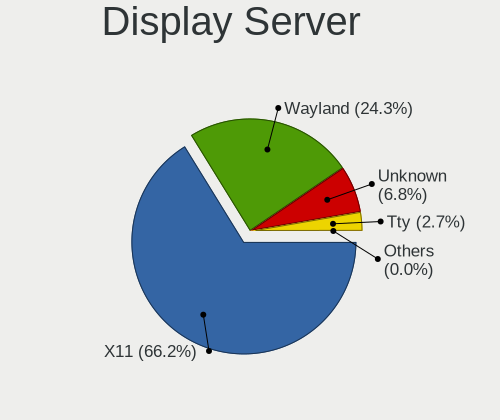
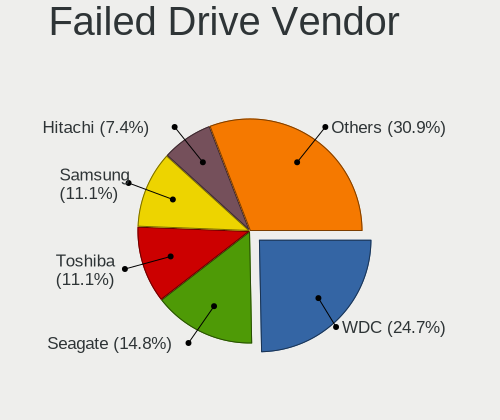
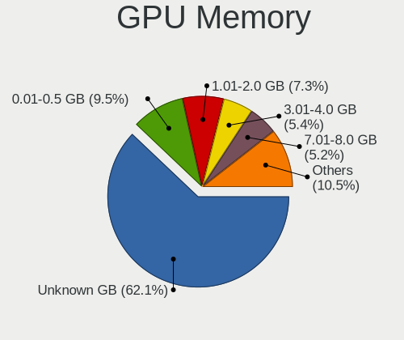
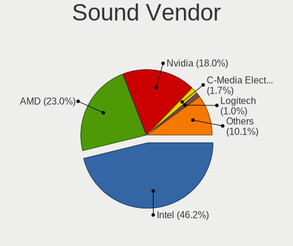

Linux in USA - Tested Hardware & Statistics
-------------------------------------------

A project to collect tested hardware configurations for Linux in USA.

Anyone can contribute to this report by the [hw-probe](https://github.com/linuxhw/hw-probe) tool:

    sudo -E hw-probe -all -upload

Please contribute! Especially if your hardware is rare.

This is a report for all computer types. See also reports for [desktops](/Location/USA/Desktop/README.md) and [notebooks](/Location/USA/Notebook/README.md).

Contents
--------

* [ Test Cases ](#test-cases)

* [ System ](#system)
  - [ OS                       ](#os)
  - [ OS Family                ](#os-family)
  - [ Kernel                   ](#kernel)
  - [ Kernel Family            ](#kernel-family)
  - [ Kernel Major Ver.        ](#kernel-major-ver)
  - [ Arch                     ](#arch)
  - [ DE                       ](#de)
  - [ Display Server           ](#display-server)
  - [ Display Manager          ](#display-manager)
  - [ OS Lang                  ](#os-lang)
  - [ Boot Mode                ](#boot-mode)
  - [ Filesystem               ](#filesystem)
  - [ Part. scheme             ](#part-scheme)
  - [ Dual Boot with Linux/BSD ](#dual-boot-with-linuxbsd)
  - [ Dual Boot (Win)          ](#dual-boot-win)

* [ Board ](#board)
  - [ Vendor                   ](#vendor)
  - [ Model                    ](#model)
  - [ Model Family             ](#model-family)
  - [ MFG Year                 ](#mfg-year)
  - [ Form Factor              ](#form-factor)
  - [ Secure Boot              ](#secure-boot)
  - [ Coreboot                 ](#coreboot)
  - [ RAM Size                 ](#ram-size)
  - [ RAM Used                 ](#ram-used)
  - [ Total Drives             ](#total-drives)
  - [ Has CD-ROM               ](#has-cd-rom)
  - [ Has Ethernet             ](#has-ethernet)
  - [ Has WiFi                 ](#has-wifi)
  - [ Has Bluetooth            ](#has-bluetooth)

* [ Location ](#location)
  - [ Country                  ](#country)
  - [ City                     ](#city)

* [ Drives ](#drives)
  - [ Drive Vendor             ](#drive-vendor)
  - [ Drive Model              ](#drive-model)
  - [ HDD Vendor               ](#hdd-vendor)
  - [ SSD Vendor               ](#ssd-vendor)
  - [ Drive Kind               ](#drive-kind)
  - [ Drive Connector          ](#drive-connector)
  - [ Drive Size               ](#drive-size)
  - [ Space Total              ](#space-total)
  - [ Space Used               ](#space-used)
  - [ Malfunc. Drives          ](#malfunc-drives)
  - [ Malfunc. Drive Vendor    ](#malfunc-drive-vendor)
  - [ Malfunc. HDD Vendor      ](#malfunc-hdd-vendor)
  - [ Malfunc. Drive Kind      ](#malfunc-drive-kind)
  - [ Failed Drives            ](#failed-drives)
  - [ Failed Drive Vendor      ](#failed-drive-vendor)
  - [ Drive Status             ](#drive-status)

* [ Storage controller ](#storage-controller)
  - [ Storage Vendor           ](#storage-vendor)
  - [ Storage Model            ](#storage-model)
  - [ Storage Kind             ](#storage-kind)

* [ Processor ](#processor)
  - [ CPU Vendor               ](#cpu-vendor)
  - [ CPU Model                ](#cpu-model)
  - [ CPU Model Family         ](#cpu-model-family)
  - [ CPU Cores                ](#cpu-cores)
  - [ CPU Sockets              ](#cpu-sockets)
  - [ CPU Threads              ](#cpu-threads)
  - [ CPU Op-Modes             ](#cpu-op-modes)
  - [ CPU Microcode            ](#cpu-microcode)
  - [ CPU Microarch            ](#cpu-microarch)

* [ Graphics ](#graphics)
  - [ GPU Vendor               ](#gpu-vendor)
  - [ GPU Model                ](#gpu-model)
  - [ GPU Combo                ](#gpu-combo)
  - [ GPU Driver               ](#gpu-driver)
  - [ GPU Memory               ](#gpu-memory)

* [ Monitor ](#monitor)
  - [ Monitor Vendor           ](#monitor-vendor)
  - [ Monitor Model            ](#monitor-model)
  - [ Monitor Resolution       ](#monitor-resolution)
  - [ Monitor Diagonal         ](#monitor-diagonal)
  - [ Monitor Width            ](#monitor-width)
  - [ Aspect Ratio             ](#aspect-ratio)
  - [ Monitor Area             ](#monitor-area)
  - [ Pixel Density            ](#pixel-density)
  - [ Multiple Monitors        ](#multiple-monitors)

* [ Network ](#network)
  - [ Net Controller Vendor    ](#net-controller-vendor)
  - [ Net Controller Model     ](#net-controller-model)
  - [ Wireless Vendor          ](#wireless-vendor)
  - [ Wireless Model           ](#wireless-model)
  - [ Ethernet Vendor          ](#ethernet-vendor)
  - [ Ethernet Model           ](#ethernet-model)
  - [ Net Controller Kind      ](#net-controller-kind)
  - [ Used Controller          ](#used-controller)
  - [ NICs                     ](#nics)
  - [ IPv6                     ](#ipv6)

* [ Bluetooth ](#bluetooth)
  - [ Bluetooth Vendor         ](#bluetooth-vendor)
  - [ Bluetooth Model          ](#bluetooth-model)

* [ Sound ](#sound)
  - [ Sound Vendor             ](#sound-vendor)
  - [ Sound Model              ](#sound-model)

* [ Memory ](#memory)
  - [ Memory Vendor            ](#memory-vendor)
  - [ Memory Model             ](#memory-model)
  - [ Memory Kind              ](#memory-kind)
  - [ Memory Form Factor       ](#memory-form-factor)
  - [ Memory Size              ](#memory-size)
  - [ Memory Speed             ](#memory-speed)

* [ Printers & scanners ](#printers--scanners)
  - [ Printer Vendor           ](#printer-vendor)
  - [ Printer Model            ](#printer-model)
  - [ Scanner Vendor           ](#scanner-vendor)
  - [ Scanner Model            ](#scanner-model)

* [ Camera ](#camera)
  - [ Camera Vendor            ](#camera-vendor)
  - [ Camera Model             ](#camera-model)

* [ Security ](#security)
  - [ Fingerprint Vendor       ](#fingerprint-vendor)
  - [ Fingerprint Model        ](#fingerprint-model)
  - [ Chipcard Vendor          ](#chipcard-vendor)
  - [ Chipcard Model           ](#chipcard-model)

* [ Unsupported ](#unsupported)
  - [ Unsupported Devices      ](#unsupported-devices)
  - [ Unsupported Device Types ](#unsupported-device-types)

Test Cases
----------

Total: 44291

| Vendor        | Model                       | Form-Factor | Probe                                                      | Date         |
|---------------|-----------------------------|-------------|------------------------------------------------------------|--------------|
| Apple         | MacBookAir7,2               | Notebook    | [352c998936](https://linux-hardware.org/?probe=352c998936) | Feb 01, 2023 |
| Lenovo        | ThinkPad L13 Yoga Gen 2 ... | Convertible | [2f0a18ba6b](https://linux-hardware.org/?probe=2f0a18ba6b) | Feb 01, 2023 |
| Lenovo        | 3111 NOK                    | Desktop     | [4f7d6b345c](https://linux-hardware.org/?probe=4f7d6b345c) | Feb 01, 2023 |
| Lenovo        | 3111 NOK                    | Desktop     | [03df681b38](https://linux-hardware.org/?probe=03df681b38) | Feb 01, 2023 |
| Valve         | Jupiter                     | Notebook    | [09c9b01e9b](https://linux-hardware.org/?probe=09c9b01e9b) | Feb 01, 2023 |
| Apple         | MacBookPro15,1              | Notebook    | [7f89f4417d](https://linux-hardware.org/?probe=7f89f4417d) | Feb 01, 2023 |
| Gigabyte      | X299 AORUS Gaming 3-CF      | Desktop     | [775a993b3a](https://linux-hardware.org/?probe=775a993b3a) | Feb 01, 2023 |
| MSI           | GF63 Thin 11UC              | Notebook    | [4f06c55846](https://linux-hardware.org/?probe=4f06c55846) | Feb 01, 2023 |
| Lenovo        | ThinkPad X1 Carbon Gen 9... | Notebook    | [c1862b275d](https://linux-hardware.org/?probe=c1862b275d) | Feb 01, 2023 |
| Lenovo        | ThinkPad X1 Carbon Gen 9... | Notebook    | [1aa5d63f0c](https://linux-hardware.org/?probe=1aa5d63f0c) | Feb 01, 2023 |
| Dell          | Inspiron 7306 2n1           | Convertible | [782559ae77](https://linux-hardware.org/?probe=782559ae77) | Feb 01, 2023 |
| Lenovo        | SHARKBAY 0B98401 WIN        | Desktop     | [1668f1f69f](https://linux-hardware.org/?probe=1668f1f69f) | Feb 01, 2023 |
| Lenovo        | ThinkPad X220 Tablet 429... | Notebook    | [c4869ecf2c](https://linux-hardware.org/?probe=c4869ecf2c) | Feb 01, 2023 |
| Valve         | Jupiter                     | Notebook    | [eab7cc51cd](https://linux-hardware.org/?probe=eab7cc51cd) | Feb 01, 2023 |
| Supermicro    | H12SSL-i                    | Server      | [cca8d74416](https://linux-hardware.org/?probe=cca8d74416) | Feb 01, 2023 |
| Dell          | 06D7TR A00                  | Desktop     | [d040bfd5cc](https://linux-hardware.org/?probe=d040bfd5cc) | Feb 01, 2023 |
| Acer          | Predator PH517-61           | Notebook    | [b16ddc31d8](https://linux-hardware.org/?probe=b16ddc31d8) | Feb 01, 2023 |
| ASUSTek       | PRIME B550M-A               | Desktop     | [779b723b67](https://linux-hardware.org/?probe=779b723b67) | Feb 01, 2023 |
| Valve         | Jupiter                     | Notebook    | [304c2a8ce3](https://linux-hardware.org/?probe=304c2a8ce3) | Feb 01, 2023 |
| Valve         | Jupiter                     | Notebook    | [6debcb8087](https://linux-hardware.org/?probe=6debcb8087) | Feb 01, 2023 |
| Dell          | 00V62H A01                  | Desktop     | [d7b81788e7](https://linux-hardware.org/?probe=d7b81788e7) | Feb 01, 2023 |
| ASUSTek       | ROG STRIX Z490-A GAMING     | Desktop     | [5f2948351d](https://linux-hardware.org/?probe=5f2948351d) | Feb 01, 2023 |
| Lenovo        | ThinkPad X270 20HMS0T000    | Notebook    | [e9854b7cf8](https://linux-hardware.org/?probe=e9854b7cf8) | Feb 01, 2023 |
| Gigabyte      | Z690 AORUS ELITE AX DDR4    | Desktop     | [115de2faed](https://linux-hardware.org/?probe=115de2faed) | Feb 01, 2023 |
| ASUSTek       | PRIME B550M-A               | Desktop     | [4251ab2f9a](https://linux-hardware.org/?probe=4251ab2f9a) | Feb 01, 2023 |
| ASUSTek       | M4A89TD PRO USB3            | Desktop     | [9010e03a18](https://linux-hardware.org/?probe=9010e03a18) | Feb 01, 2023 |
| Dell          | Inspiron One 2320           | All in one  | [f4933208c1](https://linux-hardware.org/?probe=f4933208c1) | Feb 01, 2023 |
| AZW           | S5 V1.0                     | Mini pc     | [213d0d1a6a](https://linux-hardware.org/?probe=213d0d1a6a) | Feb 01, 2023 |
| HP            | 1790                        | Desktop     | [d0d3ca5e7c](https://linux-hardware.org/?probe=d0d3ca5e7c) | Feb 01, 2023 |
| ASUSTek       | ROG STRIX X570-E GAMING     | Desktop     | [4bb9990abe](https://linux-hardware.org/?probe=4bb9990abe) | Feb 01, 2023 |
| Dell          | 0VHWTR A02                  | Desktop     | [4820c0216f](https://linux-hardware.org/?probe=4820c0216f) | Feb 01, 2023 |
| Intel         | NUC13SBBi5 M89887-303       | Mini pc     | [5ddc33f69b](https://linux-hardware.org/?probe=5ddc33f69b) | Jan 31, 2023 |
| Dell          | 0Y7WYT A00                  | Desktop     | [77909a2fa1](https://linux-hardware.org/?probe=77909a2fa1) | Jan 31, 2023 |
| Google        | Gnawty                      | Notebook    | [4188917829](https://linux-hardware.org/?probe=4188917829) | Jan 31, 2023 |
| Dell          | 0Y7WYT A00                  | Desktop     | [d299b4befd](https://linux-hardware.org/?probe=d299b4befd) | Jan 31, 2023 |
| HP            | 18E4                        | Desktop     | [50c68be419](https://linux-hardware.org/?probe=50c68be419) | Jan 31, 2023 |
| Gigabyte      | B560 DS3H AC-Y1             | Desktop     | [6c094e2027](https://linux-hardware.org/?probe=6c094e2027) | Jan 31, 2023 |
| HP            | 18E4                        | Desktop     | [d038da9e08](https://linux-hardware.org/?probe=d038da9e08) | Jan 31, 2023 |
| BESSTAR Te... | GB7                         | Mini pc     | [abe22da26e](https://linux-hardware.org/?probe=abe22da26e) | Jan 31, 2023 |
| Google        | Lillipup                    | Notebook    | [45f9b8c3cf](https://linux-hardware.org/?probe=45f9b8c3cf) | Jan 31, 2023 |
| ASRock        | B450 Gaming-ITX/ac          | Desktop     | [25b35d4826](https://linux-hardware.org/?probe=25b35d4826) | Jan 31, 2023 |
| Lenovo        | ThinkPad X140e 20BMS03E0... | Notebook    | [fb4c4aebf9](https://linux-hardware.org/?probe=fb4c4aebf9) | Jan 31, 2023 |
| ASUSTek       | ROG STRIX Z590-A GAMING ... | Desktop     | [b54f170a86](https://linux-hardware.org/?probe=b54f170a86) | Jan 31, 2023 |
| Gigabyte      | GA-MA785GM-US2H             | Desktop     | [dd017ac78a](https://linux-hardware.org/?probe=dd017ac78a) | Jan 31, 2023 |
| Intel         | DH77DF AAG40293-301         | Desktop     | [1a0f7653e3](https://linux-hardware.org/?probe=1a0f7653e3) | Jan 31, 2023 |
| Lenovo        | ThinkPad T530 2429F27       | Notebook    | [85ac6a588d](https://linux-hardware.org/?probe=85ac6a588d) | Jan 31, 2023 |
| Gigabyte      | X570 AORUS ELITE            | Desktop     | [caa1c9e23a](https://linux-hardware.org/?probe=caa1c9e23a) | Jan 31, 2023 |
| Dell          | Vostro 3700                 | Notebook    | [a663152b7c](https://linux-hardware.org/?probe=a663152b7c) | Jan 31, 2023 |
| Apple         | MacBookPro12,1              | Notebook    | [228ab40738](https://linux-hardware.org/?probe=228ab40738) | Jan 31, 2023 |
| Dell          | Vostro 3700                 | Notebook    | [ae3838cc5d](https://linux-hardware.org/?probe=ae3838cc5d) | Jan 31, 2023 |
| Dell          | Studio 1558                 | Notebook    | [acfea4cd33](https://linux-hardware.org/?probe=acfea4cd33) | Jan 31, 2023 |
| Lenovo        | 3717 SDK0J40697 WIN 3305... | Desktop     | [175a0fcf9a](https://linux-hardware.org/?probe=175a0fcf9a) | Jan 31, 2023 |
| Google        | Casta                       | Notebook    | [db372f6a5f](https://linux-hardware.org/?probe=db372f6a5f) | Jan 31, 2023 |
| Supermicro    | H12SSL-i                    | Server      | [f0884ec1aa](https://linux-hardware.org/?probe=f0884ec1aa) | Jan 31, 2023 |
| System76      | Lemur                       | Notebook    | [6dac0a5b94](https://linux-hardware.org/?probe=6dac0a5b94) | Jan 31, 2023 |
| Supermicro    | H12SSL-i                    | Server      | [89430aeb82](https://linux-hardware.org/?probe=89430aeb82) | Jan 31, 2023 |
| ASUSTek       | VivoBook_ASUSLaptop TP42... | Convertible | [84278c514e](https://linux-hardware.org/?probe=84278c514e) | Jan 31, 2023 |
| Dell          | XPS 13 9360                 | Notebook    | [3aa64bf1ec](https://linux-hardware.org/?probe=3aa64bf1ec) | Jan 31, 2023 |
| ASUSTek       | VivoBook_ASUSLaptop TP42... | Convertible | [e91278bf3b](https://linux-hardware.org/?probe=e91278bf3b) | Jan 31, 2023 |
| Lenovo        | ThinkPad X220 Tablet 429... | Notebook    | [230b38f8e6](https://linux-hardware.org/?probe=230b38f8e6) | Jan 31, 2023 |
| Gigabyte      | F2A88XM-D3H                 | Desktop     | [846f831269](https://linux-hardware.org/?probe=846f831269) | Jan 31, 2023 |
| ASUSTek       | PRIME B550M-A               | Desktop     | [318b0a5ecb](https://linux-hardware.org/?probe=318b0a5ecb) | Jan 31, 2023 |
| Acer          | Aspire E5-571               | Notebook    | [615ee3d3fd](https://linux-hardware.org/?probe=615ee3d3fd) | Jan 31, 2023 |
| Acer          | Aspire E5-571               | Notebook    | [6498b44bcc](https://linux-hardware.org/?probe=6498b44bcc) | Jan 31, 2023 |
| Apple         | Mac-031AEE4D24BFF0B1 Mac... | Mini pc     | [a06f4e8595](https://linux-hardware.org/?probe=a06f4e8595) | Jan 31, 2023 |
| ASUSTek       | PRIME B250-A                | Desktop     | [c686d3d123](https://linux-hardware.org/?probe=c686d3d123) | Jan 31, 2023 |
| Lenovo        | ThinkPad E560 20EV002FUS    | Notebook    | [0110b731e7](https://linux-hardware.org/?probe=0110b731e7) | Jan 31, 2023 |
| HP            | Pavilion dv6                | Notebook    | [c84439bfbf](https://linux-hardware.org/?probe=c84439bfbf) | Jan 31, 2023 |
| Google        | Robo360                     | Notebook    | [c9fb18664b](https://linux-hardware.org/?probe=c9fb18664b) | Jan 31, 2023 |
| HP            | ENVY x360 2-in-1 Laptop ... | Convertible | [e0e7acce8d](https://linux-hardware.org/?probe=e0e7acce8d) | Jan 31, 2023 |
| Lenovo        | ThinkPad E560 20EV002FUS    | Notebook    | [faa0a5a1ff](https://linux-hardware.org/?probe=faa0a5a1ff) | Jan 31, 2023 |
| ASRock        | H77 Pro4-M                  | Desktop     | [a37090dd20](https://linux-hardware.org/?probe=a37090dd20) | Jan 31, 2023 |
| Acer          | Swift SF114-32              | Notebook    | [82d317899e](https://linux-hardware.org/?probe=82d317899e) | Jan 31, 2023 |
| Dell          | 0CNCJW A08                  | Server      | [1abe023ed7](https://linux-hardware.org/?probe=1abe023ed7) | Jan 31, 2023 |
| Lenovo        | ThinkPad L540 20AVCTO1WW    | Notebook    | [d08beb0c26](https://linux-hardware.org/?probe=d08beb0c26) | Jan 31, 2023 |
| Lenovo        | 30D0 SDK0J40697 WIN 3305... | Desktop     | [f018b74ad8](https://linux-hardware.org/?probe=f018b74ad8) | Jan 31, 2023 |
| Gigabyte      | B550M DS3H                  | Desktop     | [eaee265ecc](https://linux-hardware.org/?probe=eaee265ecc) | Jan 31, 2023 |
| HP            | ENVY x360 Convertible 15... | Convertible | [9bb7eb28ed](https://linux-hardware.org/?probe=9bb7eb28ed) | Jan 31, 2023 |
| Valve         | Jupiter                     | Notebook    | [584a69fbac](https://linux-hardware.org/?probe=584a69fbac) | Jan 31, 2023 |
| Raspberry ... | Raspberry Pi 4 Model B R... | Soc         | [011c3940f9](https://linux-hardware.org/?probe=011c3940f9) | Jan 31, 2023 |
| HP            | ProLiant DL360 G7           | Server      | [53f4f127f2](https://linux-hardware.org/?probe=53f4f127f2) | Jan 31, 2023 |
| ASUSTek       | ROG STRIX B550-I GAMING     | Desktop     | [33ae030343](https://linux-hardware.org/?probe=33ae030343) | Jan 31, 2023 |
| Dell          | Latitude E5420              | Notebook    | [ccc3ca9853](https://linux-hardware.org/?probe=ccc3ca9853) | Jan 31, 2023 |
| Intel         | NUC6i5SYB H81131-504        | Mini pc     | [d079e3930d](https://linux-hardware.org/?probe=d079e3930d) | Jan 31, 2023 |
| MSI           | MPG X570 GAMING EDGE WIF... | Desktop     | [177c33e4a9](https://linux-hardware.org/?probe=177c33e4a9) | Jan 31, 2023 |
| Lenovo        | Legion 7 16ARHA7 82UH       | Notebook    | [bcaa2e6b1a](https://linux-hardware.org/?probe=bcaa2e6b1a) | Jan 30, 2023 |
| Gigabyte      | Z390 DESIGNARE-CF           | Desktop     | [02c8ae01d1](https://linux-hardware.org/?probe=02c8ae01d1) | Jan 30, 2023 |
| Framework     | Laptop (12th Gen Intel C... | Notebook    | [96671141f9](https://linux-hardware.org/?probe=96671141f9) | Jan 30, 2023 |
| Acer          | Unknown                     | Desktop     | [05de2b4244](https://linux-hardware.org/?probe=05de2b4244) | Jan 30, 2023 |
| Toshiba       | Satellite U845W             | Notebook    | [6735a45763](https://linux-hardware.org/?probe=6735a45763) | Jan 30, 2023 |
| Lenovo        | ThinkPad P50 20EN0013US     | Notebook    | [d3bf9fe9e3](https://linux-hardware.org/?probe=d3bf9fe9e3) | Jan 30, 2023 |
| Dell          | 0Y2K8N A01                  | Desktop     | [6a4a26884d](https://linux-hardware.org/?probe=6a4a26884d) | Jan 30, 2023 |
| GPU Compan... | GWTN141-10                  | Notebook    | [f012d6d71c](https://linux-hardware.org/?probe=f012d6d71c) | Jan 30, 2023 |
| ASUSTek       | ROG STRIX X570-E GAMING     | Desktop     | [e3f96394c0](https://linux-hardware.org/?probe=e3f96394c0) | Jan 30, 2023 |
| Dell          | 0GDG8Y A00                  | Desktop     | [8ba7e25b58](https://linux-hardware.org/?probe=8ba7e25b58) | Jan 30, 2023 |
| HP            | Pavilion Notebook           | Notebook    | [912213d849](https://linux-hardware.org/?probe=912213d849) | Jan 30, 2023 |
| Dell          | 0Y2K8N A01                  | Desktop     | [8e4f1d2ed2](https://linux-hardware.org/?probe=8e4f1d2ed2) | Jan 30, 2023 |
| Dell          | 0GDG8Y A00                  | Desktop     | [759e9a48d1](https://linux-hardware.org/?probe=759e9a48d1) | Jan 30, 2023 |
| HP            | Pavilion Notebook           | Notebook    | [456415a23e](https://linux-hardware.org/?probe=456415a23e) | Jan 30, 2023 |
| HP            | Stream Laptop 14-cb1XX      | Notebook    | [3f17be7a85](https://linux-hardware.org/?probe=3f17be7a85) | Jan 30, 2023 |
| Intel         | DH77DF AAG40293-301         | Desktop     | [1c91d911d7](https://linux-hardware.org/?probe=1c91d911d7) | Jan 30, 2023 |
| MSI           | Raider GE76 12UE            | Notebook    | [c69bbc917b](https://linux-hardware.org/?probe=c69bbc917b) | Jan 30, 2023 |
| HP            | ProBook 6465b               | Notebook    | [de7999a824](https://linux-hardware.org/?probe=de7999a824) | Jan 30, 2023 |
| BESSTAR Te... | UM350                       | Desktop     | [ee1ba0e588](https://linux-hardware.org/?probe=ee1ba0e588) | Jan 30, 2023 |
| Lenovo        | ThinkPad L380 Yoga 20M8S... | Convertible | [782e38cf06](https://linux-hardware.org/?probe=782e38cf06) | Jan 30, 2023 |
| Dell          | XPS 13 9360                 | Notebook    | [9037e30b54](https://linux-hardware.org/?probe=9037e30b54) | Jan 30, 2023 |
| Dell          | Latitude E6520              | Notebook    | [f042c5966b](https://linux-hardware.org/?probe=f042c5966b) | Jan 30, 2023 |
| Acer          | Swift SF114-32              | Notebook    | [1228d6d0f7](https://linux-hardware.org/?probe=1228d6d0f7) | Jan 30, 2023 |
| Gateway       | IPIMB-ARA                   | Desktop     | [253b58b2a4](https://linux-hardware.org/?probe=253b58b2a4) | Jan 30, 2023 |
| ASUSTek       | P8P67 DELUXE                | Desktop     | [8f3278e68a](https://linux-hardware.org/?probe=8f3278e68a) | Jan 30, 2023 |
| HP            | EliteBook 8560p             | Notebook    | [f03a63f76a](https://linux-hardware.org/?probe=f03a63f76a) | Jan 30, 2023 |
| Intel         | NUC7i5BNB J31144-311        | Mini pc     | [e95329eafd](https://linux-hardware.org/?probe=e95329eafd) | Jan 30, 2023 |
| HP            | ProLiant DL360 G7           | Server      | [cbc5231e9c](https://linux-hardware.org/?probe=cbc5231e9c) | Jan 30, 2023 |
| NetGear       | ReadyDATA 5200              | Desktop     | [74a68eba33](https://linux-hardware.org/?probe=74a68eba33) | Jan 30, 2023 |
| ASRock        | X670E Steel Legend          | Desktop     | [e197bd2a4b](https://linux-hardware.org/?probe=e197bd2a4b) | Jan 30, 2023 |
| MSI           | PRO B660M-A DDR4            | Desktop     | [0f2037dcd8](https://linux-hardware.org/?probe=0f2037dcd8) | Jan 30, 2023 |
| Supermicro    | H12SSL-i                    | Server      | [6d079ed3ca](https://linux-hardware.org/?probe=6d079ed3ca) | Jan 30, 2023 |
| Supermicro    | H12SSL-i                    | Server      | [d81d33bda5](https://linux-hardware.org/?probe=d81d33bda5) | Jan 30, 2023 |
| HP            | ENVY x360 2-in-1 Laptop ... | Convertible | [9b0891d54d](https://linux-hardware.org/?probe=9b0891d54d) | Jan 30, 2023 |
| HP            | 8054                        | Desktop     | [36f5306e37](https://linux-hardware.org/?probe=36f5306e37) | Jan 30, 2023 |
| MSI           | GE75 Raider 10SF            | Notebook    | [85d2ae302d](https://linux-hardware.org/?probe=85d2ae302d) | Jan 30, 2023 |
| HP            | Pavilion dv7                | Notebook    | [b61ed06b1e](https://linux-hardware.org/?probe=b61ed06b1e) | Jan 30, 2023 |
| HP            | Pavilion 15                 | Notebook    | [6ceccb3d73](https://linux-hardware.org/?probe=6ceccb3d73) | Jan 30, 2023 |
| MSI           | B550M PRO-VDH WIFI          | Desktop     | [02580dd501](https://linux-hardware.org/?probe=02580dd501) | Jan 30, 2023 |
| MSI           | X370 SLI PLUS               | Desktop     | [bb20465703](https://linux-hardware.org/?probe=bb20465703) | Jan 30, 2023 |
| Dell          | XPS 13 9380                 | Notebook    | [ec00530842](https://linux-hardware.org/?probe=ec00530842) | Jan 30, 2023 |
| HP            | ProLiant DL360p Gen8        | Server      | [452a50e49c](https://linux-hardware.org/?probe=452a50e49c) | Jan 30, 2023 |
| ASUSTek       | SABERTOOTH 990FX            | Desktop     | [0e28b954b4](https://linux-hardware.org/?probe=0e28b954b4) | Jan 30, 2023 |
| ASUSTek       | SABERTOOTH 990FX            | Desktop     | [10421fe598](https://linux-hardware.org/?probe=10421fe598) | Jan 30, 2023 |
| Valve         | Jupiter                     | Notebook    | [e48701a8e1](https://linux-hardware.org/?probe=e48701a8e1) | Jan 30, 2023 |
| ASUSTek       | PRIME B550M-A               | Desktop     | [585c3c8f85](https://linux-hardware.org/?probe=585c3c8f85) | Jan 30, 2023 |
| ASUSTek       | ROG STRIX B550-I GAMING     | Desktop     | [3d555e69f7](https://linux-hardware.org/?probe=3d555e69f7) | Jan 30, 2023 |
| AZW           | GT-R                        | Notebook    | [6c286ec8fb](https://linux-hardware.org/?probe=6c286ec8fb) | Jan 30, 2023 |
| Dell          | XPS 15 9570                 | Notebook    | [1d06f2715a](https://linux-hardware.org/?probe=1d06f2715a) | Jan 30, 2023 |
| Lenovo        | MAHOBAY Win8 STD MM DPK ... | Desktop     | [ee36c9d395](https://linux-hardware.org/?probe=ee36c9d395) | Jan 30, 2023 |
| HP            | OMEN by Laptop 15z-en100    | Notebook    | [0c91238954](https://linux-hardware.org/?probe=0c91238954) | Jan 30, 2023 |
| HP            | ENVY x360 Convertible 15... | Convertible | [d86a1c4fb2](https://linux-hardware.org/?probe=d86a1c4fb2) | Jan 30, 2023 |
| Dell          | 0D28YY A00                  | Desktop     | [63b753b56e](https://linux-hardware.org/?probe=63b753b56e) | Jan 30, 2023 |
| Gigabyte      | X570 I AORUS PRO WIFI       | Desktop     | [7893a67a4b](https://linux-hardware.org/?probe=7893a67a4b) | Jan 30, 2023 |
| Sony          | PCG-GRT230(UC)              | Notebook    | [0a7c76da78](https://linux-hardware.org/?probe=0a7c76da78) | Jan 30, 2023 |
| Lenovo        | 3704 SDK0J40700 WIN 3258... | Desktop     | [aff06e830e](https://linux-hardware.org/?probe=aff06e830e) | Jan 30, 2023 |
| Lenovo        | ThinkPad T460s 20FAS1F20... | Notebook    | [39b709296b](https://linux-hardware.org/?probe=39b709296b) | Jan 30, 2023 |
| ASUSTek       | ROG Maximus XIII HERO       | Desktop     | [a32a9ba13a](https://linux-hardware.org/?probe=a32a9ba13a) | Jan 30, 2023 |
| ASUSTek       | PRIME Z690-P WIFI           | Desktop     | [d2f9eb15f5](https://linux-hardware.org/?probe=d2f9eb15f5) | Jan 30, 2023 |
| HP            | 1791                        | Desktop     | [0cb5402c68](https://linux-hardware.org/?probe=0cb5402c68) | Jan 29, 2023 |
| Lenovo        | Yoga 7 16IAH7 82UF          | Convertible | [2f9de3e332](https://linux-hardware.org/?probe=2f9de3e332) | Jan 29, 2023 |
| HP            | Laptop 15-dy2xxx            | Notebook    | [97e6b9cb60](https://linux-hardware.org/?probe=97e6b9cb60) | Jan 29, 2023 |
| HP            | Laptop 15-dy2xxx            | Notebook    | [e5e795e7a2](https://linux-hardware.org/?probe=e5e795e7a2) | Jan 29, 2023 |
| Dell          | Latitude 9510               | Convertible | [06dc993730](https://linux-hardware.org/?probe=06dc993730) | Jan 29, 2023 |
| Lenovo        | Legion 7 15IMH05 81YT       | Notebook    | [b88f08d400](https://linux-hardware.org/?probe=b88f08d400) | Jan 29, 2023 |
| Google        | Lillipup                    | Notebook    | [194cec66f5](https://linux-hardware.org/?probe=194cec66f5) | Jan 29, 2023 |
| Dell          | G15 5520                    | Notebook    | [ae4bf1777e](https://linux-hardware.org/?probe=ae4bf1777e) | Jan 29, 2023 |
| ASUSTek       | ROG Maximus XIII HERO       | Desktop     | [6b634c85e8](https://linux-hardware.org/?probe=6b634c85e8) | Jan 29, 2023 |
| HP            | ENVY x360 2-in-1 Laptop ... | Convertible | [dab1328d8d](https://linux-hardware.org/?probe=dab1328d8d) | Jan 29, 2023 |
| HP            | ENVY x360 2-in-1 Laptop ... | Convertible | [3a7f252d19](https://linux-hardware.org/?probe=3a7f252d19) | Jan 29, 2023 |
| Dell          | Inspiron 15-3573            | Notebook    | [b735bbde51](https://linux-hardware.org/?probe=b735bbde51) | Jan 29, 2023 |
| HP            | Laptop 14-fq0xxx            | Notebook    | [0b7bcda17a](https://linux-hardware.org/?probe=0b7bcda17a) | Jan 29, 2023 |
| Alienware     | x17 R2                      | Notebook    | [d004749696](https://linux-hardware.org/?probe=d004749696) | Jan 29, 2023 |
| Alienware     | x17 R2                      | Notebook    | [350244db5d](https://linux-hardware.org/?probe=350244db5d) | Jan 29, 2023 |
| MSI           | MAG B550M MORTAR WIFI       | Desktop     | [eb551b5ec0](https://linux-hardware.org/?probe=eb551b5ec0) | Jan 29, 2023 |
| Dell          | Inspiron 5520               | Notebook    | [c869e74605](https://linux-hardware.org/?probe=c869e74605) | Jan 29, 2023 |
| Valve         | Jupiter                     | Notebook    | [f439aa5179](https://linux-hardware.org/?probe=f439aa5179) | Jan 29, 2023 |
| Supermicro    | H12SSL-i                    | Server      | [091b3e37fb](https://linux-hardware.org/?probe=091b3e37fb) | Jan 29, 2023 |
| Supermicro    | H12SSL-i                    | Server      | [49654976af](https://linux-hardware.org/?probe=49654976af) | Jan 29, 2023 |
| Valve         | Jupiter                     | Notebook    | [9fdd992e96](https://linux-hardware.org/?probe=9fdd992e96) | Jan 29, 2023 |
| HP            | ENVY x360 Convertible 15... | Convertible | [3aaad3b44c](https://linux-hardware.org/?probe=3aaad3b44c) | Jan 29, 2023 |
| HP            | Pavilion dv6                | Notebook    | [1e739ddc0d](https://linux-hardware.org/?probe=1e739ddc0d) | Jan 29, 2023 |
| Lenovo        | ThinkPad E14 Gen 3 20Y7C... | Notebook    | [66ab929a6c](https://linux-hardware.org/?probe=66ab929a6c) | Jan 29, 2023 |
| ASUSTek       | PRIME B550M-A               | Desktop     | [ef43edeee5](https://linux-hardware.org/?probe=ef43edeee5) | Jan 29, 2023 |
| HP            | ENVY x360 2-in-1 Laptop ... | Convertible | [de8c055a8a](https://linux-hardware.org/?probe=de8c055a8a) | Jan 29, 2023 |
| ASRock        | Z97E-ITX/ac                 | Desktop     | [80d82e6be6](https://linux-hardware.org/?probe=80d82e6be6) | Jan 29, 2023 |
| ASRock        | 970M Pro3                   | Desktop     | [e0a5d6512f](https://linux-hardware.org/?probe=e0a5d6512f) | Jan 29, 2023 |
| Motion Com... | C5t                         | Notebook    | [200be33adc](https://linux-hardware.org/?probe=200be33adc) | Jan 29, 2023 |
| ASRock        | Z97E-ITX/ac                 | Desktop     | [4d092eb96c](https://linux-hardware.org/?probe=4d092eb96c) | Jan 29, 2023 |
| Apple         | Mac-F226BEC8 PVT            | All in one  | [45e2952704](https://linux-hardware.org/?probe=45e2952704) | Jan 29, 2023 |
| SYWZ          | S210H Series                | Desktop     | [4d1018a808](https://linux-hardware.org/?probe=4d1018a808) | Jan 29, 2023 |
| Toshiba       | QOSMIO X770                 | Notebook    | [62b104b3d2](https://linux-hardware.org/?probe=62b104b3d2) | Jan 29, 2023 |
| HP            | Laptop 15-da0xxx            | Notebook    | [959a9a17dd](https://linux-hardware.org/?probe=959a9a17dd) | Jan 29, 2023 |
| ASUSTek       | TUF Gaming FX505DT_FX505... | Notebook    | [4333734c92](https://linux-hardware.org/?probe=4333734c92) | Jan 29, 2023 |
| ASRock        | X570M Pro4                  | Desktop     | [e72f7f2fb1](https://linux-hardware.org/?probe=e72f7f2fb1) | Jan 29, 2023 |
| ASUSTek       | CROSSHAIR VI HERO           | Desktop     | [190a780b8a](https://linux-hardware.org/?probe=190a780b8a) | Jan 29, 2023 |
| System76      | Lemur                       | Notebook    | [a6fc9167f7](https://linux-hardware.org/?probe=a6fc9167f7) | Jan 29, 2023 |
| Lenovo        | 312D SDK0J40697 WIN 3305... | Mini pc     | [d84840d5c9](https://linux-hardware.org/?probe=d84840d5c9) | Jan 29, 2023 |
| ASUSTek       | ROG Strix G513RM_G513RM     | Notebook    | [4603f92b18](https://linux-hardware.org/?probe=4603f92b18) | Jan 29, 2023 |
| HP            | Pavilion dv7                | Notebook    | [f27e7c24c1](https://linux-hardware.org/?probe=f27e7c24c1) | Jan 29, 2023 |
| BESSTAR Te... | TH50                        | Desktop     | [4aa292e3c1](https://linux-hardware.org/?probe=4aa292e3c1) | Jan 29, 2023 |
| Alienware     | x15 R2                      | Notebook    | [51bb7a8c39](https://linux-hardware.org/?probe=51bb7a8c39) | Jan 29, 2023 |
| System76      | Darter Pro                  | Notebook    | [5d97ec522f](https://linux-hardware.org/?probe=5d97ec522f) | Jan 29, 2023 |
| Dell          | Precision 7510              | Notebook    | [4f56174991](https://linux-hardware.org/?probe=4f56174991) | Jan 29, 2023 |
| ASUSTek       | B85M-G                      | Desktop     | [26fd2a9f6a](https://linux-hardware.org/?probe=26fd2a9f6a) | Jan 29, 2023 |
| ASUSTek       | M5A97 R2.0                  | Desktop     | [703a3a2694](https://linux-hardware.org/?probe=703a3a2694) | Jan 29, 2023 |
| Gigabyte      | M61PME-S2                   | Desktop     | [8227150e0d](https://linux-hardware.org/?probe=8227150e0d) | Jan 29, 2023 |
| Supermicro    | X10DRL-CT                   | Server      | [3dcf1286ab](https://linux-hardware.org/?probe=3dcf1286ab) | Jan 29, 2023 |
| ASRock        | Z77 Pro4                    | Desktop     | [fe501e214b](https://linux-hardware.org/?probe=fe501e214b) | Jan 29, 2023 |
| Lenovo        | MAHOBAY NO DPK              | Desktop     | [a6f17c156d](https://linux-hardware.org/?probe=a6f17c156d) | Jan 29, 2023 |
| ASRock        | Z77 Pro4                    | Desktop     | [a5d8b81f29](https://linux-hardware.org/?probe=a5d8b81f29) | Jan 29, 2023 |
| Dell          | XPS 13 7390                 | Notebook    | [60c03ee1f7](https://linux-hardware.org/?probe=60c03ee1f7) | Jan 29, 2023 |
| Gigabyte      | M61PME-S2                   | Desktop     | [813f01976d](https://linux-hardware.org/?probe=813f01976d) | Jan 29, 2023 |
| Lenovo        | ThinkPad T460 20FMS79000    | Notebook    | [2b397905e1](https://linux-hardware.org/?probe=2b397905e1) | Jan 29, 2023 |
| Foxconn       | A74MX-S/A74MX-K             | Desktop     | [9daeb7adc3](https://linux-hardware.org/?probe=9daeb7adc3) | Jan 29, 2023 |
| Lenovo        | ThinkPad E14 Gen 3 20Y7C... | Notebook    | [4b4d53bcc1](https://linux-hardware.org/?probe=4b4d53bcc1) | Jan 29, 2023 |
| Gigabyte      | Z690 AORUS PRO              | Desktop     | [b07e189d3c](https://linux-hardware.org/?probe=b07e189d3c) | Jan 29, 2023 |
| Gateway       | NV570P                      | Notebook    | [f7d900c26c](https://linux-hardware.org/?probe=f7d900c26c) | Jan 29, 2023 |
| Lenovo        | SHARKBAY SDK0J40700 WIN     | Desktop     | [75027cfa77](https://linux-hardware.org/?probe=75027cfa77) | Jan 29, 2023 |
| Acer          | FMP55                       | Desktop     | [d091fbc8d3](https://linux-hardware.org/?probe=d091fbc8d3) | Jan 29, 2023 |
| ASUSTek       | ZenBook Q536FD_Q536FD       | Convertible | [0d1e08db32](https://linux-hardware.org/?probe=0d1e08db32) | Jan 28, 2023 |
| Toshiba       | QOSMIO X770                 | Notebook    | [b7cf9bee5c](https://linux-hardware.org/?probe=b7cf9bee5c) | Jan 28, 2023 |
| HP            | Laptop 17-cp2xxx            | Notebook    | [e04f33db90](https://linux-hardware.org/?probe=e04f33db90) | Jan 28, 2023 |
| ASUSTek       | VivoBook_ASUSLaptop X412... | Notebook    | [1d28352c0f](https://linux-hardware.org/?probe=1d28352c0f) | Jan 28, 2023 |
| Dell          | XPS 13 9380                 | Notebook    | [ed99ed692d](https://linux-hardware.org/?probe=ed99ed692d) | Jan 28, 2023 |
| Gigabyte      | B550I AORUS PRO AX          | Desktop     | [8b5c80cad4](https://linux-hardware.org/?probe=8b5c80cad4) | Jan 28, 2023 |
| Dell          | Inspiron 7706 2n1           | Convertible | [f8da74bad3](https://linux-hardware.org/?probe=f8da74bad3) | Jan 28, 2023 |
| Dell          | 0PXWHK A00                  | Desktop     | [1866c91eb9](https://linux-hardware.org/?probe=1866c91eb9) | Jan 28, 2023 |
| Dell          | XPS 13 9315 2-in-1          | Tablet      | [c62fe4b879](https://linux-hardware.org/?probe=c62fe4b879) | Jan 28, 2023 |
| Supermicro    | H12SSL-i                    | Server      | [d41a70cbf5](https://linux-hardware.org/?probe=d41a70cbf5) | Jan 28, 2023 |
| ASUSTek       | PRIME A320M-K               | Desktop     | [11586188ad](https://linux-hardware.org/?probe=11586188ad) | Jan 28, 2023 |
| Dell          | Inspiron 1521               | Notebook    | [8fcde91462](https://linux-hardware.org/?probe=8fcde91462) | Jan 28, 2023 |
| HP            | 1998                        | Desktop     | [81da484cc4](https://linux-hardware.org/?probe=81da484cc4) | Jan 28, 2023 |
| Gateway       | ZX6971                      | All in one  | [585fdaac78](https://linux-hardware.org/?probe=585fdaac78) | Jan 28, 2023 |
| ASRock        | 970M Pro3                   | Desktop     | [58366ca3d1](https://linux-hardware.org/?probe=58366ca3d1) | Jan 28, 2023 |
| HP            | 8053                        | Desktop     | [88120ce3f4](https://linux-hardware.org/?probe=88120ce3f4) | Jan 28, 2023 |
| Lenovo        | IdeaPad 330S-15ARR 81FB     | Notebook    | [95053898dc](https://linux-hardware.org/?probe=95053898dc) | Jan 28, 2023 |
| HP            | ENVY x360 2-in-1 Laptop ... | Convertible | [4a33511e43](https://linux-hardware.org/?probe=4a33511e43) | Jan 28, 2023 |
| Lenovo        | 364F SDK0J40700 WIN 3258... | Desktop     | [cad690676c](https://linux-hardware.org/?probe=cad690676c) | Jan 28, 2023 |
| Dell          | Precision 7730              | Notebook    | [058f16ac84](https://linux-hardware.org/?probe=058f16ac84) | Jan 28, 2023 |
| ASUSTek       | ROG STRIX B550-F GAMING     | Desktop     | [31bda5eb31](https://linux-hardware.org/?probe=31bda5eb31) | Jan 28, 2023 |
| HP            | 843F                        | Desktop     | [5e9a5d2afd](https://linux-hardware.org/?probe=5e9a5d2afd) | Jan 28, 2023 |
| Samsung       | 950QED                      | Convertible | [225c240f0c](https://linux-hardware.org/?probe=225c240f0c) | Jan 28, 2023 |
| ASUSTek       | P8H61-M LE/CSM R2.0         | Desktop     | [7120eb3310](https://linux-hardware.org/?probe=7120eb3310) | Jan 28, 2023 |
| Google        | Candy                       | Notebook    | [2b2368d61b](https://linux-hardware.org/?probe=2b2368d61b) | Jan 28, 2023 |
| MSI           | Vector GP76 12UHSO          | Notebook    | [549b690251](https://linux-hardware.org/?probe=549b690251) | Jan 28, 2023 |
| Lenovo        | IdeaPadFlex 5 14ALC7 82R... | Convertible | [de3f21b51b](https://linux-hardware.org/?probe=de3f21b51b) | Jan 28, 2023 |
| Lenovo        | IdeaPadFlex 5 14ALC7 82R... | Convertible | [329e7b7105](https://linux-hardware.org/?probe=329e7b7105) | Jan 28, 2023 |
| Apple         | MacBookPro11,2              | Notebook    | [a5f320de13](https://linux-hardware.org/?probe=a5f320de13) | Jan 28, 2023 |
| ASUSTek       | SABERTOOTH Z77              | Desktop     | [b588302693](https://linux-hardware.org/?probe=b588302693) | Jan 28, 2023 |
| HP            | EliteBook 840 G3            | Notebook    | [f9446c0c08](https://linux-hardware.org/?probe=f9446c0c08) | Jan 28, 2023 |
| Google        | Celes                       | Notebook    | [c132165ea7](https://linux-hardware.org/?probe=c132165ea7) | Jan 28, 2023 |
| Unknown       | GB01                        | Desktop     | [e907445f6c](https://linux-hardware.org/?probe=e907445f6c) | Jan 28, 2023 |
| Lenovo        | IdeaPad Flex-14API 81SS     | Notebook    | [d99ff3dbe8](https://linux-hardware.org/?probe=d99ff3dbe8) | Jan 28, 2023 |
| MSI           | Vector GP76 12UHSO          | Notebook    | [cbbd1d3e3e](https://linux-hardware.org/?probe=cbbd1d3e3e) | Jan 28, 2023 |
| MSI           | 880G-E45                    | Desktop     | [ef6e95cf66](https://linux-hardware.org/?probe=ef6e95cf66) | Jan 28, 2023 |
| MSI           | PRO H610M-G DDR4            | Desktop     | [ad4f37d5a4](https://linux-hardware.org/?probe=ad4f37d5a4) | Jan 28, 2023 |
| HP            | Notebook                    | Notebook    | [93b7761349](https://linux-hardware.org/?probe=93b7761349) | Jan 28, 2023 |
| Dell          | XPS 13 9305                 | Notebook    | [684b829dbb](https://linux-hardware.org/?probe=684b829dbb) | Jan 28, 2023 |
| MSI           | 970A-G46                    | Desktop     | [ece518ec34](https://linux-hardware.org/?probe=ece518ec34) | Jan 28, 2023 |
| Apple         | Mac-F4238CC8 PVT            | All in one  | [32b958b063](https://linux-hardware.org/?probe=32b958b063) | Jan 28, 2023 |
| ASUSTek       | SABERTOOTH Z77              | Desktop     | [493be38a2b](https://linux-hardware.org/?probe=493be38a2b) | Jan 28, 2023 |
| HP            | EliteBook 8540w (VD444AD... | Notebook    | [eeb394333a](https://linux-hardware.org/?probe=eeb394333a) | Jan 28, 2023 |
| ASUSTek       | M5A78L-M LX PLUS            | Desktop     | [d9f9d4bc89](https://linux-hardware.org/?probe=d9f9d4bc89) | Jan 27, 2023 |
| HP            | Pavilion Gaming Laptop 1... | Notebook    | [ce2955973a](https://linux-hardware.org/?probe=ce2955973a) | Jan 27, 2023 |
| Lenovo        | IdeaPad S145-15IWL 81MV     | Notebook    | [f71299a9c6](https://linux-hardware.org/?probe=f71299a9c6) | Jan 27, 2023 |
| Intel         | NUC7i5BNB J31144-304        | Mini pc     | [74a6b56148](https://linux-hardware.org/?probe=74a6b56148) | Jan 27, 2023 |
| HP            | 2B47                        | Desktop     | [cce5f9ec07](https://linux-hardware.org/?probe=cce5f9ec07) | Jan 27, 2023 |
| Lenovo        | ThinkPad X380 Yoga 20LJS... | Convertible | [df80bde8ad](https://linux-hardware.org/?probe=df80bde8ad) | Jan 27, 2023 |
| Dell          | Latitude E7440              | Notebook    | [9ba078f6ab](https://linux-hardware.org/?probe=9ba078f6ab) | Jan 27, 2023 |
| ASUSTek       | PRIME B550M-A               | Desktop     | [e619db262a](https://linux-hardware.org/?probe=e619db262a) | Jan 27, 2023 |
| System76      | Lemur Pro                   | Notebook    | [40c5731c48](https://linux-hardware.org/?probe=40c5731c48) | Jan 27, 2023 |
| HP            | Laptop 17-cp2xxx            | Notebook    | [e0a29b46da](https://linux-hardware.org/?probe=e0a29b46da) | Jan 27, 2023 |
| ASUSTek       | TUF Gaming FX705DT_FX705... | Notebook    | [b265f91d10](https://linux-hardware.org/?probe=b265f91d10) | Jan 27, 2023 |
| Dell          | 0GM819                      | Desktop     | [f5810a0a61](https://linux-hardware.org/?probe=f5810a0a61) | Jan 27, 2023 |
| Gigabyte      | Z390 DESIGNARE-CF           | Desktop     | [74635968fa](https://linux-hardware.org/?probe=74635968fa) | Jan 27, 2023 |
| Dell          | 0RY206                      | Desktop     | [822d0f1c17](https://linux-hardware.org/?probe=822d0f1c17) | Jan 27, 2023 |
| HP            | EliteBook 850 G1            | Notebook    | [e457d836c7](https://linux-hardware.org/?probe=e457d836c7) | Jan 27, 2023 |
| Acer          | Aspire E5-571               | Notebook    | [cef03beca8](https://linux-hardware.org/?probe=cef03beca8) | Jan 27, 2023 |
| Dell          | 0RW199                      | Desktop     | [04c4f5174d](https://linux-hardware.org/?probe=04c4f5174d) | Jan 27, 2023 |
| Dell          | 042P49 A00                  | Desktop     | [041e30ac67](https://linux-hardware.org/?probe=041e30ac67) | Jan 27, 2023 |
| Hardkernel    | ODROID-H3                   | Desktop     | [56f9bb1456](https://linux-hardware.org/?probe=56f9bb1456) | Jan 27, 2023 |
| Dell          | Latitude E7470              | Notebook    | [4245585e75](https://linux-hardware.org/?probe=4245585e75) | Jan 27, 2023 |
| Apple         | MacBookPro7,1               | Notebook    | [1ae85a6add](https://linux-hardware.org/?probe=1ae85a6add) | Jan 27, 2023 |
| Dell          | Latitude D430               | Notebook    | [e171875163](https://linux-hardware.org/?probe=e171875163) | Jan 27, 2023 |
| Apple         | MacBookPro7,1               | Notebook    | [7f9b52e91c](https://linux-hardware.org/?probe=7f9b52e91c) | Jan 27, 2023 |
| HP            | 250 G6 Notebook PC          | Notebook    | [bf46f5e825](https://linux-hardware.org/?probe=bf46f5e825) | Jan 27, 2023 |
| Dynabook      | TECRA A50-J                 | Notebook    | [a2ad3f4eb3](https://linux-hardware.org/?probe=a2ad3f4eb3) | Jan 27, 2023 |
| Gigabyte      | X570 AORUS MASTER           | Desktop     | [c0ea09ef3c](https://linux-hardware.org/?probe=c0ea09ef3c) | Jan 27, 2023 |
| HP            | ENVY Laptop 13-ba0xxx       | Notebook    | [e4544fb59a](https://linux-hardware.org/?probe=e4544fb59a) | Jan 27, 2023 |
| Intel         | DH61BE AAG14062-211         | Desktop     | [e4a05d50b7](https://linux-hardware.org/?probe=e4a05d50b7) | Jan 27, 2023 |
| Gateway       | T-1620                      | Notebook    | [595ce5493d](https://linux-hardware.org/?probe=595ce5493d) | Jan 27, 2023 |
| Lenovo        | ThinkPad T14 Gen 3 21AJS... | Notebook    | [de71656929](https://linux-hardware.org/?probe=de71656929) | Jan 27, 2023 |
| Lenovo        | IdeaPad S145-15AST 81N3     | Notebook    | [c354539ab4](https://linux-hardware.org/?probe=c354539ab4) | Jan 27, 2023 |
| Microsoft     | Surface Go                  | Tablet      | [d9c182cde2](https://linux-hardware.org/?probe=d9c182cde2) | Jan 27, 2023 |
| Dell          | 01CTXG A10                  | Server      | [dfb6580f2a](https://linux-hardware.org/?probe=dfb6580f2a) | Jan 27, 2023 |
| MSI           | B550M PRO-VDH WIFI          | Desktop     | [eec3afb06e](https://linux-hardware.org/?probe=eec3afb06e) | Jan 27, 2023 |
| ASUSTek       | ROG STRIX X570-E GAMING     | Desktop     | [df315d8050](https://linux-hardware.org/?probe=df315d8050) | Jan 27, 2023 |
| MSI           | B450 TOMAHAWK               | Desktop     | [ff1352cb54](https://linux-hardware.org/?probe=ff1352cb54) | Jan 27, 2023 |
| ASUSTek       | ROG STRIX X570-E GAMING     | Desktop     | [14a0252d88](https://linux-hardware.org/?probe=14a0252d88) | Jan 27, 2023 |
| Chuwi         | LarkBox Pro                 | Mini pc     | [3895a32819](https://linux-hardware.org/?probe=3895a32819) | Jan 27, 2023 |
| EVOO          | TEV-CE-141-2                | Notebook    | [21e4d23b45](https://linux-hardware.org/?probe=21e4d23b45) | Jan 27, 2023 |
| Supermicro    | M11SDV-8C-LN4F              | Server      | [e01e49f162](https://linux-hardware.org/?probe=e01e49f162) | Jan 27, 2023 |
| BYTENUC       | AZ51                        | Mini pc     | [8be36cd9c0](https://linux-hardware.org/?probe=8be36cd9c0) | Jan 27, 2023 |
| HP            | Laptop 15-da0xxx            | Notebook    | [32a666b611](https://linux-hardware.org/?probe=32a666b611) | Jan 27, 2023 |
| MSI           | Creator 17 B11UE            | Notebook    | [fcf56cfe4d](https://linux-hardware.org/?probe=fcf56cfe4d) | Jan 27, 2023 |
| Clevo         | W150HNM/W170HN              | Notebook    | [63709a14ca](https://linux-hardware.org/?probe=63709a14ca) | Jan 27, 2023 |
| Dynabook      | TECRA A50-J                 | Notebook    | [3921b100b4](https://linux-hardware.org/?probe=3921b100b4) | Jan 27, 2023 |
| ASUSTek       | G10DK                       | Desktop     | [0b70a364b7](https://linux-hardware.org/?probe=0b70a364b7) | Jan 27, 2023 |
| Lenovo        | ThinkPad T14 Gen 3 21AJS... | Notebook    | [e35fa4ee0f](https://linux-hardware.org/?probe=e35fa4ee0f) | Jan 26, 2023 |
| ASUSTek       | G10DK                       | Desktop     | [a42ba7ef9e](https://linux-hardware.org/?probe=a42ba7ef9e) | Jan 26, 2023 |
| ASUSTek       | GL503VD                     | Notebook    | [b828149d8e](https://linux-hardware.org/?probe=b828149d8e) | Jan 26, 2023 |
| ASUSTek       | GL503VD                     | Notebook    | [f4095c61ff](https://linux-hardware.org/?probe=f4095c61ff) | Jan 26, 2023 |
| Dell          | XPS 17 9700                 | Notebook    | [72161736bf](https://linux-hardware.org/?probe=72161736bf) | Jan 26, 2023 |
| Dell          | Latitude 7400               | Notebook    | [697e996615](https://linux-hardware.org/?probe=697e996615) | Jan 26, 2023 |
| Dell          | XPS 15 9500                 | Notebook    | [4109360c56](https://linux-hardware.org/?probe=4109360c56) | Jan 26, 2023 |
| Dell          | 0CRH6C A01                  | Desktop     | [d06248a310](https://linux-hardware.org/?probe=d06248a310) | Jan 26, 2023 |
| Supermicro    | H12SSL-i                    | Server      | [af868046e3](https://linux-hardware.org/?probe=af868046e3) | Jan 26, 2023 |
| HP            | 843B                        | Desktop     | [98d0f20b21](https://linux-hardware.org/?probe=98d0f20b21) | Jan 26, 2023 |
| GPU Compan... | GWTN156-11                  | Notebook    | [e7f1ea09b5](https://linux-hardware.org/?probe=e7f1ea09b5) | Jan 26, 2023 |
| Notebook      | NP5x_NP6x_NP7xHP            | Notebook    | [3b7c64dc34](https://linux-hardware.org/?probe=3b7c64dc34) | Jan 26, 2023 |
| Intel         | Q3XXG4-P V1.0               | Desktop     | [72a508a4ad](https://linux-hardware.org/?probe=72a508a4ad) | Jan 26, 2023 |
| ASRock        | Z97 Extreme6                | Desktop     | [4ffae2148d](https://linux-hardware.org/?probe=4ffae2148d) | Jan 26, 2023 |
| ASRock        | Z690 Taichi                 | Desktop     | [adba499f59](https://linux-hardware.org/?probe=adba499f59) | Jan 26, 2023 |
| Lenovo        | ThinkPad L14 Gen 1 20U6S... | Notebook    | [df04ffbd50](https://linux-hardware.org/?probe=df04ffbd50) | Jan 26, 2023 |
| Lenovo        | IdeaPad 1 15ADA7 82R1       | Notebook    | [de7bee1cd6](https://linux-hardware.org/?probe=de7bee1cd6) | Jan 26, 2023 |
| Lenovo        | ThinkPad L14 Gen 1 20U6S... | Notebook    | [b2ffc58bb1](https://linux-hardware.org/?probe=b2ffc58bb1) | Jan 26, 2023 |
| Google        | Robo360                     | Notebook    | [ea88345040](https://linux-hardware.org/?probe=ea88345040) | Jan 26, 2023 |
| Apple         | Mac-7BA5B2DFE22DDD8C Mac... | Mini pc     | [6423fc6135](https://linux-hardware.org/?probe=6423fc6135) | Jan 26, 2023 |
| Google        | Magpie                      | Notebook    | [34506f260e](https://linux-hardware.org/?probe=34506f260e) | Jan 26, 2023 |
| Google        | Robo360                     | Notebook    | [8bd94d81f4](https://linux-hardware.org/?probe=8bd94d81f4) | Jan 26, 2023 |
| ASUSTek       | PRIME Z390-A                | Desktop     | [1c536042d4](https://linux-hardware.org/?probe=1c536042d4) | Jan 26, 2023 |
| ASUSTek       | VivoBook_ASUSLaptop E210... | Notebook    | [c89c0bb61f](https://linux-hardware.org/?probe=c89c0bb61f) | Jan 26, 2023 |
| Lenovo        | ThinkPad X1 Carbon 6th 2... | Notebook    | [2026175299](https://linux-hardware.org/?probe=2026175299) | Jan 26, 2023 |
| Lenovo        | 3642 SDK0J40700 WIN 3258... | Desktop     | [ce46ecced0](https://linux-hardware.org/?probe=ce46ecced0) | Jan 26, 2023 |
| System76      | Lemur Pro                   | Notebook    | [097cd4c9f8](https://linux-hardware.org/?probe=097cd4c9f8) | Jan 26, 2023 |
| AWOW          | NY41                        | Mini pc     | [8f7ec220fe](https://linux-hardware.org/?probe=8f7ec220fe) | Jan 26, 2023 |
| ASUSTek       | Pro WS X570-ACE             | Desktop     | [0093f9df93](https://linux-hardware.org/?probe=0093f9df93) | Jan 26, 2023 |
| Alienware     | M11xR3                      | Notebook    | [634b7f8eb0](https://linux-hardware.org/?probe=634b7f8eb0) | Jan 26, 2023 |
| HP            | Laptop 17-by2xxx            | Notebook    | [556e92dc41](https://linux-hardware.org/?probe=556e92dc41) | Jan 26, 2023 |
| Lenovo        | ThinkPad T16 Gen 1 21BVC... | Notebook    | [912583a548](https://linux-hardware.org/?probe=912583a548) | Jan 26, 2023 |
| Valve         | Jupiter                     | Notebook    | [19921f7bd1](https://linux-hardware.org/?probe=19921f7bd1) | Jan 26, 2023 |
| MSI           | PRO Z690-A                  | Desktop     | [4b063ab512](https://linux-hardware.org/?probe=4b063ab512) | Jan 26, 2023 |
| Dell          | Precision 7510              | Notebook    | [6323693228](https://linux-hardware.org/?probe=6323693228) | Jan 26, 2023 |
| Dell          | Latitude D430               | Notebook    | [6245710c10](https://linux-hardware.org/?probe=6245710c10) | Jan 26, 2023 |
| ASUSTek       | ROG Maximus Z690 FORMULA    | Desktop     | [a9775027ed](https://linux-hardware.org/?probe=a9775027ed) | Jan 26, 2023 |
| Lenovo        | ThinkPad E15 Gen 2 20TDC... | Notebook    | [5cee302318](https://linux-hardware.org/?probe=5cee302318) | Jan 25, 2023 |
| ASUSTek       | Basswood3G                  | Desktop     | [0728a59863](https://linux-hardware.org/?probe=0728a59863) | Jan 25, 2023 |
| Microsoft     | Surface Go 2                | Tablet      | [43ba50f36c](https://linux-hardware.org/?probe=43ba50f36c) | Jan 25, 2023 |
| HP            | Laptop 15-ef1xxx            | Notebook    | [5ccbc70956](https://linux-hardware.org/?probe=5ccbc70956) | Jan 25, 2023 |
| HP            | 86EE                        | All in one  | [2632541785](https://linux-hardware.org/?probe=2632541785) | Jan 25, 2023 |
| Notebook      | NL40_50CU                   | Notebook    | [5029ce2c1e](https://linux-hardware.org/?probe=5029ce2c1e) | Jan 25, 2023 |
| Apple         | MacBookPro3,1               | Notebook    | [266ef88c0c](https://linux-hardware.org/?probe=266ef88c0c) | Jan 25, 2023 |
| MSI           | B550M PRO-VDH WIFI          | Desktop     | [3ccebf50c2](https://linux-hardware.org/?probe=3ccebf50c2) | Jan 25, 2023 |
| Google        | Blorb                       | Notebook    | [adae28c837](https://linux-hardware.org/?probe=adae28c837) | Jan 25, 2023 |
| Dell          | Inspiron 3521               | Notebook    | [ff958dd405](https://linux-hardware.org/?probe=ff958dd405) | Jan 25, 2023 |
| MSI           | B450 TOMAHAWK               | Desktop     | [1086d71274](https://linux-hardware.org/?probe=1086d71274) | Jan 25, 2023 |
| MSI           | B460M PRO-VDH WIFI          | Desktop     | [e32b0f2c79](https://linux-hardware.org/?probe=e32b0f2c79) | Jan 25, 2023 |
| Apple         | Mac-F221BEC8                | Desktop     | [73b7cfc152](https://linux-hardware.org/?probe=73b7cfc152) | Jan 25, 2023 |
| Apple         | MacBookPro3,1               | Notebook    | [910de59ed9](https://linux-hardware.org/?probe=910de59ed9) | Jan 25, 2023 |
| HP            | ProBook 6550b               | Notebook    | [c7983e417c](https://linux-hardware.org/?probe=c7983e417c) | Jan 25, 2023 |
| MSI           | Z370-A PRO                  | Desktop     | [951d2a873c](https://linux-hardware.org/?probe=951d2a873c) | Jan 25, 2023 |
| MSI           | Z370-A PRO                  | Desktop     | [224fd6cf40](https://linux-hardware.org/?probe=224fd6cf40) | Jan 25, 2023 |
| ASUSTek       | Q325UAR                     | Convertible | [669587c16a](https://linux-hardware.org/?probe=669587c16a) | Jan 25, 2023 |
| ASUSTek       | G20AJ                       | Desktop     | [ff9bda6922](https://linux-hardware.org/?probe=ff9bda6922) | Jan 25, 2023 |
| Apple         | MacBookPro10,1              | Notebook    | [4643f751cf](https://linux-hardware.org/?probe=4643f751cf) | Jan 25, 2023 |
| ASUSTek       | GL503VM                     | Notebook    | [d1a3ab57bd](https://linux-hardware.org/?probe=d1a3ab57bd) | Jan 25, 2023 |
| Valve         | Jupiter                     | Notebook    | [64a96949c7](https://linux-hardware.org/?probe=64a96949c7) | Jan 25, 2023 |
| Toshiba       | Satellite C55D-B            | Notebook    | [76bb416217](https://linux-hardware.org/?probe=76bb416217) | Jan 25, 2023 |
| Dynabook      | TECRA A50-J                 | Notebook    | [2f24f18672](https://linux-hardware.org/?probe=2f24f18672) | Jan 25, 2023 |
| Dell          | 0XFWHV A00                  | Desktop     | [52ee3df163](https://linux-hardware.org/?probe=52ee3df163) | Jan 25, 2023 |
| Apple         | MacBookPro8,1               | Notebook    | [a4bcc57b9e](https://linux-hardware.org/?probe=a4bcc57b9e) | Jan 25, 2023 |
| Dell          | 0GDG8Y A00                  | Desktop     | [4867533043](https://linux-hardware.org/?probe=4867533043) | Jan 25, 2023 |
| Lenovo        | IdeaPadFlex 5 14ALC7 82R... | Convertible | [0c8a9895bd](https://linux-hardware.org/?probe=0c8a9895bd) | Jan 25, 2023 |
| ASUSTek       | ROG Zephyrus G14 GA402RK... | Notebook    | [993ba3e73b](https://linux-hardware.org/?probe=993ba3e73b) | Jan 25, 2023 |
| ASRock        | B550AM Gaming               | Desktop     | [215973c00f](https://linux-hardware.org/?probe=215973c00f) | Jan 25, 2023 |
| Lenovo        | IdeaPadFlex 5 14ALC7 82R... | Convertible | [b3bc8de731](https://linux-hardware.org/?probe=b3bc8de731) | Jan 25, 2023 |
| Valve         | Jupiter                     | Notebook    | [449d868e7f](https://linux-hardware.org/?probe=449d868e7f) | Jan 25, 2023 |
| Dell          | 0Y2MRG A00                  | Desktop     | [784e2db087](https://linux-hardware.org/?probe=784e2db087) | Jan 25, 2023 |
| Lenovo        | ThinkPad T460s 20FAS2M30... | Notebook    | [f201c986f0](https://linux-hardware.org/?probe=f201c986f0) | Jan 25, 2023 |
| Dell          | Inspiron 13-7353            | Notebook    | [5ebcba8c52](https://linux-hardware.org/?probe=5ebcba8c52) | Jan 25, 2023 |
| Lenovo        | IdeaPadFlex 5 15IIL05 81... | Convertible | [36cd8da23f](https://linux-hardware.org/?probe=36cd8da23f) | Jan 25, 2023 |
| HP            | EliteBook Folio 9470m       | Notebook    | [5dfd026f77](https://linux-hardware.org/?probe=5dfd026f77) | Jan 25, 2023 |
| HP            | Laptop 15-bw0xx             | Notebook    | [821bd6d2aa](https://linux-hardware.org/?probe=821bd6d2aa) | Jan 25, 2023 |
| HP            | ProBook 4545s               | Notebook    | [1d832fb2f4](https://linux-hardware.org/?probe=1d832fb2f4) | Jan 25, 2023 |
| Intel         | NUC10i7FNB K61360-305       | Mini pc     | [98d13b182c](https://linux-hardware.org/?probe=98d13b182c) | Jan 25, 2023 |
| Dell          | Inspiron 5402               | Notebook    | [d8df4aafe8](https://linux-hardware.org/?probe=d8df4aafe8) | Jan 25, 2023 |
| Dell          | 01J4WF A05                  | Server      | [e02734e72e](https://linux-hardware.org/?probe=e02734e72e) | Jan 25, 2023 |
| HP            | Pavilion g7                 | Notebook    | [e96f30194b](https://linux-hardware.org/?probe=e96f30194b) | Jan 25, 2023 |
| MSI           | MPG X570S CARBON MAX WIF... | Desktop     | [55b2bf8aea](https://linux-hardware.org/?probe=55b2bf8aea) | Jan 25, 2023 |
| ASRock        | B450M Pro4                  | Desktop     | [6462d71b74](https://linux-hardware.org/?probe=6462d71b74) | Jan 25, 2023 |
| Dell          | System Inspiron N7110       | Notebook    | [935a295b28](https://linux-hardware.org/?probe=935a295b28) | Jan 25, 2023 |
| Valve         | Jupiter                     | Notebook    | [fa5dba8dc2](https://linux-hardware.org/?probe=fa5dba8dc2) | Jan 25, 2023 |
| ASUSTek       | TUF Gaming X570-PLUS        | Desktop     | [93a260a42e](https://linux-hardware.org/?probe=93a260a42e) | Jan 25, 2023 |
| Lenovo        | ThinkPad T470 20HES0PF00    | Notebook    | [61d7aa3ef9](https://linux-hardware.org/?probe=61d7aa3ef9) | Jan 25, 2023 |
| Dell          | 08HPGT A01                  | Desktop     | [d2482dec3a](https://linux-hardware.org/?probe=d2482dec3a) | Jan 25, 2023 |
| Acer          | Nitro AN515-42              | Notebook    | [cb02367642](https://linux-hardware.org/?probe=cb02367642) | Jan 25, 2023 |
| Dell          | 08HPGT A01                  | Desktop     | [69fdb4710d](https://linux-hardware.org/?probe=69fdb4710d) | Jan 24, 2023 |
| Dell          | 0G261D A00                  | Desktop     | [ac4e94394e](https://linux-hardware.org/?probe=ac4e94394e) | Jan 24, 2023 |
| SiS Techno... | 741                         | Desktop     | [b3c09fc029](https://linux-hardware.org/?probe=b3c09fc029) | Jan 24, 2023 |
| Dell          | 0K3CM7 A00                  | Desktop     | [d3cc219bf7](https://linux-hardware.org/?probe=d3cc219bf7) | Jan 24, 2023 |
| Acer          | Predator G3-571             | Notebook    | [549910b197](https://linux-hardware.org/?probe=549910b197) | Jan 24, 2023 |
| HP            | 8433 11                     | Desktop     | [de1465f90e](https://linux-hardware.org/?probe=de1465f90e) | Jan 24, 2023 |
| Dell          | 0VNGWR A00                  | All in one  | [405a60b1e3](https://linux-hardware.org/?probe=405a60b1e3) | Jan 24, 2023 |
| Microsoft     | Surface Go                  | Tablet      | [4bb5ffaebe](https://linux-hardware.org/?probe=4bb5ffaebe) | Jan 24, 2023 |
| SiS Techno... | 741                         | Desktop     | [d7084eb5a4](https://linux-hardware.org/?probe=d7084eb5a4) | Jan 24, 2023 |
| LG Electro... | 16T90Q-K.AAG6U1             | Convertible | [e9c7b8529d](https://linux-hardware.org/?probe=e9c7b8529d) | Jan 24, 2023 |
| Apple         | MacBookAir2,1               | Notebook    | [5be88e4512](https://linux-hardware.org/?probe=5be88e4512) | Jan 24, 2023 |
| Microsoft     | Surface Go 2                | Tablet      | [6b3bda5efe](https://linux-hardware.org/?probe=6b3bda5efe) | Jan 24, 2023 |
| Intel         | DH67CL AAG10212-203         | Desktop     | [0e7c3464ac](https://linux-hardware.org/?probe=0e7c3464ac) | Jan 24, 2023 |
| Dell          | Precision 5570              | Notebook    | [2bde8abafe](https://linux-hardware.org/?probe=2bde8abafe) | Jan 24, 2023 |
| HP            | ZBook Studio G3             | Notebook    | [5e1a47f01a](https://linux-hardware.org/?probe=5e1a47f01a) | Jan 24, 2023 |
| HP            | 2AF7                        | Desktop     | [a7cb391a5c](https://linux-hardware.org/?probe=a7cb391a5c) | Jan 24, 2023 |
| Dell          | XPS 15 9570                 | Notebook    | [270a9bf553](https://linux-hardware.org/?probe=270a9bf553) | Jan 24, 2023 |
| Lenovo        | 30BC SDK0J40705 WIN 3425... | Desktop     | [f11a82871d](https://linux-hardware.org/?probe=f11a82871d) | Jan 24, 2023 |
| ASUSTek       | PRIME B550M-A               | Desktop     | [723d6a91bb](https://linux-hardware.org/?probe=723d6a91bb) | Jan 24, 2023 |
| ASUSTek       | PRIME B550M-A               | Desktop     | [5abd524783](https://linux-hardware.org/?probe=5abd524783) | Jan 24, 2023 |
| HP            | Laptop 15-dy2xxx            | Notebook    | [af9518a90a](https://linux-hardware.org/?probe=af9518a90a) | Jan 24, 2023 |
| Supermicro    | H12SSL-i                    | Server      | [7c026252d0](https://linux-hardware.org/?probe=7c026252d0) | Jan 24, 2023 |
| Supermicro    | H12SSL-i                    | Server      | [bd3f6fa130](https://linux-hardware.org/?probe=bd3f6fa130) | Jan 24, 2023 |
| Supermicro    | H12SSL-i                    | Server      | [477f1a3aad](https://linux-hardware.org/?probe=477f1a3aad) | Jan 24, 2023 |
| ASUSTek       | K501UW                      | Notebook    | [9e618aa121](https://linux-hardware.org/?probe=9e618aa121) | Jan 24, 2023 |
| HP            | Pavilion Laptop 15-eh1xx... | Notebook    | [11cca63b74](https://linux-hardware.org/?probe=11cca63b74) | Jan 24, 2023 |
| ASUSTek       | ASUS BR1100CKA BR1100CKA... | Notebook    | [b46dcc4bfe](https://linux-hardware.org/?probe=b46dcc4bfe) | Jan 24, 2023 |
| ASUSTek       | M5A78L-M/USB3               | Desktop     | [d1c6e3c96f](https://linux-hardware.org/?probe=d1c6e3c96f) | Jan 24, 2023 |
| Dell          | XPS 13 9365                 | Convertible | [f3fb4632c2](https://linux-hardware.org/?probe=f3fb4632c2) | Jan 24, 2023 |
| MSI           | Katana GF76 11UD            | Notebook    | [5a5a26c29e](https://linux-hardware.org/?probe=5a5a26c29e) | Jan 24, 2023 |
| Dell          | Latitude 5580               | Notebook    | [34ebeee5d4](https://linux-hardware.org/?probe=34ebeee5d4) | Jan 24, 2023 |
| Acer          | Aspire M3970                | Desktop     | [c822a510e5](https://linux-hardware.org/?probe=c822a510e5) | Jan 24, 2023 |
| Dell          | 06FW8P A02                  | Desktop     | [091ff86983](https://linux-hardware.org/?probe=091ff86983) | Jan 24, 2023 |
| ASUSTek       | Z170-A                      | Desktop     | [0329b888a8](https://linux-hardware.org/?probe=0329b888a8) | Jan 24, 2023 |
| HP            | ProLiant DL380p Gen8        | Server      | [69bc6621ee](https://linux-hardware.org/?probe=69bc6621ee) | Jan 24, 2023 |
| ASUSTek       | TUF Gaming X570-PLUS        | Desktop     | [3221475cc8](https://linux-hardware.org/?probe=3221475cc8) | Jan 24, 2023 |
| Acer          | Swift SFA16-41              | Notebook    | [1c05334105](https://linux-hardware.org/?probe=1c05334105) | Jan 24, 2023 |
| LG Electro... | 17Z90Q-K.AAC7U1             | Notebook    | [73a0023203](https://linux-hardware.org/?probe=73a0023203) | Jan 24, 2023 |
| Dell          | 0PU052                      | Desktop     | [060c016db2](https://linux-hardware.org/?probe=060c016db2) | Jan 24, 2023 |
| Dell          | Latitude E7470              | Notebook    | [db73b82761](https://linux-hardware.org/?probe=db73b82761) | Jan 24, 2023 |
| Toshiba       | Satellite C655D             | Notebook    | [bf86cea0ec](https://linux-hardware.org/?probe=bf86cea0ec) | Jan 24, 2023 |
| Dell          | Precision 7510              | Notebook    | [bf8b996b99](https://linux-hardware.org/?probe=bf8b996b99) | Jan 24, 2023 |
| Dell          | 0X30MX A00                  | Desktop     | [c323a1a215](https://linux-hardware.org/?probe=c323a1a215) | Jan 24, 2023 |
| Unknown       | Unknown                     | Desktop     | [108bb60066](https://linux-hardware.org/?probe=108bb60066) | Jan 24, 2023 |
| Microsoft     | Surface Go                  | Tablet      | [1bcc9da8f2](https://linux-hardware.org/?probe=1bcc9da8f2) | Jan 24, 2023 |
| Dell          | Inspiron 3541               | Notebook    | [c5c3e94a19](https://linux-hardware.org/?probe=c5c3e94a19) | Jan 24, 2023 |
| Dell          | Inspiron 3541               | Notebook    | [12d8081c29](https://linux-hardware.org/?probe=12d8081c29) | Jan 23, 2023 |
| Dell          | Latitude E7470              | Notebook    | [6fd520f670](https://linux-hardware.org/?probe=6fd520f670) | Jan 23, 2023 |
| Apple         | Mac-F22C86C8                | Mini pc     | [8a4e91ad48](https://linux-hardware.org/?probe=8a4e91ad48) | Jan 23, 2023 |
| Microsoft     | Surface Go 2                | Tablet      | [ae7da39556](https://linux-hardware.org/?probe=ae7da39556) | Jan 23, 2023 |
| Gateway       | IPIMB-ARA                   | Desktop     | [53527537f3](https://linux-hardware.org/?probe=53527537f3) | Jan 23, 2023 |
| Acer          | Aspire 5734Z                | Notebook    | [aaa9f9e142](https://linux-hardware.org/?probe=aaa9f9e142) | Jan 23, 2023 |
| Dell          | 0KV62T A00                  | Desktop     | [6c671720a9](https://linux-hardware.org/?probe=6c671720a9) | Jan 23, 2023 |
| Dell          | 0YC03K A04                  | Desktop     | [aaccd62190](https://linux-hardware.org/?probe=aaccd62190) | Jan 23, 2023 |
| Lenovo        | ThinkPad X1 Yoga 1st 20F... | Convertible | [94b9e6c3f5](https://linux-hardware.org/?probe=94b9e6c3f5) | Jan 23, 2023 |
| ASUSTek       | PRIME X570-PRO              | Desktop     | [b67d126993](https://linux-hardware.org/?probe=b67d126993) | Jan 23, 2023 |
| Dell          | 0PXWHK A00                  | Desktop     | [d2e447ffe9](https://linux-hardware.org/?probe=d2e447ffe9) | Jan 23, 2023 |
| Dell          | 0PXWHK A00                  | Desktop     | [e5ea087a6b](https://linux-hardware.org/?probe=e5ea087a6b) | Jan 23, 2023 |
| HP            | ProBook 440 G5              | Notebook    | [788d350490](https://linux-hardware.org/?probe=788d350490) | Jan 23, 2023 |
| Apple         | MacBookPro9,1               | Notebook    | [0a597ba033](https://linux-hardware.org/?probe=0a597ba033) | Jan 23, 2023 |
| Apple         | MacBookPro9,1               | Notebook    | [90884b19a9](https://linux-hardware.org/?probe=90884b19a9) | Jan 23, 2023 |
| Dynabook      | TECRA A50-J                 | Notebook    | [689fe06d4d](https://linux-hardware.org/?probe=689fe06d4d) | Jan 23, 2023 |
| Dynabook      | TECRA A50-J                 | Notebook    | [92690b43cd](https://linux-hardware.org/?probe=92690b43cd) | Jan 23, 2023 |
| HP            | 2B2C                        | Desktop     | [01cb4bc77f](https://linux-hardware.org/?probe=01cb4bc77f) | Jan 23, 2023 |
| MSI           | A320M-A PRO                 | Desktop     | [4b4420e22f](https://linux-hardware.org/?probe=4b4420e22f) | Jan 23, 2023 |
| Purism        | librem_mini_v2              | Desktop     | [ded1ed1a93](https://linux-hardware.org/?probe=ded1ed1a93) | Jan 23, 2023 |
| ASUSTek       | Rampage II GENE             | Desktop     | [112b5304d9](https://linux-hardware.org/?probe=112b5304d9) | Jan 23, 2023 |
| Hardkernel    | ODROID-N2Plus               | Soc         | [eb2e4b24cc](https://linux-hardware.org/?probe=eb2e4b24cc) | Jan 23, 2023 |
| HP            | 8103 A01                    | Mini pc     | [19c575a4d8](https://linux-hardware.org/?probe=19c575a4d8) | Jan 23, 2023 |
| Toshiba       | Satellite L305              | Notebook    | [d1a0c1ddf7](https://linux-hardware.org/?probe=d1a0c1ddf7) | Jan 23, 2023 |
| Dell          | Latitude E6430s             | Notebook    | [8d46b5ae49](https://linux-hardware.org/?probe=8d46b5ae49) | Jan 23, 2023 |
| HP            | ENVY x360 Convertible 15... | Convertible | [f72fec3364](https://linux-hardware.org/?probe=f72fec3364) | Jan 23, 2023 |
| HP            | Laptop 15-bs0xx             | Notebook    | [04f317d2eb](https://linux-hardware.org/?probe=04f317d2eb) | Jan 23, 2023 |
| Dell          | Inspiron 7786               | Convertible | [4a96e070dd](https://linux-hardware.org/?probe=4a96e070dd) | Jan 23, 2023 |
| Dell          | Latitude E7470              | Notebook    | [525bcdd915](https://linux-hardware.org/?probe=525bcdd915) | Jan 23, 2023 |
| HP            | Pavilion Notebook           | Notebook    | [6383000f9e](https://linux-hardware.org/?probe=6383000f9e) | Jan 23, 2023 |
| Lenovo        | 3309 SDK0T76530 WIN 3556... | Mini pc     | [dc858e1b6d](https://linux-hardware.org/?probe=dc858e1b6d) | Jan 23, 2023 |
| Microsoft     | Surface 3                   | Tablet      | [00f594a9cf](https://linux-hardware.org/?probe=00f594a9cf) | Jan 23, 2023 |
| MACHINIST     | X79 Z9-D7 V2.0              | Desktop     | [9d5d06d342](https://linux-hardware.org/?probe=9d5d06d342) | Jan 23, 2023 |
| Acer          | Aspire E5-576               | Notebook    | [df3e660090](https://linux-hardware.org/?probe=df3e660090) | Jan 23, 2023 |
| Gateway       | IPIMB-ARA                   | Desktop     | [86fcc07fe3](https://linux-hardware.org/?probe=86fcc07fe3) | Jan 23, 2023 |
| HP            | Pavilion Laptop 15-cw1xx... | Notebook    | [171ae7149e](https://linux-hardware.org/?probe=171ae7149e) | Jan 23, 2023 |
| Acer          | Nitro AN515-42              | Notebook    | [8692de1465](https://linux-hardware.org/?probe=8692de1465) | Jan 23, 2023 |
| ASRock        | 970A-G                      | Desktop     | [ca1bdf1d74](https://linux-hardware.org/?probe=ca1bdf1d74) | Jan 23, 2023 |
| ASUSTek       | ROG CROSSHAIR VIII HERO     | Desktop     | [2654b4fd7a](https://linux-hardware.org/?probe=2654b4fd7a) | Jan 23, 2023 |
| Lenovo        | 1030 SDK0Q40104 WIN 3305... | Desktop     | [6a876fb2b4](https://linux-hardware.org/?probe=6a876fb2b4) | Jan 23, 2023 |
| HP            | 0AACh                       | Desktop     | [7c566e8951](https://linux-hardware.org/?probe=7c566e8951) | Jan 23, 2023 |
| ASUSTek       | TUF Gaming X570-PLUS        | Desktop     | [75acbba6b1](https://linux-hardware.org/?probe=75acbba6b1) | Jan 23, 2023 |
| ASUSTek       | VivoBook_ASUSLaptop E510... | Notebook    | [5c7625e3f8](https://linux-hardware.org/?probe=5c7625e3f8) | Jan 23, 2023 |
| Lenovo        | MAHOBAY NOK                 | Desktop     | [8e5bf9673b](https://linux-hardware.org/?probe=8e5bf9673b) | Jan 23, 2023 |
| Valve         | Jupiter                     | Notebook    | [f7b3f22d28](https://linux-hardware.org/?probe=f7b3f22d28) | Jan 23, 2023 |
| Acer          | Aspire A315-59              | Notebook    | [20b73bd156](https://linux-hardware.org/?probe=20b73bd156) | Jan 23, 2023 |
| ASRock        | AM1H-ITX                    | Desktop     | [82b094a66b](https://linux-hardware.org/?probe=82b094a66b) | Jan 23, 2023 |
| Lenovo        | 1030 SDK0Q40104 WIN 3305... | Desktop     | [287d005187](https://linux-hardware.org/?probe=287d005187) | Jan 23, 2023 |
| HP            | Pavilion Gaming Laptop 1... | Notebook    | [6d5ca0b2e3](https://linux-hardware.org/?probe=6d5ca0b2e3) | Jan 22, 2023 |
| HP            | 8399                        | Desktop     | [db427c8bc9](https://linux-hardware.org/?probe=db427c8bc9) | Jan 22, 2023 |
| HP            | 8399                        | Desktop     | [cdf9d12bb4](https://linux-hardware.org/?probe=cdf9d12bb4) | Jan 22, 2023 |
| Lenovo        | IdeaPad 5 15ITL05 82FG      | Notebook    | [66287c2f72](https://linux-hardware.org/?probe=66287c2f72) | Jan 22, 2023 |
| Lenovo        | IdeaPad 5 15ITL05 82FG      | Notebook    | [369b022d8e](https://linux-hardware.org/?probe=369b022d8e) | Jan 22, 2023 |
| MSI           | B550M PRO-VDH WIFI          | Desktop     | [b0289f0ef8](https://linux-hardware.org/?probe=b0289f0ef8) | Jan 22, 2023 |
| Dell          | 0NV0M7 A02                  | Desktop     | [7c562ab921](https://linux-hardware.org/?probe=7c562ab921) | Jan 22, 2023 |
| Acer          | Aspire A515-51              | Notebook    | [5195423178](https://linux-hardware.org/?probe=5195423178) | Jan 22, 2023 |
| Dell          | 0HH807                      | Desktop     | [984a0f6134](https://linux-hardware.org/?probe=984a0f6134) | Jan 22, 2023 |
| Lenovo        | 14w 81MQ000JUS              | Notebook    | [83704151ae](https://linux-hardware.org/?probe=83704151ae) | Jan 22, 2023 |
| Dell          | 06D7TR A02                  | Desktop     | [f61052df5e](https://linux-hardware.org/?probe=f61052df5e) | Jan 22, 2023 |
| ASUSTek       | B85M-K PLUS                 | Desktop     | [4dae8d836d](https://linux-hardware.org/?probe=4dae8d836d) | Jan 22, 2023 |
| Intel         | JSL MRD                     | Desktop     | [39dc5a7f96](https://linux-hardware.org/?probe=39dc5a7f96) | Jan 22, 2023 |
| ASRock        | B450 Pro4                   | Desktop     | [758ea69493](https://linux-hardware.org/?probe=758ea69493) | Jan 22, 2023 |
| Dell          | 0NV0M7 A02                  | Desktop     | [b5bd3e5d33](https://linux-hardware.org/?probe=b5bd3e5d33) | Jan 22, 2023 |
| Gigabyte      | X58-USB3                    | Desktop     | [bd526ec29a](https://linux-hardware.org/?probe=bd526ec29a) | Jan 22, 2023 |
| Dell          | Precision 7770              | Notebook    | [47044d362f](https://linux-hardware.org/?probe=47044d362f) | Jan 22, 2023 |
| Lenovo        | SHARKBAY SDK0E50519 WIN     | Desktop     | [e2bec99703](https://linux-hardware.org/?probe=e2bec99703) | Jan 22, 2023 |
| Gigabyte      | GA-880GMA-USB3              | Desktop     | [6552c7b8b3](https://linux-hardware.org/?probe=6552c7b8b3) | Jan 22, 2023 |
| Valve         | Jupiter                     | Notebook    | [5302a3d5c0](https://linux-hardware.org/?probe=5302a3d5c0) | Jan 22, 2023 |
| Lenovo        | NOK                         | Desktop     | [78e5b6feb3](https://linux-hardware.org/?probe=78e5b6feb3) | Jan 22, 2023 |
| Valve         | Jupiter                     | Notebook    | [17f32c85b3](https://linux-hardware.org/?probe=17f32c85b3) | Jan 22, 2023 |
| Valve         | Jupiter                     | Notebook    | [c0f67c5a46](https://linux-hardware.org/?probe=c0f67c5a46) | Jan 22, 2023 |
| Samsung       | 730QDA                      | Convertible | [4796f92a58](https://linux-hardware.org/?probe=4796f92a58) | Jan 22, 2023 |
| Samsung       | 730QDA                      | Convertible | [bbd0fe538f](https://linux-hardware.org/?probe=bbd0fe538f) | Jan 22, 2023 |
| Gigabyte      | Z97X-Gaming 7               | Desktop     | [a51b58dfbb](https://linux-hardware.org/?probe=a51b58dfbb) | Jan 22, 2023 |
| Gigabyte      | B450M DS3H WIFI-CF          | Desktop     | [f660cd6d78](https://linux-hardware.org/?probe=f660cd6d78) | Jan 22, 2023 |
| Gigabyte      | GA-890FXA-UD5               | Desktop     | [27ec85040f](https://linux-hardware.org/?probe=27ec85040f) | Jan 22, 2023 |
| ASUSTek       | TUF Gaming B550-PRO         | Desktop     | [ebab459512](https://linux-hardware.org/?probe=ebab459512) | Jan 22, 2023 |
| MSI           | MPG X570 GAMING PLUS        | Desktop     | [3eb7e4f3cf](https://linux-hardware.org/?probe=3eb7e4f3cf) | Jan 22, 2023 |
| Raspberry ... | Raspberry Pi 400 Rev 1.1    | Soc         | [9536b9eedc](https://linux-hardware.org/?probe=9536b9eedc) | Jan 22, 2023 |
| ASUSTek       | PRIME A320M-A               | Desktop     | [918dbdb148](https://linux-hardware.org/?probe=918dbdb148) | Jan 22, 2023 |
| HP            | ENVY x360 Convertible 15... | Convertible | [25013b14a9](https://linux-hardware.org/?probe=25013b14a9) | Jan 22, 2023 |
| HP            | ENVY x360 Convertible 15... | Convertible | [1c3214e8c5](https://linux-hardware.org/?probe=1c3214e8c5) | Jan 22, 2023 |
| Carbon Sys... | Iridium 14                  | Notebook    | [7fcc79f37c](https://linux-hardware.org/?probe=7fcc79f37c) | Jan 22, 2023 |
| Acer          | Aspire E5-575G              | Notebook    | [1153793fd9](https://linux-hardware.org/?probe=1153793fd9) | Jan 22, 2023 |
| Dell          | Precision 5520              | Notebook    | [f2b0c15a6d](https://linux-hardware.org/?probe=f2b0c15a6d) | Jan 22, 2023 |
| Alienware     | 07HV66 A01                  | Desktop     | [4746ea200e](https://linux-hardware.org/?probe=4746ea200e) | Jan 22, 2023 |
| HP            | EliteBook 8470p             | Notebook    | [601dd342aa](https://linux-hardware.org/?probe=601dd342aa) | Jan 22, 2023 |
| Dell          | Precision 5520              | Notebook    | [c202a2fa19](https://linux-hardware.org/?probe=c202a2fa19) | Jan 22, 2023 |
| Microsoft     | Surface Go 3                | Tablet      | [b47caaf20b](https://linux-hardware.org/?probe=b47caaf20b) | Jan 22, 2023 |
| HP            | Laptop 17-cp0xxx            | Notebook    | [7e1fa9aaf3](https://linux-hardware.org/?probe=7e1fa9aaf3) | Jan 22, 2023 |
| Dell          | Latitude E5510              | Notebook    | [03f0dbc05c](https://linux-hardware.org/?probe=03f0dbc05c) | Jan 22, 2023 |
| Dell          | 012KND A00                  | Mini pc     | [07934bf70a](https://linux-hardware.org/?probe=07934bf70a) | Jan 22, 2023 |
| Dell          | 0GDG8Y A00                  | Desktop     | [0d70923276](https://linux-hardware.org/?probe=0d70923276) | Jan 22, 2023 |
| Valve         | Jupiter                     | Notebook    | [19415c4e86](https://linux-hardware.org/?probe=19415c4e86) | Jan 22, 2023 |
| ASUSTek       | TUF Gaming X570-PLUS        | Desktop     | [a08c92f98c](https://linux-hardware.org/?probe=a08c92f98c) | Jan 22, 2023 |
| HP            | 339A                        | Desktop     | [031e19c496](https://linux-hardware.org/?probe=031e19c496) | Jan 21, 2023 |
| Gigabyte      | B550M DS3H AC               | Desktop     | [47a418d177](https://linux-hardware.org/?probe=47a418d177) | Jan 21, 2023 |
| Apple         | Mac-F65AE981FFA204ED Mac... | Mini pc     | [d2b797f3de](https://linux-hardware.org/?probe=d2b797f3de) | Jan 21, 2023 |
| HP            | Pavilion Gaming Laptop 1... | Notebook    | [cd1f6d8306](https://linux-hardware.org/?probe=cd1f6d8306) | Jan 21, 2023 |
| Google        | Leona                       | Notebook    | [59b146e197](https://linux-hardware.org/?probe=59b146e197) | Jan 21, 2023 |
| ASUSTek       | TUF Gaming X570-PLUS        | Desktop     | [5520fa3498](https://linux-hardware.org/?probe=5520fa3498) | Jan 21, 2023 |
| Lenovo        | MT-M4157-16U                | Desktop     | [3507cef137](https://linux-hardware.org/?probe=3507cef137) | Jan 21, 2023 |
| Dell          | Inspiron 1525               | Notebook    | [548d331968](https://linux-hardware.org/?probe=548d331968) | Jan 21, 2023 |
| Dell          | Inspiron 5379               | Notebook    | [070a24694c](https://linux-hardware.org/?probe=070a24694c) | Jan 21, 2023 |
| Lenovo        | IdeaPad Slim 7 14ITL05 8... | Notebook    | [45bc9c5f3f](https://linux-hardware.org/?probe=45bc9c5f3f) | Jan 21, 2023 |
| Dell          | Latitude E5570              | Notebook    | [565e8c64f1](https://linux-hardware.org/?probe=565e8c64f1) | Jan 21, 2023 |
| Chuwi         | LarkBox Pro                 | Mini pc     | [1539b63393](https://linux-hardware.org/?probe=1539b63393) | Jan 21, 2023 |
| FFF SMART ... | MAL-FWTVPCM1                | Convertible | [7393b7b0c8](https://linux-hardware.org/?probe=7393b7b0c8) | Jan 21, 2023 |
| ASUSTek       | G10DK                       | Desktop     | [1a27b660c2](https://linux-hardware.org/?probe=1a27b660c2) | Jan 21, 2023 |
| ASUSTek       | P8H77-V LE                  | Desktop     | [6dd531590e](https://linux-hardware.org/?probe=6dd531590e) | Jan 21, 2023 |
| Google        | Relm                        | Notebook    | [44fb1d9db1](https://linux-hardware.org/?probe=44fb1d9db1) | Jan 21, 2023 |
| Gigabyte      | 990FXA-UD5 R5               | Desktop     | [869df28b6b](https://linux-hardware.org/?probe=869df28b6b) | Jan 21, 2023 |
| ASUSTek       | TUF Gaming X570-PLUS        | Desktop     | [0a6759f639](https://linux-hardware.org/?probe=0a6759f639) | Jan 21, 2023 |
| Gigabyte      | F2A88X-D3H                  | Desktop     | [d88f1656dd](https://linux-hardware.org/?probe=d88f1656dd) | Jan 21, 2023 |
| Acer          | Aspire TC-885 V:1.1         | Desktop     | [7475608215](https://linux-hardware.org/?probe=7475608215) | Jan 21, 2023 |
| HP            | 8431                        | All in one  | [6ff3e145cc](https://linux-hardware.org/?probe=6ff3e145cc) | Jan 21, 2023 |
| HP            | Laptop 17-cp0xxx            | Notebook    | [1ada8c14a9](https://linux-hardware.org/?probe=1ada8c14a9) | Jan 21, 2023 |
| Raspberry ... | Raspberry Pi 400 Rev 1.1    | Soc         | [571389ffa0](https://linux-hardware.org/?probe=571389ffa0) | Jan 21, 2023 |
| ASUSTek       | N56VZ                       | Notebook    | [46ec3e0f8f](https://linux-hardware.org/?probe=46ec3e0f8f) | Jan 21, 2023 |
| Dell          | Latitude 7480               | Notebook    | [0d4396d043](https://linux-hardware.org/?probe=0d4396d043) | Jan 21, 2023 |
| MSI           | B450-A PRO MAX              | Desktop     | [9d025602e0](https://linux-hardware.org/?probe=9d025602e0) | Jan 21, 2023 |
| HP            | 89B5 A                      | Desktop     | [1b6e288840](https://linux-hardware.org/?probe=1b6e288840) | Jan 21, 2023 |
| HP            | ENVY x360 Convertible 15... | Convertible | [bfaffed5d2](https://linux-hardware.org/?probe=bfaffed5d2) | Jan 21, 2023 |
| ASUSTek       | Zephyrus G GU502DU_GA502... | Notebook    | [ae81429a64](https://linux-hardware.org/?probe=ae81429a64) | Jan 21, 2023 |
| Lenovo        | ThinkPad X120e 05962RU      | Notebook    | [1628e3e66e](https://linux-hardware.org/?probe=1628e3e66e) | Jan 21, 2023 |
| Gigabyte      | X570S AORUS MASTER          | Desktop     | [a6f80e64b2](https://linux-hardware.org/?probe=a6f80e64b2) | Jan 21, 2023 |
| ASUSTek       | Maximus VII HERO            | Desktop     | [3fe12efbb8](https://linux-hardware.org/?probe=3fe12efbb8) | Jan 21, 2023 |
| Dell          | Inspiron 5502               | Notebook    | [aa324e02b1](https://linux-hardware.org/?probe=aa324e02b1) | Jan 21, 2023 |
| ASUSTek       | TUF Gaming B450M-PRO S      | Desktop     | [046504c970](https://linux-hardware.org/?probe=046504c970) | Jan 21, 2023 |
| Dell          | 0KC9NP A01                  | Desktop     | [ce0ba337df](https://linux-hardware.org/?probe=ce0ba337df) | Jan 21, 2023 |
| Dell          | XPS 9320                    | Notebook    | [ebe686793d](https://linux-hardware.org/?probe=ebe686793d) | Jan 21, 2023 |
| Dell          | XPS 9320                    | Notebook    | [706152a268](https://linux-hardware.org/?probe=706152a268) | Jan 21, 2023 |
| Gigabyte      | B365M DS3H                  | Desktop     | [29d770594e](https://linux-hardware.org/?probe=29d770594e) | Jan 21, 2023 |
| Toshiba       | Satellite S70-A             | Notebook    | [45648850c8](https://linux-hardware.org/?probe=45648850c8) | Jan 21, 2023 |
| Fujitsu       | LIFEBOOK P1630              | Notebook    | [5ee218deb4](https://linux-hardware.org/?probe=5ee218deb4) | Jan 21, 2023 |
| HP            | Pavilion Gaming Laptop 1... | Notebook    | [f33b08f626](https://linux-hardware.org/?probe=f33b08f626) | Jan 21, 2023 |
| Lenovo        | ThinkPad T530 23943J8       | Notebook    | [1da6722b35](https://linux-hardware.org/?probe=1da6722b35) | Jan 21, 2023 |
| Dell          | XPS 17 9700                 | Notebook    | [d37b338c87](https://linux-hardware.org/?probe=d37b338c87) | Jan 21, 2023 |
| Dell          | XPS 17 9700                 | Notebook    | [413cd3b7cf](https://linux-hardware.org/?probe=413cd3b7cf) | Jan 21, 2023 |
| Lenovo        | ThinkPad Yoga 260 20FES1... | Convertible | [560159c251](https://linux-hardware.org/?probe=560159c251) | Jan 21, 2023 |
| Raspberry ... | Raspberry Pi 4 Model B R... | Soc         | [82b95a8f4e](https://linux-hardware.org/?probe=82b95a8f4e) | Jan 21, 2023 |
| Pegatron      | NARRA5                      | Desktop     | [f31c67dddb](https://linux-hardware.org/?probe=f31c67dddb) | Jan 21, 2023 |
| Lenovo        | IdeaPad Slim 7 14ITL05 8... | Notebook    | [25f8f9b164](https://linux-hardware.org/?probe=25f8f9b164) | Jan 21, 2023 |
| Valve         | Jupiter                     | Notebook    | [3866c39013](https://linux-hardware.org/?probe=3866c39013) | Jan 20, 2023 |
| Valve         | Jupiter                     | Notebook    | [5d73100448](https://linux-hardware.org/?probe=5d73100448) | Jan 20, 2023 |
| ASUSTek       | P8H61-M LE/CSM R2.0         | Desktop     | [33dfa6188e](https://linux-hardware.org/?probe=33dfa6188e) | Jan 20, 2023 |
| Dell          | 0WR7PY A02                  | Desktop     | [0072a47bce](https://linux-hardware.org/?probe=0072a47bce) | Jan 20, 2023 |
| HP            | Laptop 15-ef2xxx            | Notebook    | [732a1b992a](https://linux-hardware.org/?probe=732a1b992a) | Jan 20, 2023 |
| Pegatron      | NARRA5                      | Desktop     | [0772fdc2db](https://linux-hardware.org/?probe=0772fdc2db) | Jan 20, 2023 |
| Gigabyte      | F2A88X-D3H                  | Desktop     | [068fa1b678](https://linux-hardware.org/?probe=068fa1b678) | Jan 20, 2023 |
| MSI           | GP66 Leopard 11UH           | Notebook    | [cf6837bb85](https://linux-hardware.org/?probe=cf6837bb85) | Jan 20, 2023 |
| HP            | Spectre x360 Convertible... | Convertible | [be0b035640](https://linux-hardware.org/?probe=be0b035640) | Jan 20, 2023 |
| ASUSTek       | ROG Zephyrus G14 GA401IV... | Notebook    | [1332c6c11a](https://linux-hardware.org/?probe=1332c6c11a) | Jan 20, 2023 |
| ASUSTek       | X99-WS/IPMI                 | Desktop     | [21ee6fc910](https://linux-hardware.org/?probe=21ee6fc910) | Jan 20, 2023 |
| ASUSTek       | G74Sx                       | Notebook    | [f3af245bf8](https://linux-hardware.org/?probe=f3af245bf8) | Jan 20, 2023 |
| Lenovo        | V570 1066AWU                | Notebook    | [7d86d12566](https://linux-hardware.org/?probe=7d86d12566) | Jan 20, 2023 |
| Dell          | Latitude 5320               | Notebook    | [35074b5a19](https://linux-hardware.org/?probe=35074b5a19) | Jan 20, 2023 |
| HP            | ProLiant DL160 G6           | Server      | [576a73e761](https://linux-hardware.org/?probe=576a73e761) | Jan 20, 2023 |
| HP            | 0AECh D                     | Desktop     | [b2ea95f507](https://linux-hardware.org/?probe=b2ea95f507) | Jan 20, 2023 |
| Acer          | Predator PH315-55           | Notebook    | [b628a46957](https://linux-hardware.org/?probe=b628a46957) | Jan 20, 2023 |
| Gigabyte      | Z690I A ULTRA LITE D4       | Desktop     | [f7cac38f4a](https://linux-hardware.org/?probe=f7cac38f4a) | Jan 20, 2023 |
| Gigabyte      | GA-880GMA-USB3              | Desktop     | [64164ef7df](https://linux-hardware.org/?probe=64164ef7df) | Jan 20, 2023 |
| Lenovo        | ThinkPad Edge E530 32597... | Notebook    | [2187c4b76b](https://linux-hardware.org/?probe=2187c4b76b) | Jan 20, 2023 |
| ASUSTek       | P8Z77-V LK                  | Desktop     | [a10fc5f5a9](https://linux-hardware.org/?probe=a10fc5f5a9) | Jan 20, 2023 |
| ASUSTek       | ROG Maximus XI HERO         | Desktop     | [55d330d3ea](https://linux-hardware.org/?probe=55d330d3ea) | Jan 20, 2023 |
| Unknown       | Unknown                     | Notebook    | [1de254a697](https://linux-hardware.org/?probe=1de254a697) | Jan 20, 2023 |
| Dell          | G3 3579                     | Notebook    | [d418b797c8](https://linux-hardware.org/?probe=d418b797c8) | Jan 20, 2023 |
| HP            | Spectre x360 Convertible... | Convertible | [21454452cc](https://linux-hardware.org/?probe=21454452cc) | Jan 20, 2023 |
| Gigabyte      | GA-880GMA-USB3              | Desktop     | [46befb7112](https://linux-hardware.org/?probe=46befb7112) | Jan 20, 2023 |
| Dell          | Latitude E5570              | Notebook    | [6e05683356](https://linux-hardware.org/?probe=6e05683356) | Jan 20, 2023 |
| Gigabyte      | Z87N-WIFI                   | Desktop     | [d77592ccf0](https://linux-hardware.org/?probe=d77592ccf0) | Jan 20, 2023 |
| Dell          | Latitude E7450              | Notebook    | [c5ae2acc97](https://linux-hardware.org/?probe=c5ae2acc97) | Jan 20, 2023 |
| Gigabyte      | G1.SNIPER B7-CF             | Desktop     | [b82a8b3c9e](https://linux-hardware.org/?probe=b82a8b3c9e) | Jan 20, 2023 |
| HP            | 843F                        | Desktop     | [07f6efa703](https://linux-hardware.org/?probe=07f6efa703) | Jan 20, 2023 |
| MSI           | GL65 Leopard 10SFK          | Notebook    | [8aa69f1dae](https://linux-hardware.org/?probe=8aa69f1dae) | Jan 20, 2023 |
| Pegatron      | 2AC2                        | Desktop     | [ae022e5be7](https://linux-hardware.org/?probe=ae022e5be7) | Jan 20, 2023 |
| MSI           | GL65 Leopard 10SFK          | Notebook    | [0ea710bda6](https://linux-hardware.org/?probe=0ea710bda6) | Jan 20, 2023 |
| HP            | Laptop 15-bw0xx             | Notebook    | [0bf7ea6726](https://linux-hardware.org/?probe=0bf7ea6726) | Jan 20, 2023 |
| Apple         | MacBookPro5,3               | Notebook    | [630ed17760](https://linux-hardware.org/?probe=630ed17760) | Jan 20, 2023 |
| Lenovo        | ThinkPad T490s 20NYS3SX0... | Notebook    | [3e08ab25c6](https://linux-hardware.org/?probe=3e08ab25c6) | Jan 20, 2023 |
| Dell          | Latitude E6540              | Notebook    | [34c018d211](https://linux-hardware.org/?probe=34c018d211) | Jan 20, 2023 |
| Gigabyte      | Z690I A ULTRA LITE D4       | Desktop     | [abcfca9ea7](https://linux-hardware.org/?probe=abcfca9ea7) | Jan 20, 2023 |
| MSI           | GS66 Stealth 10UE           | Notebook    | [d5a2a6aaa8](https://linux-hardware.org/?probe=d5a2a6aaa8) | Jan 19, 2023 |
| Acer          | Aspire A515-54              | Notebook    | [db5bd0e34e](https://linux-hardware.org/?probe=db5bd0e34e) | Jan 19, 2023 |
| Lenovo        | ThinkPad T460s 20FAS2M30... | Notebook    | [641654df50](https://linux-hardware.org/?probe=641654df50) | Jan 19, 2023 |
| ASUSTek       | ROG Strix G732LXS_G732LX... | Notebook    | [753a61e1de](https://linux-hardware.org/?probe=753a61e1de) | Jan 19, 2023 |
| Dell          | Precision M6800             | Notebook    | [bcd98b78c4](https://linux-hardware.org/?probe=bcd98b78c4) | Jan 19, 2023 |
| ASUSTek       | ROG Strix G732LXS_G732LX... | Notebook    | [b14d57e1a3](https://linux-hardware.org/?probe=b14d57e1a3) | Jan 19, 2023 |
| ASUSTek       | VivoBook_ASUSLaptop E410... | Notebook    | [80cb1c8239](https://linux-hardware.org/?probe=80cb1c8239) | Jan 19, 2023 |
| Lenovo        | IdeaPad Duet 5 12IAU7 82... | Tablet      | [065167a01c](https://linux-hardware.org/?probe=065167a01c) | Jan 19, 2023 |
| Dell          | Inspiron 3505               | Notebook    | [86defcfb4f](https://linux-hardware.org/?probe=86defcfb4f) | Jan 19, 2023 |
| Gigabyte      | F2A88X-D3H                  | Desktop     | [12e184b755](https://linux-hardware.org/?probe=12e184b755) | Jan 19, 2023 |
| HP            | Stream Laptop 11-ah0XX      | Notebook    | [6c83597890](https://linux-hardware.org/?probe=6c83597890) | Jan 19, 2023 |
| HP            | 828A                        | Desktop     | [5f430ba8d1](https://linux-hardware.org/?probe=5f430ba8d1) | Jan 19, 2023 |
| Intel         | NUC8i7HNB J68197-503        | Mini pc     | [6e87a23e79](https://linux-hardware.org/?probe=6e87a23e79) | Jan 19, 2023 |
| GEEKOM        | MiniAir 11                  | Server      | [0d27879bb6](https://linux-hardware.org/?probe=0d27879bb6) | Jan 19, 2023 |
| Alienware     | 15 R2                       | Notebook    | [3d9c86b05e](https://linux-hardware.org/?probe=3d9c86b05e) | Jan 19, 2023 |
| Dell          | Precision 7720              | Notebook    | [9a00916b91](https://linux-hardware.org/?probe=9a00916b91) | Jan 19, 2023 |
| Apple         | MacBook5,2                  | Notebook    | [433209f43d](https://linux-hardware.org/?probe=433209f43d) | Jan 19, 2023 |
| ASUSTek       | X501A                       | Notebook    | [2f573ed7f1](https://linux-hardware.org/?probe=2f573ed7f1) | Jan 19, 2023 |
| ASUSTek       | X501A                       | Notebook    | [a1c3cee60f](https://linux-hardware.org/?probe=a1c3cee60f) | Jan 19, 2023 |
| MSI           | MPG Z390 GAMING EDGE AC     | Desktop     | [7e73d8ad74](https://linux-hardware.org/?probe=7e73d8ad74) | Jan 19, 2023 |
| ASUSTek       | VivoBook_ASUSLaptop TP42... | Convertible | [8d587841e7](https://linux-hardware.org/?probe=8d587841e7) | Jan 19, 2023 |
| Dell          | 0PC5F7 A02                  | Desktop     | [7671c99c3c](https://linux-hardware.org/?probe=7671c99c3c) | Jan 19, 2023 |
| Unknown       | Unknown                     | Notebook    | [39bd375140](https://linux-hardware.org/?probe=39bd375140) | Jan 19, 2023 |
| Fanless Mi... | Rev JSL1                    | Mini pc     | [18d521cc55](https://linux-hardware.org/?probe=18d521cc55) | Jan 19, 2023 |
| Raspberry ... | Raspberry Pi 4 Model B R... | Soc         | [b6ab71a056](https://linux-hardware.org/?probe=b6ab71a056) | Jan 19, 2023 |
| ASRock        | B550M-C                     | Desktop     | [267e3db2cb](https://linux-hardware.org/?probe=267e3db2cb) | Jan 19, 2023 |
| ASUSTek       | ROG CROSSHAIR VIII HERO     | Desktop     | [c5dd2e8482](https://linux-hardware.org/?probe=c5dd2e8482) | Jan 19, 2023 |
| ASUSTek       | ROG CROSSHAIR VIII HERO     | Desktop     | [cdbf0a5913](https://linux-hardware.org/?probe=cdbf0a5913) | Jan 19, 2023 |
| HP            | 15 Notebook PC              | Notebook    | [5405ae6181](https://linux-hardware.org/?probe=5405ae6181) | Jan 19, 2023 |
| ASUSTek       | ROG CROSSHAIR VIII HERO     | Desktop     | [97455e7d0e](https://linux-hardware.org/?probe=97455e7d0e) | Jan 19, 2023 |
| Valve         | Jupiter                     | Notebook    | [b2778fd350](https://linux-hardware.org/?probe=b2778fd350) | Jan 19, 2023 |
| Lenovo        | Yoga 920-13IKB 80Y7         | Convertible | [102cc98ed8](https://linux-hardware.org/?probe=102cc98ed8) | Jan 19, 2023 |
| HP            | 843F                        | Desktop     | [83ca70ac2d](https://linux-hardware.org/?probe=83ca70ac2d) | Jan 19, 2023 |
| Lenovo        | ThinkPad SL510 2847CZU      | Notebook    | [710998b216](https://linux-hardware.org/?probe=710998b216) | Jan 19, 2023 |
| ASRock        | X470 Master SLI/ac          | Desktop     | [d8f1121a19](https://linux-hardware.org/?probe=d8f1121a19) | Jan 19, 2023 |
| Gigabyte      | B450 AORUS M                | Desktop     | [4d52b408c2](https://linux-hardware.org/?probe=4d52b408c2) | Jan 19, 2023 |
| HP            | 1495                        | Desktop     | [3f6b7a9b73](https://linux-hardware.org/?probe=3f6b7a9b73) | Jan 19, 2023 |
| MSI           | PRO B650M-A WIFI            | Desktop     | [3eb4809e32](https://linux-hardware.org/?probe=3eb4809e32) | Jan 19, 2023 |
| Lenovo        | Yoga 920-13IKB 80Y7         | Convertible | [8eb5f9e85b](https://linux-hardware.org/?probe=8eb5f9e85b) | Jan 19, 2023 |
| ASUSTek       | M5A97 R2.0                  | Desktop     | [28a15ffc38](https://linux-hardware.org/?probe=28a15ffc38) | Jan 19, 2023 |
| Dell          | Inspiron 5491 2n1           | Convertible | [061608feaa](https://linux-hardware.org/?probe=061608feaa) | Jan 19, 2023 |
| Lenovo        | Legion 5 15ARH05 82B5       | Notebook    | [2e66a90abd](https://linux-hardware.org/?probe=2e66a90abd) | Jan 19, 2023 |
| HP            | 8053                        | Desktop     | [ad16b97068](https://linux-hardware.org/?probe=ad16b97068) | Jan 19, 2023 |
| Razer         | Blade                       | Notebook    | [b3f154ac11](https://linux-hardware.org/?probe=b3f154ac11) | Jan 19, 2023 |
| Apple         | MacBookPro5,2               | Notebook    | [8e71a8746d](https://linux-hardware.org/?probe=8e71a8746d) | Jan 19, 2023 |
| Dell          | Inspiron 1525               | Notebook    | [f4df69624c](https://linux-hardware.org/?probe=f4df69624c) | Jan 19, 2023 |
| HP            | Stream Laptop 14-ax0XX      | Notebook    | [8825aa1329](https://linux-hardware.org/?probe=8825aa1329) | Jan 19, 2023 |
| Apple         | MacBookPro8,1               | Notebook    | [997cce8284](https://linux-hardware.org/?probe=997cce8284) | Jan 19, 2023 |
| HP            | Laptop 15-ef2xxx            | Notebook    | [d9e9f47ad4](https://linux-hardware.org/?probe=d9e9f47ad4) | Jan 19, 2023 |
| Lenovo        | ThinkPad T450 20BUS39J00    | Notebook    | [d5c413e815](https://linux-hardware.org/?probe=d5c413e815) | Jan 19, 2023 |
| Dell          | Inspiron 5737               | Notebook    | [8111e45229](https://linux-hardware.org/?probe=8111e45229) | Jan 19, 2023 |
| Lenovo        | IdeaPad 5 14IIL05 81YH      | Notebook    | [368ed9c856](https://linux-hardware.org/?probe=368ed9c856) | Jan 18, 2023 |
| MSI           | GE76 Raider 11UE            | Notebook    | [09464147c8](https://linux-hardware.org/?probe=09464147c8) | Jan 18, 2023 |
| Raspberry ... | Raspberry Pi 400 Rev 1.1    | Soc         | [e652633643](https://linux-hardware.org/?probe=e652633643) | Jan 18, 2023 |
| MSI           | B550-A PRO[CEC]             | Desktop     | [fc45338444](https://linux-hardware.org/?probe=fc45338444) | Jan 18, 2023 |
| Dell          | Inspiron 15 3511            | Notebook    | [cb9b356a27](https://linux-hardware.org/?probe=cb9b356a27) | Jan 18, 2023 |
| ASRock        | X570 PG Velocita            | Desktop     | [dc43ddb50c](https://linux-hardware.org/?probe=dc43ddb50c) | Jan 18, 2023 |
| MSI           | MPG Z490 GAMING PLUS        | Desktop     | [457c3d4d50](https://linux-hardware.org/?probe=457c3d4d50) | Jan 18, 2023 |
| HP            | Pavilion dv5                | Notebook    | [2ab5c1d05d](https://linux-hardware.org/?probe=2ab5c1d05d) | Jan 18, 2023 |
| HP            | EliteBook 840 G5            | Notebook    | [96e072d33f](https://linux-hardware.org/?probe=96e072d33f) | Jan 18, 2023 |
| Valve         | Jupiter                     | Notebook    | [70fdb87eeb](https://linux-hardware.org/?probe=70fdb87eeb) | Jan 18, 2023 |
| Lenovo        | V570 1066AJU                | Notebook    | [0dca70d8ea](https://linux-hardware.org/?probe=0dca70d8ea) | Jan 18, 2023 |
| Dell          | Inspiron 15 3511            | Notebook    | [8f9cf93045](https://linux-hardware.org/?probe=8f9cf93045) | Jan 18, 2023 |
| HP            | EliteBook 840 G5            | Notebook    | [c0667c5ea5](https://linux-hardware.org/?probe=c0667c5ea5) | Jan 18, 2023 |
| Dell          | 0XFRWW A00                  | Desktop     | [2b96d4b6f6](https://linux-hardware.org/?probe=2b96d4b6f6) | Jan 18, 2023 |
| Valve         | Jupiter                     | Notebook    | [f40693d253](https://linux-hardware.org/?probe=f40693d253) | Jan 18, 2023 |
| ASUSTek       | PRIME X370-PRO              | Desktop     | [011b9a41cd](https://linux-hardware.org/?probe=011b9a41cd) | Jan 18, 2023 |
| Lenovo        | ThinkPad X1 Yoga 2nd 20J... | Convertible | [a9d66d6af6](https://linux-hardware.org/?probe=a9d66d6af6) | Jan 18, 2023 |
| ASUSTek       | ROG STRIX B660-A GAMING ... | Desktop     | [cb98bcf0b6](https://linux-hardware.org/?probe=cb98bcf0b6) | Jan 18, 2023 |
| HP            | Spectre x360 Convertible... | Convertible | [0bc976587f](https://linux-hardware.org/?probe=0bc976587f) | Jan 18, 2023 |
| HP            | Notebook                    | Notebook    | [1c935be3b1](https://linux-hardware.org/?probe=1c935be3b1) | Jan 18, 2023 |
| Lenovo        | ThinkPad T560 20FH001QUS    | Notebook    | [933f67b6b5](https://linux-hardware.org/?probe=933f67b6b5) | Jan 18, 2023 |
| HP            | Pavilion Laptop 15-cc5xx    | Notebook    | [c52e64925e](https://linux-hardware.org/?probe=c52e64925e) | Jan 18, 2023 |
| HP            | 2B35                        | Desktop     | [559109871c](https://linux-hardware.org/?probe=559109871c) | Jan 18, 2023 |
| ASUSTek       | Zenbook UP6502ZD_Q539ZD     | Convertible | [349f47cdf9](https://linux-hardware.org/?probe=349f47cdf9) | Jan 18, 2023 |
| Microsoft     | Surface Go                  | Tablet      | [42b6d5e619](https://linux-hardware.org/?probe=42b6d5e619) | Jan 18, 2023 |
| Dell          | 0T7D40 A01                  | Desktop     | [75b71dfa6d](https://linux-hardware.org/?probe=75b71dfa6d) | Jan 18, 2023 |
| HP            | OMEN by Laptop 15-ce0xx     | Notebook    | [8c4a206094](https://linux-hardware.org/?probe=8c4a206094) | Jan 18, 2023 |
| Lenovo        | ThinkPad X1 Carbon 7th 2... | Notebook    | [004b2669ef](https://linux-hardware.org/?probe=004b2669ef) | Jan 18, 2023 |
| Microsoft     | Surface Go                  | Tablet      | [731056d734](https://linux-hardware.org/?probe=731056d734) | Jan 18, 2023 |
| Lenovo        | ThinkPad T560 20FH001QUS    | Notebook    | [48a56bd8c2](https://linux-hardware.org/?probe=48a56bd8c2) | Jan 18, 2023 |
| HP            | ZBook Firefly 15.6 inch ... | Notebook    | [ac28c1fba4](https://linux-hardware.org/?probe=ac28c1fba4) | Jan 18, 2023 |
| ASUSTek       | Z87-PRO                     | Desktop     | [8647a8be86](https://linux-hardware.org/?probe=8647a8be86) | Jan 18, 2023 |
| Google        | Falco                       | Notebook    | [b4d0e9058a](https://linux-hardware.org/?probe=b4d0e9058a) | Jan 18, 2023 |
| HP            | ZBook Firefly 15.6 inch ... | Notebook    | [45e2d0fb2d](https://linux-hardware.org/?probe=45e2d0fb2d) | Jan 18, 2023 |
| Lenovo        | ThinkCentre M57e 6305B2U    | Desktop     | [fbd4306314](https://linux-hardware.org/?probe=fbd4306314) | Jan 18, 2023 |
| Dell          | Precision 7510              | Notebook    | [112684272b](https://linux-hardware.org/?probe=112684272b) | Jan 18, 2023 |
| Dell          | 0KRC95 A02                  | Desktop     | [01cf6039d0](https://linux-hardware.org/?probe=01cf6039d0) | Jan 18, 2023 |
| Dell          | 0KWVT8 A03                  | Desktop     | [14b74c6ec1](https://linux-hardware.org/?probe=14b74c6ec1) | Jan 18, 2023 |
| HP            | 1589                        | Desktop     | [5b3a7234f6](https://linux-hardware.org/?probe=5b3a7234f6) | Jan 18, 2023 |
| ASRock        | B75 Pro3-M                  | Desktop     | [a42e9dbc36](https://linux-hardware.org/?probe=a42e9dbc36) | Jan 18, 2023 |
| ASRock        | B75 Pro3-M                  | Desktop     | [d4147630a1](https://linux-hardware.org/?probe=d4147630a1) | Jan 18, 2023 |
| ASUSTek       | PRIME Z690-P D4             | Desktop     | [d41f3b159f](https://linux-hardware.org/?probe=d41f3b159f) | Jan 18, 2023 |
| MSI           | H81I                        | Desktop     | [f51db4589d](https://linux-hardware.org/?probe=f51db4589d) | Jan 18, 2023 |
| Gigabyte      | 990FXA-UD3                  | Desktop     | [39591416ac](https://linux-hardware.org/?probe=39591416ac) | Jan 18, 2023 |
| Dell          | Precision 7760              | Notebook    | [8d77225470](https://linux-hardware.org/?probe=8d77225470) | Jan 18, 2023 |
| Acer          | Swift SFX14-41G             | Notebook    | [1b916fe30d](https://linux-hardware.org/?probe=1b916fe30d) | Jan 18, 2023 |
| Dell          | Latitude 7490               | Notebook    | [b611fc6b64](https://linux-hardware.org/?probe=b611fc6b64) | Jan 18, 2023 |
| Dell          | 0M017G A00                  | Desktop     | [7fa3b1ee60](https://linux-hardware.org/?probe=7fa3b1ee60) | Jan 18, 2023 |
| Raspberry ... | Raspberry Pi                | Soc         | [e0431daa9c](https://linux-hardware.org/?probe=e0431daa9c) | Jan 18, 2023 |
| HP            | Pavilion Laptop 15-eg0xx... | Notebook    | [fb99330149](https://linux-hardware.org/?probe=fb99330149) | Jan 18, 2023 |
| ASUSTek       | G10DK                       | Desktop     | [ebc45fdfd5](https://linux-hardware.org/?probe=ebc45fdfd5) | Jan 18, 2023 |
| MSI           | B450 TOMAHAWK               | Desktop     | [d5ad4c9486](https://linux-hardware.org/?probe=d5ad4c9486) | Jan 17, 2023 |
| Gigabyte      | Z87N-WIFI                   | Desktop     | [b796ac9a1d](https://linux-hardware.org/?probe=b796ac9a1d) | Jan 17, 2023 |
| ASUSTek       | ROG Zephyrus G15 GA503QR... | Notebook    | [74e5b3d0bf](https://linux-hardware.org/?probe=74e5b3d0bf) | Jan 17, 2023 |
| Raspberry ... | Raspberry Pi 400 Rev 1.1    | Soc         | [c2b8de2fdf](https://linux-hardware.org/?probe=c2b8de2fdf) | Jan 17, 2023 |
| ASUSTek       | G10DK                       | Desktop     | [0eae2f92fa](https://linux-hardware.org/?probe=0eae2f92fa) | Jan 17, 2023 |
| Dell          | Latitude E6540              | Notebook    | [eaaf255ed2](https://linux-hardware.org/?probe=eaaf255ed2) | Jan 17, 2023 |
| Gigabyte      | A320M-S2H-CF                | Desktop     | [cfaac8c50b](https://linux-hardware.org/?probe=cfaac8c50b) | Jan 17, 2023 |
| ASRock        | B450 Pro4                   | Desktop     | [f908807ed9](https://linux-hardware.org/?probe=f908807ed9) | Jan 17, 2023 |
| MSI           | GP66 Leopard 11UH           | Notebook    | [269015d6a4](https://linux-hardware.org/?probe=269015d6a4) | Jan 17, 2023 |
| Fujitsu       | LIFEBOOK P1630              | Notebook    | [5a9662e39b](https://linux-hardware.org/?probe=5a9662e39b) | Jan 17, 2023 |
| Gigabyte      | F2A55M-HD2                  | Desktop     | [74a62575d2](https://linux-hardware.org/?probe=74a62575d2) | Jan 17, 2023 |
| ASRock        | A300M-STX                   | Desktop     | [4d726dcf9b](https://linux-hardware.org/?probe=4d726dcf9b) | Jan 17, 2023 |
| Apple         | MacBookPro8,1               | Notebook    | [da481ceeb8](https://linux-hardware.org/?probe=da481ceeb8) | Jan 17, 2023 |
| Gigabyte      | 990FXA-UD5 R5               | Desktop     | [8753bd8277](https://linux-hardware.org/?probe=8753bd8277) | Jan 17, 2023 |
| Dell          | Latitude E6440              | Notebook    | [f2b34c7c46](https://linux-hardware.org/?probe=f2b34c7c46) | Jan 17, 2023 |
| MSI           | MAG X570 TOMAHAWK WIFI      | Desktop     | [a49a3ddeaa](https://linux-hardware.org/?probe=a49a3ddeaa) | Jan 17, 2023 |
| Lenovo        | 364F SDK0J40700 WIN 3258... | Desktop     | [eb30638f2c](https://linux-hardware.org/?probe=eb30638f2c) | Jan 17, 2023 |
| HP            | 3397                        | Desktop     | [a58c9ac196](https://linux-hardware.org/?probe=a58c9ac196) | Jan 17, 2023 |
| Supermicro    | H12SSL-i                    | Server      | [fe2faf205e](https://linux-hardware.org/?probe=fe2faf205e) | Jan 17, 2023 |
| Dell          | XPS 13 9360                 | Notebook    | [7302e1ecb2](https://linux-hardware.org/?probe=7302e1ecb2) | Jan 17, 2023 |
| MSI           | Katana GF76 11UD            | Notebook    | [dcc8c2a63b](https://linux-hardware.org/?probe=dcc8c2a63b) | Jan 17, 2023 |
| Google        | Galtic                      | Notebook    | [dc327fcb42](https://linux-hardware.org/?probe=dc327fcb42) | Jan 17, 2023 |
| ASUSTek       | Zenbook UP6502ZD_Q539ZD     | Convertible | [b9ef4b45c5](https://linux-hardware.org/?probe=b9ef4b45c5) | Jan 17, 2023 |
| Lenovo        | IdeaPad S340-15API 81NC     | Notebook    | [674f3e9cae](https://linux-hardware.org/?probe=674f3e9cae) | Jan 17, 2023 |
| Raspberry ... | Raspberry Pi                | Soc         | [5461013fa8](https://linux-hardware.org/?probe=5461013fa8) | Jan 17, 2023 |
| ASUSTek       | ROG Zephyrus G14 GA401IV... | Notebook    | [a450de43e1](https://linux-hardware.org/?probe=a450de43e1) | Jan 17, 2023 |
| Dell          | Latitude E6420              | Notebook    | [8aba0b46b8](https://linux-hardware.org/?probe=8aba0b46b8) | Jan 17, 2023 |
| HP            | Pavilion Laptop 15-cc5xx    | Notebook    | [1ae3485568](https://linux-hardware.org/?probe=1ae3485568) | Jan 17, 2023 |
| ASUSTek       | Zenbook UP6502ZD_Q539ZD     | Convertible | [1143fac750](https://linux-hardware.org/?probe=1143fac750) | Jan 17, 2023 |
| Toshiba       | Satellite C55-B             | Notebook    | [fb0d5dad17](https://linux-hardware.org/?probe=fb0d5dad17) | Jan 17, 2023 |
| Fujitsu       | LIFEBOOK T726               | Convertible | [ab8e5c3c70](https://linux-hardware.org/?probe=ab8e5c3c70) | Jan 17, 2023 |
| Framework     | Laptop                      | Notebook    | [e94774a411](https://linux-hardware.org/?probe=e94774a411) | Jan 17, 2023 |
| HP            | 15 Notebook PC              | Notebook    | [8b4d292adf](https://linux-hardware.org/?probe=8b4d292adf) | Jan 17, 2023 |
| Valve         | Jupiter                     | Notebook    | [efadc3d4d1](https://linux-hardware.org/?probe=efadc3d4d1) | Jan 17, 2023 |
| Toshiba       | Satellite C55-B             | Notebook    | [c8566c8460](https://linux-hardware.org/?probe=c8566c8460) | Jan 17, 2023 |
| Raspberry ... | Raspberry Pi 4 Model B R... | Soc         | [7688ac4ec1](https://linux-hardware.org/?probe=7688ac4ec1) | Jan 17, 2023 |
| MSI           | Summit E13FlipEvo A12MT     | Notebook    | [35024faf2b](https://linux-hardware.org/?probe=35024faf2b) | Jan 17, 2023 |
| Apple         | MacBookPro8,2               | Notebook    | [271f6a7e85](https://linux-hardware.org/?probe=271f6a7e85) | Jan 17, 2023 |
| ASUSTek       | ROG STRIX B450-F GAMING     | Desktop     | [6e8f360d6e](https://linux-hardware.org/?probe=6e8f360d6e) | Jan 17, 2023 |
| Gigabyte      | B650 AORUS PRO AX           | Desktop     | [e6685449cf](https://linux-hardware.org/?probe=e6685449cf) | Jan 17, 2023 |
| ASRock        | Z370 Killer SLI/ac          | Desktop     | [8f20499728](https://linux-hardware.org/?probe=8f20499728) | Jan 17, 2023 |
| NEWSMAY       | Unknown                     | Desktop     | [995344cc1f](https://linux-hardware.org/?probe=995344cc1f) | Jan 17, 2023 |
| Gigabyte      | B550M DS3H AC               | Desktop     | [22fca13d2b](https://linux-hardware.org/?probe=22fca13d2b) | Jan 17, 2023 |
| Lenovo        | 30D0 SDK0J40697 WIN 3305... | Desktop     | [e14bf959d0](https://linux-hardware.org/?probe=e14bf959d0) | Jan 17, 2023 |
| MSI           | 2AE0                        | Desktop     | [25f46f6bf3](https://linux-hardware.org/?probe=25f46f6bf3) | Jan 17, 2023 |
| Gateway       | WG43M                       | Desktop     | [af3a009366](https://linux-hardware.org/?probe=af3a009366) | Jan 17, 2023 |
| ASUSTek       | M5A78L-M/USB3               | Desktop     | [f26dbd644c](https://linux-hardware.org/?probe=f26dbd644c) | Jan 17, 2023 |
| ASRock        | B550M/ac                    | Desktop     | [6b05cd1500](https://linux-hardware.org/?probe=6b05cd1500) | Jan 17, 2023 |
| ASRock        | B450 Pro4                   | Desktop     | [48cc2e0e69](https://linux-hardware.org/?probe=48cc2e0e69) | Jan 17, 2023 |
| Dell          | 0D881F A05                  | Desktop     | [0426ee9130](https://linux-hardware.org/?probe=0426ee9130) | Jan 17, 2023 |
| Dell          | Inspiron 5585               | Notebook    | [b92481ca4e](https://linux-hardware.org/?probe=b92481ca4e) | Jan 17, 2023 |
| Acer          | Aspire AV14-51              | Notebook    | [596219796d](https://linux-hardware.org/?probe=596219796d) | Jan 17, 2023 |
| Gateway       | WG43M                       | Desktop     | [b0aa3af22f](https://linux-hardware.org/?probe=b0aa3af22f) | Jan 17, 2023 |
| HP            | Laptop 17-by3xxx            | Notebook    | [542c3d1ef4](https://linux-hardware.org/?probe=542c3d1ef4) | Jan 16, 2023 |
| Gigabyte      | X58-USB3                    | Desktop     | [479fd7677c](https://linux-hardware.org/?probe=479fd7677c) | Jan 16, 2023 |
| ASRock        | B450 Pro4                   | Desktop     | [2e65fc8357](https://linux-hardware.org/?probe=2e65fc8357) | Jan 16, 2023 |
| Lenovo        | ThinkPad T14 Gen 2i 20W0... | Notebook    | [6c8a25d916](https://linux-hardware.org/?probe=6c8a25d916) | Jan 16, 2023 |
| Lenovo        | IdeaPad 310-15ABR 80ST      | Notebook    | [473ae331ec](https://linux-hardware.org/?probe=473ae331ec) | Jan 16, 2023 |
| System76      | Darter Pro                  | Notebook    | [89adb6d962](https://linux-hardware.org/?probe=89adb6d962) | Jan 16, 2023 |
| ASUSTek       | ROG STRIX Z390-E GAMING     | Desktop     | [d5843b83af](https://linux-hardware.org/?probe=d5843b83af) | Jan 16, 2023 |
| HP            | 8399                        | Desktop     | [e8ae0e5727](https://linux-hardware.org/?probe=e8ae0e5727) | Jan 16, 2023 |
| HP            | Pavilion Notebook           | Notebook    | [b31a0e1b3e](https://linux-hardware.org/?probe=b31a0e1b3e) | Jan 16, 2023 |
| ASUSTek       | P8B75-V                     | Desktop     | [276102bb1a](https://linux-hardware.org/?probe=276102bb1a) | Jan 16, 2023 |
| Gigabyte      | EX58-EXTREME                | Desktop     | [bb62149054](https://linux-hardware.org/?probe=bb62149054) | Jan 16, 2023 |
| ASUSTek       | X99-A/USB                   | Desktop     | [0d5c9f7a33](https://linux-hardware.org/?probe=0d5c9f7a33) | Jan 16, 2023 |
| Microsoft     | Surface Go                  | Tablet      | [f46773092f](https://linux-hardware.org/?probe=f46773092f) | Jan 16, 2023 |
| Lenovo        | IdeaPadFlex 5 14ARE05 81... | Convertible | [2f8c0fd7e2](https://linux-hardware.org/?probe=2f8c0fd7e2) | Jan 16, 2023 |
| Gigabyte      | 990FXA-UD5 R5               | Desktop     | [dd16b56d30](https://linux-hardware.org/?probe=dd16b56d30) | Jan 16, 2023 |
| Gigabyte      | B450 AORUS PRO WIFI-CF      | Desktop     | [ba736834cd](https://linux-hardware.org/?probe=ba736834cd) | Jan 16, 2023 |
| Dell          | 00W9X3 A01                  | Server      | [bc1b2f4337](https://linux-hardware.org/?probe=bc1b2f4337) | Jan 16, 2023 |
| Toshiba       | Satellite P775              | Notebook    | [4ac7834c5f](https://linux-hardware.org/?probe=4ac7834c5f) | Jan 16, 2023 |
| Framework     | Laptop                      | Notebook    | [cb22e14309](https://linux-hardware.org/?probe=cb22e14309) | Jan 16, 2023 |
| Toshiba       | Satellite P775              | Notebook    | [99e632c9a9](https://linux-hardware.org/?probe=99e632c9a9) | Jan 16, 2023 |
| ASUSTek       | VivoBook_ASUSLaptop TP42... | Convertible | [7d18a2465e](https://linux-hardware.org/?probe=7d18a2465e) | Jan 16, 2023 |
| Foxconn       | 2ABF                        | Desktop     | [e39cb5cf6f](https://linux-hardware.org/?probe=e39cb5cf6f) | Jan 16, 2023 |
| Dell          | Precision 7720              | Notebook    | [f8e1c53257](https://linux-hardware.org/?probe=f8e1c53257) | Jan 16, 2023 |
| MSI           | Bravo 15 B5DD               | Notebook    | [8e35281ea5](https://linux-hardware.org/?probe=8e35281ea5) | Jan 16, 2023 |
| ASUSTek       | PRIME B560M-A AC            | Desktop     | [8cd20f181b](https://linux-hardware.org/?probe=8cd20f181b) | Jan 16, 2023 |
| FFF SMART ... | MAL-FWTVPCM1                | Convertible | [b9d52c9d0a](https://linux-hardware.org/?probe=b9d52c9d0a) | Jan 16, 2023 |
| Lenovo        | Yoga 730-13IKB 81CT         | Convertible | [8d584cec30](https://linux-hardware.org/?probe=8d584cec30) | Jan 16, 2023 |
| Dell          | 0M017G A00                  | Desktop     | [ff8b522fba](https://linux-hardware.org/?probe=ff8b522fba) | Jan 16, 2023 |
| ASRock        | X470 Master SLI/ac          | Desktop     | [6b6a4929de](https://linux-hardware.org/?probe=6b6a4929de) | Jan 16, 2023 |
| Valve         | Jupiter                     | Notebook    | [a5af650906](https://linux-hardware.org/?probe=a5af650906) | Jan 16, 2023 |
| Lenovo        | ThinkPad T430 23427YU       | Notebook    | [3ca2dd056d](https://linux-hardware.org/?probe=3ca2dd056d) | Jan 16, 2023 |
| HP            | EliteBook 840 G8 Noteboo... | Notebook    | [9b874af8a4](https://linux-hardware.org/?probe=9b874af8a4) | Jan 16, 2023 |
| Dell          | 0VHWTR A02                  | Desktop     | [08c2c9425e](https://linux-hardware.org/?probe=08c2c9425e) | Jan 16, 2023 |
| Lenovo        | IdeaPad 5-15ARE05 81YQ      | Notebook    | [4c9bb70ea2](https://linux-hardware.org/?probe=4c9bb70ea2) | Jan 16, 2023 |
| HP            | Pavilion dv7                | Notebook    | [ae33b4bb24](https://linux-hardware.org/?probe=ae33b4bb24) | Jan 16, 2023 |
| Lenovo        | IdeaPad 5 15ITL05 82FG      | Notebook    | [6643ab6cf1](https://linux-hardware.org/?probe=6643ab6cf1) | Jan 16, 2023 |
| Lenovo        | ThinkPad X13 Gen 2i 20WL... | Notebook    | [92815c2da0](https://linux-hardware.org/?probe=92815c2da0) | Jan 16, 2023 |
| Lenovo        | IdeaPad 5 15ITL05 82FG      | Notebook    | [91fed2c125](https://linux-hardware.org/?probe=91fed2c125) | Jan 16, 2023 |
| Dell          | Inspiron N4010              | Notebook    | [7d03111ac0](https://linux-hardware.org/?probe=7d03111ac0) | Jan 16, 2023 |
| Dell          | Latitude E7450              | Notebook    | [127258c518](https://linux-hardware.org/?probe=127258c518) | Jan 16, 2023 |
| Radxa         | ROCK 5B                     | Soc         | [e187058616](https://linux-hardware.org/?probe=e187058616) | Jan 16, 2023 |
| Dell          | Inspiron 14 7420 2-in-1     | Convertible | [7eabefdc79](https://linux-hardware.org/?probe=7eabefdc79) | Jan 16, 2023 |
| Gigabyte      | G31M-S2L                    | Desktop     | [aae8dcf220](https://linux-hardware.org/?probe=aae8dcf220) | Jan 16, 2023 |
| Lenovo        | 370A SDK0J40697 WIN 3305... | Desktop     | [deb2b560bc](https://linux-hardware.org/?probe=deb2b560bc) | Jan 16, 2023 |
| Lenovo        | G50-45 80E3                 | Notebook    | [24639395ef](https://linux-hardware.org/?probe=24639395ef) | Jan 16, 2023 |
| Lenovo        | IdeaPad Y570 0862           | Notebook    | [8c43e56714](https://linux-hardware.org/?probe=8c43e56714) | Jan 16, 2023 |
| Lenovo        | 3106 SDK0J40697 WIN 3305... | Desktop     | [aaa436e70f](https://linux-hardware.org/?probe=aaa436e70f) | Jan 16, 2023 |
| MSI           | Z87-G41 PC Mate             | Desktop     | [7787cf2783](https://linux-hardware.org/?probe=7787cf2783) | Jan 16, 2023 |
| Gigabyte      | H87M-D3H                    | Desktop     | [e1a275b2ba](https://linux-hardware.org/?probe=e1a275b2ba) | Jan 16, 2023 |
| ASUSTek       | VivoBook_ASUSLaptop S540... | Notebook    | [3c9f8b612c](https://linux-hardware.org/?probe=3c9f8b612c) | Jan 16, 2023 |
| HP            | Pavilion x360 Convertibl... | Convertible | [f4232dc72a](https://linux-hardware.org/?probe=f4232dc72a) | Jan 16, 2023 |
| Valve         | Jupiter                     | Notebook    | [309088a4f1](https://linux-hardware.org/?probe=309088a4f1) | Jan 16, 2023 |
| Acer          | Aspire V5-122P              | Notebook    | [c5d70f195f](https://linux-hardware.org/?probe=c5d70f195f) | Jan 16, 2023 |
| ASUSTek       | ROG CROSSHAIR VII HERO      | Desktop     | [5e6192ed2b](https://linux-hardware.org/?probe=5e6192ed2b) | Jan 16, 2023 |
| Google        | Candy                       | Notebook    | [f1609bed25](https://linux-hardware.org/?probe=f1609bed25) | Jan 16, 2023 |
| Supermicro    | X10DRi                      | Server      | [d07f57b566](https://linux-hardware.org/?probe=d07f57b566) | Jan 16, 2023 |
| Apple         | Mac-35C5E08120C7EEAF Mac... | Mini pc     | [b2a7b875e2](https://linux-hardware.org/?probe=b2a7b875e2) | Jan 16, 2023 |
| Acer          | Aspire ES1-711              | Notebook    | [1aef2805c2](https://linux-hardware.org/?probe=1aef2805c2) | Jan 16, 2023 |
| Dell          | Latitude 7480               | Notebook    | [83af73ce9c](https://linux-hardware.org/?probe=83af73ce9c) | Jan 16, 2023 |
| Foxconn       | ALOE X3                     | Desktop     | [660a1aef16](https://linux-hardware.org/?probe=660a1aef16) | Jan 16, 2023 |
| Raspberry ... | Raspberry Pi 4 Model B R... | Soc         | [40faec573d](https://linux-hardware.org/?probe=40faec573d) | Jan 16, 2023 |
| Raspberry ... | Raspberry Pi 4 Model B R... | Soc         | [6783a0fa5b](https://linux-hardware.org/?probe=6783a0fa5b) | Jan 16, 2023 |
| ASRock        | Z77 Professional-M          | Desktop     | [9fa700364f](https://linux-hardware.org/?probe=9fa700364f) | Jan 16, 2023 |
| System76      | Lemur Pro                   | Notebook    | [fde9d32359](https://linux-hardware.org/?probe=fde9d32359) | Jan 16, 2023 |
| Lenovo        | ThinkPad E560 20EV002FUS    | Notebook    | [422c191fe5](https://linux-hardware.org/?probe=422c191fe5) | Jan 15, 2023 |
| ASRock        | X470 Master SLI/ac          | Desktop     | [8775308115](https://linux-hardware.org/?probe=8775308115) | Jan 15, 2023 |
| HP            | 3396                        | Desktop     | [2085b91098](https://linux-hardware.org/?probe=2085b91098) | Jan 15, 2023 |
| HP            | 15 Notebook PC              | Notebook    | [91e7453ded](https://linux-hardware.org/?probe=91e7453ded) | Jan 15, 2023 |
| HP            | G72                         | Notebook    | [a185a99eee](https://linux-hardware.org/?probe=a185a99eee) | Jan 15, 2023 |
| Lenovo        | ThinkPad X1 Carbon 5th 2... | Notebook    | [448ae92dc8](https://linux-hardware.org/?probe=448ae92dc8) | Jan 15, 2023 |
| Gigabyte      | H87M-D3H                    | Desktop     | [77aea6199c](https://linux-hardware.org/?probe=77aea6199c) | Jan 15, 2023 |
| MSI           | B450 TOMAHAWK               | Desktop     | [978682daa6](https://linux-hardware.org/?probe=978682daa6) | Jan 15, 2023 |
| ASRock        | B450M Pro4                  | Desktop     | [87212d094f](https://linux-hardware.org/?probe=87212d094f) | Jan 15, 2023 |
| Acer          | Swift SF314-510G            | Notebook    | [b929f53536](https://linux-hardware.org/?probe=b929f53536) | Jan 15, 2023 |
| Dell          | Inspiron 7437               | Notebook    | [df8d69926f](https://linux-hardware.org/?probe=df8d69926f) | Jan 15, 2023 |
| Dell          | Inspiron 7437               | Notebook    | [0670d91eb0](https://linux-hardware.org/?probe=0670d91eb0) | Jan 15, 2023 |
| ASRock        | A520M-ITX/ac                | Desktop     | [ec3d18e6d6](https://linux-hardware.org/?probe=ec3d18e6d6) | Jan 15, 2023 |
| ASRock        | A520M-ITX/ac                | Desktop     | [2a66aa9953](https://linux-hardware.org/?probe=2a66aa9953) | Jan 15, 2023 |
| Apple         | MacBookAir5,2               | Notebook    | [8b9ddf331f](https://linux-hardware.org/?probe=8b9ddf331f) | Jan 15, 2023 |
| Toshiba       | Satellite L70-B             | Notebook    | [8ca911b4fc](https://linux-hardware.org/?probe=8ca911b4fc) | Jan 15, 2023 |
| HP            | Laptop 17-cp0xxx            | Notebook    | [bdd76f68c8](https://linux-hardware.org/?probe=bdd76f68c8) | Jan 15, 2023 |
| Lenovo        | Yoga 6 13ALC7 82UD          | Convertible | [4b877715b1](https://linux-hardware.org/?probe=4b877715b1) | Jan 15, 2023 |
| HP            | Laptop 17-cp0xxx            | Notebook    | [e7ecd8c99e](https://linux-hardware.org/?probe=e7ecd8c99e) | Jan 15, 2023 |
| Samsung       | 950QDB                      | Convertible | [e40db89996](https://linux-hardware.org/?probe=e40db89996) | Jan 15, 2023 |
| Gigabyte      | G31M-S2L                    | Desktop     | [6309c0f057](https://linux-hardware.org/?probe=6309c0f057) | Jan 15, 2023 |
| ASRock        | B550M Pro4                  | Desktop     | [0e4ba05b0f](https://linux-hardware.org/?probe=0e4ba05b0f) | Jan 15, 2023 |
| Apple         | Mac-BE088AF8C5EB4FA2 iMa... | All in one  | [f5246578fe](https://linux-hardware.org/?probe=f5246578fe) | Jan 15, 2023 |
| Lenovo        | IdeaPad L340-15IRH Gamin... | Notebook    | [fcc6481e2a](https://linux-hardware.org/?probe=fcc6481e2a) | Jan 15, 2023 |
| AZW           | SER V1.0                    | Mini pc     | [66d8f82366](https://linux-hardware.org/?probe=66d8f82366) | Jan 15, 2023 |
| Notebook      | W35xSS_370SS                | Notebook    | [2337667e0f](https://linux-hardware.org/?probe=2337667e0f) | Jan 15, 2023 |
| Lenovo        | 30D0 SDK0J40705 WIN 3425... | Desktop     | [34e15e96ea](https://linux-hardware.org/?probe=34e15e96ea) | Jan 15, 2023 |
| Dell          | 0PXWHK A00                  | Desktop     | [82f04ecd77](https://linux-hardware.org/?probe=82f04ecd77) | Jan 15, 2023 |
| Dell          | 0VNGWR A00                  | All in one  | [9ac53f405e](https://linux-hardware.org/?probe=9ac53f405e) | Jan 15, 2023 |
| LG Electro... | 17Z90N-R.AAS9U1             | Notebook    | [9d6736bccd](https://linux-hardware.org/?probe=9d6736bccd) | Jan 15, 2023 |
| Gateway       | SX2110GA                    | Desktop     | [9e5e1cbe03](https://linux-hardware.org/?probe=9e5e1cbe03) | Jan 15, 2023 |
| HP            | Pavilion Laptop 14-bk0xx    | Notebook    | [ebe90b5052](https://linux-hardware.org/?probe=ebe90b5052) | Jan 15, 2023 |
| Apple         | MacBook8,1                  | Notebook    | [64b089dfb7](https://linux-hardware.org/?probe=64b089dfb7) | Jan 15, 2023 |
| Lenovo        | ThinkPad P50 20EQS1DC00     | Notebook    | [90d74fe43b](https://linux-hardware.org/?probe=90d74fe43b) | Jan 15, 2023 |
| Alienware     | 2                           | Desktop     | [97c74c0c7b](https://linux-hardware.org/?probe=97c74c0c7b) | Jan 15, 2023 |
| ASRock        | B550M-ITX/ac                | Desktop     | [80ba7958b2](https://linux-hardware.org/?probe=80ba7958b2) | Jan 15, 2023 |
| Lenovo        | ThinkPad P50 20EQS1DC00     | Notebook    | [226733b547](https://linux-hardware.org/?probe=226733b547) | Jan 15, 2023 |
| ASUSTek       | Pro WS WRX80E-SAGE SE WI... | Desktop     | [7d0bdd8606](https://linux-hardware.org/?probe=7d0bdd8606) | Jan 15, 2023 |
| Lenovo        | 3136 SDK0J40697 WIN 3305... | Mini pc     | [cd97bfcf13](https://linux-hardware.org/?probe=cd97bfcf13) | Jan 15, 2023 |
| Lenovo        | Legion 5 17ACH6H 82JY       | Notebook    | [b49ce7a30a](https://linux-hardware.org/?probe=b49ce7a30a) | Jan 15, 2023 |
| Razer         | Blade 15 (2022) - RZ09-0... | Notebook    | [8b1ccef51d](https://linux-hardware.org/?probe=8b1ccef51d) | Jan 15, 2023 |
| ASUSTek       | Pro WS WRX80E-SAGE SE WI... | Desktop     | [614c167f82](https://linux-hardware.org/?probe=614c167f82) | Jan 15, 2023 |
| Supermicro    | X10SLL-F                    | Server      | [226b8e5ff8](https://linux-hardware.org/?probe=226b8e5ff8) | Jan 15, 2023 |
| HP            | Pavilion Laptop 15-cc5xx    | Notebook    | [3956da48cf](https://linux-hardware.org/?probe=3956da48cf) | Jan 15, 2023 |
| Gigabyte      | B650I AORUS ULTRA           | Desktop     | [154dafff1e](https://linux-hardware.org/?probe=154dafff1e) | Jan 15, 2023 |
| ASUSTek       | P8Z77-V PRO                 | Desktop     | [d947dd4574](https://linux-hardware.org/?probe=d947dd4574) | Jan 14, 2023 |
| Apple         | Mac-8ED6AF5B48C039E1 Mac... | Mini pc     | [1f68991b51](https://linux-hardware.org/?probe=1f68991b51) | Jan 14, 2023 |
| Lenovo        | SHARKBAY NOK                | Desktop     | [6334c715d0](https://linux-hardware.org/?probe=6334c715d0) | Jan 14, 2023 |
| MSI           | AM1I                        | Desktop     | [8f35d58735](https://linux-hardware.org/?probe=8f35d58735) | Jan 14, 2023 |
| Valve         | Jupiter                     | Notebook    | [8b81e51022](https://linux-hardware.org/?probe=8b81e51022) | Jan 14, 2023 |
| MSI           | AM1I                        | Desktop     | [7dd360654f](https://linux-hardware.org/?probe=7dd360654f) | Jan 14, 2023 |
| Lenovo        | ThinkPad T470 20HES0MV00    | Notebook    | [7e3b019181](https://linux-hardware.org/?probe=7e3b019181) | Jan 14, 2023 |
| Gigabyte      | B650I AORUS ULTRA           | Desktop     | [ce588e0413](https://linux-hardware.org/?probe=ce588e0413) | Jan 14, 2023 |
| Dell          | 0PXWHK A00                  | Desktop     | [25db796fd6](https://linux-hardware.org/?probe=25db796fd6) | Jan 14, 2023 |
| ASUSTek       | M5A97 R2.0                  | Desktop     | [182fdab654](https://linux-hardware.org/?probe=182fdab654) | Jan 14, 2023 |
| Dell          | Latitude D630               | Notebook    | [7b24af1c91](https://linux-hardware.org/?probe=7b24af1c91) | Jan 14, 2023 |
| ASUSTek       | ROG STRIX X570-I GAMING     | Desktop     | [d3896698c8](https://linux-hardware.org/?probe=d3896698c8) | Jan 14, 2023 |
| HP            | 18E7                        | Desktop     | [3acf05bf4e](https://linux-hardware.org/?probe=3acf05bf4e) | Jan 14, 2023 |
| ASUSTek       | G10DK                       | Desktop     | [a92296f2e7](https://linux-hardware.org/?probe=a92296f2e7) | Jan 14, 2023 |
| Google        | Shyvana                     | Notebook    | [619c8620bb](https://linux-hardware.org/?probe=619c8620bb) | Jan 14, 2023 |
| HP            | ZBook 15 G2                 | Notebook    | [cac34c1652](https://linux-hardware.org/?probe=cac34c1652) | Jan 14, 2023 |
| Gigabyte      | B450M DS3H WIFI-CF          | Desktop     | [b77188ec3e](https://linux-hardware.org/?probe=b77188ec3e) | Jan 14, 2023 |
| Gigabyte      | F2A88XM-D3H                 | Desktop     | [5b24b51770](https://linux-hardware.org/?probe=5b24b51770) | Jan 14, 2023 |
| Valve         | Jupiter                     | Notebook    | [6bb4d8fd16](https://linux-hardware.org/?probe=6bb4d8fd16) | Jan 14, 2023 |
| GMKtec        | NucBox5                     | Notebook    | [779fc608db](https://linux-hardware.org/?probe=779fc608db) | Jan 14, 2023 |
| Lenovo        | IdeaPad 110S-11IBR 80WG     | Notebook    | [0899d995dd](https://linux-hardware.org/?probe=0899d995dd) | Jan 14, 2023 |
| Lenovo        | Kabini CRB 31900058 STD     | All in one  | [9a8b6aa8c5](https://linux-hardware.org/?probe=9a8b6aa8c5) | Jan 14, 2023 |
| Valve         | Jupiter                     | Notebook    | [1d6d24841f](https://linux-hardware.org/?probe=1d6d24841f) | Jan 14, 2023 |
| ASUSTek       | EB1501G                     | Desktop     | [b53c22c83b](https://linux-hardware.org/?probe=b53c22c83b) | Jan 14, 2023 |
| HP            | Pavilion Laptop 14-bk0xx    | Notebook    | [bcbf941284](https://linux-hardware.org/?probe=bcbf941284) | Jan 14, 2023 |
| Google        | Banjo                       | Notebook    | [30a528ac6b](https://linux-hardware.org/?probe=30a528ac6b) | Jan 14, 2023 |
| Dell          | Precision 3571              | Notebook    | [c71e32c6ea](https://linux-hardware.org/?probe=c71e32c6ea) | Jan 14, 2023 |
| Google        | Banjo                       | Notebook    | [66dc97b0de](https://linux-hardware.org/?probe=66dc97b0de) | Jan 14, 2023 |
| HP            | Laptop 14-dk1xxx            | Notebook    | [e6ef702c76](https://linux-hardware.org/?probe=e6ef702c76) | Jan 14, 2023 |
| Lenovo        | ThinkPad W541 20EGS01S00    | Notebook    | [2ef1f3060b](https://linux-hardware.org/?probe=2ef1f3060b) | Jan 14, 2023 |
| Lenovo        | ThinkPad W541 20EGS01S00    | Notebook    | [218293bcd4](https://linux-hardware.org/?probe=218293bcd4) | Jan 14, 2023 |
| Acer          | Predator PT315-52           | Notebook    | [149941b52c](https://linux-hardware.org/?probe=149941b52c) | Jan 14, 2023 |
| HP            | 2B28                        | Desktop     | [229a3cf9e9](https://linux-hardware.org/?probe=229a3cf9e9) | Jan 14, 2023 |
| HP            | 829A                        | Mini pc     | [baf4ce2d03](https://linux-hardware.org/?probe=baf4ce2d03) | Jan 14, 2023 |
| Gigabyte      | Z370 AORUS Gaming 7         | Desktop     | [dd5156dd62](https://linux-hardware.org/?probe=dd5156dd62) | Jan 14, 2023 |
| Valve         | Jupiter                     | Notebook    | [2e29029823](https://linux-hardware.org/?probe=2e29029823) | Jan 14, 2023 |
| Gigabyte      | B450M S2H                   | Desktop     | [e92f01ff78](https://linux-hardware.org/?probe=e92f01ff78) | Jan 14, 2023 |
| Gigabyte      | 970A-DS3P                   | Desktop     | [888225e5c7](https://linux-hardware.org/?probe=888225e5c7) | Jan 14, 2023 |
| HP            | 829A                        | Mini pc     | [7d703d306d](https://linux-hardware.org/?probe=7d703d306d) | Jan 14, 2023 |
| Apple         | MacBookPro9,1               | Notebook    | [819ce55776](https://linux-hardware.org/?probe=819ce55776) | Jan 14, 2023 |
| Dell          | XPS 15 7590                 | Notebook    | [f860fd0273](https://linux-hardware.org/?probe=f860fd0273) | Jan 14, 2023 |
| Acer          | Aspire E5-575G              | Notebook    | [1681bdc38e](https://linux-hardware.org/?probe=1681bdc38e) | Jan 14, 2023 |
| Apple         | MacBookPro12,1              | Notebook    | [1402c185c7](https://linux-hardware.org/?probe=1402c185c7) | Jan 14, 2023 |
| ASUSTek       | SABERTOOTH X58              | Desktop     | [9408c33828](https://linux-hardware.org/?probe=9408c33828) | Jan 14, 2023 |
| Lenovo        | Yoga 900-13ISK 80MK         | Notebook    | [4a0fec8aef](https://linux-hardware.org/?probe=4a0fec8aef) | Jan 14, 2023 |
| System76      | Oryx Pro                    | Notebook    | [e6223d6ff6](https://linux-hardware.org/?probe=e6223d6ff6) | Jan 14, 2023 |
| Dell          | Precision 3541              | Notebook    | [5691f35a09](https://linux-hardware.org/?probe=5691f35a09) | Jan 14, 2023 |
| Dell          | 0W2F8G A01                  | Desktop     | [999fcca032](https://linux-hardware.org/?probe=999fcca032) | Jan 14, 2023 |
| Dell          | 012KND A00                  | Mini pc     | [64e4227954](https://linux-hardware.org/?probe=64e4227954) | Jan 14, 2023 |
| Dell          | 012KND A00                  | Mini pc     | [9265fe14df](https://linux-hardware.org/?probe=9265fe14df) | Jan 14, 2023 |
| Acer          | Aspire XC-603G              | Desktop     | [21e24944ad](https://linux-hardware.org/?probe=21e24944ad) | Jan 14, 2023 |
| Dell          | 0M017G A00                  | Desktop     | [5135cfbec7](https://linux-hardware.org/?probe=5135cfbec7) | Jan 14, 2023 |
| MSI           | B450 TOMAHAWK MAX           | Desktop     | [8fbf586d24](https://linux-hardware.org/?probe=8fbf586d24) | Jan 14, 2023 |
| MSI           | TRX40 PRO 10G               | Desktop     | [492a6fb119](https://linux-hardware.org/?probe=492a6fb119) | Jan 14, 2023 |
| System76      | Oryx Pro                    | Notebook    | [f706b667bb](https://linux-hardware.org/?probe=f706b667bb) | Jan 14, 2023 |
| Apple         | Mac-942B5BF58194151B        | All in one  | [845fca1774](https://linux-hardware.org/?probe=845fca1774) | Jan 14, 2023 |
| Gigabyte      | EP45-UD3P                   | Desktop     | [aa53c5066d](https://linux-hardware.org/?probe=aa53c5066d) | Jan 14, 2023 |
| System76      | Oryx Pro                    | Notebook    | [da1374fa1c](https://linux-hardware.org/?probe=da1374fa1c) | Jan 14, 2023 |
| Dell          | Inspiron 5559               | Notebook    | [2cb923c446](https://linux-hardware.org/?probe=2cb923c446) | Jan 14, 2023 |
| Toshiba       | Satellite C55-C             | Notebook    | [7846959543](https://linux-hardware.org/?probe=7846959543) | Jan 14, 2023 |
| Lenovo        | ThinkPad X1 Carbon Gen 9... | Notebook    | [791416d4a6](https://linux-hardware.org/?probe=791416d4a6) | Jan 14, 2023 |
| ASUSTek       | P9X79-E WS                  | Desktop     | [e868d6909e](https://linux-hardware.org/?probe=e868d6909e) | Jan 14, 2023 |
| ASUSTek       | PRIME B550M-A               | Desktop     | [3365f7d56f](https://linux-hardware.org/?probe=3365f7d56f) | Jan 14, 2023 |
| Lenovo        | IdeaPad 330-15IKB 81DE      | Notebook    | [6cc913ff8f](https://linux-hardware.org/?probe=6cc913ff8f) | Jan 14, 2023 |
| Lenovo        | ThinkPad X1 Carbon Gen 9... | Notebook    | [9096450d56](https://linux-hardware.org/?probe=9096450d56) | Jan 14, 2023 |
| Microsoft     | Surface Laptop Go           | Tablet      | [d5fb8523c7](https://linux-hardware.org/?probe=d5fb8523c7) | Jan 14, 2023 |
| HP            | 0B4Ch D                     | Desktop     | [c5edc9fbc7](https://linux-hardware.org/?probe=c5edc9fbc7) | Jan 14, 2023 |
| MSI           | K9A2VM                      | Desktop     | [98ce1d06ad](https://linux-hardware.org/?probe=98ce1d06ad) | Jan 14, 2023 |
| Apple         | Mac-A369DDC4E67F1C45 iMa... | All in one  | [44b9054b8c](https://linux-hardware.org/?probe=44b9054b8c) | Jan 13, 2023 |
| Lenovo        | ThinkPad 11e 3rd Gen 20G... | Notebook    | [7a5742d1f4](https://linux-hardware.org/?probe=7a5742d1f4) | Jan 13, 2023 |
| MSI           | A320M-A PRO MAX             | Desktop     | [d2c2664a15](https://linux-hardware.org/?probe=d2c2664a15) | Jan 13, 2023 |
| HP            | 886C                        | Desktop     | [3f75def118](https://linux-hardware.org/?probe=3f75def118) | Jan 13, 2023 |
| Lenovo        | ThinkCentre M58p 6234A1U    | Desktop     | [63d74a9021](https://linux-hardware.org/?probe=63d74a9021) | Jan 13, 2023 |
| HP            | EliteBook 8440p             | Notebook    | [9edc837033](https://linux-hardware.org/?probe=9edc837033) | Jan 13, 2023 |
| HP            | Pro x360 435 13.3 inch G... | Convertible | [bebb4e8c66](https://linux-hardware.org/?probe=bebb4e8c66) | Jan 13, 2023 |
| Valve         | Jupiter                     | Notebook    | [1f7292d1e8](https://linux-hardware.org/?probe=1f7292d1e8) | Jan 13, 2023 |
| Dell          | Latitude E6430              | Notebook    | [5951bc10ca](https://linux-hardware.org/?probe=5951bc10ca) | Jan 13, 2023 |
| HP            | 8643 SMVB                   | Desktop     | [f00915b680](https://linux-hardware.org/?probe=f00915b680) | Jan 13, 2023 |
| MSI           | B350 PC MATE                | Desktop     | [77a4e207cd](https://linux-hardware.org/?probe=77a4e207cd) | Jan 13, 2023 |
| ASUSTek       | G10AJ                       | Desktop     | [e300c19806](https://linux-hardware.org/?probe=e300c19806) | Jan 13, 2023 |
| MSI           | 970A-G46                    | Desktop     | [32479ec724](https://linux-hardware.org/?probe=32479ec724) | Jan 13, 2023 |
| Rockchip      | Orange Pi 5                 | Soc         | [8dd5fe636d](https://linux-hardware.org/?probe=8dd5fe636d) | Jan 13, 2023 |
| ASUSTek       | ROG STRIX B550-I GAMING     | Desktop     | [1c9dc6792e](https://linux-hardware.org/?probe=1c9dc6792e) | Jan 13, 2023 |
| HP            | 873A A01                    | Mini pc     | [5c3be4e9aa](https://linux-hardware.org/?probe=5c3be4e9aa) | Jan 13, 2023 |
| Toshiba       | Satellite L855D             | Notebook    | [0606d04520](https://linux-hardware.org/?probe=0606d04520) | Jan 13, 2023 |
| Microsoft     | Surface Book                | Tablet      | [fdc7859b2d](https://linux-hardware.org/?probe=fdc7859b2d) | Jan 13, 2023 |
| Dell          | Inspiron 5721               | Notebook    | [b9435f9f7d](https://linux-hardware.org/?probe=b9435f9f7d) | Jan 13, 2023 |
| Dell          | Latitude 7400               | Notebook    | [865f5e0e20](https://linux-hardware.org/?probe=865f5e0e20) | Jan 13, 2023 |
| Dell          | XPS 15 9570                 | Notebook    | [89b4a28536](https://linux-hardware.org/?probe=89b4a28536) | Jan 13, 2023 |
| System76      | Gazelle                     | Notebook    | [3d2e44eb7f](https://linux-hardware.org/?probe=3d2e44eb7f) | Jan 13, 2023 |
| Microsoft     | Surface Book                | Tablet      | [f175208dd6](https://linux-hardware.org/?probe=f175208dd6) | Jan 13, 2023 |
| Lenovo        | Yoga 900-13ISK 80MK         | Notebook    | [ff2c48315e](https://linux-hardware.org/?probe=ff2c48315e) | Jan 13, 2023 |
| ASUSTek       | PRIME B550M-A               | Desktop     | [25a1763f73](https://linux-hardware.org/?probe=25a1763f73) | Jan 13, 2023 |
| Dell          | Latitude E5540              | Notebook    | [471691f3fb](https://linux-hardware.org/?probe=471691f3fb) | Jan 13, 2023 |
| ASUSTek       | CM6850                      | Desktop     | [7eac1c6a7a](https://linux-hardware.org/?probe=7eac1c6a7a) | Jan 13, 2023 |
| Dell          | Inspiron 14 5425            | Notebook    | [da209b9388](https://linux-hardware.org/?probe=da209b9388) | Jan 13, 2023 |
| HP            | 84EE 1100                   | All in one  | [708c21d16b](https://linux-hardware.org/?probe=708c21d16b) | Jan 13, 2023 |
| HP            | EliteBook 2560p             | Notebook    | [9ac8dc707a](https://linux-hardware.org/?probe=9ac8dc707a) | Jan 13, 2023 |
| System76      | Gazelle                     | Notebook    | [e1f8706fe7](https://linux-hardware.org/?probe=e1f8706fe7) | Jan 13, 2023 |
| Gigabyte      | B450 AORUS PRO WIFI-CF      | Desktop     | [1921b19009](https://linux-hardware.org/?probe=1921b19009) | Jan 13, 2023 |
| ASUSTek       | ASUS TUF Gaming A15 FA50... | Notebook    | [f9d244586a](https://linux-hardware.org/?probe=f9d244586a) | Jan 13, 2023 |
| Lenovo        | ThinkPad T500 2081CTO       | Notebook    | [96a079dbf8](https://linux-hardware.org/?probe=96a079dbf8) | Jan 13, 2023 |
| Lenovo        | ThinkPad T500 2081CTO       | Notebook    | [53b39e47e9](https://linux-hardware.org/?probe=53b39e47e9) | Jan 13, 2023 |
| Gigabyte      | Z390 AORUS MASTER-CF        | Desktop     | [12f29d53ba](https://linux-hardware.org/?probe=12f29d53ba) | Jan 13, 2023 |
| MSI           | Z490-A PRO                  | Desktop     | [c3063ff121](https://linux-hardware.org/?probe=c3063ff121) | Jan 13, 2023 |
| Gigabyte      | B550I AORUS PRO AX          | Desktop     | [f9846c0e18](https://linux-hardware.org/?probe=f9846c0e18) | Jan 13, 2023 |
| Lenovo        | 317E SDK0J40700 WIN 3258... | Desktop     | [160f56a976](https://linux-hardware.org/?probe=160f56a976) | Jan 13, 2023 |
| Intel         | NUC8i3BESB K75955-301       | Mini pc     | [c327250d87](https://linux-hardware.org/?probe=c327250d87) | Jan 12, 2023 |
| Shuttle       | FS61                        | Desktop     | [9034ce313b](https://linux-hardware.org/?probe=9034ce313b) | Jan 12, 2023 |
| Dell          | Inspiron 5520               | Notebook    | [56efcb1e01](https://linux-hardware.org/?probe=56efcb1e01) | Jan 12, 2023 |
| Acer          | Predator PT515-51           | Notebook    | [150f12dceb](https://linux-hardware.org/?probe=150f12dceb) | Jan 12, 2023 |
| MSI           | B450-A PRO MAX              | Desktop     | [4e4ba08946](https://linux-hardware.org/?probe=4e4ba08946) | Jan 12, 2023 |
| HP            | Laptop 15-dw3xxx            | Notebook    | [f37bb8688f](https://linux-hardware.org/?probe=f37bb8688f) | Jan 12, 2023 |
| Lenovo        | Legion S7 15ACH6 82K8       | Notebook    | [3a97589bc9](https://linux-hardware.org/?probe=3a97589bc9) | Jan 12, 2023 |
| AZW           | SER V1.0                    | Mini pc     | [fed065b264](https://linux-hardware.org/?probe=fed065b264) | Jan 12, 2023 |
| Lenovo        | ThinkPad P15v Gen 3 21D9... | Notebook    | [c5c3a43aee](https://linux-hardware.org/?probe=c5c3a43aee) | Jan 12, 2023 |
| System76      | Bonobo Extreme              | Notebook    | [38c8cf8148](https://linux-hardware.org/?probe=38c8cf8148) | Jan 12, 2023 |
| System76      | Bonobo Extreme              | Notebook    | [d2eaa6b727](https://linux-hardware.org/?probe=d2eaa6b727) | Jan 12, 2023 |
| ASUSTek       | VivoBook_ASUSLaptop TP47... | Convertible | [2ae07eba06](https://linux-hardware.org/?probe=2ae07eba06) | Jan 12, 2023 |
| HP            | EliteBook 8470p             | Notebook    | [0cdcdcae08](https://linux-hardware.org/?probe=0cdcdcae08) | Jan 12, 2023 |
| Acer          | Aspire A515-47              | Notebook    | [724b34c969](https://linux-hardware.org/?probe=724b34c969) | Jan 12, 2023 |
| MSI           | B450 GAMING PLUS            | Desktop     | [48effb0720](https://linux-hardware.org/?probe=48effb0720) | Jan 12, 2023 |
| HP            | Dev One Notebook PC         | Notebook    | [f7304c0af2](https://linux-hardware.org/?probe=f7304c0af2) | Jan 12, 2023 |
| Dell          | Inspiron 1545               | Notebook    | [fbe5836f4f](https://linux-hardware.org/?probe=fbe5836f4f) | Jan 12, 2023 |
| ASUSTek       | ROG STRIX B350-F GAMING     | Desktop     | [07cedbf55a](https://linux-hardware.org/?probe=07cedbf55a) | Jan 12, 2023 |
| Lenovo        | Yoga 6 13ALC7 82UD          | Convertible | [3d1b3bf218](https://linux-hardware.org/?probe=3d1b3bf218) | Jan 12, 2023 |
| ASUSTek       | ROG STRIX B550-F GAMING     | Desktop     | [d93218978e](https://linux-hardware.org/?probe=d93218978e) | Jan 12, 2023 |

...

See full list of test cases in the file [Test_Cases.md](</Location/USA/All/Test_Cases.md>).

System
------

OS
--

Installed operating systems

| Name                         | Computers | Percent |
|------------------------------|-----------|---------|
| Ubuntu 20.04                 | 4357      | 14.06%  |
| Ubuntu 18.04                 | 2063      | 6.66%   |
| Debian 11                    | 1474      | 4.76%   |
| Ubuntu 22.04                 | 1251      | 4.04%   |
| Arch                         | 617       | 1.99%   |
| Pop!_OS 22.04                | 609       | 1.97%   |
| Zorin 16                     | 607       | 1.96%   |
| Pop!_OS 21.04                | 584       | 1.88%   |
| Pop!_OS 20.04                | 575       | 1.86%   |
| KDE neon 20.04               | 561       | 1.81%   |
| Pop!_OS 20.10                | 533       | 1.72%   |
| Linux Mint 20.3              | 526       | 1.7%    |
| Manjaro                      | 512       | 1.65%   |
| OpenMandriva 4.3             | 487       | 1.57%   |
| Arch Rolling                 | 465       | 1.5%    |
| OpenMandriva 4.2             | 450       | 1.45%   |
| Ubuntu 20.10                 | 439       | 1.42%   |
| Fedora 36                    | 431       | 1.39%   |
| Linux Mint 20.1              | 411       | 1.33%   |
| Ubuntu 21.10                 | 386       | 1.25%   |
| Linux Mint 20.2              | 386       | 1.25%   |
| Ubuntu 19.10                 | 376       | 1.21%   |
| Xubuntu 20.04                | 346       | 1.12%   |
| Linux Mint 19.3              | 342       | 1.1%    |
| Zorin 15                     | 335       | 1.08%   |
| Pop!_OS 21.10                | 333       | 1.07%   |
| Linux Mint 20                | 324       | 1.05%   |
| Ubuntu 21.04                 | 316       | 1.02%   |
| Fedora 35                    | 313       | 1.01%   |
| Fedora 33                    | 304       | 0.98%   |
| Ubuntu 19.04                 | 300       | 0.97%   |
| ArcoLinux Rolling            | 298       | 0.96%   |
| Fedora 34                    | 297       | 0.96%   |
| Fedora 32                    | 297       | 0.96%   |
| Debian 10                    | 256       | 0.83%   |
| Kubuntu 20.04                | 254       | 0.82%   |
| Linux Mint 21                | 210       | 0.68%   |
| Fedora 37                    | 206       | 0.66%   |
| OpenMandriva 23.01           | 194       | 0.63%   |
| openSUSE Tumbleweed-XXXXXXXX | 190       | 0.61%   |

OS Family
---------

OS without a version

| Name          | Computers | Percent |
|---------------|-----------|---------|
| Ubuntu        | 9455      | 32.05%  |
| Pop!_OS       | 2487      | 8.43%   |
| Linux Mint    | 2419      | 8.2%    |
| Fedora        | 1954      | 6.62%   |
| Debian        | 1894      | 6.42%   |
| OpenMandriva  | 1335      | 4.53%   |
| Arch          | 1067      | 3.62%   |
| Manjaro       | 1027      | 3.48%   |
| Zorin         | 991       | 3.36%   |
| KDE neon      | 694       | 2.35%   |
| Kubuntu       | 621       | 2.11%   |
| Xubuntu       | 595       | 2.02%   |
| ArcoLinux     | 338       | 1.15%   |
| openSUSE      | 307       | 1.04%   |
| Kali          | 300       | 1.02%   |
| Endless       | 280       | 0.95%   |
| Gentoo        | 270       | 0.92%   |
| SteamOS       | 267       | 0.91%   |
| Clear Linux   | 205       | 0.69%   |
| ROSA          | 186       | 0.63%   |
| Elementary    | 184       | 0.62%   |
| Ubuntu Unity  | 176       | 0.6%    |
| Ubuntu MATE   | 175       | 0.59%   |
| EndeavourOS   | 174       | 0.59%   |
| Lubuntu       | 159       | 0.54%   |
| CentOS        | 159       | 0.54%   |
| BlackPanther  | 135       | 0.46%   |
| Parrot        | 120       | 0.41%   |
| Garuda Linux  | 115       | 0.39%   |
| Ubuntu Budgie | 108       | 0.37%   |
| MX            | 105       | 0.36%   |
| LMDE          | 98        | 0.33%   |
| Nobara        | 85        | 0.29%   |
| Peppermint    | 83        | 0.28%   |
| RHEL          | 63        | 0.21%   |
| Raspbian      | 52        | 0.18%   |
| LinuxFX       | 45        | 0.15%   |
| Reborn OS     | 36        | 0.12%   |
| Ubuntu Studio | 32        | 0.11%   |
| Slackware     | 32        | 0.11%   |

Kernel
------

Version of the Linux kernel

| Version                  | Computers | Percent |
|--------------------------|-----------|---------|
| 5.4.0-42-generic         | 616       | 1.79%   |
| 5.10.0-8-amd64           | 491       | 1.43%   |
| 5.16.7-desktop-1omv4003  | 468       | 1.36%   |
| 5.10.14-desktop-1omv4002 | 431       | 1.25%   |
| 5.10.0-10-amd64          | 426       | 1.24%   |
| 5.15.0-56-generic        | 377       | 1.1%    |
| 5.4.0-58-generic         | 308       | 0.9%    |
| 5.11.0-7620-generic      | 286       | 0.83%   |
| 5.15.0-52-generic        | 258       | 0.75%   |
| 5.4.0-48-generic         | 253       | 0.74%   |
| 5.4.0-26-generic         | 249       | 0.72%   |
| 5.4.0-29-generic         | 246       | 0.72%   |
| 5.4.0-52-generic         | 242       | 0.7%    |
| 5.3.0-28-generic         | 224       | 0.65%   |
| 5.8.0-7630-generic       | 222       | 0.65%   |
| 5.15.0-46-generic        | 222       | 0.65%   |
| 5.4.0-40-generic         | 216       | 0.63%   |
| 5.10.0-16-amd64          | 208       | 0.61%   |
| 5.15.0-48-generic        | 203       | 0.59%   |
| 6.1.1-desktop-1omv2290   | 188       | 0.55%   |
| 5.4.0-7634-generic       | 188       | 0.55%   |
| 5.15.0-41-generic        | 186       | 0.54%   |
| 5.3.0-40-generic         | 185       | 0.54%   |
| 5.11.0-38-generic        | 185       | 0.54%   |
| 5.15.0-58-generic        | 181       | 0.53%   |
| 5.4.0-54-generic         | 177       | 0.52%   |
| 5.3.0-46-generic         | 177       | 0.52%   |
| 5.8.0-43-generic         | 175       | 0.51%   |
| 5.4.0-91-generic         | 175       | 0.51%   |
| 5.4.0-37-generic         | 175       | 0.51%   |
| 5.13.0-39-generic        | 173       | 0.5%    |
| 5.13.0-30-generic        | 168       | 0.49%   |
| 5.11.0-27-generic        | 168       | 0.49%   |
| 5.11.0-37-generic        | 167       | 0.49%   |
| 5.4.0-65-generic         | 162       | 0.47%   |
| 5.11.0-40-generic        | 160       | 0.47%   |
| 5.0.0-37-generic         | 160       | 0.47%   |
| 5.8.0-7642-generic       | 155       | 0.45%   |
| 5.17.5-76051705-generic  | 155       | 0.45%   |
| 5.4.0-47-generic         | 154       | 0.45%   |

Kernel Family
-------------

Linux kernel without a distro release

| Version | Computers | Percent |
|---------|-----------|---------|
| 5.4.0   | 5750      | 17.99%  |
| 5.15.0  | 2371      | 7.42%   |
| 5.11.0  | 2057      | 6.44%   |
| 5.8.0   | 2050      | 6.41%   |
| 5.13.0  | 1970      | 6.16%   |
| 5.10.0  | 1596      | 4.99%   |
| 4.15.0  | 1522      | 4.76%   |
| 5.3.0   | 1338      | 4.19%   |
| 5.0.0   | 802       | 2.51%   |
| 4.18.0  | 605       | 1.89%   |
| 5.16.7  | 475       | 1.49%   |
| 5.10.14 | 442       | 1.38%   |
| 5.19.0  | 409       | 1.28%   |
| 4.19.0  | 274       | 0.86%   |
| 6.1.1   | 236       | 0.74%   |
| 5.17.5  | 216       | 0.68%   |
| 5.14.0  | 157       | 0.49%   |
| 6.0.12  | 148       | 0.46%   |
| 5.18.0  | 138       | 0.43%   |
| 5.16.11 | 122       | 0.38%   |
| 4.18.16 | 108       | 0.34%   |
| 5.18.10 | 102       | 0.32%   |
| 3.10.0  | 99        | 0.31%   |
| 4.4.0   | 95        | 0.3%    |
| 5.9.16  | 90        | 0.28%   |
| 5.15.5  | 90        | 0.28%   |
| 5.15.15 | 90        | 0.28%   |
| 6.0.6   | 88        | 0.28%   |
| 5.18.12 | 82        | 0.26%   |
| 5.16.0  | 82        | 0.26%   |
| 6.0.0   | 76        | 0.24%   |
| 5.6.0   | 76        | 0.24%   |
| 5.12.4  | 76        | 0.24%   |
| 5.7.0   | 74        | 0.23%   |
| 5.17.15 | 69        | 0.22%   |
| 5.16.19 | 69        | 0.22%   |
| 5.16.15 | 69        | 0.22%   |
| 5.13.19 | 68        | 0.21%   |
| 5.15.8  | 66        | 0.21%   |
| 5.17.1  | 65        | 0.2%    |

Kernel Major Ver.
-----------------

Linux kernel major version

| Version | Computers | Percent |
|---------|-----------|---------|
| 5.4     | 6158      | 19.52%  |
| 5.15    | 3364      | 10.67%  |
| 5.10    | 2626      | 8.33%   |
| 5.8     | 2545      | 8.07%   |
| 5.11    | 2360      | 7.48%   |
| 5.13    | 2266      | 7.18%   |
| 4.15    | 1530      | 4.85%   |
| 5.3     | 1514      | 4.8%    |
| 5.16    | 1097      | 3.48%   |
| 5.0     | 857       | 2.72%   |
| 5.19    | 819       | 2.6%    |
| 4.18    | 728       | 2.31%   |
| 6.0     | 707       | 2.24%   |
| 5.18    | 678       | 2.15%   |
| 5.17    | 642       | 2.04%   |
| 5.14    | 458       | 1.45%   |
| 5.9     | 429       | 1.36%   |
| 6.1     | 402       | 1.27%   |
| 5.6     | 386       | 1.22%   |
| 4.19    | 375       | 1.19%   |
| 5.12    | 336       | 1.07%   |
| 5.7     | 307       | 0.97%   |
| 5.5     | 184       | 0.58%   |
| 4.9     | 182       | 0.58%   |
| 4.4     | 114       | 0.36%   |
| 3.10    | 101       | 0.32%   |
| 5.2     | 85        | 0.27%   |
| 5.1     | 55        | 0.17%   |
| 4.12    | 42        | 0.13%   |
| 4.16    | 29        | 0.09%   |
| 4.14    | 29        | 0.09%   |
| 4.1     | 29        | 0.09%   |
| 4.13    | 17        | 0.05%   |
| 4.10    | 17        | 0.05%   |
| 4.20    | 16        | 0.05%   |
| 4.8     | 10        | 0.03%   |
| 4.17    | 8         | 0.03%   |
| 4.7     | 5         | 0.02%   |
| 3.13    | 5         | 0.02%   |
| 2.6     | 4         | 0.01%   |

Arch
----

OS architecture (x86_64, i586, etc.)

| Name    | Computers | Percent |
|---------|-----------|---------|
| x86_64  | 27438     | 96.73%  |
| i686    | 464       | 1.64%   |
| aarch64 | 359       | 1.27%   |
| armv7l  | 85        | 0.3%    |
| armv8l  | 10        | 0.04%   |
| armv6l  | 4         | 0.01%   |
| ppc64le | 2         | 0.01%   |
| s390x   | 1         | 0.004%  |
| riscv64 | 1         | 0.004%  |
| ppc64   | 1         | 0.004%  |
| ppc     | 1         | 0.004%  |

DE
--

Desktop Environment

| Name             | Computers | Percent |
|------------------|-----------|---------|
| GNOME            | 13467     | 45.4%   |
| Unknown          | 4450      | 15%     |
| KDE5             | 4285      | 14.45%  |
| XFCE             | 1999      | 6.74%   |
| X-Cinnamon       | 1914      | 6.45%   |
| KDE              | 912       | 3.07%   |
| MATE             | 709       | 2.39%   |
| Cinnamon         | 321       | 1.08%   |
| LXQt             | 192       | 0.65%   |
| Unity            | 177       | 0.6%    |
| Budgie           | 177       | 0.6%    |
| Pantheon         | 166       | 0.56%   |
| LXDE             | 154       | 0.52%   |
| i3               | 137       | 0.46%   |
| KDE4             | 103       | 0.35%   |
| GNOME Flashback  | 92        | 0.31%   |
| Deepin           | 65        | 0.22%   |
| GNOME Classic    | 42        | 0.14%   |
| awesome          | 42        | 0.14%   |
| Openbox          | 36        | 0.12%   |
| sway             | 22        | 0.07%   |
| bspwm            | 21        | 0.07%   |
| lightdm-xsession | 20        | 0.07%   |
| Enlightenment    | 19        | 0.06%   |
| xmonad           | 16        | 0.05%   |
| trinity          | 14        | 0.05%   |
| DWM              | 14        | 0.05%   |
| ICEWM            | 11        | 0.04%   |
| qtile            | 9         | 0.03%   |
| LeftWM           | 8         | 0.03%   |
| Hyprland         | 6         | 0.02%   |
| fluxbox          | 5         | 0.02%   |
| Phosh:GNOME      | 4         | 0.01%   |
| i3-with-shmlog   | 4         | 0.01%   |
| GNUstep          | 3         | 0.01%   |
| fvwm             | 3         | 0.01%   |
| xubuntu          | 2         | 0.01%   |
| Xsession         | 2         | 0.01%   |
| UKUI             | 2         | 0.01%   |
| none+xmonad      | 2         | 0.01%   |

Display Server
--------------

X11 or Wayland

| Name        | Computers | Percent |
|-------------|-----------|---------|
| X11         | 22046     | 75.71%  |
| Wayland     | 3762      | 12.92%  |
| Unknown     | 2645      | 9.08%   |
| Tty         | 661       | 2.27%   |
| Web         | 5         | 0.02%   |
| Unspecified | 1         | 0.003%  |

Display Manager
---------------

SDDM, LightDM, etc.

| Name    | Computers | Percent |
|---------|-----------|---------|
| Unknown | 17147     | 58.32%  |
| SDDM    | 3279      | 11.15%  |
| GDM     | 2883      | 9.81%   |
| GDM3    | 2644      | 8.99%   |
| LightDM | 2310      | 7.86%   |
| TDM     | 860       | 2.93%   |
| KDM     | 104       | 0.35%   |
| XDM     | 73        | 0.25%   |
| LXDM    | 36        | 0.12%   |
| SLiM    | 29        | 0.1%    |
| Ly      | 12        | 0.04%   |
| MDM     | 9         | 0.03%   |
| NODM    | 6         | 0.02%   |
| GREETD  | 4         | 0.01%   |
| EMPTTY  | 2         | 0.01%   |
| LYNDE   | 1         | 0.003%  |
| LDM     | 1         | 0.003%  |

OS Lang
-------

Language

| Lang       | Computers | Percent |
|------------|-----------|---------|
| en_US      | 23818     | 82.78%  |
| Unknown    | 3718      | 12.92%  |
| C          | 652       | 2.27%   |
| en_CA      | 154       | 0.54%   |
| en_GB      | 84        | 0.29%   |
| POSIX      | 37        | 0.13%   |
| zh_CN      | 35        | 0.12%   |
| C.UTF8     | 31        | 0.11%   |
| es_US      | 27        | 0.09%   |
| en_AU      | 21        | 0.07%   |
| ru_RU      | 17        | 0.06%   |
| en_IN      | 16        | 0.06%   |
| de_DE      | 13        | 0.05%   |
| fr_FR      | 12        | 0.04%   |
| en_US.UTF8 | 9         | 0.03%   |
| es_MX      | 8         | 0.03%   |
| es_ES      | 8         | 0.03%   |
| pt_BR      | 6         | 0.02%   |
| pl_PL      | 6         | 0.02%   |
| it_IT      | 6         | 0.02%   |
| es_VE      | 6         | 0.02%   |
| unm_US     | 4         | 0.01%   |
| ko_KR      | 4         | 0.01%   |
| ja_JP      | 4         | 0.01%   |
| fr_CA      | 4         | 0.01%   |
| zh_TW      | 3         | 0.01%   |
| uk_UA      | 3         | 0.01%   |
| ru_UA      | 3         | 0.01%   |
| en_PH      | 3         | 0.01%   |
| en-US      | 3         | 0.01%   |
| sv_SE      | 2         | 0.01%   |
| ro_RO      | 2         | 0.01%   |
| osa_US     | 2         | 0.01%   |
| es_SV      | 2         | 0.01%   |
| es_CU      | 2         | 0.01%   |
| es_CR      | 2         | 0.01%   |
| es_CO      | 2         | 0.01%   |
| es_AR      | 2         | 0.01%   |
| eo_US      | 2         | 0.01%   |
| eo         | 2         | 0.01%   |

Boot Mode
---------

EFI or BIOS

| Mode | Computers | Percent |
|------|-----------|---------|
| BIOS | 14974     | 51.48%  |
| EFI  | 14112     | 48.52%  |

Filesystem
----------

Type of filesystem

| Type                | Computers | Percent |
|---------------------|-----------|---------|
| Ext4                | 21547     | 74.43%  |
| Overlay             | 2698      | 9.32%   |
| Btrfs               | 2676      | 9.24%   |
| Unknown             | 918       | 3.17%   |
| Xfs                 | 531       | 1.83%   |
| Zfs                 | 340       | 1.17%   |
| Ext2                | 73        | 0.25%   |
| Ext3                | 48        | 0.17%   |
| Tmpfs               | 41        | 0.14%   |
| F2fs                | 29        | 0.1%    |
| Reiserfs            | 13        | 0.04%   |
| Aufs                | 8         | 0.03%   |
| Jfs                 | 7         | 0.02%   |
| Rootfs              | 4         | 0.01%   |
| XXXXXXX             | 3         | 0.01%   |
| Fuse.fuse-overlayfs | 3         | 0.01%   |
| XXXXX               | 2         | 0.01%   |
| XXX                 | 2         | 0.01%   |
| Ubifs               | 2         | 0.01%   |
| XXXX                | 1         | 0.003%  |
| XXXfs               | 1         | 0.003%  |
| Xtrfs               | 1         | 0.003%  |
| SquasXfs            | 1         | 0.003%  |

Part. scheme
------------

Scheme of partitioning

| Type    | Computers | Percent |
|---------|-----------|---------|
| Unknown | 17157     | 59.19%  |
| GPT     | 9524      | 32.86%  |
| MBR     | 2305      | 7.95%   |

Dual Boot with Linux/BSD
------------------------

Hosting more than one Linux/BSD

| Dual boot | Computers | Percent |
|-----------|-----------|---------|
| No        | 24672     | 85.38%  |
| Yes       | 4225      | 14.62%  |

Dual Boot (Win)
---------------

Hosting Linux and Windows

| Dual boot | Computers | Percent |
|-----------|-----------|---------|
| No        | 22348     | 77.51%  |
| Yes       | 6484      | 22.49%  |

Board
-----

Vendor
------

Motherboard manufacturer

| Name                    | Computers | Percent |
|-------------------------|-----------|---------|
| Dell                    | 5265      | 18.57%  |
| Hewlett-Packard         | 4271      | 15.07%  |
| ASUSTek Computer        | 3614      | 12.75%  |
| Lenovo                  | 3447      | 12.16%  |
| MSI                     | 1612      | 5.69%   |
| Gigabyte Technology     | 1560      | 5.5%    |
| Apple                   | 1532      | 5.4%    |
| ASRock                  | 1003      | 3.54%   |
| Acer                    | 771       | 2.72%   |
| Toshiba                 | 532       | 1.88%   |
| Intel                   | 425       | 1.5%    |
| Google                  | 381       | 1.34%   |
| Raspberry Pi Foundation | 314       | 1.11%   |
| System76                | 272       | 0.96%   |
| Valve                   | 218       | 0.77%   |
| Supermicro              | 209       | 0.74%   |
| Pegatron                | 203       | 0.72%   |
| Alienware               | 202       | 0.71%   |
| Unknown                 | 192       | 0.68%   |
| Microsoft               | 181       | 0.64%   |
| Gateway                 | 165       | 0.58%   |
| Foxconn                 | 141       | 0.5%    |
| Samsung Electronics     | 137       | 0.48%   |
| Sony                    | 129       | 0.46%   |
| GPU Company             | 79        | 0.28%   |
| Framework               | 69        | 0.24%   |
| Biostar                 | 68        | 0.24%   |
| Razer                   | 66        | 0.23%   |
| ECS                     | 60        | 0.21%   |
| Notebook                | 58        | 0.2%    |
| AZW                     | 57        | 0.2%    |
| Panasonic               | 56        | 0.2%    |
| eMachines               | 52        | 0.18%   |
| Fujitsu                 | 44        | 0.16%   |
| EVGA                    | 41        | 0.14%   |
| AMI                     | 40        | 0.14%   |
| Pine Microsystems       | 34        | 0.12%   |
| BESSTAR Tech            | 33        | 0.12%   |
| LG Electronics          | 31        | 0.11%   |
| ZOTAC                   | 26        | 0.09%   |

Model
-----

Motherboard model

| Name                                      | Computers | Percent |
|-------------------------------------------|-----------|---------|
| Apple MacBook5,2                          | 317       | 1.12%   |
| Unknown                                   | 233       | 0.82%   |
| Valve Jupiter                             | 218       | 0.77%   |
| ASUS All Series                           | 205       | 0.72%   |
| Dell OptiPlex 7010                        | 130       | 0.46%   |
| ASUS TUF Gaming X570-PLUS                 | 130       | 0.46%   |
| RPi Raspberry Pi                          | 121       | 0.43%   |
| Lenovo ThinkPad L13 Yoga Gen 2 20VK0019US | 114       | 0.4%    |
| Apple MacBookAir7,2                       | 113       | 0.4%    |
| HP Notebook                               | 104       | 0.37%   |
| Dell OptiPlex 9020                        | 102       | 0.36%   |
| Apple MacBookAir7,1                       | 87        | 0.31%   |
| Google Enguarde                           | 79        | 0.28%   |
| HP Pavilion dv7                           | 77        | 0.27%   |
| MSI MS-7C37                               | 76        | 0.27%   |
| Dell Latitude E6420                       | 75        | 0.26%   |
| MSI MS-7C02                               | 69        | 0.24%   |
| Dell OptiPlex 790                         | 68        | 0.24%   |
| Dell Latitude E6430                       | 65        | 0.23%   |
| Gigabyte B450M DS3H                       | 63        | 0.22%   |
| RPi Raspberry Pi 4 Model B Rev 1.4        | 61        | 0.22%   |
| HP 2000                                   | 61        | 0.22%   |
| Framework Laptop                          | 60        | 0.21%   |
| MSI MS-7693                               | 59        | 0.21%   |
| Apple MacBook2,1                          | 59        | 0.21%   |
| Dell OptiPlex 990                         | 58        | 0.2%    |
| HP Pavilion Notebook                      | 57        | 0.2%    |
| Dell OptiPlex 3020                        | 56        | 0.2%    |
| ASUS ROG STRIX B450-F GAMING              | 56        | 0.2%    |
| HP 15 Notebook PC                         | 53        | 0.19%   |
| Dell OptiPlex 780                         | 53        | 0.19%   |
| ASRock B450M Pro4                         | 53        | 0.19%   |
| HP Pavilion dv6                           | 52        | 0.18%   |
| MSI MS-7B79                               | 50        | 0.18%   |
| ASUS ROG STRIX B550-F GAMING              | 50        | 0.18%   |
| Dell OptiPlex 3010                        | 49        | 0.17%   |
| Supermicro Super Server                   | 48        | 0.17%   |
| Dell OptiPlex 390                         | 48        | 0.17%   |
| Dell Latitude E6410                       | 47        | 0.17%   |
| System76 Oryx Pro                         | 45        | 0.16%   |

Model Family
------------

Motherboard model prefix

| Name               | Computers | Percent |
|--------------------|-----------|---------|
| Lenovo ThinkPad    | 1754      | 6.19%   |
| Dell Inspiron      | 1381      | 4.87%   |
| Dell Latitude      | 1081      | 3.81%   |
| Dell OptiPlex      | 967       | 3.41%   |
| HP Pavilion        | 761       | 2.68%   |
| Dell XPS           | 677       | 2.39%   |
| ASUS ROG           | 614       | 2.17%   |
| Dell Precision     | 565       | 1.99%   |
| Lenovo IdeaPad     | 543       | 1.92%   |
| Acer Aspire        | 514       | 1.81%   |
| Toshiba Satellite  | 491       | 1.73%   |
| HP Laptop          | 468       | 1.65%   |
| HP Compaq          | 410       | 1.45%   |
| HP EliteBook       | 392       | 1.38%   |
| ASUS PRIME         | 381       | 1.34%   |
| HP ENVY            | 341       | 1.2%    |
| Apple MacBook5     | 329       | 1.16%   |
| ASUS TUF           | 327       | 1.15%   |
| RPi Raspberry      | 314       | 1.11%   |
| Lenovo ThinkCentre | 272       | 0.96%   |
| Unknown            | 233       | 0.82%   |
| Valve Jupiter      | 218       | 0.77%   |
| HP ProBook         | 218       | 0.77%   |
| ASUS All           | 205       | 0.72%   |
| Apple MacBookAir7  | 200       | 0.71%   |
| Lenovo Yoga        | 190       | 0.67%   |
| Microsoft Surface  | 181       | 0.64%   |
| Dell PowerEdge     | 150       | 0.53%   |
| Gigabyte X570      | 147       | 0.52%   |
| ASUS VivoBook      | 143       | 0.5%    |
| HP EliteDesk       | 124       | 0.44%   |
| Lenovo Legion      | 121       | 0.43%   |
| HP Stream          | 115       | 0.41%   |
| Lenovo IdeaPadFlex | 112       | 0.4%    |
| Dell Vostro        | 109       | 0.38%   |
| HP ZBook           | 106       | 0.37%   |
| HP Notebook        | 104       | 0.37%   |
| Dell Studio        | 104       | 0.37%   |
| HP OMEN            | 101       | 0.36%   |
| HP 15              | 100       | 0.35%   |

MFG Year
--------

Motherboard manufacture year

| Year    | Computers | Percent |
|---------|-----------|---------|
| 2019    | 2769      | 9.77%   |
| 2020    | 2728      | 9.62%   |
| 2018    | 2714      | 9.57%   |
| 2012    | 2154      | 7.6%    |
| 2011    | 2011      | 7.09%   |
| 2013    | 1890      | 6.67%   |
| 2017    | 1762      | 6.22%   |
| 2021    | 1728      | 6.1%    |
| 2015    | 1676      | 5.91%   |
| 2014    | 1543      | 5.44%   |
| 2016    | 1393      | 4.91%   |
| 2009    | 1357      | 4.79%   |
| 2010    | 1298      | 4.58%   |
| 2008    | 1028      | 3.63%   |
| 2022    | 901       | 3.18%   |
| 2007    | 624       | 2.2%    |
| Unknown | 390       | 1.38%   |
| 2006    | 218       | 0.77%   |
| 2005    | 101       | 0.36%   |
| 2004    | 31        | 0.11%   |
| 2003    | 25        | 0.09%   |
| 2002    | 6         | 0.02%   |
| 2023    | 1         | 0.004%  |
| 2001    | 1         | 0.004%  |
| 2000    | 1         | 0.004%  |

Form Factor
-----------

Physical design of the computer

| Name           | Computers | Percent |
|----------------|-----------|---------|
| Notebook       | 13814     | 48.73%  |
| Desktop        | 11338     | 39.99%  |
| Convertible    | 1128      | 3.98%   |
| Mini pc        | 489       | 1.72%   |
| All in one     | 474       | 1.67%   |
| System on chip | 405       | 1.43%   |
| Server         | 396       | 1.4%    |
| Tablet         | 270       | 0.95%   |
| Phone          | 31        | 0.11%   |
| Stick pc       | 3         | 0.01%   |
| Other          | 1         | 0.004%  |
| Firewall       | 1         | 0.004%  |

Secure Boot
-----------

Enabled or disabled

| State    | Computers | Percent |
|----------|-----------|---------|
| Disabled | 26529     | 92.82%  |
| Enabled  | 2053      | 7.18%   |

Coreboot
--------

Have coreboot on board

| Used | Computers | Percent |
|------|-----------|---------|
| No   | 27809     | 98.08%  |
| Yes  | 543       | 1.92%   |

RAM Size
--------

Total RAM memory

| Size in GB      | Computers | Percent |
|-----------------|-----------|---------|
| 16.01-24.0      | 6290      | 21.8%   |
| 4.01-8.0        | 5615      | 19.46%  |
| 8.01-16.0       | 4977      | 17.25%  |
| 3.01-4.0        | 4722      | 16.37%  |
| 32.01-64.0      | 3545      | 12.29%  |
| 64.01-256.0     | 1310      | 4.54%   |
| 1.01-2.0        | 1191      | 4.13%   |
| 24.01-32.0      | 564       | 1.95%   |
| 2.01-3.0        | 353       | 1.22%   |
| 0.51-1.0        | 163       | 0.56%   |
| More than 256.0 | 82        | 0.28%   |
| 0.01-0.5        | 27        | 0.09%   |
| Unknown         | 13        | 0.05%   |

RAM Used
--------

Used RAM memory

| Used GB         | Computers | Percent |
|-----------------|-----------|---------|
| 1.01-2.0        | 11577     | 36.64%  |
| 2.01-3.0        | 7695      | 24.35%  |
| 4.01-8.0        | 4544      | 14.38%  |
| 3.01-4.0        | 3968      | 12.56%  |
| 0.51-1.0        | 1756      | 5.56%   |
| 8.01-16.0       | 1278      | 4.04%   |
| 0.01-0.5        | 334       | 1.06%   |
| 16.01-24.0      | 232       | 0.73%   |
| 24.01-32.0      | 92        | 0.29%   |
| 32.01-64.0      | 62        | 0.2%    |
| 64.01-256.0     | 29        | 0.09%   |
| Unknown         | 27        | 0.09%   |
| More than 256.0 | 4         | 0.01%   |

Total Drives
------------

Number of drives on board

| Drives  | Computers | Percent |
|---------|-----------|---------|
| 1       | 17097     | 57.98%  |
| 2       | 7042      | 23.88%  |
| 3       | 2387      | 8.09%   |
| 4       | 1173      | 3.98%   |
| 5       | 652       | 2.21%   |
| 0       | 357       | 1.21%   |
| 6       | 289       | 0.98%   |
| 7       | 186       | 0.63%   |
| 8       | 82        | 0.28%   |
| 9       | 44        | 0.15%   |
| Unknown | 39        | 0.13%   |
| 11      | 30        | 0.1%    |
| 10      | 25        | 0.08%   |
| 13      | 15        | 0.05%   |
| 12      | 15        | 0.05%   |
| 14      | 9         | 0.03%   |
| 16      | 7         | 0.02%   |
| 15      | 6         | 0.02%   |
| 19      | 4         | 0.01%   |
| 20      | 3         | 0.01%   |
| 18      | 3         | 0.01%   |
| 97      | 2         | 0.01%   |
| 93      | 2         | 0.01%   |
| 36      | 2         | 0.01%   |
| 27      | 2         | 0.01%   |
| 26      | 2         | 0.01%   |
| 25      | 2         | 0.01%   |
| 21      | 2         | 0.01%   |
| 17      | 2         | 0.01%   |
| 71      | 1         | 0.003%  |
| 68      | 1         | 0.003%  |
| 45      | 1         | 0.003%  |
| 30      | 1         | 0.003%  |
| 28      | 1         | 0.003%  |
| 24      | 1         | 0.003%  |
| 23      | 1         | 0.003%  |

Has CD-ROM
----------

Has CD-ROM on board

| Presented | Computers | Percent |
|-----------|-----------|---------|
| No        | 16614     | 58.01%  |
| Yes       | 12025     | 41.99%  |

Has Ethernet
------------

Has Ethernet on board

| Presented | Computers | Percent |
|-----------|-----------|---------|
| Yes       | 23785     | 83.63%  |
| No        | 4656      | 16.37%  |

Has WiFi
--------

Has WiFi module

| Presented | Computers | Percent |
|-----------|-----------|---------|
| Yes       | 22271     | 77.91%  |
| No        | 6313      | 22.09%  |

Has Bluetooth
-------------

Has Bluetooth module

| Presented | Computers | Percent |
|-----------|-----------|---------|
| Yes       | 17061     | 59.46%  |
| No        | 11630     | 40.54%  |

Location
--------

Country
-------

Geographic location (country)

| Country | Computers | Percent |
|---------|-----------|---------|
| USA     | 28350     | 100%    |

City
----

Geographic location (city)

| City           | Computers | Percent |
|----------------|-----------|---------|
| Bangor         | 711       | 2.38%   |
| New York       | 397       | 1.33%   |
| Chicago        | 388       | 1.3%    |
| Los Angeles    | 358       | 1.2%    |
| Dallas         | 351       | 1.17%   |
| Seattle        | 340       | 1.14%   |
| Dover-Foxcroft | 306       | 1.02%   |
| Portland       | 294       | 0.98%   |
| Denver         | 285       | 0.95%   |
| Houston        | 268       | 0.9%    |
| Phoenix        | 242       | 0.81%   |
| Atlanta        | 225       | 0.75%   |
| Miami          | 224       | 0.75%   |
| San Jose       | 198       | 0.66%   |
| Austin         | 198       | 0.66%   |
| Brooklyn       | 179       | 0.6%    |
| Minneapolis    | 171       | 0.57%   |
| San Antonio    | 168       | 0.56%   |
| San Diego      | 158       | 0.53%   |
| Las Vegas      | 158       | 0.53%   |
| Washington     | 149       | 0.5%    |
| San Francisco  | 147       | 0.49%   |
| Orlando        | 125       | 0.42%   |
| Tucson         | 120       | 0.4%    |
| Kansas City    | 120       | 0.4%    |
| Queens         | 111       | 0.37%   |
| Salt Lake City | 109       | 0.36%   |
| Rochester      | 109       | 0.36%   |
| Jacksonville   | 109       | 0.36%   |
| Albuquerque    | 109       | 0.36%   |
| Columbus       | 108       | 0.36%   |
| Charlotte      | 106       | 0.35%   |
| Pittsburgh     | 105       | 0.35%   |
| Indianapolis   | 102       | 0.34%   |
| St Louis       | 100       | 0.33%   |
| Saint Paul     | 99        | 0.33%   |
| Raleigh        | 98        | 0.33%   |
| Philadelphia   | 95        | 0.32%   |
| Madison        | 95        | 0.32%   |
| Springfield    | 94        | 0.31%   |

Drives
------

Drive Vendor
------------

Hard drive vendors

| Vendor                      | Computers | Drives | Percent |
|-----------------------------|-----------|--------|---------|
| Samsung Electronics         | 6441      | 10305  | 15.39%  |
| WDC                         | 6365      | 10631  | 15.21%  |
| Seagate                     | 6210      | 10531  | 14.84%  |
| Toshiba                     | 2622      | 3474   | 6.26%   |
| Unknown                     | 2452      | 3320   | 5.86%   |
| SanDisk                     | 2306      | 3028   | 5.51%   |
| Hitachi                     | 1504      | 2109   | 3.59%   |
| Crucial                     | 1324      | 1889   | 3.16%   |
| Intel                       | 1141      | 1743   | 2.73%   |
| SK hynix                    | 1060      | 1321   | 2.53%   |
| Kingston                    | 1039      | 1356   | 2.48%   |
| HGST                        | 860       | 1538   | 2.05%   |
| PNY                         | 633       | 844    | 1.51%   |
| Apple                       | 631       | 790    | 1.51%   |
| Phison                      | 610       | 891    | 1.46%   |
| A-DATA Technology           | 496       | 659    | 1.19%   |
| Micron Technology           | 468       | 580    | 1.12%   |
| Fujitsu                     | 381       | 402    | 0.91%   |
| China                       | 376       | 539    | 0.9%    |
| SPCC                        | 374       | 474    | 0.89%   |
| Silicon Motion              | 207       | 280    | 0.49%   |
| Phison Electronics          | 201       | 247    | 0.48%   |
| KIOXIA                      | 190       | 250    | 0.45%   |
| Team                        | 187       | 250    | 0.45%   |
| SABRENT                     | 184       | 225    | 0.44%   |
| Micron/Crucial Technology   | 183       | 236    | 0.44%   |
| LITEON                      | 172       | 197    | 0.41%   |
| Hewlett-Packard             | 168       | 276    | 0.4%    |
| Unknown                     | 162       | 180    | 0.39%   |
| OCZ                         | 157       | 204    | 0.38%   |
| LITEONIT                    | 129       | 155    | 0.31%   |
| ASMT                        | 128       | 181    | 0.31%   |
| Mushkin                     | 121       | 181    | 0.29%   |
| JMicron Technology          | 120       | 155    | 0.29%   |
| Patriot                     | 101       | 136    | 0.24%   |
| Corsair                     | 96        | 138    | 0.23%   |
| Transcend                   | 87        | 121    | 0.21%   |
| Maxtor                      | 80        | 103    | 0.19%   |
| Kingston Technology Company | 68        | 75     | 0.16%   |
| Realtek Semiconductor       | 59        | 77     | 0.14%   |

Drive Model
-----------

Hard drive models

| Model                                               | Computers | Percent |
|-----------------------------------------------------|-----------|---------|
| Samsung SSD 860 EVO 500GB                           | 412       | 0.87%   |
| Unknown MMC Card  32GB                              | 403       | 0.85%   |
| Samsung SSD 860 EVO 1TB                             | 389       | 0.82%   |
| Unknown MMC Card  64GB                              | 349       | 0.74%   |
| Samsung NVMe SSD Drive 1TB                          | 339       | 0.72%   |
| Samsung NVMe SSD Drive 500GB                        | 308       | 0.65%   |
| Samsung SSD 850 EVO 500GB                           | 307       | 0.65%   |
| Seagate ST2000DM008-2FR102 2TB                      | 306       | 0.65%   |
| Seagate ST500DM002-1BD142 500GB                     | 288       | 0.61%   |
| WDC WD10EZEX-08WN4A0 1TB                            | 286       | 0.61%   |
| Unknown SD/MMC/MS PRO 2GB                           | 267       | 0.57%   |
| Seagate ST1000LM035-1RK172 1TB                      | 260       | 0.55%   |
| Samsung SSD 850 EVO 250GB                           | 258       | 0.55%   |
| Samsung NVMe SSD Drive 512GB                        | 253       | 0.54%   |
| Unknown MMC Card  128GB                             | 247       | 0.52%   |
| Toshiba MQ01ABD100 1TB                              | 232       | 0.49%   |
| HGST HTS721010A9E630 1TB                            | 220       | 0.47%   |
| SanDisk NVMe SSD Drive 1TB                          | 217       | 0.46%   |
| Fujitsu MHZ2160BH FFS G1 160GB                      | 203       | 0.43%   |
| Crucial CT1000MX500SSD1 1TB                         | 203       | 0.43%   |
| Seagate ST1000LM024 HN-M101MBB 1TB                  | 193       | 0.41%   |
| Samsung SM963 2.5" NVMe PCIe SSD 256GB              | 193       | 0.41%   |
| Kingston SA400S37240G 240GB SSD                     | 191       | 0.4%    |
| Toshiba DT01ACA100 1TB                              | 182       | 0.39%   |
| Toshiba MQ01ABF050 500GB                            | 179       | 0.38%   |
| SanDisk NVMe SSD Drive 500GB                        | 178       | 0.38%   |
| Samsung NVMe SSD Controller SM981/PM981/PM983 500GB | 178       | 0.38%   |
| Samsung SSD 970 EVO Plus 1TB                        | 164       | 0.35%   |
| Crucial CT500MX500SSD1 500GB                        | 164       | 0.35%   |
| Unknown                                             | 162       | 0.34%   |
| SABRENT Disk 4TB                                    | 157       | 0.33%   |
| Seagate ST1000DM003-1ER162 1TB                      | 155       | 0.33%   |
| Seagate ST1000DM003-1CH162 1TB                      | 150       | 0.32%   |
| WDC WD10EZEX-00BN5A0 1TB                            | 148       | 0.31%   |
| Unknown MMC Card  16GB                              | 147       | 0.31%   |
| Intel NVMe SSD Drive 512GB                          | 146       | 0.31%   |
| Seagate ST500LT012-1DG142 500GB                     | 143       | 0.3%    |
| Seagate ST31000528AS 1TB                            | 138       | 0.29%   |
| Kingston SA400S37120G 120GB SSD                     | 136       | 0.29%   |
| Samsung SSD 860 EVO 250GB                           | 135       | 0.29%   |

HDD Vendor
----------

Hard disk drive vendors

| Vendor              | Computers | Drives | Percent |
|---------------------|-----------|--------|---------|
| Seagate             | 6018      | 10104  | 35.05%  |
| WDC                 | 5108      | 8686   | 29.75%  |
| Toshiba             | 1948      | 2609   | 11.35%  |
| Hitachi             | 1504      | 2109   | 8.76%   |
| HGST                | 856       | 1389   | 4.99%   |
| Fujitsu             | 381       | 402    | 2.22%   |
| Unknown             | 293       | 474    | 1.71%   |
| Samsung Electronics | 277       | 352    | 1.61%   |
| Apple               | 175       | 198    | 1.02%   |
| SABRENT             | 172       | 210    | 1%      |
| ASMT                | 99        | 148    | 0.58%   |
| Maxtor              | 78        | 101    | 0.45%   |
| JMicron Technology  | 35        | 54     | 0.2%    |
| Hewlett-Packard     | 30        | 74     | 0.17%   |
| USB3.0              | 16        | 19     | 0.09%   |
| WD MediaMax         | 14        | 23     | 0.08%   |
| ASMedia             | 14        | 22     | 0.08%   |
| Apricorn            | 12        | 14     | 0.07%   |
| IBM/Hitachi         | 11        | 14     | 0.06%   |
| HGST HTS            | 8         | 10     | 0.05%   |
| USB                 | 7         | 10     | 0.04%   |
| RSH-319             | 7         | 7      | 0.04%   |
| MARVELL             | 7         | 11     | 0.04%   |
| HPE                 | 7         | 13     | 0.04%   |
| ASMT109x            | 7         | 14     | 0.04%   |
| Pioneer             | 6         | 7      | 0.03%   |
| PHD 3.0             | 6         | 6      | 0.03%   |
| USB 3.0             | 5         | 9      | 0.03%   |
| Maxone              | 5         | 6      | 0.03%   |
| LaCie               | 5         | 15     | 0.03%   |
| RSH-339             | 4         | 4      | 0.02%   |
| KESU                | 4         | 4      | 0.02%   |
| Fantom              | 4         | 9      | 0.02%   |
| External            | 4         | 4      | 0.02%   |
| StoreJet            | 3         | 3      | 0.02%   |
| MaxDigital          | 3         | 4      | 0.02%   |
| Sun                 | 2         | 6      | 0.01%   |
| Quantum             | 2         | 3      | 0.01%   |
| H/W                 | 2         | 2      | 0.01%   |
| DELLBOSS            | 2         | 2      | 0.01%   |

SSD Vendor
----------

Solid state drive vendors

| Vendor              | Computers | Drives | Percent |
|---------------------|-----------|--------|---------|
| Samsung Electronics | 3376      | 5077   | 26.13%  |
| SanDisk             | 1338      | 1768   | 10.36%  |
| Crucial             | 1190      | 1707   | 9.21%   |
| WDC                 | 897       | 1212   | 6.94%   |
| Kingston            | 824       | 1101   | 6.38%   |
| PNY                 | 611       | 815    | 4.73%   |
| A-DATA Technology   | 422       | 556    | 3.27%   |
| Intel               | 397       | 510    | 3.07%   |
| China               | 376       | 539    | 2.91%   |
| SPCC                | 334       | 428    | 2.59%   |
| Apple               | 303       | 344    | 2.35%   |
| SK hynix            | 279       | 338    | 2.16%   |
| Micron Technology   | 261       | 327    | 2.02%   |
| Toshiba             | 196       | 261    | 1.52%   |
| Team                | 167       | 218    | 1.29%   |
| LITEON              | 156       | 181    | 1.21%   |
| OCZ                 | 155       | 202    | 1.2%    |
| LITEONIT            | 129       | 155    | 1%      |
| Mushkin             | 108       | 168    | 0.84%   |
| Hewlett-Packard     | 107       | 152    | 0.83%   |
| Patriot             | 97        | 131    | 0.75%   |
| Transcend           | 82        | 112    | 0.63%   |
| Seagate             | 66        | 103    | 0.51%   |
| Corsair             | 65        | 83     | 0.5%    |
| Dogfish             | 45        | 54     | 0.35%   |
| OWC                 | 41        | 47     | 0.32%   |
| Unknown             | 37        | 41     | 0.29%   |
| Lexar               | 35        | 40     | 0.27%   |
| KingSpec            | 34        | 47     | 0.26%   |
| Plextor             | 33        | 52     | 0.26%   |
| Netac               | 30        | 34     | 0.23%   |
| JMicron Technology  | 30        | 34     | 0.23%   |
| Unknown             | 30        | 35     | 0.23%   |
| TO Exter            | 29        | 42     | 0.22%   |
| BHT                 | 28        | 33     | 0.22%   |
| ASMT                | 25        | 28     | 0.19%   |
| PNY USB             | 24        | 32     | 0.19%   |
| KingFast            | 24        | 28     | 0.19%   |
| BIWIN               | 22        | 25     | 0.17%   |
| Super Talent        | 19        | 24     | 0.15%   |

Drive Kind
----------

HDD or SSD

| Kind    | Computers | Drives | Percent |
|---------|-----------|--------|---------|
| HDD     | 14206     | 27200  | 38.42%  |
| SSD     | 11123     | 17696  | 30.08%  |
| NVMe    | 8759      | 13487  | 23.69%  |
| MMC     | 2160      | 2754   | 5.84%   |
| Unknown | 729       | 1209   | 1.97%   |

Drive Connector
---------------

SATA, SAS, NVMe, etc.

| Type | Computers | Drives | Percent |
|------|-----------|--------|---------|
| SATA | 20798     | 41859  | 61.19%  |
| NVMe | 8739      | 13437  | 25.71%  |
| SAS  | 2293      | 4296   | 6.75%   |
| MMC  | 2160      | 2754   | 6.35%   |

Drive Size
----------

Size of hard drive

| Size in TB | Computers | Drives  | Percent |
|------------|-----------|---------|---------|
| 0.01-0.5   | 14539     | 22551   | 52.49%  |
| 0.51-1.0   | 8136      | 12662   | 29.37%  |
| 1.01-2.0   | 2520      | 4096    | 9.1%    |
| 3.01-4.0   | 1004      | 1969    | 3.62%   |
| 4.01-10.0  | 841       | 2036    | 3.04%   |
| 2.01-3.0   | 514       | 1021    | 1.86%   |
| 10.01-20.0 | 146       | 561     | 0.53%   |
| 0          | 1         | Unknown | 0.004%  |

Space Total
-----------

Amount of disk space available on the file system

| Size in GB     | Computers | Percent |
|----------------|-----------|---------|
| 101-250        | 6948      | 23.05%  |
| 251-500        | 6243      | 20.71%  |
| 501-1000       | 5055      | 16.77%  |
| 1001-2000      | 2502      | 8.3%    |
| More than 3000 | 2226      | 7.38%   |
| 1-20           | 2097      | 6.96%   |
| 51-100         | 1565      | 5.19%   |
| Unknown        | 1450      | 4.81%   |
| 21-50          | 1057      | 3.51%   |
| 2001-3000      | 1001      | 3.32%   |
| 0              | 1         | 0.003%  |

Space Used
----------

Amount of used disk space

| Used GB        | Computers | Percent |
|----------------|-----------|---------|
| 1-20           | 12394     | 39.54%  |
| 21-50          | 5146      | 16.42%  |
| 101-250        | 3428      | 10.94%  |
| 51-100         | 3211      | 10.24%  |
| 251-500        | 2036      | 6.5%    |
| 501-1000       | 1519      | 4.85%   |
| Unknown        | 1450      | 4.63%   |
| 1001-2000      | 1008      | 3.22%   |
| More than 3000 | 733       | 2.34%   |
| 2001-3000      | 407       | 1.3%    |
| 0              | 14        | 0.04%   |

Malfunc. Drives
---------------

Drive models with a malfunction

| Model                               | Computers | Drives | Percent |
|-------------------------------------|-----------|--------|---------|
| HGST HTS721010A9E630 1TB            | 33        | 38     | 1.68%   |
| Seagate ST500DM002-1BD142 500GB     | 30        | 33     | 1.53%   |
| Seagate ST500LT012-9WS142 500GB     | 21        | 23     | 1.07%   |
| Seagate ST31000528AS 1TB            | 21        | 27     | 1.07%   |
| Fujitsu MHZ2160BH FFS G1 160GB      | 20        | 20     | 1.02%   |
| Seagate ST1000LM024 HN-M101MBB 1TB  | 19        | 21     | 0.97%   |
| HGST HTS725050A7E630 500GB          | 19        | 19     | 0.97%   |
| Toshiba MQ01ABD100 1TB              | 16        | 19     | 0.81%   |
| Seagate ST500LT012-1DG142 500GB     | 14        | 16     | 0.71%   |
| Seagate ST31000524AS 1TB            | 14        | 15     | 0.71%   |
| Seagate ST320LT007-9ZV142 320GB     | 12        | 14     | 0.61%   |
| Seagate ST31500341AS 1TB            | 12        | 15     | 0.61%   |
| Seagate ST2000DM008-2FR102 2TB      | 12        | 13     | 0.61%   |
| HGST HTS545050A7E680 500GB          | 12        | 12     | 0.61%   |
| Seagate ST9500325AS 500GB           | 11        | 11     | 0.56%   |
| HGST HTS541010A9E680 1TB            | 11        | 11     | 0.56%   |
| Toshiba MQ01ABF050 500GB            | 10        | 10     | 0.51%   |
| Seagate ST9750420AS 752GB           | 10        | 12     | 0.51%   |
| Seagate ST3500418AS 500GB           | 10        | 11     | 0.51%   |
| Seagate ST1000LM035-1RK172 1TB      | 10        | 10     | 0.51%   |
| Kingston SV300S37A120G 120GB SSD    | 10        | 10     | 0.51%   |
| Hitachi HTS545050B9A300 500GB       | 10        | 10     | 0.51%   |
| Hitachi HDS721010CLA332 1TB         | 10        | 12     | 0.51%   |
| Toshiba MK1653GSX 160GB             | 9         | 9      | 0.46%   |
| Seagate ST9500420AS 500GB           | 9         | 9      | 0.46%   |
| Seagate ST1000LX015-1U7172 1TB      | 9         | 9      | 0.46%   |
| Hitachi HTS547575A9E384 752GB       | 9         | 9      | 0.46%   |
| Hitachi HTS542512K9SA00 120GB       | 9         | 10     | 0.46%   |
| Toshiba MK1655GSXF 160GB            | 8         | 8      | 0.41%   |
| Seagate ST2000DM001-9YN164 2TB      | 8         | 9      | 0.41%   |
| Seagate ST1000DM003-9YN162 1TB      | 8         | 8      | 0.41%   |
| Samsung Electronics SSD 870 EVO 1TB | 8         | 9      | 0.41%   |
| HGST HTS545050A7E380 500GB          | 8         | 8      | 0.41%   |
| Crucial CT525MX300SSD1 528GB        | 8         | 9      | 0.41%   |
| WDC WD30EFRX-68EUZN0 3TB            | 7         | 8      | 0.36%   |
| WDC WD10EZEX-60ZF5A0 1TB            | 7         | 8      | 0.36%   |
| WDC WD10EZEX-00BN5A0 1TB            | 7         | 8      | 0.36%   |
| Seagate ST250DM000-1BD141 250GB     | 7         | 9      | 0.36%   |
| Seagate ST2000DL003-9VT166 2TB      | 7         | 8      | 0.36%   |
| SanDisk SSD PLUS 240GB              | 7         | 7      | 0.36%   |

Malfunc. Drive Vendor
---------------------

Vendors of faulty drives

| Vendor              | Computers | Drives | Percent |
|---------------------|-----------|--------|---------|
| Seagate             | 484       | 580    | 25.38%  |
| WDC                 | 393       | 484    | 20.61%  |
| Hitachi             | 189       | 217    | 9.91%   |
| Toshiba             | 154       | 179    | 8.08%   |
| Samsung Electronics | 122       | 161    | 6.4%    |
| HGST                | 105       | 117    | 5.51%   |
| Intel               | 56        | 68     | 2.94%   |
| Kingston            | 47        | 58     | 2.46%   |
| Crucial             | 45        | 63     | 2.36%   |
| SanDisk             | 43        | 52     | 2.25%   |
| SK hynix            | 39        | 44     | 2.05%   |
| Fujitsu             | 35        | 35     | 1.84%   |
| Micron Technology   | 21        | 35     | 1.1%    |
| A-DATA Technology   | 20        | 22     | 1.05%   |
| SPCC                | 17        | 19     | 0.89%   |
| Apple               | 15        | 16     | 0.79%   |
| Maxtor              | 11        | 13     | 0.58%   |
| OCZ                 | 9         | 11     | 0.47%   |
| ASMT                | 9         | 16     | 0.47%   |
| LITEON              | 8         | 9      | 0.42%   |
| LITEONIT            | 7         | 8      | 0.37%   |
| Hewlett-Packard     | 7         | 7      | 0.37%   |
| Corsair             | 7         | 8      | 0.37%   |
| Mushkin             | 6         | 6      | 0.31%   |
| IBM/Hitachi         | 5         | 5      | 0.26%   |
| Unknown             | 4         | 5      | 0.21%   |
| SSSTC               | 3         | 3      | 0.16%   |
| Transcend           | 2         | 4      | 0.1%    |
| Team                | 2         | 5      | 0.1%    |
| PNY                 | 2         | 2      | 0.1%    |
| Plextor             | 2         | 2      | 0.1%    |
| OWC                 | 2         | 2      | 0.1%    |
| Netac               | 2         | 3      | 0.1%    |
| KingSpec            | 2         | 2      | 0.1%    |
| JMicron Technology  | 2         | 2      | 0.1%    |
| HGST HTS            | 2         | 4      | 0.1%    |
| ASMedia             | 2         | 3      | 0.1%    |
| WD MediaMax         | 1         | 2      | 0.05%   |
| Unknown             | 1         | 1      | 0.05%   |
| tecmiyo             | 1         | 1      | 0.05%   |

Malfunc. HDD Vendor
-------------------

Vendors of faulty HDD drives

| Vendor              | Computers | Drives | Percent |
|---------------------|-----------|--------|---------|
| Seagate             | 484       | 580    | 34.06%  |
| WDC                 | 383       | 472    | 26.95%  |
| Hitachi             | 189       | 217    | 13.3%   |
| Toshiba             | 146       | 169    | 10.27%  |
| HGST                | 105       | 117    | 7.39%   |
| Fujitsu             | 35        | 35     | 2.46%   |
| Samsung Electronics | 33        | 34     | 2.32%   |
| Maxtor              | 11        | 13     | 0.77%   |
| Apple               | 9         | 10     | 0.63%   |
| ASMT                | 8         | 15     | 0.56%   |
| IBM/Hitachi         | 5         | 5      | 0.35%   |
| JMicron Technology  | 2         | 2      | 0.14%   |
| HGST HTS            | 2         | 4      | 0.14%   |
| Hewlett-Packard     | 2         | 2      | 0.14%   |
| ASMedia             | 2         | 3      | 0.14%   |
| WD MediaMax         | 1         | 2      | 0.07%   |
| SABRENT             | 1         | 1      | 0.07%   |
| RSH-339             | 1         | 1      | 0.07%   |
| IBM                 | 1         | 1      | 0.07%   |
| Apricorn            | 1         | 1      | 0.07%   |

Malfunc. Drive Kind
-------------------

Kinds of faulty drives

| Kind | Computers | Drives | Percent |
|------|-----------|--------|---------|
| HDD  | 1337      | 1684   | 73.38%  |
| SSD  | 396       | 490    | 21.73%  |
| NVMe | 89        | 125    | 4.88%   |

Failed Drives
-------------

Failed drive models

| Model                                 | Computers | Drives | Percent |
|---------------------------------------|-----------|--------|---------|
| Crucial CT500P2SSD8 500GB             | 3         | 3      | 6.82%   |
| WDC WD5000LPVX-80V0TT0 500GB          | 2         | 2      | 4.55%   |
| Kingston SV300S37A120G 120GB SSD      | 2         | 2      | 4.55%   |
| HGST HTS541010A9E680 1TB              | 2         | 2      | 4.55%   |
| WDC WDS256G1X0C-00ENX0 256GB          | 1         | 1      | 2.27%   |
| WDC WD5000LPLX-75ZNTT0 500GB          | 1         | 1      | 2.27%   |
| WDC WD5000AVDS-63U7B1 500GB           | 1         | 1      | 2.27%   |
| WDC WD5000AADS-00S9B0 500GB           | 1         | 1      | 2.27%   |
| WDC WD4001FFSX-68JNUN0 4TB            | 1         | 1      | 2.27%   |
| WDC WD2500BEVT-75A23T0 250GB          | 1         | 2      | 2.27%   |
| WDC WD2500BEVT-60ZCT1 250GB           | 1         | 1      | 2.27%   |
| WDC WD2500BEVT-22A23T0 250GB          | 1         | 1      | 2.27%   |
| WDC WD20EADS-00R6B0 2TB               | 1         | 1      | 2.27%   |
| WDC WD10JPVT-75A1YT0 1TB              | 1         | 1      | 2.27%   |
| WDC WD10EAVS-00D7B1 1TB               | 1         | 1      | 2.27%   |
| WDC WD10EARX-22N0YB0 1TB              | 1         | 1      | 2.27%   |
| Toshiba THNSN5512GPU7 512GB           | 1         | 1      | 2.27%   |
| Toshiba MQ01ABF032 320GB              | 1         | 1      | 2.27%   |
| Toshiba MQ01ABD100 1TB                | 1         | 1      | 2.27%   |
| Toshiba MK6465GSX 640GB               | 1         | 1      | 2.27%   |
| Seagate ST9500420AS 500GB             | 1         | 1      | 2.27%   |
| Seagate ST500LT012-1DG142 500GB       | 1         | 1      | 2.27%   |
| Seagate ST3500630AS 500GB             | 1         | 2      | 2.27%   |
| Seagate ST32000644NS 2TB              | 1         | 1      | 2.27%   |
| Seagate ST32000641AS 2TB              | 1         | 2      | 2.27%   |
| SanDisk SSD i100 24GB                 | 1         | 1      | 2.27%   |
| Samsung Electronics SSD 980 500GB     | 1         | 1      | 2.27%   |
| Samsung Electronics SSD 960 EVO 250GB | 1         | 1      | 2.27%   |
| Samsung Electronics HD321HJ 320GB     | 1         | 1      | 2.27%   |
| Samsung Electronics HD160JJ 160GB     | 1         | 1      | 2.27%   |
| Patriot Pyro SSD 120GB                | 1         | 2      | 2.27%   |
| Hitachi HTS721010G9SA00 100GB         | 1         | 1      | 2.27%   |
| Hitachi HTS547575A9E384 752GB         | 1         | 2      | 2.27%   |
| Hitachi HTS547550A9E384 500GB         | 1         | 1      | 2.27%   |
| Hitachi HDS721050CLA362 500GB         | 1         | 1      | 2.27%   |
| HGST HUS724040ALA640 4TB              | 1         | 1      | 2.27%   |
| HGST HDN724040ALE640 4TB              | 1         | 1      | 2.27%   |
| External USB3.0 500GB                 | 1         | 1      | 2.27%   |
| Apple HDD HTS541010A9E662 1TB         | 1         | 1      | 2.27%   |

Failed Drive Vendor
-------------------

Failed drive vendors

| Vendor              | Computers | Drives | Percent |
|---------------------|-----------|--------|---------|
| WDC                 | 14        | 15     | 31.82%  |
| Seagate             | 5         | 7      | 11.36%  |
| Toshiba             | 4         | 4      | 9.09%   |
| Samsung Electronics | 4         | 4      | 9.09%   |
| Hitachi             | 4         | 5      | 9.09%   |
| HGST                | 4         | 4      | 9.09%   |
| Crucial             | 3         | 3      | 6.82%   |
| Kingston            | 2         | 2      | 4.55%   |
| SanDisk             | 1         | 1      | 2.27%   |
| Patriot             | 1         | 2      | 2.27%   |
| External            | 1         | 1      | 2.27%   |
| Apple               | 1         | 1      | 2.27%   |

Drive Status
------------

Number of failed and malfunc. drives

| Status   | Computers | Drives | Percent |
|----------|-----------|--------|---------|
| Detected | 18977     | 41121  | 62.53%  |
| Works    | 9545      | 18874  | 31.45%  |
| Malfunc  | 1780      | 2299   | 5.87%   |
| Failed   | 44        | 49     | 0.14%   |
| Limited  | 3         | 3      | 0.01%   |

Storage controller
------------------

Storage Vendor
--------------

Storage controller vendors

| Vendor                           | Computers | Percent |
|----------------------------------|-----------|---------|
| Intel                            | 16916     | 47.54%  |
| AMD                              | 6418      | 18.04%  |
| Samsung Electronics              | 3602      | 10.12%  |
| SanDisk                          | 1457      | 4.09%   |
| Nvidia                           | 886       | 2.49%   |
| Phison Electronics               | 880       | 2.47%   |
| ASMedia Technology               | 766       | 2.15%   |
| SK hynix                         | 765       | 2.15%   |
| Toshiba America Info Systems     | 503       | 1.41%   |
| Marvell Technology Group         | 488       | 1.37%   |
| Micron/Crucial Technology        | 304       | 0.85%   |
| JMicron Technology               | 299       | 0.84%   |
| Kingston Technology Company      | 282       | 0.79%   |
| Silicon Motion                   | 270       | 0.76%   |
| Micron Technology                | 216       | 0.61%   |
| LSI Logic / Symbios Logic        | 214       | 0.6%    |
| KIOXIA                           | 183       | 0.51%   |
| Broadcom / LSI                   | 181       | 0.51%   |
| Apple                            | 159       | 0.45%   |
| ADATA Technology                 | 129       | 0.36%   |
| Realtek Semiconductor            | 93        | 0.26%   |
| Silicon Image                    | 55        | 0.15%   |
| Seagate Technology               | 49        | 0.14%   |
| Lite-On Technology               | 49        | 0.14%   |
| Union Memory (Shenzhen)          | 47        | 0.13%   |
| Hewlett-Packard                  | 47        | 0.13%   |
| VIA Technologies                 | 46        | 0.13%   |
| Solid State Storage Technology   | 40        | 0.11%   |
| Adaptec                          | 37        | 0.1%    |
| O2 Micro                         | 26        | 0.07%   |
| Lenovo                           | 25        | 0.07%   |
| Biwin Storage Technology         | 18        | 0.05%   |
| MAXIO Technology (Hangzhou)      | 16        | 0.04%   |
| INNOGRIT                         | 16        | 0.04%   |
| Shenzhen Longsys Electronics     | 14        | 0.04%   |
| Integrated Technology Express    | 13        | 0.04%   |
| Silicon Integrated Systems [SiS] | 9         | 0.03%   |
| HighPoint Technologies           | 9         | 0.03%   |
| OCZ Technology Group             | 6         | 0.02%   |
| 3ware                            | 6         | 0.02%   |

Storage Model
-------------

Storage controller models

| Model                                                                          | Computers | Percent |
|--------------------------------------------------------------------------------|-----------|---------|
| AMD FCH SATA Controller [AHCI mode]                                            | 4283      | 10.34%  |
| Samsung NVMe SSD Controller SM981/PM981/PM983                                  | 1975      | 4.77%   |
| Intel 82801 Mobile SATA Controller [RAID mode]                                 | 1195      | 2.88%   |
| Intel 8 Series/C220 Series Chipset Family 6-port SATA Controller 1 [AHCI mode] | 1143      | 2.76%   |
| Intel Sunrise Point-LP SATA Controller [AHCI mode]                             | 1100      | 2.65%   |
| AMD 400 Series Chipset SATA Controller                                         | 945       | 2.28%   |
| Intel 7 Series Chipset Family 6-port SATA Controller [AHCI mode]               | 882       | 2.13%   |
| AMD SB7x0/SB8x0/SB9x0 SATA Controller [AHCI mode]                              | 858       | 2.07%   |
| Intel 6 Series/C200 Series Chipset Family 6 port Mobile SATA AHCI Controller   | 793       | 1.91%   |
| Intel SATA Controller [RAID mode]                                              | 719       | 1.74%   |
| ASMedia ASM1062 Serial ATA Controller                                          | 708       | 1.71%   |
| AMD SB7x0/SB8x0/SB9x0 IDE Controller                                           | 702       | 1.69%   |
| Intel Q170/Q150/B150/H170/H110/Z170/CM236 Chipset SATA Controller [AHCI Mode]  | 633       | 1.53%   |
| Intel 6 Series/C200 Series Chipset Family 6 port Desktop SATA AHCI Controller  | 598       | 1.44%   |
| Intel 7 Series/C210 Series Chipset Family 6-port SATA Controller [AHCI mode]   | 533       | 1.29%   |
| Intel 8 Series SATA Controller 1 [AHCI mode]                                   | 503       | 1.21%   |
| Intel 200 Series PCH SATA controller [AHCI mode]                               | 485       | 1.17%   |
| AMD SB7x0/SB8x0/SB9x0 SATA Controller [IDE mode]                               | 481       | 1.16%   |
| Samsung NVMe SSD Controller 980                                                | 452       | 1.09%   |
| Phison E12 NVMe Controller                                                     | 450       | 1.09%   |
| Samsung NVMe SSD Controller SM961/PM961/SM963                                  | 447       | 1.08%   |
| Intel Cannon Lake Mobile PCH SATA AHCI Controller                              | 440       | 1.06%   |
| Intel Volume Management Device NVMe RAID Controller                            | 434       | 1.05%   |
| AMD 500 Series Chipset SATA Controller                                         | 431       | 1.04%   |
| Nvidia MCP79 AHCI Controller                                                   | 424       | 1.02%   |
| Samsung NVMe SSD Controller PM9A1/PM9A3/980PRO                                 | 423       | 1.02%   |
| Intel 82801IBM/IEM (ICH9M/ICH9M-E) 4 port SATA Controller [AHCI mode]          | 421       | 1.02%   |
| SanDisk WD Black SN750 / PC SN730 NVMe SSD                                     | 413       | 1%      |
| Intel Wildcat Point-LP SATA Controller [AHCI Mode]                             | 410       | 0.99%   |
| Intel Cannon Lake PCH SATA AHCI Controller                                     | 408       | 0.98%   |
| SanDisk WD Blue SN550 NVMe SSD                                                 | 342       | 0.83%   |
| Intel 82801HM/HEM (ICH8M/ICH8M-E) IDE Controller                               | 328       | 0.79%   |
| Intel 82801G (ICH7 Family) IDE Controller                                      | 324       | 0.78%   |
| Intel 5 Series/3400 Series Chipset 6 port SATA AHCI Controller                 | 316       | 0.76%   |
| Intel Comet Lake SATA AHCI Controller                                          | 306       | 0.74%   |
| Intel Celeron/Pentium Silver Processor SATA Controller                         | 291       | 0.7%    |
| Intel SSD 660P Series                                                          | 282       | 0.68%   |
| SK hynix Gold P31/PC711 NVMe Solid State Drive                                 | 276       | 0.67%   |
| Intel 82801HM/HEM (ICH8M/ICH8M-E) SATA Controller [AHCI mode]                  | 274       | 0.66%   |
| Intel HM170/QM170 Chipset SATA Controller [AHCI Mode]                          | 259       | 0.63%   |

Storage Kind
------------

Kind of storage controller (IDE, SATA, NVMe, SAS, ...)

| Kind | Computers | Percent |
|------|-----------|---------|
| SATA | 19922     | 55.62%  |
| NVMe | 8840      | 24.68%  |
| IDE  | 3773      | 10.53%  |
| RAID | 2939      | 8.21%   |
| SAS  | 251       | 0.7%    |
| SCSI | 94        | 0.26%   |

Processor
---------

CPU Vendor
----------

Processor vendors

| Vendor                   | Computers | Percent |
|--------------------------|-----------|---------|
| Intel                    | 20336     | 71.73%  |
| AMD                      | 7548      | 26.62%  |
| ARM                      | 429       | 1.51%   |
| Qualcomm                 | 20        | 0.07%   |
| Unknown                  | 10        | 0.04%   |
| PowerNV C1P9S01 REV 1.01 | 2         | 0.01%   |
| CentaurHauls             | 2         | 0.01%   |
| sifive,u74-mc            | 1         | 0.004%  |
| PowerMac8,1              | 1         | 0.004%  |
| PowerBook5,5             | 1         | 0.004%  |
| IBM/S390                 | 1         | 0.004%  |

CPU Model
---------

Processor models

| Model                                   | Computers | Percent |
|-----------------------------------------|-----------|---------|
| ARM Processor                           | 334       | 1.17%   |
| Intel 11th Gen Core i7-1165G7 @ 2.80GHz | 332       | 1.17%   |
| Intel Core 2 Duo CPU P7450 @ 2.13GHz    | 318       | 1.12%   |
| AMD Ryzen 7 3700X 8-Core Processor      | 267       | 0.94%   |
| AMD Ryzen 5 3600 6-Core Processor       | 262       | 0.92%   |
| Intel Core i5-8250U CPU @ 1.60GHz       | 230       | 0.81%   |
| Intel Core i7-8550U CPU @ 1.80GHz       | 228       | 0.8%    |
| Intel Core i7-9750H CPU @ 2.60GHz       | 222       | 0.78%   |
| AMD Custom APU 0405                     | 218       | 0.77%   |
| Intel 11th Gen Core i5-1135G7 @ 2.40GHz | 203       | 0.71%   |
| AMD Ryzen 9 3900X 12-Core Processor     | 199       | 0.7%    |
| Intel Core i7-8750H CPU @ 2.20GHz       | 188       | 0.66%   |
| Intel Core i5-5250U CPU @ 1.60GHz       | 182       | 0.64%   |
| Intel Core i7-7700HQ CPU @ 2.80GHz      | 181       | 0.64%   |
| Intel Core i5-7200U CPU @ 2.50GHz       | 173       | 0.61%   |
| Intel Core i5-2400 CPU @ 3.10GHz        | 172       | 0.6%    |
| AMD FX-8350 Eight-Core Processor        | 170       | 0.6%    |
| Intel Core i5-2520M CPU @ 2.50GHz       | 169       | 0.59%   |
| Intel Core i5-3470 CPU @ 3.20GHz        | 168       | 0.59%   |
| Intel Celeron CPU N2840 @ 2.16GHz       | 166       | 0.58%   |
| AMD Ryzen 7 2700X Eight-Core Processor  | 157       | 0.55%   |
| AMD Ryzen 5 2600 Six-Core Processor     | 154       | 0.54%   |
| Intel Core i7-8565U CPU @ 1.80GHz       | 152       | 0.53%   |
| Intel Celeron CPU N3060 @ 1.60GHz       | 152       | 0.53%   |
| Intel Core i7-3770 CPU @ 3.40GHz        | 149       | 0.52%   |
| Intel Core i5-6300U CPU @ 2.40GHz       | 146       | 0.51%   |
| Intel Core i7-4790 CPU @ 3.60GHz        | 142       | 0.5%    |
| Intel Core i7-10750H CPU @ 2.60GHz      | 142       | 0.5%    |
| Intel Core i5-3210M CPU @ 2.50GHz       | 139       | 0.49%   |
| Intel Core i7-7500U CPU @ 2.70GHz       | 138       | 0.49%   |
| Intel Core i5-3320M CPU @ 2.60GHz       | 138       | 0.49%   |
| Intel Core 2 Duo CPU E8400 @ 3.00GHz    | 133       | 0.47%   |
| Intel Core i5-6200U CPU @ 2.30GHz       | 128       | 0.45%   |
| Intel Core i7-10510U CPU @ 1.80GHz      | 124       | 0.44%   |
| Intel Celeron N4020 CPU @ 1.10GHz       | 121       | 0.43%   |
| AMD FX-6300 Six-Core Processor          | 121       | 0.43%   |
| Intel Core i7-6700HQ CPU @ 2.60GHz      | 116       | 0.41%   |
| Intel Core i7-1065G7 CPU @ 1.30GHz      | 115       | 0.4%    |
| Intel Core i7-8650U CPU @ 1.90GHz       | 114       | 0.4%    |
| Intel Core i5-10210U CPU @ 1.60GHz      | 112       | 0.39%   |

CPU Model Family
----------------

Processor model prefix

| Model                   | Computers | Percent |
|-------------------------|-----------|---------|
| Intel Core i7           | 5813      | 20.47%  |
| Intel Core i5           | 5544      | 19.52%  |
| Other                   | 2025      | 7.13%   |
| Intel Core i3           | 1461      | 5.14%   |
| Intel Core 2 Duo        | 1460      | 5.14%   |
| AMD Ryzen 5             | 1453      | 5.12%   |
| AMD Ryzen 7             | 1330      | 4.68%   |
| Intel Celeron           | 1283      | 4.52%   |
| Intel Xeon              | 1042      | 3.67%   |
| AMD FX                  | 650       | 2.29%   |
| AMD Ryzen 9             | 617       | 2.17%   |
| Intel Pentium           | 565       | 1.99%   |
| AMD A6                  | 344       | 1.21%   |
| Intel Core i9           | 324       | 1.14%   |
| AMD Ryzen 3             | 322       | 1.13%   |
| Intel Atom              | 311       | 1.09%   |
| AMD A8                  | 267       | 0.94%   |
| AMD A10                 | 252       | 0.89%   |
| Intel Core 2 Quad       | 229       | 0.81%   |
| Intel Pentium Dual-Core | 221       | 0.78%   |
| Intel Core 2            | 180       | 0.63%   |
| AMD Phenom II X4        | 172       | 0.61%   |
| AMD Ryzen Threadripper  | 161       | 0.57%   |
| AMD A4                  | 146       | 0.51%   |
| AMD Athlon II X2        | 126       | 0.44%   |
| AMD Athlon 64 X2        | 119       | 0.42%   |
| AMD E                   | 105       | 0.37%   |
| AMD Athlon II X4        | 101       | 0.36%   |
| Intel Pentium Dual      | 99        | 0.35%   |
| AMD Ryzen 7 PRO         | 99        | 0.35%   |
| Intel Pentium 4         | 92        | 0.32%   |
| AMD E2                  | 86        | 0.3%    |
| Intel Pentium Silver    | 85        | 0.3%    |
| AMD Phenom II X6        | 83        | 0.29%   |
| AMD Athlon              | 77        | 0.27%   |
| Intel Genuine           | 71        | 0.25%   |
| ARM BCM                 | 69        | 0.24%   |
| AMD E1                  | 60        | 0.21%   |
| AMD Phenom              | 58        | 0.2%    |
| Intel Pentium D         | 57        | 0.2%    |

CPU Cores
---------

Number of processor cores

| Number  | Computers | Percent |
|---------|-----------|---------|
| 2       | 10460     | 36.8%   |
| 4       | 10386     | 36.54%  |
| 6       | 2853      | 10.04%  |
| 8       | 2414      | 8.49%   |
| 1       | 632       | 2.22%   |
| 12      | 620       | 2.18%   |
| 16      | 334       | 1.18%   |
| 3       | 216       | 0.76%   |
| 10      | 157       | 0.55%   |
| 14      | 90        | 0.32%   |
| 32      | 64        | 0.23%   |
| 24      | 54        | 0.19%   |
| 20      | 41        | 0.14%   |
| Unknown | 32        | 0.11%   |
| 28      | 12        | 0.04%   |
| 18      | 12        | 0.04%   |
| 64      | 11        | 0.04%   |
| 48      | 9         | 0.03%   |
| 40      | 8         | 0.03%   |
| 5       | 5         | 0.02%   |
| 44      | 4         | 0.01%   |
| 22      | 2         | 0.01%   |
| 128     | 1         | 0.004%  |
| 96      | 1         | 0.004%  |
| 56      | 1         | 0.004%  |
| 52      | 1         | 0.004%  |
| 36      | 1         | 0.004%  |

CPU Sockets
-----------

Number of sockets

| Number  | Computers | Percent |
|---------|-----------|---------|
| 1       | 27759     | 97.88%  |
| 2       | 548       | 1.93%   |
| Unknown | 30        | 0.11%   |
| 4       | 17        | 0.06%   |
| 3       | 6         | 0.02%   |

CPU Threads
-----------

Threads per core (Hyper-Threading)

| Number  | Computers | Percent |
|---------|-----------|---------|
| 2       | 18653     | 65.66%  |
| 1       | 9711      | 34.18%  |
| Unknown | 32        | 0.11%   |
| 4       | 7         | 0.02%   |
| 8       | 4         | 0.01%   |
| 112     | 1         | 0.004%  |

CPU Op-Modes
------------

CPU Operation Modes (32-bit, 64-bit)

| Op mode        | Computers | Percent |
|----------------|-----------|---------|
| 32-bit, 64-bit | 27378     | 96.29%  |
| Unknown        | 804       | 2.83%   |
| 32-bit         | 204       | 0.72%   |
| 64-bit         | 46        | 0.16%   |

CPU Microcode
-------------

Microcode number

| Number     | Computers | Percent |
|------------|-----------|---------|
| Unknown    | 7800      | 26.46%  |
| 0x206a7    | 1455      | 4.94%   |
| 0x306a9    | 1367      | 4.64%   |
| 0x306c3    | 1220      | 4.14%   |
| 0x1067a    | 1204      | 4.08%   |
| 0x906ea    | 741       | 2.51%   |
| 0x506e3    | 580       | 1.97%   |
| 0x806ea    | 576       | 1.95%   |
| 0x806c1    | 566       | 1.92%   |
| 0x306d4    | 554       | 1.88%   |
| 0x806e9    | 488       | 1.66%   |
| 0x40651    | 485       | 1.65%   |
| 0x906e9    | 484       | 1.64%   |
| 0x08701021 | 471       | 1.6%    |
| 0x406e3    | 469       | 1.59%   |
| 0x806ec    | 446       | 1.51%   |
| 0x20655    | 347       | 1.18%   |
| 0x30678    | 336       | 1.14%   |
| 0x06000852 | 330       | 1.12%   |
| 0x0800820d | 309       | 1.05%   |
| 0x406c4    | 271       | 0.92%   |
| 0x08701013 | 270       | 0.92%   |
| 0xa0652    | 248       | 0.84%   |
| 0x010000c8 | 245       | 0.83%   |
| 0x06001119 | 244       | 0.83%   |
| 0x10676    | 235       | 0.8%    |
| 0x6fd      | 232       | 0.79%   |
| 0x906ed    | 224       | 0.76%   |
| 0x08108109 | 219       | 0.74%   |
| 0x706e5    | 213       | 0.72%   |
| 0x0a50000c | 212       | 0.72%   |
| 0x706a8    | 164       | 0.56%   |
| 0x6fb      | 163       | 0.55%   |
| 0x206c2    | 161       | 0.55%   |
| 0x08108102 | 155       | 0.53%   |
| 0x20652    | 148       | 0.5%    |
| 0x07030105 | 140       | 0.47%   |
| 0x6f6      | 137       | 0.46%   |
| 0x206d7    | 135       | 0.46%   |
| 0xa0655    | 133       | 0.45%   |

CPU Microarch
-------------

Microarchitecture

| Name             | Computers | Percent |
|------------------|-----------|---------|
| KabyLake         | 4122      | 14.51%  |
| Haswell          | 2420      | 8.52%   |
| SandyBridge      | 1981      | 6.97%   |
| IvyBridge        | 1849      | 6.51%   |
| Penryn           | 1692      | 5.96%   |
| Skylake          | 1448      | 5.1%    |
| Zen 2            | 1419      | 5%      |
| Unknown          | 1169      | 4.12%   |
| Zen+             | 1028      | 3.62%   |
| Silvermont       | 902       | 3.18%   |
| Piledriver       | 849       | 2.99%   |
| Zen 3            | 817       | 2.88%   |
| Westmere         | 804       | 2.83%   |
| Broadwell        | 796       | 2.8%    |
| TigerLake        | 741       | 2.61%   |
| K10              | 715       | 2.52%   |
| CometLake        | 709       | 2.5%    |
| Core             | 704       | 2.48%   |
| Zen              | 628       | 2.21%   |
| Icelake          | 458       | 1.61%   |
| Excavator        | 394       | 1.39%   |
| Goldmont plus    | 373       | 1.31%   |
| Nehalem          | 344       | 1.21%   |
| K8 Hammer        | 271       | 0.95%   |
| Puma             | 210       | 0.74%   |
| Bobcat           | 194       | 0.68%   |
| Alderlake Hybrid | 191       | 0.67%   |
| Goldmont         | 176       | 0.62%   |
| NetBurst         | 171       | 0.6%    |
| Jaguar           | 141       | 0.5%    |
| K10 Llano        | 137       | 0.48%   |
| Steamroller      | 135       | 0.48%   |
| Bulldozer        | 126       | 0.44%   |
| Bonnell          | 105       | 0.37%   |
| P6               | 97        | 0.34%   |
| K8 & K10 hybrid  | 56        | 0.2%    |
| Tremont          | 30        | 0.11%   |
| K6               | 5         | 0.02%   |

Graphics
--------

GPU Vendor
----------

Vendors of graphics cards

| Vendor                                       | Computers | Percent |
|----------------------------------------------|-----------|---------|
| Intel                                        | 15054     | 47.1%   |
| Nvidia                                       | 8857      | 27.71%  |
| AMD                                          | 7656      | 23.95%  |
| Matrox Electronics Systems                   | 204       | 0.64%   |
| ASPEED Technology                            | 162       | 0.51%   |
| ATI Technologies                             | 10        | 0.03%   |
| XGI Technology (eXtreme Graphics Innovation) | 6         | 0.02%   |
| VIA Technologies                             | 5         | 0.02%   |
| Silicon Integrated Systems [SiS]             | 5         | 0.02%   |
| S3 Graphics                                  | 5         | 0.02%   |
| NVidia / SGS Thomson (Joint Venture)         | 1         | 0.003%  |

GPU Model
---------

Graphics card models

| Model                                                                                    | Computers | Percent |
|------------------------------------------------------------------------------------------|-----------|---------|
| Intel 2nd Generation Core Processor Family Integrated Graphics Controller                | 1394      | 4.22%   |
| Intel 3rd Gen Core processor Graphics Controller                                         | 937       | 2.84%   |
| AMD Ellesmere [Radeon RX 470/480/570/570X/580/580X/590]                                  | 731       | 2.21%   |
| Intel UHD Graphics 620                                                                   | 689       | 2.09%   |
| Intel TigerLake-LP GT2 [Iris Xe Graphics]                                                | 669       | 2.03%   |
| Intel Haswell-ULT Integrated Graphics Controller                                         | 597       | 1.81%   |
| Intel CoffeeLake-H GT2 [UHD Graphics 630]                                                | 597       | 1.81%   |
| Intel Xeon E3-1200 v3/4th Gen Core Processor Integrated Graphics Controller              | 572       | 1.73%   |
| Intel Skylake GT2 [HD Graphics 520]                                                      | 528       | 1.6%    |
| AMD Picasso/Raven 2 [Radeon Vega Series / Radeon Vega Mobile Series]                     | 513       | 1.55%   |
| Intel HD Graphics 620                                                                    | 477       | 1.45%   |
| Intel Atom/Celeron/Pentium Processor x5-E8000/J3xxx/N3xxx Integrated Graphics Controller | 463       | 1.4%    |
| Intel Core Processor Integrated Graphics Controller                                      | 450       | 1.36%   |
| Intel Atom Processor Z36xxx/Z37xxx Series Graphics & Display                             | 434       | 1.32%   |
| Intel HD Graphics 5500                                                                   | 421       | 1.28%   |
| Intel HD Graphics 530                                                                    | 418       | 1.27%   |
| Intel Mobile 4 Series Chipset Integrated Graphics Controller                             | 411       | 1.25%   |
| Intel 4th Gen Core Processor Integrated Graphics Controller                              | 403       | 1.22%   |
| Intel HD Graphics 630                                                                    | 385       | 1.17%   |
| Intel WhiskeyLake-U GT2 [UHD Graphics 620]                                               | 384       | 1.16%   |
| AMD Renoir                                                                               | 349       | 1.06%   |
| Nvidia C79 [GeForce 9400M G]                                                             | 319       | 0.97%   |
| Intel Xeon E3-1200 v2/3rd Gen Core processor Graphics Controller                         | 318       | 0.96%   |
| Intel CometLake-H GT2 [UHD Graphics]                                                     | 312       | 0.95%   |
| AMD Navi 10 [Radeon RX 5600 OEM/5600 XT / 5700/5700 XT]                                  | 308       | 0.93%   |
| AMD Cezanne [Radeon Vega Series / Radeon Vega Mobile Series]                             | 298       | 0.9%    |
| Intel GeminiLake [UHD Graphics 600]                                                      | 296       | 0.9%    |
| Intel CoffeeLake-S GT2 [UHD Graphics 630]                                                | 295       | 0.89%   |
| Intel CometLake-U GT2 [UHD Graphics]                                                     | 294       | 0.89%   |
| Intel 4 Series Chipset Integrated Graphics Controller                                    | 257       | 0.78%   |
| Nvidia GP107 [GeForce GTX 1050 Ti]                                                       | 249       | 0.75%   |
| Nvidia GK208B [GeForce GT 710]                                                           | 223       | 0.68%   |
| AMD VanGogh [AMD Custom GPU 0405]                                                        | 218       | 0.66%   |
| Intel Mobile GM965/GL960 Integrated Graphics Controller (secondary)                      | 215       | 0.65%   |
| Intel Mobile GM965/GL960 Integrated Graphics Controller (primary)                        | 215       | 0.65%   |
| AMD Raven Ridge [Radeon Vega Series / Radeon Vega Mobile Series]                         | 211       | 0.64%   |
| Intel HD Graphics 6000                                                                   | 210       | 0.64%   |
| AMD Stoney [Radeon R2/R3/R4/R5 Graphics]                                                 | 197       | 0.6%    |
| Nvidia GP104 [GeForce GTX 1080]                                                          | 187       | 0.57%   |
| Nvidia GP104 [GeForce GTX 1070]                                                          | 181       | 0.55%   |

GPU Combo
---------

Combinations of graphics cards

| Name                                     | Computers | Percent |
|------------------------------------------|-----------|---------|
| 1 x Intel                                | 11646     | 40.7%   |
| 1 x AMD                                  | 6477      | 22.64%  |
| 1 x Nvidia                               | 5774      | 20.18%  |
| Intel + Nvidia                           | 2493      | 8.71%   |
| Other                                    | 487       | 1.7%    |
| Intel + AMD                              | 458       | 1.6%    |
| AMD + Nvidia                             | 387       | 1.35%   |
| 2 x AMD                                  | 302       | 1.06%   |
| 1 x Matrox                               | 160       | 0.56%   |
| 1 x ASPEED                               | 120       | 0.42%   |
| 2 x Nvidia                               | 115       | 0.4%    |
| 2 x Intel                                | 37        | 0.13%   |
| Nvidia + ASPEED                          | 29        | 0.1%    |
| Nvidia + Matrox                          | 28        | 0.1%    |
| AMD + Matrox                             | 18        | 0.06%   |
| Intel + 2 x Nvidia                       | 12        | 0.04%   |
| AMD + ASPEED                             | 9         | 0.03%   |
| Intel + AMD + 1 x Nvidia                 | 6         | 0.02%   |
| 1 x XGI                                  | 5         | 0.02%   |
| 1 x VIA                                  | 5         | 0.02%   |
| 1 x SiS                                  | 5         | 0.02%   |
| Intel + 2 x AMD                          | 5         | 0.02%   |
| 3 x Nvidia                               | 4         | 0.01%   |
| 2 x AMD + 1 x Nvidia                     | 4         | 0.01%   |
| 1 x S3 Graphics                          | 4         | 0.01%   |
| 3 x AMD                                  | 3         | 0.01%   |
| 2 x Nvidia + 1 x ASPEED                  | 3         | 0.01%   |
| AMD + 2 x Nvidia                         | 3         | 0.01%   |
| 4 x Nvidia                               | 2         | 0.01%   |
| 6 x Nvidia                               | 1         | 0.003%  |
| 3 x AMD + 1 x Nvidia                     | 1         | 0.003%  |
| 2 x AMD + 2 x Nvidia + 1 x Matrox        | 1         | 0.003%  |
| 2 x AMD + 1 x Nvidia + 1 x ASPEED        | 1         | 0.003%  |
| 2 x AMD + 1 x ASPEED                     | 1         | 0.003%  |
| 1 x NVidia / SGS Thomson (Joint Venture) | 1         | 0.003%  |
| Nvidia + XGI                             | 1         | 0.003%  |
| Intel + 5 x AMD + Nvidia                 | 1         | 0.003%  |
| 1 x Intel + 4 x Nvidia                   | 1         | 0.003%  |
| Intel + ASPEED                           | 1         | 0.003%  |
| Intel + AMD + 2 x Nvidia                 | 1         | 0.003%  |

GPU Driver
----------

Free vs proprietary

| Driver      | Computers | Percent |
|-------------|-----------|---------|
| Free        | 22502     | 78.1%   |
| Proprietary | 4955      | 17.2%   |
| Unknown     | 1356      | 4.71%   |

GPU Memory
----------

Total video memory

| Size in GB | Computers | Percent |
|------------|-----------|---------|
| Unknown    | 16577     | 56.62%  |
| 0.01-0.5   | 3288      | 11.23%  |
| 1.01-2.0   | 2715      | 9.27%   |
| 3.01-4.0   | 1844      | 6.3%    |
| 0.51-1.0   | 1770      | 6.05%   |
| 7.01-8.0   | 1627      | 5.56%   |
| 5.01-6.0   | 725       | 2.48%   |
| 8.01-16.0  | 443       | 1.51%   |
| 2.01-3.0   | 227       | 0.78%   |
| 16.01-24.0 | 45        | 0.15%   |
| 4.01-5.0   | 10        | 0.03%   |
| 32.01-64.0 | 6         | 0.02%   |
| 24.01-32.0 | 2         | 0.01%   |
| 0          | 1         | 0.003%  |

Monitor
-------

Monitor Vendor
--------------

Monitor vendors

| Vendor                  | Computers | Percent |
|-------------------------|-----------|---------|
| Samsung Electronics     | 3351      | 10.77%  |
| AU Optronics            | 3202      | 10.29%  |
| Dell                    | 2801      | 9%      |
| LG Display              | 2424      | 7.79%   |
| BOE                     | 1971      | 6.33%   |
| Chimei Innolux          | 1822      | 5.86%   |
| Hewlett-Packard         | 1681      | 5.4%    |
| Acer                    | 1544      | 4.96%   |
| Apple                   | 1354      | 4.35%   |
| Goldstar                | 1248      | 4.01%   |
| Ancor Communications    | 968       | 3.11%   |
| Sharp                   | 791       | 2.54%   |
| ViewSonic               | 591       | 1.9%    |
| AOC                     | 511       | 1.64%   |
| Vizio                   | 501       | 1.61%   |
| Lenovo                  | 473       | 1.52%   |
| Sceptre Tech            | 377       | 1.21%   |
| Chi Mei Optoelectronics | 377       | 1.21%   |
| ASUSTek Computer        | 317       | 1.02%   |
| Sony                    | 254       | 0.82%   |
| BenQ                    | 254       | 0.82%   |
| Unknown                 | 233       | 0.75%   |
| PANDA                   | 210       | 0.67%   |
| InfoVision              | 202       | 0.65%   |
| LG Electronics          | 189       | 0.61%   |
| Insignia                | 168       | 0.54%   |
| LG Philips              | 129       | 0.41%   |
| HannStar                | 122       | 0.39%   |
| MSI                     | 119       | 0.38%   |
| Panasonic               | 113       | 0.36%   |
| Philips                 | 109       | 0.35%   |
| NEC Computers           | 107       | 0.34%   |
| Toshiba                 | 102       | 0.33%   |
| ANX                     | 95        | 0.31%   |
| ONN                     | 90        | 0.29%   |
| Gateway                 | 88        | 0.28%   |
| Valve                   | 79        | 0.25%   |
| Westinghouse            | 69        | 0.22%   |
| Gigabyte Technology     | 63        | 0.2%    |
| Analogix                | 63        | 0.2%    |

Monitor Model
-------------

Monitor models

| Model                                                                 | Computers | Percent |
|-----------------------------------------------------------------------|-----------|---------|
| Apple Color LCD APP9C5B 1280x800 286x179mm 13.3-inch                  | 206       | 0.63%   |
| Apple LCD Monitor APP9C5F 1280x800 286x179mm 13.3-inch                | 174       | 0.54%   |
| Samsung Electronics LCD Monitor SEC5441 1366x768 344x194mm 15.5-inch  | 147       | 0.45%   |
| AU Optronics LCD Monitor AUO10EC 1366x768 344x193mm 15.5-inch         | 133       | 0.41%   |
| AU Optronics LCD Monitor AUO592D 1920x1080 293x165mm 13.2-inch        | 111       | 0.34%   |
| Chimei Innolux LCD Monitor CMN14D4 1920x1080 309x173mm 13.9-inch      | 96        | 0.3%    |
| ANX ANX7530 U ANX7539 800x1280                                        | 95        | 0.29%   |
| AU Optronics LCD Monitor AUO235C 1366x768 256x144mm 11.6-inch         | 89        | 0.27%   |
| AU Optronics LCD Monitor AUO21ED 1920x1080 344x194mm 15.5-inch        | 87        | 0.27%   |
| Goldstar LG ULTRAWIDE GSM59F1 2560x1080 670x280mm 28.6-inch           | 82        | 0.25%   |
| Goldstar FULL HD GSM5B55 1920x1080 480x270mm 21.7-inch                | 77        | 0.24%   |
| Samsung Electronics C27F390 SAM0D32 1920x1080 598x336mm 27.0-inch     | 74        | 0.23%   |
| LG Display LCD Monitor LGD02DC 1366x768 344x194mm 15.5-inch           | 70        | 0.22%   |
| BOE LCD Monitor BOE095F 2256x1504 285x190mm 13.5-inch                 | 70        | 0.22%   |
| Apple Color LCD APP9CDF 1440x900 286x179mm 13.3-inch                  | 70        | 0.22%   |
| Valve ANX7530 U VLV3001 800x1280 100x150mm 7.1-inch                   | 68        | 0.21%   |
| Chimei Innolux LCD Monitor CMN1132 1366x768 256x144mm 11.6-inch       | 66        | 0.2%    |
| ONN 100002487 ONN0101 1920x1080 517x323mm 24.0-inch                   | 65        | 0.2%    |
| Goldstar Ultra HD GSM5B09 3840x2160 600x340mm 27.2-inch               | 65        | 0.2%    |
| Analogix ANX7530 U ANX7539 800x1280                                   | 63        | 0.19%   |
| AU Optronics LCD Monitor AUO22EC 1366x768 344x193mm 15.5-inch         | 62        | 0.19%   |
| Acer SB220Q ACR06AB 1920x1080 476x268mm 21.5-inch                     | 62        | 0.19%   |
| Samsung Electronics LCD Monitor SEC544B 1600x900 310x174mm 14.0-inch  | 59        | 0.18%   |
| Panasonic VVX14P048M00 MEI96A2 3000x2000 285x190mm 13.5-inch          | 59        | 0.18%   |
| LG Display LCD Monitor LGD046F 1920x1080 344x194mm 15.5-inch          | 59        | 0.18%   |
| Chimei Innolux LCD Monitor CMN15DB 1366x768 344x193mm 15.5-inch       | 59        | 0.18%   |
| Sceptre Tech E24 SPT099D 1920x1080 521x293mm 23.5-inch                | 58        | 0.18%   |
| Goldstar HDR 4K GSM7707 3840x2160 600x340mm 27.2-inch                 | 58        | 0.18%   |
| Goldstar Ultra HD GSM5B08 3840x2160 600x340mm 27.2-inch               | 56        | 0.17%   |
| Dell U2412M DELA07A 1920x1200 518x324mm 24.1-inch                     | 56        | 0.17%   |
| BOE LCD Monitor BOE06A4 1366x768 344x194mm 15.5-inch                  | 56        | 0.17%   |
| BOE LCD Monitor BOE0609 1366x768 256x144mm 11.6-inch                  | 54        | 0.17%   |
| Apple Color LCD APP9CF3 1366x768 260x140mm 11.6-inch                  | 53        | 0.16%   |
| Ancor Communications ASUS VS247 ACI249A 1920x1080 520x290mm 23.4-inch | 53        | 0.16%   |
| AU Optronics LCD Monitor AUO20EC 1366x768 344x193mm 15.5-inch         | 51        | 0.16%   |
| AU Optronics LCD Monitor AUO139E 1600x900 380x210mm 17.1-inch         | 51        | 0.16%   |
| Apple Color LCD APP9CF0 1440x900 290x180mm 13.4-inch                  | 51        | 0.16%   |
| Vizio E241i-A1 VIZ1005 1920x1080 521x293mm 23.5-inch                  | 50        | 0.15%   |
| AU Optronics LCD Monitor AUO38ED 1920x1080 344x193mm 15.5-inch        | 50        | 0.15%   |
| Apple Color LCD APP9CF2 1366x768 256x144mm 11.6-inch                  | 50        | 0.15%   |

Monitor Resolution
------------------

Monitor screen resolution

| Resolution         | Computers | Percent |
|--------------------|-----------|---------|
| 1920x1080 (FHD)    | 12062     | 40.2%   |
| 1366x768 (WXGA)    | 4842      | 16.14%  |
| 3840x2160 (4K)     | 2213      | 7.37%   |
| 1600x900 (HD+)     | 1570      | 5.23%   |
| 2560x1440 (QHD)    | 1356      | 4.52%   |
| 1280x800 (WXGA)    | 998       | 3.33%   |
| 1440x900 (WXGA+)   | 894       | 2.98%   |
| 1280x1024 (SXGA)   | 776       | 2.59%   |
| 1920x1200 (WUXGA)  | 762       | 2.54%   |
| 1680x1050 (WSXGA+) | 736       | 2.45%   |
| Unknown            | 493       | 1.64%   |
| 3440x1440          | 354       | 1.18%   |
| 2560x1080          | 317       | 1.06%   |
| 1360x768           | 264       | 0.88%   |
| 2560x1600          | 225       | 0.75%   |
| 3840x1080          | 218       | 0.73%   |
| 800x1280           | 216       | 0.72%   |
| 1920x540           | 189       | 0.63%   |
| 1024x768 (XGA)     | 141       | 0.47%   |
| 3840x2400          | 117       | 0.39%   |
| 2880x1800          | 114       | 0.38%   |
| 3200x1800 (QHD+)   | 84        | 0.28%   |
| 2256x1504          | 77        | 0.26%   |
| 1600x1200          | 73        | 0.24%   |
| 1024x600           | 73        | 0.24%   |
| 2736x1824          | 70        | 0.23%   |
| 2160x1440          | 42        | 0.14%   |
| 1280x720 (HD)      | 41        | 0.14%   |
| 3840x1600          | 39        | 0.13%   |
| 1920x1280          | 33        | 0.11%   |
| 3840x1200          | 30        | 0.1%    |
| 3000x2000          | 30        | 0.1%    |
| 5760x1080          | 23        | 0.08%   |
| 2288x1287          | 23        | 0.08%   |
| 2048x1152          | 23        | 0.08%   |
| 7680x2160          | 20        | 0.07%   |
| 4480x1440          | 20        | 0.07%   |
| 1400x1050          | 20        | 0.07%   |
| 3072x1920          | 19        | 0.06%   |
| 5760x2160          | 18        | 0.06%   |

Monitor Diagonal
----------------

Diagonal size in inches

| Inches  | Computers | Percent |
|---------|-----------|---------|
| 15      | 6353      | 20.56%  |
| 13      | 3029      | 9.8%    |
| 27      | 2519      | 8.15%   |
| 24      | 2112      | 6.83%   |
| Unknown | 1922      | 6.22%   |
| 14      | 1919      | 6.21%   |
| 17      | 1871      | 6.05%   |
| 23      | 1849      | 5.98%   |
| 21      | 1370      | 4.43%   |
| 31      | 1108      | 3.59%   |
| 19      | 856       | 2.77%   |
| 20      | 715       | 2.31%   |
| 11      | 663       | 2.15%   |
| 34      | 544       | 1.76%   |
| 12      | 464       | 1.5%    |
| 22      | 458       | 1.48%   |
| 18      | 383       | 1.24%   |
| 32      | 282       | 0.91%   |
| 84      | 207       | 0.67%   |
| 72      | 204       | 0.66%   |
| 40      | 175       | 0.57%   |
| 26      | 154       | 0.5%    |
| 16      | 134       | 0.43%   |
| 54      | 133       | 0.43%   |
| 25      | 126       | 0.41%   |
| 49      | 116       | 0.38%   |
| 10      | 107       | 0.35%   |
| 29      | 95        | 0.31%   |
| 48      | 82        | 0.27%   |
| 37      | 75        | 0.24%   |
| 7       | 74        | 0.24%   |
| 42      | 68        | 0.22%   |
| 74      | 61        | 0.2%    |
| 28      | 60        | 0.19%   |
| 47      | 55        | 0.18%   |
| 38      | 51        | 0.17%   |
| 36      | 48        | 0.16%   |
| 52      | 43        | 0.14%   |
| 46      | 43        | 0.14%   |
| 39      | 40        | 0.13%   |

Monitor Width
-------------

Physical width

| Width in mm    | Computers | Percent |
|----------------|-----------|---------|
| 301-350        | 9500      | 31.33%  |
| 501-600        | 6017      | 19.84%  |
| 401-500        | 3288      | 10.84%  |
| 201-300        | 3220      | 10.62%  |
| 351-400        | 2187      | 7.21%   |
| Unknown        | 1922      | 6.34%   |
| 601-700        | 1589      | 5.24%   |
| 701-800        | 877       | 2.89%   |
| 1001-1500      | 588       | 1.94%   |
| 1501-2000      | 518       | 1.71%   |
| 801-900        | 369       | 1.22%   |
| 901-1000       | 132       | 0.44%   |
| 1-100          | 70        | 0.23%   |
| 101-200        | 33        | 0.11%   |
| More than 2000 | 13        | 0.04%   |

Aspect Ratio
------------

Proportional relationship between the width and the height

| Ratio   | Computers | Percent |
|---------|-----------|---------|
| 16/9    | 20188     | 71.89%  |
| 16/10   | 3883      | 13.83%  |
| Unknown | 1522      | 5.42%   |
| 5/4     | 708       | 2.52%   |
| 21/9    | 640       | 2.28%   |
| 3/2     | 337       | 1.2%    |
| 4/3     | 285       | 1.01%   |
| 0.62    | 163       | 0.58%   |
| 32/9    | 130       | 0.46%   |
| 0.67    | 68        | 0.24%   |
| 6/5     | 64        | 0.23%   |
| 1.96    | 34        | 0.12%   |
| 2.65    | 11        | 0.04%   |
| 1.00    | 11        | 0.04%   |
| 0.45    | 8         | 0.03%   |
| 3.40    | 5         | 0.02%   |
| 3.20    | 5         | 0.02%   |
| 0.56    | 5         | 0.02%   |
| 2.01    | 2         | 0.01%   |
| 2.00    | 2         | 0.01%   |
| 0.58    | 2         | 0.01%   |
| 3.73    | 1         | 0.004%  |
| 2.12    | 1         | 0.004%  |
| 11/10   | 1         | 0.004%  |
| 0.89    | 1         | 0.004%  |
| 0.80    | 1         | 0.004%  |
| 0.57    | 1         | 0.004%  |
| 0.25    | 1         | 0.004%  |

Monitor Area
------------

Area in inch

| Area in inch | Computers | Percent |
|----------------|-----------|---------|
| 101-110        | 6320      | 20.67%  |
| 201-250        | 4464      | 14.6%   |
| 81-90          | 3669      | 12%     |
| 301-350        | 2615      | 8.55%   |
| 151-200        | 2109      | 6.9%    |
| 351-500        | 1989      | 6.5%    |
| Unknown        | 1922      | 6.29%   |
| 121-130        | 1308      | 4.28%   |
| 71-80          | 1289      | 4.22%   |
| More than 1000 | 928       | 3.03%   |
| 251-300        | 911       | 2.98%   |
| 501-1000       | 742       | 2.43%   |
| 51-60          | 680       | 2.22%   |
| 141-150        | 610       | 1.99%   |
| 61-70          | 404       | 1.32%   |
| 131-140        | 212       | 0.69%   |
| 111-120        | 143       | 0.47%   |
| 1-40           | 103       | 0.34%   |
| 41-50          | 95        | 0.31%   |
| 91-100         | 67        | 0.22%   |

Pixel Density
-------------

Pixels per inch

| Density       | Computers | Percent |
|---------------|-----------|---------|
| 51-100        | 9927      | 33.58%  |
| 101-120       | 7226      | 24.44%  |
| 121-160       | 6620      | 22.39%  |
| Unknown       | 1922      | 6.5%    |
| 161-240       | 1893      | 6.4%    |
| 1-50          | 1052      | 3.56%   |
| More than 240 | 926       | 3.13%   |

Multiple Monitors
-----------------

Total monitors connected

| Total | Computers | Percent |
|-------|-----------|---------|
| 1     | 22835     | 78.46%  |
| 2     | 4277      | 14.7%   |
| 0     | 1337      | 4.59%   |
| 3     | 583       | 2%      |
| 4     | 62        | 0.21%   |
| 5     | 6         | 0.02%   |
| 6     | 3         | 0.01%   |
| 7     | 1         | 0.003%  |

Network
-------

Net Controller Vendor
---------------------

Controller vendors

| Vendor                          | Computers | Percent |
|---------------------------------|-----------|---------|
| Intel                           | 15155     | 35.46%  |
| Realtek Semiconductor           | 13271     | 31.05%  |
| Qualcomm Atheros                | 4019      | 9.4%    |
| Broadcom                        | 3097      | 7.25%   |
| Broadcom Limited                | 843       | 1.97%   |
| Nvidia                          | 791       | 1.85%   |
| Ralink Technology               | 630       | 1.47%   |
| Marvell Technology Group        | 551       | 1.29%   |
| Ralink                          | 424       | 0.99%   |
| NetGear                         | 379       | 0.89%   |
| MediaTek                        | 331       | 0.77%   |
| ASIX Electronics                | 306       | 0.72%   |
| TP-Link                         | 294       | 0.69%   |
| Samsung Electronics             | 222       | 0.52%   |
| Linksys                         | 160       | 0.37%   |
| Microsoft                       | 138       | 0.32%   |
| Aquantia                        | 135       | 0.32%   |
| DisplayLink                     | 126       | 0.29%   |
| ASUSTek Computer                | 112       | 0.26%   |
| Belkin Components               | 110       | 0.26%   |
| Qualcomm Atheros Communications | 96        | 0.22%   |
| Edimax Technology               | 93        | 0.22%   |
| Qualcomm                        | 89        | 0.21%   |
| Google                          | 85        | 0.2%    |
| Motorola PCS                    | 83        | 0.19%   |
| Lenovo                          | 76        | 0.18%   |
| D-Link System                   | 66        | 0.15%   |
| Apple                           | 62        | 0.15%   |
| Microchip Technology            | 56        | 0.13%   |
| Mellanox Technologies           | 54        | 0.13%   |
| Dell                            | 50        | 0.12%   |
| InterBiometrics                 | 44        | 0.1%    |
| Sierra Wireless                 | 37        | 0.09%   |
| D-Link                          | 34        | 0.08%   |
| LG Electronics                  | 33        | 0.08%   |
| Arduino SA                      | 33        | 0.08%   |
| U-Blox                          | 27        | 0.06%   |
| Hewlett-Packard                 | 25        | 0.06%   |
| Cypress Semiconductor           | 24        | 0.06%   |
| T & A Mobile Phones             | 23        | 0.05%   |

Net Controller Model
--------------------

Controller models

| Model                                                             | Computers | Percent |
|-------------------------------------------------------------------|-----------|---------|
| Realtek RTL8111/8168/8411 PCI Express Gigabit Ethernet Controller | 8209      | 16.1%   |
| Realtek RTL810xE PCI Express Fast Ethernet controller             | 1708      | 3.35%   |
| Intel Wi-Fi 6 AX200                                               | 1542      | 3.02%   |
| Intel 82579LM Gigabit Network Connection (Lewisville)             | 1457      | 2.86%   |
| Intel I211 Gigabit Network Connection                             | 1061      | 2.08%   |
| Intel Wireless 7260                                               | 836       | 1.64%   |
| Realtek RTL8153 Gigabit Ethernet Adapter                          | 787       | 1.54%   |
| Intel Wireless 7265                                               | 766       | 1.5%    |
| Intel Wireless 8265 / 8275                                        | 759       | 1.49%   |
| Intel Ethernet Connection I217-LM                                 | 603       | 1.18%   |
| Realtek RTL8125 2.5GbE Controller                                 | 574       | 1.13%   |
| Intel Wireless 8260                                               | 572       | 1.12%   |
| Qualcomm Atheros QCA6174 802.11ac Wireless Network Adapter        | 569       | 1.12%   |
| Intel Wi-Fi 6 AX201                                               | 542       | 1.06%   |
| Realtek RTL8821CE 802.11ac PCIe Wireless Network Adapter          | 533       | 1.05%   |
| Intel Dual Band Wireless-AC 3168NGW [Stone Peak]                  | 523       | 1.03%   |
| Qualcomm Atheros AR9485 Wireless Network Adapter                  | 517       | 1.01%   |
| Realtek RTL8822CE 802.11ac PCIe Wireless Network Adapter          | 501       | 0.98%   |
| Intel Cannon Lake PCH CNVi WiFi                                   | 496       | 0.97%   |
| Intel Ethernet Connection (2) I219-V                              | 469       | 0.92%   |
| Qualcomm Atheros QCA9377 802.11ac Wireless Network Adapter        | 463       | 0.91%   |
| Broadcom BCM4322 802.11a/b/g/n Wireless LAN Controller            | 458       | 0.9%    |
| Qualcomm Atheros QCA9565 / AR9565 Wireless Network Adapter        | 446       | 0.87%   |
| Intel Centrino Advanced-N 6205 [Taylor Peak]                      | 431       | 0.85%   |
| Nvidia MCP79 Ethernet                                             | 430       | 0.84%   |
| Intel Wireless-AC 9260                                            | 412       | 0.81%   |
| Intel Wireless 3165                                               | 370       | 0.73%   |
| Intel Comet Lake PCH CNVi WiFi                                    | 368       | 0.72%   |
| Intel Wi-Fi 6 AX210/AX211/AX411 160MHz                            | 335       | 0.66%   |
| Intel Ethernet Controller I225-V                                  | 332       | 0.65%   |
| Realtek RTL88x2bu [AC1200 Techkey]                                | 316       | 0.62%   |
| Intel Comet Lake PCH-LP CNVi WiFi                                 | 305       | 0.6%    |
| Realtek RTL8822BE 802.11a/b/g/n/ac WiFi adapter                   | 297       | 0.58%   |
| Realtek RTL8188EE Wireless Network Adapter                        | 294       | 0.58%   |
| Broadcom Limited BCM4360 802.11ac Wireless Network Adapter        | 290       | 0.57%   |
| Intel Ethernet Connection (7) I219-V                              | 280       | 0.55%   |
| Qualcomm Atheros AR9285 Wireless Network Adapter (PCI-Express)    | 274       | 0.54%   |
| Broadcom BCM4313 802.11bgn Wireless Network Adapter               | 273       | 0.54%   |
| Intel Cannon Point-LP CNVi [Wireless-AC]                          | 268       | 0.53%   |
| Intel Ethernet Connection (2) I219-LM                             | 260       | 0.51%   |

Wireless Vendor
---------------

Wireless vendors

| Vendor                                | Computers | Percent |
|---------------------------------------|-----------|---------|
| Intel                                 | 10916     | 45.83%  |
| Realtek Semiconductor                 | 3845      | 16.14%  |
| Qualcomm Atheros                      | 3125      | 13.12%  |
| Broadcom                              | 2178      | 9.14%   |
| Broadcom Limited                      | 632       | 2.65%   |
| Ralink Technology                     | 630       | 2.64%   |
| Ralink                                | 424       | 1.78%   |
| NetGear                               | 371       | 1.56%   |
| MediaTek                              | 298       | 1.25%   |
| TP-Link                               | 259       | 1.09%   |
| Linksys                               | 152       | 0.64%   |
| Marvell Technology Group              | 131       | 0.55%   |
| Microsoft                             | 110       | 0.46%   |
| Belkin Components                     | 106       | 0.45%   |
| ASUSTek Computer                      | 106       | 0.45%   |
| Qualcomm Atheros Communications       | 96        | 0.4%    |
| Edimax Technology                     | 93        | 0.39%   |
| Qualcomm                              | 52        | 0.22%   |
| D-Link System                         | 43        | 0.18%   |
| Dell                                  | 42        | 0.18%   |
| Sierra Wireless                       | 37        | 0.16%   |
| D-Link                                | 31        | 0.13%   |
| 802.11g Adapter [Linksys WUSB54GC v3] | 20        | 0.08%   |
| Gemtek                                | 17        | 0.07%   |
| ZyDAS                                 | 13        | 0.05%   |
| Micro Star International              | 11        | 0.05%   |
| Wilocity                              | 10        | 0.04%   |
| TRENDnet                              | 7         | 0.03%   |
| Panasonic (Matsushita)                | 5         | 0.02%   |
| BUFFALO                               | 5         | 0.02%   |
| ZyXEL Communications                  | 4         | 0.02%   |
| Senao                                 | 4         | 0.02%   |
| Samsung Electronics                   | 4         | 0.02%   |
| Hawking Technologies                  | 4         | 0.02%   |
| Accton Technology                     | 4         | 0.02%   |
| Texas Instruments                     | 3         | 0.01%   |
| Tenda                                 | 3         | 0.01%   |
| IMC Networks                          | 3         | 0.01%   |
| Belkin                                | 3         | 0.01%   |
| Apple                                 | 3         | 0.01%   |

Wireless Model
--------------

Wireless models

| Model                                                          | Computers | Percent |
|----------------------------------------------------------------|-----------|---------|
| Intel Wi-Fi 6 AX200                                            | 1542      | 6.39%   |
| Intel Wireless 7260                                            | 836       | 3.46%   |
| Intel Wireless 7265                                            | 766       | 3.17%   |
| Intel Wireless 8265 / 8275                                     | 759       | 3.14%   |
| Intel Wireless 8260                                            | 572       | 2.37%   |
| Qualcomm Atheros QCA6174 802.11ac Wireless Network Adapter     | 569       | 2.36%   |
| Intel Wi-Fi 6 AX201                                            | 542       | 2.25%   |
| Realtek RTL8821CE 802.11ac PCIe Wireless Network Adapter       | 533       | 2.21%   |
| Intel Dual Band Wireless-AC 3168NGW [Stone Peak]               | 523       | 2.17%   |
| Qualcomm Atheros AR9485 Wireless Network Adapter               | 517       | 2.14%   |
| Realtek RTL8822CE 802.11ac PCIe Wireless Network Adapter       | 501       | 2.08%   |
| Intel Cannon Lake PCH CNVi WiFi                                | 496       | 2.06%   |
| Qualcomm Atheros QCA9377 802.11ac Wireless Network Adapter     | 463       | 1.92%   |
| Broadcom BCM4322 802.11a/b/g/n Wireless LAN Controller         | 458       | 1.9%    |
| Qualcomm Atheros QCA9565 / AR9565 Wireless Network Adapter     | 446       | 1.85%   |
| Intel Centrino Advanced-N 6205 [Taylor Peak]                   | 431       | 1.79%   |
| Intel Wireless-AC 9260                                         | 412       | 1.71%   |
| Intel Wireless 3165                                            | 370       | 1.53%   |
| Intel Comet Lake PCH CNVi WiFi                                 | 368       | 1.52%   |
| Intel Wi-Fi 6 AX210/AX211/AX411 160MHz                         | 335       | 1.39%   |
| Realtek RTL88x2bu [AC1200 Techkey]                             | 316       | 1.31%   |
| Intel Comet Lake PCH-LP CNVi WiFi                              | 305       | 1.26%   |
| Realtek RTL8822BE 802.11a/b/g/n/ac WiFi adapter                | 297       | 1.23%   |
| Realtek RTL8188EE Wireless Network Adapter                     | 294       | 1.22%   |
| Broadcom Limited BCM4360 802.11ac Wireless Network Adapter     | 290       | 1.2%    |
| Qualcomm Atheros AR9285 Wireless Network Adapter (PCI-Express) | 274       | 1.14%   |
| Broadcom BCM4313 802.11bgn Wireless Network Adapter            | 273       | 1.13%   |
| Intel Cannon Point-LP CNVi [Wireless-AC]                       | 268       | 1.11%   |
| Realtek 802.11ac NIC                                           | 245       | 1.02%   |
| Broadcom BCM4360 802.11ac Wireless Network Adapter             | 230       | 0.95%   |
| Intel Wireless 3160                                            | 225       | 0.93%   |
| Realtek RTL8188CE 802.11b/g/n WiFi Adapter                     | 223       | 0.92%   |
| Intel Centrino Ultimate-N 6300                                 | 215       | 0.89%   |
| Intel Ice Lake-LP PCH CNVi WiFi                                | 209       | 0.87%   |
| Realtek RTL8188EUS 802.11n Wireless Network Adapter            | 202       | 0.84%   |
| Qualcomm Atheros AR9462 Wireless Network Adapter               | 202       | 0.84%   |
| Broadcom BCM4331 802.11a/b/g/n                                 | 183       | 0.76%   |
| Ralink MT7601U Wireless Adapter                                | 170       | 0.7%    |
| Broadcom BCM43142 802.11b/g/n                                  | 170       | 0.7%    |
| Qualcomm Atheros AR93xx Wireless Network Adapter               | 163       | 0.68%   |

Ethernet Vendor
---------------

Ethernet vendors

| Vendor                        | Computers | Percent |
|-------------------------------|-----------|---------|
| Realtek Semiconductor         | 11449     | 44.82%  |
| Intel                         | 8483      | 33.21%  |
| Broadcom                      | 1377      | 5.39%   |
| Qualcomm Atheros              | 1200      | 4.7%    |
| Nvidia                        | 788       | 3.08%   |
| Marvell Technology Group      | 420       | 1.64%   |
| ASIX Electronics              | 306       | 1.2%    |
| Broadcom Limited              | 230       | 0.9%    |
| Samsung Electronics           | 218       | 0.85%   |
| Aquantia                      | 135       | 0.53%   |
| DisplayLink                   | 126       | 0.49%   |
| Google                        | 82        | 0.32%   |
| Lenovo                        | 74        | 0.29%   |
| Apple                         | 58        | 0.23%   |
| Motorola PCS                  | 49        | 0.19%   |
| Mellanox Technologies         | 38        | 0.15%   |
| TP-Link                       | 35        | 0.14%   |
| Qualcomm                      | 31        | 0.12%   |
| Microchip Technology          | 29        | 0.11%   |
| MediaTek                      | 29        | 0.11%   |
| LG Electronics                | 29        | 0.11%   |
| Microsoft                     | 27        | 0.11%   |
| D-Link System                 | 23        | 0.09%   |
| Cypress Semiconductor         | 23        | 0.09%   |
| 3Com                          | 17        | 0.07%   |
| JMicron Technology            | 15        | 0.06%   |
| Hewlett-Packard               | 15        | 0.06%   |
| VIA Technologies              | 14        | 0.05%   |
| OnePlus Technology (Shenzhen) | 13        | 0.05%   |
| ADMtek                        | 12        | 0.05%   |
| Xiaomi                        | 11        | 0.04%   |
| ZTE WCDMA Technologies MSM    | 9         | 0.04%   |
| Standard Microsystems         | 9         | 0.04%   |
| Insyde Software               | 9         | 0.04%   |
| Tehuti Networks               | 8         | 0.03%   |
| Solarflare Communications     | 8         | 0.03%   |
| NetGear                       | 8         | 0.03%   |
| Linksys                       | 8         | 0.03%   |
| ICS Advent                    | 8         | 0.03%   |
| Emulex                        | 8         | 0.03%   |

Ethernet Model
--------------

Ethernet models

| Model                                                             | Computers | Percent |
|-------------------------------------------------------------------|-----------|---------|
| Realtek RTL8111/8168/8411 PCI Express Gigabit Ethernet Controller | 8209      | 31.15%  |
| Realtek RTL810xE PCI Express Fast Ethernet controller             | 1708      | 6.48%   |
| Intel 82579LM Gigabit Network Connection (Lewisville)             | 1457      | 5.53%   |
| Intel I211 Gigabit Network Connection                             | 1061      | 4.03%   |
| Realtek RTL8153 Gigabit Ethernet Adapter                          | 787       | 2.99%   |
| Intel Ethernet Connection I217-LM                                 | 603       | 2.29%   |
| Realtek RTL8125 2.5GbE Controller                                 | 574       | 2.18%   |
| Intel Ethernet Connection (2) I219-V                              | 469       | 1.78%   |
| Nvidia MCP79 Ethernet                                             | 430       | 1.63%   |
| Intel Ethernet Controller I225-V                                  | 332       | 1.26%   |
| Intel Ethernet Connection (7) I219-V                              | 280       | 1.06%   |
| Intel Ethernet Connection (2) I219-LM                             | 260       | 0.99%   |
| ASIX AX88179 Gigabit Ethernet                                     | 248       | 0.94%   |
| Intel 82574L Gigabit Network Connection                           | 232       | 0.88%   |
| Intel Ethernet Connection (4) I219-LM                             | 231       | 0.88%   |
| Intel 82577LM Gigabit Network Connection                          | 223       | 0.85%   |
| Intel 82579V Gigabit Network Connection                           | 222       | 0.84%   |
| Intel I210 Gigabit Network Connection                             | 211       | 0.8%    |
| Broadcom NetXtreme BCM57765 Gigabit Ethernet PCIe                 | 205       | 0.78%   |
| Intel 82567LM-3 Gigabit Network Connection                        | 185       | 0.7%    |
| Intel Ethernet Connection I219-LM                                 | 184       | 0.7%    |
| Intel Ethernet Connection (7) I219-LM                             | 182       | 0.69%   |
| Intel Ethernet Connection (2) I218-V                              | 180       | 0.68%   |
| Qualcomm Atheros Killer E220x Gigabit Ethernet Controller         | 173       | 0.66%   |
| Qualcomm Atheros Killer E2500 Gigabit Ethernet Controller         | 170       | 0.65%   |
| Intel Ethernet Connection I218-LM                                 | 170       | 0.65%   |
| Broadcom NetXtreme BCM57766 Gigabit Ethernet PCIe                 | 160       | 0.61%   |
| Intel Ethernet Connection (3) I218-LM                             | 158       | 0.6%    |
| Nvidia MCP61 Ethernet                                             | 156       | 0.59%   |
| Intel 82567LM Gigabit Network Connection                          | 156       | 0.59%   |
| Intel Ethernet Connection I217-V                                  | 151       | 0.57%   |
| Intel Ethernet Connection (13) I219-V                             | 140       | 0.53%   |
| Qualcomm Atheros AR8151 v2.0 Gigabit Ethernet                     | 134       | 0.51%   |
| Samsung Galaxy series, misc. (tethering mode)                     | 133       | 0.5%    |
| Qualcomm Atheros AR8161 Gigabit Ethernet                          | 127       | 0.48%   |
| Qualcomm Atheros Killer E2400 Gigabit Ethernet Controller         | 121       | 0.46%   |
| Intel I350 Gigabit Network Connection                             | 116       | 0.44%   |
| Broadcom NetXtreme BCM5761 Gigabit Ethernet PCIe                  | 111       | 0.42%   |
| Intel Ethernet Connection (4) I219-V                              | 106       | 0.4%    |
| Broadcom NetXtreme BCM5764M Gigabit Ethernet PCIe                 | 106       | 0.4%    |

Net Controller Kind
-------------------

Ethernet, WiFi or modem

| Kind     | Computers | Percent |
|----------|-----------|---------|
| Ethernet | 23751     | 51.12%  |
| WiFi     | 22236     | 47.86%  |
| Modem    | 380       | 0.82%   |
| Unknown  | 98        | 0.21%   |

Used Controller
---------------

Currently used network controller

| Kind     | Computers | Percent |
|----------|-----------|---------|
| WiFi     | 16978     | 57.57%  |
| Ethernet | 12495     | 42.37%  |
| Unknown  | 12        | 0.04%   |
| Modem    | 5         | 0.02%   |

NICs
----

Total network controllers on board

| Total | Computers | Percent |
|-------|-----------|---------|
| 2     | 15313     | 53.68%  |
| 1     | 11114     | 38.96%  |
| 3     | 926       | 3.25%   |
| 0     | 761       | 2.67%   |
| 4     | 274       | 0.96%   |
| 5     | 55        | 0.19%   |
| 6     | 53        | 0.19%   |
| 8     | 10        | 0.04%   |
| 10    | 5         | 0.02%   |
| 7     | 5         | 0.02%   |
| 20    | 2         | 0.01%   |
| 9     | 2         | 0.01%   |
| 132   | 1         | 0.004%  |
| 66    | 1         | 0.004%  |
| 18    | 1         | 0.004%  |
| 14    | 1         | 0.004%  |
| 13    | 1         | 0.004%  |
| 12    | 1         | 0.004%  |

IPv6
----

IPv6 vs IPv4

| Used | Computers | Percent |
|------|-----------|---------|
| No   | 23340     | 80.52%  |
| Yes  | 5647      | 19.48%  |

Bluetooth
---------

Bluetooth Vendor
----------------

Controller vendors

| Vendor                          | Computers | Percent |
|---------------------------------|-----------|---------|
| Intel                           | 8865      | 51.13%  |
| Apple                           | 1457      | 8.4%    |
| Realtek Semiconductor           | 1446      | 8.34%   |
| Qualcomm Atheros Communications | 1268      | 7.31%   |
| Broadcom                        | 998       | 5.76%   |
| Cambridge Silicon Radio         | 743       | 4.29%   |
| IMC Networks                    | 583       | 3.36%   |
| ASUSTek Computer                | 309       | 1.78%   |
| Lite-On Technology              | 298       | 1.72%   |
| Foxconn / Hon Hai               | 291       | 1.68%   |
| Dell                            | 291       | 1.68%   |
| Hewlett-Packard                 | 131       | 0.76%   |
| Marvell Semiconductor           | 127       | 0.73%   |
| Toshiba                         | 88        | 0.51%   |
| Dynex                           | 75        | 0.43%   |
| MediaTek                        | 72        | 0.42%   |
| Ralink                          | 65        | 0.37%   |
| Alps Electric                   | 34        | 0.2%    |
| Edimax Technology               | 33        | 0.19%   |
| Realtek                         | 25        | 0.14%   |
| HTC (High Tech Computer)        | 17        | 0.1%    |
| Micro Star International        | 12        | 0.07%   |
| TP-Link                         | 11        | 0.06%   |
| Taiyo Yuden                     | 11        | 0.06%   |
| Ralink Technology               | 11        | 0.06%   |
| Primax Electronics              | 10        | 0.06%   |
| Foxconn International           | 9         | 0.05%   |
| Integrated System Solution      | 8         | 0.05%   |
| USI                             | 6         | 0.03%   |
| Kensington                      | 6         | 0.03%   |
| Logitech                        | 5         | 0.03%   |
| SIN                             | 4         | 0.02%   |
| Unknown                         | 3         | 0.02%   |
| Fujitsu                         | 3         | 0.02%   |
| Askey Computer                  | 3         | 0.02%   |
| Opticis                         | 2         | 0.01%   |
| Mobile Action Technology        | 2         | 0.01%   |
| Conwise Technology              | 2         | 0.01%   |
| Chicony Electronics             | 2         | 0.01%   |
| SINO WEALTH                     | 1         | 0.01%   |

Bluetooth Model
---------------

Controller models

| Model                                                    | Computers | Percent |
|----------------------------------------------------------|-----------|---------|
| Intel Bluetooth wireless interface                       | 3288      | 18.92%  |
| Intel Bluetooth Device                                   | 1556      | 8.95%   |
| Intel AX200 Bluetooth                                    | 1444      | 8.31%   |
| Intel Bluetooth 9460/9560 Jefferson Peak (JfP)           | 1029      | 5.92%   |
| Realtek Bluetooth Radio                                  | 747       | 4.3%    |
| Cambridge Silicon Radio Bluetooth Dongle (HCI mode)      | 743       | 4.27%   |
| Qualcomm Atheros  Bluetooth Device                       | 704       | 4.05%   |
| Realtek  Bluetooth 4.2 Adapter                           | 534       | 3.07%   |
| Intel Wireless-AC 3168 Bluetooth                         | 506       | 2.91%   |
| Apple Bluetooth USB Host Controller                      | 461       | 2.65%   |
| Apple Built-in Bluetooth 2.0+EDR HCI                     | 460       | 2.65%   |
| Intel Wireless-AC 9260 Bluetooth Adapter                 | 398       | 2.29%   |
| IMC Networks Bluetooth Radio                             | 354       | 2.04%   |
| Apple Bluetooth Host Controller                          | 354       | 2.04%   |
| Broadcom BCM20702A0 Bluetooth 4.0                        | 341       | 1.96%   |
| Intel AX210 Bluetooth                                    | 322       | 1.85%   |
| Intel Centrino Bluetooth Wireless Transceiver            | 244       | 1.4%    |
| Lite-On Bluetooth Device                                 | 187       | 1.08%   |
| Qualcomm Atheros QCA61x4 Bluetooth 4.0                   | 167       | 0.96%   |
| Foxconn / Hon Hai Bluetooth Device                       | 142       | 0.82%   |
| Qualcomm Atheros AR9462 Bluetooth                        | 138       | 0.79%   |
| Intel Centrino Advanced-N 6230 Bluetooth adapter         | 111       | 0.64%   |
| Dell DW375 Bluetooth Module                              | 109       | 0.63%   |
| Broadcom BCM2045B (BDC-2.1)                              | 107       | 0.62%   |
| Qualcomm Atheros AR3012 Bluetooth 4.0                    | 98        | 0.56%   |
| Apple Bluetooth HCI MacBookPro (HID mode)                | 92        | 0.53%   |
| Apple Bluetooth HCI                                      | 92        | 0.53%   |
| Broadcom BCM20702 Bluetooth 4.0 [ThinkPad]               | 91        | 0.52%   |
| Marvell Bluetooth and Wireless LAN Composite             | 87        | 0.5%    |
| Qualcomm Atheros AR3011 Bluetooth                        | 85        | 0.49%   |
| IMC Networks Wireless_Device                             | 83        | 0.48%   |
| HP Broadcom 2070 Bluetooth Combo                         | 76        | 0.44%   |
| ASUS Broadcom BCM20702A0 Bluetooth                       | 76        | 0.44%   |
| Dynex Bluetooth 4.0 Adapter [Broadcom, 1.12, BCM20702A0] | 75        | 0.43%   |
| Realtek RTL8821A Bluetooth                               | 72        | 0.41%   |
| IMC Networks Bluetooth Device                            | 69        | 0.4%    |
| MediaTek Wireless_Device                                 | 68        | 0.39%   |
| Dell BCM20702A0 Bluetooth Module                         | 66        | 0.38%   |
| Realtek RTL8822BE Bluetooth 4.2 Adapter                  | 65        | 0.37%   |
| Ralink RT3290 Bluetooth                                  | 65        | 0.37%   |

Sound
-----

Sound Vendor
------------

Sound card vendors

| Vendor                     | Computers | Percent |
|----------------------------|-----------|---------|
| Intel                      | 18964     | 47.83%  |
| AMD                        | 8817      | 22.24%  |
| Nvidia                     | 7325      | 18.47%  |
| C-Media Electronics        | 715       | 1.8%    |
| Logitech                   | 374       | 0.94%   |
| Creative Labs              | 289       | 0.73%   |
| Texas Instruments          | 217       | 0.55%   |
| JMTek                      | 169       | 0.43%   |
| Realtek Semiconductor      | 152       | 0.38%   |
| Corsair                    | 142       | 0.36%   |
| Blue Microphones           | 134       | 0.34%   |
| SteelSeries ApS            | 123       | 0.31%   |
| Razer USA                  | 122       | 0.31%   |
| Focusrite-Novation         | 113       | 0.28%   |
| Kingston Technology        | 112       | 0.28%   |
| Lenovo                     | 94        | 0.24%   |
| Plantronics                | 92        | 0.23%   |
| ASUSTek Computer           | 89        | 0.22%   |
| GN Netcom                  | 80        | 0.2%    |
| Creative Technology        | 75        | 0.19%   |
| Tenx Technology            | 71        | 0.18%   |
| Apple                      | 69        | 0.17%   |
| Generalplus Technology     | 67        | 0.17%   |
| Sony                       | 45        | 0.11%   |
| Dell                       | 40        | 0.1%    |
| VIA Technologies           | 39        | 0.1%    |
| Samson Technologies        | 37        | 0.09%   |
| Giga-Byte Technology       | 35        | 0.09%   |
| GYROCOM C&C                | 31        | 0.08%   |
| Micro Star International   | 30        | 0.08%   |
| Audio-Technica             | 28        | 0.07%   |
| XMOS                       | 25        | 0.06%   |
| SAVITECH                   | 25        | 0.06%   |
| Microsoft                  | 25        | 0.06%   |
| Astro Gaming               | 25        | 0.06%   |
| PreSonus Audio Electronics | 24        | 0.06%   |
| BlackWeb                   | 24        | 0.06%   |
| Valve Software             | 23        | 0.06%   |
| Hewlett-Packard            | 23        | 0.06%   |
| Cambridge Silicon Radio    | 23        | 0.06%   |

Sound Model
-----------

Sound card models

| Model                                                                      | Computers | Percent |
|----------------------------------------------------------------------------|-----------|---------|
| Intel Sunrise Point-LP HD Audio                                            | 1913      | 4.05%   |
| Intel 6 Series/C200 Series Chipset Family High Definition Audio Controller | 1755      | 3.72%   |
| Intel 7 Series/C216 Chipset Family High Definition Audio Controller        | 1742      | 3.69%   |
| AMD Family 17h/19h HD Audio Controller                                     | 1713      | 3.63%   |
| AMD Starship/Matisse HD Audio Controller                                   | 1428      | 3.03%   |
| Intel 8 Series/C220 Series Chipset High Definition Audio Controller        | 1380      | 2.92%   |
| AMD SBx00 Azalia (Intel HDA)                                               | 1344      | 2.85%   |
| Intel Cannon Lake PCH cAVS                                                 | 1133      | 2.4%    |
| AMD FCH Azalia Controller                                                  | 1031      | 2.18%   |
| Intel Xeon E3-1200 v3/4th Gen Core Processor HD Audio Controller           | 1025      | 2.17%   |
| AMD Family 17h (Models 00h-0fh) HD Audio Controller                        | 851       | 1.8%    |
| Intel 100 Series/C230 Series Chipset Family HD Audio Controller            | 783       | 1.66%   |
| AMD Renoir Radeon High Definition Audio Controller                         | 769       | 1.63%   |
| AMD Ellesmere HDMI Audio [Radeon RX 470/480 / 570/580/590]                 | 744       | 1.58%   |
| Intel Tiger Lake-LP Smart Sound Technology Audio Controller                | 741       | 1.57%   |
| Intel 5 Series/3400 Series Chipset High Definition Audio                   | 738       | 1.56%   |
| Intel 82801I (ICH9 Family) HD Audio Controller                             | 733       | 1.55%   |
| Intel Broadwell-U Audio Controller                                         | 705       | 1.49%   |
| AMD Raven/Raven2/Fenghuang HDMI/DP Audio Controller                        | 697       | 1.48%   |
| Intel Wildcat Point-LP High Definition Audio Controller                    | 680       | 1.44%   |
| Intel 8 Series HD Audio Controller                                         | 618       | 1.31%   |
| Intel Haswell-ULT HD Audio Controller                                      | 611       | 1.29%   |
| Intel 200 Series PCH HD Audio                                              | 536       | 1.14%   |
| AMD Kabini HDMI/DP Audio                                                   | 516       | 1.09%   |
| Nvidia GP104 High Definition Audio Controller                              | 514       | 1.09%   |
| Intel Comet Lake PCH cAVS                                                  | 496       | 1.05%   |
| Nvidia GP107GL High Definition Audio Controller                            | 495       | 1.05%   |
| Intel NM10/ICH7 Family High Definition Audio Controller                    | 466       | 0.99%   |
| Intel Cannon Point-LP High Definition Audio Controller                     | 455       | 0.96%   |
| AMD Oland/Hainan/Cape Verde/Pitcairn HDMI Audio [Radeon HD 7000 Series]    | 439       | 0.93%   |
| Nvidia MCP79 High Definition Audio                                         | 437       | 0.93%   |
| Nvidia TU106 High Definition Audio Controller                              | 420       | 0.89%   |
| Nvidia GP106 High Definition Audio Controller                              | 410       | 0.87%   |
| Intel 82801H (ICH8 Family) HD Audio Controller                             | 408       | 0.86%   |
| Intel 82801JI (ICH10 Family) HD Audio Controller                           | 398       | 0.84%   |
| AMD Navi 10 HDMI Audio                                                     | 394       | 0.83%   |
| Intel Atom Processor Z36xxx/Z37xxx Series High Definition Audio Controller | 389       | 0.82%   |
| Nvidia TU116 High Definition Audio Controller                              | 383       | 0.81%   |
| AMD Family 15h (Models 60h-6fh) Audio Controller                           | 383       | 0.81%   |
| Intel Comet Lake PCH-LP cAVS                                               | 377       | 0.8%    |

Memory
------

Memory Vendor
-------------

Memory module vendors

| Vendor                       | Computers | Percent |
|------------------------------|-----------|---------|
| Samsung Electronics          | 3517      | 22.88%  |
| SK hynix                     | 3082      | 20.05%  |
| Micron Technology            | 1551      | 10.09%  |
| Unknown                      | 1135      | 7.38%   |
| Crucial                      | 1101      | 7.16%   |
| G.Skill                      | 1023      | 6.65%   |
| Kingston                     | 984       | 6.4%    |
| Corsair                      | 898       | 5.84%   |
| Elpida                       | 270       | 1.76%   |
| A-DATA Technology            | 227       | 1.48%   |
| Nanya Technology             | 202       | 1.31%   |
| Ramaxel Technology           | 194       | 1.26%   |
| Team                         | 186       | 1.21%   |
| Unknown (ABCD)               | 133       | 0.87%   |
| Patriot                      | 129       | 0.84%   |
| Unknown                      | 129       | 0.84%   |
| PNY                          | 82        | 0.53%   |
| Avant                        | 46        | 0.3%    |
| Neo Forza                    | 38        | 0.25%   |
| Goldkey                      | 38        | 0.25%   |
| Timetec                      | 29        | 0.19%   |
| Silicon Power                | 29        | 0.19%   |
| Sesame                       | 23        | 0.15%   |
| Qimonda                      | 21        | 0.14%   |
| Transcend                    | 17        | 0.11%   |
| Apacer                       | 15        | 0.1%    |
| CSX                          | 12        | 0.08%   |
| Unifosa                      | 11        | 0.07%   |
| Golden Empire                | 10        | 0.07%   |
| ASint Technology             | 10        | 0.07%   |
| Infineon                     | 8         | 0.05%   |
| GeIL                         | 8         | 0.05%   |
| fef5                         | 8         | 0.05%   |
| EVGA                         | 8         | 0.05%   |
| Super Talent                 | 7         | 0.05%   |
| SHARETRONIC                  | 7         | 0.05%   |
| OCZ                          | 7         | 0.05%   |
| Innodisk                     | 7         | 0.05%   |
| Patriot Memory (PDP Systems) | 6         | 0.04%   |
| OLOY                         | 6         | 0.04%   |

Memory Model
------------

Memory module models

| Model                                                            | Computers | Percent |
|------------------------------------------------------------------|-----------|---------|
| SK hynix RAM Module 1GB SODIMM DDR2 800MT/s                      | 257       | 1.56%   |
| Samsung RAM M471A1G44AB0-CWE 8GB SODIMM DDR4 3200MT/s            | 189       | 1.15%   |
| Unknown                                                          | 129       | 0.78%   |
| SK hynix RAM HMA81GS6AFR8N-UH 8192MB SODIMM DDR4 2667MT/s        | 127       | 0.77%   |
| Samsung RAM M471B5173DB0-YK0 4GB SODIMM DDR3 1600MT/s            | 122       | 0.74%   |
| Samsung RAM M471A5244CB0-CTD 4GB SODIMM DDR4 3266MT/s            | 114       | 0.69%   |
| G.Skill RAM F4-3200C16-16GVK 16GB DIMM DDR4 3600MT/s             | 100       | 0.61%   |
| Corsair RAM CMK16GX4M2B3200C16 8GB DIMM DDR4 3600MT/s            | 94        | 0.57%   |
| Corsair RAM CMK16GX4M2B3000C15 8GB DIMM DDR4 3200MT/s            | 90        | 0.55%   |
| Samsung RAM M471A1K43CB1-CTD 8GB SODIMM DDR4 2667MT/s            | 88        | 0.53%   |
| Samsung RAM M471B5173QH0-YK0 4GB SODIMM DDR3 1600MT/s            | 86        | 0.52%   |
| Unknown (ABCD) RAM 123456789012345678 2GB SODIMM LPDDR4 2400MT/s | 85        | 0.52%   |
| Samsung RAM M471A1K43DB1-CWE 8GB SODIMM DDR4 3200MT/s            | 82        | 0.5%    |
| Samsung RAM M471B5273DH0-CH9 4GB SODIMM DDR3 1334MT/s            | 80        | 0.49%   |
| SK hynix RAM HMT351S6CFR8C-PB 4GB SODIMM DDR3 1600MT/s           | 78        | 0.47%   |
| SK hynix RAM HMT41GS6BFR8A-PB 8GB SODIMM DDR3 1600MT/s           | 76        | 0.46%   |
| Samsung RAM M471A5244CB0-CWE 4GB SODIMM DDR4 3200MT/s            | 75        | 0.46%   |
| Samsung RAM M471B5674QH0-YK0 2GB SODIMM DDR3 1600MT/s            | 73        | 0.44%   |
| Samsung RAM M471B1G73DB0-YK0 8GB SODIMM DDR3 1600MT/s            | 73        | 0.44%   |
| Samsung RAM M471A1K43CB1-CRC 8GB SODIMM DDR4 2667MT/s            | 73        | 0.44%   |
| SK hynix RAM Module 1GB SODIMM DDR2 667MT/s                      | 70        | 0.43%   |
| G.Skill RAM F4-3200C16-8GVKB 8GB DIMM DDR4 3866MT/s              | 69        | 0.42%   |
| Samsung RAM Module 2GB SODIMM DDR3 1600MT/s                      | 65        | 0.39%   |
| SK hynix RAM HMT451S6BFR8A-PB 4096MB SODIMM DDR3 1600MT/s        | 63        | 0.38%   |
| SK hynix RAM HMA81GS6CJR8N-VK 8GB SODIMM DDR4 2667MT/s           | 60        | 0.36%   |
| Samsung RAM M471B5173EB0-YK0 4GB SODIMM DDR3 1600MT/s            | 59        | 0.36%   |
| Micron RAM 4ATF51264HZ-2G6E1 4GB SODIMM DDR4 2667MT/s            | 57        | 0.35%   |
| Samsung RAM M471A1K43BB1-CRC 8GB SODIMM DDR4 2667MT/s            | 56        | 0.34%   |
| Samsung RAM M471A1G44AB0-CWE 8GB Row Of Chips DDR4 3200MT/s      | 55        | 0.33%   |
| Samsung RAM M471A5244CB0-CRC 4GB SODIMM DDR4 2667MT/s            | 53        | 0.32%   |
| SK hynix RAM Module 4GB SODIMM DDR3 1600MT/s                     | 51        | 0.31%   |
| SK hynix RAM H9CCNNNCLGALAR-NVD 8GB Row Of Chips LPDDR3 2133MT/s | 51        | 0.31%   |
| Samsung RAM M471B5773DH0-CH9 2GB SODIMM DDR3 1600MT/s            | 51        | 0.31%   |
| Samsung RAM M471B1G73QH0-YK0 8GB SODIMM DDR3 1867MT/s            | 50        | 0.3%    |
| Micron RAM 8ATF1G64HZ-3G2J1 8GB SODIMM DDR4 3200MT/s             | 50        | 0.3%    |
| SK hynix RAM HMT351S6EFR8A-PB 4GB SODIMM DDR3 1600MT/s           | 49        | 0.3%    |
| Samsung RAM M471B1G73EB0-YK0 8GB SODIMM DDR3 1600MT/s            | 49        | 0.3%    |
| Unknown (ABCD) RAM 123456789012345678 4GB DIMM DDR4 2400MT/s     | 48        | 0.29%   |
| SK hynix RAM HMT451S6AFR8A-PB 4GB SODIMM DDR3 1600MT/s           | 47        | 0.29%   |
| SK hynix RAM HMAA1GS6CJR6N-XN 8GB SODIMM DDR4 3200MT/s           | 47        | 0.29%   |

Memory Kind
-----------

Memory module kinds

| Kind         | Computers | Percent |
|--------------|-----------|---------|
| DDR4         | 6099      | 45%     |
| DDR3         | 4603      | 33.97%  |
| DDR2         | 939       | 6.93%   |
| LPDDR3       | 503       | 3.71%   |
| LPDDR4       | 502       | 3.7%    |
| SDRAM        | 317       | 2.34%   |
| Unknown      | 286       | 2.11%   |
| DDR          | 112       | 0.83%   |
| DDR5         | 106       | 0.78%   |
| LPDDR5       | 57        | 0.42%   |
| DRAM         | 27        | 0.2%    |
| DDR2 FB-DIMM | 1         | 0.01%   |

Memory Form Factor
------------------

Physical design of the memory module

| Name         | Computers | Percent |
|--------------|-----------|---------|
| SODIMM       | 7239      | 53.91%  |
| DIMM         | 5043      | 37.56%  |
| Row Of Chips | 893       | 6.65%   |
| Unknown      | 123       | 0.92%   |
| Chip         | 81        | 0.6%    |
| FB-DIMM      | 26        | 0.19%   |
| RIMM         | 23        | 0.17%   |

Memory Size
-----------

Memory module size

| Size  | Computers | Percent |
|-------|-----------|---------|
| 8192  | 5249      | 35.92%  |
| 4096  | 3833      | 26.23%  |
| 16384 | 2143      | 14.67%  |
| 2048  | 1822      | 12.47%  |
| 1024  | 798       | 5.46%   |
| 32768 | 646       | 4.42%   |
| 512   | 68        | 0.47%   |
| 65536 | 23        | 0.16%   |
| 256   | 22        | 0.15%   |
| 1536  | 4         | 0.03%   |
| 128   | 1         | 0.01%   |
| 64    | 1         | 0.01%   |
| 32    | 1         | 0.01%   |

Memory Speed
------------

Memory module speed

| Speed   | Computers | Percent |
|---------|-----------|---------|
| 1600    | 3104      | 21.37%  |
| 3200    | 1927      | 13.27%  |
| 2667    | 1825      | 12.57%  |
| 2400    | 993       | 6.84%   |
| 1333    | 987       | 6.8%    |
| 2133    | 787       | 5.42%   |
| 800     | 573       | 3.95%   |
| 3600    | 548       | 3.77%   |
| 667     | 378       | 2.6%    |
| 1867    | 369       | 2.54%   |
| 1334    | 297       | 2.04%   |
| 4267    | 216       | 1.49%   |
| 1067    | 198       | 1.36%   |
| Unknown | 157       | 1.08%   |
| 1066    | 144       | 0.99%   |
| 3266    | 131       | 0.9%    |
| 3000    | 125       | 0.86%   |
| 3733    | 124       | 0.85%   |
| 3466    | 104       | 0.72%   |
| 4800    | 102       | 0.7%    |
| 3866    | 98        | 0.67%   |
| 2666    | 93        | 0.64%   |
| 2933    | 92        | 0.63%   |
| 3400    | 91        | 0.63%   |
| 1866    | 88        | 0.61%   |
| 2048    | 87        | 0.6%    |
| 533     | 75        | 0.52%   |
| 1800    | 67        | 0.46%   |
| 3800    | 62        | 0.43%   |
| 6400    | 55        | 0.38%   |
| 4199    | 54        | 0.37%   |
| 975     | 51        | 0.35%   |
| 2800    | 46        | 0.32%   |
| 8400    | 35        | 0.24%   |
| 49926   | 27        | 0.19%   |
| 4266    | 27        | 0.19%   |
| 400     | 26        | 0.18%   |
| 333     | 22        | 0.15%   |
| 2200    | 21        | 0.14%   |
| 3666    | 20        | 0.14%   |

Printers & scanners
-------------------

Printer Vendor
--------------

Printer device vendors

| Vendor                             | Computers | Percent |
|------------------------------------|-----------|---------|
| Hewlett-Packard                    | 326       | 36.71%  |
| Brother Industries                 | 236       | 26.58%  |
| Canon                              | 152       | 17.12%  |
| Samsung Electronics                | 44        | 4.95%   |
| Seiko Epson                        | 26        | 2.93%   |
| Dymo-CoStar                        | 21        | 2.36%   |
| Prolific Technology                | 14        | 1.58%   |
| Zebra                              | 13        | 1.46%   |
| QinHeng Electronics                | 10        | 1.13%   |
| Xerox                              | 8         | 0.9%    |
| Pantum                             | 6         | 0.68%   |
| Dell                               | 6         | 0.68%   |
| STMicroelectronics                 | 5         | 0.56%   |
| Lexmark International              | 5         | 0.56%   |
| Star Micronics                     | 2         | 0.23%   |
| Apple                              | 2         | 0.23%   |
| TSC Auto ID Technology             | 1         | 0.11%   |
| Sharp                              | 1         | 0.11%   |
| SAT                                | 1         | 0.11%   |
| Ricoh                              | 1         | 0.11%   |
| Omnidirectional Control Technology | 1         | 0.11%   |
| MIIIW                              | 1         | 0.11%   |
| Kyocera                            | 1         | 0.11%   |
| Konica Minolta                     | 1         | 0.11%   |
| ICS Advent                         | 1         | 0.11%   |
| Gprinter                           | 1         | 0.11%   |
| GCC                                | 1         | 0.11%   |
| Boca Systems                       | 1         | 0.11%   |

Printer Model
-------------

Printer device models

| Model                                  | Computers | Percent |
|----------------------------------------|-----------|---------|
| Brother Printer                        | 24        | 2.65%   |
| Canon PIXMA MG2500 Series              | 16        | 1.77%   |
| Prolific PL2305 Parallel Port          | 14        | 1.55%   |
| HP LaserJet 3050                       | 14        | 1.55%   |
| Canon PIXMA MX920 Series               | 13        | 1.43%   |
| Brother HL-2270DW Laser Printer        | 13        | 1.43%   |
| HP DeskJet 2600 series                 | 11        | 1.21%   |
| Brother HL-L2300D series               | 11        | 1.21%   |
| QinHeng CH340S                         | 10        | 1.1%    |
| Brother HL-L2340D series               | 10        | 1.1%    |
| Brother HL-L2320D series               | 10        | 1.1%    |
| Brother DCP-L2540DW                    | 10        | 1.1%    |
| HP LaserJet 400 M401n                  | 9         | 0.99%   |
| Samsung SCX-3400 Series                | 8         | 0.88%   |
| HP OfficeJet 5200 series               | 8         | 0.88%   |
| HP OfficeJet 3830 series               | 8         | 0.88%   |
| Brother HL-L2360D series               | 8         | 0.88%   |
| HP LaserJet Professional P1102w        | 7         | 0.77%   |
| HP LaserJet P1006                      | 7         | 0.77%   |
| HP LaserJet 1012                       | 7         | 0.77%   |
| HP ENVY 4520 series                    | 7         | 0.77%   |
| Dymo-CoStar DYMO LabelWriter 450 Turbo | 7         | 0.77%   |
| Canon PIXMA MG3600 Series              | 7         | 0.77%   |
| Samsung ML-191x/ML-252x Laser Printer  | 6         | 0.66%   |
| HP OfficeJet Pro 8020 series           | 6         | 0.66%   |
| HP Officejet 6600                      | 6         | 0.66%   |
| HP Officejet 4500 G510n-z              | 6         | 0.66%   |
| HP Officejet 4500 G510g-m              | 6         | 0.66%   |
| HP DeskJet 3700 series                 | 6         | 0.66%   |
| HP DeskJet 3630 series                 | 6         | 0.66%   |
| HP Deskjet 2540 series                 | 6         | 0.66%   |
| HP DeskJet 2130 series                 | 6         | 0.66%   |
| Brother HL-L2390DW                     | 6         | 0.66%   |
| Zebra ZP 450 Printer                   | 5         | 0.55%   |
| Pantum P2500W series                   | 5         | 0.55%   |
| HP Printing Support                    | 5         | 0.55%   |
| HP OfficeJet Pro 7740 series           | 5         | 0.55%   |
| HP OfficeJet 4650 series               | 5         | 0.55%   |
| HP LaserJet 1200                       | 5         | 0.55%   |
| HP LaserJet 1020                       | 5         | 0.55%   |

Scanner Vendor
--------------

Scanner device vendors

| Vendor                 | Computers | Percent |
|------------------------|-----------|---------|
| Seiko Epson            | 46        | 42.59%  |
| Canon                  | 42        | 38.89%  |
| Hewlett-Packard        | 17        | 15.74%  |
| Visioneer              | 1         | 0.93%   |
| UMAX                   | 1         | 0.93%   |
| Microtek International | 1         | 0.93%   |

Scanner Model
-------------

Scanner device models

| Model                                                       | Computers | Percent |
|-------------------------------------------------------------|-----------|---------|
| Seiko Epson GT-X820 [Perfection V600 Photo]                 | 14        | 12.84%  |
| Canon CanoScan LiDE 110                                     | 9         | 8.26%   |
| Canon CanoScan LiDE 210                                     | 6         | 5.5%    |
| Seiko Epson GT-X770 [Perfection V500]                       | 5         | 4.59%   |
| Seiko Epson GT-X900 [Perfection V700/V750 Photo]            | 4         | 3.67%   |
| Canon CanoScan LIDE 25                                      | 4         | 3.67%   |
| Canon CanoScan LiDE 120                                     | 4         | 3.67%   |
| Seiko Epson GT-F720 [GT-S620/Perfection V30/V300 Photo]     | 3         | 2.75%   |
| Seiko Epson ES-D200 [GT-S50]                                | 3         | 2.75%   |
| HP ScanJet 82x0C                                            | 3         | 2.75%   |
| Canon CanoScan N670U/N676U/LiDE 20                          | 3         | 2.75%   |
| Canon CanoScan N1240U/LiDE 30                               | 3         | 2.75%   |
| Canon CanoScan LiDE 220                                     | 3         | 2.75%   |
| Seiko Epson Scanner                                         | 2         | 1.83%   |
| Seiko Epson GT-F730 [GT-S630/Perfection V33/V330 Photo]     | 2         | 1.83%   |
| Seiko Epson GT-9700F [Perfection 2450 PHOTO]                | 2         | 1.83%   |
| Seiko Epson GT-9300UF [Perfection 2400 PHOTO]               | 2         | 1.83%   |
| Seiko Epson GT-8200U/GT-8200UF [Perfection 1650/1650 PHOTO] | 2         | 1.83%   |
| Canon CanoScan LiDE 60                                      | 2         | 1.83%   |
| Canon CanoScan LiDE 200                                     | 2         | 1.83%   |
| Visioneer OneTouch 5300 USB                                 | 1         | 0.92%   |
| UMAX Astra 2200/2200SU                                      | 1         | 0.92%   |
| Seiko Epson GT-X800 [Perfection 4990 PHOTO]                 | 1         | 0.92%   |
| Seiko Epson GT-X750 [Perfection 4490 Photo]                 | 1         | 0.92%   |
| Seiko Epson GT-X700 [Perfection 4870]                       | 1         | 0.92%   |
| Seiko Epson GT-F670 [Perfection V200 Photo]                 | 1         | 0.92%   |
| Seiko Epson GT-9800F [Perfection 3200]                      | 1         | 0.92%   |
| Seiko Epson GT-9400UF [Perfection 3170]                     | 1         | 0.92%   |
| Seiko Epson GT-8300UF [Perfection 1660 PHOTO]               | 1         | 0.92%   |
| Seiko Epson GT-7700U [Perfection 1240U]                     | 1         | 0.92%   |
| Microtek International ScanMaker V6USL                      | 1         | 0.92%   |
| HP Scanjet N6010                                            | 1         | 0.92%   |
| HP ScanJet G4050                                            | 1         | 0.92%   |
| HP ScanJet G4010                                            | 1         | 0.92%   |
| HP ScanJet 7650                                             | 1         | 0.92%   |
| HP ScanJet 7400c                                            | 1         | 0.92%   |
| HP ScanJet 6200c                                            | 1         | 0.92%   |
| HP ScanJet 5590                                             | 1         | 0.92%   |
| HP ScanJet 5470c/5490c                                      | 1         | 0.92%   |
| HP ScanJet 5300c/5370c                                      | 1         | 0.92%   |

Camera
------

Camera Vendor
-------------

Camera device vendors

| Vendor                                 | Computers | Percent |
|----------------------------------------|-----------|---------|
| Chicony Electronics                    | 2970      | 19%     |
| Microdia                               | 1521      | 9.73%   |
| Logitech                               | 1376      | 8.8%    |
| Realtek Semiconductor                  | 1219      | 7.8%    |
| Acer                                   | 1128      | 7.22%   |
| IMC Networks                           | 1058      | 6.77%   |
| Sunplus Innovation Technology          | 920       | 5.89%   |
| Apple                                  | 822       | 5.26%   |
| Quanta                                 | 687       | 4.39%   |
| Cheng Uei Precision Industry (Foxlink) | 632       | 4.04%   |
| Suyin                                  | 433       | 2.77%   |
| Lite-On Technology                     | 283       | 1.81%   |
| Syntek                                 | 254       | 1.62%   |
| Samsung Electronics                    | 244       | 1.56%   |
| Microsoft                              | 201       | 1.29%   |
| Luxvisions Innotech Limited            | 182       | 1.16%   |
| Ricoh                                  | 150       | 0.96%   |
| Alcor Micro                            | 119       | 0.76%   |
| Importek                               | 114       | 0.73%   |
| Silicon Motion                         | 87        | 0.56%   |
| Lenovo                                 | 86        | 0.55%   |
| ARC International                      | 70        | 0.45%   |
| LG Electronics                         | 55        | 0.35%   |
| Z-Star Microelectronics                | 52        | 0.33%   |
| Unknown                                | 51        | 0.33%   |
| Primax Electronics                     | 51        | 0.33%   |
| OmniVision Technologies                | 49        | 0.31%   |
| SunplusIT                              | 43        | 0.28%   |
| MacroSilicon                           | 42        | 0.27%   |
| Generalplus Technology                 | 39        | 0.25%   |
| Razer USA                              | 36        | 0.23%   |
| Intel                                  | 35        | 0.22%   |
| GEMBIRD                                | 32        | 0.2%    |
| Hewlett-Packard                        | 27        | 0.17%   |
| ALi                                    | 27        | 0.17%   |
| 2M UVC CAMERA                          | 27        | 0.17%   |
| Sonix Technology                       | 26        | 0.17%   |
| Huawei Technologies                    | 25        | 0.16%   |
| Creative Technology                    | 25        | 0.16%   |
| Cubeternet                             | 24        | 0.15%   |

Camera Model
------------

Camera device models

| Model                                                          | Computers | Percent |
|----------------------------------------------------------------|-----------|---------|
| Chicony Integrated Camera                                      | 667       | 4.21%   |
| Microdia Integrated_Webcam_HD                                  | 566       | 3.57%   |
| Realtek Integrated_Webcam_HD                                   | 521       | 3.29%   |
| Acer Integrated Camera                                         | 398       | 2.51%   |
| IMC Networks Integrated Camera                                 | 349       | 2.2%    |
| Logitech HD Pro Webcam C920                                    | 322       | 2.03%   |
| Sunplus Integrated_Webcam_HD                                   | 312       | 1.97%   |
| IMC Networks USB2.0 HD UVC WebCam                              | 283       | 1.79%   |
| Apple iPhone 5/5C/5S/6/SE                                      | 240       | 1.51%   |
| Samsung Galaxy A5 (MTP)                                        | 239       | 1.51%   |
| Logitech Webcam C270                                           | 226       | 1.43%   |
| Chicony HD WebCam                                              | 212       | 1.34%   |
| Apple Built-in iSight                                          | 202       | 1.28%   |
| Apple FaceTime HD Camera (Built-in)                            | 185       | 1.17%   |
| Microdia Integrated Webcam                                     | 176       | 1.11%   |
| Syntek Integrated Camera                                       | 160       | 1.01%   |
| Chicony HP Truevision HD                                       | 146       | 0.92%   |
| Apple FaceTime HD Camera                                       | 139       | 0.88%   |
| Quanta HP TrueVision HD Camera                                 | 136       | 0.86%   |
| Microdia Webcam Vitade AF                                      | 135       | 0.85%   |
| Logitech HD Webcam C615                                        | 130       | 0.82%   |
| Chicony USB2.0 Camera                                          | 114       | 0.72%   |
| Lite-On Integrated Camera                                      | 100       | 0.63%   |
| Realtek USB Camera                                             | 97        | 0.61%   |
| Acer BisonCam,NB Pro                                           | 97        | 0.61%   |
| Chicony HP Wide Vision HD Camera                               | 96        | 0.61%   |
| Chicony HP HD Camera                                           | 96        | 0.61%   |
| Cheng Uei Precision Industry (Foxlink) HP Webcam               | 94        | 0.59%   |
| Acer HD Webcam                                                 | 92        | 0.58%   |
| Realtek Integrated Webcam HD                                   | 88        | 0.56%   |
| Chicony HP TrueVision HD Camera                                | 88        | 0.56%   |
| Chicony EasyCamera                                             | 88        | 0.56%   |
| Chicony USB2.0 HD UVC WebCam                                   | 87        | 0.55%   |
| Cheng Uei Precision Industry (Foxlink) HP Truevision HD        | 86        | 0.54%   |
| Microdia Laptop_Integrated_Webcam_HD                           | 85        | 0.54%   |
| Logitech C922 Pro Stream Webcam                                | 85        | 0.54%   |
| Suyin HP TrueVision HD                                         | 82        | 0.52%   |
| Cheng Uei Precision Industry (Foxlink) HP TrueVision HD Camera | 81        | 0.51%   |
| Quanta HP Wide Vision HD Camera                                | 80        | 0.5%    |
| Microdia USB 2.0 Camera                                        | 80        | 0.5%    |

Security
--------

Fingerprint Vendor
------------------

Fingerprint sensor vendors

| Vendor                             | Computers | Percent |
|------------------------------------|-----------|---------|
| Validity Sensors                   | 990       | 33.9%   |
| Synaptics                          | 986       | 33.77%  |
| Shenzhen Goodix Technology         | 346       | 11.85%  |
| Elan Microelectronics              | 142       | 4.86%   |
| AuthenTec                          | 137       | 4.69%   |
| Upek                               | 130       | 4.45%   |
| LighTuning Technology              | 72        | 2.47%   |
| STMicroelectronics                 | 58        | 1.99%   |
| Samsung Electronics                | 27        | 0.92%   |
| Focal-systems.Corp                 | 13        | 0.45%   |
| DigitalPersona                     | 9         | 0.31%   |
| HOLTEK                             | 3         | 0.1%    |
| Microsoft                          | 2         | 0.07%   |
| Dell                               | 2         | 0.07%   |
| Realtek USB2.0 Finger Print Bridge | 1         | 0.03%   |
| Next Biometrics                    | 1         | 0.03%   |
| Gingytech                          | 1         | 0.03%   |

Fingerprint Model
-----------------

Fingerprint sensor models

| Model                                                                      | Computers | Percent |
|----------------------------------------------------------------------------|-----------|---------|
| Synaptics Prometheus MIS Touch Fingerprint Reader                          | 354       | 12.12%  |
| Unknown                                                                    | 298       | 10.21%  |
| Validity Sensors VFS495 Fingerprint Reader                                 | 165       | 5.65%   |
| Synaptics Metallica MIS Touch Fingerprint Reader                           | 144       | 4.93%   |
| Validity Sensors VFS 5011 fingerprint sensor                               | 133       | 4.55%   |
| Shenzhen Goodix FingerPrint                                                | 133       | 4.55%   |
| Shenzhen Goodix Fingerprint Reader                                         | 127       | 4.35%   |
| Upek Biometric Touchchip/Touchstrip Fingerprint Sensor                     | 124       | 4.25%   |
| Validity Sensors Fingerprint scanner                                       | 107       | 3.66%   |
| Shenzhen Goodix  Fingerprint Device                                        | 86        | 2.95%   |
| Elan ELAN:Fingerprint                                                      | 86        | 2.95%   |
| Validity Sensors Synaptics WBDI                                            | 85        | 2.91%   |
| Synaptics  WBDI                                                            | 82        | 2.81%   |
| Validity Sensors VFS491                                                    | 78        | 2.67%   |
| Validity Sensors VFS471 Fingerprint Reader                                 | 67        | 2.29%   |
| Validity Sensors VFS7500 Touch Fingerprint Sensor                          | 66        | 2.26%   |
| Validity Sensors VFS5011 Fingerprint Reader                                | 64        | 2.19%   |
| AuthenTec AES2810                                                          | 58        | 1.99%   |
| STMicroelectronics Fingerprint Reader                                      | 56        | 1.92%   |
| Validity Sensors Synaptics VFS7552 Touch Fingerprint Sensor with PurePrint | 48        | 1.64%   |
| Synaptics  VFS7552 Touch Fingerprint Sensor with PurePrint                 | 48        | 1.64%   |
| Validity Sensors Swipe Fingerprint Sensor                                  | 46        | 1.58%   |
| Elan ELAN:ARM-M4                                                           | 46        | 1.58%   |
| Validity Sensors VFS7552 Touch Fingerprint Sensor                          | 40        | 1.37%   |
| Validity Sensors VFS451 Fingerprint Reader                                 | 40        | 1.37%   |
| LighTuning ES603 Swipe Fingerprint Sensor                                  | 33        | 1.13%   |
| LighTuning EgisTec Touch Fingerprint Sensor                                | 26        | 0.89%   |
| AuthenTec AES2501 Fingerprint Sensor                                       | 24        | 0.82%   |
| Validity Sensors VFS301 Fingerprint Reader                                 | 22        | 0.75%   |
| Synaptics WBDI Device                                                      | 22        | 0.75%   |
| AuthenTec Fingerprint Sensor                                               | 20        | 0.68%   |
| AuthenTec AES2550 Fingerprint Sensor                                       | 19        | 0.65%   |
| Synaptics  FS7604 Touch Fingerprint Sensor with PurePrint                  | 18        | 0.62%   |
| Samsung Fingerprint Sensor Device - 730B                                   | 18        | 0.62%   |
| Synaptics Metallica MOH Touch Fingerprint Reader                           | 15        | 0.51%   |
| AuthenTec AES1600                                                          | 14        | 0.48%   |
| Focal-systems.Corp FT9201Fingerprint.                                      | 13        | 0.45%   |
| Validity Sensors VFS101 Fingerprint Reader                                 | 11        | 0.38%   |
| LighTuning Fingerprint Sensor                                              | 11        | 0.38%   |
| Validity Sensors VFS Fingerprint sensor                                    | 9         | 0.31%   |

Chipcard Vendor
---------------

Chipcard module vendors

| Vendor                | Computers | Percent |
|-----------------------|-----------|---------|
| Broadcom              | 735       | 61.3%   |
| Alcor Micro           | 156       | 13.01%  |
| O2 Micro              | 84        | 7.01%   |
| Upek                  | 80        | 6.67%   |
| SCM Microsystems      | 52        | 4.34%   |
| Lenovo                | 37        | 3.09%   |
| Yubico.com            | 10        | 0.83%   |
| Realtek Semiconductor | 10        | 0.83%   |
| OmniKey               | 10        | 0.83%   |
| Gemalto (was Gemplus) | 6         | 0.5%    |
| Advanced Card Systems | 4         | 0.33%   |
| Chicony Electronics   | 3         | 0.25%   |
| Cherry                | 3         | 0.25%   |
| Hewlett-Packard       | 2         | 0.17%   |
| Purism, SPC           | 1         | 0.08%   |
| NXP Semiconductors    | 1         | 0.08%   |
| Mako Technologies     | 1         | 0.08%   |
| MagTek                | 1         | 0.08%   |
| Jing-Mold Enterprise  | 1         | 0.08%   |
| HID Global            | 1         | 0.08%   |
| BLUTRONICS            | 1         | 0.08%   |

Chipcard Model
--------------

Chipcard module models

| Model                                                                        | Computers | Percent |
|------------------------------------------------------------------------------|-----------|---------|
| Broadcom BCM5880 Secure Applications Processor                               | 360       | 29.95%  |
| Broadcom 5880                                                                | 156       | 12.98%  |
| Alcor Micro AU9540 Smartcard Reader                                          | 151       | 12.56%  |
| Broadcom BCM5880 Secure Applications Processor with fingerprint swipe sensor | 132       | 10.98%  |
| Upek TouchChip Fingerprint Coprocessor (WBF advanced mode)                   | 80        | 6.66%   |
| Broadcom 58200                                                               | 78        | 6.49%   |
| O2 Micro OZ776 CCID Smartcard Reader                                         | 69        | 5.74%   |
| Lenovo Integrated Smart Card Reader                                          | 37        | 3.08%   |
| SCM Microsystems SCR331-LC1 / SCR3310 SmartCard Reader                       | 33        | 2.75%   |
| O2 Micro Oz776 SmartCard Reader                                              | 15        | 1.25%   |
| Broadcom BCM5880 Secure Applications Processor with fingerprint touch sensor | 11        | 0.92%   |
| Realtek Semiconductor Smart Card Reader Interface                            | 10        | 0.83%   |
| Yubico.com Yubikey 4/5 U2F+CCID                                              | 7         | 0.58%   |
| SCM Microsystems SCR331 SmartCard Reader                                     | 7         | 0.58%   |
| Alcor Micro Watchdata W 1981                                                 | 5         | 0.42%   |
| SCM Microsystems SCR35xx Smart Card Reader                                   | 3         | 0.25%   |
| Gemalto (was Gemplus) Compact Smart Card Reader Writer                       | 3         | 0.25%   |
| Chicony Electronics HP Skylab USB Smartcard Keyboard                         | 3         | 0.25%   |
| Cherry SmartCard Reader Keyboard KC 1000 SC                                  | 3         | 0.25%   |
| Yubico.com Yubikey NEO(-N) OTP+CCID                                          | 2         | 0.17%   |
| SCM Microsystems SCR3500 C Contact Reader                                    | 2         | 0.17%   |
| SCM Microsystems SCR3500 A Contact Reader                                    | 2         | 0.17%   |
| OmniKey CardMan 3121 (HID Technologies)                                      | 2         | 0.17%   |
| OmniKey CardMan 3021 / 3121                                                  | 2         | 0.17%   |
| OmniKey 3x21 Smart Card Reader                                               | 2         | 0.17%   |
| Hewlett-Packard SC Keyboard - Apollo (Liteon)                                | 2         | 0.17%   |
| Gemalto (was Gemplus) GemPC Twin SmartCard Reader                            | 2         | 0.17%   |
| Advanced Card Systems ACR38 SmartCard Reader                                 | 2         | 0.17%   |
| Yubico.com Yubikey 4/5 CCID                                                  | 1         | 0.08%   |
| SCM Microsystems uTrust FIDO2 Security Key                                   | 1         | 0.08%   |
| SCM Microsystems SCR3340 - ExpressCard54 Smart Card Reader                   | 1         | 0.08%   |
| SCM Microsystems SCR3311 Smart Card Reader                                   | 1         | 0.08%   |
| SCM Microsystems Elektra331-USB SmartCard Reader                             | 1         | 0.08%   |
| SCM Microsystems CLOUD 2900 R Smart Card Reader                              | 1         | 0.08%   |
| SCM Microsystems CLOUD 2700 F Smart Card Reader                              | 1         | 0.08%   |
| Purism, SPC Librem Key                                                       | 1         | 0.08%   |
| OmniKey Smart Card Reader USB                                                | 1         | 0.08%   |
| OmniKey CardMan Smart@Link                                                   | 1         | 0.08%   |
| OmniKey CardMan 4321                                                         | 1         | 0.08%   |
| OmniKey 5022 Smart Card Reader                                               | 1         | 0.08%   |

Unsupported
-----------

Unsupported Devices
-------------------

Total unsupported devices on board

| Total | Computers | Percent |
|-------|-----------|---------|
| 0     | 19981     | 68.56%  |
| 1     | 7372      | 25.3%   |
| 2     | 1426      | 4.89%   |
| 3     | 232       | 0.8%    |
| 4     | 69        | 0.24%   |
| 5     | 35        | 0.12%   |
| 6     | 18        | 0.06%   |
| 7     | 7         | 0.02%   |
| 8     | 3         | 0.01%   |
| 9     | 1         | 0.003%  |

Unsupported Device Types
------------------------

Types of unsupported devices

| Type                     | Computers | Percent |
|--------------------------|-----------|---------|
| Fingerprint reader       | 2876      | 26.42%  |
| Graphics card            | 2086      | 19.16%  |
| Net/wireless             | 1720      | 15.8%   |
| Chipcard                 | 1080      | 9.92%   |
| Multimedia controller    | 769       | 7.06%   |
| Communication controller | 652       | 5.99%   |
| Unassigned class         | 315       | 2.89%   |
| Camera                   | 251       | 2.31%   |
| Storage                  | 209       | 1.92%   |
| Bluetooth                | 209       | 1.92%   |
| Sound                    | 189       | 1.74%   |
| Net/ethernet             | 141       | 1.3%    |
| Network                  | 93        | 0.85%   |
| Card reader              | 74        | 0.68%   |
| Modem                    | 70        | 0.64%   |
| Storage/raid             | 41        | 0.38%   |
| Storage/ide              | 25        | 0.23%   |
| Dvb card                 | 24        | 0.22%   |
| Firewire controller      | 23        | 0.21%   |
| Storage/nvme             | 11        | 0.1%    |
| Storage/ata              | 10        | 0.09%   |
| Tv card                  | 8         | 0.07%   |
| Flash memory             | 7         | 0.06%   |
| Wireless                 | 2         | 0.02%   |
| Unclassified device      | 2         | 0.02%   |

