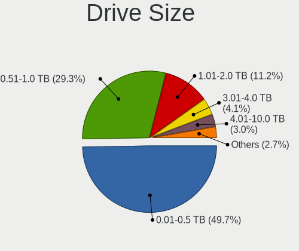
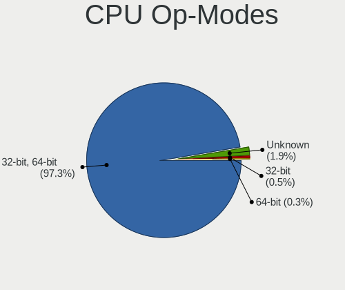
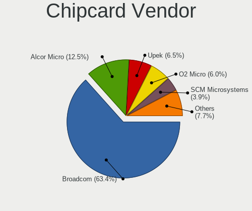

Linux in USA - Tested Hardware & Statistics
-------------------------------------------

A project to collect tested hardware configurations for Linux in USA.

Anyone can contribute to this report by the [hw-probe](https://github.com/linuxhw/hw-probe) tool:

    sudo -E hw-probe -all -upload

Please contribute! Especially if your hardware is rare.

This is a report for all computer types. See also reports for [desktops](/Location/USA/Desktop/README.md) and [notebooks](/Location/USA/Notebook/README.md).

Contents
--------

* [ Test Cases ](#test-cases)

* [ System ](#system)
  - [ OS                       ](#os)
  - [ OS Family                ](#os-family)
  - [ Kernel                   ](#kernel)
  - [ Kernel Family            ](#kernel-family)
  - [ Kernel Major Ver.        ](#kernel-major-ver)
  - [ Arch                     ](#arch)
  - [ DE                       ](#de)
  - [ Display Server           ](#display-server)
  - [ Display Manager          ](#display-manager)
  - [ OS Lang                  ](#os-lang)
  - [ Boot Mode                ](#boot-mode)
  - [ Filesystem               ](#filesystem)
  - [ Part. scheme             ](#part-scheme)
  - [ Dual Boot with Linux/BSD ](#dual-boot-with-linuxbsd)
  - [ Dual Boot (Win)          ](#dual-boot-win)

* [ Board ](#board)
  - [ Vendor                   ](#vendor)
  - [ Model                    ](#model)
  - [ Model Family             ](#model-family)
  - [ MFG Year                 ](#mfg-year)
  - [ Form Factor              ](#form-factor)
  - [ Secure Boot              ](#secure-boot)
  - [ Coreboot                 ](#coreboot)
  - [ RAM Size                 ](#ram-size)
  - [ RAM Used                 ](#ram-used)
  - [ Total Drives             ](#total-drives)
  - [ Has CD-ROM               ](#has-cd-rom)
  - [ Has Ethernet             ](#has-ethernet)
  - [ Has WiFi                 ](#has-wifi)
  - [ Has Bluetooth            ](#has-bluetooth)

* [ Location ](#location)
  - [ Country                  ](#country)
  - [ City                     ](#city)

* [ Drives ](#drives)
  - [ Drive Vendor             ](#drive-vendor)
  - [ Drive Model              ](#drive-model)
  - [ HDD Vendor               ](#hdd-vendor)
  - [ SSD Vendor               ](#ssd-vendor)
  - [ Drive Kind               ](#drive-kind)
  - [ Drive Connector          ](#drive-connector)
  - [ Drive Size               ](#drive-size)
  - [ Space Total              ](#space-total)
  - [ Space Used               ](#space-used)
  - [ Malfunc. Drives          ](#malfunc-drives)
  - [ Malfunc. Drive Vendor    ](#malfunc-drive-vendor)
  - [ Malfunc. HDD Vendor      ](#malfunc-hdd-vendor)
  - [ Malfunc. Drive Kind      ](#malfunc-drive-kind)
  - [ Failed Drives            ](#failed-drives)
  - [ Failed Drive Vendor      ](#failed-drive-vendor)
  - [ Drive Status             ](#drive-status)

* [ Storage controller ](#storage-controller)
  - [ Storage Vendor           ](#storage-vendor)
  - [ Storage Model            ](#storage-model)
  - [ Storage Kind             ](#storage-kind)

* [ Processor ](#processor)
  - [ CPU Vendor               ](#cpu-vendor)
  - [ CPU Model                ](#cpu-model)
  - [ CPU Model Family         ](#cpu-model-family)
  - [ CPU Cores                ](#cpu-cores)
  - [ CPU Sockets              ](#cpu-sockets)
  - [ CPU Threads              ](#cpu-threads)
  - [ CPU Op-Modes             ](#cpu-op-modes)
  - [ CPU Microcode            ](#cpu-microcode)
  - [ CPU Microarch            ](#cpu-microarch)

* [ Graphics ](#graphics)
  - [ GPU Vendor               ](#gpu-vendor)
  - [ GPU Model                ](#gpu-model)
  - [ GPU Combo                ](#gpu-combo)
  - [ GPU Driver               ](#gpu-driver)
  - [ GPU Memory               ](#gpu-memory)

* [ Monitor ](#monitor)
  - [ Monitor Vendor           ](#monitor-vendor)
  - [ Monitor Model            ](#monitor-model)
  - [ Monitor Resolution       ](#monitor-resolution)
  - [ Monitor Diagonal         ](#monitor-diagonal)
  - [ Monitor Width            ](#monitor-width)
  - [ Aspect Ratio             ](#aspect-ratio)
  - [ Monitor Area             ](#monitor-area)
  - [ Pixel Density            ](#pixel-density)
  - [ Multiple Monitors        ](#multiple-monitors)

* [ Network ](#network)
  - [ Net Controller Vendor    ](#net-controller-vendor)
  - [ Net Controller Model     ](#net-controller-model)
  - [ Wireless Vendor          ](#wireless-vendor)
  - [ Wireless Model           ](#wireless-model)
  - [ Ethernet Vendor          ](#ethernet-vendor)
  - [ Ethernet Model           ](#ethernet-model)
  - [ Net Controller Kind      ](#net-controller-kind)
  - [ Used Controller          ](#used-controller)
  - [ NICs                     ](#nics)
  - [ IPv6                     ](#ipv6)

* [ Bluetooth ](#bluetooth)
  - [ Bluetooth Vendor         ](#bluetooth-vendor)
  - [ Bluetooth Model          ](#bluetooth-model)

* [ Sound ](#sound)
  - [ Sound Vendor             ](#sound-vendor)
  - [ Sound Model              ](#sound-model)

* [ Memory ](#memory)
  - [ Memory Vendor            ](#memory-vendor)
  - [ Memory Model             ](#memory-model)
  - [ Memory Kind              ](#memory-kind)
  - [ Memory Form Factor       ](#memory-form-factor)
  - [ Memory Size              ](#memory-size)
  - [ Memory Speed             ](#memory-speed)

* [ Printers & scanners ](#printers--scanners)
  - [ Printer Vendor           ](#printer-vendor)
  - [ Printer Model            ](#printer-model)
  - [ Scanner Vendor           ](#scanner-vendor)
  - [ Scanner Model            ](#scanner-model)

* [ Camera ](#camera)
  - [ Camera Vendor            ](#camera-vendor)
  - [ Camera Model             ](#camera-model)

* [ Security ](#security)
  - [ Fingerprint Vendor       ](#fingerprint-vendor)
  - [ Fingerprint Model        ](#fingerprint-model)
  - [ Chipcard Vendor          ](#chipcard-vendor)
  - [ Chipcard Model           ](#chipcard-model)

* [ Unsupported ](#unsupported)
  - [ Unsupported Devices      ](#unsupported-devices)
  - [ Unsupported Device Types ](#unsupported-device-types)

Test Cases
----------

Total: 38204

| Vendor        | Model                       | Form-Factor | Probe                                                      | Date         |
|---------------|-----------------------------|-------------|------------------------------------------------------------|--------------|
| Google        | Enguarde                    | Notebook    | [50369de0be](https://linux-hardware.org/?probe=50369de0be) | Sep 01, 2022 |
| Google        | Enguarde                    | Notebook    | [b59a9615cd](https://linux-hardware.org/?probe=b59a9615cd) | Sep 01, 2022 |
| Dell          | 0J584C A00                  | Desktop     | [de442f1c61](https://linux-hardware.org/?probe=de442f1c61) | Sep 01, 2022 |
| HP            | Laptop 15-ef1xxx            | Notebook    | [d27c20dcf9](https://linux-hardware.org/?probe=d27c20dcf9) | Sep 01, 2022 |
| Google        | Enguarde                    | Notebook    | [7acc7436b0](https://linux-hardware.org/?probe=7acc7436b0) | Sep 01, 2022 |
| Google        | Enguarde                    | Notebook    | [671a062f6e](https://linux-hardware.org/?probe=671a062f6e) | Sep 01, 2022 |
| Google        | Enguarde                    | Notebook    | [baabafd42b](https://linux-hardware.org/?probe=baabafd42b) | Sep 01, 2022 |
| Google        | Enguarde                    | Notebook    | [4c1595c83e](https://linux-hardware.org/?probe=4c1595c83e) | Sep 01, 2022 |
| Google        | Enguarde                    | Notebook    | [bb6b28b279](https://linux-hardware.org/?probe=bb6b28b279) | Sep 01, 2022 |
| Google        | Terra                       | Notebook    | [b7940ab738](https://linux-hardware.org/?probe=b7940ab738) | Sep 01, 2022 |
| Google        | Enguarde                    | Notebook    | [0cbe57b975](https://linux-hardware.org/?probe=0cbe57b975) | Sep 01, 2022 |
| Google        | Enguarde                    | Notebook    | [9f20842cc5](https://linux-hardware.org/?probe=9f20842cc5) | Sep 01, 2022 |
| Gigabyte      | B450M DS3H WIFI-CF          | Desktop     | [fb12fe29dd](https://linux-hardware.org/?probe=fb12fe29dd) | Sep 01, 2022 |
| HP            | Laptop 15-db1xxx            | Notebook    | [51b19bb74b](https://linux-hardware.org/?probe=51b19bb74b) | Sep 01, 2022 |
| Google        | Enguarde                    | Notebook    | [06969489cc](https://linux-hardware.org/?probe=06969489cc) | Sep 01, 2022 |
| Google        | Enguarde                    | Notebook    | [2b4231258e](https://linux-hardware.org/?probe=2b4231258e) | Sep 01, 2022 |
| Google        | Enguarde                    | Notebook    | [1a0596c60d](https://linux-hardware.org/?probe=1a0596c60d) | Sep 01, 2022 |
| Google        | Enguarde                    | Notebook    | [4dfdb5e364](https://linux-hardware.org/?probe=4dfdb5e364) | Sep 01, 2022 |
| Lenovo        | SHARKBAY 31900058 STD       | Desktop     | [f113f959b7](https://linux-hardware.org/?probe=f113f959b7) | Sep 01, 2022 |
| Google        | Enguarde                    | Notebook    | [c6db81251c](https://linux-hardware.org/?probe=c6db81251c) | Sep 01, 2022 |
| Dell          | Inspiron 7591 2n1           | Convertible | [b963be56f5](https://linux-hardware.org/?probe=b963be56f5) | Sep 01, 2022 |
| Google        | Enguarde                    | Notebook    | [05f112ddb7](https://linux-hardware.org/?probe=05f112ddb7) | Sep 01, 2022 |
| MSI           | MS-B9201                    | Desktop     | [7bbae05d63](https://linux-hardware.org/?probe=7bbae05d63) | Sep 01, 2022 |
| ASUSTek       | M2N32-SLI DELUXE            | Desktop     | [d1bb81241c](https://linux-hardware.org/?probe=d1bb81241c) | Sep 01, 2022 |
| Dell          | 0MWYPT A02                  | Desktop     | [e2f98387b0](https://linux-hardware.org/?probe=e2f98387b0) | Sep 01, 2022 |
| MSI           | MS-B9201                    | Desktop     | [0d04798699](https://linux-hardware.org/?probe=0d04798699) | Sep 01, 2022 |
| Lenovo        | ThinkBook 14 G2 ITL 20VD    | Notebook    | [02ec70b604](https://linux-hardware.org/?probe=02ec70b604) | Sep 01, 2022 |
| HP            | Laptop 15-db0xxx            | Notebook    | [de848d928c](https://linux-hardware.org/?probe=de848d928c) | Sep 01, 2022 |
| Lenovo        | ThinkPad P15 Gen 1 20STC... | Notebook    | [0a5a3fa67e](https://linux-hardware.org/?probe=0a5a3fa67e) | Sep 01, 2022 |
| HP            | ProBook 4540s               | Notebook    | [b5e6fa5a71](https://linux-hardware.org/?probe=b5e6fa5a71) | Sep 01, 2022 |
| MECHREVO      | Code01 Ver2.0               | Notebook    | [f88772c4dc](https://linux-hardware.org/?probe=f88772c4dc) | Sep 01, 2022 |
| MECHREVO      | Code01 Ver2.0               | Notebook    | [0cb5fbde81](https://linux-hardware.org/?probe=0cb5fbde81) | Sep 01, 2022 |
| Valve         | Jupiter                     | Notebook    | [c89533e9a2](https://linux-hardware.org/?probe=c89533e9a2) | Sep 01, 2022 |
| HP            | Laptop 15-da0xxx            | Notebook    | [2c79168e77](https://linux-hardware.org/?probe=2c79168e77) | Sep 01, 2022 |
| Lenovo        | G50-45 80E3                 | Notebook    | [3080895149](https://linux-hardware.org/?probe=3080895149) | Sep 01, 2022 |
| ASUSTek       | PRIME B550M-A               | Desktop     | [8fc60cb459](https://linux-hardware.org/?probe=8fc60cb459) | Sep 01, 2022 |
| HP            | Laptop 15-da0xxx            | Notebook    | [40482ce9a3](https://linux-hardware.org/?probe=40482ce9a3) | Sep 01, 2022 |
| Dell          | Inspiron 13 5310            | Notebook    | [b6b7c6dc62](https://linux-hardware.org/?probe=b6b7c6dc62) | Sep 01, 2022 |
| Dell          | Inspiron 15-3552            | Notebook    | [2eb780855d](https://linux-hardware.org/?probe=2eb780855d) | Sep 01, 2022 |
| Dell          | Inspiron 13 5310            | Notebook    | [6b3c188071](https://linux-hardware.org/?probe=6b3c188071) | Sep 01, 2022 |
| Dell          | Inspiron 13 5310            | Notebook    | [b0d6660da8](https://linux-hardware.org/?probe=b0d6660da8) | Sep 01, 2022 |
| Samsung       | 950XEE                      | Notebook    | [454b67dd88](https://linux-hardware.org/?probe=454b67dd88) | Sep 01, 2022 |
| MSI           | H110M GAMING                | Desktop     | [2699df47df](https://linux-hardware.org/?probe=2699df47df) | Sep 01, 2022 |
| Dell          | Inspiron 15-3552            | Notebook    | [a5e4d22ccd](https://linux-hardware.org/?probe=a5e4d22ccd) | Sep 01, 2022 |
| Apple         | MacBookAir9,1               | Notebook    | [51c4002c97](https://linux-hardware.org/?probe=51c4002c97) | Sep 01, 2022 |
| Lenovo        | Legion S7 15ACH6 82K8       | Notebook    | [d96b24b7f3](https://linux-hardware.org/?probe=d96b24b7f3) | Sep 01, 2022 |
| Alienware     | m15 R4                      | Notebook    | [267e4bb2dd](https://linux-hardware.org/?probe=267e4bb2dd) | Sep 01, 2022 |
| HP            | 3398                        | Desktop     | [8b5bad68cb](https://linux-hardware.org/?probe=8b5bad68cb) | Sep 01, 2022 |
| Lenovo        | Legion S7 15ACH6 82K8       | Notebook    | [67eb62450a](https://linux-hardware.org/?probe=67eb62450a) | Sep 01, 2022 |
| Apple         | Mac-77F17D7DA9285301 iMa... | All in one  | [43835631c2](https://linux-hardware.org/?probe=43835631c2) | Sep 01, 2022 |
| ASUSTek       | TUF Gaming X570-PRO         | Desktop     | [6eae76b5d0](https://linux-hardware.org/?probe=6eae76b5d0) | Sep 01, 2022 |
| HP            | EliteBook 840 G7 Noteboo... | Notebook    | [b50b1adb0f](https://linux-hardware.org/?probe=b50b1adb0f) | Sep 01, 2022 |
| Lenovo        | 36D5 SDK0J40700 WIN 3258... | Desktop     | [87dfd12899](https://linux-hardware.org/?probe=87dfd12899) | Sep 01, 2022 |
| Unknown       | HX90                        | Desktop     | [71295a28ed](https://linux-hardware.org/?probe=71295a28ed) | Sep 01, 2022 |
| Dell          | Inspiron 1545               | Notebook    | [611306b3c0](https://linux-hardware.org/?probe=611306b3c0) | Sep 01, 2022 |
| Dell          | 09M8Y8 A01                  | Desktop     | [54b61cd4be](https://linux-hardware.org/?probe=54b61cd4be) | Sep 01, 2022 |
| ASRock        | B450M/ac                    | Desktop     | [393a08345e](https://linux-hardware.org/?probe=393a08345e) | Sep 01, 2022 |
| HP            | ENVY Laptop 13-ba1xxx       | Notebook    | [5a4e2225a8](https://linux-hardware.org/?probe=5a4e2225a8) | Sep 01, 2022 |
| Valve         | Jupiter                     | Notebook    | [c348c06118](https://linux-hardware.org/?probe=c348c06118) | Sep 01, 2022 |
| HP            | G42                         | Notebook    | [a79b07fcd0](https://linux-hardware.org/?probe=a79b07fcd0) | Sep 01, 2022 |
| Lenovo        | ThinkPad L13 Yoga Gen 2 ... | Convertible | [8e8a47df1b](https://linux-hardware.org/?probe=8e8a47df1b) | Aug 31, 2022 |
| Microsoft     | Surface Pro                 | Tablet      | [b6cc2513ff](https://linux-hardware.org/?probe=b6cc2513ff) | Aug 31, 2022 |
| Microsoft     | Surface Pro                 | Tablet      | [e8b26fc530](https://linux-hardware.org/?probe=e8b26fc530) | Aug 31, 2022 |
| Google        | Enguarde                    | Notebook    | [4a240c438e](https://linux-hardware.org/?probe=4a240c438e) | Aug 31, 2022 |
| MECHREVO      | Code01 Ver2.0               | Notebook    | [c63c5e6700](https://linux-hardware.org/?probe=c63c5e6700) | Aug 31, 2022 |
| MECHREVO      | Code01 Ver2.0               | Notebook    | [bbe5fe0eac](https://linux-hardware.org/?probe=bbe5fe0eac) | Aug 31, 2022 |
| Raspberry ... | Raspberry Pi                | Soc         | [dea44e447f](https://linux-hardware.org/?probe=dea44e447f) | Aug 31, 2022 |
| Raspberry ... | Raspberry Pi                | Soc         | [a4fc4ad9e3](https://linux-hardware.org/?probe=a4fc4ad9e3) | Aug 31, 2022 |
| Dell          | 0R092H                      | Desktop     | [1a3a337c23](https://linux-hardware.org/?probe=1a3a337c23) | Aug 31, 2022 |
| HP            | Elite x2 1012 G1            | Notebook    | [10455cfe0d](https://linux-hardware.org/?probe=10455cfe0d) | Aug 31, 2022 |
| HP            | 15 Notebook PC              | Notebook    | [1109650747](https://linux-hardware.org/?probe=1109650747) | Aug 31, 2022 |
| Lenovo        | ThinkPad L13 Yoga Gen 2 ... | Convertible | [d0fd41cd07](https://linux-hardware.org/?probe=d0fd41cd07) | Aug 31, 2022 |
| Apple         | Mac-77EB7D7DAF985301 iMa... | All in one  | [3d2275b1f9](https://linux-hardware.org/?probe=3d2275b1f9) | Aug 31, 2022 |
| Apple         | Mac-81E3E92DD6088272 iMa... | All in one  | [38306e56ae](https://linux-hardware.org/?probe=38306e56ae) | Aug 31, 2022 |
| Apple         | Mac-81E3E92DD6088272 iMa... | All in one  | [28fbbd943e](https://linux-hardware.org/?probe=28fbbd943e) | Aug 31, 2022 |
| AZW           | SER                         | Mini pc     | [4ac98abc0e](https://linux-hardware.org/?probe=4ac98abc0e) | Aug 31, 2022 |
| MSI           | Z390-A PRO                  | Desktop     | [368eff381c](https://linux-hardware.org/?probe=368eff381c) | Aug 31, 2022 |
| Dell          | Inspiron 13-7378            | Notebook    | [42666a5460](https://linux-hardware.org/?probe=42666a5460) | Aug 31, 2022 |
| Eluktronic... | MAG-15 2070                 | Notebook    | [d7fb373622](https://linux-hardware.org/?probe=d7fb373622) | Aug 31, 2022 |
| Dell          | Inspiron 15-3552            | Notebook    | [8e2cd928f3](https://linux-hardware.org/?probe=8e2cd928f3) | Aug 31, 2022 |
| Valve         | Jupiter                     | Notebook    | [dbc549504c](https://linux-hardware.org/?probe=dbc549504c) | Aug 31, 2022 |
| ASUSTek       | GL10DH                      | Desktop     | [c197df704f](https://linux-hardware.org/?probe=c197df704f) | Aug 31, 2022 |
| Dell          | Latitude E5570              | Notebook    | [91513d0ee3](https://linux-hardware.org/?probe=91513d0ee3) | Aug 31, 2022 |
| Acer          | Aspire R3-471T              | Notebook    | [01b021f810](https://linux-hardware.org/?probe=01b021f810) | Aug 31, 2022 |
| HP            | Laptop 15-dy1xxx            | Notebook    | [836644c18b](https://linux-hardware.org/?probe=836644c18b) | Aug 31, 2022 |
| HP            | EliteBook 820 G3            | Notebook    | [a0bc059a35](https://linux-hardware.org/?probe=a0bc059a35) | Aug 31, 2022 |
| HP            | EliteBook 820 G3            | Notebook    | [0c275e0aaa](https://linux-hardware.org/?probe=0c275e0aaa) | Aug 31, 2022 |
| 16512-2316... | MPG X570 GAMING EDGE WIF... | Desktop     | [d523a89d9b](https://linux-hardware.org/?probe=d523a89d9b) | Aug 31, 2022 |
| HP            | 8433 11                     | Desktop     | [00868f25c6](https://linux-hardware.org/?probe=00868f25c6) | Aug 31, 2022 |
| Lenovo        | IdeaPad 5 15IIL05 81YK      | Notebook    | [6d04d534fa](https://linux-hardware.org/?probe=6d04d534fa) | Aug 31, 2022 |
| Dell          | 0GXM1W A00                  | Desktop     | [b358b1d32b](https://linux-hardware.org/?probe=b358b1d32b) | Aug 31, 2022 |
| Dell          | 0KV3RP A00                  | Desktop     | [731a14ee10](https://linux-hardware.org/?probe=731a14ee10) | Aug 31, 2022 |
| HP            | EliteBook 840 G5            | Notebook    | [e4b0cb981a](https://linux-hardware.org/?probe=e4b0cb981a) | Aug 31, 2022 |
| Dell          | Inspiron 5502               | Notebook    | [1bb776feab](https://linux-hardware.org/?probe=1bb776feab) | Aug 31, 2022 |
| Dell          | Inspiron 3493               | Notebook    | [dc23941a16](https://linux-hardware.org/?probe=dc23941a16) | Aug 31, 2022 |
| ASRock        | B450M-HDV R4.0              | Desktop     | [9c9e1d1ff1](https://linux-hardware.org/?probe=9c9e1d1ff1) | Aug 31, 2022 |
| Google        | Enguarde                    | Notebook    | [7aa44db561](https://linux-hardware.org/?probe=7aa44db561) | Aug 30, 2022 |
| Lenovo        | ThinkPad Edge E530 62724... | Notebook    | [87cad1c0b0](https://linux-hardware.org/?probe=87cad1c0b0) | Aug 30, 2022 |
| Gigabyte      | F2A88XM-HD3                 | Desktop     | [44e355eb93](https://linux-hardware.org/?probe=44e355eb93) | Aug 30, 2022 |
| Dell          | 0R092H                      | Desktop     | [85871600b3](https://linux-hardware.org/?probe=85871600b3) | Aug 30, 2022 |
| Lenovo        | ThinkPad L13 Yoga Gen 2 ... | Convertible | [354c669532](https://linux-hardware.org/?probe=354c669532) | Aug 30, 2022 |
| HP            | ZBook 17                    | Notebook    | [98e643f5af](https://linux-hardware.org/?probe=98e643f5af) | Aug 30, 2022 |
| ASUSTek       | ET2410                      | All in one  | [3cd48cf0ed](https://linux-hardware.org/?probe=3cd48cf0ed) | Aug 30, 2022 |
| Dell          | XPS 15 9570                 | Notebook    | [6c35aeda10](https://linux-hardware.org/?probe=6c35aeda10) | Aug 30, 2022 |
| Google        | Reks                        | Notebook    | [71f6228c3d](https://linux-hardware.org/?probe=71f6228c3d) | Aug 30, 2022 |
| Google        | Reks                        | Notebook    | [48174b01b3](https://linux-hardware.org/?probe=48174b01b3) | Aug 30, 2022 |
| ASRock        | Q1900-ITX                   | Desktop     | [c5a0ce2143](https://linux-hardware.org/?probe=c5a0ce2143) | Aug 30, 2022 |
| Google        | Terra                       | Notebook    | [25f50ae6d9](https://linux-hardware.org/?probe=25f50ae6d9) | Aug 30, 2022 |
| Google        | Reks                        | Notebook    | [e768a1940e](https://linux-hardware.org/?probe=e768a1940e) | Aug 30, 2022 |
| Dell          | Inspiron 7506 2n1           | Convertible | [aa9aef8014](https://linux-hardware.org/?probe=aa9aef8014) | Aug 30, 2022 |
| Dell          | Inspiron 5502               | Notebook    | [28a1dd084e](https://linux-hardware.org/?probe=28a1dd084e) | Aug 30, 2022 |
| Dell          | Inspiron 5502               | Notebook    | [df0098010e](https://linux-hardware.org/?probe=df0098010e) | Aug 30, 2022 |
| Apple         | MacBookAir7,2               | Notebook    | [a96a893eac](https://linux-hardware.org/?probe=a96a893eac) | Aug 30, 2022 |
| Lenovo        | ThinkPad L13 Yoga Gen 2 ... | Convertible | [d75c824e1f](https://linux-hardware.org/?probe=d75c824e1f) | Aug 30, 2022 |
| HP            | EliteBook 820 G3            | Notebook    | [4ea311ca8e](https://linux-hardware.org/?probe=4ea311ca8e) | Aug 30, 2022 |
| ASUSTek       | TUF Gaming X570-PLUS        | Desktop     | [d816d2ade0](https://linux-hardware.org/?probe=d816d2ade0) | Aug 30, 2022 |
| Raspberry ... | Raspberry Pi                | Soc         | [d075972bed](https://linux-hardware.org/?probe=d075972bed) | Aug 30, 2022 |
| Raspberry ... | Raspberry Pi 4 Model B      | Soc         | [133dfe9b9e](https://linux-hardware.org/?probe=133dfe9b9e) | Aug 30, 2022 |
| Dell          | 0H0P0M A00                  | Desktop     | [cfa1437377](https://linux-hardware.org/?probe=cfa1437377) | Aug 30, 2022 |
| HP            | ProBook 4540s               | Notebook    | [0509af43f4](https://linux-hardware.org/?probe=0509af43f4) | Aug 30, 2022 |
| HP            | 2000                        | Notebook    | [106a330325](https://linux-hardware.org/?probe=106a330325) | Aug 30, 2022 |
| ASRockRack    | ROMED8-2T                   | Desktop     | [a034a83f72](https://linux-hardware.org/?probe=a034a83f72) | Aug 30, 2022 |
| Apple         | Mac-BE088AF8C5EB4FA2 iMa... | All in one  | [6d2717b230](https://linux-hardware.org/?probe=6d2717b230) | Aug 30, 2022 |
| HP            | ENVY 14                     | Notebook    | [4dd324c355](https://linux-hardware.org/?probe=4dd324c355) | Aug 30, 2022 |
| Dell          | 0J3C2F A00                  | Desktop     | [276ac60713](https://linux-hardware.org/?probe=276ac60713) | Aug 30, 2022 |
| Lenovo        | ThinkPad X1 Carbon Gen 8... | Notebook    | [adcfb8a267](https://linux-hardware.org/?probe=adcfb8a267) | Aug 30, 2022 |
| Apple         | Mac-F2208EC8                | Mini pc     | [f262848655](https://linux-hardware.org/?probe=f262848655) | Aug 30, 2022 |
| HP            | 8464                        | Desktop     | [16bb2588e0](https://linux-hardware.org/?probe=16bb2588e0) | Aug 30, 2022 |
| Gigabyte      | GA-78LMT-S2                 | Desktop     | [70ee26740a](https://linux-hardware.org/?probe=70ee26740a) | Aug 30, 2022 |
| Valve         | Jupiter                     | Notebook    | [40b9dd39a6](https://linux-hardware.org/?probe=40b9dd39a6) | Aug 30, 2022 |
| Valve         | Jupiter                     | Notebook    | [ea6506cc93](https://linux-hardware.org/?probe=ea6506cc93) | Aug 30, 2022 |
| Ematic        | EWT118                      | Notebook    | [3fa43d450e](https://linux-hardware.org/?probe=3fa43d450e) | Aug 30, 2022 |
| HP            | 2B38                        | Desktop     | [40428ed239](https://linux-hardware.org/?probe=40428ed239) | Aug 30, 2022 |
| Samsung       | 870Z5E/880Z5E/680Z5E        | Notebook    | [0166c06969](https://linux-hardware.org/?probe=0166c06969) | Aug 30, 2022 |
| Lenovo        | ThinkPad L13 Yoga Gen 2 ... | Convertible | [c917d8e9ee](https://linux-hardware.org/?probe=c917d8e9ee) | Aug 29, 2022 |
| MSI           | MS-B9201                    | Desktop     | [b5c80c8c2c](https://linux-hardware.org/?probe=b5c80c8c2c) | Aug 29, 2022 |
| Lenovo        | ThinkPad L13 Yoga Gen 2 ... | Convertible | [d2690990ee](https://linux-hardware.org/?probe=d2690990ee) | Aug 29, 2022 |
| Microsoft     | Surface Pro 6               | Tablet      | [be30fd63a0](https://linux-hardware.org/?probe=be30fd63a0) | Aug 29, 2022 |
| Microsoft     | Surface Pro 6               | Tablet      | [135f83007e](https://linux-hardware.org/?probe=135f83007e) | Aug 29, 2022 |
| Dell          | Inspiron 5721               | Notebook    | [d483434965](https://linux-hardware.org/?probe=d483434965) | Aug 29, 2022 |
| Dell          | 0KWVT8 A03                  | Desktop     | [b91ce43523](https://linux-hardware.org/?probe=b91ce43523) | Aug 29, 2022 |
| Timi          | Redmi Book Pro 15 2022      | Notebook    | [473daa5ce3](https://linux-hardware.org/?probe=473daa5ce3) | Aug 29, 2022 |
| HP            | 2000                        | Notebook    | [9705fe4434](https://linux-hardware.org/?probe=9705fe4434) | Aug 29, 2022 |
| Lenovo        | ThinkPad 13 2nd Gen 20J1... | Notebook    | [30b240a3fe](https://linux-hardware.org/?probe=30b240a3fe) | Aug 29, 2022 |
| HP            | ENVY x360 Convertible 15... | Convertible | [289c5dc0b6](https://linux-hardware.org/?probe=289c5dc0b6) | Aug 29, 2022 |
| Lenovo        | ThinkPad L13 Yoga Gen 2 ... | Convertible | [ded0b0e3f9](https://linux-hardware.org/?probe=ded0b0e3f9) | Aug 29, 2022 |
| ASRock        | X470 Gaming-ITX/ac          | Desktop     | [b65fff0f51](https://linux-hardware.org/?probe=b65fff0f51) | Aug 29, 2022 |
| Supermicro    | X10SLL-F                    | Desktop     | [c3b5857c26](https://linux-hardware.org/?probe=c3b5857c26) | Aug 29, 2022 |
| Lenovo        | Bantry CRB SDK0J40709 WI... | Desktop     | [4ba4105869](https://linux-hardware.org/?probe=4ba4105869) | Aug 29, 2022 |
| HP            | 304Ah                       | Desktop     | [3f370524f3](https://linux-hardware.org/?probe=3f370524f3) | Aug 29, 2022 |
| Dell          | OptiPlex 9020 AIO           | All in one  | [69bb3ed970](https://linux-hardware.org/?probe=69bb3ed970) | Aug 29, 2022 |
| MSI           | MAG X570S TOMAHAWK MAX W... | Desktop     | [33aaa7baf4](https://linux-hardware.org/?probe=33aaa7baf4) | Aug 29, 2022 |
| Lenovo        | ThinkPad L13 Yoga Gen 2 ... | Convertible | [5a8b177558](https://linux-hardware.org/?probe=5a8b177558) | Aug 29, 2022 |
| Lenovo        | ThinkPad L13 Yoga Gen 2 ... | Convertible | [c96457b375](https://linux-hardware.org/?probe=c96457b375) | Aug 29, 2022 |
| Lenovo        | ThinkCentre M91p 4518AU8    | Desktop     | [0099ab3432](https://linux-hardware.org/?probe=0099ab3432) | Aug 29, 2022 |
| Lenovo        | ThinkPad L13 Yoga Gen 2 ... | Convertible | [12ec01d9fb](https://linux-hardware.org/?probe=12ec01d9fb) | Aug 29, 2022 |
| Lenovo        | ThinkPad L13 Yoga Gen 2 ... | Convertible | [3191045f89](https://linux-hardware.org/?probe=3191045f89) | Aug 29, 2022 |
| Lenovo        | ThinkPad L13 Yoga Gen 2 ... | Convertible | [4c62620474](https://linux-hardware.org/?probe=4c62620474) | Aug 29, 2022 |
| Eluktronic... | MAX-17                      | Notebook    | [627ecbeb36](https://linux-hardware.org/?probe=627ecbeb36) | Aug 29, 2022 |
| AZW           | SER                         | Mini pc     | [92460ed2a6](https://linux-hardware.org/?probe=92460ed2a6) | Aug 29, 2022 |
| MSI           | MPG Z390I GAMING EDGE AC    | Desktop     | [cf0cdab1da](https://linux-hardware.org/?probe=cf0cdab1da) | Aug 29, 2022 |
| MSI           | MPG Z390 GAMING PLUS        | Desktop     | [60bc287a81](https://linux-hardware.org/?probe=60bc287a81) | Aug 29, 2022 |
| MSI           | MPG Z390 GAMING PLUS        | Desktop     | [7d1dae1de6](https://linux-hardware.org/?probe=7d1dae1de6) | Aug 29, 2022 |
| MSI           | MAG B550M MORTAR            | Desktop     | [82ff6d598a](https://linux-hardware.org/?probe=82ff6d598a) | Aug 29, 2022 |
| Gigabyte      | B550 AORUS ELITE AX V2      | Desktop     | [81bc767d5b](https://linux-hardware.org/?probe=81bc767d5b) | Aug 29, 2022 |
| HP            | Pavilion Laptop 17-ar0xx    | Notebook    | [9336d821f8](https://linux-hardware.org/?probe=9336d821f8) | Aug 29, 2022 |
| HP            | 1497                        | Desktop     | [625185d1db](https://linux-hardware.org/?probe=625185d1db) | Aug 29, 2022 |
| ASUSTek       | PRIME B550M-A               | Desktop     | [1ff074d641](https://linux-hardware.org/?probe=1ff074d641) | Aug 29, 2022 |
| ASUSTek       | K55VM                       | Notebook    | [ec5806d544](https://linux-hardware.org/?probe=ec5806d544) | Aug 29, 2022 |
| System76      | Galago Pro                  | Notebook    | [df2c4ae77c](https://linux-hardware.org/?probe=df2c4ae77c) | Aug 29, 2022 |
| Valve         | Jupiter                     | Notebook    | [830c22afde](https://linux-hardware.org/?probe=830c22afde) | Aug 29, 2022 |
| Dell          | 05XGC8 A01                  | Desktop     | [73ac4cc88d](https://linux-hardware.org/?probe=73ac4cc88d) | Aug 29, 2022 |
| Dell          | XPS 13 9360                 | Notebook    | [1763ee1dd0](https://linux-hardware.org/?probe=1763ee1dd0) | Aug 29, 2022 |
| MSI           | Z77A-G43                    | Desktop     | [1d1864dabc](https://linux-hardware.org/?probe=1d1864dabc) | Aug 29, 2022 |
| ASUSTek       | ROG STRIX B550-F GAMING     | Desktop     | [281360b58a](https://linux-hardware.org/?probe=281360b58a) | Aug 29, 2022 |
| Lenovo        | Legion 5 Pro 16ARH7H 82R... | Notebook    | [065da8ca1e](https://linux-hardware.org/?probe=065da8ca1e) | Aug 29, 2022 |
| Valve         | Jupiter                     | Notebook    | [43ec7fb445](https://linux-hardware.org/?probe=43ec7fb445) | Aug 29, 2022 |
| BESSTAR Te... | UM700                       | Desktop     | [13fdf5ef5e](https://linux-hardware.org/?probe=13fdf5ef5e) | Aug 29, 2022 |
| HP            | ZBook 15u G4                | Notebook    | [39f4830019](https://linux-hardware.org/?probe=39f4830019) | Aug 28, 2022 |
| Dell          | Precision 5750              | Notebook    | [2ee41b471e](https://linux-hardware.org/?probe=2ee41b471e) | Aug 28, 2022 |
| Lenovo        | 3110 SDK0J40697 WIN 3305... | All in one  | [cde94f0c8e](https://linux-hardware.org/?probe=cde94f0c8e) | Aug 28, 2022 |
| ASUSTek       | K55A                        | Notebook    | [5d11054a36](https://linux-hardware.org/?probe=5d11054a36) | Aug 28, 2022 |
| Lenovo        | IdeaPadFlex 5-1570 81CA     | Convertible | [ecaac234f3](https://linux-hardware.org/?probe=ecaac234f3) | Aug 28, 2022 |
| Dell          | Inspiron 7570               | Notebook    | [087341ccba](https://linux-hardware.org/?probe=087341ccba) | Aug 28, 2022 |
| Dell          | Inspiron 7570               | Notebook    | [157b282e20](https://linux-hardware.org/?probe=157b282e20) | Aug 28, 2022 |
| Panasonic     | CF-30KTPAZAE                | Notebook    | [61a8f4a768](https://linux-hardware.org/?probe=61a8f4a768) | Aug 28, 2022 |
| Apple         | MacBookPro14,1              | Notebook    | [31d4a8fc43](https://linux-hardware.org/?probe=31d4a8fc43) | Aug 28, 2022 |
| Acer          | Aspire TC-780               | Desktop     | [eba35d616c](https://linux-hardware.org/?probe=eba35d616c) | Aug 28, 2022 |
| Dell          | 0HY9JP A00                  | Desktop     | [811e87f60b](https://linux-hardware.org/?probe=811e87f60b) | Aug 28, 2022 |
| Dell          | Precision 5750              | Notebook    | [af9992756f](https://linux-hardware.org/?probe=af9992756f) | Aug 28, 2022 |
| Dell          | 0NW6H5 A00                  | Desktop     | [40a706292c](https://linux-hardware.org/?probe=40a706292c) | Aug 28, 2022 |
| HP            | ZBook 15u G4                | Notebook    | [2115d02bfd](https://linux-hardware.org/?probe=2115d02bfd) | Aug 28, 2022 |
| Google        | Eldrid                      | Notebook    | [ae53120bac](https://linux-hardware.org/?probe=ae53120bac) | Aug 28, 2022 |
| Framework     | Laptop                      | Notebook    | [71c896cd39](https://linux-hardware.org/?probe=71c896cd39) | Aug 28, 2022 |
| Dell          | 00F82W A01                  | Desktop     | [d078076894](https://linux-hardware.org/?probe=d078076894) | Aug 28, 2022 |
| Gigabyte      | A320M-S2H-CF                | Desktop     | [b7ebc75f83](https://linux-hardware.org/?probe=b7ebc75f83) | Aug 28, 2022 |
| Lenovo        | Bantry CRB 31900058 STD     | Desktop     | [d0c37f7188](https://linux-hardware.org/?probe=d0c37f7188) | Aug 28, 2022 |
| ASUSTek       | ProArt B550-CREATOR         | Desktop     | [ec9f8ea30e](https://linux-hardware.org/?probe=ec9f8ea30e) | Aug 28, 2022 |
| Dell          | Latitude 7290               | Notebook    | [2c017f3533](https://linux-hardware.org/?probe=2c017f3533) | Aug 28, 2022 |
| ASUSTek       | A88XM-A                     | Desktop     | [d8a4e4d954](https://linux-hardware.org/?probe=d8a4e4d954) | Aug 28, 2022 |
| Valve         | Jupiter                     | Notebook    | [3848655fce](https://linux-hardware.org/?probe=3848655fce) | Aug 28, 2022 |
| Dell          | Inspiron 1545               | Notebook    | [ff02214b7f](https://linux-hardware.org/?probe=ff02214b7f) | Aug 28, 2022 |
| Fujitsu       | FMVNQ8P6                    | Notebook    | [5e34698f14](https://linux-hardware.org/?probe=5e34698f14) | Aug 28, 2022 |
| Lenovo        | ThinkPad W520 4270CTO       | Notebook    | [c4be3fe1b6](https://linux-hardware.org/?probe=c4be3fe1b6) | Aug 28, 2022 |
| Lenovo        | IdeaPad 3 15ITL05 81X8      | Notebook    | [8b4125a88a](https://linux-hardware.org/?probe=8b4125a88a) | Aug 28, 2022 |
| Gigabyte      | B550 AORUS ELITE AX V2      | Desktop     | [9e3df56c3b](https://linux-hardware.org/?probe=9e3df56c3b) | Aug 28, 2022 |
| Lenovo        | Legion 5 Pro 16ARH7H 82R... | Notebook    | [af00be0ff8](https://linux-hardware.org/?probe=af00be0ff8) | Aug 28, 2022 |
| Lenovo        | ThinkPad W520 4270CTO       | Notebook    | [568802fb43](https://linux-hardware.org/?probe=568802fb43) | Aug 28, 2022 |
| Quanta        | 2AC5 101                    | All in one  | [b32f35a4b1](https://linux-hardware.org/?probe=b32f35a4b1) | Aug 28, 2022 |
| Lenovo        | Yoga C940-14IIL 81Q9        | Convertible | [dc431e4826](https://linux-hardware.org/?probe=dc431e4826) | Aug 28, 2022 |
| Gigabyte      | B450M DS3H WIFI-CF          | Desktop     | [dbb099ef3e](https://linux-hardware.org/?probe=dbb099ef3e) | Aug 28, 2022 |
| Dell          | 020M3P A00                  | Desktop     | [424ea42e17](https://linux-hardware.org/?probe=424ea42e17) | Aug 28, 2022 |
| Google        | Butterfly                   | Notebook    | [df8fafaf3b](https://linux-hardware.org/?probe=df8fafaf3b) | Aug 28, 2022 |
| Dell          | Latitude E5510              | Notebook    | [50831b94bf](https://linux-hardware.org/?probe=50831b94bf) | Aug 28, 2022 |
| Alienware     | 15                          | Notebook    | [f85646920a](https://linux-hardware.org/?probe=f85646920a) | Aug 28, 2022 |
| ASUSTek       | TP500LA                     | Notebook    | [de395dddd8](https://linux-hardware.org/?probe=de395dddd8) | Aug 28, 2022 |
| HP            | Spectre x360 Convertible... | Convertible | [58b2139536](https://linux-hardware.org/?probe=58b2139536) | Aug 27, 2022 |
| Gigabyte      | B450M DS3H WIFI-CF          | Desktop     | [a90735a9e9](https://linux-hardware.org/?probe=a90735a9e9) | Aug 27, 2022 |
| Lenovo        | IdeaPad 320-15ABR 80XS      | Notebook    | [2e085a419b](https://linux-hardware.org/?probe=2e085a419b) | Aug 27, 2022 |
| Lenovo        | IdeaPad 320-15ABR 80XS      | Notebook    | [c47cd7c7ed](https://linux-hardware.org/?probe=c47cd7c7ed) | Aug 27, 2022 |
| ASRock        | 990FX Extreme9              | Desktop     | [1a472eb51c](https://linux-hardware.org/?probe=1a472eb51c) | Aug 27, 2022 |
| Acidanther... | MacBookPro12,1              | Notebook    | [9e48c5e245](https://linux-hardware.org/?probe=9e48c5e245) | Aug 27, 2022 |
| Gigabyte      | X570 AORUS PRO WIFI         | Desktop     | [273e1c9459](https://linux-hardware.org/?probe=273e1c9459) | Aug 27, 2022 |
| ASRock        | B450M Pro4                  | Desktop     | [f4fe5fd168](https://linux-hardware.org/?probe=f4fe5fd168) | Aug 27, 2022 |
| Apple         | Mac-F2238AC8                | All in one  | [209e0387a9](https://linux-hardware.org/?probe=209e0387a9) | Aug 27, 2022 |
| Samsung       | 950QCG                      | Convertible | [a2be990b7b](https://linux-hardware.org/?probe=a2be990b7b) | Aug 27, 2022 |
| HP            | ENVY Notebook               | Notebook    | [c43c52b493](https://linux-hardware.org/?probe=c43c52b493) | Aug 27, 2022 |
| HP            | OMEN by Laptop 16-b0xxx     | Notebook    | [94b00f5da5](https://linux-hardware.org/?probe=94b00f5da5) | Aug 27, 2022 |
| Lenovo        | IdeaPad 3 15ITL6 82H8       | Notebook    | [559d6f0e42](https://linux-hardware.org/?probe=559d6f0e42) | Aug 27, 2022 |
| Raspberry ... | Raspberry Pi                | Soc         | [acfe0dfffa](https://linux-hardware.org/?probe=acfe0dfffa) | Aug 27, 2022 |
| Acer          | Nitro AN515-57              | Notebook    | [decd7daef2](https://linux-hardware.org/?probe=decd7daef2) | Aug 27, 2022 |
| ASUSTek       | ROG Zephyrus G15 GA503QR... | Notebook    | [d6c013a669](https://linux-hardware.org/?probe=d6c013a669) | Aug 27, 2022 |
| MSI           | Z170A GAMING PRO            | Desktop     | [f86bc78c33](https://linux-hardware.org/?probe=f86bc78c33) | Aug 27, 2022 |
| Dell          | Inspiron 7506 2n1           | Convertible | [198a8130dc](https://linux-hardware.org/?probe=198a8130dc) | Aug 27, 2022 |
| Dell          | 0KWVT8 A02                  | Desktop     | [3f9c00b0da](https://linux-hardware.org/?probe=3f9c00b0da) | Aug 27, 2022 |
| Lenovo        | 14w 81MQ000JUS              | Notebook    | [d71f12bede](https://linux-hardware.org/?probe=d71f12bede) | Aug 27, 2022 |
| Lenovo        | ThinkPad X1 Tablet Gen 3... | Tablet      | [87f6fccf0a](https://linux-hardware.org/?probe=87f6fccf0a) | Aug 27, 2022 |
| Google        | Eldrid                      | Notebook    | [6a0c6eb1de](https://linux-hardware.org/?probe=6a0c6eb1de) | Aug 27, 2022 |
| HP            | EliteBook 840 G5            | Notebook    | [7bd19ce9a1](https://linux-hardware.org/?probe=7bd19ce9a1) | Aug 27, 2022 |
| MSI           | MPG Z690 FORCE WIFI         | Desktop     | [e476312c10](https://linux-hardware.org/?probe=e476312c10) | Aug 27, 2022 |
| Valve         | Jupiter                     | Notebook    | [cd6744821b](https://linux-hardware.org/?probe=cd6744821b) | Aug 27, 2022 |
| Dell          | 020M3P A00                  | Desktop     | [fea059fea0](https://linux-hardware.org/?probe=fea059fea0) | Aug 27, 2022 |
| Dell          | XPS 9315                    | Notebook    | [6ab1d7417d](https://linux-hardware.org/?probe=6ab1d7417d) | Aug 27, 2022 |
| HP            | OMEN by Laptop 15z-en100    | Notebook    | [41f0deff42](https://linux-hardware.org/?probe=41f0deff42) | Aug 27, 2022 |
| Lenovo        | IdeaPad 3 15ABA7 82RN       | Notebook    | [a23b4a8cd4](https://linux-hardware.org/?probe=a23b4a8cd4) | Aug 27, 2022 |
| HP            | EliteBook 820 G1            | Notebook    | [ece2ce43d2](https://linux-hardware.org/?probe=ece2ce43d2) | Aug 27, 2022 |
| HP            | ENVY x360 2-in-1 Laptop ... | Convertible | [fa26302bd8](https://linux-hardware.org/?probe=fa26302bd8) | Aug 27, 2022 |
| HP            | ProBook 4530s               | Notebook    | [be1270c998](https://linux-hardware.org/?probe=be1270c998) | Aug 26, 2022 |
| Lenovo        | Legion Y740-15IRHg 81UH     | Notebook    | [521dd85c98](https://linux-hardware.org/?probe=521dd85c98) | Aug 26, 2022 |
| Lenovo        | 3716 SDK0R32862 WIN 3258... | Desktop     | [7e810b23be](https://linux-hardware.org/?probe=7e810b23be) | Aug 26, 2022 |
| Apple         | Mac-F2208EC8                | Mini pc     | [5bfd5ddd59](https://linux-hardware.org/?probe=5bfd5ddd59) | Aug 26, 2022 |
| Dell          | Latitude 7350               | Notebook    | [c784fd2743](https://linux-hardware.org/?probe=c784fd2743) | Aug 26, 2022 |
| Valve         | Jupiter                     | Notebook    | [8027445785](https://linux-hardware.org/?probe=8027445785) | Aug 26, 2022 |
| Panasonic     | FZ55-1                      | Notebook    | [a45848f10f](https://linux-hardware.org/?probe=a45848f10f) | Aug 26, 2022 |
| Lenovo        | ThinkPad L13 Yoga Gen 2 ... | Convertible | [915f3e44cd](https://linux-hardware.org/?probe=915f3e44cd) | Aug 26, 2022 |
| MSI           | MAG B550 TOMAHAWK MAX WI... | Desktop     | [fbfc58655a](https://linux-hardware.org/?probe=fbfc58655a) | Aug 26, 2022 |
| Lenovo        | ThinkPad L13 Yoga Gen 2 ... | Convertible | [b02644baa9](https://linux-hardware.org/?probe=b02644baa9) | Aug 26, 2022 |
| Lenovo        | ThinkPad L13 Yoga Gen 2 ... | Convertible | [33c08b0444](https://linux-hardware.org/?probe=33c08b0444) | Aug 26, 2022 |
| Gigabyte      | Z390 AORUS PRO WIFI-CF      | Desktop     | [d0e8962ad5](https://linux-hardware.org/?probe=d0e8962ad5) | Aug 26, 2022 |
| Dell          | 0WG860                      | Desktop     | [989ed2a988](https://linux-hardware.org/?probe=989ed2a988) | Aug 26, 2022 |
| Google        | Terra                       | Notebook    | [717b3cc17f](https://linux-hardware.org/?probe=717b3cc17f) | Aug 26, 2022 |
| Google        | Terra                       | Notebook    | [f9856d813e](https://linux-hardware.org/?probe=f9856d813e) | Aug 26, 2022 |
| HP            | 8299                        | Desktop     | [37b30a10c2](https://linux-hardware.org/?probe=37b30a10c2) | Aug 26, 2022 |
| HP            | OMEN by Laptop 15z-en100    | Notebook    | [04c6e61e44](https://linux-hardware.org/?probe=04c6e61e44) | Aug 26, 2022 |
| Google        | Peppy                       | Notebook    | [be4ecba4dc](https://linux-hardware.org/?probe=be4ecba4dc) | Aug 26, 2022 |
| Dell          | 0KV3RP A00                  | Desktop     | [f73bf383ce](https://linux-hardware.org/?probe=f73bf383ce) | Aug 26, 2022 |
| Acer          | Spin SP313-51N              | Convertible | [a55342c2f7](https://linux-hardware.org/?probe=a55342c2f7) | Aug 26, 2022 |
| ASUSTek       | ZenBook UX425UG_Q408UG      | Notebook    | [5b80fb349f](https://linux-hardware.org/?probe=5b80fb349f) | Aug 26, 2022 |
| MSI           | Creator 15 A11UH            | Notebook    | [fdd5e2b26a](https://linux-hardware.org/?probe=fdd5e2b26a) | Aug 26, 2022 |
| Gigabyte      | B450 AORUS M                | Desktop     | [86a305b6e7](https://linux-hardware.org/?probe=86a305b6e7) | Aug 26, 2022 |
| Lenovo        | ThinkPad T590 20N4001NUS    | Notebook    | [479ef1a89c](https://linux-hardware.org/?probe=479ef1a89c) | Aug 26, 2022 |
| Lenovo        | ThinkPad L13 Yoga Gen 2 ... | Convertible | [fd644a3651](https://linux-hardware.org/?probe=fd644a3651) | Aug 26, 2022 |
| Apple         | Mac-CFF7D910A743CAAF iMa... | All in one  | [1b562e8768](https://linux-hardware.org/?probe=1b562e8768) | Aug 26, 2022 |
| ASRock        | B550M Pro4                  | Desktop     | [21157a31fe](https://linux-hardware.org/?probe=21157a31fe) | Aug 26, 2022 |
| Lenovo        | ThinkPad L13 Yoga Gen 2 ... | Convertible | [c7675aa2e6](https://linux-hardware.org/?probe=c7675aa2e6) | Aug 26, 2022 |
| ASUSTek       | P8Z68-V PRO                 | Desktop     | [37ae937f4d](https://linux-hardware.org/?probe=37ae937f4d) | Aug 26, 2022 |
| Google        | Auron_Yuna                  | Notebook    | [de2984c01a](https://linux-hardware.org/?probe=de2984c01a) | Aug 26, 2022 |
| Lenovo        | ThinkPad L13 Yoga Gen 2 ... | Convertible | [12bee9bc64](https://linux-hardware.org/?probe=12bee9bc64) | Aug 26, 2022 |
| Dell          | Latitude 7424 Rugged Ext... | Notebook    | [9770e301cd](https://linux-hardware.org/?probe=9770e301cd) | Aug 26, 2022 |
| ASUSTek       | PRIME A520M-K               | Desktop     | [1b322f14b7](https://linux-hardware.org/?probe=1b322f14b7) | Aug 26, 2022 |
| ASRock        | B450M/ac R2.0               | Desktop     | [ede2f61f08](https://linux-hardware.org/?probe=ede2f61f08) | Aug 26, 2022 |
| Dell          | Latitude 7290               | Notebook    | [c89afca30f](https://linux-hardware.org/?probe=c89afca30f) | Aug 26, 2022 |
| ASRock        | X570 Creator                | Desktop     | [612ada6405](https://linux-hardware.org/?probe=612ada6405) | Aug 26, 2022 |
| Razer         | Blade                       | Notebook    | [7d825be87d](https://linux-hardware.org/?probe=7d825be87d) | Aug 26, 2022 |
| Dell          | Latitude E6400              | Notebook    | [8517e82248](https://linux-hardware.org/?probe=8517e82248) | Aug 26, 2022 |
| Panasonic     | FZ55-1                      | Notebook    | [0ec106ca31](https://linux-hardware.org/?probe=0ec106ca31) | Aug 26, 2022 |
| Apple         | MacBookAir7,2               | Notebook    | [faf049bedc](https://linux-hardware.org/?probe=faf049bedc) | Aug 26, 2022 |
| Apple         | MacBookAir7,2               | Notebook    | [eed296b506](https://linux-hardware.org/?probe=eed296b506) | Aug 26, 2022 |
| ASUSTek       | S551LB                      | Notebook    | [efd20dadd0](https://linux-hardware.org/?probe=efd20dadd0) | Aug 26, 2022 |
| Dell          | 0T656F A01                  | Desktop     | [d1bb410d06](https://linux-hardware.org/?probe=d1bb410d06) | Aug 26, 2022 |
| ASUSTek       | ROG CROSSHAIR VIII HERO     | Desktop     | [a954ba4e86](https://linux-hardware.org/?probe=a954ba4e86) | Aug 26, 2022 |
| Dell          | XPS 15 9570                 | Notebook    | [c6fc39489e](https://linux-hardware.org/?probe=c6fc39489e) | Aug 26, 2022 |
| Dell          | 06MC09 A00                  | Mini pc     | [71402e3c39](https://linux-hardware.org/?probe=71402e3c39) | Aug 26, 2022 |
| HP            | ProBook 6540b               | Notebook    | [c5f8425ba1](https://linux-hardware.org/?probe=c5f8425ba1) | Aug 25, 2022 |
| Gigabyte      | X399 AORUS PRO-CF           | Desktop     | [5769de3299](https://linux-hardware.org/?probe=5769de3299) | Aug 25, 2022 |
| Dell          | Latitude E6400              | Notebook    | [714643ef93](https://linux-hardware.org/?probe=714643ef93) | Aug 25, 2022 |
| ASRock        | FM2A68M-DG3+                | Desktop     | [9076ba4635](https://linux-hardware.org/?probe=9076ba4635) | Aug 25, 2022 |
| ASRock        | FM2A68M-DG3+                | Desktop     | [6190b5c039](https://linux-hardware.org/?probe=6190b5c039) | Aug 25, 2022 |
| Lenovo        | IdeaPad 320-15ABR 80XS      | Notebook    | [34dd0d912a](https://linux-hardware.org/?probe=34dd0d912a) | Aug 25, 2022 |
| Dell          | Latitude E7250              | Notebook    | [98f4886ef7](https://linux-hardware.org/?probe=98f4886ef7) | Aug 25, 2022 |
| Google        | Terra                       | Notebook    | [72965945d5](https://linux-hardware.org/?probe=72965945d5) | Aug 25, 2022 |
| Google        | Terra                       | Notebook    | [78436fd3bf](https://linux-hardware.org/?probe=78436fd3bf) | Aug 25, 2022 |
| MSI           | Modern 14 A10RAS            | Notebook    | [af216b7b4a](https://linux-hardware.org/?probe=af216b7b4a) | Aug 25, 2022 |
| Gateway       | NV53A                       | Notebook    | [618b8506e2](https://linux-hardware.org/?probe=618b8506e2) | Aug 25, 2022 |
| Lenovo        | IdeaPad S340-15IWL 81N8     | Notebook    | [adf697ae96](https://linux-hardware.org/?probe=adf697ae96) | Aug 25, 2022 |
| Dell          | Latitude 7275               | Tablet      | [41f2262c86](https://linux-hardware.org/?probe=41f2262c86) | Aug 25, 2022 |
| Lenovo        | ThinkPad L13 Yoga Gen 2 ... | Convertible | [27095a2962](https://linux-hardware.org/?probe=27095a2962) | Aug 25, 2022 |
| Lenovo        | ThinkPad L13 Yoga Gen 2 ... | Convertible | [e399d35565](https://linux-hardware.org/?probe=e399d35565) | Aug 25, 2022 |
| NCR           | Pocono                      | Desktop     | [c209b1443a](https://linux-hardware.org/?probe=c209b1443a) | Aug 25, 2022 |
| ASUSTek       | TUF Gaming X570-PLUS        | Desktop     | [d8286d5ca0](https://linux-hardware.org/?probe=d8286d5ca0) | Aug 25, 2022 |
| ASUSTek       | TUF Gaming X570-PLUS        | Desktop     | [b7263cf041](https://linux-hardware.org/?probe=b7263cf041) | Aug 25, 2022 |
| ASUSTek       | TUF Gaming X570-PLUS        | Desktop     | [efc9481d7d](https://linux-hardware.org/?probe=efc9481d7d) | Aug 25, 2022 |
| ASUSTek       | TUF Gaming X570-PLUS        | Desktop     | [13cd1e5eed](https://linux-hardware.org/?probe=13cd1e5eed) | Aug 25, 2022 |
| Eluktronic... | MAX-17                      | Notebook    | [0a454665e0](https://linux-hardware.org/?probe=0a454665e0) | Aug 25, 2022 |
| Apple         | MacBookAir7,2               | Notebook    | [b2dc63405c](https://linux-hardware.org/?probe=b2dc63405c) | Aug 25, 2022 |
| Gigabyte      | X58A-UD3R                   | Desktop     | [3ab6c59d4f](https://linux-hardware.org/?probe=3ab6c59d4f) | Aug 25, 2022 |
| Lenovo        | ThinkPad L13 Yoga Gen 2 ... | Convertible | [222aa7a498](https://linux-hardware.org/?probe=222aa7a498) | Aug 25, 2022 |
| MSI           | H310M PRO-VDH PLUS          | Desktop     | [0bcf6f0268](https://linux-hardware.org/?probe=0bcf6f0268) | Aug 25, 2022 |
| HP            | Laptop 15-dy2xxx            | Notebook    | [26572efe76](https://linux-hardware.org/?probe=26572efe76) | Aug 25, 2022 |
| Gigabyte      | B450 AORUS PRO WIFI-CF      | Desktop     | [866cc080e0](https://linux-hardware.org/?probe=866cc080e0) | Aug 25, 2022 |
| HP            | Laptop 14-dk0xxx            | Notebook    | [82da7782ec](https://linux-hardware.org/?probe=82da7782ec) | Aug 25, 2022 |
| HP            | Laptop 15-dy2xxx            | Notebook    | [bcd578a016](https://linux-hardware.org/?probe=bcd578a016) | Aug 25, 2022 |
| MSI           | MAG B550 TOMAHAWK           | Desktop     | [a380176da4](https://linux-hardware.org/?probe=a380176da4) | Aug 25, 2022 |
| Dell          | XPS 13 9380                 | Notebook    | [5bb7561235](https://linux-hardware.org/?probe=5bb7561235) | Aug 25, 2022 |
| Dell          | Inspiron 600m               | Notebook    | [6acc515c79](https://linux-hardware.org/?probe=6acc515c79) | Aug 25, 2022 |
| MSI           | X370 GAMING PRO CARBON      | Desktop     | [cddae2a9cd](https://linux-hardware.org/?probe=cddae2a9cd) | Aug 25, 2022 |
| Dell          | XPS 15 9560                 | Notebook    | [28323e5398](https://linux-hardware.org/?probe=28323e5398) | Aug 25, 2022 |
| ASUSTek       | PRIME B550-PLUS             | Desktop     | [67b791eb17](https://linux-hardware.org/?probe=67b791eb17) | Aug 25, 2022 |
| ASRock        | B450M Pro4                  | Desktop     | [69fd53a234](https://linux-hardware.org/?probe=69fd53a234) | Aug 25, 2022 |
| HP            | Notebook                    | Notebook    | [0d4422145a](https://linux-hardware.org/?probe=0d4422145a) | Aug 25, 2022 |
| ASUSTek       | A88X-PRO                    | Desktop     | [922554664a](https://linux-hardware.org/?probe=922554664a) | Aug 25, 2022 |
| ASRock        | B450M Pro4                  | Desktop     | [47dc749c6c](https://linux-hardware.org/?probe=47dc749c6c) | Aug 25, 2022 |
| ASRock        | X470 Taichi                 | Desktop     | [7bc56eb3d4](https://linux-hardware.org/?probe=7bc56eb3d4) | Aug 25, 2022 |
| Valve         | Jupiter                     | Notebook    | [ebd183fc4b](https://linux-hardware.org/?probe=ebd183fc4b) | Aug 25, 2022 |
| HP            | Laptop 15-dy1xxx            | Notebook    | [b201192ebb](https://linux-hardware.org/?probe=b201192ebb) | Aug 25, 2022 |
| Dell          | Latitude 3570               | Notebook    | [287cfa2ce8](https://linux-hardware.org/?probe=287cfa2ce8) | Aug 25, 2022 |
| Gigabyte      | 970-GAMING                  | Desktop     | [dad1ede2be](https://linux-hardware.org/?probe=dad1ede2be) | Aug 25, 2022 |
| MSI           | H110M GAMING                | Desktop     | [67b7ccfcb9](https://linux-hardware.org/?probe=67b7ccfcb9) | Aug 25, 2022 |
| HP            | Pavilion Notebook           | Notebook    | [5d03f69f35](https://linux-hardware.org/?probe=5d03f69f35) | Aug 25, 2022 |
| HP            | ZBook 15u G4                | Notebook    | [dcdc803214](https://linux-hardware.org/?probe=dcdc803214) | Aug 24, 2022 |
| Dell          | Latitude 7275               | Tablet      | [43d764b91f](https://linux-hardware.org/?probe=43d764b91f) | Aug 24, 2022 |
| Apple         | Mac-F221BEC8                | Desktop     | [9ffe8ee96e](https://linux-hardware.org/?probe=9ffe8ee96e) | Aug 24, 2022 |
| Raspberry ... | Raspberry Pi                | Soc         | [d658a9bc25](https://linux-hardware.org/?probe=d658a9bc25) | Aug 24, 2022 |
| HP            | Pavilion dv5                | Notebook    | [dd2f0b859b](https://linux-hardware.org/?probe=dd2f0b859b) | Aug 24, 2022 |
| Apple         | Mac-F221BEC8                | Desktop     | [4709584652](https://linux-hardware.org/?probe=4709584652) | Aug 24, 2022 |
| ASUSTek       | ProArt StudioBook W700G3... | Notebook    | [72f873111c](https://linux-hardware.org/?probe=72f873111c) | Aug 24, 2022 |
| ASUSTek       | PRIME B550M-A               | Desktop     | [b8af477a84](https://linux-hardware.org/?probe=b8af477a84) | Aug 24, 2022 |
| Lenovo        | Yoga C940-14IIL 81Q9        | Convertible | [f2d59ff085](https://linux-hardware.org/?probe=f2d59ff085) | Aug 24, 2022 |
| Lenovo        | ThinkPad E490 20N8001EUS    | Notebook    | [1620f0e5ff](https://linux-hardware.org/?probe=1620f0e5ff) | Aug 24, 2022 |
| Valve         | Jupiter                     | Notebook    | [5064c9f57b](https://linux-hardware.org/?probe=5064c9f57b) | Aug 24, 2022 |
| ASRock        | X470 Gaming-ITX/ac          | Desktop     | [e600ec0f73](https://linux-hardware.org/?probe=e600ec0f73) | Aug 24, 2022 |
| Gigabyte      | 970-GAMING                  | Desktop     | [faa79b7d62](https://linux-hardware.org/?probe=faa79b7d62) | Aug 24, 2022 |
| HP            | ZBook 15u G4                | Notebook    | [8b26a63aa2](https://linux-hardware.org/?probe=8b26a63aa2) | Aug 24, 2022 |
| Dell          | 0KWVT8 A03                  | Desktop     | [967ff51388](https://linux-hardware.org/?probe=967ff51388) | Aug 24, 2022 |
| ASUSTek       | H170 PRO GAMING             | Desktop     | [03d06147ae](https://linux-hardware.org/?probe=03d06147ae) | Aug 24, 2022 |
| ASUSTek       | H170 PRO GAMING             | Desktop     | [9533900663](https://linux-hardware.org/?probe=9533900663) | Aug 24, 2022 |
| MSI           | MEG Z490 GODLIKE            | Desktop     | [eb92b93947](https://linux-hardware.org/?probe=eb92b93947) | Aug 24, 2022 |
| GPU Compan... | GWTC116-2                   | Notebook    | [f9090c46a9](https://linux-hardware.org/?probe=f9090c46a9) | Aug 24, 2022 |
| GPU Compan... | GWTC116-2                   | Notebook    | [ac93dd480f](https://linux-hardware.org/?probe=ac93dd480f) | Aug 24, 2022 |
| HP            | ENVY dv6                    | Notebook    | [e7bc07047b](https://linux-hardware.org/?probe=e7bc07047b) | Aug 24, 2022 |
| Samsung       | 730QAA                      | Convertible | [be9b44a8c5](https://linux-hardware.org/?probe=be9b44a8c5) | Aug 24, 2022 |
| ASUSTek       | Z97-A                       | Desktop     | [016c661430](https://linux-hardware.org/?probe=016c661430) | Aug 24, 2022 |
| Dell          | Precision 7550              | Notebook    | [7a88756a0f](https://linux-hardware.org/?probe=7a88756a0f) | Aug 24, 2022 |
| HP            | Dev One Notebook PC         | Notebook    | [4263165650](https://linux-hardware.org/?probe=4263165650) | Aug 24, 2022 |
| Lenovo        | ThinkPad X1 Tablet Gen 3... | Tablet      | [7895013304](https://linux-hardware.org/?probe=7895013304) | Aug 24, 2022 |
| Toshiba       | Satellite L855              | Notebook    | [73de62c6c7](https://linux-hardware.org/?probe=73de62c6c7) | Aug 24, 2022 |
| Toshiba       | Satellite C55-B             | Notebook    | [eaabc96ff1](https://linux-hardware.org/?probe=eaabc96ff1) | Aug 24, 2022 |
| Valve         | Jupiter                     | Notebook    | [de49ccefa5](https://linux-hardware.org/?probe=de49ccefa5) | Aug 24, 2022 |
| HP            | Compaq Presario CQ50        | Notebook    | [ca5e35f5fd](https://linux-hardware.org/?probe=ca5e35f5fd) | Aug 24, 2022 |
| ASRock        | AB350 Pro4                  | Desktop     | [ce872c873e](https://linux-hardware.org/?probe=ce872c873e) | Aug 24, 2022 |
| Raspberry ... | Raspberry Pi 4 Model B R... | Soc         | [4b5ebc25d2](https://linux-hardware.org/?probe=4b5ebc25d2) | Aug 24, 2022 |
| Raspberry ... | Raspberry Pi 4 Model B R... | Soc         | [aa03f81ccc](https://linux-hardware.org/?probe=aa03f81ccc) | Aug 24, 2022 |
| HP            | 2000                        | Notebook    | [a17502ee0a](https://linux-hardware.org/?probe=a17502ee0a) | Aug 24, 2022 |
| Intel         | NUC7i5DNB J57626-509        | Mini pc     | [01eeb8ce29](https://linux-hardware.org/?probe=01eeb8ce29) | Aug 24, 2022 |
| Razer         | Blade                       | Notebook    | [b552b446f0](https://linux-hardware.org/?probe=b552b446f0) | Aug 24, 2022 |
| Razer         | Blade                       | Notebook    | [d13a0c3cda](https://linux-hardware.org/?probe=d13a0c3cda) | Aug 24, 2022 |
| Google        | Reks                        | Notebook    | [043b648dc5](https://linux-hardware.org/?probe=043b648dc5) | Aug 23, 2022 |
| Google        | Terra                       | Notebook    | [b720f3ca23](https://linux-hardware.org/?probe=b720f3ca23) | Aug 23, 2022 |
| Google        | Terra                       | Notebook    | [0fd5baced8](https://linux-hardware.org/?probe=0fd5baced8) | Aug 23, 2022 |
| Dell          | 0C27VV A01                  | Desktop     | [652b6e2ec4](https://linux-hardware.org/?probe=652b6e2ec4) | Aug 23, 2022 |
| Apple         | Mac-F2238AC8                | All in one  | [1153098481](https://linux-hardware.org/?probe=1153098481) | Aug 23, 2022 |
| Google        | Terra                       | Notebook    | [92efdef775](https://linux-hardware.org/?probe=92efdef775) | Aug 23, 2022 |
| Intel         | NUC8i7HVB J68196-504        | Mini pc     | [348dc86c64](https://linux-hardware.org/?probe=348dc86c64) | Aug 23, 2022 |
| Google        | Snappy                      | Notebook    | [89c9384dc4](https://linux-hardware.org/?probe=89c9384dc4) | Aug 23, 2022 |
| Intel         | NUC8i7HVB J68196-504        | Mini pc     | [83e175bed9](https://linux-hardware.org/?probe=83e175bed9) | Aug 23, 2022 |
| Valve         | Jupiter                     | Notebook    | [4c88b729d3](https://linux-hardware.org/?probe=4c88b729d3) | Aug 23, 2022 |
| HP            | ENVY x360 Convertible 15... | Convertible | [8af1d0e421](https://linux-hardware.org/?probe=8af1d0e421) | Aug 23, 2022 |
| Dell          | 0WR7PY A03                  | Desktop     | [1dd7e73006](https://linux-hardware.org/?probe=1dd7e73006) | Aug 23, 2022 |
| Dell          | 0WR7PY A03                  | Desktop     | [071889c1b4](https://linux-hardware.org/?probe=071889c1b4) | Aug 23, 2022 |
| ASRock        | X470 Gaming-ITX/ac          | Desktop     | [90117da22c](https://linux-hardware.org/?probe=90117da22c) | Aug 23, 2022 |
| Lenovo        | ThinkPad L13 Yoga Gen 2 ... | Convertible | [cdfd15fef9](https://linux-hardware.org/?probe=cdfd15fef9) | Aug 23, 2022 |
| Lenovo        | ThinkPad L13 Yoga Gen 2 ... | Convertible | [182b375456](https://linux-hardware.org/?probe=182b375456) | Aug 23, 2022 |
| ASUSTek       | VivoBook_ASUSLaptop X515... | Notebook    | [beb772b7f1](https://linux-hardware.org/?probe=beb772b7f1) | Aug 23, 2022 |
| Dell          | Precision M4800             | Notebook    | [dbe7bfeb57](https://linux-hardware.org/?probe=dbe7bfeb57) | Aug 23, 2022 |
| Dell          | Precision M4800             | Notebook    | [b8edb4a562](https://linux-hardware.org/?probe=b8edb4a562) | Aug 23, 2022 |
| HP            | Stream 11 Pro               | Notebook    | [de889aa178](https://linux-hardware.org/?probe=de889aa178) | Aug 23, 2022 |
| Dell          | 0X3D66 A14                  | Server      | [03b4bc97ad](https://linux-hardware.org/?probe=03b4bc97ad) | Aug 23, 2022 |
| MSI           | B450-A PRO MAX              | Desktop     | [47257deb9b](https://linux-hardware.org/?probe=47257deb9b) | Aug 23, 2022 |
| Lenovo        | IdeaPadFlex 5 14ALC05 82... | Convertible | [79c81eef28](https://linux-hardware.org/?probe=79c81eef28) | Aug 23, 2022 |
| Lenovo        | ThinkPad 13 2nd Gen 20J1... | Notebook    | [351d3809aa](https://linux-hardware.org/?probe=351d3809aa) | Aug 23, 2022 |
| Lenovo        | ThinkPad L13 Yoga Gen 2 ... | Convertible | [57f614fe8e](https://linux-hardware.org/?probe=57f614fe8e) | Aug 23, 2022 |
| Lenovo        | ThinkPad E475 20H40006US    | Notebook    | [801a4be04d](https://linux-hardware.org/?probe=801a4be04d) | Aug 23, 2022 |
| Lenovo        | ThinkPad L13 Yoga Gen 2 ... | Convertible | [5de3b172a8](https://linux-hardware.org/?probe=5de3b172a8) | Aug 23, 2022 |
| Lenovo        | ThinkPad L13 Yoga Gen 2 ... | Convertible | [66b1fdd7f4](https://linux-hardware.org/?probe=66b1fdd7f4) | Aug 23, 2022 |
| Lenovo        | ThinkPad L13 Yoga Gen 2 ... | Convertible | [06663792e5](https://linux-hardware.org/?probe=06663792e5) | Aug 23, 2022 |
| Lenovo        | ThinkPad L13 Yoga Gen 2 ... | Convertible | [1672b2625e](https://linux-hardware.org/?probe=1672b2625e) | Aug 23, 2022 |
| Lenovo        | 14w 81MQ000JUS              | Notebook    | [3866b50e6e](https://linux-hardware.org/?probe=3866b50e6e) | Aug 23, 2022 |
| HP            | 802F                        | Desktop     | [2c52215323](https://linux-hardware.org/?probe=2c52215323) | Aug 23, 2022 |
| HP            | 802F                        | Desktop     | [e181d03426](https://linux-hardware.org/?probe=e181d03426) | Aug 23, 2022 |
| Dell          | Latitude 5300 2-in-1        | Convertible | [79169c7ab4](https://linux-hardware.org/?probe=79169c7ab4) | Aug 23, 2022 |
| HP            | EliteBook 8470p             | Notebook    | [0b017b90c9](https://linux-hardware.org/?probe=0b017b90c9) | Aug 23, 2022 |
| MSI           | PRO Z690-A DDR4             | Desktop     | [beb3c92510](https://linux-hardware.org/?probe=beb3c92510) | Aug 23, 2022 |
| Valve         | Jupiter                     | Notebook    | [161cc0c135](https://linux-hardware.org/?probe=161cc0c135) | Aug 23, 2022 |
| Apple         | MacBookAir7,1               | Notebook    | [079a951d65](https://linux-hardware.org/?probe=079a951d65) | Aug 23, 2022 |
| Lenovo        | Legion 5 15IMH05H 81Y6      | Notebook    | [62db26b1b4](https://linux-hardware.org/?probe=62db26b1b4) | Aug 23, 2022 |
| ASRock        | Z170M Pro4S                 | Desktop     | [0bfb94df6e](https://linux-hardware.org/?probe=0bfb94df6e) | Aug 23, 2022 |
| Dell          | Latitude E5470              | Notebook    | [4cf5f4680f](https://linux-hardware.org/?probe=4cf5f4680f) | Aug 23, 2022 |
| MSI           | 2AE0                        | Desktop     | [e8f1be4de4](https://linux-hardware.org/?probe=e8f1be4de4) | Aug 23, 2022 |
| Acer          | Aspire A515-56              | Notebook    | [6243ea9fb0](https://linux-hardware.org/?probe=6243ea9fb0) | Aug 23, 2022 |
| HP            | Spectre x360 Convertible... | Convertible | [707b4b79a1](https://linux-hardware.org/?probe=707b4b79a1) | Aug 23, 2022 |
| MSI           | 2AE0                        | Desktop     | [beb918fbc9](https://linux-hardware.org/?probe=beb918fbc9) | Aug 23, 2022 |
| HP            | Laptop 14-dq1xxx            | Notebook    | [975461703e](https://linux-hardware.org/?probe=975461703e) | Aug 23, 2022 |
| Dell          | XPS 15 9570                 | Notebook    | [6cc47c9a0d](https://linux-hardware.org/?probe=6cc47c9a0d) | Aug 23, 2022 |
| Lenovo        | Legion 5 15IMH05H 81Y6      | Notebook    | [b008c35b2b](https://linux-hardware.org/?probe=b008c35b2b) | Aug 23, 2022 |
| Lenovo        | ThinkPad T470 20HDCTO1WW    | Notebook    | [2e88f854f8](https://linux-hardware.org/?probe=2e88f854f8) | Aug 23, 2022 |
| ASUSTek       | VC66-C2                     | Desktop     | [f2f42bd538](https://linux-hardware.org/?probe=f2f42bd538) | Aug 23, 2022 |
| ASUSTek       | VC66-C2                     | Desktop     | [232526f2c2](https://linux-hardware.org/?probe=232526f2c2) | Aug 23, 2022 |
| MSI           | PRO Z690-A DDR4             | Desktop     | [8e57e188c9](https://linux-hardware.org/?probe=8e57e188c9) | Aug 23, 2022 |
| Apple         | Mac-F2208EC8                | Mini pc     | [364b450a4f](https://linux-hardware.org/?probe=364b450a4f) | Aug 23, 2022 |
| VANT          | MOOVE3-15                   | Notebook    | [854b7f42d4](https://linux-hardware.org/?probe=854b7f42d4) | Aug 22, 2022 |
| Lenovo        | ThinkPad 13 2nd Gen 20J1... | Notebook    | [0e2b064aed](https://linux-hardware.org/?probe=0e2b064aed) | Aug 22, 2022 |
| HP            | 8158 A01                    | Mini pc     | [443d203df8](https://linux-hardware.org/?probe=443d203df8) | Aug 22, 2022 |
| MSI           | B450 TOMAHAWK MAX II        | Desktop     | [fdf4f8a46e](https://linux-hardware.org/?probe=fdf4f8a46e) | Aug 22, 2022 |
| Dell          | Inspiron 7506 2n1           | Convertible | [d38d8273b0](https://linux-hardware.org/?probe=d38d8273b0) | Aug 22, 2022 |
| Lenovo        | ThinkPad L13 Yoga Gen 2 ... | Convertible | [348bfefbea](https://linux-hardware.org/?probe=348bfefbea) | Aug 22, 2022 |
| Lenovo        | ThinkPad L13 Yoga Gen 2 ... | Convertible | [b4787e9532](https://linux-hardware.org/?probe=b4787e9532) | Aug 22, 2022 |
| ASUSTek       | P5Q-PRO                     | Desktop     | [622dac7a01](https://linux-hardware.org/?probe=622dac7a01) | Aug 22, 2022 |
| ASUSTek       | P9X79 LE                    | Desktop     | [1fbde15177](https://linux-hardware.org/?probe=1fbde15177) | Aug 22, 2022 |
| Intel         | NUC11ATBC4 M53051-202       | Mini pc     | [6568854eef](https://linux-hardware.org/?probe=6568854eef) | Aug 22, 2022 |
| Samsung       | RV411/RV511/E3511/S3511/... | Notebook    | [ee5962ca1e](https://linux-hardware.org/?probe=ee5962ca1e) | Aug 22, 2022 |
| Acer          | Aspire A515-43              | Notebook    | [bc23fbec2a](https://linux-hardware.org/?probe=bc23fbec2a) | Aug 22, 2022 |
| ASUSTek       | ROG STRIX B450-F GAMING     | Desktop     | [4c95b1bccf](https://linux-hardware.org/?probe=4c95b1bccf) | Aug 22, 2022 |
| Microsoft     | Surface Pro 4               | Tablet      | [e3169f9b1c](https://linux-hardware.org/?probe=e3169f9b1c) | Aug 22, 2022 |
| Raspberry ... | Raspberry Pi                | Soc         | [5a185ff469](https://linux-hardware.org/?probe=5a185ff469) | Aug 22, 2022 |
| Lenovo        | ThinkPad T14 Gen 2a 20XL... | Notebook    | [47cae9ef99](https://linux-hardware.org/?probe=47cae9ef99) | Aug 22, 2022 |
| Dell          | Latitude E6400              | Notebook    | [51f384a71c](https://linux-hardware.org/?probe=51f384a71c) | Aug 22, 2022 |
| Lenovo        | ThinkPad L13 Yoga Gen 2 ... | Convertible | [13b47f963c](https://linux-hardware.org/?probe=13b47f963c) | Aug 22, 2022 |
| Dell          | 0J3C2F A00                  | Desktop     | [0ff24f8d0a](https://linux-hardware.org/?probe=0ff24f8d0a) | Aug 22, 2022 |
| Lenovo        | ThinkPad L13 Yoga Gen 2 ... | Convertible | [d16f428a43](https://linux-hardware.org/?probe=d16f428a43) | Aug 22, 2022 |
| System76      | Thelio thelio-r2            | Desktop     | [6eb968883d](https://linux-hardware.org/?probe=6eb968883d) | Aug 22, 2022 |
| HP            | 805B                        | Desktop     | [602a9470ab](https://linux-hardware.org/?probe=602a9470ab) | Aug 22, 2022 |
| HP            | 2187 A01                    | Desktop     | [ab44144f07](https://linux-hardware.org/?probe=ab44144f07) | Aug 22, 2022 |
| Toshiba       | Satellite L875D             | Notebook    | [45ed0eb61a](https://linux-hardware.org/?probe=45ed0eb61a) | Aug 22, 2022 |
| ASUSTek       | P6X58D PREMIUM              | Desktop     | [a44650a9d8](https://linux-hardware.org/?probe=a44650a9d8) | Aug 22, 2022 |
| Gigabyte      | B450M DS3H-CF               | Desktop     | [e8bee7737a](https://linux-hardware.org/?probe=e8bee7737a) | Aug 22, 2022 |
| ASUSTek       | TUF Gaming X570-PLUS        | Desktop     | [0dbe2c5dfd](https://linux-hardware.org/?probe=0dbe2c5dfd) | Aug 22, 2022 |
| Dell          | 052RF2 A01                  | Server      | [82830908ab](https://linux-hardware.org/?probe=82830908ab) | Aug 22, 2022 |
| Dell          | 0PC5F7 A01                  | Desktop     | [141b155ee9](https://linux-hardware.org/?probe=141b155ee9) | Aug 22, 2022 |
| MSI           | Z97 GAMING 5                | Desktop     | [e9b2d6cd02](https://linux-hardware.org/?probe=e9b2d6cd02) | Aug 22, 2022 |
| ASUSTek       | VivoBook_ASUS Laptop E41... | Notebook    | [aacdd42304](https://linux-hardware.org/?probe=aacdd42304) | Aug 22, 2022 |
| HP            | 2AF7                        | Desktop     | [29826a67d9](https://linux-hardware.org/?probe=29826a67d9) | Aug 22, 2022 |
| HP            | 2AF7                        | Desktop     | [fbc1710ad8](https://linux-hardware.org/?probe=fbc1710ad8) | Aug 22, 2022 |
| HP            | Pavilion Laptop 15-cs0xx... | Notebook    | [8c7493d7d1](https://linux-hardware.org/?probe=8c7493d7d1) | Aug 22, 2022 |
| Google        | Celes                       | Notebook    | [049d5b3dbc](https://linux-hardware.org/?probe=049d5b3dbc) | Aug 22, 2022 |
| Dell          | Latitude E6540              | Notebook    | [546fed0c24](https://linux-hardware.org/?probe=546fed0c24) | Aug 22, 2022 |
| ASUSTek       | Z170-A                      | Desktop     | [35270005d4](https://linux-hardware.org/?probe=35270005d4) | Aug 22, 2022 |
| MSI           | X99S GAMING 7               | Desktop     | [f729654c4a](https://linux-hardware.org/?probe=f729654c4a) | Aug 22, 2022 |
| Gigabyte      | B450M DS3H-CF               | Desktop     | [b182084c88](https://linux-hardware.org/?probe=b182084c88) | Aug 22, 2022 |
| Apple         | MacBookPro5,5               | Notebook    | [f25926e1fa](https://linux-hardware.org/?probe=f25926e1fa) | Aug 22, 2022 |
| Apple         | MacBookPro5,5               | Notebook    | [784c6d89a6](https://linux-hardware.org/?probe=784c6d89a6) | Aug 22, 2022 |
| Toshiba       | Satellite P55t-C            | Notebook    | [70560700a6](https://linux-hardware.org/?probe=70560700a6) | Aug 22, 2022 |
| Lenovo        | ThinkPad X230 2324BB5       | Notebook    | [0c6c383c92](https://linux-hardware.org/?probe=0c6c383c92) | Aug 22, 2022 |
| Dell          | 018D1Y A00                  | Desktop     | [638c9094e2](https://linux-hardware.org/?probe=638c9094e2) | Aug 22, 2022 |
| HP            | 2000                        | Notebook    | [8462eb5175](https://linux-hardware.org/?probe=8462eb5175) | Aug 22, 2022 |
| HP            | ProBook 4530s               | Notebook    | [8cf09b4a9c](https://linux-hardware.org/?probe=8cf09b4a9c) | Aug 22, 2022 |
| Valve         | Jupiter                     | Notebook    | [1c25a3bf8a](https://linux-hardware.org/?probe=1c25a3bf8a) | Aug 22, 2022 |
| Apple         | MacBookPro11,5              | Notebook    | [19d3fab687](https://linux-hardware.org/?probe=19d3fab687) | Aug 21, 2022 |
| Apple         | MacBookPro11,2              | Notebook    | [9856ca2463](https://linux-hardware.org/?probe=9856ca2463) | Aug 21, 2022 |
| MSI           | Z97 GAMING 5                | Desktop     | [0b072564ac](https://linux-hardware.org/?probe=0b072564ac) | Aug 21, 2022 |
| Apple         | Mac-031AEE4D24BFF0B1 Mac... | Mini pc     | [b7173a46ac](https://linux-hardware.org/?probe=b7173a46ac) | Aug 21, 2022 |
| Unknown       | Unknown                     | Notebook    | [35fca00a09](https://linux-hardware.org/?probe=35fca00a09) | Aug 21, 2022 |
| Dell          | 0T1D10 A01                  | Desktop     | [8c4bf9344a](https://linux-hardware.org/?probe=8c4bf9344a) | Aug 21, 2022 |
| Dell          | G15 5511                    | Notebook    | [44fa9bf084](https://linux-hardware.org/?probe=44fa9bf084) | Aug 21, 2022 |
| Apple         | Mac-F2238AC8                | All in one  | [c9be76cad8](https://linux-hardware.org/?probe=c9be76cad8) | Aug 21, 2022 |
| Dell          | 02M8NY A01                  | Desktop     | [b9fd5fc489](https://linux-hardware.org/?probe=b9fd5fc489) | Aug 21, 2022 |
| ASUSTek       | PRIME X570-P                | Desktop     | [14cade3bfe](https://linux-hardware.org/?probe=14cade3bfe) | Aug 21, 2022 |
| HP            | ENVY x360 2-in-1 Laptop ... | Convertible | [29b391197a](https://linux-hardware.org/?probe=29b391197a) | Aug 21, 2022 |
| Dell          | 0C27VV A03                  | Desktop     | [4e894e1897](https://linux-hardware.org/?probe=4e894e1897) | Aug 21, 2022 |
| HP            | Laptop 15-dy2xxx            | Notebook    | [2431fa78d1](https://linux-hardware.org/?probe=2431fa78d1) | Aug 21, 2022 |
| HP            | Laptop 15-dy2xxx            | Notebook    | [532e1358b6](https://linux-hardware.org/?probe=532e1358b6) | Aug 21, 2022 |
| Dell          | Latitude E6530              | Notebook    | [2dc6598431](https://linux-hardware.org/?probe=2dc6598431) | Aug 21, 2022 |
| Gigabyte      | Z97X-UD3H-CF                | Desktop     | [38fd87d37c](https://linux-hardware.org/?probe=38fd87d37c) | Aug 21, 2022 |
| MSI           | FM2-A55M-E33                | Desktop     | [fac0116bf7](https://linux-hardware.org/?probe=fac0116bf7) | Aug 21, 2022 |
| HP            | ENVY x360 2-in-1 Laptop ... | Convertible | [f08f69a177](https://linux-hardware.org/?probe=f08f69a177) | Aug 21, 2022 |
| HP            | Laptop 14-dk1xxx            | Notebook    | [4875c1533b](https://linux-hardware.org/?probe=4875c1533b) | Aug 21, 2022 |
| HP            | 1998                        | Desktop     | [69b6b04268](https://linux-hardware.org/?probe=69b6b04268) | Aug 21, 2022 |
| HP            | 3047h                       | Desktop     | [4b36895c4f](https://linux-hardware.org/?probe=4b36895c4f) | Aug 21, 2022 |
| HP            | ENVY x360 2-in-1 Laptop ... | Convertible | [4cdf35c2ca](https://linux-hardware.org/?probe=4cdf35c2ca) | Aug 21, 2022 |
| HP            | ENVY TS m6 Sleekbook        | Notebook    | [314250b1d7](https://linux-hardware.org/?probe=314250b1d7) | Aug 21, 2022 |
| MSI           | Katana GF76 11UD            | Notebook    | [256a057752](https://linux-hardware.org/?probe=256a057752) | Aug 21, 2022 |
| Valve         | Jupiter                     | Notebook    | [bc83cf9f77](https://linux-hardware.org/?probe=bc83cf9f77) | Aug 21, 2022 |
| ASUSTek       | ROG STRIX Z390-E GAMING     | Desktop     | [3b799e56c6](https://linux-hardware.org/?probe=3b799e56c6) | Aug 21, 2022 |
| ASUSTek       | K52F                        | Notebook    | [cafd25a659](https://linux-hardware.org/?probe=cafd25a659) | Aug 21, 2022 |
| Dell          | Inspiron 1520               | Notebook    | [052b6ab02c](https://linux-hardware.org/?probe=052b6ab02c) | Aug 21, 2022 |
| HP            | 83EF                        | Desktop     | [6f964c19c3](https://linux-hardware.org/?probe=6f964c19c3) | Aug 21, 2022 |
| Acer          | Nitro AN515-57              | Notebook    | [bdc4179004](https://linux-hardware.org/?probe=bdc4179004) | Aug 21, 2022 |
| Unknown       | Unknown                     | Notebook    | [472eb48ecc](https://linux-hardware.org/?probe=472eb48ecc) | Aug 21, 2022 |
| Dell          | 09M8Y8 A02                  | Desktop     | [0fbe4d3ee0](https://linux-hardware.org/?probe=0fbe4d3ee0) | Aug 21, 2022 |
| Dell          | Latitude 5420               | Notebook    | [e8ccf9922e](https://linux-hardware.org/?probe=e8ccf9922e) | Aug 21, 2022 |
| MSI           | B450 TOMAHAWK               | Desktop     | [6a7db0cdb1](https://linux-hardware.org/?probe=6a7db0cdb1) | Aug 21, 2022 |
| Dell          | Latitude 5420               | Notebook    | [f44e5a1241](https://linux-hardware.org/?probe=f44e5a1241) | Aug 21, 2022 |
| Intel         | NUC7i5DNB J57626-509        | Mini pc     | [20a816d976](https://linux-hardware.org/?probe=20a816d976) | Aug 21, 2022 |
| AZW           | GK55                        | Desktop     | [0ae52e1fdf](https://linux-hardware.org/?probe=0ae52e1fdf) | Aug 21, 2022 |
| Dell          | Precision 7720              | Notebook    | [60ad0b7b3d](https://linux-hardware.org/?probe=60ad0b7b3d) | Aug 21, 2022 |
| MSI           | MAG X570 TOMAHAWK WIFI      | Desktop     | [066815dcef](https://linux-hardware.org/?probe=066815dcef) | Aug 21, 2022 |
| Gigabyte      | B365M DS3H WIFI             | Desktop     | [142e25352d](https://linux-hardware.org/?probe=142e25352d) | Aug 20, 2022 |
| Pine Micro... | Pine64 PinePhone (1.2)      | Phone       | [533e62b70d](https://linux-hardware.org/?probe=533e62b70d) | Aug 20, 2022 |
| ASUSTek       | Maximus III GENE            | Desktop     | [a82adf90dc](https://linux-hardware.org/?probe=a82adf90dc) | Aug 20, 2022 |
| ASUSTek       | VivoBook_ASUSLaptop X712... | Notebook    | [2fda694b9c](https://linux-hardware.org/?probe=2fda694b9c) | Aug 20, 2022 |
| ASUSTek       | Maximus III GENE            | Desktop     | [9cbc8d9f88](https://linux-hardware.org/?probe=9cbc8d9f88) | Aug 20, 2022 |
| GPU Compan... | GWTN141-10                  | Notebook    | [3bb80937c1](https://linux-hardware.org/?probe=3bb80937c1) | Aug 20, 2022 |
| MSI           | GF75 Thin 10SCSXR           | Notebook    | [095c130069](https://linux-hardware.org/?probe=095c130069) | Aug 20, 2022 |
| Intel         | NUC11TNBi5 M11904-404       | Mini pc     | [d7d2cfb261](https://linux-hardware.org/?probe=d7d2cfb261) | Aug 20, 2022 |
| Intel         | NUC11TNBi5 M11904-404       | Mini pc     | [d9b92f7c2c](https://linux-hardware.org/?probe=d9b92f7c2c) | Aug 20, 2022 |
| ASUSTek       | VivoBook_ASUSLaptop TP41... | Convertible | [a2bae119d2](https://linux-hardware.org/?probe=a2bae119d2) | Aug 20, 2022 |
| ASUSTek       | ROG Strix G533ZW_G533ZW     | Notebook    | [12f4c121ea](https://linux-hardware.org/?probe=12f4c121ea) | Aug 20, 2022 |
| Lenovo        | Yoga 7 15ITL5 82BJ          | Convertible | [b6df5aec25](https://linux-hardware.org/?probe=b6df5aec25) | Aug 20, 2022 |
| Supermicro    | X10DRT-PT                   | Desktop     | [748c44c44c](https://linux-hardware.org/?probe=748c44c44c) | Aug 20, 2022 |
| Dell          | Precision 7750              | Notebook    | [53e5baea4e](https://linux-hardware.org/?probe=53e5baea4e) | Aug 20, 2022 |
| MSI           | B550M PRO-VDH WIFI          | Desktop     | [2a32a11841](https://linux-hardware.org/?probe=2a32a11841) | Aug 20, 2022 |
| ASUSTek       | VivoBook_ASUSLaptop X340... | Notebook    | [45bac2f9d1](https://linux-hardware.org/?probe=45bac2f9d1) | Aug 20, 2022 |
| ASRock        | FM2A88X-ITX+                | Desktop     | [44940c79b7](https://linux-hardware.org/?probe=44940c79b7) | Aug 20, 2022 |
| ASUSTek       | A88X-PRO                    | Desktop     | [f3eacd2075](https://linux-hardware.org/?probe=f3eacd2075) | Aug 20, 2022 |
| Valve         | Jupiter                     | Notebook    | [36124147ef](https://linux-hardware.org/?probe=36124147ef) | Aug 20, 2022 |
| Microsoft     | Surface Pro 3               | Tablet      | [3e363f083b](https://linux-hardware.org/?probe=3e363f083b) | Aug 20, 2022 |
| Microsoft     | Surface Pro 3               | Tablet      | [db8c206449](https://linux-hardware.org/?probe=db8c206449) | Aug 20, 2022 |
| Gigabyte      | B550M DS3H                  | Desktop     | [774796ffbd](https://linux-hardware.org/?probe=774796ffbd) | Aug 20, 2022 |
| GPU Compan... | GWTN141-10                  | Notebook    | [ba4a181e92](https://linux-hardware.org/?probe=ba4a181e92) | Aug 20, 2022 |
| Dell          | Latitude E6430              | Notebook    | [30a702dcec](https://linux-hardware.org/?probe=30a702dcec) | Aug 20, 2022 |
| HP            | Pavilion dv6                | Notebook    | [0aae35eb95](https://linux-hardware.org/?probe=0aae35eb95) | Aug 19, 2022 |
| HP            | Compaq 6730b (KE718AV)      | Notebook    | [2bb0221a17](https://linux-hardware.org/?probe=2bb0221a17) | Aug 19, 2022 |
| Gigabyte      | B550 VISION D-P             | Desktop     | [b0579e2127](https://linux-hardware.org/?probe=b0579e2127) | Aug 19, 2022 |
| Unknown       | Unknown                     | Notebook    | [937afb80d6](https://linux-hardware.org/?probe=937afb80d6) | Aug 19, 2022 |
| Gigabyte      | B550 VISION D-P             | Desktop     | [8620d444d4](https://linux-hardware.org/?probe=8620d444d4) | Aug 19, 2022 |
| Dell          | OptiPlex 9020 AIO           | All in one  | [1679336e66](https://linux-hardware.org/?probe=1679336e66) | Aug 19, 2022 |
| ASUSTek       | B85M-E                      | Desktop     | [0b5044dacf](https://linux-hardware.org/?probe=0b5044dacf) | Aug 19, 2022 |
| Gigabyte      | H81M-S2H                    | Desktop     | [5893f7215e](https://linux-hardware.org/?probe=5893f7215e) | Aug 19, 2022 |
| Dell          | OptiPlex 9020 AIO           | All in one  | [1e9f4acc7b](https://linux-hardware.org/?probe=1e9f4acc7b) | Aug 19, 2022 |
| ASUSTek       | TUF Gaming B450-PLUS II     | Desktop     | [223ee72525](https://linux-hardware.org/?probe=223ee72525) | Aug 19, 2022 |
| Google        | Reks                        | Notebook    | [e5cde69ff7](https://linux-hardware.org/?probe=e5cde69ff7) | Aug 19, 2022 |
| Lenovo        | ThinkPad L13 Yoga Gen 2 ... | Convertible | [139de551c8](https://linux-hardware.org/?probe=139de551c8) | Aug 19, 2022 |
| Dell          | 0RY206                      | Desktop     | [faf3aaf7b6](https://linux-hardware.org/?probe=faf3aaf7b6) | Aug 19, 2022 |
| ASUSTek       | PRIME Z390-A                | Desktop     | [c1b5d9ffc1](https://linux-hardware.org/?probe=c1b5d9ffc1) | Aug 19, 2022 |
| HP            | Stream Laptop 14-cb1XX      | Notebook    | [7ab9912d76](https://linux-hardware.org/?probe=7ab9912d76) | Aug 19, 2022 |
| Intel         | DN2820FYK H24582-201        | Desktop     | [a67c5b1926](https://linux-hardware.org/?probe=a67c5b1926) | Aug 19, 2022 |
| HP            | ENVY x360 Convertible 15... | Convertible | [20c406b9b0](https://linux-hardware.org/?probe=20c406b9b0) | Aug 19, 2022 |
| Lenovo        | ThinkPad L13 Yoga Gen 2 ... | Convertible | [696fd40644](https://linux-hardware.org/?probe=696fd40644) | Aug 19, 2022 |
| MSI           | MAG B550 TOMAHAWK           | Desktop     | [93c5d7b0f9](https://linux-hardware.org/?probe=93c5d7b0f9) | Aug 19, 2022 |
| HP            | HDX16                       | Notebook    | [46e0559af0](https://linux-hardware.org/?probe=46e0559af0) | Aug 19, 2022 |
| Apple         | Mac-35C5E08120C7EEAF Mac... | Mini pc     | [001ac5c374](https://linux-hardware.org/?probe=001ac5c374) | Aug 19, 2022 |
| Lenovo        | ThinkPad L13 Yoga Gen 2 ... | Convertible | [7ee3d377c3](https://linux-hardware.org/?probe=7ee3d377c3) | Aug 19, 2022 |
| Lenovo        | ThinkPad L13 Yoga Gen 2 ... | Convertible | [38cbeed056](https://linux-hardware.org/?probe=38cbeed056) | Aug 19, 2022 |
| Dell          | 0478VN A00                  | Desktop     | [8f1c3bf1aa](https://linux-hardware.org/?probe=8f1c3bf1aa) | Aug 19, 2022 |
| HP            | HDX16                       | Notebook    | [fb119a9cb4](https://linux-hardware.org/?probe=fb119a9cb4) | Aug 19, 2022 |
| Dell          | 0WR7PY A03                  | Desktop     | [81f6e6a93d](https://linux-hardware.org/?probe=81f6e6a93d) | Aug 19, 2022 |
| Intel         | NUC7i3BNB J22859-313        | Mini pc     | [b6c2448d15](https://linux-hardware.org/?probe=b6c2448d15) | Aug 19, 2022 |
| Lenovo        | ThinkPad L13 Yoga Gen 2 ... | Convertible | [dd60bc456d](https://linux-hardware.org/?probe=dd60bc456d) | Aug 19, 2022 |
| Lenovo        | Yoga 9 14IAP7 82LU          | Convertible | [b745244bb7](https://linux-hardware.org/?probe=b745244bb7) | Aug 19, 2022 |
| MicroByte     | ezbook                      | Notebook    | [4539b0ee98](https://linux-hardware.org/?probe=4539b0ee98) | Aug 19, 2022 |
| Pine Micro... | Pine64 PinePhone (1.2)      | Phone       | [2b238b3dc7](https://linux-hardware.org/?probe=2b238b3dc7) | Aug 19, 2022 |
| HP            | 15                          | Notebook    | [d519e672ca](https://linux-hardware.org/?probe=d519e672ca) | Aug 19, 2022 |
| ASUSTek       | VivoBook_ASUSLaptop TP42... | Convertible | [c7f7373ed5](https://linux-hardware.org/?probe=c7f7373ed5) | Aug 19, 2022 |
| MSI           | GT62VR 7RD                  | Notebook    | [b5d41dd949](https://linux-hardware.org/?probe=b5d41dd949) | Aug 19, 2022 |
| MSI           | B350 PC MATE                | Desktop     | [e058dec94d](https://linux-hardware.org/?probe=e058dec94d) | Aug 19, 2022 |
| Valve         | Jupiter                     | Notebook    | [bff4d1ca46](https://linux-hardware.org/?probe=bff4d1ca46) | Aug 19, 2022 |
| ASUSTek       | ROG STRIX Z390-E GAMING     | Desktop     | [1d1f39fd1b](https://linux-hardware.org/?probe=1d1f39fd1b) | Aug 19, 2022 |
| Acer          | Aspire E5-571               | Notebook    | [12371a2f0b](https://linux-hardware.org/?probe=12371a2f0b) | Aug 19, 2022 |
| HP            | Pavilion dm4                | Notebook    | [46bb1c7064](https://linux-hardware.org/?probe=46bb1c7064) | Aug 19, 2022 |
| Lenovo        | ThinkPad X1 Tablet Gen 2... | Tablet      | [e770166097](https://linux-hardware.org/?probe=e770166097) | Aug 19, 2022 |
| Gigabyte      | B450M DS3H-CF               | Desktop     | [a2b6c2ae17](https://linux-hardware.org/?probe=a2b6c2ae17) | Aug 19, 2022 |
| ASUSTek       | ASUS TUF Dash F15 FX516P... | Notebook    | [c6bb19402d](https://linux-hardware.org/?probe=c6bb19402d) | Aug 19, 2022 |
| LattePanda    | Delta CDJQ-BI-7-S70GR200... | Desktop     | [78e2d2b06a](https://linux-hardware.org/?probe=78e2d2b06a) | Aug 19, 2022 |
| LattePanda    | Delta CDJQ-BI-7-S70GR200... | Desktop     | [8720690695](https://linux-hardware.org/?probe=8720690695) | Aug 19, 2022 |
| Dell          | Inspiron 5535               | Notebook    | [b62b002b47](https://linux-hardware.org/?probe=b62b002b47) | Aug 19, 2022 |
| Dell          | 06D7TR A00                  | Desktop     | [70876fab99](https://linux-hardware.org/?probe=70876fab99) | Aug 19, 2022 |
| Dell          | XPS 13 9360                 | Notebook    | [74b0bedd54](https://linux-hardware.org/?probe=74b0bedd54) | Aug 19, 2022 |
| Dell          | 06D7TR A00                  | Desktop     | [beaf0daf5a](https://linux-hardware.org/?probe=beaf0daf5a) | Aug 19, 2022 |
| Acer          | Aspire XC-830               | Desktop     | [b3e0135d65](https://linux-hardware.org/?probe=b3e0135d65) | Aug 19, 2022 |
| ASUSTek       | X99-A/USB                   | Desktop     | [4bfbe43f55](https://linux-hardware.org/?probe=4bfbe43f55) | Aug 19, 2022 |
| ASUSTek       | X99-A/USB                   | Desktop     | [b723cf0362](https://linux-hardware.org/?probe=b723cf0362) | Aug 19, 2022 |
| HP            | Stream Laptop 14-cb1xxx     | Notebook    | [c954da96ad](https://linux-hardware.org/?probe=c954da96ad) | Aug 18, 2022 |
| Gigabyte      | AB350-Gaming 3-CF           | Desktop     | [9661c799c9](https://linux-hardware.org/?probe=9661c799c9) | Aug 18, 2022 |
| Google        | Reks                        | Notebook    | [d09d250717](https://linux-hardware.org/?probe=d09d250717) | Aug 18, 2022 |
| Google        | Terra                       | Notebook    | [4eca7693ab](https://linux-hardware.org/?probe=4eca7693ab) | Aug 18, 2022 |
| Dell          | 0KWVT8 A03                  | Desktop     | [7af77fd850](https://linux-hardware.org/?probe=7af77fd850) | Aug 18, 2022 |
| Lenovo        | ThinkPad L13 Yoga Gen 2 ... | Convertible | [4851f9ba90](https://linux-hardware.org/?probe=4851f9ba90) | Aug 18, 2022 |
| ASUSTek       | ROG STRIX B550-F GAMING     | Desktop     | [6d2502dc07](https://linux-hardware.org/?probe=6d2502dc07) | Aug 18, 2022 |
| Lenovo        | ThinkPad L13 Yoga Gen 2 ... | Convertible | [2bf6063217](https://linux-hardware.org/?probe=2bf6063217) | Aug 18, 2022 |
| ASRock        | A785GM-LE                   | Desktop     | [139f85aee5](https://linux-hardware.org/?probe=139f85aee5) | Aug 18, 2022 |
| MSI           | MPG X570 GAMING EDGE WIF... | Desktop     | [0721fd9306](https://linux-hardware.org/?probe=0721fd9306) | Aug 18, 2022 |
| Dell          | 07T4MC A06                  | Desktop     | [d6c22de1e9](https://linux-hardware.org/?probe=d6c22de1e9) | Aug 18, 2022 |
| Gigabyte      | B450M DS3H-CF               | Desktop     | [8a1a495053](https://linux-hardware.org/?probe=8a1a495053) | Aug 18, 2022 |
| Dell          | 096JG8 A01                  | Desktop     | [6605c5f8ec](https://linux-hardware.org/?probe=6605c5f8ec) | Aug 18, 2022 |
| Google        | Reks                        | Notebook    | [9fc034e8a0](https://linux-hardware.org/?probe=9fc034e8a0) | Aug 18, 2022 |
| Google        | Terra                       | Notebook    | [aabdca917b](https://linux-hardware.org/?probe=aabdca917b) | Aug 18, 2022 |
| HP            | Stream 11 Pro               | Notebook    | [76b11a4ddb](https://linux-hardware.org/?probe=76b11a4ddb) | Aug 18, 2022 |
| Supermicro    | X10DRL-i                    | Server      | [2595b11a75](https://linux-hardware.org/?probe=2595b11a75) | Aug 18, 2022 |
| Lenovo        | ThinkPad L13 Yoga Gen 2 ... | Convertible | [4abfd8a6c0](https://linux-hardware.org/?probe=4abfd8a6c0) | Aug 18, 2022 |
| Gigabyte      | B560M DS3H AC               | Desktop     | [84e861fd2c](https://linux-hardware.org/?probe=84e861fd2c) | Aug 18, 2022 |
| Samsung       | 950QDB                      | Convertible | [d4fc73ce00](https://linux-hardware.org/?probe=d4fc73ce00) | Aug 18, 2022 |
| HP            | ProBook 640 G4              | Notebook    | [d4da530f4b](https://linux-hardware.org/?probe=d4da530f4b) | Aug 18, 2022 |
| Lenovo        | ThinkPad L13 Yoga Gen 2 ... | Convertible | [b0b0747ce6](https://linux-hardware.org/?probe=b0b0747ce6) | Aug 18, 2022 |
| Dell          | Inspiron 7506 2n1           | Convertible | [5f96308609](https://linux-hardware.org/?probe=5f96308609) | Aug 18, 2022 |
| System76      | Oryx Pro                    | Notebook    | [1583fbab76](https://linux-hardware.org/?probe=1583fbab76) | Aug 18, 2022 |
| MSI           | B350M MORTAR                | Desktop     | [d1c6be49c4](https://linux-hardware.org/?probe=d1c6be49c4) | Aug 18, 2022 |
| Lenovo        | IdeaPad 5 15IIL05 81YK      | Notebook    | [658569ca5e](https://linux-hardware.org/?probe=658569ca5e) | Aug 18, 2022 |
| Toshiba       | Satellite P55t-C            | Notebook    | [deac60d261](https://linux-hardware.org/?probe=deac60d261) | Aug 18, 2022 |
| MSI           | B550M PRO-VDH WIFI          | Desktop     | [83d7ac44e3](https://linux-hardware.org/?probe=83d7ac44e3) | Aug 18, 2022 |
| Apple         | Mac-F4238CC8 PVT            | All in one  | [ac84fb211a](https://linux-hardware.org/?probe=ac84fb211a) | Aug 18, 2022 |
| ASRock        | B550M Pro4                  | Desktop     | [9b5ba9f755](https://linux-hardware.org/?probe=9b5ba9f755) | Aug 18, 2022 |
| MSI           | MPG Z690 FORCE WIFI         | Desktop     | [df94820d80](https://linux-hardware.org/?probe=df94820d80) | Aug 18, 2022 |
| HP            | Pavilion g6                 | Notebook    | [edcd723a3f](https://linux-hardware.org/?probe=edcd723a3f) | Aug 18, 2022 |
| Acidanther... | MacBookPro12,1              | Notebook    | [6afa5c842e](https://linux-hardware.org/?probe=6afa5c842e) | Aug 18, 2022 |
| ASUSTek       | ROG STRIX B550-F GAMING     | Desktop     | [169469e8b6](https://linux-hardware.org/?probe=169469e8b6) | Aug 18, 2022 |
| Dell          | 05XGC8 A00                  | Desktop     | [43741daa2d](https://linux-hardware.org/?probe=43741daa2d) | Aug 18, 2022 |
| Apple         | MacBookPro8,2               | Notebook    | [5200949f98](https://linux-hardware.org/?probe=5200949f98) | Aug 18, 2022 |
| ASUSTek       | ROG Maximus XI HERO         | Desktop     | [e61c3cee8a](https://linux-hardware.org/?probe=e61c3cee8a) | Aug 18, 2022 |
| Valve         | Jupiter                     | Notebook    | [87f3603202](https://linux-hardware.org/?probe=87f3603202) | Aug 18, 2022 |
| Notebook      | P7xxDM2(-G)                 | Notebook    | [f074899985](https://linux-hardware.org/?probe=f074899985) | Aug 17, 2022 |
| ASUSTek       | TUF Gaming B550M-PLUS       | Desktop     | [8fc237babf](https://linux-hardware.org/?probe=8fc237babf) | Aug 17, 2022 |
| Lenovo        | Yoga 6 13ALC6 82ND          | Convertible | [5016bc91a3](https://linux-hardware.org/?probe=5016bc91a3) | Aug 17, 2022 |
| Lenovo        | ThinkPad L13 Yoga Gen 2 ... | Convertible | [762c1d4ca6](https://linux-hardware.org/?probe=762c1d4ca6) | Aug 17, 2022 |
| ASUSTek       | ROG STRIX B550-A GAMING     | Desktop     | [16b9aa5d1b](https://linux-hardware.org/?probe=16b9aa5d1b) | Aug 17, 2022 |
| Lenovo        | ThinkPad L13 Yoga Gen 2 ... | Convertible | [eadf4aa206](https://linux-hardware.org/?probe=eadf4aa206) | Aug 17, 2022 |
| Lenovo        | ThinkPad L13 Yoga Gen 2 ... | Convertible | [6cfc1604da](https://linux-hardware.org/?probe=6cfc1604da) | Aug 17, 2022 |
| Lenovo        | ThinkPad L13 Yoga Gen 2 ... | Convertible | [9547f3a6c6](https://linux-hardware.org/?probe=9547f3a6c6) | Aug 17, 2022 |
| Valve         | Jupiter                     | Notebook    | [f0dc30e9f8](https://linux-hardware.org/?probe=f0dc30e9f8) | Aug 17, 2022 |
| Lenovo        | ThinkPad L13 Yoga Gen 2 ... | Convertible | [dec4f58731](https://linux-hardware.org/?probe=dec4f58731) | Aug 17, 2022 |
| Lenovo        | ThinkPad L13 Yoga Gen 2 ... | Convertible | [cf2c47ca4a](https://linux-hardware.org/?probe=cf2c47ca4a) | Aug 17, 2022 |
| Lenovo        | ThinkPad T420 4177QKU       | Notebook    | [a18ab36f34](https://linux-hardware.org/?probe=a18ab36f34) | Aug 17, 2022 |
| Dell          | Inspiron 7520               | Notebook    | [96349ba82a](https://linux-hardware.org/?probe=96349ba82a) | Aug 17, 2022 |
| Lenovo        | ThinkPad L13 Yoga Gen 2 ... | Convertible | [5d5dc44bc1](https://linux-hardware.org/?probe=5d5dc44bc1) | Aug 17, 2022 |
| Lenovo        | ThinkPad L13 Yoga Gen 2 ... | Convertible | [44196b38e4](https://linux-hardware.org/?probe=44196b38e4) | Aug 17, 2022 |
| Lenovo        | ThinkPad L13 Yoga Gen 2 ... | Convertible | [23ba190eb0](https://linux-hardware.org/?probe=23ba190eb0) | Aug 17, 2022 |
| Lenovo        | ThinkPad L13 Yoga Gen 2 ... | Convertible | [6fd776c9ef](https://linux-hardware.org/?probe=6fd776c9ef) | Aug 17, 2022 |
| Lenovo        | ThinkPad L13 Yoga Gen 2 ... | Convertible | [819b5be1bb](https://linux-hardware.org/?probe=819b5be1bb) | Aug 17, 2022 |
| HP            | Pavilion Laptop 15-cs0xx... | Notebook    | [8aea7a68ee](https://linux-hardware.org/?probe=8aea7a68ee) | Aug 17, 2022 |
| Lenovo        | ThinkPad L13 Yoga Gen 2 ... | Convertible | [c409f02456](https://linux-hardware.org/?probe=c409f02456) | Aug 17, 2022 |
| Lenovo        | ThinkPad L13 Yoga Gen 2 ... | Convertible | [d85efa32be](https://linux-hardware.org/?probe=d85efa32be) | Aug 17, 2022 |
| Lenovo        | ThinkPad L13 Yoga Gen 2 ... | Convertible | [e384856047](https://linux-hardware.org/?probe=e384856047) | Aug 17, 2022 |
| Lenovo        | ThinkPad L13 Yoga Gen 2 ... | Convertible | [d9705face9](https://linux-hardware.org/?probe=d9705face9) | Aug 17, 2022 |
| Lenovo        | ThinkPad L13 Yoga Gen 2 ... | Convertible | [fa5d4671bc](https://linux-hardware.org/?probe=fa5d4671bc) | Aug 17, 2022 |
| Lenovo        | ThinkPad L13 Yoga Gen 2 ... | Convertible | [88ae3a7f46](https://linux-hardware.org/?probe=88ae3a7f46) | Aug 17, 2022 |
| ASUSTek       | K55A                        | Notebook    | [be90796111](https://linux-hardware.org/?probe=be90796111) | Aug 17, 2022 |
| Lenovo        | ThinkPad L13 Yoga Gen 2 ... | Convertible | [17c37ac51d](https://linux-hardware.org/?probe=17c37ac51d) | Aug 17, 2022 |
| Lenovo        | ThinkPad L13 Yoga Gen 2 ... | Convertible | [8e714e37b9](https://linux-hardware.org/?probe=8e714e37b9) | Aug 17, 2022 |
| Lenovo        | ThinkPad L13 Yoga Gen 2 ... | Convertible | [4e5efc2b45](https://linux-hardware.org/?probe=4e5efc2b45) | Aug 17, 2022 |
| Lenovo        | ThinkPad L13 Yoga Gen 2 ... | Convertible | [f600dc5571](https://linux-hardware.org/?probe=f600dc5571) | Aug 17, 2022 |
| Lenovo        | ThinkPad L13 Yoga Gen 2 ... | Convertible | [090390a858](https://linux-hardware.org/?probe=090390a858) | Aug 17, 2022 |
| Lenovo        | IdeaPad Gaming 3 15IHU6 ... | Notebook    | [f3731f8754](https://linux-hardware.org/?probe=f3731f8754) | Aug 17, 2022 |
| Dell          | 09M8Y8 A01                  | Desktop     | [9defe532c0](https://linux-hardware.org/?probe=9defe532c0) | Aug 17, 2022 |
| Lenovo        | ThinkPad L13 Yoga Gen 2 ... | Convertible | [3ef824b092](https://linux-hardware.org/?probe=3ef824b092) | Aug 17, 2022 |
| Lenovo        | ThinkPad L13 Yoga Gen 2 ... | Convertible | [6360d9a2ac](https://linux-hardware.org/?probe=6360d9a2ac) | Aug 17, 2022 |
| Lenovo        | ThinkPad L13 Yoga Gen 2 ... | Convertible | [e262f6b963](https://linux-hardware.org/?probe=e262f6b963) | Aug 17, 2022 |
| Lenovo        | ThinkPad L13 Yoga Gen 2 ... | Convertible | [6968426580](https://linux-hardware.org/?probe=6968426580) | Aug 17, 2022 |
| Dell          | XPS 15 9520                 | Notebook    | [7e75c31235](https://linux-hardware.org/?probe=7e75c31235) | Aug 17, 2022 |
| Lenovo        | ThinkPad L13 Yoga Gen 2 ... | Convertible | [7a668f339d](https://linux-hardware.org/?probe=7a668f339d) | Aug 17, 2022 |
| Lenovo        | ThinkPad L13 Yoga Gen 2 ... | Convertible | [5c71ea72fe](https://linux-hardware.org/?probe=5c71ea72fe) | Aug 17, 2022 |
| Lenovo        | ThinkPad L13 Yoga Gen 2 ... | Convertible | [45f822152d](https://linux-hardware.org/?probe=45f822152d) | Aug 17, 2022 |
| Lenovo        | ThinkPad L13 Yoga Gen 2 ... | Convertible | [6a899b0236](https://linux-hardware.org/?probe=6a899b0236) | Aug 17, 2022 |
| Lenovo        | ThinkPad L13 Yoga Gen 2 ... | Convertible | [4bd4e21f0c](https://linux-hardware.org/?probe=4bd4e21f0c) | Aug 17, 2022 |
| Lenovo        | ThinkPad L13 Yoga Gen 2 ... | Convertible | [549970a619](https://linux-hardware.org/?probe=549970a619) | Aug 17, 2022 |
| Lenovo        | ThinkPad L13 Yoga Gen 2 ... | Convertible | [0110227072](https://linux-hardware.org/?probe=0110227072) | Aug 17, 2022 |
| Lenovo        | ThinkPad L13 Yoga Gen 2 ... | Convertible | [a55d54836a](https://linux-hardware.org/?probe=a55d54836a) | Aug 17, 2022 |
| Lenovo        | ThinkPad L13 Yoga Gen 2 ... | Convertible | [3e0e445b26](https://linux-hardware.org/?probe=3e0e445b26) | Aug 17, 2022 |
| Lenovo        | ThinkPad L13 Yoga Gen 2 ... | Convertible | [d8b1cb2061](https://linux-hardware.org/?probe=d8b1cb2061) | Aug 17, 2022 |
| Lenovo        | ThinkPad L13 Yoga Gen 2 ... | Convertible | [51b8352efa](https://linux-hardware.org/?probe=51b8352efa) | Aug 17, 2022 |
| Lenovo        | ThinkPad L13 Yoga Gen 2 ... | Convertible | [c870d31a49](https://linux-hardware.org/?probe=c870d31a49) | Aug 17, 2022 |
| Lenovo        | ThinkPad L13 Yoga Gen 2 ... | Convertible | [ca3ec0ff43](https://linux-hardware.org/?probe=ca3ec0ff43) | Aug 17, 2022 |
| Lenovo        | ThinkPad L13 Yoga Gen 2 ... | Convertible | [733b464bd0](https://linux-hardware.org/?probe=733b464bd0) | Aug 17, 2022 |
| Lenovo        | ThinkPad L13 Yoga Gen 2 ... | Convertible | [bf2bf3fbf8](https://linux-hardware.org/?probe=bf2bf3fbf8) | Aug 17, 2022 |
| Lenovo        | ThinkPad L13 Yoga Gen 2 ... | Convertible | [2c4ebf882d](https://linux-hardware.org/?probe=2c4ebf882d) | Aug 17, 2022 |
| Apple         | Mac-031B6874CF7F642A iMa... | All in one  | [45681a9dcc](https://linux-hardware.org/?probe=45681a9dcc) | Aug 17, 2022 |
| LattePanda    | Alpha                       | Desktop     | [b4438af1e7](https://linux-hardware.org/?probe=b4438af1e7) | Aug 17, 2022 |
| ASUSTek       | Z10PC-D8 Series             | Desktop     | [1cb7c569c1](https://linux-hardware.org/?probe=1cb7c569c1) | Aug 17, 2022 |
| Toshiba       | Satellite C55-A             | Notebook    | [b5108145be](https://linux-hardware.org/?probe=b5108145be) | Aug 17, 2022 |
| Toshiba       | Satellite C55-A             | Notebook    | [0db7961f5a](https://linux-hardware.org/?probe=0db7961f5a) | Aug 17, 2022 |
| HP            | ProBook 4440s               | Notebook    | [5f3b887159](https://linux-hardware.org/?probe=5f3b887159) | Aug 17, 2022 |
| Dell          | 0RY206                      | Desktop     | [5dd1ce5c96](https://linux-hardware.org/?probe=5dd1ce5c96) | Aug 17, 2022 |
| Gigabyte      | Z590 UD AC                  | Desktop     | [5ee622e6da](https://linux-hardware.org/?probe=5ee622e6da) | Aug 17, 2022 |
| Eluktronic... | MAX-17                      | Notebook    | [b0aec6f095](https://linux-hardware.org/?probe=b0aec6f095) | Aug 17, 2022 |
| MSI           | MPG Z390M GAMING EDGE AC    | Desktop     | [d81b4dec2a](https://linux-hardware.org/?probe=d81b4dec2a) | Aug 17, 2022 |
| Gigabyte      | GA-MA770T-UD3P              | Desktop     | [8441adcca9](https://linux-hardware.org/?probe=8441adcca9) | Aug 17, 2022 |
| HP            | 828A                        | Desktop     | [f42b1efd1e](https://linux-hardware.org/?probe=f42b1efd1e) | Aug 17, 2022 |
| Lenovo        | ThinkPad X1 Carbon 3rd 2... | Notebook    | [dcfef0a5d7](https://linux-hardware.org/?probe=dcfef0a5d7) | Aug 17, 2022 |
| Dell          | Latitude 7410               | Convertible | [8488673ce2](https://linux-hardware.org/?probe=8488673ce2) | Aug 16, 2022 |
| Lenovo        | ThinkPad L13 Yoga Gen 2 ... | Convertible | [5d34dfe506](https://linux-hardware.org/?probe=5d34dfe506) | Aug 16, 2022 |
| Lenovo        | ThinkPad L13 Yoga Gen 2 ... | Convertible | [4b8c96576d](https://linux-hardware.org/?probe=4b8c96576d) | Aug 16, 2022 |
| Lenovo        | ThinkPad L13 Yoga Gen 2 ... | Convertible | [e8fa3a15e8](https://linux-hardware.org/?probe=e8fa3a15e8) | Aug 16, 2022 |
| Lenovo        | ThinkPad L13 Yoga Gen 2 ... | Convertible | [e773c904ab](https://linux-hardware.org/?probe=e773c904ab) | Aug 16, 2022 |
| Lenovo        | ThinkPad L13 Yoga Gen 2 ... | Convertible | [9ecb9c55ac](https://linux-hardware.org/?probe=9ecb9c55ac) | Aug 16, 2022 |
| Lenovo        | ThinkPad L13 Yoga Gen 2 ... | Convertible | [5e931f57b4](https://linux-hardware.org/?probe=5e931f57b4) | Aug 16, 2022 |
| Intel         | NUC7i3BNB J22859-303        | Mini pc     | [468b2624c3](https://linux-hardware.org/?probe=468b2624c3) | Aug 16, 2022 |
| Apple         | MacBookPro14,1              | Notebook    | [3cc2c20e74](https://linux-hardware.org/?probe=3cc2c20e74) | Aug 16, 2022 |
| HP            | Dratini                     | Notebook    | [134a2600be](https://linux-hardware.org/?probe=134a2600be) | Aug 16, 2022 |
| Dell          | 0U880P A00                  | Desktop     | [926c7c752c](https://linux-hardware.org/?probe=926c7c752c) | Aug 16, 2022 |
| Lenovo        | ThinkPad L13 Yoga Gen 2 ... | Convertible | [dde4cacbc3](https://linux-hardware.org/?probe=dde4cacbc3) | Aug 16, 2022 |
| Valve         | Jupiter                     | Notebook    | [af4a593873](https://linux-hardware.org/?probe=af4a593873) | Aug 16, 2022 |
| MicroByte     | ezbook                      | Notebook    | [0097a56b25](https://linux-hardware.org/?probe=0097a56b25) | Aug 16, 2022 |
| Dell          | 0U880P A00                  | Desktop     | [bce1a6b1fd](https://linux-hardware.org/?probe=bce1a6b1fd) | Aug 16, 2022 |
| Lenovo        | ThinkPad L13 Yoga Gen 2 ... | Convertible | [33acf43c27](https://linux-hardware.org/?probe=33acf43c27) | Aug 16, 2022 |
| Gigabyte      | B550M AORUS PRO-P           | Desktop     | [8b591b08b0](https://linux-hardware.org/?probe=8b591b08b0) | Aug 16, 2022 |
| LattePanda    | Alpha                       | Desktop     | [30545049c3](https://linux-hardware.org/?probe=30545049c3) | Aug 16, 2022 |
| Lenovo        | ThinkPad L13 Yoga Gen 2 ... | Convertible | [04b16b8812](https://linux-hardware.org/?probe=04b16b8812) | Aug 16, 2022 |
| Lenovo        | ThinkPad L13 Yoga Gen 2 ... | Convertible | [cf43730577](https://linux-hardware.org/?probe=cf43730577) | Aug 16, 2022 |
| Lenovo        | ThinkPad L13 Yoga Gen 2 ... | Convertible | [b62ac95dc0](https://linux-hardware.org/?probe=b62ac95dc0) | Aug 16, 2022 |
| Lenovo        | ThinkPad L13 Yoga Gen 2 ... | Convertible | [8ffe986da5](https://linux-hardware.org/?probe=8ffe986da5) | Aug 16, 2022 |
| Dell          | 0RW199                      | Desktop     | [b3537a967a](https://linux-hardware.org/?probe=b3537a967a) | Aug 16, 2022 |
| Lenovo        | ThinkPad L13 Yoga Gen 2 ... | Convertible | [eda33575d3](https://linux-hardware.org/?probe=eda33575d3) | Aug 16, 2022 |
| Pegatron      | 2A86E01                     | Desktop     | [f726627661](https://linux-hardware.org/?probe=f726627661) | Aug 16, 2022 |
| Lenovo        | ThinkPad L13 Yoga Gen 2 ... | Convertible | [8f5dbb62bb](https://linux-hardware.org/?probe=8f5dbb62bb) | Aug 16, 2022 |
| Lenovo        | ThinkPad L13 Yoga Gen 2 ... | Convertible | [68cd90eac1](https://linux-hardware.org/?probe=68cd90eac1) | Aug 16, 2022 |
| Lenovo        | ThinkPad L13 Yoga Gen 2 ... | Convertible | [138c2c6162](https://linux-hardware.org/?probe=138c2c6162) | Aug 16, 2022 |
| Lenovo        | ThinkPad L13 Yoga Gen 2 ... | Convertible | [cc495a1749](https://linux-hardware.org/?probe=cc495a1749) | Aug 16, 2022 |
| Lenovo        | ThinkPad L13 Yoga Gen 2 ... | Convertible | [f7ad4f16ab](https://linux-hardware.org/?probe=f7ad4f16ab) | Aug 16, 2022 |
| Lenovo        | ThinkPad L13 Yoga Gen 2 ... | Convertible | [00f2fedc6a](https://linux-hardware.org/?probe=00f2fedc6a) | Aug 16, 2022 |
| Lenovo        | ThinkPad L13 Yoga Gen 2 ... | Convertible | [522ee33d91](https://linux-hardware.org/?probe=522ee33d91) | Aug 16, 2022 |
| Lenovo        | ThinkPad L13 Yoga Gen 2 ... | Convertible | [09f29afcaf](https://linux-hardware.org/?probe=09f29afcaf) | Aug 16, 2022 |
| Lenovo        | ThinkPad L13 Yoga Gen 2 ... | Convertible | [fdf3945ada](https://linux-hardware.org/?probe=fdf3945ada) | Aug 16, 2022 |
| Lenovo        | ThinkPad L13 Yoga Gen 2 ... | Convertible | [0dd5eba09b](https://linux-hardware.org/?probe=0dd5eba09b) | Aug 16, 2022 |
| Lenovo        | ThinkPad L13 Yoga Gen 2 ... | Convertible | [3cc70e4b68](https://linux-hardware.org/?probe=3cc70e4b68) | Aug 16, 2022 |
| Lenovo        | ThinkPad L13 Yoga Gen 2 ... | Convertible | [1779564319](https://linux-hardware.org/?probe=1779564319) | Aug 16, 2022 |
| Lenovo        | ThinkPad L13 Yoga Gen 2 ... | Convertible | [1792826354](https://linux-hardware.org/?probe=1792826354) | Aug 16, 2022 |
| Lenovo        | ThinkPad L13 Yoga Gen 2 ... | Convertible | [3ad34a904a](https://linux-hardware.org/?probe=3ad34a904a) | Aug 16, 2022 |
| IPASON        | MaxBook P1X                 | Notebook    | [c197140e6d](https://linux-hardware.org/?probe=c197140e6d) | Aug 16, 2022 |
| Toshiba       | Satellite M645              | Notebook    | [b342f11704](https://linux-hardware.org/?probe=b342f11704) | Aug 16, 2022 |
| Lenovo        | IdeaPad 3 15ITL05 81X8      | Notebook    | [b4757c5ff7](https://linux-hardware.org/?probe=b4757c5ff7) | Aug 16, 2022 |
| Toshiba       | Satellite M645              | Notebook    | [f64d98a9e1](https://linux-hardware.org/?probe=f64d98a9e1) | Aug 16, 2022 |
| HP            | ENVY m7                     | Notebook    | [9142b4fff0](https://linux-hardware.org/?probe=9142b4fff0) | Aug 16, 2022 |
| MSI           | Z77 MPower                  | Desktop     | [21343a030b](https://linux-hardware.org/?probe=21343a030b) | Aug 16, 2022 |
| ASUSTek       | PRIME B450M-A               | Desktop     | [59456f2a25](https://linux-hardware.org/?probe=59456f2a25) | Aug 16, 2022 |
| ASUSTek       | ROG STRIX B550-A GAMING     | Desktop     | [5c2c3d81ef](https://linux-hardware.org/?probe=5c2c3d81ef) | Aug 16, 2022 |
| ASUSTek       | ROG STRIX B550-A GAMING     | Desktop     | [0a5775d3a8](https://linux-hardware.org/?probe=0a5775d3a8) | Aug 16, 2022 |
| Lenovo        | Bantry CRB SDK0J40700 WI... | Desktop     | [792eb4143f](https://linux-hardware.org/?probe=792eb4143f) | Aug 16, 2022 |
| Lenovo        | IdeaPad 5-15ARE05 81YQ      | Notebook    | [0a48289c39](https://linux-hardware.org/?probe=0a48289c39) | Aug 16, 2022 |
| Acer          | Aspire A515-43              | Notebook    | [bec0e1fbd6](https://linux-hardware.org/?probe=bec0e1fbd6) | Aug 16, 2022 |
| HP            | Stream Laptop 14-ax0XX      | Notebook    | [a6b5ac708a](https://linux-hardware.org/?probe=a6b5ac708a) | Aug 16, 2022 |
| Dell          | 0F6X5P A00                  | Desktop     | [1ef086a230](https://linux-hardware.org/?probe=1ef086a230) | Aug 16, 2022 |
| Dell          | 0F6X5P A00                  | Desktop     | [47ecca331e](https://linux-hardware.org/?probe=47ecca331e) | Aug 16, 2022 |
| Dell          | 0RY007                      | Desktop     | [a863b6949c](https://linux-hardware.org/?probe=a863b6949c) | Aug 16, 2022 |
| Apple         | MacBookPro9,2               | Notebook    | [565bb62364](https://linux-hardware.org/?probe=565bb62364) | Aug 16, 2022 |
| ASUSTek       | PRIME X570-P                | Desktop     | [d193a200da](https://linux-hardware.org/?probe=d193a200da) | Aug 16, 2022 |
| HP            | Pavilion Notebook           | Notebook    | [4f32a1c7c6](https://linux-hardware.org/?probe=4f32a1c7c6) | Aug 16, 2022 |
| HP            | Pavilion Notebook           | Notebook    | [d588c06efc](https://linux-hardware.org/?probe=d588c06efc) | Aug 16, 2022 |
| Lenovo        | IdeaPad 110-15ISK 80UD      | Notebook    | [71395858f4](https://linux-hardware.org/?probe=71395858f4) | Aug 16, 2022 |
| ASUSTek       | TUF Gaming X570-PRO         | Desktop     | [3799febe71](https://linux-hardware.org/?probe=3799febe71) | Aug 16, 2022 |
| AZW           | Green G2                    | Desktop     | [56c93e6508](https://linux-hardware.org/?probe=56c93e6508) | Aug 16, 2022 |
| HP            | Laptop 17-by0xxx            | Notebook    | [59db95ffee](https://linux-hardware.org/?probe=59db95ffee) | Aug 16, 2022 |
| IPASON        | MaxBook P1X                 | Notebook    | [4bed3fabf2](https://linux-hardware.org/?probe=4bed3fabf2) | Aug 16, 2022 |
| Dell          | 09KPNV A01                  | Desktop     | [d6e920456d](https://linux-hardware.org/?probe=d6e920456d) | Aug 16, 2022 |
| Lenovo        | ThinkBook Plus 20TG         | Notebook    | [1f39fbc5a8](https://linux-hardware.org/?probe=1f39fbc5a8) | Aug 16, 2022 |
| TUXEDO        | Book XUX7 Gen11             | Notebook    | [ecf8be45de](https://linux-hardware.org/?probe=ecf8be45de) | Aug 16, 2022 |
| TUXEDO        | Book XUX7 Gen11             | Notebook    | [c5c7e42e91](https://linux-hardware.org/?probe=c5c7e42e91) | Aug 16, 2022 |
| Pegatron      | 2A86E01                     | Desktop     | [7ccdbf571b](https://linux-hardware.org/?probe=7ccdbf571b) | Aug 16, 2022 |
| ASUSTek       | ROG STRIX X570-I GAMING     | Desktop     | [97ff4c0078](https://linux-hardware.org/?probe=97ff4c0078) | Aug 16, 2022 |
| HP            | 2AF7                        | Desktop     | [ca8820daa4](https://linux-hardware.org/?probe=ca8820daa4) | Aug 16, 2022 |
| Panasonic     | CFMX4-1                     | Notebook    | [01074aea14](https://linux-hardware.org/?probe=01074aea14) | Aug 16, 2022 |
| Protectli     | FW4B Ver                    | Desktop     | [7720d8187e](https://linux-hardware.org/?probe=7720d8187e) | Aug 16, 2022 |
| ASUSTek       | ROG STRIX X570-I GAMING     | Desktop     | [1999369ff0](https://linux-hardware.org/?probe=1999369ff0) | Aug 16, 2022 |
| Lenovo        | ThinkPad X1 Carbon Gen 8... | Notebook    | [2824bd0dbd](https://linux-hardware.org/?probe=2824bd0dbd) | Aug 16, 2022 |
| ASUSTek       | TUF Gaming X570-PLUS        | Desktop     | [d37152db50](https://linux-hardware.org/?probe=d37152db50) | Aug 16, 2022 |
| ASUSTek       | PRIME B550M-A               | Desktop     | [855a5955c8](https://linux-hardware.org/?probe=855a5955c8) | Aug 15, 2022 |
| Google        | Terra                       | Notebook    | [8c5b7a9814](https://linux-hardware.org/?probe=8c5b7a9814) | Aug 15, 2022 |
| Lenovo        | ThinkPad L13 Yoga Gen 2 ... | Convertible | [dc4a6c4f34](https://linux-hardware.org/?probe=dc4a6c4f34) | Aug 15, 2022 |
| Lenovo        | 3130 SDK0J40697 WIN 3305... | Mini pc     | [6d014552aa](https://linux-hardware.org/?probe=6d014552aa) | Aug 15, 2022 |
| ECS           | H61H2-WM                    | Desktop     | [64b79fd126](https://linux-hardware.org/?probe=64b79fd126) | Aug 15, 2022 |
| HP            | 2000                        | Notebook    | [9ac959eca8](https://linux-hardware.org/?probe=9ac959eca8) | Aug 15, 2022 |
| HP            | 2000                        | Notebook    | [caf3781c13](https://linux-hardware.org/?probe=caf3781c13) | Aug 15, 2022 |
| ASRock        | A785GM-LE                   | Desktop     | [8cc0923273](https://linux-hardware.org/?probe=8cc0923273) | Aug 15, 2022 |
| Valve         | Jupiter                     | Notebook    | [90ac03e747](https://linux-hardware.org/?probe=90ac03e747) | Aug 15, 2022 |
| Google        | Terra                       | Notebook    | [43c28dadff](https://linux-hardware.org/?probe=43c28dadff) | Aug 15, 2022 |
| Google        | Terra                       | Notebook    | [98b7a9a377](https://linux-hardware.org/?probe=98b7a9a377) | Aug 15, 2022 |
| Dell          | Latitude E6430              | Notebook    | [6c31827147](https://linux-hardware.org/?probe=6c31827147) | Aug 15, 2022 |
| Google        | Terra                       | Notebook    | [3bfcb2b1b4](https://linux-hardware.org/?probe=3bfcb2b1b4) | Aug 15, 2022 |
| Gigabyte      | B450 AORUS M                | Desktop     | [bdf5ba285f](https://linux-hardware.org/?probe=bdf5ba285f) | Aug 15, 2022 |
| ASUSTek       | PRIME B350-PLUS             | Desktop     | [b2bbce2845](https://linux-hardware.org/?probe=b2bbce2845) | Aug 15, 2022 |
| Lenovo        | 1046 SDK0T08861 WIN 3305... | Desktop     | [ef66f662b1](https://linux-hardware.org/?probe=ef66f662b1) | Aug 15, 2022 |
| HP            | ENVY x360 Convertible 15... | Convertible | [a8bf15f161](https://linux-hardware.org/?probe=a8bf15f161) | Aug 15, 2022 |
| HP            | 3047h                       | Desktop     | [bba72086af](https://linux-hardware.org/?probe=bba72086af) | Aug 15, 2022 |
| Lenovo        | ThinkPad 13 2nd Gen 20J1... | Notebook    | [2c02d907a6](https://linux-hardware.org/?probe=2c02d907a6) | Aug 15, 2022 |
| Lenovo        | ThinkPad E475 20H40006US    | Notebook    | [8a91001294](https://linux-hardware.org/?probe=8a91001294) | Aug 15, 2022 |
| Lenovo        | ThinkPad L13 Yoga Gen 2 ... | Convertible | [0427ba54e2](https://linux-hardware.org/?probe=0427ba54e2) | Aug 15, 2022 |
| Lenovo        | ThinkPad L13 Yoga Gen 2 ... | Convertible | [16f67ec18b](https://linux-hardware.org/?probe=16f67ec18b) | Aug 15, 2022 |
| HP            | ZBook 15u G3                | Notebook    | [1c78927cbc](https://linux-hardware.org/?probe=1c78927cbc) | Aug 15, 2022 |
| ASUSTek       | Pro WS WRX80E-SAGE SE WI... | Desktop     | [e322338b55](https://linux-hardware.org/?probe=e322338b55) | Aug 15, 2022 |
| Dell          | 09KPNV A01                  | Desktop     | [abf9c78bdd](https://linux-hardware.org/?probe=abf9c78bdd) | Aug 15, 2022 |
| MSI           | B350 PC MATE                | Desktop     | [646d091037](https://linux-hardware.org/?probe=646d091037) | Aug 15, 2022 |
| Pegatron      | 2A86E01                     | Desktop     | [b8ae9ba2da](https://linux-hardware.org/?probe=b8ae9ba2da) | Aug 15, 2022 |
| ASUSTek       | M3A79-T DELUXE              | Desktop     | [6d42c46a57](https://linux-hardware.org/?probe=6d42c46a57) | Aug 15, 2022 |
| ASUSTek       | PRIME Z390-P                | Desktop     | [8e915fc02e](https://linux-hardware.org/?probe=8e915fc02e) | Aug 15, 2022 |
| ASUSTek       | SABERTOOTH Z77              | Desktop     | [7ff7caebc5](https://linux-hardware.org/?probe=7ff7caebc5) | Aug 15, 2022 |
| Acer          | Aspire TC-780A              | Desktop     | [e035957365](https://linux-hardware.org/?probe=e035957365) | Aug 15, 2022 |
| Dell          | 0NC2VH A01                  | Desktop     | [170b178361](https://linux-hardware.org/?probe=170b178361) | Aug 15, 2022 |
| ASUSTek       | TUF H370-PRO GAMING         | Desktop     | [5cd8255ceb](https://linux-hardware.org/?probe=5cd8255ceb) | Aug 15, 2022 |
| ASUSTek       | M3A78-EM                    | Desktop     | [d9fa82e283](https://linux-hardware.org/?probe=d9fa82e283) | Aug 15, 2022 |
| Dell          | 088DT1 A01                  | Desktop     | [913a24ece3](https://linux-hardware.org/?probe=913a24ece3) | Aug 15, 2022 |
| HP            | 2AFB                        | Desktop     | [7d4ca16239](https://linux-hardware.org/?probe=7d4ca16239) | Aug 15, 2022 |
| ASUSTek       | ROG Maximus Z690 HERO       | Desktop     | [2fb0eea98c](https://linux-hardware.org/?probe=2fb0eea98c) | Aug 15, 2022 |
| ASUSTek       | K30AD_M31AD_M51AD_M32AD     | Desktop     | [b98fcab3a6](https://linux-hardware.org/?probe=b98fcab3a6) | Aug 15, 2022 |
| Lenovo        | IdeaPad 3 14ADA05 81W0      | Notebook    | [332459de48](https://linux-hardware.org/?probe=332459de48) | Aug 15, 2022 |
| Sony          | VPCS131FM                   | Notebook    | [22e32938e6](https://linux-hardware.org/?probe=22e32938e6) | Aug 14, 2022 |
| Dell          | 0RY206                      | Desktop     | [b6288fd6c7](https://linux-hardware.org/?probe=b6288fd6c7) | Aug 14, 2022 |
| MSI           | B450 TOMAHAWK MAX II        | Desktop     | [08fa90340d](https://linux-hardware.org/?probe=08fa90340d) | Aug 14, 2022 |
| MAXSUN        | MS-TZZ A520M                | Desktop     | [aa844d0dce](https://linux-hardware.org/?probe=aa844d0dce) | Aug 14, 2022 |
| Dell          | 08NPPY A00                  | Desktop     | [1b78691cac](https://linux-hardware.org/?probe=1b78691cac) | Aug 14, 2022 |
| System76      | Oryx Pro                    | Notebook    | [b2c1b403b8](https://linux-hardware.org/?probe=b2c1b403b8) | Aug 14, 2022 |
| Dell          | 08NPPY A00                  | Desktop     | [b41823f392](https://linux-hardware.org/?probe=b41823f392) | Aug 14, 2022 |
| Toshiba       | Satellite P50-B-103         | Notebook    | [39da8f51fe](https://linux-hardware.org/?probe=39da8f51fe) | Aug 14, 2022 |
| Valve         | Jupiter                     | Notebook    | [2adcfce1c0](https://linux-hardware.org/?probe=2adcfce1c0) | Aug 14, 2022 |
| Dell          | 0J3C2F A00                  | Desktop     | [3574cfa833](https://linux-hardware.org/?probe=3574cfa833) | Aug 14, 2022 |
| HP            | Pavilion Gaming Laptop 1... | Notebook    | [2257302110](https://linux-hardware.org/?probe=2257302110) | Aug 14, 2022 |
| ASUSTek       | ROG STRIX X570-E GAMING     | Desktop     | [bd26ce6aa4](https://linux-hardware.org/?probe=bd26ce6aa4) | Aug 14, 2022 |
| MSI           | B360-A PRO                  | Desktop     | [a5505919b5](https://linux-hardware.org/?probe=a5505919b5) | Aug 14, 2022 |
| ASRock        | Z97 Extreme6                | Desktop     | [31d7973a9d](https://linux-hardware.org/?probe=31d7973a9d) | Aug 14, 2022 |
| ASUSTek       | X756UXM                     | Notebook    | [68be00c00d](https://linux-hardware.org/?probe=68be00c00d) | Aug 14, 2022 |
| Dell          | 0RY007                      | Desktop     | [592206f3e1](https://linux-hardware.org/?probe=592206f3e1) | Aug 14, 2022 |
| Lenovo        | IdeaPad 5 Pro 16ACH6 82L... | Notebook    | [49e3ff7af1](https://linux-hardware.org/?probe=49e3ff7af1) | Aug 14, 2022 |
| Dell          | Latitude E7470              | Notebook    | [1c49732e63](https://linux-hardware.org/?probe=1c49732e63) | Aug 14, 2022 |
| ASUSTek       | ZenBook UX435EG_UX435EG     | Notebook    | [c3fee5819a](https://linux-hardware.org/?probe=c3fee5819a) | Aug 14, 2022 |
| Apple         | MacBookAir3,2               | Notebook    | [0756ed833b](https://linux-hardware.org/?probe=0756ed833b) | Aug 14, 2022 |
| Acer          | Nitro AN515-42              | Notebook    | [f4626d5fde](https://linux-hardware.org/?probe=f4626d5fde) | Aug 14, 2022 |
| Lenovo        | N22 80S6                    | Notebook    | [35e0921750](https://linux-hardware.org/?probe=35e0921750) | Aug 14, 2022 |
| Valve         | Jupiter                     | Notebook    | [e9f1f10a4c](https://linux-hardware.org/?probe=e9f1f10a4c) | Aug 14, 2022 |
| ASRock        | 760GM-HDV                   | Desktop     | [beabb7dd99](https://linux-hardware.org/?probe=beabb7dd99) | Aug 14, 2022 |
| Dell          | 088DT1 A01                  | Desktop     | [6394733d05](https://linux-hardware.org/?probe=6394733d05) | Aug 14, 2022 |
| HP            | 2B2E A01                    | All in one  | [c7d0240c1a](https://linux-hardware.org/?probe=c7d0240c1a) | Aug 14, 2022 |
| Intel         | NUC7i5DNB J57626-504        | Mini pc     | [ca49e91e2c](https://linux-hardware.org/?probe=ca49e91e2c) | Aug 14, 2022 |
| Unknown       | Unknown                     | Notebook    | [dbf529a586](https://linux-hardware.org/?probe=dbf529a586) | Aug 14, 2022 |
| HP            | 2B2E A01                    | All in one  | [06966a5844](https://linux-hardware.org/?probe=06966a5844) | Aug 14, 2022 |
| ASRock        | 990FX Extreme3              | Desktop     | [646169ae62](https://linux-hardware.org/?probe=646169ae62) | Aug 14, 2022 |
| Acidanther... | MacBookPro14,1              | Notebook    | [a80ca3d01b](https://linux-hardware.org/?probe=a80ca3d01b) | Aug 14, 2022 |
| HP            | Pavilion dv9500             | Notebook    | [fd3bd18049](https://linux-hardware.org/?probe=fd3bd18049) | Aug 14, 2022 |
| HP            | ENVY Laptop 17-ch0xxx       | Notebook    | [ca9974d27e](https://linux-hardware.org/?probe=ca9974d27e) | Aug 14, 2022 |
| Foxconn       | 2ABF                        | Desktop     | [cc835ea750](https://linux-hardware.org/?probe=cc835ea750) | Aug 13, 2022 |
| Dell          | Latitude E7470              | Notebook    | [61d0b104e9](https://linux-hardware.org/?probe=61d0b104e9) | Aug 13, 2022 |
| Valve         | Jupiter                     | Notebook    | [50596cb93b](https://linux-hardware.org/?probe=50596cb93b) | Aug 13, 2022 |
| HP            | Pavilion g7                 | Notebook    | [34a327329a](https://linux-hardware.org/?probe=34a327329a) | Aug 13, 2022 |
| ASUSTek       | ROG STRIX Z690-A GAMING ... | Desktop     | [5a5538ce52](https://linux-hardware.org/?probe=5a5538ce52) | Aug 13, 2022 |
| ASUSTek       | PRIME B550M-A               | Desktop     | [4e7f1dc861](https://linux-hardware.org/?probe=4e7f1dc861) | Aug 13, 2022 |
| ASUSTek       | SABERTOOTH X99              | Desktop     | [54ea6926a0](https://linux-hardware.org/?probe=54ea6926a0) | Aug 13, 2022 |
| HP            | 82A2                        | Desktop     | [bc3d667d42](https://linux-hardware.org/?probe=bc3d667d42) | Aug 13, 2022 |
| System76      | Gazelle                     | Notebook    | [aeb90ad300](https://linux-hardware.org/?probe=aeb90ad300) | Aug 13, 2022 |
| HP            | ENVY x360 2-in-1 Laptop ... | Convertible | [1c0320fab5](https://linux-hardware.org/?probe=1c0320fab5) | Aug 13, 2022 |
| MSI           | MPG Z690 FORCE WIFI         | Desktop     | [73af2996db](https://linux-hardware.org/?probe=73af2996db) | Aug 13, 2022 |
| MSI           | MPG Z690 FORCE WIFI         | Desktop     | [144b7c2cf1](https://linux-hardware.org/?probe=144b7c2cf1) | Aug 13, 2022 |
| Acer          | Nitro AN515-42              | Notebook    | [ca0a82cb87](https://linux-hardware.org/?probe=ca0a82cb87) | Aug 13, 2022 |
| Alienware     | x15 R2                      | Notebook    | [1d415b648a](https://linux-hardware.org/?probe=1d415b648a) | Aug 13, 2022 |
| Apple         | MacBookPro14,2              | Notebook    | [c66d476513](https://linux-hardware.org/?probe=c66d476513) | Aug 13, 2022 |
| ASUSTek       | ROG STRIX Z370-H GAMING     | Desktop     | [4983efddbb](https://linux-hardware.org/?probe=4983efddbb) | Aug 13, 2022 |
| Dell          | Inspiron 1545               | Notebook    | [039ac79042](https://linux-hardware.org/?probe=039ac79042) | Aug 13, 2022 |
| Purism        | Librem 15 v4                | Notebook    | [4448709e50](https://linux-hardware.org/?probe=4448709e50) | Aug 13, 2022 |
| Acer          | Aspire E5-575               | Notebook    | [60580d80c4](https://linux-hardware.org/?probe=60580d80c4) | Aug 13, 2022 |
| Dell          | Inspiron 7506 2n1           | Convertible | [e4e04dca4c](https://linux-hardware.org/?probe=e4e04dca4c) | Aug 13, 2022 |
| ASUSTek       | G74Sx                       | Notebook    | [309312e25d](https://linux-hardware.org/?probe=309312e25d) | Aug 13, 2022 |
| Purism        | Librem 15 v4                | Notebook    | [9e76f9e7ff](https://linux-hardware.org/?probe=9e76f9e7ff) | Aug 13, 2022 |
| ASUSTek       | Zenbook UX3402ZA_Q409ZA     | Convertible | [c926de11d3](https://linux-hardware.org/?probe=c926de11d3) | Aug 13, 2022 |
| Dell          | Latitude E6330              | Notebook    | [b48c021700](https://linux-hardware.org/?probe=b48c021700) | Aug 13, 2022 |
| Google        | Celes                       | Notebook    | [f6716098f9](https://linux-hardware.org/?probe=f6716098f9) | Aug 13, 2022 |
| MSI           | B450-A PRO                  | Desktop     | [e635669620](https://linux-hardware.org/?probe=e635669620) | Aug 13, 2022 |
| ASUSTek       | PRIME X570-P                | Desktop     | [94579c3a70](https://linux-hardware.org/?probe=94579c3a70) | Aug 13, 2022 |
| MSI           | 970A SLI Krait Edition      | Desktop     | [a94fe940b1](https://linux-hardware.org/?probe=a94fe940b1) | Aug 13, 2022 |
| ASUSTek       | ROG Zephyrus G15 GA503QR... | Notebook    | [601732f75e](https://linux-hardware.org/?probe=601732f75e) | Aug 13, 2022 |
| ASUSTek       | ROG STRIX Z490-E GAMING     | Desktop     | [41560e8e13](https://linux-hardware.org/?probe=41560e8e13) | Aug 12, 2022 |
| MSI           | MPG X570 GAMING PLUS        | Desktop     | [05cf267a48](https://linux-hardware.org/?probe=05cf267a48) | Aug 12, 2022 |
| ASUSTek       | ROG Zephyrus G15 GA503QR... | Notebook    | [59892dec35](https://linux-hardware.org/?probe=59892dec35) | Aug 12, 2022 |
| ASUSTek       | NAGAMI                      | Desktop     | [c6c8918483](https://linux-hardware.org/?probe=c6c8918483) | Aug 12, 2022 |
| Dell          | 0KM5PX A04                  | Server      | [412e9b3819](https://linux-hardware.org/?probe=412e9b3819) | Aug 12, 2022 |
| Dell          | 0KWVT8 A02                  | Desktop     | [248a425322](https://linux-hardware.org/?probe=248a425322) | Aug 12, 2022 |
| Lenovo        | IdeaPad 3 14ADA05 81W0      | Notebook    | [da7cc3fcb6](https://linux-hardware.org/?probe=da7cc3fcb6) | Aug 12, 2022 |
| Dell          | Latitude 5521               | Notebook    | [39f7c1e9ce](https://linux-hardware.org/?probe=39f7c1e9ce) | Aug 12, 2022 |
| HP            | ZBook 15u G3                | Notebook    | [e0f8e83181](https://linux-hardware.org/?probe=e0f8e83181) | Aug 12, 2022 |
| Dell          | 0RY007                      | Desktop     | [05edd2876d](https://linux-hardware.org/?probe=05edd2876d) | Aug 12, 2022 |
| ASUSTek       | A88X-PRO                    | Desktop     | [399f7ec1da](https://linux-hardware.org/?probe=399f7ec1da) | Aug 12, 2022 |
| Lenovo        | IdeaPad 1 15ALC7 82R4       | Notebook    | [db6af6dbfc](https://linux-hardware.org/?probe=db6af6dbfc) | Aug 12, 2022 |
| ASUSTek       | ROG Strix G513QY_G513QY     | Notebook    | [df2cc1a299](https://linux-hardware.org/?probe=df2cc1a299) | Aug 12, 2022 |
| Dell          | XPS 15 9510                 | Notebook    | [3cb2744dbe](https://linux-hardware.org/?probe=3cb2744dbe) | Aug 12, 2022 |
| Dell          | Inspiron N5110              | Notebook    | [74624820da](https://linux-hardware.org/?probe=74624820da) | Aug 12, 2022 |
| ASUSTek       | G53SW                       | Notebook    | [4aa126ad5b](https://linux-hardware.org/?probe=4aa126ad5b) | Aug 12, 2022 |
| MSI           | MPG X570 GAMING PLUS        | Desktop     | [6a8f06be23](https://linux-hardware.org/?probe=6a8f06be23) | Aug 12, 2022 |
| HP            | Laptop 15-bs0xx             | Notebook    | [b3e408ce95](https://linux-hardware.org/?probe=b3e408ce95) | Aug 12, 2022 |
| HP            | Laptop 15-bs0xx             | Notebook    | [1fe351cfab](https://linux-hardware.org/?probe=1fe351cfab) | Aug 12, 2022 |
| Dell          | Inspiron 13-7378            | Notebook    | [097cd944e0](https://linux-hardware.org/?probe=097cd944e0) | Aug 12, 2022 |
| ASRock        | A320M                       | Desktop     | [1e0a574078](https://linux-hardware.org/?probe=1e0a574078) | Aug 12, 2022 |
| Valve         | Jupiter                     | Notebook    | [822737452b](https://linux-hardware.org/?probe=822737452b) | Aug 12, 2022 |
| Unknown       | Unknown                     | Notebook    | [ddeddb54bf](https://linux-hardware.org/?probe=ddeddb54bf) | Aug 12, 2022 |
| Unknown       | Unknown                     | Notebook    | [b19949df5a](https://linux-hardware.org/?probe=b19949df5a) | Aug 12, 2022 |
| Lenovo        | ThinkBook 14s-IWL 20RM      | Notebook    | [0045f412a9](https://linux-hardware.org/?probe=0045f412a9) | Aug 12, 2022 |
| Dell          | XPS 13 9350                 | Notebook    | [6f828c5743](https://linux-hardware.org/?probe=6f828c5743) | Aug 12, 2022 |
| HP            | Spectre x360 Convertible... | Convertible | [c63936c0ef](https://linux-hardware.org/?probe=c63936c0ef) | Aug 12, 2022 |
| Dell          | 0C2XKD A01                  | Desktop     | [cfad241ca0](https://linux-hardware.org/?probe=cfad241ca0) | Aug 12, 2022 |
| Lenovo        | IdeaPad Slim 1-14AST-05 ... | Notebook    | [279c16c1e3](https://linux-hardware.org/?probe=279c16c1e3) | Aug 12, 2022 |
| ASUSTek       | A88X-PRO                    | Desktop     | [b7d681fafd](https://linux-hardware.org/?probe=b7d681fafd) | Aug 12, 2022 |
| Valve         | Jupiter                     | Notebook    | [9839802d27](https://linux-hardware.org/?probe=9839802d27) | Aug 12, 2022 |
| ASUSTek       | H97-PLUS                    | Desktop     | [4ca1b1050d](https://linux-hardware.org/?probe=4ca1b1050d) | Aug 12, 2022 |
| Sony          | SVT15115CXS                 | Notebook    | [f7915ecf99](https://linux-hardware.org/?probe=f7915ecf99) | Aug 12, 2022 |
| MSI           | B450 GAMING PRO CARBON A... | Desktop     | [7d7ceef044](https://linux-hardware.org/?probe=7d7ceef044) | Aug 12, 2022 |
| Valve         | Jupiter                     | Notebook    | [6b9bfad898](https://linux-hardware.org/?probe=6b9bfad898) | Aug 12, 2022 |
| Lenovo        | ThinkPad L15 Gen 2a 20X7... | Notebook    | [e3be6b79c1](https://linux-hardware.org/?probe=e3be6b79c1) | Aug 12, 2022 |
| Gigabyte      | Z270-Gaming K3              | Desktop     | [792065e2eb](https://linux-hardware.org/?probe=792065e2eb) | Aug 12, 2022 |
| Gigabyte      | Z270-Gaming K3              | Desktop     | [9f4802971d](https://linux-hardware.org/?probe=9f4802971d) | Aug 12, 2022 |
| Dell          | Inspiron 7506 2n1           | Convertible | [c39429aed6](https://linux-hardware.org/?probe=c39429aed6) | Aug 11, 2022 |
| Lenovo        | Legion 5 15IMH05H 81Y6      | Notebook    | [24534c03df](https://linux-hardware.org/?probe=24534c03df) | Aug 11, 2022 |
| Gateway       | MT6723                      | Notebook    | [368de1c083](https://linux-hardware.org/?probe=368de1c083) | Aug 11, 2022 |
| HP            | Laptop 14z-fq0000           | Notebook    | [9c62f8d392](https://linux-hardware.org/?probe=9c62f8d392) | Aug 11, 2022 |
| Dell          | G5 5505                     | Notebook    | [cbbcb7c9a2](https://linux-hardware.org/?probe=cbbcb7c9a2) | Aug 11, 2022 |
| ASRock        | 990FX Extreme3              | Desktop     | [e3006f6ca1](https://linux-hardware.org/?probe=e3006f6ca1) | Aug 11, 2022 |
| ASRock        | A520M-HDV                   | Desktop     | [f23bdacb56](https://linux-hardware.org/?probe=f23bdacb56) | Aug 11, 2022 |
| HP            | ProBook 640 G5              | Notebook    | [321cb5faf4](https://linux-hardware.org/?probe=321cb5faf4) | Aug 11, 2022 |
| HP            | ProBook 640 G5              | Notebook    | [b71c89e139](https://linux-hardware.org/?probe=b71c89e139) | Aug 11, 2022 |
| Lenovo        | ThinkPad L13 Yoga Gen 2 ... | Convertible | [6ae410e9dc](https://linux-hardware.org/?probe=6ae410e9dc) | Aug 11, 2022 |
| Protectli     | VP2410 10                   | Desktop     | [1638b9914e](https://linux-hardware.org/?probe=1638b9914e) | Aug 11, 2022 |
| Lenovo        | ThinkPad L13 Yoga Gen 2 ... | Convertible | [a3b402ea54](https://linux-hardware.org/?probe=a3b402ea54) | Aug 11, 2022 |
| HP            | ZBook 15u G3                | Notebook    | [16b6731497](https://linux-hardware.org/?probe=16b6731497) | Aug 11, 2022 |
| Google        | Kasumi                      | Notebook    | [0d1ce61572](https://linux-hardware.org/?probe=0d1ce61572) | Aug 11, 2022 |
| HP            | 8459                        | Desktop     | [677ca01f4f](https://linux-hardware.org/?probe=677ca01f4f) | Aug 11, 2022 |
| Google        | Kasumi                      | Notebook    | [47ebd6bcac](https://linux-hardware.org/?probe=47ebd6bcac) | Aug 11, 2022 |
| HP            | ENVY TS m6 Sleekbook        | Notebook    | [1f0a966a58](https://linux-hardware.org/?probe=1f0a966a58) | Aug 11, 2022 |
| Gigabyte      | B150M-D3H-CF                | Desktop     | [43b4579869](https://linux-hardware.org/?probe=43b4579869) | Aug 11, 2022 |
| ASUSTek       | Z87-PRO                     | Desktop     | [f8a688c41e](https://linux-hardware.org/?probe=f8a688c41e) | Aug 11, 2022 |
| Dell          | Inspiron 7506 2n1           | Convertible | [68fb0ca2f9](https://linux-hardware.org/?probe=68fb0ca2f9) | Aug 11, 2022 |
| ASRock        | X570 Steel Legend WiFi a... | Desktop     | [36a169c447](https://linux-hardware.org/?probe=36a169c447) | Aug 11, 2022 |
| ASUSTek       | ZenBook UX435EG_UX435EG     | Notebook    | [4360427600](https://linux-hardware.org/?probe=4360427600) | Aug 11, 2022 |
| Lenovo        | ThinkPad X1 Carbon Gen 1... | Notebook    | [3d7e2cfbcb](https://linux-hardware.org/?probe=3d7e2cfbcb) | Aug 11, 2022 |
| Lenovo        | Slim 7 ProX 14ARH7 82V2     | Notebook    | [27b3fb870a](https://linux-hardware.org/?probe=27b3fb870a) | Aug 11, 2022 |
| eMachines     | EL1358G                     | Desktop     | [eebc968f87](https://linux-hardware.org/?probe=eebc968f87) | Aug 11, 2022 |
| HP            | Stream Notebook PC 13       | Notebook    | [09b81bbcc4](https://linux-hardware.org/?probe=09b81bbcc4) | Aug 11, 2022 |
| Lenovo        | ThinkPad X1 Carbon 6th 2... | Notebook    | [05042a439b](https://linux-hardware.org/?probe=05042a439b) | Aug 11, 2022 |
| Raspberry ... | Raspberry Pi                | Soc         | [84091d13ef](https://linux-hardware.org/?probe=84091d13ef) | Aug 11, 2022 |
| HP            | Laptop 17-cn0xxx            | Notebook    | [94a67b764b](https://linux-hardware.org/?probe=94a67b764b) | Aug 11, 2022 |
| Dell          | Inspiron 13-7378            | Notebook    | [637b0f0905](https://linux-hardware.org/?probe=637b0f0905) | Aug 11, 2022 |
| System76      | Galago UltraPro             | Notebook    | [8c38c1dac4](https://linux-hardware.org/?probe=8c38c1dac4) | Aug 11, 2022 |
| Lenovo        | ThinkPad Edge E530 62724... | Notebook    | [53ad80ce0d](https://linux-hardware.org/?probe=53ad80ce0d) | Aug 11, 2022 |
| Unknown       | Handsome Openstick          | Soc         | [6b68f00cab](https://linux-hardware.org/?probe=6b68f00cab) | Aug 11, 2022 |
| ASUSTek       | ROG Zephyrus G14 GA401IV... | Notebook    | [d76760ffa4](https://linux-hardware.org/?probe=d76760ffa4) | Aug 11, 2022 |
| AZW           | SER V01                     | Mini pc     | [873aac6635](https://linux-hardware.org/?probe=873aac6635) | Aug 11, 2022 |
| Lenovo        | IdeaPad 330-15IKB Touch ... | Notebook    | [0d774697cc](https://linux-hardware.org/?probe=0d774697cc) | Aug 11, 2022 |
| AZW           | SEi                         | Notebook    | [fb26f11a19](https://linux-hardware.org/?probe=fb26f11a19) | Aug 11, 2022 |
| ASUSTek       | TUF Gaming X570-PLUS        | Desktop     | [687375ec7c](https://linux-hardware.org/?probe=687375ec7c) | Aug 11, 2022 |
| Toshiba       | Satellite M645              | Notebook    | [9fa1e00c24](https://linux-hardware.org/?probe=9fa1e00c24) | Aug 10, 2022 |
| Dell          | Latitude 3330               | Notebook    | [e1f58ad934](https://linux-hardware.org/?probe=e1f58ad934) | Aug 10, 2022 |
| Dell          | Inspiron 15-3567            | Notebook    | [4e54f20c67](https://linux-hardware.org/?probe=4e54f20c67) | Aug 10, 2022 |
| Dell          | Inspiron 7306 2n1           | Convertible | [b749c9712e](https://linux-hardware.org/?probe=b749c9712e) | Aug 10, 2022 |
| Dell          | Latitude 3330               | Notebook    | [24c9c3fe68](https://linux-hardware.org/?probe=24c9c3fe68) | Aug 10, 2022 |
| Microsoft     | Surface Pro 7               | Tablet      | [064c009010](https://linux-hardware.org/?probe=064c009010) | Aug 10, 2022 |
| Dell          | 0J3C2F A00                  | Desktop     | [dc5cc9ef0c](https://linux-hardware.org/?probe=dc5cc9ef0c) | Aug 10, 2022 |
| Lenovo        | ThinkPad T420 4180MNU       | Notebook    | [437387fdc3](https://linux-hardware.org/?probe=437387fdc3) | Aug 10, 2022 |
| HP            | 8459                        | Desktop     | [9c53dae23e](https://linux-hardware.org/?probe=9c53dae23e) | Aug 10, 2022 |
| Lenovo        | SHARKBAY NOK                | Desktop     | [c788f4d7a8](https://linux-hardware.org/?probe=c788f4d7a8) | Aug 10, 2022 |
| Dell          | Inspiron 13-7378            | Notebook    | [4093a81a8d](https://linux-hardware.org/?probe=4093a81a8d) | Aug 10, 2022 |
| MSI           | B450 TOMAHAWK MAX           | Desktop     | [3219cc3946](https://linux-hardware.org/?probe=3219cc3946) | Aug 10, 2022 |
| Lenovo        | ThinkPad X230 Tablet 343... | Notebook    | [47608d95ea](https://linux-hardware.org/?probe=47608d95ea) | Aug 10, 2022 |
| Lenovo        | ThinkPad X230 Tablet 343... | Notebook    | [0bd14e553d](https://linux-hardware.org/?probe=0bd14e553d) | Aug 10, 2022 |
| Valve         | Jupiter                     | Notebook    | [90e751b5cf](https://linux-hardware.org/?probe=90e751b5cf) | Aug 10, 2022 |
| Dell          | 07KY25 A00                  | Desktop     | [676025f81a](https://linux-hardware.org/?probe=676025f81a) | Aug 10, 2022 |
| HP            | EliteBook 845 14 inch G9... | Notebook    | [644f2ccaaf](https://linux-hardware.org/?probe=644f2ccaaf) | Aug 10, 2022 |
| Apple         | MacBookPro15,4              | Notebook    | [494f3495c8](https://linux-hardware.org/?probe=494f3495c8) | Aug 10, 2022 |
| Lenovo        | Z40-70 20366                | Notebook    | [2378dda760](https://linux-hardware.org/?probe=2378dda760) | Aug 10, 2022 |
| Raspberry ... | Raspberry Pi 3 Model B R... | Soc         | [196652ed08](https://linux-hardware.org/?probe=196652ed08) | Aug 10, 2022 |
| AZW           | Green G2                    | Desktop     | [ef3034c1a3](https://linux-hardware.org/?probe=ef3034c1a3) | Aug 10, 2022 |
| HP            | 8054                        | Desktop     | [469b765fe0](https://linux-hardware.org/?probe=469b765fe0) | Aug 10, 2022 |
| ASUSTek       | PRIME B550M-A               | Desktop     | [5c904a18b2](https://linux-hardware.org/?probe=5c904a18b2) | Aug 10, 2022 |
| HP            | 2000                        | Notebook    | [f933964387](https://linux-hardware.org/?probe=f933964387) | Aug 10, 2022 |
| MSI           | MPG X570 GAMING PLUS        | Desktop     | [568e96b2a5](https://linux-hardware.org/?probe=568e96b2a5) | Aug 10, 2022 |
| ASUSTek       | TUF B450M-PLUS GAMING       | Desktop     | [aebd9902eb](https://linux-hardware.org/?probe=aebd9902eb) | Aug 10, 2022 |
| Lenovo        | IdeaPadFlex 5 14ITL05 82... | Convertible | [962a39b2c3](https://linux-hardware.org/?probe=962a39b2c3) | Aug 10, 2022 |
| ASUSTek       | VC66-C2                     | Desktop     | [2bf56f453d](https://linux-hardware.org/?probe=2bf56f453d) | Aug 10, 2022 |
| Dell          | Latitude E6400              | Notebook    | [b1d21aa667](https://linux-hardware.org/?probe=b1d21aa667) | Aug 10, 2022 |
| Valve         | Jupiter                     | Notebook    | [6223a43fe2](https://linux-hardware.org/?probe=6223a43fe2) | Aug 10, 2022 |
| HUAWEI        | MACHR-WX9                   | Notebook    | [19f2f18728](https://linux-hardware.org/?probe=19f2f18728) | Aug 10, 2022 |
| HP            | Stream Notebook PC 13       | Notebook    | [9071c341a9](https://linux-hardware.org/?probe=9071c341a9) | Aug 10, 2022 |
| Apple         | MacBookPro16,2              | Notebook    | [c0813b6c4e](https://linux-hardware.org/?probe=c0813b6c4e) | Aug 10, 2022 |
| Apple         | MacBookPro16,2              | Notebook    | [d93b98ed98](https://linux-hardware.org/?probe=d93b98ed98) | Aug 10, 2022 |
| Dell          | 0J3C2F A00                  | Desktop     | [650bca22c4](https://linux-hardware.org/?probe=650bca22c4) | Aug 10, 2022 |
| ASUSTek       | TUF Gaming X570-PLUS        | Desktop     | [cba8c9f4ac](https://linux-hardware.org/?probe=cba8c9f4ac) | Aug 10, 2022 |
| ASUSTek       | TUF Gaming X570-PLUS        | Desktop     | [55430614f9](https://linux-hardware.org/?probe=55430614f9) | Aug 10, 2022 |
| Valve         | Jupiter                     | Notebook    | [2cec170e55](https://linux-hardware.org/?probe=2cec170e55) | Aug 10, 2022 |
| ASRock        | AB350 Gaming-ITX/ac         | Desktop     | [d586bdd82d](https://linux-hardware.org/?probe=d586bdd82d) | Aug 10, 2022 |
| AMI           | Unknown                     | Notebook    | [5cee81ed21](https://linux-hardware.org/?probe=5cee81ed21) | Aug 10, 2022 |
| Acer          | Aspire XC-830               | Desktop     | [e01fedb057](https://linux-hardware.org/?probe=e01fedb057) | Aug 10, 2022 |
| Valve         | Jupiter                     | Notebook    | [68214f1af2](https://linux-hardware.org/?probe=68214f1af2) | Aug 10, 2022 |
| AMI           | Unknown                     | Notebook    | [7752037bab](https://linux-hardware.org/?probe=7752037bab) | Aug 10, 2022 |
| MSI           | GP66 Leopard 11UH           | Notebook    | [a85b442a71](https://linux-hardware.org/?probe=a85b442a71) | Aug 09, 2022 |
| GPU Compan... | GWTC116-2                   | Notebook    | [b92ffbefad](https://linux-hardware.org/?probe=b92ffbefad) | Aug 09, 2022 |
| Dell          | 0MWYPT A00                  | Desktop     | [9b33533a8d](https://linux-hardware.org/?probe=9b33533a8d) | Aug 09, 2022 |
| Apple         | Mac-42FD25EABCABB274 iMa... | All in one  | [bee60f5725](https://linux-hardware.org/?probe=bee60f5725) | Aug 09, 2022 |
| Lenovo        | Legion 5 15ACH6H 82JU       | Notebook    | [96b23a0b5b](https://linux-hardware.org/?probe=96b23a0b5b) | Aug 09, 2022 |
| HP            | Laptop 14-fq0xxx            | Notebook    | [598febc046](https://linux-hardware.org/?probe=598febc046) | Aug 09, 2022 |
| Dell          | Latitude E5450              | Notebook    | [19b094ca76](https://linux-hardware.org/?probe=19b094ca76) | Aug 09, 2022 |
| ASUSTek       | ROG STRIX B450-F GAMING     | Desktop     | [e59d15ee54](https://linux-hardware.org/?probe=e59d15ee54) | Aug 09, 2022 |
| GPU Compan... | GWTC116-2                   | Notebook    | [fa15ec0e79](https://linux-hardware.org/?probe=fa15ec0e79) | Aug 09, 2022 |
| ASUSTek       | Q524UQK                     | Convertible | [245546a99a](https://linux-hardware.org/?probe=245546a99a) | Aug 09, 2022 |
| ASRock        | P67 Extreme4 Gen3           | Desktop     | [b94e1be5ab](https://linux-hardware.org/?probe=b94e1be5ab) | Aug 09, 2022 |
| ASRock        | AB350 Pro4                  | Desktop     | [2df31a9fbf](https://linux-hardware.org/?probe=2df31a9fbf) | Aug 09, 2022 |
| Gigabyte      | B550M DS3H                  | Desktop     | [f3aa8208de](https://linux-hardware.org/?probe=f3aa8208de) | Aug 09, 2022 |
| HP            | EliteBook 8470p             | Notebook    | [14aebc0034](https://linux-hardware.org/?probe=14aebc0034) | Aug 09, 2022 |
| Microsoft     | Surface Pro 4               | Tablet      | [f64a4de8a6](https://linux-hardware.org/?probe=f64a4de8a6) | Aug 09, 2022 |
| HP            | 1998                        | Desktop     | [d4dcaf27a2](https://linux-hardware.org/?probe=d4dcaf27a2) | Aug 09, 2022 |
| ASUSTek       | ROG Strix G513QR            | Notebook    | [3b19026468](https://linux-hardware.org/?probe=3b19026468) | Aug 09, 2022 |
| MSI           | Z77A-G41                    | Desktop     | [2ddc674362](https://linux-hardware.org/?probe=2ddc674362) | Aug 09, 2022 |
| HP            | Laptop 15-dy1xxx            | Notebook    | [38d16fe95a](https://linux-hardware.org/?probe=38d16fe95a) | Aug 09, 2022 |
| Dell          | Inspiron 16 7620 2-in-1     | Convertible | [f297881363](https://linux-hardware.org/?probe=f297881363) | Aug 09, 2022 |
| Acer          | Nitro AN515-54              | Notebook    | [bb2e5a2390](https://linux-hardware.org/?probe=bb2e5a2390) | Aug 09, 2022 |
| Google        | Bard                        | Notebook    | [3fc84fe57a](https://linux-hardware.org/?probe=3fc84fe57a) | Aug 09, 2022 |
| Gigabyte      | X58A-UD3R                   | Desktop     | [a2a0eab4fb](https://linux-hardware.org/?probe=a2a0eab4fb) | Aug 09, 2022 |
| Lenovo        | IdeaPad 3 15ALC6 82KU       | Notebook    | [fc8542afef](https://linux-hardware.org/?probe=fc8542afef) | Aug 09, 2022 |
| Google        | Bard                        | Notebook    | [9df770c0e0](https://linux-hardware.org/?probe=9df770c0e0) | Aug 09, 2022 |
| Gigabyte      | X58A-UD3R                   | Desktop     | [fa0d5bccf4](https://linux-hardware.org/?probe=fa0d5bccf4) | Aug 09, 2022 |
| Lenovo        | ThinkPad T450s 20BXCTO1W... | Notebook    | [49f045d747](https://linux-hardware.org/?probe=49f045d747) | Aug 09, 2022 |
| Intel         | NUC5i7RYB H73774-101        | Mini pc     | [1d9686de85](https://linux-hardware.org/?probe=1d9686de85) | Aug 09, 2022 |
| HP            | ENVY 17                     | Notebook    | [eb03bdafd7](https://linux-hardware.org/?probe=eb03bdafd7) | Aug 09, 2022 |
| MSI           | MPG X570 GAMING PLUS        | Desktop     | [fc526feeed](https://linux-hardware.org/?probe=fc526feeed) | Aug 09, 2022 |
| HP            | ENVY 17                     | Notebook    | [9cefe73d95](https://linux-hardware.org/?probe=9cefe73d95) | Aug 09, 2022 |
| ASUSTek       | ROG Zephyrus G15 GA503RM... | Notebook    | [e4be834b9b](https://linux-hardware.org/?probe=e4be834b9b) | Aug 09, 2022 |
| Pine Micro... | Pine64 PinePhone (1.2)      | Phone       | [54465a49f5](https://linux-hardware.org/?probe=54465a49f5) | Aug 09, 2022 |
| ASUSTek       | ROG Zephyrus G15 GA503RM... | Notebook    | [032e3470a6](https://linux-hardware.org/?probe=032e3470a6) | Aug 09, 2022 |
| Valve         | Jupiter                     | Notebook    | [e4914b879a](https://linux-hardware.org/?probe=e4914b879a) | Aug 09, 2022 |
| Lenovo        | ThinkPad T520 423946U       | Notebook    | [c65d210466](https://linux-hardware.org/?probe=c65d210466) | Aug 09, 2022 |
| ASUSTek       | ROG CROSSHAIR VI EXTREME    | Desktop     | [280f4b2669](https://linux-hardware.org/?probe=280f4b2669) | Aug 09, 2022 |
| Gigabyte      | H81M-HD3                    | Desktop     | [ce65c3436f](https://linux-hardware.org/?probe=ce65c3436f) | Aug 09, 2022 |
| Lenovo        | G570 4334                   | Notebook    | [8da94d8c9a](https://linux-hardware.org/?probe=8da94d8c9a) | Aug 09, 2022 |
| ASUSTek       | ROG Strix G513QR            | Notebook    | [7aa074e467](https://linux-hardware.org/?probe=7aa074e467) | Aug 08, 2022 |
| Protectli     | FW4B                        | Desktop     | [4d37296ebb](https://linux-hardware.org/?probe=4d37296ebb) | Aug 08, 2022 |
| Dell          | Precision 7720              | Notebook    | [9f17ade16f](https://linux-hardware.org/?probe=9f17ade16f) | Aug 08, 2022 |
| Dell          | Precision 7720              | Notebook    | [e79faaa4c0](https://linux-hardware.org/?probe=e79faaa4c0) | Aug 08, 2022 |
| ASRock        | B450M Pro4                  | Desktop     | [2cef8942ab](https://linux-hardware.org/?probe=2cef8942ab) | Aug 08, 2022 |
| Dell          | Inspiron 7370               | Notebook    | [17d8e571fa](https://linux-hardware.org/?probe=17d8e571fa) | Aug 08, 2022 |
| Pegatron      | 2A99                        | Desktop     | [af5300a24d](https://linux-hardware.org/?probe=af5300a24d) | Aug 08, 2022 |
| Gigabyte      | B550 GAMING X V2            | Desktop     | [fb01a8303f](https://linux-hardware.org/?probe=fb01a8303f) | Aug 08, 2022 |
| HP            | EliteBook 840 G5            | Notebook    | [16b59e0aae](https://linux-hardware.org/?probe=16b59e0aae) | Aug 08, 2022 |
| Lenovo        | ThinkPad T430 2347AT2       | Notebook    | [4b74670050](https://linux-hardware.org/?probe=4b74670050) | Aug 08, 2022 |
| MSI           | MPG B550 GAMING PLUS        | Desktop     | [c599bb0199](https://linux-hardware.org/?probe=c599bb0199) | Aug 08, 2022 |
| MSI           | 760GM-P23                   | Desktop     | [68e7d5dbe4](https://linux-hardware.org/?probe=68e7d5dbe4) | Aug 08, 2022 |
| Dell          | Inspiron 16 7620 2-in-1     | Convertible | [ddbb081e21](https://linux-hardware.org/?probe=ddbb081e21) | Aug 08, 2022 |
| HP            | Laptop 15-dw3xxx            | Notebook    | [e7a185eb28](https://linux-hardware.org/?probe=e7a185eb28) | Aug 08, 2022 |
| Razer         | Blade                       | Notebook    | [e2d9f80c98](https://linux-hardware.org/?probe=e2d9f80c98) | Aug 08, 2022 |
| System76      | Gazelle                     | Notebook    | [a251ef0ac1](https://linux-hardware.org/?probe=a251ef0ac1) | Aug 08, 2022 |
| HP            | 0A98h                       | Desktop     | [e31e5c99a1](https://linux-hardware.org/?probe=e31e5c99a1) | Aug 08, 2022 |
| HP            | Laptop 15-dw3xxx            | Notebook    | [7d20ee4549](https://linux-hardware.org/?probe=7d20ee4549) | Aug 08, 2022 |
| Dell          | Inspiron 7506 2n1           | Convertible | [2d13239cc9](https://linux-hardware.org/?probe=2d13239cc9) | Aug 08, 2022 |
| Lenovo        | ThinkPad T420 4180MNU       | Notebook    | [dae7cc7b69](https://linux-hardware.org/?probe=dae7cc7b69) | Aug 08, 2022 |
| Framework     | Laptop                      | Notebook    | [da39a41b6b](https://linux-hardware.org/?probe=da39a41b6b) | Aug 08, 2022 |
| Framework     | Laptop                      | Notebook    | [f754ffd1d1](https://linux-hardware.org/?probe=f754ffd1d1) | Aug 08, 2022 |
| Unknown       | Unknown                     | Desktop     | [b73e5f9cbf](https://linux-hardware.org/?probe=b73e5f9cbf) | Aug 08, 2022 |
| Dell          | Inspiron 13-7359            | Notebook    | [1a13c37dce](https://linux-hardware.org/?probe=1a13c37dce) | Aug 08, 2022 |
| Raspberry ... | Raspberry Pi 4 Model B R... | Soc         | [5526416e86](https://linux-hardware.org/?probe=5526416e86) | Aug 08, 2022 |
| Lenovo        | ThinkPad Edge 030244U       | Notebook    | [b8b2ea30e1](https://linux-hardware.org/?probe=b8b2ea30e1) | Aug 08, 2022 |
| Apple         | MacBookPro14,1              | Notebook    | [7115af1c63](https://linux-hardware.org/?probe=7115af1c63) | Aug 08, 2022 |
| BESSTAR Te... | AB1                         | Mini pc     | [fc51f2c4b7](https://linux-hardware.org/?probe=fc51f2c4b7) | Aug 08, 2022 |
| Gigabyte      | B85M-DS3H-A                 | Desktop     | [527a0607d8](https://linux-hardware.org/?probe=527a0607d8) | Aug 08, 2022 |
| Dell          | Latitude E6430              | Notebook    | [17d0fce9e5](https://linux-hardware.org/?probe=17d0fce9e5) | Aug 08, 2022 |
| Valve         | Jupiter                     | Notebook    | [a5b1208abc](https://linux-hardware.org/?probe=a5b1208abc) | Aug 08, 2022 |
| MSI           | B450M GAMING PLUS           | Desktop     | [6208b6c1ef](https://linux-hardware.org/?probe=6208b6c1ef) | Aug 08, 2022 |
| ASUSTek       | 1015PX                      | Notebook    | [af43595e7b](https://linux-hardware.org/?probe=af43595e7b) | Aug 08, 2022 |
| HP            | 212A                        | Desktop     | [9b6715c5a1](https://linux-hardware.org/?probe=9b6715c5a1) | Aug 08, 2022 |
| HP            | 212A                        | Desktop     | [3b1662cede](https://linux-hardware.org/?probe=3b1662cede) | Aug 08, 2022 |
| Dell          | Precision 7510              | Notebook    | [cd8482ea72](https://linux-hardware.org/?probe=cd8482ea72) | Aug 08, 2022 |
| ASUSTek       | PRIME B450M-A II            | Desktop     | [336573c4c8](https://linux-hardware.org/?probe=336573c4c8) | Aug 08, 2022 |
| ASUSTek       | P8H77-V LE                  | Desktop     | [e221390896](https://linux-hardware.org/?probe=e221390896) | Aug 08, 2022 |
| HP            | Laptop 15-ef2xxx            | Notebook    | [68e632a5f6](https://linux-hardware.org/?probe=68e632a5f6) | Aug 08, 2022 |
| ASUSTek       | P8H77-V LE                  | Desktop     | [a4df22fe39](https://linux-hardware.org/?probe=a4df22fe39) | Aug 08, 2022 |
| Acer          | Aspire XC-830               | Desktop     | [b4e118e0a5](https://linux-hardware.org/?probe=b4e118e0a5) | Aug 07, 2022 |
| HP            | Laptop 15-ef2xxx            | Notebook    | [b1420b630f](https://linux-hardware.org/?probe=b1420b630f) | Aug 07, 2022 |
| Lenovo        | SHARKBAY NOK                | Desktop     | [f08a60d37c](https://linux-hardware.org/?probe=f08a60d37c) | Aug 07, 2022 |
| Gigabyte      | GA-78LMT-USB3 SEx           | Desktop     | [95f9c3fb2e](https://linux-hardware.org/?probe=95f9c3fb2e) | Aug 07, 2022 |
| Lenovo        | ThinkPad E560 20EV002FUS    | Notebook    | [37aba41425](https://linux-hardware.org/?probe=37aba41425) | Aug 07, 2022 |
| AZW           | Green G2                    | Desktop     | [1be5caf99f](https://linux-hardware.org/?probe=1be5caf99f) | Aug 07, 2022 |
| Alienware     | 07HV66 A00                  | Desktop     | [27cb6462de](https://linux-hardware.org/?probe=27cb6462de) | Aug 07, 2022 |
| Toshiba       | Satellite M645              | Notebook    | [a7225934dc](https://linux-hardware.org/?probe=a7225934dc) | Aug 07, 2022 |
| Toshiba       | Satellite C55-B             | Notebook    | [ceb5ef998f](https://linux-hardware.org/?probe=ceb5ef998f) | Aug 07, 2022 |
| Toshiba       | Satellite C55-B             | Notebook    | [330d4aa711](https://linux-hardware.org/?probe=330d4aa711) | Aug 07, 2022 |
| GPU Compan... | GWTN141-10                  | Notebook    | [c7a19f9e04](https://linux-hardware.org/?probe=c7a19f9e04) | Aug 07, 2022 |
| Dell          | Precision 7720              | Notebook    | [db2f868372](https://linux-hardware.org/?probe=db2f868372) | Aug 07, 2022 |
| Apple         | Mac-77F17D7DA9285301 iMa... | All in one  | [13d91a1ee2](https://linux-hardware.org/?probe=13d91a1ee2) | Aug 07, 2022 |
| Raspberry ... | Raspberry Pi                | Soc         | [e9a845914f](https://linux-hardware.org/?probe=e9a845914f) | Aug 07, 2022 |
| Raspberry ... | Raspberry Pi                | Soc         | [9edfd441ac](https://linux-hardware.org/?probe=9edfd441ac) | Aug 07, 2022 |
| ASUSTek       | PRIME B550M-A               | Desktop     | [3f8908c77d](https://linux-hardware.org/?probe=3f8908c77d) | Aug 07, 2022 |
| Lenovo        | IdeaPad Gaming 3 15ACH6 ... | Notebook    | [baeac16061](https://linux-hardware.org/?probe=baeac16061) | Aug 07, 2022 |
| Valve         | Jupiter                     | Notebook    | [37f87e94fc](https://linux-hardware.org/?probe=37f87e94fc) | Aug 07, 2022 |
| Valve         | Jupiter                     | Notebook    | [64a0d92417](https://linux-hardware.org/?probe=64a0d92417) | Aug 07, 2022 |
| Dell          | Inspiron 15-3567            | Notebook    | [c970b49f24](https://linux-hardware.org/?probe=c970b49f24) | Aug 07, 2022 |
| ASUSTek       | TUF Gaming B450M-PRO S      | Desktop     | [3b8f0ef40a](https://linux-hardware.org/?probe=3b8f0ef40a) | Aug 07, 2022 |
| MSI           | MAG B460M MORTAR            | Desktop     | [a823925843](https://linux-hardware.org/?probe=a823925843) | Aug 07, 2022 |
| Alienware     | x17 R2                      | Notebook    | [4e7fe87198](https://linux-hardware.org/?probe=4e7fe87198) | Aug 07, 2022 |
| Acer          | Aspire 7741                 | Notebook    | [bc1daa0005](https://linux-hardware.org/?probe=bc1daa0005) | Aug 07, 2022 |
| Unknown       | Unknown                     | Desktop     | [f483092edf](https://linux-hardware.org/?probe=f483092edf) | Aug 07, 2022 |
| Raspberry ... | Raspberry Pi 3 Model B R... | Soc         | [f0b295f704](https://linux-hardware.org/?probe=f0b295f704) | Aug 07, 2022 |
| Dell          | Latitude 3189               | Notebook    | [63c2818521](https://linux-hardware.org/?probe=63c2818521) | Aug 07, 2022 |
| Raspberry ... | Raspberry Pi 4 Model B R... | Soc         | [a58ef799e8](https://linux-hardware.org/?probe=a58ef799e8) | Aug 07, 2022 |
| HP            | 1587h                       | Desktop     | [d9d1b6832f](https://linux-hardware.org/?probe=d9d1b6832f) | Aug 07, 2022 |
| HP            | Stream Laptop 14-ax0XX      | Notebook    | [810a9d1c2c](https://linux-hardware.org/?probe=810a9d1c2c) | Aug 07, 2022 |
| HP            | 1587h                       | Desktop     | [737b509512](https://linux-hardware.org/?probe=737b509512) | Aug 07, 2022 |
| Lenovo        | Legion 5 15IMH05 82AU       | Notebook    | [9d837de022](https://linux-hardware.org/?probe=9d837de022) | Aug 07, 2022 |
| HP            | Stream Laptop 14-ax0XX      | Notebook    | [438f5cce2a](https://linux-hardware.org/?probe=438f5cce2a) | Aug 07, 2022 |
| HP            | 15 Notebook PC              | Notebook    | [46aa83aeb4](https://linux-hardware.org/?probe=46aa83aeb4) | Aug 07, 2022 |
| Lenovo        | 3111 SDK0J40705 WIN 3425... | Desktop     | [543fe6b6a7](https://linux-hardware.org/?probe=543fe6b6a7) | Aug 07, 2022 |
| Raspberry ... | Raspberry Pi                | Soc         | [7d0b258b93](https://linux-hardware.org/?probe=7d0b258b93) | Aug 07, 2022 |
| ASUSTek       | GL752VW                     | Notebook    | [9ff6515c13](https://linux-hardware.org/?probe=9ff6515c13) | Aug 07, 2022 |
| Gigabyte      | X570 AORUS ELITE            | Desktop     | [f65ba77de3](https://linux-hardware.org/?probe=f65ba77de3) | Aug 07, 2022 |
| HP            | Pavilion g7                 | Notebook    | [ecd57742f3](https://linux-hardware.org/?probe=ecd57742f3) | Aug 07, 2022 |
| HP            | Laptop 17-by3xxx            | Notebook    | [8ef73154f3](https://linux-hardware.org/?probe=8ef73154f3) | Aug 07, 2022 |
| Apple         | MacBookPro11,5              | Notebook    | [221e16bfb1](https://linux-hardware.org/?probe=221e16bfb1) | Aug 07, 2022 |
| HP            | Laptop 17-by3xxx            | Notebook    | [f6e0bbd5d6](https://linux-hardware.org/?probe=f6e0bbd5d6) | Aug 07, 2022 |
| Lenovo        | ThinkPad T550 20CJS1MW00    | Notebook    | [490109686e](https://linux-hardware.org/?probe=490109686e) | Aug 07, 2022 |
| ASUSTek       | P6X58D PREMIUM              | Desktop     | [80bb75a792](https://linux-hardware.org/?probe=80bb75a792) | Aug 07, 2022 |
| Lenovo        | IdeaPad Slim 7 Pro 14IHU... | Notebook    | [572cb48d3c](https://linux-hardware.org/?probe=572cb48d3c) | Aug 07, 2022 |
| ASUSTek       | X550JK                      | Notebook    | [a90c14a429](https://linux-hardware.org/?probe=a90c14a429) | Aug 07, 2022 |
| Lenovo        | ThinkPad X1 Carbon Gen 9... | Notebook    | [8e2366679b](https://linux-hardware.org/?probe=8e2366679b) | Aug 07, 2022 |
| MSI           | GL75 Leopard 10SDK          | Notebook    | [bfceb8ba35](https://linux-hardware.org/?probe=bfceb8ba35) | Aug 07, 2022 |
| AZW           | GT-R                        | Notebook    | [5d6effabbd](https://linux-hardware.org/?probe=5d6effabbd) | Aug 06, 2022 |
| ASUSTek       | TUF Gaming X570-PRO         | Desktop     | [a083c7a306](https://linux-hardware.org/?probe=a083c7a306) | Aug 06, 2022 |
| AZW           | GT-R                        | Notebook    | [c121b194be](https://linux-hardware.org/?probe=c121b194be) | Aug 06, 2022 |
| Matsushita... | CF-52DCABZBM                | Notebook    | [2778e96587](https://linux-hardware.org/?probe=2778e96587) | Aug 06, 2022 |
| HP            | 2215                        | Desktop     | [75304ada6c](https://linux-hardware.org/?probe=75304ada6c) | Aug 06, 2022 |
| Intel         | NUC5PPYB H76558-107         | Mini pc     | [d3c3e4cc31](https://linux-hardware.org/?probe=d3c3e4cc31) | Aug 06, 2022 |
| Apple         | MacBookPro11,5              | Notebook    | [968cdd1444](https://linux-hardware.org/?probe=968cdd1444) | Aug 06, 2022 |
| Dell          | Inspiron 14 7425 2-in-1     | Convertible | [a1caede3ea](https://linux-hardware.org/?probe=a1caede3ea) | Aug 06, 2022 |
| System76      | Oryx Pro                    | Notebook    | [60bd35b24f](https://linux-hardware.org/?probe=60bd35b24f) | Aug 06, 2022 |
| Lenovo        | ThinkPad E14 Gen 2 20TA0... | Notebook    | [80794c55e8](https://linux-hardware.org/?probe=80794c55e8) | Aug 06, 2022 |
| HP            | EliteBook 830 G5            | Notebook    | [28857efeeb](https://linux-hardware.org/?probe=28857efeeb) | Aug 06, 2022 |
| MSI           | Z97 GAMING 7                | Desktop     | [01cf6a0897](https://linux-hardware.org/?probe=01cf6a0897) | Aug 06, 2022 |
| Gigabyte      | B450M DS3H-CF               | Desktop     | [258c7a2f71](https://linux-hardware.org/?probe=258c7a2f71) | Aug 06, 2022 |
| Dell          | XPS 9320                    | Notebook    | [358ffe39cd](https://linux-hardware.org/?probe=358ffe39cd) | Aug 06, 2022 |
| Dell          | Latitude E5470              | Notebook    | [7663151d4a](https://linux-hardware.org/?probe=7663151d4a) | Aug 06, 2022 |
| ASUSTek       | SABERTOOTH X79              | Desktop     | [4f10e80880](https://linux-hardware.org/?probe=4f10e80880) | Aug 06, 2022 |
| MSI           | MAG Z490 TOMAHAWK           | Desktop     | [1340311493](https://linux-hardware.org/?probe=1340311493) | Aug 06, 2022 |
| AZW           | GTR V01                     | Mini pc     | [f809689834](https://linux-hardware.org/?probe=f809689834) | Aug 06, 2022 |
| HP            | ProBook 6470b               | Notebook    | [24feae3534](https://linux-hardware.org/?probe=24feae3534) | Aug 06, 2022 |
| Framework     | Laptop (12th Gen Intel C... | Notebook    | [3f71cac385](https://linux-hardware.org/?probe=3f71cac385) | Aug 06, 2022 |
| AZW           | GTR V01                     | Mini pc     | [d1bc4fbc89](https://linux-hardware.org/?probe=d1bc4fbc89) | Aug 06, 2022 |
| Dell          | 0JYH5J A00                  | All in one  | [7940378ce2](https://linux-hardware.org/?probe=7940378ce2) | Aug 06, 2022 |
| Xplore        | iX104C5                     | Notebook    | [6ef6194939](https://linux-hardware.org/?probe=6ef6194939) | Aug 06, 2022 |
| ASUSTek       | ROG STRIX X570-E GAMING     | Desktop     | [038544ecfc](https://linux-hardware.org/?probe=038544ecfc) | Aug 06, 2022 |
| GPU Compan... | GWTN141-10                  | Notebook    | [8a3db7da17](https://linux-hardware.org/?probe=8a3db7da17) | Aug 06, 2022 |
| Valve         | Jupiter                     | Notebook    | [b6c7ee76fa](https://linux-hardware.org/?probe=b6c7ee76fa) | Aug 06, 2022 |
| Acer          | Predator G3-571             | Notebook    | [e5e720b21b](https://linux-hardware.org/?probe=e5e720b21b) | Aug 06, 2022 |
| Sony          | SVS15117FLB                 | Notebook    | [2729210175](https://linux-hardware.org/?probe=2729210175) | Aug 06, 2022 |
| Gigabyte      | B450 I AORUS PRO WIFI-CF    | Desktop     | [6fa2b142e4](https://linux-hardware.org/?probe=6fa2b142e4) | Aug 06, 2022 |
| ASUSTek       | ZenBook UX435EG_UX435EG     | Notebook    | [969a86f47b](https://linux-hardware.org/?probe=969a86f47b) | Aug 06, 2022 |
| Lenovo        | ThinkPad W541 20EGS19S00    | Notebook    | [74fd80fb86](https://linux-hardware.org/?probe=74fd80fb86) | Aug 06, 2022 |
| ASUSTek       | TUF Gaming X570-PRO         | Desktop     | [468c10942e](https://linux-hardware.org/?probe=468c10942e) | Aug 06, 2022 |
| MSI           | GS66 Stealth 10SGS          | Notebook    | [24fbb2877c](https://linux-hardware.org/?probe=24fbb2877c) | Aug 06, 2022 |
| HP            | ZBook 15 G5 QEB19B          | Notebook    | [16b73fe45d](https://linux-hardware.org/?probe=16b73fe45d) | Aug 06, 2022 |
| ASUSTek       | Z87-K                       | Desktop     | [d1954b42ae](https://linux-hardware.org/?probe=d1954b42ae) | Aug 06, 2022 |
| ASUSTek       | M52BC_M32BC                 | Desktop     | [e99d1cb05b](https://linux-hardware.org/?probe=e99d1cb05b) | Aug 06, 2022 |
| Dell          | XPS 13 9300                 | Notebook    | [b139d0b71f](https://linux-hardware.org/?probe=b139d0b71f) | Aug 06, 2022 |
| HP            | ENVY x360 2-in-1 Laptop ... | Convertible | [0b1216cb50](https://linux-hardware.org/?probe=0b1216cb50) | Aug 06, 2022 |
| Toshiba       | Satellite C55-A             | Notebook    | [08591d01e0](https://linux-hardware.org/?probe=08591d01e0) | Aug 06, 2022 |
| MSI           | X570-A PRO                  | Desktop     | [68a62d4152](https://linux-hardware.org/?probe=68a62d4152) | Aug 06, 2022 |
| MECHREVO      | Code 01 Series PF5NU1G      | Notebook    | [3c42214ad0](https://linux-hardware.org/?probe=3c42214ad0) | Aug 06, 2022 |
| HP            | EliteBook 8470p             | Notebook    | [22e9ee373f](https://linux-hardware.org/?probe=22e9ee373f) | Aug 06, 2022 |
| ASUSTek       | G20AJ                       | Desktop     | [36bc9464db](https://linux-hardware.org/?probe=36bc9464db) | Aug 05, 2022 |
| Biostar       | A780L3G                     | Desktop     | [a5ff2b3147](https://linux-hardware.org/?probe=a5ff2b3147) | Aug 05, 2022 |
| Alienware     | 0TYR0X A01                  | Desktop     | [09956ee517](https://linux-hardware.org/?probe=09956ee517) | Aug 05, 2022 |
| HP            | 1998                        | Desktop     | [5164a156e2](https://linux-hardware.org/?probe=5164a156e2) | Aug 05, 2022 |
| MSI           | Z87-G43 GAMING              | Desktop     | [490239de9e](https://linux-hardware.org/?probe=490239de9e) | Aug 05, 2022 |
| Dell          | 0GY6Y8 A01                  | Desktop     | [1ad9e54625](https://linux-hardware.org/?probe=1ad9e54625) | Aug 05, 2022 |
| Lenovo        | G410 20237                  | Notebook    | [daea3239f0](https://linux-hardware.org/?probe=daea3239f0) | Aug 05, 2022 |
| Valve         | Jupiter                     | Notebook    | [6bbc4f3d0a](https://linux-hardware.org/?probe=6bbc4f3d0a) | Aug 05, 2022 |
| ASUSTek       | M2N68-AM SE2                | Desktop     | [b68c110fde](https://linux-hardware.org/?probe=b68c110fde) | Aug 05, 2022 |
| Dell          | 0YXT71 A02                  | Desktop     | [fbba125591](https://linux-hardware.org/?probe=fbba125591) | Aug 05, 2022 |
| ASRock        | B460M Pro4S/ac              | Desktop     | [79f01ebf66](https://linux-hardware.org/?probe=79f01ebf66) | Aug 05, 2022 |
| ASUSTek       | M4A88T-V EVO/USB3           | Desktop     | [cb4144185f](https://linux-hardware.org/?probe=cb4144185f) | Aug 05, 2022 |
| ASUSTek       | M4A88T-V EVO/USB3           | Desktop     | [157246e96d](https://linux-hardware.org/?probe=157246e96d) | Aug 05, 2022 |
| BESSTAR Te... | Cherry Trail CR             | Mini pc     | [367e76e916](https://linux-hardware.org/?probe=367e76e916) | Aug 05, 2022 |
| Alienware     | 0TYR0X A01                  | Desktop     | [8e35cff272](https://linux-hardware.org/?probe=8e35cff272) | Aug 05, 2022 |
| MSI           | MAG X570 TOMAHAWK WIFI      | Desktop     | [71949e9f0c](https://linux-hardware.org/?probe=71949e9f0c) | Aug 05, 2022 |
| Google        | Phaser360                   | Notebook    | [9f3c85a1bc](https://linux-hardware.org/?probe=9f3c85a1bc) | Aug 05, 2022 |
| Google        | Phaser360                   | Notebook    | [6b98625e69](https://linux-hardware.org/?probe=6b98625e69) | Aug 05, 2022 |
| ASUSTek       | ZenBook UX435EG_UX435EG     | Notebook    | [d336fed4fb](https://linux-hardware.org/?probe=d336fed4fb) | Aug 05, 2022 |
| Gigabyte      | Z590I AORUS ULTRA           | Desktop     | [7711256117](https://linux-hardware.org/?probe=7711256117) | Aug 05, 2022 |
| Intel         | NUC6CAYB J23203-410         | Mini pc     | [ca6ec44ac0](https://linux-hardware.org/?probe=ca6ec44ac0) | Aug 05, 2022 |
| Lenovo        | ThinkPad T15 Gen 1 20S60... | Notebook    | [24d8a6228c](https://linux-hardware.org/?probe=24d8a6228c) | Aug 05, 2022 |
| Pegatron      | 2AED                        | Desktop     | [8edd69e862](https://linux-hardware.org/?probe=8edd69e862) | Aug 05, 2022 |
| Foxconn       | 2AB7                        | Desktop     | [72cef2e703](https://linux-hardware.org/?probe=72cef2e703) | Aug 05, 2022 |
| HP            | EliteBook 8470p             | Notebook    | [df685682b3](https://linux-hardware.org/?probe=df685682b3) | Aug 05, 2022 |
| Lenovo        | ThinkPad L13 Yoga Gen 2 ... | Convertible | [61ab908bd6](https://linux-hardware.org/?probe=61ab908bd6) | Aug 05, 2022 |
| Dell          | Inspiron 3480               | Notebook    | [637d2f9f41](https://linux-hardware.org/?probe=637d2f9f41) | Aug 05, 2022 |
| Intel         | NUC6CAYB J23203-410         | Mini pc     | [6ac26cb256](https://linux-hardware.org/?probe=6ac26cb256) | Aug 05, 2022 |
| Pegatron      | Benicia                     | Desktop     | [d67d37efce](https://linux-hardware.org/?probe=d67d37efce) | Aug 05, 2022 |
| HP            | Laptop 17-by4xxx            | Notebook    | [7867c6d24c](https://linux-hardware.org/?probe=7867c6d24c) | Aug 05, 2022 |
| HP            | 15 Notebook PC              | Notebook    | [c857595b97](https://linux-hardware.org/?probe=c857595b97) | Aug 05, 2022 |
| Valve         | Jupiter                     | Notebook    | [6f76f9d91a](https://linux-hardware.org/?probe=6f76f9d91a) | Aug 05, 2022 |
| Intel         | D955XBK AAC96732-501        | Desktop     | [d6463d7629](https://linux-hardware.org/?probe=d6463d7629) | Aug 05, 2022 |
| Acer          | Aspire 7741                 | Notebook    | [eae703cf6f](https://linux-hardware.org/?probe=eae703cf6f) | Aug 05, 2022 |
| Dell          | XPS 9320                    | Notebook    | [ebc62403a7](https://linux-hardware.org/?probe=ebc62403a7) | Aug 05, 2022 |
| Acer          | Aspire A515-51              | Notebook    | [6c5e2de730](https://linux-hardware.org/?probe=6c5e2de730) | Aug 05, 2022 |
| Acer          | Aspire E5-571               | Notebook    | [16ea0ee43d](https://linux-hardware.org/?probe=16ea0ee43d) | Aug 05, 2022 |
| Sony          | SVS15117FLB                 | Notebook    | [1f64d30f2f](https://linux-hardware.org/?probe=1f64d30f2f) | Aug 05, 2022 |
| Gigabyte      | B450 I AORUS PRO WIFI-CF    | Desktop     | [e5e72c1264](https://linux-hardware.org/?probe=e5e72c1264) | Aug 05, 2022 |
| Dell          | Latitude E4310              | Notebook    | [dc6787d2b7](https://linux-hardware.org/?probe=dc6787d2b7) | Aug 05, 2022 |
| Raspberry ... | Raspberry Pi 4 Model B R... | Soc         | [2323f659dd](https://linux-hardware.org/?probe=2323f659dd) | Aug 05, 2022 |
| ASUSTek       | TUF Gaming X570-PRO         | Desktop     | [c810dc35f9](https://linux-hardware.org/?probe=c810dc35f9) | Aug 05, 2022 |
| Foxconn       | ALOE X3                     | Desktop     | [abcfa46aae](https://linux-hardware.org/?probe=abcfa46aae) | Aug 05, 2022 |
| HP            | ZBook 15 G3                 | Notebook    | [d59939b336](https://linux-hardware.org/?probe=d59939b336) | Aug 05, 2022 |
| Lenovo        | ThinkPad T16 Gen 1 21CH0... | Notebook    | [e4d16e5adf](https://linux-hardware.org/?probe=e4d16e5adf) | Aug 05, 2022 |
| Acer          | Aspire V3-572               | Notebook    | [dadff5cef8](https://linux-hardware.org/?probe=dadff5cef8) | Aug 05, 2022 |
| HP            | ProBook 6450b               | Notebook    | [699b27e34f](https://linux-hardware.org/?probe=699b27e34f) | Aug 05, 2022 |
| ASUSTek       | ROG Strix G513QY_G513QY     | Notebook    | [96a3fde20d](https://linux-hardware.org/?probe=96a3fde20d) | Aug 05, 2022 |
| ASUSTek       | ROG Strix G513QY_G513QY     | Notebook    | [ed1d208252](https://linux-hardware.org/?probe=ed1d208252) | Aug 05, 2022 |
| Lenovo        | BRASWELL SDK0J40697 WIN ... | Desktop     | [f601e2f557](https://linux-hardware.org/?probe=f601e2f557) | Aug 05, 2022 |
| Ematic        | EWT118                      | Notebook    | [a5362d970a](https://linux-hardware.org/?probe=a5362d970a) | Aug 05, 2022 |
| MSI           | 970A-G43                    | Desktop     | [a77e1878ae](https://linux-hardware.org/?probe=a77e1878ae) | Aug 05, 2022 |
| OnLogic       | Helix3X0                    | Notebook    | [4704efd8b5](https://linux-hardware.org/?probe=4704efd8b5) | Aug 05, 2022 |
| OnLogic       | Helix3X0                    | Notebook    | [fe16142cb8](https://linux-hardware.org/?probe=fe16142cb8) | Aug 05, 2022 |
| Acer          | Aspire 5315                 | Notebook    | [7be46d4930](https://linux-hardware.org/?probe=7be46d4930) | Aug 05, 2022 |
| GPD           | G1621-02                    | Notebook    | [58586a10a3](https://linux-hardware.org/?probe=58586a10a3) | Aug 04, 2022 |
| Lenovo        | ThinkPad L13 Yoga Gen 2 ... | Convertible | [5013513fca](https://linux-hardware.org/?probe=5013513fca) | Aug 04, 2022 |
| Dell          | Latitude 5521               | Notebook    | [813f58280f](https://linux-hardware.org/?probe=813f58280f) | Aug 04, 2022 |
| Dell          | Latitude 5521               | Notebook    | [d8ee57e2d5](https://linux-hardware.org/?probe=d8ee57e2d5) | Aug 04, 2022 |
| Dell          | Latitude E6420              | Notebook    | [c13142690c](https://linux-hardware.org/?probe=c13142690c) | Aug 04, 2022 |
| Gateway       | NE56R                       | Notebook    | [44de22f108](https://linux-hardware.org/?probe=44de22f108) | Aug 04, 2022 |
| Lenovo        | IdeaPad Y410P 20216         | Notebook    | [ac44b0735b](https://linux-hardware.org/?probe=ac44b0735b) | Aug 04, 2022 |
| HP            | 3398                        | Desktop     | [447e644ae1](https://linux-hardware.org/?probe=447e644ae1) | Aug 04, 2022 |
| ASUSTek       | ZenBook UX534FTC_UX534FT    | Notebook    | [1ff9a1956f](https://linux-hardware.org/?probe=1ff9a1956f) | Aug 04, 2022 |
| HP            | 3398                        | Desktop     | [07655b848a](https://linux-hardware.org/?probe=07655b848a) | Aug 04, 2022 |
| HP            | EliteBook 8460p             | Notebook    | [7948505598](https://linux-hardware.org/?probe=7948505598) | Aug 04, 2022 |
| HP            | 82A2                        | Desktop     | [1db2ba3636](https://linux-hardware.org/?probe=1db2ba3636) | Aug 04, 2022 |
| Dell          | Latitude 7350               | Notebook    | [7e1a521215](https://linux-hardware.org/?probe=7e1a521215) | Aug 04, 2022 |
| Lenovo        | ThinkPad L13 Yoga Gen 2 ... | Convertible | [36615df149](https://linux-hardware.org/?probe=36615df149) | Aug 04, 2022 |
| Intel         | NUC6i7KYB H90766-403        | Mini pc     | [fa04804b78](https://linux-hardware.org/?probe=fa04804b78) | Aug 04, 2022 |
| Lenovo        | G50-80 80L0                 | Notebook    | [7361a88979](https://linux-hardware.org/?probe=7361a88979) | Aug 04, 2022 |
| Microsoft     | Surface Pro 4               | Tablet      | [a4b3c07cd2](https://linux-hardware.org/?probe=a4b3c07cd2) | Aug 04, 2022 |
| Apple         | Mac-031AEE4D24BFF0B1 Mac... | Mini pc     | [15de0aedfe](https://linux-hardware.org/?probe=15de0aedfe) | Aug 04, 2022 |
| MSI           | B450-A PRO MAX              | Desktop     | [e142cf5c91](https://linux-hardware.org/?probe=e142cf5c91) | Aug 04, 2022 |
| Acer          | Aspire C27-962              | All in one  | [47144dc3ba](https://linux-hardware.org/?probe=47144dc3ba) | Aug 04, 2022 |
| ASUSTek       | ROG STRIX Z490-E GAMING     | Desktop     | [f2df3e1784](https://linux-hardware.org/?probe=f2df3e1784) | Aug 04, 2022 |
| ASUSTek       | ROG STRIX Z490-E GAMING     | Desktop     | [22b43d3149](https://linux-hardware.org/?probe=22b43d3149) | Aug 04, 2022 |
| ASUSTek       | S551LB                      | Notebook    | [f8b7647e77](https://linux-hardware.org/?probe=f8b7647e77) | Aug 04, 2022 |
| Acer          | EG31M R01-A3                | Desktop     | [c5b4092eb4](https://linux-hardware.org/?probe=c5b4092eb4) | Aug 04, 2022 |
| Apple         | MacBookPro11,3              | Notebook    | [debdaa7876](https://linux-hardware.org/?probe=debdaa7876) | Aug 04, 2022 |
| Gigabyte      | B450M DS3H WIFI-CF          | Desktop     | [585bf3495e](https://linux-hardware.org/?probe=585bf3495e) | Aug 04, 2022 |
| Gigabyte      | B450M DS3H WIFI-CF          | Desktop     | [2d017b110e](https://linux-hardware.org/?probe=2d017b110e) | Aug 04, 2022 |
| Apple         | MacBookAir7,2               | Notebook    | [ea623ea5b4](https://linux-hardware.org/?probe=ea623ea5b4) | Aug 04, 2022 |
| Dell          | Latitude E6400              | Notebook    | [54db9ae43d](https://linux-hardware.org/?probe=54db9ae43d) | Aug 04, 2022 |
| Dell          | Inspiron 3558               | Notebook    | [febed4db37](https://linux-hardware.org/?probe=febed4db37) | Aug 04, 2022 |
| OnLogic       | Helix3X0                    | Notebook    | [8ca2fd3322](https://linux-hardware.org/?probe=8ca2fd3322) | Aug 04, 2022 |
| Toshiba       | Satellite C55-A             | Notebook    | [6c1d20af90](https://linux-hardware.org/?probe=6c1d20af90) | Aug 04, 2022 |
| Lenovo        | ThinkPad Edge 0578A25       | Notebook    | [ef0500a1f2](https://linux-hardware.org/?probe=ef0500a1f2) | Aug 04, 2022 |
| Dell          | XPS 15 9500                 | Notebook    | [840cb1763f](https://linux-hardware.org/?probe=840cb1763f) | Aug 04, 2022 |
| HP            | Snappy                      | Notebook    | [d5e91bd56c](https://linux-hardware.org/?probe=d5e91bd56c) | Aug 04, 2022 |
| ASUSTek       | CROSSHAIR V FORMULA-Z       | Desktop     | [26a2956fd0](https://linux-hardware.org/?probe=26a2956fd0) | Aug 04, 2022 |
| Lenovo        | ThinkPad Edge 0578A25       | Notebook    | [b7bd71930c](https://linux-hardware.org/?probe=b7bd71930c) | Aug 04, 2022 |
| Foxconn       | 2AB1                        | Desktop     | [a2ebd67b7b](https://linux-hardware.org/?probe=a2ebd67b7b) | Aug 04, 2022 |
| Lenovo        | SHARKBAY SDK0E50510 WIN     | Desktop     | [42469385bc](https://linux-hardware.org/?probe=42469385bc) | Aug 04, 2022 |
| Google        | Swanky                      | Notebook    | [f54bdd7887](https://linux-hardware.org/?probe=f54bdd7887) | Aug 04, 2022 |
| Gigabyte      | AX370-Gaming K7             | Desktop     | [14447cf212](https://linux-hardware.org/?probe=14447cf212) | Aug 04, 2022 |
| Lenovo        | IdeaPad U410                | Notebook    | [048c78d129](https://linux-hardware.org/?probe=048c78d129) | Aug 04, 2022 |
| Unknown       | Unknown                     | Desktop     | [0725792da0](https://linux-hardware.org/?probe=0725792da0) | Aug 04, 2022 |
| Toshiba       | Satellite C55-A             | Notebook    | [721b989a1c](https://linux-hardware.org/?probe=721b989a1c) | Aug 03, 2022 |
| HP            | ENVY x360 2-in-1 Laptop ... | Convertible | [d31b834cdf](https://linux-hardware.org/?probe=d31b834cdf) | Aug 03, 2022 |
| Lenovo        | ThinkPad T430 2347G2U       | Notebook    | [f6abe5392b](https://linux-hardware.org/?probe=f6abe5392b) | Aug 03, 2022 |
| Valve         | Jupiter                     | Notebook    | [4403a80bdc](https://linux-hardware.org/?probe=4403a80bdc) | Aug 03, 2022 |
| Hardkernel    | ODROID-N2Plus               | Soc         | [40099f2516](https://linux-hardware.org/?probe=40099f2516) | Aug 03, 2022 |
| Intel         | D955XBK AAC96732-501        | Desktop     | [53e0f1bc02](https://linux-hardware.org/?probe=53e0f1bc02) | Aug 03, 2022 |
| ASUSTek       | PRIME B550M-A               | Desktop     | [2f1b2efe5b](https://linux-hardware.org/?probe=2f1b2efe5b) | Aug 03, 2022 |
| ASUSTek       | H110M-K                     | Desktop     | [df01e617f2](https://linux-hardware.org/?probe=df01e617f2) | Aug 03, 2022 |
| Lenovo        | ThinkPad Edge E531 6885C... | Notebook    | [7fbe005ec3](https://linux-hardware.org/?probe=7fbe005ec3) | Aug 03, 2022 |
| ASUSTek       | P8Z77-V LK                  | Desktop     | [9878a3365c](https://linux-hardware.org/?probe=9878a3365c) | Aug 03, 2022 |
| HP            | 255 G6 Notebook PC          | Notebook    | [9f2e2f9442](https://linux-hardware.org/?probe=9f2e2f9442) | Aug 03, 2022 |
| Dell          | Latitude E6500              | Notebook    | [5beb896e02](https://linux-hardware.org/?probe=5beb896e02) | Aug 03, 2022 |
| ASUSTek       | ROG STRIX X370-F GAMING     | Desktop     | [996ac97066](https://linux-hardware.org/?probe=996ac97066) | Aug 03, 2022 |
| Gigabyte      | X570 AORUS MASTER           | Desktop     | [3342aeb08c](https://linux-hardware.org/?probe=3342aeb08c) | Aug 03, 2022 |
| Lenovo        | Legion 5 15ACH6 82JW        | Notebook    | [85f64b5fa5](https://linux-hardware.org/?probe=85f64b5fa5) | Aug 03, 2022 |
| Dell          | G7 7500                     | Notebook    | [981382d336](https://linux-hardware.org/?probe=981382d336) | Aug 03, 2022 |
| ASUSTek       | VivoBook_ASUSLaptop X515... | Notebook    | [f74967a78b](https://linux-hardware.org/?probe=f74967a78b) | Aug 03, 2022 |
| ASUSTek       | ZenBook UX425QA_UM425QA     | Notebook    | [f1d5a6ab3f](https://linux-hardware.org/?probe=f1d5a6ab3f) | Aug 03, 2022 |
| HP            | Snappy                      | Notebook    | [0a73175862](https://linux-hardware.org/?probe=0a73175862) | Aug 03, 2022 |
| Intel         | D955XBK AAC96732-501        | Desktop     | [ed4b3ec577](https://linux-hardware.org/?probe=ed4b3ec577) | Aug 03, 2022 |
| ASUSTek       | VivoBook_ASUSLaptop X712... | Notebook    | [8f15b50066](https://linux-hardware.org/?probe=8f15b50066) | Aug 03, 2022 |
| Apple         | MacBookPro11,1              | Notebook    | [9814fa3bca](https://linux-hardware.org/?probe=9814fa3bca) | Aug 03, 2022 |
| HP            | 8876 11                     | Desktop     | [150fcb8977](https://linux-hardware.org/?probe=150fcb8977) | Aug 03, 2022 |
| Raspberry ... | Raspberry Pi 4 Model B R... | Soc         | [cdd2c530de](https://linux-hardware.org/?probe=cdd2c530de) | Aug 03, 2022 |
| Raspberry ... | Raspberry Pi 4 Model B R... | Soc         | [38606dd48d](https://linux-hardware.org/?probe=38606dd48d) | Aug 03, 2022 |
| HP            | 8876 11                     | Desktop     | [029813dfc5](https://linux-hardware.org/?probe=029813dfc5) | Aug 03, 2022 |
| HP            | ENVY x360 Convertible 15... | Convertible | [83123dba6b](https://linux-hardware.org/?probe=83123dba6b) | Aug 03, 2022 |
| HP            | Laptop 17-by4xxx            | Notebook    | [711cf515aa](https://linux-hardware.org/?probe=711cf515aa) | Aug 03, 2022 |
| Toshiba       | Satellite P205              | Notebook    | [8ed745a2dc](https://linux-hardware.org/?probe=8ed745a2dc) | Aug 03, 2022 |
| MSI           | A320M-HDV R4.0              | Desktop     | [76a5116e6f](https://linux-hardware.org/?probe=76a5116e6f) | Aug 03, 2022 |
| MSI           | A320M-HDV R4.0              | Desktop     | [d5d6bd6478](https://linux-hardware.org/?probe=d5d6bd6478) | Aug 03, 2022 |
| HP            | Pavilion x360 Convertibl... | Convertible | [3d3bff3c77](https://linux-hardware.org/?probe=3d3bff3c77) | Aug 03, 2022 |
| Dell          | XPS 15 9560                 | Notebook    | [82b1c0b54f](https://linux-hardware.org/?probe=82b1c0b54f) | Aug 03, 2022 |
| Dell          | Inspiron N5040              | Notebook    | [2da4d2a843](https://linux-hardware.org/?probe=2da4d2a843) | Aug 03, 2022 |
| MSI           | Stealth GS77 12UGS          | Notebook    | [7502f1d760](https://linux-hardware.org/?probe=7502f1d760) | Aug 03, 2022 |
| ASUSTek       | GL703VM                     | Notebook    | [333e240c8e](https://linux-hardware.org/?probe=333e240c8e) | Aug 03, 2022 |
| Intel         | DP55WB AAE64798-208         | Desktop     | [0c66cac06d](https://linux-hardware.org/?probe=0c66cac06d) | Aug 03, 2022 |
| Dell          | XPS 15 9550                 | Notebook    | [fe2d85b49b](https://linux-hardware.org/?probe=fe2d85b49b) | Aug 03, 2022 |
| Intel         | NUC10i7FNB M38062-307       | Mini pc     | [e44b41ac10](https://linux-hardware.org/?probe=e44b41ac10) | Aug 03, 2022 |
| Dell          | 05GD68 A00                  | Desktop     | [32bda73b5e](https://linux-hardware.org/?probe=32bda73b5e) | Aug 03, 2022 |
| HP            | ZBook Fury 15 G7 Mobile ... | Notebook    | [94ccc2e14f](https://linux-hardware.org/?probe=94ccc2e14f) | Aug 03, 2022 |
| ASUSTek       | PRIME B550M-A               | Desktop     | [3f1ccf427a](https://linux-hardware.org/?probe=3f1ccf427a) | Aug 03, 2022 |
| Lenovo        | ThinkPad P17 Gen 2i 20YU... | Notebook    | [3df0bebc37](https://linux-hardware.org/?probe=3df0bebc37) | Aug 03, 2022 |
| Intel         | DQ35JO AAD82085-801         | Desktop     | [754017fe21](https://linux-hardware.org/?probe=754017fe21) | Aug 03, 2022 |
| GMKtec        | NucBox5                     | Notebook    | [9ab91e0183](https://linux-hardware.org/?probe=9ab91e0183) | Aug 03, 2022 |
| Lenovo        | ThinkBook 13s G3 ACN 20Y... | Notebook    | [66c117c18e](https://linux-hardware.org/?probe=66c117c18e) | Aug 03, 2022 |
| Foxconn       | 2AB1                        | Desktop     | [74cd42b826](https://linux-hardware.org/?probe=74cd42b826) | Aug 03, 2022 |
| Microsoft     | Surface with Windows 8 P... | Tablet      | [822e93c1db](https://linux-hardware.org/?probe=822e93c1db) | Aug 02, 2022 |
| Dell          | Latitude E6500              | Notebook    | [0407131fba](https://linux-hardware.org/?probe=0407131fba) | Aug 02, 2022 |
| HP            | 2B29                        | Desktop     | [5fcf3a8320](https://linux-hardware.org/?probe=5fcf3a8320) | Aug 02, 2022 |
| Lenovo        | ThinkPad T440 20B7004KUS    | Notebook    | [3c9535cf5b](https://linux-hardware.org/?probe=3c9535cf5b) | Aug 02, 2022 |
| HP            | Laptop 17-cp0xxx            | Notebook    | [492d014205](https://linux-hardware.org/?probe=492d014205) | Aug 02, 2022 |
| HP            | EliteBook 840 G5            | Notebook    | [62a6f6b85a](https://linux-hardware.org/?probe=62a6f6b85a) | Aug 02, 2022 |
| HP            | 8767 A                      | Desktop     | [3679ccede7](https://linux-hardware.org/?probe=3679ccede7) | Aug 02, 2022 |
| HP            | EliteBook 840 G5            | Notebook    | [f93096f2ff](https://linux-hardware.org/?probe=f93096f2ff) | Aug 02, 2022 |
| ASUSTek       | TUF Gaming FX505DT_FX505... | Notebook    | [0c0aec3e36](https://linux-hardware.org/?probe=0c0aec3e36) | Aug 02, 2022 |
| ASUSTek       | TUF Gaming B550-PLUS        | Desktop     | [73b2c51a7e](https://linux-hardware.org/?probe=73b2c51a7e) | Aug 02, 2022 |
| HP            | Laptop 15-dy2xxx            | Notebook    | [a7e9a050ea](https://linux-hardware.org/?probe=a7e9a050ea) | Aug 02, 2022 |
| Acer          | Aspire A115-32              | Notebook    | [d7eb24100d](https://linux-hardware.org/?probe=d7eb24100d) | Aug 02, 2022 |
| HP            | OMEN by Laptop 16-b0xxx     | Notebook    | [9beb1b8221](https://linux-hardware.org/?probe=9beb1b8221) | Aug 02, 2022 |
| ASUSTek       | SABERTOOTH X79              | Desktop     | [c2e864ac8a](https://linux-hardware.org/?probe=c2e864ac8a) | Aug 02, 2022 |
| MSI           | B450 GAMING PRO CARBON M... | Desktop     | [5951f66289](https://linux-hardware.org/?probe=5951f66289) | Aug 02, 2022 |
| ASUSTek       | P6T6 WS REVOLUTION          | Desktop     | [49195312dd](https://linux-hardware.org/?probe=49195312dd) | Aug 02, 2022 |
| Dell          | Inspiron 7386               | Convertible | [d29be38cd9](https://linux-hardware.org/?probe=d29be38cd9) | Aug 02, 2022 |
| ASUSTek       | X750JN                      | Notebook    | [b321cd29a8](https://linux-hardware.org/?probe=b321cd29a8) | Aug 02, 2022 |
| Dell          | Precision 5530              | Notebook    | [a5177f0edb](https://linux-hardware.org/?probe=a5177f0edb) | Aug 02, 2022 |
| Apple         | Mac-F2238BAE iMac11,3       | All in one  | [4a6d0213a4](https://linux-hardware.org/?probe=4a6d0213a4) | Aug 02, 2022 |
| Lenovo        | IdeaPad 1 15ALC7 82R4       | Notebook    | [c2520e642a](https://linux-hardware.org/?probe=c2520e642a) | Aug 02, 2022 |
| GMKtec        | NucBox5                     | Notebook    | [5023bc1773](https://linux-hardware.org/?probe=5023bc1773) | Aug 02, 2022 |
| Google        | Swanky                      | Notebook    | [daac706167](https://linux-hardware.org/?probe=daac706167) | Aug 02, 2022 |
| GMKtec        | NucBox                      | Desktop     | [f6d2699648](https://linux-hardware.org/?probe=f6d2699648) | Aug 02, 2022 |
| ASUSTek       | PRIME B550M-A               | Desktop     | [049630bcaa](https://linux-hardware.org/?probe=049630bcaa) | Aug 02, 2022 |
| ASUSTek       | ZenBook UX482EAR_UX482EA... | Notebook    | [716563c78c](https://linux-hardware.org/?probe=716563c78c) | Aug 02, 2022 |
| Gigabyte      | B550I AORUS PRO AX          | Desktop     | [37b8171416](https://linux-hardware.org/?probe=37b8171416) | Aug 01, 2022 |
| Valve         | Jupiter                     | Notebook    | [fdb514a999](https://linux-hardware.org/?probe=fdb514a999) | Aug 01, 2022 |
| GMKtec        | NucBox                      | Desktop     | [e6ad90ae3e](https://linux-hardware.org/?probe=e6ad90ae3e) | Aug 01, 2022 |
| AZW           | Green G2                    | Desktop     | [1e8c8b318c](https://linux-hardware.org/?probe=1e8c8b318c) | Aug 01, 2022 |
| MSI           | 970A-G46                    | Desktop     | [44a7f8800c](https://linux-hardware.org/?probe=44a7f8800c) | Aug 01, 2022 |
| ASUSTek       | ROG STRIX B450-F GAMING     | Desktop     | [ba5b0b9620](https://linux-hardware.org/?probe=ba5b0b9620) | Aug 01, 2022 |
| Alienware     | 04VWF2 A02                  | Desktop     | [a877f0aa97](https://linux-hardware.org/?probe=a877f0aa97) | Aug 01, 2022 |
| ASUSTek       | ROG Maximus Z690 EXTREME    | Desktop     | [effa59ed64](https://linux-hardware.org/?probe=effa59ed64) | Aug 01, 2022 |
| HP            | Stream Laptop 14-ds0xxx     | Notebook    | [a008ad925d](https://linux-hardware.org/?probe=a008ad925d) | Aug 01, 2022 |
| Dell          | Latitude E6500              | Notebook    | [012df8dc46](https://linux-hardware.org/?probe=012df8dc46) | Aug 01, 2022 |
| Dell          | 0P096C A01                  | Desktop     | [11bc1115f2](https://linux-hardware.org/?probe=11bc1115f2) | Aug 01, 2022 |
| Dell          | Latitude E6500              | Notebook    | [5cbd654078](https://linux-hardware.org/?probe=5cbd654078) | Aug 01, 2022 |
| Dell          | Inspiron 13-7378            | Notebook    | [c08447d945](https://linux-hardware.org/?probe=c08447d945) | Aug 01, 2022 |
| ASUSTek       | TUF Gaming B550-PLUS        | Desktop     | [30e0a23365](https://linux-hardware.org/?probe=30e0a23365) | Aug 01, 2022 |
| ASUSTek       | ROG Maximus X CODE          | Desktop     | [e4ec9f34aa](https://linux-hardware.org/?probe=e4ec9f34aa) | Aug 01, 2022 |
| Lenovo        | ThinkPad P40 Yoga 20GRS0... | Convertible | [2f7e6d56ef](https://linux-hardware.org/?probe=2f7e6d56ef) | Aug 01, 2022 |
| HP            | Laptop 15-dw0xxx            | Notebook    | [6f8d2470bd](https://linux-hardware.org/?probe=6f8d2470bd) | Aug 01, 2022 |
| AZW           | Green G2                    | Desktop     | [d2607d160f](https://linux-hardware.org/?probe=d2607d160f) | Aug 01, 2022 |
| MSI           | X570-A PRO                  | Desktop     | [f034a02e69](https://linux-hardware.org/?probe=f034a02e69) | Aug 01, 2022 |
| ASUSTek       | PRIME B550M-A               | Desktop     | [eafb78a31c](https://linux-hardware.org/?probe=eafb78a31c) | Aug 01, 2022 |
| MSI           | B450M BAZOOKA MAX WIFI      | Desktop     | [f57732be64](https://linux-hardware.org/?probe=f57732be64) | Aug 01, 2022 |
| Dell          | Precision M4600             | Notebook    | [8ca47466f0](https://linux-hardware.org/?probe=8ca47466f0) | Aug 01, 2022 |
| Lenovo        | Yoga 9 14ITL5 82BG          | Convertible | [c4e72000cb](https://linux-hardware.org/?probe=c4e72000cb) | Aug 01, 2022 |
| Dell          | Latitude D620               | Notebook    | [f378606941](https://linux-hardware.org/?probe=f378606941) | Aug 01, 2022 |
| MSI           | Z590-A PRO                  | Desktop     | [7051f56dda](https://linux-hardware.org/?probe=7051f56dda) | Aug 01, 2022 |
| Lenovo        | ThinkPad X131e 336799U      | Notebook    | [a06f0caf24](https://linux-hardware.org/?probe=a06f0caf24) | Aug 01, 2022 |
| ASUSTek       | ZenBook UX425QA_UM425QA     | Notebook    | [6e8a2d15be](https://linux-hardware.org/?probe=6e8a2d15be) | Aug 01, 2022 |
| MSI           | Z77A-GD65                   | Desktop     | [fcadad42a5](https://linux-hardware.org/?probe=fcadad42a5) | Aug 01, 2022 |
| Raspberry ... | Raspberry Pi                | Soc         | [b44bebcab6](https://linux-hardware.org/?probe=b44bebcab6) | Aug 01, 2022 |
| Apple         | MacBookPro9,2               | Notebook    | [5642929fd2](https://linux-hardware.org/?probe=5642929fd2) | Aug 01, 2022 |
| Lenovo        | ThinkPad E555 20DHCTO1WW    | Notebook    | [c376def8c9](https://linux-hardware.org/?probe=c376def8c9) | Aug 01, 2022 |
| HP            | 843F                        | Desktop     | [eeba83fecb](https://linux-hardware.org/?probe=eeba83fecb) | Aug 01, 2022 |
| Dell          | G15 Special Edition 5521    | Notebook    | [c680e6f144](https://linux-hardware.org/?probe=c680e6f144) | Aug 01, 2022 |
| ASUSTek       | ProArt X570-CREATOR WIFI    | Desktop     | [7e6cd7bcb3](https://linux-hardware.org/?probe=7e6cd7bcb3) | Jul 31, 2022 |
| ASUSTek       | M2N-MX SE Plus              | Desktop     | [7a0035ad18](https://linux-hardware.org/?probe=7a0035ad18) | Jul 31, 2022 |
| Razer         | Blade                       | Notebook    | [cc3ce45956](https://linux-hardware.org/?probe=cc3ce45956) | Jul 31, 2022 |
| Pine Micro... | Pine64 PinePhonePro (DT)    | Phone       | [7b62ba2ec4](https://linux-hardware.org/?probe=7b62ba2ec4) | Jul 31, 2022 |
| Gigabyte      | X570 AORUS MASTER           | Desktop     | [c48b2966d6](https://linux-hardware.org/?probe=c48b2966d6) | Jul 31, 2022 |
| Dell          | Inspiron 16 7620 2-in-1     | Convertible | [83a5caa66d](https://linux-hardware.org/?probe=83a5caa66d) | Jul 31, 2022 |
| ASUSTek       | ROG CROSSHAIR VIII HERO     | Desktop     | [2e2f0ef440](https://linux-hardware.org/?probe=2e2f0ef440) | Jul 31, 2022 |
| GPU Compan... | GWTN141-10                  | Notebook    | [d73365fe3e](https://linux-hardware.org/?probe=d73365fe3e) | Jul 31, 2022 |
| HP            | OMEN Notebook               | Notebook    | [a31203500e](https://linux-hardware.org/?probe=a31203500e) | Jul 31, 2022 |
| Apple         | MacBookPro11,5              | Notebook    | [24ccaddbf8](https://linux-hardware.org/?probe=24ccaddbf8) | Jul 31, 2022 |
| HP            | EliteBook 745 G6            | Notebook    | [0bcc9863e3](https://linux-hardware.org/?probe=0bcc9863e3) | Jul 31, 2022 |
| HP            | Stream Laptop 14-cb1xxx     | Notebook    | [1e48a30f97](https://linux-hardware.org/?probe=1e48a30f97) | Jul 31, 2022 |
| MSI           | Z97 PC Mate                 | Desktop     | [73ebbe2902](https://linux-hardware.org/?probe=73ebbe2902) | Jul 31, 2022 |
| MSI           | Z97 PC Mate                 | Desktop     | [22a32957dc](https://linux-hardware.org/?probe=22a32957dc) | Jul 31, 2022 |
| Lenovo        | IdeaPad 110S-11IBR          | Notebook    | [22ac116859](https://linux-hardware.org/?probe=22ac116859) | Jul 31, 2022 |
| Lenovo        | IdeaPad 110S-11IBR          | Notebook    | [02e0db6837](https://linux-hardware.org/?probe=02e0db6837) | Jul 31, 2022 |
| Dell          | Latitude 7480               | Notebook    | [70ee67e43e](https://linux-hardware.org/?probe=70ee67e43e) | Jul 31, 2022 |
| Gigabyte      | Z590 UD AC                  | Desktop     | [12cf4f1c81](https://linux-hardware.org/?probe=12cf4f1c81) | Jul 31, 2022 |
| Lenovo        | ThinkPad E585 20KV000YUS    | Notebook    | [ddb45bfaff](https://linux-hardware.org/?probe=ddb45bfaff) | Jul 31, 2022 |
| Micro Elec... | MG-VCP17I-3080              | Notebook    | [06191acfe0](https://linux-hardware.org/?probe=06191acfe0) | Jul 31, 2022 |
| Google        | Celes                       | Notebook    | [6a4bc65f84](https://linux-hardware.org/?probe=6a4bc65f84) | Jul 31, 2022 |
| HP            | OMEN Notebook               | Notebook    | [74803dd358](https://linux-hardware.org/?probe=74803dd358) | Jul 31, 2022 |
| HP            | ProBook 645 G1              | Notebook    | [f5035ff86e](https://linux-hardware.org/?probe=f5035ff86e) | Jul 31, 2022 |
| ASUSTek       | TUF Gaming X570-PLUS        | Desktop     | [f22250f00c](https://linux-hardware.org/?probe=f22250f00c) | Jul 31, 2022 |
| Fujitsu       | LIFEBOOK T937               | Convertible | [7b4f4fdf8a](https://linux-hardware.org/?probe=7b4f4fdf8a) | Jul 31, 2022 |
| ASUSTek       | TUF Gaming X570-PLUS        | Desktop     | [a0507fae02](https://linux-hardware.org/?probe=a0507fae02) | Jul 31, 2022 |
| ASUSTek       | PRIME X370-PRO              | Desktop     | [d8bfe4a00b](https://linux-hardware.org/?probe=d8bfe4a00b) | Jul 31, 2022 |
| HP            | Laptop 15-dy2xxx            | Notebook    | [6fe07f99fd](https://linux-hardware.org/?probe=6fe07f99fd) | Jul 31, 2022 |
| ASUSTek       | PRIME X370-PRO              | Desktop     | [0f72d43717](https://linux-hardware.org/?probe=0f72d43717) | Jul 31, 2022 |
| Google        | Cyan                        | Notebook    | [34f759ebd1](https://linux-hardware.org/?probe=34f759ebd1) | Jul 31, 2022 |
| Apple         | MacBookPro9,2               | Notebook    | [e57b854aeb](https://linux-hardware.org/?probe=e57b854aeb) | Jul 31, 2022 |
| Apple         | Mac-27ADBB7B4CEE8E61 iMa... | All in one  | [6699e8b6ea](https://linux-hardware.org/?probe=6699e8b6ea) | Jul 31, 2022 |
| Dell          | 0H0P0M A00                  | Desktop     | [5c66e9d8bf](https://linux-hardware.org/?probe=5c66e9d8bf) | Jul 31, 2022 |
| Lenovo        | ThinkPad X270 W10DG 20K6... | Notebook    | [dd7a9dcb05](https://linux-hardware.org/?probe=dd7a9dcb05) | Jul 31, 2022 |
| Acer          | Aspire X1420G               | Desktop     | [7be7ab2e7e](https://linux-hardware.org/?probe=7be7ab2e7e) | Jul 31, 2022 |
| HP            | EliteBook 850 G6            | Notebook    | [1dca756b58](https://linux-hardware.org/?probe=1dca756b58) | Jul 31, 2022 |
| HP            | Pavilion TS 14 Sleekbook    | Notebook    | [9264052a8c](https://linux-hardware.org/?probe=9264052a8c) | Jul 31, 2022 |
| ASUSTek       | ROG STRIX Z390-E GAMING     | Desktop     | [cb7c9442d6](https://linux-hardware.org/?probe=cb7c9442d6) | Jul 31, 2022 |
| Dell          | 0KWVT8 A03                  | Desktop     | [cdca6713e9](https://linux-hardware.org/?probe=cdca6713e9) | Jul 31, 2022 |
| Lenovo        | ThinkPad X270 W10DG 20K6... | Notebook    | [4b9354d287](https://linux-hardware.org/?probe=4b9354d287) | Jul 31, 2022 |
| Dell          | 0KWVT8 A03                  | Desktop     | [1444843fcd](https://linux-hardware.org/?probe=1444843fcd) | Jul 31, 2022 |
| Google        | Celes                       | Notebook    | [fae813e4dc](https://linux-hardware.org/?probe=fae813e4dc) | Jul 31, 2022 |
| Lenovo        | IdeaPad Z570 1024AMU        | Notebook    | [3d5ec8319b](https://linux-hardware.org/?probe=3d5ec8319b) | Jul 31, 2022 |
| ASUSTek       | ROG STRIX B550-F GAMING     | Desktop     | [5a31407c67](https://linux-hardware.org/?probe=5a31407c67) | Jul 31, 2022 |
| Acer          | Nitro AN515-43              | Notebook    | [79117d81e0](https://linux-hardware.org/?probe=79117d81e0) | Jul 31, 2022 |
| HP            | 86EE                        | All in one  | [12c8904699](https://linux-hardware.org/?probe=12c8904699) | Jul 31, 2022 |
| Lenovo        | ThinkPad W500 406132U       | Notebook    | [6f403cb15a](https://linux-hardware.org/?probe=6f403cb15a) | Jul 30, 2022 |
| ASUSTek       | PRIME B550M-A               | Desktop     | [0709f2eed9](https://linux-hardware.org/?probe=0709f2eed9) | Jul 30, 2022 |
| ASUSTek       | Z97-A-USB31                 | Desktop     | [25db3983fe](https://linux-hardware.org/?probe=25db3983fe) | Jul 30, 2022 |
| Acer          | Aspire C27-962              | All in one  | [f8a944df6f](https://linux-hardware.org/?probe=f8a944df6f) | Jul 30, 2022 |
| MSI           | MAG B550M MORTAR            | Desktop     | [8614c5b8df](https://linux-hardware.org/?probe=8614c5b8df) | Jul 30, 2022 |
| ASUSTek       | ROG STRIX X370-F GAMING     | Desktop     | [b0265ffd70](https://linux-hardware.org/?probe=b0265ffd70) | Jul 30, 2022 |
| Toshiba       | Satellite C75D-C            | Notebook    | [f4a9c3bc7f](https://linux-hardware.org/?probe=f4a9c3bc7f) | Jul 30, 2022 |
| Dell          | XPS 13 9380                 | Notebook    | [7463861dcf](https://linux-hardware.org/?probe=7463861dcf) | Jul 30, 2022 |
| Toshiba       | Satellite C75D-C            | Notebook    | [f017593574](https://linux-hardware.org/?probe=f017593574) | Jul 30, 2022 |
| ASUSTek       | ROG STRIX X370-F GAMING     | Desktop     | [af062992d8](https://linux-hardware.org/?probe=af062992d8) | Jul 30, 2022 |
| Supermicro    | C7Q67 V1.01                 | Desktop     | [15508d1eff](https://linux-hardware.org/?probe=15508d1eff) | Jul 30, 2022 |
| ASUSTek       | Z170-A                      | Desktop     | [4847725026](https://linux-hardware.org/?probe=4847725026) | Jul 30, 2022 |
| Gigabyte      | X570 AORUS MASTER           | Desktop     | [3f20f89397](https://linux-hardware.org/?probe=3f20f89397) | Jul 30, 2022 |
| Framework     | Laptop                      | Notebook    | [426cf376b2](https://linux-hardware.org/?probe=426cf376b2) | Jul 30, 2022 |
| Dell          | Latitude E7450              | Notebook    | [894a489a03](https://linux-hardware.org/?probe=894a489a03) | Jul 30, 2022 |
| Dell          | Latitude E7450              | Notebook    | [268b4ca289](https://linux-hardware.org/?probe=268b4ca289) | Jul 30, 2022 |
| ASUSTek       | VivoBook_ASUSLaptop TP40... | Convertible | [04537652c1](https://linux-hardware.org/?probe=04537652c1) | Jul 30, 2022 |
| Acer          | Nitro AN515-55              | Notebook    | [3b08b42260](https://linux-hardware.org/?probe=3b08b42260) | Jul 30, 2022 |
| Dell          | Inspiron 5520               | Notebook    | [a4baade53f](https://linux-hardware.org/?probe=a4baade53f) | Jul 30, 2022 |
| Apple         | MacBookAir7,2               | Notebook    | [301ad5e148](https://linux-hardware.org/?probe=301ad5e148) | Jul 30, 2022 |
| Lenovo        | IdeaPad Y470 0855           | Notebook    | [395d0c25d7](https://linux-hardware.org/?probe=395d0c25d7) | Jul 30, 2022 |
| Dell          | Inspiron 7577               | Notebook    | [a2909a87b1](https://linux-hardware.org/?probe=a2909a87b1) | Jul 30, 2022 |
| Apple         | MacBookPro11,5              | Notebook    | [04487d99ff](https://linux-hardware.org/?probe=04487d99ff) | Jul 30, 2022 |
| Dell          | Inspiron N4010              | Notebook    | [7589775fb4](https://linux-hardware.org/?probe=7589775fb4) | Jul 30, 2022 |
| Gateway       | DX4860                      | Desktop     | [279b6793e4](https://linux-hardware.org/?probe=279b6793e4) | Jul 30, 2022 |
| Raspberry ... | Raspberry Pi 3 Model B R... | Soc         | [8b1abf25b1](https://linux-hardware.org/?probe=8b1abf25b1) | Jul 30, 2022 |
| ASUSTek       | VivoBook_ASUSLaptop X512... | Notebook    | [320bc76144](https://linux-hardware.org/?probe=320bc76144) | Jul 30, 2022 |
| Gateway       | DX4860                      | Desktop     | [fec12bcbe9](https://linux-hardware.org/?probe=fec12bcbe9) | Jul 30, 2022 |
| Lenovo        | Bantry CRB SDK0J40709 WI... | Desktop     | [7d5090c75c](https://linux-hardware.org/?probe=7d5090c75c) | Jul 30, 2022 |
| Google        | Auron_Paine                 | Notebook    | [0ac60b52f1](https://linux-hardware.org/?probe=0ac60b52f1) | Jul 30, 2022 |
| ByteSpeed     | Atlas 157Q                  | Notebook    | [4765148a7b](https://linux-hardware.org/?probe=4765148a7b) | Jul 30, 2022 |
| Lenovo        | G570 4334                   | Notebook    | [a29c1c816a](https://linux-hardware.org/?probe=a29c1c816a) | Jul 30, 2022 |
| Lenovo        | ThinkPad P53 20QN003TUS     | Notebook    | [bf8e504209](https://linux-hardware.org/?probe=bf8e504209) | Jul 30, 2022 |
| HP            | 2215                        | Desktop     | [6e351e6da3](https://linux-hardware.org/?probe=6e351e6da3) | Jul 30, 2022 |
| Acer          | Peppy                       | Notebook    | [d8f9cbdb86](https://linux-hardware.org/?probe=d8f9cbdb86) | Jul 30, 2022 |
| ASUSTek       | VivoBook_ASUSLaptop TP40... | Convertible | [a1a557ec82](https://linux-hardware.org/?probe=a1a557ec82) | Jul 30, 2022 |
| Gateway       | SX2855                      | Desktop     | [a896e3b0f7](https://linux-hardware.org/?probe=a896e3b0f7) | Jul 30, 2022 |
| Acer          | Peppy                       | Notebook    | [6f4ce7e1f9](https://linux-hardware.org/?probe=6f4ce7e1f9) | Jul 30, 2022 |
| Apple         | Mac-F2268CC8                | All in one  | [c8401bd031](https://linux-hardware.org/?probe=c8401bd031) | Jul 30, 2022 |
| Apple         | MacBookPro9,2               | Notebook    | [e6d691a331](https://linux-hardware.org/?probe=e6d691a331) | Jul 30, 2022 |
| Alienware     | 0PGRP5 A01                  | Desktop     | [7c0915ec41](https://linux-hardware.org/?probe=7c0915ec41) | Jul 30, 2022 |
| Dell          | Latitude E6520              | Notebook    | [0a7e1cdcaf](https://linux-hardware.org/?probe=0a7e1cdcaf) | Jul 30, 2022 |
| Valve         | Jupiter                     | Notebook    | [ee3b662083](https://linux-hardware.org/?probe=ee3b662083) | Jul 30, 2022 |
| Dell          | 0VHXCD A01                  | Desktop     | [cbc63a208c](https://linux-hardware.org/?probe=cbc63a208c) | Jul 30, 2022 |
| HP            | OMEN by Laptop 15-dh1xxx    | Notebook    | [b44feede78](https://linux-hardware.org/?probe=b44feede78) | Jul 30, 2022 |
| Lenovo        | ThinkPad T15 Gen 1 20S60... | Notebook    | [9b362907fc](https://linux-hardware.org/?probe=9b362907fc) | Jul 30, 2022 |
| Lenovo        | ThinkPad T15 Gen 1 20S60... | Notebook    | [61aed5ab55](https://linux-hardware.org/?probe=61aed5ab55) | Jul 30, 2022 |
| MSI           | GF63 8RD                    | Notebook    | [fdb72c3ec3](https://linux-hardware.org/?probe=fdb72c3ec3) | Jul 29, 2022 |
| Apple         | MacBookPro14,1              | Notebook    | [a6cba0b6de](https://linux-hardware.org/?probe=a6cba0b6de) | Jul 29, 2022 |
| HP            | 2ADC                        | Desktop     | [86608333bc](https://linux-hardware.org/?probe=86608333bc) | Jul 29, 2022 |
| Gigabyte      | X570 AORUS MASTER           | Desktop     | [87e132446d](https://linux-hardware.org/?probe=87e132446d) | Jul 29, 2022 |
| Intel         | NUC11TNBv7 M76890-405       | Mini pc     | [9bc1ed9531](https://linux-hardware.org/?probe=9bc1ed9531) | Jul 29, 2022 |
| Apple         | MacBookPro11,5              | Notebook    | [1b94bd5797](https://linux-hardware.org/?probe=1b94bd5797) | Jul 29, 2022 |
| Dell          | Inspiron 3793               | Notebook    | [15f2e25089](https://linux-hardware.org/?probe=15f2e25089) | Jul 29, 2022 |
| Acer          | Aspire 5520                 | Notebook    | [d49c27a24a](https://linux-hardware.org/?probe=d49c27a24a) | Jul 29, 2022 |
| ASRock        | X470 Gaming-ITX/ac          | Desktop     | [1fa7b63218](https://linux-hardware.org/?probe=1fa7b63218) | Jul 29, 2022 |
| HP            | 2B28                        | Desktop     | [059ba6d074](https://linux-hardware.org/?probe=059ba6d074) | Jul 29, 2022 |
| AZW           | Green G2                    | Desktop     | [755b99362f](https://linux-hardware.org/?probe=755b99362f) | Jul 29, 2022 |
| HP            | Victus by Gaming Laptop ... | Notebook    | [8d729c2a6b](https://linux-hardware.org/?probe=8d729c2a6b) | Jul 29, 2022 |
| Dell          | Inspiron MM061              | Notebook    | [6049b93435](https://linux-hardware.org/?probe=6049b93435) | Jul 29, 2022 |
| Valve         | Jupiter                     | Notebook    | [225e2c825e](https://linux-hardware.org/?probe=225e2c825e) | Jul 29, 2022 |
| Lenovo        | ThinkPad P53 20QN003TUS     | Notebook    | [cf54e60bf1](https://linux-hardware.org/?probe=cf54e60bf1) | Jul 29, 2022 |
| HP            | 158A                        | Desktop     | [788844c3df](https://linux-hardware.org/?probe=788844c3df) | Jul 29, 2022 |
| HP            | Pavilion Laptop 15-eh1xx... | Notebook    | [53a117cd64](https://linux-hardware.org/?probe=53a117cd64) | Jul 29, 2022 |
| Dell          | XPS 15 9560                 | Notebook    | [40ba0a0b07](https://linux-hardware.org/?probe=40ba0a0b07) | Jul 29, 2022 |
| HP            | Pavilion Laptop 15-eh1xx... | Notebook    | [e943a26cec](https://linux-hardware.org/?probe=e943a26cec) | Jul 29, 2022 |
| ASUSTek       | TUF Gaming X570-PLUS        | Desktop     | [8345e7dd74](https://linux-hardware.org/?probe=8345e7dd74) | Jul 29, 2022 |
| Lenovo        | ThinkPad T14s Gen 3 21CQ... | Notebook    | [3986399fe4](https://linux-hardware.org/?probe=3986399fe4) | Jul 29, 2022 |
| Framework     | Laptop                      | Notebook    | [626e3266c7](https://linux-hardware.org/?probe=626e3266c7) | Jul 29, 2022 |
| ASUSTek       | SABERTOOTH X58              | Desktop     | [7b9ea25abf](https://linux-hardware.org/?probe=7b9ea25abf) | Jul 29, 2022 |
| Lenovo        | ThinkPad E565 20EY000CUS    | Notebook    | [f8e7f7acc4](https://linux-hardware.org/?probe=f8e7f7acc4) | Jul 29, 2022 |
| Alienware     | 02XRCM A00                  | Desktop     | [622aa6421e](https://linux-hardware.org/?probe=622aa6421e) | Jul 29, 2022 |
| Alienware     | 02XRCM A00                  | Desktop     | [d8c0404bad](https://linux-hardware.org/?probe=d8c0404bad) | Jul 29, 2022 |
| ASUSTek       | M5A97 R2.0                  | Desktop     | [3aa2ff8224](https://linux-hardware.org/?probe=3aa2ff8224) | Jul 29, 2022 |
| GPU Compan... | GWTN141-10                  | Notebook    | [e392f0348d](https://linux-hardware.org/?probe=e392f0348d) | Jul 29, 2022 |
| Dell          | 0UW457 A03                  | Desktop     | [b09d9907b9](https://linux-hardware.org/?probe=b09d9907b9) | Jul 29, 2022 |
| Dell          | 0KP561                      | Desktop     | [1817f68d31](https://linux-hardware.org/?probe=1817f68d31) | Jul 29, 2022 |
| Lenovo        | ThinkPad X240 20AMS28505    | Notebook    | [f159c45adf](https://linux-hardware.org/?probe=f159c45adf) | Jul 29, 2022 |
| ASRock        | X570 Steel Legend WiFi a... | Desktop     | [ceb09e103c](https://linux-hardware.org/?probe=ceb09e103c) | Jul 29, 2022 |
| Google        | Candy                       | Notebook    | [cba2906cfd](https://linux-hardware.org/?probe=cba2906cfd) | Jul 29, 2022 |
| Dell          | 0M5DCD A00                  | Desktop     | [4da0ebef78](https://linux-hardware.org/?probe=4da0ebef78) | Jul 29, 2022 |
| ASUSTek       | VivoBook_ASUSLaptop X412... | Notebook    | [4bb1d70cf2](https://linux-hardware.org/?probe=4bb1d70cf2) | Jul 29, 2022 |
| ASUSTek       | M5A78L-M/USB3               | Desktop     | [6888dc4f99](https://linux-hardware.org/?probe=6888dc4f99) | Jul 29, 2022 |
| ASUSTek       | ROG Zephyrus G14 GA401IV... | Notebook    | [46bb82fece](https://linux-hardware.org/?probe=46bb82fece) | Jul 29, 2022 |
| HP            | 3647h                       | Desktop     | [321f75b5a1](https://linux-hardware.org/?probe=321f75b5a1) | Jul 29, 2022 |
| HP            | 83E9                        | Desktop     | [4a551e605d](https://linux-hardware.org/?probe=4a551e605d) | Jul 29, 2022 |
| GPU Compan... | GWTN141-10                  | Notebook    | [dea75365be](https://linux-hardware.org/?probe=dea75365be) | Jul 29, 2022 |
| Dell          | Precision 7510              | Notebook    | [fb6266c1dc](https://linux-hardware.org/?probe=fb6266c1dc) | Jul 29, 2022 |
| AZW           | Green G2                    | Desktop     | [c3e6905701](https://linux-hardware.org/?probe=c3e6905701) | Jul 29, 2022 |
| AZW           | Green G2                    | Desktop     | [acf3761817](https://linux-hardware.org/?probe=acf3761817) | Jul 29, 2022 |
| ASRock        | X570 Steel Legend           | Desktop     | [826b96e8d1](https://linux-hardware.org/?probe=826b96e8d1) | Jul 29, 2022 |
| ASUSTek       | X551MA                      | Notebook    | [668a02296d](https://linux-hardware.org/?probe=668a02296d) | Jul 28, 2022 |
| Dell          | Inspiron 7348               | Notebook    | [5d6e6f5c03](https://linux-hardware.org/?probe=5d6e6f5c03) | Jul 28, 2022 |
| ASUSTek       | VivoBook_ASUSLaptop X515... | Notebook    | [21fc33de37](https://linux-hardware.org/?probe=21fc33de37) | Jul 28, 2022 |
| Acer          | Aspire A515-43              | Notebook    | [230cf1bf3d](https://linux-hardware.org/?probe=230cf1bf3d) | Jul 28, 2022 |
| MSI           | MEG X570 ACE                | Desktop     | [c2741e6f43](https://linux-hardware.org/?probe=c2741e6f43) | Jul 28, 2022 |
| ASRock        | Z97 Anniversary             | Desktop     | [768b11cbe4](https://linux-hardware.org/?probe=768b11cbe4) | Jul 28, 2022 |
| HP            | OMEN by Laptop 15-dc0xxx    | Notebook    | [ec8af984d2](https://linux-hardware.org/?probe=ec8af984d2) | Jul 28, 2022 |
| ASUSTek       | ROG STRIX B450-F GAMING     | Desktop     | [e3dc0a4c49](https://linux-hardware.org/?probe=e3dc0a4c49) | Jul 28, 2022 |
| Dell          | Inspiron 3542               | Notebook    | [d0ff2340b1](https://linux-hardware.org/?probe=d0ff2340b1) | Jul 28, 2022 |
| Dell          | Inspiron 16 5625            | Notebook    | [7310305d22](https://linux-hardware.org/?probe=7310305d22) | Jul 28, 2022 |
| Panasonic     | CF-31-5                     | Notebook    | [65cb399ac7](https://linux-hardware.org/?probe=65cb399ac7) | Jul 28, 2022 |
| HP            | Laptop 15-da0xxx            | Notebook    | [76490ed70b](https://linux-hardware.org/?probe=76490ed70b) | Jul 28, 2022 |
| HP            | 8459                        | Desktop     | [a1d6ae45cb](https://linux-hardware.org/?probe=a1d6ae45cb) | Jul 28, 2022 |
| Notebook      | NH5x_NH7xHP                 | Notebook    | [e4e9ceb6ed](https://linux-hardware.org/?probe=e4e9ceb6ed) | Jul 28, 2022 |
| Intel         | NUC7i5DNB J57626-509        | Mini pc     | [29c75103cc](https://linux-hardware.org/?probe=29c75103cc) | Jul 28, 2022 |
| Dell          | 0HY9JP A00                  | Desktop     | [97a5d12c90](https://linux-hardware.org/?probe=97a5d12c90) | Jul 28, 2022 |
| Dell          | Latitude E6400              | Notebook    | [1c067a436c](https://linux-hardware.org/?probe=1c067a436c) | Jul 28, 2022 |
| Lenovo        | IdeaPad 5 Pro 16ARH7 82S... | Notebook    | [0342de9530](https://linux-hardware.org/?probe=0342de9530) | Jul 28, 2022 |
| MSI           | C236A WORKSTATION           | Desktop     | [d38b99326b](https://linux-hardware.org/?probe=d38b99326b) | Jul 28, 2022 |
| eMachines     | EL1360G                     | Desktop     | [47cb733920](https://linux-hardware.org/?probe=47cb733920) | Jul 28, 2022 |
| ASUSTek       | WS Z390 PRO                 | Desktop     | [256172b01e](https://linux-hardware.org/?probe=256172b01e) | Jul 28, 2022 |
| HP            | OMEN by Laptop 15-dc0xxx    | Notebook    | [cd00cf1bbe](https://linux-hardware.org/?probe=cd00cf1bbe) | Jul 28, 2022 |
| ASRock        | 970M Pro3                   | Desktop     | [19ecff6fcc](https://linux-hardware.org/?probe=19ecff6fcc) | Jul 28, 2022 |
| MSI           | Z97 GAMING 5                | Desktop     | [a834f9f0ed](https://linux-hardware.org/?probe=a834f9f0ed) | Jul 28, 2022 |
| HP            | ProBook 645 G1              | Notebook    | [5e19387465](https://linux-hardware.org/?probe=5e19387465) | Jul 28, 2022 |
| HP            | ProBook 645 G1              | Notebook    | [8774828c9b](https://linux-hardware.org/?probe=8774828c9b) | Jul 28, 2022 |
| Dell          | Latitude E6510              | Notebook    | [8a1494370b](https://linux-hardware.org/?probe=8a1494370b) | Jul 28, 2022 |
| Lenovo        | IdeaPad 5 Pro 16ARH7 82S... | Notebook    | [e3c3370769](https://linux-hardware.org/?probe=e3c3370769) | Jul 28, 2022 |
| Apple         | MacBookPro11,3              | Notebook    | [e4d5f5d092](https://linux-hardware.org/?probe=e4d5f5d092) | Jul 28, 2022 |
| GPU Compan... | GWTN141-10                  | Notebook    | [acc16b54d2](https://linux-hardware.org/?probe=acc16b54d2) | Jul 28, 2022 |
| GPU Compan... | GWTN141-10                  | Notebook    | [38c3ffc86a](https://linux-hardware.org/?probe=38c3ffc86a) | Jul 28, 2022 |
| ASUSTek       | PRIME Z370-P                | Desktop     | [6d475b6323](https://linux-hardware.org/?probe=6d475b6323) | Jul 28, 2022 |
| ASRock        | B450M Steel Legend          | Desktop     | [814a5e0ed8](https://linux-hardware.org/?probe=814a5e0ed8) | Jul 28, 2022 |
| Dell          | Inspiron 7706 2n1           | Convertible | [8338ef5b67](https://linux-hardware.org/?probe=8338ef5b67) | Jul 28, 2022 |
| Foxconn       | ALOE X3                     | Desktop     | [dd3dd847b8](https://linux-hardware.org/?probe=dd3dd847b8) | Jul 28, 2022 |
| Dell          | Inspiron 7706 2n1           | Convertible | [9cc862e267](https://linux-hardware.org/?probe=9cc862e267) | Jul 28, 2022 |
| HP            | ProLiant DL360 G5           | Server      | [bc1ce319a3](https://linux-hardware.org/?probe=bc1ce319a3) | Jul 28, 2022 |
| Lenovo        | ThinkPad X230 2325TXV       | Notebook    | [2c5c6ba837](https://linux-hardware.org/?probe=2c5c6ba837) | Jul 28, 2022 |
| HP            | Laptop 17z-ca300            | Notebook    | [e2dd650164](https://linux-hardware.org/?probe=e2dd650164) | Jul 28, 2022 |
| Lenovo        | IdeaPadFlex 5 14ITL05 82... | Convertible | [85b1941239](https://linux-hardware.org/?probe=85b1941239) | Jul 28, 2022 |
| Toshiba       | Satellite C655              | Notebook    | [2a2e3da71d](https://linux-hardware.org/?probe=2a2e3da71d) | Jul 28, 2022 |
| ASUSTek       | M5A97 LE R2.0               | Desktop     | [24e94dd87e](https://linux-hardware.org/?probe=24e94dd87e) | Jul 28, 2022 |
| ASUSTek       | ROG STRIX B450-F GAMING     | Desktop     | [36e0686495](https://linux-hardware.org/?probe=36e0686495) | Jul 28, 2022 |
| Lenovo        | IdeaPadFlex 5 14ITL05 82... | Convertible | [a2aacf1d30](https://linux-hardware.org/?probe=a2aacf1d30) | Jul 28, 2022 |
| Apple         | MacBookAir7,2               | Notebook    | [b547e23eb1](https://linux-hardware.org/?probe=b547e23eb1) | Jul 28, 2022 |
| Lenovo        | ThinkPad P14s Gen 1 20Y1... | Notebook    | [238fa8aa34](https://linux-hardware.org/?probe=238fa8aa34) | Jul 28, 2022 |
| Lenovo        | 36EB SDK0J40700 WIN 3258... | Desktop     | [0068653ca3](https://linux-hardware.org/?probe=0068653ca3) | Jul 28, 2022 |
| Dell          | Latitude E6540              | Notebook    | [40b854996f](https://linux-hardware.org/?probe=40b854996f) | Jul 28, 2022 |
| Dell          | 0P301D A00                  | Desktop     | [48d1ed3099](https://linux-hardware.org/?probe=48d1ed3099) | Jul 28, 2022 |
| Lenovo        | ThinkPad T420s 417152U      | Notebook    | [c8edf4d8b4](https://linux-hardware.org/?probe=c8edf4d8b4) | Jul 28, 2022 |
| Dell          | Inspiron 5735               | Notebook    | [76b13b0dc6](https://linux-hardware.org/?probe=76b13b0dc6) | Jul 28, 2022 |
| Acer          | Aspire 5253                 | Notebook    | [ab25bc90e6](https://linux-hardware.org/?probe=ab25bc90e6) | Jul 28, 2022 |
| HP            | OMEN by Laptop 15-ce0xx     | Notebook    | [c884d7548c](https://linux-hardware.org/?probe=c884d7548c) | Jul 28, 2022 |
| Lenovo        | MAHOBAY 0B98401 PRO         | Desktop     | [d64175b64b](https://linux-hardware.org/?probe=d64175b64b) | Jul 28, 2022 |
| HP            | 806A                        | Desktop     | [6a6df5d868](https://linux-hardware.org/?probe=6a6df5d868) | Jul 28, 2022 |
| ASUSTek       | X750JN                      | Notebook    | [58fe3e4ae8](https://linux-hardware.org/?probe=58fe3e4ae8) | Jul 28, 2022 |
| ASUSTek       | P5QL/EPU                    | Desktop     | [797c3b1dc2](https://linux-hardware.org/?probe=797c3b1dc2) | Jul 28, 2022 |
| Lenovo        | IdeaPad Yoga 13 20175       | Notebook    | [d9a5e0b7e6](https://linux-hardware.org/?probe=d9a5e0b7e6) | Jul 27, 2022 |
| Dell          | XPS 17 9710                 | Notebook    | [6f5c79f0da](https://linux-hardware.org/?probe=6f5c79f0da) | Jul 27, 2022 |
| LG Electro... | 17Z90Q-K.ADC9U1             | Notebook    | [64635e88c9](https://linux-hardware.org/?probe=64635e88c9) | Jul 27, 2022 |
| Dell          | Latitude D830               | Notebook    | [59dd23cfcb](https://linux-hardware.org/?probe=59dd23cfcb) | Jul 27, 2022 |
| ASRock        | X470 Gaming-ITX/ac          | Desktop     | [f8fbf85380](https://linux-hardware.org/?probe=f8fbf85380) | Jul 27, 2022 |
| MSI           | X99S MPOWER                 | Desktop     | [a3c1523b6b](https://linux-hardware.org/?probe=a3c1523b6b) | Jul 27, 2022 |
| Alienware     | 0CPDXD A00                  | Desktop     | [ef82996d48](https://linux-hardware.org/?probe=ef82996d48) | Jul 27, 2022 |
| Acer          | Aspire A517-52              | Notebook    | [dfd7afda26](https://linux-hardware.org/?probe=dfd7afda26) | Jul 27, 2022 |
| Lenovo        | MAHOBAY Win8 STD MM DPK ... | All in one  | [d8cbb25698](https://linux-hardware.org/?probe=d8cbb25698) | Jul 27, 2022 |
| MSI           | 970A-G46                    | Desktop     | [4e5701ab4a](https://linux-hardware.org/?probe=4e5701ab4a) | Jul 27, 2022 |
| Gigabyte      | Z97X-UD3H-BK-CF             | Desktop     | [b25ca31168](https://linux-hardware.org/?probe=b25ca31168) | Jul 27, 2022 |
| ASUSTek       | VivoBook_ASUSLaptop X412... | Notebook    | [e18d9dc7f2](https://linux-hardware.org/?probe=e18d9dc7f2) | Jul 27, 2022 |
| Dell          | XPS 13 9300                 | Notebook    | [8f0daaf341](https://linux-hardware.org/?probe=8f0daaf341) | Jul 27, 2022 |
| Dell          | Latitude E6330              | Notebook    | [5ee8d985ed](https://linux-hardware.org/?probe=5ee8d985ed) | Jul 27, 2022 |
| Lenovo        | Yoga C740-15IML 81TD        | Convertible | [2816cacd1b](https://linux-hardware.org/?probe=2816cacd1b) | Jul 27, 2022 |
| Dell          | 0YF8P5 A00                  | Desktop     | [04ebe8cd88](https://linux-hardware.org/?probe=04ebe8cd88) | Jul 27, 2022 |
| Lenovo        | ThinkPad T430 2347G2U       | Notebook    | [1285768038](https://linux-hardware.org/?probe=1285768038) | Jul 27, 2022 |
| Lenovo        | ThinkPad T430 2347G2U       | Notebook    | [b25d6bf66c](https://linux-hardware.org/?probe=b25d6bf66c) | Jul 27, 2022 |
| Lenovo        | 3717 SDK0J40697 WIN 3305... | Desktop     | [701f519b4c](https://linux-hardware.org/?probe=701f519b4c) | Jul 27, 2022 |
| MSI           | PRO Z690-A DDR4             | Desktop     | [2d81f40aad](https://linux-hardware.org/?probe=2d81f40aad) | Jul 27, 2022 |
| ASUSTek       | PRIME X570-P                | Desktop     | [d6bffa5e5e](https://linux-hardware.org/?probe=d6bffa5e5e) | Jul 27, 2022 |
| Dell          | Latitude E7450              | Notebook    | [4a277d4cee](https://linux-hardware.org/?probe=4a277d4cee) | Jul 27, 2022 |
| HP            | OMEN by Laptop 15-ce0xx     | Notebook    | [8e76bb6095](https://linux-hardware.org/?probe=8e76bb6095) | Jul 27, 2022 |
| Clevo         | M570TU                      | Notebook    | [b1f3c16be7](https://linux-hardware.org/?probe=b1f3c16be7) | Jul 27, 2022 |
| Acer          | Aspire XC-830               | Desktop     | [3f67091cd9](https://linux-hardware.org/?probe=3f67091cd9) | Jul 27, 2022 |
| ASUSTek       | VivoBook_ASUSLaptop X515... | Notebook    | [f7d226a34a](https://linux-hardware.org/?probe=f7d226a34a) | Jul 27, 2022 |
| Valve         | Jupiter                     | Notebook    | [35608b206c](https://linux-hardware.org/?probe=35608b206c) | Jul 27, 2022 |
| ASUSTek       | TUF Z370-PLUS GAMING        | Desktop     | [71f25aa9f5](https://linux-hardware.org/?probe=71f25aa9f5) | Jul 27, 2022 |
| GMKtec        | NucBox5                     | Notebook    | [8ac637f15c](https://linux-hardware.org/?probe=8ac637f15c) | Jul 27, 2022 |
| Dell          | 0NW6H5 A00                  | Desktop     | [b76e9e02fa](https://linux-hardware.org/?probe=b76e9e02fa) | Jul 27, 2022 |
| AZW           | Green G2                    | Desktop     | [16a89e4be5](https://linux-hardware.org/?probe=16a89e4be5) | Jul 27, 2022 |
| Gigabyte      | H81M-HD3                    | Desktop     | [0cfb15d654](https://linux-hardware.org/?probe=0cfb15d654) | Jul 27, 2022 |
| MSI           | Z590 PRO WIFI [CEC]         | Desktop     | [0681d0e31f](https://linux-hardware.org/?probe=0681d0e31f) | Jul 27, 2022 |
| GMKtec        | NucBox                      | Desktop     | [fba899ff7d](https://linux-hardware.org/?probe=fba899ff7d) | Jul 27, 2022 |
| ASUSTek       | X750JN                      | Notebook    | [a4f3fc8ddd](https://linux-hardware.org/?probe=a4f3fc8ddd) | Jul 27, 2022 |
| Dell          | Inspiron 15-3567            | Notebook    | [3e40b1abe6](https://linux-hardware.org/?probe=3e40b1abe6) | Jul 27, 2022 |
| Dell          | 0F896N A02                  | Desktop     | [ede9425ed8](https://linux-hardware.org/?probe=ede9425ed8) | Jul 27, 2022 |
| HP            | Stream Laptop 14-cb1XX      | Notebook    | [f8d4b7a1c8](https://linux-hardware.org/?probe=f8d4b7a1c8) | Jul 27, 2022 |
| Valve         | Jupiter                     | Notebook    | [e35fa6e699](https://linux-hardware.org/?probe=e35fa6e699) | Jul 27, 2022 |
| Acer          | Aspire XC-830               | Desktop     | [21032de7c0](https://linux-hardware.org/?probe=21032de7c0) | Jul 27, 2022 |
| Apple         | MacBookPro11,3              | Notebook    | [664f9fe49b](https://linux-hardware.org/?probe=664f9fe49b) | Jul 27, 2022 |
| HP            | Stream Notebook PC 11       | Notebook    | [e3c8a52e5b](https://linux-hardware.org/?probe=e3c8a52e5b) | Jul 27, 2022 |
| Dell          | Latitude E7240              | Notebook    | [6af993caf7](https://linux-hardware.org/?probe=6af993caf7) | Jul 27, 2022 |
| Valve         | Jupiter                     | Notebook    | [f43cbe28e9](https://linux-hardware.org/?probe=f43cbe28e9) | Jul 27, 2022 |
| HP            | ProLiant DL360 Gen9         | Server      | [7901fea9f3](https://linux-hardware.org/?probe=7901fea9f3) | Jul 27, 2022 |
| HP            | Pavilion dv2                | Notebook    | [1d7f92e6ac](https://linux-hardware.org/?probe=1d7f92e6ac) | Jul 27, 2022 |
| ASUSTek       | M5A97 R2.0                  | Desktop     | [19572ca302](https://linux-hardware.org/?probe=19572ca302) | Jul 27, 2022 |
| HP            | ProLiant DL360 Gen9         | Server      | [520d9f8703](https://linux-hardware.org/?probe=520d9f8703) | Jul 27, 2022 |
| HP            | Pavilion dv6                | Notebook    | [577c3ce56c](https://linux-hardware.org/?probe=577c3ce56c) | Jul 27, 2022 |
| Acer          | Aspire A515-43              | Notebook    | [d378021961](https://linux-hardware.org/?probe=d378021961) | Jul 26, 2022 |
| MSI           | 970A-G43                    | Desktop     | [9095b31f2f](https://linux-hardware.org/?probe=9095b31f2f) | Jul 26, 2022 |
| ASRock        | B550 Phantom Gaming 4/ac    | Desktop     | [0648778462](https://linux-hardware.org/?probe=0648778462) | Jul 26, 2022 |
| ASUSTek       | PRIME X370-PRO              | Desktop     | [ee8688ecdb](https://linux-hardware.org/?probe=ee8688ecdb) | Jul 26, 2022 |
| HP            | Pavilion x360 Convertibl... | Convertible | [015e810904](https://linux-hardware.org/?probe=015e810904) | Jul 26, 2022 |
| Lenovo        | IdeaPad 1 15ALC7 82R4       | Notebook    | [45a7d95010](https://linux-hardware.org/?probe=45a7d95010) | Jul 26, 2022 |
| ASRock        | B550 Phantom Gaming 4/ac    | Desktop     | [1e2e0882a8](https://linux-hardware.org/?probe=1e2e0882a8) | Jul 26, 2022 |
| MSI           | MPG Z390 GAMING PRO CARB... | Desktop     | [dc7eff27cf](https://linux-hardware.org/?probe=dc7eff27cf) | Jul 26, 2022 |
| HP            | OMEN by Laptop 15z-en100    | Notebook    | [d796f6c916](https://linux-hardware.org/?probe=d796f6c916) | Jul 26, 2022 |
| HP            | ProBook 645 G1              | Notebook    | [457c35707a](https://linux-hardware.org/?probe=457c35707a) | Jul 26, 2022 |
| Unknown       | Unknown                     | Notebook    | [03fa847263](https://linux-hardware.org/?probe=03fa847263) | Jul 26, 2022 |
| HP            | Spectre x360 Convertible... | Convertible | [50504c3c58](https://linux-hardware.org/?probe=50504c3c58) | Jul 26, 2022 |
| Pegatron      | Benicia                     | Desktop     | [7b38d2115b](https://linux-hardware.org/?probe=7b38d2115b) | Jul 26, 2022 |
| Lenovo        | ThinkPad P1 Gen 4i 20Y30... | Notebook    | [fda3911bdb](https://linux-hardware.org/?probe=fda3911bdb) | Jul 26, 2022 |
| HP            | Stream Laptop 14-cb1XX      | Notebook    | [d3799adb65](https://linux-hardware.org/?probe=d3799adb65) | Jul 26, 2022 |
| HP            | 8446                        | All in one  | [ad79d02ff6](https://linux-hardware.org/?probe=ad79d02ff6) | Jul 26, 2022 |
| Gigabyte      | B85-HD3                     | Desktop     | [9447f1eb98](https://linux-hardware.org/?probe=9447f1eb98) | Jul 26, 2022 |
| HP            | Laptop 15-da0xxx            | Notebook    | [6967eac391](https://linux-hardware.org/?probe=6967eac391) | Jul 26, 2022 |
| Apple         | Mac-F2268DC8                | All in one  | [bd290ac251](https://linux-hardware.org/?probe=bd290ac251) | Jul 26, 2022 |
| Valve         | Jupiter                     | Notebook    | [d4e4413f9b](https://linux-hardware.org/?probe=d4e4413f9b) | Jul 26, 2022 |
| Acer          | WMCP78M                     | Desktop     | [fa9866b7e5](https://linux-hardware.org/?probe=fa9866b7e5) | Jul 26, 2022 |
| HP            | ENVY x360 2-in-1 Laptop ... | Convertible | [cfb18dd008](https://linux-hardware.org/?probe=cfb18dd008) | Jul 26, 2022 |
| HP            | ProBook 450 G5              | Notebook    | [3aa6e1da26](https://linux-hardware.org/?probe=3aa6e1da26) | Jul 26, 2022 |
| Dell          | Inspiron 1545               | Notebook    | [9ca89e5baa](https://linux-hardware.org/?probe=9ca89e5baa) | Jul 26, 2022 |
| HP            | 8767 A                      | Desktop     | [1f2cb554dc](https://linux-hardware.org/?probe=1f2cb554dc) | Jul 26, 2022 |
| HP            | 339A                        | Desktop     | [39d7b3c457](https://linux-hardware.org/?probe=39d7b3c457) | Jul 26, 2022 |
| Acer          | Aspire XC-830               | Desktop     | [02572035c8](https://linux-hardware.org/?probe=02572035c8) | Jul 26, 2022 |
| ASRock        | Z270 Gaming K4              | Desktop     | [63612e20b4](https://linux-hardware.org/?probe=63612e20b4) | Jul 26, 2022 |
| ASUSTek       | M5A97 R2.0                  | Desktop     | [5795e098d2](https://linux-hardware.org/?probe=5795e098d2) | Jul 26, 2022 |
| HP            | ZBook 15 G2                 | Notebook    | [3aa2fda09a](https://linux-hardware.org/?probe=3aa2fda09a) | Jul 26, 2022 |
| Dell          | Inspiron 13 5310            | Notebook    | [3824fcc8a6](https://linux-hardware.org/?probe=3824fcc8a6) | Jul 26, 2022 |
| Panasonic     | CF-53SJCZYLM                | Notebook    | [188bf4dcb5](https://linux-hardware.org/?probe=188bf4dcb5) | Jul 26, 2022 |
| Dell          | Latitude E6520              | Notebook    | [b7436c1d3d](https://linux-hardware.org/?probe=b7436c1d3d) | Jul 26, 2022 |
| ASUSTek       | PRIME B550M-A               | Desktop     | [8ff77bee59](https://linux-hardware.org/?probe=8ff77bee59) | Jul 26, 2022 |
| Lenovo        | ThinkPad E585 20KV000YUS    | Notebook    | [0c8cde264e](https://linux-hardware.org/?probe=0c8cde264e) | Jul 26, 2022 |
| Valve         | Jupiter                     | Notebook    | [9c34e91c79](https://linux-hardware.org/?probe=9c34e91c79) | Jul 26, 2022 |
| Dell          | 04YP6J A02                  | Desktop     | [8161693c82](https://linux-hardware.org/?probe=8161693c82) | Jul 26, 2022 |
| GPU Compan... | GWNR71517                   | Notebook    | [44ce7e516b](https://linux-hardware.org/?probe=44ce7e516b) | Jul 26, 2022 |
| SLIMBOOK      | PROX14-10                   | Notebook    | [875d1f7812](https://linux-hardware.org/?probe=875d1f7812) | Jul 26, 2022 |
| Dell          | 0X8582                      | Desktop     | [b52bb428f4](https://linux-hardware.org/?probe=b52bb428f4) | Jul 26, 2022 |
| Dell          | 0RW199                      | Desktop     | [ffbc03cebd](https://linux-hardware.org/?probe=ffbc03cebd) | Jul 25, 2022 |
| Pegatron      | 2AE2                        | Desktop     | [772ded1d83](https://linux-hardware.org/?probe=772ded1d83) | Jul 25, 2022 |
| Valve         | Jupiter                     | Notebook    | [b605f923c6](https://linux-hardware.org/?probe=b605f923c6) | Jul 25, 2022 |
| Acer          | Aspire 5251                 | Notebook    | [5b1dba6e1e](https://linux-hardware.org/?probe=5b1dba6e1e) | Jul 25, 2022 |
| ASUSTek       | K30AD_M31AD_M51AD_M32AD     | Desktop     | [a059cf305d](https://linux-hardware.org/?probe=a059cf305d) | Jul 25, 2022 |
| ASUSTek       | ET1612I                     | Desktop     | [44ae40113c](https://linux-hardware.org/?probe=44ae40113c) | Jul 25, 2022 |
| HP            | 18E9                        | Desktop     | [8514b39779](https://linux-hardware.org/?probe=8514b39779) | Jul 25, 2022 |
| System76      | Oryx Pro                    | Notebook    | [b55d1a9fe5](https://linux-hardware.org/?probe=b55d1a9fe5) | Jul 25, 2022 |
| System76      | Oryx Pro                    | Notebook    | [3b91037c6f](https://linux-hardware.org/?probe=3b91037c6f) | Jul 25, 2022 |
| ASRock        | X470 Gaming-ITX/ac          | Desktop     | [8ed3a128e2](https://linux-hardware.org/?probe=8ed3a128e2) | Jul 25, 2022 |
| Apple         | Mac-F4238CC8 PVT            | All in one  | [82b1be3c9f](https://linux-hardware.org/?probe=82b1be3c9f) | Jul 25, 2022 |
| Dell          | 03NVJ6 A01                  | Desktop     | [3998c390f0](https://linux-hardware.org/?probe=3998c390f0) | Jul 25, 2022 |
| Acer          | Nitro AN515-57              | Notebook    | [26be63e8a0](https://linux-hardware.org/?probe=26be63e8a0) | Jul 25, 2022 |
| ASUSTek       | ROG Maximus XI HERO         | Desktop     | [c98fed5f84](https://linux-hardware.org/?probe=c98fed5f84) | Jul 25, 2022 |
| Dell          | OptiPlex 7050               | Desktop     | [6295661902](https://linux-hardware.org/?probe=6295661902) | Jul 25, 2022 |
| ASUSTek       | ROG Maximus Z690 EXTREME    | Desktop     | [dae325b47b](https://linux-hardware.org/?probe=dae325b47b) | Jul 25, 2022 |
| System76      | Lemur Pro                   | Notebook    | [c6269208fe](https://linux-hardware.org/?probe=c6269208fe) | Jul 25, 2022 |
| HP            | ENVY x360 Convertible 13... | Convertible | [cc16c01563](https://linux-hardware.org/?probe=cc16c01563) | Jul 25, 2022 |
| HP            | ENVY x360 Convertible 13... | Convertible | [9b841f9332](https://linux-hardware.org/?probe=9b841f9332) | Jul 25, 2022 |
| AZW           | SEi                         | Desktop     | [00755b9883](https://linux-hardware.org/?probe=00755b9883) | Jul 25, 2022 |
| Pegatron      | 2AC3                        | Desktop     | [d5e186e3c1](https://linux-hardware.org/?probe=d5e186e3c1) | Jul 25, 2022 |
| Pegatron      | 2AC3                        | Desktop     | [5484bebf2e](https://linux-hardware.org/?probe=5484bebf2e) | Jul 25, 2022 |
| ASUSTek       | PRIME Z690-P D4             | Desktop     | [8e94373588](https://linux-hardware.org/?probe=8e94373588) | Jul 25, 2022 |
| Lenovo        | Yoga 9 14ITL5 82BG          | Convertible | [cb74ccb93f](https://linux-hardware.org/?probe=cb74ccb93f) | Jul 25, 2022 |
| Dell          | XPS 13 9360                 | Notebook    | [f4026901c2](https://linux-hardware.org/?probe=f4026901c2) | Jul 25, 2022 |
| Unknown       | Amlogic Meson GXL (S905W... | Soc         | [c74cc1e78c](https://linux-hardware.org/?probe=c74cc1e78c) | Jul 25, 2022 |
| ASUSTek       | ROG CROSSHAIR VIII HERO     | Desktop     | [987aa33ced](https://linux-hardware.org/?probe=987aa33ced) | Jul 25, 2022 |
| ASUSTek       | PRIME Z390-A                | Desktop     | [b8e8d2b6c4](https://linux-hardware.org/?probe=b8e8d2b6c4) | Jul 25, 2022 |
| GMKtec        | NucBox                      | Desktop     | [6860db75ba](https://linux-hardware.org/?probe=6860db75ba) | Jul 25, 2022 |
| HP            | Laptop 15-bs1xx             | Notebook    | [0cb611d761](https://linux-hardware.org/?probe=0cb611d761) | Jul 25, 2022 |
| Toshiba       | Satellite C875D             | Notebook    | [4e2e9dd71a](https://linux-hardware.org/?probe=4e2e9dd71a) | Jul 25, 2022 |
| GMKtec        | NucBox5                     | Notebook    | [d51a4aaa8d](https://linux-hardware.org/?probe=d51a4aaa8d) | Jul 25, 2022 |
| Gigabyte      | H170M-D3H-GSM-CF            | Desktop     | [ace82a6273](https://linux-hardware.org/?probe=ace82a6273) | Jul 25, 2022 |
| Dell          | Vostro 1510                 | Notebook    | [e4814062ec](https://linux-hardware.org/?probe=e4814062ec) | Jul 25, 2022 |
| Acer          | Nitro AN515-42              | Notebook    | [8c5e11fe0e](https://linux-hardware.org/?probe=8c5e11fe0e) | Jul 25, 2022 |
| Gigabyte      | W480 VISION D               | Desktop     | [7f2dde6f76](https://linux-hardware.org/?probe=7f2dde6f76) | Jul 25, 2022 |
| Gigabyte      | X570 AORUS MASTER           | Desktop     | [ede2d6edc6](https://linux-hardware.org/?probe=ede2d6edc6) | Jul 25, 2022 |
| ASUSTek       | Maximus VIII HERO           | Desktop     | [669bb060e5](https://linux-hardware.org/?probe=669bb060e5) | Jul 25, 2022 |
| ASUSTek       | ROG Zephyrus G14 GA402RJ... | Notebook    | [6302f1ee8b](https://linux-hardware.org/?probe=6302f1ee8b) | Jul 25, 2022 |
| Dell          | Latitude E6520              | Notebook    | [0675bbd9d0](https://linux-hardware.org/?probe=0675bbd9d0) | Jul 25, 2022 |
| Pegatron      | 2ACE                        | Desktop     | [bc245b1a4f](https://linux-hardware.org/?probe=bc245b1a4f) | Jul 25, 2022 |
| MSI           | B550M PRO-VDH WIFI          | Desktop     | [24fec424ff](https://linux-hardware.org/?probe=24fec424ff) | Jul 25, 2022 |
| Gigabyte      | X570 AORUS MASTER           | Desktop     | [826e8de82e](https://linux-hardware.org/?probe=826e8de82e) | Jul 25, 2022 |
| GPU Compan... | GWTC116-2                   | Notebook    | [ac0f2b51c0](https://linux-hardware.org/?probe=ac0f2b51c0) | Jul 25, 2022 |
| AZW           | U59                         | Desktop     | [82e7dfdca5](https://linux-hardware.org/?probe=82e7dfdca5) | Jul 24, 2022 |
| HP            | ENVY x360 Convertible 15... | Convertible | [145e9978af](https://linux-hardware.org/?probe=145e9978af) | Jul 24, 2022 |
| Intel         | NUC7i5DNB J57626-509        | Mini pc     | [fd3628a591](https://linux-hardware.org/?probe=fd3628a591) | Jul 24, 2022 |
| ASUSTek       | A88X-PRO                    | Desktop     | [c8e578f98f](https://linux-hardware.org/?probe=c8e578f98f) | Jul 24, 2022 |
| Samsung       | 950QDB                      | Convertible | [b606f34f7e](https://linux-hardware.org/?probe=b606f34f7e) | Jul 24, 2022 |
| ASUSTek       | A88X-PRO                    | Desktop     | [48e39039fc](https://linux-hardware.org/?probe=48e39039fc) | Jul 24, 2022 |
| Dell          | Precision 5550              | Notebook    | [c385488cf1](https://linux-hardware.org/?probe=c385488cf1) | Jul 24, 2022 |
| ASUSTek       | GL703VM                     | Notebook    | [7502275360](https://linux-hardware.org/?probe=7502275360) | Jul 24, 2022 |
| Samsung       | 950QDB                      | Convertible | [a823d9679a](https://linux-hardware.org/?probe=a823d9679a) | Jul 24, 2022 |
| Dell          | 0DF42J A00                  | Desktop     | [6a75ac249a](https://linux-hardware.org/?probe=6a75ac249a) | Jul 24, 2022 |
| AZW           | Green G2                    | Desktop     | [caf6905841](https://linux-hardware.org/?probe=caf6905841) | Jul 24, 2022 |
| Dell          | 0KV3RP A00                  | Desktop     | [be029b4d99](https://linux-hardware.org/?probe=be029b4d99) | Jul 24, 2022 |
| Dell          | XPS 13 9365                 | Convertible | [d06c0db3ce](https://linux-hardware.org/?probe=d06c0db3ce) | Jul 24, 2022 |
| Dell          | 0WN7Y6 A02                  | Desktop     | [4059b7a331](https://linux-hardware.org/?probe=4059b7a331) | Jul 24, 2022 |
| Lenovo        | Yoga 720-15IKB 80X7         | Convertible | [e0e08f7e9b](https://linux-hardware.org/?probe=e0e08f7e9b) | Jul 24, 2022 |
| ASUSTek       | Q504UA                      | Notebook    | [373dce5a6f](https://linux-hardware.org/?probe=373dce5a6f) | Jul 24, 2022 |
| HP            | EliteBook 8470p             | Notebook    | [ec23b6375e](https://linux-hardware.org/?probe=ec23b6375e) | Jul 24, 2022 |
| Dell          | Latitude E6520              | Notebook    | [b5d9fa066a](https://linux-hardware.org/?probe=b5d9fa066a) | Jul 24, 2022 |
| HP            | EliteBook 840 G2            | Notebook    | [9bc2cde4bf](https://linux-hardware.org/?probe=9bc2cde4bf) | Jul 24, 2022 |
| HP            | Laptop 15-db1xxx            | Notebook    | [7c0eb9b401](https://linux-hardware.org/?probe=7c0eb9b401) | Jul 24, 2022 |
| Google        | Auron_Paine                 | Notebook    | [d3ec1ad15c](https://linux-hardware.org/?probe=d3ec1ad15c) | Jul 24, 2022 |
| Dell          | 042P49 A02                  | Desktop     | [85391d674c](https://linux-hardware.org/?probe=85391d674c) | Jul 24, 2022 |
| ASRock        | X470 Gaming K4              | Desktop     | [4f26f0dbda](https://linux-hardware.org/?probe=4f26f0dbda) | Jul 24, 2022 |
| ASUSTek       | Zephyrus G GU502DU_GA502... | Notebook    | [6d61fa0728](https://linux-hardware.org/?probe=6d61fa0728) | Jul 24, 2022 |
| Sony          | VPCEB15FM                   | Notebook    | [340ef685ef](https://linux-hardware.org/?probe=340ef685ef) | Jul 24, 2022 |
| HP            | Pavilion Laptop 15-cs0xx... | Notebook    | [3721b1c82a](https://linux-hardware.org/?probe=3721b1c82a) | Jul 24, 2022 |
| Microsoft     | Surface Book 3              | Tablet      | [7fb6130238](https://linux-hardware.org/?probe=7fb6130238) | Jul 24, 2022 |
| ASRock        | AB350 Pro4                  | Desktop     | [7bb0cce634](https://linux-hardware.org/?probe=7bb0cce634) | Jul 24, 2022 |
| MSI           | Z590 PRO WIFI [CEC]         | Desktop     | [be0c619a3b](https://linux-hardware.org/?probe=be0c619a3b) | Jul 24, 2022 |
| HP            | 8433 11                     | Desktop     | [a66fb85e77](https://linux-hardware.org/?probe=a66fb85e77) | Jul 23, 2022 |
| MSI           | X470 GAMING PLUS            | Desktop     | [ea3f7e3b48](https://linux-hardware.org/?probe=ea3f7e3b48) | Jul 23, 2022 |
| Microsoft     | Surface with Windows RT     | Tablet      | [7e7f71a3c0](https://linux-hardware.org/?probe=7e7f71a3c0) | Jul 23, 2022 |
| HP            | Laptop 14-df0xxx            | Notebook    | [b17f379bd1](https://linux-hardware.org/?probe=b17f379bd1) | Jul 23, 2022 |
| Dell          | Inspiron 7300 2n1           | Convertible | [37f63145ef](https://linux-hardware.org/?probe=37f63145ef) | Jul 23, 2022 |
| Apple         | MacBookPro9,2               | Notebook    | [99ee81b243](https://linux-hardware.org/?probe=99ee81b243) | Jul 23, 2022 |
| MSI           | MPG X570 GAMING PLUS        | Desktop     | [021e469888](https://linux-hardware.org/?probe=021e469888) | Jul 23, 2022 |
| Dell          | 0GX297                      | Desktop     | [7da5324110](https://linux-hardware.org/?probe=7da5324110) | Jul 23, 2022 |
| MSI           | MPG X570 GAMING PLUS        | Desktop     | [ea90d78c53](https://linux-hardware.org/?probe=ea90d78c53) | Jul 23, 2022 |
| Valve         | Jupiter                     | Notebook    | [ca07489d53](https://linux-hardware.org/?probe=ca07489d53) | Jul 23, 2022 |
| Dell          | 08WKV3 A00                  | Desktop     | [894cbd512c](https://linux-hardware.org/?probe=894cbd512c) | Jul 23, 2022 |
| Raspberry ... | Raspberry Pi 4 Model B R... | Soc         | [cb5c6c9e06](https://linux-hardware.org/?probe=cb5c6c9e06) | Jul 23, 2022 |
| Intel         | NUC7i5DNB J57626-509        | Mini pc     | [f11acfdac7](https://linux-hardware.org/?probe=f11acfdac7) | Jul 23, 2022 |
| Valve         | Jupiter                     | Notebook    | [2d0db23de3](https://linux-hardware.org/?probe=2d0db23de3) | Jul 23, 2022 |
| Lenovo        | H330                        | Desktop     | [036609efc3](https://linux-hardware.org/?probe=036609efc3) | Jul 23, 2022 |
| Acer          | Nitro AN515-57              | Notebook    | [0bacf44374](https://linux-hardware.org/?probe=0bacf44374) | Jul 23, 2022 |
| AZW           | SEi                         | Desktop     | [e2d04ac048](https://linux-hardware.org/?probe=e2d04ac048) | Jul 23, 2022 |
| HP            | ENVY x360 Convertible 13... | Convertible | [007eeacf86](https://linux-hardware.org/?probe=007eeacf86) | Jul 23, 2022 |
| ASUSTek       | Z8NA-D6                     | Desktop     | [654303c665](https://linux-hardware.org/?probe=654303c665) | Jul 23, 2022 |
| Gigabyte      | X399 AORUS Gaming 7         | Desktop     | [cfef9e071e](https://linux-hardware.org/?probe=cfef9e071e) | Jul 23, 2022 |
| ASRock        | A320M-HDV R4.0              | Desktop     | [06dd902359](https://linux-hardware.org/?probe=06dd902359) | Jul 23, 2022 |
| HP            | Pavilion Laptop 15-cs0xx... | Notebook    | [1c50bea602](https://linux-hardware.org/?probe=1c50bea602) | Jul 23, 2022 |
| MSI           | MAG X570S TOMAHAWK MAX W... | Desktop     | [2ae14bcbc1](https://linux-hardware.org/?probe=2ae14bcbc1) | Jul 23, 2022 |
| ASRock        | A300M-STX                   | Desktop     | [bad4adf823](https://linux-hardware.org/?probe=bad4adf823) | Jul 23, 2022 |
| Valve         | Jupiter                     | Notebook    | [4aece18875](https://linux-hardware.org/?probe=4aece18875) | Jul 23, 2022 |
| HP            | ENVY x360 Convertible 13... | Convertible | [8ce974e537](https://linux-hardware.org/?probe=8ce974e537) | Jul 23, 2022 |
| Gigabyte      | Z97X-SLI-CF                 | Desktop     | [177a181771](https://linux-hardware.org/?probe=177a181771) | Jul 23, 2022 |
| Microsoft     | Surface with Windows RT     | Tablet      | [761dd08497](https://linux-hardware.org/?probe=761dd08497) | Jul 23, 2022 |
| ASUSTek       | TUF Gaming Z590-PLUS WIF... | Desktop     | [6e6e65c711](https://linux-hardware.org/?probe=6e6e65c711) | Jul 23, 2022 |
| Dell          | Inspiron 13-7378            | Notebook    | [757d6a8cd5](https://linux-hardware.org/?probe=757d6a8cd5) | Jul 23, 2022 |
| Supermicro    | C7Q67 V1.01                 | Desktop     | [722f3df811](https://linux-hardware.org/?probe=722f3df811) | Jul 23, 2022 |
| ASUSTek       | ROG STRIX Z370-H GAMING     | Desktop     | [9c0899916c](https://linux-hardware.org/?probe=9c0899916c) | Jul 23, 2022 |
| ASUSTek       | SABERTOOTH X79              | Desktop     | [88c35211e1](https://linux-hardware.org/?probe=88c35211e1) | Jul 23, 2022 |
| Toshiba       | NB205                       | Notebook    | [343c825bc3](https://linux-hardware.org/?probe=343c825bc3) | Jul 23, 2022 |
| Toshiba       | NB205                       | Notebook    | [2dd373f150](https://linux-hardware.org/?probe=2dd373f150) | Jul 23, 2022 |
| Dell          | 0WR7PY A03                  | Desktop     | [6f50420e69](https://linux-hardware.org/?probe=6f50420e69) | Jul 23, 2022 |
| Raspberry ... | Raspberry Pi                | Soc         | [e935ae37ec](https://linux-hardware.org/?probe=e935ae37ec) | Jul 23, 2022 |
| Apple         | MacBookPro12,1              | Notebook    | [752155f862](https://linux-hardware.org/?probe=752155f862) | Jul 23, 2022 |
| ASUSTek       | ROG Strix G513QY_G513QY     | Notebook    | [e06aafac8c](https://linux-hardware.org/?probe=e06aafac8c) | Jul 23, 2022 |
| Raspberry ... | Raspberry Pi                | Soc         | [7c33656745](https://linux-hardware.org/?probe=7c33656745) | Jul 23, 2022 |
| Gigabyte      | X399 AORUS XTREME-CF        | Desktop     | [88530d3d60](https://linux-hardware.org/?probe=88530d3d60) | Jul 23, 2022 |
| HP            | EliteBook 8540w             | Notebook    | [3a29c1db1d](https://linux-hardware.org/?probe=3a29c1db1d) | Jul 23, 2022 |
| Dell          | Inspiron 13-7378            | Notebook    | [3fed26243d](https://linux-hardware.org/?probe=3fed26243d) | Jul 23, 2022 |
| Gigabyte      | X399 AORUS XTREME-CF        | Desktop     | [24bc799d14](https://linux-hardware.org/?probe=24bc799d14) | Jul 23, 2022 |
| Pegatron      | NARRA5                      | Desktop     | [368503425d](https://linux-hardware.org/?probe=368503425d) | Jul 23, 2022 |
| ASUSTek       | VivoBook E14 E402YA_L402... | Notebook    | [47420083a3](https://linux-hardware.org/?probe=47420083a3) | Jul 23, 2022 |
| ASRock        | Z270 Professional Gaming... | Desktop     | [c84ebb5a1a](https://linux-hardware.org/?probe=c84ebb5a1a) | Jul 23, 2022 |
| ASUSTek       | ROG STRIX X570-E GAMING ... | Desktop     | [6889befce9](https://linux-hardware.org/?probe=6889befce9) | Jul 23, 2022 |
| Acer          | Aspire 5735                 | Notebook    | [f9c86e76f8](https://linux-hardware.org/?probe=f9c86e76f8) | Jul 23, 2022 |
| Acer          | Nitro AN515-57              | Notebook    | [4d3cf557ba](https://linux-hardware.org/?probe=4d3cf557ba) | Jul 23, 2022 |
| HP            | ZBook 15 G6                 | Notebook    | [6163ad2ce6](https://linux-hardware.org/?probe=6163ad2ce6) | Jul 22, 2022 |
| Lenovo        | MIIX 2 8 20326              | Tablet      | [4e4d2ed404](https://linux-hardware.org/?probe=4e4d2ed404) | Jul 22, 2022 |
| ASUSTek       | PRIME B550M-A               | Desktop     | [bfbbb40d56](https://linux-hardware.org/?probe=bfbbb40d56) | Jul 22, 2022 |
| System76      | Serval WS                   | Notebook    | [18259132ff](https://linux-hardware.org/?probe=18259132ff) | Jul 22, 2022 |
| Pegatron      | Eureka3                     | Desktop     | [5494e5b3f2](https://linux-hardware.org/?probe=5494e5b3f2) | Jul 22, 2022 |
| MSI           | GS66 Stealth 10SGS          | Notebook    | [8d7172fe7e](https://linux-hardware.org/?probe=8d7172fe7e) | Jul 22, 2022 |
| MSI           | MAG B550 TOMAHAWK           | Desktop     | [0b6a41a9b8](https://linux-hardware.org/?probe=0b6a41a9b8) | Jul 22, 2022 |
| TYAN Compu... | S7025                       | Server      | [844d96fcd7](https://linux-hardware.org/?probe=844d96fcd7) | Jul 22, 2022 |
| Intel         | Z77                         | Desktop     | [c858c41f36](https://linux-hardware.org/?probe=c858c41f36) | Jul 22, 2022 |
| Intel         | Z77                         | Desktop     | [d1f38293b3](https://linux-hardware.org/?probe=d1f38293b3) | Jul 22, 2022 |
| HP            | Laptop 14-dq0xxx            | Notebook    | [c1674c5929](https://linux-hardware.org/?probe=c1674c5929) | Jul 22, 2022 |
| HP            | ENVY x360 2-in-1 Laptop ... | Convertible | [f2eb36554b](https://linux-hardware.org/?probe=f2eb36554b) | Jul 22, 2022 |
| Dell          | Inspiron N5010              | Notebook    | [826672a49e](https://linux-hardware.org/?probe=826672a49e) | Jul 22, 2022 |
| Samsung       | 930MBE                      | Convertible | [b84a912d4c](https://linux-hardware.org/?probe=b84a912d4c) | Jul 22, 2022 |
| Apple         | Mac-35C5E08120C7EEAF Mac... | Mini pc     | [0e16e20d09](https://linux-hardware.org/?probe=0e16e20d09) | Jul 22, 2022 |
| MSI           | 2AE0                        | Desktop     | [5c0034d313](https://linux-hardware.org/?probe=5c0034d313) | Jul 22, 2022 |
| Unknown       | Unknown                     | Notebook    | [96af389676](https://linux-hardware.org/?probe=96af389676) | Jul 22, 2022 |
| MSI           | 2AE0                        | Desktop     | [df441346da](https://linux-hardware.org/?probe=df441346da) | Jul 22, 2022 |
| ASUSTek       | X750JN                      | Notebook    | [4b0039d0ae](https://linux-hardware.org/?probe=4b0039d0ae) | Jul 22, 2022 |
| Lenovo        | MAHOBAY NOK                 | Desktop     | [8fc99169c3](https://linux-hardware.org/?probe=8fc99169c3) | Jul 22, 2022 |
| Dell          | Vostro 1400                 | Notebook    | [3c76ef94e8](https://linux-hardware.org/?probe=3c76ef94e8) | Jul 22, 2022 |
| Samsung       | 760XDA                      | Notebook    | [c3e04193b8](https://linux-hardware.org/?probe=c3e04193b8) | Jul 22, 2022 |
| ASUSTek       | TUF Gaming X570-PRO         | Desktop     | [e311d24fa1](https://linux-hardware.org/?probe=e311d24fa1) | Jul 22, 2022 |
| GPU Compan... | GWTC116-2                   | Notebook    | [4763ba77ba](https://linux-hardware.org/?probe=4763ba77ba) | Jul 22, 2022 |
| MSI           | PRO Z690-A WIFI             | Desktop     | [00f490c5d0](https://linux-hardware.org/?probe=00f490c5d0) | Jul 22, 2022 |
| ASUSTek       | X750JN                      | Notebook    | [6bf181ed49](https://linux-hardware.org/?probe=6bf181ed49) | Jul 22, 2022 |
| HP            | EliteBook 840 G2            | Notebook    | [d2ea245586](https://linux-hardware.org/?probe=d2ea245586) | Jul 22, 2022 |
| ASUSTek       | ROG STRIX B450-F GAMING     | Desktop     | [8f131b55b9](https://linux-hardware.org/?probe=8f131b55b9) | Jul 22, 2022 |
| Dell          | Inspiron N5030              | Notebook    | [3ae520c245](https://linux-hardware.org/?probe=3ae520c245) | Jul 22, 2022 |
| HP            | ProBook 4540s               | Notebook    | [a2d1e2fd68](https://linux-hardware.org/?probe=a2d1e2fd68) | Jul 22, 2022 |
| Acer          | Aspire V3-572               | Notebook    | [5938905628](https://linux-hardware.org/?probe=5938905628) | Jul 22, 2022 |
| Lenovo        | IdeaPad 3 17ALC6 82KV       | Notebook    | [82252d7530](https://linux-hardware.org/?probe=82252d7530) | Jul 22, 2022 |
| ASUSTek       | ROG CROSSHAIR VIII HERO     | Desktop     | [b6fc243a07](https://linux-hardware.org/?probe=b6fc243a07) | Jul 22, 2022 |
| HP            | 82F1                        | Desktop     | [739b8477fd](https://linux-hardware.org/?probe=739b8477fd) | Jul 21, 2022 |
| ASUSTek       | ROG CROSSHAIR VIII HERO     | Desktop     | [41dbccf7d9](https://linux-hardware.org/?probe=41dbccf7d9) | Jul 21, 2022 |
| Apple         | Mac-F2208EC8                | Mini pc     | [c3b0b45b0b](https://linux-hardware.org/?probe=c3b0b45b0b) | Jul 21, 2022 |
| Gigabyte      | Z87-HD3                     | Desktop     | [e6bf6ea62f](https://linux-hardware.org/?probe=e6bf6ea62f) | Jul 21, 2022 |
| Lenovo        | ThinkPad L13 Yoga Gen 2 ... | Convertible | [0ef18844c3](https://linux-hardware.org/?probe=0ef18844c3) | Jul 21, 2022 |
| Dell          | 073Y7Y A00                  | Desktop     | [3bed97b23e](https://linux-hardware.org/?probe=3bed97b23e) | Jul 21, 2022 |
| HP            | ProBook x360 435 G8 Note... | Convertible | [b008042a10](https://linux-hardware.org/?probe=b008042a10) | Jul 21, 2022 |
| Lenovo        | 30D2 SDK0J40697 WIN 3305... | Desktop     | [d2379587b9](https://linux-hardware.org/?probe=d2379587b9) | Jul 21, 2022 |
| Lenovo        | IdeaPad 3 17ALC6 82KV       | Notebook    | [078e9ebcfa](https://linux-hardware.org/?probe=078e9ebcfa) | Jul 21, 2022 |
| Intel         | NUC11PABi5 K90634-305       | Mini pc     | [84f435a6d0](https://linux-hardware.org/?probe=84f435a6d0) | Jul 21, 2022 |
| Unknown       | Unknown                     | Desktop     | [752319bda0](https://linux-hardware.org/?probe=752319bda0) | Jul 21, 2022 |
| Unknown       | Unknown                     | Desktop     | [98e2d17193](https://linux-hardware.org/?probe=98e2d17193) | Jul 21, 2022 |
| Dell          | Inspiron 5482               | Convertible | [7829efc6d5](https://linux-hardware.org/?probe=7829efc6d5) | Jul 21, 2022 |
| Dell          | Inspiron 5482               | Convertible | [42aa3b25c8](https://linux-hardware.org/?probe=42aa3b25c8) | Jul 21, 2022 |
| Dell          | 04GJJT A00                  | Desktop     | [ab730a80b3](https://linux-hardware.org/?probe=ab730a80b3) | Jul 21, 2022 |
| Alienware     | 0N43JM A01                  | Desktop     | [c10c50a813](https://linux-hardware.org/?probe=c10c50a813) | Jul 21, 2022 |
| ASRock        | Z77 Extreme4                | Desktop     | [492529f973](https://linux-hardware.org/?probe=492529f973) | Jul 21, 2022 |
| ASRock        | X570 Extreme4 WiFi ax       | Notebook    | [bc52038c74](https://linux-hardware.org/?probe=bc52038c74) | Jul 21, 2022 |
| ASUSTek       | A88X-PRO                    | Desktop     | [be81f08ed2](https://linux-hardware.org/?probe=be81f08ed2) | Jul 21, 2022 |
| MSI           | MPG X570 GAMING EDGE WIF... | Desktop     | [b7be17456b](https://linux-hardware.org/?probe=b7be17456b) | Jul 21, 2022 |
| AZW           | Green G2                    | Desktop     | [3041918dfa](https://linux-hardware.org/?probe=3041918dfa) | Jul 21, 2022 |
| HP            | Laptop 17-by0xxx            | Notebook    | [afa7d8ba6c](https://linux-hardware.org/?probe=afa7d8ba6c) | Jul 21, 2022 |
| Gigabyte      | X570 AORUS PRO WIFI         | Desktop     | [f9996d6494](https://linux-hardware.org/?probe=f9996d6494) | Jul 21, 2022 |
| ASUSTek       | ROG STRIX B450-F GAMING     | Desktop     | [20d32236ad](https://linux-hardware.org/?probe=20d32236ad) | Jul 21, 2022 |
| ASUSTek       | TUF Gaming X570-PLUS        | Desktop     | [5a52692425](https://linux-hardware.org/?probe=5a52692425) | Jul 21, 2022 |
| Raspberry ... | Raspberry Pi 4 Model B R... | Soc         | [d117317400](https://linux-hardware.org/?probe=d117317400) | Jul 21, 2022 |
| Lenovo        | IdeaPadFlex 5 14ALC7 82R... | Convertible | [46fa52e67a](https://linux-hardware.org/?probe=46fa52e67a) | Jul 21, 2022 |
| HP            | ZBook Firefly 14 G7 Mobi... | Notebook    | [ed3f7b7f50](https://linux-hardware.org/?probe=ed3f7b7f50) | Jul 21, 2022 |
| MSI           | MAG B550 TOMAHAWK           | Desktop     | [06b84340f2](https://linux-hardware.org/?probe=06b84340f2) | Jul 21, 2022 |
| MSI           | MAG B550 TOMAHAWK           | Desktop     | [85782181c7](https://linux-hardware.org/?probe=85782181c7) | Jul 21, 2022 |
| Valve         | Jupiter                     | Notebook    | [0cd166bdb1](https://linux-hardware.org/?probe=0cd166bdb1) | Jul 21, 2022 |
| ASUSTek       | PRIME B450-PLUS             | Desktop     | [7d6b6d93d3](https://linux-hardware.org/?probe=7d6b6d93d3) | Jul 21, 2022 |
| ASUSTek       | ROG STRIX B450-F GAMING     | Desktop     | [f524dac3fa](https://linux-hardware.org/?probe=f524dac3fa) | Jul 20, 2022 |
| HP            | 2AF7                        | Desktop     | [3791eccf74](https://linux-hardware.org/?probe=3791eccf74) | Jul 20, 2022 |
| HP            | 2AF7                        | Desktop     | [43cc1f3d0a](https://linux-hardware.org/?probe=43cc1f3d0a) | Jul 20, 2022 |
| ASUSTek       | TUF Gaming B550-PRO         | Desktop     | [d7e2758b93](https://linux-hardware.org/?probe=d7e2758b93) | Jul 20, 2022 |
| Dell          | 0X8582                      | Desktop     | [ab2bf3496e](https://linux-hardware.org/?probe=ab2bf3496e) | Jul 20, 2022 |
| AZW           | Green G2                    | Desktop     | [d4144bc083](https://linux-hardware.org/?probe=d4144bc083) | Jul 20, 2022 |
| ASUSTek       | M4A89GTD-PRO/USB3           | Desktop     | [8ad4c64b76](https://linux-hardware.org/?probe=8ad4c64b76) | Jul 20, 2022 |
| AZW           | SEi                         | Notebook    | [55109c037b](https://linux-hardware.org/?probe=55109c037b) | Jul 20, 2022 |
| ASUSTek       | A88X-PRO                    | Desktop     | [a9fb1104e7](https://linux-hardware.org/?probe=a9fb1104e7) | Jul 20, 2022 |
| ASRock        | X470 Gaming-ITX/ac          | Desktop     | [5131d8c734](https://linux-hardware.org/?probe=5131d8c734) | Jul 20, 2022 |
| GPU Compan... | GWNR51416                   | Notebook    | [ea200c839f](https://linux-hardware.org/?probe=ea200c839f) | Jul 20, 2022 |
| Dell          | Inspiron 5579               | Notebook    | [52e88ad171](https://linux-hardware.org/?probe=52e88ad171) | Jul 20, 2022 |
| ASUSTek       | TUF Gaming X570-PLUS        | Desktop     | [e2cd5c8d4b](https://linux-hardware.org/?probe=e2cd5c8d4b) | Jul 20, 2022 |
| ASUSTek       | X401A1                      | Notebook    | [ef7a69dc7d](https://linux-hardware.org/?probe=ef7a69dc7d) | Jul 20, 2022 |
| Foxconn       | 2AB1                        | Desktop     | [c269d962ea](https://linux-hardware.org/?probe=c269d962ea) | Jul 20, 2022 |
| ASUSTek       | A88X-PRO                    | Desktop     | [400c3cee0d](https://linux-hardware.org/?probe=400c3cee0d) | Jul 20, 2022 |
| Lenovo        | 3136 SDK0K17763 WIN 1801... | Mini pc     | [fd1c3f77f0](https://linux-hardware.org/?probe=fd1c3f77f0) | Jul 20, 2022 |
| Lenovo        | IdeaPadFlex 5 14ALC05 82... | Convertible | [d2f9952337](https://linux-hardware.org/?probe=d2f9952337) | Jul 20, 2022 |
| Dell          | Inspiron 3541               | Notebook    | [cb0f9c95d2](https://linux-hardware.org/?probe=cb0f9c95d2) | Jul 20, 2022 |
| Raspberry ... | Raspberry Pi                | Soc         | [34bfbe89d9](https://linux-hardware.org/?probe=34bfbe89d9) | Jul 20, 2022 |
| MSI           | H510I PRO WIFI              | Desktop     | [cb9ba02bb3](https://linux-hardware.org/?probe=cb9ba02bb3) | Jul 20, 2022 |
| AMI           | Intel                       | Notebook    | [2cc77b0777](https://linux-hardware.org/?probe=2cc77b0777) | Jul 20, 2022 |
| HP            | Dev One Notebook PC         | Notebook    | [e386bc211b](https://linux-hardware.org/?probe=e386bc211b) | Jul 20, 2022 |
| Lenovo        | IdeaPad 3 15IIL05 81WE      | Notebook    | [90cf247d2d](https://linux-hardware.org/?probe=90cf247d2d) | Jul 20, 2022 |
| Lenovo        | IdeaPad 3 15IIL05 81WE      | Notebook    | [7615eb5b46](https://linux-hardware.org/?probe=7615eb5b46) | Jul 20, 2022 |
| ASUSTek       | M5A99X EVO R2.0             | Desktop     | [fccca73460](https://linux-hardware.org/?probe=fccca73460) | Jul 20, 2022 |
| AZW           | Green G2                    | Desktop     | [c12dbe72f1](https://linux-hardware.org/?probe=c12dbe72f1) | Jul 20, 2022 |
| GPU Compan... | GWNR51416                   | Notebook    | [effe49f996](https://linux-hardware.org/?probe=effe49f996) | Jul 20, 2022 |
| GPU Compan... | GWNR51416                   | Notebook    | [8d18b6813f](https://linux-hardware.org/?probe=8d18b6813f) | Jul 20, 2022 |
| Dell          | 0KXN37 A00                  | Desktop     | [cac47c0a17](https://linux-hardware.org/?probe=cac47c0a17) | Jul 20, 2022 |
| HP            | 1998                        | Desktop     | [08e093657d](https://linux-hardware.org/?probe=08e093657d) | Jul 20, 2022 |
| Dell          | Inspiron 16 7620 2-in-1     | Convertible | [c47d31f0ae](https://linux-hardware.org/?probe=c47d31f0ae) | Jul 19, 2022 |
| Dell          | 00V62H A01                  | Desktop     | [ae809bb317](https://linux-hardware.org/?probe=ae809bb317) | Jul 19, 2022 |
| Lenovo        | ThinkPad E585 20KVCTO1WW    | Notebook    | [0602b2d850](https://linux-hardware.org/?probe=0602b2d850) | Jul 19, 2022 |
| HP            | ProBook 640 G5              | Notebook    | [36a725c595](https://linux-hardware.org/?probe=36a725c595) | Jul 19, 2022 |
| ASUSTek       | Burbank                     | Desktop     | [4932b73e70](https://linux-hardware.org/?probe=4932b73e70) | Jul 19, 2022 |
| Dell          | Inspiron 5558               | Notebook    | [c20f045904](https://linux-hardware.org/?probe=c20f045904) | Jul 19, 2022 |
| Dell          | Latitude 5511               | Notebook    | [40b8fd03dd](https://linux-hardware.org/?probe=40b8fd03dd) | Jul 19, 2022 |
| Toshiba       | Satellite L655              | Notebook    | [e332607406](https://linux-hardware.org/?probe=e332607406) | Jul 19, 2022 |
| Dell          | Latitude 5511               | Notebook    | [79c390eeb7](https://linux-hardware.org/?probe=79c390eeb7) | Jul 19, 2022 |
| ASRock        | X470 Gaming-ITX/ac          | Desktop     | [ac9d95f840](https://linux-hardware.org/?probe=ac9d95f840) | Jul 19, 2022 |
| HP            | Laptop 15-dy2xxx            | Notebook    | [2d31c995c8](https://linux-hardware.org/?probe=2d31c995c8) | Jul 19, 2022 |
| Panasonic     | FZ55-2                      | Notebook    | [f82054fd4f](https://linux-hardware.org/?probe=f82054fd4f) | Jul 19, 2022 |
| Panasonic     | FZ55-2                      | Notebook    | [4b3a1972f4](https://linux-hardware.org/?probe=4b3a1972f4) | Jul 19, 2022 |
| Gigabyte      | EP45-UD3P                   | Desktop     | [888e64f06a](https://linux-hardware.org/?probe=888e64f06a) | Jul 19, 2022 |
| Dell          | Latitude E5530 non-vPro     | Notebook    | [27a607d6ba](https://linux-hardware.org/?probe=27a607d6ba) | Jul 19, 2022 |
| Raspberry ... | Raspberry Pi 4 Model B R... | Soc         | [d12b4ae25d](https://linux-hardware.org/?probe=d12b4ae25d) | Jul 19, 2022 |
| MSI           | Z590-A PRO                  | Desktop     | [9500cfd7e1](https://linux-hardware.org/?probe=9500cfd7e1) | Jul 19, 2022 |
| HP            | 15 Notebook PC              | Notebook    | [0ce333723c](https://linux-hardware.org/?probe=0ce333723c) | Jul 19, 2022 |
| Dell          | 0X8582                      | Desktop     | [5b8458f200](https://linux-hardware.org/?probe=5b8458f200) | Jul 19, 2022 |
| ASUSTek       | PRIME H510M-A               | Desktop     | [6e29d1e7e1](https://linux-hardware.org/?probe=6e29d1e7e1) | Jul 19, 2022 |
| NCR           | Pocono BIOS.6.0             | Desktop     | [3026f24fe3](https://linux-hardware.org/?probe=3026f24fe3) | Jul 19, 2022 |
| ASUSTek       | M4A89GTD-PRO/USB3           | Desktop     | [44035117ae](https://linux-hardware.org/?probe=44035117ae) | Jul 19, 2022 |
| ASUSTek       | M4A89GTD-PRO/USB3           | Desktop     | [4f256f41a7](https://linux-hardware.org/?probe=4f256f41a7) | Jul 19, 2022 |
| Dell          | 02YYK5 A01                  | Desktop     | [94b2dc99fa](https://linux-hardware.org/?probe=94b2dc99fa) | Jul 19, 2022 |
| HP            | 8054                        | Desktop     | [82f60d8c3b](https://linux-hardware.org/?probe=82f60d8c3b) | Jul 19, 2022 |
| Apple         | MacBookPro14,1              | Notebook    | [786f399d7a](https://linux-hardware.org/?probe=786f399d7a) | Jul 19, 2022 |
| Apple         | MacBookPro14,1              | Notebook    | [19d55ade50](https://linux-hardware.org/?probe=19d55ade50) | Jul 19, 2022 |
| Google        | Butterfly                   | Notebook    | [ed6aa75ba5](https://linux-hardware.org/?probe=ed6aa75ba5) | Jul 19, 2022 |
| MSI           | X570-A PRO                  | Desktop     | [c9683ea265](https://linux-hardware.org/?probe=c9683ea265) | Jul 19, 2022 |
| MSI           | Stealth GS77 12UGS          | Notebook    | [8d6d581aac](https://linux-hardware.org/?probe=8d6d581aac) | Jul 19, 2022 |
| HP            | Laptop 15-bs1xx             | Notebook    | [5ebcc56903](https://linux-hardware.org/?probe=5ebcc56903) | Jul 19, 2022 |
| Lenovo        | IdeaPadFlex 5-1570 81CA     | Convertible | [5d7f42f3f9](https://linux-hardware.org/?probe=5d7f42f3f9) | Jul 19, 2022 |
| MSI           | Z77A-G43                    | Desktop     | [56afef1d13](https://linux-hardware.org/?probe=56afef1d13) | Jul 19, 2022 |
| GPU Compan... | GWTC116-2                   | Notebook    | [e67924ef34](https://linux-hardware.org/?probe=e67924ef34) | Jul 19, 2022 |
| MSI           | MEG X570 UNIFY              | Desktop     | [52e5311b5a](https://linux-hardware.org/?probe=52e5311b5a) | Jul 19, 2022 |
| ASUSTek       | M5A99X EVO R2.0             | Desktop     | [0a7a7ae459](https://linux-hardware.org/?probe=0a7a7ae459) | Jul 19, 2022 |
| GPU Compan... | GWTC116-2                   | Notebook    | [33266494dc](https://linux-hardware.org/?probe=33266494dc) | Jul 19, 2022 |
| MSI           | MEG X570 UNIFY              | Desktop     | [d3d26541f1](https://linux-hardware.org/?probe=d3d26541f1) | Jul 19, 2022 |
| HP            | ENVY x360 2-in-1 Laptop ... | Convertible | [0cee82005e](https://linux-hardware.org/?probe=0cee82005e) | Jul 19, 2022 |
| Dell          | Latitude 7420               | Convertible | [80cbb243f5](https://linux-hardware.org/?probe=80cbb243f5) | Jul 19, 2022 |
| Gateway       | NV53A                       | Notebook    | [2674f3160f](https://linux-hardware.org/?probe=2674f3160f) | Jul 19, 2022 |
| Lenovo        | 81VS                        | Notebook    | [03a3d3c58b](https://linux-hardware.org/?probe=03a3d3c58b) | Jul 19, 2022 |
| Gateway       | NV53A                       | Notebook    | [5db57ce463](https://linux-hardware.org/?probe=5db57ce463) | Jul 19, 2022 |
| Gigabyte      | B365M H                     | Desktop     | [879d413452](https://linux-hardware.org/?probe=879d413452) | Jul 19, 2022 |
| Lenovo        | ThinkBook 15 G2 ITL 20VE    | Notebook    | [7b128b9e7a](https://linux-hardware.org/?probe=7b128b9e7a) | Jul 19, 2022 |
| Dell          | 0CRH6C A02                  | Desktop     | [e324e6a67b](https://linux-hardware.org/?probe=e324e6a67b) | Jul 18, 2022 |
| Dell          | Latitude E6230              | Notebook    | [a66cad27e9](https://linux-hardware.org/?probe=a66cad27e9) | Jul 18, 2022 |
| Dell          | Latitude E7470              | Notebook    | [709a460528](https://linux-hardware.org/?probe=709a460528) | Jul 18, 2022 |
| ASUSTek       | M11BB                       | Desktop     | [582292657c](https://linux-hardware.org/?probe=582292657c) | Jul 18, 2022 |
| HP            | ENVY x360 Convertible 13... | Convertible | [0b20cb5b2f](https://linux-hardware.org/?probe=0b20cb5b2f) | Jul 18, 2022 |
| ASUSTek       | T100HAN                     | Notebook    | [1f0ac1399c](https://linux-hardware.org/?probe=1f0ac1399c) | Jul 18, 2022 |
| ASUSTek       | ZenBook UX534FTC_UX534FT    | Notebook    | [359405a48a](https://linux-hardware.org/?probe=359405a48a) | Jul 18, 2022 |
| HP            | EliteBook 855 G8 Noteboo... | Notebook    | [7af8f86704](https://linux-hardware.org/?probe=7af8f86704) | Jul 18, 2022 |
| Dell          | Latitude D430               | Notebook    | [7ae462d6f7](https://linux-hardware.org/?probe=7ae462d6f7) | Jul 18, 2022 |
| Gateway       | NV53A                       | Notebook    | [88fd4b2778](https://linux-hardware.org/?probe=88fd4b2778) | Jul 18, 2022 |
| HP            | ENVY x360 Convertible 15... | Convertible | [d8852d71bf](https://linux-hardware.org/?probe=d8852d71bf) | Jul 18, 2022 |
| Compaq        | 07A8h                       | Desktop     | [329d1b25c3](https://linux-hardware.org/?probe=329d1b25c3) | Jul 18, 2022 |
| Dell          | 0WMJ54 A01                  | Desktop     | [03115361be](https://linux-hardware.org/?probe=03115361be) | Jul 18, 2022 |
| ASUSTek       | CROSSHAIR V FORMULA-Z       | Desktop     | [0539efedb2](https://linux-hardware.org/?probe=0539efedb2) | Jul 18, 2022 |
| HP            | 82C0                        | Mini pc     | [c35b1db9a1](https://linux-hardware.org/?probe=c35b1db9a1) | Jul 18, 2022 |
| ASUSTek       | SABERTOOTH Z87              | Desktop     | [64d5fa573d](https://linux-hardware.org/?probe=64d5fa573d) | Jul 18, 2022 |
| BESSTAR Te... | CB9                         | Mini pc     | [faa42224f0](https://linux-hardware.org/?probe=faa42224f0) | Jul 18, 2022 |
| MSI           | Pulse GL66 11UEK            | Notebook    | [7480fb3345](https://linux-hardware.org/?probe=7480fb3345) | Jul 18, 2022 |
| ASUSTek       | A88X-PRO                    | Desktop     | [b9547dc177](https://linux-hardware.org/?probe=b9547dc177) | Jul 18, 2022 |
| ASUSTek       | A88X-PRO                    | Desktop     | [3692a80f4b](https://linux-hardware.org/?probe=3692a80f4b) | Jul 18, 2022 |
| HP            | EliteBook 845 G8 Noteboo... | Notebook    | [54152fdf16](https://linux-hardware.org/?probe=54152fdf16) | Jul 18, 2022 |
| HP            | EliteBook 840 G3            | Notebook    | [e34f81fcfa](https://linux-hardware.org/?probe=e34f81fcfa) | Jul 18, 2022 |
| HP            | 82C0                        | Mini pc     | [dccbcdefd9](https://linux-hardware.org/?probe=dccbcdefd9) | Jul 18, 2022 |
| HP            | Laptop 14-bw0xx             | Notebook    | [df814add04](https://linux-hardware.org/?probe=df814add04) | Jul 18, 2022 |
| HP            | ProBook 645 G1              | Notebook    | [4fae290326](https://linux-hardware.org/?probe=4fae290326) | Jul 18, 2022 |
| HP            | ProBook 645 G1              | Notebook    | [98df31ec81](https://linux-hardware.org/?probe=98df31ec81) | Jul 18, 2022 |
| HP            | Laptop 15-dy2xxx            | Notebook    | [2c55e11e85](https://linux-hardware.org/?probe=2c55e11e85) | Jul 18, 2022 |
| Google        | Kohaku                      | Notebook    | [2f21de3ff6](https://linux-hardware.org/?probe=2f21de3ff6) | Jul 18, 2022 |
| ASUSTek       | PRIME B550M-A               | Desktop     | [f37266608c](https://linux-hardware.org/?probe=f37266608c) | Jul 18, 2022 |
| ASUSTek       | SABERTOOTH Z77              | Desktop     | [d6c5a9efaf](https://linux-hardware.org/?probe=d6c5a9efaf) | Jul 18, 2022 |
| ASUSTek       | ROG STRIX Z370-F GAMING     | Desktop     | [04d5d8d9b9](https://linux-hardware.org/?probe=04d5d8d9b9) | Jul 18, 2022 |
| HP            | Laptop 15-dy2xxx            | Notebook    | [5f048b2be1](https://linux-hardware.org/?probe=5f048b2be1) | Jul 18, 2022 |
| Pegatron      | 2ACD                        | Desktop     | [2864879f93](https://linux-hardware.org/?probe=2864879f93) | Jul 18, 2022 |
| ASUSTek       | SABERTOOTH Z77              | Desktop     | [24c82034e6](https://linux-hardware.org/?probe=24c82034e6) | Jul 18, 2022 |
| HP            | 15 Notebook PC              | Notebook    | [cdadaf1ff1](https://linux-hardware.org/?probe=cdadaf1ff1) | Jul 18, 2022 |
| Valve         | Jupiter                     | Notebook    | [2c1ad04467](https://linux-hardware.org/?probe=2c1ad04467) | Jul 18, 2022 |
| Lenovo        | Legion S7 15ACH6 82K8       | Notebook    | [b903541b55](https://linux-hardware.org/?probe=b903541b55) | Jul 18, 2022 |
| ASUSTek       | P9X79 LE                    | Desktop     | [7927e32f9b](https://linux-hardware.org/?probe=7927e32f9b) | Jul 18, 2022 |
| Lenovo        | ThinkPad SL510 28479XU      | Notebook    | [092a752a62](https://linux-hardware.org/?probe=092a752a62) | Jul 18, 2022 |
| Lenovo        | ThinkPad SL510 28479XU      | Notebook    | [5eea2f8d37](https://linux-hardware.org/?probe=5eea2f8d37) | Jul 18, 2022 |
| MSI           | GS75 Stealth 9SF            | Notebook    | [24e8aca8d1](https://linux-hardware.org/?probe=24e8aca8d1) | Jul 17, 2022 |
| ASUSTek       | PRIME X570-P                | Desktop     | [8c48826e45](https://linux-hardware.org/?probe=8c48826e45) | Jul 17, 2022 |
| Apple         | MacBookPro14,1              | Notebook    | [f69082ab85](https://linux-hardware.org/?probe=f69082ab85) | Jul 17, 2022 |
| System76      | Lemur Pro                   | Notebook    | [a4adde6cf9](https://linux-hardware.org/?probe=a4adde6cf9) | Jul 17, 2022 |
| HP            | ENVY x360 2-in-1 Laptop ... | Convertible | [219d908f50](https://linux-hardware.org/?probe=219d908f50) | Jul 17, 2022 |
| Dell          | Latitude E7440              | Notebook    | [6d5e0a77bd](https://linux-hardware.org/?probe=6d5e0a77bd) | Jul 17, 2022 |
| HP            | ENVY x360 2-in-1 Laptop ... | Convertible | [e423ccf90d](https://linux-hardware.org/?probe=e423ccf90d) | Jul 17, 2022 |
| Lenovo        | 30D2 SDK0J40697 WIN 3305... | Desktop     | [bafb527de8](https://linux-hardware.org/?probe=bafb527de8) | Jul 17, 2022 |
| Dell          | Inspiron 3520               | Notebook    | [c24346deb5](https://linux-hardware.org/?probe=c24346deb5) | Jul 17, 2022 |
| HP            | Unknown                     | Notebook    | [01622a24ef](https://linux-hardware.org/?probe=01622a24ef) | Jul 17, 2022 |
| MSI           | MAG B550 TOMAHAWK           | Desktop     | [f8dddd8015](https://linux-hardware.org/?probe=f8dddd8015) | Jul 17, 2022 |
| Dell          | Inspiron 3520               | Notebook    | [47f0c9c6a0](https://linux-hardware.org/?probe=47f0c9c6a0) | Jul 17, 2022 |
| Lenovo        | IdeaPad S340-15IWL 81N8     | Notebook    | [3cc4a578df](https://linux-hardware.org/?probe=3cc4a578df) | Jul 17, 2022 |
| ASUSTek       | ROG CROSSHAIR VII HERO      | Desktop     | [05c33c9ff5](https://linux-hardware.org/?probe=05c33c9ff5) | Jul 17, 2022 |
| Gigabyte      | AB350-Gaming 3-CF           | Desktop     | [325fbd84e9](https://linux-hardware.org/?probe=325fbd84e9) | Jul 17, 2022 |
| Apple         | Mac-F221BEC8                | Desktop     | [5f5367ebdd](https://linux-hardware.org/?probe=5f5367ebdd) | Jul 17, 2022 |
| Dell          | Latitude E6430              | Notebook    | [e81f3e9d34](https://linux-hardware.org/?probe=e81f3e9d34) | Jul 17, 2022 |
| Samsung       | 950QDB                      | Convertible | [3501e7feef](https://linux-hardware.org/?probe=3501e7feef) | Jul 17, 2022 |
| HP            | 8433 11                     | Desktop     | [85ecad964d](https://linux-hardware.org/?probe=85ecad964d) | Jul 17, 2022 |
| HP            | Pavilion 17                 | Notebook    | [722f4eb4a9](https://linux-hardware.org/?probe=722f4eb4a9) | Jul 17, 2022 |
| Samsung       | 950QDB                      | Convertible | [a8ec786d20](https://linux-hardware.org/?probe=a8ec786d20) | Jul 17, 2022 |
| HP            | 8433 11                     | Desktop     | [7f6ec63dc8](https://linux-hardware.org/?probe=7f6ec63dc8) | Jul 17, 2022 |
| HP            | Laptop 15-dy0xxx            | Notebook    | [cfd2b5a69c](https://linux-hardware.org/?probe=cfd2b5a69c) | Jul 17, 2022 |
| Dell          | Latitude 5420               | Notebook    | [fb08361409](https://linux-hardware.org/?probe=fb08361409) | Jul 17, 2022 |
| Lenovo        | 30BE SDK0J40705 WIN 3425... | Desktop     | [3c55557131](https://linux-hardware.org/?probe=3c55557131) | Jul 17, 2022 |
| ASRock        | H310CM-HDV                  | Desktop     | [5cad17641f](https://linux-hardware.org/?probe=5cad17641f) | Jul 17, 2022 |
| HP            | Notebook                    | Notebook    | [e5a1df8ba8](https://linux-hardware.org/?probe=e5a1df8ba8) | Jul 17, 2022 |
| Framework     | Laptop                      | Notebook    | [84d20eb09a](https://linux-hardware.org/?probe=84d20eb09a) | Jul 17, 2022 |
| Framework     | Laptop                      | Notebook    | [0489cc39db](https://linux-hardware.org/?probe=0489cc39db) | Jul 17, 2022 |
| ASUSTek       | ROG STRIX B550-I GAMING     | Desktop     | [aae1bec902](https://linux-hardware.org/?probe=aae1bec902) | Jul 17, 2022 |
| HP            | ENVY x360 2-in-1 Laptop ... | Convertible | [7518095b97](https://linux-hardware.org/?probe=7518095b97) | Jul 17, 2022 |
| Dell          | Inspiron 5515               | Notebook    | [502c19838a](https://linux-hardware.org/?probe=502c19838a) | Jul 17, 2022 |
| HP            | ENVY 17                     | Notebook    | [bc1e8b41a5](https://linux-hardware.org/?probe=bc1e8b41a5) | Jul 17, 2022 |
| Acer          | Nitro AN515-57              | Notebook    | [b9429f25d1](https://linux-hardware.org/?probe=b9429f25d1) | Jul 17, 2022 |
| Schenker      | XMG PRO (Late 2021)         | Notebook    | [a59796b464](https://linux-hardware.org/?probe=a59796b464) | Jul 17, 2022 |
| HP            | Pavilion TS 14 Sleekbook    | Notebook    | [3ad14bad6c](https://linux-hardware.org/?probe=3ad14bad6c) | Jul 17, 2022 |
| HP            | Pavilion TS 14 Sleekbook    | Notebook    | [3cb2b54c37](https://linux-hardware.org/?probe=3cb2b54c37) | Jul 17, 2022 |
| Schenker      | XMG PRO (Late 2021)         | Notebook    | [d739731ef5](https://linux-hardware.org/?probe=d739731ef5) | Jul 17, 2022 |
| HP            | ProBook 4520s               | Notebook    | [580f66ae82](https://linux-hardware.org/?probe=580f66ae82) | Jul 16, 2022 |
| Unknown       | Unknown                     | Notebook    | [765fbc916f](https://linux-hardware.org/?probe=765fbc916f) | Jul 16, 2022 |
| Dell          | Latitude 7480               | Notebook    | [bca86186a4](https://linux-hardware.org/?probe=bca86186a4) | Jul 16, 2022 |
| Dell          | 0WG855                      | Desktop     | [43bfb56962](https://linux-hardware.org/?probe=43bfb56962) | Jul 16, 2022 |
| Lenovo        | Legion S7 15ACH6 82K8       | Notebook    | [1bb517b788](https://linux-hardware.org/?probe=1bb517b788) | Jul 16, 2022 |
| MSI           | GE75 Raider 10SE            | Notebook    | [d2ed25b6e8](https://linux-hardware.org/?probe=d2ed25b6e8) | Jul 16, 2022 |
| ZOTAC         | ZBOX-PI335                  | Mini pc     | [b23ac4acf0](https://linux-hardware.org/?probe=b23ac4acf0) | Jul 16, 2022 |
| MSI           | B550M-A PRO                 | Desktop     | [15790ffff1](https://linux-hardware.org/?probe=15790ffff1) | Jul 16, 2022 |
| Gigabyte      | P55-USB3                    | Desktop     | [a974b4bb92](https://linux-hardware.org/?probe=a974b4bb92) | Jul 16, 2022 |
| System76      | Oryx Pro                    | Notebook    | [5cac9c78e6](https://linux-hardware.org/?probe=5cac9c78e6) | Jul 16, 2022 |
| Dell          | Latitude E6540              | Notebook    | [595eeced49](https://linux-hardware.org/?probe=595eeced49) | Jul 16, 2022 |
| Dell          | Latitude E6540              | Notebook    | [804dad339b](https://linux-hardware.org/?probe=804dad339b) | Jul 16, 2022 |
| Lenovo        | ThinkPad T14 Gen 2a 20XK... | Notebook    | [41fd0bf728](https://linux-hardware.org/?probe=41fd0bf728) | Jul 16, 2022 |
| Acer          | Aspire A515-55              | Notebook    | [a22926a08a](https://linux-hardware.org/?probe=a22926a08a) | Jul 16, 2022 |
| Acer          | Aspire A515-55              | Notebook    | [bed4db4cf3](https://linux-hardware.org/?probe=bed4db4cf3) | Jul 16, 2022 |
| Lenovo        | ThinkPad X201 3249CTO       | Notebook    | [f6a90dcc74](https://linux-hardware.org/?probe=f6a90dcc74) | Jul 16, 2022 |
| Dell          | Inspiron 16 7620 2-in-1     | Convertible | [3ac265beda](https://linux-hardware.org/?probe=3ac265beda) | Jul 16, 2022 |
| HP            | Victus by Laptop 16-e1xx... | Notebook    | [7d2b9cb588](https://linux-hardware.org/?probe=7d2b9cb588) | Jul 16, 2022 |
| Gigabyte      | GA-78LMT-S2P                | Desktop     | [0cf64c41f0](https://linux-hardware.org/?probe=0cf64c41f0) | Jul 16, 2022 |
| Gigabyte      | Blade Pro                   | Notebook    | [3c2576e897](https://linux-hardware.org/?probe=3c2576e897) | Jul 16, 2022 |
| MSI           | MPG Z690 FORCE WIFI         | Desktop     | [88f3a17986](https://linux-hardware.org/?probe=88f3a17986) | Jul 16, 2022 |
| ASUSTek       | ROG CROSSHAIR VIII IMPAC... | Desktop     | [d60e6afc41](https://linux-hardware.org/?probe=d60e6afc41) | Jul 16, 2022 |
| ASUSTek       | CM6870                      | Desktop     | [b52692fd5e](https://linux-hardware.org/?probe=b52692fd5e) | Jul 16, 2022 |
| AZW           | N4                          | Mini pc     | [b5da6a938d](https://linux-hardware.org/?probe=b5da6a938d) | Jul 16, 2022 |
| ASUSTek       | PRIME B450-PLUS             | Desktop     | [3b1f082065](https://linux-hardware.org/?probe=3b1f082065) | Jul 16, 2022 |
| Valve         | Jupiter                     | Notebook    | [b639365efd](https://linux-hardware.org/?probe=b639365efd) | Jul 16, 2022 |
| System76      | Bonobo Extreme              | Notebook    | [6c7f545300](https://linux-hardware.org/?probe=6c7f545300) | Jul 16, 2022 |
| ASUSTek       | ROG STRIX Z490-E GAMING     | Desktop     | [3605f29c73](https://linux-hardware.org/?probe=3605f29c73) | Jul 16, 2022 |
| ASUSTek       | ROG CROSSHAIR VIII HERO     | Desktop     | [41517adf39](https://linux-hardware.org/?probe=41517adf39) | Jul 16, 2022 |
| Dell          | Inspiron 7520               | Notebook    | [018cb3fd15](https://linux-hardware.org/?probe=018cb3fd15) | Jul 16, 2022 |
| Apple         | Mac-F221BEC8                | Desktop     | [b8edf10280](https://linux-hardware.org/?probe=b8edf10280) | Jul 16, 2022 |
| Dell          | XPS 13 9380                 | Notebook    | [f253678639](https://linux-hardware.org/?probe=f253678639) | Jul 16, 2022 |
| ASUSTek       | ROG Zephyrus G14 GA401QM... | Notebook    | [a6ae556389](https://linux-hardware.org/?probe=a6ae556389) | Jul 16, 2022 |
| ASUSTek       | ROG Zephyrus G14 GA401QM... | Notebook    | [970aa6e4a8](https://linux-hardware.org/?probe=970aa6e4a8) | Jul 16, 2022 |
| MSI           | GS75 Stealth 9SG            | Notebook    | [8707f3e800](https://linux-hardware.org/?probe=8707f3e800) | Jul 16, 2022 |
| ONE-NETBOO... | ONE XPLAYER                 | Tablet      | [c05a228555](https://linux-hardware.org/?probe=c05a228555) | Jul 16, 2022 |
| Apple         | Mac-F65AE981FFA204ED Mac... | Mini pc     | [27741b20dd](https://linux-hardware.org/?probe=27741b20dd) | Jul 16, 2022 |
| ASUSTek       | ROG STRIX X299-E GAMING ... | Desktop     | [710cf5ff0e](https://linux-hardware.org/?probe=710cf5ff0e) | Jul 16, 2022 |
| Apple         | MacBookPro14,3              | Notebook    | [8ebe778d86](https://linux-hardware.org/?probe=8ebe778d86) | Jul 16, 2022 |
| ASUSTek       | ROG STRIX Z490-E GAMING     | Desktop     | [533392d790](https://linux-hardware.org/?probe=533392d790) | Jul 16, 2022 |
| HP            | ProBook 640 G5              | Notebook    | [93e838afb1](https://linux-hardware.org/?probe=93e838afb1) | Jul 16, 2022 |
| Lenovo        | SHARKBAY 0B98401 PRO        | Desktop     | [a23b73c3ff](https://linux-hardware.org/?probe=a23b73c3ff) | Jul 16, 2022 |
| Framework     | Laptop                      | Notebook    | [80ad33bb18](https://linux-hardware.org/?probe=80ad33bb18) | Jul 16, 2022 |
| ASUSTek       | PRIME B450-PLUS             | Desktop     | [fc316a6331](https://linux-hardware.org/?probe=fc316a6331) | Jul 16, 2022 |
| Acer          | Aspire V3-572               | Notebook    | [48dd04e4c8](https://linux-hardware.org/?probe=48dd04e4c8) | Jul 16, 2022 |
| Acer          | Aspire V3-572               | Notebook    | [3378b0fc15](https://linux-hardware.org/?probe=3378b0fc15) | Jul 16, 2022 |
| Framework     | Laptop                      | Notebook    | [439e4aafa7](https://linux-hardware.org/?probe=439e4aafa7) | Jul 16, 2022 |
| Lenovo        | ThinkPad X1 Carbon 7th 2... | Notebook    | [50c5c54f5a](https://linux-hardware.org/?probe=50c5c54f5a) | Jul 16, 2022 |
| Dell          | Vostro 3550                 | Notebook    | [9bd81d608a](https://linux-hardware.org/?probe=9bd81d608a) | Jul 15, 2022 |
| Toshiba       | Satellite L505D             | Notebook    | [1d7b1ed7c8](https://linux-hardware.org/?probe=1d7b1ed7c8) | Jul 15, 2022 |
| Lenovo        | ThinkPad P17 Gen 2i 20YU... | Notebook    | [1dc42453a1](https://linux-hardware.org/?probe=1dc42453a1) | Jul 15, 2022 |
| Lenovo        | ThinkPad P17 Gen 2i 20YU... | Notebook    | [164d1ff988](https://linux-hardware.org/?probe=164d1ff988) | Jul 15, 2022 |
| Raspberry ... | Raspberry Pi 4 Model B      | Soc         | [4776ecdc2a](https://linux-hardware.org/?probe=4776ecdc2a) | Jul 15, 2022 |
| Apple         | MacBookPro8,3               | Notebook    | [1a8945938d](https://linux-hardware.org/?probe=1a8945938d) | Jul 15, 2022 |
| MSI           | Katana GF76 11UD            | Notebook    | [61b03607fa](https://linux-hardware.org/?probe=61b03607fa) | Jul 15, 2022 |
| Supermicro    | X10DRH-CT                   | Desktop     | [bcf5e02acd](https://linux-hardware.org/?probe=bcf5e02acd) | Jul 15, 2022 |
| Dell          | Latitude D630C              | Notebook    | [124c9fa2bd](https://linux-hardware.org/?probe=124c9fa2bd) | Jul 15, 2022 |
| MSI           | B450M PRO-VDH MAX           | Desktop     | [1338941bd0](https://linux-hardware.org/?probe=1338941bd0) | Jul 15, 2022 |
| Fanless Mi... | Rev JSL1                    | Mini pc     | [f739115136](https://linux-hardware.org/?probe=f739115136) | Jul 15, 2022 |
| Lenovo        | 3102 SDK0K17763 WIN 1801... | Desktop     | [ba13bdb1f7](https://linux-hardware.org/?probe=ba13bdb1f7) | Jul 15, 2022 |
| NCR           | Pocono BIOS.6.0             | Desktop     | [ae030a0cda](https://linux-hardware.org/?probe=ae030a0cda) | Jul 15, 2022 |
| Samsung       | 760XDA                      | Notebook    | [2e6c4cc51e](https://linux-hardware.org/?probe=2e6c4cc51e) | Jul 15, 2022 |
| Samsung       | 760XDA                      | Notebook    | [f1c9bdd913](https://linux-hardware.org/?probe=f1c9bdd913) | Jul 15, 2022 |
| Raspberry ... | Raspberry Pi 4 Model B R... | Soc         | [eb1699d1b3](https://linux-hardware.org/?probe=eb1699d1b3) | Jul 15, 2022 |
| ASUSTek       | Zephyrus S GX531GS_GX531... | Notebook    | [28257dbd66](https://linux-hardware.org/?probe=28257dbd66) | Jul 15, 2022 |
| Dell          | Latitude E7450              | Notebook    | [4bab712ccc](https://linux-hardware.org/?probe=4bab712ccc) | Jul 15, 2022 |
| Lenovo        | ThinkCentre M90p 5864A1U    | Desktop     | [406232d6c2](https://linux-hardware.org/?probe=406232d6c2) | Jul 15, 2022 |
| Dell          | 0C27VV A01                  | Desktop     | [56bd2a162b](https://linux-hardware.org/?probe=56bd2a162b) | Jul 15, 2022 |
| Dell          | 0C27VV A01                  | Desktop     | [ccc3bc2a39](https://linux-hardware.org/?probe=ccc3bc2a39) | Jul 15, 2022 |
| HP            | 1790                        | Desktop     | [ff91b0d921](https://linux-hardware.org/?probe=ff91b0d921) | Jul 15, 2022 |
| Valve         | Jupiter                     | Notebook    | [eec9897935](https://linux-hardware.org/?probe=eec9897935) | Jul 15, 2022 |
| Intel         | D54250WYK H13922-304        | Desktop     | [2ea167ab24](https://linux-hardware.org/?probe=2ea167ab24) | Jul 15, 2022 |
| Apple         | MacBookPro14,3              | Notebook    | [35855733a4](https://linux-hardware.org/?probe=35855733a4) | Jul 15, 2022 |
| ASUSTek       | TUF Gaming X570-PRO         | Desktop     | [aae85dbe4b](https://linux-hardware.org/?probe=aae85dbe4b) | Jul 15, 2022 |
| ASUSTek       | ROG STRIX B550-F GAMING     | Desktop     | [775050f5d9](https://linux-hardware.org/?probe=775050f5d9) | Jul 15, 2022 |
| Dell          | 042P49 A02                  | Desktop     | [bb5748e226](https://linux-hardware.org/?probe=bb5748e226) | Jul 15, 2022 |
| Lenovo        | ThinkPad T14s Gen 3 21CQ... | Notebook    | [c475c84f19](https://linux-hardware.org/?probe=c475c84f19) | Jul 15, 2022 |
| Gigabyte      | X570 AORUS MASTER           | Desktop     | [01d595926f](https://linux-hardware.org/?probe=01d595926f) | Jul 15, 2022 |
| Gateway       | SX2803                      | Desktop     | [e92bbb285f](https://linux-hardware.org/?probe=e92bbb285f) | Jul 15, 2022 |
| ASUSTek       | SABERTOOTH Z77              | Desktop     | [48c1d4e141](https://linux-hardware.org/?probe=48c1d4e141) | Jul 15, 2022 |
| Dell          | Latitude D630C              | Notebook    | [41d2b7ede2](https://linux-hardware.org/?probe=41d2b7ede2) | Jul 15, 2022 |
| ASUSTek       | TUF Gaming X570-PRO         | Desktop     | [628dd44ea9](https://linux-hardware.org/?probe=628dd44ea9) | Jul 15, 2022 |
| HP            | EliteBook 8570w             | Notebook    | [c21885de7f](https://linux-hardware.org/?probe=c21885de7f) | Jul 15, 2022 |
| HP            | Laptop 17z-ca200            | Notebook    | [1159e9b888](https://linux-hardware.org/?probe=1159e9b888) | Jul 15, 2022 |
| IP3 Tech      | AB4                         | Mini pc     | [74f40a40b2](https://linux-hardware.org/?probe=74f40a40b2) | Jul 15, 2022 |
| Lenovo        | Yoga 9 14ITL5 82BG          | Convertible | [b9f3070f3a](https://linux-hardware.org/?probe=b9f3070f3a) | Jul 15, 2022 |
| System76      | Pangolin                    | Notebook    | [690b7b5984](https://linux-hardware.org/?probe=690b7b5984) | Jul 15, 2022 |
| Gigabyte      | Z590 UD                     | Desktop     | [e9e0b50bbb](https://linux-hardware.org/?probe=e9e0b50bbb) | Jul 15, 2022 |
| Dell          | Latitude 5289               | Convertible | [a0844cdadd](https://linux-hardware.org/?probe=a0844cdadd) | Jul 15, 2022 |
| ECS           | H81H3-WM                    | Desktop     | [e38b93a0c9](https://linux-hardware.org/?probe=e38b93a0c9) | Jul 15, 2022 |
| MSI           | Stealth GS77 12UGS          | Notebook    | [b5f57e7b95](https://linux-hardware.org/?probe=b5f57e7b95) | Jul 14, 2022 |
| Raspberry ... | Raspberry Pi 2 Model B R... | Soc         | [8e76dbed9e](https://linux-hardware.org/?probe=8e76dbed9e) | Jul 14, 2022 |
| Apple         | MacBookAir6,2               | Notebook    | [fe231e27cf](https://linux-hardware.org/?probe=fe231e27cf) | Jul 14, 2022 |
| Alienware     | x15 R1                      | Notebook    | [95ee5b34a7](https://linux-hardware.org/?probe=95ee5b34a7) | Jul 14, 2022 |
| Apple         | MacBookPro6,1               | Notebook    | [31e791b52a](https://linux-hardware.org/?probe=31e791b52a) | Jul 14, 2022 |
| HP            | 1496                        | Desktop     | [7797b2d6dd](https://linux-hardware.org/?probe=7797b2d6dd) | Jul 14, 2022 |
| Valve         | Jupiter                     | Notebook    | [d4be0d94b4](https://linux-hardware.org/?probe=d4be0d94b4) | Jul 14, 2022 |
| Valve         | Jupiter                     | Notebook    | [d2f117e7f3](https://linux-hardware.org/?probe=d2f117e7f3) | Jul 14, 2022 |
| ASUSTek       | G551JM                      | Notebook    | [599c7b9eae](https://linux-hardware.org/?probe=599c7b9eae) | Jul 14, 2022 |
| ASUSTek       | G551JM                      | Notebook    | [9f4536df1c](https://linux-hardware.org/?probe=9f4536df1c) | Jul 14, 2022 |
| Acer          | AOD257                      | Notebook    | [ba11099c7f](https://linux-hardware.org/?probe=ba11099c7f) | Jul 14, 2022 |
| Gigabyte      | X570 I AORUS PRO WIFI       | Desktop     | [608d209fe5](https://linux-hardware.org/?probe=608d209fe5) | Jul 14, 2022 |
| Gigabyte      | B450M DS3H-CF               | Desktop     | [e9c788dfd2](https://linux-hardware.org/?probe=e9c788dfd2) | Jul 14, 2022 |
| Lenovo        | ThinkPad L13 Yoga Gen 2 ... | Convertible | [8848eae2ec](https://linux-hardware.org/?probe=8848eae2ec) | Jul 14, 2022 |
| ASUSTek       | ZenBook UX564EH_Q528EH      | Convertible | [e8770aea50](https://linux-hardware.org/?probe=e8770aea50) | Jul 14, 2022 |
| HP            | ENVY x360 Convertible 13... | Convertible | [623281f994](https://linux-hardware.org/?probe=623281f994) | Jul 14, 2022 |
| System76      | Oryx Pro                    | Notebook    | [7cb7b3fd6a](https://linux-hardware.org/?probe=7cb7b3fd6a) | Jul 14, 2022 |
| MSI           | B560M PRO-VDH WIFI [CEC]    | Desktop     | [af73739875](https://linux-hardware.org/?probe=af73739875) | Jul 14, 2022 |
| Dell          | 02YYK5 A01                  | Desktop     | [ca4bfe598b](https://linux-hardware.org/?probe=ca4bfe598b) | Jul 14, 2022 |
| Gigabyte      | B365 HD3                    | Desktop     | [c40e564503](https://linux-hardware.org/?probe=c40e564503) | Jul 14, 2022 |
| Gigabyte      | B365 HD3                    | Desktop     | [985ec392f9](https://linux-hardware.org/?probe=985ec392f9) | Jul 14, 2022 |
| ASUSTek       | ROG CROSSHAIR VIII HERO     | Desktop     | [165cdc7df2](https://linux-hardware.org/?probe=165cdc7df2) | Jul 14, 2022 |
| HP            | ProBook 455 G1              | Notebook    | [a0dd163643](https://linux-hardware.org/?probe=a0dd163643) | Jul 14, 2022 |
| ASUSTek       | PRIME B550M-A               | Desktop     | [831f0fd0f1](https://linux-hardware.org/?probe=831f0fd0f1) | Jul 14, 2022 |
| Lenovo        | ThinkPad Yoga 260 20FES1... | Convertible | [a6c59d3803](https://linux-hardware.org/?probe=a6c59d3803) | Jul 14, 2022 |
| MSI           | MPG X570 GAMING PLUS        | Desktop     | [ea3f033d93](https://linux-hardware.org/?probe=ea3f033d93) | Jul 14, 2022 |
| ASUSTek       | ASUS TUF Gaming A17 FA70... | Notebook    | [713bd9f4b0](https://linux-hardware.org/?probe=713bd9f4b0) | Jul 14, 2022 |
| ASRockRack    | ROMED8-2T                   | Desktop     | [e56577e7d4](https://linux-hardware.org/?probe=e56577e7d4) | Jul 14, 2022 |
| Gigabyte      | GA-MA785GT-UD3H             | Desktop     | [a4f5723ada](https://linux-hardware.org/?probe=a4f5723ada) | Jul 14, 2022 |
| ASRockRack    | ROMED8-2T                   | Desktop     | [d0bfc3e9d3](https://linux-hardware.org/?probe=d0bfc3e9d3) | Jul 14, 2022 |
| HP            | 3397                        | Desktop     | [7d3b738672](https://linux-hardware.org/?probe=7d3b738672) | Jul 14, 2022 |
| HP            | Laptop 15-dy0xxx            | Notebook    | [a7eb387b79](https://linux-hardware.org/?probe=a7eb387b79) | Jul 14, 2022 |
| Gigabyte      | GA-MA785GT-UD3H             | Desktop     | [21b83125d8](https://linux-hardware.org/?probe=21b83125d8) | Jul 14, 2022 |
| Dell          | XPS 13 9305                 | Notebook    | [3e8681cfea](https://linux-hardware.org/?probe=3e8681cfea) | Jul 14, 2022 |
| Lenovo        | IdeaPad 5 Pro 16IHU6 82L... | Notebook    | [bad418e134](https://linux-hardware.org/?probe=bad418e134) | Jul 14, 2022 |
| ASUSTek       | PRIME Z390-A                | Desktop     | [7486493ea1](https://linux-hardware.org/?probe=7486493ea1) | Jul 14, 2022 |
| Lenovo        | IdeaPad Gaming 3 15ACH6 ... | Notebook    | [285e41f0aa](https://linux-hardware.org/?probe=285e41f0aa) | Jul 14, 2022 |
| Purism        | Librem 14                   | Notebook    | [5a0337506b](https://linux-hardware.org/?probe=5a0337506b) | Jul 14, 2022 |
| Samsung       | 950XED                      | Notebook    | [b7f59889a0](https://linux-hardware.org/?probe=b7f59889a0) | Jul 14, 2022 |
| Dell          | 09D2HH A00                  | Desktop     | [aadb1249e7](https://linux-hardware.org/?probe=aadb1249e7) | Jul 13, 2022 |
| Dell          | Latitude E6420              | Notebook    | [6963ab7f61](https://linux-hardware.org/?probe=6963ab7f61) | Jul 13, 2022 |
| Lenovo        | Yoga 6 13ALC6 82ND          | Convertible | [f44445fbe2](https://linux-hardware.org/?probe=f44445fbe2) | Jul 13, 2022 |
| Lenovo        | ThinkPad L13 Yoga Gen 2 ... | Convertible | [a305944d05](https://linux-hardware.org/?probe=a305944d05) | Jul 13, 2022 |
| ASUSTek       | ROG STRIX B350-F GAMING     | Desktop     | [485028ccc5](https://linux-hardware.org/?probe=485028ccc5) | Jul 13, 2022 |
| MSI           | B450 TOMAHAWK               | Desktop     | [6cf3eeb7fc](https://linux-hardware.org/?probe=6cf3eeb7fc) | Jul 13, 2022 |
| HP            | Dev One Notebook PC         | Notebook    | [24c64c6221](https://linux-hardware.org/?probe=24c64c6221) | Jul 13, 2022 |
| ASUSTek       | ROG Flow X13 GV301RE_GV3... | Convertible | [be07af7e99](https://linux-hardware.org/?probe=be07af7e99) | Jul 13, 2022 |
| Lenovo        | ThinkPad Yoga 370 20JJS0... | Convertible | [2fad1ca594](https://linux-hardware.org/?probe=2fad1ca594) | Jul 13, 2022 |
| Dell          | Inspiron MM061              | Notebook    | [49e71e9dc1](https://linux-hardware.org/?probe=49e71e9dc1) | Jul 13, 2022 |
| Dell          | XPS 17 9710                 | Notebook    | [2438f42e95](https://linux-hardware.org/?probe=2438f42e95) | Jul 13, 2022 |
| Lenovo        | ThinkPad L13 Yoga Gen 2 ... | Convertible | [f48f6670c2](https://linux-hardware.org/?probe=f48f6670c2) | Jul 13, 2022 |
| Dell          | Inspiron 11 - 3147          | Notebook    | [983f95105e](https://linux-hardware.org/?probe=983f95105e) | Jul 13, 2022 |
| Raspberry ... | Raspberry Pi                | Soc         | [cdb2b8784c](https://linux-hardware.org/?probe=cdb2b8784c) | Jul 13, 2022 |
| ASUSTek       | ROG STRIX B450-F GAMING     | Desktop     | [37890b5158](https://linux-hardware.org/?probe=37890b5158) | Jul 13, 2022 |
| MSI           | X370 GAMING M7 ACK          | Desktop     | [df70d8d905](https://linux-hardware.org/?probe=df70d8d905) | Jul 13, 2022 |
| Microsoft     | Surface Go                  | Tablet      | [5170dca44d](https://linux-hardware.org/?probe=5170dca44d) | Jul 13, 2022 |
| ASUSTek       | ZenBook UX534FTC_UX534FT    | Notebook    | [f91143bc89](https://linux-hardware.org/?probe=f91143bc89) | Jul 13, 2022 |
| ASUSTek       | ROG STRIX X370-F GAMING     | Desktop     | [5537dda056](https://linux-hardware.org/?probe=5537dda056) | Jul 13, 2022 |
| HP            | ENVY dv7                    | Notebook    | [679f3c3a9f](https://linux-hardware.org/?probe=679f3c3a9f) | Jul 13, 2022 |
| ASUSTek       | ROG STRIX B350-F GAMING     | Desktop     | [4816483377](https://linux-hardware.org/?probe=4816483377) | Jul 13, 2022 |
| HP            | ENVY dv7                    | Notebook    | [d68b60f5cf](https://linux-hardware.org/?probe=d68b60f5cf) | Jul 13, 2022 |
| GPD           | G1621-02                    | Notebook    | [25da86e752](https://linux-hardware.org/?probe=25da86e752) | Jul 13, 2022 |
| Gigabyte      | Z370 AORUS Gaming 5-CF      | Desktop     | [05d81c0d1e](https://linux-hardware.org/?probe=05d81c0d1e) | Jul 13, 2022 |
| Gigabyte      | Z370 AORUS Gaming 5-CF      | Desktop     | [ac5f241f98](https://linux-hardware.org/?probe=ac5f241f98) | Jul 13, 2022 |
| HP            | ENVY m7 Notebook            | Notebook    | [4709f46402](https://linux-hardware.org/?probe=4709f46402) | Jul 13, 2022 |
| Dell          | Latitude E5430 non-vPro     | Notebook    | [dc32ae0278](https://linux-hardware.org/?probe=dc32ae0278) | Jul 13, 2022 |
| HP            | Stream Laptop 14-ax0XX      | Notebook    | [daf43ce57a](https://linux-hardware.org/?probe=daf43ce57a) | Jul 13, 2022 |
| Dell          | Latitude E5430 non-vPro     | Notebook    | [3d91fc51aa](https://linux-hardware.org/?probe=3d91fc51aa) | Jul 13, 2022 |
| HP            | Stream Laptop 14-ax0XX      | Notebook    | [4a587952db](https://linux-hardware.org/?probe=4a587952db) | Jul 13, 2022 |
| HP            | Laptop 15-ef2xxx            | Notebook    | [77bf0433d1](https://linux-hardware.org/?probe=77bf0433d1) | Jul 13, 2022 |
| Dell          | Inspiron 5559               | Notebook    | [a687046e06](https://linux-hardware.org/?probe=a687046e06) | Jul 13, 2022 |
| HP            | Laptop 15-ef2xxx            | Notebook    | [6b488ff0fd](https://linux-hardware.org/?probe=6b488ff0fd) | Jul 13, 2022 |
| Dell          | Inspiron 5559               | Notebook    | [c4b25937a7](https://linux-hardware.org/?probe=c4b25937a7) | Jul 13, 2022 |
| HP            | 2B17                        | Desktop     | [c9481d00f3](https://linux-hardware.org/?probe=c9481d00f3) | Jul 13, 2022 |
| ASUSTek       | TUF Gaming FX505GT_FX505... | Notebook    | [de328d9562](https://linux-hardware.org/?probe=de328d9562) | Jul 13, 2022 |
| Google        | Akemi                       | Notebook    | [d4a36d2743](https://linux-hardware.org/?probe=d4a36d2743) | Jul 13, 2022 |
| HP            | 14                          | Notebook    | [99f3adaa02](https://linux-hardware.org/?probe=99f3adaa02) | Jul 13, 2022 |
| Dell          | 07KY25 A00                  | Desktop     | [14e0ab8eb2](https://linux-hardware.org/?probe=14e0ab8eb2) | Jul 13, 2022 |
| ASRock        | X470 Gaming-ITX/ac          | Desktop     | [6d58e0a74e](https://linux-hardware.org/?probe=6d58e0a74e) | Jul 12, 2022 |
| Apple         | Mac-35C5E08120C7EEAF Mac... | Mini pc     | [885d2b0bc2](https://linux-hardware.org/?probe=885d2b0bc2) | Jul 12, 2022 |
| Dell          | Latitude 3500               | Notebook    | [f42f32c17f](https://linux-hardware.org/?probe=f42f32c17f) | Jul 12, 2022 |
| Lenovo        | ThinkPad X1 Carbon 34485... | Notebook    | [c13c63dba3](https://linux-hardware.org/?probe=c13c63dba3) | Jul 12, 2022 |
| ASRock        | J4105M                      | Desktop     | [509b122b9b](https://linux-hardware.org/?probe=509b122b9b) | Jul 12, 2022 |
| ECS           | H61H2-WM                    | Desktop     | [f0a17960d3](https://linux-hardware.org/?probe=f0a17960d3) | Jul 12, 2022 |
| Seeed Stud... | ODYSSEY-X86J41X5 SD-BS-C... | Desktop     | [1ee7228bde](https://linux-hardware.org/?probe=1ee7228bde) | Jul 12, 2022 |
| Seeed Stud... | ODYSSEY-X86J41X5 SD-BS-C... | Desktop     | [11e9e12c1b](https://linux-hardware.org/?probe=11e9e12c1b) | Jul 12, 2022 |
| System76      | Thelio thelio-r2            | Desktop     | [2d990d7afe](https://linux-hardware.org/?probe=2d990d7afe) | Jul 12, 2022 |
| HP            | ENVY x360 Convertible 13... | Convertible | [f6c3c6f86e](https://linux-hardware.org/?probe=f6c3c6f86e) | Jul 12, 2022 |
| HP            | EliteBook 8460p             | Notebook    | [b1c5cb2096](https://linux-hardware.org/?probe=b1c5cb2096) | Jul 12, 2022 |
| Lenovo        | ThinkPad L13 Yoga Gen 2 ... | Convertible | [d35d21ddbe](https://linux-hardware.org/?probe=d35d21ddbe) | Jul 12, 2022 |
| Acer          | Aspire X1420G               | Desktop     | [0b7a9cbc2a](https://linux-hardware.org/?probe=0b7a9cbc2a) | Jul 12, 2022 |
| Acer          | Aspire one 1-431            | Notebook    | [cc1080bf2f](https://linux-hardware.org/?probe=cc1080bf2f) | Jul 12, 2022 |
| Dell          | Precision 3560              | Notebook    | [b0a21a0132](https://linux-hardware.org/?probe=b0a21a0132) | Jul 12, 2022 |
| GPU Compan... | GWTN141-10                  | Notebook    | [0ce04e7b03](https://linux-hardware.org/?probe=0ce04e7b03) | Jul 12, 2022 |
| Gigabyte      | G1.Sniper M3-CF             | Desktop     | [d7e4d34816](https://linux-hardware.org/?probe=d7e4d34816) | Jul 12, 2022 |
| Apple         | MacBookPro14,1              | Notebook    | [4bffd61105](https://linux-hardware.org/?probe=4bffd61105) | Jul 12, 2022 |
| HP            | Sona                        | Notebook    | [504fddb8e9](https://linux-hardware.org/?probe=504fddb8e9) | Jul 12, 2022 |
| Lenovo        | IdeaPad L340-15IWL 81LG     | Notebook    | [7cab42adeb](https://linux-hardware.org/?probe=7cab42adeb) | Jul 12, 2022 |
| MSI           | Z87-G45 GAMING              | Desktop     | [8602f7246a](https://linux-hardware.org/?probe=8602f7246a) | Jul 12, 2022 |
| Dell          | Latitude E6530              | Notebook    | [aa6cd1337f](https://linux-hardware.org/?probe=aa6cd1337f) | Jul 12, 2022 |
| Lenovo        | Yoga C930-13IKB 81C4        | Convertible | [59a92ab345](https://linux-hardware.org/?probe=59a92ab345) | Jul 12, 2022 |
| Unknown       | 1.0                         | Desktop     | [24e4b4e948](https://linux-hardware.org/?probe=24e4b4e948) | Jul 12, 2022 |
| AYANEO        | NEXT Pro                    | Tablet      | [12b2ede47c](https://linux-hardware.org/?probe=12b2ede47c) | Jul 12, 2022 |
| AYANEO        | NEXT Pro                    | Tablet      | [4dc9fd4b9e](https://linux-hardware.org/?probe=4dc9fd4b9e) | Jul 12, 2022 |
| Intel         | NUC10i7FNB K61360-302       | Mini pc     | [5a80cfa254](https://linux-hardware.org/?probe=5a80cfa254) | Jul 12, 2022 |
| MSI           | MPG B550 GAMING PLUS        | Desktop     | [c69dd8da85](https://linux-hardware.org/?probe=c69dd8da85) | Jul 12, 2022 |
| Dell          | 0N4YC8 A00                  | Desktop     | [7bee96ebd2](https://linux-hardware.org/?probe=7bee96ebd2) | Jul 12, 2022 |
| Apple         | MacBookPro7,1               | Notebook    | [821459e114](https://linux-hardware.org/?probe=821459e114) | Jul 12, 2022 |
| Lenovo        | MAHOBAY NO DPK              | Desktop     | [37ee80d118](https://linux-hardware.org/?probe=37ee80d118) | Jul 11, 2022 |
| AZW           | Green G2                    | Desktop     | [2940e9d90b](https://linux-hardware.org/?probe=2940e9d90b) | Jul 11, 2022 |
| Dell          | Inspiron 7306 2n1           | Convertible | [863df811a5](https://linux-hardware.org/?probe=863df811a5) | Jul 11, 2022 |
| BESSTAR Te... | UM350                       | Desktop     | [7437e30da5](https://linux-hardware.org/?probe=7437e30da5) | Jul 11, 2022 |
| Lenovo        | MAHOBAY NO DPK              | Desktop     | [1a80abdbf2](https://linux-hardware.org/?probe=1a80abdbf2) | Jul 11, 2022 |
| Dell          | Inspiron 13-7378            | Notebook    | [e6dbbf90c6](https://linux-hardware.org/?probe=e6dbbf90c6) | Jul 11, 2022 |
| HP            | Compaq Presario C700        | Notebook    | [46a0239813](https://linux-hardware.org/?probe=46a0239813) | Jul 11, 2022 |
| ASUSTek       | P5LD2                       | Desktop     | [933399f6f5](https://linux-hardware.org/?probe=933399f6f5) | Jul 11, 2022 |
| Lenovo        | ThinkPad P17 Gen 2i 20YU... | Notebook    | [71c31086e6](https://linux-hardware.org/?probe=71c31086e6) | Jul 11, 2022 |
| Apple         | Mac-AA95B1DDAB278B95 iMa... | All in one  | [66e3305634](https://linux-hardware.org/?probe=66e3305634) | Jul 11, 2022 |
| ASUSTek       | PRIME Z590M-PLUS            | Desktop     | [1916df7397](https://linux-hardware.org/?probe=1916df7397) | Jul 11, 2022 |
| MSI           | MPG X570 GAMING PLUS        | Desktop     | [7eed288218](https://linux-hardware.org/?probe=7eed288218) | Jul 11, 2022 |
| MSI           | MPG X570 GAMING PLUS        | Desktop     | [b28aad8db5](https://linux-hardware.org/?probe=b28aad8db5) | Jul 11, 2022 |
| Dell          | 0XCR8D A03                  | Desktop     | [b6771bbe08](https://linux-hardware.org/?probe=b6771bbe08) | Jul 11, 2022 |
| Dell          | Latitude E6330              | Notebook    | [2bfc958793](https://linux-hardware.org/?probe=2bfc958793) | Jul 11, 2022 |
| Dell          | Latitude E5430 non-vPro     | Notebook    | [68b5b6a964](https://linux-hardware.org/?probe=68b5b6a964) | Jul 11, 2022 |
| MSI           | GS63VR 6RF                  | Notebook    | [30ad17796f](https://linux-hardware.org/?probe=30ad17796f) | Jul 11, 2022 |
| Dell          | Latitude E5430 non-vPro     | Notebook    | [44c295c1bb](https://linux-hardware.org/?probe=44c295c1bb) | Jul 11, 2022 |
| Biostar       | TZ77A                       | Desktop     | [ee21238738](https://linux-hardware.org/?probe=ee21238738) | Jul 11, 2022 |
| MSI           | P67A-C43                    | Desktop     | [c76725f62c](https://linux-hardware.org/?probe=c76725f62c) | Jul 11, 2022 |
| System76      | Lemur Ultra                 | Notebook    | [10e8deaf3b](https://linux-hardware.org/?probe=10e8deaf3b) | Jul 11, 2022 |
| ASRock        | B550 Phantom Gaming-ITX/... | Desktop     | [84e5c2ab51](https://linux-hardware.org/?probe=84e5c2ab51) | Jul 11, 2022 |
| ASUSTek       | Burbank                     | Desktop     | [6055a5ffe2](https://linux-hardware.org/?probe=6055a5ffe2) | Jul 10, 2022 |
| Dell          | Inspiron 1520               | Notebook    | [23b309a911](https://linux-hardware.org/?probe=23b309a911) | Jul 10, 2022 |
| Lenovo        | IdeaPadFlex 6-14IKB 81EM    | Convertible | [ccb360e8fe](https://linux-hardware.org/?probe=ccb360e8fe) | Jul 10, 2022 |
| Raspberry ... | Raspberry Pi 4 Model B R... | Soc         | [e9bfe6de60](https://linux-hardware.org/?probe=e9bfe6de60) | Jul 10, 2022 |
| ASUSTek       | Burbank                     | Desktop     | [7553a3fc79](https://linux-hardware.org/?probe=7553a3fc79) | Jul 10, 2022 |
| Acer          | Nitro AN515-44              | Notebook    | [1478a70c4b](https://linux-hardware.org/?probe=1478a70c4b) | Jul 10, 2022 |
| Raspberry ... | Raspberry Pi 4 Model B R... | Soc         | [51d0d7cd6e](https://linux-hardware.org/?probe=51d0d7cd6e) | Jul 10, 2022 |
| Dell          | Inspiron 1750               | Notebook    | [c39e03e656](https://linux-hardware.org/?probe=c39e03e656) | Jul 10, 2022 |
| MSI           | Creator 15 A10SET           | Notebook    | [d90f2aec1b](https://linux-hardware.org/?probe=d90f2aec1b) | Jul 10, 2022 |
| Dell          | 042P49 A00                  | Desktop     | [58ae3712ed](https://linux-hardware.org/?probe=58ae3712ed) | Jul 10, 2022 |
| Dell          | 09M8Y8 A02                  | Desktop     | [b4f3b56350](https://linux-hardware.org/?probe=b4f3b56350) | Jul 10, 2022 |
| Dell          | Inspiron 1750               | Notebook    | [a885fd8b41](https://linux-hardware.org/?probe=a885fd8b41) | Jul 10, 2022 |
| Lenovo        | IdeaPad 300-17ISK 80QH      | Notebook    | [a02c08c229](https://linux-hardware.org/?probe=a02c08c229) | Jul 10, 2022 |
| HP            | Laptop 14-bw0xx             | Notebook    | [17b90f7a4b](https://linux-hardware.org/?probe=17b90f7a4b) | Jul 10, 2022 |
| HP            | 339A                        | Desktop     | [a4606d9234](https://linux-hardware.org/?probe=a4606d9234) | Jul 10, 2022 |
| HP            | Laptop 14-bw0xx             | Notebook    | [3b8444274b](https://linux-hardware.org/?probe=3b8444274b) | Jul 10, 2022 |
| Dell          | Latitude E6420              | Notebook    | [1747257b56](https://linux-hardware.org/?probe=1747257b56) | Jul 10, 2022 |
| Unknown       | Unknown                     | Notebook    | [2a33e52de4](https://linux-hardware.org/?probe=2a33e52de4) | Jul 10, 2022 |
| ASRock        | H570M Pro4                  | Desktop     | [5965325dd8](https://linux-hardware.org/?probe=5965325dd8) | Jul 10, 2022 |
| ASUSTek       | TUF Gaming B450-PLUS II     | Desktop     | [45e46ac933](https://linux-hardware.org/?probe=45e46ac933) | Jul 10, 2022 |
| Dell          | 0J3C2F A02                  | Desktop     | [dccb88852f](https://linux-hardware.org/?probe=dccb88852f) | Jul 10, 2022 |
| ASUSTek       | A8N-VM CSM                  | Desktop     | [3cf6a895cd](https://linux-hardware.org/?probe=3cf6a895cd) | Jul 10, 2022 |
| Toshiba       | NB205                       | Notebook    | [f4046cb02f](https://linux-hardware.org/?probe=f4046cb02f) | Jul 10, 2022 |
| Dell          | 0M5DCD A00                  | Desktop     | [7b2b38479e](https://linux-hardware.org/?probe=7b2b38479e) | Jul 10, 2022 |
| Acer          | Aspire E5-521               | Notebook    | [7becd2f2df](https://linux-hardware.org/?probe=7becd2f2df) | Jul 10, 2022 |
| HP            | ENVY x360 Convertible 13... | Convertible | [c680f5f212](https://linux-hardware.org/?probe=c680f5f212) | Jul 10, 2022 |
| Dell          | 042P49 A02                  | Desktop     | [1b8b98b54d](https://linux-hardware.org/?probe=1b8b98b54d) | Jul 10, 2022 |
| Gigabyte      | X570 I AORUS PRO WIFI       | Notebook    | [e621e42c4c](https://linux-hardware.org/?probe=e621e42c4c) | Jul 10, 2022 |
| Biostar       | A320MH                      | Desktop     | [7580882598](https://linux-hardware.org/?probe=7580882598) | Jul 10, 2022 |
| Unknown       | Unknown                     | Notebook    | [ca41cf88fc](https://linux-hardware.org/?probe=ca41cf88fc) | Jul 10, 2022 |
| Lenovo        | V14-ADA 82C6                | Notebook    | [bad44ee029](https://linux-hardware.org/?probe=bad44ee029) | Jul 10, 2022 |
| Microsoft     | Surface Laptop 2            | Tablet      | [b1749f4194](https://linux-hardware.org/?probe=b1749f4194) | Jul 10, 2022 |
| Lenovo        | MAHOBAY NO DPK              | Desktop     | [cbe2ceab3e](https://linux-hardware.org/?probe=cbe2ceab3e) | Jul 10, 2022 |
| Toshiba       | Satellite C660              | Notebook    | [fe5741239b](https://linux-hardware.org/?probe=fe5741239b) | Jul 10, 2022 |
| Dell          | Inspiron N5050              | Notebook    | [8002a8ec0f](https://linux-hardware.org/?probe=8002a8ec0f) | Jul 10, 2022 |
| Lenovo        | 30D2 SDK0J40697 WIN 3305... | Desktop     | [f5d291204f](https://linux-hardware.org/?probe=f5d291204f) | Jul 10, 2022 |
| Apple         | MacBookPro11,3              | Notebook    | [9b65b57a57](https://linux-hardware.org/?probe=9b65b57a57) | Jul 10, 2022 |
| Lenovo        | IdeaPad 3 15IIL05 81WE      | Notebook    | [8a02619147](https://linux-hardware.org/?probe=8a02619147) | Jul 10, 2022 |
| Gigabyte      | X570 AORUS MASTER           | Desktop     | [0e0d93b899](https://linux-hardware.org/?probe=0e0d93b899) | Jul 10, 2022 |
| ASRock        | 990FX Killer                | Desktop     | [397d8bb63f](https://linux-hardware.org/?probe=397d8bb63f) | Jul 10, 2022 |
| Lenovo        | ThinkPad T530 2392ARU       | Notebook    | [91e0a1ac52](https://linux-hardware.org/?probe=91e0a1ac52) | Jul 10, 2022 |
| Lenovo        | ThinkPad X1 Yoga 3rd 20L... | Convertible | [c29a7cd884](https://linux-hardware.org/?probe=c29a7cd884) | Jul 09, 2022 |
| MSI           | MPG Z690 FORCE WIFI         | Desktop     | [d1eaa06cd9](https://linux-hardware.org/?probe=d1eaa06cd9) | Jul 09, 2022 |
| HP            | ZBook Power G7 Mobile Wo... | Notebook    | [8270068517](https://linux-hardware.org/?probe=8270068517) | Jul 09, 2022 |
| MSI           | Summit E13FlipEvo A11MT     | Notebook    | [36151ae5c3](https://linux-hardware.org/?probe=36151ae5c3) | Jul 09, 2022 |
| Lenovo        | IdeaPad Gaming 3 15ACH6 ... | Notebook    | [041007df6c](https://linux-hardware.org/?probe=041007df6c) | Jul 09, 2022 |
| ASUSTek       | VivoBook_ASUSLaptop X512... | Notebook    | [7881b7d351](https://linux-hardware.org/?probe=7881b7d351) | Jul 09, 2022 |
| HP            | Laptop 17z-cp000            | Notebook    | [f6f0740c36](https://linux-hardware.org/?probe=f6f0740c36) | Jul 09, 2022 |
| Dell          | 0WG855                      | Desktop     | [939b51c5ad](https://linux-hardware.org/?probe=939b51c5ad) | Jul 09, 2022 |
| HP            | 339A                        | Desktop     | [3f098b6314](https://linux-hardware.org/?probe=3f098b6314) | Jul 09, 2022 |
| Pegatron      | Benicia                     | Desktop     | [2360476ad3](https://linux-hardware.org/?probe=2360476ad3) | Jul 09, 2022 |
| MSI           | GL63 8RD                    | Notebook    | [1b4d859fab](https://linux-hardware.org/?probe=1b4d859fab) | Jul 09, 2022 |
| Dell          | 0Y2MRG A00                  | Desktop     | [43118c9fc8](https://linux-hardware.org/?probe=43118c9fc8) | Jul 09, 2022 |
| Gigabyte      | 970A-UD3P                   | Desktop     | [3cbd039b0e](https://linux-hardware.org/?probe=3cbd039b0e) | Jul 09, 2022 |
| Dell          | 0Y2MRG A00                  | Desktop     | [1a6fd4101e](https://linux-hardware.org/?probe=1a6fd4101e) | Jul 09, 2022 |
| ASUSTek       | M5A97 R2.0                  | Desktop     | [03f898f89a](https://linux-hardware.org/?probe=03f898f89a) | Jul 09, 2022 |
| Gigabyte      | H110M-A-CF                  | Desktop     | [42335e5c5c](https://linux-hardware.org/?probe=42335e5c5c) | Jul 09, 2022 |
| MSI           | MS-16G4                     | Notebook    | [53f40f3420](https://linux-hardware.org/?probe=53f40f3420) | Jul 09, 2022 |
| Dell          | 0F5C5X A00                  | Desktop     | [0ef35af376](https://linux-hardware.org/?probe=0ef35af376) | Jul 09, 2022 |
| Dell          | 0J3C2F A02                  | Desktop     | [aa87616696](https://linux-hardware.org/?probe=aa87616696) | Jul 09, 2022 |
| Apple         | Mac-35C5E08120C7EEAF Mac... | Mini pc     | [eabfea9c97](https://linux-hardware.org/?probe=eabfea9c97) | Jul 09, 2022 |
| Apple         | Mac-35C5E08120C7EEAF Mac... | Mini pc     | [4c58bed2eb](https://linux-hardware.org/?probe=4c58bed2eb) | Jul 09, 2022 |
| ASUSTek       | M5A99FX PRO R2.0            | Desktop     | [6513be6d44](https://linux-hardware.org/?probe=6513be6d44) | Jul 09, 2022 |
| Dell          | Latitude 5400               | Notebook    | [46ce7cf7fe](https://linux-hardware.org/?probe=46ce7cf7fe) | Jul 09, 2022 |
| Framework     | Laptop                      | Notebook    | [09fa73cc57](https://linux-hardware.org/?probe=09fa73cc57) | Jul 09, 2022 |
| ASUSTek       | TUF Gaming B550-PLUS        | Desktop     | [fe383d7488](https://linux-hardware.org/?probe=fe383d7488) | Jul 09, 2022 |
| ASUSTek       | TUF Gaming B550-PLUS        | Desktop     | [786c9e341c](https://linux-hardware.org/?probe=786c9e341c) | Jul 09, 2022 |
| ASUSTek       | TUF Gaming X570-PLUS        | Desktop     | [8de35e2055](https://linux-hardware.org/?probe=8de35e2055) | Jul 09, 2022 |
| AZW           | Green G2                    | Desktop     | [ab0d6161d0](https://linux-hardware.org/?probe=ab0d6161d0) | Jul 09, 2022 |
| Lenovo        | 3132 SDK0R32862 WIN 3258... | Desktop     | [8c3180c6f5](https://linux-hardware.org/?probe=8c3180c6f5) | Jul 09, 2022 |
| ASUSTek       | ROG STRIX B550-F GAMING     | Desktop     | [96de3e0656](https://linux-hardware.org/?probe=96de3e0656) | Jul 08, 2022 |
| HP            | Pavilion g6                 | Notebook    | [2f0de52d8e](https://linux-hardware.org/?probe=2f0de52d8e) | Jul 08, 2022 |
| Acer          | Aspire 5349                 | Notebook    | [6772c90520](https://linux-hardware.org/?probe=6772c90520) | Jul 08, 2022 |
| Dell          | 0N4YC8 A00                  | Desktop     | [f83cbbc674](https://linux-hardware.org/?probe=f83cbbc674) | Jul 08, 2022 |
| Lenovo        | ThinkPad P17 Gen 2i 20YU... | Notebook    | [714c212f51](https://linux-hardware.org/?probe=714c212f51) | Jul 08, 2022 |
| Lenovo        | ThinkPad T400 2768GB4       | Notebook    | [498bb4a509](https://linux-hardware.org/?probe=498bb4a509) | Jul 08, 2022 |
| HP            | Presario V2000 (EC158UA#... | Notebook    | [d46bb41a18](https://linux-hardware.org/?probe=d46bb41a18) | Jul 08, 2022 |
| Dell          | Latitude E5420              | Notebook    | [1368daeddc](https://linux-hardware.org/?probe=1368daeddc) | Jul 08, 2022 |
| HP            | Presario V2000 (EC158UA#... | Notebook    | [c55a6d7cca](https://linux-hardware.org/?probe=c55a6d7cca) | Jul 08, 2022 |
| Dell          | 0N4YC8 A00                  | Desktop     | [dbda4f9266](https://linux-hardware.org/?probe=dbda4f9266) | Jul 08, 2022 |
| Acer          | Aspire 5736Z                | Notebook    | [81cc040232](https://linux-hardware.org/?probe=81cc040232) | Jul 08, 2022 |
| MSI           | GP60 2QE                    | Notebook    | [9ca68d3ac0](https://linux-hardware.org/?probe=9ca68d3ac0) | Jul 08, 2022 |
| Google        | Terra                       | Notebook    | [7623f51d7a](https://linux-hardware.org/?probe=7623f51d7a) | Jul 08, 2022 |
| Dell          | Latitude D630C              | Notebook    | [5e5cd08804](https://linux-hardware.org/?probe=5e5cd08804) | Jul 08, 2022 |
| ASUSTek       | G751JT                      | Notebook    | [92eb60a700](https://linux-hardware.org/?probe=92eb60a700) | Jul 08, 2022 |
| Unknown       | HX90                        | Desktop     | [1ae069958c](https://linux-hardware.org/?probe=1ae069958c) | Jul 08, 2022 |
| HP            | ProLiant DL380 G7           | Server      | [d4426d8840](https://linux-hardware.org/?probe=d4426d8840) | Jul 08, 2022 |
| HP            | Notebook                    | Notebook    | [0dc44e8da9](https://linux-hardware.org/?probe=0dc44e8da9) | Jul 08, 2022 |
| Panasonic     | CF-C2AQAZXLM                | Notebook    | [be9cf3127a](https://linux-hardware.org/?probe=be9cf3127a) | Jul 08, 2022 |
| HP            | EliteBook 820 G3            | Notebook    | [d8ee87dd30](https://linux-hardware.org/?probe=d8ee87dd30) | Jul 08, 2022 |
| HP            | 212B                        | Desktop     | [f5972124a5](https://linux-hardware.org/?probe=f5972124a5) | Jul 08, 2022 |
| HP            | 8876 11                     | Desktop     | [484e155da0](https://linux-hardware.org/?probe=484e155da0) | Jul 08, 2022 |
| HP            | 212B                        | Desktop     | [c6b1d18aec](https://linux-hardware.org/?probe=c6b1d18aec) | Jul 08, 2022 |
| HP            | EliteBook 745 G6            | Notebook    | [159ebeaa5e](https://linux-hardware.org/?probe=159ebeaa5e) | Jul 08, 2022 |
| Dell          | Inspiron 7506 2n1           | Convertible | [83316ae404](https://linux-hardware.org/?probe=83316ae404) | Jul 08, 2022 |
| Lenovo        | ThinkPad E570 20H50047US    | Notebook    | [f11f4826ba](https://linux-hardware.org/?probe=f11f4826ba) | Jul 08, 2022 |
| Lenovo        | ThinkPad E570 20H50047US    | Notebook    | [50e02d8554](https://linux-hardware.org/?probe=50e02d8554) | Jul 08, 2022 |
| ASUSTek       | ROG Zephyrus G14 GA401QM... | Notebook    | [84f475721b](https://linux-hardware.org/?probe=84f475721b) | Jul 08, 2022 |
| Dell          | XPS 15 9520                 | Notebook    | [c6bd8beda4](https://linux-hardware.org/?probe=c6bd8beda4) | Jul 08, 2022 |
| Apple         | MacBookPro15,1              | Notebook    | [8526010078](https://linux-hardware.org/?probe=8526010078) | Jul 08, 2022 |
| ASUSTek       | PRIME B550M-A               | Desktop     | [d6664c4c1b](https://linux-hardware.org/?probe=d6664c4c1b) | Jul 08, 2022 |
| Toshiba       | Satellite C75D-B            | Notebook    | [3624ac1024](https://linux-hardware.org/?probe=3624ac1024) | Jul 08, 2022 |
| Gigabyte      | MBHM87P-00                  | Desktop     | [c02df16b43](https://linux-hardware.org/?probe=c02df16b43) | Jul 08, 2022 |
| MSI           | GS63VR 6RF                  | Notebook    | [097cc820d3](https://linux-hardware.org/?probe=097cc820d3) | Jul 08, 2022 |
| ASUSTek       | ROG STRIX B450-F GAMING     | Desktop     | [6ebe4f89b7](https://linux-hardware.org/?probe=6ebe4f89b7) | Jul 08, 2022 |
| Dell          | Latitude E6430              | Notebook    | [9375063ae6](https://linux-hardware.org/?probe=9375063ae6) | Jul 08, 2022 |
| Gigabyte      | EP45-UD3P                   | Desktop     | [9118f548bb](https://linux-hardware.org/?probe=9118f548bb) | Jul 08, 2022 |
| ASUSTek       | X55CR                       | Notebook    | [9e40e3f8ad](https://linux-hardware.org/?probe=9e40e3f8ad) | Jul 08, 2022 |
| ASUSTek       | K70IC                       | Notebook    | [baa2ddeb5a](https://linux-hardware.org/?probe=baa2ddeb5a) | Jul 08, 2022 |
| Alienware     | m15 R7                      | Notebook    | [4eb6ee73e4](https://linux-hardware.org/?probe=4eb6ee73e4) | Jul 07, 2022 |
| HP            | EliteBook 8460p             | Notebook    | [4f0cf74fe4](https://linux-hardware.org/?probe=4f0cf74fe4) | Jul 07, 2022 |
| HP            | 8432                        | All in one  | [c260601e89](https://linux-hardware.org/?probe=c260601e89) | Jul 07, 2022 |
| ASRock        | Z270 Professional Gaming... | Desktop     | [6dcc8ac5c2](https://linux-hardware.org/?probe=6dcc8ac5c2) | Jul 07, 2022 |
| ASUSTek       | PRIME Z590-P                | Desktop     | [53fbdec1df](https://linux-hardware.org/?probe=53fbdec1df) | Jul 07, 2022 |
| ASUSTek       | ROG STRIX B550-I GAMING     | Desktop     | [546a26c882](https://linux-hardware.org/?probe=546a26c882) | Jul 07, 2022 |
| HP            | 84EE 1100                   | All in one  | [668e6b5fdb](https://linux-hardware.org/?probe=668e6b5fdb) | Jul 07, 2022 |
| ASRock        | X470 Gaming-ITX/ac          | Desktop     | [bb9d365052](https://linux-hardware.org/?probe=bb9d365052) | Jul 07, 2022 |
| Acer          | Aspire E5-521               | Notebook    | [f27a09f9eb](https://linux-hardware.org/?probe=f27a09f9eb) | Jul 07, 2022 |
| Dell          | Inspiron 7306 2n1           | Convertible | [28a19510b7](https://linux-hardware.org/?probe=28a19510b7) | Jul 07, 2022 |
| Lenovo        | ThinkPad T14 Gen 1 20UD0... | Notebook    | [42cc0cf38e](https://linux-hardware.org/?probe=42cc0cf38e) | Jul 07, 2022 |
| Dell          | Inspiron 7506 2n1           | Convertible | [e7b50d1fdf](https://linux-hardware.org/?probe=e7b50d1fdf) | Jul 07, 2022 |
| Lenovo        | IdeaPad 110-15ISK 80UD      | Notebook    | [f7ecc76d69](https://linux-hardware.org/?probe=f7ecc76d69) | Jul 07, 2022 |
| HP            | 3398                        | Desktop     | [fb1290d5b3](https://linux-hardware.org/?probe=fb1290d5b3) | Jul 07, 2022 |
| Dell          | Latitude 7480               | Notebook    | [1a973cec94](https://linux-hardware.org/?probe=1a973cec94) | Jul 07, 2022 |
| Lenovo        | 3717 SDK0J40700 WIN 3258... | Desktop     | [bee79f2274](https://linux-hardware.org/?probe=bee79f2274) | Jul 07, 2022 |
| ASUSTek       | ROG STRIX B550-I GAMING     | Desktop     | [234b2b0ee8](https://linux-hardware.org/?probe=234b2b0ee8) | Jul 07, 2022 |
| Dell          | Latitude 7480               | Notebook    | [8f2db74749](https://linux-hardware.org/?probe=8f2db74749) | Jul 07, 2022 |
| ASUSTek       | ROG ZENITH II EXTREME AL... | Desktop     | [50dc2b8c60](https://linux-hardware.org/?probe=50dc2b8c60) | Jul 07, 2022 |
| Dell          | 0FKVT5 A01                  | Desktop     | [8f61264039](https://linux-hardware.org/?probe=8f61264039) | Jul 07, 2022 |
| Dell          | 0FKVT5 A01                  | Desktop     | [de88b169a1](https://linux-hardware.org/?probe=de88b169a1) | Jul 07, 2022 |
| Acer          | Swift SFX14-41G             | Notebook    | [24ad86ecb9](https://linux-hardware.org/?probe=24ad86ecb9) | Jul 07, 2022 |
| ASUSTek       | ROG Zephyrus G14 GA401QM... | Notebook    | [e1f5b40789](https://linux-hardware.org/?probe=e1f5b40789) | Jul 07, 2022 |
| Lenovo        | 3098 0B98401 PRO            | Desktop     | [830b5c1c8d](https://linux-hardware.org/?probe=830b5c1c8d) | Jul 07, 2022 |
| System76      | Lemur Pro                   | Notebook    | [bdc2ddb608](https://linux-hardware.org/?probe=bdc2ddb608) | Jul 07, 2022 |
| ASUSTek       | VivoBook_ASUSLaptop X515... | Notebook    | [a68b9a878e](https://linux-hardware.org/?probe=a68b9a878e) | Jul 07, 2022 |
| HP            | ENVY x360 Convertible 15... | Convertible | [2e79e73885](https://linux-hardware.org/?probe=2e79e73885) | Jul 07, 2022 |
| LG Electro... | 14ZT980-L.AM11U             | Notebook    | [ed8f6f3569](https://linux-hardware.org/?probe=ed8f6f3569) | Jul 07, 2022 |
| Acer          | FMCP7A-ION                  | Desktop     | [ef5fc97aa2](https://linux-hardware.org/?probe=ef5fc97aa2) | Jul 07, 2022 |
| Lenovo        | ThinkPad X220 Tablet 429... | Notebook    | [861d7b3714](https://linux-hardware.org/?probe=861d7b3714) | Jul 07, 2022 |
| ASUSTek       | VivoBook 15_ASUS Laptop ... | Notebook    | [9a1caea5bf](https://linux-hardware.org/?probe=9a1caea5bf) | Jul 07, 2022 |
| Dell          | 0YC03K A03                  | Desktop     | [ecb4303984](https://linux-hardware.org/?probe=ecb4303984) | Jul 07, 2022 |
| ASUSTek       | PRIME B450M-A               | Desktop     | [a3548b2397](https://linux-hardware.org/?probe=a3548b2397) | Jul 06, 2022 |
| Intel         | DQ35JO AAD82085-801         | Desktop     | [9c2efc454e](https://linux-hardware.org/?probe=9c2efc454e) | Jul 06, 2022 |
| ASRock        | B550M Pro4                  | Desktop     | [532bbca1f1](https://linux-hardware.org/?probe=532bbca1f1) | Jul 06, 2022 |
| Sony          | VPCEA36FM                   | Notebook    | [3e993cbd4b](https://linux-hardware.org/?probe=3e993cbd4b) | Jul 06, 2022 |
| Acer          | FMCP7A-ION                  | Desktop     | [df98015a95](https://linux-hardware.org/?probe=df98015a95) | Jul 06, 2022 |
| GPU Compan... | GWTC116-2                   | Notebook    | [d0c0f4f120](https://linux-hardware.org/?probe=d0c0f4f120) | Jul 06, 2022 |
| Toshiba       | Satellite L505D             | Notebook    | [cf5fedc6e5](https://linux-hardware.org/?probe=cf5fedc6e5) | Jul 06, 2022 |
| GPU Compan... | GWTC116-2                   | Notebook    | [9d0dd21c70](https://linux-hardware.org/?probe=9d0dd21c70) | Jul 06, 2022 |
| HP            | Laptop 15-db0xxx            | Notebook    | [1290e1ad3d](https://linux-hardware.org/?probe=1290e1ad3d) | Jul 06, 2022 |
| MSI           | B360-A PRO                  | Desktop     | [4534101418](https://linux-hardware.org/?probe=4534101418) | Jul 06, 2022 |
| Lenovo        | ThinkPad L380 20M5000FUS    | Notebook    | [9c6ab1a171](https://linux-hardware.org/?probe=9c6ab1a171) | Jul 06, 2022 |
| Intel         | X79Turbo V1.x               | Desktop     | [e4b17550d0](https://linux-hardware.org/?probe=e4b17550d0) | Jul 06, 2022 |
| Intel         | X79Turbo V1.x               | Desktop     | [d07e96a623](https://linux-hardware.org/?probe=d07e96a623) | Jul 06, 2022 |
| Intel         | DQ35JO AAD82085-801         | Desktop     | [eb5d4499aa](https://linux-hardware.org/?probe=eb5d4499aa) | Jul 06, 2022 |
| MSI           | Z170A GAMING PRO            | Desktop     | [601fa930cd](https://linux-hardware.org/?probe=601fa930cd) | Jul 06, 2022 |
| Panasonic     | CF-31ATXAX1M                | Notebook    | [46be7cc40c](https://linux-hardware.org/?probe=46be7cc40c) | Jul 06, 2022 |
| Raspberry ... | Raspberry Pi                | Soc         | [9d5cc656da](https://linux-hardware.org/?probe=9d5cc656da) | Jul 06, 2022 |
| Dell          | Precision 5520              | Notebook    | [6e0069c450](https://linux-hardware.org/?probe=6e0069c450) | Jul 06, 2022 |
| Lenovo        | Legion 5 17ACH6 82K0        | Notebook    | [53417c8761](https://linux-hardware.org/?probe=53417c8761) | Jul 06, 2022 |
| ASUSTek       | ASUS TUF Gaming F15 FX50... | Notebook    | [59923a9781](https://linux-hardware.org/?probe=59923a9781) | Jul 06, 2022 |
| MSI           | Creator TRX40               | Desktop     | [8d512a1405](https://linux-hardware.org/?probe=8d512a1405) | Jul 06, 2022 |
| Lenovo        | IdeaPad 110-15ISK 80UD      | Notebook    | [92b59598e5](https://linux-hardware.org/?probe=92b59598e5) | Jul 06, 2022 |
| Acer          | One S1003                   | Tablet      | [fc07021e27](https://linux-hardware.org/?probe=fc07021e27) | Jul 06, 2022 |
| Acer          | One S1003                   | Tablet      | [274eea7359](https://linux-hardware.org/?probe=274eea7359) | Jul 06, 2022 |
| ASUSTek       | Q405UA                      | Convertible | [4ca30672dc](https://linux-hardware.org/?probe=4ca30672dc) | Jul 06, 2022 |
| Lenovo        | C315 10038                  | Notebook    | [62fdbe3d73](https://linux-hardware.org/?probe=62fdbe3d73) | Jul 06, 2022 |
| MSI           | GP66 Leopard 10UH           | Notebook    | [dcbe6f403d](https://linux-hardware.org/?probe=dcbe6f403d) | Jul 06, 2022 |
| Dell          | XPS 15 9570                 | Notebook    | [2311c99a80](https://linux-hardware.org/?probe=2311c99a80) | Jul 06, 2022 |
| HP            | EliteBook 840 G2            | Notebook    | [137d7fc9ae](https://linux-hardware.org/?probe=137d7fc9ae) | Jul 06, 2022 |
| Google        | Enguarde                    | Notebook    | [bd97b057e3](https://linux-hardware.org/?probe=bd97b057e3) | Jul 06, 2022 |
| Google        | Peppy                       | Notebook    | [fe053f74c7](https://linux-hardware.org/?probe=fe053f74c7) | Jul 06, 2022 |
| Acer          | Aspire V3-572               | Notebook    | [4df173f8f2](https://linux-hardware.org/?probe=4df173f8f2) | Jul 06, 2022 |
| Dell          | 0WG864                      | Desktop     | [8ba728c209](https://linux-hardware.org/?probe=8ba728c209) | Jul 06, 2022 |
| Dell          | 08WKV3 A00                  | Desktop     | [431252884e](https://linux-hardware.org/?probe=431252884e) | Jul 06, 2022 |
| Google        | Coral                       | Notebook    | [47442944de](https://linux-hardware.org/?probe=47442944de) | Jul 06, 2022 |
| Acer          | Aspire V3-572               | Notebook    | [8dbec85d36](https://linux-hardware.org/?probe=8dbec85d36) | Jul 06, 2022 |
| HP            | 1495                        | Desktop     | [32ea18bc68](https://linux-hardware.org/?probe=32ea18bc68) | Jul 06, 2022 |
| Acer          | AOD255E                     | Notebook    | [01c9e4194b](https://linux-hardware.org/?probe=01c9e4194b) | Jul 06, 2022 |
| Dell          | Latitude E7440              | Notebook    | [b57ab513eb](https://linux-hardware.org/?probe=b57ab513eb) | Jul 06, 2022 |
| Google        | Candy                       | Notebook    | [c9d2cff4cd](https://linux-hardware.org/?probe=c9d2cff4cd) | Jul 05, 2022 |
| ASUSTek       | P5GC-MX                     | Desktop     | [a3ec66a255](https://linux-hardware.org/?probe=a3ec66a255) | Jul 05, 2022 |
| Razer         | Blade 15 (2022) - RZ09-0... | Notebook    | [3997cbeaa7](https://linux-hardware.org/?probe=3997cbeaa7) | Jul 05, 2022 |
| ASUSTek       | ROG Maximus XI HERO         | Desktop     | [bfa2b2f092](https://linux-hardware.org/?probe=bfa2b2f092) | Jul 05, 2022 |
| HP            | ENVY 17                     | Notebook    | [4f8ce15117](https://linux-hardware.org/?probe=4f8ce15117) | Jul 05, 2022 |
| MSI           | GS65 Stealth Thin 8RF       | Notebook    | [fb6e1047d3](https://linux-hardware.org/?probe=fb6e1047d3) | Jul 05, 2022 |
| Lenovo        | ThinkCentre M58p 7479AD4    | Desktop     | [c6ed760427](https://linux-hardware.org/?probe=c6ed760427) | Jul 05, 2022 |
| Lenovo        | ThinkPad T14 Gen 1 20S1S... | Notebook    | [341858c479](https://linux-hardware.org/?probe=341858c479) | Jul 05, 2022 |
| HP            | EliteBook 745 G2            | Notebook    | [21b712ca64](https://linux-hardware.org/?probe=21b712ca64) | Jul 05, 2022 |
| HP            | ZBook 14u G4                | Notebook    | [834c8034b6](https://linux-hardware.org/?probe=834c8034b6) | Jul 05, 2022 |
| System76      | Oryx Pro                    | Notebook    | [338a8ed5ab](https://linux-hardware.org/?probe=338a8ed5ab) | Jul 05, 2022 |
| HP            | 8433 11                     | Desktop     | [308e487f48](https://linux-hardware.org/?probe=308e487f48) | Jul 05, 2022 |
| ASRock        | B450M Gaming                | Desktop     | [7da921047e](https://linux-hardware.org/?probe=7da921047e) | Jul 05, 2022 |
| HP            | EliteBook 840 G2            | Notebook    | [cc55db42a4](https://linux-hardware.org/?probe=cc55db42a4) | Jul 05, 2022 |
| Dell          | Latitude E7450              | Notebook    | [0826a3ca22](https://linux-hardware.org/?probe=0826a3ca22) | Jul 05, 2022 |
| Lenovo        | IdeaPad 700-15ISK 80RU      | Notebook    | [61d8d4b071](https://linux-hardware.org/?probe=61d8d4b071) | Jul 05, 2022 |
| Valve         | Jupiter                     | Notebook    | [e640bab55c](https://linux-hardware.org/?probe=e640bab55c) | Jul 05, 2022 |
| HP            | Pavilion dv6                | Notebook    | [fcb28ad60c](https://linux-hardware.org/?probe=fcb28ad60c) | Jul 05, 2022 |
| Dell          | Inspiron 7348               | Notebook    | [d428d59e58](https://linux-hardware.org/?probe=d428d59e58) | Jul 05, 2022 |
| HP            | Pavilion dv6                | Notebook    | [31941e5972](https://linux-hardware.org/?probe=31941e5972) | Jul 05, 2022 |
| MSI           | H510M-A PRO                 | Desktop     | [f87b1f0fb5](https://linux-hardware.org/?probe=f87b1f0fb5) | Jul 05, 2022 |
| Dell          | Latitude 7280               | Notebook    | [b7ed5b72a9](https://linux-hardware.org/?probe=b7ed5b72a9) | Jul 05, 2022 |
| Dell          | Latitude E6410              | Notebook    | [51fa58eb7d](https://linux-hardware.org/?probe=51fa58eb7d) | Jul 05, 2022 |
| MSI           | A88X-G43                    | Desktop     | [c8261ecc77](https://linux-hardware.org/?probe=c8261ecc77) | Jul 05, 2022 |
| Google        | Candy                       | Notebook    | [f238084845](https://linux-hardware.org/?probe=f238084845) | Jul 05, 2022 |
| HP            | 3648h                       | Desktop     | [4d9ef6de51](https://linux-hardware.org/?probe=4d9ef6de51) | Jul 05, 2022 |
| HP            | ProBook 640 G1              | Notebook    | [2f88b6162e](https://linux-hardware.org/?probe=2f88b6162e) | Jul 05, 2022 |
| Dell          | Inspiron 1764               | Notebook    | [3fa5f4d0a8](https://linux-hardware.org/?probe=3fa5f4d0a8) | Jul 05, 2022 |
| HP            | Pavilion Gaming Laptop 1... | Notebook    | [d285ee1f39](https://linux-hardware.org/?probe=d285ee1f39) | Jul 05, 2022 |
| HP            | Pavilion 15                 | Notebook    | [abbd7fd848](https://linux-hardware.org/?probe=abbd7fd848) | Jul 05, 2022 |
| Gigabyte      | H97M-D3H                    | Desktop     | [46d0a033ca](https://linux-hardware.org/?probe=46d0a033ca) | Jul 05, 2022 |
| Lenovo        | IdeaPad Flex-14API 81SS     | Notebook    | [2cbcdfe2db](https://linux-hardware.org/?probe=2cbcdfe2db) | Jul 05, 2022 |
| Dell          | Inspiron 7306 2n1           | Convertible | [6512ee623f](https://linux-hardware.org/?probe=6512ee623f) | Jul 05, 2022 |
| ASRock        | X370 Gaming K4              | Desktop     | [f3c391da3b](https://linux-hardware.org/?probe=f3c391da3b) | Jul 05, 2022 |
| Dell          | Inspiron 13-5378            | Notebook    | [f941e990ab](https://linux-hardware.org/?probe=f941e990ab) | Jul 04, 2022 |
| Raspberry ... | Raspberry Pi 4 Model B R... | Soc         | [816649bb4a](https://linux-hardware.org/?probe=816649bb4a) | Jul 04, 2022 |
| HP            | ProBook 4530s               | Notebook    | [75f69f2c15](https://linux-hardware.org/?probe=75f69f2c15) | Jul 04, 2022 |
| Raspberry ... | Raspberry Pi 4 Model B R... | Soc         | [4c2a2c798d](https://linux-hardware.org/?probe=4c2a2c798d) | Jul 04, 2022 |
| Valve         | Jupiter                     | Notebook    | [0bd46afcda](https://linux-hardware.org/?probe=0bd46afcda) | Jul 04, 2022 |
| Toshiba       | Satellite C650D             | Notebook    | [23da2ae018](https://linux-hardware.org/?probe=23da2ae018) | Jul 04, 2022 |
| Gigabyte      | MU72-SU0-00 01000100        | Server      | [ab729dc8a5](https://linux-hardware.org/?probe=ab729dc8a5) | Jul 04, 2022 |
| Dell          | 07KY25 A01                  | Desktop     | [35ac60e264](https://linux-hardware.org/?probe=35ac60e264) | Jul 04, 2022 |
| ASUSTek       | PRIME B550M-A               | Desktop     | [83af97ccc6](https://linux-hardware.org/?probe=83af97ccc6) | Jul 04, 2022 |
| HP            | ZBook Power G7 Mobile Wo... | Notebook    | [7f64f81a29](https://linux-hardware.org/?probe=7f64f81a29) | Jul 04, 2022 |
| Shuttle       | FS61                        | Desktop     | [43d79d98be](https://linux-hardware.org/?probe=43d79d98be) | Jul 04, 2022 |
| Dell          | 0GY6Y8 A03                  | Desktop     | [5703355b59](https://linux-hardware.org/?probe=5703355b59) | Jul 04, 2022 |
| ASUSTek       | ZenBook UX435EG_UX435EG     | Notebook    | [51b138f349](https://linux-hardware.org/?probe=51b138f349) | Jul 04, 2022 |
| ASRock        | A300M-STX                   | Desktop     | [0e77b5637c](https://linux-hardware.org/?probe=0e77b5637c) | Jul 04, 2022 |
| Gigabyte      | Z97X-UD5H                   | Desktop     | [8b5f0f789c](https://linux-hardware.org/?probe=8b5f0f789c) | Jul 04, 2022 |
| Raspberry ... | Raspberry Pi                | Soc         | [e5e39adae8](https://linux-hardware.org/?probe=e5e39adae8) | Jul 04, 2022 |
| MSI           | GL63 8RD                    | Notebook    | [596d346bf1](https://linux-hardware.org/?probe=596d346bf1) | Jul 04, 2022 |
| Pegatron      | 2ACD                        | Desktop     | [e5b9545aa4](https://linux-hardware.org/?probe=e5b9545aa4) | Jul 04, 2022 |
| Acer          | Aspire E5-522               | Notebook    | [9693c1d4ff](https://linux-hardware.org/?probe=9693c1d4ff) | Jul 04, 2022 |
| Getac         | F110                        | Notebook    | [2466e893d1](https://linux-hardware.org/?probe=2466e893d1) | Jul 04, 2022 |
| Gigabyte      | 990FXA-UD3                  | Desktop     | [ea048e60eb](https://linux-hardware.org/?probe=ea048e60eb) | Jul 04, 2022 |
| ASUSTek       | ROG Zephyrus G14 GA401IH... | Notebook    | [9e9a46d8ec](https://linux-hardware.org/?probe=9e9a46d8ec) | Jul 04, 2022 |
| HP            | ZBook 15 G3                 | Notebook    | [da3ec8c317](https://linux-hardware.org/?probe=da3ec8c317) | Jul 04, 2022 |
| ASUSTek       | ROG Zephyrus G14 GA401IH... | Notebook    | [5a6c158296](https://linux-hardware.org/?probe=5a6c158296) | Jul 04, 2022 |
| Microsoft     | Surface Pro 4               | Tablet      | [be8acb70d6](https://linux-hardware.org/?probe=be8acb70d6) | Jul 04, 2022 |
| Microsoft     | Surface Pro 4               | Tablet      | [c0645aaa1c](https://linux-hardware.org/?probe=c0645aaa1c) | Jul 04, 2022 |
| Lenovo        | V330-15IKB 81AX             | Notebook    | [2f915d68e5](https://linux-hardware.org/?probe=2f915d68e5) | Jul 04, 2022 |
| HP            | 1495                        | Desktop     | [6300d25ff0](https://linux-hardware.org/?probe=6300d25ff0) | Jul 04, 2022 |
| ASUSTek       | ROG ZENITH II EXTREME AL... | Desktop     | [6f75b1c1e4](https://linux-hardware.org/?probe=6f75b1c1e4) | Jul 04, 2022 |
| Dell          | Inspiron 7506 2n1           | Convertible | [06077fec04](https://linux-hardware.org/?probe=06077fec04) | Jul 04, 2022 |
| Dell          | Inspiron 7306 2n1           | Convertible | [71a102cd02](https://linux-hardware.org/?probe=71a102cd02) | Jul 04, 2022 |
| Apple         | Mac-4BC72D62AD45599E Mac... | Mini pc     | [d27648c46e](https://linux-hardware.org/?probe=d27648c46e) | Jul 04, 2022 |
| Lenovo        | ThinkPad T440p 20AN009CU... | Notebook    | [67d4a66421](https://linux-hardware.org/?probe=67d4a66421) | Jul 04, 2022 |
| ASUSTek       | ROG Flow X13 GV301RE_GV3... | Convertible | [ad84993245](https://linux-hardware.org/?probe=ad84993245) | Jul 04, 2022 |
| ASUSTek       | TUF Gaming X570-PLUS        | Desktop     | [82fe9f31c7](https://linux-hardware.org/?probe=82fe9f31c7) | Jul 04, 2022 |
| HP            | ENVY x360 Convertible 13... | Convertible | [e20dba9308](https://linux-hardware.org/?probe=e20dba9308) | Jul 04, 2022 |
| MSI           | MPG X570 GAMING PLUS        | Desktop     | [58b8e08cf9](https://linux-hardware.org/?probe=58b8e08cf9) | Jul 04, 2022 |
| AZW           | Green G2                    | Desktop     | [8104b2d04e](https://linux-hardware.org/?probe=8104b2d04e) | Jul 04, 2022 |
| MSI           | MPG Z490 GAMING PLUS        | Desktop     | [440b013dd2](https://linux-hardware.org/?probe=440b013dd2) | Jul 04, 2022 |
| HP            | 18E7                        | Desktop     | [39c3a381f4](https://linux-hardware.org/?probe=39c3a381f4) | Jul 04, 2022 |
| MSI           | H510M-A PRO                 | Desktop     | [12a1f193b8](https://linux-hardware.org/?probe=12a1f193b8) | Jul 04, 2022 |
| HP            | Laptop 15-bs2xx             | Notebook    | [fc35a0726c](https://linux-hardware.org/?probe=fc35a0726c) | Jul 03, 2022 |
| HP            | ENVY 17                     | Notebook    | [213f20a93a](https://linux-hardware.org/?probe=213f20a93a) | Jul 03, 2022 |
| Gigabyte      | H97M-D3H                    | Desktop     | [6e317fc17d](https://linux-hardware.org/?probe=6e317fc17d) | Jul 03, 2022 |
| Raspberry ... | Raspberry Pi                | Soc         | [04c22ac6ed](https://linux-hardware.org/?probe=04c22ac6ed) | Jul 03, 2022 |
| Dell          | 084J0R A00                  | Desktop     | [3c1dbbafa8](https://linux-hardware.org/?probe=3c1dbbafa8) | Jul 03, 2022 |
| HP            | Laptop 15-dy1xxx            | Notebook    | [3fcdd6c039](https://linux-hardware.org/?probe=3fcdd6c039) | Jul 03, 2022 |
| ASUSTek       | ROG Maximus XI HERO         | Desktop     | [d442c531e8](https://linux-hardware.org/?probe=d442c531e8) | Jul 03, 2022 |
| Dell          | XPS 15 9500                 | Notebook    | [7df8533350](https://linux-hardware.org/?probe=7df8533350) | Jul 03, 2022 |
| MSI           | MPG B550 GAMING CARBON W... | Notebook    | [80c5bb3483](https://linux-hardware.org/?probe=80c5bb3483) | Jul 03, 2022 |
| Acer          | Aspire E5-575G              | Notebook    | [c1ca95889d](https://linux-hardware.org/?probe=c1ca95889d) | Jul 03, 2022 |
| Lenovo        | ThinkCentre M58p 7220AG4    | Desktop     | [bcd88b5478](https://linux-hardware.org/?probe=bcd88b5478) | Jul 03, 2022 |
| System76      | Oryx Pro                    | Notebook    | [ecc1d416a9](https://linux-hardware.org/?probe=ecc1d416a9) | Jul 03, 2022 |
| HP            | ZBook 14 G2                 | Notebook    | [557028fe6a](https://linux-hardware.org/?probe=557028fe6a) | Jul 03, 2022 |
| Lenovo        | ThinkPad T460 20FMS1VC00    | Notebook    | [473d2621b5](https://linux-hardware.org/?probe=473d2621b5) | Jul 03, 2022 |
| Dell          | XPS 15 9500                 | Notebook    | [23e78da47f](https://linux-hardware.org/?probe=23e78da47f) | Jul 03, 2022 |
| Dell          | XPS 15 9500                 | Notebook    | [8066e2a603](https://linux-hardware.org/?probe=8066e2a603) | Jul 03, 2022 |
| Gigabyte      | MU72-SU0-00 01000100        | Server      | [1cb6aead26](https://linux-hardware.org/?probe=1cb6aead26) | Jul 03, 2022 |
| Dell          | XPS 15 9570                 | Notebook    | [f5b850a82c](https://linux-hardware.org/?probe=f5b850a82c) | Jul 03, 2022 |
| ASUSTek       | ZenBook UX435EG_UX435EG     | Notebook    | [9e7e4a5d8d](https://linux-hardware.org/?probe=9e7e4a5d8d) | Jul 03, 2022 |
| Dell          | Latitude E7450              | Notebook    | [33c3831e59](https://linux-hardware.org/?probe=33c3831e59) | Jul 03, 2022 |
| HP            | ENVY x360 Convertible 15... | Convertible | [1b85081b50](https://linux-hardware.org/?probe=1b85081b50) | Jul 03, 2022 |
| Lenovo        | ThinkPad X13 Yoga Gen 2 ... | Convertible | [999261cf13](https://linux-hardware.org/?probe=999261cf13) | Jul 03, 2022 |
| ASUSTek       | G751JT                      | Notebook    | [f437b1ee99](https://linux-hardware.org/?probe=f437b1ee99) | Jul 03, 2022 |
| Gigabyte      | Z170X-GamingG1              | Desktop     | [3f04cb8ead](https://linux-hardware.org/?probe=3f04cb8ead) | Jul 03, 2022 |
| Pegatron      | 2ACD                        | Desktop     | [caa5c4917c](https://linux-hardware.org/?probe=caa5c4917c) | Jul 03, 2022 |
| ASUSTek       | X542UA                      | Notebook    | [f5da6492ca](https://linux-hardware.org/?probe=f5da6492ca) | Jul 03, 2022 |
| HP            | ENVY dv7                    | Notebook    | [75393deb26](https://linux-hardware.org/?probe=75393deb26) | Jul 03, 2022 |
| ASUSTek       | M5A99X EVO                  | Desktop     | [f0c71f2614](https://linux-hardware.org/?probe=f0c71f2614) | Jul 03, 2022 |
| Gigabyte      | 990FXA-UD3                  | Desktop     | [8efc75119a](https://linux-hardware.org/?probe=8efc75119a) | Jul 03, 2022 |
| Acer          | EG31M R01-A3                | Desktop     | [7077d69765](https://linux-hardware.org/?probe=7077d69765) | Jul 03, 2022 |
| HP            | ProBook 6565b               | Notebook    | [2d35057d85](https://linux-hardware.org/?probe=2d35057d85) | Jul 03, 2022 |
| ASRock        | X470 Gaming K4              | Desktop     | [4496c249aa](https://linux-hardware.org/?probe=4496c249aa) | Jul 03, 2022 |
| Acer          | Aspire XC-1660G V:1.1       | Desktop     | [2a709f4166](https://linux-hardware.org/?probe=2a709f4166) | Jul 03, 2022 |
| AVERATEC      | 2500 Series                 | Notebook    | [4d793c3846](https://linux-hardware.org/?probe=4d793c3846) | Jul 03, 2022 |
| Dell          | Latitude E7450              | Notebook    | [3fb39439f1](https://linux-hardware.org/?probe=3fb39439f1) | Jul 03, 2022 |
| HP            | ProBook 6565b               | Notebook    | [947c54ac42](https://linux-hardware.org/?probe=947c54ac42) | Jul 03, 2022 |
| Supermicro    | H12DSG-O-CPUA               | Desktop     | [97ddc01cbb](https://linux-hardware.org/?probe=97ddc01cbb) | Jul 03, 2022 |
| Dell          | 0WPG9H A01                  | All in one  | [f554b4aa06](https://linux-hardware.org/?probe=f554b4aa06) | Jul 03, 2022 |
| ASUSTek       | ROG CROSSHAIR VII HERO      | Desktop     | [6cbbc0b707](https://linux-hardware.org/?probe=6cbbc0b707) | Jul 03, 2022 |
| Raspberry ... | Raspberry Pi                | Soc         | [90fa3b3c0f](https://linux-hardware.org/?probe=90fa3b3c0f) | Jul 03, 2022 |
| HP            | 8643 SMVB                   | Desktop     | [66de926a3d](https://linux-hardware.org/?probe=66de926a3d) | Jul 03, 2022 |
| Lenovo        | Legion 5 17ACH6 82K0        | Notebook    | [c55ade019d](https://linux-hardware.org/?probe=c55ade019d) | Jul 02, 2022 |
| Valve         | Jupiter                     | Notebook    | [ac0c161f66](https://linux-hardware.org/?probe=ac0c161f66) | Jul 02, 2022 |
| HP            | Laptop 17-ca0xxx            | Notebook    | [acf74c21f8](https://linux-hardware.org/?probe=acf74c21f8) | Jul 02, 2022 |
| ASUSTek       | B85M-G R2.0                 | Desktop     | [ab0751d062](https://linux-hardware.org/?probe=ab0751d062) | Jul 02, 2022 |
| Dell          | 0D28YY A03                  | Desktop     | [de2bbc9ab0](https://linux-hardware.org/?probe=de2bbc9ab0) | Jul 02, 2022 |
| MSI           | Z170A GAMING M7             | Desktop     | [a0d37a0b9f](https://linux-hardware.org/?probe=a0d37a0b9f) | Jul 02, 2022 |
| Dell          | Latitude E6330              | Notebook    | [a4616b3d97](https://linux-hardware.org/?probe=a4616b3d97) | Jul 02, 2022 |
| MSI           | Z97 GAMING 5                | Desktop     | [6a1978f197](https://linux-hardware.org/?probe=6a1978f197) | Jul 02, 2022 |
| Dell          | XPS 13 9350                 | Notebook    | [0c8bcdbcb1](https://linux-hardware.org/?probe=0c8bcdbcb1) | Jul 02, 2022 |
| Foxconn       | 2AB1                        | Desktop     | [83a3a5794d](https://linux-hardware.org/?probe=83a3a5794d) | Jul 02, 2022 |
| Foxconn       | 2AB1                        | Desktop     | [7b7c8244af](https://linux-hardware.org/?probe=7b7c8244af) | Jul 02, 2022 |
| Lenovo        | Y720-15IKB 80VR             | Notebook    | [516b60430c](https://linux-hardware.org/?probe=516b60430c) | Jul 02, 2022 |
| Dell          | Latitude E6410              | Notebook    | [325a691029](https://linux-hardware.org/?probe=325a691029) | Jul 02, 2022 |
| Lenovo        | Y720-15IKB 80VR             | Notebook    | [c70a95cfc1](https://linux-hardware.org/?probe=c70a95cfc1) | Jul 02, 2022 |
| Dell          | Latitude 5420               | Notebook    | [6d169443c6](https://linux-hardware.org/?probe=6d169443c6) | Jul 02, 2022 |
| MSI           | MAG B560 TORPEDO            | Desktop     | [5db7c13f0f](https://linux-hardware.org/?probe=5db7c13f0f) | Jul 02, 2022 |
| MSI           | MPG Z490 GAMING PLUS        | Desktop     | [963029db26](https://linux-hardware.org/?probe=963029db26) | Jul 02, 2022 |
| Lenovo        | ThinkPad L14 Gen 1 20U6S... | Notebook    | [5950f35d56](https://linux-hardware.org/?probe=5950f35d56) | Jul 02, 2022 |
| HP            | 0A64h                       | Desktop     | [bb600b4036](https://linux-hardware.org/?probe=bb600b4036) | Jul 02, 2022 |
| ASUSTek       | M5A99X EVO R2.0             | Desktop     | [612da6d1eb](https://linux-hardware.org/?probe=612da6d1eb) | Jul 02, 2022 |
| Dell          | Inspiron 3790               | Notebook    | [be4d1d8e1a](https://linux-hardware.org/?probe=be4d1d8e1a) | Jul 02, 2022 |
| ASUSTek       | ROG STRIX B550-F GAMING     | Desktop     | [301d0caf4d](https://linux-hardware.org/?probe=301d0caf4d) | Jul 02, 2022 |
| Dell          | Inspiron 3790               | Notebook    | [6499131c93](https://linux-hardware.org/?probe=6499131c93) | Jul 02, 2022 |
| Apple         | Mac-7BA5B2DFE22DDD8C Mac... | Mini pc     | [49c2f8c46a](https://linux-hardware.org/?probe=49c2f8c46a) | Jul 02, 2022 |
| Dell          | Inspiron 5775               | Notebook    | [2eb4e324cb](https://linux-hardware.org/?probe=2eb4e324cb) | Jul 02, 2022 |
| Lenovo        | K14 Gen 1 21CUS02600        | Notebook    | [80fbf3aee4](https://linux-hardware.org/?probe=80fbf3aee4) | Jul 02, 2022 |
| ASUSTek       | Z97-DELUXE                  | Desktop     | [b031bce4ac](https://linux-hardware.org/?probe=b031bce4ac) | Jul 02, 2022 |
| Lenovo        | ThinkPad T470s 20HGS15V0... | Notebook    | [a1964585c7](https://linux-hardware.org/?probe=a1964585c7) | Jul 02, 2022 |
| Foxconn       | ALOE X3                     | Desktop     | [754758d432](https://linux-hardware.org/?probe=754758d432) | Jul 02, 2022 |
| HP            | ENVY x360 Convertible 13... | Convertible | [00e5e6f0f8](https://linux-hardware.org/?probe=00e5e6f0f8) | Jul 02, 2022 |
| Dell          | 0YXT71 A00                  | Desktop     | [4779be3ea5](https://linux-hardware.org/?probe=4779be3ea5) | Jul 02, 2022 |
| HP            | 18E7                        | Desktop     | [8f2b2cb5e5](https://linux-hardware.org/?probe=8f2b2cb5e5) | Jul 02, 2022 |
| Dell          | 0YXT71 A00                  | Desktop     | [c2b1c8f011](https://linux-hardware.org/?probe=c2b1c8f011) | Jul 02, 2022 |
| MSI           | B450 TOMAHAWK MAX II        | Desktop     | [2d22d14874](https://linux-hardware.org/?probe=2d22d14874) | Jul 02, 2022 |
| ASUSTek       | ROG Maximus X HERO          | Desktop     | [924f16c3d0](https://linux-hardware.org/?probe=924f16c3d0) | Jul 02, 2022 |
| MSI           | B350 TOMAHAWK               | Desktop     | [bd1a141f85](https://linux-hardware.org/?probe=bd1a141f85) | Jul 02, 2022 |
| Dell          | Precision 7510              | Notebook    | [4831b50f9a](https://linux-hardware.org/?probe=4831b50f9a) | Jul 02, 2022 |
| Dell          | Vostro 3550                 | Notebook    | [d68e2660b7](https://linux-hardware.org/?probe=d68e2660b7) | Jul 02, 2022 |
| Apple         | MacBookPro16,1              | Notebook    | [8a2f139794](https://linux-hardware.org/?probe=8a2f139794) | Jul 01, 2022 |
| Supermicro    | A2SAN-E-WOHSA               | Desktop     | [f8d0b19c1e](https://linux-hardware.org/?probe=f8d0b19c1e) | Jul 01, 2022 |
| MSI           | X370 GAMING PRO CARBON      | Desktop     | [5763cb4576](https://linux-hardware.org/?probe=5763cb4576) | Jul 01, 2022 |
| Lenovo        | ThinkPad P14s Gen 1 20Y1... | Notebook    | [16413aeb23](https://linux-hardware.org/?probe=16413aeb23) | Jul 01, 2022 |
| Apple         | MacBookPro16,1              | Notebook    | [05c07aba75](https://linux-hardware.org/?probe=05c07aba75) | Jul 01, 2022 |
| Samsung       | 930XED                      | Notebook    | [56a04fa69d](https://linux-hardware.org/?probe=56a04fa69d) | Jul 01, 2022 |
| Apple         | MacBookPro16,1              | Notebook    | [3eb50f5177](https://linux-hardware.org/?probe=3eb50f5177) | Jul 01, 2022 |
| Gigabyte      | X570 I AORUS PRO WIFI       | Desktop     | [d979555615](https://linux-hardware.org/?probe=d979555615) | Jul 01, 2022 |
| Dell          | Precision 5530              | Notebook    | [d6dc0ecd91](https://linux-hardware.org/?probe=d6dc0ecd91) | Jul 01, 2022 |
| ASRock        | B450 Gaming K4              | Desktop     | [2bdfc5f472](https://linux-hardware.org/?probe=2bdfc5f472) | Jul 01, 2022 |
| MSI           | X399 GAMING PRO CARBON A... | Desktop     | [153a698b74](https://linux-hardware.org/?probe=153a698b74) | Jul 01, 2022 |
| ASUSTek       | PRIME H670-PLUS D4          | Desktop     | [8f90bed577](https://linux-hardware.org/?probe=8f90bed577) | Jul 01, 2022 |
| HP            | 8459                        | Desktop     | [f43fdff127](https://linux-hardware.org/?probe=f43fdff127) | Jul 01, 2022 |
| Lenovo        | ThinkPad X1 Yoga Gen 7 2... | Convertible | [5f076638f4](https://linux-hardware.org/?probe=5f076638f4) | Jul 01, 2022 |
| Lenovo        | ThinkPad T480 20L5000UUS    | Notebook    | [60c86ea9e1](https://linux-hardware.org/?probe=60c86ea9e1) | Jul 01, 2022 |
| ASRock        | H570M Pro4                  | Desktop     | [7edf16eeea](https://linux-hardware.org/?probe=7edf16eeea) | Jul 01, 2022 |
| ASUSTek       | Maximus IX FORMULA          | Desktop     | [8c29343495](https://linux-hardware.org/?probe=8c29343495) | Jul 01, 2022 |
| ASUSTek       | Maximus IX FORMULA          | Desktop     | [2631bf2ae1](https://linux-hardware.org/?probe=2631bf2ae1) | Jul 01, 2022 |
| Apple         | Mac-7BA5B2DFE22DDD8C Mac... | Mini pc     | [ed5f328d6a](https://linux-hardware.org/?probe=ed5f328d6a) | Jul 01, 2022 |
| Lenovo        | ThinkPad T430 23501F9       | Notebook    | [e4bd671886](https://linux-hardware.org/?probe=e4bd671886) | Jul 01, 2022 |
| ASUSTek       | PRIME B550M-A               | Desktop     | [9f4f6d2323](https://linux-hardware.org/?probe=9f4f6d2323) | Jul 01, 2022 |
| Biostar       | B550GTA                     | Desktop     | [5d9da072f0](https://linux-hardware.org/?probe=5d9da072f0) | Jul 01, 2022 |
| Dell          | Inspiron 1764               | Notebook    | [dd5c77d711](https://linux-hardware.org/?probe=dd5c77d711) | Jul 01, 2022 |
| Pegatron      | 2ACD                        | Desktop     | [3979af0018](https://linux-hardware.org/?probe=3979af0018) | Jul 01, 2022 |
| Raspberry ... | Raspberry Pi 4 Model B R... | Soc         | [d83a0aa24f](https://linux-hardware.org/?probe=d83a0aa24f) | Jul 01, 2022 |
| Raspberry ... | Raspberry Pi 4 Model B R... | Soc         | [7ffd41ce5c](https://linux-hardware.org/?probe=7ffd41ce5c) | Jul 01, 2022 |
| HP            | 2B0D A01                    | All in one  | [43b3fd0fd4](https://linux-hardware.org/?probe=43b3fd0fd4) | Jul 01, 2022 |
| Lenovo        | ThinkPad W510 4318CTO       | Notebook    | [27cd378ed6](https://linux-hardware.org/?probe=27cd378ed6) | Jul 01, 2022 |
| HP            | Laptop 14-fq1xxx            | Notebook    | [9aa0a38b17](https://linux-hardware.org/?probe=9aa0a38b17) | Jul 01, 2022 |
| HP            | Laptop 14-fq1xxx            | Notebook    | [b9b09609b8](https://linux-hardware.org/?probe=b9b09609b8) | Jul 01, 2022 |
| HP            | 18E7                        | Desktop     | [1808b6dee4](https://linux-hardware.org/?probe=1808b6dee4) | Jul 01, 2022 |
| Lenovo        | ThinkPad T430 2342CTO       | Notebook    | [eaba15d64b](https://linux-hardware.org/?probe=eaba15d64b) | Jul 01, 2022 |
| ASUSTek       | PRIME B550-PLUS AC-HES      | Desktop     | [dde2246ae8](https://linux-hardware.org/?probe=dde2246ae8) | Jul 01, 2022 |
| Dell          | Precision 7510              | Notebook    | [c82cc3cb0f](https://linux-hardware.org/?probe=c82cc3cb0f) | Jul 01, 2022 |
| Gigabyte      | Z590I AORUS ULTRA           | Desktop     | [febb798e92](https://linux-hardware.org/?probe=febb798e92) | Jul 01, 2022 |
| ASUSTek       | K30BF_M32BF                 | Desktop     | [dac4b154d6](https://linux-hardware.org/?probe=dac4b154d6) | Jul 01, 2022 |
| Gigabyte      | AM1M-S2H                    | Desktop     | [fb2500cc2d](https://linux-hardware.org/?probe=fb2500cc2d) | Jul 01, 2022 |
| Dell          | Precision 5530              | Notebook    | [cc30de04b0](https://linux-hardware.org/?probe=cc30de04b0) | Jul 01, 2022 |
| Dell          | 0M9KCM A00                  | Desktop     | [e72232ee43](https://linux-hardware.org/?probe=e72232ee43) | Jul 01, 2022 |
| Dell          | 0M9KCM A00                  | Desktop     | [5e80242b43](https://linux-hardware.org/?probe=5e80242b43) | Jun 30, 2022 |
| Dell          | Latitude E5430 non-vPro     | Notebook    | [ae786e567a](https://linux-hardware.org/?probe=ae786e567a) | Jun 30, 2022 |
| Dell          | Latitude E5430 non-vPro     | Notebook    | [c4942af0bc](https://linux-hardware.org/?probe=c4942af0bc) | Jun 30, 2022 |
| Unknown       | Unknown                     | Notebook    | [b1a8d360fb](https://linux-hardware.org/?probe=b1a8d360fb) | Jun 30, 2022 |
| Dell          | Precision 5530              | Notebook    | [383cbca466](https://linux-hardware.org/?probe=383cbca466) | Jun 30, 2022 |
| MicroByte     | ezbook                      | Notebook    | [47939ef544](https://linux-hardware.org/?probe=47939ef544) | Jun 30, 2022 |
| MicroByte     | ezbook                      | Notebook    | [760be1c133](https://linux-hardware.org/?probe=760be1c133) | Jun 30, 2022 |
| Dell          | XPS M1330                   | Notebook    | [b891e49fac](https://linux-hardware.org/?probe=b891e49fac) | Jun 30, 2022 |
| Acer          | Spin SP313-51N              | Convertible | [2049536427](https://linux-hardware.org/?probe=2049536427) | Jun 30, 2022 |
| Matsushita... | CF-52AJCBDBM                | Notebook    | [19a4ef134d](https://linux-hardware.org/?probe=19a4ef134d) | Jun 30, 2022 |
| Dell          | Inspiron 1720               | Notebook    | [67853c7ab3](https://linux-hardware.org/?probe=67853c7ab3) | Jun 30, 2022 |
| Dell          | Latitude 3520               | Notebook    | [da25da1ece](https://linux-hardware.org/?probe=da25da1ece) | Jun 30, 2022 |
| Apple         | MacBookAir3,2               | Notebook    | [ee189c9ba2](https://linux-hardware.org/?probe=ee189c9ba2) | Jun 30, 2022 |
| ASUSTek       | ZenBook UX435EG_UX435EG     | Notebook    | [8a63aad484](https://linux-hardware.org/?probe=8a63aad484) | Jun 30, 2022 |
| ASUSTek       | ZenBook UX435EG_UX435EG     | Notebook    | [1aafce44d8](https://linux-hardware.org/?probe=1aafce44d8) | Jun 30, 2022 |
| HP            | 339A                        | Desktop     | [7cfe4b70f8](https://linux-hardware.org/?probe=7cfe4b70f8) | Jun 30, 2022 |
| Gigabyte      | GA-78LMT-USB3 SEx           | Desktop     | [530c44caa8](https://linux-hardware.org/?probe=530c44caa8) | Jun 30, 2022 |
| System76      | Gazelle                     | Notebook    | [9cc76ec569](https://linux-hardware.org/?probe=9cc76ec569) | Jun 30, 2022 |
| MOTILE        | M141                        | Notebook    | [59c616a04e](https://linux-hardware.org/?probe=59c616a04e) | Jun 30, 2022 |
| Dell          | Inspiron 5521               | Notebook    | [e9948fff52](https://linux-hardware.org/?probe=e9948fff52) | Jun 30, 2022 |
| Toshiba       | Satellite A665              | Notebook    | [72011aa2aa](https://linux-hardware.org/?probe=72011aa2aa) | Jun 30, 2022 |
| Supermicro    | X9DBS-F                     | Desktop     | [7aeeacc12c](https://linux-hardware.org/?probe=7aeeacc12c) | Jun 30, 2022 |
| Lenovo        | IdeaPad L340-15IWL 81LG     | Notebook    | [99c4a61b01](https://linux-hardware.org/?probe=99c4a61b01) | Jun 30, 2022 |
| Lenovo        | ThinkPad T495 20NKS0PG00    | Notebook    | [ee35a21db4](https://linux-hardware.org/?probe=ee35a21db4) | Jun 30, 2022 |
| Dell          | Latitude E5430 non-vPro     | Notebook    | [c4ef403aed](https://linux-hardware.org/?probe=c4ef403aed) | Jun 30, 2022 |
| Dell          | Inspiron 5570               | Notebook    | [de7ac7a3a5](https://linux-hardware.org/?probe=de7ac7a3a5) | Jun 30, 2022 |
| Lenovo        | ThinkPad E15 Gen 2 20TDC... | Notebook    | [87eecce08e](https://linux-hardware.org/?probe=87eecce08e) | Jun 30, 2022 |
| EVGA          | X299 FTW K                  | Desktop     | [bde570c9f5](https://linux-hardware.org/?probe=bde570c9f5) | Jun 30, 2022 |
| HP            | EliteBook Folio 9470m       | Notebook    | [7c7fdefa8d](https://linux-hardware.org/?probe=7c7fdefa8d) | Jun 30, 2022 |
| Raspberry ... | Raspberry Pi 4 Model B R... | Soc         | [fce5196d19](https://linux-hardware.org/?probe=fce5196d19) | Jun 30, 2022 |
| Dell          | Latitude 5511               | Notebook    | [c76790a345](https://linux-hardware.org/?probe=c76790a345) | Jun 30, 2022 |
| Acer          | Aspire E5-521               | Notebook    | [717281a3f9](https://linux-hardware.org/?probe=717281a3f9) | Jun 29, 2022 |
| Acer          | Aspire E5-521               | Notebook    | [f532d90f38](https://linux-hardware.org/?probe=f532d90f38) | Jun 29, 2022 |
| Intel         | D410PT AAE76528-404         | Desktop     | [b7c62fc4a8](https://linux-hardware.org/?probe=b7c62fc4a8) | Jun 29, 2022 |
| Lenovo        | ThinkPad L13 Yoga Gen 2 ... | Convertible | [8eb132916c](https://linux-hardware.org/?probe=8eb132916c) | Jun 29, 2022 |
| Dell          | Inspiron 7573               | Notebook    | [40125eaa3a](https://linux-hardware.org/?probe=40125eaa3a) | Jun 29, 2022 |
| HP            | Spectre x360 Convertible... | Convertible | [e594fe8eb6](https://linux-hardware.org/?probe=e594fe8eb6) | Jun 29, 2022 |
| ASUSTek       | ROG Maximus XIII HERO       | Desktop     | [0983817c84](https://linux-hardware.org/?probe=0983817c84) | Jun 29, 2022 |
| Lenovo        | ThinkPad L13 Yoga Gen 2 ... | Convertible | [4ba6826e21](https://linux-hardware.org/?probe=4ba6826e21) | Jun 29, 2022 |
| Protectli     | FW6                         | Desktop     | [c129601645](https://linux-hardware.org/?probe=c129601645) | Jun 29, 2022 |
| ASUSTek       | ROG STRIX Z370-E GAMING     | Desktop     | [349dc94a13](https://linux-hardware.org/?probe=349dc94a13) | Jun 29, 2022 |
| Protectli     | FW6                         | Desktop     | [f7d331dfcb](https://linux-hardware.org/?probe=f7d331dfcb) | Jun 29, 2022 |
| MSI           | MEG Z490 UNIFY              | Desktop     | [2c7a50869d](https://linux-hardware.org/?probe=2c7a50869d) | Jun 29, 2022 |
| Dell          | 0M5DCD A00                  | Desktop     | [7ff0a3f172](https://linux-hardware.org/?probe=7ff0a3f172) | Jun 29, 2022 |
| Dell          | 0M5DCD A00                  | Desktop     | [483d6a9299](https://linux-hardware.org/?probe=483d6a9299) | Jun 29, 2022 |
| Gigabyte      | X570 AORUS MASTER           | Desktop     | [6b034bb489](https://linux-hardware.org/?probe=6b034bb489) | Jun 29, 2022 |
| Dell          | Latitude D610               | Notebook    | [0d55e1e388](https://linux-hardware.org/?probe=0d55e1e388) | Jun 29, 2022 |
| Dell          | 0D441T A01                  | Desktop     | [b205bc201e](https://linux-hardware.org/?probe=b205bc201e) | Jun 29, 2022 |
| ASUSTek       | ProArt Z690-CREATOR WIFI    | Desktop     | [392d5c7c12](https://linux-hardware.org/?probe=392d5c7c12) | Jun 29, 2022 |
| ASUSTek       | P5LD2                       | Desktop     | [4fdebc2b9c](https://linux-hardware.org/?probe=4fdebc2b9c) | Jun 29, 2022 |
| Lenovo        | ThinkPad P50 20EQS5M100     | Notebook    | [d0b6aa0a1a](https://linux-hardware.org/?probe=d0b6aa0a1a) | Jun 29, 2022 |
| System76      | Oryx Pro                    | Notebook    | [7fa7a1ca82](https://linux-hardware.org/?probe=7fa7a1ca82) | Jun 29, 2022 |
| Toshiba       | Satellite L755D             | Notebook    | [87bdccce5e](https://linux-hardware.org/?probe=87bdccce5e) | Jun 29, 2022 |
| ASUSTek       | P5LD2                       | Desktop     | [c7f67d9347](https://linux-hardware.org/?probe=c7f67d9347) | Jun 29, 2022 |
| MicroByte     | ezbook                      | Notebook    | [5a90fc7dc4](https://linux-hardware.org/?probe=5a90fc7dc4) | Jun 29, 2022 |
| MicroByte     | ezbook                      | Notebook    | [139b8a650b](https://linux-hardware.org/?probe=139b8a650b) | Jun 29, 2022 |
| HP            | Pavilion Gaming Laptop 1... | Notebook    | [43c87260b2](https://linux-hardware.org/?probe=43c87260b2) | Jun 29, 2022 |
| ASUSTek       | ROG ZENITH EXTREME          | Desktop     | [33c8a42a4d](https://linux-hardware.org/?probe=33c8a42a4d) | Jun 29, 2022 |
| Dell          | 0WMJ54 A01                  | Desktop     | [a55837dc17](https://linux-hardware.org/?probe=a55837dc17) | Jun 29, 2022 |
| Valve         | Jupiter                     | Notebook    | [261590e542](https://linux-hardware.org/?probe=261590e542) | Jun 29, 2022 |
| HP            | ENVY TS 17                  | Notebook    | [7b5d021513](https://linux-hardware.org/?probe=7b5d021513) | Jun 29, 2022 |
| Valve         | Jupiter                     | Notebook    | [7c233f0a07](https://linux-hardware.org/?probe=7c233f0a07) | Jun 29, 2022 |
| Toshiba       | Satellite M305              | Notebook    | [0f42d5a8ef](https://linux-hardware.org/?probe=0f42d5a8ef) | Jun 29, 2022 |
| Lenovo        | IdeaPad 100S-14IBR 80R9     | Notebook    | [e8d42a5f3b](https://linux-hardware.org/?probe=e8d42a5f3b) | Jun 29, 2022 |
| Dell          | Inspiron 11 - 3147          | Notebook    | [82e2b1519c](https://linux-hardware.org/?probe=82e2b1519c) | Jun 29, 2022 |
| Gigabyte      | Z97X-SLI-CF                 | Desktop     | [0a66ce61c6](https://linux-hardware.org/?probe=0a66ce61c6) | Jun 29, 2022 |
| MSI           | MEG X570 UNIFY              | Desktop     | [0fbd5ca967](https://linux-hardware.org/?probe=0fbd5ca967) | Jun 29, 2022 |
| Dell          | Inspiron 11 - 3147          | Notebook    | [c661afa5d3](https://linux-hardware.org/?probe=c661afa5d3) | Jun 29, 2022 |
| Dell          | 0VHWTR A02                  | Desktop     | [ee144de507](https://linux-hardware.org/?probe=ee144de507) | Jun 29, 2022 |
| Gigabyte      | Z97X-SLI-CF                 | Desktop     | [f2b790de57](https://linux-hardware.org/?probe=f2b790de57) | Jun 29, 2022 |
| Alienware     | 17                          | Notebook    | [715b5b0dce](https://linux-hardware.org/?probe=715b5b0dce) | Jun 29, 2022 |
| HP            | 8643 SMVB                   | Desktop     | [a0bf95fa0c](https://linux-hardware.org/?probe=a0bf95fa0c) | Jun 29, 2022 |
| Apple         | Mac-AA95B1DDAB278B95 iMa... | All in one  | [37e3958fbc](https://linux-hardware.org/?probe=37e3958fbc) | Jun 29, 2022 |
| Framework     | Laptop                      | Notebook    | [d4cd42f3af](https://linux-hardware.org/?probe=d4cd42f3af) | Jun 28, 2022 |
| Dell          | XPS 13 9310                 | Notebook    | [6a2b56796c](https://linux-hardware.org/?probe=6a2b56796c) | Jun 28, 2022 |
| HP            | Stream Laptop 11-ak0xxx     | Notebook    | [d2f3d5aefd](https://linux-hardware.org/?probe=d2f3d5aefd) | Jun 28, 2022 |
| System76      | Bonobo Extreme              | Notebook    | [8872466072](https://linux-hardware.org/?probe=8872466072) | Jun 28, 2022 |
| Gigabyte      | B550 AORUS MASTER           | Desktop     | [be4dd3360f](https://linux-hardware.org/?probe=be4dd3360f) | Jun 28, 2022 |
| Dell          | Inspiron 5570               | Notebook    | [bb61360dae](https://linux-hardware.org/?probe=bb61360dae) | Jun 28, 2022 |
| Dell          | Inspiron 5570               | Notebook    | [4119b5740c](https://linux-hardware.org/?probe=4119b5740c) | Jun 28, 2022 |
| Eluktronic... | MECH-15 G3                  | Notebook    | [d307b13800](https://linux-hardware.org/?probe=d307b13800) | Jun 28, 2022 |
| HP            | G60                         | Notebook    | [a56da1a08a](https://linux-hardware.org/?probe=a56da1a08a) | Jun 28, 2022 |
| Dell          | Latitude 7350               | Notebook    | [427cc37d76](https://linux-hardware.org/?probe=427cc37d76) | Jun 28, 2022 |
| Dell          | Latitude 7350               | Notebook    | [65d1c5c6f5](https://linux-hardware.org/?probe=65d1c5c6f5) | Jun 28, 2022 |
| Dell          | 0TP406                      | Desktop     | [4f0f2b2e05](https://linux-hardware.org/?probe=4f0f2b2e05) | Jun 28, 2022 |
| ASUSTek       | ROG ZENITH EXTREME          | Desktop     | [efb8cff806](https://linux-hardware.org/?probe=efb8cff806) | Jun 28, 2022 |
| Dell          | Inspiron 1720               | Notebook    | [dff7498f41](https://linux-hardware.org/?probe=dff7498f41) | Jun 28, 2022 |
| Lenovo        | IdeaPad S340-15IWL 81N8     | Notebook    | [c4dea8fa5d](https://linux-hardware.org/?probe=c4dea8fa5d) | Jun 28, 2022 |
| ASUSTek       | X750JN                      | Notebook    | [4ba4d14a1a](https://linux-hardware.org/?probe=4ba4d14a1a) | Jun 28, 2022 |
| ASUSTek       | TUF Gaming X570-PLUS        | Desktop     | [87b9ce1db1](https://linux-hardware.org/?probe=87b9ce1db1) | Jun 28, 2022 |
| EVGA          | X299 FTW K                  | Desktop     | [2fac0d5ea2](https://linux-hardware.org/?probe=2fac0d5ea2) | Jun 28, 2022 |
| SLIMBOOK      | PROX14-AMD                  | Notebook    | [1b58bbb69c](https://linux-hardware.org/?probe=1b58bbb69c) | Jun 28, 2022 |
| Dell          | XPS 15 9520                 | Notebook    | [3a354ab130](https://linux-hardware.org/?probe=3a354ab130) | Jun 28, 2022 |
| ASUSTek       | VivoBook_ASUSLaptop E410... | Notebook    | [464a37068f](https://linux-hardware.org/?probe=464a37068f) | Jun 28, 2022 |
| Apple         | MacBookPro12,1              | Notebook    | [ed7338a47a](https://linux-hardware.org/?probe=ed7338a47a) | Jun 28, 2022 |
| MSI           | B450M PRO-VDH MAX           | Desktop     | [291139aa4f](https://linux-hardware.org/?probe=291139aa4f) | Jun 28, 2022 |
| HP            | ENVY x360 Convertible 13... | Convertible | [8b55dcfd2d](https://linux-hardware.org/?probe=8b55dcfd2d) | Jun 28, 2022 |
| HP            | ENVY x360 Convertible 13... | Convertible | [d4969dd4f5](https://linux-hardware.org/?probe=d4969dd4f5) | Jun 28, 2022 |
| Apple         | MacBook7,1                  | Notebook    | [2818c11c12](https://linux-hardware.org/?probe=2818c11c12) | Jun 28, 2022 |
| Raspberry ... | Raspberry Pi                | Soc         | [e841ca8572](https://linux-hardware.org/?probe=e841ca8572) | Jun 28, 2022 |
| MSI           | B450M PRO-VDH MAX           | Desktop     | [369f504484](https://linux-hardware.org/?probe=369f504484) | Jun 28, 2022 |
| Dell          | Inspiron N5110              | Notebook    | [239e8c86c0](https://linux-hardware.org/?probe=239e8c86c0) | Jun 28, 2022 |
| HP            | G60                         | Notebook    | [94e4b7d021](https://linux-hardware.org/?probe=94e4b7d021) | Jun 28, 2022 |
| HP            | Pavilion Laptop 17-ar0xx    | Notebook    | [a767fd4cb1](https://linux-hardware.org/?probe=a767fd4cb1) | Jun 28, 2022 |
| HUAWEI        | WRT-WX9                     | Notebook    | [8ddbebd4b1](https://linux-hardware.org/?probe=8ddbebd4b1) | Jun 28, 2022 |
| Dell          | 0WN7Y6 A01                  | Desktop     | [a07a657c67](https://linux-hardware.org/?probe=a07a657c67) | Jun 28, 2022 |
| Lenovo        | Yoga C740-15IML 81TD        | Convertible | [c450ce45a6](https://linux-hardware.org/?probe=c450ce45a6) | Jun 28, 2022 |
| Lenovo        | Yoga C740-15IML 81TD        | Convertible | [5d2f94f859](https://linux-hardware.org/?probe=5d2f94f859) | Jun 28, 2022 |
| ASUSTek       | X551MA                      | Notebook    | [9bdb2a5577](https://linux-hardware.org/?probe=9bdb2a5577) | Jun 28, 2022 |
| HP            | Laptop 14-dk1xxx            | Notebook    | [6932a00eed](https://linux-hardware.org/?probe=6932a00eed) | Jun 28, 2022 |
| Unknown       | Unknown                     | Desktop     | [8eb0d6165a](https://linux-hardware.org/?probe=8eb0d6165a) | Jun 28, 2022 |
| ASRock        | 970M Pro3                   | Desktop     | [f817d55df3](https://linux-hardware.org/?probe=f817d55df3) | Jun 28, 2022 |
| Dell          | 02YYK5 A01                  | Desktop     | [ab6a2f07c6](https://linux-hardware.org/?probe=ab6a2f07c6) | Jun 28, 2022 |
| GPU Compan... | GWTC116-2                   | Notebook    | [183f3e59fb](https://linux-hardware.org/?probe=183f3e59fb) | Jun 28, 2022 |
| Dell          | Vostro 3550                 | Notebook    | [5c998424fb](https://linux-hardware.org/?probe=5c998424fb) | Jun 27, 2022 |
| ASUSTek       | PRIME Z690-P WIFI           | Desktop     | [0441b2cf28](https://linux-hardware.org/?probe=0441b2cf28) | Jun 27, 2022 |
| Dell          | 0TT740 A00                  | Server      | [14defa3569](https://linux-hardware.org/?probe=14defa3569) | Jun 27, 2022 |
| HP            | 0B4Ch D                     | Desktop     | [6e28eeb447](https://linux-hardware.org/?probe=6e28eeb447) | Jun 27, 2022 |
| ASUSTek       | PRIME Z690-P WIFI           | Desktop     | [ca055793c5](https://linux-hardware.org/?probe=ca055793c5) | Jun 27, 2022 |
| Intel         | NUC6i7KYB H90766-402        | Mini pc     | [8e03a02104](https://linux-hardware.org/?probe=8e03a02104) | Jun 27, 2022 |
| Dell          | Latitude E6520              | Notebook    | [f688527838](https://linux-hardware.org/?probe=f688527838) | Jun 27, 2022 |
| HP            | Pavilion x360 Convertibl... | Convertible | [52299903e5](https://linux-hardware.org/?probe=52299903e5) | Jun 27, 2022 |
| Dell          | Latitude 7480               | Notebook    | [87a2e9762f](https://linux-hardware.org/?probe=87a2e9762f) | Jun 27, 2022 |
| HP            | 3047h                       | Desktop     | [32eb7049a1](https://linux-hardware.org/?probe=32eb7049a1) | Jun 27, 2022 |
| Acer          | UI2H                        | All in one  | [136c387973](https://linux-hardware.org/?probe=136c387973) | Jun 27, 2022 |
| HP            | Stream Laptop 11-ak0xxx     | Notebook    | [f39c4bd8a0](https://linux-hardware.org/?probe=f39c4bd8a0) | Jun 27, 2022 |
| ASUSTek       | ROG Strix G512LW_G512LW     | Notebook    | [843cbccc63](https://linux-hardware.org/?probe=843cbccc63) | Jun 27, 2022 |
| ZOTAC         | ZBOX-ID84                   | Mini pc     | [6162be584a](https://linux-hardware.org/?probe=6162be584a) | Jun 27, 2022 |
| HP            | 15 Notebook PC              | Notebook    | [5bf5fec549](https://linux-hardware.org/?probe=5bf5fec549) | Jun 27, 2022 |
| HP            | 15 Notebook PC              | Notebook    | [b88589b731](https://linux-hardware.org/?probe=b88589b731) | Jun 27, 2022 |
| Dell          | Latitude E5530 non-vPro     | Notebook    | [613ca6c2b5](https://linux-hardware.org/?probe=613ca6c2b5) | Jun 27, 2022 |
| Dell          | Latitude E5530 non-vPro     | Notebook    | [c4da661982](https://linux-hardware.org/?probe=c4da661982) | Jun 27, 2022 |
| ASUSTek       | X550IU                      | Notebook    | [785dae349d](https://linux-hardware.org/?probe=785dae349d) | Jun 27, 2022 |
| Raspberry ... | Raspberry Pi                | Soc         | [cd22036876](https://linux-hardware.org/?probe=cd22036876) | Jun 27, 2022 |
| MSI           | MPG Z390 GAMING PLUS        | Desktop     | [3d575e19b6](https://linux-hardware.org/?probe=3d575e19b6) | Jun 27, 2022 |
| EVGA          | 151-HE-E999                 | Desktop     | [2725b53d0c](https://linux-hardware.org/?probe=2725b53d0c) | Jun 27, 2022 |
| ASUSTek       | TUF Gaming B550M-PLUS       | Desktop     | [da1c9472bd](https://linux-hardware.org/?probe=da1c9472bd) | Jun 27, 2022 |
| Supermicro    | X10SRA                      | Server      | [4646cb2fae](https://linux-hardware.org/?probe=4646cb2fae) | Jun 27, 2022 |
| Dell          | Inspiron 5770               | Notebook    | [431ad8bfb0](https://linux-hardware.org/?probe=431ad8bfb0) | Jun 27, 2022 |
| Dell          | XPS 15 9570                 | Notebook    | [8cf2281f01](https://linux-hardware.org/?probe=8cf2281f01) | Jun 27, 2022 |
| Apple         | Mac-4B682C642B45593E iMa... | All in one  | [b48ce81bfa](https://linux-hardware.org/?probe=b48ce81bfa) | Jun 27, 2022 |
| Dell          | 0GDG8Y A00                  | Desktop     | [d36f5ea260](https://linux-hardware.org/?probe=d36f5ea260) | Jun 27, 2022 |
| Valve         | Jupiter                     | Notebook    | [e80815c8d4](https://linux-hardware.org/?probe=e80815c8d4) | Jun 27, 2022 |
| MSI           | Z170A GAMING PRO            | Desktop     | [70e3e75c86](https://linux-hardware.org/?probe=70e3e75c86) | Jun 27, 2022 |
| Dell          | Inspiron 13-7378            | Notebook    | [cc5a145cac](https://linux-hardware.org/?probe=cc5a145cac) | Jun 27, 2022 |
| ASRock        | B450 Gaming K4              | Desktop     | [6ecc609381](https://linux-hardware.org/?probe=6ecc609381) | Jun 27, 2022 |
| Lenovo        | 3098 0B98401 PRO            | Desktop     | [9923c241d9](https://linux-hardware.org/?probe=9923c241d9) | Jun 27, 2022 |
| Lenovo        | ThinkPad W520 4270CTO       | Notebook    | [3d239f8254](https://linux-hardware.org/?probe=3d239f8254) | Jun 27, 2022 |
| Lenovo        | ThinkBook 13s G2 ITL 20V... | Notebook    | [20054c6da2](https://linux-hardware.org/?probe=20054c6da2) | Jun 27, 2022 |
| Dell          | Precision M3800             | Notebook    | [95a0805f35](https://linux-hardware.org/?probe=95a0805f35) | Jun 27, 2022 |
| Dell          | 0U880P A00                  | Desktop     | [e14832f09c](https://linux-hardware.org/?probe=e14832f09c) | Jun 26, 2022 |
| Dell          | Latitude E6430              | Notebook    | [76c22c2645](https://linux-hardware.org/?probe=76c22c2645) | Jun 26, 2022 |
| Lenovo        | ThinkPad T580 20LAS6XC00    | Notebook    | [a4b9098138](https://linux-hardware.org/?probe=a4b9098138) | Jun 26, 2022 |
| Dell          | Inspiron 7558               | Notebook    | [d34cfa83d3](https://linux-hardware.org/?probe=d34cfa83d3) | Jun 26, 2022 |
| Dell          | 0YNVJG A02                  | Desktop     | [e272328867](https://linux-hardware.org/?probe=e272328867) | Jun 26, 2022 |
| HP            | Laptop 17-by4xxx            | Notebook    | [8e280af34e](https://linux-hardware.org/?probe=8e280af34e) | Jun 26, 2022 |
| ASUSTek       | PRIME B350-PLUS             | Desktop     | [583a217093](https://linux-hardware.org/?probe=583a217093) | Jun 26, 2022 |
| Valve         | Jupiter                     | Notebook    | [e51f5d8645](https://linux-hardware.org/?probe=e51f5d8645) | Jun 26, 2022 |
| Lenovo        | Yoga 710-15IKB 80V5         | Convertible | [088e3e2f28](https://linux-hardware.org/?probe=088e3e2f28) | Jun 26, 2022 |
| HP            | 82A2                        | Desktop     | [cbc788e1d4](https://linux-hardware.org/?probe=cbc788e1d4) | Jun 26, 2022 |
| Lenovo        | ThinkPad P1 Gen 3 20TJS5... | Notebook    | [de3ca4e422](https://linux-hardware.org/?probe=de3ca4e422) | Jun 26, 2022 |
| Dell          | Inspiron 13-7378            | Notebook    | [a9fdf3f471](https://linux-hardware.org/?probe=a9fdf3f471) | Jun 26, 2022 |
| Dell          | Inspiron 7506 2n1           | Convertible | [b65aaee9eb](https://linux-hardware.org/?probe=b65aaee9eb) | Jun 26, 2022 |
| ASUSTek       | All Series                  | Notebook    | [19dde83002](https://linux-hardware.org/?probe=19dde83002) | Jun 26, 2022 |
| Lenovo        | IdeaPadFlex 5-1570 81CA     | Convertible | [c3c3da1bcc](https://linux-hardware.org/?probe=c3c3da1bcc) | Jun 26, 2022 |
| ASUSTek       | P8H61-I                     | Desktop     | [15b8beca14](https://linux-hardware.org/?probe=15b8beca14) | Jun 26, 2022 |
| Dell          | 0YNVJG A02                  | Desktop     | [9a39e5ea0d](https://linux-hardware.org/?probe=9a39e5ea0d) | Jun 26, 2022 |
| Gigabyte      | 990FXA-UD5 R5               | Desktop     | [9a853085ea](https://linux-hardware.org/?probe=9a853085ea) | Jun 26, 2022 |
| ASRock        | Z77 Extreme4                | Desktop     | [b397f63621](https://linux-hardware.org/?probe=b397f63621) | Jun 26, 2022 |
| Gigabyte      | 970A-DS3P                   | Desktop     | [c45dba9246](https://linux-hardware.org/?probe=c45dba9246) | Jun 26, 2022 |
| ASRock        | 990FX Killer                | Desktop     | [1e18ee882c](https://linux-hardware.org/?probe=1e18ee882c) | Jun 26, 2022 |
| Lenovo        | Yoga 6 13ALC6 82ND          | Convertible | [7436c506a2](https://linux-hardware.org/?probe=7436c506a2) | Jun 26, 2022 |
| ASUSTek       | ROG Zephyrus G14 GA402RJ... | Notebook    | [400eaba39f](https://linux-hardware.org/?probe=400eaba39f) | Jun 26, 2022 |
| Acer          | Swift SF314-512             | Notebook    | [510f23fce0](https://linux-hardware.org/?probe=510f23fce0) | Jun 26, 2022 |
| Lenovo        | IdeaPad 3 15ITL05 81X8      | Notebook    | [240018e48a](https://linux-hardware.org/?probe=240018e48a) | Jun 26, 2022 |
| Lenovo        | SKYBAY SDK0J40697 WIN 33... | All in one  | [f2d64b50fc](https://linux-hardware.org/?probe=f2d64b50fc) | Jun 26, 2022 |
| ASUSTek       | TUF Gaming X570-PLUS        | Desktop     | [bb3f7f9534](https://linux-hardware.org/?probe=bb3f7f9534) | Jun 26, 2022 |
| Dell          | 0HD5W2 A01                  | Desktop     | [9f87421952](https://linux-hardware.org/?probe=9f87421952) | Jun 26, 2022 |
| Lenovo        | ThinkPad T420s 417152U      | Notebook    | [cc52ed5e41](https://linux-hardware.org/?probe=cc52ed5e41) | Jun 26, 2022 |
| Alienware     | 02XRCM A01                  | Desktop     | [c70647bab0](https://linux-hardware.org/?probe=c70647bab0) | Jun 26, 2022 |
| Google        | Banon                       | Notebook    | [9f0ec67d85](https://linux-hardware.org/?probe=9f0ec67d85) | Jun 26, 2022 |
| Dell          | XPS 15 9510                 | Notebook    | [09295615d9](https://linux-hardware.org/?probe=09295615d9) | Jun 26, 2022 |
| HP            | Pavilion Notebook           | Notebook    | [8e17cfd388](https://linux-hardware.org/?probe=8e17cfd388) | Jun 26, 2022 |
| ASUSTek       | VM40B                       | Desktop     | [35f67bace1](https://linux-hardware.org/?probe=35f67bace1) | Jun 26, 2022 |
| ASUSTek       | ROG CROSSHAIR VIII HERO     | Desktop     | [c78b132d02](https://linux-hardware.org/?probe=c78b132d02) | Jun 26, 2022 |
| Dell          | 0D6H9T A00                  | Desktop     | [fd65f44d25](https://linux-hardware.org/?probe=fd65f44d25) | Jun 26, 2022 |
| ASUSTek       | ROG CROSSHAIR VIII HERO     | Desktop     | [55fc30c7a5](https://linux-hardware.org/?probe=55fc30c7a5) | Jun 26, 2022 |
| Gigabyte      | X570 GAMING X               | Desktop     | [b66ac35391](https://linux-hardware.org/?probe=b66ac35391) | Jun 26, 2022 |
| ASUSTek       | TUF Gaming X570-PRO WIFI... | Desktop     | [b232a434fd](https://linux-hardware.org/?probe=b232a434fd) | Jun 26, 2022 |
| HP            | Laptop 15-dy0xxx            | Notebook    | [125a4a06bf](https://linux-hardware.org/?probe=125a4a06bf) | Jun 26, 2022 |
| Toshiba       | TECRA M11                   | Notebook    | [27cafca97e](https://linux-hardware.org/?probe=27cafca97e) | Jun 25, 2022 |
| ASUSTek       | Pro WS WRX80E-SAGE SE WI... | Desktop     | [f440505698](https://linux-hardware.org/?probe=f440505698) | Jun 25, 2022 |
| Lenovo        | Edge 15 80K9                | Notebook    | [9399fd58cc](https://linux-hardware.org/?probe=9399fd58cc) | Jun 25, 2022 |
| Gigabyte      | GA-890GPA-UD3H              | Desktop     | [f6faa2d944](https://linux-hardware.org/?probe=f6faa2d944) | Jun 25, 2022 |
| ASUSTek       | Maximus VII HERO            | Desktop     | [69dc6b3a5f](https://linux-hardware.org/?probe=69dc6b3a5f) | Jun 25, 2022 |
| Lenovo        | ThinkPad X1 Extreme 20MF... | Notebook    | [68e2e0bbdb](https://linux-hardware.org/?probe=68e2e0bbdb) | Jun 25, 2022 |
| ASRock        | B550 Taichi                 | Desktop     | [a84e0d9197](https://linux-hardware.org/?probe=a84e0d9197) | Jun 25, 2022 |
| Dell          | 040DDP A00                  | Desktop     | [02721926a7](https://linux-hardware.org/?probe=02721926a7) | Jun 25, 2022 |
| Lenovo        | ThinkPad E14 Gen 2 20T60... | Notebook    | [81a9b9847d](https://linux-hardware.org/?probe=81a9b9847d) | Jun 25, 2022 |
| Lenovo        | Yoga 9 14ITL5 82BG          | Convertible | [78a37e2d4c](https://linux-hardware.org/?probe=78a37e2d4c) | Jun 25, 2022 |
| ASUSTek       | P6T DELUXE V2               | Desktop     | [2dbe28adc6](https://linux-hardware.org/?probe=2dbe28adc6) | Jun 25, 2022 |
| ASUSTek       | TUF Gaming Z690-PLUS WIF... | Desktop     | [c3c48bb18e](https://linux-hardware.org/?probe=c3c48bb18e) | Jun 25, 2022 |
| MSI           | B85I                        | Desktop     | [886f971d22](https://linux-hardware.org/?probe=886f971d22) | Jun 25, 2022 |
| HP            | 8457                        | Mini pc     | [9b6e5bb6ea](https://linux-hardware.org/?probe=9b6e5bb6ea) | Jun 25, 2022 |
| HP            | 8457                        | Mini pc     | [55d5331958](https://linux-hardware.org/?probe=55d5331958) | Jun 25, 2022 |
| Intel         | AB2L .A001                  | All in one  | [2368b40c21](https://linux-hardware.org/?probe=2368b40c21) | Jun 25, 2022 |
| HP            | EliteBook 8740w             | Notebook    | [3d88d48a84](https://linux-hardware.org/?probe=3d88d48a84) | Jun 25, 2022 |
| Gigabyte      | 970A-DS3P                   | Desktop     | [3d36beed4b](https://linux-hardware.org/?probe=3d36beed4b) | Jun 25, 2022 |
| Google        | Candy                       | Notebook    | [8888e44843](https://linux-hardware.org/?probe=8888e44843) | Jun 25, 2022 |
| Valve         | Jupiter                     | Notebook    | [b4dd19f939](https://linux-hardware.org/?probe=b4dd19f939) | Jun 25, 2022 |
| GPU Compan... | GWTC116-2                   | Notebook    | [c90d6bd560](https://linux-hardware.org/?probe=c90d6bd560) | Jun 25, 2022 |
| Dell          | Latitude 5420               | Notebook    | [2149a24612](https://linux-hardware.org/?probe=2149a24612) | Jun 25, 2022 |
| GPU Compan... | GWTC116-2                   | Notebook    | [52404c379f](https://linux-hardware.org/?probe=52404c379f) | Jun 25, 2022 |
| Unknown       | Unknown                     | Soc         | [953f1d5b3d](https://linux-hardware.org/?probe=953f1d5b3d) | Jun 25, 2022 |
| Unknown       | Unknown                     | Notebook    | [6e62883390](https://linux-hardware.org/?probe=6e62883390) | Jun 25, 2022 |
| Dell          | Latitude 5490               | Notebook    | [4c3d48724c](https://linux-hardware.org/?probe=4c3d48724c) | Jun 25, 2022 |
| Dell          | Latitude 5490               | Notebook    | [3bb8a81dbf](https://linux-hardware.org/?probe=3bb8a81dbf) | Jun 25, 2022 |
| ASUSTek       | ROG Zephyrus G14 GA401IV... | Notebook    | [490c1074fe](https://linux-hardware.org/?probe=490c1074fe) | Jun 25, 2022 |
| ASUSTek       | ROG Zephyrus G14 GA401IV... | Notebook    | [51d3a22bf6](https://linux-hardware.org/?probe=51d3a22bf6) | Jun 25, 2022 |
| HP            | 339A                        | Desktop     | [822467af7f](https://linux-hardware.org/?probe=822467af7f) | Jun 25, 2022 |
| Toshiba       | Satellite C655D             | Notebook    | [35596a473f](https://linux-hardware.org/?probe=35596a473f) | Jun 24, 2022 |
| HP            | ZBook 15 G5 QEB19A          | Notebook    | [87a3d94edb](https://linux-hardware.org/?probe=87a3d94edb) | Jun 24, 2022 |
| HP            | 89D8 SMVB                   | Desktop     | [f92ff0c37f](https://linux-hardware.org/?probe=f92ff0c37f) | Jun 24, 2022 |
| ASUSTek       | G551JM                      | Notebook    | [2d8e7ffcb2](https://linux-hardware.org/?probe=2d8e7ffcb2) | Jun 24, 2022 |
| ASUSTek       | TUF Gaming X570-PLUS        | Desktop     | [554ba1726f](https://linux-hardware.org/?probe=554ba1726f) | Jun 24, 2022 |
| ASUSTek       | TUF Gaming X570-PLUS        | Desktop     | [3dffa312da](https://linux-hardware.org/?probe=3dffa312da) | Jun 24, 2022 |
| HP            | ZBook 15 G5 QEB19A          | Notebook    | [09b12eda27](https://linux-hardware.org/?probe=09b12eda27) | Jun 24, 2022 |
| ASUSTek       | ASUS TUF Dash F15 FX516P... | Notebook    | [e575e05b18](https://linux-hardware.org/?probe=e575e05b18) | Jun 24, 2022 |
| Acer          | Nitro AN515-57              | Notebook    | [10d0c2a6ea](https://linux-hardware.org/?probe=10d0c2a6ea) | Jun 24, 2022 |
| ASUSTek       | LEUCITE                     | Desktop     | [c4d2ed5723](https://linux-hardware.org/?probe=c4d2ed5723) | Jun 24, 2022 |
| HP            | Laptop 15-db0xxx            | Notebook    | [26cd390b15](https://linux-hardware.org/?probe=26cd390b15) | Jun 24, 2022 |
| AZW           | SER V01                     | Mini pc     | [295a32d26e](https://linux-hardware.org/?probe=295a32d26e) | Jun 24, 2022 |
| MSI           | MAG B550M MORTAR            | Desktop     | [4140ae9d15](https://linux-hardware.org/?probe=4140ae9d15) | Jun 24, 2022 |
| Gigabyte      | EP45-UD3P                   | Desktop     | [05449d9e5c](https://linux-hardware.org/?probe=05449d9e5c) | Jun 24, 2022 |
| ASUSTek       | ZenBook UX534FTC_UX534FT    | Notebook    | [bb8541d805](https://linux-hardware.org/?probe=bb8541d805) | Jun 24, 2022 |
| Dell          | Latitude E7470              | Notebook    | [c2a22e5a3d](https://linux-hardware.org/?probe=c2a22e5a3d) | Jun 24, 2022 |
| Dell          | Latitude E7470              | Notebook    | [962571591a](https://linux-hardware.org/?probe=962571591a) | Jun 24, 2022 |
| HP            | 2AF7                        | Desktop     | [86ecfeb9e2](https://linux-hardware.org/?probe=86ecfeb9e2) | Jun 24, 2022 |
| HP            | 81BB                        | All in one  | [6586fa1ae2](https://linux-hardware.org/?probe=6586fa1ae2) | Jun 24, 2022 |
| Dell          | 0XR1GT A00                  | Desktop     | [319b0094a5](https://linux-hardware.org/?probe=319b0094a5) | Jun 24, 2022 |
| Dell          | 0VRWRC A00                  | Desktop     | [373df03a96](https://linux-hardware.org/?probe=373df03a96) | Jun 24, 2022 |
| Gigabyte      | GA-MA785GM-US2H             | Desktop     | [d9e6c94ff9](https://linux-hardware.org/?probe=d9e6c94ff9) | Jun 24, 2022 |
| Dell          | Precision 7550              | Notebook    | [4779d18806](https://linux-hardware.org/?probe=4779d18806) | Jun 24, 2022 |
| Acer          | Nitro AN715-51              | Notebook    | [a8df58056b](https://linux-hardware.org/?probe=a8df58056b) | Jun 24, 2022 |
| Gigabyte      | H470M DS3H                  | Desktop     | [624ad307fc](https://linux-hardware.org/?probe=624ad307fc) | Jun 24, 2022 |
| Dell          | 018D1Y A00                  | Desktop     | [8344a8b783](https://linux-hardware.org/?probe=8344a8b783) | Jun 24, 2022 |
| Lenovo        | ThinkPad T580 20LAS6XC00    | Notebook    | [55e631d9b6](https://linux-hardware.org/?probe=55e631d9b6) | Jun 24, 2022 |
| HP            | ENVY x360 Convertible 15... | Convertible | [a4d7f0fbeb](https://linux-hardware.org/?probe=a4d7f0fbeb) | Jun 24, 2022 |
| HP            | Laptop 17-by4xxx            | Notebook    | [da0fba3690](https://linux-hardware.org/?probe=da0fba3690) | Jun 24, 2022 |
| Dell          | 0WMJ54 A01                  | Desktop     | [ee865231c1](https://linux-hardware.org/?probe=ee865231c1) | Jun 24, 2022 |
| Foxconn       | 2AB1                        | Desktop     | [389a1d6185](https://linux-hardware.org/?probe=389a1d6185) | Jun 23, 2022 |
| HP            | ENVY x360 Convertible 15... | Convertible | [6348a01f19](https://linux-hardware.org/?probe=6348a01f19) | Jun 23, 2022 |
| Acer          | Swift SFX14-41G             | Notebook    | [c3c9ce7e40](https://linux-hardware.org/?probe=c3c9ce7e40) | Jun 23, 2022 |
| HP            | 830C                        | Desktop     | [7e34e5c70d](https://linux-hardware.org/?probe=7e34e5c70d) | Jun 23, 2022 |
| Lenovo        | Yoga 7 14ITL5 82BH          | Convertible | [830e98eb6e](https://linux-hardware.org/?probe=830e98eb6e) | Jun 23, 2022 |
| ASRock        | H97M Anniversary            | Desktop     | [c207afc887](https://linux-hardware.org/?probe=c207afc887) | Jun 23, 2022 |
| Dell          | 0M877N A01                  | Server      | [107b5509e6](https://linux-hardware.org/?probe=107b5509e6) | Jun 23, 2022 |
| Dell          | 07N90W A00                  | Desktop     | [16fe9be88b](https://linux-hardware.org/?probe=16fe9be88b) | Jun 23, 2022 |
| ASUSTek       | CROSSHAIR V FORMULA-Z       | Desktop     | [dbfad9b8fe](https://linux-hardware.org/?probe=dbfad9b8fe) | Jun 23, 2022 |
| Gigabyte      | G1.Sniper M3-CF             | Desktop     | [055977bdee](https://linux-hardware.org/?probe=055977bdee) | Jun 23, 2022 |
| Valve         | Jupiter                     | Notebook    | [c9ed3cf311](https://linux-hardware.org/?probe=c9ed3cf311) | Jun 23, 2022 |
| Apple         | Mac-F226BEC8 PVT            | All in one  | [50e049e6fb](https://linux-hardware.org/?probe=50e049e6fb) | Jun 23, 2022 |
| Gigabyte      | X570 AORUS ELITE            | Desktop     | [0bd1e7d592](https://linux-hardware.org/?probe=0bd1e7d592) | Jun 23, 2022 |
| ASUSTek       | CROSSHAIR V FORMULA-Z       | Desktop     | [6f13e0f8a0](https://linux-hardware.org/?probe=6f13e0f8a0) | Jun 23, 2022 |
| HP            | EliteBook 8540w             | Notebook    | [b2d1469a45](https://linux-hardware.org/?probe=b2d1469a45) | Jun 23, 2022 |
| Apple         | Mac-35C5E08120C7EEAF Mac... | Mini pc     | [ff3a4ef65f](https://linux-hardware.org/?probe=ff3a4ef65f) | Jun 23, 2022 |
| Apple         | Mac-35C5E08120C7EEAF Mac... | Mini pc     | [cdef675015](https://linux-hardware.org/?probe=cdef675015) | Jun 23, 2022 |
| Dell          | Latitude E5570              | Notebook    | [7f3b4b77f7](https://linux-hardware.org/?probe=7f3b4b77f7) | Jun 23, 2022 |
| Dell          | 0J8885                      | Desktop     | [06e5e2fe54](https://linux-hardware.org/?probe=06e5e2fe54) | Jun 23, 2022 |
| HP            | 620                         | Notebook    | [4476f5f677](https://linux-hardware.org/?probe=4476f5f677) | Jun 23, 2022 |
| Acer          | Swift SFX14-41G             | Notebook    | [5efac1a416](https://linux-hardware.org/?probe=5efac1a416) | Jun 23, 2022 |
| Unknown       | HX90                        | Desktop     | [837e70229a](https://linux-hardware.org/?probe=837e70229a) | Jun 23, 2022 |
| ASUSTek       | ROG STRIX Z590-E GAMING ... | Desktop     | [3cfb6f7ee5](https://linux-hardware.org/?probe=3cfb6f7ee5) | Jun 23, 2022 |
| ASUSTek       | Q524UQK                     | Convertible | [fd5f128747](https://linux-hardware.org/?probe=fd5f128747) | Jun 23, 2022 |
| Dell          | XPS 15 7590                 | Notebook    | [28b27f6df4](https://linux-hardware.org/?probe=28b27f6df4) | Jun 23, 2022 |
| ASUSTek       | ZenBook UX534FTC_UX534FT    | Notebook    | [5dd91493a8](https://linux-hardware.org/?probe=5dd91493a8) | Jun 23, 2022 |
| Apple         | MacBookPro11,1              | Notebook    | [58bec264ab](https://linux-hardware.org/?probe=58bec264ab) | Jun 23, 2022 |
| ASUSTek       | PRIME B550M-A               | Desktop     | [d4492d1e5d](https://linux-hardware.org/?probe=d4492d1e5d) | Jun 23, 2022 |
| Dell          | G15 5510                    | Notebook    | [9c5777f505](https://linux-hardware.org/?probe=9c5777f505) | Jun 23, 2022 |
| Microsoft     | Surface with Windows 8 P... | Tablet      | [ee06b837b0](https://linux-hardware.org/?probe=ee06b837b0) | Jun 23, 2022 |
| ASUSTek       | TUF Gaming X570-PRO         | Desktop     | [c5a5527f1d](https://linux-hardware.org/?probe=c5a5527f1d) | Jun 23, 2022 |
| ASUSTek       | Z97-K                       | Desktop     | [486601dc33](https://linux-hardware.org/?probe=486601dc33) | Jun 23, 2022 |
| Apple         | Mac-F221BEC8                | Desktop     | [ba64ef130a](https://linux-hardware.org/?probe=ba64ef130a) | Jun 23, 2022 |
| Apple         | Mac-F42C88C8 Proto1         | Desktop     | [4ce77b6a35](https://linux-hardware.org/?probe=4ce77b6a35) | Jun 23, 2022 |
| HP            | 8053                        | Desktop     | [ff703fcbf1](https://linux-hardware.org/?probe=ff703fcbf1) | Jun 23, 2022 |
| HP            | Laptop 15-dy1xxx            | Notebook    | [00b3a0e19d](https://linux-hardware.org/?probe=00b3a0e19d) | Jun 23, 2022 |
| MSI           | PRO B660M-A DDR4            | Desktop     | [1d719d4b2d](https://linux-hardware.org/?probe=1d719d4b2d) | Jun 23, 2022 |
| MSI           | A75A-G35                    | Desktop     | [9e3dd8051c](https://linux-hardware.org/?probe=9e3dd8051c) | Jun 23, 2022 |
| ASUSTek       | PRIME X570-PRO              | Desktop     | [a24305d670](https://linux-hardware.org/?probe=a24305d670) | Jun 23, 2022 |
| ASUSTek       | PRIME X370-PRO              | Desktop     | [165a04e05f](https://linux-hardware.org/?probe=165a04e05f) | Jun 23, 2022 |
| Gigabyte      | Z590 UD                     | Desktop     | [74060af6fc](https://linux-hardware.org/?probe=74060af6fc) | Jun 23, 2022 |
| Lenovo        | ThinkPad T460s 20F90076U... | Notebook    | [f6a965ff8c](https://linux-hardware.org/?probe=f6a965ff8c) | Jun 22, 2022 |
| Dell          | Latitude E5430 non-vPro     | Notebook    | [8c556790c6](https://linux-hardware.org/?probe=8c556790c6) | Jun 22, 2022 |
| Lenovo        | MAHOBAY                     | Desktop     | [8f7a233327](https://linux-hardware.org/?probe=8f7a233327) | Jun 22, 2022 |
| Lenovo        | Yoga 710-11IKB 80V6         | Notebook    | [f6f825d83a](https://linux-hardware.org/?probe=f6f825d83a) | Jun 22, 2022 |
| ASUSTek       | PRIME X570-PRO              | Desktop     | [ecea2bb4ad](https://linux-hardware.org/?probe=ecea2bb4ad) | Jun 22, 2022 |
| ASUSTek       | PRIME Z690-P                | Desktop     | [6302e38583](https://linux-hardware.org/?probe=6302e38583) | Jun 22, 2022 |
| ASRock        | B550M Pro4                  | Desktop     | [45871f6d61](https://linux-hardware.org/?probe=45871f6d61) | Jun 22, 2022 |
| System76      | Thelio Mira thelio-mira-... | Desktop     | [58c9da7f20](https://linux-hardware.org/?probe=58c9da7f20) | Jun 22, 2022 |
| HP            | EliteBook 840 G2            | Notebook    | [2eda6d5691](https://linux-hardware.org/?probe=2eda6d5691) | Jun 22, 2022 |
| Gigabyte      | EP45-UD3P                   | Desktop     | [56959468cc](https://linux-hardware.org/?probe=56959468cc) | Jun 22, 2022 |
| Lenovo        | ThinkPad X1 Yoga Gen 6 2... | Convertible | [e02fbb350d](https://linux-hardware.org/?probe=e02fbb350d) | Jun 22, 2022 |
| Dell          | Precision 5520              | Notebook    | [2216faa750](https://linux-hardware.org/?probe=2216faa750) | Jun 22, 2022 |
| LG Electro... | 15Z95N-G.AAC6U1             | Notebook    | [c5b4596c19](https://linux-hardware.org/?probe=c5b4596c19) | Jun 22, 2022 |
| HP            | 2AF7                        | Desktop     | [f4eccffc76](https://linux-hardware.org/?probe=f4eccffc76) | Jun 22, 2022 |
| Apple         | MacBookPro5,5               | Notebook    | [6d6e301920](https://linux-hardware.org/?probe=6d6e301920) | Jun 22, 2022 |
| ASUSTek       | H97I-PLUS                   | Desktop     | [982df0dba9](https://linux-hardware.org/?probe=982df0dba9) | Jun 22, 2022 |
| ASUSTek       | M5A97 LE R2.0               | Desktop     | [f22d3d0fd3](https://linux-hardware.org/?probe=f22d3d0fd3) | Jun 22, 2022 |
| Dell          | 0200DY A01                  | Desktop     | [bc8030c1d5](https://linux-hardware.org/?probe=bc8030c1d5) | Jun 22, 2022 |
| HP            | Laptop 15-dy0xxx            | Notebook    | [b124bc6727](https://linux-hardware.org/?probe=b124bc6727) | Jun 22, 2022 |
| HP            | Stream Notebook PC 11       | Notebook    | [cdd05194d4](https://linux-hardware.org/?probe=cdd05194d4) | Jun 22, 2022 |
| HP            | Pavilion Gaming Laptop 1... | Notebook    | [d81d180baf](https://linux-hardware.org/?probe=d81d180baf) | Jun 22, 2022 |
| ASUSTek       | ROG STRIX X570-F GAMING     | Desktop     | [27bc9defca](https://linux-hardware.org/?probe=27bc9defca) | Jun 22, 2022 |
| ASUSTek       | ROG STRIX X570-F GAMING     | Desktop     | [941b96e6ab](https://linux-hardware.org/?probe=941b96e6ab) | Jun 22, 2022 |
| Dell          | Inspiron 5770               | Notebook    | [64eab36ead](https://linux-hardware.org/?probe=64eab36ead) | Jun 22, 2022 |
| Dell          | 0WN7Y6 A02                  | Desktop     | [3e2f6e6e1c](https://linux-hardware.org/?probe=3e2f6e6e1c) | Jun 22, 2022 |
| ASUSTek       | TUF Gaming B450-PLUS II     | Desktop     | [5fc2a02e85](https://linux-hardware.org/?probe=5fc2a02e85) | Jun 22, 2022 |
| Dell          | Latitude 5431               | Notebook    | [000b99b243](https://linux-hardware.org/?probe=000b99b243) | Jun 22, 2022 |
| ASUSTek       | TUF Z390-PLUS GAMING        | Desktop     | [04927da7b6](https://linux-hardware.org/?probe=04927da7b6) | Jun 22, 2022 |
| HP            | ZBook 17 G4                 | Notebook    | [bf03eb0fa7](https://linux-hardware.org/?probe=bf03eb0fa7) | Jun 22, 2022 |
| Valve         | Jupiter                     | Notebook    | [f8722866b2](https://linux-hardware.org/?probe=f8722866b2) | Jun 22, 2022 |
| Valve         | Jupiter                     | Notebook    | [aa18022bce](https://linux-hardware.org/?probe=aa18022bce) | Jun 22, 2022 |
| HP            | Notebook                    | Notebook    | [03c703cc7f](https://linux-hardware.org/?probe=03c703cc7f) | Jun 21, 2022 |
| Dell          | Latitude E6420              | Notebook    | [35f1a1ea69](https://linux-hardware.org/?probe=35f1a1ea69) | Jun 21, 2022 |
| Lenovo        | V14-IIL 82C4                | Notebook    | [c288025720](https://linux-hardware.org/?probe=c288025720) | Jun 21, 2022 |
| HP            | Dev One Notebook PC         | Notebook    | [3086580cf5](https://linux-hardware.org/?probe=3086580cf5) | Jun 21, 2022 |
| HP            | Dev One Notebook PC         | Notebook    | [0bc7456f92](https://linux-hardware.org/?probe=0bc7456f92) | Jun 21, 2022 |
| Samsung       | 950XDB/951XDB/950XDY        | Notebook    | [f51131f21a](https://linux-hardware.org/?probe=f51131f21a) | Jun 21, 2022 |
| ASUSTek       | ROG CROSSHAIR VIII HERO     | Desktop     | [d5fd58e3b0](https://linux-hardware.org/?probe=d5fd58e3b0) | Jun 21, 2022 |
| Raspberry ... | Raspberry Pi                | Soc         | [72831de308](https://linux-hardware.org/?probe=72831de308) | Jun 21, 2022 |
| HP            | Laptop 15-bs1xx             | Notebook    | [11f173103f](https://linux-hardware.org/?probe=11f173103f) | Jun 21, 2022 |
| ASRock        | Z690M-ITX/ax                | Desktop     | [cc8224a123](https://linux-hardware.org/?probe=cc8224a123) | Jun 21, 2022 |
| ASRock        | Z690M-ITX/ax                | Desktop     | [1d3eb4348d](https://linux-hardware.org/?probe=1d3eb4348d) | Jun 21, 2022 |
| ASRock        | Z690M-ITX/ax                | Desktop     | [35bec2520a](https://linux-hardware.org/?probe=35bec2520a) | Jun 21, 2022 |
| Gigabyte      | X570 AORUS PRO WIFI         | Desktop     | [73aff9ca4a](https://linux-hardware.org/?probe=73aff9ca4a) | Jun 21, 2022 |
| HP            | Laptop 15-bs0xx             | Notebook    | [30befabf68](https://linux-hardware.org/?probe=30befabf68) | Jun 21, 2022 |
| System76      | Thelio thelio-r2            | Desktop     | [b9b9d5ffda](https://linux-hardware.org/?probe=b9b9d5ffda) | Jun 21, 2022 |
| ASUSTek       | P8Z68-V LX                  | Desktop     | [a91bf1aff7](https://linux-hardware.org/?probe=a91bf1aff7) | Jun 21, 2022 |
| HP            | 86F3 00100                  | All in one  | [6d9da7b893](https://linux-hardware.org/?probe=6d9da7b893) | Jun 21, 2022 |
| Lenovo        | 316E SDK0J40697 WIN 3305... | Mini pc     | [a28e24023d](https://linux-hardware.org/?probe=a28e24023d) | Jun 21, 2022 |
| Intel         | CD952                       | Desktop     | [da181703fa](https://linux-hardware.org/?probe=da181703fa) | Jun 21, 2022 |
| Intel         | B75                         | Desktop     | [5e9768ed1a](https://linux-hardware.org/?probe=5e9768ed1a) | Jun 21, 2022 |
| Dell          | 0XR1GT A00                  | Desktop     | [9a2a323056](https://linux-hardware.org/?probe=9a2a323056) | Jun 21, 2022 |
| Gateway       | Sonic-C                     | Notebook    | [6bec9c80ea](https://linux-hardware.org/?probe=6bec9c80ea) | Jun 21, 2022 |
| Gigabyte      | B450M DS3H WIFI V2-CF       | Desktop     | [37f7936cd9](https://linux-hardware.org/?probe=37f7936cd9) | Jun 21, 2022 |
| System76      | Lemur Pro                   | Notebook    | [0350f8d8f7](https://linux-hardware.org/?probe=0350f8d8f7) | Jun 21, 2022 |
| Gigabyte      | EX58-UD3R                   | Desktop     | [4014366c8a](https://linux-hardware.org/?probe=4014366c8a) | Jun 21, 2022 |
| ASUSTek       | Q87M-E                      | Desktop     | [9f37139898](https://linux-hardware.org/?probe=9f37139898) | Jun 21, 2022 |
| Lenovo        | ThinkPad T430s 23539MU      | Notebook    | [cb159502de](https://linux-hardware.org/?probe=cb159502de) | Jun 21, 2022 |
| Intel         | NUC10i7FNB K61360-303       | Mini pc     | [bc2045689e](https://linux-hardware.org/?probe=bc2045689e) | Jun 21, 2022 |
| Lenovo        | ThinkPad X1 Yoga 3rd 20L... | Convertible | [735876125d](https://linux-hardware.org/?probe=735876125d) | Jun 21, 2022 |
| Lenovo        | ThinkPad X1 Yoga 3rd 20L... | Convertible | [7367dc137b](https://linux-hardware.org/?probe=7367dc137b) | Jun 21, 2022 |
| GEO           | GeoBook 240                 | Notebook    | [f08637137c](https://linux-hardware.org/?probe=f08637137c) | Jun 21, 2022 |
| Apple         | MacBookPro16,1              | Notebook    | [35f551b127](https://linux-hardware.org/?probe=35f551b127) | Jun 21, 2022 |
| HP            | EliteBook 8570w             | Notebook    | [2530e2e400](https://linux-hardware.org/?probe=2530e2e400) | Jun 21, 2022 |
| Lenovo        | ThinkPad L15 Gen 2a 20X7... | Notebook    | [9a9dd8fa0c](https://linux-hardware.org/?probe=9a9dd8fa0c) | Jun 21, 2022 |
| MSI           | B450 TOMAHAWK               | Notebook    | [b9a8ce148e](https://linux-hardware.org/?probe=b9a8ce148e) | Jun 21, 2022 |
| ASRock        | X299 Taichi CLX             | Desktop     | [ee5ad45d8b](https://linux-hardware.org/?probe=ee5ad45d8b) | Jun 21, 2022 |
| Microsoft     | Surface Laptop 3            | Tablet      | [18f31eae70](https://linux-hardware.org/?probe=18f31eae70) | Jun 21, 2022 |
| MSI           | MPG X570 GAMING EDGE WIF... | Desktop     | [7063b6a7ef](https://linux-hardware.org/?probe=7063b6a7ef) | Jun 21, 2022 |
| Dell          | Latitude E6530              | Notebook    | [d456333df9](https://linux-hardware.org/?probe=d456333df9) | Jun 21, 2022 |
| Dell          | XPS 13 9380                 | Notebook    | [dc134b17e9](https://linux-hardware.org/?probe=dc134b17e9) | Jun 21, 2022 |
| Dell          | 0F896N A02                  | Desktop     | [223cbe95f4](https://linux-hardware.org/?probe=223cbe95f4) | Jun 20, 2022 |
| ASUSTek       | P8Z77-V                     | Desktop     | [16d7a07f8f](https://linux-hardware.org/?probe=16d7a07f8f) | Jun 20, 2022 |
| System76      | Oryx Pro                    | Notebook    | [c623d50d29](https://linux-hardware.org/?probe=c623d50d29) | Jun 20, 2022 |
| HP            | Spectre x360 Convertible... | Convertible | [eb1a559011](https://linux-hardware.org/?probe=eb1a559011) | Jun 20, 2022 |
| Dell          | 0TP406                      | Desktop     | [3798b45f67](https://linux-hardware.org/?probe=3798b45f67) | Jun 20, 2022 |
| Dell          | 0DR845                      | Desktop     | [56b4af8d26](https://linux-hardware.org/?probe=56b4af8d26) | Jun 20, 2022 |
| Lenovo        | ThinkPad X1 Extreme Gen ... | Notebook    | [6d9cd593ce](https://linux-hardware.org/?probe=6d9cd593ce) | Jun 20, 2022 |
| Apple         | Mac-942B59F58194171B iMa... | All in one  | [d4fe508304](https://linux-hardware.org/?probe=d4fe508304) | Jun 20, 2022 |
| GPU Compan... | GWTC116-2                   | Notebook    | [bafe5e1b83](https://linux-hardware.org/?probe=bafe5e1b83) | Jun 20, 2022 |
| MSI           | MEG X570 UNIFY              | Desktop     | [6d5fdb800a](https://linux-hardware.org/?probe=6d5fdb800a) | Jun 20, 2022 |
| System76      | Lemur Pro                   | Notebook    | [81f0e790fd](https://linux-hardware.org/?probe=81f0e790fd) | Jun 20, 2022 |
| Google        | Eve                         | Convertible | [c989750df7](https://linux-hardware.org/?probe=c989750df7) | Jun 20, 2022 |
| HP            | Pavilion Notebook           | Notebook    | [9b350b9918](https://linux-hardware.org/?probe=9b350b9918) | Jun 20, 2022 |
| MSI           | A320M PRO-M2                | Desktop     | [8ffdebb12e](https://linux-hardware.org/?probe=8ffdebb12e) | Jun 20, 2022 |
| ASUSTek       | SABERTOOTH X99              | Desktop     | [1052591535](https://linux-hardware.org/?probe=1052591535) | Jun 20, 2022 |
| ASRock        | X470 Gaming-ITX/ac          | Desktop     | [ff99319454](https://linux-hardware.org/?probe=ff99319454) | Jun 20, 2022 |
| ASUSTek       | TUF Gaming Z690-PLUS WIF... | Desktop     | [a384703b5e](https://linux-hardware.org/?probe=a384703b5e) | Jun 20, 2022 |
| HP            | 1495                        | Desktop     | [23d2147ac4](https://linux-hardware.org/?probe=23d2147ac4) | Jun 20, 2022 |
| Lenovo        | ThinkPad T14 Gen 1 20UDC... | Notebook    | [fd1361c7b9](https://linux-hardware.org/?probe=fd1361c7b9) | Jun 20, 2022 |
| Apple         | Mac-942B59F58194171B iMa... | All in one  | [81ac43c82d](https://linux-hardware.org/?probe=81ac43c82d) | Jun 20, 2022 |
| HP            | Pavilion Gaming Laptop 1... | Notebook    | [16a7e0d439](https://linux-hardware.org/?probe=16a7e0d439) | Jun 20, 2022 |
| Dell          | 0C4Y3R A00                  | Server      | [b0af33c159](https://linux-hardware.org/?probe=b0af33c159) | Jun 20, 2022 |
| ASRock        | B450 Gaming K4              | Desktop     | [230bdf84a1](https://linux-hardware.org/?probe=230bdf84a1) | Jun 20, 2022 |
| MSI           | MPG Z490 GAMING PLUS        | Desktop     | [ec3bc83e7a](https://linux-hardware.org/?probe=ec3bc83e7a) | Jun 20, 2022 |
| Gigabyte      | 970A-D3P                    | Desktop     | [d0b9dab8ea](https://linux-hardware.org/?probe=d0b9dab8ea) | Jun 20, 2022 |
| Valve         | Jupiter                     | Notebook    | [000682313d](https://linux-hardware.org/?probe=000682313d) | Jun 20, 2022 |
| MSI           | B560M PRO-VDH WIFI [CEC]    | Desktop     | [8654086b85](https://linux-hardware.org/?probe=8654086b85) | Jun 20, 2022 |
| HP            | ENVY dv7                    | Notebook    | [22dec86487](https://linux-hardware.org/?probe=22dec86487) | Jun 20, 2022 |
| ASUSTek       | TUF Gaming FX505DY_FX505... | Notebook    | [a4027cc5e4](https://linux-hardware.org/?probe=a4027cc5e4) | Jun 20, 2022 |
| HP            | EliteBook 865 16 inch G9... | Notebook    | [9a543a0273](https://linux-hardware.org/?probe=9a543a0273) | Jun 20, 2022 |
| Valve         | Jupiter                     | Notebook    | [363ab9e4ea](https://linux-hardware.org/?probe=363ab9e4ea) | Jun 20, 2022 |
| ASRock        | B550 Taichi                 | Desktop     | [ddd610d863](https://linux-hardware.org/?probe=ddd610d863) | Jun 20, 2022 |
| Dell          | Inspiron 15-7568            | Notebook    | [289df144af](https://linux-hardware.org/?probe=289df144af) | Jun 20, 2022 |
| HP            | Laptop 17-by4xxx            | Notebook    | [13fd86fd67](https://linux-hardware.org/?probe=13fd86fd67) | Jun 20, 2022 |
| Lenovo        | ThinkPad T460 20FMS421US    | Notebook    | [b290cf5fe0](https://linux-hardware.org/?probe=b290cf5fe0) | Jun 19, 2022 |
| Dell          | Inspiron 7590 2n1           | Convertible | [3c26fdb170](https://linux-hardware.org/?probe=3c26fdb170) | Jun 19, 2022 |
| HP            | Pavilion dv6                | Notebook    | [53a1dbd5d7](https://linux-hardware.org/?probe=53a1dbd5d7) | Jun 19, 2022 |
| Panasonic     | CF-31-5                     | Notebook    | [01297ef169](https://linux-hardware.org/?probe=01297ef169) | Jun 19, 2022 |
| MSI           | B550-A PRO                  | Desktop     | [a7a76f04f9](https://linux-hardware.org/?probe=a7a76f04f9) | Jun 19, 2022 |
| Google        | Cyan                        | Notebook    | [2bc717cb69](https://linux-hardware.org/?probe=2bc717cb69) | Jun 19, 2022 |
| Samsung       | 730QDA                      | Convertible | [e1b88eae79](https://linux-hardware.org/?probe=e1b88eae79) | Jun 19, 2022 |
| MSI           | B450 TOMAHAWK MAX II        | Desktop     | [4fc1134f6d](https://linux-hardware.org/?probe=4fc1134f6d) | Jun 19, 2022 |
| Toshiba       | Satellite A215              | Notebook    | [f609309a08](https://linux-hardware.org/?probe=f609309a08) | Jun 19, 2022 |
| ASUSTek       | G10DK                       | Desktop     | [3882552921](https://linux-hardware.org/?probe=3882552921) | Jun 19, 2022 |
| ASUSTek       | M5A97                       | Desktop     | [bcca05b660](https://linux-hardware.org/?probe=bcca05b660) | Jun 19, 2022 |
| Dell          | 09M8Y8 A01                  | Desktop     | [fbb695f8cf](https://linux-hardware.org/?probe=fbb695f8cf) | Jun 19, 2022 |
| Lenovo        | ThinkPad X1 Carbon 34483... | Notebook    | [fa20ff88e1](https://linux-hardware.org/?probe=fa20ff88e1) | Jun 19, 2022 |
| ASUSTek       | ROG STRIX X570-E GAMING     | Desktop     | [75d908e7db](https://linux-hardware.org/?probe=75d908e7db) | Jun 19, 2022 |
| HP            | Spectre x360 Convertible... | Convertible | [e53eec31f7](https://linux-hardware.org/?probe=e53eec31f7) | Jun 19, 2022 |
| Micro Elec... | MG-VCP17I-3070              | Notebook    | [e09cfb9236](https://linux-hardware.org/?probe=e09cfb9236) | Jun 19, 2022 |
| HP            | Spectre x360 Convertible... | Convertible | [67faa5fcd3](https://linux-hardware.org/?probe=67faa5fcd3) | Jun 19, 2022 |
| Lenovo        | 3132 SDK0R32862 WIN 3258... | Desktop     | [473e2262b2](https://linux-hardware.org/?probe=473e2262b2) | Jun 19, 2022 |
| Lenovo        | 3132 SDK0R32862 WIN 3258... | Desktop     | [83858f351b](https://linux-hardware.org/?probe=83858f351b) | Jun 19, 2022 |
| ASUSTek       | X99-A/USB                   | Desktop     | [d9808cc5aa](https://linux-hardware.org/?probe=d9808cc5aa) | Jun 19, 2022 |
| Dell          | 00V62H A00                  | Desktop     | [b902ece510](https://linux-hardware.org/?probe=b902ece510) | Jun 19, 2022 |
| HP            | 15 Notebook PC              | Notebook    | [b3efe3d4b5](https://linux-hardware.org/?probe=b3efe3d4b5) | Jun 19, 2022 |
| ASUSTek       | KGPE-D16                    | Desktop     | [8a0bcff648](https://linux-hardware.org/?probe=8a0bcff648) | Jun 19, 2022 |

...

See full list of test cases in the file [Test_Cases.md](</Location/USA/All/Test_Cases.md>).

System
------

OS
--

Installed operating systems

| Name                         | Computers | Percent |
|------------------------------|-----------|---------|
| Ubuntu 20.04                 | 4275      | 16.05%  |
| Ubuntu 18.04                 | 2075      | 7.79%   |
| Debian 11                    | 1274      | 4.78%   |
| Arch                         | 594       | 2.23%   |
| Pop!_OS 21.04                | 583       | 2.19%   |
| Pop!_OS 20.04                | 573       | 2.15%   |
| KDE neon 20.04               | 542       | 2.04%   |
| Ubuntu 22.04                 | 535       | 2.01%   |
| Pop!_OS 20.10                | 533       | 2%      |
| Zorin 16                     | 448       | 1.68%   |
| OpenMandriva 4.2             | 448       | 1.68%   |
| Manjaro                      | 445       | 1.67%   |
| Ubuntu 20.10                 | 441       | 1.66%   |
| Linux Mint 20.3              | 441       | 1.66%   |
| Linux Mint 20.1              | 407       | 1.53%   |
| OpenMandriva 4.3             | 383       | 1.44%   |
| Ubuntu 21.10                 | 382       | 1.43%   |
| Ubuntu 19.10                 | 379       | 1.42%   |
| Linux Mint 20.2              | 376       | 1.41%   |
| Linux Mint 19.3              | 338       | 1.27%   |
| Pop!_OS 21.10                | 330       | 1.24%   |
| Zorin 15                     | 328       | 1.23%   |
| Xubuntu 20.04                | 327       | 1.23%   |
| Arch Rolling                 | 327       | 1.23%   |
| Linux Mint 20                | 321       | 1.21%   |
| Pop!_OS 22.04                | 320       | 1.2%    |
| Ubuntu 21.04                 | 315       | 1.18%   |
| Fedora 35                    | 312       | 1.17%   |
| Fedora 33                    | 303       | 1.14%   |
| Ubuntu 19.04                 | 300       | 1.13%   |
| Fedora 32                    | 297       | 1.12%   |
| Fedora 34                    | 295       | 1.11%   |
| Fedora 36                    | 281       | 1.06%   |
| Debian 10                    | 252       | 0.95%   |
| ArcoLinux Rolling            | 250       | 0.94%   |
| Kubuntu 20.04                | 244       | 0.92%   |
| Fedora 31                    | 188       | 0.71%   |
| Ubuntu 16.04                 | 179       | 0.67%   |
| openSUSE Tumbleweed-XXXXXXXX | 148       | 0.56%   |
| Linux Mint 19.1              | 136       | 0.51%   |
| Linux Mint 19.2              | 131       | 0.49%   |
| BlackPanther 18.1            | 129       | 0.48%   |
| Ubuntu 18.10                 | 127       | 0.48%   |
| Xubuntu 18.04                | 114       | 0.43%   |
| EndeavourOS Rolling          | 104       | 0.39%   |
| Gentoo 2.7                   | 97        | 0.36%   |
| Endless 3.7.8                | 90        | 0.34%   |
| Ubuntu MATE 20.04            | 79        | 0.3%    |
| CentOS 7                     | 79        | 0.3%    |
| Gentoo 2.6                   | 77        | 0.29%   |
| OpenMandriva 4.50            | 76        | 0.29%   |
| Elementary 6.1               | 73        | 0.27%   |
| Debian Testing               | 73        | 0.27%   |
| CentOS 8                     | 68        | 0.26%   |
| Fedora 30                    | 67        | 0.25%   |
| Peppermint 10                | 66        | 0.25%   |
| KDE neon 18.04               | 66        | 0.25%   |
| Lubuntu 20.04                | 63        | 0.24%   |
| OpenMandriva 4.90            | 61        | 0.23%   |
| Zorin 12                     | 56        | 0.21%   |

OS Family
---------

OS without a version

| Name          | Computers | Percent |
|---------------|-----------|---------|
| Ubuntu        | 8658      | 34.06%  |
| Pop!_OS       | 2216      | 8.72%   |
| Linux Mint    | 2076      | 8.17%   |
| Debian        | 1668      | 6.56%   |
| Fedora        | 1639      | 6.45%   |
| OpenMandriva  | 966       | 3.8%    |
| Arch          | 916       | 3.6%    |
| Manjaro       | 908       | 3.57%   |
| Zorin         | 827       | 3.25%   |
| KDE neon      | 611       | 2.4%    |
| Xubuntu       | 541       | 2.13%   |
| Kubuntu       | 479       | 1.88%   |
| ArcoLinux     | 285       | 1.12%   |
| Endless       | 274       | 1.08%   |
| openSUSE      | 251       | 0.99%   |
| Kali          | 235       | 0.92%   |
| Gentoo        | 216       | 0.85%   |
| Clear Linux   | 189       | 0.74%   |
| ROSA          | 180       | 0.71%   |
| Elementary    | 155       | 0.61%   |
| CentOS        | 154       | 0.61%   |
| Ubuntu MATE   | 152       | 0.6%    |
| Lubuntu       | 138       | 0.54%   |
| EndeavourOS   | 135       | 0.53%   |
| BlackPanther  | 132       | 0.52%   |
| Parrot        | 106       | 0.42%   |
| SteamOS       | 99        | 0.39%   |
| Ubuntu Budgie | 96        | 0.38%   |
| Garuda Linux  | 88        | 0.35%   |
| MX            | 86        | 0.34%   |
| Peppermint    | 79        | 0.31%   |
| LMDE          | 75        | 0.3%    |
| RHEL          | 57        | 0.22%   |
| Raspbian      | 43        | 0.17%   |
| LinuxFX       | 40        | 0.16%   |
| Reborn OS     | 34        | 0.13%   |
| Solus         | 28        | 0.11%   |
| Manjaro-ARM   | 28        | 0.11%   |
| Artix         | 27        | 0.11%   |
| Slackware     | 26        | 0.1%    |
| Void Linux    | 24        | 0.09%   |
| Ubuntu Studio | 24        | 0.09%   |
| Alpine        | 22        | 0.09%   |
| SkiffOS       | 21        | 0.08%   |
| Nobara        | 20        | 0.08%   |
| Xero          | 19        | 0.07%   |
| GalliumOS     | 17        | 0.07%   |
| Feren OS      | 17        | 0.07%   |
| Android       | 17        | 0.07%   |
| UbuntuDDE     | 16        | 0.06%   |
| Oracle Linux  | 15        | 0.06%   |
| Rocky Linux   | 14        | 0.06%   |
| Deepin        | 13        | 0.05%   |
| NixOS         | 12        | 0.05%   |
| Mageia        | 12        | 0.05%   |
| Linux Lite    | 12        | 0.05%   |
| Lilidog       | 11        | 0.04%   |
| Chrome OS     | 11        | 0.04%   |
| antiX         | 11        | 0.04%   |
| Makulu        | 10        | 0.04%   |

Kernel
------

Version of the Linux kernel

| Version                  | Computers | Percent |
|--------------------------|-----------|---------|
| 5.4.0-42-generic         | 615       | 2.08%   |
| 5.10.0-8-amd64           | 491       | 1.66%   |
| 5.10.14-desktop-1omv4002 | 429       | 1.45%   |
| 5.10.0-10-amd64          | 425       | 1.44%   |
| 5.16.7-desktop-1omv4003  | 371       | 1.25%   |
| 5.4.0-58-generic         | 308       | 1.04%   |
| 5.11.0-7620-generic      | 286       | 0.97%   |
| 5.4.0-48-generic         | 253       | 0.86%   |
| 5.4.0-26-generic         | 247       | 0.84%   |
| 5.4.0-29-generic         | 246       | 0.83%   |
| 5.4.0-52-generic         | 242       | 0.82%   |
| 5.3.0-28-generic         | 224       | 0.76%   |
| 5.8.0-7630-generic       | 222       | 0.75%   |
| 5.4.0-40-generic         | 216       | 0.73%   |
| 5.4.0-7634-generic       | 188       | 0.64%   |
| 5.3.0-40-generic         | 185       | 0.63%   |
| 5.11.0-38-generic        | 184       | 0.62%   |
| 5.10.0-16-amd64          | 182       | 0.62%   |
| 5.4.0-54-generic         | 177       | 0.6%    |
| 5.3.0-46-generic         | 177       | 0.6%    |
| 5.8.0-43-generic         | 175       | 0.59%   |
| 5.4.0-37-generic         | 175       | 0.59%   |
| 5.13.0-39-generic        | 172       | 0.58%   |
| 5.4.0-91-generic         | 171       | 0.58%   |
| 5.15.0-46-generic        | 167       | 0.56%   |
| 5.11.0-27-generic        | 167       | 0.56%   |
| 5.11.0-37-generic        | 166       | 0.56%   |
| 5.13.0-30-generic        | 163       | 0.55%   |
| 5.4.0-65-generic         | 161       | 0.54%   |
| 5.11.0-40-generic        | 160       | 0.54%   |
| 5.0.0-37-generic         | 160       | 0.54%   |
| 5.8.0-7642-generic       | 155       | 0.52%   |
| 5.4.0-47-generic         | 154       | 0.52%   |
| 5.15.0-41-generic        | 153       | 0.52%   |
| 5.17.5-76051705-generic  | 152       | 0.51%   |
| 5.11.0-7614-generic      | 144       | 0.49%   |
| 5.13.0-28-generic        | 141       | 0.48%   |
| 5.13.0-7614-generic      | 139       | 0.47%   |
| 5.4.0-31-generic         | 136       | 0.46%   |
| 5.8.0-50-generic         | 135       | 0.46%   |
| 5.11.0-43-generic        | 134       | 0.45%   |
| 5.8.0-44-generic         | 132       | 0.45%   |
| 5.4.0-7642-generic       | 130       | 0.44%   |
| 5.13.0-7620-generic      | 130       | 0.44%   |
| 5.4.0-74-generic         | 128       | 0.43%   |
| 5.4.0-56-generic         | 123       | 0.42%   |
| 5.4.0-33-generic         | 122       | 0.41%   |
| 5.11.0-41-generic        | 122       | 0.41%   |
| 5.4.0-66-generic         | 120       | 0.41%   |
| 5.11.0-25-generic        | 120       | 0.41%   |
| 5.3.0-42-generic         | 118       | 0.4%    |
| 5.13.0-35-generic        | 117       | 0.4%    |
| 5.8.0-59-generic         | 116       | 0.39%   |
| 5.4.0-73-generic         | 111       | 0.38%   |
| 5.13.0-40-generic        | 111       | 0.38%   |
| 5.13.0-27-generic        | 111       | 0.38%   |
| 5.8.0-48-generic         | 108       | 0.37%   |
| 5.11.0-34-generic        | 108       | 0.37%   |
| 5.4.0-72-generic         | 107       | 0.36%   |
| 5.0.0-32-generic         | 105       | 0.36%   |

Kernel Family
-------------

Linux kernel without a distro release

| Version | Computers | Percent |
|---------|-----------|---------|
| 5.4.0   | 5589      | 20.33%  |
| 5.8.0   | 2048      | 7.45%   |
| 5.11.0  | 2042      | 7.43%   |
| 5.13.0  | 1790      | 6.51%   |
| 4.15.0  | 1505      | 5.48%   |
| 5.10.0  | 1408      | 5.12%   |
| 5.3.0   | 1338      | 4.87%   |
| 5.15.0  | 886       | 3.22%   |
| 5.0.0   | 802       | 2.92%   |
| 4.18.0  | 600       | 2.18%   |
| 5.10.14 | 440       | 1.6%    |
| 5.16.7  | 378       | 1.38%   |
| 4.19.0  | 267       | 0.97%   |
| 5.17.5  | 205       | 0.75%   |
| 5.16.11 | 122       | 0.44%   |
| 5.14.0  | 122       | 0.44%   |
| 4.18.16 | 106       | 0.39%   |
| 3.10.0  | 97        | 0.35%   |
| 5.18.10 | 93        | 0.34%   |
| 5.9.16  | 90        | 0.33%   |
| 5.15.5  | 90        | 0.33%   |
| 5.15.15 | 90        | 0.33%   |
| 4.4.0   | 89        | 0.32%   |
| 5.18.0  | 85        | 0.31%   |
| 5.16.0  | 78        | 0.28%   |
| 5.6.0   | 76        | 0.28%   |
| 5.12.4  | 76        | 0.28%   |
| 5.18.12 | 75        | 0.27%   |
| 5.7.0   | 74        | 0.27%   |
| 5.16.15 | 68        | 0.25%   |
| 5.13.19 | 68        | 0.25%   |
| 5.17.15 | 67        | 0.24%   |
| 5.16.19 | 67        | 0.24%   |
| 5.15.8  | 66        | 0.24%   |
| 5.17.1  | 63        | 0.23%   |
| 5.3.18  | 60        | 0.22%   |
| 5.15.11 | 60        | 0.22%   |
| 5.9.0   | 58        | 0.21%   |
| 5.6.14  | 57        | 0.21%   |
| 5.15.12 | 56        | 0.2%    |
| 5.13.13 | 55        | 0.2%    |
| 5.8.11  | 53        | 0.19%   |
| 5.19.0  | 52        | 0.19%   |
| 5.18.16 | 52        | 0.19%   |
| 5.17.0  | 49        | 0.18%   |
| 5.15.7  | 48        | 0.17%   |
| 5.8.6   | 47        | 0.17%   |
| 5.9.14  | 46        | 0.17%   |
| 5.15.32 | 46        | 0.17%   |
| 5.8.5   | 44        | 0.16%   |
| 5.17.9  | 44        | 0.16%   |
| 5.16.18 | 44        | 0.16%   |
| 5.9.11  | 43        | 0.16%   |
| 5.18.11 | 43        | 0.16%   |
| 5.18.13 | 42        | 0.15%   |
| 5.15.6  | 42        | 0.15%   |
| 5.11.12 | 42        | 0.15%   |
| 4.9.60  | 42        | 0.15%   |
| 5.14.10 | 41        | 0.15%   |
| 5.11.11 | 41        | 0.15%   |

Kernel Major Ver.
-----------------

Linux kernel major version

| Version | Computers | Percent |
|---------|-----------|---------|
| 5.4     | 5990      | 22.08%  |
| 5.8     | 2543      | 9.37%   |
| 5.10    | 2422      | 8.93%   |
| 5.11    | 2342      | 8.63%   |
| 5.13    | 2086      | 7.69%   |
| 5.15    | 1694      | 6.24%   |
| 5.3     | 1512      | 5.57%   |
| 4.15    | 1512      | 5.57%   |
| 5.16    | 976       | 3.6%    |
| 5.0     | 857       | 3.16%   |
| 4.18    | 721       | 2.66%   |
| 5.17    | 612       | 2.26%   |
| 5.18    | 593       | 2.19%   |
| 5.9     | 427       | 1.57%   |
| 5.14    | 411       | 1.51%   |
| 5.6     | 385       | 1.42%   |
| 4.19    | 368       | 1.36%   |
| 5.12    | 336       | 1.24%   |
| 5.7     | 306       | 1.13%   |
| 5.5     | 183       | 0.67%   |
| 4.9     | 178       | 0.66%   |
| 4.4     | 106       | 0.39%   |
| 5.19    | 105       | 0.39%   |
| 3.10    | 99        | 0.36%   |
| 5.2     | 85        | 0.31%   |
| 5.1     | 55        | 0.2%    |
| 4.12    | 42        | 0.15%   |
| 4.14    | 29        | 0.11%   |
| 4.1     | 29        | 0.11%   |
| 4.16    | 27        | 0.1%    |
| 4.13    | 17        | 0.06%   |
| 4.10    | 17        | 0.06%   |
| 4.20    | 16        | 0.06%   |
| 4.8     | 10        | 0.04%   |
| 4.17    | 8         | 0.03%   |
| 4.7     | 5         | 0.02%   |
| 3.13    | 4         | 0.01%   |
| 2.6     | 4         | 0.01%   |
| 4.6     | 3         | 0.01%   |
| 4.3     | 3         | 0.01%   |
| 3.18    | 3         | 0.01%   |
| 3.16    | 3         | 0.01%   |
| 4.11    | 2         | 0.01%   |
| 3.4     | 2         | 0.01%   |
| Unknown | 2         | 0.01%   |
| 5.15.6  | 1         | 0.004%  |
| 5       | 1         | 0.004%  |
| 4.5     | 1         | 0.004%  |
| 3.14    | 1         | 0.004%  |

Arch
----

OS architecture (x86_64, i586, etc.)

| Name    | Computers | Percent |
|---------|-----------|---------|
| x86_64  | 23653     | 96.49%  |
| i686    | 445       | 1.82%   |
| aarch64 | 326       | 1.33%   |
| armv7l  | 71        | 0.29%   |
| armv8l  | 10        | 0.04%   |
| armv6l  | 3         | 0.01%   |
| ppc64le | 2         | 0.01%   |
| riscv64 | 1         | 0.004%  |
| ppc64   | 1         | 0.004%  |
| ppc     | 1         | 0.004%  |

DE
--

Desktop Environment

| Name              | Computers | Percent |
|-------------------|-----------|---------|
| GNOME             | 11694     | 45.61%  |
| Unknown           | 4264      | 16.63%  |
| KDE5              | 3174      | 12.38%  |
| XFCE              | 1716      | 6.69%   |
| X-Cinnamon        | 1597      | 6.23%   |
| KDE               | 904       | 3.53%   |
| MATE              | 615       | 2.4%    |
| Cinnamon          | 293       | 1.14%   |
| LXQt              | 165       | 0.64%   |
| Budgie            | 158       | 0.62%   |
| Unity             | 156       | 0.61%   |
| Pantheon          | 137       | 0.53%   |
| LXDE              | 131       | 0.51%   |
| i3                | 118       | 0.46%   |
| KDE4              | 101       | 0.39%   |
| GNOME Flashback   | 82        | 0.32%   |
| Deepin            | 62        | 0.24%   |
| Awesome           | 35        | 0.14%   |
| GNOME Classic     | 33        | 0.13%   |
| Openbox           | 30        | 0.12%   |
| bspwm             | 21        | 0.08%   |
| lightdm-xsession  | 17        | 0.07%   |
| Enlightenment     | 17        | 0.07%   |
| sway              | 15        | 0.06%   |
| xmonad            | 13        | 0.05%   |
| DWM               | 13        | 0.05%   |
| Trinity           | 10        | 0.04%   |
| icewm             | 10        | 0.04%   |
| qtile             | 8         | 0.03%   |
| LeftWM            | 5         | 0.02%   |
| i3-with-shmlog    | 3         | 0.01%   |
| GNUstep           | 3         | 0.01%   |
| fluxbox           | 3         | 0.01%   |
| xubuntu           | 2         | 0.01%   |
| Xsession          | 2         | 0.01%   |
| Phosh:GNOME       | 2         | 0.01%   |
| herbstluftwm      | 2         | 0.01%   |
| fvwm              | 2         | 0.01%   |
| default           | 2         | 0.01%   |
| Yaru:ubuntu:GNOME | 1         | 0.004%  |
| xwmconfig         | 1         | 0.004%  |
| Xpra              | 1         | 0.004%  |
| x-session-manager | 1         | 0.004%  |
| WindowMaker       | 1         | 0.004%  |
| Wayfire           | 1         | 0.004%  |
| UKUI              | 1         | 0.004%  |
| sway-dbus         | 1         | 0.004%  |
| qtile-default     | 1         | 0.004%  |
| plasma5           | 1         | 0.004%  |
| pearl:GNOME       | 1         | 0.004%  |
| none+xmonad       | 1         | 0.004%  |
| none+i3           | 1         | 0.004%  |
| matchbox          | 1         | 0.004%  |
| Lumina            | 1         | 0.004%  |
| jwm               | 1         | 0.004%  |
| gamescope         | 1         | 0.004%  |
| fvwm2             | 1         | 0.004%  |
| dusk              | 1         | 0.004%  |
| cwm               | 1         | 0.004%  |
| Core              | 1         | 0.004%  |

Display Server
--------------

X11 or Wayland

| Name    | Computers | Percent |
|---------|-----------|---------|
| X11     | 19364     | 77.11%  |
| Wayland | 2667      | 10.62%  |
| Unknown | 2551      | 10.16%  |
| Tty     | 526       | 2.09%   |
| Web     | 4         | 0.02%   |

Display Manager
---------------

SDDM, LightDM, etc.

| Name    | Computers | Percent |
|---------|-----------|---------|
| Unknown | 15640     | 61.71%  |
| GDM     | 2593      | 10.23%  |
| SDDM    | 2589      | 10.22%  |
| LightDM | 1709      | 6.74%   |
| GDM3    | 1700      | 6.71%   |
| TDM     | 864       | 3.41%   |
| KDM     | 101       | 0.4%    |
| XDM     | 65        | 0.26%   |
| LXDM    | 28        | 0.11%   |
| SLiM    | 25        | 0.1%    |
| Ly      | 11        | 0.04%   |
| MDM     | 9         | 0.04%   |
| NODM    | 5         | 0.02%   |
| GREETD  | 3         | 0.01%   |
| LDM     | 1         | 0.004%  |
| EMPTTY  | 1         | 0.004%  |

OS Lang
-------

Language

| Lang              | Computers | Percent |
|-------------------|-----------|---------|
| en_US             | 20169     | 81.09%  |
| Unknown           | 3658      | 14.71%  |
| C                 | 572       | 2.3%    |
| en_CA             | 130       | 0.52%   |
| en_GB             | 68        | 0.27%   |
| zh_CN             | 30        | 0.12%   |
| POSIX             | 30        | 0.12%   |
| es_US             | 22        | 0.09%   |
| C.UTF8            | 20        | 0.08%   |
| en_AU             | 18        | 0.07%   |
| en_IN             | 16        | 0.06%   |
| ru_RU             | 11        | 0.04%   |
| de_DE             | 11        | 0.04%   |
| fr_FR             | 8         | 0.03%   |
| es_MX             | 6         | 0.02%   |
| es_ES             | 6         | 0.02%   |
| en_US.UTF8        | 6         | 0.02%   |
| pt_BR             | 5         | 0.02%   |
| pl_PL             | 5         | 0.02%   |
| es_VE             | 5         | 0.02%   |
| unm_US            | 4         | 0.02%   |
| ko_KR             | 4         | 0.02%   |
| ja_JP             | 4         | 0.02%   |
| zh_TW             | 3         | 0.01%   |
| ru_UA             | 3         | 0.01%   |
| en-US             | 3         | 0.01%   |
| uk_UA             | 2         | 0.01%   |
| sv_SE             | 2         | 0.01%   |
| ro_RO             | 2         | 0.01%   |
| it_IT             | 2         | 0.01%   |
| fr_CA             | 2         | 0.01%   |
| es_SV             | 2         | 0.01%   |
| es_CU             | 2         | 0.01%   |
| es_CR             | 2         | 0.01%   |
| es_CO             | 2         | 0.01%   |
| es_AR             | 2         | 0.01%   |
| eo_US             | 2         | 0.01%   |
| eo                | 2         | 0.01%   |
| en_ZA             | 2         | 0.01%   |
| en_US.UTf-8       | 2         | 0.01%   |
| en_NZ             | 2         | 0.01%   |
| en_IE             | 2         | 0.01%   |
| en_001            | 2         | 0.01%   |
| ca_ES             | 2         | 0.01%   |
| tr_TR             | 1         | 0.004%  |
| osa_US            | 1         | 0.004%  |
| nl_NL             | 1         | 0.004%  |
| he_IL             | 1         | 0.004%  |
| fr_CH             | 1         | 0.004%  |
| es_UY             | 1         | 0.004%  |
| es_PR             | 1         | 0.004%  |
| es_CL             | 1         | 0.004%  |
| en_XX@POSIX       | 1         | 0.004%  |
| en_US.UTF.8       | 1         | 0.004%  |
| en_US.ISO-8859-15 | 1         | 0.004%  |
| en_PH             | 1         | 0.004%  |
| en_IL             | 1         | 0.004%  |
| en_HK             | 1         | 0.004%  |
| en_BW             | 1         | 0.004%  |
| Default           | 1         | 0.004%  |

Boot Mode
---------

EFI or BIOS

| Mode | Computers | Percent |
|------|-----------|---------|
| BIOS | 13030     | 51.88%  |
| EFI  | 12085     | 48.12%  |

Filesystem
----------

Type of filesystem

| Type                | Computers | Percent |
|---------------------|-----------|---------|
| Ext4                | 18895     | 75.56%  |
| Overlay             | 2293      | 9.17%   |
| Btrfs               | 1937      | 7.75%   |
| Unknown             | 918       | 3.67%   |
| Xfs                 | 470       | 1.88%   |
| Zfs                 | 270       | 1.08%   |
| Ext2                | 70        | 0.28%   |
| Ext3                | 45        | 0.18%   |
| Tmpfs               | 36        | 0.14%   |
| F2fs                | 26        | 0.1%    |
| Reiserfs            | 13        | 0.05%   |
| Jfs                 | 7         | 0.03%   |
| Aufs                | 7         | 0.03%   |
| Rootfs              | 3         | 0.01%   |
| Fuse.fuse-overlayfs | 3         | 0.01%   |
| XXXXXXX             | 2         | 0.01%   |
| XXXXX               | 2         | 0.01%   |
| XXX                 | 2         | 0.01%   |
| Ubifs               | 2         | 0.01%   |
| XXXX                | 1         | 0.004%  |
| XXXfs               | 1         | 0.004%  |
| Xtrfs               | 1         | 0.004%  |
| SquasXfs            | 1         | 0.004%  |

Part. scheme
------------

Scheme of partitioning

| Type    | Computers | Percent |
|---------|-----------|---------|
| Unknown | 15699     | 63.01%  |
| GPT     | 7302      | 29.31%  |
| MBR     | 1913      | 7.68%   |

Dual Boot with Linux/BSD
------------------------

Hosting more than one Linux/BSD

| Dual boot | Computers | Percent |
|-----------|-----------|---------|
| No        | 21332     | 85.51%  |
| Yes       | 3614      | 14.49%  |

Dual Boot (Win)
---------------

Hosting Linux and Windows

| Dual boot | Computers | Percent |
|-----------|-----------|---------|
| No        | 19286     | 77.43%  |
| Yes       | 5622      | 22.57%  |

Board
-----

Vendor
------

Motherboard manufacturer

| Name                           | Computers | Percent |
|--------------------------------|-----------|---------|
| Dell                           | 4629      | 18.9%   |
| Hewlett-Packard                | 3682      | 15.03%  |
| ASUSTek Computer               | 3103      | 12.67%  |
| Lenovo                         | 2987      | 12.19%  |
| MSI                            | 1375      | 5.61%   |
| Apple                          | 1363      | 5.56%   |
| Gigabyte Technology            | 1358      | 5.54%   |
| ASRock                         | 892       | 3.64%   |
| Acer                           | 663       | 2.71%   |
| Toshiba                        | 489       | 2%      |
| Intel                          | 369       | 1.51%   |
| Google                         | 303       | 1.24%   |
| Raspberry Pi Foundation        | 289       | 1.18%   |
| System76                       | 237       | 0.97%   |
| Supermicro                     | 189       | 0.77%   |
| Pegatron                       | 181       | 0.74%   |
| Alienware                      | 176       | 0.72%   |
| Microsoft                      | 160       | 0.65%   |
| Unknown                        | 155       | 0.63%   |
| Gateway                        | 146       | 0.6%    |
| Foxconn                        | 125       | 0.51%   |
| Samsung Electronics            | 121       | 0.49%   |
| Sony                           | 118       | 0.48%   |
| Valve                          | 77        | 0.31%   |
| Biostar                        | 64        | 0.26%   |
| ECS                            | 56        | 0.23%   |
| Razer                          | 54        | 0.22%   |
| Framework                      | 53        | 0.22%   |
| Panasonic                      | 52        | 0.21%   |
| GPU Company                    | 52        | 0.21%   |
| Notebook                       | 50        | 0.2%    |
| eMachines                      | 49        | 0.2%    |
| EVGA                           | 38        | 0.16%   |
| Fujitsu                        | 37        | 0.15%   |
| AMI                            | 37        | 0.15%   |
| Pine Microsystems              | 34        | 0.14%   |
| AZW                            | 30        | 0.12%   |
| Nvidia                         | 25        | 0.1%    |
| ZOTAC                          | 24        | 0.1%    |
| LG Electronics                 | 24        | 0.1%    |
| HUAWEI                         | 24        | 0.1%    |
| Hardkernel                     | 20        | 0.08%   |
| Shuttle                        | 19        | 0.08%   |
| Chuwi                          | 19        | 0.08%   |
| BESSTAR Tech                   | 18        | 0.07%   |
| Eluktronics                    | 16        | 0.07%   |
| ASRockRack                     | 15        | 0.06%   |
| Purism                         | 14        | 0.06%   |
| TYAN Computer                  | 13        | 0.05%   |
| MOTILE                         | 13        | 0.05%   |
| IBM                            | 13        | 0.05%   |
| AAEON                          | 13        | 0.05%   |
| Matsushita Electric Industrial | 11        | 0.04%   |
| EVOO                           | 11        | 0.04%   |
| CompuLab                       | 11        | 0.04%   |
| GPD                            | 10        | 0.04%   |
| AWOW                           | 10        | 0.04%   |
| Quanta                         | 8         | 0.03%   |
| Getac                          | 8         | 0.03%   |
| Timi                           | 7         | 0.03%   |

Model
-----

Motherboard model

| Name                                      | Computers | Percent |
|-------------------------------------------|-----------|---------|
| Apple MacBook5,2                          | 314       | 1.28%   |
| Unknown                                   | 191       | 0.78%   |
| ASUS All Series                           | 180       | 0.73%   |
| RPi Raspberry Pi                          | 115       | 0.47%   |
| Dell OptiPlex 7010                        | 114       | 0.47%   |
| Lenovo ThinkPad L13 Yoga Gen 2 20VK0019US | 112       | 0.46%   |
| ASUS TUF Gaming X570-PLUS                 | 110       | 0.45%   |
| Apple MacBookAir7,2                       | 102       | 0.42%   |
| HP Notebook                               | 99        | 0.4%    |
| Dell OptiPlex 9020                        | 90        | 0.37%   |
| Apple MacBookAir7,1                       | 85        | 0.35%   |
| Google Enguarde                           | 79        | 0.32%   |
| Valve Jupiter                             | 77        | 0.31%   |
| Dell Latitude E6420                       | 71        | 0.29%   |
| HP Pavilion dv7                           | 70        | 0.29%   |
| MSI MS-7C37                               | 68        | 0.28%   |
| MSI MS-7C02                               | 65        | 0.27%   |
| Dell OptiPlex 790                         | 61        | 0.25%   |
| Gigabyte B450M DS3H                       | 60        | 0.24%   |
| Apple MacBook2,1                          | 59        | 0.24%   |
| HP 2000                                   | 58        | 0.24%   |
| Dell Latitude E6430                       | 57        | 0.23%   |
| RPi Raspberry Pi 4 Model B Rev 1.4        | 55        | 0.22%   |
| MSI MS-7693                               | 52        | 0.21%   |
| Framework Laptop                          | 52        | 0.21%   |
| HP Pavilion Notebook                      | 51        | 0.21%   |
| HP Pavilion dv6                           | 49        | 0.2%    |
| Dell OptiPlex 990                         | 49        | 0.2%    |
| Dell OptiPlex 780                         | 48        | 0.2%    |
| Dell OptiPlex 3020                        | 48        | 0.2%    |
| Dell Latitude E6410                       | 46        | 0.19%   |
| HP 15 Notebook PC                         | 45        | 0.18%   |
| ASUS ROG STRIX B450-F GAMING              | 45        | 0.18%   |
| ASRock B450M Pro4                         | 45        | 0.18%   |
| MSI MS-7B79                               | 44        | 0.18%   |
| Dell OptiPlex 390                         | 43        | 0.18%   |
| Dell OptiPlex 3010                        | 43        | 0.18%   |
| System76 Oryx Pro                         | 41        | 0.17%   |
| Supermicro Super Server                   | 41        | 0.17%   |
| Dell Inspiron 3847                        | 41        | 0.17%   |
| ASUS ROG STRIX B550-F GAMING              | 41        | 0.17%   |
| Dell XPS 13 9370                          | 39        | 0.16%   |
| RPi Raspberry Pi 4 Model B Rev 1.2        | 38        | 0.16%   |
| Dell OptiPlex 9010                        | 38        | 0.16%   |
| Dell Latitude E6400                       | 38        | 0.16%   |
| Gigabyte B450 AORUS M                     | 36        | 0.15%   |
| Dell XPS 15 9560                          | 36        | 0.15%   |
| Dell XPS 15 7590                          | 36        | 0.15%   |
| Dell XPS 13 9300                          | 36        | 0.15%   |
| HP Pavilion g7                            | 35        | 0.14%   |
| Dell Inspiron 1545                        | 35        | 0.14%   |
| MSI MS-7A34                               | 34        | 0.14%   |
| HP 15                                     | 34        | 0.14%   |
| Apple MacBookPro8,1                       | 34        | 0.14%   |
| Apple MacBook4,1                          | 34        | 0.14%   |
| Lenovo IdeaPadFlex 5 14ARE05 81X2         | 33        | 0.13%   |
| Gigabyte X570 AORUS MASTER                | 33        | 0.13%   |
| Dell XPS 15 9500                          | 33        | 0.13%   |
| Dell Latitude E6510                       | 33        | 0.13%   |
| Dell Latitude D630                        | 33        | 0.13%   |

Model Family
------------

Motherboard model prefix

| Name                   | Computers | Percent |
|------------------------|-----------|---------|
| Lenovo ThinkPad        | 1538      | 6.28%   |
| Dell Inspiron          | 1229      | 5.02%   |
| Dell Latitude          | 952       | 3.89%   |
| Dell OptiPlex          | 848       | 3.46%   |
| HP Pavilion            | 656       | 2.68%   |
| Dell XPS               | 587       | 2.4%    |
| ASUS ROG               | 497       | 2.03%   |
| Dell Precision         | 486       | 1.98%   |
| Lenovo IdeaPad         | 477       | 1.95%   |
| Toshiba Satellite      | 452       | 1.85%   |
| Acer Aspire            | 447       | 1.82%   |
| HP Laptop              | 395       | 1.61%   |
| HP Compaq              | 361       | 1.47%   |
| HP EliteBook           | 333       | 1.36%   |
| Apple MacBook5         | 324       | 1.32%   |
| ASUS PRIME             | 319       | 1.3%    |
| RPi Raspberry          | 289       | 1.18%   |
| HP ENVY                | 288       | 1.18%   |
| ASUS TUF               | 271       | 1.11%   |
| Lenovo ThinkCentre     | 229       | 0.93%   |
| HP ProBook             | 192       | 0.78%   |
| Unknown                | 191       | 0.78%   |
| Apple MacBookAir7      | 187       | 0.76%   |
| ASUS All               | 180       | 0.73%   |
| Lenovo Yoga            | 163       | 0.67%   |
| Microsoft Surface      | 160       | 0.65%   |
| Dell PowerEdge         | 127       | 0.52%   |
| Gigabyte X570          | 126       | 0.51%   |
| ASUS VivoBook          | 109       | 0.44%   |
| HP Notebook            | 99        | 0.4%    |
| HP EliteDesk           | 99        | 0.4%    |
| HP Stream              | 98        | 0.4%    |
| Lenovo IdeaPadFlex     | 96        | 0.39%   |
| Dell Vostro            | 96        | 0.39%   |
| Dell Studio            | 94        | 0.38%   |
| HP OMEN                | 91        | 0.37%   |
| Lenovo Legion          | 90        | 0.37%   |
| HP ZBook               | 90        | 0.37%   |
| Gigabyte B450          | 86        | 0.35%   |
| HP 15                  | 85        | 0.35%   |
| Gigabyte B450M         | 82        | 0.33%   |
| Google Enguarde        | 79        | 0.32%   |
| HP Spectre             | 78        | 0.32%   |
| Valve Jupiter          | 77        | 0.31%   |
| ASRock B450M           | 77        | 0.31%   |
| ASRock X570            | 76        | 0.31%   |
| Apple MacBookPro8      | 70        | 0.29%   |
| MSI MS-7C37            | 68        | 0.28%   |
| ASUS M5A97             | 67        | 0.27%   |
| Gigabyte GA-78LMT-USB3 | 66        | 0.27%   |
| MSI MS-7C02            | 65        | 0.27%   |
| ASUS SABERTOOTH        | 60        | 0.24%   |
| ASUS M5A78L-M          | 60        | 0.24%   |
| Lenovo IdeaCentre      | 59        | 0.24%   |
| Apple MacBook2         | 59        | 0.24%   |
| Acer Nitro             | 59        | 0.24%   |
| HP 2000                | 58        | 0.24%   |
| Apple MacBookPro11     | 57        | 0.23%   |
| Razer Blade            | 53        | 0.22%   |
| Framework Laptop       | 53        | 0.22%   |

MFG Year
--------

Motherboard manufacture year

| Year    | Computers | Percent |
|---------|-----------|---------|
| 2018    | 2439      | 9.96%   |
| 2019    | 2425      | 9.9%    |
| 2020    | 2307      | 9.42%   |
| 2012    | 1869      | 7.63%   |
| 2011    | 1804      | 7.36%   |
| 2013    | 1681      | 6.86%   |
| 2017    | 1544      | 6.3%    |
| 2015    | 1479      | 6.04%   |
| 2014    | 1385      | 5.65%   |
| 2021    | 1307      | 5.34%   |
| 2016    | 1268      | 5.18%   |
| 2009    | 1262      | 5.15%   |
| 2010    | 1176      | 4.8%    |
| 2008    | 933       | 3.81%   |
| 2007    | 585       | 2.39%   |
| Unknown | 370       | 1.51%   |
| 2022    | 315       | 1.29%   |
| 2006    | 201       | 0.82%   |
| 2005    | 90        | 0.37%   |
| 2004    | 28        | 0.11%   |
| 2003    | 23        | 0.09%   |
| 2002    | 5         | 0.02%   |
| 2001    | 1         | 0.004%  |
| 2000    | 1         | 0.004%  |

Form Factor
-----------

Physical design of the computer

| Name           | Computers | Percent |
|----------------|-----------|---------|
| Notebook       | 11939     | 48.73%  |
| Desktop        | 9861      | 40.25%  |
| Convertible    | 947       | 3.87%   |
| All in one     | 396       | 1.62%   |
| Mini pc        | 383       | 1.56%   |
| System on chip | 359       | 1.47%   |
| Server         | 342       | 1.4%    |
| Tablet         | 238       | 0.97%   |
| Phone          | 30        | 0.12%   |
| Stick pc       | 3         | 0.01%   |

Secure Boot
-----------

Enabled or disabled

| State    | Computers | Percent |
|----------|-----------|---------|
| Disabled | 22926     | 92.82%  |
| Enabled  | 1774      | 7.18%   |

Coreboot
--------

Have coreboot on board

| Used | Computers | Percent |
|------|-----------|---------|
| No   | 24057     | 98.2%   |
| Yes  | 441       | 1.8%    |

RAM Size
--------

Total RAM memory

| Size in GB      | Computers | Percent |
|-----------------|-----------|---------|
| 16.01-24.0      | 5416      | 21.73%  |
| 4.01-8.0        | 4849      | 19.46%  |
| 8.01-16.0       | 4257      | 17.08%  |
| 3.01-4.0        | 4213      | 16.91%  |
| 32.01-64.0      | 2957      | 11.87%  |
| 1.01-2.0        | 1107      | 4.44%   |
| 64.01-256.0     | 1087      | 4.36%   |
| 24.01-32.0      | 450       | 1.81%   |
| 2.01-3.0        | 327       | 1.31%   |
| 0.51-1.0        | 153       | 0.61%   |
| More than 256.0 | 70        | 0.28%   |
| 0.01-0.5        | 22        | 0.09%   |
| Unknown         | 13        | 0.05%   |

RAM Used
--------

Used RAM memory

| Used GB         | Computers | Percent |
|-----------------|-----------|---------|
| 1.01-2.0        | 10416     | 38.19%  |
| 2.01-3.0        | 6537      | 23.97%  |
| 4.01-8.0        | 3739      | 13.71%  |
| 3.01-4.0        | 3271      | 11.99%  |
| 0.51-1.0        | 1599      | 5.86%   |
| 8.01-16.0       | 1040      | 3.81%   |
| 0.01-0.5        | 291       | 1.07%   |
| 16.01-24.0      | 200       | 0.73%   |
| 24.01-32.0      | 76        | 0.28%   |
| 32.01-64.0      | 55        | 0.2%    |
| Unknown         | 24        | 0.09%   |
| 64.01-256.0     | 23        | 0.08%   |
| More than 256.0 | 3         | 0.01%   |

Total Drives
------------

Number of drives on board

| Drives  | Computers | Percent |
|---------|-----------|---------|
| 1       | 14828     | 58.2%   |
| 2       | 6023      | 23.64%  |
| 3       | 2050      | 8.05%   |
| 4       | 1014      | 3.98%   |
| 5       | 555       | 2.18%   |
| 0       | 327       | 1.28%   |
| 6       | 257       | 1.01%   |
| 7       | 163       | 0.64%   |
| 8       | 68        | 0.27%   |
| Unknown | 39        | 0.15%   |
| 9       | 36        | 0.14%   |
| 11      | 24        | 0.09%   |
| 10      | 19        | 0.07%   |
| 13      | 15        | 0.06%   |
| 12      | 12        | 0.05%   |
| 14      | 8         | 0.03%   |
| 16      | 6         | 0.02%   |
| 15      | 5         | 0.02%   |
| 20      | 3         | 0.01%   |
| 19      | 3         | 0.01%   |
| 97      | 2         | 0.01%   |
| 93      | 2         | 0.01%   |
| 36      | 2         | 0.01%   |
| 25      | 2         | 0.01%   |
| 17      | 2         | 0.01%   |
| 71      | 1         | 0.004%  |
| 68      | 1         | 0.004%  |
| 45      | 1         | 0.004%  |
| 30      | 1         | 0.004%  |
| 28      | 1         | 0.004%  |
| 27      | 1         | 0.004%  |
| 26      | 1         | 0.004%  |
| 24      | 1         | 0.004%  |
| 23      | 1         | 0.004%  |
| 21      | 1         | 0.004%  |
| 18      | 1         | 0.004%  |

Has CD-ROM
----------

Has CD-ROM on board

| Presented | Computers | Percent |
|-----------|-----------|---------|
| No        | 13834     | 55.87%  |
| Yes       | 10928     | 44.13%  |

Has Ethernet
------------

Has Ethernet on board

| Presented | Computers | Percent |
|-----------|-----------|---------|
| Yes       | 20698     | 84.24%  |
| No        | 3872      | 15.76%  |

Has WiFi
--------

Has WiFi module

| Presented | Computers | Percent |
|-----------|-----------|---------|
| Yes       | 19115     | 77.42%  |
| No        | 5576      | 22.58%  |

Has Bluetooth
-------------

Has Bluetooth module

| Presented | Computers | Percent |
|-----------|-----------|---------|
| Yes       | 14445     | 58.27%  |
| No        | 10345     | 41.73%  |

Location
--------

Country
-------

Geographic location (country)

| Country | Computers | Percent |
|---------|-----------|---------|
| USA     | 24498     | 100%    |

City
----

Geographic location (city)

| City             | Computers | Percent |
|------------------|-----------|---------|
| Bangor           | 653       | 2.54%   |
| Chicago          | 334       | 1.3%    |
| New York         | 330       | 1.28%   |
| Dover-Foxcroft   | 306       | 1.19%   |
| Dallas           | 297       | 1.15%   |
| Los Angeles      | 287       | 1.11%   |
| Seattle          | 273       | 1.06%   |
| Portland         | 261       | 1.01%   |
| Denver           | 243       | 0.94%   |
| Houston          | 234       | 0.91%   |
| Atlanta          | 202       | 0.78%   |
| Phoenix          | 201       | 0.78%   |
| Miami            | 189       | 0.73%   |
| San Jose         | 173       | 0.67%   |
| Austin           | 165       | 0.64%   |
| Brooklyn         | 159       | 0.62%   |
| Minneapolis      | 152       | 0.59%   |
| San Antonio      | 142       | 0.55%   |
| Las Vegas        | 135       | 0.52%   |
| San Diego        | 131       | 0.51%   |
| Washington       | 130       | 0.5%    |
| San Francisco    | 129       | 0.5%    |
| Orlando          | 118       | 0.46%   |
| Tucson           | 102       | 0.4%    |
| Queens           | 99        | 0.38%   |
| Salt Lake City   | 97        | 0.38%   |
| Rochester        | 97        | 0.38%   |
| Kansas City      | 96        | 0.37%   |
| Albuquerque      | 96        | 0.37%   |
| Columbus         | 93        | 0.36%   |
| Pittsburgh       | 88        | 0.34%   |
| Saint Paul       | 87        | 0.34%   |
| Jacksonville     | 86        | 0.33%   |
| Charlotte        | 85        | 0.33%   |
| Raleigh          | 83        | 0.32%   |
| Indianapolis     | 82        | 0.32%   |
| St Louis         | 81        | 0.31%   |
| Springfield      | 80        | 0.31%   |
| Madison          | 80        | 0.31%   |
| Ashburn          | 80        | 0.31%   |
| Rockville        | 78        | 0.3%    |
| Tampa            | 74        | 0.29%   |
| Colorado Springs | 74        | 0.29%   |
| Fort Worth       | 71        | 0.28%   |
| Cleveland        | 70        | 0.27%   |
| Spokane          | 69        | 0.27%   |
| Philadelphia     | 69        | 0.27%   |
| Richmond         | 68        | 0.26%   |
| Arlington        | 66        | 0.26%   |
| Cincinnati       | 65        | 0.25%   |
| Louisville       | 62        | 0.24%   |
| Dayton           | 59        | 0.23%   |
| Sacramento       | 58        | 0.23%   |
| Omaha            | 58        | 0.23%   |
| Buffalo          | 57        | 0.22%   |
| Oklahoma City    | 56        | 0.22%   |
| Milwaukee        | 56        | 0.22%   |
| Aurora           | 56        | 0.22%   |
| Lexington        | 55        | 0.21%   |
| Eugene           | 53        | 0.21%   |

Drives
------

Drive Vendor
------------

Hard drive vendors

| Vendor                    | Computers | Drives | Percent |
|---------------------------|-----------|--------|---------|
| WDC                       | 5641      | 9412   | 15.72%  |
| Seagate                   | 5501      | 9274   | 15.33%  |
| Samsung Electronics       | 5474      | 8760   | 15.25%  |
| Toshiba                   | 2348      | 3081   | 6.54%   |
| Unknown                   | 2051      | 2768   | 5.71%   |
| SanDisk                   | 1888      | 2458   | 5.26%   |
| Hitachi                   | 1356      | 1896   | 3.78%   |
| Crucial                   | 1138      | 1624   | 3.17%   |
| Intel                     | 981       | 1505   | 2.73%   |
| Kingston                  | 862       | 1107   | 2.4%    |
| SK hynix                  | 859       | 1061   | 2.39%   |
| HGST                      | 768       | 1384   | 2.14%   |
| Phison                    | 568       | 826    | 1.58%   |
| PNY                       | 547       | 718    | 1.52%   |
| Apple                     | 535       | 666    | 1.49%   |
| A-DATA Technology         | 431       | 569    | 1.2%    |
| Micron Technology         | 373       | 461    | 1.04%   |
| Fujitsu                   | 367       | 386    | 1.02%   |
| SPCC                      | 316       | 396    | 0.88%   |
| China                     | 300       | 415    | 0.84%   |
| Silicon Motion            | 158       | 215    | 0.44%   |
| SABRENT                   | 158       | 193    | 0.44%   |
| LITEON                    | 155       | 176    | 0.43%   |
| Team                      | 147       | 199    | 0.41%   |
| KIOXIA                    | 146       | 193    | 0.41%   |
| Hewlett-Packard           | 145       | 245    | 0.4%    |
| OCZ                       | 144       | 181    | 0.4%    |
| Micron/Crucial Technology | 140       | 181    | 0.39%   |
| LITEONIT                  | 116       | 138    | 0.32%   |
| ASMT                      | 112       | 155    | 0.31%   |
| Mushkin                   | 105       | 161    | 0.29%   |
| JMicron Technology        | 104       | 124    | 0.29%   |
| Unknown                   | 98        | 108    | 0.27%   |
| Patriot                   | 88        | 121    | 0.25%   |
| Corsair                   | 80        | 120    | 0.22%   |
| Transcend                 | 77        | 108    | 0.21%   |
| Maxtor                    | 74        | 94     | 0.21%   |
| XPG                       | 56        | 88     | 0.16%   |
| Phison Electronics        | 55        | 74     | 0.15%   |
| Realtek Semiconductor     | 46        | 61     | 0.13%   |
| Dogfish                   | 41        | 48     | 0.11%   |
| OWC                       | 37        | 42     | 0.1%    |
| KingFast                  | 37        | 46     | 0.1%    |
| Plextor                   | 35        | 54     | 0.1%    |
| KingSpec                  | 32        | 43     | 0.09%   |
| BIWIN                     | 30        | 34     | 0.08%   |
| Lenovo                    | 29        | 32     | 0.08%   |
| BHT                       | 28        | 32     | 0.08%   |
| Lite-On                   | 26        | 30     | 0.07%   |
| Lexar                     | 26        | 27     | 0.07%   |
| TO Exter                  | 25        | 36     | 0.07%   |
| WD MediaMax               | 23        | 39     | 0.06%   |
| T-FORCE                   | 23        | 28     | 0.06%   |
| External                  | 23        | 26     | 0.06%   |
| PNY USB                   | 22        | 30     | 0.06%   |
| SSK                       | 21        | 23     | 0.06%   |
| Zheino                    | 20        | 21     | 0.06%   |
| Netac                     | 20        | 22     | 0.06%   |
| Union Memory (Shenzhen)   | 19        | 19     | 0.05%   |
| LaCie                     | 19        | 36     | 0.05%   |

Drive Model
-----------

Hard drive models

| Model                                   | Computers | Percent |
|-----------------------------------------|-----------|---------|
| Samsung SSD 860 EVO 500GB               | 369       | 0.91%   |
| Unknown MMC Card  32GB                  | 352       | 0.87%   |
| Samsung SSD 860 EVO 1TB                 | 342       | 0.84%   |
| Samsung NVMe SSD Drive 1TB              | 328       | 0.81%   |
| Samsung NVMe SSD Drive 500GB            | 300       | 0.74%   |
| Unknown MMC Card  64GB                  | 287       | 0.71%   |
| Samsung SSD 850 EVO 500GB               | 268       | 0.66%   |
| WDC WD10EZEX-08WN4A0 1TB                | 262       | 0.65%   |
| Seagate ST500DM002-1BD142 500GB         | 260       | 0.64%   |
| Seagate ST2000DM008-2FR102 2TB          | 249       | 0.62%   |
| Samsung NVMe SSD Drive 512GB            | 249       | 0.62%   |
| Seagate ST1000LM035-1RK172 1TB          | 230       | 0.57%   |
| Samsung SSD 850 EVO 250GB               | 227       | 0.56%   |
| Unknown SD/MMC/MS PRO 128GB             | 226       | 0.56%   |
| Unknown MMC Card  128GB                 | 208       | 0.51%   |
| Toshiba MQ01ABD100 1TB                  | 207       | 0.51%   |
| Fujitsu MHZ2160BH FFS G1 160GB          | 202       | 0.5%    |
| HGST HTS721010A9E630 1TB                | 197       | 0.49%   |
| SanDisk NVMe SSD Drive 1TB              | 190       | 0.47%   |
| Samsung NVMe SSD Drive 256GB            | 188       | 0.46%   |
| Seagate ST1000LM024 HN-M101MBB 1TB      | 169       | 0.42%   |
| Crucial CT1000MX500SSD1 1TB             | 168       | 0.42%   |
| SanDisk NVMe SSD Drive 500GB            | 165       | 0.41%   |
| Toshiba DT01ACA100 1TB                  | 160       | 0.4%    |
| Toshiba MQ01ABF050 500GB                | 158       | 0.39%   |
| Kingston SA400S37240G 240GB SSD         | 147       | 0.36%   |
| Intel NVMe SSD Drive 512GB              | 145       | 0.36%   |
| Samsung SSD 970 EVO Plus 1TB            | 140       | 0.35%   |
| Crucial CT500MX500SSD1 500GB            | 139       | 0.34%   |
| WDC WD10EZEX-00BN5A0 1TB                | 136       | 0.34%   |
| Seagate ST1000DM003-1ER162 1TB          | 136       | 0.34%   |
| Seagate ST1000DM003-1CH162 1TB          | 133       | 0.33%   |
| SABRENT Disk 480GB                      | 133       | 0.33%   |
| Seagate ST500LT012-1DG142 500GB         | 130       | 0.32%   |
| Samsung MZVLB512HBJQ-000L7 512GB        | 129       | 0.32%   |
| Unknown MMC Card  16GB                  | 127       | 0.31%   |
| Kingston SA400S37120G 120GB SSD         | 122       | 0.3%    |
| Seagate ST31000528AS 1TB                | 121       | 0.3%    |
| Samsung SSD 860 EVO 250GB               | 121       | 0.3%    |
| PNY CS900 240GB SSD                     | 118       | 0.29%   |
| WDC WDS500G2B0A-00SM50 500GB SSD        | 116       | 0.29%   |
| SanDisk NVMe SSD Drive 512GB            | 116       | 0.29%   |
| Toshiba KBG30ZMS128G 128GB NVMe SSD     | 115       | 0.28%   |
| SK hynix NVMe SSD Drive 256GB           | 113       | 0.28%   |
| Samsung SM963 2.5" NVMe PCIe SSD 1024GB | 111       | 0.27%   |
| Seagate Expansion Desk 4TB              | 110       | 0.27%   |
| WDC WDBNCE5000PNC 500GB SSD             | 108       | 0.27%   |
| Seagate ST2000DM001-1ER164 2TB          | 108       | 0.27%   |
| Toshiba MQ04ABF100 1TB                  | 107       | 0.26%   |
| Seagate ST1000DM010-2EP102 1TB          | 107       | 0.26%   |
| Phison NVMe SSD Drive 1TB               | 105       | 0.26%   |
| SK hynix NVMe SSD Drive 512GB           | 102       | 0.25%   |
| SanDisk NVMe SSD Drive 256GB            | 102       | 0.25%   |
| Samsung SSD 970 EVO Plus 500GB          | 100       | 0.25%   |
| Intel NVMe SSD Drive 1024GB             | 99        | 0.24%   |
| Samsung SSD 970 EVO 500GB               | 98        | 0.24%   |
| Unknown                                 | 98        | 0.24%   |
| Seagate ST3500418AS 500GB               | 97        | 0.24%   |
| Samsung NVMe SSD Drive 2TB              | 97        | 0.24%   |
| Apple SSD SM0128G 121GB                 | 97        | 0.24%   |

HDD Vendor
----------

Hard disk drive vendors

| Vendor              | Computers | Drives  | Percent |
|---------------------|-----------|---------|---------|
| Seagate             | 5331      | 8895    | 34.88%  |
| WDC                 | 4557      | 7747    | 29.82%  |
| Toshiba             | 1748      | 2313    | 11.44%  |
| Hitachi             | 1356      | 1896    | 8.87%   |
| HGST                | 765       | 1241    | 5.01%   |
| Fujitsu             | 367       | 386     | 2.4%    |
| Samsung Electronics | 255       | 326     | 1.67%   |
| Unknown             | 246       | 401     | 1.61%   |
| SABRENT             | 146       | 178     | 0.96%   |
| Apple               | 141       | 159     | 0.92%   |
| ASMT                | 85        | 119     | 0.56%   |
| Maxtor              | 72        | 92      | 0.47%   |
| JMicron Technology  | 33        | 47      | 0.22%   |
| Hewlett-Packard     | 26        | 66      | 0.17%   |
| USB3.0              | 13        | 14      | 0.09%   |
| WD MediaMax         | 12        | 21      | 0.08%   |
| Apricorn            | 12        | 14      | 0.08%   |
| IBM/Hitachi         | 9         | 11      | 0.06%   |
| USB                 | 7         | 10      | 0.05%   |
| HGST HTS            | 7         | 8       | 0.05%   |
| MARVELL             | 6         | 10      | 0.04%   |
| HPE                 | 6         | 9       | 0.04%   |
| ASMT109x            | 6         | 13      | 0.04%   |
| USB 3.0             | 5         | 9       | 0.03%   |
| RSH-319             | 5         | 5       | 0.03%   |
| PHD 3.0             | 5         | 5       | 0.03%   |
| RSH-339             | 4         | 4       | 0.03%   |
| Maxone              | 4         | 4       | 0.03%   |
| LaCie               | 4         | 14      | 0.03%   |
| KESU                | 4         | 4       | 0.03%   |
| Fantom              | 4         | 7       | 0.03%   |
| ASMedia             | 4         | 6       | 0.03%   |
| MaxDigital          | 3         | 4       | 0.02%   |
| Sun                 | 2         | 6       | 0.01%   |
| StoreJet            | 2         | 2       | 0.01%   |
| H/W                 | 2         | 2       | 0.01%   |
| External            | 2         | 2       | 0.01%   |
| DELLBOSS            | 2         | 2       | 0.01%   |
| Dell                | 2         | 2       | 0.01%   |
| DAS                 | 2         | 6       | 0.01%   |
| UD0401              | 1         | 1       | 0.01%   |
| TrueNAS             | 1         | 1       | 0.01%   |
| SCST_FIO            | 1         | 9       | 0.01%   |
| SATAFIRM            | 1         | 1       | 0.01%   |
| Quantum             | 1         | 2       | 0.01%   |
| OEM                 | 1         | 1       | 0.01%   |
| Maxtor 6            | 1         | 1       | 0.01%   |
| Magnetic Data       | 1         | 2       | 0.01%   |
| Lenovo              | 1         | 2       | 0.01%   |
| Intenso             | 1         | 1       | 0.01%   |
| Innodisk            | 1         | 1       | 0.01%   |
| IBM                 | 1         | 1       | 0.01%   |
| HGST HUS            | 1         | 1       | 0.01%   |
| HGST HDN            | 1         | 1       | 0.01%   |
| Glyph               | 1         | 2       | 0.01%   |
| Emphase             | 1         | 2       | 0.01%   |
| ASMT106x            | 1         | 1       | 0.01%   |
| Asm                 | 1         | 1       | 0.01%   |
| ACASIS              | 1         | 1       | 0.01%   |
| AAPL                | 1         | Unknown | 0.01%   |

SSD Vendor
----------

Solid state drive vendors

| Vendor              | Computers | Drives | Percent |
|---------------------|-----------|--------|---------|
| Samsung Electronics | 2951      | 4433   | 26.41%  |
| SanDisk             | 1162      | 1520   | 10.4%   |
| Crucial             | 1020      | 1466   | 9.13%   |
| WDC                 | 776       | 1032   | 6.95%   |
| Kingston            | 699       | 915    | 6.26%   |
| PNY                 | 530       | 696    | 4.74%   |
| A-DATA Technology   | 366       | 478    | 3.28%   |
| Intel               | 357       | 460    | 3.2%    |
| China               | 300       | 415    | 2.69%   |
| SPCC                | 286       | 362    | 2.56%   |
| Apple               | 258       | 292    | 2.31%   |
| SK hynix            | 238       | 284    | 2.13%   |
| Micron Technology   | 233       | 284    | 2.09%   |
| Toshiba             | 178       | 238    | 1.59%   |
| OCZ                 | 142       | 179    | 1.27%   |
| LITEON              | 141       | 162    | 1.26%   |
| Team                | 132       | 175    | 1.18%   |
| LITEONIT            | 116       | 138    | 1.04%   |
| Mushkin             | 95        | 151    | 0.85%   |
| Hewlett-Packard     | 91        | 132    | 0.81%   |
| Patriot             | 84        | 116    | 0.75%   |
| Transcend           | 73        | 100    | 0.65%   |
| Seagate             | 64        | 98     | 0.57%   |
| Corsair             | 58        | 75     | 0.52%   |
| Dogfish             | 41        | 48     | 0.37%   |
| OWC                 | 34        | 37     | 0.3%    |
| Unknown             | 31        | 35     | 0.28%   |
| Plextor             | 31        | 50     | 0.28%   |
| KingSpec            | 30        | 40     | 0.27%   |
| BHT                 | 28        | 32     | 0.25%   |
| JMicron Technology  | 26        | 29     | 0.23%   |
| TO Exter            | 25        | 36     | 0.22%   |
| Lexar               | 24        | 25     | 0.21%   |
| Unknown             | 24        | 28     | 0.21%   |
| ASMT                | 23        | 31     | 0.21%   |
| PNY USB             | 22        | 30     | 0.2%    |
| BIWIN               | 21        | 24     | 0.19%   |
| KingFast            | 20        | 21     | 0.18%   |
| MyDigitalSSD        | 18        | 26     | 0.16%   |
| Netac               | 17        | 19     | 0.15%   |
| KingDian            | 17        | 22     | 0.15%   |
| FORESEE             | 16        | 21     | 0.14%   |
| Super Talent        | 15        | 19     | 0.13%   |
| Pioneer             | 15        | 22     | 0.13%   |
| Dell                | 14        | 16     | 0.13%   |
| Apacer              | 13        | 19     | 0.12%   |
| Hoodisk             | 11        | 12     | 0.1%    |
| Zheino              | 10        | 11     | 0.09%   |
| Drevo               | 10        | 13     | 0.09%   |
| T-FORCE             | 8         | 10     | 0.07%   |
| Mercury             | 8         | 9      | 0.07%   |
| ASMedia             | 8         | 12     | 0.07%   |
| NGFF                | 7         | 8      | 0.06%   |
| Inateck             | 7         | 12     | 0.06%   |
| ADATA SU            | 7         | 7      | 0.06%   |
| Vaseky              | 6         | 7      | 0.05%   |
| Union Memory        | 6         | 8      | 0.05%   |
| TCSUNBOW            | 6         | 7      | 0.05%   |
| Intenso             | 6         | 6      | 0.05%   |
| EDGE                | 6         | 8      | 0.05%   |

Drive Kind
----------

HDD or SSD

| Kind    | Computers | Drives | Percent |
|---------|-----------|--------|---------|
| HDD     | 12684     | 24096  | 39.95%  |
| SSD     | 9647      | 15211  | 30.39%  |
| NVMe    | 7024      | 10857  | 22.13%  |
| MMC     | 1766      | 2253   | 5.56%   |
| Unknown | 625       | 1042   | 1.97%   |

Drive Connector
---------------

SATA, SAS, NVMe, etc.

| Type | Computers | Drives | Percent |
|------|-----------|--------|---------|
| SATA | 18405     | 36756  | 63.22%  |
| NVMe | 7004      | 10814  | 24.06%  |
| SAS  | 1938      | 3636   | 6.66%   |
| MMC  | 1766      | 2253   | 6.07%   |

Drive Size
----------

Size of hard drive

| Size in TB | Computers | Drives  | Percent |
|------------|-----------|---------|---------|
| 0.01-0.5   | 13062     | 20225   | 53.66%  |
| 0.51-1.0   | 7064      | 10862   | 29.02%  |
| 1.01-2.0   | 2215      | 3581    | 9.1%    |
| 3.01-4.0   | 787       | 1661    | 3.23%   |
| 4.01-10.0  | 659       | 1622    | 2.71%   |
| 2.01-3.0   | 442       | 892     | 1.82%   |
| 10.01-20.0 | 110       | 464     | 0.45%   |
| 0          | 1         | Unknown | 0.004%  |

Space Total
-----------

Amount of disk space available on the file system

| Size in GB     | Computers | Percent |
|----------------|-----------|---------|
| 101-250        | 6075      | 23.36%  |
| 251-500        | 5452      | 20.97%  |
| 501-1000       | 4362      | 16.78%  |
| 1001-2000      | 2128      | 8.18%   |
| More than 3000 | 1866      | 7.18%   |
| 1-20           | 1736      | 6.68%   |
| 51-100         | 1325      | 5.1%    |
| Unknown        | 1260      | 4.85%   |
| 21-50          | 949       | 3.65%   |
| 2001-3000      | 847       | 3.26%   |
| 0              | 1         | 0.004%  |

Space Used
----------

Amount of used disk space

| Used GB        | Computers | Percent |
|----------------|-----------|---------|
| 1-20           | 10869     | 40.23%  |
| 21-50          | 4424      | 16.38%  |
| 101-250        | 2912      | 10.78%  |
| 51-100         | 2725      | 10.09%  |
| 251-500        | 1694      | 6.27%   |
| 501-1000       | 1278      | 4.73%   |
| Unknown        | 1260      | 4.66%   |
| 1001-2000      | 873       | 3.23%   |
| More than 3000 | 616       | 2.28%   |
| 2001-3000      | 353       | 1.31%   |
| 0              | 12        | 0.04%   |

Malfunc. Drives
---------------

Drive models with a malfunction

| Model                               | Computers | Drives | Percent |
|-------------------------------------|-----------|--------|---------|
| HGST HTS721010A9E630 1TB            | 30        | 34     | 1.79%   |
| Seagate ST500DM002-1BD142 500GB     | 26        | 28     | 1.55%   |
| Fujitsu MHZ2160BH FFS G1 160GB      | 20        | 20     | 1.19%   |
| Seagate ST31000528AS 1TB            | 18        | 23     | 1.07%   |
| Seagate ST500LT012-9WS142 500GB     | 17        | 19     | 1.01%   |
| Seagate ST1000LM024 HN-M101MBB 1TB  | 17        | 19     | 1.01%   |
| Toshiba MQ01ABD100 1TB              | 16        | 19     | 0.95%   |
| HGST HTS725050A7E630 500GB          | 16        | 16     | 0.95%   |
| Seagate ST500LT012-1DG142 500GB     | 12        | 14     | 0.72%   |
| Seagate ST31000524AS 1TB            | 11        | 12     | 0.66%   |
| HGST HTS545050A7E680 500GB          | 11        | 11     | 0.66%   |
| Hitachi HDS721010CLA332 1TB         | 10        | 12     | 0.6%    |
| Toshiba MQ01ABF050 500GB            | 9         | 9      | 0.54%   |
| Toshiba MK1653GSX 160GB             | 9         | 9      | 0.54%   |
| Seagate ST9500325AS 500GB           | 9         | 9      | 0.54%   |
| Seagate ST3500418AS 500GB           | 9         | 10     | 0.54%   |
| Seagate ST320LT007-9ZV142 320GB     | 9         | 10     | 0.54%   |
| Seagate ST31500341AS 1TB            | 9         | 12     | 0.54%   |
| Seagate ST1000LX015-1U7172 1TB      | 9         | 9      | 0.54%   |
| Hitachi HTS545050B9A300 500GB       | 9         | 9      | 0.54%   |
| HGST HTS541010A9E680 1TB            | 9         | 9      | 0.54%   |
| Toshiba MK1655GSXF 160GB            | 8         | 8      | 0.48%   |
| Seagate ST9750420AS 752GB           | 8         | 8      | 0.48%   |
| Seagate ST2000DM001-9YN164 2TB      | 8         | 9      | 0.48%   |
| Seagate ST1000LM035-1RK172 1TB      | 8         | 8      | 0.48%   |
| Hitachi HTS547575A9E384 752GB       | 8         | 8      | 0.48%   |
| Hitachi HTS542512K9SA00 120GB       | 8         | 9      | 0.48%   |
| HGST HTS545050A7E380 500GB          | 8         | 8      | 0.48%   |
| WDC WD10EZEX-00BN5A0 1TB            | 7         | 8      | 0.42%   |
| Seagate ST9500420AS 500GB           | 7         | 7      | 0.42%   |
| Seagate ST250DM000-1BD141 250GB     | 7         | 9      | 0.42%   |
| Kingston SV300S37A120G 120GB SSD    | 7         | 7      | 0.42%   |
| Crucial CT525MX300SSD1 528GB        | 7         | 8      | 0.42%   |
| WDC WD10EZEX-60ZF5A0 1TB            | 6         | 7      | 0.36%   |
| WDC WD1003FZEX-00MK2A0 1TB          | 6         | 7      | 0.36%   |
| Toshiba MK3275GSX 320GB             | 6         | 8      | 0.36%   |
| Samsung Electronics SSD 870 EVO 1TB | 6         | 7      | 0.36%   |
| Hitachi HTS543216L9SA02 160GB       | 6         | 6      | 0.36%   |
| Hitachi HDS722020ALA330 2TB         | 6         | 7      | 0.36%   |
| WDC WD30EFRX-68EUZN0 3TB            | 5         | 6      | 0.3%    |
| WDC WD10JPVX-22JC3T0 1TB            | 5         | 5      | 0.3%    |
| WDC WD10EADS-65M2B1 1TB             | 5         | 8      | 0.3%    |
| WDC WD1002FAEX-00Z3A0 1TB           | 5         | 7      | 0.3%    |
| WDC WD1001FALS-00J7B0 1TB           | 5         | 5      | 0.3%    |
| Toshiba MQ04ABF100 1TB              | 5         | 5      | 0.3%    |
| Toshiba DT01ACA050 500GB            | 5         | 5      | 0.3%    |
| Seagate ST9320325AS 320GB           | 5         | 5      | 0.3%    |
| Seagate ST2000DM008-2FR102 2TB      | 5         | 6      | 0.3%    |
| Seagate ST2000DM001-1ER164 2TB      | 5         | 6      | 0.3%    |
| Seagate ST2000DM001-1CH164 2TB      | 5         | 6      | 0.3%    |
| Seagate ST2000DL003-9VT166 2TB      | 5         | 6      | 0.3%    |
| Seagate ST1000DM003-9YN162 1TB      | 5         | 5      | 0.3%    |
| Seagate ST1000DM003-1SB102 1TB      | 5         | 6      | 0.3%    |
| SanDisk SSD PLUS 240GB              | 5         | 5      | 0.3%    |
| SanDisk SSD PLUS 1000GB             | 5         | 7      | 0.3%    |
| Kingston SNS4151S316G 16GB SSD      | 5         | 5      | 0.3%    |
| Hitachi HUA722020ALA331 2TB         | 5         | 5      | 0.3%    |
| Hitachi HTS725032A9A364 320GB       | 5         | 6      | 0.3%    |
| Hitachi HTS547564A9E384 640GB       | 5         | 5      | 0.3%    |
| Hitachi HTS543216L9A300 160GB       | 5         | 5      | 0.3%    |

Malfunc. Drive Vendor
---------------------

Vendors of faulty drives

| Vendor              | Computers | Drives | Percent |
|---------------------|-----------|--------|---------|
| Seagate             | 403       | 477    | 24.74%  |
| WDC                 | 337       | 417    | 20.69%  |
| Hitachi             | 168       | 191    | 10.31%  |
| Toshiba             | 143       | 160    | 8.78%   |
| Samsung Electronics | 101       | 135    | 6.2%    |
| HGST                | 93        | 99     | 5.71%   |
| Intel               | 51        | 63     | 3.13%   |
| Crucial             | 41        | 55     | 2.52%   |
| Kingston            | 37        | 43     | 2.27%   |
| SanDisk             | 36        | 43     | 2.21%   |
| Fujitsu             | 34        | 34     | 2.09%   |
| SK hynix            | 27        | 32     | 1.66%   |
| Micron Technology   | 17        | 24     | 1.04%   |
| A-DATA Technology   | 17        | 19     | 1.04%   |
| SPCC                | 12        | 14     | 0.74%   |
| Apple               | 10        | 11     | 0.61%   |
| Maxtor              | 9         | 11     | 0.55%   |
| OCZ                 | 8         | 10     | 0.49%   |
| LITEON              | 7         | 8      | 0.43%   |
| Hewlett-Packard     | 7         | 7      | 0.43%   |
| Corsair             | 7         | 8      | 0.43%   |
| ASMT                | 7         | 11     | 0.43%   |
| LITEONIT            | 6         | 7      | 0.37%   |
| Mushkin             | 5         | 5      | 0.31%   |
| IBM/Hitachi         | 4         | 4      | 0.25%   |
| Transcend           | 2         | 4      | 0.12%   |
| Team                | 2         | 5      | 0.12%   |
| SSSTC               | 2         | 2      | 0.12%   |
| PNY                 | 2         | 2      | 0.12%   |
| Plextor             | 2         | 2      | 0.12%   |
| KingSpec            | 2         | 2      | 0.12%   |
| JMicron Technology  | 2         | 2      | 0.12%   |
| HGST HTS            | 2         | 3      | 0.12%   |
| Unknown             | 2         | 3      | 0.12%   |
| WD MediaMax         | 1         | 2      | 0.06%   |
| Unknown             | 1         | 1      | 0.06%   |
| SSD                 | 1         | 1      | 0.06%   |
| Silicon Motion      | 1         | 1      | 0.06%   |
| RSH-339             | 1         | 1      | 0.06%   |
| Phison              | 1         | 2      | 0.06%   |
| Patriot             | 1         | 1      | 0.06%   |
| OWC                 | 1         | 1      | 0.06%   |
| ORICO               | 1         | 1      | 0.06%   |
| NGFF                | 1         | 1      | 0.06%   |
| Netac               | 1         | 2      | 0.06%   |
| Neo Forza           | 1         | 1      | 0.06%   |
| Lenovo              | 1         | 1      | 0.06%   |
| KingDian            | 1         | 1      | 0.06%   |
| Innodisk            | 1         | 1      | 0.06%   |
| IBM                 | 1         | 1      | 0.06%   |
| HP Phison           | 1         | 1      | 0.06%   |
| Eluktro             | 1         | 1      | 0.06%   |
| DUEX                | 1         | 1      | 0.06%   |
| China               | 1         | 1      | 0.06%   |
| ASMedia             | 1         | 2      | 0.06%   |
| Apricorn            | 1         | 1      | 0.06%   |
| Apacer              | 1         | 1      | 0.06%   |
| 240G                | 1         | 1      | 0.06%   |

Malfunc. HDD Vendor
-------------------

Vendors of faulty HDD drives

| Vendor              | Computers | Drives | Percent |
|---------------------|-----------|--------|---------|
| Seagate             | 403       | 477    | 32.84%  |
| WDC                 | 332       | 410    | 27.06%  |
| Hitachi             | 168       | 191    | 13.69%  |
| Toshiba             | 135       | 151    | 11%     |
| HGST                | 93        | 99     | 7.58%   |
| Fujitsu             | 34        | 34     | 2.77%   |
| Samsung Electronics | 28        | 28     | 2.28%   |
| Maxtor              | 9         | 11     | 0.73%   |
| Apple               | 6         | 7      | 0.49%   |
| ASMT                | 5         | 5      | 0.41%   |
| IBM/Hitachi         | 4         | 4      | 0.33%   |
| JMicron Technology  | 2         | 2      | 0.16%   |
| HGST HTS            | 2         | 3      | 0.16%   |
| Hewlett-Packard     | 2         | 2      | 0.16%   |
| WD MediaMax         | 1         | 2      | 0.08%   |
| RSH-339             | 1         | 1      | 0.08%   |
| IBM                 | 1         | 1      | 0.08%   |
| Apricorn            | 1         | 1      | 0.08%   |

Malfunc. Drive Kind
-------------------

Kinds of faulty drives

| Kind | Computers | Drives | Percent |
|------|-----------|--------|---------|
| HDD  | 1153      | 1429   | 74.2%   |
| SSD  | 332       | 411    | 21.36%  |
| NVMe | 69        | 101    | 4.44%   |

Failed Drives
-------------

Failed drive models

| Model                             | Computers | Drives | Percent |
|-----------------------------------|-----------|--------|---------|
| Crucial CT500P2SSD8 500GB         | 3         | 3      | 7.32%   |
| WDC WD5000LPVX-80V0TT0 500GB      | 2         | 2      | 4.88%   |
| Kingston SV300S37A120G 120GB SSD  | 2         | 2      | 4.88%   |
| HGST HTS541010A9E680 1TB          | 2         | 2      | 4.88%   |
| WDC WDS256G1X0C-00ENX0 256GB      | 1         | 1      | 2.44%   |
| WDC WD5000LPLX-75ZNTT0 500GB      | 1         | 1      | 2.44%   |
| WDC WD5000AVDS-63U7B1 500GB       | 1         | 1      | 2.44%   |
| WDC WD5000AADS-00S9B0 500GB       | 1         | 1      | 2.44%   |
| WDC WD4001FFSX-68JNUN0 4TB        | 1         | 1      | 2.44%   |
| WDC WD2500BEVT-75A23T0 250GB      | 1         | 2      | 2.44%   |
| WDC WD2500BEVT-60ZCT1 250GB       | 1         | 1      | 2.44%   |
| WDC WD2500BEVT-22A23T0 250GB      | 1         | 1      | 2.44%   |
| WDC WD20EADS-00R6B0 2TB           | 1         | 1      | 2.44%   |
| WDC WD10JPVT-75A1YT0 1TB          | 1         | 1      | 2.44%   |
| WDC WD10EAVS-00D7B1 1TB           | 1         | 1      | 2.44%   |
| Toshiba THNSN5512GPU7 512GB       | 1         | 1      | 2.44%   |
| Toshiba MQ01ABF032 320GB          | 1         | 1      | 2.44%   |
| Toshiba MQ01ABD100 1TB            | 1         | 1      | 2.44%   |
| Toshiba MK6465GSX 640GB           | 1         | 1      | 2.44%   |
| Seagate ST9500420AS 500GB         | 1         | 1      | 2.44%   |
| Seagate ST500LT012-1DG142 500GB   | 1         | 1      | 2.44%   |
| Seagate ST3500630AS 500GB         | 1         | 2      | 2.44%   |
| Seagate ST32000644NS 2TB          | 1         | 1      | 2.44%   |
| Seagate ST32000641AS 2TB          | 1         | 2      | 2.44%   |
| SanDisk SSD i100 24GB             | 1         | 1      | 2.44%   |
| Samsung Electronics SSD 980 500GB | 1         | 1      | 2.44%   |
| Samsung Electronics HD321HJ 320GB | 1         | 1      | 2.44%   |
| Samsung Electronics HD160JJ 160GB | 1         | 1      | 2.44%   |
| Patriot Pyro SSD 120GB            | 1         | 2      | 2.44%   |
| Hitachi HTS721010G9SA00 100GB     | 1         | 1      | 2.44%   |
| Hitachi HTS547575A9E384 752GB     | 1         | 2      | 2.44%   |
| Hitachi HTS547550A9E384 500GB     | 1         | 1      | 2.44%   |
| HGST HUS724040ALA640 4TB          | 1         | 1      | 2.44%   |
| HGST HDN724040ALE640 4TB          | 1         | 1      | 2.44%   |
| External USB3.0 1TB               | 1         | 1      | 2.44%   |
| Apple HDD HTS541010A9E662 1TB     | 1         | 1      | 2.44%   |

Failed Drive Vendor
-------------------

Failed drive vendors

| Vendor              | Computers | Drives | Percent |
|---------------------|-----------|--------|---------|
| WDC                 | 13        | 14     | 31.71%  |
| Seagate             | 5         | 7      | 12.2%   |
| Toshiba             | 4         | 4      | 9.76%   |
| HGST                | 4         | 4      | 9.76%   |
| Samsung Electronics | 3         | 3      | 7.32%   |
| Hitachi             | 3         | 4      | 7.32%   |
| Crucial             | 3         | 3      | 7.32%   |
| Kingston            | 2         | 2      | 4.88%   |
| SanDisk             | 1         | 1      | 2.44%   |
| Patriot             | 1         | 2      | 2.44%   |
| External            | 1         | 1      | 2.44%   |
| Apple               | 1         | 1      | 2.44%   |

Drive Status
------------

Number of failed and malfunc. drives

| Status   | Computers | Drives | Percent |
|----------|-----------|--------|---------|
| Detected | 16639     | 35877  | 63.71%  |
| Works    | 7916      | 15594  | 30.31%  |
| Malfunc  | 1519      | 1941   | 5.82%   |
| Failed   | 41        | 46     | 0.16%   |
| Limited  | 1         | 1      | 0.004%  |

Storage controller
------------------

Storage Vendor
--------------

Storage controller vendors

| Vendor                           | Computers | Percent |
|----------------------------------|-----------|---------|
| Intel                            | 14827     | 48.66%  |
| AMD                              | 5543      | 18.19%  |
| Samsung Electronics              | 2975      | 9.76%   |
| SanDisk                          | 1140      | 3.74%   |
| Nvidia                           | 830       | 2.72%   |
| Phison Electronics               | 687       | 2.25%   |
| ASMedia Technology               | 666       | 2.19%   |
| SK hynix                         | 606       | 1.99%   |
| Toshiba America Info Systems     | 440       | 1.44%   |
| Marvell Technology Group         | 430       | 1.41%   |
| JMicron Technology               | 275       | 0.9%    |
| Micron/Crucial Technology        | 246       | 0.81%   |
| Silicon Motion                   | 216       | 0.71%   |
| LSI Logic / Symbios Logic        | 187       | 0.61%   |
| Kingston Technology Company      | 167       | 0.55%   |
| Broadcom / LSI                   | 158       | 0.52%   |
| Micron Technology                | 150       | 0.49%   |
| KIOXIA                           | 144       | 0.47%   |
| Apple                            | 140       | 0.46%   |
| ADATA Technology                 | 115       | 0.38%   |
| Realtek Semiconductor            | 72        | 0.24%   |
| Silicon Image                    | 49        | 0.16%   |
| Lite-On Technology               | 44        | 0.14%   |
| VIA Technologies                 | 42        | 0.14%   |
| Seagate Technology               | 42        | 0.14%   |
| Hewlett-Packard                  | 38        | 0.12%   |
| Union Memory (Shenzhen)          | 37        | 0.12%   |
| Adaptec                          | 36        | 0.12%   |
| Solid State Storage Technology   | 27        | 0.09%   |
| Lenovo                           | 25        | 0.08%   |
| Unknown                          | 14        | 0.05%   |
| Integrated Technology Express    | 13        | 0.04%   |
| Biwin Storage Technology         | 11        | 0.04%   |
| Shenzhen Longsys Electronics     | 10        | 0.03%   |
| HighPoint Technologies           | 9         | 0.03%   |
| MAXIO Technology (Hangzhou)      | 8         | 0.03%   |
| Silicon Integrated Systems [SiS] | 6         | 0.02%   |
| O2 Micro                         | 6         | 0.02%   |
| Promise Technology               | 5         | 0.02%   |
| OCZ Technology Group             | 5         | 0.02%   |
| Dell                             | 5         | 0.02%   |
| 3ware                            | 5         | 0.02%   |
| ULi Electronics                  | 3         | 0.01%   |
| Broadcom                         | 3         | 0.01%   |
| ATTO Technology                  | 3         | 0.01%   |
| Yangtze Memory Technologies      | 2         | 0.01%   |
| Western Digital                  | 2         | 0.01%   |
| Toshiba                          | 2         | 0.01%   |
| Lite-On IT Corp. / Plextor       | 2         | 0.01%   |
| Areca Technology                 | 2         | 0.01%   |
| ScaleFlux                        | 1         | 0.003%  |
| PMC-Sierra                       | 1         | 0.003%  |
| Unknown                          | 1         | 0.003%  |

Storage Model
-------------

Storage controller models

| Model                                                                                   | Computers | Percent |
|-----------------------------------------------------------------------------------------|-----------|---------|
| AMD FCH SATA Controller [AHCI mode]                                                     | 3722      | 10.43%  |
| Samsung NVMe SSD Controller SM981/PM981/PM983                                           | 1703      | 4.77%   |
| Intel 82801 Mobile SATA Controller [RAID mode]                                          | 1064      | 2.98%   |
| Intel 8 Series/C220 Series Chipset Family 6-port SATA Controller 1 [AHCI mode]          | 991       | 2.78%   |
| Intel Sunrise Point-LP SATA Controller [AHCI mode]                                      | 979       | 2.74%   |
| AMD 400 Series Chipset SATA Controller                                                  | 822       | 2.3%    |
| AMD SB7x0/SB8x0/SB9x0 SATA Controller [AHCI mode]                                       | 782       | 2.19%   |
| Intel 7 Series Chipset Family 6-port SATA Controller [AHCI mode]                        | 776       | 2.17%   |
| Intel 6 Series/C200 Series Chipset Family 6 port Mobile SATA AHCI Controller            | 720       | 2.02%   |
| AMD SB7x0/SB8x0/SB9x0 IDE Controller                                                    | 634       | 1.78%   |
| Intel SATA Controller [RAID mode]                                                       | 632       | 1.77%   |
| ASMedia ASM1062 Serial ATA Controller                                                   | 617       | 1.73%   |
| Intel Q170/Q150/B150/H170/H110/Z170/CM236 Chipset SATA Controller [AHCI Mode]           | 544       | 1.52%   |
| Intel 6 Series/C200 Series Chipset Family 6 port Desktop SATA AHCI Controller           | 521       | 1.46%   |
| Intel 7 Series/C210 Series Chipset Family 6-port SATA Controller [AHCI mode]            | 465       | 1.3%    |
| Intel 8 Series SATA Controller 1 [AHCI mode]                                            | 457       | 1.28%   |
| AMD SB7x0/SB8x0/SB9x0 SATA Controller [IDE mode]                                        | 431       | 1.21%   |
| Intel 200 Series PCH SATA controller [AHCI mode]                                        | 426       | 1.19%   |
| Nvidia MCP79 AHCI Controller                                                            | 411       | 1.15%   |
| Intel 82801IBM/IEM (ICH9M/ICH9M-E) 4 port SATA Controller [AHCI mode]                   | 394       | 1.1%    |
| Intel Cannon Lake Mobile PCH SATA AHCI Controller                                       | 392       | 1.1%    |
| Samsung NVMe SSD Controller SM961/PM961/SM963                                           | 390       | 1.09%   |
| Phison E12 NVMe Controller                                                              | 378       | 1.06%   |
| Intel Wildcat Point-LP SATA Controller [AHCI Mode]                                      | 372       | 1.04%   |
| Intel Cannon Lake PCH SATA AHCI Controller                                              | 355       | 0.99%   |
| SanDisk WD Black SN750 / PC SN730 NVMe SSD                                              | 346       | 0.97%   |
| AMD 500 Series Chipset SATA Controller                                                  | 325       | 0.91%   |
| Samsung NVMe SSD Controller 980                                                         | 319       | 0.89%   |
| Intel 82801G (ICH7 Family) IDE Controller                                               | 308       | 0.86%   |
| Intel 82801HM/HEM (ICH8M/ICH8M-E) IDE Controller                                        | 305       | 0.85%   |
| Intel Volume Management Device NVMe RAID Controller                                     | 298       | 0.84%   |
| Intel 5 Series/3400 Series Chipset 6 port SATA AHCI Controller                          | 284       | 0.8%    |
| Samsung NVMe SSD Controller PM9A1/PM9A3/980PRO                                          | 281       | 0.79%   |
| SanDisk WD Blue SN550 NVMe SSD                                                          | 279       | 0.78%   |
| Intel Comet Lake SATA AHCI Controller                                                   | 260       | 0.73%   |
| Intel 82801HM/HEM (ICH8M/ICH8M-E) SATA Controller [AHCI mode]                           | 255       | 0.71%   |
| Intel HM170/QM170 Chipset SATA Controller [AHCI Mode]                                   | 237       | 0.66%   |
| Intel SSD 660P Series                                                                   | 236       | 0.66%   |
| Intel 5 Series/3400 Series Chipset 4 port SATA AHCI Controller                          | 222       | 0.62%   |
| Intel Celeron/Pentium Silver Processor SATA Controller                                  | 220       | 0.62%   |
| Intel NM10/ICH7 Family SATA Controller [IDE mode]                                       | 214       | 0.6%    |
| AMD 300 Series Chipset SATA Controller                                                  | 206       | 0.58%   |
| Intel Atom Processor E3800 Series SATA AHCI Controller                                  | 205       | 0.57%   |
| Intel 9 Series Chipset Family SATA Controller [AHCI Mode]                               | 201       | 0.56%   |
| SK hynix Gold P31 SSD                                                                   | 194       | 0.54%   |
| Intel 82801JI (ICH10 Family) SATA AHCI Controller                                       | 183       | 0.51%   |
| Intel 82801JI (ICH10 Family) 4 port SATA IDE Controller #1                              | 172       | 0.48%   |
| Intel Non-Volatile memory controller                                                    | 170       | 0.48%   |
| Nvidia MCP61 SATA Controller                                                            | 165       | 0.46%   |
| Intel 6 Series/C200 Series Chipset Family Desktop SATA Controller (IDE mode, ports 4-5) | 164       | 0.46%   |
| Intel 6 Series/C200 Series Chipset Family Desktop SATA Controller (IDE mode, ports 0-3) | 163       | 0.46%   |
| Phison E16 PCIe4 NVMe Controller                                                        | 162       | 0.45%   |
| Samsung Electronics SATA controller                                                     | 161       | 0.45%   |
| Intel C600/X79 series chipset 6-Port SATA AHCI Controller                               | 160       | 0.45%   |
| Toshiba America Info Systems XG6 NVMe SSD Controller                                    | 151       | 0.42%   |
| SanDisk WD Black 2018/SN750 / PC SN720 NVMe SSD                                         | 151       | 0.42%   |
| Samsung NVMe SSD Controller SM951/PM951                                                 | 150       | 0.42%   |
| Intel C610/X99 series chipset sSATA Controller [AHCI mode]                              | 149       | 0.42%   |
| Intel C610/X99 series chipset 6-Port SATA Controller [AHCI mode]                        | 149       | 0.42%   |
| Intel 82801JI (ICH10 Family) 2 port SATA IDE Controller #2                              | 148       | 0.41%   |

Storage Kind
------------

Kind of storage controller (IDE, SATA, NVMe, SAS, ...)

| Kind | Computers | Percent |
|------|-----------|---------|
| SATA | 17385     | 56.53%  |
| NVMe | 7103      | 23.1%   |
| IDE  | 3451      | 11.22%  |
| RAID | 2517      | 8.18%   |
| SAS  | 212       | 0.69%   |
| SCSI | 86        | 0.28%   |

Processor
---------

CPU Vendor
----------

Processor vendors

| Vendor                   | Computers | Percent |
|--------------------------|-----------|---------|
| Intel                    | 17741     | 72.42%  |
| AMD                      | 6340      | 25.88%  |
| ARM                      | 386       | 1.58%   |
| QUALCOMM                 | 16        | 0.07%   |
| Unknown                  | 9         | 0.04%   |
| PowerNV C1P9S01 REV 1.01 | 2         | 0.01%   |
| sifive,u74-mc            | 1         | 0.004%  |
| PowerMac8,1              | 1         | 0.004%  |
| PowerBook5,5             | 1         | 0.004%  |
| CentaurHauls             | 1         | 0.004%  |

CPU Model
---------

Processor models

| Model                                         | Computers | Percent |
|-----------------------------------------------|-----------|---------|
| Intel Core 2 Duo CPU P7450 @ 2.13GHz          | 315       | 1.28%   |
| ARM Processor                                 | 305       | 1.24%   |
| Intel 11th Gen Core i7-1165G7 @ 2.80GHz       | 286       | 1.16%   |
| AMD Ryzen 7 3700X 8-Core Processor            | 241       | 0.98%   |
| AMD Ryzen 5 3600 6-Core Processor             | 238       | 0.97%   |
| Intel Core i5-8250U CPU @ 1.60GHz             | 210       | 0.85%   |
| Intel Core i7-8550U CPU @ 1.80GHz             | 201       | 0.82%   |
| Intel Core i7-9750H CPU @ 2.60GHz             | 197       | 0.8%    |
| AMD Ryzen 9 3900X 12-Core Processor           | 175       | 0.71%   |
| Intel Core i5-5250U CPU @ 1.60GHz             | 173       | 0.7%    |
| Intel Core i7-8750H CPU @ 2.20GHz             | 168       | 0.68%   |
| Intel Core i7-7700HQ CPU @ 2.80GHz            | 164       | 0.67%   |
| Intel 11th Gen Core i5-1135G7 @ 2.40GHz       | 162       | 0.66%   |
| Intel Celeron CPU N2840 @ 2.16GHz             | 158       | 0.64%   |
| Intel Core i5-2520M CPU @ 2.50GHz             | 157       | 0.64%   |
| Intel Core i5-7200U CPU @ 2.50GHz             | 154       | 0.63%   |
| AMD FX-8350 Eight-Core Processor              | 154       | 0.63%   |
| Intel Core i5-3470 CPU @ 3.20GHz              | 153       | 0.62%   |
| Intel Core i5-2400 CPU @ 3.10GHz              | 149       | 0.61%   |
| Intel Core i7-8565U CPU @ 1.80GHz             | 139       | 0.57%   |
| AMD Ryzen 7 2700X Eight-Core Processor        | 138       | 0.56%   |
| Intel Core i5-6300U CPU @ 2.40GHz             | 135       | 0.55%   |
| AMD Ryzen 5 2600 Six-Core Processor           | 135       | 0.55%   |
| Intel Core i7-4790 CPU @ 3.60GHz              | 126       | 0.51%   |
| Intel Core i7-7500U CPU @ 2.70GHz             | 124       | 0.5%    |
| Intel Core i5-3210M CPU @ 2.50GHz             | 124       | 0.5%    |
| Intel Celeron CPU N3060 @ 1.60GHz             | 124       | 0.5%    |
| Intel Core i5-3320M CPU @ 2.60GHz             | 123       | 0.5%    |
| Intel Core i7-3770 CPU @ 3.40GHz              | 121       | 0.49%   |
| Intel Core i7-10750H CPU @ 2.60GHz            | 118       | 0.48%   |
| Intel Core 2 Duo CPU E8400 @ 3.00GHz          | 118       | 0.48%   |
| Intel Core i5-6200U CPU @ 2.30GHz             | 116       | 0.47%   |
| Intel Core i7-10510U CPU @ 1.80GHz            | 109       | 0.44%   |
| Intel Core i7-6700HQ CPU @ 2.60GHz            | 107       | 0.44%   |
| AMD FX-6300 Six-Core Processor                | 107       | 0.44%   |
| Intel Core i7-1065G7 CPU @ 1.30GHz            | 105       | 0.43%   |
| AMD Ryzen 5 1600 Six-Core Processor           | 103       | 0.42%   |
| Intel Core i7-2600 CPU @ 3.40GHz              | 100       | 0.41%   |
| Intel Core i5-4590 CPU @ 3.30GHz              | 100       | 0.41%   |
| Intel Core i7-8650U CPU @ 1.90GHz             | 98        | 0.4%    |
| Intel Core i5-5300U CPU @ 2.30GHz             | 98        | 0.4%    |
| Intel Core i5-10210U CPU @ 1.60GHz            | 96        | 0.39%   |
| Intel Core i7-6700K CPU @ 4.00GHz             | 94        | 0.38%   |
| Intel Core i7-6500U CPU @ 2.50GHz             | 93        | 0.38%   |
| AMD Ryzen 5 3500U with Radeon Vega Mobile Gfx | 92        | 0.37%   |
| Intel Core i5-8265U CPU @ 1.60GHz             | 90        | 0.37%   |
| Intel Core i7-4790K CPU @ 4.00GHz             | 88        | 0.36%   |
| Intel Core i7-5500U CPU @ 2.40GHz             | 87        | 0.35%   |
| Intel Core i5-1035G1 CPU @ 1.00GHz            | 87        | 0.35%   |
| Intel Core i5-4570 CPU @ 3.20GHz              | 85        | 0.35%   |
| Intel Core i5-5200U CPU @ 2.20GHz             | 84        | 0.34%   |
| Intel Core 2 Duo CPU P8600 @ 2.40GHz          | 84        | 0.34%   |
| AMD Ryzen 5 5600X 6-Core Processor            | 84        | 0.34%   |
| Intel Atom x5-Z8350 CPU @ 1.44GHz             | 83        | 0.34%   |
| Intel Core i5 CPU M 520 @ 2.40GHz             | 82        | 0.33%   |
| Intel Core i7-6600U CPU @ 2.60GHz             | 81        | 0.33%   |
| Intel Core i7-8700K CPU @ 3.70GHz             | 80        | 0.33%   |
| Intel Core i7-4770 CPU @ 3.40GHz              | 80        | 0.33%   |
| Intel Core i3-2120 CPU @ 3.30GHz              | 80        | 0.33%   |
| AMD Ryzen 7 5800X 8-Core Processor            | 77        | 0.31%   |

CPU Model Family
----------------

Processor model prefix

| Model                          | Computers | Percent |
|--------------------------------|-----------|---------|
| Intel Core i7                  | 5129      | 20.9%   |
| Intel Core i5                  | 4908      | 20%     |
| Other                          | 1407      | 5.73%   |
| Intel Core 2 Duo               | 1363      | 5.55%   |
| Intel Core i3                  | 1299      | 5.29%   |
| AMD Ryzen 5                    | 1215      | 4.95%   |
| AMD Ryzen 7                    | 1089      | 4.44%   |
| Intel Celeron                  | 1065      | 4.34%   |
| Intel Xeon                     | 910       | 3.71%   |
| AMD FX                         | 587       | 2.39%   |
| Intel Pentium                  | 504       | 2.05%   |
| AMD Ryzen 9                    | 477       | 1.94%   |
| AMD A6                         | 304       | 1.24%   |
| Intel Atom                     | 285       | 1.16%   |
| Intel Core i9                  | 278       | 1.13%   |
| AMD Ryzen 3                    | 277       | 1.13%   |
| AMD A8                         | 234       | 0.95%   |
| AMD A10                        | 229       | 0.93%   |
| Intel Pentium Dual-Core        | 210       | 0.86%   |
| Intel Core 2 Quad              | 206       | 0.84%   |
| Intel Core 2                   | 170       | 0.69%   |
| AMD Phenom II X4               | 165       | 0.67%   |
| AMD Ryzen Threadripper         | 143       | 0.58%   |
| AMD A4                         | 129       | 0.53%   |
| AMD Athlon II X2               | 111       | 0.45%   |
| AMD Athlon 64 X2               | 106       | 0.43%   |
| AMD E                          | 98        | 0.4%    |
| AMD Athlon II X4               | 92        | 0.37%   |
| Intel Pentium Dual             | 88        | 0.36%   |
| Intel Pentium 4                | 86        | 0.35%   |
| AMD E2                         | 82        | 0.33%   |
| AMD Ryzen 7 PRO                | 75        | 0.31%   |
| AMD Phenom II X6               | 70        | 0.29%   |
| Intel Genuine                  | 69        | 0.28%   |
| AMD Athlon                     | 64        | 0.26%   |
| Intel Pentium Silver           | 60        | 0.24%   |
| ARM BCM                        | 60        | 0.24%   |
| AMD Phenom                     | 56        | 0.23%   |
| Intel Pentium D                | 52        | 0.21%   |
| AMD E1                         | 49        | 0.2%    |
| AMD Turion 64 X2 Mobile        | 45        | 0.18%   |
| AMD A12                        | 41        | 0.17%   |
| Intel Core m3                  | 40        | 0.16%   |
| AMD Sempron                    | 38        | 0.15%   |
| AMD Ryzen 5 PRO                | 31        | 0.13%   |
| AMD Opteron                    | 28        | 0.11%   |
| AMD Athlon II                  | 28        | 0.11%   |
| Intel Pentium M                | 27        | 0.11%   |
| AMD Phenom II X2               | 25        | 0.1%    |
| AMD Phenom II                  | 21        | 0.09%   |
| Intel Celeron M                | 18        | 0.07%   |
| AMD GX                         | 18        | 0.07%   |
| AMD Athlon 64                  | 18        | 0.07%   |
| AMD EPYC                       | 17        | 0.07%   |
| AMD Athlon X2                  | 17        | 0.07%   |
| AMD Turion X2 Dual-Core Mobile | 16        | 0.07%   |
| AMD Athlon X4                  | 16        | 0.07%   |
| AMD Athlon II X3               | 15        | 0.06%   |
| Intel Xeon Silver              | 14        | 0.06%   |
| Intel Core 2 Extreme           | 14        | 0.06%   |

CPU Cores
---------

Number of processor cores

| Number  | Computers | Percent |
|---------|-----------|---------|
| 2       | 9363      | 38.13%  |
| 4       | 8960      | 36.49%  |
| 6       | 2418      | 9.85%   |
| 8       | 1975      | 8.04%   |
| 1       | 569       | 2.32%   |
| 12      | 467       | 1.9%    |
| 16      | 260       | 1.06%   |
| 3       | 195       | 0.79%   |
| 10      | 99        | 0.4%    |
| 32      | 54        | 0.22%   |
| 24      | 49        | 0.2%    |
| 20      | 35        | 0.14%   |
| 14      | 29        | 0.12%   |
| Unknown | 22        | 0.09%   |
| 64      | 11        | 0.04%   |
| 28      | 11        | 0.04%   |
| 18      | 11        | 0.04%   |
| 48      | 7         | 0.03%   |
| 40      | 7         | 0.03%   |
| 5       | 4         | 0.02%   |
| 44      | 3         | 0.01%   |
| 22      | 2         | 0.01%   |
| 128     | 1         | 0.004%  |
| 96      | 1         | 0.004%  |
| 56      | 1         | 0.004%  |
| 52      | 1         | 0.004%  |
| 36      | 1         | 0.004%  |

CPU Sockets
-----------

Number of sockets

| Number  | Computers | Percent |
|---------|-----------|---------|
| 1       | 23983     | 97.87%  |
| 2       | 484       | 1.98%   |
| Unknown | 20        | 0.08%   |
| 4       | 15        | 0.06%   |
| 3       | 4         | 0.02%   |

CPU Threads
-----------

Threads per core (Hyper-Threading)

| Number  | Computers | Percent |
|---------|-----------|---------|
| 2       | 15907     | 64.81%  |
| 1       | 8609      | 35.07%  |
| Unknown | 22        | 0.09%   |
| 8       | 3         | 0.01%   |
| 4       | 3         | 0.01%   |
| 112     | 1         | 0.004%  |

CPU Op-Modes
------------

CPU Operation Modes (32-bit, 64-bit)

| Op mode        | Computers | Percent |
|----------------|-----------|---------|
| 32-bit, 64-bit | 23560     | 95.87%  |
| Unknown        | 782       | 3.18%   |
| 32-bit         | 194       | 0.79%   |
| 64-bit         | 40        | 0.16%   |

CPU Microcode
-------------

Microcode number

| Number     | Computers | Percent |
|------------|-----------|---------|
| Unknown    | 6262      | 24.62%  |
| 0x206a7    | 1335      | 5.25%   |
| 0x306a9    | 1229      | 4.83%   |
| 0x1067a    | 1137      | 4.47%   |
| 0x306c3    | 1086      | 4.27%   |
| 0x906ea    | 664       | 2.61%   |
| 0x306d4    | 516       | 2.03%   |
| 0x806ea    | 514       | 2.02%   |
| 0x506e3    | 507       | 1.99%   |
| 0x806c1    | 466       | 1.83%   |
| 0x40651    | 439       | 1.73%   |
| 0x406e3    | 435       | 1.71%   |
| 0x806e9    | 431       | 1.69%   |
| 0x906e9    | 428       | 1.68%   |
| 0x08701021 | 413       | 1.62%   |
| 0x806ec    | 389       | 1.53%   |
| 0x20655    | 325       | 1.28%   |
| 0x30678    | 309       | 1.21%   |
| 0x06000852 | 309       | 1.21%   |
| 0x0800820d | 274       | 1.08%   |
| 0x08701013 | 257       | 1.01%   |
| 0x406c4    | 237       | 0.93%   |
| 0x010000c8 | 233       | 0.92%   |
| 0x06001119 | 225       | 0.88%   |
| 0x10676    | 219       | 0.86%   |
| 0xa0652    | 212       | 0.83%   |
| 0x6fd      | 212       | 0.83%   |
| 0x706e5    | 195       | 0.77%   |
| 0x906ed    | 193       | 0.76%   |
| 0x08108109 | 184       | 0.72%   |
| 0x6fb      | 155       | 0.61%   |
| 0x0a50000c | 153       | 0.6%    |
| 0x08108102 | 146       | 0.57%   |
| 0x206c2    | 143       | 0.56%   |
| 0x20652    | 142       | 0.56%   |
| 0x6f6      | 135       | 0.53%   |
| 0x07030105 | 121       | 0.48%   |
| 0x106e5    | 120       | 0.47%   |
| 0x206d7    | 118       | 0.46%   |
| 0x106a5    | 116       | 0.46%   |
| 0x706a8    | 115       | 0.45%   |
| 0x05000119 | 113       | 0.44%   |
| 0xa0655    | 111       | 0.44%   |
| 0x706a1    | 111       | 0.44%   |
| 0x806eb    | 110       | 0.43%   |
| 0x306f2    | 107       | 0.42%   |
| 0x06006705 | 106       | 0.42%   |
| 0x03000027 | 102       | 0.4%    |
| 0x806d1    | 98        | 0.39%   |
| 0x506c9    | 98        | 0.39%   |
| 0x0810100b | 98        | 0.39%   |
| 0x406c3    | 95        | 0.37%   |
| 0x08001138 | 94        | 0.37%   |
| 0x08001137 | 94        | 0.37%   |
| 0x08600106 | 91        | 0.36%   |
| 0x0a201009 | 89        | 0.35%   |
| 0x0700010f | 89        | 0.35%   |
| 0x306e4    | 87        | 0.34%   |
| 0x0600063e | 83        | 0.33%   |
| 0x010000db | 83        | 0.33%   |

CPU Microarch
-------------

Microarchitecture

| Name             | Computers | Percent |
|------------------|-----------|---------|
| KabyLake         | 3588      | 14.62%  |
| Haswell          | 2134      | 8.7%    |
| SandyBridge      | 1771      | 7.22%   |
| IvyBridge        | 1627      | 6.63%   |
| Penryn           | 1580      | 6.44%   |
| Skylake          | 1286      | 5.24%   |
| Zen 2            | 1260      | 5.13%   |
| Zen+             | 888       | 3.62%   |
| Silvermont       | 802       | 3.27%   |
| Piledriver       | 756       | 3.08%   |
| Unknown          | 746       | 3.04%   |
| Westmere         | 733       | 2.99%   |
| Broadwell        | 721       | 2.94%   |
| K10              | 657       | 2.68%   |
| Core             | 651       | 2.65%   |
| CometLake        | 609       | 2.48%   |
| TigerLake        | 595       | 2.42%   |
| Zen              | 567       | 2.31%   |
| Zen 3            | 546       | 2.23%   |
| IceLake          | 387       | 1.58%   |
| Excavator        | 346       | 1.41%   |
| Nehalem          | 305       | 1.24%   |
| Goldmont plus    | 278       | 1.13%   |
| K8 Hammer        | 237       | 0.97%   |
| Puma             | 184       | 0.75%   |
| Bobcat           | 179       | 0.73%   |
| NetBurst         | 159       | 0.65%   |
| Goldmont         | 146       | 0.59%   |
| Jaguar           | 127       | 0.52%   |
| Steamroller      | 122       | 0.5%    |
| K10 Llano        | 122       | 0.5%    |
| Bulldozer        | 115       | 0.47%   |
| Bonnell          | 98        | 0.4%    |
| P6               | 91        | 0.37%   |
| Alderlake Hybrid | 61        | 0.25%   |
| K8 & K10 hybrid  | 51        | 0.21%   |
| Tremont          | 8         | 0.03%   |
| K6               | 5         | 0.02%   |

Graphics
--------

GPU Vendor
----------

Vendors of graphics cards

| Vendor                                       | Computers | Percent |
|----------------------------------------------|-----------|---------|
| Intel                                        | 13048     | 47.39%  |
| Nvidia                                       | 7688      | 27.92%  |
| AMD                                          | 6451      | 23.43%  |
| Matrox Electronics Systems                   | 174       | 0.63%   |
| ASPEED Technology                            | 141       | 0.51%   |
| ATI Technologies                             | 10        | 0.04%   |
| XGI Technology (eXtreme Graphics Innovation) | 6         | 0.02%   |
| Silicon Integrated Systems [SiS]             | 5         | 0.02%   |
| S3 Graphics                                  | 5         | 0.02%   |
| VIA Technologies                             | 3         | 0.01%   |
| NVidia / SGS Thomson (Joint Venture)         | 1         | 0.004%  |

GPU Model
---------

Graphics card models

| Model                                                                                    | Computers | Percent |
|------------------------------------------------------------------------------------------|-----------|---------|
| Intel 2nd Generation Core Processor Family Integrated Graphics Controller                | 1261      | 4.43%   |
| Intel 3rd Gen Core processor Graphics Controller                                         | 833       | 2.93%   |
| AMD Ellesmere [Radeon RX 470/480/570/570X/580/580X/590]                                  | 652       | 2.29%   |
| Intel UHD Graphics 620                                                                   | 608       | 2.14%   |
| Intel TigerLake-LP GT2 [Iris Xe Graphics]                                                | 551       | 1.94%   |
| Intel Haswell-ULT Integrated Graphics Controller                                         | 531       | 1.87%   |
| Intel CoffeeLake-H GT2 [UHD Graphics 630]                                                | 529       | 1.86%   |
| Intel Xeon E3-1200 v3/4th Gen Core Processor Integrated Graphics Controller              | 500       | 1.76%   |
| Intel Skylake GT2 [HD Graphics 520]                                                      | 485       | 1.7%    |
| AMD Picasso/Raven 2 [Radeon Vega Series / Radeon Vega Mobile Series]                     | 431       | 1.51%   |
| Intel Core Processor Integrated Graphics Controller                                      | 415       | 1.46%   |
| Intel HD Graphics 620                                                                    | 406       | 1.43%   |
| Intel Atom/Celeron/Pentium Processor x5-E8000/J3xxx/N3xxx Integrated Graphics Controller | 399       | 1.4%    |
| Intel Atom Processor Z36xxx/Z37xxx Series Graphics & Display                             | 398       | 1.4%    |
| Intel HD Graphics 5500                                                                   | 384       | 1.35%   |
| Intel Mobile 4 Series Chipset Integrated Graphics Controller                             | 378       | 1.33%   |
| Intel HD Graphics 530                                                                    | 360       | 1.27%   |
| Intel 4th Gen Core Processor Integrated Graphics Controller                              | 346       | 1.22%   |
| Intel WhiskeyLake-U GT2 [UHD Graphics 620]                                               | 342       | 1.2%    |
| Intel HD Graphics 630                                                                    | 336       | 1.18%   |
| Nvidia C79 [GeForce 9400M G]                                                             | 316       | 1.11%   |
| AMD Renoir                                                                               | 305       | 1.07%   |
| Intel Xeon E3-1200 v2/3rd Gen Core processor Graphics Controller                         | 281       | 0.99%   |
| AMD Navi 10 [Radeon RX 5600 OEM/5600 XT / 5700/5700 XT]                                  | 267       | 0.94%   |
| Intel CometLake-H GT2 [UHD Graphics]                                                     | 265       | 0.93%   |
| Intel CoffeeLake-S GT2 [UHD Graphics 630]                                                | 254       | 0.89%   |
| Intel CometLake-U GT2 [UHD Graphics]                                                     | 249       | 0.88%   |
| Intel 4 Series Chipset Integrated Graphics Controller                                    | 233       | 0.82%   |
| Intel GeminiLake [UHD Graphics 600]                                                      | 219       | 0.77%   |
| Nvidia GP107 [GeForce GTX 1050 Ti]                                                       | 213       | 0.75%   |
| Nvidia GK208B [GeForce GT 710]                                                           | 205       | 0.72%   |
| Intel Mobile GM965/GL960 Integrated Graphics Controller (secondary)                      | 203       | 0.71%   |
| Intel Mobile GM965/GL960 Integrated Graphics Controller (primary)                        | 203       | 0.71%   |
| AMD Cezanne                                                                              | 200       | 0.7%    |
| Intel HD Graphics 6000                                                                   | 196       | 0.69%   |
| AMD Raven Ridge [Radeon Vega Series / Radeon Vega Mobile Series]                         | 188       | 0.66%   |
| Nvidia GP104 [GeForce GTX 1080]                                                          | 172       | 0.6%    |
| AMD Stoney [Radeon R2/R3/R4/R5 Graphics]                                                 | 169       | 0.59%   |
| Intel Mobile 945GM/GMS/GME, 943/940GML Express Integrated Graphics Controller            | 166       | 0.58%   |
| AMD Wani [Radeon R5/R6/R7 Graphics]                                                      | 163       | 0.57%   |
| AMD Cedar [Radeon HD 5000/6000/7350/8350 Series]                                         | 159       | 0.56%   |
| Nvidia GP104 [GeForce GTX 1070]                                                          | 155       | 0.54%   |
| Nvidia GP106 [GeForce GTX 1060 6GB]                                                      | 152       | 0.53%   |
| ASPEED Technology ASPEED Graphics Family                                                 | 141       | 0.5%    |
| AMD Mullins [Radeon R4/R5 Graphics]                                                      | 139       | 0.49%   |
| AMD Baffin [Radeon RX 460/560D / Pro 450/455/460/555/555X/560/560X]                      | 136       | 0.48%   |
| Nvidia GP108 [GeForce GT 1030]                                                           | 134       | 0.47%   |
| Intel Iris Plus Graphics G1 (Ice Lake)                                                   | 132       | 0.46%   |
| Nvidia GM204 [GeForce GTX 970]                                                           | 130       | 0.46%   |
| Intel Mobile 945GM/GMS, 943/940GML Express Integrated Graphics Controller                | 128       | 0.45%   |
| Intel CometLake-S GT2 [UHD Graphics 630]                                                 | 124       | 0.44%   |
| Nvidia GP102 [GeForce GTX 1080 Ti]                                                       | 123       | 0.43%   |
| Nvidia GP107M [GeForce GTX 1050 Mobile]                                                  | 121       | 0.43%   |
| Intel TigerLake-H GT1 [UHD Graphics]                                                     | 121       | 0.43%   |
| Nvidia GP107M [GeForce GTX 1050 Ti Mobile]                                               | 117       | 0.41%   |
| Nvidia TU117M [GeForce GTX 1650 Mobile / Max-Q]                                          | 116       | 0.41%   |
| Intel IvyBridge GT2 [HD Graphics 4000]                                                   | 115       | 0.4%    |
| Intel Iris Plus Graphics G7                                                              | 112       | 0.39%   |
| Intel HD Graphics 500                                                                    | 111       | 0.39%   |
| Nvidia TU116M [GeForce GTX 1660 Ti Mobile]                                               | 109       | 0.38%   |

GPU Combo
---------

Combinations of graphics cards

| Name                                     | Computers | Percent |
|------------------------------------------|-----------|---------|
| 1 x Intel                                | 10158     | 41.1%   |
| 1 x AMD                                  | 5472      | 22.14%  |
| 1 x Nvidia                               | 5121      | 20.72%  |
| Intel + Nvidia                           | 2105      | 8.52%   |
| Other                                    | 426       | 1.72%   |
| Intel + AMD                              | 407       | 1.65%   |
| AMD + Nvidia                             | 286       | 1.16%   |
| 2 x AMD                                  | 252       | 1.02%   |
| 1 x Matrox                               | 138       | 0.56%   |
| 1 x ASPEED                               | 108       | 0.44%   |
| 2 x Nvidia                               | 100       | 0.4%    |
| Nvidia + ASPEED                          | 23        | 0.09%   |
| Nvidia + Matrox                          | 21        | 0.08%   |
| AMD + Matrox                             | 17        | 0.07%   |
| 2 x Intel                                | 11        | 0.04%   |
| Intel + 2 x Nvidia                       | 11        | 0.04%   |
| AMD + ASPEED                             | 7         | 0.03%   |
| Intel + AMD + 1 x Nvidia                 | 6         | 0.02%   |
| 1 x XGI                                  | 5         | 0.02%   |
| 1 x SiS                                  | 5         | 0.02%   |
| Intel + 2 x AMD                          | 5         | 0.02%   |
| 2 x AMD + 1 x Nvidia                     | 4         | 0.02%   |
| 1 x S3 Graphics                          | 4         | 0.02%   |
| 3 x Nvidia                               | 3         | 0.01%   |
| 1 x VIA                                  | 3         | 0.01%   |
| AMD + 2 x Nvidia                         | 3         | 0.01%   |
| 3 x AMD                                  | 2         | 0.01%   |
| 2 x Nvidia + 1 x ASPEED                  | 2         | 0.01%   |
| 6 x Nvidia                               | 1         | 0.004%  |
| 4 x Nvidia                               | 1         | 0.004%  |
| 3 x AMD + 1 x Nvidia                     | 1         | 0.004%  |
| 2 x AMD + 2 x Nvidia + 1 x Matrox        | 1         | 0.004%  |
| 2 x AMD + 1 x Nvidia + 1 x ASPEED        | 1         | 0.004%  |
| 2 x AMD + 1 x ASPEED                     | 1         | 0.004%  |
| 1 x NVidia / SGS Thomson (Joint Venture) | 1         | 0.004%  |
| Nvidia + XGI                             | 1         | 0.004%  |
| Intel + 5 x AMD + Nvidia                 | 1         | 0.004%  |
| 1 x Intel + 4 x Nvidia                   | 1         | 0.004%  |
| Intel + ASPEED                           | 1         | 0.004%  |
| Intel + AMD + 2 x Nvidia                 | 1         | 0.004%  |
| AMD + S3 Graphics                        | 1         | 0.004%  |

GPU Driver
----------

Free vs proprietary

| Driver      | Computers | Percent |
|-------------|-----------|---------|
| Free        | 19401     | 77.93%  |
| Proprietary | 4299      | 17.27%  |
| Unknown     | 1195      | 4.8%    |

GPU Memory
----------

Total video memory

| Size in GB | Computers | Percent |
|------------|-----------|---------|
| Unknown    | 13909     | 55.02%  |
| 0.01-0.5   | 2978      | 11.78%  |
| 1.01-2.0   | 2497      | 9.88%   |
| 3.01-4.0   | 1644      | 6.5%    |
| 0.51-1.0   | 1616      | 6.39%   |
| 7.01-8.0   | 1405      | 5.56%   |
| 5.01-6.0   | 649       | 2.57%   |
| 8.01-16.0  | 341       | 1.35%   |
| 2.01-3.0   | 197       | 0.78%   |
| 16.01-24.0 | 28        | 0.11%   |
| 4.01-5.0   | 8         | 0.03%   |
| 32.01-64.0 | 6         | 0.02%   |
| 24.01-32.0 | 1         | 0.004%  |
| 0          | 1         | 0.004%  |

Monitor
-------

Monitor Vendor
--------------

Monitor vendors

| Vendor                  | Computers | Percent |
|-------------------------|-----------|---------|
| Samsung Electronics     | 2969      | 11.06%  |
| AU Optronics            | 2771      | 10.33%  |
| Dell                    | 2434      | 9.07%   |
| LG Display              | 2162      | 8.06%   |
| BOE                     | 1619      | 6.03%   |
| Chimei Innolux          | 1568      | 5.84%   |
| Hewlett-Packard         | 1469      | 5.47%   |
| Acer                    | 1332      | 4.96%   |
| Apple                   | 1224      | 4.56%   |
| Goldstar                | 1011      | 3.77%   |
| Ancor Communications    | 851       | 3.17%   |
| Sharp                   | 678       | 2.53%   |
| ViewSonic               | 516       | 1.92%   |
| AOC                     | 452       | 1.68%   |
| Vizio                   | 435       | 1.62%   |
| Lenovo                  | 420       | 1.57%   |
| Chi Mei Optoelectronics | 345       | 1.29%   |
| Sceptre Tech            | 327       | 1.22%   |
| ASUSTek Computer        | 251       | 0.94%   |
| Sony                    | 224       | 0.83%   |
| Unknown                 | 221       | 0.82%   |
| BenQ                    | 216       | 0.8%    |
| LG Electronics          | 177       | 0.66%   |
| PANDA                   | 166       | 0.62%   |
| InfoVision              | 154       | 0.57%   |
| Insignia                | 150       | 0.56%   |
| LG Philips              | 116       | 0.43%   |
| HannStar                | 112       | 0.42%   |
| NEC Computers           | 100       | 0.37%   |
| Panasonic               | 96        | 0.36%   |
| Toshiba                 | 88        | 0.33%   |
| MSI                     | 88        | 0.33%   |
| Philips                 | 83        | 0.31%   |
| ONN                     | 77        | 0.29%   |
| Gateway                 | 77        | 0.29%   |
| ANX                     | 73        | 0.27%   |
| Westinghouse            | 63        | 0.23%   |
| VIZ                     | 49        | 0.18%   |
| Gigabyte Technology     | 45        | 0.17%   |
| Element                 | 45        | 0.17%   |
| SANYO                   | 40        | 0.15%   |
| Pixio                   | 40        | 0.15%   |
| Planar                  | 39        | 0.15%   |
| Sceptre                 | 38        | 0.14%   |
| Hitachi                 | 37        | 0.14%   |
| RTK                     | 36        | 0.13%   |
| Viotek                  | 35        | 0.13%   |
| CSO                     | 35        | 0.13%   |
| Seiki                   | 32        | 0.12%   |
| CPT                     | 32        | 0.12%   |
| LGD                     | 29        | 0.11%   |
| AUS                     | 29        | 0.11%   |
| eMachines               | 28        | 0.1%    |
| MStar                   | 27        | 0.1%    |
| HPN                     | 27        | 0.1%    |
| Lenovo Group Limited    | 26        | 0.1%    |
| Envision                | 26        | 0.1%    |
| Unknown                 | 26        | 0.1%    |
| InnoLux Display         | 25        | 0.09%   |
| STD                     | 20        | 0.07%   |

Monitor Model
-------------

Monitor models

| Model                                                                    | Computers | Percent |
|--------------------------------------------------------------------------|-----------|---------|
| Apple Color LCD APP9C5B 1280x800 290x180mm 13.4-inch                     | 205       | 0.73%   |
| Apple LCD Monitor APP9C5F 1280x800 286x179mm 13.3-inch                   | 171       | 0.61%   |
| Samsung Electronics LCD Monitor SEC5441 1366x768 344x194mm 15.5-inch     | 136       | 0.49%   |
| AU Optronics LCD Monitor AUO10EC 1366x768 344x193mm 15.5-inch            | 120       | 0.43%   |
| AU Optronics LCD Monitor AUO592D 1920x1080 293x165mm 13.2-inch           | 109       | 0.39%   |
| Chimei Innolux LCD Monitor CMN14D4 1920x1080 309x173mm 13.9-inch         | 86        | 0.31%   |
| AU Optronics LCD Monitor AUO21ED 1920x1080 344x193mm 15.5-inch           | 77        | 0.27%   |
| AU Optronics LCD Monitor AUO235C 1366x768 256x144mm 11.6-inch            | 73        | 0.26%   |
| ANX ANX7530 U ANX7539 800x1280                                           | 73        | 0.26%   |
| Goldstar ULTRAWIDE GSM59F1 2560x1080 673x284mm 28.8-inch                 | 70        | 0.25%   |
| Samsung Electronics C27F390 SAM0D32 1920x1080 600x340mm 27.2-inch        | 65        | 0.23%   |
| Apple Color LCD APP9CDF 1440x900 286x179mm 13.3-inch                     | 65        | 0.23%   |
| LG Display LCD Monitor LGD02DC 1366x768 344x194mm 15.5-inch              | 62        | 0.22%   |
| ONN ONA24HB19T01 ONN0101 1920x1080 517x323mm 24.0-inch                   | 60        | 0.21%   |
| Chimei Innolux LCD Monitor CMN1132 1366x768 256x144mm 11.6-inch          | 59        | 0.21%   |
| Goldstar FULL HD GSM5B55 1920x1080 480x270mm 21.7-inch                   | 58        | 0.21%   |
| AU Optronics LCD Monitor AUO22EC 1366x768 344x193mm 15.5-inch            | 57        | 0.2%    |
| Goldstar Ultra HD GSM5B09 3840x2160 600x340mm 27.2-inch                  | 55        | 0.2%    |
| Sceptre Tech E24 SPT099D 1920x1080 521x293mm 23.5-inch                   | 54        | 0.19%   |
| Panasonic LCD Monitor MEI96A2 3840x2160 382x215mm 17.3-inch              | 54        | 0.19%   |
| BOE LCD Monitor BOE095F 2256x1504 285x190mm 13.5-inch                    | 54        | 0.19%   |
| Acer SB220Q ACR06AB 1920x1080 476x268mm 21.5-inch                        | 54        | 0.19%   |
| Chimei Innolux LCD Monitor CMN15DB 1366x768 344x193mm 15.5-inch          | 53        | 0.19%   |
| BOE LCD Monitor BOE06A4 1366x768 344x194mm 15.5-inch                     | 53        | 0.19%   |
| Samsung Electronics LCD Monitor SEC544B 1600x900 382x215mm 17.3-inch     | 52        | 0.19%   |
| BOE LCD Monitor BOE0609 1366x768 256x144mm 11.6-inch                     | 52        | 0.19%   |
| Apple Color LCD APP9CF3 1366x768 260x140mm 11.6-inch                     | 50        | 0.18%   |
| Apple Color LCD APP9CF2 1366x768 256x144mm 11.6-inch                     | 49        | 0.17%   |
| LG Display LCD Monitor LGD046F 1920x1080 345x194mm 15.6-inch             | 48        | 0.17%   |
| Goldstar HDR 4K GSM7707 3840x2160 600x340mm 27.2-inch                    | 48        | 0.17%   |
| Dell U2412M DELA07A 1920x1200 518x324mm 24.1-inch                        | 48        | 0.17%   |
| AU Optronics LCD Monitor AUO38ED 1920x1080 344x193mm 15.5-inch           | 48        | 0.17%   |
| Goldstar Ultra HD GSM5B08 3840x2160 600x340mm 27.2-inch                  | 47        | 0.17%   |
| AU Optronics LCD Monitor AUO20EC 1366x768 344x193mm 15.5-inch            | 47        | 0.17%   |
| Chimei Innolux LCD Monitor CMN15E8 1920x1080 344x193mm 15.5-inch         | 46        | 0.16%   |
| Samsung Electronics Color LCD SDCA029 2160x1440 252x168mm 11.9-inch      | 45        | 0.16%   |
| AU Optronics LCD Monitor AUO139E 1600x900 382x214mm 17.2-inch            | 45        | 0.16%   |
| Apple Color LCD APP9CF0 1440x900 290x180mm 13.4-inch                     | 45        | 0.16%   |
| Ancor Communications ASUS VS247 ACI249A 1920x1080 521x293mm 23.5-inch    | 45        | 0.16%   |
| Samsung Electronics LCD Monitor SDC4C48 1920x1080 344x194mm 15.5-inch    | 44        | 0.16%   |
| Chi Mei Optoelectronics LCD Monitor CMO15A7 1366x768 344x193mm 15.5-inch | 43        | 0.15%   |
| PANDA LCD Monitor NCP004D 1920x1080 344x194mm 15.5-inch                  | 41        | 0.15%   |
| LG Display LCD Monitor LGD033A 1366x768 344x194mm 15.5-inch              | 41        | 0.15%   |
| Vizio D32x-D1 VIZ1005 1920x1080 700x390mm 31.5-inch                      | 40        | 0.14%   |
| Samsung Electronics C24F390 SAM0D2C 1920x1080 520x290mm 23.4-inch        | 39        | 0.14%   |
| Dell SE2717H/HX DELD0A1 1920x1080 600x340mm 27.2-inch                    | 39        | 0.14%   |
| AU Optronics LCD Monitor AUO26EC 1366x768 344x193mm 15.5-inch            | 39        | 0.14%   |
| AU Optronics LCD Monitor AUO159E 1600x900 382x214mm 17.2-inch            | 39        | 0.14%   |
| Ancor Communications ASUS VE278 ACI27F6 1920x1080 598x336mm 27.0-inch    | 39        | 0.14%   |
| Hewlett-Packard VH240a HPN3499 1920x1080 530x300mm 24.0-inch             | 38        | 0.14%   |
| Samsung Electronics C32F391 SAM0D34 1920x1080 698x393mm 31.5-inch        | 37        | 0.13%   |
| MSI Optix G241VC MSI1462 1920x1080 521x294mm 23.6-inch                   | 37        | 0.13%   |
| Lenovo LCD Monitor LEN40B1 1600x900 344x194mm 15.5-inch                  | 37        | 0.13%   |
| Goldstar ULTRAWIDE GSM76F9 2560x1080 531x298mm 24.0-inch                 | 37        | 0.13%   |
| Chimei Innolux LCD Monitor CMN14D5 1920x1080 309x173mm 13.9-inch         | 37        | 0.13%   |
| Ancor Communications VE248 ACI2494 1920x1080 531x299mm 24.0-inch         | 37        | 0.13%   |
| LG Display LCD Monitor LGD0555 1536x1024 263x175mm 12.4-inch             | 36        | 0.13%   |
| Chimei Innolux LCD Monitor CMN15E6 1366x768 344x193mm 15.5-inch          | 36        | 0.13%   |
| AU Optronics LCD Monitor AUO313C 1366x768 309x173mm 13.9-inch            | 35        | 0.12%   |
| Vizio E321VL VIZ0067 1920x1080 698x393mm 31.5-inch                       | 34        | 0.12%   |

Monitor Resolution
------------------

Monitor screen resolution

| Resolution         | Computers | Percent |
|--------------------|-----------|---------|
| 1920x1080 (FHD)    | 10329     | 39.83%  |
| 1366x768 (WXGA)    | 4310      | 16.62%  |
| 3840x2160 (4K)     | 1846      | 7.12%   |
| 1600x900 (HD+)     | 1410      | 5.44%   |
| 2560x1440 (QHD)    | 1119      | 4.31%   |
| 1280x800 (WXGA)    | 927       | 3.57%   |
| 1440x900 (WXGA+)   | 819       | 3.16%   |
| 1280x1024 (SXGA)   | 697       | 2.69%   |
| 1680x1050 (WSXGA+) | 663       | 2.56%   |
| 1920x1200 (WUXGA)  | 627       | 2.42%   |
| Unknown            | 470       | 1.81%   |
| 3440x1440          | 286       | 1.1%    |
| 2560x1080          | 276       | 1.06%   |
| 1360x768           | 237       | 0.91%   |
| 3840x1080          | 202       | 0.78%   |
| 1920x540           | 163       | 0.63%   |
| 2560x1600          | 158       | 0.61%   |
| 1024x768 (XGA)     | 127       | 0.49%   |
| 3840x2400          | 94        | 0.36%   |
| 2880x1800          | 89        | 0.34%   |
| 800x1280           | 76        | 0.29%   |
| 3200x1800 (QHD+)   | 75        | 0.29%   |
| 1024x600           | 68        | 0.26%   |
| 1600x1200          | 66        | 0.25%   |
| 2736x1824          | 62        | 0.24%   |
| 2256x1504          | 59        | 0.23%   |
| 1280x720 (HD)      | 38        | 0.15%   |
| 2160x1440          | 36        | 0.14%   |
| 3840x1600          | 30        | 0.12%   |
| 3840x1200          | 28        | 0.11%   |
| 3000x2000          | 25        | 0.1%    |
| 1920x1280          | 25        | 0.1%    |
| 5760x1080          | 22        | 0.08%   |
| 7680x2160          | 20        | 0.08%   |
| 4480x1440          | 20        | 0.08%   |
| 2048x1152          | 19        | 0.07%   |
| 3520x1080          | 18        | 0.07%   |
| 1400x1050          | 18        | 0.07%   |
| 5760x2160          | 17        | 0.07%   |
| 2288x1287          | 15        | 0.06%   |
| 3072x1920          | 14        | 0.05%   |
| 1280x960           | 14        | 0.05%   |
| 3600x1080          | 13        | 0.05%   |
| 5120x1440          | 11        | 0.04%   |
| 2400x1600          | 11        | 0.04%   |
| 3200x1080          | 10        | 0.04%   |
| 1800x1200          | 10        | 0.04%   |
| 1280x768           | 9         | 0.03%   |
| 6400x1440          | 8         | 0.03%   |
| 2800x1752          | 8         | 0.03%   |
| 3286x1080          | 7         | 0.03%   |
| 1680x945           | 7         | 0.03%   |
| 5120x1080          | 6         | 0.02%   |
| 3456x2160          | 6         | 0.02%   |
| 2240x1400          | 6         | 0.02%   |
| 6400x2160          | 5         | 0.02%   |
| 6400x1080          | 5         | 0.02%   |
| 5360x1440          | 5         | 0.02%   |
| 4480x1080          | 5         | 0.02%   |
| 3280x1080          | 5         | 0.02%   |

Monitor Diagonal
----------------

Diagonal size in inches

| Inches  | Computers | Percent |
|---------|-----------|---------|
| 15      | 5555      | 20.88%  |
| 13      | 2659      | 9.99%   |
| 27      | 2153      | 8.09%   |
| 24      | 1804      | 6.78%   |
| Unknown | 1723      | 6.48%   |
| 14      | 1634      | 6.14%   |
| 17      | 1619      | 6.08%   |
| 23      | 1575      | 5.92%   |
| 21      | 1155      | 4.34%   |
| 31      | 928       | 3.49%   |
| 19      | 766       | 2.88%   |
| 20      | 645       | 2.42%   |
| 11      | 567       | 2.13%   |
| 34      | 451       | 1.69%   |
| 12      | 421       | 1.58%   |
| 22      | 405       | 1.52%   |
| 18      | 347       | 1.3%    |
| 32      | 242       | 0.91%   |
| 84      | 176       | 0.66%   |
| 72      | 175       | 0.66%   |
| 26      | 127       | 0.48%   |
| 54      | 115       | 0.43%   |
| 25      | 108       | 0.41%   |
| 49      | 105       | 0.39%   |
| 40      | 98        | 0.37%   |
| 10      | 95        | 0.36%   |
| 16      | 84        | 0.32%   |
| 29      | 77        | 0.29%   |
| 48      | 70        | 0.26%   |
| 37      | 62        | 0.23%   |
| 42      | 59        | 0.22%   |
| 74      | 51        | 0.19%   |
| 28      | 48        | 0.18%   |
| 46      | 43        | 0.16%   |
| 52      | 41        | 0.15%   |
| 36      | 38        | 0.14%   |
| 39      | 35        | 0.13%   |
| 38      | 32        | 0.12%   |
| 47      | 31        | 0.12%   |
| 41      | 31        | 0.12%   |
| 69      | 27        | 0.1%    |
| 35      | 26        | 0.1%    |
| 65      | 24        | 0.09%   |
| 8       | 22        | 0.08%   |
| 43      | 20        | 0.08%   |
| 44      | 17        | 0.06%   |
| 30      | 17        | 0.06%   |
| 60      | 16        | 0.06%   |
| 57      | 15        | 0.06%   |
| 64      | 13        | 0.05%   |
| 66      | 8         | 0.03%   |
| 55      | 8         | 0.03%   |
| 7       | 8         | 0.03%   |
| 142     | 7         | 0.03%   |
| 75      | 4         | 0.02%   |
| 50      | 4         | 0.02%   |
| 100     | 3         | 0.01%   |
| 61      | 3         | 0.01%   |
| 59      | 3         | 0.01%   |
| 33      | 3         | 0.01%   |

Monitor Width
-------------

Physical width

| Width in mm    | Computers | Percent |
|----------------|-----------|---------|
| 301-350        | 8209      | 31.44%  |
| 501-600        | 5130      | 19.64%  |
| 401-500        | 2875      | 11.01%  |
| 201-300        | 2846      | 10.9%   |
| 351-400        | 1909      | 7.31%   |
| Unknown        | 1723      | 6.6%    |
| 601-700        | 1342      | 5.14%   |
| 701-800        | 733       | 2.81%   |
| 1001-1500      | 494       | 1.89%   |
| 1501-2000      | 436       | 1.67%   |
| 801-900        | 246       | 0.94%   |
| 901-1000       | 127       | 0.49%   |
| 101-200        | 29        | 0.11%   |
| More than 2000 | 10        | 0.04%   |
| 1-100          | 5         | 0.02%   |

Aspect Ratio
------------

Proportional relationship between the width and the height

| Ratio   | Computers | Percent |
|---------|-----------|---------|
| 16/9    | 17385     | 71.76%  |
| 16/10   | 3390      | 13.99%  |
| Unknown | 1439      | 5.94%   |
| 5/4     | 630       | 2.6%    |
| 21/9    | 526       | 2.17%   |
| 3/2     | 276       | 1.14%   |
| 4/3     | 250       | 1.03%   |
| 32/9    | 111       | 0.46%   |
| 0.62    | 79        | 0.33%   |
| 6/5     | 60        | 0.25%   |
| 1.96    | 31        | 0.13%   |
| 1.00    | 9         | 0.04%   |
| 2.65    | 8         | 0.03%   |
| 0.45    | 8         | 0.03%   |
| 3.20    | 5         | 0.02%   |
| 3.40    | 4         | 0.02%   |
| 0.67    | 3         | 0.01%   |
| 2.01    | 2         | 0.01%   |
| 2.00    | 2         | 0.01%   |
| 11/10   | 2         | 0.01%   |
| 1.98    | 2         | 0.01%   |
| 0.58    | 2         | 0.01%   |
| 3.73    | 1         | 0.004%  |
| 0.80    | 1         | 0.004%  |
| 0.57    | 1         | 0.004%  |
| 0.56    | 1         | 0.004%  |

Monitor Area
------------

Area in inch

| Area in inch | Computers | Percent |
|----------------|-----------|---------|
| 101-110        | 5535      | 21.01%  |
| 201-250        | 3790      | 14.39%  |
| 81-90          | 3182      | 12.08%  |
| 301-350        | 2228      | 8.46%   |
| 151-200        | 1892      | 7.18%   |
| Unknown        | 1723      | 6.54%   |
| 351-500        | 1660      | 6.3%    |
| 71-80          | 1126      | 4.27%   |
| 121-130        | 1106      | 4.2%    |
| 251-300        | 792       | 3.01%   |
| More than 1000 | 782       | 2.97%   |
| 51-60          | 578       | 2.19%   |
| 501-1000       | 576       | 2.19%   |
| 141-150        | 544       | 2.07%   |
| 61-70          | 369       | 1.4%    |
| 131-140        | 198       | 0.75%   |
| 41-50          | 88        | 0.33%   |
| 111-120        | 84        | 0.32%   |
| 91-100         | 54        | 0.21%   |
| 1-40           | 34        | 0.13%   |

Pixel Density
-------------

Pixels per inch

| Density       | Computers | Percent |
|---------------|-----------|---------|
| 51-100        | 8611      | 33.8%   |
| 101-120       | 6337      | 24.87%  |
| 121-160       | 5611      | 22.02%  |
| Unknown       | 1723      | 6.76%   |
| 161-240       | 1486      | 5.83%   |
| 1-50          | 912       | 3.58%   |
| More than 240 | 798       | 3.13%   |

Multiple Monitors
-----------------

Total monitors connected

| Total | Computers | Percent |
|-------|-----------|---------|
| 1     | 19760     | 78.63%  |
| 2     | 3654      | 14.54%  |
| 0     | 1158      | 4.61%   |
| 3     | 495       | 1.97%   |
| 4     | 53        | 0.21%   |
| 5     | 5         | 0.02%   |
| 6     | 3         | 0.01%   |
| 7     | 1         | 0.004%  |

Network
-------

Net Controller Vendor
---------------------

Controller vendors

| Vendor                                | Computers | Percent |
|---------------------------------------|-----------|---------|
| Intel                                 | 13018     | 35.24%  |
| Realtek Semiconductor                 | 11328     | 30.66%  |
| Qualcomm Atheros                      | 3614      | 9.78%   |
| Broadcom                              | 2764      | 7.48%   |
| Nvidia                                | 745       | 2.02%   |
| Broadcom Limited                      | 743       | 2.01%   |
| Ralink Technology                     | 566       | 1.53%   |
| Marvell Technology Group              | 519       | 1.4%    |
| Ralink                                | 383       | 1.04%   |
| NetGear                               | 327       | 0.89%   |
| TP-Link                               | 231       | 0.63%   |
| ASIX Electronics                      | 216       | 0.58%   |
| MediaTek                              | 199       | 0.54%   |
| Samsung Electronics                   | 187       | 0.51%   |
| Linksys                               | 131       | 0.35%   |
| Microsoft                             | 117       | 0.32%   |
| Aquantia                              | 114       | 0.31%   |
| DisplayLink                           | 106       | 0.29%   |
| ASUSTek Computer                      | 102       | 0.28%   |
| Belkin Components                     | 99        | 0.27%   |
| Qualcomm Atheros Communications       | 86        | 0.23%   |
| Edimax Technology                     | 80        | 0.22%   |
| Motorola PCS                          | 71        | 0.19%   |
| Google                                | 69        | 0.19%   |
| Qualcomm                              | 66        | 0.18%   |
| D-Link System                         | 63        | 0.17%   |
| Lenovo                                | 61        | 0.17%   |
| Microchip Technology                  | 52        | 0.14%   |
| Mellanox Technologies                 | 47        | 0.13%   |
| Apple                                 | 46        | 0.12%   |
| Dell                                  | 42        | 0.11%   |
| InterBiometrics                       | 36        | 0.1%    |
| Sierra Wireless                       | 32        | 0.09%   |
| LG Electronics                        | 29        | 0.08%   |
| Arduino SA                            | 29        | 0.08%   |
| D-Link                                | 28        | 0.08%   |
| Realtek                               | 27        | 0.07%   |
| 802.11g Adapter [Linksys WUSB54GC v3] | 27        | 0.07%   |
| Hewlett-Packard                       | 23        | 0.06%   |
| Cypress Semiconductor                 | 21        | 0.06%   |
| U-Blox                                | 18        | 0.05%   |
| 3Com                                  | 17        | 0.05%   |
| T & A Mobile Phones                   | 16        | 0.04%   |
| Gemtek                                | 16        | 0.04%   |
| VIA Technologies                      | 14        | 0.04%   |
| OnePlus Technology (Shenzhen)         | 14        | 0.04%   |
| JMicron Technology                    | 14        | 0.04%   |
| Sigma Designs                         | 13        | 0.04%   |
| AMD                                   | 13        | 0.04%   |
| ADMtek                                | 12        | 0.03%   |
| ZyDAS                                 | 11        | 0.03%   |
| Micro Star International              | 11        | 0.03%   |
| ZTE WCDMA Technologies MSM            | 10        | 0.03%   |
| Xiaomi                                | 10        | 0.03%   |
| Wilocity                              | 9         | 0.02%   |
| Exar                                  | 9         | 0.02%   |
| Accton Technology                     | 9         | 0.02%   |
| Standard Microsystems                 | 8         | 0.02%   |
| Solarflare Communications             | 8         | 0.02%   |
| Emulex                                | 8         | 0.02%   |

Net Controller Model
--------------------

Controller models

| Model                                                             | Computers | Percent |
|-------------------------------------------------------------------|-----------|---------|
| Realtek RTL8111/8168/8411 PCI Express Gigabit Ethernet Controller | 7113      | 16.15%  |
| Realtek RTL810xE PCI Express Fast Ethernet controller             | 1553      | 3.53%   |
| Intel Wi-Fi 6 AX200                                               | 1306      | 2.97%   |
| Intel 82579LM Gigabit Network Connection (Lewisville)             | 1299      | 2.95%   |
| Intel I211 Gigabit Network Connection                             | 923       | 2.1%    |
| Intel Wireless 7260                                               | 744       | 1.69%   |
| Intel Wireless 7265                                               | 665       | 1.51%   |
| Intel Wireless 8265 / 8275                                        | 661       | 1.5%    |
| Realtek RTL8153 Gigabit Ethernet Adapter                          | 634       | 1.44%   |
| Intel Ethernet Connection I217-LM                                 | 519       | 1.18%   |
| Intel Wireless 8260                                               | 506       | 1.15%   |
| Qualcomm Atheros QCA6174 802.11ac Wireless Network Adapter        | 503       | 1.14%   |
| Qualcomm Atheros AR9485 Wireless Network Adapter                  | 458       | 1.04%   |
| Intel Dual Band Wireless-AC 3168NGW [Stone Peak]                  | 450       | 1.02%   |
| Intel Wi-Fi 6 AX201                                               | 447       | 1.02%   |
| Broadcom BCM4322 802.11a/b/g/n Wireless LAN Controller            | 443       | 1.01%   |
| Intel Cannon Lake PCH CNVi WiFi                                   | 429       | 0.97%   |
| Realtek RTL8125 2.5GbE Controller                                 | 428       | 0.97%   |
| Realtek RTL8821CE 802.11ac PCIe Wireless Network Adapter          | 423       | 0.96%   |
| Intel Ethernet Connection (2) I219-V                              | 417       | 0.95%   |
| Qualcomm Atheros QCA9377 802.11ac Wireless Network Adapter        | 416       | 0.94%   |
| Nvidia MCP79 Ethernet                                             | 416       | 0.94%   |
| Qualcomm Atheros QCA9565 / AR9565 Wireless Network Adapter        | 402       | 0.91%   |
| Intel Centrino Advanced-N 6205 [Taylor Peak]                      | 397       | 0.9%    |
| Intel Wireless-AC 9260                                            | 357       | 0.81%   |
| Intel Wireless 3165                                               | 324       | 0.74%   |
| Intel Comet Lake PCH CNVi WiFi                                    | 316       | 0.72%   |
| Realtek RTL8822CE 802.11ac PCIe Wireless Network Adapter          | 294       | 0.67%   |
| Realtek RTL88x2bu [AC1200 Techkey]                                | 282       | 0.64%   |
| Realtek RTL8822BE 802.11a/b/g/n/ac WiFi adapter                   | 271       | 0.62%   |
| Realtek RTL8188EE Wireless Network Adapter                        | 265       | 0.6%    |
| Broadcom Limited BCM4360 802.11ac Wireless Network Adapter        | 262       | 0.59%   |
| Intel Comet Lake PCH-LP CNVi WiFi                                 | 259       | 0.59%   |
| Qualcomm Atheros AR9285 Wireless Network Adapter (PCI-Express)    | 254       | 0.58%   |
| Intel Ethernet Connection (7) I219-V                              | 249       | 0.57%   |
| Broadcom BCM4313 802.11bgn Wireless Network Adapter               | 246       | 0.56%   |
| Intel Cannon Point-LP CNVi [Wireless-AC]                          | 237       | 0.54%   |
| Intel Ethernet Controller I225-V                                  | 228       | 0.52%   |
| Intel Wi-Fi 6 AX210/AX211/AX411 160MHz                            | 226       | 0.51%   |
| Intel Ethernet Connection (2) I219-LM                             | 216       | 0.49%   |
| Intel 82577LM Gigabit Network Connection                          | 205       | 0.47%   |
| Intel 82574L Gigabit Network Connection                           | 204       | 0.46%   |
| Broadcom BCM4360 802.11ac Wireless Network Adapter                | 203       | 0.46%   |
| Intel Wireless 3160                                               | 202       | 0.46%   |
| Realtek RTL8188CE 802.11b/g/n WiFi Adapter                        | 201       | 0.46%   |
| Realtek 802.11ac NIC                                              | 197       | 0.45%   |
| Intel Centrino Ultimate-N 6300                                    | 193       | 0.44%   |
| Intel 82579V Gigabit Network Connection                           | 193       | 0.44%   |
| Intel Ethernet Connection (4) I219-LM                             | 188       | 0.43%   |
| Intel Ice Lake-LP PCH CNVi WiFi                                   | 186       | 0.42%   |
| Intel I210 Gigabit Network Connection                             | 183       | 0.42%   |
| Realtek RTL8188EUS 802.11n Wireless Network Adapter               | 180       | 0.41%   |
| Qualcomm Atheros AR9462 Wireless Network Adapter                  | 176       | 0.4%    |
| Intel Ethernet Connection I219-LM                                 | 167       | 0.38%   |
| Intel 82567LM-3 Gigabit Network Connection                        | 166       | 0.38%   |
| ASIX AX88179 Gigabit Ethernet                                     | 166       | 0.38%   |
| Qualcomm Atheros Killer E220x Gigabit Ethernet Controller         | 164       | 0.37%   |
| Intel Ethernet Connection (2) I218-V                              | 162       | 0.37%   |
| Broadcom NetXtreme BCM57765 Gigabit Ethernet PCIe                 | 160       | 0.36%   |
| Intel Ethernet Connection (7) I219-LM                             | 159       | 0.36%   |

Wireless Vendor
---------------

Wireless vendors

| Vendor                                | Computers | Percent |
|---------------------------------------|-----------|---------|
| Intel                                 | 9318      | 45.52%  |
| Realtek Semiconductor                 | 3178      | 15.52%  |
| Qualcomm Atheros                      | 2793      | 13.64%  |
| Broadcom                              | 1958      | 9.56%   |
| Ralink Technology                     | 566       | 2.76%   |
| Broadcom Limited                      | 554       | 2.71%   |
| Ralink                                | 383       | 1.87%   |
| NetGear                               | 320       | 1.56%   |
| TP-Link                               | 201       | 0.98%   |
| MediaTek                              | 171       | 0.84%   |
| Linksys                               | 125       | 0.61%   |
| Marvell Technology Group              | 122       | 0.6%    |
| ASUSTek Computer                      | 97        | 0.47%   |
| Belkin Components                     | 96        | 0.47%   |
| Microsoft                             | 92        | 0.45%   |
| Qualcomm Atheros Communications       | 86        | 0.42%   |
| Edimax Technology                     | 80        | 0.39%   |
| D-Link System                         | 41        | 0.2%    |
| Qualcomm                              | 36        | 0.18%   |
| Dell                                  | 36        | 0.18%   |
| Sierra Wireless                       | 32        | 0.16%   |
| Realtek                               | 27        | 0.13%   |
| 802.11g Adapter [Linksys WUSB54GC v3] | 27        | 0.13%   |
| D-Link                                | 26        | 0.13%   |
| Gemtek                                | 16        | 0.08%   |
| ZyDAS                                 | 11        | 0.05%   |
| Micro Star International              | 11        | 0.05%   |
| Wilocity                              | 9         | 0.04%   |
| TRENDnet                              | 7         | 0.03%   |
| BUFFALO                               | 5         | 0.02%   |
| ZyXEL Communications                  | 4         | 0.02%   |
| Samsung Electronics                   | 4         | 0.02%   |
| Panasonic (Matsushita)                | 4         | 0.02%   |
| Hawking Technologies                  | 4         | 0.02%   |
| Accton Technology                     | 4         | 0.02%   |
| Texas Instruments                     | 3         | 0.01%   |
| Senao                                 | 3         | 0.01%   |
| IMC Networks                          | 3         | 0.01%   |
| Belkin                                | 3         | 0.01%   |
| Apple                                 | 3         | 0.01%   |
| Z-Com                                 | 1         | 0.005%  |
| Xiaomi                                | 1         | 0.005%  |
| Wacom                                 | 1         | 0.005%  |
| U.S. Robotics                         | 1         | 0.005%  |
| Thales Norway A/S                     | 1         | 0.005%  |
| Hewlett-Packard                       | 1         | 0.005%  |
| Elecom                                | 1         | 0.005%  |
| Comneon                               | 1         | 0.005%  |
| Cinterion                             | 1         | 0.005%  |
| Atmel                                 | 1         | 0.005%  |
| AirVast                               | 1         | 0.005%  |
| AboCom Systems                        | 1         | 0.005%  |
| 3Com                                  | 1         | 0.005%  |

Wireless Model
--------------

Wireless models

| Model                                                                   | Computers | Percent |
|-------------------------------------------------------------------------|-----------|---------|
| Intel Wi-Fi 6 AX200                                                     | 1306      | 6.3%    |
| Intel Wireless 7260                                                     | 744       | 3.59%   |
| Intel Wireless 7265                                                     | 665       | 3.21%   |
| Intel Wireless 8265 / 8275                                              | 661       | 3.19%   |
| Intel Wireless 8260                                                     | 506       | 2.44%   |
| Qualcomm Atheros QCA6174 802.11ac Wireless Network Adapter              | 503       | 2.43%   |
| Qualcomm Atheros AR9485 Wireless Network Adapter                        | 458       | 2.21%   |
| Intel Dual Band Wireless-AC 3168NGW [Stone Peak]                        | 450       | 2.17%   |
| Intel Wi-Fi 6 AX201                                                     | 447       | 2.16%   |
| Broadcom BCM4322 802.11a/b/g/n Wireless LAN Controller                  | 443       | 2.14%   |
| Intel Cannon Lake PCH CNVi WiFi                                         | 429       | 2.07%   |
| Realtek RTL8821CE 802.11ac PCIe Wireless Network Adapter                | 423       | 2.04%   |
| Qualcomm Atheros QCA9377 802.11ac Wireless Network Adapter              | 416       | 2.01%   |
| Qualcomm Atheros QCA9565 / AR9565 Wireless Network Adapter              | 402       | 1.94%   |
| Intel Centrino Advanced-N 6205 [Taylor Peak]                            | 397       | 1.91%   |
| Intel Wireless-AC 9260                                                  | 357       | 1.72%   |
| Intel Wireless 3165                                                     | 324       | 1.56%   |
| Intel Comet Lake PCH CNVi WiFi                                          | 316       | 1.52%   |
| Realtek RTL8822CE 802.11ac PCIe Wireless Network Adapter                | 294       | 1.42%   |
| Realtek RTL88x2bu [AC1200 Techkey]                                      | 282       | 1.36%   |
| Realtek RTL8822BE 802.11a/b/g/n/ac WiFi adapter                         | 271       | 1.31%   |
| Realtek RTL8188EE Wireless Network Adapter                              | 265       | 1.28%   |
| Broadcom Limited BCM4360 802.11ac Wireless Network Adapter              | 262       | 1.26%   |
| Intel Comet Lake PCH-LP CNVi WiFi                                       | 259       | 1.25%   |
| Qualcomm Atheros AR9285 Wireless Network Adapter (PCI-Express)          | 254       | 1.23%   |
| Broadcom BCM4313 802.11bgn Wireless Network Adapter                     | 246       | 1.19%   |
| Intel Cannon Point-LP CNVi [Wireless-AC]                                | 237       | 1.14%   |
| Intel Wi-Fi 6 AX210/AX211/AX411 160MHz                                  | 226       | 1.09%   |
| Broadcom BCM4360 802.11ac Wireless Network Adapter                      | 203       | 0.98%   |
| Intel Wireless 3160                                                     | 202       | 0.97%   |
| Realtek RTL8188CE 802.11b/g/n WiFi Adapter                              | 201       | 0.97%   |
| Realtek 802.11ac NIC                                                    | 197       | 0.95%   |
| Intel Centrino Ultimate-N 6300                                          | 193       | 0.93%   |
| Intel Ice Lake-LP PCH CNVi WiFi                                         | 186       | 0.9%    |
| Realtek RTL8188EUS 802.11n Wireless Network Adapter                     | 180       | 0.87%   |
| Qualcomm Atheros AR9462 Wireless Network Adapter                        | 176       | 0.85%   |
| Broadcom BCM4331 802.11a/b/g/n                                          | 151       | 0.73%   |
| Ralink MT7601U Wireless Adapter                                         | 149       | 0.72%   |
| Broadcom BCM43142 802.11b/g/n                                           | 149       | 0.72%   |
| Qualcomm Atheros AR928X Wireless Network Adapter (PCI-Express)          | 146       | 0.7%    |
| Intel Centrino Advanced-N 6200                                          | 139       | 0.67%   |
| Realtek RTL8723BE PCIe Wireless Network Adapter                         | 137       | 0.66%   |
| Qualcomm Atheros AR93xx Wireless Network Adapter                        | 133       | 0.64%   |
| Intel Centrino Advanced-N 6235                                          | 129       | 0.62%   |
| Intel Tiger Lake PCH CNVi WiFi                                          | 123       | 0.59%   |
| Marvell Group 88W8897 [AVASTAR] 802.11ac Wireless                       | 115       | 0.55%   |
| Intel Centrino Wireless-N 2230                                          | 112       | 0.54%   |
| Realtek RTL8821AE 802.11ac PCIe Wireless Network Adapter                | 110       | 0.53%   |
| Qualcomm Atheros AR242x / AR542x Wireless Network Adapter (PCI-Express) | 110       | 0.53%   |
| Intel Centrino Wireless-N 1000 [Condor Peak]                            | 109       | 0.53%   |
| Broadcom BCM43224 802.11a/b/g/n                                         | 107       | 0.52%   |
| Ralink RT5370 Wireless Adapter                                          | 106       | 0.51%   |
| Intel WiFi Link 5100                                                    | 99        | 0.48%   |
| Broadcom BCM4321 802.11a/b/g/n                                          | 98        | 0.47%   |
| Broadcom Limited BCM4312 802.11b/g LP-PHY                               | 97        | 0.47%   |
| Ralink RT5372 Wireless Adapter                                          | 93        | 0.45%   |
| Ralink RT5390 Wireless 802.11n 1T/1R PCIe                               | 92        | 0.44%   |
| Broadcom BCM43228 802.11a/b/g/n                                         | 91        | 0.44%   |
| Intel PRO/Wireless 3945ABG [Golan] Network Connection                   | 89        | 0.43%   |
| Broadcom BCM43602 802.11ac Wireless LAN SoC                             | 86        | 0.41%   |

Ethernet Vendor
---------------

Ethernet vendors

| Vendor                           | Computers | Percent |
|----------------------------------|-----------|---------|
| Realtek Semiconductor            | 9875      | 44.48%  |
| Intel                            | 7376      | 33.23%  |
| Broadcom                         | 1195      | 5.38%   |
| Qualcomm Atheros                 | 1096      | 4.94%   |
| Nvidia                           | 745       | 3.36%   |
| Marvell Technology Group         | 397       | 1.79%   |
| ASIX Electronics                 | 216       | 0.97%   |
| Broadcom Limited                 | 207       | 0.93%   |
| Samsung Electronics              | 183       | 0.82%   |
| Aquantia                         | 114       | 0.51%   |
| DisplayLink                      | 106       | 0.48%   |
| Google                           | 67        | 0.3%    |
| Lenovo                           | 61        | 0.27%   |
| Motorola PCS                     | 43        | 0.19%   |
| Apple                            | 43        | 0.19%   |
| Mellanox Technologies            | 32        | 0.14%   |
| TP-Link                          | 30        | 0.14%   |
| LG Electronics                   | 27        | 0.12%   |
| Microchip Technology             | 26        | 0.12%   |
| Microsoft                        | 25        | 0.11%   |
| MediaTek                         | 25        | 0.11%   |
| Qualcomm                         | 24        | 0.11%   |
| D-Link System                    | 22        | 0.1%    |
| Cypress Semiconductor            | 20        | 0.09%   |
| 3Com                             | 16        | 0.07%   |
| JMicron Technology               | 14        | 0.06%   |
| Hewlett-Packard                  | 14        | 0.06%   |
| VIA Technologies                 | 13        | 0.06%   |
| ADMtek                           | 12        | 0.05%   |
| OnePlus Technology (Shenzhen)    | 11        | 0.05%   |
| ZTE WCDMA Technologies MSM       | 9         | 0.04%   |
| Xiaomi                           | 9         | 0.04%   |
| Standard Microsystems            | 8         | 0.04%   |
| Solarflare Communications        | 8         | 0.04%   |
| Emulex                           | 8         | 0.04%   |
| NetGear                          | 7         | 0.03%   |
| Tehuti Networks                  | 6         | 0.03%   |
| T & A Mobile Phones              | 6         | 0.03%   |
| Novatel Wireless                 | 6         | 0.03%   |
| Linksys                          | 6         | 0.03%   |
| ICS Advent                       | 6         | 0.03%   |
| IBM                              | 6         | 0.03%   |
| Silicon Integrated Systems [SiS] | 5         | 0.02%   |
| Insyde Software                  | 5         | 0.02%   |
| ASUSTek Computer                 | 5         | 0.02%   |
| Accton Technology                | 5         | 0.02%   |
| QLogic                           | 4         | 0.02%   |
| Netchip Technology               | 4         | 0.02%   |
| National Semiconductor           | 4         | 0.02%   |
| Huawei Technologies              | 4         | 0.02%   |
| NetXen Incorporated              | 3         | 0.01%   |
| Lite-On Communications           | 3         | 0.01%   |
| Davicom Semiconductor            | 3         | 0.01%   |
| Belkin Components                | 3         | 0.01%   |
| ZyXEL Communications             | 2         | 0.01%   |
| Unknown                          | 2         | 0.01%   |
| Spreadtrum Communications        | 2         | 0.01%   |
| Kyocera                          | 2         | 0.01%   |
| D-Link                           | 2         | 0.01%   |
| Attansic Technology              | 2         | 0.01%   |

Ethernet Model
--------------

Ethernet models

| Model                                                             | Computers | Percent |
|-------------------------------------------------------------------|-----------|---------|
| Realtek RTL8111/8168/8411 PCI Express Gigabit Ethernet Controller | 7113      | 31.08%  |
| Realtek RTL810xE PCI Express Fast Ethernet controller             | 1553      | 6.78%   |
| Intel 82579LM Gigabit Network Connection (Lewisville)             | 1299      | 5.68%   |
| Intel I211 Gigabit Network Connection                             | 923       | 4.03%   |
| Realtek RTL8153 Gigabit Ethernet Adapter                          | 634       | 2.77%   |
| Intel Ethernet Connection I217-LM                                 | 519       | 2.27%   |
| Realtek RTL8125 2.5GbE Controller                                 | 428       | 1.87%   |
| Intel Ethernet Connection (2) I219-V                              | 417       | 1.82%   |
| Nvidia MCP79 Ethernet                                             | 416       | 1.82%   |
| Intel Ethernet Connection (7) I219-V                              | 249       | 1.09%   |
| Intel Ethernet Controller I225-V                                  | 228       | 1%      |
| Intel Ethernet Connection (2) I219-LM                             | 216       | 0.94%   |
| Intel 82577LM Gigabit Network Connection                          | 205       | 0.9%    |
| Intel 82574L Gigabit Network Connection                           | 204       | 0.89%   |
| Intel 82579V Gigabit Network Connection                           | 193       | 0.84%   |
| Intel Ethernet Connection (4) I219-LM                             | 188       | 0.82%   |
| Intel I210 Gigabit Network Connection                             | 183       | 0.8%    |
| Intel Ethernet Connection I219-LM                                 | 167       | 0.73%   |
| Intel 82567LM-3 Gigabit Network Connection                        | 166       | 0.73%   |
| ASIX AX88179 Gigabit Ethernet                                     | 166       | 0.73%   |
| Qualcomm Atheros Killer E220x Gigabit Ethernet Controller         | 164       | 0.72%   |
| Intel Ethernet Connection (2) I218-V                              | 162       | 0.71%   |
| Broadcom NetXtreme BCM57765 Gigabit Ethernet PCIe                 | 160       | 0.7%    |
| Intel Ethernet Connection (7) I219-LM                             | 159       | 0.69%   |
| Qualcomm Atheros Killer E2500 Gigabit Ethernet Controller         | 152       | 0.66%   |
| Intel Ethernet Connection I218-LM                                 | 147       | 0.64%   |
| Nvidia MCP61 Ethernet                                             | 146       | 0.64%   |
| Intel Ethernet Connection (3) I218-LM                             | 142       | 0.62%   |
| Intel 82567LM Gigabit Network Connection                          | 141       | 0.62%   |
| Intel Ethernet Connection I217-V                                  | 132       | 0.58%   |
| Intel Ethernet Connection (13) I219-V                             | 132       | 0.58%   |
| Broadcom NetXtreme BCM57766 Gigabit Ethernet PCIe                 | 127       | 0.55%   |
| Qualcomm Atheros AR8151 v2.0 Gigabit Ethernet                     | 125       | 0.55%   |
| Qualcomm Atheros AR8161 Gigabit Ethernet                          | 115       | 0.5%    |
| Samsung Galaxy series, misc. (tethering mode)                     | 110       | 0.48%   |
| Qualcomm Atheros Killer E2400 Gigabit Ethernet Controller         | 105       | 0.46%   |
| Intel I350 Gigabit Network Connection                             | 103       | 0.45%   |
| Broadcom NetXtreme BCM5761 Gigabit Ethernet PCIe                  | 101       | 0.44%   |
| Broadcom NetXtreme BCM5764M Gigabit Ethernet PCIe                 | 99        | 0.43%   |
| Intel Ethernet Connection (4) I219-V                              | 93        | 0.41%   |
| Marvell Group 88E8053 PCI-E Gigabit Ethernet Controller           | 84        | 0.37%   |
| Qualcomm Atheros AR8152 v2.0 Fast Ethernet                        | 83        | 0.36%   |
| Marvell Group 88E8058 PCI-E Gigabit Ethernet Controller           | 81        | 0.35%   |
| Aquantia AQC107 NBase-T/IEEE 802.3bz Ethernet Controller [AQtion] | 78        | 0.34%   |
| Intel Ethernet Connection (10) I219-V                             | 77        | 0.34%   |
| Qualcomm Atheros QCA8171 Gigabit Ethernet                         | 76        | 0.33%   |
| Samsung GT-I9070 (network tethering, USB debugging enabled)       | 75        | 0.33%   |
| Marvell Group 88E8040 PCI-E Fast Ethernet Controller              | 74        | 0.32%   |
| Intel Ethernet Connection (6) I219-V                              | 71        | 0.31%   |
| Realtek RTL-8100/8101L/8139 PCI Fast Ethernet Adapter             | 70        | 0.31%   |
| Qualcomm Atheros AR8162 Fast Ethernet                             | 64        | 0.28%   |
| Broadcom NetLink BCM57780 Gigabit Ethernet PCIe                   | 64        | 0.28%   |
| Intel 82566DM-2 Gigabit Network Connection                        | 57        | 0.25%   |
| Intel Ethernet Connection (6) I219-LM                             | 55        | 0.24%   |
| Intel 82562V-2 10/100 Network Connection                          | 55        | 0.24%   |
| Realtek Killer E3000 2.5GbE Controller                            | 54        | 0.24%   |
| Realtek Killer E2600 Gigabit Ethernet Controller                  | 54        | 0.24%   |
| Intel 82576 Gigabit Network Connection                            | 54        | 0.24%   |
| Intel Ethernet Connection I219-V                                  | 52        | 0.23%   |
| Realtek RTL8169 PCI Gigabit Ethernet Controller                   | 51        | 0.22%   |

Net Controller Kind
-------------------

Ethernet, WiFi or modem

| Kind     | Computers | Percent |
|----------|-----------|---------|
| Ethernet | 20669     | 51.47%  |
| WiFi     | 19091     | 47.54%  |
| Modem    | 319       | 0.79%   |
| Unknown  | 81        | 0.2%    |

Used Controller
---------------

Currently used network controller

| Kind     | Computers | Percent |
|----------|-----------|---------|
| WiFi     | 14620     | 57.41%  |
| Ethernet | 10832     | 42.54%  |
| Unknown  | 11        | 0.04%   |
| Modem    | 3         | 0.01%   |

NICs
----

Total network controllers on board

| Total | Computers | Percent |
|-------|-----------|---------|
| 2     | 13359     | 54.23%  |
| 1     | 9500      | 38.56%  |
| 3     | 767       | 3.11%   |
| 0     | 656       | 2.66%   |
| 4     | 239       | 0.97%   |
| 6     | 47        | 0.19%   |
| 5     | 45        | 0.18%   |
| 8     | 9         | 0.04%   |
| 10    | 3         | 0.01%   |
| 7     | 3         | 0.01%   |
| 9     | 2         | 0.01%   |
| 132   | 1         | 0.004%  |
| 66    | 1         | 0.004%  |
| 18    | 1         | 0.004%  |
| 14    | 1         | 0.004%  |
| 13    | 1         | 0.004%  |
| 12    | 1         | 0.004%  |

IPv6
----

IPv6 vs IPv4

| Used | Computers | Percent |
|------|-----------|---------|
| No   | 20765     | 83.05%  |
| Yes  | 4237      | 16.95%  |

Bluetooth
---------

Bluetooth Vendor
----------------

Controller vendors

| Vendor                          | Computers | Percent |
|---------------------------------|-----------|---------|
| Intel                           | 7470      | 50.95%  |
| Apple                           | 1302      | 8.88%   |
| Realtek Semiconductor           | 1177      | 8.03%   |
| Qualcomm Atheros Communications | 1135      | 7.74%   |
| Broadcom                        | 907       | 6.19%   |
| Cambridge Silicon Radio         | 644       | 4.39%   |
| IMC Networks                    | 355       | 2.42%   |
| Dell                            | 265       | 1.81%   |
| ASUSTek Computer                | 259       | 1.77%   |
| Lite-On Technology              | 258       | 1.76%   |
| Foxconn / Hon Hai               | 237       | 1.62%   |
| Marvell Semiconductor           | 117       | 0.8%    |
| Hewlett-Packard                 | 109       | 0.74%   |
| Toshiba                         | 79        | 0.54%   |
| Dynex                           | 69        | 0.47%   |
| Ralink                          | 61        | 0.42%   |
| MediaTek                        | 31        | 0.21%   |
| Alps Electric                   | 29        | 0.2%    |
| Edimax Technology               | 24        | 0.16%   |
| Realtek                         | 18        | 0.12%   |
| HTC (High Tech Computer)        | 16        | 0.11%   |
| Micro Star International        | 12        | 0.08%   |
| Ralink Technology               | 11        | 0.08%   |
| Primax Electronics              | 10        | 0.07%   |
| Foxconn International           | 9         | 0.06%   |
| Taiyo Yuden                     | 8         | 0.05%   |
| Integrated System Solution      | 7         | 0.05%   |
| TP-Link                         | 6         | 0.04%   |
| Kensington                      | 6         | 0.04%   |
| USI                             | 3         | 0.02%   |
| Unknown                         | 3         | 0.02%   |
| Logitech                        | 3         | 0.02%   |
| Fujitsu                         | 3         | 0.02%   |
| Askey Computer                  | 3         | 0.02%   |
| Opticis                         | 2         | 0.01%   |
| Mobile Action Technology        | 2         | 0.01%   |
| Conwise Technology              | 2         | 0.01%   |
| Chicony Electronics             | 2         | 0.01%   |
| SINO WEALTH                     | 1         | 0.01%   |
| Roper                           | 1         | 0.01%   |
| Qcom                            | 1         | 0.01%   |
| Motorola PCS                    | 1         | 0.01%   |
| Microsoft                       | 1         | 0.01%   |
| Cypress Semiconductor           | 1         | 0.01%   |
| Corsair                         | 1         | 0.01%   |
| Unknown                         | 1         | 0.01%   |

Bluetooth Model
---------------

Controller models

| Model                                                                               | Computers | Percent |
|-------------------------------------------------------------------------------------|-----------|---------|
| Intel Bluetooth wireless interface                                                  | 2885      | 19.63%  |
| Intel AX200 Bluetooth                                                               | 1228      | 8.35%   |
| Intel AX201 Bluetooth                                                               | 1146      | 7.8%    |
| Intel Bluetooth 9460/9560 Jefferson Peak (JfP)                                      | 878       | 5.97%   |
| Cambridge Silicon Radio Bluetooth Dongle (HCI mode)                                 | 644       | 4.38%   |
| Qualcomm Atheros  Bluetooth Device                                                  | 629       | 4.28%   |
| Realtek Bluetooth Radio                                                             | 573       | 3.9%    |
| Realtek  Bluetooth 4.2 Adapter                                                      | 456       | 3.1%    |
| Intel Wireless-AC 3168 Bluetooth                                                    | 435       | 2.96%   |
| Apple Built-in Bluetooth 2.0+EDR HCI                                                | 433       | 2.95%   |
| Apple Bluetooth USB Host Controller                                                 | 397       | 2.7%    |
| Intel Wireless-AC 9260 Bluetooth Adapter                                            | 344       | 2.34%   |
| Broadcom BCM20702A0 Bluetooth 4.0                                                   | 314       | 2.14%   |
| Apple Bluetooth Host Controller                                                     | 300       | 2.04%   |
| Intel Centrino Bluetooth Wireless Transceiver                                       | 219       | 1.49%   |
| Intel AX210 Bluetooth                                                               | 215       | 1.46%   |
| IMC Networks Bluetooth Radio                                                        | 179       | 1.22%   |
| Qualcomm Atheros QCA61x4 Bluetooth 4.0                                              | 146       | 0.99%   |
| Foxconn / Hon Hai Bluetooth Device                                                  | 125       | 0.85%   |
| Qualcomm Atheros AR9462 Bluetooth                                                   | 122       | 0.83%   |
| Intel Centrino Advanced-N 6230 Bluetooth adapter                                    | 103       | 0.7%    |
| Dell DW375 Bluetooth Module                                                         | 100       | 0.68%   |
| Broadcom BCM2045B (BDC-2.1)                                                         | 98        | 0.67%   |
| Qualcomm Atheros AR3012 Bluetooth 4.0                                               | 90        | 0.61%   |
| Apple Bluetooth HCI MacBookPro (HID mode)                                           | 90        | 0.61%   |
| Lite-On Bluetooth Device                                                            | 88        | 0.6%    |
| Apple Bluetooth HCI                                                                 | 84        | 0.57%   |
| Broadcom BCM20702 Bluetooth 4.0 [ThinkPad]                                          | 82        | 0.56%   |
| Qualcomm Atheros AR3011 Bluetooth                                                   | 81        | 0.55%   |
| Marvell Bluetooth and Wireless LAN Composite                                        | 80        | 0.54%   |
| Lite-On Qualcomm Atheros QCA9377 Bluetooth                                          | 77        | 0.52%   |
| ASUS Broadcom BCM20702A0 Bluetooth                                                  | 70        | 0.48%   |
| Dynex Bluetooth 4.0 Adapter [Broadcom, 1.12, BCM20702A0]                            | 69        | 0.47%   |
| Realtek RTL8821A Bluetooth                                                          | 64        | 0.44%   |
| HP Broadcom 2070 Bluetooth Combo                                                    | 64        | 0.44%   |
| Ralink RT3290 Bluetooth                                                             | 61        | 0.41%   |
| Realtek RTL8822BE Bluetooth 4.2 Adapter                                             | 59        | 0.4%    |
| IMC Networks Bluetooth Device                                                       | 59        | 0.4%    |
| Dell BCM20702A0 Bluetooth Module                                                    | 59        | 0.4%    |
| Lite-On Atheros AR3012 Bluetooth                                                    | 54        | 0.37%   |
| IMC Networks Wireless_Device                                                        | 53        | 0.36%   |
| ASUS Bluetooth Radio                                                                | 51        | 0.35%   |
| Qualcomm Atheros Bluetooth USB Host Controller                                      | 48        | 0.33%   |
| Broadcom HP Portable SoftSailing                                                    | 45        | 0.31%   |
| Intel Bluetooth Device                                                              | 41        | 0.28%   |
| Marvell Bluetooth and Wireless LAN Composite Device                                 | 37        | 0.25%   |
| ASUS ASUS USB-BT500                                                                 | 37        | 0.25%   |
| HP Bluetooth 2.0 Interface [Broadcom BCM2045]                                       | 35        | 0.24%   |
| Broadcom BCM43142 Bluetooth 4.0                                                     | 35        | 0.24%   |
| Broadcom BCM20702A0                                                                 | 34        | 0.23%   |
| Broadcom BCM43142A0 Bluetooth 4.0                                                   | 33        | 0.22%   |
| Dell Wireless 370 Bluetooth Mini-card                                               | 31        | 0.21%   |
| Toshiba Bluetooth Device                                                            | 30        | 0.2%    |
| Broadcom BCM92046DG-CL1ROM Bluetooth 2.1 Adapter                                    | 30        | 0.2%    |
| Broadcom BCM43142A0 Bluetooth Device                                                | 30        | 0.2%    |
| MediaTek Wireless_Device                                                            | 27        | 0.18%   |
| Toshiba BCM43142A0                                                                  | 24        | 0.16%   |
| IMC Networks Atheros AR3012 Bluetooth 4.0 Adapter                                   | 24        | 0.16%   |
| Foxconn / Hon Hai Foxconn T77H114 BCM2070 [Single-Chip Bluetooth 2.1 + EDR Adapter] | 24        | 0.16%   |
| Foxconn / Hon Hai BCM20702A0                                                        | 24        | 0.16%   |

Sound
-----

Sound Vendor
------------

Sound card vendors

| Vendor                                          | Computers | Percent |
|-------------------------------------------------|-----------|---------|
| Intel                                           | 16492     | 48.43%  |
| AMD                                             | 7433      | 21.83%  |
| Nvidia                                          | 6341      | 18.62%  |
| C-Media Electronics                             | 607       | 1.78%   |
| Logitech                                        | 331       | 0.97%   |
| Creative Labs                                   | 254       | 0.75%   |
| Texas Instruments                               | 181       | 0.53%   |
| JMTek                                           | 144       | 0.42%   |
| Corsair                                         | 126       | 0.37%   |
| Realtek Semiconductor                           | 121       | 0.36%   |
| Blue Microphones                                | 118       | 0.35%   |
| SteelSeries ApS                                 | 102       | 0.3%    |
| Razer USA                                       | 94        | 0.28%   |
| Kingston Technology                             | 92        | 0.27%   |
| Focusrite-Novation                              | 91        | 0.27%   |
| Plantronics                                     | 79        | 0.23%   |
| Lenovo                                          | 72        | 0.21%   |
| GN Netcom                                       | 67        | 0.2%    |
| Creative Technology                             | 65        | 0.19%   |
| ASUSTek Computer                                | 65        | 0.19%   |
| Tenx Technology                                 | 61        | 0.18%   |
| Apple                                           | 51        | 0.15%   |
| Generalplus Technology                          | 49        | 0.14%   |
| Sony                                            | 38        | 0.11%   |
| VIA Technologies                                | 37        | 0.11%   |
| Dell                                            | 37        | 0.11%   |
| GYROCOM C&C                                     | 29        | 0.09%   |
| Giga-Byte Technology                            | 26        | 0.08%   |
| Sennheiser Communications                       | 25        | 0.07%   |
| Samson Technologies                             | 25        | 0.07%   |
| Audio-Technica                                  | 25        | 0.07%   |
| Microsoft                                       | 24        | 0.07%   |
| PreSonus Audio Electronics                      | 22        | 0.06%   |
| Valve Software                                  | 21        | 0.06%   |
| Unknown                                         | 21        | 0.06%   |
| SAVITECH                                        | 21        | 0.06%   |
| Astro Gaming                                    | 20        | 0.06%   |
| XMOS                                            | 19        | 0.06%   |
| ONN                                             | 19        | 0.06%   |
| Cambridge Silicon Radio                         | 19        | 0.06%   |
| Turtle Beach                                    | 18        | 0.05%   |
| Micro Star International                        | 18        | 0.05%   |
| Licensed by Sony Computer Entertainment America | 18        | 0.05%   |
| No brand                                        | 17        | 0.05%   |
| M-Audio                                         | 17        | 0.05%   |
| Schiit Audio                                    | 16        | 0.05%   |
| BEHRINGER International                         | 16        | 0.05%   |
| Hewlett-Packard                                 | 15        | 0.04%   |
| FiiO Electronics Technology                     | 15        | 0.04%   |
| Asahi Kasei Microsystems                        | 13        | 0.04%   |
| Thesycon Systemsoftware & Consulting            | 12        | 0.04%   |
| Samsung Electronics                             | 12        | 0.04%   |
| Yamaha                                          | 11        | 0.03%   |
| Bose                                            | 11        | 0.03%   |
| ROCCAT                                          | 10        | 0.03%   |
| Alesis                                          | 10        | 0.03%   |
| AKAI Professional M.I.                          | 10        | 0.03%   |
| Conexant Systems                                | 9         | 0.03%   |
| Ensoniq                                         | 8         | 0.02%   |
| Antlion Audio                                   | 8         | 0.02%   |

Sound Model
-----------

Sound card models

| Model                                                                                             | Computers | Percent |
|---------------------------------------------------------------------------------------------------|-----------|---------|
| Intel Sunrise Point-LP HD Audio                                                                   | 1689      | 4.17%   |
| Intel 6 Series/C200 Series Chipset Family High Definition Audio Controller                        | 1571      | 3.87%   |
| Intel 7 Series/C216 Chipset Family High Definition Audio Controller                               | 1535      | 3.79%   |
| AMD Family 17h/19h HD Audio Controller                                                            | 1326      | 3.27%   |
| AMD SBx00 Azalia (Intel HDA)                                                                      | 1217      | 3%      |
| Intel 8 Series/C220 Series Chipset High Definition Audio Controller                               | 1203      | 2.97%   |
| AMD Starship/Matisse HD Audio Controller                                                          | 1192      | 2.94%   |
| Intel Cannon Lake PCH cAVS                                                                        | 991       | 2.44%   |
| AMD FCH Azalia Controller                                                                         | 920       | 2.27%   |
| Intel Xeon E3-1200 v3/4th Gen Core Processor HD Audio Controller                                  | 889       | 2.19%   |
| AMD Family 17h (Models 00h-0fh) HD Audio Controller                                               | 764       | 1.88%   |
| Intel 100 Series/C230 Series Chipset Family HD Audio Controller                                   | 686       | 1.69%   |
| Intel 5 Series/3400 Series Chipset High Definition Audio                                          | 679       | 1.67%   |
| Intel 82801I (ICH9 Family) HD Audio Controller                                                    | 676       | 1.67%   |
| AMD Ellesmere HDMI Audio [Radeon RX 470/480 / 570/580/590]                                        | 663       | 1.64%   |
| Intel Broadwell-U Audio Controller                                                                | 645       | 1.59%   |
| Intel Wildcat Point-LP High Definition Audio Controller                                           | 623       | 1.54%   |
| AMD Raven/Raven2/Fenghuang HDMI/DP Audio Controller                                               | 599       | 1.48%   |
| Intel Tiger Lake-LP Smart Sound Technology Audio Controller                                       | 595       | 1.47%   |
| AMD Renoir Radeon High Definition Audio Controller                                                | 566       | 1.4%    |
| Intel 8 Series HD Audio Controller                                                                | 552       | 1.36%   |
| Intel Haswell-ULT HD Audio Controller                                                             | 545       | 1.34%   |
| AMD Kabini HDMI/DP Audio                                                                          | 460       | 1.13%   |
| Intel 200 Series PCH HD Audio                                                                     | 457       | 1.13%   |
| Nvidia GP104 High Definition Audio Controller                                                     | 454       | 1.12%   |
| Intel NM10/ICH7 Family High Definition Audio Controller                                           | 438       | 1.08%   |
| Nvidia GP107GL High Definition Audio Controller                                                   | 429       | 1.06%   |
| Intel Comet Lake PCH cAVS                                                                         | 426       | 1.05%   |
| Nvidia MCP79 High Definition Audio                                                                | 421       | 1.04%   |
| AMD Oland/Hainan/Cape Verde/Pitcairn HDMI Audio [Radeon HD 7000 Series]                           | 401       | 0.99%   |
| Intel Cannon Point-LP High Definition Audio Controller                                            | 399       | 0.98%   |
| Intel 82801H (ICH8 Family) HD Audio Controller                                                    | 379       | 0.93%   |
| Nvidia GP106 High Definition Audio Controller                                                     | 366       | 0.9%    |
| Nvidia TU106 High Definition Audio Controller                                                     | 361       | 0.89%   |
| Intel Atom Processor Z36xxx/Z37xxx Series High Definition Audio Controller                        | 357       | 0.88%   |
| Intel 82801JI (ICH10 Family) HD Audio Controller                                                  | 356       | 0.88%   |
| AMD Navi 10 HDMI Audio                                                                            | 339       | 0.84%   |
| AMD Family 15h (Models 60h-6fh) Audio Controller                                                  | 339       | 0.84%   |
| Nvidia TU116 High Definition Audio Controller                                                     | 329       | 0.81%   |
| Intel Comet Lake PCH-LP cAVS                                                                      | 325       | 0.8%    |
| Nvidia GK208 HDMI/DP Audio Controller                                                             | 320       | 0.79%   |
| Intel Atom/Celeron/Pentium Processor x5-E8000/J3xxx/N3xxx Series High Definition Audio Controller | 284       | 0.7%    |
| Intel Celeron/Pentium Silver Processor High Definition Audio                                      | 276       | 0.68%   |
| Nvidia High Definition Audio Controller                                                           | 269       | 0.66%   |
| AMD Baffin HDMI/DP Audio [Radeon RX 550 640SP / RX 560/560X]                                      | 268       | 0.66%   |
| Nvidia TU104 HD Audio Controller                                                                  | 264       | 0.65%   |
| Intel CM238 HD Audio Controller                                                                   | 264       | 0.65%   |
| Nvidia GM107 High Definition Audio Controller [GeForce 940MX]                                     | 261       | 0.64%   |
| Nvidia GF108 High Definition Audio Controller                                                     | 261       | 0.64%   |
| Nvidia GK107 HDMI Audio Controller                                                                | 254       | 0.63%   |
| Intel Ice Lake-LP Smart Sound Technology Audio Controller                                         | 251       | 0.62%   |
| AMD Trinity HDMI Audio Controller                                                                 | 218       | 0.54%   |
| Nvidia GM204 High Definition Audio Controller                                                     | 212       | 0.52%   |
| Intel 9 Series Chipset Family HD Audio Controller                                                 | 212       | 0.52%   |
| Nvidia TU107 GeForce GTX 1650 High Definition Audio Controller                                    | 211       | 0.52%   |
| Nvidia GF119 HDMI Audio Controller                                                                | 205       | 0.51%   |
| Intel Tiger Lake-H HD Audio Controller                                                            | 189       | 0.47%   |
| AMD Cedar HDMI Audio [Radeon HD 5400/6300/7300 Series]                                            | 184       | 0.45%   |
| AMD Caicos HDMI Audio [Radeon HD 6450 / 7450/8450/8490 OEM / R5 230/235/235X OEM]                 | 176       | 0.43%   |
| Intel 82801JD/DO (ICH10 Family) HD Audio Controller                                               | 175       | 0.43%   |

Memory
------

Memory Vendor
-------------

Memory module vendors

| Vendor                       | Computers | Percent |
|------------------------------|-----------|---------|
| Samsung Electronics          | 2985      | 23.04%  |
| SK hynix                     | 2618      | 20.21%  |
| Micron Technology            | 1273      | 9.83%   |
| Unknown                      | 999       | 7.71%   |
| Crucial                      | 922       | 7.12%   |
| G.Skill                      | 874       | 6.75%   |
| Kingston                     | 846       | 6.53%   |
| Corsair                      | 758       | 5.85%   |
| Elpida                       | 242       | 1.87%   |
| A-DATA Technology            | 184       | 1.42%   |
| Ramaxel Technology           | 172       | 1.33%   |
| Nanya Technology             | 169       | 1.3%    |
| Team                         | 142       | 1.1%    |
| Patriot                      | 116       | 0.9%    |
| Unknown (ABCD)               | 93        | 0.72%   |
| PNY                          | 65        | 0.5%    |
| Unknown                      | 65        | 0.5%    |
| Avant                        | 40        | 0.31%   |
| Neo Forza                    | 33        | 0.25%   |
| Goldkey                      | 31        | 0.24%   |
| Silicon Power                | 23        | 0.18%   |
| Qimonda                      | 19        | 0.15%   |
| Sesame                       | 18        | 0.14%   |
| Transcend                    | 16        | 0.12%   |
| Timetec                      | 16        | 0.12%   |
| Apacer                       | 12        | 0.09%   |
| CSX                          | 10        | 0.08%   |
| Unifosa                      | 9         | 0.07%   |
| Golden Empire                | 9         | 0.07%   |
| ASint Technology             | 9         | 0.07%   |
| EVGA                         | 8         | 0.06%   |
| SHARETRONIC                  | 7         | 0.05%   |
| OCZ                          | 7         | 0.05%   |
| Infineon                     | 7         | 0.05%   |
| GeIL                         | 7         | 0.05%   |
| Hewlett-Packard              | 6         | 0.05%   |
| Super Talent                 | 5         | 0.04%   |
| OLOY                         | 5         | 0.04%   |
| Innodisk                     | 5         | 0.04%   |
| V-Color                      | 4         | 0.03%   |
| Toshiba                      | 4         | 0.03%   |
| Axiom                        | 4         | 0.03%   |
| Unknown (0x8551)             | 3         | 0.02%   |
| Unknown (0x02BA)             | 3         | 0.02%   |
| S                            | 3         | 0.02%   |
| Patriot Memory (PDP Systems) | 3         | 0.02%   |
| Mushkin                      | 3         | 0.02%   |
| H                            | 3         | 0.02%   |
| GSkill                       | 3         | 0.02%   |
| Centon                       | 3         | 0.02%   |
| Unknown (F785)               | 2         | 0.02%   |
| Unknown (AB)                 | 2         | 0.02%   |
| Unknown (0x8319)             | 2         | 0.02%   |
| Unknown (0x0C26)             | 2         | 0.02%   |
| Unknown (02BA)               | 2         | 0.02%   |
| Ramos Technology             | 2         | 0.02%   |
| Patriot Memory               | 2         | 0.02%   |
| M                            | 2         | 0.02%   |
| KomputerBay                  | 2         | 0.02%   |
| ISD Technology Limited       | 2         | 0.02%   |

Memory Model
------------

Memory module models

| Model                                                               | Computers | Percent |
|---------------------------------------------------------------------|-----------|---------|
| SK hynix RAM Module 1GB SODIMM DDR2 800MT/s                         | 256       | 1.84%   |
| Samsung RAM M471A1G44AB0-CWE 8GB SODIMM DDR4 3200MT/s               | 170       | 1.22%   |
| SK hynix RAM HMA81GS6AFR8N-UH 8GB SODIMM DDR4 2667MT/s              | 105       | 0.76%   |
| Samsung RAM M471A5244CB0-CTD 4096MB SODIMM DDR4 3266MT/s            | 99        | 0.71%   |
| Samsung RAM M471B5173DB0-YK0 4096MB SODIMM DDR3 1600MT/s            | 97        | 0.7%    |
| SK hynix RAM HMT451S6BFR8A-PB 4GB SODIMM DDR3 1600MT/s              | 84        | 0.6%    |
| G.Skill RAM F4-3200C16-16GVK 16GB DIMM DDR4 3600MT/s                | 84        | 0.6%    |
| Corsair RAM CMK16GX4M2B3200C16 8GB DIMM DDR4 3600MT/s               | 78        | 0.56%   |
| Corsair RAM CMK16GX4M2B3000C15 8GB DIMM DDR4 3000MT/s               | 78        | 0.56%   |
| Samsung RAM M471A1K43CB1-CTD 8GB SODIMM DDR4 2667MT/s               | 77        | 0.55%   |
| SK hynix RAM HMT351S6CFR8C-PB 4GB SODIMM DDR3 1600MT/s              | 72        | 0.52%   |
| Samsung RAM M471B5273DH0-CH9 4096MB SODIMM DDR3 1334MT/s            | 71        | 0.51%   |
| Samsung RAM M471B5674QH0-YK0 2GB SODIMM DDR3 1600MT/s               | 70        | 0.5%    |
| Samsung RAM M471B5173QH0-YK0 4GB SODIMM DDR3 1600MT/s               | 70        | 0.5%    |
| SK hynix RAM Module 1GB SODIMM DDR2 667MT/s                         | 69        | 0.5%    |
| SK hynix RAM HMT41GS6BFR8A-PB 8GB SODIMM DDR3 1600MT/s              | 69        | 0.5%    |
| Samsung RAM M471A1K43DB1-CWE 8GB SODIMM DDR4 3200MT/s               | 65        | 0.47%   |
| Samsung RAM M471A1K43CB1-CRC 8GB SODIMM DDR4 2667MT/s               | 65        | 0.47%   |
| Unknown                                                             | 65        | 0.47%   |
| G.Skill RAM F4-3200C16-8GVKB 8GB DIMM DDR4 3200MT/s                 | 62        | 0.45%   |
| Samsung RAM Module 2GB SODIMM DDR3 1600MT/s                         | 61        | 0.44%   |
| Unknown (ABCD) RAM 123456789012345678 2048MB SODIMM LPDDR4 2400MT/s | 60        | 0.43%   |
| Samsung RAM M471B1G73DB0-YK0 8GB SODIMM DDR3 1600MT/s               | 58        | 0.42%   |
| Samsung RAM M471A5244CB0-CWE 4GB SODIMM DDR4 3200MT/s               | 55        | 0.4%    |
| Samsung RAM M471B5173EB0-YK0 4GB SODIMM DDR3 1600MT/s               | 52        | 0.37%   |
| SK hynix RAM HMA81GS6CJR8N-VK 8GB SODIMM DDR4 2667MT/s              | 50        | 0.36%   |
| Samsung RAM M471A1G44AB0-CWE 8GB Row Of Chips DDR4 3200MT/s         | 50        | 0.36%   |
| Micron RAM 4ATF51264HZ-2G6E1 4GB SODIMM DDR4 2667MT/s               | 50        | 0.36%   |
| Samsung RAM M471A5244CB0-CRC 4GB SODIMM DDR4 2667MT/s               | 48        | 0.35%   |
| Samsung RAM M471A1K43BB1-CRC 8GB SODIMM DDR4 2667MT/s               | 48        | 0.35%   |
| Samsung RAM M471B5773DH0-CH9 2048MB SODIMM DDR3 1600MT/s            | 47        | 0.34%   |
| Samsung RAM M471B5273CH0-CH9 4096MB SODIMM DDR3 1334MT/s            | 45        | 0.32%   |
| Micron RAM 8ATF1G64HZ-3G2J1 8GB SODIMM DDR4 3200MT/s                | 45        | 0.32%   |
| SK hynix RAM Module 4GB SODIMM DDR3 1600MT/s                        | 44        | 0.32%   |
| SK hynix RAM H9CCNNNCLGALAR-NVD 8GB Row Of Chips LPDDR3 2133MT/s    | 44        | 0.32%   |
| Samsung RAM M471B1G73EB0-YK0 8GB SODIMM DDR3 1600MT/s               | 44        | 0.32%   |
| SK hynix RAM HMT451S6AFR8A-PB 4096MB SODIMM DDR3 1600MT/s           | 43        | 0.31%   |
| Samsung RAM M471B1G73QH0-YK0 8GB SODIMM DDR3 1600MT/s               | 42        | 0.3%    |
| SK hynix RAM HMT351S6EFR8A-PB 4GB SODIMM DDR3 1600MT/s              | 41        | 0.3%    |
| SK hynix RAM HMA82GS6JJR8N-VK 16GB SODIMM DDR4 2667MT/s             | 38        | 0.27%   |
| Elpida RAM Module 4GB SODIMM DDR3 1600MT/s                          | 38        | 0.27%   |
| Crucial RAM CT102464BF160B.M16 8GB SODIMM DDR3 1600MT/s             | 38        | 0.27%   |
| Samsung RAM M471A1K43DB1-CTD 8GB SODIMM DDR4 2667MT/s               | 37        | 0.27%   |
| Micron RAM 8KTF51264HZ-1G6E1 4096MB SODIMM DDR3 1600MT/s            | 37        | 0.27%   |
| Samsung RAM M471B5273DH0-CK0 4GB SODIMM DDR3 1600MT/s               | 36        | 0.26%   |
| Micron RAM 8JTF51264AZ-1G6E1 4096MB DIMM DDR3 1600MT/s              | 36        | 0.26%   |
| Corsair RAM CMK32GX4M2B3200C16 16GB DIMM DDR4 3400MT/s              | 36        | 0.26%   |
| SK hynix RAM HMA41GS6AFR8N-TF 8GB SODIMM DDR4 2667MT/s              | 35        | 0.25%   |
| SK hynix RAM HMT351U6CFR8C-PB 4GB DIMM DDR3 1800MT/s                | 34        | 0.24%   |
| Samsung RAM M471A4G43MB1-CTD 32GB SODIMM DDR4 2667MT/s              | 34        | 0.24%   |
| Unknown (ABCD) RAM 123456789012345678 1GB DIMM DDR3 2400MT/s        | 33        | 0.24%   |
| SK hynix RAM HMA81GS6JJR8N-VK 8GB SODIMM DDR4 2667MT/s              | 33        | 0.24%   |
| Crucial RAM CT102464BF160B.C16 8GB SODIMM DDR3 1600MT/s             | 33        | 0.24%   |
| SK hynix RAM HMA81GS6DJR8N-XN 8GB SODIMM DDR4 3200MT/s              | 31        | 0.22%   |
| Micron RAM 8ATF1G64HZ-2G6E1 8GB SODIMM DDR4 2667MT/s                | 31        | 0.22%   |
| SK hynix RAM HMT451U6AFR8C-PB 4GB DIMM DDR3                         | 30        | 0.22%   |
| Samsung RAM Module 1GB SODIMM DDR2 800MT/s                          | 30        | 0.22%   |
| Samsung RAM M378B5273DH0-CH9 4096MB DIMM DDR3 2133MT/s              | 30        | 0.22%   |
| Micron RAM MT52L1G32D4PG-093 8GB Row Of Chips LPDDR3 2133MT/s       | 30        | 0.22%   |
| Corsair RAM CMZ16GX3M2A1600C10 8GB DIMM DDR3 1600MT/s               | 30        | 0.22%   |

Memory Kind
-----------

Memory module kinds

| Kind         | Computers | Percent |
|--------------|-----------|---------|
| DDR4         | 5090      | 44.45%  |
| DDR3         | 3994      | 34.88%  |
| DDR2         | 875       | 7.64%   |
| LPDDR3       | 423       | 3.69%   |
| LPDDR4       | 378       | 3.3%    |
| Unknown      | 273       | 2.38%   |
| SDRAM        | 266       | 2.32%   |
| DDR          | 99        | 0.86%   |
| DRAM         | 23        | 0.2%    |
| DDR5         | 16        | 0.14%   |
| LPDDR5       | 13        | 0.11%   |
| DDR2 FB-DIMM | 1         | 0.01%   |

Memory Form Factor
------------------

Physical design of the memory module

| Name         | Computers | Percent |
|--------------|-----------|---------|
| SODIMM       | 6158      | 54.27%  |
| DIMM         | 4256      | 37.51%  |
| Row Of Chips | 730       | 6.43%   |
| Unknown      | 83        | 0.73%   |
| Chip         | 74        | 0.65%   |
| FB-DIMM      | 25        | 0.22%   |
| RIMM         | 20        | 0.18%   |

Memory Size
-----------

Memory module size

| Size  | Computers | Percent |
|-------|-----------|---------|
| 8192  | 4338      | 35.12%  |
| 4096  | 3377      | 27.34%  |
| 16384 | 1725      | 13.96%  |
| 2048  | 1570      | 12.71%  |
| 1024  | 735       | 5.95%   |
| 32768 | 497       | 4.02%   |
| 512   | 64        | 0.52%   |
| 65536 | 20        | 0.16%   |
| 256   | 20        | 0.16%   |
| 1536  | 4         | 0.03%   |
| 128   | 1         | 0.01%   |
| 64    | 1         | 0.01%   |
| 32    | 1         | 0.01%   |

Memory Speed
------------

Memory module speed

| Speed   | Computers | Percent |
|---------|-----------|---------|
| 1600    | 2699      | 22.03%  |
| 2667    | 1567      | 12.79%  |
| 3200    | 1541      | 12.58%  |
| 1333    | 853       | 6.96%   |
| 2400    | 831       | 6.78%   |
| 2133    | 688       | 5.61%   |
| 800     | 542       | 4.42%   |
| 3600    | 463       | 3.78%   |
| 667     | 327       | 2.67%   |
| 1867    | 298       | 2.43%   |
| 1334    | 262       | 2.14%   |
| 4267    | 174       | 1.42%   |
| 1067    | 170       | 1.39%   |
| 3466    | 151       | 1.23%   |
| Unknown | 141       | 1.15%   |
| 1066    | 126       | 1.03%   |
| 3000    | 117       | 0.95%   |
| 3266    | 110       | 0.9%    |
| 3733    | 88        | 0.72%   |
| 2666    | 87        | 0.71%   |
| 2048    | 81        | 0.66%   |
| 1866    | 74        | 0.6%    |
| 2933    | 69        | 0.56%   |
| 533     | 67        | 0.55%   |
| 1800    | 56        | 0.46%   |
| 3400    | 48        | 0.39%   |
| 4199    | 47        | 0.38%   |
| 975     | 45        | 0.37%   |
| 4800    | 37        | 0.3%    |
| 2800    | 34        | 0.28%   |
| 8400    | 29        | 0.24%   |
| 3866    | 26        | 0.21%   |
| 400     | 25        | 0.2%    |
| 49926   | 24        | 0.2%    |
| 4266    | 22        | 0.18%   |
| 3800    | 22        | 0.18%   |
| 2200    | 19        | 0.16%   |
| 333     | 19        | 0.16%   |
| 6400    | 18        | 0.15%   |
| 3100    | 16        | 0.13%   |
| 3067    | 16        | 0.13%   |
| 2000    | 16        | 0.13%   |
| 3333    | 15        | 0.12%   |
| 266     | 15        | 0.12%   |
| 4000    | 11        | 0.09%   |
| 2733    | 10        | 0.08%   |
| 2465    | 10        | 0.08%   |
| 1639    | 10        | 0.08%   |
| 3334    | 9         | 0.07%   |
| 4333    | 7         | 0.06%   |
| 3666    | 7         | 0.06%   |
| 3066    | 7         | 0.06%   |
| 3007    | 7         | 0.06%   |
| 2134    | 7         | 0.06%   |
| 2132    | 7         | 0.06%   |
| 1400    | 7         | 0.06%   |
| 3500    | 6         | 0.05%   |
| 4400    | 5         | 0.04%   |
| 2473    | 4         | 0.03%   |
| 2934    | 3         | 0.02%   |

Printers & scanners
-------------------

Printer Vendor
--------------

Printer device vendors

| Vendor                             | Computers | Percent |
|------------------------------------|-----------|---------|
| Hewlett-Packard                    | 296       | 38.64%  |
| Brother Industries                 | 195       | 25.46%  |
| Canon                              | 131       | 17.1%   |
| Samsung Electronics                | 38        | 4.96%   |
| Seiko Epson                        | 18        | 2.35%   |
| Dymo-CoStar                        | 15        | 1.96%   |
| Zebra                              | 12        | 1.57%   |
| Prolific Technology                | 12        | 1.57%   |
| QinHeng Electronics                | 10        | 1.31%   |
| Xerox                              | 6         | 0.78%   |
| Pantum                             | 6         | 0.78%   |
| Dell                               | 6         | 0.78%   |
| STMicroelectronics                 | 5         | 0.65%   |
| Lexmark International              | 3         | 0.39%   |
| Apple                              | 2         | 0.26%   |
| TSC Auto ID Technology             | 1         | 0.13%   |
| Star Micronics                     | 1         | 0.13%   |
| Sharp                              | 1         | 0.13%   |
| SAT                                | 1         | 0.13%   |
| Ricoh                              | 1         | 0.13%   |
| Omnidirectional Control Technology | 1         | 0.13%   |
| MIIIW                              | 1         | 0.13%   |
| Kyocera                            | 1         | 0.13%   |
| Konica Minolta                     | 1         | 0.13%   |
| ICS Advent                         | 1         | 0.13%   |
| Boca Systems                       | 1         | 0.13%   |

Printer Model
-------------

Printer device models

| Model                                                     | Computers | Percent |
|-----------------------------------------------------------|-----------|---------|
| Brother Printer                                           | 21        | 2.69%   |
| Canon PIXMA MG2500 Series                                 | 15        | 1.92%   |
| HP LaserJet 3050                                          | 13        | 1.66%   |
| Prolific PL2305 Parallel Port                             | 12        | 1.53%   |
| Brother HL-2270DW Laser Printer                           | 11        | 1.41%   |
| QinHeng CH340S                                            | 10        | 1.28%   |
| HP DeskJet 2620 All-in-One Printer                        | 10        | 1.28%   |
| Canon PIXMA MX920 Series                                  | 10        | 1.28%   |
| Brother HL-L2340D series                                  | 9         | 1.15%   |
| Brother DCP-L2540DW                                       | 9         | 1.15%   |
| Samsung SCX-3400 Series                                   | 8         | 1.02%   |
| HP OfficeJet 5200 series                                  | 8         | 1.02%   |
| HP LaserJet 400 M401dne                                   | 8         | 1.02%   |
| Brother HL-L2320D series                                  | 8         | 1.02%   |
| Brother HL-L2300D series                                  | 8         | 1.02%   |
| HP OfficeJet 3830 series                                  | 7         | 0.9%    |
| HP ENVY 4520 series                                       | 7         | 0.9%    |
| Dymo-CoStar DYMO LabelWriter 450 Turbo                    | 7         | 0.9%    |
| HP Officejet 4500 G510n-z                                 | 6         | 0.77%   |
| HP Officejet 4500 G510g-m                                 | 6         | 0.77%   |
| HP LaserJet Professional P1102w                           | 6         | 0.77%   |
| HP LaserJet P1006                                         | 6         | 0.77%   |
| HP DeskJet 3630 series                                    | 6         | 0.77%   |
| HP Deskjet 2540 series                                    | 6         | 0.77%   |
| HP DeskJet 2130 series                                    | 6         | 0.77%   |
| Canon PIXMA MG3600 Series                                 | 6         | 0.77%   |
| Pantum P2500W series                                      | 5         | 0.64%   |
| HP Printing Support                                       | 5         | 0.64%   |
| HP LaserJet 1200                                          | 5         | 0.64%   |
| HP LaserJet 1020                                          | 5         | 0.64%   |
| HP LaserJet 1012                                          | 5         | 0.64%   |
| HP ENVY 4500 series                                       | 5         | 0.64%   |
| HP DeskJet 3700 series                                    | 5         | 0.64%   |
| HP Deskjet 1050 J410                                      | 5         | 0.64%   |
| Brother MFC-J485DW                                        | 5         | 0.64%   |
| Brother MFC-J470DW                                        | 5         | 0.64%   |
| Brother HL-L2380DW                                        | 5         | 0.64%   |
| Brother HL-L2360D series                                  | 5         | 0.64%   |
| Brother HL-2240 series                                    | 5         | 0.64%   |
| Brother HL-2140 series                                    | 5         | 0.64%   |
| Zebra ZP 450 Printer                                      | 4         | 0.51%   |
| STMicroelectronics LED badge -- mini LED display -- 11x44 | 4         | 0.51%   |
| Samsung ML-191x/ML-252x Laser Printer                     | 4         | 0.51%   |
| HP OfficeJet Pro 8020 series                              | 4         | 0.51%   |
| HP OfficeJet Pro 69                                       | 4         | 0.51%   |
| HP Officejet 6600                                         | 4         | 0.51%   |
| HP OfficeJet 4650 series                                  | 4         | 0.51%   |
| HP LaserJet M14-M17                                       | 4         | 0.51%   |
| HP LaserJet M101-M106                                     | 4         | 0.51%   |
| HP LaserJet 1320                                          | 4         | 0.51%   |
| HP DeskJet 1110 series                                    | 4         | 0.51%   |
| Canon TS3300 series                                       | 4         | 0.51%   |
| Canon TR4500 series                                       | 4         | 0.51%   |
| Brother MFC-L2710DW series                                | 4         | 0.51%   |
| Brother HL-L2305 series                                   | 4         | 0.51%   |
| Brother HL-5250DN Printer                                 | 4         | 0.51%   |
| Brother HL-3170CDW series                                 | 4         | 0.51%   |
| Brother HL-2240D series                                   | 4         | 0.51%   |
| Zebra ZTC ZP 500 (ZPL)                                    | 3         | 0.38%   |
| Samsung M2070 Series                                      | 3         | 0.38%   |

Scanner Vendor
--------------

Scanner device vendors

| Vendor                 | Computers | Percent |
|------------------------|-----------|---------|
| Canon                  | 39        | 42.39%  |
| Seiko Epson            | 36        | 39.13%  |
| Hewlett-Packard        | 14        | 15.22%  |
| Visioneer              | 1         | 1.09%   |
| UMAX                   | 1         | 1.09%   |
| Microtek International | 1         | 1.09%   |

Scanner Model
-------------

Scanner device models

| Model                                                       | Computers | Percent |
|-------------------------------------------------------------|-----------|---------|
| Seiko Epson GT-X820 [Perfection V600 Photo]                 | 9         | 9.68%   |
| Canon CanoScan LiDE 110                                     | 9         | 9.68%   |
| Canon CanoScan LiDE 210                                     | 5         | 5.38%   |
| Seiko Epson GT-X770 [Perfection V500]                       | 4         | 4.3%    |
| Canon CanoScan LIDE 25                                      | 4         | 4.3%    |
| Seiko Epson GT-X900 [Perfection V700/V750 Photo]            | 3         | 3.23%   |
| Seiko Epson GT-F720 [GT-S620/Perfection V30/V300 Photo]     | 3         | 3.23%   |
| HP ScanJet 82x0C                                            | 3         | 3.23%   |
| Canon CanoScan N670U/N676U/LiDE 20                          | 3         | 3.23%   |
| Canon CanoScan N1240U/LiDE 30                               | 3         | 3.23%   |
| Canon CanoScan LiDE 220                                     | 3         | 3.23%   |
| Seiko Epson Scanner                                         | 2         | 2.15%   |
| Seiko Epson GT-F730 [GT-S630/Perfection V33/V330 Photo]     | 2         | 2.15%   |
| Seiko Epson GT-9700F [Perfection 2450 PHOTO]                | 2         | 2.15%   |
| Seiko Epson GT-8200U/GT-8200UF [Perfection 1650/1650 PHOTO] | 2         | 2.15%   |
| Seiko Epson ES-D200 [GT-S50]                                | 2         | 2.15%   |
| Canon CanoScan LiDE 60                                      | 2         | 2.15%   |
| Canon CanoScan LiDE 200                                     | 2         | 2.15%   |
| Canon CanoScan LiDE 120                                     | 2         | 2.15%   |
| Visioneer OneTouch 5300 USB                                 | 1         | 1.08%   |
| UMAX Astra 2200/2200SU                                      | 1         | 1.08%   |
| Seiko Epson GT-X800 [Perfection 4990 PHOTO]                 | 1         | 1.08%   |
| Seiko Epson GT-X750 [Perfection 4490 Photo]                 | 1         | 1.08%   |
| Seiko Epson GT-X700 [Perfection 4870]                       | 1         | 1.08%   |
| Seiko Epson GT-F670 [Perfection V200 Photo]                 | 1         | 1.08%   |
| Seiko Epson GT-9800F [Perfection 3200]                      | 1         | 1.08%   |
| Seiko Epson GT-9400UF [Perfection 3170]                     | 1         | 1.08%   |
| Seiko Epson GT-9300UF [Perfection 2400 PHOTO]               | 1         | 1.08%   |
| Seiko Epson GT-8300UF [Perfection 1660 PHOTO]               | 1         | 1.08%   |
| Microtek International ScanMaker V6USL                      | 1         | 1.08%   |
| HP ScanJet G4050                                            | 1         | 1.08%   |
| HP ScanJet 7650                                             | 1         | 1.08%   |
| HP ScanJet 7400c                                            | 1         | 1.08%   |
| HP ScanJet 6200c                                            | 1         | 1.08%   |
| HP ScanJet 5590                                             | 1         | 1.08%   |
| HP ScanJet 5470c/5490c                                      | 1         | 1.08%   |
| HP ScanJet 5300c/5370c                                      | 1         | 1.08%   |
| HP ScanJet 4850C/4890C                                      | 1         | 1.08%   |
| HP PSC-2100                                                 | 1         | 1.08%   |
| HP PSC 1200                                                 | 1         | 1.08%   |
| HP HP4470C                                                  | 1         | 1.08%   |
| Canon CanoScan N650U/N656U                                  | 1         | 1.08%   |
| Canon CanoScan LiDE 70                                      | 1         | 1.08%   |
| Canon CanoScan LiDE 500F                                    | 1         | 1.08%   |
| Canon CanoScan LiDE 100                                     | 1         | 1.08%   |
| Canon CanoScan 9950F                                        | 1         | 1.08%   |
| Canon CanoScan 8800F                                        | 1         | 1.08%   |

Camera
------

Camera Vendor
-------------

Camera device vendors

| Vendor                                 | Computers | Percent |
|----------------------------------------|-----------|---------|
| Chicony Electronics                    | 2624      | 19.42%  |
| Microdia                               | 1295      | 9.58%   |
| Logitech                               | 1191      | 8.81%   |
| Realtek Semiconductor                  | 1073      | 7.94%   |
| Acer                                   | 971       | 7.19%   |
| IMC Networks                           | 886       | 6.56%   |
| Sunplus Innovation Technology          | 816       | 6.04%   |
| Apple                                  | 694       | 5.14%   |
| Cheng Uei Precision Industry (Foxlink) | 563       | 4.17%   |
| Quanta                                 | 558       | 4.13%   |
| Suyin                                  | 392       | 2.9%    |
| Lite-On Technology                     | 246       | 1.82%   |
| Samsung Electronics                    | 215       | 1.59%   |
| Syntek                                 | 214       | 1.58%   |
| Microsoft                              | 177       | 1.31%   |
| Ricoh                                  | 143       | 1.06%   |
| Luxvisions Innotech Limited            | 118       | 0.87%   |
| Alcor Micro                            | 105       | 0.78%   |
| Importek                               | 102       | 0.75%   |
| Silicon Motion                         | 81        | 0.6%    |
| Lenovo                                 | 77        | 0.57%   |
| ARC International                      | 58        | 0.43%   |
| LG Electronics                         | 52        | 0.38%   |
| Primax Electronics                     | 46        | 0.34%   |
| Unknown                                | 45        | 0.33%   |
| OmniVision Technologies                | 44        | 0.33%   |
| Z-Star Microelectronics                | 43        | 0.32%   |
| MacroSilicon                           | 36        | 0.27%   |
| Intel                                  | 33        | 0.24%   |
| Generalplus Technology                 | 30        | 0.22%   |
| Razer USA                              | 29        | 0.21%   |
| GEMBIRD                                | 29        | 0.21%   |
| SunplusIT                              | 27        | 0.2%    |
| ALi                                    | 26        | 0.19%   |
| Creative Technology                    | 24        | 0.18%   |
| Hewlett-Packard                        | 23        | 0.17%   |
| Cubeternet                             | 23        | 0.17%   |
| KYE Systems (Mouse Systems)            | 21        | 0.16%   |
| Huawei Technologies                    | 21        | 0.16%   |
| webcam                                 | 20        | 0.15%   |
| Valve Software                         | 20        | 0.15%   |
| Sonix Technology                       | 14        | 0.1%    |
| AVerMedia Technologies                 | 13        | 0.1%    |
| Jieli Technology                       | 12        | 0.09%   |
| Vimicro                                | 11        | 0.08%   |
| icSpring                               | 11        | 0.08%   |
| Tobii Technology AB                    | 10        | 0.07%   |
| Novatek Microelectronics               | 9         | 0.07%   |
| GenesysLogic Technology                | 9         | 0.07%   |
| Genesys Logic                          | 9         | 0.07%   |
| Sunplus Technology                     | 8         | 0.06%   |
| Linux Foundation                       | 8         | 0.06%   |
| Dynex                                  | 8         | 0.06%   |
| Ruision                                | 7         | 0.05%   |
| Pixart Imaging                         | 7         | 0.05%   |
| Magic Control Technology               | 7         | 0.05%   |
| Arkmicro Technologies                  | 7         | 0.05%   |
| YGTek                                  | 6         | 0.04%   |
| SJ-180517-N                            | 5         | 0.04%   |
| SHENZHEN EMEET TECHNOLOGY              | 5         | 0.04%   |

Camera Model
------------

Camera device models

| Model                                                          | Computers | Percent |
|----------------------------------------------------------------|-----------|---------|
| Chicony Integrated Camera                                      | 590       | 4.31%   |
| Microdia Integrated_Webcam_HD                                  | 493       | 3.6%    |
| Realtek Integrated_Webcam_HD                                   | 469       | 3.42%   |
| Acer Integrated Camera                                         | 345       | 2.52%   |
| IMC Networks Integrated Camera                                 | 305       | 2.23%   |
| Logitech HD Pro Webcam C920                                    | 287       | 2.1%    |
| Sunplus Integrated_Webcam_HD                                   | 277       | 2.02%   |
| IMC Networks USB2.0 HD UVC WebCam                              | 214       | 1.56%   |
| Samsung Galaxy series, misc. (MTP mode)                        | 210       | 1.53%   |
| Apple iPhone 5/5C/5S/6/SE                                      | 207       | 1.51%   |
| Logitech Webcam C270                                           | 194       | 1.42%   |
| Chicony HD Webcam                                              | 186       | 1.36%   |
| Apple Built-in iSight                                          | 184       | 1.34%   |
| Microdia Integrated Webcam                                     | 148       | 1.08%   |
| Apple FaceTime HD Camera (Built-in)                            | 139       | 1.01%   |
| Chicony HP Truevision HD                                       | 133       | 0.97%   |
| Syntek Integrated Camera                                       | 128       | 0.93%   |
| Quanta HP TrueVision HD Camera                                 | 124       | 0.91%   |
| Microdia Webcam Vitade AF                                      | 114       | 0.83%   |
| Apple FaceTime HD Camera                                       | 112       | 0.82%   |
| Logitech HD Webcam C615                                        | 110       | 0.8%    |
| Realtek USB Camera                                             | 91        | 0.66%   |
| Chicony USB2.0 Camera                                          | 90        | 0.66%   |
| Chicony HP Wide Vision HD Camera                               | 87        | 0.64%   |
| Lite-On Integrated Camera                                      | 86        | 0.63%   |
| Chicony TOSHIBA Web Camera - HD                                | 86        | 0.63%   |
| Acer BisonCam,NB Pro                                           | 85        | 0.62%   |
| Chicony EasyCamera                                             | 83        | 0.61%   |
| Cheng Uei Precision Industry (Foxlink) HP Webcam               | 82        | 0.6%    |
| Chicony HP HD Camera                                           | 81        | 0.59%   |
| Chicony USB2.0 HD UVC WebCam                                   | 79        | 0.58%   |
| Cheng Uei Precision Industry (Foxlink) HP Truevision HD        | 78        | 0.57%   |
| Suyin HP Truevision HD                                         | 76        | 0.55%   |
| Microdia Laptop_Integrated_Webcam_HD                           | 75        | 0.55%   |
| Realtek Integrated Webcam HD                                   | 74        | 0.54%   |
| Chicony HP Truevision HD camera                                | 74        | 0.54%   |
| Acer HD Webcam                                                 | 74        | 0.54%   |
| Cheng Uei Precision Industry (Foxlink) HP TrueVision HD Camera | 71        | 0.52%   |
| Acer Integrated 5M Camera                                      | 71        | 0.52%   |
| Logitech C922 Pro Stream Webcam                                | 69        | 0.5%    |
| Quanta Chromebook HD Camera                                    | 67        | 0.49%   |
| Logitech Webcam C310                                           | 66        | 0.48%   |
| Chicony HP Webcam                                              | 65        | 0.47%   |
| Quanta HP Wide Vision HD Camera                                | 61        | 0.45%   |
| Chicony Lenovo EasyCamera                                      | 61        | 0.45%   |
| Cheng Uei Precision Industry (Foxlink) Webcam                  | 61        | 0.45%   |
| IMC Networks USB2.0 VGA UVC WebCam                             | 59        | 0.43%   |
| Chicony USB 2.0 Camera                                         | 59        | 0.43%   |
| Acer Lenovo EasyCamera                                         | 59        | 0.43%   |
| Realtek Integrated Webcam                                      | 57        | 0.42%   |
| Importek TOSHIBA Web Camera - HD                               | 56        | 0.41%   |
| Acer BisonCam, NB Pro                                          | 56        | 0.41%   |
| Sunplus HD WebCam                                              | 55        | 0.4%    |
| Quanta HD WebCam                                               | 55        | 0.4%    |
| Quanta HD User Facing                                          | 55        | 0.4%    |
| Luxvisions Innotech Limited HP TrueVision HD Camera            | 55        | 0.4%    |
| ARC International Camera                                       | 54        | 0.39%   |
| Acer EasyCamera                                                | 53        | 0.39%   |
| Chicony Integrated Camera (1280x720@30)                        | 52        | 0.38%   |
| Microdia USB 2.0 Camera                                        | 51        | 0.37%   |

Security
--------

Fingerprint Vendor
------------------

Fingerprint sensor vendors

| Vendor                     | Computers | Percent |
|----------------------------|-----------|---------|
| Validity Sensors           | 868       | 34.36%  |
| Synaptics                  | 851       | 33.69%  |
| Shenzhen Goodix Technology | 293       | 11.6%   |
| AuthenTec                  | 125       | 4.95%   |
| Upek                       | 117       | 4.63%   |
| Elan Microelectronics      | 116       | 4.59%   |
| LighTuning Technology      | 60        | 2.38%   |
| STMicroelectronics         | 55        | 2.18%   |
| Samsung Electronics        | 23        | 0.91%   |
| DigitalPersona             | 8         | 0.32%   |
| Focal-systems.Corp         | 5         | 0.2%    |
| HOLTEK                     | 3         | 0.12%   |
| Gingytech                  | 1         | 0.04%   |
| Dell                       | 1         | 0.04%   |

Fingerprint Model
-----------------

Fingerprint sensor models

| Model                                                                      | Computers | Percent |
|----------------------------------------------------------------------------|-----------|---------|
| Synaptics Prometheus MIS Touch Fingerprint Reader                          | 321       | 12.71%  |
| Unknown                                                                    | 228       | 9.03%   |
| Validity Sensors VFS495 Fingerprint Reader                                 | 148       | 5.86%   |
| Synaptics Metallica MIS Touch Fingerprint Reader                           | 126       | 4.99%   |
| Validity Sensors VFS 5011 fingerprint sensor                               | 117       | 4.63%   |
| Shenzhen Goodix FingerPrint                                                | 114       | 4.51%   |
| Upek Biometric Touchchip/Touchstrip Fingerprint Sensor                     | 112       | 4.43%   |
| Shenzhen Goodix Fingerprint Reader                                         | 106       | 4.2%    |
| Validity Sensors Fingerprint scanner                                       | 99        | 3.92%   |
| Synaptics  WBDI                                                            | 76        | 3.01%   |
| Elan ELAN:Fingerprint                                                      | 76        | 3.01%   |
| Shenzhen Goodix  FingerPrint Device                                        | 73        | 2.89%   |
| Validity Sensors Synaptics WBDI                                            | 66        | 2.61%   |
| Validity Sensors VFS491                                                    | 65        | 2.57%   |
| Validity Sensors VFS5011 Fingerprint Reader                                | 58        | 2.3%    |
| Validity Sensors VFS471 Fingerprint Reader                                 | 58        | 2.3%    |
| Validity Sensors VFS7500 Touch Fingerprint Sensor                          | 56        | 2.22%   |
| STMicroelectronics Fingerprint Reader                                      | 53        | 2.1%    |
| AuthenTec AES2810                                                          | 53        | 2.1%    |
| Synaptics  VFS7552 Touch Fingerprint Sensor with PurePrint                 | 43        | 1.7%    |
| Validity Sensors Synaptics VFS7552 Touch Fingerprint Sensor with PurePrint | 42        | 1.66%   |
| Validity Sensors Swipe Fingerprint Sensor                                  | 42        | 1.66%   |
| Validity Sensors VFS7552 Touch Fingerprint Sensor                          | 37        | 1.46%   |
| Validity Sensors VFS451 Fingerprint Reader                                 | 35        | 1.39%   |
| LighTuning ES603 Swipe Fingerprint Sensor                                  | 31        | 1.23%   |
| Elan ELAN:ARM-M4                                                           | 31        | 1.23%   |
| LighTuning EgisTec Touch Fingerprint Sensor                                | 23        | 0.91%   |
| Synaptics WBDI Device                                                      | 21        | 0.83%   |
| AuthenTec AES2501 Fingerprint Sensor                                       | 21        | 0.83%   |
| AuthenTec Fingerprint Sensor                                               | 20        | 0.79%   |
| Validity Sensors VFS301 Fingerprint Reader                                 | 19        | 0.75%   |
| Samsung Fingerprint Sensor Device - 730B                                   | 17        | 0.67%   |
| Synaptics  FS7604 Touch Fingerprint Sensor with PurePrint                  | 16        | 0.63%   |
| AuthenTec AES2550 Fingerprint Sensor                                       | 16        | 0.63%   |
| Synaptics Metallica MOH Touch Fingerprint Reader                           | 15        | 0.59%   |
| AuthenTec AES1600                                                          | 13        | 0.51%   |
| Validity Sensors VFS101 Fingerprint Reader                                 | 10        | 0.4%    |
| Validity Sensors VFS Fingerprint sensor                                    | 8         | 0.32%   |
| Elan fingerprint sensor [FeinTech FPS00200]                                | 8         | 0.32%   |
| DigitalPersona Fingerprint Reader                                          | 8         | 0.32%   |
| Samsung Fingerprint Device                                                 | 6         | 0.24%   |
| Validity Sensors Synaptics VFS7552 Touch Fingerprint Sensor                | 5         | 0.2%    |
| Synaptics  WBDI Fingerprint Reader - USB 052                               | 5         | 0.2%    |
| Focal-systems.Corp FT9201Fingerprint.                                      | 5         | 0.2%    |
| Upek TCS5B Fingerprint sensor                                              | 4         | 0.16%   |
| LighTuning Fingerprint Sensor                                              | 4         | 0.16%   |
| Validity Sensors VFS300 Fingerprint Reader                                 | 3         | 0.12%   |
| HOLTEK FocalTech Fingerprint Device                                        | 3         | 0.12%   |
| STMicroelectronics TouchChip Fingerprint Reader                          | 2         | 0.08%   |
| LighTuning Fingerprint Reader                                              | 2         | 0.08%   |
| AuthenTec AES1660 Fingerprint Sensor                                       | 2         | 0.08%   |
| Upek TCS1C EIM/STM32 Fingerprint sensor                                    | 1         | 0.04%   |
| Gingytech Fingerprint sensor                                               | 1         | 0.04%   |
| Elan Elan Security-WBF Fingerprint Sensor                                  | 1         | 0.04%   |
| Dell MS819 Wired Mouse With Fingerprint Reader                             | 1         | 0.04%   |

Chipcard Vendor
---------------

Chipcard module vendors

| Vendor                | Computers | Percent |
|-----------------------|-----------|---------|
| Broadcom              | 655       | 61.27%  |
| Alcor Micro           | 138       | 12.91%  |
| O2 Micro              | 79        | 7.39%   |
| Upek                  | 73        | 6.83%   |
| SCM Microsystems      | 42        | 3.93%   |
| Lenovo                | 35        | 3.27%   |
| Yubico.com            | 9         | 0.84%   |
| OmniKey               | 8         | 0.75%   |
| Realtek Semiconductor | 7         | 0.65%   |
| Gemalto (was Gemplus) | 5         | 0.47%   |
| Advanced Card Systems | 4         | 0.37%   |
| Chicony Electronics   | 3         | 0.28%   |
| Cherry                | 3         | 0.28%   |
| Hewlett-Packard       | 2         | 0.19%   |
| NXP Semiconductors    | 1         | 0.09%   |
| Mako Technologies     | 1         | 0.09%   |
| MagTek                | 1         | 0.09%   |
| Jing-Mold Enterprise  | 1         | 0.09%   |
| HID Global            | 1         | 0.09%   |
| BLUTRONICS            | 1         | 0.09%   |

Chipcard Model
--------------

Chipcard module models

| Model                                                                        | Computers | Percent |
|------------------------------------------------------------------------------|-----------|---------|
| Broadcom BCM5880 Secure Applications Processor                               | 329       | 30.72%  |
| Alcor Micro AU9540 Smartcard Reader                                          | 134       | 12.51%  |
| Broadcom 5880                                                                | 131       | 12.23%  |
| Broadcom BCM5880 Secure Applications Processor with fingerprint swipe sensor | 123       | 11.48%  |
| Upek TouchChip Fingerprint Coprocessor (WBF advanced mode)                   | 73        | 6.82%   |
| Broadcom 58200                                                               | 66        | 6.16%   |
| O2 Micro OZ776 CCID Smartcard Reader                                         | 65        | 6.07%   |
| Lenovo Integrated Smart Card Reader                                          | 35        | 3.27%   |
| SCM Microsystems SCR331-LC1 / SCR3310 SmartCard Reader                       | 26        | 2.43%   |
| O2 Micro Oz776 SmartCard Reader                                              | 14        | 1.31%   |
| Broadcom BCM5880 Secure Applications Processor with fingerprint touch sensor | 8         | 0.75%   |
| Yubico.com Yubikey 4 U2F+CCID                                                | 7         | 0.65%   |
| Realtek Semiconductor Smart Card Reader Interface                            | 7         | 0.65%   |
| SCM Microsystems SCR331 SmartCard Reader                                     | 6         | 0.56%   |
| Alcor Micro Watchdata W 1981                                                 | 4         | 0.37%   |
| SCM Microsystems SCR35xx Smart Card Reader                                   | 3         | 0.28%   |
| Gemalto (was Gemplus) Compact Smart Card Reader Writer                       | 3         | 0.28%   |
| Chicony Electronics HP Skylab USB Smartcard Keyboard                         | 3         | 0.28%   |
| Cherry SmartCard Reader Keyboard KC 1000 SC                                  | 3         | 0.28%   |
| Yubico.com Yubikey NEO(-N) OTP+CCID                                          | 2         | 0.19%   |
| SCM Microsystems SCR3500 A Contact Reader                                    | 2         | 0.19%   |
| OmniKey CardMan 3121 (HID Technologies)                                      | 2         | 0.19%   |
| OmniKey CardMan 3021 / 3121                                                  | 2         | 0.19%   |
| Hewlett-Packard SC Keyboard - Apollo (Liteon)                                | 2         | 0.19%   |
| Gemalto (was Gemplus) GemPC Twin SmartCard Reader                            | 2         | 0.19%   |
| Advanced Card Systems ACR38 SmartCard Reader                                 | 2         | 0.19%   |
| SCM Microsystems uTrust FIDO2 Security Key                                   | 1         | 0.09%   |
| SCM Microsystems SCR3500 C Contact Reader                                    | 1         | 0.09%   |
| SCM Microsystems SCR3340 - ExpressCard54 Smart Card Reader                   | 1         | 0.09%   |
| SCM Microsystems SCR3311 Smart Card Reader                                   | 1         | 0.09%   |
| SCM Microsystems CLOUD 2900 R Smart Card Reader                              | 1         | 0.09%   |
| OmniKey Smart Card Reader USB                                                | 1         | 0.09%   |
| OmniKey CardMan Smart@Link                                                   | 1         | 0.09%   |
| OmniKey CardMan 4321                                                         | 1         | 0.09%   |
| OmniKey 3x21 Smart Card Reader                                               | 1         | 0.09%   |
| NXP Semiconductors PR533                                                     | 1         | 0.09%   |
| Mako Technologies SZZCS-ZCS80                                                | 1         | 0.09%   |
| MagTek ZCS160-PCSC                                                           | 1         | 0.09%   |
| Jing-Mold Enterprise HP USB Business Slim Smartcard CCID Keyboard            | 1         | 0.09%   |
| HID Global USB Reader V3                                                     | 1         | 0.09%   |
| BLUTRONICS BLUDRIVE II CCID                                                  | 1         | 0.09%   |
| Advanced Card Systems ACR39U                                                 | 1         | 0.09%   |
| Advanced Card Systems ACR122U                                                | 1         | 0.09%   |

Unsupported
-----------

Unsupported Devices
-------------------

Total unsupported devices on board

| Total | Computers | Percent |
|-------|-----------|---------|
| 0     | 17399     | 69.16%  |
| 1     | 6303      | 25.05%  |
| 2     | 1156      | 4.6%    |
| 3     | 198       | 0.79%   |
| 4     | 53        | 0.21%   |
| 5     | 28        | 0.11%   |
| 6     | 12        | 0.05%   |
| 7     | 5         | 0.02%   |
| 8     | 3         | 0.01%   |

Unsupported Device Types
------------------------

Types of unsupported devices

| Type                     | Computers | Percent |
|--------------------------|-----------|---------|
| Fingerprint reader       | 2490      | 27.27%  |
| Graphics card            | 1534      | 16.8%   |
| Net/wireless             | 1497      | 16.4%   |
| Chipcard                 | 965       | 10.57%  |
| Multimedia controller    | 651       | 7.13%   |
| Communication controller | 570       | 6.24%   |
| Unassigned class         | 275       | 3.01%   |
| Camera                   | 197       | 2.16%   |
| Storage                  | 196       | 2.15%   |
| Bluetooth                | 180       | 1.97%   |
| Sound                    | 151       | 1.65%   |
| Net/ethernet             | 113       | 1.24%   |
| Network                  | 71        | 0.78%   |
| Card reader              | 61        | 0.67%   |
| Modem                    | 56        | 0.61%   |
| Storage/raid             | 35        | 0.38%   |
| Storage/ide              | 21        | 0.23%   |
| Dvb card                 | 19        | 0.21%   |
| Firewire controller      | 18        | 0.2%    |
| Storage/nvme             | 8         | 0.09%   |
| Storage/ata              | 8         | 0.09%   |
| Tv card                  | 6         | 0.07%   |
| Flash memory             | 6         | 0.07%   |
| Wireless                 | 1         | 0.01%   |
| Unclassified device      | 1         | 0.01%   |

