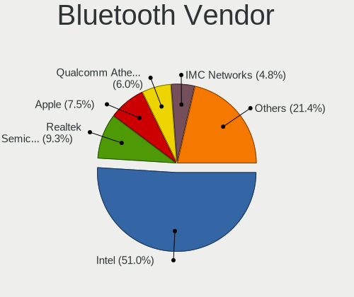

Linux in USA - Tested Hardware & Statistics
-------------------------------------------

A project to collect tested hardware configurations for Linux in USA.

Anyone can contribute to this report by the [hw-probe](https://github.com/linuxhw/hw-probe) tool:

    sudo -E hw-probe -all -upload

Please contribute! Especially if your hardware is rare.

This is a report for all computer types. See also reports for [desktops](/Location/USA/Desktop/README.md) and [notebooks](/Location/USA/Notebook/README.md).

Contents
--------

* [ Test Cases ](#test-cases)

* [ System ](#system)
  - [ OS                       ](#os)
  - [ OS Family                ](#os-family)
  - [ Kernel                   ](#kernel)
  - [ Kernel Family            ](#kernel-family)
  - [ Kernel Major Ver.        ](#kernel-major-ver)
  - [ Arch                     ](#arch)
  - [ DE                       ](#de)
  - [ Display Server           ](#display-server)
  - [ Display Manager          ](#display-manager)
  - [ OS Lang                  ](#os-lang)
  - [ Boot Mode                ](#boot-mode)
  - [ Filesystem               ](#filesystem)
  - [ Part. scheme             ](#part-scheme)
  - [ Dual Boot with Linux/BSD ](#dual-boot-with-linuxbsd)
  - [ Dual Boot (Win)          ](#dual-boot-win)

* [ Board ](#board)
  - [ Vendor                   ](#vendor)
  - [ Model                    ](#model)
  - [ Model Family             ](#model-family)
  - [ MFG Year                 ](#mfg-year)
  - [ Form Factor              ](#form-factor)
  - [ Secure Boot              ](#secure-boot)
  - [ Coreboot                 ](#coreboot)
  - [ RAM Size                 ](#ram-size)
  - [ RAM Used                 ](#ram-used)
  - [ Total Drives             ](#total-drives)
  - [ Has CD-ROM               ](#has-cd-rom)
  - [ Has Ethernet             ](#has-ethernet)
  - [ Has WiFi                 ](#has-wifi)
  - [ Has Bluetooth            ](#has-bluetooth)

* [ Location ](#location)
  - [ Country                  ](#country)
  - [ City                     ](#city)

* [ Drives ](#drives)
  - [ Drive Vendor             ](#drive-vendor)
  - [ Drive Model              ](#drive-model)
  - [ HDD Vendor               ](#hdd-vendor)
  - [ SSD Vendor               ](#ssd-vendor)
  - [ Drive Kind               ](#drive-kind)
  - [ Drive Connector          ](#drive-connector)
  - [ Drive Size               ](#drive-size)
  - [ Space Total              ](#space-total)
  - [ Space Used               ](#space-used)
  - [ Malfunc. Drives          ](#malfunc-drives)
  - [ Malfunc. Drive Vendor    ](#malfunc-drive-vendor)
  - [ Malfunc. HDD Vendor      ](#malfunc-hdd-vendor)
  - [ Malfunc. Drive Kind      ](#malfunc-drive-kind)
  - [ Failed Drives            ](#failed-drives)
  - [ Failed Drive Vendor      ](#failed-drive-vendor)
  - [ Drive Status             ](#drive-status)

* [ Storage controller ](#storage-controller)
  - [ Storage Vendor           ](#storage-vendor)
  - [ Storage Model            ](#storage-model)
  - [ Storage Kind             ](#storage-kind)

* [ Processor ](#processor)
  - [ CPU Vendor               ](#cpu-vendor)
  - [ CPU Model                ](#cpu-model)
  - [ CPU Model Family         ](#cpu-model-family)
  - [ CPU Cores                ](#cpu-cores)
  - [ CPU Sockets              ](#cpu-sockets)
  - [ CPU Threads              ](#cpu-threads)
  - [ CPU Op-Modes             ](#cpu-op-modes)
  - [ CPU Microcode            ](#cpu-microcode)
  - [ CPU Microarch            ](#cpu-microarch)

* [ Graphics ](#graphics)
  - [ GPU Vendor               ](#gpu-vendor)
  - [ GPU Model                ](#gpu-model)
  - [ GPU Combo                ](#gpu-combo)
  - [ GPU Driver               ](#gpu-driver)
  - [ GPU Memory               ](#gpu-memory)

* [ Monitor ](#monitor)
  - [ Monitor Vendor           ](#monitor-vendor)
  - [ Monitor Model            ](#monitor-model)
  - [ Monitor Resolution       ](#monitor-resolution)
  - [ Monitor Diagonal         ](#monitor-diagonal)
  - [ Monitor Width            ](#monitor-width)
  - [ Aspect Ratio             ](#aspect-ratio)
  - [ Monitor Area             ](#monitor-area)
  - [ Pixel Density            ](#pixel-density)
  - [ Multiple Monitors        ](#multiple-monitors)

* [ Network ](#network)
  - [ Net Controller Vendor    ](#net-controller-vendor)
  - [ Net Controller Model     ](#net-controller-model)
  - [ Wireless Vendor          ](#wireless-vendor)
  - [ Wireless Model           ](#wireless-model)
  - [ Ethernet Vendor          ](#ethernet-vendor)
  - [ Ethernet Model           ](#ethernet-model)
  - [ Net Controller Kind      ](#net-controller-kind)
  - [ Used Controller          ](#used-controller)
  - [ NICs                     ](#nics)
  - [ IPv6                     ](#ipv6)

* [ Bluetooth ](#bluetooth)
  - [ Bluetooth Vendor         ](#bluetooth-vendor)
  - [ Bluetooth Model          ](#bluetooth-model)

* [ Sound ](#sound)
  - [ Sound Vendor             ](#sound-vendor)
  - [ Sound Model              ](#sound-model)

* [ Memory ](#memory)
  - [ Memory Vendor            ](#memory-vendor)
  - [ Memory Model             ](#memory-model)
  - [ Memory Kind              ](#memory-kind)
  - [ Memory Form Factor       ](#memory-form-factor)
  - [ Memory Size              ](#memory-size)
  - [ Memory Speed             ](#memory-speed)

* [ Printers & scanners ](#printers--scanners)
  - [ Printer Vendor           ](#printer-vendor)
  - [ Printer Model            ](#printer-model)
  - [ Scanner Vendor           ](#scanner-vendor)
  - [ Scanner Model            ](#scanner-model)

* [ Camera ](#camera)
  - [ Camera Vendor            ](#camera-vendor)
  - [ Camera Model             ](#camera-model)

* [ Security ](#security)
  - [ Fingerprint Vendor       ](#fingerprint-vendor)
  - [ Fingerprint Model        ](#fingerprint-model)
  - [ Chipcard Vendor          ](#chipcard-vendor)
  - [ Chipcard Model           ](#chipcard-model)

* [ Unsupported ](#unsupported)
  - [ Unsupported Devices      ](#unsupported-devices)
  - [ Unsupported Device Types ](#unsupported-device-types)

Test Cases
----------

Total: 48291

| Vendor        | Model                       | Form-Factor | Probe                                                      | Date         |
|---------------|-----------------------------|-------------|------------------------------------------------------------|--------------|
| VENTURER      | WT9L10C44GD1E               | Tablet      | [16d09653ec](https://linux-hardware.org/?probe=16d09653ec) | May 01, 2023 |
| HP            | ENVY x360 Convertible 15... | Convertible | [dc16d81ba0](https://linux-hardware.org/?probe=dc16d81ba0) | May 01, 2023 |
| ASUSTek       | PRIME B550M-A               | Desktop     | [9146d12231](https://linux-hardware.org/?probe=9146d12231) | May 01, 2023 |
| ASUSTek       | PRIME Z690M-PLUS D4         | Desktop     | [27fdafaf01](https://linux-hardware.org/?probe=27fdafaf01) | May 01, 2023 |
| Lenovo        | Yoga 6 13ALC7 82UD          | Convertible | [80671ff25c](https://linux-hardware.org/?probe=80671ff25c) | May 01, 2023 |
| Dell          | Latitude 3420               | Notebook    | [327be624ce](https://linux-hardware.org/?probe=327be624ce) | May 01, 2023 |
| ASUSTek       | ROG Zephyrus Duo 16 GX65... | Notebook    | [b54238dc33](https://linux-hardware.org/?probe=b54238dc33) | May 01, 2023 |
| Toshiba       | Satellite L755              | Notebook    | [3bafb50baa](https://linux-hardware.org/?probe=3bafb50baa) | May 01, 2023 |
| Valve         | Jupiter                     | Notebook    | [9d8a549c47](https://linux-hardware.org/?probe=9d8a549c47) | May 01, 2023 |
| Dell          | Latitude 3420               | Notebook    | [1ce0c58a17](https://linux-hardware.org/?probe=1ce0c58a17) | May 01, 2023 |
| Gigabyte      | X58A-UD3R                   | Desktop     | [36f4134c6b](https://linux-hardware.org/?probe=36f4134c6b) | May 01, 2023 |
| HP            | Laptop 15z-fc000            | Notebook    | [7b57cc42a0](https://linux-hardware.org/?probe=7b57cc42a0) | May 01, 2023 |
| Supermicro    | H12SSL-i                    | Server      | [028a3c3b0b](https://linux-hardware.org/?probe=028a3c3b0b) | May 01, 2023 |
| HP            | 822A                        | Desktop     | [b373ff6def](https://linux-hardware.org/?probe=b373ff6def) | May 01, 2023 |
| Lenovo        | ThinkPad P52s 20LCS1H100    | Notebook    | [34b877bcb5](https://linux-hardware.org/?probe=34b877bcb5) | May 01, 2023 |
| HP            | 2B38                        | Desktop     | [bf99202e8b](https://linux-hardware.org/?probe=bf99202e8b) | May 01, 2023 |
| HP            | ElitePad 1000 G2            | Notebook    | [8ae27e00f6](https://linux-hardware.org/?probe=8ae27e00f6) | May 01, 2023 |
| HP            | ZBook Studio 15.6 inch G... | Notebook    | [1846ea93e7](https://linux-hardware.org/?probe=1846ea93e7) | May 01, 2023 |
| ASRock        | B650 LiveMixer              | Desktop     | [aecb4b61b4](https://linux-hardware.org/?probe=aecb4b61b4) | May 01, 2023 |
| HP            | Laptop 14-dk1xxx            | Notebook    | [2a49a2ad57](https://linux-hardware.org/?probe=2a49a2ad57) | May 01, 2023 |
| ASUSTek       | TUF Gaming B550M-PLUS WI... | Desktop     | [62d194e85e](https://linux-hardware.org/?probe=62d194e85e) | May 01, 2023 |
| ASUSTek       | PRIME Z690-P WIFI           | Desktop     | [4f0b170b70](https://linux-hardware.org/?probe=4f0b170b70) | May 01, 2023 |
| ASUSTek       | PRIME B450-PLUS             | Desktop     | [56db3a6b44](https://linux-hardware.org/?probe=56db3a6b44) | May 01, 2023 |
| Dell          | 06D7TR A00                  | Desktop     | [6fe7179a50](https://linux-hardware.org/?probe=6fe7179a50) | May 01, 2023 |
| HP            | EliteBook 840 G3            | Notebook    | [c490c44357](https://linux-hardware.org/?probe=c490c44357) | May 01, 2023 |
| Valve         | Jupiter                     | Notebook    | [0494e0759f](https://linux-hardware.org/?probe=0494e0759f) | May 01, 2023 |
| HP            | 2B38                        | Desktop     | [6942eb2544](https://linux-hardware.org/?probe=6942eb2544) | May 01, 2023 |
| ASUSTek       | PRIME B550M-A AC            | Desktop     | [f10c443a56](https://linux-hardware.org/?probe=f10c443a56) | May 01, 2023 |
| HP            | ProBook 640 G2              | Notebook    | [55ac658b79](https://linux-hardware.org/?probe=55ac658b79) | May 01, 2023 |
| Lenovo        | Slim 9 14IAP7 82T1          | Notebook    | [fe1b421c9d](https://linux-hardware.org/?probe=fe1b421c9d) | May 01, 2023 |
| ASRock        | Z170 Gaming K4              | Desktop     | [a38bf561f7](https://linux-hardware.org/?probe=a38bf561f7) | May 01, 2023 |
| ASRock        | Z170 Gaming K4              | Desktop     | [b5ce5ff271](https://linux-hardware.org/?probe=b5ce5ff271) | May 01, 2023 |
| Microsoft     | Surface Pro 7               | Tablet      | [7c8d87170f](https://linux-hardware.org/?probe=7c8d87170f) | Apr 30, 2023 |
| HP            | Spectre x360 Convertible... | Convertible | [45a7e28db1](https://linux-hardware.org/?probe=45a7e28db1) | Apr 30, 2023 |
| Dell          | 06D7TR A00                  | Desktop     | [e7905065dd](https://linux-hardware.org/?probe=e7905065dd) | Apr 30, 2023 |
| Acer          | Aspire V5-561P              | Notebook    | [8818106a28](https://linux-hardware.org/?probe=8818106a28) | Apr 30, 2023 |
| Dell          | 07PR60 A00                  | Desktop     | [e6f49bbe8a](https://linux-hardware.org/?probe=e6f49bbe8a) | Apr 30, 2023 |
| Acer          | Aspire V5-561P              | Notebook    | [fe60e0412d](https://linux-hardware.org/?probe=fe60e0412d) | Apr 30, 2023 |
| Lenovo        | IdeaPad S340-15IWLTouch ... | Notebook    | [6857a16a6c](https://linux-hardware.org/?probe=6857a16a6c) | Apr 30, 2023 |
| Dell          | 02YYK5 A01                  | Desktop     | [1a00a1321e](https://linux-hardware.org/?probe=1a00a1321e) | Apr 30, 2023 |
| Gigabyte      | EP45-UD3P                   | Desktop     | [8d99ef5cc7](https://linux-hardware.org/?probe=8d99ef5cc7) | Apr 30, 2023 |
| ASUSTek       | H81I-PLUS                   | Desktop     | [01578538eb](https://linux-hardware.org/?probe=01578538eb) | Apr 30, 2023 |
| Apple         | MacBookPro6,2               | Notebook    | [0cb8947c84](https://linux-hardware.org/?probe=0cb8947c84) | Apr 30, 2023 |
| HP            | Notebook                    | Notebook    | [fd6aa4aeb6](https://linux-hardware.org/?probe=fd6aa4aeb6) | Apr 30, 2023 |
| MSI           | PRO Z690-A WIFI             | Desktop     | [bfa4eb5eda](https://linux-hardware.org/?probe=bfa4eb5eda) | Apr 30, 2023 |
| Apple         | Mac-F42C88C8 Proto1         | Desktop     | [ab7b403321](https://linux-hardware.org/?probe=ab7b403321) | Apr 30, 2023 |
| ASUSTek       | TUF Gaming B550M-PLUS WI... | Desktop     | [e2acacabb3](https://linux-hardware.org/?probe=e2acacabb3) | Apr 30, 2023 |
| HP            | ProBook 655 G3              | Notebook    | [07e2cc77f8](https://linux-hardware.org/?probe=07e2cc77f8) | Apr 30, 2023 |
| HP            | ProBook 655 G3              | Notebook    | [638e747fb1](https://linux-hardware.org/?probe=638e747fb1) | Apr 30, 2023 |
| Lenovo        | MIIX 320-10ICR 80XF         | Tablet      | [6987a21849](https://linux-hardware.org/?probe=6987a21849) | Apr 30, 2023 |
| ATOPNUC       | MA90                        | Mini pc     | [cd65d9e917](https://linux-hardware.org/?probe=cd65d9e917) | Apr 30, 2023 |
| HP            | Notebook                    | Notebook    | [4cece109d5](https://linux-hardware.org/?probe=4cece109d5) | Apr 30, 2023 |
| Dell          | 042P49 A01                  | Desktop     | [6190be123c](https://linux-hardware.org/?probe=6190be123c) | Apr 30, 2023 |
| Dell          | 0YF8P5 A00                  | Desktop     | [4f5262d2c9](https://linux-hardware.org/?probe=4f5262d2c9) | Apr 30, 2023 |
| Acer          | Peppy                       | Notebook    | [dcac703c46](https://linux-hardware.org/?probe=dcac703c46) | Apr 30, 2023 |
| ASUSTek       | ROG STRIX X670E-E GAMING... | Desktop     | [0d5e9310d3](https://linux-hardware.org/?probe=0d5e9310d3) | Apr 30, 2023 |
| Acer          | Peppy                       | Notebook    | [4caf11594a](https://linux-hardware.org/?probe=4caf11594a) | Apr 30, 2023 |
| ASUSTek       | B85M-G R2.0                 | Desktop     | [243a170e5a](https://linux-hardware.org/?probe=243a170e5a) | Apr 30, 2023 |
| Lenovo        | Legion 5 15ARH05H 82B1      | Notebook    | [9df1b688c0](https://linux-hardware.org/?probe=9df1b688c0) | Apr 30, 2023 |
| AMI           | INTEL                       | Convertible | [3a67944d4f](https://linux-hardware.org/?probe=3a67944d4f) | Apr 30, 2023 |
| MSI           | PRO Z690-A DDR4             | Desktop     | [9419686ec7](https://linux-hardware.org/?probe=9419686ec7) | Apr 30, 2023 |
| MSI           | B360M MORTAR                | Desktop     | [352a47b8a0](https://linux-hardware.org/?probe=352a47b8a0) | Apr 30, 2023 |
| HP            | ProBook 650 G4              | Notebook    | [fd991056e0](https://linux-hardware.org/?probe=fd991056e0) | Apr 30, 2023 |
| Dell          | Inspiron 15 3525            | Notebook    | [41c212fa2c](https://linux-hardware.org/?probe=41c212fa2c) | Apr 30, 2023 |
| Acer          | TravelMate B311-31          | Notebook    | [de172b8988](https://linux-hardware.org/?probe=de172b8988) | Apr 30, 2023 |
| ASUSTek       | TUF Gaming B550M-PLUS       | Desktop     | [c83cb7e3ec](https://linux-hardware.org/?probe=c83cb7e3ec) | Apr 30, 2023 |
| MSI           | PRO Z690-A DDR4             | Desktop     | [1f61fda034](https://linux-hardware.org/?probe=1f61fda034) | Apr 30, 2023 |
| Supermicro    | H12SSL-i                    | Server      | [31789f9473](https://linux-hardware.org/?probe=31789f9473) | Apr 30, 2023 |
| HP            | Pavilion Laptop 15-cc5xx    | Notebook    | [28b11100ac](https://linux-hardware.org/?probe=28b11100ac) | Apr 30, 2023 |
| Microsoft     | Surface Pro                 | Tablet      | [8b89ffd983](https://linux-hardware.org/?probe=8b89ffd983) | Apr 30, 2023 |
| ASUSTek       | K53E                        | Notebook    | [dcb4502d05](https://linux-hardware.org/?probe=dcb4502d05) | Apr 30, 2023 |
| HP            | Laptop 17-by3xxx            | Notebook    | [552dac328b](https://linux-hardware.org/?probe=552dac328b) | Apr 30, 2023 |
| ATOPNUC       | MA90                        | Mini pc     | [005ec25893](https://linux-hardware.org/?probe=005ec25893) | Apr 30, 2023 |
| Valve         | Jupiter                     | Notebook    | [5645561cbb](https://linux-hardware.org/?probe=5645561cbb) | Apr 30, 2023 |
| HP            | ProLiant ML10 v2            | Desktop     | [3582be2f06](https://linux-hardware.org/?probe=3582be2f06) | Apr 30, 2023 |
| Gateway       | P-7805u                     | Notebook    | [0958f250f2](https://linux-hardware.org/?probe=0958f250f2) | Apr 30, 2023 |
| HP            | EliteBook 840 G3            | Notebook    | [c262e81ab9](https://linux-hardware.org/?probe=c262e81ab9) | Apr 30, 2023 |
| Lenovo        | IdeaPad 330-15IKB 81DE      | Notebook    | [875ae124a1](https://linux-hardware.org/?probe=875ae124a1) | Apr 30, 2023 |
| Lenovo        | IdeaPad 330-15IKB 81DE      | Notebook    | [1ba3883d83](https://linux-hardware.org/?probe=1ba3883d83) | Apr 30, 2023 |
| Valve         | Jupiter                     | Notebook    | [23d976b25f](https://linux-hardware.org/?probe=23d976b25f) | Apr 30, 2023 |
| Dell          | 0T10XW A02                  | Desktop     | [2cd32d1efe](https://linux-hardware.org/?probe=2cd32d1efe) | Apr 30, 2023 |
| Dell          | Latitude E6430              | Notebook    | [4c20239367](https://linux-hardware.org/?probe=4c20239367) | Apr 30, 2023 |
| AMI           | INTEL                       | Convertible | [9b8a3c6371](https://linux-hardware.org/?probe=9b8a3c6371) | Apr 29, 2023 |
| ASUSTek       | ROG STRIX X670E-E GAMING... | Desktop     | [f87233a295](https://linux-hardware.org/?probe=f87233a295) | Apr 29, 2023 |
| Lenovo        | IdeaPadFlex 5 14ITL05 82... | Convertible | [2113c6457a](https://linux-hardware.org/?probe=2113c6457a) | Apr 29, 2023 |
| ASRock        | 970 Extreme4                | Desktop     | [96fd3e62de](https://linux-hardware.org/?probe=96fd3e62de) | Apr 29, 2023 |
| Framework     | Laptop                      | Notebook    | [84b3b9547b](https://linux-hardware.org/?probe=84b3b9547b) | Apr 29, 2023 |
| Dell          | XPS 13 7390                 | Notebook    | [b976cc9656](https://linux-hardware.org/?probe=b976cc9656) | Apr 29, 2023 |
| Dell          | 0773VG A02                  | Desktop     | [a684ad4938](https://linux-hardware.org/?probe=a684ad4938) | Apr 29, 2023 |
| Dell          | 00V62H A00                  | Desktop     | [86cb104ceb](https://linux-hardware.org/?probe=86cb104ceb) | Apr 29, 2023 |
| ASUSTek       | ROG STRIX B550-F GAMING     | Desktop     | [493bc0b894](https://linux-hardware.org/?probe=493bc0b894) | Apr 29, 2023 |
| Apple         | MacBookPro11,3              | Notebook    | [3feeeb3341](https://linux-hardware.org/?probe=3feeeb3341) | Apr 29, 2023 |
| Apple         | MacBookPro11,3              | Notebook    | [8e0692ebe3](https://linux-hardware.org/?probe=8e0692ebe3) | Apr 29, 2023 |
| ASUSTek       | VivoBook_ASUSLaptop X712... | Notebook    | [272103e5a7](https://linux-hardware.org/?probe=272103e5a7) | Apr 29, 2023 |
| Dell          | XPS 13 9380                 | Notebook    | [c6591b0852](https://linux-hardware.org/?probe=c6591b0852) | Apr 29, 2023 |
| Valve         | Jupiter                     | Notebook    | [183d16708b](https://linux-hardware.org/?probe=183d16708b) | Apr 29, 2023 |
| Toshiba       | Satellite C650D             | Notebook    | [472dedd62a](https://linux-hardware.org/?probe=472dedd62a) | Apr 29, 2023 |
| Apple         | Mac-F60DEB81FF30ACF6 Mac... | Desktop     | [80ea529a18](https://linux-hardware.org/?probe=80ea529a18) | Apr 29, 2023 |
| HP            | 3647h                       | Desktop     | [a2776d5c24](https://linux-hardware.org/?probe=a2776d5c24) | Apr 29, 2023 |
| Apple         | Mac-8ED6AF5B48C039E1 Mac... | Mini pc     | [bf82bebb69](https://linux-hardware.org/?probe=bf82bebb69) | Apr 29, 2023 |
| Gigabyte      | B550 AORUS PRO V2           | Desktop     | [62f2094d3c](https://linux-hardware.org/?probe=62f2094d3c) | Apr 29, 2023 |
| Raspberry ... | Raspberry Pi                | Soc         | [998427cdcf](https://linux-hardware.org/?probe=998427cdcf) | Apr 29, 2023 |
| Lenovo        | ThinkPad X1 Extreme Gen ... | Notebook    | [cd266d7680](https://linux-hardware.org/?probe=cd266d7680) | Apr 29, 2023 |
| HP            | Stream Laptop 11-y0XX       | Notebook    | [4f777df0e8](https://linux-hardware.org/?probe=4f777df0e8) | Apr 29, 2023 |
| GMKtec        | NucBox7                     | Mini pc     | [7398ad2411](https://linux-hardware.org/?probe=7398ad2411) | Apr 29, 2023 |
| Dell          | 08NPPY A00                  | Desktop     | [25bc3aa225](https://linux-hardware.org/?probe=25bc3aa225) | Apr 29, 2023 |
| Google        | Banon                       | Notebook    | [c21a57806c](https://linux-hardware.org/?probe=c21a57806c) | Apr 29, 2023 |
| Sony          | VPCF215FX                   | Notebook    | [49c7606269](https://linux-hardware.org/?probe=49c7606269) | Apr 29, 2023 |
| Insyde        | CherryTrail                 | Notebook    | [73e11e9235](https://linux-hardware.org/?probe=73e11e9235) | Apr 29, 2023 |
| Dell          | 0HY9JP A02                  | Desktop     | [2ec196dd79](https://linux-hardware.org/?probe=2ec196dd79) | Apr 29, 2023 |
| Lenovo        | Legion 5 17IMH05H 81Y8      | Notebook    | [d435f7df68](https://linux-hardware.org/?probe=d435f7df68) | Apr 29, 2023 |
| Apple         | MacBook6,1                  | Notebook    | [58b09d7887](https://linux-hardware.org/?probe=58b09d7887) | Apr 29, 2023 |
| Apple         | MacBook6,1                  | Notebook    | [7d91fe30f7](https://linux-hardware.org/?probe=7d91fe30f7) | Apr 29, 2023 |
| Microsoft     | Surface Laptop Go           | Tablet      | [3c891a7698](https://linux-hardware.org/?probe=3c891a7698) | Apr 29, 2023 |
| Microsoft     | Surface Laptop Go           | Tablet      | [4cc7c839fb](https://linux-hardware.org/?probe=4cc7c839fb) | Apr 29, 2023 |
| Lenovo        | IdeaPad 1 14IGL7 82V6       | Notebook    | [2aa69de3ca](https://linux-hardware.org/?probe=2aa69de3ca) | Apr 29, 2023 |
| Dell          | 0T0MHW A02                  | Desktop     | [4f08178f96](https://linux-hardware.org/?probe=4f08178f96) | Apr 29, 2023 |
| Dell          | 0Y2MRG A00                  | Desktop     | [5f765d4d9c](https://linux-hardware.org/?probe=5f765d4d9c) | Apr 29, 2023 |
| Dell          | 0Y2MRG A00                  | Desktop     | [62a4a8b0b5](https://linux-hardware.org/?probe=62a4a8b0b5) | Apr 29, 2023 |
| Foxconn       | 2AB7                        | Desktop     | [01e7b05d2a](https://linux-hardware.org/?probe=01e7b05d2a) | Apr 29, 2023 |
| Lenovo        | ThinkPad X13 Gen 3 21CM0... | Notebook    | [eeb1550b82](https://linux-hardware.org/?probe=eeb1550b82) | Apr 29, 2023 |
| ASUSTek       | H170I-PRO                   | Desktop     | [b166ca425b](https://linux-hardware.org/?probe=b166ca425b) | Apr 29, 2023 |
| Dell          | Precision M6600             | Notebook    | [39d9af4736](https://linux-hardware.org/?probe=39d9af4736) | Apr 28, 2023 |
| Lenovo        | IdeaPadFlex 5 15IIL05 81... | Convertible | [e1f824b7e1](https://linux-hardware.org/?probe=e1f824b7e1) | Apr 28, 2023 |
| Dell          | Inspiron 3180               | Notebook    | [bc3400a372](https://linux-hardware.org/?probe=bc3400a372) | Apr 28, 2023 |
| Toshiba       | Satellite C55t-C            | Notebook    | [8e2bc6ab21](https://linux-hardware.org/?probe=8e2bc6ab21) | Apr 28, 2023 |
| Dell          | Inspiron 15-3567            | Notebook    | [5dcd15cacf](https://linux-hardware.org/?probe=5dcd15cacf) | Apr 28, 2023 |
| Lenovo        | ThinkPad X1 Carbon Gen 9... | Notebook    | [a984eefe43](https://linux-hardware.org/?probe=a984eefe43) | Apr 28, 2023 |
| Lenovo        | ThinkPad P1 Gen 5 21DCCT... | Notebook    | [34420e9478](https://linux-hardware.org/?probe=34420e9478) | Apr 28, 2023 |
| HP            | Laptop 14-dk1xxx            | Notebook    | [61e94aaf2a](https://linux-hardware.org/?probe=61e94aaf2a) | Apr 28, 2023 |
| Lenovo        | ThinkBook 14-IIL 20SL       | Notebook    | [d9010fa8d0](https://linux-hardware.org/?probe=d9010fa8d0) | Apr 28, 2023 |
| MSI           | GE62VR 6RF                  | Notebook    | [97acececd3](https://linux-hardware.org/?probe=97acececd3) | Apr 28, 2023 |
| GPU Compan... | GWNR71517                   | Notebook    | [5fe84b74b0](https://linux-hardware.org/?probe=5fe84b74b0) | Apr 28, 2023 |
| ASUSTek       | Z87-PLUS                    | Desktop     | [7477be45f8](https://linux-hardware.org/?probe=7477be45f8) | Apr 28, 2023 |
| Lenovo        | 1048 SDK0Q40104 WIN 3915... | Desktop     | [43942fab0f](https://linux-hardware.org/?probe=43942fab0f) | Apr 28, 2023 |
| HP            | Pavilion dv6                | Notebook    | [8bb5802125](https://linux-hardware.org/?probe=8bb5802125) | Apr 28, 2023 |
| HP            | Laptop 14-dk1xxx            | Notebook    | [6f318b0790](https://linux-hardware.org/?probe=6f318b0790) | Apr 28, 2023 |
| Pegatron      | Benicia                     | Desktop     | [930452646c](https://linux-hardware.org/?probe=930452646c) | Apr 28, 2023 |
| HP            | Laptop 15-bs2xx             | Notebook    | [ad768363bc](https://linux-hardware.org/?probe=ad768363bc) | Apr 28, 2023 |
| Lenovo        | ThinkPad T450 20BUS0B000    | Notebook    | [a2cbf65767](https://linux-hardware.org/?probe=a2cbf65767) | Apr 28, 2023 |
| AZW           | MINI S 10                   | Desktop     | [12ba32f977](https://linux-hardware.org/?probe=12ba32f977) | Apr 28, 2023 |
| Dell          | Inspiron 3558               | Notebook    | [1ef93daf0b](https://linux-hardware.org/?probe=1ef93daf0b) | Apr 28, 2023 |
| Unknown       | HX90                        | Desktop     | [8454daed68](https://linux-hardware.org/?probe=8454daed68) | Apr 28, 2023 |
| HP            | ProBook 455 15.6 inch G9... | Notebook    | [1cfc210ce1](https://linux-hardware.org/?probe=1cfc210ce1) | Apr 28, 2023 |
| Apple         | MacBookPro5,2               | Notebook    | [c188ae4d7d](https://linux-hardware.org/?probe=c188ae4d7d) | Apr 28, 2023 |
| Dell          | XPS 15 9520                 | Notebook    | [96194bc912](https://linux-hardware.org/?probe=96194bc912) | Apr 28, 2023 |
| Gigabyte      | Z490 AORUS ULTRA            | Desktop     | [96371860f5](https://linux-hardware.org/?probe=96371860f5) | Apr 28, 2023 |
| Apple         | Mac-F42C88C8 Proto1         | Desktop     | [7a3cce252f](https://linux-hardware.org/?probe=7a3cce252f) | Apr 28, 2023 |
| Apple         | Mac-F42C88C8 Proto1         | Desktop     | [60bf74f8f9](https://linux-hardware.org/?probe=60bf74f8f9) | Apr 28, 2023 |
| MSI           | GE62VR 6RF                  | Notebook    | [2a9fcae8c3](https://linux-hardware.org/?probe=2a9fcae8c3) | Apr 28, 2023 |
| HP            | ENVY x360 2-in-1 Laptop ... | Convertible | [8a3c1cbc1c](https://linux-hardware.org/?probe=8a3c1cbc1c) | Apr 28, 2023 |
| Microsoft     | Surface Pro                 | Tablet      | [896574c24a](https://linux-hardware.org/?probe=896574c24a) | Apr 28, 2023 |
| Unknown       | Unknown                     | Soc         | [e5ff381254](https://linux-hardware.org/?probe=e5ff381254) | Apr 28, 2023 |
| Dell          | XPS 15 9570                 | Notebook    | [3479673283](https://linux-hardware.org/?probe=3479673283) | Apr 28, 2023 |
| HP            | 83E9                        | Desktop     | [ac8ad5d3d5](https://linux-hardware.org/?probe=ac8ad5d3d5) | Apr 28, 2023 |
| Lenovo        | ThinkPad P50 20EN0013US     | Notebook    | [95d59e1bc3](https://linux-hardware.org/?probe=95d59e1bc3) | Apr 28, 2023 |
| Dell          | 0XCR8D A01                  | Desktop     | [2e228e1b38](https://linux-hardware.org/?probe=2e228e1b38) | Apr 28, 2023 |
| Dell          | Latitude D830               | Notebook    | [2ab0772efb](https://linux-hardware.org/?probe=2ab0772efb) | Apr 28, 2023 |
| Lenovo        | Yoga 710-14IKB 80V4         | Convertible | [dbcb0ed35f](https://linux-hardware.org/?probe=dbcb0ed35f) | Apr 27, 2023 |
| HP            | 8062                        | Desktop     | [61c4685659](https://linux-hardware.org/?probe=61c4685659) | Apr 27, 2023 |
| Dell          | Latitude E5470              | Notebook    | [caac023f65](https://linux-hardware.org/?probe=caac023f65) | Apr 27, 2023 |
| Gigabyte      | B365M DS3H                  | Desktop     | [7feb43607e](https://linux-hardware.org/?probe=7feb43607e) | Apr 27, 2023 |
| GPU Compan... | GWTN141-4                   | Notebook    | [633f19ff2d](https://linux-hardware.org/?probe=633f19ff2d) | Apr 27, 2023 |
| Valve         | Jupiter                     | Notebook    | [f65ece2859](https://linux-hardware.org/?probe=f65ece2859) | Apr 27, 2023 |
| Sony          | SVF15212CXW                 | Notebook    | [5d5367dc0e](https://linux-hardware.org/?probe=5d5367dc0e) | Apr 27, 2023 |
| Lenovo        | ThinkPad L13 Yoga Gen 2 ... | Convertible | [bab222234a](https://linux-hardware.org/?probe=bab222234a) | Apr 27, 2023 |
| ASUSTek       | ASUS TUF Gaming A15 FA50... | Notebook    | [f1d5d361d5](https://linux-hardware.org/?probe=f1d5d361d5) | Apr 27, 2023 |
| ASUSTek       | ZenBook UX425IA_UM425IA     | Notebook    | [404ec697ac](https://linux-hardware.org/?probe=404ec697ac) | Apr 27, 2023 |
| ASUSTek       | Zephyrus M GU502GW_GU502... | Notebook    | [94d9250bc1](https://linux-hardware.org/?probe=94d9250bc1) | Apr 27, 2023 |
| ASUSTek       | ASUS BR1100CKA BR1100CKA... | Notebook    | [c5db27dd0c](https://linux-hardware.org/?probe=c5db27dd0c) | Apr 27, 2023 |
| Google        | Chell                       | Notebook    | [1d1b263f21](https://linux-hardware.org/?probe=1d1b263f21) | Apr 27, 2023 |
| Dell          | 0XCR8D A01                  | Desktop     | [395e698d44](https://linux-hardware.org/?probe=395e698d44) | Apr 27, 2023 |
| Gigabyte      | X570 AORUS ELITE WIFI       | Desktop     | [169e095fab](https://linux-hardware.org/?probe=169e095fab) | Apr 27, 2023 |
| ASUSTek       | ASUS TUF Gaming A15 FA50... | Notebook    | [dfd3d8a5c5](https://linux-hardware.org/?probe=dfd3d8a5c5) | Apr 27, 2023 |
| MSI           | GP65 Leopard 10SDK          | Notebook    | [fc66ccccde](https://linux-hardware.org/?probe=fc66ccccde) | Apr 27, 2023 |
| HP            | ZBook Studio G3             | Notebook    | [f648c14c51](https://linux-hardware.org/?probe=f648c14c51) | Apr 27, 2023 |
| Intel         | DH87RL AAG74240-403         | Desktop     | [54b1c509f2](https://linux-hardware.org/?probe=54b1c509f2) | Apr 27, 2023 |
| MSI           | X99A GAMING 9 ACK           | Desktop     | [3d79f67248](https://linux-hardware.org/?probe=3d79f67248) | Apr 27, 2023 |
| HP            | 15 Notebook PC              | Notebook    | [a63003783d](https://linux-hardware.org/?probe=a63003783d) | Apr 27, 2023 |
| HP            | ZBook Studio G3             | Notebook    | [26146530c7](https://linux-hardware.org/?probe=26146530c7) | Apr 27, 2023 |
| MECHREVO      | X3 Series GK7CP6R           | Notebook    | [c764a98c9d](https://linux-hardware.org/?probe=c764a98c9d) | Apr 27, 2023 |
| GPU Compan... | GWTN156-5                   | Notebook    | [60d207eb63](https://linux-hardware.org/?probe=60d207eb63) | Apr 27, 2023 |
| Dell          | 0XKD8M A00                  | All in one  | [1629350aa9](https://linux-hardware.org/?probe=1629350aa9) | Apr 27, 2023 |
| Lenovo        | ThinkPad P50 20EN0013US     | Notebook    | [09f98983fd](https://linux-hardware.org/?probe=09f98983fd) | Apr 27, 2023 |
| ASUSTek       | CROSSBLADE RANGER           | Desktop     | [641d7d0398](https://linux-hardware.org/?probe=641d7d0398) | Apr 27, 2023 |
| ASUSTek       | TUF Gaming B550M-PLUS       | Desktop     | [c80b811f3e](https://linux-hardware.org/?probe=c80b811f3e) | Apr 27, 2023 |
| Dell          | Latitude 7420               | Notebook    | [7ceeb888fd](https://linux-hardware.org/?probe=7ceeb888fd) | Apr 27, 2023 |
| ASUSTek       | PRIME Z490-A                | Desktop     | [9088ae517a](https://linux-hardware.org/?probe=9088ae517a) | Apr 27, 2023 |
| SGIN          | M15                         | Notebook    | [ac5d947f22](https://linux-hardware.org/?probe=ac5d947f22) | Apr 27, 2023 |
| ASUSTek       | ROG Zephyrus G14 GA401IV    | Notebook    | [2063d4a9fc](https://linux-hardware.org/?probe=2063d4a9fc) | Apr 27, 2023 |
| Supermicro    | H12SSL-i                    | Server      | [be2089d630](https://linux-hardware.org/?probe=be2089d630) | Apr 27, 2023 |
| Lenovo        | ThinkPad X270 20HN001HUS    | Notebook    | [3f6586f0d1](https://linux-hardware.org/?probe=3f6586f0d1) | Apr 27, 2023 |
| Lenovo        | ThinkPad T480s 20L8S45W0... | Notebook    | [0e8490c41f](https://linux-hardware.org/?probe=0e8490c41f) | Apr 27, 2023 |
| Acer          | Spin SP313-51N              | Convertible | [0b7c7f7681](https://linux-hardware.org/?probe=0b7c7f7681) | Apr 27, 2023 |
| Lenovo        | ThinkPad X1 Extreme Gen ... | Notebook    | [32960eca65](https://linux-hardware.org/?probe=32960eca65) | Apr 27, 2023 |
| ASUSTek       | Zephyrus M GU502GW_GU502... | Notebook    | [67c865f449](https://linux-hardware.org/?probe=67c865f449) | Apr 27, 2023 |
| HP            | Pavilion Laptop 15-cc5xx    | Notebook    | [9344f38032](https://linux-hardware.org/?probe=9344f38032) | Apr 27, 2023 |
| Gigabyte      | B550M DS3H AC               | Desktop     | [a8f4a6f058](https://linux-hardware.org/?probe=a8f4a6f058) | Apr 27, 2023 |
| MSI           | PE70 6QE                    | Notebook    | [87c8761eff](https://linux-hardware.org/?probe=87c8761eff) | Apr 27, 2023 |
| Apple         | MacBookAir4,1               | Notebook    | [87ab055a31](https://linux-hardware.org/?probe=87ab055a31) | Apr 27, 2023 |
| Dell          | Latitude E5440              | Notebook    | [0217386dbe](https://linux-hardware.org/?probe=0217386dbe) | Apr 27, 2023 |
| Valve         | Jupiter                     | Notebook    | [4066c253b5](https://linux-hardware.org/?probe=4066c253b5) | Apr 27, 2023 |
| Valve         | Jupiter                     | Notebook    | [823e1bb624](https://linux-hardware.org/?probe=823e1bb624) | Apr 27, 2023 |
| HP            | 3647h                       | Desktop     | [26d40c9fc3](https://linux-hardware.org/?probe=26d40c9fc3) | Apr 27, 2023 |
| Dell          | Inspiron 3501               | Notebook    | [29d2a588e0](https://linux-hardware.org/?probe=29d2a588e0) | Apr 27, 2023 |
| Acer          | Aspire E5-575G              | Notebook    | [3497feda9f](https://linux-hardware.org/?probe=3497feda9f) | Apr 27, 2023 |
| ASRock        | B550M Phantom Gaming 4      | Desktop     | [072b88204c](https://linux-hardware.org/?probe=072b88204c) | Apr 26, 2023 |
| Dell          | Latitude 5520               | Notebook    | [bec614b168](https://linux-hardware.org/?probe=bec614b168) | Apr 26, 2023 |
| Gigabyte      | X570S AERO G                | Desktop     | [cde129cf45](https://linux-hardware.org/?probe=cde129cf45) | Apr 26, 2023 |
| ASUSTek       | VivoBook_ASUS Laptop X50... | Notebook    | [c443269a81](https://linux-hardware.org/?probe=c443269a81) | Apr 26, 2023 |
| ASUSTek       | ROG Strix G512LW_G512LW     | Notebook    | [a950f656f7](https://linux-hardware.org/?probe=a950f656f7) | Apr 26, 2023 |
| GPU Compan... | GWTN156-5                   | Notebook    | [df6b1e8e17](https://linux-hardware.org/?probe=df6b1e8e17) | Apr 26, 2023 |
| Dell          | Vostro 1510                 | Notebook    | [71c860d51c](https://linux-hardware.org/?probe=71c860d51c) | Apr 26, 2023 |
| HP            | 2000                        | Notebook    | [d0fa0a6256](https://linux-hardware.org/?probe=d0fa0a6256) | Apr 26, 2023 |
| Razer         | Blade 17 (2022) - RZ09-0... | Notebook    | [fb624057c9](https://linux-hardware.org/?probe=fb624057c9) | Apr 26, 2023 |
| HP            | 1632                        | Desktop     | [b818834691](https://linux-hardware.org/?probe=b818834691) | Apr 26, 2023 |
| HP            | 1632                        | Desktop     | [caae9b5992](https://linux-hardware.org/?probe=caae9b5992) | Apr 26, 2023 |
| HP            | 1905                        | Desktop     | [7b15ec2d7d](https://linux-hardware.org/?probe=7b15ec2d7d) | Apr 26, 2023 |
| ASUSTek       | ROG STRIX Z390-I GAMING     | Desktop     | [83453e6960](https://linux-hardware.org/?probe=83453e6960) | Apr 26, 2023 |
| HP            | EliteBook 840 G7 Noteboo... | Notebook    | [c6ac218f6a](https://linux-hardware.org/?probe=c6ac218f6a) | Apr 26, 2023 |
| Acer          | Aspire A515-45              | Notebook    | [d910b01835](https://linux-hardware.org/?probe=d910b01835) | Apr 26, 2023 |
| Acer          | Aspire E5-575G              | Notebook    | [3a7b41fb49](https://linux-hardware.org/?probe=3a7b41fb49) | Apr 26, 2023 |
| Dell          | Latitude 5520               | Notebook    | [7ee153b691](https://linux-hardware.org/?probe=7ee153b691) | Apr 26, 2023 |
| Google        | Terra                       | Notebook    | [b22deb9f09](https://linux-hardware.org/?probe=b22deb9f09) | Apr 26, 2023 |
| Lenovo        | ThinkBook 14 G3 ACL 21A2    | Notebook    | [86ba8ccc07](https://linux-hardware.org/?probe=86ba8ccc07) | Apr 26, 2023 |
| Gigabyte      | X58A-UD3R                   | Desktop     | [80d546064f](https://linux-hardware.org/?probe=80d546064f) | Apr 26, 2023 |
| Valve         | Jupiter                     | Notebook    | [ff3e33e935](https://linux-hardware.org/?probe=ff3e33e935) | Apr 26, 2023 |
| Dell          | Inspiron 3558               | Notebook    | [add3c03eef](https://linux-hardware.org/?probe=add3c03eef) | Apr 26, 2023 |
| ASUSTek       | X541SA                      | Notebook    | [362ede5435](https://linux-hardware.org/?probe=362ede5435) | Apr 26, 2023 |
| GPU Compan... | GWNR71517                   | Notebook    | [b8b58af983](https://linux-hardware.org/?probe=b8b58af983) | Apr 26, 2023 |
| MSI           | PE70 6QE                    | Notebook    | [53dd8334ac](https://linux-hardware.org/?probe=53dd8334ac) | Apr 26, 2023 |
| ASUSTek       | PRIME B550M-A               | Desktop     | [ba83f4a4f7](https://linux-hardware.org/?probe=ba83f4a4f7) | Apr 26, 2023 |
| HP            | Compaq Presario CQ60        | Notebook    | [00bf0576c4](https://linux-hardware.org/?probe=00bf0576c4) | Apr 26, 2023 |
| Supermicro    | H12SSL-i                    | Server      | [9465aab832](https://linux-hardware.org/?probe=9465aab832) | Apr 26, 2023 |
| ASUSTek       | X550VQ                      | Notebook    | [3c7d8a0268](https://linux-hardware.org/?probe=3c7d8a0268) | Apr 26, 2023 |
| ASUSTek       | ROG CROSSHAIR VIII HERO     | Desktop     | [9824006277](https://linux-hardware.org/?probe=9824006277) | Apr 26, 2023 |
| Foxconn       | 2ABF                        | Desktop     | [d040f4ff16](https://linux-hardware.org/?probe=d040f4ff16) | Apr 26, 2023 |
| ASUSTek       | P8H61-M LE                  | Desktop     | [a7a9d5069c](https://linux-hardware.org/?probe=a7a9d5069c) | Apr 26, 2023 |
| Lenovo        | IdeaPad 3 15IML05 81WR      | Notebook    | [5daf26faca](https://linux-hardware.org/?probe=5daf26faca) | Apr 26, 2023 |
| ASUSTek       | P8H61-M LE                  | Desktop     | [cd60dbbd6a](https://linux-hardware.org/?probe=cd60dbbd6a) | Apr 26, 2023 |
| System76      | Gazelle                     | Notebook    | [dbf4d8b33d](https://linux-hardware.org/?probe=dbf4d8b33d) | Apr 26, 2023 |
| Dell          | Precision M6600             | Notebook    | [4f5cd6d28e](https://linux-hardware.org/?probe=4f5cd6d28e) | Apr 26, 2023 |
| HP            | Tablet 11m-be0xxx           | Tablet      | [169454762c](https://linux-hardware.org/?probe=169454762c) | Apr 26, 2023 |
| ASUSTek       | PRIME B450M-A II            | Desktop     | [1ce9a878f3](https://linux-hardware.org/?probe=1ce9a878f3) | Apr 26, 2023 |
| ASUSTek       | PRIME Z490-A                | Desktop     | [a48c247194](https://linux-hardware.org/?probe=a48c247194) | Apr 26, 2023 |
| ASUSTek       | ROG Strix G531GW_G531GW     | Notebook    | [2e6de51ded](https://linux-hardware.org/?probe=2e6de51ded) | Apr 26, 2023 |
| ASUSTek       | PRIME Z490-A                | Desktop     | [11844fed4d](https://linux-hardware.org/?probe=11844fed4d) | Apr 25, 2023 |
| ASUSTek       | TUF Gaming B550M-PLUS WI... | Desktop     | [f02e8339e9](https://linux-hardware.org/?probe=f02e8339e9) | Apr 25, 2023 |
| HP            | 1632                        | Desktop     | [ace6df6aee](https://linux-hardware.org/?probe=ace6df6aee) | Apr 25, 2023 |
| Raspberry ... | Raspberry Pi 4 Model B R... | Soc         | [37b593294a](https://linux-hardware.org/?probe=37b593294a) | Apr 25, 2023 |
| System76      | Gazelle                     | Notebook    | [ca2e23db8d](https://linux-hardware.org/?probe=ca2e23db8d) | Apr 25, 2023 |
| Lenovo        | ThinkPad T430 2349UKM       | Notebook    | [6adb010c7a](https://linux-hardware.org/?probe=6adb010c7a) | Apr 25, 2023 |
| System76      | Oryx Pro                    | Notebook    | [298bf97b70](https://linux-hardware.org/?probe=298bf97b70) | Apr 25, 2023 |
| Dell          | 0JP3NX A01                  | Desktop     | [2fa64e56ff](https://linux-hardware.org/?probe=2fa64e56ff) | Apr 25, 2023 |
| AZW           | GTR V01                     | Mini pc     | [9425800303](https://linux-hardware.org/?probe=9425800303) | Apr 25, 2023 |
| ASUSTek       | TUF Gaming B550M-PLUS WI... | Desktop     | [8de5e39740](https://linux-hardware.org/?probe=8de5e39740) | Apr 25, 2023 |
| Intel         | NUC8v7PNB K59971-402        | Mini pc     | [2d07bfb282](https://linux-hardware.org/?probe=2d07bfb282) | Apr 25, 2023 |
| HP            | 1632                        | Desktop     | [0355cb4e69](https://linux-hardware.org/?probe=0355cb4e69) | Apr 25, 2023 |
| Dell          | Precision 7550              | Notebook    | [987df8038c](https://linux-hardware.org/?probe=987df8038c) | Apr 25, 2023 |
| HP            | 2000                        | Notebook    | [14e1ed7540](https://linux-hardware.org/?probe=14e1ed7540) | Apr 25, 2023 |
| HP            | 2000                        | Notebook    | [9e1ae856e4](https://linux-hardware.org/?probe=9e1ae856e4) | Apr 25, 2023 |
| HP            | 0AECh D                     | Desktop     | [c9e99b3f8c](https://linux-hardware.org/?probe=c9e99b3f8c) | Apr 25, 2023 |
| HP            | OMEN Laptop 15-en1xxx       | Notebook    | [8fca54d3f2](https://linux-hardware.org/?probe=8fca54d3f2) | Apr 25, 2023 |
| ASRock        | B660M-C                     | Desktop     | [849fc5d462](https://linux-hardware.org/?probe=849fc5d462) | Apr 25, 2023 |
| HP            | Pavilion Notebook           | Notebook    | [b03c4808b0](https://linux-hardware.org/?probe=b03c4808b0) | Apr 25, 2023 |
| MSI           | Prestige 14 A12UC           | Notebook    | [137a3623dc](https://linux-hardware.org/?probe=137a3623dc) | Apr 25, 2023 |
| Apple         | Mac-942B59F58194171B iMa... | All in one  | [4d91f9900d](https://linux-hardware.org/?probe=4d91f9900d) | Apr 25, 2023 |
| HP            | Dragonfly Pro               | Notebook    | [9bc83e741f](https://linux-hardware.org/?probe=9bc83e741f) | Apr 25, 2023 |
| HP            | Dragonfly Pro               | Notebook    | [b47e30ac80](https://linux-hardware.org/?probe=b47e30ac80) | Apr 25, 2023 |
| Alienware     | Aurora R15 AMD              | Desktop     | [f2e22848d1](https://linux-hardware.org/?probe=f2e22848d1) | Apr 25, 2023 |
| Radxa         | ROCK 5B                     | Soc         | [592fea8754](https://linux-hardware.org/?probe=592fea8754) | Apr 25, 2023 |
| ASRock        | Z370 Extreme4               | Desktop     | [0e46ae0751](https://linux-hardware.org/?probe=0e46ae0751) | Apr 25, 2023 |
| Dell          | 0YXT71 A03                  | Desktop     | [abc091f5c0](https://linux-hardware.org/?probe=abc091f5c0) | Apr 25, 2023 |
| Dell          | Inspiron 5759               | Notebook    | [90fa428095](https://linux-hardware.org/?probe=90fa428095) | Apr 25, 2023 |
| Dell          | 073MMW A02                  | Desktop     | [890ea0fd78](https://linux-hardware.org/?probe=890ea0fd78) | Apr 25, 2023 |
| Dell          | Inspiron 14 5410            | Notebook    | [89017780fa](https://linux-hardware.org/?probe=89017780fa) | Apr 25, 2023 |
| Toshiba       | Satellite L305D             | Notebook    | [1bbf3a5e9c](https://linux-hardware.org/?probe=1bbf3a5e9c) | Apr 25, 2023 |
| Dell          | 0K071D A01                  | Desktop     | [0c7edbd8ea](https://linux-hardware.org/?probe=0c7edbd8ea) | Apr 25, 2023 |
| HP            | ENVY 17                     | Notebook    | [a4327cd9cc](https://linux-hardware.org/?probe=a4327cd9cc) | Apr 25, 2023 |
| HP            | Laptop 15-ef1xxx            | Notebook    | [05d2b26ee6](https://linux-hardware.org/?probe=05d2b26ee6) | Apr 25, 2023 |
| HP            | Laptop 15-ef1xxx            | Notebook    | [0ef0676073](https://linux-hardware.org/?probe=0ef0676073) | Apr 25, 2023 |
| HP            | ENVY 17                     | Notebook    | [e6cc7d84ec](https://linux-hardware.org/?probe=e6cc7d84ec) | Apr 25, 2023 |
| ASUSTek       | ProArt X670E-CREATOR WIF... | Desktop     | [c5f2fa1c5a](https://linux-hardware.org/?probe=c5f2fa1c5a) | Apr 25, 2023 |
| Gigabyte      | B450M DS3H WIFI-CF          | Desktop     | [1a58c88206](https://linux-hardware.org/?probe=1a58c88206) | Apr 25, 2023 |
| eMachines     | MCP61PM-GM                  | Desktop     | [ff00693839](https://linux-hardware.org/?probe=ff00693839) | Apr 25, 2023 |
| MSI           | FM2-A75MA-E35               | Desktop     | [011f691ce1](https://linux-hardware.org/?probe=011f691ce1) | Apr 25, 2023 |
| Apple         | MacBookAir7,2               | Notebook    | [2ccfcd2b27](https://linux-hardware.org/?probe=2ccfcd2b27) | Apr 25, 2023 |
| Gigabyte      | X570 AORUS PRO WIFI         | Desktop     | [7595e7d8f9](https://linux-hardware.org/?probe=7595e7d8f9) | Apr 25, 2023 |
| ASRock        | H310M-STX                   | Desktop     | [9988bc063a](https://linux-hardware.org/?probe=9988bc063a) | Apr 25, 2023 |
| Microsoft     | Surface Laptop Go           | Tablet      | [c5fa59465b](https://linux-hardware.org/?probe=c5fa59465b) | Apr 25, 2023 |
| ASUSTek       | VivoBook_ASUSLaptop X513... | Notebook    | [ebc99a93ab](https://linux-hardware.org/?probe=ebc99a93ab) | Apr 25, 2023 |
| GPU Compan... | GWTN156-5                   | Notebook    | [afe12152a5](https://linux-hardware.org/?probe=afe12152a5) | Apr 25, 2023 |
| Lenovo        | ThinkPad X1 Yoga Gen 7 2... | Convertible | [3f8b64c10c](https://linux-hardware.org/?probe=3f8b64c10c) | Apr 25, 2023 |
| Lenovo        | ThinkPad W520 4270CTO       | Notebook    | [029abbccfc](https://linux-hardware.org/?probe=029abbccfc) | Apr 25, 2023 |
| ASUSTek       | A55BM-PLUS                  | Desktop     | [19c145fab1](https://linux-hardware.org/?probe=19c145fab1) | Apr 25, 2023 |
| ASUSTek       | PRIME B550M-A               | Desktop     | [8fbbad22fa](https://linux-hardware.org/?probe=8fbbad22fa) | Apr 25, 2023 |
| GPU Compan... | GWTN156-5                   | Notebook    | [a22605adc9](https://linux-hardware.org/?probe=a22605adc9) | Apr 25, 2023 |
| ASUSTek       | PRIME H310-PLUS             | Desktop     | [a06d7e1f82](https://linux-hardware.org/?probe=a06d7e1f82) | Apr 25, 2023 |
| Acer          | Aspire A515-56              | Notebook    | [a3a13c5cb1](https://linux-hardware.org/?probe=a3a13c5cb1) | Apr 24, 2023 |
| ASUSTek       | ROG STRIX B550-A GAMING     | Desktop     | [cdfcab45e7](https://linux-hardware.org/?probe=cdfcab45e7) | Apr 24, 2023 |
| Dell          | Inspiron 3543               | Notebook    | [2a3020f392](https://linux-hardware.org/?probe=2a3020f392) | Apr 24, 2023 |
| Dell          | XPS 13 9310                 | Notebook    | [65ccee11a0](https://linux-hardware.org/?probe=65ccee11a0) | Apr 24, 2023 |
| ASUSTek       | GL752VW                     | Notebook    | [26c754e5f0](https://linux-hardware.org/?probe=26c754e5f0) | Apr 24, 2023 |
| Dell          | XPS 13 9310                 | Notebook    | [070d7e791f](https://linux-hardware.org/?probe=070d7e791f) | Apr 24, 2023 |
| Dell          | 0JP3NX A01                  | Desktop     | [609eeb8038](https://linux-hardware.org/?probe=609eeb8038) | Apr 24, 2023 |
| ASUSTek       | A88X-GAMER                  | Desktop     | [f61201c8a5](https://linux-hardware.org/?probe=f61201c8a5) | Apr 24, 2023 |
| Dell          | Latitude 5580               | Notebook    | [a153ad5277](https://linux-hardware.org/?probe=a153ad5277) | Apr 24, 2023 |
| GPU Compan... | GWTN156-2BK                 | Notebook    | [9dd0969eaf](https://linux-hardware.org/?probe=9dd0969eaf) | Apr 24, 2023 |
| Intel         | DH55HC AAE70933-505         | Desktop     | [a1f92a019f](https://linux-hardware.org/?probe=a1f92a019f) | Apr 24, 2023 |
| eMachines     | EMCP73VT-PM                 | Desktop     | [d1a5ad5a38](https://linux-hardware.org/?probe=d1a5ad5a38) | Apr 24, 2023 |
| ASUSTek       | ROG STRIX B550-F GAMING     | Desktop     | [b4b468d0db](https://linux-hardware.org/?probe=b4b468d0db) | Apr 24, 2023 |
| Apple         | MacBookPro8,1               | Notebook    | [006b9a2b3f](https://linux-hardware.org/?probe=006b9a2b3f) | Apr 24, 2023 |
| Foxconn       | ALOE                        | Desktop     | [f92a9cc141](https://linux-hardware.org/?probe=f92a9cc141) | Apr 24, 2023 |
| Acer          | Aspire A515-56              | Notebook    | [1d5b5dcfc7](https://linux-hardware.org/?probe=1d5b5dcfc7) | Apr 24, 2023 |
| Dell          | System XPS L321X            | Notebook    | [cd2af9d26f](https://linux-hardware.org/?probe=cd2af9d26f) | Apr 24, 2023 |
| ASUSTek       | GL752VW                     | Notebook    | [216aaf8fff](https://linux-hardware.org/?probe=216aaf8fff) | Apr 24, 2023 |
| HP            | Laptop 15-db0xxx            | Notebook    | [2ab42d58bf](https://linux-hardware.org/?probe=2ab42d58bf) | Apr 24, 2023 |
| HP            | Laptop 15-db0xxx            | Notebook    | [8c5aea6211](https://linux-hardware.org/?probe=8c5aea6211) | Apr 24, 2023 |
| ASUSTek       | PRIME X570-PRO              | Desktop     | [c546b0771a](https://linux-hardware.org/?probe=c546b0771a) | Apr 24, 2023 |
| Dell          | Precision 7770              | Notebook    | [e9208415d5](https://linux-hardware.org/?probe=e9208415d5) | Apr 24, 2023 |
| Gigabyte      | B550 AORUS ELITE AX V2      | Desktop     | [0d6740c2a8](https://linux-hardware.org/?probe=0d6740c2a8) | Apr 24, 2023 |
| Lenovo        | ThinkPad W520 4270CTO       | Notebook    | [fb80fac677](https://linux-hardware.org/?probe=fb80fac677) | Apr 24, 2023 |
| MSI           | Z87-G43                     | Desktop     | [4d908cb615](https://linux-hardware.org/?probe=4d908cb615) | Apr 24, 2023 |
| ASRock        | A320M Pro4                  | Desktop     | [bfe26862f0](https://linux-hardware.org/?probe=bfe26862f0) | Apr 24, 2023 |
| Intel         | NUC7i5DNB J57626-503        | Mini pc     | [861b0673a0](https://linux-hardware.org/?probe=861b0673a0) | Apr 24, 2023 |
| Lenovo        | ThinkPad X1 Carbon Gen 8... | Notebook    | [60d1d4aec8](https://linux-hardware.org/?probe=60d1d4aec8) | Apr 24, 2023 |
| Toshiba       | Satellite L15W-B            | Notebook    | [5d1177f899](https://linux-hardware.org/?probe=5d1177f899) | Apr 24, 2023 |
| HP            | ProLiant DL360p Gen8        | Server      | [961a066e6b](https://linux-hardware.org/?probe=961a066e6b) | Apr 24, 2023 |
| Fusion5       | FWIN232 PLUS                | Tablet      | [794a5e3acc](https://linux-hardware.org/?probe=794a5e3acc) | Apr 24, 2023 |
| Gigabyte      | X570S I AORUS PRO AX        | Desktop     | [9c37fa5192](https://linux-hardware.org/?probe=9c37fa5192) | Apr 24, 2023 |
| HP            | Pavilion Notebook           | Notebook    | [0fde788ea5](https://linux-hardware.org/?probe=0fde788ea5) | Apr 24, 2023 |
| HP            | Stream Laptop 14-ax0XX      | Notebook    | [c087d6cbae](https://linux-hardware.org/?probe=c087d6cbae) | Apr 24, 2023 |
| ATOPNUC       | MA90                        | Mini pc     | [0e78b7aad8](https://linux-hardware.org/?probe=0e78b7aad8) | Apr 24, 2023 |
| Gigabyte      | B650M DS3H                  | Desktop     | [3d07651a47](https://linux-hardware.org/?probe=3d07651a47) | Apr 24, 2023 |
| Acer          | Aspire A515-46              | Notebook    | [16acb0ba22](https://linux-hardware.org/?probe=16acb0ba22) | Apr 24, 2023 |
| ASRock        | X570 Taichi                 | Desktop     | [0842334fa2](https://linux-hardware.org/?probe=0842334fa2) | Apr 24, 2023 |
| HP            | ProBook 11 G2               | Notebook    | [43f6a6180a](https://linux-hardware.org/?probe=43f6a6180a) | Apr 24, 2023 |
| ASUSTek       | TUF Gaming B550M-PLUS       | Desktop     | [074135d4f4](https://linux-hardware.org/?probe=074135d4f4) | Apr 24, 2023 |
| ASUSTek       | X99-A                       | Desktop     | [1adc932507](https://linux-hardware.org/?probe=1adc932507) | Apr 24, 2023 |
| HP            | ProBook 4530s               | Notebook    | [316cfd6876](https://linux-hardware.org/?probe=316cfd6876) | Apr 24, 2023 |
| HP            | Laptop 15-db0xxx            | Notebook    | [e4fd112564](https://linux-hardware.org/?probe=e4fd112564) | Apr 24, 2023 |
| Gigabyte      | X670E AORUS MASTER          | Desktop     | [0f7e30ded3](https://linux-hardware.org/?probe=0f7e30ded3) | Apr 23, 2023 |
| MSI           | MPG X570 GAMING PLUS        | Desktop     | [075afa12ed](https://linux-hardware.org/?probe=075afa12ed) | Apr 23, 2023 |
| Dell          | XPS 15 9530                 | Notebook    | [d9429d7e06](https://linux-hardware.org/?probe=d9429d7e06) | Apr 23, 2023 |
| Dell          | G5 5590                     | Notebook    | [eef3722c35](https://linux-hardware.org/?probe=eef3722c35) | Apr 23, 2023 |
| AZW           | SER V1.0                    | Mini pc     | [037e8c7254](https://linux-hardware.org/?probe=037e8c7254) | Apr 23, 2023 |
| Gigabyte      | X570 AORUS XTREME           | Desktop     | [0dfc7cce7a](https://linux-hardware.org/?probe=0dfc7cce7a) | Apr 23, 2023 |
| HP            | ZBook 17 G2                 | Notebook    | [5eec26bec0](https://linux-hardware.org/?probe=5eec26bec0) | Apr 23, 2023 |
| ASRock        | B560 Pro4                   | Desktop     | [3a9f7b19fa](https://linux-hardware.org/?probe=3a9f7b19fa) | Apr 23, 2023 |
| MSI           | Z87-G43                     | Desktop     | [6babb6024e](https://linux-hardware.org/?probe=6babb6024e) | Apr 23, 2023 |
| ASUSTek       | ROG Strix G513QY_G513QY     | Notebook    | [696ee85cc9](https://linux-hardware.org/?probe=696ee85cc9) | Apr 23, 2023 |
| ASUSTek       | VivoBook_ASUSLaptop X415... | Notebook    | [76c4edb7f3](https://linux-hardware.org/?probe=76c4edb7f3) | Apr 23, 2023 |
| Dell          | Inspiron 16 7620 2-in-1     | Convertible | [f2d4f962d2](https://linux-hardware.org/?probe=f2d4f962d2) | Apr 23, 2023 |
| Gigabyte      | X570 AORUS XTREME           | Desktop     | [4e664e5e26](https://linux-hardware.org/?probe=4e664e5e26) | Apr 23, 2023 |
| Dell          | Precision M4400             | Notebook    | [0c367cbf45](https://linux-hardware.org/?probe=0c367cbf45) | Apr 23, 2023 |
| ASRock        | B560 Pro4                   | Desktop     | [965aa93228](https://linux-hardware.org/?probe=965aa93228) | Apr 23, 2023 |
| Unknown       | Unknown                     | Desktop     | [0605faa66d](https://linux-hardware.org/?probe=0605faa66d) | Apr 23, 2023 |
| Dynabook      | PORTEGE X30L-K              | Notebook    | [da178b8987](https://linux-hardware.org/?probe=da178b8987) | Apr 23, 2023 |
| HP            | x2 Detachable 10-p0XX       | Tablet      | [815d54b61b](https://linux-hardware.org/?probe=815d54b61b) | Apr 23, 2023 |
| Alienware     | 13 R3                       | Notebook    | [f04b34f41d](https://linux-hardware.org/?probe=f04b34f41d) | Apr 23, 2023 |
| Notebook      | N15_N17RD1                  | Notebook    | [8bba7a7447](https://linux-hardware.org/?probe=8bba7a7447) | Apr 23, 2023 |
| HP            | Laptop 15-bs2xx             | Notebook    | [c40dac306c](https://linux-hardware.org/?probe=c40dac306c) | Apr 23, 2023 |
| ASRockRack    | ROMED8-2T                   | Server      | [c88cba109a](https://linux-hardware.org/?probe=c88cba109a) | Apr 23, 2023 |
| Dell          | Latitude E6410              | Notebook    | [33a88dea30](https://linux-hardware.org/?probe=33a88dea30) | Apr 23, 2023 |
| Dell          | Latitude E6410              | Notebook    | [86d20cdb51](https://linux-hardware.org/?probe=86d20cdb51) | Apr 23, 2023 |
| Lenovo        | ThinkPad T495 20NJ000XGE    | Notebook    | [155072c012](https://linux-hardware.org/?probe=155072c012) | Apr 23, 2023 |
| Valve         | Jupiter                     | Notebook    | [637dccb4d9](https://linux-hardware.org/?probe=637dccb4d9) | Apr 23, 2023 |
| ASUSTek       | PRIME X399-A                | Desktop     | [b4861cf35c](https://linux-hardware.org/?probe=b4861cf35c) | Apr 23, 2023 |
| ASUSTek       | GL703VM                     | Notebook    | [f3c76b5075](https://linux-hardware.org/?probe=f3c76b5075) | Apr 23, 2023 |
| Acer          | Aspire A514-55              | Notebook    | [d98f78cc01](https://linux-hardware.org/?probe=d98f78cc01) | Apr 23, 2023 |
| Carbon Sys... | Iridium 14                  | Notebook    | [10cd21aba6](https://linux-hardware.org/?probe=10cd21aba6) | Apr 23, 2023 |
| ASUSTek       | PRIME Z390-A                | Desktop     | [3fc4048a96](https://linux-hardware.org/?probe=3fc4048a96) | Apr 23, 2023 |
| Apple         | MacBookPro9,2               | Notebook    | [f48b78bda1](https://linux-hardware.org/?probe=f48b78bda1) | Apr 23, 2023 |
| MSI           | GP62 7RD                    | Notebook    | [277bb2d2e3](https://linux-hardware.org/?probe=277bb2d2e3) | Apr 23, 2023 |
| MSI           | MAG X570 TOMAHAWK WIFI      | Desktop     | [b9496d6431](https://linux-hardware.org/?probe=b9496d6431) | Apr 23, 2023 |
| HP            | 8062                        | Desktop     | [37cde2dc48](https://linux-hardware.org/?probe=37cde2dc48) | Apr 23, 2023 |
| Dell          | 00V16R A00                  | All in one  | [cb94924faa](https://linux-hardware.org/?probe=cb94924faa) | Apr 23, 2023 |
| Lenovo        | ThinkBook Plus G3 IAP 21... | Notebook    | [208510e39a](https://linux-hardware.org/?probe=208510e39a) | Apr 23, 2023 |
| ASUSTek       | TUF Gaming X670E-PLUS WI... | Desktop     | [25ee911879](https://linux-hardware.org/?probe=25ee911879) | Apr 23, 2023 |
| Dell          | 0HD5W2 A00                  | Desktop     | [336c1b5da9](https://linux-hardware.org/?probe=336c1b5da9) | Apr 23, 2023 |
| ASUSTek       | TUF Gaming X670E-PLUS WI... | Desktop     | [468824c4d9](https://linux-hardware.org/?probe=468824c4d9) | Apr 23, 2023 |
| ASUSTek       | VivoBook_ASUSLaptop X415... | Notebook    | [f78c721e4b](https://linux-hardware.org/?probe=f78c721e4b) | Apr 23, 2023 |
| HP            | 15 Notebook PC              | Notebook    | [a77c702f3e](https://linux-hardware.org/?probe=a77c702f3e) | Apr 23, 2023 |
| HP            | Pavilion dv6700             | Notebook    | [ec38742f28](https://linux-hardware.org/?probe=ec38742f28) | Apr 23, 2023 |
| Lenovo        | IdeaPadFlex 5 16IAU7 82R... | Convertible | [66cfd6f9a3](https://linux-hardware.org/?probe=66cfd6f9a3) | Apr 23, 2023 |
| Dell          | Inspiron 7737               | Notebook    | [50b75a71d3](https://linux-hardware.org/?probe=50b75a71d3) | Apr 23, 2023 |
| Lenovo        | IdeaPadFlex 5 16IAU7 82R... | Convertible | [975df3ff0a](https://linux-hardware.org/?probe=975df3ff0a) | Apr 22, 2023 |
| HUAWEI        | PUM-WDX9-PCB-B1 M1060       | Desktop     | [2c8835f2e2](https://linux-hardware.org/?probe=2c8835f2e2) | Apr 22, 2023 |
| MSI           | MPG X570S CARBON MAX WIF... | Desktop     | [1c85c89b5d](https://linux-hardware.org/?probe=1c85c89b5d) | Apr 22, 2023 |
| ASUSTek       | Pro WS WRX80E-SAGE SE WI... | Desktop     | [a82d805ad2](https://linux-hardware.org/?probe=a82d805ad2) | Apr 22, 2023 |
| Pegatron      | Benicia                     | Desktop     | [362a3ff341](https://linux-hardware.org/?probe=362a3ff341) | Apr 22, 2023 |
| Lenovo        | IdeaPad L340-15IRH Gamin... | Notebook    | [6115e5ccd4](https://linux-hardware.org/?probe=6115e5ccd4) | Apr 22, 2023 |
| Apple         | MacBookPro11,3              | Notebook    | [7fd17e2245](https://linux-hardware.org/?probe=7fd17e2245) | Apr 22, 2023 |
| System76      | Thelio thelio-r1            | Desktop     | [d48efc62c4](https://linux-hardware.org/?probe=d48efc62c4) | Apr 22, 2023 |
| GPU Compan... | GWTN156-5                   | Notebook    | [4611a1d998](https://linux-hardware.org/?probe=4611a1d998) | Apr 22, 2023 |
| HP            | ZBook 15                    | Notebook    | [c7ae51efcd](https://linux-hardware.org/?probe=c7ae51efcd) | Apr 22, 2023 |
| Gigabyte      | X570S AORUS ELITE AX        | Desktop     | [9c3e15de68](https://linux-hardware.org/?probe=9c3e15de68) | Apr 22, 2023 |
| Gateway       | DX4860                      | Desktop     | [5583641f1b](https://linux-hardware.org/?probe=5583641f1b) | Apr 22, 2023 |
| MSI           | MPG X570S CARBON MAX WIF... | Desktop     | [1404fc66cf](https://linux-hardware.org/?probe=1404fc66cf) | Apr 22, 2023 |
| Dell          | Precision M4400             | Notebook    | [291a0de9a8](https://linux-hardware.org/?probe=291a0de9a8) | Apr 22, 2023 |
| Dell          | Inspiron 5567               | Notebook    | [f639b8e21a](https://linux-hardware.org/?probe=f639b8e21a) | Apr 22, 2023 |
| MSI           | MPG B650I EDGE WIFI         | Desktop     | [efce15b094](https://linux-hardware.org/?probe=efce15b094) | Apr 22, 2023 |
| HP            | Pavilion g7                 | Notebook    | [785e97ad3d](https://linux-hardware.org/?probe=785e97ad3d) | Apr 22, 2023 |
| HP            | Pavilion g7                 | Notebook    | [0e6f1d6bf7](https://linux-hardware.org/?probe=0e6f1d6bf7) | Apr 22, 2023 |
| Dell          | 0FDY5C A00                  | Desktop     | [c35628b7c7](https://linux-hardware.org/?probe=c35628b7c7) | Apr 22, 2023 |
| HP            | EliteBook 6930p             | Notebook    | [2ff545a3fc](https://linux-hardware.org/?probe=2ff545a3fc) | Apr 22, 2023 |
| Shenzhen M... | F7BFC                       | Desktop     | [bb189b2507](https://linux-hardware.org/?probe=bb189b2507) | Apr 22, 2023 |
| Intel         | NUC11ATBC4 M53051-400       | Mini pc     | [1b7f3c90ca](https://linux-hardware.org/?probe=1b7f3c90ca) | Apr 22, 2023 |
| Dell          | 07N90W A00                  | Desktop     | [f6d15dbf35](https://linux-hardware.org/?probe=f6d15dbf35) | Apr 22, 2023 |
| HP            | Notebook                    | Notebook    | [fdf3f7a1cf](https://linux-hardware.org/?probe=fdf3f7a1cf) | Apr 22, 2023 |
| HP            | 0AECh D                     | Desktop     | [827246f901](https://linux-hardware.org/?probe=827246f901) | Apr 22, 2023 |
| Dell          | Latitude E6430              | Notebook    | [be890553bb](https://linux-hardware.org/?probe=be890553bb) | Apr 22, 2023 |
| Dell          | Latitude E6430              | Notebook    | [f0778a0410](https://linux-hardware.org/?probe=f0778a0410) | Apr 22, 2023 |
| ASUSTek       | X751LAB                     | Notebook    | [15732ab12d](https://linux-hardware.org/?probe=15732ab12d) | Apr 22, 2023 |
| AMI           | Cherry Trail CR             | Notebook    | [325dfde573](https://linux-hardware.org/?probe=325dfde573) | Apr 22, 2023 |
| ASUSTek       | ZenBook UX425UG_Q408UG      | Notebook    | [38661d17e0](https://linux-hardware.org/?probe=38661d17e0) | Apr 22, 2023 |
| ASUSTek       | ROG STRIX B650E-I GAMING... | Desktop     | [a60c54ec31](https://linux-hardware.org/?probe=a60c54ec31) | Apr 22, 2023 |
| MSI           | Z370M GAMING PRO AC         | Desktop     | [f22eccea8d](https://linux-hardware.org/?probe=f22eccea8d) | Apr 22, 2023 |
| HP            | 255 G8 Notebook PC          | Notebook    | [0dcc2eaa50](https://linux-hardware.org/?probe=0dcc2eaa50) | Apr 22, 2023 |
| HP            | ENVY x360 2-in-1 Laptop ... | Convertible | [ff635615f8](https://linux-hardware.org/?probe=ff635615f8) | Apr 22, 2023 |
| Lenovo        | IdeaPadFlex 5 16IAU7 82R... | Convertible | [74252f133b](https://linux-hardware.org/?probe=74252f133b) | Apr 22, 2023 |
| ASUSTek       | P5N-D                       | Desktop     | [c1af2b9a2c](https://linux-hardware.org/?probe=c1af2b9a2c) | Apr 22, 2023 |
| MSI           | Z370M MORTAR                | Desktop     | [9ed0395d2c](https://linux-hardware.org/?probe=9ed0395d2c) | Apr 22, 2023 |
| Lenovo        | Legion S7 15IMH5 82BC       | Notebook    | [332fdb5298](https://linux-hardware.org/?probe=332fdb5298) | Apr 22, 2023 |
| ASUSTek       | PRIME B650M-A AX            | Desktop     | [0a90dc180c](https://linux-hardware.org/?probe=0a90dc180c) | Apr 22, 2023 |
| ASUSTek       | H170-PRO                    | Desktop     | [f82191c9cb](https://linux-hardware.org/?probe=f82191c9cb) | Apr 22, 2023 |
| MW            | GMLK-2_5G4L                 | Desktop     | [b5ffb4ee22](https://linux-hardware.org/?probe=b5ffb4ee22) | Apr 22, 2023 |
| Google        | Fleex                       | Notebook    | [19603bb256](https://linux-hardware.org/?probe=19603bb256) | Apr 22, 2023 |
| Samsung       | 730QED                      | Convertible | [169e09b4b0](https://linux-hardware.org/?probe=169e09b4b0) | Apr 22, 2023 |
| MSI           | MPG X570 GAMING PLUS        | Desktop     | [93a6cb1a8a](https://linux-hardware.org/?probe=93a6cb1a8a) | Apr 22, 2023 |
| ASUSTek       | TUF Gaming X570-PLUS        | Desktop     | [0de425d51e](https://linux-hardware.org/?probe=0de425d51e) | Apr 21, 2023 |
| Intel         | DB65AL AAG12530-310         | Desktop     | [c625f3747a](https://linux-hardware.org/?probe=c625f3747a) | Apr 21, 2023 |
| ASUSTek       | ROG Strix G513IM_G513IM     | Notebook    | [00f7379c8f](https://linux-hardware.org/?probe=00f7379c8f) | Apr 21, 2023 |
| Dynabook      | PORTEGE X30L-K              | Notebook    | [b52552ec7f](https://linux-hardware.org/?probe=b52552ec7f) | Apr 21, 2023 |
| Lenovo        | IdeaPadFlex 6-14IKB 81EM    | Convertible | [0a5da1a9a0](https://linux-hardware.org/?probe=0a5da1a9a0) | Apr 21, 2023 |
| Dell          | Precision M6600             | Notebook    | [6f80333ca9](https://linux-hardware.org/?probe=6f80333ca9) | Apr 21, 2023 |
| HP            | EliteBook 2540p             | Notebook    | [b2a6b1a66d](https://linux-hardware.org/?probe=b2a6b1a66d) | Apr 21, 2023 |
| Intel         | NUC13SBBi9 M58736-303       | Mini pc     | [406dfe2b8d](https://linux-hardware.org/?probe=406dfe2b8d) | Apr 21, 2023 |
| Lenovo        | IdeaPad 1 15ALC7 82R4       | Notebook    | [6e1df0f6ee](https://linux-hardware.org/?probe=6e1df0f6ee) | Apr 21, 2023 |
| HP            | ZBook Studio G3             | Notebook    | [754a6bd681](https://linux-hardware.org/?probe=754a6bd681) | Apr 21, 2023 |
| GPU Compan... | GWTN156-2BK                 | Notebook    | [3f172b49f2](https://linux-hardware.org/?probe=3f172b49f2) | Apr 21, 2023 |
| Micro Elec... | MG-VCP2-17A3070T            | Notebook    | [edf0d6d941](https://linux-hardware.org/?probe=edf0d6d941) | Apr 21, 2023 |
| HP            | Spectre x360 2-in-1 Lapt... | Convertible | [3efc88e5df](https://linux-hardware.org/?probe=3efc88e5df) | Apr 21, 2023 |
| Supermicro    | C7H61                       | Desktop     | [f5e17f37d4](https://linux-hardware.org/?probe=f5e17f37d4) | Apr 21, 2023 |
| Apple         | MacBookPro8,3               | Notebook    | [4004491274](https://linux-hardware.org/?probe=4004491274) | Apr 21, 2023 |
| HP            | Spectre x360 Convertible    | Convertible | [1a3ff160a7](https://linux-hardware.org/?probe=1a3ff160a7) | Apr 21, 2023 |
| Dell          | 0RY206                      | Desktop     | [8290af518f](https://linux-hardware.org/?probe=8290af518f) | Apr 21, 2023 |
| Lenovo        | ThinkPad W530 2436CTO       | Notebook    | [74d9f6c0d6](https://linux-hardware.org/?probe=74d9f6c0d6) | Apr 21, 2023 |
| HP            | EliteBook 2540p             | Notebook    | [be19bcd7de](https://linux-hardware.org/?probe=be19bcd7de) | Apr 21, 2023 |
| AYANEO        | 2                           | Tablet      | [4db5d91519](https://linux-hardware.org/?probe=4db5d91519) | Apr 21, 2023 |
| HP            | Pavilion Laptop 15-eh0xx... | Notebook    | [4e69a80310](https://linux-hardware.org/?probe=4e69a80310) | Apr 21, 2023 |
| GPU Compan... | GWTC116-2                   | Notebook    | [8f7df56d73](https://linux-hardware.org/?probe=8f7df56d73) | Apr 21, 2023 |
| Gigabyte      | B650M DS3H                  | Desktop     | [de196a2cfa](https://linux-hardware.org/?probe=de196a2cfa) | Apr 21, 2023 |
| HP            | 15                          | Notebook    | [4f563db114](https://linux-hardware.org/?probe=4f563db114) | Apr 21, 2023 |
| Gigabyte      | X570S AORUS ELITE AX        | Desktop     | [80ead18196](https://linux-hardware.org/?probe=80ead18196) | Apr 21, 2023 |
| HP            | ProBook 640 G1              | Notebook    | [b5022d8a2f](https://linux-hardware.org/?probe=b5022d8a2f) | Apr 21, 2023 |
| Microsoft     | Surface Book                | Tablet      | [13c23678aa](https://linux-hardware.org/?probe=13c23678aa) | Apr 21, 2023 |
| Valve         | Jupiter                     | Notebook    | [d8036610d8](https://linux-hardware.org/?probe=d8036610d8) | Apr 21, 2023 |
| Gigabyte      | B550M DS3H AC               | Desktop     | [d48ffa8191](https://linux-hardware.org/?probe=d48ffa8191) | Apr 21, 2023 |
| ASUSTek       | PRIME B650M-A AX            | Desktop     | [0f17162503](https://linux-hardware.org/?probe=0f17162503) | Apr 21, 2023 |
| HP            | 843F                        | Desktop     | [0060103f89](https://linux-hardware.org/?probe=0060103f89) | Apr 21, 2023 |
| Lenovo        | 1048 SDK0J40697 WIN 3305... | Desktop     | [aa8e171e50](https://linux-hardware.org/?probe=aa8e171e50) | Apr 21, 2023 |
| Apple         | MacBookPro11,3              | Notebook    | [09a203e882](https://linux-hardware.org/?probe=09a203e882) | Apr 21, 2023 |
| HP            | Pavilion dv6000 (RV010UA... | Notebook    | [cf7d33c62e](https://linux-hardware.org/?probe=cf7d33c62e) | Apr 20, 2023 |
| Framework     | Laptop                      | Notebook    | [226765247b](https://linux-hardware.org/?probe=226765247b) | Apr 20, 2023 |
| ASUSTek       | PRIME TRX40-PRO S           | Desktop     | [b2ac72f8d9](https://linux-hardware.org/?probe=b2ac72f8d9) | Apr 20, 2023 |
| Lenovo        | ThinkPad X1 Carbon Gen 9... | Notebook    | [cfaa1567db](https://linux-hardware.org/?probe=cfaa1567db) | Apr 20, 2023 |
| Lenovo        | ThinkPad X1 Carbon Gen 9... | Notebook    | [573b371272](https://linux-hardware.org/?probe=573b371272) | Apr 20, 2023 |
| ASUSTek       | PRIME TRX40-PRO S           | Desktop     | [4748a2ce89](https://linux-hardware.org/?probe=4748a2ce89) | Apr 20, 2023 |
| Dell          | Inspiron 3520               | Notebook    | [11ea81f23c](https://linux-hardware.org/?probe=11ea81f23c) | Apr 20, 2023 |
| HP            | 2215                        | Desktop     | [27b339efe1](https://linux-hardware.org/?probe=27b339efe1) | Apr 20, 2023 |
| Gateway       | NV55C                       | Notebook    | [e77192c3b1](https://linux-hardware.org/?probe=e77192c3b1) | Apr 20, 2023 |
| Lenovo        | IdeaPadFlex 5 14IAU7 82R... | Convertible | [42ef555f6c](https://linux-hardware.org/?probe=42ef555f6c) | Apr 20, 2023 |
| Dell          | 0GM819                      | Desktop     | [744413006e](https://linux-hardware.org/?probe=744413006e) | Apr 20, 2023 |
| Carbon Sys... | Iridium 14                  | Notebook    | [af5e3d750a](https://linux-hardware.org/?probe=af5e3d750a) | Apr 20, 2023 |
| ASUSTek       | ROG Zephyrus M16 GU603ZW... | Notebook    | [87538ce2ba](https://linux-hardware.org/?probe=87538ce2ba) | Apr 20, 2023 |
| MSI           | B550-A PRO                  | Desktop     | [f2fc6a5da5](https://linux-hardware.org/?probe=f2fc6a5da5) | Apr 20, 2023 |
| HP            | 2ADE                        | Desktop     | [1a3d108a58](https://linux-hardware.org/?probe=1a3d108a58) | Apr 20, 2023 |
| Gigabyte      | AB350-Gaming 3-CF           | Desktop     | [374f586992](https://linux-hardware.org/?probe=374f586992) | Apr 20, 2023 |
| ASUSTek       | ROG STRIX X670E-E GAMING... | Desktop     | [e367a9a4ab](https://linux-hardware.org/?probe=e367a9a4ab) | Apr 20, 2023 |
| MSI           | MPG B550 GAMING PLUS        | Desktop     | [69e2175961](https://linux-hardware.org/?probe=69e2175961) | Apr 20, 2023 |
| MSI           | Vector GP76 12UHSO          | Notebook    | [e299a6ed8e](https://linux-hardware.org/?probe=e299a6ed8e) | Apr 20, 2023 |
| HP            | G62                         | Notebook    | [a0096bb254](https://linux-hardware.org/?probe=a0096bb254) | Apr 20, 2023 |
| Supermicro    | C7H61                       | Desktop     | [d975325f4b](https://linux-hardware.org/?probe=d975325f4b) | Apr 20, 2023 |
| Getac         | B300G5                      | Notebook    | [307cc71aa3](https://linux-hardware.org/?probe=307cc71aa3) | Apr 20, 2023 |
| Lenovo        | ThinkPad T430 2349S4D       | Notebook    | [4b57440851](https://linux-hardware.org/?probe=4b57440851) | Apr 20, 2023 |
| Unknown       | Unknown                     | Soc         | [909f002719](https://linux-hardware.org/?probe=909f002719) | Apr 20, 2023 |
| ASUSTek       | M5A78L-M/USB3               | Desktop     | [561b87c8b4](https://linux-hardware.org/?probe=561b87c8b4) | Apr 20, 2023 |
| Lenovo        | IdeaPad Slim 7 15IIL05 8... | Notebook    | [e43db9718f](https://linux-hardware.org/?probe=e43db9718f) | Apr 20, 2023 |
| Dell          | Inspiron 3583               | Notebook    | [23d7bfe141](https://linux-hardware.org/?probe=23d7bfe141) | Apr 20, 2023 |
| Dell          | Inspiron 3583               | Notebook    | [dad60cb86a](https://linux-hardware.org/?probe=dad60cb86a) | Apr 20, 2023 |
| Acer          | Aspire 5735                 | Notebook    | [2d8d4a8124](https://linux-hardware.org/?probe=2d8d4a8124) | Apr 20, 2023 |
| Google        | Helios                      | Notebook    | [89b0a06d70](https://linux-hardware.org/?probe=89b0a06d70) | Apr 20, 2023 |
| HP            | Laptop 15-dw3xxx            | Notebook    | [648c4c3622](https://linux-hardware.org/?probe=648c4c3622) | Apr 20, 2023 |
| MSI           | Modern 14 A10RAS            | Notebook    | [fbd4693aef](https://linux-hardware.org/?probe=fbd4693aef) | Apr 20, 2023 |
| ASUSTek       | PRIME B650M-A AX            | Desktop     | [056db62b47](https://linux-hardware.org/?probe=056db62b47) | Apr 20, 2023 |
| ASUSTek       | ASUS EXPERTBOOK B1500CEA... | Notebook    | [7d380bf016](https://linux-hardware.org/?probe=7d380bf016) | Apr 20, 2023 |
| ASUSTek       | ASUS EXPERTBOOK B1500CEA... | Notebook    | [7029b5ee48](https://linux-hardware.org/?probe=7029b5ee48) | Apr 20, 2023 |
| GPU Compan... | GWTC116-2                   | Notebook    | [9e85f47757](https://linux-hardware.org/?probe=9e85f47757) | Apr 20, 2023 |
| Intel         | X79-SERVER V1.1             | Desktop     | [384c50e703](https://linux-hardware.org/?probe=384c50e703) | Apr 20, 2023 |
| ASUSTek       | PRIME Z390-A                | Desktop     | [50a18b5e94](https://linux-hardware.org/?probe=50a18b5e94) | Apr 19, 2023 |
| HP            | Laptop 15-db0xxx            | Notebook    | [9ab965fcb8](https://linux-hardware.org/?probe=9ab965fcb8) | Apr 19, 2023 |
| ASRock        | A320M-HDV                   | Desktop     | [114bd5a129](https://linux-hardware.org/?probe=114bd5a129) | Apr 19, 2023 |
| HP            | 18E4                        | Desktop     | [1bd96a017f](https://linux-hardware.org/?probe=1bd96a017f) | Apr 19, 2023 |
| Dell          | Latitude E7440              | Notebook    | [c701c43108](https://linux-hardware.org/?probe=c701c43108) | Apr 19, 2023 |
| ASUSTek       | SABERTOOTH 990FX R2.0       | Desktop     | [4abfcb4ab3](https://linux-hardware.org/?probe=4abfcb4ab3) | Apr 19, 2023 |
| ASUSTek       | SABERTOOTH 990FX R2.0       | Desktop     | [e93357961f](https://linux-hardware.org/?probe=e93357961f) | Apr 19, 2023 |
| HP            | ProBook 450 G2              | Notebook    | [3b8c115c1a](https://linux-hardware.org/?probe=3b8c115c1a) | Apr 19, 2023 |
| Unknown       | Unknown                     | Soc         | [f07d0fd264](https://linux-hardware.org/?probe=f07d0fd264) | Apr 19, 2023 |
| Dell          | XPS 15 9530                 | Notebook    | [bb0be3d9e3](https://linux-hardware.org/?probe=bb0be3d9e3) | Apr 19, 2023 |
| ASUSTek       | ROG STRIX B650E-F GAMING... | Desktop     | [4fbb42afa0](https://linux-hardware.org/?probe=4fbb42afa0) | Apr 19, 2023 |
| Dell          | 0NDYHG A01                  | Desktop     | [9c7e865b56](https://linux-hardware.org/?probe=9c7e865b56) | Apr 19, 2023 |
| Lenovo        | ThinkPad L13 Yoga Gen 1 ... | Convertible | [267e2fc732](https://linux-hardware.org/?probe=267e2fc732) | Apr 19, 2023 |
| HP            | Victus by Gaming Laptop ... | Notebook    | [986e7732bf](https://linux-hardware.org/?probe=986e7732bf) | Apr 19, 2023 |
| ASUSTek       | VivoBook_ASUSLaptop X412... | Notebook    | [618b59dac2](https://linux-hardware.org/?probe=618b59dac2) | Apr 19, 2023 |
| HP            | ProBook 650 G3              | Notebook    | [704778a577](https://linux-hardware.org/?probe=704778a577) | Apr 19, 2023 |
| ASUSTek       | TUF Gaming X570-PLUS        | Desktop     | [2a80be40e3](https://linux-hardware.org/?probe=2a80be40e3) | Apr 19, 2023 |
| Dell          | 0GXM1W A00                  | Desktop     | [3060afd7f7](https://linux-hardware.org/?probe=3060afd7f7) | Apr 19, 2023 |
| HP            | Pavilion 17                 | Notebook    | [66df49c906](https://linux-hardware.org/?probe=66df49c906) | Apr 19, 2023 |
| Lenovo        | ThinkPad T540p 20BECTO1W... | Notebook    | [ccb7f92798](https://linux-hardware.org/?probe=ccb7f92798) | Apr 19, 2023 |
| Microsoft     | Surface Pro 3               | Tablet      | [eedaf9f548](https://linux-hardware.org/?probe=eedaf9f548) | Apr 19, 2023 |
| MSI           | Z77A-G45                    | Desktop     | [b9182a4e31](https://linux-hardware.org/?probe=b9182a4e31) | Apr 19, 2023 |
| Lenovo        | IdeaPad 1 15ADA7 82R1       | Notebook    | [0f058078c9](https://linux-hardware.org/?probe=0f058078c9) | Apr 19, 2023 |
| HP            | 8309                        | Desktop     | [d82a6a4488](https://linux-hardware.org/?probe=d82a6a4488) | Apr 19, 2023 |
| ASUSTek       | VivoBook_ASUSLaptop X170... | Notebook    | [a76057a8be](https://linux-hardware.org/?probe=a76057a8be) | Apr 19, 2023 |
| Alienware     | 0K9TKY A00                  | Desktop     | [22582f8d3e](https://linux-hardware.org/?probe=22582f8d3e) | Apr 19, 2023 |
| sunxi         | Unknown                     | Soc         | [bb26b3803b](https://linux-hardware.org/?probe=bb26b3803b) | Apr 19, 2023 |
| ASUSTek       | PRIME X570-P                | Desktop     | [512bad7a33](https://linux-hardware.org/?probe=512bad7a33) | Apr 19, 2023 |
| ASUSTek       | X510UAR                     | Notebook    | [d96138627b](https://linux-hardware.org/?probe=d96138627b) | Apr 19, 2023 |
| Nuvision      | Aptio CRB                   | Mini pc     | [9f2a1a2c93](https://linux-hardware.org/?probe=9f2a1a2c93) | Apr 19, 2023 |
| Getac         | X500G2                      | Notebook    | [cda28cdcec](https://linux-hardware.org/?probe=cda28cdcec) | Apr 18, 2023 |
| Dell          | 0XCR8D A01                  | Desktop     | [c242edb3d0](https://linux-hardware.org/?probe=c242edb3d0) | Apr 18, 2023 |
| HP            | 2187 A01                    | Desktop     | [d9db201f72](https://linux-hardware.org/?probe=d9db201f72) | Apr 18, 2023 |
| HP            | Pavilion Laptop 17-ar0xx    | Notebook    | [76aabd80a0](https://linux-hardware.org/?probe=76aabd80a0) | Apr 18, 2023 |
| Acer          | Aspire AV15-52              | Notebook    | [e1044f40e2](https://linux-hardware.org/?probe=e1044f40e2) | Apr 18, 2023 |
| sunxi         | Unknown                     | Soc         | [586cbefdb3](https://linux-hardware.org/?probe=586cbefdb3) | Apr 18, 2023 |
| Gigabyte      | B150M-D3H-CF                | Desktop     | [c248c05349](https://linux-hardware.org/?probe=c248c05349) | Apr 18, 2023 |
| Dell          | Inspiron 3583               | Notebook    | [6a837bdf4d](https://linux-hardware.org/?probe=6a837bdf4d) | Apr 18, 2023 |
| Lenovo        | ThinkPad P51 20HJS0V50E     | Notebook    | [39e6be04eb](https://linux-hardware.org/?probe=39e6be04eb) | Apr 18, 2023 |
| HP            | ENVY x360 2-in-1 Laptop ... | Convertible | [ed5cdbbcd0](https://linux-hardware.org/?probe=ed5cdbbcd0) | Apr 18, 2023 |
| MSI           | Z170A GAMING PRO CARBON     | Desktop     | [cf13c3781c](https://linux-hardware.org/?probe=cf13c3781c) | Apr 18, 2023 |
| Acer          | Swift SF314-52              | Notebook    | [5fc210eaf2](https://linux-hardware.org/?probe=5fc210eaf2) | Apr 18, 2023 |
| Gigabyte      | 970A-D3P                    | Desktop     | [3bcd0b3470](https://linux-hardware.org/?probe=3bcd0b3470) | Apr 18, 2023 |
| Valve         | Jupiter                     | Notebook    | [2d90341b57](https://linux-hardware.org/?probe=2d90341b57) | Apr 18, 2023 |
| Valve         | Jupiter                     | Notebook    | [f19034b20f](https://linux-hardware.org/?probe=f19034b20f) | Apr 18, 2023 |
| Dell          | 08WKV3 A00                  | Desktop     | [091f305ccb](https://linux-hardware.org/?probe=091f305ccb) | Apr 18, 2023 |
| GPU Compan... | GWTC116-2                   | Convertible | [befb8c497a](https://linux-hardware.org/?probe=befb8c497a) | Apr 18, 2023 |
| ASUSTek       | GL502VML                    | Notebook    | [7c65476ce9](https://linux-hardware.org/?probe=7c65476ce9) | Apr 18, 2023 |
| Valve         | Jupiter                     | Notebook    | [bc644a6790](https://linux-hardware.org/?probe=bc644a6790) | Apr 18, 2023 |
| ASUSTek       | ROG STRIX X570-F GAMING     | Desktop     | [cb1db50c6c](https://linux-hardware.org/?probe=cb1db50c6c) | Apr 18, 2023 |
| HP            | 0A98h                       | Desktop     | [db84ca1038](https://linux-hardware.org/?probe=db84ca1038) | Apr 18, 2023 |
| Valve         | Jupiter                     | Notebook    | [8a0fce015b](https://linux-hardware.org/?probe=8a0fce015b) | Apr 18, 2023 |
| Lenovo        | ThinkPad P52 20MAS11D00     | Notebook    | [c2227e5f29](https://linux-hardware.org/?probe=c2227e5f29) | Apr 18, 2023 |
| HP            | ProBook 11 G2               | Notebook    | [222f45e8c6](https://linux-hardware.org/?probe=222f45e8c6) | Apr 18, 2023 |
| ASUSTek       | Z170-A                      | Desktop     | [622b7348d0](https://linux-hardware.org/?probe=622b7348d0) | Apr 18, 2023 |
| Lenovo        | ThinkPad P52 20MAS11D00     | Notebook    | [f56edbb1d1](https://linux-hardware.org/?probe=f56edbb1d1) | Apr 18, 2023 |
| Lenovo        | ThinkPad P53 20QN001YUS     | Notebook    | [59549202bd](https://linux-hardware.org/?probe=59549202bd) | Apr 18, 2023 |
| Apple         | Mac-35C5E08120C7EEAF Mac... | Mini pc     | [35c6970ec2](https://linux-hardware.org/?probe=35c6970ec2) | Apr 18, 2023 |
| ASUSTek       | TUF Gaming X570-PLUS        | Desktop     | [a3f477ce4a](https://linux-hardware.org/?probe=a3f477ce4a) | Apr 18, 2023 |
| HP            | ENVY x360 2-in-1 Laptop ... | Convertible | [77b462630d](https://linux-hardware.org/?probe=77b462630d) | Apr 18, 2023 |
| IBM           | ThinkPad R51 1836Q4U        | Notebook    | [ebec8b53eb](https://linux-hardware.org/?probe=ebec8b53eb) | Apr 18, 2023 |
| ASUSTek       | PRIME X370-PRO              | Desktop     | [119560d8db](https://linux-hardware.org/?probe=119560d8db) | Apr 17, 2023 |
| MSI           | MPG B650I EDGE WIFI         | Desktop     | [11f85df48e](https://linux-hardware.org/?probe=11f85df48e) | Apr 17, 2023 |
| HP            | ProBook 4730s               | Notebook    | [1e951f37df](https://linux-hardware.org/?probe=1e951f37df) | Apr 17, 2023 |
| ASUSTek       | PRIME B550M-A               | Desktop     | [4b953003cc](https://linux-hardware.org/?probe=4b953003cc) | Apr 17, 2023 |
| Dell          | Inspiron 16 Plus 7620       | Notebook    | [d502808d15](https://linux-hardware.org/?probe=d502808d15) | Apr 17, 2023 |
| Acer          | Aspire E5-574               | Notebook    | [2f60207985](https://linux-hardware.org/?probe=2f60207985) | Apr 17, 2023 |
| Lenovo        | Legion 7 16IAX7 82TD        | Notebook    | [8f0188b2a1](https://linux-hardware.org/?probe=8f0188b2a1) | Apr 17, 2023 |
| HP            | 8062                        | Desktop     | [a2558d47e8](https://linux-hardware.org/?probe=a2558d47e8) | Apr 17, 2023 |
| Dell          | Inspiron 3541               | Notebook    | [dd409790ad](https://linux-hardware.org/?probe=dd409790ad) | Apr 17, 2023 |
| HP            | Laptop 15-ef2xxx            | Notebook    | [83f752ffd8](https://linux-hardware.org/?probe=83f752ffd8) | Apr 17, 2023 |
| Fujitsu       | FujitsuTP7000 -1            | Desktop     | [3154b04b37](https://linux-hardware.org/?probe=3154b04b37) | Apr 17, 2023 |
| HP            | Pavilion g6                 | Notebook    | [4d60e2b7da](https://linux-hardware.org/?probe=4d60e2b7da) | Apr 17, 2023 |
| Dell          | XPS 15 9520                 | Notebook    | [7d7013c6d8](https://linux-hardware.org/?probe=7d7013c6d8) | Apr 17, 2023 |
| ASUSTek       | K30BF_M32BF                 | Desktop     | [6ea01fad49](https://linux-hardware.org/?probe=6ea01fad49) | Apr 17, 2023 |
| GPU Compan... | GWTN116-3                   | Notebook    | [e233174fb3](https://linux-hardware.org/?probe=e233174fb3) | Apr 17, 2023 |
| ASUSTek       | X99-PRO/USB                 | Desktop     | [058029e9f7](https://linux-hardware.org/?probe=058029e9f7) | Apr 17, 2023 |
| Valve         | Jupiter                     | Notebook    | [091e0e31c5](https://linux-hardware.org/?probe=091e0e31c5) | Apr 17, 2023 |
| ASUSTek       | ROG CROSSHAIR X670E EXTR... | Desktop     | [45722c96bb](https://linux-hardware.org/?probe=45722c96bb) | Apr 17, 2023 |
| Gigabyte      | Z690 AORUS ULTRA            | Desktop     | [a4bb147f89](https://linux-hardware.org/?probe=a4bb147f89) | Apr 17, 2023 |
| Dell          | 0F896N A03                  | Desktop     | [4ec01d373e](https://linux-hardware.org/?probe=4ec01d373e) | Apr 17, 2023 |
| HP            | 84EE 1100                   | All in one  | [8e1245836b](https://linux-hardware.org/?probe=8e1245836b) | Apr 17, 2023 |
| HP            | 84EE 1100                   | All in one  | [dbe0b09f66](https://linux-hardware.org/?probe=dbe0b09f66) | Apr 17, 2023 |
| MSI           | MEG X570 UNIFY              | Desktop     | [b2311e7cac](https://linux-hardware.org/?probe=b2311e7cac) | Apr 17, 2023 |
| ASUSTek       | ROG Strix G513RM_G513RM     | Notebook    | [21c928caeb](https://linux-hardware.org/?probe=21c928caeb) | Apr 17, 2023 |
| HP            | Pavilion Gaming Laptop 1... | Notebook    | [55325c372c](https://linux-hardware.org/?probe=55325c372c) | Apr 17, 2023 |
| ASUSTek       | TUF Gaming Z690-PLUS WIF... | Desktop     | [d40208e7f6](https://linux-hardware.org/?probe=d40208e7f6) | Apr 17, 2023 |
| HP            | Pavilion 17                 | Notebook    | [a09113d5ab](https://linux-hardware.org/?probe=a09113d5ab) | Apr 17, 2023 |
| ASRock        | B450M Pro4                  | Desktop     | [ddbe51a022](https://linux-hardware.org/?probe=ddbe51a022) | Apr 17, 2023 |
| HP            | ENVY 17                     | Notebook    | [ba2c1aae76](https://linux-hardware.org/?probe=ba2c1aae76) | Apr 17, 2023 |
| Lenovo        | MAHOBAY NOK                 | Desktop     | [a5565d9e6d](https://linux-hardware.org/?probe=a5565d9e6d) | Apr 17, 2023 |
| ASRock        | X99 Extreme4                | Desktop     | [e375be2ea6](https://linux-hardware.org/?probe=e375be2ea6) | Apr 17, 2023 |
| Dell          | Latitude E7440              | Notebook    | [6264046b14](https://linux-hardware.org/?probe=6264046b14) | Apr 17, 2023 |
| Dell          | 0HJH5X A00                  | All in one  | [22cbd67f5d](https://linux-hardware.org/?probe=22cbd67f5d) | Apr 17, 2023 |
| ASUSTek       | ROG STRIX B350-F GAMING     | Desktop     | [18111d76fc](https://linux-hardware.org/?probe=18111d76fc) | Apr 17, 2023 |
| HP            | OMEN Laptop 15-en0xxx       | Notebook    | [7ed9078ed9](https://linux-hardware.org/?probe=7ed9078ed9) | Apr 17, 2023 |
| Dell          | 0FDY5C A00                  | Desktop     | [a6865b8591](https://linux-hardware.org/?probe=a6865b8591) | Apr 16, 2023 |
| Dell          | 0GM819                      | Desktop     | [b462ba5afe](https://linux-hardware.org/?probe=b462ba5afe) | Apr 16, 2023 |
| ASUSTek       | ASUS TUF Gaming F17 FX70... | Notebook    | [1c99075a1d](https://linux-hardware.org/?probe=1c99075a1d) | Apr 16, 2023 |
| Dell          | 0N36HY A09                  | Server      | [0e5cee5637](https://linux-hardware.org/?probe=0e5cee5637) | Apr 16, 2023 |
| MSI           | B450 TOMAHAWK MAX II        | Desktop     | [b70bb5eda3](https://linux-hardware.org/?probe=b70bb5eda3) | Apr 16, 2023 |
| HP            | Laptop 14-dq2xxx            | Notebook    | [ebfde7de62](https://linux-hardware.org/?probe=ebfde7de62) | Apr 16, 2023 |
| HP            | Dev One Notebook PC         | Notebook    | [5e3f0907fa](https://linux-hardware.org/?probe=5e3f0907fa) | Apr 16, 2023 |
| HP            | Victus by Gaming Laptop ... | Notebook    | [4f86ac7feb](https://linux-hardware.org/?probe=4f86ac7feb) | Apr 16, 2023 |
| HP            | Pavilion Laptop 15-cc1xx    | Notebook    | [7d73434389](https://linux-hardware.org/?probe=7d73434389) | Apr 16, 2023 |
| HP            | Victus by Gaming Laptop ... | Notebook    | [ca30d57a04](https://linux-hardware.org/?probe=ca30d57a04) | Apr 16, 2023 |
| Lenovo        | Yoga Duet 7 13IML05 82AS    | Tablet      | [2c581034eb](https://linux-hardware.org/?probe=2c581034eb) | Apr 16, 2023 |
| Dell          | 0HHV7N A00                  | Desktop     | [4443ff9154](https://linux-hardware.org/?probe=4443ff9154) | Apr 16, 2023 |
| ASUSTek       | 1015PX                      | Notebook    | [c271ba95b9](https://linux-hardware.org/?probe=c271ba95b9) | Apr 16, 2023 |
| ASUSTek       | 1015PX                      | Notebook    | [494fc3e648](https://linux-hardware.org/?probe=494fc3e648) | Apr 16, 2023 |
| Dell          | 0D881F A05                  | Desktop     | [7aef52516b](https://linux-hardware.org/?probe=7aef52516b) | Apr 16, 2023 |
| Samsung       | 950QDB                      | Convertible | [29ae07c7f1](https://linux-hardware.org/?probe=29ae07c7f1) | Apr 16, 2023 |
| Dell          | XPS 15 9500                 | Notebook    | [c3ac9a086e](https://linux-hardware.org/?probe=c3ac9a086e) | Apr 16, 2023 |
| Gigabyte      | AB350-Gaming 3-CF           | Desktop     | [41cef8b51c](https://linux-hardware.org/?probe=41cef8b51c) | Apr 16, 2023 |
| Dell          | 0RF705                      | Desktop     | [32dbb3206b](https://linux-hardware.org/?probe=32dbb3206b) | Apr 16, 2023 |
| HP            | 158A                        | Desktop     | [56694ce9a3](https://linux-hardware.org/?probe=56694ce9a3) | Apr 16, 2023 |
| Dell          | Precision 7510              | Notebook    | [abb2d93e32](https://linux-hardware.org/?probe=abb2d93e32) | Apr 16, 2023 |
| ASUSTek       | PRIME Z490-A                | Desktop     | [3924bb4eb5](https://linux-hardware.org/?probe=3924bb4eb5) | Apr 16, 2023 |
| HP            | 8768 A                      | Desktop     | [fcd034f5e0](https://linux-hardware.org/?probe=fcd034f5e0) | Apr 16, 2023 |
| Framework     | Laptop                      | Notebook    | [c03bcdf19a](https://linux-hardware.org/?probe=c03bcdf19a) | Apr 16, 2023 |
| MSI           | MPG B560I GAMING EDGE WI... | Desktop     | [8888f53504](https://linux-hardware.org/?probe=8888f53504) | Apr 16, 2023 |
| Dell          | XPS 13 9310                 | Notebook    | [3a7d52ef90](https://linux-hardware.org/?probe=3a7d52ef90) | Apr 16, 2023 |
| Foxconn       | ALOE                        | Desktop     | [702f958604](https://linux-hardware.org/?probe=702f958604) | Apr 16, 2023 |
| Apple         | MacBookAir7,2               | Notebook    | [ed6f18d5ab](https://linux-hardware.org/?probe=ed6f18d5ab) | Apr 16, 2023 |
| Apple         | MacBookAir7,2               | Notebook    | [82509b267d](https://linux-hardware.org/?probe=82509b267d) | Apr 16, 2023 |
| Lenovo        | ThinkBook 15 G4 IAP 21DJ    | Notebook    | [6b126883e9](https://linux-hardware.org/?probe=6b126883e9) | Apr 16, 2023 |
| ASRockRack    | X570D4U                     | Desktop     | [ced0d8f079](https://linux-hardware.org/?probe=ced0d8f079) | Apr 16, 2023 |
| HP            | ProBook 4730s               | Notebook    | [be8f644cc3](https://linux-hardware.org/?probe=be8f644cc3) | Apr 16, 2023 |
| Lenovo        | ThinkPad T14s Gen 3 21CQ... | Notebook    | [073b59d558](https://linux-hardware.org/?probe=073b59d558) | Apr 16, 2023 |
| Lenovo        | ThinkPad P52s 20LCS1DU01    | Notebook    | [3fc78b3451](https://linux-hardware.org/?probe=3fc78b3451) | Apr 16, 2023 |
| Dell          | 0RW203                      | Desktop     | [e1980f2fad](https://linux-hardware.org/?probe=e1980f2fad) | Apr 16, 2023 |
| Apple         | MacBookAir7,1               | Notebook    | [f4b3f86485](https://linux-hardware.org/?probe=f4b3f86485) | Apr 16, 2023 |
| Acer          | Swift SFX14-41G             | Notebook    | [a0f08c4442](https://linux-hardware.org/?probe=a0f08c4442) | Apr 16, 2023 |
| HP            | 3397                        | Desktop     | [e7245f06a6](https://linux-hardware.org/?probe=e7245f06a6) | Apr 16, 2023 |
| AZW           | SEi                         | Notebook    | [a382976bf2](https://linux-hardware.org/?probe=a382976bf2) | Apr 15, 2023 |
| AZW           | SEi                         | Notebook    | [980b83cf5e](https://linux-hardware.org/?probe=980b83cf5e) | Apr 15, 2023 |
| ASUSTek       | K73E                        | Notebook    | [9ab8e37631](https://linux-hardware.org/?probe=9ab8e37631) | Apr 15, 2023 |
| HP            | 212B                        | Desktop     | [c8f86eb8a4](https://linux-hardware.org/?probe=c8f86eb8a4) | Apr 15, 2023 |
| Lenovo        | ThinkCentre M71z 1782W14    | Desktop     | [c4434a61df](https://linux-hardware.org/?probe=c4434a61df) | Apr 15, 2023 |
| Apple         | MacBookPro11,1              | Notebook    | [12cb955c6f](https://linux-hardware.org/?probe=12cb955c6f) | Apr 15, 2023 |
| Acer          | Aspire E1-572               | Notebook    | [acf5e9b9f5](https://linux-hardware.org/?probe=acf5e9b9f5) | Apr 15, 2023 |
| HP            | 802E                        | Desktop     | [d6a1c8ad74](https://linux-hardware.org/?probe=d6a1c8ad74) | Apr 15, 2023 |
| Lenovo        | ThinkPad T14 Gen 1 20S1S... | Notebook    | [f7ce1b2ab5](https://linux-hardware.org/?probe=f7ce1b2ab5) | Apr 15, 2023 |
| ASUSTek       | TUF Gaming X570-PLUS        | Desktop     | [3a6ad12afa](https://linux-hardware.org/?probe=3a6ad12afa) | Apr 15, 2023 |
| Lenovo        | ThinkPad T14 Gen 1 20S1S... | Notebook    | [1d253a4901](https://linux-hardware.org/?probe=1d253a4901) | Apr 15, 2023 |
| Protectli     | FW6 Ver                     | Desktop     | [7371569bbf](https://linux-hardware.org/?probe=7371569bbf) | Apr 15, 2023 |
| Lenovo        | ThinkPad P51 20HJS0V50E     | Notebook    | [cc5dfcd5d5](https://linux-hardware.org/?probe=cc5dfcd5d5) | Apr 15, 2023 |
| Supermicro    | X10SAE                      | Server      | [4b0cfec9a7](https://linux-hardware.org/?probe=4b0cfec9a7) | Apr 15, 2023 |
| ASUSTek       | PRIME Z490-A                | Desktop     | [17c0e1e6e4](https://linux-hardware.org/?probe=17c0e1e6e4) | Apr 15, 2023 |
| MSI           | Modern 14 B11MOU            | Notebook    | [fb2586255c](https://linux-hardware.org/?probe=fb2586255c) | Apr 15, 2023 |
| Dell          | 0KWVT8 A00                  | Desktop     | [d1084f0d90](https://linux-hardware.org/?probe=d1084f0d90) | Apr 15, 2023 |
| ASUSTek       | ROG Rampage VI EXTREME      | Desktop     | [fb75806ceb](https://linux-hardware.org/?probe=fb75806ceb) | Apr 15, 2023 |
| HP            | ZBook Firefly 15.6 inch ... | Notebook    | [f45051411c](https://linux-hardware.org/?probe=f45051411c) | Apr 15, 2023 |
| MSI           | Z97 GAMING 5                | Desktop     | [988cd72346](https://linux-hardware.org/?probe=988cd72346) | Apr 15, 2023 |
| ASUSTek       | M5A97 LE R2.0               | Desktop     | [6d930e2f8a](https://linux-hardware.org/?probe=6d930e2f8a) | Apr 15, 2023 |
| HP            | EliteBook 8460p             | Notebook    | [4ff38d2aec](https://linux-hardware.org/?probe=4ff38d2aec) | Apr 15, 2023 |
| MSI           | Modern 14 B11MOU            | Notebook    | [5be6d6af31](https://linux-hardware.org/?probe=5be6d6af31) | Apr 15, 2023 |
| HP            | OMEN by Laptop              | Notebook    | [8a1ef40351](https://linux-hardware.org/?probe=8a1ef40351) | Apr 15, 2023 |
| ASUSTek       | TUF Gaming Z690-PLUS WIF... | Desktop     | [8aa8fd23c6](https://linux-hardware.org/?probe=8aa8fd23c6) | Apr 15, 2023 |
| ASUSTek       | ROG CROSSHAIR VIII IMPAC... | Desktop     | [83d43e489d](https://linux-hardware.org/?probe=83d43e489d) | Apr 15, 2023 |
| Dell          | 0KWVT8 A01                  | Desktop     | [38d4552d7e](https://linux-hardware.org/?probe=38d4552d7e) | Apr 15, 2023 |
| ASRock        | B550M-C                     | Desktop     | [9e6e8c3986](https://linux-hardware.org/?probe=9e6e8c3986) | Apr 15, 2023 |
| MSI           | MPG B550 GAMING EDGE WIF... | Desktop     | [7c8e58956e](https://linux-hardware.org/?probe=7c8e58956e) | Apr 15, 2023 |
| Apple         | MacBookPro14,1              | Notebook    | [2ca7c3fccc](https://linux-hardware.org/?probe=2ca7c3fccc) | Apr 15, 2023 |
| Gigabyte      | TRX40 AORUS XTREME          | Desktop     | [03e385f0ef](https://linux-hardware.org/?probe=03e385f0ef) | Apr 15, 2023 |
| ASUSTek       | TUF Gaming X570-PRO WIFI... | Desktop     | [2e601ecae8](https://linux-hardware.org/?probe=2e601ecae8) | Apr 15, 2023 |
| Dell          | 0D24M8 A01                  | Desktop     | [5244c86993](https://linux-hardware.org/?probe=5244c86993) | Apr 15, 2023 |
| Dell          | Vostro 3550                 | Notebook    | [e9267e66d3](https://linux-hardware.org/?probe=e9267e66d3) | Apr 15, 2023 |
| MSI           | B450 GAMING PLUS MAX        | Desktop     | [21091d13e4](https://linux-hardware.org/?probe=21091d13e4) | Apr 15, 2023 |
| ASUSTek       | UX303LN                     | Notebook    | [48f04b1b6e](https://linux-hardware.org/?probe=48f04b1b6e) | Apr 15, 2023 |
| ASRock        | B450M Steel Legend          | Desktop     | [6b71471847](https://linux-hardware.org/?probe=6b71471847) | Apr 15, 2023 |
| MSI           | Prestige 15 A12SC           | Notebook    | [51259c6f0a](https://linux-hardware.org/?probe=51259c6f0a) | Apr 15, 2023 |
| HP            | ENVY x360 2-in-1 Laptop ... | Convertible | [a9d18f5eaa](https://linux-hardware.org/?probe=a9d18f5eaa) | Apr 15, 2023 |
| MSI           | MPG Z390 GAMING PLUS        | Desktop     | [82abb09c06](https://linux-hardware.org/?probe=82abb09c06) | Apr 15, 2023 |
| Chuwi         | Hi10 XR                     | Tablet      | [ad63d006b6](https://linux-hardware.org/?probe=ad63d006b6) | Apr 15, 2023 |
| ASUSTek       | ROG STRIX X670E-E GAMING... | Desktop     | [2391458529](https://linux-hardware.org/?probe=2391458529) | Apr 15, 2023 |
| Lenovo        | 1048 SDK0J40697 WIN 3305... | Desktop     | [389f30d90a](https://linux-hardware.org/?probe=389f30d90a) | Apr 15, 2023 |
| Protectli     | FW6 Ver                     | Desktop     | [26db4eab1f](https://linux-hardware.org/?probe=26db4eab1f) | Apr 15, 2023 |
| Lenovo        | ThinkPad T430s 2352CTO      | Notebook    | [a4c5130b84](https://linux-hardware.org/?probe=a4c5130b84) | Apr 15, 2023 |
| Lenovo        | IdeaPad 3 15ALC6 82KU       | Notebook    | [e122e8dab8](https://linux-hardware.org/?probe=e122e8dab8) | Apr 15, 2023 |
| Raspberry ... | Raspberry Pi 4 Model B R... | Soc         | [be369fe18a](https://linux-hardware.org/?probe=be369fe18a) | Apr 15, 2023 |
| MSI           | PE70 6QE                    | Notebook    | [936a7d1fe3](https://linux-hardware.org/?probe=936a7d1fe3) | Apr 15, 2023 |
| MSI           | B75MA-E33                   | Desktop     | [d50de3a52c](https://linux-hardware.org/?probe=d50de3a52c) | Apr 14, 2023 |
| Panasonic     | CF-C2CCEZXCM                | Notebook    | [361573ef78](https://linux-hardware.org/?probe=361573ef78) | Apr 14, 2023 |
| HP            | Pavilion Notebook           | Notebook    | [758a109ab4](https://linux-hardware.org/?probe=758a109ab4) | Apr 14, 2023 |
| Apple         | MacBookAir7,2               | Notebook    | [ed87c59a92](https://linux-hardware.org/?probe=ed87c59a92) | Apr 14, 2023 |
| MSI           | Delta 15 A5EFK              | Notebook    | [44cdfb0917](https://linux-hardware.org/?probe=44cdfb0917) | Apr 14, 2023 |
| Valve         | Jupiter                     | Notebook    | [3ae1e8fbd0](https://linux-hardware.org/?probe=3ae1e8fbd0) | Apr 14, 2023 |
| Microsoft     | Surface Go                  | Tablet      | [02b5ca6c7e](https://linux-hardware.org/?probe=02b5ca6c7e) | Apr 14, 2023 |
| ASUSTek       | ROG Strix G532LWS_G532LW... | Notebook    | [a5cb4f9095](https://linux-hardware.org/?probe=a5cb4f9095) | Apr 14, 2023 |
| Biostar       | TZ75B                       | Desktop     | [c6720e2db2](https://linux-hardware.org/?probe=c6720e2db2) | Apr 14, 2023 |
| Lenovo        | ThinkPad T480 20L5CTO1WW    | Notebook    | [96e067f5c8](https://linux-hardware.org/?probe=96e067f5c8) | Apr 14, 2023 |
| Gateway       | NV79                        | Notebook    | [c473a48634](https://linux-hardware.org/?probe=c473a48634) | Apr 14, 2023 |
| Gateway       | NV79                        | Notebook    | [065f2d8215](https://linux-hardware.org/?probe=065f2d8215) | Apr 14, 2023 |
| Raspberry ... | Raspberry Pi Zero 2 W Re... | Soc         | [cb1763401c](https://linux-hardware.org/?probe=cb1763401c) | Apr 14, 2023 |
| Apple         | Mac-F2238BAE iMac11,3       | All in one  | [dbb3f8fa6f](https://linux-hardware.org/?probe=dbb3f8fa6f) | Apr 14, 2023 |
| Lenovo        | ThinkPad Z13 Gen 1 21D20... | Notebook    | [e0ad93045c](https://linux-hardware.org/?probe=e0ad93045c) | Apr 14, 2023 |
| Acer          | Aspire V5-571PG             | Notebook    | [779ba5da31](https://linux-hardware.org/?probe=779ba5da31) | Apr 14, 2023 |
| Dell          | Precision 5550              | Notebook    | [1546772c9f](https://linux-hardware.org/?probe=1546772c9f) | Apr 14, 2023 |
| Gateway       | FX6860                      | Desktop     | [b3de61f1b3](https://linux-hardware.org/?probe=b3de61f1b3) | Apr 14, 2023 |
| Dell          | Latitude E5440              | Notebook    | [a827218c2e](https://linux-hardware.org/?probe=a827218c2e) | Apr 14, 2023 |
| HP            | EliteBook 8460p             | Notebook    | [17065aab4b](https://linux-hardware.org/?probe=17065aab4b) | Apr 14, 2023 |
| AAEON         | MF-001 V1.0                 | Desktop     | [0b5731f838](https://linux-hardware.org/?probe=0b5731f838) | Apr 14, 2023 |
| Dell          | 042P49 A01                  | Desktop     | [a28bfb5407](https://linux-hardware.org/?probe=a28bfb5407) | Apr 14, 2023 |
| HP            | 8430 1000                   | All in one  | [b813f95c6f](https://linux-hardware.org/?probe=b813f95c6f) | Apr 14, 2023 |
| Dell          | 0VNP2H A00                  | Desktop     | [2e54fbf4c2](https://linux-hardware.org/?probe=2e54fbf4c2) | Apr 14, 2023 |
| Gigabyte      | AB350-Gaming 3-CF           | Desktop     | [71d89005dd](https://linux-hardware.org/?probe=71d89005dd) | Apr 14, 2023 |
| HP            | 8430 1000                   | All in one  | [59572d294b](https://linux-hardware.org/?probe=59572d294b) | Apr 14, 2023 |
| HP            | Laptop 15-bs2xx             | Notebook    | [98fe5fdf22](https://linux-hardware.org/?probe=98fe5fdf22) | Apr 14, 2023 |
| ASUSTek       | TUF Gaming FX505DU_TUF50... | Notebook    | [91d7747b6f](https://linux-hardware.org/?probe=91d7747b6f) | Apr 14, 2023 |
| ASUSTek       | TUF Gaming FX505DU_TUF50... | Notebook    | [59b4139974](https://linux-hardware.org/?probe=59b4139974) | Apr 14, 2023 |
| HP            | Pavilion Laptop 15-cs0xx... | Notebook    | [e3f3f9fd2b](https://linux-hardware.org/?probe=e3f3f9fd2b) | Apr 14, 2023 |
| ATOPNUC       | MA90                        | Mini pc     | [2921f5141e](https://linux-hardware.org/?probe=2921f5141e) | Apr 14, 2023 |
| Lenovo        | ThinkPad X270 20HMS0T000    | Notebook    | [9e33b0dcc4](https://linux-hardware.org/?probe=9e33b0dcc4) | Apr 14, 2023 |
| System76      | Pangolin                    | Notebook    | [b5dd9f13b9](https://linux-hardware.org/?probe=b5dd9f13b9) | Apr 14, 2023 |
| Dell          | Latitude 5420               | Notebook    | [4c6427b3fc](https://linux-hardware.org/?probe=4c6427b3fc) | Apr 14, 2023 |
| System76      | Pangolin                    | Notebook    | [a1a17fa4c4](https://linux-hardware.org/?probe=a1a17fa4c4) | Apr 14, 2023 |
| Lenovo        | IdeaPad Slim 7 Pro 14IHU... | Notebook    | [ea21fe9a4c](https://linux-hardware.org/?probe=ea21fe9a4c) | Apr 14, 2023 |
| Acer          | AO756                       | Notebook    | [58efd2f87f](https://linux-hardware.org/?probe=58efd2f87f) | Apr 14, 2023 |
| HP            | Laptop 15z-fc000            | Notebook    | [df47336192](https://linux-hardware.org/?probe=df47336192) | Apr 14, 2023 |
| ASUSTek       | ROG Strix G513RM_G513RM     | Notebook    | [8fb8771c70](https://linux-hardware.org/?probe=8fb8771c70) | Apr 14, 2023 |
| GPU Compan... | GWTC116-2                   | Notebook    | [05c4b7477b](https://linux-hardware.org/?probe=05c4b7477b) | Apr 14, 2023 |
| HP            | Laptop 15-db0xxx            | Notebook    | [f02a5fef82](https://linux-hardware.org/?probe=f02a5fef82) | Apr 14, 2023 |
| HP            | Laptop 15-bs2xx             | Notebook    | [635bf4080d](https://linux-hardware.org/?probe=635bf4080d) | Apr 14, 2023 |
| Dell          | Latitude E6400              | Notebook    | [7497f0d27e](https://linux-hardware.org/?probe=7497f0d27e) | Apr 14, 2023 |
| ASUSTek       | PRIME Z390-A                | Desktop     | [e311d21def](https://linux-hardware.org/?probe=e311d21def) | Apr 13, 2023 |
| MSI           | A320M-A PRO MAX             | Desktop     | [3a30c05322](https://linux-hardware.org/?probe=3a30c05322) | Apr 13, 2023 |
| ASUSTek       | P6X58D PREMIUM              | Desktop     | [7f20e3160b](https://linux-hardware.org/?probe=7f20e3160b) | Apr 13, 2023 |
| ASUSTek       | Z87-PLUS                    | Desktop     | [1b44c95410](https://linux-hardware.org/?probe=1b44c95410) | Apr 13, 2023 |
| ASUSTek       | Maximus VI HERO             | Desktop     | [f46283dc4c](https://linux-hardware.org/?probe=f46283dc4c) | Apr 13, 2023 |
| Lenovo        | ThinkPad T14 Gen 3 21AHC... | Notebook    | [549f922cf6](https://linux-hardware.org/?probe=549f922cf6) | Apr 13, 2023 |
| Lenovo        | ThinkPad T430 2349UKM       | Notebook    | [c67f1476bc](https://linux-hardware.org/?probe=c67f1476bc) | Apr 13, 2023 |
| Dell          | XPS 13 9310 2-in-1          | Convertible | [e5bdd0c69a](https://linux-hardware.org/?probe=e5bdd0c69a) | Apr 13, 2023 |
| Dell          | 0XR1GT A00                  | Desktop     | [1c8d776510](https://linux-hardware.org/?probe=1c8d776510) | Apr 13, 2023 |
| Gigabyte      | B650M AORUS ELITE AX        | Desktop     | [87b5989939](https://linux-hardware.org/?probe=87b5989939) | Apr 13, 2023 |
| Lenovo        | ThinkPad T14 Gen 3 21AHC... | Notebook    | [a9aa9ab39f](https://linux-hardware.org/?probe=a9aa9ab39f) | Apr 13, 2023 |
| Valve         | Jupiter                     | Notebook    | [a79a6b7993](https://linux-hardware.org/?probe=a79a6b7993) | Apr 13, 2023 |
| Dell          | XPS 9315                    | Notebook    | [1f7a1dcd81](https://linux-hardware.org/?probe=1f7a1dcd81) | Apr 13, 2023 |
| MSI           | Prestige 14 A12UC           | Notebook    | [43e044c37a](https://linux-hardware.org/?probe=43e044c37a) | Apr 13, 2023 |
| Microsoft     | Surface Pro 7               | Tablet      | [2f29d1d7b8](https://linux-hardware.org/?probe=2f29d1d7b8) | Apr 13, 2023 |
| Dell          | 0XR1GT A00                  | Desktop     | [06e6f2f745](https://linux-hardware.org/?probe=06e6f2f745) | Apr 13, 2023 |
| Microsoft     | Surface Laptop 4            | Tablet      | [78ddf23352](https://linux-hardware.org/?probe=78ddf23352) | Apr 13, 2023 |
| Microsoft     | Surface Pro 7               | Tablet      | [222d699e31](https://linux-hardware.org/?probe=222d699e31) | Apr 13, 2023 |
| Lenovo        | IdeaPad 110-17IKB 80VK      | Notebook    | [b9b51292f1](https://linux-hardware.org/?probe=b9b51292f1) | Apr 13, 2023 |
| Dell          | Precision 7510              | Notebook    | [f68123c20a](https://linux-hardware.org/?probe=f68123c20a) | Apr 13, 2023 |
| Dell          | 0KWVT8 A00                  | Desktop     | [4cea64e81b](https://linux-hardware.org/?probe=4cea64e81b) | Apr 13, 2023 |
| Toshiba       | Satellite L75D-A            | Notebook    | [210a475989](https://linux-hardware.org/?probe=210a475989) | Apr 13, 2023 |
| Valve         | Jupiter                     | Notebook    | [c57d6ab5b7](https://linux-hardware.org/?probe=c57d6ab5b7) | Apr 13, 2023 |
| Lenovo        | ThinkPad P15s Gen 2i 20W... | Notebook    | [1707343b9b](https://linux-hardware.org/?probe=1707343b9b) | Apr 13, 2023 |
| System76      | Galago Pro                  | Notebook    | [9239e8d213](https://linux-hardware.org/?probe=9239e8d213) | Apr 13, 2023 |
| Gigabyte      | X570 GAMING X               | Desktop     | [76f2d6b30c](https://linux-hardware.org/?probe=76f2d6b30c) | Apr 13, 2023 |
| Apple         | Mac-031AEE4D24BFF0B1 Mac... | Mini pc     | [a0e44bf0d1](https://linux-hardware.org/?probe=a0e44bf0d1) | Apr 13, 2023 |
| Lenovo        | ThinkPad T14s Gen 2i 20W... | Notebook    | [a841c5fce3](https://linux-hardware.org/?probe=a841c5fce3) | Apr 13, 2023 |
| ONE-NETBOO... | ONEXPLAYER 2 ARP23 Ver.1... | Notebook    | [cacab44211](https://linux-hardware.org/?probe=cacab44211) | Apr 13, 2023 |
| Fanless Mi... | Rev JSL62                   | Mini pc     | [79d6ab39f6](https://linux-hardware.org/?probe=79d6ab39f6) | Apr 13, 2023 |
| Lenovo        | ThinkPad X1 Carbon 7th 2... | Notebook    | [727e294903](https://linux-hardware.org/?probe=727e294903) | Apr 13, 2023 |
| MSI           | MEG Z390 ACE                | Desktop     | [f756cad93c](https://linux-hardware.org/?probe=f756cad93c) | Apr 13, 2023 |
| HP            | Laptop 15-db0xxx            | Notebook    | [296ce6a791](https://linux-hardware.org/?probe=296ce6a791) | Apr 13, 2023 |
| Apple         | MacBookAir7,2               | Notebook    | [941aa94750](https://linux-hardware.org/?probe=941aa94750) | Apr 13, 2023 |
| MSI           | B450M PRO-M2 MAX            | Desktop     | [6f7e9a6bb2](https://linux-hardware.org/?probe=6f7e9a6bb2) | Apr 13, 2023 |
| Apple         | MacBookPro8,1               | Notebook    | [6e34f5a7b8](https://linux-hardware.org/?probe=6e34f5a7b8) | Apr 13, 2023 |
| Nuvision      | Aptio CRB                   | Mini pc     | [93fae77e6c](https://linux-hardware.org/?probe=93fae77e6c) | Apr 13, 2023 |
| ONE-NETBOO... | ONEXPLAYER 2 ARP23 Ver.1... | Notebook    | [2a4894bdc0](https://linux-hardware.org/?probe=2a4894bdc0) | Apr 13, 2023 |
| Microsoft     | Surface Pro 3               | Tablet      | [eb84ecafb4](https://linux-hardware.org/?probe=eb84ecafb4) | Apr 13, 2023 |
| Lenovo        | ThinkPad X1 Extreme Gen ... | Notebook    | [830a3e27dd](https://linux-hardware.org/?probe=830a3e27dd) | Apr 13, 2023 |
| Raspberry ... | Raspberry Pi 3 Model B R... | Soc         | [533131a67a](https://linux-hardware.org/?probe=533131a67a) | Apr 12, 2023 |
| HP            | 805D                        | Desktop     | [f12230e709](https://linux-hardware.org/?probe=f12230e709) | Apr 12, 2023 |
| Intel         | NUC8BEB J72688-308          | Mini pc     | [09966cdd9a](https://linux-hardware.org/?probe=09966cdd9a) | Apr 12, 2023 |
| Framework     | Laptop (12th Gen Intel C... | Notebook    | [83f4df6005](https://linux-hardware.org/?probe=83f4df6005) | Apr 12, 2023 |
| HP            | Pavilion dv6000 (RV010UA... | Notebook    | [a6431b23f6](https://linux-hardware.org/?probe=a6431b23f6) | Apr 12, 2023 |
| Acer          | Aspire 5734Z                | Notebook    | [3d22417a7b](https://linux-hardware.org/?probe=3d22417a7b) | Apr 12, 2023 |
| Google        | Chell                       | Notebook    | [64cecf4575](https://linux-hardware.org/?probe=64cecf4575) | Apr 12, 2023 |
| GEO           | GeoBook 120                 | Notebook    | [2e51a1bab5](https://linux-hardware.org/?probe=2e51a1bab5) | Apr 12, 2023 |
| System76      | Pangolin                    | Notebook    | [1750f20c8d](https://linux-hardware.org/?probe=1750f20c8d) | Apr 12, 2023 |
| MSI           | MEG Z390 ACE                | Desktop     | [508357090d](https://linux-hardware.org/?probe=508357090d) | Apr 12, 2023 |
| System76      | Thelio thelio-r3            | Desktop     | [3acd31b3be](https://linux-hardware.org/?probe=3acd31b3be) | Apr 12, 2023 |
| Lenovo        | Legion S7 15ACH6 82K8       | Notebook    | [1f12146974](https://linux-hardware.org/?probe=1f12146974) | Apr 12, 2023 |
| Lenovo        | Legion S7 15ACH6 82K8       | Notebook    | [9aadb88a2d](https://linux-hardware.org/?probe=9aadb88a2d) | Apr 12, 2023 |
| System76      | Thelio thelio-r3            | Desktop     | [7a1d69f216](https://linux-hardware.org/?probe=7a1d69f216) | Apr 12, 2023 |
| Lenovo        | IdeaPadFlex 5 14ITL05 82... | Convertible | [ada19dbe5c](https://linux-hardware.org/?probe=ada19dbe5c) | Apr 12, 2023 |
| ASUSTek       | ROG Maximus Z790 HERO       | Desktop     | [4be4c6b711](https://linux-hardware.org/?probe=4be4c6b711) | Apr 12, 2023 |
| ASUSTek       | Z97-A                       | Desktop     | [139f5f3aca](https://linux-hardware.org/?probe=139f5f3aca) | Apr 12, 2023 |
| Valve         | Jupiter                     | Notebook    | [ec3c0a03cc](https://linux-hardware.org/?probe=ec3c0a03cc) | Apr 12, 2023 |
| Unknown       | ACB20                       | Notebook    | [16543ac693](https://linux-hardware.org/?probe=16543ac693) | Apr 12, 2023 |
| MSI           | MS-7C91                     | Notebook    | [663c6729cb](https://linux-hardware.org/?probe=663c6729cb) | Apr 12, 2023 |
| Unknown       | ACB20                       | Notebook    | [4c0422096b](https://linux-hardware.org/?probe=4c0422096b) | Apr 12, 2023 |
| Gigabyte      | X570 AORUS ELITE WIFI       | Desktop     | [4d3cf8103e](https://linux-hardware.org/?probe=4d3cf8103e) | Apr 12, 2023 |
| Gigabyte      | X570 AORUS ELITE WIFI       | Desktop     | [378f217cd4](https://linux-hardware.org/?probe=378f217cd4) | Apr 12, 2023 |
| Apple         | MacBookPro14,1              | Notebook    | [11757b2c03](https://linux-hardware.org/?probe=11757b2c03) | Apr 12, 2023 |
| ASUSTek       | ROG Strix G713QR_G713QR     | Notebook    | [65bb44978f](https://linux-hardware.org/?probe=65bb44978f) | Apr 12, 2023 |
| Dell          | 03V7GF A02                  | Desktop     | [cb72d83566](https://linux-hardware.org/?probe=cb72d83566) | Apr 12, 2023 |
| Supermicro    | H12SSL-i                    | Server      | [6eb92e0ea0](https://linux-hardware.org/?probe=6eb92e0ea0) | Apr 12, 2023 |
| HP            | Meep                        | Notebook    | [2c0badc312](https://linux-hardware.org/?probe=2c0badc312) | Apr 12, 2023 |
| Lenovo        | ThinkPad W541 20EF000JUS    | Notebook    | [4fd97924f2](https://linux-hardware.org/?probe=4fd97924f2) | Apr 12, 2023 |
| Apple         | MacBookAir3,2               | Notebook    | [c750ece414](https://linux-hardware.org/?probe=c750ece414) | Apr 12, 2023 |
| Dell          | 0K83V0 A00                  | Desktop     | [3bc76fa8ab](https://linux-hardware.org/?probe=3bc76fa8ab) | Apr 12, 2023 |
| Lenovo        | IdeaPad Slim 9 14ITL5 82... | Notebook    | [16a7a866f1](https://linux-hardware.org/?probe=16a7a866f1) | Apr 12, 2023 |
| MSI           | MS-7060                     | Desktop     | [d78aaad9ec](https://linux-hardware.org/?probe=d78aaad9ec) | Apr 12, 2023 |
| HP            | Presario CQ62               | Notebook    | [edee5d8480](https://linux-hardware.org/?probe=edee5d8480) | Apr 12, 2023 |
| Toshiba       | Satellite C650D             | Notebook    | [fb8b24d111](https://linux-hardware.org/?probe=fb8b24d111) | Apr 12, 2023 |
| Gigabyte      | EX58-EXTREME                | Desktop     | [82a946e356](https://linux-hardware.org/?probe=82a946e356) | Apr 12, 2023 |
| HP            | EliteBook x360 1030 G2      | Convertible | [e893f3528d](https://linux-hardware.org/?probe=e893f3528d) | Apr 11, 2023 |
| Pine Micro... | Pine64 Pinebook Pro         | Notebook    | [e6effbe52e](https://linux-hardware.org/?probe=e6effbe52e) | Apr 11, 2023 |
| Dell          | 0MW50N A01                  | Desktop     | [dd68ce3b10](https://linux-hardware.org/?probe=dd68ce3b10) | Apr 11, 2023 |
| HP            | Laptop 17-by4xxx            | Notebook    | [0f08555585](https://linux-hardware.org/?probe=0f08555585) | Apr 11, 2023 |
| Apple         | Mac-031AEE4D24BFF0B1 Mac... | Mini pc     | [090fcf9f10](https://linux-hardware.org/?probe=090fcf9f10) | Apr 11, 2023 |
| Intel         | NUC10i5FNB K61361-303       | Mini pc     | [dfd625bc68](https://linux-hardware.org/?probe=dfd625bc68) | Apr 11, 2023 |
| HP            | Laptop 17-by4xxx            | Notebook    | [abb34e803c](https://linux-hardware.org/?probe=abb34e803c) | Apr 11, 2023 |
| HP            | 1495                        | Desktop     | [762886dcb0](https://linux-hardware.org/?probe=762886dcb0) | Apr 11, 2023 |
| Google        | Sand                        | Notebook    | [044ac39e57](https://linux-hardware.org/?probe=044ac39e57) | Apr 11, 2023 |
| ASUSTek       | ROG STRIX B450-F GAMING     | Desktop     | [d6f8675bc9](https://linux-hardware.org/?probe=d6f8675bc9) | Apr 11, 2023 |
| Lenovo        | IdeaPad Yoga 11S 20246      | Notebook    | [5234925c5c](https://linux-hardware.org/?probe=5234925c5c) | Apr 11, 2023 |
| ASUSTek       | ROG STRIX Z370-I GAMING     | Desktop     | [663488f6d9](https://linux-hardware.org/?probe=663488f6d9) | Apr 11, 2023 |
| Dell          | Inspiron N4010              | Notebook    | [c52176294b](https://linux-hardware.org/?probe=c52176294b) | Apr 11, 2023 |
| ASUSTek       | PRIME B450M-A II            | Desktop     | [3e3a141713](https://linux-hardware.org/?probe=3e3a141713) | Apr 11, 2023 |
| HP            | 225E                        | Desktop     | [46f665e085](https://linux-hardware.org/?probe=46f665e085) | Apr 11, 2023 |
| Dell          | 0RW199                      | Desktop     | [8c41f4ff91](https://linux-hardware.org/?probe=8c41f4ff91) | Apr 11, 2023 |
| Dell          | Precision M4800             | Notebook    | [c7a96c8513](https://linux-hardware.org/?probe=c7a96c8513) | Apr 11, 2023 |
| Unknown       | Unknown                     | Soc         | [dcf8efa2ff](https://linux-hardware.org/?probe=dcf8efa2ff) | Apr 11, 2023 |
| Lenovo        | Yoga C740 81TC              | Convertible | [087e19943f](https://linux-hardware.org/?probe=087e19943f) | Apr 11, 2023 |
| Supermicro    | X10SLL-F                    | Server      | [6ce8b7fb26](https://linux-hardware.org/?probe=6ce8b7fb26) | Apr 11, 2023 |
| Lenovo        | ThinkPad X1 Carbon 4th 2... | Notebook    | [3c1e7c6f4a](https://linux-hardware.org/?probe=3c1e7c6f4a) | Apr 11, 2023 |
| GPU Compan... | GWNR71517                   | Notebook    | [2743830739](https://linux-hardware.org/?probe=2743830739) | Apr 11, 2023 |
| HP            | 1589                        | Desktop     | [e52c705c13](https://linux-hardware.org/?probe=e52c705c13) | Apr 11, 2023 |
| Samsung       | 760XDA                      | Notebook    | [bdc1648c05](https://linux-hardware.org/?probe=bdc1648c05) | Apr 11, 2023 |
| Dell          | Precision 7770              | Notebook    | [5091c10fa2](https://linux-hardware.org/?probe=5091c10fa2) | Apr 11, 2023 |
| HP            | 18E4                        | Desktop     | [73b6760737](https://linux-hardware.org/?probe=73b6760737) | Apr 11, 2023 |
| Dell          | Latitude 5590               | Notebook    | [f8f0f0125f](https://linux-hardware.org/?probe=f8f0f0125f) | Apr 11, 2023 |
| Dell          | 0WR7PY A02                  | Desktop     | [2cec768fe1](https://linux-hardware.org/?probe=2cec768fe1) | Apr 11, 2023 |
| HP            | 805B                        | Desktop     | [591658775d](https://linux-hardware.org/?probe=591658775d) | Apr 11, 2023 |
| Lenovo        | IdeaPad 3 15ITL05 81X8      | Notebook    | [52b464bfd3](https://linux-hardware.org/?probe=52b464bfd3) | Apr 10, 2023 |
| Dell          | 0GXM1W A01                  | Desktop     | [eafb6edf1e](https://linux-hardware.org/?probe=eafb6edf1e) | Apr 10, 2023 |
| Lenovo        | ThinkPad T450s 20BX001AU... | Notebook    | [e556e1c09b](https://linux-hardware.org/?probe=e556e1c09b) | Apr 10, 2023 |
| Dell          | 0GXM1W A01                  | Desktop     | [cbd05b393a](https://linux-hardware.org/?probe=cbd05b393a) | Apr 10, 2023 |
| HP            | 1905                        | Desktop     | [74ef04fb06](https://linux-hardware.org/?probe=74ef04fb06) | Apr 10, 2023 |
| Cisco Syst... | UCSC-C220-M4S 74-12419-0... | Server      | [baf3069cd7](https://linux-hardware.org/?probe=baf3069cd7) | Apr 10, 2023 |
| HP            | Laptop 14s-cr0xxx           | Notebook    | [f95d67a702](https://linux-hardware.org/?probe=f95d67a702) | Apr 10, 2023 |
| ASUSTek       | PRIME Z370-A                | Desktop     | [64759fca72](https://linux-hardware.org/?probe=64759fca72) | Apr 10, 2023 |
| Dell          | Inspiron 15 5510            | Notebook    | [5d84a5a711](https://linux-hardware.org/?probe=5d84a5a711) | Apr 10, 2023 |
| Gigabyte      | B550M AORUS PRO-P           | Desktop     | [1d232d1fed](https://linux-hardware.org/?probe=1d232d1fed) | Apr 10, 2023 |
| MSI           | GF63 Thin 9RCX              | Notebook    | [c48286f8a2](https://linux-hardware.org/?probe=c48286f8a2) | Apr 10, 2023 |
| Lenovo        | ThinkPad X220 4290WC7       | Notebook    | [07ed4faaa0](https://linux-hardware.org/?probe=07ed4faaa0) | Apr 10, 2023 |
| Lenovo        | ThinkPad T420s 417152U      | Notebook    | [5964d01442](https://linux-hardware.org/?probe=5964d01442) | Apr 10, 2023 |
| Gigabyte      | B550M AORUS PRO-P           | Desktop     | [18c5e3c7c3](https://linux-hardware.org/?probe=18c5e3c7c3) | Apr 10, 2023 |
| HP            | ZBook Studio G3             | Notebook    | [6cb8dc9e9a](https://linux-hardware.org/?probe=6cb8dc9e9a) | Apr 10, 2023 |
| Lenovo        | IdeaPad 320-15IKB 80XL      | Notebook    | [93f3fa59af](https://linux-hardware.org/?probe=93f3fa59af) | Apr 09, 2023 |
| HP            | ZBook Studio G3             | Notebook    | [9a08298cbf](https://linux-hardware.org/?probe=9a08298cbf) | Apr 09, 2023 |
| Lenovo        | ThinkPad X131e 33722VU      | Notebook    | [5e2ba16114](https://linux-hardware.org/?probe=5e2ba16114) | Apr 09, 2023 |
| HUAWEI        | KPL-W0X                     | Notebook    | [2cf04d07fb](https://linux-hardware.org/?probe=2cf04d07fb) | Apr 09, 2023 |
| Apple         | Mac-F2268CC8                | All in one  | [a3c66b7a33](https://linux-hardware.org/?probe=a3c66b7a33) | Apr 09, 2023 |
| Apple         | Mac-F2268CC8                | All in one  | [abbd31bf0e](https://linux-hardware.org/?probe=abbd31bf0e) | Apr 09, 2023 |
| Gigabyte      | H370 HD3-CF                 | Desktop     | [b2c9afc61f](https://linux-hardware.org/?probe=b2c9afc61f) | Apr 09, 2023 |
| Google        | Cyan                        | Notebook    | [f32e15dfef](https://linux-hardware.org/?probe=f32e15dfef) | Apr 09, 2023 |
| Google        | Phaser360                   | Notebook    | [64953bc26c](https://linux-hardware.org/?probe=64953bc26c) | Apr 09, 2023 |
| Dell          | 0Y2MRG A01                  | Desktop     | [d512dee0ba](https://linux-hardware.org/?probe=d512dee0ba) | Apr 09, 2023 |
| Dell          | Latitude E6420              | Notebook    | [56f5370788](https://linux-hardware.org/?probe=56f5370788) | Apr 09, 2023 |
| Lenovo        | IdeaPad 110-15ISK 80UD      | Notebook    | [ea9bd3a740](https://linux-hardware.org/?probe=ea9bd3a740) | Apr 09, 2023 |
| Fujitsu       | LIFEBOOK E752               | Notebook    | [e60f7c9b72](https://linux-hardware.org/?probe=e60f7c9b72) | Apr 09, 2023 |
| HP            | Pavilion Laptop 15-cw1xx... | Notebook    | [675aea5637](https://linux-hardware.org/?probe=675aea5637) | Apr 09, 2023 |
| Intel         | NUC13SBBi7 M89885-303       | Mini pc     | [79cfd14f5e](https://linux-hardware.org/?probe=79cfd14f5e) | Apr 09, 2023 |
| HP            | Laptop 17-by4xxx            | Notebook    | [03cfb9e574](https://linux-hardware.org/?probe=03cfb9e574) | Apr 09, 2023 |
| HP            | 1495                        | Desktop     | [6a4176bb41](https://linux-hardware.org/?probe=6a4176bb41) | Apr 09, 2023 |
| Acer          | Aspire E5-575               | Notebook    | [15d7d40bed](https://linux-hardware.org/?probe=15d7d40bed) | Apr 09, 2023 |
| HP            | 2B29                        | Desktop     | [b909d3c46d](https://linux-hardware.org/?probe=b909d3c46d) | Apr 09, 2023 |
| HP            | 2B29                        | Desktop     | [1fd9cd3d7c](https://linux-hardware.org/?probe=1fd9cd3d7c) | Apr 09, 2023 |
| HP            | Compaq 6530b (KR978UT#AB... | Notebook    | [3d8060476b](https://linux-hardware.org/?probe=3d8060476b) | Apr 09, 2023 |
| ASUSTek       | ROG STRIX X570-E GAMING     | Desktop     | [f85fdf6564](https://linux-hardware.org/?probe=f85fdf6564) | Apr 09, 2023 |
| Valve         | Jupiter                     | Notebook    | [74e55f793a](https://linux-hardware.org/?probe=74e55f793a) | Apr 09, 2023 |
| Lenovo        | ThinkPad T450s 20BXCTO1W... | Notebook    | [1701c2baae](https://linux-hardware.org/?probe=1701c2baae) | Apr 08, 2023 |
| Supermicro    | H12SSL-NT                   | Server      | [9384fef88d](https://linux-hardware.org/?probe=9384fef88d) | Apr 08, 2023 |
| Dell          | 0KWVT8 A00                  | Desktop     | [d1e9eaed8b](https://linux-hardware.org/?probe=d1e9eaed8b) | Apr 08, 2023 |
| Dell          | 0KWVT8 A00                  | Desktop     | [82a96ca347](https://linux-hardware.org/?probe=82a96ca347) | Apr 08, 2023 |
| HP            | 1459                        | Desktop     | [201dc05036](https://linux-hardware.org/?probe=201dc05036) | Apr 08, 2023 |
| ASRock        | 4X4-R1000                   | Desktop     | [56af110ee1](https://linux-hardware.org/?probe=56af110ee1) | Apr 08, 2023 |
| ASUSTek       | P8Z77-V PRO                 | Desktop     | [e1d6888ead](https://linux-hardware.org/?probe=e1d6888ead) | Apr 08, 2023 |
| libre-comp... | aml-s905x-cc                | Soc         | [2c41d3c020](https://linux-hardware.org/?probe=2c41d3c020) | Apr 08, 2023 |
| ASUSTek       | Zenbook UX7602ZM            | Notebook    | [aeded4c133](https://linux-hardware.org/?probe=aeded4c133) | Apr 08, 2023 |
| Dell          | Inspiron 1520               | Notebook    | [b5b9ede1c6](https://linux-hardware.org/?probe=b5b9ede1c6) | Apr 08, 2023 |
| Dell          | 0WR7PY A00                  | Desktop     | [2719755017](https://linux-hardware.org/?probe=2719755017) | Apr 08, 2023 |
| Gigabyte      | Z690 UD DDR4                | Desktop     | [6f2fcf320a](https://linux-hardware.org/?probe=6f2fcf320a) | Apr 08, 2023 |
| Lenovo        | ThinkPad L14 Gen 3 21C6S... | Notebook    | [aee22ee8b3](https://linux-hardware.org/?probe=aee22ee8b3) | Apr 08, 2023 |
| Acer          | Aspire A515-56              | Notebook    | [7c8165c2ca](https://linux-hardware.org/?probe=7c8165c2ca) | Apr 08, 2023 |
| HP            | Laptop 15-dy2xxx            | Notebook    | [eadf220620](https://linux-hardware.org/?probe=eadf220620) | Apr 08, 2023 |
| ASUSTek       | PRIME B650M-A AX            | Desktop     | [97e76297c9](https://linux-hardware.org/?probe=97e76297c9) | Apr 08, 2023 |
| Raspberry ... | Raspberry Pi 4 Model B R... | Soc         | [48ab84d4f4](https://linux-hardware.org/?probe=48ab84d4f4) | Apr 08, 2023 |
| ASUSTek       | Pro WS WRX80E-SAGE SE WI... | Desktop     | [097df073bd](https://linux-hardware.org/?probe=097df073bd) | Apr 08, 2023 |
| MSI           | PRO Z690-A DDR4             | Desktop     | [d1167f66b8](https://linux-hardware.org/?probe=d1167f66b8) | Apr 08, 2023 |
| Google        | Chell                       | Notebook    | [6773d4dfa4](https://linux-hardware.org/?probe=6773d4dfa4) | Apr 08, 2023 |
| Google        | Chell                       | Notebook    | [e3b39c88bb](https://linux-hardware.org/?probe=e3b39c88bb) | Apr 08, 2023 |
| HP            | Spectre x360 2-in-1 Lapt... | Convertible | [7023d077ce](https://linux-hardware.org/?probe=7023d077ce) | Apr 08, 2023 |
| Google        | Chell                       | Notebook    | [9880223a74](https://linux-hardware.org/?probe=9880223a74) | Apr 08, 2023 |
| Dell          | Latitude E7240              | Notebook    | [941ef457b1](https://linux-hardware.org/?probe=941ef457b1) | Apr 08, 2023 |
| Gigabyte      | B450M DS3H-CF               | Desktop     | [15c7f69a52](https://linux-hardware.org/?probe=15c7f69a52) | Apr 07, 2023 |
| HP            | Pavilion dv4                | Notebook    | [a554538ed8](https://linux-hardware.org/?probe=a554538ed8) | Apr 07, 2023 |
| ASRock        | B550 Phantom Gaming 4/ac    | Desktop     | [fa161c8db8](https://linux-hardware.org/?probe=fa161c8db8) | Apr 07, 2023 |
| HP            | 18E5                        | Desktop     | [441d2678ff](https://linux-hardware.org/?probe=441d2678ff) | Apr 07, 2023 |
| ASUSTek       | Zenbook UX7602ZM_UX7602Z... | Notebook    | [772414cda4](https://linux-hardware.org/?probe=772414cda4) | Apr 07, 2023 |
| ASRock        | X99 Taichi                  | Desktop     | [7ae23e9c38](https://linux-hardware.org/?probe=7ae23e9c38) | Apr 07, 2023 |
| Google        | Reks                        | Notebook    | [25341f2040](https://linux-hardware.org/?probe=25341f2040) | Apr 07, 2023 |
| ASRock        | 970A-G                      | Desktop     | [819194bd46](https://linux-hardware.org/?probe=819194bd46) | Apr 07, 2023 |
| Google        | Reks                        | Notebook    | [21c7e0c282](https://linux-hardware.org/?probe=21c7e0c282) | Apr 07, 2023 |
| Google        | Terra                       | Notebook    | [09a6a1ca8f](https://linux-hardware.org/?probe=09a6a1ca8f) | Apr 07, 2023 |
| MSI           | PRO Z690-A DDR4             | Desktop     | [a6c5efe560](https://linux-hardware.org/?probe=a6c5efe560) | Apr 07, 2023 |
| Lenovo        | IdeaPad Gaming 3 15ACH6 ... | Notebook    | [a3ae05a7cb](https://linux-hardware.org/?probe=a3ae05a7cb) | Apr 07, 2023 |
| Lenovo        | ThinkPad X1 Extreme Gen ... | Notebook    | [d48cada4e3](https://linux-hardware.org/?probe=d48cada4e3) | Apr 07, 2023 |
| Lenovo        | ThinkPad T420 4180AP3       | Notebook    | [6959a0f7fc](https://linux-hardware.org/?probe=6959a0f7fc) | Apr 07, 2023 |
| Alienware     | 0TYR0X A01                  | Desktop     | [35c94d7cd4](https://linux-hardware.org/?probe=35c94d7cd4) | Apr 07, 2023 |
| ASRock        | Z370 Taichi                 | Desktop     | [49aced4300](https://linux-hardware.org/?probe=49aced4300) | Apr 07, 2023 |
| Dell          | Precision M3800             | Notebook    | [6fbee1d04d](https://linux-hardware.org/?probe=6fbee1d04d) | Apr 07, 2023 |
| MSI           | MPG Z690 CARBON WIFI        | Desktop     | [8187fc54a3](https://linux-hardware.org/?probe=8187fc54a3) | Apr 07, 2023 |
| Dell          | Latitude 5490               | Notebook    | [89f89d2a9e](https://linux-hardware.org/?probe=89f89d2a9e) | Apr 07, 2023 |
| Thomson       | WWNEO14C-4BK32F             | Notebook    | [8b461d224b](https://linux-hardware.org/?probe=8b461d224b) | Apr 06, 2023 |
| Dell          | 0DFRFW A01                  | Desktop     | [773a0244a1](https://linux-hardware.org/?probe=773a0244a1) | Apr 06, 2023 |
| Dell          | Latitude E6440              | Notebook    | [d63602cd95](https://linux-hardware.org/?probe=d63602cd95) | Apr 06, 2023 |
| Dell          | 04GJJT A00                  | Desktop     | [5c7df0085d](https://linux-hardware.org/?probe=5c7df0085d) | Apr 06, 2023 |
| ASUSTek       | X751LAB                     | Notebook    | [03465bed03](https://linux-hardware.org/?probe=03465bed03) | Apr 06, 2023 |
| Lenovo        | ThinkPad X1 Nano Gen 2 2... | Notebook    | [de656b2182](https://linux-hardware.org/?probe=de656b2182) | Apr 06, 2023 |
| Lenovo        | ThinkPad T420 4177RVU       | Notebook    | [994fccf5d0](https://linux-hardware.org/?probe=994fccf5d0) | Apr 06, 2023 |
| Dell          | 0HD5W2 A01                  | Desktop     | [294131b150](https://linux-hardware.org/?probe=294131b150) | Apr 06, 2023 |
| Valve         | Jupiter                     | Notebook    | [9204ff4289](https://linux-hardware.org/?probe=9204ff4289) | Apr 06, 2023 |
| ASRock        | B650M PG Riptide WiFi       | Desktop     | [8302310eaf](https://linux-hardware.org/?probe=8302310eaf) | Apr 06, 2023 |
| ASUSTek       | PRIME B450M-A II            | Desktop     | [f9ad74ca89](https://linux-hardware.org/?probe=f9ad74ca89) | Apr 06, 2023 |
| MSI           | B350M MORTAR                | Desktop     | [d066d75bd5](https://linux-hardware.org/?probe=d066d75bd5) | Apr 06, 2023 |
| HP            | 3397                        | Desktop     | [28b4d1c9eb](https://linux-hardware.org/?probe=28b4d1c9eb) | Apr 06, 2023 |
| MSI           | B350M MORTAR                | Desktop     | [6248298b60](https://linux-hardware.org/?probe=6248298b60) | Apr 06, 2023 |
| MSI           | MPG B560I GAMING EDGE WI... | Desktop     | [645fe56eb3](https://linux-hardware.org/?probe=645fe56eb3) | Apr 06, 2023 |
| Samsung       | 760XDA                      | Notebook    | [625178fa5a](https://linux-hardware.org/?probe=625178fa5a) | Apr 06, 2023 |
| MSI           | MPG B560I GAMING EDGE WI... | Desktop     | [c963121074](https://linux-hardware.org/?probe=c963121074) | Apr 06, 2023 |
| Lenovo        | ThinkPad T480s 20L70029U... | Notebook    | [dac43b8971](https://linux-hardware.org/?probe=dac43b8971) | Apr 06, 2023 |
| Dell          | Inspiron 1720               | Notebook    | [0f0d515832](https://linux-hardware.org/?probe=0f0d515832) | Apr 06, 2023 |
| Dell          | 0HHV7N A00                  | Desktop     | [73cc9e48a0](https://linux-hardware.org/?probe=73cc9e48a0) | Apr 06, 2023 |
| Dell          | Latitude E7440              | Notebook    | [3fc74781a7](https://linux-hardware.org/?probe=3fc74781a7) | Apr 06, 2023 |
| Dell          | Precision M4800             | Notebook    | [9283851416](https://linux-hardware.org/?probe=9283851416) | Apr 06, 2023 |
| Dell          | 0M5DCD A00                  | Desktop     | [ebc67d4930](https://linux-hardware.org/?probe=ebc67d4930) | Apr 06, 2023 |
| Supermicro    | H12SSL-i                    | Server      | [ac75c58117](https://linux-hardware.org/?probe=ac75c58117) | Apr 06, 2023 |
| Unknown       | Unknown                     | Notebook    | [ebc3f9d008](https://linux-hardware.org/?probe=ebc3f9d008) | Apr 06, 2023 |
| MSI           | B75MA-E33                   | Desktop     | [27e5e2df0d](https://linux-hardware.org/?probe=27e5e2df0d) | Apr 06, 2023 |
| eMachines     | EMCP73VT-PM                 | Desktop     | [936f8c6692](https://linux-hardware.org/?probe=936f8c6692) | Apr 06, 2023 |
| Dell          | Latitude E7240              | Notebook    | [a4f734c67f](https://linux-hardware.org/?probe=a4f734c67f) | Apr 06, 2023 |
| HP            | ENVY x360 Convertible 15... | Convertible | [2532af42ba](https://linux-hardware.org/?probe=2532af42ba) | Apr 06, 2023 |
| Dell          | XPS 15 9570                 | Notebook    | [3c1e15ab5c](https://linux-hardware.org/?probe=3c1e15ab5c) | Apr 06, 2023 |
| Apple         | MacBookPro5,5               | Notebook    | [4e0ff5c2f7](https://linux-hardware.org/?probe=4e0ff5c2f7) | Apr 06, 2023 |
| Lenovo        | 3111 NOK                    | Desktop     | [4553102bca](https://linux-hardware.org/?probe=4553102bca) | Apr 06, 2023 |
| Dell          | 0GY6Y8 A01                  | Desktop     | [ecba971f16](https://linux-hardware.org/?probe=ecba971f16) | Apr 06, 2023 |
| Gigabyte      | B550 UD AC                  | Desktop     | [a639dfd228](https://linux-hardware.org/?probe=a639dfd228) | Apr 06, 2023 |
| Dell          | Latitude 3580               | Notebook    | [dcf0bc523c](https://linux-hardware.org/?probe=dcf0bc523c) | Apr 06, 2023 |
| HP            | Pavilion dv7                | Notebook    | [bdb5d286b5](https://linux-hardware.org/?probe=bdb5d286b5) | Apr 06, 2023 |
| MSI           | B450I GAMING PLUS AC        | Desktop     | [adda27b48e](https://linux-hardware.org/?probe=adda27b48e) | Apr 06, 2023 |
| Lenovo        | ThinkPad X230 2324FU0       | Notebook    | [47be9d7510](https://linux-hardware.org/?probe=47be9d7510) | Apr 06, 2023 |
| ASUSTek       | VivoBook_ASUSLaptop X712... | Notebook    | [b307524661](https://linux-hardware.org/?probe=b307524661) | Apr 06, 2023 |
| Dell          | Latitude 3510               | Notebook    | [e927d04a2d](https://linux-hardware.org/?probe=e927d04a2d) | Apr 06, 2023 |
| MSI           | MPG X570S CARBON MAX WIF... | Desktop     | [55ea8a957b](https://linux-hardware.org/?probe=55ea8a957b) | Apr 06, 2023 |
| Notebook      | P15SM                       | Notebook    | [0e5e8189a3](https://linux-hardware.org/?probe=0e5e8189a3) | Apr 06, 2023 |
| HP            | 830C                        | Desktop     | [ab6399decd](https://linux-hardware.org/?probe=ab6399decd) | Apr 06, 2023 |
| Lenovo        | ThinkPad X1 Yoga 2nd 20J... | Convertible | [a1d46a2184](https://linux-hardware.org/?probe=a1d46a2184) | Apr 06, 2023 |
| HP            | ProBook 640 G1              | Notebook    | [769d886cc9](https://linux-hardware.org/?probe=769d886cc9) | Apr 05, 2023 |
| Valve         | Jupiter                     | Notebook    | [8a5b41fdd5](https://linux-hardware.org/?probe=8a5b41fdd5) | Apr 05, 2023 |
| Gigabyte      | B560 DS3H AC-Y1             | Desktop     | [0893f3016e](https://linux-hardware.org/?probe=0893f3016e) | Apr 05, 2023 |
| HP            | Stream Laptop 14-cb1XX      | Notebook    | [09e999c97c](https://linux-hardware.org/?probe=09e999c97c) | Apr 05, 2023 |
| AZW           | Green G3                    | Desktop     | [8e35f00a16](https://linux-hardware.org/?probe=8e35f00a16) | Apr 05, 2023 |
| MSI           | X470 GAMING PLUS            | Desktop     | [599f80656e](https://linux-hardware.org/?probe=599f80656e) | Apr 05, 2023 |
| MSI           | X470 GAMING PLUS            | Desktop     | [34ea3c8d18](https://linux-hardware.org/?probe=34ea3c8d18) | Apr 05, 2023 |
| HP            | ProBook 640 G1              | Notebook    | [de7d3ba0c0](https://linux-hardware.org/?probe=de7d3ba0c0) | Apr 05, 2023 |
| Apple         | Mac-F221BEC8                | Desktop     | [d1f4197f52](https://linux-hardware.org/?probe=d1f4197f52) | Apr 05, 2023 |
| ASUSTek       | TUF Gaming X570-PLUS        | Desktop     | [4f0083481e](https://linux-hardware.org/?probe=4f0083481e) | Apr 05, 2023 |
| Biostar       | TZ77B                       | Desktop     | [c5d5603dc4](https://linux-hardware.org/?probe=c5d5603dc4) | Apr 05, 2023 |
| MSI           | GE66 Raider 11UE            | Notebook    | [6055cd8da8](https://linux-hardware.org/?probe=6055cd8da8) | Apr 05, 2023 |
| Gigabyte      | X570 AORUS ULTRA            | Desktop     | [d8d9dd75ba](https://linux-hardware.org/?probe=d8d9dd75ba) | Apr 05, 2023 |
| ASUSTek       | T100TAF                     | Notebook    | [fed8f42482](https://linux-hardware.org/?probe=fed8f42482) | Apr 05, 2023 |
| ASUSTek       | Benicia                     | Desktop     | [8dc3b9ede2](https://linux-hardware.org/?probe=8dc3b9ede2) | Apr 05, 2023 |
| Dell          | 0RY007                      | Desktop     | [08d328e30a](https://linux-hardware.org/?probe=08d328e30a) | Apr 05, 2023 |
| Apple         | MacBookPro8,1               | Notebook    | [0240b337ac](https://linux-hardware.org/?probe=0240b337ac) | Apr 05, 2023 |
| Lenovo        | 3102 SDK0J40697 WIN 3305... | Desktop     | [e104d0b170](https://linux-hardware.org/?probe=e104d0b170) | Apr 05, 2023 |
| Microsoft     | Surface Laptop 3            | Tablet      | [86291f499e](https://linux-hardware.org/?probe=86291f499e) | Apr 05, 2023 |
| Gigabyte      | Z97X-UD3H-BK-CF             | Desktop     | [2783ec6da9](https://linux-hardware.org/?probe=2783ec6da9) | Apr 05, 2023 |
| PS            | X570 Pro4                   | Desktop     | [f67323ef28](https://linux-hardware.org/?probe=f67323ef28) | Apr 05, 2023 |
| ASRock        | B450 Gaming K4              | Desktop     | [dcf97ad331](https://linux-hardware.org/?probe=dcf97ad331) | Apr 05, 2023 |
| Razer         | Blade                       | Notebook    | [351fe907cb](https://linux-hardware.org/?probe=351fe907cb) | Apr 05, 2023 |
| HP            | EliteBook 8460p             | Notebook    | [5a864191a9](https://linux-hardware.org/?probe=5a864191a9) | Apr 05, 2023 |
| Gigabyte      | B75M-D3H                    | Desktop     | [7e41fccbd9](https://linux-hardware.org/?probe=7e41fccbd9) | Apr 05, 2023 |
| HP            | EliteBook 8460p             | Notebook    | [bb24498044](https://linux-hardware.org/?probe=bb24498044) | Apr 05, 2023 |
| Gigabyte      | B660M DS3H DDR4             | Desktop     | [59d486f5bd](https://linux-hardware.org/?probe=59d486f5bd) | Apr 05, 2023 |
| ASUSTek       | B150 PRO GAMING D3          | Desktop     | [dd17fef419](https://linux-hardware.org/?probe=dd17fef419) | Apr 05, 2023 |
| HP            | Pavilion 15                 | Notebook    | [f982fd86f7](https://linux-hardware.org/?probe=f982fd86f7) | Apr 05, 2023 |
| Gigabyte      | B450 AORUS PRO WIFI-CF      | Desktop     | [68d14e873f](https://linux-hardware.org/?probe=68d14e873f) | Apr 05, 2023 |
| Dell          | 0V8WGR A02                  | Desktop     | [3b8d266671](https://linux-hardware.org/?probe=3b8d266671) | Apr 05, 2023 |
| HP            | Laptop 14-dq0xxx            | Notebook    | [ba87782532](https://linux-hardware.org/?probe=ba87782532) | Apr 05, 2023 |
| MSI           | B450 TOMAHAWK               | Desktop     | [0b4faaa32e](https://linux-hardware.org/?probe=0b4faaa32e) | Apr 05, 2023 |
| Lenovo        | Edge 15 80K9                | Notebook    | [911d261c1b](https://linux-hardware.org/?probe=911d261c1b) | Apr 05, 2023 |
| HP            | Pavilion Laptop 15-cw0xx... | Notebook    | [a2b079980a](https://linux-hardware.org/?probe=a2b079980a) | Apr 05, 2023 |
| GPU Compan... | GWTN156-2BK                 | Notebook    | [3ebdd0188a](https://linux-hardware.org/?probe=3ebdd0188a) | Apr 05, 2023 |
| Apple         | Mac-BE088AF8C5EB4FA2 iMa... | All in one  | [6347cdcf9c](https://linux-hardware.org/?probe=6347cdcf9c) | Apr 05, 2023 |
| Dell          | Precision M4700             | Notebook    | [1e2be52d80](https://linux-hardware.org/?probe=1e2be52d80) | Apr 05, 2023 |
| ASUSTek       | UX305UA                     | Notebook    | [5c19e22fe1](https://linux-hardware.org/?probe=5c19e22fe1) | Apr 05, 2023 |
| Apple         | MacBookPro9,2               | Notebook    | [3a70dc24db](https://linux-hardware.org/?probe=3a70dc24db) | Apr 05, 2023 |
| Acer          | Aspire E5-575               | Notebook    | [ba6c827f8f](https://linux-hardware.org/?probe=ba6c827f8f) | Apr 05, 2023 |
| Alienware     | M17xR3                      | Notebook    | [514f79bd8e](https://linux-hardware.org/?probe=514f79bd8e) | Apr 05, 2023 |
| Toshiba       | QOSMIO F750                 | Notebook    | [695bc9e499](https://linux-hardware.org/?probe=695bc9e499) | Apr 05, 2023 |
| ASUSTek       | ROG STRIX X670E-A GAMING... | Desktop     | [ff8ef8a983](https://linux-hardware.org/?probe=ff8ef8a983) | Apr 05, 2023 |
| Lenovo        | Legion 7 16ACHg6 82N6       | Notebook    | [8982660d51](https://linux-hardware.org/?probe=8982660d51) | Apr 05, 2023 |
| Apple         | Mac-7BA5B2DFE22DDD8C Mac... | Mini pc     | [7cce222ce2](https://linux-hardware.org/?probe=7cce222ce2) | Apr 04, 2023 |

...

See full list of test cases in the file [Test_Cases.md](</Location/USA/All/Test_Cases.md>).

System
------

OS
--

Installed operating systems

| Name               | Computers | Percent |
|--------------------|-----------|---------|
| Ubuntu 20.04       | 4415      | 13.09%  |
| Ubuntu 18.04       | 2073      | 6.14%   |
| Debian 11          | 1654      | 4.9%    |
| Ubuntu 22.04       | 1639      | 4.86%   |
| Pop!_OS 22.04      | 818       | 2.42%   |
| Zorin 16           | 704       | 2.09%   |
| Arch               | 617       | 1.83%   |
| Pop!_OS 21.04      | 585       | 1.73%   |
| Pop!_OS 20.04      | 575       | 1.7%    |
| KDE neon 20.04     | 561       | 1.66%   |
| Manjaro            | 554       | 1.64%   |
| Linux Mint 20.3    | 554       | 1.64%   |
| Arch Rolling       | 552       | 1.64%   |
| Pop!_OS 20.10      | 533       | 1.58%   |
| OpenMandriva 4.3   | 509       | 1.51%   |
| OpenMandriva 4.2   | 452       | 1.34%   |
| Ubuntu 20.10       | 440       | 1.3%    |
| Fedora 36          | 440       | 1.3%    |
| Linux Mint 20.1    | 413       | 1.22%   |
| Linux Mint 20.2    | 391       | 1.16%   |
| Ubuntu 21.10       | 386       | 1.14%   |
| Ubuntu 19.10       | 376       | 1.11%   |
| Xubuntu 20.04      | 353       | 1.05%   |
| Linux Mint 19.3    | 344       | 1.02%   |
| Fedora 37          | 338       | 1%      |
| Zorin 15           | 337       | 1%      |
| Pop!_OS 21.10      | 333       | 0.99%   |
| ArcoLinux Rolling  | 327       | 0.97%   |
| Linux Mint 20      | 325       | 0.96%   |
| Ubuntu 21.04       | 316       | 0.94%   |
| Fedora 35          | 314       | 0.93%   |
| Fedora 33          | 305       | 0.9%    |
| Ubuntu 19.04       | 300       | 0.89%   |
| Fedora 34          | 299       | 0.89%   |
| Fedora 32          | 297       | 0.88%   |
| OpenMandriva 23.01 | 285       | 0.84%   |
| Ubuntu 22.10       | 273       | 0.81%   |
| Linux Mint 21.1    | 266       | 0.79%   |
| Debian 10          | 257       | 0.76%   |
| Kubuntu 20.04      | 256       | 0.76%   |

OS Family
---------

OS without a version

| Name          | Computers | Percent |
|---------------|-----------|---------|
| Ubuntu        | 10015     | 31.26%  |
| Pop!_OS       | 2691      | 8.4%    |
| Linux Mint    | 2634      | 8.22%   |
| Fedora        | 2131      | 6.65%   |
| Debian        | 2092      | 6.53%   |
| OpenMandriva  | 1550      | 4.84%   |
| Arch          | 1151      | 3.59%   |
| Manjaro       | 1097      | 3.42%   |
| Zorin         | 1089      | 3.4%    |
| KDE neon      | 747       | 2.33%   |
| Kubuntu       | 704       | 2.2%    |
| Xubuntu       | 626       | 1.95%   |
| ArcoLinux     | 368       | 1.15%   |
| SteamOS       | 343       | 1.07%   |
| Kali          | 337       | 1.05%   |
| openSUSE      | 336       | 1.05%   |
| Gentoo        | 296       | 0.92%   |
| Endless       | 286       | 0.89%   |
| Elementary    | 210       | 0.66%   |
| Clear Linux   | 209       | 0.65%   |
| EndeavourOS   | 201       | 0.63%   |
| ROSA          | 190       | 0.59%   |
| Ubuntu MATE   | 186       | 0.58%   |
| Lubuntu       | 183       | 0.57%   |
| Ubuntu Unity  | 179       | 0.56%   |
| CentOS        | 162       | 0.51%   |
| Parrot        | 135       | 0.42%   |
| BlackPanther  | 135       | 0.42%   |
| Nobara        | 131       | 0.41%   |
| Garuda Linux  | 127       | 0.4%    |
| MX            | 121       | 0.38%   |
| Ubuntu Budgie | 115       | 0.36%   |
| LMDE          | 115       | 0.36%   |
| Peppermint    | 85        | 0.27%   |
| RHEL          | 68        | 0.21%   |
| Raspbian      | 57        | 0.18%   |
| LinuxFX       | 47        | 0.15%   |
| Ubuntu Studio | 37        | 0.12%   |
| Reborn OS     | 36        | 0.11%   |
| Artix         | 36        | 0.11%   |

Kernel
------

Version of the Linux kernel

| Version                  | Computers | Percent |
|--------------------------|-----------|---------|
| 5.4.0-42-generic         | 618       | 1.65%   |
| 5.10.0-8-amd64           | 491       | 1.31%   |
| 5.16.7-desktop-1omv4003  | 482       | 1.29%   |
| 5.10.14-desktop-1omv4002 | 433       | 1.16%   |
| 5.10.0-10-amd64          | 426       | 1.14%   |
| 5.15.0-56-generic        | 399       | 1.07%   |
| 5.4.0-58-generic         | 308       | 0.82%   |
| 5.15.0-58-generic        | 291       | 0.78%   |
| 5.11.0-7620-generic      | 286       | 0.76%   |
| 6.1.1-desktop-1omv2290   | 263       | 0.7%    |
| 5.15.0-52-generic        | 258       | 0.69%   |
| 5.4.0-48-generic         | 253       | 0.68%   |
| 5.4.0-26-generic         | 250       | 0.67%   |
| 5.4.0-29-generic         | 246       | 0.66%   |
| 5.4.0-52-generic         | 242       | 0.65%   |
| 5.15.0-46-generic        | 225       | 0.6%    |
| 5.3.0-28-generic         | 224       | 0.6%    |
| 5.8.0-7630-generic       | 222       | 0.59%   |
| 5.4.0-40-generic         | 216       | 0.58%   |
| 5.10.0-16-amd64          | 208       | 0.56%   |
| 5.15.0-48-generic        | 204       | 0.54%   |
| 5.15.0-41-generic        | 189       | 0.5%    |
| 5.4.0-7634-generic       | 188       | 0.5%    |
| 5.3.0-40-generic         | 185       | 0.49%   |
| 5.11.0-38-generic        | 185       | 0.49%   |
| 5.4.0-91-generic         | 177       | 0.47%   |
| 5.4.0-54-generic         | 177       | 0.47%   |
| 5.3.0-46-generic         | 177       | 0.47%   |
| 5.8.0-43-generic         | 175       | 0.47%   |
| 5.4.0-37-generic         | 175       | 0.47%   |
| 5.13.0-39-generic        | 173       | 0.46%   |
| 5.13.0-30-generic        | 170       | 0.45%   |
| 5.15.0-43-generic        | 169       | 0.45%   |
| 5.11.0-27-generic        | 168       | 0.45%   |
| 5.11.0-37-generic        | 167       | 0.45%   |
| 6.0.12-76060006-generic  | 166       | 0.44%   |
| 5.19.0-35-generic        | 166       | 0.44%   |
| 5.4.0-65-generic         | 162       | 0.43%   |
| 5.11.0-40-generic        | 160       | 0.43%   |
| 5.0.0-37-generic         | 160       | 0.43%   |

Kernel Family
-------------

Linux kernel without a distro release

| Version | Computers | Percent |
|---------|-----------|---------|
| 5.4.0   | 5815      | 16.67%  |
| 5.15.0  | 2894      | 8.3%    |
| 5.11.0  | 2060      | 5.91%   |
| 5.8.0   | 2052      | 5.88%   |
| 5.13.0  | 2046      | 5.87%   |
| 5.10.0  | 1757      | 5.04%   |
| 4.15.0  | 1529      | 4.38%   |
| 5.3.0   | 1338      | 3.84%   |
| 5.19.0  | 942       | 2.7%    |
| 5.0.0   | 802       | 2.3%    |
| 4.18.0  | 611       | 1.75%   |
| 5.16.7  | 489       | 1.4%    |
| 5.10.14 | 444       | 1.27%   |
| 6.1.1   | 317       | 0.91%   |
| 4.19.0  | 275       | 0.79%   |
| 6.2.6   | 262       | 0.75%   |
| 6.0.12  | 223       | 0.64%   |
| 5.17.5  | 217       | 0.62%   |
| 5.14.0  | 177       | 0.51%   |
| 5.18.0  | 139       | 0.4%    |
| 6.0.0   | 128       | 0.37%   |
| 5.16.11 | 122       | 0.35%   |
| 4.18.16 | 108       | 0.31%   |
| 5.18.10 | 105       | 0.3%    |
| 6.1.11  | 100       | 0.29%   |
| 3.10.0  | 100       | 0.29%   |
| 4.4.0   | 94        | 0.27%   |
| 6.0.6   | 91        | 0.26%   |
| 5.9.16  | 90        | 0.26%   |
| 5.15.5  | 90        | 0.26%   |
| 5.15.15 | 90        | 0.26%   |
| 6.1.0   | 87        | 0.25%   |
| 5.16.0  | 86        | 0.25%   |
| 5.18.12 | 85        | 0.24%   |
| 6.2.0   | 84        | 0.24%   |
| 5.6.0   | 76        | 0.22%   |
| 5.12.4  | 76        | 0.22%   |
| 5.7.0   | 74        | 0.21%   |
| 5.17.15 | 69        | 0.2%    |
| 5.16.19 | 69        | 0.2%    |

Kernel Major Ver.
-----------------

Linux kernel major version

| Version | Computers | Percent |
|---------|-----------|---------|
| 5.4     | 6226      | 18.11%  |
| 5.15    | 3936      | 11.45%  |
| 5.10    | 2794      | 8.13%   |
| 5.8     | 2547      | 7.41%   |
| 5.11    | 2364      | 6.88%   |
| 5.13    | 2342      | 6.81%   |
| 4.15    | 1537      | 4.47%   |
| 5.3     | 1514      | 4.4%    |
| 5.19    | 1358      | 3.95%   |
| 5.16    | 1125      | 3.27%   |
| 6.1     | 911       | 2.65%   |
| 5.0     | 857       | 2.49%   |
| 6.0     | 853       | 2.48%   |
| 4.18    | 734       | 2.14%   |
| 5.18    | 686       | 2%      |
| 6.2     | 654       | 1.9%    |
| 5.17    | 649       | 1.89%   |
| 5.14    | 484       | 1.41%   |
| 5.9     | 430       | 1.25%   |
| 5.6     | 386       | 1.12%   |
| 4.19    | 378       | 1.1%    |
| 5.12    | 336       | 0.98%   |
| 5.7     | 307       | 0.89%   |
| 5.5     | 184       | 0.54%   |
| 4.9     | 183       | 0.53%   |
| 4.4     | 114       | 0.33%   |
| 3.10    | 103       | 0.3%    |
| 5.2     | 85        | 0.25%   |
| 5.1     | 55        | 0.16%   |
| 4.12    | 42        | 0.12%   |
| 4.16    | 29        | 0.08%   |
| 4.14    | 29        | 0.08%   |
| 4.1     | 29        | 0.08%   |
| 4.13    | 17        | 0.05%   |
| 4.10    | 17        | 0.05%   |
| 4.20    | 16        | 0.05%   |
| 4.8     | 10        | 0.03%   |
| 4.17    | 8         | 0.02%   |
| 6.3     | 7         | 0.02%   |
| 4.7     | 5         | 0.01%   |

Arch
----

OS architecture (x86_64, i586, etc.)

| Name    | Computers | Percent |
|---------|-----------|---------|
| x86_64  | 29789     | 96.82%  |
| i686    | 473       | 1.54%   |
| aarch64 | 390       | 1.27%   |
| armv7l  | 92        | 0.3%    |
| armv8l  | 10        | 0.03%   |
| armv6l  | 4         | 0.01%   |
| riscv64 | 3         | 0.01%   |
| ppc64le | 2         | 0.01%   |
| s390x   | 1         | 0.003%  |
| ppc64   | 1         | 0.003%  |
| ppc     | 1         | 0.003%  |
| i586    | 1         | 0.003%  |

DE
--

Desktop Environment

| Name             | Computers | Percent |
|------------------|-----------|---------|
| GNOME            | 14562     | 45.25%  |
| KDE5             | 4938      | 15.35%  |
| Unknown          | 4615      | 14.34%  |
| XFCE             | 2164      | 6.72%   |
| X-Cinnamon       | 2120      | 6.59%   |
| KDE              | 915       | 2.84%   |
| MATE             | 770       | 2.39%   |
| Cinnamon         | 336       | 1.04%   |
| LXQt             | 232       | 0.72%   |
| Pantheon         | 193       | 0.6%    |
| Budgie           | 186       | 0.58%   |
| Unity            | 180       | 0.56%   |
| LXDE             | 159       | 0.49%   |
| i3               | 147       | 0.46%   |
| KDE4             | 103       | 0.32%   |
| GNOME Flashback  | 94        | 0.29%   |
| Deepin           | 69        | 0.21%   |
| GNOME Classic    | 46        | 0.14%   |
| awesome          | 44        | 0.14%   |
| openbox          | 40        | 0.12%   |
| sway             | 32        | 0.1%    |
| lightdm-xsession | 22        | 0.07%   |
| bspwm            | 22        | 0.07%   |
| Enlightenment    | 20        | 0.06%   |
| Hyprland         | 18        | 0.06%   |
| DWM              | 17        | 0.05%   |
| xmonad           | 16        | 0.05%   |
| Trinity          | 16        | 0.05%   |
| icewm            | 11        | 0.03%   |
| qtile            | 10        | 0.03%   |
| LeftWM           | 10        | 0.03%   |
| i3-with-shmlog   | 5         | 0.02%   |
| fluxbox          | 5         | 0.02%   |
| Phosh:GNOME      | 4         | 0.01%   |
| BunsenLabs       | 4         | 0.01%   |
| none+i3          | 3         | 0.01%   |
| GNUstep          | 3         | 0.01%   |
| fvwm             | 3         | 0.01%   |
| xubuntu          | 2         | 0.01%   |
| Xsession         | 2         | 0.01%   |

Display Server
--------------

X11 or Wayland

| Name        | Computers | Percent |
|-------------|-----------|---------|
| X11         | 23698     | 74.95%  |
| Wayland     | 4405      | 13.93%  |
| Unknown     | 2756      | 8.72%   |
| Tty         | 750       | 2.37%   |
| Web         | 6         | 0.02%   |
| Unspecified | 3         | 0.01%   |

Display Manager
---------------

SDDM, LightDM, etc.

| Name    | Computers | Percent |
|---------|-----------|---------|
| Unknown | 18173     | 56.91%  |
| SDDM    | 3719      | 11.65%  |
| GDM3    | 3186      | 9.98%   |
| GDM     | 3035      | 9.5%    |
| LightDM | 2658      | 8.32%   |
| TDM     | 862       | 2.7%    |
| KDM     | 104       | 0.33%   |
| XDM     | 78        | 0.24%   |
| LXDM    | 38        | 0.12%   |
| SLiM    | 37        | 0.12%   |
| Ly      | 13        | 0.04%   |
| MDM     | 9         | 0.03%   |
| NODM    | 7         | 0.02%   |
| GREETD  | 7         | 0.02%   |
| EMPTTY  | 3         | 0.01%   |
| SU      | 1         | 0.003%  |
| SLIMSKI | 1         | 0.003%  |
| LYNDE   | 1         | 0.003%  |
| LDM     | 1         | 0.003%  |

OS Lang
-------

Language

| Lang        | Computers | Percent |
|-------------|-----------|---------|
| en_US       | 26050     | 83.52%  |
| Unknown     | 3799      | 12.18%  |
| C           | 694       | 2.22%   |
| en_CA       | 168       | 0.54%   |
| en_GB       | 107       | 0.34%   |
| zh_CN       | 38        | 0.12%   |
| POSIX       | 38        | 0.12%   |
| C.UTF8      | 35        | 0.11%   |
| es_US       | 28        | 0.09%   |
| en_AU       | 22        | 0.07%   |
| ru_RU       | 20        | 0.06%   |
| en_IN       | 16        | 0.05%   |
| de_DE       | 15        | 0.05%   |
| fr_FR       | 13        | 0.04%   |
| es_MX       | 10        | 0.03%   |
| es_ES       | 10        | 0.03%   |
| en_US.UTF8  | 9         | 0.03%   |
| pl_PL       | 7         | 0.02%   |
| it_IT       | 7         | 0.02%   |
| es_VE       | 7         | 0.02%   |
| pt_BR       | 6         | 0.02%   |
| zh_TW       | 4         | 0.01%   |
| unm_US      | 4         | 0.01%   |
| ko_KR       | 4         | 0.01%   |
| ja_JP       | 4         | 0.01%   |
| fr_CA       | 4         | 0.01%   |
| uk_UA       | 3         | 0.01%   |
| ru_UA       | 3         | 0.01%   |
| en_US.utf-8 | 3         | 0.01%   |
| en_PH       | 3         | 0.01%   |
| en_IE       | 3         | 0.01%   |
| en-US       | 3         | 0.01%   |
| sv_SE       | 2         | 0.01%   |
| ro_RO       | 2         | 0.01%   |
| osa_US      | 2         | 0.01%   |
| es_SV       | 2         | 0.01%   |
| es_CU       | 2         | 0.01%   |
| es_CR       | 2         | 0.01%   |
| es_CO       | 2         | 0.01%   |
| es_AR       | 2         | 0.01%   |

Boot Mode
---------

EFI or BIOS

| Mode | Computers | Percent |
|------|-----------|---------|
| BIOS | 16179     | 51.24%  |
| EFI  | 15397     | 48.76%  |

Filesystem
----------

Type of filesystem

| Type                | Computers | Percent |
|---------------------|-----------|---------|
| Ext4                | 23251     | 73.91%  |
| Btrfs               | 3138      | 9.98%   |
| Overlay             | 2878      | 9.15%   |
| Unknown             | 919       | 2.92%   |
| Xfs                 | 584       | 1.86%   |
| Zfs                 | 377       | 1.2%    |
| Tmpfs               | 107       | 0.34%   |
| Ext2                | 73        | 0.23%   |
| Ext3                | 49        | 0.16%   |
| F2fs                | 31        | 0.1%    |
| Reiserfs            | 13        | 0.04%   |
| Aufs                | 9         | 0.03%   |
| Jfs                 | 8         | 0.03%   |
| XXXXXXX             | 4         | 0.01%   |
| Rootfs              | 4         | 0.01%   |
| Fuse.fuse-overlayfs | 3         | 0.01%   |
| XXXXX               | 2         | 0.01%   |
| XXX                 | 2         | 0.01%   |
| Ubifs               | 2         | 0.01%   |
| XXXX                | 1         | 0.003%  |
| XXXfs               | 1         | 0.003%  |
| Xtrfs               | 1         | 0.003%  |
| SquasXfs            | 1         | 0.003%  |

Part. scheme
------------

Scheme of partitioning

| Type    | Computers | Percent |
|---------|-----------|---------|
| Unknown | 18020     | 57.2%   |
| GPT     | 10962     | 34.8%   |
| MBR     | 2521      | 8%      |

Dual Boot with Linux/BSD
------------------------

Hosting more than one Linux/BSD

| Dual boot | Computers | Percent |
|-----------|-----------|---------|
| No        | 26787     | 85.4%   |
| Yes       | 4581      | 14.6%   |

Dual Boot (Win)
---------------

Hosting Linux and Windows

| Dual boot | Computers | Percent |
|-----------|-----------|---------|
| No        | 24278     | 77.6%   |
| Yes       | 7010      | 22.4%   |

Board
-----

Vendor
------

Motherboard manufacturer

| Name                    | Computers | Percent |
|-------------------------|-----------|---------|
| Dell                    | 5655      | 18.39%  |
| Hewlett-Packard         | 4627      | 15.05%  |
| ASUSTek Computer        | 3943      | 12.82%  |
| Lenovo                  | 3734      | 12.14%  |
| MSI                     | 1762      | 5.73%   |
| Gigabyte Technology     | 1683      | 5.47%   |
| Apple                   | 1678      | 5.46%   |
| ASRock                  | 1079      | 3.51%   |
| Acer                    | 832       | 2.71%   |
| Toshiba                 | 552       | 1.8%    |
| Intel                   | 460       | 1.5%    |
| Google                  | 420       | 1.37%   |
| Raspberry Pi Foundation | 330       | 1.07%   |
| System76                | 286       | 0.93%   |
| Valve                   | 279       | 0.91%   |
| Unknown                 | 223       | 0.73%   |
| Supermicro              | 221       | 0.72%   |
| Alienware               | 217       | 0.71%   |
| Pegatron                | 214       | 0.7%    |
| Microsoft               | 205       | 0.67%   |
| Gateway                 | 173       | 0.56%   |
| Foxconn                 | 153       | 0.5%    |
| Samsung Electronics     | 142       | 0.46%   |
| Sony                    | 138       | 0.45%   |
| GPU Company             | 94        | 0.31%   |
| AZW                     | 77        | 0.25%   |
| Framework               | 74        | 0.24%   |
| Razer                   | 72        | 0.23%   |
| Biostar                 | 72        | 0.23%   |
| Notebook                | 62        | 0.2%    |
| ECS                     | 61        | 0.2%    |
| Panasonic               | 58        | 0.19%   |
| eMachines               | 57        | 0.19%   |
| Fujitsu                 | 46        | 0.15%   |
| AMI                     | 44        | 0.14%   |
| EVGA                    | 42        | 0.14%   |
| Pine Microsystems       | 37        | 0.12%   |
| BESSTAR Tech            | 36        | 0.12%   |
| LG Electronics          | 31        | 0.1%    |
| HUAWEI                  | 29        | 0.09%   |

Model
-----

Motherboard model

| Name                                      | Computers | Percent |
|-------------------------------------------|-----------|---------|
| Apple MacBook5,2                          | 365       | 1.19%   |
| Valve Jupiter                             | 279       | 0.91%   |
| Unknown                                   | 267       | 0.87%   |
| ASUS All Series                           | 218       | 0.71%   |
| ASUS TUF Gaming X570-PLUS                 | 147       | 0.48%   |
| Dell OptiPlex 7010                        | 141       | 0.46%   |
| RPi Raspberry Pi                          | 124       | 0.4%    |
| Apple MacBookAir7,2                       | 117       | 0.38%   |
| Lenovo ThinkPad L13 Yoga Gen 2 20VK0019US | 114       | 0.37%   |
| HP Notebook                               | 111       | 0.36%   |
| Dell OptiPlex 9020                        | 110       | 0.36%   |
| Apple MacBookAir7,1                       | 87        | 0.28%   |
| HP Pavilion dv7                           | 82        | 0.27%   |
| MSI MS-7C37                               | 81        | 0.26%   |
| Google Enguarde                           | 79        | 0.26%   |
| Dell Latitude E6420                       | 77        | 0.25%   |
| MSI MS-7C02                               | 75        | 0.24%   |
| Dell Latitude E6430                       | 73        | 0.24%   |
| Dell OptiPlex 790                         | 71        | 0.23%   |
| Gigabyte B450M DS3H                       | 65        | 0.21%   |
| RPi Raspberry Pi 4 Model B Rev 1.4        | 64        | 0.21%   |
| HP 2000                                   | 64        | 0.21%   |
| Framework Laptop                          | 64        | 0.21%   |
| Dell OptiPlex 990                         | 62        | 0.2%    |
| Dell OptiPlex 3020                        | 62        | 0.2%    |
| ASUS ROG STRIX B450-F GAMING              | 62        | 0.2%    |
| MSI MS-7693                               | 61        | 0.2%    |
| HP Pavilion Notebook                      | 61        | 0.2%    |
| Dell OptiPlex 780                         | 59        | 0.19%   |
| ASUS ROG STRIX B550-F GAMING              | 59        | 0.19%   |
| Apple MacBook2,1                          | 59        | 0.19%   |
| HP 15 Notebook PC                         | 56        | 0.18%   |
| ASRock B450M Pro4                         | 55        | 0.18%   |
| MSI MS-7B79                               | 54        | 0.18%   |
| HP Pavilion dv6                           | 52        | 0.17%   |
| Supermicro Super Server                   | 51        | 0.17%   |
| Dell OptiPlex 9010                        | 50        | 0.16%   |
| Dell OptiPlex 3010                        | 50        | 0.16%   |
| Dell OptiPlex 390                         | 49        | 0.16%   |
| Dell Latitude E6410                       | 48        | 0.16%   |

Model Family
------------

Motherboard model prefix

| Name               | Computers | Percent |
|--------------------|-----------|---------|
| Lenovo ThinkPad    | 1902      | 6.19%   |
| Dell Inspiron      | 1469      | 4.78%   |
| Dell Latitude      | 1161      | 3.78%   |
| Dell OptiPlex      | 1054      | 3.43%   |
| HP Pavilion        | 818       | 2.66%   |
| Dell XPS           | 730       | 2.37%   |
| ASUS ROG           | 699       | 2.27%   |
| Dell Precision     | 611       | 1.99%   |
| Lenovo IdeaPad     | 586       | 1.91%   |
| Acer Aspire        | 560       | 1.82%   |
| HP Laptop          | 515       | 1.67%   |
| Toshiba Satellite  | 508       | 1.65%   |
| HP Compaq          | 433       | 1.41%   |
| ASUS PRIME         | 430       | 1.4%    |
| HP EliteBook       | 421       | 1.37%   |
| Apple MacBook5     | 378       | 1.23%   |
| ASUS TUF           | 374       | 1.22%   |
| HP ENVY            | 364       | 1.18%   |
| RPi Raspberry      | 330       | 1.07%   |
| Lenovo ThinkCentre | 291       | 0.95%   |
| Valve Jupiter      | 279       | 0.91%   |
| Unknown            | 267       | 0.87%   |
| HP ProBook         | 241       | 0.78%   |
| ASUS All           | 218       | 0.71%   |
| Microsoft Surface  | 205       | 0.67%   |
| Apple MacBookAir7  | 204       | 0.66%   |
| Lenovo Yoga        | 203       | 0.66%   |
| ASUS VivoBook      | 169       | 0.55%   |
| Gigabyte X570      | 159       | 0.52%   |
| Dell PowerEdge     | 155       | 0.5%    |
| HP EliteDesk       | 141       | 0.46%   |
| Lenovo Legion      | 132       | 0.43%   |
| Lenovo IdeaPadFlex | 122       | 0.4%    |
| HP Stream          | 119       | 0.39%   |
| HP ZBook           | 117       | 0.38%   |
| Dell Vostro        | 116       | 0.38%   |
| HP Notebook        | 111       | 0.36%   |
| HP OMEN            | 109       | 0.35%   |
| Dell Studio        | 107       | 0.35%   |
| HP 15              | 106       | 0.34%   |

MFG Year
--------

Motherboard manufacture year

| Year    | Computers | Percent |
|---------|-----------|---------|
| 2020    | 2973      | 9.67%   |
| 2019    | 2952      | 9.6%    |
| 2018    | 2916      | 9.48%   |
| 2012    | 2291      | 7.45%   |
| 2011    | 2129      | 6.92%   |
| 2013    | 2054      | 6.68%   |
| 2021    | 1947      | 6.33%   |
| 2017    | 1889      | 6.14%   |
| 2015    | 1790      | 5.82%   |
| 2014    | 1613      | 5.25%   |
| 2016    | 1509      | 4.91%   |
| 2009    | 1452      | 4.72%   |
| 2010    | 1353      | 4.4%    |
| 2022    | 1258      | 4.09%   |
| 2008    | 1078      | 3.51%   |
| 2007    | 657       | 2.14%   |
| Unknown | 430       | 1.4%    |
| 2006    | 225       | 0.73%   |
| 2005    | 105       | 0.34%   |
| 2023    | 64        | 0.21%   |
| 2004    | 33        | 0.11%   |
| 2003    | 25        | 0.08%   |
| 2002    | 6         | 0.02%   |
| 2001    | 1         | 0.003%  |
| 2000    | 1         | 0.003%  |

Form Factor
-----------

Physical design of the computer

| Name           | Computers | Percent |
|----------------|-----------|---------|
| Notebook       | 15001     | 48.78%  |
| Desktop        | 12280     | 39.93%  |
| Convertible    | 1210      | 3.93%   |
| Mini pc        | 550       | 1.79%   |
| All in one     | 512       | 1.66%   |
| System on chip | 438       | 1.42%   |
| Server         | 415       | 1.35%   |
| Tablet         | 308       | 1%      |
| Phone          | 32        | 0.1%    |
| Stick pc       | 4         | 0.01%   |
| Firewall       | 1         | 0.003%  |

Secure Boot
-----------

Enabled or disabled

| State    | Computers | Percent |
|----------|-----------|---------|
| Disabled | 28800     | 92.86%  |
| Enabled  | 2215      | 7.14%   |

Coreboot
--------

Have coreboot on board

| Used | Computers | Percent |
|------|-----------|---------|
| No   | 30154     | 98.05%  |
| Yes  | 599       | 1.95%   |

RAM Size
--------

Total RAM memory

| Size in GB      | Computers | Percent |
|-----------------|-----------|---------|
| 16.01-24.0      | 6798      | 21.7%   |
| 4.01-8.0        | 6098      | 19.47%  |
| 8.01-16.0       | 5386      | 17.19%  |
| 3.01-4.0        | 5019      | 16.02%  |
| 32.01-64.0      | 3972      | 12.68%  |
| 64.01-256.0     | 1489      | 4.75%   |
| 1.01-2.0        | 1238      | 3.95%   |
| 24.01-32.0      | 645       | 2.06%   |
| 2.01-3.0        | 374       | 1.19%   |
| 0.51-1.0        | 171       | 0.55%   |
| More than 256.0 | 91        | 0.29%   |
| 0.01-0.5        | 31        | 0.1%    |
| Unknown         | 13        | 0.04%   |

RAM Used
--------

Used RAM memory

| Used GB         | Computers | Percent |
|-----------------|-----------|---------|
| 1.01-2.0        | 12286     | 35.76%  |
| 2.01-3.0        | 8422      | 24.51%  |
| 4.01-8.0        | 5100      | 14.84%  |
| 3.01-4.0        | 4419      | 12.86%  |
| 0.51-1.0        | 1838      | 5.35%   |
| 8.01-16.0       | 1423      | 4.14%   |
| 0.01-0.5        | 374       | 1.09%   |
| 16.01-24.0      | 259       | 0.75%   |
| 24.01-32.0      | 105       | 0.31%   |
| 32.01-64.0      | 68        | 0.2%    |
| 64.01-256.0     | 33        | 0.1%    |
| Unknown         | 28        | 0.08%   |
| More than 256.0 | 5         | 0.01%   |

Total Drives
------------

Number of drives on board

| Drives  | Computers | Percent |
|---------|-----------|---------|
| 1       | 18534     | 57.88%  |
| 2       | 7676      | 23.97%  |
| 3       | 2598      | 8.11%   |
| 4       | 1274      | 3.98%   |
| 5       | 716       | 2.24%   |
| 0       | 375       | 1.17%   |
| 6       | 313       | 0.98%   |
| 7       | 200       | 0.62%   |
| 8       | 89        | 0.28%   |
| 9       | 50        | 0.16%   |
| Unknown | 39        | 0.12%   |
| 11      | 34        | 0.11%   |
| 10      | 27        | 0.08%   |
| 13      | 18        | 0.06%   |
| 12      | 16        | 0.05%   |
| 14      | 10        | 0.03%   |
| 16      | 7         | 0.02%   |
| 15      | 6         | 0.02%   |
| 19      | 5         | 0.02%   |
| 25      | 3         | 0.01%   |
| 20      | 3         | 0.01%   |
| 18      | 3         | 0.01%   |
| 17      | 3         | 0.01%   |
| 97      | 2         | 0.01%   |
| 93      | 2         | 0.01%   |
| 36      | 2         | 0.01%   |
| 27      | 2         | 0.01%   |
| 26      | 2         | 0.01%   |
| 21      | 2         | 0.01%   |
| 71      | 1         | 0.003%  |
| 68      | 1         | 0.003%  |
| 45      | 1         | 0.003%  |
| 38      | 1         | 0.003%  |
| 30      | 1         | 0.003%  |
| 28      | 1         | 0.003%  |
| 24      | 1         | 0.003%  |
| 23      | 1         | 0.003%  |
| 22      | 1         | 0.003%  |

Has CD-ROM
----------

Has CD-ROM on board

| Presented | Computers | Percent |
|-----------|-----------|---------|
| No        | 18299     | 58.91%  |
| Yes       | 12762     | 41.09%  |

Has Ethernet
------------

Has Ethernet on board

| Presented | Computers | Percent |
|-----------|-----------|---------|
| Yes       | 25686     | 83.24%  |
| No        | 5170      | 16.76%  |

Has WiFi
--------

Has WiFi module

| Presented | Computers | Percent |
|-----------|-----------|---------|
| Yes       | 24236     | 78.17%  |
| No        | 6767      | 21.83%  |

Has Bluetooth
-------------

Has Bluetooth module

| Presented | Computers | Percent |
|-----------|-----------|---------|
| Yes       | 18716     | 60.12%  |
| No        | 12414     | 39.88%  |

Location
--------

Country
-------

Geographic location (country)

| Country | Computers | Percent |
|---------|-----------|---------|
| USA     | 30751     | 100%    |

City
----

Geographic location (city)

| City           | Computers | Percent |
|----------------|-----------|---------|
| Bangor         | 768       | 2.36%   |
| New York       | 435       | 1.34%   |
| Chicago        | 420       | 1.29%   |
| Los Angeles    | 399       | 1.23%   |
| Dallas         | 375       | 1.15%   |
| Seattle        | 370       | 1.14%   |
| Denver         | 318       | 0.98%   |
| Portland       | 312       | 0.96%   |
| Dover-Foxcroft | 306       | 0.94%   |
| Houston        | 303       | 0.93%   |
| Phoenix        | 258       | 0.79%   |
| Atlanta        | 246       | 0.76%   |
| Miami          | 245       | 0.75%   |
| San Jose       | 212       | 0.65%   |
| Austin         | 209       | 0.64%   |
| Brooklyn       | 191       | 0.59%   |
| Minneapolis    | 184       | 0.57%   |
| San Antonio    | 181       | 0.56%   |
| San Diego      | 169       | 0.52%   |
| Las Vegas      | 168       | 0.52%   |
| San Francisco  | 157       | 0.48%   |
| Washington     | 155       | 0.48%   |
| Orlando        | 142       | 0.44%   |
| Kansas City    | 137       | 0.42%   |
| Tucson         | 130       | 0.4%    |
| Queens         | 123       | 0.38%   |
| Columbus       | 121       | 0.37%   |
| Rochester      | 119       | 0.37%   |
| Albuquerque    | 119       | 0.37%   |
| Salt Lake City | 118       | 0.36%   |
| Pittsburgh     | 115       | 0.35%   |
| Indianapolis   | 114       | 0.35%   |
| Charlotte      | 114       | 0.35%   |
| Jacksonville   | 112       | 0.34%   |
| St Louis       | 110       | 0.34%   |
| Philadelphia   | 110       | 0.34%   |
| Springfield    | 105       | 0.32%   |
| Saint Paul     | 103       | 0.32%   |
| Madison        | 103       | 0.32%   |
| Raleigh        | 101       | 0.31%   |

Drives
------

Drive Vendor
------------

Hard drive vendors

| Vendor                      | Computers | Drives | Percent |
|-----------------------------|-----------|--------|---------|
| Samsung Electronics         | 7066      | 11328  | 15.5%   |
| WDC                         | 6814      | 11476  | 14.95%  |
| Seagate                     | 6598      | 11279  | 14.47%  |
| Toshiba                     | 2793      | 3704   | 6.13%   |
| Unknown                     | 2680      | 3631   | 5.88%   |
| SanDisk                     | 2610      | 3469   | 5.72%   |
| Hitachi                     | 1599      | 2239   | 3.51%   |
| Crucial                     | 1457      | 2078   | 3.2%    |
| Intel                       | 1236      | 1889   | 2.71%   |
| SK hynix                    | 1177      | 1473   | 2.58%   |
| Kingston                    | 1129      | 1481   | 2.48%   |
| HGST                        | 924       | 1626   | 2.03%   |
| Apple                       | 686       | 863    | 1.5%    |
| PNY                         | 679       | 912    | 1.49%   |
| Phison                      | 632       | 916    | 1.39%   |
| Micron Technology           | 535       | 672    | 1.17%   |
| A-DATA Technology           | 526       | 705    | 1.15%   |
| China                       | 434       | 624    | 0.95%   |
| Fujitsu                     | 424       | 445    | 0.93%   |
| SPCC                        | 416       | 524    | 0.91%   |
| Phison Electronics          | 278       | 357    | 0.61%   |
| Silicon Motion              | 231       | 311    | 0.51%   |
| KIOXIA                      | 222       | 290    | 0.49%   |
| Micron/Crucial Technology   | 216       | 290    | 0.47%   |
| Team                        | 215       | 285    | 0.47%   |
| Unknown                     | 200       | 226    | 0.44%   |
| SABRENT                     | 198       | 246    | 0.43%   |
| LITEON                      | 183       | 208    | 0.4%    |
| Hewlett-Packard             | 183       | 302    | 0.4%    |
| OCZ                         | 162       | 212    | 0.36%   |
| ASMT                        | 139       | 205    | 0.3%    |
| LITEONIT                    | 136       | 163    | 0.3%    |
| Mushkin                     | 134       | 197    | 0.29%   |
| JMicron Technology          | 130       | 165    | 0.29%   |
| Patriot                     | 106       | 141    | 0.23%   |
| Kingston Technology Company | 103       | 123    | 0.23%   |
| Corsair                     | 103       | 153    | 0.23%   |
| Transcend                   | 93        | 127    | 0.2%    |
| Maxtor                      | 82        | 106    | 0.18%   |
| Realtek Semiconductor       | 71        | 93     | 0.16%   |

Drive Model
-----------

Hard drive models

| Model                                              | Computers | Percent |
|----------------------------------------------------|-----------|---------|
| Samsung SSD 860 EVO 500GB                          | 438       | 0.85%   |
| Unknown MMC Card  32GB                             | 430       | 0.84%   |
| Samsung SSD 860 EVO 1TB                            | 411       | 0.8%    |
| Unknown MMC Card  64GB                             | 386       | 0.75%   |
| Samsung NVMe SSD Drive 1TB                         | 339       | 0.66%   |
| Seagate ST2000DM008-2FR102 2TB                     | 338       | 0.66%   |
| Samsung SSD 850 EVO 500GB                          | 336       | 0.65%   |
| Samsung NVMe SSD Drive 500GB                       | 308       | 0.6%    |
| Seagate ST500DM002-1BD142 500GB                    | 306       | 0.59%   |
| WDC WD10EZEX-08WN4A0 1TB                           | 301       | 0.59%   |
| Unknown SD/MMC/MS PRO 249GB                        | 284       | 0.55%   |
| Samsung NVMe SSD Controller SM981/PM981/PM983 1TB  | 283       | 0.55%   |
| Samsung SSD 850 EVO 250GB                          | 280       | 0.54%   |
| Seagate ST1000LM035-1RK172 970GB                   | 275       | 0.53%   |
| Unknown MMC Card  128GB                            | 271       | 0.53%   |
| Samsung NVMe SSD Drive 512GB                       | 253       | 0.49%   |
| Toshiba MQ01ABD100 1TB                             | 248       | 0.48%   |
| Fujitsu MHZ2160BH FFS G1 160GB                     | 241       | 0.47%   |
| HGST HTS721010A9E630 1TB                           | 239       | 0.46%   |
| Crucial CT1000MX500SSD1 1TB                        | 237       | 0.46%   |
| SanDisk NVMe SSD Drive 1TB                         | 232       | 0.45%   |
| Kingston SA400S37240G 240GB SSD                    | 210       | 0.41%   |
| Seagate ST1000LM024 HN-M101MBB 1TB                 | 205       | 0.4%    |
| Unknown                                            | 200       | 0.39%   |
| Toshiba DT01ACA100 1TB                             | 199       | 0.39%   |
| Samsung NVMe SSD Drive 256GB                       | 193       | 0.38%   |
| Toshiba MQ01ABF050 500GB                           | 189       | 0.37%   |
| SanDisk NVMe SSD Drive 500GB                       | 189       | 0.37%   |
| Samsung SSD 970 EVO Plus 1TB                       | 179       | 0.35%   |
| Crucial CT500MX500SSD1 500GB                       | 178       | 0.35%   |
| SABRENT Disk 1TB                                   | 171       | 0.33%   |
| Samsung NVMe SSD Controller PM9A1/PM9A3/980PRO 2TB | 168       | 0.33%   |
| Seagate ST1000DM003-1ER162 1TB                     | 160       | 0.31%   |
| Seagate ST1000DM003-1CH162 1TB                     | 159       | 0.31%   |
| Unknown MMC Card  16GB                             | 154       | 0.3%    |
| Seagate ST500LT012-1DG142 500GB                    | 153       | 0.3%    |
| WDC WD10EZEX-00BN5A0 1TB                           | 152       | 0.3%    |
| Seagate ST31000528AS 1TB                           | 146       | 0.28%   |
| Intel NVMe SSD Drive 512GB                         | 146       | 0.28%   |
| Samsung SSD 860 EVO 250GB                          | 145       | 0.28%   |

HDD Vendor
----------

Hard disk drive vendors

| Vendor              | Computers | Drives | Percent |
|---------------------|-----------|--------|---------|
| Seagate             | 6387      | 10818  | 35.26%  |
| WDC                 | 5449      | 9348   | 30.08%  |
| Toshiba             | 2078      | 2787   | 11.47%  |
| Hitachi             | 1599      | 2239   | 8.83%   |
| HGST                | 920       | 1477   | 5.08%   |
| Fujitsu             | 424       | 445    | 2.34%   |
| Unknown             | 310       | 496    | 1.71%   |
| Samsung Electronics | 288       | 367    | 1.59%   |
| Apple               | 188       | 213    | 1.04%   |
| Maxtor              | 80        | 103    | 0.44%   |
| JMicron Technology  | 71        | 97     | 0.39%   |
| ASMT                | 50        | 96     | 0.28%   |
| Hewlett-Packard     | 34        | 84     | 0.19%   |
| USB3.0              | 18        | 21     | 0.1%    |
| WD MediaMax         | 17        | 28     | 0.09%   |
| SABRENT             | 16        | 23     | 0.09%   |
| ASMedia             | 14        | 23     | 0.08%   |
| Apricorn            | 12        | 14     | 0.07%   |
| IBM/Hitachi         | 11        | 15     | 0.06%   |
| PHD 3.0             | 9         | 9      | 0.05%   |
| RSH-319             | 8         | 8      | 0.04%   |
| HGST HTS            | 8         | 10     | 0.04%   |
| USB                 | 7         | 11     | 0.04%   |
| MARVELL             | 7         | 11     | 0.04%   |
| HPE                 | 7         | 13     | 0.04%   |
| ASMT109x            | 7         | 14     | 0.04%   |
| Pioneer             | 6         | 7      | 0.03%   |
| LaCie               | 6         | 16     | 0.03%   |
| Inateck             | 6         | 14     | 0.03%   |
| USB 3.0             | 5         | 9      | 0.03%   |
| Super Talent        | 5         | 6      | 0.03%   |
| Maxone              | 5         | 6      | 0.03%   |
| RSH-339             | 4         | 4      | 0.02%   |
| KESU                | 4         | 5      | 0.02%   |
| Fantom              | 4         | 9      | 0.02%   |
| External            | 4         | 4      | 0.02%   |
| StoreJet            | 3         | 3      | 0.02%   |
| MaxDigital          | 3         | 4      | 0.02%   |
| H/W                 | 3         | 4      | 0.02%   |
| T-CREATE            | 2         | 2      | 0.01%   |

SSD Vendor
----------

Solid state drive vendors

| Vendor              | Computers | Drives | Percent |
|---------------------|-----------|--------|---------|
| Samsung Electronics | 3638      | 5479   | 25.93%  |
| SanDisk             | 1439      | 1916   | 10.26%  |
| Crucial             | 1294      | 1858   | 9.22%   |
| WDC                 | 969       | 1317   | 6.91%   |
| Kingston            | 895       | 1196   | 6.38%   |
| PNY                 | 655       | 881    | 4.67%   |
| A-DATA Technology   | 448       | 596    | 3.19%   |
| China               | 434       | 624    | 3.09%   |
| Intel               | 421       | 543    | 3%      |
| SPCC                | 369       | 470    | 2.63%   |
| Apple               | 326       | 370    | 2.32%   |
| SK hynix            | 293       | 364    | 2.09%   |
| Micron Technology   | 286       | 357    | 2.04%   |
| Toshiba             | 207       | 276    | 1.48%   |
| Team                | 190       | 247    | 1.35%   |
| LITEON              | 167       | 192    | 1.19%   |
| OCZ                 | 160       | 210    | 1.14%   |
| LITEONIT            | 136       | 163    | 0.97%   |
| Mushkin             | 118       | 181    | 0.84%   |
| Hewlett-Packard     | 116       | 166    | 0.83%   |
| Patriot             | 102       | 136    | 0.73%   |
| Transcend           | 87        | 117    | 0.62%   |
| ASMT                | 85        | 103    | 0.61%   |
| Seagate             | 72        | 113    | 0.51%   |
| Corsair             | 68        | 91     | 0.48%   |
| Dogfish             | 51        | 62     | 0.36%   |
| OWC                 | 43        | 51     | 0.31%   |
| Lexar               | 39        | 47     | 0.28%   |
| Unknown             | 37        | 41     | 0.26%   |
| Plextor             | 37        | 58     | 0.26%   |
| Unknown             | 36        | 41     | 0.26%   |
| Netac               | 34        | 39     | 0.24%   |
| KingSpec            | 34        | 48     | 0.24%   |
| TO Exter            | 31        | 44     | 0.22%   |
| BHT                 | 29        | 34     | 0.21%   |
| KingFast            | 28        | 35     | 0.2%    |
| PNY USB             | 24        | 32     | 0.17%   |
| BIWIN               | 24        | 27     | 0.17%   |
| External            | 23        | 26     | 0.16%   |
| FORESEE             | 22        | 28     | 0.16%   |

Drive Kind
----------

HDD or SSD

| Kind    | Computers | Drives | Percent |
|---------|-----------|--------|---------|
| HDD     | 15041     | 28928  | 37.38%  |
| SSD     | 12036     | 19262  | 29.91%  |
| NVMe    | 9973      | 15512  | 24.78%  |
| MMC     | 2396      | 3072   | 5.95%   |
| Unknown | 796       | 1299   | 1.98%   |

Drive Connector
---------------

SATA, SAS, NVMe, etc.

| Type | Computers | Drives | Percent |
|------|-----------|--------|---------|
| SATA | 22274     | 45137  | 60.19%  |
| NVMe | 9854      | 15260  | 26.63%  |
| SAS  | 2483      | 4604   | 6.71%   |
| MMC  | 2396      | 3072   | 6.47%   |

Drive Size
----------

Size of hard drive

| Size in TB | Computers | Drives  | Percent |
|------------|-----------|---------|---------|
| 0.01-0.5   | 15418     | 23950   | 52.01%  |
| 0.51-1.0   | 8756      | 13723   | 29.54%  |
| 1.01-2.0   | 2799      | 4551    | 9.44%   |
| 3.01-4.0   | 1013      | 2039    | 3.42%   |
| 4.01-10.0  | 866       | 2084    | 2.92%   |
| 2.01-3.0   | 552       | 1086    | 1.86%   |
| 10.01-20.0 | 239       | 757     | 0.81%   |
| 0          | 1         | Unknown | 0.003%  |

Space Total
-----------

Amount of disk space available on the file system

| Size in GB     | Computers | Percent |
|----------------|-----------|---------|
| 101-250        | 7472      | 22.78%  |
| 251-500        | 6760      | 20.61%  |
| 501-1000       | 5525      | 16.85%  |
| 1001-2000      | 2792      | 8.51%   |
| More than 3000 | 2468      | 7.53%   |
| 1-20           | 2259      | 6.89%   |
| 51-100         | 1683      | 5.13%   |
| Unknown        | 1597      | 4.87%   |
| 21-50          | 1139      | 3.47%   |
| 2001-3000      | 1100      | 3.35%   |
| 0              | 1         | 0.003%  |

Space Used
----------

Amount of used disk space

| Used GB        | Computers | Percent |
|----------------|-----------|---------|
| 1-20           | 13273     | 38.91%  |
| 21-50          | 5659      | 16.59%  |
| 101-250        | 3735      | 10.95%  |
| 51-100         | 3533      | 10.36%  |
| 251-500        | 2261      | 6.63%   |
| 501-1000       | 1684      | 4.94%   |
| Unknown        | 1597      | 4.68%   |
| 1001-2000      | 1108      | 3.25%   |
| More than 3000 | 803       | 2.35%   |
| 2001-3000      | 445       | 1.3%    |
| 0              | 16        | 0.05%   |

Malfunc. Drives
---------------

Drive models with a malfunction

| Model                               | Computers | Drives | Percent |
|-------------------------------------|-----------|--------|---------|
| HGST HTS721010A9E630 1TB            | 36        | 41     | 1.63%   |
| Seagate ST500DM002-1BD142 500GB     | 32        | 35     | 1.45%   |
| Fujitsu MHZ2160BH FFS G1 160GB      | 25        | 25     | 1.13%   |
| Seagate ST1000LM024 HN-M101MBB 1TB  | 23        | 25     | 1.04%   |
| Seagate ST500LT012-9WS142 500GB     | 21        | 23     | 0.95%   |
| Seagate ST31000528AS 1TB            | 21        | 28     | 0.95%   |
| HGST HTS725050A7E630 500GB          | 20        | 20     | 0.91%   |
| Toshiba MQ01ABD100 1TB              | 19        | 22     | 0.86%   |
| Seagate ST500LT012-1DG142 500GB     | 15        | 17     | 0.68%   |
| Seagate ST2000DM008-2FR102 2TB      | 15        | 16     | 0.68%   |
| Seagate ST9500325AS 500GB           | 14        | 14     | 0.63%   |
| Seagate ST31000524AS 1TB            | 14        | 15     | 0.63%   |
| HGST HTS541010A9E680 1TB            | 14        | 14     | 0.63%   |
| Seagate ST320LT007-9ZV142 320GB     | 13        | 15     | 0.59%   |
| Seagate ST31500341AS 1TB            | 13        | 16     | 0.59%   |
| Toshiba MQ01ABF050 500GB            | 12        | 12     | 0.54%   |
| HGST HTS545050A7E680 500GB          | 12        | 12     | 0.54%   |
| Seagate ST9750420AS 752GB           | 11        | 13     | 0.5%    |
| Seagate ST3500418AS 500GB           | 11        | 12     | 0.5%    |
| Seagate ST1000LM035-1RK172 970GB    | 11        | 11     | 0.5%    |
| Kingston SV300S37A120G 120GB SSD    | 11        | 11     | 0.5%    |
| Hitachi HTS547575A9E384 752GB       | 11        | 11     | 0.5%    |
| Hitachi HTS543216L9SA02 160GB       | 11        | 11     | 0.5%    |
| Hitachi HDS721010CLA332 1TB         | 11        | 13     | 0.5%    |
| Seagate ST1000LX015-1U7172 1TB      | 10        | 10     | 0.45%   |
| Hitachi HTS545050B9A300 500GB       | 10        | 10     | 0.45%   |
| WDC WD30EFRX-68EUZN0 3TB            | 9         | 10     | 0.41%   |
| Toshiba MK1655GSXF 160GB            | 9         | 9      | 0.41%   |
| Toshiba MK1653GSX 160GB             | 9         | 9      | 0.41%   |
| Seagate ST9500420AS 500GB           | 9         | 9      | 0.41%   |
| Samsung Electronics SSD 870 EVO 1TB | 9         | 10     | 0.41%   |
| Hitachi HTS542512K9SA00 120GB       | 9         | 10     | 0.41%   |
| HGST HTS545050A7E380 500GB          | 9         | 9      | 0.41%   |
| Crucial CT525MX300SSD1 528GB        | 9         | 10     | 0.41%   |
| WDC WD10EZEX-00BN5A0 1TB            | 8         | 9      | 0.36%   |
| Seagate ST2000DM001-9YN164 2TB      | 8         | 9      | 0.36%   |
| Seagate ST2000DL003-9VT166 2TB      | 8         | 9      | 0.36%   |
| Seagate ST1000DM003-9YN162 1TB      | 8         | 8      | 0.36%   |
| WDC WD40EFRX-68WT0N0 4TB            | 7         | 13     | 0.32%   |
| WDC WD10EZEX-60ZF5A0 1TB            | 7         | 8      | 0.32%   |

Malfunc. Drive Vendor
---------------------

Vendors of faulty drives

| Vendor                | Computers | Drives | Percent |
|-----------------------|-----------|--------|---------|
| Seagate               | 538       | 658    | 25.16%  |
| WDC                   | 438       | 543    | 20.49%  |
| Hitachi               | 211       | 245    | 9.87%   |
| Toshiba               | 169       | 194    | 7.9%    |
| Samsung Electronics   | 134       | 177    | 6.27%   |
| HGST                  | 116       | 128    | 5.43%   |
| Intel                 | 63        | 80     | 2.95%   |
| Kingston              | 51        | 62     | 2.39%   |
| Crucial               | 51        | 72     | 2.39%   |
| SK hynix              | 49        | 56     | 2.29%   |
| SanDisk               | 48        | 57     | 2.25%   |
| Fujitsu               | 40        | 40     | 1.87%   |
| A-DATA Technology     | 25        | 28     | 1.17%   |
| Micron Technology     | 22        | 37     | 1.03%   |
| SPCC                  | 17        | 19     | 0.8%    |
| Apple                 | 17        | 18     | 0.8%    |
| Maxtor                | 12        | 14     | 0.56%   |
| ASMT                  | 11        | 20     | 0.51%   |
| OCZ                   | 10        | 12     | 0.47%   |
| LITEON                | 10        | 11     | 0.47%   |
| Hewlett-Packard       | 10        | 10     | 0.47%   |
| LITEONIT              | 7         | 8      | 0.33%   |
| Corsair               | 7         | 8      | 0.33%   |
| Mushkin               | 6         | 6      | 0.28%   |
| IBM/Hitachi           | 5         | 6      | 0.23%   |
| Unknown               | 5         | 6      | 0.23%   |
| Transcend             | 4         | 6      | 0.19%   |
| Team                  | 4         | 7      | 0.19%   |
| Netac                 | 4         | 5      | 0.19%   |
| SSSTC                 | 3         | 3      | 0.14%   |
| China                 | 3         | 3      | 0.14%   |
| Realtek Semiconductor | 2         | 3      | 0.09%   |
| PNY                   | 2         | 2      | 0.09%   |
| Plextor               | 2         | 2      | 0.09%   |
| OWC                   | 2         | 3      | 0.09%   |
| KingSpec              | 2         | 2      | 0.09%   |
| JMicron Technology    | 2         | 2      | 0.09%   |
| HGST HTS              | 2         | 4      | 0.09%   |
| ASMedia               | 2         | 4      | 0.09%   |
| Apacer                | 2         | 2      | 0.09%   |

Malfunc. HDD Vendor
-------------------

Vendors of faulty HDD drives

| Vendor              | Computers | Drives | Percent |
|---------------------|-----------|--------|---------|
| Seagate             | 538       | 658    | 34.2%   |
| WDC                 | 426       | 529    | 27.08%  |
| Hitachi             | 211       | 245    | 13.41%  |
| Toshiba             | 160       | 183    | 10.17%  |
| HGST                | 116       | 128    | 7.37%   |
| Fujitsu             | 40        | 40     | 2.54%   |
| Samsung Electronics | 34        | 35     | 2.16%   |
| Maxtor              | 12        | 14     | 0.76%   |
| Apple               | 9         | 10     | 0.57%   |
| ASMT                | 6         | 11     | 0.38%   |
| IBM/Hitachi         | 5         | 6      | 0.32%   |
| Hewlett-Packard     | 4         | 4      | 0.25%   |
| JMicron Technology  | 2         | 2      | 0.13%   |
| HGST HTS            | 2         | 4      | 0.13%   |
| ASMedia             | 2         | 4      | 0.13%   |
| WD MediaMax         | 1         | 2      | 0.06%   |
| RSH-339             | 1         | 1      | 0.06%   |
| RSH-319             | 1         | 1      | 0.06%   |
| LaCie               | 1         | 1      | 0.06%   |
| IBM                 | 1         | 1      | 0.06%   |
| Apricorn            | 1         | 1      | 0.06%   |

Malfunc. Drive Kind
-------------------

Kinds of faulty drives

| Kind | Computers | Drives | Percent |
|------|-----------|--------|---------|
| HDD  | 1481      | 1880   | 72.49%  |
| SSD  | 453       | 566    | 22.17%  |
| NVMe | 109       | 149    | 5.34%   |

Failed Drives
-------------

Failed drive models

| Model                                 | Computers | Drives | Percent |
|---------------------------------------|-----------|--------|---------|
| Crucial CT500P2SSD8 500GB             | 3         | 3      | 6%      |
| WDC WD5000LPVX-80V0TT0 500GB          | 2         | 2      | 4%      |
| Samsung Electronics SSD 960 EVO 250GB | 2         | 2      | 4%      |
| Kingston SV300S37A120G 120GB SSD      | 2         | 2      | 4%      |
| HGST HTS541010A9E680 1TB              | 2         | 2      | 4%      |
| WDC WDS256G1X0C-00ENX0 256GB          | 1         | 1      | 2%      |
| WDC WD5000LPLX-75ZNTT0 500GB          | 1         | 1      | 2%      |
| WDC WD5000AVDS-63U7B1 500GB           | 1         | 1      | 2%      |
| WDC WD5000AADS-00S9B0 500GB           | 1         | 1      | 2%      |
| WDC WD4001FFSX-68JNUN0 4TB            | 1         | 1      | 2%      |
| WDC WD2500BEVT-75A23T0 250GB          | 1         | 2      | 2%      |
| WDC WD2500BEVT-60ZCT1 250GB           | 1         | 1      | 2%      |
| WDC WD2500BEVT-22A23T0 250GB          | 1         | 1      | 2%      |
| WDC WD20EADS-00R6B0 2TB               | 1         | 1      | 2%      |
| WDC WD10JPVT-75A1YT0 1TB              | 1         | 1      | 2%      |
| WDC WD10EAVS-00D7B1 1TB               | 1         | 1      | 2%      |
| WDC WD10EARX-22N0YB0 1TB              | 1         | 1      | 2%      |
| Toshiba THNSN5512GPU7 512GB           | 1         | 1      | 2%      |
| Toshiba MQ01ABF032 320GB              | 1         | 1      | 2%      |
| Toshiba MQ01ABD100 1TB                | 1         | 1      | 2%      |
| Toshiba MK6465GSX 640GB               | 1         | 1      | 2%      |
| Toshiba MK3261GSYN 320GB              | 1         | 1      | 2%      |
| Toshiba DT01ACA100 1TB                | 1         | 1      | 2%      |
| Seagate ST9500420AS 500GB             | 1         | 1      | 2%      |
| Seagate ST500LT012-1DG142 500GB       | 1         | 1      | 2%      |
| Seagate ST3500630AS 500GB             | 1         | 2      | 2%      |
| Seagate ST32000644NS 2TB              | 1         | 1      | 2%      |
| Seagate ST32000641AS 2TB              | 1         | 2      | 2%      |
| Seagate ST31000528AS 1TB              | 1         | 1      | 2%      |
| SanDisk SSD i100 24GB                 | 1         | 1      | 2%      |
| Samsung Electronics SSD 980 500GB     | 1         | 1      | 2%      |
| Samsung Electronics SSD 980 250GB     | 1         | 1      | 2%      |
| Samsung Electronics HD321HJ 320GB     | 1         | 1      | 2%      |
| Samsung Electronics HD160JJ/ 160GB    | 1         | 1      | 2%      |
| Patriot Pyro SSD 120GB                | 1         | 2      | 2%      |
| Inland SATA SSD 128GB                 | 1         | 1      | 2%      |
| Hitachi HTS721010G9SA00 100GB         | 1         | 1      | 2%      |
| Hitachi HTS547575A9E384 752GB         | 1         | 2      | 2%      |
| Hitachi HTS547550A9E384 500GB         | 1         | 1      | 2%      |
| Hitachi HDS721050CLA362 500GB         | 1         | 1      | 2%      |

Failed Drive Vendor
-------------------

Failed drive vendors

| Vendor              | Computers | Drives | Percent |
|---------------------|-----------|--------|---------|
| WDC                 | 14        | 15     | 28%     |
| Toshiba             | 6         | 6      | 12%     |
| Seagate             | 6         | 8      | 12%     |
| Samsung Electronics | 6         | 6      | 12%     |
| Hitachi             | 4         | 5      | 8%      |
| HGST                | 4         | 4      | 8%      |
| Crucial             | 3         | 3      | 6%      |
| Kingston            | 2         | 2      | 4%      |
| SanDisk             | 1         | 1      | 2%      |
| Patriot             | 1         | 2      | 2%      |
| Inland              | 1         | 1      | 2%      |
| External            | 1         | 1      | 2%      |
| Apple               | 1         | 1      | 2%      |

Drive Status
------------

Number of failed and malfunc. drives

| Status   | Computers | Drives | Percent |
|----------|-----------|--------|---------|
| Detected | 20441     | 44351  | 61.88%  |
| Works    | 10547     | 21069  | 31.93%  |
| Malfunc  | 1994      | 2595   | 6.04%   |
| Failed   | 50        | 55     | 0.15%   |
| Limited  | 3         | 3      | 0.01%   |

Storage controller
------------------

Storage Vendor
--------------

Storage controller vendors

| Vendor                           | Computers | Percent |
|----------------------------------|-----------|---------|
| Intel                            | 18203     | 46.86%  |
| AMD                              | 6953      | 17.9%   |
| Samsung Electronics              | 4010      | 10.32%  |
| SanDisk                          | 1706      | 4.39%   |
| Phison Electronics               | 985       | 2.54%   |
| Nvidia                           | 965       | 2.48%   |
| SK hynix                         | 866       | 2.23%   |
| ASMedia Technology               | 851       | 2.19%   |
| Toshiba America Info Systems     | 532       | 1.37%   |
| Marvell Technology Group         | 511       | 1.32%   |
| Micron/Crucial Technology        | 364       | 0.94%   |
| Kingston Technology Company      | 336       | 0.86%   |
| JMicron Technology               | 307       | 0.79%   |
| Silicon Motion                   | 302       | 0.78%   |
| Micron Technology                | 258       | 0.66%   |
| LSI Logic / Symbios Logic        | 224       | 0.58%   |
| KIOXIA                           | 217       | 0.56%   |
| Broadcom / LSI                   | 197       | 0.51%   |
| Apple                            | 174       | 0.45%   |
| ADATA Technology                 | 137       | 0.35%   |
| Realtek Semiconductor            | 115       | 0.3%    |
| Silicon Image                    | 58        | 0.15%   |
| Seagate Technology               | 54        | 0.14%   |
| Union Memory (Shenzhen)          | 53        | 0.14%   |
| Hewlett-Packard                  | 52        | 0.13%   |
| Lite-On Technology               | 50        | 0.13%   |
| VIA Technologies                 | 49        | 0.13%   |
| Solid State Storage Technology   | 43        | 0.11%   |
| O2 Micro                         | 38        | 0.1%    |
| Adaptec                          | 38        | 0.1%    |
| Lenovo                           | 27        | 0.07%   |
| MAXIO Technology (Hangzhou)      | 22        | 0.06%   |
| Shenzhen Longsys Electronics     | 21        | 0.05%   |
| Biwin Storage Technology         | 20        | 0.05%   |
| INNOGRIT                         | 17        | 0.04%   |
| Integrated Technology Express    | 13        | 0.03%   |
| Silicon Integrated Systems [SiS] | 10        | 0.03%   |
| HighPoint Technologies           | 9         | 0.02%   |
| OCZ Technology Group             | 7         | 0.02%   |
| 3ware                            | 6         | 0.02%   |

Storage Model
-------------

Storage controller models

| Model                                                                          | Computers | Percent |
|--------------------------------------------------------------------------------|-----------|---------|
| AMD FCH SATA Controller [AHCI mode]                                            | 4676      | 10.37%  |
| Samsung NVMe SSD Controller SM981/PM981/PM983                                  | 2129      | 4.72%   |
| Intel 82801 Mobile SATA Controller [RAID mode]                                 | 1272      | 2.82%   |
| Intel 8 Series/C220 Series Chipset Family 6-port SATA Controller 1 [AHCI mode] | 1238      | 2.74%   |
| Intel Sunrise Point-LP SATA Controller [AHCI mode]                             | 1185      | 2.63%   |
| AMD 400 Series Chipset SATA Controller                                         | 1002      | 2.22%   |
| Intel 7 Series Chipset Family 6-port SATA Controller [AHCI mode]               | 937       | 2.08%   |
| AMD SB7x0/SB8x0/SB9x0 SATA Controller [AHCI mode]                              | 899       | 1.99%   |
| Intel 6 Series/C200 Series Chipset Family 6 port Mobile SATA AHCI Controller   | 843       | 1.87%   |
| Intel SATA Controller [RAID mode]                                              | 781       | 1.73%   |
| ASMedia ASM1062 Serial ATA Controller                                          | 778       | 1.72%   |
| AMD SB7x0/SB8x0/SB9x0 IDE Controller                                           | 737       | 1.63%   |
| Intel Q170/Q150/B150/H170/H110/Z170/CM236 Chipset SATA Controller [AHCI Mode]  | 690       | 1.53%   |
| Intel 6 Series/C200 Series Chipset Family 6 port Desktop SATA AHCI Controller  | 631       | 1.4%    |
| Intel 7 Series/C210 Series Chipset Family 6-port SATA Controller [AHCI mode]   | 576       | 1.28%   |
| Samsung NVMe SSD Controller PM9A1/PM9A3/980PRO                                 | 545       | 1.21%   |
| Samsung NVMe SSD Controller 980                                                | 539       | 1.19%   |
| Intel 8 Series SATA Controller 1 [AHCI mode]                                   | 535       | 1.19%   |
| Intel 200 Series PCH SATA controller [AHCI mode]                               | 524       | 1.16%   |
| Intel Volume Management Device NVMe RAID Controller                            | 523       | 1.16%   |
| AMD SB7x0/SB8x0/SB9x0 SATA Controller [IDE mode]                               | 503       | 1.12%   |
| AMD 500 Series Chipset SATA Controller                                         | 503       | 1.12%   |
| Samsung NVMe SSD Controller SM961/PM961/SM963                                  | 485       | 1.08%   |
| Nvidia MCP79 AHCI Controller                                                   | 481       | 1.07%   |
| Phison E12 NVMe Controller                                                     | 475       | 1.05%   |
| Intel Cannon Lake Mobile PCH SATA AHCI Controller                              | 467       | 1.04%   |
| SanDisk WD Black SN750 / PC SN730 NVMe SSD                                     | 449       | 1%      |
| Intel Cannon Lake PCH SATA AHCI Controller                                     | 447       | 0.99%   |
| Intel Wildcat Point-LP SATA Controller [AHCI Mode]                             | 437       | 0.97%   |
| Intel 82801IBM/IEM (ICH9M/ICH9M-E) 4 port SATA Controller [AHCI mode]          | 434       | 0.96%   |
| SanDisk WD Blue SN550 NVMe SSD                                                 | 392       | 0.87%   |
| Intel 82801HM/HEM (ICH8M/ICH8M-E) IDE Controller                               | 346       | 0.77%   |
| Intel Comet Lake SATA AHCI Controller                                          | 334       | 0.74%   |
| SK hynix Gold P31/PC711 NVMe Solid State Drive                                 | 332       | 0.74%   |
| Intel 5 Series/3400 Series Chipset 6 port SATA AHCI Controller                 | 332       | 0.74%   |
| Intel Celeron/Pentium Silver Processor SATA Controller                         | 331       | 0.73%   |
| Intel 82801G (ICH7 Family) IDE Controller                                      | 331       | 0.73%   |
| Intel SSD 660P Series                                                          | 304       | 0.67%   |
| Intel 82801HM/HEM (ICH8M/ICH8M-E) SATA Controller [AHCI mode]                  | 288       | 0.64%   |
| Intel HM170/QM170 Chipset SATA Controller [AHCI Mode]                          | 274       | 0.61%   |

Storage Kind
------------

Kind of storage controller (IDE, SATA, NVMe, SAS, ...)

| Kind | Computers | Percent |
|------|-----------|---------|
| SATA | 21493     | 55.08%  |
| NVMe | 9954      | 25.51%  |
| IDE  | 3975      | 10.19%  |
| RAID | 3227      | 8.27%   |
| SAS  | 273       | 0.7%    |
| SCSI | 97        | 0.25%   |

Processor
---------

CPU Vendor
----------

Processor vendors

| Vendor                   | Computers | Percent |
|--------------------------|-----------|---------|
| Intel                    | 21982     | 71.48%  |
| AMD                      | 8264      | 26.87%  |
| ARM                      | 463       | 1.51%   |
| Qualcomm                 | 20        | 0.07%   |
| Unknown                  | 14        | 0.05%   |
| sifive,u74-mc            | 3         | 0.01%   |
| PowerNV C1P9S01 REV 1.01 | 2         | 0.01%   |
| CentaurHauls             | 2         | 0.01%   |
| PowerMac8,1              | 1         | 0.003%  |
| PowerBook5,5             | 1         | 0.003%  |
| IBM/S390                 | 1         | 0.003%  |

CPU Model
---------

Processor models

| Model                                   | Computers | Percent |
|-----------------------------------------|-----------|---------|
| Intel Core 2 Duo CPU P7450 @ 2.13GHz    | 366       | 1.19%   |
| ARM Processor                           | 362       | 1.17%   |
| Intel 11th Gen Core i7-1165G7 @ 2.80GHz | 352       | 1.14%   |
| AMD Ryzen 7 3700X 8-Core Processor      | 290       | 0.94%   |
| AMD Ryzen 5 3600 6-Core Processor       | 282       | 0.91%   |
| AMD Custom APU 0405                     | 279       | 0.9%    |
| Intel Core i5-8250U CPU @ 1.60GHz       | 242       | 0.78%   |
| Intel Core i7-8550U CPU @ 1.80GHz       | 241       | 0.78%   |
| Intel Core i7-9750H CPU @ 2.60GHz       | 239       | 0.77%   |
| Intel 11th Gen Core i5-1135G7 @ 2.40GHz | 223       | 0.72%   |
| AMD Ryzen 9 3900X 12-Core Processor     | 209       | 0.68%   |
| Intel Core i7-8750H CPU @ 2.20GHz       | 200       | 0.65%   |
| Intel Core i7-7700HQ CPU @ 2.80GHz      | 188       | 0.61%   |
| Intel Core i5-7200U CPU @ 2.50GHz       | 184       | 0.6%    |
| Intel Core i5-3470 CPU @ 3.20GHz        | 184       | 0.6%    |
| Intel Core i5-5250U CPU @ 1.60GHz       | 183       | 0.59%   |
| Intel Core i5-2400 CPU @ 3.10GHz        | 181       | 0.59%   |
| Intel Core i5-2520M CPU @ 2.50GHz       | 177       | 0.57%   |
| AMD FX-8350 Eight-Core Processor        | 176       | 0.57%   |
| Intel Celeron CPU N2840 @ 2.16GHz       | 169       | 0.55%   |
| AMD Ryzen 7 2700X Eight-Core Processor  | 169       | 0.55%   |
| Intel Celeron CPU N3060 @ 1.60GHz       | 165       | 0.53%   |
| AMD Ryzen 5 2600 Six-Core Processor     | 164       | 0.53%   |
| Intel Core i7-8565U CPU @ 1.80GHz       | 163       | 0.53%   |
| Intel Core i7-3770 CPU @ 3.40GHz        | 163       | 0.53%   |
| Intel Core i5-6300U CPU @ 2.40GHz       | 158       | 0.51%   |
| Intel Core i7-10750H CPU @ 2.60GHz      | 157       | 0.51%   |
| Intel Core i7-4790 CPU @ 3.60GHz        | 153       | 0.5%    |
| Intel Core i5-3210M CPU @ 2.50GHz       | 151       | 0.49%   |
| Intel Core i5-3320M CPU @ 2.60GHz       | 149       | 0.48%   |
| Intel Core i7-7500U CPU @ 2.70GHz       | 145       | 0.47%   |
| Intel Celeron N4020 CPU @ 1.10GHz       | 141       | 0.46%   |
| Intel Core 2 Duo CPU E8400 @ 3.00GHz    | 138       | 0.45%   |
| Intel Core i5-6200U CPU @ 2.30GHz       | 136       | 0.44%   |
| Intel Core i7-10510U CPU @ 1.80GHz      | 133       | 0.43%   |
| AMD Ryzen 5 5600X 6-Core Processor      | 131       | 0.42%   |
| Intel Core i7-8650U CPU @ 1.90GHz       | 129       | 0.42%   |
| Intel Core i7-6700HQ CPU @ 2.60GHz      | 126       | 0.41%   |
| AMD FX-6300 Six-Core Processor          | 126       | 0.41%   |
| AMD Ryzen 7 5800X 8-Core Processor      | 125       | 0.41%   |

CPU Model Family
----------------

Processor model prefix

| Model                   | Computers | Percent |
|-------------------------|-----------|---------|
| Intel Core i7           | 6254      | 20.3%   |
| Intel Core i5           | 5943      | 19.29%  |
| Other                   | 2394      | 7.77%   |
| AMD Ryzen 5             | 1626      | 5.28%   |
| Intel Core 2 Duo        | 1564      | 5.08%   |
| Intel Core i3           | 1551      | 5.03%   |
| AMD Ryzen 7             | 1487      | 4.83%   |
| Intel Celeron           | 1404      | 4.56%   |
| Intel Xeon              | 1119      | 3.63%   |
| AMD Ryzen 9             | 717       | 2.33%   |
| AMD FX                  | 679       | 2.2%    |
| Intel Pentium           | 604       | 1.96%   |
| AMD A6                  | 359       | 1.17%   |
| Intel Core i9           | 349       | 1.13%   |
| AMD Ryzen 3             | 346       | 1.12%   |
| Intel Atom              | 331       | 1.07%   |
| AMD A8                  | 281       | 0.91%   |
| AMD A10                 | 273       | 0.89%   |
| Intel Core 2 Quad       | 242       | 0.79%   |
| Intel Pentium Dual-Core | 228       | 0.74%   |
| Intel Core 2            | 187       | 0.61%   |
| AMD Phenom II X4        | 180       | 0.58%   |
| AMD Ryzen Threadripper  | 173       | 0.56%   |
| AMD A4                  | 151       | 0.49%   |
| AMD Athlon II X2        | 133       | 0.43%   |
| AMD Athlon 64 X2        | 124       | 0.4%    |
| AMD Ryzen 7 PRO         | 110       | 0.36%   |
| AMD E                   | 110       | 0.36%   |
| AMD Athlon II X4        | 109       | 0.35%   |
| Intel Pentium Dual      | 104       | 0.34%   |
| Intel Pentium Silver    | 97        | 0.31%   |
| Intel Pentium 4         | 93        | 0.3%    |
| AMD E2                  | 90        | 0.29%   |
| AMD Athlon              | 85        | 0.28%   |
| AMD Phenom II X6        | 84        | 0.27%   |
| ARM BCM                 | 74        | 0.24%   |
| Intel Genuine           | 73        | 0.24%   |
| AMD E1                  | 64        | 0.21%   |
| AMD Phenom              | 61        | 0.2%    |
| Intel Pentium D         | 59        | 0.19%   |

CPU Cores
---------

Number of processor cores

| Number  | Computers | Percent |
|---------|-----------|---------|
| 4       | 11234     | 36.44%  |
| 2       | 11165     | 36.21%  |
| 6       | 3132      | 10.16%  |
| 8       | 2678      | 8.69%   |
| 12      | 708       | 2.3%    |
| 1       | 653       | 2.12%   |
| 16      | 401       | 1.3%    |
| 3       | 229       | 0.74%   |
| 10      | 198       | 0.64%   |
| 14      | 139       | 0.45%   |
| 32      | 69        | 0.22%   |
| 24      | 64        | 0.21%   |
| 20      | 45        | 0.15%   |
| Unknown | 39        | 0.13%   |
| 28      | 15        | 0.05%   |
| 18      | 13        | 0.04%   |
| 64      | 11        | 0.04%   |
| 48      | 9         | 0.03%   |
| 40      | 9         | 0.03%   |
| 5       | 5         | 0.02%   |
| 44      | 4         | 0.01%   |
| 36      | 3         | 0.01%   |
| 22      | 2         | 0.01%   |
| 128     | 1         | 0.003%  |
| 96      | 1         | 0.003%  |
| 56      | 1         | 0.003%  |
| 52      | 1         | 0.003%  |
| 26      | 1         | 0.003%  |

CPU Sockets
-----------

Number of sockets

| Number  | Computers | Percent |
|---------|-----------|---------|
| 1       | 30123     | 97.93%  |
| 2       | 578       | 1.88%   |
| Unknown | 37        | 0.12%   |
| 4       | 17        | 0.06%   |
| 3       | 6         | 0.02%   |

CPU Threads
-----------

Threads per core (Hyper-Threading)

| Number  | Computers | Percent |
|---------|-----------|---------|
| 2       | 20343     | 66.01%  |
| 1       | 10423     | 33.82%  |
| Unknown | 39        | 0.13%   |
| 4       | 7         | 0.02%   |
| 8       | 4         | 0.01%   |
| 112     | 1         | 0.003%  |
| 16      | 1         | 0.003%  |
| 12      | 1         | 0.003%  |

CPU Op-Modes
------------

CPU Operation Modes (32-bit, 64-bit)

| Op mode        | Computers | Percent |
|----------------|-----------|---------|
| 32-bit, 64-bit | 29754     | 96.5%   |
| Unknown        | 815       | 2.64%   |
| 32-bit         | 211       | 0.68%   |
| 64-bit         | 54        | 0.18%   |

CPU Microcode
-------------

Microcode number

| Number     | Computers | Percent |
|------------|-----------|---------|
| Unknown    | 9057      | 28.25%  |
| 0x206a7    | 1514      | 4.72%   |
| 0x306a9    | 1431      | 4.46%   |
| 0x306c3    | 1284      | 4%      |
| 0x1067a    | 1279      | 3.99%   |
| 0x906ea    | 778       | 2.43%   |
| 0x806ea    | 619       | 1.93%   |
| 0x506e3    | 609       | 1.9%    |
| 0x806c1    | 599       | 1.87%   |
| 0x306d4    | 566       | 1.77%   |
| 0x806e9    | 509       | 1.59%   |
| 0x906e9    | 507       | 1.58%   |
| 0x40651    | 505       | 1.57%   |
| 0x08701021 | 499       | 1.56%   |
| 0x406e3    | 493       | 1.54%   |
| 0x806ec    | 481       | 1.5%    |
| 0x20655    | 359       | 1.12%   |
| 0x30678    | 342       | 1.07%   |
| 0x06000852 | 342       | 1.07%   |
| 0x0800820d | 325       | 1.01%   |
| 0x406c4    | 284       | 0.89%   |
| 0x08701013 | 282       | 0.88%   |
| 0xa0652    | 262       | 0.82%   |
| 0x06001119 | 255       | 0.8%    |
| 0x010000c8 | 254       | 0.79%   |
| 0x0a50000c | 244       | 0.76%   |
| 0x08108109 | 243       | 0.76%   |
| 0x10676    | 240       | 0.75%   |
| 0x906ed    | 235       | 0.73%   |
| 0x6fd      | 235       | 0.73%   |
| 0x706e5    | 229       | 0.71%   |
| 0x706a8    | 182       | 0.57%   |
| 0x6fb      | 168       | 0.52%   |
| 0x206c2    | 167       | 0.52%   |
| 0x08108102 | 161       | 0.5%    |
| 0x20652    | 153       | 0.48%   |
| 0x07030105 | 144       | 0.45%   |
| 0xa0655    | 140       | 0.44%   |
| 0x6f6      | 140       | 0.44%   |
| 0x206d7    | 140       | 0.44%   |

CPU Microarch
-------------

Microarchitecture

| Name             | Computers | Percent |
|------------------|-----------|---------|
| KabyLake         | 4444      | 14.42%  |
| Haswell          | 2611      | 8.47%   |
| SandyBridge      | 2090      | 6.78%   |
| IvyBridge        | 1983      | 6.43%   |
| Penryn           | 1808      | 5.87%   |
| Skylake          | 1575      | 5.11%   |
| Zen 2            | 1512      | 4.91%   |
| Unknown          | 1465      | 4.75%   |
| Zen+             | 1109      | 3.6%    |
| Zen 3            | 980       | 3.18%   |
| Silvermont       | 945       | 3.07%   |
| Piledriver       | 893       | 2.9%    |
| Westmere         | 845       | 2.74%   |
| Broadwell        | 845       | 2.74%   |
| TigerLake        | 824       | 2.67%   |
| CometLake        | 774       | 2.51%   |
| K10              | 752       | 2.44%   |
| Core             | 736       | 2.39%   |
| Zen              | 665       | 2.16%   |
| IceLake          | 504       | 1.64%   |
| Goldmont plus    | 422       | 1.37%   |
| Excavator        | 418       | 1.36%   |
| Nehalem          | 354       | 1.15%   |
| Alderlake Hybrid | 294       | 0.95%   |
| K8 Hammer        | 281       | 0.91%   |
| Puma             | 221       | 0.72%   |
| Bobcat           | 203       | 0.66%   |
| Goldmont         | 200       | 0.65%   |
| NetBurst         | 174       | 0.56%   |
| Steamroller      | 147       | 0.48%   |
| Jaguar           | 147       | 0.48%   |
| K10 Llano        | 143       | 0.46%   |
| Bulldozer        | 130       | 0.42%   |
| Bonnell          | 109       | 0.35%   |
| P6               | 102       | 0.33%   |
| K8 & K10 hybrid  | 57        | 0.18%   |
| Tremont          | 55        | 0.18%   |
| K6               | 5         | 0.02%   |
| Geode            | 1         | 0.003%  |

Graphics
--------

GPU Vendor
----------

Vendors of graphics cards

| Vendor                                       | Computers | Percent |
|----------------------------------------------|-----------|---------|
| Intel                                        | 16299     | 46.93%  |
| Nvidia                                       | 9647      | 27.78%  |
| AMD                                          | 8367      | 24.09%  |
| Matrox Electronics Systems                   | 215       | 0.62%   |
| ASPEED Technology                            | 172       | 0.5%    |
| ATI Technologies                             | 10        | 0.03%   |
| XGI Technology (eXtreme Graphics Innovation) | 6         | 0.02%   |
| VIA Technologies                             | 5         | 0.01%   |
| Silicon Integrated Systems [SiS]             | 5         | 0.01%   |
| S3 Graphics                                  | 5         | 0.01%   |
| NVidia / SGS Thomson (Joint Venture)         | 1         | 0.003%  |

GPU Model
---------

Graphics card models

| Model                                                                                    | Computers | Percent |
|------------------------------------------------------------------------------------------|-----------|---------|
| Intel 2nd Generation Core Processor Family Integrated Graphics Controller                | 1472      | 4.1%    |
| Intel 3rd Gen Core processor Graphics Controller                                         | 1001      | 2.79%   |
| AMD Ellesmere [Radeon RX 470/480/570/570X/580/580X/590]                                  | 788       | 2.2%    |
| Intel UHD Graphics 620                                                                   | 745       | 2.08%   |
| Intel TigerLake-LP GT2 [Iris Xe Graphics]                                                | 731       | 2.04%   |
| Intel Haswell-ULT Integrated Graphics Controller                                         | 639       | 1.78%   |
| Intel CoffeeLake-H GT2 [UHD Graphics 630]                                                | 632       | 1.76%   |
| Intel Xeon E3-1200 v3/4th Gen Core Processor Integrated Graphics Controller              | 619       | 1.73%   |
| Intel Skylake GT2 [HD Graphics 520]                                                      | 567       | 1.58%   |
| AMD Picasso/Raven 2 [Radeon Vega Series / Radeon Vega Mobile Series]                     | 564       | 1.57%   |
| Intel HD Graphics 620                                                                    | 514       | 1.43%   |
| Intel Atom/Celeron/Pentium Processor x5-E8000/J3xxx/N3xxx Integrated Graphics Controller | 493       | 1.37%   |
| Intel Core Processor Integrated Graphics Controller                                      | 473       | 1.32%   |
| Intel HD Graphics 530                                                                    | 466       | 1.3%    |
| Intel Atom Processor Z36xxx/Z37xxx Series Graphics & Display                             | 447       | 1.25%   |
| Intel HD Graphics 5500                                                                   | 446       | 1.24%   |
| Intel 4th Gen Core Processor Integrated Graphics Controller                              | 437       | 1.22%   |
| Intel Mobile 4 Series Chipset Integrated Graphics Controller                             | 426       | 1.19%   |
| Intel WhiskeyLake-U GT2 [UHD Graphics 620]                                               | 410       | 1.14%   |
| Intel HD Graphics 630                                                                    | 410       | 1.14%   |
| AMD Renoir                                                                               | 370       | 1.03%   |
| Nvidia C79 [GeForce 9400M G]                                                             | 367       | 1.02%   |
| AMD Cezanne [Radeon Vega Series / Radeon Vega Mobile Series]                             | 347       | 0.97%   |
| Intel CometLake-H GT2 [UHD Graphics]                                                     | 344       | 0.96%   |
| Intel Xeon E3-1200 v2/3rd Gen Core processor Graphics Controller                         | 341       | 0.95%   |
| Intel GeminiLake [UHD Graphics 600]                                                      | 337       | 0.94%   |
| AMD Navi 10 [Radeon RX 5600 OEM/5600 XT / 5700/5700 XT]                                  | 326       | 0.91%   |
| Intel CometLake-U GT2 [UHD Graphics]                                                     | 321       | 0.9%    |
| Intel CoffeeLake-S GT2 [UHD Graphics 630]                                                | 317       | 0.88%   |
| AMD VanGogh [AMD Custom GPU 0405]                                                        | 279       | 0.78%   |
| Intel 4 Series Chipset Integrated Graphics Controller                                    | 269       | 0.75%   |
| Nvidia GP107 [GeForce GTX 1050 Ti]                                                       | 267       | 0.74%   |
| Nvidia GK208B [GeForce GT 710]                                                           | 232       | 0.65%   |
| Intel Mobile GM965/GL960 Integrated Graphics Controller (secondary)                      | 226       | 0.63%   |
| Intel Mobile GM965/GL960 Integrated Graphics Controller (primary)                        | 226       | 0.63%   |
| AMD Raven Ridge [Radeon Vega Series / Radeon Vega Mobile Series]                         | 225       | 0.63%   |
| Intel HD Graphics 6000                                                                   | 214       | 0.6%    |
| AMD Stoney [Radeon R2/R3/R4/R5 Graphics]                                                 | 210       | 0.59%   |
| Intel Alder Lake-P Integrated Graphics Controller                                        | 200       | 0.56%   |
| Nvidia GP104 [GeForce GTX 1080]                                                          | 199       | 0.55%   |

GPU Combo
---------

Combinations of graphics cards

| Name                                     | Computers | Percent |
|------------------------------------------|-----------|---------|
| 1 x Intel                                | 12570     | 40.48%  |
| 1 x AMD                                  | 7049      | 22.7%   |
| 1 x Nvidia                               | 6248      | 20.12%  |
| Intel + Nvidia                           | 2733      | 8.8%    |
| Other                                    | 532       | 1.71%   |
| Intel + AMD                              | 494       | 1.59%   |
| AMD + Nvidia                             | 452       | 1.46%   |
| 2 x AMD                                  | 341       | 1.1%    |
| 1 x Matrox                               | 168       | 0.54%   |
| 1 x ASPEED                               | 127       | 0.41%   |
| 2 x Nvidia                               | 124       | 0.4%    |
| 2 x Intel                                | 50        | 0.16%   |
| Nvidia + Matrox                          | 31        | 0.1%    |
| Nvidia + ASPEED                          | 30        | 0.1%    |
| AMD + Matrox                             | 18        | 0.06%   |
| Intel + 2 x Nvidia                       | 13        | 0.04%   |
| AMD + ASPEED                             | 12        | 0.04%   |
| Intel + AMD + 1 x Nvidia                 | 6         | 0.02%   |
| 1 x XGI                                  | 5         | 0.02%   |
| 1 x VIA                                  | 5         | 0.02%   |
| 1 x SiS                                  | 5         | 0.02%   |
| Intel + 2 x AMD                          | 5         | 0.02%   |
| 3 x Nvidia                               | 4         | 0.01%   |
| 3 x AMD                                  | 4         | 0.01%   |
| 2 x AMD + 1 x Nvidia                     | 4         | 0.01%   |
| 1 x S3 Graphics                          | 4         | 0.01%   |
| AMD + 2 x Nvidia                         | 4         | 0.01%   |
| 2 x Nvidia + 1 x ASPEED                  | 3         | 0.01%   |
| 4 x Nvidia                               | 2         | 0.01%   |
| 6 x Nvidia                               | 1         | 0.003%  |
| 3 x AMD + 1 x Nvidia                     | 1         | 0.003%  |
| 2 x AMD + 2 x Nvidia + 1 x Matrox        | 1         | 0.003%  |
| 2 x AMD + 1 x Nvidia + 1 x ASPEED        | 1         | 0.003%  |
| 2 x AMD + 1 x ASPEED                     | 1         | 0.003%  |
| 1 x NVidia / SGS Thomson (Joint Venture) | 1         | 0.003%  |
| Nvidia + XGI                             | 1         | 0.003%  |
| Intel + 5 x AMD + Nvidia                 | 1         | 0.003%  |
| 1 x Intel + 4 x Nvidia                   | 1         | 0.003%  |
| Intel + ASPEED                           | 1         | 0.003%  |
| Intel + AMD + 2 x Nvidia                 | 1         | 0.003%  |

GPU Driver
----------

Free vs proprietary

| Driver      | Computers | Percent |
|-------------|-----------|---------|
| Free        | 24402     | 78.03%  |
| Proprietary | 5389      | 17.23%  |
| Unknown     | 1480      | 4.73%   |

GPU Memory
----------

Total video memory

| Size in GB | Computers | Percent |
|------------|-----------|---------|
| Unknown    | 18242     | 57.39%  |
| 0.01-0.5   | 3490      | 10.98%  |
| 1.01-2.0   | 2848      | 8.96%   |
| 3.01-4.0   | 1970      | 6.2%    |
| 0.51-1.0   | 1874      | 5.9%    |
| 7.01-8.0   | 1752      | 5.51%   |
| 5.01-6.0   | 773       | 2.43%   |
| 8.01-16.0  | 515       | 1.62%   |
| 2.01-3.0   | 240       | 0.76%   |
| 16.01-24.0 | 63        | 0.2%    |
| 4.01-5.0   | 10        | 0.03%   |
| 32.01-64.0 | 6         | 0.02%   |
| 24.01-32.0 | 3         | 0.01%   |
| 0          | 1         | 0.003%  |

Monitor
-------

Monitor Vendor
--------------

Monitor vendors

| Vendor                  | Computers | Percent |
|-------------------------|-----------|---------|
| Samsung Electronics     | 3590      | 10.74%  |
| AU Optronics            | 3427      | 10.25%  |
| Dell                    | 2984      | 8.93%   |
| LG Display              | 2592      | 7.75%   |
| BOE                     | 2161      | 6.47%   |
| Chimei Innolux          | 2000      | 5.98%   |
| Hewlett-Packard         | 1799      | 5.38%   |
| Acer                    | 1652      | 4.94%   |
| Apple                   | 1480      | 4.43%   |
| Goldstar                | 1262      | 3.78%   |
| Ancor Communications    | 1025      | 3.07%   |
| Sharp                   | 857       | 2.56%   |
| ViewSonic               | 635       | 1.9%    |
| AOC                     | 548       | 1.64%   |
| Vizio                   | 542       | 1.62%   |
| Lenovo                  | 501       | 1.5%    |
| Sceptre Tech            | 414       | 1.24%   |
| Chi Mei Optoelectronics | 387       | 1.16%   |
| ASUSTek Computer        | 354       | 1.06%   |
| BenQ                    | 274       | 0.82%   |
| Sony                    | 270       | 0.81%   |
| Unknown                 | 246       | 0.74%   |
| PANDA                   | 243       | 0.73%   |
| InfoVision              | 221       | 0.66%   |
| LG Electronics          | 203       | 0.61%   |
| Insignia                | 189       | 0.57%   |
| Valve                   | 144       | 0.43%   |
| MSI                     | 136       | 0.41%   |
| LG Philips              | 133       | 0.4%    |
| HannStar                | 132       | 0.39%   |
| Panasonic               | 120       | 0.36%   |
| Philips                 | 118       | 0.35%   |
| NEC Computers           | 114       | 0.34%   |
| Toshiba                 | 112       | 0.34%   |
| ONN                     | 97        | 0.29%   |
| Gateway                 | 92        | 0.28%   |
| Gigabyte Technology     | 78        | 0.23%   |
| Westinghouse            | 73        | 0.22%   |
| CSO                     | 70        | 0.21%   |
| Analogix                | 68        | 0.2%    |

Monitor Model
-------------

Monitor models

| Model                                                                 | Computers | Percent |
|-----------------------------------------------------------------------|-----------|---------|
| Apple Color LCD APP9C5B 1280x800 286x179mm 13.3-inch                  | 216       | 0.62%   |
| Apple LCD Monitor APP9C5F 1280x800 286x179mm 13.3-inch                | 213       | 0.61%   |
| Samsung Electronics LCD Monitor SEC5441 1366x768 344x194mm 15.5-inch  | 158       | 0.45%   |
| AU Optronics LCD Monitor AUO10EC 1366x768 344x193mm 15.5-inch         | 143       | 0.41%   |
| Valve ANX7530 U VLV3001 800x1280 100x150mm 7.1-inch                   | 131       | 0.38%   |
| AU Optronics LCD Monitor AUO592D 1920x1080 293x165mm 13.2-inch        | 111       | 0.32%   |
| Chimei Innolux LCD Monitor CMN14D4 1920x1080 309x173mm 13.9-inch      | 107       | 0.31%   |
| AU Optronics LCD Monitor AUO21ED 1920x1080 344x193mm 15.5-inch        | 99        | 0.28%   |
| AU Optronics LCD Monitor AUO235C 1366x768 256x144mm 11.6-inch         | 92        | 0.26%   |
| Goldstar ULTRAWIDE GSM59F1 2560x1080 673x284mm 28.8-inch              | 89        | 0.26%   |
| Goldstar FULL HD GSM5B55 1920x1080 480x270mm 21.7-inch                | 84        | 0.24%   |
| Samsung Electronics C27F390 SAM0D32 1920x1080 598x336mm 27.0-inch     | 79        | 0.23%   |
| Goldstar Ultra HD GSM5B09 3840x2160 600x340mm 27.2-inch               | 76        | 0.22%   |
| BOE LCD Monitor BOE095F 2256x1504 285x190mm 13.5-inch                 | 76        | 0.22%   |
| Chimei Innolux LCD Monitor CMN1132 1366x768 256x144mm 11.6-inch       | 73        | 0.21%   |
| Apple Color LCD APP9CDF 1440x900 286x179mm 13.3-inch                  | 72        | 0.21%   |
| ONN ONA18HO015 ONN0101 1920x1080 698x393mm 31.5-inch                  | 71        | 0.2%    |
| LG Display LCD Monitor LGD02DC 1366x768 344x194mm 15.5-inch           | 71        | 0.2%    |
| Sceptre Tech E248W-19203S SPT099D 1920x1080 443x249mm 20.0-inch       | 69        | 0.2%    |
| AU Optronics LCD Monitor AUO22EC 1366x768 344x193mm 15.5-inch         | 69        | 0.2%    |
| Analogix ANX7530 U ANX7539 800x1280                                   | 68        | 0.2%    |
| Acer SB220Q ACR06AB 1920x1080 476x268mm 21.5-inch                     | 65        | 0.19%   |
| Chimei Innolux LCD Monitor CMN15DB 1366x768 344x193mm 15.5-inch       | 64        | 0.18%   |
| Panasonic VVY13F001G10 MEI96A2 1920x1080 344x193mm 15.5-inch          | 62        | 0.18%   |
| LG Display LCD Monitor LGD046F 1920x1080 345x194mm 15.6-inch          | 62        | 0.18%   |
| Unknown                                                               | 62        | 0.18%   |
| Samsung Electronics LCD Monitor SEC544B 1600x900 310x174mm 14.0-inch  | 61        | 0.18%   |
| BOE LCD Monitor BOE06A4 1366x768 344x194mm 15.5-inch                  | 60        | 0.17%   |
| Goldstar Ultra HD GSM5B08 3840x2160 600x340mm 27.2-inch               | 57        | 0.16%   |
| Dell U2412M DELA07A 1920x1200 518x324mm 24.1-inch                     | 56        | 0.16%   |
| AU Optronics LCD Monitor AUO20EC 1366x768 344x193mm 15.5-inch         | 56        | 0.16%   |
| Ancor Communications ASUS VS247 ACI249A 1920x1080 521x293mm 23.5-inch | 56        | 0.16%   |
| BOE LCD Monitor BOE0609 1366x768 256x144mm 11.6-inch                  | 55        | 0.16%   |
| AU Optronics LCD Monitor AUO38ED 1920x1080 344x193mm 15.5-inch        | 54        | 0.15%   |
| AU Optronics LCD Monitor AUO139E 1600x900 382x214mm 17.2-inch         | 54        | 0.15%   |
| Apple Color LCD APP9CF3 1366x768 260x140mm 11.6-inch                  | 54        | 0.15%   |
| PANDA LCD Monitor NCP004D 1920x1080 344x194mm 15.5-inch               | 53        | 0.15%   |
| Apple Color LCD APP9CF0 1440x900 290x180mm 13.4-inch                  | 53        | 0.15%   |
| Vizio E241i-B1 VIZ1005 1920x1080 521x293mm 23.5-inch                  | 51        | 0.15%   |
| Samsung Electronics LCD Monitor SDC4C48 1920x1080 344x194mm 15.5-inch | 51        | 0.15%   |

Monitor Resolution
------------------

Monitor screen resolution

| Resolution         | Computers | Percent |
|--------------------|-----------|---------|
| 1920x1080 (FHD)    | 13053     | 40.5%   |
| 1366x768 (WXGA)    | 5148      | 15.97%  |
| 3840x2160 (4K)     | 2363      | 7.33%   |
| 1600x900 (HD+)     | 1642      | 5.09%   |
| 2560x1440 (QHD)    | 1466      | 4.55%   |
| 1280x800 (WXGA)    | 1086      | 3.37%   |
| 1440x900 (WXGA+)   | 932       | 2.89%   |
| 1280x1024 (SXGA)   | 811       | 2.52%   |
| 1920x1200 (WUXGA)  | 808       | 2.51%   |
| 1680x1050 (WSXGA+) | 777       | 2.41%   |
| Unknown            | 534       | 1.66%   |
| 3440x1440          | 396       | 1.23%   |
| 2560x1080          | 348       | 1.08%   |
| 1360x768           | 274       | 0.85%   |
| 2560x1600          | 262       | 0.81%   |
| 3840x1080          | 243       | 0.75%   |
| 1920x540           | 201       | 0.62%   |
| 800x1280           | 196       | 0.61%   |
| 1024x768 (XGA)     | 150       | 0.47%   |
| 2880x1800          | 141       | 0.44%   |
| 3840x2400          | 133       | 0.41%   |
| 3200x1800 (QHD+)   | 86        | 0.27%   |
| 2256x1504          | 86        | 0.27%   |
| 1600x1200          | 81        | 0.25%   |
| 2736x1824          | 80        | 0.25%   |
| 1024x600           | 75        | 0.23%   |
| 2160x1440          | 46        | 0.14%   |
| 3840x1600          | 44        | 0.14%   |
| 1280x720 (HD)      | 43        | 0.13%   |
| 1920x1280          | 37        | 0.11%   |
| 3840x1200          | 33        | 0.1%    |
| 3000x2000          | 30        | 0.09%   |
| 2288x1287          | 27        | 0.08%   |
| 3072x1920          | 26        | 0.08%   |
| 5760x1080          | 25        | 0.08%   |
| 2048x1152          | 25        | 0.08%   |
| 4480x1440          | 22        | 0.07%   |
| 1400x1050          | 21        | 0.07%   |
| 7680x2160          | 20        | 0.06%   |
| 3520x1080          | 20        | 0.06%   |

Monitor Diagonal
----------------

Diagonal size in inches

| Inches  | Computers | Percent |
|---------|-----------|---------|
| 15      | 6819      | 20.54%  |
| 13      | 3287      | 9.9%    |
| 27      | 2651      | 7.98%   |
| 24      | 2259      | 6.8%    |
| 14      | 2089      | 6.29%   |
| 17      | 1997      | 6.01%   |
| Unknown | 1979      | 5.96%   |
| 23      | 1975      | 5.95%   |
| 21      | 1471      | 4.43%   |
| 31      | 1212      | 3.65%   |
| 19      | 889       | 2.68%   |
| 20      | 748       | 2.25%   |
| 11      | 717       | 2.16%   |
| 34      | 604       | 1.82%   |
| 12      | 510       | 1.54%   |
| 22      | 486       | 1.46%   |
| 18      | 401       | 1.21%   |
| 32      | 303       | 0.91%   |
| 84      | 231       | 0.7%    |
| 72      | 219       | 0.66%   |
| 40      | 188       | 0.57%   |
| 16      | 176       | 0.53%   |
| 26      | 163       | 0.49%   |
| 54      | 150       | 0.45%   |
| 7       | 137       | 0.41%   |
| 25      | 130       | 0.39%   |
| 49      | 126       | 0.38%   |
| 10      | 114       | 0.34%   |
| 29      | 105       | 0.32%   |
| 48      | 94        | 0.28%   |
| 37      | 81        | 0.24%   |
| 42      | 75        | 0.23%   |
| 74      | 70        | 0.21%   |
| 28      | 66        | 0.2%    |
| 36      | 64        | 0.19%   |
| 47      | 58        | 0.17%   |
| 38      | 52        | 0.16%   |
| 52      | 50        | 0.15%   |
| 46      | 47        | 0.14%   |
| 69      | 46        | 0.14%   |

Monitor Width
-------------

Physical width

| Width in mm    | Computers | Percent |
|----------------|-----------|---------|
| 301-350        | 10272     | 31.53%  |
| 501-600        | 6395      | 19.63%  |
| 201-300        | 3495      | 10.73%  |
| 401-500        | 3483      | 10.69%  |
| 351-400        | 2321      | 7.12%   |
| Unknown        | 1979      | 6.07%   |
| 601-700        | 1721      | 5.28%   |
| 701-800        | 971       | 2.98%   |
| 1001-1500      | 647       | 1.99%   |
| 1501-2000      | 574       | 1.76%   |
| 801-900        | 395       | 1.21%   |
| 901-1000       | 145       | 0.45%   |
| 1-100          | 133       | 0.41%   |
| 101-200        | 34        | 0.1%    |
| More than 2000 | 18        | 0.06%   |

Aspect Ratio
------------

Proportional relationship between the width and the height

| Ratio   | Computers | Percent |
|---------|-----------|---------|
| 16/9    | 21674     | 71.82%  |
| 16/10   | 4208      | 13.94%  |
| Unknown | 1640      | 5.43%   |
| 5/4     | 744       | 2.47%   |
| 21/9    | 711       | 2.36%   |
| 3/2     | 371       | 1.23%   |
| 4/3     | 300       | 0.99%   |
| 32/9    | 147       | 0.49%   |
| 0.67    | 131       | 0.43%   |
| 0.62    | 79        | 0.26%   |
| 6/5     | 66        | 0.22%   |
| 1.96    | 37        | 0.12%   |
| 1.00    | 17        | 0.06%   |
| 2.65    | 12        | 0.04%   |
| 0.45    | 8         | 0.03%   |
| 3.40    | 6         | 0.02%   |
| 3.20    | 5         | 0.02%   |
| 0.56    | 5         | 0.02%   |
| 2.12    | 4         | 0.01%   |
| 2.01    | 2         | 0.01%   |
| 2.00    | 2         | 0.01%   |
| 0.89    | 2         | 0.01%   |
| 0.58    | 2         | 0.01%   |
| 3.73    | 1         | 0.003%  |
| 11/10   | 1         | 0.003%  |
| 0.80    | 1         | 0.003%  |
| 0.63    | 1         | 0.003%  |
| 0.57    | 1         | 0.003%  |
| 0.25    | 1         | 0.003%  |

Monitor Area
------------

Area in inch

| Area in inch | Computers | Percent |
|----------------|-----------|---------|
| 101-110        | 6786      | 20.65%  |
| 201-250        | 4787      | 14.57%  |
| 81-90          | 4005      | 12.19%  |
| 301-350        | 2754      | 8.38%   |
| 151-200        | 2224      | 6.77%   |
| 351-500        | 2178      | 6.63%   |
| Unknown        | 1979      | 6.02%   |
| 121-130        | 1406      | 4.28%   |
| 71-80          | 1380      | 4.2%    |
| More than 1000 | 1028      | 3.13%   |
| 251-300        | 953       | 2.9%    |
| 501-1000       | 816       | 2.48%   |
| 51-60          | 736       | 2.24%   |
| 141-150        | 643       | 1.96%   |
| 61-70          | 440       | 1.34%   |
| 131-140        | 219       | 0.67%   |
| 111-120        | 183       | 0.56%   |
| 1-40           | 167       | 0.51%   |
| 41-50          | 101       | 0.31%   |
| 91-100         | 75        | 0.23%   |

Pixel Density
-------------

Pixels per inch

| Density       | Computers | Percent |
|---------------|-----------|---------|
| 51-100        | 10618     | 33.42%  |
| 101-120       | 7731      | 24.33%  |
| 121-160       | 7211      | 22.7%   |
| 161-240       | 2086      | 6.57%   |
| Unknown       | 1979      | 6.23%   |
| 1-50          | 1136      | 3.58%   |
| More than 240 | 1010      | 3.18%   |

Multiple Monitors
-----------------

Total monitors connected

| Total | Computers | Percent |
|-------|-----------|---------|
| 1     | 24757     | 78.41%  |
| 2     | 4622      | 14.64%  |
| 0     | 1485      | 4.7%    |
| 3     | 633       | 2%      |
| 4     | 67        | 0.21%   |
| 5     | 6         | 0.02%   |
| 6     | 3         | 0.01%   |
| 7     | 1         | 0.003%  |

Network
-------

Net Controller Vendor
---------------------

Controller vendors

| Vendor                                | Computers | Percent |
|---------------------------------------|-----------|---------|
| Intel                                 | 16510     | 35.64%  |
| Realtek Semiconductor                 | 14404     | 31.09%  |
| Qualcomm Atheros                      | 4257      | 9.19%   |
| Broadcom                              | 3330      | 7.19%   |
| Broadcom Limited                      | 888       | 1.92%   |
| Nvidia                                | 862       | 1.86%   |
| Ralink Technology                     | 671       | 1.45%   |
| Marvell Technology Group              | 581       | 1.25%   |
| Ralink                                | 448       | 0.97%   |
| MediaTek                              | 443       | 0.96%   |
| NetGear                               | 406       | 0.88%   |
| ASIX Electronics                      | 350       | 0.76%   |
| TP-Link                               | 323       | 0.7%    |
| Samsung Electronics                   | 242       | 0.52%   |
| Linksys                               | 163       | 0.35%   |
| Microsoft                             | 150       | 0.32%   |
| Aquantia                              | 147       | 0.32%   |
| DisplayLink                           | 134       | 0.29%   |
| ASUSTek Computer                      | 124       | 0.27%   |
| Belkin Components                     | 117       | 0.25%   |
| Qualcomm Atheros Communications       | 103       | 0.22%   |
| Qualcomm                              | 102       | 0.22%   |
| Motorola PCS                          | 94        | 0.2%    |
| Edimax Technology                     | 94        | 0.2%    |
| Google                                | 90        | 0.19%   |
| Lenovo                                | 81        | 0.17%   |
| D-Link System                         | 73        | 0.16%   |
| Apple                                 | 63        | 0.14%   |
| Microchip Technology                  | 62        | 0.13%   |
| Mellanox Technologies                 | 57        | 0.12%   |
| Dell                                  | 55        | 0.12%   |
| InterBiometrics                       | 47        | 0.1%    |
| D-Link                                | 38        | 0.08%   |
| Sierra Wireless                       | 37        | 0.08%   |
| Arduino SA                            | 37        | 0.08%   |
| LG Electronics                        | 33        | 0.07%   |
| U-Blox                                | 28        | 0.06%   |
| 802.11g Adapter [Linksys WUSB54GC v3] | 28        | 0.06%   |
| Hewlett-Packard                       | 27        | 0.06%   |
| T & A Mobile Phones                   | 26        | 0.06%   |

Net Controller Model
--------------------

Controller models

| Model                                                             | Computers | Percent |
|-------------------------------------------------------------------|-----------|---------|
| Realtek RTL8111/8168/8411 PCI Express Gigabit Ethernet Controller | 8803      | 15.93%  |
| Realtek RTL810xE PCI Express Fast Ethernet controller             | 1808      | 3.27%   |
| Intel Wi-Fi 6 AX200                                               | 1664      | 3.01%   |
| Intel 82579LM Gigabit Network Connection (Lewisville)             | 1566      | 2.83%   |
| Intel I211 Gigabit Network Connection                             | 1127      | 2.04%   |
| Realtek RTL8153 Gigabit Ethernet Adapter                          | 892       | 1.61%   |
| Intel Wireless 7260                                               | 880       | 1.59%   |
| Intel Wireless 7265                                               | 838       | 1.52%   |
| Intel Wireless 8265 / 8275                                        | 833       | 1.51%   |
| Realtek RTL8125 2.5GbE Controller                                 | 686       | 1.24%   |
| Intel Ethernet Connection I217-LM                                 | 663       | 1.2%    |
| Intel Wireless 8260                                               | 613       | 1.11%   |
| Qualcomm Atheros QCA6174 802.11ac Wireless Network Adapter        | 606       | 1.1%    |
| Intel Wi-Fi 6 AX201                                               | 603       | 1.09%   |
| Realtek RTL8822CE 802.11ac PCIe Wireless Network Adapter          | 601       | 1.09%   |
| Realtek RTL8821CE 802.11ac PCIe Wireless Network Adapter          | 592       | 1.07%   |
| Intel Dual Band Wireless-AC 3168NGW [Stone Peak]                  | 565       | 1.02%   |
| Qualcomm Atheros AR9485 Wireless Network Adapter                  | 544       | 0.98%   |
| Intel Cannon Lake PCH CNVi WiFi                                   | 529       | 0.96%   |
| Broadcom BCM4322 802.11a/b/g/n Wireless LAN Controller            | 516       | 0.93%   |
| Intel Ethernet Connection (2) I219-V                              | 505       | 0.91%   |
| Qualcomm Atheros QCA9377 802.11ac Wireless Network Adapter        | 492       | 0.89%   |
| Nvidia MCP79 Ethernet                                             | 488       | 0.88%   |
| Qualcomm Atheros QCA9565 / AR9565 Wireless Network Adapter        | 469       | 0.85%   |
| Intel Centrino Advanced-N 6205 [Taylor Peak]                      | 456       | 0.82%   |
| Intel Wireless-AC 9260                                            | 440       | 0.8%    |
| Intel Ethernet Controller I225-V                                  | 431       | 0.78%   |
| Intel Wi-Fi 6 AX210/AX211/AX411 160MHz                            | 405       | 0.73%   |
| Intel Comet Lake PCH CNVi WiFi                                    | 405       | 0.73%   |
| Intel Wireless 3165                                               | 401       | 0.73%   |
| Realtek RTL88x2bu [AC1200 Techkey]                                | 351       | 0.63%   |
| Intel Comet Lake PCH-LP CNVi WiFi                                 | 334       | 0.6%    |
| Realtek RTL8822BE 802.11a/b/g/n/ac WiFi adapter                   | 311       | 0.56%   |
| Realtek RTL8188EE Wireless Network Adapter                        | 308       | 0.56%   |
| Intel Ethernet Connection (7) I219-V                              | 305       | 0.55%   |
| Broadcom Limited BCM4360 802.11ac Wireless Network Adapter        | 301       | 0.54%   |
| Qualcomm Atheros AR9285 Wireless Network Adapter (PCI-Express)    | 289       | 0.52%   |
| Intel Cannon Point-LP CNVi [Wireless-AC]                          | 286       | 0.52%   |
| ASIX AX88179 Gigabit Ethernet                                     | 286       | 0.52%   |
| Broadcom BCM4313 802.11bgn Wireless Network Adapter               | 285       | 0.52%   |

Wireless Vendor
---------------

Wireless vendors

| Vendor                                | Computers | Percent |
|---------------------------------------|-----------|---------|
| Intel                                 | 11909     | 45.96%  |
| Realtek Semiconductor                 | 4241      | 16.37%  |
| Qualcomm Atheros                      | 3301      | 12.74%  |
| Broadcom                              | 2350      | 9.07%   |
| Ralink Technology                     | 671       | 2.59%   |
| Broadcom Limited                      | 665       | 2.57%   |
| Ralink                                | 448       | 1.73%   |
| MediaTek                              | 409       | 1.58%   |
| NetGear                               | 398       | 1.54%   |
| TP-Link                               | 286       | 1.1%    |
| Linksys                               | 154       | 0.59%   |
| Marvell Technology Group              | 143       | 0.55%   |
| Microsoft                             | 120       | 0.46%   |
| ASUSTek Computer                      | 116       | 0.45%   |
| Belkin Components                     | 113       | 0.44%   |
| Qualcomm Atheros Communications       | 103       | 0.4%    |
| Edimax Technology                     | 94        | 0.36%   |
| Qualcomm                              | 62        | 0.24%   |
| Dell                                  | 47        | 0.18%   |
| D-Link System                         | 47        | 0.18%   |
| Sierra Wireless                       | 37        | 0.14%   |
| D-Link                                | 35        | 0.14%   |
| 802.11g Adapter [Linksys WUSB54GC v3] | 28        | 0.11%   |
| Gemtek                                | 17        | 0.07%   |
| ZyDAS                                 | 14        | 0.05%   |
| Wilocity                              | 11        | 0.04%   |
| Micro Star International              | 11        | 0.04%   |
| TRENDnet                              | 7         | 0.03%   |
| Panasonic (Matsushita)                | 5         | 0.02%   |
| BUFFALO                               | 5         | 0.02%   |
| ZyXEL Communications                  | 4         | 0.02%   |
| Senao                                 | 4         | 0.02%   |
| Samsung Electronics                   | 4         | 0.02%   |
| Hawking Technologies                  | 4         | 0.02%   |
| Accton Technology                     | 4         | 0.02%   |
| Texas Instruments                     | 3         | 0.01%   |
| Tenda                                 | 3         | 0.01%   |
| IMC Networks                          | 3         | 0.01%   |
| Hewlett-Packard                       | 3         | 0.01%   |
| Belkin                                | 3         | 0.01%   |

Wireless Model
--------------

Wireless models

| Model                                                          | Computers | Percent |
|----------------------------------------------------------------|-----------|---------|
| Intel Wi-Fi 6 AX200                                            | 1664      | 6.34%   |
| Intel Wireless 7260                                            | 880       | 3.35%   |
| Intel Wireless 7265                                            | 838       | 3.19%   |
| Intel Wireless 8265 / 8275                                     | 833       | 3.17%   |
| Intel Wireless 8260                                            | 613       | 2.33%   |
| Qualcomm Atheros QCA6174 802.11ac Wireless Network Adapter     | 606       | 2.31%   |
| Intel Wi-Fi 6 AX201                                            | 603       | 2.3%    |
| Realtek RTL8822CE 802.11ac PCIe Wireless Network Adapter       | 601       | 2.29%   |
| Realtek RTL8821CE 802.11ac PCIe Wireless Network Adapter       | 592       | 2.25%   |
| Intel Dual Band Wireless-AC 3168NGW [Stone Peak]               | 565       | 2.15%   |
| Qualcomm Atheros AR9485 Wireless Network Adapter               | 544       | 2.07%   |
| Intel Cannon Lake PCH CNVi WiFi                                | 529       | 2.01%   |
| Broadcom BCM4322 802.11a/b/g/n Wireless LAN Controller         | 516       | 1.96%   |
| Qualcomm Atheros QCA9377 802.11ac Wireless Network Adapter     | 492       | 1.87%   |
| Qualcomm Atheros QCA9565 / AR9565 Wireless Network Adapter     | 469       | 1.79%   |
| Intel Centrino Advanced-N 6205 [Taylor Peak]                   | 456       | 1.74%   |
| Intel Wireless-AC 9260                                         | 440       | 1.68%   |
| Intel Wi-Fi 6 AX210/AX211/AX411 160MHz                         | 405       | 1.54%   |
| Intel Comet Lake PCH CNVi WiFi                                 | 405       | 1.54%   |
| Intel Wireless 3165                                            | 401       | 1.53%   |
| Realtek RTL88x2bu [AC1200 Techkey]                             | 351       | 1.34%   |
| Intel Comet Lake PCH-LP CNVi WiFi                              | 334       | 1.27%   |
| Realtek RTL8822BE 802.11a/b/g/n/ac WiFi adapter                | 311       | 1.18%   |
| Realtek RTL8188EE Wireless Network Adapter                     | 308       | 1.17%   |
| Broadcom Limited BCM4360 802.11ac Wireless Network Adapter     | 301       | 1.15%   |
| Qualcomm Atheros AR9285 Wireless Network Adapter (PCI-Express) | 289       | 1.1%    |
| Intel Cannon Point-LP CNVi [Wireless-AC]                       | 286       | 1.09%   |
| Broadcom BCM4313 802.11bgn Wireless Network Adapter            | 285       | 1.09%   |
| Realtek 802.11ac NIC                                           | 276       | 1.05%   |
| Broadcom BCM4360 802.11ac Wireless Network Adapter             | 248       | 0.94%   |
| Intel Alder Lake-P PCH CNVi WiFi                               | 244       | 0.93%   |
| Intel Wireless 3160                                            | 234       | 0.89%   |
| Intel Centrino Ultimate-N 6300                                 | 232       | 0.88%   |
| Intel Ice Lake-LP PCH CNVi WiFi                                | 229       | 0.87%   |
| Realtek RTL8188CE 802.11b/g/n WiFi Adapter                     | 228       | 0.87%   |
| Realtek RTL8188EUS 802.11n Wireless Network Adapter            | 215       | 0.82%   |
| Qualcomm Atheros AR9462 Wireless Network Adapter               | 210       | 0.8%    |
| Broadcom BCM4331 802.11a/b/g/n                                 | 199       | 0.76%   |
| Ralink MT7601U Wireless Adapter                                | 183       | 0.7%    |
| Broadcom BCM43142 802.11b/g/n                                  | 179       | 0.68%   |

Ethernet Vendor
---------------

Ethernet vendors

| Vendor                           | Computers | Percent |
|----------------------------------|-----------|---------|
| Realtek Semiconductor            | 12367     | 44.94%  |
| Intel                            | 9216      | 33.49%  |
| Broadcom                         | 1475      | 5.36%   |
| Qualcomm Atheros                 | 1273      | 4.63%   |
| Nvidia                           | 859       | 3.12%   |
| Marvell Technology Group         | 438       | 1.59%   |
| ASIX Electronics                 | 350       | 1.27%   |
| Broadcom Limited                 | 244       | 0.89%   |
| Aquantia                         | 147       | 0.53%   |
| Samsung Electronics              | 145       | 0.53%   |
| DisplayLink                      | 134       | 0.49%   |
| Google                           | 87        | 0.32%   |
| Lenovo                           | 78        | 0.28%   |
| Apple                            | 59        | 0.21%   |
| Motorola PCS                     | 56        | 0.2%    |
| Mellanox Technologies            | 40        | 0.15%   |
| TP-Link                          | 37        | 0.13%   |
| Microchip Technology             | 34        | 0.12%   |
| Qualcomm                         | 33        | 0.12%   |
| MediaTek                         | 30        | 0.11%   |
| Microsoft                        | 29        | 0.11%   |
| LG Electronics                   | 29        | 0.11%   |
| D-Link System                    | 26        | 0.09%   |
| Cypress Semiconductor            | 24        | 0.09%   |
| 3Com                             | 17        | 0.06%   |
| VIA Technologies                 | 15        | 0.05%   |
| JMicron Technology               | 15        | 0.05%   |
| Hewlett-Packard                  | 15        | 0.05%   |
| OnePlus Technology (Shenzhen)    | 14        | 0.05%   |
| ADMtek                           | 13        | 0.05%   |
| Xiaomi                           | 11        | 0.04%   |
| ZTE WCDMA Technologies MSM       | 9         | 0.03%   |
| Standard Microsystems            | 9         | 0.03%   |
| Linksys                          | 9         | 0.03%   |
| Insyde Software                  | 9         | 0.03%   |
| ICS Advent                       | 9         | 0.03%   |
| Tehuti Networks                  | 8         | 0.03%   |
| T & A Mobile Phones              | 8         | 0.03%   |
| Solarflare Communications        | 8         | 0.03%   |
| Silicon Integrated Systems [SiS] | 8         | 0.03%   |

Ethernet Model
--------------

Ethernet models

| Model                                                             | Computers | Percent |
|-------------------------------------------------------------------|-----------|---------|
| Realtek RTL8111/8168/8411 PCI Express Gigabit Ethernet Controller | 8803      | 31.01%  |
| Realtek RTL810xE PCI Express Fast Ethernet controller             | 1808      | 6.37%   |
| Intel 82579LM Gigabit Network Connection (Lewisville)             | 1566      | 5.52%   |
| Intel I211 Gigabit Network Connection                             | 1127      | 3.97%   |
| Realtek RTL8153 Gigabit Ethernet Adapter                          | 892       | 3.14%   |
| Realtek RTL8125 2.5GbE Controller                                 | 686       | 2.42%   |
| Intel Ethernet Connection I217-LM                                 | 663       | 2.34%   |
| Intel Ethernet Connection (2) I219-V                              | 505       | 1.78%   |
| Nvidia MCP79 Ethernet                                             | 488       | 1.72%   |
| Intel Ethernet Controller I225-V                                  | 431       | 1.52%   |
| Intel Ethernet Connection (7) I219-V                              | 305       | 1.07%   |
| ASIX AX88179 Gigabit Ethernet                                     | 286       | 1.01%   |
| Intel Ethernet Connection (2) I219-LM                             | 283       | 1%      |
| Intel Ethernet Connection (4) I219-LM                             | 263       | 0.93%   |
| Intel 82574L Gigabit Network Connection                           | 242       | 0.85%   |
| Intel 82579V Gigabit Network Connection                           | 236       | 0.83%   |
| Intel 82577LM Gigabit Network Connection                          | 232       | 0.82%   |
| Intel I210 Gigabit Network Connection                             | 229       | 0.81%   |
| Broadcom NetXtreme BCM57765 Gigabit Ethernet PCIe                 | 222       | 0.78%   |
| Intel Ethernet Connection I219-LM                                 | 201       | 0.71%   |
| Intel 82567LM-3 Gigabit Network Connection                        | 196       | 0.69%   |
| Intel Ethernet Connection (7) I219-LM                             | 193       | 0.68%   |
| Intel Ethernet Connection (2) I218-V                              | 191       | 0.67%   |
| Qualcomm Atheros Killer E2500 Gigabit Ethernet Controller         | 186       | 0.66%   |
| Qualcomm Atheros Killer E220x Gigabit Ethernet Controller         | 183       | 0.64%   |
| Intel Ethernet Connection I218-LM                                 | 182       | 0.64%   |
| Broadcom NetXtreme BCM57766 Gigabit Ethernet PCIe                 | 178       | 0.63%   |
| Intel Ethernet Connection (3) I218-LM                             | 169       | 0.6%    |
| Nvidia MCP61 Ethernet                                             | 163       | 0.57%   |
| Intel 82567LM Gigabit Network Connection                          | 162       | 0.57%   |
| Intel Ethernet Connection I217-V                                  | 160       | 0.56%   |
| Samsung Galaxy series, misc. (tethering mode)                     | 145       | 0.51%   |
| Intel Ethernet Connection (13) I219-V                             | 145       | 0.51%   |
| Qualcomm Atheros AR8151 v2.0 Gigabit Ethernet                     | 143       | 0.5%    |
| Qualcomm Atheros AR8161 Gigabit Ethernet                          | 132       | 0.47%   |
| Qualcomm Atheros Killer E2400 Gigabit Ethernet Controller         | 127       | 0.45%   |
| Intel I350 Gigabit Network Connection                             | 118       | 0.42%   |
| Broadcom NetXtreme BCM5761 Gigabit Ethernet PCIe                  | 115       | 0.41%   |
| Intel Ethernet Connection (4) I219-V                              | 114       | 0.4%    |
| Broadcom NetXtreme BCM5764M Gigabit Ethernet PCIe                 | 112       | 0.39%   |

Net Controller Kind
-------------------

Ethernet, WiFi or modem

| Kind     | Computers | Percent |
|----------|-----------|---------|
| Ethernet | 25646     | 50.83%  |
| WiFi     | 24198     | 47.96%  |
| Modem    | 496       | 0.98%   |
| Unknown  | 113       | 0.22%   |

Used Controller
---------------

Currently used network controller

| Kind     | Computers | Percent |
|----------|-----------|---------|
| WiFi     | 18445     | 57.64%  |
| Ethernet | 13528     | 42.28%  |
| Modem    | 14        | 0.04%   |
| Unknown  | 13        | 0.04%   |

NICs
----

Total network controllers on board

| Total | Computers | Percent |
|-------|-----------|---------|
| 2     | 16553     | 53.48%  |
| 1     | 12117     | 39.15%  |
| 3     | 1010      | 3.26%   |
| 0     | 831       | 2.68%   |
| 4     | 290       | 0.94%   |
| 5     | 59        | 0.19%   |
| 6     | 58        | 0.19%   |
| 8     | 10        | 0.03%   |
| 7     | 7         | 0.02%   |
| 10    | 5         | 0.02%   |
| 20    | 2         | 0.01%   |
| 9     | 2         | 0.01%   |
| 132   | 1         | 0.003%  |
| 66    | 1         | 0.003%  |
| 18    | 1         | 0.003%  |
| 14    | 1         | 0.003%  |
| 13    | 1         | 0.003%  |
| 12    | 1         | 0.003%  |

IPv6
----

IPv6 vs IPv4

| Used | Computers | Percent |
|------|-----------|---------|
| No   | 24934     | 79.19%  |
| Yes  | 6552      | 20.81%  |

Bluetooth
---------

Bluetooth Vendor
----------------

Controller vendors

| Vendor                          | Computers | Percent |
|---------------------------------|-----------|---------|
| Intel                           | 9740      | 51.18%  |
| Realtek Semiconductor           | 1611      | 8.47%   |
| Apple                           | 1585      | 8.33%   |
| Qualcomm Atheros Communications | 1339      | 7.04%   |
| Broadcom                        | 1057      | 5.55%   |
| Cambridge Silicon Radio         | 808       | 4.25%   |
| IMC Networks                    | 682       | 3.58%   |
| Foxconn / Hon Hai               | 339       | 1.78%   |
| ASUSTek Computer                | 337       | 1.77%   |
| Lite-On Technology              | 335       | 1.76%   |
| Dell                            | 307       | 1.61%   |
| Hewlett-Packard                 | 143       | 0.75%   |
| Marvell Semiconductor           | 138       | 0.73%   |
| MediaTek                        | 105       | 0.55%   |
| Toshiba                         | 93        | 0.49%   |
| Dynex                           | 83        | 0.44%   |
| Ralink                          | 68        | 0.36%   |
| Alps Electric                   | 37        | 0.19%   |
| Edimax Technology               | 33        | 0.17%   |
| Realtek                         | 28        | 0.15%   |
| TP-Link                         | 19        | 0.1%    |
| HTC (High Tech Computer)        | 18        | 0.09%   |
| Ralink Technology               | 13        | 0.07%   |
| Micro Star International        | 13        | 0.07%   |
| Primax Electronics              | 12        | 0.06%   |
| USI                             | 11        | 0.06%   |
| Taiyo Yuden                     | 11        | 0.06%   |
| Foxconn International           | 10        | 0.05%   |
| Integrated System Solution      | 8         | 0.04%   |
| SINO WEALTH                     | 6         | 0.03%   |
| Kensington                      | 6         | 0.03%   |
| Logitech                        | 5         | 0.03%   |
| Unknown                         | 3         | 0.02%   |
| Fujitsu                         | 3         | 0.02%   |
| Askey Computer                  | 3         | 0.02%   |
| Opticis                         | 2         | 0.01%   |
| Mobile Action Technology        | 2         | 0.01%   |
| Cypress Semiconductor           | 2         | 0.01%   |
| Conwise Technology              | 2         | 0.01%   |
| Chicony Electronics             | 2         | 0.01%   |

Bluetooth Model
---------------

Controller models

| Model                                                    | Computers | Percent |
|----------------------------------------------------------|-----------|---------|
| Intel Bluetooth wireless interface                       | 3547      | 18.59%  |
| Intel AX201 Bluetooth                                    | 1575      | 8.26%   |
| Intel AX200 Bluetooth                                    | 1564      | 8.2%    |
| Intel Bluetooth 9460/9560 Jefferson Peak (JfP)           | 1111      | 5.82%   |
| Qualcomm Atheros  Bluetooth Device                       | 918       | 4.81%   |
| Realtek Bluetooth Radio                                  | 847       | 4.44%   |
| Cambridge Silicon Radio Bluetooth Dongle (HCI mode)      | 808       | 4.24%   |
| Realtek  Bluetooth 4.2 Adapter                           | 578       | 3.03%   |
| Intel Wireless-AC 3168 Bluetooth                         | 544       | 2.85%   |
| Apple Built-in Bluetooth 2.0+EDR HCI                     | 521       | 2.73%   |
| Apple Bluetooth Host Controller                          | 468       | 2.45%   |
| IMC Networks Bluetooth Radio                             | 432       | 2.26%   |
| Intel Wireless-AC 9260 Bluetooth Adapter                 | 425       | 2.23%   |
| Apple Bluetooth USB Host Controller                      | 408       | 2.14%   |
| Intel AX210 Bluetooth                                    | 390       | 2.04%   |
| Broadcom BCM20702A0 Bluetooth 4.0                        | 366       | 1.92%   |
| Intel Centrino Bluetooth Wireless Transceiver            | 262       | 1.37%   |
| Intel Bluetooth Device                                   | 241       | 1.26%   |
| Foxconn / Hon Hai Bluetooth Device                       | 154       | 0.81%   |
| Qualcomm Atheros AR9462 Bluetooth                        | 147       | 0.77%   |
| Intel Centrino Advanced-N 6230 Bluetooth adapter         | 117       | 0.61%   |
| Dell DW375 Bluetooth Module                              | 114       | 0.6%    |
| Broadcom BCM2045B (BDC-2.1)                              | 114       | 0.6%    |
| Lite-On Bluetooth Device                                 | 111       | 0.58%   |
| MediaTek Wireless_Device                                 | 101       | 0.53%   |
| Qualcomm Atheros AR3012 Bluetooth 4.0                    | 99        | 0.52%   |
| IMC Networks Wireless_Device                             | 99        | 0.52%   |
| Broadcom BCM20702 Bluetooth 4.0 [ThinkPad]               | 98        | 0.51%   |
| Apple Bluetooth HCI                                      | 97        | 0.51%   |
| Marvell Bluetooth and Wireless LAN Composite             | 94        | 0.49%   |
| Apple Bluetooth HCI MacBookPro (HID mode)                | 93        | 0.49%   |
| Lite-On Qualcomm Atheros QCA9377 Bluetooth               | 89        | 0.47%   |
| Qualcomm Atheros AR3011 Bluetooth                        | 87        | 0.46%   |
| HP Broadcom 2070 Bluetooth Combo                         | 87        | 0.46%   |
| Dynex Bluetooth 4.0 Adapter [Broadcom, 1.12, BCM20702A0] | 83        | 0.44%   |
| Realtek RTL8821A Bluetooth                               | 78        | 0.41%   |
| ASUS Broadcom BCM20702A0 Bluetooth                       | 78        | 0.41%   |
| ASUS ASUS USB-BT500                                      | 74        | 0.39%   |
| IMC Networks Bluetooth Device                            | 73        | 0.38%   |
| Dell BCM20702A0 Bluetooth Module                         | 72        | 0.38%   |

Sound
-----

Sound Vendor
------------

Sound card vendors

| Vendor                     | Computers | Percent |
|----------------------------|-----------|---------|
| Intel                      | 20498     | 47.49%  |
| AMD                        | 9628      | 22.3%   |
| Nvidia                     | 7987      | 18.5%   |
| C-Media Electronics        | 772       | 1.79%   |
| Logitech                   | 414       | 0.96%   |
| Creative Labs              | 313       | 0.73%   |
| Texas Instruments          | 231       | 0.54%   |
| JMTek                      | 186       | 0.43%   |
| Realtek Semiconductor      | 170       | 0.39%   |
| Corsair                    | 158       | 0.37%   |
| Blue Microphones           | 142       | 0.33%   |
| Razer USA                  | 139       | 0.32%   |
| SteelSeries ApS            | 135       | 0.31%   |
| Kingston Technology        | 127       | 0.29%   |
| Focusrite-Novation         | 126       | 0.29%   |
| ASUSTek Computer           | 122       | 0.28%   |
| Lenovo                     | 101       | 0.23%   |
| Plantronics                | 96        | 0.22%   |
| GN Netcom                  | 88        | 0.2%    |
| Creative Technology        | 83        | 0.19%   |
| Apple                      | 80        | 0.19%   |
| Generalplus Technology     | 77        | 0.18%   |
| Tenx Technology            | 75        | 0.17%   |
| Sony                       | 54        | 0.13%   |
| Micro Star International   | 48        | 0.11%   |
| Samson Technologies        | 47        | 0.11%   |
| Dell                       | 43        | 0.1%    |
| VIA Technologies           | 41        | 0.09%   |
| Giga-Byte Technology       | 40        | 0.09%   |
| GYROCOM C&C                | 32        | 0.07%   |
| Audio-Technica             | 32        | 0.07%   |
| Astro Gaming               | 31        | 0.07%   |
| Hewlett-Packard            | 30        | 0.07%   |
| Cambridge Silicon Radio    | 30        | 0.07%   |
| XMOS                       | 27        | 0.06%   |
| Valve Software             | 27        | 0.06%   |
| SAVITECH                   | 27        | 0.06%   |
| PreSonus Audio Electronics | 26        | 0.06%   |
| Microsoft                  | 26        | 0.06%   |
| Best Buy                   | 26        | 0.06%   |

Sound Model
-----------

Sound card models

| Model                                                                      | Computers | Percent |
|----------------------------------------------------------------------------|-----------|---------|
| Intel Sunrise Point-LP HD Audio                                            | 2068      | 4.02%   |
| AMD Family 17h/19h HD Audio Controller                                     | 1979      | 3.85%   |
| Intel 7 Series/C216 Chipset Family High Definition Audio Controller        | 1865      | 3.63%   |
| Intel 6 Series/C200 Series Chipset Family High Definition Audio Controller | 1851      | 3.6%    |
| AMD Starship/Matisse HD Audio Controller                                   | 1577      | 3.07%   |
| Intel 8 Series/C220 Series Chipset High Definition Audio Controller        | 1499      | 2.92%   |
| AMD SBx00 Azalia (Intel HDA)                                               | 1409      | 2.74%   |
| Intel Cannon Lake PCH cAVS                                                 | 1215      | 2.36%   |
| Intel Xeon E3-1200 v3/4th Gen Core Processor HD Audio Controller           | 1107      | 2.15%   |
| AMD FCH Azalia Controller                                                  | 1087      | 2.11%   |
| AMD Family 17h (Models 00h-0fh) HD Audio Controller                        | 901       | 1.75%   |
| AMD Renoir Radeon High Definition Audio Controller                         | 896       | 1.74%   |
| Intel 100 Series/C230 Series Chipset Family HD Audio Controller            | 853       | 1.66%   |
| Intel Tiger Lake-LP Smart Sound Technology Audio Controller                | 823       | 1.6%    |
| AMD Ellesmere HDMI Audio [Radeon RX 470/480 / 570/580/590]                 | 803       | 1.56%   |
| Intel 5 Series/3400 Series Chipset High Definition Audio                   | 774       | 1.51%   |
| Intel 82801I (ICH9 Family) HD Audio Controller                             | 763       | 1.48%   |
| AMD Raven/Raven2/Fenghuang HDMI/DP Audio Controller                        | 757       | 1.47%   |
| Intel Broadwell-U Audio Controller                                         | 741       | 1.44%   |
| Intel Wildcat Point-LP High Definition Audio Controller                    | 715       | 1.39%   |
| Intel 8 Series HD Audio Controller                                         | 662       | 1.29%   |
| Intel Haswell-ULT HD Audio Controller                                      | 655       | 1.27%   |
| Intel 200 Series PCH HD Audio                                              | 586       | 1.14%   |
| Nvidia GP104 High Definition Audio Controller                              | 546       | 1.06%   |
| Intel Comet Lake PCH cAVS                                                  | 543       | 1.06%   |
| AMD Kabini HDMI/DP Audio                                                   | 542       | 1.05%   |
| Nvidia GP107GL High Definition Audio Controller                            | 526       | 1.02%   |
| Nvidia MCP79 High Definition Audio                                         | 495       | 0.96%   |
| Intel Cannon Point-LP High Definition Audio Controller                     | 489       | 0.95%   |
| Intel NM10/ICH7 Family High Definition Audio Controller                    | 477       | 0.93%   |
| AMD Oland/Hainan/Cape Verde/Pitcairn HDMI Audio [Radeon HD 7000 Series]    | 466       | 0.91%   |
| Nvidia TU106 High Definition Audio Controller                              | 458       | 0.89%   |
| Nvidia GP106 High Definition Audio Controller                              | 444       | 0.86%   |
| Intel 82801H (ICH8 Family) HD Audio Controller                             | 430       | 0.84%   |
| AMD Rembrandt Radeon High Definition Audio Controller                      | 427       | 0.83%   |
| Intel Celeron/Pentium Silver Processor High Definition Audio               | 420       | 0.82%   |
| AMD Navi 10 HDMI Audio                                                     | 419       | 0.82%   |
| Nvidia TU116 High Definition Audio Controller                              | 417       | 0.81%   |
| Intel 82801JI (ICH10 Family) HD Audio Controller                           | 415       | 0.81%   |
| Intel Comet Lake PCH-LP cAVS                                               | 410       | 0.8%    |

Memory
------

Memory Vendor
-------------

Memory module vendors

| Vendor                       | Computers | Percent |
|------------------------------|-----------|---------|
| Samsung Electronics          | 3831      | 22.69%  |
| SK hynix                     | 3366      | 19.94%  |
| Micron Technology            | 1750      | 10.37%  |
| Unknown                      | 1226      | 7.26%   |
| Crucial                      | 1216      | 7.2%    |
| G.Skill                      | 1142      | 6.76%   |
| Kingston                     | 1067      | 6.32%   |
| Corsair                      | 996       | 5.9%    |
| Elpida                       | 282       | 1.67%   |
| A-DATA Technology            | 256       | 1.52%   |
| Ramaxel Technology           | 221       | 1.31%   |
| Nanya Technology             | 216       | 1.28%   |
| Team                         | 214       | 1.27%   |
| Unknown (ABCD)               | 157       | 0.93%   |
| Patriot                      | 139       | 0.82%   |
| Unknown                      | 103       | 0.61%   |
| PNY                          | 93        | 0.55%   |
| Avant                        | 51        | 0.3%    |
| Neo Forza                    | 42        | 0.25%   |
| Goldkey                      | 39        | 0.23%   |
| Timetec                      | 33        | 0.2%    |
| Silicon Power                | 33        | 0.2%    |
| Sesame                       | 27        | 0.16%   |
| Qimonda                      | 23        | 0.14%   |
| Transcend                    | 18        | 0.11%   |
| Apacer                       | 17        | 0.1%    |
| Unifosa                      | 15        | 0.09%   |
| CSX                          | 13        | 0.08%   |
| Golden Empire                | 12        | 0.07%   |
| fef5                         | 10        | 0.06%   |
| ASint Technology             | 10        | 0.06%   |
| Hewlett-Packard              | 9         | 0.05%   |
| EVGA                         | 9         | 0.05%   |
| Innodisk                     | 8         | 0.05%   |
| Infineon                     | 8         | 0.05%   |
| GeIL                         | 8         | 0.05%   |
| 4ea5                         | 8         | 0.05%   |
| Super Talent                 | 7         | 0.04%   |
| SHARETRONIC                  | 7         | 0.04%   |
| Patriot Memory (PDP Systems) | 7         | 0.04%   |

Memory Model
------------

Memory module models

| Model                                                            | Computers | Percent |
|------------------------------------------------------------------|-----------|---------|
| SK hynix RAM Module 1GB SODIMM DDR2 800MT/s                      | 264       | 1.46%   |
| Samsung RAM M471A1G44AB0-CWE 8GB SODIMM DDR4 3200MT/s            | 192       | 1.06%   |
| SK hynix RAM HMA81GS6AFR8N-UH 8GB SODIMM DDR4 2667MT/s           | 138       | 0.76%   |
| Samsung RAM M471B5173DB0-YK0 4GB SODIMM DDR3 1600MT/s            | 131       | 0.72%   |
| Samsung RAM M471A5244CB0-CTD 4GB SODIMM DDR4 3266MT/s            | 125       | 0.69%   |
| G.Skill RAM F4-3200C16-16GVK 16GB DIMM DDR4 3600MT/s             | 111       | 0.61%   |
| SK hynix RAM HMT451S6BFR8A-PB 4GB SODIMM DDR3 1600MT/s           | 104       | 0.58%   |
| Unknown (ABCD) RAM 123456789012345678 3GB SODIMM LPDDR4 2400MT/s | 103       | 0.57%   |
| Unknown                                                          | 103       | 0.57%   |
| Corsair RAM CMK16GX4M2B3200C16 8GB DIMM DDR4 3600MT/s            | 98        | 0.54%   |
| SK hynix RAM HMT351S6CFR8C-PB 4GB SODIMM DDR3 1600MT/s           | 96        | 0.53%   |
| Samsung RAM M471A1K43CB1-CTD 8GB SODIMM DDR4 2667MT/s            | 95        | 0.53%   |
| Corsair RAM CMK16GX4M2B3000C15 8192MB DIMM DDR4 3200MT/s         | 95        | 0.53%   |
| Samsung RAM M471B5173QH0-YK0 4GB SODIMM DDR3 1600MT/s            | 89        | 0.49%   |
| Samsung RAM M471A5244CB0-CWE 4GB SODIMM DDR4 3200MT/s            | 88        | 0.49%   |
| Samsung RAM M471A1K43DB1-CWE 8GB SODIMM DDR4 3200MT/s            | 86        | 0.48%   |
| Samsung RAM M471B5273DH0-CH9 4GB SODIMM DDR3 1334MT/s            | 82        | 0.45%   |
| SK hynix RAM HMT41GS6BFR8A-PB 8GB SODIMM DDR3 1600MT/s           | 80        | 0.44%   |
| Samsung RAM M471A1K43CB1-CRC 8GB SODIMM DDR4 2667MT/s            | 79        | 0.44%   |
| Samsung RAM M471B1G73DB0-YK0 8GB SODIMM DDR3 1600MT/s            | 76        | 0.42%   |
| Samsung RAM M471B5674QH0-YK0 2GB SODIMM DDR3 1600MT/s            | 75        | 0.41%   |
| G.Skill RAM F4-3200C16-8GVKB 8GB DIMM DDR4 3866MT/s              | 72        | 0.4%    |
| SK hynix RAM Module 1GB SODIMM DDR2 667MT/s                      | 70        | 0.39%   |
| SK hynix RAM HMA81GS6CJR8N-VK 8GB SODIMM DDR4 2667MT/s           | 65        | 0.36%   |
| Samsung RAM Module 2GB SODIMM DDR3 1600MT/s                      | 65        | 0.36%   |
| Samsung RAM M471A1K43BB1-CRC 8GB SODIMM DDR4 2667MT/s            | 65        | 0.36%   |
| Micron RAM 4ATF51264HZ-2G6E1 4GB SODIMM DDR4 2667MT/s            | 64        | 0.35%   |
| SK hynix RAM HMAA1GS6CJR6N-XN 8GB SODIMM DDR4 3200MT/s           | 62        | 0.34%   |
| Samsung RAM M471B5173EB0-YK0 4GB SODIMM DDR3 1600MT/s            | 62        | 0.34%   |
| Samsung RAM M471A1G44AB0-CWE 8GB Row Of Chips DDR4 3200MT/s      | 57        | 0.32%   |
| SK hynix RAM Module 4GB SODIMM DDR3 1600MT/s                     | 56        | 0.31%   |
| Samsung RAM M471B5273CH0-CH9 4GB SODIMM DDR3 1334MT/s            | 56        | 0.31%   |
| SK hynix RAM HMT451S6AFR8A-PB 4GB SODIMM DDR3 1600MT/s           | 55        | 0.3%    |
| Unknown (ABCD) RAM 123456789012345678 2GB DIMM LPDDR4 2400MT/s   | 54        | 0.3%    |
| SK hynix RAM H9CCNNNCLGALAR-NVD 8GB Row Of Chips LPDDR3 2133MT/s | 54        | 0.3%    |
| Samsung RAM M471A5244CB0-CRC 4GB SODIMM DDR4 2667MT/s            | 54        | 0.3%    |
| Samsung RAM M471B5773DH0-CH9 2GB SODIMM DDR3 1600MT/s            | 53        | 0.29%   |
| Samsung RAM M471B1G73EB0-YK0 8GB SODIMM DDR3 1600MT/s            | 53        | 0.29%   |
| SK hynix RAM HMT351S6EFR8A-PB 4GB SODIMM DDR3 1600MT/s           | 52        | 0.29%   |
| SK hynix RAM HMA81GS6DJR8N-XN 8GB SODIMM DDR4 3200MT/s           | 51        | 0.28%   |

Memory Kind
-----------

Memory module kinds

| Kind         | Computers | Percent |
|--------------|-----------|---------|
| DDR4         | 6724      | 45.28%  |
| DDR3         | 4926      | 33.17%  |
| DDR2         | 1017      | 6.85%   |
| LPDDR4       | 576       | 3.88%   |
| LPDDR3       | 549       | 3.7%    |
| SDRAM        | 340       | 2.29%   |
| Unknown      | 304       | 2.05%   |
| DDR5         | 180       | 1.21%   |
| DDR          | 119       | 0.8%    |
| LPDDR5       | 87        | 0.59%   |
| DRAM         | 27        | 0.18%   |
| DDR2 FB-DIMM | 1         | 0.01%   |

Memory Form Factor
------------------

Physical design of the memory module

| Name         | Computers | Percent |
|--------------|-----------|---------|
| SODIMM       | 7936      | 53.92%  |
| DIMM         | 5497      | 37.35%  |
| Row Of Chips | 996       | 6.77%   |
| Unknown      | 149       | 1.01%   |
| Chip         | 85        | 0.58%   |
| RIMM         | 29        | 0.2%    |
| FB-DIMM      | 27        | 0.18%   |

Memory Size
-----------

Memory module size

| Size    | Computers | Percent |
|---------|-----------|---------|
| 8192    | 5765      | 35.97%  |
| 4096    | 4139      | 25.82%  |
| 16384   | 2401      | 14.98%  |
| 2048    | 1986      | 12.39%  |
| 1024    | 836       | 5.22%   |
| 32768   | 777       | 4.85%   |
| 512     | 70        | 0.44%   |
| 65536   | 23        | 0.14%   |
| 256     | 23        | 0.14%   |
| 1536    | 4         | 0.02%   |
| 128     | 1         | 0.01%   |
| 64      | 1         | 0.01%   |
| 32      | 1         | 0.01%   |
| Unknown | 1         | 0.01%   |

Memory Speed
------------

Memory module speed

| Speed   | Computers | Percent |
|---------|-----------|---------|
| 1600    | 3325      | 20.87%  |
| 3200    | 2120      | 13.31%  |
| 2667    | 1996      | 12.53%  |
| 2400    | 1106      | 6.94%   |
| 1333    | 1049      | 6.59%   |
| 2133    | 850       | 5.34%   |
| 800     | 636       | 3.99%   |
| 3600    | 571       | 3.58%   |
| 1867    | 408       | 2.56%   |
| 667     | 390       | 2.45%   |
| 1334    | 320       | 2.01%   |
| 4267    | 248       | 1.56%   |
| 1067    | 217       | 1.36%   |
| Unknown | 167       | 1.05%   |
| 3266    | 156       | 0.98%   |
| 4800    | 152       | 0.95%   |
| 1066    | 152       | 0.95%   |
| 3733    | 143       | 0.9%    |
| 3000    | 135       | 0.85%   |
| 3466    | 113       | 0.71%   |
| 3866    | 106       | 0.67%   |
| 3800    | 103       | 0.65%   |
| 2933    | 97        | 0.61%   |
| 1866    | 97        | 0.61%   |
| 2666    | 95        | 0.6%    |
| 6400    | 94        | 0.59%   |
| 2048    | 90        | 0.56%   |
| 3400    | 89        | 0.56%   |
| 533     | 74        | 0.46%   |
| 1800    | 73        | 0.46%   |
| 4199    | 61        | 0.38%   |
| 3666    | 54        | 0.34%   |
| 975     | 52        | 0.33%   |
| 2800    | 47        | 0.3%    |
| 8400    | 36        | 0.23%   |
| 4266    | 30        | 0.19%   |
| 49926   | 28        | 0.18%   |
| 400     | 27        | 0.17%   |
| 3534    | 26        | 0.16%   |
| 2200    | 24        | 0.15%   |

Printers & scanners
-------------------

Printer Vendor
--------------

Printer device vendors

| Vendor                             | Computers | Percent |
|------------------------------------|-----------|---------|
| Hewlett-Packard                    | 343       | 36.07%  |
| Brother Industries                 | 255       | 26.81%  |
| Canon                              | 163       | 17.14%  |
| Samsung Electronics                | 47        | 4.94%   |
| Seiko Epson                        | 31        | 3.26%   |
| Dymo-CoStar                        | 21        | 2.21%   |
| Zebra                              | 14        | 1.47%   |
| Prolific Technology                | 14        | 1.47%   |
| QinHeng Electronics                | 11        | 1.16%   |
| Xerox                              | 8         | 0.84%   |
| Dell                               | 8         | 0.84%   |
| Pantum                             | 6         | 0.63%   |
| Lexmark International              | 6         | 0.63%   |
| STMicroelectronics                 | 5         | 0.53%   |
| Star Micronics                     | 2         | 0.21%   |
| Kyocera                            | 2         | 0.21%   |
| BESTEASY                           | 2         | 0.21%   |
| Apple                              | 2         | 0.21%   |
| TSC Auto ID Technology             | 1         | 0.11%   |
| Sharp                              | 1         | 0.11%   |
| Ricoh                              | 1         | 0.11%   |
| Printer                            | 1         | 0.11%   |
| Omnidirectional Control Technology | 1         | 0.11%   |
| MIIIW                              | 1         | 0.11%   |
| Konica Minolta                     | 1         | 0.11%   |
| ICS Advent                         | 1         | 0.11%   |
| Gprinter                           | 1         | 0.11%   |
| GCC                                | 1         | 0.11%   |
| Boca Systems                       | 1         | 0.11%   |

Printer Model
-------------

Printer device models

| Model                                  | Computers | Percent |
|----------------------------------------|-----------|---------|
| Brother Printer                        | 26        | 2.68%   |
| Canon PIXMA MG2500 Series              | 17        | 1.75%   |
| Brother HL-2270DW Laser Printer        | 15        | 1.54%   |
| Prolific PL2305 Parallel Port          | 14        | 1.44%   |
| HP LaserJet 3050                       | 14        | 1.44%   |
| Canon PIXMA MX920 Series               | 13        | 1.34%   |
| QinHeng CH340S                         | 11        | 1.13%   |
| HP DeskJet 2620 All-in-One Printer     | 11        | 1.13%   |
| Brother HL-L2300D series               | 11        | 1.13%   |
| HP LaserJet 1012                       | 10        | 1.03%   |
| Brother HL-L2340D series               | 10        | 1.03%   |
| Brother HL-L2320D series               | 10        | 1.03%   |
| Brother DCP-L2540DW                    | 10        | 1.03%   |
| HP LaserJet 400 M401a                  | 9         | 0.93%   |
| Samsung SCX-3400 Series                | 8         | 0.82%   |
| HP OfficeJet 5200 series               | 8         | 0.82%   |
| HP OfficeJet 3830 series               | 8         | 0.82%   |
| HP ENVY 4520 series                    | 8         | 0.82%   |
| Brother HL-L2360D series               | 8         | 0.82%   |
| HP Officejet 4500 G510n-z              | 7         | 0.72%   |
| HP LaserJet Professional P1102w        | 7         | 0.72%   |
| HP LaserJet P1006                      | 7         | 0.72%   |
| HP DeskJet 2130 series                 | 7         | 0.72%   |
| Dymo-CoStar DYMO LabelWriter 450 Turbo | 7         | 0.72%   |
| Canon PIXMA MG3600 Series              | 7         | 0.72%   |
| Brother HL-L2390DW                     | 7         | 0.72%   |
| Samsung ML-191x/ML-252x Laser Printer  | 6         | 0.62%   |
| HP OfficeJet Pro 8020 series           | 6         | 0.62%   |
| HP OfficeJet Pro 7740 series           | 6         | 0.62%   |
| HP Officejet 6600                      | 6         | 0.62%   |
| HP Officejet 4500 G510g-m              | 6         | 0.62%   |
| HP DeskJet 3700 series                 | 6         | 0.62%   |
| HP DeskJet 3630 series                 | 6         | 0.62%   |
| HP Deskjet 2540 series                 | 6         | 0.62%   |
| Canon TR4500 series                    | 6         | 0.62%   |
| Brother HL-2140 series                 | 6         | 0.62%   |
| Zebra ZP 450 Printer                   | 5         | 0.51%   |
| Pantum P2500W series                   | 5         | 0.51%   |
| HP Printing Support                    | 5         | 0.51%   |
| HP OfficeJet 4650 series               | 5         | 0.51%   |

Scanner Vendor
--------------

Scanner device vendors

| Vendor                 | Computers | Percent |
|------------------------|-----------|---------|
| Seiko Epson            | 50        | 43.86%  |
| Canon                  | 43        | 37.72%  |
| Hewlett-Packard        | 18        | 15.79%  |
| Visioneer              | 1         | 0.88%   |
| UMAX                   | 1         | 0.88%   |
| Microtek International | 1         | 0.88%   |

Scanner Model
-------------

Scanner device models

| Model                                                       | Computers | Percent |
|-------------------------------------------------------------|-----------|---------|
| Seiko Epson GT-X820 [Perfection V600 Photo]                 | 14        | 12.17%  |
| Canon CanoScan LiDE 110                                     | 9         | 7.83%   |
| Seiko Epson GT-X770 [Perfection V500]                       | 7         | 6.09%   |
| Canon CanoScan LiDE 210                                     | 6         | 5.22%   |
| Seiko Epson ES-D200 [GT-S50]                                | 5         | 4.35%   |
| Canon CanoScan LiDE 120                                     | 5         | 4.35%   |
| Seiko Epson GT-X900 [Perfection V700/V750 Photo]            | 4         | 3.48%   |
| Canon CanoScan LIDE 25                                      | 4         | 3.48%   |
| Seiko Epson GT-F720 [GT-S620/Perfection V30/V300 Photo]     | 3         | 2.61%   |
| HP ScanJet 82x0C                                            | 3         | 2.61%   |
| Canon CanoScan N670U/N676U/LiDE 20                          | 3         | 2.61%   |
| Canon CanoScan N1240U/LiDE 30                               | 3         | 2.61%   |
| Canon CanoScan LiDE 220                                     | 3         | 2.61%   |
| Seiko Epson Scanner                                         | 2         | 1.74%   |
| Seiko Epson GT-F730 [GT-S630/Perfection V33/V330 Photo]     | 2         | 1.74%   |
| Seiko Epson GT-9700F [Perfection 2450 PHOTO]                | 2         | 1.74%   |
| Seiko Epson GT-9300UF [Perfection 2400 PHOTO]               | 2         | 1.74%   |
| Seiko Epson GT-8200U/GT-8200UF [Perfection 1650/1650 PHOTO] | 2         | 1.74%   |
| Canon CanoScan LiDE 60                                      | 2         | 1.74%   |
| Canon CanoScan LiDE 200                                     | 2         | 1.74%   |
| Visioneer OneTouch 5300 USB                                 | 1         | 0.87%   |
| UMAX Astra 2200/2200SU                                      | 1         | 0.87%   |
| Seiko Epson GT-X800 [Perfection 4990 PHOTO]                 | 1         | 0.87%   |
| Seiko Epson GT-X750 [Perfection 4490 Photo]                 | 1         | 0.87%   |
| Seiko Epson GT-X700 [Perfection 4870]                       | 1         | 0.87%   |
| Seiko Epson GT-F670 [Perfection V200 Photo]                 | 1         | 0.87%   |
| Seiko Epson GT-9800F [Perfection 3200]                      | 1         | 0.87%   |
| Seiko Epson GT-9400UF [Perfection 3170]                     | 1         | 0.87%   |
| Seiko Epson GT-8300UF [Perfection 1660 PHOTO]               | 1         | 0.87%   |
| Seiko Epson GT-7700U [Perfection 1240U]                     | 1         | 0.87%   |
| Microtek International ScanMaker V6USL                      | 1         | 0.87%   |
| HP Scanjet N6010                                            | 1         | 0.87%   |
| HP ScanJet G4050                                            | 1         | 0.87%   |
| HP ScanJet G4010                                            | 1         | 0.87%   |
| HP ScanJet 7650                                             | 1         | 0.87%   |
| HP ScanJet 7400c                                            | 1         | 0.87%   |
| HP ScanJet 6200c                                            | 1         | 0.87%   |
| HP ScanJet 5590                                             | 1         | 0.87%   |
| HP ScanJet 5470c/5490c                                      | 1         | 0.87%   |
| HP ScanJet 5300c/5370c                                      | 1         | 0.87%   |

Camera
------

Camera Vendor
-------------

Camera device vendors

| Vendor                                 | Computers | Percent |
|----------------------------------------|-----------|---------|
| Chicony Electronics                    | 3186      | 18.78%  |
| Microdia                               | 1662      | 9.8%    |
| Logitech                               | 1484      | 8.75%   |
| Realtek Semiconductor                  | 1314      | 7.74%   |
| IMC Networks                           | 1164      | 6.86%   |
| Sunplus Innovation Technology          | 993       | 5.85%   |
| Apple                                  | 892       | 5.26%   |
| Quanta                                 | 762       | 4.49%   |
| Cheng Uei Precision Industry (Foxlink) | 665       | 3.92%   |
| Acer                                   | 632       | 3.73%   |
| Bison Electronics                      | 596       | 3.51%   |
| Suyin                                  | 459       | 2.71%   |
| Lite-On Technology                     | 313       | 1.84%   |
| Syntek                                 | 276       | 1.63%   |
| Samsung Electronics                    | 261       | 1.54%   |
| Microsoft                              | 224       | 1.32%   |
| Luxvisions Innotech Limited            | 224       | 1.32%   |
| Ricoh                                  | 158       | 0.93%   |
| Alcor Micro                            | 129       | 0.76%   |
| Importek                               | 118       | 0.7%    |
| Silicon Motion                         | 93        | 0.55%   |
| Lenovo                                 | 90        | 0.53%   |
| ARC International                      | 78        | 0.46%   |
| LG Electronics                         | 57        | 0.34%   |
| Primax Electronics                     | 56        | 0.33%   |
| Z-Star Microelectronics                | 53        | 0.31%   |
| OmniVision Technologies                | 50        | 0.29%   |
| Generalplus Technology                 | 46        | 0.27%   |
| MacroSilicon                           | 44        | 0.26%   |
| SunplusIT                              | 42        | 0.25%   |
| Razer USA                              | 38        | 0.22%   |
| Shenzhen Kingcome Optoelectronic       | 37        | 0.22%   |
| Intel                                  | 36        | 0.21%   |
| GEMBIRD                                | 36        | 0.21%   |
| Sonix Technology                       | 35        | 0.21%   |
| Huawei Technologies                    | 29        | 0.17%   |
| Hewlett-Packard                        | 29        | 0.17%   |
| 2M UVC CAMERA                          | 28        | 0.17%   |
| ALi                                    | 27        | 0.16%   |
| icSpring                               | 26        | 0.15%   |

Camera Model
------------

Camera device models

| Model                                                          | Computers | Percent |
|----------------------------------------------------------------|-----------|---------|
| Chicony Integrated Camera                                      | 726       | 4.23%   |
| Microdia Integrated_Webcam_HD                                  | 637       | 3.71%   |
| Realtek Integrated_Webcam_HD                                   | 529       | 3.08%   |
| IMC Networks Integrated Camera                                 | 376       | 2.19%   |
| Logitech HD Pro Webcam C920                                    | 335       | 1.95%   |
| Sunplus Integrated_Webcam_HD                                   | 333       | 1.94%   |
| IMC Networks USB2.0 HD UVC WebCam                              | 332       | 1.93%   |
| Apple iPhone 5/5C/5S/6/SE/7/8/X                                | 258       | 1.5%    |
| Samsung Galaxy series, misc. (MTP mode)                        | 256       | 1.49%   |
| Logitech Webcam C270                                           | 239       | 1.39%   |
| Chicony HD Webcam                                              | 231       | 1.35%   |
| Acer Integrated Camera                                         | 217       | 1.26%   |
| Apple Built-in iSight                                          | 216       | 1.26%   |
| Bison Integrated Camera                                        | 213       | 1.24%   |
| Apple FaceTime HD Camera (Built-in)                            | 203       | 1.18%   |
| Microdia Integrated Webcam                                     | 186       | 1.08%   |
| Syntek Integrated Camera                                       | 179       | 1.04%   |
| Chicony HP Truevision HD                                       | 157       | 0.91%   |
| Apple FaceTime HD Camera                                       | 149       | 0.87%   |
| Quanta HP TrueVision HD Camera                                 | 147       | 0.86%   |
| Microdia Webcam Vitade AF                                      | 146       | 0.85%   |
| Logitech HD Webcam C615                                        | 139       | 0.81%   |
| Chicony USB2.0 Camera                                          | 118       | 0.69%   |
| Lite-On Integrated Camera                                      | 110       | 0.64%   |
| Chicony HP Wide Vision HD Camera                               | 106       | 0.62%   |
| Chicony HP HD Camera                                           | 101       | 0.59%   |
| Logitech C922 Pro Stream Webcam                                | 100       | 0.58%   |
| Chicony HP TrueVision HD Camera                                | 100       | 0.58%   |
| Cheng Uei Precision Industry (Foxlink) HP Webcam               | 97        | 0.56%   |
| Realtek Integrated Webcam HD                                   | 94        | 0.55%   |
| Chicony TOSHIBA Web Camera - HD                                | 94        | 0.55%   |
| Quanta HP Wide Vision HD Camera                                | 93        | 0.54%   |
| Chicony EasyCamera                                             | 93        | 0.54%   |
| Bison BisonCam,NB Pro                                          | 92        | 0.54%   |
| Chicony USB2.0 HD UVC WebCam                                   | 90        | 0.52%   |
| Cheng Uei Precision Industry (Foxlink) HP Truevision HD        | 88        | 0.51%   |
| Suyin HP TrueVision HD                                         | 87        | 0.51%   |
| Cheng Uei Precision Industry (Foxlink) HP TrueVision HD Camera | 87        | 0.51%   |
| Microdia Laptop_Integrated_Webcam_HD                           | 86        | 0.5%    |
| Luxvisions Innotech Limited HP TrueVision HD Camera            | 85        | 0.49%   |

Security
--------

Fingerprint Vendor
------------------

Fingerprint sensor vendors

| Vendor                             | Computers | Percent |
|------------------------------------|-----------|---------|
| Synaptics                          | 1054      | 33.71%  |
| Validity Sensors                   | 1053      | 33.67%  |
| Shenzhen Goodix Technology         | 375       | 11.99%  |
| Elan Microelectronics              | 157       | 5.02%   |
| AuthenTec                          | 142       | 4.54%   |
| Upek                               | 135       | 4.32%   |
| LighTuning Technology              | 79        | 2.53%   |
| STMicroelectronics                 | 61        | 1.95%   |
| Samsung Electronics                | 27        | 0.86%   |
| Focal-systems.Corp                 | 18        | 0.58%   |
| DigitalPersona                     | 10        | 0.32%   |
| HOLTEK                             | 4         | 0.13%   |
| Microsoft                          | 3         | 0.1%    |
| Gingytech                          | 3         | 0.1%    |
| Dell                               | 3         | 0.1%    |
| Realtek USB2.0 Finger Print Bridge | 2         | 0.06%   |
| Next Biometrics                    | 1         | 0.03%   |

Fingerprint Model
-----------------

Fingerprint sensor models

| Model                                                                      | Computers | Percent |
|----------------------------------------------------------------------------|-----------|---------|
| Synaptics Prometheus MIS Touch Fingerprint Reader                          | 375       | 11.99%  |
| Validity Sensors VFS495 Fingerprint Reader                                 | 175       | 5.6%    |
| Synaptics Metallica MIS Touch Fingerprint Reader                           | 159       | 5.08%   |
| Validity Sensors VFS 5011 fingerprint sensor                               | 143       | 4.57%   |
| Shenzhen Goodix FingerPrint                                                | 140       | 4.48%   |
| Shenzhen Goodix Fingerprint Reader                                         | 137       | 4.38%   |
| Upek Biometric Touchchip/Touchstrip Fingerprint Sensor                     | 129       | 4.13%   |
| Synaptics UWP WBDI                                                         | 113       | 3.61%   |
| Validity Sensors Fingerprint scanner                                       | 110       | 3.52%   |
| Shenzhen Goodix  FingerPrint Device                                        | 98        | 3.13%   |
| Validity Sensors Synaptics WBDI                                            | 95        | 3.04%   |
| Synaptics WBDI                                                             | 93        | 2.97%   |
| Elan ELAN:Fingerprint                                                      | 92        | 2.94%   |
| Synaptics  WBDI                                                            | 86        | 2.75%   |
| Validity Sensors VFS491                                                    | 81        | 2.59%   |
| Validity Sensors VFS471 Fingerprint Reader                                 | 77        | 2.46%   |
| Validity Sensors VFS7500 Touch Fingerprint Sensor                          | 72        | 2.3%    |
| Validity Sensors VFS5011 Fingerprint Reader                                | 66        | 2.11%   |
| AuthenTec AES2810                                                          | 60        | 1.92%   |
| STMicroelectronics Fingerprint Reader                                      | 59        | 1.89%   |
| Elan ELAN:ARM-M4                                                           | 55        | 1.76%   |
| Validity Sensors Synaptics VFS7552 Touch Fingerprint Sensor with PurePrint | 50        | 1.6%    |
| Synaptics  VFS7552 Touch Fingerprint Sensor with PurePrint                 | 49        | 1.57%   |
| Validity Sensors Swipe Fingerprint Sensor                                  | 47        | 1.5%    |
| Validity Sensors VFS7552 Touch Fingerprint Sensor                          | 41        | 1.31%   |
| Validity Sensors VFS451 Fingerprint Reader                                 | 41        | 1.31%   |
| LighTuning ES603 Swipe Fingerprint Sensor                                  | 36        | 1.15%   |
| Synaptics UWP WBDI Device                                                  | 29        | 0.93%   |
| Synaptics FS7604 Touch Fingerprint Sensor with PurePrint                   | 27        | 0.86%   |
| LighTuning EgisTec Touch Fingerprint Sensor                                | 26        | 0.83%   |
| Validity Sensors VFS301 Fingerprint Reader                                 | 25        | 0.8%    |
| Synaptics WBDI Fingerprint Reader USB 102                                  | 25        | 0.8%    |
| AuthenTec AES2501 Fingerprint Sensor                                       | 24        | 0.77%   |
| Synaptics WBDI Device                                                      | 23        | 0.74%   |
| AuthenTec Fingerprint Sensor                                               | 22        | 0.7%    |
| Synaptics  FS7604 Touch Fingerprint Sensor with PurePrint                  | 21        | 0.67%   |
| AuthenTec AES2550 Fingerprint Sensor                                       | 20        | 0.64%   |
| Samsung Fingerprint Sensor Device - 730B                                   | 18        | 0.58%   |
| Focal-systems.Corp FT9201Fingerprint.                                      | 18        | 0.58%   |
| Synaptics WBDI Fingerprint Reader USB 086                                  | 17        | 0.54%   |

Chipcard Vendor
---------------

Chipcard module vendors

| Vendor                    | Computers | Percent |
|---------------------------|-----------|---------|
| Broadcom                  | 788       | 60.9%   |
| Alcor Micro               | 174       | 13.45%  |
| O2 Micro                  | 90        | 6.96%   |
| Upek                      | 87        | 6.72%   |
| SCM Microsystems          | 52        | 4.02%   |
| Lenovo                    | 40        | 3.09%   |
| Realtek Semiconductor     | 13        | 1%      |
| OmniKey                   | 11        | 0.85%   |
| Yubico.com                | 10        | 0.77%   |
| Gemalto (was Gemplus)     | 7         | 0.54%   |
| Chicony Electronics       | 4         | 0.31%   |
| Advanced Card Systems     | 4         | 0.31%   |
| Cherry                    | 3         | 0.23%   |
| Purism, SPC               | 2         | 0.15%   |
| Hewlett-Packard           | 2         | 0.15%   |
| NXP Semiconductors        | 1         | 0.08%   |
| Mako Technologies         | 1         | 0.08%   |
| MagTek                    | 1         | 0.08%   |
| Jing-Mold Enterprise      | 1         | 0.08%   |
| HID Global                | 1         | 0.08%   |
| BLUTRONICS                | 1         | 0.08%   |
| Aladdin Knowledge Systems | 1         | 0.08%   |

Chipcard Model
--------------

Chipcard module models

| Model                                                                        | Computers | Percent |
|------------------------------------------------------------------------------|-----------|---------|
| Broadcom BCM5880 Secure Applications Processor                               | 377       | 29.04%  |
| Broadcom 5880                                                                | 173       | 13.33%  |
| Alcor Micro AU9540 Smartcard Reader                                          | 167       | 12.87%  |
| Broadcom BCM5880 Secure Applications Processor with fingerprint swipe sensor | 142       | 10.94%  |
| Broadcom 58200                                                               | 88        | 6.78%   |
| Upek TouchChip Fingerprint Coprocessor (WBF advanced mode)                   | 87        | 6.7%    |
| O2 Micro OZ776 CCID Smartcard Reader                                         | 75        | 5.78%   |
| Lenovo Integrated Smart Card Reader                                          | 40        | 3.08%   |
| SCM Microsystems SCR331-LC1 / SCR3310 SmartCard Reader                       | 33        | 2.54%   |
| O2 Micro Oz776 SmartCard Reader                                              | 15        | 1.16%   |
| Realtek Semiconductor Smart Card Reader Interface                            | 13        | 1%      |
| Broadcom BCM5880 Secure Applications Processor with fingerprint touch sensor | 11        | 0.85%   |
| Yubico.com Yubikey 4 U2F+CCID                                                | 7         | 0.54%   |
| SCM Microsystems SCR331 SmartCard Reader                                     | 7         | 0.54%   |
| Alcor Micro Watchdata W 1981                                                 | 6         | 0.46%   |
| Chicony Electronics HP Skylab USB Smartcard Keyboard                         | 4         | 0.31%   |
| SCM Microsystems SCR35xx Smart Card Reader                                   | 3         | 0.23%   |
| OmniKey CardMan 3021 / 3121                                                  | 3         | 0.23%   |
| Gemalto (was Gemplus) GemPC Twin SmartCard Reader                            | 3         | 0.23%   |
| Gemalto (was Gemplus) Compact Smart Card Reader Writer                       | 3         | 0.23%   |
| Cherry SmartCard Reader Keyboard KC 1000 SC                                  | 3         | 0.23%   |
| Yubico.com Yubikey NEO(-N) OTP+CCID                                          | 2         | 0.15%   |
| SCM Microsystems SCR3500 C Contact Reader                                    | 2         | 0.15%   |
| SCM Microsystems SCR3500 A Contact Reader                                    | 2         | 0.15%   |
| Purism, SPC Librem Key                                                       | 2         | 0.15%   |
| OmniKey CardMan 3121 (HID Technologies)                                      | 2         | 0.15%   |
| OmniKey 3x21 Smart Card Reader                                               | 2         | 0.15%   |
| Hewlett-Packard SC Keyboard - Apollo (Liteon)                                | 2         | 0.15%   |
| Advanced Card Systems ACR38 SmartCard Reader                                 | 2         | 0.15%   |
| Yubico.com Yubikey 4/5 CCID                                                  | 1         | 0.08%   |
| SCM Microsystems uTrust FIDO2 Security Key                                   | 1         | 0.08%   |
| SCM Microsystems SCR3340 - ExpressCard54 Smart Card Reader                   | 1         | 0.08%   |
| SCM Microsystems SCR3311 Smart Card Reader                                   | 1         | 0.08%   |
| SCM Microsystems Elektra331-USB SmartCard Reader                             | 1         | 0.08%   |
| SCM Microsystems CLOUD 2900 R Smart Card Reader                              | 1         | 0.08%   |
| SCM Microsystems CLOUD 2700 F Smart Card Reader                              | 1         | 0.08%   |
| OmniKey Smart Card Reader USB                                                | 1         | 0.08%   |
| OmniKey CardMan Smart@Link                                                   | 1         | 0.08%   |
| OmniKey CardMan 4321                                                         | 1         | 0.08%   |
| OmniKey 5022 Smart Card Reader                                               | 1         | 0.08%   |

Unsupported
-----------

Unsupported Devices
-------------------

Total unsupported devices on board

| Total | Computers | Percent |
|-------|-----------|---------|
| 0     | 21687     | 68.52%  |
| 1     | 8056      | 25.45%  |
| 2     | 1512      | 4.78%   |
| 3     | 251       | 0.79%   |
| 4     | 72        | 0.23%   |
| 5     | 38        | 0.12%   |
| 6     | 19        | 0.06%   |
| 7     | 8         | 0.03%   |
| 8     | 5         | 0.02%   |
| 9     | 1         | 0.003%  |

Unsupported Device Types
------------------------

Types of unsupported devices

| Type                     | Computers | Percent |
|--------------------------|-----------|---------|
| Fingerprint reader       | 3078      | 26.1%   |
| Graphics card            | 2288      | 19.4%   |
| Net/wireless             | 1869      | 15.85%  |
| Chipcard                 | 1160      | 9.83%   |
| Multimedia controller    | 842       | 7.14%   |
| Communication controller | 692       | 5.87%   |
| Unassigned class         | 345       | 2.92%   |
| Camera                   | 283       | 2.4%    |
| Bluetooth                | 228       | 1.93%   |
| Storage                  | 216       | 1.83%   |
| Sound                    | 214       | 1.81%   |
| Net/ethernet             | 150       | 1.27%   |
| Network                  | 104       | 0.88%   |
| Card reader              | 77        | 0.65%   |
| Modem                    | 75        | 0.64%   |
| Storage/raid             | 48        | 0.41%   |
| Dvb card                 | 28        | 0.24%   |
| Storage/ide              | 27        | 0.23%   |
| Firewire controller      | 24        | 0.2%    |
| Storage/nvme             | 13        | 0.11%   |
| Storage/ata              | 12        | 0.1%    |
| Tv card                  | 8         | 0.07%   |
| Flash memory             | 8         | 0.07%   |
| Wireless                 | 3         | 0.03%   |
| Unclassified device      | 3         | 0.03%   |

