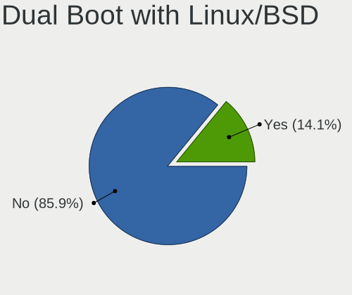
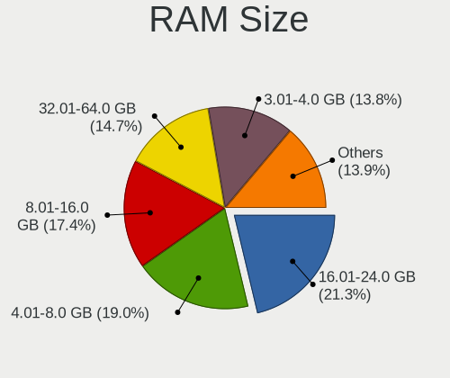

Linux in USA - Tested Hardware & Statistics
-------------------------------------------

A project to collect tested hardware configurations for Linux in USA.

Anyone can contribute to this report by the [hw-probe](https://github.com/linuxhw/hw-probe) tool:

    sudo -E hw-probe -all -upload

Please contribute! Especially if your hardware is rare.

This is a report for all computer types. See also reports for [desktops](/Location/USA/Desktop/README.md) and [notebooks](/Location/USA/Notebook/README.md).

Contents
--------

* [ Test Cases ](#test-cases)

* [ System ](#system)
  - [ OS                       ](#os)
  - [ OS Family                ](#os-family)
  - [ Kernel                   ](#kernel)
  - [ Kernel Family            ](#kernel-family)
  - [ Kernel Major Ver.        ](#kernel-major-ver)
  - [ Arch                     ](#arch)
  - [ DE                       ](#de)
  - [ Display Server           ](#display-server)
  - [ Display Manager          ](#display-manager)
  - [ OS Lang                  ](#os-lang)
  - [ Boot Mode                ](#boot-mode)
  - [ Filesystem               ](#filesystem)
  - [ Part. scheme             ](#part-scheme)
  - [ Dual Boot with Linux/BSD ](#dual-boot-with-linuxbsd)
  - [ Dual Boot (Win)          ](#dual-boot-win)

* [ Board ](#board)
  - [ Vendor                   ](#vendor)
  - [ Model                    ](#model)
  - [ Model Family             ](#model-family)
  - [ MFG Year                 ](#mfg-year)
  - [ Form Factor              ](#form-factor)
  - [ Secure Boot              ](#secure-boot)
  - [ Coreboot                 ](#coreboot)
  - [ RAM Size                 ](#ram-size)
  - [ RAM Used                 ](#ram-used)
  - [ Total Drives             ](#total-drives)
  - [ Has CD-ROM               ](#has-cd-rom)
  - [ Has Ethernet             ](#has-ethernet)
  - [ Has WiFi                 ](#has-wifi)
  - [ Has Bluetooth            ](#has-bluetooth)

* [ Location ](#location)
  - [ Country                  ](#country)
  - [ City                     ](#city)

* [ Drives ](#drives)
  - [ Drive Vendor             ](#drive-vendor)
  - [ Drive Model              ](#drive-model)
  - [ HDD Vendor               ](#hdd-vendor)
  - [ SSD Vendor               ](#ssd-vendor)
  - [ Drive Kind               ](#drive-kind)
  - [ Drive Connector          ](#drive-connector)
  - [ Drive Size               ](#drive-size)
  - [ Space Total              ](#space-total)
  - [ Space Used               ](#space-used)
  - [ Malfunc. Drives          ](#malfunc-drives)
  - [ Malfunc. Drive Vendor    ](#malfunc-drive-vendor)
  - [ Malfunc. HDD Vendor      ](#malfunc-hdd-vendor)
  - [ Malfunc. Drive Kind      ](#malfunc-drive-kind)
  - [ Failed Drives            ](#failed-drives)
  - [ Failed Drive Vendor      ](#failed-drive-vendor)
  - [ Drive Status             ](#drive-status)

* [ Storage controller ](#storage-controller)
  - [ Storage Vendor           ](#storage-vendor)
  - [ Storage Model            ](#storage-model)
  - [ Storage Kind             ](#storage-kind)

* [ Processor ](#processor)
  - [ CPU Vendor               ](#cpu-vendor)
  - [ CPU Model                ](#cpu-model)
  - [ CPU Model Family         ](#cpu-model-family)
  - [ CPU Cores                ](#cpu-cores)
  - [ CPU Sockets              ](#cpu-sockets)
  - [ CPU Threads              ](#cpu-threads)
  - [ CPU Op-Modes             ](#cpu-op-modes)
  - [ CPU Microcode            ](#cpu-microcode)
  - [ CPU Microarch            ](#cpu-microarch)

* [ Graphics ](#graphics)
  - [ GPU Vendor               ](#gpu-vendor)
  - [ GPU Model                ](#gpu-model)
  - [ GPU Combo                ](#gpu-combo)
  - [ GPU Driver               ](#gpu-driver)
  - [ GPU Memory               ](#gpu-memory)

* [ Monitor ](#monitor)
  - [ Monitor Vendor           ](#monitor-vendor)
  - [ Monitor Model            ](#monitor-model)
  - [ Monitor Resolution       ](#monitor-resolution)
  - [ Monitor Diagonal         ](#monitor-diagonal)
  - [ Monitor Width            ](#monitor-width)
  - [ Aspect Ratio             ](#aspect-ratio)
  - [ Monitor Area             ](#monitor-area)
  - [ Pixel Density            ](#pixel-density)
  - [ Multiple Monitors        ](#multiple-monitors)

* [ Network ](#network)
  - [ Net Controller Vendor    ](#net-controller-vendor)
  - [ Net Controller Model     ](#net-controller-model)
  - [ Wireless Vendor          ](#wireless-vendor)
  - [ Wireless Model           ](#wireless-model)
  - [ Ethernet Vendor          ](#ethernet-vendor)
  - [ Ethernet Model           ](#ethernet-model)
  - [ Net Controller Kind      ](#net-controller-kind)
  - [ Used Controller          ](#used-controller)
  - [ NICs                     ](#nics)
  - [ IPv6                     ](#ipv6)

* [ Bluetooth ](#bluetooth)
  - [ Bluetooth Vendor         ](#bluetooth-vendor)
  - [ Bluetooth Model          ](#bluetooth-model)

* [ Sound ](#sound)
  - [ Sound Vendor             ](#sound-vendor)
  - [ Sound Model              ](#sound-model)

* [ Memory ](#memory)
  - [ Memory Vendor            ](#memory-vendor)
  - [ Memory Model             ](#memory-model)
  - [ Memory Kind              ](#memory-kind)
  - [ Memory Form Factor       ](#memory-form-factor)
  - [ Memory Size              ](#memory-size)
  - [ Memory Speed             ](#memory-speed)

* [ Printers & scanners ](#printers--scanners)
  - [ Printer Vendor           ](#printer-vendor)
  - [ Printer Model            ](#printer-model)
  - [ Scanner Vendor           ](#scanner-vendor)
  - [ Scanner Model            ](#scanner-model)

* [ Camera ](#camera)
  - [ Camera Vendor            ](#camera-vendor)
  - [ Camera Model             ](#camera-model)

* [ Security ](#security)
  - [ Fingerprint Vendor       ](#fingerprint-vendor)
  - [ Fingerprint Model        ](#fingerprint-model)
  - [ Chipcard Vendor          ](#chipcard-vendor)
  - [ Chipcard Model           ](#chipcard-model)

* [ Unsupported ](#unsupported)
  - [ Unsupported Devices      ](#unsupported-devices)
  - [ Unsupported Device Types ](#unsupported-device-types)

Test Cases
----------

Total: 42683

| Vendor        | Model                       | Form-Factor | Probe                                                      | Date         |
|---------------|-----------------------------|-------------|------------------------------------------------------------|--------------|
| Dell          | Inspiron 14 7420 2-in-1     | Convertible | [fa5ce31d04](https://linux-hardware.org/?probe=fa5ce31d04) | Jan 01, 2023 |
| MSI           | MPG B560I GAMING EDGE WI... | Desktop     | [20eb2d93e2](https://linux-hardware.org/?probe=20eb2d93e2) | Jan 01, 2023 |
| ASUSTek       | TUF Gaming B550M-PLUS       | Desktop     | [2c31fd54e4](https://linux-hardware.org/?probe=2c31fd54e4) | Jan 01, 2023 |
| HP            | 806A                        | Desktop     | [72e5b78d96](https://linux-hardware.org/?probe=72e5b78d96) | Dec 31, 2022 |
| Gigabyte      | G5 MD                       | Notebook    | [901f1e43f0](https://linux-hardware.org/?probe=901f1e43f0) | Dec 31, 2022 |
| Gigabyte      | G5 MD                       | Notebook    | [631ee5c81c](https://linux-hardware.org/?probe=631ee5c81c) | Dec 31, 2022 |
| ASUSTek       | PRIME B550M-A               | Desktop     | [162ad451eb](https://linux-hardware.org/?probe=162ad451eb) | Dec 31, 2022 |
| ASUSTek       | TUF Gaming X570-PLUS        | Desktop     | [ea3b140a7f](https://linux-hardware.org/?probe=ea3b140a7f) | Dec 31, 2022 |
| Supermicro    | H12SSL-NT                   | Server      | [954e228bd5](https://linux-hardware.org/?probe=954e228bd5) | Dec 31, 2022 |
| Lenovo        | ThinkCentre M90 3692X01     | Desktop     | [702838caff](https://linux-hardware.org/?probe=702838caff) | Dec 31, 2022 |
| Apple         | Mac-942B5BF58194151B        | All in one  | [d82f6dded4](https://linux-hardware.org/?probe=d82f6dded4) | Dec 31, 2022 |
| System76      | Oryx Pro                    | Notebook    | [0d65e57758](https://linux-hardware.org/?probe=0d65e57758) | Dec 31, 2022 |
| MSI           | B360M BAZOOKA               | Desktop     | [ad26afeb83](https://linux-hardware.org/?probe=ad26afeb83) | Dec 31, 2022 |
| Dell          | 0GWHMW A01                  | Desktop     | [59287847c9](https://linux-hardware.org/?probe=59287847c9) | Dec 31, 2022 |
| Raspberry ... | Raspberry Pi 4 Model B R... | Soc         | [5246120c58](https://linux-hardware.org/?probe=5246120c58) | Dec 31, 2022 |
| HP            | Pavilion dv7                | Notebook    | [4e42e627b8](https://linux-hardware.org/?probe=4e42e627b8) | Dec 31, 2022 |
| Raspberry ... | Raspberry Pi 4 Model B R... | Soc         | [5115dfb7a9](https://linux-hardware.org/?probe=5115dfb7a9) | Dec 31, 2022 |
| Lenovo        | ThinkPad T430s 235368U      | Notebook    | [8420930d53](https://linux-hardware.org/?probe=8420930d53) | Dec 31, 2022 |
| Dell          | Latitude 7370               | Notebook    | [cf1f751fbf](https://linux-hardware.org/?probe=cf1f751fbf) | Dec 31, 2022 |
| ASUSTek       | ROG STRIX X570-E GAMING     | Desktop     | [f16b55ea54](https://linux-hardware.org/?probe=f16b55ea54) | Dec 31, 2022 |
| Lenovo        | Yoga 7 14ITL5 82BH          | Convertible | [3592017c4a](https://linux-hardware.org/?probe=3592017c4a) | Dec 31, 2022 |
| Dell          | 0T10XW A00                  | Desktop     | [21638e1dfe](https://linux-hardware.org/?probe=21638e1dfe) | Dec 31, 2022 |
| Lenovo        | ThinkPad T430s 235368U      | Notebook    | [e31244bdd7](https://linux-hardware.org/?probe=e31244bdd7) | Dec 31, 2022 |
| Lenovo        | Yoga 6 13ALC6 82ND          | Convertible | [de75bb19fa](https://linux-hardware.org/?probe=de75bb19fa) | Dec 31, 2022 |
| MSI           | B250M BAZOOKA               | Desktop     | [5b204eade4](https://linux-hardware.org/?probe=5b204eade4) | Dec 31, 2022 |
| Google        | Candy                       | Notebook    | [86bb9a73fc](https://linux-hardware.org/?probe=86bb9a73fc) | Dec 31, 2022 |
| HP            | EliteBook 845 14 inch G9... | Notebook    | [5b5e58e433](https://linux-hardware.org/?probe=5b5e58e433) | Dec 31, 2022 |
| AZW           | U59                         | Desktop     | [39f0dfe71f](https://linux-hardware.org/?probe=39f0dfe71f) | Dec 31, 2022 |
| Dell          | 0KWVT8 A03                  | Desktop     | [ad32666c8c](https://linux-hardware.org/?probe=ad32666c8c) | Dec 31, 2022 |
| Valve         | Jupiter                     | Notebook    | [206fed6963](https://linux-hardware.org/?probe=206fed6963) | Dec 31, 2022 |
| Gigabyte      | W480 VISION D               | Desktop     | [133d8a7f70](https://linux-hardware.org/?probe=133d8a7f70) | Dec 31, 2022 |
| AZW           | SER V1.0                    | Mini pc     | [1c406a3696](https://linux-hardware.org/?probe=1c406a3696) | Dec 31, 2022 |
| AZW           | Green G2                    | Desktop     | [257948e699](https://linux-hardware.org/?probe=257948e699) | Dec 31, 2022 |
| ASRock        | X99 Extreme3                | Desktop     | [565f486b7f](https://linux-hardware.org/?probe=565f486b7f) | Dec 31, 2022 |
| ASRock        | X99 Extreme3                | Desktop     | [eaf8cc0ed5](https://linux-hardware.org/?probe=eaf8cc0ed5) | Dec 31, 2022 |
| AZW           | SER V1.0                    | Mini pc     | [08ac155787](https://linux-hardware.org/?probe=08ac155787) | Dec 31, 2022 |
| Dell          | Latitude 7370               | Notebook    | [c9423665bb](https://linux-hardware.org/?probe=c9423665bb) | Dec 31, 2022 |
| Lenovo        | ThinkPad T14 Gen 3 21AH0... | Notebook    | [591d985e85](https://linux-hardware.org/?probe=591d985e85) | Dec 31, 2022 |
| HP            | Pavilion Aero Laptop 13-... | Notebook    | [c2a949b725](https://linux-hardware.org/?probe=c2a949b725) | Dec 31, 2022 |
| Intel         | DB75EN AAG39650-400         | Desktop     | [086831bbca](https://linux-hardware.org/?probe=086831bbca) | Dec 31, 2022 |
| Dell          | 0D24M8 A00                  | Desktop     | [def123de2d](https://linux-hardware.org/?probe=def123de2d) | Dec 31, 2022 |
| HP            | Victus by Laptop 16-e0xx... | Notebook    | [9220da7abb](https://linux-hardware.org/?probe=9220da7abb) | Dec 31, 2022 |
| MSI           | MPG Z490 GAMING PLUS        | Desktop     | [b4aecf5fa1](https://linux-hardware.org/?probe=b4aecf5fa1) | Dec 31, 2022 |
| Dell          | 0VNP2H A02                  | Desktop     | [5d3da04d45](https://linux-hardware.org/?probe=5d3da04d45) | Dec 31, 2022 |
| Apple         | MacBookPro8,1               | Notebook    | [97f93aa235](https://linux-hardware.org/?probe=97f93aa235) | Dec 31, 2022 |
| Lenovo        | HASWELLREFRESHDT 3190005... | All in one  | [3fdb423e72](https://linux-hardware.org/?probe=3fdb423e72) | Dec 31, 2022 |
| Lenovo        | ThinkPad P17 Gen 2i 20YU... | Notebook    | [34169c74c5](https://linux-hardware.org/?probe=34169c74c5) | Dec 31, 2022 |
| Lenovo        | Win8 Pro DPK TPG            | Desktop     | [9561e51689](https://linux-hardware.org/?probe=9561e51689) | Dec 31, 2022 |
| MAXSUN        | MS-TZZ A320M.2-VH           | Desktop     | [8f06578f10](https://linux-hardware.org/?probe=8f06578f10) | Dec 31, 2022 |
| Dell          | Latitude 3420               | Notebook    | [05095533cd](https://linux-hardware.org/?probe=05095533cd) | Dec 31, 2022 |
| Gigabyte      | GA-MA785GMT-UD2H            | Desktop     | [c4059f2954](https://linux-hardware.org/?probe=c4059f2954) | Dec 31, 2022 |
| Intel         | NUC10i5FNB K61361-303       | Mini pc     | [d4054063fd](https://linux-hardware.org/?probe=d4054063fd) | Dec 31, 2022 |
| Dell          | G3 3579                     | Notebook    | [cad48f0160](https://linux-hardware.org/?probe=cad48f0160) | Dec 30, 2022 |
| ASRock        | X79 Extreme6                | Desktop     | [5ea31811b4](https://linux-hardware.org/?probe=5ea31811b4) | Dec 30, 2022 |
| HP            | Pavilion dv6700             | Notebook    | [4b3b106bee](https://linux-hardware.org/?probe=4b3b106bee) | Dec 30, 2022 |
| Dell          | 0GDG8Y A00                  | Desktop     | [8c8e9d66e7](https://linux-hardware.org/?probe=8c8e9d66e7) | Dec 30, 2022 |
| Intel         | NUC10i5FNB K61361-303       | Mini pc     | [637d12f7c5](https://linux-hardware.org/?probe=637d12f7c5) | Dec 30, 2022 |
| Acer          | Aspire E5-576G              | Notebook    | [883bd1cd8d](https://linux-hardware.org/?probe=883bd1cd8d) | Dec 30, 2022 |
| Dell          | 0KWVT8 A03                  | Desktop     | [17fc3a4abc](https://linux-hardware.org/?probe=17fc3a4abc) | Dec 30, 2022 |
| ASUSTek       | PRIME B550M-A               | Desktop     | [83810bf0a9](https://linux-hardware.org/?probe=83810bf0a9) | Dec 30, 2022 |
| Radxa         | ROCK 5B                     | Soc         | [d864d2a31b](https://linux-hardware.org/?probe=d864d2a31b) | Dec 30, 2022 |
| Valve         | Jupiter                     | Notebook    | [d66944e019](https://linux-hardware.org/?probe=d66944e019) | Dec 30, 2022 |
| Dell          | XPS 15 9520                 | Notebook    | [19b4bfd852](https://linux-hardware.org/?probe=19b4bfd852) | Dec 30, 2022 |
| Valve         | Jupiter                     | Notebook    | [7efd41e9e3](https://linux-hardware.org/?probe=7efd41e9e3) | Dec 30, 2022 |
| Valve         | Jupiter                     | Notebook    | [d35711a607](https://linux-hardware.org/?probe=d35711a607) | Dec 30, 2022 |
| Valve         | Jupiter                     | Notebook    | [617508d444](https://linux-hardware.org/?probe=617508d444) | Dec 30, 2022 |
| Alienware     | x17 R2                      | Notebook    | [f213236189](https://linux-hardware.org/?probe=f213236189) | Dec 30, 2022 |
| GPU Compan... | GWNR71517                   | Notebook    | [d8b5801637](https://linux-hardware.org/?probe=d8b5801637) | Dec 30, 2022 |
| AZW           | Green G2                    | Desktop     | [33f1a5c1a9](https://linux-hardware.org/?probe=33f1a5c1a9) | Dec 30, 2022 |
| Valve         | Jupiter                     | Notebook    | [ba8c4aff6e](https://linux-hardware.org/?probe=ba8c4aff6e) | Dec 30, 2022 |
| Valve         | Jupiter                     | Notebook    | [6723dd2f21](https://linux-hardware.org/?probe=6723dd2f21) | Dec 30, 2022 |
| Google        | Nautilus                    | Convertible | [8d1977d0ae](https://linux-hardware.org/?probe=8d1977d0ae) | Dec 30, 2022 |
| ASUSTek       | X540LA                      | Notebook    | [65f5548781](https://linux-hardware.org/?probe=65f5548781) | Dec 30, 2022 |
| HP            | ZBook Studio G3             | Notebook    | [ca204b6900](https://linux-hardware.org/?probe=ca204b6900) | Dec 30, 2022 |
| ASRock        | H270 Pro4                   | Desktop     | [669d1fd05e](https://linux-hardware.org/?probe=669d1fd05e) | Dec 30, 2022 |
| ASUSTek       | G10DK                       | Desktop     | [5a5172ad44](https://linux-hardware.org/?probe=5a5172ad44) | Dec 30, 2022 |
| MSI           | MPG Z490 GAMING EDGE WIF... | Desktop     | [056ae8185c](https://linux-hardware.org/?probe=056ae8185c) | Dec 30, 2022 |
| Apple         | MacBookPro14,3              | Notebook    | [fdd6af96b3](https://linux-hardware.org/?probe=fdd6af96b3) | Dec 30, 2022 |
| System76      | Oryx Pro                    | Notebook    | [dcc09f8dc5](https://linux-hardware.org/?probe=dcc09f8dc5) | Dec 30, 2022 |
| HP            | Pavilion dv7                | Notebook    | [6ba364face](https://linux-hardware.org/?probe=6ba364face) | Dec 30, 2022 |
| ASUSTek       | ROG STRIX X570-I GAMING     | Desktop     | [a634defd54](https://linux-hardware.org/?probe=a634defd54) | Dec 30, 2022 |
| ASRock        | H110 Pro BTC+               | Desktop     | [a7ccef79ad](https://linux-hardware.org/?probe=a7ccef79ad) | Dec 30, 2022 |
| ASUSTek       | Z87-PLUS                    | Desktop     | [85bfa942e6](https://linux-hardware.org/?probe=85bfa942e6) | Dec 30, 2022 |
| Google        | Edgar                       | Notebook    | [738a0d9324](https://linux-hardware.org/?probe=738a0d9324) | Dec 30, 2022 |
| HP            | Laptop 17-ca2xxx            | Notebook    | [add21e3026](https://linux-hardware.org/?probe=add21e3026) | Dec 30, 2022 |
| ASUSTek       | PRIME Z690M-PLUS D4         | Desktop     | [b1bfc3d1ff](https://linux-hardware.org/?probe=b1bfc3d1ff) | Dec 30, 2022 |
| Dell          | XPS 9320                    | Notebook    | [c7a7749a95](https://linux-hardware.org/?probe=c7a7749a95) | Dec 30, 2022 |
| ASUSTek       | PRIME B550M-A               | Desktop     | [da9b785d2a](https://linux-hardware.org/?probe=da9b785d2a) | Dec 30, 2022 |
| Lenovo        | ThinkPad T430 23426FU       | Notebook    | [eec74990ca](https://linux-hardware.org/?probe=eec74990ca) | Dec 30, 2022 |
| Intel         | X99                         | Desktop     | [ad6b288b38](https://linux-hardware.org/?probe=ad6b288b38) | Dec 30, 2022 |
| ASUSTek       | Z87-PRO                     | Desktop     | [eafab9edba](https://linux-hardware.org/?probe=eafab9edba) | Dec 30, 2022 |
| ASUSTek       | TUF Gaming X570-PLUS        | Desktop     | [da829c6683](https://linux-hardware.org/?probe=da829c6683) | Dec 30, 2022 |
| SK hynix      | Mini PC                     | Mini pc     | [6d5a252e3e](https://linux-hardware.org/?probe=6d5a252e3e) | Dec 30, 2022 |
| SK hynix      | Mini PC                     | Mini pc     | [24fdcb9d6a](https://linux-hardware.org/?probe=24fdcb9d6a) | Dec 30, 2022 |
| Raspberry ... | Raspberry Pi 4 Model B R... | Soc         | [531e60d101](https://linux-hardware.org/?probe=531e60d101) | Dec 30, 2022 |
| Dell          | Latitude E6540              | Notebook    | [e0e5f33e60](https://linux-hardware.org/?probe=e0e5f33e60) | Dec 30, 2022 |
| Acer          | Veriton N4680G              | Desktop     | [0053ddb3c9](https://linux-hardware.org/?probe=0053ddb3c9) | Dec 30, 2022 |
| Dell          | XPS 9320                    | Notebook    | [458727c26e](https://linux-hardware.org/?probe=458727c26e) | Dec 30, 2022 |
| ASUSTek       | M5A88-M                     | Desktop     | [dc7201711c](https://linux-hardware.org/?probe=dc7201711c) | Dec 30, 2022 |
| Intel         | NUC13SBBi9 M58736-302       | Mini pc     | [5a13b60a0d](https://linux-hardware.org/?probe=5a13b60a0d) | Dec 30, 2022 |
| MSI           | MAG B660M MORTAR WIFI DD... | Desktop     | [d689576b2d](https://linux-hardware.org/?probe=d689576b2d) | Dec 29, 2022 |
| MSI           | MAG B650 TOMAHAWK WIFI      | Desktop     | [bdc5158ffb](https://linux-hardware.org/?probe=bdc5158ffb) | Dec 29, 2022 |
| HP            | Spectre x360 2-in-1 Lapt... | Convertible | [3303908896](https://linux-hardware.org/?probe=3303908896) | Dec 29, 2022 |
| ASUSTek       | G10DK                       | Desktop     | [26e2460b8d](https://linux-hardware.org/?probe=26e2460b8d) | Dec 29, 2022 |
| BESSTAR Te... | HM80                        | Desktop     | [9af0f05e7e](https://linux-hardware.org/?probe=9af0f05e7e) | Dec 29, 2022 |
| MSI           | B550M PRO-VDH WIFI          | Desktop     | [17f72460f6](https://linux-hardware.org/?probe=17f72460f6) | Dec 29, 2022 |
| ASUSTek       | STRIKER II EXTREME          | Desktop     | [3258ffa0c1](https://linux-hardware.org/?probe=3258ffa0c1) | Dec 29, 2022 |
| MSI           | B550M PRO                   | Desktop     | [61b36bfa2e](https://linux-hardware.org/?probe=61b36bfa2e) | Dec 29, 2022 |
| HP            | Pavilion x360 Convertibl... | Convertible | [9d5d98e818](https://linux-hardware.org/?probe=9d5d98e818) | Dec 29, 2022 |
| Acer          | Aspire AV14-51              | Notebook    | [4f92ccde69](https://linux-hardware.org/?probe=4f92ccde69) | Dec 29, 2022 |
| Dell          | 0KRC95 A02                  | Desktop     | [4cf9d40c0d](https://linux-hardware.org/?probe=4cf9d40c0d) | Dec 29, 2022 |
| Lenovo        | ThinkPad T430s 235368U      | Notebook    | [c9b7e858ae](https://linux-hardware.org/?probe=c9b7e858ae) | Dec 29, 2022 |
| AMI           | Intel                       | Notebook    | [b4f7a84546](https://linux-hardware.org/?probe=b4f7a84546) | Dec 29, 2022 |
| Dell          | 0KRC95 A02                  | Desktop     | [7e53808767](https://linux-hardware.org/?probe=7e53808767) | Dec 29, 2022 |
| HP            | Laptop 17-cp0xxx            | Notebook    | [7f54c2425b](https://linux-hardware.org/?probe=7f54c2425b) | Dec 29, 2022 |
| Lenovo        | ThinkPad T430s 235368U      | Notebook    | [8ba8cedf66](https://linux-hardware.org/?probe=8ba8cedf66) | Dec 29, 2022 |
| Dell          | XPS 13 9370                 | Notebook    | [1f72002986](https://linux-hardware.org/?probe=1f72002986) | Dec 29, 2022 |
| Lenovo        | ThinkPad T430 23426FU       | Notebook    | [9e4e7d1738](https://linux-hardware.org/?probe=9e4e7d1738) | Dec 29, 2022 |
| Acer          | Swift SFX14-41G             | Notebook    | [e422b934d0](https://linux-hardware.org/?probe=e422b934d0) | Dec 29, 2022 |
| Lenovo        | Legion 5 Pro 16ITH6H 82J... | Notebook    | [467a749806](https://linux-hardware.org/?probe=467a749806) | Dec 29, 2022 |
| HP            | Pavilion g7                 | Notebook    | [444363b7ec](https://linux-hardware.org/?probe=444363b7ec) | Dec 29, 2022 |
| Carbon Sys... | Iridium 14                  | Notebook    | [d2275f6785](https://linux-hardware.org/?probe=d2275f6785) | Dec 29, 2022 |
| HP            | 8399                        | Desktop     | [204c8c0a3f](https://linux-hardware.org/?probe=204c8c0a3f) | Dec 29, 2022 |
| Dell          | Latitude E6430              | Notebook    | [6d5bc96456](https://linux-hardware.org/?probe=6d5bc96456) | Dec 29, 2022 |
| Apple         | MacBookAir7,2               | Notebook    | [0ad2bdf744](https://linux-hardware.org/?probe=0ad2bdf744) | Dec 29, 2022 |
| HP            | 158A                        | Desktop     | [bfd338cf36](https://linux-hardware.org/?probe=bfd338cf36) | Dec 29, 2022 |
| Dell          | Inspiron 5555               | Notebook    | [37635ca062](https://linux-hardware.org/?probe=37635ca062) | Dec 29, 2022 |
| Dell          | 0KWVT8 A03                  | Desktop     | [7ce6d4b3e3](https://linux-hardware.org/?probe=7ce6d4b3e3) | Dec 29, 2022 |
| Dell          | 0KWVT8 A03                  | Desktop     | [f828f74e07](https://linux-hardware.org/?probe=f828f74e07) | Dec 29, 2022 |
| Lenovo        | ThinkPad T480 20L5001DUS    | Notebook    | [51bb19bbf2](https://linux-hardware.org/?probe=51bb19bbf2) | Dec 29, 2022 |
| MSI           | X370 GAMING M7 ACK          | Desktop     | [60fe0d0b31](https://linux-hardware.org/?probe=60fe0d0b31) | Dec 29, 2022 |
| Valve         | Jupiter                     | Notebook    | [135a0237fc](https://linux-hardware.org/?probe=135a0237fc) | Dec 29, 2022 |
| Dell          | Inspiron 14 5425            | Notebook    | [42f45d59d2](https://linux-hardware.org/?probe=42f45d59d2) | Dec 29, 2022 |
| HP            | Laptop 15-dw0xxx            | Notebook    | [b851f7bcfc](https://linux-hardware.org/?probe=b851f7bcfc) | Dec 29, 2022 |
| ASUSTek       | PRIME B550M-A               | Desktop     | [e6ac6cac6c](https://linux-hardware.org/?probe=e6ac6cac6c) | Dec 29, 2022 |
| Acer          | Aspire XC-603G              | Desktop     | [08dc8ac6b7](https://linux-hardware.org/?probe=08dc8ac6b7) | Dec 29, 2022 |
| Lenovo        | ThinkPad T490s 20NYS9MJ0... | Notebook    | [8489abdbe7](https://linux-hardware.org/?probe=8489abdbe7) | Dec 29, 2022 |
| System76      | Lemur Pro                   | Notebook    | [0a61e4fe8d](https://linux-hardware.org/?probe=0a61e4fe8d) | Dec 29, 2022 |
| HP            | ENVY dv7                    | Notebook    | [97e029af78](https://linux-hardware.org/?probe=97e029af78) | Dec 29, 2022 |
| Apple         | MacBookPro14,1              | Notebook    | [2bd4899c8a](https://linux-hardware.org/?probe=2bd4899c8a) | Dec 29, 2022 |
| HP            | 0B4Ch D                     | Desktop     | [ed3b8e2e69](https://linux-hardware.org/?probe=ed3b8e2e69) | Dec 29, 2022 |
| ASRock        | X570 Taichi                 | Desktop     | [c1e5e82fbb](https://linux-hardware.org/?probe=c1e5e82fbb) | Dec 29, 2022 |
| ASUSTek       | ROG CROSSHAIR VII HERO      | Desktop     | [4ca2070d42](https://linux-hardware.org/?probe=4ca2070d42) | Dec 29, 2022 |
| Pegatron      | 2AC2                        | Desktop     | [adc3978bcc](https://linux-hardware.org/?probe=adc3978bcc) | Dec 29, 2022 |
| ASUSTek       | ROG STRIX B450-F GAMING     | Desktop     | [2d47973101](https://linux-hardware.org/?probe=2d47973101) | Dec 29, 2022 |
| Apple         | Mac-77F17D7DA9285301 iMa... | All in one  | [a101aebc11](https://linux-hardware.org/?probe=a101aebc11) | Dec 29, 2022 |
| Apple         | MacBookPro14,1              | Notebook    | [919cfc2c9c](https://linux-hardware.org/?probe=919cfc2c9c) | Dec 29, 2022 |
| MSI           | PRO B660M-A DDR4            | Desktop     | [dbc37ff826](https://linux-hardware.org/?probe=dbc37ff826) | Dec 29, 2022 |
| Dell          | 0NNGP2 A00                  | Desktop     | [12638171d9](https://linux-hardware.org/?probe=12638171d9) | Dec 28, 2022 |
| Dell          | 0JP3NX A01                  | Desktop     | [3b094471e0](https://linux-hardware.org/?probe=3b094471e0) | Dec 28, 2022 |
| Dell          | XPS 13 9365                 | Convertible | [a0e606d89d](https://linux-hardware.org/?probe=a0e606d89d) | Dec 28, 2022 |
| Dell          | XPS 13 9365                 | Convertible | [fd98910e6d](https://linux-hardware.org/?probe=fd98910e6d) | Dec 28, 2022 |
| Lenovo        | ThinkPad T14 Gen 3 21AH0... | Notebook    | [8901206dd0](https://linux-hardware.org/?probe=8901206dd0) | Dec 28, 2022 |
| HP            | 805D                        | Desktop     | [cf88e571df](https://linux-hardware.org/?probe=cf88e571df) | Dec 28, 2022 |
| Intel         | X99                         | Desktop     | [eb6babb799](https://linux-hardware.org/?probe=eb6babb799) | Dec 28, 2022 |
| HP            | Pavilion 17                 | Notebook    | [03976dea5a](https://linux-hardware.org/?probe=03976dea5a) | Dec 28, 2022 |
| ASUSTek       | PRIME B550M-A               | Desktop     | [1219225d5d](https://linux-hardware.org/?probe=1219225d5d) | Dec 28, 2022 |
| ASUSTek       | G10DK                       | Desktop     | [1ffb248d93](https://linux-hardware.org/?probe=1ffb248d93) | Dec 28, 2022 |
| HP            | ProBook 440 14 inch G9 N... | Notebook    | [e23c23e61f](https://linux-hardware.org/?probe=e23c23e61f) | Dec 28, 2022 |
| System76      | Bonobo Extreme              | Notebook    | [cedfb426df](https://linux-hardware.org/?probe=cedfb426df) | Dec 28, 2022 |
| HP            | ProBook 440 14 inch G9 N... | Notebook    | [5c4856e5c8](https://linux-hardware.org/?probe=5c4856e5c8) | Dec 28, 2022 |
| Chuwi         | HeroBook                    | Notebook    | [941a22d5fd](https://linux-hardware.org/?probe=941a22d5fd) | Dec 28, 2022 |
| Gigabyte      | Z370XP SLI-CF               | Desktop     | [be56999d2a](https://linux-hardware.org/?probe=be56999d2a) | Dec 28, 2022 |
| System76      | Bonobo Extreme              | Notebook    | [1b6caec010](https://linux-hardware.org/?probe=1b6caec010) | Dec 28, 2022 |
| HP            | Compaq Presario CQ60        | Notebook    | [92ece593f5](https://linux-hardware.org/?probe=92ece593f5) | Dec 28, 2022 |
| Toshiba       | Satellite L455D             | Notebook    | [35c085aa82](https://linux-hardware.org/?probe=35c085aa82) | Dec 28, 2022 |
| GPU Compan... | GWTN116-3                   | Notebook    | [73323d3bad](https://linux-hardware.org/?probe=73323d3bad) | Dec 28, 2022 |
| GPU Compan... | GWTN116-3                   | Notebook    | [bcad5903ae](https://linux-hardware.org/?probe=bcad5903ae) | Dec 28, 2022 |
| Dell          | 03KWTV A02                  | Desktop     | [82612358ac](https://linux-hardware.org/?probe=82612358ac) | Dec 28, 2022 |
| HP            | 0A54h                       | Desktop     | [7f1e1152d9](https://linux-hardware.org/?probe=7f1e1152d9) | Dec 28, 2022 |
| Dell          | 0TTDMJ A00                  | Desktop     | [198e723dc2](https://linux-hardware.org/?probe=198e723dc2) | Dec 28, 2022 |
| MSI           | Z270 PC MATE                | Desktop     | [08186ccafe](https://linux-hardware.org/?probe=08186ccafe) | Dec 28, 2022 |
| Dell          | Inspiron 16 5625            | Notebook    | [dbc2d2fc6f](https://linux-hardware.org/?probe=dbc2d2fc6f) | Dec 28, 2022 |
| Biostar       | TZ68K+                      | Desktop     | [7bb1d349cc](https://linux-hardware.org/?probe=7bb1d349cc) | Dec 28, 2022 |
| Dell          | Latitude 7490               | Notebook    | [0c49efe5e1](https://linux-hardware.org/?probe=0c49efe5e1) | Dec 28, 2022 |
| Biostar       | TZ68K+                      | Desktop     | [1d200fa462](https://linux-hardware.org/?probe=1d200fa462) | Dec 28, 2022 |
| HP            | Stream Laptop 14-cb1xxx     | Notebook    | [7ac222385a](https://linux-hardware.org/?probe=7ac222385a) | Dec 28, 2022 |
| HP            | Stream Laptop 14-cb1xxx     | Notebook    | [faf2c0e5d7](https://linux-hardware.org/?probe=faf2c0e5d7) | Dec 28, 2022 |
| Lenovo        | G580 20157                  | Notebook    | [bfefa4ee83](https://linux-hardware.org/?probe=bfefa4ee83) | Dec 28, 2022 |
| Lenovo        | 3130 SDK0J40697 WIN 3305... | Mini pc     | [52b38cee5c](https://linux-hardware.org/?probe=52b38cee5c) | Dec 28, 2022 |
| ASUSTek       | G73Jh                       | Notebook    | [e406daa47c](https://linux-hardware.org/?probe=e406daa47c) | Dec 28, 2022 |
| ASUSTek       | VivoBook_ASUSLaptop N760... | Notebook    | [7ef5d874e9](https://linux-hardware.org/?probe=7ef5d874e9) | Dec 28, 2022 |
| Lenovo        | G580 20157                  | Notebook    | [39f72fea9c](https://linux-hardware.org/?probe=39f72fea9c) | Dec 28, 2022 |
| HP            | Compaq Presario CQ60        | Notebook    | [f3f1a02bce](https://linux-hardware.org/?probe=f3f1a02bce) | Dec 28, 2022 |
| Dell          | Inspiron 7737               | Notebook    | [4b5c3bf639](https://linux-hardware.org/?probe=4b5c3bf639) | Dec 28, 2022 |
| Dell          | Inspiron 7737               | Notebook    | [39c1f12699](https://linux-hardware.org/?probe=39c1f12699) | Dec 28, 2022 |
| ASRock        | H270 Pro4                   | Desktop     | [18c67453d3](https://linux-hardware.org/?probe=18c67453d3) | Dec 28, 2022 |
| ASRock        | H270 Pro4                   | Desktop     | [411b246a3f](https://linux-hardware.org/?probe=411b246a3f) | Dec 28, 2022 |
| ASUSTek       | ROG STRIX X670E-I GAMING... | Desktop     | [338e7b0029](https://linux-hardware.org/?probe=338e7b0029) | Dec 28, 2022 |
| HP            | Compaq Presario CQ60        | Notebook    | [b1f32ea75c](https://linux-hardware.org/?probe=b1f32ea75c) | Dec 28, 2022 |
| HP            | EliteBook 845 14 inch G9... | Notebook    | [475b76e98a](https://linux-hardware.org/?probe=475b76e98a) | Dec 28, 2022 |
| AZW           | GTR V01                     | Mini pc     | [408691cd85](https://linux-hardware.org/?probe=408691cd85) | Dec 28, 2022 |
| Dell          | 00CV7F A00                  | Desktop     | [49a36278c4](https://linux-hardware.org/?probe=49a36278c4) | Dec 28, 2022 |
| Apple         | MacBookPro8,2               | Notebook    | [e4255e8ed7](https://linux-hardware.org/?probe=e4255e8ed7) | Dec 28, 2022 |
| HP            | 2AF7                        | Desktop     | [9663a281c1](https://linux-hardware.org/?probe=9663a281c1) | Dec 28, 2022 |
| Lenovo        | IdeaPad L340-17API 81LY     | Notebook    | [f4df1b165b](https://linux-hardware.org/?probe=f4df1b165b) | Dec 28, 2022 |
| Dell          | Precision 7720              | Notebook    | [56db0ab146](https://linux-hardware.org/?probe=56db0ab146) | Dec 28, 2022 |
| Dell          | Precision 7720              | Notebook    | [e94a7bb989](https://linux-hardware.org/?probe=e94a7bb989) | Dec 28, 2022 |
| Google        | Gnawty                      | Notebook    | [98902e9806](https://linux-hardware.org/?probe=98902e9806) | Dec 28, 2022 |
| HP            | Laptop 15-dw0xxx            | Notebook    | [7c2b9af9c3](https://linux-hardware.org/?probe=7c2b9af9c3) | Dec 28, 2022 |
| ASRock        | X470 Gaming-ITX/ac          | Desktop     | [c4d1d971d1](https://linux-hardware.org/?probe=c4d1d971d1) | Dec 28, 2022 |
| MSI           | MEG X570 UNIFY              | Desktop     | [2c2bf7f512](https://linux-hardware.org/?probe=2c2bf7f512) | Dec 28, 2022 |
| MSI           | MEG X570 UNIFY              | Desktop     | [19f962298b](https://linux-hardware.org/?probe=19f962298b) | Dec 28, 2022 |
| Apple         | Mac-F42786A9 DVT            | All in one  | [2ceb80faeb](https://linux-hardware.org/?probe=2ceb80faeb) | Dec 28, 2022 |
| Lenovo        | 0B98401 WIN                 | Desktop     | [0f71bbaf67](https://linux-hardware.org/?probe=0f71bbaf67) | Dec 28, 2022 |
| Gigabyte      | B650I AORUS ULTRA           | Desktop     | [3c25f43c23](https://linux-hardware.org/?probe=3c25f43c23) | Dec 28, 2022 |
| Dell          | Latitude E7450              | Notebook    | [b641b13d8a](https://linux-hardware.org/?probe=b641b13d8a) | Dec 28, 2022 |
| Valve         | Jupiter                     | Notebook    | [08161cc2cd](https://linux-hardware.org/?probe=08161cc2cd) | Dec 28, 2022 |
| MSI           | MAG X570S TOMAHAWK MAX W... | Desktop     | [1522e4a536](https://linux-hardware.org/?probe=1522e4a536) | Dec 28, 2022 |
| Acer          | Aspire XC-603G              | Desktop     | [e8adbb63a4](https://linux-hardware.org/?probe=e8adbb63a4) | Dec 28, 2022 |
| ASRock        | B450M Pro4                  | Desktop     | [fcaf938a12](https://linux-hardware.org/?probe=fcaf938a12) | Dec 28, 2022 |
| libre-comp... | aml-s905x-cc                | Soc         | [6378a6afbf](https://linux-hardware.org/?probe=6378a6afbf) | Dec 28, 2022 |
| ASUSTek       | TUF Gaming X570-PLUS        | Desktop     | [3ba397a9f4](https://linux-hardware.org/?probe=3ba397a9f4) | Dec 27, 2022 |
| Gigabyte      | X570 AORUS ELITE WIFI       | Desktop     | [49ca01435b](https://linux-hardware.org/?probe=49ca01435b) | Dec 27, 2022 |
| Apple         | MacBookAir7,2               | Notebook    | [10dce91da1](https://linux-hardware.org/?probe=10dce91da1) | Dec 27, 2022 |
| HP            | 304Bh                       | Desktop     | [d85d0d4017](https://linux-hardware.org/?probe=d85d0d4017) | Dec 27, 2022 |
| Apple         | MacBookAir7,1               | Notebook    | [d174ffb318](https://linux-hardware.org/?probe=d174ffb318) | Dec 27, 2022 |
| MSI           | Z97 PC Mate                 | Desktop     | [defccc0ef1](https://linux-hardware.org/?probe=defccc0ef1) | Dec 27, 2022 |
| Dell          | 0KWVT8 A03                  | Desktop     | [9d2542cf36](https://linux-hardware.org/?probe=9d2542cf36) | Dec 27, 2022 |
| Dell          | 0KWVT8 A03                  | Desktop     | [f2998cdede](https://linux-hardware.org/?probe=f2998cdede) | Dec 27, 2022 |
| Lenovo        | ThinkPad X1 Carbon 6th 2... | Notebook    | [5d21edd112](https://linux-hardware.org/?probe=5d21edd112) | Dec 27, 2022 |
| Dell          | 0YDJK3 A02                  | Server      | [83c3b04914](https://linux-hardware.org/?probe=83c3b04914) | Dec 27, 2022 |
| Valve         | Jupiter                     | Notebook    | [894e79d316](https://linux-hardware.org/?probe=894e79d316) | Dec 27, 2022 |
| MSI           | GF63 Thin 10SC              | Notebook    | [71c1ee486e](https://linux-hardware.org/?probe=71c1ee486e) | Dec 27, 2022 |
| Lenovo        | ThinkPad X1 Carbon Gen 1... | Notebook    | [e5cd9613f9](https://linux-hardware.org/?probe=e5cd9613f9) | Dec 27, 2022 |
| HP            | Spectre x360 Convertible... | Convertible | [56d60b7366](https://linux-hardware.org/?probe=56d60b7366) | Dec 27, 2022 |
| Dell          | G7 7500                     | Notebook    | [d46bf78144](https://linux-hardware.org/?probe=d46bf78144) | Dec 27, 2022 |
| Valve         | Jupiter                     | Notebook    | [add22bd3b7](https://linux-hardware.org/?probe=add22bd3b7) | Dec 27, 2022 |
| Acer          | Aspire TC-865 V:1.1         | Desktop     | [0c8add55fe](https://linux-hardware.org/?probe=0c8add55fe) | Dec 27, 2022 |
| ASUSTek       | Z87-K                       | Desktop     | [9c65749eb1](https://linux-hardware.org/?probe=9c65749eb1) | Dec 27, 2022 |
| Acer          | Aspire A515-57              | Notebook    | [470c8d54ba](https://linux-hardware.org/?probe=470c8d54ba) | Dec 27, 2022 |
| Gigabyte      | 990FXA-UD3 R5               | Desktop     | [734c3742b1](https://linux-hardware.org/?probe=734c3742b1) | Dec 27, 2022 |
| Apple         | MacBookPro8,2               | Notebook    | [c62b37d15c](https://linux-hardware.org/?probe=c62b37d15c) | Dec 27, 2022 |
| MSI           | Summit E13FlipEvo A12MT     | Notebook    | [19d3221410](https://linux-hardware.org/?probe=19d3221410) | Dec 27, 2022 |
| MSI           | B450M PRO-M2                | Desktop     | [89d9265559](https://linux-hardware.org/?probe=89d9265559) | Dec 27, 2022 |
| HP            | ZBook Studio G3             | Notebook    | [2eaf074cd3](https://linux-hardware.org/?probe=2eaf074cd3) | Dec 27, 2022 |
| Acer          | Aspire A515-57              | Notebook    | [c0a659dbb1](https://linux-hardware.org/?probe=c0a659dbb1) | Dec 27, 2022 |
| ASUSTek       | ROG STRIX B550-F GAMING     | Desktop     | [41b062ea94](https://linux-hardware.org/?probe=41b062ea94) | Dec 27, 2022 |
| Lenovo        | ThinkPad Yoga 11e 3rd Ge... | Convertible | [2fe0a7fe8b](https://linux-hardware.org/?probe=2fe0a7fe8b) | Dec 27, 2022 |
| Gigabyte      | 990FXA-UD3 R5               | Desktop     | [bb6dddc780](https://linux-hardware.org/?probe=bb6dddc780) | Dec 27, 2022 |
| Google        | Ultima                      | Notebook    | [b389ad5a98](https://linux-hardware.org/?probe=b389ad5a98) | Dec 27, 2022 |
| HP            | 304Bh                       | Desktop     | [02c61d35f2](https://linux-hardware.org/?probe=02c61d35f2) | Dec 27, 2022 |
| GPU Compan... | GWTN156-3BK                 | Notebook    | [7c9c57b704](https://linux-hardware.org/?probe=7c9c57b704) | Dec 27, 2022 |
| HP            | Beats 15                    | Notebook    | [d000f23d61](https://linux-hardware.org/?probe=d000f23d61) | Dec 27, 2022 |
| ASUSTek       | TUF Gaming X570-PLUS        | Desktop     | [6db0562083](https://linux-hardware.org/?probe=6db0562083) | Dec 27, 2022 |
| Lenovo        | ThinkPad T14 Gen 3 21AH0... | Notebook    | [e41c8ca4ee](https://linux-hardware.org/?probe=e41c8ca4ee) | Dec 27, 2022 |
| MSI           | B450 GAMING PLUS MAX        | Desktop     | [bfec1ebd66](https://linux-hardware.org/?probe=bfec1ebd66) | Dec 27, 2022 |
| Supermicro    | H8DG6/H8DGi                 | Server      | [ef32c0c2ca](https://linux-hardware.org/?probe=ef32c0c2ca) | Dec 27, 2022 |
| Dell          | G5 5505                     | Notebook    | [87f62bee87](https://linux-hardware.org/?probe=87f62bee87) | Dec 26, 2022 |
| Dell          | Inspiron 5775               | Notebook    | [cfb1c3fcd6](https://linux-hardware.org/?probe=cfb1c3fcd6) | Dec 26, 2022 |
| Fujitsu       | STYLISTIC Q508              | Tablet      | [b195ae305c](https://linux-hardware.org/?probe=b195ae305c) | Dec 26, 2022 |
| HP            | 2B29                        | Desktop     | [b83d4fafa0](https://linux-hardware.org/?probe=b83d4fafa0) | Dec 26, 2022 |
| Fujitsu       | STYLISTIC Q508              | Tablet      | [18362bcf4d](https://linux-hardware.org/?probe=18362bcf4d) | Dec 26, 2022 |
| Dell          | 02YRK5 A02                  | Desktop     | [56dc5ff1b9](https://linux-hardware.org/?probe=56dc5ff1b9) | Dec 26, 2022 |
| Apple         | MacBookPro14,1              | Notebook    | [eb6c6ee49e](https://linux-hardware.org/?probe=eb6c6ee49e) | Dec 26, 2022 |
| ASUSTek       | N550JV                      | Notebook    | [748284a21e](https://linux-hardware.org/?probe=748284a21e) | Dec 26, 2022 |
| Apple         | Mac-031B6874CF7F642A iMa... | All in one  | [90d20d3ec9](https://linux-hardware.org/?probe=90d20d3ec9) | Dec 26, 2022 |
| HP            | ProBook 450 G7              | Notebook    | [dfedb566ff](https://linux-hardware.org/?probe=dfedb566ff) | Dec 26, 2022 |
| Dell          | XPS 13 9360                 | Notebook    | [bddcc1503f](https://linux-hardware.org/?probe=bddcc1503f) | Dec 26, 2022 |
| Dell          | 05DN3X A00                  | Desktop     | [f8fe045913](https://linux-hardware.org/?probe=f8fe045913) | Dec 26, 2022 |
| Dell          | XPS 15 9510                 | Notebook    | [394fe96894](https://linux-hardware.org/?probe=394fe96894) | Dec 26, 2022 |
| HP            | Pavilion g6                 | Notebook    | [fbdf9893b5](https://linux-hardware.org/?probe=fbdf9893b5) | Dec 26, 2022 |
| Dell          | Latitude E64406342Q0286/    | Notebook    | [e044c94514](https://linux-hardware.org/?probe=e044c94514) | Dec 26, 2022 |
| Lenovo        | IdeaPad 1 14IGL7 82V6       | Notebook    | [27d5cfbc7b](https://linux-hardware.org/?probe=27d5cfbc7b) | Dec 26, 2022 |
| Lenovo        | ThinkPad T470 20HES0PF00    | Notebook    | [052cdcd8bb](https://linux-hardware.org/?probe=052cdcd8bb) | Dec 26, 2022 |
| MSI           | MAG B560 TORPEDO            | Desktop     | [35bbf3abb3](https://linux-hardware.org/?probe=35bbf3abb3) | Dec 26, 2022 |
| Lenovo        | ThinkPad T470 20HES0PF00    | Notebook    | [940218d084](https://linux-hardware.org/?probe=940218d084) | Dec 26, 2022 |
| ASUSTek       | G10DK                       | Desktop     | [30007c6ff0](https://linux-hardware.org/?probe=30007c6ff0) | Dec 26, 2022 |
| Lenovo        | ThinkPad X1 Extreme Gen ... | Notebook    | [ce352bf1b1](https://linux-hardware.org/?probe=ce352bf1b1) | Dec 26, 2022 |
| Valve         | Jupiter                     | Notebook    | [b0805a1b7c](https://linux-hardware.org/?probe=b0805a1b7c) | Dec 26, 2022 |
| Valve         | Jupiter                     | Notebook    | [fff4225748](https://linux-hardware.org/?probe=fff4225748) | Dec 26, 2022 |
| MSI           | GT60                        | Notebook    | [3917ca13e3](https://linux-hardware.org/?probe=3917ca13e3) | Dec 26, 2022 |
| Lenovo        | ThinkPad E560 20EV002FUS    | Notebook    | [39bb0dd975](https://linux-hardware.org/?probe=39bb0dd975) | Dec 26, 2022 |
| Lenovo        | ThinkPad E560 20EV002FUS    | Notebook    | [3a47808708](https://linux-hardware.org/?probe=3a47808708) | Dec 26, 2022 |
| Lenovo        | IdeaPadFlex 5 14ALC7 82R... | Convertible | [227a5cc570](https://linux-hardware.org/?probe=227a5cc570) | Dec 26, 2022 |
| Dell          | Inspiron 5759               | Notebook    | [d1938219e9](https://linux-hardware.org/?probe=d1938219e9) | Dec 26, 2022 |
| BESSTAR Te... | GB7                         | Mini pc     | [06d28eb7f8](https://linux-hardware.org/?probe=06d28eb7f8) | Dec 26, 2022 |
| Valve         | Jupiter                     | Notebook    | [bb4ffda53d](https://linux-hardware.org/?probe=bb4ffda53d) | Dec 26, 2022 |
| Lenovo        | IdeaPadFlex 5 14ALC7 82R... | Convertible | [68abda8935](https://linux-hardware.org/?probe=68abda8935) | Dec 26, 2022 |
| Dell          | Latitude 5580               | Notebook    | [72c0e42aeb](https://linux-hardware.org/?probe=72c0e42aeb) | Dec 26, 2022 |
| Unknown       | HX90                        | Desktop     | [d4265ad971](https://linux-hardware.org/?probe=d4265ad971) | Dec 26, 2022 |
| Apple         | Mac-F2238AC8                | All in one  | [803944471c](https://linux-hardware.org/?probe=803944471c) | Dec 26, 2022 |
| ASUSTek       | ZenBook UX425UG_Q408UG      | Notebook    | [9fb13764cc](https://linux-hardware.org/?probe=9fb13764cc) | Dec 26, 2022 |
| ASUSTek       | PRIME B550M-A               | Desktop     | [8ca73d6b87](https://linux-hardware.org/?probe=8ca73d6b87) | Dec 26, 2022 |
| Gigabyte      | Z590 AORUS ULTRA            | Desktop     | [4ab759533b](https://linux-hardware.org/?probe=4ab759533b) | Dec 25, 2022 |
| Acer          | Aspire A315-59              | Notebook    | [6625ce058f](https://linux-hardware.org/?probe=6625ce058f) | Dec 25, 2022 |
| Apple         | MacBookAir7,2               | Notebook    | [9d48f30feb](https://linux-hardware.org/?probe=9d48f30feb) | Dec 25, 2022 |
| Gateway       | G33M05G1 MP                 | Desktop     | [8a495d2b75](https://linux-hardware.org/?probe=8a495d2b75) | Dec 25, 2022 |
| HP            | Stream Laptop 14-cb1xxx     | Notebook    | [1ba51900a6](https://linux-hardware.org/?probe=1ba51900a6) | Dec 25, 2022 |
| GPU Compan... | GWNR51416                   | Notebook    | [fc6e84d757](https://linux-hardware.org/?probe=fc6e84d757) | Dec 25, 2022 |
| Lenovo        | ThinkPad L14 Gen 3 21C1C... | Notebook    | [f27b950cd8](https://linux-hardware.org/?probe=f27b950cd8) | Dec 25, 2022 |
| Lenovo        | 102F SBB0J05441 WIN 3305... | Desktop     | [fee0a76158](https://linux-hardware.org/?probe=fee0a76158) | Dec 25, 2022 |
| MSI           | MPG B550 GAMING PLUS        | Desktop     | [4c97c87b61](https://linux-hardware.org/?probe=4c97c87b61) | Dec 25, 2022 |
| ECS           | H81H3-WM                    | Desktop     | [6791862ef9](https://linux-hardware.org/?probe=6791862ef9) | Dec 25, 2022 |
| ASUSTek       | X750JN                      | Notebook    | [a604b57c92](https://linux-hardware.org/?probe=a604b57c92) | Dec 25, 2022 |
| ASUSTek       | M3N-HT DELUXE               | Desktop     | [cbbfeef21b](https://linux-hardware.org/?probe=cbbfeef21b) | Dec 25, 2022 |
| ASUSTek       | M3N-HT DELUXE               | Desktop     | [30c464408a](https://linux-hardware.org/?probe=30c464408a) | Dec 25, 2022 |
| Dell          | Latitude 3580               | Notebook    | [f90b8fa62f](https://linux-hardware.org/?probe=f90b8fa62f) | Dec 25, 2022 |
| Biostar       | AM1MHP                      | Desktop     | [a4c61d5381](https://linux-hardware.org/?probe=a4c61d5381) | Dec 25, 2022 |
| ASUSTek       | M4A785-M                    | Desktop     | [f36c085389](https://linux-hardware.org/?probe=f36c085389) | Dec 25, 2022 |
| ASUSTek       | M5A97 PLUS                  | Desktop     | [8a1cb3f5e7](https://linux-hardware.org/?probe=8a1cb3f5e7) | Dec 25, 2022 |
| MSI           | 970A-G46                    | Desktop     | [4b2435b250](https://linux-hardware.org/?probe=4b2435b250) | Dec 25, 2022 |
| Gigabyte      | AERO 17 XD                  | Notebook    | [c45ec6b46d](https://linux-hardware.org/?probe=c45ec6b46d) | Dec 25, 2022 |
| Lenovo        | IdeaPadFlex 5 14ALC7 82R... | Convertible | [8fe5127ba0](https://linux-hardware.org/?probe=8fe5127ba0) | Dec 25, 2022 |
| Valve         | Jupiter                     | Notebook    | [1aae0084d4](https://linux-hardware.org/?probe=1aae0084d4) | Dec 25, 2022 |
| ASUSTek       | G10DK                       | Desktop     | [13379a69a6](https://linux-hardware.org/?probe=13379a69a6) | Dec 25, 2022 |
| HP            | 8265                        | Desktop     | [30ff2fbdaa](https://linux-hardware.org/?probe=30ff2fbdaa) | Dec 25, 2022 |
| Valve         | Jupiter                     | Notebook    | [f30e8d06be](https://linux-hardware.org/?probe=f30e8d06be) | Dec 25, 2022 |
| Valve         | Jupiter                     | Notebook    | [10e4624475](https://linux-hardware.org/?probe=10e4624475) | Dec 25, 2022 |
| HP            | 2AF7                        | Desktop     | [287696b4fc](https://linux-hardware.org/?probe=287696b4fc) | Dec 25, 2022 |
| Framework     | Laptop (12th Gen Intel C... | Notebook    | [daebafedd8](https://linux-hardware.org/?probe=daebafedd8) | Dec 25, 2022 |
| ASUSTek       | PRIME B550M-A               | Desktop     | [8bfc8d2560](https://linux-hardware.org/?probe=8bfc8d2560) | Dec 25, 2022 |
| ASUSTek       | TUF Gaming FX505DT_FX505... | Notebook    | [f113c7d475](https://linux-hardware.org/?probe=f113c7d475) | Dec 25, 2022 |
| Lenovo        | SHARKBAY 0B98401 WIN        | Desktop     | [0900400806](https://linux-hardware.org/?probe=0900400806) | Dec 25, 2022 |
| Unknown       | Unknown                     | Soc         | [95c95c980d](https://linux-hardware.org/?probe=95c95c980d) | Dec 25, 2022 |
| Gigabyte      | GA-770T-USB3                | Desktop     | [08d1b04754](https://linux-hardware.org/?probe=08d1b04754) | Dec 25, 2022 |
| Dell          | Latitude E5530 non-vPro     | Notebook    | [9a2f55886f](https://linux-hardware.org/?probe=9a2f55886f) | Dec 25, 2022 |
| Samsung       | 950QDB                      | Convertible | [f004f01fca](https://linux-hardware.org/?probe=f004f01fca) | Dec 25, 2022 |
| MSI           | GF63 Thin 11UC              | Notebook    | [5e6ce8894f](https://linux-hardware.org/?probe=5e6ce8894f) | Dec 25, 2022 |
| Dell          | 040DDP A01                  | Desktop     | [2fc87b6525](https://linux-hardware.org/?probe=2fc87b6525) | Dec 25, 2022 |
| Gigabyte      | Z690 AORUS ULTRA            | Desktop     | [46705eb79f](https://linux-hardware.org/?probe=46705eb79f) | Dec 25, 2022 |
| Dell          | Inspiron 16 7620 2-in-1     | Convertible | [3d555f9bee](https://linux-hardware.org/?probe=3d555f9bee) | Dec 25, 2022 |
| HP            | Spectre x360 2-in-1 Lapt... | Convertible | [a986dd2bf4](https://linux-hardware.org/?probe=a986dd2bf4) | Dec 25, 2022 |
| Dell          | Inspiron 5567               | Notebook    | [46d23963c9](https://linux-hardware.org/?probe=46d23963c9) | Dec 25, 2022 |
| ASUSTek       | TUF Gaming X570-PLUS        | Desktop     | [571019b4b2](https://linux-hardware.org/?probe=571019b4b2) | Dec 25, 2022 |
| Dell          | Inspiron 7706 2n1           | Convertible | [7bf95eb194](https://linux-hardware.org/?probe=7bf95eb194) | Dec 25, 2022 |
| Apple         | MacBookPro10,1              | Notebook    | [6c8ec40821](https://linux-hardware.org/?probe=6c8ec40821) | Dec 25, 2022 |
| Dell          | 08NPPY A00                  | Desktop     | [5572500fdb](https://linux-hardware.org/?probe=5572500fdb) | Dec 25, 2022 |
| ASRock        | 970 Extreme4                | Desktop     | [2655b3c6b6](https://linux-hardware.org/?probe=2655b3c6b6) | Dec 24, 2022 |
| Valve         | Jupiter                     | Notebook    | [003a215a22](https://linux-hardware.org/?probe=003a215a22) | Dec 24, 2022 |
| ASUSTek       | Q502LA                      | Notebook    | [386702ad8a](https://linux-hardware.org/?probe=386702ad8a) | Dec 24, 2022 |
| Lenovo        | Yoga 6 13ALC7 82UD          | Convertible | [1c2f8d9457](https://linux-hardware.org/?probe=1c2f8d9457) | Dec 24, 2022 |
| HP            | Stream Laptop 14-cb1xxx     | Notebook    | [a36ea47b5c](https://linux-hardware.org/?probe=a36ea47b5c) | Dec 24, 2022 |
| HP            | 8265                        | Desktop     | [188eaf4f00](https://linux-hardware.org/?probe=188eaf4f00) | Dec 24, 2022 |
| HP            | Pavilion Laptop 15-cc5xx    | Notebook    | [337ee988ae](https://linux-hardware.org/?probe=337ee988ae) | Dec 24, 2022 |
| ASUSTek       | ZenBook UX535LI_UX535LI     | Notebook    | [cc51ba5d49](https://linux-hardware.org/?probe=cc51ba5d49) | Dec 24, 2022 |
| ASUSTek       | ZenBook UX535LI_UX535LI     | Notebook    | [660e3a6511](https://linux-hardware.org/?probe=660e3a6511) | Dec 24, 2022 |
| Lenovo        | IdeaPad 3 15ITL6 82H8       | Notebook    | [e968a4fe6d](https://linux-hardware.org/?probe=e968a4fe6d) | Dec 24, 2022 |
| Valve         | Jupiter                     | Notebook    | [5b87445985](https://linux-hardware.org/?probe=5b87445985) | Dec 24, 2022 |
| Lenovo        | IdeaPad 3 15ITL6 82H8       | Notebook    | [2415ad5980](https://linux-hardware.org/?probe=2415ad5980) | Dec 24, 2022 |
| Dell          | 0HY9JP A02                  | Desktop     | [c195f58592](https://linux-hardware.org/?probe=c195f58592) | Dec 24, 2022 |
| Toshiba       | Satellite P755              | Notebook    | [723232bde6](https://linux-hardware.org/?probe=723232bde6) | Dec 24, 2022 |
| Lenovo        | IdeaPad Gaming 3 15ARH7 ... | Notebook    | [44c6de2137](https://linux-hardware.org/?probe=44c6de2137) | Dec 24, 2022 |
| Lenovo        | ThinkBook 15 G3 ACL 21A4    | Notebook    | [096d4fc8c2](https://linux-hardware.org/?probe=096d4fc8c2) | Dec 24, 2022 |
| Gigabyte      | 970-GAMING                  | Desktop     | [c49123106a](https://linux-hardware.org/?probe=c49123106a) | Dec 24, 2022 |
| Lenovo        | 3190 SDK0J40697 WIN 3305... | Mini pc     | [c1a415a9c3](https://linux-hardware.org/?probe=c1a415a9c3) | Dec 24, 2022 |
| Valve         | Jupiter                     | Notebook    | [1f016d2cf5](https://linux-hardware.org/?probe=1f016d2cf5) | Dec 24, 2022 |
| Gigabyte      | AX370-Gaming-CF             | Desktop     | [4770daed30](https://linux-hardware.org/?probe=4770daed30) | Dec 24, 2022 |
| Lenovo        | IdeaPad 5 Pro 14ACN6 82L... | Notebook    | [1ae154433a](https://linux-hardware.org/?probe=1ae154433a) | Dec 24, 2022 |
| ATOPNUC       | GB3B                        | Mini pc     | [1eeec23b50](https://linux-hardware.org/?probe=1eeec23b50) | Dec 24, 2022 |
| Valve         | Jupiter                     | Notebook    | [f500094797](https://linux-hardware.org/?probe=f500094797) | Dec 24, 2022 |
| Supermicro    | X10DSC+                     | Desktop     | [cf559d5e84](https://linux-hardware.org/?probe=cf559d5e84) | Dec 24, 2022 |
| MSI           | TRX40 PRO 10G               | Desktop     | [f83cf989ef](https://linux-hardware.org/?probe=f83cf989ef) | Dec 24, 2022 |
| Lenovo        | ThinkPad X1 Carbon 7th 2... | Notebook    | [c5f2f2db53](https://linux-hardware.org/?probe=c5f2f2db53) | Dec 24, 2022 |
| Lenovo        | ThinkPad T14 Gen 3 21CFC... | Notebook    | [244ad65a78](https://linux-hardware.org/?probe=244ad65a78) | Dec 24, 2022 |
| HP            | EliteBook 865 16 inch G9... | Notebook    | [857cb922f9](https://linux-hardware.org/?probe=857cb922f9) | Dec 24, 2022 |
| Lenovo        | IdeaPadFlex 5 14ALC7 82R... | Convertible | [ea8caa9cfe](https://linux-hardware.org/?probe=ea8caa9cfe) | Dec 24, 2022 |
| MSI           | Z270M MORTAR                | Desktop     | [70564a2846](https://linux-hardware.org/?probe=70564a2846) | Dec 24, 2022 |
| Pegatron      | 2AEE                        | Desktop     | [f04af232be](https://linux-hardware.org/?probe=f04af232be) | Dec 24, 2022 |
| MSI           | MAG B650 TOMAHAWK WIFI      | Desktop     | [bf8f02ac85](https://linux-hardware.org/?probe=bf8f02ac85) | Dec 24, 2022 |
| Dell          | Latitude E7470              | Notebook    | [8e6bdc1809](https://linux-hardware.org/?probe=8e6bdc1809) | Dec 24, 2022 |
| Alienware     | m15 R7                      | Notebook    | [4e33480c8a](https://linux-hardware.org/?probe=4e33480c8a) | Dec 24, 2022 |
| ASUSTek       | Maximus VI EXTREME          | Desktop     | [f1dc299d0c](https://linux-hardware.org/?probe=f1dc299d0c) | Dec 24, 2022 |
| ASUSTek       | PRIME B550M-A               | Desktop     | [52edc0816c](https://linux-hardware.org/?probe=52edc0816c) | Dec 24, 2022 |
| System76      | Pangolin                    | Notebook    | [2ee273cbcf](https://linux-hardware.org/?probe=2ee273cbcf) | Dec 24, 2022 |
| ASRock        | B550 Phantom Gaming 4/ac    | Desktop     | [2d3121d44e](https://linux-hardware.org/?probe=2d3121d44e) | Dec 24, 2022 |
| Lenovo        | YB1-X91F                    | Tablet      | [cd3bd35d93](https://linux-hardware.org/?probe=cd3bd35d93) | Dec 24, 2022 |
| Lenovo        | YB1-X91F                    | Tablet      | [1b6f8bec10](https://linux-hardware.org/?probe=1b6f8bec10) | Dec 24, 2022 |
| Gigabyte      | Z690 AORUS ULTRA            | Desktop     | [926850a516](https://linux-hardware.org/?probe=926850a516) | Dec 24, 2022 |
| ASUSTek       | VivoBook_ASUSLaptop E210... | Notebook    | [e1ae2ba145](https://linux-hardware.org/?probe=e1ae2ba145) | Dec 24, 2022 |
| Dell          | Latitude E6540              | Notebook    | [5df6345cd7](https://linux-hardware.org/?probe=5df6345cd7) | Dec 24, 2022 |
| HP            | 1589                        | Desktop     | [4769414712](https://linux-hardware.org/?probe=4769414712) | Dec 24, 2022 |
| Valve         | Jupiter                     | Notebook    | [91952198ca](https://linux-hardware.org/?probe=91952198ca) | Dec 24, 2022 |
| Gigabyte      | A520M S2H                   | Desktop     | [eb7bb6fb36](https://linux-hardware.org/?probe=eb7bb6fb36) | Dec 24, 2022 |
| Lenovo        | Slim 7 ProX 14ARH7 82V2     | Notebook    | [e6d0e3b35b](https://linux-hardware.org/?probe=e6d0e3b35b) | Dec 24, 2022 |
| Dell          | 08HPGT A01                  | Desktop     | [0411078911](https://linux-hardware.org/?probe=0411078911) | Dec 24, 2022 |
| HP            | Stream Notebook PC 11       | Notebook    | [f33ebabb99](https://linux-hardware.org/?probe=f33ebabb99) | Dec 24, 2022 |
| Lenovo        | IdeaPadFlex 5 14ALC7 82R... | Convertible | [ab0eabbb89](https://linux-hardware.org/?probe=ab0eabbb89) | Dec 24, 2022 |
| HP            | Laptop 15-dy2xxx            | Notebook    | [df787f1286](https://linux-hardware.org/?probe=df787f1286) | Dec 24, 2022 |
| HP            | Laptop 15-dy2xxx            | Notebook    | [0a2ed74cfd](https://linux-hardware.org/?probe=0a2ed74cfd) | Dec 23, 2022 |
| Valve         | Jupiter                     | Notebook    | [934295d2a1](https://linux-hardware.org/?probe=934295d2a1) | Dec 23, 2022 |
| Dell          | Latitude E7440              | Notebook    | [baae52327d](https://linux-hardware.org/?probe=baae52327d) | Dec 23, 2022 |
| ASUSTek       | X750JN                      | Notebook    | [cc5facc858](https://linux-hardware.org/?probe=cc5facc858) | Dec 23, 2022 |
| Lenovo        | Y520-15IKBN 80WK            | Notebook    | [582894c034](https://linux-hardware.org/?probe=582894c034) | Dec 23, 2022 |
| Dell          | Latitude E7440              | Notebook    | [bc5d48b831](https://linux-hardware.org/?probe=bc5d48b831) | Dec 23, 2022 |
| HP            | 2AF7                        | Desktop     | [7b79dd8352](https://linux-hardware.org/?probe=7b79dd8352) | Dec 23, 2022 |
| HP            | Pavilion g7                 | Notebook    | [5620f164c9](https://linux-hardware.org/?probe=5620f164c9) | Dec 23, 2022 |
| Dell          | Latitude E7440              | Notebook    | [fde483d476](https://linux-hardware.org/?probe=fde483d476) | Dec 23, 2022 |
| Lenovo        | G500 20236                  | Notebook    | [3e8fb581f0](https://linux-hardware.org/?probe=3e8fb581f0) | Dec 23, 2022 |
| Dell          | 0NW6H5 A00                  | Desktop     | [6c7eeae2e3](https://linux-hardware.org/?probe=6c7eeae2e3) | Dec 23, 2022 |
| Lenovo        | ThinkPad X1 Carbon 7th 2... | Notebook    | [aaac67afbe](https://linux-hardware.org/?probe=aaac67afbe) | Dec 23, 2022 |
| Dell          | Latitude E7440              | Notebook    | [a746012ffd](https://linux-hardware.org/?probe=a746012ffd) | Dec 23, 2022 |
| ASUSTek       | G60JX                       | Notebook    | [5e9b0bb890](https://linux-hardware.org/?probe=5e9b0bb890) | Dec 23, 2022 |
| HP            | Stream 8 Tablet             | Tablet      | [752a0b9007](https://linux-hardware.org/?probe=752a0b9007) | Dec 23, 2022 |
| Lenovo        | ThinkPad X1 Carbon Gen 1... | Notebook    | [25cbb2c39a](https://linux-hardware.org/?probe=25cbb2c39a) | Dec 23, 2022 |
| Apple         | MacBookPro14,1              | Notebook    | [19abbc8f75](https://linux-hardware.org/?probe=19abbc8f75) | Dec 23, 2022 |
| Dell          | Latitude D630               | Notebook    | [8175d003ce](https://linux-hardware.org/?probe=8175d003ce) | Dec 23, 2022 |
| HP            | 2AF7                        | Desktop     | [5ef9ce3357](https://linux-hardware.org/?probe=5ef9ce3357) | Dec 23, 2022 |
| ASUSTek       | X750JN                      | Notebook    | [d933b1a80b](https://linux-hardware.org/?probe=d933b1a80b) | Dec 23, 2022 |
| Google        | Reks                        | Notebook    | [ecee690e6e](https://linux-hardware.org/?probe=ecee690e6e) | Dec 23, 2022 |
| Lenovo        | Y50-70 Touch 20349          | Notebook    | [9266f8399c](https://linux-hardware.org/?probe=9266f8399c) | Dec 23, 2022 |
| Google        | Reks                        | Notebook    | [58b1b4cac1](https://linux-hardware.org/?probe=58b1b4cac1) | Dec 23, 2022 |
| MSI           | Z97A GAMING 7               | Desktop     | [31cb5ca381](https://linux-hardware.org/?probe=31cb5ca381) | Dec 23, 2022 |
| MSI           | B550M PRO                   | Desktop     | [57f4a4985a](https://linux-hardware.org/?probe=57f4a4985a) | Dec 23, 2022 |
| Valve         | Jupiter                     | Notebook    | [87476c80d3](https://linux-hardware.org/?probe=87476c80d3) | Dec 23, 2022 |
| HP            | Laptop 14-fq0xxx            | Notebook    | [861f1e5d3e](https://linux-hardware.org/?probe=861f1e5d3e) | Dec 23, 2022 |
| HP            | Dev One Notebook PC         | Notebook    | [0e92e9aaf2](https://linux-hardware.org/?probe=0e92e9aaf2) | Dec 23, 2022 |
| Valve         | Jupiter                     | Notebook    | [5ba4679f20](https://linux-hardware.org/?probe=5ba4679f20) | Dec 23, 2022 |
| Lenovo        | 3741 SDK0T76461 WIN 3422... | Desktop     | [70e125f0d0](https://linux-hardware.org/?probe=70e125f0d0) | Dec 23, 2022 |
| Acer          | Aspire 5050                 | Notebook    | [5d1026f74d](https://linux-hardware.org/?probe=5d1026f74d) | Dec 23, 2022 |
| Dell          | Inspiron 16 7620 2-in-1     | Convertible | [434eb9ba86](https://linux-hardware.org/?probe=434eb9ba86) | Dec 23, 2022 |
| Dell          | Precision M6600             | Notebook    | [00840d085c](https://linux-hardware.org/?probe=00840d085c) | Dec 23, 2022 |
| Dell          | 07N90W A00                  | Desktop     | [4fef96ef97](https://linux-hardware.org/?probe=4fef96ef97) | Dec 23, 2022 |
| HP            | EliteBook 845 G7 Noteboo... | Notebook    | [f2197bb9ec](https://linux-hardware.org/?probe=f2197bb9ec) | Dec 23, 2022 |
| MSI           | A78M-E35                    | Desktop     | [8eeb54e414](https://linux-hardware.org/?probe=8eeb54e414) | Dec 23, 2022 |
| Lenovo        | IdeaPad 3 15IIL05 81WE      | Notebook    | [a4447312cc](https://linux-hardware.org/?probe=a4447312cc) | Dec 23, 2022 |
| Google        | Babytiger                   | Notebook    | [352d1a547b](https://linux-hardware.org/?probe=352d1a547b) | Dec 23, 2022 |
| Google        | Babytiger                   | Notebook    | [4b2ae6579f](https://linux-hardware.org/?probe=4b2ae6579f) | Dec 23, 2022 |
| ASUSTek       | G75VX                       | Notebook    | [bb9724d53f](https://linux-hardware.org/?probe=bb9724d53f) | Dec 23, 2022 |
| Dell          | Vostro 3460                 | Notebook    | [92a850ae45](https://linux-hardware.org/?probe=92a850ae45) | Dec 23, 2022 |
| Dell          | Vostro 3460                 | Notebook    | [b7a0d95962](https://linux-hardware.org/?probe=b7a0d95962) | Dec 23, 2022 |
| Dell          | 05GD68 A00                  | Desktop     | [a868fc6557](https://linux-hardware.org/?probe=a868fc6557) | Dec 23, 2022 |
| Lenovo        | ThinkPad T480 20L6S3F41E    | Notebook    | [ce682eacb7](https://linux-hardware.org/?probe=ce682eacb7) | Dec 23, 2022 |
| HP            | Pavilion Laptop 15-cc5xx    | Notebook    | [9ce6c07b4b](https://linux-hardware.org/?probe=9ce6c07b4b) | Dec 23, 2022 |
| Toshiba       | Satellite C55Dt-A           | Notebook    | [67294324c5](https://linux-hardware.org/?probe=67294324c5) | Dec 22, 2022 |
| Samsung       | 750QUA                      | Convertible | [19db82224d](https://linux-hardware.org/?probe=19db82224d) | Dec 22, 2022 |
| Clevo         | P170EM                      | Notebook    | [3c8b8bd784](https://linux-hardware.org/?probe=3c8b8bd784) | Dec 22, 2022 |
| Sony          | VPCEB36GM                   | Notebook    | [5aba4d1d5f](https://linux-hardware.org/?probe=5aba4d1d5f) | Dec 22, 2022 |
| Acer          | Nitro AN515-45              | Notebook    | [5cc9050d12](https://linux-hardware.org/?probe=5cc9050d12) | Dec 22, 2022 |
| HP            | ENVY 15                     | Notebook    | [3c07c09a25](https://linux-hardware.org/?probe=3c07c09a25) | Dec 22, 2022 |
| Dell          | 0WNP26 A00                  | All in one  | [40c3cee77a](https://linux-hardware.org/?probe=40c3cee77a) | Dec 22, 2022 |
| Dell          | Latitude E7440              | Notebook    | [c6d28912f0](https://linux-hardware.org/?probe=c6d28912f0) | Dec 22, 2022 |
| Dell          | Latitude E7440              | Notebook    | [1a14f26bd3](https://linux-hardware.org/?probe=1a14f26bd3) | Dec 22, 2022 |
| Dell          | Inspiron 7580               | Notebook    | [eb5b708877](https://linux-hardware.org/?probe=eb5b708877) | Dec 22, 2022 |
| Dell          | Latitude E7440              | Notebook    | [db77bb7a3f](https://linux-hardware.org/?probe=db77bb7a3f) | Dec 22, 2022 |
| Intel         | NUC10i3FNB M38070-306       | Mini pc     | [24e1fb5674](https://linux-hardware.org/?probe=24e1fb5674) | Dec 22, 2022 |
| Dell          | Latitude E7440              | Notebook    | [d2278ed94d](https://linux-hardware.org/?probe=d2278ed94d) | Dec 22, 2022 |
| Apple         | MacBookAir7,1               | Notebook    | [09ba8ccf48](https://linux-hardware.org/?probe=09ba8ccf48) | Dec 22, 2022 |
| Dell          | Latitude E7440              | Notebook    | [f4e79df709](https://linux-hardware.org/?probe=f4e79df709) | Dec 22, 2022 |
| Apple         | MacBookAir7,1               | Notebook    | [2c3febf6fa](https://linux-hardware.org/?probe=2c3febf6fa) | Dec 22, 2022 |
| Dell          | Latitude E7440              | Notebook    | [cddffa9123](https://linux-hardware.org/?probe=cddffa9123) | Dec 22, 2022 |
| Dell          | Latitude E7440              | Notebook    | [5f911806c8](https://linux-hardware.org/?probe=5f911806c8) | Dec 22, 2022 |
| Lenovo        | SHARKBAY 0B98401 PRO        | Desktop     | [08d715eaea](https://linux-hardware.org/?probe=08d715eaea) | Dec 22, 2022 |
| Dell          | Latitude D630               | Notebook    | [e1106d8868](https://linux-hardware.org/?probe=e1106d8868) | Dec 22, 2022 |
| Apple         | MacBookPro10,1              | Notebook    | [b4fcb2c8c2](https://linux-hardware.org/?probe=b4fcb2c8c2) | Dec 22, 2022 |
| HP            | 15 Notebook PC              | Notebook    | [79aabf81c4](https://linux-hardware.org/?probe=79aabf81c4) | Dec 22, 2022 |
| MSI           | B550M PRO-VDH WIFI          | Desktop     | [d5b04a241c](https://linux-hardware.org/?probe=d5b04a241c) | Dec 22, 2022 |
| Microsoft     | Surface Pro                 | Tablet      | [9afa0deb79](https://linux-hardware.org/?probe=9afa0deb79) | Dec 22, 2022 |
| Lenovo        | ThinkPad X201 3680HB1       | Notebook    | [41e1719d61](https://linux-hardware.org/?probe=41e1719d61) | Dec 22, 2022 |
| Gigabyte      | AX370-Gaming K5-CF          | Desktop     | [4d83f18afd](https://linux-hardware.org/?probe=4d83f18afd) | Dec 22, 2022 |
| HP            | Pavilion dv6                | Notebook    | [ef639be49a](https://linux-hardware.org/?probe=ef639be49a) | Dec 22, 2022 |
| Lenovo        | ThinkPad X201 3680HB1       | Notebook    | [01e9dfa8b8](https://linux-hardware.org/?probe=01e9dfa8b8) | Dec 22, 2022 |
| Acer          | Aspire A114-31              | Notebook    | [850c0c4a65](https://linux-hardware.org/?probe=850c0c4a65) | Dec 22, 2022 |
| ASUSTek       | PRIME B550M-A               | Desktop     | [83436ff428](https://linux-hardware.org/?probe=83436ff428) | Dec 22, 2022 |
| Gateway       | NV78                        | Notebook    | [6733e081fc](https://linux-hardware.org/?probe=6733e081fc) | Dec 22, 2022 |
| Dell          | Latitude E7450              | Notebook    | [16cc0bdbc4](https://linux-hardware.org/?probe=16cc0bdbc4) | Dec 22, 2022 |
| Lenovo        | ThinkPad T540p 20BFS0MQ0... | Notebook    | [94e5bdb2cb](https://linux-hardware.org/?probe=94e5bdb2cb) | Dec 22, 2022 |
| Dell          | Latitude E7450              | Notebook    | [df0790836c](https://linux-hardware.org/?probe=df0790836c) | Dec 22, 2022 |
| Dell          | Latitude E7250              | Notebook    | [9d6fed05b1](https://linux-hardware.org/?probe=9d6fed05b1) | Dec 22, 2022 |
| Apple         | Mac-F2208EC8                | Mini pc     | [55b839628d](https://linux-hardware.org/?probe=55b839628d) | Dec 22, 2022 |
| HP            | 2AF8                        | Desktop     | [54bf4b18ba](https://linux-hardware.org/?probe=54bf4b18ba) | Dec 22, 2022 |
| Apple         | Mac-F2208EC8                | Mini pc     | [073ce6be81](https://linux-hardware.org/?probe=073ce6be81) | Dec 22, 2022 |
| Lenovo        | Yoga 7 15ITL5 82BJ          | Convertible | [3dae14f00f](https://linux-hardware.org/?probe=3dae14f00f) | Dec 22, 2022 |
| Acer          | Spin SP314-21               | Convertible | [3f7986b3c2](https://linux-hardware.org/?probe=3f7986b3c2) | Dec 22, 2022 |
| ASRock        | FM2A75 Pro4                 | Desktop     | [88062c13c8](https://linux-hardware.org/?probe=88062c13c8) | Dec 22, 2022 |
| ASUSTek       | Z87-K                       | Desktop     | [41fcdb5532](https://linux-hardware.org/?probe=41fcdb5532) | Dec 22, 2022 |
| Sony          | SVF15N26CXB                 | Notebook    | [ffc2ea8936](https://linux-hardware.org/?probe=ffc2ea8936) | Dec 22, 2022 |
| GPD           | P3 MAX                      | Notebook    | [9069ed5580](https://linux-hardware.org/?probe=9069ed5580) | Dec 22, 2022 |
| HP            | 8265                        | Desktop     | [9050546a5b](https://linux-hardware.org/?probe=9050546a5b) | Dec 22, 2022 |
| Lenovo        | Yoga 6 13ARE05 82FN         | Convertible | [1ef05442e9](https://linux-hardware.org/?probe=1ef05442e9) | Dec 22, 2022 |
| ASUSTek       | PRIME B550M-A               | Desktop     | [90f9fb28f8](https://linux-hardware.org/?probe=90f9fb28f8) | Dec 22, 2022 |
| Apple         | MacBookAir7,2               | Notebook    | [b4e828bef3](https://linux-hardware.org/?probe=b4e828bef3) | Dec 21, 2022 |
| Valve         | Jupiter                     | Notebook    | [81b966f449](https://linux-hardware.org/?probe=81b966f449) | Dec 21, 2022 |
| Dell          | 0RY007                      | Desktop     | [0cdfef97e7](https://linux-hardware.org/?probe=0cdfef97e7) | Dec 21, 2022 |
| Toshiba       | Satellite L855              | Notebook    | [3caae1ba3b](https://linux-hardware.org/?probe=3caae1ba3b) | Dec 21, 2022 |
| ASUSTek       | S500CA                      | Notebook    | [305c04a6ce](https://linux-hardware.org/?probe=305c04a6ce) | Dec 21, 2022 |
| Dell          | 05GD68 A00                  | Desktop     | [4589f84dfd](https://linux-hardware.org/?probe=4589f84dfd) | Dec 21, 2022 |
| Dell          | Latitude E5450              | Notebook    | [652099945b](https://linux-hardware.org/?probe=652099945b) | Dec 21, 2022 |
| Gigabyte      | X470 AORUS GAMING 5 WIFI... | Desktop     | [003ac98d7f](https://linux-hardware.org/?probe=003ac98d7f) | Dec 21, 2022 |
| eMachines     | ET1331                      | Desktop     | [0f9b49ac6e](https://linux-hardware.org/?probe=0f9b49ac6e) | Dec 21, 2022 |
| Apple         | MacBookPro9,2               | Notebook    | [5bc62fc208](https://linux-hardware.org/?probe=5bc62fc208) | Dec 21, 2022 |
| ASUSTek       | P8Z77-V PRO                 | Desktop     | [2ad8b45619](https://linux-hardware.org/?probe=2ad8b45619) | Dec 21, 2022 |
| ASUSTek       | P8Z77-V PRO                 | Desktop     | [0e53e0be48](https://linux-hardware.org/?probe=0e53e0be48) | Dec 21, 2022 |
| Apple         | MacBookAir7,2               | Notebook    | [056d76bae8](https://linux-hardware.org/?probe=056d76bae8) | Dec 21, 2022 |
| HP            | Pavilion dv7                | Notebook    | [075b40bb9e](https://linux-hardware.org/?probe=075b40bb9e) | Dec 21, 2022 |
| ASRock        | B450 Pro4 R2.0              | Desktop     | [90aaabb4b2](https://linux-hardware.org/?probe=90aaabb4b2) | Dec 21, 2022 |
| HP            | Stream 11 Pro               | Notebook    | [39775c36e3](https://linux-hardware.org/?probe=39775c36e3) | Dec 21, 2022 |
| HP            | Stream Laptop 14-ax0XX      | Notebook    | [7ddd963f2f](https://linux-hardware.org/?probe=7ddd963f2f) | Dec 21, 2022 |
| Dell          | 0K071D A01                  | Desktop     | [49612bc7d4](https://linux-hardware.org/?probe=49612bc7d4) | Dec 21, 2022 |
| Dell          | 0K071D A01                  | Desktop     | [94204a7d2c](https://linux-hardware.org/?probe=94204a7d2c) | Dec 21, 2022 |
| ASUSTek       | Zenbook UX3402ZA_Q409ZA     | Notebook    | [39b80964ba](https://linux-hardware.org/?probe=39b80964ba) | Dec 21, 2022 |
| Google        | Auron_Yuna                  | Notebook    | [827696b95a](https://linux-hardware.org/?probe=827696b95a) | Dec 21, 2022 |
| Dell          | Inspiron 5737               | Notebook    | [301a191192](https://linux-hardware.org/?probe=301a191192) | Dec 21, 2022 |
| HP            | 2B47                        | Desktop     | [8980bff4e8](https://linux-hardware.org/?probe=8980bff4e8) | Dec 21, 2022 |
| Dell          | 0HY9JP A01                  | Desktop     | [618484d726](https://linux-hardware.org/?probe=618484d726) | Dec 21, 2022 |
| HP            | ENVY Laptop 16-h0xxx        | Notebook    | [4e38f93dd3](https://linux-hardware.org/?probe=4e38f93dd3) | Dec 21, 2022 |
| Panasonic     | CF-53AAG54FM                | Notebook    | [cf7f652846](https://linux-hardware.org/?probe=cf7f652846) | Dec 21, 2022 |
| ASUSTek       | TUF Gaming Z590-PLUS WIF... | Desktop     | [8428e68855](https://linux-hardware.org/?probe=8428e68855) | Dec 21, 2022 |
| ASUSTek       | PRIME B550M-A               | Desktop     | [3f3d7ab961](https://linux-hardware.org/?probe=3f3d7ab961) | Dec 21, 2022 |
| Dell          | 0YDJK3 A02                  | Server      | [8b7f633e4c](https://linux-hardware.org/?probe=8b7f633e4c) | Dec 21, 2022 |
| Dell          | 02GDWG A00                  | Desktop     | [d20f5b0751](https://linux-hardware.org/?probe=d20f5b0751) | Dec 21, 2022 |
| HP            | Compaq 6715b (RM174UT#AB... | Notebook    | [db3b8615f7](https://linux-hardware.org/?probe=db3b8615f7) | Dec 21, 2022 |
| Lenovo        | Win8 Pro DPK TPG            | Desktop     | [7ce8a10de4](https://linux-hardware.org/?probe=7ce8a10de4) | Dec 21, 2022 |
| Lenovo        | Win8 Pro DPK TPG            | Desktop     | [a4c1397ad3](https://linux-hardware.org/?probe=a4c1397ad3) | Dec 21, 2022 |
| IBM           | ThinkPad T42 2378FVU        | Notebook    | [ce2f3fb897](https://linux-hardware.org/?probe=ce2f3fb897) | Dec 21, 2022 |
| Inventec      | Dell Wyse Thin Client De... | Mini pc     | [3007d5dd93](https://linux-hardware.org/?probe=3007d5dd93) | Dec 21, 2022 |
| ASUSTek       | M5A99FX PRO R2.0            | Desktop     | [a7602bb40c](https://linux-hardware.org/?probe=a7602bb40c) | Dec 21, 2022 |
| HP            | Pavilion x360 Convertibl... | Convertible | [0e36d92feb](https://linux-hardware.org/?probe=0e36d92feb) | Dec 21, 2022 |
| ASRock        | AB350 Pro4                  | Desktop     | [c7005e1e89](https://linux-hardware.org/?probe=c7005e1e89) | Dec 21, 2022 |
| IP3 Tech      | GB3B                        | Mini pc     | [1498d2b037](https://linux-hardware.org/?probe=1498d2b037) | Dec 21, 2022 |
| Dell          | 02YRK5 A02                  | Desktop     | [f5f6093483](https://linux-hardware.org/?probe=f5f6093483) | Dec 21, 2022 |
| HP            | ZBook 15v G5                | Notebook    | [e2056b0bdd](https://linux-hardware.org/?probe=e2056b0bdd) | Dec 21, 2022 |
| Dell          | 0HY9JP A01                  | Desktop     | [997bfbe676](https://linux-hardware.org/?probe=997bfbe676) | Dec 21, 2022 |
| Valve         | Jupiter                     | Notebook    | [0c29352a52](https://linux-hardware.org/?probe=0c29352a52) | Dec 20, 2022 |
| Valve         | Jupiter                     | Notebook    | [74518c805f](https://linux-hardware.org/?probe=74518c805f) | Dec 20, 2022 |
| ASUSTek       | ROG ZENITH II EXTREME       | Desktop     | [19c80082a1](https://linux-hardware.org/?probe=19c80082a1) | Dec 20, 2022 |
| Lenovo        | ThinkPad 13 2nd Gen 20J1... | Notebook    | [cd4fa20e66](https://linux-hardware.org/?probe=cd4fa20e66) | Dec 20, 2022 |
| Dell          | Inspiron 15 7000 Gaming     | Notebook    | [b9aed745da](https://linux-hardware.org/?probe=b9aed745da) | Dec 20, 2022 |
| HP            | 212A                        | Desktop     | [32c96df530](https://linux-hardware.org/?probe=32c96df530) | Dec 20, 2022 |
| ASUSTek       | P4S533VX                    | Desktop     | [b6ffda4f06](https://linux-hardware.org/?probe=b6ffda4f06) | Dec 20, 2022 |
| Dell          | 0T7495                      | Desktop     | [c729382738](https://linux-hardware.org/?probe=c729382738) | Dec 20, 2022 |
| ASRock        | X58 Extreme                 | Desktop     | [deac73631d](https://linux-hardware.org/?probe=deac73631d) | Dec 20, 2022 |
| ASRock        | X58 Extreme                 | Desktop     | [c7e538f7b3](https://linux-hardware.org/?probe=c7e538f7b3) | Dec 20, 2022 |
| Lenovo        | ThinkPad L13 Yoga Gen 2 ... | Convertible | [60b20a8efa](https://linux-hardware.org/?probe=60b20a8efa) | Dec 20, 2022 |
| Apple         | Mac-942B59F58194171B iMa... | All in one  | [ec2528ae6f](https://linux-hardware.org/?probe=ec2528ae6f) | Dec 20, 2022 |
| HP            | Spectre x360 Convertible... | Convertible | [ae3d222f4a](https://linux-hardware.org/?probe=ae3d222f4a) | Dec 20, 2022 |
| Dell          | 0MGK50 A04                  | Desktop     | [931b01be38](https://linux-hardware.org/?probe=931b01be38) | Dec 20, 2022 |
| ASRock        | Z790 Pro RS WiFi            | Desktop     | [d54c198ec8](https://linux-hardware.org/?probe=d54c198ec8) | Dec 20, 2022 |
| Dell          | XPS 17 9700                 | Notebook    | [069abc91a3](https://linux-hardware.org/?probe=069abc91a3) | Dec 20, 2022 |
| HP            | Tablet 11m-be0xxx           | Tablet      | [aa28643a32](https://linux-hardware.org/?probe=aa28643a32) | Dec 20, 2022 |
| Dell          | XPS 9320                    | Notebook    | [ce5835b58d](https://linux-hardware.org/?probe=ce5835b58d) | Dec 20, 2022 |
| Lenovo        | ThinkPad 13 2nd Gen 20J1... | Notebook    | [e676fe186f](https://linux-hardware.org/?probe=e676fe186f) | Dec 20, 2022 |
| Razer         | Blade Stealth               | Notebook    | [375162dc91](https://linux-hardware.org/?probe=375162dc91) | Dec 20, 2022 |
| Lenovo        | ThinkPad L13 Yoga Gen 2 ... | Convertible | [a2c8bb966e](https://linux-hardware.org/?probe=a2c8bb966e) | Dec 20, 2022 |
| Intel         | NUC10i5FNB K61361-303       | Mini pc     | [7ef5c4fc44](https://linux-hardware.org/?probe=7ef5c4fc44) | Dec 20, 2022 |
| Dell          | Inspiron 3541               | Notebook    | [02b57f5961](https://linux-hardware.org/?probe=02b57f5961) | Dec 20, 2022 |
| Dell          | Latitude E6430              | Notebook    | [643c90d5e1](https://linux-hardware.org/?probe=643c90d5e1) | Dec 20, 2022 |
| Dell          | 0M017G A00                  | Desktop     | [6d65d5022d](https://linux-hardware.org/?probe=6d65d5022d) | Dec 20, 2022 |
| Lenovo        | Yoga 6 13ALC7 82UD          | Convertible | [5212fb0d93](https://linux-hardware.org/?probe=5212fb0d93) | Dec 20, 2022 |
| Alienware     | 07JNH0 A02                  | Desktop     | [558828391f](https://linux-hardware.org/?probe=558828391f) | Dec 20, 2022 |
| Lenovo        | Yoga 6 13ALC7 82UD          | Convertible | [9f456f73eb](https://linux-hardware.org/?probe=9f456f73eb) | Dec 20, 2022 |
| Dell          | Latitude E6430              | Notebook    | [ba280c7787](https://linux-hardware.org/?probe=ba280c7787) | Dec 20, 2022 |
| HP            | 806A                        | Desktop     | [2bd948ac57](https://linux-hardware.org/?probe=2bd948ac57) | Dec 20, 2022 |
| Valve         | Jupiter                     | Notebook    | [dc2e1253e8](https://linux-hardware.org/?probe=dc2e1253e8) | Dec 20, 2022 |
| Dell          | XPS 13 9370                 | Notebook    | [0f360efa8f](https://linux-hardware.org/?probe=0f360efa8f) | Dec 20, 2022 |
| Dell          | Inspiron 7737               | Notebook    | [37b8f864e9](https://linux-hardware.org/?probe=37b8f864e9) | Dec 20, 2022 |
| MSI           | X470 GAMING PLUS MAX        | Desktop     | [e2942bceb2](https://linux-hardware.org/?probe=e2942bceb2) | Dec 20, 2022 |
| Intel         | NUC7i3BNB J22859-303        | Mini pc     | [e04881408e](https://linux-hardware.org/?probe=e04881408e) | Dec 20, 2022 |
| Intel         | NUC7i3BNB J22859-303        | Mini pc     | [dbcde72217](https://linux-hardware.org/?probe=dbcde72217) | Dec 20, 2022 |
| Acer          | Aspire A515-52              | Notebook    | [b052f8434a](https://linux-hardware.org/?probe=b052f8434a) | Dec 20, 2022 |
| Dell          | Inspiron 15 7000 Gaming     | Notebook    | [c7cea6dd19](https://linux-hardware.org/?probe=c7cea6dd19) | Dec 20, 2022 |
| HP            | EliteBook 745 G5            | Notebook    | [71137f0f0a](https://linux-hardware.org/?probe=71137f0f0a) | Dec 20, 2022 |
| ASUSTek       | PRIME B550M-A               | Desktop     | [487d7751d8](https://linux-hardware.org/?probe=487d7751d8) | Dec 20, 2022 |
| Lenovo        | ThinkCentre M91p 7033H45    | Desktop     | [c1ae836095](https://linux-hardware.org/?probe=c1ae836095) | Dec 20, 2022 |
| ASUSTek       | M4A89GTD-PRO/USB3           | Desktop     | [a92a6ed3bb](https://linux-hardware.org/?probe=a92a6ed3bb) | Dec 20, 2022 |
| Dell          | Inspiron 5720               | Notebook    | [a5dc05fb3d](https://linux-hardware.org/?probe=a5dc05fb3d) | Dec 20, 2022 |
| Dell          | Latitude E6430              | Notebook    | [a1db0f0a18](https://linux-hardware.org/?probe=a1db0f0a18) | Dec 20, 2022 |
| Lenovo        | IdeaPadFlex 5 14ALC7 82R... | Convertible | [3d563943d4](https://linux-hardware.org/?probe=3d563943d4) | Dec 20, 2022 |
| Dell          | Venue 11 Pro 7140           | Notebook    | [c0ceff2a93](https://linux-hardware.org/?probe=c0ceff2a93) | Dec 20, 2022 |
| ASUSTek       | ROG STRIX B450-F GAMING     | Desktop     | [8862992776](https://linux-hardware.org/?probe=8862992776) | Dec 20, 2022 |
| ASUSTek       | ROG STRIX Z370-E GAMING     | Desktop     | [b33ef3c622](https://linux-hardware.org/?probe=b33ef3c622) | Dec 20, 2022 |
| Lenovo        | IdeaPad 3 14ALC6 82KT       | Notebook    | [7c07fab7e4](https://linux-hardware.org/?probe=7c07fab7e4) | Dec 20, 2022 |
| Apple         | Mac-27ADBB7B4CEE8E61 iMa... | All in one  | [0e5b8434fe](https://linux-hardware.org/?probe=0e5b8434fe) | Dec 20, 2022 |
| Dell          | Inspiron 7300 2n1           | Convertible | [8d219948b0](https://linux-hardware.org/?probe=8d219948b0) | Dec 20, 2022 |
| ASUSTek       | T100TA                      | Notebook    | [1dc546e14a](https://linux-hardware.org/?probe=1dc546e14a) | Dec 20, 2022 |
| HP            | 83E9                        | Desktop     | [02e854bd7c](https://linux-hardware.org/?probe=02e854bd7c) | Dec 20, 2022 |
| ASUSTek       | TUF Gaming B660M-PLUS WI... | Desktop     | [60dbf09ee4](https://linux-hardware.org/?probe=60dbf09ee4) | Dec 20, 2022 |
| Dell          | G5 5505                     | Notebook    | [dbb7472e3e](https://linux-hardware.org/?probe=dbb7472e3e) | Dec 20, 2022 |
| Samsung       | 355V4C/355V4X/355V5C/355... | Notebook    | [654a04cdc4](https://linux-hardware.org/?probe=654a04cdc4) | Dec 20, 2022 |
| ASRock        | B450 Steel Legend           | Desktop     | [3ac7c51787](https://linux-hardware.org/?probe=3ac7c51787) | Dec 20, 2022 |
| MSI           | GL75 Leopard 10SDK          | Notebook    | [a269c3ef8a](https://linux-hardware.org/?probe=a269c3ef8a) | Dec 20, 2022 |
| Lenovo        | G500 20236                  | Notebook    | [83a3d8e955](https://linux-hardware.org/?probe=83a3d8e955) | Dec 19, 2022 |
| Lenovo        | 3000 8702z                  | Desktop     | [68bc77cd5f](https://linux-hardware.org/?probe=68bc77cd5f) | Dec 19, 2022 |
| ASUSTek       | Maximus VI EXTREME          | Desktop     | [e3aee1c90e](https://linux-hardware.org/?probe=e3aee1c90e) | Dec 19, 2022 |
| HP            | Pavilion Laptop 15-cc5xx    | Notebook    | [9c7ebefdc6](https://linux-hardware.org/?probe=9c7ebefdc6) | Dec 19, 2022 |
| ASUSTek       | ROG STRIX B550-I GAMING     | Desktop     | [03dfcb8079](https://linux-hardware.org/?probe=03dfcb8079) | Dec 19, 2022 |
| ASUSTek       | ROG STRIX B550-I GAMING     | Desktop     | [1f6885ef2f](https://linux-hardware.org/?probe=1f6885ef2f) | Dec 19, 2022 |
| Google        | Blooglet                    | Notebook    | [b3a163b99b](https://linux-hardware.org/?probe=b3a163b99b) | Dec 19, 2022 |
| MSI           | MAG B550 TOMAHAWK           | Desktop     | [353cbeb5c8](https://linux-hardware.org/?probe=353cbeb5c8) | Dec 19, 2022 |
| MSI           | B350 PC MATE                | Desktop     | [9bdee62034](https://linux-hardware.org/?probe=9bdee62034) | Dec 19, 2022 |
| Valve         | Jupiter                     | Notebook    | [51f420480a](https://linux-hardware.org/?probe=51f420480a) | Dec 19, 2022 |
| ATOPNUC       | MA90                        | Mini pc     | [8c397c3784](https://linux-hardware.org/?probe=8c397c3784) | Dec 19, 2022 |
| Lenovo        | ThinkPad L13 Yoga Gen 2 ... | Convertible | [a79b17ea96](https://linux-hardware.org/?probe=a79b17ea96) | Dec 19, 2022 |
| ATOPNUC       | MA90                        | Mini pc     | [441c2c54c5](https://linux-hardware.org/?probe=441c2c54c5) | Dec 19, 2022 |
| Dell          | Inspiron 11-3168            | Notebook    | [d71732c038](https://linux-hardware.org/?probe=d71732c038) | Dec 19, 2022 |
| Dell          | Latitude 3580               | Notebook    | [004e928317](https://linux-hardware.org/?probe=004e928317) | Dec 19, 2022 |
| Dell          | Latitude 3580               | Notebook    | [7948e20e8c](https://linux-hardware.org/?probe=7948e20e8c) | Dec 19, 2022 |
| GPD           | G1619-04                    | Notebook    | [f184c297f2](https://linux-hardware.org/?probe=f184c297f2) | Dec 19, 2022 |
| Gigabyte      | B85M-D3V-A                  | Desktop     | [6a964b9d6b](https://linux-hardware.org/?probe=6a964b9d6b) | Dec 19, 2022 |
| ASUSTek       | Z87-A                       | Desktop     | [17c2f5c3b2](https://linux-hardware.org/?probe=17c2f5c3b2) | Dec 19, 2022 |
| ASUSTek       | Q400A                       | Notebook    | [8f8b00d1d6](https://linux-hardware.org/?probe=8f8b00d1d6) | Dec 19, 2022 |
| Valve         | Jupiter                     | Notebook    | [c50891856e](https://linux-hardware.org/?probe=c50891856e) | Dec 19, 2022 |
| Lenovo        | ThinkPad X1 Carbon Gen 9... | Notebook    | [03da9468fc](https://linux-hardware.org/?probe=03da9468fc) | Dec 19, 2022 |
| HP            | 2AA7 H                      | Desktop     | [4da43e6303](https://linux-hardware.org/?probe=4da43e6303) | Dec 19, 2022 |
| Apple         | Mac-F2268CC8                | All in one  | [837689cc7c](https://linux-hardware.org/?probe=837689cc7c) | Dec 19, 2022 |
| HP            | 2AA7 H                      | Desktop     | [9d33375e52](https://linux-hardware.org/?probe=9d33375e52) | Dec 19, 2022 |
| ASUSTek       | PRIME H310M-A R2.0          | Desktop     | [08f3a88ab3](https://linux-hardware.org/?probe=08f3a88ab3) | Dec 19, 2022 |
| HP            | 8715                        | Mini pc     | [a6f7705fd4](https://linux-hardware.org/?probe=a6f7705fd4) | Dec 19, 2022 |
| Valve         | Jupiter                     | Notebook    | [154e9217e5](https://linux-hardware.org/?probe=154e9217e5) | Dec 19, 2022 |
| HP            | EliteBook x360 1040 G6      | Convertible | [6ab908c6b2](https://linux-hardware.org/?probe=6ab908c6b2) | Dec 19, 2022 |
| MSI           | Summit E16Flip A12UCT       | Notebook    | [af260af715](https://linux-hardware.org/?probe=af260af715) | Dec 19, 2022 |
| HP            | Stream Laptop 14-cb1xxx     | Notebook    | [b1bd890ed0](https://linux-hardware.org/?probe=b1bd890ed0) | Dec 19, 2022 |
| IBM           | ThinkPad T42 2378FVU        | Notebook    | [50f1d0a765](https://linux-hardware.org/?probe=50f1d0a765) | Dec 19, 2022 |
| Apple         | Mac-F221BEC8                | Desktop     | [493ddb6998](https://linux-hardware.org/?probe=493ddb6998) | Dec 19, 2022 |
| IBM           | ThinkPad T42 2378FVU        | Notebook    | [fe6bdea3fd](https://linux-hardware.org/?probe=fe6bdea3fd) | Dec 19, 2022 |
| Intel         | DH61BE AAG14062-206         | Desktop     | [88125550fb](https://linux-hardware.org/?probe=88125550fb) | Dec 19, 2022 |
| HP            | 83EF                        | Desktop     | [755cb8dac5](https://linux-hardware.org/?probe=755cb8dac5) | Dec 19, 2022 |
| System76      | Gazelle                     | Notebook    | [da46fb926a](https://linux-hardware.org/?probe=da46fb926a) | Dec 19, 2022 |
| HP            | Pavilion Laptop 15-cc5xx    | Notebook    | [b7b07d0c82](https://linux-hardware.org/?probe=b7b07d0c82) | Dec 19, 2022 |
| ASUSTek       | ROG STRIX B650-A GAMING ... | Desktop     | [9fb0357e3e](https://linux-hardware.org/?probe=9fb0357e3e) | Dec 19, 2022 |
| IceWhale T... | ZimaBoard 216 ZMB           | Desktop     | [647bf0e2a7](https://linux-hardware.org/?probe=647bf0e2a7) | Dec 19, 2022 |
| MSI           | GL63 8RC                    | Notebook    | [6a5bc85513](https://linux-hardware.org/?probe=6a5bc85513) | Dec 18, 2022 |
| Dell          | 0KRC95 A02                  | Desktop     | [e7bb083869](https://linux-hardware.org/?probe=e7bb083869) | Dec 18, 2022 |
| ASUSTek       | ProArt Z690-CREATOR WIFI    | Desktop     | [bdea23d60e](https://linux-hardware.org/?probe=bdea23d60e) | Dec 18, 2022 |
| MSI           | X470 GAMING PLUS MAX        | Desktop     | [41da62e6ca](https://linux-hardware.org/?probe=41da62e6ca) | Dec 18, 2022 |
| HP            | Pavilion g7                 | Notebook    | [9829a799a0](https://linux-hardware.org/?probe=9829a799a0) | Dec 18, 2022 |
| Dell          | 0Y2MRG A00                  | Desktop     | [20b69069fa](https://linux-hardware.org/?probe=20b69069fa) | Dec 18, 2022 |
| HP            | 8433 11                     | Desktop     | [4368b19d60](https://linux-hardware.org/?probe=4368b19d60) | Dec 18, 2022 |
| HP            | 8054                        | Desktop     | [a43a5ed0ec](https://linux-hardware.org/?probe=a43a5ed0ec) | Dec 18, 2022 |
| ASUSTek       | PRIME Z270-A                | Desktop     | [43da35f265](https://linux-hardware.org/?probe=43da35f265) | Dec 18, 2022 |
| ASRock        | X570 Phantom Gaming-ITX/... | Notebook    | [59bf36837d](https://linux-hardware.org/?probe=59bf36837d) | Dec 18, 2022 |
| ASUSTek       | ROG Zephyrus S17 GX701LW... | Notebook    | [31609e8e56](https://linux-hardware.org/?probe=31609e8e56) | Dec 18, 2022 |
| HP            | Laptop 15-da0xxx            | Notebook    | [b712a7bd77](https://linux-hardware.org/?probe=b712a7bd77) | Dec 18, 2022 |
| Lenovo        | ThinkPad X1 Extreme Gen ... | Notebook    | [2a1a679e03](https://linux-hardware.org/?probe=2a1a679e03) | Dec 18, 2022 |
| Lenovo        | IdeaPadFlex 5 15ITL05 82... | Convertible | [a683e4f3c9](https://linux-hardware.org/?probe=a683e4f3c9) | Dec 18, 2022 |
| ASUSTek       | ZenBook UX325EA_UX325EA     | Notebook    | [54e81a596c](https://linux-hardware.org/?probe=54e81a596c) | Dec 18, 2022 |
| MSI           | H310M PRO-VDH PLUS          | Desktop     | [694e433518](https://linux-hardware.org/?probe=694e433518) | Dec 18, 2022 |
| ASUSTek       | PRIME Z270-A                | Desktop     | [8044fca8f3](https://linux-hardware.org/?probe=8044fca8f3) | Dec 18, 2022 |
| MSI           | H310M PRO-VDH PLUS          | Desktop     | [801a4e21c6](https://linux-hardware.org/?probe=801a4e21c6) | Dec 18, 2022 |
| Lenovo        | FLEX-14IWL Laptop 81SQ      | Convertible | [f64e5ab064](https://linux-hardware.org/?probe=f64e5ab064) | Dec 18, 2022 |
| ASUSTek       | ROG Zephyrus G14 GA401IH... | Notebook    | [79bfc4d78c](https://linux-hardware.org/?probe=79bfc4d78c) | Dec 18, 2022 |
| Dell          | 088DT1 A01                  | Desktop     | [911e6f6d33](https://linux-hardware.org/?probe=911e6f6d33) | Dec 18, 2022 |
| Dell          | 018D1Y A00                  | Desktop     | [b43ca20e72](https://linux-hardware.org/?probe=b43ca20e72) | Dec 18, 2022 |
| MSI           | B550-A PRO                  | Desktop     | [53c582a7f6](https://linux-hardware.org/?probe=53c582a7f6) | Dec 18, 2022 |
| Dell          | Inspiron 7537               | Notebook    | [7064963568](https://linux-hardware.org/?probe=7064963568) | Dec 18, 2022 |
| Dell          | Latitude E4310              | Notebook    | [ace267f47c](https://linux-hardware.org/?probe=ace267f47c) | Dec 18, 2022 |
| ASUSTek       | ROG Zephyrus G14 GA401QM... | Notebook    | [60a56500f1](https://linux-hardware.org/?probe=60a56500f1) | Dec 18, 2022 |
| GPU Compan... | GWNR71517                   | Notebook    | [e680612eb4](https://linux-hardware.org/?probe=e680612eb4) | Dec 18, 2022 |
| HP            | 2000                        | Notebook    | [6273a792ae](https://linux-hardware.org/?probe=6273a792ae) | Dec 18, 2022 |
| Dell          | Latitude E5530 non-vPro     | Notebook    | [917150ffce](https://linux-hardware.org/?probe=917150ffce) | Dec 18, 2022 |
| ASUSTek       | PN50                        | Mini pc     | [ff287eecab](https://linux-hardware.org/?probe=ff287eecab) | Dec 18, 2022 |
| Lenovo        | ThinkPad T470p 20J7S25C0... | Notebook    | [3dc497faf1](https://linux-hardware.org/?probe=3dc497faf1) | Dec 18, 2022 |
| Dell          | 0RY007                      | Desktop     | [3791fa08dd](https://linux-hardware.org/?probe=3791fa08dd) | Dec 18, 2022 |
| MSI           | A78M-E35                    | Desktop     | [e67bafe6b9](https://linux-hardware.org/?probe=e67bafe6b9) | Dec 18, 2022 |
| HP            | Spectre x360 2-in-1 Lapt... | Convertible | [41998fcbb7](https://linux-hardware.org/?probe=41998fcbb7) | Dec 18, 2022 |
| Supermicro    | X9SCL/X9SCM                 | Desktop     | [ff98a90e45](https://linux-hardware.org/?probe=ff98a90e45) | Dec 18, 2022 |
| ASUSTek       | S500CA                      | Notebook    | [55cf134a8b](https://linux-hardware.org/?probe=55cf134a8b) | Dec 18, 2022 |
| ASUSTek       | PRIME H370M-PLUS            | Desktop     | [784f59e142](https://linux-hardware.org/?probe=784f59e142) | Dec 18, 2022 |
| Valve         | Jupiter                     | Notebook    | [b62a6e3e64](https://linux-hardware.org/?probe=b62a6e3e64) | Dec 18, 2022 |
| ASUSTek       | ZenBook UX325EA_UX325EA     | Notebook    | [0a486ca67b](https://linux-hardware.org/?probe=0a486ca67b) | Dec 18, 2022 |
| Gigabyte      | B550 VISION D-P             | Desktop     | [163b883ce2](https://linux-hardware.org/?probe=163b883ce2) | Dec 17, 2022 |
| Dell          | Precision 5540              | Notebook    | [0e2ce6eb28](https://linux-hardware.org/?probe=0e2ce6eb28) | Dec 17, 2022 |
| ASUSTek       | ProArt Z690-CREATOR WIFI    | Desktop     | [a69cb4caca](https://linux-hardware.org/?probe=a69cb4caca) | Dec 17, 2022 |
| HP            | ProBook 450 G7              | Notebook    | [ad9bf6b390](https://linux-hardware.org/?probe=ad9bf6b390) | Dec 17, 2022 |
| AZW           | Green G2                    | Desktop     | [a0a0c95e0b](https://linux-hardware.org/?probe=a0a0c95e0b) | Dec 17, 2022 |
| Lenovo        | ThinkPad X1 Extreme Gen ... | Notebook    | [c9cc617e08](https://linux-hardware.org/?probe=c9cc617e08) | Dec 17, 2022 |
| HP            | Spectre x360 Convertible... | Convertible | [1cbc80c6fb](https://linux-hardware.org/?probe=1cbc80c6fb) | Dec 17, 2022 |
| Lenovo        | ThinkPad T430 2347G5U       | Notebook    | [ac787dc7dc](https://linux-hardware.org/?probe=ac787dc7dc) | Dec 17, 2022 |
| ASUSTek       | PRIME Z590-P WIFI           | Desktop     | [34ac0b3211](https://linux-hardware.org/?probe=34ac0b3211) | Dec 17, 2022 |
| Lenovo        | ThinkPad T430 2347G5U       | Notebook    | [e47e7c18c9](https://linux-hardware.org/?probe=e47e7c18c9) | Dec 17, 2022 |
| Apple         | Mac-942B59F58194171B iMa... | All in one  | [d12b0d42fc](https://linux-hardware.org/?probe=d12b0d42fc) | Dec 17, 2022 |
| GPU Compan... | GWTC116-2                   | Notebook    | [e64e0ee27a](https://linux-hardware.org/?probe=e64e0ee27a) | Dec 17, 2022 |
| HP            | Compaq 6910p (RM231UT#AB... | Notebook    | [4653b4877b](https://linux-hardware.org/?probe=4653b4877b) | Dec 17, 2022 |
| ASUSTek       | P8Z77-V LK                  | Desktop     | [bda16426f5](https://linux-hardware.org/?probe=bda16426f5) | Dec 17, 2022 |
| MSI           | GF75 Thin 10SCSXR           | Notebook    | [09cdbbcf3f](https://linux-hardware.org/?probe=09cdbbcf3f) | Dec 17, 2022 |
| Toshiba       | Satellite S70-A             | Notebook    | [3eddeb0d68](https://linux-hardware.org/?probe=3eddeb0d68) | Dec 17, 2022 |
| Lenovo        | ThinkPad X1 Extreme 2nd ... | Notebook    | [86fbbf1bc2](https://linux-hardware.org/?probe=86fbbf1bc2) | Dec 17, 2022 |
| Dell          | 0CRH6C A02                  | Desktop     | [4072754835](https://linux-hardware.org/?probe=4072754835) | Dec 17, 2022 |
| Gigabyte      | X399 AORUS PRO-CF           | Desktop     | [71ebf721cc](https://linux-hardware.org/?probe=71ebf721cc) | Dec 17, 2022 |
| ASUSTek       | VivoBook_ASUSLaptop X712... | Notebook    | [f878370f3d](https://linux-hardware.org/?probe=f878370f3d) | Dec 17, 2022 |
| HP            | 8055                        | Desktop     | [6c7fa83dc9](https://linux-hardware.org/?probe=6c7fa83dc9) | Dec 17, 2022 |
| ASRock        | X570 Phantom Gaming-ITX/... | Notebook    | [d5279b915a](https://linux-hardware.org/?probe=d5279b915a) | Dec 17, 2022 |
| ASUSTek       | PRIME Q270M-C               | Desktop     | [7dca31fdef](https://linux-hardware.org/?probe=7dca31fdef) | Dec 17, 2022 |
| HP            | Pavilion Laptop 15-cc5xx    | Notebook    | [88afc15b1a](https://linux-hardware.org/?probe=88afc15b1a) | Dec 17, 2022 |
| HP            | ProLiant DL160 Gen8         | Server      | [0ff3d70498](https://linux-hardware.org/?probe=0ff3d70498) | Dec 17, 2022 |
| Dell          | XPS 15 9510                 | Notebook    | [1641d91910](https://linux-hardware.org/?probe=1641d91910) | Dec 17, 2022 |
| Acer          | Swift SF314-43              | Notebook    | [7f96918240](https://linux-hardware.org/?probe=7f96918240) | Dec 17, 2022 |
| Dell          | 0MTFWP A00                  | Desktop     | [b701f65ffc](https://linux-hardware.org/?probe=b701f65ffc) | Dec 17, 2022 |
| HP            | Spectre x360 2-in-1 Lapt... | Convertible | [a4fe8c58ef](https://linux-hardware.org/?probe=a4fe8c58ef) | Dec 17, 2022 |
| MSI           | X370 GAMING M7 ACK          | Desktop     | [71dabd9e44](https://linux-hardware.org/?probe=71dabd9e44) | Dec 17, 2022 |
| Lenovo        | 1S20UDCT01WWPF1ARBNP 29U... | Notebook    | [b5e9681592](https://linux-hardware.org/?probe=b5e9681592) | Dec 17, 2022 |
| Dell          | Inspiron 7415 2-in-1        | Convertible | [d37c2f05fd](https://linux-hardware.org/?probe=d37c2f05fd) | Dec 17, 2022 |
| Foxconn       | Kangaroo Mobile Desktop     | Notebook    | [4e847b4a36](https://linux-hardware.org/?probe=4e847b4a36) | Dec 17, 2022 |
| Lenovo        | K14 Gen 1 21CUS02600        | Notebook    | [218654b079](https://linux-hardware.org/?probe=218654b079) | Dec 17, 2022 |
| Dell          | Inspiron 14 5425            | Notebook    | [e7d96ccda5](https://linux-hardware.org/?probe=e7d96ccda5) | Dec 17, 2022 |
| Apple         | Mac-F2268DC8                | All in one  | [396db83818](https://linux-hardware.org/?probe=396db83818) | Dec 17, 2022 |
| Gigabyte      | X570 AORUS ELITE WIFI       | Desktop     | [6dddb93518](https://linux-hardware.org/?probe=6dddb93518) | Dec 17, 2022 |
| ASRock        | B365M Pro4                  | Desktop     | [3e9ee47a4a](https://linux-hardware.org/?probe=3e9ee47a4a) | Dec 17, 2022 |
| HP            | ProBook 445 G8 Notebook ... | Notebook    | [87b21382ec](https://linux-hardware.org/?probe=87b21382ec) | Dec 17, 2022 |
| MSI           | GF75 Thin 10SCSXR           | Notebook    | [8f884fc451](https://linux-hardware.org/?probe=8f884fc451) | Dec 17, 2022 |
| Apple         | MacBookPro8,2               | Notebook    | [4ed1785ef7](https://linux-hardware.org/?probe=4ed1785ef7) | Dec 17, 2022 |
| HP            | 83E9                        | Desktop     | [cdf4ff19a6](https://linux-hardware.org/?probe=cdf4ff19a6) | Dec 17, 2022 |
| HP            | 83EE                        | Desktop     | [a008cde5ae](https://linux-hardware.org/?probe=a008cde5ae) | Dec 17, 2022 |
| Lenovo        | ThinkPad T530 2392APU       | Notebook    | [4bdfdb9736](https://linux-hardware.org/?probe=4bdfdb9736) | Dec 17, 2022 |
| HP            | ProBook 440 14 inch G9 N... | Notebook    | [5ab1c3b848](https://linux-hardware.org/?probe=5ab1c3b848) | Dec 17, 2022 |
| Dell          | 02GDWG A00                  | Desktop     | [d7e869aded](https://linux-hardware.org/?probe=d7e869aded) | Dec 17, 2022 |
| ASUSTek       | TUF Gaming X570-PLUS        | Desktop     | [823a0ca3c4](https://linux-hardware.org/?probe=823a0ca3c4) | Dec 17, 2022 |
| Unknown       | Unknown                     | Notebook    | [208016df07](https://linux-hardware.org/?probe=208016df07) | Dec 17, 2022 |
| ASUSTek       | Z170-DELUXE                 | Desktop     | [915c2dd055](https://linux-hardware.org/?probe=915c2dd055) | Dec 17, 2022 |
| ASUSTek       | M5A88-M                     | Desktop     | [3bc811ef2a](https://linux-hardware.org/?probe=3bc811ef2a) | Dec 17, 2022 |
| Gigabyte      | X670 AORUS ELITE AX         | Desktop     | [9b51850f9d](https://linux-hardware.org/?probe=9b51850f9d) | Dec 17, 2022 |
| MSI           | X370 GAMING M7 ACK          | Desktop     | [3b245437e5](https://linux-hardware.org/?probe=3b245437e5) | Dec 17, 2022 |
| Dell          | 02GDWG A00                  | Desktop     | [f12e6b75b5](https://linux-hardware.org/?probe=f12e6b75b5) | Dec 16, 2022 |
| ASUSTek       | SABERTOOTH X58              | Desktop     | [b31e9dfa64](https://linux-hardware.org/?probe=b31e9dfa64) | Dec 16, 2022 |
| Dell          | 0V8F20 A01                  | Desktop     | [d9e3649f12](https://linux-hardware.org/?probe=d9e3649f12) | Dec 16, 2022 |
| MSI           | MPG X570 GAMING EDGE WIF... | Desktop     | [d8774d83a7](https://linux-hardware.org/?probe=d8774d83a7) | Dec 16, 2022 |
| HP            | 2ABD A01                    | Desktop     | [a4858805f0](https://linux-hardware.org/?probe=a4858805f0) | Dec 16, 2022 |
| HP            | Pavilion Aero Laptop 13-... | Notebook    | [9f0911ee6b](https://linux-hardware.org/?probe=9f0911ee6b) | Dec 16, 2022 |
| HP            | 82F2 A01                    | Desktop     | [859d719a2a](https://linux-hardware.org/?probe=859d719a2a) | Dec 16, 2022 |
| Apple         | Mac-F2268CC8                | All in one  | [c25305d111](https://linux-hardware.org/?probe=c25305d111) | Dec 16, 2022 |
| HP            | Laptop 15-dw4xxx            | Notebook    | [ac9c6384ca](https://linux-hardware.org/?probe=ac9c6384ca) | Dec 16, 2022 |
| System76      | Gazelle                     | Notebook    | [b5ef8cec53](https://linux-hardware.org/?probe=b5ef8cec53) | Dec 16, 2022 |
| ASRock        | B360M IB-R1                 | Desktop     | [71d1752363](https://linux-hardware.org/?probe=71d1752363) | Dec 16, 2022 |
| Lenovo        | ThinkPad T15p Gen 3 21DA... | Notebook    | [6d51ea5c76](https://linux-hardware.org/?probe=6d51ea5c76) | Dec 16, 2022 |
| Gigabyte      | B85-HD3                     | Desktop     | [d314ce4539](https://linux-hardware.org/?probe=d314ce4539) | Dec 16, 2022 |
| Gigabyte      | Z270P-D3-CF                 | Desktop     | [05519b281d](https://linux-hardware.org/?probe=05519b281d) | Dec 16, 2022 |
| Valve         | Jupiter                     | Notebook    | [8d134a7f1e](https://linux-hardware.org/?probe=8d134a7f1e) | Dec 16, 2022 |
| Gigabyte      | B85-HD3                     | Desktop     | [e87a16ee1f](https://linux-hardware.org/?probe=e87a16ee1f) | Dec 16, 2022 |
| Unknown       | Unknown                     | Notebook    | [2285002756](https://linux-hardware.org/?probe=2285002756) | Dec 16, 2022 |
| ASUSTek       | SABERTOOTH X58              | Desktop     | [9cff930a2e](https://linux-hardware.org/?probe=9cff930a2e) | Dec 16, 2022 |
| HP            | 18E5                        | Desktop     | [528d66c15d](https://linux-hardware.org/?probe=528d66c15d) | Dec 16, 2022 |
| HP            | 1998                        | Desktop     | [5c59186efc](https://linux-hardware.org/?probe=5c59186efc) | Dec 16, 2022 |
| ASRock        | X570 Taichi                 | Desktop     | [8f820a5b2b](https://linux-hardware.org/?probe=8f820a5b2b) | Dec 16, 2022 |
| ASRock        | X570 Taichi                 | Desktop     | [ec408e8ded](https://linux-hardware.org/?probe=ec408e8ded) | Dec 16, 2022 |
| Valve         | Jupiter                     | Notebook    | [70f2102c25](https://linux-hardware.org/?probe=70f2102c25) | Dec 16, 2022 |
| HP            | 83E9                        | Desktop     | [53f1974d93](https://linux-hardware.org/?probe=53f1974d93) | Dec 16, 2022 |
| HP            | ENVY x360 Convertible 15... | Convertible | [ced1979abf](https://linux-hardware.org/?probe=ced1979abf) | Dec 16, 2022 |
| HP            | 2ABD A01                    | Desktop     | [c5c5c07485](https://linux-hardware.org/?probe=c5c5c07485) | Dec 16, 2022 |
| HP            | 2ABD A01                    | Desktop     | [c992b15fbe](https://linux-hardware.org/?probe=c992b15fbe) | Dec 16, 2022 |
| Lenovo        | ThinkBook 13x G2 IAP 21A... | Notebook    | [45e62da63d](https://linux-hardware.org/?probe=45e62da63d) | Dec 16, 2022 |
| Dell          | Latitude E64406342Q0286/    | Notebook    | [41b2b27a91](https://linux-hardware.org/?probe=41b2b27a91) | Dec 16, 2022 |
| Dynabook      | PORTEGE X30L-K              | Notebook    | [6f9a9428b6](https://linux-hardware.org/?probe=6f9a9428b6) | Dec 16, 2022 |
| AZW           | Green G2                    | Desktop     | [2491cf766c](https://linux-hardware.org/?probe=2491cf766c) | Dec 16, 2022 |
| Raspberry ... | Raspberry Pi 4 Model B R... | Soc         | [a0b3e4a9e3](https://linux-hardware.org/?probe=a0b3e4a9e3) | Dec 16, 2022 |
| Google        | Careena                     | Notebook    | [7309bde937](https://linux-hardware.org/?probe=7309bde937) | Dec 16, 2022 |
| Dell          | Inspiron 3531               | Notebook    | [0bd7aad842](https://linux-hardware.org/?probe=0bd7aad842) | Dec 16, 2022 |
| ASUSTek       | TUF Gaming X570-PLUS        | Desktop     | [138cbfa0ba](https://linux-hardware.org/?probe=138cbfa0ba) | Dec 16, 2022 |
| LG Electro... | 14ZB90Q-G.AAC6U1            | Notebook    | [3e99087eee](https://linux-hardware.org/?probe=3e99087eee) | Dec 16, 2022 |
| Lenovo        | Yoga 7 15ITL5 82BJ          | Convertible | [3986f30292](https://linux-hardware.org/?probe=3986f30292) | Dec 16, 2022 |
| MSI           | GE72VR 7RF                  | Notebook    | [f5384e68dd](https://linux-hardware.org/?probe=f5384e68dd) | Dec 16, 2022 |
| HP            | 8750                        | Desktop     | [a4911352d1](https://linux-hardware.org/?probe=a4911352d1) | Dec 16, 2022 |
| ASUSTek       | ASUS TUF Dash F15 FX516P... | Notebook    | [8c87fc340b](https://linux-hardware.org/?probe=8c87fc340b) | Dec 16, 2022 |
| Dell          | XPS 15 9570                 | Notebook    | [ce6ac8ec7f](https://linux-hardware.org/?probe=ce6ac8ec7f) | Dec 16, 2022 |
| Razer         | Blade 17 (2022) - RZ09-0... | Notebook    | [7fe46a2bae](https://linux-hardware.org/?probe=7fe46a2bae) | Dec 16, 2022 |
| Dell          | 0KC9NP A01                  | Desktop     | [0e70489d5c](https://linux-hardware.org/?probe=0e70489d5c) | Dec 16, 2022 |
| Lenovo        | Yoga 7 14ITL5 82BH          | Convertible | [e2a4ba00cd](https://linux-hardware.org/?probe=e2a4ba00cd) | Dec 16, 2022 |
| Lenovo        | Yoga 7 14ITL5 82BH          | Convertible | [e7334e3ced](https://linux-hardware.org/?probe=e7334e3ced) | Dec 16, 2022 |
| Dell          | 0JP3NX A00                  | Desktop     | [42e507bf45](https://linux-hardware.org/?probe=42e507bf45) | Dec 16, 2022 |
| AZW           | Green G2                    | Desktop     | [58411901b6](https://linux-hardware.org/?probe=58411901b6) | Dec 16, 2022 |
| MSI           | PRO B660M-A DDR4            | Desktop     | [770334f093](https://linux-hardware.org/?probe=770334f093) | Dec 16, 2022 |
| ASUSTek       | PRIME X570-PRO              | Desktop     | [af4e397bbe](https://linux-hardware.org/?probe=af4e397bbe) | Dec 16, 2022 |
| Dell          | Latitude E64406342Q0286/    | Notebook    | [e8b2c9218f](https://linux-hardware.org/?probe=e8b2c9218f) | Dec 15, 2022 |
| HP            | ProBook 640 G3              | Notebook    | [03eba7b664](https://linux-hardware.org/?probe=03eba7b664) | Dec 15, 2022 |
| Lenovo        | ThinkPad T14 Gen 1 20UD0... | Notebook    | [8f50c0d881](https://linux-hardware.org/?probe=8f50c0d881) | Dec 15, 2022 |
| Intel         | powered classmate PC        | Notebook    | [e0401225a2](https://linux-hardware.org/?probe=e0401225a2) | Dec 15, 2022 |
| Dell          | Vostro 7590                 | Notebook    | [c758af3223](https://linux-hardware.org/?probe=c758af3223) | Dec 15, 2022 |
| ASUSTek       | PRIME B550M-A               | Desktop     | [2495c6742d](https://linux-hardware.org/?probe=2495c6742d) | Dec 15, 2022 |
| HP            | HDX16                       | Notebook    | [6be9713552](https://linux-hardware.org/?probe=6be9713552) | Dec 15, 2022 |
| Dell          | 084J0R A00                  | Desktop     | [dabf78159d](https://linux-hardware.org/?probe=dabf78159d) | Dec 15, 2022 |
| Lenovo        | ThinkPad T14s Gen 3 21BR... | Notebook    | [ede2606ad1](https://linux-hardware.org/?probe=ede2606ad1) | Dec 15, 2022 |
| Dell          | 050Nt9 A00                  | All in one  | [075f206957](https://linux-hardware.org/?probe=075f206957) | Dec 15, 2022 |
| System76      | Thelio thelio-r2            | Desktop     | [d2065497b9](https://linux-hardware.org/?probe=d2065497b9) | Dec 15, 2022 |
| ASUSTek       | PRIME B365M-A               | Desktop     | [a4386f932e](https://linux-hardware.org/?probe=a4386f932e) | Dec 15, 2022 |
| Dell          | 0MWYPT A00                  | Desktop     | [c98325eaf6](https://linux-hardware.org/?probe=c98325eaf6) | Dec 15, 2022 |
| Dell          | 0T10XW A02                  | Desktop     | [fc500e5a8a](https://linux-hardware.org/?probe=fc500e5a8a) | Dec 15, 2022 |
| Lenovo        | ThinkPad X1 Extreme 2nd ... | Notebook    | [d1ad7fdd5b](https://linux-hardware.org/?probe=d1ad7fdd5b) | Dec 15, 2022 |
| ASUSTek       | PRIME B450-PLUS             | Desktop     | [129e570079](https://linux-hardware.org/?probe=129e570079) | Dec 15, 2022 |
| Dell          | 0HY9JP A00                  | Desktop     | [82d5ee3bbe](https://linux-hardware.org/?probe=82d5ee3bbe) | Dec 15, 2022 |
| HP            | 18E7                        | Desktop     | [73089d9a48](https://linux-hardware.org/?probe=73089d9a48) | Dec 15, 2022 |
| Lenovo        | 31900003 STD                | Desktop     | [81dea8d96e](https://linux-hardware.org/?probe=81dea8d96e) | Dec 15, 2022 |
| Dell          | Inspiron 3521               | Notebook    | [dc0bf99b79](https://linux-hardware.org/?probe=dc0bf99b79) | Dec 15, 2022 |
| Apple         | Mac-F221BEC8                | Desktop     | [89a021b8f6](https://linux-hardware.org/?probe=89a021b8f6) | Dec 15, 2022 |
| MSI           | B550-A PRO B02              | Desktop     | [3a1ebe10f8](https://linux-hardware.org/?probe=3a1ebe10f8) | Dec 15, 2022 |
| ASUSTek       | PRIME B550M-A               | Desktop     | [eace53ab64](https://linux-hardware.org/?probe=eace53ab64) | Dec 15, 2022 |
| Dell          | 018D1Y A00                  | Desktop     | [34611b96d0](https://linux-hardware.org/?probe=34611b96d0) | Dec 15, 2022 |
| Lenovo        | 36D5 SDK0J40700 WIN 3258... | Desktop     | [989f3b31ed](https://linux-hardware.org/?probe=989f3b31ed) | Dec 15, 2022 |
| Unknown       | T3 MRD                      | Notebook    | [909e1a1604](https://linux-hardware.org/?probe=909e1a1604) | Dec 15, 2022 |
| ASUSTek       | ROG STRIX B450-F GAMING     | Desktop     | [572f0231a5](https://linux-hardware.org/?probe=572f0231a5) | Dec 15, 2022 |
| ASUSTek       | ROG STRIX B450-F GAMING     | Desktop     | [a0d17e1d50](https://linux-hardware.org/?probe=a0d17e1d50) | Dec 15, 2022 |
| Acer          | Aspire A514-54              | Notebook    | [78482cbf69](https://linux-hardware.org/?probe=78482cbf69) | Dec 15, 2022 |
| MSI           | Z77MA-G45                   | Desktop     | [24a7d4b636](https://linux-hardware.org/?probe=24a7d4b636) | Dec 15, 2022 |
| Lenovo        | ThinkPad X1 Carbon 5th 2... | Notebook    | [89166d1da4](https://linux-hardware.org/?probe=89166d1da4) | Dec 15, 2022 |
| System76      | Galago Pro                  | Notebook    | [49c1c07eae](https://linux-hardware.org/?probe=49c1c07eae) | Dec 15, 2022 |
| ASRock        | X570 Taichi                 | Desktop     | [c4e4d9d537](https://linux-hardware.org/?probe=c4e4d9d537) | Dec 15, 2022 |
| Razer         | Blade 15 (2022) - RZ09-0... | Notebook    | [3878d884cb](https://linux-hardware.org/?probe=3878d884cb) | Dec 15, 2022 |
| Dell          | 00V62H A01                  | Desktop     | [8b003bd5f2](https://linux-hardware.org/?probe=8b003bd5f2) | Dec 15, 2022 |
| Dell          | 0P01GV A03                  | Desktop     | [c93a41cd19](https://linux-hardware.org/?probe=c93a41cd19) | Dec 15, 2022 |
| Dell          | 0P01GV A03                  | Desktop     | [36fe86fce6](https://linux-hardware.org/?probe=36fe86fce6) | Dec 15, 2022 |
| HP            | Spectre x360 Convertible... | Convertible | [1e2ba2a16d](https://linux-hardware.org/?probe=1e2ba2a16d) | Dec 14, 2022 |
| Samsung       | 750QUA                      | Convertible | [6c39114e7d](https://linux-hardware.org/?probe=6c39114e7d) | Dec 14, 2022 |
| Valve         | Jupiter                     | Notebook    | [db677ea07b](https://linux-hardware.org/?probe=db677ea07b) | Dec 14, 2022 |
| HP            | ProBook 440 14 inch G9 N... | Notebook    | [1380e253a5](https://linux-hardware.org/?probe=1380e253a5) | Dec 14, 2022 |
| Dell          | XPS 9320                    | Notebook    | [8f7e2157bf](https://linux-hardware.org/?probe=8f7e2157bf) | Dec 14, 2022 |
| MSI           | B450 GAMING PLUS MAX        | Desktop     | [a303a5f509](https://linux-hardware.org/?probe=a303a5f509) | Dec 14, 2022 |
| Dynabook      | PORTEGE X30L-K              | Notebook    | [28c00eabe8](https://linux-hardware.org/?probe=28c00eabe8) | Dec 14, 2022 |
| Dell          | Inspiron 11 - 3147          | Notebook    | [d5aa2c3900](https://linux-hardware.org/?probe=d5aa2c3900) | Dec 14, 2022 |
| Intel         | DQ67SW AAG12527-309         | Desktop     | [3b826b42e0](https://linux-hardware.org/?probe=3b826b42e0) | Dec 14, 2022 |
| Razer         | Blade 15 (2022) - RZ09-0... | Notebook    | [98f6e27cac](https://linux-hardware.org/?probe=98f6e27cac) | Dec 14, 2022 |
| Apple         | MacBook6,1                  | Notebook    | [f19d464a26](https://linux-hardware.org/?probe=f19d464a26) | Dec 14, 2022 |
| ASUSTek       | Z97-A                       | Desktop     | [fa4afa166d](https://linux-hardware.org/?probe=fa4afa166d) | Dec 14, 2022 |
| ASUSTek       | Z97-A                       | Desktop     | [5cde0cdcc4](https://linux-hardware.org/?probe=5cde0cdcc4) | Dec 14, 2022 |
| Dell          | Latitude 5490               | Notebook    | [d05d57e241](https://linux-hardware.org/?probe=d05d57e241) | Dec 14, 2022 |
| Apple         | MacBookPro10,1              | Notebook    | [a22dd35e04](https://linux-hardware.org/?probe=a22dd35e04) | Dec 14, 2022 |
| HP            | EliteBook 820 G2            | Notebook    | [0881bf6871](https://linux-hardware.org/?probe=0881bf6871) | Dec 14, 2022 |
| Google        | Panther                     | Desktop     | [a46174ed14](https://linux-hardware.org/?probe=a46174ed14) | Dec 14, 2022 |
| Apple         | MacBookPro11,3              | Notebook    | [d0c2bf600a](https://linux-hardware.org/?probe=d0c2bf600a) | Dec 14, 2022 |
| MSI           | MPG X570 GAMING PRO CARB... | Desktop     | [4a13c5f6e9](https://linux-hardware.org/?probe=4a13c5f6e9) | Dec 14, 2022 |
| HP            | ENVY x360 Convertible 13... | Convertible | [a6986b14a2](https://linux-hardware.org/?probe=a6986b14a2) | Dec 14, 2022 |
| Microsoft     | Surface with Windows 8 P... | Tablet      | [0e56c5b9f7](https://linux-hardware.org/?probe=0e56c5b9f7) | Dec 14, 2022 |
| HP            | EliteBook 745 G5            | Notebook    | [7c6e344c2a](https://linux-hardware.org/?probe=7c6e344c2a) | Dec 14, 2022 |
| ASUSTek       | M3A78-EM                    | Desktop     | [3339909881](https://linux-hardware.org/?probe=3339909881) | Dec 14, 2022 |
| Acer          | Predator PH315-51           | Notebook    | [34676168fa](https://linux-hardware.org/?probe=34676168fa) | Dec 14, 2022 |
| Datto         | SSD                         | Desktop     | [a9bff0a51c](https://linux-hardware.org/?probe=a9bff0a51c) | Dec 14, 2022 |
| Lenovo        | Yoga 710-15IKB 80V5         | Convertible | [373f71370e](https://linux-hardware.org/?probe=373f71370e) | Dec 14, 2022 |
| ASUSTek       | PRIME B550M-A               | Desktop     | [a2fc1288f1](https://linux-hardware.org/?probe=a2fc1288f1) | Dec 14, 2022 |
| Acer          | Predator PH315-51           | Notebook    | [0f9b4ae170](https://linux-hardware.org/?probe=0f9b4ae170) | Dec 14, 2022 |
| ASUSTek       | M5A78L-M/USB3               | Desktop     | [a03fec17bf](https://linux-hardware.org/?probe=a03fec17bf) | Dec 14, 2022 |
| ASUSTek       | ROG CROSSHAIR VIII IMPAC... | Desktop     | [1ccd39b328](https://linux-hardware.org/?probe=1ccd39b328) | Dec 14, 2022 |
| HP            | EliteBook 6930p             | Notebook    | [327f863380](https://linux-hardware.org/?probe=327f863380) | Dec 14, 2022 |
| HP            | 18E7                        | Desktop     | [72653a6543](https://linux-hardware.org/?probe=72653a6543) | Dec 14, 2022 |
| Dell          | 0YJMC0 A01                  | Desktop     | [59de758672](https://linux-hardware.org/?probe=59de758672) | Dec 14, 2022 |
| Supermicro    | X11SSV-Q                    | Server      | [7fd98e489a](https://linux-hardware.org/?probe=7fd98e489a) | Dec 14, 2022 |
| ASUSTek       | TUF Gaming Z590-PLUS WIF... | Desktop     | [1800fc9efb](https://linux-hardware.org/?probe=1800fc9efb) | Dec 14, 2022 |
| MSI           | H310M PRO-VDH PLUS          | Desktop     | [b689ad7485](https://linux-hardware.org/?probe=b689ad7485) | Dec 14, 2022 |
| Acer          | Aspire A517-52              | Notebook    | [35df49c1d1](https://linux-hardware.org/?probe=35df49c1d1) | Dec 14, 2022 |
| HP            | Spectre x360 Convertible... | Convertible | [9369afea1b](https://linux-hardware.org/?probe=9369afea1b) | Dec 14, 2022 |
| ASUSTek       | ROG Zephyrus G15 GA503QS... | Notebook    | [46de8c94c8](https://linux-hardware.org/?probe=46de8c94c8) | Dec 14, 2022 |
| MSI           | MS-B9071                    | Desktop     | [fc31fe11a2](https://linux-hardware.org/?probe=fc31fe11a2) | Dec 14, 2022 |
| Lenovo        | 3188 SDK0J40697 WIN 3305... | Desktop     | [de70f43070](https://linux-hardware.org/?probe=de70f43070) | Dec 14, 2022 |
| MSI           | GL73 8RC                    | Notebook    | [770d74f714](https://linux-hardware.org/?probe=770d74f714) | Dec 14, 2022 |
| Apple         | Mac-77EB7D7DAF985301 iMa... | All in one  | [d1eaff3d4b](https://linux-hardware.org/?probe=d1eaff3d4b) | Dec 14, 2022 |
| MSI           | H310M PRO-VDH PLUS          | Desktop     | [77122db3dc](https://linux-hardware.org/?probe=77122db3dc) | Dec 14, 2022 |
| MSI           | B450 GAMING PLUS MAX        | Desktop     | [d2390a9db1](https://linux-hardware.org/?probe=d2390a9db1) | Dec 14, 2022 |
| ASUSTek       | ROG STRIX B450-F GAMING ... | Desktop     | [5c437c961e](https://linux-hardware.org/?probe=5c437c961e) | Dec 13, 2022 |
| MSI           | B450 GAMING PLUS MAX        | Desktop     | [0a5e642184](https://linux-hardware.org/?probe=0a5e642184) | Dec 13, 2022 |
| Google        | Eve                         | Convertible | [44d285c1f9](https://linux-hardware.org/?probe=44d285c1f9) | Dec 13, 2022 |
| Intel         | DP67BG AAG10491-401         | Desktop     | [3b1fe2cc85](https://linux-hardware.org/?probe=3b1fe2cc85) | Dec 13, 2022 |
| Dell          | Latitude 7350               | Notebook    | [31c0d1eddf](https://linux-hardware.org/?probe=31c0d1eddf) | Dec 13, 2022 |
| Dell          | Latitude 7350               | Notebook    | [f47ad85de3](https://linux-hardware.org/?probe=f47ad85de3) | Dec 13, 2022 |
| Lenovo        | Aptio CRB SDK0E50510 WIN    | Mini pc     | [ce2a33caff](https://linux-hardware.org/?probe=ce2a33caff) | Dec 13, 2022 |
| Valve         | Jupiter                     | Notebook    | [e5d3f1d216](https://linux-hardware.org/?probe=e5d3f1d216) | Dec 13, 2022 |
| ASUSTek       | M5A88-M                     | Desktop     | [4378eff64f](https://linux-hardware.org/?probe=4378eff64f) | Dec 13, 2022 |
| Gigabyte      | Z170XP-SLI-CF               | Desktop     | [44a0b3b12b](https://linux-hardware.org/?probe=44a0b3b12b) | Dec 13, 2022 |
| Intel         | NUC10i5FNB M38063-307       | Mini pc     | [1e8031daad](https://linux-hardware.org/?probe=1e8031daad) | Dec 13, 2022 |
| MSI           | B360M BAZOOKA               | Desktop     | [6091ee3b8c](https://linux-hardware.org/?probe=6091ee3b8c) | Dec 13, 2022 |
| Intel         | NUC10i5FNB M38063-307       | Mini pc     | [c8c56f3e93](https://linux-hardware.org/?probe=c8c56f3e93) | Dec 13, 2022 |
| Dell          | Latitude 12 Rugged Table... | Notebook    | [f69852b39c](https://linux-hardware.org/?probe=f69852b39c) | Dec 13, 2022 |
| MSI           | GF63 Thin 10SC              | Notebook    | [ed86ad34cf](https://linux-hardware.org/?probe=ed86ad34cf) | Dec 13, 2022 |
| MSI           | GF63 Thin 10SC              | Notebook    | [18c3d0d050](https://linux-hardware.org/?probe=18c3d0d050) | Dec 13, 2022 |
| ASRock        | 4X4-R1000                   | Desktop     | [f6b7e164dc](https://linux-hardware.org/?probe=f6b7e164dc) | Dec 13, 2022 |
| ASRock        | 990FX Extreme9              | Desktop     | [b7dfe9210e](https://linux-hardware.org/?probe=b7dfe9210e) | Dec 13, 2022 |
| AZW           | SEi                         | Desktop     | [1ae245a379](https://linux-hardware.org/?probe=1ae245a379) | Dec 13, 2022 |
| AZW           | SEi                         | Desktop     | [18219c432d](https://linux-hardware.org/?probe=18219c432d) | Dec 13, 2022 |
| Dell          | System Inspiron 7720        | Notebook    | [8e5e2683e3](https://linux-hardware.org/?probe=8e5e2683e3) | Dec 13, 2022 |
| Gigabyte      | TRX40 AORUS PRO WIFI        | Desktop     | [164b3a5a96](https://linux-hardware.org/?probe=164b3a5a96) | Dec 13, 2022 |
| HP            | ProBook 450 G8 Notebook ... | Notebook    | [c18a20ec35](https://linux-hardware.org/?probe=c18a20ec35) | Dec 13, 2022 |
| Biostar       | A68N-5600                   | Desktop     | [6d6c790cc3](https://linux-hardware.org/?probe=6d6c790cc3) | Dec 13, 2022 |
| MSI           | Stealth GS77 12UGS          | Notebook    | [255ab7b26d](https://linux-hardware.org/?probe=255ab7b26d) | Dec 13, 2022 |
| Pine Micro... | Pine64 Pinebook Pro         | Notebook    | [760fd1ae84](https://linux-hardware.org/?probe=760fd1ae84) | Dec 13, 2022 |
| MSI           | Stealth GS77 12UGS          | Notebook    | [dbb9f0d299](https://linux-hardware.org/?probe=dbb9f0d299) | Dec 13, 2022 |
| MSI           | B450I GAMING PLUS MAX WI... | Desktop     | [0973466d88](https://linux-hardware.org/?probe=0973466d88) | Dec 13, 2022 |
| AZW           | GTR V01                     | Mini pc     | [7cae9d407c](https://linux-hardware.org/?probe=7cae9d407c) | Dec 13, 2022 |
| NetGear       | ReadyDATA 5200              | Desktop     | [2db45cfb13](https://linux-hardware.org/?probe=2db45cfb13) | Dec 13, 2022 |
| Lenovo        | IdeaPadFlex 5 14ITL05 82... | Convertible | [8abe5b6b3c](https://linux-hardware.org/?probe=8abe5b6b3c) | Dec 13, 2022 |
| MSI           | B450I GAMING PLUS MAX WI... | Desktop     | [9d2ef8adf1](https://linux-hardware.org/?probe=9d2ef8adf1) | Dec 13, 2022 |
| Lenovo        | IdeaPadFlex 5 14ITL05 82... | Convertible | [83c4f5978a](https://linux-hardware.org/?probe=83c4f5978a) | Dec 13, 2022 |
| Dell          | 0PP150 A00                  | Desktop     | [8e2cef1dbb](https://linux-hardware.org/?probe=8e2cef1dbb) | Dec 13, 2022 |
| HP            | Tablet 11m-be0xxx           | Tablet      | [5b4983c74e](https://linux-hardware.org/?probe=5b4983c74e) | Dec 13, 2022 |
| Lenovo        | ThinkPad T530 23943J8       | Notebook    | [e5d69d9f81](https://linux-hardware.org/?probe=e5d69d9f81) | Dec 13, 2022 |
| Samsung       | 730QAA                      | Convertible | [3c97d3d801](https://linux-hardware.org/?probe=3c97d3d801) | Dec 13, 2022 |
| ASUSTek       | ROG STRIX B550-F GAMING     | Desktop     | [469dfe26a6](https://linux-hardware.org/?probe=469dfe26a6) | Dec 13, 2022 |
| Pegatron      | Maureen                     | Desktop     | [5d16ea82b7](https://linux-hardware.org/?probe=5d16ea82b7) | Dec 13, 2022 |
| ASUSTek       | NODUS M                     | Desktop     | [c415b9aeb6](https://linux-hardware.org/?probe=c415b9aeb6) | Dec 12, 2022 |
| Google        | Terra                       | Notebook    | [765deab389](https://linux-hardware.org/?probe=765deab389) | Dec 12, 2022 |
| HP            | EliteBook 8460p             | Notebook    | [95dc27194a](https://linux-hardware.org/?probe=95dc27194a) | Dec 12, 2022 |
| MSI           | Z490-A PRO                  | Desktop     | [8fc0ca8378](https://linux-hardware.org/?probe=8fc0ca8378) | Dec 12, 2022 |
| HP            | 1998                        | Desktop     | [358e1a1af1](https://linux-hardware.org/?probe=358e1a1af1) | Dec 12, 2022 |
| Google        | Enguarde                    | Notebook    | [60cce42479](https://linux-hardware.org/?probe=60cce42479) | Dec 12, 2022 |
| Lenovo        | ThinkPad R61e 7650DHU       | Notebook    | [138f60e67c](https://linux-hardware.org/?probe=138f60e67c) | Dec 12, 2022 |
| HP            | EliteBook 8460p             | Notebook    | [99c965b83f](https://linux-hardware.org/?probe=99c965b83f) | Dec 12, 2022 |
| Panasonic     | CF-C1BLHAZ1M                | Notebook    | [011073bf12](https://linux-hardware.org/?probe=011073bf12) | Dec 12, 2022 |
| Lenovo        | ThinkPad L13 Yoga Gen 2 ... | Convertible | [22ce155034](https://linux-hardware.org/?probe=22ce155034) | Dec 12, 2022 |
| HP            | Laptop 17-cn2xxx            | Notebook    | [ae215a07f7](https://linux-hardware.org/?probe=ae215a07f7) | Dec 12, 2022 |
| Acer          | Spin SP313-51N              | Convertible | [415666008a](https://linux-hardware.org/?probe=415666008a) | Dec 12, 2022 |
| Acer          | Nitro AN515-51              | Notebook    | [918c340b04](https://linux-hardware.org/?probe=918c340b04) | Dec 12, 2022 |
| HP            | 2B35                        | Desktop     | [49700c5653](https://linux-hardware.org/?probe=49700c5653) | Dec 12, 2022 |
| Valve         | Jupiter                     | Notebook    | [5236eb1349](https://linux-hardware.org/?probe=5236eb1349) | Dec 12, 2022 |
| HP            | Pavilion Laptop 15-cc5xx    | Notebook    | [0cc39aa03c](https://linux-hardware.org/?probe=0cc39aa03c) | Dec 12, 2022 |
| GPU Compan... | GWTC116-2                   | Notebook    | [09b233d518](https://linux-hardware.org/?probe=09b233d518) | Dec 12, 2022 |
| Unknown       | Unknown                     | Notebook    | [535aa05a37](https://linux-hardware.org/?probe=535aa05a37) | Dec 12, 2022 |
| Dell          | XPS 15 9570                 | Notebook    | [b7b1ed9d8b](https://linux-hardware.org/?probe=b7b1ed9d8b) | Dec 12, 2022 |
| Dell          | 0T1D10 A01                  | Desktop     | [6988ab07fe](https://linux-hardware.org/?probe=6988ab07fe) | Dec 12, 2022 |
| Dell          | 0T1D10 A01                  | Desktop     | [6ec6d4563d](https://linux-hardware.org/?probe=6ec6d4563d) | Dec 12, 2022 |
| HP            | 15 Notebook PC              | Notebook    | [06e7a6dfe7](https://linux-hardware.org/?probe=06e7a6dfe7) | Dec 12, 2022 |
| GPU Compan... | GWTC116-2                   | Notebook    | [fcb499b33f](https://linux-hardware.org/?probe=fcb499b33f) | Dec 12, 2022 |
| Valve         | Jupiter                     | Notebook    | [6d937728a7](https://linux-hardware.org/?probe=6d937728a7) | Dec 12, 2022 |
| System76      | Gazelle                     | Notebook    | [8498636db6](https://linux-hardware.org/?probe=8498636db6) | Dec 12, 2022 |
| HP            | Spectre x360 Convertible... | Convertible | [7d1cc147b9](https://linux-hardware.org/?probe=7d1cc147b9) | Dec 12, 2022 |
| Framework     | Laptop (12th Gen Intel C... | Notebook    | [dfa4685ecc](https://linux-hardware.org/?probe=dfa4685ecc) | Dec 12, 2022 |
| GPU Compan... | GWTC116-2                   | Notebook    | [d29d953915](https://linux-hardware.org/?probe=d29d953915) | Dec 12, 2022 |
| Dell          | 06D7TR A00                  | Desktop     | [b3a9b6f765](https://linux-hardware.org/?probe=b3a9b6f765) | Dec 12, 2022 |
| Dell          | 06D7TR A00                  | Desktop     | [c100a1f11e](https://linux-hardware.org/?probe=c100a1f11e) | Dec 12, 2022 |
| Lenovo        | Legion S7 16ARHA7 82UG      | Notebook    | [d438f3f50a](https://linux-hardware.org/?probe=d438f3f50a) | Dec 12, 2022 |
| Lenovo        | ThinkPad T470 20HES6HC00    | Notebook    | [ca9d609d9d](https://linux-hardware.org/?probe=ca9d609d9d) | Dec 12, 2022 |
| HP            | Spectre x360 Convertible... | Convertible | [39c188fa83](https://linux-hardware.org/?probe=39c188fa83) | Dec 12, 2022 |
| Apple         | MacBook4,1                  | Notebook    | [45ad14cbc2](https://linux-hardware.org/?probe=45ad14cbc2) | Dec 12, 2022 |
| ASUSTek       | ROG Flow X13 GV301QH_GV3... | Notebook    | [1461a09931](https://linux-hardware.org/?probe=1461a09931) | Dec 12, 2022 |
| Intel         | NUC6i7KYB H90766-404        | Mini pc     | [aa2341a4b1](https://linux-hardware.org/?probe=aa2341a4b1) | Dec 12, 2022 |
| Lenovo        | ThinkPad T61 8891CTO        | Notebook    | [438785c8af](https://linux-hardware.org/?probe=438785c8af) | Dec 12, 2022 |
| Gigabyte      | B650 AORUS PRO AX           | Desktop     | [b7374c7211](https://linux-hardware.org/?probe=b7374c7211) | Dec 12, 2022 |
| ASRock        | X299 Taichi XE              | Desktop     | [55975a644e](https://linux-hardware.org/?probe=55975a644e) | Dec 12, 2022 |
| Supermicro    | H12SSL-NT                   | Server      | [82bfec7c72](https://linux-hardware.org/?probe=82bfec7c72) | Dec 12, 2022 |
| ASRock        | X299 Taichi XE              | Desktop     | [718d5994e6](https://linux-hardware.org/?probe=718d5994e6) | Dec 12, 2022 |
| HP            | Laptop 17-ca0xxx            | Notebook    | [0a7b9bd226](https://linux-hardware.org/?probe=0a7b9bd226) | Dec 12, 2022 |
| HP            | Laptop 17-ca0xxx            | Notebook    | [e2d976c5f4](https://linux-hardware.org/?probe=e2d976c5f4) | Dec 11, 2022 |
| HP            | 1850                        | Desktop     | [af4f26481a](https://linux-hardware.org/?probe=af4f26481a) | Dec 11, 2022 |
| HP            | 1998                        | Desktop     | [935ab0a3a2](https://linux-hardware.org/?probe=935ab0a3a2) | Dec 11, 2022 |
| HP            | 1850                        | Desktop     | [28b194e897](https://linux-hardware.org/?probe=28b194e897) | Dec 11, 2022 |
| LG Electro... | 15Z95N-G.AAC6U1             | Notebook    | [f8dae62b0c](https://linux-hardware.org/?probe=f8dae62b0c) | Dec 11, 2022 |
| Dell          | 0WPMFG A00                  | Desktop     | [a730e5e3b9](https://linux-hardware.org/?probe=a730e5e3b9) | Dec 11, 2022 |
| Panasonic     | CF-C1BLHAZ1M                | Notebook    | [cf39db1bc9](https://linux-hardware.org/?probe=cf39db1bc9) | Dec 11, 2022 |
| Valve         | Jupiter                     | Notebook    | [eb1fa1afb7](https://linux-hardware.org/?probe=eb1fa1afb7) | Dec 11, 2022 |
| Gigabyte      | F2A88X-D3H                  | Desktop     | [31cd7cded9](https://linux-hardware.org/?probe=31cd7cded9) | Dec 11, 2022 |
| HP            | ProBook x360 435 G8 Note... | Convertible | [2a1fca8f8c](https://linux-hardware.org/?probe=2a1fca8f8c) | Dec 11, 2022 |
| Acer          | Aspire E5-576G              | Notebook    | [9cc371883c](https://linux-hardware.org/?probe=9cc371883c) | Dec 11, 2022 |
| Dell          | 0WR7PY A01                  | Desktop     | [54aa620599](https://linux-hardware.org/?probe=54aa620599) | Dec 11, 2022 |
| Raspberry ... | Raspberry Pi 4 Model B R... | Soc         | [8b4b187193](https://linux-hardware.org/?probe=8b4b187193) | Dec 11, 2022 |
| Lenovo        | ThinkPad T480 20L5000UUS    | Notebook    | [2a1d9a153b](https://linux-hardware.org/?probe=2a1d9a153b) | Dec 11, 2022 |
| HP            | EliteBook 8470p             | Notebook    | [4cd5a9cce3](https://linux-hardware.org/?probe=4cd5a9cce3) | Dec 11, 2022 |
| HP            | ProLiant DL360 G7           | Server      | [88dc20a2fa](https://linux-hardware.org/?probe=88dc20a2fa) | Dec 11, 2022 |
| Lenovo        | NOK                         | Desktop     | [44724c32b4](https://linux-hardware.org/?probe=44724c32b4) | Dec 11, 2022 |
| Dell          | Inspiron 13-5368            | Notebook    | [b4ea41e00f](https://linux-hardware.org/?probe=b4ea41e00f) | Dec 11, 2022 |
| Dell          | 0F896N A03                  | Desktop     | [8dec293f40](https://linux-hardware.org/?probe=8dec293f40) | Dec 11, 2022 |
| System76      | Gazelle                     | Notebook    | [8b0297b19e](https://linux-hardware.org/?probe=8b0297b19e) | Dec 11, 2022 |
| ASUSTek       | ROG STRIX B550-F GAMING ... | Desktop     | [e3cecbe4be](https://linux-hardware.org/?probe=e3cecbe4be) | Dec 11, 2022 |
| ASUSTek       | M5A97 R2.0                  | Desktop     | [dc7f794753](https://linux-hardware.org/?probe=dc7f794753) | Dec 11, 2022 |
| ASRock        | X570 Extreme4 WiFi ax       | Desktop     | [8f45bcde64](https://linux-hardware.org/?probe=8f45bcde64) | Dec 11, 2022 |
| Dell          | 02GDWG A00                  | Desktop     | [229065f67f](https://linux-hardware.org/?probe=229065f67f) | Dec 11, 2022 |
| MSI           | K9N2 Diamond                | Desktop     | [0a42d5e656](https://linux-hardware.org/?probe=0a42d5e656) | Dec 11, 2022 |
| Dell          | 02GDWG A00                  | Desktop     | [5cea05fe88](https://linux-hardware.org/?probe=5cea05fe88) | Dec 11, 2022 |
| Notebook      | NJ50_70CU                   | Notebook    | [f77f39af95](https://linux-hardware.org/?probe=f77f39af95) | Dec 11, 2022 |
| Alienware     | M17xR4                      | Notebook    | [9781f15a4b](https://linux-hardware.org/?probe=9781f15a4b) | Dec 11, 2022 |
| MSI           | MAG Z490 TOMAHAWK           | Desktop     | [cad0c3e4ce](https://linux-hardware.org/?probe=cad0c3e4ce) | Dec 11, 2022 |
| Toshiba       | Satellite S70-A             | Notebook    | [662bfb443c](https://linux-hardware.org/?probe=662bfb443c) | Dec 11, 2022 |
| ASRock        | X370 Killer SLI/ac          | Desktop     | [83fc85f9e5](https://linux-hardware.org/?probe=83fc85f9e5) | Dec 10, 2022 |
| MSI           | Prestige 15 A11SCX          | Notebook    | [5941b1aed7](https://linux-hardware.org/?probe=5941b1aed7) | Dec 10, 2022 |
| ASUSTek       | TUF Gaming B560M-PLUS WI... | Desktop     | [537579cc55](https://linux-hardware.org/?probe=537579cc55) | Dec 10, 2022 |
| MSI           | Prestige 15 A11SCX          | Notebook    | [ab1334fca2](https://linux-hardware.org/?probe=ab1334fca2) | Dec 10, 2022 |
| ASUSTek       | TUF Gaming B560M-PLUS WI... | Desktop     | [252a3f2893](https://linux-hardware.org/?probe=252a3f2893) | Dec 10, 2022 |
| Dell          | 0VHWTR A02                  | Desktop     | [b489057ccc](https://linux-hardware.org/?probe=b489057ccc) | Dec 10, 2022 |
| Dell          | 0VYXHD A00                  | Desktop     | [5682c67d50](https://linux-hardware.org/?probe=5682c67d50) | Dec 10, 2022 |
| Lenovo        | ThinkPad T470 20HES0PF00    | Notebook    | [097b783ae5](https://linux-hardware.org/?probe=097b783ae5) | Dec 10, 2022 |
| HP            | 1998                        | Desktop     | [b5e04c4f4c](https://linux-hardware.org/?probe=b5e04c4f4c) | Dec 10, 2022 |
| Lenovo        | ThinkStation S30 056851U    | Desktop     | [8c7b6cfca0](https://linux-hardware.org/?probe=8c7b6cfca0) | Dec 10, 2022 |
| Valve         | Jupiter                     | Notebook    | [71cc18156c](https://linux-hardware.org/?probe=71cc18156c) | Dec 10, 2022 |
| ASUSTek       | ProArt B550-CREATOR         | Desktop     | [2934d1f7a3](https://linux-hardware.org/?probe=2934d1f7a3) | Dec 10, 2022 |
| Acer          | Predator PH317-52           | Notebook    | [e3236b49d3](https://linux-hardware.org/?probe=e3236b49d3) | Dec 10, 2022 |
| Dell          | 0FDY5C A00                  | Desktop     | [1a2a4d7270](https://linux-hardware.org/?probe=1a2a4d7270) | Dec 10, 2022 |
| Lenovo        | IdeaPad 3 17ABA7 82RQ       | Notebook    | [829b36bf0f](https://linux-hardware.org/?probe=829b36bf0f) | Dec 10, 2022 |
| ASUSTek       | ProArt B550-CREATOR         | Desktop     | [a29c375445](https://linux-hardware.org/?probe=a29c375445) | Dec 10, 2022 |
| Lenovo        | IdeaPad Slim 7 14ITL05 8... | Notebook    | [16232a46ed](https://linux-hardware.org/?probe=16232a46ed) | Dec 10, 2022 |
| HP            | Stream Laptop 14-cb1xxx     | Notebook    | [0f4312c32e](https://linux-hardware.org/?probe=0f4312c32e) | Dec 10, 2022 |
| MSI           | X570-A PRO                  | Desktop     | [c57f5be505](https://linux-hardware.org/?probe=c57f5be505) | Dec 10, 2022 |
| Valve         | Jupiter                     | Notebook    | [dd762c59e0](https://linux-hardware.org/?probe=dd762c59e0) | Dec 10, 2022 |
| Dell          | XPS 15 9500                 | Notebook    | [a933e298c7](https://linux-hardware.org/?probe=a933e298c7) | Dec 10, 2022 |
| Dell          | XPS 15 9500                 | Notebook    | [0e7dd9fbdb](https://linux-hardware.org/?probe=0e7dd9fbdb) | Dec 10, 2022 |
| ASUSTek       | CM1630                      | Desktop     | [7dc1d65578](https://linux-hardware.org/?probe=7dc1d65578) | Dec 10, 2022 |
| HP            | Madoo                       | Notebook    | [6a38e78ecf](https://linux-hardware.org/?probe=6a38e78ecf) | Dec 10, 2022 |
| MSI           | X370 SLI PLUS               | Desktop     | [14d45dc72c](https://linux-hardware.org/?probe=14d45dc72c) | Dec 10, 2022 |
| HP            | EliteBook 745 G5            | Notebook    | [d89f0b2141](https://linux-hardware.org/?probe=d89f0b2141) | Dec 10, 2022 |
| ASUSTek       | PRIME B550M-A               | Desktop     | [e843a9c61d](https://linux-hardware.org/?probe=e843a9c61d) | Dec 10, 2022 |
| HP            | 3397                        | Desktop     | [33ba62be32](https://linux-hardware.org/?probe=33ba62be32) | Dec 10, 2022 |
| Supermicro    | H12SSL-NT                   | Server      | [afb0183c71](https://linux-hardware.org/?probe=afb0183c71) | Dec 10, 2022 |
| HP            | ZBook 15 G3                 | Notebook    | [798cc5d6fa](https://linux-hardware.org/?probe=798cc5d6fa) | Dec 10, 2022 |
| Valve         | Jupiter                     | Notebook    | [a863b95a85](https://linux-hardware.org/?probe=a863b95a85) | Dec 10, 2022 |
| Lenovo        | SHARKBAY SDK0E50510 WIN     | Desktop     | [3e0d5dc490](https://linux-hardware.org/?probe=3e0d5dc490) | Dec 09, 2022 |
| Lenovo        | ThinkPad T480s 20L8S2N80... | Notebook    | [ad87e1559a](https://linux-hardware.org/?probe=ad87e1559a) | Dec 09, 2022 |
| ASRock        | X670E Steel Legend          | Desktop     | [11df680f78](https://linux-hardware.org/?probe=11df680f78) | Dec 09, 2022 |
| Google        | Babytiger                   | Notebook    | [eccc497375](https://linux-hardware.org/?probe=eccc497375) | Dec 09, 2022 |
| Lenovo        | Flex 2-15 20405             | Notebook    | [34e9561e23](https://linux-hardware.org/?probe=34e9561e23) | Dec 09, 2022 |
| Google        | Babytiger                   | Notebook    | [8a865ee5c3](https://linux-hardware.org/?probe=8a865ee5c3) | Dec 09, 2022 |
| Gigabyte      | G31_ICH7                    | Desktop     | [d433eed3f1](https://linux-hardware.org/?probe=d433eed3f1) | Dec 09, 2022 |
| Lenovo        | ThinkPad 13 20J10046US      | Notebook    | [170accb6cc](https://linux-hardware.org/?probe=170accb6cc) | Dec 09, 2022 |
| Apple         | Mac-81E3E92DD6088272 iMa... | All in one  | [94b281cfa1](https://linux-hardware.org/?probe=94b281cfa1) | Dec 09, 2022 |
| Dell          | 0215PR A02                  | Desktop     | [b9d16b98d2](https://linux-hardware.org/?probe=b9d16b98d2) | Dec 09, 2022 |
| Gigabyte      | Z87X-UD4H-CF                | Desktop     | [590f44f43b](https://linux-hardware.org/?probe=590f44f43b) | Dec 09, 2022 |
| Gigabyte      | F2A68HM-H                   | Desktop     | [9e08552e9f](https://linux-hardware.org/?probe=9e08552e9f) | Dec 09, 2022 |
| HP            | 18E7                        | Desktop     | [3ae864582a](https://linux-hardware.org/?probe=3ae864582a) | Dec 09, 2022 |
| HP            | 1998                        | Desktop     | [d237c6c5a3](https://linux-hardware.org/?probe=d237c6c5a3) | Dec 09, 2022 |
| ASUSTek       | PRIME B550M-A               | Desktop     | [1b848d1587](https://linux-hardware.org/?probe=1b848d1587) | Dec 09, 2022 |
| Dell          | 0C27VV A03                  | Desktop     | [ef9e07a125](https://linux-hardware.org/?probe=ef9e07a125) | Dec 09, 2022 |
| Lenovo        | SHARKBAY NOK                | Desktop     | [1fa604271c](https://linux-hardware.org/?probe=1fa604271c) | Dec 09, 2022 |
| Lenovo        | SHARKBAY NOK                | Desktop     | [7caa4582fb](https://linux-hardware.org/?probe=7caa4582fb) | Dec 09, 2022 |
| Google        | Chell                       | Notebook    | [8719579038](https://linux-hardware.org/?probe=8719579038) | Dec 09, 2022 |
| Lenovo        | Yoga 9 14IAP7 82LU          | Convertible | [a914e1202e](https://linux-hardware.org/?probe=a914e1202e) | Dec 09, 2022 |
| Lenovo        | MAHOBAY Win8 STD MM DPK ... | Desktop     | [629f7c7977](https://linux-hardware.org/?probe=629f7c7977) | Dec 09, 2022 |
| GPU Compan... | GWNR71517                   | Notebook    | [ef20df1d4f](https://linux-hardware.org/?probe=ef20df1d4f) | Dec 09, 2022 |
| HP            | EliteBook 640 14 inch G9... | Notebook    | [4d5f49faeb](https://linux-hardware.org/?probe=4d5f49faeb) | Dec 09, 2022 |
| Gigabyte      | Z97X-UD3H-CF                | Desktop     | [6fa7a23e9a](https://linux-hardware.org/?probe=6fa7a23e9a) | Dec 09, 2022 |
| Pegatron      | 2AB5                        | Desktop     | [6392174b0f](https://linux-hardware.org/?probe=6392174b0f) | Dec 09, 2022 |
| Dell          | 0YJPT1 A00                  | Desktop     | [7dcfa4a696](https://linux-hardware.org/?probe=7dcfa4a696) | Dec 09, 2022 |

...

See full list of test cases in the file [Test_Cases.md](</Location/USA/All/Test_Cases.md>).

System
------

OS
--

Installed operating systems

| Name                         | Computers | Percent |
|------------------------------|-----------|---------|
| Ubuntu 20.04                 | 4335      | 14.53%  |
| Ubuntu 18.04                 | 2056      | 6.89%   |
| Debian 11                    | 1439      | 4.82%   |
| Ubuntu 22.04                 | 1091      | 3.66%   |
| Arch                         | 618       | 2.07%   |
| Pop!_OS 21.04                | 583       | 1.95%   |
| Pop!_OS 20.04                | 574       | 1.92%   |
| Zorin 16                     | 566       | 1.9%    |
| KDE neon 20.04               | 561       | 1.88%   |
| Pop!_OS 22.04                | 537       | 1.8%    |
| Pop!_OS 20.10                | 533       | 1.79%   |
| Linux Mint 20.3              | 517       | 1.73%   |
| Manjaro                      | 501       | 1.68%   |
| OpenMandriva 4.3             | 471       | 1.58%   |
| OpenMandriva 4.2             | 450       | 1.51%   |
| Ubuntu 20.10                 | 439       | 1.47%   |
| Fedora 36                    | 428       | 1.43%   |
| Arch Rolling                 | 427       | 1.43%   |
| Linux Mint 20.1              | 410       | 1.37%   |
| Ubuntu 21.10                 | 385       | 1.29%   |
| Linux Mint 20.2              | 383       | 1.28%   |
| Ubuntu 19.10                 | 376       | 1.26%   |
| Xubuntu 20.04                | 344       | 1.15%   |
| Linux Mint 19.3              | 342       | 1.15%   |
| Zorin 15                     | 333       | 1.12%   |
| Pop!_OS 21.10                | 333       | 1.12%   |
| Linux Mint 20                | 323       | 1.08%   |
| Ubuntu 21.04                 | 316       | 1.06%   |
| Fedora 35                    | 313       | 1.05%   |
| Fedora 33                    | 304       | 1.02%   |
| Ubuntu 19.04                 | 300       | 1.01%   |
| Fedora 32                    | 297       | 1%      |
| Fedora 34                    | 296       | 0.99%   |
| ArcoLinux Rolling            | 284       | 0.95%   |
| Debian 10                    | 255       | 0.85%   |
| Kubuntu 20.04                | 252       | 0.84%   |
| Linux Mint 21                | 203       | 0.68%   |
| Fedora 31                    | 188       | 0.63%   |
| openSUSE Tumbleweed-XXXXXXXX | 178       | 0.6%    |
| Fedora 37                    | 144       | 0.48%   |

OS Family
---------

OS without a version

| Name          | Computers | Percent |
|---------------|-----------|---------|
| Ubuntu        | 9215      | 32.45%  |
| Pop!_OS       | 2418      | 8.51%   |
| Linux Mint    | 2332      | 8.21%   |
| Fedora        | 1893      | 6.67%   |
| Debian        | 1854      | 6.53%   |
| OpenMandriva  | 1120      | 3.94%   |
| Arch          | 1032      | 3.63%   |
| Manjaro       | 996       | 3.51%   |
| Zorin         | 949       | 3.34%   |
| KDE neon      | 678       | 2.39%   |
| Kubuntu       | 583       | 2.05%   |
| Xubuntu       | 582       | 2.05%   |
| ArcoLinux     | 323       | 1.14%   |
| Kali          | 295       | 1.04%   |
| openSUSE      | 291       | 1.02%   |
| Endless       | 280       | 0.99%   |
| Gentoo        | 258       | 0.91%   |
| SteamOS       | 227       | 0.8%    |
| Clear Linux   | 204       | 0.72%   |
| ROSA          | 183       | 0.64%   |
| Elementary    | 178       | 0.63%   |
| Ubuntu Unity  | 168       | 0.59%   |
| Ubuntu MATE   | 168       | 0.59%   |
| EndeavourOS   | 163       | 0.57%   |
| CentOS        | 159       | 0.56%   |
| Lubuntu       | 158       | 0.56%   |
| BlackPanther  | 134       | 0.47%   |
| Parrot        | 119       | 0.42%   |
| Garuda Linux  | 110       | 0.39%   |
| Ubuntu Budgie | 106       | 0.37%   |
| MX            | 99        | 0.35%   |
| LMDE          | 93        | 0.33%   |
| Peppermint    | 82        | 0.29%   |
| Nobara        | 74        | 0.26%   |
| RHEL          | 63        | 0.22%   |
| Raspbian      | 49        | 0.17%   |
| LinuxFX       | 43        | 0.15%   |
| Reborn OS     | 36        | 0.13%   |
| Ubuntu Studio | 31        | 0.11%   |
| Solus         | 30        | 0.11%   |

Kernel
------

Version of the Linux kernel

| Version                  | Computers | Percent |
|--------------------------|-----------|---------|
| 5.4.0-42-generic         | 616       | 1.86%   |
| 5.10.0-8-amd64           | 491       | 1.48%   |
| 5.16.7-desktop-1omv4003  | 453       | 1.37%   |
| 5.10.14-desktop-1omv4002 | 431       | 1.3%    |
| 5.10.0-10-amd64          | 426       | 1.29%   |
| 5.4.0-58-generic         | 308       | 0.93%   |
| 5.15.0-56-generic        | 292       | 0.88%   |
| 5.11.0-7620-generic      | 286       | 0.86%   |
| 5.15.0-52-generic        | 254       | 0.77%   |
| 5.4.0-48-generic         | 253       | 0.76%   |
| 5.4.0-26-generic         | 248       | 0.75%   |
| 5.4.0-29-generic         | 246       | 0.74%   |
| 5.4.0-52-generic         | 242       | 0.73%   |
| 5.3.0-28-generic         | 224       | 0.68%   |
| 5.8.0-7630-generic       | 222       | 0.67%   |
| 5.15.0-46-generic        | 221       | 0.67%   |
| 5.4.0-40-generic         | 216       | 0.65%   |
| 5.10.0-16-amd64          | 208       | 0.63%   |
| 5.15.0-48-generic        | 201       | 0.61%   |
| 5.4.0-7634-generic       | 188       | 0.57%   |
| 5.3.0-40-generic         | 185       | 0.56%   |
| 5.11.0-38-generic        | 185       | 0.56%   |
| 5.15.0-41-generic        | 184       | 0.56%   |
| 5.4.0-54-generic         | 177       | 0.53%   |
| 5.3.0-46-generic         | 177       | 0.53%   |
| 5.8.0-43-generic         | 175       | 0.53%   |
| 5.4.0-91-generic         | 175       | 0.53%   |
| 5.4.0-37-generic         | 175       | 0.53%   |
| 5.13.0-39-generic        | 173       | 0.52%   |
| 5.13.0-30-generic        | 168       | 0.51%   |
| 5.11.0-27-generic        | 168       | 0.51%   |
| 5.11.0-37-generic        | 167       | 0.5%    |
| 5.4.0-65-generic         | 162       | 0.49%   |
| 5.11.0-40-generic        | 160       | 0.48%   |
| 5.0.0-37-generic         | 160       | 0.48%   |
| 5.8.0-7642-generic       | 155       | 0.47%   |
| 5.4.0-47-generic         | 154       | 0.46%   |
| 5.17.5-76051705-generic  | 153       | 0.46%   |
| 5.11.0-7614-generic      | 144       | 0.43%   |
| 5.15.0-53-generic        | 143       | 0.43%   |

Kernel Family
-------------

Linux kernel without a distro release

| Version | Computers | Percent |
|---------|-----------|---------|
| 5.4.0   | 5718      | 18.57%  |
| 5.11.0  | 2056      | 6.68%   |
| 5.8.0   | 2049      | 6.66%   |
| 5.15.0  | 2027      | 6.58%   |
| 5.13.0  | 1929      | 6.27%   |
| 5.10.0  | 1558      | 5.06%   |
| 4.15.0  | 1517      | 4.93%   |
| 5.3.0   | 1338      | 4.35%   |
| 5.0.0   | 802       | 2.6%    |
| 4.18.0  | 603       | 1.96%   |
| 5.16.7  | 460       | 1.49%   |
| 5.10.14 | 442       | 1.44%   |
| 5.19.0  | 326       | 1.06%   |
| 4.19.0  | 271       | 0.88%   |
| 5.17.5  | 214       | 0.7%    |
| 5.14.0  | 149       | 0.48%   |
| 5.18.0  | 138       | 0.45%   |
| 5.16.11 | 122       | 0.4%    |
| 4.18.16 | 107       | 0.35%   |
| 5.18.10 | 100       | 0.32%   |
| 3.10.0  | 99        | 0.32%   |
| 4.4.0   | 93        | 0.3%    |
| 5.9.16  | 90        | 0.29%   |
| 5.15.5  | 90        | 0.29%   |
| 5.15.15 | 90        | 0.29%   |
| 6.0.6   | 84        | 0.27%   |
| 5.18.12 | 82        | 0.27%   |
| 5.16.0  | 82        | 0.27%   |
| 5.6.0   | 76        | 0.25%   |
| 5.12.4  | 76        | 0.25%   |
| 5.7.0   | 74        | 0.24%   |
| 5.17.15 | 69        | 0.22%   |
| 5.16.19 | 69        | 0.22%   |
| 6.0.12  | 68        | 0.22%   |
| 5.16.15 | 68        | 0.22%   |
| 5.13.19 | 68        | 0.22%   |
| 5.15.8  | 66        | 0.21%   |
| 6.0.0   | 65        | 0.21%   |
| 5.17.1  | 65        | 0.21%   |
| 5.3.18  | 62        | 0.2%    |

Kernel Major Ver.
-----------------

Linux kernel major version

| Version | Computers | Percent |
|---------|-----------|---------|
| 5.4     | 6125      | 20.16%  |
| 5.15    | 2978      | 9.8%    |
| 5.10    | 2584      | 8.5%    |
| 5.8     | 2544      | 8.37%   |
| 5.11    | 2358      | 7.76%   |
| 5.13    | 2225      | 7.32%   |
| 4.15    | 1525      | 5.02%   |
| 5.3     | 1514      | 4.98%   |
| 5.16    | 1079      | 3.55%   |
| 5.0     | 857       | 2.82%   |
| 5.19    | 732       | 2.41%   |
| 4.18    | 725       | 2.39%   |
| 5.18    | 673       | 2.21%   |
| 5.17    | 636       | 2.09%   |
| 6.0     | 566       | 1.86%   |
| 5.14    | 447       | 1.47%   |
| 5.9     | 429       | 1.41%   |
| 5.6     | 386       | 1.27%   |
| 4.19    | 372       | 1.22%   |
| 5.12    | 336       | 1.11%   |
| 5.7     | 307       | 1.01%   |
| 5.5     | 184       | 0.61%   |
| 4.9     | 181       | 0.6%    |
| 4.4     | 111       | 0.37%   |
| 3.10    | 101       | 0.33%   |
| 5.2     | 85        | 0.28%   |
| 5.1     | 55        | 0.18%   |
| 4.12    | 42        | 0.14%   |
| 6.1     | 34        | 0.11%   |
| 4.14    | 29        | 0.1%    |
| 4.1     | 29        | 0.1%    |
| 4.16    | 28        | 0.09%   |
| 4.13    | 17        | 0.06%   |
| 4.10    | 17        | 0.06%   |
| 4.20    | 16        | 0.05%   |
| 4.8     | 10        | 0.03%   |
| 4.17    | 8         | 0.03%   |
| 4.7     | 5         | 0.02%   |
| 3.13    | 5         | 0.02%   |
| 2.6     | 4         | 0.01%   |

Arch
----

OS architecture (x86_64, i586, etc.)

| Name    | Computers | Percent |
|---------|-----------|---------|
| x86_64  | 26417     | 96.66%  |
| i686    | 460       | 1.68%   |
| aarch64 | 352       | 1.29%   |
| armv7l  | 80        | 0.29%   |
| armv8l  | 10        | 0.04%   |
| armv6l  | 4         | 0.01%   |
| ppc64le | 2         | 0.01%   |
| s390x   | 1         | 0.004%  |
| riscv64 | 1         | 0.004%  |
| ppc64   | 1         | 0.004%  |
| ppc     | 1         | 0.004%  |

DE
--

Desktop Environment

| Name             | Computers | Percent |
|------------------|-----------|---------|
| GNOME            | 13031     | 45.59%  |
| Unknown          | 4416      | 15.45%  |
| KDE5             | 3913      | 13.69%  |
| XFCE             | 1936      | 6.77%   |
| X-Cinnamon       | 1827      | 6.39%   |
| KDE              | 909       | 3.18%   |
| MATE             | 685       | 2.4%    |
| Cinnamon         | 318       | 1.11%   |
| LXQt             | 189       | 0.66%   |
| Budgie           | 175       | 0.61%   |
| Unity            | 169       | 0.59%   |
| Pantheon         | 160       | 0.56%   |
| LXDE             | 147       | 0.51%   |
| i3               | 132       | 0.46%   |
| KDE4             | 103       | 0.36%   |
| GNOME Flashback  | 91        | 0.32%   |
| Deepin           | 64        | 0.22%   |
| GNOME Classic    | 40        | 0.14%   |
| awesome          | 40        | 0.14%   |
| Openbox          | 35        | 0.12%   |
| sway             | 21        | 0.07%   |
| bspwm            | 21        | 0.07%   |
| lightdm-xsession | 19        | 0.07%   |
| Enlightenment    | 19        | 0.07%   |
| xmonad           | 15        | 0.05%   |
| Trinity          | 13        | 0.05%   |
| DWM              | 13        | 0.05%   |
| icewm            | 11        | 0.04%   |
| qtile            | 8         | 0.03%   |
| LeftWM           | 8         | 0.03%   |
| Phosh:GNOME      | 4         | 0.01%   |
| i3-with-shmlog   | 4         | 0.01%   |
| fluxbox          | 4         | 0.01%   |
| Hyprland         | 3         | 0.01%   |
| GNUstep          | 3         | 0.01%   |
| fvwm             | 3         | 0.01%   |
| xubuntu          | 2         | 0.01%   |
| Xsession         | 2         | 0.01%   |
| UKUI             | 2         | 0.01%   |
| none+xmonad      | 2         | 0.01%   |

Display Server
--------------

X11 or Wayland

| Name    | Computers | Percent |
|---------|-----------|---------|
| X11     | 21301     | 75.94%  |
| Wayland | 3483      | 12.42%  |
| Unknown | 2634      | 9.39%   |
| Tty     | 625       | 2.23%   |
| Web     | 5         | 0.02%   |

Display Manager
---------------

SDDM, LightDM, etc.

| Name    | Computers | Percent |
|---------|-----------|---------|
| Unknown | 16813     | 59.37%  |
| SDDM    | 3006      | 10.61%  |
| GDM     | 2800      | 9.89%   |
| GDM3    | 2409      | 8.51%   |
| LightDM | 2162      | 7.63%   |
| TDM     | 860       | 3.04%   |
| KDM     | 104       | 0.37%   |
| XDM     | 70        | 0.25%   |
| LXDM    | 35        | 0.12%   |
| SLiM    | 28        | 0.1%    |
| Ly      | 12        | 0.04%   |
| MDM     | 9         | 0.03%   |
| NODM    | 6         | 0.02%   |
| GREETD  | 4         | 0.01%   |
| EMPTTY  | 2         | 0.01%   |
| LDM     | 1         | 0.004%  |

OS Lang
-------

Language

| Lang       | Computers | Percent |
|------------|-----------|---------|
| en_US      | 22841     | 82.38%  |
| Unknown    | 3710      | 13.38%  |
| C          | 626       | 2.26%   |
| en_CA      | 149       | 0.54%   |
| en_GB      | 75        | 0.27%   |
| POSIX      | 36        | 0.13%   |
| zh_CN      | 34        | 0.12%   |
| C.UTF8     | 28        | 0.1%    |
| es_US      | 26        | 0.09%   |
| en_AU      | 21        | 0.08%   |
| en_IN      | 16        | 0.06%   |
| ru_RU      | 13        | 0.05%   |
| de_DE      | 13        | 0.05%   |
| fr_FR      | 10        | 0.04%   |
| en_US.UTF8 | 9         | 0.03%   |
| es_MX      | 8         | 0.03%   |
| es_ES      | 8         | 0.03%   |
| it_IT      | 6         | 0.02%   |
| es_VE      | 6         | 0.02%   |
| pt_BR      | 5         | 0.02%   |
| pl_PL      | 5         | 0.02%   |
| unm_US     | 4         | 0.01%   |
| ko_KR      | 4         | 0.01%   |
| ja_JP      | 4         | 0.01%   |
| zh_TW      | 3         | 0.01%   |
| uk_UA      | 3         | 0.01%   |
| ru_UA      | 3         | 0.01%   |
| fr_CA      | 3         | 0.01%   |
| en_PH      | 3         | 0.01%   |
| en-US      | 3         | 0.01%   |
| sv_SE      | 2         | 0.01%   |
| ro_RO      | 2         | 0.01%   |
| es_SV      | 2         | 0.01%   |
| es_CU      | 2         | 0.01%   |
| es_CR      | 2         | 0.01%   |
| es_CO      | 2         | 0.01%   |
| es_AR      | 2         | 0.01%   |
| eo_US      | 2         | 0.01%   |
| eo         | 2         | 0.01%   |
| en_ZA      | 2         | 0.01%   |

Boot Mode
---------

EFI or BIOS

| Mode | Computers | Percent |
|------|-----------|---------|
| BIOS | 14468     | 51.63%  |
| EFI  | 13553     | 48.37%  |

Filesystem
----------

Type of filesystem

| Type                | Computers | Percent |
|---------------------|-----------|---------|
| Ext4                | 20897     | 74.95%  |
| Btrfs               | 2502      | 8.97%   |
| Overlay             | 2499      | 8.96%   |
| Unknown             | 917       | 3.29%   |
| Xfs                 | 517       | 1.85%   |
| Zfs                 | 320       | 1.15%   |
| Ext2                | 70        | 0.25%   |
| Ext3                | 47        | 0.17%   |
| Tmpfs               | 38        | 0.14%   |
| F2fs                | 28        | 0.1%    |
| Reiserfs            | 13        | 0.05%   |
| Jfs                 | 7         | 0.03%   |
| Aufs                | 7         | 0.03%   |
| Rootfs              | 4         | 0.01%   |
| XXXXXXX             | 3         | 0.01%   |
| Fuse.fuse-overlayfs | 3         | 0.01%   |
| XXXXX               | 2         | 0.01%   |
| XXX                 | 2         | 0.01%   |
| Ubifs               | 2         | 0.01%   |
| XXXX                | 1         | 0.004%  |
| XXXfs               | 1         | 0.004%  |
| Xtrfs               | 1         | 0.004%  |
| SquasXfs            | 1         | 0.004%  |

Part. scheme
------------

Scheme of partitioning

| Type    | Computers | Percent |
|---------|-----------|---------|
| Unknown | 16852     | 60.4%   |
| GPT     | 8867      | 31.78%  |
| MBR     | 2182      | 7.82%   |

Dual Boot with Linux/BSD
------------------------

Hosting more than one Linux/BSD

| Dual boot | Computers | Percent |
|-----------|-----------|---------|
| No        | 23837     | 85.62%  |
| Yes       | 4002      | 14.38%  |

Dual Boot (Win)
---------------

Hosting Linux and Windows

| Dual boot | Computers | Percent |
|-----------|-----------|---------|
| No        | 21544     | 77.55%  |
| Yes       | 6238      | 22.45%  |

Board
-----

Vendor
------

Motherboard manufacturer

| Name                    | Computers | Percent |
|-------------------------|-----------|---------|
| Dell                    | 5099      | 18.67%  |
| Hewlett-Packard         | 4118      | 15.08%  |
| ASUSTek Computer        | 3481      | 12.74%  |
| Lenovo                  | 3315      | 12.14%  |
| MSI                     | 1547      | 5.66%   |
| Gigabyte Technology     | 1492      | 5.46%   |
| Apple                   | 1491      | 5.46%   |
| ASRock                  | 970       | 3.55%   |
| Acer                    | 737       | 2.7%    |
| Toshiba                 | 521       | 1.91%   |
| Intel                   | 408       | 1.49%   |
| Google                  | 359       | 1.31%   |
| Raspberry Pi Foundation | 307       | 1.12%   |
| System76                | 263       | 0.96%   |
| Supermicro              | 204       | 0.75%   |
| Pegatron                | 196       | 0.72%   |
| Alienware               | 195       | 0.71%   |
| Unknown                 | 187       | 0.68%   |
| Valve                   | 186       | 0.68%   |
| Microsoft               | 171       | 0.63%   |
| Gateway                 | 160       | 0.59%   |
| Foxconn                 | 136       | 0.5%    |
| Samsung Electronics     | 135       | 0.49%   |
| Sony                    | 128       | 0.47%   |
| GPU Company             | 74        | 0.27%   |
| Biostar                 | 68        | 0.25%   |
| Framework               | 66        | 0.24%   |
| Razer                   | 64        | 0.23%   |
| ECS                     | 58        | 0.21%   |
| Panasonic               | 56        | 0.21%   |
| Notebook                | 54        | 0.2%    |
| eMachines               | 52        | 0.19%   |
| AZW                     | 49        | 0.18%   |
| Fujitsu                 | 42        | 0.15%   |
| EVGA                    | 40        | 0.15%   |
| AMI                     | 40        | 0.15%   |
| Pine Microsystems       | 35        | 0.13%   |
| BESSTAR Tech            | 30        | 0.11%   |
| LG Electronics          | 28        | 0.1%    |
| ZOTAC                   | 26        | 0.1%    |

Model
-----

Motherboard model

| Name                                      | Computers | Percent |
|-------------------------------------------|-----------|---------|
| Apple MacBook5,2                          | 316       | 1.16%   |
| Unknown                                   | 226       | 0.83%   |
| ASUS All Series                           | 197       | 0.72%   |
| Valve Jupiter                             | 186       | 0.68%   |
| Dell OptiPlex 7010                        | 125       | 0.46%   |
| ASUS TUF Gaming X570-PLUS                 | 125       | 0.46%   |
| RPi Raspberry Pi                          | 118       | 0.43%   |
| Lenovo ThinkPad L13 Yoga Gen 2 20VK0019US | 114       | 0.42%   |
| Apple MacBookAir7,2                       | 113       | 0.41%   |
| HP Notebook                               | 102       | 0.37%   |
| Dell OptiPlex 9020                        | 98        | 0.36%   |
| Apple MacBookAir7,1                       | 87        | 0.32%   |
| Google Enguarde                           | 79        | 0.29%   |
| HP Pavilion dv7                           | 75        | 0.27%   |
| MSI MS-7C37                               | 73        | 0.27%   |
| Dell Latitude E6420                       | 73        | 0.27%   |
| MSI MS-7C02                               | 67        | 0.25%   |
| Dell OptiPlex 790                         | 67        | 0.25%   |
| Dell Latitude E6430                       | 64        | 0.23%   |
| Gigabyte B450M DS3H                       | 62        | 0.23%   |
| RPi Raspberry Pi 4 Model B Rev 1.4        | 61        | 0.22%   |
| HP 2000                                   | 61        | 0.22%   |
| Apple MacBook2,1                          | 59        | 0.22%   |
| Framework Laptop                          | 58        | 0.21%   |
| MSI MS-7693                               | 57        | 0.21%   |
| Dell OptiPlex 990                         | 57        | 0.21%   |
| ASUS ROG STRIX B450-F GAMING              | 54        | 0.2%    |
| HP Pavilion Notebook                      | 53        | 0.19%   |
| Dell OptiPlex 780                         | 53        | 0.19%   |
| HP 15 Notebook PC                         | 52        | 0.19%   |
| Dell OptiPlex 3020                        | 52        | 0.19%   |
| HP Pavilion dv6                           | 50        | 0.18%   |
| MSI MS-7B79                               | 49        | 0.18%   |
| ASRock B450M Pro4                         | 49        | 0.18%   |
| Dell OptiPlex 390                         | 48        | 0.18%   |
| Dell OptiPlex 3010                        | 48        | 0.18%   |
| ASUS ROG STRIX B550-F GAMING              | 48        | 0.18%   |
| Dell Latitude E6410                       | 47        | 0.17%   |
| System76 Oryx Pro                         | 44        | 0.16%   |
| Supermicro Super Server                   | 44        | 0.16%   |

Model Family
------------

Motherboard model prefix

| Name               | Computers | Percent |
|--------------------|-----------|---------|
| Lenovo ThinkPad    | 1701      | 6.23%   |
| Dell Inspiron      | 1337      | 4.9%    |
| Dell Latitude      | 1047      | 3.83%   |
| Dell OptiPlex      | 938       | 3.43%   |
| HP Pavilion        | 726       | 2.66%   |
| Dell XPS           | 651       | 2.38%   |
| ASUS ROG           | 583       | 2.13%   |
| Dell Precision     | 546       | 2%      |
| Lenovo IdeaPad     | 522       | 1.91%   |
| Acer Aspire        | 492       | 1.8%    |
| Toshiba Satellite  | 481       | 1.76%   |
| HP Laptop          | 448       | 1.64%   |
| HP Compaq          | 398       | 1.46%   |
| HP EliteBook       | 372       | 1.36%   |
| ASUS PRIME         | 363       | 1.33%   |
| HP ENVY            | 330       | 1.21%   |
| Apple MacBook5     | 327       | 1.2%    |
| ASUS TUF           | 315       | 1.15%   |
| RPi Raspberry      | 307       | 1.12%   |
| Lenovo ThinkCentre | 254       | 0.93%   |
| Unknown            | 226       | 0.83%   |
| HP ProBook         | 214       | 0.78%   |
| Apple MacBookAir7  | 200       | 0.73%   |
| ASUS All           | 197       | 0.72%   |
| Valve Jupiter      | 186       | 0.68%   |
| Lenovo Yoga        | 182       | 0.67%   |
| Microsoft Surface  | 171       | 0.63%   |
| Dell PowerEdge     | 145       | 0.53%   |
| Gigabyte X570      | 142       | 0.52%   |
| ASUS VivoBook      | 132       | 0.48%   |
| HP EliteDesk       | 118       | 0.43%   |
| Lenovo Legion      | 113       | 0.41%   |
| HP Stream          | 112       | 0.41%   |
| Lenovo IdeaPadFlex | 105       | 0.38%   |
| Dell Vostro        | 105       | 0.38%   |
| HP Notebook        | 102       | 0.37%   |
| Dell Studio        | 102       | 0.37%   |
| HP ZBook           | 101       | 0.37%   |
| HP OMEN            | 98        | 0.36%   |
| HP 15              | 97        | 0.36%   |

MFG Year
--------

Motherboard manufacture year

| Year    | Computers | Percent |
|---------|-----------|---------|
| 2019    | 2695      | 9.87%   |
| 2018    | 2632      | 9.64%   |
| 2020    | 2626      | 9.61%   |
| 2012    | 2063      | 7.55%   |
| 2011    | 1956      | 7.16%   |
| 2013    | 1835      | 6.72%   |
| 2017    | 1701      | 6.23%   |
| 2015    | 1648      | 6.03%   |
| 2021    | 1613      | 5.91%   |
| 2014    | 1503      | 5.5%    |
| 2016    | 1356      | 4.96%   |
| 2009    | 1337      | 4.9%    |
| 2010    | 1268      | 4.64%   |
| 2008    | 999       | 3.66%   |
| 2022    | 723       | 2.65%   |
| 2007    | 604       | 2.21%   |
| Unknown | 377       | 1.38%   |
| 2006    | 215       | 0.79%   |
| 2005    | 99        | 0.36%   |
| 2004    | 31        | 0.11%   |
| 2003    | 24        | 0.09%   |
| 2002    | 6         | 0.02%   |
| 2001    | 1         | 0.004%  |
| 2000    | 1         | 0.004%  |

Form Factor
-----------

Physical design of the computer

| Name           | Computers | Percent |
|----------------|-----------|---------|
| Notebook       | 13345     | 48.86%  |
| Desktop        | 10925     | 40%     |
| Convertible    | 1071      | 3.92%   |
| All in one     | 454       | 1.66%   |
| Mini pc        | 453       | 1.66%   |
| System on chip | 392       | 1.44%   |
| Server         | 379       | 1.39%   |
| Tablet         | 258       | 0.94%   |
| Phone          | 31        | 0.11%   |
| Stick pc       | 3         | 0.01%   |
| Other          | 1         | 0.004%  |
| Firewall       | 1         | 0.004%  |

Secure Boot
-----------

Enabled or disabled

| State    | Computers | Percent |
|----------|-----------|---------|
| Disabled | 25552     | 92.79%  |
| Enabled  | 1985      | 7.21%   |

Coreboot
--------

Have coreboot on board

| Used | Computers | Percent |
|------|-----------|---------|
| No   | 26800     | 98.11%  |
| Yes  | 515       | 1.89%   |

RAM Size
--------

Total RAM memory

| Size in GB      | Computers | Percent |
|-----------------|-----------|---------|
| 16.01-24.0      | 6054      | 21.78%  |
| 4.01-8.0        | 5398      | 19.42%  |
| 8.01-16.0       | 4787      | 17.22%  |
| 3.01-4.0        | 4600      | 16.55%  |
| 32.01-64.0      | 3380      | 12.16%  |
| 64.01-256.0     | 1248      | 4.49%   |
| 1.01-2.0        | 1166      | 4.19%   |
| 24.01-32.0      | 534       | 1.92%   |
| 2.01-3.0        | 347       | 1.25%   |
| 0.51-1.0        | 162       | 0.58%   |
| More than 256.0 | 81        | 0.29%   |
| 0.01-0.5        | 26        | 0.09%   |
| Unknown         | 13        | 0.05%   |

RAM Used
--------

Used RAM memory

| Used GB         | Computers | Percent |
|-----------------|-----------|---------|
| 1.01-2.0        | 11237     | 36.89%  |
| 2.01-3.0        | 7403      | 24.3%   |
| 4.01-8.0        | 4325      | 14.2%   |
| 3.01-4.0        | 3802      | 12.48%  |
| 0.51-1.0        | 1721      | 5.65%   |
| 8.01-16.0       | 1218      | 4%      |
| 0.01-0.5        | 323       | 1.06%   |
| 16.01-24.0      | 225       | 0.74%   |
| 24.01-32.0      | 89        | 0.29%   |
| 32.01-64.0      | 60        | 0.2%    |
| Unknown         | 27        | 0.09%   |
| 64.01-256.0     | 26        | 0.09%   |
| More than 256.0 | 4         | 0.01%   |

Total Drives
------------

Number of drives on board

| Drives  | Computers | Percent |
|---------|-----------|---------|
| 1       | 16486     | 58.01%  |
| 2       | 6777      | 23.85%  |
| 3       | 2303      | 8.1%    |
| 4       | 1127      | 3.97%   |
| 5       | 625       | 2.2%    |
| 0       | 343       | 1.21%   |
| 6       | 280       | 0.99%   |
| 7       | 181       | 0.64%   |
| 8       | 79        | 0.28%   |
| 9       | 43        | 0.15%   |
| Unknown | 39        | 0.14%   |
| 11      | 30        | 0.11%   |
| 10      | 24        | 0.08%   |
| 13      | 15        | 0.05%   |
| 12      | 14        | 0.05%   |
| 14      | 9         | 0.03%   |
| 16      | 7         | 0.02%   |
| 15      | 6         | 0.02%   |
| 19      | 4         | 0.01%   |
| 20      | 3         | 0.01%   |
| 97      | 2         | 0.01%   |
| 93      | 2         | 0.01%   |
| 36      | 2         | 0.01%   |
| 25      | 2         | 0.01%   |
| 21      | 2         | 0.01%   |
| 17      | 2         | 0.01%   |
| 71      | 1         | 0.004%  |
| 68      | 1         | 0.004%  |
| 45      | 1         | 0.004%  |
| 30      | 1         | 0.004%  |
| 28      | 1         | 0.004%  |
| 27      | 1         | 0.004%  |
| 26      | 1         | 0.004%  |
| 24      | 1         | 0.004%  |
| 23      | 1         | 0.004%  |
| 18      | 1         | 0.004%  |

Has CD-ROM
----------

Has CD-ROM on board

| Presented | Computers | Percent |
|-----------|-----------|---------|
| No        | 15967     | 57.89%  |
| Yes       | 11615     | 42.11%  |

Has Ethernet
------------

Has Ethernet on board

| Presented | Computers | Percent |
|-----------|-----------|---------|
| Yes       | 22951     | 83.76%  |
| No        | 4449      | 16.24%  |

Has WiFi
--------

Has WiFi module

| Presented | Computers | Percent |
|-----------|-----------|---------|
| Yes       | 21420     | 77.79%  |
| No        | 6117      | 22.21%  |

Has Bluetooth
-------------

Has Bluetooth module

| Presented | Computers | Percent |
|-----------|-----------|---------|
| Yes       | 16362     | 59.18%  |
| No        | 11284     | 40.82%  |

Location
--------

Country
-------

Geographic location (country)

| Country | Computers | Percent |
|---------|-----------|---------|
| USA     | 27313     | 100%    |

City
----

Geographic location (city)

| City           | Computers | Percent |
|----------------|-----------|---------|
| Bangor         | 707       | 2.46%   |
| Chicago        | 377       | 1.31%   |
| New York       | 369       | 1.28%   |
| Los Angeles    | 344       | 1.2%    |
| Dallas         | 337       | 1.17%   |
| Seattle        | 326       | 1.13%   |
| Dover-Foxcroft | 306       | 1.06%   |
| Portland       | 287       | 1%      |
| Denver         | 274       | 0.95%   |
| Houston        | 262       | 0.91%   |
| Phoenix        | 230       | 0.8%    |
| Miami          | 217       | 0.75%   |
| Atlanta        | 215       | 0.75%   |
| Austin         | 187       | 0.65%   |
| San Jose       | 186       | 0.65%   |
| Brooklyn       | 171       | 0.59%   |
| Minneapolis    | 167       | 0.58%   |
| San Antonio    | 162       | 0.56%   |
| San Diego      | 154       | 0.54%   |
| Las Vegas      | 150       | 0.52%   |
| Washington     | 144       | 0.5%    |
| San Francisco  | 141       | 0.49%   |
| Orlando        | 120       | 0.42%   |
| Kansas City    | 116       | 0.4%    |
| Tucson         | 114       | 0.4%    |
| Queens         | 110       | 0.38%   |
| Salt Lake City | 106       | 0.37%   |
| Rochester      | 106       | 0.37%   |
| Jacksonville   | 103       | 0.36%   |
| Albuquerque    | 103       | 0.36%   |
| Pittsburgh     | 102       | 0.35%   |
| Columbus       | 101       | 0.35%   |
| Charlotte      | 101       | 0.35%   |
| St Louis       | 96        | 0.33%   |
| Raleigh        | 95        | 0.33%   |
| Indianapolis   | 95        | 0.33%   |
| Saint Paul     | 94        | 0.33%   |
| Springfield    | 92        | 0.32%   |
| Philadelphia   | 92        | 0.32%   |
| Madison        | 92        | 0.32%   |

Drives
------

Drive Vendor
------------

Hard drive vendors

| Vendor                    | Computers | Drives | Percent |
|---------------------------|-----------|--------|---------|
| Samsung Electronics       | 6197      | 9931   | 15.38%  |
| WDC                       | 6163      | 10297  | 15.3%   |
| Seagate                   | 6002      | 10192  | 14.9%   |
| Toshiba                   | 2561      | 3387   | 6.36%   |
| Unknown                   | 2352      | 3174   | 5.84%   |
| SanDisk                   | 2208      | 2895   | 5.48%   |
| Hitachi                   | 1472      | 2071   | 3.65%   |
| Crucial                   | 1266      | 1807   | 3.14%   |
| Intel                     | 1098      | 1679   | 2.73%   |
| SK hynix                  | 1006      | 1258   | 2.5%    |
| Kingston                  | 990       | 1301   | 2.46%   |
| HGST                      | 836       | 1492   | 2.08%   |
| PNY                       | 616       | 816    | 1.53%   |
| Apple                     | 610       | 765    | 1.51%   |
| Phison                    | 601       | 879    | 1.49%   |
| A-DATA Technology         | 479       | 637    | 1.19%   |
| Micron Technology         | 433       | 534    | 1.07%   |
| Fujitsu                   | 377       | 398    | 0.94%   |
| SPCC                      | 354       | 446    | 0.88%   |
| China                     | 354       | 506    | 0.88%   |
| Silicon Motion            | 193       | 260    | 0.48%   |
| SABRENT                   | 179       | 219    | 0.44%   |
| KIOXIA                    | 177       | 235    | 0.44%   |
| Team                      | 174       | 236    | 0.43%   |
| Micron/Crucial Technology | 171       | 221    | 0.42%   |
| LITEON                    | 169       | 193    | 0.42%   |
| Phison Electronics        | 168       | 210    | 0.42%   |
| Hewlett-Packard           | 161       | 266    | 0.4%    |
| OCZ                       | 150       | 195    | 0.37%   |
| Unknown                   | 150       | 165    | 0.37%   |
| LITEONIT                  | 124       | 149    | 0.31%   |
| ASMT                      | 124       | 174    | 0.31%   |
| Mushkin                   | 115       | 174    | 0.29%   |
| JMicron Technology        | 111       | 146    | 0.28%   |
| Patriot                   | 100       | 134    | 0.25%   |
| Corsair                   | 94        | 135    | 0.23%   |
| Transcend                 | 84        | 118    | 0.21%   |
| Maxtor                    | 80        | 102    | 0.2%    |
| XPG                       | 56        | 88     | 0.14%   |
| Realtek Semiconductor     | 55        | 72     | 0.14%   |

Drive Model
-----------

Hard drive models

| Model                                  | Computers | Percent |
|----------------------------------------|-----------|---------|
| Samsung SSD 860 EVO 500GB              | 400       | 0.88%   |
| Unknown MMC Card  32GB                 | 396       | 0.87%   |
| Samsung SSD 860 EVO 1TB                | 385       | 0.85%   |
| Samsung NVMe SSD Drive 1TB             | 339       | 0.75%   |
| Unknown MMC Card  64GB                 | 331       | 0.73%   |
| Samsung NVMe SSD Drive 500GB           | 308       | 0.68%   |
| Samsung SSD 850 EVO 500GB              | 296       | 0.65%   |
| Seagate ST2000DM008-2FR102 2TB         | 291       | 0.64%   |
| WDC WD10EZEX-08WN4A0 1TB               | 280       | 0.62%   |
| Seagate ST500DM002-1BD142 500GB        | 278       | 0.61%   |
| Seagate ST1000LM035-1RK172 1TB         | 253       | 0.56%   |
| Unknown SD/MMC/MS PRO 64GB             | 252       | 0.55%   |
| Samsung NVMe SSD Drive 512GB           | 252       | 0.55%   |
| Samsung SSD 850 EVO 250GB              | 249       | 0.55%   |
| Unknown MMC Card  128GB                | 237       | 0.52%   |
| Toshiba MQ01ABD100 1TB                 | 228       | 0.5%    |
| HGST HTS721010A9E630 1TB               | 215       | 0.47%   |
| SanDisk NVMe SSD Drive 1TB             | 210       | 0.46%   |
| Fujitsu MHZ2160BH FFS G1 160GB         | 203       | 0.45%   |
| Samsung SM963 2.5" NVMe PCIe SSD 256GB | 193       | 0.42%   |
| Crucial CT1000MX500SSD1 1TB            | 192       | 0.42%   |
| Seagate ST1000LM024 HN-M101MBB 1TB     | 184       | 0.4%    |
| Toshiba MQ01ABF050 500GB               | 177       | 0.39%   |
| Toshiba DT01ACA100 1TB                 | 177       | 0.39%   |
| Kingston SA400S37240G 240GB SSD        | 174       | 0.38%   |
| SanDisk NVMe SSD Drive 500GB           | 173       | 0.38%   |
| Crucial CT500MX500SSD1 500GB           | 159       | 0.35%   |
| Samsung SSD 970 EVO Plus 1TB           | 158       | 0.35%   |
| SABRENT Disk 1TB                       | 152       | 0.33%   |
| Seagate ST1000DM003-1ER162 1TB         | 151       | 0.33%   |
| Unknown                                | 150       | 0.33%   |
| Intel NVMe SSD Drive 512GB             | 146       | 0.32%   |
| WDC WD10EZEX-00BN5A0 1TB               | 145       | 0.32%   |
| Seagate ST1000DM003-1CH162 1TB         | 145       | 0.32%   |
| Seagate ST500LT012-1DG142 500GB        | 142       | 0.31%   |
| Unknown MMC Card  16GB                 | 139       | 0.31%   |
| Seagate ST31000528AS 1TB               | 135       | 0.3%    |
| Samsung MZVLB512HBJQ-000L7 512GB       | 133       | 0.29%   |
| Kingston SA400S37120G 120GB SSD        | 132       | 0.29%   |
| Samsung SSD 860 EVO 250GB              | 130       | 0.29%   |

HDD Vendor
----------

Hard disk drive vendors

| Vendor              | Computers | Drives | Percent |
|---------------------|-----------|--------|---------|
| Seagate             | 5817      | 9777   | 35.21%  |
| WDC                 | 4969      | 8439   | 30.08%  |
| Toshiba             | 1902      | 2543   | 11.51%  |
| Hitachi             | 1472      | 2071   | 8.91%   |
| HGST                | 832       | 1343   | 5.04%   |
| Fujitsu             | 377       | 398    | 2.28%   |
| Unknown             | 278       | 453    | 1.68%   |
| Samsung Electronics | 269       | 342    | 1.63%   |
| Apple               | 168       | 190    | 1.02%   |
| ASMT                | 92        | 132    | 0.56%   |
| Maxtor              | 78        | 100    | 0.47%   |
| JMicron Technology  | 35        | 54     | 0.21%   |
| Hewlett-Packard     | 29        | 70     | 0.18%   |
| USB3.0              | 16        | 19     | 0.1%    |
| SABRENT             | 16        | 23     | 0.1%    |
| WD MediaMax         | 14        | 23     | 0.08%   |
| Apricorn            | 12        | 14     | 0.07%   |
| IBM/Hitachi         | 10        | 13     | 0.06%   |
| HGST HTS            | 8         | 10     | 0.05%   |
| USB                 | 7         | 10     | 0.04%   |
| RSH-319             | 7         | 7      | 0.04%   |
| MARVELL             | 7         | 11     | 0.04%   |
| HPE                 | 7         | 13     | 0.04%   |
| ASMT109x            | 7         | 14     | 0.04%   |
| Pioneer             | 6         | 7      | 0.04%   |
| PHD 3.0             | 6         | 6      | 0.04%   |
| USB 3.0             | 5         | 9      | 0.03%   |
| LaCie               | 5         | 15     | 0.03%   |
| Inateck             | 5         | 10     | 0.03%   |
| RSH-339             | 4         | 4      | 0.02%   |
| Maxone              | 4         | 5      | 0.02%   |
| KESU                | 4         | 4      | 0.02%   |
| Fantom              | 4         | 8      | 0.02%   |
| External            | 4         | 4      | 0.02%   |
| ASMedia             | 4         | 6      | 0.02%   |
| MaxDigital          | 3         | 4      | 0.02%   |
| Sun                 | 2         | 6      | 0.01%   |
| StoreJet            | 2         | 2      | 0.01%   |
| QUANTUM             | 2         | 3      | 0.01%   |
| H/W                 | 2         | 2      | 0.01%   |

SSD Vendor
----------

Solid state drive vendors

| Vendor              | Computers | Drives | Percent |
|---------------------|-----------|--------|---------|
| Samsung Electronics | 3274      | 4931   | 26.27%  |
| SanDisk             | 1298      | 1715   | 10.42%  |
| Crucial             | 1137      | 1632   | 9.12%   |
| WDC                 | 853       | 1153   | 6.85%   |
| Kingston            | 788       | 1060   | 6.32%   |
| PNY                 | 594       | 787    | 4.77%   |
| A-DATA Technology   | 407       | 536    | 3.27%   |
| Intel               | 388       | 497    | 3.11%   |
| China               | 354       | 506    | 2.84%   |
| SPCC                | 316       | 404    | 2.54%   |
| Apple               | 294       | 334    | 2.36%   |
| SK hynix            | 268       | 326    | 2.15%   |
| Micron Technology   | 253       | 311    | 2.03%   |
| Toshiba             | 192       | 256    | 1.54%   |
| Team                | 157       | 208    | 1.26%   |
| LITEON              | 154       | 178    | 1.24%   |
| OCZ                 | 148       | 193    | 1.19%   |
| LITEONIT            | 124       | 149    | 1%      |
| Mushkin             | 104       | 163    | 0.83%   |
| Hewlett-Packard     | 102       | 147    | 0.82%   |
| Patriot             | 96        | 129    | 0.77%   |
| Transcend           | 79        | 109    | 0.63%   |
| Seagate             | 65        | 101    | 0.52%   |
| Corsair             | 64        | 81     | 0.51%   |
| Dogfish             | 44        | 51     | 0.35%   |
| OWC                 | 40        | 45     | 0.32%   |
| Unknown             | 37        | 41     | 0.3%    |
| Unknown             | 36        | 41     | 0.29%   |
| KingSpec            | 34        | 47     | 0.27%   |
| Plextor             | 33        | 52     | 0.26%   |
| Lexar               | 32        | 36     | 0.26%   |
| TO Exter            | 29        | 42     | 0.23%   |
| ASMT                | 29        | 39     | 0.23%   |
| BHT                 | 28        | 33     | 0.22%   |
| JMicron Technology  | 27        | 31     | 0.22%   |
| PNY USB             | 24        | 32     | 0.19%   |
| Netac               | 24        | 28     | 0.19%   |
| KingFast            | 24        | 28     | 0.19%   |
| BIWIN               | 22        | 25     | 0.18%   |
| Super Talent        | 19        | 24     | 0.15%   |

Drive Kind
----------

HDD or SSD

| Kind    | Computers | Drives | Percent |
|---------|-----------|--------|---------|
| HDD     | 13719     | 26214  | 38.53%  |
| SSD     | 10736     | 17082  | 30.15%  |
| NVMe    | 8387      | 12987  | 23.55%  |
| MMC     | 2064      | 2621   | 5.8%    |
| Unknown | 704       | 1170   | 1.98%   |

Drive Connector
---------------

SATA, SAS, NVMe, etc.

| Type | Computers | Drives | Percent |
|------|-----------|--------|---------|
| SATA | 20164     | 40558  | 61.68%  |
| NVMe | 8267      | 12756  | 25.29%  |
| SAS  | 2197      | 4139   | 6.72%   |
| MMC  | 2064      | 2621   | 6.31%   |

Drive Size
----------

Size of hard drive

| Size in TB | Computers | Drives  | Percent |
|------------|-----------|---------|---------|
| 0.01-0.5   | 14127     | 21899   | 52.78%  |
| 0.51-1.0   | 7809      | 12060   | 29.18%  |
| 1.01-2.0   | 2476      | 4036    | 9.25%   |
| 3.01-4.0   | 956       | 1910    | 3.57%   |
| 4.01-10.0  | 764       | 1881    | 2.85%   |
| 2.01-3.0   | 486       | 975     | 1.82%   |
| 10.01-20.0 | 145       | 535     | 0.54%   |
| 0          | 1         | Unknown | 0.004%  |

Space Total
-----------

Amount of disk space available on the file system

| Size in GB     | Computers | Percent |
|----------------|-----------|---------|
| 101-250        | 6737      | 23.2%   |
| 251-500        | 6041      | 20.8%   |
| 501-1000       | 4871      | 16.77%  |
| 1001-2000      | 2418      | 8.33%   |
| More than 3000 | 2133      | 7.34%   |
| 1-20           | 1942      | 6.69%   |
| 51-100         | 1500      | 5.17%   |
| Unknown        | 1408      | 4.85%   |
| 21-50          | 1030      | 3.55%   |
| 2001-3000      | 960       | 3.31%   |
| 0              | 1         | 0.003%  |

Space Used
----------

Amount of used disk space

| Used GB        | Computers | Percent |
|----------------|-----------|---------|
| 1-20           | 11926     | 39.49%  |
| 21-50          | 4968      | 16.45%  |
| 101-250        | 3303      | 10.94%  |
| 51-100         | 3097      | 10.26%  |
| 251-500        | 1951      | 6.46%   |
| 501-1000       | 1468      | 4.86%   |
| Unknown        | 1408      | 4.66%   |
| 1001-2000      | 972       | 3.22%   |
| More than 3000 | 703       | 2.33%   |
| 2001-3000      | 389       | 1.29%   |
| 0              | 13        | 0.04%   |

Malfunc. Drives
---------------

Drive models with a malfunction

| Model                               | Computers | Drives | Percent |
|-------------------------------------|-----------|--------|---------|
| HGST HTS721010A9E630 1TB            | 32        | 38     | 1.7%    |
| Seagate ST500DM002-1BD142 500GB     | 29        | 31     | 1.55%   |
| Seagate ST500LT012-9WS142 500GB     | 21        | 23     | 1.12%   |
| Seagate ST31000528AS 1TB            | 20        | 26     | 1.07%   |
| Fujitsu MHZ2160BH FFS G1 160GB      | 20        | 20     | 1.07%   |
| Seagate ST1000LM024 HN-M101MBB 1TB  | 17        | 19     | 0.91%   |
| HGST HTS725050A7E630 500GB          | 17        | 17     | 0.91%   |
| Toshiba MQ01ABD100 1TB              | 16        | 19     | 0.85%   |
| Seagate ST500LT012-1DG142 500GB     | 14        | 16     | 0.75%   |
| Seagate ST31000524AS 1TB            | 13        | 14     | 0.69%   |
| HGST HTS545050A7E680 500GB          | 12        | 12     | 0.64%   |
| Seagate ST9500325AS 500GB           | 11        | 11     | 0.59%   |
| Seagate ST320LT007-9ZV142 320GB     | 11        | 13     | 0.59%   |
| Toshiba MQ01ABF050 500GB            | 10        | 10     | 0.53%   |
| Seagate ST9750420AS 752GB           | 10        | 12     | 0.53%   |
| Seagate ST3500418AS 500GB           | 10        | 11     | 0.53%   |
| Seagate ST31500341AS 1TB            | 10        | 13     | 0.53%   |
| Seagate ST1000LM035-1RK172 1TB      | 10        | 10     | 0.53%   |
| Kingston SV300S37A120G 120GB SSD    | 10        | 10     | 0.53%   |
| Hitachi HTS545050B9A300 500GB       | 10        | 10     | 0.53%   |
| Hitachi HDS721010CLA332 1TB         | 10        | 12     | 0.53%   |
| HGST HTS541010A9E680 1TB            | 10        | 10     | 0.53%   |
| Toshiba MK1653GSX 160GB             | 9         | 9      | 0.48%   |
| Seagate ST9500420AS 500GB           | 9         | 9      | 0.48%   |
| Seagate ST2000DM008-2FR102 2TB      | 9         | 10     | 0.48%   |
| Seagate ST1000LX015-1U7172 1TB      | 9         | 9      | 0.48%   |
| Hitachi HTS547575A9E384 752GB       | 9         | 9      | 0.48%   |
| Hitachi HTS542512K9SA00 120GB       | 9         | 10     | 0.48%   |
| Toshiba MK1655GSXF 160GB            | 8         | 8      | 0.43%   |
| Seagate ST2000DM001-9YN164 2TB      | 8         | 9      | 0.43%   |
| HGST HTS545050A7E380 500GB          | 8         | 8      | 0.43%   |
| Crucial CT525MX300SSD1 528GB        | 8         | 9      | 0.43%   |
| WDC WD10EZEX-00BN5A0 1TB            | 7         | 8      | 0.37%   |
| Seagate ST250DM000-1BD141 250GB     | 7         | 9      | 0.37%   |
| Seagate ST1000DM003-9YN162 1TB      | 7         | 7      | 0.37%   |
| SanDisk SSD PLUS 240GB              | 7         | 7      | 0.37%   |
| Samsung Electronics SSD 870 EVO 1TB | 7         | 8      | 0.37%   |
| Hitachi HTS547564A9E384 640GB       | 7         | 7      | 0.37%   |
| WDC WD30EFRX-68EUZN0 3TB            | 6         | 7      | 0.32%   |
| WDC WD10EZEX-60ZF5A0 1TB            | 6         | 7      | 0.32%   |

Malfunc. Drive Vendor
---------------------

Vendors of faulty drives

| Vendor              | Computers | Drives | Percent |
|---------------------|-----------|--------|---------|
| Seagate             | 458       | 547    | 25.12%  |
| WDC                 | 375       | 465    | 20.57%  |
| Hitachi             | 186       | 212    | 10.2%   |
| Toshiba             | 152       | 177    | 8.34%   |
| Samsung Electronics | 114       | 153    | 6.25%   |
| HGST                | 100       | 111    | 5.49%   |
| Intel               | 56        | 68     | 3.07%   |
| Kingston            | 46        | 57     | 2.52%   |
| Crucial             | 44        | 61     | 2.41%   |
| SanDisk             | 42        | 50     | 2.3%    |
| SK hynix            | 36        | 41     | 1.97%   |
| Fujitsu             | 34        | 34     | 1.87%   |
| Micron Technology   | 20        | 27     | 1.1%    |
| A-DATA Technology   | 18        | 20     | 0.99%   |
| SPCC                | 16        | 18     | 0.88%   |
| Apple               | 13        | 14     | 0.71%   |
| Maxtor              | 11        | 13     | 0.6%    |
| OCZ                 | 8         | 10     | 0.44%   |
| LITEON              | 8         | 9      | 0.44%   |
| ASMT                | 8         | 15     | 0.44%   |
| Hewlett-Packard     | 7         | 7      | 0.38%   |
| Corsair             | 7         | 8      | 0.38%   |
| LITEONIT            | 6         | 7      | 0.33%   |
| Mushkin             | 5         | 5      | 0.27%   |
| IBM/Hitachi         | 4         | 4      | 0.22%   |
| SSSTC               | 3         | 3      | 0.16%   |
| Unknown             | 3         | 4      | 0.16%   |
| Transcend           | 2         | 4      | 0.11%   |
| Team                | 2         | 5      | 0.11%   |
| PNY                 | 2         | 2      | 0.11%   |
| Plextor             | 2         | 2      | 0.11%   |
| OWC                 | 2         | 2      | 0.11%   |
| KingSpec            | 2         | 2      | 0.11%   |
| JMicron Technology  | 2         | 2      | 0.11%   |
| HGST HTS            | 2         | 4      | 0.11%   |
| WD MediaMax         | 1         | 2      | 0.05%   |
| Unknown             | 1         | 1      | 0.05%   |
| tecmiyo             | 1         | 1      | 0.05%   |
| SSD                 | 1         | 1      | 0.05%   |
| Silicon Motion      | 1         | 1      | 0.05%   |

Malfunc. HDD Vendor
-------------------

Vendors of faulty HDD drives

| Vendor              | Computers | Drives | Percent |
|---------------------|-----------|--------|---------|
| Seagate             | 458       | 547    | 33.65%  |
| WDC                 | 369       | 457    | 27.11%  |
| Hitachi             | 186       | 212    | 13.67%  |
| Toshiba             | 144       | 167    | 10.58%  |
| HGST                | 100       | 111    | 7.35%   |
| Fujitsu             | 34        | 34     | 2.5%    |
| Samsung Electronics | 31        | 31     | 2.28%   |
| Maxtor              | 11        | 13     | 0.81%   |
| Apple               | 8         | 9      | 0.59%   |
| ASMT                | 6         | 9      | 0.44%   |
| IBM/Hitachi         | 4         | 4      | 0.29%   |
| JMicron Technology  | 2         | 2      | 0.15%   |
| HGST HTS            | 2         | 4      | 0.15%   |
| Hewlett-Packard     | 2         | 2      | 0.15%   |
| WD MediaMax         | 1         | 2      | 0.07%   |
| RSH-339             | 1         | 1      | 0.07%   |
| IBM                 | 1         | 1      | 0.07%   |
| Apricorn            | 1         | 1      | 0.07%   |

Malfunc. Drive Kind
-------------------

Kinds of faulty drives

| Kind | Computers | Drives | Percent |
|------|-----------|--------|---------|
| HDD  | 1281      | 1607   | 73.54%  |
| SSD  | 378       | 469    | 21.7%   |
| NVMe | 83        | 119    | 4.76%   |

Failed Drives
-------------

Failed drive models

| Model                                 | Computers | Drives | Percent |
|---------------------------------------|-----------|--------|---------|
| Crucial CT500P2SSD8 500GB             | 3         | 3      | 6.98%   |
| WDC WD5000LPVX-80V0TT0 500GB          | 2         | 2      | 4.65%   |
| Kingston SV300S37A120G 120GB SSD      | 2         | 2      | 4.65%   |
| HGST HTS541010A9E680 1TB              | 2         | 2      | 4.65%   |
| WDC WDS256G1X0C-00ENX0 256GB          | 1         | 1      | 2.33%   |
| WDC WD5000LPLX-75ZNTT0 500GB          | 1         | 1      | 2.33%   |
| WDC WD5000AVDS-63U7B1 500GB           | 1         | 1      | 2.33%   |
| WDC WD5000AADS-00S9B0 500GB           | 1         | 1      | 2.33%   |
| WDC WD4001FFSX-68JNUN0 4TB            | 1         | 1      | 2.33%   |
| WDC WD2500BEVT-75A23T0 250GB          | 1         | 2      | 2.33%   |
| WDC WD2500BEVT-60ZCT1 250GB           | 1         | 1      | 2.33%   |
| WDC WD2500BEVT-22A23T0 250GB          | 1         | 1      | 2.33%   |
| WDC WD20EADS-00R6B0 2TB               | 1         | 1      | 2.33%   |
| WDC WD10JPVT-75A1YT0 1TB              | 1         | 1      | 2.33%   |
| WDC WD10EAVS-00D7B1 1TB               | 1         | 1      | 2.33%   |
| Toshiba THNSN5512GPU7 512GB           | 1         | 1      | 2.33%   |
| Toshiba MQ01ABF032 320GB              | 1         | 1      | 2.33%   |
| Toshiba MQ01ABD100 1TB                | 1         | 1      | 2.33%   |
| Toshiba MK6465GSX 640GB               | 1         | 1      | 2.33%   |
| Seagate ST9500420AS 500GB             | 1         | 1      | 2.33%   |
| Seagate ST500LT012-1DG142 500GB       | 1         | 1      | 2.33%   |
| Seagate ST3500630AS 500GB             | 1         | 2      | 2.33%   |
| Seagate ST32000644NS 2TB              | 1         | 1      | 2.33%   |
| Seagate ST32000641AS 2TB              | 1         | 2      | 2.33%   |
| SanDisk SSD i100 24GB                 | 1         | 1      | 2.33%   |
| Samsung Electronics SSD 980 500GB     | 1         | 1      | 2.33%   |
| Samsung Electronics SSD 960 EVO 250GB | 1         | 1      | 2.33%   |
| Samsung Electronics HD321HJ 320GB     | 1         | 1      | 2.33%   |
| Samsung Electronics HD160JJ/ 160GB    | 1         | 1      | 2.33%   |
| Patriot Pyro SSD 120GB                | 1         | 2      | 2.33%   |
| Hitachi HTS721010G9SA00 100GB         | 1         | 1      | 2.33%   |
| Hitachi HTS547575A9E384 752GB         | 1         | 2      | 2.33%   |
| Hitachi HTS547550A9E384 500GB         | 1         | 1      | 2.33%   |
| Hitachi HDS721050CLA362 500GB         | 1         | 1      | 2.33%   |
| HGST HUS724040ALA640 4TB              | 1         | 1      | 2.33%   |
| HGST HDN724040ALE640 4TB              | 1         | 1      | 2.33%   |
| External USB3.0 250GB                 | 1         | 1      | 2.33%   |
| Apple HDD HTS541010A9E662 1TB         | 1         | 1      | 2.33%   |

Failed Drive Vendor
-------------------

Failed drive vendors

| Vendor              | Computers | Drives | Percent |
|---------------------|-----------|--------|---------|
| WDC                 | 13        | 14     | 30.23%  |
| Seagate             | 5         | 7      | 11.63%  |
| Toshiba             | 4         | 4      | 9.3%    |
| Samsung Electronics | 4         | 4      | 9.3%    |
| Hitachi             | 4         | 5      | 9.3%    |
| HGST                | 4         | 4      | 9.3%    |
| Crucial             | 3         | 3      | 6.98%   |
| Kingston            | 2         | 2      | 4.65%   |
| SanDisk             | 1         | 1      | 2.33%   |
| Patriot             | 1         | 2      | 2.33%   |
| External            | 1         | 1      | 2.33%   |
| Apple               | 1         | 1      | 2.33%   |

Drive Status
------------

Number of failed and malfunc. drives

| Status   | Computers | Drives | Percent |
|----------|-----------|--------|---------|
| Detected | 18407     | 39929  | 63.04%  |
| Works    | 9048      | 17900  | 30.99%  |
| Malfunc  | 1701      | 2195   | 5.83%   |
| Failed   | 43        | 48     | 0.15%   |
| Limited  | 2         | 2      | 0.01%   |

Storage controller
------------------

Storage Vendor
--------------

Storage controller vendors

| Vendor                           | Computers | Percent |
|----------------------------------|-----------|---------|
| Intel                            | 16341     | 47.79%  |
| AMD                              | 6174      | 18.05%  |
| Samsung Electronics              | 3443      | 10.07%  |
| SanDisk                          | 1375      | 4.02%   |
| Nvidia                           | 871       | 2.55%   |
| Phison Electronics               | 834       | 2.44%   |
| ASMedia Technology               | 739       | 2.16%   |
| SK hynix                         | 722       | 2.11%   |
| Toshiba America Info Systems     | 490       | 1.43%   |
| Marvell Technology Group         | 474       | 1.39%   |
| JMicron Technology               | 293       | 0.86%   |
| Micron/Crucial Technology        | 287       | 0.84%   |
| Silicon Motion                   | 253       | 0.74%   |
| Kingston Technology Company      | 251       | 0.73%   |
| LSI Logic / Symbios Logic        | 205       | 0.6%    |
| Micron Technology                | 190       | 0.56%   |
| Broadcom / LSI                   | 178       | 0.52%   |
| KIOXIA                           | 172       | 0.5%    |
| Apple                            | 154       | 0.45%   |
| ADATA Technology                 | 128       | 0.37%   |
| Realtek Semiconductor            | 86        | 0.25%   |
| Silicon Image                    | 54        | 0.16%   |
| Seagate Technology               | 48        | 0.14%   |
| Lite-On Technology               | 48        | 0.14%   |
| VIA Technologies                 | 45        | 0.13%   |
| Hewlett-Packard                  | 44        | 0.13%   |
| Union Memory (Shenzhen)          | 42        | 0.12%   |
| Solid State Storage Technology   | 38        | 0.11%   |
| Adaptec                          | 37        | 0.11%   |
| Lenovo                           | 25        | 0.07%   |
| O2 Micro                         | 19        | 0.06%   |
| Biwin Storage Technology         | 17        | 0.05%   |
| INNOGRIT                         | 15        | 0.04%   |
| MAXIO Technology (Hangzhou)      | 13        | 0.04%   |
| Integrated Technology Express    | 13        | 0.04%   |
| Shenzhen Longsys Electronics     | 12        | 0.04%   |
| HighPoint Technologies           | 9         | 0.03%   |
| Silicon Integrated Systems [SiS] | 8         | 0.02%   |
| OCZ Technology Group             | 6         | 0.02%   |
| Promise Technology               | 5         | 0.01%   |

Storage Model
-------------

Storage controller models

| Model                                                                          | Computers | Percent |
|--------------------------------------------------------------------------------|-----------|---------|
| AMD FCH SATA Controller [AHCI mode]                                            | 4127      | 10.35%  |
| Samsung NVMe SSD Controller SM981/PM981/PM983                                  | 1897      | 4.76%   |
| Intel 82801 Mobile SATA Controller [RAID mode]                                 | 1167      | 2.93%   |
| Intel 8 Series/C220 Series Chipset Family 6-port SATA Controller 1 [AHCI mode] | 1100      | 2.76%   |
| Intel Sunrise Point-LP SATA Controller [AHCI mode]                             | 1062      | 2.66%   |
| AMD 400 Series Chipset SATA Controller                                         | 914       | 2.29%   |
| Intel 7 Series Chipset Family 6-port SATA Controller [AHCI mode]               | 859       | 2.15%   |
| AMD SB7x0/SB8x0/SB9x0 SATA Controller [AHCI mode]                              | 834       | 2.09%   |
| Intel 6 Series/C200 Series Chipset Family 6 port Mobile SATA AHCI Controller   | 771       | 1.93%   |
| Intel SATA Controller [RAID mode]                                              | 695       | 1.74%   |
| ASMedia ASM1062 Serial ATA Controller                                          | 684       | 1.72%   |
| AMD SB7x0/SB8x0/SB9x0 IDE Controller                                           | 683       | 1.71%   |
| Intel Q170/Q150/B150/H170/H110/Z170/CM236 Chipset SATA Controller [AHCI Mode]  | 608       | 1.52%   |
| Intel 6 Series/C200 Series Chipset Family 6 port Desktop SATA AHCI Controller  | 579       | 1.45%   |
| Intel 7 Series/C210 Series Chipset Family 6-port SATA Controller [AHCI mode]   | 511       | 1.28%   |
| Intel 8 Series SATA Controller 1 [AHCI mode]                                   | 493       | 1.24%   |
| Intel 200 Series PCH SATA controller [AHCI mode]                               | 469       | 1.18%   |
| AMD SB7x0/SB8x0/SB9x0 SATA Controller [IDE mode]                               | 467       | 1.17%   |
| Phison E12 NVMe Controller                                                     | 435       | 1.09%   |
| Samsung NVMe SSD Controller SM961/PM961/SM963                                  | 434       | 1.09%   |
| Intel Cannon Lake Mobile PCH SATA AHCI Controller                              | 432       | 1.08%   |
| Nvidia MCP79 AHCI Controller                                                   | 417       | 1.05%   |
| Samsung NVMe SSD Controller 980                                                | 416       | 1.04%   |
| Intel 82801IBM/IEM (ICH9M/ICH9M-E) 4 port SATA Controller [AHCI mode]          | 415       | 1.04%   |
| Intel Wildcat Point-LP SATA Controller [AHCI Mode]                             | 402       | 1.01%   |
| AMD 500 Series Chipset SATA Controller                                         | 401       | 1.01%   |
| SanDisk WD Black SN750 / PC SN730 NVMe SSD                                     | 398       | 1%      |
| Samsung NVMe SSD Controller PM9A1/PM9A3/980PRO                                 | 394       | 0.99%   |
| Intel Cannon Lake PCH SATA AHCI Controller                                     | 391       | 0.98%   |
| Intel Volume Management Device NVMe RAID Controller                            | 390       | 0.98%   |
| SanDisk WD Blue SN550 NVMe SSD                                                 | 327       | 0.82%   |
| Intel 82801HM/HEM (ICH8M/ICH8M-E) IDE Controller                               | 319       | 0.8%    |
| Intel 82801G (ICH7 Family) IDE Controller                                      | 318       | 0.8%    |
| Intel 5 Series/3400 Series Chipset 6 port SATA AHCI Controller                 | 307       | 0.77%   |
| Intel Comet Lake SATA AHCI Controller                                          | 291       | 0.73%   |
| Intel Celeron/Pentium Silver Processor SATA Controller                         | 271       | 0.68%   |
| Intel 82801HM/HEM (ICH8M/ICH8M-E) SATA Controller [AHCI mode]                  | 266       | 0.67%   |
| Intel SSD 660P Series                                                          | 265       | 0.66%   |
| Intel HM170/QM170 Chipset SATA Controller [AHCI Mode]                          | 253       | 0.63%   |
| SK hynix Gold P31/PC711 NVMe Solid State Drive                                 | 252       | 0.63%   |

Storage Kind
------------

Kind of storage controller (IDE, SATA, NVMe, SAS, ...)

| Kind | Computers | Percent |
|------|-----------|---------|
| SATA | 19205     | 55.77%  |
| NVMe | 8368      | 24.3%   |
| IDE  | 3702      | 10.75%  |
| RAID | 2829      | 8.22%   |
| SAS  | 240       | 0.7%    |
| SCSI | 90        | 0.26%   |

Processor
---------

CPU Vendor
----------

Processor vendors

| Vendor                   | Computers | Percent |
|--------------------------|-----------|---------|
| Intel                    | 19639     | 71.9%   |
| AMD                      | 7220      | 26.43%  |
| ARM                      | 417       | 1.53%   |
| Qualcomm                 | 20        | 0.07%   |
| Unknown                  | 10        | 0.04%   |
| PowerNV C1P9S01 REV 1.01 | 2         | 0.01%   |
| CentaurHauls             | 2         | 0.01%   |
| sifive,u74-mc            | 1         | 0.004%  |
| PowerMac8,1              | 1         | 0.004%  |
| PowerBook5,5             | 1         | 0.004%  |
| IBM/S390                 | 1         | 0.004%  |

CPU Model
---------

Processor models

| Model                                   | Computers | Percent |
|-----------------------------------------|-----------|---------|
| ARM Processor                           | 327       | 1.19%   |
| Intel 11th Gen Core i7-1165G7 @ 2.80GHz | 318       | 1.16%   |
| Intel Core 2 Duo CPU P7450 @ 2.13GHz    | 317       | 1.16%   |
| AMD Ryzen 7 3700X 8-Core Processor      | 262       | 0.96%   |
| AMD Ryzen 5 3600 6-Core Processor       | 254       | 0.93%   |
| Intel Core i5-8250U CPU @ 1.60GHz       | 222       | 0.81%   |
| Intel Core i7-8550U CPU @ 1.80GHz       | 220       | 0.8%    |
| Intel Core i7-9750H CPU @ 2.60GHz       | 219       | 0.8%    |
| AMD Ryzen 9 3900X 12-Core Processor     | 192       | 0.7%    |
| Intel 11th Gen Core i5-1135G7 @ 2.40GHz | 189       | 0.69%   |
| AMD Custom APU 0405                     | 186       | 0.68%   |
| Intel Core i7-8750H CPU @ 2.20GHz       | 183       | 0.67%   |
| Intel Core i5-5250U CPU @ 1.60GHz       | 181       | 0.66%   |
| Intel Core i7-7700HQ CPU @ 2.80GHz      | 177       | 0.65%   |
| Intel Core i5-2400 CPU @ 3.10GHz        | 169       | 0.62%   |
| Intel Core i5-7200U CPU @ 2.50GHz       | 168       | 0.61%   |
| Intel Core i5-2520M CPU @ 2.50GHz       | 167       | 0.61%   |
| Intel Core i5-3470 CPU @ 3.20GHz        | 164       | 0.6%    |
| Intel Celeron CPU N2840 @ 2.16GHz       | 163       | 0.59%   |
| AMD FX-8350 Eight-Core Processor        | 163       | 0.59%   |
| AMD Ryzen 7 2700X Eight-Core Processor  | 151       | 0.55%   |
| AMD Ryzen 5 2600 Six-Core Processor     | 149       | 0.54%   |
| Intel Celeron CPU N3060 @ 1.60GHz       | 148       | 0.54%   |
| Intel Core i7-8565U CPU @ 1.80GHz       | 147       | 0.54%   |
| Intel Core i5-6300U CPU @ 2.40GHz       | 139       | 0.51%   |
| Intel Core i7-4790 CPU @ 3.60GHz        | 138       | 0.5%    |
| Intel Core i7-7500U CPU @ 2.70GHz       | 137       | 0.5%    |
| Intel Core i7-3770 CPU @ 3.40GHz        | 137       | 0.5%    |
| Intel Core i5-3210M CPU @ 2.50GHz       | 137       | 0.5%    |
| Intel Core i7-10750H CPU @ 2.60GHz      | 135       | 0.49%   |
| Intel Core i5-3320M CPU @ 2.60GHz       | 134       | 0.49%   |
| Intel Core 2 Duo CPU E8400 @ 3.00GHz    | 130       | 0.47%   |
| Intel Core i5-6200U CPU @ 2.30GHz       | 123       | 0.45%   |
| Intel Core i7-10510U CPU @ 1.80GHz      | 120       | 0.44%   |
| AMD FX-6300 Six-Core Processor          | 116       | 0.42%   |
| Intel Core i7-6700HQ CPU @ 2.60GHz      | 114       | 0.42%   |
| Intel Core i7-1065G7 CPU @ 1.30GHz      | 114       | 0.42%   |
| Intel Celeron N4020 CPU @ 1.10GHz       | 112       | 0.41%   |
| Intel Core i5-10210U CPU @ 1.60GHz      | 111       | 0.41%   |
| AMD Ryzen 5 1600 Six-Core Processor     | 110       | 0.4%    |

CPU Model Family
----------------

Processor model prefix

| Model                   | Computers | Percent |
|-------------------------|-----------|---------|
| Intel Core i7           | 5629      | 20.57%  |
| Intel Core i5           | 5378      | 19.65%  |
| Other                   | 1854      | 6.78%   |
| Intel Core 2 Duo        | 1426      | 5.21%   |
| Intel Core i3           | 1421      | 5.19%   |
| AMD Ryzen 5             | 1386      | 5.06%   |
| AMD Ryzen 7             | 1261      | 4.61%   |
| Intel Celeron           | 1235      | 4.51%   |
| Intel Xeon              | 1008      | 3.68%   |
| AMD FX                  | 631       | 2.31%   |
| AMD Ryzen 9             | 581       | 2.12%   |
| Intel Pentium           | 547       | 2%      |
| AMD A6                  | 332       | 1.21%   |
| Intel Core i9           | 312       | 1.14%   |
| Intel Atom              | 308       | 1.13%   |
| AMD Ryzen 3             | 308       | 1.13%   |
| AMD A8                  | 256       | 0.94%   |
| AMD A10                 | 249       | 0.91%   |
| Intel Core 2 Quad       | 223       | 0.81%   |
| Intel Pentium Dual-Core | 220       | 0.8%    |
| Intel Core 2            | 179       | 0.65%   |
| AMD Phenom II X4        | 169       | 0.62%   |
| AMD Ryzen Threadripper  | 159       | 0.58%   |
| AMD A4                  | 143       | 0.52%   |
| AMD Athlon II X2        | 123       | 0.45%   |
| AMD Athlon 64 X2        | 113       | 0.41%   |
| AMD E                   | 104       | 0.38%   |
| AMD Athlon II X4        | 100       | 0.37%   |
| AMD Ryzen 7 PRO         | 96        | 0.35%   |
| Intel Pentium Dual      | 95        | 0.35%   |
| Intel Pentium 4         | 89        | 0.33%   |
| AMD E2                  | 85        | 0.31%   |
| AMD Phenom II X6        | 79        | 0.29%   |
| Intel Pentium Silver    | 75        | 0.27%   |
| AMD Athlon              | 72        | 0.26%   |
| Intel Genuine           | 71        | 0.26%   |
| ARM BCM                 | 66        | 0.24%   |
| AMD Phenom              | 57        | 0.21%   |
| Intel Pentium D         | 55        | 0.2%    |
| AMD E1                  | 54        | 0.2%    |

CPU Cores
---------

Number of processor cores

| Number  | Computers | Percent |
|---------|-----------|---------|
| 2       | 10166     | 37.13%  |
| 4       | 10000     | 36.52%  |
| 6       | 2728      | 9.96%   |
| 8       | 2294      | 8.38%   |
| 1       | 618       | 2.26%   |
| 12      | 585       | 2.14%   |
| 16      | 315       | 1.15%   |
| 3       | 210       | 0.77%   |
| 10      | 147       | 0.54%   |
| 14      | 68        | 0.25%   |
| 32      | 62        | 0.23%   |
| 24      | 53        | 0.19%   |
| 20      | 40        | 0.15%   |
| Unknown | 29        | 0.11%   |
| 28      | 12        | 0.04%   |
| 18      | 12        | 0.04%   |
| 64      | 11        | 0.04%   |
| 48      | 8         | 0.03%   |
| 40      | 8         | 0.03%   |
| 5       | 5         | 0.02%   |
| 44      | 4         | 0.01%   |
| 22      | 2         | 0.01%   |
| 128     | 1         | 0.004%  |
| 96      | 1         | 0.004%  |
| 56      | 1         | 0.004%  |
| 52      | 1         | 0.004%  |
| 36      | 1         | 0.004%  |

CPU Sockets
-----------

Number of sockets

| Number  | Computers | Percent |
|---------|-----------|---------|
| 1       | 26741     | 97.87%  |
| 2       | 532       | 1.95%   |
| Unknown | 27        | 0.1%    |
| 4       | 17        | 0.06%   |
| 3       | 5         | 0.02%   |

CPU Threads
-----------

Threads per core (Hyper-Threading)

| Number  | Computers | Percent |
|---------|-----------|---------|
| 2       | 17902     | 65.41%  |
| 1       | 9430      | 34.46%  |
| Unknown | 29        | 0.11%   |
| 8       | 3         | 0.01%   |
| 4       | 3         | 0.01%   |
| 112     | 1         | 0.004%  |

CPU Op-Modes
------------

CPU Operation Modes (32-bit, 64-bit)

| Op mode        | Computers | Percent |
|----------------|-----------|---------|
| 32-bit, 64-bit | 26350     | 96.19%  |
| Unknown        | 798       | 2.91%   |
| 32-bit         | 203       | 0.74%   |
| 64-bit         | 43        | 0.16%   |

CPU Microcode
-------------

Microcode number

| Number     | Computers | Percent |
|------------|-----------|---------|
| Unknown    | 7420      | 26.14%  |
| 0x206a7    | 1425      | 5.02%   |
| 0x306a9    | 1323      | 4.66%   |
| 0x1067a    | 1183      | 4.17%   |
| 0x306c3    | 1179      | 4.15%   |
| 0x906ea    | 719       | 2.53%   |
| 0x506e3    | 562       | 1.98%   |
| 0x806ea    | 558       | 1.97%   |
| 0x306d4    | 546       | 1.92%   |
| 0x806c1    | 533       | 1.88%   |
| 0x40651    | 475       | 1.67%   |
| 0x806e9    | 471       | 1.66%   |
| 0x906e9    | 466       | 1.64%   |
| 0x406e3    | 458       | 1.61%   |
| 0x08701021 | 454       | 1.6%    |
| 0x806ec    | 438       | 1.54%   |
| 0x20655    | 336       | 1.18%   |
| 0x30678    | 331       | 1.17%   |
| 0x06000852 | 320       | 1.13%   |
| 0x0800820d | 300       | 1.06%   |
| 0x08701013 | 268       | 0.94%   |
| 0x406c4    | 267       | 0.94%   |
| 0x010000c8 | 242       | 0.85%   |
| 0xa0652    | 240       | 0.85%   |
| 0x06001119 | 238       | 0.84%   |
| 0x10676    | 230       | 0.81%   |
| 0x6fd      | 223       | 0.79%   |
| 0x906ed    | 219       | 0.77%   |
| 0x706e5    | 209       | 0.74%   |
| 0x08108109 | 207       | 0.73%   |
| 0x0a50000c | 196       | 0.69%   |
| 0x6fb      | 160       | 0.56%   |
| 0x206c2    | 158       | 0.56%   |
| 0x08108102 | 152       | 0.54%   |
| 0x706a8    | 150       | 0.53%   |
| 0x20652    | 147       | 0.52%   |
| 0x6f6      | 137       | 0.48%   |
| 0x07030105 | 136       | 0.48%   |
| 0x206d7    | 132       | 0.46%   |
| 0x106e5    | 131       | 0.46%   |

CPU Microarch
-------------

Microarchitecture

| Name             | Computers | Percent |
|------------------|-----------|---------|
| KabyLake         | 3986      | 14.56%  |
| Haswell          | 2342      | 8.56%   |
| SandyBridge      | 1928      | 7.04%   |
| IvyBridge        | 1789      | 6.54%   |
| Penryn           | 1662      | 6.07%   |
| Skylake          | 1402      | 5.12%   |
| Zen 2            | 1376      | 5.03%   |
| Unknown          | 1059      | 3.87%   |
| Zen+             | 985       | 3.6%    |
| Silvermont       | 883       | 3.23%   |
| Piledriver       | 823       | 3.01%   |
| Westmere         | 781       | 2.85%   |
| Broadwell        | 780       | 2.85%   |
| Zen 3            | 744       | 2.72%   |
| K10              | 701       | 2.56%   |
| TigerLake        | 695       | 2.54%   |
| Core             | 686       | 2.51%   |
| CometLake        | 683       | 2.5%    |
| Zen              | 614       | 2.24%   |
| IceLake          | 437       | 1.6%    |
| Excavator        | 381       | 1.39%   |
| Goldmont plus    | 348       | 1.27%   |
| Nehalem          | 336       | 1.23%   |
| K8 Hammer        | 260       | 0.95%   |
| Puma             | 206       | 0.75%   |
| Bobcat           | 190       | 0.69%   |
| Goldmont         | 170       | 0.62%   |
| NetBurst         | 166       | 0.61%   |
| Alderlake Hybrid | 155       | 0.57%   |
| Jaguar           | 133       | 0.49%   |
| Steamroller      | 132       | 0.48%   |
| K10 Llano        | 131       | 0.48%   |
| Bulldozer        | 124       | 0.45%   |
| Bonnell          | 103       | 0.38%   |
| P6               | 97        | 0.35%   |
| K8 & K10 hybrid  | 55        | 0.2%    |
| Tremont          | 20        | 0.07%   |
| K6               | 5         | 0.02%   |

Graphics
--------

GPU Vendor
----------

Vendors of graphics cards

| Vendor                                       | Computers | Percent |
|----------------------------------------------|-----------|---------|
| Intel                                        | 14519     | 47.18%  |
| Nvidia                                       | 8548      | 27.78%  |
| AMD                                          | 7325      | 23.8%   |
| Matrox Electronics Systems                   | 195       | 0.63%   |
| ASPEED Technology                            | 156       | 0.51%   |
| ATI Technologies                             | 10        | 0.03%   |
| XGI Technology (eXtreme Graphics Innovation) | 6         | 0.02%   |
| Silicon Integrated Systems [SiS]             | 5         | 0.02%   |
| S3 Graphics                                  | 5         | 0.02%   |
| VIA Technologies                             | 4         | 0.01%   |
| NVidia / SGS Thomson (Joint Venture)         | 1         | 0.003%  |

GPU Model
---------

Graphics card models

| Model                                                                                    | Computers | Percent |
|------------------------------------------------------------------------------------------|-----------|---------|
| Intel 2nd Generation Core Processor Family Integrated Graphics Controller                | 1362      | 4.29%   |
| Intel 3rd Gen Core processor Graphics Controller                                         | 918       | 2.89%   |
| AMD Ellesmere [Radeon RX 470/480/570/570X/580/580X/590]                                  | 704       | 2.22%   |
| Intel UHD Graphics 620                                                                   | 664       | 2.09%   |
| Intel TigerLake-LP GT2 [Iris Xe Graphics]                                                | 632       | 1.99%   |
| Intel CoffeeLake-H GT2 [UHD Graphics 630]                                                | 584       | 1.84%   |
| Intel Haswell-ULT Integrated Graphics Controller                                         | 583       | 1.83%   |
| Intel Xeon E3-1200 v3/4th Gen Core Processor Integrated Graphics Controller              | 546       | 1.72%   |
| Intel Skylake GT2 [HD Graphics 520]                                                      | 510       | 1.6%    |
| AMD Picasso/Raven 2 [Radeon Vega Series / Radeon Vega Mobile Series]                     | 484       | 1.52%   |
| Intel HD Graphics 620                                                                    | 460       | 1.45%   |
| Intel Atom/Celeron/Pentium Processor x5-E8000/J3xxx/N3xxx Integrated Graphics Controller | 452       | 1.42%   |
| Intel Core Processor Integrated Graphics Controller                                      | 437       | 1.38%   |
| Intel Atom Processor Z36xxx/Z37xxx Series Graphics & Display                             | 426       | 1.34%   |
| Intel HD Graphics 5500                                                                   | 413       | 1.3%    |
| Intel Mobile 4 Series Chipset Integrated Graphics Controller                             | 402       | 1.27%   |
| Intel HD Graphics 530                                                                    | 402       | 1.27%   |
| Intel 4th Gen Core Processor Integrated Graphics Controller                              | 386       | 1.21%   |
| Intel WhiskeyLake-U GT2 [UHD Graphics 620]                                               | 373       | 1.17%   |
| Intel HD Graphics 630                                                                    | 372       | 1.17%   |
| AMD Renoir                                                                               | 337       | 1.06%   |
| Nvidia C79 [GeForce 9400M G]                                                             | 318       | 1%      |
| Intel Xeon E3-1200 v2/3rd Gen Core processor Graphics Controller                         | 306       | 0.96%   |
| Intel CometLake-H GT2 [UHD Graphics]                                                     | 302       | 0.95%   |
| AMD Navi 10 [Radeon RX 5600 OEM/5600 XT / 5700/5700 XT]                                  | 294       | 0.93%   |
| Intel CometLake-U GT2 [UHD Graphics]                                                     | 287       | 0.9%    |
| Intel CoffeeLake-S GT2 [UHD Graphics 630]                                                | 284       | 0.89%   |
| Intel GeminiLake [UHD Graphics 600]                                                      | 279       | 0.88%   |
| AMD Cezanne [Radeon Vega Series / Radeon Vega Mobile Series]                             | 276       | 0.87%   |
| Intel 4 Series Chipset Integrated Graphics Controller                                    | 252       | 0.79%   |
| Nvidia GP107 [GeForce GTX 1050 Ti]                                                       | 238       | 0.75%   |
| Nvidia GK208B [GeForce GT 710]                                                           | 214       | 0.67%   |
| Intel Mobile GM965/GL960 Integrated Graphics Controller (secondary)                      | 211       | 0.66%   |
| Intel Mobile GM965/GL960 Integrated Graphics Controller (primary)                        | 211       | 0.66%   |
| Intel HD Graphics 6000                                                                   | 209       | 0.66%   |
| AMD Raven Ridge [Radeon Vega Series / Radeon Vega Mobile Series]                         | 205       | 0.65%   |
| AMD Stoney [Radeon R2/R3/R4/R5 Graphics]                                                 | 192       | 0.6%    |
| AMD VanGogh [AMD Custom GPU 0405]                                                        | 186       | 0.59%   |
| Nvidia GP104 [GeForce GTX 1080]                                                          | 184       | 0.58%   |
| Nvidia GP104 [GeForce GTX 1070]                                                          | 179       | 0.56%   |

GPU Combo
---------

Combinations of graphics cards

| Name                                     | Computers | Percent |
|------------------------------------------|-----------|---------|
| 1 x Intel                                | 11250     | 40.81%  |
| 1 x AMD                                  | 6200      | 22.49%  |
| 1 x Nvidia                               | 5604      | 20.33%  |
| Intel + Nvidia                           | 2392      | 8.68%   |
| Other                                    | 472       | 1.71%   |
| Intel + AMD                              | 444       | 1.61%   |
| AMD + Nvidia                             | 358       | 1.3%    |
| 2 x AMD                                  | 290       | 1.05%   |
| 1 x Matrox                               | 152       | 0.55%   |
| 1 x ASPEED                               | 117       | 0.42%   |
| 2 x Nvidia                               | 110       | 0.4%    |
| Nvidia + Matrox                          | 27        | 0.1%    |
| Nvidia + ASPEED                          | 27        | 0.1%    |
| 2 x Intel                                | 26        | 0.09%   |
| AMD + Matrox                             | 18        | 0.07%   |
| Intel + 2 x Nvidia                       | 12        | 0.04%   |
| AMD + ASPEED                             | 8         | 0.03%   |
| Intel + AMD + 1 x Nvidia                 | 6         | 0.02%   |
| 1 x XGI                                  | 5         | 0.02%   |
| 1 x SiS                                  | 5         | 0.02%   |
| Intel + 2 x AMD                          | 5         | 0.02%   |
| 3 x Nvidia                               | 4         | 0.01%   |
| 2 x AMD + 1 x Nvidia                     | 4         | 0.01%   |
| 1 x VIA                                  | 4         | 0.01%   |
| 1 x S3 Graphics                          | 4         | 0.01%   |
| 3 x AMD                                  | 3         | 0.01%   |
| 2 x Nvidia + 1 x ASPEED                  | 3         | 0.01%   |
| AMD + 2 x Nvidia                         | 3         | 0.01%   |
| 6 x Nvidia                               | 1         | 0.004%  |
| 4 x Nvidia                               | 1         | 0.004%  |
| 3 x AMD + 1 x Nvidia                     | 1         | 0.004%  |
| 2 x AMD + 2 x Nvidia + 1 x Matrox        | 1         | 0.004%  |
| 2 x AMD + 1 x Nvidia + 1 x ASPEED        | 1         | 0.004%  |
| 2 x AMD + 1 x ASPEED                     | 1         | 0.004%  |
| 1 x NVidia / SGS Thomson (Joint Venture) | 1         | 0.004%  |
| Nvidia + XGI                             | 1         | 0.004%  |
| Intel + 5 x AMD + Nvidia                 | 1         | 0.004%  |
| 1 x Intel + 4 x Nvidia                   | 1         | 0.004%  |
| Intel + ASPEED                           | 1         | 0.004%  |
| Intel + AMD + 2 x Nvidia                 | 1         | 0.004%  |

GPU Driver
----------

Free vs proprietary

| Driver      | Computers | Percent |
|-------------|-----------|---------|
| Free        | 21640     | 77.95%  |
| Proprietary | 4800      | 17.29%  |
| Unknown     | 1322      | 4.76%   |

GPU Memory
----------

Total video memory

| Size in GB | Computers | Percent |
|------------|-----------|---------|
| Unknown    | 15900     | 56.37%  |
| 0.01-0.5   | 3193      | 11.32%  |
| 1.01-2.0   | 2643      | 9.37%   |
| 3.01-4.0   | 1791      | 6.35%   |
| 0.51-1.0   | 1731      | 6.14%   |
| 7.01-8.0   | 1572      | 5.57%   |
| 5.01-6.0   | 698       | 2.47%   |
| 8.01-16.0  | 406       | 1.44%   |
| 2.01-3.0   | 216       | 0.77%   |
| 16.01-24.0 | 36        | 0.13%   |
| 4.01-5.0   | 10        | 0.04%   |
| 32.01-64.0 | 6         | 0.02%   |
| 24.01-32.0 | 2         | 0.01%   |
| 0          | 1         | 0.004%  |

Monitor
-------

Monitor Vendor
--------------

Monitor vendors

| Vendor                  | Computers | Percent |
|-------------------------|-----------|---------|
| Samsung Electronics     | 3257      | 10.87%  |
| AU Optronics            | 3078      | 10.27%  |
| Dell                    | 2699      | 9.01%   |
| LG Display              | 2353      | 7.85%   |
| BOE                     | 1891      | 6.31%   |
| Chimei Innolux          | 1756      | 5.86%   |
| Hewlett-Packard         | 1622      | 5.41%   |
| Acer                    | 1485      | 4.95%   |
| Apple                   | 1327      | 4.43%   |
| Goldstar                | 1170      | 3.9%    |
| Ancor Communications    | 937       | 3.13%   |
| Sharp                   | 764       | 2.55%   |
| ViewSonic               | 567       | 1.89%   |
| AOC                     | 496       | 1.65%   |
| Vizio                   | 486       | 1.62%   |
| Lenovo                  | 452       | 1.51%   |
| Sceptre Tech            | 365       | 1.22%   |
| Chi Mei Optoelectronics | 364       | 1.21%   |
| ASUSTek Computer        | 301       | 1%      |
| Sony                    | 247       | 0.82%   |
| BenQ                    | 239       | 0.8%    |
| Unknown                 | 230       | 0.77%   |
| PANDA                   | 197       | 0.66%   |
| LG Electronics          | 189       | 0.63%   |
| InfoVision              | 187       | 0.62%   |
| Insignia                | 164       | 0.55%   |
| LG Philips              | 125       | 0.42%   |
| HannStar                | 120       | 0.4%    |
| MSI                     | 113       | 0.38%   |
| Panasonic               | 108       | 0.36%   |
| NEC Computers           | 106       | 0.35%   |
| Philips                 | 104       | 0.35%   |
| Toshiba                 | 99        | 0.33%   |
| ANX                     | 95        | 0.32%   |
| ONN                     | 85        | 0.28%   |
| Gateway                 | 85        | 0.28%   |
| Westinghouse            | 66        | 0.22%   |
| Analogix                | 61        | 0.2%    |
| CSO                     | 56        | 0.19%   |
| Gigabyte Technology     | 55        | 0.18%   |

Monitor Model
-------------

Monitor models

| Model                                                                 | Computers | Percent |
|-----------------------------------------------------------------------|-----------|---------|
| Apple Color LCD APP9C5B 1280x800 286x179mm 13.3-inch                  | 206       | 0.66%   |
| Apple LCD Monitor APP9C5F 1280x800 286x179mm 13.3-inch                | 173       | 0.55%   |
| Samsung Electronics LCD Monitor SEC5441 1366x768 344x194mm 15.5-inch  | 145       | 0.46%   |
| AU Optronics LCD Monitor AUO10EC 1366x768 344x193mm 15.5-inch         | 130       | 0.42%   |
| AU Optronics LCD Monitor AUO592D 1920x1080 293x165mm 13.2-inch        | 111       | 0.35%   |
| ANX ANX7530 U ANX7539 800x1280                                        | 95        | 0.3%    |
| Chimei Innolux LCD Monitor CMN14D4 1920x1080 309x173mm 13.9-inch      | 93        | 0.3%    |
| AU Optronics LCD Monitor AUO235C 1366x768 256x144mm 11.6-inch         | 87        | 0.28%   |
| AU Optronics LCD Monitor AUO21ED 1920x1080 344x193mm 15.5-inch        | 85        | 0.27%   |
| Goldstar ULTRAWIDE GSM59F1 2560x1080 798x334mm 34.1-inch              | 79        | 0.25%   |
| Samsung Electronics C27F390 SAM0D32 1920x1080 598x336mm 27.0-inch     | 73        | 0.23%   |
| Goldstar FULL HD GSM5B55 1920x1080 480x270mm 21.7-inch                | 69        | 0.22%   |
| Apple Color LCD APP9CDF 1440x900 286x179mm 13.3-inch                  | 69        | 0.22%   |
| LG Display LCD Monitor LGD02DC 1366x768 344x194mm 15.5-inch           | 67        | 0.21%   |
| BOE LCD Monitor BOE095F 2256x1504 285x190mm 13.5-inch                 | 67        | 0.21%   |
| ONN ONA18HO015 ONN0101 1920x1080 698x393mm 31.5-inch                  | 63        | 0.2%    |
| Chimei Innolux LCD Monitor CMN1132 1366x768 256x144mm 11.6-inch       | 63        | 0.2%    |
| Goldstar Ultra HD GSM5B09 3840x2160 600x340mm 27.2-inch               | 61        | 0.2%    |
| Analogix ANX7530 U ANX7539 800x1280                                   | 61        | 0.2%    |
| AU Optronics LCD Monitor AUO22EC 1366x768 344x193mm 15.5-inch         | 60        | 0.19%   |
| Sceptre Tech Sceptre E24 SPT099D 1920x1080 521x293mm 23.5-inch        | 57        | 0.18%   |
| Panasonic LCD Monitor MEI96A2 2880x1620 344x193mm 15.5-inch           | 57        | 0.18%   |
| LG Display LCD Monitor LGD046F 1920x1080 344x194mm 15.5-inch          | 57        | 0.18%   |
| Samsung Electronics LCD Monitor SEC544B 1600x900 382x214mm 17.2-inch  | 56        | 0.18%   |
| BOE LCD Monitor BOE06A4 1366x768 344x194mm 15.5-inch                  | 56        | 0.18%   |
| Acer SB220Q ACR06AB 1920x1080 476x268mm 21.5-inch                     | 56        | 0.18%   |
| Goldstar HDR 4K GSM7707 3840x2160 600x340mm 27.2-inch                 | 54        | 0.17%   |
| Chimei Innolux LCD Monitor CMN15DB 1366x768 344x193mm 15.5-inch       | 54        | 0.17%   |
| BOE LCD Monitor BOE0609 1366x768 256x144mm 11.6-inch                  | 54        | 0.17%   |
| Goldstar Ultra HD GSM5B08 3840x2160 600x340mm 27.2-inch               | 53        | 0.17%   |
| Apple Color LCD APP9CF3 1366x768 260x140mm 11.6-inch                  | 53        | 0.17%   |
| Dell U2412M DELA07A 1920x1200 518x324mm 24.1-inch                     | 52        | 0.17%   |
| Apple Color LCD APP9CF0 1440x900 290x180mm 13.4-inch                  | 51        | 0.16%   |
| Ancor Communications ASUS VS247 ACI249A 1920x1080 521x293mm 23.5-inch | 51        | 0.16%   |
| AU Optronics LCD Monitor AUO139E 1600x900 382x214mm 17.2-inch         | 50        | 0.16%   |
| Apple Color LCD APP9CF2 1366x768 256x144mm 11.6-inch                  | 50        | 0.16%   |
| Vizio E241i-B1 VIZ1005 1920x1080 521x293mm 23.5-inch                  | 49        | 0.16%   |
| Chimei Innolux LCD Monitor CMN15E8 1920x1080 344x193mm 15.5-inch      | 49        | 0.16%   |
| AU Optronics LCD Monitor AUO38ED 1920x1080 344x193mm 15.5-inch        | 49        | 0.16%   |
| Samsung Electronics LCD Monitor SDC4C48 1920x1080 239x134mm 10.8-inch | 48        | 0.15%   |

Monitor Resolution
------------------

Monitor screen resolution

| Resolution         | Computers | Percent |
|--------------------|-----------|---------|
| 1920x1080 (FHD)    | 11568     | 40.01%  |
| 1366x768 (WXGA)    | 4715      | 16.31%  |
| 3840x2160 (4K)     | 2104      | 7.28%   |
| 1600x900 (HD+)     | 1523      | 5.27%   |
| 2560x1440 (QHD)    | 1290      | 4.46%   |
| 1280x800 (WXGA)    | 978       | 3.38%   |
| 1440x900 (WXGA+)   | 879       | 3.04%   |
| 1280x1024 (SXGA)   | 755       | 2.61%   |
| 1920x1200 (WUXGA)  | 737       | 2.55%   |
| 1680x1050 (WSXGA+) | 715       | 2.47%   |
| Unknown            | 488       | 1.69%   |
| 3440x1440          | 333       | 1.15%   |
| 2560x1080          | 307       | 1.06%   |
| 1360x768           | 261       | 0.9%    |
| 3840x1080          | 212       | 0.73%   |
| 2560x1600          | 207       | 0.72%   |
| 800x1280           | 184       | 0.64%   |
| 1920x540           | 184       | 0.64%   |
| 1024x768 (XGA)     | 135       | 0.47%   |
| 3840x2400          | 108       | 0.37%   |
| 2880x1800          | 107       | 0.37%   |
| 3200x1800 (QHD+)   | 81        | 0.28%   |
| 2256x1504          | 74        | 0.26%   |
| 1600x1200          | 73        | 0.25%   |
| 1024x600           | 72        | 0.25%   |
| 2736x1824          | 67        | 0.23%   |
| 2160x1440          | 42        | 0.15%   |
| 1280x720 (HD)      | 41        | 0.14%   |
| 3840x1600          | 36        | 0.12%   |
| 1920x1280          | 31        | 0.11%   |
| 3840x1200          | 30        | 0.1%    |
| 3000x2000          | 30        | 0.1%    |
| 2048x1152          | 23        | 0.08%   |
| 5760x1080          | 22        | 0.08%   |
| 7680x2160          | 20        | 0.07%   |
| 4480x1440          | 20        | 0.07%   |
| 1400x1050          | 20        | 0.07%   |
| 3072x1920          | 19        | 0.07%   |
| 2288x1287          | 19        | 0.07%   |
| 5760x2160          | 18        | 0.06%   |

Monitor Diagonal
----------------

Diagonal size in inches

| Inches  | Computers | Percent |
|---------|-----------|---------|
| 15      | 6135      | 20.62%  |
| 13      | 2954      | 9.93%   |
| 27      | 2464      | 8.28%   |
| 24      | 2021      | 6.79%   |
| Unknown | 1896      | 6.37%   |
| 14      | 1831      | 6.15%   |
| 17      | 1800      | 6.05%   |
| 23      | 1769      | 5.95%   |
| 21      | 1305      | 4.39%   |
| 31      | 1063      | 3.57%   |
| 19      | 835       | 2.81%   |
| 20      | 692       | 2.33%   |
| 11      | 643       | 2.16%   |
| 34      | 520       | 1.75%   |
| 12      | 452       | 1.52%   |
| 22      | 445       | 1.5%    |
| 18      | 375       | 1.26%   |
| 32      | 273       | 0.92%   |
| 72      | 197       | 0.66%   |
| 84      | 196       | 0.66%   |
| 26      | 150       | 0.5%    |
| 54      | 127       | 0.43%   |
| 16      | 124       | 0.42%   |
| 25      | 122       | 0.41%   |
| 49      | 114       | 0.38%   |
| 10      | 101       | 0.34%   |
| 40      | 97        | 0.33%   |
| 29      | 92        | 0.31%   |
| 48      | 77        | 0.26%   |
| 37      | 73        | 0.25%   |
| 42      | 67        | 0.23%   |
| 74      | 58        | 0.19%   |
| 28      | 58        | 0.19%   |
| 36      | 45        | 0.15%   |
| 46      | 44        | 0.15%   |
| 52      | 41        | 0.14%   |
| 47      | 41        | 0.14%   |
| 38      | 41        | 0.14%   |
| 7       | 41        | 0.14%   |
| 39      | 38        | 0.13%   |

Monitor Width
-------------

Physical width

| Width in mm    | Computers | Percent |
|----------------|-----------|---------|
| 301-350        | 9147      | 31.35%  |
| 501-600        | 5807      | 19.9%   |
| 401-500        | 3173      | 10.87%  |
| 201-300        | 3139      | 10.76%  |
| 351-400        | 2108      | 7.22%   |
| Unknown        | 1896      | 6.5%    |
| 601-700        | 1525      | 5.23%   |
| 701-800        | 841       | 2.88%   |
| 1001-1500      | 553       | 1.9%    |
| 1501-2000      | 494       | 1.69%   |
| 801-900        | 274       | 0.94%   |
| 901-1000       | 140       | 0.48%   |
| 1-100          | 37        | 0.13%   |
| 101-200        | 33        | 0.11%   |
| More than 2000 | 12        | 0.04%   |

Aspect Ratio
------------

Proportional relationship between the width and the height

| Ratio   | Computers | Percent |
|---------|-----------|---------|
| 16/9    | 19419     | 71.79%  |
| 16/10   | 3760      | 13.9%   |
| Unknown | 1504      | 5.56%   |
| 5/4     | 685       | 2.53%   |
| 21/9    | 608       | 2.25%   |
| 3/2     | 324       | 1.2%    |
| 4/3     | 276       | 1.02%   |
| 0.62    | 161       | 0.6%    |
| 32/9    | 123       | 0.45%   |
| 6/5     | 64        | 0.24%   |
| 0.67    | 35        | 0.13%   |
| 1.96    | 34        | 0.13%   |
| 2.65    | 10        | 0.04%   |
| 1.00    | 10        | 0.04%   |
| 0.45    | 8         | 0.03%   |
| 3.40    | 5         | 0.02%   |
| 3.20    | 5         | 0.02%   |
| 0.56    | 4         | 0.01%   |
| 1.98    | 3         | 0.01%   |
| 2.01    | 2         | 0.01%   |
| 2.00    | 2         | 0.01%   |
| 0.58    | 2         | 0.01%   |
| 3.73    | 1         | 0.004%  |
| 2.12    | 1         | 0.004%  |
| 11/10   | 1         | 0.004%  |
| 0.80    | 1         | 0.004%  |
| 0.57    | 1         | 0.004%  |
| 0.25    | 1         | 0.004%  |

Monitor Area
------------

Area in inch

| Area in inch | Computers | Percent |
|----------------|-----------|---------|
| 101-110        | 6107      | 20.74%  |
| 201-250        | 4272      | 14.51%  |
| 81-90          | 3544      | 12.04%  |
| 301-350        | 2557      | 8.68%   |
| 151-200        | 2041      | 6.93%   |
| 351-500        | 1908      | 6.48%   |
| Unknown        | 1896      | 6.44%   |
| 71-80          | 1250      | 4.25%   |
| 121-130        | 1250      | 4.25%   |
| More than 1000 | 885       | 3.01%   |
| 251-300        | 884       | 3%      |
| 51-60          | 657       | 2.23%   |
| 501-1000       | 639       | 2.17%   |
| 141-150        | 595       | 2.02%   |
| 61-70          | 396       | 1.35%   |
| 131-140        | 208       | 0.71%   |
| 111-120        | 128       | 0.43%   |
| 41-50          | 92        | 0.31%   |
| 1-40           | 70        | 0.24%   |
| 91-100         | 63        | 0.21%   |

Pixel Density
-------------

Pixels per inch

| Density       | Computers | Percent |
|---------------|-----------|---------|
| 51-100        | 9559      | 33.59%  |
| 101-120       | 6986      | 24.55%  |
| 121-160       | 6338      | 22.27%  |
| Unknown       | 1896      | 6.66%   |
| 161-240       | 1779      | 6.25%   |
| 1-50          | 1011      | 3.55%   |
| More than 240 | 891       | 3.13%   |

Multiple Monitors
-----------------

Total monitors connected

| Total | Computers | Percent |
|-------|-----------|---------|
| 1     | 21996     | 78.45%  |
| 2     | 4115      | 14.68%  |
| 0     | 1295      | 4.62%   |
| 3     | 561       | 2%      |
| 4     | 61        | 0.22%   |
| 5     | 5         | 0.02%   |
| 6     | 3         | 0.01%   |
| 7     | 1         | 0.004%  |

Network
-------

Net Controller Vendor
---------------------

Controller vendors

| Vendor                          | Computers | Percent |
|---------------------------------|-----------|---------|
| Intel                           | 14600     | 35.43%  |
| Realtek Semiconductor           | 12742     | 30.92%  |
| Qualcomm Atheros                | 3917      | 9.51%   |
| Broadcom                        | 2999      | 7.28%   |
| Broadcom Limited                | 813       | 1.97%   |
| Nvidia                          | 780       | 1.89%   |
| Ralink Technology               | 616       | 1.49%   |
| Marvell Technology Group        | 541       | 1.31%   |
| Ralink                          | 413       | 1%      |
| NetGear                         | 370       | 0.9%    |
| MediaTek                        | 300       | 0.73%   |
| ASIX Electronics                | 286       | 0.69%   |
| TP-Link                         | 283       | 0.69%   |
| Samsung Electronics             | 215       | 0.52%   |
| Linksys                         | 154       | 0.37%   |
| Microsoft                       | 132       | 0.32%   |
| Aquantia                        | 130       | 0.32%   |
| DisplayLink                     | 124       | 0.3%    |
| ASUSTek Computer                | 110       | 0.27%   |
| Belkin Components               | 105       | 0.25%   |
| Qualcomm Atheros Communications | 95        | 0.23%   |
| Edimax Technology               | 87        | 0.21%   |
| Qualcomm                        | 85        | 0.21%   |
| Google                          | 80        | 0.19%   |
| Motorola PCS                    | 76        | 0.18%   |
| Lenovo                          | 72        | 0.17%   |
| D-Link System                   | 65        | 0.16%   |
| Apple                           | 57        | 0.14%   |
| Microchip Technology            | 55        | 0.13%   |
| Mellanox Technologies           | 53        | 0.13%   |
| Dell                            | 45        | 0.11%   |
| InterBiometrics                 | 43        | 0.1%    |
| Sierra Wireless                 | 35        | 0.08%   |
| LG Electronics                  | 33        | 0.08%   |
| Arduino SA                      | 33        | 0.08%   |
| D-Link                          | 32        | 0.08%   |
| U-Blox                          | 24        | 0.06%   |
| Hewlett-Packard                 | 24        | 0.06%   |
| T & A Mobile Phones             | 23        | 0.06%   |
| Cypress Semiconductor           | 23        | 0.06%   |

Net Controller Model
--------------------

Controller models

| Model                                                             | Computers | Percent |
|-------------------------------------------------------------------|-----------|---------|
| Realtek RTL8111/8168/8411 PCI Express Gigabit Ethernet Controller | 7902      | 16.08%  |
| Realtek RTL810xE PCI Express Fast Ethernet controller             | 1667      | 3.39%   |
| Intel Wi-Fi 6 AX200                                               | 1479      | 3.01%   |
| Intel 82579LM Gigabit Network Connection (Lewisville)             | 1418      | 2.89%   |
| Intel I211 Gigabit Network Connection                             | 1029      | 2.09%   |
| Intel Wireless 7260                                               | 808       | 1.64%   |
| Realtek RTL8153 Gigabit Ethernet Adapter                          | 758       | 1.54%   |
| Intel Wireless 7265                                               | 744       | 1.51%   |
| Intel Wireless 8265 / 8275                                        | 730       | 1.49%   |
| Intel Ethernet Connection I217-LM                                 | 584       | 1.19%   |
| Intel Wireless 8260                                               | 549       | 1.12%   |
| Qualcomm Atheros QCA6174 802.11ac Wireless Network Adapter        | 546       | 1.11%   |
| Realtek RTL8125 2.5GbE Controller                                 | 534       | 1.09%   |
| Intel Wi-Fi 6 AX201                                               | 510       | 1.04%   |
| Qualcomm Atheros AR9485 Wireless Network Adapter                  | 506       | 1.03%   |
| Realtek RTL8821CE 802.11ac PCIe Wireless Network Adapter          | 501       | 1.02%   |
| Intel Dual Band Wireless-AC 3168NGW [Stone Peak]                  | 498       | 1.01%   |
| Intel Cannon Lake PCH CNVi WiFi                                   | 482       | 0.98%   |
| Intel Ethernet Connection (2) I219-V                              | 456       | 0.93%   |
| Broadcom BCM4322 802.11a/b/g/n Wireless LAN Controller            | 453       | 0.92%   |
| Qualcomm Atheros QCA9377 802.11ac Wireless Network Adapter        | 449       | 0.91%   |
| Realtek RTL8822CE 802.11ac PCIe Wireless Network Adapter          | 448       | 0.91%   |
| Qualcomm Atheros QCA9565 / AR9565 Wireless Network Adapter        | 437       | 0.89%   |
| Nvidia MCP79 Ethernet                                             | 425       | 0.87%   |
| Intel Centrino Advanced-N 6205 [Taylor Peak]                      | 423       | 0.86%   |
| Intel Wireless-AC 9260                                            | 401       | 0.82%   |
| Intel Wireless 3165                                               | 360       | 0.73%   |
| Intel Comet Lake PCH CNVi WiFi                                    | 356       | 0.72%   |
| Intel Wi-Fi 6 AX210/AX211/AX411 160MHz                            | 309       | 0.63%   |
| Realtek RTL88x2bu [AC1200 Techkey]                                | 307       | 0.62%   |
| Intel Comet Lake PCH-LP CNVi WiFi                                 | 299       | 0.61%   |
| Intel Ethernet Controller I225-V                                  | 297       | 0.6%    |
| Realtek RTL8822BE 802.11a/b/g/n/ac WiFi adapter                   | 289       | 0.59%   |
| Realtek RTL8188EE Wireless Network Adapter                        | 288       | 0.59%   |
| Broadcom Limited BCM4360 802.11ac Wireless Network Adapter        | 287       | 0.58%   |
| Qualcomm Atheros AR9285 Wireless Network Adapter (PCI-Express)    | 269       | 0.55%   |
| Intel Ethernet Connection (7) I219-V                              | 269       | 0.55%   |
| Broadcom BCM4313 802.11bgn Wireless Network Adapter               | 259       | 0.53%   |
| Intel Cannon Point-LP CNVi [Wireless-AC]                          | 257       | 0.52%   |
| Intel Ethernet Connection (2) I219-LM                             | 248       | 0.5%    |

Wireless Vendor
---------------

Wireless vendors

| Vendor                                | Computers | Percent |
|---------------------------------------|-----------|---------|
| Intel                                 | 10487     | 45.75%  |
| Realtek Semiconductor                 | 3661      | 15.97%  |
| Qualcomm Atheros                      | 3038      | 13.25%  |
| Broadcom                              | 2115      | 9.23%   |
| Ralink Technology                     | 616       | 2.69%   |
| Broadcom Limited                      | 612       | 2.67%   |
| Ralink                                | 413       | 1.8%    |
| NetGear                               | 362       | 1.58%   |
| MediaTek                              | 267       | 1.16%   |
| TP-Link                               | 250       | 1.09%   |
| Linksys                               | 147       | 0.64%   |
| Marvell Technology Group              | 128       | 0.56%   |
| Microsoft                             | 105       | 0.46%   |
| ASUSTek Computer                      | 104       | 0.45%   |
| Belkin Components                     | 101       | 0.44%   |
| Qualcomm Atheros Communications       | 95        | 0.41%   |
| Edimax Technology                     | 87        | 0.38%   |
| Qualcomm                              | 48        | 0.21%   |
| D-Link System                         | 42        | 0.18%   |
| Dell                                  | 39        | 0.17%   |
| Sierra Wireless                       | 35        | 0.15%   |
| D-Link                                | 29        | 0.13%   |
| 802.11g Adapter [Linksys WUSB54GC v3] | 20        | 0.09%   |
| Gemtek                                | 16        | 0.07%   |
| ZyDAS                                 | 12        | 0.05%   |
| Micro Star International              | 11        | 0.05%   |
| Wilocity                              | 10        | 0.04%   |
| TRENDnet                              | 7         | 0.03%   |
| Panasonic (Matsushita)                | 5         | 0.02%   |
| BUFFALO                               | 5         | 0.02%   |
| ZyXEL Communications                  | 4         | 0.02%   |
| Senao                                 | 4         | 0.02%   |
| Samsung Electronics                   | 4         | 0.02%   |
| Hawking Technologies                  | 4         | 0.02%   |
| Accton Technology                     | 4         | 0.02%   |
| Texas Instruments                     | 3         | 0.01%   |
| Tenda                                 | 3         | 0.01%   |
| IMC Networks                          | 3         | 0.01%   |
| Belkin                                | 3         | 0.01%   |
| Apple                                 | 3         | 0.01%   |

Wireless Model
--------------

Wireless models

| Model                                                          | Computers | Percent |
|----------------------------------------------------------------|-----------|---------|
| Intel Wi-Fi 6 AX200                                            | 1479      | 6.37%   |
| Intel Wireless 7260                                            | 808       | 3.48%   |
| Intel Wireless 7265                                            | 744       | 3.2%    |
| Intel Wireless 8265 / 8275                                     | 730       | 3.14%   |
| Intel Wireless 8260                                            | 549       | 2.36%   |
| Qualcomm Atheros QCA6174 802.11ac Wireless Network Adapter     | 546       | 2.35%   |
| Intel Wi-Fi 6 AX201                                            | 510       | 2.2%    |
| Qualcomm Atheros AR9485 Wireless Network Adapter               | 506       | 2.18%   |
| Realtek RTL8821CE 802.11ac PCIe Wireless Network Adapter       | 501       | 2.16%   |
| Intel Dual Band Wireless-AC 3168NGW [Stone Peak]               | 498       | 2.14%   |
| Intel Cannon Lake PCH CNVi WiFi                                | 482       | 2.08%   |
| Broadcom BCM4322 802.11a/b/g/n Wireless LAN Controller         | 453       | 1.95%   |
| Qualcomm Atheros QCA9377 802.11ac Wireless Network Adapter     | 449       | 1.93%   |
| Realtek RTL8822CE 802.11ac PCIe Wireless Network Adapter       | 448       | 1.93%   |
| Qualcomm Atheros QCA9565 / AR9565 Wireless Network Adapter     | 437       | 1.88%   |
| Intel Centrino Advanced-N 6205 [Taylor Peak]                   | 423       | 1.82%   |
| Intel Wireless-AC 9260                                         | 401       | 1.73%   |
| Intel Wireless 3165                                            | 360       | 1.55%   |
| Intel Comet Lake PCH CNVi WiFi                                 | 356       | 1.53%   |
| Intel Wi-Fi 6 AX210/AX211/AX411 160MHz                         | 309       | 1.33%   |
| Realtek RTL88x2bu [AC1200 Techkey]                             | 307       | 1.32%   |
| Intel Comet Lake PCH-LP CNVi WiFi                              | 299       | 1.29%   |
| Realtek RTL8822BE 802.11a/b/g/n/ac WiFi adapter                | 289       | 1.24%   |
| Realtek RTL8188EE Wireless Network Adapter                     | 288       | 1.24%   |
| Broadcom Limited BCM4360 802.11ac Wireless Network Adapter     | 287       | 1.24%   |
| Qualcomm Atheros AR9285 Wireless Network Adapter (PCI-Express) | 269       | 1.16%   |
| Broadcom BCM4313 802.11bgn Wireless Network Adapter            | 259       | 1.12%   |
| Intel Cannon Point-LP CNVi [Wireless-AC]                       | 257       | 1.11%   |
| Broadcom BCM4360 802.11ac Wireless Network Adapter             | 223       | 0.96%   |
| Intel Wireless 3160                                            | 221       | 0.95%   |
| Realtek RTL8188CE 802.11b/g/n WiFi Adapter                     | 218       | 0.94%   |
| Realtek 802.11ac NIC                                           | 218       | 0.94%   |
| Intel Centrino Ultimate-N 6300                                 | 213       | 0.92%   |
| Intel Ice Lake-LP PCH CNVi WiFi                                | 202       | 0.87%   |
| Realtek RTL8188EUS 802.11n Wireless Network Adapter            | 193       | 0.83%   |
| Qualcomm Atheros AR9462 Wireless Network Adapter               | 191       | 0.82%   |
| Broadcom BCM4331 802.11a/b/g/n                                 | 175       | 0.75%   |
| Broadcom BCM43142 802.11b/g/n                                  | 164       | 0.71%   |
| Ralink MT7601U Wireless Adapter                                | 163       | 0.7%    |
| Qualcomm Atheros AR928X Wireless Network Adapter (PCI-Express) | 159       | 0.68%   |

Ethernet Vendor
---------------

Ethernet vendors

| Vendor                        | Computers | Percent |
|-------------------------------|-----------|---------|
| Realtek Semiconductor         | 11018     | 44.7%   |
| Intel                         | 8197      | 33.25%  |
| Broadcom                      | 1319      | 5.35%   |
| Qualcomm Atheros              | 1179      | 4.78%   |
| Nvidia                        | 777       | 3.15%   |
| Marvell Technology Group      | 413       | 1.68%   |
| ASIX Electronics              | 286       | 1.16%   |
| Broadcom Limited              | 220       | 0.89%   |
| Samsung Electronics           | 211       | 0.86%   |
| Aquantia                      | 130       | 0.53%   |
| DisplayLink                   | 124       | 0.5%    |
| Google                        | 77        | 0.31%   |
| Lenovo                        | 71        | 0.29%   |
| Apple                         | 53        | 0.22%   |
| Motorola PCS                  | 46        | 0.19%   |
| Mellanox Technologies         | 37        | 0.15%   |
| TP-Link                       | 33        | 0.13%   |
| Qualcomm                      | 31        | 0.13%   |
| MediaTek                      | 29        | 0.12%   |
| LG Electronics                | 29        | 0.12%   |
| Microchip Technology          | 28        | 0.11%   |
| Microsoft                     | 26        | 0.11%   |
| D-Link System                 | 23        | 0.09%   |
| Cypress Semiconductor         | 22        | 0.09%   |
| 3Com                          | 16        | 0.06%   |
| JMicron Technology            | 14        | 0.06%   |
| Hewlett-Packard               | 14        | 0.06%   |
| VIA Technologies              | 13        | 0.05%   |
| OnePlus Technology (Shenzhen) | 13        | 0.05%   |
| ADMtek                        | 12        | 0.05%   |
| Xiaomi                        | 10        | 0.04%   |
| ZTE WCDMA Technologies MSM    | 9         | 0.04%   |
| Standard Microsystems         | 9         | 0.04%   |
| Tehuti Networks               | 8         | 0.03%   |
| Solarflare Communications     | 8         | 0.03%   |
| NetGear                       | 8         | 0.03%   |
| ICS Advent                    | 8         | 0.03%   |
| Emulex                        | 8         | 0.03%   |
| T & A Mobile Phones           | 7         | 0.03%   |
| Novatel Wireless              | 7         | 0.03%   |

Ethernet Model
--------------

Ethernet models

| Model                                                             | Computers | Percent |
|-------------------------------------------------------------------|-----------|---------|
| Realtek RTL8111/8168/8411 PCI Express Gigabit Ethernet Controller | 7902      | 31.07%  |
| Realtek RTL810xE PCI Express Fast Ethernet controller             | 1667      | 6.56%   |
| Intel 82579LM Gigabit Network Connection (Lewisville)             | 1418      | 5.58%   |
| Intel I211 Gigabit Network Connection                             | 1029      | 4.05%   |
| Realtek RTL8153 Gigabit Ethernet Adapter                          | 758       | 2.98%   |
| Intel Ethernet Connection I217-LM                                 | 584       | 2.3%    |
| Realtek RTL8125 2.5GbE Controller                                 | 534       | 2.1%    |
| Intel Ethernet Connection (2) I219-V                              | 456       | 1.79%   |
| Nvidia MCP79 Ethernet                                             | 425       | 1.67%   |
| Intel Ethernet Controller I225-V                                  | 297       | 1.17%   |
| Intel Ethernet Connection (7) I219-V                              | 269       | 1.06%   |
| Intel Ethernet Connection (2) I219-LM                             | 248       | 0.98%   |
| ASIX AX88179 Gigabit Ethernet                                     | 229       | 0.9%    |
| Intel 82574L Gigabit Network Connection                           | 223       | 0.88%   |
| Intel 82577LM Gigabit Network Connection                          | 216       | 0.85%   |
| Intel Ethernet Connection (4) I219-LM                             | 215       | 0.85%   |
| Intel 82579V Gigabit Network Connection                           | 215       | 0.85%   |
| Intel I210 Gigabit Network Connection                             | 202       | 0.79%   |
| Broadcom NetXtreme BCM57765 Gigabit Ethernet PCIe                 | 196       | 0.77%   |
| Intel 82567LM-3 Gigabit Network Connection                        | 182       | 0.72%   |
| Intel Ethernet Connection I219-LM                                 | 177       | 0.7%    |
| Intel Ethernet Connection (7) I219-LM                             | 177       | 0.7%    |
| Intel Ethernet Connection (2) I218-V                              | 173       | 0.68%   |
| Qualcomm Atheros Killer E220x Gigabit Ethernet Controller         | 170       | 0.67%   |
| Qualcomm Atheros Killer E2500 Gigabit Ethernet Controller         | 167       | 0.66%   |
| Intel Ethernet Connection I218-LM                                 | 165       | 0.65%   |
| Intel Ethernet Connection (3) I218-LM                             | 156       | 0.61%   |
| Nvidia MCP61 Ethernet                                             | 154       | 0.61%   |
| Intel 82567LM Gigabit Network Connection                          | 153       | 0.6%    |
| Broadcom NetXtreme BCM57766 Gigabit Ethernet PCIe                 | 148       | 0.58%   |
| Intel Ethernet Connection I217-V                                  | 142       | 0.56%   |
| Intel Ethernet Connection (13) I219-V                             | 138       | 0.54%   |
| Qualcomm Atheros AR8151 v2.0 Gigabit Ethernet                     | 133       | 0.52%   |
| Samsung Galaxy series, misc. (tethering mode)                     | 127       | 0.5%    |
| Qualcomm Atheros AR8161 Gigabit Ethernet                          | 122       | 0.48%   |
| Qualcomm Atheros Killer E2400 Gigabit Ethernet Controller         | 118       | 0.46%   |
| Intel I350 Gigabit Network Connection                             | 113       | 0.44%   |
| Broadcom NetXtreme BCM5761 Gigabit Ethernet PCIe                  | 107       | 0.42%   |
| Broadcom NetXtreme BCM5764M Gigabit Ethernet PCIe                 | 104       | 0.41%   |
| Intel Ethernet Connection (4) I219-V                              | 102       | 0.4%    |

Net Controller Kind
-------------------

Ethernet, WiFi or modem

| Kind     | Computers | Percent |
|----------|-----------|---------|
| Ethernet | 22917     | 51.18%  |
| WiFi     | 21393     | 47.78%  |
| Modem    | 370       | 0.83%   |
| Unknown  | 93        | 0.21%   |

Used Controller
---------------

Currently used network controller

| Kind     | Computers | Percent |
|----------|-----------|---------|
| WiFi     | 16364     | 57.55%  |
| Ethernet | 12051     | 42.39%  |
| Unknown  | 12        | 0.04%   |
| Modem    | 5         | 0.02%   |

NICs
----

Total network controllers on board

| Total | Computers | Percent |
|-------|-----------|---------|
| 2     | 14790     | 53.82%  |
| 1     | 10673     | 38.84%  |
| 3     | 889       | 3.23%   |
| 0     | 738       | 2.69%   |
| 4     | 259       | 0.94%   |
| 5     | 53        | 0.19%   |
| 6     | 51        | 0.19%   |
| 8     | 10        | 0.04%   |
| 10    | 5         | 0.02%   |
| 7     | 4         | 0.01%   |
| 20    | 2         | 0.01%   |
| 9     | 2         | 0.01%   |
| 132   | 1         | 0.004%  |
| 66    | 1         | 0.004%  |
| 18    | 1         | 0.004%  |
| 14    | 1         | 0.004%  |
| 13    | 1         | 0.004%  |
| 12    | 1         | 0.004%  |

IPv6
----

IPv6 vs IPv4

| Used | Computers | Percent |
|------|-----------|---------|
| No   | 22667     | 81.19%  |
| Yes  | 5251      | 18.81%  |

Bluetooth
---------

Bluetooth Vendor
----------------

Controller vendors

| Vendor                          | Computers | Percent |
|---------------------------------|-----------|---------|
| Intel                           | 8486      | 51.06%  |
| Apple                           | 1419      | 8.54%   |
| Realtek Semiconductor           | 1368      | 8.23%   |
| Qualcomm Atheros Communications | 1227      | 7.38%   |
| Broadcom                        | 978       | 5.88%   |
| Cambridge Silicon Radio         | 720       | 4.33%   |
| IMC Networks                    | 524       | 3.15%   |
| ASUSTek Computer                | 295       | 1.77%   |
| Lite-On Technology              | 286       | 1.72%   |
| Dell                            | 286       | 1.72%   |
| Foxconn / Hon Hai               | 278       | 1.67%   |
| Marvell Semiconductor           | 124       | 0.75%   |
| Hewlett-Packard                 | 124       | 0.75%   |
| Toshiba                         | 85        | 0.51%   |
| Dynex                           | 72        | 0.43%   |
| Ralink                          | 65        | 0.39%   |
| MediaTek                        | 59        | 0.35%   |
| Alps Electric                   | 34        | 0.2%    |
| Edimax Technology               | 32        | 0.19%   |
| Realtek                         | 24        | 0.14%   |
| HTC (High Tech Computer)        | 17        | 0.1%    |
| Micro Star International        | 12        | 0.07%   |
| TP-Link                         | 11        | 0.07%   |
| Ralink Technology               | 11        | 0.07%   |
| Taiyo Yuden                     | 10        | 0.06%   |
| Primax Electronics              | 10        | 0.06%   |
| Foxconn International           | 9         | 0.05%   |
| Integrated System Solution      | 8         | 0.05%   |
| USI                             | 6         | 0.04%   |
| Kensington                      | 6         | 0.04%   |
| Logitech                        | 5         | 0.03%   |
| Unknown                         | 3         | 0.02%   |
| SINO WEALTH                     | 3         | 0.02%   |
| Fujitsu                         | 3         | 0.02%   |
| Askey Computer                  | 3         | 0.02%   |
| Opticis                         | 2         | 0.01%   |
| Mobile Action Technology        | 2         | 0.01%   |
| Conwise Technology              | 2         | 0.01%   |
| Chicony Electronics             | 2         | 0.01%   |
| Roper                           | 1         | 0.01%   |

Bluetooth Model
---------------

Controller models

| Model                                                    | Computers | Percent |
|----------------------------------------------------------|-----------|---------|
| Intel Bluetooth wireless interface                       | 3174      | 19.05%  |
| Intel AX200 Bluetooth                                    | 1386      | 8.32%   |
| Intel AX201 Bluetooth                                    | 1330      | 7.98%   |
| Intel Bluetooth 9460/9560 Jefferson Peak (JfP)           | 992       | 5.95%   |
| Realtek Bluetooth Radio                                  | 752       | 4.51%   |
| Cambridge Silicon Radio Bluetooth Dongle (HCI mode)      | 720       | 4.32%   |
| Qualcomm Atheros  Bluetooth Device                       | 675       | 4.05%   |
| Realtek  Bluetooth 4.2 Adapter                           | 515       | 3.09%   |
| Intel Wireless-AC 3168 Bluetooth                         | 481       | 2.89%   |
| Apple Built-in Bluetooth 2.0+EDR HCI                     | 457       | 2.74%   |
| Apple Bluetooth USB Host Controller                      | 444       | 2.66%   |
| Intel Wireless-AC 9260 Bluetooth Adapter                 | 388       | 2.33%   |
| Apple Bluetooth Host Controller                          | 339       | 2.03%   |
| Broadcom BCM20702A0 Bluetooth 4.0                        | 335       | 2.01%   |
| IMC Networks Bluetooth Radio                             | 307       | 1.84%   |
| Intel AX210 Bluetooth                                    | 299       | 1.79%   |
| Intel Centrino Bluetooth Wireless Transceiver            | 234       | 1.4%    |
| Qualcomm Atheros QCA61x4 Bluetooth 4.0                   | 163       | 0.98%   |
| Qualcomm Atheros AR9462 Bluetooth                        | 136       | 0.82%   |
| Foxconn / Hon Hai Bluetooth Device                       | 136       | 0.82%   |
| Intel Bluetooth Device                                   | 124       | 0.74%   |
| Intel Centrino Advanced-N 6230 Bluetooth adapter         | 109       | 0.65%   |
| Dell DW375 Bluetooth Module                              | 106       | 0.64%   |
| Broadcom BCM2045B (BDC-2.1)                              | 106       | 0.64%   |
| Lite-On Bluetooth Device                                 | 99        | 0.59%   |
| Qualcomm Atheros AR3012 Bluetooth 4.0                    | 96        | 0.58%   |
| Apple Bluetooth HCI MacBookPro (HID mode)                | 91        | 0.55%   |
| Apple Bluetooth HCI                                      | 90        | 0.54%   |
| Broadcom BCM20702 Bluetooth 4.0 [ThinkPad]               | 88        | 0.53%   |
| Qualcomm Atheros AR3011 Bluetooth                        | 84        | 0.5%    |
| Marvell Bluetooth and Wireless LAN Composite             | 84        | 0.5%    |
| Lite-On Qualcomm Atheros QCA9377 Bluetooth               | 82        | 0.49%   |
| IMC Networks Wireless_Device                             | 76        | 0.46%   |
| ASUS Broadcom BCM20702A0 Bluetooth                       | 74        | 0.44%   |
| HP Broadcom 2070 Bluetooth Combo                         | 72        | 0.43%   |
| Dynex Bluetooth 4.0 Adapter [Broadcom, 1.12, BCM20702A0] | 72        | 0.43%   |
| ASUS Bluetooth Device                                    | 71        | 0.43%   |
| Realtek RTL8821A Bluetooth                               | 68        | 0.41%   |
| IMC Networks Bluetooth Device                            | 67        | 0.4%    |
| Ralink RT3290 Bluetooth                                  | 65        | 0.39%   |

Sound
-----

Sound Vendor
------------

Sound card vendors

| Vendor                     | Computers | Percent |
|----------------------------|-----------|---------|
| Intel                      | 18298     | 47.95%  |
| AMD                        | 8443      | 22.13%  |
| Nvidia                     | 7060      | 18.5%   |
| C-Media Electronics        | 690       | 1.81%   |
| Logitech                   | 364       | 0.95%   |
| Creative Labs              | 279       | 0.73%   |
| Texas Instruments          | 206       | 0.54%   |
| JMTek                      | 164       | 0.43%   |
| Realtek Semiconductor      | 144       | 0.38%   |
| Corsair                    | 143       | 0.37%   |
| Blue Microphones           | 133       | 0.35%   |
| Razer USA                  | 118       | 0.31%   |
| SteelSeries ApS            | 115       | 0.3%    |
| Kingston Technology        | 108       | 0.28%   |
| Focusrite-Novation         | 108       | 0.28%   |
| Plantronics                | 90        | 0.24%   |
| Lenovo                     | 89        | 0.23%   |
| ASUSTek Computer           | 82        | 0.21%   |
| GN Netcom                  | 78        | 0.2%    |
| Creative Technology        | 72        | 0.19%   |
| Tenx Technology            | 69        | 0.18%   |
| Generalplus Technology     | 64        | 0.17%   |
| Apple                      | 64        | 0.17%   |
| Sony                       | 43        | 0.11%   |
| VIA Technologies           | 38        | 0.1%    |
| Dell                       | 37        | 0.1%    |
| Samson Technologies        | 35        | 0.09%   |
| Giga-Byte Technology       | 32        | 0.08%   |
| GYROCOM C&C                | 31        | 0.08%   |
| Micro Star International   | 27        | 0.07%   |
| Audio-Technica             | 27        | 0.07%   |
| Microsoft                  | 25        | 0.07%   |
| SAVITECH                   | 24        | 0.06%   |
| PreSonus Audio Electronics | 24        | 0.06%   |
| Valve Software             | 23        | 0.06%   |
| ONN                        | 23        | 0.06%   |
| Cambridge Silicon Radio    | 23        | 0.06%   |
| Astro Gaming               | 23        | 0.06%   |
| XMOS                       | 22        | 0.06%   |
| Unknown                    | 22        | 0.06%   |

Sound Model
-----------

Sound card models

| Model                                                                      | Computers | Percent |
|----------------------------------------------------------------------------|-----------|---------|
| Intel Sunrise Point-LP HD Audio                                            | 1842      | 4.06%   |
| Intel 6 Series/C200 Series Chipset Family High Definition Audio Controller | 1707      | 3.76%   |
| Intel 7 Series/C216 Chipset Family High Definition Audio Controller        | 1689      | 3.72%   |
| AMD Family 17h/19h HD Audio Controller                                     | 1600      | 3.52%   |
| AMD Starship/Matisse HD Audio Controller                                   | 1368      | 3.01%   |
| Intel 8 Series/C220 Series Chipset High Definition Audio Controller        | 1329      | 2.93%   |
| AMD SBx00 Azalia (Intel HDA)                                               | 1307      | 2.88%   |
| Intel Cannon Lake PCH cAVS                                                 | 1099      | 2.42%   |
| AMD FCH Azalia Controller                                                  | 1000      | 2.2%    |
| Intel Xeon E3-1200 v3/4th Gen Core Processor HD Audio Controller           | 983       | 2.16%   |
| AMD Family 17h (Models 00h-0fh) HD Audio Controller                        | 832       | 1.83%   |
| Intel 100 Series/C230 Series Chipset Family HD Audio Controller            | 757       | 1.67%   |
| Intel 5 Series/3400 Series Chipset High Definition Audio                   | 721       | 1.59%   |
| Intel 82801I (ICH9 Family) HD Audio Controller                             | 718       | 1.58%   |
| AMD Renoir Radeon High Definition Audio Controller                         | 718       | 1.58%   |
| AMD Ellesmere HDMI Audio [Radeon RX 470/480 / 570/580/590]                 | 716       | 1.58%   |
| Intel Tiger Lake-LP Smart Sound Technology Audio Controller                | 695       | 1.53%   |
| Intel Broadwell-U Audio Controller                                         | 693       | 1.53%   |
| Intel Wildcat Point-LP High Definition Audio Controller                    | 668       | 1.47%   |
| AMD Raven/Raven2/Fenghuang HDMI/DP Audio Controller                        | 666       | 1.47%   |
| Intel 8 Series HD Audio Controller                                         | 604       | 1.33%   |
| Intel Haswell-ULT HD Audio Controller                                      | 597       | 1.31%   |
| Intel 200 Series PCH HD Audio                                              | 515       | 1.13%   |
| Nvidia GP104 High Definition Audio Controller                              | 504       | 1.11%   |
| AMD Kabini HDMI/DP Audio                                                   | 499       | 1.1%    |
| Nvidia GP107GL High Definition Audio Controller                            | 478       | 1.05%   |
| Intel Comet Lake PCH cAVS                                                  | 477       | 1.05%   |
| Intel NM10/ICH7 Family High Definition Audio Controller                    | 458       | 1.01%   |
| Intel Cannon Point-LP High Definition Audio Controller                     | 442       | 0.97%   |
| Nvidia MCP79 High Definition Audio                                         | 430       | 0.95%   |
| AMD Oland/Hainan/Cape Verde/Pitcairn HDMI Audio [Radeon HD 7000 Series]    | 426       | 0.94%   |
| Nvidia TU106 High Definition Audio Controller                              | 405       | 0.89%   |
| Intel 82801H (ICH8 Family) HD Audio Controller                             | 397       | 0.87%   |
| Nvidia GP106 High Definition Audio Controller                              | 395       | 0.87%   |
| Intel 82801JI (ICH10 Family) HD Audio Controller                           | 385       | 0.85%   |
| Intel Atom Processor Z36xxx/Z37xxx Series High Definition Audio Controller | 381       | 0.84%   |
| AMD Navi 10 HDMI Audio                                                     | 377       | 0.83%   |
| AMD Family 15h (Models 60h-6fh) Audio Controller                           | 370       | 0.81%   |
| Nvidia TU116 High Definition Audio Controller                              | 369       | 0.81%   |
| Intel Comet Lake PCH-LP cAVS                                               | 369       | 0.81%   |

Memory
------

Memory Vendor
-------------

Memory module vendors

| Vendor              | Computers | Percent |
|---------------------|-----------|---------|
| Samsung Electronics | 3372      | 23.02%  |
| SK hynix            | 2929      | 20%     |
| Micron Technology   | 1471      | 10.04%  |
| Unknown             | 1090      | 7.44%   |
| Crucial             | 1054      | 7.2%    |
| G.Skill             | 969       | 6.62%   |
| Kingston            | 946       | 6.46%   |
| Corsair             | 855       | 5.84%   |
| Elpida              | 262       | 1.79%   |
| A-DATA Technology   | 212       | 1.45%   |
| Nanya Technology    | 191       | 1.3%    |
| Ramaxel Technology  | 187       | 1.28%   |
| Team                | 170       | 1.16%   |
| Unknown (ABCD)      | 125       | 0.85%   |
| Patriot             | 125       | 0.85%   |
| Unknown             | 114       | 0.78%   |
| PNY                 | 77        | 0.53%   |
| Avant               | 46        | 0.31%   |
| Neo Forza           | 37        | 0.25%   |
| Goldkey             | 37        | 0.25%   |
| Timetec             | 25        | 0.17%   |
| Silicon Power       | 25        | 0.17%   |
| Sesame              | 20        | 0.14%   |
| Qimonda             | 20        | 0.14%   |
| Transcend           | 17        | 0.12%   |
| Apacer              | 14        | 0.1%    |
| CSX                 | 11        | 0.08%   |
| Unifosa             | 10        | 0.07%   |
| Golden Empire       | 10        | 0.07%   |
| ASint Technology    | 10        | 0.07%   |
| GeIL                | 8         | 0.05%   |
| EVGA                | 8         | 0.05%   |
| SHARETRONIC         | 7         | 0.05%   |
| OCZ                 | 7         | 0.05%   |
| Infineon            | 7         | 0.05%   |
| Super Talent        | 6         | 0.04%   |
| OLOY                | 6         | 0.04%   |
| Innodisk            | 6         | 0.04%   |
| Hewlett-Packard     | 6         | 0.04%   |
| fef5                | 6         | 0.04%   |

Memory Model
------------

Memory module models

| Model                                                            | Computers | Percent |
|------------------------------------------------------------------|-----------|---------|
| SK hynix RAM Module 1GB SODIMM DDR2 800MT/s                      | 257       | 1.64%   |
| Samsung RAM M471A1G44AB0-CWE 8GB SODIMM DDR4 3200MT/s            | 185       | 1.18%   |
| SK hynix RAM HMA81GS6AFR8N-UH 8GB SODIMM DDR4 2667MT/s           | 119       | 0.76%   |
| Samsung RAM M471B5173DB0-YK0 4GB SODIMM DDR3 1600MT/s            | 118       | 0.75%   |
| Unknown                                                          | 114       | 0.73%   |
| Samsung RAM M471A5244CB0-CTD 4GB SODIMM DDR4 3266MT/s            | 110       | 0.7%    |
| G.Skill RAM F4-3200C16-16GVK 16GB DIMM DDR4 3600MT/s             | 96        | 0.61%   |
| SK hynix RAM HMT451S6BFR8A-PB 4GB SODIMM DDR3 1600MT/s           | 92        | 0.59%   |
| Corsair RAM CMK16GX4M2B3000C15 8GB DIMM DDR4 3200MT/s            | 89        | 0.57%   |
| Corsair RAM CMK16GX4M2B3200C16 8GB DIMM DDR4 3600MT/s            | 87        | 0.55%   |
| Samsung RAM M471A1K43CB1-CTD 8GB SODIMM DDR4 2667MT/s            | 86        | 0.55%   |
| Samsung RAM M471B5173QH0-YK0 4GB SODIMM DDR3 1600MT/s            | 83        | 0.53%   |
| SK hynix RAM HMT351S6CFR8C-PB 4GB SODIMM DDR3 1600MT/s           | 81        | 0.52%   |
| Unknown (ABCD) RAM 123456789012345678 2GB SODIMM LPDDR4 2400MT/s | 80        | 0.51%   |
| Samsung RAM M471A1K43DB1-CWE 8GB SODIMM DDR4 3200MT/s            | 77        | 0.49%   |
| Samsung RAM M471B5273DH0-CH9 4096MB SODIMM DDR3 1334MT/s         | 75        | 0.48%   |
| Samsung RAM M471B5674QH0-YK0 2GB SODIMM DDR3 1600MT/s            | 73        | 0.46%   |
| SK hynix RAM HMT41GS6BFR8A-PB 8GB SODIMM DDR3 1600MT/s           | 72        | 0.46%   |
| Samsung RAM M471A1K43CB1-CRC 8GB SODIMM DDR4 2667MT/s            | 71        | 0.45%   |
| SK hynix RAM Module 1GB SODIMM DDR2 667MT/s                      | 70        | 0.45%   |
| Samsung RAM M471B1G73DB0-YK0 8GB SODIMM DDR3 1600MT/s            | 70        | 0.45%   |
| Samsung RAM M471A5244CB0-CWE 4GB SODIMM DDR4 3200MT/s            | 68        | 0.43%   |
| Samsung RAM Module 2GB SODIMM DDR3 1600MT/s                      | 64        | 0.41%   |
| G.Skill RAM F4-3200C16-8GVKB 8GB DIMM DDR4 3866MT/s              | 64        | 0.41%   |
| SK hynix RAM HMA81GS6CJR8N-VK 8GB SODIMM DDR4 2667MT/s           | 58        | 0.37%   |
| Samsung RAM M471B5173EB0-YK0 4GB SODIMM DDR3 1600MT/s            | 58        | 0.37%   |
| Samsung RAM M471A1K43BB1-CRC 8192MB SODIMM DDR4 2667MT/s         | 54        | 0.34%   |
| Micron RAM 4ATF51264HZ-2G6E1 4GB SODIMM DDR4 2667MT/s            | 54        | 0.34%   |
| Samsung RAM M471A5244CB0-CRC 4GB SODIMM DDR4 2667MT/s            | 52        | 0.33%   |
| Samsung RAM M471A1G44AB0-CWE 8GB Row Of Chips DDR4 3200MT/s      | 52        | 0.33%   |
| SK hynix RAM Module 4GB SODIMM DDR3 1600MT/s                     | 50        | 0.32%   |
| SK hynix RAM HMT451S6AFR8A-PB 4GB SODIMM DDR3 1600MT/s           | 50        | 0.32%   |
| Samsung RAM M471B5773DH0-CH9 2GB SODIMM DDR3 1600MT/s            | 50        | 0.32%   |
| SK hynix RAM H9CCNNNCLGALAR-NVD 8GB Row Of Chips LPDDR3 2133MT/s | 49        | 0.31%   |
| Samsung RAM M471B1G73EB0-YK0 8GB SODIMM DDR3 1600MT/s            | 47        | 0.3%    |
| Micron RAM 8ATF1G64HZ-3G2J1 8GB SODIMM DDR4 3200MT/s             | 47        | 0.3%    |
| Samsung RAM M471B1G73QH0-YK0 8192MB SODIMM DDR3 1600MT/s         | 46        | 0.29%   |
| Unknown (ABCD) RAM 123456789012345678 4GB DIMM DDR4 2400MT/s     | 45        | 0.29%   |
| Samsung RAM M471B5273CH0-CH9 4GB SODIMM DDR3 1334MT/s            | 45        | 0.29%   |
| Micron RAM 8JTF51264AZ-1G6E1 4GB DIMM DDR3 1600MT/s              | 42        | 0.27%   |

Memory Kind
-----------

Memory module kinds

| Kind         | Computers | Percent |
|--------------|-----------|---------|
| DDR4         | 5801      | 44.91%  |
| DDR3         | 4416      | 34.19%  |
| DDR2         | 925       | 7.16%   |
| LPDDR3       | 484       | 3.75%   |
| LPDDR4       | 467       | 3.62%   |
| SDRAM        | 289       | 2.24%   |
| Unknown      | 269       | 2.08%   |
| DDR          | 109       | 0.84%   |
| DDR5         | 79        | 0.61%   |
| LPDDR5       | 49        | 0.38%   |
| DRAM         | 27        | 0.21%   |
| DDR2 FB-DIMM | 1         | 0.01%   |

Memory Form Factor
------------------

Physical design of the memory module

| Name         | Computers | Percent |
|--------------|-----------|---------|
| SODIMM       | 6921      | 54.06%  |
| DIMM         | 4795      | 37.45%  |
| Row Of Chips | 847       | 6.62%   |
| Unknown      | 112       | 0.87%   |
| Chip         | 80        | 0.62%   |
| FB-DIMM      | 25        | 0.2%    |
| RIMM         | 23        | 0.18%   |

Memory Size
-----------

Memory module size

| Size  | Computers | Percent |
|-------|-----------|---------|
| 8192  | 4989      | 35.8%   |
| 4096  | 3660      | 26.27%  |
| 16384 | 2037      | 14.62%  |
| 2048  | 1752      | 12.57%  |
| 1024  | 780       | 5.6%    |
| 32768 | 599       | 4.3%    |
| 512   | 66        | 0.47%   |
| 65536 | 23        | 0.17%   |
| 256   | 21        | 0.15%   |
| 1536  | 4         | 0.03%   |
| 128   | 1         | 0.01%   |
| 64    | 1         | 0.01%   |
| 32    | 1         | 0.01%   |

Memory Speed
------------

Memory module speed

| Speed   | Computers | Percent |
|---------|-----------|---------|
| 1600    | 2979      | 21.52%  |
| 3200    | 1826      | 13.19%  |
| 2667    | 1756      | 12.68%  |
| 2400    | 948       | 6.85%   |
| 1333    | 943       | 6.81%   |
| 2133    | 759       | 5.48%   |
| 800     | 563       | 4.07%   |
| 3600    | 518       | 3.74%   |
| 667     | 361       | 2.61%   |
| 1867    | 353       | 2.55%   |
| 1334    | 284       | 2.05%   |
| 4267    | 204       | 1.47%   |
| 1067    | 189       | 1.37%   |
| Unknown | 151       | 1.09%   |
| 1066    | 141       | 1.02%   |
| 3000    | 122       | 0.88%   |
| 3733    | 116       | 0.84%   |
| 3266    | 111       | 0.8%    |
| 3466    | 102       | 0.74%   |
| 3866    | 91        | 0.66%   |
| 2666    | 91        | 0.66%   |
| 2048    | 85        | 0.61%   |
| 2933    | 84        | 0.61%   |
| 4800    | 82        | 0.59%   |
| 1866    | 82        | 0.59%   |
| 3400    | 76        | 0.55%   |
| 533     | 70        | 0.51%   |
| 1800    | 64        | 0.46%   |
| 3800    | 57        | 0.41%   |
| 4199    | 53        | 0.38%   |
| 6400    | 49        | 0.35%   |
| 975     | 48        | 0.35%   |
| 2800    | 36        | 0.26%   |
| 8400    | 33        | 0.24%   |
| 49926   | 26        | 0.19%   |
| 4266    | 26        | 0.19%   |
| 400     | 26        | 0.19%   |
| 333     | 21        | 0.15%   |
| 2200    | 20        | 0.14%   |
| 3100    | 18        | 0.13%   |

Printers & scanners
-------------------

Printer Vendor
--------------

Printer device vendors

| Vendor                             | Computers | Percent |
|------------------------------------|-----------|---------|
| Hewlett-Packard                    | 318       | 37.32%  |
| Brother Industries                 | 222       | 26.06%  |
| Canon                              | 143       | 16.78%  |
| Samsung Electronics                | 44        | 5.16%   |
| Seiko Epson                        | 24        | 2.82%   |
| Dymo-CoStar                        | 20        | 2.35%   |
| Prolific Technology                | 14        | 1.64%   |
| Zebra                              | 12        | 1.41%   |
| QinHeng Electronics                | 10        | 1.17%   |
| Xerox                              | 7         | 0.82%   |
| Pantum                             | 6         | 0.7%    |
| Dell                               | 6         | 0.7%    |
| STMicroelectronics                 | 5         | 0.59%   |
| Lexmark International              | 5         | 0.59%   |
| Star Micronics                     | 2         | 0.23%   |
| Apple                              | 2         | 0.23%   |
| TSC Auto ID Technology             | 1         | 0.12%   |
| Sharp                              | 1         | 0.12%   |
| SAT                                | 1         | 0.12%   |
| Ricoh                              | 1         | 0.12%   |
| Omnidirectional Control Technology | 1         | 0.12%   |
| MIIIW                              | 1         | 0.12%   |
| Kyocera                            | 1         | 0.12%   |
| Konica Minolta                     | 1         | 0.12%   |
| ICS Advent                         | 1         | 0.12%   |
| Gprinter                           | 1         | 0.12%   |
| GCC                                | 1         | 0.12%   |
| Boca Systems                       | 1         | 0.12%   |

Printer Model
-------------

Printer device models

| Model                                  | Computers | Percent |
|----------------------------------------|-----------|---------|
| Brother Printer                        | 23        | 2.65%   |
| Canon PIXMA MG2500 Series              | 16        | 1.84%   |
| Prolific PL2305 Parallel Port          | 14        | 1.61%   |
| HP LaserJet 3050                       | 13        | 1.5%    |
| Brother HL-2270DW Laser Printer        | 13        | 1.5%    |
| Canon PIXMA MX920 Series               | 11        | 1.27%   |
| QinHeng CH340S                         | 10        | 1.15%   |
| HP DeskJet 2620 All-in-One Printer     | 10        | 1.15%   |
| Brother HL-L2320D series               | 10        | 1.15%   |
| Brother HL-L2300D series               | 10        | 1.15%   |
| HP LaserJet 400 M401n                  | 9         | 1.04%   |
| Brother HL-L2340D series               | 9         | 1.04%   |
| Brother DCP-L2540DW                    | 9         | 1.04%   |
| Samsung SCX-3400 Series                | 8         | 0.92%   |
| HP OfficeJet 5200 series               | 8         | 0.92%   |
| HP OfficeJet 3830 series               | 8         | 0.92%   |
| HP LaserJet Professional P1102w        | 7         | 0.81%   |
| HP LaserJet P1006                      | 7         | 0.81%   |
| HP LaserJet 1012                       | 7         | 0.81%   |
| HP ENVY 4520 series                    | 7         | 0.81%   |
| Dymo-CoStar DYMO LabelWriter 450 Turbo | 7         | 0.81%   |
| Brother HL-L2360D series               | 7         | 0.81%   |
| Samsung ML-191x/ML-252x Laser Printer  | 6         | 0.69%   |
| HP OfficeJet Pro 8020 series           | 6         | 0.69%   |
| HP Officejet 4500 G510n-z              | 6         | 0.69%   |
| HP Officejet 4500 G510g-m              | 6         | 0.69%   |
| HP DeskJet 3630 series                 | 6         | 0.69%   |
| HP Deskjet 2540 series                 | 6         | 0.69%   |
| HP DeskJet 2130 series                 | 6         | 0.69%   |
| Canon PIXMA MG3600 Series              | 6         | 0.69%   |
| Pantum P2500W series                   | 5         | 0.58%   |
| HP Printing Support                    | 5         | 0.58%   |
| HP OfficeJet Pro 7740 series           | 5         | 0.58%   |
| HP Officejet 6600                      | 5         | 0.58%   |
| HP OfficeJet 4650 series               | 5         | 0.58%   |
| HP LaserJet 1200                       | 5         | 0.58%   |
| HP LaserJet 1020                       | 5         | 0.58%   |
| HP ENVY 4500 series                    | 5         | 0.58%   |
| HP DeskJet 3700 series                 | 5         | 0.58%   |
| HP Deskjet 1050 J410                   | 5         | 0.58%   |

Scanner Vendor
--------------

Scanner device vendors

| Vendor                 | Computers | Percent |
|------------------------|-----------|---------|
| Seiko Epson            | 42        | 41.18%  |
| Canon                  | 42        | 41.18%  |
| Hewlett-Packard        | 15        | 14.71%  |
| Visioneer              | 1         | 0.98%   |
| UMAX                   | 1         | 0.98%   |
| Microtek International | 1         | 0.98%   |

Scanner Model
-------------

Scanner device models

| Model                                                       | Computers | Percent |
|-------------------------------------------------------------|-----------|---------|
| Seiko Epson GT-X820 [Perfection V600 Photo]                 | 13        | 12.62%  |
| Canon CanoScan LiDE 110                                     | 9         | 8.74%   |
| Canon CanoScan LiDE 210                                     | 6         | 5.83%   |
| Seiko Epson GT-X770 [Perfection V500]                       | 4         | 3.88%   |
| Canon CanoScan LIDE 25                                      | 4         | 3.88%   |
| Canon CanoScan LiDE 120                                     | 4         | 3.88%   |
| Seiko Epson GT-X900 [Perfection V700/V750 Photo]            | 3         | 2.91%   |
| Seiko Epson GT-F720 [GT-S620/Perfection V30/V300 Photo]     | 3         | 2.91%   |
| Seiko Epson ES-D200 [GT-S50]                                | 3         | 2.91%   |
| HP ScanJet 82x0C                                            | 3         | 2.91%   |
| Canon CanoScan N670U/N676U/LiDE 20                          | 3         | 2.91%   |
| Canon CanoScan N1240U/LiDE 30                               | 3         | 2.91%   |
| Canon CanoScan LiDE 220                                     | 3         | 2.91%   |
| Seiko Epson Scanner                                         | 2         | 1.94%   |
| Seiko Epson GT-F730 [GT-S630/Perfection V33/V330 Photo]     | 2         | 1.94%   |
| Seiko Epson GT-9700F [Perfection 2450 PHOTO]                | 2         | 1.94%   |
| Seiko Epson GT-8200U/GT-8200UF [Perfection 1650/1650 PHOTO] | 2         | 1.94%   |
| Canon CanoScan LiDE 60                                      | 2         | 1.94%   |
| Canon CanoScan LiDE 200                                     | 2         | 1.94%   |
| Visioneer OneTouch 5300 USB                                 | 1         | 0.97%   |
| UMAX Astra 2200/2200SU                                      | 1         | 0.97%   |
| Seiko Epson GT-X800 [Perfection 4990 PHOTO]                 | 1         | 0.97%   |
| Seiko Epson GT-X750 [Perfection 4490 Photo]                 | 1         | 0.97%   |
| Seiko Epson GT-X700 [Perfection 4870]                       | 1         | 0.97%   |
| Seiko Epson GT-F670 [Perfection V200 Photo]                 | 1         | 0.97%   |
| Seiko Epson GT-9800F [Perfection 3200]                      | 1         | 0.97%   |
| Seiko Epson GT-9400UF [Perfection 3170]                     | 1         | 0.97%   |
| Seiko Epson GT-9300UF [Perfection 2400 PHOTO]               | 1         | 0.97%   |
| Seiko Epson GT-8300UF [Perfection 1660 PHOTO]               | 1         | 0.97%   |
| Seiko Epson GT-7700U [Perfection 1240U]                     | 1         | 0.97%   |
| Microtek International ScanMaker V6USL                      | 1         | 0.97%   |
| HP ScanJet G4050                                            | 1         | 0.97%   |
| HP ScanJet 7650                                             | 1         | 0.97%   |
| HP ScanJet 7400c                                            | 1         | 0.97%   |
| HP ScanJet 6200c                                            | 1         | 0.97%   |
| HP ScanJet 5590                                             | 1         | 0.97%   |
| HP ScanJet 5470c/5490c                                      | 1         | 0.97%   |
| HP ScanJet 5300c/5370c                                      | 1         | 0.97%   |
| HP ScanJet 4850C/4890C                                      | 1         | 0.97%   |
| HP PSC-2100                                                 | 1         | 0.97%   |

Camera
------

Camera Vendor
-------------

Camera device vendors

| Vendor                                 | Computers | Percent |
|----------------------------------------|-----------|---------|
| Chicony Electronics                    | 2879      | 19.1%   |
| Microdia                               | 1460      | 9.69%   |
| Logitech                               | 1327      | 8.8%    |
| Realtek Semiconductor                  | 1186      | 7.87%   |
| Acer                                   | 1084      | 7.19%   |
| IMC Networks                           | 1019      | 6.76%   |
| Sunplus Innovation Technology          | 894       | 5.93%   |
| Apple                                  | 790       | 5.24%   |
| Quanta                                 | 653       | 4.33%   |
| Cheng Uei Precision Industry (Foxlink) | 609       | 4.04%   |
| Suyin                                  | 420       | 2.79%   |
| Lite-On Technology                     | 272       | 1.8%    |
| Syntek                                 | 240       | 1.59%   |
| Samsung Electronics                    | 236       | 1.57%   |
| Microsoft                              | 195       | 1.29%   |
| Luxvisions Innotech Limited            | 159       | 1.05%   |
| Ricoh                                  | 149       | 0.99%   |
| Alcor Micro                            | 114       | 0.76%   |
| Importek                               | 111       | 0.74%   |
| Silicon Motion                         | 87        | 0.58%   |
| Lenovo                                 | 83        | 0.55%   |
| ARC International                      | 65        | 0.43%   |
| LG Electronics                         | 54        | 0.36%   |
| Unknown                                | 51        | 0.34%   |
| Primax Electronics                     | 51        | 0.34%   |
| Z-Star Microelectronics                | 50        | 0.33%   |
| OmniVision Technologies                | 45        | 0.3%    |
| MacroSilicon                           | 39        | 0.26%   |
| Generalplus Technology                 | 38        | 0.25%   |
| SunplusIT                              | 35        | 0.23%   |
| Razer USA                              | 35        | 0.23%   |
| Intel                                  | 35        | 0.23%   |
| GEMBIRD                                | 31        | 0.21%   |
| Hewlett-Packard                        | 26        | 0.17%   |
| HD 2MP WEBCAM                          | 26        | 0.17%   |
| ALi                                    | 26        | 0.17%   |
| Creative Technology                    | 25        | 0.17%   |
| Huawei Technologies                    | 24        | 0.16%   |
| Cubeternet                             | 24        | 0.16%   |
| Valve Software                         | 22        | 0.15%   |

Camera Model
------------

Camera device models

| Model                                                          | Computers | Percent |
|----------------------------------------------------------------|-----------|---------|
| Chicony Integrated Camera                                      | 648       | 4.24%   |
| Microdia Integrated_Webcam_HD                                  | 578       | 3.78%   |
| Realtek Integrated_Webcam_HD                                   | 534       | 3.49%   |
| Acer Integrated Camera                                         | 417       | 2.73%   |
| IMC Networks Integrated Camera                                 | 341       | 2.23%   |
| Logitech HD Pro Webcam C920                                    | 312       | 2.04%   |
| Sunplus Integrated_Webcam_HD                                   | 302       | 1.98%   |
| IMC Networks USB2.0 HD UVC WebCam                              | 263       | 1.72%   |
| Apple iPhone5/5C/5S/6                                          | 233       | 1.52%   |
| Samsung Galaxy A5 (MTP)                                        | 231       | 1.51%   |
| Logitech Webcam C270                                           | 218       | 1.43%   |
| Chicony HD Webcam                                              | 203       | 1.33%   |
| Apple Built-in iSight                                          | 194       | 1.27%   |
| Apple FaceTime HD Camera (Built-in)                            | 176       | 1.15%   |
| Microdia Integrated Webcam                                     | 167       | 1.09%   |
| Syntek Integrated Camera                                       | 148       | 0.97%   |
| Chicony HP Truevision HD                                       | 144       | 0.94%   |
| Quanta HP TrueVision HD Camera                                 | 134       | 0.88%   |
| Apple FaceTime HD Camera                                       | 133       | 0.87%   |
| Microdia Webcam Vitade AF                                      | 130       | 0.85%   |
| Logitech HD Webcam C615                                        | 126       | 0.82%   |
| Chicony USB2.0 Camera                                          | 108       | 0.71%   |
| Microdia USB 2.0 Camera                                        | 103       | 0.67%   |
| Realtek USB Camera                                             | 96        | 0.63%   |
| Lite-On Integrated Camera                                      | 96        | 0.63%   |
| Chicony HP Wide Vision HD Camera                               | 94        | 0.62%   |
| Chicony HP HD Camera                                           | 93        | 0.61%   |
| Acer BisonCam,NB Pro                                           | 93        | 0.61%   |
| Cheng Uei Precision Industry (Foxlink) HP Webcam               | 90        | 0.59%   |
| Chicony TOSHIBA Web Camera - HD                                | 89        | 0.58%   |
| Acer HD Webcam                                                 | 89        | 0.58%   |
| Chicony EasyCamera                                             | 88        | 0.58%   |
| Chicony USB2.0 HD UVC WebCam                                   | 86        | 0.56%   |
| Microdia Laptop_Integrated_Webcam_HD                           | 85        | 0.56%   |
| Cheng Uei Precision Industry (Foxlink) HP Truevision HD        | 85        | 0.56%   |
| Chicony HP TrueVision HD Camera                                | 84        | 0.55%   |
| Logitech C922 Pro Stream Webcam                                | 82        | 0.54%   |
| Suyin HP Truevision HD                                         | 79        | 0.52%   |
| Quanta HP Wide Vision HD Camera                                | 78        | 0.51%   |
| Cheng Uei Precision Industry (Foxlink) HP TrueVision HD Camera | 77        | 0.5%    |

Security
--------

Fingerprint Vendor
------------------

Fingerprint sensor vendors

| Vendor                             | Computers | Percent |
|------------------------------------|-----------|---------|
| Validity Sensors                   | 951       | 34.01%  |
| Synaptics                          | 942       | 33.69%  |
| Shenzhen Goodix Technology         | 329       | 11.77%  |
| Elan Microelectronics              | 134       | 4.79%   |
| AuthenTec                          | 132       | 4.72%   |
| Upek                               | 128       | 4.58%   |
| LighTuning Technology              | 66        | 2.36%   |
| STMicroelectronics                 | 57        | 2.04%   |
| Samsung Electronics                | 27        | 0.97%   |
| Focal-systems.Corp                 | 13        | 0.46%   |
| DigitalPersona                     | 8         | 0.29%   |
| HOLTEK                             | 3         | 0.11%   |
| Dell                               | 2         | 0.07%   |
| Realtek USB2.0 Finger Print Bridge | 1         | 0.04%   |
| Next Biometrics                    | 1         | 0.04%   |
| Microsoft                          | 1         | 0.04%   |
| Gingytech                          | 1         | 0.04%   |

Fingerprint Model
-----------------

Fingerprint sensor models

| Model                                                                      | Computers | Percent |
|----------------------------------------------------------------------------|-----------|---------|
| Synaptics Prometheus MIS Touch Fingerprint Reader                          | 351       | 12.55%  |
| Unknown                                                                    | 264       | 9.44%   |
| Validity Sensors VFS495 Fingerprint Reader                                 | 158       | 5.65%   |
| Synaptics Metallica MIS Touch Fingerprint Reader                           | 139       | 4.97%   |
| Shenzhen Goodix FingerPrint                                                | 130       | 4.65%   |
| Validity Sensors VFS 5011 fingerprint sensor                               | 129       | 4.61%   |
| Upek Biometric Touchchip/Touchstrip Fingerprint Sensor                     | 123       | 4.4%    |
| Shenzhen Goodix Fingerprint Reader                                         | 118       | 4.22%   |
| Validity Sensors Fingerprint scanner                                       | 104       | 3.72%   |
| Elan ELAN:Fingerprint                                                      | 84        | 3%      |
| Validity Sensors Synaptics WBDI                                            | 81        | 2.9%    |
| Shenzhen Goodix  FingerPrint Device                                        | 81        | 2.9%    |
| Synaptics  WBDI                                                            | 80        | 2.86%   |
| Validity Sensors VFS491                                                    | 73        | 2.61%   |
| Validity Sensors VFS471 Fingerprint Reader                                 | 65        | 2.32%   |
| Validity Sensors VFS7500 Touch Fingerprint Sensor                          | 62        | 2.22%   |
| Validity Sensors VFS5011 Fingerprint Reader                                | 62        | 2.22%   |
| AuthenTec AES2810                                                          | 56        | 2%      |
| STMicroelectronics Fingerprint Reader                                      | 55        | 1.97%   |
| Synaptics  VFS7552 Touch Fingerprint Sensor with PurePrint                 | 48        | 1.72%   |
| Validity Sensors Synaptics VFS7552 Touch Fingerprint Sensor with PurePrint | 47        | 1.68%   |
| Validity Sensors Swipe Fingerprint Sensor                                  | 45        | 1.61%   |
| Elan ELAN:ARM-M4                                                           | 40        | 1.43%   |
| Validity Sensors VFS7552 Touch Fingerprint Sensor                          | 39        | 1.39%   |
| Validity Sensors VFS451 Fingerprint Reader                                 | 36        | 1.29%   |
| LighTuning ES603 Swipe Fingerprint Sensor                                  | 31        | 1.11%   |
| LighTuning EgisTec Touch Fingerprint Sensor                                | 25        | 0.89%   |
| AuthenTec AES2501 Fingerprint Sensor                                       | 23        | 0.82%   |
| Validity Sensors VFS301 Fingerprint Reader                                 | 22        | 0.79%   |
| Synaptics WBDI Device                                                      | 22        | 0.79%   |
| AuthenTec Fingerprint Sensor                                               | 20        | 0.72%   |
| Synaptics  FS7604 Touch Fingerprint Sensor with PurePrint                  | 18        | 0.64%   |
| Samsung Fingerprint Sensor Device - 730B                                   | 18        | 0.64%   |
| AuthenTec AES2550 Fingerprint Sensor                                       | 17        | 0.61%   |
| Synaptics Metallica MOH Touch Fingerprint Reader                           | 15        | 0.54%   |
| AuthenTec AES1600                                                          | 14        | 0.5%    |
| Focal-systems.Corp FT9201Fingerprint.                                      | 13        | 0.46%   |
| Validity Sensors VFS101 Fingerprint Reader                                 | 10        | 0.36%   |
| Validity Sensors VFS Fingerprint sensor                                    | 9         | 0.32%   |
| Samsung Fingerprint Device                                                 | 9         | 0.32%   |

Chipcard Vendor
---------------

Chipcard module vendors

| Vendor                | Computers | Percent |
|-----------------------|-----------|---------|
| Broadcom              | 709       | 61.07%  |
| Alcor Micro           | 152       | 13.09%  |
| O2 Micro              | 81        | 6.98%   |
| Upek                  | 79        | 6.8%    |
| SCM Microsystems      | 51        | 4.39%   |
| Lenovo                | 37        | 3.19%   |
| Yubico.com            | 10        | 0.86%   |
| Realtek Semiconductor | 9         | 0.78%   |
| OmniKey               | 9         | 0.78%   |
| Gemalto (was Gemplus) | 6         | 0.52%   |
| Advanced Card Systems | 4         | 0.34%   |
| Chicony Electronics   | 3         | 0.26%   |
| Cherry                | 3         | 0.26%   |
| Hewlett-Packard       | 2         | 0.17%   |
| NXP Semiconductors    | 1         | 0.09%   |
| Mako Technologies     | 1         | 0.09%   |
| MagTek                | 1         | 0.09%   |
| Jing-Mold Enterprise  | 1         | 0.09%   |
| HID Global            | 1         | 0.09%   |
| BLUTRONICS            | 1         | 0.09%   |

Chipcard Model
--------------

Chipcard module models

| Model                                                                        | Computers | Percent |
|------------------------------------------------------------------------------|-----------|---------|
| Broadcom BCM5880 Secure Applications Processor                               | 354       | 30.41%  |
| Alcor Micro AU9540 Smartcard Reader                                          | 147       | 12.63%  |
| Broadcom 5880                                                                | 145       | 12.46%  |
| Broadcom BCM5880 Secure Applications Processor with fingerprint swipe sensor | 129       | 11.08%  |
| Upek TouchChip Fingerprint Coprocessor (WBF advanced mode)                   | 79        | 6.79%   |
| Broadcom 58200                                                               | 73        | 6.27%   |
| O2 Micro OZ776 CCID Smartcard Reader                                         | 67        | 5.76%   |
| Lenovo Integrated Smart Card Reader                                          | 37        | 3.18%   |
| SCM Microsystems SCR331-LC1 / SCR3310 SmartCard Reader                       | 32        | 2.75%   |
| O2 Micro Oz776 SmartCard Reader                                              | 14        | 1.2%    |
| Broadcom BCM5880 Secure Applications Processor with fingerprint touch sensor | 10        | 0.86%   |
| Realtek Semiconductor Smart Card Reader Interface                            | 9         | 0.77%   |
| Yubico.com Yubikey 4/5 U2F+CCID                                              | 7         | 0.6%    |
| SCM Microsystems SCR331 SmartCard Reader                                     | 7         | 0.6%    |
| Alcor Micro Watchdata W 1981                                                 | 5         | 0.43%   |
| SCM Microsystems SCR35xx Smart Card Reader                                   | 3         | 0.26%   |
| Gemalto (was Gemplus) Compact Smart Card Reader Writer                       | 3         | 0.26%   |
| Chicony Electronics HP Skylab USB Smartcard Keyboard                         | 3         | 0.26%   |
| Cherry SmartCard Reader Keyboard KC 1000 SC                                  | 3         | 0.26%   |
| Yubico.com Yubikey NEO(-N) OTP+CCID                                          | 2         | 0.17%   |
| SCM Microsystems SCR3500 C Contact Reader                                    | 2         | 0.17%   |
| SCM Microsystems SCR3500 A Contact Reader                                    | 2         | 0.17%   |
| OmniKey CardMan 3121 (HID Technologies)                                      | 2         | 0.17%   |
| OmniKey CardMan 3021 / 3121                                                  | 2         | 0.17%   |
| OmniKey 3x21 Smart Card Reader                                               | 2         | 0.17%   |
| Hewlett-Packard SC Keyboard - Apollo (Liteon)                                | 2         | 0.17%   |
| Gemalto (was Gemplus) GemPC Twin SmartCard Reader                            | 2         | 0.17%   |
| Advanced Card Systems ACR38 SmartCard Reader                                 | 2         | 0.17%   |
| Yubico.com Yubikey 4/5 CCID                                                  | 1         | 0.09%   |
| SCM Microsystems uTrust FIDO2 Security Key                                   | 1         | 0.09%   |
| SCM Microsystems SCR3340 - ExpressCard54 Smart Card Reader                   | 1         | 0.09%   |
| SCM Microsystems SCR3311 Smart Card Reader                                   | 1         | 0.09%   |
| SCM Microsystems Elektra331-USB SmartCard Reader                             | 1         | 0.09%   |
| SCM Microsystems CLOUD 2900 R Smart Card Reader                              | 1         | 0.09%   |
| SCM Microsystems CLOUD 2700 F Smart Card Reader                              | 1         | 0.09%   |
| OmniKey Smart Card Reader USB                                                | 1         | 0.09%   |
| OmniKey CardMan Smart@Link                                                   | 1         | 0.09%   |
| OmniKey CardMan 4321                                                         | 1         | 0.09%   |
| NXP Semiconductors PR533                                                     | 1         | 0.09%   |
| Mako Technologies SZZCS-ZCS80                                                | 1         | 0.09%   |

Unsupported
-----------

Unsupported Devices
-------------------

Total unsupported devices on board

| Total | Computers | Percent |
|-------|-----------|---------|
| 0     | 19373     | 68.99%  |
| 1     | 7046      | 25.09%  |
| 2     | 1317      | 4.69%   |
| 3     | 216       | 0.77%   |
| 4     | 67        | 0.24%   |
| 5     | 35        | 0.12%   |
| 6     | 17        | 0.06%   |
| 7     | 7         | 0.02%   |
| 8     | 3         | 0.01%   |

Unsupported Device Types
------------------------

Types of unsupported devices

| Type                     | Computers | Percent |
|--------------------------|-----------|---------|
| Fingerprint reader       | 2755      | 26.75%  |
| Graphics card            | 1821      | 17.68%  |
| Net/wireless             | 1665      | 16.17%  |
| Chipcard                 | 1046      | 10.16%  |
| Multimedia controller    | 741       | 7.19%   |
| Communication controller | 631       | 6.13%   |
| Unassigned class         | 304       | 2.95%   |
| Camera                   | 236       | 2.29%   |
| Bluetooth                | 207       | 2.01%   |
| Storage                  | 206       | 2%      |
| Sound                    | 182       | 1.77%   |
| Net/ethernet             | 137       | 1.33%   |
| Network                  | 87        | 0.84%   |
| Card reader              | 69        | 0.67%   |
| Modem                    | 67        | 0.65%   |
| Storage/raid             | 39        | 0.38%   |
| Storage/ide              | 24        | 0.23%   |
| Firewire controller      | 22        | 0.21%   |
| Dvb card                 | 22        | 0.21%   |
| Storage/nvme             | 10        | 0.1%    |
| Storage/ata              | 10        | 0.1%    |
| Tv card                  | 8         | 0.08%   |
| Flash memory             | 7         | 0.07%   |
| Unclassified device      | 2         | 0.02%   |
| Wireless                 | 1         | 0.01%   |

