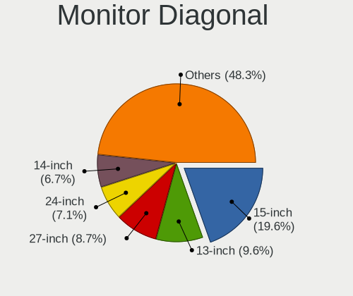
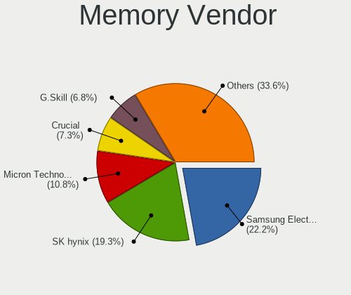

Linux in USA - Tested Hardware & Statistics
-------------------------------------------

A project to collect tested hardware configurations for Linux in USA.

Anyone can contribute to this report by the [hw-probe](https://github.com/linuxhw/hw-probe) tool:

    sudo -E hw-probe -all -upload

Please contribute! Especially if your hardware is rare.

This is a report for all computer types. See also reports for [desktops](/Location/USA/Desktop/README.md) and [notebooks](/Location/USA/Notebook/README.md).

Contents
--------

* [ Test Cases ](#test-cases)

* [ System ](#system)
  - [ OS                       ](#os)
  - [ OS Family                ](#os-family)
  - [ Kernel                   ](#kernel)
  - [ Kernel Family            ](#kernel-family)
  - [ Kernel Major Ver.        ](#kernel-major-ver)
  - [ Arch                     ](#arch)
  - [ DE                       ](#de)
  - [ Display Server           ](#display-server)
  - [ Display Manager          ](#display-manager)
  - [ OS Lang                  ](#os-lang)
  - [ Boot Mode                ](#boot-mode)
  - [ Filesystem               ](#filesystem)
  - [ Part. scheme             ](#part-scheme)
  - [ Dual Boot with Linux/BSD ](#dual-boot-with-linuxbsd)
  - [ Dual Boot (Win)          ](#dual-boot-win)

* [ Board ](#board)
  - [ Vendor                   ](#vendor)
  - [ Model                    ](#model)
  - [ Model Family             ](#model-family)
  - [ MFG Year                 ](#mfg-year)
  - [ Form Factor              ](#form-factor)
  - [ Secure Boot              ](#secure-boot)
  - [ Coreboot                 ](#coreboot)
  - [ RAM Size                 ](#ram-size)
  - [ RAM Used                 ](#ram-used)
  - [ Total Drives             ](#total-drives)
  - [ Has CD-ROM               ](#has-cd-rom)
  - [ Has Ethernet             ](#has-ethernet)
  - [ Has WiFi                 ](#has-wifi)
  - [ Has Bluetooth            ](#has-bluetooth)

* [ Location ](#location)
  - [ Country                  ](#country)
  - [ City                     ](#city)

* [ Drives ](#drives)
  - [ Drive Vendor             ](#drive-vendor)
  - [ Drive Model              ](#drive-model)
  - [ HDD Vendor               ](#hdd-vendor)
  - [ SSD Vendor               ](#ssd-vendor)
  - [ Drive Kind               ](#drive-kind)
  - [ Drive Connector          ](#drive-connector)
  - [ Drive Size               ](#drive-size)
  - [ Space Total              ](#space-total)
  - [ Space Used               ](#space-used)
  - [ Malfunc. Drives          ](#malfunc-drives)
  - [ Malfunc. Drive Vendor    ](#malfunc-drive-vendor)
  - [ Malfunc. HDD Vendor      ](#malfunc-hdd-vendor)
  - [ Malfunc. Drive Kind      ](#malfunc-drive-kind)
  - [ Failed Drives            ](#failed-drives)
  - [ Failed Drive Vendor      ](#failed-drive-vendor)
  - [ Drive Status             ](#drive-status)

* [ Storage controller ](#storage-controller)
  - [ Storage Vendor           ](#storage-vendor)
  - [ Storage Model            ](#storage-model)
  - [ Storage Kind             ](#storage-kind)

* [ Processor ](#processor)
  - [ CPU Vendor               ](#cpu-vendor)
  - [ CPU Model                ](#cpu-model)
  - [ CPU Model Family         ](#cpu-model-family)
  - [ CPU Cores                ](#cpu-cores)
  - [ CPU Sockets              ](#cpu-sockets)
  - [ CPU Threads              ](#cpu-threads)
  - [ CPU Op-Modes             ](#cpu-op-modes)
  - [ CPU Microcode            ](#cpu-microcode)
  - [ CPU Microarch            ](#cpu-microarch)

* [ Graphics ](#graphics)
  - [ GPU Vendor               ](#gpu-vendor)
  - [ GPU Model                ](#gpu-model)
  - [ GPU Combo                ](#gpu-combo)
  - [ GPU Driver               ](#gpu-driver)
  - [ GPU Memory               ](#gpu-memory)

* [ Monitor ](#monitor)
  - [ Monitor Vendor           ](#monitor-vendor)
  - [ Monitor Model            ](#monitor-model)
  - [ Monitor Resolution       ](#monitor-resolution)
  - [ Monitor Diagonal         ](#monitor-diagonal)
  - [ Monitor Width            ](#monitor-width)
  - [ Aspect Ratio             ](#aspect-ratio)
  - [ Monitor Area             ](#monitor-area)
  - [ Pixel Density            ](#pixel-density)
  - [ Multiple Monitors        ](#multiple-monitors)

* [ Network ](#network)
  - [ Net Controller Vendor    ](#net-controller-vendor)
  - [ Net Controller Model     ](#net-controller-model)
  - [ Wireless Vendor          ](#wireless-vendor)
  - [ Wireless Model           ](#wireless-model)
  - [ Ethernet Vendor          ](#ethernet-vendor)
  - [ Ethernet Model           ](#ethernet-model)
  - [ Net Controller Kind      ](#net-controller-kind)
  - [ Used Controller          ](#used-controller)
  - [ NICs                     ](#nics)
  - [ IPv6                     ](#ipv6)

* [ Bluetooth ](#bluetooth)
  - [ Bluetooth Vendor         ](#bluetooth-vendor)
  - [ Bluetooth Model          ](#bluetooth-model)

* [ Sound ](#sound)
  - [ Sound Vendor             ](#sound-vendor)
  - [ Sound Model              ](#sound-model)

* [ Memory ](#memory)
  - [ Memory Vendor            ](#memory-vendor)
  - [ Memory Model             ](#memory-model)
  - [ Memory Kind              ](#memory-kind)
  - [ Memory Form Factor       ](#memory-form-factor)
  - [ Memory Size              ](#memory-size)
  - [ Memory Speed             ](#memory-speed)

* [ Printers & scanners ](#printers--scanners)
  - [ Printer Vendor           ](#printer-vendor)
  - [ Printer Model            ](#printer-model)
  - [ Scanner Vendor           ](#scanner-vendor)
  - [ Scanner Model            ](#scanner-model)

* [ Camera ](#camera)
  - [ Camera Vendor            ](#camera-vendor)
  - [ Camera Model             ](#camera-model)

* [ Security ](#security)
  - [ Fingerprint Vendor       ](#fingerprint-vendor)
  - [ Fingerprint Model        ](#fingerprint-model)
  - [ Chipcard Vendor          ](#chipcard-vendor)
  - [ Chipcard Model           ](#chipcard-model)

* [ Unsupported ](#unsupported)
  - [ Unsupported Devices      ](#unsupported-devices)
  - [ Unsupported Device Types ](#unsupported-device-types)

Test Cases
----------

Total: 56160

| Vendor        | Model                       | Form-Factor | Probe                                                      | Date         |
|---------------|-----------------------------|-------------|------------------------------------------------------------|--------------|
| Pegatron      | 2AF0                        | Desktop     | [d918aae63e](https://linux-hardware.org/?probe=d918aae63e) | Nov 06, 2023 |
| ASUSTek       | TUF Gaming X570-PLUS        | Desktop     | [f459ffa824](https://linux-hardware.org/?probe=f459ffa824) | Nov 06, 2023 |
| Acer          | TMP645-M                    | Notebook    | [a062c55357](https://linux-hardware.org/?probe=a062c55357) | Nov 06, 2023 |
| Lenovo        | ThinkPad T480s 20L7002HU... | Notebook    | [f09ace6b9d](https://linux-hardware.org/?probe=f09ace6b9d) | Nov 06, 2023 |
| HP            | 89E9 0100                   | All in one  | [5e98ad51b6](https://linux-hardware.org/?probe=5e98ad51b6) | Nov 06, 2023 |
| HP            | 82A2                        | Desktop     | [1d34952ece](https://linux-hardware.org/?probe=1d34952ece) | Nov 06, 2023 |
| MSI           | B450 TOMAHAWK               | Desktop     | [9b0f4eeb46](https://linux-hardware.org/?probe=9b0f4eeb46) | Nov 06, 2023 |
| Gigabyte      | Z390 AORUS PRO WIFI-CF      | Desktop     | [cee650aa5a](https://linux-hardware.org/?probe=cee650aa5a) | Nov 06, 2023 |
| ASUSTek       | ROG STRIX B650-A GAMING ... | Desktop     | [3734293144](https://linux-hardware.org/?probe=3734293144) | Nov 06, 2023 |
| Supermicro    | H12SSL-i                    | Server      | [0bcc882e05](https://linux-hardware.org/?probe=0bcc882e05) | Nov 06, 2023 |
| HP            | ProBook 450 15.6 inch G9... | Notebook    | [37d32a1fd5](https://linux-hardware.org/?probe=37d32a1fd5) | Nov 06, 2023 |
| Dell          | OptiPlex 5050               | Desktop     | [6c4a08354b](https://linux-hardware.org/?probe=6c4a08354b) | Nov 06, 2023 |
| ASRockRack    | B650D4U-2L2T/BCM            | Server      | [963acb5f2b](https://linux-hardware.org/?probe=963acb5f2b) | Nov 06, 2023 |
| Dell          | Precision M4800             | Notebook    | [e67352eb0f](https://linux-hardware.org/?probe=e67352eb0f) | Nov 06, 2023 |
| Apple         | MacBookPro11,1              | Notebook    | [2d84377719](https://linux-hardware.org/?probe=2d84377719) | Nov 06, 2023 |
| Samsung       | DT1234567890 SEC_SW_REVI... | Desktop     | [4ef314d383](https://linux-hardware.org/?probe=4ef314d383) | Nov 06, 2023 |
| HP            | OMEN by Laptop 15-dc1xxx    | Notebook    | [6aaef57f51](https://linux-hardware.org/?probe=6aaef57f51) | Nov 06, 2023 |
| Lenovo        | ThinkPad T440s 20ARS0HB0... | Notebook    | [95376bfed1](https://linux-hardware.org/?probe=95376bfed1) | Nov 06, 2023 |
| ASUSTek       | PRIME B450M-A II            | Desktop     | [c8c8d15e25](https://linux-hardware.org/?probe=c8c8d15e25) | Nov 06, 2023 |
| Dell          | Venue 11 Pro 5130           | Notebook    | [d643312744](https://linux-hardware.org/?probe=d643312744) | Nov 06, 2023 |
| MSI           | B550-A PRO                  | Desktop     | [3333de3c07](https://linux-hardware.org/?probe=3333de3c07) | Nov 06, 2023 |
| GPU Compan... | GWNR71517                   | Notebook    | [7676ff267d](https://linux-hardware.org/?probe=7676ff267d) | Nov 06, 2023 |
| Lenovo        | Y720-15IKB 80VR             | Notebook    | [7cc876dcfa](https://linux-hardware.org/?probe=7cc876dcfa) | Nov 06, 2023 |
| ASUSTek       | ROG STRIX B650-A GAMING ... | Desktop     | [72bedff7a6](https://linux-hardware.org/?probe=72bedff7a6) | Nov 06, 2023 |
| MSI           | MAG B650 TOMAHAWK WIFI      | Desktop     | [ff199303a2](https://linux-hardware.org/?probe=ff199303a2) | Nov 06, 2023 |
| Lenovo        | ThinkPad T420 4180FB5       | Notebook    | [5abc3caec3](https://linux-hardware.org/?probe=5abc3caec3) | Nov 06, 2023 |
| ASRock        | B550M-HDV                   | Desktop     | [e005a7da3a](https://linux-hardware.org/?probe=e005a7da3a) | Nov 06, 2023 |
| Lenovo        | ThinkPad P50 20EQS42M00     | Notebook    | [f4761a87e1](https://linux-hardware.org/?probe=f4761a87e1) | Nov 06, 2023 |
| Apple         | Mac-7BA5B2DFE22DDD8C Mac... | Mini pc     | [ce6a053669](https://linux-hardware.org/?probe=ce6a053669) | Nov 06, 2023 |
| Dell          | Latitude E6410              | Notebook    | [b6ac4a50b7](https://linux-hardware.org/?probe=b6ac4a50b7) | Nov 06, 2023 |
| ASUSTek       | P8Z77-M                     | Desktop     | [fef5a2e8ae](https://linux-hardware.org/?probe=fef5a2e8ae) | Nov 05, 2023 |
| HP            | 83D0                        | Mini pc     | [4f947ffed7](https://linux-hardware.org/?probe=4f947ffed7) | Nov 05, 2023 |
| HP            | Victus by Laptop 16-d1xx... | Notebook    | [1cf99ffe12](https://linux-hardware.org/?probe=1cf99ffe12) | Nov 05, 2023 |
| Dell          | 042P49 A02                  | Desktop     | [b8808915ed](https://linux-hardware.org/?probe=b8808915ed) | Nov 05, 2023 |
| HP            | 2B05                        | Desktop     | [eb343bd373](https://linux-hardware.org/?probe=eb343bd373) | Nov 05, 2023 |
| Pegatron      | 2AF0                        | Desktop     | [de892702f8](https://linux-hardware.org/?probe=de892702f8) | Nov 05, 2023 |
| MSI           | A55M-E33                    | Desktop     | [d1def05873](https://linux-hardware.org/?probe=d1def05873) | Nov 05, 2023 |
| HP            | Victus by Laptop 16-d1xx... | Notebook    | [cf8911c5e0](https://linux-hardware.org/?probe=cf8911c5e0) | Nov 05, 2023 |
| ASRock        | X670E Taichi                | Desktop     | [6f05d717db](https://linux-hardware.org/?probe=6f05d717db) | Nov 05, 2023 |
| ASRock        | X670E Taichi                | Desktop     | [a366b27921](https://linux-hardware.org/?probe=a366b27921) | Nov 05, 2023 |
| Lenovo        | ThinkPad T480s 20L7002HU... | Notebook    | [92ef56cc92](https://linux-hardware.org/?probe=92ef56cc92) | Nov 05, 2023 |
| Lenovo        | IdeaPad 320-15ABR 80XS      | Notebook    | [c64e4d8a0b](https://linux-hardware.org/?probe=c64e4d8a0b) | Nov 05, 2023 |
| Dell          | Inspiron 3521               | Notebook    | [00f864bd9e](https://linux-hardware.org/?probe=00f864bd9e) | Nov 05, 2023 |
| ASUSTek       | PRIME X470-PRO              | Desktop     | [692601dd3b](https://linux-hardware.org/?probe=692601dd3b) | Nov 05, 2023 |
| Gigabyte      | X570 AORUS ELITE            | Desktop     | [5c4543cc31](https://linux-hardware.org/?probe=5c4543cc31) | Nov 05, 2023 |
| Dell          | Latitude E7450              | Notebook    | [71fe592aa3](https://linux-hardware.org/?probe=71fe592aa3) | Nov 05, 2023 |
| Gigabyte      | X470 AORUS ULTRA GAMING-... | Desktop     | [9d79aa9486](https://linux-hardware.org/?probe=9d79aa9486) | Nov 05, 2023 |
| ASUSTek       | ROG STRIX Z370-H GAMING     | Desktop     | [8e8cfaa103](https://linux-hardware.org/?probe=8e8cfaa103) | Nov 05, 2023 |
| ASUSTek       | ZenBook UX363EA_UX363EA     | Convertible | [a00f71e5d3](https://linux-hardware.org/?probe=a00f71e5d3) | Nov 05, 2023 |
| Gigabyte      | B550I AORUS PRO AX          | Desktop     | [5f192519d4](https://linux-hardware.org/?probe=5f192519d4) | Nov 05, 2023 |
| Valve         | Jupiter                     | Notebook    | [2e74968a1e](https://linux-hardware.org/?probe=2e74968a1e) | Nov 05, 2023 |
| Dell          | 048DY8 A01                  | Desktop     | [2ef39546ef](https://linux-hardware.org/?probe=2ef39546ef) | Nov 05, 2023 |
| Valve         | Jupiter                     | Notebook    | [edb0760b00](https://linux-hardware.org/?probe=edb0760b00) | Nov 05, 2023 |
| Unknown       | Unknown                     | Soc         | [d9a46b8149](https://linux-hardware.org/?probe=d9a46b8149) | Nov 05, 2023 |
| ASRock        | X570 Phantom Gaming 4       | Desktop     | [05a8c22a35](https://linux-hardware.org/?probe=05a8c22a35) | Nov 05, 2023 |
| Dell          | 0V8WGR A00                  | Desktop     | [9b13411bc8](https://linux-hardware.org/?probe=9b13411bc8) | Nov 05, 2023 |
| Google        | Pyro                        | Notebook    | [2fd8f11a53](https://linux-hardware.org/?probe=2fd8f11a53) | Nov 05, 2023 |
| Apple         | MacBookAir7,1               | Notebook    | [23e52fc4f5](https://linux-hardware.org/?probe=23e52fc4f5) | Nov 05, 2023 |
| Dell          | 03X6X0 A06                  | Server      | [90b61e75ba](https://linux-hardware.org/?probe=90b61e75ba) | Nov 05, 2023 |
| ASUSTek       | PRIME Z390-P                | Desktop     | [4b29646104](https://linux-hardware.org/?probe=4b29646104) | Nov 05, 2023 |
| Lenovo        | ThinkPad T470 W10DG 20JN... | Notebook    | [263a417420](https://linux-hardware.org/?probe=263a417420) | Nov 05, 2023 |
| Dell          | XPS 15 7590                 | Notebook    | [63e30986f6](https://linux-hardware.org/?probe=63e30986f6) | Nov 05, 2023 |
| Valve         | Jupiter                     | Notebook    | [555d9146a4](https://linux-hardware.org/?probe=555d9146a4) | Nov 05, 2023 |
| Google        | Nami                        | Notebook    | [19c94b9484](https://linux-hardware.org/?probe=19c94b9484) | Nov 05, 2023 |
| ASUSTek       | VivoBook_ASUSLaptop X512... | Notebook    | [b2cfb39c04](https://linux-hardware.org/?probe=b2cfb39c04) | Nov 05, 2023 |
| Dell          | 09T7VV A05                  | Server      | [ed330c4205](https://linux-hardware.org/?probe=ed330c4205) | Nov 05, 2023 |
| HP            | EliteBook 8470p             | Notebook    | [f154c5979f](https://linux-hardware.org/?probe=f154c5979f) | Nov 05, 2023 |
| Dell          | Latitude 5520               | Notebook    | [46be4f4eec](https://linux-hardware.org/?probe=46be4f4eec) | Nov 05, 2023 |
| Trigkey       | S5 V2.0                     | Mini pc     | [dc066ab76b](https://linux-hardware.org/?probe=dc066ab76b) | Nov 05, 2023 |
| ASUSTek       | M5A78L-M/USB3               | Desktop     | [4ce8997d5a](https://linux-hardware.org/?probe=4ce8997d5a) | Nov 05, 2023 |
| Valve         | Jupiter                     | Notebook    | [4ece1b1597](https://linux-hardware.org/?probe=4ece1b1597) | Nov 05, 2023 |
| Google        | Taeko                       | Notebook    | [d148b001d9](https://linux-hardware.org/?probe=d148b001d9) | Nov 05, 2023 |
| ASUSTek       | TUF Gaming Z790-PLUS WIF... | Desktop     | [9d8a12d929](https://linux-hardware.org/?probe=9d8a12d929) | Nov 05, 2023 |
| HP            | ENVY x360 2-in-1 Laptop ... | Convertible | [c3b2667bbf](https://linux-hardware.org/?probe=c3b2667bbf) | Nov 05, 2023 |
| HP            | 829A                        | Mini pc     | [34b672080f](https://linux-hardware.org/?probe=34b672080f) | Nov 05, 2023 |
| HP            | 829A                        | Mini pc     | [03af1f506e](https://linux-hardware.org/?probe=03af1f506e) | Nov 05, 2023 |
| ASUSTek       | PRIME B550M-A               | Desktop     | [4998a82a6b](https://linux-hardware.org/?probe=4998a82a6b) | Nov 05, 2023 |
| ASUSTek       | PRIME B450M-A II            | Desktop     | [539d8551fc](https://linux-hardware.org/?probe=539d8551fc) | Nov 05, 2023 |
| Unknown       | Unknown                     | Desktop     | [85733c0ec0](https://linux-hardware.org/?probe=85733c0ec0) | Nov 05, 2023 |
| Toshiba       | QOSMIO X505                 | Notebook    | [e5e5eb9254](https://linux-hardware.org/?probe=e5e5eb9254) | Nov 05, 2023 |
| ASUSTek       | M5A97 R2.0                  | Desktop     | [8a4147b40a](https://linux-hardware.org/?probe=8a4147b40a) | Nov 05, 2023 |
| ASUSTek       | ROG Maximus Z790 HERO       | Desktop     | [a9ad2b542a](https://linux-hardware.org/?probe=a9ad2b542a) | Nov 05, 2023 |
| Dell          | 0T7D40 A00                  | Desktop     | [2053de6443](https://linux-hardware.org/?probe=2053de6443) | Nov 05, 2023 |
| Unknown       | Unknown                     | Desktop     | [dbd2e07499](https://linux-hardware.org/?probe=dbd2e07499) | Nov 05, 2023 |
| HP            | 8054                        | Desktop     | [cbf4895785](https://linux-hardware.org/?probe=cbf4895785) | Nov 05, 2023 |
| Unknown       | Unknown                     | Desktop     | [e98e6bb977](https://linux-hardware.org/?probe=e98e6bb977) | Nov 05, 2023 |
| ASRock        | P67 Pro3 SE                 | Desktop     | [10b1460f7a](https://linux-hardware.org/?probe=10b1460f7a) | Nov 05, 2023 |
| ASUSTek       | TUF Gaming X570-PLUS        | Desktop     | [ee2a20b30a](https://linux-hardware.org/?probe=ee2a20b30a) | Nov 05, 2023 |
| Pegatron      | 2AD5                        | Desktop     | [f8860a91a3](https://linux-hardware.org/?probe=f8860a91a3) | Nov 05, 2023 |
| ASUSTek       | ROG STRIX B650E-F GAMING... | Desktop     | [6f11758faa](https://linux-hardware.org/?probe=6f11758faa) | Nov 04, 2023 |
| Lenovo        | IdeaPadFlex 5 16ABR8 82X... | Convertible | [9f19a2ba3a](https://linux-hardware.org/?probe=9f19a2ba3a) | Nov 04, 2023 |
| Lenovo        | IdeaPadFlex 5 16ABR8 82X... | Convertible | [d3a8398c99](https://linux-hardware.org/?probe=d3a8398c99) | Nov 04, 2023 |
| Supermicro    | X10SRA                      | Server      | [87045c1939](https://linux-hardware.org/?probe=87045c1939) | Nov 04, 2023 |
| Lenovo        | IdeaPad 5 15ITL05 82FG      | Notebook    | [cfdf343144](https://linux-hardware.org/?probe=cfdf343144) | Nov 04, 2023 |
| Lenovo        | IdeaPad 5 15ITL05 82FG      | Notebook    | [237bd5cfb2](https://linux-hardware.org/?probe=237bd5cfb2) | Nov 04, 2023 |
| Dell          | XPS 13 9315 2-in-1          | Tablet      | [79016d8b5e](https://linux-hardware.org/?probe=79016d8b5e) | Nov 04, 2023 |
| Apple         | Mac-F2268DC8                | All in one  | [1173519349](https://linux-hardware.org/?probe=1173519349) | Nov 04, 2023 |
| Apple         | Mac-B809C3757DA9BB8D iMa... | All in one  | [64b26f1390](https://linux-hardware.org/?probe=64b26f1390) | Nov 04, 2023 |
| ASUSTek       | ROG Strix G733QR_G733QR     | Notebook    | [5b7dc65a39](https://linux-hardware.org/?probe=5b7dc65a39) | Nov 04, 2023 |
| System76      | Oryx Pro                    | Notebook    | [ea89273272](https://linux-hardware.org/?probe=ea89273272) | Nov 04, 2023 |
| Lenovo        | ThinkPad T14s Gen 3 21CQ... | Notebook    | [6ea9e5b141](https://linux-hardware.org/?probe=6ea9e5b141) | Nov 04, 2023 |
| Intel         | NUC8BEB J72692-303          | Mini pc     | [77f3748e01](https://linux-hardware.org/?probe=77f3748e01) | Nov 04, 2023 |
| ASUSTek       | H97M-PLUS                   | Desktop     | [69cb1e7068](https://linux-hardware.org/?probe=69cb1e7068) | Nov 04, 2023 |
| ASRock        | B250M-HDV                   | Desktop     | [c8521456ad](https://linux-hardware.org/?probe=c8521456ad) | Nov 04, 2023 |
| ASUSTek       | ROG STRIX X370-F GAMING     | Desktop     | [03f8b26adb](https://linux-hardware.org/?probe=03f8b26adb) | Nov 04, 2023 |
| Lenovo        | ThinkPad T480s 20L8S2N80... | Notebook    | [87abd90a63](https://linux-hardware.org/?probe=87abd90a63) | Nov 04, 2023 |
| Lenovo        | Yoga 9 14IAP7 82LU          | Convertible | [e1c8a14f2a](https://linux-hardware.org/?probe=e1c8a14f2a) | Nov 04, 2023 |
| ASUSTek       | TUF Gaming B550-PLUS WIF... | Desktop     | [1da3521ff2](https://linux-hardware.org/?probe=1da3521ff2) | Nov 04, 2023 |
| Acer          | Aspire R5-571TG             | Convertible | [f0e8c6a66f](https://linux-hardware.org/?probe=f0e8c6a66f) | Nov 04, 2023 |
| HP            | Pavilion 17                 | Notebook    | [54cf91ddc7](https://linux-hardware.org/?probe=54cf91ddc7) | Nov 04, 2023 |
| HP            | ZBook Studio G3             | Notebook    | [1fcf1ef0b5](https://linux-hardware.org/?probe=1fcf1ef0b5) | Nov 04, 2023 |
| ASUSTek       | PRIME B550-PLUS AC-HES      | Desktop     | [6a8536f5df](https://linux-hardware.org/?probe=6a8536f5df) | Nov 04, 2023 |
| Gigabyte      | B550I AORUS PRO AX          | Desktop     | [9f47c70860](https://linux-hardware.org/?probe=9f47c70860) | Nov 04, 2023 |
| ASUSTek       | TUF Gaming Z690-PLUS WIF... | Desktop     | [d95fab9dc1](https://linux-hardware.org/?probe=d95fab9dc1) | Nov 04, 2023 |
| Lenovo        | Legion Y545 81Q6            | Notebook    | [c2fa613f00](https://linux-hardware.org/?probe=c2fa613f00) | Nov 04, 2023 |
| HP            | Laptop 14-bw0xx             | Notebook    | [aea5699bb8](https://linux-hardware.org/?probe=aea5699bb8) | Nov 04, 2023 |
| ASUSTek       | PRIME B350-PLUS             | Desktop     | [4a6383e886](https://linux-hardware.org/?probe=4a6383e886) | Nov 04, 2023 |
| Lenovo        | Legion 5 15ARH05H 82B1      | Notebook    | [3d8056e30e](https://linux-hardware.org/?probe=3d8056e30e) | Nov 04, 2023 |
| HP            | ZBook Studio G3             | Notebook    | [eb90a23afa](https://linux-hardware.org/?probe=eb90a23afa) | Nov 04, 2023 |
| HP            | 0A9Ch                       | Desktop     | [95415dec13](https://linux-hardware.org/?probe=95415dec13) | Nov 04, 2023 |
| ASUSTek       | ROG STRIX X570-E GAMING     | Desktop     | [119816ea7d](https://linux-hardware.org/?probe=119816ea7d) | Nov 04, 2023 |
| MSI           | B450 TOMAHAWK               | Desktop     | [2b389d48e1](https://linux-hardware.org/?probe=2b389d48e1) | Nov 04, 2023 |
| HP            | OMEN by Laptop 17-ck1xxx    | Notebook    | [bea6a6babf](https://linux-hardware.org/?probe=bea6a6babf) | Nov 04, 2023 |
| Lenovo        | ThinkPad T530 2429F27       | Notebook    | [0767db36fe](https://linux-hardware.org/?probe=0767db36fe) | Nov 04, 2023 |
| Lenovo        | Legion 5 15ARH05H 82B1      | Notebook    | [546178d07d](https://linux-hardware.org/?probe=546178d07d) | Nov 04, 2023 |
| ASUSTek       | PRIME X670E-PRO WIFI        | Desktop     | [f27bded4c1](https://linux-hardware.org/?probe=f27bded4c1) | Nov 04, 2023 |
| Lenovo        | IdeaPad 330-15IGM 81D1      | Notebook    | [afbfce6e52](https://linux-hardware.org/?probe=afbfce6e52) | Nov 04, 2023 |
| Dell          | 0VWT90 A10                  | Server      | [2a20b2817d](https://linux-hardware.org/?probe=2a20b2817d) | Nov 04, 2023 |
| ASUSTek       | PRIME H510M-E               | Desktop     | [cd2b005e61](https://linux-hardware.org/?probe=cd2b005e61) | Nov 04, 2023 |
| Toshiba       | TECRA W50-A                 | Notebook    | [ad6c61de24](https://linux-hardware.org/?probe=ad6c61de24) | Nov 04, 2023 |
| Dell          | 018D1Y A00                  | Desktop     | [2135015e09](https://linux-hardware.org/?probe=2135015e09) | Nov 04, 2023 |
| Dell          | Precision 7560              | Notebook    | [54a8deb305](https://linux-hardware.org/?probe=54a8deb305) | Nov 04, 2023 |
| Raspberry ... | Raspberry Pi 5 Model B R... | Soc         | [6d47b63d51](https://linux-hardware.org/?probe=6d47b63d51) | Nov 03, 2023 |
| Lenovo        | ThinkPad T14s Gen 3 21CQ... | Notebook    | [d17e6059bb](https://linux-hardware.org/?probe=d17e6059bb) | Nov 03, 2023 |
| ASUSTek       | ROG Flow X13 GV301QH_GV3... | Notebook    | [de4c3bfe46](https://linux-hardware.org/?probe=de4c3bfe46) | Nov 03, 2023 |
| Lenovo        | ThinkPad L13 Yoga Gen 2 ... | Convertible | [7d06f443c7](https://linux-hardware.org/?probe=7d06f443c7) | Nov 03, 2023 |
| Apple         | Mac-F60DEB81FF30ACF6 Mac... | Desktop     | [b213aefe09](https://linux-hardware.org/?probe=b213aefe09) | Nov 03, 2023 |
| HP            | EliteBook 6930p             | Notebook    | [300c72bf93](https://linux-hardware.org/?probe=300c72bf93) | Nov 03, 2023 |
| HP            | 8643 SMVB                   | Desktop     | [c864159547](https://linux-hardware.org/?probe=c864159547) | Nov 03, 2023 |
| System76      | Oryx Pro                    | Notebook    | [1704acc89b](https://linux-hardware.org/?probe=1704acc89b) | Nov 03, 2023 |
| Lenovo        | ThinkPad T460p 20FXS0960... | Notebook    | [10407542ab](https://linux-hardware.org/?probe=10407542ab) | Nov 03, 2023 |
| Lenovo        | B560 433028U                | Notebook    | [37a6693c3d](https://linux-hardware.org/?probe=37a6693c3d) | Nov 03, 2023 |
| Google        | Phaser360                   | Notebook    | [9915a1a3be](https://linux-hardware.org/?probe=9915a1a3be) | Nov 03, 2023 |
| Google        | Enguarde                    | Notebook    | [bc6a541eb9](https://linux-hardware.org/?probe=bc6a541eb9) | Nov 03, 2023 |
| HP            | Compaq 6730s                | Notebook    | [073756d958](https://linux-hardware.org/?probe=073756d958) | Nov 03, 2023 |
| Lenovo        | ThinkPad T420s 417032U      | Notebook    | [76247c39f4](https://linux-hardware.org/?probe=76247c39f4) | Nov 03, 2023 |
| Dell          | 0T7D40 A00                  | Desktop     | [a81d5bbd02](https://linux-hardware.org/?probe=a81d5bbd02) | Nov 03, 2023 |
| ASUSTek       | X550VQ                      | Notebook    | [b6d6ff10aa](https://linux-hardware.org/?probe=b6d6ff10aa) | Nov 03, 2023 |
| Lenovo        | ThinkPad X1 Carbon 5th 2... | Notebook    | [2ac0d5a547](https://linux-hardware.org/?probe=2ac0d5a547) | Nov 03, 2023 |
| Lenovo        | ThinkPad 11e 5th Gen 20L... | Notebook    | [fca8401d97](https://linux-hardware.org/?probe=fca8401d97) | Nov 03, 2023 |
| Apple         | Mac-F65AE981FFA204ED Mac... | Mini pc     | [4933bbb7ac](https://linux-hardware.org/?probe=4933bbb7ac) | Nov 03, 2023 |
| HP            | ProBook 445 G7              | Notebook    | [400a0e689f](https://linux-hardware.org/?probe=400a0e689f) | Nov 03, 2023 |
| Lenovo        | ThinkBook Plus G3 IAP 21... | Notebook    | [a6fabd1a6d](https://linux-hardware.org/?probe=a6fabd1a6d) | Nov 03, 2023 |
| MSI           | MEG X570 UNIFY              | Desktop     | [89e8c02e17](https://linux-hardware.org/?probe=89e8c02e17) | Nov 03, 2023 |
| Raspberry ... | Raspberry Pi 4 Model B R... | Soc         | [2e6585ecc4](https://linux-hardware.org/?probe=2e6585ecc4) | Nov 03, 2023 |
| ASUSTek       | TUF B450M-PLUS GAMING       | Desktop     | [6d39c4f814](https://linux-hardware.org/?probe=6d39c4f814) | Nov 03, 2023 |
| Dell          | Inspiron 15-7568            | Notebook    | [70b564a0db](https://linux-hardware.org/?probe=70b564a0db) | Nov 03, 2023 |
| Dell          | 05KX61 A02                  | Server      | [e74ef17929](https://linux-hardware.org/?probe=e74ef17929) | Nov 03, 2023 |
| HP            | 21D0                        | Desktop     | [c634d51a77](https://linux-hardware.org/?probe=c634d51a77) | Nov 03, 2023 |
| Dell          | 05KX61 A02                  | Server      | [3ccea24165](https://linux-hardware.org/?probe=3ccea24165) | Nov 03, 2023 |
| HP            | OMEN by Laptop 15-dc1xxx    | Notebook    | [0be20c3fe3](https://linux-hardware.org/?probe=0be20c3fe3) | Nov 03, 2023 |
| ASUSTek       | G20AJ                       | Desktop     | [f9942dbf89](https://linux-hardware.org/?probe=f9942dbf89) | Nov 03, 2023 |
| ASUSTek       | TUF B450M-PLUS GAMING       | Desktop     | [e928da88d7](https://linux-hardware.org/?probe=e928da88d7) | Nov 03, 2023 |
| HP            | 0AECh D                     | Desktop     | [2ddad2bbf2](https://linux-hardware.org/?probe=2ddad2bbf2) | Nov 03, 2023 |
| Dell          | 09T7VV A05                  | Server      | [8d5ae6e4de](https://linux-hardware.org/?probe=8d5ae6e4de) | Nov 03, 2023 |
| Alienware     | 0GWM1Y A00                  | Desktop     | [01d536cc44](https://linux-hardware.org/?probe=01d536cc44) | Nov 03, 2023 |
| Gigabyte      | B550I AORUS PRO AX          | Desktop     | [e073d8c90a](https://linux-hardware.org/?probe=e073d8c90a) | Nov 03, 2023 |
| Intel         | NUC8BEB J72688-307          | Mini pc     | [36fb8d63bb](https://linux-hardware.org/?probe=36fb8d63bb) | Nov 03, 2023 |
| HP            | 2215                        | Desktop     | [6acbe1a873](https://linux-hardware.org/?probe=6acbe1a873) | Nov 03, 2023 |
| Dell          | Latitude E5530 non-vPro     | Notebook    | [491aa458cc](https://linux-hardware.org/?probe=491aa458cc) | Nov 03, 2023 |
| Dell          | Latitude 5511               | Notebook    | [66a8176344](https://linux-hardware.org/?probe=66a8176344) | Nov 03, 2023 |
| Framework     | Laptop 13 (AMD Ryzen 704... | Notebook    | [1b43feda1f](https://linux-hardware.org/?probe=1b43feda1f) | Nov 03, 2023 |
| Dell          | 0X8DXD A00                  | Desktop     | [e972336105](https://linux-hardware.org/?probe=e972336105) | Nov 03, 2023 |
| Dell          | 0R6PCT A01                  | Desktop     | [c561f87237](https://linux-hardware.org/?probe=c561f87237) | Nov 02, 2023 |
| ASRock        | B450M Steel Legend          | Desktop     | [dafce26ef5](https://linux-hardware.org/?probe=dafce26ef5) | Nov 02, 2023 |
| Valve         | Jupiter                     | Notebook    | [14de2c4b3a](https://linux-hardware.org/?probe=14de2c4b3a) | Nov 02, 2023 |
| Unknown       | X99-GT                      | Desktop     | [751ea1add9](https://linux-hardware.org/?probe=751ea1add9) | Nov 02, 2023 |
| Dell          | Latitude E6520              | Notebook    | [a0e05f5040](https://linux-hardware.org/?probe=a0e05f5040) | Nov 02, 2023 |
| Lenovo        | 314D SDK0J40697 WIN 3305... | Mini pc     | [e74d5a77e4](https://linux-hardware.org/?probe=e74d5a77e4) | Nov 02, 2023 |
| ASUSTek       | G750JX                      | Notebook    | [9493bec7e6](https://linux-hardware.org/?probe=9493bec7e6) | Nov 02, 2023 |
| Framework     | Laptop (12th Gen Intel C... | Notebook    | [7c06ac2664](https://linux-hardware.org/?probe=7c06ac2664) | Nov 02, 2023 |
| Dell          | Vostro 14-3468              | Notebook    | [33a984f9f8](https://linux-hardware.org/?probe=33a984f9f8) | Nov 02, 2023 |
| Valve         | Jupiter                     | Notebook    | [26b7407b02](https://linux-hardware.org/?probe=26b7407b02) | Nov 02, 2023 |
| MSI           | PRO Z690-A WIFI DDR4        | Desktop     | [b84c515650](https://linux-hardware.org/?probe=b84c515650) | Nov 02, 2023 |
| Apple         | MacBookPro14,1              | Notebook    | [7d93bb6f25](https://linux-hardware.org/?probe=7d93bb6f25) | Nov 02, 2023 |
| Acer          | Aspire A515-43              | Notebook    | [6aa1f3a294](https://linux-hardware.org/?probe=6aa1f3a294) | Nov 02, 2023 |
| Acer          | Aspire A515-43              | Notebook    | [3e65346dfd](https://linux-hardware.org/?probe=3e65346dfd) | Nov 02, 2023 |
| Gigabyte      | X570 AORUS PRO WIFI         | Desktop     | [bf075c47d2](https://linux-hardware.org/?probe=bf075c47d2) | Nov 02, 2023 |
| Dell          | Latitude E6330              | Notebook    | [b31f60152f](https://linux-hardware.org/?probe=b31f60152f) | Nov 02, 2023 |
| HP            | EliteBook 860 16 inch G9... | Notebook    | [5c564324e2](https://linux-hardware.org/?probe=5c564324e2) | Nov 02, 2023 |
| Trigkey       | S5 V2.0                     | Mini pc     | [060ab6de51](https://linux-hardware.org/?probe=060ab6de51) | Nov 02, 2023 |
| Raspberry ... | Raspberry Pi 5 Model B R... | Soc         | [de79fbf182](https://linux-hardware.org/?probe=de79fbf182) | Nov 02, 2023 |
| Lenovo        | ThinkPad L13 Yoga Gen 2 ... | Convertible | [db23a9b8d4](https://linux-hardware.org/?probe=db23a9b8d4) | Nov 02, 2023 |
| Lenovo        | ThinkPad L13 Yoga Gen 2 ... | Convertible | [425bafc788](https://linux-hardware.org/?probe=425bafc788) | Nov 02, 2023 |
| ASRock        | X570 Taichi                 | Desktop     | [5ce5b321b0](https://linux-hardware.org/?probe=5ce5b321b0) | Nov 02, 2023 |
| Valve         | Jupiter                     | Notebook    | [3ee2512ba0](https://linux-hardware.org/?probe=3ee2512ba0) | Nov 02, 2023 |
| Valve         | Jupiter                     | Notebook    | [2c454d7632](https://linux-hardware.org/?probe=2c454d7632) | Nov 02, 2023 |
| Trigkey       | S5 V2.0                     | Mini pc     | [79a0a0542b](https://linux-hardware.org/?probe=79a0a0542b) | Nov 02, 2023 |
| Dell          | 013M88 A01                  | Server      | [0edb8a953e](https://linux-hardware.org/?probe=0edb8a953e) | Nov 02, 2023 |
| BESSTAR Te... | TH50                        | Desktop     | [fc3a35871e](https://linux-hardware.org/?probe=fc3a35871e) | Nov 02, 2023 |
| ASUSTek       | G20AJ                       | Desktop     | [ca1a60e2df](https://linux-hardware.org/?probe=ca1a60e2df) | Nov 02, 2023 |
| ASUSTek       | Z170-A                      | Desktop     | [7812f09d39](https://linux-hardware.org/?probe=7812f09d39) | Nov 02, 2023 |
| ASUSTek       | Z170-A                      | Desktop     | [b45e25ec01](https://linux-hardware.org/?probe=b45e25ec01) | Nov 02, 2023 |
| Lenovo        | ThinkBook Plus G3 IAP 21... | Notebook    | [c6634f090f](https://linux-hardware.org/?probe=c6634f090f) | Nov 02, 2023 |
| Google        | Nightfury                   | Notebook    | [ccee94a0ec](https://linux-hardware.org/?probe=ccee94a0ec) | Nov 02, 2023 |
| Google        | Nasher360                   | Notebook    | [0d1cc1b584](https://linux-hardware.org/?probe=0d1cc1b584) | Nov 02, 2023 |
| Lenovo        | Slim 7 16IAH7 82VB          | Notebook    | [0e5f976d6b](https://linux-hardware.org/?probe=0e5f976d6b) | Nov 02, 2023 |
| HP            | 8924 1101                   | All in one  | [84ae0b3012](https://linux-hardware.org/?probe=84ae0b3012) | Nov 02, 2023 |
| ASRockRack    | X470D4U                     | Desktop     | [553af2a3c2](https://linux-hardware.org/?probe=553af2a3c2) | Nov 02, 2023 |
| ASUSTek       | ASUS TUF Gaming A15 FA50... | Notebook    | [0c83d1e765](https://linux-hardware.org/?probe=0c83d1e765) | Nov 02, 2023 |
| Dell          | 096JG8 A00                  | Desktop     | [eb001cdbf5](https://linux-hardware.org/?probe=eb001cdbf5) | Nov 02, 2023 |
| Dell          | Latitude 7490               | Notebook    | [4859e397e4](https://linux-hardware.org/?probe=4859e397e4) | Nov 02, 2023 |
| ASUSTek       | M11BB                       | Desktop     | [21e7b53022](https://linux-hardware.org/?probe=21e7b53022) | Nov 02, 2023 |
| ECS           | M789CG                      | Desktop     | [87fe73ee84](https://linux-hardware.org/?probe=87fe73ee84) | Nov 02, 2023 |
| Apple         | MacBookPro16,1              | Notebook    | [3c2964c23f](https://linux-hardware.org/?probe=3c2964c23f) | Nov 02, 2023 |
| Dell          | Latitude 5480               | Notebook    | [a88b4082b9](https://linux-hardware.org/?probe=a88b4082b9) | Nov 02, 2023 |
| Dell          | XPS L521X                   | Notebook    | [d3df01b854](https://linux-hardware.org/?probe=d3df01b854) | Nov 02, 2023 |
| ASUSTek       | GA35DX                      | Desktop     | [1a9eef3748](https://linux-hardware.org/?probe=1a9eef3748) | Nov 02, 2023 |
| Lenovo        | ThinkPad T410 2537NT8       | Notebook    | [2d1404f4ae](https://linux-hardware.org/?probe=2d1404f4ae) | Nov 02, 2023 |
| Google        | Falco                       | Notebook    | [0ea6d932bf](https://linux-hardware.org/?probe=0ea6d932bf) | Nov 01, 2023 |
| ASRock        | Z97 Pro4                    | Desktop     | [6fa2a70f99](https://linux-hardware.org/?probe=6fa2a70f99) | Nov 01, 2023 |
| ASUSTek       | PRIME B450M-A II            | Desktop     | [08ee10dc83](https://linux-hardware.org/?probe=08ee10dc83) | Nov 01, 2023 |
| Lenovo        | ThinkPad 13 2nd Gen 20J1... | Notebook    | [bb5bbc3e51](https://linux-hardware.org/?probe=bb5bbc3e51) | Nov 01, 2023 |
| ASRock        | X470 Taichi Ultimate        | Desktop     | [d85d5f59c2](https://linux-hardware.org/?probe=d85d5f59c2) | Nov 01, 2023 |
| ASRock        | Z690 Taichi                 | Desktop     | [b736058f88](https://linux-hardware.org/?probe=b736058f88) | Nov 01, 2023 |
| Lenovo        | ThinkBook 14p Gen 3 21EJ    | Notebook    | [cde7923bf2](https://linux-hardware.org/?probe=cde7923bf2) | Nov 01, 2023 |
| Dell          | 0XCR8D A01                  | Desktop     | [bc8414b164](https://linux-hardware.org/?probe=bc8414b164) | Nov 01, 2023 |
| Lenovo        | ThinkPad T400 6475JR8       | Notebook    | [82b16f0e20](https://linux-hardware.org/?probe=82b16f0e20) | Nov 01, 2023 |
| ASUSTek       | ROG STRIX X370-F GAMING     | Desktop     | [bbbdb78ae3](https://linux-hardware.org/?probe=bbbdb78ae3) | Nov 01, 2023 |
| ALLDOCUBE     | i1025P                      | Tablet      | [9f4abf0556](https://linux-hardware.org/?probe=9f4abf0556) | Nov 01, 2023 |
| Lenovo        | Legion Pro 5 16IRX8 82WK    | Notebook    | [0bb2079f0d](https://linux-hardware.org/?probe=0bb2079f0d) | Nov 01, 2023 |
| ASUSTek       | Maximus VII HERO            | Desktop     | [a60f1d4a52](https://linux-hardware.org/?probe=a60f1d4a52) | Nov 01, 2023 |
| Dell          | 0RF705                      | Desktop     | [b287691e11](https://linux-hardware.org/?probe=b287691e11) | Nov 01, 2023 |
| Lenovo        | Yoga 7 15ITL5 82BJ          | Convertible | [236c6c4f9a](https://linux-hardware.org/?probe=236c6c4f9a) | Nov 01, 2023 |
| HP            | Presario CQ57               | Notebook    | [4874030c75](https://linux-hardware.org/?probe=4874030c75) | Nov 01, 2023 |
| Samsung       | 730QCJ/730QCR               | Notebook    | [67863a015a](https://linux-hardware.org/?probe=67863a015a) | Nov 01, 2023 |
| Dell          | 006K82 A00                  | Desktop     | [f8c521f2f6](https://linux-hardware.org/?probe=f8c521f2f6) | Nov 01, 2023 |
| HP            | 83EE                        | Desktop     | [c32478cd8d](https://linux-hardware.org/?probe=c32478cd8d) | Nov 01, 2023 |
| HP            | 83EE                        | Desktop     | [37c7c72156](https://linux-hardware.org/?probe=37c7c72156) | Nov 01, 2023 |
| MSI           | GV62 8RD                    | Notebook    | [d85cb220a0](https://linux-hardware.org/?probe=d85cb220a0) | Nov 01, 2023 |
| ASUSTek       | VivoBook_ASUSLaptop X513... | Notebook    | [19d017bb7d](https://linux-hardware.org/?probe=19d017bb7d) | Nov 01, 2023 |
| Gateway       | FX6840                      | Desktop     | [3c391c7868](https://linux-hardware.org/?probe=3c391c7868) | Nov 01, 2023 |
| ASUSTek       | TUF Gaming X570-PRO         | Desktop     | [ba593f267b](https://linux-hardware.org/?probe=ba593f267b) | Nov 01, 2023 |
| Apple         | MacBookPro15,2              | Notebook    | [b724e20965](https://linux-hardware.org/?probe=b724e20965) | Nov 01, 2023 |
| HP            | ENVY x360 Convertible 13... | Convertible | [339320f95d](https://linux-hardware.org/?probe=339320f95d) | Nov 01, 2023 |
| Framework     | Laptop                      | Notebook    | [eb0a6abacc](https://linux-hardware.org/?probe=eb0a6abacc) | Nov 01, 2023 |
| HP            | 2000                        | Notebook    | [f586263d64](https://linux-hardware.org/?probe=f586263d64) | Nov 01, 2023 |
| Lenovo        | IdeaPadFlex 5 14ALC7 82R... | Convertible | [636993569c](https://linux-hardware.org/?probe=636993569c) | Nov 01, 2023 |
| Dell          | Latitude E6420              | Notebook    | [e5581c3920](https://linux-hardware.org/?probe=e5581c3920) | Nov 01, 2023 |
| Valve         | Jupiter                     | Notebook    | [088df44ddf](https://linux-hardware.org/?probe=088df44ddf) | Nov 01, 2023 |
| MSI           | PRO Z790-P WIFI DDR4        | Desktop     | [e03b553957](https://linux-hardware.org/?probe=e03b553957) | Nov 01, 2023 |
| Raspberry ... | Raspberry Pi 5 Model B R... | Soc         | [58f7b11e98](https://linux-hardware.org/?probe=58f7b11e98) | Nov 01, 2023 |
| HP            | EliteBook x360 1030 G4      | Convertible | [69d243d2db](https://linux-hardware.org/?probe=69d243d2db) | Nov 01, 2023 |
| Unknown       | Unknown                     | Desktop     | [3c4e0eb4fc](https://linux-hardware.org/?probe=3c4e0eb4fc) | Nov 01, 2023 |
| Dell          | System Inspiron N4110       | Notebook    | [a9f2040800](https://linux-hardware.org/?probe=a9f2040800) | Nov 01, 2023 |
| Gigabyte      | X670 AORUS ELITE AX         | Desktop     | [8161abddda](https://linux-hardware.org/?probe=8161abddda) | Nov 01, 2023 |
| Raspberry ... | Raspberry Pi Zero W Rev ... | Soc         | [4bc46c1979](https://linux-hardware.org/?probe=4bc46c1979) | Nov 01, 2023 |
| Microsoft     | Surface Laptop Go 3         | Tablet      | [efa4316df1](https://linux-hardware.org/?probe=efa4316df1) | Nov 01, 2023 |
| HP            | 8767 A                      | Desktop     | [618323a058](https://linux-hardware.org/?probe=618323a058) | Nov 01, 2023 |
| HP            | 829A                        | Mini pc     | [d6ef1b58ed](https://linux-hardware.org/?probe=d6ef1b58ed) | Nov 01, 2023 |
| HP            | 2B2C                        | Desktop     | [1ed40f19d9](https://linux-hardware.org/?probe=1ed40f19d9) | Nov 01, 2023 |
| HP            | 15                          | Notebook    | [9bafa55125](https://linux-hardware.org/?probe=9bafa55125) | Nov 01, 2023 |
| Lenovo        | ThinkPad Edge 030244U       | Notebook    | [bf7045fe69](https://linux-hardware.org/?probe=bf7045fe69) | Nov 01, 2023 |
| Lenovo        | ThinkPad T480s 20L7CTO1W... | Notebook    | [e5158e3f58](https://linux-hardware.org/?probe=e5158e3f58) | Oct 31, 2023 |
| AOpen         | iBDWMUx-MD R1.04            | Desktop     | [5b82a04d09](https://linux-hardware.org/?probe=5b82a04d09) | Oct 31, 2023 |
| ASUSTek       | WS X299 SAGE                | Desktop     | [a01ac98915](https://linux-hardware.org/?probe=a01ac98915) | Oct 31, 2023 |
| Apple         | Mac-942B59F58194171B iMa... | All in one  | [9eed6b298a](https://linux-hardware.org/?probe=9eed6b298a) | Oct 31, 2023 |
| ASUSTek       | WS X299 SAGE                | Desktop     | [d871633c17](https://linux-hardware.org/?probe=d871633c17) | Oct 31, 2023 |
| Lenovo        | ThinkPad 13 2nd Gen 20J1... | Notebook    | [4ebd30711e](https://linux-hardware.org/?probe=4ebd30711e) | Oct 31, 2023 |
| ASRock        | Z790 Taichi                 | Desktop     | [01ba7dff2f](https://linux-hardware.org/?probe=01ba7dff2f) | Oct 31, 2023 |
| MSI           | MPG Z590 GAMING PLUS        | Desktop     | [e3760a331a](https://linux-hardware.org/?probe=e3760a331a) | Oct 31, 2023 |
| Lenovo        | ThinkPad P1 Gen 5 21DDS0... | Notebook    | [ce44ee3f62](https://linux-hardware.org/?probe=ce44ee3f62) | Oct 31, 2023 |
| ATOPNUC       | MA90                        | Mini pc     | [f34d479454](https://linux-hardware.org/?probe=f34d479454) | Oct 31, 2023 |
| HP            | Laptop 15-bw0xx             | Notebook    | [517f8861a6](https://linux-hardware.org/?probe=517f8861a6) | Oct 31, 2023 |
| Lenovo        | ThinkPad 13 2nd Gen 20J1... | Notebook    | [a664733aaf](https://linux-hardware.org/?probe=a664733aaf) | Oct 31, 2023 |
| eMachines     | EL1352G                     | Desktop     | [e133fecf3e](https://linux-hardware.org/?probe=e133fecf3e) | Oct 31, 2023 |
| ION Comput... | LAPBC510                    | Notebook    | [24a1cafad9](https://linux-hardware.org/?probe=24a1cafad9) | Oct 31, 2023 |
| ASUSTek       | TUF Gaming B550-PLUS        | Desktop     | [16c9a49c7d](https://linux-hardware.org/?probe=16c9a49c7d) | Oct 31, 2023 |
| Framework     | Laptop 13 (AMD Ryzen 704... | Notebook    | [bb36320af3](https://linux-hardware.org/?probe=bb36320af3) | Oct 31, 2023 |
| Valve         | Jupiter                     | Notebook    | [ea0f1bf927](https://linux-hardware.org/?probe=ea0f1bf927) | Oct 31, 2023 |
| Apple         | MacBookPro9,1               | Notebook    | [8f7c5b801b](https://linux-hardware.org/?probe=8f7c5b801b) | Oct 31, 2023 |
| Apple         | MacBookPro9,1               | Notebook    | [4e15275faa](https://linux-hardware.org/?probe=4e15275faa) | Oct 31, 2023 |
| Unknown       | Unknown                     | Soc         | [c1888a18d4](https://linux-hardware.org/?probe=c1888a18d4) | Oct 31, 2023 |
| ASRock        | B450M Pro4                  | Desktop     | [3880922e48](https://linux-hardware.org/?probe=3880922e48) | Oct 31, 2023 |
| Synology      | DS1621+                     | Notebook    | [2c7bfbff4a](https://linux-hardware.org/?probe=2c7bfbff4a) | Oct 31, 2023 |
| ASUSTek       | TUF Gaming B550-PLUS        | Desktop     | [25aa8e9401](https://linux-hardware.org/?probe=25aa8e9401) | Oct 31, 2023 |
| ASUSTek       | SABERTOOTH Z97 MARK 2/US... | Desktop     | [95a0ff1bb1](https://linux-hardware.org/?probe=95a0ff1bb1) | Oct 31, 2023 |
| Apple         | MacBookAir6,2               | Notebook    | [edd3006f12](https://linux-hardware.org/?probe=edd3006f12) | Oct 31, 2023 |
| Dell          | XPS 13 9315 2-in-1          | Tablet      | [15c9f804ad](https://linux-hardware.org/?probe=15c9f804ad) | Oct 31, 2023 |
| XFX           | nForce 790i Ultra 3-Way ... | Desktop     | [d470f0fedf](https://linux-hardware.org/?probe=d470f0fedf) | Oct 31, 2023 |
| RCA           | W122SC24T2                  | Tablet      | [1313389b98](https://linux-hardware.org/?probe=1313389b98) | Oct 31, 2023 |
| RCA           | W122SC24T2                  | Tablet      | [f46f159a0c](https://linux-hardware.org/?probe=f46f159a0c) | Oct 31, 2023 |
| HP            | 829A                        | Mini pc     | [af5bd0a62a](https://linux-hardware.org/?probe=af5bd0a62a) | Oct 31, 2023 |
| ASUSTek       | ROG STRIX X370-F GAMING     | Desktop     | [3179102373](https://linux-hardware.org/?probe=3179102373) | Oct 31, 2023 |
| Lenovo        | Yoga C940-15IRH 81TE        | Convertible | [7e1de13416](https://linux-hardware.org/?probe=7e1de13416) | Oct 31, 2023 |
| ASUSTek       | K53E                        | Notebook    | [8b7c83e9d7](https://linux-hardware.org/?probe=8b7c83e9d7) | Oct 31, 2023 |
| Dell          | 0NW6H5 A00                  | Desktop     | [3f76d752df](https://linux-hardware.org/?probe=3f76d752df) | Oct 31, 2023 |
| HP            | 1589                        | Desktop     | [2161dc3754](https://linux-hardware.org/?probe=2161dc3754) | Oct 31, 2023 |
| Dell          | Inspiron 3521               | Notebook    | [cdda6b5094](https://linux-hardware.org/?probe=cdda6b5094) | Oct 31, 2023 |
| Dell          | Inspiron 3521               | Notebook    | [5bec5815bb](https://linux-hardware.org/?probe=5bec5815bb) | Oct 31, 2023 |
| ASRock        | B450 Steel Legend           | Desktop     | [5e090f5c32](https://linux-hardware.org/?probe=5e090f5c32) | Oct 31, 2023 |
| AMI           | Intel                       | Notebook    | [42ebe1755f](https://linux-hardware.org/?probe=42ebe1755f) | Oct 30, 2023 |
| Intel         | DH87MC AAG74242-402         | Desktop     | [7f64778340](https://linux-hardware.org/?probe=7f64778340) | Oct 30, 2023 |
| HP            | 8299                        | Desktop     | [e45f46df9d](https://linux-hardware.org/?probe=e45f46df9d) | Oct 30, 2023 |
| ASUSTek       | PRIME X399-A                | Desktop     | [69f596f456](https://linux-hardware.org/?probe=69f596f456) | Oct 30, 2023 |
| HP            | ZBook Studio G3             | Notebook    | [173639f83c](https://linux-hardware.org/?probe=173639f83c) | Oct 30, 2023 |
| Lenovo        | ThinkPad X220 4286CTO       | Notebook    | [237d2ca8b5](https://linux-hardware.org/?probe=237d2ca8b5) | Oct 30, 2023 |
| Dell          | Inspiron 5559               | Notebook    | [5a8a67bb6b](https://linux-hardware.org/?probe=5a8a67bb6b) | Oct 30, 2023 |
| Dell          | 0NW6H5 A00                  | Desktop     | [51694ddd7c](https://linux-hardware.org/?probe=51694ddd7c) | Oct 30, 2023 |
| Lenovo        | Flex 2 Pro-15               | Notebook    | [ff5f14115e](https://linux-hardware.org/?probe=ff5f14115e) | Oct 30, 2023 |
| Google        | Blooguard                   | Notebook    | [cd817fb666](https://linux-hardware.org/?probe=cd817fb666) | Oct 30, 2023 |
| HP            | 1587h                       | Desktop     | [ecafcd1843](https://linux-hardware.org/?probe=ecafcd1843) | Oct 30, 2023 |
| ASUSTek       | Pro WS X570-ACE             | Desktop     | [6ba3f1daa1](https://linux-hardware.org/?probe=6ba3f1daa1) | Oct 30, 2023 |
| MSI           | MPG X570 GAMING PLUS        | Desktop     | [e4d622b76b](https://linux-hardware.org/?probe=e4d622b76b) | Oct 30, 2023 |
| HP            | EliteBook x360 1040 G7 N... | Convertible | [49eeb546b4](https://linux-hardware.org/?probe=49eeb546b4) | Oct 30, 2023 |
| Toshiba       | Satellite L875              | Notebook    | [de5babbde5](https://linux-hardware.org/?probe=de5babbde5) | Oct 30, 2023 |
| AZW           | MINI S 10                   | Desktop     | [9695f9bec4](https://linux-hardware.org/?probe=9695f9bec4) | Oct 30, 2023 |
| HP            | EliteBook x360 1040 G7 N... | Convertible | [eae33c1683](https://linux-hardware.org/?probe=eae33c1683) | Oct 30, 2023 |
| HP            | EliteBook x360 1040 G7 N... | Convertible | [9b470b594c](https://linux-hardware.org/?probe=9b470b594c) | Oct 30, 2023 |
| ASUSTek       | GA35DX                      | Desktop     | [c1e204e6b1](https://linux-hardware.org/?probe=c1e204e6b1) | Oct 30, 2023 |
| Panasonic     | CF-53SJCZYLM                | Notebook    | [94941374a2](https://linux-hardware.org/?probe=94941374a2) | Oct 30, 2023 |
| Lenovo        | ThinkPad 13 2nd Gen 20J1... | Notebook    | [995b159589](https://linux-hardware.org/?probe=995b159589) | Oct 30, 2023 |
| HP            | EliteBook x360 1040 G7 N... | Convertible | [649a6d3513](https://linux-hardware.org/?probe=649a6d3513) | Oct 30, 2023 |
| ASUSTek       | F2A85-M PRO                 | Desktop     | [dd2a52ab8f](https://linux-hardware.org/?probe=dd2a52ab8f) | Oct 30, 2023 |
| ASRockRack    | C236 WS                     | Desktop     | [1e6fea20e9](https://linux-hardware.org/?probe=1e6fea20e9) | Oct 30, 2023 |
| Lenovo        | ThinkPad X13 Yoga Gen 2 ... | Convertible | [4b6c792eeb](https://linux-hardware.org/?probe=4b6c792eeb) | Oct 30, 2023 |
| HP            | Dev One Notebook PC         | Notebook    | [d5ace42b13](https://linux-hardware.org/?probe=d5ace42b13) | Oct 30, 2023 |
| Lenovo        | ThinkBook 15 G2 ARE 20VG    | Notebook    | [d51c491524](https://linux-hardware.org/?probe=d51c491524) | Oct 30, 2023 |
| Dell          | 018D1Y A00                  | Desktop     | [ce361a7112](https://linux-hardware.org/?probe=ce361a7112) | Oct 30, 2023 |
| Dell          | XPS 13 9315 2-in-1          | Tablet      | [97582d2c21](https://linux-hardware.org/?probe=97582d2c21) | Oct 30, 2023 |
| ASRock        | Z690 Taichi                 | Desktop     | [a9e193be90](https://linux-hardware.org/?probe=a9e193be90) | Oct 30, 2023 |
| Fujitsu       | LIFEBOOK P771               | Notebook    | [d92d1fa97d](https://linux-hardware.org/?probe=d92d1fa97d) | Oct 30, 2023 |
| ASUSTek       | PRIME X370-PRO              | Desktop     | [394ab5dbff](https://linux-hardware.org/?probe=394ab5dbff) | Oct 30, 2023 |
| Lenovo        | Yoga C740-15IML 81TD        | Convertible | [bdfd47d4dc](https://linux-hardware.org/?probe=bdfd47d4dc) | Oct 30, 2023 |
| HP            | Laptop 15-ef2xxx            | Notebook    | [80d1578d90](https://linux-hardware.org/?probe=80d1578d90) | Oct 30, 2023 |
| Gigabyte      | F2A88X-D3H                  | Desktop     | [aa9ef029e5](https://linux-hardware.org/?probe=aa9ef029e5) | Oct 30, 2023 |
| AZW           | SEi                         | Desktop     | [aa8ba45b77](https://linux-hardware.org/?probe=aa8ba45b77) | Oct 30, 2023 |
| ASUSTek       | ROG CROSSHAIR VII HERO      | Desktop     | [5d7ab82de7](https://linux-hardware.org/?probe=5d7ab82de7) | Oct 30, 2023 |
| Unknown       | Unknown                     | Desktop     | [986edacf9a](https://linux-hardware.org/?probe=986edacf9a) | Oct 30, 2023 |
| System76      | Adder WS                    | Notebook    | [57478f4561](https://linux-hardware.org/?probe=57478f4561) | Oct 30, 2023 |
| System76      | Adder WS                    | Notebook    | [a10fcac3f4](https://linux-hardware.org/?probe=a10fcac3f4) | Oct 30, 2023 |
| HP            | 2AF7                        | Desktop     | [04c535a13d](https://linux-hardware.org/?probe=04c535a13d) | Oct 30, 2023 |
| ASUSTek       | ROG STRIX Z590-A GAMING ... | Desktop     | [af90750bac](https://linux-hardware.org/?probe=af90750bac) | Oct 30, 2023 |
| HP            | 8054                        | Desktop     | [6e03a01d3f](https://linux-hardware.org/?probe=6e03a01d3f) | Oct 30, 2023 |
| HP            | EliteBook 840 G6            | Notebook    | [586f08e1dc](https://linux-hardware.org/?probe=586f08e1dc) | Oct 30, 2023 |
| Acer          | Aspire R5-571TG             | Convertible | [024085ccb0](https://linux-hardware.org/?probe=024085ccb0) | Oct 30, 2023 |
| HP            | G60                         | Notebook    | [ad911271b1](https://linux-hardware.org/?probe=ad911271b1) | Oct 30, 2023 |
| Framework     | Laptop (12th Gen Intel C... | Notebook    | [b1adeb2f86](https://linux-hardware.org/?probe=b1adeb2f86) | Oct 30, 2023 |
| Dell          | Latitude 7480               | Notebook    | [fcae1c21f4](https://linux-hardware.org/?probe=fcae1c21f4) | Oct 30, 2023 |
| ASUSTek       | PRIME B450M-A II            | Desktop     | [6cafea6b4c](https://linux-hardware.org/?probe=6cafea6b4c) | Oct 30, 2023 |
| Gigabyte      | X570 GAMING X               | Desktop     | [1addefe3fc](https://linux-hardware.org/?probe=1addefe3fc) | Oct 29, 2023 |
| Lenovo        | ThinkBook 14s Yoga ITL 2... | Convertible | [a526322459](https://linux-hardware.org/?probe=a526322459) | Oct 29, 2023 |
| Microsoft     | Surface Book                | Tablet      | [7b82f936a1](https://linux-hardware.org/?probe=7b82f936a1) | Oct 29, 2023 |
| HP            | Pavilion dv4                | Notebook    | [854806c6f4](https://linux-hardware.org/?probe=854806c6f4) | Oct 29, 2023 |
| HP            | EliteBook 850 G3            | Notebook    | [be57c0ce22](https://linux-hardware.org/?probe=be57c0ce22) | Oct 29, 2023 |
| Intel         | NUC10i7FNB M38062-307       | Mini pc     | [48040bae06](https://linux-hardware.org/?probe=48040bae06) | Oct 29, 2023 |
| Dell          | XPS L521X                   | Notebook    | [959fc8cb2d](https://linux-hardware.org/?probe=959fc8cb2d) | Oct 29, 2023 |
| Lenovo        | 300w Gen 3 82J1             | Convertible | [316bc9f204](https://linux-hardware.org/?probe=316bc9f204) | Oct 29, 2023 |
| ASUSTek       | Pro WS X570-ACE             | Desktop     | [e2c02539ce](https://linux-hardware.org/?probe=e2c02539ce) | Oct 29, 2023 |
| Valve         | Jupiter                     | Notebook    | [8bb009206e](https://linux-hardware.org/?probe=8bb009206e) | Oct 29, 2023 |
| ASUSTek       | PRIME B550M-A               | Desktop     | [deef4da5dc](https://linux-hardware.org/?probe=deef4da5dc) | Oct 29, 2023 |
| MSI           | B550M PRO-VDH WIFI          | Desktop     | [9c77415bfc](https://linux-hardware.org/?probe=9c77415bfc) | Oct 29, 2023 |
| Valve         | Jupiter                     | Notebook    | [bbf3f7c198](https://linux-hardware.org/?probe=bbf3f7c198) | Oct 29, 2023 |
| ASRock        | H81 Pro BTC R2.0            | Desktop     | [6bcf93f1a8](https://linux-hardware.org/?probe=6bcf93f1a8) | Oct 29, 2023 |
| HP            | Laptop 15-bw0xx             | Notebook    | [8ec254a9a6](https://linux-hardware.org/?probe=8ec254a9a6) | Oct 29, 2023 |
| ASRock        | X399 Taichi                 | Desktop     | [78ab56301b](https://linux-hardware.org/?probe=78ab56301b) | Oct 29, 2023 |
| HP            | 339A                        | Desktop     | [a1ef9b1cd4](https://linux-hardware.org/?probe=a1ef9b1cd4) | Oct 29, 2023 |
| HP            | 2000                        | Notebook    | [440350f9df](https://linux-hardware.org/?probe=440350f9df) | Oct 29, 2023 |
| Samsung       | Galaxy Book Go 5G           | Notebook    | [8f202d5648](https://linux-hardware.org/?probe=8f202d5648) | Oct 29, 2023 |
| ASUSTek       | M4N72-E                     | Desktop     | [199a901e5c](https://linux-hardware.org/?probe=199a901e5c) | Oct 29, 2023 |
| MSI           | 970A SLI Krait Edition      | Desktop     | [a54528c1ef](https://linux-hardware.org/?probe=a54528c1ef) | Oct 29, 2023 |
| HP            | ENVY x360 Convertible 15... | Convertible | [90ab9dafc5](https://linux-hardware.org/?probe=90ab9dafc5) | Oct 29, 2023 |
| Dell          | 0C27VV A03                  | Desktop     | [3e65f94217](https://linux-hardware.org/?probe=3e65f94217) | Oct 28, 2023 |
| Dell          | Latitude E6410              | Notebook    | [4eecd92a1e](https://linux-hardware.org/?probe=4eecd92a1e) | Oct 28, 2023 |
| Lenovo        | G500 20236                  | Notebook    | [6232ddb7f2](https://linux-hardware.org/?probe=6232ddb7f2) | Oct 28, 2023 |
| MSI           | PRO Z690-A WIFI DDR4        | Desktop     | [bf5f9098d7](https://linux-hardware.org/?probe=bf5f9098d7) | Oct 28, 2023 |
| HP            | Laptop 17-by2xxx            | Notebook    | [573a17cea0](https://linux-hardware.org/?probe=573a17cea0) | Oct 28, 2023 |
| ASRock        | B550M-C                     | Notebook    | [51c187d805](https://linux-hardware.org/?probe=51c187d805) | Oct 28, 2023 |
| Dell          | XPS L412Z                   | Notebook    | [3c2afbb9c4](https://linux-hardware.org/?probe=3c2afbb9c4) | Oct 28, 2023 |
| HP            | EliteBook 645 14 inch G1... | Notebook    | [eb5712ae31](https://linux-hardware.org/?probe=eb5712ae31) | Oct 28, 2023 |
| ASUSTek       | ZenBook UX434IQ_Q407IQ      | Notebook    | [97eabba1a8](https://linux-hardware.org/?probe=97eabba1a8) | Oct 28, 2023 |
| HP            | Pavilion Laptop 15-cc6xx    | Notebook    | [da25874b12](https://linux-hardware.org/?probe=da25874b12) | Oct 28, 2023 |
| HP            | EliteBook x360 1030 G2      | Convertible | [a6c9011224](https://linux-hardware.org/?probe=a6c9011224) | Oct 28, 2023 |
| Apple         | MacBookPro8,1               | Notebook    | [762e9a6d4d](https://linux-hardware.org/?probe=762e9a6d4d) | Oct 28, 2023 |
| HP            | Laptop 17-cn2xxx            | Notebook    | [b6025e5485](https://linux-hardware.org/?probe=b6025e5485) | Oct 28, 2023 |
| Apple         | MacBookPro8,1               | Notebook    | [b4645667a4](https://linux-hardware.org/?probe=b4645667a4) | Oct 28, 2023 |
| Lenovo        | Legion Pro 7 16IRX8 82WR    | Notebook    | [e0dc47cf61](https://linux-hardware.org/?probe=e0dc47cf61) | Oct 28, 2023 |
| GEEKOM        | Mini IT12                   | Desktop     | [b9509f49f1](https://linux-hardware.org/?probe=b9509f49f1) | Oct 28, 2023 |
| ASUSTek       | Z10PE-D8 WS                 | Desktop     | [4562f80268](https://linux-hardware.org/?probe=4562f80268) | Oct 28, 2023 |
| Gigabyte      | H370 AORUS GAMING 3 WIFI... | Desktop     | [439b0a3497](https://linux-hardware.org/?probe=439b0a3497) | Oct 28, 2023 |
| Dell          | XPS 13 9365                 | Convertible | [c320669b39](https://linux-hardware.org/?probe=c320669b39) | Oct 28, 2023 |
| Acer          | Aspire A115-31              | Notebook    | [137821ca25](https://linux-hardware.org/?probe=137821ca25) | Oct 28, 2023 |
| Lenovo        | ThinkPad X1 Yoga 3rd 20L... | Convertible | [53365d4f51](https://linux-hardware.org/?probe=53365d4f51) | Oct 28, 2023 |
| HP            | EliteBook 820 G3            | Notebook    | [c86a40c419](https://linux-hardware.org/?probe=c86a40c419) | Oct 28, 2023 |
| Gateway       | WG43M                       | Desktop     | [8f0cb70746](https://linux-hardware.org/?probe=8f0cb70746) | Oct 28, 2023 |
| Dell          | 0P01GV A03                  | Desktop     | [221ff4c2d3](https://linux-hardware.org/?probe=221ff4c2d3) | Oct 28, 2023 |
| Lenovo        | IdeaPad S145-15AST 81N3     | Notebook    | [342218fa56](https://linux-hardware.org/?probe=342218fa56) | Oct 28, 2023 |
| Apple         | MacBookPro9,2               | Notebook    | [b075cf8841](https://linux-hardware.org/?probe=b075cf8841) | Oct 28, 2023 |
| Gigabyte      | 970A-DS3P                   | Desktop     | [e9d377b8cd](https://linux-hardware.org/?probe=e9d377b8cd) | Oct 28, 2023 |
| Gigabyte      | B450M DS3H-CF               | Desktop     | [80b9cb5e56](https://linux-hardware.org/?probe=80b9cb5e56) | Oct 28, 2023 |
| ASUSTek       | VivoBook_ASUSLaptop M350... | Notebook    | [7259ae55c2](https://linux-hardware.org/?probe=7259ae55c2) | Oct 28, 2023 |
| Gigabyte      | Z97X-Gaming 7               | Desktop     | [c5c758e202](https://linux-hardware.org/?probe=c5c758e202) | Oct 28, 2023 |
| HP            | 2B05                        | Desktop     | [a32b598fb9](https://linux-hardware.org/?probe=a32b598fb9) | Oct 28, 2023 |
| Lenovo        | Yoga 6 13ABR8 83B2          | Convertible | [87972a81cc](https://linux-hardware.org/?probe=87972a81cc) | Oct 28, 2023 |
| Lenovo        | ThinkPad X220 4286CTO       | Notebook    | [2a27fbfe9c](https://linux-hardware.org/?probe=2a27fbfe9c) | Oct 27, 2023 |
| MSI           | WS63 7RK                    | Notebook    | [dcfa2c2f75](https://linux-hardware.org/?probe=dcfa2c2f75) | Oct 27, 2023 |
| Lenovo        | Z50-70 20354                | Notebook    | [2e5ee0032d](https://linux-hardware.org/?probe=2e5ee0032d) | Oct 27, 2023 |
| Intel         | H55                         | Desktop     | [f8788bcc72](https://linux-hardware.org/?probe=f8788bcc72) | Oct 27, 2023 |
| Lenovo        | ThinkPad T410 2537GN8       | Notebook    | [b01c537756](https://linux-hardware.org/?probe=b01c537756) | Oct 27, 2023 |
| ASUSTek       | GA35DX                      | Desktop     | [ae8894002e](https://linux-hardware.org/?probe=ae8894002e) | Oct 27, 2023 |
| HP            | 843F                        | Desktop     | [c39418a5fe](https://linux-hardware.org/?probe=c39418a5fe) | Oct 27, 2023 |
| ASUSTek       | ROG STRIX X670E-I GAMING... | Desktop     | [4eacfc5dd8](https://linux-hardware.org/?probe=4eacfc5dd8) | Oct 27, 2023 |
| Framework     | Laptop 13 (AMD Ryzen 704... | Notebook    | [b7f872ea23](https://linux-hardware.org/?probe=b7f872ea23) | Oct 27, 2023 |
| ASUSTek       | PRIME B350-PLUS             | Desktop     | [92c4516951](https://linux-hardware.org/?probe=92c4516951) | Oct 27, 2023 |
| Lenovo        | ThinkPad T410 2537GN8       | Notebook    | [a465f0d88d](https://linux-hardware.org/?probe=a465f0d88d) | Oct 27, 2023 |
| Acer          | Aspire V5-572P              | Notebook    | [18938afb70](https://linux-hardware.org/?probe=18938afb70) | Oct 27, 2023 |
| HP            | ZBook Studio G3             | Notebook    | [9659254017](https://linux-hardware.org/?probe=9659254017) | Oct 27, 2023 |
| Gigabyte      | X470 AORUS ULTRA GAMING-... | Desktop     | [71ba004156](https://linux-hardware.org/?probe=71ba004156) | Oct 27, 2023 |
| ASUSTek       | ASUS TUF Gaming A15 FA50... | Notebook    | [9aa7655975](https://linux-hardware.org/?probe=9aa7655975) | Oct 27, 2023 |
| Dell          | Latitude 5480               | Notebook    | [2d87cfcbb4](https://linux-hardware.org/?probe=2d87cfcbb4) | Oct 27, 2023 |
| Lenovo        | ThinkPad T480 20L6S69X08    | Notebook    | [61da163866](https://linux-hardware.org/?probe=61da163866) | Oct 27, 2023 |
| ASUSTek       | M5A78L-M LX PLUS            | Desktop     | [6e2384b7ee](https://linux-hardware.org/?probe=6e2384b7ee) | Oct 27, 2023 |
| Apple         | Mac-7BA5B2DFE22DDD8C Mac... | Mini pc     | [51e6c3cef4](https://linux-hardware.org/?probe=51e6c3cef4) | Oct 27, 2023 |
| Samsung       | Galaxy Book 10.6            | Tablet      | [5ca426e5c3](https://linux-hardware.org/?probe=5ca426e5c3) | Oct 27, 2023 |
| Gateway       | FX6840                      | Desktop     | [7acd4709ef](https://linux-hardware.org/?probe=7acd4709ef) | Oct 27, 2023 |
| Raspberry ... | Raspberry Pi 4 Model B R... | Soc         | [2eb76547a3](https://linux-hardware.org/?probe=2eb76547a3) | Oct 27, 2023 |
| Gigabyte      | Z390 DESIGNARE-CF           | Desktop     | [2aaa180afa](https://linux-hardware.org/?probe=2aaa180afa) | Oct 27, 2023 |
| Supermicro    | X10DAI                      | Desktop     | [11b1e48497](https://linux-hardware.org/?probe=11b1e48497) | Oct 27, 2023 |
| Lenovo        | ThinkPad T440p 20AWS2SY0... | Notebook    | [ac167b7da7](https://linux-hardware.org/?probe=ac167b7da7) | Oct 27, 2023 |
| Dell          | Vostro 15 5510              | Notebook    | [b01f7c48f6](https://linux-hardware.org/?probe=b01f7c48f6) | Oct 27, 2023 |
| HP            | 845A                        | Desktop     | [cfdb45cad0](https://linux-hardware.org/?probe=cfdb45cad0) | Oct 27, 2023 |
| Compaq(Int... | Michelangelo(LT1504)        | Notebook    | [678614e123](https://linux-hardware.org/?probe=678614e123) | Oct 27, 2023 |
| HP            | OMEN LAPTOP - 15-EK0013D... | Notebook    | [0c582fd597](https://linux-hardware.org/?probe=0c582fd597) | Oct 27, 2023 |
| HP            | Dragonfly 13.5 inch G4 N... | Notebook    | [1f5d6e4141](https://linux-hardware.org/?probe=1f5d6e4141) | Oct 27, 2023 |
| HP            | ProBook 650 G1              | Notebook    | [698c3abcba](https://linux-hardware.org/?probe=698c3abcba) | Oct 27, 2023 |
| Dell          | 0TY3YW A03                  | Server      | [8cdd7f67f5](https://linux-hardware.org/?probe=8cdd7f67f5) | Oct 27, 2023 |
| Lenovo        | 300w Gen 3 82J1             | Convertible | [570c03f594](https://linux-hardware.org/?probe=570c03f594) | Oct 27, 2023 |
| Lenovo        | 1038 NO DPK                 | Server      | [4938c66cd8](https://linux-hardware.org/?probe=4938c66cd8) | Oct 27, 2023 |
| ASUSTek       | SABERTOOTH Z77              | Desktop     | [56f2576af1](https://linux-hardware.org/?probe=56f2576af1) | Oct 27, 2023 |
| MSI           | 2AE0                        | Desktop     | [983e34e3c8](https://linux-hardware.org/?probe=983e34e3c8) | Oct 27, 2023 |
| Dell          | Latitude D610               | Notebook    | [270c26c018](https://linux-hardware.org/?probe=270c26c018) | Oct 27, 2023 |
| Razer         | Blade 15 Base Model (Ear... | Notebook    | [d0f571ffa0](https://linux-hardware.org/?probe=d0f571ffa0) | Oct 27, 2023 |
| ASUSTek       | CM6850                      | Desktop     | [b6819e8599](https://linux-hardware.org/?probe=b6819e8599) | Oct 27, 2023 |
| LG Electro... | 15Z95N-G.AAC6U1             | Notebook    | [7f2e8a07de](https://linux-hardware.org/?probe=7f2e8a07de) | Oct 27, 2023 |
| HP            | 0A9Ch                       | Desktop     | [f24350a95c](https://linux-hardware.org/?probe=f24350a95c) | Oct 27, 2023 |
| Thomson       | WWNEO14C-4BK32F             | Notebook    | [516a5ee33b](https://linux-hardware.org/?probe=516a5ee33b) | Oct 27, 2023 |
| ASUSTek       | PRIME X570-PRO              | Desktop     | [815b0a4bc4](https://linux-hardware.org/?probe=815b0a4bc4) | Oct 27, 2023 |
| ASUSTek       | ROG Zephyrus G14 GA402RJ... | Notebook    | [9650e62539](https://linux-hardware.org/?probe=9650e62539) | Oct 26, 2023 |
| Toshiba       | QOSMIO X75-A                | Notebook    | [8024d2e76b](https://linux-hardware.org/?probe=8024d2e76b) | Oct 26, 2023 |
| Lenovo        | ThinkPad T61 64607EU        | Notebook    | [413cefff03](https://linux-hardware.org/?probe=413cefff03) | Oct 26, 2023 |
| Google        | Enguarde                    | Notebook    | [074b44ce16](https://linux-hardware.org/?probe=074b44ce16) | Oct 26, 2023 |
| Google        | Peppy                       | Notebook    | [8276e5d349](https://linux-hardware.org/?probe=8276e5d349) | Oct 26, 2023 |
| Dell          | Inspiron 1545               | Notebook    | [bb1c07781b](https://linux-hardware.org/?probe=bb1c07781b) | Oct 26, 2023 |
| Dell          | Latitude 5414               | Notebook    | [78fb4f9907](https://linux-hardware.org/?probe=78fb4f9907) | Oct 26, 2023 |
| Dell          | 0NW6H5 A00                  | Desktop     | [95858bf436](https://linux-hardware.org/?probe=95858bf436) | Oct 26, 2023 |
| HP            | Pavilion g6                 | Notebook    | [00e978bda2](https://linux-hardware.org/?probe=00e978bda2) | Oct 26, 2023 |
| Dell          | 0RY007                      | Desktop     | [56af1be7cc](https://linux-hardware.org/?probe=56af1be7cc) | Oct 26, 2023 |
| MSI           | X370 GAMING PRO CARBON      | Desktop     | [61bdfadaa0](https://linux-hardware.org/?probe=61bdfadaa0) | Oct 26, 2023 |
| ASUSTek       | M5A78L-M LX PLUS            | Desktop     | [bea4c3f8b4](https://linux-hardware.org/?probe=bea4c3f8b4) | Oct 26, 2023 |
| ASUSTek       | P8Z77-V LK                  | Desktop     | [5f17297f17](https://linux-hardware.org/?probe=5f17297f17) | Oct 26, 2023 |
| Intel         | NUC5i5MYBE H47797-205       | Mini pc     | [c8c1fcb418](https://linux-hardware.org/?probe=c8c1fcb418) | Oct 26, 2023 |
| HP            | ProBook 455 15.6 inch G9... | Notebook    | [1b5677de0e](https://linux-hardware.org/?probe=1b5677de0e) | Oct 26, 2023 |
| Dell          | XPS 15 9500                 | Notebook    | [549771dfc8](https://linux-hardware.org/?probe=549771dfc8) | Oct 26, 2023 |
| Dell          | Latitude 7430               | Notebook    | [8acfccfbef](https://linux-hardware.org/?probe=8acfccfbef) | Oct 26, 2023 |
| MSI           | PRO B650-P WIFI             | Desktop     | [4d76763d2d](https://linux-hardware.org/?probe=4d76763d2d) | Oct 26, 2023 |
| Lenovo        | ThinkPad L13 Yoga Gen 2 ... | Convertible | [71a887bb94](https://linux-hardware.org/?probe=71a887bb94) | Oct 26, 2023 |
| ASUSTek       | ZenBook UX434IQ_Q407IQ      | Notebook    | [763e54c87b](https://linux-hardware.org/?probe=763e54c87b) | Oct 26, 2023 |
| HP            | Presario CQ56               | Notebook    | [10dbf7856b](https://linux-hardware.org/?probe=10dbf7856b) | Oct 26, 2023 |
| Google        | Kefka                       | Notebook    | [321065b896](https://linux-hardware.org/?probe=321065b896) | Oct 26, 2023 |
| Dell          | 03KWTV A00                  | Desktop     | [46ddef2a0f](https://linux-hardware.org/?probe=46ddef2a0f) | Oct 26, 2023 |
| Lenovo        | ThinkBook 14s Yoga ITL 2... | Convertible | [67b3859d9d](https://linux-hardware.org/?probe=67b3859d9d) | Oct 26, 2023 |
| Dell          | 03NJH0 A01                  | Desktop     | [dbb152a219](https://linux-hardware.org/?probe=dbb152a219) | Oct 26, 2023 |
| Toshiba       | Satellite L455D             | Notebook    | [29337c2310](https://linux-hardware.org/?probe=29337c2310) | Oct 26, 2023 |
| Panasonic     | CF-31SBM08DM                | Notebook    | [820f042ba6](https://linux-hardware.org/?probe=820f042ba6) | Oct 26, 2023 |
| Gigabyte      | 970A-D3P                    | Desktop     | [7277bcd3bc](https://linux-hardware.org/?probe=7277bcd3bc) | Oct 26, 2023 |
| Toshiba       | Satellite L75D-A            | Notebook    | [82efb2dd44](https://linux-hardware.org/?probe=82efb2dd44) | Oct 26, 2023 |
| ASUSTek       | Maximus VII HERO            | Desktop     | [87c313ac06](https://linux-hardware.org/?probe=87c313ac06) | Oct 26, 2023 |
| HP            | Pavilion Laptop 15-eh0xx... | Notebook    | [6c603a7186](https://linux-hardware.org/?probe=6c603a7186) | Oct 26, 2023 |
| HP            | Presario CQ57               | Notebook    | [a3f31b427e](https://linux-hardware.org/?probe=a3f31b427e) | Oct 26, 2023 |
| HP            | Pavilion Laptop 15-eh0xx... | Notebook    | [7858b6a253](https://linux-hardware.org/?probe=7858b6a253) | Oct 26, 2023 |
| ASUSTek       | Maximus VII HERO            | Desktop     | [a0e6502d94](https://linux-hardware.org/?probe=a0e6502d94) | Oct 26, 2023 |
| Lenovo        | IdeaPad Slim 7 Carbon 14... | Notebook    | [cbba790d59](https://linux-hardware.org/?probe=cbba790d59) | Oct 26, 2023 |
| Dell          | Latitude 5414               | Notebook    | [692b53f9d9](https://linux-hardware.org/?probe=692b53f9d9) | Oct 26, 2023 |
| ASUSTek       | TUF Gaming X670E-PLUS WI... | Desktop     | [6709fab81c](https://linux-hardware.org/?probe=6709fab81c) | Oct 26, 2023 |
| ASUSTek       | TUF Gaming X670E-PLUS WI... | Desktop     | [c041582324](https://linux-hardware.org/?probe=c041582324) | Oct 26, 2023 |
| HP            | 8265                        | Desktop     | [25dfe4d311](https://linux-hardware.org/?probe=25dfe4d311) | Oct 26, 2023 |
| Google        | Kefka                       | Notebook    | [2e3f6432e2](https://linux-hardware.org/?probe=2e3f6432e2) | Oct 26, 2023 |
| Dell          | 0N4YC8 A00                  | Desktop     | [f54b1a097e](https://linux-hardware.org/?probe=f54b1a097e) | Oct 26, 2023 |
| SYWZ          | S210H Series                | Desktop     | [9239922f80](https://linux-hardware.org/?probe=9239922f80) | Oct 26, 2023 |
| Dell          | 0KJCC5 A00                  | Desktop     | [f4f5605117](https://linux-hardware.org/?probe=f4f5605117) | Oct 26, 2023 |
| Lenovo        | IdeaPad 3 15IAU7 82RK       | Notebook    | [3d4390ca08](https://linux-hardware.org/?probe=3d4390ca08) | Oct 26, 2023 |
| Microsoft     | Surface Laptop 2            | Tablet      | [2f6d317dc5](https://linux-hardware.org/?probe=2f6d317dc5) | Oct 25, 2023 |
| ASRock        | Z97 Pro4                    | Desktop     | [bcf737a9cd](https://linux-hardware.org/?probe=bcf737a9cd) | Oct 25, 2023 |
| Gigabyte      | 990FXA-UD3                  | Desktop     | [f4f26b1c2a](https://linux-hardware.org/?probe=f4f26b1c2a) | Oct 25, 2023 |
| ASUSTek       | H170M-PLUS                  | Desktop     | [a108993a7e](https://linux-hardware.org/?probe=a108993a7e) | Oct 25, 2023 |
| MSI           | PRO Z690-A DDR4             | Desktop     | [638386d33c](https://linux-hardware.org/?probe=638386d33c) | Oct 25, 2023 |
| HP            | 8433 11                     | Desktop     | [902343e220](https://linux-hardware.org/?probe=902343e220) | Oct 25, 2023 |
| Google        | Reks                        | Notebook    | [d397eae4e5](https://linux-hardware.org/?probe=d397eae4e5) | Oct 25, 2023 |
| Acer          | Aspire GX-281               | Desktop     | [63c928a75f](https://linux-hardware.org/?probe=63c928a75f) | Oct 25, 2023 |
| MSI           | MPG B550 GAMING PLUS        | Desktop     | [fc849b0e23](https://linux-hardware.org/?probe=fc849b0e23) | Oct 25, 2023 |
| MSI           | MPG B550 GAMING PLUS        | Desktop     | [3a0c166a2f](https://linux-hardware.org/?probe=3a0c166a2f) | Oct 25, 2023 |
| Lenovo        | ThinkPad Edge 030244U       | Notebook    | [0cbd6a255a](https://linux-hardware.org/?probe=0cbd6a255a) | Oct 25, 2023 |
| Lenovo        | ThinkPad X1 Carbon 6th 2... | Notebook    | [c64594fac3](https://linux-hardware.org/?probe=c64594fac3) | Oct 25, 2023 |
| HP            | 8653 A                      | Desktop     | [6d84c59a16](https://linux-hardware.org/?probe=6d84c59a16) | Oct 25, 2023 |
| Supermicro    | X8SAX                       | Desktop     | [5d90e1af8c](https://linux-hardware.org/?probe=5d90e1af8c) | Oct 25, 2023 |
| ASUSTek       | ROG STRIX B650E-F GAMING... | Desktop     | [4e7be30b13](https://linux-hardware.org/?probe=4e7be30b13) | Oct 25, 2023 |
| Apple         | Mac-35C5E08120C7EEAF Mac... | Mini pc     | [a1155f53be](https://linux-hardware.org/?probe=a1155f53be) | Oct 25, 2023 |
| Lenovo        | ThinkPad E580 20KS003WUS    | Notebook    | [88bfa32381](https://linux-hardware.org/?probe=88bfa32381) | Oct 25, 2023 |
| ASUSTek       | TUF Gaming X570-PLUS        | Desktop     | [36893aadc0](https://linux-hardware.org/?probe=36893aadc0) | Oct 25, 2023 |
| Lenovo        | Slim 7 16IAH7 82VB          | Notebook    | [a80fcc753e](https://linux-hardware.org/?probe=a80fcc753e) | Oct 25, 2023 |
| ASUSTek       | ZenBook Pro Duo UX582ZM_... | Notebook    | [1ce9a81d10](https://linux-hardware.org/?probe=1ce9a81d10) | Oct 25, 2023 |
| ASUSTek       | Maximus VII HERO            | Desktop     | [3c959b9af8](https://linux-hardware.org/?probe=3c959b9af8) | Oct 25, 2023 |
| HP            | Laptop 15-dw3xxx            | Notebook    | [8994962017](https://linux-hardware.org/?probe=8994962017) | Oct 25, 2023 |
| ASUSTek       | Q87M-E                      | Desktop     | [69e78c6a85](https://linux-hardware.org/?probe=69e78c6a85) | Oct 25, 2023 |
| AZW           | SER V1.0                    | Mini pc     | [e25ec0e229](https://linux-hardware.org/?probe=e25ec0e229) | Oct 25, 2023 |
| Toshiba       | Satellite E45t-A            | Notebook    | [b375f48ebb](https://linux-hardware.org/?probe=b375f48ebb) | Oct 25, 2023 |
| Toshiba       | Satellite E45t-A            | Notebook    | [a4e0c01450](https://linux-hardware.org/?probe=a4e0c01450) | Oct 25, 2023 |
| Toshiba       | Satellite E45t-A            | Notebook    | [34bf61c6ae](https://linux-hardware.org/?probe=34bf61c6ae) | Oct 25, 2023 |
| System76      | Thelio Mira                 | Desktop     | [3bb1924402](https://linux-hardware.org/?probe=3bb1924402) | Oct 25, 2023 |
| ASUSTek       | P8Z77-V LX                  | Desktop     | [6f9c14dc54](https://linux-hardware.org/?probe=6f9c14dc54) | Oct 24, 2023 |
| HP            | Pavilion g7                 | Notebook    | [3bd963fd9e](https://linux-hardware.org/?probe=3bd963fd9e) | Oct 24, 2023 |
| HP            | Victus by Gaming Laptop ... | Notebook    | [11f5a7aff4](https://linux-hardware.org/?probe=11f5a7aff4) | Oct 24, 2023 |
| HP            | EliteBook 845 G7 Noteboo... | Notebook    | [e51b06f086](https://linux-hardware.org/?probe=e51b06f086) | Oct 24, 2023 |
| ASUSTek       | P8P67 EVO                   | Desktop     | [3baa020480](https://linux-hardware.org/?probe=3baa020480) | Oct 24, 2023 |
| Lenovo        | IdeaPad 3 15ITL05 81X8      | Notebook    | [5d05be46df](https://linux-hardware.org/?probe=5d05be46df) | Oct 24, 2023 |
| ASUSTek       | ROG Maximus XII APEX        | Desktop     | [2ed4b6b711](https://linux-hardware.org/?probe=2ed4b6b711) | Oct 24, 2023 |
| Apple         | MacBookPro9,2               | Notebook    | [97f4660a4d](https://linux-hardware.org/?probe=97f4660a4d) | Oct 24, 2023 |
| HP            | 89E9 0100                   | All in one  | [17fde8ad64](https://linux-hardware.org/?probe=17fde8ad64) | Oct 24, 2023 |
| ASUSTek       | ROG CROSSHAIR VIII IMPAC... | Desktop     | [889bd1ff38](https://linux-hardware.org/?probe=889bd1ff38) | Oct 24, 2023 |
| Intel         | NUC8BEB J72692-303          | Mini pc     | [2a476e881e](https://linux-hardware.org/?probe=2a476e881e) | Oct 24, 2023 |
| HP            | Laptop 17-by2xxx            | Notebook    | [9f728690ee](https://linux-hardware.org/?probe=9f728690ee) | Oct 24, 2023 |
| TrekStor      | Primebook C11B              | Convertible | [7038c45f32](https://linux-hardware.org/?probe=7038c45f32) | Oct 24, 2023 |
| Lenovo        | ThinkPad T410 2537NT8       | Notebook    | [52b5addead](https://linux-hardware.org/?probe=52b5addead) | Oct 24, 2023 |
| Dell          | Latitude 7420               | Convertible | [59b27ea39d](https://linux-hardware.org/?probe=59b27ea39d) | Oct 24, 2023 |
| Dell          | Latitude 7420               | Convertible | [0f2b7f6eab](https://linux-hardware.org/?probe=0f2b7f6eab) | Oct 24, 2023 |
| Intel         | NUC12SNKi72 M78939-500      | Mini pc     | [1b04f5768f](https://linux-hardware.org/?probe=1b04f5768f) | Oct 24, 2023 |
| Intel         | NUC12SNKi72 M78939-500      | Mini pc     | [eb48924942](https://linux-hardware.org/?probe=eb48924942) | Oct 24, 2023 |
| Dell          | Latitude E6400              | Notebook    | [250c9ddcfe](https://linux-hardware.org/?probe=250c9ddcfe) | Oct 24, 2023 |
| HP            | 339A                        | Desktop     | [2e0eb78de2](https://linux-hardware.org/?probe=2e0eb78de2) | Oct 24, 2023 |
| Apple         | MacBookPro15,1              | Notebook    | [41fd350f12](https://linux-hardware.org/?probe=41fd350f12) | Oct 24, 2023 |
| Lenovo        | Legion 5 Pro 16ACH6H 82J... | Notebook    | [f4a0aca53d](https://linux-hardware.org/?probe=f4a0aca53d) | Oct 24, 2023 |
| HP            | 83EF                        | Desktop     | [9953e14c0a](https://linux-hardware.org/?probe=9953e14c0a) | Oct 24, 2023 |
| HP            | 845A                        | Desktop     | [956dc584ee](https://linux-hardware.org/?probe=956dc584ee) | Oct 24, 2023 |
| Gigabyte      | H170-D3HP-CF                | Desktop     | [0135013a3b](https://linux-hardware.org/?probe=0135013a3b) | Oct 24, 2023 |
| AZW           | GTR V21                     | Desktop     | [beb87ff047](https://linux-hardware.org/?probe=beb87ff047) | Oct 24, 2023 |
| HP            | 89D8 SMVB                   | Desktop     | [3672a7681b](https://linux-hardware.org/?probe=3672a7681b) | Oct 24, 2023 |
| Apple         | MacBookPro6,2               | Notebook    | [89f29afb19](https://linux-hardware.org/?probe=89f29afb19) | Oct 24, 2023 |
| GPD           | G1621-02                    | Notebook    | [ea3897be17](https://linux-hardware.org/?probe=ea3897be17) | Oct 24, 2023 |
| ASUSTek       | TUF Z370-PLUS GAMING        | Desktop     | [6c35175e9c](https://linux-hardware.org/?probe=6c35175e9c) | Oct 24, 2023 |
| Alienware     | m15 Ryzen Ed. R5            | Notebook    | [d9b9718eee](https://linux-hardware.org/?probe=d9b9718eee) | Oct 24, 2023 |
| HP            | 15 Notebook PC              | Notebook    | [655051029a](https://linux-hardware.org/?probe=655051029a) | Oct 24, 2023 |
| MSI           | MEG Z790 ACE                | Desktop     | [41d0e4fddd](https://linux-hardware.org/?probe=41d0e4fddd) | Oct 24, 2023 |
| ASUSTek       | GL502VSK                    | Notebook    | [5f455e693f](https://linux-hardware.org/?probe=5f455e693f) | Oct 24, 2023 |
| Alienware     | m15 Ryzen Ed. R5            | Notebook    | [dd704a643f](https://linux-hardware.org/?probe=dd704a643f) | Oct 24, 2023 |
| Lenovo        | IdeaPad 3 14ITL6 82H7       | Notebook    | [9c37fcb5c9](https://linux-hardware.org/?probe=9c37fcb5c9) | Oct 24, 2023 |
| MSI           | PRO Z690-A WIFI DDR4        | Desktop     | [cb6b644cdf](https://linux-hardware.org/?probe=cb6b644cdf) | Oct 24, 2023 |
| Dell          | 0200DY A01                  | Desktop     | [9b6ccf43a5](https://linux-hardware.org/?probe=9b6ccf43a5) | Oct 24, 2023 |
| MSI           | PRO Z690-A WIFI DDR4        | Desktop     | [c228949ab3](https://linux-hardware.org/?probe=c228949ab3) | Oct 23, 2023 |
| Dell          | Inspiron 3542               | Notebook    | [1f7f9b7a99](https://linux-hardware.org/?probe=1f7f9b7a99) | Oct 23, 2023 |
| ASUSTek       | ROG STRIX B550-F GAMING     | Desktop     | [c74b24edc0](https://linux-hardware.org/?probe=c74b24edc0) | Oct 23, 2023 |
| ASUSTek       | PRIME H670-PLUS D4          | Desktop     | [07e8b4df09](https://linux-hardware.org/?probe=07e8b4df09) | Oct 23, 2023 |
| Dell          | Inspiron 15-3565            | Notebook    | [dc8f0a028b](https://linux-hardware.org/?probe=dc8f0a028b) | Oct 23, 2023 |
| MSI           | Z270-A PRO                  | Desktop     | [a7f2b637ca](https://linux-hardware.org/?probe=a7f2b637ca) | Oct 23, 2023 |
| HP            | 81C9                        | Desktop     | [39a3586ed1](https://linux-hardware.org/?probe=39a3586ed1) | Oct 23, 2023 |
| ASUSTek       | TP510UA                     | Convertible | [fb22e2600b](https://linux-hardware.org/?probe=fb22e2600b) | Oct 23, 2023 |
| Gigabyte      | 970A-DS3P                   | Desktop     | [a9af589ace](https://linux-hardware.org/?probe=a9af589ace) | Oct 23, 2023 |
| Microsoft     | Surface Laptop              | Tablet      | [44d6b5366e](https://linux-hardware.org/?probe=44d6b5366e) | Oct 23, 2023 |
| Lenovo        | ThinkBook 15 G2 ARE 20VG    | Notebook    | [47fdb21256](https://linux-hardware.org/?probe=47fdb21256) | Oct 23, 2023 |
| Acer          | Aspire GX-281               | Desktop     | [0d96eb845d](https://linux-hardware.org/?probe=0d96eb845d) | Oct 23, 2023 |
| Lenovo        | ThinkPad T480s 20L8S4M20... | Notebook    | [799084c1a9](https://linux-hardware.org/?probe=799084c1a9) | Oct 23, 2023 |
| HP            | 8876 11                     | Desktop     | [e7f8609b12](https://linux-hardware.org/?probe=e7f8609b12) | Oct 23, 2023 |
| Panasonic     | CF-53SV64CLM                | Notebook    | [7702a1e73b](https://linux-hardware.org/?probe=7702a1e73b) | Oct 23, 2023 |
| HP            | Laptop 17-cp0xxx            | Notebook    | [1a97d77c76](https://linux-hardware.org/?probe=1a97d77c76) | Oct 23, 2023 |
| Dell          | 0VD5HY A07                  | Desktop     | [5e68194dd0](https://linux-hardware.org/?probe=5e68194dd0) | Oct 23, 2023 |
| MSI           | Z170A GAMING PRO CARBON     | Desktop     | [4440cac740](https://linux-hardware.org/?probe=4440cac740) | Oct 23, 2023 |
| Lenovo        | ThinkPad L13 Yoga Gen 2 ... | Convertible | [09703b2f19](https://linux-hardware.org/?probe=09703b2f19) | Oct 23, 2023 |
| Alienware     | 0K9TKY A00                  | Desktop     | [a51d4611f8](https://linux-hardware.org/?probe=a51d4611f8) | Oct 23, 2023 |
| Dell          | XPS 13 9370                 | Notebook    | [7e9d761b35](https://linux-hardware.org/?probe=7e9d761b35) | Oct 23, 2023 |
| Gigabyte      | H270-HD3P-CF                | Desktop     | [43fedd61b1](https://linux-hardware.org/?probe=43fedd61b1) | Oct 23, 2023 |
| Toshiba       | Satellite P55W-C            | Notebook    | [60911595dc](https://linux-hardware.org/?probe=60911595dc) | Oct 23, 2023 |
| Dell          | 0KJCC5 A00                  | Desktop     | [f904697713](https://linux-hardware.org/?probe=f904697713) | Oct 23, 2023 |
| ASUSTek       | Maximus VII HERO            | Desktop     | [e3540cf969](https://linux-hardware.org/?probe=e3540cf969) | Oct 23, 2023 |
| Gigabyte      | Z390 AORUS PRO WIFI-CF      | Desktop     | [9ab95fedc6](https://linux-hardware.org/?probe=9ab95fedc6) | Oct 23, 2023 |
| Dell          | Latitude E6400              | Notebook    | [6a3537c763](https://linux-hardware.org/?probe=6a3537c763) | Oct 23, 2023 |
| Gigabyte      | B550 AORUS ELITE AX V2      | Desktop     | [cb6130951a](https://linux-hardware.org/?probe=cb6130951a) | Oct 23, 2023 |
| Apple         | MacBookPro11,1              | Notebook    | [ed92a60842](https://linux-hardware.org/?probe=ed92a60842) | Oct 23, 2023 |
| Lenovo        | ThinkPad T480s 20L7CTO1W... | Notebook    | [26691d6dfc](https://linux-hardware.org/?probe=26691d6dfc) | Oct 23, 2023 |
| Intel         | DB65AL AAG12530-307         | Desktop     | [09cf560035](https://linux-hardware.org/?probe=09cf560035) | Oct 23, 2023 |
| HP            | EliteBook 8470p             | Notebook    | [c927a93a85](https://linux-hardware.org/?probe=c927a93a85) | Oct 23, 2023 |
| Lenovo        | Yoga 9 14ITL5 82BG          | Convertible | [2af156789d](https://linux-hardware.org/?probe=2af156789d) | Oct 23, 2023 |
| Gigabyte      | Z77X-UP7                    | Desktop     | [806cdb2bef](https://linux-hardware.org/?probe=806cdb2bef) | Oct 23, 2023 |
| Google        | Gandof                      | Notebook    | [7a07edf626](https://linux-hardware.org/?probe=7a07edf626) | Oct 23, 2023 |
| Gigabyte      | B450M DS3H-CF               | Desktop     | [eb9bba4f5c](https://linux-hardware.org/?probe=eb9bba4f5c) | Oct 23, 2023 |
| Nuvision      | Aptio CRB                   | Mini pc     | [1f7af8af3e](https://linux-hardware.org/?probe=1f7af8af3e) | Oct 23, 2023 |
| Lenovo        | Legion Y7000P 2019 81Q5     | Notebook    | [e0e939db95](https://linux-hardware.org/?probe=e0e939db95) | Oct 23, 2023 |
| ASUSTek       | TUF Gaming X570-PLUS        | Desktop     | [f9efd677fe](https://linux-hardware.org/?probe=f9efd677fe) | Oct 23, 2023 |
| HP            | 18E7                        | Desktop     | [eec2c6a2fd](https://linux-hardware.org/?probe=eec2c6a2fd) | Oct 23, 2023 |
| Gigabyte      | H270-HD3P-CF                | Desktop     | [22baba8799](https://linux-hardware.org/?probe=22baba8799) | Oct 23, 2023 |
| MSI           | Sword 15 A11UD              | Notebook    | [d07a7c777c](https://linux-hardware.org/?probe=d07a7c777c) | Oct 23, 2023 |
| HP            | EliteBook 8470p             | Notebook    | [bebe071d7c](https://linux-hardware.org/?probe=bebe071d7c) | Oct 23, 2023 |
| HP            | ProBook 4530s               | Notebook    | [104df79d8e](https://linux-hardware.org/?probe=104df79d8e) | Oct 23, 2023 |
| HP            | EliteBook 820 G1            | Notebook    | [959fc54e2b](https://linux-hardware.org/?probe=959fc54e2b) | Oct 23, 2023 |
| Lenovo        | 3716 SDK0J40709 WIN 3259... | Desktop     | [4887277f57](https://linux-hardware.org/?probe=4887277f57) | Oct 23, 2023 |
| Lenovo        | ThinkPad T480s 20L8S1WH0... | Notebook    | [4d383aebdc](https://linux-hardware.org/?probe=4d383aebdc) | Oct 23, 2023 |
| Lenovo        | ThinkPad T480s 20L8S1WH0... | Notebook    | [4cb151fdfe](https://linux-hardware.org/?probe=4cb151fdfe) | Oct 23, 2023 |
| Gigabyte      | 990FXA-UD3                  | Desktop     | [f134292e10](https://linux-hardware.org/?probe=f134292e10) | Oct 23, 2023 |
| HP            | EliteBook 820 G3            | Notebook    | [73c1b49eab](https://linux-hardware.org/?probe=73c1b49eab) | Oct 23, 2023 |
| HP            | EliteBook 820 G3            | Notebook    | [b6169d3a96](https://linux-hardware.org/?probe=b6169d3a96) | Oct 23, 2023 |
| ASRock        | Z490M-ITX/ac                | Desktop     | [98a9374798](https://linux-hardware.org/?probe=98a9374798) | Oct 22, 2023 |
| Google        | Panther                     | Desktop     | [85ecb9a52b](https://linux-hardware.org/?probe=85ecb9a52b) | Oct 22, 2023 |
| GPU Compan... | GWTC116-2                   | Convertible | [8daced51b5](https://linux-hardware.org/?probe=8daced51b5) | Oct 22, 2023 |
| Dell          | 0MF24N A03                  | Desktop     | [97aaded00d](https://linux-hardware.org/?probe=97aaded00d) | Oct 22, 2023 |
| HP            | 18E7                        | Desktop     | [18f7dbf492](https://linux-hardware.org/?probe=18f7dbf492) | Oct 22, 2023 |
| ASUSTek       | TUF Gaming X570-PLUS        | Desktop     | [a5c33d9a5a](https://linux-hardware.org/?probe=a5c33d9a5a) | Oct 22, 2023 |
| ASRock        | Mac-7BA5B2D9E42DDD94 iMa... | All in one  | [24cad9ca71](https://linux-hardware.org/?probe=24cad9ca71) | Oct 22, 2023 |
| Framework     | Laptop                      | Notebook    | [f78c8c1b58](https://linux-hardware.org/?probe=f78c8c1b58) | Oct 22, 2023 |
| Lenovo        | IdeaPad 120S-14IAP 81A5     | Notebook    | [9b8176e7ac](https://linux-hardware.org/?probe=9b8176e7ac) | Oct 22, 2023 |
| Gigabyte      | B660 AORUS MASTER DDR4      | Desktop     | [2157dd6b76](https://linux-hardware.org/?probe=2157dd6b76) | Oct 22, 2023 |
| Dell          | Latitude 5520               | Notebook    | [f5664b02d2](https://linux-hardware.org/?probe=f5664b02d2) | Oct 22, 2023 |
| AZW           | SER V1.0                    | Mini pc     | [61cec415c6](https://linux-hardware.org/?probe=61cec415c6) | Oct 22, 2023 |
| Notebook      | NP5x_NP6x_NP7xHP            | Notebook    | [017d43654d](https://linux-hardware.org/?probe=017d43654d) | Oct 22, 2023 |
| AOpen         | iBDWMUx-MD R1.04            | Desktop     | [72d780f5f7](https://linux-hardware.org/?probe=72d780f5f7) | Oct 22, 2023 |
| Dell          | Inspiron 6000               | Notebook    | [be4108e195](https://linux-hardware.org/?probe=be4108e195) | Oct 22, 2023 |
| Valve         | Jupiter                     | Notebook    | [1c5a3146ce](https://linux-hardware.org/?probe=1c5a3146ce) | Oct 22, 2023 |
| Lenovo        | IdeaPad 5 Pro 16ARH7 82S... | Notebook    | [1a08930082](https://linux-hardware.org/?probe=1a08930082) | Oct 22, 2023 |
| HP            | Laptop 15-db0xxx            | Notebook    | [d2a789473e](https://linux-hardware.org/?probe=d2a789473e) | Oct 22, 2023 |
| Dell          | 03X6X0 A06                  | Server      | [8bd08e152c](https://linux-hardware.org/?probe=8bd08e152c) | Oct 22, 2023 |
| Dell          | 0RY007                      | Desktop     | [21a25aeb80](https://linux-hardware.org/?probe=21a25aeb80) | Oct 22, 2023 |
| Gigabyte      | Z690 UD AX DDR4             | Desktop     | [6e6e6c3ecf](https://linux-hardware.org/?probe=6e6e6c3ecf) | Oct 22, 2023 |
| Lenovo        | ThinkPad E560 20EV002FUS    | Notebook    | [c7c2f25977](https://linux-hardware.org/?probe=c7c2f25977) | Oct 22, 2023 |
| Lenovo        | Legion 5 17ACH6H 82JY       | Notebook    | [b351fc8c21](https://linux-hardware.org/?probe=b351fc8c21) | Oct 22, 2023 |
| Lenovo        | Legion 5 17ACH6H 82JY       | Notebook    | [a5adecbc05](https://linux-hardware.org/?probe=a5adecbc05) | Oct 22, 2023 |
| ASUSTek       | VivoBook_ASUSLaptop X512... | Notebook    | [22e4fe8966](https://linux-hardware.org/?probe=22e4fe8966) | Oct 22, 2023 |
| Dell          | Inspiron 6000               | Notebook    | [5ba1518578](https://linux-hardware.org/?probe=5ba1518578) | Oct 22, 2023 |
| Gigabyte      | G41MT-S2PT                  | Desktop     | [0b67401f8c](https://linux-hardware.org/?probe=0b67401f8c) | Oct 22, 2023 |
| MSI           | GE70 2PE                    | Notebook    | [c0bcd133c9](https://linux-hardware.org/?probe=c0bcd133c9) | Oct 22, 2023 |
| Gigabyte      | G41MT-S2PT                  | Desktop     | [5a2f8368e1](https://linux-hardware.org/?probe=5a2f8368e1) | Oct 22, 2023 |
| Supermicro    | H12SSL-i                    | Server      | [3880cb8ecf](https://linux-hardware.org/?probe=3880cb8ecf) | Oct 22, 2023 |
| ASRockRack    | B650D4U-2L2T/BCM            | Server      | [7cdd3de48b](https://linux-hardware.org/?probe=7cdd3de48b) | Oct 22, 2023 |
| Dell          | Venue 11 Pro 5130           | Notebook    | [7105618a0a](https://linux-hardware.org/?probe=7105618a0a) | Oct 22, 2023 |
| Unknown       | Unknown                     | Desktop     | [b8a154c0f6](https://linux-hardware.org/?probe=b8a154c0f6) | Oct 22, 2023 |
| Lenovo        | Yoga 6 13ARE05 82FN         | Convertible | [b4721c86bc](https://linux-hardware.org/?probe=b4721c86bc) | Oct 22, 2023 |
| Dell          | Venue 11 Pro 5130           | Notebook    | [0b91bab038](https://linux-hardware.org/?probe=0b91bab038) | Oct 22, 2023 |
| Framework     | Laptop 13 (AMD Ryzen 704... | Notebook    | [f3cde0eac8](https://linux-hardware.org/?probe=f3cde0eac8) | Oct 22, 2023 |
| Lenovo        | ThinkPad T450 20BUS50Q16    | Notebook    | [a79018d74a](https://linux-hardware.org/?probe=a79018d74a) | Oct 22, 2023 |
| Dell          | Precision 7530              | Notebook    | [92f2a2c99e](https://linux-hardware.org/?probe=92f2a2c99e) | Oct 22, 2023 |
| Lenovo        | ThinkPad T450 20BUS50Q16    | Notebook    | [df9da08050](https://linux-hardware.org/?probe=df9da08050) | Oct 22, 2023 |
| Dell          | 0YXT71 A00                  | Desktop     | [5f04088965](https://linux-hardware.org/?probe=5f04088965) | Oct 22, 2023 |
| Dell          | Latitude E6430              | Notebook    | [890d4dcb0e](https://linux-hardware.org/?probe=890d4dcb0e) | Oct 22, 2023 |
| Dell          | Inspiron 7375               | Notebook    | [451317bd25](https://linux-hardware.org/?probe=451317bd25) | Oct 22, 2023 |
| Dell          | XPS 9315                    | Notebook    | [8c9d16e737](https://linux-hardware.org/?probe=8c9d16e737) | Oct 22, 2023 |
| GPU Compan... | GWTC51427                   | Notebook    | [69b6cd7a6f](https://linux-hardware.org/?probe=69b6cd7a6f) | Oct 22, 2023 |
| ASUSTek       | ROG Maximus XI HERO         | Desktop     | [ec2248edc2](https://linux-hardware.org/?probe=ec2248edc2) | Oct 22, 2023 |
| MSI           | B450 TOMAHAWK               | Desktop     | [ed6b4ba6e8](https://linux-hardware.org/?probe=ed6b4ba6e8) | Oct 22, 2023 |
| HP            | ENVY x360 Convertible 13... | Convertible | [e07aed38be](https://linux-hardware.org/?probe=e07aed38be) | Oct 22, 2023 |
| Dell          | Precision 7520              | Notebook    | [ab5ec5ba37](https://linux-hardware.org/?probe=ab5ec5ba37) | Oct 22, 2023 |
| HP            | 83E9                        | Desktop     | [c324d1ee0a](https://linux-hardware.org/?probe=c324d1ee0a) | Oct 22, 2023 |
| Dell          | 09WH54 A01                  | Desktop     | [4211349cc4](https://linux-hardware.org/?probe=4211349cc4) | Oct 22, 2023 |
| HP            | 83E9                        | Desktop     | [8102d00cdc](https://linux-hardware.org/?probe=8102d00cdc) | Oct 22, 2023 |
| Dell          | Vostro 14-3468              | Notebook    | [c9c6a8db9f](https://linux-hardware.org/?probe=c9c6a8db9f) | Oct 22, 2023 |
| Apple         | MacBookPro12,1              | Notebook    | [5d9310d00e](https://linux-hardware.org/?probe=5d9310d00e) | Oct 21, 2023 |
| ASUSTek       | PRIME Z690-P WIFI D4        | Desktop     | [7c383004b6](https://linux-hardware.org/?probe=7c383004b6) | Oct 21, 2023 |
| Lenovo        | ThinkPad P15s Gen 2i 20W... | Notebook    | [a02e93f0a5](https://linux-hardware.org/?probe=a02e93f0a5) | Oct 21, 2023 |
| Lenovo        | ThinkPad T440p 20AN0069U... | Notebook    | [0a5d896798](https://linux-hardware.org/?probe=0a5d896798) | Oct 21, 2023 |
| ASUSTek       | N551JK                      | Notebook    | [863f309154](https://linux-hardware.org/?probe=863f309154) | Oct 21, 2023 |
| Lenovo        | ThinkPad X1 Tablet Gen 3... | Tablet      | [5b4864a9c6](https://linux-hardware.org/?probe=5b4864a9c6) | Oct 21, 2023 |
| ASUSTek       | N551JK                      | Notebook    | [010dd78352](https://linux-hardware.org/?probe=010dd78352) | Oct 21, 2023 |
| Acer          | Aspire M3450                | Desktop     | [7bbabe59d7](https://linux-hardware.org/?probe=7bbabe59d7) | Oct 21, 2023 |
| MSI           | MAG B550M MORTAR WIFI       | Desktop     | [d3298d136b](https://linux-hardware.org/?probe=d3298d136b) | Oct 21, 2023 |
| Gigabyte      | B450M DS3H-CF               | Desktop     | [7ddf7a94fd](https://linux-hardware.org/?probe=7ddf7a94fd) | Oct 21, 2023 |
| Dell          | OptiPlex 5050               | Desktop     | [e9f94566ba](https://linux-hardware.org/?probe=e9f94566ba) | Oct 21, 2023 |
| Dell          | 0J3C2F A02                  | Desktop     | [4b93c11bcb](https://linux-hardware.org/?probe=4b93c11bcb) | Oct 21, 2023 |
| BESSTAR Te... | GB7                         | Mini pc     | [c87c012083](https://linux-hardware.org/?probe=c87c012083) | Oct 21, 2023 |
| AZW           | SER V1                      | Desktop     | [8c734a7dfc](https://linux-hardware.org/?probe=8c734a7dfc) | Oct 21, 2023 |
| HP            | Snappy                      | Notebook    | [2d0c13b032](https://linux-hardware.org/?probe=2d0c13b032) | Oct 21, 2023 |
| Acer          | AOA110                      | Notebook    | [e263461ae3](https://linux-hardware.org/?probe=e263461ae3) | Oct 21, 2023 |
| Dell          | Precision 7530              | Notebook    | [9cdabb5579](https://linux-hardware.org/?probe=9cdabb5579) | Oct 21, 2023 |
| Intel         | DX58SO AAE29331-504         | Desktop     | [33d7713b52](https://linux-hardware.org/?probe=33d7713b52) | Oct 21, 2023 |
| Shenzhen M... | F6BFC                       | Desktop     | [64148c88c0](https://linux-hardware.org/?probe=64148c88c0) | Oct 21, 2023 |
| Dell          | Inspiron 15-3565            | Notebook    | [222bf5b771](https://linux-hardware.org/?probe=222bf5b771) | Oct 21, 2023 |
| Gigabyte      | X570 AORUS PRO WIFI         | Desktop     | [1ae8f16052](https://linux-hardware.org/?probe=1ae8f16052) | Oct 21, 2023 |
| Dell          | 0XR1GT A00                  | Desktop     | [33b1df369f](https://linux-hardware.org/?probe=33b1df369f) | Oct 21, 2023 |
| Valve         | Jupiter                     | Notebook    | [5c8fbec79f](https://linux-hardware.org/?probe=5c8fbec79f) | Oct 21, 2023 |
| Valve         | Jupiter                     | Notebook    | [3431f785cf](https://linux-hardware.org/?probe=3431f785cf) | Oct 21, 2023 |
| ASUSTek       | ROG Maximus XI HERO         | Desktop     | [07a0ae59da](https://linux-hardware.org/?probe=07a0ae59da) | Oct 21, 2023 |
| HP            | Laptop 14-cf2xxx            | Notebook    | [ef8c0bb04c](https://linux-hardware.org/?probe=ef8c0bb04c) | Oct 21, 2023 |
| Lenovo        | ThinkPad X1 Carbon Gen 8... | Notebook    | [2f9e1f2f0b](https://linux-hardware.org/?probe=2f9e1f2f0b) | Oct 21, 2023 |
| BESSTAR Te... | GB7                         | Mini pc     | [2660060167](https://linux-hardware.org/?probe=2660060167) | Oct 21, 2023 |
| ASUSTek       | ROG STRIX B450-F GAMING     | Desktop     | [48405d326c](https://linux-hardware.org/?probe=48405d326c) | Oct 21, 2023 |
| HP            | 2215                        | Desktop     | [d244e54a96](https://linux-hardware.org/?probe=d244e54a96) | Oct 21, 2023 |
| Samsung       | Galaxy Book Go 5G           | Notebook    | [db58c6b2e8](https://linux-hardware.org/?probe=db58c6b2e8) | Oct 21, 2023 |
| Intel         | DH61HO AAG62445-102         | Desktop     | [b2814c5578](https://linux-hardware.org/?probe=b2814c5578) | Oct 21, 2023 |
| Supermicro    | H12SSL-i                    | Server      | [8deecaac39](https://linux-hardware.org/?probe=8deecaac39) | Oct 21, 2023 |
| ASRockRack    | B650D4U-2L2T/BCM            | Server      | [a0ebc9b489](https://linux-hardware.org/?probe=a0ebc9b489) | Oct 21, 2023 |
| Dell          | 0RY007                      | Desktop     | [084ad13415](https://linux-hardware.org/?probe=084ad13415) | Oct 21, 2023 |
| HP            | 1825                        | Desktop     | [8a3ff4566a](https://linux-hardware.org/?probe=8a3ff4566a) | Oct 21, 2023 |
| HP            | Snappy                      | Notebook    | [b8dc14dc5d](https://linux-hardware.org/?probe=b8dc14dc5d) | Oct 21, 2023 |
| Lenovo        | 3136 SDK0J40709 WIN 3259... | Mini pc     | [54decdbfb4](https://linux-hardware.org/?probe=54decdbfb4) | Oct 21, 2023 |
| HP            | ENVY x360 Convertible 15... | Convertible | [466e429ddd](https://linux-hardware.org/?probe=466e429ddd) | Oct 21, 2023 |
| Lenovo        | ThinkPad T430s 23539MU      | Notebook    | [4f6872735a](https://linux-hardware.org/?probe=4f6872735a) | Oct 21, 2023 |
| Acer          | Aspire M3450                | Desktop     | [f1c898ed29](https://linux-hardware.org/?probe=f1c898ed29) | Oct 21, 2023 |
| HP            | Pavilion dv6                | Notebook    | [a7ee33da8f](https://linux-hardware.org/?probe=a7ee33da8f) | Oct 21, 2023 |
| Lenovo        | IdeaPad 330-15ARR 81D2      | Notebook    | [2bfd22515a](https://linux-hardware.org/?probe=2bfd22515a) | Oct 21, 2023 |
| Apple         | MacBookAir8,1               | Notebook    | [2a0040cd23](https://linux-hardware.org/?probe=2a0040cd23) | Oct 21, 2023 |
| Dell          | G15 5510                    | Notebook    | [5e7232a684](https://linux-hardware.org/?probe=5e7232a684) | Oct 21, 2023 |
| AZW           | SER V01                     | Mini pc     | [25ca388d81](https://linux-hardware.org/?probe=25ca388d81) | Oct 21, 2023 |
| Google        | Lillipup                    | Notebook    | [cbd229c1ae](https://linux-hardware.org/?probe=cbd229c1ae) | Oct 21, 2023 |
| ASUSTek       | ASUS BR1100FKA BR1100FKA... | Convertible | [336cca4c8b](https://linux-hardware.org/?probe=336cca4c8b) | Oct 21, 2023 |
| ASRock        | Z690 Taichi                 | Desktop     | [b249afcf52](https://linux-hardware.org/?probe=b249afcf52) | Oct 21, 2023 |
| ASUSTek       | ROG Flow Z13 GZ301ZE_GZ3... | Tablet      | [cd302f735e](https://linux-hardware.org/?probe=cd302f735e) | Oct 21, 2023 |
| EVGA          | Z790 DARK KINGPIN.0         | Desktop     | [9faa5f07eb](https://linux-hardware.org/?probe=9faa5f07eb) | Oct 20, 2023 |
| HP            | 83E9                        | Desktop     | [20501a2966](https://linux-hardware.org/?probe=20501a2966) | Oct 20, 2023 |
| Dell          | 0KC9NP A01                  | Desktop     | [c38e54817a](https://linux-hardware.org/?probe=c38e54817a) | Oct 20, 2023 |
| HP            | EliteBook Folio 9470m       | Notebook    | [e2e142768b](https://linux-hardware.org/?probe=e2e142768b) | Oct 20, 2023 |
| Dell          | 0FX173 A01                  | Server      | [9b24610984](https://linux-hardware.org/?probe=9b24610984) | Oct 20, 2023 |
| GMKtec        | NucBox K4                   | Desktop     | [b0f8dc54f3](https://linux-hardware.org/?probe=b0f8dc54f3) | Oct 20, 2023 |
| Unknown       | Unknown                     | Desktop     | [f23d0ff7da](https://linux-hardware.org/?probe=f23d0ff7da) | Oct 20, 2023 |
| Shuttle       | FH67                        | Desktop     | [8c36120faa](https://linux-hardware.org/?probe=8c36120faa) | Oct 20, 2023 |
| ASUSTek       | H81M-E                      | Desktop     | [6577940606](https://linux-hardware.org/?probe=6577940606) | Oct 20, 2023 |
| Lenovo        | IdeaPad 3 15ITL05 81X8      | Notebook    | [150e0ba56b](https://linux-hardware.org/?probe=150e0ba56b) | Oct 20, 2023 |
| ASUSTek       | H81M-E                      | Desktop     | [86b16af8d5](https://linux-hardware.org/?probe=86b16af8d5) | Oct 20, 2023 |
| Dell          | 0KV3RP A00                  | Desktop     | [aa258ef607](https://linux-hardware.org/?probe=aa258ef607) | Oct 20, 2023 |
| Biostar       | B450MH                      | Desktop     | [007c00c3e2](https://linux-hardware.org/?probe=007c00c3e2) | Oct 20, 2023 |
| Dell          | Inspiron 16 7610            | Notebook    | [36eb2472ca](https://linux-hardware.org/?probe=36eb2472ca) | Oct 20, 2023 |
| ASRock        | Z690 Taichi                 | Desktop     | [a49686cc23](https://linux-hardware.org/?probe=a49686cc23) | Oct 20, 2023 |
| Google        | Cave                        | Notebook    | [287887d308](https://linux-hardware.org/?probe=287887d308) | Oct 20, 2023 |
| Acer          | Aspire 6530                 | Notebook    | [8e3114f3f0](https://linux-hardware.org/?probe=8e3114f3f0) | Oct 20, 2023 |
| Intel         | D33217CK G76541-300         | Desktop     | [967b9f4bbe](https://linux-hardware.org/?probe=967b9f4bbe) | Oct 20, 2023 |
| Dell          | Inspiron 5759               | Notebook    | [43a57d26c9](https://linux-hardware.org/?probe=43a57d26c9) | Oct 20, 2023 |
| HP            | ZBook 17 G2                 | Notebook    | [6c7d912754](https://linux-hardware.org/?probe=6c7d912754) | Oct 20, 2023 |
| ASUSTek       | ASUS TUF Gaming F15 FX50... | Notebook    | [9deda23e14](https://linux-hardware.org/?probe=9deda23e14) | Oct 20, 2023 |
| Acer          | Aspire R5-571TG             | Convertible | [7e85436ec2](https://linux-hardware.org/?probe=7e85436ec2) | Oct 20, 2023 |
| HP            | Laptop 17-by2xxx            | Notebook    | [6255c5d9ac](https://linux-hardware.org/?probe=6255c5d9ac) | Oct 20, 2023 |
| Valve         | Jupiter                     | Notebook    | [3fa710b9ff](https://linux-hardware.org/?probe=3fa710b9ff) | Oct 20, 2023 |
| MSI           | PRO B760M-P DDR4            | Desktop     | [87f50ecd22](https://linux-hardware.org/?probe=87f50ecd22) | Oct 20, 2023 |
| ASUSTek       | Z170-P                      | Desktop     | [4f6fad364d](https://linux-hardware.org/?probe=4f6fad364d) | Oct 20, 2023 |
| ASRock        | B660-ITX                    | Desktop     | [b3a7dac908](https://linux-hardware.org/?probe=b3a7dac908) | Oct 20, 2023 |
| Dell          | 0N4YC8 A00                  | Desktop     | [c01a27db62](https://linux-hardware.org/?probe=c01a27db62) | Oct 20, 2023 |
| Eluktronic... | MECH-15 G3                  | Notebook    | [1b63389cc6](https://linux-hardware.org/?probe=1b63389cc6) | Oct 20, 2023 |
| Gigabyte      | Z390 AORUS PRO WIFI-CF      | Desktop     | [c123099547](https://linux-hardware.org/?probe=c123099547) | Oct 20, 2023 |
| EVGA          | Z790 DARK KINGPIN.0         | Desktop     | [4bec650d3e](https://linux-hardware.org/?probe=4bec650d3e) | Oct 20, 2023 |
| Dell          | 0N4YC8 A00                  | Desktop     | [8fbbe4eec8](https://linux-hardware.org/?probe=8fbbe4eec8) | Oct 20, 2023 |
| Unknown       | Unknown                     | Desktop     | [09b04f5fd5](https://linux-hardware.org/?probe=09b04f5fd5) | Oct 20, 2023 |
| Dell          | 0M5DCD A00                  | Desktop     | [b3a6489f94](https://linux-hardware.org/?probe=b3a6489f94) | Oct 20, 2023 |
| AZW           | SER V01                     | Mini pc     | [805dab1461](https://linux-hardware.org/?probe=805dab1461) | Oct 20, 2023 |
| Dell          | 00V62H A01                  | Desktop     | [9dd47a8f17](https://linux-hardware.org/?probe=9dd47a8f17) | Oct 20, 2023 |
| Gigabyte      | B85M-D3H                    | Desktop     | [6df3cd6820](https://linux-hardware.org/?probe=6df3cd6820) | Oct 20, 2023 |
| ASUSTek       | ROG Zephyrus G14 GA401QM... | Notebook    | [2147efec4e](https://linux-hardware.org/?probe=2147efec4e) | Oct 20, 2023 |
| Dell          | Latitude 5520               | Notebook    | [281fdb7e86](https://linux-hardware.org/?probe=281fdb7e86) | Oct 20, 2023 |
| HP            | Laptop 14-cf2xxx            | Notebook    | [3dd8426b8f](https://linux-hardware.org/?probe=3dd8426b8f) | Oct 20, 2023 |
| HP            | 2B4B                        | Desktop     | [d23d9f0e33](https://linux-hardware.org/?probe=d23d9f0e33) | Oct 20, 2023 |
| HP            | 8265                        | Desktop     | [f1bdedb075](https://linux-hardware.org/?probe=f1bdedb075) | Oct 20, 2023 |
| ASRock        | X570 Pro4                   | Desktop     | [47886b22ba](https://linux-hardware.org/?probe=47886b22ba) | Oct 20, 2023 |
| ASUSTek       | Zenbook UM3402YAR_UM3402... | Notebook    | [32d375b029](https://linux-hardware.org/?probe=32d375b029) | Oct 20, 2023 |
| Lenovo        | ThinkBook 14p Gen 3 21EJ    | Notebook    | [4bfe18fe76](https://linux-hardware.org/?probe=4bfe18fe76) | Oct 20, 2023 |
| Lenovo        | ThinkBook 14p Gen 3 21EJ    | Notebook    | [e83ad29e5e](https://linux-hardware.org/?probe=e83ad29e5e) | Oct 20, 2023 |
| Dell          | G5 5505                     | Notebook    | [363d3c6d9c](https://linux-hardware.org/?probe=363d3c6d9c) | Oct 20, 2023 |
| Biostar       | TA970                       | Desktop     | [afb4cf630f](https://linux-hardware.org/?probe=afb4cf630f) | Oct 20, 2023 |
| ASUSTek       | Zephyrus M GU502GW_GU502... | Notebook    | [c96f9ccef3](https://linux-hardware.org/?probe=c96f9ccef3) | Oct 19, 2023 |
| ASUSTek       | TUF Gaming X570-PLUS        | Desktop     | [af96c09a64](https://linux-hardware.org/?probe=af96c09a64) | Oct 19, 2023 |
| HP            | ProBook 445 G7              | Notebook    | [10fab445ad](https://linux-hardware.org/?probe=10fab445ad) | Oct 19, 2023 |
| ASUSTek       | P9X79 WS                    | Desktop     | [7e902aa7b4](https://linux-hardware.org/?probe=7e902aa7b4) | Oct 19, 2023 |
| ASUSTek       | TUF Gaming X570-PLUS        | Desktop     | [7fed113f9b](https://linux-hardware.org/?probe=7fed113f9b) | Oct 19, 2023 |
| Lenovo        | 31900058 STD                | Desktop     | [b6c589b413](https://linux-hardware.org/?probe=b6c589b413) | Oct 19, 2023 |
| Fujitsu       | LIFEBOOK T730               | Notebook    | [ec7b49e903](https://linux-hardware.org/?probe=ec7b49e903) | Oct 19, 2023 |
| Apple         | Mac-77F17D7DA9285301 iMa... | All in one  | [85eb0ffd0c](https://linux-hardware.org/?probe=85eb0ffd0c) | Oct 19, 2023 |
| Dell          | 0XKH0D A02                  | Desktop     | [bba36c01cf](https://linux-hardware.org/?probe=bba36c01cf) | Oct 19, 2023 |
| Apple         | MacBookAir7,1               | Notebook    | [8205f4a16e](https://linux-hardware.org/?probe=8205f4a16e) | Oct 19, 2023 |
| Valve         | Jupiter                     | Notebook    | [ca9cd15419](https://linux-hardware.org/?probe=ca9cd15419) | Oct 19, 2023 |
| Lenovo        | IdeaPad 110-15ISK 80UD      | Notebook    | [b8ee9cff90](https://linux-hardware.org/?probe=b8ee9cff90) | Oct 19, 2023 |
| ASUSTek       | VivoBook_ASUSLaptop X515... | Notebook    | [7e7c4e7110](https://linux-hardware.org/?probe=7e7c4e7110) | Oct 19, 2023 |
| HP            | OMEN by Laptop 16-c0xxx     | Notebook    | [8d38f6e16d](https://linux-hardware.org/?probe=8d38f6e16d) | Oct 19, 2023 |
| Lenovo        | Legion 5 15ARH05H 82B1      | Notebook    | [fbb4ce606d](https://linux-hardware.org/?probe=fbb4ce606d) | Oct 19, 2023 |
| Lenovo        | ThinkPad T61 64607EU        | Notebook    | [7be90734f6](https://linux-hardware.org/?probe=7be90734f6) | Oct 19, 2023 |
| ASUSTek       | VivoBook_ASUSLaptop M160... | Notebook    | [3368da4a2b](https://linux-hardware.org/?probe=3368da4a2b) | Oct 19, 2023 |
| Dell          | Inspiron 7773               | Notebook    | [b30fe0a6db](https://linux-hardware.org/?probe=b30fe0a6db) | Oct 19, 2023 |
| Pegatron      | 2AC2                        | Desktop     | [d8eafcf145](https://linux-hardware.org/?probe=d8eafcf145) | Oct 19, 2023 |
| Pegatron      | 2AC2                        | Desktop     | [bc37a84914](https://linux-hardware.org/?probe=bc37a84914) | Oct 19, 2023 |
| Acer          | Predator PO3-620            | Desktop     | [db0c739e61](https://linux-hardware.org/?probe=db0c739e61) | Oct 19, 2023 |
| ASUSTek       | PRIME B450M-A               | Desktop     | [ad5d949eba](https://linux-hardware.org/?probe=ad5d949eba) | Oct 19, 2023 |
| Dell          | 00V62H A01                  | Desktop     | [2d236543fb](https://linux-hardware.org/?probe=2d236543fb) | Oct 19, 2023 |
| MSI           | GF63 Thin 10SC              | Notebook    | [41635aba8a](https://linux-hardware.org/?probe=41635aba8a) | Oct 19, 2023 |
| Foxconn       | 2AB1                        | Desktop     | [ce52d37a5f](https://linux-hardware.org/?probe=ce52d37a5f) | Oct 19, 2023 |
| HP            | Pavilion Laptop 15-cs3xx... | Notebook    | [231faaeea5](https://linux-hardware.org/?probe=231faaeea5) | Oct 19, 2023 |
| Lenovo        | ThinkPad P17 Gen 2i 20YU... | Notebook    | [1c3bf8f6ef](https://linux-hardware.org/?probe=1c3bf8f6ef) | Oct 19, 2023 |
| ASUSTek       | TUF Gaming FX505DU_TUF50... | Notebook    | [96fa72e593](https://linux-hardware.org/?probe=96fa72e593) | Oct 19, 2023 |
| MSI           | GF63 Thin 10SC              | Notebook    | [a370d171d1](https://linux-hardware.org/?probe=a370d171d1) | Oct 19, 2023 |
| HP            | Pavilion Laptop 15t-eg30... | Notebook    | [b2cba37968](https://linux-hardware.org/?probe=b2cba37968) | Oct 19, 2023 |
| MACHINIST     | X99 G7 V1.0                 | Desktop     | [caca14cc52](https://linux-hardware.org/?probe=caca14cc52) | Oct 19, 2023 |
| Microsoft     | Surface Pro 6               | Tablet      | [060a642de4](https://linux-hardware.org/?probe=060a642de4) | Oct 19, 2023 |
| Microsoft     | Surface Pro 6               | Tablet      | [051cd3c21e](https://linux-hardware.org/?probe=051cd3c21e) | Oct 19, 2023 |
| MSI           | FM2-A75MA-E35               | Desktop     | [868a2c328d](https://linux-hardware.org/?probe=868a2c328d) | Oct 19, 2023 |
| Dell          | XPS 15 9530                 | Notebook    | [e350eec913](https://linux-hardware.org/?probe=e350eec913) | Oct 19, 2023 |
| Supermicro    | X9DRi-LN4+/X9DR3-LN4+       | Server      | [c1f0e34df5](https://linux-hardware.org/?probe=c1f0e34df5) | Oct 19, 2023 |
| ASUSTek       | ASUS TUF Gaming F15 FX50... | Notebook    | [f2c63dc167](https://linux-hardware.org/?probe=f2c63dc167) | Oct 19, 2023 |
| Acer          | Aspire A3SP14-31PT          | Convertible | [1a0fc9b575](https://linux-hardware.org/?probe=1a0fc9b575) | Oct 19, 2023 |
| Dell          | 0T10XW A02                  | Desktop     | [359e8bb86f](https://linux-hardware.org/?probe=359e8bb86f) | Oct 18, 2023 |
| HP            | Pavilion Laptop 15-eh1xx... | Notebook    | [d8c89d49c6](https://linux-hardware.org/?probe=d8c89d49c6) | Oct 18, 2023 |
| Dell          | Precision 7560              | Notebook    | [847d5dfd06](https://linux-hardware.org/?probe=847d5dfd06) | Oct 18, 2023 |
| ASUSTek       | ROG STRIX X299-E GAMING ... | Desktop     | [6a2e115b95](https://linux-hardware.org/?probe=6a2e115b95) | Oct 18, 2023 |
| Framework     | Laptop                      | Notebook    | [e765d5da63](https://linux-hardware.org/?probe=e765d5da63) | Oct 18, 2023 |
| Unknown       | Apple Mac mini (M1, 2020... | Mini pc     | [e6566d9c7c](https://linux-hardware.org/?probe=e6566d9c7c) | Oct 18, 2023 |
| MSI           | MS-7380                     | Desktop     | [e7b8523a2f](https://linux-hardware.org/?probe=e7b8523a2f) | Oct 18, 2023 |
| ASUSTek       | PRIME B550M-A               | Desktop     | [064dc574bb](https://linux-hardware.org/?probe=064dc574bb) | Oct 18, 2023 |
| Unknown       | Unknown                     | Notebook    | [93113727fa](https://linux-hardware.org/?probe=93113727fa) | Oct 18, 2023 |
| Gigabyte      | Z390 GAMING X-CF            | Desktop     | [0c25658c6d](https://linux-hardware.org/?probe=0c25658c6d) | Oct 18, 2023 |
| Toshiba       | Satellite S75-B             | Notebook    | [00119e7a1b](https://linux-hardware.org/?probe=00119e7a1b) | Oct 18, 2023 |
| Dell          | Latitude 5531               | Notebook    | [9721c574b5](https://linux-hardware.org/?probe=9721c574b5) | Oct 18, 2023 |
| Dell          | 0JYF1T A03                  | Server      | [93ada2329e](https://linux-hardware.org/?probe=93ada2329e) | Oct 18, 2023 |
| GPU Compan... | GWTN141-10                  | Notebook    | [413edf8cdb](https://linux-hardware.org/?probe=413edf8cdb) | Oct 18, 2023 |
| MSI           | MPG B650 EDGE WIFI          | Desktop     | [73fdacf30c](https://linux-hardware.org/?probe=73fdacf30c) | Oct 18, 2023 |
| Valve         | Jupiter                     | Notebook    | [bcc8229faa](https://linux-hardware.org/?probe=bcc8229faa) | Oct 18, 2023 |
| ASUSTek       | TUF B450M-PLUS GAMING       | Desktop     | [4a7b98d45e](https://linux-hardware.org/?probe=4a7b98d45e) | Oct 18, 2023 |
| Valve         | Jupiter                     | Notebook    | [9a1b2b4816](https://linux-hardware.org/?probe=9a1b2b4816) | Oct 18, 2023 |
| MSI           | X470 GAMING PRO             | Desktop     | [e275cfc499](https://linux-hardware.org/?probe=e275cfc499) | Oct 18, 2023 |
| ASUSTek       | ROG STRIX X570-I GAMING     | Desktop     | [fb949d7410](https://linux-hardware.org/?probe=fb949d7410) | Oct 18, 2023 |
| Dell          | Latitude 5440               | Notebook    | [fa85c56dcb](https://linux-hardware.org/?probe=fa85c56dcb) | Oct 18, 2023 |
| AZW           | SER V1                      | Desktop     | [eca53f2271](https://linux-hardware.org/?probe=eca53f2271) | Oct 18, 2023 |
| HP            | 1825                        | Desktop     | [76470d1fa6](https://linux-hardware.org/?probe=76470d1fa6) | Oct 18, 2023 |
| Dell          | 0GDG8Y A00                  | Desktop     | [78164f9bcc](https://linux-hardware.org/?probe=78164f9bcc) | Oct 18, 2023 |
| HP            | ZBook Studio 15.6 inch G... | Notebook    | [05ee51f822](https://linux-hardware.org/?probe=05ee51f822) | Oct 18, 2023 |
| Gigabyte      | G41MT-S2PT                  | Desktop     | [e437f5edcb](https://linux-hardware.org/?probe=e437f5edcb) | Oct 18, 2023 |
| MSI           | MPG B650 EDGE WIFI          | Desktop     | [5902fdf35f](https://linux-hardware.org/?probe=5902fdf35f) | Oct 18, 2023 |
| Lenovo        | ThinkPad X1 Carbon Gen 1... | Notebook    | [cdc61bc764](https://linux-hardware.org/?probe=cdc61bc764) | Oct 18, 2023 |
| ASUSTek       | ROG STRIX B550-F GAMING     | Desktop     | [b28a7b8c25](https://linux-hardware.org/?probe=b28a7b8c25) | Oct 17, 2023 |
| Dell          | 0DR845                      | Desktop     | [4363cfd864](https://linux-hardware.org/?probe=4363cfd864) | Oct 17, 2023 |
| Unknown       | Unknown                     | Desktop     | [03cf657f5a](https://linux-hardware.org/?probe=03cf657f5a) | Oct 17, 2023 |
| HP            | 1589                        | Desktop     | [9fca3eb994](https://linux-hardware.org/?probe=9fca3eb994) | Oct 17, 2023 |
| Foxconn       | 2ADA                        | Desktop     | [da4ea80916](https://linux-hardware.org/?probe=da4ea80916) | Oct 17, 2023 |
| Dell          | Latitude E6430              | Notebook    | [b9a404b9e2](https://linux-hardware.org/?probe=b9a404b9e2) | Oct 17, 2023 |
| ASUSTek       | ASUS TUF Dash F15 FX516P... | Notebook    | [3bdd0db02e](https://linux-hardware.org/?probe=3bdd0db02e) | Oct 17, 2023 |
| Google        | Reks                        | Notebook    | [1053eb8fee](https://linux-hardware.org/?probe=1053eb8fee) | Oct 17, 2023 |
| System76      | Gazelle                     | Notebook    | [061012cdb0](https://linux-hardware.org/?probe=061012cdb0) | Oct 17, 2023 |
| Valve         | Jupiter                     | Notebook    | [08d5fc51ed](https://linux-hardware.org/?probe=08d5fc51ed) | Oct 17, 2023 |
| Google        | Reks                        | Notebook    | [84b42b74a0](https://linux-hardware.org/?probe=84b42b74a0) | Oct 17, 2023 |
| HP            | 843B                        | Desktop     | [0e5a69e3ab](https://linux-hardware.org/?probe=0e5a69e3ab) | Oct 17, 2023 |
| Dell          | 09KPNV A00                  | Desktop     | [f739f7caf6](https://linux-hardware.org/?probe=f739f7caf6) | Oct 17, 2023 |
| MSI           | B550M PRO-VDH WIFI          | Desktop     | [11d2b5b9c2](https://linux-hardware.org/?probe=11d2b5b9c2) | Oct 17, 2023 |
| Dell          | Vostro 1510                 | Notebook    | [cf920dcf20](https://linux-hardware.org/?probe=cf920dcf20) | Oct 17, 2023 |
| MSI           | B550M PRO-VDH WIFI          | Desktop     | [8d289561bf](https://linux-hardware.org/?probe=8d289561bf) | Oct 17, 2023 |
| Dell          | Inspiron 7706 2n1           | Convertible | [10c951fdee](https://linux-hardware.org/?probe=10c951fdee) | Oct 17, 2023 |
| Lenovo        | ThinkPad E460 20ET0014US    | Notebook    | [41b0fccb1e](https://linux-hardware.org/?probe=41b0fccb1e) | Oct 17, 2023 |
| ASUSTek       | Maximus IX HERO             | Desktop     | [58e17c747d](https://linux-hardware.org/?probe=58e17c747d) | Oct 17, 2023 |
| Apple         | Mac-F2238AC8                | All in one  | [b557424ffc](https://linux-hardware.org/?probe=b557424ffc) | Oct 17, 2023 |
| Apple         | Mac-F2238AC8                | All in one  | [56802b9924](https://linux-hardware.org/?probe=56802b9924) | Oct 17, 2023 |
| ASUSTek       | Maximus IX HERO             | Desktop     | [fcd9389f36](https://linux-hardware.org/?probe=fcd9389f36) | Oct 17, 2023 |
| ASUSTek       | P8H67-M PRO                 | Desktop     | [7ebf44d28b](https://linux-hardware.org/?probe=7ebf44d28b) | Oct 17, 2023 |
| HP            | ZBook 17 G5                 | Notebook    | [eabded17d2](https://linux-hardware.org/?probe=eabded17d2) | Oct 17, 2023 |
| MSI           | B450 TOMAHAWK MAX           | Desktop     | [c2191c4438](https://linux-hardware.org/?probe=c2191c4438) | Oct 17, 2023 |
| Acer          | Aspire A515-54              | Notebook    | [a89d6c8f24](https://linux-hardware.org/?probe=a89d6c8f24) | Oct 17, 2023 |
| MSI           | B550 GAMING GEN3            | Desktop     | [e657535210](https://linux-hardware.org/?probe=e657535210) | Oct 17, 2023 |
| HP            | ZBook 17 G5                 | Notebook    | [4dde32224f](https://linux-hardware.org/?probe=4dde32224f) | Oct 17, 2023 |
| HP            | EliteBook 840 G6            | Notebook    | [1d624b8227](https://linux-hardware.org/?probe=1d624b8227) | Oct 17, 2023 |
| ASRock        | B460M Pro4                  | Desktop     | [a7f97ffc51](https://linux-hardware.org/?probe=a7f97ffc51) | Oct 17, 2023 |
| Valve         | Jupiter                     | Notebook    | [c6e5484c88](https://linux-hardware.org/?probe=c6e5484c88) | Oct 17, 2023 |
| MSI           | MAG B550 TOMAHAWK           | Desktop     | [5f780203e2](https://linux-hardware.org/?probe=5f780203e2) | Oct 17, 2023 |
| Dell          | Precision 7560              | Notebook    | [5d9dd29a22](https://linux-hardware.org/?probe=5d9dd29a22) | Oct 17, 2023 |
| HP            | Laptop 15-dy2xxx            | Notebook    | [05bc0b4f6f](https://linux-hardware.org/?probe=05bc0b4f6f) | Oct 17, 2023 |
| Intel         | DP35DP AAD81073-208         | Desktop     | [f7059ece0c](https://linux-hardware.org/?probe=f7059ece0c) | Oct 17, 2023 |
| Dell          | 0JJW8N A03                  | Desktop     | [c76545a7d0](https://linux-hardware.org/?probe=c76545a7d0) | Oct 17, 2023 |
| Google        | Kled                        | Notebook    | [4d546b71e7](https://linux-hardware.org/?probe=4d546b71e7) | Oct 17, 2023 |
| Valve         | Jupiter                     | Notebook    | [1e55c77dc0](https://linux-hardware.org/?probe=1e55c77dc0) | Oct 17, 2023 |
| ASRock        | X470 Master SLI/ac          | Desktop     | [9258f94300](https://linux-hardware.org/?probe=9258f94300) | Oct 17, 2023 |
| Lenovo        | ThinkPad T480 20L6S69X08    | Notebook    | [efc4ad7803](https://linux-hardware.org/?probe=efc4ad7803) | Oct 17, 2023 |
| Gigabyte      | Z590 UD                     | Desktop     | [1e2597a152](https://linux-hardware.org/?probe=1e2597a152) | Oct 17, 2023 |
| MSI           | B450 TOMAHAWK               | Desktop     | [3c93567751](https://linux-hardware.org/?probe=3c93567751) | Oct 17, 2023 |
| MSI           | B550-A PRO                  | Desktop     | [c60b3dbfa2](https://linux-hardware.org/?probe=c60b3dbfa2) | Oct 17, 2023 |
| Lenovo        | ThinkPad Yoga 11e 20D900... | Notebook    | [9d142e587e](https://linux-hardware.org/?probe=9d142e587e) | Oct 17, 2023 |
| ASRock        | B460M Pro4                  | Desktop     | [f368a56c3e](https://linux-hardware.org/?probe=f368a56c3e) | Oct 17, 2023 |
| Lenovo        | Flex 2-15 20405             | Notebook    | [8dcfce6520](https://linux-hardware.org/?probe=8dcfce6520) | Oct 17, 2023 |
| ASUSTek       | ROG Zephyrus G14 GA402XV... | Notebook    | [b962ac1dff](https://linux-hardware.org/?probe=b962ac1dff) | Oct 17, 2023 |
| HP            | 843B                        | Desktop     | [4f8aa79674](https://linux-hardware.org/?probe=4f8aa79674) | Oct 17, 2023 |
| HP            | 8AB6 SMVB                   | Desktop     | [e88f9153df](https://linux-hardware.org/?probe=e88f9153df) | Oct 17, 2023 |
| Lenovo        | 01KN179                     | Server      | [9f36a4143d](https://linux-hardware.org/?probe=9f36a4143d) | Oct 16, 2023 |
| Supermicro    | X9DRD-iF                    | Server      | [f608c52359](https://linux-hardware.org/?probe=f608c52359) | Oct 16, 2023 |
| Google        | Reks                        | Notebook    | [7610580a91](https://linux-hardware.org/?probe=7610580a91) | Oct 16, 2023 |
| Lenovo        | Yoga 7 16IAH7 82UF          | Convertible | [76e5cf1323](https://linux-hardware.org/?probe=76e5cf1323) | Oct 16, 2023 |
| Gigabyte      | AORUS 17 YE5                | Notebook    | [6da84c9795](https://linux-hardware.org/?probe=6da84c9795) | Oct 16, 2023 |
| Acer          | Aspire GX-281               | Desktop     | [17fad55365](https://linux-hardware.org/?probe=17fad55365) | Oct 16, 2023 |
| Dell          | 051FJ8 A00                  | Desktop     | [60bea2da11](https://linux-hardware.org/?probe=60bea2da11) | Oct 16, 2023 |
| ASUSTek       | ROG Strix G713QM_G713QM     | Notebook    | [9729d18e10](https://linux-hardware.org/?probe=9729d18e10) | Oct 16, 2023 |
| Dell          | Latitude 7424 Rugged Ext... | Notebook    | [5e2983dfb6](https://linux-hardware.org/?probe=5e2983dfb6) | Oct 16, 2023 |
| MSI           | PRO B650-P WIFI             | Desktop     | [55d07d6ee2](https://linux-hardware.org/?probe=55d07d6ee2) | Oct 16, 2023 |
| Apple         | Mac-7BA5B2DFE22DDD8C Mac... | Mini pc     | [97cf97582e](https://linux-hardware.org/?probe=97cf97582e) | Oct 16, 2023 |
| ASUSTek       | TUF Gaming X570-PLUS        | Desktop     | [43d12d01b7](https://linux-hardware.org/?probe=43d12d01b7) | Oct 16, 2023 |
| ASUSTek       | N551JW                      | Notebook    | [c78d74d584](https://linux-hardware.org/?probe=c78d74d584) | Oct 16, 2023 |
| HP            | Laptop 15-dw4xxx            | Notebook    | [44ba7f4015](https://linux-hardware.org/?probe=44ba7f4015) | Oct 16, 2023 |
| Gateway       | NV59C                       | Notebook    | [5a0c4e72d6](https://linux-hardware.org/?probe=5a0c4e72d6) | Oct 16, 2023 |
| ASUSTek       | TP410UA                     | Convertible | [412e2d70cf](https://linux-hardware.org/?probe=412e2d70cf) | Oct 16, 2023 |
| MSI           | GF63 Thin 11SC              | Notebook    | [1072e8d802](https://linux-hardware.org/?probe=1072e8d802) | Oct 16, 2023 |
| ASUSTek       | ROG STRIX Z790-A GAMING ... | Desktop     | [e83fde9360](https://linux-hardware.org/?probe=e83fde9360) | Oct 16, 2023 |
| ASUSTek       | TUF Gaming B550-PLUS WIF... | Desktop     | [9b7bc3fc9d](https://linux-hardware.org/?probe=9b7bc3fc9d) | Oct 16, 2023 |
| Gigabyte      | B450M DS3H WIFI-CF          | Desktop     | [5b226d6424](https://linux-hardware.org/?probe=5b226d6424) | Oct 16, 2023 |
| Dell          | Inspiron 16 7630 2-in-1     | Convertible | [f4e2082297](https://linux-hardware.org/?probe=f4e2082297) | Oct 16, 2023 |
| Valve         | Jupiter                     | Notebook    | [cfbfe426e2](https://linux-hardware.org/?probe=cfbfe426e2) | Oct 16, 2023 |
| HP            | Victus by Gaming Laptop ... | Notebook    | [f7b210b108](https://linux-hardware.org/?probe=f7b210b108) | Oct 16, 2023 |
| MSI           | MPG Z690 FORCE WIFI         | Desktop     | [5631fc0230](https://linux-hardware.org/?probe=5631fc0230) | Oct 16, 2023 |
| HP            | Laptop 14-dq0xxx            | Notebook    | [1f161ae269](https://linux-hardware.org/?probe=1f161ae269) | Oct 16, 2023 |
| Gigabyte      | X570 AORUS ELITE WIFI       | Desktop     | [c976b314a2](https://linux-hardware.org/?probe=c976b314a2) | Oct 16, 2023 |
| Unknown       | Unknown                     | Notebook    | [07b00a195f](https://linux-hardware.org/?probe=07b00a195f) | Oct 16, 2023 |
| ASUSTek       | ASUS BR1100FKA BR1100FKA    | Convertible | [8a481b29ae](https://linux-hardware.org/?probe=8a481b29ae) | Oct 16, 2023 |
| AZW           | GTR V21                     | Desktop     | [e90b0c01be](https://linux-hardware.org/?probe=e90b0c01be) | Oct 16, 2023 |
| Gigabyte      | Z590 UD                     | Desktop     | [65277f3f01](https://linux-hardware.org/?probe=65277f3f01) | Oct 16, 2023 |
| Valve         | Jupiter                     | Notebook    | [11ee2fce41](https://linux-hardware.org/?probe=11ee2fce41) | Oct 16, 2023 |
| ASUSTek       | VivoBook_ASUSLaptop X170... | Notebook    | [cfbb8e80dd](https://linux-hardware.org/?probe=cfbb8e80dd) | Oct 16, 2023 |
| HP            | Notebook                    | Notebook    | [44730825fa](https://linux-hardware.org/?probe=44730825fa) | Oct 16, 2023 |
| libre-comp... | aml-s905x-cc                | Soc         | [6a64c8bbf2](https://linux-hardware.org/?probe=6a64c8bbf2) | Oct 16, 2023 |
| Gigabyte      | Z790 AORUS ELITE AX         | Desktop     | [7edc965933](https://linux-hardware.org/?probe=7edc965933) | Oct 16, 2023 |
| Valve         | Jupiter                     | Notebook    | [e0e2e64ce4](https://linux-hardware.org/?probe=e0e2e64ce4) | Oct 16, 2023 |
| Razer         | Blade                       | Notebook    | [94dee2f68d](https://linux-hardware.org/?probe=94dee2f68d) | Oct 16, 2023 |
| Dell          | Precision 3530              | Notebook    | [79e1f32ab8](https://linux-hardware.org/?probe=79e1f32ab8) | Oct 16, 2023 |
| Apple         | MacBookAir4,1               | Notebook    | [f63091b76b](https://linux-hardware.org/?probe=f63091b76b) | Oct 16, 2023 |
| Lenovo        | IdeaPad 3 14IML05 81WA      | Notebook    | [cb6f45e005](https://linux-hardware.org/?probe=cb6f45e005) | Oct 16, 2023 |
| ASUSTek       | TUF Gaming FX505DU_TUF50... | Notebook    | [de39f3e617](https://linux-hardware.org/?probe=de39f3e617) | Oct 16, 2023 |
| Gigabyte      | GA-E350N-USB3               | Desktop     | [62f5ab12ea](https://linux-hardware.org/?probe=62f5ab12ea) | Oct 15, 2023 |
| Dell          | 00F82W A00                  | Desktop     | [410900bf0d](https://linux-hardware.org/?probe=410900bf0d) | Oct 15, 2023 |
| MSI           | MPG Z490 GAMING EDGE WIF... | Desktop     | [9065a343c2](https://linux-hardware.org/?probe=9065a343c2) | Oct 15, 2023 |
| HP            | 3397                        | Desktop     | [d45da2936e](https://linux-hardware.org/?probe=d45da2936e) | Oct 15, 2023 |
| Lenovo        | Yoga C940-15IRH 81TE        | Convertible | [22a4a0308c](https://linux-hardware.org/?probe=22a4a0308c) | Oct 15, 2023 |
| Pegatron      | 2ACD                        | Desktop     | [45315e3a0c](https://linux-hardware.org/?probe=45315e3a0c) | Oct 15, 2023 |
| ASUSTek       | PRIME B450M-A II            | Desktop     | [98224c65b6](https://linux-hardware.org/?probe=98224c65b6) | Oct 15, 2023 |
| Lenovo        | ThinkPad T430s 2352CTO      | Notebook    | [1a38144f94](https://linux-hardware.org/?probe=1a38144f94) | Oct 15, 2023 |
| Gigabyte      | GA-78LMT-USB3 x.x           | Desktop     | [066851473c](https://linux-hardware.org/?probe=066851473c) | Oct 15, 2023 |
| Apple         | MacBookPro11,1              | Notebook    | [a5b416821a](https://linux-hardware.org/?probe=a5b416821a) | Oct 15, 2023 |
| ASUSTek       | ROG Strix G513IM_G513IM     | Notebook    | [81cbdd66c8](https://linux-hardware.org/?probe=81cbdd66c8) | Oct 15, 2023 |
| Lenovo        | SHARKBAY 0B98401 PRO        | Desktop     | [c84dd6e4ea](https://linux-hardware.org/?probe=c84dd6e4ea) | Oct 15, 2023 |
| HP            | Pavilion dv5                | Notebook    | [3c1dec39e3](https://linux-hardware.org/?probe=3c1dec39e3) | Oct 15, 2023 |
| ASUSTek       | ROG Maximus X HERO          | Desktop     | [cdd65525cc](https://linux-hardware.org/?probe=cdd65525cc) | Oct 15, 2023 |
| ASUSTek       | X550LA                      | Notebook    | [96d4da9e73](https://linux-hardware.org/?probe=96d4da9e73) | Oct 15, 2023 |
| ASUSTek       | X550LA                      | Notebook    | [7cf8d3782a](https://linux-hardware.org/?probe=7cf8d3782a) | Oct 15, 2023 |
| MSI           | MPG Z690 FORCE WIFI         | Desktop     | [abc6dc18ab](https://linux-hardware.org/?probe=abc6dc18ab) | Oct 15, 2023 |
| Dell          | G3 3579                     | Notebook    | [20cb75e8b8](https://linux-hardware.org/?probe=20cb75e8b8) | Oct 15, 2023 |
| Dell          | 0WR7PY A01                  | Desktop     | [9dbe237209](https://linux-hardware.org/?probe=9dbe237209) | Oct 15, 2023 |
| HP            | ZBook 17 G3                 | Notebook    | [92049beb26](https://linux-hardware.org/?probe=92049beb26) | Oct 15, 2023 |
| HP            | ZBook 17 G3                 | Notebook    | [3eff97b04d](https://linux-hardware.org/?probe=3eff97b04d) | Oct 15, 2023 |
| Gigabyte      | Z270P-D3-CF                 | Desktop     | [5bbd5682e8](https://linux-hardware.org/?probe=5bbd5682e8) | Oct 15, 2023 |
| Dell          | 03X6X0 A06                  | Server      | [9aff5a997f](https://linux-hardware.org/?probe=9aff5a997f) | Oct 15, 2023 |
| Gigabyte      | X670 AORUS ELITE AX         | Desktop     | [f71ad29f6a](https://linux-hardware.org/?probe=f71ad29f6a) | Oct 15, 2023 |
| Lenovo        | ThinkCentre M91p 7034df4    | Desktop     | [b9cf62807b](https://linux-hardware.org/?probe=b9cf62807b) | Oct 15, 2023 |
| MSI           | MPG Z690 FORCE WIFI         | Desktop     | [7e4e4b6a5d](https://linux-hardware.org/?probe=7e4e4b6a5d) | Oct 15, 2023 |
| Apple         | MacBookPro7,1               | Notebook    | [79f75a3746](https://linux-hardware.org/?probe=79f75a3746) | Oct 15, 2023 |
| ASUSTek       | S301LA                      | Notebook    | [980998faad](https://linux-hardware.org/?probe=980998faad) | Oct 15, 2023 |
| Apple         | MacBookPro10,2              | Notebook    | [f83f9bba48](https://linux-hardware.org/?probe=f83f9bba48) | Oct 15, 2023 |
| HP            | Pavilion g7                 | Notebook    | [309ca4d5c7](https://linux-hardware.org/?probe=309ca4d5c7) | Oct 15, 2023 |
| Gigabyte      | Z690 UD AX DDR4             | Desktop     | [273e4a294a](https://linux-hardware.org/?probe=273e4a294a) | Oct 15, 2023 |
| Dell          | 0GY6Y8 A03                  | Desktop     | [1ddd96bd4e](https://linux-hardware.org/?probe=1ddd96bd4e) | Oct 15, 2023 |
| ASUSTek       | ROG STRIX B450-I GAMING     | Desktop     | [b9f47c0a25](https://linux-hardware.org/?probe=b9f47c0a25) | Oct 15, 2023 |
| Intel         | DP55WB AAE64798-204         | Desktop     | [b5d7147862](https://linux-hardware.org/?probe=b5d7147862) | Oct 15, 2023 |
| Intel         | DP55WB AAE64798-204         | Desktop     | [642ecadbd2](https://linux-hardware.org/?probe=642ecadbd2) | Oct 15, 2023 |
| Dell          | XPS 15 9530                 | Notebook    | [6c14bb7f6c](https://linux-hardware.org/?probe=6c14bb7f6c) | Oct 15, 2023 |
| Dell          | 0KCKR5 A00                  | Server      | [4c8e94fac0](https://linux-hardware.org/?probe=4c8e94fac0) | Oct 15, 2023 |
| ASUSTek       | N501VW                      | Notebook    | [ac284e781b](https://linux-hardware.org/?probe=ac284e781b) | Oct 15, 2023 |
| MSI           | MEG X570S ACE MAX           | Desktop     | [d3cf683bad](https://linux-hardware.org/?probe=d3cf683bad) | Oct 15, 2023 |
| Nuvision      | Aptio CRB                   | Mini pc     | [7f99209a06](https://linux-hardware.org/?probe=7f99209a06) | Oct 15, 2023 |
| Dell          | 0NW6H5 A00                  | Desktop     | [54a3d7c0ea](https://linux-hardware.org/?probe=54a3d7c0ea) | Oct 15, 2023 |
| MSI           | FM2-A75MA-E35               | Desktop     | [445403f24d](https://linux-hardware.org/?probe=445403f24d) | Oct 15, 2023 |
| ASUSTek       | PRIME B550M-A               | Desktop     | [2686ddd07b](https://linux-hardware.org/?probe=2686ddd07b) | Oct 15, 2023 |
| ECS           | M789CG                      | Desktop     | [b767549953](https://linux-hardware.org/?probe=b767549953) | Oct 15, 2023 |
| Dell          | Inspiron 5759               | Notebook    | [cfc646c366](https://linux-hardware.org/?probe=cfc646c366) | Oct 15, 2023 |
| HP            | Pavilion Notebook           | Notebook    | [b000ad74e9](https://linux-hardware.org/?probe=b000ad74e9) | Oct 14, 2023 |
| HP            | 81C3                        | Desktop     | [66c0f4559b](https://linux-hardware.org/?probe=66c0f4559b) | Oct 14, 2023 |
| Google        | Casta                       | Notebook    | [d36acb8d8f](https://linux-hardware.org/?probe=d36acb8d8f) | Oct 14, 2023 |
| HP            | Pavilion x360 Convertibl... | Convertible | [33173dac85](https://linux-hardware.org/?probe=33173dac85) | Oct 14, 2023 |
| ECS           | M789CG                      | Desktop     | [6f446a6f77](https://linux-hardware.org/?probe=6f446a6f77) | Oct 14, 2023 |
| Notebook      | NP5x_NP6x_NP7xRNJ_RNH       | Notebook    | [ce553c925a](https://linux-hardware.org/?probe=ce553c925a) | Oct 14, 2023 |
| Gateway       | SX2370                      | Desktop     | [d0cb14bfc9](https://linux-hardware.org/?probe=d0cb14bfc9) | Oct 14, 2023 |
| ECS           | M789CG                      | Desktop     | [0a0df79fcd](https://linux-hardware.org/?probe=0a0df79fcd) | Oct 14, 2023 |
| Lenovo        | Yoga 7 16IAH7 82UF          | Convertible | [39e9986b39](https://linux-hardware.org/?probe=39e9986b39) | Oct 14, 2023 |
| Microsoft     | Surface Pro                 | Tablet      | [952772fde5](https://linux-hardware.org/?probe=952772fde5) | Oct 14, 2023 |
| Dell          | 0XR1GT A00                  | Desktop     | [13ff920688](https://linux-hardware.org/?probe=13ff920688) | Oct 14, 2023 |
| ASUSTek       | Zenbook UM3402YAR_UM3402... | Notebook    | [4b4d5899fa](https://linux-hardware.org/?probe=4b4d5899fa) | Oct 14, 2023 |
| Apple         | MacBookAir5,2               | Notebook    | [44bec21d8e](https://linux-hardware.org/?probe=44bec21d8e) | Oct 14, 2023 |
| ASUSTek       | ROG STRIX X670E-E GAMING... | Desktop     | [4de3d352fb](https://linux-hardware.org/?probe=4de3d352fb) | Oct 14, 2023 |
| Dell          | Precision 5520              | Notebook    | [f6105ad5bd](https://linux-hardware.org/?probe=f6105ad5bd) | Oct 14, 2023 |
| Dell          | Precision 5520              | Notebook    | [a878ef9b90](https://linux-hardware.org/?probe=a878ef9b90) | Oct 14, 2023 |
| Dell          | Inspiron 3521               | Notebook    | [a4ed11bb84](https://linux-hardware.org/?probe=a4ed11bb84) | Oct 14, 2023 |
| ASUSTek       | ROG STRIX B350-F GAMING     | Desktop     | [1853003ff7](https://linux-hardware.org/?probe=1853003ff7) | Oct 14, 2023 |
| Dell          | 0K3CM7 A00                  | Desktop     | [35d569ea79](https://linux-hardware.org/?probe=35d569ea79) | Oct 14, 2023 |
| Cube          | i18-BL                      | Notebook    | [0f2e9b2870](https://linux-hardware.org/?probe=0f2e9b2870) | Oct 14, 2023 |
| HP            | 3031h                       | Desktop     | [7c4f54cef2](https://linux-hardware.org/?probe=7c4f54cef2) | Oct 14, 2023 |
| HP            | 3031h                       | Desktop     | [d8968fefa9](https://linux-hardware.org/?probe=d8968fefa9) | Oct 14, 2023 |
| Lenovo        | Annapurna CRB 0B98401 PR... | Desktop     | [e550587c85](https://linux-hardware.org/?probe=e550587c85) | Oct 14, 2023 |
| Dell          | Precision 7760              | Notebook    | [4b42c6c7f1](https://linux-hardware.org/?probe=4b42c6c7f1) | Oct 14, 2023 |
| Lenovo        | ThinkPad T480s 20L70028U... | Notebook    | [673113259c](https://linux-hardware.org/?probe=673113259c) | Oct 14, 2023 |
| Dell          | Inspiron 15-3565            | Notebook    | [7fd09986dd](https://linux-hardware.org/?probe=7fd09986dd) | Oct 14, 2023 |
| Gigabyte      | Z97N-WIFI                   | Desktop     | [560c190c99](https://linux-hardware.org/?probe=560c190c99) | Oct 14, 2023 |
| Acer          | Aspire XC-1660G V:1.1       | Desktop     | [3954c51f20](https://linux-hardware.org/?probe=3954c51f20) | Oct 14, 2023 |
| Valve         | Jupiter                     | Notebook    | [94366b8682](https://linux-hardware.org/?probe=94366b8682) | Oct 14, 2023 |
| HP            | Pavilion Laptop 15-cc1xx    | Notebook    | [7bbf6155e7](https://linux-hardware.org/?probe=7bbf6155e7) | Oct 14, 2023 |
| Dell          | 042P49 A02                  | Desktop     | [dd056a62d3](https://linux-hardware.org/?probe=dd056a62d3) | Oct 14, 2023 |
| HP            | Pavilion x360 Convertibl... | Convertible | [40731b6ac7](https://linux-hardware.org/?probe=40731b6ac7) | Oct 14, 2023 |
| HP            | 2B38                        | Desktop     | [24fb745c2e](https://linux-hardware.org/?probe=24fb745c2e) | Oct 14, 2023 |
| MSI           | MPG B550 GAMING PLUS        | Desktop     | [bc47dea2fe](https://linux-hardware.org/?probe=bc47dea2fe) | Oct 14, 2023 |
| Dell          | XPS 15 9520                 | Notebook    | [706d524cb6](https://linux-hardware.org/?probe=706d524cb6) | Oct 14, 2023 |
| Acer          | Aspire TC-895 V:1.0         | Desktop     | [70b85fc17d](https://linux-hardware.org/?probe=70b85fc17d) | Oct 14, 2023 |
| Dell          | 0T7D40 A01                  | Desktop     | [e412659bb3](https://linux-hardware.org/?probe=e412659bb3) | Oct 14, 2023 |
| Dell          | 0WR7PY A02                  | Desktop     | [bcdb61bd85](https://linux-hardware.org/?probe=bcdb61bd85) | Oct 14, 2023 |
| Acer          | Aspire A314-23P             | Notebook    | [142bc36a3f](https://linux-hardware.org/?probe=142bc36a3f) | Oct 14, 2023 |
| Dell          | Latitude 5414               | Notebook    | [2984ae5140](https://linux-hardware.org/?probe=2984ae5140) | Oct 14, 2023 |
| Gigabyte      | B650 AORUS ELITE AX         | Desktop     | [e3a01650f1](https://linux-hardware.org/?probe=e3a01650f1) | Oct 14, 2023 |
| ASUSTek       | P9X79 PRO                   | Desktop     | [d9361064fd](https://linux-hardware.org/?probe=d9361064fd) | Oct 13, 2023 |

...

See full list of test cases in the file [Test_Cases.md](</Location/USA/All/Test_Cases.md>).

System
------

OS
--

Installed operating systems

| Name               | Computers | Percent |
|--------------------|-----------|---------|
| Ubuntu 20.04       | 4514      | 11.52%  |
| Ubuntu 22.04       | 2366      | 6.04%   |
| Ubuntu 18.04       | 2094      | 5.35%   |
| Debian 11          | 1745      | 4.46%   |
| Pop!_OS 22.04      | 1128      | 2.88%   |
| Zorin 16           | 860       | 2.2%    |
| Arch Rolling       | 736       | 1.88%   |
| Manjaro            | 619       | 1.58%   |
| Arch               | 617       | 1.58%   |
| Pop!_OS 21.04      | 585       | 1.49%   |
| Linux Mint 20.3    | 585       | 1.49%   |
| Pop!_OS 20.04      | 577       | 1.47%   |
| KDE neon 20.04     | 561       | 1.43%   |
| Pop!_OS 20.10      | 533       | 1.36%   |
| OpenMandriva 4.3   | 530       | 1.35%   |
| Fedora 38          | 520       | 1.33%   |
| ArcoLinux Rolling  | 464       | 1.18%   |
| Linux Mint 21.1    | 456       | 1.16%   |
| OpenMandriva 4.2   | 454       | 1.16%   |
| Debian 12          | 454       | 1.16%   |
| Fedora 36          | 444       | 1.13%   |
| Ubuntu 20.10       | 442       | 1.13%   |
| Linux Mint 20.1    | 415       | 1.06%   |
| Linux Mint 20.2    | 401       | 1.02%   |
| Ubuntu 21.10       | 386       | 0.99%   |
| Ubuntu 19.10       | 376       | 0.96%   |
| Fedora 37          | 370       | 0.94%   |
| Xubuntu 20.04      | 363       | 0.93%   |
| Linux Mint 19.3    | 344       | 0.88%   |
| Zorin 15           | 339       | 0.87%   |
| Pop!_OS 21.10      | 333       | 0.85%   |
| Linux Mint 20      | 329       | 0.84%   |
| Ubuntu 21.04       | 316       | 0.81%   |
| Fedora 35          | 314       | 0.8%    |
| Ubuntu 22.10       | 309       | 0.79%   |
| Fedora 33          | 305       | 0.78%   |
| OpenMandriva 23.01 | 304       | 0.78%   |
| Ubuntu 19.04       | 300       | 0.77%   |
| Fedora 34          | 300       | 0.77%   |
| Fedora 32          | 297       | 0.76%   |

OS Family
---------

OS without a version

| Name          | Computers | Percent |
|---------------|-----------|---------|
| Ubuntu        | 11097     | 30.07%  |
| Linux Mint    | 3059      | 8.29%   |
| Pop!_OS       | 2995      | 8.11%   |
| Fedora        | 2589      | 7.01%   |
| Debian        | 2446      | 6.63%   |
| OpenMandriva  | 1858      | 5.03%   |
| Arch          | 1331      | 3.61%   |
| Zorin         | 1247      | 3.38%   |
| Manjaro       | 1212      | 3.28%   |
| KDE neon      | 837       | 2.27%   |
| Kubuntu       | 829       | 2.25%   |
| Xubuntu       | 677       | 1.83%   |
| ArcoLinux     | 506       | 1.37%   |
| SteamOS       | 481       | 1.3%    |
| openSUSE      | 443       | 1.2%    |
| Kali          | 416       | 1.13%   |
| Gentoo        | 334       | 0.9%    |
| Endless       | 291       | 0.79%   |
| EndeavourOS   | 270       | 0.73%   |
| Elementary    | 244       | 0.66%   |
| Clear Linux   | 218       | 0.59%   |
| Lubuntu       | 215       | 0.58%   |
| Ubuntu MATE   | 200       | 0.54%   |
| ROSA          | 197       | 0.53%   |
| Nobara        | 196       | 0.53%   |
| Ubuntu Unity  | 190       | 0.51%   |
| Parrot        | 167       | 0.45%   |
| CentOS        | 166       | 0.45%   |
| Garuda Linux  | 152       | 0.41%   |
| MX            | 150       | 0.41%   |
| LMDE          | 144       | 0.39%   |
| BlackPanther  | 138       | 0.37%   |
| Ubuntu Budgie | 124       | 0.34%   |
| Peppermint    | 89        | 0.24%   |
| RHEL          | 76        | 0.21%   |
| Raspbian      | 67        | 0.18%   |
| Xero          | 65        | 0.18%   |
| Rocky Linux   | 56        | 0.15%   |
| NixOS         | 50        | 0.14%   |
| Ubuntu Studio | 49        | 0.13%   |

Kernel
------

Version of the Linux kernel

| Version                  | Computers | Percent |
|--------------------------|-----------|---------|
| 5.4.0-42-generic         | 618       | 1.42%   |
| 5.16.7-desktop-1omv4003  | 495       | 1.14%   |
| 5.10.0-8-amd64           | 491       | 1.13%   |
| 5.10.14-desktop-1omv4002 | 435       | 1%      |
| 5.15.0-56-generic        | 428       | 0.98%   |
| 5.10.0-10-amd64          | 426       | 0.98%   |
| 5.4.0-58-generic         | 309       | 0.71%   |
| 5.15.0-58-generic        | 300       | 0.69%   |
| 5.11.0-7620-generic      | 287       | 0.66%   |
| 6.2.6-76060206-generic   | 283       | 0.65%   |
| 6.1.1-desktop-1omv2290   | 279       | 0.64%   |
| 5.15.0-52-generic        | 261       | 0.6%    |
| 5.4.0-48-generic         | 253       | 0.58%   |
| 5.4.0-26-generic         | 250       | 0.57%   |
| 5.4.0-29-generic         | 246       | 0.56%   |
| 6.2.6-desktop-1omv2390   | 243       | 0.56%   |
| 5.4.0-52-generic         | 242       | 0.56%   |
| 5.15.0-46-generic        | 226       | 0.52%   |
| 5.3.0-28-generic         | 224       | 0.51%   |
| 5.8.0-7630-generic       | 222       | 0.51%   |
| 5.4.0-40-generic         | 216       | 0.5%    |
| 5.10.0-16-amd64          | 210       | 0.48%   |
| 5.15.0-48-generic        | 207       | 0.48%   |
| 5.15.0-41-generic        | 194       | 0.45%   |
| 5.13.0-valve36-1-neptune | 192       | 0.44%   |
| 5.4.0-7634-generic       | 188       | 0.43%   |
| 5.3.0-40-generic         | 185       | 0.42%   |
| 5.11.0-38-generic        | 185       | 0.42%   |
| 5.4.0-91-generic         | 181       | 0.42%   |
| 5.4.0-54-generic         | 179       | 0.41%   |
| 5.8.0-43-generic         | 177       | 0.41%   |
| 5.3.0-46-generic         | 177       | 0.41%   |
| 5.4.0-37-generic         | 175       | 0.4%    |
| 5.15.0-43-generic        | 175       | 0.4%    |
| 5.13.0-39-generic        | 173       | 0.4%    |
| 6.0.12-76060006-generic  | 171       | 0.39%   |
| 5.13.0-30-generic        | 171       | 0.39%   |
| 5.11.0-27-generic        | 170       | 0.39%   |
| 6.2.0-26-generic         | 168       | 0.39%   |
| 5.19.0-35-generic        | 168       | 0.39%   |

Kernel Family
-------------

Linux kernel without a distro release

| Version | Computers | Percent |
|---------|-----------|---------|
| 5.4.0   | 5899      | 14.52%  |
| 5.15.0  | 3652      | 8.99%   |
| 5.13.0  | 2159      | 5.31%   |
| 5.11.0  | 2063      | 5.08%   |
| 5.8.0   | 2057      | 5.06%   |
| 5.10.0  | 1864      | 4.59%   |
| 4.15.0  | 1547      | 3.81%   |
| 5.19.0  | 1409      | 3.47%   |
| 5.3.0   | 1338      | 3.29%   |
| 6.2.0   | 881       | 2.17%   |
| 5.0.0   | 803       | 1.98%   |
| 4.18.0  | 626       | 1.54%   |
| 6.1.0   | 613       | 1.51%   |
| 6.2.6   | 563       | 1.39%   |
| 5.16.7  | 502       | 1.24%   |
| 5.10.14 | 446       | 1.1%    |
| 6.1.1   | 334       | 0.82%   |
| 4.19.0  | 276       | 0.68%   |
| 6.0.12  | 230       | 0.57%   |
| 5.17.5  | 217       | 0.53%   |
| 5.14.0  | 200       | 0.49%   |
| 6.4.11  | 151       | 0.37%   |
| 5.18.0  | 140       | 0.34%   |
| 6.0.0   | 139       | 0.34%   |
| 5.16.11 | 122       | 0.3%    |
| 6.4.6   | 121       | 0.3%    |
| 6.5.5   | 114       | 0.28%   |
| 4.18.16 | 111       | 0.27%   |
| 5.18.10 | 106       | 0.26%   |
| 3.10.0  | 102       | 0.25%   |
| 6.1.11  | 101       | 0.25%   |
| 6.3.5   | 98        | 0.24%   |
| 4.4.0   | 97        | 0.24%   |
| 6.5.0   | 92        | 0.23%   |
| 6.0.6   | 91        | 0.22%   |
| 5.9.16  | 90        | 0.22%   |
| 5.15.5  | 90        | 0.22%   |
| 5.15.15 | 90        | 0.22%   |
| 6.2.9   | 89        | 0.22%   |
| 5.16.0  | 89        | 0.22%   |

Kernel Major Ver.
-----------------

Linux kernel major version

| Version | Computers | Percent |
|---------|-----------|---------|
| 5.4     | 6316      | 15.79%  |
| 5.15    | 4717      | 11.8%   |
| 5.10    | 2917      | 7.29%   |
| 5.8     | 2553      | 6.38%   |
| 5.13    | 2456      | 6.14%   |
| 5.11    | 2367      | 5.92%   |
| 6.2     | 1938      | 4.85%   |
| 5.19    | 1826      | 4.57%   |
| 6.1     | 1661      | 4.15%   |
| 4.15    | 1555      | 3.89%   |
| 5.3     | 1514      | 3.79%   |
| 5.16    | 1150      | 2.88%   |
| 6.0     | 884       | 2.21%   |
| 5.0     | 858       | 2.15%   |
| 4.18    | 752       | 1.88%   |
| 6.4     | 712       | 1.78%   |
| 5.18    | 693       | 1.73%   |
| 5.17    | 656       | 1.64%   |
| 6.3     | 573       | 1.43%   |
| 5.14    | 532       | 1.33%   |
| 6.5     | 531       | 1.33%   |
| 5.9     | 430       | 1.08%   |
| 5.6     | 388       | 0.97%   |
| 4.19    | 379       | 0.95%   |
| 5.12    | 336       | 0.84%   |
| 5.7     | 307       | 0.77%   |
| 4.9     | 187       | 0.47%   |
| 5.5     | 184       | 0.46%   |
| 4.4     | 118       | 0.3%    |
| 3.10    | 105       | 0.26%   |
| 5.2     | 85        | 0.21%   |
| 5.1     | 55        | 0.14%   |
| 4.12    | 42        | 0.11%   |
| 4.16    | 29        | 0.07%   |
| 4.14    | 29        | 0.07%   |
| 4.1     | 29        | 0.07%   |
| 4.13    | 17        | 0.04%   |
| 4.10    | 17        | 0.04%   |
| 4.20    | 16        | 0.04%   |
| 6.6     | 12        | 0.03%   |

Arch
----

OS architecture (x86_64, i586, etc.)

| Name    | Computers | Percent |
|---------|-----------|---------|
| x86_64  | 34288     | 97.01%  |
| i686    | 492       | 1.39%   |
| aarch64 | 440       | 1.24%   |
| armv7l  | 101       | 0.29%   |
| armv8l  | 10        | 0.03%   |
| armv6l  | 5         | 0.01%   |
| riscv64 | 3         | 0.01%   |
| ppc64le | 2         | 0.01%   |
| s390x   | 1         | 0.003%  |
| ppc64   | 1         | 0.003%  |
| ppc     | 1         | 0.003%  |
| i586    | 1         | 0.003%  |

DE
--

Desktop Environment

| Name             | Computers | Percent |
|------------------|-----------|---------|
| GNOME            | 16712     | 45.13%  |
| KDE5             | 6176      | 16.68%  |
| Unknown          | 4854      | 13.11%  |
| X-Cinnamon       | 2512      | 6.78%   |
| XFCE             | 2505      | 6.76%   |
| KDE              | 927       | 2.5%    |
| MATE             | 903       | 2.44%   |
| Cinnamon         | 366       | 0.99%   |
| LXQt             | 296       | 0.8%    |
| Pantheon         | 229       | 0.62%   |
| Budgie           | 219       | 0.59%   |
| Unity            | 191       | 0.52%   |
| LXDE             | 177       | 0.48%   |
| i3               | 175       | 0.47%   |
| GNOME Flashback  | 107       | 0.29%   |
| KDE4             | 104       | 0.28%   |
| Deepin           | 74        | 0.2%    |
| GNOME Classic    | 63        | 0.17%   |
| awesome          | 47        | 0.13%   |
| Openbox          | 46        | 0.12%   |
| sway             | 42        | 0.11%   |
| Hyprland         | 42        | 0.11%   |
| lightdm-xsession | 31        | 0.08%   |
| bspwm            | 26        | 0.07%   |
| Enlightenment    | 22        | 0.06%   |
| DWM              | 20        | 0.05%   |
| trinity          | 17        | 0.05%   |
| xmonad           | 16        | 0.04%   |
| icewm            | 13        | 0.04%   |
| LeftWM           | 12        | 0.03%   |
| qtile            | 11        | 0.03%   |
| BunsenLabs       | 7         | 0.02%   |
| fluxbox          | 6         | 0.02%   |
| Phosh:GNOME      | 5         | 0.01%   |
| i3-with-shmlog   | 5         | 0.01%   |
| Xsession         | 4         | 0.01%   |
| Xpra             | 4         | 0.01%   |
| none+i3          | 4         | 0.01%   |
| UKUI             | 3         | 0.01%   |
| GNUstep          | 3         | 0.01%   |

Display Server
--------------

X11 or Wayland

| Name        | Computers | Percent |
|-------------|-----------|---------|
| X11         | 26551     | 72.84%  |
| Wayland     | 6087      | 16.7%   |
| Unknown     | 2914      | 7.99%   |
| Tty         | 891       | 2.44%   |
| Web         | 6         | 0.02%   |
| Unspecified | 3         | 0.01%   |

Display Manager
---------------

SDDM, LightDM, etc.

| Name    | Computers | Percent |
|---------|-----------|---------|
| Unknown | 20102     | 54.69%  |
| SDDM    | 4578      | 12.46%  |
| GDM3    | 4238      | 11.53%  |
| GDM     | 3359      | 9.14%   |
| LightDM | 3284      | 8.93%   |
| TDM     | 863       | 2.35%   |
| KDM     | 105       | 0.29%   |
| XDM     | 78        | 0.21%   |
| SLiM    | 48        | 0.13%   |
| LXDM    | 42        | 0.11%   |
| Ly      | 16        | 0.04%   |
| GREETD  | 14        | 0.04%   |
| MDM     | 9         | 0.02%   |
| NODM    | 7         | 0.02%   |
| EMPTTY  | 5         | 0.01%   |
| SLIMSKI | 2         | 0.01%   |
| SU      | 1         | 0.003%  |
| LYNDE   | 1         | 0.003%  |
| LY-DM   | 1         | 0.003%  |
| LEMURS  | 1         | 0.003%  |
| LDM     | 1         | 0.003%  |

OS Lang
-------

Language

| Lang        | Computers | Percent |
|-------------|-----------|---------|
| en_US       | 30316     | 84.62%  |
| Unknown     | 3899      | 10.88%  |
| C           | 832       | 2.32%   |
| en_CA       | 191       | 0.53%   |
| en_GB       | 139       | 0.39%   |
| zh_CN       | 48        | 0.13%   |
| POSIX       | 46        | 0.13%   |
| C.UTF8      | 41        | 0.11%   |
| es_US       | 31        | 0.09%   |
| en_AU       | 23        | 0.06%   |
| ru_RU       | 21        | 0.06%   |
| de_DE       | 20        | 0.06%   |
| en_IN       | 19        | 0.05%   |
| fr_FR       | 17        | 0.05%   |
| es_ES       | 14        | 0.04%   |
| it_IT       | 11        | 0.03%   |
| es_MX       | 11        | 0.03%   |
| en_US.UTF8  | 10        | 0.03%   |
| pl_PL       | 8         | 0.02%   |
| es_VE       | 8         | 0.02%   |
| pt_BR       | 7         | 0.02%   |
| fr_CA       | 6         | 0.02%   |
| zh_TW       | 5         | 0.01%   |
| unm_US      | 4         | 0.01%   |
| uk_UA       | 4         | 0.01%   |
| ru_UA       | 4         | 0.01%   |
| nl_NL       | 4         | 0.01%   |
| ko_KR       | 4         | 0.01%   |
| ja_JP       | 4         | 0.01%   |
| en_US.utf-8 | 4         | 0.01%   |
| en_IE       | 4         | 0.01%   |
| es_CO       | 3         | 0.01%   |
| en_PH       | 3         | 0.01%   |
| en_HK       | 3         | 0.01%   |
| en_AG       | 3         | 0.01%   |
| en-US       | 3         | 0.01%   |
| Default     | 3         | 0.01%   |
| sv_SE       | 2         | 0.01%   |
| ro_RO       | 2         | 0.01%   |
| osa_US      | 2         | 0.01%   |

Boot Mode
---------

EFI or BIOS

| Mode | Computers | Percent |
|------|-----------|---------|
| BIOS | 18460     | 50.85%  |
| EFI  | 17846     | 49.15%  |

Filesystem
----------

Type of filesystem

| Type                | Computers | Percent |
|---------------------|-----------|---------|
| Ext4                | 25840     | 70.96%  |
| Btrfs               | 4161      | 11.43%  |
| Overlay             | 3161      | 8.68%   |
| Tmpfs               | 984       | 2.7%    |
| Unknown             | 923       | 2.53%   |
| Xfs                 | 685       | 1.88%   |
| Zfs                 | 421       | 1.16%   |
| Ext2                | 74        | 0.2%    |
| Ext3                | 55        | 0.15%   |
| F2fs                | 47        | 0.13%   |
| Reiserfs            | 14        | 0.04%   |
| Jfs                 | 13        | 0.04%   |
| Aufs                | 11        | 0.03%   |
| Rootfs              | 5         | 0.01%   |
| XXXXXXX             | 4         | 0.01%   |
| Fuse.fuse-overlayfs | 3         | 0.01%   |
| XXXXX               | 2         | 0.01%   |
| XXX                 | 2         | 0.01%   |
| Ubifs               | 2         | 0.01%   |
| XXXX                | 1         | 0.003%  |
| XXXfs               | 1         | 0.003%  |
| XXX4                | 1         | 0.003%  |
| Xtrfs               | 1         | 0.003%  |
| SquasXfs            | 1         | 0.003%  |
| Nilfs2              | 1         | 0.003%  |

Part. scheme
------------

Scheme of partitioning

| Type    | Computers | Percent |
|---------|-----------|---------|
| Unknown | 19736     | 54.4%   |
| GPT     | 13654     | 37.64%  |
| MBR     | 2888      | 7.96%   |

Dual Boot with Linux/BSD
------------------------

Hosting more than one Linux/BSD

| Dual boot | Computers | Percent |
|-----------|-----------|---------|
| No        | 30841     | 85.48%  |
| Yes       | 5239      | 14.52%  |

Dual Boot (Win)
---------------

Hosting Linux and Windows

| Dual boot | Computers | Percent |
|-----------|-----------|---------|
| No        | 27993     | 77.84%  |
| Yes       | 7968      | 22.16%  |

Board
-----

Vendor
------

Motherboard manufacturer

| Name                    | Computers | Percent |
|-------------------------|-----------|---------|
| Dell                    | 6425      | 18.19%  |
| Hewlett-Packard         | 5289      | 14.97%  |
| ASUSTek Computer        | 4530      | 12.82%  |
| Lenovo                  | 4300      | 12.17%  |
| MSI                     | 2045      | 5.79%   |
| Gigabyte Technology     | 1918      | 5.43%   |
| Apple                   | 1901      | 5.38%   |
| ASRock                  | 1215      | 3.44%   |
| Acer                    | 948       | 2.68%   |
| Toshiba                 | 596       | 1.69%   |
| Intel                   | 535       | 1.51%   |
| Google                  | 530       | 1.5%    |
| Valve                   | 396       | 1.12%   |
| Raspberry Pi Foundation | 358       | 1.01%   |
| System76                | 322       | 0.91%   |
| Unknown                 | 290       | 0.82%   |
| Microsoft               | 253       | 0.72%   |
| Alienware               | 249       | 0.7%    |
| Supermicro              | 245       | 0.69%   |
| Pegatron                | 236       | 0.67%   |
| Gateway                 | 187       | 0.53%   |
| Samsung Electronics     | 175       | 0.5%    |
| Foxconn                 | 164       | 0.46%   |
| Sony                    | 149       | 0.42%   |
| AZW                     | 130       | 0.37%   |
| GPU Company             | 118       | 0.33%   |
| Framework               | 94        | 0.27%   |
| Razer                   | 83        | 0.23%   |
| Biostar                 | 80        | 0.23%   |
| Panasonic               | 72        | 0.2%    |
| Notebook                | 72        | 0.2%    |
| ECS                     | 63        | 0.18%   |
| eMachines               | 62        | 0.18%   |
| Fujitsu                 | 50        | 0.14%   |
| AMI                     | 49        | 0.14%   |
| EVGA                    | 44        | 0.12%   |
| BESSTAR Tech            | 43        | 0.12%   |
| Pine Microsystems       | 37        | 0.1%    |
| LG Electronics          | 35        | 0.1%    |
| HUAWEI                  | 34        | 0.1%    |

Model
-----

Motherboard model

| Name                                      | Computers | Percent |
|-------------------------------------------|-----------|---------|
| Valve Jupiter                             | 396       | 1.12%   |
| Apple MacBook5,2                          | 366       | 1.04%   |
| Unknown                                   | 337       | 0.95%   |
| ASUS All Series                           | 239       | 0.68%   |
| ASUS TUF Gaming X570-PLUS                 | 166       | 0.47%   |
| Dell OptiPlex 7010                        | 163       | 0.46%   |
| Dell OptiPlex 9020                        | 138       | 0.39%   |
| RPi Raspberry Pi                          | 126       | 0.36%   |
| HP Notebook                               | 125       | 0.35%   |
| Apple MacBookAir7,2                       | 125       | 0.35%   |
| Lenovo ThinkPad L13 Yoga Gen 2 20VK0019US | 114       | 0.32%   |
| MSI MS-7C37                               | 94        | 0.27%   |
| Apple MacBookAir7,1                       | 90        | 0.25%   |
| HP Pavilion dv7                           | 84        | 0.24%   |
| MSI MS-7C02                               | 83        | 0.23%   |
| Dell Latitude E6420                       | 83        | 0.23%   |
| Google Enguarde                           | 79        | 0.22%   |
| Dell Latitude E6430                       | 79        | 0.22%   |
| Dell OptiPlex 790                         | 76        | 0.22%   |
| Gigabyte B450M DS3H                       | 71        | 0.2%    |
| ASUS ROG STRIX B550-F GAMING              | 71        | 0.2%    |
| RPi Raspberry Pi 4 Model B Rev 1.4        | 69        | 0.2%    |
| HP 2000                                   | 69        | 0.2%    |
| Dell OptiPlex 3020                        | 69        | 0.2%    |
| Dell OptiPlex 990                         | 68        | 0.19%   |
| ASUS ROG STRIX B450-F GAMING              | 68        | 0.19%   |
| Framework Laptop                          | 67        | 0.19%   |
| Dell OptiPlex 780                         | 67        | 0.19%   |
| MSI MS-7693                               | 66        | 0.19%   |
| HP Pavilion Notebook                      | 66        | 0.19%   |
| ASRock B450M Pro4                         | 62        | 0.18%   |
| Apple MacBookPro9,2                       | 61        | 0.17%   |
| Apple MacBook2,1                          | 60        | 0.17%   |
| HP Pavilion dv6                           | 59        | 0.17%   |
| Apple MacBookPro8,1                       | 59        | 0.17%   |
| MSI MS-7B79                               | 58        | 0.16%   |
| MSI MS-7C56                               | 57        | 0.16%   |
| HP 15 Notebook PC                         | 57        | 0.16%   |
| Dell OptiPlex 9010                        | 55        | 0.16%   |
| Dell Latitude E6410                       | 55        | 0.16%   |

Model Family
------------

Motherboard model prefix

| Name               | Computers | Percent |
|--------------------|-----------|---------|
| Lenovo ThinkPad    | 2176      | 6.16%   |
| Dell Inspiron      | 1654      | 4.68%   |
| Dell Latitude      | 1322      | 3.74%   |
| Dell OptiPlex      | 1221      | 3.46%   |
| HP Pavilion        | 914       | 2.59%   |
| ASUS ROG           | 873       | 2.47%   |
| Dell XPS           | 811       | 2.3%    |
| Dell Precision     | 702       | 1.99%   |
| Lenovo IdeaPad     | 660       | 1.87%   |
| Acer Aspire        | 631       | 1.79%   |
| HP Laptop          | 610       | 1.73%   |
| Toshiba Satellite  | 544       | 1.54%   |
| ASUS PRIME         | 521       | 1.47%   |
| HP EliteBook       | 487       | 1.38%   |
| HP Compaq          | 471       | 1.33%   |
| ASUS TUF           | 430       | 1.22%   |
| HP ENVY            | 425       | 1.2%    |
| Valve Jupiter      | 396       | 1.12%   |
| Apple MacBook5     | 381       | 1.08%   |
| RPi Raspberry      | 358       | 1.01%   |
| Lenovo ThinkCentre | 340       | 0.96%   |
| Unknown            | 337       | 0.95%   |
| HP ProBook         | 277       | 0.78%   |
| Microsoft Surface  | 253       | 0.72%   |
| Lenovo Yoga        | 241       | 0.68%   |
| ASUS All           | 239       | 0.68%   |
| Apple MacBookAir7  | 215       | 0.61%   |
| ASUS VivoBook      | 206       | 0.58%   |
| Dell PowerEdge     | 191       | 0.54%   |
| Gigabyte X570      | 179       | 0.51%   |
| HP EliteDesk       | 176       | 0.5%    |
| Lenovo Legion      | 167       | 0.47%   |
| Lenovo IdeaPadFlex | 140       | 0.4%    |
| HP ZBook           | 136       | 0.38%   |
| Dell Vostro        | 133       | 0.38%   |
| HP OMEN            | 131       | 0.37%   |
| HP Stream          | 129       | 0.37%   |
| HP Notebook        | 125       | 0.35%   |
| HP Spectre         | 118       | 0.33%   |
| HP 15              | 116       | 0.33%   |

MFG Year
--------

Motherboard manufacture year

| Year    | Computers | Percent |
|---------|-----------|---------|
| 2020    | 3398      | 9.62%   |
| 2018    | 3300      | 9.34%   |
| 2019    | 3275      | 9.27%   |
| 2012    | 2589      | 7.33%   |
| 2021    | 2365      | 6.69%   |
| 2011    | 2359      | 6.68%   |
| 2013    | 2312      | 6.54%   |
| 2017    | 2117      | 5.99%   |
| 2015    | 1945      | 5.51%   |
| 2022    | 1895      | 5.36%   |
| 2014    | 1873      | 5.3%    |
| 2016    | 1667      | 4.72%   |
| 2009    | 1552      | 4.39%   |
| 2010    | 1483      | 4.2%    |
| 2008    | 1165      | 3.3%    |
| 2007    | 700       | 1.98%   |
| Unknown | 483       | 1.37%   |
| 2023    | 437       | 1.24%   |
| 2006    | 231       | 0.65%   |
| 2005    | 109       | 0.31%   |
| 2004    | 37        | 0.1%    |
| 2003    | 25        | 0.07%   |
| 2002    | 6         | 0.02%   |
| 2001    | 2         | 0.01%   |
| 2000    | 1         | 0.003%  |

Form Factor
-----------

Physical design of the computer

| Name           | Computers | Percent |
|----------------|-----------|---------|
| Notebook       | 17145     | 48.53%  |
| Desktop        | 14066     | 39.82%  |
| Convertible    | 1430      | 4.05%   |
| Mini pc        | 679       | 1.92%   |
| All in one     | 598       | 1.69%   |
| Server         | 498       | 1.41%   |
| System on chip | 492       | 1.39%   |
| Tablet         | 379       | 1.07%   |
| Phone          | 33        | 0.09%   |
| Stick pc       | 5         | 0.01%   |
| Firewall       | 1         | 0.003%  |

Secure Boot
-----------

Enabled or disabled

| State    | Computers | Percent |
|----------|-----------|---------|
| Disabled | 33117     | 92.94%  |
| Enabled  | 2515      | 7.06%   |

Coreboot
--------

Have coreboot on board

| Used | Computers | Percent |
|------|-----------|---------|
| No   | 34593     | 97.91%  |
| Yes  | 737       | 2.09%   |

RAM Size
--------

Total RAM memory

| Size in GB      | Computers | Percent |
|-----------------|-----------|---------|
| 16.01-24.0      | 7831      | 21.66%  |
| 4.01-8.0        | 7009      | 19.39%  |
| 8.01-16.0       | 6325      | 17.5%   |
| 3.01-4.0        | 5502      | 15.22%  |
| 32.01-64.0      | 4786      | 13.24%  |
| 64.01-256.0     | 1849      | 5.11%   |
| 1.01-2.0        | 1295      | 3.58%   |
| 24.01-32.0      | 795       | 2.2%    |
| 2.01-3.0        | 409       | 1.13%   |
| 0.51-1.0        | 184       | 0.51%   |
| More than 256.0 | 119       | 0.33%   |
| 0.01-0.5        | 35        | 0.1%    |
| Unknown         | 13        | 0.04%   |

RAM Used
--------

Used RAM memory

| Used GB         | Computers | Percent |
|-----------------|-----------|---------|
| 1.01-2.0        | 13496     | 34.02%  |
| 2.01-3.0        | 9798      | 24.7%   |
| 4.01-8.0        | 6220      | 15.68%  |
| 3.01-4.0        | 5320      | 13.41%  |
| 0.51-1.0        | 2002      | 5.05%   |
| 8.01-16.0       | 1800      | 4.54%   |
| 0.01-0.5        | 424       | 1.07%   |
| 16.01-24.0      | 320       | 0.81%   |
| 24.01-32.0      | 125       | 0.32%   |
| 32.01-64.0      | 93        | 0.23%   |
| 64.01-256.0     | 40        | 0.1%    |
| Unknown         | 28        | 0.07%   |
| More than 256.0 | 6         | 0.02%   |
| 0               | 1         | 0.003%  |

Total Drives
------------

Number of drives on board

| Drives  | Computers | Percent |
|---------|-----------|---------|
| 1       | 21212     | 57.54%  |
| 2       | 8914      | 24.18%  |
| 3       | 3019      | 8.19%   |
| 4       | 1478      | 4.01%   |
| 5       | 831       | 2.25%   |
| 0       | 419       | 1.14%   |
| 6       | 370       | 1%      |
| 7       | 229       | 0.62%   |
| 8       | 107       | 0.29%   |
| 9       | 62        | 0.17%   |
| 11      | 39        | 0.11%   |
| Unknown | 39        | 0.11%   |
| 10      | 37        | 0.1%    |
| 13      | 21        | 0.06%   |
| 12      | 21        | 0.06%   |
| 14      | 11        | 0.03%   |
| 19      | 8         | 0.02%   |
| 16      | 7         | 0.02%   |
| 15      | 6         | 0.02%   |
| 27      | 3         | 0.01%   |
| 25      | 3         | 0.01%   |
| 21      | 3         | 0.01%   |
| 20      | 3         | 0.01%   |
| 18      | 3         | 0.01%   |
| 17      | 3         | 0.01%   |
| 97      | 2         | 0.01%   |
| 93      | 2         | 0.01%   |
| 36      | 2         | 0.01%   |
| 26      | 2         | 0.01%   |
| 71      | 1         | 0.003%  |
| 68      | 1         | 0.003%  |
| 47      | 1         | 0.003%  |
| 45      | 1         | 0.003%  |
| 38      | 1         | 0.003%  |
| 30      | 1         | 0.003%  |
| 28      | 1         | 0.003%  |
| 24      | 1         | 0.003%  |
| 23      | 1         | 0.003%  |
| 22      | 1         | 0.003%  |

Has CD-ROM
----------

Has CD-ROM on board

| Presented | Computers | Percent |
|-----------|-----------|---------|
| No        | 21660     | 60.72%  |
| Yes       | 14014     | 39.28%  |

Has Ethernet
------------

Has Ethernet on board

| Presented | Computers | Percent |
|-----------|-----------|---------|
| Yes       | 29398     | 82.88%  |
| No        | 6071      | 17.12%  |

Has WiFi
--------

Has WiFi module

| Presented | Computers | Percent |
|-----------|-----------|---------|
| Yes       | 28015     | 78.63%  |
| No        | 7614      | 21.37%  |

Has Bluetooth
-------------

Has Bluetooth module

| Presented | Computers | Percent |
|-----------|-----------|---------|
| Yes       | 21936     | 61.32%  |
| No        | 13835     | 38.68%  |

Location
--------

Country
-------

Geographic location (country)

| Country | Computers | Percent |
|---------|-----------|---------|
| USA     | 35326     | 100%    |

City
----

Geographic location (city)

| City           | Computers | Percent |
|----------------|-----------|---------|
| Bangor         | 836       | 2.23%   |
| New York       | 512       | 1.36%   |
| Los Angeles    | 485       | 1.29%   |
| Chicago        | 465       | 1.24%   |
| Seattle        | 450       | 1.2%    |
| Dallas         | 416       | 1.11%   |
| Portland       | 358       | 0.95%   |
| Denver         | 356       | 0.95%   |
| Houston        | 353       | 0.94%   |
| Dover-Foxcroft | 305       | 0.81%   |
| Atlanta        | 300       | 0.8%    |
| Phoenix        | 295       | 0.79%   |
| Miami          | 275       | 0.73%   |
| Austin         | 239       | 0.64%   |
| San Jose       | 236       | 0.63%   |
| San Antonio    | 214       | 0.57%   |
| Brooklyn       | 212       | 0.57%   |
| Minneapolis    | 208       | 0.55%   |
| Las Vegas      | 206       | 0.55%   |
| San Francisco  | 186       | 0.5%    |
| San Diego      | 182       | 0.49%   |
| Washington     | 173       | 0.46%   |
| Orlando        | 159       | 0.42%   |
| Charlotte      | 149       | 0.4%    |
| Kansas City    | 147       | 0.39%   |
| Tucson         | 146       | 0.39%   |
| Columbus       | 144       | 0.38%   |
| Pittsburgh     | 139       | 0.37%   |
| Jacksonville   | 138       | 0.37%   |
| Salt Lake City | 135       | 0.36%   |
| Rochester      | 135       | 0.36%   |
| St Louis       | 133       | 0.35%   |
| Albuquerque    | 131       | 0.35%   |
| Philadelphia   | 128       | 0.34%   |
| Springfield    | 125       | 0.33%   |
| Indianapolis   | 125       | 0.33%   |
| Saint Paul     | 121       | 0.32%   |
| Raleigh        | 120       | 0.32%   |
| Ashburn        | 118       | 0.31%   |
| Madison        | 115       | 0.31%   |

Drives
------

Drive Vendor
------------

Hard drive vendors

| Vendor                      | Computers | Drives | Percent |
|-----------------------------|-----------|--------|---------|
| Samsung Electronics         | 8222      | 13495  | 15.59%  |
| WDC                         | 7594      | 12977  | 14.4%   |
| Seagate                     | 7359      | 12665  | 13.95%  |
| SanDisk                     | 3206      | 4362   | 6.08%   |
| Unknown                     | 3104      | 4212   | 5.89%   |
| Toshiba                     | 3082      | 4146   | 5.84%   |
| Hitachi                     | 1756      | 2488   | 3.33%   |
| Crucial                     | 1729      | 2495   | 3.28%   |
| SK hynix                    | 1443      | 1826   | 2.74%   |
| Intel                       | 1426      | 2200   | 2.7%    |
| Kingston                    | 1295      | 1734   | 2.46%   |
| HGST                        | 1018      | 1810   | 1.93%   |
| Apple                       | 821       | 1052   | 1.56%   |
| PNY                         | 798       | 1085   | 1.51%   |
| Micron Technology           | 687       | 865    | 1.3%    |
| Phison                      | 656       | 948    | 1.24%   |
| A-DATA Technology           | 564       | 770    | 1.07%   |
| China                       | 523       | 748    | 0.99%   |
| SPCC                        | 492       | 629    | 0.93%   |
| Fujitsu                     | 445       | 477    | 0.84%   |
| Phison Electronics          | 437       | 582    | 0.83%   |
| Micron/Crucial Technology   | 333       | 458    | 0.63%   |
| KIOXIA                      | 307       | 401    | 0.58%   |
| Unknown                     | 282       | 338    | 0.53%   |
| Silicon Motion              | 277       | 367    | 0.53%   |
| Team                        | 266       | 353    | 0.5%    |
| SABRENT                     | 239       | 300    | 0.45%   |
| Hewlett-Packard             | 217       | 347    | 0.41%   |
| LITEON                      | 200       | 237    | 0.38%   |
| OCZ                         | 175       | 227    | 0.33%   |
| Kingston Technology Company | 171       | 228    | 0.32%   |
| ASMT                        | 165       | 249    | 0.31%   |
| JMicron Technology          | 150       | 190    | 0.28%   |
| Mushkin                     | 148       | 217    | 0.28%   |
| LITEONIT                    | 146       | 178    | 0.28%   |
| Patriot                     | 118       | 160    | 0.22%   |
| Corsair                     | 112       | 174    | 0.21%   |
| Transcend                   | 105       | 145    | 0.2%    |
| Realtek Semiconductor       | 97        | 126    | 0.18%   |
| Maxtor                      | 90        | 116    | 0.17%   |

Drive Model
-----------

Hard drive models

| Model                                              | Computers | Percent |
|----------------------------------------------------|-----------|---------|
| Samsung NVMe SSD Controller SM981/PM981/PM983 1TB  | 504       | 0.85%   |
| Samsung SSD 860 EVO 500GB                          | 488       | 0.82%   |
| Unknown MMC Card  32GB                             | 475       | 0.8%    |
| Samsung SSD 860 EVO 1TB                            | 454       | 0.76%   |
| Unknown MMC Card  64GB                             | 450       | 0.76%   |
| Seagate ST2000DM008-2FR102 2TB                     | 398       | 0.67%   |
| Samsung SSD 850 EVO 500GB                          | 370       | 0.62%   |
| Samsung NVMe SSD Drive 1TB                         | 339       | 0.57%   |
| Seagate ST500DM002-1BD142 500GB                    | 333       | 0.56%   |
| WDC WD10EZEX-08WN4A0 1TB                           | 330       | 0.55%   |
| Samsung NVMe SSD Controller PM9A1/PM9A3/980PRO 1TB | 325       | 0.55%   |
| Unknown MMC Card  128GB                            | 322       | 0.54%   |
| Unknown SD/MMC/MS PRO 16GB                         | 317       | 0.53%   |
| Samsung SSD 850 EVO 250GB                          | 317       | 0.53%   |
| Seagate ST1000LM035-1RK172 1TB                     | 312       | 0.52%   |
| Samsung NVMe SSD Drive 500GB                       | 308       | 0.52%   |
| Crucial CT1000MX500SSD1 1TB                        | 283       | 0.48%   |
| Unknown                                            | 282       | 0.47%   |
| Toshiba MQ01ABD100 1TB                             | 270       | 0.45%   |
| SanDisk NVMe SSD Drive 1TB                         | 261       | 0.44%   |
| HGST HTS721010A9E630 1TB                           | 255       | 0.43%   |
| Samsung NVMe SSD Drive 512GB                       | 253       | 0.43%   |
| Fujitsu MHZ2160BH FFS G1 160GB                     | 242       | 0.41%   |
| Kingston SA400S37240G 240GB SSD                    | 236       | 0.4%    |
| Toshiba DT01ACA100 1TB                             | 233       | 0.39%   |
| Seagate ST1000LM024 HN-M101MBB 1TB                 | 216       | 0.36%   |
| Samsung SSD 970 EVO Plus 1TB                       | 206       | 0.35%   |
| SABRENT Disk 240GB SSD                             | 206       | 0.35%   |
| Crucial CT500MX500SSD1 500GB                       | 206       | 0.35%   |
| Toshiba MQ01ABF050 500GB                           | 204       | 0.34%   |
| SanDisk NVMe SSD Drive 500GB                       | 204       | 0.34%   |
| Samsung PM963 2.5" NVMe PCIe SSD 256GB             | 193       | 0.32%   |
| Seagate ST1000DM003-1CH162 1TB                     | 183       | 0.31%   |
| Seagate ST1000DM003-1ER162 1TB                     | 180       | 0.3%    |
| Unknown MMC Card  16GB                             | 176       | 0.3%    |
| WDC WD10EZEX-00BN5A0 1TB                           | 169       | 0.28%   |
| Seagate ST500LT012-1DG142 500GB                    | 165       | 0.28%   |
| Seagate ST31000528AS 1TB                           | 162       | 0.27%   |
| PNY CS900 240GB SSD                                | 161       | 0.27%   |
| Seagate ST1000DM010-2EP102 1TB                     | 160       | 0.27%   |

HDD Vendor
----------

Hard disk drive vendors

| Vendor              | Computers | Drives | Percent |
|---------------------|-----------|--------|---------|
| Seagate             | 7115      | 12125  | 35.45%  |
| WDC                 | 6056      | 10532  | 30.18%  |
| Toshiba             | 2281      | 3105   | 11.37%  |
| Hitachi             | 1756      | 2488   | 8.75%   |
| HGST                | 1013      | 1660   | 5.05%   |
| Fujitsu             | 445       | 477    | 2.22%   |
| Unknown             | 346       | 543    | 1.72%   |
| Samsung Electronics | 319       | 410    | 1.59%   |
| Apple               | 228       | 262    | 1.14%   |
| Maxtor              | 87        | 111    | 0.43%   |
| ASMT                | 43        | 93     | 0.21%   |
| Hewlett-Packard     | 41        | 95     | 0.2%    |
| JMicron Technology  | 35        | 57     | 0.17%   |
| SSK                 | 33        | 37     | 0.16%   |
| External            | 27        | 30     | 0.13%   |
| USB3.0              | 21        | 26     | 0.1%    |
| WD MediaMax         | 19        | 36     | 0.09%   |
| SABRENT             | 19        | 30     | 0.09%   |
| IBM/Hitachi         | 13        | 17     | 0.06%   |
| Apricorn            | 12        | 14     | 0.06%   |
| LaCie               | 11        | 22     | 0.05%   |
| ASMedia             | 10        | 19     | 0.05%   |
| RSH-319             | 9         | 9      | 0.04%   |
| USB                 | 8         | 12     | 0.04%   |
| HGST HTS            | 8         | 10     | 0.04%   |
| Maxone              | 7         | 10     | 0.03%   |
| MaxDigital          | 7         | 9      | 0.03%   |
| MARVELL             | 7         | 11     | 0.03%   |
| HPE                 | 7         | 13     | 0.03%   |
| Pioneer             | 6         | 7      | 0.03%   |
| ASMT109x            | 6         | 13     | 0.03%   |
| USB 3.0             | 5         | 9      | 0.02%   |
| KESU                | 5         | 6      | 0.02%   |
| Fantom              | 5         | 11     | 0.02%   |
| RSH-339             | 4         | 4      | 0.02%   |
| DELLBOSS            | 4         | 4      | 0.02%   |
| StoreJet            | 3         | 3      | 0.01%   |
| Lenovo              | 3         | 10     | 0.01%   |
| H/W                 | 3         | 4      | 0.01%   |
| Unknown             | 3         | 4      | 0.01%   |

SSD Vendor
----------

Solid state drive vendors

| Vendor              | Computers | Drives | Percent |
|---------------------|-----------|--------|---------|
| Samsung Electronics | 4108      | 6258   | 25.11%  |
| SanDisk             | 1632      | 2207   | 9.97%   |
| Crucial             | 1521      | 2211   | 9.3%    |
| WDC                 | 1122      | 1547   | 6.86%   |
| Kingston            | 1014      | 1381   | 6.2%    |
| PNY                 | 771       | 1050   | 4.71%   |
| China               | 523       | 748    | 3.2%    |
| A-DATA Technology   | 484       | 658    | 2.96%   |
| Intel               | 475       | 625    | 2.9%    |
| SPCC                | 428       | 553    | 2.62%   |
| Apple               | 387       | 445    | 2.37%   |
| SK hynix            | 348       | 431    | 2.13%   |
| Micron Technology   | 335       | 421    | 2.05%   |
| Team                | 236       | 307    | 1.44%   |
| Toshiba             | 231       | 311    | 1.41%   |
| SABRENT             | 213       | 261    | 1.3%    |
| LITEON              | 184       | 221    | 1.12%   |
| OCZ                 | 173       | 225    | 1.06%   |
| LITEONIT            | 146       | 178    | 0.89%   |
| Hewlett-Packard     | 137       | 193    | 0.84%   |
| Mushkin             | 130       | 197    | 0.79%   |
| ASMT                | 114       | 145    | 0.7%    |
| Patriot             | 111       | 152    | 0.68%   |
| Transcend           | 98        | 134    | 0.6%    |
| Seagate             | 81        | 126    | 0.5%    |
| Corsair             | 73        | 105    | 0.45%   |
| Dogfish             | 59        | 70     | 0.36%   |
| Lexar               | 52        | 61     | 0.32%   |
| Netac               | 47        | 58     | 0.29%   |
| OWC                 | 44        | 55     | 0.27%   |
| KingFast            | 41        | 48     | 0.25%   |
| Unknown             | 41        | 48     | 0.25%   |
| Plextor             | 40        | 62     | 0.24%   |
| KingSpec            | 38        | 53     | 0.23%   |
| Unknown             | 37        | 41     | 0.23%   |
| BHT                 | 35        | 44     | 0.21%   |
| TO Exter            | 33        | 47     | 0.2%    |
| T-FORCE             | 30        | 41     | 0.18%   |
| PNY USB             | 26        | 34     | 0.16%   |
| Super Talent        | 25        | 33     | 0.15%   |

Drive Kind
----------

HDD or SSD

| Kind    | Computers | Drives | Percent |
|---------|-----------|--------|---------|
| HDD     | 16645     | 32413  | 35.86%  |
| SSD     | 13921     | 22701  | 29.99%  |
| NVMe    | 12134     | 19339  | 26.14%  |
| MMC     | 2818      | 3642   | 6.07%   |
| Unknown | 905       | 1459   | 1.95%   |

Drive Connector
---------------

SATA, SAS, NVMe, etc.

| Type | Computers | Drives | Percent |
|------|-----------|--------|---------|
| SATA | 25040     | 51346  | 58.47%  |
| NVMe | 12077     | 19183  | 28.2%   |
| SAS  | 2894      | 5383   | 6.76%   |
| MMC  | 2818      | 3642   | 6.58%   |

Drive Size
----------

Size of hard drive

| Size in TB | Computers | Drives  | Percent |
|------------|-----------|---------|---------|
| 0.01-0.5   | 17225     | 26999   | 51.38%  |
| 0.51-1.0   | 9943      | 15751   | 29.66%  |
| 1.01-2.0   | 3290      | 5394    | 9.81%   |
| 3.01-4.0   | 1198      | 2445    | 3.57%   |
| 4.01-10.0  | 918       | 2321    | 2.74%   |
| 2.01-3.0   | 747       | 1443    | 2.23%   |
| 10.01-20.0 | 199       | 758     | 0.59%   |
| 20.01-50.0 | 2         | 3       | 0.01%   |
| 0          | 1         | Unknown | 0.003%  |

Space Total
-----------

Amount of disk space available on the file system

| Size in GB     | Computers | Percent |
|----------------|-----------|---------|
| 101-250        | 8472      | 22.39%  |
| 251-500        | 7714      | 20.39%  |
| 501-1000       | 6448      | 17.04%  |
| 1001-2000      | 3337      | 8.82%   |
| More than 3000 | 3032      | 8.01%   |
| 1-20           | 2584      | 6.83%   |
| 51-100         | 1883      | 4.98%   |
| Unknown        | 1779      | 4.7%    |
| 2001-3000      | 1306      | 3.45%   |
| 21-50          | 1277      | 3.38%   |
| 0              | 1         | 0.003%  |

Space Used
----------

Amount of used disk space

| Used GB        | Computers | Percent |
|----------------|-----------|---------|
| 1-20           | 14948     | 37.95%  |
| 21-50          | 6659      | 16.91%  |
| 101-250        | 4385      | 11.13%  |
| 51-100         | 4133      | 10.49%  |
| 251-500        | 2643      | 6.71%   |
| 501-1000       | 1986      | 5.04%   |
| Unknown        | 1779      | 4.52%   |
| 1001-2000      | 1327      | 3.37%   |
| More than 3000 | 967       | 2.45%   |
| 2001-3000      | 546       | 1.39%   |
| 0              | 17        | 0.04%   |

Malfunc. Drives
---------------

Drive models with a malfunction

| Model                                 | Computers | Drives | Percent |
|---------------------------------------|-----------|--------|---------|
| Seagate ST500DM002-1BD142 500GB       | 39        | 44     | 1.51%   |
| HGST HTS721010A9E630 1TB              | 38        | 44     | 1.48%   |
| Fujitsu MHZ2160BH FFS G1 160GB        | 25        | 25     | 0.97%   |
| Toshiba MQ01ABD100 1TB                | 24        | 28     | 0.93%   |
| Seagate ST1000LM024 HN-M101MBB 1TB    | 24        | 26     | 0.93%   |
| Seagate ST31000528AS 1TB              | 23        | 30     | 0.89%   |
| Seagate ST500LT012-9WS142 500GB       | 22        | 24     | 0.85%   |
| HGST HTS725050A7E630 500GB            | 21        | 21     | 0.82%   |
| Seagate ST9500325AS 500GB             | 19        | 23     | 0.74%   |
| Seagate ST500LT012-1DG142 500GB       | 17        | 19     | 0.66%   |
| Seagate ST1000LM035-1RK172 1TB        | 16        | 18     | 0.62%   |
| Seagate ST31000524AS 1TB              | 15        | 16     | 0.58%   |
| Seagate ST2000DM008-2FR102 2TB        | 15        | 16     | 0.58%   |
| Samsung Electronics SSD 870 EVO 1TB   | 15        | 25     | 0.58%   |
| HGST HTS541010A9E680 1TB              | 15        | 20     | 0.58%   |
| Seagate ST320LT007-9ZV142 320GB       | 14        | 16     | 0.54%   |
| Seagate ST1000LX015-1U7172 1TB        | 14        | 15     | 0.54%   |
| Toshiba MQ01ABF050 500GB              | 13        | 13     | 0.5%    |
| Seagate ST31500341AS 1TB              | 13        | 16     | 0.5%    |
| HGST HTS545050A7E680 500GB            | 13        | 13     | 0.5%    |
| Seagate ST9750420AS 752GB             | 12        | 15     | 0.47%   |
| Seagate ST3500418AS 500GB             | 12        | 15     | 0.47%   |
| Kingston SV300S37A120G 120GB SSD      | 12        | 13     | 0.47%   |
| Hitachi HDS721010CLA332 1TB           | 12        | 14     | 0.47%   |
| Crucial CT525MX300SSD1 528GB          | 12        | 13     | 0.47%   |
| Hitachi HTS547575A9E384 752GB         | 11        | 12     | 0.43%   |
| Hitachi HTS545050B9A300 500GB         | 11        | 12     | 0.43%   |
| Hitachi HTS543216L9SA02 160GB         | 11        | 11     | 0.43%   |
| Seagate ST9500420AS 500GB             | 10        | 10     | 0.39%   |
| Seagate ST2000DM001-9YN164 2TB        | 10        | 11     | 0.39%   |
| WDC WD30EFRX-68EUZN0 3TB              | 9         | 10     | 0.35%   |
| WDC WD10EZEX-00BN5A0 1TB              | 9         | 10     | 0.35%   |
| Toshiba MQ04ABF100 1TB                | 9         | 9      | 0.35%   |
| Toshiba MK1655GSXF 160GB              | 9         | 9      | 0.35%   |
| Toshiba MK1653GSX 160GB               | 9         | 9      | 0.35%   |
| Toshiba DT01ACA100 1TB                | 9         | 11     | 0.35%   |
| Seagate ST2000DL003-9VT166 2TB        | 9         | 11     | 0.35%   |
| SanDisk SSD PLUS 240GB                | 9         | 9      | 0.35%   |
| Samsung Electronics SSD 870 EVO 500GB | 9         | 11     | 0.35%   |
| Hitachi HTS542512K9SA00 120GB         | 9         | 11     | 0.35%   |

Malfunc. Drive Vendor
---------------------

Vendors of faulty drives

| Vendor                | Computers | Drives | Percent |
|-----------------------|-----------|--------|---------|
| Seagate               | 624       | 777    | 25.01%  |
| WDC                   | 508       | 652    | 20.36%  |
| Hitachi               | 240       | 280    | 9.62%   |
| Toshiba               | 199       | 231    | 7.98%   |
| Samsung Electronics   | 171       | 243    | 6.85%   |
| HGST                  | 123       | 141    | 4.93%   |
| Intel                 | 78        | 102    | 3.13%   |
| Crucial               | 68        | 91     | 2.73%   |
| SK hynix              | 58        | 66     | 2.32%   |
| Kingston              | 58        | 72     | 2.32%   |
| SanDisk               | 55        | 65     | 2.2%    |
| Fujitsu               | 45        | 45     | 1.8%    |
| A-DATA Technology     | 28        | 34     | 1.12%   |
| Micron Technology     | 25        | 43     | 1%      |
| Apple                 | 21        | 22     | 0.84%   |
| SPCC                  | 18        | 20     | 0.72%   |
| Maxtor                | 14        | 16     | 0.56%   |
| LITEON                | 12        | 13     | 0.48%   |
| Hewlett-Packard       | 12        | 12     | 0.48%   |
| OCZ                   | 11        | 13     | 0.44%   |
| ASMT                  | 11        | 20     | 0.44%   |
| Corsair               | 10        | 11     | 0.4%    |
| LITEONIT              | 8         | 9      | 0.32%   |
| IBM/Hitachi           | 7         | 8      | 0.28%   |
| Mushkin               | 6         | 6      | 0.24%   |
| Unknown               | 6         | 7      | 0.24%   |
| Transcend             | 4         | 6      | 0.16%   |
| Team                  | 4         | 7      | 0.16%   |
| SSSTC                 | 4         | 4      | 0.16%   |
| PNY                   | 4         | 5      | 0.16%   |
| Netac                 | 4         | 5      | 0.16%   |
| KingSpec              | 3         | 3      | 0.12%   |
| China                 | 3         | 4      | 0.12%   |
| ASMedia               | 3         | 7      | 0.12%   |
| Silicon Motion        | 2         | 2      | 0.08%   |
| Realtek Semiconductor | 2         | 5      | 0.08%   |
| Plextor               | 2         | 2      | 0.08%   |
| OWC                   | 2         | 3      | 0.08%   |
| JMicron Technology    | 2         | 2      | 0.08%   |
| HGST HTS              | 2         | 4      | 0.08%   |

Malfunc. HDD Vendor
-------------------

Vendors of faulty HDD drives

| Vendor              | Computers | Drives | Percent |
|---------------------|-----------|--------|---------|
| Seagate             | 624       | 777    | 34.61%  |
| WDC                 | 491       | 629    | 27.23%  |
| Hitachi             | 240       | 280    | 13.31%  |
| Toshiba             | 187       | 215    | 10.37%  |
| HGST                | 123       | 141    | 6.82%   |
| Fujitsu             | 45        | 45     | 2.5%    |
| Samsung Electronics | 38        | 42     | 2.11%   |
| Maxtor              | 14        | 16     | 0.78%   |
| Apple               | 12        | 13     | 0.67%   |
| IBM/Hitachi         | 7         | 8      | 0.39%   |
| ASMT                | 5         | 9      | 0.28%   |
| Hewlett-Packard     | 4         | 4      | 0.22%   |
| ASMedia             | 3         | 7      | 0.17%   |
| JMicron Technology  | 2         | 2      | 0.11%   |
| HGST HTS            | 2         | 4      | 0.11%   |
| WD MediaMax         | 1         | 2      | 0.06%   |
| RSH-339             | 1         | 1      | 0.06%   |
| RSH-319             | 1         | 1      | 0.06%   |
| LaCie               | 1         | 1      | 0.06%   |
| IBM                 | 1         | 1      | 0.06%   |
| Apricorn            | 1         | 1      | 0.06%   |

Malfunc. Drive Kind
-------------------

Kinds of faulty drives

| Kind | Computers | Drives | Percent |
|------|-----------|--------|---------|
| HDD  | 1694      | 2199   | 71.18%  |
| SSD  | 555       | 713    | 23.32%  |
| NVMe | 131       | 187    | 5.5%    |

Failed Drives
-------------

Failed drive models

| Model                                       | Computers | Drives | Percent |
|---------------------------------------------|-----------|--------|---------|
| Crucial CT500P2SSD8 500GB                   | 3         | 3      | 5.26%   |
| WDC WD5000LPVX-80V0TT0 500GB                | 2         | 2      | 3.51%   |
| Seagate ST3500630AS 500GB                   | 2         | 3      | 3.51%   |
| Samsung Electronics SSD 960 EVO 250GB       | 2         | 2      | 3.51%   |
| Kingston SV300S37A120G 120GB SSD            | 2         | 2      | 3.51%   |
| HGST HTS541010A9E680 1TB                    | 2         | 2      | 3.51%   |
| WDC WDS256G1X0C-00ENX0 256GB                | 1         | 1      | 1.75%   |
| WDC WD5000LPLX-75ZNTT0 500GB                | 1         | 1      | 1.75%   |
| WDC WD5000AVDS-63U7B1 500GB                 | 1         | 1      | 1.75%   |
| WDC WD5000AADS-00S9B0 500GB                 | 1         | 1      | 1.75%   |
| WDC WD4001FFSX-68JNUN0 4TB                  | 1         | 1      | 1.75%   |
| WDC WD2500BEVT-75A23T0 250GB                | 1         | 2      | 1.75%   |
| WDC WD2500BEVT-60ZCT1 250GB                 | 1         | 1      | 1.75%   |
| WDC WD2500BEVT-22A23T0 250GB                | 1         | 1      | 1.75%   |
| WDC WD20EADS-00R6B0 2TB                     | 1         | 1      | 1.75%   |
| WDC WD10JPVT-75A1YT0 1TB                    | 1         | 1      | 1.75%   |
| WDC WD10EZEX-00BN5A0 1TB                    | 1         | 1      | 1.75%   |
| WDC WD10EAVS-00D7B1 1TB                     | 1         | 1      | 1.75%   |
| WDC WD10EARX-22N0YB0 1TB                    | 1         | 1      | 1.75%   |
| Toshiba THNSN5512GPU7 512GB                 | 1         | 1      | 1.75%   |
| Toshiba MQ01ABF032 320GB                    | 1         | 1      | 1.75%   |
| Toshiba MQ01ABD100 1TB                      | 1         | 1      | 1.75%   |
| Toshiba MK6465GSX 640GB                     | 1         | 1      | 1.75%   |
| Toshiba MK3261GSYN 320GB                    | 1         | 1      | 1.75%   |
| Toshiba DT01ACA100 1TB                      | 1         | 1      | 1.75%   |
| SK hynix PC401 NVMe Solid State Drive 256GB | 1         | 1      | 1.75%   |
| SK hynix BC501 HFM256GDJTNG-8310A 256GB     | 1         | 1      | 1.75%   |
| Seagate ST9500420AS 500GB                   | 1         | 1      | 1.75%   |
| Seagate ST500LT012-1DG142 500GB             | 1         | 1      | 1.75%   |
| Seagate ST32000644NS 2TB                    | 1         | 1      | 1.75%   |
| Seagate ST32000641AS 2TB                    | 1         | 2      | 1.75%   |
| Seagate ST31000528AS 1TB                    | 1         | 2      | 1.75%   |
| SanDisk SSD i100 24GB                       | 1         | 1      | 1.75%   |
| Samsung Electronics SSD 980 500GB           | 1         | 1      | 1.75%   |
| Samsung Electronics SSD 980 250GB           | 1         | 1      | 1.75%   |
| Samsung Electronics HD321HJ 320GB           | 1         | 1      | 1.75%   |
| Samsung Electronics HD160JJ 160GB           | 1         | 1      | 1.75%   |
| Patriot Pyro SSD 120GB                      | 1         | 2      | 1.75%   |
| Mushkin MKNSSDEC120GB                       | 1         | 1      | 1.75%   |
| Intenso JAJP600M1TB                         | 1         | 1      | 1.75%   |

Failed Drive Vendor
-------------------

Failed drive vendors

| Vendor              | Computers | Drives | Percent |
|---------------------|-----------|--------|---------|
| WDC                 | 15        | 16     | 26.32%  |
| Seagate             | 7         | 10     | 12.28%  |
| Toshiba             | 6         | 6      | 10.53%  |
| Samsung Electronics | 6         | 6      | 10.53%  |
| Hitachi             | 5         | 6      | 8.77%   |
| HGST                | 4         | 4      | 7.02%   |
| Crucial             | 3         | 3      | 5.26%   |
| SK hynix            | 2         | 2      | 3.51%   |
| Kingston            | 2         | 2      | 3.51%   |
| SanDisk             | 1         | 1      | 1.75%   |
| Patriot             | 1         | 2      | 1.75%   |
| Mushkin             | 1         | 1      | 1.75%   |
| Intenso             | 1         | 1      | 1.75%   |
| Inland              | 1         | 1      | 1.75%   |
| External            | 1         | 1      | 1.75%   |
| Apple               | 1         | 1      | 1.75%   |

Drive Status
------------

Number of failed and malfunc. drives

| Status   | Computers | Drives | Percent |
|----------|-----------|--------|---------|
| Detected | 23267     | 51007  | 61.03%  |
| Works    | 12472     | 25381  | 32.72%  |
| Malfunc  | 2321      | 3099   | 6.09%   |
| Failed   | 57        | 63     | 0.15%   |
| Limited  | 3         | 3      | 0.01%   |
| Fixed    | 1         | 1      | 0.003%  |

Storage controller
------------------

Storage Vendor
--------------

Storage controller vendors

| Vendor                           | Computers | Percent |
|----------------------------------|-----------|---------|
| Intel                            | 20702     | 45.84%  |
| AMD                              | 7933      | 17.56%  |
| Samsung Electronics              | 4776      | 10.57%  |
| Sandisk                          | 2163      | 4.79%   |
| Phison Electronics               | 1170      | 2.59%   |
| SK hynix                         | 1077      | 2.38%   |
| Nvidia                           | 1017      | 2.25%   |
| ASMedia Technology               | 991       | 2.19%   |
| Toshiba America Info Systems     | 596       | 1.32%   |
| Marvell Technology Group         | 577       | 1.28%   |
| Micron/Crucial Technology        | 526       | 1.16%   |
| Kingston Technology Company      | 453       | 1%      |
| Micron Technology                | 361       | 0.8%    |
| Silicon Motion                   | 359       | 0.79%   |
| JMicron Technology               | 332       | 0.74%   |
| KIOXIA                           | 302       | 0.67%   |
| LSI Logic / Symbios Logic        | 261       | 0.58%   |
| Broadcom / LSI                   | 240       | 0.53%   |
| Apple                            | 208       | 0.46%   |
| Realtek Semiconductor            | 158       | 0.35%   |
| ADATA Technology                 | 158       | 0.35%   |
| Seagate Technology               | 67        | 0.15%   |
| Silicon Image                    | 66        | 0.15%   |
| Union Memory (Shenzhen)          | 65        | 0.14%   |
| Solid State Storage Technology   | 57        | 0.13%   |
| Hewlett-Packard                  | 57        | 0.13%   |
| O2 Micro                         | 55        | 0.12%   |
| Lite-On Technology               | 55        | 0.12%   |
| VIA Technologies                 | 54        | 0.12%   |
| MAXIO Technology (Hangzhou)      | 49        | 0.11%   |
| Adaptec                          | 40        | 0.09%   |
| Lenovo                           | 29        | 0.06%   |
| Biwin Storage Technology         | 29        | 0.06%   |
| Shenzhen Longsys Electronics     | 28        | 0.06%   |
| INNOGRIT                         | 26        | 0.06%   |
| Solidigm                         | 15        | 0.03%   |
| Integrated Technology Express    | 13        | 0.03%   |
| HighPoint Technologies           | 11        | 0.02%   |
| Yangtze Memory Technologies      | 10        | 0.02%   |
| Silicon Integrated Systems [SiS] | 10        | 0.02%   |

Storage Model
-------------

Storage controller models

| Model                                                                          | Computers | Percent |
|--------------------------------------------------------------------------------|-----------|---------|
| AMD FCH SATA Controller [AHCI mode]                                            | 5331      | 10.21%  |
| Samsung NVMe SSD Controller SM981/PM981/PM983                                  | 2434      | 4.66%   |
| Intel 8 Series/C220 Series Chipset Family 6-port SATA Controller 1 [AHCI mode] | 1412      | 2.7%    |
| Intel 82801 Mobile SATA Controller [RAID mode]                                 | 1402      | 2.68%   |
| Intel Sunrise Point-LP SATA Controller [AHCI mode]                             | 1343      | 2.57%   |
| AMD 400 Series Chipset SATA Controller                                         | 1126      | 2.16%   |
| Intel 7 Series Chipset Family 6-port SATA Controller [AHCI mode]               | 1065      | 2.04%   |
| AMD SB7x0/SB8x0/SB9x0 SATA Controller [AHCI mode]                              | 967       | 1.85%   |
| Intel 6 Series/C200 Series Chipset Family 6 port Mobile SATA AHCI Controller   | 936       | 1.79%   |
| Intel SATA Controller [RAID mode]                                              | 906       | 1.73%   |
| ASMedia ASM1062 Serial ATA Controller                                          | 900       | 1.72%   |
| AMD SB7x0/SB8x0/SB9x0 IDE Controller                                           | 808       | 1.55%   |
| Intel Q170/Q150/B150/H170/H110/Z170/CM236 Chipset SATA Controller [AHCI Mode]  | 794       | 1.52%   |
| Samsung NVMe SSD Controller PM9A1/PM9A3/980PRO                                 | 754       | 1.44%   |
| Intel 6 Series/C200 Series Chipset Family 6 port Desktop SATA AHCI Controller  | 705       | 1.35%   |
| Samsung NVMe SSD Controller 980 (DRAM-less)                                    | 687       | 1.32%   |
| Intel Volume Management Device NVMe RAID Controller                            | 684       | 1.31%   |
| AMD 500 Series Chipset SATA Controller                                         | 653       | 1.25%   |
| Intel 7 Series/C210 Series Chipset Family 6-port SATA Controller [AHCI mode]   | 650       | 1.24%   |
| Intel 200 Series PCH SATA controller [AHCI mode]                               | 625       | 1.2%    |
| Intel 8 Series SATA Controller 1 [AHCI mode]                                   | 597       | 1.14%   |
| AMD SB7x0/SB8x0/SB9x0 SATA Controller [IDE mode]                               | 552       | 1.06%   |
| Samsung NVMe SSD Controller SM961/PM961/SM963                                  | 539       | 1.03%   |
| Phison E12 NVMe Controller                                                     | 522       | 1%      |
| Intel Cannon Lake PCH SATA AHCI Controller                                     | 517       | 0.99%   |
| SanDisk Extreme Pro / WD Black SN750 / PC SN730 / Red SN700 NVMe SSD           | 516       | 0.99%   |
| Intel Cannon Lake Mobile PCH SATA AHCI Controller                              | 516       | 0.99%   |
| Nvidia MCP79 AHCI Controller                                                   | 501       | 0.96%   |
| Intel Wildcat Point-LP SATA Controller [AHCI Mode]                             | 493       | 0.94%   |
| Intel 82801IBM/IEM (ICH9M/ICH9M-E) 4 port SATA Controller [AHCI mode]          | 465       | 0.89%   |
| SanDisk Ultra 3D / WD Blue SN550 NVMe SSD                                      | 463       | 0.89%   |
| SK hynix Gold P31/BC711/PC711 NVMe Solid State Drive                           | 424       | 0.81%   |
| Intel Celeron/Pentium Silver Processor SATA Controller                         | 392       | 0.75%   |
| Intel Comet Lake SATA AHCI Controller                                          | 386       | 0.74%   |
| Intel 82801HM/HEM (ICH8M/ICH8M-E) IDE Controller                               | 372       | 0.71%   |
| Intel 5 Series/3400 Series Chipset 6 port SATA AHCI Controller                 | 371       | 0.71%   |
| Intel SSD 660P Series                                                          | 344       | 0.66%   |
| Intel 82801G (ICH7 Family) IDE Controller                                      | 344       | 0.66%   |
| Intel 82801HM/HEM (ICH8M/ICH8M-E) SATA Controller [AHCI mode]                  | 311       | 0.6%    |
| Intel HM170/QM170 Chipset SATA Controller [AHCI Mode]                          | 304       | 0.58%   |

Storage Kind
------------

Kind of storage controller (IDE, SATA, NVMe, SAS, ...)

| Kind | Computers | Percent |
|------|-----------|---------|
| SATA | 24499     | 54.28%  |
| NVMe | 12154     | 26.93%  |
| IDE  | 4293      | 9.51%   |
| RAID | 3752      | 8.31%   |
| SAS  | 327       | 0.72%   |
| SCSI | 108       | 0.24%   |

Processor
---------

CPU Vendor
----------

Processor vendors

| Vendor                   | Computers | Percent |
|--------------------------|-----------|---------|
| Intel                    | 25126     | 71.12%  |
| AMD                      | 9635      | 27.27%  |
| ARM                      | 519       | 1.47%   |
| QUALCOMM                 | 22        | 0.06%   |
| Unknown                  | 16        | 0.05%   |
| sifive,u74-mc            | 3         | 0.01%   |
| CentaurHauls             | 3         | 0.01%   |
| PowerNV C1P9S01 REV 1.01 | 2         | 0.01%   |
| PowerMac8,1              | 1         | 0.003%  |
| PowerBook5,5             | 1         | 0.003%  |
| IBM/S390                 | 1         | 0.003%  |

CPU Model
---------

Processor models

| Model                                   | Computers | Percent |
|-----------------------------------------|-----------|---------|
| ARM Processor                           | 405       | 1.14%   |
| AMD Custom APU 0405                     | 396       | 1.12%   |
| Intel 11th Gen Core i7-1165G7 @ 2.80GHz | 385       | 1.09%   |
| Intel Core 2 Duo CPU P7450 @ 2.13GHz    | 367       | 1.04%   |
| AMD Ryzen 5 3600 6-Core Processor       | 319       | 0.9%    |
| AMD Ryzen 7 3700X 8-Core Processor      | 313       | 0.88%   |
| Intel 11th Gen Core i5-1135G7 @ 2.40GHz | 271       | 0.76%   |
| Intel Core i7-8550U CPU @ 1.80GHz       | 270       | 0.76%   |
| Intel Core i5-8250U CPU @ 1.60GHz       | 265       | 0.75%   |
| Intel Core i7-9750H CPU @ 2.60GHz       | 261       | 0.74%   |
| AMD Ryzen 9 3900X 12-Core Processor     | 232       | 0.65%   |
| Intel Core i7-8750H CPU @ 2.20GHz       | 225       | 0.63%   |
| Intel Core i5-7200U CPU @ 2.50GHz       | 213       | 0.6%    |
| Intel Core i7-7700HQ CPU @ 2.80GHz      | 207       | 0.58%   |
| Intel Core i5-3470 CPU @ 3.20GHz        | 205       | 0.58%   |
| Intel Celeron CPU N3060 @ 1.60GHz       | 202       | 0.57%   |
| Intel Core i5-2520M CPU @ 2.50GHz       | 195       | 0.55%   |
| AMD FX-8350 Eight-Core Processor        | 194       | 0.55%   |
| Intel Core i5-2400 CPU @ 3.10GHz        | 193       | 0.54%   |
| Intel Core i5-5250U CPU @ 1.60GHz       | 192       | 0.54%   |
| Intel Core i5-6300U CPU @ 2.40GHz       | 186       | 0.52%   |
| Intel Core i7-8565U CPU @ 1.80GHz       | 184       | 0.52%   |
| AMD Ryzen 5 2600 Six-Core Processor     | 183       | 0.52%   |
| Intel Celeron CPU N2840 @ 2.16GHz       | 182       | 0.51%   |
| Intel Core i7-3770 CPU @ 3.40GHz        | 181       | 0.51%   |
| Intel Core i7-10750H CPU @ 2.60GHz      | 181       | 0.51%   |
| AMD Ryzen 7 2700X Eight-Core Processor  | 181       | 0.51%   |
| Intel Core i7-4790 CPU @ 3.60GHz        | 176       | 0.5%    |
| Intel Core i5-3210M CPU @ 2.50GHz       | 175       | 0.49%   |
| Intel Celeron N4020 CPU @ 1.10GHz       | 175       | 0.49%   |
| AMD Ryzen 5 5600X 6-Core Processor      | 172       | 0.49%   |
| Intel Core i5-6200U CPU @ 2.30GHz       | 164       | 0.46%   |
| Intel Core i5-3320M CPU @ 2.60GHz       | 164       | 0.46%   |
| Intel Core i7-8650U CPU @ 1.90GHz       | 163       | 0.46%   |
| AMD Ryzen 7 5800X 8-Core Processor      | 161       | 0.45%   |
| Intel Core i7-7500U CPU @ 2.70GHz       | 159       | 0.45%   |
| AMD Ryzen 9 5900X 12-Core Processor     | 153       | 0.43%   |
| Intel Core 2 Duo CPU E8400 @ 3.00GHz    | 151       | 0.43%   |
| Intel Core i7-10510U CPU @ 1.80GHz      | 146       | 0.41%   |
| Intel Core i7-6700HQ CPU @ 2.60GHz      | 140       | 0.39%   |

CPU Model Family
----------------

Processor model prefix

| Model                   | Computers | Percent |
|-------------------------|-----------|---------|
| Intel Core i7           | 7065      | 19.96%  |
| Intel Core i5           | 6789      | 19.18%  |
| Other                   | 3175      | 8.97%   |
| AMD Ryzen 5             | 1935      | 5.47%   |
| AMD Ryzen 7             | 1817      | 5.13%   |
| Intel Core i3           | 1746      | 4.93%   |
| Intel Core 2 Duo        | 1669      | 4.71%   |
| Intel Celeron           | 1629      | 4.6%    |
| Intel Xeon              | 1271      | 3.59%   |
| AMD Ryzen 9             | 915       | 2.58%   |
| AMD FX                  | 747       | 2.11%   |
| Intel Pentium           | 650       | 1.84%   |
| AMD A6                  | 395       | 1.12%   |
| AMD Ryzen 3             | 390       | 1.1%    |
| Intel Core i9           | 384       | 1.08%   |
| Intel Atom              | 352       | 0.99%   |
| AMD A10                 | 298       | 0.84%   |
| AMD A8                  | 296       | 0.84%   |
| Intel Core 2 Quad       | 259       | 0.73%   |
| Intel Pentium Dual-Core | 247       | 0.7%    |
| Intel Core 2            | 204       | 0.58%   |
| AMD Phenom II X4        | 193       | 0.55%   |
| AMD Ryzen Threadripper  | 190       | 0.54%   |
| AMD A4                  | 166       | 0.47%   |
| AMD Athlon II X2        | 147       | 0.42%   |
| AMD Ryzen 7 PRO         | 136       | 0.38%   |
| AMD Athlon 64 X2        | 131       | 0.37%   |
| AMD E                   | 121       | 0.34%   |
| Intel Pentium Silver    | 115       | 0.32%   |
| AMD Athlon II X4        | 110       | 0.31%   |
| Intel Pentium Dual      | 109       | 0.31%   |
| AMD Athlon              | 105       | 0.3%    |
| AMD E2                  | 100       | 0.28%   |
| Intel Pentium 4         | 94        | 0.27%   |
| AMD Phenom II X6        | 86        | 0.24%   |
| ARM BCM                 | 85        | 0.24%   |
| Intel Genuine           | 76        | 0.21%   |
| AMD E1                  | 72        | 0.2%    |
| AMD Ryzen 5 PRO         | 63        | 0.18%   |
| AMD Phenom              | 63        | 0.18%   |

CPU Cores
---------

Number of processor cores

| Number  | Computers | Percent |
|---------|-----------|---------|
| 4       | 12795     | 36.12%  |
| 2       | 12417     | 35.05%  |
| 6       | 3677      | 10.38%  |
| 8       | 3234      | 9.13%   |
| 12      | 889       | 2.51%   |
| 1       | 695       | 1.96%   |
| 16      | 518       | 1.46%   |
| 10      | 315       | 0.89%   |
| 3       | 253       | 0.71%   |
| 14      | 222       | 0.63%   |
| 24      | 118       | 0.33%   |
| 32      | 72        | 0.2%    |
| Unknown | 65        | 0.18%   |
| 20      | 47        | 0.13%   |
| 28      | 21        | 0.06%   |
| 18      | 15        | 0.04%   |
| 64      | 13        | 0.04%   |
| 40      | 13        | 0.04%   |
| 48      | 12        | 0.03%   |
| 36      | 8         | 0.02%   |
| 5       | 7         | 0.02%   |
| 44      | 6         | 0.02%   |
| 128     | 3         | 0.01%   |
| 96      | 2         | 0.01%   |
| 22      | 2         | 0.01%   |
| 384     | 1         | 0.003%  |
| 104     | 1         | 0.003%  |
| 56      | 1         | 0.003%  |
| 52      | 1         | 0.003%  |
| 26      | 1         | 0.003%  |
| 7       | 1         | 0.003%  |

CPU Sockets
-----------

Number of sockets

| Number  | Computers | Percent |
|---------|-----------|---------|
| 1       | 34579     | 97.85%  |
| 2       | 667       | 1.89%   |
| Unknown | 63        | 0.18%   |
| 4       | 20        | 0.06%   |
| 3       | 9         | 0.03%   |
| 14      | 1         | 0.003%  |
| 8       | 1         | 0.003%  |

CPU Threads
-----------

Threads per core (Hyper-Threading)

| Number  | Computers | Percent |
|---------|-----------|---------|
| 2       | 23717     | 66.98%  |
| 1       | 11611     | 32.79%  |
| Unknown | 65        | 0.18%   |
| 4       | 9         | 0.03%   |
| 8       | 6         | 0.02%   |
| 112     | 1         | 0.003%  |
| 16      | 1         | 0.003%  |
| 12      | 1         | 0.003%  |

CPU Op-Modes
------------

CPU Operation Modes (32-bit, 64-bit)

| Op mode        | Computers | Percent |
|----------------|-----------|---------|
| 32-bit, 64-bit | 34286     | 96.81%  |
| Unknown        | 832       | 2.35%   |
| 32-bit         | 222       | 0.63%   |
| 64-bit         | 74        | 0.21%   |

CPU Microcode
-------------

Microcode number

| Number     | Computers | Percent |
|------------|-----------|---------|
| Unknown    | 12068     | 32.64%  |
| 0x206a7    | 1587      | 4.29%   |
| 0x306a9    | 1507      | 4.08%   |
| 0x306c3    | 1365      | 3.69%   |
| 0x1067a    | 1313      | 3.55%   |
| 0x906ea    | 817       | 2.21%   |
| 0x506e3    | 658       | 1.78%   |
| 0x806ea    | 652       | 1.76%   |
| 0x806c1    | 630       | 1.7%    |
| 0x306d4    | 596       | 1.61%   |
| 0x08701021 | 546       | 1.48%   |
| 0x806e9    | 535       | 1.45%   |
| 0x906e9    | 530       | 1.43%   |
| 0x40651    | 526       | 1.42%   |
| 0x406e3    | 522       | 1.41%   |
| 0x806ec    | 508       | 1.37%   |
| 0x20655    | 375       | 1.01%   |
| 0x06000852 | 368       | 1%      |
| 0x30678    | 353       | 0.95%   |
| 0x0800820d | 351       | 0.95%   |
| 0x406c4    | 328       | 0.89%   |
| 0x0a50000c | 299       | 0.81%   |
| 0x08701013 | 294       | 0.8%    |
| 0x08108109 | 287       | 0.78%   |
| 0x010000c8 | 272       | 0.74%   |
| 0xa0652    | 270       | 0.73%   |
| 0x06001119 | 268       | 0.72%   |
| 0x10676    | 246       | 0.67%   |
| 0x906ed    | 244       | 0.66%   |
| 0x706e5    | 244       | 0.66%   |
| 0x6fd      | 242       | 0.65%   |
| 0x706a8    | 206       | 0.56%   |
| 0x6fb      | 178       | 0.48%   |
| 0x08108102 | 176       | 0.48%   |
| 0x206c2    | 175       | 0.47%   |
| 0x20652    | 163       | 0.44%   |
| 0x906a3    | 158       | 0.43%   |
| 0x506c9    | 153       | 0.41%   |
| 0x07030105 | 153       | 0.41%   |
| 0x806d1    | 151       | 0.41%   |

CPU Microarch
-------------

Microarchitecture

| Name             | Computers | Percent |
|------------------|-----------|---------|
| KabyLake         | 5058      | 14.28%  |
| Haswell          | 2956      | 8.34%   |
| SandyBridge      | 2308      | 6.51%   |
| IvyBridge        | 2246      | 6.34%   |
| Unknown          | 2067      | 5.83%   |
| Penryn           | 1927      | 5.44%   |
| Skylake          | 1861      | 5.25%   |
| Zen 2            | 1677      | 4.73%   |
| Zen 3            | 1336      | 3.77%   |
| Zen+             | 1237      | 3.49%   |
| Silvermont       | 1032      | 2.91%   |
| Piledriver       | 975       | 2.75%   |
| TigerLake        | 974       | 2.75%   |
| Broadwell        | 947       | 2.67%   |
| Westmere         | 936       | 2.64%   |
| CometLake        | 897       | 2.53%   |
| K10              | 800       | 2.26%   |
| Core             | 792       | 2.24%   |
| Zen              | 733       | 2.07%   |
| IceLake          | 594       | 1.68%   |
| Alderlake Hybrid | 533       | 1.5%    |
| Goldmont plus    | 519       | 1.46%   |
| Excavator        | 467       | 1.32%   |
| Nehalem          | 393       | 1.11%   |
| K8 Hammer        | 294       | 0.83%   |
| Puma             | 241       | 0.68%   |
| Goldmont         | 235       | 0.66%   |
| Bobcat           | 223       | 0.63%   |
| NetBurst         | 177       | 0.5%    |
| Steamroller      | 164       | 0.46%   |
| Jaguar           | 162       | 0.46%   |
| K10 Llano        | 157       | 0.44%   |
| Bulldozer        | 140       | 0.4%    |
| Bonnell          | 115       | 0.32%   |
| P6               | 109       | 0.31%   |
| Tremont          | 74        | 0.21%   |
| K8 & K10 hybrid  | 62        | 0.17%   |
| K6               | 6         | 0.02%   |
| Gracemont        | 5         | 0.01%   |
| Sapphire Rapids  | 1         | 0.003%  |

Graphics
--------

GPU Vendor
----------

Vendors of graphics cards

| Vendor                                       | Computers | Percent |
|----------------------------------------------|-----------|---------|
| Intel                                        | 18700     | 46.72%  |
| Nvidia                                       | 11038     | 27.58%  |
| AMD                                          | 9784      | 24.44%  |
| Matrox Electronics Systems                   | 263       | 0.66%   |
| ASPEED Technology                            | 205       | 0.51%   |
| ATI Technologies                             | 12        | 0.03%   |
| XGI Technology (eXtreme Graphics Innovation) | 6         | 0.01%   |
| VIA Technologies                             | 6         | 0.01%   |
| Silicon Integrated Systems [SiS]             | 5         | 0.01%   |
| S3 Graphics                                  | 5         | 0.01%   |
| NVidia / SGS Thomson (Joint Venture)         | 2         | 0.005%  |
| Red Hat                                      | 1         | 0.002%  |

GPU Model
---------

Graphics card models

| Model                                                                                    | Computers | Percent |
|------------------------------------------------------------------------------------------|-----------|---------|
| Intel 2nd Generation Core Processor Family Integrated Graphics Controller                | 1617      | 3.91%   |
| Intel 3rd Gen Core processor Graphics Controller                                         | 1129      | 2.73%   |
| AMD Ellesmere [Radeon RX 470/480/570/570X/580/580X/590]                                  | 871       | 2.11%   |
| Intel TigerLake-LP GT2 [Iris Xe Graphics]                                                | 855       | 2.07%   |
| Intel UHD Graphics 620                                                                   | 854       | 2.07%   |
| Intel Haswell-ULT Integrated Graphics Controller                                         | 721       | 1.75%   |
| Intel Xeon E3-1200 v3/4th Gen Core Processor Integrated Graphics Controller              | 708       | 1.71%   |
| Intel CoffeeLake-H GT2 [UHD Graphics 630]                                                | 701       | 1.7%    |
| Intel Skylake GT2 [HD Graphics 520]                                                      | 654       | 1.58%   |
| AMD Picasso/Raven 2 [Radeon Vega Series / Radeon Vega Mobile Series]                     | 641       | 1.55%   |
| Intel HD Graphics 620                                                                    | 591       | 1.43%   |
| Intel HD Graphics 530                                                                    | 559       | 1.35%   |
| Intel Atom/Celeron/Pentium Processor x5-E8000/J3xxx/N3xxx Integrated Graphics Controller | 551       | 1.33%   |
| Intel Core Processor Integrated Graphics Controller                                      | 517       | 1.25%   |
| Intel HD Graphics 5500                                                                   | 504       | 1.22%   |
| Intel 4th Gen Core Processor Integrated Graphics Controller                              | 495       | 1.2%    |
| Intel Atom Processor Z36xxx/Z37xxx Series Graphics & Display                             | 475       | 1.15%   |
| Intel WhiskeyLake-U GT2 [UHD Graphics 620]                                               | 471       | 1.14%   |
| AMD Cezanne [Radeon Vega Series / Radeon Vega Mobile Series]                             | 467       | 1.13%   |
| Intel HD Graphics 630                                                                    | 465       | 1.13%   |
| Intel Mobile 4 Series Chipset Integrated Graphics Controller                             | 454       | 1.1%    |
| AMD Renoir [Radeon RX Vega 6 (Ryzen 4000/5000 Mobile Series)]                            | 425       | 1.03%   |
| Intel GeminiLake [UHD Graphics 600]                                                      | 418       | 1.01%   |
| AMD VanGogh [AMD Custom GPU 0405]                                                        | 396       | 0.96%   |
| Intel Xeon E3-1200 v2/3rd Gen Core processor Graphics Controller                         | 388       | 0.94%   |
| Intel CometLake-H GT2 [UHD Graphics]                                                     | 388       | 0.94%   |
| Intel CoffeeLake-S GT2 [UHD Graphics 630]                                                | 378       | 0.91%   |
| Nvidia C79 [GeForce 9400M G]                                                             | 369       | 0.89%   |
| Intel CometLake-U GT2 [UHD Graphics]                                                     | 359       | 0.87%   |
| AMD Navi 10 [Radeon RX 5600 OEM/5600 XT / 5700/5700 XT]                                  | 350       | 0.85%   |
| Nvidia GP107 [GeForce GTX 1050 Ti]                                                       | 296       | 0.72%   |
| Intel 4 Series Chipset Integrated Graphics Controller                                    | 292       | 0.71%   |
| Intel Alder Lake-P GT2 [Iris Xe Graphics]                                                | 273       | 0.66%   |
| AMD Raven Ridge [Radeon Vega Series / Radeon Vega Mobile Series]                         | 255       | 0.62%   |
| Nvidia GK208B [GeForce GT 710]                                                           | 249       | 0.6%    |
| AMD Stoney [Radeon R2/R3/R4/R5 Graphics]                                                 | 240       | 0.58%   |
| Intel Mobile GM965/GL960 Integrated Graphics Controller (secondary)                      | 236       | 0.57%   |
| Intel Mobile GM965/GL960 Integrated Graphics Controller (primary)                        | 236       | 0.57%   |
| Nvidia TU117M [GeForce GTX 1650 Mobile / Max-Q]                                          | 233       | 0.56%   |
| Intel HD Graphics 6000                                                                   | 227       | 0.55%   |

GPU Combo
---------

Combinations of graphics cards

| Name                                     | Computers | Percent |
|------------------------------------------|-----------|---------|
| 1 x Intel                                | 14365     | 40.24%  |
| 1 x AMD                                  | 8169      | 22.89%  |
| 1 x Nvidia                               | 7039      | 19.72%  |
| Intel + Nvidia                           | 3166      | 8.87%   |
| Other                                    | 614       | 1.72%   |
| AMD + Nvidia                             | 584       | 1.64%   |
| Intel + AMD                              | 572       | 1.6%    |
| 2 x AMD                                  | 422       | 1.18%   |
| 1 x Matrox                               | 203       | 0.57%   |
| 1 x ASPEED                               | 142       | 0.4%    |
| 2 x Nvidia                               | 136       | 0.38%   |
| 2 x Intel                                | 76        | 0.21%   |
| Nvidia + Matrox                          | 40        | 0.11%   |
| Nvidia + ASPEED                          | 39        | 0.11%   |
| AMD + Matrox                             | 20        | 0.06%   |
| AMD + ASPEED                             | 18        | 0.05%   |
| Intel + 2 x Nvidia                       | 14        | 0.04%   |
| Intel + AMD + 1 x Nvidia                 | 7         | 0.02%   |
| AMD + 2 x Nvidia                         | 6         | 0.02%   |
| 1 x XGI                                  | 5         | 0.01%   |
| 1 x VIA                                  | 5         | 0.01%   |
| 1 x SiS                                  | 5         | 0.01%   |
| Intel + 2 x AMD                          | 5         | 0.01%   |
| 3 x Nvidia                               | 4         | 0.01%   |
| 3 x AMD                                  | 4         | 0.01%   |
| 2 x Nvidia + 1 x ASPEED                  | 4         | 0.01%   |
| 2 x AMD + 1 x Nvidia                     | 4         | 0.01%   |
| 1 x S3 Graphics                          | 4         | 0.01%   |
| 4 x Nvidia                               | 2         | 0.01%   |
| 1 x NVidia / SGS Thomson (Joint Venture) | 2         | 0.01%   |
| Intel + ASPEED                           | 2         | 0.01%   |
| 6 x Nvidia                               | 1         | 0.003%  |
| 3 x Nvidia + 1 x ASPEED                  | 1         | 0.003%  |
| 3 x AMD + 1 x Nvidia                     | 1         | 0.003%  |
| 2 x Nvidia + 1 x Matrox                  | 1         | 0.003%  |
| 2 x Intel + 1 x AMD                      | 1         | 0.003%  |
| 2 x AMD + 2 x Nvidia + 1 x Matrox        | 1         | 0.003%  |
| 2 x AMD + 1 x Nvidia + 1 x ASPEED        | 1         | 0.003%  |
| 2 x AMD + 1 x ASPEED                     | 1         | 0.003%  |
| 1 x Red Hat                              | 1         | 0.003%  |

GPU Driver
----------

Free vs proprietary

| Driver      | Computers | Percent |
|-------------|-----------|---------|
| Free        | 28013     | 77.9%   |
| Proprietary | 6241      | 17.35%  |
| Unknown     | 1707      | 4.75%   |

GPU Memory
----------

Total video memory

| Size in GB | Computers | Percent |
|------------|-----------|---------|
| Unknown    | 21420     | 58.64%  |
| 0.01-0.5   | 3851      | 10.54%  |
| 1.01-2.0   | 3097      | 8.48%   |
| 3.01-4.0   | 2186      | 5.98%   |
| 0.51-1.0   | 2049      | 5.61%   |
| 7.01-8.0   | 2000      | 5.48%   |
| 5.01-6.0   | 866       | 2.37%   |
| 8.01-16.0  | 648       | 1.77%   |
| 2.01-3.0   | 283       | 0.77%   |
| 16.01-24.0 | 105       | 0.29%   |
| 4.01-5.0   | 12        | 0.03%   |
| 32.01-64.0 | 6         | 0.02%   |
| 24.01-32.0 | 3         | 0.01%   |
| 0          | 1         | 0.003%  |

Monitor
-------

Monitor Vendor
--------------

Monitor vendors

| Vendor                  | Computers | Percent |
|-------------------------|-----------|---------|
| Samsung Electronics     | 4151      | 10.77%  |
| AU Optronics            | 3911      | 10.14%  |
| Dell                    | 3403      | 8.83%   |
| LG Display              | 2919      | 7.57%   |
| BOE                     | 2597      | 6.74%   |
| Chimei Innolux          | 2338      | 6.06%   |
| Hewlett-Packard         | 2055      | 5.33%   |
| Acer                    | 1882      | 4.88%   |
| Apple                   | 1672      | 4.34%   |
| Goldstar                | 1543      | 4%      |
| Ancor Communications    | 1181      | 3.06%   |
| Sharp                   | 973       | 2.52%   |
| ViewSonic               | 726       | 1.88%   |
| AOC                     | 619       | 1.61%   |
| Vizio                   | 609       | 1.58%   |
| Lenovo                  | 554       | 1.44%   |
| Sceptre Tech            | 492       | 1.28%   |
| ASUSTek Computer        | 452       | 1.17%   |
| Chi Mei Optoelectronics | 418       | 1.08%   |
| Sony                    | 309       | 0.8%    |
| BenQ                    | 307       | 0.8%    |
| PANDA                   | 275       | 0.71%   |
| InfoVision              | 274       | 0.71%   |
| Unknown                 | 266       | 0.69%   |
| Valve                   | 261       | 0.68%   |
| Insignia                | 220       | 0.57%   |
| LG Electronics          | 212       | 0.55%   |
| MSI                     | 169       | 0.44%   |
| HannStar                | 147       | 0.38%   |
| LG Philips              | 143       | 0.37%   |
| Panasonic               | 137       | 0.36%   |
| Philips                 | 132       | 0.34%   |
| Toshiba                 | 130       | 0.34%   |
| NEC Computers           | 119       | 0.31%   |
| Gigabyte Technology     | 111       | 0.29%   |
| ONN                     | 108       | 0.28%   |
| Gateway                 | 95        | 0.25%   |
| CSO                     | 91        | 0.24%   |
| Westinghouse            | 79        | 0.2%    |
| Unknown                 | 79        | 0.2%    |

Monitor Model
-------------

Monitor models

| Model                                                                 | Computers | Percent |
|-----------------------------------------------------------------------|-----------|---------|
| Valve ANX7530 U VLV3001 800x1280 100x150mm 7.1-inch                   | 245       | 0.61%   |
| Apple Color LCD APP9C5B 1280x800 286x179mm 13.3-inch                  | 217       | 0.54%   |
| Apple LCD Monitor APP9C5F 1280x800 286x179mm 13.3-inch                | 215       | 0.53%   |
| Samsung Electronics LCD Monitor SEC5441 1366x768 309x174mm 14.0-inch  | 170       | 0.42%   |
| AU Optronics LCD Monitor AUO10EC 1366x768 344x193mm 15.5-inch         | 156       | 0.39%   |
| Chimei Innolux LCD Monitor CMN14D4 1920x1080 309x173mm 13.9-inch      | 118       | 0.29%   |
| AU Optronics LCD Monitor AUO592D 1920x1080 293x165mm 13.2-inch        | 112       | 0.28%   |
| AU Optronics LCD Monitor AUO21ED 1920x1080 344x194mm 15.5-inch        | 110       | 0.27%   |
| Samsung Electronics C27F390 SAM0D32 1920x1080 598x336mm 27.0-inch     | 105       | 0.26%   |
| Goldstar LG ULTRAWIDE GSM59F1 2560x1080 800x340mm 34.2-inch           | 104       | 0.26%   |
| Goldstar FULL HD GSM5B55 1920x1080 480x270mm 21.7-inch                | 102       | 0.25%   |
| AU Optronics LCD Monitor AUO235C 1366x768 256x144mm 11.6-inch         | 97        | 0.24%   |
| Chimei Innolux LCD Monitor CMN1132 1366x768 256x144mm 11.6-inch       | 91        | 0.23%   |
| BOE LCD Monitor BOE095F 2256x1504 285x190mm 13.5-inch                 | 90        | 0.22%   |
| Goldstar Ultra HD GSM5B09 3840x2160 600x340mm 27.2-inch               | 87        | 0.22%   |
| ONN 100002487 ONN0101 1920x1080 517x323mm 24.0-inch                   | 81        | 0.2%    |
| Unknown                                                               | 79        | 0.2%    |
| LG Display LCD Monitor LGD02DC 1366x768 344x194mm 15.5-inch           | 77        | 0.19%   |
| AU Optronics LCD Monitor AUO22EC 1366x768 344x193mm 15.5-inch         | 77        | 0.19%   |
| Apple Color LCD APP9CDF 1440x900 286x179mm 13.3-inch                  | 76        | 0.19%   |
| Sceptre Tech Sceptre E24 SPT099D 1920x1080 521x293mm 23.5-inch        | 75        | 0.19%   |
| Panasonic LCD Monitor MEI96A2 2880x1620 344x193mm 15.5-inch           | 73        | 0.18%   |
| LG Display LCD Monitor LGD0555 1536x1024 263x175mm 12.4-inch          | 73        | 0.18%   |
| Chimei Innolux LCD Monitor CMN15DB 1366x768 344x193mm 15.5-inch       | 72        | 0.18%   |
| Acer SB220Q ACR06AB 1920x1080 476x268mm 21.5-inch                     | 72        | 0.18%   |
| BOE LCD Monitor BOE0609 1366x768 256x144mm 11.6-inch                  | 71        | 0.18%   |
| LG Display LCD Monitor LGD046F 1920x1080 345x194mm 15.6-inch          | 69        | 0.17%   |
| Analogix ANX7530 U ANX7539 800x1280                                   | 69        | 0.17%   |
| Samsung Electronics LCD Monitor SEC544B 1600x900 382x214mm 17.2-inch  | 67        | 0.17%   |
| BOE LCD Monitor BOE06A4 1366x768 344x194mm 15.5-inch                  | 67        | 0.17%   |
| Goldstar Ultra HD GSM5B08 3840x2160 600x340mm 27.2-inch               | 63        | 0.16%   |
| AU Optronics LCD Monitor AUO20EC 1366x768 344x193mm 15.5-inch         | 63        | 0.16%   |
| Ancor Communications ASUS VS247 ACI249A 1920x1080 521x293mm 23.5-inch | 63        | 0.16%   |
| Dell U2412M DELA07A 1920x1200 518x324mm 24.1-inch                     | 62        | 0.15%   |
| AU Optronics LCD Monitor AUO139E 1600x900 382x214mm 17.2-inch         | 60        | 0.15%   |
| Apple Color LCD APP9CF0 1440x900 290x180mm 13.4-inch                  | 60        | 0.15%   |
| AU Optronics LCD Monitor AUO38ED 1920x1080 344x193mm 15.5-inch        | 58        | 0.14%   |
| Samsung Electronics LCD Monitor SDC4C48 1920x1080 239x134mm 10.8-inch | 57        | 0.14%   |
| Samsung Electronics C24F390 SAM0D2C 1920x1080 521x293mm 23.5-inch     | 57        | 0.14%   |
| PANDA LCD Monitor NCP004D 1920x1080 344x194mm 15.5-inch               | 57        | 0.14%   |

Monitor Resolution
------------------

Monitor screen resolution

| Resolution         | Computers | Percent |
|--------------------|-----------|---------|
| 1920x1080 (FHD)    | 15171     | 40.84%  |
| 1366x768 (WXGA)    | 5738      | 15.45%  |
| 3840x2160 (4K)     | 2855      | 7.69%   |
| 1600x900 (HD+)     | 1821      | 4.9%    |
| 2560x1440 (QHD)    | 1770      | 4.77%   |
| 1280x800 (WXGA)    | 1153      | 3.1%    |
| 1440x900 (WXGA+)   | 1028      | 2.77%   |
| 1920x1200 (WUXGA)  | 971       | 2.61%   |
| 1280x1024 (SXGA)   | 872       | 2.35%   |
| 1680x1050 (WSXGA+) | 861       | 2.32%   |
| Unknown            | 574       | 1.55%   |
| 3440x1440          | 498       | 1.34%   |
| 2560x1080          | 407       | 1.1%    |
| 2560x1600          | 343       | 0.92%   |
| 800x1280           | 310       | 0.83%   |
| 1360x768           | 290       | 0.78%   |
| 3840x1080          | 274       | 0.74%   |
| 1920x540           | 224       | 0.6%    |
| 2880x1800          | 182       | 0.49%   |
| 1024x768 (XGA)     | 160       | 0.43%   |
| 3840x2400          | 159       | 0.43%   |
| 2256x1504          | 113       | 0.3%    |
| 2736x1824          | 107       | 0.29%   |
| 3200x1800 (QHD+)   | 93        | 0.25%   |
| 1600x1200          | 87        | 0.23%   |
| 1024x600           | 82        | 0.22%   |
| 2160x1440          | 57        | 0.15%   |
| 3840x1600          | 54        | 0.15%   |
| 1920x1280          | 48        | 0.13%   |
| 1280x720 (HD)      | 48        | 0.13%   |
| 3072x1920          | 38        | 0.1%    |
| 2288x1287          | 38        | 0.1%    |
| 3840x1200          | 35        | 0.09%   |
| 3000x2000          | 35        | 0.09%   |
| 2048x1152          | 28        | 0.08%   |
| 5760x1080          | 27        | 0.07%   |
| 4480x1440          | 25        | 0.07%   |
| 2240x1400          | 23        | 0.06%   |
| 1400x1050          | 22        | 0.06%   |
| 3520x1080          | 21        | 0.06%   |

Monitor Diagonal
----------------

Diagonal size in inches

| Inches  | Computers | Percent |
|---------|-----------|---------|
| 15      | 7740      | 20.18%  |
| 13      | 3684      | 9.6%    |
| 27      | 3148      | 8.21%   |
| 24      | 2632      | 6.86%   |
| 14      | 2434      | 6.34%   |
| 23      | 2272      | 5.92%   |
| 17      | 2255      | 5.88%   |
| Unknown | 2061      | 5.37%   |
| 21      | 1749      | 4.56%   |
| 31      | 1470      | 3.83%   |
| 19      | 987       | 2.57%   |
| 11      | 838       | 2.18%   |
| 20      | 835       | 2.18%   |
| 34      | 741       | 1.93%   |
| 12      | 594       | 1.55%   |
| 22      | 543       | 1.42%   |
| 18      | 432       | 1.13%   |
| 32      | 346       | 0.9%    |
| 84      | 293       | 0.76%   |
| 16      | 281       | 0.73%   |
| 72      | 253       | 0.66%   |
| 40      | 253       | 0.66%   |
| 7       | 253       | 0.66%   |
| 54      | 252       | 0.66%   |
| 26      | 186       | 0.48%   |
| 25      | 142       | 0.37%   |
| 10      | 128       | 0.33%   |
| 29      | 124       | 0.32%   |
| 48      | 113       | 0.29%   |
| 49      | 104       | 0.27%   |
| 37      | 93        | 0.24%   |
| 28      | 89        | 0.23%   |
| 42      | 87        | 0.23%   |
| 74      | 80        | 0.21%   |
| 3       | 70        | 0.18%   |
| 36      | 69        | 0.18%   |
| 52      | 66        | 0.17%   |
| 38      | 65        | 0.17%   |
| 46      | 61        | 0.16%   |
| 69      | 56        | 0.15%   |

Monitor Width
-------------

Physical width

| Width in mm    | Computers | Percent |
|----------------|-----------|---------|
| 301-350        | 11790     | 31.36%  |
| 501-600        | 7441      | 19.79%  |
| 401-500        | 3978      | 10.58%  |
| 201-300        | 3952      | 10.51%  |
| 351-400        | 2623      | 6.98%   |
| 601-700        | 2061      | 5.48%   |
| Unknown        | 2061      | 5.48%   |
| 701-800        | 1168      | 3.11%   |
| 1001-1500      | 783       | 2.08%   |
| 1501-2000      | 692       | 1.84%   |
| 801-900        | 498       | 1.32%   |
| 1-100          | 311       | 0.83%   |
| 901-1000       | 167       | 0.44%   |
| 101-200        | 44        | 0.12%   |
| More than 2000 | 29        | 0.08%   |

Aspect Ratio
------------

Proportional relationship between the width and the height

| Ratio   | Computers | Percent |
|---------|-----------|---------|
| 16/9    | 25016     | 71.95%  |
| 16/10   | 4817      | 13.86%  |
| Unknown | 1752      | 5.04%   |
| 21/9    | 875       | 2.52%   |
| 5/4     | 804       | 2.31%   |
| 3/2     | 462       | 1.33%   |
| 4/3     | 317       | 0.91%   |
| 0.67    | 245       | 0.7%    |
| 32/9    | 173       | 0.5%    |
| 6/5     | 140       | 0.4%    |
| 1.96    | 42        | 0.12%   |
| 1.00    | 29        | 0.08%   |
| 0.62    | 17        | 0.05%   |
| 0.56    | 16        | 0.05%   |
| 2.65    | 13        | 0.04%   |
| 0.45    | 13        | 0.04%   |
| 3.40    | 7         | 0.02%   |
| 3.20    | 7         | 0.02%   |
| 2.12    | 6         | 0.02%   |
| 0.58    | 3         | 0.01%   |
| 2.01    | 2         | 0.01%   |
| 2.00    | 2         | 0.01%   |
| 0.89    | 2         | 0.01%   |
| 0.63    | 2         | 0.01%   |
| 3.73    | 1         | 0.003%  |
| 11/10   | 1         | 0.003%  |
| 0.80    | 1         | 0.003%  |
| 0.57    | 1         | 0.003%  |
| 0.25    | 1         | 0.003%  |

Monitor Area
------------

Area in inch

| Area in inch | Computers | Percent |
|----------------|-----------|---------|
| 101-110        | 7649      | 20.16%  |
| 201-250        | 5586      | 14.73%  |
| 81-90          | 4616      | 12.17%  |
| 301-350        | 3263      | 8.6%    |
| 351-500        | 2644      | 6.97%   |
| 151-200        | 2453      | 6.47%   |
| Unknown        | 2061      | 5.43%   |
| 121-130        | 1602      | 4.22%   |
| 71-80          | 1527      | 4.03%   |
| More than 1000 | 1285      | 3.39%   |
| 251-300        | 1088      | 2.87%   |
| 501-1000       | 949       | 2.5%    |
| 51-60          | 861       | 2.27%   |
| 141-150        | 700       | 1.85%   |
| 61-70          | 497       | 1.31%   |
| 1-40           | 355       | 0.94%   |
| 111-120        | 329       | 0.87%   |
| 131-140        | 264       | 0.7%    |
| 41-50          | 113       | 0.3%    |
| 91-100         | 92        | 0.24%   |

Pixel Density
-------------

Pixels per inch

| Density       | Computers | Percent |
|---------------|-----------|---------|
| 51-100        | 12170     | 33.21%  |
| 101-120       | 8774      | 23.94%  |
| 121-160       | 8463      | 23.09%  |
| 161-240       | 2631      | 7.18%   |
| Unknown       | 2061      | 5.62%   |
| 1-50          | 1317      | 3.59%   |
| More than 240 | 1231      | 3.36%   |

Multiple Monitors
-----------------

Total monitors connected

| Total | Computers | Percent |
|-------|-----------|---------|
| 1     | 28413     | 78.24%  |
| 2     | 5381      | 14.82%  |
| 0     | 1674      | 4.61%   |
| 3     | 749       | 2.06%   |
| 4     | 83        | 0.23%   |
| 5     | 9         | 0.02%   |
| 6     | 4         | 0.01%   |
| 7     | 1         | 0.003%  |

Network
-------

Net Controller Vendor
---------------------

Controller vendors

| Vendor                                | Computers | Percent |
|---------------------------------------|-----------|---------|
| Intel                                 | 19102     | 35.83%  |
| Realtek Semiconductor                 | 16663     | 31.26%  |
| Qualcomm Atheros                      | 4673      | 8.77%   |
| Broadcom                              | 3745      | 7.02%   |
| Broadcom Limited                      | 983       | 1.84%   |
| Nvidia                                | 905       | 1.7%    |
| Ralink Technology                     | 737       | 1.38%   |
| MediaTek                              | 730       | 1.37%   |
| Marvell Technology Group              | 643       | 1.21%   |
| Ralink                                | 478       | 0.9%    |
| ASIX Electronics                      | 455       | 0.85%   |
| NetGear                               | 448       | 0.84%   |
| TP-Link                               | 388       | 0.73%   |
| Samsung Electronics                   | 284       | 0.53%   |
| Aquantia                              | 193       | 0.36%   |
| Linksys                               | 182       | 0.34%   |
| Microsoft                             | 175       | 0.33%   |
| DisplayLink                           | 164       | 0.31%   |
| ASUSTek Computer                      | 153       | 0.29%   |
| Qualcomm                              | 132       | 0.25%   |
| Belkin Components                     | 132       | 0.25%   |
| Motorola PCS                          | 112       | 0.21%   |
| Qualcomm Atheros Communications       | 110       | 0.21%   |
| Edimax Technology                     | 110       | 0.21%   |
| Google                                | 104       | 0.2%    |
| Lenovo                                | 94        | 0.18%   |
| D-Link System                         | 79        | 0.15%   |
| Mellanox Technologies                 | 77        | 0.14%   |
| Apple                                 | 73        | 0.14%   |
| Microchip Technology                  | 70        | 0.13%   |
| Dell                                  | 64        | 0.12%   |
| InterBiometrics                       | 53        | 0.1%    |
| D-Link                                | 47        | 0.09%   |
| Sierra Wireless                       | 45        | 0.08%   |
| Arduino SA                            | 41        | 0.08%   |
| 802.11g Adapter [Linksys WUSB54GC v3] | 36        | 0.07%   |
| LG Electronics                        | 33        | 0.06%   |
| U-Blox                                | 32        | 0.06%   |
| T & A Mobile Phones                   | 29        | 0.05%   |
| Hewlett-Packard                       | 29        | 0.05%   |

Net Controller Model
--------------------

Controller models

| Model                                                                | Computers | Percent |
|----------------------------------------------------------------------|-----------|---------|
| Realtek RTL8111/8168/8411 PCI Express Gigabit Ethernet Controller    | 10002     | 15.7%   |
| Realtek RTL810xE PCI Express Fast Ethernet controller                | 1964      | 3.08%   |
| Intel Wi-Fi 6 AX200                                                  | 1904      | 2.99%   |
| Intel 82579LM Gigabit Network Connection (Lewisville)                | 1741      | 2.73%   |
| Intel I211 Gigabit Network Connection                                | 1254      | 1.97%   |
| Realtek RTL8153 Gigabit Ethernet Adapter                             | 1090      | 1.71%   |
| Intel Wireless 7265                                                  | 986       | 1.55%   |
| Intel Wireless 7260                                                  | 976       | 1.53%   |
| Intel Wireless 8265 / 8275                                           | 974       | 1.53%   |
| Realtek RTL8125 2.5GbE Controller                                    | 904       | 1.42%   |
| Realtek RTL8822CE 802.11ac PCIe Wireless Network Adapter             | 792       | 1.24%   |
| Intel Ethernet Connection I217-LM                                    | 772       | 1.21%   |
| Realtek RTL8821CE 802.11ac PCIe Wireless Network Adapter             | 717       | 1.13%   |
| Intel Wireless 8260                                                  | 711       | 1.12%   |
| Intel Wi-Fi 6 AX201                                                  | 698       | 1.1%    |
| Qualcomm Atheros QCA6174 802.11ac Wireless Network Adapter           | 675       | 1.06%   |
| Intel Dual Band Wireless-AC 3168NGW [Stone Peak]                     | 640       | 1%      |
| Qualcomm Atheros AR9485 Wireless Network Adapter                     | 591       | 0.93%   |
| Intel Cannon Lake PCH CNVi WiFi                                      | 590       | 0.93%   |
| Intel Ethernet Controller I225-V                                     | 582       | 0.91%   |
| Intel Ethernet Connection (2) I219-V                                 | 571       | 0.9%    |
| Intel Wi-Fi 6 AX210/AX211/AX411 160MHz                               | 568       | 0.89%   |
| Qualcomm Atheros QCA9377 802.11ac Wireless Network Adapter           | 548       | 0.86%   |
| Broadcom BCM4322 802.11a/b/g/n Wireless LAN Controller               | 545       | 0.86%   |
| Qualcomm Atheros QCA9565 / AR9565 Wireless Network Adapter           | 511       | 0.8%    |
| Nvidia MCP79 Ethernet                                                | 510       | 0.8%    |
| Intel Centrino Advanced-N 6205 [Taylor Peak]                         | 509       | 0.8%    |
| Intel Wireless-AC 9260                                               | 489       | 0.77%   |
| Intel Comet Lake PCH CNVi WiFi                                       | 469       | 0.74%   |
| Intel Wireless 3165                                                  | 451       | 0.71%   |
| Realtek RTL88x2bu [AC1200 Techkey]                                   | 410       | 0.64%   |
| ASIX AX88179 Gigabit Ethernet                                        | 379       | 0.6%    |
| Intel Comet Lake PCH-LP CNVi WiFi                                    | 371       | 0.58%   |
| Intel Alder Lake-P PCH CNVi WiFi                                     | 359       | 0.56%   |
| Intel Ethernet Connection (7) I219-V                                 | 351       | 0.55%   |
| Realtek RTL8822BE 802.11a/b/g/n/ac WiFi adapter                      | 346       | 0.54%   |
| Broadcom Limited BCM4360 802.11ac Dual Band Wireless Network Adapter | 338       | 0.53%   |
| Realtek RTL8188EE Wireless Network Adapter                           | 337       | 0.53%   |
| Realtek 802.11ac NIC                                                 | 335       | 0.53%   |
| Intel Ethernet Connection (2) I219-LM                                | 334       | 0.52%   |

Wireless Vendor
---------------

Wireless vendors

| Vendor                                | Computers | Percent |
|---------------------------------------|-----------|---------|
| Intel                                 | 13830     | 46.12%  |
| Realtek Semiconductor                 | 5037      | 16.8%   |
| Qualcomm Atheros                      | 3625      | 12.09%  |
| Broadcom                              | 2626      | 8.76%   |
| Broadcom Limited                      | 743       | 2.48%   |
| Ralink Technology                     | 737       | 2.46%   |
| MediaTek                              | 690       | 2.3%    |
| Ralink                                | 478       | 1.59%   |
| NetGear                               | 440       | 1.47%   |
| TP-Link                               | 346       | 1.15%   |
| Marvell Technology Group              | 173       | 0.58%   |
| Linksys                               | 173       | 0.58%   |
| Microsoft                             | 141       | 0.47%   |
| ASUSTek Computer                      | 141       | 0.47%   |
| Belkin Components                     | 128       | 0.43%   |
| Qualcomm Atheros Communications       | 110       | 0.37%   |
| Edimax Technology                     | 110       | 0.37%   |
| Qualcomm                              | 76        | 0.25%   |
| Dell                                  | 54        | 0.18%   |
| D-Link System                         | 51        | 0.17%   |
| Sierra Wireless                       | 45        | 0.15%   |
| D-Link                                | 44        | 0.15%   |
| 802.11g Adapter [Linksys WUSB54GC v3] | 36        | 0.12%   |
| Gemtek                                | 17        | 0.06%   |
| ZyDAS                                 | 15        | 0.05%   |
| Wilocity                              | 14        | 0.05%   |
| Micro Star International              | 12        | 0.04%   |
| TRENDnet                              | 9         | 0.03%   |
| BUFFALO                               | 8         | 0.03%   |
| ZyXEL Communications                  | 6         | 0.02%   |
| Samsung Electronics                   | 5         | 0.02%   |
| Panasonic (Matsushita)                | 5         | 0.02%   |
| Wacom                                 | 4         | 0.01%   |
| Tenda                                 | 4         | 0.01%   |
| Senao                                 | 4         | 0.01%   |
| Qualcomm Technologies                 | 4         | 0.01%   |
| IMC Networks                          | 4         | 0.01%   |
| Hawking Technologies                  | 4         | 0.01%   |
| Accton Technology                     | 4         | 0.01%   |
| Texas Instruments                     | 3         | 0.01%   |

Wireless Model
--------------

Wireless models

| Model                                                                | Computers | Percent |
|----------------------------------------------------------------------|-----------|---------|
| Intel Wi-Fi 6 AX200                                                  | 1904      | 6.26%   |
| Intel Wireless 7265                                                  | 986       | 3.24%   |
| Intel Wireless 7260                                                  | 976       | 3.21%   |
| Intel Wireless 8265 / 8275                                           | 974       | 3.2%    |
| Realtek RTL8822CE 802.11ac PCIe Wireless Network Adapter             | 792       | 2.6%    |
| Realtek RTL8821CE 802.11ac PCIe Wireless Network Adapter             | 717       | 2.36%   |
| Intel Wireless 8260                                                  | 711       | 2.34%   |
| Intel Wi-Fi 6 AX201                                                  | 698       | 2.3%    |
| Qualcomm Atheros QCA6174 802.11ac Wireless Network Adapter           | 675       | 2.22%   |
| Intel Dual Band Wireless-AC 3168NGW [Stone Peak]                     | 640       | 2.1%    |
| Qualcomm Atheros AR9485 Wireless Network Adapter                     | 591       | 1.94%   |
| Intel Cannon Lake PCH CNVi WiFi                                      | 590       | 1.94%   |
| Intel Wi-Fi 6 AX210/AX211/AX411 160MHz                               | 568       | 1.87%   |
| Qualcomm Atheros QCA9377 802.11ac Wireless Network Adapter           | 548       | 1.8%    |
| Broadcom BCM4322 802.11a/b/g/n Wireless LAN Controller               | 545       | 1.79%   |
| Qualcomm Atheros QCA9565 / AR9565 Wireless Network Adapter           | 511       | 1.68%   |
| Intel Centrino Advanced-N 6205 [Taylor Peak]                         | 509       | 1.67%   |
| Intel Wireless-AC 9260                                               | 489       | 1.61%   |
| Intel Comet Lake PCH CNVi WiFi                                       | 469       | 1.54%   |
| Intel Wireless 3165                                                  | 451       | 1.48%   |
| Realtek RTL88x2bu [AC1200 Techkey]                                   | 410       | 1.35%   |
| Intel Comet Lake PCH-LP CNVi WiFi                                    | 371       | 1.22%   |
| Intel Alder Lake-P PCH CNVi WiFi                                     | 357       | 1.17%   |
| Realtek RTL8822BE 802.11a/b/g/n/ac WiFi adapter                      | 346       | 1.14%   |
| Broadcom Limited BCM4360 802.11ac Dual Band Wireless Network Adapter | 338       | 1.11%   |
| Realtek RTL8188EE Wireless Network Adapter                           | 337       | 1.11%   |
| Realtek 802.11ac NIC                                                 | 335       | 1.1%    |
| Intel Cannon Point-LP CNVi [Wireless-AC]                             | 325       | 1.07%   |
| Qualcomm Atheros AR9285 Wireless Network Adapter (PCI-Express)       | 314       | 1.03%   |
| Broadcom BCM4313 802.11bgn Wireless Network Adapter                  | 302       | 0.99%   |
| Broadcom BCM4360 802.11ac Dual Band Wireless Network Adapter         | 288       | 0.95%   |
| Intel Wireless 3160                                                  | 256       | 0.84%   |
| Realtek RTL8188CE 802.11b/g/n WiFi Adapter                           | 253       | 0.83%   |
| Intel Ice Lake-LP PCH CNVi WiFi                                      | 253       | 0.83%   |
| Intel Centrino Ultimate-N 6300                                       | 253       | 0.83%   |
| Realtek RTL8188EUS 802.11n Wireless Network Adapter                  | 246       | 0.81%   |
| Broadcom BCM4331 802.11a/b/g/n                                       | 244       | 0.8%    |
| Qualcomm Atheros AR9462 Wireless Network Adapter                     | 237       | 0.78%   |
| MediaTek MT7921 802.11ax PCI Express Wireless Network Adapter        | 219       | 0.72%   |
| Intel Tiger Lake PCH CNVi WiFi                                       | 213       | 0.7%    |

Ethernet Vendor
---------------

Ethernet vendors

| Vendor                        | Computers | Percent |
|-------------------------------|-----------|---------|
| Realtek Semiconductor         | 14180     | 44.76%  |
| Intel                         | 10628     | 33.55%  |
| Broadcom                      | 1708      | 5.39%   |
| Qualcomm Atheros              | 1394      | 4.4%    |
| Nvidia                        | 902       | 2.85%   |
| Marvell Technology Group      | 470       | 1.48%   |
| ASIX Electronics              | 455       | 1.44%   |
| Samsung Electronics           | 279       | 0.88%   |
| Broadcom Limited              | 262       | 0.83%   |
| Aquantia                      | 193       | 0.61%   |
| DisplayLink                   | 164       | 0.52%   |
| Google                        | 100       | 0.32%   |
| Lenovo                        | 91        | 0.29%   |
| Motorola PCS                  | 69        | 0.22%   |
| Apple                         | 66        | 0.21%   |
| Mellanox Technologies         | 55        | 0.17%   |
| Qualcomm                      | 49        | 0.15%   |
| TP-Link                       | 42        | 0.13%   |
| Microchip Technology          | 39        | 0.12%   |
| MediaTek                      | 35        | 0.11%   |
| Microsoft                     | 33        | 0.1%    |
| LG Electronics                | 29        | 0.09%   |
| D-Link System                 | 28        | 0.09%   |
| Cypress Semiconductor         | 26        | 0.08%   |
| 3Com                          | 23        | 0.07%   |
| American Megatrends           | 18        | 0.06%   |
| T & A Mobile Phones           | 17        | 0.05%   |
| Hewlett-Packard               | 17        | 0.05%   |
| VIA Technologies              | 16        | 0.05%   |
| JMicron Technology            | 15        | 0.05%   |
| OPPO Electronics              | 14        | 0.04%   |
| OnePlus Technology (Shenzhen) | 14        | 0.04%   |
| Insyde Software               | 14        | 0.04%   |
| ADMtek                        | 13        | 0.04%   |
| Xiaomi                        | 12        | 0.04%   |
| IBM                           | 12        | 0.04%   |
| ASUSTek Computer              | 12        | 0.04%   |
| ZTE WCDMA Technologies MSM    | 10        | 0.03%   |
| Standard Microsystems         | 10        | 0.03%   |
| Novatel Wireless              | 10        | 0.03%   |

Ethernet Model
--------------

Ethernet models

| Model                                                             | Computers | Percent |
|-------------------------------------------------------------------|-----------|---------|
| Realtek RTL8111/8168/8411 PCI Express Gigabit Ethernet Controller | 10002     | 30.6%   |
| Realtek RTL810xE PCI Express Fast Ethernet controller             | 1964      | 6.01%   |
| Intel 82579LM Gigabit Network Connection (Lewisville)             | 1741      | 5.33%   |
| Intel I211 Gigabit Network Connection                             | 1254      | 3.84%   |
| Realtek RTL8153 Gigabit Ethernet Adapter                          | 1090      | 3.33%   |
| Realtek RTL8125 2.5GbE Controller                                 | 904       | 2.77%   |
| Intel Ethernet Connection I217-LM                                 | 772       | 2.36%   |
| Intel Ethernet Controller I225-V                                  | 582       | 1.78%   |
| Intel Ethernet Connection (2) I219-V                              | 571       | 1.75%   |
| Nvidia MCP79 Ethernet                                             | 510       | 1.56%   |
| ASIX AX88179 Gigabit Ethernet                                     | 379       | 1.16%   |
| Intel Ethernet Connection (7) I219-V                              | 351       | 1.07%   |
| Intel Ethernet Connection (2) I219-LM                             | 334       | 1.02%   |
| Intel Ethernet Connection (4) I219-LM                             | 324       | 0.99%   |
| Broadcom NetXtreme BCM57765 Gigabit Ethernet PCIe                 | 272       | 0.83%   |
| Intel 82579V Gigabit Network Connection                           | 270       | 0.83%   |
| Intel I210 Gigabit Network Connection                             | 267       | 0.82%   |
| Intel 82574L Gigabit Network Connection                           | 265       | 0.81%   |
| Intel 82577LM Gigabit Network Connection                          | 251       | 0.77%   |
| Intel Ethernet Connection I219-LM                                 | 243       | 0.74%   |
| Intel Ethernet Connection (7) I219-LM                             | 222       | 0.68%   |
| Intel 82567LM-3 Gigabit Network Connection                        | 213       | 0.65%   |
| Intel Ethernet Connection (2) I218-V                              | 211       | 0.65%   |
| Broadcom NetXtreme BCM57766 Gigabit Ethernet PCIe                 | 211       | 0.65%   |
| Qualcomm Atheros Killer E2500 Gigabit Ethernet Controller         | 203       | 0.62%   |
| Qualcomm Atheros Killer E220x Gigabit Ethernet Controller         | 199       | 0.61%   |
| Intel Ethernet Connection (3) I218-LM                             | 196       | 0.6%    |
| Intel Ethernet Connection I218-LM                                 | 195       | 0.6%    |
| Samsung Galaxy series, misc. (tethering mode)                     | 176       | 0.54%   |
| Intel Ethernet Connection I217-V                                  | 176       | 0.54%   |
| Nvidia MCP61 Ethernet                                             | 175       | 0.54%   |
| Intel 82567LM Gigabit Network Connection                          | 171       | 0.52%   |
| Qualcomm Atheros AR8151 v2.0 Gigabit Ethernet                     | 165       | 0.5%    |
| Intel Ethernet Connection (13) I219-V                             | 151       | 0.46%   |
| Qualcomm Atheros AR8161 Gigabit Ethernet                          | 148       | 0.45%   |
| Qualcomm Atheros Killer E2400 Gigabit Ethernet Controller         | 140       | 0.43%   |
| Broadcom NetXtreme BCM5764M Gigabit Ethernet PCIe                 | 138       | 0.42%   |
| Intel Ethernet Connection (4) I219-V                              | 135       | 0.41%   |
| Intel I350 Gigabit Network Connection                             | 134       | 0.41%   |
| Broadcom NetXtreme BCM5761 Gigabit Ethernet PCIe                  | 127       | 0.39%   |

Net Controller Kind
-------------------

Ethernet, WiFi or modem

| Kind     | Computers | Percent |
|----------|-----------|---------|
| Ethernet | 29343     | 50.68%  |
| WiFi     | 27971     | 48.31%  |
| Modem    | 456       | 0.79%   |
| Unknown  | 128       | 0.22%   |

Used Controller
---------------

Currently used network controller

| Kind     | Computers | Percent |
|----------|-----------|---------|
| WiFi     | 21221     | 57.61%  |
| Ethernet | 15594     | 42.33%  |
| Unknown  | 16        | 0.04%   |
| Modem    | 5         | 0.01%   |

NICs
----

Total network controllers on board

| Total | Computers | Percent |
|-------|-----------|---------|
| 2     | 18911     | 53.17%  |
| 1     | 14017     | 39.41%  |
| 3     | 1193      | 3.35%   |
| 0     | 931       | 2.62%   |
| 4     | 341       | 0.96%   |
| 5     | 70        | 0.2%    |
| 6     | 67        | 0.19%   |
| 8     | 13        | 0.04%   |
| 7     | 8         | 0.02%   |
| 10    | 6         | 0.02%   |
| 9     | 3         | 0.01%   |
| 132   | 2         | 0.01%   |
| 20    | 2         | 0.01%   |
| 13    | 2         | 0.01%   |
| 66    | 1         | 0.003%  |
| 18    | 1         | 0.003%  |
| 14    | 1         | 0.003%  |
| 12    | 1         | 0.003%  |

IPv6
----

IPv6 vs IPv4

| Used | Computers | Percent |
|------|-----------|---------|
| No   | 27887     | 76.92%  |
| Yes  | 8367      | 23.08%  |

Bluetooth
---------

Bluetooth Vendor
----------------

Controller vendors

| Vendor                          | Computers | Percent |
|---------------------------------|-----------|---------|
| Intel                           | 11452     | 51.28%  |
| Realtek Semiconductor           | 1953      | 8.75%   |
| Apple                           | 1777      | 7.96%   |
| Qualcomm Atheros Communications | 1488      | 6.66%   |
| Broadcom                        | 1160      | 5.19%   |
| IMC Networks                    | 900       | 4.03%   |
| Cambridge Silicon Radio         | 900       | 4.03%   |
| Foxconn / Hon Hai               | 445       | 1.99%   |
| ASUSTek Computer                | 406       | 1.82%   |
| Lite-On Technology              | 384       | 1.72%   |
| Dell                            | 334       | 1.5%    |
| MediaTek                        | 217       | 0.97%   |
| Marvell Semiconductor           | 166       | 0.74%   |
| Hewlett-Packard                 | 155       | 0.69%   |
| Toshiba                         | 98        | 0.44%   |
| Dynex                           | 98        | 0.44%   |
| Ralink                          | 75        | 0.34%   |
| Alps Electric                   | 43        | 0.19%   |
| Edimax Technology               | 38        | 0.17%   |
| Realtek                         | 37        | 0.17%   |
| TP-Link                         | 34        | 0.15%   |
| HTC (High Tech Computer)        | 20        | 0.09%   |
| USI                             | 18        | 0.08%   |
| Micro Star International        | 15        | 0.07%   |
| Ralink Technology               | 14        | 0.06%   |
| Primax Electronics              | 14        | 0.06%   |
| Taiyo Yuden                     | 12        | 0.05%   |
| Foxconn International           | 10        | 0.04%   |
| Integrated System Solution      | 9         | 0.04%   |
| Kensington                      | 7         | 0.03%   |
| SINO WEALTH                     | 6         | 0.03%   |
| Logitech                        | 6         | 0.03%   |
| Actions                         | 6         | 0.03%   |
| Fujitsu                         | 5         | 0.02%   |
| Askey Computer                  | 4         | 0.02%   |
| Unknown                         | 3         | 0.01%   |
| Unknown                         | 3         | 0.01%   |
| Opticis                         | 2         | 0.01%   |
| Mobile Action Technology        | 2         | 0.01%   |
| Cypress Semiconductor           | 2         | 0.01%   |

Bluetooth Model
---------------

Controller models

| Model                                                    | Computers | Percent |
|----------------------------------------------------------|-----------|---------|
| Intel Bluetooth wireless interface                       | 4081      | 18.23%  |
| Intel AX201 Bluetooth                                    | 1856      | 8.29%   |
| Intel AX200 Bluetooth                                    | 1798      | 8.03%   |
| Intel Bluetooth 9460/9560 Jefferson Peak (JfP)           | 1267      | 5.66%   |
| Realtek Bluetooth Radio                                  | 1113      | 4.97%   |
| Cambridge Silicon Radio Bluetooth Dongle (HCI mode)      | 900       | 4.02%   |
| Qualcomm Atheros  Bluetooth Device                       | 827       | 3.69%   |
| Realtek  Bluetooth 4.2 Adapter                           | 642       | 2.87%   |
| Intel Wireless-AC 3168 Bluetooth                         | 619       | 2.76%   |
| IMC Networks Bluetooth Radio                             | 590       | 2.64%   |
| Intel Bluetooth Device                                   | 566       | 2.53%   |
| Apple Bluetooth Host Controller                          | 561       | 2.51%   |
| Apple Built-in Bluetooth 2.0+EDR HCI                     | 555       | 2.48%   |
| Intel AX210 Bluetooth                                    | 540       | 2.41%   |
| Intel Wireless-AC 9260 Bluetooth Adapter                 | 472       | 2.11%   |
| Apple Bluetooth USB Host Controller                      | 464       | 2.07%   |
| Broadcom BCM20702A0 Bluetooth 4.0                        | 399       | 1.78%   |
| Intel Centrino Bluetooth Wireless Transceiver            | 295       | 1.32%   |
| MediaTek Wireless_Device                                 | 213       | 0.95%   |
| Qualcomm Atheros QCA61x4 Bluetooth 4.0                   | 194       | 0.87%   |
| Foxconn / Hon Hai Bluetooth Device                       | 174       | 0.78%   |
| Qualcomm Atheros AR9462 Bluetooth                        | 165       | 0.74%   |
| IMC Networks Wireless_Device                             | 142       | 0.63%   |
| Foxconn / Hon Hai Wireless_Device                        | 142       | 0.63%   |
| Broadcom BCM2045B (BDC-2.1)                              | 130       | 0.58%   |
| Lite-On Bluetooth Device                                 | 128       | 0.57%   |
| Dell DW375 Bluetooth Module                              | 126       | 0.56%   |
| Marvell Bluetooth and Wireless LAN Composite             | 117       | 0.52%   |
| Qualcomm Atheros AR3012 Bluetooth 4.0                    | 109       | 0.49%   |
| Broadcom BCM20702 Bluetooth 4.0 [ThinkPad]               | 107       | 0.48%   |
| Apple Bluetooth HCI                                      | 105       | 0.47%   |
| Lite-On Qualcomm Atheros QCA9377 Bluetooth               | 99        | 0.44%   |
| ASUS ASUS USB-BT500                                      | 99        | 0.44%   |
| Dynex Bluetooth 4.0 Adapter [Broadcom, 1.12, BCM20702A0] | 98        | 0.44%   |
| Qualcomm Atheros AR3011 Bluetooth                        | 96        | 0.43%   |
| HP Broadcom 2070 Bluetooth Combo                         | 96        | 0.43%   |
| Apple Bluetooth HCI MacBookPro (HID mode)                | 94        | 0.42%   |
| ASUS Broadcom BCM20702A0 Bluetooth                       | 89        | 0.4%    |
| Realtek RTL8821A Bluetooth                               | 86        | 0.38%   |
| IMC Networks Bluetooth Device                            | 83        | 0.37%   |

Sound
-----

Sound Vendor
------------

Sound card vendors

| Vendor                     | Computers | Percent |
|----------------------------|-----------|---------|
| Intel                      | 23508     | 47.07%  |
| AMD                        | 11238     | 22.5%   |
| Nvidia                     | 9157      | 18.33%  |
| C-Media Electronics        | 889       | 1.78%   |
| Logitech                   | 496       | 0.99%   |
| Creative Labs              | 342       | 0.68%   |
| Texas Instruments          | 266       | 0.53%   |
| JMTek                      | 216       | 0.43%   |
| Realtek Semiconductor      | 201       | 0.4%    |
| ASUSTek Computer           | 183       | 0.37%   |
| Corsair                    | 177       | 0.35%   |
| Razer USA                  | 173       | 0.35%   |
| SteelSeries ApS            | 163       | 0.33%   |
| Kingston Technology        | 162       | 0.32%   |
| Blue Microphones           | 156       | 0.31%   |
| Focusrite-Novation         | 149       | 0.3%    |
| Lenovo                     | 119       | 0.24%   |
| Apple                      | 112       | 0.22%   |
| Plantronics                | 111       | 0.22%   |
| GN Netcom                  | 109       | 0.22%   |
| Generalplus Technology     | 109       | 0.22%   |
| Creative Technology        | 101       | 0.2%    |
| Tenx Technology            | 91        | 0.18%   |
| Micro Star International   | 76        | 0.15%   |
| Sony                       | 66        | 0.13%   |
| Samson Technologies        | 55        | 0.11%   |
| Dell                       | 48        | 0.1%    |
| Hewlett-Packard            | 47        | 0.09%   |
| Giga-Byte Technology       | 44        | 0.09%   |
| VIA Technologies           | 43        | 0.09%   |
| Audio-Technica             | 38        | 0.08%   |
| GYROCOM C&C                | 37        | 0.07%   |
| Cambridge Silicon Radio    | 36        | 0.07%   |
| Astro Gaming               | 36        | 0.07%   |
| Schiit Audio               | 33        | 0.07%   |
| PreSonus Audio Electronics | 33        | 0.07%   |
| ONN                        | 33        | 0.07%   |
| SAVITECH                   | 31        | 0.06%   |
| Valve Software             | 30        | 0.06%   |
| Microsoft                  | 30        | 0.06%   |

Sound Model
-----------

Sound card models

| Model                                                                      | Computers | Percent |
|----------------------------------------------------------------------------|-----------|---------|
| AMD Family 17h/19h HD Audio Controller                                     | 2548      | 4.28%   |
| Intel Sunrise Point-LP HD Audio                                            | 2382      | 4%      |
| Intel 7 Series/C216 Chipset Family High Definition Audio Controller        | 2097      | 3.52%   |
| Intel 6 Series/C200 Series Chipset Family High Definition Audio Controller | 2049      | 3.44%   |
| AMD Starship/Matisse HD Audio Controller                                   | 1838      | 3.09%   |
| Intel 8 Series/C220 Series Chipset High Definition Audio Controller        | 1713      | 2.88%   |
| AMD SBx00 Azalia (Intel HDA)                                               | 1527      | 2.56%   |
| Intel Cannon Lake PCH cAVS                                                 | 1375      | 2.31%   |
| Intel Xeon E3-1200 v3/4th Gen Core Processor HD Audio Controller           | 1266      | 2.13%   |
| AMD FCH Azalia Controller                                                  | 1186      | 1.99%   |
| AMD Renoir Radeon High Definition Audio Controller                         | 1170      | 1.96%   |
| AMD Family 17h (Models 00h-0fh) HD Audio Controller                        | 979       | 1.64%   |
| Intel 100 Series/C230 Series Chipset Family HD Audio Controller            | 974       | 1.64%   |
| Intel Tiger Lake-LP Smart Sound Technology Audio Controller                | 973       | 1.63%   |
| AMD Ellesmere HDMI Audio [Radeon RX 470/480 / 570/580/590]                 | 896       | 1.5%    |
| AMD Raven/Raven2/Fenghuang HDMI/DP Audio Controller                        | 862       | 1.45%   |
| Intel 5 Series/3400 Series Chipset High Definition Audio                   | 856       | 1.44%   |
| Intel Broadwell-U Audio Controller                                         | 827       | 1.39%   |
| Intel 82801I (ICH9 Family) HD Audio Controller                             | 816       | 1.37%   |
| Intel Wildcat Point-LP High Definition Audio Controller                    | 796       | 1.34%   |
| Intel 8 Series HD Audio Controller                                         | 745       | 1.25%   |
| Intel Haswell-ULT HD Audio Controller                                      | 738       | 1.24%   |
| AMD Rembrandt Radeon High Definition Audio Controller                      | 708       | 1.19%   |
| Intel 200 Series PCH HD Audio                                              | 697       | 1.17%   |
| Intel Comet Lake PCH cAVS                                                  | 627       | 1.05%   |
| Nvidia GP104 High Definition Audio Controller                              | 605       | 1.02%   |
| AMD Kabini HDMI/DP Audio                                                   | 592       | 0.99%   |
| Nvidia GP107GL High Definition Audio Controller                            | 591       | 0.99%   |
| Intel Cannon Point-LP High Definition Audio Controller                     | 563       | 0.95%   |
| AMD Navi 21/23 HDMI/DP Audio Controller                                    | 548       | 0.92%   |
| AMD Oland/Hainan/Cape Verde/Pitcairn HDMI Audio [Radeon HD 7000 Series]    | 519       | 0.87%   |
| Nvidia MCP79 High Definition Audio                                         | 518       | 0.87%   |
| Intel Celeron/Pentium Silver Processor High Definition Audio               | 516       | 0.87%   |
| Nvidia TU106 High Definition Audio Controller                              | 514       | 0.86%   |
| Nvidia GP106 High Definition Audio Controller                              | 503       | 0.84%   |
| Intel NM10/ICH7 Family High Definition Audio Controller                    | 503       | 0.84%   |
| Nvidia TU116 High Definition Audio Controller                              | 488       | 0.82%   |
| Intel 82801H (ICH8 Family) HD Audio Controller                             | 471       | 0.79%   |
| Intel 82801JI (ICH10 Family) HD Audio Controller                           | 463       | 0.78%   |
| Intel Comet Lake PCH-LP cAVS                                               | 459       | 0.77%   |

Memory
------

Memory Vendor
-------------

Memory module vendors

| Vendor                       | Computers | Percent |
|------------------------------|-----------|---------|
| Samsung Electronics          | 4464      | 22.66%  |
| SK hynix                     | 3874      | 19.66%  |
| Micron Technology            | 2070      | 10.51%  |
| Crucial                      | 1418      | 7.2%    |
| Unknown                      | 1355      | 6.88%   |
| G.Skill                      | 1337      | 6.79%   |
| Kingston                     | 1236      | 6.27%   |
| Corsair                      | 1202      | 6.1%    |
| Elpida                       | 310       | 1.57%   |
| A-DATA Technology            | 289       | 1.47%   |
| Team                         | 275       | 1.4%    |
| Ramaxel Technology           | 259       | 1.31%   |
| Nanya Technology             | 241       | 1.22%   |
| Unknown (ABCD)               | 194       | 0.98%   |
| Unknown                      | 158       | 0.8%    |
| Patriot                      | 157       | 0.8%    |
| PNY                          | 105       | 0.53%   |
| Avant                        | 62        | 0.31%   |
| Neo Forza                    | 50        | 0.25%   |
| Timetec                      | 43        | 0.22%   |
| Goldkey                      | 41        | 0.21%   |
| Silicon Power                | 39        | 0.2%    |
| Sesame                       | 32        | 0.16%   |
| Qimonda                      | 23        | 0.12%   |
| Transcend                    | 20        | 0.1%    |
| Unifosa                      | 18        | 0.09%   |
| Apacer                       | 18        | 0.09%   |
| 4ea5                         | 16        | 0.08%   |
| fef5                         | 15        | 0.08%   |
| Golden Empire                | 14        | 0.07%   |
| CSX                          | 14        | 0.07%   |
| ASint Technology             | 12        | 0.06%   |
| V-Color                      | 11        | 0.06%   |
| Hewlett-Packard              | 11        | 0.06%   |
| Patriot Memory (PDP Systems) | 10        | 0.05%   |
| Wodposit                     | 9         | 0.05%   |
| OCZ                          | 9         | 0.05%   |
| EVGA                         | 9         | 0.05%   |
| Super Talent                 | 8         | 0.04%   |
| OLOY                         | 8         | 0.04%   |

Memory Model
------------

Memory module models

| Model                                                            | Computers | Percent |
|------------------------------------------------------------------|-----------|---------|
| SK hynix RAM Module 1GB SODIMM DDR2 800MT/s                      | 265       | 1.26%   |
| Samsung RAM M471A1G44AB0-CWE 8GB SODIMM DDR4 3200MT/s            | 210       | 1%      |
| Unknown                                                          | 158       | 0.75%   |
| SK hynix RAM HMA81GS6AFR8N-UH 8GB SODIMM DDR4 2667MT/s           | 157       | 0.74%   |
| Samsung RAM M471B5173DB0-YK0 4GB SODIMM DDR3 1600MT/s            | 144       | 0.68%   |
| Samsung RAM M471A5244CB0-CTD 4GB SODIMM DDR4 3266MT/s            | 138       | 0.65%   |
| Unknown (ABCD) RAM 123456789012345678 2GB SODIMM LPDDR4 2400MT/s | 130       | 0.62%   |
| G.Skill RAM F4-3200C16-16GVK 16GB DIMM DDR4 3600MT/s             | 127       | 0.6%    |
| Corsair RAM CMK16GX4M2B3200C16 8GB DIMM DDR4 3600MT/s            | 118       | 0.56%   |
| Samsung RAM M471A5244CB0-CWE 4GB SODIMM DDR4 3200MT/s            | 117       | 0.55%   |
| SK hynix RAM HMT351S6CFR8C-PB 4GB SODIMM DDR3 1600MT/s           | 111       | 0.53%   |
| Samsung RAM M471A1K43CB1-CTD 8GB SODIMM DDR4 2667MT/s            | 110       | 0.52%   |
| Corsair RAM CMK16GX4M2B3000C15 8GB DIMM DDR4 3533MT/s            | 107       | 0.51%   |
| SK hynix RAM HMT451S6BFR8A-PB 4GB SODIMM DDR3 1600MT/s           | 103       | 0.49%   |
| Samsung RAM M471A1K43DB1-CWE 8GB SODIMM DDR4 3200MT/s            | 101       | 0.48%   |
| Samsung RAM M471B5173QH0-YK0 4GB SODIMM DDR3 1600MT/s            | 100       | 0.47%   |
| Samsung RAM M471B5273DH0-CH9 4GB SODIMM DDR3 1334MT/s            | 92        | 0.44%   |
| Samsung RAM M471A1K43CB1-CRC 8GB SODIMM DDR4 2667MT/s            | 87        | 0.41%   |
| Samsung RAM M471B1G73DB0-YK0 8GB SODIMM DDR3 1600MT/s            | 86        | 0.41%   |
| G.Skill RAM F4-3200C16-8GVKB 8GB DIMM DDR4 3866MT/s              | 80        | 0.38%   |
| Samsung RAM M471B5674QH0-YK0 2GB SODIMM DDR3 3200MT/s            | 77        | 0.37%   |
| SK hynix RAM HMA81GS6CJR8N-VK 8GB SODIMM DDR4 2667MT/s           | 76        | 0.36%   |
| Samsung RAM M471A1K43BB1-CRC 8GB SODIMM DDR4 2667MT/s            | 74        | 0.35%   |
| SK hynix RAM HMT41GS6BFR8A-PB 8192MB SODIMM DDR3 1600MT/s        | 73        | 0.35%   |
| SK hynix RAM HMAA1GS6CJR6N-XN 8GB SODIMM DDR4 3200MT/s           | 73        | 0.35%   |
| Samsung RAM M471B5173EB0-YK0 4GB SODIMM DDR3 1600MT/s            | 73        | 0.35%   |
| Micron RAM 4ATF51264HZ-2G6E1 4GB SODIMM DDR4 2667MT/s            | 72        | 0.34%   |
| SK hynix RAM Module 1GB SODIMM DDR2 667MT/s                      | 71        | 0.34%   |
| Samsung RAM M471A1K43EB1-CWE 8GB SODIMM DDR4 3200MT/s            | 68        | 0.32%   |
| Samsung RAM M471A1G44AB0-CWE 8GB Row Of Chips DDR4 3200MT/s      | 68        | 0.32%   |
| SK hynix RAM Module 4GB SODIMM DDR3 1600MT/s                     | 66        | 0.31%   |
| Samsung RAM Module 2GB SODIMM DDR3 1600MT/s                      | 65        | 0.31%   |
| Samsung RAM K4E8E324EB-EGCF 2GB LPDDR3 1867MT/s                  | 65        | 0.31%   |
| Unknown (ABCD) RAM 123456789012345678 2GB DIMM LPDDR4 2400MT/s   | 64        | 0.3%    |
| Samsung RAM M471A5244CB0-CRC 4GB SODIMM DDR4 2667MT/s            | 63        | 0.3%    |
| Samsung RAM M471B5273CH0-CH9 4GB SODIMM DDR3 1334MT/s            | 62        | 0.29%   |
| Samsung RAM M471B1G73EB0-YK0 8GB SODIMM DDR3 1600MT/s            | 61        | 0.29%   |
| Samsung RAM M471B1G73QH0-YK0 8GB SODIMM DDR3 1867MT/s            | 60        | 0.28%   |
| SK hynix RAM HMT451S6AFR8A-PB 4GB SODIMM DDR3 1600MT/s           | 59        | 0.28%   |
| Samsung RAM M471A1K43DB1-CTD 8GB SODIMM DDR4 2667MT/s            | 59        | 0.28%   |

Memory Kind
-----------

Memory module kinds

| Kind            | Computers | Percent |
|-----------------|-----------|---------|
| DDR4            | 7894      | 45.68%  |
| DDR3            | 5538      | 32.04%  |
| DDR2            | 1086      | 6.28%   |
| LPDDR4          | 711       | 4.11%   |
| LPDDR3          | 650       | 3.76%   |
| SDRAM           | 380       | 2.2%    |
| DDR5            | 351       | 2.03%   |
| Unknown         | 340       | 1.97%   |
| LPDDR5          | 166       | 0.96%   |
| DDR             | 124       | 0.72%   |
| DRAM            | 39        | 0.23%   |
| RAM             | 1         | 0.01%   |
| Logical non-vol | 1         | 0.01%   |
| DDR2 FB-DIMM    | 1         | 0.01%   |

Memory Form Factor
------------------

Physical design of the memory module

| Name         | Computers | Percent |
|--------------|-----------|---------|
| SODIMM       | 9203      | 53.68%  |
| DIMM         | 6357      | 37.08%  |
| Row Of Chips | 1203      | 7.02%   |
| Unknown      | 219       | 1.28%   |
| Chip         | 101       | 0.59%   |
| RIMM         | 31        | 0.18%   |
| FB-DIMM      | 30        | 0.17%   |

Memory Size
-----------

Memory module size

| Size    | Computers | Percent |
|---------|-----------|---------|
| 8192    | 6872      | 36.62%  |
| 4096    | 4584      | 24.43%  |
| 16384   | 3042      | 16.21%  |
| 2048    | 2224      | 11.85%  |
| 32768   | 1007      | 5.37%   |
| 1024    | 886       | 4.72%   |
| 512     | 77        | 0.41%   |
| 65536   | 33        | 0.18%   |
| 256     | 24        | 0.13%   |
| 49152   | 5         | 0.03%   |
| 1536    | 4         | 0.02%   |
| 6144    | 2         | 0.01%   |
| 129408  | 1         | 0.01%   |
| 12333   | 1         | 0.01%   |
| 128     | 1         | 0.01%   |
| 64      | 1         | 0.01%   |
| 32      | 1         | 0.01%   |
| Unknown | 1         | 0.01%   |

Memory Speed
------------

Memory module speed

| Speed   | Computers | Percent |
|---------|-----------|---------|
| 1600    | 3614      | 19.43%  |
| 3200    | 2731      | 14.68%  |
| 2667    | 2310      | 12.42%  |
| 2400    | 1252      | 6.73%   |
| 1333    | 1168      | 6.28%   |
| 2133    | 956       | 5.14%   |
| 3600    | 674       | 3.62%   |
| 800     | 665       | 3.58%   |
| 1867    | 515       | 2.77%   |
| 667     | 441       | 2.37%   |
| 1334    | 365       | 1.96%   |
| 4267    | 298       | 1.6%    |
| 4800    | 250       | 1.34%   |
| 1067    | 238       | 1.28%   |
| Unknown | 182       | 0.98%   |
| 6400    | 178       | 0.96%   |
| 3733    | 178       | 0.96%   |
| 3266    | 174       | 0.94%   |
| 1066    | 161       | 0.87%   |
| 3000    | 152       | 0.82%   |
| 1800    | 144       | 0.77%   |
| 3800    | 127       | 0.68%   |
| 2933    | 121       | 0.65%   |
| 1866    | 120       | 0.65%   |
| 3866    | 118       | 0.63%   |
| 2666    | 116       | 0.62%   |
| 3533    | 110       | 0.59%   |
| 3400    | 102       | 0.55%   |
| 2048    | 96        | 0.52%   |
| 533     | 79        | 0.42%   |
| 4199    | 68        | 0.37%   |
| 3666    | 65        | 0.35%   |
| 975     | 57        | 0.31%   |
| 2800    | 52        | 0.28%   |
| 4266    | 48        | 0.26%   |
| 8400    | 45        | 0.24%   |
| 3534    | 41        | 0.22%   |
| 49926   | 30        | 0.16%   |
| 5600    | 30        | 0.16%   |
| 400     | 28        | 0.15%   |

Printers & scanners
-------------------

Printer Vendor
--------------

Printer device vendors

| Vendor                             | Computers | Percent |
|------------------------------------|-----------|---------|
| Hewlett-Packard                    | 378       | 35.73%  |
| Brother Industries                 | 287       | 27.13%  |
| Canon                              | 178       | 16.82%  |
| Samsung Electronics                | 50        | 4.73%   |
| Seiko Epson                        | 35        | 3.31%   |
| Dymo-CoStar                        | 31        | 2.93%   |
| Zebra                              | 15        | 1.42%   |
| Prolific Technology                | 14        | 1.32%   |
| QinHeng Electronics                | 11        | 1.04%   |
| Xerox                              | 10        | 0.95%   |
| Lexmark International              | 9         | 0.85%   |
| Dell                               | 9         | 0.85%   |
| Pantum                             | 6         | 0.57%   |
| STMicroelectronics                 | 5         | 0.47%   |
| Star Micronics                     | 3         | 0.28%   |
| Kyocera                            | 2         | 0.19%   |
| BESTEASY                           | 2         | 0.19%   |
| Apple                              | 2         | 0.19%   |
| TSC Auto ID Technology             | 1         | 0.09%   |
| Sharp                              | 1         | 0.09%   |
| Ricoh                              | 1         | 0.09%   |
| Printer                            | 1         | 0.09%   |
| Omnidirectional Control Technology | 1         | 0.09%   |
| MIIIW                              | 1         | 0.09%   |
| Konica Minolta                     | 1         | 0.09%   |
| ICS Advent                         | 1         | 0.09%   |
| Gprinter                           | 1         | 0.09%   |
| GCC                                | 1         | 0.09%   |
| Boca Systems                       | 1         | 0.09%   |

Printer Model
-------------

Printer device models

| Model                                  | Computers | Percent |
|----------------------------------------|-----------|---------|
| Brother Printer                        | 27        | 2.5%    |
| Canon PIXMA MG2500 Series              | 19        | 1.76%   |
| Brother HL-2270DW Laser Printer        | 16        | 1.48%   |
| Prolific PL2305 Parallel Port          | 14        | 1.3%    |
| HP LaserJet 3050                       | 14        | 1.3%    |
| Canon PIXMA MX920 Series               | 13        | 1.2%    |
| HP DeskJet 2600 series                 | 12        | 1.11%   |
| Brother HL-L2320D series               | 12        | 1.11%   |
| Brother HL-L2300D series               | 12        | 1.11%   |
| QinHeng CH340S                         | 11        | 1.02%   |
| Dymo-CoStar DYMO LabelWriter 450 Turbo | 11        | 1.02%   |
| Brother HL-L2340D series               | 11        | 1.02%   |
| HP LaserJet 1012                       | 10        | 0.93%   |
| Brother HL-L2390DW                     | 10        | 0.93%   |
| Brother DCP-L2540DW                    | 10        | 0.93%   |
| HP LaserJet 400 M401a                  | 9         | 0.83%   |
| Brother HL-L2360D series               | 9         | 0.83%   |
| Samsung SCX-3400 Series                | 8         | 0.74%   |
| HP OfficeJet 5200 series               | 8         | 0.74%   |
| HP Officejet 4500 G510n-z              | 8         | 0.74%   |
| HP OfficeJet 3830 series               | 8         | 0.74%   |
| HP ENVY 4520 series                    | 8         | 0.74%   |
| HP DeskJet 3700 series                 | 8         | 0.74%   |
| Canon PIXMA MG3600 Series              | 8         | 0.74%   |
| HP OfficeJet Pro 8020 series           | 7         | 0.65%   |
| HP OfficeJet Pro 7740 series           | 7         | 0.65%   |
| HP LaserJet Professional P1102w        | 7         | 0.65%   |
| HP LaserJet P1006                      | 7         | 0.65%   |
| HP DeskJet 3630 series                 | 7         | 0.65%   |
| HP Deskjet 2540 series                 | 7         | 0.65%   |
| HP DeskJet 2130 series                 | 7         | 0.65%   |
| Canon TR4500 series                    | 7         | 0.65%   |
| Samsung ML-191x/ML-252x Laser Printer  | 6         | 0.56%   |
| HP Officejet 6600                      | 6         | 0.56%   |
| HP Officejet 4500 G510g-m              | 6         | 0.56%   |
| HP LaserJet 1200                       | 6         | 0.56%   |
| HP LaserJet 1020                       | 6         | 0.56%   |
| HP ENVY 5000 series                    | 6         | 0.56%   |
| Brother HL-L2380DW                     | 6         | 0.56%   |
| Brother HL-3140CW series               | 6         | 0.56%   |

Scanner Vendor
--------------

Scanner device vendors

| Vendor                 | Computers | Percent |
|------------------------|-----------|---------|
| Seiko Epson            | 58        | 44.27%  |
| Canon                  | 51        | 38.93%  |
| Hewlett-Packard        | 18        | 13.74%  |
| Visioneer              | 1         | 0.76%   |
| UMAX                   | 1         | 0.76%   |
| Plustek                | 1         | 0.76%   |
| Microtek International | 1         | 0.76%   |

Scanner Model
-------------

Scanner device models

| Model                                                       | Computers | Percent |
|-------------------------------------------------------------|-----------|---------|
| Seiko Epson GT-X820 [Perfection V600 Photo]                 | 15        | 11.36%  |
| Canon CanoScan LiDE 110                                     | 11        | 8.33%   |
| Seiko Epson GT-X770 [Perfection V500]                       | 7         | 5.3%    |
| Canon CanoScan LiDE 210                                     | 7         | 5.3%    |
| Seiko Epson ES-D200 [GT-S50]                                | 5         | 3.79%   |
| Canon CanoScan LiDE 220                                     | 5         | 3.79%   |
| Canon CanoScan LiDE 120                                     | 5         | 3.79%   |
| Seiko Epson Scanner                                         | 4         | 3.03%   |
| Seiko Epson GT-X900 [Perfection V700/V750 Photo]            | 4         | 3.03%   |
| Seiko Epson GT-8300UF [Perfection 1660 PHOTO]               | 4         | 3.03%   |
| Canon CanoScan LIDE 25                                      | 4         | 3.03%   |
| Seiko Epson GT-F720 [GT-S620/Perfection V30/V300 Photo]     | 3         | 2.27%   |
| HP ScanJet 82x0C                                            | 3         | 2.27%   |
| Canon CanoScan N670U/N676U/LiDE 20                          | 3         | 2.27%   |
| Canon CanoScan N1240U/LiDE 30                               | 3         | 2.27%   |
| Seiko Epson GT-X750 [Perfection 4490 Photo]                 | 2         | 1.52%   |
| Seiko Epson GT-F730 [GT-S630/Perfection V33/V330 Photo]     | 2         | 1.52%   |
| Seiko Epson GT-9700F [Perfection 2450 PHOTO]                | 2         | 1.52%   |
| Seiko Epson GT-9300UF [Perfection 2400 PHOTO]               | 2         | 1.52%   |
| Seiko Epson GT-8200U/GT-8200UF [Perfection 1650/1650 PHOTO] | 2         | 1.52%   |
| Canon CanoScan LiDE 70                                      | 2         | 1.52%   |
| Canon CanoScan LiDE 60                                      | 2         | 1.52%   |
| Canon CanoScan LiDE 200                                     | 2         | 1.52%   |
| Visioneer OneTouch 5300 USB                                 | 1         | 0.76%   |
| UMAX Astra 2200/2200SU                                      | 1         | 0.76%   |
| Seiko Epson GT-X800 [Perfection 4990 PHOTO]                 | 1         | 0.76%   |
| Seiko Epson GT-X700 [Perfection 4870]                       | 1         | 0.76%   |
| Seiko Epson GT-F670 [Perfection V200 Photo]                 | 1         | 0.76%   |
| Seiko Epson GT-9800F [Perfection 3200]                      | 1         | 0.76%   |
| Seiko Epson GT-9400UF [Perfection 3170]                     | 1         | 0.76%   |
| Seiko Epson GT-7700U [Perfection 1240U]                     | 1         | 0.76%   |
| Seiko Epson GT-7200U [Perfection 1250/1250 PHOTO]           | 1         | 0.76%   |
| Plustek 600dpi USB Scanner                                  | 1         | 0.76%   |
| Microtek International ScanMaker V6USL                      | 1         | 0.76%   |
| HP Scanjet N6010                                            | 1         | 0.76%   |
| HP ScanJet G4050                                            | 1         | 0.76%   |
| HP ScanJet G4010                                            | 1         | 0.76%   |
| HP ScanJet 7650                                             | 1         | 0.76%   |
| HP ScanJet 7400c                                            | 1         | 0.76%   |
| HP ScanJet 6200c                                            | 1         | 0.76%   |

Camera
------

Camera Vendor
-------------

Camera device vendors

| Vendor                                 | Computers | Percent |
|----------------------------------------|-----------|---------|
| Chicony Electronics                    | 3595      | 18.44%  |
| Microdia                               | 1911      | 9.8%    |
| Logitech                               | 1677      | 8.6%    |
| Realtek Semiconductor                  | 1496      | 7.67%   |
| IMC Networks                           | 1333      | 6.84%   |
| Sunplus Innovation Technology          | 1144      | 5.87%   |
| Apple                                  | 1055      | 5.41%   |
| Bison Electronics                      | 938       | 4.81%   |
| Quanta                                 | 930       | 4.77%   |
| Cheng Uei Precision Industry (Foxlink) | 770       | 3.95%   |
| Suyin                                  | 498       | 2.55%   |
| Acer                                   | 465       | 2.39%   |
| Lite-On Technology                     | 356       | 1.83%   |
| Syntek                                 | 314       | 1.61%   |
| Samsung Electronics                    | 297       | 1.52%   |
| Luxvisions Innotech Limited            | 280       | 1.44%   |
| Microsoft                              | 258       | 1.32%   |
| Ricoh                                  | 170       | 0.87%   |
| Alcor Micro                            | 141       | 0.72%   |
| Importek                               | 127       | 0.65%   |
| Silicon Motion                         | 110       | 0.56%   |
| Lenovo                                 | 98        | 0.5%    |
| ARC International                      | 88        | 0.45%   |
| Sonix Technology                       | 62        | 0.32%   |
| Primax Electronics                     | 62        | 0.32%   |
| SunplusIT                              | 61        | 0.31%   |
| LG Electronics                         | 59        | 0.3%    |
| MacroSilicon                           | 58        | 0.3%    |
| Z-Star Microelectronics                | 56        | 0.29%   |
| OmniVision Technologies                | 55        | 0.28%   |
| Generalplus Technology                 | 51        | 0.26%   |
| Razer USA                              | 47        | 0.24%   |
| Shenzhen Kingcome Optoelectronic       | 44        | 0.23%   |
| Intel                                  | 43        | 0.22%   |
| GEMBIRD                                | 39        | 0.2%    |
| HD 2MP WEBCAM                          | 36        | 0.18%   |
| Hewlett-Packard                        | 33        | 0.17%   |
| Huawei Technologies                    | 32        | 0.16%   |
| ALi                                    | 30        | 0.15%   |
| Creative Technology                    | 29        | 0.15%   |

Camera Model
------------

Camera device models

| Model                                                   | Computers | Percent |
|---------------------------------------------------------|-----------|---------|
| Chicony integrated camera                               | 843       | 4.27%   |
| Microdia Integrated_Webcam_HD                           | 735       | 3.72%   |
| Realtek Integrated_Webcam_HD                            | 621       | 3.15%   |
| IMC Networks Integrated Camera                          | 434       | 2.2%    |
| IMC Networks USB2.0 HD UVC WebCam                       | 394       | 2%      |
| Logitech HD Pro Webcam C920                             | 371       | 1.88%   |
| Sunplus Integrated_Webcam_HD                            | 370       | 1.88%   |
| Apple iPhone 5/5C/5S/6/SE/7/8/X                         | 297       | 1.51%   |
| Samsung Galaxy series, misc. (MTP mode)                 | 292       | 1.48%   |
| Logitech Webcam C270                                    | 267       | 1.35%   |
| Bison Integrated Camera                                 | 260       | 1.32%   |
| Apple Built-in iSight                                   | 259       | 1.31%   |
| Apple FaceTime HD Camera (Built-in)                     | 246       | 1.25%   |
| Acer Integrated Camera                                  | 244       | 1.24%   |
| Chicony HD WebCam                                       | 239       | 1.21%   |
| Syntek Integrated Camera                                | 204       | 1.03%   |
| Microdia Integrated Webcam                              | 201       | 1.02%   |
| Apple FaceTime HD Camera                                | 185       | 0.94%   |
| Microdia Webcam Vitade AF                               | 170       | 0.86%   |
| Chicony HP Truevision HD                                | 167       | 0.85%   |
| Quanta HP TrueVision HD Camera                          | 161       | 0.82%   |
| Logitech HD Webcam C615                                 | 150       | 0.76%   |
| Chicony HP Truevision HD camera                         | 131       | 0.66%   |
| Chicony USB2.0 Camera                                   | 130       | 0.66%   |
| Lite-On Integrated Camera                               | 126       | 0.64%   |
| Chicony HP HD Camera                                    | 121       | 0.61%   |
| Chicony HP Wide Vision HD Camera                        | 120       | 0.61%   |
| Logitech C922 Pro Stream Webcam                         | 119       | 0.6%    |
| Quanta HP Wide Vision HD Camera                         | 115       | 0.58%   |
| Bison HD Webcam                                         | 112       | 0.57%   |
| Realtek Integrated Webcam HD                            | 111       | 0.56%   |
| Luxvisions Innotech Limited HP TrueVision HD Camera     | 111       | 0.56%   |
| Bison BisonCam,NB Pro                                   | 108       | 0.55%   |
| Quanta HD User Facing                                   | 107       | 0.54%   |
| Quanta Chromebook HD Camera                             | 106       | 0.54%   |
| Cheng Uei Precision Industry (Foxlink) HP Truevision HD | 106       | 0.54%   |
| Microdia Laptop_Integrated_Webcam_HD                    | 101       | 0.51%   |
| Chicony EasyCamera                                      | 101       | 0.51%   |
| Cheng Uei Precision Industry (Foxlink) HP Webcam        | 101       | 0.51%   |
| Microdia USB 2.0 Camera                                 | 99        | 0.5%    |

Security
--------

Fingerprint Vendor
------------------

Fingerprint sensor vendors

| Vendor                             | Computers | Percent |
|------------------------------------|-----------|---------|
| Synaptics                          | 1220      | 34.19%  |
| Validity Sensors                   | 1195      | 33.49%  |
| Shenzhen Goodix Technology         | 428       | 12%     |
| Elan Microelectronics              | 174       | 4.88%   |
| Upek                               | 150       | 4.2%    |
| AuthenTec                          | 150       | 4.2%    |
| LighTuning Technology              | 91        | 2.55%   |
| STMicroelectronics                 | 67        | 1.88%   |
| Samsung Electronics                | 32        | 0.9%    |
| Focal-systems.Corp                 | 26        | 0.73%   |
| DigitalPersona                     | 14        | 0.39%   |
| Realtek USB2.0 Finger Print Bridge | 6         | 0.17%   |
| HOLTEK                             | 5         | 0.14%   |
| Microsoft                          | 3         | 0.08%   |
| Gingytech                          | 3         | 0.08%   |
| Dell                               | 3         | 0.08%   |
| Next Biometrics                    | 1         | 0.03%   |

Fingerprint Model
-----------------

Fingerprint sensor models

| Model                                                                      | Computers | Percent |
|----------------------------------------------------------------------------|-----------|---------|
| Synaptics Prometheus MIS Touch Fingerprint Reader                          | 412       | 11.55%  |
| Validity Sensors VFS495 Fingerprint Reader                                 | 205       | 5.75%   |
| Synaptics Metallica MIS Touch Fingerprint Reader                           | 199       | 5.58%   |
| Validity Sensors VFS 5011 fingerprint sensor                               | 166       | 4.65%   |
| Shenzhen Goodix Fingerprint Reader                                         | 164       | 4.6%    |
| Shenzhen Goodix FingerPrint                                                | 151       | 4.23%   |
| Upek Biometric Touchchip/Touchstrip Fingerprint Sensor                     | 142       | 3.98%   |
| Validity Sensors Fingerprint scanner                                       | 117       | 3.28%   |
| Shenzhen Goodix  FingerPrint Device                                        | 113       | 3.17%   |
| Synaptics WBDI                                                             | 110       | 3.08%   |
| Validity Sensors Synaptics WBDI                                            | 109       | 3.05%   |
| Elan ELAN:Fingerprint                                                      | 98        | 2.75%   |
| Synaptics UWP WBDI                                                         | 95        | 2.66%   |
| Synaptics  WBDI                                                            | 95        | 2.66%   |
| Validity Sensors VFS7500 Touch Fingerprint Sensor                          | 88        | 2.47%   |
| Validity Sensors VFS491                                                    | 88        | 2.47%   |
| Validity Sensors VFS471 Fingerprint Reader                                 | 86        | 2.41%   |
| Validity Sensors VFS5011 Fingerprint Reader                                | 74        | 2.07%   |
| Elan ELAN:ARM-M4                                                           | 66        | 1.85%   |
| STMicroelectronics Fingerprint Reader                                      | 65        | 1.82%   |
| AuthenTec AES2810                                                          | 61        | 1.71%   |
| Synaptics Fingerprint reader [HP G6]                                       | 56        | 1.57%   |
| Validity Sensors Synaptics VFS7552 Touch Fingerprint Sensor with PurePrint | 55        | 1.54%   |
| Validity Sensors Swipe Fingerprint Sensor                                  | 52        | 1.46%   |
| Validity Sensors VFS7552 Touch Fingerprint Sensor                          | 46        | 1.29%   |
| Validity Sensors VFS451 Fingerprint Reader                                 | 45        | 1.26%   |
| Synaptics UWP WBDI Device                                                  | 38        | 1.07%   |
| Synaptics FS7604 Touch Fingerprint Sensor with PurePrint                   | 38        | 1.07%   |
| LighTuning ES603 Swipe Fingerprint Sensor                                  | 38        | 1.07%   |
| Synaptics TouchPad                                                         | 28        | 0.78%   |
| Validity Sensors VFS301 Fingerprint Reader                                 | 27        | 0.76%   |
| AuthenTec AES2501 Fingerprint Sensor                                       | 27        | 0.76%   |
| Synaptics WBDI Fingerprint Reader USB 102                                  | 26        | 0.73%   |
| Synaptics  FS7604 Touch Fingerprint Sensor with PurePrint                  | 26        | 0.73%   |
| LighTuning EgisTec Touch Fingerprint Sensor                                | 26        | 0.73%   |
| Focal-systems.Corp FT9201Fingerprint.                                      | 26        | 0.73%   |
| Synaptics WBDI Device                                                      | 25        | 0.7%    |
| AuthenTec Fingerprint Sensor                                               | 25        | 0.7%    |
| LighTuning Fingerprint Sensor                                              | 23        | 0.64%   |
| Synaptics Metallica MOH Touch Fingerprint Reader                           | 22        | 0.62%   |

Chipcard Vendor
---------------

Chipcard module vendors

| Vendor                    | Computers | Percent |
|---------------------------|-----------|---------|
| Broadcom                  | 903       | 61.3%   |
| Alcor Micro               | 193       | 13.1%   |
| Upek                      | 103       | 6.99%   |
| O2 Micro                  | 96        | 6.52%   |
| SCM Microsystems          | 62        | 4.21%   |
| Lenovo                    | 42        | 2.85%   |
| Realtek Semiconductor     | 14        | 0.95%   |
| Yubico.com                | 12        | 0.81%   |
| OmniKey                   | 12        | 0.81%   |
| Gemalto (was Gemplus)     | 9         | 0.61%   |
| Chicony Electronics       | 5         | 0.34%   |
| Advanced Card Systems     | 5         | 0.34%   |
| Cherry                    | 4         | 0.27%   |
| Hewlett-Packard           | 3         | 0.2%    |
| Purism, SPC               | 2         | 0.14%   |
| Aladdin Knowledge Systems | 2         | 0.14%   |
| NXP Semiconductors        | 1         | 0.07%   |
| Mako Technologies         | 1         | 0.07%   |
| MagTek                    | 1         | 0.07%   |
| Jing-Mold Enterprise      | 1         | 0.07%   |
| HID Global                | 1         | 0.07%   |
| BLUTRONICS                | 1         | 0.07%   |

Chipcard Model
--------------

Chipcard module models

| Model                                                                        | Computers | Percent |
|------------------------------------------------------------------------------|-----------|---------|
| Broadcom BCM5880 Secure Applications Processor                               | 412       | 27.89%  |
| Broadcom 5880                                                                | 218       | 14.76%  |
| Alcor Micro AU9540 Smartcard Reader                                          | 186       | 12.59%  |
| Broadcom BCM5880 Secure Applications Processor with fingerprint swipe sensor | 151       | 10.22%  |
| Broadcom 58200                                                               | 113       | 7.65%   |
| Upek TouchChip Fingerprint Coprocessor (WBF advanced mode)                   | 103       | 6.97%   |
| O2 Micro OZ776 CCID Smartcard Reader                                         | 78        | 5.28%   |
| Lenovo Integrated Smart Card Reader                                          | 42        | 2.84%   |
| SCM Microsystems SCR331-LC1 / SCR3310 SmartCard Reader                       | 41        | 2.78%   |
| O2 Micro Oz776 SmartCard Reader                                              | 18        | 1.22%   |
| Realtek Semiconductor Smart Card Reader Interface                            | 14        | 0.95%   |
| Broadcom BCM5880 Secure Applications Processor with fingerprint touch sensor | 12        | 0.81%   |
| Yubico.com Yubikey 4/5 U2F+CCID                                              | 9         | 0.61%   |
| SCM Microsystems SCR331 SmartCard Reader                                     | 8         | 0.54%   |
| Alcor Micro Watchdata W 1981                                                 | 6         | 0.41%   |
| Chicony Electronics HP Skylab USB Smartcard Keyboard                         | 5         | 0.34%   |
| OmniKey CardMan 3021 / 3121                                                  | 4         | 0.27%   |
| Gemalto (was Gemplus) GemPC Twin SmartCard Reader                            | 4         | 0.27%   |
| Gemalto (was Gemplus) Compact Smart Card Reader Writer                       | 4         | 0.27%   |
| Cherry SmartCard Reader Keyboard KC 1000 SC                                  | 4         | 0.27%   |
| SCM Microsystems SCR35xx Smart Card Reader                                   | 3         | 0.2%    |
| Hewlett-Packard SC Keyboard - Apollo (Liteon)                                | 3         | 0.2%    |
| Advanced Card Systems ACR38 SmartCard Reader                                 | 3         | 0.2%    |
| Yubico.com Yubikey NEO(-N) OTP+CCID                                          | 2         | 0.14%   |
| SCM Microsystems SCR3500 C Contact Reader                                    | 2         | 0.14%   |
| SCM Microsystems SCR3500 A Contact Reader                                    | 2         | 0.14%   |
| SCM Microsystems SCR3340 - ExpressCard54 Smart Card Reader                   | 2         | 0.14%   |
| Purism, SPC Librem Key                                                       | 2         | 0.14%   |
| OmniKey CardMan 3121 (HID Technologies)                                      | 2         | 0.14%   |
| OmniKey 3x21 Smart Card Reader                                               | 2         | 0.14%   |
| Aladdin Knowledge Systems Token JC                                           | 2         | 0.14%   |
| Yubico.com Yubikey 4/5 CCID                                                  | 1         | 0.07%   |
| SCM Microsystems uTrust FIDO2 Security Key                                   | 1         | 0.07%   |
| SCM Microsystems SCR3311 Smart Card Reader                                   | 1         | 0.07%   |
| SCM Microsystems Elektra331-USB SmartCard Reader                             | 1         | 0.07%   |
| SCM Microsystems CLOUD 2900 R Smart Card Reader                              | 1         | 0.07%   |
| SCM Microsystems CLOUD 2700 F Smart Card Reader                              | 1         | 0.07%   |
| OmniKey Smart Card Reader USB                                                | 1         | 0.07%   |
| OmniKey CardMan Smart@Link                                                   | 1         | 0.07%   |
| OmniKey CardMan 4321                                                         | 1         | 0.07%   |

Unsupported
-----------

Unsupported Devices
-------------------

Total unsupported devices on board

| Total | Computers | Percent |
|-------|-----------|---------|
| 0     | 24952     | 68.49%  |
| 1     | 9245      | 25.38%  |
| 2     | 1747      | 4.8%    |
| 3     | 308       | 0.85%   |
| 4     | 90        | 0.25%   |
| 5     | 44        | 0.12%   |
| 6     | 26        | 0.07%   |
| 7     | 11        | 0.03%   |
| 8     | 7         | 0.02%   |
| 9     | 2         | 0.01%   |

Unsupported Device Types
------------------------

Types of unsupported devices

| Type                     | Computers | Percent |
|--------------------------|-----------|---------|
| Fingerprint reader       | 3512      | 25.74%  |
| Graphics card            | 2642      | 19.37%  |
| Net/wireless             | 2175      | 15.94%  |
| Chipcard                 | 1309      | 9.59%   |
| Multimedia controller    | 1018      | 7.46%   |
| Communication controller | 804       | 5.89%   |
| Unassigned class         | 410       | 3.01%   |
| Camera                   | 339       | 2.48%   |
| Bluetooth                | 276       | 2.02%   |
| Sound                    | 271       | 1.99%   |
| Storage                  | 239       | 1.75%   |
| Net/ethernet             | 174       | 1.28%   |
| Network                  | 116       | 0.85%   |
| Card reader              | 85        | 0.62%   |
| Modem                    | 83        | 0.61%   |
| Storage/raid             | 53        | 0.39%   |
| Storage/ide              | 31        | 0.23%   |
| Dvb card                 | 30        | 0.22%   |
| Firewire controller      | 26        | 0.19%   |
| Storage/nvme             | 16        | 0.12%   |
| Storage/ata              | 12        | 0.09%   |
| Tv card                  | 8         | 0.06%   |
| Flash memory             | 8         | 0.06%   |
| Wireless                 | 3         | 0.02%   |
| Unclassified device      | 3         | 0.02%   |

