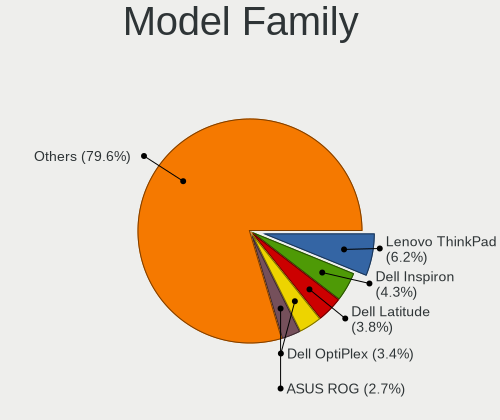
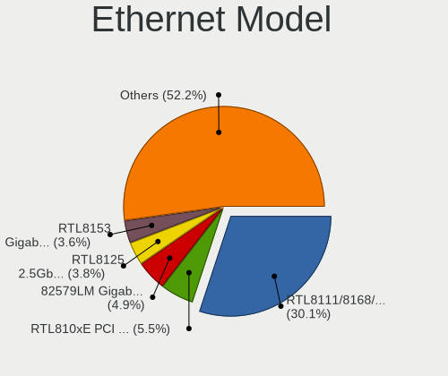

Linux in USA - Tested Hardware & Statistics
-------------------------------------------

A project to collect tested hardware configurations for Linux in USA.

Anyone can contribute to this report by the [hw-probe](https://github.com/linuxhw/hw-probe) tool:

    sudo -E hw-probe -all -upload

Please contribute! Especially if your hardware is rare.

This is a report for all computer types. See also reports for [desktops](/Location/USA/Desktop/README.md) and [notebooks](/Location/USA/Notebook/README.md).

Contents
--------

* [ Test Cases ](#test-cases)

* [ System ](#system)
  - [ OS                       ](#os)
  - [ OS Family                ](#os-family)
  - [ Kernel                   ](#kernel)
  - [ Kernel Family            ](#kernel-family)
  - [ Kernel Major Ver.        ](#kernel-major-ver)
  - [ Arch                     ](#arch)
  - [ DE                       ](#de)
  - [ Display Server           ](#display-server)
  - [ Display Manager          ](#display-manager)
  - [ OS Lang                  ](#os-lang)
  - [ Boot Mode                ](#boot-mode)
  - [ Filesystem               ](#filesystem)
  - [ Part. scheme             ](#part-scheme)
  - [ Dual Boot with Linux/BSD ](#dual-boot-with-linuxbsd)
  - [ Dual Boot (Win)          ](#dual-boot-win)

* [ Board ](#board)
  - [ Vendor                   ](#vendor)
  - [ Model                    ](#model)
  - [ Model Family             ](#model-family)
  - [ MFG Year                 ](#mfg-year)
  - [ Form Factor              ](#form-factor)
  - [ Secure Boot              ](#secure-boot)
  - [ Coreboot                 ](#coreboot)
  - [ RAM Size                 ](#ram-size)
  - [ RAM Used                 ](#ram-used)
  - [ Total Drives             ](#total-drives)
  - [ Has CD-ROM               ](#has-cd-rom)
  - [ Has Ethernet             ](#has-ethernet)
  - [ Has WiFi                 ](#has-wifi)
  - [ Has Bluetooth            ](#has-bluetooth)

* [ Location ](#location)
  - [ Country                  ](#country)
  - [ City                     ](#city)

* [ Drives ](#drives)
  - [ Drive Vendor             ](#drive-vendor)
  - [ Drive Model              ](#drive-model)
  - [ HDD Vendor               ](#hdd-vendor)
  - [ SSD Vendor               ](#ssd-vendor)
  - [ Drive Kind               ](#drive-kind)
  - [ Drive Connector          ](#drive-connector)
  - [ Drive Size               ](#drive-size)
  - [ Space Total              ](#space-total)
  - [ Space Used               ](#space-used)
  - [ Malfunc. Drives          ](#malfunc-drives)
  - [ Malfunc. Drive Vendor    ](#malfunc-drive-vendor)
  - [ Malfunc. HDD Vendor      ](#malfunc-hdd-vendor)
  - [ Malfunc. Drive Kind      ](#malfunc-drive-kind)
  - [ Failed Drives            ](#failed-drives)
  - [ Failed Drive Vendor      ](#failed-drive-vendor)
  - [ Drive Status             ](#drive-status)

* [ Storage controller ](#storage-controller)
  - [ Storage Vendor           ](#storage-vendor)
  - [ Storage Model            ](#storage-model)
  - [ Storage Kind             ](#storage-kind)

* [ Processor ](#processor)
  - [ CPU Vendor               ](#cpu-vendor)
  - [ CPU Model                ](#cpu-model)
  - [ CPU Model Family         ](#cpu-model-family)
  - [ CPU Cores                ](#cpu-cores)
  - [ CPU Sockets              ](#cpu-sockets)
  - [ CPU Threads              ](#cpu-threads)
  - [ CPU Op-Modes             ](#cpu-op-modes)
  - [ CPU Microcode            ](#cpu-microcode)
  - [ CPU Microarch            ](#cpu-microarch)

* [ Graphics ](#graphics)
  - [ GPU Vendor               ](#gpu-vendor)
  - [ GPU Model                ](#gpu-model)
  - [ GPU Combo                ](#gpu-combo)
  - [ GPU Driver               ](#gpu-driver)
  - [ GPU Memory               ](#gpu-memory)

* [ Monitor ](#monitor)
  - [ Monitor Vendor           ](#monitor-vendor)
  - [ Monitor Model            ](#monitor-model)
  - [ Monitor Resolution       ](#monitor-resolution)
  - [ Monitor Diagonal         ](#monitor-diagonal)
  - [ Monitor Width            ](#monitor-width)
  - [ Aspect Ratio             ](#aspect-ratio)
  - [ Monitor Area             ](#monitor-area)
  - [ Pixel Density            ](#pixel-density)
  - [ Multiple Monitors        ](#multiple-monitors)

* [ Network ](#network)
  - [ Net Controller Vendor    ](#net-controller-vendor)
  - [ Net Controller Model     ](#net-controller-model)
  - [ Wireless Vendor          ](#wireless-vendor)
  - [ Wireless Model           ](#wireless-model)
  - [ Ethernet Vendor          ](#ethernet-vendor)
  - [ Ethernet Model           ](#ethernet-model)
  - [ Net Controller Kind      ](#net-controller-kind)
  - [ Used Controller          ](#used-controller)
  - [ NICs                     ](#nics)
  - [ IPv6                     ](#ipv6)

* [ Bluetooth ](#bluetooth)
  - [ Bluetooth Vendor         ](#bluetooth-vendor)
  - [ Bluetooth Model          ](#bluetooth-model)

* [ Sound ](#sound)
  - [ Sound Vendor             ](#sound-vendor)
  - [ Sound Model              ](#sound-model)

* [ Memory ](#memory)
  - [ Memory Vendor            ](#memory-vendor)
  - [ Memory Model             ](#memory-model)
  - [ Memory Kind              ](#memory-kind)
  - [ Memory Form Factor       ](#memory-form-factor)
  - [ Memory Size              ](#memory-size)
  - [ Memory Speed             ](#memory-speed)

* [ Printers & scanners ](#printers--scanners)
  - [ Printer Vendor           ](#printer-vendor)
  - [ Printer Model            ](#printer-model)
  - [ Scanner Vendor           ](#scanner-vendor)
  - [ Scanner Model            ](#scanner-model)

* [ Camera ](#camera)
  - [ Camera Vendor            ](#camera-vendor)
  - [ Camera Model             ](#camera-model)

* [ Security ](#security)
  - [ Fingerprint Vendor       ](#fingerprint-vendor)
  - [ Fingerprint Model        ](#fingerprint-model)
  - [ Chipcard Vendor          ](#chipcard-vendor)
  - [ Chipcard Model           ](#chipcard-model)

* [ Unsupported ](#unsupported)
  - [ Unsupported Devices      ](#unsupported-devices)
  - [ Unsupported Device Types ](#unsupported-device-types)

Test Cases
----------

Total: 45603

| Vendor        | Model                       | Form-Factor | Probe                                                      | Date         |
|---------------|-----------------------------|-------------|------------------------------------------------------------|--------------|
| Dell          | XPS 15 9550                 | Notebook    | [0ffe1f9541](https://linux-hardware.org/?probe=0ffe1f9541) | Feb 28, 2023 |
| Dell          | Inspiron N5010              | Notebook    | [480ff87a20](https://linux-hardware.org/?probe=480ff87a20) | Feb 28, 2023 |
| Dell          | Inspiron 5523               | Notebook    | [09ccf58a6b](https://linux-hardware.org/?probe=09ccf58a6b) | Feb 28, 2023 |
| MSI           | 760GMA-P34                  | Desktop     | [9707436005](https://linux-hardware.org/?probe=9707436005) | Feb 28, 2023 |
| HP            | Pavilion dv7                | Notebook    | [e40593f800](https://linux-hardware.org/?probe=e40593f800) | Feb 28, 2023 |
| ASRock        | B365M-HDV                   | Desktop     | [def987e32c](https://linux-hardware.org/?probe=def987e32c) | Feb 28, 2023 |
| CWWK          | CW-J6-6L                    | Desktop     | [46c17d2c14](https://linux-hardware.org/?probe=46c17d2c14) | Feb 28, 2023 |
| ASUSTek       | ROG STRIX X370-F GAMING     | Desktop     | [1f4ca7d119](https://linux-hardware.org/?probe=1f4ca7d119) | Feb 28, 2023 |
| ASUSTek       | ROG STRIX X370-F GAMING     | Desktop     | [a634d23a20](https://linux-hardware.org/?probe=a634d23a20) | Feb 28, 2023 |
| ASUSTek       | PRIME B550M-A               | Desktop     | [48c5c743c9](https://linux-hardware.org/?probe=48c5c743c9) | Feb 28, 2023 |
| Lenovo        | 30D9 SDK0J40705 WIN 3425... | Desktop     | [7f53a53eba](https://linux-hardware.org/?probe=7f53a53eba) | Feb 28, 2023 |
| ASUSTek       | ROG STRIX Z590-E GAMING ... | Desktop     | [5fa0193c44](https://linux-hardware.org/?probe=5fa0193c44) | Feb 28, 2023 |
| HP            | 8158 A01                    | Mini pc     | [869bfe7d05](https://linux-hardware.org/?probe=869bfe7d05) | Feb 28, 2023 |
| ASUSTek       | VivoBook_ASUSLaptop X412... | Notebook    | [87022bd601](https://linux-hardware.org/?probe=87022bd601) | Feb 28, 2023 |
| Dell          | 0PM2CW A04                  | Server      | [154f8780de](https://linux-hardware.org/?probe=154f8780de) | Feb 28, 2023 |
| HP            | ENVY 17                     | Notebook    | [61d1252ef3](https://linux-hardware.org/?probe=61d1252ef3) | Feb 28, 2023 |
| Gigabyte      | AERO 15-X9                  | Notebook    | [18d00993bf](https://linux-hardware.org/?probe=18d00993bf) | Feb 28, 2023 |
| HP            | ENVY x360 2-in-1 Laptop ... | Convertible | [9c65dcac2b](https://linux-hardware.org/?probe=9c65dcac2b) | Feb 28, 2023 |
| Dell          | 0KWVT8 A02                  | Desktop     | [4340c1d7c4](https://linux-hardware.org/?probe=4340c1d7c4) | Feb 28, 2023 |
| ASUSTek       | ROG STRIX Z690-A GAMING ... | Desktop     | [216ad20179](https://linux-hardware.org/?probe=216ad20179) | Feb 28, 2023 |
| ASRock        | KBL-NUC                     | Desktop     | [cb504c5fa0](https://linux-hardware.org/?probe=cb504c5fa0) | Feb 28, 2023 |
| HP            | 87D6 SMVB                   | Desktop     | [423aac2b6f](https://linux-hardware.org/?probe=423aac2b6f) | Feb 28, 2023 |
| Apple         | MacBookPro8,1               | Notebook    | [ec1f27de09](https://linux-hardware.org/?probe=ec1f27de09) | Feb 28, 2023 |
| Acer          | Aspire Z5101                | All in one  | [ec55f791bb](https://linux-hardware.org/?probe=ec55f791bb) | Feb 28, 2023 |
| Dell          | Inspiron N5110              | Notebook    | [e35a1076a1](https://linux-hardware.org/?probe=e35a1076a1) | Feb 28, 2023 |
| Dell          | Inspiron 15 3511            | Notebook    | [99462eae5e](https://linux-hardware.org/?probe=99462eae5e) | Feb 28, 2023 |
| ASRock        | B560M-C                     | Desktop     | [a93d64aa2c](https://linux-hardware.org/?probe=a93d64aa2c) | Feb 28, 2023 |
| ASRock        | B560M-C                     | Desktop     | [cbbd0a63d4](https://linux-hardware.org/?probe=cbbd0a63d4) | Feb 28, 2023 |
| Lenovo        | ThinkPad X1 Extreme Gen ... | Notebook    | [3ab9ad10d8](https://linux-hardware.org/?probe=3ab9ad10d8) | Feb 28, 2023 |
| MECHREVO      | Jiaolong Series MRID6       | Notebook    | [1643b96eae](https://linux-hardware.org/?probe=1643b96eae) | Feb 28, 2023 |
| MECHREVO      | Jiaolong Series MRID6       | Notebook    | [b48cc99ce3](https://linux-hardware.org/?probe=b48cc99ce3) | Feb 28, 2023 |
| Lenovo        | ThinkPad X270 20HN001RUS    | Notebook    | [ff84200b75](https://linux-hardware.org/?probe=ff84200b75) | Feb 28, 2023 |
| HP            | Pavilion Laptop 15-cc5xx    | Notebook    | [4a5d167c96](https://linux-hardware.org/?probe=4a5d167c96) | Feb 28, 2023 |
| Dell          | 0HD5W2 A01                  | Desktop     | [f30a31a8ee](https://linux-hardware.org/?probe=f30a31a8ee) | Feb 28, 2023 |
| ASUSTek       | ROG STRIX Z390-E GAMING     | Desktop     | [62a7d7ef5c](https://linux-hardware.org/?probe=62a7d7ef5c) | Feb 28, 2023 |
| Lenovo        | Slim 7 ProX 14ARH7 82V2     | Notebook    | [1c61d820ff](https://linux-hardware.org/?probe=1c61d820ff) | Feb 28, 2023 |
| MSI           | B550-A PRO[CEC]             | Desktop     | [2465135444](https://linux-hardware.org/?probe=2465135444) | Feb 28, 2023 |
| Supermicro    | H12SSL-i                    | Server      | [3b0e50edda](https://linux-hardware.org/?probe=3b0e50edda) | Feb 28, 2023 |
| ASUSTek       | ZenBook Q326FA_Q326FA       | Convertible | [30ac6dbb4a](https://linux-hardware.org/?probe=30ac6dbb4a) | Feb 28, 2023 |
| Lenovo        | ThinkPad X1 Carbon 5th 2... | Notebook    | [5c39a363d8](https://linux-hardware.org/?probe=5c39a363d8) | Feb 28, 2023 |
| Gigabyte      | AX370-Gaming K7             | Desktop     | [d4bcf9b7a2](https://linux-hardware.org/?probe=d4bcf9b7a2) | Feb 28, 2023 |
| Dell          | Latitude E7450              | Notebook    | [a36df01da9](https://linux-hardware.org/?probe=a36df01da9) | Feb 28, 2023 |
| HP            | Pavilion dv7                | Notebook    | [1dbb82f9ff](https://linux-hardware.org/?probe=1dbb82f9ff) | Feb 28, 2023 |
| Gigabyte      | Z370 AORUS Gaming 5-CF      | Desktop     | [cb687f4572](https://linux-hardware.org/?probe=cb687f4572) | Feb 28, 2023 |
| Lenovo        | ThinkPad X1 Carbon 6th 2... | Notebook    | [886f442040](https://linux-hardware.org/?probe=886f442040) | Feb 28, 2023 |
| Dell          | Precision 5570              | Notebook    | [7e8d7c37cb](https://linux-hardware.org/?probe=7e8d7c37cb) | Feb 28, 2023 |
| Google        | Reks                        | Notebook    | [be1a98408d](https://linux-hardware.org/?probe=be1a98408d) | Feb 28, 2023 |
| ASRock        | B550 Phantom Gaming-ITX/... | Desktop     | [0195132360](https://linux-hardware.org/?probe=0195132360) | Feb 28, 2023 |
| ASRock        | B550 Phantom Gaming-ITX/... | Desktop     | [8cd8d4b833](https://linux-hardware.org/?probe=8cd8d4b833) | Feb 28, 2023 |
| Gateway       | Sonic-C                     | Notebook    | [b9f775b14e](https://linux-hardware.org/?probe=b9f775b14e) | Feb 28, 2023 |
| Toshiba       | Satellite S70-A             | Notebook    | [7e849f93ca](https://linux-hardware.org/?probe=7e849f93ca) | Feb 28, 2023 |
| Foxconn       | 2ABF                        | Desktop     | [ad46fcc88d](https://linux-hardware.org/?probe=ad46fcc88d) | Feb 28, 2023 |
| Dell          | Latitude E7470              | Notebook    | [51deaef7a0](https://linux-hardware.org/?probe=51deaef7a0) | Feb 28, 2023 |
| ASUSTek       | X550CA                      | Notebook    | [0ce966b8fa](https://linux-hardware.org/?probe=0ce966b8fa) | Feb 27, 2023 |
| Dell          | 0NW6H5 A00                  | Desktop     | [aeb7d7a9f4](https://linux-hardware.org/?probe=aeb7d7a9f4) | Feb 27, 2023 |
| HP            | 802E                        | Desktop     | [d24bb98294](https://linux-hardware.org/?probe=d24bb98294) | Feb 27, 2023 |
| Lenovo        | ThinkPad X1 Yoga 3rd 20L... | Convertible | [43602775cd](https://linux-hardware.org/?probe=43602775cd) | Feb 27, 2023 |
| Dell          | Inspiron 5537               | Notebook    | [25fa030105](https://linux-hardware.org/?probe=25fa030105) | Feb 27, 2023 |
| Dell          | 0NW6H5 A00                  | Desktop     | [83e6da010b](https://linux-hardware.org/?probe=83e6da010b) | Feb 27, 2023 |
| Dell          | XPS 15 7590                 | Notebook    | [e1777784ac](https://linux-hardware.org/?probe=e1777784ac) | Feb 27, 2023 |
| ASUSTek       | PRIME B360M-A               | Desktop     | [5860f51cd8](https://linux-hardware.org/?probe=5860f51cd8) | Feb 27, 2023 |
| Google        | Buddy                       | Desktop     | [ac3d9aaed0](https://linux-hardware.org/?probe=ac3d9aaed0) | Feb 27, 2023 |
| Dell          | Inspiron 3793               | Notebook    | [d7b51f6048](https://linux-hardware.org/?probe=d7b51f6048) | Feb 27, 2023 |
| Valve         | Jupiter                     | Notebook    | [ce7b0e507f](https://linux-hardware.org/?probe=ce7b0e507f) | Feb 27, 2023 |
| HP            | 339A                        | Desktop     | [308d8dfac0](https://linux-hardware.org/?probe=308d8dfac0) | Feb 27, 2023 |
| Lenovo        | IdeaPad 1 15ALC7 82R4       | Notebook    | [47f7b39f3a](https://linux-hardware.org/?probe=47f7b39f3a) | Feb 27, 2023 |
| ASUSTek       | PRIME Q270M-C               | Desktop     | [3a9683fbb7](https://linux-hardware.org/?probe=3a9683fbb7) | Feb 27, 2023 |
| Dell          | Latitude E4310              | Notebook    | [2b2255a5b4](https://linux-hardware.org/?probe=2b2255a5b4) | Feb 27, 2023 |
| HP            | Pavilion dv7                | Notebook    | [d5da5f62b8](https://linux-hardware.org/?probe=d5da5f62b8) | Feb 27, 2023 |
| ASUSTek       | VivoBook_ASUSLaptop X512... | Notebook    | [cd19568cfc](https://linux-hardware.org/?probe=cd19568cfc) | Feb 27, 2023 |
| ASUSTek       | X541NA                      | Notebook    | [8c0dc3ba82](https://linux-hardware.org/?probe=8c0dc3ba82) | Feb 27, 2023 |
| Acer          | Aspire Z5101                | All in one  | [3dd821cc61](https://linux-hardware.org/?probe=3dd821cc61) | Feb 27, 2023 |
| Dell          | XPS L521X                   | Notebook    | [f9598ce828](https://linux-hardware.org/?probe=f9598ce828) | Feb 27, 2023 |
| Lenovo        | IdeaPadFlex 5 14ITL05 82... | Convertible | [4f3c01941d](https://linux-hardware.org/?probe=4f3c01941d) | Feb 27, 2023 |
| ASUSTek       | VivoBook_ASUSLaptop E210... | Notebook    | [ad20f98122](https://linux-hardware.org/?probe=ad20f98122) | Feb 27, 2023 |
| Dell          | Vostro 1540                 | Notebook    | [8f09ea4351](https://linux-hardware.org/?probe=8f09ea4351) | Feb 27, 2023 |
| Apple         | MacBookAir6,2               | Notebook    | [0fb60ed4e2](https://linux-hardware.org/?probe=0fb60ed4e2) | Feb 27, 2023 |
| Dell          | 0427JK A00                  | Desktop     | [ca878d6577](https://linux-hardware.org/?probe=ca878d6577) | Feb 27, 2023 |
| MSI           | MPG X570 GAMING PRO CARB... | Desktop     | [15318beac5](https://linux-hardware.org/?probe=15318beac5) | Feb 27, 2023 |
| Valve         | Jupiter                     | Notebook    | [52268bbf2b](https://linux-hardware.org/?probe=52268bbf2b) | Feb 27, 2023 |
| AZW           | SER                         | Mini pc     | [f5b64e8716](https://linux-hardware.org/?probe=f5b64e8716) | Feb 27, 2023 |
| Gigabyte      | Z690 AERO D                 | Desktop     | [68b84cc1eb](https://linux-hardware.org/?probe=68b84cc1eb) | Feb 27, 2023 |
| HP            | ENVY m7 Notebook            | Notebook    | [14374fbcc8](https://linux-hardware.org/?probe=14374fbcc8) | Feb 27, 2023 |
| ASUSTek       | ROG Flow X13 GV301RE_GV3... | Convertible | [7f7bdeae7c](https://linux-hardware.org/?probe=7f7bdeae7c) | Feb 27, 2023 |
| Dell          | 0Y2MRG A00                  | Desktop     | [6c62bbbf3b](https://linux-hardware.org/?probe=6c62bbbf3b) | Feb 27, 2023 |
| Dell          | 0Y2MRG A00                  | Desktop     | [2479c3c245](https://linux-hardware.org/?probe=2479c3c245) | Feb 27, 2023 |
| Gigabyte      | Z170MX-Gaming 5             | Desktop     | [1f0e9197f9](https://linux-hardware.org/?probe=1f0e9197f9) | Feb 26, 2023 |
| HP            | 81B4 01                     | Desktop     | [bc06df8d32](https://linux-hardware.org/?probe=bc06df8d32) | Feb 26, 2023 |
| Gigabyte      | Z390 UD                     | Desktop     | [b40f9ce0d1](https://linux-hardware.org/?probe=b40f9ce0d1) | Feb 26, 2023 |
| ASUSTek       | ROG STRIX B550-F GAMING     | Desktop     | [3ac3b5424a](https://linux-hardware.org/?probe=3ac3b5424a) | Feb 26, 2023 |
| MSI           | B450M PRO-M2 MAX            | Desktop     | [0c5f9a10dd](https://linux-hardware.org/?probe=0c5f9a10dd) | Feb 26, 2023 |
| ASUSTek       | PRIME B550M-A               | Desktop     | [a121d0545a](https://linux-hardware.org/?probe=a121d0545a) | Feb 26, 2023 |
| Lenovo        | ThinkPad X395 20NL0006US    | Notebook    | [9030fac261](https://linux-hardware.org/?probe=9030fac261) | Feb 26, 2023 |
| Acer          | Aspire V3-772G              | Notebook    | [83dce8f92d](https://linux-hardware.org/?probe=83dce8f92d) | Feb 26, 2023 |
| Gateway       | Sonic-C                     | Notebook    | [6def275f9b](https://linux-hardware.org/?probe=6def275f9b) | Feb 26, 2023 |
| Pegatron      | NARRA5                      | Desktop     | [fbff48e326](https://linux-hardware.org/?probe=fbff48e326) | Feb 26, 2023 |
| Lenovo        | Annapurna CRB NOK           | Desktop     | [77122f785f](https://linux-hardware.org/?probe=77122f785f) | Feb 26, 2023 |
| Gigabyte      | X99-UD4P-CF                 | Desktop     | [b78a53985a](https://linux-hardware.org/?probe=b78a53985a) | Feb 26, 2023 |
| ASRock        | 970M Pro3                   | Desktop     | [787ddfd44c](https://linux-hardware.org/?probe=787ddfd44c) | Feb 26, 2023 |
| Lenovo        | Annapurna CRB NOK           | Desktop     | [0e521e12aa](https://linux-hardware.org/?probe=0e521e12aa) | Feb 26, 2023 |
| ASUSTek       | TUF Gaming X570-PLUS        | Desktop     | [c56cf68cef](https://linux-hardware.org/?probe=c56cf68cef) | Feb 26, 2023 |
| HP            | Pavilion Laptop 15-cc5xx    | Notebook    | [13f87401ca](https://linux-hardware.org/?probe=13f87401ca) | Feb 26, 2023 |
| Acer          | Aspire 1410                 | Notebook    | [40b5704a1c](https://linux-hardware.org/?probe=40b5704a1c) | Feb 26, 2023 |
| Dell          | 0RN4PJ A01                  | Server      | [8bd95e51d2](https://linux-hardware.org/?probe=8bd95e51d2) | Feb 26, 2023 |
| Lenovo        | IdeaPad 3 15IML05 81WR      | Notebook    | [b19a229c5c](https://linux-hardware.org/?probe=b19a229c5c) | Feb 26, 2023 |
| Dell          | Latitude 7350               | Notebook    | [a8bbed94ce](https://linux-hardware.org/?probe=a8bbed94ce) | Feb 26, 2023 |
| MSI           | B450-A PRO MAX              | Desktop     | [f081452f55](https://linux-hardware.org/?probe=f081452f55) | Feb 26, 2023 |
| HP            | 1632                        | Desktop     | [394b988862](https://linux-hardware.org/?probe=394b988862) | Feb 26, 2023 |
| HP            | Laptop 15-ef2xxx            | Notebook    | [54c4b4eb4e](https://linux-hardware.org/?probe=54c4b4eb4e) | Feb 26, 2023 |
| Lenovo        | ThinkPad X230 Tablet 343... | Notebook    | [be9468c864](https://linux-hardware.org/?probe=be9468c864) | Feb 26, 2023 |
| Lenovo        | ThinkPad T430 2349GUU       | Notebook    | [95cc420bd5](https://linux-hardware.org/?probe=95cc420bd5) | Feb 26, 2023 |
| MSI           | MAG Z490 TOMAHAWK           | Desktop     | [f24a3027d0](https://linux-hardware.org/?probe=f24a3027d0) | Feb 26, 2023 |
| ASUSTek       | ProArt B550-CREATOR         | Desktop     | [a2a7defd24](https://linux-hardware.org/?probe=a2a7defd24) | Feb 26, 2023 |
| HP            | Laptop 15-ef2xxx            | Notebook    | [a9e58a8737](https://linux-hardware.org/?probe=a9e58a8737) | Feb 26, 2023 |
| Lenovo        | ThinkPad X201 3626AL3       | Notebook    | [9c3a1f5cd5](https://linux-hardware.org/?probe=9c3a1f5cd5) | Feb 26, 2023 |
| Lenovo        | ThinkPad T430 2344BZU       | Notebook    | [245d23aff3](https://linux-hardware.org/?probe=245d23aff3) | Feb 26, 2023 |
| ASUSTek       | TUF Gaming FX705DT_FX705... | Notebook    | [8a3c646d1f](https://linux-hardware.org/?probe=8a3c646d1f) | Feb 26, 2023 |
| Lenovo        | ThinkPad E15 Gen 4 21ED0... | Notebook    | [85bc55a850](https://linux-hardware.org/?probe=85bc55a850) | Feb 26, 2023 |
| Dell          | Latitude E6420              | Notebook    | [b35fdc2f10](https://linux-hardware.org/?probe=b35fdc2f10) | Feb 26, 2023 |
| ASUSTek       | TUF Gaming B550M-PLUS WI... | Desktop     | [a21ea9613b](https://linux-hardware.org/?probe=a21ea9613b) | Feb 26, 2023 |
| Gigabyte      | B550 GAMING X V2            | Desktop     | [9c64d6366e](https://linux-hardware.org/?probe=9c64d6366e) | Feb 26, 2023 |
| MSI           | B350 TOMAHAWK ARCTIC        | Desktop     | [83c075f5c5](https://linux-hardware.org/?probe=83c075f5c5) | Feb 26, 2023 |
| Microsoft     | Surface Pro 4               | Tablet      | [676845a8b1](https://linux-hardware.org/?probe=676845a8b1) | Feb 26, 2023 |
| Lenovo        | ThinkPad X13s Gen 1 21BX... | Notebook    | [633fb08804](https://linux-hardware.org/?probe=633fb08804) | Feb 26, 2023 |
| Lenovo        | ThinkPad T61 6464A13        | Notebook    | [e981803528](https://linux-hardware.org/?probe=e981803528) | Feb 26, 2023 |
| Dell          | 0KWVT8 A03                  | Desktop     | [fcea958b77](https://linux-hardware.org/?probe=fcea958b77) | Feb 26, 2023 |
| Lenovo        | 1048 SDK0T08861 WIN 3305... | Desktop     | [e6b48cdec4](https://linux-hardware.org/?probe=e6b48cdec4) | Feb 26, 2023 |
| Lenovo        | ThinkPad T430s 235368U      | Notebook    | [58a8ada163](https://linux-hardware.org/?probe=58a8ada163) | Feb 26, 2023 |
| Dell          | XPS 13 9310 2-in-1          | Convertible | [f562bdbf31](https://linux-hardware.org/?probe=f562bdbf31) | Feb 26, 2023 |
| HP            | EliteBook 745 G3            | Notebook    | [8cee2ac27a](https://linux-hardware.org/?probe=8cee2ac27a) | Feb 26, 2023 |
| Apple         | Mac-8ED6AF5B48C039E1 Mac... | Mini pc     | [c6ca9e8499](https://linux-hardware.org/?probe=c6ca9e8499) | Feb 26, 2023 |
| Gigabyte      | X399 DESIGNARE EX-CF        | Desktop     | [342c4594de](https://linux-hardware.org/?probe=342c4594de) | Feb 26, 2023 |
| Dell          | Inspiron 16 5620            | Notebook    | [1b83626bdf](https://linux-hardware.org/?probe=1b83626bdf) | Feb 26, 2023 |
| Lenovo        | IdeaPad 5 15IAL7 82SF       | Notebook    | [3b2a19c835](https://linux-hardware.org/?probe=3b2a19c835) | Feb 26, 2023 |
| ASUSTek       | P8Z77-M PRO                 | Desktop     | [92f1f7d3b5](https://linux-hardware.org/?probe=92f1f7d3b5) | Feb 26, 2023 |
| Direkt-Tek    | DTLAPY133-1                 | Notebook    | [df87b3b645](https://linux-hardware.org/?probe=df87b3b645) | Feb 26, 2023 |
| Dell          | XPS L701X                   | Notebook    | [ad6ca78b72](https://linux-hardware.org/?probe=ad6ca78b72) | Feb 26, 2023 |
| ASUSTek       | PRIME B450-PLUS             | Desktop     | [db604c4ff6](https://linux-hardware.org/?probe=db604c4ff6) | Feb 25, 2023 |
| System76      | Serval WS                   | Notebook    | [1b136ec80d](https://linux-hardware.org/?probe=1b136ec80d) | Feb 25, 2023 |
| Lenovo        | Legion 5 82B5               | Notebook    | [8db23a7237](https://linux-hardware.org/?probe=8db23a7237) | Feb 25, 2023 |
| Dell          | 0F428D A00                  | Desktop     | [7d01f8893e](https://linux-hardware.org/?probe=7d01f8893e) | Feb 25, 2023 |
| Dell          | 0YJHYD A00                  | Desktop     | [5029039f0e](https://linux-hardware.org/?probe=5029039f0e) | Feb 25, 2023 |
| ASUSTek       | SABERTOOTH 990FX R2.0       | Desktop     | [42fe607d11](https://linux-hardware.org/?probe=42fe607d11) | Feb 25, 2023 |
| Supermicro    | X10SAE                      | Server      | [fff44d7132](https://linux-hardware.org/?probe=fff44d7132) | Feb 25, 2023 |
| Google        | Lars                        | Notebook    | [ec4b0e7bbc](https://linux-hardware.org/?probe=ec4b0e7bbc) | Feb 25, 2023 |
| ASRock        | Z97 Pro4                    | Desktop     | [451c626830](https://linux-hardware.org/?probe=451c626830) | Feb 25, 2023 |
| GPU Compan... | GWTC116-2                   | Notebook    | [1475770a2a](https://linux-hardware.org/?probe=1475770a2a) | Feb 25, 2023 |
| GPU Compan... | GWTN141-10                  | Notebook    | [1550bec17e](https://linux-hardware.org/?probe=1550bec17e) | Feb 25, 2023 |
| ASUSTek       | PRIME B450M-A II            | Desktop     | [420520e3ab](https://linux-hardware.org/?probe=420520e3ab) | Feb 25, 2023 |
| GPU Compan... | GWTN141-10                  | Notebook    | [aa535b0731](https://linux-hardware.org/?probe=aa535b0731) | Feb 25, 2023 |
| MSI           | X570-A PRO                  | Desktop     | [922ba2355e](https://linux-hardware.org/?probe=922ba2355e) | Feb 25, 2023 |
| Dell          | 0YF8P5 A00                  | Desktop     | [b387faf4ee](https://linux-hardware.org/?probe=b387faf4ee) | Feb 25, 2023 |
| Lenovo        | Legion 7 16ARHA7 82UH       | Notebook    | [31bd9738ca](https://linux-hardware.org/?probe=31bd9738ca) | Feb 25, 2023 |
| Unknown       | T3 MRD                      | Notebook    | [ae88920ea5](https://linux-hardware.org/?probe=ae88920ea5) | Feb 25, 2023 |
| Dell          | Inspiron 3521               | Notebook    | [b6321ee5a4](https://linux-hardware.org/?probe=b6321ee5a4) | Feb 25, 2023 |
| Dell          | Inspiron 3521               | Notebook    | [efc95d4697](https://linux-hardware.org/?probe=efc95d4697) | Feb 25, 2023 |
| Gigabyte      | B550M DS3H                  | Desktop     | [0ac3b49261](https://linux-hardware.org/?probe=0ac3b49261) | Feb 25, 2023 |
| HP            | Pavilion Laptop 15-cs3xx... | Notebook    | [0b9491b3a0](https://linux-hardware.org/?probe=0b9491b3a0) | Feb 25, 2023 |
| System76      | Galago Pro                  | Notebook    | [3e4391562b](https://linux-hardware.org/?probe=3e4391562b) | Feb 25, 2023 |
| Dell          | Inspiron 5537               | Notebook    | [0496ce1146](https://linux-hardware.org/?probe=0496ce1146) | Feb 25, 2023 |
| Dell          | Inspiron 5537               | Notebook    | [cb4b91f80c](https://linux-hardware.org/?probe=cb4b91f80c) | Feb 25, 2023 |
| Dell          | Inspiron 5759               | Notebook    | [be0b15660e](https://linux-hardware.org/?probe=be0b15660e) | Feb 25, 2023 |
| Unknown       | Unknown                     | Notebook    | [99c7da7e97](https://linux-hardware.org/?probe=99c7da7e97) | Feb 25, 2023 |
| ASUSTek       | PRIME B560M-A               | Desktop     | [7357439273](https://linux-hardware.org/?probe=7357439273) | Feb 25, 2023 |
| Supermicro    | X10SAE                      | Server      | [b968ea6172](https://linux-hardware.org/?probe=b968ea6172) | Feb 25, 2023 |
| HP            | Laptop 15-dy2xxx            | Notebook    | [7f88a11698](https://linux-hardware.org/?probe=7f88a11698) | Feb 25, 2023 |
| Dell          | 051FJ8 A02                  | Desktop     | [05f5f23fbb](https://linux-hardware.org/?probe=05f5f23fbb) | Feb 25, 2023 |
| Lenovo        | ThinkPad Z13 Gen 1 21D2C... | Notebook    | [e07445a583](https://linux-hardware.org/?probe=e07445a583) | Feb 25, 2023 |
| HP            | ENVY 17                     | Notebook    | [7baf81c4e8](https://linux-hardware.org/?probe=7baf81c4e8) | Feb 25, 2023 |
| Dell          | XPS 13 9310 2-in-1          | Convertible | [fc376b9272](https://linux-hardware.org/?probe=fc376b9272) | Feb 25, 2023 |
| MSI           | B550-A PRO[CEC]             | Desktop     | [9c1dad9bdc](https://linux-hardware.org/?probe=9c1dad9bdc) | Feb 25, 2023 |
| Unknown       | Unknown                     | Notebook    | [2c5d6ab621](https://linux-hardware.org/?probe=2c5d6ab621) | Feb 25, 2023 |
| Samsung       | 950QED                      | Convertible | [e4fca42192](https://linux-hardware.org/?probe=e4fca42192) | Feb 25, 2023 |
| Apple         | Mac-27ADBB7B4CEE8E61 iMa... | All in one  | [899c2066a1](https://linux-hardware.org/?probe=899c2066a1) | Feb 25, 2023 |
| MSI           | GF63 Thin 10SC              | Notebook    | [824f4eafd0](https://linux-hardware.org/?probe=824f4eafd0) | Feb 25, 2023 |
| HP            | Pavilion x360 Convertibl... | Convertible | [844de888cd](https://linux-hardware.org/?probe=844de888cd) | Feb 25, 2023 |
| Samsung       | 950QED                      | Convertible | [54e58ec510](https://linux-hardware.org/?probe=54e58ec510) | Feb 25, 2023 |
| HP            | 2AF7                        | Desktop     | [a8eba0b0c4](https://linux-hardware.org/?probe=a8eba0b0c4) | Feb 25, 2023 |
| HP            | ENVY 17                     | Notebook    | [8790ad53d8](https://linux-hardware.org/?probe=8790ad53d8) | Feb 25, 2023 |
| Dell          | XPS 15 9500                 | Notebook    | [96e6c2c201](https://linux-hardware.org/?probe=96e6c2c201) | Feb 25, 2023 |
| Dell          | 0W2F8G A01                  | Desktop     | [1d0d54843b](https://linux-hardware.org/?probe=1d0d54843b) | Feb 25, 2023 |
| HP            | 2AF7                        | Desktop     | [3bf3afd1d5](https://linux-hardware.org/?probe=3bf3afd1d5) | Feb 25, 2023 |
| Apple         | MacBookPro16,2              | Notebook    | [c4cab43483](https://linux-hardware.org/?probe=c4cab43483) | Feb 25, 2023 |
| Supermicro    | H12SSL-i                    | Server      | [126100b078](https://linux-hardware.org/?probe=126100b078) | Feb 25, 2023 |
| System76      | Gazelle                     | Notebook    | [64fcb063eb](https://linux-hardware.org/?probe=64fcb063eb) | Feb 25, 2023 |
| HP            | 2000                        | Notebook    | [2e234233cc](https://linux-hardware.org/?probe=2e234233cc) | Feb 25, 2023 |
| Intel         | NUC7i5DNB J57626-509        | Mini pc     | [b3b189e875](https://linux-hardware.org/?probe=b3b189e875) | Feb 25, 2023 |
| HP            | 15                          | Notebook    | [04741afb27](https://linux-hardware.org/?probe=04741afb27) | Feb 25, 2023 |
| HP            | Pavilion Laptop 15-cd0xx    | Notebook    | [dfb5281dfb](https://linux-hardware.org/?probe=dfb5281dfb) | Feb 25, 2023 |
| Intel         | NUC7i5DNB J57626-509        | Mini pc     | [d615820c71](https://linux-hardware.org/?probe=d615820c71) | Feb 25, 2023 |
| Gateway       | NV47H                       | Notebook    | [4168112a0a](https://linux-hardware.org/?probe=4168112a0a) | Feb 25, 2023 |
| Gateway       | NV47H                       | Notebook    | [8faf0d384e](https://linux-hardware.org/?probe=8faf0d384e) | Feb 25, 2023 |
| Gigabyte      | P55A-UD3                    | Desktop     | [60cd9db1c5](https://linux-hardware.org/?probe=60cd9db1c5) | Feb 25, 2023 |
| Toshiba       | QOSMIO X505                 | Notebook    | [ba222e690b](https://linux-hardware.org/?probe=ba222e690b) | Feb 25, 2023 |
| HP            | EliteBook 840 G2            | Notebook    | [33dc8202e9](https://linux-hardware.org/?probe=33dc8202e9) | Feb 25, 2023 |
| Toshiba       | QOSMIO X505                 | Notebook    | [8dd3063004](https://linux-hardware.org/?probe=8dd3063004) | Feb 25, 2023 |
| Apple         | Mac-27ADBB7B4CEE8E61 iMa... | All in one  | [b367bf6276](https://linux-hardware.org/?probe=b367bf6276) | Feb 25, 2023 |
| Star Labs     | StarBook                    | Notebook    | [fbd529b953](https://linux-hardware.org/?probe=fbd529b953) | Feb 25, 2023 |
| Lenovo        | IdeaPad 5 15IAL7 82SF       | Notebook    | [12d979b047](https://linux-hardware.org/?probe=12d979b047) | Feb 25, 2023 |
| Lenovo        | ThinkPad T15 Gen 2i 20W4... | Notebook    | [3b757c7c9c](https://linux-hardware.org/?probe=3b757c7c9c) | Feb 25, 2023 |
| Dell          | Latitude 3310               | Notebook    | [d989647d9d](https://linux-hardware.org/?probe=d989647d9d) | Feb 25, 2023 |
| AZW           | SER                         | Mini pc     | [bca19a22d8](https://linux-hardware.org/?probe=bca19a22d8) | Feb 25, 2023 |
| Dell          | 088DT1 A01                  | Desktop     | [129ed2a520](https://linux-hardware.org/?probe=129ed2a520) | Feb 25, 2023 |
| ASUSTek       | ROG STRIX X570-E GAMING ... | Desktop     | [101d8d4577](https://linux-hardware.org/?probe=101d8d4577) | Feb 25, 2023 |
| HP            | ENVY x360 2-in-1 Laptop ... | Convertible | [86ab345b56](https://linux-hardware.org/?probe=86ab345b56) | Feb 24, 2023 |
| Dell          | XPS 17 9710                 | Notebook    | [4066713adb](https://linux-hardware.org/?probe=4066713adb) | Feb 24, 2023 |
| Dell          | Latitude D630               | Notebook    | [433f06ecbb](https://linux-hardware.org/?probe=433f06ecbb) | Feb 24, 2023 |
| HP            | Laptop 17-by2xxx            | Notebook    | [d6a91a338c](https://linux-hardware.org/?probe=d6a91a338c) | Feb 24, 2023 |
| HP            | 84EF 01100                  | All in one  | [d69b1aab65](https://linux-hardware.org/?probe=d69b1aab65) | Feb 24, 2023 |
| ASUSTek       | PRIME B360M-A               | Desktop     | [6d7221488b](https://linux-hardware.org/?probe=6d7221488b) | Feb 24, 2023 |
| Pegatron      | NARRA5                      | Desktop     | [af6be34173](https://linux-hardware.org/?probe=af6be34173) | Feb 24, 2023 |
| HP            | ProBook 450 G1              | Notebook    | [f7c4b009f1](https://linux-hardware.org/?probe=f7c4b009f1) | Feb 24, 2023 |
| Alienware     | m15 R7 AMD                  | Notebook    | [0a44dcc29e](https://linux-hardware.org/?probe=0a44dcc29e) | Feb 24, 2023 |
| Gigabyte      | AERO 15 Classic-SA          | Notebook    | [bc6078dda0](https://linux-hardware.org/?probe=bc6078dda0) | Feb 24, 2023 |
| Lenovo        | ThinkPad X220 Tablet 429... | Notebook    | [2f561a23c3](https://linux-hardware.org/?probe=2f561a23c3) | Feb 24, 2023 |
| Alienware     | m15 R7 AMD                  | Notebook    | [3ba05d49d8](https://linux-hardware.org/?probe=3ba05d49d8) | Feb 24, 2023 |
| Dell          | Latitude E5470              | Notebook    | [d7c8a049c4](https://linux-hardware.org/?probe=d7c8a049c4) | Feb 24, 2023 |
| HP            | 650                         | Notebook    | [ab0b350259](https://linux-hardware.org/?probe=ab0b350259) | Feb 24, 2023 |
| Acer          | AO756                       | Notebook    | [ca83ee78ec](https://linux-hardware.org/?probe=ca83ee78ec) | Feb 24, 2023 |
| ASRock        | H670M Pro RS                | Desktop     | [91bcaa987c](https://linux-hardware.org/?probe=91bcaa987c) | Feb 24, 2023 |
| ASUSTek       | SABERTOOTH 990FX R2.0       | Desktop     | [59d0e692ef](https://linux-hardware.org/?probe=59d0e692ef) | Feb 24, 2023 |
| HP            | Laptop 14-ck0xxx            | Notebook    | [bafb67390c](https://linux-hardware.org/?probe=bafb67390c) | Feb 24, 2023 |
| HP            | Presario CQ57               | Notebook    | [b41de6d094](https://linux-hardware.org/?probe=b41de6d094) | Feb 24, 2023 |
| Lenovo        | ThinkPad X230 23253Z5       | Notebook    | [1237b75ae4](https://linux-hardware.org/?probe=1237b75ae4) | Feb 24, 2023 |
| HP            | 82F2 A01                    | Desktop     | [efc9b2fdbf](https://linux-hardware.org/?probe=efc9b2fdbf) | Feb 24, 2023 |
| HP            | 82F2 A01                    | Desktop     | [24dc4341d3](https://linux-hardware.org/?probe=24dc4341d3) | Feb 24, 2023 |
| Dell          | Vostro 15 7510              | Notebook    | [38085af23d](https://linux-hardware.org/?probe=38085af23d) | Feb 24, 2023 |
| MSI           | MS-7A32                     | Notebook    | [2312252934](https://linux-hardware.org/?probe=2312252934) | Feb 24, 2023 |
| ASUSTek       | ROG Strix G512LW_G512LW     | Notebook    | [012415eb50](https://linux-hardware.org/?probe=012415eb50) | Feb 24, 2023 |
| Lenovo        | IdeaPadFlex 5 14IAU7 82R... | Convertible | [4b4f9024a4](https://linux-hardware.org/?probe=4b4f9024a4) | Feb 24, 2023 |
| ASUSTek       | ROG Strix G512LW_G512LW     | Notebook    | [e1c3e1611f](https://linux-hardware.org/?probe=e1c3e1611f) | Feb 24, 2023 |
| Gigabyte      | B365M DS3H                  | Desktop     | [463265c999](https://linux-hardware.org/?probe=463265c999) | Feb 24, 2023 |
| Apple         | Mac-27ADBB7B4CEE8E61 iMa... | All in one  | [105209c356](https://linux-hardware.org/?probe=105209c356) | Feb 24, 2023 |
| Apple         | Mac-27ADBB7B4CEE8E61 iMa... | All in one  | [5027942f8b](https://linux-hardware.org/?probe=5027942f8b) | Feb 24, 2023 |
| Gigabyte      | B365M DS3H                  | Desktop     | [4aec81f692](https://linux-hardware.org/?probe=4aec81f692) | Feb 24, 2023 |
| HP            | EliteBook Folio 9480m       | Notebook    | [788e0929de](https://linux-hardware.org/?probe=788e0929de) | Feb 24, 2023 |
| MSI           | GE75 Raider 9SE             | Notebook    | [6d0782da8e](https://linux-hardware.org/?probe=6d0782da8e) | Feb 24, 2023 |
| MSI           | MPG Z690 CARBON WIFI        | Desktop     | [52b14c9235](https://linux-hardware.org/?probe=52b14c9235) | Feb 24, 2023 |
| MSI           | MPG Z690 CARBON WIFI        | Desktop     | [a09d17dd16](https://linux-hardware.org/?probe=a09d17dd16) | Feb 24, 2023 |
| Apple         | MacBookPro12,1              | Notebook    | [3b27d3609f](https://linux-hardware.org/?probe=3b27d3609f) | Feb 24, 2023 |
| ASRock        | B550M-C                     | Desktop     | [96edee86aa](https://linux-hardware.org/?probe=96edee86aa) | Feb 24, 2023 |
| ASUSTek       | ROG STRIX B450-F GAMING     | Desktop     | [fea6031cfe](https://linux-hardware.org/?probe=fea6031cfe) | Feb 24, 2023 |
| ASRock        | B550M-C                     | Desktop     | [454c89b4eb](https://linux-hardware.org/?probe=454c89b4eb) | Feb 24, 2023 |
| Pegatron      | NARRA5                      | Desktop     | [ca884f817b](https://linux-hardware.org/?probe=ca884f817b) | Feb 24, 2023 |
| ASUSTek       | ROG STRIX B450-F GAMING     | Desktop     | [4cf00365ff](https://linux-hardware.org/?probe=4cf00365ff) | Feb 24, 2023 |
| Dell          | Inspiron 3505               | Notebook    | [324020ca8b](https://linux-hardware.org/?probe=324020ca8b) | Feb 24, 2023 |
| Supermicro    | H12SSL-i                    | Server      | [6ecc72101c](https://linux-hardware.org/?probe=6ecc72101c) | Feb 24, 2023 |
| ASUSTek       | Q87M-E                      | Desktop     | [e31da94f7b](https://linux-hardware.org/?probe=e31da94f7b) | Feb 24, 2023 |
| ASUSTek       | PRIME X470-PRO              | Desktop     | [69e1d23d85](https://linux-hardware.org/?probe=69e1d23d85) | Feb 24, 2023 |
| HP            | Pavilion Notebook           | Notebook    | [fee146aaa1](https://linux-hardware.org/?probe=fee146aaa1) | Feb 24, 2023 |
| Unknown       | Unknown                     | Soc         | [23a808c1e1](https://linux-hardware.org/?probe=23a808c1e1) | Feb 24, 2023 |
| Toshiba       | Satellite A205              | Notebook    | [07e63c8b75](https://linux-hardware.org/?probe=07e63c8b75) | Feb 24, 2023 |
| Unknown       | Unknown                     | Soc         | [44fdfeedf2](https://linux-hardware.org/?probe=44fdfeedf2) | Feb 24, 2023 |
| Dell          | 0GY6Y8 A01                  | Desktop     | [0806dcb9ca](https://linux-hardware.org/?probe=0806dcb9ca) | Feb 24, 2023 |
| Toshiba       | Satellite L775D             | Notebook    | [d8b2acd038](https://linux-hardware.org/?probe=d8b2acd038) | Feb 24, 2023 |
| HP            | Pavilion x360 Convertibl... | Convertible | [f2a29f6d2e](https://linux-hardware.org/?probe=f2a29f6d2e) | Feb 24, 2023 |
| Lenovo        | ThinkPad T431s 20AA000MU... | Notebook    | [68779350fd](https://linux-hardware.org/?probe=68779350fd) | Feb 24, 2023 |
| ASRock        | H510M/ac                    | Desktop     | [b7d570e46c](https://linux-hardware.org/?probe=b7d570e46c) | Feb 24, 2023 |
| HP            | Pavilion x360 Convertibl... | Convertible | [2913081292](https://linux-hardware.org/?probe=2913081292) | Feb 24, 2023 |
| ASRock        | 990FX Killer                | Desktop     | [acfa772cc6](https://linux-hardware.org/?probe=acfa772cc6) | Feb 24, 2023 |
| Apple         | MacBookPro9,2               | Notebook    | [c591acd5d6](https://linux-hardware.org/?probe=c591acd5d6) | Feb 24, 2023 |
| ASUSTek       | PRIME Z390-P                | Desktop     | [cdced725a6](https://linux-hardware.org/?probe=cdced725a6) | Feb 24, 2023 |
| Dell          | 0M5DCD A00                  | Desktop     | [88b0bf49fd](https://linux-hardware.org/?probe=88b0bf49fd) | Feb 24, 2023 |
| HP            | 2129                        | Desktop     | [5118eb06d4](https://linux-hardware.org/?probe=5118eb06d4) | Feb 24, 2023 |
| Dell          | Inspiron 5502               | Notebook    | [2c490934fb](https://linux-hardware.org/?probe=2c490934fb) | Feb 24, 2023 |
| HP            | Pavilion Gaming Laptop 1... | Notebook    | [d8d531c22a](https://linux-hardware.org/?probe=d8d531c22a) | Feb 24, 2023 |
| Lenovo        | Yoga 6 13ARE05 82FN         | Convertible | [10ffde0986](https://linux-hardware.org/?probe=10ffde0986) | Feb 24, 2023 |
| ASUSTek       | TUF Gaming X570-PLUS        | Desktop     | [27a3c3c4c1](https://linux-hardware.org/?probe=27a3c3c4c1) | Feb 24, 2023 |
| Lenovo        | Yoga 6 13ARE05 82FN         | Convertible | [7ad94e1be6](https://linux-hardware.org/?probe=7ad94e1be6) | Feb 24, 2023 |
| Lenovo        | IdeaPad 1 15ALC7 82R4       | Notebook    | [aef7584b8c](https://linux-hardware.org/?probe=aef7584b8c) | Feb 24, 2023 |
| Dell          | 0GY6Y8 A01                  | Desktop     | [e3cdd0b411](https://linux-hardware.org/?probe=e3cdd0b411) | Feb 24, 2023 |
| MSI           | GE75 Raider 10SF            | Notebook    | [cc21335206](https://linux-hardware.org/?probe=cc21335206) | Feb 24, 2023 |
| Dell          | 0MM599                      | Desktop     | [00304aefe6](https://linux-hardware.org/?probe=00304aefe6) | Feb 24, 2023 |
| ASUSTek       | PRIME B550M-A               | Desktop     | [acdea94715](https://linux-hardware.org/?probe=acdea94715) | Feb 23, 2023 |
| ASUSTek       | ROG STRIX Z790-E GAMING ... | Desktop     | [471b84b6d4](https://linux-hardware.org/?probe=471b84b6d4) | Feb 23, 2023 |
| Dell          | 0MWYPT A02                  | Desktop     | [2491b0e5eb](https://linux-hardware.org/?probe=2491b0e5eb) | Feb 23, 2023 |
| Lenovo        | ThinkPad T430s 2356CU8      | Notebook    | [bb0d8e868d](https://linux-hardware.org/?probe=bb0d8e868d) | Feb 23, 2023 |
| AZW           | GTR V02                     | Desktop     | [c8d4bfd6e3](https://linux-hardware.org/?probe=c8d4bfd6e3) | Feb 23, 2023 |
| Lenovo        | ThinkPad P51s 20HB0012US    | Notebook    | [3135124837](https://linux-hardware.org/?probe=3135124837) | Feb 23, 2023 |
| MeLE          | Rev GMLR1                   | Mini pc     | [df4e457563](https://linux-hardware.org/?probe=df4e457563) | Feb 23, 2023 |
| Apple         | Mac-942B5BF58194151B        | All in one  | [dfded02e75](https://linux-hardware.org/?probe=dfded02e75) | Feb 23, 2023 |
| Gigabyte      | Z390 UD                     | Desktop     | [5a6ab06c02](https://linux-hardware.org/?probe=5a6ab06c02) | Feb 23, 2023 |
| HP            | Laptop 15-bs0xx             | Notebook    | [dbab0ba93c](https://linux-hardware.org/?probe=dbab0ba93c) | Feb 23, 2023 |
| Lenovo        | Legion S7 15ACH6 82K8       | Notebook    | [c69ac67426](https://linux-hardware.org/?probe=c69ac67426) | Feb 23, 2023 |
| Acer          | Aspire A515-46              | Notebook    | [009fbacf68](https://linux-hardware.org/?probe=009fbacf68) | Feb 23, 2023 |
| Samsung       | 950QDB                      | Convertible | [2545626207](https://linux-hardware.org/?probe=2545626207) | Feb 23, 2023 |
| Dell          | 0VNGWR A00                  | All in one  | [235831e22a](https://linux-hardware.org/?probe=235831e22a) | Feb 23, 2023 |
| HP            | Stream Laptop 14-cb1xxx     | Notebook    | [14cf9e07e0](https://linux-hardware.org/?probe=14cf9e07e0) | Feb 23, 2023 |
| HP            | Stream Laptop 14-cb1xxx     | Notebook    | [388f34d16e](https://linux-hardware.org/?probe=388f34d16e) | Feb 23, 2023 |
| Apple         | MacBookAir4,1               | Notebook    | [bc134b45c7](https://linux-hardware.org/?probe=bc134b45c7) | Feb 23, 2023 |
| HP            | 18E6                        | Desktop     | [294fa26b04](https://linux-hardware.org/?probe=294fa26b04) | Feb 23, 2023 |
| ONE-NETBOO... | ONE XPLAYER 1002-C          | Notebook    | [33a4731a5e](https://linux-hardware.org/?probe=33a4731a5e) | Feb 23, 2023 |
| Dell          | 0M6C7G A00                  | Desktop     | [8d8af65e26](https://linux-hardware.org/?probe=8d8af65e26) | Feb 23, 2023 |
| ASUSTek       | ROG STRIX X670E-I GAMING... | Desktop     | [beb6e53cb7](https://linux-hardware.org/?probe=beb6e53cb7) | Feb 23, 2023 |
| Dell          | 0M6C7G A00                  | Desktop     | [f8f5ea8885](https://linux-hardware.org/?probe=f8f5ea8885) | Feb 23, 2023 |
| Dell          | 01V648 A03                  | Server      | [c0b7421a8b](https://linux-hardware.org/?probe=c0b7421a8b) | Feb 23, 2023 |
| LincPlus      | P2                          | Notebook    | [5d4e528621](https://linux-hardware.org/?probe=5d4e528621) | Feb 23, 2023 |
| Gigabyte      | B550M AORUS PRO-P           | Desktop     | [eade3920d9](https://linux-hardware.org/?probe=eade3920d9) | Feb 23, 2023 |
| ASUSTek       | P5L-MX                      | Desktop     | [cc19e49d3c](https://linux-hardware.org/?probe=cc19e49d3c) | Feb 23, 2023 |
| Gigabyte      | GA-880GM-USB3               | Desktop     | [bb5da28703](https://linux-hardware.org/?probe=bb5da28703) | Feb 23, 2023 |
| ASUSTek       | K56CA                       | Notebook    | [d8475e4c48](https://linux-hardware.org/?probe=d8475e4c48) | Feb 23, 2023 |
| MSI           | GF75 Thin 10SCXK            | Notebook    | [a64a363f58](https://linux-hardware.org/?probe=a64a363f58) | Feb 23, 2023 |
| ASUSTek       | ZenBook UX534FTC_UX534FT    | Notebook    | [55c6dbae70](https://linux-hardware.org/?probe=55c6dbae70) | Feb 23, 2023 |
| Foxconn       | 2ADA                        | Desktop     | [75b2eb9c1f](https://linux-hardware.org/?probe=75b2eb9c1f) | Feb 23, 2023 |
| MSI           | GF75 Thin 10SCXK            | Notebook    | [3647a78d88](https://linux-hardware.org/?probe=3647a78d88) | Feb 23, 2023 |
| MSI           | PRO X670-P WIFI             | Desktop     | [681bd1de08](https://linux-hardware.org/?probe=681bd1de08) | Feb 23, 2023 |
| Dell          | Latitude 7480               | Notebook    | [fd80b301db](https://linux-hardware.org/?probe=fd80b301db) | Feb 23, 2023 |
| Dell          | 0WG855                      | Desktop     | [49c149cff7](https://linux-hardware.org/?probe=49c149cff7) | Feb 23, 2023 |
| Gigabyte      | F2A88XM-D3H                 | Desktop     | [7b27b03f4a](https://linux-hardware.org/?probe=7b27b03f4a) | Feb 23, 2023 |
| Dell          | 0HN7XN A01                  | Desktop     | [f283ae7cb2](https://linux-hardware.org/?probe=f283ae7cb2) | Feb 23, 2023 |
| Lenovo        | G500 20236                  | Notebook    | [294c5c45e6](https://linux-hardware.org/?probe=294c5c45e6) | Feb 23, 2023 |
| Nvidia        | Tegra                       | Soc         | [5a0d032110](https://linux-hardware.org/?probe=5a0d032110) | Feb 23, 2023 |
| Dell          | XPS 13 9370                 | Notebook    | [8923d5940e](https://linux-hardware.org/?probe=8923d5940e) | Feb 23, 2023 |
| ASUSTek       | Zenbook Pro Duo UX582ZW_... | Notebook    | [34016a67d9](https://linux-hardware.org/?probe=34016a67d9) | Feb 22, 2023 |
| CyberPower... | Tracer IV GM5MQ8W           | Notebook    | [284e8a4fb1](https://linux-hardware.org/?probe=284e8a4fb1) | Feb 22, 2023 |
| ASUSTek       | P5L-MX                      | Desktop     | [9eb9ca3cfb](https://linux-hardware.org/?probe=9eb9ca3cfb) | Feb 22, 2023 |
| Lenovo        | SHARKBAY NOK                | Desktop     | [d19ca1eb4a](https://linux-hardware.org/?probe=d19ca1eb4a) | Feb 22, 2023 |
| Dell          | 0C1R19 A02                  | Desktop     | [42ff2c0844](https://linux-hardware.org/?probe=42ff2c0844) | Feb 22, 2023 |
| Dell          | Latitude E5570              | Notebook    | [338538c1c9](https://linux-hardware.org/?probe=338538c1c9) | Feb 22, 2023 |
| Dell          | Precision M4800             | Notebook    | [9fb203c728](https://linux-hardware.org/?probe=9fb203c728) | Feb 22, 2023 |
| HP            | Laptop 14-cf1xxx            | Notebook    | [8ab5fc5f5b](https://linux-hardware.org/?probe=8ab5fc5f5b) | Feb 22, 2023 |
| HP            | Laptop 14-cf1xxx            | Notebook    | [bfaf2fecc0](https://linux-hardware.org/?probe=bfaf2fecc0) | Feb 22, 2023 |
| HP            | 1825                        | Desktop     | [3ba7cec175](https://linux-hardware.org/?probe=3ba7cec175) | Feb 22, 2023 |
| Alienware     | x14                         | Notebook    | [0b32a33625](https://linux-hardware.org/?probe=0b32a33625) | Feb 22, 2023 |
| Alienware     | x14                         | Notebook    | [04094754b6](https://linux-hardware.org/?probe=04094754b6) | Feb 22, 2023 |
| Lenovo        | Yoga 9 14IAP7 82LU          | Convertible | [3e5166108a](https://linux-hardware.org/?probe=3e5166108a) | Feb 22, 2023 |
| Gigabyte      | X570 GAMING X               | Desktop     | [4803e8ee01](https://linux-hardware.org/?probe=4803e8ee01) | Feb 22, 2023 |
| Unknown       | 1.0                         | Desktop     | [b7475435a7](https://linux-hardware.org/?probe=b7475435a7) | Feb 22, 2023 |
| HP            | ENVY TS 17                  | Notebook    | [69075ec507](https://linux-hardware.org/?probe=69075ec507) | Feb 22, 2023 |
| Lenovo        | ThinkPad X1 Yoga 4th 20Q... | Convertible | [c81213c25e](https://linux-hardware.org/?probe=c81213c25e) | Feb 22, 2023 |
| Alienware     | 17 R5                       | Notebook    | [1d234f85b4](https://linux-hardware.org/?probe=1d234f85b4) | Feb 22, 2023 |
| ASUSTek       | P8Z68-V PRO GEN3            | Desktop     | [ad957d0b05](https://linux-hardware.org/?probe=ad957d0b05) | Feb 22, 2023 |
| Gigabyte      | GA-78LMT-USB3 R2 sex        | Desktop     | [9523a0ccc2](https://linux-hardware.org/?probe=9523a0ccc2) | Feb 22, 2023 |
| Alienware     | 17 R5                       | Notebook    | [5b6b8eee92](https://linux-hardware.org/?probe=5b6b8eee92) | Feb 22, 2023 |
| Lenovo        | 102F SBB0J05441 WIN 3305... | Desktop     | [ea890b85f3](https://linux-hardware.org/?probe=ea890b85f3) | Feb 22, 2023 |
| Acer          | AO756                       | Notebook    | [58f52941c7](https://linux-hardware.org/?probe=58f52941c7) | Feb 22, 2023 |
| MSI           | B450 GAMING PRO CARBON M... | Desktop     | [5fddec362e](https://linux-hardware.org/?probe=5fddec362e) | Feb 22, 2023 |
| Gigabyte      | H81M-HD3                    | Desktop     | [d19e079879](https://linux-hardware.org/?probe=d19e079879) | Feb 22, 2023 |
| Valve         | Jupiter                     | Notebook    | [b63e3b45e8](https://linux-hardware.org/?probe=b63e3b45e8) | Feb 22, 2023 |
| Lenovo        | ThinkPad X1 Carbon 5th 2... | Notebook    | [d47bf72cc8](https://linux-hardware.org/?probe=d47bf72cc8) | Feb 22, 2023 |
| HP            | Laptop 15-ef1xxx            | Notebook    | [0897c4ed73](https://linux-hardware.org/?probe=0897c4ed73) | Feb 22, 2023 |
| Valve         | Jupiter                     | Notebook    | [f2e4fff4ad](https://linux-hardware.org/?probe=f2e4fff4ad) | Feb 22, 2023 |
| Dell          | Latitude 3189               | Notebook    | [3a9dc7e02c](https://linux-hardware.org/?probe=3a9dc7e02c) | Feb 22, 2023 |
| Lenovo        | ThinkPad T450 20BUS0B000    | Notebook    | [6ab727e8c0](https://linux-hardware.org/?probe=6ab727e8c0) | Feb 22, 2023 |
| Gateway       | NV53A                       | Notebook    | [1e2b4ec4d3](https://linux-hardware.org/?probe=1e2b4ec4d3) | Feb 22, 2023 |
| ASRock        | 970A-G                      | Desktop     | [80648218db](https://linux-hardware.org/?probe=80648218db) | Feb 22, 2023 |
| Dell          | Latitude E5420              | Notebook    | [f5a1982d9c](https://linux-hardware.org/?probe=f5a1982d9c) | Feb 22, 2023 |
| ASUSTek       | PRIME X470-PRO              | Desktop     | [adb9b895c8](https://linux-hardware.org/?probe=adb9b895c8) | Feb 22, 2023 |
| ASUSTek       | P5Q-E                       | Desktop     | [3362226081](https://linux-hardware.org/?probe=3362226081) | Feb 22, 2023 |
| ASUSTek       | P5Q-E                       | Desktop     | [8230de4836](https://linux-hardware.org/?probe=8230de4836) | Feb 22, 2023 |
| HP            | 18E5                        | Desktop     | [46c0f34886](https://linux-hardware.org/?probe=46c0f34886) | Feb 22, 2023 |
| Apple         | Mac-F4208DC8 PVT            | Desktop     | [adc8d2fb16](https://linux-hardware.org/?probe=adc8d2fb16) | Feb 22, 2023 |
| DERE          | V14                         | Notebook    | [bb2d40e676](https://linux-hardware.org/?probe=bb2d40e676) | Feb 22, 2023 |
| MSI           | MEG X570 UNIFY              | Desktop     | [edc30b8a22](https://linux-hardware.org/?probe=edc30b8a22) | Feb 22, 2023 |
| Gateway       | NV79                        | Notebook    | [e66a3dc233](https://linux-hardware.org/?probe=e66a3dc233) | Feb 22, 2023 |
| MSI           | B350 TOMAHAWK ARCTIC        | Desktop     | [9bd1823913](https://linux-hardware.org/?probe=9bd1823913) | Feb 22, 2023 |
| Dell          | System Inspiron N7110       | Notebook    | [4a3b8e0755](https://linux-hardware.org/?probe=4a3b8e0755) | Feb 22, 2023 |
| Apple         | MacBookPro14,1              | Notebook    | [f98cec9924](https://linux-hardware.org/?probe=f98cec9924) | Feb 22, 2023 |
| AZW           | U59                         | Desktop     | [368562790b](https://linux-hardware.org/?probe=368562790b) | Feb 22, 2023 |
| Apple         | MacBookPro11,4              | Notebook    | [c4eab564b3](https://linux-hardware.org/?probe=c4eab564b3) | Feb 22, 2023 |
| MSI           | B450 TOMAHAWK               | Desktop     | [53e8b0db7d](https://linux-hardware.org/?probe=53e8b0db7d) | Feb 22, 2023 |
| HP            | 8906 SMVB                   | Desktop     | [9c4e873099](https://linux-hardware.org/?probe=9c4e873099) | Feb 22, 2023 |
| HP            | ProBook 645 G1              | Notebook    | [773f9f1807](https://linux-hardware.org/?probe=773f9f1807) | Feb 22, 2023 |
| HP            | 2129                        | Desktop     | [5a6b1e7169](https://linux-hardware.org/?probe=5a6b1e7169) | Feb 21, 2023 |
| ASUSTek       | SABERTOOTH Z87              | Desktop     | [e861797e74](https://linux-hardware.org/?probe=e861797e74) | Feb 21, 2023 |
| Dell          | Latitude 7530               | Notebook    | [4844568edb](https://linux-hardware.org/?probe=4844568edb) | Feb 21, 2023 |
| ASRock        | X470 Master SLI/ac          | Desktop     | [9c11797d60](https://linux-hardware.org/?probe=9c11797d60) | Feb 21, 2023 |
| Dell          | Latitude E5570              | Notebook    | [47a066467a](https://linux-hardware.org/?probe=47a066467a) | Feb 21, 2023 |
| HP            | ENVY 17                     | Notebook    | [ea0b2e63ef](https://linux-hardware.org/?probe=ea0b2e63ef) | Feb 21, 2023 |
| ASUSTek       | F2A55-M                     | Desktop     | [c9d150f24c](https://linux-hardware.org/?probe=c9d150f24c) | Feb 21, 2023 |
| ASUSTek       | TUF Gaming H670-PRO WIFI... | Desktop     | [d8b3285c55](https://linux-hardware.org/?probe=d8b3285c55) | Feb 21, 2023 |
| Gigabyte      | X570 I AORUS PRO WIFI       | Desktop     | [498b6db3ac](https://linux-hardware.org/?probe=498b6db3ac) | Feb 21, 2023 |
| Gigabyte      | EP43-UD3L                   | Desktop     | [52c293dde6](https://linux-hardware.org/?probe=52c293dde6) | Feb 21, 2023 |
| Apple         | MacBookPro16,1              | Notebook    | [a5cff07fd8](https://linux-hardware.org/?probe=a5cff07fd8) | Feb 21, 2023 |
| ASUSTek       | SABERTOOTH Z87              | Desktop     | [40e2157901](https://linux-hardware.org/?probe=40e2157901) | Feb 21, 2023 |
| Gigabyte      | B365M DS3H                  | Desktop     | [8049beda96](https://linux-hardware.org/?probe=8049beda96) | Feb 21, 2023 |
| HP            | 2000                        | Notebook    | [fcae97cda8](https://linux-hardware.org/?probe=fcae97cda8) | Feb 21, 2023 |
| Lenovo        | ThinkPad P53 20QNS00X00     | Notebook    | [65f3a9d691](https://linux-hardware.org/?probe=65f3a9d691) | Feb 21, 2023 |
| ASUSTek       | ZenBook UX393EA_UX393EA     | Notebook    | [546763e7aa](https://linux-hardware.org/?probe=546763e7aa) | Feb 21, 2023 |
| ASUSTek       | TUF Gaming Z790-PLUS WIF... | Desktop     | [e2470a52d6](https://linux-hardware.org/?probe=e2470a52d6) | Feb 21, 2023 |
| MSI           | Z87-G43                     | Desktop     | [acbef2e01a](https://linux-hardware.org/?probe=acbef2e01a) | Feb 21, 2023 |
| ASUSTek       | H97M-E                      | Desktop     | [b2ef9d5ede](https://linux-hardware.org/?probe=b2ef9d5ede) | Feb 21, 2023 |
| Valve         | Jupiter                     | Notebook    | [d4f23e8a92](https://linux-hardware.org/?probe=d4f23e8a92) | Feb 21, 2023 |
| HP            | Laptop 15-dy2xxx            | Notebook    | [5d32bc7f7c](https://linux-hardware.org/?probe=5d32bc7f7c) | Feb 21, 2023 |
| ASUSTek       | TUF Gaming X570-PLUS        | Desktop     | [79073f7745](https://linux-hardware.org/?probe=79073f7745) | Feb 21, 2023 |
| HP            | Laptop 15-dy2xxx            | Notebook    | [a00e724475](https://linux-hardware.org/?probe=a00e724475) | Feb 21, 2023 |
| HP            | 8299                        | Desktop     | [f74a41a31c](https://linux-hardware.org/?probe=f74a41a31c) | Feb 21, 2023 |
| Dell          | 0RN4PJ A01                  | Server      | [0c272543ed](https://linux-hardware.org/?probe=0c272543ed) | Feb 21, 2023 |
| Dell          | Precision 7720              | Notebook    | [2f7837d5b6](https://linux-hardware.org/?probe=2f7837d5b6) | Feb 21, 2023 |
| Lenovo        | Yoga 7 16IAH7 82UF          | Convertible | [c9adb74693](https://linux-hardware.org/?probe=c9adb74693) | Feb 21, 2023 |
| Dell          | G15 5525                    | Notebook    | [63bd2ac7b9](https://linux-hardware.org/?probe=63bd2ac7b9) | Feb 21, 2023 |
| ASUSTek       | PRIME B550M-A               | Desktop     | [7dd9134373](https://linux-hardware.org/?probe=7dd9134373) | Feb 21, 2023 |
| ASUSTek       | PRIME B550M-A               | Desktop     | [fafea002be](https://linux-hardware.org/?probe=fafea002be) | Feb 21, 2023 |
| Lenovo        | ThinkPad T15p Gen 3 21DA... | Notebook    | [dd12dc45d7](https://linux-hardware.org/?probe=dd12dc45d7) | Feb 21, 2023 |
| MSI           | A88XI AC V2                 | Desktop     | [42c0cd5d37](https://linux-hardware.org/?probe=42c0cd5d37) | Feb 21, 2023 |
| Alienware     | 0NWN7M A00                  | Desktop     | [eef5c2f68f](https://linux-hardware.org/?probe=eef5c2f68f) | Feb 21, 2023 |
| Gigabyte      | Z590 UD                     | Desktop     | [a8da25537c](https://linux-hardware.org/?probe=a8da25537c) | Feb 21, 2023 |
| Raspberry ... | Raspberry Pi                | Soc         | [e1a9b1b0fa](https://linux-hardware.org/?probe=e1a9b1b0fa) | Feb 21, 2023 |
| Lenovo        | 30D9 SDK0J40705 WIN 3425... | Desktop     | [b8f489a8b4](https://linux-hardware.org/?probe=b8f489a8b4) | Feb 21, 2023 |
| ASRock        | B760M PG SONIC WiFi         | Desktop     | [060f57c123](https://linux-hardware.org/?probe=060f57c123) | Feb 21, 2023 |
| HP            | 18E7                        | Desktop     | [913411cd18](https://linux-hardware.org/?probe=913411cd18) | Feb 21, 2023 |
| Lenovo        | SHARKBAY 0B98401 WIN        | Desktop     | [7c6973f1fa](https://linux-hardware.org/?probe=7c6973f1fa) | Feb 21, 2023 |
| Dell          | Inspiron 7400               | Notebook    | [0d286f12f4](https://linux-hardware.org/?probe=0d286f12f4) | Feb 21, 2023 |
| Microsoft     | Surface Pro 7               | Tablet      | [5fd759f0ba](https://linux-hardware.org/?probe=5fd759f0ba) | Feb 21, 2023 |
| Acer          | Aspire X1935                | Desktop     | [8c4f88db47](https://linux-hardware.org/?probe=8c4f88db47) | Feb 21, 2023 |
| Dell          | 0M5DCD A00                  | Desktop     | [9bfd5f9a7f](https://linux-hardware.org/?probe=9bfd5f9a7f) | Feb 21, 2023 |
| GPU Compan... | GWTC116-2                   | Notebook    | [5fa20b737f](https://linux-hardware.org/?probe=5fa20b737f) | Feb 21, 2023 |
| Dell          | 0M5DCD A00                  | Desktop     | [afd4e480d4](https://linux-hardware.org/?probe=afd4e480d4) | Feb 20, 2023 |
| Dell          | 0CK520 A01                  | Desktop     | [6e92aa0096](https://linux-hardware.org/?probe=6e92aa0096) | Feb 20, 2023 |
| Microsoft     | Surface Pro 7               | Tablet      | [1862dee971](https://linux-hardware.org/?probe=1862dee971) | Feb 20, 2023 |
| Lenovo        | ThinkPad P1 Gen 4i 20Y4S... | Notebook    | [6ab7953740](https://linux-hardware.org/?probe=6ab7953740) | Feb 20, 2023 |
| Dell          | G15 5510                    | Notebook    | [a1edb7b376](https://linux-hardware.org/?probe=a1edb7b376) | Feb 20, 2023 |
| Alienware     | 07W25T A01                  | Desktop     | [0ce3af1e23](https://linux-hardware.org/?probe=0ce3af1e23) | Feb 20, 2023 |
| Alienware     | 07W25T A01                  | Desktop     | [f965f4658b](https://linux-hardware.org/?probe=f965f4658b) | Feb 20, 2023 |
| Dell          | 0H4VK7 A01                  | Desktop     | [19ded2f15b](https://linux-hardware.org/?probe=19ded2f15b) | Feb 20, 2023 |
| ASUSTek       | H81M-K                      | Desktop     | [cb6168e276](https://linux-hardware.org/?probe=cb6168e276) | Feb 20, 2023 |
| SK hynix      | HyBook                      | Notebook    | [494c1a322d](https://linux-hardware.org/?probe=494c1a322d) | Feb 20, 2023 |
| ASRock        | B560M-C                     | Desktop     | [0641c704e9](https://linux-hardware.org/?probe=0641c704e9) | Feb 20, 2023 |
| Lenovo        | ThinkPad Edge E540 20C60... | Notebook    | [cd5dcaaf88](https://linux-hardware.org/?probe=cd5dcaaf88) | Feb 20, 2023 |
| Dell          | Precision M4800             | Notebook    | [8f41cc730e](https://linux-hardware.org/?probe=8f41cc730e) | Feb 20, 2023 |
| HP            | Laptop 14-dq1xxx            | Notebook    | [37c6221f28](https://linux-hardware.org/?probe=37c6221f28) | Feb 20, 2023 |
| Dell          | 0PU052                      | Desktop     | [0e80151ed5](https://linux-hardware.org/?probe=0e80151ed5) | Feb 20, 2023 |
| ASUSTek       | VM62N                       | Desktop     | [5cab7f5b88](https://linux-hardware.org/?probe=5cab7f5b88) | Feb 20, 2023 |
| Lenovo        | ThinkPad X1 Carbon 7th 2... | Notebook    | [48dd80f1b1](https://linux-hardware.org/?probe=48dd80f1b1) | Feb 20, 2023 |
| Lenovo        | ThinkPad T15p Gen 3 21DA... | Notebook    | [defde684a0](https://linux-hardware.org/?probe=defde684a0) | Feb 20, 2023 |
| Lenovo        | IdeaPad S145-15IWL 81MV     | Notebook    | [e9dd0e6f5e](https://linux-hardware.org/?probe=e9dd0e6f5e) | Feb 20, 2023 |
| Valve         | Jupiter                     | Notebook    | [ea61d2236a](https://linux-hardware.org/?probe=ea61d2236a) | Feb 20, 2023 |
| Lenovo        | ThinkPad Z13 Gen 1 21D2C... | Notebook    | [1832e70d83](https://linux-hardware.org/?probe=1832e70d83) | Feb 20, 2023 |
| Acer          | Aspire M5-583P              | Notebook    | [0beb710e7c](https://linux-hardware.org/?probe=0beb710e7c) | Feb 20, 2023 |
| Lenovo        | ThinkPad Z13 Gen 1 21D2C... | Notebook    | [9adf6b834b](https://linux-hardware.org/?probe=9adf6b834b) | Feb 20, 2023 |
| Gigabyte      | B550M DS3H                  | Desktop     | [9930856d67](https://linux-hardware.org/?probe=9930856d67) | Feb 20, 2023 |
| MSI           | MPG X570 GAMING PLUS        | Desktop     | [a47920e014](https://linux-hardware.org/?probe=a47920e014) | Feb 20, 2023 |
| Dell          | Vostro 7590                 | Notebook    | [d8afec7717](https://linux-hardware.org/?probe=d8afec7717) | Feb 20, 2023 |
| Lenovo        | ThinkPad T530 239265U       | Notebook    | [9f60ca6bf5](https://linux-hardware.org/?probe=9f60ca6bf5) | Feb 20, 2023 |
| Dell          | Precision 7770              | Notebook    | [d8db6fecdd](https://linux-hardware.org/?probe=d8db6fecdd) | Feb 20, 2023 |
| Acer          | Peppy                       | Notebook    | [0049af485a](https://linux-hardware.org/?probe=0049af485a) | Feb 20, 2023 |
| Dell          | 0WMJ54 A01                  | Desktop     | [59ce46dfe2](https://linux-hardware.org/?probe=59ce46dfe2) | Feb 20, 2023 |
| Acer          | Aspire M5-583P              | Notebook    | [e4e9744dc5](https://linux-hardware.org/?probe=e4e9744dc5) | Feb 20, 2023 |
| Dell          | Vostro 7590                 | Notebook    | [a3f369f79b](https://linux-hardware.org/?probe=a3f369f79b) | Feb 20, 2023 |
| Pegatron      | NARRA5                      | Desktop     | [6d0714a928](https://linux-hardware.org/?probe=6d0714a928) | Feb 20, 2023 |
| HP            | ProBook 450 G1              | Notebook    | [b5e8826f8c](https://linux-hardware.org/?probe=b5e8826f8c) | Feb 20, 2023 |
| HP            | EliteBook 840 G3            | Notebook    | [b20071bc70](https://linux-hardware.org/?probe=b20071bc70) | Feb 20, 2023 |
| HP            | Pavilion dv7                | Notebook    | [21e9d5e341](https://linux-hardware.org/?probe=21e9d5e341) | Feb 20, 2023 |
| HP            | 3398                        | Desktop     | [6b616a9a10](https://linux-hardware.org/?probe=6b616a9a10) | Feb 20, 2023 |
| ASUSTek       | PRIME B550M-A               | Desktop     | [8fd85f724b](https://linux-hardware.org/?probe=8fd85f724b) | Feb 20, 2023 |
| Lenovo        | IdeaPadFlex 5 14IAU7 82R... | Convertible | [e1a6adbe5a](https://linux-hardware.org/?probe=e1a6adbe5a) | Feb 20, 2023 |
| Dell          | XPS 15 9570                 | Notebook    | [248fb5acc6](https://linux-hardware.org/?probe=248fb5acc6) | Feb 20, 2023 |
| Lenovo        | ThinkPad T14s Gen 2a 20X... | Notebook    | [057dcdc86b](https://linux-hardware.org/?probe=057dcdc86b) | Feb 20, 2023 |
| HP            | 18E7                        | Desktop     | [c59f4fb1ab](https://linux-hardware.org/?probe=c59f4fb1ab) | Feb 20, 2023 |
| ASRock        | B760M PG SONIC WiFi         | Desktop     | [db1047e063](https://linux-hardware.org/?probe=db1047e063) | Feb 20, 2023 |
| Apple         | MacBookAir3,1               | Notebook    | [1e0de945b7](https://linux-hardware.org/?probe=1e0de945b7) | Feb 20, 2023 |
| Gigabyte      | B450M DS3H WIFI-CF          | Desktop     | [a3f2825d3d](https://linux-hardware.org/?probe=a3f2825d3d) | Feb 20, 2023 |
| Dell          | 0D24M8 A02                  | Desktop     | [a9e9dae786](https://linux-hardware.org/?probe=a9e9dae786) | Feb 19, 2023 |
| ASUSTek       | TUF Gaming X570-PLUS        | Desktop     | [8ab5bffea6](https://linux-hardware.org/?probe=8ab5bffea6) | Feb 19, 2023 |
| Intel         | NUC8i7HNB J68197-502        | Mini pc     | [2f702c3f2f](https://linux-hardware.org/?probe=2f702c3f2f) | Feb 19, 2023 |
| Apple         | Mac-7BA5B2DFE22DDD8C Mac... | Mini pc     | [b778aa73ca](https://linux-hardware.org/?probe=b778aa73ca) | Feb 19, 2023 |
| Apple         | Mac-7BA5B2DFE22DDD8C Mac... | Mini pc     | [a2250b4489](https://linux-hardware.org/?probe=a2250b4489) | Feb 19, 2023 |
| ASRock        | 880GM-LE FX                 | Desktop     | [db290cd703](https://linux-hardware.org/?probe=db290cd703) | Feb 19, 2023 |
| ASUSTek       | M5A97 LE R2.0               | Desktop     | [fccba081d1](https://linux-hardware.org/?probe=fccba081d1) | Feb 19, 2023 |
| HP            | 18E5                        | Desktop     | [ba623dea72](https://linux-hardware.org/?probe=ba623dea72) | Feb 19, 2023 |
| Lenovo        | ThinkPad T14s Gen 2a 20X... | Notebook    | [89eb85b36f](https://linux-hardware.org/?probe=89eb85b36f) | Feb 19, 2023 |
| eMachines     | MCP61PM-GM                  | Desktop     | [aeafa2dbee](https://linux-hardware.org/?probe=aeafa2dbee) | Feb 19, 2023 |
| Gigabyte      | F2A88XM-D3HP                | Desktop     | [1c2d1949fd](https://linux-hardware.org/?probe=1c2d1949fd) | Feb 19, 2023 |
| Gigabyte      | F2A88XM-D3HP                | Desktop     | [edfa765236](https://linux-hardware.org/?probe=edfa765236) | Feb 19, 2023 |
| Apple         | Mac-F65AE981FFA204ED Mac... | Mini pc     | [e259c81376](https://linux-hardware.org/?probe=e259c81376) | Feb 19, 2023 |
| Dell          | 0C27VV A00                  | Desktop     | [1b522f9105](https://linux-hardware.org/?probe=1b522f9105) | Feb 19, 2023 |
| Acer          | Aspire 5734Z                | Notebook    | [a6cb13e7d4](https://linux-hardware.org/?probe=a6cb13e7d4) | Feb 19, 2023 |
| ASUSTek       | PRIME X370-PRO              | Desktop     | [35d0544ea5](https://linux-hardware.org/?probe=35d0544ea5) | Feb 19, 2023 |
| ASUSTek       | PRIME X370-PRO              | Desktop     | [703cc27199](https://linux-hardware.org/?probe=703cc27199) | Feb 19, 2023 |
| Dell          | Inspiron 7390 2n1           | Convertible | [0273224c0a](https://linux-hardware.org/?probe=0273224c0a) | Feb 19, 2023 |
| HP            | ProBook 645 G1              | Notebook    | [0e7035ecf4](https://linux-hardware.org/?probe=0e7035ecf4) | Feb 19, 2023 |
| ASUSTek       | Zenbook UX562UG_Q508UG      | Convertible | [2bb870a042](https://linux-hardware.org/?probe=2bb870a042) | Feb 19, 2023 |
| Apple         | MacBook4,1                  | Notebook    | [2011c2060b](https://linux-hardware.org/?probe=2011c2060b) | Feb 19, 2023 |
| Dell          | XPS 15 9520                 | Notebook    | [631e48a0e5](https://linux-hardware.org/?probe=631e48a0e5) | Feb 19, 2023 |
| Dell          | Latitude E5450              | Notebook    | [2642ea7e3d](https://linux-hardware.org/?probe=2642ea7e3d) | Feb 19, 2023 |
| Gigabyte      | H97M-D3H                    | Desktop     | [be0f73193d](https://linux-hardware.org/?probe=be0f73193d) | Feb 19, 2023 |
| HP            | Pavilion Laptop 15-eg0xx... | Notebook    | [752cdf5b2b](https://linux-hardware.org/?probe=752cdf5b2b) | Feb 19, 2023 |
| Gigabyte      | H97M-D3H                    | Desktop     | [c784a261d4](https://linux-hardware.org/?probe=c784a261d4) | Feb 19, 2023 |
| HP            | 2000                        | Notebook    | [5fae52af82](https://linux-hardware.org/?probe=5fae52af82) | Feb 19, 2023 |
| Gigabyte      | GA-78LMT-S2P                | Desktop     | [8df8fe9ae8](https://linux-hardware.org/?probe=8df8fe9ae8) | Feb 19, 2023 |
| ASUSTek       | TUF Gaming B550M-PLUS WI... | Desktop     | [2752a9660a](https://linux-hardware.org/?probe=2752a9660a) | Feb 19, 2023 |
| AMD           | 970A-D3                     | Desktop     | [bc2f6d8481](https://linux-hardware.org/?probe=bc2f6d8481) | Feb 19, 2023 |
| Lenovo        | ThinkPad P53 20QNS00X00     | Notebook    | [2b1fc8eb09](https://linux-hardware.org/?probe=2b1fc8eb09) | Feb 19, 2023 |
| Core Innov... | CLT1564                     | Notebook    | [5a2d99678f](https://linux-hardware.org/?probe=5a2d99678f) | Feb 19, 2023 |
| Apple         | MacBookPro9,2               | Notebook    | [baa725d110](https://linux-hardware.org/?probe=baa725d110) | Feb 19, 2023 |
| Core Innov... | CLT1564                     | Notebook    | [6802e51afd](https://linux-hardware.org/?probe=6802e51afd) | Feb 19, 2023 |
| ASRock        | B450 Pro4                   | Desktop     | [092f97e245](https://linux-hardware.org/?probe=092f97e245) | Feb 19, 2023 |
| HP            | ProLiant DL380p Gen8        | Server      | [b82d6321ef](https://linux-hardware.org/?probe=b82d6321ef) | Feb 19, 2023 |
| ASRock        | X570 Phantom Gaming 4       | Desktop     | [f9314a0aa9](https://linux-hardware.org/?probe=f9314a0aa9) | Feb 19, 2023 |
| Lenovo        | ThinkPad T480s 20L70028U... | Notebook    | [ee24b75c39](https://linux-hardware.org/?probe=ee24b75c39) | Feb 19, 2023 |
| Dell          | Inspiron 14-3452            | Notebook    | [e08dcd6c59](https://linux-hardware.org/?probe=e08dcd6c59) | Feb 19, 2023 |
| Apple         | Mac-F42386C8 PVT            | All in one  | [25c0c6a51d](https://linux-hardware.org/?probe=25c0c6a51d) | Feb 19, 2023 |
| HP            | 240 G8 Notebook PC          | Notebook    | [4a31ad70ba](https://linux-hardware.org/?probe=4a31ad70ba) | Feb 19, 2023 |
| Apple         | Mac-F42386C8 PVT            | All in one  | [a16b534383](https://linux-hardware.org/?probe=a16b534383) | Feb 19, 2023 |
| ASUSTek       | VivoBook_ASUSLaptop X712... | Notebook    | [29d880eac0](https://linux-hardware.org/?probe=29d880eac0) | Feb 19, 2023 |
| Unknown       | Apple MacBook Air (13-in... | Notebook    | [de36f8128d](https://linux-hardware.org/?probe=de36f8128d) | Feb 19, 2023 |
| Microsoft     | Surface Pro 3               | Tablet      | [81a0a134a2](https://linux-hardware.org/?probe=81a0a134a2) | Feb 19, 2023 |
| Lenovo        | 1036 NO DPK                 | Desktop     | [b99541f6ad](https://linux-hardware.org/?probe=b99541f6ad) | Feb 19, 2023 |
| HP            | Laptop 15-db1xxx            | Notebook    | [381d9832ae](https://linux-hardware.org/?probe=381d9832ae) | Feb 19, 2023 |
| ASRock        | X99 Extreme4                | Desktop     | [cbfb58fc3c](https://linux-hardware.org/?probe=cbfb58fc3c) | Feb 19, 2023 |
| ASUSTek       | Strix 17 GL703GE            | Notebook    | [48ca6dc3eb](https://linux-hardware.org/?probe=48ca6dc3eb) | Feb 19, 2023 |
| Dell          | 0T065F A01                  | Desktop     | [c8b1f8651a](https://linux-hardware.org/?probe=c8b1f8651a) | Feb 19, 2023 |
| HP            | Victus by Laptop 16z-e10... | Notebook    | [a48460122c](https://linux-hardware.org/?probe=a48460122c) | Feb 19, 2023 |
| Dell          | 088DT1 A01                  | Desktop     | [4ecc419f83](https://linux-hardware.org/?probe=4ecc419f83) | Feb 18, 2023 |
| ASUSTek       | X99-PRO/USB                 | Desktop     | [45631ae666](https://linux-hardware.org/?probe=45631ae666) | Feb 18, 2023 |
| HP            | 1905                        | Desktop     | [abc0c09cdf](https://linux-hardware.org/?probe=abc0c09cdf) | Feb 18, 2023 |
| Lenovo        | G770 1037                   | Notebook    | [2897d93885](https://linux-hardware.org/?probe=2897d93885) | Feb 18, 2023 |
| Acer          | Nitro AN515-55              | Notebook    | [3158f1e0d5](https://linux-hardware.org/?probe=3158f1e0d5) | Feb 18, 2023 |
| Gigabyte      | B650 AORUS PRO AX           | Desktop     | [a526504d18](https://linux-hardware.org/?probe=a526504d18) | Feb 18, 2023 |
| Acer          | Aspire A515-46              | Notebook    | [46a8b61785](https://linux-hardware.org/?probe=46a8b61785) | Feb 18, 2023 |
| ASRock        | AB350 Pro4                  | Desktop     | [908d615f00](https://linux-hardware.org/?probe=908d615f00) | Feb 18, 2023 |
| Google        | Kled                        | Notebook    | [788d726509](https://linux-hardware.org/?probe=788d726509) | Feb 18, 2023 |
| Supermicro    | X11SCA-WA                   | Server      | [065427c37f](https://linux-hardware.org/?probe=065427c37f) | Feb 18, 2023 |
| HP            | ENVY x360 2-in-1 Laptop ... | Convertible | [2a35f99890](https://linux-hardware.org/?probe=2a35f99890) | Feb 18, 2023 |
| HP            | 8053                        | Desktop     | [e495e287bc](https://linux-hardware.org/?probe=e495e287bc) | Feb 18, 2023 |
| Lenovo        | ThinkPad T530 2429F27       | Notebook    | [b835147a32](https://linux-hardware.org/?probe=b835147a32) | Feb 18, 2023 |
| Unknown       | Apple MacBook Pro (14-in... | Notebook    | [fb2cbe3576](https://linux-hardware.org/?probe=fb2cbe3576) | Feb 18, 2023 |
| HP            | 8437                        | Desktop     | [f8f0f71bf5](https://linux-hardware.org/?probe=f8f0f71bf5) | Feb 18, 2023 |
| Dell          | 0VNGWR A00                  | All in one  | [3599b137c4](https://linux-hardware.org/?probe=3599b137c4) | Feb 18, 2023 |
| Dell          | System Inspiron N7110       | Notebook    | [542553dd55](https://linux-hardware.org/?probe=542553dd55) | Feb 18, 2023 |
| ASRock        | H110 Pro BTC+               | Desktop     | [bce117c4dc](https://linux-hardware.org/?probe=bce117c4dc) | Feb 18, 2023 |
| ASRock        | B450 Pro4                   | Desktop     | [d6b212b427](https://linux-hardware.org/?probe=d6b212b427) | Feb 18, 2023 |
| Lenovo        | ThinkPad T14 Gen 2i 20W1... | Notebook    | [e7988c5ab6](https://linux-hardware.org/?probe=e7988c5ab6) | Feb 18, 2023 |
| Gateway       | IPISB-VR                    | Desktop     | [f67f11a59e](https://linux-hardware.org/?probe=f67f11a59e) | Feb 18, 2023 |
| Dell          | Latitude E6410              | Notebook    | [a08165ca92](https://linux-hardware.org/?probe=a08165ca92) | Feb 18, 2023 |
| Google        | Celes                       | Notebook    | [3004fce0ed](https://linux-hardware.org/?probe=3004fce0ed) | Feb 18, 2023 |
| MSI           | GE75 Raider 9SE             | Notebook    | [0cf7067e58](https://linux-hardware.org/?probe=0cf7067e58) | Feb 18, 2023 |
| HP            | 86F1 10100                  | All in one  | [4160198447](https://linux-hardware.org/?probe=4160198447) | Feb 18, 2023 |
| Lenovo        | IdeaPad 1 15ADA7 82R1       | Notebook    | [f53b1c8aeb](https://linux-hardware.org/?probe=f53b1c8aeb) | Feb 18, 2023 |
| Dell          | 0D441T A03                  | Desktop     | [351a527308](https://linux-hardware.org/?probe=351a527308) | Feb 18, 2023 |
| Supermicro    | H12SSL-i                    | Server      | [cf977da464](https://linux-hardware.org/?probe=cf977da464) | Feb 18, 2023 |
| ASUSTek       | ROG STRIX B550-A GAMING     | Desktop     | [06d9c4427a](https://linux-hardware.org/?probe=06d9c4427a) | Feb 18, 2023 |
| HP            | ENVY 17                     | Notebook    | [de8af1b249](https://linux-hardware.org/?probe=de8af1b249) | Feb 18, 2023 |
| ASUSTek       | PRIME B550M-A               | Desktop     | [8a8696cdb1](https://linux-hardware.org/?probe=8a8696cdb1) | Feb 18, 2023 |
| ASRock        | H510M/ac                    | Desktop     | [ab77c84805](https://linux-hardware.org/?probe=ab77c84805) | Feb 18, 2023 |
| HP            | 8299                        | Desktop     | [458683cdc0](https://linux-hardware.org/?probe=458683cdc0) | Feb 18, 2023 |
| Dell          | Inspiron 5579               | Notebook    | [ba48a0f893](https://linux-hardware.org/?probe=ba48a0f893) | Feb 18, 2023 |
| HP            | 15                          | Notebook    | [d148c16ade](https://linux-hardware.org/?probe=d148c16ade) | Feb 18, 2023 |
| ASUSTek       | X555DA                      | Notebook    | [2ac23d19ec](https://linux-hardware.org/?probe=2ac23d19ec) | Feb 18, 2023 |
| Lenovo        | ThinkPad P14s Gen 2a 21A... | Notebook    | [5cc4ff8271](https://linux-hardware.org/?probe=5cc4ff8271) | Feb 18, 2023 |
| ASUSTek       | VivoBook_ASUSLaptop S540... | Notebook    | [6d2b283e83](https://linux-hardware.org/?probe=6d2b283e83) | Feb 18, 2023 |
| HP            | Notebook                    | Notebook    | [9fbe66f89a](https://linux-hardware.org/?probe=9fbe66f89a) | Feb 18, 2023 |
| Dell          | Precision 5560              | Notebook    | [24e5de4a3d](https://linux-hardware.org/?probe=24e5de4a3d) | Feb 18, 2023 |
| Dell          | 0WMJ54 A01                  | Desktop     | [c154817077](https://linux-hardware.org/?probe=c154817077) | Feb 18, 2023 |
| Lenovo        | ThinkPad P14s Gen 2a 21A... | Notebook    | [75f9e575b3](https://linux-hardware.org/?probe=75f9e575b3) | Feb 18, 2023 |
| Dell          | Inspiron 14-3452            | Notebook    | [e2cc024607](https://linux-hardware.org/?probe=e2cc024607) | Feb 18, 2023 |
| Dell          | 0C2XKD A01                  | Desktop     | [5fcdbd2986](https://linux-hardware.org/?probe=5fcdbd2986) | Feb 18, 2023 |
| Dell          | Inspiron 14 Plus 7420       | Notebook    | [59387e9081](https://linux-hardware.org/?probe=59387e9081) | Feb 18, 2023 |
| Dell          | 0C2XKD A01                  | Desktop     | [6d786baedd](https://linux-hardware.org/?probe=6d786baedd) | Feb 18, 2023 |
| Samsung       | 730QDA                      | Convertible | [902b86cb84](https://linux-hardware.org/?probe=902b86cb84) | Feb 18, 2023 |
| Dell          | 0NK70N A03                  | Desktop     | [3da6e11665](https://linux-hardware.org/?probe=3da6e11665) | Feb 18, 2023 |
| ASUSTek       | ROG STRIX Z390-E GAMING     | Desktop     | [322588bc4e](https://linux-hardware.org/?probe=322588bc4e) | Feb 18, 2023 |
| Sony          | VGN-FW270J                  | Notebook    | [81ce2212e9](https://linux-hardware.org/?probe=81ce2212e9) | Feb 18, 2023 |
| Lenovo        | IdeaPad 5 15ABA7 82SG       | Notebook    | [8b2c1c3fb2](https://linux-hardware.org/?probe=8b2c1c3fb2) | Feb 18, 2023 |
| Valve         | Jupiter                     | Notebook    | [f547e9585f](https://linux-hardware.org/?probe=f547e9585f) | Feb 18, 2023 |
| Dell          | G3 3590                     | Notebook    | [a8a3df007f](https://linux-hardware.org/?probe=a8a3df007f) | Feb 18, 2023 |
| Dell          | Latitude E5450              | Notebook    | [56827b29dc](https://linux-hardware.org/?probe=56827b29dc) | Feb 18, 2023 |
| HP            | G62                         | Notebook    | [59a7a48e19](https://linux-hardware.org/?probe=59a7a48e19) | Feb 18, 2023 |
| Lenovo        | IdeaPad 5 15ABA7 82SG       | Notebook    | [28531a322b](https://linux-hardware.org/?probe=28531a322b) | Feb 18, 2023 |
| ASRock        | 880GM-LE FX                 | Desktop     | [1d45a444a3](https://linux-hardware.org/?probe=1d45a444a3) | Feb 18, 2023 |
| Lenovo        | ThinkPad T14 Gen 2i 20W1... | Notebook    | [76c8c6f7ba](https://linux-hardware.org/?probe=76c8c6f7ba) | Feb 17, 2023 |
| Alienware     | 07W25T A01                  | Desktop     | [f9427f609d](https://linux-hardware.org/?probe=f9427f609d) | Feb 17, 2023 |
| ASUSTek       | SABERTOOTH Z77              | Desktop     | [af7c933bf3](https://linux-hardware.org/?probe=af7c933bf3) | Feb 17, 2023 |
| Acer          | Aspire A515-45              | Notebook    | [ce9f366d7e](https://linux-hardware.org/?probe=ce9f366d7e) | Feb 17, 2023 |
| HP            | ENVY Laptop 17-cr0xxx       | Notebook    | [fde666c0ea](https://linux-hardware.org/?probe=fde666c0ea) | Feb 17, 2023 |
| Acer          | Aspire A515-57              | Notebook    | [d1cf9358f7](https://linux-hardware.org/?probe=d1cf9358f7) | Feb 17, 2023 |
| Toshiba       | Satellite S70-A             | Notebook    | [3361f06add](https://linux-hardware.org/?probe=3361f06add) | Feb 17, 2023 |
| MSI           | MPG Z390 GAMING EDGE AC     | Desktop     | [6f0e4158a4](https://linux-hardware.org/?probe=6f0e4158a4) | Feb 17, 2023 |
| HP            | Pavilion Laptop 15-eg0xx... | Notebook    | [4577d3d99d](https://linux-hardware.org/?probe=4577d3d99d) | Feb 17, 2023 |
| Lenovo        | ThinkPad T490 20N2001YUS    | Notebook    | [53ef9ffad8](https://linux-hardware.org/?probe=53ef9ffad8) | Feb 17, 2023 |
| Lenovo        | ThinkPad P14s Gen 2a 21A... | Notebook    | [f120e182a1](https://linux-hardware.org/?probe=f120e182a1) | Feb 17, 2023 |
| ASUSTek       | PRIME B550M-A               | Desktop     | [f9fb638882](https://linux-hardware.org/?probe=f9fb638882) | Feb 17, 2023 |
| MSI           | 970A-G43                    | Desktop     | [e02e6e5509](https://linux-hardware.org/?probe=e02e6e5509) | Feb 17, 2023 |
| MSI           | MPG Z490 GAMING EDGE WIF... | Desktop     | [3ed988e135](https://linux-hardware.org/?probe=3ed988e135) | Feb 17, 2023 |
| HP            | ENVY Laptop 17-cr0xxx       | Notebook    | [5ce5272a93](https://linux-hardware.org/?probe=5ce5272a93) | Feb 17, 2023 |
| Gigabyte      | GA-A55M-DS2                 | Desktop     | [3159aede6c](https://linux-hardware.org/?probe=3159aede6c) | Feb 17, 2023 |
| Lenovo        | IdeaPadFlex 5 14ALC7 82R... | Convertible | [43fbbe7df5](https://linux-hardware.org/?probe=43fbbe7df5) | Feb 17, 2023 |
| Lenovo        | IdeaPad 1 14IGL7 82V6       | Notebook    | [39dfda526c](https://linux-hardware.org/?probe=39dfda526c) | Feb 17, 2023 |
| Dell          | Inspiron 17-7779            | Notebook    | [da4ee713d7](https://linux-hardware.org/?probe=da4ee713d7) | Feb 17, 2023 |
| Foxconn       | 2ABF                        | Desktop     | [2c98a8340f](https://linux-hardware.org/?probe=2c98a8340f) | Feb 17, 2023 |
| Gateway       | SX2803                      | Desktop     | [a1b20489b4](https://linux-hardware.org/?probe=a1b20489b4) | Feb 17, 2023 |
| EVGA          | 151-IB-E699                 | Desktop     | [9e975c7966](https://linux-hardware.org/?probe=9e975c7966) | Feb 17, 2023 |
| AZW           | Green G3                    | Desktop     | [ee25777882](https://linux-hardware.org/?probe=ee25777882) | Feb 17, 2023 |
| Dell          | 0C27VV A04                  | Desktop     | [581f38496e](https://linux-hardware.org/?probe=581f38496e) | Feb 17, 2023 |
| HP            | Pavilion 17                 | Notebook    | [058dbd3d5a](https://linux-hardware.org/?probe=058dbd3d5a) | Feb 17, 2023 |
| HP            | 82A2                        | Desktop     | [16aeaa4b92](https://linux-hardware.org/?probe=16aeaa4b92) | Feb 17, 2023 |
| MSI           | 890FXA-GD65                 | Desktop     | [f52cfe6e0d](https://linux-hardware.org/?probe=f52cfe6e0d) | Feb 17, 2023 |
| ASUSTek       | VivoBook_ASUSLaptop TP41... | Convertible | [add256f1f5](https://linux-hardware.org/?probe=add256f1f5) | Feb 17, 2023 |
| Unknown       | Unknown                     | Desktop     | [6241b349b5](https://linux-hardware.org/?probe=6241b349b5) | Feb 17, 2023 |
| Lenovo        | IdeaPad 1 14IGL7 82V6       | Notebook    | [0275b22de5](https://linux-hardware.org/?probe=0275b22de5) | Feb 17, 2023 |
| MSI           | X399 SLI PLUS               | Desktop     | [8741094cd9](https://linux-hardware.org/?probe=8741094cd9) | Feb 17, 2023 |
| Supermicro    | H12SSL-i                    | Server      | [0001e56a68](https://linux-hardware.org/?probe=0001e56a68) | Feb 17, 2023 |
| ASUSTek       | K501UX                      | Notebook    | [4663e9136a](https://linux-hardware.org/?probe=4663e9136a) | Feb 17, 2023 |
| Lenovo        | Yoga 7 16IAH7 82UF          | Convertible | [b6abe9fdb0](https://linux-hardware.org/?probe=b6abe9fdb0) | Feb 17, 2023 |
| Lenovo        | ThinkPad T61p 6457UN2       | Notebook    | [02e6818311](https://linux-hardware.org/?probe=02e6818311) | Feb 17, 2023 |
| MSI           | B550-A PRO                  | Desktop     | [e81d0741bb](https://linux-hardware.org/?probe=e81d0741bb) | Feb 17, 2023 |
| Lenovo        | IdeaPadFlex 5 14IAU7 82R... | Convertible | [cca26e7e86](https://linux-hardware.org/?probe=cca26e7e86) | Feb 17, 2023 |
| Valve         | Jupiter                     | Notebook    | [30327e7c1d](https://linux-hardware.org/?probe=30327e7c1d) | Feb 17, 2023 |
| MSI           | B550-A PRO                  | Desktop     | [dd63e968bd](https://linux-hardware.org/?probe=dd63e968bd) | Feb 17, 2023 |
| Google        | Robo                        | Notebook    | [303c72db93](https://linux-hardware.org/?probe=303c72db93) | Feb 17, 2023 |
| Lenovo        | ThinkPad T61p 6457UN2       | Notebook    | [4bf1ccfe74](https://linux-hardware.org/?probe=4bf1ccfe74) | Feb 17, 2023 |
| Acer          | Aspire A515-43              | Notebook    | [d78b367423](https://linux-hardware.org/?probe=d78b367423) | Feb 17, 2023 |
| AZW           | SER V1.0                    | Mini pc     | [8345efb961](https://linux-hardware.org/?probe=8345efb961) | Feb 17, 2023 |
| Lenovo        | ThinkPad T430s 235368U      | Notebook    | [70741e8808](https://linux-hardware.org/?probe=70741e8808) | Feb 17, 2023 |
| Dell          | 0DF42J A00                  | Desktop     | [e192547cd3](https://linux-hardware.org/?probe=e192547cd3) | Feb 17, 2023 |
| Lenovo        | IdeaPad 5 15ABA7 82SG       | Notebook    | [aba30bb2d8](https://linux-hardware.org/?probe=aba30bb2d8) | Feb 17, 2023 |
| Gigabyte      | Z390 AORUS PRO WIFI-CF      | Desktop     | [00568fe98a](https://linux-hardware.org/?probe=00568fe98a) | Feb 17, 2023 |
| MSI           | 760GM-P23                   | Desktop     | [529e0929d2](https://linux-hardware.org/?probe=529e0929d2) | Feb 17, 2023 |
| ASUSTek       | VivoBook_ASUS Laptop E40... | Notebook    | [74621881b6](https://linux-hardware.org/?probe=74621881b6) | Feb 17, 2023 |
| ASUSTek       | N73SV                       | Notebook    | [ba03be55f6](https://linux-hardware.org/?probe=ba03be55f6) | Feb 17, 2023 |
| HP            | 15 Notebook PC              | Notebook    | [4a502b4e1d](https://linux-hardware.org/?probe=4a502b4e1d) | Feb 17, 2023 |
| HP            | 18E7                        | Desktop     | [821ea2c921](https://linux-hardware.org/?probe=821ea2c921) | Feb 17, 2023 |
| HP            | ENVY Laptop 13-aq1xxx       | Notebook    | [be8a45ca16](https://linux-hardware.org/?probe=be8a45ca16) | Feb 17, 2023 |
| HP            | Spectre x360 Convertible... | Convertible | [288e753767](https://linux-hardware.org/?probe=288e753767) | Feb 17, 2023 |
| HP            | ENVY Laptop 17-ch2xxx       | Notebook    | [c1abb80cb1](https://linux-hardware.org/?probe=c1abb80cb1) | Feb 17, 2023 |
| HP            | 2B36                        | Desktop     | [81833a42d2](https://linux-hardware.org/?probe=81833a42d2) | Feb 17, 2023 |
| Lenovo        | ThinkPad P14s Gen 2a 21A... | Notebook    | [91c566ccc9](https://linux-hardware.org/?probe=91c566ccc9) | Feb 16, 2023 |
| Dell          | 0GXM1W A02                  | Desktop     | [f41f1d8393](https://linux-hardware.org/?probe=f41f1d8393) | Feb 16, 2023 |
| Lenovo        | ThinkPad T480 20L6S8B500    | Notebook    | [b4cbe5bf11](https://linux-hardware.org/?probe=b4cbe5bf11) | Feb 16, 2023 |
| Dell          | Inspiron 3793               | Notebook    | [b997f44969](https://linux-hardware.org/?probe=b997f44969) | Feb 16, 2023 |
| HP            | EliteBook 865 16 inch G9... | Notebook    | [d082bb24c7](https://linux-hardware.org/?probe=d082bb24c7) | Feb 16, 2023 |
| HP            | OMEN by Laptop 17-ck0xxx    | Notebook    | [2751aac3e0](https://linux-hardware.org/?probe=2751aac3e0) | Feb 16, 2023 |
| Dell          | Inspiron 3793               | Notebook    | [08b4259fa6](https://linux-hardware.org/?probe=08b4259fa6) | Feb 16, 2023 |
| Valve         | Jupiter                     | Notebook    | [dcbdade16a](https://linux-hardware.org/?probe=dcbdade16a) | Feb 16, 2023 |
| ASUSTek       | PRIME B450-PLUS             | Desktop     | [d98e6087da](https://linux-hardware.org/?probe=d98e6087da) | Feb 16, 2023 |
| Dell          | Latitude 7480               | Notebook    | [1a6c8a3c5f](https://linux-hardware.org/?probe=1a6c8a3c5f) | Feb 16, 2023 |
| SiS Techno... | 741                         | Desktop     | [4f8996911c](https://linux-hardware.org/?probe=4f8996911c) | Feb 16, 2023 |
| ASUSTek       | N73SV                       | Notebook    | [cfd40d0e29](https://linux-hardware.org/?probe=cfd40d0e29) | Feb 16, 2023 |
| Dell          | System Inspiron N7110       | Notebook    | [a59b4a2c12](https://linux-hardware.org/?probe=a59b4a2c12) | Feb 16, 2023 |
| ASUSTek       | PRIME B550M-A               | Desktop     | [a19a7a2edd](https://linux-hardware.org/?probe=a19a7a2edd) | Feb 16, 2023 |
| Lenovo        | ThinkPad Yoga 11e 20DAS0... | Notebook    | [6f0ca25023](https://linux-hardware.org/?probe=6f0ca25023) | Feb 16, 2023 |
| Apple         | Mac-F60DEB81FF30ACF6 Mac... | Desktop     | [3b0150685c](https://linux-hardware.org/?probe=3b0150685c) | Feb 16, 2023 |
| MSI           | MPG Z490 GAMING PLUS        | Desktop     | [7603784fce](https://linux-hardware.org/?probe=7603784fce) | Feb 16, 2023 |
| HP            | Stream Laptop 14-ax0XX      | Notebook    | [7a5d71a66a](https://linux-hardware.org/?probe=7a5d71a66a) | Feb 16, 2023 |
| Lenovo        | 3098 SDK0E50510 WIN 2625... | Desktop     | [6b6b62f26d](https://linux-hardware.org/?probe=6b6b62f26d) | Feb 16, 2023 |
| ASUSTek       | Zenbook UX3402ZA_Q409ZA     | Notebook    | [af928b3ac7](https://linux-hardware.org/?probe=af928b3ac7) | Feb 16, 2023 |
| OriginPC      | Voyager a1600               | Notebook    | [9608c5afd5](https://linux-hardware.org/?probe=9608c5afd5) | Feb 16, 2023 |
| Microsoft     | Surface Laptop 3            | Tablet      | [218e0f7ad6](https://linux-hardware.org/?probe=218e0f7ad6) | Feb 16, 2023 |
| Lenovo        | ThinkPad X1 Extreme Gen ... | Notebook    | [e5e721aaf2](https://linux-hardware.org/?probe=e5e721aaf2) | Feb 16, 2023 |
| Google        | Blorb                       | Notebook    | [286353731c](https://linux-hardware.org/?probe=286353731c) | Feb 16, 2023 |
| MSI           | B350 TOMAHAWK ARCTIC        | Desktop     | [7dfab1047b](https://linux-hardware.org/?probe=7dfab1047b) | Feb 16, 2023 |
| Dell          | Latitude 7390 2-in-1        | Convertible | [66dbe64897](https://linux-hardware.org/?probe=66dbe64897) | Feb 16, 2023 |
| Microsoft     | Surface with Windows RT     | Tablet      | [30bf954430](https://linux-hardware.org/?probe=30bf954430) | Feb 16, 2023 |
| Foxconn       | 2ADA                        | Desktop     | [e0f89bbca1](https://linux-hardware.org/?probe=e0f89bbca1) | Feb 16, 2023 |
| Google        | Robo360                     | Notebook    | [744490a82c](https://linux-hardware.org/?probe=744490a82c) | Feb 16, 2023 |
| ASUSTek       | TUF Gaming B550-PLUS        | Desktop     | [bbce6ba3b1](https://linux-hardware.org/?probe=bbce6ba3b1) | Feb 16, 2023 |
| Dell          | Studio 1555                 | Notebook    | [64746b1c7d](https://linux-hardware.org/?probe=64746b1c7d) | Feb 16, 2023 |
| HP            | EliteBook Revolve 810 G1    | Notebook    | [a32189e068](https://linux-hardware.org/?probe=a32189e068) | Feb 16, 2023 |
| Lenovo        | 3136 SDK0K17763 WIN 1801... | Mini pc     | [01d39bc0ca](https://linux-hardware.org/?probe=01d39bc0ca) | Feb 16, 2023 |
| Lenovo        | ThinkPad T530 2392AQU       | Notebook    | [1b89c43b58](https://linux-hardware.org/?probe=1b89c43b58) | Feb 16, 2023 |
| Lenovo        | IdeaPadFlex 3 11ADA05 82... | Convertible | [1fbc4cea88](https://linux-hardware.org/?probe=1fbc4cea88) | Feb 16, 2023 |
| HP            | ProBook 450 G3              | Notebook    | [02972b276a](https://linux-hardware.org/?probe=02972b276a) | Feb 16, 2023 |
| ASRock        | B760M-ITX/D4 WiFi           | Desktop     | [8a29735d16](https://linux-hardware.org/?probe=8a29735d16) | Feb 16, 2023 |
| ASRock        | B360M Xtreme                | Desktop     | [c10563291e](https://linux-hardware.org/?probe=c10563291e) | Feb 16, 2023 |
| ASUSTek       | ROG STRIX B350-F GAMING     | Desktop     | [f0105f57bf](https://linux-hardware.org/?probe=f0105f57bf) | Feb 16, 2023 |
| ASUSTek       | TUF Gaming B550-PLUS        | Desktop     | [d9b6d0ba02](https://linux-hardware.org/?probe=d9b6d0ba02) | Feb 16, 2023 |
| Lenovo        | 1030 SDK0J40705 WIN 3425... | Desktop     | [daed0124f0](https://linux-hardware.org/?probe=daed0124f0) | Feb 16, 2023 |
| Sony          | VJS124                      | Notebook    | [5aff35a364](https://linux-hardware.org/?probe=5aff35a364) | Feb 16, 2023 |
| Dell          | 0655KV                      | Notebook    | [c6522cbedd](https://linux-hardware.org/?probe=c6522cbedd) | Feb 16, 2023 |
| Lenovo        | ThinkPad T480 20L5000UUS    | Notebook    | [a4fd7cdaa8](https://linux-hardware.org/?probe=a4fd7cdaa8) | Feb 16, 2023 |
| Gigabyte      | B760I AORUS PRO DDR4        | Desktop     | [62a320f515](https://linux-hardware.org/?probe=62a320f515) | Feb 16, 2023 |
| HP            | ENVY Laptop 17m-cg1xxx      | Notebook    | [7db097724e](https://linux-hardware.org/?probe=7db097724e) | Feb 16, 2023 |
| Lenovo        | ThinkPad P51 20HHCTO1WW     | Notebook    | [5a3b0950b3](https://linux-hardware.org/?probe=5a3b0950b3) | Feb 16, 2023 |
| ASUSTek       | ProArt X670E-CREATOR WIF... | Desktop     | [f4e8b0e952](https://linux-hardware.org/?probe=f4e8b0e952) | Feb 16, 2023 |
| Microsoft     | Surface Book                | Tablet      | [05e1b05a68](https://linux-hardware.org/?probe=05e1b05a68) | Feb 15, 2023 |
| ASRock        | Z390M Pro4                  | Desktop     | [cf96b55907](https://linux-hardware.org/?probe=cf96b55907) | Feb 15, 2023 |
| HP            | Pavilion Laptop 15-eh1xx... | Notebook    | [a2f0d72507](https://linux-hardware.org/?probe=a2f0d72507) | Feb 15, 2023 |
| ASUSTek       | VivoBook_ASUSLaptop S540... | Notebook    | [159244d1a4](https://linux-hardware.org/?probe=159244d1a4) | Feb 15, 2023 |
| Lenovo        | IdeaPad 1 14IGL7 82V6       | Notebook    | [fbe0863656](https://linux-hardware.org/?probe=fbe0863656) | Feb 15, 2023 |
| ASUSTek       | K30AD_M31AD_M51AD_M32AD     | Desktop     | [44a3952ccf](https://linux-hardware.org/?probe=44a3952ccf) | Feb 15, 2023 |
| Lenovo        | ThinkPad T16 Gen 1 21BV0... | Notebook    | [2c40f43461](https://linux-hardware.org/?probe=2c40f43461) | Feb 15, 2023 |
| Gigabyte      | X570 I AORUS PRO WIFI       | Desktop     | [c82882e708](https://linux-hardware.org/?probe=c82882e708) | Feb 15, 2023 |
| Dell          | 0VNGWR A00                  | All in one  | [3e6dcbc3f9](https://linux-hardware.org/?probe=3e6dcbc3f9) | Feb 15, 2023 |
| ASUSTek       | F2A85-M PRO                 | Desktop     | [c5b8952fdb](https://linux-hardware.org/?probe=c5b8952fdb) | Feb 15, 2023 |
| ASRock        | H570M Pro4                  | Desktop     | [8a4a38554f](https://linux-hardware.org/?probe=8a4a38554f) | Feb 15, 2023 |
| HP            | ENVY 17                     | Notebook    | [7700a1f6ef](https://linux-hardware.org/?probe=7700a1f6ef) | Feb 15, 2023 |
| Acer          | Nitro AN517-52              | Notebook    | [c320f9d360](https://linux-hardware.org/?probe=c320f9d360) | Feb 15, 2023 |
| HP            | ENVY 17                     | Notebook    | [484c95f203](https://linux-hardware.org/?probe=484c95f203) | Feb 15, 2023 |
| Dell          | XPS 15 9560                 | Notebook    | [150c1de326](https://linux-hardware.org/?probe=150c1de326) | Feb 15, 2023 |
| AWOW          | AK41                        | Desktop     | [ab39f15cc9](https://linux-hardware.org/?probe=ab39f15cc9) | Feb 15, 2023 |
| Dell          | Inspiron 3542               | Notebook    | [646bdeb455](https://linux-hardware.org/?probe=646bdeb455) | Feb 15, 2023 |
| Google        | Robo360                     | Notebook    | [573d036948](https://linux-hardware.org/?probe=573d036948) | Feb 15, 2023 |
| Lenovo        | ThinkPad L480 20LS001AMX    | Notebook    | [6c1c0027b1](https://linux-hardware.org/?probe=6c1c0027b1) | Feb 15, 2023 |
| ASUSTek       | Maximus VII HERO            | Desktop     | [c84212b39c](https://linux-hardware.org/?probe=c84212b39c) | Feb 15, 2023 |
| Dell          | Inspiron 7375               | Notebook    | [3916d619ed](https://linux-hardware.org/?probe=3916d619ed) | Feb 15, 2023 |
| ASUSTek       | PRIME B450M-A II            | Desktop     | [e486b2bb46](https://linux-hardware.org/?probe=e486b2bb46) | Feb 15, 2023 |
| ONE-NETBOO... | One-Mix3 Pro                | Notebook    | [9869b4dd9c](https://linux-hardware.org/?probe=9869b4dd9c) | Feb 15, 2023 |
| MSI           | 760GMA-P34                  | Desktop     | [6c540405e8](https://linux-hardware.org/?probe=6c540405e8) | Feb 15, 2023 |
| Apple         | MacBookPro8,1               | Notebook    | [7aa1ad0f5b](https://linux-hardware.org/?probe=7aa1ad0f5b) | Feb 15, 2023 |
| Apple         | MacBook4,1                  | Notebook    | [e8a460c42c](https://linux-hardware.org/?probe=e8a460c42c) | Feb 15, 2023 |
| Apple         | MacBook4,1                  | Notebook    | [a92df0196e](https://linux-hardware.org/?probe=a92df0196e) | Feb 15, 2023 |
| ASUSTek       | X750JN                      | Notebook    | [ef05f94b03](https://linux-hardware.org/?probe=ef05f94b03) | Feb 15, 2023 |
| ASUSTek       | ZenBook UX363EA_UX363EA     | Convertible | [0e1d603c94](https://linux-hardware.org/?probe=0e1d603c94) | Feb 15, 2023 |
| AZW           | SER V1.0                    | Mini pc     | [5ed6ce46ae](https://linux-hardware.org/?probe=5ed6ce46ae) | Feb 15, 2023 |
| MSI           | MPG Z390 GAMING EDGE AC     | Desktop     | [a572ac5ed3](https://linux-hardware.org/?probe=a572ac5ed3) | Feb 15, 2023 |
| ASRock        | Z75 Pro3                    | Desktop     | [7ffb26b7dd](https://linux-hardware.org/?probe=7ffb26b7dd) | Feb 15, 2023 |
| HP            | 83EC                        | Desktop     | [4757525f5d](https://linux-hardware.org/?probe=4757525f5d) | Feb 15, 2023 |
| Dell          | 0CRWCR A01                  | All in one  | [00cb2d66a8](https://linux-hardware.org/?probe=00cb2d66a8) | Feb 15, 2023 |
| Pegatron      | EVE                         | Desktop     | [0bde64bb64](https://linux-hardware.org/?probe=0bde64bb64) | Feb 15, 2023 |
| SiS Techno... | 741                         | Desktop     | [9eb58ae6c0](https://linux-hardware.org/?probe=9eb58ae6c0) | Feb 15, 2023 |
| HP            | EliteBook 865 16 inch G9... | Notebook    | [1b1a238b1f](https://linux-hardware.org/?probe=1b1a238b1f) | Feb 14, 2023 |
| ASUSTek       | ROG STRIX B650E-I GAMING... | Desktop     | [7d8c3e7e48](https://linux-hardware.org/?probe=7d8c3e7e48) | Feb 14, 2023 |
| Unknown       | Unknown                     | Desktop     | [69c7852df8](https://linux-hardware.org/?probe=69c7852df8) | Feb 14, 2023 |
| Google        | Dragonair                   | Notebook    | [446b22bd3f](https://linux-hardware.org/?probe=446b22bd3f) | Feb 14, 2023 |
| Valve         | Jupiter                     | Notebook    | [4560eecacf](https://linux-hardware.org/?probe=4560eecacf) | Feb 14, 2023 |
| HP            | 1587h                       | Desktop     | [312effb7b7](https://linux-hardware.org/?probe=312effb7b7) | Feb 14, 2023 |
| Lenovo        | ThinkPad T450s 20BWS14G0... | Notebook    | [5c4a26ada0](https://linux-hardware.org/?probe=5c4a26ada0) | Feb 14, 2023 |
| Dell          | 0KWVT8 A02                  | Desktop     | [486f7258a6](https://linux-hardware.org/?probe=486f7258a6) | Feb 14, 2023 |
| ASRock        | H510M/ac                    | Desktop     | [73161b2a1e](https://linux-hardware.org/?probe=73161b2a1e) | Feb 14, 2023 |
| Dell          | 0GXM1W A01                  | Desktop     | [b79a508ddd](https://linux-hardware.org/?probe=b79a508ddd) | Feb 14, 2023 |
| Dell          | 07JJ74 A01                  | Server      | [c008b1943f](https://linux-hardware.org/?probe=c008b1943f) | Feb 14, 2023 |
| Dell          | Venue 8 Pro 5855            | Notebook    | [6e5eacb53a](https://linux-hardware.org/?probe=6e5eacb53a) | Feb 14, 2023 |
| Gigabyte      | GA-MA770T-UD3P              | Desktop     | [2ca590a85e](https://linux-hardware.org/?probe=2ca590a85e) | Feb 14, 2023 |
| Dell          | XPS 13 9370                 | Notebook    | [4b81995ab0](https://linux-hardware.org/?probe=4b81995ab0) | Feb 14, 2023 |
| Apple         | MacBookPro8,1               | Notebook    | [d889e988f0](https://linux-hardware.org/?probe=d889e988f0) | Feb 14, 2023 |
| Gigabyte      | X570 AORUS ELITE WIFI       | Desktop     | [dc91c0e32b](https://linux-hardware.org/?probe=dc91c0e32b) | Feb 14, 2023 |
| Lenovo        | IdeaPad 1 15ADA7 82R1       | Notebook    | [76621da580](https://linux-hardware.org/?probe=76621da580) | Feb 14, 2023 |
| Google        | Teemo                       | Desktop     | [53bf6d19ca](https://linux-hardware.org/?probe=53bf6d19ca) | Feb 14, 2023 |
| ASUSTek       | M5A78L-M/USB3               | Desktop     | [0033422c4d](https://linux-hardware.org/?probe=0033422c4d) | Feb 14, 2023 |
| ASUSTek       | ROG STRIX B550-F GAMING     | Desktop     | [d1171fb67b](https://linux-hardware.org/?probe=d1171fb67b) | Feb 14, 2023 |
| Intel         | NUC12WSBi7 M46422-302       | Mini pc     | [05bc165699](https://linux-hardware.org/?probe=05bc165699) | Feb 14, 2023 |
| ASUSTek       | TUF Gaming X570-PLUS        | Desktop     | [482c922bbc](https://linux-hardware.org/?probe=482c922bbc) | Feb 14, 2023 |
| Dell          | Precision M3800             | Notebook    | [98b54858cb](https://linux-hardware.org/?probe=98b54858cb) | Feb 14, 2023 |
| HP            | 8714                        | Desktop     | [19a66b5101](https://linux-hardware.org/?probe=19a66b5101) | Feb 14, 2023 |
| Samsung       | 700T1C                      | Notebook    | [66c15f037d](https://linux-hardware.org/?probe=66c15f037d) | Feb 14, 2023 |
| Unknown       | Unknown                     | Desktop     | [8f537795bb](https://linux-hardware.org/?probe=8f537795bb) | Feb 14, 2023 |
| Dell          | Inspiron 15 3511            | Notebook    | [1028ef9686](https://linux-hardware.org/?probe=1028ef9686) | Feb 14, 2023 |
| ASUSTek       | Zenbook UP6502ZA_Q529ZA     | Convertible | [70e170b484](https://linux-hardware.org/?probe=70e170b484) | Feb 14, 2023 |
| ASUSTek       | ROG STRIX X570-E GAMING     | Desktop     | [43dff5bee7](https://linux-hardware.org/?probe=43dff5bee7) | Feb 14, 2023 |
| HP            | EliteBook 8760w             | Notebook    | [456d7c61ce](https://linux-hardware.org/?probe=456d7c61ce) | Feb 14, 2023 |
| Samsung       | 700T1C                      | Notebook    | [9e154ea3a4](https://linux-hardware.org/?probe=9e154ea3a4) | Feb 14, 2023 |
| HP            | OMEN by Laptop 17-ck0xxx    | Notebook    | [12431d8083](https://linux-hardware.org/?probe=12431d8083) | Feb 14, 2023 |
| Toshiba       | Satellite S70-A             | Notebook    | [dae43cdc3b](https://linux-hardware.org/?probe=dae43cdc3b) | Feb 14, 2023 |
| Gigabyte      | Z390 AORUS PRO WIFI-CF      | Desktop     | [695abe8c65](https://linux-hardware.org/?probe=695abe8c65) | Feb 14, 2023 |
| HP            | Pavilion x360 Convertibl... | Convertible | [309b9c0f10](https://linux-hardware.org/?probe=309b9c0f10) | Feb 14, 2023 |
| ASUSTek       | ROG STRIX Z370-E GAMING     | Desktop     | [801855af79](https://linux-hardware.org/?probe=801855af79) | Feb 14, 2023 |
| Gigabyte      | X570 I AORUS PRO WIFI       | Desktop     | [27c2ee6ee0](https://linux-hardware.org/?probe=27c2ee6ee0) | Feb 14, 2023 |
| Alienware     | 0VDT73 A00                  | Desktop     | [d8ed5d5e88](https://linux-hardware.org/?probe=d8ed5d5e88) | Feb 14, 2023 |
| Lenovo        | SHARKBAY NOK                | Desktop     | [fea9318890](https://linux-hardware.org/?probe=fea9318890) | Feb 13, 2023 |
| ASUSTek       | ProArt X570-CREATOR WIFI    | Desktop     | [84420c06ac](https://linux-hardware.org/?probe=84420c06ac) | Feb 13, 2023 |
| IceWhale T... | ZimaBoard 832 ZMB           | Desktop     | [55e684c121](https://linux-hardware.org/?probe=55e684c121) | Feb 13, 2023 |
| Dell          | 0KWVT8 A02                  | Desktop     | [c3d08b4f2e](https://linux-hardware.org/?probe=c3d08b4f2e) | Feb 13, 2023 |
| Toshiba       | Satellite S70-A             | Notebook    | [c946e26e5e](https://linux-hardware.org/?probe=c946e26e5e) | Feb 13, 2023 |
| HP            | 1998                        | Desktop     | [dbb952f3f6](https://linux-hardware.org/?probe=dbb952f3f6) | Feb 13, 2023 |
| HP            | 1998                        | Desktop     | [0171575a1d](https://linux-hardware.org/?probe=0171575a1d) | Feb 13, 2023 |
| ATOPNUC       | MA90                        | Mini pc     | [fc1575ced0](https://linux-hardware.org/?probe=fc1575ced0) | Feb 13, 2023 |
| Dell          | Inspiron 7400               | Notebook    | [4cc741a70a](https://linux-hardware.org/?probe=4cc741a70a) | Feb 13, 2023 |
| Alienware     | 07JNH0 A02                  | Desktop     | [0be6f8fe33](https://linux-hardware.org/?probe=0be6f8fe33) | Feb 13, 2023 |
| Acer          | Predator G3-571             | Notebook    | [5253b17542](https://linux-hardware.org/?probe=5253b17542) | Feb 13, 2023 |
| ASUSTek       | X555DG                      | Notebook    | [3f51c3533f](https://linux-hardware.org/?probe=3f51c3533f) | Feb 13, 2023 |
| Apple         | Mac-F60DEB81FF30ACF6 Mac... | Desktop     | [3e54cb20fd](https://linux-hardware.org/?probe=3e54cb20fd) | Feb 13, 2023 |
| ASUSTek       | Z10PE-D16 WS                | Desktop     | [d517411fc5](https://linux-hardware.org/?probe=d517411fc5) | Feb 13, 2023 |
| ASUSTek       | ROG Strix G513RM_G513RM     | Notebook    | [b3ab77c355](https://linux-hardware.org/?probe=b3ab77c355) | Feb 13, 2023 |
| ASUSTek       | ROG Strix G513RM_G513RM     | Notebook    | [37c223623f](https://linux-hardware.org/?probe=37c223623f) | Feb 13, 2023 |
| Dell          | 0YKH50 A01                  | Desktop     | [d2a3255f21](https://linux-hardware.org/?probe=d2a3255f21) | Feb 13, 2023 |
| ASUSTek       | CROSSHAIR V FORMULA-Z       | Desktop     | [517a5a9e81](https://linux-hardware.org/?probe=517a5a9e81) | Feb 13, 2023 |
| ASRock        | Z690 Steel Legend           | Desktop     | [6935bc6a6e](https://linux-hardware.org/?probe=6935bc6a6e) | Feb 13, 2023 |
| HP            | ProBook 445 G7              | Notebook    | [7fdcffc633](https://linux-hardware.org/?probe=7fdcffc633) | Feb 13, 2023 |
| Lenovo        | ThinkPad X1 Extreme 2nd ... | Notebook    | [d77029e5a0](https://linux-hardware.org/?probe=d77029e5a0) | Feb 13, 2023 |
| ASUSTek       | ROG STRIX X570-E GAMING     | Desktop     | [820aa2bf49](https://linux-hardware.org/?probe=820aa2bf49) | Feb 13, 2023 |
| ASUSTek       | TUF Z390M-PRO GAMING        | Desktop     | [ecf4603ab4](https://linux-hardware.org/?probe=ecf4603ab4) | Feb 13, 2023 |
| ASUSTek       | TUF Gaming FX705DT_FX705... | Notebook    | [920b8786c6](https://linux-hardware.org/?probe=920b8786c6) | Feb 13, 2023 |
| Dell          | 0R6PCT A01                  | Desktop     | [4126ed8507](https://linux-hardware.org/?probe=4126ed8507) | Feb 13, 2023 |
| Dell          | CS24-TY                     | Server      | [163556e262](https://linux-hardware.org/?probe=163556e262) | Feb 13, 2023 |
| MSI           | B450M PRO-VDH MAX           | Desktop     | [b45d61318e](https://linux-hardware.org/?probe=b45d61318e) | Feb 13, 2023 |
| HP            | ZBook Studio G3             | Notebook    | [f58543bc89](https://linux-hardware.org/?probe=f58543bc89) | Feb 13, 2023 |
| Lenovo        | ThinkPad T410 2522G76       | Notebook    | [b15d4051cd](https://linux-hardware.org/?probe=b15d4051cd) | Feb 13, 2023 |
| ASUSTek       | ROG Zephyrus G15 GA503RM    | Notebook    | [9e0e0bef82](https://linux-hardware.org/?probe=9e0e0bef82) | Feb 13, 2023 |
| ASUSTek       | PRIME Z390-P                | Desktop     | [8ac5b193cb](https://linux-hardware.org/?probe=8ac5b193cb) | Feb 13, 2023 |
| ASUSTek       | PRIME Z390-P                | Desktop     | [156fae6b82](https://linux-hardware.org/?probe=156fae6b82) | Feb 13, 2023 |
| Unknown       | Unknown                     | Notebook    | [e3de71f1bb](https://linux-hardware.org/?probe=e3de71f1bb) | Feb 13, 2023 |
| Gigabyte      | AORUS 17G XC                | Notebook    | [b178c8781a](https://linux-hardware.org/?probe=b178c8781a) | Feb 13, 2023 |
| HP            | Pavilion Laptop 15-cc5xx    | Notebook    | [ec5a60f94f](https://linux-hardware.org/?probe=ec5a60f94f) | Feb 13, 2023 |
| Dell          | Latitude 5414               | Notebook    | [ded684adbe](https://linux-hardware.org/?probe=ded684adbe) | Feb 13, 2023 |
| Unknown       | Unknown                     | Notebook    | [56244520e5](https://linux-hardware.org/?probe=56244520e5) | Feb 13, 2023 |
| Fujitsu       | STYLISTIC Q665              | Notebook    | [268703bd9e](https://linux-hardware.org/?probe=268703bd9e) | Feb 13, 2023 |
| Dell          | Latitude E5410              | Notebook    | [d724e9bb4d](https://linux-hardware.org/?probe=d724e9bb4d) | Feb 13, 2023 |
| Lenovo        | ThinkPad X1 Extreme 20MF... | Notebook    | [d38212ee96](https://linux-hardware.org/?probe=d38212ee96) | Feb 13, 2023 |
| Lenovo        | NOK                         | Desktop     | [f2fdf17bc6](https://linux-hardware.org/?probe=f2fdf17bc6) | Feb 13, 2023 |
| ASUSTek       | N552VX                      | Notebook    | [0291bab69a](https://linux-hardware.org/?probe=0291bab69a) | Feb 13, 2023 |
| ASUSTek       | P8Z68-V LX                  | Desktop     | [f406efb6bb](https://linux-hardware.org/?probe=f406efb6bb) | Feb 13, 2023 |
| ASUSTek       | TUF Gaming B550-PRO         | Desktop     | [e83cd923a5](https://linux-hardware.org/?probe=e83cd923a5) | Feb 13, 2023 |
| ASRock        | X570 Phantom Gaming 4       | Desktop     | [c7d5effbbc](https://linux-hardware.org/?probe=c7d5effbbc) | Feb 13, 2023 |
| GPU Compan... | GWTC116-2                   | Convertible | [0792d1e257](https://linux-hardware.org/?probe=0792d1e257) | Feb 12, 2023 |
| Dell          | Venue 10 Pro 5055           | Notebook    | [7afcfff799](https://linux-hardware.org/?probe=7afcfff799) | Feb 12, 2023 |
| Framework     | Laptop                      | Notebook    | [9a122792c7](https://linux-hardware.org/?probe=9a122792c7) | Feb 12, 2023 |
| MobileDema... | xTablet T1200               | Notebook    | [905b6efd7a](https://linux-hardware.org/?probe=905b6efd7a) | Feb 12, 2023 |
| MSI           | MPG Z390 GAMING EDGE AC     | Desktop     | [d7316db223](https://linux-hardware.org/?probe=d7316db223) | Feb 12, 2023 |
| Apple         | MacBookPro11,2              | Notebook    | [2314b98760](https://linux-hardware.org/?probe=2314b98760) | Feb 12, 2023 |
| retsamarre... | 000-F4423-UK000-2000        | Tablet      | [c24b5a1f84](https://linux-hardware.org/?probe=c24b5a1f84) | Feb 12, 2023 |
| Dell          | 0Y7WYT A00                  | Desktop     | [d94084bbee](https://linux-hardware.org/?probe=d94084bbee) | Feb 12, 2023 |
| MSI           | 970A-G43                    | Desktop     | [06cc8e9889](https://linux-hardware.org/?probe=06cc8e9889) | Feb 12, 2023 |
| Lenovo        | ThinkServer TS140           | Desktop     | [59eeaafe59](https://linux-hardware.org/?probe=59eeaafe59) | Feb 12, 2023 |
| Lenovo        | ThinkPad Z13 Gen 1 21D2C... | Notebook    | [afb25c8733](https://linux-hardware.org/?probe=afb25c8733) | Feb 12, 2023 |
| ASUSTek       | VivoBook_ASUSLaptop X340... | Notebook    | [50163cfc72](https://linux-hardware.org/?probe=50163cfc72) | Feb 12, 2023 |
| ASRock        | B550M Steel Legend          | Desktop     | [b180c67964](https://linux-hardware.org/?probe=b180c67964) | Feb 12, 2023 |
| Lenovo        | ThinkPad Z13 Gen 1 21D2C... | Notebook    | [35d68b3769](https://linux-hardware.org/?probe=35d68b3769) | Feb 12, 2023 |
| ASRock        | B550M Steel Legend          | Desktop     | [2a6f501cb1](https://linux-hardware.org/?probe=2a6f501cb1) | Feb 12, 2023 |
| Apple         | MacBookPro10,2              | Notebook    | [aedfc67444](https://linux-hardware.org/?probe=aedfc67444) | Feb 12, 2023 |
| Lenovo        | ThinkPad X1 Carbon 6th 2... | Notebook    | [1e3ceef5e6](https://linux-hardware.org/?probe=1e3ceef5e6) | Feb 12, 2023 |
| Lenovo        | IdeaCentre K330B            | Desktop     | [862bd68d6f](https://linux-hardware.org/?probe=862bd68d6f) | Feb 12, 2023 |
| Valve         | Jupiter                     | Notebook    | [c6ed267983](https://linux-hardware.org/?probe=c6ed267983) | Feb 12, 2023 |
| Wortmann      | 1220595_1470122             | Notebook    | [85f5bd42fa](https://linux-hardware.org/?probe=85f5bd42fa) | Feb 12, 2023 |
| Dell          | 0DPRF9 A00                  | All in one  | [e0fd42ac99](https://linux-hardware.org/?probe=e0fd42ac99) | Feb 12, 2023 |
| Dell          | 0DPRF9 A00                  | All in one  | [116767c570](https://linux-hardware.org/?probe=116767c570) | Feb 12, 2023 |
| Wortmann      | 1220595_1470122             | Notebook    | [85d3b16798](https://linux-hardware.org/?probe=85d3b16798) | Feb 12, 2023 |
| Dell          | 08WKV3 A00                  | Desktop     | [89ba42b53e](https://linux-hardware.org/?probe=89ba42b53e) | Feb 12, 2023 |
| ASUSTek       | CROSSHAIR VI HERO           | Desktop     | [687ecdce15](https://linux-hardware.org/?probe=687ecdce15) | Feb 12, 2023 |
| ASUSTek       | ZenBook UX534FTC_UX534FT    | Notebook    | [0a3aa89ac9](https://linux-hardware.org/?probe=0a3aa89ac9) | Feb 12, 2023 |
| ASUSTek       | TUF Gaming B550-PRO         | Desktop     | [52674d23ad](https://linux-hardware.org/?probe=52674d23ad) | Feb 12, 2023 |
| Dell          | Inspiron 5737               | Notebook    | [35062dd963](https://linux-hardware.org/?probe=35062dd963) | Feb 12, 2023 |
| Lenovo        | Yoga 720-12IKB 81B5         | Convertible | [fdbc3256cf](https://linux-hardware.org/?probe=fdbc3256cf) | Feb 12, 2023 |
| Supermicro    | H12SSL-i                    | Server      | [016e12b43e](https://linux-hardware.org/?probe=016e12b43e) | Feb 12, 2023 |
| ASUSTek       | PRIME Z590-P                | Desktop     | [575dc82b32](https://linux-hardware.org/?probe=575dc82b32) | Feb 12, 2023 |
| Dell          | Latitude XT2                | Notebook    | [9b98bf4722](https://linux-hardware.org/?probe=9b98bf4722) | Feb 12, 2023 |
| ASUSTek       | PRIME X399-A                | Desktop     | [8fbc5cca8e](https://linux-hardware.org/?probe=8fbc5cca8e) | Feb 12, 2023 |
| MSI           | 760GMA-P34                  | Desktop     | [05d11c4fe3](https://linux-hardware.org/?probe=05d11c4fe3) | Feb 12, 2023 |
| HP            | Laptop 17-by1xxx            | Notebook    | [371e8cf9f1](https://linux-hardware.org/?probe=371e8cf9f1) | Feb 12, 2023 |
| ASUSTek       | X510UAR                     | Notebook    | [365b6606cd](https://linux-hardware.org/?probe=365b6606cd) | Feb 12, 2023 |
| ASUSTek       | PRIME B550M-A               | Desktop     | [2d63c8d887](https://linux-hardware.org/?probe=2d63c8d887) | Feb 12, 2023 |
| Gigabyte      | B450M DS3H-CF               | Desktop     | [fb58e751aa](https://linux-hardware.org/?probe=fb58e751aa) | Feb 12, 2023 |
| Lenovo        | ThinkPad X1 Carbon 2nd 2... | Notebook    | [6f7c0f381e](https://linux-hardware.org/?probe=6f7c0f381e) | Feb 12, 2023 |
| HP            | ProBook 650 G2              | Notebook    | [b8854f5844](https://linux-hardware.org/?probe=b8854f5844) | Feb 12, 2023 |
| ASUSTek       | ZenBook UX534FTC_UX534FT    | Notebook    | [69cd397ac6](https://linux-hardware.org/?probe=69cd397ac6) | Feb 12, 2023 |
| Lenovo        | NOK                         | Desktop     | [c58a69a8c6](https://linux-hardware.org/?probe=c58a69a8c6) | Feb 12, 2023 |
| Lenovo        | Yoga 6 13ALC6 82ND          | Convertible | [ca16764b59](https://linux-hardware.org/?probe=ca16764b59) | Feb 12, 2023 |
| Dell          | XPS 15 9500                 | Notebook    | [6c7c2ab736](https://linux-hardware.org/?probe=6c7c2ab736) | Feb 11, 2023 |
| MSI           | Z490-A PRO                  | Desktop     | [08ef3591e8](https://linux-hardware.org/?probe=08ef3591e8) | Feb 11, 2023 |
| ASUSTek       | Zenbook UX5401ZAS_UX5401... | Notebook    | [0c6da36f9d](https://linux-hardware.org/?probe=0c6da36f9d) | Feb 11, 2023 |
| Apple         | MacBookPro11,1              | Notebook    | [fb407bfc13](https://linux-hardware.org/?probe=fb407bfc13) | Feb 11, 2023 |
| Lenovo        | ThinkPad X270 20HN001NUS    | Notebook    | [4ea8b48d8d](https://linux-hardware.org/?probe=4ea8b48d8d) | Feb 11, 2023 |
| HP            | 15 Notebook PC              | Notebook    | [1bfd430898](https://linux-hardware.org/?probe=1bfd430898) | Feb 11, 2023 |
| MSI           | MPG Z490 GAMING PLUS        | Desktop     | [2a8f60a103](https://linux-hardware.org/?probe=2a8f60a103) | Feb 11, 2023 |
| HP            | Laptop 15-dy2xxx            | Notebook    | [131d5052d1](https://linux-hardware.org/?probe=131d5052d1) | Feb 11, 2023 |
| Micro Elec... | MG-VCP2-17A3070T            | Notebook    | [36512228a1](https://linux-hardware.org/?probe=36512228a1) | Feb 11, 2023 |
| ASUSTek       | PRIME X399-A                | Desktop     | [45f4900aa5](https://linux-hardware.org/?probe=45f4900aa5) | Feb 11, 2023 |
| Lenovo        | ThinkPad T16 Gen 1 21CH0... | Notebook    | [5335da53d0](https://linux-hardware.org/?probe=5335da53d0) | Feb 11, 2023 |
| HP            | 15 Notebook PC              | Notebook    | [807a099da1](https://linux-hardware.org/?probe=807a099da1) | Feb 11, 2023 |
| ASUSTek       | CM5571                      | Desktop     | [c58cb005b5](https://linux-hardware.org/?probe=c58cb005b5) | Feb 11, 2023 |
| ASUSTek       | CROSSHAIR VI HERO           | Desktop     | [2c1562b21f](https://linux-hardware.org/?probe=2c1562b21f) | Feb 11, 2023 |
| Lenovo        | ThinkPad Yoga 460 20EM00... | Convertible | [3931c9e0ba](https://linux-hardware.org/?probe=3931c9e0ba) | Feb 11, 2023 |
| Quanta        | 2AF5 011                    | Desktop     | [ef6cd0ebce](https://linux-hardware.org/?probe=ef6cd0ebce) | Feb 11, 2023 |
| Quanta        | 2AF5 011                    | Desktop     | [72898b983a](https://linux-hardware.org/?probe=72898b983a) | Feb 11, 2023 |
| Acer          | Nitro AN517-52              | Notebook    | [0df307b097](https://linux-hardware.org/?probe=0df307b097) | Feb 11, 2023 |
| ASUSTek       | ROG STRIX Z690-A GAMING ... | Desktop     | [d003016397](https://linux-hardware.org/?probe=d003016397) | Feb 11, 2023 |
| Valve         | Jupiter                     | Notebook    | [f7f81a6832](https://linux-hardware.org/?probe=f7f81a6832) | Feb 11, 2023 |
| HP            | Pavilion Power Laptop 15... | Notebook    | [2beb0c0b30](https://linux-hardware.org/?probe=2beb0c0b30) | Feb 11, 2023 |
| AZW           | Green G3                    | Desktop     | [152433615a](https://linux-hardware.org/?probe=152433615a) | Feb 11, 2023 |
| Apple         | Mac-F2268DC8                | All in one  | [121651c056](https://linux-hardware.org/?probe=121651c056) | Feb 11, 2023 |
| Lenovo        | ThinkPad L480 20LS001AMX    | Notebook    | [518f413d2f](https://linux-hardware.org/?probe=518f413d2f) | Feb 11, 2023 |
| Lenovo        | ThinkPad L480 20LS001AMX    | Notebook    | [a24d7423c4](https://linux-hardware.org/?probe=a24d7423c4) | Feb 11, 2023 |
| Toshiba       | TECRA R850                  | Notebook    | [d3f5128132](https://linux-hardware.org/?probe=d3f5128132) | Feb 11, 2023 |
| Lenovo        | ThinkPad E490 20N8002AUS    | Notebook    | [51492c137f](https://linux-hardware.org/?probe=51492c137f) | Feb 11, 2023 |
| Valve         | Jupiter                     | Notebook    | [477e8ca3c2](https://linux-hardware.org/?probe=477e8ca3c2) | Feb 11, 2023 |
| Intel         | NUC7i3BNB J22859-313        | Mini pc     | [5efdb1c88a](https://linux-hardware.org/?probe=5efdb1c88a) | Feb 11, 2023 |
| Dell          | 0M017G A00                  | Desktop     | [f2deee99d1](https://linux-hardware.org/?probe=f2deee99d1) | Feb 11, 2023 |
| ASRock        | Z790M-ITX WiFi              | Desktop     | [ca7e69040a](https://linux-hardware.org/?probe=ca7e69040a) | Feb 11, 2023 |
| HP            | 89D8 SMVB                   | Desktop     | [49d1ea8b3e](https://linux-hardware.org/?probe=49d1ea8b3e) | Feb 11, 2023 |
| Valve         | Jupiter                     | Notebook    | [b071a8d7a9](https://linux-hardware.org/?probe=b071a8d7a9) | Feb 11, 2023 |
| Gigabyte      | X399 AORUS Gaming 7         | Desktop     | [b82ab8816d](https://linux-hardware.org/?probe=b82ab8816d) | Feb 11, 2023 |
| Dell          | 0FPP7F A00                  | Desktop     | [0a67b25026](https://linux-hardware.org/?probe=0a67b25026) | Feb 11, 2023 |
| Supermicro    | H12SSL-i                    | Server      | [4599836936](https://linux-hardware.org/?probe=4599836936) | Feb 11, 2023 |
| MSI           | B450 TOMAHAWK               | Desktop     | [692e06bfca](https://linux-hardware.org/?probe=692e06bfca) | Feb 11, 2023 |
| Lenovo        | G50-45 80E3                 | Notebook    | [ab07f075d8](https://linux-hardware.org/?probe=ab07f075d8) | Feb 11, 2023 |
| Apple         | MacBook8,1                  | Notebook    | [2f1c5b90a8](https://linux-hardware.org/?probe=2f1c5b90a8) | Feb 11, 2023 |
| Dell          | Latitude E6400              | Notebook    | [8c489c529a](https://linux-hardware.org/?probe=8c489c529a) | Feb 11, 2023 |
| Lenovo        | G50-45 80E3                 | Notebook    | [24cb179c5a](https://linux-hardware.org/?probe=24cb179c5a) | Feb 11, 2023 |
| Dell          | 0NC2VH A01                  | Desktop     | [665041c4c5](https://linux-hardware.org/?probe=665041c4c5) | Feb 11, 2023 |
| Dell          | Inspiron 7548               | Notebook    | [76d2d592f5](https://linux-hardware.org/?probe=76d2d592f5) | Feb 11, 2023 |
| ASRock        | 990FX Extreme4              | Desktop     | [4af6878800](https://linux-hardware.org/?probe=4af6878800) | Feb 11, 2023 |
| ASUSTek       | TUF Gaming X570-PLUS        | Desktop     | [d2098e4161](https://linux-hardware.org/?probe=d2098e4161) | Feb 11, 2023 |
| HP            | 8643 SMVB                   | Desktop     | [5e8a88b237](https://linux-hardware.org/?probe=5e8a88b237) | Feb 11, 2023 |
| ASUSTek       | Z10PE-D16 WS                | Desktop     | [b2c120d8d7](https://linux-hardware.org/?probe=b2c120d8d7) | Feb 11, 2023 |
| AMD           | CM-iGLX Platform Board R... | Desktop     | [c256a73072](https://linux-hardware.org/?probe=c256a73072) | Feb 11, 2023 |
| AZW           | U59                         | Desktop     | [db63601638](https://linux-hardware.org/?probe=db63601638) | Feb 11, 2023 |
| ASUSTek       | CROSSHAIR VI HERO           | Desktop     | [0b14ee6551](https://linux-hardware.org/?probe=0b14ee6551) | Feb 11, 2023 |
| ASRock        | Z75 Pro3                    | Desktop     | [3dce5774ce](https://linux-hardware.org/?probe=3dce5774ce) | Feb 11, 2023 |
| Dell          | Inspiron N5030              | Notebook    | [7e7c838be0](https://linux-hardware.org/?probe=7e7c838be0) | Feb 11, 2023 |
| Gigabyte      | F2A88X-UP4                  | Desktop     | [4c46cabf03](https://linux-hardware.org/?probe=4c46cabf03) | Feb 11, 2023 |
| ASUSTek       | STRIX Z270E GAMING          | Desktop     | [50e0d40c4f](https://linux-hardware.org/?probe=50e0d40c4f) | Feb 11, 2023 |
| MSI           | GL73 8RC                    | Notebook    | [cb01fc38d0](https://linux-hardware.org/?probe=cb01fc38d0) | Feb 10, 2023 |
| Gigabyte      | B85M-DS3H-A                 | Desktop     | [181c0e03e2](https://linux-hardware.org/?probe=181c0e03e2) | Feb 10, 2023 |
| Dell          | 0M017G A00                  | Desktop     | [30965e948d](https://linux-hardware.org/?probe=30965e948d) | Feb 10, 2023 |
| Gigabyte      | GA-990FXA-UD3               | Desktop     | [fabdd92407](https://linux-hardware.org/?probe=fabdd92407) | Feb 10, 2023 |
| ASUSTek       | PRIME X570-PRO              | Desktop     | [f0f4d31de2](https://linux-hardware.org/?probe=f0f4d31de2) | Feb 10, 2023 |
| System76      | Oryx Pro                    | Notebook    | [20fad7d628](https://linux-hardware.org/?probe=20fad7d628) | Feb 10, 2023 |
| MSI           | GF63 Thin 9RCX              | Notebook    | [9cbcfdd748](https://linux-hardware.org/?probe=9cbcfdd748) | Feb 10, 2023 |
| Dell          | 0T568R A00                  | Desktop     | [fedf0db748](https://linux-hardware.org/?probe=fedf0db748) | Feb 10, 2023 |
| MSI           | PRO B660M-A CEC WIFI DDR... | Desktop     | [54a5198274](https://linux-hardware.org/?probe=54a5198274) | Feb 10, 2023 |
| ASUSTek       | ROG Strix G512LW_G512LW     | Notebook    | [431af5693c](https://linux-hardware.org/?probe=431af5693c) | Feb 10, 2023 |
| Samsung       | 950QDB                      | Convertible | [a19c6bcc1c](https://linux-hardware.org/?probe=a19c6bcc1c) | Feb 10, 2023 |
| Dell          | 060K5C A06                  | Server      | [475baf7ee5](https://linux-hardware.org/?probe=475baf7ee5) | Feb 10, 2023 |
| ASRock        | KBL-NUC                     | Desktop     | [1093cfff1a](https://linux-hardware.org/?probe=1093cfff1a) | Feb 10, 2023 |
| HP            | ProBook 450 G6              | Notebook    | [427533836c](https://linux-hardware.org/?probe=427533836c) | Feb 10, 2023 |
| ASUSTek       | Z10PE-D16 WS                | Desktop     | [a19717f948](https://linux-hardware.org/?probe=a19717f948) | Feb 10, 2023 |
| MSI           | PRO B660M-A CEC WIFI DDR... | Desktop     | [26d146ba3f](https://linux-hardware.org/?probe=26d146ba3f) | Feb 10, 2023 |
| Apple         | Mac-27ADBB7B4CEE8E61 iMa... | All in one  | [477eb8ad3c](https://linux-hardware.org/?probe=477eb8ad3c) | Feb 10, 2023 |
| Dell          | 0D28YY A00                  | Desktop     | [ea48b51678](https://linux-hardware.org/?probe=ea48b51678) | Feb 10, 2023 |
| HP            | ZBook Studio G3             | Notebook    | [076b6947c6](https://linux-hardware.org/?probe=076b6947c6) | Feb 10, 2023 |
| Lenovo        | 3741 SDK0T76463 WIN 3422... | Desktop     | [14bde69d96](https://linux-hardware.org/?probe=14bde69d96) | Feb 10, 2023 |
| Dell          | 0Y7WYT A00                  | Desktop     | [e4369afe1e](https://linux-hardware.org/?probe=e4369afe1e) | Feb 10, 2023 |
| HP            | 8299                        | Desktop     | [adfbdeb133](https://linux-hardware.org/?probe=adfbdeb133) | Feb 10, 2023 |
| AWOW          | AK41                        | Desktop     | [811f8d2f4b](https://linux-hardware.org/?probe=811f8d2f4b) | Feb 10, 2023 |
| Apple         | Mac-F2268DC8                | All in one  | [107fcce91b](https://linux-hardware.org/?probe=107fcce91b) | Feb 10, 2023 |
| ASUSTek       | ROG Strix G513RM_G513RM     | Notebook    | [9de8235ca5](https://linux-hardware.org/?probe=9de8235ca5) | Feb 10, 2023 |
| HP            | 15                          | Notebook    | [3f8f165c55](https://linux-hardware.org/?probe=3f8f165c55) | Feb 10, 2023 |
| Lenovo        | ThinkPad Yoga 460 20EM00... | Convertible | [a68c6fb795](https://linux-hardware.org/?probe=a68c6fb795) | Feb 10, 2023 |
| HP            | Pavilion x360 Convertibl... | Convertible | [9f35f8353c](https://linux-hardware.org/?probe=9f35f8353c) | Feb 10, 2023 |
| Alienware     | 07W25T A01                  | Desktop     | [e0606ee910](https://linux-hardware.org/?probe=e0606ee910) | Feb 10, 2023 |
| MSI           | GF615M-P31                  | Desktop     | [36dcd2e516](https://linux-hardware.org/?probe=36dcd2e516) | Feb 10, 2023 |
| ASUSTek       | TUF Gaming X570-PLUS        | Desktop     | [469eaa6fba](https://linux-hardware.org/?probe=469eaa6fba) | Feb 10, 2023 |
| Gateway       | ZX6961                      | All in one  | [03aa683a29](https://linux-hardware.org/?probe=03aa683a29) | Feb 10, 2023 |
| Acer          | Predator G3-571             | Notebook    | [50fe192ea1](https://linux-hardware.org/?probe=50fe192ea1) | Feb 10, 2023 |
| HP            | Pavilion 15                 | Notebook    | [65cc737783](https://linux-hardware.org/?probe=65cc737783) | Feb 10, 2023 |
| Pine Micro... | Pine64 PinePhonePro         | Phone       | [09b7f2f81f](https://linux-hardware.org/?probe=09b7f2f81f) | Feb 10, 2023 |
| HP            | 8714                        | Desktop     | [3938395f75](https://linux-hardware.org/?probe=3938395f75) | Feb 10, 2023 |
| HP            | Pavilion dv9500             | Notebook    | [0d7e58014a](https://linux-hardware.org/?probe=0d7e58014a) | Feb 10, 2023 |
| Acer          | Veriton N4680G              | Desktop     | [4198835011](https://linux-hardware.org/?probe=4198835011) | Feb 10, 2023 |
| ASUSTek       | VivoBook_ASUSLaptop E410... | Notebook    | [0c03e3d9f6](https://linux-hardware.org/?probe=0c03e3d9f6) | Feb 10, 2023 |
| Gateway       | ZX6961                      | All in one  | [537a4f39fa](https://linux-hardware.org/?probe=537a4f39fa) | Feb 10, 2023 |
| ASUSTek       | ROG STRIX X570-E GAMING     | Desktop     | [c717ebeb51](https://linux-hardware.org/?probe=c717ebeb51) | Feb 10, 2023 |
| HP            | 86F0 11000                  | All in one  | [2fab63e976](https://linux-hardware.org/?probe=2fab63e976) | Feb 10, 2023 |
| Gigabyte      | B650 AORUS PRO AX           | Desktop     | [4998be684f](https://linux-hardware.org/?probe=4998be684f) | Feb 10, 2023 |
| Dell          | 02YYK5 A00                  | Desktop     | [83aeaf3b0e](https://linux-hardware.org/?probe=83aeaf3b0e) | Feb 10, 2023 |
| Dell          | 0CR1TT A00                  | All in one  | [be588e52b7](https://linux-hardware.org/?probe=be588e52b7) | Feb 09, 2023 |
| Dell          | Venue 11 Pro 7130 MS        | Notebook    | [d0cc5f80fc](https://linux-hardware.org/?probe=d0cc5f80fc) | Feb 09, 2023 |
| Google        | Robo360                     | Notebook    | [e7c85b2410](https://linux-hardware.org/?probe=e7c85b2410) | Feb 09, 2023 |
| HP            | EliteBook 840 G5            | Notebook    | [39dbdb0fa9](https://linux-hardware.org/?probe=39dbdb0fa9) | Feb 09, 2023 |
| Gigabyte      | B550M DS3H AC               | Desktop     | [54773207c9](https://linux-hardware.org/?probe=54773207c9) | Feb 09, 2023 |
| Gigabyte      | B550M DS3H AC               | Desktop     | [3b6a3b2645](https://linux-hardware.org/?probe=3b6a3b2645) | Feb 09, 2023 |
| Dell          | Venue 11 Pro 7130 MS        | Notebook    | [74dd2176ff](https://linux-hardware.org/?probe=74dd2176ff) | Feb 09, 2023 |
| Gigabyte      | B550 GAMING X V2            | Desktop     | [8c4ab545de](https://linux-hardware.org/?probe=8c4ab545de) | Feb 09, 2023 |
| Dell          | 0WG855                      | Desktop     | [ef27c0f1fd](https://linux-hardware.org/?probe=ef27c0f1fd) | Feb 09, 2023 |
| Unknown       | HX90                        | Desktop     | [1c3f76b645](https://linux-hardware.org/?probe=1c3f76b645) | Feb 09, 2023 |
| ASUSTek       | PRIME B550M-A               | Desktop     | [70b81f3738](https://linux-hardware.org/?probe=70b81f3738) | Feb 09, 2023 |
| Lenovo        | IdeaPad 1 14IGL7 82V6       | Notebook    | [099fe96b5c](https://linux-hardware.org/?probe=099fe96b5c) | Feb 09, 2023 |
| ASUSTek       | U47A                        | Notebook    | [1effc70917](https://linux-hardware.org/?probe=1effc70917) | Feb 09, 2023 |
| Unknown       | HX90                        | Desktop     | [fa35753342](https://linux-hardware.org/?probe=fa35753342) | Feb 09, 2023 |
| Gigabyte      | Z87N-WIFI                   | Desktop     | [530627f086](https://linux-hardware.org/?probe=530627f086) | Feb 09, 2023 |
| HP            | Mini 210-1000               | Notebook    | [a97b152ab2](https://linux-hardware.org/?probe=a97b152ab2) | Feb 09, 2023 |
| MSI           | GS73 Stealth 8RF            | Notebook    | [ccbec1376d](https://linux-hardware.org/?probe=ccbec1376d) | Feb 09, 2023 |
| HP            | EliteBook 845 G7 Noteboo... | Notebook    | [059d515c3c](https://linux-hardware.org/?probe=059d515c3c) | Feb 09, 2023 |
| Lenovo        | ThinkPad L13 Yoga Gen 2 ... | Convertible | [fd0b6a7a49](https://linux-hardware.org/?probe=fd0b6a7a49) | Feb 09, 2023 |
| Gigabyte      | X570 GAMING X               | Desktop     | [458744c54d](https://linux-hardware.org/?probe=458744c54d) | Feb 09, 2023 |
| MSI           | GS73 Stealth 8RF            | Notebook    | [0d5a38a089](https://linux-hardware.org/?probe=0d5a38a089) | Feb 09, 2023 |
| Valve         | Jupiter                     | Notebook    | [8a08e16963](https://linux-hardware.org/?probe=8a08e16963) | Feb 09, 2023 |
| HP            | 2215                        | Desktop     | [68d2f417bf](https://linux-hardware.org/?probe=68d2f417bf) | Feb 09, 2023 |
| MSI           | B250 GAMING PRO CARBON      | Desktop     | [0b05e41c64](https://linux-hardware.org/?probe=0b05e41c64) | Feb 09, 2023 |
| Apple         | MacBookPro10,2              | Notebook    | [85b07c179c](https://linux-hardware.org/?probe=85b07c179c) | Feb 09, 2023 |
| Apple         | MacBookPro10,2              | Notebook    | [238c7a2c08](https://linux-hardware.org/?probe=238c7a2c08) | Feb 09, 2023 |
| HP            | 2000                        | Notebook    | [4efa73f02b](https://linux-hardware.org/?probe=4efa73f02b) | Feb 09, 2023 |
| Valve         | Jupiter                     | Notebook    | [6c3494fe78](https://linux-hardware.org/?probe=6c3494fe78) | Feb 09, 2023 |
| MSI           | B450M BAZOOKA MAX WIFI      | Desktop     | [fdaab67fe9](https://linux-hardware.org/?probe=fdaab67fe9) | Feb 09, 2023 |
| Lenovo        | IdeaPad 330S-15IKB 81F5     | Notebook    | [02b69364a6](https://linux-hardware.org/?probe=02b69364a6) | Feb 09, 2023 |
| Lenovo        | IdeaPad 330S-15IKB 81F5     | Notebook    | [83efc68bd7](https://linux-hardware.org/?probe=83efc68bd7) | Feb 09, 2023 |
| HP            | EliteBook 2570p             | Notebook    | [ed14b057dd](https://linux-hardware.org/?probe=ed14b057dd) | Feb 09, 2023 |
| HP            | Laptop 14-fq0xxx            | Notebook    | [307b9d4a7b](https://linux-hardware.org/?probe=307b9d4a7b) | Feb 09, 2023 |
| Acer          | Nitro AN515-54              | Notebook    | [50a60a9869](https://linux-hardware.org/?probe=50a60a9869) | Feb 09, 2023 |
| ASUSTek       | M5A97 LE R2.0               | Desktop     | [8e52ea763d](https://linux-hardware.org/?probe=8e52ea763d) | Feb 09, 2023 |
| ASUSTek       | TUF Gaming X570-PRO         | Desktop     | [1adfd2bb79](https://linux-hardware.org/?probe=1adfd2bb79) | Feb 09, 2023 |
| HP            | 2215                        | Desktop     | [a13f0cb4d3](https://linux-hardware.org/?probe=a13f0cb4d3) | Feb 09, 2023 |
| MSI           | MPG Z690 EDGE WIFI          | Desktop     | [da8cc0446d](https://linux-hardware.org/?probe=da8cc0446d) | Feb 09, 2023 |
| HP            | Pavilion 17                 | Notebook    | [6ef7e95717](https://linux-hardware.org/?probe=6ef7e95717) | Feb 09, 2023 |
| HUAWEI        | KPL-W0X                     | Notebook    | [43c589627c](https://linux-hardware.org/?probe=43c589627c) | Feb 09, 2023 |
| Intel         | DH55TC AAE70932-302         | Desktop     | [efb8f59f69](https://linux-hardware.org/?probe=efb8f59f69) | Feb 09, 2023 |
| Intel         | DH55TC AAE70932-302         | Desktop     | [634fb755fa](https://linux-hardware.org/?probe=634fb755fa) | Feb 09, 2023 |
| HP            | 2000                        | Notebook    | [1c7db18eff](https://linux-hardware.org/?probe=1c7db18eff) | Feb 09, 2023 |
| Dell          | Latitude E6430              | Notebook    | [3321163984](https://linux-hardware.org/?probe=3321163984) | Feb 09, 2023 |
| Foxconn       | 2AA9                        | Desktop     | [1ef39c5d1f](https://linux-hardware.org/?probe=1ef39c5d1f) | Feb 09, 2023 |
| Dell          | XPS 13 9360                 | Notebook    | [db7e89340f](https://linux-hardware.org/?probe=db7e89340f) | Feb 09, 2023 |
| Gigabyte      | X570 GAMING X               | Desktop     | [dd9b71e8d2](https://linux-hardware.org/?probe=dd9b71e8d2) | Feb 09, 2023 |
| Foxconn       | 2AA9                        | Desktop     | [20ea684766](https://linux-hardware.org/?probe=20ea684766) | Feb 09, 2023 |
| Dell          | 0M1GJ6 A00                  | Desktop     | [870a5b842b](https://linux-hardware.org/?probe=870a5b842b) | Feb 09, 2023 |
| Lenovo        | ThinkPad Edge E430 62715... | Notebook    | [5c9ca6cd47](https://linux-hardware.org/?probe=5c9ca6cd47) | Feb 09, 2023 |
| Apple         | Mac-F42C88C8 Proto1         | Desktop     | [8532f05156](https://linux-hardware.org/?probe=8532f05156) | Feb 09, 2023 |
| ASUSTek       | X99-PRO/USB                 | Desktop     | [29e3ebe102](https://linux-hardware.org/?probe=29e3ebe102) | Feb 09, 2023 |
| ASUSTek       | PRIME B560M-A               | Desktop     | [4cbc76a733](https://linux-hardware.org/?probe=4cbc76a733) | Feb 09, 2023 |
| HP            | 2000                        | Notebook    | [f76b7389d7](https://linux-hardware.org/?probe=f76b7389d7) | Feb 09, 2023 |
| ASUSTek       | ZenBook UX534FTC_UX534FT    | Notebook    | [f5dbc828f3](https://linux-hardware.org/?probe=f5dbc828f3) | Feb 09, 2023 |
| ASRock        | Z390 Phantom Gaming 4-IB    | Desktop     | [3a9937a61b](https://linux-hardware.org/?probe=3a9937a61b) | Feb 09, 2023 |
| Dell          | Vostro 1500                 | Notebook    | [a7acdb0855](https://linux-hardware.org/?probe=a7acdb0855) | Feb 08, 2023 |
| Dell          | 0HD5W2 A00                  | Desktop     | [ec4dc9e48c](https://linux-hardware.org/?probe=ec4dc9e48c) | Feb 08, 2023 |
| Acer          | Switch SW713-51GNP          | Tablet      | [46ecb88f1d](https://linux-hardware.org/?probe=46ecb88f1d) | Feb 08, 2023 |
| HP            | 2B4B                        | Desktop     | [52e83d1fe3](https://linux-hardware.org/?probe=52e83d1fe3) | Feb 08, 2023 |
| HP            | Mini 210-1000               | Notebook    | [1546202e50](https://linux-hardware.org/?probe=1546202e50) | Feb 08, 2023 |
| Gateway       | NV570P                      | Notebook    | [dde44ff8ee](https://linux-hardware.org/?probe=dde44ff8ee) | Feb 08, 2023 |
| Lenovo        | 3853RN9                     | Desktop     | [0a5837a556](https://linux-hardware.org/?probe=0a5837a556) | Feb 08, 2023 |
| ASUSTek       | TUF Gaming X570-PRO         | Desktop     | [3482c24991](https://linux-hardware.org/?probe=3482c24991) | Feb 08, 2023 |
| Dell          | Precision M4800             | Notebook    | [3f97bef125](https://linux-hardware.org/?probe=3f97bef125) | Feb 08, 2023 |
| Microsoft     | Surface Pro 3               | Tablet      | [700f0ded17](https://linux-hardware.org/?probe=700f0ded17) | Feb 08, 2023 |
| Microsoft     | Surface Pro 3               | Tablet      | [b4c5f2e2de](https://linux-hardware.org/?probe=b4c5f2e2de) | Feb 08, 2023 |
| Dell          | 0VRWRC A00                  | Desktop     | [c864613b40](https://linux-hardware.org/?probe=c864613b40) | Feb 08, 2023 |
| ASUSTek       | X99-PRO/USB                 | Desktop     | [d1f6f6da3a](https://linux-hardware.org/?probe=d1f6f6da3a) | Feb 08, 2023 |
| HP            | 8455                        | Desktop     | [ffc8587d29](https://linux-hardware.org/?probe=ffc8587d29) | Feb 08, 2023 |
| System76      | Lemur Pro                   | Notebook    | [94cf78a9d9](https://linux-hardware.org/?probe=94cf78a9d9) | Feb 08, 2023 |
| Gigabyte      | B650I AORUS ULTRA           | Desktop     | [1c07b901bb](https://linux-hardware.org/?probe=1c07b901bb) | Feb 08, 2023 |
| Lenovo        | Legion 5 Pro 16ITH6H 82J... | Notebook    | [b085d3bbbb](https://linux-hardware.org/?probe=b085d3bbbb) | Feb 08, 2023 |
| Dell          | 0VNGWR A00                  | All in one  | [9baaf935a7](https://linux-hardware.org/?probe=9baaf935a7) | Feb 08, 2023 |
| ASUSTek       | TUF Gaming Z790-PLUS WIF... | Desktop     | [58c350814d](https://linux-hardware.org/?probe=58c350814d) | Feb 08, 2023 |
| Dell          | Inspiron 5555               | Notebook    | [f5aeb173ba](https://linux-hardware.org/?probe=f5aeb173ba) | Feb 08, 2023 |
| ASUSTek       | ROG Maximus X HERO          | Desktop     | [a12cca2eeb](https://linux-hardware.org/?probe=a12cca2eeb) | Feb 08, 2023 |

...

See full list of test cases in the file [Test_Cases.md](</Location/USA/All/Test_Cases.md>).

System
------

OS
--

Installed operating systems

| Name               | Computers | Percent |
|--------------------|-----------|---------|
| Ubuntu 20.04       | 4374      | 13.72%  |
| Ubuntu 18.04       | 2065      | 6.48%   |
| Debian 11          | 1519      | 4.77%   |
| Ubuntu 22.04       | 1415      | 4.44%   |
| Pop!_OS 22.04      | 676       | 2.12%   |
| Zorin 16           | 642       | 2.01%   |
| Arch               | 617       | 1.94%   |
| Pop!_OS 21.04      | 584       | 1.83%   |
| Pop!_OS 20.04      | 575       | 1.8%    |
| KDE neon 20.04     | 561       | 1.76%   |
| Linux Mint 20.3    | 541       | 1.7%    |
| Pop!_OS 20.10      | 533       | 1.67%   |
| Manjaro            | 524       | 1.64%   |
| OpenMandriva 4.3   | 496       | 1.56%   |
| Arch Rolling       | 496       | 1.56%   |
| OpenMandriva 4.2   | 450       | 1.41%   |
| Ubuntu 20.10       | 440       | 1.38%   |
| Fedora 36          | 435       | 1.36%   |
| Linux Mint 20.1    | 411       | 1.29%   |
| Ubuntu 21.10       | 386       | 1.21%   |
| Linux Mint 20.2    | 386       | 1.21%   |
| Ubuntu 19.10       | 376       | 1.18%   |
| Xubuntu 20.04      | 348       | 1.09%   |
| Linux Mint 19.3    | 343       | 1.08%   |
| Zorin 15           | 335       | 1.05%   |
| Pop!_OS 21.10      | 333       | 1.04%   |
| Linux Mint 20      | 324       | 1.02%   |
| Ubuntu 21.04       | 316       | 0.99%   |
| Fedora 35          | 313       | 0.98%   |
| Fedora 33          | 304       | 0.95%   |
| ArcoLinux Rolling  | 304       | 0.95%   |
| Ubuntu 19.04       | 300       | 0.94%   |
| Fedora 34          | 297       | 0.93%   |
| Fedora 32          | 297       | 0.93%   |
| Fedora 37          | 265       | 0.83%   |
| Kubuntu 20.04      | 256       | 0.8%    |
| Debian 10          | 256       | 0.8%    |
| OpenMandriva 23.01 | 243       | 0.76%   |
| Linux Mint 21      | 218       | 0.68%   |
| Ubuntu 22.10       | 206       | 0.65%   |

OS Family
---------

OS without a version

| Name          | Computers | Percent |
|---------------|-----------|---------|
| Ubuntu        | 9673      | 31.9%   |
| Pop!_OS       | 2554      | 8.42%   |
| Linux Mint    | 2498      | 8.24%   |
| Fedora        | 2006      | 6.61%   |
| Debian        | 1940      | 6.4%    |
| OpenMandriva  | 1382      | 4.56%   |
| Arch          | 1098      | 3.62%   |
| Manjaro       | 1050      | 3.46%   |
| Zorin         | 1026      | 3.38%   |
| KDE neon      | 714       | 2.35%   |
| Kubuntu       | 653       | 2.15%   |
| Xubuntu       | 600       | 1.98%   |
| ArcoLinux     | 345       | 1.14%   |
| openSUSE      | 316       | 1.04%   |
| Kali          | 306       | 1.01%   |
| SteamOS       | 295       | 0.97%   |
| Endless       | 284       | 0.94%   |
| Gentoo        | 273       | 0.9%    |
| Clear Linux   | 206       | 0.68%   |
| Elementary    | 193       | 0.64%   |
| ROSA          | 186       | 0.61%   |
| EndeavourOS   | 182       | 0.6%    |
| Ubuntu Unity  | 178       | 0.59%   |
| Ubuntu MATE   | 178       | 0.59%   |
| Lubuntu       | 169       | 0.56%   |
| CentOS        | 159       | 0.52%   |
| BlackPanther  | 135       | 0.45%   |
| Parrot        | 128       | 0.42%   |
| Garuda Linux  | 117       | 0.39%   |
| MX            | 114       | 0.38%   |
| Ubuntu Budgie | 109       | 0.36%   |
| LMDE          | 104       | 0.34%   |
| Nobara        | 100       | 0.33%   |
| Peppermint    | 83        | 0.27%   |
| RHEL          | 64        | 0.21%   |
| Raspbian      | 54        | 0.18%   |
| LinuxFX       | 46        | 0.15%   |
| Reborn OS     | 36        | 0.12%   |
| Artix         | 34        | 0.11%   |
| Slackware     | 33        | 0.11%   |

Kernel
------

Version of the Linux kernel

| Version                  | Computers | Percent |
|--------------------------|-----------|---------|
| 5.4.0-42-generic         | 618       | 1.75%   |
| 5.10.0-8-amd64           | 491       | 1.39%   |
| 5.16.7-desktop-1omv4003  | 472       | 1.34%   |
| 5.10.14-desktop-1omv4002 | 431       | 1.22%   |
| 5.10.0-10-amd64          | 426       | 1.21%   |
| 5.15.0-56-generic        | 386       | 1.09%   |
| 5.4.0-58-generic         | 308       | 0.87%   |
| 5.11.0-7620-generic      | 286       | 0.81%   |
| 5.15.0-58-generic        | 283       | 0.8%    |
| 5.15.0-52-generic        | 258       | 0.73%   |
| 5.4.0-48-generic         | 253       | 0.72%   |
| 5.4.0-26-generic         | 249       | 0.7%    |
| 5.4.0-29-generic         | 246       | 0.7%    |
| 5.4.0-52-generic         | 242       | 0.68%   |
| 6.1.1-desktop-1omv2290   | 227       | 0.64%   |
| 5.3.0-28-generic         | 224       | 0.63%   |
| 5.15.0-46-generic        | 224       | 0.63%   |
| 5.8.0-7630-generic       | 222       | 0.63%   |
| 5.4.0-40-generic         | 216       | 0.61%   |
| 5.10.0-16-amd64          | 208       | 0.59%   |
| 5.15.0-48-generic        | 204       | 0.58%   |
| 5.15.0-41-generic        | 189       | 0.53%   |
| 5.4.0-7634-generic       | 188       | 0.53%   |
| 5.3.0-40-generic         | 185       | 0.52%   |
| 5.11.0-38-generic        | 185       | 0.52%   |
| 5.4.0-91-generic         | 177       | 0.5%    |
| 5.4.0-54-generic         | 177       | 0.5%    |
| 5.3.0-46-generic         | 177       | 0.5%    |
| 5.8.0-43-generic         | 175       | 0.5%    |
| 5.4.0-37-generic         | 175       | 0.5%    |
| 5.13.0-39-generic        | 173       | 0.49%   |
| 5.13.0-30-generic        | 169       | 0.48%   |
| 5.11.0-27-generic        | 168       | 0.48%   |
| 5.11.0-37-generic        | 167       | 0.47%   |
| 5.15.0-43-generic        | 166       | 0.47%   |
| 5.4.0-65-generic         | 162       | 0.46%   |
| 5.11.0-40-generic        | 160       | 0.45%   |
| 5.0.0-37-generic         | 160       | 0.45%   |
| 5.8.0-7642-generic       | 155       | 0.44%   |
| 5.17.5-76051705-generic  | 155       | 0.44%   |

Kernel Family
-------------

Linux kernel without a distro release

| Version | Computers | Percent |
|---------|-----------|---------|
| 5.4.0   | 5771      | 17.54%  |
| 5.15.0  | 2621      | 7.97%   |
| 5.11.0  | 2058      | 6.25%   |
| 5.8.0   | 2051      | 6.23%   |
| 5.13.0  | 1998      | 6.07%   |
| 5.10.0  | 1635      | 4.97%   |
| 4.15.0  | 1526      | 4.64%   |
| 5.3.0   | 1338      | 4.07%   |
| 5.0.0   | 802       | 2.44%   |
| 4.18.0  | 608       | 1.85%   |
| 5.19.0  | 561       | 1.71%   |
| 5.16.7  | 479       | 1.46%   |
| 5.10.14 | 442       | 1.34%   |
| 6.1.1   | 280       | 0.85%   |
| 4.19.0  | 275       | 0.84%   |
| 5.17.5  | 216       | 0.66%   |
| 6.0.12  | 205       | 0.62%   |
| 5.14.0  | 163       | 0.5%    |
| 5.18.0  | 139       | 0.42%   |
| 5.16.11 | 122       | 0.37%   |
| 4.18.16 | 108       | 0.33%   |
| 6.0.0   | 106       | 0.32%   |
| 5.18.10 | 104       | 0.32%   |
| 3.10.0  | 99        | 0.3%    |
| 4.4.0   | 95        | 0.29%   |
| 5.9.16  | 90        | 0.27%   |
| 5.15.5  | 90        | 0.27%   |
| 5.15.15 | 90        | 0.27%   |
| 6.0.6   | 89        | 0.27%   |
| 5.18.12 | 84        | 0.26%   |
| 5.16.0  | 83        | 0.25%   |
| 5.6.0   | 76        | 0.23%   |
| 5.12.4  | 76        | 0.23%   |
| 5.7.0   | 74        | 0.22%   |
| 5.17.15 | 69        | 0.21%   |
| 5.16.19 | 69        | 0.21%   |
| 5.16.15 | 69        | 0.21%   |
| 5.13.19 | 68        | 0.21%   |
| 5.15.8  | 66        | 0.2%    |
| 5.17.1  | 65        | 0.2%    |

Kernel Major Ver.
-----------------

Linux kernel major version

| Version | Computers | Percent |
|---------|-----------|---------|
| 5.4     | 6179      | 19.04%  |
| 5.15    | 3635      | 11.2%   |
| 5.10    | 2667      | 8.22%   |
| 5.8     | 2546      | 7.85%   |
| 5.11    | 2361      | 7.28%   |
| 5.13    | 2294      | 7.07%   |
| 4.15    | 1534      | 4.73%   |
| 5.3     | 1514      | 4.67%   |
| 5.16    | 1108      | 3.41%   |
| 5.19    | 974       | 3%      |
| 5.0     | 857       | 2.64%   |
| 6.0     | 802       | 2.47%   |
| 4.18    | 731       | 2.25%   |
| 5.18    | 684       | 2.11%   |
| 6.1     | 644       | 1.98%   |
| 5.17    | 643       | 1.98%   |
| 5.14    | 466       | 1.44%   |
| 5.9     | 429       | 1.32%   |
| 5.6     | 386       | 1.19%   |
| 4.19    | 376       | 1.16%   |
| 5.12    | 336       | 1.04%   |
| 5.7     | 307       | 0.95%   |
| 5.5     | 184       | 0.57%   |
| 4.9     | 183       | 0.56%   |
| 4.4     | 114       | 0.35%   |
| 3.10    | 101       | 0.31%   |
| 5.2     | 85        | 0.26%   |
| 5.1     | 55        | 0.17%   |
| 4.12    | 42        | 0.13%   |
| 4.16    | 29        | 0.09%   |
| 4.14    | 29        | 0.09%   |
| 4.1     | 29        | 0.09%   |
| 6.2     | 22        | 0.07%   |
| 4.13    | 17        | 0.05%   |
| 4.10    | 17        | 0.05%   |
| 4.20    | 16        | 0.05%   |
| 4.8     | 10        | 0.03%   |
| 4.17    | 8         | 0.02%   |
| 4.7     | 5         | 0.02%   |
| 3.13    | 5         | 0.02%   |

Arch
----

OS architecture (x86_64, i586, etc.)

| Name    | Computers | Percent |
|---------|-----------|---------|
| x86_64  | 28208     | 96.77%  |
| i686    | 466       | 1.6%    |
| aarch64 | 366       | 1.26%   |
| armv7l  | 87        | 0.3%    |
| armv8l  | 10        | 0.03%   |
| armv6l  | 4         | 0.01%   |
| riscv64 | 3         | 0.01%   |
| ppc64le | 2         | 0.01%   |
| s390x   | 1         | 0.003%  |
| ppc64   | 1         | 0.003%  |
| ppc     | 1         | 0.003%  |
| i586    | 1         | 0.003%  |

DE
--

Desktop Environment

| Name             | Computers | Percent |
|------------------|-----------|---------|
| GNOME            | 13864     | 45.48%  |
| Unknown          | 4485      | 14.71%  |
| KDE5             | 4472      | 14.67%  |
| XFCE             | 2051      | 6.73%   |
| X-Cinnamon       | 1985      | 6.51%   |
| KDE              | 913       | 3%      |
| MATE             | 732       | 2.4%    |
| Cinnamon         | 329       | 1.08%   |
| LXQt             | 202       | 0.66%   |
| Unity            | 179       | 0.59%   |
| Budgie           | 177       | 0.58%   |
| Pantheon         | 175       | 0.57%   |
| LXDE             | 155       | 0.51%   |
| i3               | 141       | 0.46%   |
| KDE4             | 103       | 0.34%   |
| GNOME Flashback  | 93        | 0.31%   |
| Deepin           | 69        | 0.23%   |
| GNOME Classic    | 45        | 0.15%   |
| awesome          | 43        | 0.14%   |
| openbox          | 36        | 0.12%   |
| sway             | 26        | 0.09%   |
| lightdm-xsession | 21        | 0.07%   |
| bspwm            | 21        | 0.07%   |
| Enlightenment    | 19        | 0.06%   |
| xmonad           | 16        | 0.05%   |
| Trinity          | 14        | 0.05%   |
| DWM              | 14        | 0.05%   |
| icewm            | 11        | 0.04%   |
| qtile            | 9         | 0.03%   |
| LeftWM           | 9         | 0.03%   |
| Hyprland         | 8         | 0.03%   |
| fluxbox          | 5         | 0.02%   |
| Phosh:GNOME      | 4         | 0.01%   |
| i3-with-shmlog   | 4         | 0.01%   |
| GNUstep          | 3         | 0.01%   |
| fvwm             | 3         | 0.01%   |
| xubuntu          | 2         | 0.01%   |
| Xsession         | 2         | 0.01%   |
| UKUI             | 2         | 0.01%   |
| none+xmonad      | 2         | 0.01%   |

Display Server
--------------

X11 or Wayland

| Name        | Computers | Percent |
|-------------|-----------|---------|
| X11         | 22594     | 75.48%  |
| Wayland     | 3979      | 13.29%  |
| Unknown     | 2666      | 8.91%   |
| Tty         | 690       | 2.3%    |
| Web         | 5         | 0.02%   |
| Unspecified | 1         | 0.003%  |

Display Manager
---------------

SDDM, LightDM, etc.

| Name    | Computers | Percent |
|---------|-----------|---------|
| Unknown | 17489     | 57.86%  |
| SDDM    | 3389      | 11.21%  |
| GDM     | 2933      | 9.7%    |
| GDM3    | 2848      | 9.42%   |
| LightDM | 2427      | 8.03%   |
| TDM     | 860       | 2.85%   |
| KDM     | 104       | 0.34%   |
| XDM     | 73        | 0.24%   |
| LXDM    | 36        | 0.12%   |
| SLiM    | 30        | 0.1%    |
| Ly      | 13        | 0.04%   |
| MDM     | 9         | 0.03%   |
| NODM    | 6         | 0.02%   |
| GREETD  | 5         | 0.02%   |
| EMPTTY  | 2         | 0.01%   |
| LYNDE   | 1         | 0.003%  |
| LDM     | 1         | 0.003%  |

OS Lang
-------

Language

| Lang        | Computers | Percent |
|-------------|-----------|---------|
| en_US       | 24571     | 83.12%  |
| Unknown     | 3727      | 12.61%  |
| C           | 662       | 2.24%   |
| en_CA       | 157       | 0.53%   |
| en_GB       | 89        | 0.3%    |
| POSIX       | 38        | 0.13%   |
| zh_CN       | 37        | 0.13%   |
| C.UTF8      | 32        | 0.11%   |
| es_US       | 27        | 0.09%   |
| en_AU       | 21        | 0.07%   |
| ru_RU       | 17        | 0.06%   |
| en_IN       | 16        | 0.05%   |
| fr_FR       | 13        | 0.04%   |
| de_DE       | 13        | 0.04%   |
| es_ES       | 10        | 0.03%   |
| en_US.UTF8  | 9         | 0.03%   |
| es_MX       | 8         | 0.03%   |
| pt_BR       | 6         | 0.02%   |
| pl_PL       | 6         | 0.02%   |
| it_IT       | 6         | 0.02%   |
| es_VE       | 6         | 0.02%   |
| unm_US      | 4         | 0.01%   |
| ko_KR       | 4         | 0.01%   |
| ja_JP       | 4         | 0.01%   |
| fr_CA       | 4         | 0.01%   |
| zh_TW       | 3         | 0.01%   |
| uk_UA       | 3         | 0.01%   |
| ru_UA       | 3         | 0.01%   |
| en_US.utf-8 | 3         | 0.01%   |
| en_PH       | 3         | 0.01%   |
| en_IE       | 3         | 0.01%   |
| en-US       | 3         | 0.01%   |
| sv_SE       | 2         | 0.01%   |
| ro_RO       | 2         | 0.01%   |
| osa_US      | 2         | 0.01%   |
| es_SV       | 2         | 0.01%   |
| es_CU       | 2         | 0.01%   |
| es_CR       | 2         | 0.01%   |
| es_CO       | 2         | 0.01%   |
| es_AR       | 2         | 0.01%   |

Boot Mode
---------

EFI or BIOS

| Mode | Computers | Percent |
|------|-----------|---------|
| BIOS | 15404     | 51.52%  |
| EFI  | 14495     | 48.48%  |

Filesystem
----------

Type of filesystem

| Type                | Computers | Percent |
|---------------------|-----------|---------|
| Ext4                | 22142     | 74.38%  |
| Btrfs               | 2817      | 9.46%   |
| Overlay             | 2744      | 9.22%   |
| Unknown             | 918       | 3.08%   |
| Xfs                 | 550       | 1.85%   |
| Zfs                 | 355       | 1.19%   |
| Ext2                | 73        | 0.25%   |
| Ext3                | 49        | 0.16%   |
| Tmpfs               | 44        | 0.15%   |
| F2fs                | 29        | 0.1%    |
| Reiserfs            | 13        | 0.04%   |
| Aufs                | 8         | 0.03%   |
| Jfs                 | 7         | 0.02%   |
| Rootfs              | 4         | 0.01%   |
| XXXXXXX             | 3         | 0.01%   |
| Fuse.fuse-overlayfs | 3         | 0.01%   |
| XXXXX               | 2         | 0.01%   |
| XXX                 | 2         | 0.01%   |
| Ubifs               | 2         | 0.01%   |
| XXXX                | 1         | 0.003%  |
| XXXfs               | 1         | 0.003%  |
| Xtrfs               | 1         | 0.003%  |
| SquasXfs            | 1         | 0.003%  |

Part. scheme
------------

Scheme of partitioning

| Type    | Computers | Percent |
|---------|-----------|---------|
| Unknown | 17464     | 58.57%  |
| GPT     | 9988      | 33.5%   |
| MBR     | 2363      | 7.93%   |

Dual Boot with Linux/BSD
------------------------

Hosting more than one Linux/BSD

| Dual boot | Computers | Percent |
|-----------|-----------|---------|
| No        | 25369     | 85.39%  |
| Yes       | 4342      | 14.61%  |

Dual Boot (Win)
---------------

Hosting Linux and Windows

| Dual boot | Computers | Percent |
|-----------|-----------|---------|
| No        | 22978     | 77.53%  |
| Yes       | 6658      | 22.47%  |

Board
-----

Vendor
------

Motherboard manufacturer

| Name                    | Computers | Percent |
|-------------------------|-----------|---------|
| Dell                    | 5404      | 18.55%  |
| Hewlett-Packard         | 4386      | 15.05%  |
| ASUSTek Computer        | 3719      | 12.77%  |
| Lenovo                  | 3550      | 12.19%  |
| MSI                     | 1659      | 5.69%   |
| Gigabyte Technology     | 1602      | 5.5%    |
| Apple                   | 1567      | 5.38%   |
| ASRock                  | 1034      | 3.55%   |
| Acer                    | 791       | 2.72%   |
| Toshiba                 | 539       | 1.85%   |
| Intel                   | 434       | 1.49%   |
| Google                  | 395       | 1.36%   |
| Raspberry Pi Foundation | 318       | 1.09%   |
| System76                | 276       | 0.95%   |
| Valve                   | 239       | 0.82%   |
| Supermicro              | 213       | 0.73%   |
| Alienware               | 209       | 0.72%   |
| Pegatron                | 206       | 0.71%   |
| Unknown                 | 206       | 0.71%   |
| Microsoft               | 187       | 0.64%   |
| Gateway                 | 168       | 0.58%   |
| Foxconn                 | 145       | 0.5%    |
| Samsung Electronics     | 139       | 0.48%   |
| Sony                    | 131       | 0.45%   |
| GPU Company             | 81        | 0.28%   |
| Framework               | 69        | 0.24%   |
| Biostar                 | 68        | 0.23%   |
| AZW                     | 67        | 0.23%   |
| Razer                   | 66        | 0.23%   |
| ECS                     | 60        | 0.21%   |
| Notebook                | 58        | 0.2%    |
| Panasonic               | 56        | 0.19%   |
| eMachines               | 54        | 0.19%   |
| Fujitsu                 | 45        | 0.15%   |
| EVGA                    | 41        | 0.14%   |
| AMI                     | 40        | 0.14%   |
| Pine Microsystems       | 35        | 0.12%   |
| BESSTAR Tech            | 33        | 0.11%   |
| LG Electronics          | 31        | 0.11%   |
| Nvidia                  | 27        | 0.09%   |

Model
-----

Motherboard model

| Name                                      | Computers | Percent |
|-------------------------------------------|-----------|---------|
| Apple MacBook5,2                          | 318       | 1.09%   |
| Unknown                                   | 247       | 0.85%   |
| Valve Jupiter                             | 239       | 0.82%   |
| ASUS All Series                           | 210       | 0.72%   |
| ASUS TUF Gaming X570-PLUS                 | 136       | 0.47%   |
| Dell OptiPlex 7010                        | 131       | 0.45%   |
| RPi Raspberry Pi                          | 122       | 0.42%   |
| Lenovo ThinkPad L13 Yoga Gen 2 20VK0019US | 114       | 0.39%   |
| Apple MacBookAir7,2                       | 113       | 0.39%   |
| HP Notebook                               | 105       | 0.36%   |
| Dell OptiPlex 9020                        | 102       | 0.35%   |
| Apple MacBookAir7,1                       | 87        | 0.3%    |
| HP Pavilion dv7                           | 79        | 0.27%   |
| Google Enguarde                           | 79        | 0.27%   |
| MSI MS-7C37                               | 77        | 0.26%   |
| Dell Latitude E6420                       | 76        | 0.26%   |
| MSI MS-7C02                               | 70        | 0.24%   |
| Dell OptiPlex 790                         | 68        | 0.23%   |
| Dell Latitude E6430                       | 66        | 0.23%   |
| Gigabyte B450M DS3H                       | 64        | 0.22%   |
| HP 2000                                   | 63        | 0.22%   |
| RPi Raspberry Pi 4 Model B Rev 1.4        | 62        | 0.21%   |
| MSI MS-7693                               | 60        | 0.21%   |
| Framework Laptop                          | 60        | 0.21%   |
| ASUS ROG STRIX B450-F GAMING              | 59        | 0.2%    |
| Apple MacBook2,1                          | 59        | 0.2%    |
| HP Pavilion Notebook                      | 58        | 0.2%    |
| Dell OptiPlex 990                         | 58        | 0.2%    |
| Dell OptiPlex 3020                        | 58        | 0.2%    |
| Dell OptiPlex 780                         | 55        | 0.19%   |
| HP 15 Notebook PC                         | 54        | 0.19%   |
| ASUS ROG STRIX B550-F GAMING              | 53        | 0.18%   |
| ASRock B450M Pro4                         | 53        | 0.18%   |
| HP Pavilion dv6                           | 52        | 0.18%   |
| MSI MS-7B79                               | 50        | 0.17%   |
| Supermicro Super Server                   | 49        | 0.17%   |
| Dell OptiPlex 390                         | 49        | 0.17%   |
| Dell OptiPlex 3010                        | 49        | 0.17%   |
| Dell Latitude E6410                       | 47        | 0.16%   |
| Dell Inspiron 3847                        | 46        | 0.16%   |

Model Family
------------

Motherboard model prefix

| Name               | Computers | Percent |
|--------------------|-----------|---------|
| Lenovo ThinkPad    | 1806      | 6.2%    |
| Dell Inspiron      | 1413      | 4.85%   |
| Dell Latitude      | 1102      | 3.78%   |
| Dell OptiPlex      | 990       | 3.4%    |
| HP Pavilion        | 784       | 2.69%   |
| Dell XPS           | 701       | 2.41%   |
| ASUS ROG           | 641       | 2.2%    |
| Dell Precision     | 583       | 2%      |
| Lenovo IdeaPad     | 560       | 1.92%   |
| Acer Aspire        | 527       | 1.81%   |
| Toshiba Satellite  | 496       | 1.7%    |
| HP Laptop          | 478       | 1.64%   |
| HP Compaq          | 417       | 1.43%   |
| HP EliteBook       | 402       | 1.38%   |
| ASUS PRIME         | 397       | 1.36%   |
| HP ENVY            | 348       | 1.19%   |
| ASUS TUF           | 342       | 1.17%   |
| Apple MacBook5     | 330       | 1.13%   |
| RPi Raspberry      | 318       | 1.09%   |
| Lenovo ThinkCentre | 277       | 0.95%   |
| Unknown            | 247       | 0.85%   |
| Valve Jupiter      | 239       | 0.82%   |
| HP ProBook         | 225       | 0.77%   |
| ASUS All           | 210       | 0.72%   |
| Apple MacBookAir7  | 200       | 0.69%   |
| Lenovo Yoga        | 197       | 0.68%   |
| Microsoft Surface  | 187       | 0.64%   |
| ASUS VivoBook      | 155       | 0.53%   |
| Dell PowerEdge     | 153       | 0.53%   |
| Gigabyte X570      | 151       | 0.52%   |
| HP EliteDesk       | 131       | 0.45%   |
| Lenovo Legion      | 126       | 0.43%   |
| HP Stream          | 118       | 0.41%   |
| Lenovo IdeaPadFlex | 115       | 0.39%   |
| Dell Vostro        | 113       | 0.39%   |
| HP ZBook           | 107       | 0.37%   |
| Dell Studio        | 106       | 0.36%   |
| HP Notebook        | 105       | 0.36%   |
| HP OMEN            | 104       | 0.36%   |
| HP 15              | 103       | 0.35%   |

MFG Year
--------

Motherboard manufacture year

| Year    | Computers | Percent |
|---------|-----------|---------|
| 2019    | 2831      | 9.72%   |
| 2020    | 2803      | 9.62%   |
| 2018    | 2779      | 9.54%   |
| 2012    | 2204      | 7.57%   |
| 2011    | 2050      | 7.04%   |
| 2013    | 1958      | 6.72%   |
| 2017    | 1815      | 6.23%   |
| 2021    | 1811      | 6.22%   |
| 2015    | 1714      | 5.88%   |
| 2014    | 1562      | 5.36%   |
| 2016    | 1433      | 4.92%   |
| 2009    | 1373      | 4.71%   |
| 2010    | 1314      | 4.51%   |
| 2008    | 1044      | 3.58%   |
| 2022    | 1007      | 3.46%   |
| 2007    | 633       | 2.17%   |
| Unknown | 401       | 1.38%   |
| 2006    | 220       | 0.76%   |
| 2005    | 101       | 0.35%   |
| 2004    | 32        | 0.11%   |
| 2003    | 25        | 0.09%   |
| 2023    | 16        | 0.05%   |
| 2002    | 6         | 0.02%   |
| 2001    | 1         | 0.003%  |
| 2000    | 1         | 0.003%  |

Form Factor
-----------

Physical design of the computer

| Name           | Computers | Percent |
|----------------|-----------|---------|
| Notebook       | 14191     | 48.71%  |
| Desktop        | 11658     | 40.02%  |
| Convertible    | 1157      | 3.97%   |
| Mini pc        | 509       | 1.75%   |
| All in one     | 487       | 1.67%   |
| System on chip | 412       | 1.41%   |
| Server         | 404       | 1.39%   |
| Tablet         | 279       | 0.96%   |
| Phone          | 32        | 0.11%   |
| Stick pc       | 4         | 0.01%   |
| Firewall       | 1         | 0.003%  |

Secure Boot
-----------

Enabled or disabled

| State    | Computers | Percent |
|----------|-----------|---------|
| Disabled | 27264     | 92.8%   |
| Enabled  | 2114      | 7.2%    |

Coreboot
--------

Have coreboot on board

| Used | Computers | Percent |
|------|-----------|---------|
| No   | 28575     | 98.07%  |
| Yes  | 561       | 1.93%   |

RAM Size
--------

Total RAM memory

| Size in GB      | Computers | Percent |
|-----------------|-----------|---------|
| 16.01-24.0      | 6473      | 21.83%  |
| 4.01-8.0        | 5782      | 19.5%   |
| 8.01-16.0       | 5115      | 17.25%  |
| 3.01-4.0        | 4808      | 16.21%  |
| 32.01-64.0      | 3677      | 12.4%   |
| 64.01-256.0     | 1364      | 4.6%    |
| 1.01-2.0        | 1202      | 4.05%   |
| 24.01-32.0      | 585       | 1.97%   |
| 2.01-3.0        | 359       | 1.21%   |
| 0.51-1.0        | 164       | 0.55%   |
| More than 256.0 | 86        | 0.29%   |
| 0.01-0.5        | 28        | 0.09%   |
| Unknown         | 13        | 0.04%   |

RAM Used
--------

Used RAM memory

| Used GB         | Computers | Percent |
|-----------------|-----------|---------|
| 1.01-2.0        | 11813     | 36.34%  |
| 2.01-3.0        | 7924      | 24.38%  |
| 4.01-8.0        | 4746      | 14.6%   |
| 3.01-4.0        | 4120      | 12.68%  |
| 0.51-1.0        | 1777      | 5.47%   |
| 8.01-16.0       | 1315      | 4.05%   |
| 0.01-0.5        | 345       | 1.06%   |
| 16.01-24.0      | 242       | 0.74%   |
| 24.01-32.0      | 94        | 0.29%   |
| 32.01-64.0      | 66        | 0.2%    |
| 64.01-256.0     | 30        | 0.09%   |
| Unknown         | 27        | 0.08%   |
| More than 256.0 | 4         | 0.01%   |

Total Drives
------------

Number of drives on board

| Drives  | Computers | Percent |
|---------|-----------|---------|
| 1       | 17552     | 57.91%  |
| 2       | 7249      | 23.92%  |
| 3       | 2456      | 8.1%    |
| 4       | 1211      | 4%      |
| 5       | 675       | 2.23%   |
| 0       | 362       | 1.19%   |
| 6       | 297       | 0.98%   |
| 7       | 191       | 0.63%   |
| 8       | 84        | 0.28%   |
| 9       | 47        | 0.16%   |
| Unknown | 39        | 0.13%   |
| 11      | 32        | 0.11%   |
| 10      | 25        | 0.08%   |
| 13      | 15        | 0.05%   |
| 12      | 15        | 0.05%   |
| 14      | 9         | 0.03%   |
| 16      | 7         | 0.02%   |
| 15      | 6         | 0.02%   |
| 19      | 5         | 0.02%   |
| 20      | 3         | 0.01%   |
| 18      | 3         | 0.01%   |
| 97      | 2         | 0.01%   |
| 93      | 2         | 0.01%   |
| 36      | 2         | 0.01%   |
| 27      | 2         | 0.01%   |
| 26      | 2         | 0.01%   |
| 25      | 2         | 0.01%   |
| 21      | 2         | 0.01%   |
| 17      | 2         | 0.01%   |
| 71      | 1         | 0.003%  |
| 68      | 1         | 0.003%  |
| 45      | 1         | 0.003%  |
| 38      | 1         | 0.003%  |
| 30      | 1         | 0.003%  |
| 28      | 1         | 0.003%  |
| 24      | 1         | 0.003%  |
| 23      | 1         | 0.003%  |

Has CD-ROM
----------

Has CD-ROM on board

| Presented | Computers | Percent |
|-----------|-----------|---------|
| No        | 17158     | 58.31%  |
| Yes       | 12269     | 41.69%  |

Has Ethernet
------------

Has Ethernet on board

| Presented | Computers | Percent |
|-----------|-----------|---------|
| Yes       | 24416     | 83.54%  |
| No        | 4812      | 16.46%  |

Has WiFi
--------

Has WiFi module

| Presented | Computers | Percent |
|-----------|-----------|---------|
| Yes       | 22890     | 77.93%  |
| No        | 6483      | 22.07%  |

Has Bluetooth
-------------

Has Bluetooth module

| Presented | Computers | Percent |
|-----------|-----------|---------|
| Yes       | 17601     | 59.69%  |
| No        | 11885     | 40.31%  |

Location
--------

Country
-------

Geographic location (country)

| Country | Computers | Percent |
|---------|-----------|---------|
| USA     | 29134     | 100%    |

City
----

Geographic location (city)

| City           | Computers | Percent |
|----------------|-----------|---------|
| Bangor         | 715       | 2.33%   |
| New York       | 409       | 1.33%   |
| Chicago        | 403       | 1.31%   |
| Los Angeles    | 372       | 1.21%   |
| Dallas         | 359       | 1.17%   |
| Seattle        | 350       | 1.14%   |
| Dover-Foxcroft | 306       | 1%      |
| Portland       | 300       | 0.98%   |
| Denver         | 299       | 0.97%   |
| Houston        | 280       | 0.91%   |
| Phoenix        | 248       | 0.81%   |
| Miami          | 236       | 0.77%   |
| Atlanta        | 234       | 0.76%   |
| San Jose       | 206       | 0.67%   |
| Austin         | 202       | 0.66%   |
| Brooklyn       | 181       | 0.59%   |
| Minneapolis    | 174       | 0.57%   |
| San Antonio    | 171       | 0.56%   |
| San Diego      | 160       | 0.52%   |
| Las Vegas      | 159       | 0.52%   |
| Washington     | 151       | 0.49%   |
| San Francisco  | 150       | 0.49%   |
| Orlando        | 128       | 0.42%   |
| Kansas City    | 124       | 0.4%    |
| Tucson         | 122       | 0.4%    |
| Columbus       | 114       | 0.37%   |
| Rochester      | 113       | 0.37%   |
| Queens         | 113       | 0.37%   |
| Salt Lake City | 112       | 0.36%   |
| Jacksonville   | 110       | 0.36%   |
| Albuquerque    | 109       | 0.35%   |
| Pittsburgh     | 108       | 0.35%   |
| Charlotte      | 108       | 0.35%   |
| Indianapolis   | 106       | 0.34%   |
| St Louis       | 103       | 0.34%   |
| Raleigh        | 101       | 0.33%   |
| Saint Paul     | 100       | 0.33%   |
| Springfield    | 99        | 0.32%   |
| Philadelphia   | 99        | 0.32%   |
| Madison        | 97        | 0.32%   |

Drives
------

Drive Vendor
------------

Hard drive vendors

| Vendor                      | Computers | Drives | Percent |
|-----------------------------|-----------|--------|---------|
| Samsung Electronics         | 6647      | 10617  | 15.43%  |
| WDC                         | 6516      | 10932  | 15.12%  |
| Seagate                     | 6351      | 10813  | 14.74%  |
| Toshiba                     | 2681      | 3551   | 6.22%   |
| Unknown                     | 2528      | 3425   | 5.87%   |
| SanDisk                     | 2412      | 3179   | 5.6%    |
| Hitachi                     | 1534      | 2151   | 3.56%   |
| Crucial                     | 1365      | 1951   | 3.17%   |
| Intel                       | 1176      | 1798   | 2.73%   |
| SK hynix                    | 1092      | 1373   | 2.53%   |
| Kingston                    | 1073      | 1400   | 2.49%   |
| HGST                        | 886       | 1575   | 2.06%   |
| Apple                       | 653       | 818    | 1.52%   |
| PNY                         | 645       | 864    | 1.5%    |
| Phison                      | 616       | 897    | 1.43%   |
| A-DATA Technology           | 506       | 673    | 1.17%   |
| Micron Technology           | 490       | 609    | 1.14%   |
| China                       | 398       | 568    | 0.92%   |
| SPCC                        | 388       | 490    | 0.9%    |
| Fujitsu                     | 386       | 407    | 0.9%    |
| Phison Electronics          | 226       | 277    | 0.52%   |
| Silicon Motion              | 216       | 290    | 0.5%    |
| KIOXIA                      | 204       | 266    | 0.47%   |
| Team                        | 193       | 258    | 0.45%   |
| Micron/Crucial Technology   | 188       | 246    | 0.44%   |
| SABRENT                     | 187       | 230    | 0.43%   |
| Unknown                     | 175       | 196    | 0.41%   |
| LITEON                      | 174       | 199    | 0.4%    |
| Hewlett-Packard             | 169       | 278    | 0.39%   |
| OCZ                         | 160       | 209    | 0.37%   |
| ASMT                        | 133       | 190    | 0.31%   |
| LITEONIT                    | 131       | 157    | 0.3%    |
| Mushkin                     | 125       | 186    | 0.29%   |
| JMicron Technology          | 125       | 160    | 0.29%   |
| Patriot                     | 102       | 137    | 0.24%   |
| Corsair                     | 98        | 142    | 0.23%   |
| Transcend                   | 87        | 121    | 0.2%    |
| Maxtor                      | 80        | 103    | 0.19%   |
| Kingston Technology Company | 77        | 88     | 0.18%   |
| Realtek Semiconductor       | 62        | 81     | 0.14%   |

Drive Model
-----------

Hard drive models

| Model                                               | Computers | Percent |
|-----------------------------------------------------|-----------|---------|
| Samsung SSD 860 EVO 500GB                           | 423       | 0.87%   |
| Unknown MMC Card  32GB                              | 413       | 0.85%   |
| Samsung SSD 860 EVO 1TB                             | 396       | 0.81%   |
| Unknown MMC Card  64GB                              | 363       | 0.75%   |
| Samsung NVMe SSD Drive 1TB                          | 339       | 0.7%    |
| Samsung SSD 850 EVO 500GB                           | 323       | 0.66%   |
| Seagate ST2000DM008-2FR102 2TB                      | 318       | 0.65%   |
| Samsung NVMe SSD Drive 500GB                        | 308       | 0.63%   |
| Seagate ST500DM002-1BD142 500GB                     | 295       | 0.61%   |
| WDC WD10EZEX-08WN4A0 1TB                            | 293       | 0.6%    |
| Unknown SD/MMC/MS PRO 16GB                          | 274       | 0.56%   |
| Seagate ST1000LM035-1RK172 1TB                      | 266       | 0.55%   |
| Samsung SSD 850 EVO 250GB                           | 265       | 0.54%   |
| Unknown MMC Card  128GB                             | 259       | 0.53%   |
| Samsung NVMe SSD Drive 512GB                        | 253       | 0.52%   |
| Toshiba MQ01ABD100 1TB                              | 238       | 0.49%   |
| HGST HTS721010A9E630 1TB                            | 227       | 0.47%   |
| SanDisk NVMe SSD Drive 1TB                          | 222       | 0.46%   |
| Crucial CT1000MX500SSD1 1TB                         | 214       | 0.44%   |
| Samsung NVMe SSD Controller SM981/PM981/PM983 250GB | 213       | 0.44%   |
| Fujitsu MHZ2160BH FFS G1 160GB                      | 205       | 0.42%   |
| Kingston SA400S37240G 240GB SSD                     | 199       | 0.41%   |
| Seagate ST1000LM024 HN-M101MBB 1TB                  | 198       | 0.41%   |
| Samsung SM963 2.5" NVMe PCIe SSD 256GB              | 193       | 0.4%    |
| Toshiba DT01ACA100 1TB                              | 186       | 0.38%   |
| SanDisk NVMe SSD Drive 500GB                        | 183       | 0.38%   |
| Toshiba MQ01ABF050 500GB                            | 182       | 0.37%   |
| Unknown                                             | 175       | 0.36%   |
| Crucial CT500MX500SSD1 500GB                        | 169       | 0.35%   |
| Samsung SSD 970 EVO Plus 1TB                        | 168       | 0.35%   |
| SABRENT Disk 256GB                                  | 160       | 0.33%   |
| Seagate ST1000DM003-1ER162 1TB                      | 158       | 0.32%   |
| WDC WD10EZEX-00BN5A0 1TB                            | 150       | 0.31%   |
| Seagate ST1000DM003-1CH162 1TB                      | 150       | 0.31%   |
| Unknown MMC Card  16GB                              | 148       | 0.3%    |
| Intel NVMe SSD Drive 512GB                          | 146       | 0.3%    |
| Seagate ST500LT012-1DG142 500GB                     | 144       | 0.3%    |
| Seagate ST31000528AS 1TB                            | 141       | 0.29%   |
| Samsung SSD 860 EVO 250GB                           | 139       | 0.29%   |
| Kingston SA400S37120G 120GB SSD                     | 138       | 0.28%   |

HDD Vendor
----------

Hard disk drive vendors

| Vendor              | Computers | Drives | Percent |
|---------------------|-----------|--------|---------|
| Seagate             | 6153      | 10378  | 35.07%  |
| WDC                 | 5227      | 8922   | 29.8%   |
| Toshiba             | 1991      | 2663   | 11.35%  |
| Hitachi             | 1534      | 2151   | 8.74%   |
| HGST                | 882       | 1426   | 5.03%   |
| Fujitsu             | 386       | 407    | 2.2%    |
| Unknown             | 300       | 482    | 1.71%   |
| Samsung Electronics | 281       | 356    | 1.6%    |
| Apple               | 181       | 205    | 1.03%   |
| SABRENT             | 175       | 215    | 1%      |
| Maxtor              | 78        | 101    | 0.44%   |
| JMicron Technology  | 70        | 93     | 0.4%    |
| ASMT                | 56        | 104    | 0.32%   |
| Hewlett-Packard     | 30        | 74     | 0.17%   |
| WD MediaMax         | 16        | 26     | 0.09%   |
| USB3.0              | 16        | 19     | 0.09%   |
| ASMedia             | 14        | 22     | 0.08%   |
| Apricorn            | 12        | 14     | 0.07%   |
| IBM/Hitachi         | 11        | 14     | 0.06%   |
| HGST HTS            | 8         | 10     | 0.05%   |
| USB                 | 7         | 10     | 0.04%   |
| RSH-319             | 7         | 7      | 0.04%   |
| PHD 3.0             | 7         | 7      | 0.04%   |
| MARVELL             | 7         | 11     | 0.04%   |
| HPE                 | 7         | 13     | 0.04%   |
| ASMT109x            | 7         | 14     | 0.04%   |
| Pioneer             | 6         | 7      | 0.03%   |
| USB 3.0             | 5         | 9      | 0.03%   |
| Maxone              | 5         | 6      | 0.03%   |
| LaCie               | 5         | 15     | 0.03%   |
| RSH-339             | 4         | 4      | 0.02%   |
| KESU                | 4         | 4      | 0.02%   |
| Fantom              | 4         | 9      | 0.02%   |
| External            | 4         | 4      | 0.02%   |
| StoreJet            | 3         | 3      | 0.02%   |
| MaxDigital          | 3         | 4      | 0.02%   |
| Sun                 | 2         | 6      | 0.01%   |
| Quantum             | 2         | 3      | 0.01%   |
| H/W                 | 2         | 2      | 0.01%   |
| DELLBOSS            | 2         | 2      | 0.01%   |

SSD Vendor
----------

Solid state drive vendors

| Vendor              | Computers | Drives | Percent |
|---------------------|-----------|--------|---------|
| Samsung Electronics | 3468      | 5201   | 26.08%  |
| SanDisk             | 1376      | 1818   | 10.35%  |
| Crucial             | 1220      | 1756   | 9.18%   |
| WDC                 | 924       | 1253   | 6.95%   |
| Kingston            | 854       | 1139   | 6.42%   |
| PNY                 | 622       | 834    | 4.68%   |
| A-DATA Technology   | 432       | 569    | 3.25%   |
| Intel               | 405       | 521    | 3.05%   |
| China               | 398       | 568    | 2.99%   |
| SPCC                | 347       | 443    | 2.61%   |
| Apple               | 310       | 351    | 2.33%   |
| SK hynix            | 284       | 350    | 2.14%   |
| Micron Technology   | 270       | 337    | 2.03%   |
| Toshiba             | 202       | 269    | 1.52%   |
| Team                | 173       | 226    | 1.3%    |
| OCZ                 | 158       | 207    | 1.19%   |
| LITEON              | 158       | 183    | 1.19%   |
| LITEONIT            | 131       | 157    | 0.99%   |
| Mushkin             | 109       | 170    | 0.82%   |
| Hewlett-Packard     | 108       | 154    | 0.81%   |
| Patriot             | 98        | 132    | 0.74%   |
| Transcend           | 82        | 112    | 0.62%   |
| ASMT                | 73        | 80     | 0.55%   |
| Seagate             | 67        | 104    | 0.5%    |
| Corsair             | 66        | 85     | 0.5%    |
| Dogfish             | 48        | 57     | 0.36%   |
| OWC                 | 42        | 49     | 0.32%   |
| Unknown             | 37        | 41     | 0.28%   |
| Lexar               | 37        | 42     | 0.28%   |
| Plextor             | 35        | 54     | 0.26%   |
| KingSpec            | 34        | 47     | 0.26%   |
| Unknown             | 32        | 37     | 0.24%   |
| Netac               | 31        | 35     | 0.23%   |
| TO Exter            | 30        | 43     | 0.23%   |
| BHT                 | 28        | 33     | 0.21%   |
| KingFast            | 26        | 30     | 0.2%    |
| PNY USB             | 24        | 32     | 0.18%   |
| BIWIN               | 22        | 25     | 0.17%   |
| Super Talent        | 19        | 24     | 0.14%   |
| MyDigitalSSD        | 19        | 31     | 0.14%   |

Drive Kind
----------

HDD or SSD

| Kind    | Computers | Drives | Percent |
|---------|-----------|--------|---------|
| HDD     | 14523     | 27873  | 38.15%  |
| SSD     | 11435     | 18202  | 30.04%  |
| NVMe    | 9118      | 14067  | 23.95%  |
| MMC     | 2240      | 2861   | 5.88%   |
| Unknown | 755       | 1245   | 1.98%   |

Drive Connector
---------------

SATA, SAS, NVMe, etc.

| Type | Computers | Drives | Percent |
|------|-----------|--------|---------|
| SATA | 21285     | 42971  | 60.85%  |
| NVMe | 9097      | 14014  | 26%     |
| SAS  | 2360      | 4402   | 6.75%   |
| MMC  | 2240      | 2861   | 6.4%    |

Drive Size
----------

Size of hard drive

| Size in TB      | Computers | Drives  | Percent |
|-----------------|-----------|---------|---------|
| 0.01-0.5        | 14946     | 23210   | 52.72%  |
| 0.51-1.0        | 8287      | 12894   | 29.23%  |
| 1.01-2.0        | 2665      | 4352    | 9.4%    |
| 4.01-10.0       | 886       | 2121    | 3.13%   |
| 3.01-4.0        | 853       | 1804    | 3.01%   |
| 2.01-3.0        | 565       | 1103    | 1.99%   |
| 10.01-20.0      | 147       | 589     | 0.52%   |
| More than 100.0 | 2         | 2       | 0.01%   |
| 0               | 1         | Unknown | 0.004%  |

Space Total
-----------

Amount of disk space available on the file system

| Size in GB     | Computers | Percent |
|----------------|-----------|---------|
| 101-250        | 7131      | 22.99%  |
| 251-500        | 6420      | 20.7%   |
| 501-1000       | 5207      | 16.79%  |
| 1001-2000      | 2583      | 8.33%   |
| More than 3000 | 2314      | 7.46%   |
| 1-20           | 2153      | 6.94%   |
| 51-100         | 1607      | 5.18%   |
| Unknown        | 1488      | 4.8%    |
| 21-50          | 1082      | 3.49%   |
| 2001-3000      | 1030      | 3.32%   |
| 0              | 1         | 0.003%  |

Space Used
----------

Amount of used disk space

| Used GB        | Computers | Percent |
|----------------|-----------|---------|
| 1-20           | 12684     | 39.34%  |
| 21-50          | 5313      | 16.48%  |
| 101-250        | 3516      | 10.91%  |
| 51-100         | 3333      | 10.34%  |
| 251-500        | 2106      | 6.53%   |
| 501-1000       | 1567      | 4.86%   |
| Unknown        | 1488      | 4.62%   |
| 1001-2000      | 1042      | 3.23%   |
| More than 3000 | 761       | 2.36%   |
| 2001-3000      | 416       | 1.29%   |
| 0              | 15        | 0.05%   |

Malfunc. Drives
---------------

Drive models with a malfunction

| Model                               | Computers | Drives | Percent |
|-------------------------------------|-----------|--------|---------|
| HGST HTS721010A9E630 1TB            | 34        | 39     | 1.67%   |
| Seagate ST500DM002-1BD142 500GB     | 31        | 34     | 1.52%   |
| Seagate ST500LT012-9WS142 500GB     | 21        | 23     | 1.03%   |
| Seagate ST31000528AS 1TB            | 21        | 27     | 1.03%   |
| Seagate ST1000LM024 HN-M101MBB 1TB  | 20        | 22     | 0.98%   |
| Fujitsu MHZ2160BH FFS G1 160GB      | 20        | 20     | 0.98%   |
| HGST HTS725050A7E630 500GB          | 19        | 19     | 0.93%   |
| Toshiba MQ01ABD100 1TB              | 16        | 19     | 0.79%   |
| Seagate ST500LT012-1DG142 500GB     | 15        | 17     | 0.74%   |
| Seagate ST31000524AS 1TB            | 14        | 15     | 0.69%   |
| HGST HTS541010A9E680 1TB            | 14        | 14     | 0.69%   |
| Seagate ST320LT007-9ZV142 320GB     | 12        | 14     | 0.59%   |
| Seagate ST31500341AS 1TB            | 12        | 15     | 0.59%   |
| Seagate ST2000DM008-2FR102 2TB      | 12        | 13     | 0.59%   |
| HGST HTS545050A7E680 500GB          | 12        | 12     | 0.59%   |
| Seagate ST9500325AS 500GB           | 11        | 11     | 0.54%   |
| Seagate ST1000LM035-1RK172 1TB      | 11        | 11     | 0.54%   |
| Toshiba MQ01ABF050 500GB            | 10        | 10     | 0.49%   |
| Seagate ST9750420AS 752GB           | 10        | 12     | 0.49%   |
| Seagate ST3500418AS 500GB           | 10        | 11     | 0.49%   |
| Kingston SV300S37A120G 120GB SSD    | 10        | 10     | 0.49%   |
| Hitachi HTS545050B9A300 500GB       | 10        | 10     | 0.49%   |
| Hitachi HDS721010CLA332 1TB         | 10        | 12     | 0.49%   |
| WDC WD30EFRX-68EUZN0 3TB            | 9         | 10     | 0.44%   |
| Toshiba MK1653GSX 160GB             | 9         | 9      | 0.44%   |
| Seagate ST9500420AS 500GB           | 9         | 9      | 0.44%   |
| Seagate ST1000LX015-1U7172 1TB      | 9         | 9      | 0.44%   |
| Hitachi HTS547575A9E384 752GB       | 9         | 9      | 0.44%   |
| Hitachi HTS542512K9SA00 120GB       | 9         | 10     | 0.44%   |
| Toshiba MK1655GSXF 160GB            | 8         | 8      | 0.39%   |
| Seagate ST2000DM001-9YN164 2TB      | 8         | 9      | 0.39%   |
| Seagate ST2000DL003-9VT166 2TB      | 8         | 9      | 0.39%   |
| Seagate ST1000DM003-9YN162 1TB      | 8         | 8      | 0.39%   |
| Samsung Electronics SSD 870 EVO 1TB | 8         | 9      | 0.39%   |
| HGST HTS545050A7E380 500GB          | 8         | 8      | 0.39%   |
| Crucial CT525MX300SSD1 528GB        | 8         | 9      | 0.39%   |
| WDC WD10EZEX-60ZF5A0 1TB            | 7         | 8      | 0.34%   |
| WDC WD10EZEX-00BN5A0 1TB            | 7         | 8      | 0.34%   |
| Seagate ST250DM000-1BD141 250GB     | 7         | 9      | 0.34%   |
| Seagate ST2000DM001-1ER164 2TB      | 7         | 8      | 0.34%   |

Malfunc. Drive Vendor
---------------------

Vendors of faulty drives

| Vendor                | Computers | Drives | Percent |
|-----------------------|-----------|--------|---------|
| Seagate               | 499       | 603    | 25.3%   |
| WDC                   | 411       | 506    | 20.84%  |
| Hitachi               | 193       | 222    | 9.79%   |
| Toshiba               | 158       | 183    | 8.01%   |
| Samsung Electronics   | 123       | 162    | 6.24%   |
| HGST                  | 111       | 123    | 5.63%   |
| Intel                 | 58        | 73     | 2.94%   |
| Kingston              | 50        | 61     | 2.54%   |
| Crucial               | 46        | 65     | 2.33%   |
| SanDisk               | 45        | 54     | 2.28%   |
| SK hynix              | 42        | 49     | 2.13%   |
| Fujitsu               | 35        | 35     | 1.77%   |
| A-DATA Technology     | 22        | 24     | 1.12%   |
| Micron Technology     | 21        | 36     | 1.06%   |
| SPCC                  | 17        | 19     | 0.86%   |
| Apple                 | 15        | 16     | 0.76%   |
| Maxtor                | 11        | 13     | 0.56%   |
| OCZ                   | 9         | 11     | 0.46%   |
| ASMT                  | 9         | 17     | 0.46%   |
| LITEON                | 8         | 9      | 0.41%   |
| LITEONIT              | 7         | 8      | 0.35%   |
| Hewlett-Packard       | 7         | 7      | 0.35%   |
| Corsair               | 7         | 8      | 0.35%   |
| Mushkin               | 6         | 6      | 0.3%    |
| IBM/Hitachi           | 5         | 5      | 0.25%   |
| Unknown               | 5         | 6      | 0.25%   |
| SSSTC                 | 3         | 3      | 0.15%   |
| Transcend             | 2         | 4      | 0.1%    |
| Team                  | 2         | 5      | 0.1%    |
| Realtek Semiconductor | 2         | 3      | 0.1%    |
| PNY                   | 2         | 2      | 0.1%    |
| Plextor               | 2         | 2      | 0.1%    |
| OWC                   | 2         | 2      | 0.1%    |
| Netac                 | 2         | 3      | 0.1%    |
| KingSpec              | 2         | 2      | 0.1%    |
| JMicron Technology    | 2         | 2      | 0.1%    |
| HGST HTS              | 2         | 4      | 0.1%    |
| ASMedia               | 2         | 3      | 0.1%    |
| Apacer                | 2         | 2      | 0.1%    |
| WD MediaMax           | 1         | 2      | 0.05%   |

Malfunc. HDD Vendor
-------------------

Vendors of faulty HDD drives

| Vendor              | Computers | Drives | Percent |
|---------------------|-----------|--------|---------|
| Seagate             | 499       | 603    | 34.08%  |
| WDC                 | 400       | 493    | 27.32%  |
| Hitachi             | 193       | 222    | 13.18%  |
| Toshiba             | 149       | 172    | 10.18%  |
| HGST                | 111       | 123    | 7.58%   |
| Fujitsu             | 35        | 35     | 2.39%   |
| Samsung Electronics | 33        | 34     | 2.25%   |
| Maxtor              | 11        | 13     | 0.75%   |
| Apple               | 9         | 10     | 0.61%   |
| ASMT                | 6         | 14     | 0.41%   |
| IBM/Hitachi         | 5         | 5      | 0.34%   |
| JMicron Technology  | 2         | 2      | 0.14%   |
| HGST HTS            | 2         | 4      | 0.14%   |
| Hewlett-Packard     | 2         | 2      | 0.14%   |
| ASMedia             | 2         | 3      | 0.14%   |
| WD MediaMax         | 1         | 2      | 0.07%   |
| SABRENT             | 1         | 1      | 0.07%   |
| RSH-339             | 1         | 1      | 0.07%   |
| IBM                 | 1         | 1      | 0.07%   |
| Apricorn            | 1         | 1      | 0.07%   |

Malfunc. Drive Kind
-------------------

Kinds of faulty drives

| Kind | Computers | Drives | Percent |
|------|-----------|--------|---------|
| HDD  | 1379      | 1741   | 73.16%  |
| SSD  | 414       | 514    | 21.96%  |
| NVMe | 92        | 130    | 4.88%   |

Failed Drives
-------------

Failed drive models

| Model                                 | Computers | Drives | Percent |
|---------------------------------------|-----------|--------|---------|
| Crucial CT500P2SSD8 500GB             | 3         | 3      | 6.82%   |
| WDC WD5000LPVX-80V0TT0 500GB          | 2         | 2      | 4.55%   |
| Kingston SV300S37A120G 120GB SSD      | 2         | 2      | 4.55%   |
| HGST HTS541010A9E680 1TB              | 2         | 2      | 4.55%   |
| WDC WDS256G1X0C-00ENX0 256GB          | 1         | 1      | 2.27%   |
| WDC WD5000LPLX-75ZNTT0 500GB          | 1         | 1      | 2.27%   |
| WDC WD5000AVDS-63U7B1 500GB           | 1         | 1      | 2.27%   |
| WDC WD5000AADS-00S9B0 500GB           | 1         | 1      | 2.27%   |
| WDC WD4001FFSX-68JNUN0 4TB            | 1         | 1      | 2.27%   |
| WDC WD2500BEVT-75A23T0 250GB          | 1         | 2      | 2.27%   |
| WDC WD2500BEVT-60ZCT1 250GB           | 1         | 1      | 2.27%   |
| WDC WD2500BEVT-22A23T0 250GB          | 1         | 1      | 2.27%   |
| WDC WD20EADS-00R6B0 2TB               | 1         | 1      | 2.27%   |
| WDC WD10JPVT-75A1YT0 1TB              | 1         | 1      | 2.27%   |
| WDC WD10EAVS-00D7B1 1TB               | 1         | 1      | 2.27%   |
| WDC WD10EARX-22N0YB0 1TB              | 1         | 1      | 2.27%   |
| Toshiba THNSN5512GPU7 512GB           | 1         | 1      | 2.27%   |
| Toshiba MQ01ABF032 320GB              | 1         | 1      | 2.27%   |
| Toshiba MQ01ABD100 1TB                | 1         | 1      | 2.27%   |
| Toshiba MK6465GSX 640GB               | 1         | 1      | 2.27%   |
| Seagate ST9500420AS 500GB             | 1         | 1      | 2.27%   |
| Seagate ST500LT012-1DG142 500GB       | 1         | 1      | 2.27%   |
| Seagate ST3500630AS 500GB             | 1         | 2      | 2.27%   |
| Seagate ST32000644NS 2TB              | 1         | 1      | 2.27%   |
| Seagate ST32000641AS 2TB              | 1         | 2      | 2.27%   |
| SanDisk SSD i100 24GB                 | 1         | 1      | 2.27%   |
| Samsung Electronics SSD 980 500GB     | 1         | 1      | 2.27%   |
| Samsung Electronics SSD 960 EVO 250GB | 1         | 1      | 2.27%   |
| Samsung Electronics HD321HJ 320GB     | 1         | 1      | 2.27%   |
| Samsung Electronics HD160JJ/ 160GB    | 1         | 1      | 2.27%   |
| Patriot Pyro SSD 120GB                | 1         | 2      | 2.27%   |
| Hitachi HTS721010G9SA00 100GB         | 1         | 1      | 2.27%   |
| Hitachi HTS547575A9E384 752GB         | 1         | 2      | 2.27%   |
| Hitachi HTS547550A9E384 500GB         | 1         | 1      | 2.27%   |
| Hitachi HDS721050CLA362 500GB         | 1         | 1      | 2.27%   |
| HGST HUS724040ALA640 4TB              | 1         | 1      | 2.27%   |
| HGST HDN724040ALE640 4TB              | 1         | 1      | 2.27%   |
| External USB3.0 320GB                 | 1         | 1      | 2.27%   |
| Apple HDD HTS541010A9E662 1TB         | 1         | 1      | 2.27%   |

Failed Drive Vendor
-------------------

Failed drive vendors

| Vendor              | Computers | Drives | Percent |
|---------------------|-----------|--------|---------|
| WDC                 | 14        | 15     | 31.82%  |
| Seagate             | 5         | 7      | 11.36%  |
| Toshiba             | 4         | 4      | 9.09%   |
| Samsung Electronics | 4         | 4      | 9.09%   |
| Hitachi             | 4         | 5      | 9.09%   |
| HGST                | 4         | 4      | 9.09%   |
| Crucial             | 3         | 3      | 6.82%   |
| Kingston            | 2         | 2      | 4.55%   |
| SanDisk             | 1         | 1      | 2.27%   |
| Patriot             | 1         | 2      | 2.27%   |
| External            | 1         | 1      | 2.27%   |
| Apple               | 1         | 1      | 2.27%   |

Drive Status
------------

Number of failed and malfunc. drives

| Status   | Computers | Drives | Percent |
|----------|-----------|--------|---------|
| Detected | 19510     | 42276  | 62.47%  |
| Works    | 9831      | 19535  | 31.48%  |
| Malfunc  | 1842      | 2385   | 5.9%    |
| Failed   | 44        | 49     | 0.14%   |
| Limited  | 3         | 3      | 0.01%   |

Storage controller
------------------

Storage Vendor
--------------

Storage controller vendors

| Vendor                           | Computers | Percent |
|----------------------------------|-----------|---------|
| Intel                            | 17381     | 47.43%  |
| AMD                              | 6576      | 17.95%  |
| Samsung Electronics              | 3728      | 10.17%  |
| SanDisk                          | 1538      | 4.2%    |
| Phison Electronics               | 911       | 2.49%   |
| Nvidia                           | 897       | 2.45%   |
| ASMedia Technology               | 800       | 2.18%   |
| SK hynix                         | 792       | 2.16%   |
| Toshiba America Info Systems     | 512       | 1.4%    |
| Marvell Technology Group         | 497       | 1.36%   |
| Micron/Crucial Technology        | 320       | 0.87%   |
| JMicron Technology               | 301       | 0.82%   |
| Kingston Technology Company      | 295       | 0.81%   |
| Silicon Motion                   | 282       | 0.77%   |
| Micron Technology                | 229       | 0.62%   |
| LSI Logic / Symbios Logic        | 217       | 0.59%   |
| KIOXIA                           | 198       | 0.54%   |
| Broadcom / LSI                   | 187       | 0.51%   |
| Apple                            | 166       | 0.45%   |
| ADATA Technology                 | 132       | 0.36%   |
| Realtek Semiconductor            | 96        | 0.26%   |
| Silicon Image                    | 57        | 0.16%   |
| Seagate Technology               | 49        | 0.13%   |
| Lite-On Technology               | 49        | 0.13%   |
| Union Memory (Shenzhen)          | 48        | 0.13%   |
| Hewlett-Packard                  | 48        | 0.13%   |
| VIA Technologies                 | 47        | 0.13%   |
| Solid State Storage Technology   | 41        | 0.11%   |
| Adaptec                          | 37        | 0.1%    |
| O2 Micro                         | 31        | 0.08%   |
| Lenovo                           | 27        | 0.07%   |
| Shenzhen Longsys Electronics     | 18        | 0.05%   |
| Biwin Storage Technology         | 18        | 0.05%   |
| MAXIO Technology (Hangzhou)      | 17        | 0.05%   |
| INNOGRIT                         | 17        | 0.05%   |
| Integrated Technology Express    | 13        | 0.04%   |
| Silicon Integrated Systems [SiS] | 9         | 0.02%   |
| HighPoint Technologies           | 9         | 0.02%   |
| OCZ Technology Group             | 7         | 0.02%   |
| 3ware                            | 6         | 0.02%   |

Storage Model
-------------

Storage controller models

| Model                                                                          | Computers | Percent |
|--------------------------------------------------------------------------------|-----------|---------|
| AMD FCH SATA Controller [AHCI mode]                                            | 4384      | 10.28%  |
| Samsung NVMe SSD Controller SM981/PM981/PM983                                  | 2029      | 4.76%   |
| Intel 82801 Mobile SATA Controller [RAID mode]                                 | 1222      | 2.87%   |
| Intel 8 Series/C220 Series Chipset Family 6-port SATA Controller 1 [AHCI mode] | 1185      | 2.78%   |
| Intel Sunrise Point-LP SATA Controller [AHCI mode]                             | 1126      | 2.64%   |
| AMD 400 Series Chipset SATA Controller                                         | 966       | 2.26%   |
| Intel 7 Series Chipset Family 6-port SATA Controller [AHCI mode]               | 907       | 2.13%   |
| AMD SB7x0/SB8x0/SB9x0 SATA Controller [AHCI mode]                              | 871       | 2.04%   |
| Intel 6 Series/C200 Series Chipset Family 6 port Mobile SATA AHCI Controller   | 806       | 1.89%   |
| Intel SATA Controller [RAID mode]                                              | 740       | 1.74%   |
| ASMedia ASM1062 Serial ATA Controller                                          | 736       | 1.73%   |
| AMD SB7x0/SB8x0/SB9x0 IDE Controller                                           | 718       | 1.68%   |
| Intel Q170/Q150/B150/H170/H110/Z170/CM236 Chipset SATA Controller [AHCI Mode]  | 649       | 1.52%   |
| Intel 6 Series/C200 Series Chipset Family 6 port Desktop SATA AHCI Controller  | 609       | 1.43%   |
| Intel 7 Series/C210 Series Chipset Family 6-port SATA Controller [AHCI mode]   | 542       | 1.27%   |
| Intel 8 Series SATA Controller 1 [AHCI mode]                                   | 517       | 1.21%   |
| Intel 200 Series PCH SATA controller [AHCI mode]                               | 499       | 1.17%   |
| AMD SB7x0/SB8x0/SB9x0 SATA Controller [IDE mode]                               | 490       | 1.15%   |
| Samsung NVMe SSD Controller 980                                                | 477       | 1.12%   |
| Intel Volume Management Device NVMe RAID Controller                            | 468       | 1.1%    |
| Samsung NVMe SSD Controller PM9A1/PM9A3/980PRO                                 | 461       | 1.08%   |
| Phison E12 NVMe Controller                                                     | 459       | 1.08%   |
| Samsung NVMe SSD Controller SM961/PM961/SM963                                  | 457       | 1.07%   |
| AMD 500 Series Chipset SATA Controller                                         | 453       | 1.06%   |
| Intel Cannon Lake Mobile PCH SATA AHCI Controller                              | 450       | 1.06%   |
| Nvidia MCP79 AHCI Controller                                                   | 427       | 1%      |
| Intel 82801IBM/IEM (ICH9M/ICH9M-E) 4 port SATA Controller [AHCI mode]          | 424       | 0.99%   |
| Intel Cannon Lake PCH SATA AHCI Controller                                     | 423       | 0.99%   |
| SanDisk WD Black SN750 / PC SN730 NVMe SSD                                     | 422       | 0.99%   |
| Intel Wildcat Point-LP SATA Controller [AHCI Mode]                             | 421       | 0.99%   |
| SanDisk WD Blue SN550 NVMe SSD                                                 | 361       | 0.85%   |
| Intel 82801HM/HEM (ICH8M/ICH8M-E) IDE Controller                               | 337       | 0.79%   |
| Intel 82801G (ICH7 Family) IDE Controller                                      | 325       | 0.76%   |
| Intel 5 Series/3400 Series Chipset 6 port SATA AHCI Controller                 | 323       | 0.76%   |
| Intel Comet Lake SATA AHCI Controller                                          | 318       | 0.75%   |
| Intel Celeron/Pentium Silver Processor SATA Controller                         | 306       | 0.72%   |
| SK hynix Gold P31/PC711 NVMe Solid State Drive                                 | 294       | 0.69%   |
| Intel SSD 660P Series                                                          | 293       | 0.69%   |
| Intel 82801HM/HEM (ICH8M/ICH8M-E) SATA Controller [AHCI mode]                  | 282       | 0.66%   |
| SanDisk Non-Volatile memory controller                                         | 263       | 0.62%   |

Storage Kind
------------

Kind of storage controller (IDE, SATA, NVMe, SAS, ...)

| Kind | Computers | Percent |
|------|-----------|---------|
| SATA | 20428     | 55.4%   |
| NVMe | 9196      | 24.94%  |
| IDE  | 3856      | 10.46%  |
| RAID | 3041      | 8.25%   |
| SAS  | 256       | 0.69%   |
| SCSI | 95        | 0.26%   |

Processor
---------

CPU Vendor
----------

Processor vendors

| Vendor                   | Computers | Percent |
|--------------------------|-----------|---------|
| Intel                    | 20890     | 71.7%   |
| AMD                      | 7767      | 26.66%  |
| ARM                      | 436       | 1.5%    |
| QUALCOMM                 | 20        | 0.07%   |
| Unknown                  | 12        | 0.04%   |
| sifive,u74-mc            | 3         | 0.01%   |
| PowerNV C1P9S01 REV 1.01 | 2         | 0.01%   |
| CentaurHauls             | 2         | 0.01%   |
| PowerMac8,1              | 1         | 0.003%  |
| PowerBook5,5             | 1         | 0.003%  |
| IBM/S390                 | 1         | 0.003%  |

CPU Model
---------

Processor models

| Model                                   | Computers | Percent |
|-----------------------------------------|-----------|---------|
| Intel 11th Gen Core i7-1165G7 @ 2.80GHz | 339       | 1.16%   |
| ARM Processor                           | 339       | 1.16%   |
| Intel Core 2 Duo CPU P7450 @ 2.13GHz    | 319       | 1.09%   |
| AMD Ryzen 7 3700X 8-Core Processor      | 274       | 0.94%   |
| AMD Ryzen 5 3600 6-Core Processor       | 269       | 0.92%   |
| AMD Custom APU 0405                     | 239       | 0.82%   |
| Intel Core i7-8550U CPU @ 1.80GHz       | 234       | 0.8%    |
| Intel Core i5-8250U CPU @ 1.60GHz       | 234       | 0.8%    |
| Intel Core i7-9750H CPU @ 2.60GHz       | 226       | 0.77%   |
| Intel 11th Gen Core i5-1135G7 @ 2.40GHz | 210       | 0.72%   |
| AMD Ryzen 9 3900X 12-Core Processor     | 202       | 0.69%   |
| Intel Core i7-8750H CPU @ 2.20GHz       | 194       | 0.66%   |
| Intel Core i7-7700HQ CPU @ 2.80GHz      | 183       | 0.63%   |
| Intel Core i5-5250U CPU @ 1.60GHz       | 182       | 0.62%   |
| Intel Core i5-7200U CPU @ 2.50GHz       | 177       | 0.61%   |
| Intel Core i5-2400 CPU @ 3.10GHz        | 174       | 0.6%    |
| Intel Core i5-3470 CPU @ 3.20GHz        | 173       | 0.59%   |
| AMD FX-8350 Eight-Core Processor        | 172       | 0.59%   |
| Intel Core i5-2520M CPU @ 2.50GHz       | 171       | 0.59%   |
| Intel Celeron CPU N2840 @ 2.16GHz       | 166       | 0.57%   |
| AMD Ryzen 7 2700X Eight-Core Processor  | 160       | 0.55%   |
| AMD Ryzen 5 2600 Six-Core Processor     | 159       | 0.54%   |
| Intel Core i7-8565U CPU @ 1.80GHz       | 157       | 0.54%   |
| Intel Celeron CPU N3060 @ 1.60GHz       | 157       | 0.54%   |
| Intel Core i7-3770 CPU @ 3.40GHz        | 151       | 0.52%   |
| Intel Core i5-6300U CPU @ 2.40GHz       | 151       | 0.52%   |
| Intel Core i7-10750H CPU @ 2.60GHz      | 147       | 0.5%    |
| Intel Core i7-4790 CPU @ 3.60GHz        | 145       | 0.5%    |
| Intel Core i5-3210M CPU @ 2.50GHz       | 143       | 0.49%   |
| Intel Core i5-3320M CPU @ 2.60GHz       | 142       | 0.49%   |
| Intel Core i7-7500U CPU @ 2.70GHz       | 141       | 0.48%   |
| Intel Core 2 Duo CPU E8400 @ 3.00GHz    | 136       | 0.47%   |
| Intel Core i5-6200U CPU @ 2.30GHz       | 129       | 0.44%   |
| Intel Celeron N4020 CPU @ 1.10GHz       | 129       | 0.44%   |
| Intel Core i7-10510U CPU @ 1.80GHz      | 126       | 0.43%   |
| AMD FX-6300 Six-Core Processor          | 123       | 0.42%   |
| Intel Core i7-6700HQ CPU @ 2.60GHz      | 118       | 0.4%    |
| Intel Core i7-8650U CPU @ 1.90GHz       | 117       | 0.4%    |
| Intel Core i7-1065G7 CPU @ 1.30GHz      | 117       | 0.4%    |
| AMD Ryzen 5 5600X 6-Core Processor      | 116       | 0.4%    |

CPU Model Family
----------------

Processor model prefix

| Model                   | Computers | Percent |
|-------------------------|-----------|---------|
| Intel Core i7           | 5958      | 20.41%  |
| Intel Core i5           | 5685      | 19.48%  |
| Other                   | 2145      | 7.35%   |
| AMD Ryzen 5             | 1509      | 5.17%   |
| Intel Core i3           | 1494      | 5.12%   |
| Intel Core 2 Duo        | 1480      | 5.07%   |
| AMD Ryzen 7             | 1366      | 4.68%   |
| Intel Celeron           | 1333      | 4.57%   |
| Intel Xeon              | 1070      | 3.67%   |
| AMD FX                  | 661       | 2.26%   |
| AMD Ryzen 9             | 645       | 2.21%   |
| Intel Pentium           | 580       | 1.99%   |
| AMD A6                  | 348       | 1.19%   |
| Intel Core i9           | 335       | 1.15%   |
| AMD Ryzen 3             | 334       | 1.14%   |
| Intel Atom              | 316       | 1.08%   |
| AMD A8                  | 272       | 0.93%   |
| AMD A10                 | 258       | 0.88%   |
| Intel Core 2 Quad       | 235       | 0.81%   |
| Intel Pentium Dual-Core | 223       | 0.76%   |
| Intel Core 2            | 182       | 0.62%   |
| AMD Phenom II X4        | 173       | 0.59%   |
| AMD Ryzen Threadripper  | 166       | 0.57%   |
| AMD A4                  | 148       | 0.51%   |
| AMD Athlon II X2        | 130       | 0.45%   |
| AMD Athlon 64 X2        | 119       | 0.41%   |
| AMD E                   | 107       | 0.37%   |
| AMD Athlon II X4        | 105       | 0.36%   |
| AMD Ryzen 7 PRO         | 102       | 0.35%   |
| Intel Pentium Dual      | 99        | 0.34%   |
| Intel Pentium 4         | 92        | 0.32%   |
| Intel Pentium Silver    | 88        | 0.3%    |
| AMD E2                  | 86        | 0.29%   |
| AMD Phenom II X6        | 84        | 0.29%   |
| AMD Athlon              | 80        | 0.27%   |
| Intel Genuine           | 72        | 0.25%   |
| ARM BCM                 | 71        | 0.24%   |
| AMD E1                  | 61        | 0.21%   |
| AMD Phenom              | 59        | 0.2%    |
| Intel Pentium D         | 57        | 0.2%    |

CPU Cores
---------

Number of processor cores

| Number  | Computers | Percent |
|---------|-----------|---------|
| 2       | 10681     | 36.57%  |
| 4       | 10668     | 36.52%  |
| 6       | 2950      | 10.1%   |
| 8       | 2498      | 8.55%   |
| 12      | 642       | 2.2%    |
| 1       | 640       | 2.19%   |
| 16      | 357       | 1.22%   |
| 3       | 222       | 0.76%   |
| 10      | 173       | 0.59%   |
| 14      | 106       | 0.36%   |
| 32      | 64        | 0.22%   |
| 24      | 57        | 0.2%    |
| 20      | 41        | 0.14%   |
| Unknown | 35        | 0.12%   |
| 28      | 15        | 0.05%   |
| 18      | 12        | 0.04%   |
| 64      | 11        | 0.04%   |
| 48      | 9         | 0.03%   |
| 40      | 9         | 0.03%   |
| 5       | 5         | 0.02%   |
| 44      | 4         | 0.01%   |
| 36      | 2         | 0.01%   |
| 22      | 2         | 0.01%   |
| 128     | 1         | 0.003%  |
| 96      | 1         | 0.003%  |
| 56      | 1         | 0.003%  |
| 52      | 1         | 0.003%  |
| 26      | 1         | 0.003%  |

CPU Sockets
-----------

Number of sockets

| Number  | Computers | Percent |
|---------|-----------|---------|
| 1       | 28528     | 97.89%  |
| 2       | 560       | 1.92%   |
| Unknown | 33        | 0.11%   |
| 4       | 17        | 0.06%   |
| 3       | 6         | 0.02%   |

CPU Threads
-----------

Threads per core (Hyper-Threading)

| Number  | Computers | Percent |
|---------|-----------|---------|
| 2       | 19203     | 65.78%  |
| 1       | 9944      | 34.06%  |
| Unknown | 35        | 0.12%   |
| 4       | 7         | 0.02%   |
| 8       | 4         | 0.01%   |
| 112     | 1         | 0.003%  |

CPU Op-Modes
------------

CPU Operation Modes (32-bit, 64-bit)

| Op mode        | Computers | Percent |
|----------------|-----------|---------|
| 32-bit, 64-bit | 28152     | 96.36%  |
| Unknown        | 809       | 2.77%   |
| 32-bit         | 205       | 0.7%    |
| 64-bit         | 50        | 0.17%   |

CPU Microcode
-------------

Microcode number

| Number     | Computers | Percent |
|------------|-----------|---------|
| Unknown    | 8162      | 26.92%  |
| 0x206a7    | 1475      | 4.87%   |
| 0x306a9    | 1398      | 4.61%   |
| 0x306c3    | 1249      | 4.12%   |
| 0x1067a    | 1214      | 4%      |
| 0x906ea    | 761       | 2.51%   |
| 0x506e3    | 594       | 1.96%   |
| 0x806ea    | 591       | 1.95%   |
| 0x806c1    | 577       | 1.9%    |
| 0x306d4    | 561       | 1.85%   |
| 0x806e9    | 498       | 1.64%   |
| 0x40651    | 492       | 1.62%   |
| 0x906e9    | 490       | 1.62%   |
| 0x406e3    | 481       | 1.59%   |
| 0x08701021 | 481       | 1.59%   |
| 0x806ec    | 457       | 1.51%   |
| 0x20655    | 354       | 1.17%   |
| 0x30678    | 337       | 1.11%   |
| 0x06000852 | 336       | 1.11%   |
| 0x0800820d | 315       | 1.04%   |
| 0x406c4    | 274       | 0.9%    |
| 0x08701013 | 273       | 0.9%    |
| 0xa0652    | 257       | 0.85%   |
| 0x06001119 | 247       | 0.81%   |
| 0x010000c8 | 247       | 0.81%   |
| 0x10676    | 239       | 0.79%   |
| 0x6fd      | 233       | 0.77%   |
| 0x08108109 | 229       | 0.76%   |
| 0x906ed    | 228       | 0.75%   |
| 0x0a50000c | 223       | 0.74%   |
| 0x706e5    | 219       | 0.72%   |
| 0x706a8    | 171       | 0.56%   |
| 0x6fb      | 167       | 0.55%   |
| 0x206c2    | 163       | 0.54%   |
| 0x08108102 | 157       | 0.52%   |
| 0x20652    | 151       | 0.5%    |
| 0x07030105 | 142       | 0.47%   |
| 0xa0655    | 137       | 0.45%   |
| 0x6f6      | 137       | 0.45%   |
| 0x206d7    | 136       | 0.45%   |

CPU Microarch
-------------

Microarchitecture

| Name             | Computers | Percent |
|------------------|-----------|---------|
| KabyLake         | 4234      | 14.5%   |
| Haswell          | 2495      | 8.55%   |
| SandyBridge      | 2011      | 6.89%   |
| IvyBridge        | 1897      | 6.5%    |
| Penryn           | 1715      | 5.87%   |
| Skylake          | 1490      | 5.1%    |
| Zen 2            | 1447      | 4.96%   |
| Unknown          | 1264      | 4.33%   |
| Zen+             | 1061      | 3.63%   |
| Silvermont       | 916       | 3.14%   |
| Piledriver       | 865       | 2.96%   |
| Zen 3            | 857       | 2.94%   |
| Westmere         | 821       | 2.81%   |
| Broadwell        | 813       | 2.78%   |
| TigerLake        | 762       | 2.61%   |
| CometLake        | 737       | 2.52%   |
| K10              | 729       | 2.5%    |
| Core             | 716       | 2.45%   |
| Zen              | 642       | 2.2%    |
| Icelake          | 471       | 1.61%   |
| Excavator        | 400       | 1.37%   |
| Goldmont plus    | 390       | 1.34%   |
| Nehalem          | 347       | 1.19%   |
| K8 Hammer        | 271       | 0.93%   |
| Alderlake Hybrid | 223       | 0.76%   |
| Puma             | 214       | 0.73%   |
| Bobcat           | 197       | 0.67%   |
| Goldmont         | 188       | 0.64%   |
| NetBurst         | 171       | 0.59%   |
| Jaguar           | 143       | 0.49%   |
| K10 Llano        | 140       | 0.48%   |
| Steamroller      | 138       | 0.47%   |
| Bulldozer        | 128       | 0.44%   |
| Bonnell          | 106       | 0.36%   |
| P6               | 97        | 0.33%   |
| K8 & K10 hybrid  | 56        | 0.19%   |
| Tremont          | 36        | 0.12%   |
| K6               | 5         | 0.02%   |
| Geode            | 1         | 0.003%  |

Graphics
--------

GPU Vendor
----------

Vendors of graphics cards

| Vendor                                       | Computers | Percent |
|----------------------------------------------|-----------|---------|
| Intel                                        | 15478     | 47.1%   |
| Nvidia                                       | 9106      | 27.71%  |
| AMD                                          | 7872      | 23.95%  |
| Matrox Electronics Systems                   | 209       | 0.64%   |
| ASPEED Technology                            | 166       | 0.51%   |
| ATI Technologies                             | 10        | 0.03%   |
| XGI Technology (eXtreme Graphics Innovation) | 6         | 0.02%   |
| VIA Technologies                             | 5         | 0.02%   |
| Silicon Integrated Systems [SiS]             | 5         | 0.02%   |
| S3 Graphics                                  | 5         | 0.02%   |
| NVidia / SGS Thomson (Joint Venture)         | 1         | 0.003%  |

GPU Model
---------

Graphics card models

| Model                                                                                    | Computers | Percent |
|------------------------------------------------------------------------------------------|-----------|---------|
| Intel 2nd Generation Core Processor Family Integrated Graphics Controller                | 1415      | 4.17%   |
| Intel 3rd Gen Core processor Graphics Controller                                         | 965       | 2.84%   |
| AMD Ellesmere [Radeon RX 470/480/570/570X/580/580X/590]                                  | 746       | 2.2%    |
| Intel UHD Graphics 620                                                                   | 707       | 2.08%   |
| Intel TigerLake-LP GT2 [Iris Xe Graphics]                                                | 686       | 2.02%   |
| Intel Haswell-ULT Integrated Graphics Controller                                         | 612       | 1.8%    |
| Intel CoffeeLake-H GT2 [UHD Graphics 630]                                                | 612       | 1.8%    |
| Intel Xeon E3-1200 v3/4th Gen Core Processor Integrated Graphics Controller              | 592       | 1.74%   |
| Intel Skylake GT2 [HD Graphics 520]                                                      | 542       | 1.6%    |
| AMD Picasso/Raven 2 [Radeon Vega Series / Radeon Vega Mobile Series]                     | 533       | 1.57%   |
| Intel HD Graphics 620                                                                    | 488       | 1.44%   |
| Intel Atom/Celeron/Pentium Processor x5-E8000/J3xxx/N3xxx Integrated Graphics Controller | 474       | 1.4%    |
| Intel Core Processor Integrated Graphics Controller                                      | 461       | 1.36%   |
| Intel Atom Processor Z36xxx/Z37xxx Series Graphics & Display                             | 437       | 1.29%   |
| Intel HD Graphics 530                                                                    | 434       | 1.28%   |
| Intel HD Graphics 5500                                                                   | 430       | 1.27%   |
| Intel Mobile 4 Series Chipset Integrated Graphics Controller                             | 416       | 1.23%   |
| Intel 4th Gen Core Processor Integrated Graphics Controller                              | 414       | 1.22%   |
| Intel WhiskeyLake-U GT2 [UHD Graphics 620]                                               | 396       | 1.17%   |
| Intel HD Graphics 630                                                                    | 393       | 1.16%   |
| AMD Renoir                                                                               | 354       | 1.04%   |
| Intel CometLake-H GT2 [UHD Graphics]                                                     | 326       | 0.96%   |
| Intel Xeon E3-1200 v2/3rd Gen Core processor Graphics Controller                         | 324       | 0.95%   |
| Nvidia C79 [GeForce 9400M G]                                                             | 320       | 0.94%   |
| AMD Navi 10 [Radeon RX 5600 OEM/5600 XT / 5700/5700 XT]                                  | 315       | 0.93%   |
| AMD Cezanne [Radeon Vega Series / Radeon Vega Mobile Series]                             | 312       | 0.92%   |
| Intel GeminiLake [UHD Graphics 600]                                                      | 310       | 0.91%   |
| Intel CoffeeLake-S GT2 [UHD Graphics 630]                                                | 303       | 0.89%   |
| Intel CometLake-U GT2 [UHD Graphics]                                                     | 300       | 0.88%   |
| Intel 4 Series Chipset Integrated Graphics Controller                                    | 261       | 0.77%   |
| Nvidia GP107 [GeForce GTX 1050 Ti]                                                       | 256       | 0.75%   |
| AMD VanGogh [AMD Custom GPU 0405]                                                        | 239       | 0.7%    |
| Nvidia GK208B [GeForce GT 710]                                                           | 227       | 0.67%   |
| Intel Mobile GM965/GL960 Integrated Graphics Controller (secondary)                      | 219       | 0.65%   |
| Intel Mobile GM965/GL960 Integrated Graphics Controller (primary)                        | 219       | 0.65%   |
| AMD Raven Ridge [Radeon Vega Series / Radeon Vega Mobile Series]                         | 214       | 0.63%   |
| Intel HD Graphics 6000                                                                   | 210       | 0.62%   |
| AMD Stoney [Radeon R2/R3/R4/R5 Graphics]                                                 | 199       | 0.59%   |
| Nvidia GP104 [GeForce GTX 1080]                                                          | 192       | 0.57%   |
| Nvidia GP104 [GeForce GTX 1070]                                                          | 186       | 0.55%   |

GPU Combo
---------

Combinations of graphics cards

| Name                                     | Computers | Percent |
|------------------------------------------|-----------|---------|
| 1 x Intel                                | 11970     | 40.7%   |
| 1 x AMD                                  | 6649      | 22.61%  |
| 1 x Nvidia                               | 5929      | 20.16%  |
| Intel + Nvidia                           | 2564      | 8.72%   |
| Other                                    | 501       | 1.7%    |
| Intel + AMD                              | 472       | 1.6%    |
| AMD + Nvidia                             | 405       | 1.38%   |
| 2 x AMD                                  | 315       | 1.07%   |
| 1 x Matrox                               | 164       | 0.56%   |
| 1 x ASPEED                               | 122       | 0.41%   |
| 2 x Nvidia                               | 117       | 0.4%    |
| 2 x Intel                                | 42        | 0.14%   |
| Nvidia + ASPEED                          | 30        | 0.1%    |
| Nvidia + Matrox                          | 29        | 0.1%    |
| AMD + Matrox                             | 18        | 0.06%   |
| Intel + 2 x Nvidia                       | 12        | 0.04%   |
| AMD + ASPEED                             | 10        | 0.03%   |
| Intel + AMD + 1 x Nvidia                 | 6         | 0.02%   |
| 1 x XGI                                  | 5         | 0.02%   |
| 1 x VIA                                  | 5         | 0.02%   |
| 1 x SiS                                  | 5         | 0.02%   |
| Intel + 2 x AMD                          | 5         | 0.02%   |
| 3 x Nvidia                               | 4         | 0.01%   |
| 2 x AMD + 1 x Nvidia                     | 4         | 0.01%   |
| 1 x S3 Graphics                          | 4         | 0.01%   |
| AMD + 2 x Nvidia                         | 4         | 0.01%   |
| 3 x AMD                                  | 3         | 0.01%   |
| 2 x Nvidia + 1 x ASPEED                  | 3         | 0.01%   |
| 4 x Nvidia                               | 2         | 0.01%   |
| 6 x Nvidia                               | 1         | 0.003%  |
| 3 x AMD + 1 x Nvidia                     | 1         | 0.003%  |
| 2 x AMD + 2 x Nvidia + 1 x Matrox        | 1         | 0.003%  |
| 2 x AMD + 1 x Nvidia + 1 x ASPEED        | 1         | 0.003%  |
| 2 x AMD + 1 x ASPEED                     | 1         | 0.003%  |
| 1 x NVidia / SGS Thomson (Joint Venture) | 1         | 0.003%  |
| Nvidia + XGI                             | 1         | 0.003%  |
| Intel + 5 x AMD + Nvidia                 | 1         | 0.003%  |
| 1 x Intel + 4 x Nvidia                   | 1         | 0.003%  |
| Intel + ASPEED                           | 1         | 0.003%  |
| Intel + AMD + 2 x Nvidia                 | 1         | 0.003%  |

GPU Driver
----------

Free vs proprietary

| Driver      | Computers | Percent |
|-------------|-----------|---------|
| Free        | 23112     | 78.05%  |
| Proprietary | 5103      | 17.23%  |
| Unknown     | 1398      | 4.72%   |

GPU Memory
----------

Total video memory

| Size in GB | Computers | Percent |
|------------|-----------|---------|
| Unknown    | 17154     | 56.99%  |
| 0.01-0.5   | 3326      | 11.05%  |
| 1.01-2.0   | 2758      | 9.16%   |
| 3.01-4.0   | 1887      | 6.27%   |
| 0.51-1.0   | 1806      | 6%      |
| 7.01-8.0   | 1666      | 5.54%   |
| 5.01-6.0   | 741       | 2.46%   |
| 8.01-16.0  | 460       | 1.53%   |
| 2.01-3.0   | 230       | 0.76%   |
| 16.01-24.0 | 50        | 0.17%   |
| 4.01-5.0   | 10        | 0.03%   |
| 32.01-64.0 | 6         | 0.02%   |
| 24.01-32.0 | 3         | 0.01%   |
| 0          | 1         | 0.003%  |

Monitor
-------

Monitor Vendor
--------------

Monitor vendors

| Vendor                  | Computers | Percent |
|-------------------------|-----------|---------|
| Samsung Electronics     | 3435      | 10.75%  |
| AU Optronics            | 3285      | 10.28%  |
| Dell                    | 2868      | 8.97%   |
| LG Display              | 2487      | 7.78%   |
| BOE                     | 2033      | 6.36%   |
| Chimei Innolux          | 1877      | 5.87%   |
| Hewlett-Packard         | 1718      | 5.38%   |
| Acer                    | 1584      | 4.96%   |
| Apple                   | 1380      | 4.32%   |
| Goldstar                | 1288      | 4.03%   |
| Ancor Communications    | 992       | 3.1%    |
| Sharp                   | 812       | 2.54%   |
| ViewSonic               | 608       | 1.9%    |
| AOC                     | 524       | 1.64%   |
| Vizio                   | 514       | 1.61%   |
| Lenovo                  | 481       | 1.51%   |
| Sceptre Tech            | 389       | 1.22%   |
| Chi Mei Optoelectronics | 380       | 1.19%   |
| ASUSTek Computer        | 333       | 1.04%   |
| Sony                    | 258       | 0.81%   |
| BenQ                    | 258       | 0.81%   |
| Unknown                 | 239       | 0.75%   |
| PANDA                   | 221       | 0.69%   |
| InfoVision              | 205       | 0.64%   |
| LG Electronics          | 192       | 0.6%    |
| Insignia                | 175       | 0.55%   |
| LG Philips              | 129       | 0.4%    |
| HannStar                | 127       | 0.4%    |
| MSI                     | 125       | 0.39%   |
| Philips                 | 115       | 0.36%   |
| Panasonic               | 114       | 0.36%   |
| NEC Computers           | 109       | 0.34%   |
| Toshiba                 | 105       | 0.33%   |
| Valve                   | 100       | 0.31%   |
| ANX                     | 95        | 0.3%    |
| ONN                     | 91        | 0.28%   |
| Gateway                 | 88        | 0.28%   |
| Westinghouse            | 70        | 0.22%   |
| Gigabyte Technology     | 67        | 0.21%   |
| Analogix                | 64        | 0.2%    |

Monitor Model
-------------

Monitor models

| Model                                                                 | Computers | Percent |
|-----------------------------------------------------------------------|-----------|---------|
| Apple Color LCD APP9C5B 1280x800 286x179mm 13.3-inch                  | 206       | 0.62%   |
| Apple LCD Monitor APP9C5F 1280x800 286x179mm 13.3-inch                | 177       | 0.53%   |
| Samsung Electronics LCD Monitor SEC5441 1366x768 293x165mm 13.2-inch  | 149       | 0.45%   |
| AU Optronics LCD Monitor AUO10EC 1366x768 344x193mm 15.5-inch         | 134       | 0.4%    |
| AU Optronics LCD Monitor AUO592D 1920x1080 293x165mm 13.2-inch        | 111       | 0.33%   |
| Chimei Innolux LCD Monitor CMN14D4 1920x1080 309x173mm 13.9-inch      | 103       | 0.31%   |
| ANX ANX7530 U ANX7539 800x1280                                        | 95        | 0.28%   |
| AU Optronics LCD Monitor AUO21ED 1920x1080 344x193mm 15.5-inch        | 92        | 0.28%   |
| AU Optronics LCD Monitor AUO235C 1366x768 256x144mm 11.6-inch         | 89        | 0.27%   |
| Valve ANX7530 U VLV3001 800x1280 100x150mm 7.1-inch                   | 88        | 0.26%   |
| Goldstar ULTRAWIDE GSM59F1 2560x1080 798x334mm 34.1-inch              | 85        | 0.25%   |
| Goldstar FULL HD GSM5B55 1920x1080 480x270mm 21.7-inch                | 79        | 0.24%   |
| Samsung Electronics C27F390 SAM0D32 1920x1080 598x336mm 27.0-inch     | 77        | 0.23%   |
| LG Display LCD Monitor LGD02DC 1366x768 344x194mm 15.5-inch           | 71        | 0.21%   |
| Goldstar Ultra HD GSM5B09 3840x2160 600x340mm 27.2-inch               | 71        | 0.21%   |
| BOE LCD Monitor BOE095F 2256x1504 285x190mm 13.5-inch                 | 71        | 0.21%   |
| Apple Color LCD APP9CDF 1440x900 286x179mm 13.3-inch                  | 70        | 0.21%   |
| Chimei Innolux LCD Monitor CMN1132 1366x768 256x144mm 11.6-inch       | 68        | 0.2%    |
| ONN 100002487 ONN0101 1920x1080 517x323mm 24.0-inch                   | 66        | 0.2%    |
| AU Optronics LCD Monitor AUO22EC 1366x768 344x193mm 15.5-inch         | 64        | 0.19%   |
| Analogix ANX7530 U ANX7539 800x1280                                   | 64        | 0.19%   |
| Acer SB220Q ACR06AB 1920x1080 476x268mm 21.5-inch                     | 64        | 0.19%   |
| LG Display LCD Monitor LGD046F 1920x1080 344x194mm 15.5-inch          | 62        | 0.19%   |
| Samsung Electronics LCD Monitor SEC544B 1600x900 382x214mm 17.2-inch  | 60        | 0.18%   |
| Sceptre Tech E24 SPT099D 1920x1080 521x293mm 23.5-inch                | 59        | 0.18%   |
| Panasonic VVX14P048M00 MEI96A2 3000x2000 285x190mm 13.5-inch          | 59        | 0.18%   |
| Chimei Innolux LCD Monitor CMN15DB 1366x768 344x193mm 15.5-inch       | 59        | 0.18%   |
| Goldstar HDR 4K GSM7707 3840x2160 600x340mm 27.2-inch                 | 58        | 0.17%   |
| Goldstar Ultra HD GSM5B08 3780x2160 600x340mm 27.2-inch               | 56        | 0.17%   |
| Dell U2412M DELA07A 1920x1200 518x324mm 24.1-inch                     | 56        | 0.17%   |
| BOE LCD Monitor BOE06A4 1366x768 344x194mm 15.5-inch                  | 56        | 0.17%   |
| BOE LCD Monitor BOE0609 1366x768 256x144mm 11.6-inch                  | 54        | 0.16%   |
| Apple Color LCD APP9CF3 1366x768 260x140mm 11.6-inch                  | 54        | 0.16%   |
| AU Optronics LCD Monitor AUO139E 1600x900 382x214mm 17.2-inch         | 53        | 0.16%   |
| Ancor Communications ASUS VS247 ACI249A 1920x1080 521x293mm 23.5-inch | 53        | 0.16%   |
| AU Optronics LCD Monitor AUO20EC 1366x768 344x193mm 15.5-inch         | 52        | 0.16%   |
| Apple Color LCD APP9CF0 1440x900 290x180mm 13.4-inch                  | 52        | 0.16%   |
| Vizio E241i-A1 VIZ1005 1920x1080 521x293mm 23.5-inch                  | 50        | 0.15%   |
| Samsung Electronics LCD Monitor SDC4C48 1920x1080 344x194mm 15.5-inch | 50        | 0.15%   |
| PANDA LCD Monitor NCP004D 1920x1080 344x194mm 15.5-inch               | 50        | 0.15%   |

Monitor Resolution
------------------

Monitor screen resolution

| Resolution         | Computers | Percent |
|--------------------|-----------|---------|
| 1920x1080 (FHD)    | 12409     | 40.29%  |
| 1366x768 (WXGA)    | 4944      | 16.05%  |
| 3840x2160 (4K)     | 2276      | 7.39%   |
| 1600x900 (HD+)     | 1598      | 5.19%   |
| 2560x1440 (QHD)    | 1409      | 4.57%   |
| 1280x800 (WXGA)    | 1010      | 3.28%   |
| 1440x900 (WXGA+)   | 903       | 2.93%   |
| 1280x1024 (SXGA)   | 786       | 2.55%   |
| 1920x1200 (WUXGA)  | 782       | 2.54%   |
| 1680x1050 (WSXGA+) | 747       | 2.43%   |
| Unknown            | 505       | 1.64%   |
| 3440x1440          | 369       | 1.2%    |
| 2560x1080          | 326       | 1.06%   |
| 1360x768           | 267       | 0.87%   |
| 2560x1600          | 238       | 0.77%   |
| 800x1280           | 237       | 0.77%   |
| 3840x1080          | 225       | 0.73%   |
| 1920x540           | 194       | 0.63%   |
| 1024x768 (XGA)     | 141       | 0.46%   |
| 2880x1800          | 124       | 0.4%    |
| 3840x2400          | 122       | 0.4%    |
| 3200x1800 (QHD+)   | 85        | 0.28%   |
| 2256x1504          | 79        | 0.26%   |
| 1600x1200          | 77        | 0.25%   |
| 2736x1824          | 73        | 0.24%   |
| 1024x600           | 73        | 0.24%   |
| 2160x1440          | 44        | 0.14%   |
| 3840x1600          | 43        | 0.14%   |
| 1280x720 (HD)      | 42        | 0.14%   |
| 1920x1280          | 33        | 0.11%   |
| 3840x1200          | 30        | 0.1%    |
| 3000x2000          | 30        | 0.1%    |
| 2288x1287          | 26        | 0.08%   |
| 5760x1080          | 25        | 0.08%   |
| 2048x1152          | 23        | 0.07%   |
| 4480x1440          | 22        | 0.07%   |
| 3072x1920          | 22        | 0.07%   |
| 1400x1050          | 21        | 0.07%   |
| 7680x2160          | 20        | 0.06%   |
| 3520x1080          | 19        | 0.06%   |

Monitor Diagonal
----------------

Diagonal size in inches

| Inches  | Computers | Percent |
|---------|-----------|---------|
| 15      | 6491      | 20.45%  |
| 13      | 3105      | 9.78%   |
| 27      | 2607      | 8.21%   |
| 24      | 2171      | 6.84%   |
| 14      | 1978      | 6.23%   |
| Unknown | 1972      | 6.21%   |
| 17      | 1919      | 6.05%   |
| 23      | 1893      | 5.96%   |
| 21      | 1406      | 4.43%   |
| 31      | 1150      | 3.62%   |
| 19      | 869       | 2.74%   |
| 20      | 726       | 2.29%   |
| 11      | 685       | 2.16%   |
| 34      | 567       | 1.79%   |
| 12      | 478       | 1.51%   |
| 22      | 466       | 1.47%   |
| 18      | 389       | 1.23%   |
| 32      | 290       | 0.91%   |
| 84      | 211       | 0.66%   |
| 72      | 207       | 0.65%   |
| 40      | 179       | 0.56%   |
| 26      | 156       | 0.49%   |
| 16      | 147       | 0.46%   |
| 54      | 139       | 0.44%   |
| 25      | 128       | 0.4%    |
| 49      | 120       | 0.38%   |
| 10      | 108       | 0.34%   |
| 29      | 98        | 0.31%   |
| 7       | 94        | 0.3%    |
| 48      | 86        | 0.27%   |
| 37      | 80        | 0.25%   |
| 42      | 70        | 0.22%   |
| 74      | 63        | 0.2%    |
| 28      | 62        | 0.2%    |
| 47      | 56        | 0.18%   |
| 38      | 51        | 0.16%   |
| 36      | 51        | 0.16%   |
| 46      | 44        | 0.14%   |
| 52      | 43        | 0.14%   |
| 39      | 42        | 0.13%   |

Monitor Width
-------------

Physical width

| Width in mm    | Computers | Percent |
|----------------|-----------|---------|
| 301-350        | 9743      | 31.29%  |
| 501-600        | 6184      | 19.86%  |
| 401-500        | 3355      | 10.77%  |
| 201-300        | 3301      | 10.6%   |
| 351-400        | 2241      | 7.2%    |
| Unknown        | 1972      | 6.33%   |
| 601-700        | 1646      | 5.29%   |
| 701-800        | 909       | 2.92%   |
| 1001-1500      | 605       | 1.94%   |
| 1501-2000      | 529       | 1.7%    |
| 801-900        | 381       | 1.22%   |
| 901-1000       | 137       | 0.44%   |
| 1-100          | 90        | 0.29%   |
| 101-200        | 33        | 0.11%   |
| More than 2000 | 16        | 0.05%   |

Aspect Ratio
------------

Proportional relationship between the width and the height

| Ratio   | Computers | Percent |
|---------|-----------|---------|
| 16/9    | 20725     | 71.87%  |
| 16/10   | 3979      | 13.8%   |
| Unknown | 1562      | 5.42%   |
| 5/4     | 719       | 2.49%   |
| 21/9    | 667       | 2.31%   |
| 3/2     | 346       | 1.2%    |
| 4/3     | 285       | 0.99%   |
| 0.62    | 165       | 0.57%   |
| 32/9    | 136       | 0.47%   |
| 0.67    | 88        | 0.31%   |
| 6/5     | 64        | 0.22%   |
| 1.96    | 35        | 0.12%   |
| 1.00    | 16        | 0.06%   |
| 2.65    | 11        | 0.04%   |
| 0.45    | 8         | 0.03%   |
| 3.40    | 5         | 0.02%   |
| 3.20    | 5         | 0.02%   |
| 0.56    | 5         | 0.02%   |
| 2.01    | 2         | 0.01%   |
| 2.00    | 2         | 0.01%   |
| 0.58    | 2         | 0.01%   |
| 3.73    | 1         | 0.003%  |
| 2.12    | 1         | 0.003%  |
| 11/10   | 1         | 0.003%  |
| 0.89    | 1         | 0.003%  |
| 0.80    | 1         | 0.003%  |
| 0.63    | 1         | 0.003%  |
| 0.57    | 1         | 0.003%  |
| 0.25    | 1         | 0.003%  |

Monitor Area
------------

Area in inch

| Area in inch | Computers | Percent |
|----------------|-----------|---------|
| 101-110        | 6460      | 20.56%  |
| 201-250        | 4573      | 14.56%  |
| 81-90          | 3768      | 12%     |
| 301-350        | 2707      | 8.62%   |
| 151-200        | 2151      | 6.85%   |
| 351-500        | 2063      | 6.57%   |
| Unknown        | 1972      | 6.28%   |
| 121-130        | 1350      | 4.3%    |
| 71-80          | 1321      | 4.21%   |
| More than 1000 | 953       | 3.03%   |
| 251-300        | 933       | 2.97%   |
| 501-1000       | 767       | 2.44%   |
| 51-60          | 702       | 2.23%   |
| 141-150        | 618       | 1.97%   |
| 61-70          | 416       | 1.32%   |
| 131-140        | 214       | 0.68%   |
| 111-120        | 155       | 0.49%   |
| 1-40           | 123       | 0.39%   |
| 41-50          | 96        | 0.31%   |
| 91-100         | 71        | 0.23%   |

Pixel Density
-------------

Pixels per inch

| Density       | Computers | Percent |
|---------------|-----------|---------|
| 51-100        | 10162     | 33.46%  |
| 101-120       | 7395      | 24.35%  |
| 121-160       | 6826      | 22.48%  |
| 161-240       | 1975      | 6.5%    |
| Unknown       | 1972      | 6.49%   |
| 1-50          | 1084      | 3.57%   |
| More than 240 | 955       | 3.14%   |

Multiple Monitors
-----------------

Total monitors connected

| Total | Computers | Percent |
|-------|-----------|---------|
| 1     | 23460     | 78.45%  |
| 2     | 4384      | 14.66%  |
| 0     | 1385      | 4.63%   |
| 3     | 602       | 2.01%   |
| 4     | 65        | 0.22%   |
| 5     | 6         | 0.02%   |
| 6     | 3         | 0.01%   |
| 7     | 1         | 0.003%  |

Network
-------

Net Controller Vendor
---------------------

Controller vendors

| Vendor                                | Computers | Percent |
|---------------------------------------|-----------|---------|
| Intel                                 | 15604     | 35.54%  |
| Realtek Semiconductor                 | 13651     | 31.09%  |
| Qualcomm Atheros                      | 4119      | 9.38%   |
| Broadcom                              | 3161      | 7.2%    |
| Broadcom Limited                      | 860       | 1.96%   |
| Nvidia                                | 799       | 1.82%   |
| Ralink Technology                     | 639       | 1.46%   |
| Marvell Technology Group              | 561       | 1.28%   |
| Ralink                                | 429       | 0.98%   |
| NetGear                               | 385       | 0.88%   |
| MediaTek                              | 361       | 0.82%   |
| ASIX Electronics                      | 324       | 0.74%   |
| TP-Link                               | 303       | 0.69%   |
| Samsung Electronics                   | 232       | 0.53%   |
| Linksys                               | 156       | 0.36%   |
| Microsoft                             | 143       | 0.33%   |
| Aquantia                              | 137       | 0.31%   |
| DisplayLink                           | 128       | 0.29%   |
| ASUSTek Computer                      | 117       | 0.27%   |
| Belkin Components                     | 111       | 0.25%   |
| Qualcomm Atheros Communications       | 98        | 0.22%   |
| Qualcomm                              | 93        | 0.21%   |
| Edimax Technology                     | 93        | 0.21%   |
| Motorola PCS                          | 87        | 0.2%    |
| Google                                | 85        | 0.19%   |
| Lenovo                                | 78        | 0.18%   |
| D-Link System                         | 67        | 0.15%   |
| Apple                                 | 62        | 0.14%   |
| Microchip Technology                  | 58        | 0.13%   |
| Mellanox Technologies                 | 54        | 0.12%   |
| Dell                                  | 51        | 0.12%   |
| InterBiometrics                       | 44        | 0.1%    |
| Sierra Wireless                       | 37        | 0.08%   |
| D-Link                                | 36        | 0.08%   |
| LG Electronics                        | 33        | 0.08%   |
| Arduino SA                            | 33        | 0.08%   |
| 802.11g Adapter [Linksys WUSB54GC v3] | 28        | 0.06%   |
| U-Blox                                | 27        | 0.06%   |
| T & A Mobile Phones                   | 25        | 0.06%   |
| Hewlett-Packard                       | 25        | 0.06%   |

Net Controller Model
--------------------

Controller models

| Model                                                             | Computers | Percent |
|-------------------------------------------------------------------|-----------|---------|
| Realtek RTL8111/8168/8411 PCI Express Gigabit Ethernet Controller | 8409      | 16.05%  |
| Realtek RTL810xE PCI Express Fast Ethernet controller             | 1742      | 3.33%   |
| Intel Wi-Fi 6 AX200                                               | 1578      | 3.01%   |
| Intel 82579LM Gigabit Network Connection (Lewisville)             | 1490      | 2.84%   |
| Intel I211 Gigabit Network Connection                             | 1087      | 2.08%   |
| Intel Wireless 7260                                               | 850       | 1.62%   |
| Realtek RTL8153 Gigabit Ethernet Adapter                          | 814       | 1.55%   |
| Intel Wireless 7265                                               | 793       | 1.51%   |
| Intel Wireless 8265 / 8275                                        | 782       | 1.49%   |
| Intel Ethernet Connection I217-LM                                 | 623       | 1.19%   |
| Realtek RTL8125 2.5GbE Controller                                 | 605       | 1.16%   |
| Intel Wireless 8260                                               | 585       | 1.12%   |
| Qualcomm Atheros QCA6174 802.11ac Wireless Network Adapter        | 581       | 1.11%   |
| Intel Wi-Fi 6 AX201                                               | 558       | 1.07%   |
| Realtek RTL8821CE 802.11ac PCIe Wireless Network Adapter          | 553       | 1.06%   |
| Intel Dual Band Wireless-AC 3168NGW [Stone Peak]                  | 539       | 1.03%   |
| Realtek RTL8822CE 802.11ac PCIe Wireless Network Adapter          | 533       | 1.02%   |
| Qualcomm Atheros AR9485 Wireless Network Adapter                  | 529       | 1.01%   |
| Intel Cannon Lake PCH CNVi WiFi                                   | 512       | 0.98%   |
| Intel Ethernet Connection (2) I219-V                              | 479       | 0.91%   |
| Qualcomm Atheros QCA9377 802.11ac Wireless Network Adapter        | 475       | 0.91%   |
| Qualcomm Atheros QCA9565 / AR9565 Wireless Network Adapter        | 461       | 0.88%   |
| Broadcom BCM4322 802.11a/b/g/n Wireless LAN Controller            | 461       | 0.88%   |
| Intel Centrino Advanced-N 6205 [Taylor Peak]                      | 441       | 0.84%   |
| Nvidia MCP79 Ethernet                                             | 433       | 0.83%   |
| Intel Wireless-AC 9260                                            | 425       | 0.81%   |
| Intel Comet Lake PCH CNVi WiFi                                    | 382       | 0.73%   |
| Intel Wireless 3165                                               | 380       | 0.73%   |
| Intel Ethernet Controller I225-V                                  | 363       | 0.69%   |
| Intel Wi-Fi 6 AX210/AX211/AX411 160MHz                            | 356       | 0.68%   |
| Realtek RTL88x2bu [AC1200 Techkey]                                | 330       | 0.63%   |
| Intel Comet Lake PCH-LP CNVi WiFi                                 | 314       | 0.6%    |
| Realtek RTL8822BE 802.11a/b/g/n/ac WiFi adapter                   | 306       | 0.58%   |
| Realtek RTL8188EE Wireless Network Adapter                        | 299       | 0.57%   |
| Broadcom Limited BCM4360 802.11ac Wireless Network Adapter        | 293       | 0.56%   |
| Intel Ethernet Connection (7) I219-V                              | 287       | 0.55%   |
| Qualcomm Atheros AR9285 Wireless Network Adapter (PCI-Express)    | 281       | 0.54%   |
| Broadcom BCM4313 802.11bgn Wireless Network Adapter               | 278       | 0.53%   |
| Intel Cannon Point-LP CNVi [Wireless-AC]                          | 276       | 0.53%   |
| Intel Ethernet Connection (2) I219-LM                             | 270       | 0.52%   |

Wireless Vendor
---------------

Wireless vendors

| Vendor                                | Computers | Percent |
|---------------------------------------|-----------|---------|
| Intel                                 | 11245     | 45.93%  |
| Realtek Semiconductor                 | 3984      | 16.27%  |
| Qualcomm Atheros                      | 3199      | 13.07%  |
| Broadcom                              | 2221      | 9.07%   |
| Broadcom Limited                      | 644       | 2.63%   |
| Ralink Technology                     | 639       | 2.61%   |
| Ralink                                | 429       | 1.75%   |
| NetGear                               | 377       | 1.54%   |
| MediaTek                              | 307       | 1.25%   |
| TP-Link                               | 267       | 1.09%   |
| Linksys                               | 148       | 0.6%    |
| Marvell Technology Group              | 135       | 0.55%   |
| Microsoft                             | 114       | 0.47%   |
| ASUSTek Computer                      | 111       | 0.45%   |
| Belkin Components                     | 107       | 0.44%   |
| Qualcomm Atheros Communications       | 98        | 0.4%    |
| Edimax Technology                     | 93        | 0.38%   |
| Qualcomm                              | 56        | 0.23%   |
| D-Link System                         | 44        | 0.18%   |
| Dell                                  | 43        | 0.18%   |
| Sierra Wireless                       | 37        | 0.15%   |
| D-Link                                | 33        | 0.13%   |
| 802.11g Adapter [Linksys WUSB54GC v3] | 28        | 0.11%   |
| Gemtek                                | 17        | 0.07%   |
| ZyDAS                                 | 14        | 0.06%   |
| Micro Star International              | 11        | 0.04%   |
| Wilocity                              | 10        | 0.04%   |
| TRENDnet                              | 7         | 0.03%   |
| Panasonic (Matsushita)                | 5         | 0.02%   |
| BUFFALO                               | 5         | 0.02%   |
| ZyXEL Communications                  | 4         | 0.02%   |
| Senao                                 | 4         | 0.02%   |
| Samsung Electronics                   | 4         | 0.02%   |
| Hawking Technologies                  | 4         | 0.02%   |
| Accton Technology                     | 4         | 0.02%   |
| Texas Instruments                     | 3         | 0.01%   |
| Tenda                                 | 3         | 0.01%   |
| IMC Networks                          | 3         | 0.01%   |
| Belkin                                | 3         | 0.01%   |
| Apple                                 | 3         | 0.01%   |

Wireless Model
--------------

Wireless models

| Model                                                          | Computers | Percent |
|----------------------------------------------------------------|-----------|---------|
| Intel Wi-Fi 6 AX200                                            | 1578      | 6.36%   |
| Intel Wireless 7260                                            | 850       | 3.43%   |
| Intel Wireless 7265                                            | 793       | 3.2%    |
| Intel Wireless 8265 / 8275                                     | 782       | 3.15%   |
| Intel Wireless 8260                                            | 585       | 2.36%   |
| Qualcomm Atheros QCA6174 802.11ac Wireless Network Adapter     | 581       | 2.34%   |
| Intel Wi-Fi 6 AX201                                            | 558       | 2.25%   |
| Realtek RTL8821CE 802.11ac PCIe Wireless Network Adapter       | 553       | 2.23%   |
| Intel Dual Band Wireless-AC 3168NGW [Stone Peak]               | 539       | 2.17%   |
| Realtek RTL8822CE 802.11ac PCIe Wireless Network Adapter       | 533       | 2.15%   |
| Qualcomm Atheros AR9485 Wireless Network Adapter               | 529       | 2.13%   |
| Intel Cannon Lake PCH CNVi WiFi                                | 512       | 2.06%   |
| Qualcomm Atheros QCA9377 802.11ac Wireless Network Adapter     | 475       | 1.91%   |
| Qualcomm Atheros QCA9565 / AR9565 Wireless Network Adapter     | 461       | 1.86%   |
| Broadcom BCM4322 802.11a/b/g/n Wireless LAN Controller         | 461       | 1.86%   |
| Intel Centrino Advanced-N 6205 [Taylor Peak]                   | 441       | 1.78%   |
| Intel Wireless-AC 9260                                         | 425       | 1.71%   |
| Intel Comet Lake PCH CNVi WiFi                                 | 382       | 1.54%   |
| Intel Wireless 3165                                            | 380       | 1.53%   |
| Intel Wi-Fi 6 AX210/AX211/AX411 160MHz                         | 356       | 1.43%   |
| Realtek RTL88x2bu [AC1200 Techkey]                             | 330       | 1.33%   |
| Intel Comet Lake PCH-LP CNVi WiFi                              | 314       | 1.27%   |
| Realtek RTL8822BE 802.11a/b/g/n/ac WiFi adapter                | 306       | 1.23%   |
| Realtek RTL8188EE Wireless Network Adapter                     | 299       | 1.21%   |
| Broadcom Limited BCM4360 802.11ac Wireless Network Adapter     | 293       | 1.18%   |
| Qualcomm Atheros AR9285 Wireless Network Adapter (PCI-Express) | 281       | 1.13%   |
| Broadcom BCM4313 802.11bgn Wireless Network Adapter            | 278       | 1.12%   |
| Intel Cannon Point-LP CNVi [Wireless-AC]                       | 276       | 1.11%   |
| Realtek 802.11ac NIC                                           | 256       | 1.03%   |
| Broadcom BCM4360 802.11ac Wireless Network Adapter             | 237       | 0.96%   |
| Realtek RTL8188CE 802.11b/g/n WiFi Adapter                     | 226       | 0.91%   |
| Intel Wireless 3160                                            | 226       | 0.91%   |
| Intel Centrino Ultimate-N 6300                                 | 218       | 0.88%   |
| Intel Ice Lake-LP PCH CNVi WiFi                                | 213       | 0.86%   |
| Qualcomm Atheros AR9462 Wireless Network Adapter               | 207       | 0.83%   |
| Realtek RTL8188EUS 802.11n Wireless Network Adapter            | 206       | 0.83%   |
| Intel Alder Lake-P PCH CNVi WiFi                               | 192       | 0.77%   |
| Broadcom BCM4331 802.11a/b/g/n                                 | 188       | 0.76%   |
| Ralink MT7601U Wireless Adapter                                | 174       | 0.7%    |
| Broadcom BCM43142 802.11b/g/n                                  | 172       | 0.69%   |

Ethernet Vendor
---------------

Ethernet vendors

| Vendor                        | Computers | Percent |
|-------------------------------|-----------|---------|
| Realtek Semiconductor         | 11747     | 44.78%  |
| Intel                         | 8721      | 33.25%  |
| Broadcom                      | 1410      | 5.38%   |
| Qualcomm Atheros              | 1233      | 4.7%    |
| Nvidia                        | 796       | 3.03%   |
| Marvell Technology Group      | 426       | 1.62%   |
| ASIX Electronics              | 324       | 1.24%   |
| Broadcom Limited              | 236       | 0.9%    |
| Samsung Electronics           | 228       | 0.87%   |
| Aquantia                      | 137       | 0.52%   |
| DisplayLink                   | 128       | 0.49%   |
| Google                        | 82        | 0.31%   |
| Lenovo                        | 75        | 0.29%   |
| Apple                         | 58        | 0.22%   |
| Motorola PCS                  | 51        | 0.19%   |
| MediaTek                      | 50        | 0.19%   |
| Mellanox Technologies         | 38        | 0.14%   |
| TP-Link                       | 36        | 0.14%   |
| Qualcomm                      | 31        | 0.12%   |
| Microchip Technology          | 30        | 0.11%   |
| LG Electronics                | 29        | 0.11%   |
| Microsoft                     | 28        | 0.11%   |
| D-Link System                 | 23        | 0.09%   |
| Cypress Semiconductor         | 23        | 0.09%   |
| 3Com                          | 17        | 0.06%   |
| JMicron Technology            | 15        | 0.06%   |
| Hewlett-Packard               | 15        | 0.06%   |
| VIA Technologies              | 14        | 0.05%   |
| OnePlus Technology (Shenzhen) | 13        | 0.05%   |
| ADMtek                        | 13        | 0.05%   |
| Xiaomi                        | 11        | 0.04%   |
| ZTE WCDMA Technologies MSM    | 9         | 0.03%   |
| Standard Microsystems         | 9         | 0.03%   |
| Insyde Software               | 9         | 0.03%   |
| Tehuti Networks               | 8         | 0.03%   |
| T & A Mobile Phones           | 8         | 0.03%   |
| Solarflare Communications     | 8         | 0.03%   |
| NetGear                       | 8         | 0.03%   |
| Linksys                       | 8         | 0.03%   |
| ICS Advent                    | 8         | 0.03%   |

Ethernet Model
--------------

Ethernet models

| Model                                                             | Computers | Percent |
|-------------------------------------------------------------------|-----------|---------|
| Realtek RTL8111/8168/8411 PCI Express Gigabit Ethernet Controller | 8409      | 31.07%  |
| Realtek RTL810xE PCI Express Fast Ethernet controller             | 1742      | 6.44%   |
| Intel 82579LM Gigabit Network Connection (Lewisville)             | 1490      | 5.51%   |
| Intel I211 Gigabit Network Connection                             | 1087      | 4.02%   |
| Realtek RTL8153 Gigabit Ethernet Adapter                          | 814       | 3.01%   |
| Intel Ethernet Connection I217-LM                                 | 623       | 2.3%    |
| Realtek RTL8125 2.5GbE Controller                                 | 605       | 2.24%   |
| Intel Ethernet Connection (2) I219-V                              | 479       | 1.77%   |
| Nvidia MCP79 Ethernet                                             | 433       | 1.6%    |
| Intel Ethernet Controller I225-V                                  | 363       | 1.34%   |
| Intel Ethernet Connection (7) I219-V                              | 287       | 1.06%   |
| Intel Ethernet Connection (2) I219-LM                             | 270       | 1%      |
| ASIX AX88179 Gigabit Ethernet                                     | 262       | 0.97%   |
| Intel Ethernet Connection (4) I219-LM                             | 239       | 0.88%   |
| Intel 82574L Gigabit Network Connection                           | 234       | 0.86%   |
| Intel 82579V Gigabit Network Connection                           | 226       | 0.84%   |
| Intel 82577LM Gigabit Network Connection                          | 226       | 0.84%   |
| Intel I210 Gigabit Network Connection                             | 219       | 0.81%   |
| Broadcom NetXtreme BCM57765 Gigabit Ethernet PCIe                 | 210       | 0.78%   |
| Intel Ethernet Connection I219-LM                                 | 189       | 0.7%    |
| Intel 82567LM-3 Gigabit Network Connection                        | 188       | 0.69%   |
| Intel Ethernet Connection (7) I219-LM                             | 187       | 0.69%   |
| Intel Ethernet Connection (2) I218-V                              | 185       | 0.68%   |
| Qualcomm Atheros Killer E2500 Gigabit Ethernet Controller         | 180       | 0.67%   |
| Qualcomm Atheros Killer E220x Gigabit Ethernet Controller         | 176       | 0.65%   |
| Intel Ethernet Connection I218-LM                                 | 172       | 0.64%   |
| Broadcom NetXtreme BCM57766 Gigabit Ethernet PCIe                 | 166       | 0.61%   |
| Intel Ethernet Connection (3) I218-LM                             | 165       | 0.61%   |
| Nvidia MCP61 Ethernet                                             | 159       | 0.59%   |
| Intel 82567LM Gigabit Network Connection                          | 158       | 0.58%   |
| Intel Ethernet Connection I217-V                                  | 152       | 0.56%   |
| Intel Ethernet Connection (13) I219-V                             | 142       | 0.52%   |
| Samsung Galaxy series, misc. (tethering mode)                     | 138       | 0.51%   |
| Qualcomm Atheros AR8151 v2.0 Gigabit Ethernet                     | 137       | 0.51%   |
| Qualcomm Atheros AR8161 Gigabit Ethernet                          | 130       | 0.48%   |
| Qualcomm Atheros Killer E2400 Gigabit Ethernet Controller         | 123       | 0.45%   |
| Intel I350 Gigabit Network Connection                             | 117       | 0.43%   |
| Intel Ethernet Connection (4) I219-V                              | 112       | 0.41%   |
| Broadcom NetXtreme BCM5761 Gigabit Ethernet PCIe                  | 112       | 0.41%   |
| Broadcom NetXtreme BCM5764M Gigabit Ethernet PCIe                 | 108       | 0.4%    |

Net Controller Kind
-------------------

Ethernet, WiFi or modem

| Kind     | Computers | Percent |
|----------|-----------|---------|
| Ethernet | 24382     | 51.09%  |
| WiFi     | 22854     | 47.88%  |
| Modem    | 387       | 0.81%   |
| Unknown  | 105       | 0.22%   |

Used Controller
---------------

Currently used network controller

| Kind     | Computers | Percent |
|----------|-----------|---------|
| WiFi     | 17427     | 57.48%  |
| Ethernet | 12872     | 42.46%  |
| Unknown  | 12        | 0.04%   |
| Modem    | 5         | 0.02%   |

NICs
----

Total network controllers on board

| Total | Computers | Percent |
|-------|-----------|---------|
| 2     | 15703     | 53.56%  |
| 1     | 11458     | 39.08%  |
| 3     | 960       | 3.27%   |
| 0     | 777       | 2.65%   |
| 4     | 278       | 0.95%   |
| 5     | 56        | 0.19%   |
| 6     | 55        | 0.19%   |
| 8     | 10        | 0.03%   |
| 7     | 6         | 0.02%   |
| 10    | 5         | 0.02%   |
| 20    | 2         | 0.01%   |
| 9     | 2         | 0.01%   |
| 132   | 1         | 0.003%  |
| 66    | 1         | 0.003%  |
| 18    | 1         | 0.003%  |
| 14    | 1         | 0.003%  |
| 13    | 1         | 0.003%  |
| 12    | 1         | 0.003%  |

IPv6
----

IPv6 vs IPv4

| Used | Computers | Percent |
|------|-----------|---------|
| No   | 23861     | 80.07%  |
| Yes  | 5941      | 19.93%  |

Bluetooth
---------

Bluetooth Vendor
----------------

Controller vendors

| Vendor                          | Computers | Percent |
|---------------------------------|-----------|---------|
| Intel                           | 9157      | 51.19%  |
| Realtek Semiconductor           | 1498      | 8.37%   |
| Apple                           | 1485      | 8.3%    |
| Qualcomm Atheros Communications | 1301      | 7.27%   |
| Broadcom                        | 1022      | 5.71%   |
| Cambridge Silicon Radio         | 760       | 4.25%   |
| IMC Networks                    | 616       | 3.44%   |
| ASUSTek Computer                | 323       | 1.81%   |
| Foxconn / Hon Hai               | 311       | 1.74%   |
| Lite-On Technology              | 310       | 1.73%   |
| Dell                            | 295       | 1.65%   |
| Hewlett-Packard                 | 133       | 0.74%   |
| Marvell Semiconductor           | 131       | 0.73%   |
| Toshiba                         | 89        | 0.5%    |
| MediaTek                        | 78        | 0.44%   |
| Dynex                           | 78        | 0.44%   |
| Ralink                          | 65        | 0.36%   |
| Alps Electric                   | 34        | 0.19%   |
| Edimax Technology               | 33        | 0.18%   |
| Realtek                         | 25        | 0.14%   |
| HTC (High Tech Computer)        | 18        | 0.1%    |
| TP-Link                         | 14        | 0.08%   |
| Micro Star International        | 12        | 0.07%   |
| Taiyo Yuden                     | 11        | 0.06%   |
| Ralink Technology               | 11        | 0.06%   |
| Primax Electronics              | 10        | 0.06%   |
| Foxconn International           | 9         | 0.05%   |
| Integrated System Solution      | 8         | 0.04%   |
| USI                             | 7         | 0.04%   |
| SINO WEALTH                     | 6         | 0.03%   |
| Kensington                      | 6         | 0.03%   |
| Logitech                        | 5         | 0.03%   |
| Unknown                         | 3         | 0.02%   |
| Fujitsu                         | 3         | 0.02%   |
| Askey Computer                  | 3         | 0.02%   |
| Opticis                         | 2         | 0.01%   |
| Mobile Action Technology        | 2         | 0.01%   |
| Cypress Semiconductor           | 2         | 0.01%   |
| Conwise Technology              | 2         | 0.01%   |
| Chicony Electronics             | 2         | 0.01%   |

Bluetooth Model
---------------

Controller models

| Model                                                    | Computers | Percent |
|----------------------------------------------------------|-----------|---------|
| Intel Bluetooth wireless interface                       | 3368      | 18.78%  |
| Intel AX200 Bluetooth                                    | 1479      | 8.25%   |
| Intel AX201 Bluetooth                                    | 1455      | 8.11%   |
| Intel Bluetooth 9460/9560 Jefferson Peak (JfP)           | 1057      | 5.89%   |
| Realtek Bluetooth Radio                                  | 772       | 4.3%    |
| Cambridge Silicon Radio Bluetooth Dongle (HCI mode)      | 760       | 4.24%   |
| Qualcomm Atheros  Bluetooth Device                       | 723       | 4.03%   |
| Realtek  Bluetooth 4.2 Adapter                           | 555       | 3.09%   |
| Intel Wireless-AC 3168 Bluetooth                         | 522       | 2.91%   |
| Apple Bluetooth USB Host Controller                      | 470       | 2.62%   |
| Apple Built-in Bluetooth 2.0+EDR HCI                     | 464       | 2.59%   |
| Intel Wireless-AC 9260 Bluetooth Adapter                 | 411       | 2.29%   |
| IMC Networks Bluetooth Radio                             | 380       | 2.12%   |
| Apple Bluetooth Host Controller                          | 364       | 2.03%   |
| Broadcom BCM20702A0 Bluetooth 4.0                        | 352       | 1.96%   |
| Intel AX210 Bluetooth                                    | 342       | 1.91%   |
| Intel Centrino Bluetooth Wireless Transceiver            | 255       | 1.42%   |
| Intel Bluetooth Device                                   | 189       | 1.05%   |
| Qualcomm Atheros QCA61x4 Bluetooth 4.0                   | 168       | 0.94%   |
| Foxconn / Hon Hai Bluetooth Device                       | 148       | 0.83%   |
| Qualcomm Atheros AR9462 Bluetooth                        | 144       | 0.8%    |
| Intel Centrino Advanced-N 6230 Bluetooth adapter         | 114       | 0.64%   |
| Dell DW375 Bluetooth Module                              | 110       | 0.61%   |
| Broadcom BCM2045B (BDC-2.1)                              | 109       | 0.61%   |
| Lite-On Bluetooth Device                                 | 108       | 0.6%    |
| Qualcomm Atheros AR3012 Bluetooth 4.0                    | 99        | 0.55%   |
| Apple Bluetooth HCI                                      | 96        | 0.54%   |
| Broadcom BCM20702 Bluetooth 4.0 [ThinkPad]               | 94        | 0.52%   |
| Apple Bluetooth HCI MacBookPro (HID mode)                | 93        | 0.52%   |
| Marvell Bluetooth and Wireless LAN Composite             | 89        | 0.5%    |
| IMC Networks Wireless_Device                             | 87        | 0.49%   |
| Qualcomm Atheros AR3011 Bluetooth                        | 86        | 0.48%   |
| Lite-On Qualcomm Atheros QCA9377 Bluetooth               | 83        | 0.46%   |
| Dynex Bluetooth 4.0 Adapter [Broadcom, 1.12, BCM20702A0] | 78        | 0.43%   |
| HP Broadcom 2070 Bluetooth Combo                         | 77        | 0.43%   |
| ASUS Broadcom BCM20702A0 Bluetooth                       | 77        | 0.43%   |
| Realtek RTL8821A Bluetooth                               | 75        | 0.42%   |
| MediaTek Wireless_Device                                 | 74        | 0.41%   |
| IMC Networks Bluetooth Device                            | 72        | 0.4%    |
| Realtek RTL8822BE Bluetooth 4.2 Adapter                  | 67        | 0.37%   |

Sound
-----

Sound Vendor
------------

Sound card vendors

| Vendor                     | Computers | Percent |
|----------------------------|-----------|---------|
| Intel                      | 19496     | 47.78%  |
| AMD                        | 9072      | 22.23%  |
| Nvidia                     | 7527      | 18.45%  |
| C-Media Electronics        | 733       | 1.8%    |
| Logitech                   | 389       | 0.95%   |
| Creative Labs              | 296       | 0.73%   |
| Texas Instruments          | 219       | 0.54%   |
| JMTek                      | 171       | 0.42%   |
| Realtek Semiconductor      | 156       | 0.38%   |
| Corsair                    | 152       | 0.37%   |
| Blue Microphones           | 139       | 0.34%   |
| Razer USA                  | 127       | 0.31%   |
| SteelSeries ApS            | 126       | 0.31%   |
| Kingston Technology        | 120       | 0.29%   |
| Focusrite-Novation         | 115       | 0.28%   |
| Lenovo                     | 98        | 0.24%   |
| ASUSTek Computer           | 97        | 0.24%   |
| Plantronics                | 94        | 0.23%   |
| GN Netcom                  | 83        | 0.2%    |
| Creative Technology        | 75        | 0.18%   |
| Tenx Technology            | 74        | 0.18%   |
| Apple                      | 74        | 0.18%   |
| Generalplus Technology     | 70        | 0.17%   |
| Sony                       | 47        | 0.12%   |
| Samson Technologies        | 42        | 0.1%    |
| Dell                       | 41        | 0.1%    |
| VIA Technologies           | 39        | 0.1%    |
| Giga-Byte Technology       | 37        | 0.09%   |
| Micro Star International   | 36        | 0.09%   |
| Audio-Technica             | 32        | 0.08%   |
| GYROCOM C&C                | 31        | 0.08%   |
| SAVITECH                   | 27        | 0.07%   |
| Microsoft                  | 26        | 0.06%   |
| Hewlett-Packard            | 26        | 0.06%   |
| Cambridge Silicon Radio    | 26        | 0.06%   |
| Astro Gaming               | 26        | 0.06%   |
| XMOS                       | 25        | 0.06%   |
| Valve Software             | 24        | 0.06%   |
| PreSonus Audio Electronics | 24        | 0.06%   |
| BlackWeb                   | 24        | 0.06%   |

Sound Model
-----------

Sound card models

| Model                                                                      | Computers | Percent |
|----------------------------------------------------------------------------|-----------|---------|
| Intel Sunrise Point-LP HD Audio                                            | 1963      | 4.04%   |
| AMD Family 17h/19h HD Audio Controller                                     | 1788      | 3.68%   |
| Intel 7 Series/C216 Chipset Family High Definition Audio Controller        | 1785      | 3.67%   |
| Intel 6 Series/C200 Series Chipset Family High Definition Audio Controller | 1781      | 3.67%   |
| AMD Starship/Matisse HD Audio Controller                                   | 1471      | 3.03%   |
| Intel 8 Series/C220 Series Chipset High Definition Audio Controller        | 1426      | 2.94%   |
| AMD SBx00 Azalia (Intel HDA)                                               | 1366      | 2.81%   |
| Intel Cannon Lake PCH cAVS                                                 | 1168      | 2.4%    |
| Intel Xeon E3-1200 v3/4th Gen Core Processor HD Audio Controller           | 1059      | 2.18%   |
| AMD FCH Azalia Controller                                                  | 1052      | 2.17%   |
| AMD Family 17h (Models 00h-0fh) HD Audio Controller                        | 874       | 1.8%    |
| Intel 100 Series/C230 Series Chipset Family HD Audio Controller            | 802       | 1.65%   |
| AMD Renoir Radeon High Definition Audio Controller                         | 802       | 1.65%   |
| Intel Tiger Lake-LP Smart Sound Technology Audio Controller                | 762       | 1.57%   |
| AMD Ellesmere HDMI Audio [Radeon RX 470/480 / 570/580/590]                 | 760       | 1.56%   |
| Intel 5 Series/3400 Series Chipset High Definition Audio                   | 753       | 1.55%   |
| Intel 82801I (ICH9 Family) HD Audio Controller                             | 740       | 1.52%   |
| Intel Broadwell-U Audio Controller                                         | 719       | 1.48%   |
| AMD Raven/Raven2/Fenghuang HDMI/DP Audio Controller                        | 719       | 1.48%   |
| Intel Wildcat Point-LP High Definition Audio Controller                    | 693       | 1.43%   |
| Intel 8 Series HD Audio Controller                                         | 634       | 1.31%   |
| Intel Haswell-ULT HD Audio Controller                                      | 627       | 1.29%   |
| Intel 200 Series PCH HD Audio                                              | 556       | 1.14%   |
| Nvidia GP104 High Definition Audio Controller                              | 530       | 1.09%   |
| AMD Kabini HDMI/DP Audio                                                   | 525       | 1.08%   |
| Intel Comet Lake PCH cAVS                                                  | 515       | 1.06%   |
| Nvidia GP107GL High Definition Audio Controller                            | 509       | 1.05%   |
| Intel Cannon Point-LP High Definition Audio Controller                     | 470       | 0.97%   |
| Intel NM10/ICH7 Family High Definition Audio Controller                    | 468       | 0.96%   |
| AMD Oland/Hainan/Cape Verde/Pitcairn HDMI Audio [Radeon HD 7000 Series]    | 448       | 0.92%   |
| Nvidia MCP79 High Definition Audio                                         | 440       | 0.91%   |
| Nvidia TU106 High Definition Audio Controller                              | 431       | 0.89%   |
| Nvidia GP106 High Definition Audio Controller                              | 423       | 0.87%   |
| Intel 82801H (ICH8 Family) HD Audio Controller                             | 419       | 0.86%   |
| Intel 82801JI (ICH10 Family) HD Audio Controller                           | 405       | 0.83%   |
| AMD Navi 10 HDMI Audio                                                     | 405       | 0.83%   |
| Nvidia TU116 High Definition Audio Controller                              | 397       | 0.82%   |
| Intel Atom Processor Z36xxx/Z37xxx Series High Definition Audio Controller | 391       | 0.8%    |
| Intel Celeron/Pentium Silver Processor High Definition Audio               | 388       | 0.8%    |
| AMD Family 15h (Models 60h-6fh) Audio Controller                           | 388       | 0.8%    |

Memory
------

Memory Vendor
-------------

Memory module vendors

| Vendor                       | Computers | Percent |
|------------------------------|-----------|---------|
| Samsung Electronics          | 3610      | 22.82%  |
| SK hynix                     | 3164      | 20%     |
| Micron Technology            | 1605      | 10.14%  |
| Unknown                      | 1160      | 7.33%   |
| Crucial                      | 1135      | 7.17%   |
| G.Skill                      | 1050      | 6.64%   |
| Kingston                     | 1010      | 6.38%   |
| Corsair                      | 925       | 5.85%   |
| Elpida                       | 273       | 1.73%   |
| A-DATA Technology            | 237       | 1.5%    |
| Nanya Technology             | 206       | 1.3%    |
| Ramaxel Technology           | 204       | 1.29%   |
| Team                         | 193       | 1.22%   |
| Unknown (ABCD)               | 141       | 0.89%   |
| Unknown                      | 138       | 0.87%   |
| Patriot                      | 136       | 0.86%   |
| PNY                          | 86        | 0.54%   |
| Avant                        | 48        | 0.3%    |
| Neo Forza                    | 40        | 0.25%   |
| Goldkey                      | 39        | 0.25%   |
| Timetec                      | 29        | 0.18%   |
| Silicon Power                | 29        | 0.18%   |
| Sesame                       | 24        | 0.15%   |
| Qimonda                      | 22        | 0.14%   |
| Transcend                    | 18        | 0.11%   |
| Apacer                       | 15        | 0.09%   |
| CSX                          | 12        | 0.08%   |
| Unifosa                      | 11        | 0.07%   |
| Golden Empire                | 10        | 0.06%   |
| ASint Technology             | 10        | 0.06%   |
| fef5                         | 9         | 0.06%   |
| Infineon                     | 8         | 0.05%   |
| GeIL                         | 8         | 0.05%   |
| EVGA                         | 8         | 0.05%   |
| Super Talent                 | 7         | 0.04%   |
| SHARETRONIC                  | 7         | 0.04%   |
| Patriot Memory (PDP Systems) | 7         | 0.04%   |
| OCZ                          | 7         | 0.04%   |
| Innodisk                     | 7         | 0.04%   |
| Hewlett-Packard              | 7         | 0.04%   |

Memory Model
------------

Memory module models

| Model                                                            | Computers | Percent |
|------------------------------------------------------------------|-----------|---------|
| SK hynix RAM Module 1GB SODIMM DDR2 800MT/s                      | 258       | 1.52%   |
| Samsung RAM M471A1G44AB0-CWE 8GB SODIMM DDR4 3200MT/s            | 189       | 1.12%   |
| Unknown                                                          | 138       | 0.81%   |
| SK hynix RAM HMA81GS6AFR8N-UH 8GB SODIMM DDR4 2667MT/s           | 129       | 0.76%   |
| Samsung RAM M471B5173DB0-YK0 4GB SODIMM DDR3 1600MT/s            | 124       | 0.73%   |
| Samsung RAM M471A5244CB0-CTD 4GB SODIMM DDR4 3266MT/s            | 119       | 0.7%    |
| G.Skill RAM F4-3200C16-16GVK 16GB DIMM DDR4 3600MT/s             | 103       | 0.61%   |
| SK hynix RAM HMT451S6BFR8A-PB 4GB SODIMM DDR3 1600MT/s           | 100       | 0.59%   |
| Corsair RAM CMK16GX4M2B3200C16 8GB DIMM DDR4 3600MT/s            | 94        | 0.55%   |
| SK hynix RAM HMT351S6CFR8C-PB 4GB SODIMM DDR3 1600MT/s           | 92        | 0.54%   |
| Unknown (ABCD) RAM 123456789012345678 2GB SODIMM LPDDR4 2400MT/s | 91        | 0.54%   |
| Corsair RAM CMK16GX4M2B3000C15 8GB DIMM DDR4 3200MT/s            | 91        | 0.54%   |
| Samsung RAM M471A1K43CB1-CTD 8GB SODIMM DDR4 2667MT/s            | 90        | 0.53%   |
| Samsung RAM M471B5173QH0-YK0 4GB SODIMM DDR3 1600MT/s            | 87        | 0.51%   |
| Samsung RAM M471A1K43DB1-CWE 8GB SODIMM DDR4 3200MT/s            | 83        | 0.49%   |
| Samsung RAM M471B5273DH0-CH9 4GB SODIMM DDR3 1334MT/s            | 82        | 0.48%   |
| Samsung RAM M471A5244CB0-CWE 4GB SODIMM DDR4 3200MT/s            | 78        | 0.46%   |
| SK hynix RAM HMT41GS6BFR8A-PB 8GB SODIMM DDR3 1600MT/s           | 77        | 0.45%   |
| Samsung RAM M471A1K43CB1-CRC 8GB SODIMM DDR4 2667MT/s            | 75        | 0.44%   |
| Samsung RAM M471B5674QH0-YK0 2GB SODIMM DDR3 1600MT/s            | 74        | 0.44%   |
| Samsung RAM M471B1G73DB0-YK0 8192MB SODIMM DDR3 1600MT/s         | 74        | 0.44%   |
| G.Skill RAM F4-3200C16-8GVKB 8GB DIMM DDR4 3866MT/s              | 71        | 0.42%   |
| SK hynix RAM Module 1GB SODIMM DDR2 667MT/s                      | 70        | 0.41%   |
| Samsung RAM Module 2GB SODIMM DDR3 1600MT/s                      | 65        | 0.38%   |
| SK hynix RAM HMA81GS6CJR8N-VK 8GB SODIMM DDR4 2667MT/s           | 63        | 0.37%   |
| Samsung RAM M471B5173EB0-YK0 4GB SODIMM DDR3 1600MT/s            | 61        | 0.36%   |
| Micron RAM 4ATF51264HZ-2G6E1 4GB SODIMM DDR4 2667MT/s            | 59        | 0.35%   |
| Samsung RAM M471A1K43BB1-CRC 8GB SODIMM DDR4 2667MT/s            | 57        | 0.34%   |
| Samsung RAM M471A1G44AB0-CWE 8GB Row Of Chips DDR4 3200MT/s      | 56        | 0.33%   |
| Samsung RAM M471A5244CB0-CRC 4GB SODIMM DDR4 2667MT/s            | 54        | 0.32%   |
| SK hynix RAM Module 4GB SODIMM DDR3 1600MT/s                     | 53        | 0.31%   |
| SK hynix RAM HMT451S6AFR8A-PB 4GB SODIMM DDR3 1600MT/s           | 53        | 0.31%   |
| Samsung RAM M471B5773DH0-CH9 2GB SODIMM DDR3 1600MT/s            | 53        | 0.31%   |
| SK hynix RAM H9CCNNNCLGALAR-NVD 8GB Row Of Chips LPDDR3 2133MT/s | 52        | 0.31%   |
| Samsung RAM M471B5273CH0-CH9 4GB SODIMM DDR3 1334MT/s            | 52        | 0.31%   |
| Unknown (ABCD) RAM 123456789012345678 2GB DIMM LPDDR4 2400MT/s   | 50        | 0.3%    |
| Samsung RAM M471B1G73QH0-YK0 8GB SODIMM DDR3 1867MT/s            | 50        | 0.3%    |
| Samsung RAM M471B1G73EB0-YK0 8192MB SODIMM DDR3 1600MT/s         | 50        | 0.3%    |
| Micron RAM 8ATF1G64HZ-3G2J1 8GB SODIMM DDR4 3200MT/s             | 50        | 0.3%    |
| SK hynix RAM HMT351S6EFR8A-PB 4GB SODIMM DDR3 1600MT/s           | 49        | 0.29%   |

Memory Kind
-----------

Memory module kinds

| Kind         | Computers | Percent |
|--------------|-----------|---------|
| DDR4         | 6290      | 45.15%  |
| DDR3         | 4702      | 33.75%  |
| DDR2         | 952       | 6.83%   |
| LPDDR4       | 522       | 3.75%   |
| LPDDR3       | 520       | 3.73%   |
| SDRAM        | 324       | 2.33%   |
| Unknown      | 293       | 2.1%    |
| DDR5         | 122       | 0.88%   |
| DDR          | 112       | 0.8%    |
| LPDDR5       | 66        | 0.47%   |
| DRAM         | 27        | 0.19%   |
| DDR2 FB-DIMM | 1         | 0.01%   |

Memory Form Factor
------------------

Physical design of the memory module

| Name         | Computers | Percent |
|--------------|-----------|---------|
| SODIMM       | 7429      | 53.8%   |
| DIMM         | 5184      | 37.54%  |
| Row Of Chips | 933       | 6.76%   |
| Unknown      | 129       | 0.93%   |
| Chip         | 82        | 0.59%   |
| FB-DIMM      | 27        | 0.2%    |
| RIMM         | 24        | 0.17%   |

Memory Size
-----------

Memory module size

| Size    | Computers | Percent |
|---------|-----------|---------|
| 8192    | 5395      | 35.88%  |
| 4096    | 3948      | 26.26%  |
| 16384   | 2218      | 14.75%  |
| 2048    | 1869      | 12.43%  |
| 1024    | 807       | 5.37%   |
| 32768   | 677       | 4.5%    |
| 512     | 68        | 0.45%   |
| 65536   | 23        | 0.15%   |
| 256     | 22        | 0.15%   |
| 1536    | 4         | 0.03%   |
| 128     | 1         | 0.01%   |
| 64      | 1         | 0.01%   |
| 32      | 1         | 0.01%   |
| Unknown | 1         | 0.01%   |

Memory Speed
------------

Memory module speed

| Speed   | Computers | Percent |
|---------|-----------|---------|
| 1600    | 3178      | 21.27%  |
| 3200    | 1957      | 13.1%   |
| 2667    | 1882      | 12.6%   |
| 2400    | 1025      | 6.86%   |
| 1333    | 1006      | 6.73%   |
| 2133    | 801       | 5.36%   |
| 800     | 577       | 3.86%   |
| 3600    | 518       | 3.47%   |
| 667     | 384       | 2.57%   |
| 1867    | 379       | 2.54%   |
| 1334    | 305       | 2.04%   |
| 4267    | 223       | 1.49%   |
| 1067    | 205       | 1.37%   |
| Unknown | 159       | 1.06%   |
| 3266    | 152       | 1.02%   |
| 1066    | 146       | 0.98%   |
| 3733    | 129       | 0.86%   |
| 3000    | 129       | 0.86%   |
| 4800    | 114       | 0.76%   |
| 3466    | 105       | 0.7%    |
| 3866    | 101       | 0.68%   |
| 2666    | 97        | 0.65%   |
| 2933    | 95        | 0.64%   |
| 3400    | 94        | 0.63%   |
| 1866    | 94        | 0.63%   |
| 3800    | 91        | 0.61%   |
| 2048    | 88        | 0.59%   |
| 533     | 75        | 0.5%    |
| 1800    | 67        | 0.45%   |
| 6400    | 65        | 0.44%   |
| 4199    | 56        | 0.37%   |
| 975     | 51        | 0.34%   |
| 3666    | 50        | 0.33%   |
| 2800    | 46        | 0.31%   |
| 8400    | 35        | 0.23%   |
| 4266    | 29        | 0.19%   |
| 49926   | 28        | 0.19%   |
| 400     | 27        | 0.18%   |
| 3534    | 24        | 0.16%   |
| 333     | 23        | 0.15%   |

Printers & scanners
-------------------

Printer Vendor
--------------

Printer device vendors

| Vendor                             | Computers | Percent |
|------------------------------------|-----------|---------|
| Hewlett-Packard                    | 332       | 36.56%  |
| Brother Industries                 | 241       | 26.54%  |
| Canon                              | 158       | 17.4%   |
| Samsung Electronics                | 44        | 4.85%   |
| Seiko Epson                        | 27        | 2.97%   |
| Dymo-CoStar                        | 21        | 2.31%   |
| Prolific Technology                | 14        | 1.54%   |
| Zebra                              | 13        | 1.43%   |
| QinHeng Electronics                | 10        | 1.1%    |
| Xerox                              | 8         | 0.88%   |
| Pantum                             | 6         | 0.66%   |
| Dell                               | 6         | 0.66%   |
| STMicroelectronics                 | 5         | 0.55%   |
| Lexmark International              | 5         | 0.55%   |
| Star Micronics                     | 2         | 0.22%   |
| Kyocera                            | 2         | 0.22%   |
| BESTEASY                           | 2         | 0.22%   |
| Apple                              | 2         | 0.22%   |
| TSC Auto ID Technology             | 1         | 0.11%   |
| Sharp                              | 1         | 0.11%   |
| Ricoh                              | 1         | 0.11%   |
| Omnidirectional Control Technology | 1         | 0.11%   |
| MIIIW                              | 1         | 0.11%   |
| Konica Minolta                     | 1         | 0.11%   |
| ICS Advent                         | 1         | 0.11%   |
| Gprinter                           | 1         | 0.11%   |
| GCC                                | 1         | 0.11%   |
| Boca Systems                       | 1         | 0.11%   |

Printer Model
-------------

Printer device models

| Model                                  | Computers | Percent |
|----------------------------------------|-----------|---------|
| Brother Printer                        | 25        | 2.7%    |
| Canon PIXMA MG2500 Series              | 17        | 1.83%   |
| Prolific PL2305 Parallel Port          | 14        | 1.51%   |
| HP LaserJet 3050                       | 14        | 1.51%   |
| Brother HL-2270DW Laser Printer        | 14        | 1.51%   |
| Canon PIXMA MX920 Series               | 13        | 1.4%    |
| HP DeskJet 2620 All-in-One Printer     | 11        | 1.19%   |
| Brother HL-L2300D series               | 11        | 1.19%   |
| QinHeng CH340S                         | 10        | 1.08%   |
| Brother HL-L2340D series               | 10        | 1.08%   |
| Brother HL-L2320D series               | 10        | 1.08%   |
| Brother DCP-L2540DW                    | 10        | 1.08%   |
| HP LaserJet 400 M401n                  | 9         | 0.97%   |
| Samsung SCX-3400 Series                | 8         | 0.86%   |
| HP OfficeJet 5200 series               | 8         | 0.86%   |
| HP OfficeJet 3830 series               | 8         | 0.86%   |
| Brother HL-L2360D series               | 8         | 0.86%   |
| HP Officejet 4500 G510n-z              | 7         | 0.76%   |
| HP LaserJet Professional P1102w        | 7         | 0.76%   |
| HP LaserJet P1006                      | 7         | 0.76%   |
| HP LaserJet 1012                       | 7         | 0.76%   |
| HP ENVY 4520 series                    | 7         | 0.76%   |
| Dymo-CoStar DYMO LabelWriter 450 Turbo | 7         | 0.76%   |
| Canon PIXMA MG3600 Series              | 7         | 0.76%   |
| Samsung ML-191x/ML-252x Laser Printer  | 6         | 0.65%   |
| HP OfficeJet Pro 8020 series           | 6         | 0.65%   |
| HP OfficeJet Pro 7740 series           | 6         | 0.65%   |
| HP Officejet 6600                      | 6         | 0.65%   |
| HP Officejet 4500 G510g-m              | 6         | 0.65%   |
| HP DeskJet 3700 series                 | 6         | 0.65%   |
| HP DeskJet 3630 series                 | 6         | 0.65%   |
| HP Deskjet 2540 series                 | 6         | 0.65%   |
| HP DeskJet 2130 series                 | 6         | 0.65%   |
| Canon TR4500 series                    | 6         | 0.65%   |
| Brother HL-L2390DW                     | 6         | 0.65%   |
| Brother HL-2140 series                 | 6         | 0.65%   |
| Zebra ZP 450 Printer                   | 5         | 0.54%   |
| Pantum P2500W series                   | 5         | 0.54%   |
| HP Printing Support                    | 5         | 0.54%   |
| HP OfficeJet 4650 series               | 5         | 0.54%   |

Scanner Vendor
--------------

Scanner device vendors

| Vendor                 | Computers | Percent |
|------------------------|-----------|---------|
| Seiko Epson            | 47        | 42.73%  |
| Canon                  | 43        | 39.09%  |
| Hewlett-Packard        | 17        | 15.45%  |
| Visioneer              | 1         | 0.91%   |
| UMAX                   | 1         | 0.91%   |
| Microtek International | 1         | 0.91%   |

Scanner Model
-------------

Scanner device models

| Model                                                       | Computers | Percent |
|-------------------------------------------------------------|-----------|---------|
| Seiko Epson GT-X820 [Perfection V600 Photo]                 | 14        | 12.61%  |
| Canon CanoScan LiDE 110                                     | 9         | 8.11%   |
| Seiko Epson GT-X770 [Perfection V500]                       | 6         | 5.41%   |
| Canon CanoScan LiDE 210                                     | 6         | 5.41%   |
| Canon CanoScan LiDE 120                                     | 5         | 4.5%    |
| Seiko Epson GT-X900 [Perfection V700/V750 Photo]            | 4         | 3.6%    |
| Canon CanoScan LIDE 25                                      | 4         | 3.6%    |
| Seiko Epson GT-F720 [GT-S620/Perfection V30/V300 Photo]     | 3         | 2.7%    |
| Seiko Epson ES-D200 [GT-S50]                                | 3         | 2.7%    |
| HP ScanJet 82x0C                                            | 3         | 2.7%    |
| Canon CanoScan N670U/N676U/LiDE 20                          | 3         | 2.7%    |
| Canon CanoScan N1240U/LiDE 30                               | 3         | 2.7%    |
| Canon CanoScan LiDE 220                                     | 3         | 2.7%    |
| Seiko Epson Scanner                                         | 2         | 1.8%    |
| Seiko Epson GT-F730 [GT-S630/Perfection V33/V330 Photo]     | 2         | 1.8%    |
| Seiko Epson GT-9700F [Perfection 2450 PHOTO]                | 2         | 1.8%    |
| Seiko Epson GT-9300UF [Perfection 2400 PHOTO]               | 2         | 1.8%    |
| Seiko Epson GT-8200U/GT-8200UF [Perfection 1650/1650 PHOTO] | 2         | 1.8%    |
| Canon CanoScan LiDE 60                                      | 2         | 1.8%    |
| Canon CanoScan LiDE 200                                     | 2         | 1.8%    |
| Visioneer OneTouch 5300 USB                                 | 1         | 0.9%    |
| UMAX Astra 2200/2200SU                                      | 1         | 0.9%    |
| Seiko Epson GT-X800 [Perfection 4990 PHOTO]                 | 1         | 0.9%    |
| Seiko Epson GT-X750 [Perfection 4490 Photo]                 | 1         | 0.9%    |
| Seiko Epson GT-X700 [Perfection 4870]                       | 1         | 0.9%    |
| Seiko Epson GT-F670 [Perfection V200 Photo]                 | 1         | 0.9%    |
| Seiko Epson GT-9800F [Perfection 3200]                      | 1         | 0.9%    |
| Seiko Epson GT-9400UF [Perfection 3170]                     | 1         | 0.9%    |
| Seiko Epson GT-8300UF [Perfection 1660 PHOTO]               | 1         | 0.9%    |
| Seiko Epson GT-7700U [Perfection 1240U]                     | 1         | 0.9%    |
| Microtek International ScanMaker V6USL                      | 1         | 0.9%    |
| HP Scanjet N6010                                            | 1         | 0.9%    |
| HP ScanJet G4050                                            | 1         | 0.9%    |
| HP ScanJet G4010                                            | 1         | 0.9%    |
| HP ScanJet 7650                                             | 1         | 0.9%    |
| HP ScanJet 7400c                                            | 1         | 0.9%    |
| HP ScanJet 6200c                                            | 1         | 0.9%    |
| HP ScanJet 5590                                             | 1         | 0.9%    |
| HP ScanJet 5470c/5490c                                      | 1         | 0.9%    |
| HP ScanJet 5300c/5370c                                      | 1         | 0.9%    |

Camera
------

Camera Vendor
-------------

Camera device vendors

| Vendor                                 | Computers | Percent |
|----------------------------------------|-----------|---------|
| Chicony Electronics                    | 3055      | 18.97%  |
| Microdia                               | 1575      | 9.78%   |
| Logitech                               | 1406      | 8.73%   |
| Realtek Semiconductor                  | 1250      | 7.76%   |
| Acer                                   | 1098      | 6.82%   |
| IMC Networks                           | 1095      | 6.8%    |
| Sunplus Innovation Technology          | 947       | 5.88%   |
| Apple                                  | 842       | 5.23%   |
| Quanta                                 | 711       | 4.42%   |
| Cheng Uei Precision Industry (Foxlink) | 645       | 4.01%   |
| Suyin                                  | 444       | 2.76%   |
| Lite-On Technology                     | 295       | 1.83%   |
| Syntek                                 | 260       | 1.61%   |
| Samsung Electronics                    | 251       | 1.56%   |
| Microsoft                              | 210       | 1.3%    |
| Luxvisions Innotech Limited            | 165       | 1.02%   |
| Ricoh                                  | 150       | 0.93%   |
| Alcor Micro                            | 122       | 0.76%   |
| Importek                               | 115       | 0.71%   |
| Silicon Motion                         | 89        | 0.55%   |
| Lenovo                                 | 89        | 0.55%   |
| Bison Electronics                      | 76        | 0.47%   |
| ARC International                      | 71        | 0.44%   |
| LG Electronics                         | 56        | 0.35%   |
| Z-Star Microelectronics                | 52        | 0.32%   |
| Primax Electronics                     | 52        | 0.32%   |
| Unknown                                | 51        | 0.32%   |
| OmniVision Technologies                | 49        | 0.3%    |
| MacroSilicon                           | 43        | 0.27%   |
| Generalplus Technology                 | 42        | 0.26%   |
| SunplusIT                              | 37        | 0.23%   |
| Razer USA                              | 36        | 0.22%   |
| Intel                                  | 36        | 0.22%   |
| GEMBIRD                                | 34        | 0.21%   |
| Sonix Technology                       | 31        | 0.19%   |
| DLEQNA19IFK6G2                         | 30        | 0.19%   |
| Hewlett-Packard                        | 28        | 0.17%   |
| Huawei Technologies                    | 27        | 0.17%   |
| ALi                                    | 27        | 0.17%   |
| 2M UVC CAMERA                          | 27        | 0.17%   |

Camera Model
------------

Camera device models

| Model                                                          | Computers | Percent |
|----------------------------------------------------------------|-----------|---------|
| Chicony Integrated Camera                                      | 694       | 4.26%   |
| Microdia Integrated_Webcam_HD                                  | 594       | 3.65%   |
| Realtek Integrated_Webcam_HD                                   | 530       | 3.25%   |
| Acer Integrated Camera                                         | 403       | 2.47%   |
| IMC Networks Integrated Camera                                 | 359       | 2.2%    |
| Logitech HD Pro Webcam C920                                    | 327       | 2.01%   |
| Sunplus Integrated_Webcam_HD                                   | 319       | 1.96%   |
| IMC Networks USB2.0 HD UVC WebCam                              | 299       | 1.84%   |
| Samsung Galaxy A5 (MTP)                                        | 246       | 1.51%   |
| Apple iPhone 5/5C/5S/6/SE                                      | 246       | 1.51%   |
| Logitech Webcam C270                                           | 228       | 1.4%    |
| Chicony HD Webcam                                              | 215       | 1.32%   |
| Apple Built-in iSight                                          | 206       | 1.26%   |
| Apple FaceTime HD Camera (Built-in)                            | 190       | 1.17%   |
| Microdia Integrated Webcam                                     | 181       | 1.11%   |
| Syntek Integrated Camera                                       | 165       | 1.01%   |
| Chicony HP Truevision HD                                       | 150       | 0.92%   |
| Apple FaceTime HD Camera                                       | 142       | 0.87%   |
| Microdia Webcam Vitade AF                                      | 139       | 0.85%   |
| Quanta HP TrueVision HD Camera                                 | 136       | 0.83%   |
| Logitech HD Webcam C615                                        | 135       | 0.83%   |
| Chicony USB2.0 Camera                                          | 116       | 0.71%   |
| Lite-On Integrated Camera                                      | 106       | 0.65%   |
| Acer BisonCam,NB Pro                                           | 99        | 0.61%   |
| Chicony HP Wide Vision HD Camera                               | 98        | 0.6%    |
| Chicony HP HD Camera                                           | 96        | 0.59%   |
| Cheng Uei Precision Industry (Foxlink) HP Webcam               | 96        | 0.59%   |
| Chicony TOSHIBA Web Camera - HD                                | 93        | 0.57%   |
| Chicony HP TrueVision HD Camera                                | 93        | 0.57%   |
| Acer HD Webcam                                                 | 93        | 0.57%   |
| Chicony EasyCamera                                             | 91        | 0.56%   |
| Realtek Integrated Webcam HD                                   | 90        | 0.55%   |
| Logitech C922 Pro Stream Webcam                                | 89        | 0.55%   |
| Chicony USB2.0 HD UVC WebCam                                   | 88        | 0.54%   |
| Quanta HP Wide Vision HD Camera                                | 87        | 0.53%   |
| Microdia Laptop_Integrated_Webcam_HD                           | 86        | 0.53%   |
| Cheng Uei Precision Industry (Foxlink) HP Truevision HD        | 86        | 0.53%   |
| Suyin HP Truevision HD                                         | 84        | 0.52%   |
| Cheng Uei Precision Industry (Foxlink) HP TrueVision HD Camera | 82        | 0.5%    |
| Realtek USB Camera                                             | 78        | 0.48%   |

Security
--------

Fingerprint Vendor
------------------

Fingerprint sensor vendors

| Vendor                             | Computers | Percent |
|------------------------------------|-----------|---------|
| Synaptics                          | 1011      | 33.85%  |
| Validity Sensors                   | 1008      | 33.75%  |
| Shenzhen Goodix Technology         | 357       | 11.95%  |
| Elan Microelectronics              | 146       | 4.89%   |
| AuthenTec                          | 138       | 4.62%   |
| Upek                               | 132       | 4.42%   |
| LighTuning Technology              | 75        | 2.51%   |
| STMicroelectronics                 | 59        | 1.98%   |
| Samsung Electronics                | 27        | 0.9%    |
| Focal-systems.Corp                 | 13        | 0.44%   |
| DigitalPersona                     | 9         | 0.3%    |
| Microsoft                          | 3         | 0.1%    |
| HOLTEK                             | 3         | 0.1%    |
| Gingytech                          | 2         | 0.07%   |
| Dell                               | 2         | 0.07%   |
| Realtek USB2.0 Finger Print Bridge | 1         | 0.03%   |
| Next Biometrics                    | 1         | 0.03%   |

Fingerprint Model
-----------------

Fingerprint sensor models

| Model                                                                      | Computers | Percent |
|----------------------------------------------------------------------------|-----------|---------|
| Synaptics Prometheus MIS Touch Fingerprint Reader                          | 363       | 12.15%  |
| Unknown                                                                    | 304       | 10.18%  |
| Validity Sensors VFS495 Fingerprint Reader                                 | 168       | 5.62%   |
| Synaptics Metallica MIS Touch Fingerprint Reader                           | 150       | 5.02%   |
| Validity Sensors VFS 5011 fingerprint sensor                               | 137       | 4.59%   |
| Shenzhen Goodix FingerPrint                                                | 135       | 4.52%   |
| Shenzhen Goodix Fingerprint Reader                                         | 131       | 4.39%   |
| Upek Biometric Touchchip/Touchstrip Fingerprint Sensor                     | 126       | 4.22%   |
| Validity Sensors Fingerprint scanner                                       | 108       | 3.62%   |
| Shenzhen Goodix  FingerPrint Device                                        | 91        | 3.05%   |
| Validity Sensors Synaptics WBDI                                            | 89        | 2.98%   |
| Elan ELAN:Fingerprint                                                      | 88        | 2.95%   |
| Synaptics  WBDI                                                            | 83        | 2.78%   |
| Validity Sensors VFS491                                                    | 79        | 2.64%   |
| Validity Sensors VFS471 Fingerprint Reader                                 | 69        | 2.31%   |
| Validity Sensors VFS7500 Touch Fingerprint Sensor                          | 66        | 2.21%   |
| Validity Sensors VFS5011 Fingerprint Reader                                | 64        | 2.14%   |
| AuthenTec AES2810                                                          | 58        | 1.94%   |
| STMicroelectronics Fingerprint Reader                                      | 57        | 1.91%   |
| Validity Sensors Synaptics VFS7552 Touch Fingerprint Sensor with PurePrint | 48        | 1.61%   |
| Synaptics  VFS7552 Touch Fingerprint Sensor with PurePrint                 | 48        | 1.61%   |
| Elan ELAN:ARM-M4                                                           | 48        | 1.61%   |
| Validity Sensors Swipe Fingerprint Sensor                                  | 47        | 1.57%   |
| Validity Sensors VFS7552 Touch Fingerprint Sensor                          | 41        | 1.37%   |
| Validity Sensors VFS451 Fingerprint Reader                                 | 40        | 1.34%   |
| LighTuning ES603 Swipe Fingerprint Sensor                                  | 33        | 1.1%    |
| LighTuning EgisTec Touch Fingerprint Sensor                                | 26        | 0.87%   |
| AuthenTec AES2501 Fingerprint Sensor                                       | 24        | 0.8%    |
| Validity Sensors VFS301 Fingerprint Reader                                 | 23        | 0.77%   |
| Synaptics WBDI Device                                                      | 23        | 0.77%   |
| AuthenTec Fingerprint Sensor                                               | 21        | 0.7%    |
| AuthenTec AES2550 Fingerprint Sensor                                       | 19        | 0.64%   |
| Synaptics  FS7604 Touch Fingerprint Sensor with PurePrint                  | 18        | 0.6%    |
| Samsung Fingerprint Sensor Device - 730B                                   | 18        | 0.6%    |
| Synaptics Metallica MOH Touch Fingerprint Reader                           | 17        | 0.57%   |
| AuthenTec AES1600                                                          | 14        | 0.47%   |
| LighTuning Fingerprint Sensor                                              | 13        | 0.44%   |
| Focal-systems.Corp FT9201Fingerprint.                                      | 13        | 0.44%   |
| Validity Sensors VFS101 Fingerprint Reader                                 | 11        | 0.37%   |
| Validity Sensors VFS Fingerprint sensor                                    | 9         | 0.3%    |

Chipcard Vendor
---------------

Chipcard module vendors

| Vendor                    | Computers | Percent |
|---------------------------|-----------|---------|
| Broadcom                  | 752       | 61.19%  |
| Alcor Micro               | 160       | 13.02%  |
| O2 Micro                  | 86        | 7%      |
| Upek                      | 82        | 6.67%   |
| SCM Microsystems          | 52        | 4.23%   |
| Lenovo                    | 38        | 3.09%   |
| Realtek Semiconductor     | 11        | 0.9%    |
| OmniKey                   | 11        | 0.9%    |
| Yubico.com                | 10        | 0.81%   |
| Gemalto (was Gemplus)     | 6         | 0.49%   |
| Chicony Electronics       | 4         | 0.33%   |
| Advanced Card Systems     | 4         | 0.33%   |
| Cherry                    | 3         | 0.24%   |
| Hewlett-Packard           | 2         | 0.16%   |
| Purism, SPC               | 1         | 0.08%   |
| NXP Semiconductors        | 1         | 0.08%   |
| Mako Technologies         | 1         | 0.08%   |
| MagTek                    | 1         | 0.08%   |
| Jing-Mold Enterprise      | 1         | 0.08%   |
| HID Global                | 1         | 0.08%   |
| BLUTRONICS                | 1         | 0.08%   |
| Aladdin Knowledge Systems | 1         | 0.08%   |

Chipcard Model
--------------

Chipcard module models

| Model                                                                        | Computers | Percent |
|------------------------------------------------------------------------------|-----------|---------|
| Broadcom BCM5880 Secure Applications Processor                               | 369       | 29.95%  |
| Broadcom 5880                                                                | 161       | 13.07%  |
| Alcor Micro AU9540 Smartcard Reader                                          | 155       | 12.58%  |
| Broadcom BCM5880 Secure Applications Processor with fingerprint swipe sensor | 134       | 10.88%  |
| Upek TouchChip Fingerprint Coprocessor (WBF advanced mode)                   | 82        | 6.66%   |
| Broadcom 58200                                                               | 79        | 6.41%   |
| O2 Micro OZ776 CCID Smartcard Reader                                         | 71        | 5.76%   |
| Lenovo Integrated Smart Card Reader                                          | 38        | 3.08%   |
| SCM Microsystems SCR331-LC1 / SCR3310 SmartCard Reader                       | 33        | 2.68%   |
| O2 Micro Oz776 SmartCard Reader                                              | 15        | 1.22%   |
| Realtek Semiconductor Smart Card Reader Interface                            | 11        | 0.89%   |
| Broadcom BCM5880 Secure Applications Processor with fingerprint touch sensor | 11        | 0.89%   |
| Yubico.com Yubikey 4 U2F+CCID                                                | 7         | 0.57%   |
| SCM Microsystems SCR331 SmartCard Reader                                     | 7         | 0.57%   |
| Alcor Micro Watchdata W 1981                                                 | 5         | 0.41%   |
| Chicony Electronics HP Skylab USB Smartcard Keyboard                         | 4         | 0.32%   |
| SCM Microsystems SCR35xx Smart Card Reader                                   | 3         | 0.24%   |
| OmniKey CardMan 3021 / 3121                                                  | 3         | 0.24%   |
| Gemalto (was Gemplus) Compact Smart Card Reader Writer                       | 3         | 0.24%   |
| Cherry SmartCard Reader Keyboard KC 1000 SC                                  | 3         | 0.24%   |
| Yubico.com Yubikey NEO(-N) OTP+CCID                                          | 2         | 0.16%   |
| SCM Microsystems SCR3500 C Contact Reader                                    | 2         | 0.16%   |
| SCM Microsystems SCR3500 A Contact Reader                                    | 2         | 0.16%   |
| OmniKey CardMan 3121 (HID Technologies)                                      | 2         | 0.16%   |
| OmniKey 3x21 Smart Card Reader                                               | 2         | 0.16%   |
| Hewlett-Packard SC Keyboard - Apollo (Liteon)                                | 2         | 0.16%   |
| Gemalto (was Gemplus) GemPC Twin SmartCard Reader                            | 2         | 0.16%   |
| Advanced Card Systems ACR38 SmartCard Reader                                 | 2         | 0.16%   |
| Yubico.com Yubikey 4/5 CCID                                                  | 1         | 0.08%   |
| SCM Microsystems uTrust FIDO2 Security Key                                   | 1         | 0.08%   |
| SCM Microsystems SCR3340 - ExpressCard54 Smart Card Reader                   | 1         | 0.08%   |
| SCM Microsystems SCR3311 Smart Card Reader                                   | 1         | 0.08%   |
| SCM Microsystems Elektra331-USB SmartCard Reader                             | 1         | 0.08%   |
| SCM Microsystems CLOUD 2900 R Smart Card Reader                              | 1         | 0.08%   |
| SCM Microsystems CLOUD 2700 F Smart Card Reader                              | 1         | 0.08%   |
| Purism, SPC Librem Key                                                       | 1         | 0.08%   |
| OmniKey Smart Card Reader USB                                                | 1         | 0.08%   |
| OmniKey CardMan Smart@Link                                                   | 1         | 0.08%   |
| OmniKey CardMan 4321                                                         | 1         | 0.08%   |
| OmniKey 5022 Smart Card Reader                                               | 1         | 0.08%   |

Unsupported
-----------

Unsupported Devices
-------------------

Total unsupported devices on board

| Total | Computers | Percent |
|-------|-----------|---------|
| 0     | 20610     | 68.8%   |
| 1     | 7528      | 25.13%  |
| 2     | 1448      | 4.83%   |
| 3     | 237       | 0.79%   |
| 4     | 70        | 0.23%   |
| 5     | 36        | 0.12%   |
| 6     | 18        | 0.06%   |
| 7     | 7         | 0.02%   |
| 8     | 3         | 0.01%   |
| 9     | 1         | 0.003%  |

Unsupported Device Types
------------------------

Types of unsupported devices

| Type                     | Computers | Percent |
|--------------------------|-----------|---------|
| Fingerprint reader       | 2942      | 26.52%  |
| Graphics card            | 2078      | 18.73%  |
| Net/wireless             | 1764      | 15.9%   |
| Chipcard                 | 1106      | 9.97%   |
| Multimedia controller    | 789       | 7.11%   |
| Communication controller | 663       | 5.98%   |
| Unassigned class         | 324       | 2.92%   |
| Camera                   | 263       | 2.37%   |
| Storage                  | 211       | 1.9%    |
| Bluetooth                | 211       | 1.9%    |
| Sound                    | 200       | 1.8%    |
| Net/ethernet             | 143       | 1.29%   |
| Network                  | 96        | 0.87%   |
| Card reader              | 75        | 0.68%   |
| Modem                    | 71        | 0.64%   |
| Storage/raid             | 43        | 0.39%   |
| Storage/ide              | 25        | 0.23%   |
| Dvb card                 | 25        | 0.23%   |
| Firewire controller      | 23        | 0.21%   |
| Storage/nvme             | 12        | 0.11%   |
| Storage/ata              | 10        | 0.09%   |
| Tv card                  | 8         | 0.07%   |
| Flash memory             | 7         | 0.06%   |
| Wireless                 | 2         | 0.02%   |
| Unclassified device      | 2         | 0.02%   |

