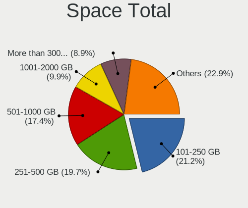
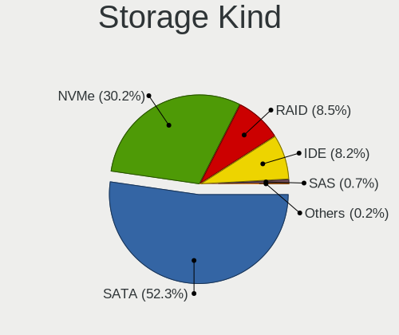
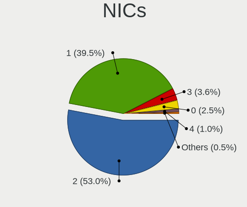

Linux in USA - Tested Hardware & Statistics
-------------------------------------------

A project to collect tested hardware configurations for Linux in USA.

Anyone can contribute to this report by the [hw-probe](https://github.com/linuxhw/hw-probe) tool:

    sudo -E hw-probe -all -upload

Please contribute! Especially if your hardware is rare.

This is a report for all computer types. See also reports for [desktops](/Location/USA/Desktop/README.md) and [notebooks](/Location/USA/Notebook/README.md).

Contents
--------

* [ Test Cases ](#test-cases)

* [ System ](#system)
  - [ OS                       ](#os)
  - [ OS Family                ](#os-family)
  - [ Kernel                   ](#kernel)
  - [ Kernel Family            ](#kernel-family)
  - [ Kernel Major Ver.        ](#kernel-major-ver)
  - [ Arch                     ](#arch)
  - [ DE                       ](#de)
  - [ Display Server           ](#display-server)
  - [ Display Manager          ](#display-manager)
  - [ OS Lang                  ](#os-lang)
  - [ Boot Mode                ](#boot-mode)
  - [ Filesystem               ](#filesystem)
  - [ Part. scheme             ](#part-scheme)
  - [ Dual Boot with Linux/BSD ](#dual-boot-with-linuxbsd)
  - [ Dual Boot (Win)          ](#dual-boot-win)

* [ Board ](#board)
  - [ Vendor                   ](#vendor)
  - [ Model                    ](#model)
  - [ Model Family             ](#model-family)
  - [ MFG Year                 ](#mfg-year)
  - [ Form Factor              ](#form-factor)
  - [ Secure Boot              ](#secure-boot)
  - [ Coreboot                 ](#coreboot)
  - [ RAM Size                 ](#ram-size)
  - [ RAM Used                 ](#ram-used)
  - [ Total Drives             ](#total-drives)
  - [ Has CD-ROM               ](#has-cd-rom)
  - [ Has Ethernet             ](#has-ethernet)
  - [ Has WiFi                 ](#has-wifi)
  - [ Has Bluetooth            ](#has-bluetooth)

* [ Location ](#location)
  - [ Country                  ](#country)
  - [ City                     ](#city)

* [ Drives ](#drives)
  - [ Drive Vendor             ](#drive-vendor)
  - [ Drive Model              ](#drive-model)
  - [ HDD Vendor               ](#hdd-vendor)
  - [ SSD Vendor               ](#ssd-vendor)
  - [ Drive Kind               ](#drive-kind)
  - [ Drive Connector          ](#drive-connector)
  - [ Drive Size               ](#drive-size)
  - [ Space Total              ](#space-total)
  - [ Space Used               ](#space-used)
  - [ Malfunc. Drives          ](#malfunc-drives)
  - [ Malfunc. Drive Vendor    ](#malfunc-drive-vendor)
  - [ Malfunc. HDD Vendor      ](#malfunc-hdd-vendor)
  - [ Malfunc. Drive Kind      ](#malfunc-drive-kind)
  - [ Failed Drives            ](#failed-drives)
  - [ Failed Drive Vendor      ](#failed-drive-vendor)
  - [ Drive Status             ](#drive-status)

* [ Storage controller ](#storage-controller)
  - [ Storage Vendor           ](#storage-vendor)
  - [ Storage Model            ](#storage-model)
  - [ Storage Kind             ](#storage-kind)

* [ Processor ](#processor)
  - [ CPU Vendor               ](#cpu-vendor)
  - [ CPU Model                ](#cpu-model)
  - [ CPU Model Family         ](#cpu-model-family)
  - [ CPU Cores                ](#cpu-cores)
  - [ CPU Sockets              ](#cpu-sockets)
  - [ CPU Threads              ](#cpu-threads)
  - [ CPU Op-Modes             ](#cpu-op-modes)
  - [ CPU Microcode            ](#cpu-microcode)
  - [ CPU Microarch            ](#cpu-microarch)

* [ Graphics ](#graphics)
  - [ GPU Vendor               ](#gpu-vendor)
  - [ GPU Model                ](#gpu-model)
  - [ GPU Combo                ](#gpu-combo)
  - [ GPU Driver               ](#gpu-driver)
  - [ GPU Memory               ](#gpu-memory)

* [ Monitor ](#monitor)
  - [ Monitor Vendor           ](#monitor-vendor)
  - [ Monitor Model            ](#monitor-model)
  - [ Monitor Resolution       ](#monitor-resolution)
  - [ Monitor Diagonal         ](#monitor-diagonal)
  - [ Monitor Width            ](#monitor-width)
  - [ Aspect Ratio             ](#aspect-ratio)
  - [ Monitor Area             ](#monitor-area)
  - [ Pixel Density            ](#pixel-density)
  - [ Multiple Monitors        ](#multiple-monitors)

* [ Network ](#network)
  - [ Net Controller Vendor    ](#net-controller-vendor)
  - [ Net Controller Model     ](#net-controller-model)
  - [ Wireless Vendor          ](#wireless-vendor)
  - [ Wireless Model           ](#wireless-model)
  - [ Ethernet Vendor          ](#ethernet-vendor)
  - [ Ethernet Model           ](#ethernet-model)
  - [ Net Controller Kind      ](#net-controller-kind)
  - [ Used Controller          ](#used-controller)
  - [ NICs                     ](#nics)
  - [ IPv6                     ](#ipv6)

* [ Bluetooth ](#bluetooth)
  - [ Bluetooth Vendor         ](#bluetooth-vendor)
  - [ Bluetooth Model          ](#bluetooth-model)

* [ Sound ](#sound)
  - [ Sound Vendor             ](#sound-vendor)
  - [ Sound Model              ](#sound-model)

* [ Memory ](#memory)
  - [ Memory Vendor            ](#memory-vendor)
  - [ Memory Model             ](#memory-model)
  - [ Memory Kind              ](#memory-kind)
  - [ Memory Form Factor       ](#memory-form-factor)
  - [ Memory Size              ](#memory-size)
  - [ Memory Speed             ](#memory-speed)

* [ Printers & scanners ](#printers--scanners)
  - [ Printer Vendor           ](#printer-vendor)
  - [ Printer Model            ](#printer-model)
  - [ Scanner Vendor           ](#scanner-vendor)
  - [ Scanner Model            ](#scanner-model)

* [ Camera ](#camera)
  - [ Camera Vendor            ](#camera-vendor)
  - [ Camera Model             ](#camera-model)

* [ Security ](#security)
  - [ Fingerprint Vendor       ](#fingerprint-vendor)
  - [ Fingerprint Model        ](#fingerprint-model)
  - [ Chipcard Vendor          ](#chipcard-vendor)
  - [ Chipcard Model           ](#chipcard-model)

* [ Unsupported ](#unsupported)
  - [ Unsupported Devices      ](#unsupported-devices)
  - [ Unsupported Device Types ](#unsupported-device-types)

Test Cases
----------

Total: 36869

| Vendor        | Model                       | Form-Factor | Probe                                                      | Date         |
|---------------|-----------------------------|-------------|------------------------------------------------------------|--------------|
| ASUSTek       | ROG STRIX B450-F GAMING     | Desktop     | [ba5b0b9620](https://linux-hardware.org/?probe=ba5b0b9620) | Aug 01, 2022 |
| Alienware     | 04VWF2 A02                  | Desktop     | [a877f0aa97](https://linux-hardware.org/?probe=a877f0aa97) | Aug 01, 2022 |
| ASUSTek       | ROG Maximus Z690 EXTREME    | Desktop     | [effa59ed64](https://linux-hardware.org/?probe=effa59ed64) | Aug 01, 2022 |
| HP            | Stream Laptop 14-ds0xxx     | Notebook    | [a008ad925d](https://linux-hardware.org/?probe=a008ad925d) | Aug 01, 2022 |
| Dell          | Latitude E6500              | Notebook    | [012df8dc46](https://linux-hardware.org/?probe=012df8dc46) | Aug 01, 2022 |
| Dell          | 0P096C A01                  | Desktop     | [11bc1115f2](https://linux-hardware.org/?probe=11bc1115f2) | Aug 01, 2022 |
| Dell          | Latitude E6500              | Notebook    | [5cbd654078](https://linux-hardware.org/?probe=5cbd654078) | Aug 01, 2022 |
| Dell          | Inspiron 13-7378            | Notebook    | [c08447d945](https://linux-hardware.org/?probe=c08447d945) | Aug 01, 2022 |
| ASUSTek       | TUF Gaming B550-PLUS        | Desktop     | [30e0a23365](https://linux-hardware.org/?probe=30e0a23365) | Aug 01, 2022 |
| ASUSTek       | ROG Maximus X CODE          | Desktop     | [e4ec9f34aa](https://linux-hardware.org/?probe=e4ec9f34aa) | Aug 01, 2022 |
| Lenovo        | ThinkPad P40 Yoga 20GRS0... | Convertible | [2f7e6d56ef](https://linux-hardware.org/?probe=2f7e6d56ef) | Aug 01, 2022 |
| HP            | Laptop 15-dw0xxx            | Notebook    | [6f8d2470bd](https://linux-hardware.org/?probe=6f8d2470bd) | Aug 01, 2022 |
| AZW           | Green G2                    | Desktop     | [d2607d160f](https://linux-hardware.org/?probe=d2607d160f) | Aug 01, 2022 |
| MSI           | X570-A PRO                  | Desktop     | [f034a02e69](https://linux-hardware.org/?probe=f034a02e69) | Aug 01, 2022 |
| ASUSTek       | PRIME B550M-A               | Desktop     | [eafb78a31c](https://linux-hardware.org/?probe=eafb78a31c) | Aug 01, 2022 |
| MSI           | B450M BAZOOKA MAX WIFI      | Desktop     | [f57732be64](https://linux-hardware.org/?probe=f57732be64) | Aug 01, 2022 |
| Dell          | Precision M4600             | Notebook    | [8ca47466f0](https://linux-hardware.org/?probe=8ca47466f0) | Aug 01, 2022 |
| Lenovo        | Yoga 9 14ITL5 82BG          | Convertible | [c4e72000cb](https://linux-hardware.org/?probe=c4e72000cb) | Aug 01, 2022 |
| Dell          | Latitude D620               | Notebook    | [f378606941](https://linux-hardware.org/?probe=f378606941) | Aug 01, 2022 |
| MSI           | Z590-A PRO                  | Desktop     | [7051f56dda](https://linux-hardware.org/?probe=7051f56dda) | Aug 01, 2022 |
| Lenovo        | ThinkPad X131e 336799U      | Notebook    | [a06f0caf24](https://linux-hardware.org/?probe=a06f0caf24) | Aug 01, 2022 |
| ASUSTek       | ZenBook UX425QA_UM425QA     | Notebook    | [6e8a2d15be](https://linux-hardware.org/?probe=6e8a2d15be) | Aug 01, 2022 |
| MSI           | Z77A-GD65                   | Desktop     | [fcadad42a5](https://linux-hardware.org/?probe=fcadad42a5) | Aug 01, 2022 |
| Raspberry ... | Raspberry Pi 4 Model B R... | Soc         | [b44bebcab6](https://linux-hardware.org/?probe=b44bebcab6) | Aug 01, 2022 |
| Apple         | MacBookPro9,2               | Notebook    | [5642929fd2](https://linux-hardware.org/?probe=5642929fd2) | Aug 01, 2022 |
| Lenovo        | ThinkPad E555 20DHCTO1WW    | Notebook    | [c376def8c9](https://linux-hardware.org/?probe=c376def8c9) | Aug 01, 2022 |
| HP            | 843F                        | Desktop     | [eeba83fecb](https://linux-hardware.org/?probe=eeba83fecb) | Aug 01, 2022 |
| Dell          | G15 Special Edition 5521    | Notebook    | [c680e6f144](https://linux-hardware.org/?probe=c680e6f144) | Aug 01, 2022 |
| ASUSTek       | ProArt X570-CREATOR WIFI    | Desktop     | [7e6cd7bcb3](https://linux-hardware.org/?probe=7e6cd7bcb3) | Jul 31, 2022 |
| ASUSTek       | M2N-MX SE Plus              | Desktop     | [7a0035ad18](https://linux-hardware.org/?probe=7a0035ad18) | Jul 31, 2022 |
| Razer         | Blade                       | Notebook    | [cc3ce45956](https://linux-hardware.org/?probe=cc3ce45956) | Jul 31, 2022 |
| Pine Micro... | Pine64 PinePhonePro (DT)    | Phone       | [7b62ba2ec4](https://linux-hardware.org/?probe=7b62ba2ec4) | Jul 31, 2022 |
| Gigabyte      | X570 AORUS MASTER           | Desktop     | [c48b2966d6](https://linux-hardware.org/?probe=c48b2966d6) | Jul 31, 2022 |
| Dell          | Inspiron 16 7620 2-in-1     | Convertible | [83a5caa66d](https://linux-hardware.org/?probe=83a5caa66d) | Jul 31, 2022 |
| ASUSTek       | ROG CROSSHAIR VIII HERO     | Desktop     | [2e2f0ef440](https://linux-hardware.org/?probe=2e2f0ef440) | Jul 31, 2022 |
| GPU Compan... | GWTN141-10                  | Notebook    | [d73365fe3e](https://linux-hardware.org/?probe=d73365fe3e) | Jul 31, 2022 |
| HP            | OMEN Notebook               | Notebook    | [a31203500e](https://linux-hardware.org/?probe=a31203500e) | Jul 31, 2022 |
| Apple         | MacBookPro11,5              | Notebook    | [24ccaddbf8](https://linux-hardware.org/?probe=24ccaddbf8) | Jul 31, 2022 |
| HP            | EliteBook 745 G6            | Notebook    | [0bcc9863e3](https://linux-hardware.org/?probe=0bcc9863e3) | Jul 31, 2022 |
| HP            | Stream Laptop 14-cb1xxx     | Notebook    | [1e48a30f97](https://linux-hardware.org/?probe=1e48a30f97) | Jul 31, 2022 |
| MSI           | Z97 PC Mate                 | Desktop     | [73ebbe2902](https://linux-hardware.org/?probe=73ebbe2902) | Jul 31, 2022 |
| MSI           | Z97 PC Mate                 | Desktop     | [22a32957dc](https://linux-hardware.org/?probe=22a32957dc) | Jul 31, 2022 |
| Lenovo        | IdeaPad 110S-11IBR          | Notebook    | [22ac116859](https://linux-hardware.org/?probe=22ac116859) | Jul 31, 2022 |
| Lenovo        | IdeaPad 110S-11IBR          | Notebook    | [02e0db6837](https://linux-hardware.org/?probe=02e0db6837) | Jul 31, 2022 |
| Dell          | Latitude 7480               | Notebook    | [70ee67e43e](https://linux-hardware.org/?probe=70ee67e43e) | Jul 31, 2022 |
| Gigabyte      | Z590 UD AC                  | Desktop     | [12cf4f1c81](https://linux-hardware.org/?probe=12cf4f1c81) | Jul 31, 2022 |
| Lenovo        | ThinkPad E585 20KV000YUS    | Notebook    | [ddb45bfaff](https://linux-hardware.org/?probe=ddb45bfaff) | Jul 31, 2022 |
| Micro Elec... | MG-VCP17I-3080              | Notebook    | [06191acfe0](https://linux-hardware.org/?probe=06191acfe0) | Jul 31, 2022 |
| Google        | Celes                       | Notebook    | [6a4bc65f84](https://linux-hardware.org/?probe=6a4bc65f84) | Jul 31, 2022 |
| HP            | OMEN Notebook               | Notebook    | [74803dd358](https://linux-hardware.org/?probe=74803dd358) | Jul 31, 2022 |
| HP            | ProBook 645 G1              | Notebook    | [f5035ff86e](https://linux-hardware.org/?probe=f5035ff86e) | Jul 31, 2022 |
| ASUSTek       | TUF Gaming X570-PLUS        | Desktop     | [f22250f00c](https://linux-hardware.org/?probe=f22250f00c) | Jul 31, 2022 |
| Fujitsu       | LIFEBOOK T937               | Convertible | [7b4f4fdf8a](https://linux-hardware.org/?probe=7b4f4fdf8a) | Jul 31, 2022 |
| ASUSTek       | TUF Gaming X570-PLUS        | Desktop     | [a0507fae02](https://linux-hardware.org/?probe=a0507fae02) | Jul 31, 2022 |
| ASUSTek       | PRIME X370-PRO              | Desktop     | [d8bfe4a00b](https://linux-hardware.org/?probe=d8bfe4a00b) | Jul 31, 2022 |
| HP            | Laptop 15-dy2xxx            | Notebook    | [6fe07f99fd](https://linux-hardware.org/?probe=6fe07f99fd) | Jul 31, 2022 |
| ASUSTek       | PRIME X370-PRO              | Desktop     | [0f72d43717](https://linux-hardware.org/?probe=0f72d43717) | Jul 31, 2022 |
| Google        | Cyan                        | Notebook    | [34f759ebd1](https://linux-hardware.org/?probe=34f759ebd1) | Jul 31, 2022 |
| Apple         | MacBookPro9,2               | Notebook    | [e57b854aeb](https://linux-hardware.org/?probe=e57b854aeb) | Jul 31, 2022 |
| Apple         | Mac-27ADBB7B4CEE8E61 iMa... | All in one  | [6699e8b6ea](https://linux-hardware.org/?probe=6699e8b6ea) | Jul 31, 2022 |
| Dell          | 0H0P0M A00                  | Desktop     | [5c66e9d8bf](https://linux-hardware.org/?probe=5c66e9d8bf) | Jul 31, 2022 |
| Lenovo        | ThinkPad X270 W10DG 20K6... | Notebook    | [dd7a9dcb05](https://linux-hardware.org/?probe=dd7a9dcb05) | Jul 31, 2022 |
| Acer          | Aspire X1420G               | Desktop     | [7be7ab2e7e](https://linux-hardware.org/?probe=7be7ab2e7e) | Jul 31, 2022 |
| HP            | EliteBook 850 G6            | Notebook    | [1dca756b58](https://linux-hardware.org/?probe=1dca756b58) | Jul 31, 2022 |
| HP            | Pavilion TS 14 Sleekbook    | Notebook    | [9264052a8c](https://linux-hardware.org/?probe=9264052a8c) | Jul 31, 2022 |
| ASUSTek       | ROG STRIX Z390-E GAMING     | Desktop     | [cb7c9442d6](https://linux-hardware.org/?probe=cb7c9442d6) | Jul 31, 2022 |
| Dell          | 0KWVT8 A03                  | Desktop     | [cdca6713e9](https://linux-hardware.org/?probe=cdca6713e9) | Jul 31, 2022 |
| Lenovo        | ThinkPad X270 W10DG 20K6... | Notebook    | [4b9354d287](https://linux-hardware.org/?probe=4b9354d287) | Jul 31, 2022 |
| Dell          | 0KWVT8 A03                  | Desktop     | [1444843fcd](https://linux-hardware.org/?probe=1444843fcd) | Jul 31, 2022 |
| Google        | Celes                       | Notebook    | [fae813e4dc](https://linux-hardware.org/?probe=fae813e4dc) | Jul 31, 2022 |
| Lenovo        | IdeaPad Z570 1024AMU        | Notebook    | [3d5ec8319b](https://linux-hardware.org/?probe=3d5ec8319b) | Jul 31, 2022 |
| ASUSTek       | ROG STRIX B550-F GAMING     | Desktop     | [5a31407c67](https://linux-hardware.org/?probe=5a31407c67) | Jul 31, 2022 |
| Acer          | Nitro AN515-43              | Notebook    | [79117d81e0](https://linux-hardware.org/?probe=79117d81e0) | Jul 31, 2022 |
| HP            | 86EE                        | All in one  | [12c8904699](https://linux-hardware.org/?probe=12c8904699) | Jul 31, 2022 |
| Lenovo        | ThinkPad W500 406132U       | Notebook    | [6f403cb15a](https://linux-hardware.org/?probe=6f403cb15a) | Jul 30, 2022 |
| ASUSTek       | PRIME B550M-A               | Desktop     | [0709f2eed9](https://linux-hardware.org/?probe=0709f2eed9) | Jul 30, 2022 |
| ASUSTek       | Z97-A-USB31                 | Desktop     | [25db3983fe](https://linux-hardware.org/?probe=25db3983fe) | Jul 30, 2022 |
| Acer          | Aspire C27-962              | All in one  | [f8a944df6f](https://linux-hardware.org/?probe=f8a944df6f) | Jul 30, 2022 |
| MSI           | MAG B550M MORTAR            | Desktop     | [8614c5b8df](https://linux-hardware.org/?probe=8614c5b8df) | Jul 30, 2022 |
| ASUSTek       | ROG STRIX X370-F GAMING     | Desktop     | [b0265ffd70](https://linux-hardware.org/?probe=b0265ffd70) | Jul 30, 2022 |
| Toshiba       | Satellite C75D-C            | Notebook    | [f4a9c3bc7f](https://linux-hardware.org/?probe=f4a9c3bc7f) | Jul 30, 2022 |
| Dell          | XPS 13 9380                 | Notebook    | [7463861dcf](https://linux-hardware.org/?probe=7463861dcf) | Jul 30, 2022 |
| Toshiba       | Satellite C75D-C            | Notebook    | [f017593574](https://linux-hardware.org/?probe=f017593574) | Jul 30, 2022 |
| ASUSTek       | ROG STRIX X370-F GAMING     | Desktop     | [af062992d8](https://linux-hardware.org/?probe=af062992d8) | Jul 30, 2022 |
| Supermicro    | C7Q67 V1.01                 | Desktop     | [15508d1eff](https://linux-hardware.org/?probe=15508d1eff) | Jul 30, 2022 |
| ASUSTek       | Z170-A                      | Desktop     | [4847725026](https://linux-hardware.org/?probe=4847725026) | Jul 30, 2022 |
| Gigabyte      | X570 AORUS MASTER           | Desktop     | [3f20f89397](https://linux-hardware.org/?probe=3f20f89397) | Jul 30, 2022 |
| Framework     | Laptop                      | Notebook    | [426cf376b2](https://linux-hardware.org/?probe=426cf376b2) | Jul 30, 2022 |
| Dell          | Latitude E7450              | Notebook    | [894a489a03](https://linux-hardware.org/?probe=894a489a03) | Jul 30, 2022 |
| Dell          | Latitude E7450              | Notebook    | [268b4ca289](https://linux-hardware.org/?probe=268b4ca289) | Jul 30, 2022 |
| ASUSTek       | VivoBook_ASUSLaptop TP40... | Convertible | [04537652c1](https://linux-hardware.org/?probe=04537652c1) | Jul 30, 2022 |
| Acer          | Nitro AN515-55              | Notebook    | [3b08b42260](https://linux-hardware.org/?probe=3b08b42260) | Jul 30, 2022 |
| Dell          | Inspiron 5520               | Notebook    | [a4baade53f](https://linux-hardware.org/?probe=a4baade53f) | Jul 30, 2022 |
| Apple         | MacBookAir7,2               | Notebook    | [301ad5e148](https://linux-hardware.org/?probe=301ad5e148) | Jul 30, 2022 |
| Lenovo        | IdeaPad Y470 0855           | Notebook    | [395d0c25d7](https://linux-hardware.org/?probe=395d0c25d7) | Jul 30, 2022 |
| Dell          | Inspiron 7577               | Notebook    | [a2909a87b1](https://linux-hardware.org/?probe=a2909a87b1) | Jul 30, 2022 |
| Apple         | MacBookPro11,5              | Notebook    | [04487d99ff](https://linux-hardware.org/?probe=04487d99ff) | Jul 30, 2022 |
| Dell          | Inspiron N4010              | Notebook    | [7589775fb4](https://linux-hardware.org/?probe=7589775fb4) | Jul 30, 2022 |
| Gateway       | DX4860                      | Desktop     | [279b6793e4](https://linux-hardware.org/?probe=279b6793e4) | Jul 30, 2022 |
| Raspberry ... | Raspberry Pi 3 Model B R... | Soc         | [8b1abf25b1](https://linux-hardware.org/?probe=8b1abf25b1) | Jul 30, 2022 |
| ASUSTek       | VivoBook_ASUSLaptop X512... | Notebook    | [320bc76144](https://linux-hardware.org/?probe=320bc76144) | Jul 30, 2022 |
| Gateway       | DX4860                      | Desktop     | [fec12bcbe9](https://linux-hardware.org/?probe=fec12bcbe9) | Jul 30, 2022 |
| Lenovo        | Bantry CRB SDK0J40709 WI... | Desktop     | [7d5090c75c](https://linux-hardware.org/?probe=7d5090c75c) | Jul 30, 2022 |
| Google        | Auron_Paine                 | Notebook    | [0ac60b52f1](https://linux-hardware.org/?probe=0ac60b52f1) | Jul 30, 2022 |
| ByteSpeed     | Atlas 157Q                  | Notebook    | [4765148a7b](https://linux-hardware.org/?probe=4765148a7b) | Jul 30, 2022 |
| Lenovo        | G570 4334                   | Notebook    | [a29c1c816a](https://linux-hardware.org/?probe=a29c1c816a) | Jul 30, 2022 |
| Lenovo        | ThinkPad P53 20QN003TUS     | Notebook    | [bf8e504209](https://linux-hardware.org/?probe=bf8e504209) | Jul 30, 2022 |
| HP            | 2215                        | Desktop     | [6e351e6da3](https://linux-hardware.org/?probe=6e351e6da3) | Jul 30, 2022 |
| Acer          | Peppy                       | Notebook    | [d8f9cbdb86](https://linux-hardware.org/?probe=d8f9cbdb86) | Jul 30, 2022 |
| ASUSTek       | VivoBook_ASUSLaptop TP40... | Convertible | [a1a557ec82](https://linux-hardware.org/?probe=a1a557ec82) | Jul 30, 2022 |
| Gateway       | SX2855                      | Desktop     | [a896e3b0f7](https://linux-hardware.org/?probe=a896e3b0f7) | Jul 30, 2022 |
| Acer          | Peppy                       | Notebook    | [6f4ce7e1f9](https://linux-hardware.org/?probe=6f4ce7e1f9) | Jul 30, 2022 |
| Apple         | Mac-F2268CC8                | All in one  | [c8401bd031](https://linux-hardware.org/?probe=c8401bd031) | Jul 30, 2022 |
| Apple         | MacBookPro9,2               | Notebook    | [e6d691a331](https://linux-hardware.org/?probe=e6d691a331) | Jul 30, 2022 |
| Alienware     | 0PGRP5 A01                  | Desktop     | [7c0915ec41](https://linux-hardware.org/?probe=7c0915ec41) | Jul 30, 2022 |
| Dell          | Latitude E6520              | Notebook    | [0a7e1cdcaf](https://linux-hardware.org/?probe=0a7e1cdcaf) | Jul 30, 2022 |
| Valve         | Jupiter                     | Notebook    | [ee3b662083](https://linux-hardware.org/?probe=ee3b662083) | Jul 30, 2022 |
| Dell          | 0VHXCD A01                  | Desktop     | [cbc63a208c](https://linux-hardware.org/?probe=cbc63a208c) | Jul 30, 2022 |
| HP            | OMEN by Laptop 15-dh1xxx    | Notebook    | [b44feede78](https://linux-hardware.org/?probe=b44feede78) | Jul 30, 2022 |
| Lenovo        | ThinkPad T15 Gen 1 20S60... | Notebook    | [9b362907fc](https://linux-hardware.org/?probe=9b362907fc) | Jul 30, 2022 |
| Lenovo        | ThinkPad T15 Gen 1 20S60... | Notebook    | [61aed5ab55](https://linux-hardware.org/?probe=61aed5ab55) | Jul 30, 2022 |
| MSI           | GF63 8RD                    | Notebook    | [fdb72c3ec3](https://linux-hardware.org/?probe=fdb72c3ec3) | Jul 29, 2022 |
| Apple         | MacBookPro14,1              | Notebook    | [a6cba0b6de](https://linux-hardware.org/?probe=a6cba0b6de) | Jul 29, 2022 |
| HP            | 2ADC                        | Desktop     | [86608333bc](https://linux-hardware.org/?probe=86608333bc) | Jul 29, 2022 |
| Gigabyte      | X570 AORUS MASTER           | Desktop     | [87e132446d](https://linux-hardware.org/?probe=87e132446d) | Jul 29, 2022 |
| Intel         | NUC11TNBv7 M76890-405       | Mini pc     | [9bc1ed9531](https://linux-hardware.org/?probe=9bc1ed9531) | Jul 29, 2022 |
| Apple         | MacBookPro11,5              | Notebook    | [1b94bd5797](https://linux-hardware.org/?probe=1b94bd5797) | Jul 29, 2022 |
| Dell          | Inspiron 3793               | Notebook    | [15f2e25089](https://linux-hardware.org/?probe=15f2e25089) | Jul 29, 2022 |
| Acer          | Aspire 5520                 | Notebook    | [d49c27a24a](https://linux-hardware.org/?probe=d49c27a24a) | Jul 29, 2022 |
| ASRock        | X470 Gaming-ITX/ac          | Desktop     | [1fa7b63218](https://linux-hardware.org/?probe=1fa7b63218) | Jul 29, 2022 |
| HP            | 2B28                        | Desktop     | [059ba6d074](https://linux-hardware.org/?probe=059ba6d074) | Jul 29, 2022 |
| AZW           | Green G2                    | Desktop     | [755b99362f](https://linux-hardware.org/?probe=755b99362f) | Jul 29, 2022 |
| HP            | Victus by Gaming Laptop ... | Notebook    | [8d729c2a6b](https://linux-hardware.org/?probe=8d729c2a6b) | Jul 29, 2022 |
| Dell          | Inspiron MM061              | Notebook    | [6049b93435](https://linux-hardware.org/?probe=6049b93435) | Jul 29, 2022 |
| Valve         | Jupiter                     | Notebook    | [225e2c825e](https://linux-hardware.org/?probe=225e2c825e) | Jul 29, 2022 |
| Lenovo        | ThinkPad P53 20QN003TUS     | Notebook    | [cf54e60bf1](https://linux-hardware.org/?probe=cf54e60bf1) | Jul 29, 2022 |
| HP            | 158A                        | Desktop     | [788844c3df](https://linux-hardware.org/?probe=788844c3df) | Jul 29, 2022 |
| HP            | Pavilion Laptop 15-eh1xx... | Notebook    | [53a117cd64](https://linux-hardware.org/?probe=53a117cd64) | Jul 29, 2022 |
| Dell          | XPS 15 9560                 | Notebook    | [40ba0a0b07](https://linux-hardware.org/?probe=40ba0a0b07) | Jul 29, 2022 |
| HP            | Pavilion Laptop 15-eh1xx... | Notebook    | [e943a26cec](https://linux-hardware.org/?probe=e943a26cec) | Jul 29, 2022 |
| ASUSTek       | TUF Gaming X570-PLUS        | Desktop     | [8345e7dd74](https://linux-hardware.org/?probe=8345e7dd74) | Jul 29, 2022 |
| Lenovo        | ThinkPad T14s Gen 3 21CQ... | Notebook    | [3986399fe4](https://linux-hardware.org/?probe=3986399fe4) | Jul 29, 2022 |
| Framework     | Laptop                      | Notebook    | [626e3266c7](https://linux-hardware.org/?probe=626e3266c7) | Jul 29, 2022 |
| ASUSTek       | SABERTOOTH X58              | Desktop     | [7b9ea25abf](https://linux-hardware.org/?probe=7b9ea25abf) | Jul 29, 2022 |
| Lenovo        | ThinkPad E565 20EY000CUS    | Notebook    | [f8e7f7acc4](https://linux-hardware.org/?probe=f8e7f7acc4) | Jul 29, 2022 |
| Alienware     | 02XRCM A00                  | Desktop     | [622aa6421e](https://linux-hardware.org/?probe=622aa6421e) | Jul 29, 2022 |
| Alienware     | 02XRCM A00                  | Desktop     | [d8c0404bad](https://linux-hardware.org/?probe=d8c0404bad) | Jul 29, 2022 |
| ASUSTek       | M5A97 R2.0                  | Desktop     | [3aa2ff8224](https://linux-hardware.org/?probe=3aa2ff8224) | Jul 29, 2022 |
| GPU Compan... | GWTN141-10                  | Notebook    | [e392f0348d](https://linux-hardware.org/?probe=e392f0348d) | Jul 29, 2022 |
| Dell          | 0UW457 A03                  | Desktop     | [b09d9907b9](https://linux-hardware.org/?probe=b09d9907b9) | Jul 29, 2022 |
| Dell          | 0KP561                      | Desktop     | [1817f68d31](https://linux-hardware.org/?probe=1817f68d31) | Jul 29, 2022 |
| Lenovo        | ThinkPad X240 20AMS28505    | Notebook    | [f159c45adf](https://linux-hardware.org/?probe=f159c45adf) | Jul 29, 2022 |
| ASRock        | X570 Steel Legend WiFi a... | Desktop     | [ceb09e103c](https://linux-hardware.org/?probe=ceb09e103c) | Jul 29, 2022 |
| Google        | Candy                       | Notebook    | [cba2906cfd](https://linux-hardware.org/?probe=cba2906cfd) | Jul 29, 2022 |
| Dell          | 0M5DCD A00                  | Desktop     | [4da0ebef78](https://linux-hardware.org/?probe=4da0ebef78) | Jul 29, 2022 |
| ASUSTek       | VivoBook_ASUSLaptop X412... | Notebook    | [4bb1d70cf2](https://linux-hardware.org/?probe=4bb1d70cf2) | Jul 29, 2022 |
| ASUSTek       | M5A78L-M/USB3               | Desktop     | [6888dc4f99](https://linux-hardware.org/?probe=6888dc4f99) | Jul 29, 2022 |
| ASUSTek       | ROG Zephyrus G14 GA401IV... | Notebook    | [46bb82fece](https://linux-hardware.org/?probe=46bb82fece) | Jul 29, 2022 |
| HP            | 3647h                       | Desktop     | [321f75b5a1](https://linux-hardware.org/?probe=321f75b5a1) | Jul 29, 2022 |
| HP            | 83E9                        | Desktop     | [4a551e605d](https://linux-hardware.org/?probe=4a551e605d) | Jul 29, 2022 |
| GPU Compan... | GWTN141-10                  | Notebook    | [dea75365be](https://linux-hardware.org/?probe=dea75365be) | Jul 29, 2022 |
| Dell          | Precision 7510              | Notebook    | [fb6266c1dc](https://linux-hardware.org/?probe=fb6266c1dc) | Jul 29, 2022 |
| AZW           | Green G2                    | Desktop     | [c3e6905701](https://linux-hardware.org/?probe=c3e6905701) | Jul 29, 2022 |
| AZW           | Green G2                    | Desktop     | [acf3761817](https://linux-hardware.org/?probe=acf3761817) | Jul 29, 2022 |
| ASRock        | X570 Steel Legend           | Desktop     | [826b96e8d1](https://linux-hardware.org/?probe=826b96e8d1) | Jul 29, 2022 |
| ASUSTek       | X551MA                      | Notebook    | [668a02296d](https://linux-hardware.org/?probe=668a02296d) | Jul 28, 2022 |
| Dell          | Inspiron 7348               | Notebook    | [5d6e6f5c03](https://linux-hardware.org/?probe=5d6e6f5c03) | Jul 28, 2022 |
| ASUSTek       | VivoBook_ASUSLaptop X515... | Notebook    | [21fc33de37](https://linux-hardware.org/?probe=21fc33de37) | Jul 28, 2022 |
| Acer          | Aspire A515-43              | Notebook    | [230cf1bf3d](https://linux-hardware.org/?probe=230cf1bf3d) | Jul 28, 2022 |
| MSI           | MEG X570 ACE                | Desktop     | [c2741e6f43](https://linux-hardware.org/?probe=c2741e6f43) | Jul 28, 2022 |
| ASRock        | Z97 Anniversary             | Desktop     | [768b11cbe4](https://linux-hardware.org/?probe=768b11cbe4) | Jul 28, 2022 |
| HP            | OMEN by Laptop 15-dc0xxx    | Notebook    | [ec8af984d2](https://linux-hardware.org/?probe=ec8af984d2) | Jul 28, 2022 |
| ASUSTek       | ROG STRIX B450-F GAMING     | Desktop     | [e3dc0a4c49](https://linux-hardware.org/?probe=e3dc0a4c49) | Jul 28, 2022 |
| Dell          | Inspiron 3542               | Notebook    | [d0ff2340b1](https://linux-hardware.org/?probe=d0ff2340b1) | Jul 28, 2022 |
| Dell          | Inspiron 16 5625            | Notebook    | [7310305d22](https://linux-hardware.org/?probe=7310305d22) | Jul 28, 2022 |
| Panasonic     | CF-31-5                     | Notebook    | [65cb399ac7](https://linux-hardware.org/?probe=65cb399ac7) | Jul 28, 2022 |
| HP            | Laptop 15-da0xxx            | Notebook    | [76490ed70b](https://linux-hardware.org/?probe=76490ed70b) | Jul 28, 2022 |
| HP            | 8459                        | Desktop     | [a1d6ae45cb](https://linux-hardware.org/?probe=a1d6ae45cb) | Jul 28, 2022 |
| Notebook      | NH5x_NH7xHP                 | Notebook    | [e4e9ceb6ed](https://linux-hardware.org/?probe=e4e9ceb6ed) | Jul 28, 2022 |
| Intel         | NUC7i5DNB J57626-509        | Mini pc     | [29c75103cc](https://linux-hardware.org/?probe=29c75103cc) | Jul 28, 2022 |
| Dell          | 0HY9JP A00                  | Desktop     | [97a5d12c90](https://linux-hardware.org/?probe=97a5d12c90) | Jul 28, 2022 |
| Dell          | Latitude E6400              | Notebook    | [1c067a436c](https://linux-hardware.org/?probe=1c067a436c) | Jul 28, 2022 |
| Lenovo        | IdeaPad 5 Pro 16ARH7 82S... | Notebook    | [0342de9530](https://linux-hardware.org/?probe=0342de9530) | Jul 28, 2022 |
| MSI           | C236A WORKSTATION           | Desktop     | [d38b99326b](https://linux-hardware.org/?probe=d38b99326b) | Jul 28, 2022 |
| eMachines     | EL1360G                     | Desktop     | [47cb733920](https://linux-hardware.org/?probe=47cb733920) | Jul 28, 2022 |
| ASUSTek       | WS Z390 PRO                 | Desktop     | [256172b01e](https://linux-hardware.org/?probe=256172b01e) | Jul 28, 2022 |
| HP            | OMEN by Laptop 15-dc0xxx    | Notebook    | [cd00cf1bbe](https://linux-hardware.org/?probe=cd00cf1bbe) | Jul 28, 2022 |
| ASRock        | 970M Pro3                   | Desktop     | [19ecff6fcc](https://linux-hardware.org/?probe=19ecff6fcc) | Jul 28, 2022 |
| MSI           | Z97 GAMING 5                | Desktop     | [a834f9f0ed](https://linux-hardware.org/?probe=a834f9f0ed) | Jul 28, 2022 |
| HP            | ProBook 645 G1              | Notebook    | [5e19387465](https://linux-hardware.org/?probe=5e19387465) | Jul 28, 2022 |
| HP            | ProBook 645 G1              | Notebook    | [8774828c9b](https://linux-hardware.org/?probe=8774828c9b) | Jul 28, 2022 |
| Dell          | Latitude E6510              | Notebook    | [8a1494370b](https://linux-hardware.org/?probe=8a1494370b) | Jul 28, 2022 |
| Lenovo        | IdeaPad 5 Pro 16ARH7 82S... | Notebook    | [e3c3370769](https://linux-hardware.org/?probe=e3c3370769) | Jul 28, 2022 |
| Apple         | MacBookPro11,3              | Notebook    | [e4d5f5d092](https://linux-hardware.org/?probe=e4d5f5d092) | Jul 28, 2022 |
| GPU Compan... | GWTN141-10                  | Notebook    | [acc16b54d2](https://linux-hardware.org/?probe=acc16b54d2) | Jul 28, 2022 |
| GPU Compan... | GWTN141-10                  | Notebook    | [38c3ffc86a](https://linux-hardware.org/?probe=38c3ffc86a) | Jul 28, 2022 |
| ASUSTek       | PRIME Z370-P                | Desktop     | [6d475b6323](https://linux-hardware.org/?probe=6d475b6323) | Jul 28, 2022 |
| ASRock        | B450M Steel Legend          | Desktop     | [814a5e0ed8](https://linux-hardware.org/?probe=814a5e0ed8) | Jul 28, 2022 |
| Dell          | Inspiron 7706 2n1           | Convertible | [8338ef5b67](https://linux-hardware.org/?probe=8338ef5b67) | Jul 28, 2022 |
| Foxconn       | ALOE X3                     | Desktop     | [dd3dd847b8](https://linux-hardware.org/?probe=dd3dd847b8) | Jul 28, 2022 |
| Dell          | Inspiron 7706 2n1           | Convertible | [9cc862e267](https://linux-hardware.org/?probe=9cc862e267) | Jul 28, 2022 |
| HP            | ProLiant DL360 G5           | Server      | [bc1ce319a3](https://linux-hardware.org/?probe=bc1ce319a3) | Jul 28, 2022 |
| Lenovo        | ThinkPad X230 2325TXV       | Notebook    | [2c5c6ba837](https://linux-hardware.org/?probe=2c5c6ba837) | Jul 28, 2022 |
| HP            | Laptop 17z-ca300            | Notebook    | [e2dd650164](https://linux-hardware.org/?probe=e2dd650164) | Jul 28, 2022 |
| Lenovo        | IdeaPadFlex 5 14ITL05 82... | Convertible | [85b1941239](https://linux-hardware.org/?probe=85b1941239) | Jul 28, 2022 |
| Toshiba       | Satellite C655              | Notebook    | [2a2e3da71d](https://linux-hardware.org/?probe=2a2e3da71d) | Jul 28, 2022 |
| ASUSTek       | M5A97 LE R2.0               | Desktop     | [24e94dd87e](https://linux-hardware.org/?probe=24e94dd87e) | Jul 28, 2022 |
| ASUSTek       | ROG STRIX B450-F GAMING     | Desktop     | [36e0686495](https://linux-hardware.org/?probe=36e0686495) | Jul 28, 2022 |
| Lenovo        | IdeaPadFlex 5 14ITL05 82... | Convertible | [a2aacf1d30](https://linux-hardware.org/?probe=a2aacf1d30) | Jul 28, 2022 |
| Apple         | MacBookAir7,2               | Notebook    | [b547e23eb1](https://linux-hardware.org/?probe=b547e23eb1) | Jul 28, 2022 |
| Lenovo        | ThinkPad P14s Gen 1 20Y1... | Notebook    | [238fa8aa34](https://linux-hardware.org/?probe=238fa8aa34) | Jul 28, 2022 |
| Lenovo        | 36EB SDK0J40700 WIN 3258... | Desktop     | [0068653ca3](https://linux-hardware.org/?probe=0068653ca3) | Jul 28, 2022 |
| Dell          | Latitude E6540              | Notebook    | [40b854996f](https://linux-hardware.org/?probe=40b854996f) | Jul 28, 2022 |
| Dell          | 0P301D A00                  | Desktop     | [48d1ed3099](https://linux-hardware.org/?probe=48d1ed3099) | Jul 28, 2022 |
| Lenovo        | ThinkPad T420s 417152U      | Notebook    | [c8edf4d8b4](https://linux-hardware.org/?probe=c8edf4d8b4) | Jul 28, 2022 |
| Dell          | Inspiron 5735               | Notebook    | [76b13b0dc6](https://linux-hardware.org/?probe=76b13b0dc6) | Jul 28, 2022 |
| Acer          | Aspire 5253                 | Notebook    | [ab25bc90e6](https://linux-hardware.org/?probe=ab25bc90e6) | Jul 28, 2022 |
| HP            | OMEN by Laptop 15-ce0xx     | Notebook    | [c884d7548c](https://linux-hardware.org/?probe=c884d7548c) | Jul 28, 2022 |
| Lenovo        | MAHOBAY 0B98401 PRO         | Desktop     | [d64175b64b](https://linux-hardware.org/?probe=d64175b64b) | Jul 28, 2022 |
| HP            | 806A                        | Desktop     | [6a6df5d868](https://linux-hardware.org/?probe=6a6df5d868) | Jul 28, 2022 |
| ASUSTek       | X750JN                      | Notebook    | [58fe3e4ae8](https://linux-hardware.org/?probe=58fe3e4ae8) | Jul 28, 2022 |
| ASUSTek       | P5QL/EPU                    | Desktop     | [797c3b1dc2](https://linux-hardware.org/?probe=797c3b1dc2) | Jul 28, 2022 |
| Lenovo        | IdeaPad Yoga 13 20175       | Notebook    | [d9a5e0b7e6](https://linux-hardware.org/?probe=d9a5e0b7e6) | Jul 27, 2022 |
| Dell          | XPS 17 9710                 | Notebook    | [6f5c79f0da](https://linux-hardware.org/?probe=6f5c79f0da) | Jul 27, 2022 |
| LG Electro... | 17Z90Q-K.ADC9U1             | Notebook    | [64635e88c9](https://linux-hardware.org/?probe=64635e88c9) | Jul 27, 2022 |
| Dell          | Latitude D830               | Notebook    | [59dd23cfcb](https://linux-hardware.org/?probe=59dd23cfcb) | Jul 27, 2022 |
| ASRock        | X470 Gaming-ITX/ac          | Desktop     | [f8fbf85380](https://linux-hardware.org/?probe=f8fbf85380) | Jul 27, 2022 |
| MSI           | X99S MPOWER                 | Desktop     | [a3c1523b6b](https://linux-hardware.org/?probe=a3c1523b6b) | Jul 27, 2022 |
| Alienware     | 0CPDXD A00                  | Desktop     | [ef82996d48](https://linux-hardware.org/?probe=ef82996d48) | Jul 27, 2022 |
| Acer          | Aspire A517-52              | Notebook    | [dfd7afda26](https://linux-hardware.org/?probe=dfd7afda26) | Jul 27, 2022 |
| Lenovo        | MAHOBAY Win8 STD MM DPK ... | All in one  | [d8cbb25698](https://linux-hardware.org/?probe=d8cbb25698) | Jul 27, 2022 |
| MSI           | 970A-G46                    | Desktop     | [4e5701ab4a](https://linux-hardware.org/?probe=4e5701ab4a) | Jul 27, 2022 |
| Gigabyte      | Z97X-UD3H-BK-CF             | Desktop     | [b25ca31168](https://linux-hardware.org/?probe=b25ca31168) | Jul 27, 2022 |
| ASUSTek       | VivoBook_ASUSLaptop X412... | Notebook    | [e18d9dc7f2](https://linux-hardware.org/?probe=e18d9dc7f2) | Jul 27, 2022 |
| Dell          | XPS 13 9300                 | Notebook    | [8f0daaf341](https://linux-hardware.org/?probe=8f0daaf341) | Jul 27, 2022 |
| Dell          | Latitude E6330              | Notebook    | [5ee8d985ed](https://linux-hardware.org/?probe=5ee8d985ed) | Jul 27, 2022 |
| Lenovo        | Yoga C740-15IML 81TD        | Convertible | [2816cacd1b](https://linux-hardware.org/?probe=2816cacd1b) | Jul 27, 2022 |
| Dell          | 0YF8P5 A00                  | Desktop     | [04ebe8cd88](https://linux-hardware.org/?probe=04ebe8cd88) | Jul 27, 2022 |
| Lenovo        | ThinkPad T430 2347G2U       | Notebook    | [1285768038](https://linux-hardware.org/?probe=1285768038) | Jul 27, 2022 |
| Lenovo        | ThinkPad T430 2347G2U       | Notebook    | [b25d6bf66c](https://linux-hardware.org/?probe=b25d6bf66c) | Jul 27, 2022 |
| Lenovo        | 3717 SDK0J40697 WIN 3305... | Desktop     | [701f519b4c](https://linux-hardware.org/?probe=701f519b4c) | Jul 27, 2022 |
| MSI           | PRO Z690-A DDR4             | Desktop     | [2d81f40aad](https://linux-hardware.org/?probe=2d81f40aad) | Jul 27, 2022 |
| ASUSTek       | PRIME X570-P                | Desktop     | [d6bffa5e5e](https://linux-hardware.org/?probe=d6bffa5e5e) | Jul 27, 2022 |
| Dell          | Latitude E7450              | Notebook    | [4a277d4cee](https://linux-hardware.org/?probe=4a277d4cee) | Jul 27, 2022 |
| HP            | OMEN by Laptop 15-ce0xx     | Notebook    | [8e76bb6095](https://linux-hardware.org/?probe=8e76bb6095) | Jul 27, 2022 |
| Clevo         | M570TU                      | Notebook    | [b1f3c16be7](https://linux-hardware.org/?probe=b1f3c16be7) | Jul 27, 2022 |
| Acer          | Aspire XC-830               | Desktop     | [3f67091cd9](https://linux-hardware.org/?probe=3f67091cd9) | Jul 27, 2022 |
| ASUSTek       | VivoBook_ASUSLaptop X515... | Notebook    | [f7d226a34a](https://linux-hardware.org/?probe=f7d226a34a) | Jul 27, 2022 |
| Valve         | Jupiter                     | Notebook    | [35608b206c](https://linux-hardware.org/?probe=35608b206c) | Jul 27, 2022 |
| ASUSTek       | TUF Z370-PLUS GAMING        | Desktop     | [71f25aa9f5](https://linux-hardware.org/?probe=71f25aa9f5) | Jul 27, 2022 |
| GMKtec        | NucBox5                     | Notebook    | [8ac637f15c](https://linux-hardware.org/?probe=8ac637f15c) | Jul 27, 2022 |
| Dell          | 0NW6H5 A00                  | Desktop     | [b76e9e02fa](https://linux-hardware.org/?probe=b76e9e02fa) | Jul 27, 2022 |
| AZW           | Green G2                    | Desktop     | [16a89e4be5](https://linux-hardware.org/?probe=16a89e4be5) | Jul 27, 2022 |
| Gigabyte      | H81M-HD3                    | Desktop     | [0cfb15d654](https://linux-hardware.org/?probe=0cfb15d654) | Jul 27, 2022 |
| MSI           | Z590 PRO WIFI [CEC]         | Desktop     | [0681d0e31f](https://linux-hardware.org/?probe=0681d0e31f) | Jul 27, 2022 |
| GMKtec        | NucBox                      | Desktop     | [fba899ff7d](https://linux-hardware.org/?probe=fba899ff7d) | Jul 27, 2022 |
| ASUSTek       | X750JN                      | Notebook    | [a4f3fc8ddd](https://linux-hardware.org/?probe=a4f3fc8ddd) | Jul 27, 2022 |
| Dell          | Inspiron 15-3567            | Notebook    | [3e40b1abe6](https://linux-hardware.org/?probe=3e40b1abe6) | Jul 27, 2022 |
| Dell          | 0F896N A02                  | Desktop     | [ede9425ed8](https://linux-hardware.org/?probe=ede9425ed8) | Jul 27, 2022 |
| HP            | Stream Laptop 14-cb1XX      | Notebook    | [f8d4b7a1c8](https://linux-hardware.org/?probe=f8d4b7a1c8) | Jul 27, 2022 |
| Valve         | Jupiter                     | Notebook    | [e35fa6e699](https://linux-hardware.org/?probe=e35fa6e699) | Jul 27, 2022 |
| Acer          | Aspire XC-830               | Desktop     | [21032de7c0](https://linux-hardware.org/?probe=21032de7c0) | Jul 27, 2022 |
| Apple         | MacBookPro11,3              | Notebook    | [664f9fe49b](https://linux-hardware.org/?probe=664f9fe49b) | Jul 27, 2022 |
| HP            | Stream Notebook PC 11       | Notebook    | [e3c8a52e5b](https://linux-hardware.org/?probe=e3c8a52e5b) | Jul 27, 2022 |
| Dell          | Latitude E7240              | Notebook    | [6af993caf7](https://linux-hardware.org/?probe=6af993caf7) | Jul 27, 2022 |
| Valve         | Jupiter                     | Notebook    | [f43cbe28e9](https://linux-hardware.org/?probe=f43cbe28e9) | Jul 27, 2022 |
| HP            | ProLiant DL360 Gen9         | Server      | [7901fea9f3](https://linux-hardware.org/?probe=7901fea9f3) | Jul 27, 2022 |
| HP            | Pavilion dv2                | Notebook    | [1d7f92e6ac](https://linux-hardware.org/?probe=1d7f92e6ac) | Jul 27, 2022 |
| ASUSTek       | M5A97 R2.0                  | Desktop     | [19572ca302](https://linux-hardware.org/?probe=19572ca302) | Jul 27, 2022 |
| HP            | ProLiant DL360 Gen9         | Server      | [520d9f8703](https://linux-hardware.org/?probe=520d9f8703) | Jul 27, 2022 |
| HP            | Pavilion dv6                | Notebook    | [577c3ce56c](https://linux-hardware.org/?probe=577c3ce56c) | Jul 27, 2022 |
| Acer          | Aspire A515-43              | Notebook    | [d378021961](https://linux-hardware.org/?probe=d378021961) | Jul 26, 2022 |
| MSI           | 970A-G43                    | Desktop     | [9095b31f2f](https://linux-hardware.org/?probe=9095b31f2f) | Jul 26, 2022 |
| ASRock        | B550 Phantom Gaming 4/ac    | Desktop     | [0648778462](https://linux-hardware.org/?probe=0648778462) | Jul 26, 2022 |
| ASUSTek       | PRIME X370-PRO              | Desktop     | [ee8688ecdb](https://linux-hardware.org/?probe=ee8688ecdb) | Jul 26, 2022 |
| HP            | Pavilion x360 Convertibl... | Convertible | [015e810904](https://linux-hardware.org/?probe=015e810904) | Jul 26, 2022 |
| Lenovo        | IdeaPad 1 15ALC7 82R4       | Notebook    | [45a7d95010](https://linux-hardware.org/?probe=45a7d95010) | Jul 26, 2022 |
| ASRock        | B550 Phantom Gaming 4/ac    | Desktop     | [1e2e0882a8](https://linux-hardware.org/?probe=1e2e0882a8) | Jul 26, 2022 |
| MSI           | MPG Z390 GAMING PRO CARB... | Desktop     | [dc7eff27cf](https://linux-hardware.org/?probe=dc7eff27cf) | Jul 26, 2022 |
| HP            | OMEN by Laptop 15z-en100    | Notebook    | [d796f6c916](https://linux-hardware.org/?probe=d796f6c916) | Jul 26, 2022 |
| HP            | ProBook 645 G1              | Notebook    | [457c35707a](https://linux-hardware.org/?probe=457c35707a) | Jul 26, 2022 |
| Unknown       | Unknown                     | Notebook    | [03fa847263](https://linux-hardware.org/?probe=03fa847263) | Jul 26, 2022 |
| HP            | Spectre x360 Convertible... | Convertible | [50504c3c58](https://linux-hardware.org/?probe=50504c3c58) | Jul 26, 2022 |
| Pegatron      | Benicia                     | Desktop     | [7b38d2115b](https://linux-hardware.org/?probe=7b38d2115b) | Jul 26, 2022 |
| Lenovo        | ThinkPad P1 Gen 4i 20Y30... | Notebook    | [fda3911bdb](https://linux-hardware.org/?probe=fda3911bdb) | Jul 26, 2022 |
| HP            | Stream Laptop 14-cb1XX      | Notebook    | [d3799adb65](https://linux-hardware.org/?probe=d3799adb65) | Jul 26, 2022 |
| HP            | 8446                        | All in one  | [ad79d02ff6](https://linux-hardware.org/?probe=ad79d02ff6) | Jul 26, 2022 |
| Gigabyte      | B85-HD3                     | Desktop     | [9447f1eb98](https://linux-hardware.org/?probe=9447f1eb98) | Jul 26, 2022 |
| HP            | Laptop 15-da0xxx            | Notebook    | [6967eac391](https://linux-hardware.org/?probe=6967eac391) | Jul 26, 2022 |
| Apple         | Mac-F2268DC8                | All in one  | [bd290ac251](https://linux-hardware.org/?probe=bd290ac251) | Jul 26, 2022 |
| Valve         | Jupiter                     | Notebook    | [d4e4413f9b](https://linux-hardware.org/?probe=d4e4413f9b) | Jul 26, 2022 |
| Acer          | WMCP78M                     | Desktop     | [fa9866b7e5](https://linux-hardware.org/?probe=fa9866b7e5) | Jul 26, 2022 |
| HP            | ENVY x360 2-in-1 Laptop ... | Convertible | [cfb18dd008](https://linux-hardware.org/?probe=cfb18dd008) | Jul 26, 2022 |
| HP            | ProBook 450 G5              | Notebook    | [3aa6e1da26](https://linux-hardware.org/?probe=3aa6e1da26) | Jul 26, 2022 |
| Dell          | Inspiron 1545               | Notebook    | [9ca89e5baa](https://linux-hardware.org/?probe=9ca89e5baa) | Jul 26, 2022 |
| HP            | 8767 A                      | Desktop     | [1f2cb554dc](https://linux-hardware.org/?probe=1f2cb554dc) | Jul 26, 2022 |
| HP            | 339A                        | Desktop     | [39d7b3c457](https://linux-hardware.org/?probe=39d7b3c457) | Jul 26, 2022 |
| Acer          | Aspire XC-830               | Desktop     | [02572035c8](https://linux-hardware.org/?probe=02572035c8) | Jul 26, 2022 |
| ASRock        | Z270 Gaming K4              | Desktop     | [63612e20b4](https://linux-hardware.org/?probe=63612e20b4) | Jul 26, 2022 |
| ASUSTek       | M5A97 R2.0                  | Desktop     | [5795e098d2](https://linux-hardware.org/?probe=5795e098d2) | Jul 26, 2022 |
| HP            | ZBook 15 G2                 | Notebook    | [3aa2fda09a](https://linux-hardware.org/?probe=3aa2fda09a) | Jul 26, 2022 |
| Dell          | Inspiron 13 5310            | Notebook    | [3824fcc8a6](https://linux-hardware.org/?probe=3824fcc8a6) | Jul 26, 2022 |
| Panasonic     | CF-53SJCZYLM                | Notebook    | [188bf4dcb5](https://linux-hardware.org/?probe=188bf4dcb5) | Jul 26, 2022 |
| Dell          | Latitude E6520              | Notebook    | [b7436c1d3d](https://linux-hardware.org/?probe=b7436c1d3d) | Jul 26, 2022 |
| ASUSTek       | PRIME B550M-A               | Desktop     | [8ff77bee59](https://linux-hardware.org/?probe=8ff77bee59) | Jul 26, 2022 |
| Lenovo        | ThinkPad E585 20KV000YUS    | Notebook    | [0c8cde264e](https://linux-hardware.org/?probe=0c8cde264e) | Jul 26, 2022 |
| Valve         | Jupiter                     | Notebook    | [9c34e91c79](https://linux-hardware.org/?probe=9c34e91c79) | Jul 26, 2022 |
| Dell          | 04YP6J A02                  | Desktop     | [8161693c82](https://linux-hardware.org/?probe=8161693c82) | Jul 26, 2022 |
| GPU Compan... | GWNR71517                   | Notebook    | [44ce7e516b](https://linux-hardware.org/?probe=44ce7e516b) | Jul 26, 2022 |
| SLIMBOOK      | PROX14-10                   | Notebook    | [875d1f7812](https://linux-hardware.org/?probe=875d1f7812) | Jul 26, 2022 |
| Dell          | 0X8582                      | Desktop     | [b52bb428f4](https://linux-hardware.org/?probe=b52bb428f4) | Jul 26, 2022 |
| Dell          | 0RW199                      | Desktop     | [ffbc03cebd](https://linux-hardware.org/?probe=ffbc03cebd) | Jul 25, 2022 |
| Pegatron      | 2AE2                        | Desktop     | [772ded1d83](https://linux-hardware.org/?probe=772ded1d83) | Jul 25, 2022 |
| Valve         | Jupiter                     | Notebook    | [b605f923c6](https://linux-hardware.org/?probe=b605f923c6) | Jul 25, 2022 |
| Acer          | Aspire 5251                 | Notebook    | [5b1dba6e1e](https://linux-hardware.org/?probe=5b1dba6e1e) | Jul 25, 2022 |
| ASUSTek       | K30AD_M31AD_M51AD_M32AD     | Desktop     | [a059cf305d](https://linux-hardware.org/?probe=a059cf305d) | Jul 25, 2022 |
| ASUSTek       | ET1612I                     | Desktop     | [44ae40113c](https://linux-hardware.org/?probe=44ae40113c) | Jul 25, 2022 |
| HP            | 18E9                        | Desktop     | [8514b39779](https://linux-hardware.org/?probe=8514b39779) | Jul 25, 2022 |
| System76      | Oryx Pro                    | Notebook    | [b55d1a9fe5](https://linux-hardware.org/?probe=b55d1a9fe5) | Jul 25, 2022 |
| System76      | Oryx Pro                    | Notebook    | [3b91037c6f](https://linux-hardware.org/?probe=3b91037c6f) | Jul 25, 2022 |
| ASRock        | X470 Gaming-ITX/ac          | Desktop     | [8ed3a128e2](https://linux-hardware.org/?probe=8ed3a128e2) | Jul 25, 2022 |
| Apple         | Mac-F4238CC8 PVT            | All in one  | [82b1be3c9f](https://linux-hardware.org/?probe=82b1be3c9f) | Jul 25, 2022 |
| Dell          | 03NVJ6 A01                  | Desktop     | [3998c390f0](https://linux-hardware.org/?probe=3998c390f0) | Jul 25, 2022 |
| Acer          | Nitro AN515-57              | Notebook    | [26be63e8a0](https://linux-hardware.org/?probe=26be63e8a0) | Jul 25, 2022 |
| ASUSTek       | ROG Maximus XI HERO         | Desktop     | [c98fed5f84](https://linux-hardware.org/?probe=c98fed5f84) | Jul 25, 2022 |
| Dell          | OptiPlex 7050               | Desktop     | [6295661902](https://linux-hardware.org/?probe=6295661902) | Jul 25, 2022 |
| ASUSTek       | ROG Maximus Z690 EXTREME    | Desktop     | [dae325b47b](https://linux-hardware.org/?probe=dae325b47b) | Jul 25, 2022 |
| System76      | Lemur Pro                   | Notebook    | [c6269208fe](https://linux-hardware.org/?probe=c6269208fe) | Jul 25, 2022 |
| HP            | ENVY x360 Convertible 13... | Convertible | [cc16c01563](https://linux-hardware.org/?probe=cc16c01563) | Jul 25, 2022 |
| HP            | ENVY x360 Convertible 13... | Convertible | [9b841f9332](https://linux-hardware.org/?probe=9b841f9332) | Jul 25, 2022 |
| AZW           | SEi                         | Desktop     | [00755b9883](https://linux-hardware.org/?probe=00755b9883) | Jul 25, 2022 |
| Pegatron      | 2AC3                        | Desktop     | [d5e186e3c1](https://linux-hardware.org/?probe=d5e186e3c1) | Jul 25, 2022 |
| Pegatron      | 2AC3                        | Desktop     | [5484bebf2e](https://linux-hardware.org/?probe=5484bebf2e) | Jul 25, 2022 |
| ASUSTek       | PRIME Z690-P D4             | Desktop     | [8e94373588](https://linux-hardware.org/?probe=8e94373588) | Jul 25, 2022 |
| Lenovo        | Yoga 9 14ITL5 82BG          | Convertible | [cb74ccb93f](https://linux-hardware.org/?probe=cb74ccb93f) | Jul 25, 2022 |
| Dell          | XPS 13 9360                 | Notebook    | [f4026901c2](https://linux-hardware.org/?probe=f4026901c2) | Jul 25, 2022 |
| Unknown       | Amlogic Meson GXL (S905W... | Soc         | [c74cc1e78c](https://linux-hardware.org/?probe=c74cc1e78c) | Jul 25, 2022 |
| ASUSTek       | ROG CROSSHAIR VIII HERO     | Desktop     | [987aa33ced](https://linux-hardware.org/?probe=987aa33ced) | Jul 25, 2022 |
| ASUSTek       | PRIME Z390-A                | Desktop     | [b8e8d2b6c4](https://linux-hardware.org/?probe=b8e8d2b6c4) | Jul 25, 2022 |
| GMKtec        | NucBox                      | Desktop     | [6860db75ba](https://linux-hardware.org/?probe=6860db75ba) | Jul 25, 2022 |
| HP            | Laptop 15-bs1xx             | Notebook    | [0cb611d761](https://linux-hardware.org/?probe=0cb611d761) | Jul 25, 2022 |
| Toshiba       | Satellite C875D             | Notebook    | [4e2e9dd71a](https://linux-hardware.org/?probe=4e2e9dd71a) | Jul 25, 2022 |
| GMKtec        | NucBox5                     | Notebook    | [d51a4aaa8d](https://linux-hardware.org/?probe=d51a4aaa8d) | Jul 25, 2022 |
| Gigabyte      | H170M-D3H-GSM-CF            | Desktop     | [ace82a6273](https://linux-hardware.org/?probe=ace82a6273) | Jul 25, 2022 |
| Dell          | Vostro 1510                 | Notebook    | [e4814062ec](https://linux-hardware.org/?probe=e4814062ec) | Jul 25, 2022 |
| Acer          | Nitro AN515-42              | Notebook    | [8c5e11fe0e](https://linux-hardware.org/?probe=8c5e11fe0e) | Jul 25, 2022 |
| Gigabyte      | W480 VISION D               | Desktop     | [7f2dde6f76](https://linux-hardware.org/?probe=7f2dde6f76) | Jul 25, 2022 |
| Gigabyte      | X570 AORUS MASTER           | Desktop     | [ede2d6edc6](https://linux-hardware.org/?probe=ede2d6edc6) | Jul 25, 2022 |
| ASUSTek       | Maximus VIII HERO           | Desktop     | [669bb060e5](https://linux-hardware.org/?probe=669bb060e5) | Jul 25, 2022 |
| ASUSTek       | ROG Zephyrus G14 GA402RJ... | Notebook    | [6302f1ee8b](https://linux-hardware.org/?probe=6302f1ee8b) | Jul 25, 2022 |
| Dell          | Latitude E6520              | Notebook    | [0675bbd9d0](https://linux-hardware.org/?probe=0675bbd9d0) | Jul 25, 2022 |
| Pegatron      | 2ACE                        | Desktop     | [bc245b1a4f](https://linux-hardware.org/?probe=bc245b1a4f) | Jul 25, 2022 |
| MSI           | B550M PRO-VDH WIFI          | Desktop     | [24fec424ff](https://linux-hardware.org/?probe=24fec424ff) | Jul 25, 2022 |
| Gigabyte      | X570 AORUS MASTER           | Desktop     | [826e8de82e](https://linux-hardware.org/?probe=826e8de82e) | Jul 25, 2022 |
| GPU Compan... | GWTC116-2                   | Notebook    | [ac0f2b51c0](https://linux-hardware.org/?probe=ac0f2b51c0) | Jul 25, 2022 |
| AZW           | U59                         | Desktop     | [82e7dfdca5](https://linux-hardware.org/?probe=82e7dfdca5) | Jul 24, 2022 |
| HP            | ENVY x360 Convertible 15... | Convertible | [145e9978af](https://linux-hardware.org/?probe=145e9978af) | Jul 24, 2022 |
| Intel         | NUC7i5DNB J57626-509        | Mini pc     | [fd3628a591](https://linux-hardware.org/?probe=fd3628a591) | Jul 24, 2022 |
| ASUSTek       | A88X-PRO                    | Desktop     | [c8e578f98f](https://linux-hardware.org/?probe=c8e578f98f) | Jul 24, 2022 |
| Samsung       | 950QDB                      | Convertible | [b606f34f7e](https://linux-hardware.org/?probe=b606f34f7e) | Jul 24, 2022 |
| ASUSTek       | A88X-PRO                    | Desktop     | [48e39039fc](https://linux-hardware.org/?probe=48e39039fc) | Jul 24, 2022 |
| Dell          | Precision 5550              | Notebook    | [c385488cf1](https://linux-hardware.org/?probe=c385488cf1) | Jul 24, 2022 |
| ASUSTek       | GL703VM                     | Notebook    | [7502275360](https://linux-hardware.org/?probe=7502275360) | Jul 24, 2022 |
| Samsung       | 950QDB                      | Convertible | [a823d9679a](https://linux-hardware.org/?probe=a823d9679a) | Jul 24, 2022 |
| Dell          | 0DF42J A00                  | Desktop     | [6a75ac249a](https://linux-hardware.org/?probe=6a75ac249a) | Jul 24, 2022 |
| AZW           | Green G2                    | Desktop     | [caf6905841](https://linux-hardware.org/?probe=caf6905841) | Jul 24, 2022 |
| Dell          | 0KV3RP A00                  | Desktop     | [be029b4d99](https://linux-hardware.org/?probe=be029b4d99) | Jul 24, 2022 |
| Dell          | XPS 13 9365                 | Convertible | [d06c0db3ce](https://linux-hardware.org/?probe=d06c0db3ce) | Jul 24, 2022 |
| Dell          | 0WN7Y6 A02                  | Desktop     | [4059b7a331](https://linux-hardware.org/?probe=4059b7a331) | Jul 24, 2022 |
| Lenovo        | Yoga 720-15IKB 80X7         | Convertible | [e0e08f7e9b](https://linux-hardware.org/?probe=e0e08f7e9b) | Jul 24, 2022 |
| ASUSTek       | Q504UA                      | Notebook    | [373dce5a6f](https://linux-hardware.org/?probe=373dce5a6f) | Jul 24, 2022 |
| HP            | EliteBook 8470p             | Notebook    | [ec23b6375e](https://linux-hardware.org/?probe=ec23b6375e) | Jul 24, 2022 |
| Dell          | Latitude E6520              | Notebook    | [b5d9fa066a](https://linux-hardware.org/?probe=b5d9fa066a) | Jul 24, 2022 |
| HP            | EliteBook 840 G2            | Notebook    | [9bc2cde4bf](https://linux-hardware.org/?probe=9bc2cde4bf) | Jul 24, 2022 |
| HP            | Laptop 15-db1xxx            | Notebook    | [7c0eb9b401](https://linux-hardware.org/?probe=7c0eb9b401) | Jul 24, 2022 |
| Google        | Auron_Paine                 | Notebook    | [d3ec1ad15c](https://linux-hardware.org/?probe=d3ec1ad15c) | Jul 24, 2022 |
| Dell          | 042P49 A02                  | Desktop     | [85391d674c](https://linux-hardware.org/?probe=85391d674c) | Jul 24, 2022 |
| ASRock        | X470 Gaming K4              | Desktop     | [4f26f0dbda](https://linux-hardware.org/?probe=4f26f0dbda) | Jul 24, 2022 |
| ASUSTek       | Zephyrus G GU502DU_GA502... | Notebook    | [6d61fa0728](https://linux-hardware.org/?probe=6d61fa0728) | Jul 24, 2022 |
| Sony          | VPCEB15FM                   | Notebook    | [340ef685ef](https://linux-hardware.org/?probe=340ef685ef) | Jul 24, 2022 |
| HP            | Pavilion Laptop 15-cs0xx... | Notebook    | [3721b1c82a](https://linux-hardware.org/?probe=3721b1c82a) | Jul 24, 2022 |
| Microsoft     | Surface Book 3              | Tablet      | [7fb6130238](https://linux-hardware.org/?probe=7fb6130238) | Jul 24, 2022 |
| ASRock        | AB350 Pro4                  | Desktop     | [7bb0cce634](https://linux-hardware.org/?probe=7bb0cce634) | Jul 24, 2022 |
| MSI           | Z590 PRO WIFI [CEC]         | Desktop     | [be0c619a3b](https://linux-hardware.org/?probe=be0c619a3b) | Jul 24, 2022 |
| HP            | 8433 11                     | Desktop     | [a66fb85e77](https://linux-hardware.org/?probe=a66fb85e77) | Jul 23, 2022 |
| MSI           | X470 GAMING PLUS            | Desktop     | [ea3f7e3b48](https://linux-hardware.org/?probe=ea3f7e3b48) | Jul 23, 2022 |
| Microsoft     | Surface with Windows RT     | Tablet      | [7e7f71a3c0](https://linux-hardware.org/?probe=7e7f71a3c0) | Jul 23, 2022 |
| HP            | Laptop 14-df0xxx            | Notebook    | [b17f379bd1](https://linux-hardware.org/?probe=b17f379bd1) | Jul 23, 2022 |
| Dell          | Inspiron 7300 2n1           | Convertible | [37f63145ef](https://linux-hardware.org/?probe=37f63145ef) | Jul 23, 2022 |
| Apple         | MacBookPro9,2               | Notebook    | [99ee81b243](https://linux-hardware.org/?probe=99ee81b243) | Jul 23, 2022 |
| MSI           | MPG X570 GAMING PLUS        | Desktop     | [021e469888](https://linux-hardware.org/?probe=021e469888) | Jul 23, 2022 |
| Dell          | 0GX297                      | Desktop     | [7da5324110](https://linux-hardware.org/?probe=7da5324110) | Jul 23, 2022 |
| MSI           | MPG X570 GAMING PLUS        | Desktop     | [ea90d78c53](https://linux-hardware.org/?probe=ea90d78c53) | Jul 23, 2022 |
| Valve         | Jupiter                     | Notebook    | [ca07489d53](https://linux-hardware.org/?probe=ca07489d53) | Jul 23, 2022 |
| Dell          | 08WKV3 A00                  | Desktop     | [894cbd512c](https://linux-hardware.org/?probe=894cbd512c) | Jul 23, 2022 |
| Raspberry ... | Raspberry Pi 4 Model B R... | Soc         | [cb5c6c9e06](https://linux-hardware.org/?probe=cb5c6c9e06) | Jul 23, 2022 |
| Intel         | NUC7i5DNB J57626-509        | Mini pc     | [f11acfdac7](https://linux-hardware.org/?probe=f11acfdac7) | Jul 23, 2022 |
| Valve         | Jupiter                     | Notebook    | [2d0db23de3](https://linux-hardware.org/?probe=2d0db23de3) | Jul 23, 2022 |
| Lenovo        | H330                        | Desktop     | [036609efc3](https://linux-hardware.org/?probe=036609efc3) | Jul 23, 2022 |
| Acer          | Nitro AN515-57              | Notebook    | [0bacf44374](https://linux-hardware.org/?probe=0bacf44374) | Jul 23, 2022 |
| AZW           | SEi                         | Desktop     | [e2d04ac048](https://linux-hardware.org/?probe=e2d04ac048) | Jul 23, 2022 |
| HP            | ENVY x360 Convertible 13... | Convertible | [007eeacf86](https://linux-hardware.org/?probe=007eeacf86) | Jul 23, 2022 |
| ASUSTek       | Z8NA-D6                     | Desktop     | [654303c665](https://linux-hardware.org/?probe=654303c665) | Jul 23, 2022 |
| Gigabyte      | X399 AORUS Gaming 7         | Desktop     | [cfef9e071e](https://linux-hardware.org/?probe=cfef9e071e) | Jul 23, 2022 |
| ASRock        | A320M-HDV R4.0              | Desktop     | [06dd902359](https://linux-hardware.org/?probe=06dd902359) | Jul 23, 2022 |
| HP            | Pavilion Laptop 15-cs0xx... | Notebook    | [1c50bea602](https://linux-hardware.org/?probe=1c50bea602) | Jul 23, 2022 |
| MSI           | MAG X570S TOMAHAWK MAX W... | Desktop     | [2ae14bcbc1](https://linux-hardware.org/?probe=2ae14bcbc1) | Jul 23, 2022 |
| ASRock        | A300M-STX                   | Desktop     | [bad4adf823](https://linux-hardware.org/?probe=bad4adf823) | Jul 23, 2022 |
| Valve         | Jupiter                     | Notebook    | [4aece18875](https://linux-hardware.org/?probe=4aece18875) | Jul 23, 2022 |
| HP            | ENVY x360 Convertible 13... | Convertible | [8ce974e537](https://linux-hardware.org/?probe=8ce974e537) | Jul 23, 2022 |
| Gigabyte      | Z97X-SLI-CF                 | Desktop     | [177a181771](https://linux-hardware.org/?probe=177a181771) | Jul 23, 2022 |
| Microsoft     | Surface with Windows RT     | Tablet      | [761dd08497](https://linux-hardware.org/?probe=761dd08497) | Jul 23, 2022 |
| ASUSTek       | TUF Gaming Z590-PLUS WIF... | Desktop     | [6e6e65c711](https://linux-hardware.org/?probe=6e6e65c711) | Jul 23, 2022 |
| Dell          | Inspiron 13-7378            | Notebook    | [757d6a8cd5](https://linux-hardware.org/?probe=757d6a8cd5) | Jul 23, 2022 |
| Supermicro    | C7Q67 V1.01                 | Desktop     | [722f3df811](https://linux-hardware.org/?probe=722f3df811) | Jul 23, 2022 |
| ASUSTek       | ROG STRIX Z370-H GAMING     | Desktop     | [9c0899916c](https://linux-hardware.org/?probe=9c0899916c) | Jul 23, 2022 |
| ASUSTek       | SABERTOOTH X79              | Desktop     | [88c35211e1](https://linux-hardware.org/?probe=88c35211e1) | Jul 23, 2022 |
| Toshiba       | NB205                       | Notebook    | [343c825bc3](https://linux-hardware.org/?probe=343c825bc3) | Jul 23, 2022 |
| Toshiba       | NB205                       | Notebook    | [2dd373f150](https://linux-hardware.org/?probe=2dd373f150) | Jul 23, 2022 |
| Dell          | 0WR7PY A03                  | Desktop     | [6f50420e69](https://linux-hardware.org/?probe=6f50420e69) | Jul 23, 2022 |
| Raspberry ... | Raspberry Pi                | Soc         | [e935ae37ec](https://linux-hardware.org/?probe=e935ae37ec) | Jul 23, 2022 |
| Apple         | MacBookPro12,1              | Notebook    | [752155f862](https://linux-hardware.org/?probe=752155f862) | Jul 23, 2022 |
| ASUSTek       | ROG Strix G513QY_G513QY     | Notebook    | [e06aafac8c](https://linux-hardware.org/?probe=e06aafac8c) | Jul 23, 2022 |
| Raspberry ... | Raspberry Pi                | Soc         | [7c33656745](https://linux-hardware.org/?probe=7c33656745) | Jul 23, 2022 |
| Gigabyte      | X399 AORUS XTREME-CF        | Desktop     | [88530d3d60](https://linux-hardware.org/?probe=88530d3d60) | Jul 23, 2022 |
| HP            | EliteBook 8540w             | Notebook    | [3a29c1db1d](https://linux-hardware.org/?probe=3a29c1db1d) | Jul 23, 2022 |
| Dell          | Inspiron 13-7378            | Notebook    | [3fed26243d](https://linux-hardware.org/?probe=3fed26243d) | Jul 23, 2022 |
| Gigabyte      | X399 AORUS XTREME-CF        | Desktop     | [24bc799d14](https://linux-hardware.org/?probe=24bc799d14) | Jul 23, 2022 |
| Pegatron      | NARRA5                      | Desktop     | [368503425d](https://linux-hardware.org/?probe=368503425d) | Jul 23, 2022 |
| ASUSTek       | VivoBook E14 E402YA_L402... | Notebook    | [47420083a3](https://linux-hardware.org/?probe=47420083a3) | Jul 23, 2022 |
| ASRock        | Z270 Professional Gaming... | Desktop     | [c84ebb5a1a](https://linux-hardware.org/?probe=c84ebb5a1a) | Jul 23, 2022 |
| ASUSTek       | ROG STRIX X570-E GAMING ... | Desktop     | [6889befce9](https://linux-hardware.org/?probe=6889befce9) | Jul 23, 2022 |
| Acer          | Aspire 5735                 | Notebook    | [f9c86e76f8](https://linux-hardware.org/?probe=f9c86e76f8) | Jul 23, 2022 |
| Acer          | Nitro AN515-57              | Notebook    | [4d3cf557ba](https://linux-hardware.org/?probe=4d3cf557ba) | Jul 23, 2022 |
| HP            | ZBook 15 G6                 | Notebook    | [6163ad2ce6](https://linux-hardware.org/?probe=6163ad2ce6) | Jul 22, 2022 |
| Lenovo        | MIIX 2 8 20326              | Tablet      | [4e4d2ed404](https://linux-hardware.org/?probe=4e4d2ed404) | Jul 22, 2022 |
| ASUSTek       | PRIME B550M-A               | Desktop     | [bfbbb40d56](https://linux-hardware.org/?probe=bfbbb40d56) | Jul 22, 2022 |
| System76      | Serval WS                   | Notebook    | [18259132ff](https://linux-hardware.org/?probe=18259132ff) | Jul 22, 2022 |
| Pegatron      | Eureka3                     | Desktop     | [5494e5b3f2](https://linux-hardware.org/?probe=5494e5b3f2) | Jul 22, 2022 |
| MSI           | GS66 Stealth 10SGS          | Notebook    | [8d7172fe7e](https://linux-hardware.org/?probe=8d7172fe7e) | Jul 22, 2022 |
| MSI           | MAG B550 TOMAHAWK           | Desktop     | [0b6a41a9b8](https://linux-hardware.org/?probe=0b6a41a9b8) | Jul 22, 2022 |
| TYAN Compu... | S7025                       | Server      | [844d96fcd7](https://linux-hardware.org/?probe=844d96fcd7) | Jul 22, 2022 |
| Intel         | Z77                         | Desktop     | [c858c41f36](https://linux-hardware.org/?probe=c858c41f36) | Jul 22, 2022 |
| Intel         | Z77                         | Desktop     | [d1f38293b3](https://linux-hardware.org/?probe=d1f38293b3) | Jul 22, 2022 |
| HP            | Laptop 14-dq0xxx            | Notebook    | [c1674c5929](https://linux-hardware.org/?probe=c1674c5929) | Jul 22, 2022 |
| HP            | ENVY x360 2-in-1 Laptop ... | Convertible | [f2eb36554b](https://linux-hardware.org/?probe=f2eb36554b) | Jul 22, 2022 |
| Dell          | Inspiron N5010              | Notebook    | [826672a49e](https://linux-hardware.org/?probe=826672a49e) | Jul 22, 2022 |
| Samsung       | 930MBE                      | Convertible | [b84a912d4c](https://linux-hardware.org/?probe=b84a912d4c) | Jul 22, 2022 |
| Apple         | Mac-35C5E08120C7EEAF Mac... | Mini pc     | [0e16e20d09](https://linux-hardware.org/?probe=0e16e20d09) | Jul 22, 2022 |
| MSI           | 2AE0                        | Desktop     | [5c0034d313](https://linux-hardware.org/?probe=5c0034d313) | Jul 22, 2022 |
| Unknown       | Unknown                     | Notebook    | [96af389676](https://linux-hardware.org/?probe=96af389676) | Jul 22, 2022 |
| MSI           | 2AE0                        | Desktop     | [df441346da](https://linux-hardware.org/?probe=df441346da) | Jul 22, 2022 |
| ASUSTek       | X750JN                      | Notebook    | [4b0039d0ae](https://linux-hardware.org/?probe=4b0039d0ae) | Jul 22, 2022 |
| Lenovo        | MAHOBAY NOK                 | Desktop     | [8fc99169c3](https://linux-hardware.org/?probe=8fc99169c3) | Jul 22, 2022 |
| Dell          | Vostro 1400                 | Notebook    | [3c76ef94e8](https://linux-hardware.org/?probe=3c76ef94e8) | Jul 22, 2022 |
| Samsung       | 760XDA                      | Notebook    | [c3e04193b8](https://linux-hardware.org/?probe=c3e04193b8) | Jul 22, 2022 |
| ASUSTek       | TUF Gaming X570-PRO         | Desktop     | [e311d24fa1](https://linux-hardware.org/?probe=e311d24fa1) | Jul 22, 2022 |
| GPU Compan... | GWTC116-2                   | Notebook    | [4763ba77ba](https://linux-hardware.org/?probe=4763ba77ba) | Jul 22, 2022 |
| MSI           | PRO Z690-A WIFI             | Desktop     | [00f490c5d0](https://linux-hardware.org/?probe=00f490c5d0) | Jul 22, 2022 |
| ASUSTek       | X750JN                      | Notebook    | [6bf181ed49](https://linux-hardware.org/?probe=6bf181ed49) | Jul 22, 2022 |
| HP            | EliteBook 840 G2            | Notebook    | [d2ea245586](https://linux-hardware.org/?probe=d2ea245586) | Jul 22, 2022 |
| ASUSTek       | ROG STRIX B450-F GAMING     | Desktop     | [8f131b55b9](https://linux-hardware.org/?probe=8f131b55b9) | Jul 22, 2022 |
| Dell          | Inspiron N5030              | Notebook    | [3ae520c245](https://linux-hardware.org/?probe=3ae520c245) | Jul 22, 2022 |
| HP            | ProBook 4540s               | Notebook    | [a2d1e2fd68](https://linux-hardware.org/?probe=a2d1e2fd68) | Jul 22, 2022 |
| Acer          | Aspire V3-572               | Notebook    | [5938905628](https://linux-hardware.org/?probe=5938905628) | Jul 22, 2022 |
| Lenovo        | IdeaPad 3 17ALC6 82KV       | Notebook    | [82252d7530](https://linux-hardware.org/?probe=82252d7530) | Jul 22, 2022 |
| ASUSTek       | ROG CROSSHAIR VIII HERO     | Desktop     | [b6fc243a07](https://linux-hardware.org/?probe=b6fc243a07) | Jul 22, 2022 |
| HP            | 82F1                        | Desktop     | [739b8477fd](https://linux-hardware.org/?probe=739b8477fd) | Jul 21, 2022 |
| ASUSTek       | ROG CROSSHAIR VIII HERO     | Desktop     | [41dbccf7d9](https://linux-hardware.org/?probe=41dbccf7d9) | Jul 21, 2022 |
| Apple         | Mac-F2208EC8                | Mini pc     | [c3b0b45b0b](https://linux-hardware.org/?probe=c3b0b45b0b) | Jul 21, 2022 |
| Gigabyte      | Z87-HD3                     | Desktop     | [e6bf6ea62f](https://linux-hardware.org/?probe=e6bf6ea62f) | Jul 21, 2022 |
| Lenovo        | ThinkPad L13 Yoga Gen 2 ... | Convertible | [0ef18844c3](https://linux-hardware.org/?probe=0ef18844c3) | Jul 21, 2022 |
| Dell          | 073Y7Y A00                  | Desktop     | [3bed97b23e](https://linux-hardware.org/?probe=3bed97b23e) | Jul 21, 2022 |
| HP            | ProBook x360 435 G8 Note... | Convertible | [b008042a10](https://linux-hardware.org/?probe=b008042a10) | Jul 21, 2022 |
| Lenovo        | 30D2 SDK0J40697 WIN 3305... | Desktop     | [d2379587b9](https://linux-hardware.org/?probe=d2379587b9) | Jul 21, 2022 |
| Lenovo        | IdeaPad 3 17ALC6 82KV       | Notebook    | [078e9ebcfa](https://linux-hardware.org/?probe=078e9ebcfa) | Jul 21, 2022 |
| Intel         | NUC11PABi5 K90634-305       | Mini pc     | [84f435a6d0](https://linux-hardware.org/?probe=84f435a6d0) | Jul 21, 2022 |
| Unknown       | Unknown                     | Desktop     | [752319bda0](https://linux-hardware.org/?probe=752319bda0) | Jul 21, 2022 |
| Unknown       | Unknown                     | Desktop     | [98e2d17193](https://linux-hardware.org/?probe=98e2d17193) | Jul 21, 2022 |
| Dell          | Inspiron 5482               | Convertible | [7829efc6d5](https://linux-hardware.org/?probe=7829efc6d5) | Jul 21, 2022 |
| Dell          | Inspiron 5482               | Convertible | [42aa3b25c8](https://linux-hardware.org/?probe=42aa3b25c8) | Jul 21, 2022 |
| Dell          | 04GJJT A00                  | Desktop     | [ab730a80b3](https://linux-hardware.org/?probe=ab730a80b3) | Jul 21, 2022 |
| Alienware     | 0N43JM A01                  | Desktop     | [c10c50a813](https://linux-hardware.org/?probe=c10c50a813) | Jul 21, 2022 |
| ASRock        | Z77 Extreme4                | Desktop     | [492529f973](https://linux-hardware.org/?probe=492529f973) | Jul 21, 2022 |
| ASRock        | X570 Extreme4 WiFi ax       | Notebook    | [bc52038c74](https://linux-hardware.org/?probe=bc52038c74) | Jul 21, 2022 |
| ASUSTek       | A88X-PRO                    | Desktop     | [be81f08ed2](https://linux-hardware.org/?probe=be81f08ed2) | Jul 21, 2022 |
| MSI           | MPG X570 GAMING EDGE WIF... | Desktop     | [b7be17456b](https://linux-hardware.org/?probe=b7be17456b) | Jul 21, 2022 |
| AZW           | Green G2                    | Desktop     | [3041918dfa](https://linux-hardware.org/?probe=3041918dfa) | Jul 21, 2022 |
| HP            | Laptop 17-by0xxx            | Notebook    | [afa7d8ba6c](https://linux-hardware.org/?probe=afa7d8ba6c) | Jul 21, 2022 |
| Gigabyte      | X570 AORUS PRO WIFI         | Desktop     | [f9996d6494](https://linux-hardware.org/?probe=f9996d6494) | Jul 21, 2022 |
| ASUSTek       | ROG STRIX B450-F GAMING     | Desktop     | [20d32236ad](https://linux-hardware.org/?probe=20d32236ad) | Jul 21, 2022 |
| ASUSTek       | TUF Gaming X570-PLUS        | Desktop     | [5a52692425](https://linux-hardware.org/?probe=5a52692425) | Jul 21, 2022 |
| Raspberry ... | Raspberry Pi 4 Model B R... | Soc         | [d117317400](https://linux-hardware.org/?probe=d117317400) | Jul 21, 2022 |
| Lenovo        | IdeaPadFlex 5 14ALC7 82R... | Convertible | [46fa52e67a](https://linux-hardware.org/?probe=46fa52e67a) | Jul 21, 2022 |
| HP            | ZBook Firefly 14 G7 Mobi... | Notebook    | [ed3f7b7f50](https://linux-hardware.org/?probe=ed3f7b7f50) | Jul 21, 2022 |
| MSI           | MAG B550 TOMAHAWK           | Desktop     | [06b84340f2](https://linux-hardware.org/?probe=06b84340f2) | Jul 21, 2022 |
| MSI           | MAG B550 TOMAHAWK           | Desktop     | [85782181c7](https://linux-hardware.org/?probe=85782181c7) | Jul 21, 2022 |
| Valve         | Jupiter                     | Notebook    | [0cd166bdb1](https://linux-hardware.org/?probe=0cd166bdb1) | Jul 21, 2022 |
| ASUSTek       | PRIME B450-PLUS             | Desktop     | [7d6b6d93d3](https://linux-hardware.org/?probe=7d6b6d93d3) | Jul 21, 2022 |
| ASUSTek       | ROG STRIX B450-F GAMING     | Desktop     | [f524dac3fa](https://linux-hardware.org/?probe=f524dac3fa) | Jul 20, 2022 |
| HP            | 2AF7                        | Desktop     | [3791eccf74](https://linux-hardware.org/?probe=3791eccf74) | Jul 20, 2022 |
| HP            | 2AF7                        | Desktop     | [43cc1f3d0a](https://linux-hardware.org/?probe=43cc1f3d0a) | Jul 20, 2022 |
| ASUSTek       | TUF Gaming B550-PRO         | Desktop     | [d7e2758b93](https://linux-hardware.org/?probe=d7e2758b93) | Jul 20, 2022 |
| Dell          | 0X8582                      | Desktop     | [ab2bf3496e](https://linux-hardware.org/?probe=ab2bf3496e) | Jul 20, 2022 |
| AZW           | Green G2                    | Desktop     | [d4144bc083](https://linux-hardware.org/?probe=d4144bc083) | Jul 20, 2022 |
| ASUSTek       | M4A89GTD-PRO/USB3           | Desktop     | [8ad4c64b76](https://linux-hardware.org/?probe=8ad4c64b76) | Jul 20, 2022 |
| AZW           | SEi                         | Notebook    | [55109c037b](https://linux-hardware.org/?probe=55109c037b) | Jul 20, 2022 |
| ASUSTek       | A88X-PRO                    | Desktop     | [a9fb1104e7](https://linux-hardware.org/?probe=a9fb1104e7) | Jul 20, 2022 |
| ASRock        | X470 Gaming-ITX/ac          | Desktop     | [5131d8c734](https://linux-hardware.org/?probe=5131d8c734) | Jul 20, 2022 |
| GPU Compan... | GWNR51416                   | Notebook    | [ea200c839f](https://linux-hardware.org/?probe=ea200c839f) | Jul 20, 2022 |
| Dell          | Inspiron 5579               | Notebook    | [52e88ad171](https://linux-hardware.org/?probe=52e88ad171) | Jul 20, 2022 |
| ASUSTek       | TUF Gaming X570-PLUS        | Desktop     | [e2cd5c8d4b](https://linux-hardware.org/?probe=e2cd5c8d4b) | Jul 20, 2022 |
| ASUSTek       | X401A1                      | Notebook    | [ef7a69dc7d](https://linux-hardware.org/?probe=ef7a69dc7d) | Jul 20, 2022 |
| Foxconn       | 2AB1                        | Desktop     | [c269d962ea](https://linux-hardware.org/?probe=c269d962ea) | Jul 20, 2022 |
| ASUSTek       | A88X-PRO                    | Desktop     | [400c3cee0d](https://linux-hardware.org/?probe=400c3cee0d) | Jul 20, 2022 |
| Lenovo        | 3136 SDK0K17763 WIN 1801... | Mini pc     | [fd1c3f77f0](https://linux-hardware.org/?probe=fd1c3f77f0) | Jul 20, 2022 |
| Lenovo        | IdeaPadFlex 5 14ALC05 82... | Convertible | [d2f9952337](https://linux-hardware.org/?probe=d2f9952337) | Jul 20, 2022 |
| Dell          | Inspiron 3541               | Notebook    | [cb0f9c95d2](https://linux-hardware.org/?probe=cb0f9c95d2) | Jul 20, 2022 |
| Raspberry ... | Raspberry Pi                | Soc         | [34bfbe89d9](https://linux-hardware.org/?probe=34bfbe89d9) | Jul 20, 2022 |
| MSI           | H510I PRO WIFI              | Desktop     | [cb9ba02bb3](https://linux-hardware.org/?probe=cb9ba02bb3) | Jul 20, 2022 |
| AMI           | Intel                       | Notebook    | [2cc77b0777](https://linux-hardware.org/?probe=2cc77b0777) | Jul 20, 2022 |
| HP            | Dev One Notebook PC         | Notebook    | [e386bc211b](https://linux-hardware.org/?probe=e386bc211b) | Jul 20, 2022 |
| Lenovo        | IdeaPad 3 15IIL05 81WE      | Notebook    | [90cf247d2d](https://linux-hardware.org/?probe=90cf247d2d) | Jul 20, 2022 |
| Lenovo        | IdeaPad 3 15IIL05 81WE      | Notebook    | [7615eb5b46](https://linux-hardware.org/?probe=7615eb5b46) | Jul 20, 2022 |
| ASUSTek       | M5A99X EVO R2.0             | Desktop     | [fccca73460](https://linux-hardware.org/?probe=fccca73460) | Jul 20, 2022 |
| AZW           | Green G2                    | Desktop     | [c12dbe72f1](https://linux-hardware.org/?probe=c12dbe72f1) | Jul 20, 2022 |
| GPU Compan... | GWNR51416                   | Notebook    | [effe49f996](https://linux-hardware.org/?probe=effe49f996) | Jul 20, 2022 |
| GPU Compan... | GWNR51416                   | Notebook    | [8d18b6813f](https://linux-hardware.org/?probe=8d18b6813f) | Jul 20, 2022 |
| Dell          | 0KXN37 A00                  | Desktop     | [cac47c0a17](https://linux-hardware.org/?probe=cac47c0a17) | Jul 20, 2022 |
| HP            | 1998                        | Desktop     | [08e093657d](https://linux-hardware.org/?probe=08e093657d) | Jul 20, 2022 |
| Dell          | Inspiron 16 7620 2-in-1     | Convertible | [c47d31f0ae](https://linux-hardware.org/?probe=c47d31f0ae) | Jul 19, 2022 |
| Dell          | 00V62H A01                  | Desktop     | [ae809bb317](https://linux-hardware.org/?probe=ae809bb317) | Jul 19, 2022 |
| Lenovo        | ThinkPad E585 20KVCTO1WW    | Notebook    | [0602b2d850](https://linux-hardware.org/?probe=0602b2d850) | Jul 19, 2022 |
| HP            | ProBook 640 G5              | Notebook    | [36a725c595](https://linux-hardware.org/?probe=36a725c595) | Jul 19, 2022 |
| ASUSTek       | Burbank                     | Desktop     | [4932b73e70](https://linux-hardware.org/?probe=4932b73e70) | Jul 19, 2022 |
| Dell          | Inspiron 5558               | Notebook    | [c20f045904](https://linux-hardware.org/?probe=c20f045904) | Jul 19, 2022 |
| Dell          | Latitude 5511               | Notebook    | [40b8fd03dd](https://linux-hardware.org/?probe=40b8fd03dd) | Jul 19, 2022 |
| Toshiba       | Satellite L655              | Notebook    | [e332607406](https://linux-hardware.org/?probe=e332607406) | Jul 19, 2022 |
| Dell          | Latitude 5511               | Notebook    | [79c390eeb7](https://linux-hardware.org/?probe=79c390eeb7) | Jul 19, 2022 |
| ASRock        | X470 Gaming-ITX/ac          | Desktop     | [ac9d95f840](https://linux-hardware.org/?probe=ac9d95f840) | Jul 19, 2022 |
| HP            | Laptop 15-dy2xxx            | Notebook    | [2d31c995c8](https://linux-hardware.org/?probe=2d31c995c8) | Jul 19, 2022 |
| Panasonic     | FZ55-2                      | Notebook    | [f82054fd4f](https://linux-hardware.org/?probe=f82054fd4f) | Jul 19, 2022 |
| Panasonic     | FZ55-2                      | Notebook    | [4b3a1972f4](https://linux-hardware.org/?probe=4b3a1972f4) | Jul 19, 2022 |
| Gigabyte      | EP45-UD3P                   | Desktop     | [888e64f06a](https://linux-hardware.org/?probe=888e64f06a) | Jul 19, 2022 |
| Dell          | Latitude E5530 non-vPro     | Notebook    | [27a607d6ba](https://linux-hardware.org/?probe=27a607d6ba) | Jul 19, 2022 |
| Raspberry ... | Raspberry Pi 4 Model B R... | Soc         | [d12b4ae25d](https://linux-hardware.org/?probe=d12b4ae25d) | Jul 19, 2022 |
| MSI           | Z590-A PRO                  | Desktop     | [9500cfd7e1](https://linux-hardware.org/?probe=9500cfd7e1) | Jul 19, 2022 |
| HP            | 15 Notebook PC              | Notebook    | [0ce333723c](https://linux-hardware.org/?probe=0ce333723c) | Jul 19, 2022 |
| Dell          | 0X8582                      | Desktop     | [5b8458f200](https://linux-hardware.org/?probe=5b8458f200) | Jul 19, 2022 |
| ASUSTek       | PRIME H510M-A               | Desktop     | [6e29d1e7e1](https://linux-hardware.org/?probe=6e29d1e7e1) | Jul 19, 2022 |
| NCR           | Pocono BIOS.6.0             | Desktop     | [3026f24fe3](https://linux-hardware.org/?probe=3026f24fe3) | Jul 19, 2022 |
| ASUSTek       | M4A89GTD-PRO/USB3           | Desktop     | [44035117ae](https://linux-hardware.org/?probe=44035117ae) | Jul 19, 2022 |
| ASUSTek       | M4A89GTD-PRO/USB3           | Desktop     | [4f256f41a7](https://linux-hardware.org/?probe=4f256f41a7) | Jul 19, 2022 |
| Dell          | 02YYK5 A01                  | Desktop     | [94b2dc99fa](https://linux-hardware.org/?probe=94b2dc99fa) | Jul 19, 2022 |
| HP            | 8054                        | Desktop     | [82f60d8c3b](https://linux-hardware.org/?probe=82f60d8c3b) | Jul 19, 2022 |
| Apple         | MacBookPro14,1              | Notebook    | [786f399d7a](https://linux-hardware.org/?probe=786f399d7a) | Jul 19, 2022 |
| Apple         | MacBookPro14,1              | Notebook    | [19d55ade50](https://linux-hardware.org/?probe=19d55ade50) | Jul 19, 2022 |
| Google        | Butterfly                   | Notebook    | [ed6aa75ba5](https://linux-hardware.org/?probe=ed6aa75ba5) | Jul 19, 2022 |
| MSI           | X570-A PRO                  | Desktop     | [c9683ea265](https://linux-hardware.org/?probe=c9683ea265) | Jul 19, 2022 |
| MSI           | Stealth GS77 12UGS          | Notebook    | [8d6d581aac](https://linux-hardware.org/?probe=8d6d581aac) | Jul 19, 2022 |
| HP            | Laptop 15-bs1xx             | Notebook    | [5ebcc56903](https://linux-hardware.org/?probe=5ebcc56903) | Jul 19, 2022 |
| Lenovo        | IdeaPadFlex 5-1570 81CA     | Convertible | [5d7f42f3f9](https://linux-hardware.org/?probe=5d7f42f3f9) | Jul 19, 2022 |
| MSI           | Z77A-G43                    | Desktop     | [56afef1d13](https://linux-hardware.org/?probe=56afef1d13) | Jul 19, 2022 |
| GPU Compan... | GWTC116-2                   | Notebook    | [e67924ef34](https://linux-hardware.org/?probe=e67924ef34) | Jul 19, 2022 |
| MSI           | MEG X570 UNIFY              | Desktop     | [52e5311b5a](https://linux-hardware.org/?probe=52e5311b5a) | Jul 19, 2022 |
| ASUSTek       | M5A99X EVO R2.0             | Desktop     | [0a7a7ae459](https://linux-hardware.org/?probe=0a7a7ae459) | Jul 19, 2022 |
| GPU Compan... | GWTC116-2                   | Notebook    | [33266494dc](https://linux-hardware.org/?probe=33266494dc) | Jul 19, 2022 |
| MSI           | MEG X570 UNIFY              | Desktop     | [d3d26541f1](https://linux-hardware.org/?probe=d3d26541f1) | Jul 19, 2022 |
| HP            | ENVY x360 2-in-1 Laptop ... | Convertible | [0cee82005e](https://linux-hardware.org/?probe=0cee82005e) | Jul 19, 2022 |
| Dell          | Latitude 7420               | Convertible | [80cbb243f5](https://linux-hardware.org/?probe=80cbb243f5) | Jul 19, 2022 |
| Gateway       | NV53A                       | Notebook    | [2674f3160f](https://linux-hardware.org/?probe=2674f3160f) | Jul 19, 2022 |
| Lenovo        | 81VS                        | Notebook    | [03a3d3c58b](https://linux-hardware.org/?probe=03a3d3c58b) | Jul 19, 2022 |
| Gateway       | NV53A                       | Notebook    | [5db57ce463](https://linux-hardware.org/?probe=5db57ce463) | Jul 19, 2022 |
| Gigabyte      | B365M H                     | Desktop     | [879d413452](https://linux-hardware.org/?probe=879d413452) | Jul 19, 2022 |
| Lenovo        | ThinkBook 15 G2 ITL 20VE    | Notebook    | [7b128b9e7a](https://linux-hardware.org/?probe=7b128b9e7a) | Jul 19, 2022 |
| Dell          | 0CRH6C A02                  | Desktop     | [e324e6a67b](https://linux-hardware.org/?probe=e324e6a67b) | Jul 18, 2022 |
| Dell          | Latitude E6230              | Notebook    | [a66cad27e9](https://linux-hardware.org/?probe=a66cad27e9) | Jul 18, 2022 |
| Dell          | Latitude E7470              | Notebook    | [709a460528](https://linux-hardware.org/?probe=709a460528) | Jul 18, 2022 |
| ASUSTek       | M11BB                       | Desktop     | [582292657c](https://linux-hardware.org/?probe=582292657c) | Jul 18, 2022 |
| HP            | ENVY x360 Convertible 13... | Convertible | [0b20cb5b2f](https://linux-hardware.org/?probe=0b20cb5b2f) | Jul 18, 2022 |
| ASUSTek       | T100HAN                     | Notebook    | [1f0ac1399c](https://linux-hardware.org/?probe=1f0ac1399c) | Jul 18, 2022 |
| ASUSTek       | ZenBook UX534FTC_UX534FT    | Notebook    | [359405a48a](https://linux-hardware.org/?probe=359405a48a) | Jul 18, 2022 |
| HP            | EliteBook 855 G8 Noteboo... | Notebook    | [7af8f86704](https://linux-hardware.org/?probe=7af8f86704) | Jul 18, 2022 |
| Dell          | Latitude D430               | Notebook    | [7ae462d6f7](https://linux-hardware.org/?probe=7ae462d6f7) | Jul 18, 2022 |
| Gateway       | NV53A                       | Notebook    | [88fd4b2778](https://linux-hardware.org/?probe=88fd4b2778) | Jul 18, 2022 |
| HP            | ENVY x360 Convertible 15... | Convertible | [d8852d71bf](https://linux-hardware.org/?probe=d8852d71bf) | Jul 18, 2022 |
| Compaq        | 07A8h                       | Desktop     | [329d1b25c3](https://linux-hardware.org/?probe=329d1b25c3) | Jul 18, 2022 |
| Dell          | 0WMJ54 A01                  | Desktop     | [03115361be](https://linux-hardware.org/?probe=03115361be) | Jul 18, 2022 |
| ASUSTek       | CROSSHAIR V FORMULA-Z       | Desktop     | [0539efedb2](https://linux-hardware.org/?probe=0539efedb2) | Jul 18, 2022 |
| HP            | 82C0                        | Mini pc     | [c35b1db9a1](https://linux-hardware.org/?probe=c35b1db9a1) | Jul 18, 2022 |
| ASUSTek       | SABERTOOTH Z87              | Desktop     | [64d5fa573d](https://linux-hardware.org/?probe=64d5fa573d) | Jul 18, 2022 |
| BESSTAR Te... | CB9                         | Mini pc     | [faa42224f0](https://linux-hardware.org/?probe=faa42224f0) | Jul 18, 2022 |
| MSI           | Pulse GL66 11UEK            | Notebook    | [7480fb3345](https://linux-hardware.org/?probe=7480fb3345) | Jul 18, 2022 |
| ASUSTek       | A88X-PRO                    | Desktop     | [b9547dc177](https://linux-hardware.org/?probe=b9547dc177) | Jul 18, 2022 |
| ASUSTek       | A88X-PRO                    | Desktop     | [3692a80f4b](https://linux-hardware.org/?probe=3692a80f4b) | Jul 18, 2022 |
| HP            | EliteBook 845 G8 Noteboo... | Notebook    | [54152fdf16](https://linux-hardware.org/?probe=54152fdf16) | Jul 18, 2022 |
| HP            | EliteBook 840 G3            | Notebook    | [e34f81fcfa](https://linux-hardware.org/?probe=e34f81fcfa) | Jul 18, 2022 |
| HP            | 82C0                        | Mini pc     | [dccbcdefd9](https://linux-hardware.org/?probe=dccbcdefd9) | Jul 18, 2022 |
| HP            | Laptop 14-bw0xx             | Notebook    | [df814add04](https://linux-hardware.org/?probe=df814add04) | Jul 18, 2022 |
| HP            | ProBook 645 G1              | Notebook    | [4fae290326](https://linux-hardware.org/?probe=4fae290326) | Jul 18, 2022 |
| HP            | ProBook 645 G1              | Notebook    | [98df31ec81](https://linux-hardware.org/?probe=98df31ec81) | Jul 18, 2022 |
| HP            | Laptop 15-dy2xxx            | Notebook    | [2c55e11e85](https://linux-hardware.org/?probe=2c55e11e85) | Jul 18, 2022 |
| Google        | Kohaku                      | Notebook    | [2f21de3ff6](https://linux-hardware.org/?probe=2f21de3ff6) | Jul 18, 2022 |
| ASUSTek       | PRIME B550M-A               | Desktop     | [f37266608c](https://linux-hardware.org/?probe=f37266608c) | Jul 18, 2022 |
| ASUSTek       | SABERTOOTH Z77              | Desktop     | [d6c5a9efaf](https://linux-hardware.org/?probe=d6c5a9efaf) | Jul 18, 2022 |
| ASUSTek       | ROG STRIX Z370-F GAMING     | Desktop     | [04d5d8d9b9](https://linux-hardware.org/?probe=04d5d8d9b9) | Jul 18, 2022 |
| HP            | Laptop 15-dy2xxx            | Notebook    | [5f048b2be1](https://linux-hardware.org/?probe=5f048b2be1) | Jul 18, 2022 |
| Pegatron      | 2ACD                        | Desktop     | [2864879f93](https://linux-hardware.org/?probe=2864879f93) | Jul 18, 2022 |
| ASUSTek       | SABERTOOTH Z77              | Desktop     | [24c82034e6](https://linux-hardware.org/?probe=24c82034e6) | Jul 18, 2022 |
| HP            | 15 Notebook PC              | Notebook    | [cdadaf1ff1](https://linux-hardware.org/?probe=cdadaf1ff1) | Jul 18, 2022 |
| Valve         | Jupiter                     | Notebook    | [2c1ad04467](https://linux-hardware.org/?probe=2c1ad04467) | Jul 18, 2022 |
| Lenovo        | Legion S7 15ACH6 82K8       | Notebook    | [b903541b55](https://linux-hardware.org/?probe=b903541b55) | Jul 18, 2022 |
| ASUSTek       | P9X79 LE                    | Desktop     | [7927e32f9b](https://linux-hardware.org/?probe=7927e32f9b) | Jul 18, 2022 |
| Lenovo        | ThinkPad SL510 28479XU      | Notebook    | [092a752a62](https://linux-hardware.org/?probe=092a752a62) | Jul 18, 2022 |
| Lenovo        | ThinkPad SL510 28479XU      | Notebook    | [5eea2f8d37](https://linux-hardware.org/?probe=5eea2f8d37) | Jul 18, 2022 |
| MSI           | GS75 Stealth 9SF            | Notebook    | [24e8aca8d1](https://linux-hardware.org/?probe=24e8aca8d1) | Jul 17, 2022 |
| ASUSTek       | PRIME X570-P                | Desktop     | [8c48826e45](https://linux-hardware.org/?probe=8c48826e45) | Jul 17, 2022 |
| Apple         | MacBookPro14,1              | Notebook    | [f69082ab85](https://linux-hardware.org/?probe=f69082ab85) | Jul 17, 2022 |
| System76      | Lemur Pro                   | Notebook    | [a4adde6cf9](https://linux-hardware.org/?probe=a4adde6cf9) | Jul 17, 2022 |
| HP            | ENVY x360 2-in-1 Laptop ... | Convertible | [219d908f50](https://linux-hardware.org/?probe=219d908f50) | Jul 17, 2022 |
| Dell          | Latitude E7440              | Notebook    | [6d5e0a77bd](https://linux-hardware.org/?probe=6d5e0a77bd) | Jul 17, 2022 |
| HP            | ENVY x360 2-in-1 Laptop ... | Convertible | [e423ccf90d](https://linux-hardware.org/?probe=e423ccf90d) | Jul 17, 2022 |
| Lenovo        | 30D2 SDK0J40697 WIN 3305... | Desktop     | [bafb527de8](https://linux-hardware.org/?probe=bafb527de8) | Jul 17, 2022 |
| Dell          | Inspiron 3520               | Notebook    | [c24346deb5](https://linux-hardware.org/?probe=c24346deb5) | Jul 17, 2022 |
| HP            | Unknown                     | Notebook    | [01622a24ef](https://linux-hardware.org/?probe=01622a24ef) | Jul 17, 2022 |
| MSI           | MAG B550 TOMAHAWK           | Desktop     | [f8dddd8015](https://linux-hardware.org/?probe=f8dddd8015) | Jul 17, 2022 |
| Dell          | Inspiron 3520               | Notebook    | [47f0c9c6a0](https://linux-hardware.org/?probe=47f0c9c6a0) | Jul 17, 2022 |
| Lenovo        | IdeaPad S340-15IWL 81N8     | Notebook    | [3cc4a578df](https://linux-hardware.org/?probe=3cc4a578df) | Jul 17, 2022 |
| ASUSTek       | ROG CROSSHAIR VII HERO      | Desktop     | [05c33c9ff5](https://linux-hardware.org/?probe=05c33c9ff5) | Jul 17, 2022 |
| Gigabyte      | AB350-Gaming 3-CF           | Desktop     | [325fbd84e9](https://linux-hardware.org/?probe=325fbd84e9) | Jul 17, 2022 |
| Apple         | Mac-F221BEC8                | Desktop     | [5f5367ebdd](https://linux-hardware.org/?probe=5f5367ebdd) | Jul 17, 2022 |
| Dell          | Latitude E6430              | Notebook    | [e81f3e9d34](https://linux-hardware.org/?probe=e81f3e9d34) | Jul 17, 2022 |
| Samsung       | 950QDB                      | Convertible | [3501e7feef](https://linux-hardware.org/?probe=3501e7feef) | Jul 17, 2022 |
| HP            | 8433 11                     | Desktop     | [85ecad964d](https://linux-hardware.org/?probe=85ecad964d) | Jul 17, 2022 |
| HP            | Pavilion 17                 | Notebook    | [722f4eb4a9](https://linux-hardware.org/?probe=722f4eb4a9) | Jul 17, 2022 |
| Samsung       | 950QDB                      | Convertible | [a8ec786d20](https://linux-hardware.org/?probe=a8ec786d20) | Jul 17, 2022 |
| HP            | 8433 11                     | Desktop     | [7f6ec63dc8](https://linux-hardware.org/?probe=7f6ec63dc8) | Jul 17, 2022 |
| HP            | Laptop 15-dy0xxx            | Notebook    | [cfd2b5a69c](https://linux-hardware.org/?probe=cfd2b5a69c) | Jul 17, 2022 |
| Dell          | Latitude 5420               | Notebook    | [fb08361409](https://linux-hardware.org/?probe=fb08361409) | Jul 17, 2022 |
| Lenovo        | 30BE SDK0J40705 WIN 3425... | Desktop     | [3c55557131](https://linux-hardware.org/?probe=3c55557131) | Jul 17, 2022 |
| ASRock        | H310CM-HDV                  | Desktop     | [5cad17641f](https://linux-hardware.org/?probe=5cad17641f) | Jul 17, 2022 |
| HP            | Notebook                    | Notebook    | [e5a1df8ba8](https://linux-hardware.org/?probe=e5a1df8ba8) | Jul 17, 2022 |
| Framework     | Laptop                      | Notebook    | [84d20eb09a](https://linux-hardware.org/?probe=84d20eb09a) | Jul 17, 2022 |
| Framework     | Laptop                      | Notebook    | [0489cc39db](https://linux-hardware.org/?probe=0489cc39db) | Jul 17, 2022 |
| ASUSTek       | ROG STRIX B550-I GAMING     | Desktop     | [aae1bec902](https://linux-hardware.org/?probe=aae1bec902) | Jul 17, 2022 |
| HP            | ENVY x360 2-in-1 Laptop ... | Convertible | [7518095b97](https://linux-hardware.org/?probe=7518095b97) | Jul 17, 2022 |
| Dell          | Inspiron 5515               | Notebook    | [502c19838a](https://linux-hardware.org/?probe=502c19838a) | Jul 17, 2022 |
| HP            | ENVY 17                     | Notebook    | [bc1e8b41a5](https://linux-hardware.org/?probe=bc1e8b41a5) | Jul 17, 2022 |
| Acer          | Nitro AN515-57              | Notebook    | [b9429f25d1](https://linux-hardware.org/?probe=b9429f25d1) | Jul 17, 2022 |
| Schenker      | XMG PRO (Late 2021)         | Notebook    | [a59796b464](https://linux-hardware.org/?probe=a59796b464) | Jul 17, 2022 |
| HP            | Pavilion TS 14 Sleekbook    | Notebook    | [3ad14bad6c](https://linux-hardware.org/?probe=3ad14bad6c) | Jul 17, 2022 |
| HP            | Pavilion TS 14 Sleekbook    | Notebook    | [3cb2b54c37](https://linux-hardware.org/?probe=3cb2b54c37) | Jul 17, 2022 |
| Schenker      | XMG PRO (Late 2021)         | Notebook    | [d739731ef5](https://linux-hardware.org/?probe=d739731ef5) | Jul 17, 2022 |
| HP            | ProBook 4520s               | Notebook    | [580f66ae82](https://linux-hardware.org/?probe=580f66ae82) | Jul 16, 2022 |
| Unknown       | Unknown                     | Notebook    | [765fbc916f](https://linux-hardware.org/?probe=765fbc916f) | Jul 16, 2022 |
| Dell          | Latitude 7480               | Notebook    | [bca86186a4](https://linux-hardware.org/?probe=bca86186a4) | Jul 16, 2022 |
| Dell          | 0WG855                      | Desktop     | [43bfb56962](https://linux-hardware.org/?probe=43bfb56962) | Jul 16, 2022 |
| Lenovo        | Legion S7 15ACH6 82K8       | Notebook    | [1bb517b788](https://linux-hardware.org/?probe=1bb517b788) | Jul 16, 2022 |
| MSI           | GE75 Raider 10SE            | Notebook    | [d2ed25b6e8](https://linux-hardware.org/?probe=d2ed25b6e8) | Jul 16, 2022 |
| ZOTAC         | ZBOX-PI335                  | Mini pc     | [b23ac4acf0](https://linux-hardware.org/?probe=b23ac4acf0) | Jul 16, 2022 |
| MSI           | B550M-A PRO                 | Desktop     | [15790ffff1](https://linux-hardware.org/?probe=15790ffff1) | Jul 16, 2022 |
| Gigabyte      | P55-USB3                    | Desktop     | [a974b4bb92](https://linux-hardware.org/?probe=a974b4bb92) | Jul 16, 2022 |
| System76      | Oryx Pro                    | Notebook    | [5cac9c78e6](https://linux-hardware.org/?probe=5cac9c78e6) | Jul 16, 2022 |
| Dell          | Latitude E6540              | Notebook    | [595eeced49](https://linux-hardware.org/?probe=595eeced49) | Jul 16, 2022 |
| Dell          | Latitude E6540              | Notebook    | [804dad339b](https://linux-hardware.org/?probe=804dad339b) | Jul 16, 2022 |
| Lenovo        | ThinkPad T14 Gen 2a 20XK... | Notebook    | [41fd0bf728](https://linux-hardware.org/?probe=41fd0bf728) | Jul 16, 2022 |
| Acer          | Aspire A515-55              | Notebook    | [a22926a08a](https://linux-hardware.org/?probe=a22926a08a) | Jul 16, 2022 |
| Acer          | Aspire A515-55              | Notebook    | [bed4db4cf3](https://linux-hardware.org/?probe=bed4db4cf3) | Jul 16, 2022 |
| Lenovo        | ThinkPad X201 3249CTO       | Notebook    | [f6a90dcc74](https://linux-hardware.org/?probe=f6a90dcc74) | Jul 16, 2022 |
| Dell          | Inspiron 16 7620 2-in-1     | Convertible | [3ac265beda](https://linux-hardware.org/?probe=3ac265beda) | Jul 16, 2022 |
| HP            | Victus by Laptop 16-e1xx... | Notebook    | [7d2b9cb588](https://linux-hardware.org/?probe=7d2b9cb588) | Jul 16, 2022 |
| Gigabyte      | GA-78LMT-S2P                | Desktop     | [0cf64c41f0](https://linux-hardware.org/?probe=0cf64c41f0) | Jul 16, 2022 |
| Gigabyte      | Blade Pro                   | Notebook    | [3c2576e897](https://linux-hardware.org/?probe=3c2576e897) | Jul 16, 2022 |
| MSI           | MPG Z690 FORCE WIFI         | Desktop     | [88f3a17986](https://linux-hardware.org/?probe=88f3a17986) | Jul 16, 2022 |
| ASUSTek       | ROG CROSSHAIR VIII IMPAC... | Desktop     | [d60e6afc41](https://linux-hardware.org/?probe=d60e6afc41) | Jul 16, 2022 |
| ASUSTek       | CM6870                      | Desktop     | [b52692fd5e](https://linux-hardware.org/?probe=b52692fd5e) | Jul 16, 2022 |
| AZW           | N4                          | Mini pc     | [b5da6a938d](https://linux-hardware.org/?probe=b5da6a938d) | Jul 16, 2022 |
| ASUSTek       | PRIME B450-PLUS             | Desktop     | [3b1f082065](https://linux-hardware.org/?probe=3b1f082065) | Jul 16, 2022 |
| Valve         | Jupiter                     | Notebook    | [b639365efd](https://linux-hardware.org/?probe=b639365efd) | Jul 16, 2022 |
| System76      | Bonobo Extreme              | Notebook    | [6c7f545300](https://linux-hardware.org/?probe=6c7f545300) | Jul 16, 2022 |
| ASUSTek       | ROG STRIX Z490-E GAMING     | Desktop     | [3605f29c73](https://linux-hardware.org/?probe=3605f29c73) | Jul 16, 2022 |
| ASUSTek       | ROG CROSSHAIR VIII HERO     | Desktop     | [41517adf39](https://linux-hardware.org/?probe=41517adf39) | Jul 16, 2022 |
| Dell          | Inspiron 7520               | Notebook    | [018cb3fd15](https://linux-hardware.org/?probe=018cb3fd15) | Jul 16, 2022 |
| Apple         | Mac-F221BEC8                | Desktop     | [b8edf10280](https://linux-hardware.org/?probe=b8edf10280) | Jul 16, 2022 |
| Dell          | XPS 13 9380                 | Notebook    | [f253678639](https://linux-hardware.org/?probe=f253678639) | Jul 16, 2022 |
| ASUSTek       | ROG Zephyrus G14 GA401QM... | Notebook    | [a6ae556389](https://linux-hardware.org/?probe=a6ae556389) | Jul 16, 2022 |
| ASUSTek       | ROG Zephyrus G14 GA401QM... | Notebook    | [970aa6e4a8](https://linux-hardware.org/?probe=970aa6e4a8) | Jul 16, 2022 |
| MSI           | GS75 Stealth 9SG            | Notebook    | [8707f3e800](https://linux-hardware.org/?probe=8707f3e800) | Jul 16, 2022 |
| ONE-NETBOO... | ONE XPLAYER                 | Tablet      | [c05a228555](https://linux-hardware.org/?probe=c05a228555) | Jul 16, 2022 |
| Apple         | Mac-F65AE981FFA204ED Mac... | Mini pc     | [27741b20dd](https://linux-hardware.org/?probe=27741b20dd) | Jul 16, 2022 |
| ASUSTek       | ROG STRIX X299-E GAMING ... | Desktop     | [710cf5ff0e](https://linux-hardware.org/?probe=710cf5ff0e) | Jul 16, 2022 |
| Apple         | MacBookPro14,3              | Notebook    | [8ebe778d86](https://linux-hardware.org/?probe=8ebe778d86) | Jul 16, 2022 |
| ASUSTek       | ROG STRIX Z490-E GAMING     | Desktop     | [533392d790](https://linux-hardware.org/?probe=533392d790) | Jul 16, 2022 |
| HP            | ProBook 640 G5              | Notebook    | [93e838afb1](https://linux-hardware.org/?probe=93e838afb1) | Jul 16, 2022 |
| Lenovo        | SHARKBAY 0B98401 PRO        | Desktop     | [a23b73c3ff](https://linux-hardware.org/?probe=a23b73c3ff) | Jul 16, 2022 |
| Framework     | Laptop                      | Notebook    | [80ad33bb18](https://linux-hardware.org/?probe=80ad33bb18) | Jul 16, 2022 |
| ASUSTek       | PRIME B450-PLUS             | Desktop     | [fc316a6331](https://linux-hardware.org/?probe=fc316a6331) | Jul 16, 2022 |
| Acer          | Aspire V3-572               | Notebook    | [48dd04e4c8](https://linux-hardware.org/?probe=48dd04e4c8) | Jul 16, 2022 |
| Acer          | Aspire V3-572               | Notebook    | [3378b0fc15](https://linux-hardware.org/?probe=3378b0fc15) | Jul 16, 2022 |
| Framework     | Laptop                      | Notebook    | [439e4aafa7](https://linux-hardware.org/?probe=439e4aafa7) | Jul 16, 2022 |
| Lenovo        | ThinkPad X1 Carbon 7th 2... | Notebook    | [50c5c54f5a](https://linux-hardware.org/?probe=50c5c54f5a) | Jul 16, 2022 |
| Dell          | Vostro 3550                 | Notebook    | [9bd81d608a](https://linux-hardware.org/?probe=9bd81d608a) | Jul 15, 2022 |
| Toshiba       | Satellite L505D             | Notebook    | [1d7b1ed7c8](https://linux-hardware.org/?probe=1d7b1ed7c8) | Jul 15, 2022 |
| Lenovo        | ThinkPad P17 Gen 2i 20YU... | Notebook    | [1dc42453a1](https://linux-hardware.org/?probe=1dc42453a1) | Jul 15, 2022 |
| Lenovo        | ThinkPad P17 Gen 2i 20YU... | Notebook    | [164d1ff988](https://linux-hardware.org/?probe=164d1ff988) | Jul 15, 2022 |
| Raspberry ... | Raspberry Pi 4 Model B      | Soc         | [4776ecdc2a](https://linux-hardware.org/?probe=4776ecdc2a) | Jul 15, 2022 |
| Apple         | MacBookPro8,3               | Notebook    | [1a8945938d](https://linux-hardware.org/?probe=1a8945938d) | Jul 15, 2022 |
| MSI           | Katana GF76 11UD            | Notebook    | [61b03607fa](https://linux-hardware.org/?probe=61b03607fa) | Jul 15, 2022 |
| Supermicro    | X10DRH-CT                   | Desktop     | [bcf5e02acd](https://linux-hardware.org/?probe=bcf5e02acd) | Jul 15, 2022 |
| Dell          | Latitude D630C              | Notebook    | [124c9fa2bd](https://linux-hardware.org/?probe=124c9fa2bd) | Jul 15, 2022 |
| MSI           | B450M PRO-VDH MAX           | Desktop     | [1338941bd0](https://linux-hardware.org/?probe=1338941bd0) | Jul 15, 2022 |
| Fanless Mi... | Rev JSL1                    | Mini pc     | [f739115136](https://linux-hardware.org/?probe=f739115136) | Jul 15, 2022 |
| Lenovo        | 3102 SDK0K17763 WIN 1801... | Desktop     | [ba13bdb1f7](https://linux-hardware.org/?probe=ba13bdb1f7) | Jul 15, 2022 |
| NCR           | Pocono BIOS.6.0             | Desktop     | [ae030a0cda](https://linux-hardware.org/?probe=ae030a0cda) | Jul 15, 2022 |
| Samsung       | 760XDA                      | Notebook    | [2e6c4cc51e](https://linux-hardware.org/?probe=2e6c4cc51e) | Jul 15, 2022 |
| Samsung       | 760XDA                      | Notebook    | [f1c9bdd913](https://linux-hardware.org/?probe=f1c9bdd913) | Jul 15, 2022 |
| Raspberry ... | Raspberry Pi 4 Model B R... | Soc         | [eb1699d1b3](https://linux-hardware.org/?probe=eb1699d1b3) | Jul 15, 2022 |
| ASUSTek       | Zephyrus S GX531GS_GX531... | Notebook    | [28257dbd66](https://linux-hardware.org/?probe=28257dbd66) | Jul 15, 2022 |
| Dell          | Latitude E7450              | Notebook    | [4bab712ccc](https://linux-hardware.org/?probe=4bab712ccc) | Jul 15, 2022 |
| Lenovo        | ThinkCentre M90p 5864A1U    | Desktop     | [406232d6c2](https://linux-hardware.org/?probe=406232d6c2) | Jul 15, 2022 |
| Dell          | 0C27VV A01                  | Desktop     | [56bd2a162b](https://linux-hardware.org/?probe=56bd2a162b) | Jul 15, 2022 |
| Dell          | 0C27VV A01                  | Desktop     | [ccc3bc2a39](https://linux-hardware.org/?probe=ccc3bc2a39) | Jul 15, 2022 |
| HP            | 1790                        | Desktop     | [ff91b0d921](https://linux-hardware.org/?probe=ff91b0d921) | Jul 15, 2022 |
| Valve         | Jupiter                     | Notebook    | [eec9897935](https://linux-hardware.org/?probe=eec9897935) | Jul 15, 2022 |
| Intel         | D54250WYK H13922-304        | Desktop     | [2ea167ab24](https://linux-hardware.org/?probe=2ea167ab24) | Jul 15, 2022 |
| Apple         | MacBookPro14,3              | Notebook    | [35855733a4](https://linux-hardware.org/?probe=35855733a4) | Jul 15, 2022 |
| ASUSTek       | TUF Gaming X570-PRO         | Desktop     | [aae85dbe4b](https://linux-hardware.org/?probe=aae85dbe4b) | Jul 15, 2022 |
| ASUSTek       | ROG STRIX B550-F GAMING     | Desktop     | [775050f5d9](https://linux-hardware.org/?probe=775050f5d9) | Jul 15, 2022 |
| Dell          | 042P49 A02                  | Desktop     | [bb5748e226](https://linux-hardware.org/?probe=bb5748e226) | Jul 15, 2022 |
| Lenovo        | ThinkPad T14s Gen 3 21CQ... | Notebook    | [c475c84f19](https://linux-hardware.org/?probe=c475c84f19) | Jul 15, 2022 |
| Gigabyte      | X570 AORUS MASTER           | Desktop     | [01d595926f](https://linux-hardware.org/?probe=01d595926f) | Jul 15, 2022 |
| Gateway       | SX2803                      | Desktop     | [e92bbb285f](https://linux-hardware.org/?probe=e92bbb285f) | Jul 15, 2022 |
| ASUSTek       | SABERTOOTH Z77              | Desktop     | [48c1d4e141](https://linux-hardware.org/?probe=48c1d4e141) | Jul 15, 2022 |
| Dell          | Latitude D630C              | Notebook    | [41d2b7ede2](https://linux-hardware.org/?probe=41d2b7ede2) | Jul 15, 2022 |
| ASUSTek       | TUF Gaming X570-PRO         | Desktop     | [628dd44ea9](https://linux-hardware.org/?probe=628dd44ea9) | Jul 15, 2022 |
| HP            | EliteBook 8570w             | Notebook    | [c21885de7f](https://linux-hardware.org/?probe=c21885de7f) | Jul 15, 2022 |
| HP            | Laptop 17z-ca200            | Notebook    | [1159e9b888](https://linux-hardware.org/?probe=1159e9b888) | Jul 15, 2022 |
| IP3 Tech      | AB4                         | Mini pc     | [74f40a40b2](https://linux-hardware.org/?probe=74f40a40b2) | Jul 15, 2022 |
| Lenovo        | Yoga 9 14ITL5 82BG          | Convertible | [b9f3070f3a](https://linux-hardware.org/?probe=b9f3070f3a) | Jul 15, 2022 |
| System76      | Pangolin                    | Notebook    | [690b7b5984](https://linux-hardware.org/?probe=690b7b5984) | Jul 15, 2022 |
| Gigabyte      | Z590 UD                     | Desktop     | [e9e0b50bbb](https://linux-hardware.org/?probe=e9e0b50bbb) | Jul 15, 2022 |
| Dell          | Latitude 5289               | Convertible | [a0844cdadd](https://linux-hardware.org/?probe=a0844cdadd) | Jul 15, 2022 |
| ECS           | H81H3-WM                    | Desktop     | [e38b93a0c9](https://linux-hardware.org/?probe=e38b93a0c9) | Jul 15, 2022 |
| MSI           | Stealth GS77 12UGS          | Notebook    | [b5f57e7b95](https://linux-hardware.org/?probe=b5f57e7b95) | Jul 14, 2022 |
| Raspberry ... | Raspberry Pi 2 Model B R... | Soc         | [8e76dbed9e](https://linux-hardware.org/?probe=8e76dbed9e) | Jul 14, 2022 |
| Apple         | MacBookAir6,2               | Notebook    | [fe231e27cf](https://linux-hardware.org/?probe=fe231e27cf) | Jul 14, 2022 |
| Alienware     | x15 R1                      | Notebook    | [95ee5b34a7](https://linux-hardware.org/?probe=95ee5b34a7) | Jul 14, 2022 |
| Apple         | MacBookPro6,1               | Notebook    | [31e791b52a](https://linux-hardware.org/?probe=31e791b52a) | Jul 14, 2022 |
| HP            | 1496                        | Desktop     | [7797b2d6dd](https://linux-hardware.org/?probe=7797b2d6dd) | Jul 14, 2022 |
| Valve         | Jupiter                     | Notebook    | [d4be0d94b4](https://linux-hardware.org/?probe=d4be0d94b4) | Jul 14, 2022 |
| Valve         | Jupiter                     | Notebook    | [d2f117e7f3](https://linux-hardware.org/?probe=d2f117e7f3) | Jul 14, 2022 |
| ASUSTek       | G551JM                      | Notebook    | [599c7b9eae](https://linux-hardware.org/?probe=599c7b9eae) | Jul 14, 2022 |
| ASUSTek       | G551JM                      | Notebook    | [9f4536df1c](https://linux-hardware.org/?probe=9f4536df1c) | Jul 14, 2022 |
| Acer          | AOD257                      | Notebook    | [ba11099c7f](https://linux-hardware.org/?probe=ba11099c7f) | Jul 14, 2022 |
| Gigabyte      | X570 I AORUS PRO WIFI       | Desktop     | [608d209fe5](https://linux-hardware.org/?probe=608d209fe5) | Jul 14, 2022 |
| Gigabyte      | B450M DS3H-CF               | Desktop     | [e9c788dfd2](https://linux-hardware.org/?probe=e9c788dfd2) | Jul 14, 2022 |
| Lenovo        | ThinkPad L13 Yoga Gen 2 ... | Convertible | [8848eae2ec](https://linux-hardware.org/?probe=8848eae2ec) | Jul 14, 2022 |
| ASUSTek       | ZenBook UX564EH_Q528EH      | Convertible | [e8770aea50](https://linux-hardware.org/?probe=e8770aea50) | Jul 14, 2022 |
| HP            | ENVY x360 Convertible 13... | Convertible | [623281f994](https://linux-hardware.org/?probe=623281f994) | Jul 14, 2022 |
| System76      | Oryx Pro                    | Notebook    | [7cb7b3fd6a](https://linux-hardware.org/?probe=7cb7b3fd6a) | Jul 14, 2022 |
| MSI           | B560M PRO-VDH WIFI [CEC]    | Desktop     | [af73739875](https://linux-hardware.org/?probe=af73739875) | Jul 14, 2022 |
| Dell          | 02YYK5 A01                  | Desktop     | [ca4bfe598b](https://linux-hardware.org/?probe=ca4bfe598b) | Jul 14, 2022 |
| Gigabyte      | B365 HD3                    | Desktop     | [c40e564503](https://linux-hardware.org/?probe=c40e564503) | Jul 14, 2022 |
| Gigabyte      | B365 HD3                    | Desktop     | [985ec392f9](https://linux-hardware.org/?probe=985ec392f9) | Jul 14, 2022 |
| ASUSTek       | ROG CROSSHAIR VIII HERO     | Desktop     | [165cdc7df2](https://linux-hardware.org/?probe=165cdc7df2) | Jul 14, 2022 |
| HP            | ProBook 455 G1              | Notebook    | [a0dd163643](https://linux-hardware.org/?probe=a0dd163643) | Jul 14, 2022 |
| ASUSTek       | PRIME B550M-A               | Desktop     | [831f0fd0f1](https://linux-hardware.org/?probe=831f0fd0f1) | Jul 14, 2022 |
| Lenovo        | ThinkPad Yoga 260 20FES1... | Convertible | [a6c59d3803](https://linux-hardware.org/?probe=a6c59d3803) | Jul 14, 2022 |
| MSI           | MPG X570 GAMING PLUS        | Desktop     | [ea3f033d93](https://linux-hardware.org/?probe=ea3f033d93) | Jul 14, 2022 |
| ASUSTek       | ASUS TUF Gaming A17 FA70... | Notebook    | [713bd9f4b0](https://linux-hardware.org/?probe=713bd9f4b0) | Jul 14, 2022 |
| ASRockRack    | ROMED8-2T                   | Desktop     | [e56577e7d4](https://linux-hardware.org/?probe=e56577e7d4) | Jul 14, 2022 |
| Gigabyte      | GA-MA785GT-UD3H             | Desktop     | [a4f5723ada](https://linux-hardware.org/?probe=a4f5723ada) | Jul 14, 2022 |
| ASRockRack    | ROMED8-2T                   | Desktop     | [d0bfc3e9d3](https://linux-hardware.org/?probe=d0bfc3e9d3) | Jul 14, 2022 |
| HP            | 3397                        | Desktop     | [7d3b738672](https://linux-hardware.org/?probe=7d3b738672) | Jul 14, 2022 |
| HP            | Laptop 15-dy0xxx            | Notebook    | [a7eb387b79](https://linux-hardware.org/?probe=a7eb387b79) | Jul 14, 2022 |
| Gigabyte      | GA-MA785GT-UD3H             | Desktop     | [21b83125d8](https://linux-hardware.org/?probe=21b83125d8) | Jul 14, 2022 |
| Dell          | XPS 13 9305                 | Notebook    | [3e8681cfea](https://linux-hardware.org/?probe=3e8681cfea) | Jul 14, 2022 |
| Lenovo        | IdeaPad 5 Pro 16IHU6 82L... | Notebook    | [bad418e134](https://linux-hardware.org/?probe=bad418e134) | Jul 14, 2022 |
| ASUSTek       | PRIME Z390-A                | Desktop     | [7486493ea1](https://linux-hardware.org/?probe=7486493ea1) | Jul 14, 2022 |
| Lenovo        | IdeaPad Gaming 3 15ACH6 ... | Notebook    | [285e41f0aa](https://linux-hardware.org/?probe=285e41f0aa) | Jul 14, 2022 |
| Purism        | Librem 14                   | Notebook    | [5a0337506b](https://linux-hardware.org/?probe=5a0337506b) | Jul 14, 2022 |
| Samsung       | 950XED                      | Notebook    | [b7f59889a0](https://linux-hardware.org/?probe=b7f59889a0) | Jul 14, 2022 |
| Dell          | 09D2HH A00                  | Desktop     | [aadb1249e7](https://linux-hardware.org/?probe=aadb1249e7) | Jul 13, 2022 |
| Dell          | Latitude E6420              | Notebook    | [6963ab7f61](https://linux-hardware.org/?probe=6963ab7f61) | Jul 13, 2022 |
| Lenovo        | Yoga 6 13ALC6 82ND          | Convertible | [f44445fbe2](https://linux-hardware.org/?probe=f44445fbe2) | Jul 13, 2022 |
| Lenovo        | ThinkPad L13 Yoga Gen 2 ... | Convertible | [a305944d05](https://linux-hardware.org/?probe=a305944d05) | Jul 13, 2022 |
| ASUSTek       | ROG STRIX B350-F GAMING     | Desktop     | [485028ccc5](https://linux-hardware.org/?probe=485028ccc5) | Jul 13, 2022 |
| MSI           | B450 TOMAHAWK               | Desktop     | [6cf3eeb7fc](https://linux-hardware.org/?probe=6cf3eeb7fc) | Jul 13, 2022 |
| HP            | Dev One Notebook PC         | Notebook    | [24c64c6221](https://linux-hardware.org/?probe=24c64c6221) | Jul 13, 2022 |
| ASUSTek       | ROG Flow X13 GV301RE_GV3... | Convertible | [be07af7e99](https://linux-hardware.org/?probe=be07af7e99) | Jul 13, 2022 |
| Lenovo        | ThinkPad Yoga 370 20JJS0... | Convertible | [2fad1ca594](https://linux-hardware.org/?probe=2fad1ca594) | Jul 13, 2022 |
| Dell          | Inspiron MM061              | Notebook    | [49e71e9dc1](https://linux-hardware.org/?probe=49e71e9dc1) | Jul 13, 2022 |
| Dell          | XPS 17 9710                 | Notebook    | [2438f42e95](https://linux-hardware.org/?probe=2438f42e95) | Jul 13, 2022 |
| Lenovo        | ThinkPad L13 Yoga Gen 2 ... | Convertible | [f48f6670c2](https://linux-hardware.org/?probe=f48f6670c2) | Jul 13, 2022 |
| Dell          | Inspiron 11 - 3147          | Notebook    | [983f95105e](https://linux-hardware.org/?probe=983f95105e) | Jul 13, 2022 |
| Raspberry ... | Raspberry Pi                | Soc         | [cdb2b8784c](https://linux-hardware.org/?probe=cdb2b8784c) | Jul 13, 2022 |
| ASUSTek       | ROG STRIX B450-F GAMING     | Desktop     | [37890b5158](https://linux-hardware.org/?probe=37890b5158) | Jul 13, 2022 |
| MSI           | X370 GAMING M7 ACK          | Desktop     | [df70d8d905](https://linux-hardware.org/?probe=df70d8d905) | Jul 13, 2022 |
| Microsoft     | Surface Go                  | Tablet      | [5170dca44d](https://linux-hardware.org/?probe=5170dca44d) | Jul 13, 2022 |
| ASUSTek       | ZenBook UX534FTC_UX534FT    | Notebook    | [f91143bc89](https://linux-hardware.org/?probe=f91143bc89) | Jul 13, 2022 |
| ASUSTek       | ROG STRIX X370-F GAMING     | Desktop     | [5537dda056](https://linux-hardware.org/?probe=5537dda056) | Jul 13, 2022 |
| HP            | ENVY dv7                    | Notebook    | [679f3c3a9f](https://linux-hardware.org/?probe=679f3c3a9f) | Jul 13, 2022 |
| ASUSTek       | ROG STRIX B350-F GAMING     | Desktop     | [4816483377](https://linux-hardware.org/?probe=4816483377) | Jul 13, 2022 |
| HP            | ENVY dv7                    | Notebook    | [d68b60f5cf](https://linux-hardware.org/?probe=d68b60f5cf) | Jul 13, 2022 |
| GPD           | G1621-02                    | Notebook    | [25da86e752](https://linux-hardware.org/?probe=25da86e752) | Jul 13, 2022 |
| Gigabyte      | Z370 AORUS Gaming 5-CF      | Desktop     | [05d81c0d1e](https://linux-hardware.org/?probe=05d81c0d1e) | Jul 13, 2022 |
| Gigabyte      | Z370 AORUS Gaming 5-CF      | Desktop     | [ac5f241f98](https://linux-hardware.org/?probe=ac5f241f98) | Jul 13, 2022 |
| HP            | ENVY m7 Notebook            | Notebook    | [4709f46402](https://linux-hardware.org/?probe=4709f46402) | Jul 13, 2022 |
| Dell          | Latitude E5430 non-vPro     | Notebook    | [dc32ae0278](https://linux-hardware.org/?probe=dc32ae0278) | Jul 13, 2022 |
| HP            | Stream Laptop 14-ax0XX      | Notebook    | [daf43ce57a](https://linux-hardware.org/?probe=daf43ce57a) | Jul 13, 2022 |
| Dell          | Latitude E5430 non-vPro     | Notebook    | [3d91fc51aa](https://linux-hardware.org/?probe=3d91fc51aa) | Jul 13, 2022 |
| HP            | Stream Laptop 14-ax0XX      | Notebook    | [4a587952db](https://linux-hardware.org/?probe=4a587952db) | Jul 13, 2022 |
| HP            | Laptop 15-ef2xxx            | Notebook    | [77bf0433d1](https://linux-hardware.org/?probe=77bf0433d1) | Jul 13, 2022 |
| Dell          | Inspiron 5559               | Notebook    | [a687046e06](https://linux-hardware.org/?probe=a687046e06) | Jul 13, 2022 |
| HP            | Laptop 15-ef2xxx            | Notebook    | [6b488ff0fd](https://linux-hardware.org/?probe=6b488ff0fd) | Jul 13, 2022 |
| Dell          | Inspiron 5559               | Notebook    | [c4b25937a7](https://linux-hardware.org/?probe=c4b25937a7) | Jul 13, 2022 |
| HP            | 2B17                        | Desktop     | [c9481d00f3](https://linux-hardware.org/?probe=c9481d00f3) | Jul 13, 2022 |
| ASUSTek       | TUF Gaming FX505GT_FX505... | Notebook    | [de328d9562](https://linux-hardware.org/?probe=de328d9562) | Jul 13, 2022 |
| Google        | Akemi                       | Notebook    | [d4a36d2743](https://linux-hardware.org/?probe=d4a36d2743) | Jul 13, 2022 |
| HP            | 14                          | Notebook    | [99f3adaa02](https://linux-hardware.org/?probe=99f3adaa02) | Jul 13, 2022 |
| Dell          | 07KY25 A00                  | Desktop     | [14e0ab8eb2](https://linux-hardware.org/?probe=14e0ab8eb2) | Jul 13, 2022 |
| ASRock        | X470 Gaming-ITX/ac          | Desktop     | [6d58e0a74e](https://linux-hardware.org/?probe=6d58e0a74e) | Jul 12, 2022 |
| Apple         | Mac-35C5E08120C7EEAF Mac... | Mini pc     | [885d2b0bc2](https://linux-hardware.org/?probe=885d2b0bc2) | Jul 12, 2022 |
| Dell          | Latitude 3500               | Notebook    | [f42f32c17f](https://linux-hardware.org/?probe=f42f32c17f) | Jul 12, 2022 |
| Lenovo        | ThinkPad X1 Carbon 34485... | Notebook    | [c13c63dba3](https://linux-hardware.org/?probe=c13c63dba3) | Jul 12, 2022 |
| ASRock        | J4105M                      | Desktop     | [509b122b9b](https://linux-hardware.org/?probe=509b122b9b) | Jul 12, 2022 |
| ECS           | H61H2-WM                    | Desktop     | [f0a17960d3](https://linux-hardware.org/?probe=f0a17960d3) | Jul 12, 2022 |
| Seeed Stud... | ODYSSEY-X86J41X5 SD-BS-C... | Desktop     | [1ee7228bde](https://linux-hardware.org/?probe=1ee7228bde) | Jul 12, 2022 |
| Seeed Stud... | ODYSSEY-X86J41X5 SD-BS-C... | Desktop     | [11e9e12c1b](https://linux-hardware.org/?probe=11e9e12c1b) | Jul 12, 2022 |
| System76      | Thelio thelio-r2            | Desktop     | [2d990d7afe](https://linux-hardware.org/?probe=2d990d7afe) | Jul 12, 2022 |
| HP            | ENVY x360 Convertible 13... | Convertible | [f6c3c6f86e](https://linux-hardware.org/?probe=f6c3c6f86e) | Jul 12, 2022 |
| HP            | EliteBook 8460p             | Notebook    | [b1c5cb2096](https://linux-hardware.org/?probe=b1c5cb2096) | Jul 12, 2022 |
| Lenovo        | ThinkPad L13 Yoga Gen 2 ... | Convertible | [d35d21ddbe](https://linux-hardware.org/?probe=d35d21ddbe) | Jul 12, 2022 |
| Acer          | Aspire X1420G               | Desktop     | [0b7a9cbc2a](https://linux-hardware.org/?probe=0b7a9cbc2a) | Jul 12, 2022 |
| Acer          | Aspire one 1-431            | Notebook    | [cc1080bf2f](https://linux-hardware.org/?probe=cc1080bf2f) | Jul 12, 2022 |
| Dell          | Precision 3560              | Notebook    | [b0a21a0132](https://linux-hardware.org/?probe=b0a21a0132) | Jul 12, 2022 |
| GPU Compan... | GWTN141-10                  | Notebook    | [0ce04e7b03](https://linux-hardware.org/?probe=0ce04e7b03) | Jul 12, 2022 |
| Gigabyte      | G1.Sniper M3-CF             | Desktop     | [d7e4d34816](https://linux-hardware.org/?probe=d7e4d34816) | Jul 12, 2022 |
| Apple         | MacBookPro14,1              | Notebook    | [4bffd61105](https://linux-hardware.org/?probe=4bffd61105) | Jul 12, 2022 |
| HP            | Sona                        | Notebook    | [504fddb8e9](https://linux-hardware.org/?probe=504fddb8e9) | Jul 12, 2022 |
| Lenovo        | IdeaPad L340-15IWL 81LG     | Notebook    | [7cab42adeb](https://linux-hardware.org/?probe=7cab42adeb) | Jul 12, 2022 |
| MSI           | Z87-G45 GAMING              | Desktop     | [8602f7246a](https://linux-hardware.org/?probe=8602f7246a) | Jul 12, 2022 |
| Dell          | Latitude E6530              | Notebook    | [aa6cd1337f](https://linux-hardware.org/?probe=aa6cd1337f) | Jul 12, 2022 |
| Lenovo        | Yoga C930-13IKB 81C4        | Convertible | [59a92ab345](https://linux-hardware.org/?probe=59a92ab345) | Jul 12, 2022 |
| Unknown       | 1.0                         | Desktop     | [24e4b4e948](https://linux-hardware.org/?probe=24e4b4e948) | Jul 12, 2022 |
| AYANEO        | NEXT Pro                    | Tablet      | [12b2ede47c](https://linux-hardware.org/?probe=12b2ede47c) | Jul 12, 2022 |
| AYANEO        | NEXT Pro                    | Tablet      | [4dc9fd4b9e](https://linux-hardware.org/?probe=4dc9fd4b9e) | Jul 12, 2022 |
| Intel         | NUC10i7FNB K61360-302       | Mini pc     | [5a80cfa254](https://linux-hardware.org/?probe=5a80cfa254) | Jul 12, 2022 |
| MSI           | MPG B550 GAMING PLUS        | Desktop     | [c69dd8da85](https://linux-hardware.org/?probe=c69dd8da85) | Jul 12, 2022 |
| Dell          | 0N4YC8 A00                  | Desktop     | [7bee96ebd2](https://linux-hardware.org/?probe=7bee96ebd2) | Jul 12, 2022 |
| Apple         | MacBookPro7,1               | Notebook    | [821459e114](https://linux-hardware.org/?probe=821459e114) | Jul 12, 2022 |
| Lenovo        | MAHOBAY NO DPK              | Desktop     | [37ee80d118](https://linux-hardware.org/?probe=37ee80d118) | Jul 11, 2022 |
| AZW           | Green G2                    | Desktop     | [2940e9d90b](https://linux-hardware.org/?probe=2940e9d90b) | Jul 11, 2022 |
| Dell          | Inspiron 7306 2n1           | Convertible | [863df811a5](https://linux-hardware.org/?probe=863df811a5) | Jul 11, 2022 |
| BESSTAR Te... | UM350                       | Desktop     | [7437e30da5](https://linux-hardware.org/?probe=7437e30da5) | Jul 11, 2022 |
| Lenovo        | MAHOBAY NO DPK              | Desktop     | [1a80abdbf2](https://linux-hardware.org/?probe=1a80abdbf2) | Jul 11, 2022 |
| Dell          | Inspiron 13-7378            | Notebook    | [e6dbbf90c6](https://linux-hardware.org/?probe=e6dbbf90c6) | Jul 11, 2022 |
| HP            | Compaq Presario C700        | Notebook    | [46a0239813](https://linux-hardware.org/?probe=46a0239813) | Jul 11, 2022 |
| ASUSTek       | P5LD2                       | Desktop     | [933399f6f5](https://linux-hardware.org/?probe=933399f6f5) | Jul 11, 2022 |
| Lenovo        | ThinkPad P17 Gen 2i 20YU... | Notebook    | [71c31086e6](https://linux-hardware.org/?probe=71c31086e6) | Jul 11, 2022 |
| Apple         | Mac-AA95B1DDAB278B95 iMa... | All in one  | [66e3305634](https://linux-hardware.org/?probe=66e3305634) | Jul 11, 2022 |
| ASUSTek       | PRIME Z590M-PLUS            | Desktop     | [1916df7397](https://linux-hardware.org/?probe=1916df7397) | Jul 11, 2022 |
| MSI           | MPG X570 GAMING PLUS        | Desktop     | [7eed288218](https://linux-hardware.org/?probe=7eed288218) | Jul 11, 2022 |
| MSI           | MPG X570 GAMING PLUS        | Desktop     | [b28aad8db5](https://linux-hardware.org/?probe=b28aad8db5) | Jul 11, 2022 |
| Dell          | 0XCR8D A03                  | Desktop     | [b6771bbe08](https://linux-hardware.org/?probe=b6771bbe08) | Jul 11, 2022 |
| Dell          | Latitude E6330              | Notebook    | [2bfc958793](https://linux-hardware.org/?probe=2bfc958793) | Jul 11, 2022 |
| Dell          | Latitude E5430 non-vPro     | Notebook    | [68b5b6a964](https://linux-hardware.org/?probe=68b5b6a964) | Jul 11, 2022 |
| MSI           | GS63VR 6RF                  | Notebook    | [30ad17796f](https://linux-hardware.org/?probe=30ad17796f) | Jul 11, 2022 |
| Dell          | Latitude E5430 non-vPro     | Notebook    | [44c295c1bb](https://linux-hardware.org/?probe=44c295c1bb) | Jul 11, 2022 |
| Biostar       | TZ77A                       | Desktop     | [ee21238738](https://linux-hardware.org/?probe=ee21238738) | Jul 11, 2022 |
| MSI           | P67A-C43                    | Desktop     | [c76725f62c](https://linux-hardware.org/?probe=c76725f62c) | Jul 11, 2022 |
| System76      | Lemur Ultra                 | Notebook    | [10e8deaf3b](https://linux-hardware.org/?probe=10e8deaf3b) | Jul 11, 2022 |
| ASRock        | B550 Phantom Gaming-ITX/... | Desktop     | [84e5c2ab51](https://linux-hardware.org/?probe=84e5c2ab51) | Jul 11, 2022 |
| ASUSTek       | Burbank                     | Desktop     | [6055a5ffe2](https://linux-hardware.org/?probe=6055a5ffe2) | Jul 10, 2022 |
| Dell          | Inspiron 1520               | Notebook    | [23b309a911](https://linux-hardware.org/?probe=23b309a911) | Jul 10, 2022 |
| Lenovo        | IdeaPadFlex 6-14IKB 81EM    | Convertible | [ccb360e8fe](https://linux-hardware.org/?probe=ccb360e8fe) | Jul 10, 2022 |
| Raspberry ... | Raspberry Pi 4 Model B R... | Soc         | [e9bfe6de60](https://linux-hardware.org/?probe=e9bfe6de60) | Jul 10, 2022 |
| ASUSTek       | Burbank                     | Desktop     | [7553a3fc79](https://linux-hardware.org/?probe=7553a3fc79) | Jul 10, 2022 |
| Acer          | Nitro AN515-44              | Notebook    | [1478a70c4b](https://linux-hardware.org/?probe=1478a70c4b) | Jul 10, 2022 |
| Raspberry ... | Raspberry Pi 4 Model B R... | Soc         | [51d0d7cd6e](https://linux-hardware.org/?probe=51d0d7cd6e) | Jul 10, 2022 |
| Dell          | Inspiron 1750               | Notebook    | [c39e03e656](https://linux-hardware.org/?probe=c39e03e656) | Jul 10, 2022 |
| MSI           | Creator 15 A10SET           | Notebook    | [d90f2aec1b](https://linux-hardware.org/?probe=d90f2aec1b) | Jul 10, 2022 |
| Dell          | 042P49 A00                  | Desktop     | [58ae3712ed](https://linux-hardware.org/?probe=58ae3712ed) | Jul 10, 2022 |
| Dell          | 09M8Y8 A02                  | Desktop     | [b4f3b56350](https://linux-hardware.org/?probe=b4f3b56350) | Jul 10, 2022 |
| Dell          | Inspiron 1750               | Notebook    | [a885fd8b41](https://linux-hardware.org/?probe=a885fd8b41) | Jul 10, 2022 |
| Lenovo        | IdeaPad 300-17ISK 80QH      | Notebook    | [a02c08c229](https://linux-hardware.org/?probe=a02c08c229) | Jul 10, 2022 |
| HP            | Laptop 14-bw0xx             | Notebook    | [17b90f7a4b](https://linux-hardware.org/?probe=17b90f7a4b) | Jul 10, 2022 |
| HP            | 339A                        | Desktop     | [a4606d9234](https://linux-hardware.org/?probe=a4606d9234) | Jul 10, 2022 |
| HP            | Laptop 14-bw0xx             | Notebook    | [3b8444274b](https://linux-hardware.org/?probe=3b8444274b) | Jul 10, 2022 |
| Dell          | Latitude E6420              | Notebook    | [1747257b56](https://linux-hardware.org/?probe=1747257b56) | Jul 10, 2022 |
| Unknown       | Unknown                     | Notebook    | [2a33e52de4](https://linux-hardware.org/?probe=2a33e52de4) | Jul 10, 2022 |
| ASRock        | H570M Pro4                  | Desktop     | [5965325dd8](https://linux-hardware.org/?probe=5965325dd8) | Jul 10, 2022 |
| ASUSTek       | TUF Gaming B450-PLUS II     | Desktop     | [45e46ac933](https://linux-hardware.org/?probe=45e46ac933) | Jul 10, 2022 |
| Dell          | 0J3C2F A02                  | Desktop     | [dccb88852f](https://linux-hardware.org/?probe=dccb88852f) | Jul 10, 2022 |
| ASUSTek       | A8N-VM CSM                  | Desktop     | [3cf6a895cd](https://linux-hardware.org/?probe=3cf6a895cd) | Jul 10, 2022 |
| Toshiba       | NB205                       | Notebook    | [f4046cb02f](https://linux-hardware.org/?probe=f4046cb02f) | Jul 10, 2022 |
| Dell          | 0M5DCD A00                  | Desktop     | [7b2b38479e](https://linux-hardware.org/?probe=7b2b38479e) | Jul 10, 2022 |
| Acer          | Aspire E5-521               | Notebook    | [7becd2f2df](https://linux-hardware.org/?probe=7becd2f2df) | Jul 10, 2022 |
| HP            | ENVY x360 Convertible 13... | Convertible | [c680f5f212](https://linux-hardware.org/?probe=c680f5f212) | Jul 10, 2022 |
| Dell          | 042P49 A02                  | Desktop     | [1b8b98b54d](https://linux-hardware.org/?probe=1b8b98b54d) | Jul 10, 2022 |
| Gigabyte      | X570 I AORUS PRO WIFI       | Notebook    | [e621e42c4c](https://linux-hardware.org/?probe=e621e42c4c) | Jul 10, 2022 |
| Biostar       | A320MH                      | Desktop     | [7580882598](https://linux-hardware.org/?probe=7580882598) | Jul 10, 2022 |
| Unknown       | Unknown                     | Notebook    | [ca41cf88fc](https://linux-hardware.org/?probe=ca41cf88fc) | Jul 10, 2022 |
| Lenovo        | V14-ADA 82C6                | Notebook    | [bad44ee029](https://linux-hardware.org/?probe=bad44ee029) | Jul 10, 2022 |
| Microsoft     | Surface Laptop 2            | Tablet      | [b1749f4194](https://linux-hardware.org/?probe=b1749f4194) | Jul 10, 2022 |
| Lenovo        | MAHOBAY NO DPK              | Desktop     | [cbe2ceab3e](https://linux-hardware.org/?probe=cbe2ceab3e) | Jul 10, 2022 |
| Toshiba       | Satellite C660              | Notebook    | [fe5741239b](https://linux-hardware.org/?probe=fe5741239b) | Jul 10, 2022 |
| Dell          | Inspiron N5050              | Notebook    | [8002a8ec0f](https://linux-hardware.org/?probe=8002a8ec0f) | Jul 10, 2022 |
| Lenovo        | 30D2 SDK0J40697 WIN 3305... | Desktop     | [f5d291204f](https://linux-hardware.org/?probe=f5d291204f) | Jul 10, 2022 |
| Apple         | MacBookPro11,3              | Notebook    | [9b65b57a57](https://linux-hardware.org/?probe=9b65b57a57) | Jul 10, 2022 |
| Lenovo        | IdeaPad 3 15IIL05 81WE      | Notebook    | [8a02619147](https://linux-hardware.org/?probe=8a02619147) | Jul 10, 2022 |
| Gigabyte      | X570 AORUS MASTER           | Desktop     | [0e0d93b899](https://linux-hardware.org/?probe=0e0d93b899) | Jul 10, 2022 |
| ASRock        | 990FX Killer                | Desktop     | [397d8bb63f](https://linux-hardware.org/?probe=397d8bb63f) | Jul 10, 2022 |
| Lenovo        | ThinkPad T530 2392ARU       | Notebook    | [91e0a1ac52](https://linux-hardware.org/?probe=91e0a1ac52) | Jul 10, 2022 |
| Lenovo        | ThinkPad X1 Yoga 3rd 20L... | Convertible | [c29a7cd884](https://linux-hardware.org/?probe=c29a7cd884) | Jul 09, 2022 |
| MSI           | MPG Z690 FORCE WIFI         | Desktop     | [d1eaa06cd9](https://linux-hardware.org/?probe=d1eaa06cd9) | Jul 09, 2022 |
| HP            | ZBook Power G7 Mobile Wo... | Notebook    | [8270068517](https://linux-hardware.org/?probe=8270068517) | Jul 09, 2022 |
| MSI           | Summit E13FlipEvo A11MT     | Notebook    | [36151ae5c3](https://linux-hardware.org/?probe=36151ae5c3) | Jul 09, 2022 |
| Lenovo        | IdeaPad Gaming 3 15ACH6 ... | Notebook    | [041007df6c](https://linux-hardware.org/?probe=041007df6c) | Jul 09, 2022 |
| ASUSTek       | VivoBook_ASUSLaptop X512... | Notebook    | [7881b7d351](https://linux-hardware.org/?probe=7881b7d351) | Jul 09, 2022 |
| HP            | Laptop 17z-cp000            | Notebook    | [f6f0740c36](https://linux-hardware.org/?probe=f6f0740c36) | Jul 09, 2022 |
| Dell          | 0WG855                      | Desktop     | [939b51c5ad](https://linux-hardware.org/?probe=939b51c5ad) | Jul 09, 2022 |
| HP            | 339A                        | Desktop     | [3f098b6314](https://linux-hardware.org/?probe=3f098b6314) | Jul 09, 2022 |
| Pegatron      | Benicia                     | Desktop     | [2360476ad3](https://linux-hardware.org/?probe=2360476ad3) | Jul 09, 2022 |
| MSI           | GL63 8RD                    | Notebook    | [1b4d859fab](https://linux-hardware.org/?probe=1b4d859fab) | Jul 09, 2022 |
| Dell          | 0Y2MRG A00                  | Desktop     | [43118c9fc8](https://linux-hardware.org/?probe=43118c9fc8) | Jul 09, 2022 |
| Gigabyte      | 970A-UD3P                   | Desktop     | [3cbd039b0e](https://linux-hardware.org/?probe=3cbd039b0e) | Jul 09, 2022 |
| Dell          | 0Y2MRG A00                  | Desktop     | [1a6fd4101e](https://linux-hardware.org/?probe=1a6fd4101e) | Jul 09, 2022 |
| ASUSTek       | M5A97 R2.0                  | Desktop     | [03f898f89a](https://linux-hardware.org/?probe=03f898f89a) | Jul 09, 2022 |
| Gigabyte      | H110M-A-CF                  | Desktop     | [42335e5c5c](https://linux-hardware.org/?probe=42335e5c5c) | Jul 09, 2022 |
| MSI           | MS-16G4                     | Notebook    | [53f40f3420](https://linux-hardware.org/?probe=53f40f3420) | Jul 09, 2022 |
| Dell          | 0F5C5X A00                  | Desktop     | [0ef35af376](https://linux-hardware.org/?probe=0ef35af376) | Jul 09, 2022 |
| Dell          | 0J3C2F A02                  | Desktop     | [aa87616696](https://linux-hardware.org/?probe=aa87616696) | Jul 09, 2022 |
| Apple         | Mac-35C5E08120C7EEAF Mac... | Mini pc     | [eabfea9c97](https://linux-hardware.org/?probe=eabfea9c97) | Jul 09, 2022 |
| Apple         | Mac-35C5E08120C7EEAF Mac... | Mini pc     | [4c58bed2eb](https://linux-hardware.org/?probe=4c58bed2eb) | Jul 09, 2022 |
| ASUSTek       | M5A99FX PRO R2.0            | Desktop     | [6513be6d44](https://linux-hardware.org/?probe=6513be6d44) | Jul 09, 2022 |
| Dell          | Latitude 5400               | Notebook    | [46ce7cf7fe](https://linux-hardware.org/?probe=46ce7cf7fe) | Jul 09, 2022 |
| Framework     | Laptop                      | Notebook    | [09fa73cc57](https://linux-hardware.org/?probe=09fa73cc57) | Jul 09, 2022 |
| ASUSTek       | TUF Gaming B550-PLUS        | Desktop     | [fe383d7488](https://linux-hardware.org/?probe=fe383d7488) | Jul 09, 2022 |
| ASUSTek       | TUF Gaming B550-PLUS        | Desktop     | [786c9e341c](https://linux-hardware.org/?probe=786c9e341c) | Jul 09, 2022 |
| ASUSTek       | TUF Gaming X570-PLUS        | Desktop     | [8de35e2055](https://linux-hardware.org/?probe=8de35e2055) | Jul 09, 2022 |
| AZW           | Green G2                    | Desktop     | [ab0d6161d0](https://linux-hardware.org/?probe=ab0d6161d0) | Jul 09, 2022 |
| Lenovo        | 3132 SDK0R32862 WIN 3258... | Desktop     | [8c3180c6f5](https://linux-hardware.org/?probe=8c3180c6f5) | Jul 09, 2022 |
| ASUSTek       | ROG STRIX B550-F GAMING     | Desktop     | [96de3e0656](https://linux-hardware.org/?probe=96de3e0656) | Jul 08, 2022 |
| HP            | Pavilion g6                 | Notebook    | [2f0de52d8e](https://linux-hardware.org/?probe=2f0de52d8e) | Jul 08, 2022 |
| Acer          | Aspire 5349                 | Notebook    | [6772c90520](https://linux-hardware.org/?probe=6772c90520) | Jul 08, 2022 |
| Dell          | 0N4YC8 A00                  | Desktop     | [f83cbbc674](https://linux-hardware.org/?probe=f83cbbc674) | Jul 08, 2022 |
| Lenovo        | ThinkPad P17 Gen 2i 20YU... | Notebook    | [714c212f51](https://linux-hardware.org/?probe=714c212f51) | Jul 08, 2022 |
| Lenovo        | ThinkPad T400 2768GB4       | Notebook    | [498bb4a509](https://linux-hardware.org/?probe=498bb4a509) | Jul 08, 2022 |
| HP            | Presario V2000 (EC158UA#... | Notebook    | [d46bb41a18](https://linux-hardware.org/?probe=d46bb41a18) | Jul 08, 2022 |
| Dell          | Latitude E5420              | Notebook    | [1368daeddc](https://linux-hardware.org/?probe=1368daeddc) | Jul 08, 2022 |
| HP            | Presario V2000 (EC158UA#... | Notebook    | [c55a6d7cca](https://linux-hardware.org/?probe=c55a6d7cca) | Jul 08, 2022 |
| Dell          | 0N4YC8 A00                  | Desktop     | [dbda4f9266](https://linux-hardware.org/?probe=dbda4f9266) | Jul 08, 2022 |
| Acer          | Aspire 5736Z                | Notebook    | [81cc040232](https://linux-hardware.org/?probe=81cc040232) | Jul 08, 2022 |
| MSI           | GP60 2QE                    | Notebook    | [9ca68d3ac0](https://linux-hardware.org/?probe=9ca68d3ac0) | Jul 08, 2022 |
| Google        | Terra                       | Notebook    | [7623f51d7a](https://linux-hardware.org/?probe=7623f51d7a) | Jul 08, 2022 |
| Dell          | Latitude D630C              | Notebook    | [5e5cd08804](https://linux-hardware.org/?probe=5e5cd08804) | Jul 08, 2022 |
| ASUSTek       | G751JT                      | Notebook    | [92eb60a700](https://linux-hardware.org/?probe=92eb60a700) | Jul 08, 2022 |
| Unknown       | HX90                        | Desktop     | [1ae069958c](https://linux-hardware.org/?probe=1ae069958c) | Jul 08, 2022 |
| HP            | ProLiant DL380 G7           | Server      | [d4426d8840](https://linux-hardware.org/?probe=d4426d8840) | Jul 08, 2022 |
| HP            | Notebook                    | Notebook    | [0dc44e8da9](https://linux-hardware.org/?probe=0dc44e8da9) | Jul 08, 2022 |
| Panasonic     | CF-C2AQAZXLM                | Notebook    | [be9cf3127a](https://linux-hardware.org/?probe=be9cf3127a) | Jul 08, 2022 |
| HP            | EliteBook 820 G3            | Notebook    | [d8ee87dd30](https://linux-hardware.org/?probe=d8ee87dd30) | Jul 08, 2022 |
| HP            | 212B                        | Desktop     | [f5972124a5](https://linux-hardware.org/?probe=f5972124a5) | Jul 08, 2022 |
| HP            | 8876 11                     | Desktop     | [484e155da0](https://linux-hardware.org/?probe=484e155da0) | Jul 08, 2022 |
| HP            | 212B                        | Desktop     | [c6b1d18aec](https://linux-hardware.org/?probe=c6b1d18aec) | Jul 08, 2022 |
| HP            | EliteBook 745 G6            | Notebook    | [159ebeaa5e](https://linux-hardware.org/?probe=159ebeaa5e) | Jul 08, 2022 |
| Dell          | Inspiron 7506 2n1           | Convertible | [83316ae404](https://linux-hardware.org/?probe=83316ae404) | Jul 08, 2022 |
| Lenovo        | ThinkPad E570 20H50047US    | Notebook    | [f11f4826ba](https://linux-hardware.org/?probe=f11f4826ba) | Jul 08, 2022 |
| Lenovo        | ThinkPad E570 20H50047US    | Notebook    | [50e02d8554](https://linux-hardware.org/?probe=50e02d8554) | Jul 08, 2022 |
| ASUSTek       | ROG Zephyrus G14 GA401QM... | Notebook    | [84f475721b](https://linux-hardware.org/?probe=84f475721b) | Jul 08, 2022 |
| Dell          | XPS 15 9520                 | Notebook    | [c6bd8beda4](https://linux-hardware.org/?probe=c6bd8beda4) | Jul 08, 2022 |
| Apple         | MacBookPro15,1              | Notebook    | [8526010078](https://linux-hardware.org/?probe=8526010078) | Jul 08, 2022 |
| ASUSTek       | PRIME B550M-A               | Desktop     | [d6664c4c1b](https://linux-hardware.org/?probe=d6664c4c1b) | Jul 08, 2022 |
| Toshiba       | Satellite C75D-B            | Notebook    | [3624ac1024](https://linux-hardware.org/?probe=3624ac1024) | Jul 08, 2022 |
| Gigabyte      | MBHM87P-00                  | Desktop     | [c02df16b43](https://linux-hardware.org/?probe=c02df16b43) | Jul 08, 2022 |
| MSI           | GS63VR 6RF                  | Notebook    | [097cc820d3](https://linux-hardware.org/?probe=097cc820d3) | Jul 08, 2022 |
| ASUSTek       | ROG STRIX B450-F GAMING     | Desktop     | [6ebe4f89b7](https://linux-hardware.org/?probe=6ebe4f89b7) | Jul 08, 2022 |
| Dell          | Latitude E6430              | Notebook    | [9375063ae6](https://linux-hardware.org/?probe=9375063ae6) | Jul 08, 2022 |
| Gigabyte      | EP45-UD3P                   | Desktop     | [9118f548bb](https://linux-hardware.org/?probe=9118f548bb) | Jul 08, 2022 |
| ASUSTek       | X55CR                       | Notebook    | [9e40e3f8ad](https://linux-hardware.org/?probe=9e40e3f8ad) | Jul 08, 2022 |
| ASUSTek       | K70IC                       | Notebook    | [baa2ddeb5a](https://linux-hardware.org/?probe=baa2ddeb5a) | Jul 08, 2022 |
| Alienware     | m15 R7                      | Notebook    | [4eb6ee73e4](https://linux-hardware.org/?probe=4eb6ee73e4) | Jul 07, 2022 |
| HP            | EliteBook 8460p             | Notebook    | [4f0cf74fe4](https://linux-hardware.org/?probe=4f0cf74fe4) | Jul 07, 2022 |
| HP            | 8432                        | All in one  | [c260601e89](https://linux-hardware.org/?probe=c260601e89) | Jul 07, 2022 |
| ASRock        | Z270 Professional Gaming... | Desktop     | [6dcc8ac5c2](https://linux-hardware.org/?probe=6dcc8ac5c2) | Jul 07, 2022 |
| ASUSTek       | PRIME Z590-P                | Desktop     | [53fbdec1df](https://linux-hardware.org/?probe=53fbdec1df) | Jul 07, 2022 |
| ASUSTek       | ROG STRIX B550-I GAMING     | Desktop     | [546a26c882](https://linux-hardware.org/?probe=546a26c882) | Jul 07, 2022 |
| HP            | 84EE 1100                   | All in one  | [668e6b5fdb](https://linux-hardware.org/?probe=668e6b5fdb) | Jul 07, 2022 |
| ASRock        | X470 Gaming-ITX/ac          | Desktop     | [bb9d365052](https://linux-hardware.org/?probe=bb9d365052) | Jul 07, 2022 |
| Acer          | Aspire E5-521               | Notebook    | [f27a09f9eb](https://linux-hardware.org/?probe=f27a09f9eb) | Jul 07, 2022 |
| Dell          | Inspiron 7306 2n1           | Convertible | [28a19510b7](https://linux-hardware.org/?probe=28a19510b7) | Jul 07, 2022 |
| Lenovo        | ThinkPad T14 Gen 1 20UD0... | Notebook    | [42cc0cf38e](https://linux-hardware.org/?probe=42cc0cf38e) | Jul 07, 2022 |
| Dell          | Inspiron 7506 2n1           | Convertible | [e7b50d1fdf](https://linux-hardware.org/?probe=e7b50d1fdf) | Jul 07, 2022 |
| Lenovo        | IdeaPad 110-15ISK 80UD      | Notebook    | [f7ecc76d69](https://linux-hardware.org/?probe=f7ecc76d69) | Jul 07, 2022 |
| HP            | 3398                        | Desktop     | [fb1290d5b3](https://linux-hardware.org/?probe=fb1290d5b3) | Jul 07, 2022 |
| Dell          | Latitude 7480               | Notebook    | [1a973cec94](https://linux-hardware.org/?probe=1a973cec94) | Jul 07, 2022 |
| Lenovo        | 3717 SDK0J40700 WIN 3258... | Desktop     | [bee79f2274](https://linux-hardware.org/?probe=bee79f2274) | Jul 07, 2022 |
| ASUSTek       | ROG STRIX B550-I GAMING     | Desktop     | [234b2b0ee8](https://linux-hardware.org/?probe=234b2b0ee8) | Jul 07, 2022 |
| Dell          | Latitude 7480               | Notebook    | [8f2db74749](https://linux-hardware.org/?probe=8f2db74749) | Jul 07, 2022 |
| ASUSTek       | ROG ZENITH II EXTREME AL... | Desktop     | [50dc2b8c60](https://linux-hardware.org/?probe=50dc2b8c60) | Jul 07, 2022 |
| Dell          | 0FKVT5 A01                  | Desktop     | [8f61264039](https://linux-hardware.org/?probe=8f61264039) | Jul 07, 2022 |
| Dell          | 0FKVT5 A01                  | Desktop     | [de88b169a1](https://linux-hardware.org/?probe=de88b169a1) | Jul 07, 2022 |
| Acer          | Swift SFX14-41G             | Notebook    | [24ad86ecb9](https://linux-hardware.org/?probe=24ad86ecb9) | Jul 07, 2022 |
| ASUSTek       | ROG Zephyrus G14 GA401QM... | Notebook    | [e1f5b40789](https://linux-hardware.org/?probe=e1f5b40789) | Jul 07, 2022 |
| Lenovo        | 3098 0B98401 PRO            | Desktop     | [830b5c1c8d](https://linux-hardware.org/?probe=830b5c1c8d) | Jul 07, 2022 |
| System76      | Lemur Pro                   | Notebook    | [bdc2ddb608](https://linux-hardware.org/?probe=bdc2ddb608) | Jul 07, 2022 |
| ASUSTek       | VivoBook_ASUSLaptop X515... | Notebook    | [a68b9a878e](https://linux-hardware.org/?probe=a68b9a878e) | Jul 07, 2022 |
| HP            | ENVY x360 Convertible 15... | Convertible | [2e79e73885](https://linux-hardware.org/?probe=2e79e73885) | Jul 07, 2022 |
| LG Electro... | 14ZT980-L.AM11U             | Notebook    | [ed8f6f3569](https://linux-hardware.org/?probe=ed8f6f3569) | Jul 07, 2022 |
| Acer          | FMCP7A-ION                  | Desktop     | [ef5fc97aa2](https://linux-hardware.org/?probe=ef5fc97aa2) | Jul 07, 2022 |
| Lenovo        | ThinkPad X220 Tablet 429... | Notebook    | [861d7b3714](https://linux-hardware.org/?probe=861d7b3714) | Jul 07, 2022 |
| ASUSTek       | VivoBook 15_ASUS Laptop ... | Notebook    | [9a1caea5bf](https://linux-hardware.org/?probe=9a1caea5bf) | Jul 07, 2022 |
| Dell          | 0YC03K A03                  | Desktop     | [ecb4303984](https://linux-hardware.org/?probe=ecb4303984) | Jul 07, 2022 |
| ASUSTek       | PRIME B450M-A               | Desktop     | [a3548b2397](https://linux-hardware.org/?probe=a3548b2397) | Jul 06, 2022 |
| Intel         | DQ35JO AAD82085-801         | Desktop     | [9c2efc454e](https://linux-hardware.org/?probe=9c2efc454e) | Jul 06, 2022 |
| ASRock        | B550M Pro4                  | Desktop     | [532bbca1f1](https://linux-hardware.org/?probe=532bbca1f1) | Jul 06, 2022 |
| Sony          | VPCEA36FM                   | Notebook    | [3e993cbd4b](https://linux-hardware.org/?probe=3e993cbd4b) | Jul 06, 2022 |
| Acer          | FMCP7A-ION                  | Desktop     | [df98015a95](https://linux-hardware.org/?probe=df98015a95) | Jul 06, 2022 |
| GPU Compan... | GWTC116-2                   | Notebook    | [d0c0f4f120](https://linux-hardware.org/?probe=d0c0f4f120) | Jul 06, 2022 |
| Toshiba       | Satellite L505D             | Notebook    | [cf5fedc6e5](https://linux-hardware.org/?probe=cf5fedc6e5) | Jul 06, 2022 |
| GPU Compan... | GWTC116-2                   | Notebook    | [9d0dd21c70](https://linux-hardware.org/?probe=9d0dd21c70) | Jul 06, 2022 |
| HP            | Laptop 15-db0xxx            | Notebook    | [1290e1ad3d](https://linux-hardware.org/?probe=1290e1ad3d) | Jul 06, 2022 |
| MSI           | B360-A PRO                  | Desktop     | [4534101418](https://linux-hardware.org/?probe=4534101418) | Jul 06, 2022 |
| Lenovo        | ThinkPad L380 20M5000FUS    | Notebook    | [9c6ab1a171](https://linux-hardware.org/?probe=9c6ab1a171) | Jul 06, 2022 |
| Intel         | X79Turbo V1.x               | Desktop     | [e4b17550d0](https://linux-hardware.org/?probe=e4b17550d0) | Jul 06, 2022 |
| Intel         | X79Turbo V1.x               | Desktop     | [d07e96a623](https://linux-hardware.org/?probe=d07e96a623) | Jul 06, 2022 |
| Intel         | DQ35JO AAD82085-801         | Desktop     | [eb5d4499aa](https://linux-hardware.org/?probe=eb5d4499aa) | Jul 06, 2022 |
| MSI           | Z170A GAMING PRO            | Desktop     | [601fa930cd](https://linux-hardware.org/?probe=601fa930cd) | Jul 06, 2022 |
| Panasonic     | CF-31ATXAX1M                | Notebook    | [46be7cc40c](https://linux-hardware.org/?probe=46be7cc40c) | Jul 06, 2022 |
| Raspberry ... | Raspberry Pi                | Soc         | [9d5cc656da](https://linux-hardware.org/?probe=9d5cc656da) | Jul 06, 2022 |
| Dell          | Precision 5520              | Notebook    | [6e0069c450](https://linux-hardware.org/?probe=6e0069c450) | Jul 06, 2022 |
| Lenovo        | Legion 5 17ACH6 82K0        | Notebook    | [53417c8761](https://linux-hardware.org/?probe=53417c8761) | Jul 06, 2022 |
| ASUSTek       | ASUS TUF Gaming F15 FX50... | Notebook    | [59923a9781](https://linux-hardware.org/?probe=59923a9781) | Jul 06, 2022 |
| MSI           | Creator TRX40               | Desktop     | [8d512a1405](https://linux-hardware.org/?probe=8d512a1405) | Jul 06, 2022 |
| Lenovo        | IdeaPad 110-15ISK 80UD      | Notebook    | [92b59598e5](https://linux-hardware.org/?probe=92b59598e5) | Jul 06, 2022 |
| Acer          | One S1003                   | Tablet      | [fc07021e27](https://linux-hardware.org/?probe=fc07021e27) | Jul 06, 2022 |
| Acer          | One S1003                   | Tablet      | [274eea7359](https://linux-hardware.org/?probe=274eea7359) | Jul 06, 2022 |
| ASUSTek       | Q405UA                      | Convertible | [4ca30672dc](https://linux-hardware.org/?probe=4ca30672dc) | Jul 06, 2022 |
| Lenovo        | C315 10038                  | Notebook    | [62fdbe3d73](https://linux-hardware.org/?probe=62fdbe3d73) | Jul 06, 2022 |
| MSI           | GP66 Leopard 10UH           | Notebook    | [dcbe6f403d](https://linux-hardware.org/?probe=dcbe6f403d) | Jul 06, 2022 |
| Dell          | XPS 15 9570                 | Notebook    | [2311c99a80](https://linux-hardware.org/?probe=2311c99a80) | Jul 06, 2022 |
| HP            | EliteBook 840 G2            | Notebook    | [137d7fc9ae](https://linux-hardware.org/?probe=137d7fc9ae) | Jul 06, 2022 |
| Google        | Enguarde                    | Notebook    | [bd97b057e3](https://linux-hardware.org/?probe=bd97b057e3) | Jul 06, 2022 |
| Google        | Peppy                       | Notebook    | [fe053f74c7](https://linux-hardware.org/?probe=fe053f74c7) | Jul 06, 2022 |
| Acer          | Aspire V3-572               | Notebook    | [4df173f8f2](https://linux-hardware.org/?probe=4df173f8f2) | Jul 06, 2022 |
| Dell          | 0WG864                      | Desktop     | [8ba728c209](https://linux-hardware.org/?probe=8ba728c209) | Jul 06, 2022 |
| Dell          | 08WKV3 A00                  | Desktop     | [431252884e](https://linux-hardware.org/?probe=431252884e) | Jul 06, 2022 |
| Google        | Coral                       | Notebook    | [47442944de](https://linux-hardware.org/?probe=47442944de) | Jul 06, 2022 |
| Acer          | Aspire V3-572               | Notebook    | [8dbec85d36](https://linux-hardware.org/?probe=8dbec85d36) | Jul 06, 2022 |
| HP            | 1495                        | Desktop     | [32ea18bc68](https://linux-hardware.org/?probe=32ea18bc68) | Jul 06, 2022 |
| Acer          | AOD255E                     | Notebook    | [01c9e4194b](https://linux-hardware.org/?probe=01c9e4194b) | Jul 06, 2022 |
| Dell          | Latitude E7440              | Notebook    | [b57ab513eb](https://linux-hardware.org/?probe=b57ab513eb) | Jul 06, 2022 |
| Google        | Candy                       | Notebook    | [c9d2cff4cd](https://linux-hardware.org/?probe=c9d2cff4cd) | Jul 05, 2022 |
| ASUSTek       | P5GC-MX                     | Desktop     | [a3ec66a255](https://linux-hardware.org/?probe=a3ec66a255) | Jul 05, 2022 |
| Razer         | Blade 15 (2022) - RZ09-0... | Notebook    | [3997cbeaa7](https://linux-hardware.org/?probe=3997cbeaa7) | Jul 05, 2022 |
| ASUSTek       | ROG Maximus XI HERO         | Desktop     | [bfa2b2f092](https://linux-hardware.org/?probe=bfa2b2f092) | Jul 05, 2022 |
| HP            | ENVY 17                     | Notebook    | [4f8ce15117](https://linux-hardware.org/?probe=4f8ce15117) | Jul 05, 2022 |
| MSI           | GS65 Stealth Thin 8RF       | Notebook    | [fb6e1047d3](https://linux-hardware.org/?probe=fb6e1047d3) | Jul 05, 2022 |
| Lenovo        | ThinkCentre M58p 7479AD4    | Desktop     | [c6ed760427](https://linux-hardware.org/?probe=c6ed760427) | Jul 05, 2022 |
| Lenovo        | ThinkPad T14 Gen 1 20S1S... | Notebook    | [341858c479](https://linux-hardware.org/?probe=341858c479) | Jul 05, 2022 |
| HP            | EliteBook 745 G2            | Notebook    | [21b712ca64](https://linux-hardware.org/?probe=21b712ca64) | Jul 05, 2022 |
| HP            | ZBook 14u G4                | Notebook    | [834c8034b6](https://linux-hardware.org/?probe=834c8034b6) | Jul 05, 2022 |
| System76      | Oryx Pro                    | Notebook    | [338a8ed5ab](https://linux-hardware.org/?probe=338a8ed5ab) | Jul 05, 2022 |
| HP            | 8433 11                     | Desktop     | [308e487f48](https://linux-hardware.org/?probe=308e487f48) | Jul 05, 2022 |
| ASRock        | B450M Gaming                | Desktop     | [7da921047e](https://linux-hardware.org/?probe=7da921047e) | Jul 05, 2022 |
| HP            | EliteBook 840 G2            | Notebook    | [cc55db42a4](https://linux-hardware.org/?probe=cc55db42a4) | Jul 05, 2022 |
| Dell          | Latitude E7450              | Notebook    | [0826a3ca22](https://linux-hardware.org/?probe=0826a3ca22) | Jul 05, 2022 |
| Lenovo        | IdeaPad 700-15ISK 80RU      | Notebook    | [61d8d4b071](https://linux-hardware.org/?probe=61d8d4b071) | Jul 05, 2022 |
| Valve         | Jupiter                     | Notebook    | [e640bab55c](https://linux-hardware.org/?probe=e640bab55c) | Jul 05, 2022 |
| HP            | Pavilion dv6                | Notebook    | [fcb28ad60c](https://linux-hardware.org/?probe=fcb28ad60c) | Jul 05, 2022 |
| Dell          | Inspiron 7348               | Notebook    | [d428d59e58](https://linux-hardware.org/?probe=d428d59e58) | Jul 05, 2022 |
| HP            | Pavilion dv6                | Notebook    | [31941e5972](https://linux-hardware.org/?probe=31941e5972) | Jul 05, 2022 |
| MSI           | H510M-A PRO                 | Desktop     | [f87b1f0fb5](https://linux-hardware.org/?probe=f87b1f0fb5) | Jul 05, 2022 |
| Dell          | Latitude 7280               | Notebook    | [b7ed5b72a9](https://linux-hardware.org/?probe=b7ed5b72a9) | Jul 05, 2022 |
| Dell          | Latitude E6410              | Notebook    | [51fa58eb7d](https://linux-hardware.org/?probe=51fa58eb7d) | Jul 05, 2022 |
| MSI           | A88X-G43                    | Desktop     | [c8261ecc77](https://linux-hardware.org/?probe=c8261ecc77) | Jul 05, 2022 |
| Google        | Candy                       | Notebook    | [f238084845](https://linux-hardware.org/?probe=f238084845) | Jul 05, 2022 |
| HP            | 3648h                       | Desktop     | [4d9ef6de51](https://linux-hardware.org/?probe=4d9ef6de51) | Jul 05, 2022 |
| HP            | ProBook 640 G1              | Notebook    | [2f88b6162e](https://linux-hardware.org/?probe=2f88b6162e) | Jul 05, 2022 |
| Dell          | Inspiron 1764               | Notebook    | [3fa5f4d0a8](https://linux-hardware.org/?probe=3fa5f4d0a8) | Jul 05, 2022 |
| HP            | Pavilion Gaming Laptop 1... | Notebook    | [d285ee1f39](https://linux-hardware.org/?probe=d285ee1f39) | Jul 05, 2022 |
| HP            | Pavilion 15                 | Notebook    | [abbd7fd848](https://linux-hardware.org/?probe=abbd7fd848) | Jul 05, 2022 |
| Gigabyte      | H97M-D3H                    | Desktop     | [46d0a033ca](https://linux-hardware.org/?probe=46d0a033ca) | Jul 05, 2022 |
| Lenovo        | IdeaPad Flex-14API 81SS     | Notebook    | [2cbcdfe2db](https://linux-hardware.org/?probe=2cbcdfe2db) | Jul 05, 2022 |
| Dell          | Inspiron 7306 2n1           | Convertible | [6512ee623f](https://linux-hardware.org/?probe=6512ee623f) | Jul 05, 2022 |
| ASRock        | X370 Gaming K4              | Desktop     | [f3c391da3b](https://linux-hardware.org/?probe=f3c391da3b) | Jul 05, 2022 |
| Dell          | Inspiron 13-5378            | Notebook    | [f941e990ab](https://linux-hardware.org/?probe=f941e990ab) | Jul 04, 2022 |
| Raspberry ... | Raspberry Pi 4 Model B R... | Soc         | [816649bb4a](https://linux-hardware.org/?probe=816649bb4a) | Jul 04, 2022 |
| HP            | ProBook 4530s               | Notebook    | [75f69f2c15](https://linux-hardware.org/?probe=75f69f2c15) | Jul 04, 2022 |
| Raspberry ... | Raspberry Pi 4 Model B R... | Soc         | [4c2a2c798d](https://linux-hardware.org/?probe=4c2a2c798d) | Jul 04, 2022 |
| Valve         | Jupiter                     | Notebook    | [0bd46afcda](https://linux-hardware.org/?probe=0bd46afcda) | Jul 04, 2022 |
| Toshiba       | Satellite C650D             | Notebook    | [23da2ae018](https://linux-hardware.org/?probe=23da2ae018) | Jul 04, 2022 |
| Gigabyte      | MU72-SU0-00 01000100        | Server      | [ab729dc8a5](https://linux-hardware.org/?probe=ab729dc8a5) | Jul 04, 2022 |
| Dell          | 07KY25 A01                  | Desktop     | [35ac60e264](https://linux-hardware.org/?probe=35ac60e264) | Jul 04, 2022 |
| ASUSTek       | PRIME B550M-A               | Desktop     | [83af97ccc6](https://linux-hardware.org/?probe=83af97ccc6) | Jul 04, 2022 |
| HP            | ZBook Power G7 Mobile Wo... | Notebook    | [7f64f81a29](https://linux-hardware.org/?probe=7f64f81a29) | Jul 04, 2022 |
| Shuttle       | FS61                        | Desktop     | [43d79d98be](https://linux-hardware.org/?probe=43d79d98be) | Jul 04, 2022 |
| Dell          | 0GY6Y8 A03                  | Desktop     | [5703355b59](https://linux-hardware.org/?probe=5703355b59) | Jul 04, 2022 |
| ASUSTek       | ZenBook UX435EG_UX435EG     | Notebook    | [51b138f349](https://linux-hardware.org/?probe=51b138f349) | Jul 04, 2022 |
| ASRock        | A300M-STX                   | Desktop     | [0e77b5637c](https://linux-hardware.org/?probe=0e77b5637c) | Jul 04, 2022 |
| Gigabyte      | Z97X-UD5H                   | Desktop     | [8b5f0f789c](https://linux-hardware.org/?probe=8b5f0f789c) | Jul 04, 2022 |
| Raspberry ... | Raspberry Pi                | Soc         | [e5e39adae8](https://linux-hardware.org/?probe=e5e39adae8) | Jul 04, 2022 |
| MSI           | GL63 8RD                    | Notebook    | [596d346bf1](https://linux-hardware.org/?probe=596d346bf1) | Jul 04, 2022 |
| Pegatron      | 2ACD                        | Desktop     | [e5b9545aa4](https://linux-hardware.org/?probe=e5b9545aa4) | Jul 04, 2022 |
| Acer          | Aspire E5-522               | Notebook    | [9693c1d4ff](https://linux-hardware.org/?probe=9693c1d4ff) | Jul 04, 2022 |
| Getac         | F110                        | Notebook    | [2466e893d1](https://linux-hardware.org/?probe=2466e893d1) | Jul 04, 2022 |
| Gigabyte      | 990FXA-UD3                  | Desktop     | [ea048e60eb](https://linux-hardware.org/?probe=ea048e60eb) | Jul 04, 2022 |
| ASUSTek       | ROG Zephyrus G14 GA401IH... | Notebook    | [9e9a46d8ec](https://linux-hardware.org/?probe=9e9a46d8ec) | Jul 04, 2022 |
| HP            | ZBook 15 G3                 | Notebook    | [da3ec8c317](https://linux-hardware.org/?probe=da3ec8c317) | Jul 04, 2022 |
| ASUSTek       | ROG Zephyrus G14 GA401IH... | Notebook    | [5a6c158296](https://linux-hardware.org/?probe=5a6c158296) | Jul 04, 2022 |
| Microsoft     | Surface Pro 4               | Tablet      | [be8acb70d6](https://linux-hardware.org/?probe=be8acb70d6) | Jul 04, 2022 |
| Microsoft     | Surface Pro 4               | Tablet      | [c0645aaa1c](https://linux-hardware.org/?probe=c0645aaa1c) | Jul 04, 2022 |
| Lenovo        | V330-15IKB 81AX             | Notebook    | [2f915d68e5](https://linux-hardware.org/?probe=2f915d68e5) | Jul 04, 2022 |
| HP            | 1495                        | Desktop     | [6300d25ff0](https://linux-hardware.org/?probe=6300d25ff0) | Jul 04, 2022 |
| ASUSTek       | ROG ZENITH II EXTREME AL... | Desktop     | [6f75b1c1e4](https://linux-hardware.org/?probe=6f75b1c1e4) | Jul 04, 2022 |
| Dell          | Inspiron 7506 2n1           | Convertible | [06077fec04](https://linux-hardware.org/?probe=06077fec04) | Jul 04, 2022 |
| Dell          | Inspiron 7306 2n1           | Convertible | [71a102cd02](https://linux-hardware.org/?probe=71a102cd02) | Jul 04, 2022 |
| Apple         | Mac-4BC72D62AD45599E Mac... | Mini pc     | [d27648c46e](https://linux-hardware.org/?probe=d27648c46e) | Jul 04, 2022 |
| Lenovo        | ThinkPad T440p 20AN009CU... | Notebook    | [67d4a66421](https://linux-hardware.org/?probe=67d4a66421) | Jul 04, 2022 |
| ASUSTek       | ROG Flow X13 GV301RE_GV3... | Convertible | [ad84993245](https://linux-hardware.org/?probe=ad84993245) | Jul 04, 2022 |
| ASUSTek       | TUF Gaming X570-PLUS        | Desktop     | [82fe9f31c7](https://linux-hardware.org/?probe=82fe9f31c7) | Jul 04, 2022 |
| HP            | ENVY x360 Convertible 13... | Convertible | [e20dba9308](https://linux-hardware.org/?probe=e20dba9308) | Jul 04, 2022 |
| MSI           | MPG X570 GAMING PLUS        | Desktop     | [58b8e08cf9](https://linux-hardware.org/?probe=58b8e08cf9) | Jul 04, 2022 |
| AZW           | Green G2                    | Desktop     | [8104b2d04e](https://linux-hardware.org/?probe=8104b2d04e) | Jul 04, 2022 |
| MSI           | MPG Z490 GAMING PLUS        | Desktop     | [440b013dd2](https://linux-hardware.org/?probe=440b013dd2) | Jul 04, 2022 |
| HP            | 18E7                        | Desktop     | [39c3a381f4](https://linux-hardware.org/?probe=39c3a381f4) | Jul 04, 2022 |
| MSI           | H510M-A PRO                 | Desktop     | [12a1f193b8](https://linux-hardware.org/?probe=12a1f193b8) | Jul 04, 2022 |
| HP            | Laptop 15-bs2xx             | Notebook    | [fc35a0726c](https://linux-hardware.org/?probe=fc35a0726c) | Jul 03, 2022 |
| HP            | ENVY 17                     | Notebook    | [213f20a93a](https://linux-hardware.org/?probe=213f20a93a) | Jul 03, 2022 |
| Gigabyte      | H97M-D3H                    | Desktop     | [6e317fc17d](https://linux-hardware.org/?probe=6e317fc17d) | Jul 03, 2022 |
| Raspberry ... | Raspberry Pi                | Soc         | [04c22ac6ed](https://linux-hardware.org/?probe=04c22ac6ed) | Jul 03, 2022 |
| Dell          | 084J0R A00                  | Desktop     | [3c1dbbafa8](https://linux-hardware.org/?probe=3c1dbbafa8) | Jul 03, 2022 |
| HP            | Laptop 15-dy1xxx            | Notebook    | [3fcdd6c039](https://linux-hardware.org/?probe=3fcdd6c039) | Jul 03, 2022 |
| ASUSTek       | ROG Maximus XI HERO         | Desktop     | [d442c531e8](https://linux-hardware.org/?probe=d442c531e8) | Jul 03, 2022 |
| Dell          | XPS 15 9500                 | Notebook    | [7df8533350](https://linux-hardware.org/?probe=7df8533350) | Jul 03, 2022 |
| MSI           | MPG B550 GAMING CARBON W... | Notebook    | [80c5bb3483](https://linux-hardware.org/?probe=80c5bb3483) | Jul 03, 2022 |
| Acer          | Aspire E5-575G              | Notebook    | [c1ca95889d](https://linux-hardware.org/?probe=c1ca95889d) | Jul 03, 2022 |
| Lenovo        | ThinkCentre M58p 7220AG4    | Desktop     | [bcd88b5478](https://linux-hardware.org/?probe=bcd88b5478) | Jul 03, 2022 |
| System76      | Oryx Pro                    | Notebook    | [ecc1d416a9](https://linux-hardware.org/?probe=ecc1d416a9) | Jul 03, 2022 |
| HP            | ZBook 14 G2                 | Notebook    | [557028fe6a](https://linux-hardware.org/?probe=557028fe6a) | Jul 03, 2022 |
| Lenovo        | ThinkPad T460 20FMS1VC00    | Notebook    | [473d2621b5](https://linux-hardware.org/?probe=473d2621b5) | Jul 03, 2022 |
| Dell          | XPS 15 9500                 | Notebook    | [23e78da47f](https://linux-hardware.org/?probe=23e78da47f) | Jul 03, 2022 |
| Dell          | XPS 15 9500                 | Notebook    | [8066e2a603](https://linux-hardware.org/?probe=8066e2a603) | Jul 03, 2022 |
| Gigabyte      | MU72-SU0-00 01000100        | Server      | [1cb6aead26](https://linux-hardware.org/?probe=1cb6aead26) | Jul 03, 2022 |
| Dell          | XPS 15 9570                 | Notebook    | [f5b850a82c](https://linux-hardware.org/?probe=f5b850a82c) | Jul 03, 2022 |
| ASUSTek       | ZenBook UX435EG_UX435EG     | Notebook    | [9e7e4a5d8d](https://linux-hardware.org/?probe=9e7e4a5d8d) | Jul 03, 2022 |
| Dell          | Latitude E7450              | Notebook    | [33c3831e59](https://linux-hardware.org/?probe=33c3831e59) | Jul 03, 2022 |
| HP            | ENVY x360 Convertible 15... | Convertible | [1b85081b50](https://linux-hardware.org/?probe=1b85081b50) | Jul 03, 2022 |
| Lenovo        | ThinkPad X13 Yoga Gen 2 ... | Convertible | [999261cf13](https://linux-hardware.org/?probe=999261cf13) | Jul 03, 2022 |
| ASUSTek       | G751JT                      | Notebook    | [f437b1ee99](https://linux-hardware.org/?probe=f437b1ee99) | Jul 03, 2022 |
| Gigabyte      | Z170X-GamingG1              | Desktop     | [3f04cb8ead](https://linux-hardware.org/?probe=3f04cb8ead) | Jul 03, 2022 |
| Pegatron      | 2ACD                        | Desktop     | [caa5c4917c](https://linux-hardware.org/?probe=caa5c4917c) | Jul 03, 2022 |
| ASUSTek       | X542UA                      | Notebook    | [f5da6492ca](https://linux-hardware.org/?probe=f5da6492ca) | Jul 03, 2022 |
| HP            | ENVY dv7                    | Notebook    | [75393deb26](https://linux-hardware.org/?probe=75393deb26) | Jul 03, 2022 |
| ASUSTek       | M5A99X EVO                  | Desktop     | [f0c71f2614](https://linux-hardware.org/?probe=f0c71f2614) | Jul 03, 2022 |
| Gigabyte      | 990FXA-UD3                  | Desktop     | [8efc75119a](https://linux-hardware.org/?probe=8efc75119a) | Jul 03, 2022 |
| Acer          | EG31M R01-A3                | Desktop     | [7077d69765](https://linux-hardware.org/?probe=7077d69765) | Jul 03, 2022 |
| HP            | ProBook 6565b               | Notebook    | [2d35057d85](https://linux-hardware.org/?probe=2d35057d85) | Jul 03, 2022 |
| ASRock        | X470 Gaming K4              | Desktop     | [4496c249aa](https://linux-hardware.org/?probe=4496c249aa) | Jul 03, 2022 |
| Acer          | Aspire XC-1660G V:1.1       | Desktop     | [2a709f4166](https://linux-hardware.org/?probe=2a709f4166) | Jul 03, 2022 |
| AVERATEC      | 2500 Series                 | Notebook    | [4d793c3846](https://linux-hardware.org/?probe=4d793c3846) | Jul 03, 2022 |
| Dell          | Latitude E7450              | Notebook    | [3fb39439f1](https://linux-hardware.org/?probe=3fb39439f1) | Jul 03, 2022 |
| HP            | ProBook 6565b               | Notebook    | [947c54ac42](https://linux-hardware.org/?probe=947c54ac42) | Jul 03, 2022 |
| Supermicro    | H12DSG-O-CPUA               | Desktop     | [97ddc01cbb](https://linux-hardware.org/?probe=97ddc01cbb) | Jul 03, 2022 |
| Dell          | 0WPG9H A01                  | All in one  | [f554b4aa06](https://linux-hardware.org/?probe=f554b4aa06) | Jul 03, 2022 |
| ASUSTek       | ROG CROSSHAIR VII HERO      | Desktop     | [6cbbc0b707](https://linux-hardware.org/?probe=6cbbc0b707) | Jul 03, 2022 |
| Raspberry ... | Raspberry Pi                | Soc         | [90fa3b3c0f](https://linux-hardware.org/?probe=90fa3b3c0f) | Jul 03, 2022 |
| HP            | 8643 SMVB                   | Desktop     | [66de926a3d](https://linux-hardware.org/?probe=66de926a3d) | Jul 03, 2022 |
| Lenovo        | Legion 5 17ACH6 82K0        | Notebook    | [c55ade019d](https://linux-hardware.org/?probe=c55ade019d) | Jul 02, 2022 |
| Valve         | Jupiter                     | Notebook    | [ac0c161f66](https://linux-hardware.org/?probe=ac0c161f66) | Jul 02, 2022 |
| HP            | Laptop 17-ca0xxx            | Notebook    | [acf74c21f8](https://linux-hardware.org/?probe=acf74c21f8) | Jul 02, 2022 |
| ASUSTek       | B85M-G R2.0                 | Desktop     | [ab0751d062](https://linux-hardware.org/?probe=ab0751d062) | Jul 02, 2022 |
| Dell          | 0D28YY A03                  | Desktop     | [de2bbc9ab0](https://linux-hardware.org/?probe=de2bbc9ab0) | Jul 02, 2022 |
| MSI           | Z170A GAMING M7             | Desktop     | [a0d37a0b9f](https://linux-hardware.org/?probe=a0d37a0b9f) | Jul 02, 2022 |
| Dell          | Latitude E6330              | Notebook    | [a4616b3d97](https://linux-hardware.org/?probe=a4616b3d97) | Jul 02, 2022 |
| MSI           | Z97 GAMING 5                | Desktop     | [6a1978f197](https://linux-hardware.org/?probe=6a1978f197) | Jul 02, 2022 |
| Dell          | XPS 13 9350                 | Notebook    | [0c8bcdbcb1](https://linux-hardware.org/?probe=0c8bcdbcb1) | Jul 02, 2022 |
| Foxconn       | 2AB1                        | Desktop     | [83a3a5794d](https://linux-hardware.org/?probe=83a3a5794d) | Jul 02, 2022 |
| Foxconn       | 2AB1                        | Desktop     | [7b7c8244af](https://linux-hardware.org/?probe=7b7c8244af) | Jul 02, 2022 |
| Lenovo        | Y720-15IKB 80VR             | Notebook    | [516b60430c](https://linux-hardware.org/?probe=516b60430c) | Jul 02, 2022 |
| Dell          | Latitude E6410              | Notebook    | [325a691029](https://linux-hardware.org/?probe=325a691029) | Jul 02, 2022 |
| Lenovo        | Y720-15IKB 80VR             | Notebook    | [c70a95cfc1](https://linux-hardware.org/?probe=c70a95cfc1) | Jul 02, 2022 |
| Dell          | Latitude 5420               | Notebook    | [6d169443c6](https://linux-hardware.org/?probe=6d169443c6) | Jul 02, 2022 |
| MSI           | MAG B560 TORPEDO            | Desktop     | [5db7c13f0f](https://linux-hardware.org/?probe=5db7c13f0f) | Jul 02, 2022 |
| MSI           | MPG Z490 GAMING PLUS        | Desktop     | [963029db26](https://linux-hardware.org/?probe=963029db26) | Jul 02, 2022 |
| Lenovo        | ThinkPad L14 Gen 1 20U6S... | Notebook    | [5950f35d56](https://linux-hardware.org/?probe=5950f35d56) | Jul 02, 2022 |
| HP            | 0A64h                       | Desktop     | [bb600b4036](https://linux-hardware.org/?probe=bb600b4036) | Jul 02, 2022 |
| ASUSTek       | M5A99X EVO R2.0             | Desktop     | [612da6d1eb](https://linux-hardware.org/?probe=612da6d1eb) | Jul 02, 2022 |
| Dell          | Inspiron 3790               | Notebook    | [be4d1d8e1a](https://linux-hardware.org/?probe=be4d1d8e1a) | Jul 02, 2022 |
| ASUSTek       | ROG STRIX B550-F GAMING     | Desktop     | [301d0caf4d](https://linux-hardware.org/?probe=301d0caf4d) | Jul 02, 2022 |
| Dell          | Inspiron 3790               | Notebook    | [6499131c93](https://linux-hardware.org/?probe=6499131c93) | Jul 02, 2022 |
| Apple         | Mac-7BA5B2DFE22DDD8C Mac... | Mini pc     | [49c2f8c46a](https://linux-hardware.org/?probe=49c2f8c46a) | Jul 02, 2022 |
| Dell          | Inspiron 5775               | Notebook    | [2eb4e324cb](https://linux-hardware.org/?probe=2eb4e324cb) | Jul 02, 2022 |
| Lenovo        | K14 Gen 1 21CUS02600        | Notebook    | [80fbf3aee4](https://linux-hardware.org/?probe=80fbf3aee4) | Jul 02, 2022 |
| ASUSTek       | Z97-DELUXE                  | Desktop     | [b031bce4ac](https://linux-hardware.org/?probe=b031bce4ac) | Jul 02, 2022 |
| Lenovo        | ThinkPad T470s 20HGS15V0... | Notebook    | [a1964585c7](https://linux-hardware.org/?probe=a1964585c7) | Jul 02, 2022 |
| Foxconn       | ALOE X3                     | Desktop     | [754758d432](https://linux-hardware.org/?probe=754758d432) | Jul 02, 2022 |
| HP            | ENVY x360 Convertible 13... | Convertible | [00e5e6f0f8](https://linux-hardware.org/?probe=00e5e6f0f8) | Jul 02, 2022 |
| Dell          | 0YXT71 A00                  | Desktop     | [4779be3ea5](https://linux-hardware.org/?probe=4779be3ea5) | Jul 02, 2022 |
| HP            | 18E7                        | Desktop     | [8f2b2cb5e5](https://linux-hardware.org/?probe=8f2b2cb5e5) | Jul 02, 2022 |
| Dell          | 0YXT71 A00                  | Desktop     | [c2b1c8f011](https://linux-hardware.org/?probe=c2b1c8f011) | Jul 02, 2022 |
| MSI           | B450 TOMAHAWK MAX II        | Desktop     | [2d22d14874](https://linux-hardware.org/?probe=2d22d14874) | Jul 02, 2022 |
| ASUSTek       | ROG Maximus X HERO          | Desktop     | [924f16c3d0](https://linux-hardware.org/?probe=924f16c3d0) | Jul 02, 2022 |
| MSI           | B350 TOMAHAWK               | Desktop     | [bd1a141f85](https://linux-hardware.org/?probe=bd1a141f85) | Jul 02, 2022 |
| Dell          | Precision 7510              | Notebook    | [4831b50f9a](https://linux-hardware.org/?probe=4831b50f9a) | Jul 02, 2022 |
| Dell          | Vostro 3550                 | Notebook    | [d68e2660b7](https://linux-hardware.org/?probe=d68e2660b7) | Jul 02, 2022 |
| Apple         | MacBookPro16,1              | Notebook    | [8a2f139794](https://linux-hardware.org/?probe=8a2f139794) | Jul 01, 2022 |
| Supermicro    | A2SAN-E-WOHSA               | Desktop     | [f8d0b19c1e](https://linux-hardware.org/?probe=f8d0b19c1e) | Jul 01, 2022 |
| MSI           | X370 GAMING PRO CARBON      | Desktop     | [5763cb4576](https://linux-hardware.org/?probe=5763cb4576) | Jul 01, 2022 |
| Lenovo        | ThinkPad P14s Gen 1 20Y1... | Notebook    | [16413aeb23](https://linux-hardware.org/?probe=16413aeb23) | Jul 01, 2022 |
| Apple         | MacBookPro16,1              | Notebook    | [05c07aba75](https://linux-hardware.org/?probe=05c07aba75) | Jul 01, 2022 |
| Samsung       | 930XED                      | Notebook    | [56a04fa69d](https://linux-hardware.org/?probe=56a04fa69d) | Jul 01, 2022 |
| Apple         | MacBookPro16,1              | Notebook    | [3eb50f5177](https://linux-hardware.org/?probe=3eb50f5177) | Jul 01, 2022 |
| Gigabyte      | X570 I AORUS PRO WIFI       | Desktop     | [d979555615](https://linux-hardware.org/?probe=d979555615) | Jul 01, 2022 |
| Dell          | Precision 5530              | Notebook    | [d6dc0ecd91](https://linux-hardware.org/?probe=d6dc0ecd91) | Jul 01, 2022 |
| ASRock        | B450 Gaming K4              | Desktop     | [2bdfc5f472](https://linux-hardware.org/?probe=2bdfc5f472) | Jul 01, 2022 |
| MSI           | X399 GAMING PRO CARBON A... | Desktop     | [153a698b74](https://linux-hardware.org/?probe=153a698b74) | Jul 01, 2022 |
| ASUSTek       | PRIME H670-PLUS D4          | Desktop     | [8f90bed577](https://linux-hardware.org/?probe=8f90bed577) | Jul 01, 2022 |
| HP            | 8459                        | Desktop     | [f43fdff127](https://linux-hardware.org/?probe=f43fdff127) | Jul 01, 2022 |
| Lenovo        | ThinkPad X1 Yoga Gen 7 2... | Convertible | [5f076638f4](https://linux-hardware.org/?probe=5f076638f4) | Jul 01, 2022 |
| Lenovo        | ThinkPad T480 20L5000UUS    | Notebook    | [60c86ea9e1](https://linux-hardware.org/?probe=60c86ea9e1) | Jul 01, 2022 |
| ASRock        | H570M Pro4                  | Desktop     | [7edf16eeea](https://linux-hardware.org/?probe=7edf16eeea) | Jul 01, 2022 |
| ASUSTek       | Maximus IX FORMULA          | Desktop     | [8c29343495](https://linux-hardware.org/?probe=8c29343495) | Jul 01, 2022 |
| ASUSTek       | Maximus IX FORMULA          | Desktop     | [2631bf2ae1](https://linux-hardware.org/?probe=2631bf2ae1) | Jul 01, 2022 |
| Apple         | Mac-7BA5B2DFE22DDD8C Mac... | Mini pc     | [ed5f328d6a](https://linux-hardware.org/?probe=ed5f328d6a) | Jul 01, 2022 |
| Lenovo        | ThinkPad T430 23501F9       | Notebook    | [e4bd671886](https://linux-hardware.org/?probe=e4bd671886) | Jul 01, 2022 |
| ASUSTek       | PRIME B550M-A               | Desktop     | [9f4f6d2323](https://linux-hardware.org/?probe=9f4f6d2323) | Jul 01, 2022 |
| Biostar       | B550GTA                     | Desktop     | [5d9da072f0](https://linux-hardware.org/?probe=5d9da072f0) | Jul 01, 2022 |
| Dell          | Inspiron 1764               | Notebook    | [dd5c77d711](https://linux-hardware.org/?probe=dd5c77d711) | Jul 01, 2022 |
| Pegatron      | 2ACD                        | Desktop     | [3979af0018](https://linux-hardware.org/?probe=3979af0018) | Jul 01, 2022 |
| Raspberry ... | Raspberry Pi 4 Model B R... | Soc         | [d83a0aa24f](https://linux-hardware.org/?probe=d83a0aa24f) | Jul 01, 2022 |
| Raspberry ... | Raspberry Pi 4 Model B R... | Soc         | [7ffd41ce5c](https://linux-hardware.org/?probe=7ffd41ce5c) | Jul 01, 2022 |
| HP            | 2B0D A01                    | All in one  | [43b3fd0fd4](https://linux-hardware.org/?probe=43b3fd0fd4) | Jul 01, 2022 |
| Lenovo        | ThinkPad W510 4318CTO       | Notebook    | [27cd378ed6](https://linux-hardware.org/?probe=27cd378ed6) | Jul 01, 2022 |
| HP            | Laptop 14-fq1xxx            | Notebook    | [9aa0a38b17](https://linux-hardware.org/?probe=9aa0a38b17) | Jul 01, 2022 |
| HP            | Laptop 14-fq1xxx            | Notebook    | [b9b09609b8](https://linux-hardware.org/?probe=b9b09609b8) | Jul 01, 2022 |
| HP            | 18E7                        | Desktop     | [1808b6dee4](https://linux-hardware.org/?probe=1808b6dee4) | Jul 01, 2022 |
| Lenovo        | ThinkPad T430 2342CTO       | Notebook    | [eaba15d64b](https://linux-hardware.org/?probe=eaba15d64b) | Jul 01, 2022 |
| ASUSTek       | PRIME B550-PLUS AC-HES      | Desktop     | [dde2246ae8](https://linux-hardware.org/?probe=dde2246ae8) | Jul 01, 2022 |
| Dell          | Precision 7510              | Notebook    | [c82cc3cb0f](https://linux-hardware.org/?probe=c82cc3cb0f) | Jul 01, 2022 |
| Gigabyte      | Z590I AORUS ULTRA           | Desktop     | [febb798e92](https://linux-hardware.org/?probe=febb798e92) | Jul 01, 2022 |
| ASUSTek       | K30BF_M32BF                 | Desktop     | [dac4b154d6](https://linux-hardware.org/?probe=dac4b154d6) | Jul 01, 2022 |
| Gigabyte      | AM1M-S2H                    | Desktop     | [fb2500cc2d](https://linux-hardware.org/?probe=fb2500cc2d) | Jul 01, 2022 |
| Dell          | Precision 5530              | Notebook    | [cc30de04b0](https://linux-hardware.org/?probe=cc30de04b0) | Jul 01, 2022 |
| Dell          | 0M9KCM A00                  | Desktop     | [e72232ee43](https://linux-hardware.org/?probe=e72232ee43) | Jul 01, 2022 |
| Dell          | 0M9KCM A00                  | Desktop     | [5e80242b43](https://linux-hardware.org/?probe=5e80242b43) | Jun 30, 2022 |
| Dell          | Latitude E5430 non-vPro     | Notebook    | [ae786e567a](https://linux-hardware.org/?probe=ae786e567a) | Jun 30, 2022 |
| Dell          | Latitude E5430 non-vPro     | Notebook    | [c4942af0bc](https://linux-hardware.org/?probe=c4942af0bc) | Jun 30, 2022 |
| Unknown       | Unknown                     | Notebook    | [b1a8d360fb](https://linux-hardware.org/?probe=b1a8d360fb) | Jun 30, 2022 |
| Dell          | Precision 5530              | Notebook    | [383cbca466](https://linux-hardware.org/?probe=383cbca466) | Jun 30, 2022 |
| MicroByte     | ezbook                      | Notebook    | [47939ef544](https://linux-hardware.org/?probe=47939ef544) | Jun 30, 2022 |
| MicroByte     | ezbook                      | Notebook    | [760be1c133](https://linux-hardware.org/?probe=760be1c133) | Jun 30, 2022 |
| Dell          | XPS M1330                   | Notebook    | [b891e49fac](https://linux-hardware.org/?probe=b891e49fac) | Jun 30, 2022 |
| Acer          | Spin SP313-51N              | Convertible | [2049536427](https://linux-hardware.org/?probe=2049536427) | Jun 30, 2022 |
| Matsushita... | CF-52AJCBDBM                | Notebook    | [19a4ef134d](https://linux-hardware.org/?probe=19a4ef134d) | Jun 30, 2022 |
| Dell          | Inspiron 1720               | Notebook    | [67853c7ab3](https://linux-hardware.org/?probe=67853c7ab3) | Jun 30, 2022 |
| Dell          | Latitude 3520               | Notebook    | [da25da1ece](https://linux-hardware.org/?probe=da25da1ece) | Jun 30, 2022 |
| Apple         | MacBookAir3,2               | Notebook    | [ee189c9ba2](https://linux-hardware.org/?probe=ee189c9ba2) | Jun 30, 2022 |
| ASUSTek       | ZenBook UX435EG_UX435EG     | Notebook    | [8a63aad484](https://linux-hardware.org/?probe=8a63aad484) | Jun 30, 2022 |
| ASUSTek       | ZenBook UX435EG_UX435EG     | Notebook    | [1aafce44d8](https://linux-hardware.org/?probe=1aafce44d8) | Jun 30, 2022 |
| HP            | 339A                        | Desktop     | [7cfe4b70f8](https://linux-hardware.org/?probe=7cfe4b70f8) | Jun 30, 2022 |
| Gigabyte      | GA-78LMT-USB3 SEx           | Desktop     | [530c44caa8](https://linux-hardware.org/?probe=530c44caa8) | Jun 30, 2022 |
| System76      | Gazelle                     | Notebook    | [9cc76ec569](https://linux-hardware.org/?probe=9cc76ec569) | Jun 30, 2022 |
| MOTILE        | M141                        | Notebook    | [59c616a04e](https://linux-hardware.org/?probe=59c616a04e) | Jun 30, 2022 |
| Dell          | Inspiron 5521               | Notebook    | [e9948fff52](https://linux-hardware.org/?probe=e9948fff52) | Jun 30, 2022 |
| Toshiba       | Satellite A665              | Notebook    | [72011aa2aa](https://linux-hardware.org/?probe=72011aa2aa) | Jun 30, 2022 |
| Supermicro    | X9DBS-F                     | Desktop     | [7aeeacc12c](https://linux-hardware.org/?probe=7aeeacc12c) | Jun 30, 2022 |
| Lenovo        | IdeaPad L340-15IWL 81LG     | Notebook    | [99c4a61b01](https://linux-hardware.org/?probe=99c4a61b01) | Jun 30, 2022 |
| Lenovo        | ThinkPad T495 20NKS0PG00    | Notebook    | [ee35a21db4](https://linux-hardware.org/?probe=ee35a21db4) | Jun 30, 2022 |
| Dell          | Latitude E5430 non-vPro     | Notebook    | [c4ef403aed](https://linux-hardware.org/?probe=c4ef403aed) | Jun 30, 2022 |
| Dell          | Inspiron 5570               | Notebook    | [de7ac7a3a5](https://linux-hardware.org/?probe=de7ac7a3a5) | Jun 30, 2022 |
| Lenovo        | ThinkPad E15 Gen 2 20TDC... | Notebook    | [87eecce08e](https://linux-hardware.org/?probe=87eecce08e) | Jun 30, 2022 |
| EVGA          | X299 FTW K                  | Desktop     | [bde570c9f5](https://linux-hardware.org/?probe=bde570c9f5) | Jun 30, 2022 |
| HP            | EliteBook Folio 9470m       | Notebook    | [7c7fdefa8d](https://linux-hardware.org/?probe=7c7fdefa8d) | Jun 30, 2022 |
| Raspberry ... | Raspberry Pi 4 Model B R... | Soc         | [fce5196d19](https://linux-hardware.org/?probe=fce5196d19) | Jun 30, 2022 |
| Dell          | Latitude 5511               | Notebook    | [c76790a345](https://linux-hardware.org/?probe=c76790a345) | Jun 30, 2022 |
| Acer          | Aspire E5-521               | Notebook    | [717281a3f9](https://linux-hardware.org/?probe=717281a3f9) | Jun 29, 2022 |
| Acer          | Aspire E5-521               | Notebook    | [f532d90f38](https://linux-hardware.org/?probe=f532d90f38) | Jun 29, 2022 |
| Intel         | D410PT AAE76528-404         | Desktop     | [b7c62fc4a8](https://linux-hardware.org/?probe=b7c62fc4a8) | Jun 29, 2022 |
| Lenovo        | ThinkPad L13 Yoga Gen 2 ... | Convertible | [8eb132916c](https://linux-hardware.org/?probe=8eb132916c) | Jun 29, 2022 |
| Dell          | Inspiron 7573               | Notebook    | [40125eaa3a](https://linux-hardware.org/?probe=40125eaa3a) | Jun 29, 2022 |
| HP            | Spectre x360 Convertible... | Convertible | [e594fe8eb6](https://linux-hardware.org/?probe=e594fe8eb6) | Jun 29, 2022 |
| ASUSTek       | ROG Maximus XIII HERO       | Desktop     | [0983817c84](https://linux-hardware.org/?probe=0983817c84) | Jun 29, 2022 |
| Lenovo        | ThinkPad L13 Yoga Gen 2 ... | Convertible | [4ba6826e21](https://linux-hardware.org/?probe=4ba6826e21) | Jun 29, 2022 |
| Protectli     | FW6                         | Desktop     | [c129601645](https://linux-hardware.org/?probe=c129601645) | Jun 29, 2022 |
| ASUSTek       | ROG STRIX Z370-E GAMING     | Desktop     | [349dc94a13](https://linux-hardware.org/?probe=349dc94a13) | Jun 29, 2022 |
| Protectli     | FW6                         | Desktop     | [f7d331dfcb](https://linux-hardware.org/?probe=f7d331dfcb) | Jun 29, 2022 |
| MSI           | MEG Z490 UNIFY              | Desktop     | [2c7a50869d](https://linux-hardware.org/?probe=2c7a50869d) | Jun 29, 2022 |
| Dell          | 0M5DCD A00                  | Desktop     | [7ff0a3f172](https://linux-hardware.org/?probe=7ff0a3f172) | Jun 29, 2022 |
| Dell          | 0M5DCD A00                  | Desktop     | [483d6a9299](https://linux-hardware.org/?probe=483d6a9299) | Jun 29, 2022 |
| Gigabyte      | X570 AORUS MASTER           | Desktop     | [6b034bb489](https://linux-hardware.org/?probe=6b034bb489) | Jun 29, 2022 |
| Dell          | Latitude D610               | Notebook    | [0d55e1e388](https://linux-hardware.org/?probe=0d55e1e388) | Jun 29, 2022 |
| Dell          | 0D441T A01                  | Desktop     | [b205bc201e](https://linux-hardware.org/?probe=b205bc201e) | Jun 29, 2022 |
| ASUSTek       | ProArt Z690-CREATOR WIFI    | Desktop     | [392d5c7c12](https://linux-hardware.org/?probe=392d5c7c12) | Jun 29, 2022 |
| ASUSTek       | P5LD2                       | Desktop     | [4fdebc2b9c](https://linux-hardware.org/?probe=4fdebc2b9c) | Jun 29, 2022 |
| Lenovo        | ThinkPad P50 20EQS5M100     | Notebook    | [d0b6aa0a1a](https://linux-hardware.org/?probe=d0b6aa0a1a) | Jun 29, 2022 |
| System76      | Oryx Pro                    | Notebook    | [7fa7a1ca82](https://linux-hardware.org/?probe=7fa7a1ca82) | Jun 29, 2022 |
| Toshiba       | Satellite L755D             | Notebook    | [87bdccce5e](https://linux-hardware.org/?probe=87bdccce5e) | Jun 29, 2022 |
| ASUSTek       | P5LD2                       | Desktop     | [c7f67d9347](https://linux-hardware.org/?probe=c7f67d9347) | Jun 29, 2022 |
| MicroByte     | ezbook                      | Notebook    | [5a90fc7dc4](https://linux-hardware.org/?probe=5a90fc7dc4) | Jun 29, 2022 |
| MicroByte     | ezbook                      | Notebook    | [139b8a650b](https://linux-hardware.org/?probe=139b8a650b) | Jun 29, 2022 |
| HP            | Pavilion Gaming Laptop 1... | Notebook    | [43c87260b2](https://linux-hardware.org/?probe=43c87260b2) | Jun 29, 2022 |
| ASUSTek       | ROG ZENITH EXTREME          | Desktop     | [33c8a42a4d](https://linux-hardware.org/?probe=33c8a42a4d) | Jun 29, 2022 |
| Dell          | 0WMJ54 A01                  | Desktop     | [a55837dc17](https://linux-hardware.org/?probe=a55837dc17) | Jun 29, 2022 |
| Valve         | Jupiter                     | Notebook    | [261590e542](https://linux-hardware.org/?probe=261590e542) | Jun 29, 2022 |
| HP            | ENVY TS 17                  | Notebook    | [7b5d021513](https://linux-hardware.org/?probe=7b5d021513) | Jun 29, 2022 |
| Valve         | Jupiter                     | Notebook    | [7c233f0a07](https://linux-hardware.org/?probe=7c233f0a07) | Jun 29, 2022 |
| Toshiba       | Satellite M305              | Notebook    | [0f42d5a8ef](https://linux-hardware.org/?probe=0f42d5a8ef) | Jun 29, 2022 |
| Lenovo        | IdeaPad 100S-14IBR 80R9     | Notebook    | [e8d42a5f3b](https://linux-hardware.org/?probe=e8d42a5f3b) | Jun 29, 2022 |
| Dell          | Inspiron 11 - 3147          | Notebook    | [82e2b1519c](https://linux-hardware.org/?probe=82e2b1519c) | Jun 29, 2022 |
| Gigabyte      | Z97X-SLI-CF                 | Desktop     | [0a66ce61c6](https://linux-hardware.org/?probe=0a66ce61c6) | Jun 29, 2022 |
| MSI           | MEG X570 UNIFY              | Desktop     | [0fbd5ca967](https://linux-hardware.org/?probe=0fbd5ca967) | Jun 29, 2022 |
| Dell          | Inspiron 11 - 3147          | Notebook    | [c661afa5d3](https://linux-hardware.org/?probe=c661afa5d3) | Jun 29, 2022 |
| Dell          | 0VHWTR A02                  | Desktop     | [ee144de507](https://linux-hardware.org/?probe=ee144de507) | Jun 29, 2022 |
| Gigabyte      | Z97X-SLI-CF                 | Desktop     | [f2b790de57](https://linux-hardware.org/?probe=f2b790de57) | Jun 29, 2022 |
| Alienware     | 17                          | Notebook    | [715b5b0dce](https://linux-hardware.org/?probe=715b5b0dce) | Jun 29, 2022 |
| HP            | 8643 SMVB                   | Desktop     | [a0bf95fa0c](https://linux-hardware.org/?probe=a0bf95fa0c) | Jun 29, 2022 |
| Apple         | Mac-AA95B1DDAB278B95 iMa... | All in one  | [37e3958fbc](https://linux-hardware.org/?probe=37e3958fbc) | Jun 29, 2022 |
| Framework     | Laptop                      | Notebook    | [d4cd42f3af](https://linux-hardware.org/?probe=d4cd42f3af) | Jun 28, 2022 |
| Dell          | XPS 13 9310                 | Notebook    | [6a2b56796c](https://linux-hardware.org/?probe=6a2b56796c) | Jun 28, 2022 |
| HP            | Stream Laptop 11-ak0xxx     | Notebook    | [d2f3d5aefd](https://linux-hardware.org/?probe=d2f3d5aefd) | Jun 28, 2022 |
| System76      | Bonobo Extreme              | Notebook    | [8872466072](https://linux-hardware.org/?probe=8872466072) | Jun 28, 2022 |
| Gigabyte      | B550 AORUS MASTER           | Desktop     | [be4dd3360f](https://linux-hardware.org/?probe=be4dd3360f) | Jun 28, 2022 |
| Dell          | Inspiron 5570               | Notebook    | [bb61360dae](https://linux-hardware.org/?probe=bb61360dae) | Jun 28, 2022 |
| Dell          | Inspiron 5570               | Notebook    | [4119b5740c](https://linux-hardware.org/?probe=4119b5740c) | Jun 28, 2022 |
| Eluktronic... | MECH-15 G3                  | Notebook    | [d307b13800](https://linux-hardware.org/?probe=d307b13800) | Jun 28, 2022 |
| HP            | G60                         | Notebook    | [a56da1a08a](https://linux-hardware.org/?probe=a56da1a08a) | Jun 28, 2022 |
| Dell          | Latitude 7350               | Notebook    | [427cc37d76](https://linux-hardware.org/?probe=427cc37d76) | Jun 28, 2022 |
| Dell          | Latitude 7350               | Notebook    | [65d1c5c6f5](https://linux-hardware.org/?probe=65d1c5c6f5) | Jun 28, 2022 |
| Dell          | 0TP406                      | Desktop     | [4f0f2b2e05](https://linux-hardware.org/?probe=4f0f2b2e05) | Jun 28, 2022 |
| ASUSTek       | ROG ZENITH EXTREME          | Desktop     | [efb8cff806](https://linux-hardware.org/?probe=efb8cff806) | Jun 28, 2022 |
| Dell          | Inspiron 1720               | Notebook    | [dff7498f41](https://linux-hardware.org/?probe=dff7498f41) | Jun 28, 2022 |
| Lenovo        | IdeaPad S340-15IWL 81N8     | Notebook    | [c4dea8fa5d](https://linux-hardware.org/?probe=c4dea8fa5d) | Jun 28, 2022 |
| ASUSTek       | X750JN                      | Notebook    | [4ba4d14a1a](https://linux-hardware.org/?probe=4ba4d14a1a) | Jun 28, 2022 |
| ASUSTek       | TUF Gaming X570-PLUS        | Desktop     | [87b9ce1db1](https://linux-hardware.org/?probe=87b9ce1db1) | Jun 28, 2022 |
| EVGA          | X299 FTW K                  | Desktop     | [2fac0d5ea2](https://linux-hardware.org/?probe=2fac0d5ea2) | Jun 28, 2022 |
| SLIMBOOK      | PROX14-AMD                  | Notebook    | [1b58bbb69c](https://linux-hardware.org/?probe=1b58bbb69c) | Jun 28, 2022 |
| Dell          | XPS 15 9520                 | Notebook    | [3a354ab130](https://linux-hardware.org/?probe=3a354ab130) | Jun 28, 2022 |
| ASUSTek       | VivoBook_ASUSLaptop E410... | Notebook    | [464a37068f](https://linux-hardware.org/?probe=464a37068f) | Jun 28, 2022 |
| Apple         | MacBookPro12,1              | Notebook    | [ed7338a47a](https://linux-hardware.org/?probe=ed7338a47a) | Jun 28, 2022 |
| MSI           | B450M PRO-VDH MAX           | Desktop     | [291139aa4f](https://linux-hardware.org/?probe=291139aa4f) | Jun 28, 2022 |
| HP            | ENVY x360 Convertible 13... | Convertible | [8b55dcfd2d](https://linux-hardware.org/?probe=8b55dcfd2d) | Jun 28, 2022 |
| HP            | ENVY x360 Convertible 13... | Convertible | [d4969dd4f5](https://linux-hardware.org/?probe=d4969dd4f5) | Jun 28, 2022 |
| Apple         | MacBook7,1                  | Notebook    | [2818c11c12](https://linux-hardware.org/?probe=2818c11c12) | Jun 28, 2022 |
| Raspberry ... | Raspberry Pi                | Soc         | [e841ca8572](https://linux-hardware.org/?probe=e841ca8572) | Jun 28, 2022 |
| MSI           | B450M PRO-VDH MAX           | Desktop     | [369f504484](https://linux-hardware.org/?probe=369f504484) | Jun 28, 2022 |
| Dell          | Inspiron N5110              | Notebook    | [239e8c86c0](https://linux-hardware.org/?probe=239e8c86c0) | Jun 28, 2022 |
| HP            | G60                         | Notebook    | [94e4b7d021](https://linux-hardware.org/?probe=94e4b7d021) | Jun 28, 2022 |
| HP            | Pavilion Laptop 17-ar0xx    | Notebook    | [a767fd4cb1](https://linux-hardware.org/?probe=a767fd4cb1) | Jun 28, 2022 |
| HUAWEI        | WRT-WX9                     | Notebook    | [8ddbebd4b1](https://linux-hardware.org/?probe=8ddbebd4b1) | Jun 28, 2022 |
| Dell          | 0WN7Y6 A01                  | Desktop     | [a07a657c67](https://linux-hardware.org/?probe=a07a657c67) | Jun 28, 2022 |
| Lenovo        | Yoga C740-15IML 81TD        | Convertible | [c450ce45a6](https://linux-hardware.org/?probe=c450ce45a6) | Jun 28, 2022 |
| Lenovo        | Yoga C740-15IML 81TD        | Convertible | [5d2f94f859](https://linux-hardware.org/?probe=5d2f94f859) | Jun 28, 2022 |
| ASUSTek       | X551MA                      | Notebook    | [9bdb2a5577](https://linux-hardware.org/?probe=9bdb2a5577) | Jun 28, 2022 |
| HP            | Laptop 14-dk1xxx            | Notebook    | [6932a00eed](https://linux-hardware.org/?probe=6932a00eed) | Jun 28, 2022 |
| Unknown       | Unknown                     | Desktop     | [8eb0d6165a](https://linux-hardware.org/?probe=8eb0d6165a) | Jun 28, 2022 |
| ASRock        | 970M Pro3                   | Desktop     | [f817d55df3](https://linux-hardware.org/?probe=f817d55df3) | Jun 28, 2022 |
| Dell          | 02YYK5 A01                  | Desktop     | [ab6a2f07c6](https://linux-hardware.org/?probe=ab6a2f07c6) | Jun 28, 2022 |
| GPU Compan... | GWTC116-2                   | Notebook    | [183f3e59fb](https://linux-hardware.org/?probe=183f3e59fb) | Jun 28, 2022 |
| Dell          | Vostro 3550                 | Notebook    | [5c998424fb](https://linux-hardware.org/?probe=5c998424fb) | Jun 27, 2022 |
| ASUSTek       | PRIME Z690-P WIFI           | Desktop     | [0441b2cf28](https://linux-hardware.org/?probe=0441b2cf28) | Jun 27, 2022 |
| Dell          | 0TT740 A00                  | Server      | [14defa3569](https://linux-hardware.org/?probe=14defa3569) | Jun 27, 2022 |
| HP            | 0B4Ch D                     | Desktop     | [6e28eeb447](https://linux-hardware.org/?probe=6e28eeb447) | Jun 27, 2022 |
| ASUSTek       | PRIME Z690-P WIFI           | Desktop     | [ca055793c5](https://linux-hardware.org/?probe=ca055793c5) | Jun 27, 2022 |
| Intel         | NUC6i7KYB H90766-402        | Mini pc     | [8e03a02104](https://linux-hardware.org/?probe=8e03a02104) | Jun 27, 2022 |
| Dell          | Latitude E6520              | Notebook    | [f688527838](https://linux-hardware.org/?probe=f688527838) | Jun 27, 2022 |
| HP            | Pavilion x360 Convertibl... | Convertible | [52299903e5](https://linux-hardware.org/?probe=52299903e5) | Jun 27, 2022 |
| Dell          | Latitude 7480               | Notebook    | [87a2e9762f](https://linux-hardware.org/?probe=87a2e9762f) | Jun 27, 2022 |
| HP            | 3047h                       | Desktop     | [32eb7049a1](https://linux-hardware.org/?probe=32eb7049a1) | Jun 27, 2022 |
| Acer          | UI2H                        | All in one  | [136c387973](https://linux-hardware.org/?probe=136c387973) | Jun 27, 2022 |
| HP            | Stream Laptop 11-ak0xxx     | Notebook    | [f39c4bd8a0](https://linux-hardware.org/?probe=f39c4bd8a0) | Jun 27, 2022 |
| ASUSTek       | ROG Strix G512LW_G512LW     | Notebook    | [843cbccc63](https://linux-hardware.org/?probe=843cbccc63) | Jun 27, 2022 |
| ZOTAC         | ZBOX-ID84                   | Mini pc     | [6162be584a](https://linux-hardware.org/?probe=6162be584a) | Jun 27, 2022 |
| HP            | 15 Notebook PC              | Notebook    | [5bf5fec549](https://linux-hardware.org/?probe=5bf5fec549) | Jun 27, 2022 |
| HP            | 15 Notebook PC              | Notebook    | [b88589b731](https://linux-hardware.org/?probe=b88589b731) | Jun 27, 2022 |
| Dell          | Latitude E5530 non-vPro     | Notebook    | [613ca6c2b5](https://linux-hardware.org/?probe=613ca6c2b5) | Jun 27, 2022 |
| Dell          | Latitude E5530 non-vPro     | Notebook    | [c4da661982](https://linux-hardware.org/?probe=c4da661982) | Jun 27, 2022 |
| ASUSTek       | X550IU                      | Notebook    | [785dae349d](https://linux-hardware.org/?probe=785dae349d) | Jun 27, 2022 |
| Raspberry ... | Raspberry Pi                | Soc         | [cd22036876](https://linux-hardware.org/?probe=cd22036876) | Jun 27, 2022 |
| MSI           | MPG Z390 GAMING PLUS        | Desktop     | [3d575e19b6](https://linux-hardware.org/?probe=3d575e19b6) | Jun 27, 2022 |
| EVGA          | 151-HE-E999                 | Desktop     | [2725b53d0c](https://linux-hardware.org/?probe=2725b53d0c) | Jun 27, 2022 |
| ASUSTek       | TUF Gaming B550M-PLUS       | Desktop     | [da1c9472bd](https://linux-hardware.org/?probe=da1c9472bd) | Jun 27, 2022 |
| Supermicro    | X10SRA                      | Server      | [4646cb2fae](https://linux-hardware.org/?probe=4646cb2fae) | Jun 27, 2022 |
| Dell          | Inspiron 5770               | Notebook    | [431ad8bfb0](https://linux-hardware.org/?probe=431ad8bfb0) | Jun 27, 2022 |
| Dell          | XPS 15 9570                 | Notebook    | [8cf2281f01](https://linux-hardware.org/?probe=8cf2281f01) | Jun 27, 2022 |
| Apple         | Mac-4B682C642B45593E iMa... | All in one  | [b48ce81bfa](https://linux-hardware.org/?probe=b48ce81bfa) | Jun 27, 2022 |
| Dell          | 0GDG8Y A00                  | Desktop     | [d36f5ea260](https://linux-hardware.org/?probe=d36f5ea260) | Jun 27, 2022 |
| Valve         | Jupiter                     | Notebook    | [e80815c8d4](https://linux-hardware.org/?probe=e80815c8d4) | Jun 27, 2022 |
| MSI           | Z170A GAMING PRO            | Desktop     | [70e3e75c86](https://linux-hardware.org/?probe=70e3e75c86) | Jun 27, 2022 |
| Dell          | Inspiron 13-7378            | Notebook    | [cc5a145cac](https://linux-hardware.org/?probe=cc5a145cac) | Jun 27, 2022 |
| ASRock        | B450 Gaming K4              | Desktop     | [6ecc609381](https://linux-hardware.org/?probe=6ecc609381) | Jun 27, 2022 |
| Lenovo        | 3098 0B98401 PRO            | Desktop     | [9923c241d9](https://linux-hardware.org/?probe=9923c241d9) | Jun 27, 2022 |
| Lenovo        | ThinkPad W520 4270CTO       | Notebook    | [3d239f8254](https://linux-hardware.org/?probe=3d239f8254) | Jun 27, 2022 |
| Lenovo        | ThinkBook 13s G2 ITL 20V... | Notebook    | [20054c6da2](https://linux-hardware.org/?probe=20054c6da2) | Jun 27, 2022 |
| Dell          | Precision M3800             | Notebook    | [95a0805f35](https://linux-hardware.org/?probe=95a0805f35) | Jun 27, 2022 |
| Dell          | 0U880P A00                  | Desktop     | [e14832f09c](https://linux-hardware.org/?probe=e14832f09c) | Jun 26, 2022 |
| Dell          | Latitude E6430              | Notebook    | [76c22c2645](https://linux-hardware.org/?probe=76c22c2645) | Jun 26, 2022 |
| Lenovo        | ThinkPad T580 20LAS6XC00    | Notebook    | [a4b9098138](https://linux-hardware.org/?probe=a4b9098138) | Jun 26, 2022 |
| Dell          | Inspiron 7558               | Notebook    | [d34cfa83d3](https://linux-hardware.org/?probe=d34cfa83d3) | Jun 26, 2022 |
| Dell          | 0YNVJG A02                  | Desktop     | [e272328867](https://linux-hardware.org/?probe=e272328867) | Jun 26, 2022 |
| HP            | Laptop 17-by4xxx            | Notebook    | [8e280af34e](https://linux-hardware.org/?probe=8e280af34e) | Jun 26, 2022 |
| ASUSTek       | PRIME B350-PLUS             | Desktop     | [583a217093](https://linux-hardware.org/?probe=583a217093) | Jun 26, 2022 |
| Valve         | Jupiter                     | Notebook    | [e51f5d8645](https://linux-hardware.org/?probe=e51f5d8645) | Jun 26, 2022 |
| Lenovo        | Yoga 710-15IKB 80V5         | Convertible | [088e3e2f28](https://linux-hardware.org/?probe=088e3e2f28) | Jun 26, 2022 |
| HP            | 82A2                        | Desktop     | [cbc788e1d4](https://linux-hardware.org/?probe=cbc788e1d4) | Jun 26, 2022 |
| Lenovo        | ThinkPad P1 Gen 3 20TJS5... | Notebook    | [de3ca4e422](https://linux-hardware.org/?probe=de3ca4e422) | Jun 26, 2022 |
| Dell          | Inspiron 13-7378            | Notebook    | [a9fdf3f471](https://linux-hardware.org/?probe=a9fdf3f471) | Jun 26, 2022 |
| Dell          | Inspiron 7506 2n1           | Convertible | [b65aaee9eb](https://linux-hardware.org/?probe=b65aaee9eb) | Jun 26, 2022 |
| ASUSTek       | All Series                  | Notebook    | [19dde83002](https://linux-hardware.org/?probe=19dde83002) | Jun 26, 2022 |
| Lenovo        | IdeaPadFlex 5-1570 81CA     | Convertible | [c3c3da1bcc](https://linux-hardware.org/?probe=c3c3da1bcc) | Jun 26, 2022 |
| ASUSTek       | P8H61-I                     | Desktop     | [15b8beca14](https://linux-hardware.org/?probe=15b8beca14) | Jun 26, 2022 |
| Dell          | 0YNVJG A02                  | Desktop     | [9a39e5ea0d](https://linux-hardware.org/?probe=9a39e5ea0d) | Jun 26, 2022 |
| Gigabyte      | 990FXA-UD5 R5               | Desktop     | [9a853085ea](https://linux-hardware.org/?probe=9a853085ea) | Jun 26, 2022 |
| ASRock        | Z77 Extreme4                | Desktop     | [b397f63621](https://linux-hardware.org/?probe=b397f63621) | Jun 26, 2022 |
| Gigabyte      | 970A-DS3P                   | Desktop     | [c45dba9246](https://linux-hardware.org/?probe=c45dba9246) | Jun 26, 2022 |
| ASRock        | 990FX Killer                | Desktop     | [1e18ee882c](https://linux-hardware.org/?probe=1e18ee882c) | Jun 26, 2022 |
| Lenovo        | Yoga 6 13ALC6 82ND          | Convertible | [7436c506a2](https://linux-hardware.org/?probe=7436c506a2) | Jun 26, 2022 |
| ASUSTek       | ROG Zephyrus G14 GA402RJ... | Notebook    | [400eaba39f](https://linux-hardware.org/?probe=400eaba39f) | Jun 26, 2022 |
| Acer          | Swift SF314-512             | Notebook    | [510f23fce0](https://linux-hardware.org/?probe=510f23fce0) | Jun 26, 2022 |
| Lenovo        | IdeaPad 3 15ITL05 81X8      | Notebook    | [240018e48a](https://linux-hardware.org/?probe=240018e48a) | Jun 26, 2022 |
| Lenovo        | SKYBAY SDK0J40697 WIN 33... | All in one  | [f2d64b50fc](https://linux-hardware.org/?probe=f2d64b50fc) | Jun 26, 2022 |
| ASUSTek       | TUF Gaming X570-PLUS        | Desktop     | [bb3f7f9534](https://linux-hardware.org/?probe=bb3f7f9534) | Jun 26, 2022 |
| Dell          | 0HD5W2 A01                  | Desktop     | [9f87421952](https://linux-hardware.org/?probe=9f87421952) | Jun 26, 2022 |
| Lenovo        | ThinkPad T420s 417152U      | Notebook    | [cc52ed5e41](https://linux-hardware.org/?probe=cc52ed5e41) | Jun 26, 2022 |
| Alienware     | 02XRCM A01                  | Desktop     | [c70647bab0](https://linux-hardware.org/?probe=c70647bab0) | Jun 26, 2022 |
| Google        | Banon                       | Notebook    | [9f0ec67d85](https://linux-hardware.org/?probe=9f0ec67d85) | Jun 26, 2022 |
| Dell          | XPS 15 9510                 | Notebook    | [09295615d9](https://linux-hardware.org/?probe=09295615d9) | Jun 26, 2022 |
| HP            | Pavilion Notebook           | Notebook    | [8e17cfd388](https://linux-hardware.org/?probe=8e17cfd388) | Jun 26, 2022 |
| ASUSTek       | VM40B                       | Desktop     | [35f67bace1](https://linux-hardware.org/?probe=35f67bace1) | Jun 26, 2022 |
| ASUSTek       | ROG CROSSHAIR VIII HERO     | Desktop     | [c78b132d02](https://linux-hardware.org/?probe=c78b132d02) | Jun 26, 2022 |
| Dell          | 0D6H9T A00                  | Desktop     | [fd65f44d25](https://linux-hardware.org/?probe=fd65f44d25) | Jun 26, 2022 |
| ASUSTek       | ROG CROSSHAIR VIII HERO     | Desktop     | [55fc30c7a5](https://linux-hardware.org/?probe=55fc30c7a5) | Jun 26, 2022 |
| Gigabyte      | X570 GAMING X               | Desktop     | [b66ac35391](https://linux-hardware.org/?probe=b66ac35391) | Jun 26, 2022 |
| ASUSTek       | TUF Gaming X570-PRO WIFI... | Desktop     | [b232a434fd](https://linux-hardware.org/?probe=b232a434fd) | Jun 26, 2022 |
| HP            | Laptop 15-dy0xxx            | Notebook    | [125a4a06bf](https://linux-hardware.org/?probe=125a4a06bf) | Jun 26, 2022 |
| Toshiba       | TECRA M11                   | Notebook    | [27cafca97e](https://linux-hardware.org/?probe=27cafca97e) | Jun 25, 2022 |
| ASUSTek       | Pro WS WRX80E-SAGE SE WI... | Desktop     | [f440505698](https://linux-hardware.org/?probe=f440505698) | Jun 25, 2022 |
| Lenovo        | Edge 15 80K9                | Notebook    | [9399fd58cc](https://linux-hardware.org/?probe=9399fd58cc) | Jun 25, 2022 |
| Gigabyte      | GA-890GPA-UD3H              | Desktop     | [f6faa2d944](https://linux-hardware.org/?probe=f6faa2d944) | Jun 25, 2022 |
| ASUSTek       | Maximus VII HERO            | Desktop     | [69dc6b3a5f](https://linux-hardware.org/?probe=69dc6b3a5f) | Jun 25, 2022 |
| Lenovo        | ThinkPad X1 Extreme 20MF... | Notebook    | [68e2e0bbdb](https://linux-hardware.org/?probe=68e2e0bbdb) | Jun 25, 2022 |
| ASRock        | B550 Taichi                 | Desktop     | [a84e0d9197](https://linux-hardware.org/?probe=a84e0d9197) | Jun 25, 2022 |
| Dell          | 040DDP A00                  | Desktop     | [02721926a7](https://linux-hardware.org/?probe=02721926a7) | Jun 25, 2022 |
| Lenovo        | ThinkPad E14 Gen 2 20T60... | Notebook    | [81a9b9847d](https://linux-hardware.org/?probe=81a9b9847d) | Jun 25, 2022 |
| Lenovo        | Yoga 9 14ITL5 82BG          | Convertible | [78a37e2d4c](https://linux-hardware.org/?probe=78a37e2d4c) | Jun 25, 2022 |
| ASUSTek       | P6T DELUXE V2               | Desktop     | [2dbe28adc6](https://linux-hardware.org/?probe=2dbe28adc6) | Jun 25, 2022 |
| ASUSTek       | TUF Gaming Z690-PLUS WIF... | Desktop     | [c3c48bb18e](https://linux-hardware.org/?probe=c3c48bb18e) | Jun 25, 2022 |
| MSI           | B85I                        | Desktop     | [886f971d22](https://linux-hardware.org/?probe=886f971d22) | Jun 25, 2022 |
| HP            | 8457                        | Mini pc     | [9b6e5bb6ea](https://linux-hardware.org/?probe=9b6e5bb6ea) | Jun 25, 2022 |
| HP            | 8457                        | Mini pc     | [55d5331958](https://linux-hardware.org/?probe=55d5331958) | Jun 25, 2022 |
| Intel         | AB2L .A001                  | All in one  | [2368b40c21](https://linux-hardware.org/?probe=2368b40c21) | Jun 25, 2022 |
| HP            | EliteBook 8740w             | Notebook    | [3d88d48a84](https://linux-hardware.org/?probe=3d88d48a84) | Jun 25, 2022 |
| Gigabyte      | 970A-DS3P                   | Desktop     | [3d36beed4b](https://linux-hardware.org/?probe=3d36beed4b) | Jun 25, 2022 |
| Google        | Candy                       | Notebook    | [8888e44843](https://linux-hardware.org/?probe=8888e44843) | Jun 25, 2022 |
| Valve         | Jupiter                     | Notebook    | [b4dd19f939](https://linux-hardware.org/?probe=b4dd19f939) | Jun 25, 2022 |
| GPU Compan... | GWTC116-2                   | Notebook    | [c90d6bd560](https://linux-hardware.org/?probe=c90d6bd560) | Jun 25, 2022 |
| Dell          | Latitude 5420               | Notebook    | [2149a24612](https://linux-hardware.org/?probe=2149a24612) | Jun 25, 2022 |
| GPU Compan... | GWTC116-2                   | Notebook    | [52404c379f](https://linux-hardware.org/?probe=52404c379f) | Jun 25, 2022 |
| Unknown       | Unknown                     | Soc         | [953f1d5b3d](https://linux-hardware.org/?probe=953f1d5b3d) | Jun 25, 2022 |
| Unknown       | Unknown                     | Notebook    | [6e62883390](https://linux-hardware.org/?probe=6e62883390) | Jun 25, 2022 |
| Dell          | Latitude 5490               | Notebook    | [4c3d48724c](https://linux-hardware.org/?probe=4c3d48724c) | Jun 25, 2022 |
| Dell          | Latitude 5490               | Notebook    | [3bb8a81dbf](https://linux-hardware.org/?probe=3bb8a81dbf) | Jun 25, 2022 |
| ASUSTek       | ROG Zephyrus G14 GA401IV... | Notebook    | [490c1074fe](https://linux-hardware.org/?probe=490c1074fe) | Jun 25, 2022 |
| ASUSTek       | ROG Zephyrus G14 GA401IV... | Notebook    | [51d3a22bf6](https://linux-hardware.org/?probe=51d3a22bf6) | Jun 25, 2022 |
| HP            | 339A                        | Desktop     | [822467af7f](https://linux-hardware.org/?probe=822467af7f) | Jun 25, 2022 |
| Toshiba       | Satellite C655D             | Notebook    | [35596a473f](https://linux-hardware.org/?probe=35596a473f) | Jun 24, 2022 |
| HP            | ZBook 15 G5 QEB19A          | Notebook    | [87a3d94edb](https://linux-hardware.org/?probe=87a3d94edb) | Jun 24, 2022 |
| HP            | 89D8 SMVB                   | Desktop     | [f92ff0c37f](https://linux-hardware.org/?probe=f92ff0c37f) | Jun 24, 2022 |
| ASUSTek       | G551JM                      | Notebook    | [2d8e7ffcb2](https://linux-hardware.org/?probe=2d8e7ffcb2) | Jun 24, 2022 |
| ASUSTek       | TUF Gaming X570-PLUS        | Desktop     | [554ba1726f](https://linux-hardware.org/?probe=554ba1726f) | Jun 24, 2022 |
| ASUSTek       | TUF Gaming X570-PLUS        | Desktop     | [3dffa312da](https://linux-hardware.org/?probe=3dffa312da) | Jun 24, 2022 |
| HP            | ZBook 15 G5 QEB19A          | Notebook    | [09b12eda27](https://linux-hardware.org/?probe=09b12eda27) | Jun 24, 2022 |
| ASUSTek       | ASUS TUF Dash F15 FX516P... | Notebook    | [e575e05b18](https://linux-hardware.org/?probe=e575e05b18) | Jun 24, 2022 |
| Acer          | Nitro AN515-57              | Notebook    | [10d0c2a6ea](https://linux-hardware.org/?probe=10d0c2a6ea) | Jun 24, 2022 |
| ASUSTek       | LEUCITE                     | Desktop     | [c4d2ed5723](https://linux-hardware.org/?probe=c4d2ed5723) | Jun 24, 2022 |
| HP            | Laptop 15-db0xxx            | Notebook    | [26cd390b15](https://linux-hardware.org/?probe=26cd390b15) | Jun 24, 2022 |
| AZW           | SER V01                     | Mini pc     | [295a32d26e](https://linux-hardware.org/?probe=295a32d26e) | Jun 24, 2022 |
| MSI           | MAG B550M MORTAR            | Desktop     | [4140ae9d15](https://linux-hardware.org/?probe=4140ae9d15) | Jun 24, 2022 |
| Gigabyte      | EP45-UD3P                   | Desktop     | [05449d9e5c](https://linux-hardware.org/?probe=05449d9e5c) | Jun 24, 2022 |
| ASUSTek       | ZenBook UX534FTC_UX534FT    | Notebook    | [bb8541d805](https://linux-hardware.org/?probe=bb8541d805) | Jun 24, 2022 |
| Dell          | Latitude E7470              | Notebook    | [c2a22e5a3d](https://linux-hardware.org/?probe=c2a22e5a3d) | Jun 24, 2022 |
| Dell          | Latitude E7470              | Notebook    | [962571591a](https://linux-hardware.org/?probe=962571591a) | Jun 24, 2022 |
| HP            | 2AF7                        | Desktop     | [86ecfeb9e2](https://linux-hardware.org/?probe=86ecfeb9e2) | Jun 24, 2022 |
| HP            | 81BB                        | All in one  | [6586fa1ae2](https://linux-hardware.org/?probe=6586fa1ae2) | Jun 24, 2022 |
| Dell          | 0XR1GT A00                  | Desktop     | [319b0094a5](https://linux-hardware.org/?probe=319b0094a5) | Jun 24, 2022 |
| Dell          | 0VRWRC A00                  | Desktop     | [373df03a96](https://linux-hardware.org/?probe=373df03a96) | Jun 24, 2022 |
| Gigabyte      | GA-MA785GM-US2H             | Desktop     | [d9e6c94ff9](https://linux-hardware.org/?probe=d9e6c94ff9) | Jun 24, 2022 |
| Dell          | Precision 7550              | Notebook    | [4779d18806](https://linux-hardware.org/?probe=4779d18806) | Jun 24, 2022 |
| Acer          | Nitro AN715-51              | Notebook    | [a8df58056b](https://linux-hardware.org/?probe=a8df58056b) | Jun 24, 2022 |
| Gigabyte      | H470M DS3H                  | Desktop     | [624ad307fc](https://linux-hardware.org/?probe=624ad307fc) | Jun 24, 2022 |
| Dell          | 018D1Y A00                  | Desktop     | [8344a8b783](https://linux-hardware.org/?probe=8344a8b783) | Jun 24, 2022 |
| Lenovo        | ThinkPad T580 20LAS6XC00    | Notebook    | [55e631d9b6](https://linux-hardware.org/?probe=55e631d9b6) | Jun 24, 2022 |
| HP            | ENVY x360 Convertible 15... | Convertible | [a4d7f0fbeb](https://linux-hardware.org/?probe=a4d7f0fbeb) | Jun 24, 2022 |
| HP            | Laptop 17-by4xxx            | Notebook    | [da0fba3690](https://linux-hardware.org/?probe=da0fba3690) | Jun 24, 2022 |
| Dell          | 0WMJ54 A01                  | Desktop     | [ee865231c1](https://linux-hardware.org/?probe=ee865231c1) | Jun 24, 2022 |
| Foxconn       | 2AB1                        | Desktop     | [389a1d6185](https://linux-hardware.org/?probe=389a1d6185) | Jun 23, 2022 |
| HP            | ENVY x360 Convertible 15... | Convertible | [6348a01f19](https://linux-hardware.org/?probe=6348a01f19) | Jun 23, 2022 |
| Acer          | Swift SFX14-41G             | Notebook    | [c3c9ce7e40](https://linux-hardware.org/?probe=c3c9ce7e40) | Jun 23, 2022 |
| HP            | 830C                        | Desktop     | [7e34e5c70d](https://linux-hardware.org/?probe=7e34e5c70d) | Jun 23, 2022 |
| Lenovo        | Yoga 7 14ITL5 82BH          | Convertible | [830e98eb6e](https://linux-hardware.org/?probe=830e98eb6e) | Jun 23, 2022 |
| ASRock        | H97M Anniversary            | Desktop     | [c207afc887](https://linux-hardware.org/?probe=c207afc887) | Jun 23, 2022 |
| Dell          | 0M877N A01                  | Server      | [107b5509e6](https://linux-hardware.org/?probe=107b5509e6) | Jun 23, 2022 |
| Dell          | 07N90W A00                  | Desktop     | [16fe9be88b](https://linux-hardware.org/?probe=16fe9be88b) | Jun 23, 2022 |
| ASUSTek       | CROSSHAIR V FORMULA-Z       | Desktop     | [dbfad9b8fe](https://linux-hardware.org/?probe=dbfad9b8fe) | Jun 23, 2022 |
| Gigabyte      | G1.Sniper M3-CF             | Desktop     | [055977bdee](https://linux-hardware.org/?probe=055977bdee) | Jun 23, 2022 |
| Valve         | Jupiter                     | Notebook    | [c9ed3cf311](https://linux-hardware.org/?probe=c9ed3cf311) | Jun 23, 2022 |
| Apple         | Mac-F226BEC8 PVT            | All in one  | [50e049e6fb](https://linux-hardware.org/?probe=50e049e6fb) | Jun 23, 2022 |
| Gigabyte      | X570 AORUS ELITE            | Desktop     | [0bd1e7d592](https://linux-hardware.org/?probe=0bd1e7d592) | Jun 23, 2022 |
| ASUSTek       | CROSSHAIR V FORMULA-Z       | Desktop     | [6f13e0f8a0](https://linux-hardware.org/?probe=6f13e0f8a0) | Jun 23, 2022 |
| HP            | EliteBook 8540w             | Notebook    | [b2d1469a45](https://linux-hardware.org/?probe=b2d1469a45) | Jun 23, 2022 |
| Apple         | Mac-35C5E08120C7EEAF Mac... | Mini pc     | [ff3a4ef65f](https://linux-hardware.org/?probe=ff3a4ef65f) | Jun 23, 2022 |
| Apple         | Mac-35C5E08120C7EEAF Mac... | Mini pc     | [cdef675015](https://linux-hardware.org/?probe=cdef675015) | Jun 23, 2022 |
| Dell          | Latitude E5570              | Notebook    | [7f3b4b77f7](https://linux-hardware.org/?probe=7f3b4b77f7) | Jun 23, 2022 |
| Dell          | 0J8885                      | Desktop     | [06e5e2fe54](https://linux-hardware.org/?probe=06e5e2fe54) | Jun 23, 2022 |
| HP            | 620                         | Notebook    | [4476f5f677](https://linux-hardware.org/?probe=4476f5f677) | Jun 23, 2022 |
| Acer          | Swift SFX14-41G             | Notebook    | [5efac1a416](https://linux-hardware.org/?probe=5efac1a416) | Jun 23, 2022 |
| Unknown       | HX90                        | Desktop     | [837e70229a](https://linux-hardware.org/?probe=837e70229a) | Jun 23, 2022 |
| ASUSTek       | ROG STRIX Z590-E GAMING ... | Desktop     | [3cfb6f7ee5](https://linux-hardware.org/?probe=3cfb6f7ee5) | Jun 23, 2022 |
| ASUSTek       | Q524UQK                     | Convertible | [fd5f128747](https://linux-hardware.org/?probe=fd5f128747) | Jun 23, 2022 |
| Dell          | XPS 15 7590                 | Notebook    | [28b27f6df4](https://linux-hardware.org/?probe=28b27f6df4) | Jun 23, 2022 |
| ASUSTek       | ZenBook UX534FTC_UX534FT    | Notebook    | [5dd91493a8](https://linux-hardware.org/?probe=5dd91493a8) | Jun 23, 2022 |
| Apple         | MacBookPro11,1              | Notebook    | [58bec264ab](https://linux-hardware.org/?probe=58bec264ab) | Jun 23, 2022 |
| ASUSTek       | PRIME B550M-A               | Desktop     | [d4492d1e5d](https://linux-hardware.org/?probe=d4492d1e5d) | Jun 23, 2022 |
| Dell          | G15 5510                    | Notebook    | [9c5777f505](https://linux-hardware.org/?probe=9c5777f505) | Jun 23, 2022 |
| Microsoft     | Surface with Windows 8 P... | Tablet      | [ee06b837b0](https://linux-hardware.org/?probe=ee06b837b0) | Jun 23, 2022 |
| ASUSTek       | TUF Gaming X570-PRO         | Desktop     | [c5a5527f1d](https://linux-hardware.org/?probe=c5a5527f1d) | Jun 23, 2022 |
| ASUSTek       | Z97-K                       | Desktop     | [486601dc33](https://linux-hardware.org/?probe=486601dc33) | Jun 23, 2022 |
| Apple         | Mac-F221BEC8                | Desktop     | [ba64ef130a](https://linux-hardware.org/?probe=ba64ef130a) | Jun 23, 2022 |
| Apple         | Mac-F42C88C8 Proto1         | Desktop     | [4ce77b6a35](https://linux-hardware.org/?probe=4ce77b6a35) | Jun 23, 2022 |
| HP            | 8053                        | Desktop     | [ff703fcbf1](https://linux-hardware.org/?probe=ff703fcbf1) | Jun 23, 2022 |
| HP            | Laptop 15-dy1xxx            | Notebook    | [00b3a0e19d](https://linux-hardware.org/?probe=00b3a0e19d) | Jun 23, 2022 |
| MSI           | PRO B660M-A DDR4            | Desktop     | [1d719d4b2d](https://linux-hardware.org/?probe=1d719d4b2d) | Jun 23, 2022 |
| MSI           | A75A-G35                    | Desktop     | [9e3dd8051c](https://linux-hardware.org/?probe=9e3dd8051c) | Jun 23, 2022 |
| ASUSTek       | PRIME X570-PRO              | Desktop     | [a24305d670](https://linux-hardware.org/?probe=a24305d670) | Jun 23, 2022 |
| ASUSTek       | PRIME X370-PRO              | Desktop     | [165a04e05f](https://linux-hardware.org/?probe=165a04e05f) | Jun 23, 2022 |
| Gigabyte      | Z590 UD                     | Desktop     | [74060af6fc](https://linux-hardware.org/?probe=74060af6fc) | Jun 23, 2022 |
| Lenovo        | ThinkPad T460s 20F90076U... | Notebook    | [f6a965ff8c](https://linux-hardware.org/?probe=f6a965ff8c) | Jun 22, 2022 |
| Dell          | Latitude E5430 non-vPro     | Notebook    | [8c556790c6](https://linux-hardware.org/?probe=8c556790c6) | Jun 22, 2022 |
| Lenovo        | MAHOBAY                     | Desktop     | [8f7a233327](https://linux-hardware.org/?probe=8f7a233327) | Jun 22, 2022 |
| Lenovo        | Yoga 710-11IKB 80V6         | Notebook    | [f6f825d83a](https://linux-hardware.org/?probe=f6f825d83a) | Jun 22, 2022 |
| ASUSTek       | PRIME X570-PRO              | Desktop     | [ecea2bb4ad](https://linux-hardware.org/?probe=ecea2bb4ad) | Jun 22, 2022 |
| ASUSTek       | PRIME Z690-P                | Desktop     | [6302e38583](https://linux-hardware.org/?probe=6302e38583) | Jun 22, 2022 |
| ASRock        | B550M Pro4                  | Desktop     | [45871f6d61](https://linux-hardware.org/?probe=45871f6d61) | Jun 22, 2022 |
| System76      | Thelio Mira thelio-mira-... | Desktop     | [58c9da7f20](https://linux-hardware.org/?probe=58c9da7f20) | Jun 22, 2022 |
| HP            | EliteBook 840 G2            | Notebook    | [2eda6d5691](https://linux-hardware.org/?probe=2eda6d5691) | Jun 22, 2022 |
| Gigabyte      | EP45-UD3P                   | Desktop     | [56959468cc](https://linux-hardware.org/?probe=56959468cc) | Jun 22, 2022 |
| Lenovo        | ThinkPad X1 Yoga Gen 6 2... | Convertible | [e02fbb350d](https://linux-hardware.org/?probe=e02fbb350d) | Jun 22, 2022 |
| Dell          | Precision 5520              | Notebook    | [2216faa750](https://linux-hardware.org/?probe=2216faa750) | Jun 22, 2022 |
| LG Electro... | 15Z95N-G.AAC6U1             | Notebook    | [c5b4596c19](https://linux-hardware.org/?probe=c5b4596c19) | Jun 22, 2022 |
| HP            | 2AF7                        | Desktop     | [f4eccffc76](https://linux-hardware.org/?probe=f4eccffc76) | Jun 22, 2022 |
| Apple         | MacBookPro5,5               | Notebook    | [6d6e301920](https://linux-hardware.org/?probe=6d6e301920) | Jun 22, 2022 |
| ASUSTek       | H97I-PLUS                   | Desktop     | [982df0dba9](https://linux-hardware.org/?probe=982df0dba9) | Jun 22, 2022 |
| ASUSTek       | M5A97 LE R2.0               | Desktop     | [f22d3d0fd3](https://linux-hardware.org/?probe=f22d3d0fd3) | Jun 22, 2022 |
| Dell          | 0200DY A01                  | Desktop     | [bc8030c1d5](https://linux-hardware.org/?probe=bc8030c1d5) | Jun 22, 2022 |
| HP            | Laptop 15-dy0xxx            | Notebook    | [b124bc6727](https://linux-hardware.org/?probe=b124bc6727) | Jun 22, 2022 |
| HP            | Stream Notebook PC 11       | Notebook    | [cdd05194d4](https://linux-hardware.org/?probe=cdd05194d4) | Jun 22, 2022 |
| HP            | Pavilion Gaming Laptop 1... | Notebook    | [d81d180baf](https://linux-hardware.org/?probe=d81d180baf) | Jun 22, 2022 |
| ASUSTek       | ROG STRIX X570-F GAMING     | Desktop     | [27bc9defca](https://linux-hardware.org/?probe=27bc9defca) | Jun 22, 2022 |
| ASUSTek       | ROG STRIX X570-F GAMING     | Desktop     | [941b96e6ab](https://linux-hardware.org/?probe=941b96e6ab) | Jun 22, 2022 |
| Dell          | Inspiron 5770               | Notebook    | [64eab36ead](https://linux-hardware.org/?probe=64eab36ead) | Jun 22, 2022 |
| Dell          | 0WN7Y6 A02                  | Desktop     | [3e2f6e6e1c](https://linux-hardware.org/?probe=3e2f6e6e1c) | Jun 22, 2022 |
| ASUSTek       | TUF Gaming B450-PLUS II     | Desktop     | [5fc2a02e85](https://linux-hardware.org/?probe=5fc2a02e85) | Jun 22, 2022 |
| Dell          | Latitude 5431               | Notebook    | [000b99b243](https://linux-hardware.org/?probe=000b99b243) | Jun 22, 2022 |
| ASUSTek       | TUF Z390-PLUS GAMING        | Desktop     | [04927da7b6](https://linux-hardware.org/?probe=04927da7b6) | Jun 22, 2022 |
| HP            | ZBook 17 G4                 | Notebook    | [bf03eb0fa7](https://linux-hardware.org/?probe=bf03eb0fa7) | Jun 22, 2022 |
| Valve         | Jupiter                     | Notebook    | [f8722866b2](https://linux-hardware.org/?probe=f8722866b2) | Jun 22, 2022 |
| Valve         | Jupiter                     | Notebook    | [aa18022bce](https://linux-hardware.org/?probe=aa18022bce) | Jun 22, 2022 |
| HP            | Notebook                    | Notebook    | [03c703cc7f](https://linux-hardware.org/?probe=03c703cc7f) | Jun 21, 2022 |
| Dell          | Latitude E6420              | Notebook    | [35f1a1ea69](https://linux-hardware.org/?probe=35f1a1ea69) | Jun 21, 2022 |
| Lenovo        | V14-IIL 82C4                | Notebook    | [c288025720](https://linux-hardware.org/?probe=c288025720) | Jun 21, 2022 |
| HP            | Dev One Notebook PC         | Notebook    | [3086580cf5](https://linux-hardware.org/?probe=3086580cf5) | Jun 21, 2022 |
| HP            | Dev One Notebook PC         | Notebook    | [0bc7456f92](https://linux-hardware.org/?probe=0bc7456f92) | Jun 21, 2022 |
| Samsung       | 950XDB/951XDB/950XDY        | Notebook    | [f51131f21a](https://linux-hardware.org/?probe=f51131f21a) | Jun 21, 2022 |
| ASUSTek       | ROG CROSSHAIR VIII HERO     | Desktop     | [d5fd58e3b0](https://linux-hardware.org/?probe=d5fd58e3b0) | Jun 21, 2022 |
| Raspberry ... | Raspberry Pi 4 Model B R... | Soc         | [72831de308](https://linux-hardware.org/?probe=72831de308) | Jun 21, 2022 |
| HP            | Laptop 15-bs1xx             | Notebook    | [11f173103f](https://linux-hardware.org/?probe=11f173103f) | Jun 21, 2022 |
| ASRock        | Z690M-ITX/ax                | Desktop     | [cc8224a123](https://linux-hardware.org/?probe=cc8224a123) | Jun 21, 2022 |
| ASRock        | Z690M-ITX/ax                | Desktop     | [1d3eb4348d](https://linux-hardware.org/?probe=1d3eb4348d) | Jun 21, 2022 |
| ASRock        | Z690M-ITX/ax                | Desktop     | [35bec2520a](https://linux-hardware.org/?probe=35bec2520a) | Jun 21, 2022 |
| Gigabyte      | X570 AORUS PRO WIFI         | Desktop     | [73aff9ca4a](https://linux-hardware.org/?probe=73aff9ca4a) | Jun 21, 2022 |
| HP            | Laptop 15-bs0xx             | Notebook    | [30befabf68](https://linux-hardware.org/?probe=30befabf68) | Jun 21, 2022 |
| System76      | Thelio thelio-r2            | Desktop     | [b9b9d5ffda](https://linux-hardware.org/?probe=b9b9d5ffda) | Jun 21, 2022 |
| ASUSTek       | P8Z68-V LX                  | Desktop     | [a91bf1aff7](https://linux-hardware.org/?probe=a91bf1aff7) | Jun 21, 2022 |
| HP            | 86F3 00100                  | All in one  | [6d9da7b893](https://linux-hardware.org/?probe=6d9da7b893) | Jun 21, 2022 |
| Lenovo        | 316E SDK0J40697 WIN 3305... | Mini pc     | [a28e24023d](https://linux-hardware.org/?probe=a28e24023d) | Jun 21, 2022 |
| Intel         | CD952                       | Desktop     | [da181703fa](https://linux-hardware.org/?probe=da181703fa) | Jun 21, 2022 |
| Intel         | B75                         | Desktop     | [5e9768ed1a](https://linux-hardware.org/?probe=5e9768ed1a) | Jun 21, 2022 |
| Dell          | 0XR1GT A00                  | Desktop     | [9a2a323056](https://linux-hardware.org/?probe=9a2a323056) | Jun 21, 2022 |
| Gateway       | Sonic-C                     | Notebook    | [6bec9c80ea](https://linux-hardware.org/?probe=6bec9c80ea) | Jun 21, 2022 |
| Gigabyte      | B450M DS3H WIFI V2-CF       | Desktop     | [37f7936cd9](https://linux-hardware.org/?probe=37f7936cd9) | Jun 21, 2022 |
| System76      | Lemur Pro                   | Notebook    | [0350f8d8f7](https://linux-hardware.org/?probe=0350f8d8f7) | Jun 21, 2022 |
| Gigabyte      | EX58-UD3R                   | Desktop     | [4014366c8a](https://linux-hardware.org/?probe=4014366c8a) | Jun 21, 2022 |
| ASUSTek       | Q87M-E                      | Desktop     | [9f37139898](https://linux-hardware.org/?probe=9f37139898) | Jun 21, 2022 |
| Lenovo        | ThinkPad T430s 23539MU      | Notebook    | [cb159502de](https://linux-hardware.org/?probe=cb159502de) | Jun 21, 2022 |
| Intel         | NUC10i7FNB K61360-303       | Mini pc     | [bc2045689e](https://linux-hardware.org/?probe=bc2045689e) | Jun 21, 2022 |
| Lenovo        | ThinkPad X1 Yoga 3rd 20L... | Convertible | [735876125d](https://linux-hardware.org/?probe=735876125d) | Jun 21, 2022 |
| Lenovo        | ThinkPad X1 Yoga 3rd 20L... | Convertible | [7367dc137b](https://linux-hardware.org/?probe=7367dc137b) | Jun 21, 2022 |
| GEO           | GeoBook 240                 | Notebook    | [f08637137c](https://linux-hardware.org/?probe=f08637137c) | Jun 21, 2022 |
| Apple         | MacBookPro16,1              | Notebook    | [35f551b127](https://linux-hardware.org/?probe=35f551b127) | Jun 21, 2022 |
| HP            | EliteBook 8570w             | Notebook    | [2530e2e400](https://linux-hardware.org/?probe=2530e2e400) | Jun 21, 2022 |
| Lenovo        | ThinkPad L15 Gen 2a 20X7... | Notebook    | [9a9dd8fa0c](https://linux-hardware.org/?probe=9a9dd8fa0c) | Jun 21, 2022 |
| MSI           | B450 TOMAHAWK               | Notebook    | [b9a8ce148e](https://linux-hardware.org/?probe=b9a8ce148e) | Jun 21, 2022 |
| ASRock        | X299 Taichi CLX             | Desktop     | [ee5ad45d8b](https://linux-hardware.org/?probe=ee5ad45d8b) | Jun 21, 2022 |
| Microsoft     | Surface Laptop 3            | Tablet      | [18f31eae70](https://linux-hardware.org/?probe=18f31eae70) | Jun 21, 2022 |
| MSI           | MPG X570 GAMING EDGE WIF... | Desktop     | [7063b6a7ef](https://linux-hardware.org/?probe=7063b6a7ef) | Jun 21, 2022 |
| Dell          | Latitude E6530              | Notebook    | [d456333df9](https://linux-hardware.org/?probe=d456333df9) | Jun 21, 2022 |
| Dell          | XPS 13 9380                 | Notebook    | [dc134b17e9](https://linux-hardware.org/?probe=dc134b17e9) | Jun 21, 2022 |
| Dell          | 0F896N A02                  | Desktop     | [223cbe95f4](https://linux-hardware.org/?probe=223cbe95f4) | Jun 20, 2022 |
| ASUSTek       | P8Z77-V                     | Desktop     | [16d7a07f8f](https://linux-hardware.org/?probe=16d7a07f8f) | Jun 20, 2022 |
| System76      | Oryx Pro                    | Notebook    | [c623d50d29](https://linux-hardware.org/?probe=c623d50d29) | Jun 20, 2022 |
| HP            | Spectre x360 Convertible... | Convertible | [eb1a559011](https://linux-hardware.org/?probe=eb1a559011) | Jun 20, 2022 |
| Dell          | 0TP406                      | Desktop     | [3798b45f67](https://linux-hardware.org/?probe=3798b45f67) | Jun 20, 2022 |
| Dell          | 0DR845                      | Desktop     | [56b4af8d26](https://linux-hardware.org/?probe=56b4af8d26) | Jun 20, 2022 |
| Lenovo        | ThinkPad X1 Extreme Gen ... | Notebook    | [6d9cd593ce](https://linux-hardware.org/?probe=6d9cd593ce) | Jun 20, 2022 |
| Apple         | Mac-942B59F58194171B iMa... | All in one  | [d4fe508304](https://linux-hardware.org/?probe=d4fe508304) | Jun 20, 2022 |
| GPU Compan... | GWTC116-2                   | Notebook    | [bafe5e1b83](https://linux-hardware.org/?probe=bafe5e1b83) | Jun 20, 2022 |
| MSI           | MEG X570 UNIFY              | Desktop     | [6d5fdb800a](https://linux-hardware.org/?probe=6d5fdb800a) | Jun 20, 2022 |
| System76      | Lemur Pro                   | Notebook    | [81f0e790fd](https://linux-hardware.org/?probe=81f0e790fd) | Jun 20, 2022 |
| Google        | Eve                         | Convertible | [c989750df7](https://linux-hardware.org/?probe=c989750df7) | Jun 20, 2022 |
| HP            | Pavilion Notebook           | Notebook    | [9b350b9918](https://linux-hardware.org/?probe=9b350b9918) | Jun 20, 2022 |
| MSI           | A320M PRO-M2                | Desktop     | [8ffdebb12e](https://linux-hardware.org/?probe=8ffdebb12e) | Jun 20, 2022 |
| ASUSTek       | SABERTOOTH X99              | Desktop     | [1052591535](https://linux-hardware.org/?probe=1052591535) | Jun 20, 2022 |
| ASRock        | X470 Gaming-ITX/ac          | Desktop     | [ff99319454](https://linux-hardware.org/?probe=ff99319454) | Jun 20, 2022 |
| ASUSTek       | TUF Gaming Z690-PLUS WIF... | Desktop     | [a384703b5e](https://linux-hardware.org/?probe=a384703b5e) | Jun 20, 2022 |
| HP            | 1495                        | Desktop     | [23d2147ac4](https://linux-hardware.org/?probe=23d2147ac4) | Jun 20, 2022 |
| Lenovo        | ThinkPad T14 Gen 1 20UDC... | Notebook    | [fd1361c7b9](https://linux-hardware.org/?probe=fd1361c7b9) | Jun 20, 2022 |
| Apple         | Mac-942B59F58194171B iMa... | All in one  | [81ac43c82d](https://linux-hardware.org/?probe=81ac43c82d) | Jun 20, 2022 |
| HP            | Pavilion Gaming Laptop 1... | Notebook    | [16a7e0d439](https://linux-hardware.org/?probe=16a7e0d439) | Jun 20, 2022 |
| Dell          | 0C4Y3R A00                  | Server      | [b0af33c159](https://linux-hardware.org/?probe=b0af33c159) | Jun 20, 2022 |
| ASRock        | B450 Gaming K4              | Desktop     | [230bdf84a1](https://linux-hardware.org/?probe=230bdf84a1) | Jun 20, 2022 |
| MSI           | MPG Z490 GAMING PLUS        | Desktop     | [ec3bc83e7a](https://linux-hardware.org/?probe=ec3bc83e7a) | Jun 20, 2022 |
| Gigabyte      | 970A-D3P                    | Desktop     | [d0b9dab8ea](https://linux-hardware.org/?probe=d0b9dab8ea) | Jun 20, 2022 |
| Valve         | Jupiter                     | Notebook    | [000682313d](https://linux-hardware.org/?probe=000682313d) | Jun 20, 2022 |
| MSI           | B560M PRO-VDH WIFI [CEC]    | Desktop     | [8654086b85](https://linux-hardware.org/?probe=8654086b85) | Jun 20, 2022 |
| HP            | ENVY dv7                    | Notebook    | [22dec86487](https://linux-hardware.org/?probe=22dec86487) | Jun 20, 2022 |
| ASUSTek       | TUF Gaming FX505DY_FX505... | Notebook    | [a4027cc5e4](https://linux-hardware.org/?probe=a4027cc5e4) | Jun 20, 2022 |
| HP            | EliteBook 865 16 inch G9... | Notebook    | [9a543a0273](https://linux-hardware.org/?probe=9a543a0273) | Jun 20, 2022 |
| Valve         | Jupiter                     | Notebook    | [363ab9e4ea](https://linux-hardware.org/?probe=363ab9e4ea) | Jun 20, 2022 |
| ASRock        | B550 Taichi                 | Desktop     | [ddd610d863](https://linux-hardware.org/?probe=ddd610d863) | Jun 20, 2022 |
| Dell          | Inspiron 15-7568            | Notebook    | [289df144af](https://linux-hardware.org/?probe=289df144af) | Jun 20, 2022 |
| HP            | Laptop 17-by4xxx            | Notebook    | [13fd86fd67](https://linux-hardware.org/?probe=13fd86fd67) | Jun 20, 2022 |
| Lenovo        | ThinkPad T460 20FMS421US    | Notebook    | [b290cf5fe0](https://linux-hardware.org/?probe=b290cf5fe0) | Jun 19, 2022 |
| Dell          | Inspiron 7590 2n1           | Convertible | [3c26fdb170](https://linux-hardware.org/?probe=3c26fdb170) | Jun 19, 2022 |
| HP            | Pavilion dv6                | Notebook    | [53a1dbd5d7](https://linux-hardware.org/?probe=53a1dbd5d7) | Jun 19, 2022 |
| Panasonic     | CF-31-5                     | Notebook    | [01297ef169](https://linux-hardware.org/?probe=01297ef169) | Jun 19, 2022 |
| MSI           | B550-A PRO                  | Desktop     | [a7a76f04f9](https://linux-hardware.org/?probe=a7a76f04f9) | Jun 19, 2022 |
| Google        | Cyan                        | Notebook    | [2bc717cb69](https://linux-hardware.org/?probe=2bc717cb69) | Jun 19, 2022 |
| Samsung       | 730QDA                      | Convertible | [e1b88eae79](https://linux-hardware.org/?probe=e1b88eae79) | Jun 19, 2022 |
| MSI           | B450 TOMAHAWK MAX II        | Desktop     | [4fc1134f6d](https://linux-hardware.org/?probe=4fc1134f6d) | Jun 19, 2022 |
| Toshiba       | Satellite A215              | Notebook    | [f609309a08](https://linux-hardware.org/?probe=f609309a08) | Jun 19, 2022 |
| ASUSTek       | G10DK                       | Desktop     | [3882552921](https://linux-hardware.org/?probe=3882552921) | Jun 19, 2022 |
| ASUSTek       | M5A97                       | Desktop     | [bcca05b660](https://linux-hardware.org/?probe=bcca05b660) | Jun 19, 2022 |
| Dell          | 09M8Y8 A01                  | Desktop     | [fbb695f8cf](https://linux-hardware.org/?probe=fbb695f8cf) | Jun 19, 2022 |
| Lenovo        | ThinkPad X1 Carbon 34483... | Notebook    | [fa20ff88e1](https://linux-hardware.org/?probe=fa20ff88e1) | Jun 19, 2022 |
| ASUSTek       | ROG STRIX X570-E GAMING     | Desktop     | [75d908e7db](https://linux-hardware.org/?probe=75d908e7db) | Jun 19, 2022 |
| HP            | Spectre x360 Convertible... | Convertible | [e53eec31f7](https://linux-hardware.org/?probe=e53eec31f7) | Jun 19, 2022 |
| Micro Elec... | MG-VCP17I-3070              | Notebook    | [e09cfb9236](https://linux-hardware.org/?probe=e09cfb9236) | Jun 19, 2022 |
| HP            | Spectre x360 Convertible... | Convertible | [67faa5fcd3](https://linux-hardware.org/?probe=67faa5fcd3) | Jun 19, 2022 |
| Lenovo        | 3132 SDK0R32862 WIN 3258... | Desktop     | [473e2262b2](https://linux-hardware.org/?probe=473e2262b2) | Jun 19, 2022 |
| Lenovo        | 3132 SDK0R32862 WIN 3258... | Desktop     | [83858f351b](https://linux-hardware.org/?probe=83858f351b) | Jun 19, 2022 |
| ASUSTek       | X99-A/USB                   | Desktop     | [d9808cc5aa](https://linux-hardware.org/?probe=d9808cc5aa) | Jun 19, 2022 |
| Dell          | 00V62H A00                  | Desktop     | [b902ece510](https://linux-hardware.org/?probe=b902ece510) | Jun 19, 2022 |
| HP            | 15 Notebook PC              | Notebook    | [b3efe3d4b5](https://linux-hardware.org/?probe=b3efe3d4b5) | Jun 19, 2022 |
| ASUSTek       | KGPE-D16                    | Desktop     | [8a0bcff648](https://linux-hardware.org/?probe=8a0bcff648) | Jun 19, 2022 |
| ASUSTek       | KGPE-D16                    | Desktop     | [2ce805f758](https://linux-hardware.org/?probe=2ce805f758) | Jun 19, 2022 |
| Lenovo        | 110520U ThinkServer TS13... | Desktop     | [850ed5aa51](https://linux-hardware.org/?probe=850ed5aa51) | Jun 19, 2022 |
| Acer          | Aspire V5-571               | Notebook    | [694dbcacc1](https://linux-hardware.org/?probe=694dbcacc1) | Jun 19, 2022 |
| ASUSTek       | U46E                        | Notebook    | [ba4afe1c9e](https://linux-hardware.org/?probe=ba4afe1c9e) | Jun 19, 2022 |
| Apple         | MacBookPro11,5              | Notebook    | [b04866cc36](https://linux-hardware.org/?probe=b04866cc36) | Jun 19, 2022 |
| Lenovo        | IdeaPad 5 15ITL05 82FG      | Notebook    | [0953b74855](https://linux-hardware.org/?probe=0953b74855) | Jun 19, 2022 |
| Lenovo        | IdeaPad 5 15ITL05 82FG      | Notebook    | [b12c8ae0c2](https://linux-hardware.org/?probe=b12c8ae0c2) | Jun 18, 2022 |
| Valve         | Jupiter                     | Notebook    | [dd5765a418](https://linux-hardware.org/?probe=dd5765a418) | Jun 18, 2022 |
| Intel         | NUC8BEB J72693-305          | Mini pc     | [1820538c80](https://linux-hardware.org/?probe=1820538c80) | Jun 18, 2022 |
| MSI           | H510I PRO WIFI              | Desktop     | [b9d3cb4755](https://linux-hardware.org/?probe=b9d3cb4755) | Jun 18, 2022 |
| ASRock        | H270 Pro4                   | Desktop     | [189e8805a4](https://linux-hardware.org/?probe=189e8805a4) | Jun 18, 2022 |
| Dell          | 09M8Y8 A02                  | Desktop     | [a029173d31](https://linux-hardware.org/?probe=a029173d31) | Jun 18, 2022 |
| Acer          | Aspire X3950                | Desktop     | [7a70838628](https://linux-hardware.org/?probe=7a70838628) | Jun 18, 2022 |
| Dell          | Inspiron 5402               | Notebook    | [13967d8a50](https://linux-hardware.org/?probe=13967d8a50) | Jun 18, 2022 |
| Acer          | Predator PT515-51           | Notebook    | [24bd2a69db](https://linux-hardware.org/?probe=24bd2a69db) | Jun 18, 2022 |
| Dell          | 0PC5F7 A03                  | Desktop     | [66c542496c](https://linux-hardware.org/?probe=66c542496c) | Jun 18, 2022 |
| ASUSTek       | CROSSHAIR VI HERO           | Desktop     | [3e7ce078c6](https://linux-hardware.org/?probe=3e7ce078c6) | Jun 18, 2022 |
| HP            | Pavilion dv7                | Notebook    | [add98928e5](https://linux-hardware.org/?probe=add98928e5) | Jun 18, 2022 |
| HP            | Pavilion dv7                | Notebook    | [bfecf091a6](https://linux-hardware.org/?probe=bfecf091a6) | Jun 18, 2022 |
| Acer          | Aspire E5-571               | Notebook    | [e82a61eb39](https://linux-hardware.org/?probe=e82a61eb39) | Jun 18, 2022 |
| Apple         | MacBookPro7,1               | Notebook    | [41eb5a7de2](https://linux-hardware.org/?probe=41eb5a7de2) | Jun 18, 2022 |
| Dell          | 0YNVJG A01                  | Desktop     | [b75bebfda2](https://linux-hardware.org/?probe=b75bebfda2) | Jun 18, 2022 |
| ASUSTek       | ROG CROSSHAIR VII HERO      | Desktop     | [a698baa5f6](https://linux-hardware.org/?probe=a698baa5f6) | Jun 18, 2022 |
| Unknown       | Unknown                     | Notebook    | [3b7ffa4a35](https://linux-hardware.org/?probe=3b7ffa4a35) | Jun 18, 2022 |
| ASRock        | X470 Gaming K4              | Desktop     | [cbd28eb0ed](https://linux-hardware.org/?probe=cbd28eb0ed) | Jun 18, 2022 |
| Dell          | 0Y5DDC A00                  | Desktop     | [c59a0a5413](https://linux-hardware.org/?probe=c59a0a5413) | Jun 18, 2022 |
| ASUSTek       | ROG Zephyrus G14 GA402RJ... | Notebook    | [91af0ec6df](https://linux-hardware.org/?probe=91af0ec6df) | Jun 18, 2022 |
| Gigabyte      | F2A68HM-H                   | Desktop     | [3adcbf0255](https://linux-hardware.org/?probe=3adcbf0255) | Jun 18, 2022 |
| HP            | 1825                        | Desktop     | [493985b52d](https://linux-hardware.org/?probe=493985b52d) | Jun 18, 2022 |
| Lenovo        | ThinkPad T450 20BUS1110E    | Notebook    | [77dd393da8](https://linux-hardware.org/?probe=77dd393da8) | Jun 18, 2022 |
| MSI           | B450 GAMING PRO CARBON A... | Desktop     | [b0cc04798d](https://linux-hardware.org/?probe=b0cc04798d) | Jun 18, 2022 |
| Acer          | Aspire E5-575G              | Notebook    | [dc04d6eb1a](https://linux-hardware.org/?probe=dc04d6eb1a) | Jun 18, 2022 |
| MSI           | MPG B550 GAMING PLUS        | Desktop     | [a104454c2d](https://linux-hardware.org/?probe=a104454c2d) | Jun 18, 2022 |
| Apple         | MacBookPro7,1               | Notebook    | [d542c2f694](https://linux-hardware.org/?probe=d542c2f694) | Jun 18, 2022 |
| Lenovo        | SHARKBAY SDK0E50510 PRO     | Desktop     | [474c946289](https://linux-hardware.org/?probe=474c946289) | Jun 17, 2022 |
| Apple         | MacBookAir7,2               | Notebook    | [13d72fd6f0](https://linux-hardware.org/?probe=13d72fd6f0) | Jun 17, 2022 |
| ASUSTek       | ROG STRIX B550-F GAMING     | Desktop     | [995a6e5aff](https://linux-hardware.org/?probe=995a6e5aff) | Jun 17, 2022 |
| HP            | ENVY x360 Convertible 15... | Convertible | [99eb49831a](https://linux-hardware.org/?probe=99eb49831a) | Jun 17, 2022 |
| Lenovo        | ThinkPad P70 20ESS04S00     | Notebook    | [fc29967bed](https://linux-hardware.org/?probe=fc29967bed) | Jun 17, 2022 |
| Samsung       | Galaxy Book 12              | Tablet      | [a3295fd104](https://linux-hardware.org/?probe=a3295fd104) | Jun 17, 2022 |
| Lenovo        | 31900058 STD                | Desktop     | [2f6356a177](https://linux-hardware.org/?probe=2f6356a177) | Jun 17, 2022 |
| ASUSTek       | X555LAB                     | Notebook    | [e47cf70de1](https://linux-hardware.org/?probe=e47cf70de1) | Jun 17, 2022 |
| HP            | Spectre x360 Convertible... | Convertible | [261466af7b](https://linux-hardware.org/?probe=261466af7b) | Jun 17, 2022 |
| Apple         | Mac-FC02E91DDD3FA6A4 iMa... | All in one  | [ee03ec1eae](https://linux-hardware.org/?probe=ee03ec1eae) | Jun 17, 2022 |
| Valve         | Jupiter                     | Notebook    | [8e293bb4b1](https://linux-hardware.org/?probe=8e293bb4b1) | Jun 17, 2022 |
| HP            | 1998                        | Desktop     | [86d621451f](https://linux-hardware.org/?probe=86d621451f) | Jun 17, 2022 |
| HP            | 2B29                        | Desktop     | [a845bb9ffa](https://linux-hardware.org/?probe=a845bb9ffa) | Jun 17, 2022 |
| HP            | 1589                        | Desktop     | [1d686eba5c](https://linux-hardware.org/?probe=1d686eba5c) | Jun 17, 2022 |
| Dell          | Inspiron 15-3552            | Notebook    | [d89b7877a0](https://linux-hardware.org/?probe=d89b7877a0) | Jun 17, 2022 |
| ASUSTek       | ASUS TUF Gaming F15 FX50... | Notebook    | [a20ee1d5b6](https://linux-hardware.org/?probe=a20ee1d5b6) | Jun 17, 2022 |
| Dell          | 0Y2G6P A03                  | Server      | [927cc06dcd](https://linux-hardware.org/?probe=927cc06dcd) | Jun 17, 2022 |
| Microsoft     | Surface Book 2              | Tablet      | [bda6d42323](https://linux-hardware.org/?probe=bda6d42323) | Jun 17, 2022 |
| ASUSTek       | ROG STRIX B550-F GAMING     | Desktop     | [4a8163d07f](https://linux-hardware.org/?probe=4a8163d07f) | Jun 17, 2022 |
| HP            | Laptop 17-cp0xxx            | Notebook    | [124d4a2353](https://linux-hardware.org/?probe=124d4a2353) | Jun 17, 2022 |
| Dell          | Precision 7760              | Notebook    | [f80762d743](https://linux-hardware.org/?probe=f80762d743) | Jun 17, 2022 |
| MSI           | MAG B460M MORTAR            | Desktop     | [9074247e52](https://linux-hardware.org/?probe=9074247e52) | Jun 17, 2022 |
| Sony          | VGN-NW310F                  | Notebook    | [318b17f951](https://linux-hardware.org/?probe=318b17f951) | Jun 17, 2022 |
| Apple         | MacBookPro5,3               | Notebook    | [aace637cfc](https://linux-hardware.org/?probe=aace637cfc) | Jun 17, 2022 |
| ASUSTek       | ZenBook Q406DA              | Convertible | [1674f72bb9](https://linux-hardware.org/?probe=1674f72bb9) | Jun 17, 2022 |
| MSI           | GS66 Stealth 10SE           | Notebook    | [fbdc7a2279](https://linux-hardware.org/?probe=fbdc7a2279) | Jun 17, 2022 |
| MSI           | A68HM-E33 V2                | Desktop     | [244067b8a7](https://linux-hardware.org/?probe=244067b8a7) | Jun 17, 2022 |
| HP            | EliteBook 8470p             | Notebook    | [f72ab26d6f](https://linux-hardware.org/?probe=f72ab26d6f) | Jun 17, 2022 |
| Gigabyte      | B450M DS3H WIFI-CF          | Desktop     | [5241a60357](https://linux-hardware.org/?probe=5241a60357) | Jun 17, 2022 |
| Acer          | Nitro AN515-51              | Notebook    | [51caf7f2a3](https://linux-hardware.org/?probe=51caf7f2a3) | Jun 16, 2022 |
| MSI           | B450-A PRO MAX              | Desktop     | [24ecffb555](https://linux-hardware.org/?probe=24ecffb555) | Jun 16, 2022 |
| Lenovo        | 3148 SDK0J40709 WIN 3259... | Desktop     | [475e980cb3](https://linux-hardware.org/?probe=475e980cb3) | Jun 16, 2022 |
| Lenovo        | Yoga C740-15IML 81TD        | Convertible | [8916654d1b](https://linux-hardware.org/?probe=8916654d1b) | Jun 16, 2022 |
| Lenovo        | ThinkPad X140e 20BLS0040... | Notebook    | [f4c9e183da](https://linux-hardware.org/?probe=f4c9e183da) | Jun 16, 2022 |
| Dell          | Latitude E7470              | Notebook    | [38f779438a](https://linux-hardware.org/?probe=38f779438a) | Jun 16, 2022 |
| Dell          | 08NPPY A00                  | Desktop     | [93eb00c3c5](https://linux-hardware.org/?probe=93eb00c3c5) | Jun 16, 2022 |
| Lenovo        | 30D9 SDK0J40705 WIN 3425... | Desktop     | [63ba339f77](https://linux-hardware.org/?probe=63ba339f77) | Jun 16, 2022 |
| HP            | Pavilion Notebook           | Notebook    | [8f1d8fcd39](https://linux-hardware.org/?probe=8f1d8fcd39) | Jun 16, 2022 |
| Dell          | 0TP412                      | Desktop     | [aa585dda89](https://linux-hardware.org/?probe=aa585dda89) | Jun 16, 2022 |
| Dell          | 0XC7MM A01                  | Desktop     | [8c8a1ef522](https://linux-hardware.org/?probe=8c8a1ef522) | Jun 16, 2022 |
| Lenovo        | Yoga 6 13ALC7 82UD          | Convertible | [8b759eef12](https://linux-hardware.org/?probe=8b759eef12) | Jun 16, 2022 |
| Dell          | 0U880P A00                  | Desktop     | [463ec26d1e](https://linux-hardware.org/?probe=463ec26d1e) | Jun 16, 2022 |
| ASRock        | EP2C602-4L/D16              | Desktop     | [2016b3da9a](https://linux-hardware.org/?probe=2016b3da9a) | Jun 16, 2022 |
| Dell          | 0U880P A00                  | Desktop     | [468b364f5a](https://linux-hardware.org/?probe=468b364f5a) | Jun 16, 2022 |
| Dell          | Latitude E7440              | Notebook    | [612f30d834](https://linux-hardware.org/?probe=612f30d834) | Jun 16, 2022 |
| Dell          | 0NDYHG A01                  | Desktop     | [c4ed1ece70](https://linux-hardware.org/?probe=c4ed1ece70) | Jun 16, 2022 |
| Dell          | 0HHV7N A00                  | Desktop     | [3a13a87397](https://linux-hardware.org/?probe=3a13a87397) | Jun 16, 2022 |
| Gigabyte      | B560M DS3H AC               | Desktop     | [f0b95571fd](https://linux-hardware.org/?probe=f0b95571fd) | Jun 16, 2022 |
| MSI           | B550M PRO-VDH WIFI          | Desktop     | [58e8e1ab87](https://linux-hardware.org/?probe=58e8e1ab87) | Jun 16, 2022 |
| HP            | Stream Laptop 14-cb1xxx     | Notebook    | [ae0f4dd18b](https://linux-hardware.org/?probe=ae0f4dd18b) | Jun 16, 2022 |
| HP            | Stream Laptop 14-cb1xxx     | Notebook    | [71b772c834](https://linux-hardware.org/?probe=71b772c834) | Jun 16, 2022 |
| System76      | Oryx Pro                    | Notebook    | [4daa6c7d77](https://linux-hardware.org/?probe=4daa6c7d77) | Jun 16, 2022 |
| Lenovo        | SHARKBAY 0B98401 WIN        | Desktop     | [24140a62de](https://linux-hardware.org/?probe=24140a62de) | Jun 16, 2022 |
| Supermicro    | X10DRi                      | Server      | [0cf218f7bf](https://linux-hardware.org/?probe=0cf218f7bf) | Jun 16, 2022 |
| Dell          | Inspiron 7506 2n1           | Convertible | [5fcd2432a0](https://linux-hardware.org/?probe=5fcd2432a0) | Jun 16, 2022 |
| Pegatron      | 2ACD                        | Desktop     | [8c8275099b](https://linux-hardware.org/?probe=8c8275099b) | Jun 16, 2022 |
| Micro Elec... | MG-VCP17I-3070              | Notebook    | [c6d123b5ec](https://linux-hardware.org/?probe=c6d123b5ec) | Jun 16, 2022 |
| Lenovo        | ThinkPad X230 232032U       | Notebook    | [5485a88d4c](https://linux-hardware.org/?probe=5485a88d4c) | Jun 16, 2022 |
| Micro Elec... | MG-VCP17I-3070              | Notebook    | [d28d429121](https://linux-hardware.org/?probe=d28d429121) | Jun 16, 2022 |
| Google        | Lick                        | Notebook    | [4afa3f3535](https://linux-hardware.org/?probe=4afa3f3535) | Jun 16, 2022 |
| Lenovo        | Yoga C740-15IML 81TD        | Convertible | [82a66444ec](https://linux-hardware.org/?probe=82a66444ec) | Jun 16, 2022 |
| MSI           | MEG Z690 UNIFY              | Desktop     | [b005cba622](https://linux-hardware.org/?probe=b005cba622) | Jun 16, 2022 |
| System76      | Galago Pro                  | Notebook    | [440ba53ef9](https://linux-hardware.org/?probe=440ba53ef9) | Jun 16, 2022 |
| Gigabyte      | 990FXA-UD5 R5               | Desktop     | [08527d664b](https://linux-hardware.org/?probe=08527d664b) | Jun 16, 2022 |
| Apple         | MacBookPro5,3               | Notebook    | [06bef31587](https://linux-hardware.org/?probe=06bef31587) | Jun 16, 2022 |
| ASUSTek       | PRIME B550M-A               | Desktop     | [738709ae5d](https://linux-hardware.org/?probe=738709ae5d) | Jun 16, 2022 |
| Lenovo        | ThinkPad P51 20HHCTO1WW     | Notebook    | [f83da947b8](https://linux-hardware.org/?probe=f83da947b8) | Jun 16, 2022 |
| ASUSTek       | ROG STRIX X470-I GAMING     | Desktop     | [dab54fda61](https://linux-hardware.org/?probe=dab54fda61) | Jun 16, 2022 |
| HP            | 212B                        | Desktop     | [ca201e628f](https://linux-hardware.org/?probe=ca201e628f) | Jun 16, 2022 |
| Dell          | Inspiron 5770               | Notebook    | [ddf6a54881](https://linux-hardware.org/?probe=ddf6a54881) | Jun 16, 2022 |
| Apple         | Mac-F2208EC8                | Mini pc     | [497fb48a4a](https://linux-hardware.org/?probe=497fb48a4a) | Jun 16, 2022 |
| ASRock        | EP2C602-4L/D16              | Desktop     | [efd37423d6](https://linux-hardware.org/?probe=efd37423d6) | Jun 16, 2022 |
| HP            | Pavilion Notebook           | Notebook    | [5e7d518df1](https://linux-hardware.org/?probe=5e7d518df1) | Jun 16, 2022 |
| MSI           | MPG B550I GAMING EDGE MA... | Desktop     | [69b95cc638](https://linux-hardware.org/?probe=69b95cc638) | Jun 16, 2022 |
| Lenovo        | IdeaPad 3 15IIL05 81WE      | Notebook    | [4cafd85b65](https://linux-hardware.org/?probe=4cafd85b65) | Jun 15, 2022 |
| HP            | Stream Laptop 11-y0XX       | Notebook    | [1ab0513045](https://linux-hardware.org/?probe=1ab0513045) | Jun 15, 2022 |
| Gigabyte      | B450M DS3H V2               | Desktop     | [5d2c867af6](https://linux-hardware.org/?probe=5d2c867af6) | Jun 15, 2022 |
| HP            | ProBook 450 G1              | Notebook    | [623bb542e3](https://linux-hardware.org/?probe=623bb542e3) | Jun 15, 2022 |
| GPD           | MicroPC                     | Notebook    | [f6470f2f08](https://linux-hardware.org/?probe=f6470f2f08) | Jun 15, 2022 |
| Lenovo        | ThinkPad P15s Gen 2i 20W... | Notebook    | [b61e91e363](https://linux-hardware.org/?probe=b61e91e363) | Jun 15, 2022 |
| Gigabyte      | GA-990FXA-UD5               | Desktop     | [7803ca2a79](https://linux-hardware.org/?probe=7803ca2a79) | Jun 15, 2022 |
| Dell          | 0X501H A02                  | Desktop     | [b9cb2a1e48](https://linux-hardware.org/?probe=b9cb2a1e48) | Jun 15, 2022 |
| HP            | Laptop 17-ak0xx             | Notebook    | [7065eb875e](https://linux-hardware.org/?probe=7065eb875e) | Jun 15, 2022 |
| Apple         | Mac-35C5E08120C7EEAF Mac... | Mini pc     | [6ccbb12f8c](https://linux-hardware.org/?probe=6ccbb12f8c) | Jun 15, 2022 |
| Dell          | XPS 13 9310                 | Notebook    | [380770f287](https://linux-hardware.org/?probe=380770f287) | Jun 15, 2022 |
| MSI           | GF63 8RC                    | Notebook    | [73d80896f9](https://linux-hardware.org/?probe=73d80896f9) | Jun 15, 2022 |
| MSI           | Z390-A PRO                  | Desktop     | [3074e50dff](https://linux-hardware.org/?probe=3074e50dff) | Jun 15, 2022 |
| Lenovo        | 3148 SDK0J40709 WIN 3259... | Desktop     | [8d5ba3c58c](https://linux-hardware.org/?probe=8d5ba3c58c) | Jun 15, 2022 |
| Chuwi         | Hi10 pro tablet             | Tablet      | [c9fee22a4e](https://linux-hardware.org/?probe=c9fee22a4e) | Jun 15, 2022 |
| Samsung       | Lumpy                       | Notebook    | [50dad22fb3](https://linux-hardware.org/?probe=50dad22fb3) | Jun 15, 2022 |
| MSI           | PRO Z690-A WIFI DDR4        | Desktop     | [da44ae8ded](https://linux-hardware.org/?probe=da44ae8ded) | Jun 15, 2022 |
| ASUSTek       | GR8                         | Notebook    | [3cdc341eda](https://linux-hardware.org/?probe=3cdc341eda) | Jun 15, 2022 |
| ASUSTek       | TUF Gaming Z590-PLUS WIF... | Desktop     | [5be4039515](https://linux-hardware.org/?probe=5be4039515) | Jun 15, 2022 |
| HP            | Laptop 15-dy0xxx            | Notebook    | [35b5b0d570](https://linux-hardware.org/?probe=35b5b0d570) | Jun 15, 2022 |
| Apple         | MacBookPro8,2               | Notebook    | [ead1ba12f9](https://linux-hardware.org/?probe=ead1ba12f9) | Jun 15, 2022 |
| Google        | Celes                       | Notebook    | [7f6beef1e7](https://linux-hardware.org/?probe=7f6beef1e7) | Jun 15, 2022 |
| Dell          | Inspiron 5770               | Notebook    | [c554815c0e](https://linux-hardware.org/?probe=c554815c0e) | Jun 15, 2022 |
| Gigabyte      | 970A-DS3P FX                | Desktop     | [81b8e44cca](https://linux-hardware.org/?probe=81b8e44cca) | Jun 15, 2022 |
| ASUSTek       | CROSSHAIR VI HERO           | Desktop     | [8bf8ec8bd0](https://linux-hardware.org/?probe=8bf8ec8bd0) | Jun 15, 2022 |
| Dell          | Latitude E6540              | Notebook    | [03fb6fa23c](https://linux-hardware.org/?probe=03fb6fa23c) | Jun 15, 2022 |
| Acer          | Aspire 7720                 | Notebook    | [3f098cc493](https://linux-hardware.org/?probe=3f098cc493) | Jun 15, 2022 |
| Acer          | Aspire 7720                 | Notebook    | [d60aee8a9c](https://linux-hardware.org/?probe=d60aee8a9c) | Jun 15, 2022 |
| HP            | ENVY x360 m6 Convertible    | Convertible | [80582b8ef7](https://linux-hardware.org/?probe=80582b8ef7) | Jun 15, 2022 |
| ASUSTek       | PRIME B450M-A               | Desktop     | [16a9126560](https://linux-hardware.org/?probe=16a9126560) | Jun 15, 2022 |
| ASUSTek       | ROG CROSSHAIR VII HERO      | Desktop     | [9418d283c9](https://linux-hardware.org/?probe=9418d283c9) | Jun 15, 2022 |
| Dell          | 0YXT71 A01                  | Desktop     | [bff4742605](https://linux-hardware.org/?probe=bff4742605) | Jun 15, 2022 |
| MSI           | GF63 8RC                    | Notebook    | [0783338132](https://linux-hardware.org/?probe=0783338132) | Jun 15, 2022 |
| Dell          | 0YXT71 A01                  | Desktop     | [2b5fdf4b81](https://linux-hardware.org/?probe=2b5fdf4b81) | Jun 15, 2022 |
| HP            | Notebook                    | Notebook    | [266c98b143](https://linux-hardware.org/?probe=266c98b143) | Jun 15, 2022 |
| ASUSTek       | TUF X299 MARK 2             | Desktop     | [507c214577](https://linux-hardware.org/?probe=507c214577) | Jun 15, 2022 |
| MSI           | B450 GAMING PRO CARBON M... | Desktop     | [971f310609](https://linux-hardware.org/?probe=971f310609) | Jun 15, 2022 |
| ASRock        | X299 Taichi CLX             | Desktop     | [d349f8b0f5](https://linux-hardware.org/?probe=d349f8b0f5) | Jun 15, 2022 |
| Dell          | Inspiron 7590               | Notebook    | [a9a7f681bc](https://linux-hardware.org/?probe=a9a7f681bc) | Jun 14, 2022 |
| Dell          | Latitude E6510              | Notebook    | [d0ec96cd37](https://linux-hardware.org/?probe=d0ec96cd37) | Jun 14, 2022 |
| HP            | 1905                        | Desktop     | [b3d0170095](https://linux-hardware.org/?probe=b3d0170095) | Jun 14, 2022 |
| Dell          | Latitude E5430 non-vPro     | Notebook    | [8ea353673b](https://linux-hardware.org/?probe=8ea353673b) | Jun 14, 2022 |
| Supermicro    | X11SSW-F                    | Server      | [83a6dfff47](https://linux-hardware.org/?probe=83a6dfff47) | Jun 14, 2022 |
| Unknown       | Unknown                     | Notebook    | [80289b06c1](https://linux-hardware.org/?probe=80289b06c1) | Jun 14, 2022 |
| Lenovo        | 31900058 STD                | Desktop     | [582fd88dbe](https://linux-hardware.org/?probe=582fd88dbe) | Jun 14, 2022 |
| Google        | sentry                      | Notebook    | [15c61aaa04](https://linux-hardware.org/?probe=15c61aaa04) | Jun 14, 2022 |
| ASUSTek       | PRIME Z370-A                | Desktop     | [1bb2aa2c68](https://linux-hardware.org/?probe=1bb2aa2c68) | Jun 14, 2022 |
| Lenovo        | IdeaPad 3 15IIL05 81WE      | Notebook    | [39351344b4](https://linux-hardware.org/?probe=39351344b4) | Jun 14, 2022 |
| Samsung       | Lumpy                       | Notebook    | [4137bf9757](https://linux-hardware.org/?probe=4137bf9757) | Jun 14, 2022 |
| Microsoft     | Surface Laptop 3            | Tablet      | [44eccb41e1](https://linux-hardware.org/?probe=44eccb41e1) | Jun 14, 2022 |
| Dell          | Precision 7720              | Notebook    | [8b4da2326e](https://linux-hardware.org/?probe=8b4da2326e) | Jun 14, 2022 |
| Dell          | Precision 7720              | Notebook    | [bf25929cec](https://linux-hardware.org/?probe=bf25929cec) | Jun 14, 2022 |
| Lenovo        | IdeaPad Gaming 3 15ACH6 ... | Notebook    | [78310f030f](https://linux-hardware.org/?probe=78310f030f) | Jun 14, 2022 |
| HP            | Laptop 15-dy0xxx            | Notebook    | [d63a037918](https://linux-hardware.org/?probe=d63a037918) | Jun 14, 2022 |
| Toshiba       | Satellite C75D-B            | Notebook    | [4aadb94aa0](https://linux-hardware.org/?probe=4aadb94aa0) | Jun 14, 2022 |
| GPU Compan... | GWTC116-2                   | Notebook    | [e849fd55ad](https://linux-hardware.org/?probe=e849fd55ad) | Jun 14, 2022 |
| ASUSTek       | VivoBook_ASUSLaptop E410... | Notebook    | [31cc15c58b](https://linux-hardware.org/?probe=31cc15c58b) | Jun 14, 2022 |
| Dell          | 0HD5W2 A00                  | Desktop     | [45014b0ff8](https://linux-hardware.org/?probe=45014b0ff8) | Jun 14, 2022 |
| Dell          | XPS 15 9520                 | Notebook    | [bdbae6c543](https://linux-hardware.org/?probe=bdbae6c543) | Jun 14, 2022 |
| Apple         | MacBook7,1                  | Notebook    | [f14133e69e](https://linux-hardware.org/?probe=f14133e69e) | Jun 14, 2022 |
| Dell          | Latitude E6540              | Notebook    | [44b876534d](https://linux-hardware.org/?probe=44b876534d) | Jun 14, 2022 |
| ASUSTek       | PRIME B550-PLUS             | Desktop     | [5b8ae292bf](https://linux-hardware.org/?probe=5b8ae292bf) | Jun 14, 2022 |
| ASUSTek       | VivoBook_ASUSLaptop X515... | Notebook    | [e2385e525c](https://linux-hardware.org/?probe=e2385e525c) | Jun 14, 2022 |
| Lenovo        | ThinkBook 16 G4+ IAP 21C... | Notebook    | [605cab3041](https://linux-hardware.org/?probe=605cab3041) | Jun 14, 2022 |
| Lenovo        | Z50-75 80EC                 | Notebook    | [2600b8aa7a](https://linux-hardware.org/?probe=2600b8aa7a) | Jun 14, 2022 |
| HP            | Compaq Presario CQ41        | Notebook    | [95ffc69f82](https://linux-hardware.org/?probe=95ffc69f82) | Jun 14, 2022 |
| MSI           | Z170A GAMING PRO            | Desktop     | [73b3e29101](https://linux-hardware.org/?probe=73b3e29101) | Jun 14, 2022 |
| Dell          | Inspiron 7737               | Notebook    | [6fa74e19b1](https://linux-hardware.org/?probe=6fa74e19b1) | Jun 13, 2022 |
| ASUSTek       | SABERTOOTH 990FX R2.0       | Desktop     | [cdbe0685be](https://linux-hardware.org/?probe=cdbe0685be) | Jun 13, 2022 |
| ASUSTek       | X55U                        | Notebook    | [187c8f0949](https://linux-hardware.org/?probe=187c8f0949) | Jun 13, 2022 |
| Intel         | NUC8BEB J72688-303          | Mini pc     | [2aa8fd5583](https://linux-hardware.org/?probe=2aa8fd5583) | Jun 13, 2022 |
| Lenovo        | 3717 SDK0J40709 WIN 3259... | Desktop     | [aa63e13a60](https://linux-hardware.org/?probe=aa63e13a60) | Jun 13, 2022 |
| Dell          | Latitude 5590               | Notebook    | [94ae0e9ac7](https://linux-hardware.org/?probe=94ae0e9ac7) | Jun 13, 2022 |
| Dell          | Latitude 5590               | Notebook    | [d32d19aad4](https://linux-hardware.org/?probe=d32d19aad4) | Jun 13, 2022 |
| Lenovo        | 3717 SDK0J40709 WIN 3259... | Desktop     | [ba6786bbe8](https://linux-hardware.org/?probe=ba6786bbe8) | Jun 13, 2022 |
| Intel         | NUC10i5FNB K61361-303       | Mini pc     | [f2618cb934](https://linux-hardware.org/?probe=f2618cb934) | Jun 13, 2022 |
| Toshiba       | Satellite C655              | Notebook    | [e0d79b002e](https://linux-hardware.org/?probe=e0d79b002e) | Jun 13, 2022 |
| Lenovo        | Legion 5 17ACH6 82K0        | Notebook    | [67dece9099](https://linux-hardware.org/?probe=67dece9099) | Jun 13, 2022 |
| Microsoft     | Surface Laptop 2            | Tablet      | [39ea8517ca](https://linux-hardware.org/?probe=39ea8517ca) | Jun 13, 2022 |
| ASRock        | B450M/ac R2.0               | Desktop     | [bc509480d2](https://linux-hardware.org/?probe=bc509480d2) | Jun 13, 2022 |
| Dell          | 09KPNV A00                  | Desktop     | [ed59551343](https://linux-hardware.org/?probe=ed59551343) | Jun 13, 2022 |
| ASUSTek       | K55A                        | Notebook    | [ed21f4bcd4](https://linux-hardware.org/?probe=ed21f4bcd4) | Jun 13, 2022 |
| Dell          | Vostro 3500                 | Notebook    | [cd4a50586f](https://linux-hardware.org/?probe=cd4a50586f) | Jun 13, 2022 |
| Dell          | Vostro 3500                 | Notebook    | [ab6653d9a1](https://linux-hardware.org/?probe=ab6653d9a1) | Jun 13, 2022 |
| Dell          | 073MMW A03                  | Desktop     | [3e206d2462](https://linux-hardware.org/?probe=3e206d2462) | Jun 13, 2022 |
| Lenovo        | IdeaPad 330-15AST 81D6      | Notebook    | [e9bb69a4bd](https://linux-hardware.org/?probe=e9bb69a4bd) | Jun 13, 2022 |
| Lenovo        | IdeaPad 330-15AST 81D6      | Notebook    | [a577ed815b](https://linux-hardware.org/?probe=a577ed815b) | Jun 13, 2022 |
| Dell          | XPS 13 9310                 | Notebook    | [248f252b2a](https://linux-hardware.org/?probe=248f252b2a) | Jun 13, 2022 |
| Microsoft     | Surface Book 3              | Tablet      | [45cdadbdb0](https://linux-hardware.org/?probe=45cdadbdb0) | Jun 13, 2022 |
| Apple         | MacBookPro11,1              | Notebook    | [7222fb776a](https://linux-hardware.org/?probe=7222fb776a) | Jun 13, 2022 |
| Apple         | MacBook4,1                  | Notebook    | [83cac56441](https://linux-hardware.org/?probe=83cac56441) | Jun 13, 2022 |
| ASUSTek       | Q550LF                      | Notebook    | [d484b61500](https://linux-hardware.org/?probe=d484b61500) | Jun 13, 2022 |
| ASUSTek       | Z87-K                       | Desktop     | [cafc34944d](https://linux-hardware.org/?probe=cafc34944d) | Jun 13, 2022 |
| Dell          | Inspiron 14 5410            | Notebook    | [51223823bd](https://linux-hardware.org/?probe=51223823bd) | Jun 13, 2022 |
| ASUSTek       | Q550LF                      | Notebook    | [8849df72cf](https://linux-hardware.org/?probe=8849df72cf) | Jun 13, 2022 |
| Acer          | Aspire 5552                 | Notebook    | [909cdd1a0e](https://linux-hardware.org/?probe=909cdd1a0e) | Jun 12, 2022 |
| Lenovo        | IdeaPad 3 15ADA05 81W1      | Notebook    | [b65abaf14a](https://linux-hardware.org/?probe=b65abaf14a) | Jun 12, 2022 |
| Gigabyte      | GA-MA78LMT-S2               | Desktop     | [be77f2ffd4](https://linux-hardware.org/?probe=be77f2ffd4) | Jun 12, 2022 |
| HP            | Notebook                    | Notebook    | [3862d56f64](https://linux-hardware.org/?probe=3862d56f64) | Jun 12, 2022 |
| Foxconn       | G31MX Series                | Desktop     | [9d80d2cb7e](https://linux-hardware.org/?probe=9d80d2cb7e) | Jun 12, 2022 |
| Foxconn       | G31MX Series                | Desktop     | [0b0c87bfe5](https://linux-hardware.org/?probe=0b0c87bfe5) | Jun 12, 2022 |
| Dell          | Inspiron 3521               | Notebook    | [13a04a66d8](https://linux-hardware.org/?probe=13a04a66d8) | Jun 12, 2022 |
| Raspberry ... | Raspberry Pi 4 Model B R... | Soc         | [efc9e12c05](https://linux-hardware.org/?probe=efc9e12c05) | Jun 12, 2022 |
| HP            | 15 Notebook PC              | Notebook    | [7f939e6bec](https://linux-hardware.org/?probe=7f939e6bec) | Jun 12, 2022 |
| Gigabyte      | P55A-UD3                    | Desktop     | [66062b5350](https://linux-hardware.org/?probe=66062b5350) | Jun 12, 2022 |
| MSI           | MAG X570 TOMAHAWK WIFI      | Desktop     | [feca5f6bb5](https://linux-hardware.org/?probe=feca5f6bb5) | Jun 12, 2022 |
| Biostar       | A320MH                      | Desktop     | [f9c8923f35](https://linux-hardware.org/?probe=f9c8923f35) | Jun 12, 2022 |
| Dell          | Latitude E6540              | Notebook    | [91e07b8f2d](https://linux-hardware.org/?probe=91e07b8f2d) | Jun 12, 2022 |
| Lenovo        | ThinkPad X12 Detachable ... | Tablet      | [08a04e0c7c](https://linux-hardware.org/?probe=08a04e0c7c) | Jun 12, 2022 |
| ASUSTek       | ROG STRIX B450-F GAMING     | Desktop     | [8109a04ffa](https://linux-hardware.org/?probe=8109a04ffa) | Jun 12, 2022 |
| Dell          | Latitude E5440              | Notebook    | [1b298e03e4](https://linux-hardware.org/?probe=1b298e03e4) | Jun 12, 2022 |
| MSI           | MEG Z690 UNIFY              | Desktop     | [4e227cff8b](https://linux-hardware.org/?probe=4e227cff8b) | Jun 12, 2022 |
| HP            | 255 G7 Notebook PC          | Notebook    | [0ebaae147d](https://linux-hardware.org/?probe=0ebaae147d) | Jun 12, 2022 |
| Dell          | 0YF8P5 A00                  | Desktop     | [01080c1f01](https://linux-hardware.org/?probe=01080c1f01) | Jun 12, 2022 |
| Lenovo        | ThinkPad T460s 20F90039U... | Notebook    | [13c169d0d3](https://linux-hardware.org/?probe=13c169d0d3) | Jun 12, 2022 |
| Razer         | Blade                       | Notebook    | [5c32fa6f6d](https://linux-hardware.org/?probe=5c32fa6f6d) | Jun 12, 2022 |
| Raspberry ... | Raspberry Pi 400 Rev 1.0    | Soc         | [29f82fbdc3](https://linux-hardware.org/?probe=29f82fbdc3) | Jun 12, 2022 |
| Raspberry ... | Raspberry Pi 400 Rev 1.0    | Soc         | [54b1c230d3](https://linux-hardware.org/?probe=54b1c230d3) | Jun 12, 2022 |
| Apple         | MacBookPro6,2               | Notebook    | [a677849f96](https://linux-hardware.org/?probe=a677849f96) | Jun 12, 2022 |
| Gigabyte      | 990FXA-UD3                  | Desktop     | [df35df715a](https://linux-hardware.org/?probe=df35df715a) | Jun 12, 2022 |
| MSI           | MEG X570 UNIFY              | Desktop     | [d26f08ea88](https://linux-hardware.org/?probe=d26f08ea88) | Jun 12, 2022 |
| ASUSTek       | PRIME B550M-A               | Desktop     | [d8ae63f677](https://linux-hardware.org/?probe=d8ae63f677) | Jun 12, 2022 |
| Apple         | MacBookPro14,1              | Notebook    | [88294cb5aa](https://linux-hardware.org/?probe=88294cb5aa) | Jun 12, 2022 |
| Gigabyte      | F2A88XN-WIFI                | Desktop     | [4a67ad74b7](https://linux-hardware.org/?probe=4a67ad74b7) | Jun 12, 2022 |
| Apple         | MacBookPro14,1              | Notebook    | [281724432e](https://linux-hardware.org/?probe=281724432e) | Jun 12, 2022 |
| HP            | EliteBook 8540w             | Notebook    | [e608a37bdf](https://linux-hardware.org/?probe=e608a37bdf) | Jun 12, 2022 |
| EVGA          | X299 MICRO                  | Desktop     | [aa50ff9fd5](https://linux-hardware.org/?probe=aa50ff9fd5) | Jun 12, 2022 |
| HP            | EliteBook 8540w             | Notebook    | [9a6d5b6597](https://linux-hardware.org/?probe=9a6d5b6597) | Jun 12, 2022 |
| HP            | 1850                        | Desktop     | [0048661597](https://linux-hardware.org/?probe=0048661597) | Jun 12, 2022 |
| Dell          | System XPS L702X            | Notebook    | [b79115e065](https://linux-hardware.org/?probe=b79115e065) | Jun 12, 2022 |
| GPU Compan... | GWTN141-4                   | Notebook    | [ba579cb383](https://linux-hardware.org/?probe=ba579cb383) | Jun 11, 2022 |
| Dell          | Latitude E6430              | Notebook    | [f1f41d19bd](https://linux-hardware.org/?probe=f1f41d19bd) | Jun 11, 2022 |
| ASUSTek       | SABERTOOTH X99              | Desktop     | [564e15d66b](https://linux-hardware.org/?probe=564e15d66b) | Jun 11, 2022 |
| ASUSTek       | X750JN                      | Notebook    | [519b2526f2](https://linux-hardware.org/?probe=519b2526f2) | Jun 11, 2022 |
| ASUSTek       | X750JN                      | Notebook    | [6748bf6f1e](https://linux-hardware.org/?probe=6748bf6f1e) | Jun 11, 2022 |
| Matsushita... | CF-W5LWEZZBM                | Notebook    | [380c6df037](https://linux-hardware.org/?probe=380c6df037) | Jun 11, 2022 |
| HP            | Laptop 17-cn0xxx            | Notebook    | [f1791f8dd5](https://linux-hardware.org/?probe=f1791f8dd5) | Jun 11, 2022 |
| MSI           | Alpha 17 A4DEK              | Notebook    | [42171e02bb](https://linux-hardware.org/?probe=42171e02bb) | Jun 11, 2022 |
| HP            | Pavilion Gaming Laptop 1... | Notebook    | [df3f1b5d8f](https://linux-hardware.org/?probe=df3f1b5d8f) | Jun 11, 2022 |
| HP            | 15 Notebook PC              | Notebook    | [c76783e6c4](https://linux-hardware.org/?probe=c76783e6c4) | Jun 11, 2022 |
| Lenovo        | ThinkPad T420 4180BE1       | Notebook    | [a3c2ffc8e0](https://linux-hardware.org/?probe=a3c2ffc8e0) | Jun 11, 2022 |
| ASUSTek       | ROG STRIX B450-F GAMING     | Desktop     | [8a7401e54a](https://linux-hardware.org/?probe=8a7401e54a) | Jun 11, 2022 |
| ASUSTek       | P8Z68-V LX                  | Desktop     | [673e51fdac](https://linux-hardware.org/?probe=673e51fdac) | Jun 11, 2022 |
| System76      | Oryx Pro                    | Notebook    | [8488dcacf9](https://linux-hardware.org/?probe=8488dcacf9) | Jun 11, 2022 |
| Gigabyte      | Z97-HD3P                    | Desktop     | [9ecc25b156](https://linux-hardware.org/?probe=9ecc25b156) | Jun 11, 2022 |
| MSI           | MEG X570 UNIFY              | Desktop     | [0123caa2f3](https://linux-hardware.org/?probe=0123caa2f3) | Jun 11, 2022 |
| HP            | ProBook 6470b               | Notebook    | [0f2aa7cfb3](https://linux-hardware.org/?probe=0f2aa7cfb3) | Jun 11, 2022 |
| Dell          | Latitude E6330              | Notebook    | [ddc13ef10e](https://linux-hardware.org/?probe=ddc13ef10e) | Jun 11, 2022 |
| MSI           | B450 GAMING PLUS MAX        | Desktop     | [ca6ea930ff](https://linux-hardware.org/?probe=ca6ea930ff) | Jun 11, 2022 |
| Gigabyte      | G1.Sniper M3-CF             | Desktop     | [d02f89642d](https://linux-hardware.org/?probe=d02f89642d) | Jun 11, 2022 |
| ASUSTek       | VivoBook_ASUSLaptop TP41... | Convertible | [2ec536b60f](https://linux-hardware.org/?probe=2ec536b60f) | Jun 11, 2022 |
| ASUSTek       | VivoBook_ASUSLaptop TP41... | Convertible | [23eaebc72d](https://linux-hardware.org/?probe=23eaebc72d) | Jun 11, 2022 |
| ASUSTek       | CROSSHAIR VI HERO           | Desktop     | [a3dcf1b0d6](https://linux-hardware.org/?probe=a3dcf1b0d6) | Jun 11, 2022 |
| ASUSTek       | ROG Strix G533QS_G533QS     | Notebook    | [0f2467dc08](https://linux-hardware.org/?probe=0f2467dc08) | Jun 11, 2022 |
| Dell          | Latitude E6410              | Notebook    | [6449b60d3e](https://linux-hardware.org/?probe=6449b60d3e) | Jun 11, 2022 |
| MSI           | MEG X570 ACE                | Desktop     | [d88374c06d](https://linux-hardware.org/?probe=d88374c06d) | Jun 11, 2022 |
| Valve         | Jupiter                     | Notebook    | [17406c8741](https://linux-hardware.org/?probe=17406c8741) | Jun 11, 2022 |
| Dell          | Inspiron 14 5410            | Notebook    | [4f422725bc](https://linux-hardware.org/?probe=4f422725bc) | Jun 11, 2022 |
| ASUSTek       | PRIME X470-PRO              | Desktop     | [712464602f](https://linux-hardware.org/?probe=712464602f) | Jun 11, 2022 |
| Dell          | 0HJ859 A01                  | Server      | [9a384def54](https://linux-hardware.org/?probe=9a384def54) | Jun 10, 2022 |
| Dell          | Inspiron 13 5310            | Notebook    | [b27aa3ff7c](https://linux-hardware.org/?probe=b27aa3ff7c) | Jun 10, 2022 |
| Dell          | Latitude E5550              | Notebook    | [381a88b9fb](https://linux-hardware.org/?probe=381a88b9fb) | Jun 10, 2022 |
| Dell          | XPS 15 9560                 | Notebook    | [56356db832](https://linux-hardware.org/?probe=56356db832) | Jun 10, 2022 |
| Dell          | XPS 15 9560                 | Notebook    | [2b5507c4c1](https://linux-hardware.org/?probe=2b5507c4c1) | Jun 10, 2022 |
| Dell          | Latitude E6400              | Notebook    | [f3f4bd0c13](https://linux-hardware.org/?probe=f3f4bd0c13) | Jun 10, 2022 |
| Apple         | MacBookAir5,1               | Notebook    | [d35d8ec2b2](https://linux-hardware.org/?probe=d35d8ec2b2) | Jun 10, 2022 |
| Lenovo        | IdeaPad 3 15IIL05 81WE      | Notebook    | [2a3c65eda7](https://linux-hardware.org/?probe=2a3c65eda7) | Jun 10, 2022 |
| Lenovo        | ThinkServer TS140           | Desktop     | [23515284b5](https://linux-hardware.org/?probe=23515284b5) | Jun 10, 2022 |
| ASUSTek       | ROG STRIX X570-E GAMING     | Desktop     | [0dd5653fc1](https://linux-hardware.org/?probe=0dd5653fc1) | Jun 10, 2022 |
| Unknown       | Unknown                     | Notebook    | [4588bf49bf](https://linux-hardware.org/?probe=4588bf49bf) | Jun 10, 2022 |
| ASUSTek       | M5A99X EVO                  | Desktop     | [e54c226fed](https://linux-hardware.org/?probe=e54c226fed) | Jun 10, 2022 |
| Dell          | 0654JC A01                  | Desktop     | [4e2df23454](https://linux-hardware.org/?probe=4e2df23454) | Jun 10, 2022 |
| HP            | Laptop 14-cm0xxx            | Notebook    | [e931a06edd](https://linux-hardware.org/?probe=e931a06edd) | Jun 10, 2022 |
| Samsung       | 355V4C/355V4X/355V5C/355... | Notebook    | [29bf5546d5](https://linux-hardware.org/?probe=29bf5546d5) | Jun 10, 2022 |
| Lenovo        | ThinkBook 14 G2 ITL 20VD    | Notebook    | [ffd6243fea](https://linux-hardware.org/?probe=ffd6243fea) | Jun 10, 2022 |
| ASUSTek       | CROSSHAIR VI HERO           | Desktop     | [f00af11f1c](https://linux-hardware.org/?probe=f00af11f1c) | Jun 10, 2022 |
| HP            | Stream 11 Pro               | Notebook    | [c41b9d6ea0](https://linux-hardware.org/?probe=c41b9d6ea0) | Jun 10, 2022 |
| Acer          | Aspire 5736Z                | Notebook    | [dcaa9a66f4](https://linux-hardware.org/?probe=dcaa9a66f4) | Jun 10, 2022 |
| Dell          | Latitude D630               | Notebook    | [7e2c04fe28](https://linux-hardware.org/?probe=7e2c04fe28) | Jun 10, 2022 |
| ASUSTek       | SABERTOOTH 990FX R2.0       | Desktop     | [238e30f096](https://linux-hardware.org/?probe=238e30f096) | Jun 10, 2022 |
| MicroByte     | ezbook                      | Notebook    | [277d917598](https://linux-hardware.org/?probe=277d917598) | Jun 10, 2022 |
| MicroByte     | ezbook                      | Notebook    | [84c8480158](https://linux-hardware.org/?probe=84c8480158) | Jun 10, 2022 |
| Apple         | Mac-35C5E08120C7EEAF Mac... | Mini pc     | [7ccfe2d3a7](https://linux-hardware.org/?probe=7ccfe2d3a7) | Jun 10, 2022 |
| ASRock        | 970 Performance             | Desktop     | [d017602bb8](https://linux-hardware.org/?probe=d017602bb8) | Jun 10, 2022 |
| EVGA          | X299 MICRO                  | Desktop     | [816ef26671](https://linux-hardware.org/?probe=816ef26671) | Jun 10, 2022 |
| Dell          | Latitude E5430 non-vPro     | Notebook    | [1522067ebd](https://linux-hardware.org/?probe=1522067ebd) | Jun 10, 2022 |
| ASUSTek       | PRIME B360M-A               | Desktop     | [272c6283d4](https://linux-hardware.org/?probe=272c6283d4) | Jun 10, 2022 |
| ASRock        | 970 Performance             | Desktop     | [a2afdf2651](https://linux-hardware.org/?probe=a2afdf2651) | Jun 10, 2022 |
| HP            | Stream Laptop 14-cb1xxx     | Notebook    | [c76f63fb68](https://linux-hardware.org/?probe=c76f63fb68) | Jun 10, 2022 |
| HP            | 0A98h                       | Desktop     | [d3c54ab2d6](https://linux-hardware.org/?probe=d3c54ab2d6) | Jun 10, 2022 |
| Lenovo        | ThinkPad X230 2325TXV       | Notebook    | [67f152d520](https://linux-hardware.org/?probe=67f152d520) | Jun 10, 2022 |
| ASUSTek       | CROSSHAIR V FORMULA-Z       | Desktop     | [9deff6136b](https://linux-hardware.org/?probe=9deff6136b) | Jun 10, 2022 |
| Dell          | Latitude E6410              | Notebook    | [6e26870ebe](https://linux-hardware.org/?probe=6e26870ebe) | Jun 10, 2022 |
| Valve         | Jupiter                     | Notebook    | [715e914cba](https://linux-hardware.org/?probe=715e914cba) | Jun 10, 2022 |
| Lenovo        | IdeaPad 5-15IIL05 81YK      | Notebook    | [b194866bb7](https://linux-hardware.org/?probe=b194866bb7) | Jun 10, 2022 |
| MSI           | Katana GF66 11UD            | Notebook    | [61c5f26bf8](https://linux-hardware.org/?probe=61c5f26bf8) | Jun 10, 2022 |
| Apple         | Mac-F2268DAE                | All in one  | [8cef4990b1](https://linux-hardware.org/?probe=8cef4990b1) | Jun 10, 2022 |
| Apple         | Mac-F221BEC8                | Desktop     | [5262c21105](https://linux-hardware.org/?probe=5262c21105) | Jun 09, 2022 |
| MSI           | B450 TOMAHAWK               | Notebook    | [ed5235f3f4](https://linux-hardware.org/?probe=ed5235f3f4) | Jun 09, 2022 |
| Toshiba       | Satellite L775D             | Notebook    | [5f31e595c1](https://linux-hardware.org/?probe=5f31e595c1) | Jun 09, 2022 |
| Unknown       | Unknown                     | Desktop     | [4a2f4f8cb1](https://linux-hardware.org/?probe=4a2f4f8cb1) | Jun 09, 2022 |
| ASUSTek       | PRIME B660-PLUS D4          | Desktop     | [4458c8a8ca](https://linux-hardware.org/?probe=4458c8a8ca) | Jun 09, 2022 |
| HP            | EliteBook 8460p             | Notebook    | [81563f56b6](https://linux-hardware.org/?probe=81563f56b6) | Jun 09, 2022 |
| HP            | 87C3                        | Desktop     | [1383f85e70](https://linux-hardware.org/?probe=1383f85e70) | Jun 09, 2022 |
| Biostar       | A320MH                      | Desktop     | [470c22417a](https://linux-hardware.org/?probe=470c22417a) | Jun 09, 2022 |
| HP            | ZBook 15                    | Notebook    | [540fada7d4](https://linux-hardware.org/?probe=540fada7d4) | Jun 09, 2022 |
| HP            | ZBook 15                    | Notebook    | [5e3ff70430](https://linux-hardware.org/?probe=5e3ff70430) | Jun 09, 2022 |
| HP            | 255 G5 Notebook PC          | Notebook    | [519a18864f](https://linux-hardware.org/?probe=519a18864f) | Jun 09, 2022 |
| GPU Compan... | GWTN116-3                   | Notebook    | [bd0f56a43c](https://linux-hardware.org/?probe=bd0f56a43c) | Jun 09, 2022 |
| ASRock        | X470 Gaming-ITX/ac          | Desktop     | [edc1ff0544](https://linux-hardware.org/?probe=edc1ff0544) | Jun 09, 2022 |
| Lenovo        | ThinkPad T430 2349BZ7       | Notebook    | [9bdfb4461b](https://linux-hardware.org/?probe=9bdfb4461b) | Jun 09, 2022 |
| Gigabyte      | AB350-Gaming-CF             | Desktop     | [bda08758b5](https://linux-hardware.org/?probe=bda08758b5) | Jun 09, 2022 |
| Hardkernel    | ODROID-H2                   | Desktop     | [a2a5c1a659](https://linux-hardware.org/?probe=a2a5c1a659) | Jun 09, 2022 |
| ASUSTek       | ROG STRIX B450-F GAMING     | Desktop     | [80a6dc4a46](https://linux-hardware.org/?probe=80a6dc4a46) | Jun 09, 2022 |
| HP            | Laptop 14-dk1xxx            | Notebook    | [f895a113f9](https://linux-hardware.org/?probe=f895a113f9) | Jun 09, 2022 |
| HP            | Laptop 14-dk1xxx            | Notebook    | [e29eb57530](https://linux-hardware.org/?probe=e29eb57530) | Jun 09, 2022 |
| HP            | EliteBook 840 G2            | Notebook    | [074aca9a2b](https://linux-hardware.org/?probe=074aca9a2b) | Jun 09, 2022 |
| MSI           | NF980-G65                   | Desktop     | [81348124ff](https://linux-hardware.org/?probe=81348124ff) | Jun 09, 2022 |
| HP            | Elite x2 1012 G1            | Notebook    | [ad03ec2516](https://linux-hardware.org/?probe=ad03ec2516) | Jun 09, 2022 |
| MSI           | Prestige 15 A12UD           | Notebook    | [b431907e86](https://linux-hardware.org/?probe=b431907e86) | Jun 09, 2022 |
| ASUSTek       | P5Q-EM                      | Desktop     | [2fb7b5b2dc](https://linux-hardware.org/?probe=2fb7b5b2dc) | Jun 09, 2022 |
| Dell          | G7 7790                     | Notebook    | [58cfc35862](https://linux-hardware.org/?probe=58cfc35862) | Jun 09, 2022 |
| Dell          | G7 7790                     | Notebook    | [495cfbb6f3](https://linux-hardware.org/?probe=495cfbb6f3) | Jun 09, 2022 |
| Gigabyte      | Z97X-SLI-CF                 | Desktop     | [9534e8a56f](https://linux-hardware.org/?probe=9534e8a56f) | Jun 09, 2022 |
| HP            | Stream 11 Pro               | Notebook    | [dad1114af5](https://linux-hardware.org/?probe=dad1114af5) | Jun 09, 2022 |
| HP            | ENVY dv7                    | Notebook    | [f7401e6566](https://linux-hardware.org/?probe=f7401e6566) | Jun 09, 2022 |
| System76      | Oryx Pro                    | Notebook    | [bf9c9467d3](https://linux-hardware.org/?probe=bf9c9467d3) | Jun 08, 2022 |
| System76      | Oryx Pro                    | Notebook    | [2f96b6b08d](https://linux-hardware.org/?probe=2f96b6b08d) | Jun 08, 2022 |
| ASUSTek       | ROG Flow X13 GV301RE_GV3... | Convertible | [e0505ec400](https://linux-hardware.org/?probe=e0505ec400) | Jun 08, 2022 |
| ASUSTek       | Benicia                     | Desktop     | [4b56f8a972](https://linux-hardware.org/?probe=4b56f8a972) | Jun 08, 2022 |
| Raspberry ... | Raspberry Pi 3 Model B P... | Soc         | [1a3648f4dc](https://linux-hardware.org/?probe=1a3648f4dc) | Jun 08, 2022 |
| ASUSTek       | ROG STRIX X570-E GAMING     | Desktop     | [15f48b1e64](https://linux-hardware.org/?probe=15f48b1e64) | Jun 08, 2022 |
| System76      | Kudu Professional           | Notebook    | [4ffc6fc358](https://linux-hardware.org/?probe=4ffc6fc358) | Jun 08, 2022 |
| System76      | Kudu Professional           | Notebook    | [0c0e2ed5b2](https://linux-hardware.org/?probe=0c0e2ed5b2) | Jun 08, 2022 |
| Acer          | Aspire 7720                 | Notebook    | [640b757bc8](https://linux-hardware.org/?probe=640b757bc8) | Jun 08, 2022 |
| Lenovo        | ThinkPad T530 2359CTO       | Notebook    | [80f593be1b](https://linux-hardware.org/?probe=80f593be1b) | Jun 08, 2022 |
| Dell          | Inspiron 13-7378            | Notebook    | [347f139fde](https://linux-hardware.org/?probe=347f139fde) | Jun 08, 2022 |
| HP            | EliteBook 840 G2            | Notebook    | [78e19a174b](https://linux-hardware.org/?probe=78e19a174b) | Jun 08, 2022 |
| Google        | Kohaku                      | Notebook    | [f43841c5e0](https://linux-hardware.org/?probe=f43841c5e0) | Jun 08, 2022 |
| Google        | Kohaku                      | Notebook    | [740a608274](https://linux-hardware.org/?probe=740a608274) | Jun 08, 2022 |
| MSI           | X470 GAMING PLUS            | Desktop     | [7965e7ba3d](https://linux-hardware.org/?probe=7965e7ba3d) | Jun 08, 2022 |
| Google        | Cyan                        | Notebook    | [8000f8c752](https://linux-hardware.org/?probe=8000f8c752) | Jun 08, 2022 |
| Lenovo        | ThinkPad T440s 20ARS0MV0... | Notebook    | [3c23c9dfc6](https://linux-hardware.org/?probe=3c23c9dfc6) | Jun 08, 2022 |
| Lenovo        | ThinkPad T400 6475AJ1       | Notebook    | [3ef905b44a](https://linux-hardware.org/?probe=3ef905b44a) | Jun 08, 2022 |
| ASUSTek       | PRIME B550M-A               | Desktop     | [f2b810d97f](https://linux-hardware.org/?probe=f2b810d97f) | Jun 08, 2022 |
| Intel         | NUC12EDBi9 M27907-302       | Mini pc     | [0d87deee9d](https://linux-hardware.org/?probe=0d87deee9d) | Jun 08, 2022 |
| Foxconn       | 2ADA                        | Desktop     | [469b57fa93](https://linux-hardware.org/?probe=469b57fa93) | Jun 08, 2022 |
| Acer          | Aspire E5-521               | Notebook    | [62f3062226](https://linux-hardware.org/?probe=62f3062226) | Jun 08, 2022 |
| HP            | Pavilion Laptop 15-eh1xx... | Notebook    | [77a5e1c6f9](https://linux-hardware.org/?probe=77a5e1c6f9) | Jun 08, 2022 |
| Gigabyte      | AB350N-Gaming WIFI-CF       | Desktop     | [ee0fb46764](https://linux-hardware.org/?probe=ee0fb46764) | Jun 08, 2022 |
| Acer          | Aspire 7720                 | Notebook    | [ac4362743a](https://linux-hardware.org/?probe=ac4362743a) | Jun 07, 2022 |
| Microsoft     | Surface 3                   | Tablet      | [7f2eeb5b16](https://linux-hardware.org/?probe=7f2eeb5b16) | Jun 07, 2022 |
| AMI           | Intel                       | Notebook    | [79b1f29bc4](https://linux-hardware.org/?probe=79b1f29bc4) | Jun 07, 2022 |
| HP            | ENVY x360 Convertible 13... | Convertible | [ffb41db26d](https://linux-hardware.org/?probe=ffb41db26d) | Jun 07, 2022 |
| AMI           | Intel                       | Notebook    | [d7746ec6d5](https://linux-hardware.org/?probe=d7746ec6d5) | Jun 07, 2022 |
| ASUSTek       | VivoBook E14 E402YA_L402... | Notebook    | [e904df65f2](https://linux-hardware.org/?probe=e904df65f2) | Jun 07, 2022 |
| Alienware     | m15                         | Notebook    | [0e4b4aaefa](https://linux-hardware.org/?probe=0e4b4aaefa) | Jun 07, 2022 |
| Lenovo        | ThinkPad L15 Gen 2 20X30... | Notebook    | [82222c1913](https://linux-hardware.org/?probe=82222c1913) | Jun 07, 2022 |
| HP            | 3397                        | Desktop     | [55bcbdbc1f](https://linux-hardware.org/?probe=55bcbdbc1f) | Jun 07, 2022 |
| HP            | 8245 001                    | All in one  | [93b119eb91](https://linux-hardware.org/?probe=93b119eb91) | Jun 07, 2022 |
| HP            | ENVY x360 Convertible 15... | Convertible | [7ca8395543](https://linux-hardware.org/?probe=7ca8395543) | Jun 07, 2022 |
| MSI           | MAG X570 TOMAHAWK WIFI      | Desktop     | [25213ed098](https://linux-hardware.org/?probe=25213ed098) | Jun 07, 2022 |
| ASRock        | X470 Gaming-ITX/ac          | Desktop     | [e153b47b05](https://linux-hardware.org/?probe=e153b47b05) | Jun 07, 2022 |
| Dell          | Inspiron 11-3168            | Notebook    | [9651975542](https://linux-hardware.org/?probe=9651975542) | Jun 07, 2022 |
| Dell          | Inspiron 11-3168            | Notebook    | [b43b02cdeb](https://linux-hardware.org/?probe=b43b02cdeb) | Jun 07, 2022 |
| Gigabyte      | Z690 AORUS MASTER           | Desktop     | [9ab2042d74](https://linux-hardware.org/?probe=9ab2042d74) | Jun 07, 2022 |
| ASUSTek       | M5A97                       | Desktop     | [adc58c941b](https://linux-hardware.org/?probe=adc58c941b) | Jun 07, 2022 |
| Gigabyte      | Z370XP SLI-CF               | Desktop     | [23191e0c1d](https://linux-hardware.org/?probe=23191e0c1d) | Jun 07, 2022 |
| MSI           | MPG B550 GAMING PLUS        | Desktop     | [021ceda1f4](https://linux-hardware.org/?probe=021ceda1f4) | Jun 07, 2022 |
| ASUSTek       | ROG Maximus XI HERO         | Desktop     | [44a6f3e33d](https://linux-hardware.org/?probe=44a6f3e33d) | Jun 07, 2022 |
| HP            | OMEN by Laptop 17-cb0xxx    | Notebook    | [1dea88e6b2](https://linux-hardware.org/?probe=1dea88e6b2) | Jun 07, 2022 |
| Raspberry ... | Raspberry Pi 4 Model B R... | Soc         | [1eff494eb2](https://linux-hardware.org/?probe=1eff494eb2) | Jun 07, 2022 |
| Dell          | Latitude E7440              | Notebook    | [a658ddb5b0](https://linux-hardware.org/?probe=a658ddb5b0) | Jun 07, 2022 |
| Raspberry ... | Raspberry Pi 4 Model B R... | Soc         | [0ef635f153](https://linux-hardware.org/?probe=0ef635f153) | Jun 07, 2022 |
| Gigabyte      | Z390 UD                     | Desktop     | [cd4b8b609f](https://linux-hardware.org/?probe=cd4b8b609f) | Jun 07, 2022 |
| Apple         | MacBook4,1                  | Notebook    | [c8e7bd54a3](https://linux-hardware.org/?probe=c8e7bd54a3) | Jun 07, 2022 |
| HP            | Laptop 14-dq0xxx            | Notebook    | [39cfb21bae](https://linux-hardware.org/?probe=39cfb21bae) | Jun 07, 2022 |
| Lenovo        | IdeaPad Gaming 3 15ACH6 ... | Notebook    | [4eb8e0924d](https://linux-hardware.org/?probe=4eb8e0924d) | Jun 07, 2022 |
| Apple         | MacBook4,1                  | Notebook    | [1608d3bbd6](https://linux-hardware.org/?probe=1608d3bbd6) | Jun 07, 2022 |
| Samsung       | 740U5M                      | Convertible | [df817ce700](https://linux-hardware.org/?probe=df817ce700) | Jun 07, 2022 |
| HP            | 81BB                        | All in one  | [c6557e74bd](https://linux-hardware.org/?probe=c6557e74bd) | Jun 07, 2022 |
| Apple         | Mac-7BA5B2DFE22DDD8C Mac... | Mini pc     | [8446232909](https://linux-hardware.org/?probe=8446232909) | Jun 07, 2022 |
| ASUSTek       | P5B                         | Desktop     | [e9ac251f37](https://linux-hardware.org/?probe=e9ac251f37) | Jun 07, 2022 |
| HP            | Notebook                    | Notebook    | [e0d3324088](https://linux-hardware.org/?probe=e0d3324088) | Jun 06, 2022 |
| Pegatron      | 2ACE                        | Desktop     | [838cad5bc2](https://linux-hardware.org/?probe=838cad5bc2) | Jun 06, 2022 |
| Apple         | MacBookPro14,3              | Notebook    | [0d56225d08](https://linux-hardware.org/?probe=0d56225d08) | Jun 06, 2022 |
| Lenovo        | ThinkPad P1 Gen 3 20TH00... | Notebook    | [42aaad44bc](https://linux-hardware.org/?probe=42aaad44bc) | Jun 06, 2022 |
| ASUSTek       | M5A99FX PRO R2.0            | Desktop     | [4924d1fa99](https://linux-hardware.org/?probe=4924d1fa99) | Jun 06, 2022 |
| HP            | EliteBook 8740w             | Notebook    | [178b330cc1](https://linux-hardware.org/?probe=178b330cc1) | Jun 06, 2022 |
| HP            | 8245 001                    | All in one  | [8e1194e311](https://linux-hardware.org/?probe=8e1194e311) | Jun 06, 2022 |
| ASUSTek       | TUF Gaming B550M-PLUS       | Desktop     | [9fe17edc24](https://linux-hardware.org/?probe=9fe17edc24) | Jun 06, 2022 |
| HP            | Pavilion Laptop 15-eh2xx... | Notebook    | [15884c96c2](https://linux-hardware.org/?probe=15884c96c2) | Jun 06, 2022 |
| Dell          | Inspiron 7391 2n1           | Convertible | [acf0372bdc](https://linux-hardware.org/?probe=acf0372bdc) | Jun 06, 2022 |
| Gigabyte      | B550 AORUS ELITE V2         | Desktop     | [8f5dae3cd7](https://linux-hardware.org/?probe=8f5dae3cd7) | Jun 06, 2022 |
| Dell          | 0XC7MM A01                  | Desktop     | [ed376c819b](https://linux-hardware.org/?probe=ed376c819b) | Jun 06, 2022 |
| Dell          | Inspiron One 2320           | All in one  | [7e982d03dc](https://linux-hardware.org/?probe=7e982d03dc) | Jun 06, 2022 |
| Intel         | NUC7i3DNB J57625-512        | Mini pc     | [e27ce32e76](https://linux-hardware.org/?probe=e27ce32e76) | Jun 06, 2022 |
| Shuttle       | FS61                        | Desktop     | [4f4bd19a2d](https://linux-hardware.org/?probe=4f4bd19a2d) | Jun 06, 2022 |
| Lenovo        | SHARKBAY 0B98401 WIN        | Desktop     | [56c4428636](https://linux-hardware.org/?probe=56c4428636) | Jun 06, 2022 |
| Dell          | 08K0X7 A00                  | Desktop     | [28a29e32c6](https://linux-hardware.org/?probe=28a29e32c6) | Jun 06, 2022 |
| Dell          | 06JWJY A00                  | Desktop     | [577bbe62e1](https://linux-hardware.org/?probe=577bbe62e1) | Jun 06, 2022 |
| Dell          | XPS 13 9370                 | Notebook    | [568a879289](https://linux-hardware.org/?probe=568a879289) | Jun 06, 2022 |
| HP            | Laptop 17z-ca100            | Notebook    | [700d19ab97](https://linux-hardware.org/?probe=700d19ab97) | Jun 06, 2022 |
| Apple         | Mac-F42C88C8 Proto1         | Desktop     | [553f79a7f0](https://linux-hardware.org/?probe=553f79a7f0) | Jun 06, 2022 |
| Dell          | 0C2XKD A01                  | Desktop     | [e82c37f339](https://linux-hardware.org/?probe=e82c37f339) | Jun 06, 2022 |
| Framework     | Laptop                      | Notebook    | [ed8e682778](https://linux-hardware.org/?probe=ed8e682778) | Jun 06, 2022 |
| Apple         | MacBookAir5,1               | Notebook    | [f9ac66019f](https://linux-hardware.org/?probe=f9ac66019f) | Jun 06, 2022 |
| Apple         | MacBookPro14,3              | Notebook    | [8fbfe75f53](https://linux-hardware.org/?probe=8fbfe75f53) | Jun 06, 2022 |
| Intel         | AB2L .A001                  | All in one  | [21da21e426](https://linux-hardware.org/?probe=21da21e426) | Jun 06, 2022 |
| Alienware     | M15x                        | Notebook    | [6d4e513283](https://linux-hardware.org/?probe=6d4e513283) | Jun 06, 2022 |
| ASUSTek       | Q87M-E                      | Desktop     | [3c8c0d1998](https://linux-hardware.org/?probe=3c8c0d1998) | Jun 06, 2022 |
| Lenovo        | ThinkPad T420 4177CTO       | Notebook    | [fe28db8adc](https://linux-hardware.org/?probe=fe28db8adc) | Jun 06, 2022 |
| Gigabyte      | B85-HD3-A                   | Desktop     | [5a7eff8826](https://linux-hardware.org/?probe=5a7eff8826) | Jun 06, 2022 |
| Lenovo        | IdeaPad Gaming 3 15ACH6 ... | Notebook    | [15c1f80370](https://linux-hardware.org/?probe=15c1f80370) | Jun 06, 2022 |
| Lenovo        | 1046 SDK0T08861 WIN 3305... | Desktop     | [027d4bc0af](https://linux-hardware.org/?probe=027d4bc0af) | Jun 06, 2022 |
| GPU Compan... | GWTN156-11                  | Notebook    | [3923104fee](https://linux-hardware.org/?probe=3923104fee) | Jun 06, 2022 |
| ASUSTek       | PRIME B550M-A               | Desktop     | [d944531fed](https://linux-hardware.org/?probe=d944531fed) | Jun 06, 2022 |
| Toshiba       | Satellite C75D-A            | Notebook    | [a5aee20b56](https://linux-hardware.org/?probe=a5aee20b56) | Jun 06, 2022 |
| Samsung       | 760XDA                      | Notebook    | [46350b515c](https://linux-hardware.org/?probe=46350b515c) | Jun 06, 2022 |
| Insyde        | GeminiLake                  | Notebook    | [4f2f6240b1](https://linux-hardware.org/?probe=4f2f6240b1) | Jun 06, 2022 |
| Dell          | 0Y2MRG A00                  | Desktop     | [11bba01e79](https://linux-hardware.org/?probe=11bba01e79) | Jun 06, 2022 |
| ASUSTek       | Q87M-E                      | Desktop     | [4b3fedcb8a](https://linux-hardware.org/?probe=4b3fedcb8a) | Jun 06, 2022 |
| Insyde        | GeminiLake                  | Notebook    | [1c308cac35](https://linux-hardware.org/?probe=1c308cac35) | Jun 05, 2022 |
| MSI           | GS75 Stealth 9SF            | Notebook    | [9d18e7094e](https://linux-hardware.org/?probe=9d18e7094e) | Jun 05, 2022 |
| Unknown       | Unknown                     | Soc         | [0c5a37efd2](https://linux-hardware.org/?probe=0c5a37efd2) | Jun 05, 2022 |
| HP            | 2215                        | Desktop     | [a61d73aa0c](https://linux-hardware.org/?probe=a61d73aa0c) | Jun 05, 2022 |
| Gigabyte      | B550I AORUS PRO AX          | Desktop     | [a0c155ffb9](https://linux-hardware.org/?probe=a0c155ffb9) | Jun 05, 2022 |
| Dell          | Inspiron 15 3511            | Notebook    | [8f0924eb80](https://linux-hardware.org/?probe=8f0924eb80) | Jun 05, 2022 |
| Dell          | XPS 17 9710                 | Notebook    | [b0b64b93bf](https://linux-hardware.org/?probe=b0b64b93bf) | Jun 05, 2022 |
| Lenovo        | ThinkPad T450 20BVA02TCD    | Notebook    | [1485986503](https://linux-hardware.org/?probe=1485986503) | Jun 05, 2022 |
| Dell          | Latitude E6430              | Notebook    | [0ebbfb5b74](https://linux-hardware.org/?probe=0ebbfb5b74) | Jun 05, 2022 |
| Raspberry ... | Raspberry Pi                | Soc         | [a061dd483a](https://linux-hardware.org/?probe=a061dd483a) | Jun 05, 2022 |
| ASUSTek       | SABERTOOTH X99              | Desktop     | [5c7a9690cf](https://linux-hardware.org/?probe=5c7a9690cf) | Jun 05, 2022 |
| HP            | 2B4B                        | Desktop     | [7babce438a](https://linux-hardware.org/?probe=7babce438a) | Jun 05, 2022 |
| Acer          | Aspire A315-21              | Notebook    | [43ba232aa8](https://linux-hardware.org/?probe=43ba232aa8) | Jun 05, 2022 |
| ASUSTek       | K30AD_M31AD_M51AD_M32AD     | Desktop     | [07808a7cbf](https://linux-hardware.org/?probe=07808a7cbf) | Jun 05, 2022 |
| Dell          | 0HHV7N A00                  | Desktop     | [45bdcd9b5c](https://linux-hardware.org/?probe=45bdcd9b5c) | Jun 05, 2022 |
| Lenovo        | ThinkPad T450 20BVA02TCD    | Notebook    | [2f60fd04bf](https://linux-hardware.org/?probe=2f60fd04bf) | Jun 05, 2022 |
| Gigabyte      | B75M-HD3                    | Desktop     | [63a565a5e1](https://linux-hardware.org/?probe=63a565a5e1) | Jun 05, 2022 |
| Lenovo        | ThinkCentre M57p 9088B2U    | Desktop     | [0c3fae8149](https://linux-hardware.org/?probe=0c3fae8149) | Jun 05, 2022 |
| Lenovo        | ThinkCentre M57p 9088B2U    | Desktop     | [b8e8ac24b4](https://linux-hardware.org/?probe=b8e8ac24b4) | Jun 05, 2022 |
| Raspberry ... | Raspberry Pi                | Soc         | [e36025a8c6](https://linux-hardware.org/?probe=e36025a8c6) | Jun 05, 2022 |
| Dell          | 0C3YXR A00                  | Desktop     | [5c72365ea3](https://linux-hardware.org/?probe=5c72365ea3) | Jun 05, 2022 |
| ASRock        | 880GM-LE FX                 | Desktop     | [cd7a02b187](https://linux-hardware.org/?probe=cd7a02b187) | Jun 05, 2022 |
| ASUSTek       | P6X58D PREMIUM              | Desktop     | [816b4e757d](https://linux-hardware.org/?probe=816b4e757d) | Jun 05, 2022 |
| Dell          | 0K3CM7 A00                  | Desktop     | [d90f0bb618](https://linux-hardware.org/?probe=d90f0bb618) | Jun 05, 2022 |
| AZW           | GT-R                        | Notebook    | [42e09b9443](https://linux-hardware.org/?probe=42e09b9443) | Jun 05, 2022 |
| Dell          | Latitude 7490               | Notebook    | [feb1fc06d4](https://linux-hardware.org/?probe=feb1fc06d4) | Jun 05, 2022 |
| Dell          | Precision M6600             | Notebook    | [bb044c066c](https://linux-hardware.org/?probe=bb044c066c) | Jun 05, 2022 |
| Lenovo        | ThinkPad T470 20HES1SA00    | Notebook    | [805fb427ef](https://linux-hardware.org/?probe=805fb427ef) | Jun 05, 2022 |
| Dell          | Inspiron 1440               | Notebook    | [6218061a84](https://linux-hardware.org/?probe=6218061a84) | Jun 05, 2022 |
| Unknown       | Unknown                     | Desktop     | [e10faf271c](https://linux-hardware.org/?probe=e10faf271c) | Jun 05, 2022 |
| Gigabyte      | H110M-A-CF                  | Desktop     | [0115daceb4](https://linux-hardware.org/?probe=0115daceb4) | Jun 05, 2022 |
| ASUSTek       | Rampage V EDITION 10        | Desktop     | [e92e195362](https://linux-hardware.org/?probe=e92e195362) | Jun 05, 2022 |
| HP            | EliteBook 8540w             | Notebook    | [241652096d](https://linux-hardware.org/?probe=241652096d) | Jun 05, 2022 |
| Dell          | Inspiron 15-7568            | Notebook    | [ea49cd1e8d](https://linux-hardware.org/?probe=ea49cd1e8d) | Jun 05, 2022 |
| Gigabyte      | GA-78LMT-USB3 SEx           | Desktop     | [d1335327ef](https://linux-hardware.org/?probe=d1335327ef) | Jun 05, 2022 |
| Lenovo        | 3098 SDK0E50510 WIN 2625... | Desktop     | [16f3fff6ad](https://linux-hardware.org/?probe=16f3fff6ad) | Jun 05, 2022 |
| ASUSTek       | VivoBook E14 E402YA_L402... | Notebook    | [cb13f37895](https://linux-hardware.org/?probe=cb13f37895) | Jun 05, 2022 |
| IP3 Tech      | KN1-NB133                   | Notebook    | [88a8285f6d](https://linux-hardware.org/?probe=88a8285f6d) | Jun 04, 2022 |
| ASUSTek       | P8Z68-V LX                  | Desktop     | [e7e3608105](https://linux-hardware.org/?probe=e7e3608105) | Jun 04, 2022 |
| Gigabyte      | H97M-D3H                    | Desktop     | [5159501e3a](https://linux-hardware.org/?probe=5159501e3a) | Jun 04, 2022 |
| GPU Compan... | GWTN156-11                  | Notebook    | [3593ab268c](https://linux-hardware.org/?probe=3593ab268c) | Jun 04, 2022 |
| Dell          | Inspiron 3502               | Notebook    | [afa1c5cd74](https://linux-hardware.org/?probe=afa1c5cd74) | Jun 04, 2022 |
| Purism        | Librem 14                   | Notebook    | [6dad17c85e](https://linux-hardware.org/?probe=6dad17c85e) | Jun 04, 2022 |
| ASUSTek       | CROSSHAIR V FORMULA-Z       | Desktop     | [feec15b490](https://linux-hardware.org/?probe=feec15b490) | Jun 04, 2022 |
| Raspberry ... | Raspberry Pi                | Soc         | [4e6dfbd0eb](https://linux-hardware.org/?probe=4e6dfbd0eb) | Jun 04, 2022 |
| MSI           | H510I PRO WIFI              | Desktop     | [39d9bd396f](https://linux-hardware.org/?probe=39d9bd396f) | Jun 04, 2022 |
| Razer         | Blade 15 (2022) - RZ09-0... | Notebook    | [1c0171143f](https://linux-hardware.org/?probe=1c0171143f) | Jun 04, 2022 |
| HP            | Victus by Laptop 16z-e00... | Notebook    | [577c6ab744](https://linux-hardware.org/?probe=577c6ab744) | Jun 04, 2022 |
| ASUSTek       | 970 PRO GAMING/AURA         | Desktop     | [a65dd5834e](https://linux-hardware.org/?probe=a65dd5834e) | Jun 04, 2022 |
| HP            | Victus by Laptop 16z-e00... | Notebook    | [ac91896c8d](https://linux-hardware.org/?probe=ac91896c8d) | Jun 04, 2022 |
| Lenovo        | 3098 SDK0E50510 WIN 2625... | Desktop     | [b3d970d061](https://linux-hardware.org/?probe=b3d970d061) | Jun 04, 2022 |
| Apple         | Mac-F42C88C8 Proto1         | Desktop     | [747101297e](https://linux-hardware.org/?probe=747101297e) | Jun 04, 2022 |
| ASUSTek       | P5GC-MX                     | Desktop     | [1ef6a0b961](https://linux-hardware.org/?probe=1ef6a0b961) | Jun 04, 2022 |
| ASUSTek       | K30AD_M31AD_M51AD_M32AD     | Desktop     | [94c2c3411a](https://linux-hardware.org/?probe=94c2c3411a) | Jun 04, 2022 |
| Apple         | MacBookAir7,2               | Notebook    | [9de74ba486](https://linux-hardware.org/?probe=9de74ba486) | Jun 04, 2022 |
| Apple         | MacBookAir7,2               | Notebook    | [eb704f99ee](https://linux-hardware.org/?probe=eb704f99ee) | Jun 04, 2022 |
| ASUSTek       | P6X58D PREMIUM              | Desktop     | [81bfe17cb5](https://linux-hardware.org/?probe=81bfe17cb5) | Jun 04, 2022 |
| Lenovo        | ThinkPad P14s Gen 2a 21A... | Notebook    | [41f2ca65e1](https://linux-hardware.org/?probe=41f2ca65e1) | Jun 04, 2022 |
| Dell          | Inspiron 15-5578            | Notebook    | [d88547de78](https://linux-hardware.org/?probe=d88547de78) | Jun 04, 2022 |
| TUXEDO        | Book_XA1510                 | Notebook    | [6738253853](https://linux-hardware.org/?probe=6738253853) | Jun 04, 2022 |
| Raspberry ... | Raspberry Pi                | Soc         | [e72bb071dc](https://linux-hardware.org/?probe=e72bb071dc) | Jun 04, 2022 |
| Sony          | VPCSB4AFX                   | Notebook    | [b676e37b94](https://linux-hardware.org/?probe=b676e37b94) | Jun 04, 2022 |
| Unknown       | Apple MacBook Air (M1, 2... | Notebook    | [d300751b6a](https://linux-hardware.org/?probe=d300751b6a) | Jun 04, 2022 |
| Dell          | Precision 7740              | Notebook    | [641a9a19f4](https://linux-hardware.org/?probe=641a9a19f4) | Jun 04, 2022 |
| ASUSTek       | H110M-E/M.2                 | Desktop     | [cb5ea65a1d](https://linux-hardware.org/?probe=cb5ea65a1d) | Jun 04, 2022 |
| Raspberry ... | Raspberry Pi 4 Model B R... | Soc         | [36951a7dad](https://linux-hardware.org/?probe=36951a7dad) | Jun 04, 2022 |
| Lenovo        | ThinkPad T460 20FMS2A200    | Notebook    | [4fdc64b516](https://linux-hardware.org/?probe=4fdc64b516) | Jun 04, 2022 |
| ASRock        | X470 Gaming-ITX/ac          | Desktop     | [9ba43fcb7b](https://linux-hardware.org/?probe=9ba43fcb7b) | Jun 04, 2022 |
| Dell          | Inspiron 13 5310            | Notebook    | [5a1a71dcfd](https://linux-hardware.org/?probe=5a1a71dcfd) | Jun 03, 2022 |
| Alienware     | 07W25T A01                  | Desktop     | [78e4c5710a](https://linux-hardware.org/?probe=78e4c5710a) | Jun 03, 2022 |
| ASUSTek       | UX461UN                     | Convertible | [e75c214872](https://linux-hardware.org/?probe=e75c214872) | Jun 03, 2022 |
| Alienware     | 0C92D0 A00                  | Desktop     | [a01dd3ccab](https://linux-hardware.org/?probe=a01dd3ccab) | Jun 03, 2022 |
| Dell          | Latitude E5430 non-vPro     | Notebook    | [222fe6c73e](https://linux-hardware.org/?probe=222fe6c73e) | Jun 03, 2022 |
| ASUSTek       | PRIME Z690-P                | Desktop     | [ce610351c3](https://linux-hardware.org/?probe=ce610351c3) | Jun 03, 2022 |
| Dell          | Latitude E5430 non-vPro     | Notebook    | [5c161b1f0a](https://linux-hardware.org/?probe=5c161b1f0a) | Jun 03, 2022 |
| Dell          | 0HY9JP A00                  | Desktop     | [7fd4f7327f](https://linux-hardware.org/?probe=7fd4f7327f) | Jun 03, 2022 |
| Alienware     | 0N43JM A01                  | Desktop     | [f70beb9bab](https://linux-hardware.org/?probe=f70beb9bab) | Jun 03, 2022 |
| Dell          | Latitude E5470              | Notebook    | [e858488f6f](https://linux-hardware.org/?probe=e858488f6f) | Jun 03, 2022 |
| ASUSTek       | X202EP                      | Notebook    | [58fed0acb4](https://linux-hardware.org/?probe=58fed0acb4) | Jun 03, 2022 |
| HP            | Pavilion Laptop 15-cs3xx... | Notebook    | [c07bc79afc](https://linux-hardware.org/?probe=c07bc79afc) | Jun 03, 2022 |
| HP            | ZBook Fury 17.3 inch G8 ... | Notebook    | [2b704f7e81](https://linux-hardware.org/?probe=2b704f7e81) | Jun 03, 2022 |
| Dell          | Inspiron 5515               | Notebook    | [997f034219](https://linux-hardware.org/?probe=997f034219) | Jun 03, 2022 |
| HP            | ENVY x360 Convertible 15... | Convertible | [c21cd1f8f3](https://linux-hardware.org/?probe=c21cd1f8f3) | Jun 03, 2022 |
| Acer          | Aspire A515-51              | Notebook    | [fe3077da22](https://linux-hardware.org/?probe=fe3077da22) | Jun 03, 2022 |
| Acer          | Aspire A515-51              | Notebook    | [da6a60caab](https://linux-hardware.org/?probe=da6a60caab) | Jun 03, 2022 |
| Dell          | Latitude E6330              | Notebook    | [775f5f5b15](https://linux-hardware.org/?probe=775f5f5b15) | Jun 03, 2022 |
| Pegatron      | NARRA5                      | Desktop     | [1111bdbd75](https://linux-hardware.org/?probe=1111bdbd75) | Jun 03, 2022 |
| Gigabyte      | X99-UD5 WIFI-CF             | Desktop     | [11caa7f012](https://linux-hardware.org/?probe=11caa7f012) | Jun 03, 2022 |
| ASUSTek       | ZenBook UX534FTC_UX534FT    | Notebook    | [bee032d58f](https://linux-hardware.org/?probe=bee032d58f) | Jun 03, 2022 |
| Dell          | Inspiron 7506 2n1           | Convertible | [7785918028](https://linux-hardware.org/?probe=7785918028) | Jun 03, 2022 |
| ASUSTek       | VivoBook_ASUSLaptop TP41... | Convertible | [c2da97b0df](https://linux-hardware.org/?probe=c2da97b0df) | Jun 03, 2022 |
| Lenovo        | IdeaPad 3 15IIL05 81WE      | Notebook    | [b7ff235a14](https://linux-hardware.org/?probe=b7ff235a14) | Jun 03, 2022 |
| ASUSTek       | VivoBook_ASUSLaptop TP41... | Convertible | [00f81bfa1b](https://linux-hardware.org/?probe=00f81bfa1b) | Jun 03, 2022 |
| ASUSTek       | GL703VD                     | Notebook    | [3a9d836e5e](https://linux-hardware.org/?probe=3a9d836e5e) | Jun 03, 2022 |
| ASUSTek       | GL703VD                     | Notebook    | [531d7297d9](https://linux-hardware.org/?probe=531d7297d9) | Jun 03, 2022 |
| MSI           | GL63 8RD                    | Notebook    | [c28afe26a9](https://linux-hardware.org/?probe=c28afe26a9) | Jun 03, 2022 |
| Dell          | Latitude E6330              | Notebook    | [e471e0e49d](https://linux-hardware.org/?probe=e471e0e49d) | Jun 03, 2022 |
| ASUSTek       | U52F                        | Notebook    | [7c956a7bb0](https://linux-hardware.org/?probe=7c956a7bb0) | Jun 03, 2022 |
| Acer          | Aspire A515-43              | Notebook    | [a8c04eea72](https://linux-hardware.org/?probe=a8c04eea72) | Jun 03, 2022 |
| MSI           | B85I                        | Desktop     | [5f29683d93](https://linux-hardware.org/?probe=5f29683d93) | Jun 03, 2022 |
| Lenovo        | IdeaPadFlex 5 15ITL05 82... | Convertible | [058a25279d](https://linux-hardware.org/?probe=058a25279d) | Jun 03, 2022 |
| Intel         | AB2L .A001                  | All in one  | [84023f2b4d](https://linux-hardware.org/?probe=84023f2b4d) | Jun 03, 2022 |
| Dell          | 0X3D66 A07                  | Server      | [220ae61057](https://linux-hardware.org/?probe=220ae61057) | Jun 03, 2022 |
| ASUSTek       | ROG STRIX X570-E GAMING     | Desktop     | [051dd28c75](https://linux-hardware.org/?probe=051dd28c75) | Jun 03, 2022 |
| MSI           | CX61 2PC                    | Notebook    | [d3decdad4c](https://linux-hardware.org/?probe=d3decdad4c) | Jun 03, 2022 |
| Lenovo        | S21e-20 80M4                | Notebook    | [f58679fbe0](https://linux-hardware.org/?probe=f58679fbe0) | Jun 03, 2022 |
| HP            | Pavilion Laptop 15-cs3xx... | Notebook    | [f36e14f4e5](https://linux-hardware.org/?probe=f36e14f4e5) | Jun 03, 2022 |
| Dell          | Latitude 5480               | Notebook    | [e78587e156](https://linux-hardware.org/?probe=e78587e156) | Jun 03, 2022 |
| Lenovo        | IdeaPad 3 14ALC6 82KT       | Notebook    | [562348dd07](https://linux-hardware.org/?probe=562348dd07) | Jun 03, 2022 |
| ASUSTek       | TUF Gaming X570-PRO         | Desktop     | [d8348d5353](https://linux-hardware.org/?probe=d8348d5353) | Jun 03, 2022 |
| Dell          | 0X3D66 A07                  | Server      | [cd7e159ae9](https://linux-hardware.org/?probe=cd7e159ae9) | Jun 03, 2022 |
| ASUSTek       | ROG STRIX TRX40-E GAMING    | Desktop     | [78d5b26183](https://linux-hardware.org/?probe=78d5b26183) | Jun 03, 2022 |
| Lenovo        | S21e-20 80M4                | Notebook    | [e33c821418](https://linux-hardware.org/?probe=e33c821418) | Jun 03, 2022 |
| Valve         | Jupiter                     | Notebook    | [322bdc2ce3](https://linux-hardware.org/?probe=322bdc2ce3) | Jun 03, 2022 |
| Ematic        | EWT935DK                    | Notebook    | [13c5b6c48c](https://linux-hardware.org/?probe=13c5b6c48c) | Jun 03, 2022 |
| ASRock        | B450M Steel Legend          | Desktop     | [dc55488146](https://linux-hardware.org/?probe=dc55488146) | Jun 03, 2022 |
| ASUSTek       | PRIME B550M-A               | Desktop     | [84d1d3efdc](https://linux-hardware.org/?probe=84d1d3efdc) | Jun 03, 2022 |
| HP            | ENVY x360 Convertible 15... | Convertible | [eaff4f6db6](https://linux-hardware.org/?probe=eaff4f6db6) | Jun 03, 2022 |
| HP            | Pavilion g7                 | Notebook    | [4b91aeb69b](https://linux-hardware.org/?probe=4b91aeb69b) | Jun 03, 2022 |
| ASRock        | B450M Steel Legend          | Desktop     | [3574e0211a](https://linux-hardware.org/?probe=3574e0211a) | Jun 03, 2022 |
| MSI           | MAG B560 TORPEDO            | Desktop     | [9d4abcec1c](https://linux-hardware.org/?probe=9d4abcec1c) | Jun 03, 2022 |
| MSI           | MAG B560 TORPEDO            | Desktop     | [77296ab464](https://linux-hardware.org/?probe=77296ab464) | Jun 03, 2022 |
| ASUSTek       | Z87-K                       | Desktop     | [915e2819c0](https://linux-hardware.org/?probe=915e2819c0) | Jun 02, 2022 |
| Dell          | Inspiron N4010              | Notebook    | [49e472d67e](https://linux-hardware.org/?probe=49e472d67e) | Jun 02, 2022 |
| HP            | Pavilion Notebook           | Notebook    | [0fe589689b](https://linux-hardware.org/?probe=0fe589689b) | Jun 02, 2022 |
| Lenovo        | IdeaPad 3 14ALC6 82KT       | Notebook    | [f1f4aec562](https://linux-hardware.org/?probe=f1f4aec562) | Jun 02, 2022 |
| Dell          | 0XR1GT A00                  | Desktop     | [45162be5bc](https://linux-hardware.org/?probe=45162be5bc) | Jun 02, 2022 |
| Dell          | 0WR7PY A03                  | Desktop     | [47b4570cb7](https://linux-hardware.org/?probe=47b4570cb7) | Jun 02, 2022 |
| Dell          | OptiPlex 9020 AIO           | All in one  | [c8e2700624](https://linux-hardware.org/?probe=c8e2700624) | Jun 02, 2022 |
| Dell          | XPS 15 9560                 | Notebook    | [38de8409ef](https://linux-hardware.org/?probe=38de8409ef) | Jun 02, 2022 |
| Framework     | Laptop                      | Notebook    | [625917cfcd](https://linux-hardware.org/?probe=625917cfcd) | Jun 02, 2022 |
| Lenovo        | ThinkBook 14 G2 ITL 20VD    | Notebook    | [9299688b01](https://linux-hardware.org/?probe=9299688b01) | Jun 02, 2022 |
| GPU Compan... | GWNR71517                   | Notebook    | [89a074e539](https://linux-hardware.org/?probe=89a074e539) | Jun 02, 2022 |
| HP            | 8714                        | Desktop     | [f2959a67ae](https://linux-hardware.org/?probe=f2959a67ae) | Jun 02, 2022 |
| ASUSTek       | PRIME Z690-P                | Desktop     | [1e0c1bed2a](https://linux-hardware.org/?probe=1e0c1bed2a) | Jun 02, 2022 |
| Lenovo        | 110520U ThinkServer TS13... | Desktop     | [e01686ab31](https://linux-hardware.org/?probe=e01686ab31) | Jun 02, 2022 |
| HP            | ProBook 4720s               | Notebook    | [686dfdc2c0](https://linux-hardware.org/?probe=686dfdc2c0) | Jun 02, 2022 |
| Cincoze       | P1101.01.001                | Desktop     | [d571bf7edf](https://linux-hardware.org/?probe=d571bf7edf) | Jun 02, 2022 |
| Cincoze       | P1101.01.001                | Desktop     | [c11e85fd97](https://linux-hardware.org/?probe=c11e85fd97) | Jun 02, 2022 |
| Dell          | 0655KV                      | Notebook    | [3fbdb195e5](https://linux-hardware.org/?probe=3fbdb195e5) | Jun 02, 2022 |
| Dell          | 0655KV                      | Notebook    | [fc28c40cef](https://linux-hardware.org/?probe=fc28c40cef) | Jun 02, 2022 |
| Toshiba       | Satellite L775D             | Notebook    | [d8ce39c9fa](https://linux-hardware.org/?probe=d8ce39c9fa) | Jun 02, 2022 |
| HP            | ENVY x360 m6 Convertible    | Convertible | [7e3fc5fe06](https://linux-hardware.org/?probe=7e3fc5fe06) | Jun 02, 2022 |
| HP            | ENVY x360 m6 Convertible    | Convertible | [02ace99875](https://linux-hardware.org/?probe=02ace99875) | Jun 02, 2022 |
| Lenovo        | Legion S7 15ACH6 82K8       | Notebook    | [ff63d0c19b](https://linux-hardware.org/?probe=ff63d0c19b) | Jun 02, 2022 |
| Valve         | Jupiter                     | Notebook    | [780d6b923a](https://linux-hardware.org/?probe=780d6b923a) | Jun 02, 2022 |
| Dell          | 0WG855                      | Desktop     | [729ea1be7d](https://linux-hardware.org/?probe=729ea1be7d) | Jun 02, 2022 |
| FriendlyEl... | NanoPi R2S                  | Soc         | [515a8a3ea2](https://linux-hardware.org/?probe=515a8a3ea2) | Jun 02, 2022 |
| Dell          | XPS 17 9710                 | Notebook    | [d17975e27b](https://linux-hardware.org/?probe=d17975e27b) | Jun 02, 2022 |
| HP            | EliteBook 840 G2            | Notebook    | [4d848a8124](https://linux-hardware.org/?probe=4d848a8124) | Jun 02, 2022 |
| ASRock        | Z390 Phantom Gaming SLI/... | Desktop     | [5f40da7ae9](https://linux-hardware.org/?probe=5f40da7ae9) | Jun 02, 2022 |
| Raspberry ... | Raspberry Pi                | Soc         | [8cb57b5006](https://linux-hardware.org/?probe=8cb57b5006) | Jun 02, 2022 |
| AZW           | GT-R                        | Notebook    | [abcf23f69b](https://linux-hardware.org/?probe=abcf23f69b) | Jun 02, 2022 |
| ASUSTek       | TUF Gaming B550M-PLUS       | Desktop     | [829ee446bd](https://linux-hardware.org/?probe=829ee446bd) | Jun 02, 2022 |
| HP            | EliteBook 840 G2            | Notebook    | [fe3edfb930](https://linux-hardware.org/?probe=fe3edfb930) | Jun 02, 2022 |
| Lenovo        | 3132 SDK0R32862 WIN 3258... | Desktop     | [459a6a7c75](https://linux-hardware.org/?probe=459a6a7c75) | Jun 02, 2022 |
| ASUSTek       | ROG STRIX B550-I GAMING     | Desktop     | [17752552c6](https://linux-hardware.org/?probe=17752552c6) | Jun 02, 2022 |
| HP            | ProBook 4720s               | Notebook    | [6bb3cec68c](https://linux-hardware.org/?probe=6bb3cec68c) | Jun 02, 2022 |
| MSI           | B350 TOMAHAWK               | Desktop     | [b9cdc775ea](https://linux-hardware.org/?probe=b9cdc775ea) | Jun 02, 2022 |
| HP            | EliteBook 2560p             | Notebook    | [f666d8a4bc](https://linux-hardware.org/?probe=f666d8a4bc) | Jun 02, 2022 |
| ASUSTek       | PRIME Z690-P WIFI           | Desktop     | [bfd781966f](https://linux-hardware.org/?probe=bfd781966f) | Jun 02, 2022 |
| Dell          | Latitude 7420               | Notebook    | [b2ba370a59](https://linux-hardware.org/?probe=b2ba370a59) | Jun 02, 2022 |
| Lenovo        | 30D9 SDK0J40705 WIN 3425... | Desktop     | [b9eb4d507e](https://linux-hardware.org/?probe=b9eb4d507e) | Jun 02, 2022 |
| ASUSTek       | P8Z68-V LX                  | Desktop     | [329bbbce82](https://linux-hardware.org/?probe=329bbbce82) | Jun 02, 2022 |
| Lenovo        | ThinkCentre M58p 7479AD4    | Desktop     | [d607aa45ad](https://linux-hardware.org/?probe=d607aa45ad) | Jun 02, 2022 |
| ASRock        | B250M-HDV                   | Desktop     | [a4aa661ab1](https://linux-hardware.org/?probe=a4aa661ab1) | Jun 01, 2022 |
| Supermicro    | X10DAL-i                    | Server      | [a40c079c9e](https://linux-hardware.org/?probe=a40c079c9e) | Jun 01, 2022 |
| Dell          | Precision 3560              | Notebook    | [61a40987bb](https://linux-hardware.org/?probe=61a40987bb) | Jun 01, 2022 |
| Lenovo        | ThinkPad L412 0553A13       | Notebook    | [5eaab81b28](https://linux-hardware.org/?probe=5eaab81b28) | Jun 01, 2022 |
| Lenovo        | ThinkPad L412 0553A13       | Notebook    | [3468475871](https://linux-hardware.org/?probe=3468475871) | Jun 01, 2022 |
| Lenovo        | Legion Y540-15IRH 81SX      | Notebook    | [09fcdacb15](https://linux-hardware.org/?probe=09fcdacb15) | Jun 01, 2022 |
| Dell          | Latitude E6540              | Notebook    | [de2e1727bc](https://linux-hardware.org/?probe=de2e1727bc) | Jun 01, 2022 |
| Dell          | 0J8885                      | Desktop     | [1b1eafbd15](https://linux-hardware.org/?probe=1b1eafbd15) | Jun 01, 2022 |
| Dell          | Precision M6500             | Notebook    | [1b68d2ca74](https://linux-hardware.org/?probe=1b68d2ca74) | Jun 01, 2022 |
| Supermicro    | X10DAL-i                    | Server      | [083ae605c6](https://linux-hardware.org/?probe=083ae605c6) | Jun 01, 2022 |
| ASUSTek       | TUF Gaming B550M-PLUS       | Desktop     | [5348dd6576](https://linux-hardware.org/?probe=5348dd6576) | Jun 01, 2022 |
| Gigabyte      | B450 AORUS PRO WIFI-CF      | Desktop     | [1474d25b90](https://linux-hardware.org/?probe=1474d25b90) | Jun 01, 2022 |
| Dell          | 00V62H A00                  | Desktop     | [7622f595c6](https://linux-hardware.org/?probe=7622f595c6) | Jun 01, 2022 |
| ASRock        | X470 Gaming-ITX/ac          | Desktop     | [fe262c145d](https://linux-hardware.org/?probe=fe262c145d) | Jun 01, 2022 |
| HP            | Spectre x360 Convertible... | Convertible | [7afe9ceac7](https://linux-hardware.org/?probe=7afe9ceac7) | Jun 01, 2022 |
| Dell          | 084J0R A00                  | Desktop     | [2cd23f63f0](https://linux-hardware.org/?probe=2cd23f63f0) | Jun 01, 2022 |
| Dell          | XPS 15 9560                 | Notebook    | [52d59f2e3c](https://linux-hardware.org/?probe=52d59f2e3c) | Jun 01, 2022 |
| Supermicro    | H8SCM                       | Server      | [c425ce191d](https://linux-hardware.org/?probe=c425ce191d) | Jun 01, 2022 |
| HP            | 18E7                        | Desktop     | [9ac6453b0c](https://linux-hardware.org/?probe=9ac6453b0c) | Jun 01, 2022 |
| Microsoft     | Surface Book 2              | Tablet      | [39e5f4ba2a](https://linux-hardware.org/?probe=39e5f4ba2a) | Jun 01, 2022 |
| Dell          | Inspiron 15-5578            | Notebook    | [7c1c1fa1ce](https://linux-hardware.org/?probe=7c1c1fa1ce) | Jun 01, 2022 |
| HP            | OMEN Laptop 15-ek0xxx       | Notebook    | [5a584e3f70](https://linux-hardware.org/?probe=5a584e3f70) | Jun 01, 2022 |
| ASUSTek       | ROG STRIX B550-F GAMING     | Desktop     | [b3a08001ed](https://linux-hardware.org/?probe=b3a08001ed) | Jun 01, 2022 |
| HP            | OMEN Laptop 15-ek0xxx       | Notebook    | [1e3f021750](https://linux-hardware.org/?probe=1e3f021750) | Jun 01, 2022 |
| HP            | ENVY x360 Convertible 13... | Convertible | [449fc46111](https://linux-hardware.org/?probe=449fc46111) | Jun 01, 2022 |
| ASUSTek       | PRIME B550M-A               | Desktop     | [58051fe7e2](https://linux-hardware.org/?probe=58051fe7e2) | Jun 01, 2022 |
| Dell          | 0YNVJG A02                  | Desktop     | [9b84f171eb](https://linux-hardware.org/?probe=9b84f171eb) | Jun 01, 2022 |
| Lenovo        | ThinkPad T510 4313CTU       | Notebook    | [d5c0252c4b](https://linux-hardware.org/?probe=d5c0252c4b) | Jun 01, 2022 |
| Lenovo        | ThinkPad T440s 20AQ008FU... | Notebook    | [3b5255ec2c](https://linux-hardware.org/?probe=3b5255ec2c) | Jun 01, 2022 |
| Supermicro    | X10DAL-i                    | Server      | [ec2ed0ad86](https://linux-hardware.org/?probe=ec2ed0ad86) | Jun 01, 2022 |
| ASUSTek       | PRIME Z590-A                | Desktop     | [fa29e357fa](https://linux-hardware.org/?probe=fa29e357fa) | Jun 01, 2022 |
| Apple         | MacBook2,1                  | Notebook    | [12cfa4cdb2](https://linux-hardware.org/?probe=12cfa4cdb2) | Jun 01, 2022 |
| MSI           | MAG B560 TORPEDO            | Desktop     | [72181d6834](https://linux-hardware.org/?probe=72181d6834) | Jun 01, 2022 |
| ASUSTek       | PRIME B560M-A               | Desktop     | [b68bcf6b84](https://linux-hardware.org/?probe=b68bcf6b84) | Jun 01, 2022 |
| Dell          | XPS 17 9710                 | Notebook    | [d33b756434](https://linux-hardware.org/?probe=d33b756434) | Jun 01, 2022 |
| Lenovo        | ThinkPad X380 Yoga 20LJS... | Convertible | [1ab6112525](https://linux-hardware.org/?probe=1ab6112525) | Jun 01, 2022 |
| MSI           | B250M BAZOOKA               | Desktop     | [45d3300158](https://linux-hardware.org/?probe=45d3300158) | Jun 01, 2022 |
| Unknown       | Unknown                     | Desktop     | [2b7ddd025b](https://linux-hardware.org/?probe=2b7ddd025b) | May 31, 2022 |
| ASUSTek       | ROG Strix G533QS_G533QS     | Notebook    | [7099867859](https://linux-hardware.org/?probe=7099867859) | May 31, 2022 |
| Sony          | VPCF11JFX                   | Notebook    | [17d6b6b0bb](https://linux-hardware.org/?probe=17d6b6b0bb) | May 31, 2022 |
| Lenovo        | ThinkPad Edge E530 32597... | Notebook    | [4cf2bedfe7](https://linux-hardware.org/?probe=4cf2bedfe7) | May 31, 2022 |
| Pegatron      | 2AED                        | Desktop     | [67df0b1c08](https://linux-hardware.org/?probe=67df0b1c08) | May 31, 2022 |
| MSI           | Z170A MPOWER GAMING TITA... | Desktop     | [538feade4f](https://linux-hardware.org/?probe=538feade4f) | May 31, 2022 |
| Dell          | 0HY9JP A01                  | Desktop     | [ddaf2f5f45](https://linux-hardware.org/?probe=ddaf2f5f45) | May 31, 2022 |
| MSI           | A320M-HDV R4.0              | Desktop     | [c6f912a3cd](https://linux-hardware.org/?probe=c6f912a3cd) | May 31, 2022 |
| HP            | EliteBook 840 G2            | Notebook    | [2f6bce8773](https://linux-hardware.org/?probe=2f6bce8773) | May 31, 2022 |
| MSI           | B450-A PRO MAX              | Desktop     | [72484e859d](https://linux-hardware.org/?probe=72484e859d) | May 31, 2022 |
| Dell          | Inspiron 7590 2n1           | Convertible | [30a0d0ec81](https://linux-hardware.org/?probe=30a0d0ec81) | May 31, 2022 |
| MSI           | B450-A PRO MAX              | Desktop     | [9f7d224ed7](https://linux-hardware.org/?probe=9f7d224ed7) | May 31, 2022 |
| Apple         | MacBookPro8,3               | Notebook    | [38f4cc4c5a](https://linux-hardware.org/?probe=38f4cc4c5a) | May 31, 2022 |
| ASUSTek       | ROG STRIX X570-E GAMING     | Desktop     | [6560268d80](https://linux-hardware.org/?probe=6560268d80) | May 31, 2022 |
| Toshiba       | Satellite M305D             | Notebook    | [6d558c3665](https://linux-hardware.org/?probe=6d558c3665) | May 31, 2022 |
| HP            | 158A                        | Desktop     | [7f7c6ae514](https://linux-hardware.org/?probe=7f7c6ae514) | May 31, 2022 |
| ASRock        | B450 Pro4                   | Desktop     | [394d112de5](https://linux-hardware.org/?probe=394d112de5) | May 31, 2022 |
| Microsoft     | Surface Laptop 3            | Tablet      | [e7d02810c1](https://linux-hardware.org/?probe=e7d02810c1) | May 31, 2022 |
| Toshiba       | Satellite M305D             | Notebook    | [43315304ac](https://linux-hardware.org/?probe=43315304ac) | May 31, 2022 |
| Microsoft     | Surface Laptop 3            | Tablet      | [56929c3f8f](https://linux-hardware.org/?probe=56929c3f8f) | May 31, 2022 |
| ASUSTek       | TUF Gaming B450-PLUS II     | Desktop     | [eb660008d7](https://linux-hardware.org/?probe=eb660008d7) | May 31, 2022 |
| ASUSTek       | ROG Strix G533QS_G533QS     | Notebook    | [aeb3a20df7](https://linux-hardware.org/?probe=aeb3a20df7) | May 31, 2022 |
| Alienware     | 15 R2                       | Notebook    | [776abe61ea](https://linux-hardware.org/?probe=776abe61ea) | May 31, 2022 |
| Acer          | Aspire E5-575G              | Notebook    | [7c44163245](https://linux-hardware.org/?probe=7c44163245) | May 31, 2022 |
| ASUSTek       | Rampage V EDITION 10        | Desktop     | [ab6fb60b96](https://linux-hardware.org/?probe=ab6fb60b96) | May 31, 2022 |
| ASUSTek       | TUF Gaming B450-PLUS II     | Desktop     | [53dbc2fe14](https://linux-hardware.org/?probe=53dbc2fe14) | May 31, 2022 |
| ASUSTek       | PRIME B550M-A               | Desktop     | [f2500a22ea](https://linux-hardware.org/?probe=f2500a22ea) | May 31, 2022 |
| System76      | Thelio Major thelio-majo... | Desktop     | [291730a3bb](https://linux-hardware.org/?probe=291730a3bb) | May 31, 2022 |
| Dell          | Inspiron 3541               | Notebook    | [20b5815ca3](https://linux-hardware.org/?probe=20b5815ca3) | May 31, 2022 |
| Purism        | Librem Mini v2              | Desktop     | [a0a090240d](https://linux-hardware.org/?probe=a0a090240d) | May 30, 2022 |
| ASRock        | B550 PG Velocita            | Desktop     | [0d7f71a24d](https://linux-hardware.org/?probe=0d7f71a24d) | May 30, 2022 |
| HP            | 2B02                        | Desktop     | [d7c68e4767](https://linux-hardware.org/?probe=d7c68e4767) | May 30, 2022 |
| Dell          | Vostro 3590                 | Notebook    | [e7f7489e9e](https://linux-hardware.org/?probe=e7f7489e9e) | May 30, 2022 |
| Google        | Coral                       | Notebook    | [c517ad03c1](https://linux-hardware.org/?probe=c517ad03c1) | May 30, 2022 |
| ASUSTek       | ROG STRIX Z690-A GAMING ... | Desktop     | [11882c80d6](https://linux-hardware.org/?probe=11882c80d6) | May 30, 2022 |
| Google        | Droid                       | Notebook    | [35e3edeab3](https://linux-hardware.org/?probe=35e3edeab3) | May 30, 2022 |
| HP            | ZBook Firefly 14 inch G8... | Notebook    | [55e99cb697](https://linux-hardware.org/?probe=55e99cb697) | May 30, 2022 |
| Dell          | Precision 7710              | Notebook    | [f24e29d104](https://linux-hardware.org/?probe=f24e29d104) | May 30, 2022 |
| Dell          | Latitude E6510              | Notebook    | [4fe104ba1c](https://linux-hardware.org/?probe=4fe104ba1c) | May 30, 2022 |
| Framework     | Laptop                      | Notebook    | [f1c2a80b70](https://linux-hardware.org/?probe=f1c2a80b70) | May 30, 2022 |
| Dell          | Latitude 7320               | Notebook    | [63c6f252ab](https://linux-hardware.org/?probe=63c6f252ab) | May 30, 2022 |
| Dell          | Precision 7710              | Notebook    | [1bae5a0bf0](https://linux-hardware.org/?probe=1bae5a0bf0) | May 30, 2022 |
| MSI           | FM2-A75MA-E35               | Desktop     | [b19d5dd73f](https://linux-hardware.org/?probe=b19d5dd73f) | May 30, 2022 |
| Dell          | 0Y2MRG A00                  | Desktop     | [013e0da975](https://linux-hardware.org/?probe=013e0da975) | May 30, 2022 |
| ASUSTek       | ROG STRIX B550-F GAMING     | Desktop     | [7b27373492](https://linux-hardware.org/?probe=7b27373492) | May 30, 2022 |
| Dell          | 0GDG8Y A00                  | Desktop     | [623aaff733](https://linux-hardware.org/?probe=623aaff733) | May 30, 2022 |
| MSI           | FM2-A75MA-E35               | Desktop     | [586597ee3b](https://linux-hardware.org/?probe=586597ee3b) | May 30, 2022 |
| HP            | Spectre x360 Convertible... | Convertible | [6b394ac051](https://linux-hardware.org/?probe=6b394ac051) | May 30, 2022 |
| MSI           | MPG Z690 EDGE WIFI DDR4     | Desktop     | [415752672c](https://linux-hardware.org/?probe=415752672c) | May 30, 2022 |
| Lenovo        | Yoga 910-13IKB 80VF         | Convertible | [7167a72758](https://linux-hardware.org/?probe=7167a72758) | May 30, 2022 |
| HP            | EliteBook 8470p             | Notebook    | [d5d9d52b83](https://linux-hardware.org/?probe=d5d9d52b83) | May 30, 2022 |
| ASUSTek       | X540LA                      | Notebook    | [57e0b15d17](https://linux-hardware.org/?probe=57e0b15d17) | May 30, 2022 |
| GPU Compan... | GWTC116-2                   | Notebook    | [dbf473f0a0](https://linux-hardware.org/?probe=dbf473f0a0) | May 30, 2022 |
| HP            | Spectre x360 Convertible... | Convertible | [5766b308a7](https://linux-hardware.org/?probe=5766b308a7) | May 30, 2022 |
| Lenovo        | SHARKBAY NOK                | Desktop     | [2292ca3341](https://linux-hardware.org/?probe=2292ca3341) | May 30, 2022 |
| Dell          | 0D02VH A01                  | Desktop     | [fc97b0a5bf](https://linux-hardware.org/?probe=fc97b0a5bf) | May 30, 2022 |
| GPU Compan... | GWTC116-2                   | Notebook    | [574439c3c6](https://linux-hardware.org/?probe=574439c3c6) | May 30, 2022 |
| HP            | 8711                        | Mini pc     | [e6822ab801](https://linux-hardware.org/?probe=e6822ab801) | May 30, 2022 |
| ASUSTek       | PRIME Z590-A                | Desktop     | [1058cdf867](https://linux-hardware.org/?probe=1058cdf867) | May 30, 2022 |
| Lenovo        | ThinkCentre M90p 5536WAZ    | Desktop     | [c6c32dc36b](https://linux-hardware.org/?probe=c6c32dc36b) | May 30, 2022 |
| HP            | Laptop 15-da0xxx            | Notebook    | [1780281b4c](https://linux-hardware.org/?probe=1780281b4c) | May 30, 2022 |
| MSI           | A68HM-E33 V2                | Desktop     | [c7d90aab1f](https://linux-hardware.org/?probe=c7d90aab1f) | May 30, 2022 |
| MSI           | A68HM-E33 V2                | Desktop     | [4df785d4ff](https://linux-hardware.org/?probe=4df785d4ff) | May 30, 2022 |
| ASUSTek       | X99-E-10G WS                | Desktop     | [83e525ca4e](https://linux-hardware.org/?probe=83e525ca4e) | May 30, 2022 |
| HP            | EliteBook 840 G8 Noteboo... | Notebook    | [15fb1b0353](https://linux-hardware.org/?probe=15fb1b0353) | May 30, 2022 |
| Dell          | 0R6PCT A01                  | Desktop     | [23c83c37e6](https://linux-hardware.org/?probe=23c83c37e6) | May 29, 2022 |
| Dell          | 0R790T A00                  | Desktop     | [f9388b2163](https://linux-hardware.org/?probe=f9388b2163) | May 29, 2022 |
| ASUSTek       | ROG CROSSHAIR VIII DARK ... | Desktop     | [5d899f8fc5](https://linux-hardware.org/?probe=5d899f8fc5) | May 29, 2022 |
| Gigabyte      | H97N-WIFI                   | Desktop     | [031d4a8f7f](https://linux-hardware.org/?probe=031d4a8f7f) | May 29, 2022 |
| ASUSTek       | ROG STRIX X570-E GAMING     | Desktop     | [d1923db949](https://linux-hardware.org/?probe=d1923db949) | May 29, 2022 |
| Dell          | 0PM2CW A00                  | Server      | [2b559392cc](https://linux-hardware.org/?probe=2b559392cc) | May 29, 2022 |
| Lenovo        | ThinkPad T480s 20L8S34C0... | Notebook    | [c272fc283f](https://linux-hardware.org/?probe=c272fc283f) | May 29, 2022 |
| System76      | Lemur Pro                   | Notebook    | [4a6174b7a4](https://linux-hardware.org/?probe=4a6174b7a4) | May 29, 2022 |
| HP            | Laptop 15-dy2xxx            | Notebook    | [1c71dac18b](https://linux-hardware.org/?probe=1c71dac18b) | May 29, 2022 |
| System76      | Oryx Pro                    | Notebook    | [5f84134f5d](https://linux-hardware.org/?probe=5f84134f5d) | May 29, 2022 |
| HP            | Laptop 14-dq0xxx            | Notebook    | [fac9e55ae9](https://linux-hardware.org/?probe=fac9e55ae9) | May 29, 2022 |
| Acer          | Aspire E5-571               | Notebook    | [8767a79d4a](https://linux-hardware.org/?probe=8767a79d4a) | May 29, 2022 |
| MSI           | Z590-A PRO                  | Desktop     | [55a37b3d9c](https://linux-hardware.org/?probe=55a37b3d9c) | May 29, 2022 |
| ASUSTek       | K55A                        | Notebook    | [0eb5e9ea50](https://linux-hardware.org/?probe=0eb5e9ea50) | May 29, 2022 |
| ASUSTek       | TUF Gaming X570-PLUS        | Desktop     | [0050247c85](https://linux-hardware.org/?probe=0050247c85) | May 29, 2022 |
| ASUSTek       | GL502VSK                    | Notebook    | [44fb5da9d6](https://linux-hardware.org/?probe=44fb5da9d6) | May 29, 2022 |
| Valve         | Jupiter                     | Notebook    | [e415de106f](https://linux-hardware.org/?probe=e415de106f) | May 29, 2022 |
| Lenovo        | Legion S7 15ACH6 82K8       | Notebook    | [10ade1b182](https://linux-hardware.org/?probe=10ade1b182) | May 29, 2022 |
| HP            | ENVY x360 Convertible 15... | Convertible | [ced26bb73e](https://linux-hardware.org/?probe=ced26bb73e) | May 29, 2022 |
| HP            | Pavilion Laptop 15t-eg10... | Notebook    | [e24b789c03](https://linux-hardware.org/?probe=e24b789c03) | May 29, 2022 |
| Gigabyte      | X570 AORUS MASTER           | Desktop     | [91508b9375](https://linux-hardware.org/?probe=91508b9375) | May 29, 2022 |
| Dell          | 0HN7XN A01                  | Desktop     | [9ebd09a280](https://linux-hardware.org/?probe=9ebd09a280) | May 29, 2022 |
| Google        | Guado                       | Desktop     | [d026c0565d](https://linux-hardware.org/?probe=d026c0565d) | May 29, 2022 |
| ASUSTek       | X555LAB                     | Notebook    | [24d84de091](https://linux-hardware.org/?probe=24d84de091) | May 29, 2022 |
| Toshiba       | Satellite C675              | Notebook    | [72daf96a34](https://linux-hardware.org/?probe=72daf96a34) | May 28, 2022 |
| HP            | 2B29                        | Desktop     | [d2ab16d631](https://linux-hardware.org/?probe=d2ab16d631) | May 28, 2022 |
| Biostar       | X470GTQ                     | Desktop     | [44e1072418](https://linux-hardware.org/?probe=44e1072418) | May 28, 2022 |
| HP            | OMEN by Laptop 15z-en100    | Notebook    | [35e3478a5d](https://linux-hardware.org/?probe=35e3478a5d) | May 28, 2022 |
| ASUSTek       | PRIME B550M-A               | Desktop     | [c84d9cc3c4](https://linux-hardware.org/?probe=c84d9cc3c4) | May 28, 2022 |
| ASRock        | X470 Gaming-ITX/ac          | Desktop     | [c01dbfddee](https://linux-hardware.org/?probe=c01dbfddee) | May 28, 2022 |
| ASUSTek       | PRIME X570-P                | Desktop     | [6b3439b423](https://linux-hardware.org/?probe=6b3439b423) | May 28, 2022 |
| HP            | 213D A01                    | Desktop     | [1be94a04b6](https://linux-hardware.org/?probe=1be94a04b6) | May 28, 2022 |
| HP            | 8245 001                    | All in one  | [809b3fb754](https://linux-hardware.org/?probe=809b3fb754) | May 28, 2022 |
| AMI           | Aptio CRB                   | Mini pc     | [63ccee44b1](https://linux-hardware.org/?probe=63ccee44b1) | May 28, 2022 |
| Gigabyte      | F2A58M-DS2                  | Desktop     | [3b95da87e9](https://linux-hardware.org/?probe=3b95da87e9) | May 28, 2022 |
| Dell          | Inspiron 1545               | Notebook    | [ce0e24a314](https://linux-hardware.org/?probe=ce0e24a314) | May 28, 2022 |
| ASUSTek       | TUF Gaming X570-PLUS        | Desktop     | [c0399b42b7](https://linux-hardware.org/?probe=c0399b42b7) | May 28, 2022 |
| Lenovo        | Yoga 910-13IKB 80VF         | Convertible | [f36cd0847f](https://linux-hardware.org/?probe=f36cd0847f) | May 28, 2022 |
| Valve         | Jupiter                     | Notebook    | [06b56d54d4](https://linux-hardware.org/?probe=06b56d54d4) | May 28, 2022 |
| ASUSTek       | Maximus IV Extreme-Z        | Desktop     | [57a20bde9f](https://linux-hardware.org/?probe=57a20bde9f) | May 28, 2022 |
| Pegatron      | Benicia                     | Desktop     | [64aa376623](https://linux-hardware.org/?probe=64aa376623) | May 28, 2022 |
| MSI           | B450M GAMING PLUS           | Desktop     | [4b57fddd32](https://linux-hardware.org/?probe=4b57fddd32) | May 28, 2022 |
| Raspberry ... | Raspberry Pi                | Soc         | [87b4d5df31](https://linux-hardware.org/?probe=87b4d5df31) | May 28, 2022 |
| HP            | 15                          | Notebook    | [d44aca33f7](https://linux-hardware.org/?probe=d44aca33f7) | May 28, 2022 |
| HP            | Laptop 14-dq0xxx            | Notebook    | [7d47123b6c](https://linux-hardware.org/?probe=7d47123b6c) | May 28, 2022 |
| Intel         | X99                         | Desktop     | [bda2610780](https://linux-hardware.org/?probe=bda2610780) | May 28, 2022 |
| ASUSTek       | PRIME B550M-A               | Desktop     | [1238dba054](https://linux-hardware.org/?probe=1238dba054) | May 28, 2022 |
| MSI           | MS-7D52                     | Notebook    | [f70c160542](https://linux-hardware.org/?probe=f70c160542) | May 28, 2022 |
| HP            | 8643 SMVB                   | Desktop     | [cf38cf9584](https://linux-hardware.org/?probe=cf38cf9584) | May 28, 2022 |
| ASUSTek       | G750JX                      | Notebook    | [dfb08cef0b](https://linux-hardware.org/?probe=dfb08cef0b) | May 28, 2022 |
| Google        | Phaser360                   | Notebook    | [1795c158e4](https://linux-hardware.org/?probe=1795c158e4) | May 28, 2022 |
| Pegatron      | 2AC2                        | Desktop     | [ab5d6c08d5](https://linux-hardware.org/?probe=ab5d6c08d5) | May 28, 2022 |
| Dell          | 0C2XKD A01                  | Desktop     | [2aaa53dd85](https://linux-hardware.org/?probe=2aaa53dd85) | May 28, 2022 |
| Gigabyte      | AB350-Gaming-CF             | Desktop     | [5458522367](https://linux-hardware.org/?probe=5458522367) | May 28, 2022 |
| MSI           | MPG X570 GAMING EDGE WIF... | Desktop     | [ce112fb9d2](https://linux-hardware.org/?probe=ce112fb9d2) | May 28, 2022 |
| Gigabyte      | X570 AORUS MASTER           | Desktop     | [bd7aea9bfd](https://linux-hardware.org/?probe=bd7aea9bfd) | May 28, 2022 |
| HP            | 2B36                        | Desktop     | [7a6bff3398](https://linux-hardware.org/?probe=7a6bff3398) | May 28, 2022 |
| HP            | G60                         | Notebook    | [a577d64352](https://linux-hardware.org/?probe=a577d64352) | May 28, 2022 |
| Protectli     | FW4A Ver                    | Desktop     | [5484bd3167](https://linux-hardware.org/?probe=5484bd3167) | May 28, 2022 |
| ASUSTek       | PRIME B550M-A               | Desktop     | [74c7a449f9](https://linux-hardware.org/?probe=74c7a449f9) | May 27, 2022 |
| Dell          | 096JG8 A01                  | Desktop     | [c932e2dd60](https://linux-hardware.org/?probe=c932e2dd60) | May 27, 2022 |
| Dell          | 0T7D40 A00                  | Desktop     | [c9c3fd7a7e](https://linux-hardware.org/?probe=c9c3fd7a7e) | May 27, 2022 |
| MSI           | Z270 SLI PLUS               | Desktop     | [c0a846ffe7](https://linux-hardware.org/?probe=c0a846ffe7) | May 27, 2022 |
| HP            | Pavilion Laptop 15-eh0xx... | Notebook    | [0000ab45a7](https://linux-hardware.org/?probe=0000ab45a7) | May 27, 2022 |
| HP            | Berknip                     | Notebook    | [c81d3442c2](https://linux-hardware.org/?probe=c81d3442c2) | May 27, 2022 |
| Timi          | A35S                        | Notebook    | [8a1bee3210](https://linux-hardware.org/?probe=8a1bee3210) | May 27, 2022 |
| MSI           | B360I GMAING PRO AC         | Desktop     | [b2057f21bd](https://linux-hardware.org/?probe=b2057f21bd) | May 27, 2022 |
| Dell          | Studio 1749                 | Notebook    | [ac564826fe](https://linux-hardware.org/?probe=ac564826fe) | May 27, 2022 |
| Dell          | Latitude E7450              | Notebook    | [929e69f0ad](https://linux-hardware.org/?probe=929e69f0ad) | May 27, 2022 |
| ASUSTek       | PRIME B450M-A II            | Desktop     | [c9d649d5c7](https://linux-hardware.org/?probe=c9d649d5c7) | May 27, 2022 |
| ASUSTek       | CROSSHAIR VI HERO           | Desktop     | [f5beaba229](https://linux-hardware.org/?probe=f5beaba229) | May 27, 2022 |
| Dell          | 0KP561                      | Desktop     | [2435960bba](https://linux-hardware.org/?probe=2435960bba) | May 27, 2022 |
| ASUSTek       | CROSSHAIR VI HERO           | Desktop     | [2624ebd3a1](https://linux-hardware.org/?probe=2624ebd3a1) | May 27, 2022 |
| Lenovo        | Yoga C740-15IML 81TD        | Convertible | [d17aaf4cc5](https://linux-hardware.org/?probe=d17aaf4cc5) | May 27, 2022 |
| Lenovo        | SHARKBAY 0B98401 WIN        | Desktop     | [f5195788f8](https://linux-hardware.org/?probe=f5195788f8) | May 27, 2022 |
| ASUSTek       | K30AD_M31AD_M51AD_M32AD     | Desktop     | [4e77d22694](https://linux-hardware.org/?probe=4e77d22694) | May 27, 2022 |
| Valve         | Jupiter                     | Notebook    | [1e966da4f8](https://linux-hardware.org/?probe=1e966da4f8) | May 27, 2022 |
| Gigabyte      | AORUS 15 XE4                | Notebook    | [f56ba4f49d](https://linux-hardware.org/?probe=f56ba4f49d) | May 27, 2022 |
| Microsoft     | Surface Book 2              | Tablet      | [bc517297a6](https://linux-hardware.org/?probe=bc517297a6) | May 27, 2022 |
| Intel         | NUC5i5RYB H40999-502        | Mini pc     | [3edceaf423](https://linux-hardware.org/?probe=3edceaf423) | May 27, 2022 |
| Lenovo        | ThinkPad X1 Carbon Gen 9... | Notebook    | [d2581e2c05](https://linux-hardware.org/?probe=d2581e2c05) | May 27, 2022 |
| Apple         | MacBookPro5,5               | Notebook    | [75eebad111](https://linux-hardware.org/?probe=75eebad111) | May 27, 2022 |
| Lenovo        | IdeaPad Flex-14IWL 81SQ     | Convertible | [650e81d0df](https://linux-hardware.org/?probe=650e81d0df) | May 27, 2022 |
| MSI           | Katana GF66 11UD            | Notebook    | [f3ee20f625](https://linux-hardware.org/?probe=f3ee20f625) | May 27, 2022 |
| Dell          | 0GDG8Y A00                  | Desktop     | [6fddb5c0b2](https://linux-hardware.org/?probe=6fddb5c0b2) | May 27, 2022 |
| Google        | Kasumi                      | Notebook    | [112d887e7a](https://linux-hardware.org/?probe=112d887e7a) | May 27, 2022 |
| Google        | Kasumi                      | Notebook    | [9c5ae593d2](https://linux-hardware.org/?probe=9c5ae593d2) | May 27, 2022 |
| ASUSTek       | PRIME Z270-A                | Desktop     | [5d1ee4048a](https://linux-hardware.org/?probe=5d1ee4048a) | May 27, 2022 |
| Dell          | Inspiron 15 3510            | Notebook    | [860cd7b1f5](https://linux-hardware.org/?probe=860cd7b1f5) | May 27, 2022 |
| Dell          | Inspiron 15 3510            | Notebook    | [3d9ff1d25f](https://linux-hardware.org/?probe=3d9ff1d25f) | May 27, 2022 |
| HP            | Stream Laptop 14-cb1xxx     | Notebook    | [50f70bc9af](https://linux-hardware.org/?probe=50f70bc9af) | May 27, 2022 |
| ASUSTek       | Z170-A                      | Desktop     | [86021dcc38](https://linux-hardware.org/?probe=86021dcc38) | May 27, 2022 |
| Dell          | Inspiron One 2320           | All in one  | [82b5a900c4](https://linux-hardware.org/?probe=82b5a900c4) | May 27, 2022 |
| HP            | Pavilion Gaming Laptop 1... | Notebook    | [e879d3c292](https://linux-hardware.org/?probe=e879d3c292) | May 27, 2022 |
| ASUSTek       | TUF B365M-PLUS GAMING       | Desktop     | [1137f80fcd](https://linux-hardware.org/?probe=1137f80fcd) | May 27, 2022 |
| ASUSTek       | TUF B365M-PLUS GAMING       | Desktop     | [57dbc86807](https://linux-hardware.org/?probe=57dbc86807) | May 27, 2022 |
| Lenovo        | ThinkPad P1 Gen 3 20TJS3... | Notebook    | [88aabea122](https://linux-hardware.org/?probe=88aabea122) | May 27, 2022 |
| ASUSTek       | G20AJ                       | Desktop     | [72ead90cb6](https://linux-hardware.org/?probe=72ead90cb6) | May 26, 2022 |
| HP            | ENVY x360 Convertible 15... | Convertible | [05bcc31b5d](https://linux-hardware.org/?probe=05bcc31b5d) | May 26, 2022 |
| HP            | 212B                        | Desktop     | [14db1a01c5](https://linux-hardware.org/?probe=14db1a01c5) | May 26, 2022 |
| Dell          | 0N4YC8 A00                  | Desktop     | [74525891a0](https://linux-hardware.org/?probe=74525891a0) | May 26, 2022 |
| ASUSTek       | TUF Gaming B550M-PLUS       | Desktop     | [bf3f9d0ed3](https://linux-hardware.org/?probe=bf3f9d0ed3) | May 26, 2022 |
| ASUSTek       | ROG STRIX Z690-I GAMING ... | Desktop     | [084dab5bd4](https://linux-hardware.org/?probe=084dab5bd4) | May 26, 2022 |
| ASUSTek       | P9X79 PRO                   | Desktop     | [cd6886f1d3](https://linux-hardware.org/?probe=cd6886f1d3) | May 26, 2022 |
| HP            | Laptop 14-dq0xxx            | Notebook    | [f1707ab670](https://linux-hardware.org/?probe=f1707ab670) | May 26, 2022 |
| ASUSTek       | P9X79 PRO                   | Desktop     | [60cf709d09](https://linux-hardware.org/?probe=60cf709d09) | May 26, 2022 |
| ASUSTek       | M2N68-AM                    | Desktop     | [9038c662b6](https://linux-hardware.org/?probe=9038c662b6) | May 26, 2022 |
| Dell          | 0RY007                      | Desktop     | [2d0a227175](https://linux-hardware.org/?probe=2d0a227175) | May 26, 2022 |
| Dell          | Inspiron 7559               | Notebook    | [61fe0db491](https://linux-hardware.org/?probe=61fe0db491) | May 26, 2022 |
| Dell          | Inspiron 7559               | Notebook    | [47f48c626a](https://linux-hardware.org/?probe=47f48c626a) | May 26, 2022 |
| Dell          | Inspiron 1420               | Notebook    | [4ca4bb715c](https://linux-hardware.org/?probe=4ca4bb715c) | May 26, 2022 |
| Acer          | Swift SF314-43              | Notebook    | [640f9226a1](https://linux-hardware.org/?probe=640f9226a1) | May 26, 2022 |
| HP            | Laptop 14-dq0xxx            | Notebook    | [d55ccb53e4](https://linux-hardware.org/?probe=d55ccb53e4) | May 26, 2022 |
| Dell          | Latitude E6540              | Notebook    | [9171fd4d35](https://linux-hardware.org/?probe=9171fd4d35) | May 26, 2022 |
| ASUSTek       | P5QPL-AM                    | Desktop     | [938ab3ec5c](https://linux-hardware.org/?probe=938ab3ec5c) | May 26, 2022 |
| Dell          | Latitude E6540              | Notebook    | [e7a078f1a1](https://linux-hardware.org/?probe=e7a078f1a1) | May 26, 2022 |
| ASUSTek       | 1005HA                      | Notebook    | [0948f30719](https://linux-hardware.org/?probe=0948f30719) | May 26, 2022 |
| ASRock        | H570M Pro4                  | Desktop     | [fe647f8d6c](https://linux-hardware.org/?probe=fe647f8d6c) | May 26, 2022 |
| ASUSTek       | ROG CROSSHAIR VIII DARK ... | Desktop     | [c035632382](https://linux-hardware.org/?probe=c035632382) | May 26, 2022 |
| ASUSTek       | Z170-A                      | Desktop     | [b8603fccc0](https://linux-hardware.org/?probe=b8603fccc0) | May 26, 2022 |
| Lenovo        | ThinkPad T420 4236MBU       | Notebook    | [7a7ef6ced7](https://linux-hardware.org/?probe=7a7ef6ced7) | May 26, 2022 |
| ASUSTek       | TUF B450M-PLUS GAMING       | Desktop     | [ae0ada290a](https://linux-hardware.org/?probe=ae0ada290a) | May 26, 2022 |
| Panasonic     | CF53-4                      | Notebook    | [5ca3312ac9](https://linux-hardware.org/?probe=5ca3312ac9) | May 26, 2022 |
| Lenovo        | Legion 5 15IMH05H 81Y6      | Notebook    | [ab2cd65153](https://linux-hardware.org/?probe=ab2cd65153) | May 26, 2022 |
| IBM           | 00D4062                     | Server      | [57c6388ef2](https://linux-hardware.org/?probe=57c6388ef2) | May 26, 2022 |
| Lenovo        | ThinkPad T14s Gen 1 20UH... | Notebook    | [3f8118956b](https://linux-hardware.org/?probe=3f8118956b) | May 26, 2022 |
| Lenovo        | ThinkPad T14s Gen 1 20UH... | Notebook    | [b96c4ebd01](https://linux-hardware.org/?probe=b96c4ebd01) | May 26, 2022 |
| System76      | Galago Pro                  | Notebook    | [3baddb9faa](https://linux-hardware.org/?probe=3baddb9faa) | May 26, 2022 |
| HP            | ENVY x360 Convertible 15... | Convertible | [f08ef13508](https://linux-hardware.org/?probe=f08ef13508) | May 26, 2022 |
| HP            | 8245 001                    | All in one  | [8c163f2937](https://linux-hardware.org/?probe=8c163f2937) | May 25, 2022 |
| Lenovo        | MAHOBAY                     | Desktop     | [ba204646ba](https://linux-hardware.org/?probe=ba204646ba) | May 25, 2022 |
| BESSTAR Te... | UM700                       | Desktop     | [f754f78f66](https://linux-hardware.org/?probe=f754f78f66) | May 25, 2022 |
| Acer          | Nitro AN515-54              | Notebook    | [4c0609eff4](https://linux-hardware.org/?probe=4c0609eff4) | May 25, 2022 |
| Lenovo        | ThinkPad X220 4286CTO       | Notebook    | [4c0d37687e](https://linux-hardware.org/?probe=4c0d37687e) | May 25, 2022 |
| Dell          | 088DT1 A01                  | Desktop     | [19d760099e](https://linux-hardware.org/?probe=19d760099e) | May 25, 2022 |
| Lenovo        | ThinkPad S1 Yoga 12 20DK... | Notebook    | [fc05deca82](https://linux-hardware.org/?probe=fc05deca82) | May 25, 2022 |
| Dell          | 088DT1 A01                  | Desktop     | [3334efe1e7](https://linux-hardware.org/?probe=3334efe1e7) | May 25, 2022 |
| Lenovo        | ThinkPad 25 20K70004US      | Notebook    | [8984183801](https://linux-hardware.org/?probe=8984183801) | May 25, 2022 |
| Lenovo        | 30D9 SDK0J40705 WIN 3425... | Desktop     | [9d9a7dc189](https://linux-hardware.org/?probe=9d9a7dc189) | May 25, 2022 |
| ASUSTek       | 1005HA                      | Notebook    | [1d5fe9025a](https://linux-hardware.org/?probe=1d5fe9025a) | May 25, 2022 |
| Alienware     | m15 R7                      | Notebook    | [d8155181ec](https://linux-hardware.org/?probe=d8155181ec) | May 25, 2022 |
| Lenovo        | Legion 5 15ACH6 82JW        | Notebook    | [dbf37b46f6](https://linux-hardware.org/?probe=dbf37b46f6) | May 25, 2022 |
| Lenovo        | Legion 5 15ACH6 82JW        | Notebook    | [9fcb918138](https://linux-hardware.org/?probe=9fcb918138) | May 25, 2022 |
| Framework     | Laptop                      | Notebook    | [f8790adbf2](https://linux-hardware.org/?probe=f8790adbf2) | May 25, 2022 |
| System76      | Oryx Pro                    | Notebook    | [2652ac64a4](https://linux-hardware.org/?probe=2652ac64a4) | May 25, 2022 |
| HP            | Pavilion Laptop 15-eh2xx... | Notebook    | [364356854c](https://linux-hardware.org/?probe=364356854c) | May 25, 2022 |
| Gigabyte      | B450M DS3H-CF               | Desktop     | [06e3526c59](https://linux-hardware.org/?probe=06e3526c59) | May 25, 2022 |
| HP            | 8643 SMVB                   | Desktop     | [fc5aa62215](https://linux-hardware.org/?probe=fc5aa62215) | May 25, 2022 |
| HP            | ENVY x360 Convertible 15... | Convertible | [c5b5b092a6](https://linux-hardware.org/?probe=c5b5b092a6) | May 25, 2022 |
| Lenovo        | ThinkPad T470 W10DG 20JM... | Notebook    | [284a30af50](https://linux-hardware.org/?probe=284a30af50) | May 25, 2022 |
| ASUSTek       | STRIX Z270F GAMING          | Desktop     | [aea91adcbf](https://linux-hardware.org/?probe=aea91adcbf) | May 25, 2022 |
| ASUSTek       | STRIX Z270F GAMING          | Desktop     | [c2eb6bb974](https://linux-hardware.org/?probe=c2eb6bb974) | May 25, 2022 |
| HP            | Pavilion Gaming Laptop 1... | Notebook    | [b672eefb50](https://linux-hardware.org/?probe=b672eefb50) | May 25, 2022 |
| ASUSTek       | TP500LA                     | Notebook    | [d72b249f1a](https://linux-hardware.org/?probe=d72b249f1a) | May 25, 2022 |
| Acer          | Aspire S3-391               | Notebook    | [d7289b7bd6](https://linux-hardware.org/?probe=d7289b7bd6) | May 25, 2022 |
| Apple         | MacBookPro14,3              | Notebook    | [ca090207b8](https://linux-hardware.org/?probe=ca090207b8) | May 25, 2022 |
| AMI           | Intel                       | Notebook    | [6f43f8000f](https://linux-hardware.org/?probe=6f43f8000f) | May 25, 2022 |
| ASUSTek       | ROG STRIX Z390-E GAMING     | Desktop     | [13006f8cc4](https://linux-hardware.org/?probe=13006f8cc4) | May 25, 2022 |
| Dell          | Precision 5560              | Notebook    | [117f0ea357](https://linux-hardware.org/?probe=117f0ea357) | May 25, 2022 |
| Dell          | Precision 5560              | Notebook    | [326ecde715](https://linux-hardware.org/?probe=326ecde715) | May 25, 2022 |
| Dell          | Inspiron 15-7568            | Notebook    | [7e52decd6c](https://linux-hardware.org/?probe=7e52decd6c) | May 25, 2022 |
| Dell          | Latitude 7480               | Notebook    | [4ba0a0ec3c](https://linux-hardware.org/?probe=4ba0a0ec3c) | May 24, 2022 |
| ASUSTek       | G551JM                      | Notebook    | [3db2e28ef2](https://linux-hardware.org/?probe=3db2e28ef2) | May 24, 2022 |
| ASUSTek       | KCMA-D8                     | Desktop     | [2d8bea4f55](https://linux-hardware.org/?probe=2d8bea4f55) | May 24, 2022 |
| Dell          | Latitude 7480               | Notebook    | [33c94e6121](https://linux-hardware.org/?probe=33c94e6121) | May 24, 2022 |
| Dell          | G15 5520                    | Notebook    | [6725c0ec16](https://linux-hardware.org/?probe=6725c0ec16) | May 24, 2022 |
| HP            | Laptop 14-fq0xxx            | Notebook    | [cce2c3d087](https://linux-hardware.org/?probe=cce2c3d087) | May 24, 2022 |
| ASUSTek       | TUF Gaming X570-PRO         | Notebook    | [a6626edfaa](https://linux-hardware.org/?probe=a6626edfaa) | May 24, 2022 |
| Dell          | Venue 8 Pro 5830            | Notebook    | [c07937f5ea](https://linux-hardware.org/?probe=c07937f5ea) | May 24, 2022 |
| HP            | Laptop 14-fq0xxx            | Notebook    | [a26b5f2e62](https://linux-hardware.org/?probe=a26b5f2e62) | May 24, 2022 |
| ASUSTek       | TUF Gaming X570-PRO         | Notebook    | [fca93c5473](https://linux-hardware.org/?probe=fca93c5473) | May 24, 2022 |
| HP            | 86EE                        | All in one  | [0870a9cf1a](https://linux-hardware.org/?probe=0870a9cf1a) | May 24, 2022 |
| Acer          | Nitro AN515-42              | Notebook    | [c755d907ca](https://linux-hardware.org/?probe=c755d907ca) | May 24, 2022 |
| Lenovo        | Remore CRB Win8 STD MM D... | Desktop     | [eb96be3541](https://linux-hardware.org/?probe=eb96be3541) | May 24, 2022 |
| Lenovo        | Remore CRB Win8 STD MM D... | Desktop     | [f1a79871f7](https://linux-hardware.org/?probe=f1a79871f7) | May 24, 2022 |
| ASUSTek       | VivoBook_ASUSLaptop TP40... | Convertible | [540416deba](https://linux-hardware.org/?probe=540416deba) | May 24, 2022 |
| Dell          | G15 5520                    | Notebook    | [93c48c8560](https://linux-hardware.org/?probe=93c48c8560) | May 24, 2022 |
| HP            | Pavilion TS 14 Sleekbook    | Notebook    | [18a9e78640](https://linux-hardware.org/?probe=18a9e78640) | May 24, 2022 |
| Gigabyte      | B550I AORUS PRO AX          | Desktop     | [7375e6d7ec](https://linux-hardware.org/?probe=7375e6d7ec) | May 24, 2022 |
| LG Electro... | 15Z95P-P.AAE8U1             | Notebook    | [b6f94c26a6](https://linux-hardware.org/?probe=b6f94c26a6) | May 24, 2022 |
| Lenovo        | IdeaPad 330-17IKB 81DM      | Notebook    | [53475a6004](https://linux-hardware.org/?probe=53475a6004) | May 24, 2022 |
| ROCK Pi       | Unknown                     | Notebook    | [aa891c0178](https://linux-hardware.org/?probe=aa891c0178) | May 24, 2022 |
| Dell          | 0Y2MRG A00                  | Desktop     | [08527b166e](https://linux-hardware.org/?probe=08527b166e) | May 24, 2022 |
| Gigabyte      | B550M AORUS PRO-P           | Desktop     | [1122022ae1](https://linux-hardware.org/?probe=1122022ae1) | May 24, 2022 |
| HP            | EliteBook 840 G8 Noteboo... | Notebook    | [eccd990241](https://linux-hardware.org/?probe=eccd990241) | May 24, 2022 |
| Toshiba       | Satellite L75D-A            | Notebook    | [0a4b6bedbf](https://linux-hardware.org/?probe=0a4b6bedbf) | May 24, 2022 |
| Valve         | Jupiter                     | Notebook    | [c34173715a](https://linux-hardware.org/?probe=c34173715a) | May 24, 2022 |
| Dell          | Latitude E5440              | Notebook    | [21f0eba93a](https://linux-hardware.org/?probe=21f0eba93a) | May 24, 2022 |
| Lenovo        | Yoga 9 14ITL5 82BG          | Convertible | [4f43d0fc78](https://linux-hardware.org/?probe=4f43d0fc78) | May 24, 2022 |
| Apple         | MacBookPro8,2               | Notebook    | [764a660c33](https://linux-hardware.org/?probe=764a660c33) | May 24, 2022 |
| HP            | 83EF                        | Desktop     | [4f52313cee](https://linux-hardware.org/?probe=4f52313cee) | May 24, 2022 |
| ASUSTek       | M5A78L-M LX                 | Desktop     | [6c5438b4b4](https://linux-hardware.org/?probe=6c5438b4b4) | May 24, 2022 |
| Lenovo        | MAHOBAY Win8 STD MM DPK ... | Desktop     | [b3958742aa](https://linux-hardware.org/?probe=b3958742aa) | May 24, 2022 |
| System76      | Oryx Pro                    | Notebook    | [f95bed2419](https://linux-hardware.org/?probe=f95bed2419) | May 24, 2022 |
| ASUSTek       | Zephyrus G GU502DU_GA502... | Notebook    | [bd95cdf1cd](https://linux-hardware.org/?probe=bd95cdf1cd) | May 24, 2022 |
| Dell          | 0N4YC8 A00                  | Desktop     | [76789ea4f5](https://linux-hardware.org/?probe=76789ea4f5) | May 24, 2022 |
| HP            | Laptop 14-df0xxx            | Notebook    | [94992083bc](https://linux-hardware.org/?probe=94992083bc) | May 24, 2022 |
| ASUSTek       | TUF Gaming X570-PRO         | Desktop     | [5076d170e0](https://linux-hardware.org/?probe=5076d170e0) | May 24, 2022 |
| System76      | Oryx Pro                    | Notebook    | [10502c5379](https://linux-hardware.org/?probe=10502c5379) | May 24, 2022 |
| Lenovo        | Yoga C930-13IKB 81C4        | Convertible | [63a10ce1e0](https://linux-hardware.org/?probe=63a10ce1e0) | May 23, 2022 |
| Dell          | Latitude E6510              | Notebook    | [52b94e68a9](https://linux-hardware.org/?probe=52b94e68a9) | May 23, 2022 |
| Gigabyte      | Z97X-UD3H-CF                | Desktop     | [a1315854db](https://linux-hardware.org/?probe=a1315854db) | May 23, 2022 |
| ASUSTek       | PRIME B550M-A               | Desktop     | [65710bb1bc](https://linux-hardware.org/?probe=65710bb1bc) | May 23, 2022 |
| Intel         | NUC8BEB J72692-310          | Mini pc     | [8dccf1be64](https://linux-hardware.org/?probe=8dccf1be64) | May 23, 2022 |
| HP            | OMEN by Laptop 16-b0xxx     | Notebook    | [9eef1e277c](https://linux-hardware.org/?probe=9eef1e277c) | May 23, 2022 |
| Dell          | Inspiron 3502               | Notebook    | [b934f2b201](https://linux-hardware.org/?probe=b934f2b201) | May 23, 2022 |
| Lenovo        | MAHOBAY                     | Desktop     | [dbfb736222](https://linux-hardware.org/?probe=dbfb736222) | May 23, 2022 |
| Raspberry ... | Raspberry Pi                | Soc         | [86440c2017](https://linux-hardware.org/?probe=86440c2017) | May 23, 2022 |
| Apple         | Mac-F221BEC8                | Desktop     | [e254f29ffd](https://linux-hardware.org/?probe=e254f29ffd) | May 23, 2022 |
| ASUSTek       | X99-A II                    | Desktop     | [288a6b3b20](https://linux-hardware.org/?probe=288a6b3b20) | May 23, 2022 |
| Valve         | Jupiter                     | Notebook    | [6ca95b630c](https://linux-hardware.org/?probe=6ca95b630c) | May 23, 2022 |
| HP            | Laptop 14-dk1xxx            | Notebook    | [6f78dba14b](https://linux-hardware.org/?probe=6f78dba14b) | May 23, 2022 |
| Dell          | Precision M4400             | Notebook    | [681a684aa6](https://linux-hardware.org/?probe=681a684aa6) | May 23, 2022 |
| ASUSTek       | TUF Gaming B550-PLUS        | Desktop     | [da563697c4](https://linux-hardware.org/?probe=da563697c4) | May 23, 2022 |
| Google        | Guado                       | Desktop     | [3245615e95](https://linux-hardware.org/?probe=3245615e95) | May 23, 2022 |
| Apple         | MacBook5,1                  | Notebook    | [74e6dbe9af](https://linux-hardware.org/?probe=74e6dbe9af) | May 23, 2022 |
| Apple         | MacBook5,1                  | Notebook    | [a53d746d08](https://linux-hardware.org/?probe=a53d746d08) | May 23, 2022 |
| Gigabyte      | B550 AORUS ELITE AX         | Desktop     | [b81dd29850](https://linux-hardware.org/?probe=b81dd29850) | May 23, 2022 |
| Dell          | 0T2HR0 A00                  | Desktop     | [bc174d82db](https://linux-hardware.org/?probe=bc174d82db) | May 23, 2022 |
| Dell          | 0T2HR0 A00                  | Desktop     | [3cd038705c](https://linux-hardware.org/?probe=3cd038705c) | May 23, 2022 |
| ASUSTek       | Rampage V EXTREME           | Desktop     | [ce350dd874](https://linux-hardware.org/?probe=ce350dd874) | May 23, 2022 |
| ASUSTek       | M4A88T-M/USB3               | Desktop     | [51ce08137b](https://linux-hardware.org/?probe=51ce08137b) | May 23, 2022 |
| Dell          | System Inspiron 17 7000 ... | Notebook    | [5f646f4e8c](https://linux-hardware.org/?probe=5f646f4e8c) | May 23, 2022 |
| Dell          | G7 7588                     | Notebook    | [6224d3a656](https://linux-hardware.org/?probe=6224d3a656) | May 23, 2022 |
| ASUSTek       | ROG CROSSHAIR VIII DARK ... | Desktop     | [78bb2ba75c](https://linux-hardware.org/?probe=78bb2ba75c) | May 23, 2022 |
| Acer          | Aspire A115-32              | Notebook    | [c850b0c266](https://linux-hardware.org/?probe=c850b0c266) | May 23, 2022 |
| Apple         | MacBookPro11,1              | Notebook    | [1d4f3a60c0](https://linux-hardware.org/?probe=1d4f3a60c0) | May 23, 2022 |
| Acer          | Aspire A515-55              | Notebook    | [52dce4d0c3](https://linux-hardware.org/?probe=52dce4d0c3) | May 23, 2022 |
| HP            | Notebook                    | Notebook    | [efacf04654](https://linux-hardware.org/?probe=efacf04654) | May 23, 2022 |
| Supermicro    | C9Z390-CG-IW                | Server      | [8648fc0825](https://linux-hardware.org/?probe=8648fc0825) | May 23, 2022 |
| Apple         | Mac-F2268CC8                | All in one  | [5ec2b88c83](https://linux-hardware.org/?probe=5ec2b88c83) | May 22, 2022 |
| Apple         | Mac-F2268CC8                | All in one  | [5a2f6291b5](https://linux-hardware.org/?probe=5a2f6291b5) | May 22, 2022 |
| ASUSTek       | VivoBook_ASUS Laptop E21... | Notebook    | [601cffe31d](https://linux-hardware.org/?probe=601cffe31d) | May 22, 2022 |
| Apple         | MacBookPro11,4              | Notebook    | [1f931afa11](https://linux-hardware.org/?probe=1f931afa11) | May 22, 2022 |
| ASUSTek       | H170M-E D3                  | Desktop     | [279a2c9102](https://linux-hardware.org/?probe=279a2c9102) | May 22, 2022 |
| Toshiba       | Satellite L755D             | Notebook    | [3614e30a7e](https://linux-hardware.org/?probe=3614e30a7e) | May 22, 2022 |
| MSI           | B350 TOMAHAWK               | Desktop     | [0a640ad729](https://linux-hardware.org/?probe=0a640ad729) | May 22, 2022 |
| MSI           | H81M-P33                    | Desktop     | [5694eb0d0e](https://linux-hardware.org/?probe=5694eb0d0e) | May 22, 2022 |
| Samsung       | 950XDB/951XDB/950XDY        | Notebook    | [fc970670a8](https://linux-hardware.org/?probe=fc970670a8) | May 22, 2022 |
| ASUSTek       | G752VL                      | Notebook    | [6cb02316f1](https://linux-hardware.org/?probe=6cb02316f1) | May 22, 2022 |
| Lenovo        | ThinkPad T530 2359CTO       | Notebook    | [277734b1fe](https://linux-hardware.org/?probe=277734b1fe) | May 22, 2022 |
| ASUSTek       | ROG Strix G513QY_G513QY     | Notebook    | [bdb9536c9c](https://linux-hardware.org/?probe=bdb9536c9c) | May 22, 2022 |
| Apple         | MacBook4,1                  | Notebook    | [27f751618e](https://linux-hardware.org/?probe=27f751618e) | May 22, 2022 |
| ASUSTek       | ROG STRIX Z390-E GAMING     | Desktop     | [21818b99b4](https://linux-hardware.org/?probe=21818b99b4) | May 22, 2022 |
| Lenovo        | ThinkPad T530 2359CTO       | Notebook    | [9a7b6da037](https://linux-hardware.org/?probe=9a7b6da037) | May 22, 2022 |
| Google        | Glimmer                     | Notebook    | [f16458e3ea](https://linux-hardware.org/?probe=f16458e3ea) | May 22, 2022 |
| ASUSTek       | ROG STRIX Z390-E GAMING     | Desktop     | [f1db82519f](https://linux-hardware.org/?probe=f1db82519f) | May 22, 2022 |
| ASRock        | Z77 Extreme4                | Desktop     | [198a8b039a](https://linux-hardware.org/?probe=198a8b039a) | May 22, 2022 |
| ASRock        | Z77 Extreme4                | Desktop     | [3c45f702eb](https://linux-hardware.org/?probe=3c45f702eb) | May 22, 2022 |
| Toshiba       | Satellite Radius P55W-B     | Notebook    | [5b9c197c67](https://linux-hardware.org/?probe=5b9c197c67) | May 22, 2022 |
| Microsoft     | Surface Book 2              | Tablet      | [6668780f77](https://linux-hardware.org/?probe=6668780f77) | May 22, 2022 |
| ASUSTek       | VivoBook_ASUSLaptop X521... | Notebook    | [f9f00f46cc](https://linux-hardware.org/?probe=f9f00f46cc) | May 22, 2022 |
| Lenovo        | SHARKBAY 31900058 STD       | Desktop     | [850fd67788](https://linux-hardware.org/?probe=850fd67788) | May 22, 2022 |
| Google        | Quawks                      | Notebook    | [cb763161cf](https://linux-hardware.org/?probe=cb763161cf) | May 22, 2022 |
| Gigabyte      | B450 AORUS PRO WIFI-CF      | Desktop     | [5ebbcedcc1](https://linux-hardware.org/?probe=5ebbcedcc1) | May 22, 2022 |
| MSI           | MEG Z390 ACE                | Desktop     | [0065576586](https://linux-hardware.org/?probe=0065576586) | May 22, 2022 |
| HP            | Laptop 15-bs0xx             | Notebook    | [40e9bdb15d](https://linux-hardware.org/?probe=40e9bdb15d) | May 22, 2022 |
| MSI           | MEG Z390 GODLIKE            | Desktop     | [4249d49f41](https://linux-hardware.org/?probe=4249d49f41) | May 22, 2022 |
| HP            | 18E4                        | Desktop     | [e8bc371de1](https://linux-hardware.org/?probe=e8bc371de1) | May 22, 2022 |
| ASRock        | X470 Taichi                 | Desktop     | [114aa0b977](https://linux-hardware.org/?probe=114aa0b977) | May 22, 2022 |
| Pegatron      | 2AC2                        | Desktop     | [4875ed5eaf](https://linux-hardware.org/?probe=4875ed5eaf) | May 22, 2022 |
| Dell          | 0KWVT8 A03                  | Desktop     | [01b1caa77a](https://linux-hardware.org/?probe=01b1caa77a) | May 21, 2022 |
| Apple         | Mac-35C5E08120C7EEAF Mac... | Mini pc     | [722a69de0d](https://linux-hardware.org/?probe=722a69de0d) | May 21, 2022 |
| Intel         | Q3XXG4-P V1.0               | Desktop     | [5f6635f148](https://linux-hardware.org/?probe=5f6635f148) | May 21, 2022 |
| HP            | ProBook 470 G5              | Notebook    | [4be19d46e1](https://linux-hardware.org/?probe=4be19d46e1) | May 21, 2022 |
| Google        | Lulu                        | Notebook    | [e7a0842114](https://linux-hardware.org/?probe=e7a0842114) | May 21, 2022 |
| MSI           | MAG Z690 TOMAHAWK WIFI D... | Desktop     | [f0fb1b2fc1](https://linux-hardware.org/?probe=f0fb1b2fc1) | May 21, 2022 |
| Lenovo        | 31900058 STD                | Desktop     | [cb4959b996](https://linux-hardware.org/?probe=cb4959b996) | May 21, 2022 |
| Supermicro    | H12SSL-NT                   | Server      | [6492614879](https://linux-hardware.org/?probe=6492614879) | May 21, 2022 |
| MSI           | CX61 2PC                    | Notebook    | [0efd671877](https://linux-hardware.org/?probe=0efd671877) | May 21, 2022 |
| Google        | Kasumi                      | Notebook    | [6e04238da2](https://linux-hardware.org/?probe=6e04238da2) | May 21, 2022 |
| Gigabyte      | GA-990FXA-UD3               | Desktop     | [db04e4f9dc](https://linux-hardware.org/?probe=db04e4f9dc) | May 21, 2022 |
| Gigabyte      | X99-Designare EX-CF         | Desktop     | [365368c750](https://linux-hardware.org/?probe=365368c750) | May 21, 2022 |
| Dell          | Inspiron 3541               | Notebook    | [9869bcac0c](https://linux-hardware.org/?probe=9869bcac0c) | May 21, 2022 |
| ASUSTek       | Z97-DELUXE                  | Desktop     | [084bacdad3](https://linux-hardware.org/?probe=084bacdad3) | May 21, 2022 |
| Lenovo        | ThinkPad T460 20FMS421US    | Notebook    | [47297bafb5](https://linux-hardware.org/?probe=47297bafb5) | May 21, 2022 |
| Lenovo        | ThinkPad T460 20FMS421US    | Notebook    | [7b878500c1](https://linux-hardware.org/?probe=7b878500c1) | May 21, 2022 |
| Dell          | System Inspiron N7110       | Notebook    | [d96cf27a36](https://linux-hardware.org/?probe=d96cf27a36) | May 21, 2022 |
| ASUSTek       | P7P55D-E LX                 | Desktop     | [358e85c524](https://linux-hardware.org/?probe=358e85c524) | May 21, 2022 |
| ASUSTek       | PRIME B550M-A               | Desktop     | [77ee982546](https://linux-hardware.org/?probe=77ee982546) | May 21, 2022 |
| Dell          | XPS 13 7390 2-in-1          | Convertible | [c90fe96957](https://linux-hardware.org/?probe=c90fe96957) | May 21, 2022 |
| HP            | 18E4                        | Desktop     | [e567895819](https://linux-hardware.org/?probe=e567895819) | May 21, 2022 |
| Lenovo        | ThinkPad E550 20DF002YUS    | Notebook    | [fe9f7989ef](https://linux-hardware.org/?probe=fe9f7989ef) | May 21, 2022 |
| HP            | ProBook 470 G5              | Notebook    | [1557d1e15f](https://linux-hardware.org/?probe=1557d1e15f) | May 21, 2022 |
| Valve         | Jupiter                     | Notebook    | [d706d00651](https://linux-hardware.org/?probe=d706d00651) | May 21, 2022 |
| Valve         | Jupiter                     | Notebook    | [317e492fa3](https://linux-hardware.org/?probe=317e492fa3) | May 21, 2022 |
| MSI           | MS-7D52                     | Notebook    | [1144b23f51](https://linux-hardware.org/?probe=1144b23f51) | May 21, 2022 |
| Gigabyte      | B450M DS3H-CF               | Desktop     | [fb7cb376e9](https://linux-hardware.org/?probe=fb7cb376e9) | May 21, 2022 |
| ASRock        | TRX40 Creator               | Desktop     | [a810336f3f](https://linux-hardware.org/?probe=a810336f3f) | May 20, 2022 |
| ASRock        | TRX40 Creator               | Desktop     | [6993400976](https://linux-hardware.org/?probe=6993400976) | May 20, 2022 |
| Supermicro    | X12SPO-F                    | Server      | [1cdd61e1cc](https://linux-hardware.org/?probe=1cdd61e1cc) | May 20, 2022 |
| Supermicro    | X12SPO-F                    | Server      | [5b5ab34565](https://linux-hardware.org/?probe=5b5ab34565) | May 20, 2022 |
| Samsung       | 930QDB                      | Convertible | [ecaa182549](https://linux-hardware.org/?probe=ecaa182549) | May 20, 2022 |
| ASUSTek       | VivoBook_ASUSLaptop X513... | Notebook    | [f2c0dedc02](https://linux-hardware.org/?probe=f2c0dedc02) | May 20, 2022 |
| Lenovo        | ThinkPad X1 Carbon Gen 9... | Notebook    | [d5b9f1fd4a](https://linux-hardware.org/?probe=d5b9f1fd4a) | May 20, 2022 |
| Lenovo        | ThinkPad X1 Carbon Gen 9... | Notebook    | [567c91351f](https://linux-hardware.org/?probe=567c91351f) | May 20, 2022 |
| Raspberry ... | Raspberry Pi                | Soc         | [3af76337a4](https://linux-hardware.org/?probe=3af76337a4) | May 20, 2022 |
| Gigabyte      | GA-MA770-UD3                | Desktop     | [0861065332](https://linux-hardware.org/?probe=0861065332) | May 20, 2022 |
| Raspberry ... | Raspberry Pi                | Soc         | [f644b30d69](https://linux-hardware.org/?probe=f644b30d69) | May 20, 2022 |
| HP            | EliteBook 840 G8 Noteboo... | Notebook    | [42bb303b25](https://linux-hardware.org/?probe=42bb303b25) | May 20, 2022 |
| Dell          | Latitude E6410              | Notebook    | [b098a84988](https://linux-hardware.org/?probe=b098a84988) | May 20, 2022 |
| ASUSTek       | H61M-E                      | Desktop     | [97e497505a](https://linux-hardware.org/?probe=97e497505a) | May 20, 2022 |
| HP            | 255 G7 Notebook PC          | Notebook    | [f11383a8cc](https://linux-hardware.org/?probe=f11383a8cc) | May 20, 2022 |
| HP            | 255 G7 Notebook PC          | Notebook    | [5d2713e2f0](https://linux-hardware.org/?probe=5d2713e2f0) | May 20, 2022 |
| ASRock        | Z390 Phantom Gaming 4-IB    | Desktop     | [543ab770e8](https://linux-hardware.org/?probe=543ab770e8) | May 20, 2022 |
| ASRock        | A320M/ac                    | Desktop     | [78ee9c8853](https://linux-hardware.org/?probe=78ee9c8853) | May 20, 2022 |
| Raspberry ... | Raspberry Pi                | Soc         | [a69b44dedb](https://linux-hardware.org/?probe=a69b44dedb) | May 20, 2022 |
| MSI           | B550-A PRO                  | Desktop     | [373569ca56](https://linux-hardware.org/?probe=373569ca56) | May 20, 2022 |
| ASUSTek       | P8H61-I                     | Desktop     | [2b589c0488](https://linux-hardware.org/?probe=2b589c0488) | May 20, 2022 |
| Dell          | 09M8Y8 A01                  | Desktop     | [f4894739f4](https://linux-hardware.org/?probe=f4894739f4) | May 20, 2022 |
| HP            | 212B                        | Desktop     | [a52da35d02](https://linux-hardware.org/?probe=a52da35d02) | May 20, 2022 |
| Gigabyte      | B550I AORUS PRO AX          | Desktop     | [96b24b0640](https://linux-hardware.org/?probe=96b24b0640) | May 20, 2022 |
| Google        | Glimmer                     | Notebook    | [78c39ceda9](https://linux-hardware.org/?probe=78c39ceda9) | May 20, 2022 |
| System76      | Oryx Pro                    | Notebook    | [d705be052a](https://linux-hardware.org/?probe=d705be052a) | May 20, 2022 |
| HP            | 3647h                       | Desktop     | [eccb82bec8](https://linux-hardware.org/?probe=eccb82bec8) | May 20, 2022 |
| Microsoft     | Surface Pro 7               | Tablet      | [d06ddc54ef](https://linux-hardware.org/?probe=d06ddc54ef) | May 20, 2022 |
| MSI           | X470 GAMING PLUS            | Desktop     | [5b52af46b1](https://linux-hardware.org/?probe=5b52af46b1) | May 20, 2022 |
| Dell          | Inspiron 5555               | Notebook    | [35c2610913](https://linux-hardware.org/?probe=35c2610913) | May 20, 2022 |
| ASUSTek       | VivoBook_ASUSLaptop X515... | Notebook    | [586933cfe0](https://linux-hardware.org/?probe=586933cfe0) | May 20, 2022 |
| Apple         | Mac-F221BEC8                | Desktop     | [15f66f87a5](https://linux-hardware.org/?probe=15f66f87a5) | May 20, 2022 |
| HP            | 8767 A                      | Desktop     | [a1b50431fa](https://linux-hardware.org/?probe=a1b50431fa) | May 19, 2022 |
| MSI           | MPG B550I GAMING EDGE MA... | Desktop     | [407d3e4f43](https://linux-hardware.org/?probe=407d3e4f43) | May 19, 2022 |
| ASRock        | X470 Gaming-ITX/ac          | Desktop     | [551deb38cb](https://linux-hardware.org/?probe=551deb38cb) | May 19, 2022 |
| MSI           | 760GM-P21                   | Desktop     | [b6b5e0738c](https://linux-hardware.org/?probe=b6b5e0738c) | May 19, 2022 |
| ASRock        | Z390 Taichi Ultimate        | Desktop     | [68d0cdd597](https://linux-hardware.org/?probe=68d0cdd597) | May 19, 2022 |
| Dell          | XPS 17 9720                 | Notebook    | [4481be171e](https://linux-hardware.org/?probe=4481be171e) | May 19, 2022 |
| Dell          | Inspiron 7506 2n1           | Convertible | [dd7489603b](https://linux-hardware.org/?probe=dd7489603b) | May 19, 2022 |
| Lenovo        | Yoga 730-13IKB 81CT         | Convertible | [e05dd4d3f6](https://linux-hardware.org/?probe=e05dd4d3f6) | May 19, 2022 |
| Lenovo        | MAHOBAY                     | Desktop     | [fa1f318919](https://linux-hardware.org/?probe=fa1f318919) | May 19, 2022 |
| Acer          | Aspire TC-780               | Desktop     | [8392fa13b2](https://linux-hardware.org/?probe=8392fa13b2) | May 19, 2022 |
| Acer          | Swift SF314-42              | Notebook    | [6ea1e6d50a](https://linux-hardware.org/?probe=6ea1e6d50a) | May 19, 2022 |
| Apple         | MacBookPro8,1               | Notebook    | [e9a6f0bd85](https://linux-hardware.org/?probe=e9a6f0bd85) | May 19, 2022 |
| MSI           | B450-A PRO MAX              | Desktop     | [7b1a855704](https://linux-hardware.org/?probe=7b1a855704) | May 19, 2022 |
| Google        | Caroline                    | Notebook    | [2b665e84d3](https://linux-hardware.org/?probe=2b665e84d3) | May 19, 2022 |
| Lenovo        | IdeaPad 110S-11IBR 80WG     | Notebook    | [c17842aaa6](https://linux-hardware.org/?probe=c17842aaa6) | May 19, 2022 |
| Toshiba       | PORTEGE Z10t-A              | Notebook    | [8266843e53](https://linux-hardware.org/?probe=8266843e53) | May 19, 2022 |
| ASUSTek       | ROG STRIX X570-E GAMING ... | Desktop     | [3f9a21ddc1](https://linux-hardware.org/?probe=3f9a21ddc1) | May 19, 2022 |
| Dell          | Inspiron 7506 2n1           | Convertible | [6d97ad191a](https://linux-hardware.org/?probe=6d97ad191a) | May 19, 2022 |
| Lenovo        | IdeaPad Slim 1-14AST-05 ... | Notebook    | [6528155c00](https://linux-hardware.org/?probe=6528155c00) | May 19, 2022 |
| Lenovo        | IdeaPad Slim 1-14AST-05 ... | Notebook    | [53219da3f5](https://linux-hardware.org/?probe=53219da3f5) | May 19, 2022 |
| MSI           | Z270 GAMING PLUS            | Desktop     | [659f9524f5](https://linux-hardware.org/?probe=659f9524f5) | May 19, 2022 |
| Dell          | Precision M4500             | Notebook    | [8f3b6f7e89](https://linux-hardware.org/?probe=8f3b6f7e89) | May 19, 2022 |
| Samsung       | 930QDB                      | Convertible | [42c8637cfa](https://linux-hardware.org/?probe=42c8637cfa) | May 19, 2022 |
| Gigabyte      | B450 AORUS M                | Desktop     | [5ddfbf547b](https://linux-hardware.org/?probe=5ddfbf547b) | May 19, 2022 |
| Dell          | XPS 15 9510                 | Notebook    | [c913032cb7](https://linux-hardware.org/?probe=c913032cb7) | May 19, 2022 |
| HP            | EliteBook 840 G4            | Notebook    | [2864dc6f0a](https://linux-hardware.org/?probe=2864dc6f0a) | May 19, 2022 |
| Dell          | 0HY9JP A01                  | Desktop     | [d845952849](https://linux-hardware.org/?probe=d845952849) | May 19, 2022 |
| Gigabyte      | AX370M-DS3H-CF              | Desktop     | [39fb6cd4e3](https://linux-hardware.org/?probe=39fb6cd4e3) | May 19, 2022 |
| Google        | Celes                       | Notebook    | [ca6be0abba](https://linux-hardware.org/?probe=ca6be0abba) | May 19, 2022 |
| Lenovo        | ThinkPad P50 20EQS1DD00     | Notebook    | [819420bd66](https://linux-hardware.org/?probe=819420bd66) | May 19, 2022 |
| Lenovo        | ThinkPad P50 20EQS1DD00     | Notebook    | [479ab8b5d7](https://linux-hardware.org/?probe=479ab8b5d7) | May 19, 2022 |
| Dell          | Inspiron 5770               | Notebook    | [9ad815929d](https://linux-hardware.org/?probe=9ad815929d) | May 19, 2022 |
| ASUSTek       | TUF Gaming B560M-PLUS WI... | Desktop     | [ac02a18c73](https://linux-hardware.org/?probe=ac02a18c73) | May 19, 2022 |
| ASUSTek       | TUF Gaming B560M-PLUS WI... | Desktop     | [b687cbc301](https://linux-hardware.org/?probe=b687cbc301) | May 19, 2022 |
| System76      | Kudu                        | Notebook    | [78ce5e3b3e](https://linux-hardware.org/?probe=78ce5e3b3e) | May 19, 2022 |
| Samsung       | 730QCJ/730QCR               | Notebook    | [08452b3686](https://linux-hardware.org/?probe=08452b3686) | May 19, 2022 |
| Alienware     | m15                         | Notebook    | [88f12bc13a](https://linux-hardware.org/?probe=88f12bc13a) | May 18, 2022 |
| Dell          | Inspiron 5755               | Notebook    | [f0e2daf83f](https://linux-hardware.org/?probe=f0e2daf83f) | May 18, 2022 |
| EVGA          | 151-IB-E699                 | Desktop     | [7df0c6167d](https://linux-hardware.org/?probe=7df0c6167d) | May 18, 2022 |
| Dell          | Latitude 5580               | Notebook    | [4ffe20fd16](https://linux-hardware.org/?probe=4ffe20fd16) | May 18, 2022 |
| HP            | 8767 A                      | Desktop     | [0f564fe004](https://linux-hardware.org/?probe=0f564fe004) | May 18, 2022 |
| HP            | 8906 SMVB                   | Desktop     | [0bc568827c](https://linux-hardware.org/?probe=0bc568827c) | May 18, 2022 |
| Supermicro    | X12SCZ-TLN4FA               | Desktop     | [d29a88fa1f](https://linux-hardware.org/?probe=d29a88fa1f) | May 18, 2022 |
| Supermicro    | X12SCZ-TLN4FA               | Desktop     | [d87dcc4dff](https://linux-hardware.org/?probe=d87dcc4dff) | May 18, 2022 |
| AZW           | SER                         | Mini pc     | [9da3c6ca34](https://linux-hardware.org/?probe=9da3c6ca34) | May 18, 2022 |
| MSI           | GS63 Stealth 8RE            | Notebook    | [fead5c194e](https://linux-hardware.org/?probe=fead5c194e) | May 18, 2022 |
| MSI           | GS63 Stealth 8RE            | Notebook    | [da579f24ed](https://linux-hardware.org/?probe=da579f24ed) | May 18, 2022 |
| Acer          | Nitro AN515-54              | Notebook    | [8ab9ee4b18](https://linux-hardware.org/?probe=8ab9ee4b18) | May 18, 2022 |
| Microsoft     | Surface 3                   | Tablet      | [37b1a8f178](https://linux-hardware.org/?probe=37b1a8f178) | May 18, 2022 |
| Supermicro    | X8SIL                       | Desktop     | [66e8a4001f](https://linux-hardware.org/?probe=66e8a4001f) | May 18, 2022 |
| Supermicro    | X8SIL                       | Desktop     | [5cb6f1067b](https://linux-hardware.org/?probe=5cb6f1067b) | May 18, 2022 |
| HP            | Laptop 15-dy2xxx            | Notebook    | [75ec4a948b](https://linux-hardware.org/?probe=75ec4a948b) | May 18, 2022 |
| Dell          | Latitude E6420              | Notebook    | [0f06571934](https://linux-hardware.org/?probe=0f06571934) | May 18, 2022 |
| Lenovo        | ThinkPad X1 Carbon 7th 2... | Notebook    | [c9a82e1be0](https://linux-hardware.org/?probe=c9a82e1be0) | May 18, 2022 |
| MSI           | B85I                        | Desktop     | [c822196290](https://linux-hardware.org/?probe=c822196290) | May 18, 2022 |
| ASUSTek       | ROG STRIX X570-I GAMING     | Desktop     | [05c3d14729](https://linux-hardware.org/?probe=05c3d14729) | May 18, 2022 |
| Apple         | Mac-942B5BF58194151B        | All in one  | [f400995910](https://linux-hardware.org/?probe=f400995910) | May 18, 2022 |
| MSI           | Z270-A PRO                  | Desktop     | [b1212b11ed](https://linux-hardware.org/?probe=b1212b11ed) | May 18, 2022 |
| Dell          | 0DF42J A00                  | Desktop     | [ac9f539524](https://linux-hardware.org/?probe=ac9f539524) | May 18, 2022 |
| Raspberry ... | Raspberry Pi 4 Model B      | Soc         | [5e6298871c](https://linux-hardware.org/?probe=5e6298871c) | May 18, 2022 |
| Raspberry ... | Raspberry Pi 4 Model B R... | Soc         | [e6c6f42dd7](https://linux-hardware.org/?probe=e6c6f42dd7) | May 18, 2022 |
| Lenovo        | 110520U ThinkServer TS13... | Desktop     | [367c5ee71a](https://linux-hardware.org/?probe=367c5ee71a) | May 18, 2022 |
| ASUSTek       | F2A85-M PRO                 | Desktop     | [99e949c3e8](https://linux-hardware.org/?probe=99e949c3e8) | May 18, 2022 |
| HP            | 8767 A                      | Desktop     | [caad4001f1](https://linux-hardware.org/?probe=caad4001f1) | May 18, 2022 |
| ASUSTek       | ROG Zephyrus G14 GA402RJ... | Notebook    | [8ef2235464](https://linux-hardware.org/?probe=8ef2235464) | May 17, 2022 |
| Acer          | Aspire one 1-431            | Notebook    | [216bdf2075](https://linux-hardware.org/?probe=216bdf2075) | May 17, 2022 |
| ASUSTek       | P8Z68-V                     | Desktop     | [4e8ebb2b51](https://linux-hardware.org/?probe=4e8ebb2b51) | May 17, 2022 |
| Dell          | Latitude 7480               | Notebook    | [b30f6ca8ed](https://linux-hardware.org/?probe=b30f6ca8ed) | May 17, 2022 |
| Dell          | 0M9KCM A00                  | Desktop     | [f34124f7e4](https://linux-hardware.org/?probe=f34124f7e4) | May 17, 2022 |
| Lenovo        | ThinkPad X1 Carbon 6th 2... | Notebook    | [a76c24b01b](https://linux-hardware.org/?probe=a76c24b01b) | May 17, 2022 |
| Lenovo        | IdeaPad Y500 20193          | Notebook    | [a3931c5e60](https://linux-hardware.org/?probe=a3931c5e60) | May 17, 2022 |
| ASUSTek       | GA15DH                      | Desktop     | [ca68812bf2](https://linux-hardware.org/?probe=ca68812bf2) | May 17, 2022 |
| MSI           | Z270-A PRO                  | Desktop     | [f005623f03](https://linux-hardware.org/?probe=f005623f03) | May 17, 2022 |
| ASUSTek       | ASUS TUF Dash F15 FX516P... | Notebook    | [aac3b4ad27](https://linux-hardware.org/?probe=aac3b4ad27) | May 17, 2022 |
| Apple         | MacBookPro11,4              | Notebook    | [8bf515d1d3](https://linux-hardware.org/?probe=8bf515d1d3) | May 17, 2022 |
| Dell          | 0MWYPT A02                  | Desktop     | [8038517efe](https://linux-hardware.org/?probe=8038517efe) | May 17, 2022 |
| Shuttle       | FZ87                        | Desktop     | [ce4198da70](https://linux-hardware.org/?probe=ce4198da70) | May 17, 2022 |
| Dell          | XPS 15 9570                 | Notebook    | [ce6b14cd55](https://linux-hardware.org/?probe=ce6b14cd55) | May 17, 2022 |
| HP            | 1905                        | Desktop     | [eae1688df4](https://linux-hardware.org/?probe=eae1688df4) | May 17, 2022 |
| HP            | Pavilion dm3                | Notebook    | [2cbaf3ea69](https://linux-hardware.org/?probe=2cbaf3ea69) | May 17, 2022 |
| ASRock        | 970M Pro3                   | Desktop     | [f08826b5b4](https://linux-hardware.org/?probe=f08826b5b4) | May 17, 2022 |
| HP            | Laptop 14-dk1xxx            | Notebook    | [77a8cae8a0](https://linux-hardware.org/?probe=77a8cae8a0) | May 17, 2022 |
| ASUSTek       | PRIME X570-P                | Desktop     | [0e0b2d38d8](https://linux-hardware.org/?probe=0e0b2d38d8) | May 17, 2022 |
| Lenovo        | IdeaPad 330S-15IKB 81F5     | Notebook    | [39581d3868](https://linux-hardware.org/?probe=39581d3868) | May 17, 2022 |
| Dell          | 07N90W A01                  | Desktop     | [09d256b2ea](https://linux-hardware.org/?probe=09d256b2ea) | May 17, 2022 |
| Microsoft     | Surface 3                   | Tablet      | [9159a8f839](https://linux-hardware.org/?probe=9159a8f839) | May 17, 2022 |
| Lenovo        | ThinkCentre M90p 5536WAZ    | Desktop     | [45d6eb4008](https://linux-hardware.org/?probe=45d6eb4008) | May 17, 2022 |
| ASUSTek       | G73Jh                       | Notebook    | [2d96e5ecba](https://linux-hardware.org/?probe=2d96e5ecba) | May 17, 2022 |
| Dell          | 040DDP A00                  | Desktop     | [4806ca2a7e](https://linux-hardware.org/?probe=4806ca2a7e) | May 17, 2022 |
| Acer          | Aspire A515-56              | Notebook    | [a32b5ba574](https://linux-hardware.org/?probe=a32b5ba574) | May 17, 2022 |
| Acer          | Aspire A515-56              | Notebook    | [27366d5566](https://linux-hardware.org/?probe=27366d5566) | May 17, 2022 |
| MSI           | B150M MORTAR                | Desktop     | [a2124255a2](https://linux-hardware.org/?probe=a2124255a2) | May 17, 2022 |
| Lenovo        | IdeaPad Slim 7 14ITL05 8... | Notebook    | [2179a16a87](https://linux-hardware.org/?probe=2179a16a87) | May 17, 2022 |
| Lenovo        | IdeaPad 330S-15IKB 81F5     | Notebook    | [dd2fb5f70b](https://linux-hardware.org/?probe=dd2fb5f70b) | May 17, 2022 |
| Microsoft     | Surface Book 3              | Tablet      | [343a0ed611](https://linux-hardware.org/?probe=343a0ed611) | May 17, 2022 |
| Acer          | Aspire one 1-431            | Notebook    | [33b2da3e70](https://linux-hardware.org/?probe=33b2da3e70) | May 17, 2022 |
| ASUSTek       | G752VL                      | Notebook    | [8295577f79](https://linux-hardware.org/?probe=8295577f79) | May 17, 2022 |
| ASUSTek       | PRIME X570-P                | Desktop     | [a80d230e6e](https://linux-hardware.org/?probe=a80d230e6e) | May 17, 2022 |
| HP            | ProBook 6470b               | Notebook    | [0581bb1005](https://linux-hardware.org/?probe=0581bb1005) | May 17, 2022 |
| Dell          | Precision 5560              | Notebook    | [f7b7c1b7ac](https://linux-hardware.org/?probe=f7b7c1b7ac) | May 17, 2022 |
| Samsung       | 730QDA                      | Convertible | [c46de205cd](https://linux-hardware.org/?probe=c46de205cd) | May 17, 2022 |
| Alienware     | 18                          | Notebook    | [7aa82b2786](https://linux-hardware.org/?probe=7aa82b2786) | May 17, 2022 |
| ASUSTek       | X55U                        | Notebook    | [29fe54133b](https://linux-hardware.org/?probe=29fe54133b) | May 17, 2022 |
| Dell          | 0C27VV A01                  | Desktop     | [aea8e14bff](https://linux-hardware.org/?probe=aea8e14bff) | May 17, 2022 |
| ASUSTek       | ROG Strix G713IM_G713IM     | Notebook    | [eb1da20105](https://linux-hardware.org/?probe=eb1da20105) | May 17, 2022 |
| HP            | 3047h                       | Desktop     | [cc184c817b](https://linux-hardware.org/?probe=cc184c817b) | May 16, 2022 |
| Dell          | Latitude E6410              | Notebook    | [0d8d2a0cef](https://linux-hardware.org/?probe=0d8d2a0cef) | May 16, 2022 |
| Dell          | Latitude E6410              | Notebook    | [ae757ea3a4](https://linux-hardware.org/?probe=ae757ea3a4) | May 16, 2022 |
| Microsoft     | Surface 3                   | Tablet      | [94494528f6](https://linux-hardware.org/?probe=94494528f6) | May 16, 2022 |
| Lenovo        | IdeaPad 110-15ACL 80TJ      | Notebook    | [eb5345a5c6](https://linux-hardware.org/?probe=eb5345a5c6) | May 16, 2022 |
| Dell          | 0NKW6Y A02                  | Desktop     | [ffee0745b6](https://linux-hardware.org/?probe=ffee0745b6) | May 16, 2022 |
| GPU Compan... | GWTC116-2                   | Notebook    | [e0c17d6d85](https://linux-hardware.org/?probe=e0c17d6d85) | May 16, 2022 |
| Dell          | Precision 5540              | Notebook    | [02576569ce](https://linux-hardware.org/?probe=02576569ce) | May 16, 2022 |
| Google        | Lulu                        | Notebook    | [c402204a03](https://linux-hardware.org/?probe=c402204a03) | May 16, 2022 |
| HP            | 0A98h                       | Desktop     | [9b081ee4ad](https://linux-hardware.org/?probe=9b081ee4ad) | May 16, 2022 |
| Lenovo        | IdeaPad Y700-17ISK 80Q0     | Notebook    | [cee7de1ac8](https://linux-hardware.org/?probe=cee7de1ac8) | May 16, 2022 |
| HP            | EliteBook 840 G2            | Notebook    | [329c389208](https://linux-hardware.org/?probe=329c389208) | May 16, 2022 |
| Dell          | Precision 5560              | Notebook    | [7942d71040](https://linux-hardware.org/?probe=7942d71040) | May 16, 2022 |
| Lenovo        | ThinkPad W520 4270CTO       | Notebook    | [bc304649a7](https://linux-hardware.org/?probe=bc304649a7) | May 16, 2022 |
| Samsung       | Lumpy                       | Notebook    | [84a78226dd](https://linux-hardware.org/?probe=84a78226dd) | May 16, 2022 |
| Dell          | Latitude 7480               | Notebook    | [72c4d9450d](https://linux-hardware.org/?probe=72c4d9450d) | May 16, 2022 |
| ASUSTek       | ROG Maximus XIII APEX       | Desktop     | [56fb967887](https://linux-hardware.org/?probe=56fb967887) | May 16, 2022 |
| MSI           | GE66 Raider 11UE            | Notebook    | [d1a9527039](https://linux-hardware.org/?probe=d1a9527039) | May 16, 2022 |
| ASUSTek       | PRIME B450M-A               | Desktop     | [47bac4aae9](https://linux-hardware.org/?probe=47bac4aae9) | May 16, 2022 |
| MSI           | GE66 Raider 11UE            | Notebook    | [d675d89c8a](https://linux-hardware.org/?probe=d675d89c8a) | May 16, 2022 |
| HP            | 18E7                        | Desktop     | [68a129b7be](https://linux-hardware.org/?probe=68a129b7be) | May 16, 2022 |
| Notebook      | N8xEJEK                     | Notebook    | [e214afb251](https://linux-hardware.org/?probe=e214afb251) | May 16, 2022 |
| ASUSTek       | TUF Gaming X570-PRO         | Desktop     | [500c6d2ddf](https://linux-hardware.org/?probe=500c6d2ddf) | May 16, 2022 |
| ASUSTek       | Z87-K                       | Desktop     | [2daea316b2](https://linux-hardware.org/?probe=2daea316b2) | May 16, 2022 |
| Unknown       | Unknown                     | Notebook    | [bb968f8b83](https://linux-hardware.org/?probe=bb968f8b83) | May 16, 2022 |
| MSI           | MPG B560I GAMING EDGE WI... | Desktop     | [ad085c0d4e](https://linux-hardware.org/?probe=ad085c0d4e) | May 16, 2022 |
| HP            | ProBook 6550b               | Notebook    | [30fe7aecd2](https://linux-hardware.org/?probe=30fe7aecd2) | May 16, 2022 |
| Gigabyte      | Z370P D3-CF                 | Desktop     | [16571dec25](https://linux-hardware.org/?probe=16571dec25) | May 16, 2022 |
| HP            | Laptop 17-by4xxx            | Notebook    | [4b63d98b33](https://linux-hardware.org/?probe=4b63d98b33) | May 16, 2022 |
| HP            | Pavilion Gaming Laptop 1... | Notebook    | [b19acfed46](https://linux-hardware.org/?probe=b19acfed46) | May 16, 2022 |
| Lenovo        | ThinkPad W510 4318CTO       | Notebook    | [00acddbf24](https://linux-hardware.org/?probe=00acddbf24) | May 16, 2022 |
| Raspberry ... | Raspberry Pi                | Soc         | [e4933544b7](https://linux-hardware.org/?probe=e4933544b7) | May 16, 2022 |
| ASUSTek       | ROG STRIX X470-I GAMING     | Desktop     | [fa17134027](https://linux-hardware.org/?probe=fa17134027) | May 16, 2022 |
| ASUSTek       | ROG STRIX B550-E GAMING     | Desktop     | [33bbcf2ca0](https://linux-hardware.org/?probe=33bbcf2ca0) | May 16, 2022 |
| ASUSTek       | ROG STRIX X470-I GAMING     | Desktop     | [16bd9d3c6d](https://linux-hardware.org/?probe=16bd9d3c6d) | May 16, 2022 |
| MSI           | MAG X570S TOMAHAWK MAX W... | Desktop     | [9afc74ed46](https://linux-hardware.org/?probe=9afc74ed46) | May 16, 2022 |
| Lenovo        | ThinkPad T530 23594LU       | Notebook    | [cbed91f90e](https://linux-hardware.org/?probe=cbed91f90e) | May 16, 2022 |
| Dell          | 0Y2MRG A00                  | Desktop     | [1cf635a476](https://linux-hardware.org/?probe=1cf635a476) | May 16, 2022 |
| MSI           | Alpha 15 A4DEK              | Notebook    | [71b7fc78c3](https://linux-hardware.org/?probe=71b7fc78c3) | May 15, 2022 |
| HP            | 2B36                        | Desktop     | [390784f8e5](https://linux-hardware.org/?probe=390784f8e5) | May 15, 2022 |
| HP            | ENVY 14                     | Notebook    | [9fe635b800](https://linux-hardware.org/?probe=9fe635b800) | May 15, 2022 |
| Gigabyte      | Z97-HD3P                    | Desktop     | [930f69def5](https://linux-hardware.org/?probe=930f69def5) | May 15, 2022 |
| Alienware     | m15                         | Notebook    | [1cadce5105](https://linux-hardware.org/?probe=1cadce5105) | May 15, 2022 |
| Lenovo        | IdeaPad 3 15ITL6 82H8       | Notebook    | [71e5fcaa52](https://linux-hardware.org/?probe=71e5fcaa52) | May 15, 2022 |
| Supermicro    | X9SRA/X9SRA-3               | Server      | [7ae64fe38b](https://linux-hardware.org/?probe=7ae64fe38b) | May 15, 2022 |
| Dell          | XPS 17 9710                 | Notebook    | [449c90c9dd](https://linux-hardware.org/?probe=449c90c9dd) | May 15, 2022 |
| MSI           | X470 GAMING PLUS MAX        | Desktop     | [63950495b3](https://linux-hardware.org/?probe=63950495b3) | May 15, 2022 |
| ASUSTek       | ROG STRIX B550-F GAMING     | Desktop     | [39824d4e4d](https://linux-hardware.org/?probe=39824d4e4d) | May 15, 2022 |
| HP            | 1497                        | Desktop     | [8e1f6e127f](https://linux-hardware.org/?probe=8e1f6e127f) | May 15, 2022 |
| Microsoft     | Surface Pro 6               | Tablet      | [aa531d1bf8](https://linux-hardware.org/?probe=aa531d1bf8) | May 15, 2022 |
| Apple         | MacBookPro14,1              | Notebook    | [2d4d81086f](https://linux-hardware.org/?probe=2d4d81086f) | May 15, 2022 |
| ASRock        | A88M-G                      | Desktop     | [81d094b2ec](https://linux-hardware.org/?probe=81d094b2ec) | May 15, 2022 |
| ASRock        | A88M-G                      | Desktop     | [8883591354](https://linux-hardware.org/?probe=8883591354) | May 15, 2022 |
| Google        | Droid                       | Notebook    | [e938864c93](https://linux-hardware.org/?probe=e938864c93) | May 15, 2022 |
| Dell          | Inspiron 3520               | Notebook    | [a045c6d50f](https://linux-hardware.org/?probe=a045c6d50f) | May 15, 2022 |
| Raspberry ... | Raspberry Pi 3 Model B P... | Soc         | [354cccfdea](https://linux-hardware.org/?probe=354cccfdea) | May 15, 2022 |
| ASUSTek       | Z87-K                       | Desktop     | [bb296e5f39](https://linux-hardware.org/?probe=bb296e5f39) | May 15, 2022 |
| MSI           | MPG X570 GAMING PLUS        | Desktop     | [91d8b47a30](https://linux-hardware.org/?probe=91d8b47a30) | May 15, 2022 |
| Dell          | Vostro 5471                 | Notebook    | [62e934492d](https://linux-hardware.org/?probe=62e934492d) | May 15, 2022 |
| ASRock        | B550 Phantom Gaming-ITX/... | Desktop     | [608664ce7a](https://linux-hardware.org/?probe=608664ce7a) | May 15, 2022 |
| ASUSTek       | P8Z77-V LX                  | Desktop     | [5ae90596ad](https://linux-hardware.org/?probe=5ae90596ad) | May 15, 2022 |
| Lenovo        | MAHOBAY 0C48431 PRO         | Desktop     | [980c2e7362](https://linux-hardware.org/?probe=980c2e7362) | May 15, 2022 |
| ASUSTek       | K55A                        | Notebook    | [3391d004a7](https://linux-hardware.org/?probe=3391d004a7) | May 15, 2022 |
| Lenovo        | ThinkPad X1 Extreme 2nd ... | Notebook    | [6c635e0f3d](https://linux-hardware.org/?probe=6c635e0f3d) | May 15, 2022 |
| MSI           | Z97 GAMING 5                | Desktop     | [92fd051a13](https://linux-hardware.org/?probe=92fd051a13) | May 15, 2022 |
| Dell          | 0655KV                      | Notebook    | [e915ef4c60](https://linux-hardware.org/?probe=e915ef4c60) | May 15, 2022 |
| HP            | ProBook 450 G1              | Notebook    | [c9da66f0e8](https://linux-hardware.org/?probe=c9da66f0e8) | May 15, 2022 |
| ASRock        | 970M Pro3                   | Desktop     | [5f67a595f4](https://linux-hardware.org/?probe=5f67a595f4) | May 15, 2022 |
| ASUSTek       | PRIME B550M-A               | Desktop     | [97dd9d44d5](https://linux-hardware.org/?probe=97dd9d44d5) | May 15, 2022 |
| eMachines     | EL1352                      | Desktop     | [562e729c18](https://linux-hardware.org/?probe=562e729c18) | May 15, 2022 |
| Dell          | Inspiron 5559               | Notebook    | [4b0c466a88](https://linux-hardware.org/?probe=4b0c466a88) | May 15, 2022 |
| ASUSTek       | PRIME B660M-A D4            | Desktop     | [9decd37b78](https://linux-hardware.org/?probe=9decd37b78) | May 15, 2022 |
| Google        | Candy                       | Notebook    | [5d6a19a743](https://linux-hardware.org/?probe=5d6a19a743) | May 15, 2022 |
| HP            | Laptop 15-bs1xx             | Notebook    | [d247cf55a1](https://linux-hardware.org/?probe=d247cf55a1) | May 15, 2022 |
| ASUSTek       | Pro WS X570-ACE             | Desktop     | [6fc56522d6](https://linux-hardware.org/?probe=6fc56522d6) | May 14, 2022 |
| ASUSTek       | ROG STRIX X570-E GAMING     | Desktop     | [1bde2ca3e7](https://linux-hardware.org/?probe=1bde2ca3e7) | May 14, 2022 |
| HP            | 87C3                        | Desktop     | [2eaf9b9407](https://linux-hardware.org/?probe=2eaf9b9407) | May 14, 2022 |
| MSI           | PRO Z690-A DDR4             | Desktop     | [5ce4d54b58](https://linux-hardware.org/?probe=5ce4d54b58) | May 14, 2022 |
| ASUSTek       | PRIME B660M-A D4            | Desktop     | [3ee75c8524](https://linux-hardware.org/?probe=3ee75c8524) | May 14, 2022 |
| Intel         | NUC11DBBi7 M17027-402       | Mini pc     | [eb66ae7323](https://linux-hardware.org/?probe=eb66ae7323) | May 14, 2022 |
| Dell          | 0654JC A01                  | Desktop     | [ed0864a499](https://linux-hardware.org/?probe=ed0864a499) | May 14, 2022 |
| Dell          | 0654JC A01                  | Desktop     | [ed8e9e61b7](https://linux-hardware.org/?probe=ed8e9e61b7) | May 14, 2022 |
| Dell          | 0N83VF A03                  | Server      | [c479c3eea8](https://linux-hardware.org/?probe=c479c3eea8) | May 14, 2022 |
| Dell          | 01V648 A01                  | Server      | [4dec278347](https://linux-hardware.org/?probe=4dec278347) | May 14, 2022 |
| MSI           | CSM-B85M-E45                | Desktop     | [85abf64cf5](https://linux-hardware.org/?probe=85abf64cf5) | May 14, 2022 |
| MSI           | MPG B560I GAMING EDGE WI... | Desktop     | [08ba1e652c](https://linux-hardware.org/?probe=08ba1e652c) | May 14, 2022 |
| Apple         | MacBookPro13,2              | Notebook    | [68e687c794](https://linux-hardware.org/?probe=68e687c794) | May 14, 2022 |
| Dell          | 0CRH6C A00                  | Desktop     | [fe2648c1f7](https://linux-hardware.org/?probe=fe2648c1f7) | May 14, 2022 |
| Dell          | 0C27VV A01                  | Desktop     | [bf0f5c5d07](https://linux-hardware.org/?probe=bf0f5c5d07) | May 14, 2022 |
| HP            | ENVY x360 Convertible       | Convertible | [4521ae6617](https://linux-hardware.org/?probe=4521ae6617) | May 14, 2022 |
| ASUSTek       | H61M-E                      | Desktop     | [ac4b2e2c74](https://linux-hardware.org/?probe=ac4b2e2c74) | May 14, 2022 |
| HP            | ENVY x360 Convertible       | Convertible | [513d1e2c73](https://linux-hardware.org/?probe=513d1e2c73) | May 14, 2022 |
| ASUSTek       | CROSSHAIR V FORMULA-Z       | Desktop     | [e39a3d8da2](https://linux-hardware.org/?probe=e39a3d8da2) | May 14, 2022 |
| Lenovo        | ThinkPad T410 2522W6S       | Notebook    | [79cd5bf620](https://linux-hardware.org/?probe=79cd5bf620) | May 14, 2022 |
| HP            | Laptop 15-da0xxx            | Notebook    | [3700b9d8b6](https://linux-hardware.org/?probe=3700b9d8b6) | May 14, 2022 |
| ASUSTek       | M4A89GTD-PRO/USB3           | Desktop     | [a049c51989](https://linux-hardware.org/?probe=a049c51989) | May 14, 2022 |
| Raspberry ... | Raspberry Pi 4 Model B R... | Soc         | [eab2c9895a](https://linux-hardware.org/?probe=eab2c9895a) | May 14, 2022 |
| MSI           | Creator TRX40               | Desktop     | [9ba6032977](https://linux-hardware.org/?probe=9ba6032977) | May 14, 2022 |
| HP            | 87C3                        | Desktop     | [17153dee80](https://linux-hardware.org/?probe=17153dee80) | May 14, 2022 |
| HP            | Pavilion g7                 | Notebook    | [d08c014458](https://linux-hardware.org/?probe=d08c014458) | May 14, 2022 |
| Lenovo        | ThinkPad X1 Yoga 2nd 20J... | Convertible | [37e8088329](https://linux-hardware.org/?probe=37e8088329) | May 14, 2022 |
| System76      | Oryx Pro                    | Notebook    | [d740686b5e](https://linux-hardware.org/?probe=d740686b5e) | May 14, 2022 |
| ASUSTek       | TUF Gaming X570-PRO         | Desktop     | [fccf22ebe1](https://linux-hardware.org/?probe=fccf22ebe1) | May 14, 2022 |
| Dell          | Precision M6300             | Notebook    | [874055cf5b](https://linux-hardware.org/?probe=874055cf5b) | May 14, 2022 |
| Dell          | 060K5C A06                  | Server      | [c8be539d80](https://linux-hardware.org/?probe=c8be539d80) | May 14, 2022 |
| Lenovo        | 3717 SDK0J40700 WIN 3258... | Desktop     | [8039d6b252](https://linux-hardware.org/?probe=8039d6b252) | May 14, 2022 |
| ASRock        | X570 Phantom Gaming 4       | Desktop     | [d85be75174](https://linux-hardware.org/?probe=d85be75174) | May 14, 2022 |
| Acer          | Aspire E5-575G              | Notebook    | [55a5fb9d6e](https://linux-hardware.org/?probe=55a5fb9d6e) | May 14, 2022 |
| Dell          | 0VHWTR A02                  | Desktop     | [42d4e8089b](https://linux-hardware.org/?probe=42d4e8089b) | May 14, 2022 |
| Acer          | Aspire R5-571T              | Notebook    | [4d1362123c](https://linux-hardware.org/?probe=4d1362123c) | May 14, 2022 |
| Dell          | Inspiron 7380               | Notebook    | [ce19144efb](https://linux-hardware.org/?probe=ce19144efb) | May 14, 2022 |
| Dell          | 0FM586                      | Desktop     | [82aefc332b](https://linux-hardware.org/?probe=82aefc332b) | May 14, 2022 |
| MSI           | MS-7260                     | Desktop     | [835ab9042d](https://linux-hardware.org/?probe=835ab9042d) | May 13, 2022 |
| Dell          | Inspiron 5584               | Notebook    | [88414fb6bb](https://linux-hardware.org/?probe=88414fb6bb) | May 13, 2022 |
| Dell          | 0J3C2F A02                  | Desktop     | [07e2cea31c](https://linux-hardware.org/?probe=07e2cea31c) | May 13, 2022 |
| Sony          | VGN-SZ430N                  | Notebook    | [7cb5638ef4](https://linux-hardware.org/?probe=7cb5638ef4) | May 13, 2022 |
| ASUSTek       | N80Vb                       | Notebook    | [74cb7e076b](https://linux-hardware.org/?probe=74cb7e076b) | May 13, 2022 |
| HP            | Pavilion dm1                | Notebook    | [7acb944db2](https://linux-hardware.org/?probe=7acb944db2) | May 13, 2022 |
| Lenovo        | Yoga 920-13IKB 80Y7         | Convertible | [b04a0b8046](https://linux-hardware.org/?probe=b04a0b8046) | May 13, 2022 |
| Dell          | System Inspiron N7110       | Notebook    | [f397801c5f](https://linux-hardware.org/?probe=f397801c5f) | May 13, 2022 |
| HP            | OMEN Laptop 15-en0xxx       | Notebook    | [98db0dde2a](https://linux-hardware.org/?probe=98db0dde2a) | May 13, 2022 |
| HP            | OMEN Laptop 15-en0xxx       | Notebook    | [66e43801f0](https://linux-hardware.org/?probe=66e43801f0) | May 13, 2022 |
| ASRock        | B560M-C                     | Desktop     | [b4946d836b](https://linux-hardware.org/?probe=b4946d836b) | May 13, 2022 |
| ASRock        | B560M-C                     | Desktop     | [16360de6cd](https://linux-hardware.org/?probe=16360de6cd) | May 13, 2022 |
| Apple         | MacBookPro13,2              | Notebook    | [5693f5ee45](https://linux-hardware.org/?probe=5693f5ee45) | May 13, 2022 |
| Dell          | 0Y2MRG A00                  | Desktop     | [e2e34a352e](https://linux-hardware.org/?probe=e2e34a352e) | May 13, 2022 |
| Dell          | XPS 15 9510                 | Notebook    | [836b9e0442](https://linux-hardware.org/?probe=836b9e0442) | May 13, 2022 |
| Google        | Lulu                        | Notebook    | [8d7f1657d0](https://linux-hardware.org/?probe=8d7f1657d0) | May 13, 2022 |
| Lenovo        | ThinkPad T14 Gen 2a 20XL... | Notebook    | [8c71a3bd1b](https://linux-hardware.org/?probe=8c71a3bd1b) | May 13, 2022 |
| ASUSTek       | ROG STRIX X299-E GAMING ... | Desktop     | [0cc824e2a5](https://linux-hardware.org/?probe=0cc824e2a5) | May 13, 2022 |
| Dell          | XPS 17 9710                 | Notebook    | [919abd9078](https://linux-hardware.org/?probe=919abd9078) | May 13, 2022 |
| Dell          | XPS 17 9710                 | Notebook    | [15bc7f6757](https://linux-hardware.org/?probe=15bc7f6757) | May 13, 2022 |
| HP            | ENVY x360 Convertible 13... | Convertible | [96940c6436](https://linux-hardware.org/?probe=96940c6436) | May 13, 2022 |
| ASUSTek       | PRIME H670-PLUS D4          | Desktop     | [c448855879](https://linux-hardware.org/?probe=c448855879) | May 13, 2022 |
| Lenovo        | ThinkPad L390 Yoga 20NT0... | Convertible | [952fd1b0ac](https://linux-hardware.org/?probe=952fd1b0ac) | May 13, 2022 |
| Gigabyte      | Z370P D3-CF                 | Desktop     | [a4f8229667](https://linux-hardware.org/?probe=a4f8229667) | May 13, 2022 |
| ASUSTek       | PRIME X370-PRO              | Desktop     | [73317b73f5](https://linux-hardware.org/?probe=73317b73f5) | May 13, 2022 |
| Apple         | Mac-F221BEC8                | Desktop     | [5de59dcaf5](https://linux-hardware.org/?probe=5de59dcaf5) | May 13, 2022 |
| Intel         | NUC11DBBi7 M17027-402       | Mini pc     | [bf859bebee](https://linux-hardware.org/?probe=bf859bebee) | May 13, 2022 |
| ASRock        | G41C-GS R2.0                | Desktop     | [9c3a386393](https://linux-hardware.org/?probe=9c3a386393) | May 13, 2022 |
| Lenovo        | IdeaPad Slim 1-14AST-05 ... | Notebook    | [68ee4b094a](https://linux-hardware.org/?probe=68ee4b094a) | May 13, 2022 |
| Raspberry ... | Raspberry Pi 3 Model B P... | Soc         | [acf7264faf](https://linux-hardware.org/?probe=acf7264faf) | May 13, 2022 |
| Howard Com... | R7X                         | Notebook    | [bc6d6a31eb](https://linux-hardware.org/?probe=bc6d6a31eb) | May 13, 2022 |
| ASUSTek       | STRIX X99 GAMING            | Desktop     | [5731fe7eb9](https://linux-hardware.org/?probe=5731fe7eb9) | May 13, 2022 |
| Intel         | NUC11DBBi7 M17027-402       | Mini pc     | [70ec843de0](https://linux-hardware.org/?probe=70ec843de0) | May 13, 2022 |
| HP            | Pavilion 17                 | Notebook    | [60fbd20766](https://linux-hardware.org/?probe=60fbd20766) | May 13, 2022 |
| Raspberry ... | Raspberry Pi                | Soc         | [ff2faf9bb7](https://linux-hardware.org/?probe=ff2faf9bb7) | May 13, 2022 |
| Raspberry ... | Raspberry Pi                | Soc         | [7d7287d1b8](https://linux-hardware.org/?probe=7d7287d1b8) | May 13, 2022 |
| HP            | Stream Laptop 14-cb1xxx     | Notebook    | [c0e150d349](https://linux-hardware.org/?probe=c0e150d349) | May 13, 2022 |
| HP            | Stream Laptop 14-cb1xxx     | Notebook    | [919200b122](https://linux-hardware.org/?probe=919200b122) | May 13, 2022 |
| ASUSTek       | VivoBook_ASUSLaptop E410... | Notebook    | [c109401c09](https://linux-hardware.org/?probe=c109401c09) | May 13, 2022 |
| ASUSTek       | VivoBook_ASUSLaptop E410... | Notebook    | [1b312c5c1d](https://linux-hardware.org/?probe=1b312c5c1d) | May 13, 2022 |
| Lenovo        | ThinkPad T420s 4170CTO      | Notebook    | [4e58c3e210](https://linux-hardware.org/?probe=4e58c3e210) | May 13, 2022 |
| ASUSTek       | ROG Strix G533QS_G533QS     | Notebook    | [a2abab3a72](https://linux-hardware.org/?probe=a2abab3a72) | May 13, 2022 |
| HP            | Stream Laptop 14-cb0XX      | Notebook    | [3b0408920d](https://linux-hardware.org/?probe=3b0408920d) | May 13, 2022 |
| Gigabyte      | B550M DS3H                  | Desktop     | [50b99639cd](https://linux-hardware.org/?probe=50b99639cd) | May 13, 2022 |
| Lenovo        | IdeaPad 510-15ISK 80SR      | Notebook    | [deb6fa57ef](https://linux-hardware.org/?probe=deb6fa57ef) | May 12, 2022 |
| Pegatron      | VIOLET6                     | Desktop     | [dbbdea4231](https://linux-hardware.org/?probe=dbbdea4231) | May 12, 2022 |
| Intel         | DH77EB AAG39073-304         | Desktop     | [f45bf21321](https://linux-hardware.org/?probe=f45bf21321) | May 12, 2022 |
| HP            | 0A64h                       | Desktop     | [887159cb85](https://linux-hardware.org/?probe=887159cb85) | May 12, 2022 |
| NZXT          | N7 B550                     | Desktop     | [73441bbfc4](https://linux-hardware.org/?probe=73441bbfc4) | May 12, 2022 |
| Unknown       | BTC79X5                     | Desktop     | [42b222eb65](https://linux-hardware.org/?probe=42b222eb65) | May 12, 2022 |
| Apple         | MacBookPro8,1               | Notebook    | [f3ad419505](https://linux-hardware.org/?probe=f3ad419505) | May 12, 2022 |
| ASUSTek       | ROG Strix G533QS_G533QS     | Notebook    | [1c358bb926](https://linux-hardware.org/?probe=1c358bb926) | May 12, 2022 |
| ASUSTek       | PRIME X370-PRO              | Desktop     | [2a1de528d0](https://linux-hardware.org/?probe=2a1de528d0) | May 12, 2022 |
| Dell          | XPS 13 9310 2-in-1          | Convertible | [50946adee3](https://linux-hardware.org/?probe=50946adee3) | May 12, 2022 |
| System76      | Pangolin                    | Notebook    | [0f05fa93a8](https://linux-hardware.org/?probe=0f05fa93a8) | May 12, 2022 |
| ASUSTek       | H81M-C                      | Desktop     | [58a679ba1e](https://linux-hardware.org/?probe=58a679ba1e) | May 12, 2022 |
| ASRock        | X570 Steel Legend WiFi a... | Desktop     | [a4d1144db8](https://linux-hardware.org/?probe=a4d1144db8) | May 12, 2022 |
| Acer          | Nitro AN515-55              | Notebook    | [eaefbf2773](https://linux-hardware.org/?probe=eaefbf2773) | May 12, 2022 |
| Dell          | XPS 17 9710                 | Notebook    | [ff27218d11](https://linux-hardware.org/?probe=ff27218d11) | May 12, 2022 |
| Shuttle       | FH87                        | Desktop     | [42cb5c0ef7](https://linux-hardware.org/?probe=42cb5c0ef7) | May 12, 2022 |
| ASUSTek       | Z170 PRO GAMING             | Desktop     | [2484d9989f](https://linux-hardware.org/?probe=2484d9989f) | May 12, 2022 |
| Raspberry ... | Raspberry Pi 3 Model B R... | Soc         | [2987b3409c](https://linux-hardware.org/?probe=2987b3409c) | May 12, 2022 |
| ASRock        | X570 Steel Legend WiFi a... | Desktop     | [72a9fed8ab](https://linux-hardware.org/?probe=72a9fed8ab) | May 12, 2022 |
| HP            | ENVY x360 Convertible 15... | Convertible | [6212c4d612](https://linux-hardware.org/?probe=6212c4d612) | May 12, 2022 |
| Microsoft     | Surface Pro 3               | Tablet      | [0b95d0a5d8](https://linux-hardware.org/?probe=0b95d0a5d8) | May 12, 2022 |
| Inventec      | Dell Wyse Thin Client De... | Mini pc     | [ac2dfe7138](https://linux-hardware.org/?probe=ac2dfe7138) | May 12, 2022 |
| Apple         | MacBookAir7,2               | Notebook    | [114ef2756f](https://linux-hardware.org/?probe=114ef2756f) | May 12, 2022 |
| Gigabyte      | B550 GAMING X V2            | Desktop     | [41e7969ff2](https://linux-hardware.org/?probe=41e7969ff2) | May 12, 2022 |
| Dell          | Inspiron 5770               | Notebook    | [05fd82be96](https://linux-hardware.org/?probe=05fd82be96) | May 12, 2022 |
| ASRock        | AM1B-ITX                    | Desktop     | [622db6a0da](https://linux-hardware.org/?probe=622db6a0da) | May 12, 2022 |
| ASUSTek       | ProArt Z490-CREATOR 10G     | Desktop     | [4d68e6fd8d](https://linux-hardware.org/?probe=4d68e6fd8d) | May 12, 2022 |
| Pegatron      | 2AC2                        | Desktop     | [5e36699061](https://linux-hardware.org/?probe=5e36699061) | May 11, 2022 |
| ASUSTek       | PRIME X570-PRO              | Desktop     | [23b8b07484](https://linux-hardware.org/?probe=23b8b07484) | May 11, 2022 |
| Lenovo        | ThinkPad L380 Yoga 20M70... | Notebook    | [dd8a564470](https://linux-hardware.org/?probe=dd8a564470) | May 11, 2022 |
| ASUSTek       | G750JM                      | Notebook    | [1bcf5cc7ea](https://linux-hardware.org/?probe=1bcf5cc7ea) | May 11, 2022 |
| ASUSTek       | PRIME X570-PRO              | Desktop     | [3fa341f81f](https://linux-hardware.org/?probe=3fa341f81f) | May 11, 2022 |
| Lenovo        | ThinkPad L13 Yoga Gen 2 ... | Convertible | [4a63c97cb8](https://linux-hardware.org/?probe=4a63c97cb8) | May 11, 2022 |
| MSI           | Z97S SLI Krait Edition      | Desktop     | [861cbb7b6e](https://linux-hardware.org/?probe=861cbb7b6e) | May 11, 2022 |
| ASUSTek       | SABERTOOTH X99              | Desktop     | [b627953ad4](https://linux-hardware.org/?probe=b627953ad4) | May 11, 2022 |
| Lenovo        | ThinkPad X395 20NL0007US    | Notebook    | [aea9571086](https://linux-hardware.org/?probe=aea9571086) | May 11, 2022 |
| GPU Compan... | GWTC116-2                   | Notebook    | [365b5a7ab2](https://linux-hardware.org/?probe=365b5a7ab2) | May 11, 2022 |
| Dell          | Latitude E6430              | Notebook    | [52f06b3b9e](https://linux-hardware.org/?probe=52f06b3b9e) | May 11, 2022 |
| Gigabyte      | Z590 UD                     | Desktop     | [2fcf37c00a](https://linux-hardware.org/?probe=2fcf37c00a) | May 11, 2022 |
| Gigabyte      | B75M-D3H                    | Desktop     | [cfae917826](https://linux-hardware.org/?probe=cfae917826) | May 11, 2022 |
| Lenovo        | ThinkPad X1 Carbon 6th 2... | Notebook    | [b0951956fa](https://linux-hardware.org/?probe=b0951956fa) | May 11, 2022 |
| Google        | Cyan                        | Notebook    | [cec3bd0a88](https://linux-hardware.org/?probe=cec3bd0a88) | May 11, 2022 |
| LG Electro... | 17Z990-R.AAC9U1             | Notebook    | [dfacdafc7f](https://linux-hardware.org/?probe=dfacdafc7f) | May 11, 2022 |
| Dell          | 0XNJ2Y A00                  | Desktop     | [52e1e36724](https://linux-hardware.org/?probe=52e1e36724) | May 11, 2022 |
| ASUSTek       | TUF Gaming X570-PRO         | Desktop     | [58c936ec28](https://linux-hardware.org/?probe=58c936ec28) | May 11, 2022 |
| Lenovo        | ThinkPad P1 Gen 3 20TJS2... | Notebook    | [607c0a2833](https://linux-hardware.org/?probe=607c0a2833) | May 11, 2022 |
| Lenovo        | IdeaPad 5 15ITL05 82FG      | Notebook    | [73b4b6a015](https://linux-hardware.org/?probe=73b4b6a015) | May 11, 2022 |
| Dell          | Latitude E6540              | Notebook    | [422c7a9209](https://linux-hardware.org/?probe=422c7a9209) | May 11, 2022 |
| Microsoft     | Surface Pro                 | Tablet      | [78ee3350a8](https://linux-hardware.org/?probe=78ee3350a8) | May 11, 2022 |
| ASRock        | X470 Taichi                 | Desktop     | [9ead3d53b0](https://linux-hardware.org/?probe=9ead3d53b0) | May 11, 2022 |
| Dell          | Latitude E6410              | Notebook    | [a14c28c93f](https://linux-hardware.org/?probe=a14c28c93f) | May 11, 2022 |
| Acer          | Aspire 6930                 | Notebook    | [18c49ee073](https://linux-hardware.org/?probe=18c49ee073) | May 11, 2022 |
| Lenovo        | Legion 5 Pro 16ACH6H 82J... | Notebook    | [581d5f46ec](https://linux-hardware.org/?probe=581d5f46ec) | May 11, 2022 |
| HP            | ZBook Studio G7 Mobile W... | Notebook    | [4f25a82453](https://linux-hardware.org/?probe=4f25a82453) | May 11, 2022 |
| Dell          | 0655KV                      | Notebook    | [cb92f56b29](https://linux-hardware.org/?probe=cb92f56b29) | May 11, 2022 |
| Dell          | 0YXT71 A01                  | Desktop     | [57a2cdf9a0](https://linux-hardware.org/?probe=57a2cdf9a0) | May 11, 2022 |
| Gigabyte      | B660 AORUS MASTER DDR4      | Desktop     | [e5981a9f20](https://linux-hardware.org/?probe=e5981a9f20) | May 11, 2022 |
| Apple         | MacBook5,2                  | Notebook    | [0913ac4c8e](https://linux-hardware.org/?probe=0913ac4c8e) | May 11, 2022 |

...

See full list of test cases in the file [Test_Cases.md](</Location/USA/All/Test_Cases.md>).

System
------

OS
--

Installed operating systems

| Name                         | Computers | Percent |
|------------------------------|-----------|---------|
| Ubuntu 20.04                 | 4240      | 16.44%  |
| Ubuntu 18.04                 | 2065      | 8%      |
| Debian 11                    | 1226      | 4.75%   |
| Pop!_OS 21.04                | 583       | 2.26%   |
| Pop!_OS 20.04                | 571       | 2.21%   |
| Arch                         | 566       | 2.19%   |
| Pop!_OS 20.10                | 533       | 2.07%   |
| KDE neon 20.04               | 521       | 2.02%   |
| OpenMandriva 4.2             | 448       | 1.74%   |
| Ubuntu 20.10                 | 440       | 1.71%   |
| Manjaro                      | 430       | 1.67%   |
| Zorin 16                     | 422       | 1.64%   |
| Linux Mint 20.3              | 413       | 1.6%    |
| Linux Mint 20.1              | 406       | 1.57%   |
| Ubuntu 22.04                 | 403       | 1.56%   |
| Ubuntu 21.10                 | 380       | 1.47%   |
| Ubuntu 19.10                 | 379       | 1.47%   |
| Linux Mint 20.2              | 373       | 1.45%   |
| OpenMandriva 4.3             | 348       | 1.35%   |
| Linux Mint 19.3              | 336       | 1.3%    |
| Pop!_OS 21.10                | 329       | 1.28%   |
| Zorin 15                     | 327       | 1.27%   |
| Xubuntu 20.04                | 325       | 1.26%   |
| Linux Mint 20                | 318       | 1.23%   |
| Ubuntu 21.04                 | 315       | 1.22%   |
| Arch Rolling                 | 315       | 1.22%   |
| Fedora 35                    | 311       | 1.21%   |
| Fedora 33                    | 303       | 1.17%   |
| Ubuntu 19.04                 | 300       | 1.16%   |
| Fedora 32                    | 297       | 1.15%   |
| Fedora 34                    | 294       | 1.14%   |
| Pop!_OS 22.04                | 251       | 0.97%   |
| Debian 10                    | 250       | 0.97%   |
| Kubuntu 20.04                | 243       | 0.94%   |
| ArcoLinux Rolling            | 240       | 0.93%   |
| Fedora 36                    | 207       | 0.8%    |
| Fedora 31                    | 187       | 0.72%   |
| Ubuntu 16.04                 | 179       | 0.69%   |
| openSUSE Tumbleweed-XXXXXXXX | 145       | 0.56%   |
| Linux Mint 19.1              | 136       | 0.53%   |
| Linux Mint 19.2              | 131       | 0.51%   |
| BlackPanther 18.1            | 128       | 0.5%    |
| Ubuntu 18.10                 | 127       | 0.49%   |
| Xubuntu 18.04                | 113       | 0.44%   |
| EndeavourOS Rolling          | 98        | 0.38%   |
| Gentoo 2.7                   | 97        | 0.38%   |
| Endless 3.7.8                | 90        | 0.35%   |
| CentOS 7                     | 79        | 0.31%   |
| Ubuntu MATE 20.04            | 77        | 0.3%    |
| Gentoo 2.6                   | 77        | 0.3%    |
| OpenMandriva 4.50            | 76        | 0.29%   |
| CentOS 8                     | 68        | 0.26%   |
| Peppermint 10                | 66        | 0.26%   |
| KDE neon 18.04               | 66        | 0.26%   |
| Fedora 30                    | 66        | 0.26%   |
| Debian Testing               | 65        | 0.25%   |
| Lubuntu 20.04                | 63        | 0.24%   |
| Elementary 6.1               | 63        | 0.24%   |
| Zorin 12                     | 56        | 0.22%   |
| ROSA R10                     | 54        | 0.21%   |

OS Family
---------

OS without a version

| Name          | Computers | Percent |
|---------------|-----------|---------|
| Ubuntu        | 8494      | 34.48%  |
| Pop!_OS       | 2146      | 8.71%   |
| Linux Mint    | 2024      | 8.22%   |
| Debian        | 1604      | 6.51%   |
| Fedora        | 1564      | 6.35%   |
| OpenMandriva  | 915       | 3.71%   |
| Manjaro       | 879       | 3.57%   |
| Arch          | 877       | 3.56%   |
| Zorin         | 800       | 3.25%   |
| KDE neon      | 586       | 2.38%   |
| Xubuntu       | 535       | 2.17%   |
| Kubuntu       | 461       | 1.87%   |
| ArcoLinux     | 274       | 1.11%   |
| Endless       | 272       | 1.1%    |
| openSUSE      | 245       | 0.99%   |
| Kali          | 223       | 0.91%   |
| Gentoo        | 211       | 0.86%   |
| Clear Linux   | 187       | 0.76%   |
| ROSA          | 179       | 0.73%   |
| CentOS        | 152       | 0.62%   |
| Ubuntu MATE   | 147       | 0.6%    |
| Elementary    | 145       | 0.59%   |
| Lubuntu       | 133       | 0.54%   |
| BlackPanther  | 131       | 0.53%   |
| EndeavourOS   | 128       | 0.52%   |
| Parrot        | 101       | 0.41%   |
| Ubuntu Budgie | 93        | 0.38%   |
| MX            | 84        | 0.34%   |
| Garuda Linux  | 82        | 0.33%   |
| Peppermint    | 79        | 0.32%   |
| LMDE          | 73        | 0.3%    |
| RHEL          | 56        | 0.23%   |
| SteamOS       | 54        | 0.22%   |
| Raspbian      | 42        | 0.17%   |
| LinuxFX       | 39        | 0.16%   |
| Reborn OS     | 33        | 0.13%   |
| Solus         | 28        | 0.11%   |
| Artix         | 27        | 0.11%   |
| Manjaro-ARM   | 26        | 0.11%   |
| Slackware     | 25        | 0.1%    |
| Void Linux    | 24        | 0.1%    |
| Ubuntu Studio | 23        | 0.09%   |
| SkiffOS       | 21        | 0.09%   |
| Alpine        | 21        | 0.09%   |
| Xero          | 18        | 0.07%   |
| GalliumOS     | 17        | 0.07%   |
| Feren OS      | 17        | 0.07%   |
| Android       | 17        | 0.07%   |
| UbuntuDDE     | 16        | 0.06%   |
| Oracle Linux  | 15        | 0.06%   |
| Rocky Linux   | 14        | 0.06%   |
| Deepin        | 13        | 0.05%   |
| Mageia        | 12        | 0.05%   |
| NixOS         | 11        | 0.04%   |
| Linux Lite    | 11        | 0.04%   |
| Chrome OS     | 11        | 0.04%   |
| antiX         | 11        | 0.04%   |
| Makulu        | 10        | 0.04%   |
| PureOS        | 9         | 0.04%   |
| Kaisen        | 9         | 0.04%   |

Kernel
------

Version of the Linux kernel

| Version                  | Computers | Percent |
|--------------------------|-----------|---------|
| 5.4.0-42-generic         | 615       | 2.16%   |
| 5.10.0-8-amd64           | 491       | 1.72%   |
| 5.10.14-desktop-1omv4002 | 429       | 1.5%    |
| 5.10.0-10-amd64          | 425       | 1.49%   |
| 5.16.7-desktop-1omv4003  | 337       | 1.18%   |
| 5.4.0-58-generic         | 308       | 1.08%   |
| 5.11.0-7620-generic      | 286       | 1%      |
| 5.4.0-48-generic         | 253       | 0.89%   |
| 5.4.0-29-generic         | 246       | 0.86%   |
| 5.4.0-26-generic         | 245       | 0.86%   |
| 5.4.0-52-generic         | 242       | 0.85%   |
| 5.3.0-28-generic         | 224       | 0.79%   |
| 5.8.0-7630-generic       | 222       | 0.78%   |
| 5.4.0-40-generic         | 216       | 0.76%   |
| 5.4.0-7634-generic       | 188       | 0.66%   |
| 5.3.0-40-generic         | 185       | 0.65%   |
| 5.11.0-38-generic        | 184       | 0.65%   |
| 5.4.0-54-generic         | 177       | 0.62%   |
| 5.3.0-46-generic         | 177       | 0.62%   |
| 5.4.0-37-generic         | 175       | 0.61%   |
| 5.8.0-43-generic         | 174       | 0.61%   |
| 5.13.0-39-generic        | 171       | 0.6%    |
| 5.4.0-91-generic         | 166       | 0.58%   |
| 5.11.0-37-generic        | 166       | 0.58%   |
| 5.11.0-27-generic        | 166       | 0.58%   |
| 5.4.0-65-generic         | 161       | 0.56%   |
| 5.13.0-30-generic        | 160       | 0.56%   |
| 5.11.0-40-generic        | 160       | 0.56%   |
| 5.0.0-37-generic         | 160       | 0.56%   |
| 5.8.0-7642-generic       | 155       | 0.54%   |
| 5.4.0-47-generic         | 154       | 0.54%   |
| 5.17.5-76051705-generic  | 148       | 0.52%   |
| 5.11.0-7614-generic      | 144       | 0.5%    |
| 5.13.0-28-generic        | 141       | 0.49%   |
| 5.13.0-7614-generic      | 139       | 0.49%   |
| 5.15.0-41-generic        | 137       | 0.48%   |
| 5.4.0-31-generic         | 136       | 0.48%   |
| 5.8.0-50-generic         | 135       | 0.47%   |
| 5.11.0-43-generic        | 133       | 0.47%   |
| 5.8.0-44-generic         | 132       | 0.46%   |
| 5.4.0-7642-generic       | 130       | 0.46%   |
| 5.13.0-7620-generic      | 130       | 0.46%   |
| 5.4.0-74-generic         | 128       | 0.45%   |
| 5.4.0-56-generic         | 123       | 0.43%   |
| 5.4.0-33-generic         | 122       | 0.43%   |
| 5.11.0-41-generic        | 122       | 0.43%   |
| 5.4.0-66-generic         | 120       | 0.42%   |
| 5.11.0-25-generic        | 120       | 0.42%   |
| 5.3.0-42-generic         | 118       | 0.41%   |
| 5.13.0-35-generic        | 117       | 0.41%   |
| 5.8.0-59-generic         | 116       | 0.41%   |
| 5.4.0-73-generic         | 111       | 0.39%   |
| 5.13.0-40-generic        | 111       | 0.39%   |
| 5.13.0-27-generic        | 111       | 0.39%   |
| 5.8.0-48-generic         | 108       | 0.38%   |
| 5.11.0-34-generic        | 108       | 0.38%   |
| 5.4.0-72-generic         | 107       | 0.38%   |
| 5.0.0-32-generic         | 104       | 0.36%   |
| 5.4.0-70-generic         | 99        | 0.35%   |
| 5.8.0-53-generic         | 98        | 0.34%   |

Kernel Family
-------------

Linux kernel without a distro release

| Version | Computers | Percent |
|---------|-----------|---------|
| 5.4.0   | 5553      | 20.86%  |
| 5.8.0   | 2046      | 7.69%   |
| 5.11.0  | 2037      | 7.65%   |
| 5.13.0  | 1736      | 6.52%   |
| 4.15.0  | 1501      | 5.64%   |
| 5.10.0  | 1358      | 5.1%    |
| 5.3.0   | 1336      | 5.02%   |
| 5.0.0   | 801       | 3.01%   |
| 5.15.0  | 605       | 2.27%   |
| 4.18.0  | 600       | 2.25%   |
| 5.10.14 | 440       | 1.65%   |
| 5.16.7  | 344       | 1.29%   |
| 4.19.0  | 265       | 1%      |
| 5.17.5  | 199       | 0.75%   |
| 5.16.11 | 122       | 0.46%   |
| 5.14.0  | 116       | 0.44%   |
| 4.18.16 | 105       | 0.39%   |
| 3.10.0  | 97        | 0.36%   |
| 5.15.15 | 91        | 0.34%   |
| 5.9.16  | 90        | 0.34%   |
| 5.15.5  | 90        | 0.34%   |
| 4.4.0   | 89        | 0.33%   |
| 5.6.0   | 76        | 0.29%   |
| 5.12.4  | 76        | 0.29%   |
| 5.16.0  | 75        | 0.28%   |
| 5.7.0   | 74        | 0.28%   |
| 5.16.15 | 68        | 0.26%   |
| 5.13.19 | 68        | 0.26%   |
| 5.16.19 | 67        | 0.25%   |
| 5.17.15 | 66        | 0.25%   |
| 5.15.8  | 66        | 0.25%   |
| 5.17.1  | 63        | 0.24%   |
| 5.18.12 | 60        | 0.23%   |
| 5.15.11 | 60        | 0.23%   |
| 5.3.18  | 59        | 0.22%   |
| 5.9.0   | 58        | 0.22%   |
| 5.6.14  | 57        | 0.21%   |
| 5.15.12 | 56        | 0.21%   |
| 5.13.13 | 55        | 0.21%   |
| 5.8.11  | 53        | 0.2%    |
| 5.18.0  | 50        | 0.19%   |
| 5.15.7  | 48        | 0.18%   |
| 5.8.6   | 47        | 0.18%   |
| 5.9.14  | 46        | 0.17%   |
| 5.17.0  | 46        | 0.17%   |
| 5.8.5   | 44        | 0.17%   |
| 5.17.9  | 44        | 0.17%   |
| 5.16.18 | 44        | 0.17%   |
| 5.15.32 | 44        | 0.17%   |
| 5.9.11  | 43        | 0.16%   |
| 5.18.11 | 42        | 0.16%   |
| 5.15.6  | 42        | 0.16%   |
| 5.11.12 | 42        | 0.16%   |
| 4.9.60  | 42        | 0.16%   |
| 5.14.10 | 41        | 0.15%   |
| 5.11.11 | 41        | 0.15%   |
| 4.12.14 | 41        | 0.15%   |
| 5.13.12 | 40        | 0.15%   |
| 5.8.14  | 39        | 0.15%   |
| 5.8.4   | 38        | 0.14%   |

Kernel Major Ver.
-----------------

Linux kernel major version

| Version | Computers | Percent |
|---------|-----------|---------|
| 5.4     | 5954      | 22.65%  |
| 5.8     | 2541      | 9.67%   |
| 5.10    | 2369      | 9.01%   |
| 5.11    | 2337      | 8.89%   |
| 5.13    | 2032      | 7.73%   |
| 5.3     | 1509      | 5.74%   |
| 4.15    | 1508      | 5.74%   |
| 5.15    | 1386      | 5.27%   |
| 5.16    | 937       | 3.56%   |
| 5.0     | 856       | 3.26%   |
| 4.18    | 720       | 2.74%   |
| 5.17    | 600       | 2.28%   |
| 5.9     | 427       | 1.62%   |
| 5.14    | 403       | 1.53%   |
| 5.6     | 384       | 1.46%   |
| 5.18    | 372       | 1.42%   |
| 4.19    | 366       | 1.39%   |
| 5.12    | 336       | 1.28%   |
| 5.7     | 306       | 1.16%   |
| 5.5     | 182       | 0.69%   |
| 4.9     | 178       | 0.68%   |
| 4.4     | 106       | 0.4%    |
| 3.10    | 99        | 0.38%   |
| 5.2     | 85        | 0.32%   |
| 5.1     | 55        | 0.21%   |
| 4.12    | 42        | 0.16%   |
| 4.14    | 29        | 0.11%   |
| 4.1     | 29        | 0.11%   |
| 4.16    | 27        | 0.1%    |
| 4.13    | 17        | 0.06%   |
| 4.10    | 17        | 0.06%   |
| 4.20    | 16        | 0.06%   |
| 4.8     | 10        | 0.04%   |
| 4.17    | 8         | 0.03%   |
| 5.19    | 6         | 0.02%   |
| 4.7     | 5         | 0.02%   |
| 3.13    | 4         | 0.02%   |
| 2.6     | 4         | 0.02%   |
| 4.6     | 3         | 0.01%   |
| 4.3     | 3         | 0.01%   |
| 3.18    | 3         | 0.01%   |
| 3.16    | 3         | 0.01%   |
| 4.11    | 2         | 0.01%   |
| 3.4     | 2         | 0.01%   |
| Unknown | 2         | 0.01%   |
| 5.15.6  | 1         | 0.004%  |
| 5       | 1         | 0.004%  |
| 4.5     | 1         | 0.004%  |
| 3.14    | 1         | 0.004%  |

Arch
----

OS architecture (x86_64, i586, etc.)

| Name    | Computers | Percent |
|---------|-----------|---------|
| x86_64  | 22921     | 96.44%  |
| i686    | 443       | 1.86%   |
| aarch64 | 315       | 1.33%   |
| armv7l  | 70        | 0.29%   |
| armv8l  | 10        | 0.04%   |
| armv6l  | 3         | 0.01%   |
| ppc64le | 2         | 0.01%   |
| riscv64 | 1         | 0.004%  |
| ppc64   | 1         | 0.004%  |
| ppc     | 1         | 0.004%  |

DE
--

Desktop Environment

| Name                     | Computers | Percent |
|--------------------------|-----------|---------|
| GNOME                    | 11361     | 45.72%  |
| Unknown                  | 4212      | 16.95%  |
| KDE5                     | 2939      | 11.83%  |
| XFCE                     | 1670      | 6.72%   |
| X-Cinnamon               | 1550      | 6.24%   |
| KDE                      | 904       | 3.64%   |
| MATE                     | 597       | 2.4%    |
| Cinnamon                 | 287       | 1.15%   |
| LXQt                     | 156       | 0.63%   |
| Unity                    | 153       | 0.62%   |
| Budgie                   | 153       | 0.62%   |
| Pantheon                 | 128       | 0.52%   |
| LXDE                     | 128       | 0.52%   |
| i3                       | 116       | 0.47%   |
| KDE4                     | 101       | 0.41%   |
| GNOME Flashback          | 81        | 0.33%   |
| Deepin                   | 61        | 0.25%   |
| awesome                  | 33        | 0.13%   |
| GNOME Classic            | 31        | 0.12%   |
| Openbox                  | 30        | 0.12%   |
| bspwm                    | 19        | 0.08%   |
| Enlightenment            | 16        | 0.06%   |
| xmonad                   | 13        | 0.05%   |
| sway                     | 13        | 0.05%   |
| lightdm-xsession         | 13        | 0.05%   |
| DWM                      | 13        | 0.05%   |
| trinity                  | 10        | 0.04%   |
| ICEWM                    | 10        | 0.04%   |
| qtile                    | 8         | 0.03%   |
| LeftWM                   | 5         | 0.02%   |
| GNUstep                  | 3         | 0.01%   |
| fluxbox                  | 3         | 0.01%   |
| xubuntu                  | 2         | 0.01%   |
| Xsession                 | 2         | 0.01%   |
| Phosh:GNOME              | 2         | 0.01%   |
| i3-with-shmlog           | 2         | 0.01%   |
| herbstluftwm             | 2         | 0.01%   |
| fvwm                     | 2         | 0.01%   |
| default                  | 2         | 0.01%   |
| Yaru:ubuntu:GNOME        | 1         | 0.004%  |
| xwmconfig                | 1         | 0.004%  |
| Xpra                     | 1         | 0.004%  |
| x-session-manager        | 1         | 0.004%  |
| WindowMaker              | 1         | 0.004%  |
| Wayfire                  | 1         | 0.004%  |
| UKUI                     | 1         | 0.004%  |
| sway-dbus                | 1         | 0.004%  |
| qtile-default            | 1         | 0.004%  |
| plasma5                  | 1         | 0.004%  |
| pearl:GNOME              | 1         | 0.004%  |
| none+xmonad              | 1         | 0.004%  |
| none+i3                  | 1         | 0.004%  |
| matchbox                 | 1         | 0.004%  |
| Lumina                   | 1         | 0.004%  |
| jwm                      | 1         | 0.004%  |
| fvwm2                    | 1         | 0.004%  |
| cwm                      | 1         | 0.004%  |
| Core                     | 1         | 0.004%  |
| /usr/bin/openbox-session | 1         | 0.004%  |

Display Server
--------------

X11 or Wayland

| Name    | Computers | Percent |
|---------|-----------|---------|
| X11     | 18848     | 77.45%  |
| Unknown | 2512      | 10.32%  |
| Wayland | 2470      | 10.15%  |
| Tty     | 502       | 2.06%   |
| Web     | 4         | 0.02%   |

Display Manager
---------------

SDDM, LightDM, etc.

| Name    | Computers | Percent |
|---------|-----------|---------|
| Unknown | 15307     | 62.33%  |
| GDM     | 2535      | 10.32%  |
| SDDM    | 2462      | 10.02%  |
| LightDM | 1611      | 6.56%   |
| GDM3    | 1536      | 6.25%   |
| TDM     | 864       | 3.52%   |
| KDM     | 101       | 0.41%   |
| XDM     | 63        | 0.26%   |
| LXDM    | 28        | 0.11%   |
| SLiM    | 25        | 0.1%    |
| MDM     | 9         | 0.04%   |
| Ly      | 8         | 0.03%   |
| NODM    | 5         | 0.02%   |
| GREETD  | 3         | 0.01%   |
| LDM     | 1         | 0.004%  |
| EMPTTY  | 1         | 0.004%  |

OS Lang
-------

Language

| Lang              | Computers | Percent |
|-------------------|-----------|---------|
| en_US             | 19470     | 80.71%  |
| Unknown           | 3635      | 15.07%  |
| C                 | 557       | 2.31%   |
| en_CA             | 128       | 0.53%   |
| en_GB             | 68        | 0.28%   |
| POSIX             | 30        | 0.12%   |
| zh_CN             | 27        | 0.11%   |
| C.UTF8            | 19        | 0.08%   |
| es_US             | 18        | 0.07%   |
| en_AU             | 18        | 0.07%   |
| en_IN             | 16        | 0.07%   |
| ru_RU             | 11        | 0.05%   |
| de_DE             | 11        | 0.05%   |
| fr_FR             | 8         | 0.03%   |
| es_MX             | 6         | 0.02%   |
| en_US.UTF8        | 6         | 0.02%   |
| pt_BR             | 5         | 0.02%   |
| pl_PL             | 5         | 0.02%   |
| es_VE             | 5         | 0.02%   |
| es_ES             | 5         | 0.02%   |
| unm_US            | 4         | 0.02%   |
| ko_KR             | 4         | 0.02%   |
| ja_JP             | 4         | 0.02%   |
| zh_TW             | 3         | 0.01%   |
| en-US             | 3         | 0.01%   |
| uk_UA             | 2         | 0.01%   |
| sv_SE             | 2         | 0.01%   |
| ru_UA             | 2         | 0.01%   |
| it_IT             | 2         | 0.01%   |
| fr_CA             | 2         | 0.01%   |
| es_SV             | 2         | 0.01%   |
| es_CU             | 2         | 0.01%   |
| es_CR             | 2         | 0.01%   |
| es_CO             | 2         | 0.01%   |
| es_AR             | 2         | 0.01%   |
| eo_US             | 2         | 0.01%   |
| eo                | 2         | 0.01%   |
| en_ZA             | 2         | 0.01%   |
| en_US.utf-8       | 2         | 0.01%   |
| en_NZ             | 2         | 0.01%   |
| en_IE             | 2         | 0.01%   |
| en_001            | 2         | 0.01%   |
| ca_ES             | 2         | 0.01%   |
| tr_TR             | 1         | 0.004%  |
| ro_RO             | 1         | 0.004%  |
| osa_US            | 1         | 0.004%  |
| nl_NL             | 1         | 0.004%  |
| he_IL             | 1         | 0.004%  |
| fr_CH             | 1         | 0.004%  |
| es_UY             | 1         | 0.004%  |
| es_PR             | 1         | 0.004%  |
| es_CL             | 1         | 0.004%  |
| en_XX@POSIX       | 1         | 0.004%  |
| en_US.UTF.8       | 1         | 0.004%  |
| en_US.ISO-8859-15 | 1         | 0.004%  |
| en_PH             | 1         | 0.004%  |
| en_IL             | 1         | 0.004%  |
| en_HK             | 1         | 0.004%  |
| en_BW             | 1         | 0.004%  |
| Default           | 1         | 0.004%  |

Boot Mode
---------

EFI or BIOS

| Mode | Computers | Percent |
|------|-----------|---------|
| BIOS | 12657     | 51.99%  |
| EFI  | 11687     | 48.01%  |

Filesystem
----------

Type of filesystem

| Type                | Computers | Percent |
|---------------------|-----------|---------|
| Ext4                | 18391     | 75.87%  |
| Overlay             | 2210      | 9.12%   |
| Btrfs               | 1780      | 7.34%   |
| Unknown             | 918       | 3.79%   |
| Xfs                 | 458       | 1.89%   |
| Zfs                 | 266       | 1.1%    |
| Ext2                | 69        | 0.28%   |
| Ext3                | 45        | 0.19%   |
| Tmpfs               | 36        | 0.15%   |
| F2fs                | 25        | 0.1%    |
| Reiserfs            | 13        | 0.05%   |
| Jfs                 | 7         | 0.03%   |
| Aufs                | 7         | 0.03%   |
| Rootfs              | 3         | 0.01%   |
| Fuse.fuse-overlayfs | 3         | 0.01%   |
| XXX                 | 2         | 0.01%   |
| Ubifs               | 2         | 0.01%   |
| XXXXXXX             | 1         | 0.004%  |
| XXXXX               | 1         | 0.004%  |
| XXXX                | 1         | 0.004%  |
| XXXfs               | 1         | 0.004%  |
| Xtrfs               | 1         | 0.004%  |
| SquasXfs            | 1         | 0.004%  |

Part. scheme
------------

Scheme of partitioning

| Type    | Computers | Percent |
|---------|-----------|---------|
| Unknown | 15288     | 63.3%   |
| GPT     | 6995      | 28.96%  |
| MBR     | 1868      | 7.73%   |

Dual Boot with Linux/BSD
------------------------

Hosting more than one Linux/BSD

| Dual boot | Computers | Percent |
|-----------|-----------|---------|
| No        | 20683     | 85.54%  |
| Yes       | 3496      | 14.46%  |

Dual Boot (Win)
---------------

Hosting Linux and Windows

| Dual boot | Computers | Percent |
|-----------|-----------|---------|
| No        | 18670     | 77.32%  |
| Yes       | 5475      | 22.68%  |

Board
-----

Vendor
------

Motherboard manufacturer

| Name                           | Computers | Percent |
|--------------------------------|-----------|---------|
| Dell                           | 4520      | 19.03%  |
| Hewlett-Packard                | 3569      | 15.03%  |
| ASUSTek Computer               | 3010      | 12.67%  |
| Lenovo                         | 2903      | 12.22%  |
| Apple                          | 1330      | 5.6%    |
| Gigabyte Technology            | 1328      | 5.59%   |
| MSI                            | 1323      | 5.57%   |
| ASRock                         | 868       | 3.65%   |
| Acer                           | 649       | 2.73%   |
| Toshiba                        | 480       | 2.02%   |
| Intel                          | 358       | 1.51%   |
| Raspberry Pi Foundation        | 281       | 1.18%   |
| Google                         | 272       | 1.15%   |
| System76                       | 230       | 0.97%   |
| Supermicro                     | 186       | 0.78%   |
| Pegatron                       | 179       | 0.75%   |
| Alienware                      | 170       | 0.72%   |
| Microsoft                      | 152       | 0.64%   |
| Unknown                        | 147       | 0.62%   |
| Gateway                        | 145       | 0.61%   |
| Foxconn                        | 122       | 0.51%   |
| Samsung Electronics            | 117       | 0.49%   |
| Sony                           | 115       | 0.48%   |
| Biostar                        | 63        | 0.27%   |
| ECS                            | 56        | 0.24%   |
| Razer                          | 53        | 0.22%   |
| Notebook                       | 50        | 0.21%   |
| Framework                      | 50        | 0.21%   |
| Panasonic                      | 49        | 0.21%   |
| GPU Company                    | 48        | 0.2%    |
| eMachines                      | 48        | 0.2%    |
| Valve                          | 40        | 0.17%   |
| EVGA                           | 38        | 0.16%   |
| Fujitsu                        | 36        | 0.15%   |
| AMI                            | 36        | 0.15%   |
| Pine Microsystems              | 32        | 0.13%   |
| Nvidia                         | 25        | 0.11%   |
| ZOTAC                          | 24        | 0.1%    |
| LG Electronics                 | 24        | 0.1%    |
| AZW                            | 24        | 0.1%    |
| HUAWEI                         | 23        | 0.1%    |
| Shuttle                        | 19        | 0.08%   |
| Hardkernel                     | 19        | 0.08%   |
| Chuwi                          | 19        | 0.08%   |
| BESSTAR Tech                   | 15        | 0.06%   |
| ASRockRack                     | 15        | 0.06%   |
| Eluktronics                    | 14        | 0.06%   |
| TYAN Computer                  | 13        | 0.05%   |
| Purism                         | 13        | 0.05%   |
| MOTILE                         | 13        | 0.05%   |
| IBM                            | 13        | 0.05%   |
| AAEON                          | 13        | 0.05%   |
| EVOO                           | 11        | 0.05%   |
| CompuLab                       | 11        | 0.05%   |
| Matsushita Electric Industrial | 10        | 0.04%   |
| AWOW                           | 10        | 0.04%   |
| GPD                            | 9         | 0.04%   |
| Getac                          | 8         | 0.03%   |
| Quanta                         | 7         | 0.03%   |
| Minix                          | 7         | 0.03%   |

Model
-----

Motherboard model

| Name                                      | Computers | Percent |
|-------------------------------------------|-----------|---------|
| Apple MacBook5,2                          | 314       | 1.32%   |
| Unknown                                   | 182       | 0.77%   |
| ASUS All Series                           | 176       | 0.74%   |
| Lenovo ThinkPad L13 Yoga Gen 2 20VK0019US | 110       | 0.46%   |
| Dell OptiPlex 7010                        | 110       | 0.46%   |
| RPi Raspberry Pi                          | 109       | 0.46%   |
| ASUS TUF Gaming X570-PLUS                 | 105       | 0.44%   |
| HP Notebook                               | 98        | 0.41%   |
| Apple MacBookAir7,2                       | 98        | 0.41%   |
| Dell OptiPlex 9020                        | 89        | 0.37%   |
| Apple MacBookAir7,1                       | 85        | 0.36%   |
| Google Enguarde                           | 79        | 0.33%   |
| HP Pavilion dv7                           | 70        | 0.29%   |
| Dell Latitude E6420                       | 70        | 0.29%   |
| MSI MS-7C37                               | 63        | 0.27%   |
| MSI MS-7C02                               | 62        | 0.26%   |
| Dell OptiPlex 790                         | 59        | 0.25%   |
| Apple MacBook2,1                          | 59        | 0.25%   |
| Gigabyte B450M DS3H                       | 58        | 0.24%   |
| RPi Raspberry Pi 4 Model B Rev 1.4        | 55        | 0.23%   |
| HP 2000                                   | 55        | 0.23%   |
| Dell Latitude E6430                       | 55        | 0.23%   |
| Framework Laptop                          | 50        | 0.21%   |
| MSI MS-7693                               | 49        | 0.21%   |
| HP Pavilion Notebook                      | 49        | 0.21%   |
| Dell OptiPlex 990                         | 49        | 0.21%   |
| HP Pavilion dv6                           | 48        | 0.2%    |
| Dell OptiPlex 3020                        | 48        | 0.2%    |
| Dell OptiPlex 780                         | 46        | 0.19%   |
| Dell Latitude E6410                       | 46        | 0.19%   |
| ASUS ROG STRIX B450-F GAMING              | 45        | 0.19%   |
| MSI MS-7B79                               | 44        | 0.19%   |
| HP 15 Notebook PC                         | 43        | 0.18%   |
| Dell OptiPlex 390                         | 43        | 0.18%   |
| Dell OptiPlex 3010                        | 43        | 0.18%   |
| ASRock B450M Pro4                         | 43        | 0.18%   |
| Dell Inspiron 3847                        | 41        | 0.17%   |
| Valve Jupiter                             | 40        | 0.17%   |
| Supermicro Super Server                   | 40        | 0.17%   |
| System76 Oryx Pro                         | 39        | 0.16%   |
| Dell XPS 13 9370                          | 39        | 0.16%   |
| ASUS ROG STRIX B550-F GAMING              | 39        | 0.16%   |
| RPi Raspberry Pi 4 Model B Rev 1.2        | 38        | 0.16%   |
| Dell OptiPlex 9010                        | 37        | 0.16%   |
| Dell XPS 15 7590                          | 36        | 0.15%   |
| Dell XPS 13 9300                          | 35        | 0.15%   |
| Gigabyte B450 AORUS M                     | 34        | 0.14%   |
| Dell XPS 15 9560                          | 34        | 0.14%   |
| Dell Latitude E6400                       | 34        | 0.14%   |
| Apple MacBookPro8,1                       | 34        | 0.14%   |
| Apple MacBook4,1                          | 34        | 0.14%   |
| MSI MS-7A34                               | 33        | 0.14%   |
| Lenovo IdeaPadFlex 5 14ARE05 81X2         | 33        | 0.14%   |
| HP Pavilion g7                            | 33        | 0.14%   |
| HP 15                                     | 33        | 0.14%   |
| Gigabyte X570 AORUS MASTER                | 33        | 0.14%   |
| Dell XPS 15 9500                          | 33        | 0.14%   |
| Dell Latitude E6510                       | 33        | 0.14%   |
| Dell Latitude D630                        | 33        | 0.14%   |
| Dell Inspiron 1545                        | 33        | 0.14%   |

Model Family
------------

Motherboard model prefix

| Name                   | Computers | Percent |
|------------------------|-----------|---------|
| Lenovo ThinkPad        | 1511      | 6.36%   |
| Dell Inspiron          | 1200      | 5.05%   |
| Dell Latitude          | 930       | 3.92%   |
| Dell OptiPlex          | 830       | 3.49%   |
| HP Pavilion            | 642       | 2.7%    |
| Dell XPS               | 569       | 2.4%    |
| ASUS ROG               | 477       | 2.01%   |
| Dell Precision         | 475       | 2%      |
| Lenovo IdeaPad         | 459       | 1.93%   |
| Toshiba Satellite      | 443       | 1.87%   |
| Acer Aspire            | 438       | 1.84%   |
| HP Laptop              | 378       | 1.59%   |
| HP Compaq              | 355       | 1.49%   |
| HP EliteBook           | 326       | 1.37%   |
| Apple MacBook5         | 324       | 1.36%   |
| ASUS PRIME             | 311       | 1.31%   |
| RPi Raspberry          | 281       | 1.18%   |
| HP ENVY                | 272       | 1.15%   |
| ASUS TUF               | 260       | 1.09%   |
| Lenovo ThinkCentre     | 221       | 0.93%   |
| HP ProBook             | 185       | 0.78%   |
| Apple MacBookAir7      | 183       | 0.77%   |
| Unknown                | 182       | 0.77%   |
| ASUS All               | 176       | 0.74%   |
| Lenovo Yoga            | 158       | 0.67%   |
| Microsoft Surface      | 152       | 0.64%   |
| Gigabyte X570          | 124       | 0.52%   |
| Dell PowerEdge         | 123       | 0.52%   |
| ASUS VivoBook          | 103       | 0.43%   |
| HP Notebook            | 98        | 0.41%   |
| Lenovo IdeaPadFlex     | 95        | 0.4%    |
| Dell Vostro            | 94        | 0.4%    |
| Dell Studio            | 94        | 0.4%    |
| HP EliteDesk           | 93        | 0.39%   |
| HP Stream              | 91        | 0.38%   |
| HP OMEN                | 88        | 0.37%   |
| HP ZBook               | 85        | 0.36%   |
| Lenovo Legion          | 82        | 0.35%   |
| HP 15                  | 82        | 0.35%   |
| Gigabyte B450          | 82        | 0.35%   |
| Google Enguarde        | 79        | 0.33%   |
| Gigabyte B450M         | 79        | 0.33%   |
| HP Spectre             | 77        | 0.32%   |
| ASRock X570            | 74        | 0.31%   |
| ASRock B450M           | 73        | 0.31%   |
| Apple MacBookPro8      | 69        | 0.29%   |
| ASUS M5A97             | 67        | 0.28%   |
| Gigabyte GA-78LMT-USB3 | 65        | 0.27%   |
| MSI MS-7C37            | 63        | 0.27%   |
| MSI MS-7C02            | 62        | 0.26%   |
| ASUS M5A78L-M          | 60        | 0.25%   |
| ASUS SABERTOOTH        | 59        | 0.25%   |
| Apple MacBook2         | 59        | 0.25%   |
| Lenovo IdeaCentre      | 58        | 0.24%   |
| HP 2000                | 55        | 0.23%   |
| Apple MacBookPro11     | 55        | 0.23%   |
| Acer Nitro             | 55        | 0.23%   |
| Razer Blade            | 52        | 0.22%   |
| Framework Laptop       | 50        | 0.21%   |
| MSI MS-7693            | 49        | 0.21%   |

MFG Year
--------

Motherboard manufacture year

| Year    | Computers | Percent |
|---------|-----------|---------|
| 2019    | 2366      | 9.96%   |
| 2018    | 2366      | 9.96%   |
| 2020    | 2224      | 9.36%   |
| 2012    | 1833      | 7.72%   |
| 2011    | 1771      | 7.46%   |
| 2013    | 1627      | 6.85%   |
| 2017    | 1502      | 6.32%   |
| 2015    | 1427      | 6.01%   |
| 2014    | 1354      | 5.7%    |
| 2009    | 1255      | 5.28%   |
| 2016    | 1253      | 5.28%   |
| 2021    | 1225      | 5.16%   |
| 2010    | 1153      | 4.85%   |
| 2008    | 917       | 3.86%   |
| 2007    | 578       | 2.43%   |
| Unknown | 358       | 1.51%   |
| 2022    | 200       | 0.84%   |
| 2006    | 196       | 0.83%   |
| 2005    | 89        | 0.37%   |
| 2004    | 28        | 0.12%   |
| 2003    | 23        | 0.1%    |
| 2002    | 5         | 0.02%   |
| 2001    | 1         | 0.004%  |
| 2000    | 1         | 0.004%  |

Form Factor
-----------

Physical design of the computer

| Name           | Computers | Percent |
|----------------|-----------|---------|
| Notebook       | 11549     | 48.62%  |
| Desktop        | 9600      | 40.42%  |
| Convertible    | 916       | 3.86%   |
| All in one     | 381       | 1.6%    |
| Mini pc        | 361       | 1.52%   |
| System on chip | 349       | 1.47%   |
| Server         | 338       | 1.42%   |
| Tablet         | 227       | 0.96%   |
| Phone          | 28        | 0.12%   |
| Stick pc       | 3         | 0.01%   |

Secure Boot
-----------

Enabled or disabled

| State    | Computers | Percent |
|----------|-----------|---------|
| Disabled | 22220     | 92.82%  |
| Enabled  | 1720      | 7.18%   |

Coreboot
--------

Have coreboot on board

| Used | Computers | Percent |
|------|-----------|---------|
| No   | 23349     | 98.3%   |
| Yes  | 403       | 1.7%    |

RAM Size
--------

Total RAM memory

| Size in GB      | Computers | Percent |
|-----------------|-----------|---------|
| 16.01-24.0      | 5257      | 21.76%  |
| 4.01-8.0        | 4701      | 19.46%  |
| 3.01-4.0        | 4102      | 16.98%  |
| 8.01-16.0       | 4093      | 16.94%  |
| 32.01-64.0      | 2858      | 11.83%  |
| 1.01-2.0        | 1093      | 4.52%   |
| 64.01-256.0     | 1046      | 4.33%   |
| 24.01-32.0      | 432       | 1.79%   |
| 2.01-3.0        | 321       | 1.33%   |
| 0.51-1.0        | 151       | 0.63%   |
| More than 256.0 | 68        | 0.28%   |
| 0.01-0.5        | 21        | 0.09%   |
| Unknown         | 13        | 0.05%   |

RAM Used
--------

Used RAM memory

| Used GB         | Computers | Percent |
|-----------------|-----------|---------|
| 1.01-2.0        | 10174     | 38.47%  |
| 2.01-3.0        | 6327      | 23.93%  |
| 4.01-8.0        | 3592      | 13.58%  |
| 3.01-4.0        | 3120      | 11.8%   |
| 0.51-1.0        | 1569      | 5.93%   |
| 8.01-16.0       | 1003      | 3.79%   |
| 0.01-0.5        | 284       | 1.07%   |
| 16.01-24.0      | 196       | 0.74%   |
| 24.01-32.0      | 75        | 0.28%   |
| 32.01-64.0      | 54        | 0.2%    |
| Unknown         | 24        | 0.09%   |
| 64.01-256.0     | 23        | 0.09%   |
| More than 256.0 | 3         | 0.01%   |

Total Drives
------------

Number of drives on board

| Drives  | Computers | Percent |
|---------|-----------|---------|
| 1       | 14382     | 58.23%  |
| 2       | 5810      | 23.52%  |
| 3       | 1997      | 8.09%   |
| 4       | 984       | 3.98%   |
| 5       | 542       | 2.19%   |
| 0       | 321       | 1.3%    |
| 6       | 245       | 0.99%   |
| 7       | 159       | 0.64%   |
| 8       | 67        | 0.27%   |
| Unknown | 39        | 0.16%   |
| 9       | 36        | 0.15%   |
| 11      | 24        | 0.1%    |
| 10      | 19        | 0.08%   |
| 13      | 15        | 0.06%   |
| 12      | 12        | 0.05%   |
| 14      | 8         | 0.03%   |
| 16      | 6         | 0.02%   |
| 15      | 5         | 0.02%   |
| 20      | 3         | 0.01%   |
| 19      | 3         | 0.01%   |
| 97      | 2         | 0.01%   |
| 93      | 2         | 0.01%   |
| 36      | 2         | 0.01%   |
| 25      | 2         | 0.01%   |
| 17      | 2         | 0.01%   |
| 71      | 1         | 0.004%  |
| 68      | 1         | 0.004%  |
| 45      | 1         | 0.004%  |
| 30      | 1         | 0.004%  |
| 28      | 1         | 0.004%  |
| 27      | 1         | 0.004%  |
| 26      | 1         | 0.004%  |
| 24      | 1         | 0.004%  |
| 23      | 1         | 0.004%  |
| 21      | 1         | 0.004%  |
| 18      | 1         | 0.004%  |

Has CD-ROM
----------

Has CD-ROM on board

| Presented | Computers | Percent |
|-----------|-----------|---------|
| No        | 13450     | 56.07%  |
| Yes       | 10540     | 43.93%  |

Has Ethernet
------------

Has Ethernet on board

| Presented | Computers | Percent |
|-----------|-----------|---------|
| Yes       | 20150     | 84.6%   |
| No        | 3668      | 15.4%   |

Has WiFi
--------

Has WiFi module

| Presented | Computers | Percent |
|-----------|-----------|---------|
| Yes       | 18492     | 77.24%  |
| No        | 5449      | 22.76%  |

Has Bluetooth
-------------

Has Bluetooth module

| Presented | Computers | Percent |
|-----------|-----------|---------|
| Yes       | 13936     | 57.98%  |
| No        | 10100     | 42.02%  |

Location
--------

Country
-------

Geographic location (country)

| Country | Computers | Percent |
|---------|-----------|---------|
| USA     | 23752     | 100%    |

City
----

Geographic location (city)

| City             | Computers | Percent |
|------------------|-----------|---------|
| Bangor           | 557       | 2.24%   |
| Chicago          | 328       | 1.32%   |
| New York         | 321       | 1.29%   |
| Dover-Foxcroft   | 306       | 1.23%   |
| Dallas           | 282       | 1.13%   |
| Los Angeles      | 278       | 1.12%   |
| Seattle          | 266       | 1.07%   |
| Portland         | 251       | 1.01%   |
| Denver           | 234       | 0.94%   |
| Houston          | 227       | 0.91%   |
| Phoenix          | 197       | 0.79%   |
| Atlanta          | 193       | 0.78%   |
| Miami            | 185       | 0.74%   |
| San Jose         | 169       | 0.68%   |
| Austin           | 162       | 0.65%   |
| Brooklyn         | 154       | 0.62%   |
| Minneapolis      | 146       | 0.59%   |
| San Antonio      | 137       | 0.55%   |
| Las Vegas        | 128       | 0.51%   |
| San Francisco    | 127       | 0.51%   |
| Washington       | 125       | 0.5%    |
| San Diego        | 124       | 0.5%    |
| Orlando          | 117       | 0.47%   |
| Tucson           | 100       | 0.4%    |
| Rochester        | 95        | 0.38%   |
| Queens           | 94        | 0.38%   |
| Salt Lake City   | 93        | 0.37%   |
| Kansas City      | 92        | 0.37%   |
| Albuquerque      | 90        | 0.36%   |
| Columbus         | 89        | 0.36%   |
| Pittsburgh       | 87        | 0.35%   |
| Saint Paul       | 86        | 0.35%   |
| Charlotte        | 83        | 0.33%   |
| Jacksonville     | 81        | 0.33%   |
| St Louis         | 79        | 0.32%   |
| Raleigh          | 79        | 0.32%   |
| Indianapolis     | 79        | 0.32%   |
| Springfield      | 78        | 0.31%   |
| Rockville        | 77        | 0.31%   |
| Madison          | 77        | 0.31%   |
| Ashburn          | 75        | 0.3%    |
| Colorado Springs | 72        | 0.29%   |
| Tampa            | 71        | 0.29%   |
| Fort Worth       | 70        | 0.28%   |
| Cleveland        | 68        | 0.27%   |
| Spokane          | 67        | 0.27%   |
| Philadelphia     | 67        | 0.27%   |
| Richmond         | 66        | 0.27%   |
| Arlington        | 65        | 0.26%   |
| Cincinnati       | 63        | 0.25%   |
| Omaha            | 58        | 0.23%   |
| Sacramento       | 57        | 0.23%   |
| Dayton           | 57        | 0.23%   |
| Buffalo          | 56        | 0.23%   |
| Louisville       | 55        | 0.22%   |
| Lexington        | 54        | 0.22%   |
| Oklahoma City    | 53        | 0.21%   |
| Milwaukee        | 53        | 0.21%   |
| Eugene           | 53        | 0.21%   |
| Aurora           | 53        | 0.21%   |

Drives
------

Drive Vendor
------------

Hard drive vendors

| Vendor                    | Computers | Drives | Percent |
|---------------------------|-----------|--------|---------|
| WDC                       | 5511      | 9196   | 15.85%  |
| Seagate                   | 5384      | 9067   | 15.48%  |
| Samsung Electronics       | 5304      | 8382   | 15.25%  |
| Toshiba                   | 2301      | 3003   | 6.62%   |
| Unknown                   | 1950      | 2623   | 5.61%   |
| SanDisk                   | 1818      | 2357   | 5.23%   |
| Hitachi                   | 1328      | 1860   | 3.82%   |
| Crucial                   | 1100      | 1569   | 3.16%   |
| Intel                     | 954       | 1457   | 2.74%   |
| Kingston                  | 818       | 1054   | 2.35%   |
| SK hynix                  | 816       | 1004   | 2.35%   |
| HGST                      | 751       | 1358   | 2.16%   |
| Phison                    | 534       | 785    | 1.54%   |
| PNY                       | 525       | 686    | 1.51%   |
| Apple                     | 512       | 632    | 1.47%   |
| A-DATA Technology         | 419       | 553    | 1.2%    |
| Fujitsu                   | 366       | 385    | 1.05%   |
| Micron Technology         | 355       | 441    | 1.02%   |
| SPCC                      | 312       | 391    | 0.9%    |
| China                     | 284       | 389    | 0.82%   |
| SABRENT                   | 156       | 191    | 0.45%   |
| LITEON                    | 152       | 173    | 0.44%   |
| Silicon Motion            | 148       | 205    | 0.43%   |
| Hewlett-Packard           | 143       | 242    | 0.41%   |
| OCZ                       | 141       | 177    | 0.41%   |
| Team                      | 140       | 187    | 0.4%    |
| KIOXIA                    | 134       | 172    | 0.39%   |
| Micron/Crucial Technology | 132       | 172    | 0.38%   |
| LITEONIT                  | 115       | 137    | 0.33%   |
| ASMT                      | 110       | 153    | 0.32%   |
| Mushkin                   | 104       | 159    | 0.3%    |
| JMicron Technology        | 97        | 116    | 0.28%   |
| Patriot                   | 87        | 120    | 0.25%   |
| Corsair                   | 78        | 118    | 0.22%   |
| Unknown                   | 77        | 86     | 0.22%   |
| Transcend                 | 74        | 105    | 0.21%   |
| Maxtor                    | 74        | 94     | 0.21%   |
| XPG                       | 55        | 86     | 0.16%   |
| Phison Electronics        | 52        | 70     | 0.15%   |
| Realtek Semiconductor     | 45        | 58     | 0.13%   |
| Dogfish                   | 41        | 48     | 0.12%   |
| OWC                       | 37        | 42     | 0.11%   |
| KingFast                  | 35        | 44     | 0.1%    |
| Plextor                   | 34        | 53     | 0.1%    |
| KingSpec                  | 32        | 43     | 0.09%   |
| BIWIN                     | 29        | 33     | 0.08%   |
| Lenovo                    | 28        | 31     | 0.08%   |
| BHT                       | 28        | 32     | 0.08%   |
| Lite-On                   | 26        | 30     | 0.07%   |
| Lexar                     | 26        | 27     | 0.07%   |
| TO Exter                  | 25        | 36     | 0.07%   |
| WD MediaMax               | 23        | 38     | 0.07%   |
| External                  | 23        | 26     | 0.07%   |
| T-FORCE                   | 22        | 27     | 0.06%   |
| PNY USB                   | 22        | 30     | 0.06%   |
| Netac                     | 20        | 21     | 0.06%   |
| Zheino                    | 19        | 20     | 0.05%   |
| Dell                      | 19        | 22     | 0.05%   |
| SSK                       | 18        | 20     | 0.05%   |
| LaCie                     | 18        | 35     | 0.05%   |

Drive Model
-----------

Hard drive models

| Model                              | Computers | Percent |
|------------------------------------|-----------|---------|
| Samsung SSD 860 EVO 500GB          | 358       | 0.91%   |
| Unknown MMC Card  32GB             | 341       | 0.87%   |
| Samsung SSD 860 EVO 1TB            | 332       | 0.85%   |
| Samsung NVMe SSD Drive 1TB         | 314       | 0.8%    |
| Samsung NVMe SSD Drive 500GB       | 294       | 0.75%   |
| Unknown MMC Card  64GB             | 279       | 0.71%   |
| Samsung SSD 850 EVO 500GB          | 265       | 0.68%   |
| WDC WD10EZEX-08WN4A0 1TB           | 255       | 0.65%   |
| Seagate ST500DM002-1BD142 500GB    | 253       | 0.64%   |
| Samsung NVMe SSD Drive 512GB       | 243       | 0.62%   |
| Seagate ST2000DM008-2FR102 2TB     | 241       | 0.61%   |
| Seagate ST1000LM035-1RK172 1TB     | 224       | 0.57%   |
| Unknown SD/MMC/MS PRO 64GB         | 222       | 0.57%   |
| Samsung SSD 850 EVO 250GB          | 220       | 0.56%   |
| Toshiba MQ01ABD100 1TB             | 202       | 0.51%   |
| Fujitsu MHZ2160BH FFS G1 160GB     | 202       | 0.51%   |
| Unknown MMC Card  128GB            | 196       | 0.5%    |
| HGST HTS721010A9E630 1TB           | 193       | 0.49%   |
| Samsung NVMe SSD Drive 256GB       | 181       | 0.46%   |
| SanDisk NVMe SSD Drive 1TB         | 177       | 0.45%   |
| Seagate ST1000LM024 HN-M101MBB 1TB | 163       | 0.42%   |
| Crucial CT1000MX500SSD1 1TB        | 161       | 0.41%   |
| Toshiba DT01ACA100 1TB             | 158       | 0.4%    |
| SanDisk NVMe SSD Drive 500GB       | 158       | 0.4%    |
| Toshiba MQ01ABF050 500GB           | 154       | 0.39%   |
| Kingston SA400S37240G 240GB SSD    | 141       | 0.36%   |
| Intel NVMe SSD Drive 512GB         | 140       | 0.36%   |
| Crucial CT500MX500SSD1 500GB       | 137       | 0.35%   |
| Samsung SSD 970 EVO Plus 1TB       | 136       | 0.35%   |
| WDC WD10EZEX-00BN5A0 1TB           | 135       | 0.34%   |
| Seagate ST1000DM003-1ER162 1TB     | 133       | 0.34%   |
| Seagate ST1000DM003-1CH162 1TB     | 132       | 0.34%   |
| SABRENT Disk 1TB                   | 131       | 0.33%   |
| Seagate ST500LT012-1DG142 500GB    | 129       | 0.33%   |
| Samsung MZVLB512HBJQ-000L7 512GB   | 127       | 0.32%   |
| Unknown MMC Card  16GB             | 124       | 0.32%   |
| Seagate ST31000528AS 1TB           | 120       | 0.31%   |
| Samsung SSD 860 EVO 250GB          | 119       | 0.3%    |
| Kingston SA400S37120G 120GB SSD    | 118       | 0.3%    |
| PNY CS900 240GB SSD                | 115       | 0.29%   |
| SanDisk NVMe SSD Drive 512GB       | 114       | 0.29%   |
| WDC WDS500G2B0A-00SM50 500GB SSD   | 112       | 0.29%   |
| SK hynix NVMe SSD Drive 256GB      | 110       | 0.28%   |
| Seagate Expansion Desk 4TB         | 110       | 0.28%   |
| Samsung NVMe SSD Drive 1024GB      | 108       | 0.28%   |
| Toshiba MQ04ABF100 1TB             | 106       | 0.27%   |
| Seagate ST2000DM001-1ER164 2TB     | 103       | 0.26%   |
| Seagate ST1000DM010-2EP102 1TB     | 103       | 0.26%   |
| WDC WDBNCE5000PNC 500GB SSD        | 102       | 0.26%   |
| Phison NVMe SSD Drive 1TB          | 101       | 0.26%   |
| SK hynix NVMe SSD Drive 512GB      | 98        | 0.25%   |
| Intel NVMe SSD Drive 1024GB        | 98        | 0.25%   |
| SanDisk NVMe SSD Drive 256GB       | 97        | 0.25%   |
| Toshiba NVMe SSD Drive 256GB       | 95        | 0.24%   |
| Seagate ST3500418AS 500GB          | 94        | 0.24%   |
| Seagate ST2000DM006-2DM164 2TB     | 94        | 0.24%   |
| Samsung SSD 970 EVO Plus 500GB     | 94        | 0.24%   |
| Samsung SSD 970 EVO 500GB          | 94        | 0.24%   |
| Apple SSD SM0128G 121GB            | 94        | 0.24%   |
| Toshiba NVMe SSD Drive 512GB       | 93        | 0.24%   |

HDD Vendor
----------

Hard disk drive vendors

| Vendor              | Computers | Drives  | Percent |
|---------------------|-----------|---------|---------|
| Seagate             | 5220      | 8699    | 35.01%  |
| WDC                 | 4467      | 7593    | 29.96%  |
| Toshiba             | 1711      | 2255    | 11.48%  |
| Hitachi             | 1328      | 1860    | 8.91%   |
| HGST                | 748       | 1215    | 5.02%   |
| Fujitsu             | 366       | 385     | 2.45%   |
| Samsung Electronics | 254       | 323     | 1.7%    |
| Unknown             | 241       | 391     | 1.62%   |
| SABRENT             | 144       | 176     | 0.97%   |
| Apple               | 135       | 152     | 0.91%   |
| Maxtor              | 72        | 92      | 0.48%   |
| ASMT                | 56        | 69      | 0.38%   |
| Hewlett-Packard     | 26        | 66      | 0.17%   |
| WD MediaMax         | 12        | 20      | 0.08%   |
| Apricorn            | 12        | 14      | 0.08%   |
| IBM/Hitachi         | 9         | 11      | 0.06%   |
| USB                 | 7         | 10      | 0.05%   |
| MARVELL             | 6         | 10      | 0.04%   |
| HPE                 | 6         | 9       | 0.04%   |
| HGST HTS            | 6         | 6       | 0.04%   |
| ASMT109x            | 6         | 13      | 0.04%   |
| USB 3.0             | 5         | 9       | 0.03%   |
| PHD 3.0             | 4         | 4       | 0.03%   |
| Maxone              | 4         | 4       | 0.03%   |
| LaCie               | 4         | 14      | 0.03%   |
| KESU                | 4         | 4       | 0.03%   |
| Fantom              | 4         | 7       | 0.03%   |
| ASMedia             | 4         | 6       | 0.03%   |
| USB3.0              | 3         | 3       | 0.02%   |
| RSH-339             | 3         | 3       | 0.02%   |
| RSH-319             | 3         | 3       | 0.02%   |
| MaxDigital          | 3         | 4       | 0.02%   |
| JMicron Technology  | 3         | 5       | 0.02%   |
| Sun                 | 2         | 6       | 0.01%   |
| StoreJet            | 2         | 2       | 0.01%   |
| H/W                 | 2         | 2       | 0.01%   |
| External            | 2         | 2       | 0.01%   |
| DELLBOSS            | 2         | 2       | 0.01%   |
| Dell                | 2         | 2       | 0.01%   |
| DAS                 | 2         | 6       | 0.01%   |
| UD0401              | 1         | 1       | 0.01%   |
| TrueNAS             | 1         | 1       | 0.01%   |
| SCST_FIO            | 1         | 9       | 0.01%   |
| SATAFIRM            | 1         | 1       | 0.01%   |
| Quantum             | 1         | 2       | 0.01%   |
| OEM                 | 1         | 1       | 0.01%   |
| Maxtor 6            | 1         | 1       | 0.01%   |
| Magnetic Data       | 1         | 2       | 0.01%   |
| Lenovo              | 1         | 2       | 0.01%   |
| Intenso             | 1         | 1       | 0.01%   |
| Innodisk            | 1         | 1       | 0.01%   |
| IBM                 | 1         | 1       | 0.01%   |
| HGST HUS            | 1         | 1       | 0.01%   |
| HGST HDN            | 1         | 1       | 0.01%   |
| Glyph               | 1         | 2       | 0.01%   |
| Emphase             | 1         | 2       | 0.01%   |
| ASMT106x            | 1         | 1       | 0.01%   |
| ACASIS              | 1         | 1       | 0.01%   |
| AAPL                | 1         | Unknown | 0.01%   |
| 3ware               | 1         | 4       | 0.01%   |

SSD Vendor
----------

Solid state drive vendors

| Vendor              | Computers | Drives | Percent |
|---------------------|-----------|--------|---------|
| Samsung Electronics | 2871      | 4316   | 26.37%  |
| SanDisk             | 1135      | 1475   | 10.42%  |
| Crucial             | 988       | 1417   | 9.07%   |
| WDC                 | 748       | 995    | 6.87%   |
| Kingston            | 680       | 889    | 6.24%   |
| PNY                 | 508       | 664    | 4.67%   |
| A-DATA Technology   | 356       | 465    | 3.27%   |
| Intel               | 352       | 454    | 3.23%   |
| China               | 284       | 389    | 2.61%   |
| SPCC                | 282       | 357    | 2.59%   |
| Apple               | 248       | 278    | 2.28%   |
| SK hynix            | 229       | 273    | 2.1%    |
| Micron Technology   | 226       | 276    | 2.08%   |
| Toshiba             | 174       | 233    | 1.6%    |
| OCZ                 | 139       | 175    | 1.28%   |
| LITEON              | 138       | 159    | 1.27%   |
| Team                | 127       | 166    | 1.17%   |
| LITEONIT            | 115       | 137    | 1.06%   |
| Mushkin             | 94        | 149    | 0.86%   |
| Hewlett-Packard     | 90        | 130    | 0.83%   |
| Patriot             | 83        | 115    | 0.76%   |
| Transcend           | 70        | 97     | 0.64%   |
| Seagate             | 61        | 94     | 0.56%   |
| Corsair             | 56        | 73     | 0.51%   |
| ASMT                | 51        | 79     | 0.47%   |
| Dogfish             | 41        | 48     | 0.38%   |
| OWC                 | 34        | 37     | 0.31%   |
| Unknown             | 31        | 35     | 0.28%   |
| Plextor             | 30        | 49     | 0.28%   |
| KingSpec            | 30        | 40     | 0.28%   |
| JMicron Technology  | 29        | 41     | 0.27%   |
| BHT                 | 28        | 32     | 0.26%   |
| TO Exter            | 25        | 36     | 0.23%   |
| Lexar               | 24        | 25     | 0.22%   |
| PNY USB             | 22        | 30     | 0.2%    |
| BIWIN               | 21        | 24     | 0.19%   |
| KingFast            | 19        | 20     | 0.17%   |
| Netac               | 17        | 18     | 0.16%   |
| MyDigitalSSD        | 17        | 25     | 0.16%   |
| KingDian            | 17        | 22     | 0.16%   |
| Unknown             | 17        | 19     | 0.16%   |
| FORESEE             | 16        | 21     | 0.15%   |
| Pioneer             | 15        | 22     | 0.14%   |
| Super Talent        | 14        | 18     | 0.13%   |
| Dell                | 14        | 16     | 0.13%   |
| Apacer              | 13        | 19     | 0.12%   |
| Zheino              | 10        | 11     | 0.09%   |
| USB3.0              | 10        | 11     | 0.09%   |
| Hoodisk             | 10        | 11     | 0.09%   |
| Drevo               | 10        | 13     | 0.09%   |
| Mercury             | 8         | 9      | 0.07%   |
| ASMedia             | 8         | 12     | 0.07%   |
| T-FORCE             | 7         | 9      | 0.06%   |
| Inateck             | 7         | 12     | 0.06%   |
| Vaseky              | 6         | 7      | 0.06%   |
| Union Memory        | 6         | 8      | 0.06%   |
| TCSUNBOW            | 6         | 7      | 0.06%   |
| NGFF                | 6         | 7      | 0.06%   |
| EDGE                | 6         | 8      | 0.06%   |
| Radeon              | 5         | 5      | 0.05%   |

Drive Kind
----------

HDD or SSD

| Kind    | Computers | Drives | Percent |
|---------|-----------|--------|---------|
| HDD     | 12408     | 23492  | 40.33%  |
| SSD     | 9387      | 14823  | 30.51%  |
| NVMe    | 6718      | 10279  | 21.84%  |
| MMC     | 1658      | 2109   | 5.39%   |
| Unknown | 596       | 999    | 1.94%   |

Drive Connector
---------------

SATA, SAS, NVMe, etc.

| Type | Computers | Drives | Percent |
|------|-----------|--------|---------|
| SATA | 17976     | 35853  | 63.78%  |
| NVMe | 6686      | 10213  | 23.72%  |
| SAS  | 1865      | 3527   | 6.62%   |
| MMC  | 1658      | 2109   | 5.88%   |

Drive Size
----------

Size of hard drive

| Size in TB | Computers | Drives  | Percent |
|------------|-----------|---------|---------|
| 0.01-0.5   | 12641     | 19433   | 53.18%  |
| 0.51-1.0   | 7058      | 10912   | 29.7%   |
| 1.01-2.0   | 2146      | 3457    | 9.03%   |
| 3.01-4.0   | 857       | 1763    | 3.61%   |
| 4.01-10.0  | 528       | 1426    | 2.22%   |
| 2.01-3.0   | 427       | 868     | 1.8%    |
| 10.01-20.0 | 110       | 456     | 0.46%   |
| 0          | 1         | Unknown | 0.004%  |

Space Total
-----------

Amount of disk space available on the file system

| Size in GB     | Computers | Percent |
|----------------|-----------|---------|
| 101-250        | 5907      | 23.44%  |
| 251-500        | 5299      | 21.03%  |
| 501-1000       | 4218      | 16.74%  |
| 1001-2000      | 2057      | 8.16%   |
| More than 3000 | 1805      | 7.16%   |
| 1-20           | 1676      | 6.65%   |
| 51-100         | 1281      | 5.08%   |
| Unknown        | 1215      | 4.82%   |
| 21-50          | 922       | 3.66%   |
| 2001-3000      | 821       | 3.26%   |

Space Used
----------

Amount of used disk space

| Used GB        | Computers | Percent |
|----------------|-----------|---------|
| 1-20           | 10568     | 40.36%  |
| 21-50          | 4292      | 16.39%  |
| 101-250        | 2820      | 10.77%  |
| 51-100         | 2641      | 10.09%  |
| 251-500        | 1625      | 6.21%   |
| 501-1000       | 1235      | 4.72%   |
| Unknown        | 1215      | 4.64%   |
| 1001-2000      | 842       | 3.22%   |
| More than 3000 | 598       | 2.28%   |
| 2001-3000      | 341       | 1.3%    |
| 0              | 10        | 0.04%   |

Malfunc. Drives
---------------

Drive models with a malfunction

| Model                              | Computers | Drives | Percent |
|------------------------------------|-----------|--------|---------|
| HGST HTS721010A9E630 1TB           | 30        | 34     | 1.84%   |
| Seagate ST500DM002-1BD142 500GB    | 25        | 27     | 1.53%   |
| Fujitsu MHZ2160BH FFS G1 160GB     | 20        | 20     | 1.22%   |
| Seagate ST31000528AS 1TB           | 18        | 23     | 1.1%    |
| Seagate ST1000LM024 HN-M101MBB 1TB | 17        | 19     | 1.04%   |
| Toshiba MQ01ABD100 1TB             | 16        | 19     | 0.98%   |
| Seagate ST500LT012-9WS142 500GB    | 16        | 18     | 0.98%   |
| HGST HTS725050A7E630 500GB         | 16        | 16     | 0.98%   |
| Seagate ST500LT012-1DG142 500GB    | 12        | 14     | 0.73%   |
| Seagate ST31000524AS 1TB           | 11        | 12     | 0.67%   |
| HGST HTS545050A7E680 500GB         | 11        | 11     | 0.67%   |
| Hitachi HDS721010CLA332 1TB        | 10        | 12     | 0.61%   |
| Toshiba MK1653GSX 160GB            | 9         | 9      | 0.55%   |
| Seagate ST9500325AS 500GB          | 9         | 9      | 0.55%   |
| Seagate ST320LT007-9ZV142 320GB    | 9         | 9      | 0.55%   |
| Seagate ST31500341AS 1TB           | 9         | 12     | 0.55%   |
| Seagate ST1000LX015-1U7172 1TB     | 9         | 9      | 0.55%   |
| Hitachi HTS545050B9A300 500GB      | 9         | 9      | 0.55%   |
| HGST HTS541010A9E680 1TB           | 9         | 9      | 0.55%   |
| Toshiba MQ01ABF050 500GB           | 8         | 8      | 0.49%   |
| Toshiba MK1655GSXF 160GB           | 8         | 8      | 0.49%   |
| Seagate ST9750420AS 752GB          | 8         | 8      | 0.49%   |
| Seagate ST3500418AS 500GB          | 8         | 9      | 0.49%   |
| Seagate ST2000DM001-9YN164 2TB     | 8         | 9      | 0.49%   |
| Seagate ST1000LM035-1RK172 1TB     | 8         | 8      | 0.49%   |
| Hitachi HTS547575A9E384 752GB      | 8         | 8      | 0.49%   |
| Hitachi HTS542512K9SA00 120GB      | 8         | 9      | 0.49%   |
| HGST HTS545050A7E380 500GB         | 8         | 8      | 0.49%   |
| WDC WD10EZEX-00BN5A0 1TB           | 7         | 8      | 0.43%   |
| Seagate ST9500420AS 500GB          | 7         | 7      | 0.43%   |
| Seagate ST250DM000-1BD141 250GB    | 7         | 9      | 0.43%   |
| Crucial CT525MX300SSD1 528GB       | 7         | 8      | 0.43%   |
| WDC WD10EZEX-60ZF5A0 1TB           | 6         | 7      | 0.37%   |
| WDC WD1003FZEX-00MK2A0 1TB         | 6         | 7      | 0.37%   |
| Toshiba MK3275GSX 320GB            | 6         | 8      | 0.37%   |
| Kingston SV300S37A120G 120GB SSD   | 6         | 6      | 0.37%   |
| Hitachi HTS543216L9SA02 160GB      | 6         | 6      | 0.37%   |
| Hitachi HDS722020ALA330 2TB        | 6         | 7      | 0.37%   |
| WDC WD30EFRX-68EUZN0 3TB           | 5         | 6      | 0.31%   |
| WDC WD10JPVX-22JC3T0 1TB           | 5         | 5      | 0.31%   |
| WDC WD10EADS-65M2B1 1TB            | 5         | 8      | 0.31%   |
| WDC WD1002FAEX-00Z3A0 1TB          | 5         | 7      | 0.31%   |
| WDC WD1001FALS-00J7B0 1TB          | 5         | 5      | 0.31%   |
| Toshiba MQ04ABF100 1TB             | 5         | 5      | 0.31%   |
| Toshiba DT01ACA050 500GB           | 5         | 5      | 0.31%   |
| Seagate ST9320325AS 320GB          | 5         | 5      | 0.31%   |
| Seagate ST2000DM008-2FR102 2TB     | 5         | 6      | 0.31%   |
| Seagate ST2000DM001-1ER164 2TB     | 5         | 6      | 0.31%   |
| Seagate ST2000DM001-1CH164 2TB     | 5         | 6      | 0.31%   |
| Seagate ST2000DL003-9VT166 2TB     | 5         | 6      | 0.31%   |
| Seagate ST1000DM003-1SB102 1TB     | 5         | 6      | 0.31%   |
| SanDisk SSD PLUS 240GB             | 5         | 5      | 0.31%   |
| Kingston SNS4151S316G 16GB SSD     | 5         | 5      | 0.31%   |
| Hitachi HUA722020ALA331 2TB        | 5         | 5      | 0.31%   |
| Hitachi HTS725032A9A364 320GB      | 5         | 6      | 0.31%   |
| Hitachi HTS547564A9E384 640GB      | 5         | 5      | 0.31%   |
| Hitachi HTS543216L9A300 160GB      | 5         | 5      | 0.31%   |
| HGST HTS725032A7E630 320GB         | 5         | 6      | 0.31%   |
| Crucial CT240M500SSD1 240GB        | 5         | 5      | 0.31%   |
| WDC WD5000AAKX-753CA1 500GB        | 4         | 4      | 0.24%   |

Malfunc. Drive Vendor
---------------------

Vendors of faulty drives

| Vendor              | Computers | Drives | Percent |
|---------------------|-----------|--------|---------|
| Seagate             | 395       | 467    | 24.89%  |
| WDC                 | 333       | 411    | 20.98%  |
| Hitachi             | 164       | 187    | 10.33%  |
| Toshiba             | 142       | 158    | 8.95%   |
| Samsung Electronics | 99        | 131    | 6.24%   |
| HGST                | 91        | 97     | 5.73%   |
| Intel               | 49        | 60     | 3.09%   |
| Crucial             | 40        | 53     | 2.52%   |
| Kingston            | 35        | 41     | 2.21%   |
| SanDisk             | 34        | 41     | 2.14%   |
| Fujitsu             | 34        | 34     | 2.14%   |
| SK hynix            | 25        | 30     | 1.58%   |
| Micron Technology   | 16        | 24     | 1.01%   |
| A-DATA Technology   | 14        | 16     | 0.88%   |
| SPCC                | 12        | 14     | 0.76%   |
| Apple               | 10        | 11     | 0.63%   |
| Maxtor              | 9         | 11     | 0.57%   |
| OCZ                 | 8         | 10     | 0.5%    |
| LITEON              | 7         | 8      | 0.44%   |
| ASMT                | 7         | 11     | 0.44%   |
| LITEONIT            | 6         | 7      | 0.38%   |
| Hewlett-Packard     | 6         | 6      | 0.38%   |
| Corsair             | 6         | 7      | 0.38%   |
| Mushkin             | 5         | 5      | 0.32%   |
| IBM/Hitachi         | 4         | 4      | 0.25%   |
| Transcend           | 2         | 4      | 0.13%   |
| SSSTC               | 2         | 2      | 0.13%   |
| PNY                 | 2         | 2      | 0.13%   |
| Plextor             | 2         | 2      | 0.13%   |
| KingSpec            | 2         | 2      | 0.13%   |
| Unknown             | 2         | 2      | 0.13%   |
| WD MediaMax         | 1         | 2      | 0.06%   |
| Unknown             | 1         | 1      | 0.06%   |
| Team                | 1         | 4      | 0.06%   |
| SSD                 | 1         | 1      | 0.06%   |
| Silicon Motion      | 1         | 1      | 0.06%   |
| RSH-339             | 1         | 1      | 0.06%   |
| Phison              | 1         | 2      | 0.06%   |
| Patriot             | 1         | 1      | 0.06%   |
| OWC                 | 1         | 1      | 0.06%   |
| ORICO               | 1         | 1      | 0.06%   |
| Netac               | 1         | 1      | 0.06%   |
| Neo Forza           | 1         | 1      | 0.06%   |
| Lenovo              | 1         | 1      | 0.06%   |
| KingDian            | 1         | 1      | 0.06%   |
| JMicron Technology  | 1         | 1      | 0.06%   |
| Innodisk            | 1         | 1      | 0.06%   |
| IBM                 | 1         | 1      | 0.06%   |
| HGST HTS            | 1         | 1      | 0.06%   |
| Eluktro             | 1         | 1      | 0.06%   |
| China               | 1         | 1      | 0.06%   |
| ASMedia             | 1         | 2      | 0.06%   |
| Apricorn            | 1         | 1      | 0.06%   |
| Apacer              | 1         | 1      | 0.06%   |
| 240G                | 1         | 1      | 0.06%   |

Malfunc. HDD Vendor
-------------------

Vendors of faulty HDD drives

| Vendor              | Computers | Drives | Percent |
|---------------------|-----------|--------|---------|
| Seagate             | 395       | 467    | 32.86%  |
| WDC                 | 328       | 404    | 27.29%  |
| Hitachi             | 164       | 187    | 13.64%  |
| Toshiba             | 134       | 149    | 11.15%  |
| HGST                | 91        | 97     | 7.57%   |
| Fujitsu             | 34        | 34     | 2.83%   |
| Samsung Electronics | 28        | 28     | 2.33%   |
| Maxtor              | 9         | 11     | 0.75%   |
| Apple               | 6         | 7      | 0.5%    |
| IBM/Hitachi         | 4         | 4      | 0.33%   |
| Hewlett-Packard     | 2         | 2      | 0.17%   |
| ASMT                | 2         | 2      | 0.17%   |
| WD MediaMax         | 1         | 2      | 0.08%   |
| RSH-339             | 1         | 1      | 0.08%   |
| IBM                 | 1         | 1      | 0.08%   |
| HGST HTS            | 1         | 1      | 0.08%   |
| Apricorn            | 1         | 1      | 0.08%   |

Malfunc. Drive Kind
-------------------

Kinds of faulty drives

| Kind | Computers | Drives | Percent |
|------|-----------|--------|---------|
| HDD  | 1129      | 1398   | 74.62%  |
| SSD  | 320       | 396    | 21.15%  |
| NVMe | 64        | 94     | 4.23%   |

Failed Drives
-------------

Failed drive models

| Model                              | Computers | Drives | Percent |
|------------------------------------|-----------|--------|---------|
| Crucial CT500P2SSD8 500GB          | 3         | 3      | 7.32%   |
| WDC WD5000LPVX-80V0TT0 500GB       | 2         | 2      | 4.88%   |
| Kingston SV300S37A120G 120GB SSD   | 2         | 2      | 4.88%   |
| HGST HTS541010A9E680 1TB           | 2         | 2      | 4.88%   |
| WDC WDS256G1X0C-00ENX0 256GB       | 1         | 1      | 2.44%   |
| WDC WD5000LPLX-75ZNTT0 500GB       | 1         | 1      | 2.44%   |
| WDC WD5000AVDS-63U7B1 500GB        | 1         | 1      | 2.44%   |
| WDC WD5000AADS-00S9B0 500GB        | 1         | 1      | 2.44%   |
| WDC WD4001FFSX-68JNUN0 4TB         | 1         | 1      | 2.44%   |
| WDC WD2500BEVT-75A23T0 250GB       | 1         | 2      | 2.44%   |
| WDC WD2500BEVT-60ZCT1 250GB        | 1         | 1      | 2.44%   |
| WDC WD2500BEVT-22A23T0 250GB       | 1         | 1      | 2.44%   |
| WDC WD20EADS-00R6B0 2TB            | 1         | 1      | 2.44%   |
| WDC WD10JPVT-75A1YT0 1TB           | 1         | 1      | 2.44%   |
| WDC WD10EAVS-00D7B1 1TB            | 1         | 1      | 2.44%   |
| Toshiba THNSN5512GPU7 512GB        | 1         | 1      | 2.44%   |
| Toshiba MQ01ABF032 320GB           | 1         | 1      | 2.44%   |
| Toshiba MQ01ABD100 1TB             | 1         | 1      | 2.44%   |
| Toshiba MK6465GSX 640GB            | 1         | 1      | 2.44%   |
| Seagate ST9500420AS 500GB          | 1         | 1      | 2.44%   |
| Seagate ST500LT012-1DG142 500GB    | 1         | 1      | 2.44%   |
| Seagate ST3500630AS 500GB          | 1         | 2      | 2.44%   |
| Seagate ST32000644NS 2TB           | 1         | 1      | 2.44%   |
| Seagate ST32000641AS 2TB           | 1         | 2      | 2.44%   |
| SanDisk SSD i100 24GB              | 1         | 1      | 2.44%   |
| Samsung Electronics SSD 980 500GB  | 1         | 1      | 2.44%   |
| Samsung Electronics HD321HJ 320GB  | 1         | 1      | 2.44%   |
| Samsung Electronics HD160JJ/ 160GB | 1         | 1      | 2.44%   |
| Patriot Pyro SSD 120GB             | 1         | 2      | 2.44%   |
| Hitachi HTS721010G9SA00 100GB      | 1         | 1      | 2.44%   |
| Hitachi HTS547575A9E384 752GB      | 1         | 2      | 2.44%   |
| Hitachi HTS547550A9E384 500GB      | 1         | 1      | 2.44%   |
| HGST HUS724040ALA640 4TB           | 1         | 1      | 2.44%   |
| HGST HDN724040ALE640 4TB           | 1         | 1      | 2.44%   |
| External USB3.0 1TB                | 1         | 1      | 2.44%   |
| Apple HDD HTS541010A9E662 1TB      | 1         | 1      | 2.44%   |

Failed Drive Vendor
-------------------

Failed drive vendors

| Vendor              | Computers | Drives | Percent |
|---------------------|-----------|--------|---------|
| WDC                 | 13        | 14     | 31.71%  |
| Seagate             | 5         | 7      | 12.2%   |
| Toshiba             | 4         | 4      | 9.76%   |
| HGST                | 4         | 4      | 9.76%   |
| Samsung Electronics | 3         | 3      | 7.32%   |
| Hitachi             | 3         | 4      | 7.32%   |
| Crucial             | 3         | 3      | 7.32%   |
| Kingston            | 2         | 2      | 4.88%   |
| SanDisk             | 1         | 1      | 2.44%   |
| Patriot             | 1         | 2      | 2.44%   |
| External            | 1         | 1      | 2.44%   |
| Apple               | 1         | 1      | 2.44%   |

Drive Status
------------

Number of failed and malfunc. drives

| Status   | Computers | Drives | Percent |
|----------|-----------|--------|---------|
| Detected | 16155     | 34806  | 63.86%  |
| Works    | 7623      | 14962  | 30.13%  |
| Malfunc  | 1479      | 1888   | 5.85%   |
| Failed   | 41        | 46     | 0.16%   |

Storage controller
------------------

Storage Vendor
--------------

Storage controller vendors

| Vendor                           | Computers | Percent |
|----------------------------------|-----------|---------|
| Intel                            | 14437     | 48.91%  |
| AMD                              | 5373      | 18.2%   |
| Samsung Electronics              | 2864      | 9.7%    |
| SanDisk                          | 1088      | 3.69%   |
| Nvidia                           | 819       | 2.77%   |
| Phison Electronics               | 650       | 2.2%    |
| ASMedia Technology               | 644       | 2.18%   |
| SK hynix                         | 572       | 1.94%   |
| Toshiba America Info Systems     | 432       | 1.46%   |
| Marvell Technology Group         | 421       | 1.43%   |
| JMicron Technology               | 270       | 0.91%   |
| Micron/Crucial Technology        | 234       | 0.79%   |
| Silicon Motion                   | 205       | 0.69%   |
| LSI Logic / Symbios Logic        | 183       | 0.62%   |
| Broadcom / LSI                   | 156       | 0.53%   |
| Kingston Technology Company      | 142       | 0.48%   |
| Micron Technology                | 140       | 0.47%   |
| KIOXIA                           | 134       | 0.45%   |
| Apple                            | 133       | 0.45%   |
| ADATA Technology                 | 113       | 0.38%   |
| Realtek Semiconductor            | 69        | 0.23%   |
| Silicon Image                    | 45        | 0.15%   |
| Lite-On Technology               | 44        | 0.15%   |
| VIA Technologies                 | 42        | 0.14%   |
| Seagate Technology               | 41        | 0.14%   |
| Hewlett-Packard                  | 38        | 0.13%   |
| Adaptec                          | 35        | 0.12%   |
| Union Memory (Shenzhen)          | 34        | 0.12%   |
| Solid State Storage Technology   | 25        | 0.08%   |
| Lenovo                           | 24        | 0.08%   |
| Integrated Technology Express    | 13        | 0.04%   |
| Unknown                          | 12        | 0.04%   |
| Shenzhen Longsys Electronics     | 10        | 0.03%   |
| Biwin Storage Technology         | 10        | 0.03%   |
| HighPoint Technologies           | 8         | 0.03%   |
| MAXIO Technology (Hangzhou)      | 7         | 0.02%   |
| Silicon Integrated Systems [SiS] | 6         | 0.02%   |
| Promise Technology               | 5         | 0.02%   |
| OCZ Technology Group             | 5         | 0.02%   |
| Dell                             | 5         | 0.02%   |
| 3ware                            | 5         | 0.02%   |
| O2 Micro                         | 4         | 0.01%   |
| ULi Electronics                  | 3         | 0.01%   |
| Broadcom                         | 3         | 0.01%   |
| ATTO Technology                  | 3         | 0.01%   |
| Yangtze Memory Technologies      | 2         | 0.01%   |
| Western Digital                  | 2         | 0.01%   |
| Toshiba                          | 2         | 0.01%   |
| Lite-On IT Corp. / Plextor       | 2         | 0.01%   |
| Areca Technology                 | 2         | 0.01%   |
| ScaleFlux                        | 1         | 0.003%  |
| PMC-Sierra                       | 1         | 0.003%  |
| Unknown                          | 1         | 0.003%  |

Storage Model
-------------

Storage controller models

| Model                                                                                   | Computers | Percent |
|-----------------------------------------------------------------------------------------|-----------|---------|
| AMD FCH SATA Controller [AHCI mode]                                                     | 3612      | 10.43%  |
| Samsung NVMe SSD Controller SM981/PM981/PM983                                           | 1657      | 4.79%   |
| Intel 82801 Mobile SATA Controller [RAID mode]                                          | 1029      | 2.97%   |
| Intel 8 Series/C220 Series Chipset Family 6-port SATA Controller 1 [AHCI mode]          | 966       | 2.79%   |
| Intel Sunrise Point-LP SATA Controller [AHCI mode]                                      | 951       | 2.75%   |
| AMD 400 Series Chipset SATA Controller                                                  | 798       | 2.3%    |
| AMD SB7x0/SB8x0/SB9x0 SATA Controller [AHCI mode]                                       | 768       | 2.22%   |
| Intel 7 Series Chipset Family 6-port SATA Controller [AHCI mode]                        | 753       | 2.17%   |
| Intel 6 Series/C200 Series Chipset Family 6 port Mobile SATA AHCI Controller            | 712       | 2.06%   |
| AMD SB7x0/SB8x0/SB9x0 IDE Controller                                                    | 624       | 1.8%    |
| Intel SATA Controller [RAID mode]                                                       | 617       | 1.78%   |
| ASMedia ASM1062 Serial ATA Controller                                                   | 595       | 1.72%   |
| Intel Q170/Q150/B150/H170/H110/Z170/CM236 Chipset SATA Controller [AHCI Mode]           | 526       | 1.52%   |
| Intel 6 Series/C200 Series Chipset Family 6 port Desktop SATA AHCI Controller           | 514       | 1.48%   |
| Intel 7 Series/C210 Series Chipset Family 6-port SATA Controller [AHCI mode]            | 454       | 1.31%   |
| Intel 8 Series SATA Controller 1 [AHCI mode]                                            | 448       | 1.29%   |
| AMD SB7x0/SB8x0/SB9x0 SATA Controller [IDE mode]                                        | 425       | 1.23%   |
| Intel 200 Series PCH SATA controller [AHCI mode]                                        | 418       | 1.21%   |
| Nvidia MCP79 AHCI Controller                                                            | 410       | 1.18%   |
| Intel 82801IBM/IEM (ICH9M/ICH9M-E) 4 port SATA Controller [AHCI mode]                   | 389       | 1.12%   |
| Intel Cannon Lake Mobile PCH SATA AHCI Controller                                       | 384       | 1.11%   |
| Samsung NVMe SSD Controller SM961/PM961/SM963                                           | 383       | 1.11%   |
| Phison E12 NVMe Controller                                                              | 372       | 1.07%   |
| Intel Wildcat Point-LP SATA Controller [AHCI Mode]                                      | 362       | 1.05%   |
| Intel Cannon Lake PCH SATA AHCI Controller                                              | 345       | 1%      |
| SanDisk WD Black SN750 / PC SN730 NVMe SSD                                              | 336       | 0.97%   |
| Intel 82801G (ICH7 Family) IDE Controller                                               | 306       | 0.88%   |
| Samsung NVMe SSD Controller 980                                                         | 305       | 0.88%   |
| Intel 82801HM/HEM (ICH8M/ICH8M-E) IDE Controller                                        | 300       | 0.87%   |
| AMD 500 Series Chipset SATA Controller                                                  | 299       | 0.86%   |
| Intel 5 Series/3400 Series Chipset 6 port SATA AHCI Controller                          | 281       | 0.81%   |
| Intel Volume Management Device NVMe RAID Controller                                     | 266       | 0.77%   |
| SanDisk WD Blue SN550 NVMe SSD                                                          | 262       | 0.76%   |
| Intel Comet Lake SATA AHCI Controller                                                   | 254       | 0.73%   |
| Samsung NVMe SSD Controller PM9A1/PM9A3/980PRO                                          | 252       | 0.73%   |
| Intel 82801HM/HEM (ICH8M/ICH8M-E) SATA Controller [AHCI mode]                           | 250       | 0.72%   |
| Intel HM170/QM170 Chipset SATA Controller [AHCI Mode]                                   | 231       | 0.67%   |
| Intel SSD 660P Series                                                                   | 228       | 0.66%   |
| Intel 5 Series/3400 Series Chipset 4 port SATA AHCI Controller                          | 216       | 0.62%   |
| Intel NM10/ICH7 Family SATA Controller [IDE mode]                                       | 213       | 0.62%   |
| Intel Celeron/Pentium Silver Processor SATA Controller                                  | 209       | 0.6%    |
| Intel Atom Processor E3800 Series SATA AHCI Controller                                  | 202       | 0.58%   |
| AMD 300 Series Chipset SATA Controller                                                  | 198       | 0.57%   |
| Intel 9 Series Chipset Family SATA Controller [AHCI Mode]                               | 196       | 0.57%   |
| Intel 82801JI (ICH10 Family) SATA AHCI Controller                                       | 180       | 0.52%   |
| SK hynix Gold P31 SSD                                                                   | 175       | 0.51%   |
| Intel 82801JI (ICH10 Family) 4 port SATA IDE Controller #1                              | 170       | 0.49%   |
| Nvidia MCP61 SATA Controller                                                            | 161       | 0.47%   |
| Intel 6 Series/C200 Series Chipset Family Desktop SATA Controller (IDE mode, ports 4-5) | 160       | 0.46%   |
| Intel 6 Series/C200 Series Chipset Family Desktop SATA Controller (IDE mode, ports 0-3) | 159       | 0.46%   |
| Phison E16 PCIe4 NVMe Controller                                                        | 158       | 0.46%   |
| Intel C600/X79 series chipset 6-Port SATA AHCI Controller                               | 158       | 0.46%   |
| Intel Non-Volatile memory controller                                                    | 157       | 0.45%   |
| Samsung Electronics SATA controller                                                     | 154       | 0.44%   |
| Toshiba America Info Systems XG6 NVMe SSD Controller                                    | 147       | 0.42%   |
| SanDisk WD Black 2018/SN750 / PC SN720 NVMe SSD                                         | 146       | 0.42%   |
| Intel C610/X99 series chipset sSATA Controller [AHCI mode]                              | 146       | 0.42%   |
| Intel 82801JI (ICH10 Family) 2 port SATA IDE Controller #2                              | 146       | 0.42%   |
| Samsung NVMe SSD Controller SM951/PM951                                                 | 145       | 0.42%   |
| Intel Cannon Point-LP SATA Controller [AHCI Mode]                                       | 145       | 0.42%   |

Storage Kind
------------

Kind of storage controller (IDE, SATA, NVMe, SAS, ...)

| Kind | Computers | Percent |
|------|-----------|---------|
| SATA | 16920     | 56.74%  |
| NVMe | 6786      | 22.76%  |
| IDE  | 3398      | 11.4%   |
| RAID | 2420      | 8.12%   |
| SAS  | 209       | 0.7%    |
| SCSI | 85        | 0.29%   |

Processor
---------

CPU Vendor
----------

Processor vendors

| Vendor                   | Computers | Percent |
|--------------------------|-----------|---------|
| Intel                    | 17242     | 72.59%  |
| AMD                      | 6105      | 25.7%   |
| ARM                      | 374       | 1.57%   |
| QUALCOMM                 | 16        | 0.07%   |
| Unknown                  | 9         | 0.04%   |
| PowerNV C1P9S01 REV 1.01 | 2         | 0.01%   |
| sifive,u74-mc            | 1         | 0.004%  |
| PowerMac8,1              | 1         | 0.004%  |
| PowerBook5,5             | 1         | 0.004%  |
| CentaurHauls             | 1         | 0.004%  |

CPU Model
---------

Processor models

| Model                                         | Computers | Percent |
|-----------------------------------------------|-----------|---------|
| Intel Core 2 Duo CPU P7450 @ 2.13GHz          | 315       | 1.32%   |
| ARM Processor                                 | 294       | 1.23%   |
| Intel 11th Gen Core i7-1165G7 @ 2.80GHz       | 277       | 1.16%   |
| AMD Ryzen 7 3700X 8-Core Processor            | 235       | 0.99%   |
| AMD Ryzen 5 3600 6-Core Processor             | 229       | 0.96%   |
| Intel Core i5-8250U CPU @ 1.60GHz             | 202       | 0.85%   |
| Intel Core i7-8550U CPU @ 1.80GHz             | 195       | 0.82%   |
| Intel Core i7-9750H CPU @ 2.60GHz             | 194       | 0.81%   |
| Intel Core i5-5250U CPU @ 1.60GHz             | 170       | 0.71%   |
| AMD Ryzen 9 3900X 12-Core Processor           | 170       | 0.71%   |
| Intel Core i7-8750H CPU @ 2.20GHz             | 165       | 0.69%   |
| Intel Core i7-7700HQ CPU @ 2.80GHz            | 161       | 0.68%   |
| Intel Celeron CPU N2840 @ 2.16GHz             | 156       | 0.65%   |
| Intel Core i5-2520M CPU @ 2.50GHz             | 155       | 0.65%   |
| Intel Core i5-3470 CPU @ 3.20GHz              | 152       | 0.64%   |
| AMD FX-8350 Eight-Core Processor              | 152       | 0.64%   |
| Intel 11th Gen Core i5-1135G7 @ 2.40GHz       | 150       | 0.63%   |
| Intel Core i5-7200U CPU @ 2.50GHz             | 149       | 0.63%   |
| Intel Core i5-2400 CPU @ 3.10GHz              | 145       | 0.61%   |
| AMD Ryzen 7 2700X Eight-Core Processor        | 136       | 0.57%   |
| Intel Core i7-8565U CPU @ 1.80GHz             | 134       | 0.56%   |
| AMD Ryzen 5 2600 Six-Core Processor           | 132       | 0.55%   |
| Intel Core i5-6300U CPU @ 2.40GHz             | 131       | 0.55%   |
| Intel Core i7-7500U CPU @ 2.70GHz             | 121       | 0.51%   |
| Intel Core i7-4790 CPU @ 3.60GHz              | 121       | 0.51%   |
| Intel Core i5-3320M CPU @ 2.60GHz             | 119       | 0.5%    |
| Intel Core i5-3210M CPU @ 2.50GHz             | 119       | 0.5%    |
| Intel Core i7-3770 CPU @ 3.40GHz              | 117       | 0.49%   |
| Intel Core 2 Duo CPU E8400 @ 3.00GHz          | 116       | 0.49%   |
| Intel Core i7-10750H CPU @ 2.60GHz            | 113       | 0.47%   |
| Intel Core i5-6200U CPU @ 2.30GHz             | 111       | 0.47%   |
| Intel Core i7-10510U CPU @ 1.80GHz            | 107       | 0.45%   |
| Intel Core i7-6700HQ CPU @ 2.60GHz            | 105       | 0.44%   |
| AMD FX-6300 Six-Core Processor                | 105       | 0.44%   |
| AMD Ryzen 5 1600 Six-Core Processor           | 100       | 0.42%   |
| Intel Core i7-2600 CPU @ 3.40GHz              | 99        | 0.42%   |
| Intel Core i7-1065G7 CPU @ 1.30GHz            | 99        | 0.42%   |
| Intel Core i5-4590 CPU @ 3.30GHz              | 99        | 0.42%   |
| Intel Core i7-8650U CPU @ 1.90GHz             | 97        | 0.41%   |
| Intel Celeron CPU N3060 @ 1.60GHz             | 97        | 0.41%   |
| Intel Core i5-5300U CPU @ 2.30GHz             | 96        | 0.4%    |
| Intel Core i5-10210U CPU @ 1.60GHz            | 95        | 0.4%    |
| Intel Core i7-6700K CPU @ 4.00GHz             | 93        | 0.39%   |
| AMD Ryzen 5 3500U with Radeon Vega Mobile Gfx | 91        | 0.38%   |
| Intel Core i7-6500U CPU @ 2.50GHz             | 90        | 0.38%   |
| Intel Core i5-8265U CPU @ 1.60GHz             | 89        | 0.37%   |
| Intel Core i7-5500U CPU @ 2.40GHz             | 85        | 0.36%   |
| Intel Core i7-4790K CPU @ 4.00GHz             | 85        | 0.36%   |
| Intel Core i5-1035G1 CPU @ 1.00GHz            | 84        | 0.35%   |
| Intel Core i5-4570 CPU @ 3.20GHz              | 83        | 0.35%   |
| Intel Core i5 CPU M 520 @ 2.40GHz             | 82        | 0.34%   |
| Intel Core i7-6600U CPU @ 2.60GHz             | 81        | 0.34%   |
| Intel Core i5-5200U CPU @ 2.20GHz             | 81        | 0.34%   |
| Intel Core 2 Duo CPU P8600 @ 2.40GHz          | 81        | 0.34%   |
| Intel Atom x5-Z8350 CPU @ 1.44GHz             | 81        | 0.34%   |
| Intel Core i7-8700K CPU @ 3.70GHz             | 80        | 0.34%   |
| Intel Core i3-2120 CPU @ 3.30GHz              | 78        | 0.33%   |
| Intel Core i7-4770 CPU @ 3.40GHz              | 77        | 0.32%   |
| AMD Ryzen 5 5600X 6-Core Processor            | 76        | 0.32%   |
| Intel Core i5-4200U CPU @ 1.60GHz             | 75        | 0.31%   |

CPU Model Family
----------------

Processor model prefix

| Model                          | Computers | Percent |
|--------------------------------|-----------|---------|
| Intel Core i7                  | 4996      | 21%     |
| Intel Core i5                  | 4772      | 20.06%  |
| Intel Core 2 Duo               | 1344      | 5.65%   |
| Other                          | 1294      | 5.44%   |
| Intel Core i3                  | 1272      | 5.35%   |
| AMD Ryzen 5                    | 1167      | 4.9%    |
| AMD Ryzen 7                    | 1044      | 4.39%   |
| Intel Celeron                  | 1002      | 4.21%   |
| Intel Xeon                     | 893       | 3.75%   |
| AMD FX                         | 577       | 2.43%   |
| Intel Pentium                  | 492       | 2.07%   |
| AMD Ryzen 9                    | 447       | 1.88%   |
| AMD A6                         | 299       | 1.26%   |
| Intel Atom                     | 281       | 1.18%   |
| AMD Ryzen 3                    | 272       | 1.14%   |
| Intel Core i9                  | 269       | 1.13%   |
| AMD A8                         | 231       | 0.97%   |
| AMD A10                        | 221       | 0.93%   |
| Intel Pentium Dual-Core        | 207       | 0.87%   |
| Intel Core 2 Quad              | 203       | 0.85%   |
| Intel Core 2                   | 170       | 0.71%   |
| AMD Phenom II X4               | 161       | 0.68%   |
| AMD Ryzen Threadripper         | 140       | 0.59%   |
| AMD A4                         | 125       | 0.53%   |
| AMD Athlon II X2               | 109       | 0.46%   |
| AMD Athlon 64 X2               | 104       | 0.44%   |
| AMD E                          | 96        | 0.4%    |
| AMD Athlon II X4               | 91        | 0.38%   |
| Intel Pentium Dual             | 86        | 0.36%   |
| Intel Pentium 4                | 86        | 0.36%   |
| AMD E2                         | 80        | 0.34%   |
| AMD Ryzen 7 PRO                | 72        | 0.3%    |
| Intel Genuine                  | 69        | 0.29%   |
| AMD Phenom II X6               | 67        | 0.28%   |
| Intel Pentium Silver           | 60        | 0.25%   |
| ARM BCM                        | 59        | 0.25%   |
| AMD Athlon                     | 59        | 0.25%   |
| AMD Phenom                     | 55        | 0.23%   |
| Intel Pentium D                | 51        | 0.21%   |
| AMD E1                         | 47        | 0.2%    |
| AMD Turion 64 X2 Mobile        | 45        | 0.19%   |
| AMD A12                        | 40        | 0.17%   |
| Intel Core m3                  | 38        | 0.16%   |
| AMD Sempron                    | 38        | 0.16%   |
| AMD Ryzen 5 PRO                | 30        | 0.13%   |
| AMD Opteron                    | 28        | 0.12%   |
| AMD Athlon II                  | 27        | 0.11%   |
| Intel Pentium M                | 26        | 0.11%   |
| AMD Phenom II X2               | 24        | 0.1%    |
| AMD Phenom II                  | 21        | 0.09%   |
| Intel Celeron M                | 18        | 0.08%   |
| AMD GX                         | 17        | 0.07%   |
| AMD Athlon X2                  | 17        | 0.07%   |
| AMD Athlon 64                  | 17        | 0.07%   |
| AMD Turion X2 Dual-Core Mobile | 16        | 0.07%   |
| AMD EPYC                       | 16        | 0.07%   |
| AMD Athlon X4                  | 15        | 0.06%   |
| AMD Athlon II X3               | 15        | 0.06%   |
| Intel Xeon Silver              | 14        | 0.06%   |
| Intel Core 2 Extreme           | 14        | 0.06%   |

CPU Cores
---------

Number of processor cores

| Number  | Computers | Percent |
|---------|-----------|---------|
| 2       | 9121      | 38.31%  |
| 4       | 8675      | 36.44%  |
| 6       | 2337      | 9.82%   |
| 8       | 1899      | 7.98%   |
| 1       | 562       | 2.36%   |
| 12      | 445       | 1.87%   |
| 16      | 248       | 1.04%   |
| 3       | 193       | 0.81%   |
| 10      | 92        | 0.39%   |
| 32      | 50        | 0.21%   |
| 24      | 48        | 0.2%    |
| 20      | 34        | 0.14%   |
| 14      | 22        | 0.09%   |
| Unknown | 20        | 0.08%   |
| 64      | 11        | 0.05%   |
| 18      | 11        | 0.05%   |
| 28      | 10        | 0.04%   |
| 48      | 7         | 0.03%   |
| 40      | 7         | 0.03%   |
| 5       | 4         | 0.02%   |
| 44      | 3         | 0.01%   |
| 22      | 2         | 0.01%   |
| 128     | 1         | 0.004%  |
| 96      | 1         | 0.004%  |
| 56      | 1         | 0.004%  |
| 52      | 1         | 0.004%  |
| 36      | 1         | 0.004%  |

CPU Sockets
-----------

Number of sockets

| Number  | Computers | Percent |
|---------|-----------|---------|
| 1       | 23244     | 97.83%  |
| 2       | 479       | 2.02%   |
| Unknown | 18        | 0.08%   |
| 4       | 15        | 0.06%   |
| 3       | 4         | 0.02%   |

CPU Threads
-----------

Threads per core (Hyper-Threading)

| Number  | Computers | Percent |
|---------|-----------|---------|
| 2       | 15373     | 64.6%   |
| 1       | 8397      | 35.29%  |
| Unknown | 20        | 0.08%   |
| 8       | 3         | 0.01%   |
| 4       | 2         | 0.01%   |
| 112     | 1         | 0.004%  |

CPU Op-Modes
------------

CPU Operation Modes (32-bit, 64-bit)

| Op mode        | Computers | Percent |
|----------------|-----------|---------|
| 32-bit, 64-bit | 22826     | 95.79%  |
| Unknown        | 772       | 3.24%   |
| 32-bit         | 193       | 0.81%   |
| 64-bit         | 38        | 0.16%   |

CPU Microcode
-------------

Microcode number

| Number     | Computers | Percent |
|------------|-----------|---------|
| Unknown    | 5971      | 24.23%  |
| 0x206a7    | 1320      | 5.36%   |
| 0x306a9    | 1200      | 4.87%   |
| 0x1067a    | 1125      | 4.57%   |
| 0x306c3    | 1063      | 4.31%   |
| 0x906ea    | 650       | 2.64%   |
| 0x306d4    | 506       | 2.05%   |
| 0x806ea    | 500       | 2.03%   |
| 0x506e3    | 493       | 2%      |
| 0x806c1    | 439       | 1.78%   |
| 0x40651    | 430       | 1.75%   |
| 0x406e3    | 422       | 1.71%   |
| 0x806e9    | 417       | 1.69%   |
| 0x906e9    | 414       | 1.68%   |
| 0x08701021 | 398       | 1.62%   |
| 0x806ec    | 381       | 1.55%   |
| 0x20655    | 318       | 1.29%   |
| 0x30678    | 307       | 1.25%   |
| 0x06000852 | 303       | 1.23%   |
| 0x0800820d | 268       | 1.09%   |
| 0x08701013 | 251       | 1.02%   |
| 0x010000c8 | 229       | 0.93%   |
| 0x06001119 | 224       | 0.91%   |
| 0x10676    | 219       | 0.89%   |
| 0x6fd      | 207       | 0.84%   |
| 0x406c4    | 207       | 0.84%   |
| 0xa0652    | 201       | 0.82%   |
| 0x906ed    | 190       | 0.77%   |
| 0x706e5    | 188       | 0.76%   |
| 0x08108109 | 176       | 0.71%   |
| 0x6fb      | 153       | 0.62%   |
| 0x08108102 | 145       | 0.59%   |
| 0x206c2    | 142       | 0.58%   |
| 0x0a50000c | 141       | 0.57%   |
| 0x20652    | 139       | 0.56%   |
| 0x6f6      | 135       | 0.55%   |
| 0x07030105 | 119       | 0.48%   |
| 0x206d7    | 118       | 0.48%   |
| 0x106e5    | 118       | 0.48%   |
| 0x106a5    | 115       | 0.47%   |
| 0x05000119 | 111       | 0.45%   |
| 0x806eb    | 109       | 0.44%   |
| 0x706a8    | 108       | 0.44%   |
| 0x706a1    | 107       | 0.43%   |
| 0xa0655    | 106       | 0.43%   |
| 0x306f2    | 105       | 0.43%   |
| 0x06006705 | 104       | 0.42%   |
| 0x03000027 | 100       | 0.41%   |
| 0x0810100b | 98        | 0.4%    |
| 0x08001137 | 92        | 0.37%   |
| 0x506c9    | 91        | 0.37%   |
| 0x08001138 | 91        | 0.37%   |
| 0x806d1    | 90        | 0.37%   |
| 0x406c3    | 90        | 0.37%   |
| 0x08600106 | 89        | 0.36%   |
| 0x0700010f | 88        | 0.36%   |
| 0x0a201009 | 84        | 0.34%   |
| 0x306e4    | 83        | 0.34%   |
| 0x0600063e | 83        | 0.34%   |
| 0x010000db | 81        | 0.33%   |

CPU Microarch
-------------

Microarchitecture

| Name             | Computers | Percent |
|------------------|-----------|---------|
| KabyLake         | 3496      | 14.7%   |
| Haswell          | 2084      | 8.76%   |
| SandyBridge      | 1746      | 7.34%   |
| IvyBridge        | 1582      | 6.65%   |
| Penryn           | 1562      | 6.57%   |
| Skylake          | 1249      | 5.25%   |
| Zen 2            | 1224      | 5.15%   |
| Zen+             | 865       | 3.64%   |
| Silvermont       | 757       | 3.18%   |
| Piledriver       | 743       | 3.12%   |
| Westmere         | 718       | 3.02%   |
| Broadwell        | 701       | 2.95%   |
| Unknown          | 670       | 2.82%   |
| K10              | 644       | 2.71%   |
| Core             | 642       | 2.7%    |
| CometLake        | 584       | 2.45%   |
| TigerLake        | 558       | 2.35%   |
| Zen              | 557       | 2.34%   |
| Zen 3            | 491       | 2.06%   |
| Icelake          | 361       | 1.52%   |
| Excavator        | 334       | 1.4%    |
| Nehalem          | 299       | 1.26%   |
| Goldmont plus    | 264       | 1.11%   |
| K8 Hammer        | 234       | 0.98%   |
| Puma             | 180       | 0.76%   |
| Bobcat           | 177       | 0.74%   |
| NetBurst         | 158       | 0.66%   |
| Goldmont         | 137       | 0.58%   |
| Jaguar           | 125       | 0.53%   |
| K10 Llano        | 119       | 0.5%    |
| Steamroller      | 116       | 0.49%   |
| Bulldozer        | 114       | 0.48%   |
| Bonnell          | 97        | 0.41%   |
| P6               | 90        | 0.38%   |
| K8 & K10 hybrid  | 50        | 0.21%   |
| Alderlake Hybrid | 50        | 0.21%   |
| Tremont          | 6         | 0.03%   |
| K6               | 5         | 0.02%   |

Graphics
--------

GPU Vendor
----------

Vendors of graphics cards

| Vendor                                       | Computers | Percent |
|----------------------------------------------|-----------|---------|
| Intel                                        | 12636     | 47.35%  |
| Nvidia                                       | 7487      | 28.05%  |
| AMD                                          | 6226      | 23.33%  |
| Matrox Electronics Systems                   | 171       | 0.64%   |
| ASPEED Technology                            | 137       | 0.51%   |
| ATI Technologies                             | 10        | 0.04%   |
| XGI Technology (eXtreme Graphics Innovation) | 6         | 0.02%   |
| Silicon Integrated Systems [SiS]             | 5         | 0.02%   |
| S3 Graphics                                  | 5         | 0.02%   |
| VIA Technologies                             | 3         | 0.01%   |
| NVidia / SGS Thomson (Joint Venture)         | 1         | 0.004%  |

GPU Model
---------

Graphics card models

| Model                                                                                    | Computers | Percent |
|------------------------------------------------------------------------------------------|-----------|---------|
| Intel 2nd Generation Core Processor Family Integrated Graphics Controller                | 1244      | 4.51%   |
| Intel 3rd Gen Core processor Graphics Controller                                         | 805       | 2.92%   |
| AMD Ellesmere [Radeon RX 470/480/570/570X/580/580X/590]                                  | 629       | 2.28%   |
| Intel UHD Graphics 620                                                                   | 589       | 2.13%   |
| Intel TigerLake-LP GT2 [Iris Xe Graphics]                                                | 522       | 1.89%   |
| Intel CoffeeLake-H GT2 [UHD Graphics 630]                                                | 521       | 1.89%   |
| Intel Haswell-ULT Integrated Graphics Controller                                         | 518       | 1.88%   |
| Intel Xeon E3-1200 v3/4th Gen Core Processor Integrated Graphics Controller              | 490       | 1.78%   |
| Intel Skylake GT2 [HD Graphics 520]                                                      | 472       | 1.71%   |
| AMD Picasso/Raven 2 [Radeon Vega Series / Radeon Vega Mobile Series]                     | 420       | 1.52%   |
| Intel Core Processor Integrated Graphics Controller                                      | 404       | 1.46%   |
| Intel HD Graphics 620                                                                    | 397       | 1.44%   |
| Intel Atom Processor Z36xxx/Z37xxx Series Graphics & Display                             | 392       | 1.42%   |
| Intel HD Graphics 5500                                                                   | 373       | 1.35%   |
| Intel Mobile 4 Series Chipset Integrated Graphics Controller                             | 369       | 1.34%   |
| Intel Atom/Celeron/Pentium Processor x5-E8000/J3xxx/N3xxx Integrated Graphics Controller | 360       | 1.3%    |
| Intel HD Graphics 530                                                                    | 347       | 1.26%   |
| Intel 4th Gen Core Processor Integrated Graphics Controller                              | 340       | 1.23%   |
| Intel WhiskeyLake-U GT2 [UHD Graphics 620]                                               | 333       | 1.21%   |
| Intel HD Graphics 630                                                                    | 325       | 1.18%   |
| Nvidia C79 [GeForce 9400M G]                                                             | 316       | 1.15%   |
| AMD Renoir                                                                               | 299       | 1.08%   |
| Intel Xeon E3-1200 v2/3rd Gen Core processor Graphics Controller                         | 277       | 1%      |
| AMD Navi 10 [Radeon RX 5600 OEM/5600 XT / 5700/5700 XT]                                  | 261       | 0.95%   |
| Intel CometLake-H GT2 [UHD Graphics]                                                     | 253       | 0.92%   |
| Intel CoffeeLake-S GT2 [UHD Graphics 630]                                                | 246       | 0.89%   |
| Intel CometLake-U GT2 [UHD Graphics]                                                     | 245       | 0.89%   |
| Intel 4 Series Chipset Integrated Graphics Controller                                    | 232       | 0.84%   |
| Nvidia GP107 [GeForce GTX 1050 Ti]                                                       | 205       | 0.74%   |
| Nvidia GK208B [GeForce GT 710]                                                           | 205       | 0.74%   |
| Intel GeminiLake [UHD Graphics 600]                                                      | 205       | 0.74%   |
| Intel Mobile GM965/GL960 Integrated Graphics Controller (secondary)                      | 200       | 0.72%   |
| Intel Mobile GM965/GL960 Integrated Graphics Controller (primary)                        | 200       | 0.72%   |
| Intel HD Graphics 6000                                                                   | 192       | 0.7%    |
| AMD Cezanne                                                                              | 187       | 0.68%   |
| AMD Raven Ridge [Radeon Vega Series / Radeon Vega Mobile Series]                         | 186       | 0.67%   |
| Nvidia GP104 [GeForce GTX 1080]                                                          | 170       | 0.62%   |
| Intel Mobile 945GM/GMS/GME, 943/940GML Express Integrated Graphics Controller            | 166       | 0.6%    |
| AMD Stoney [Radeon R2/R3/R4/R5 Graphics]                                                 | 164       | 0.59%   |
| AMD Cedar [Radeon HD 5000/6000/7350/8350 Series]                                         | 158       | 0.57%   |
| AMD Wani [Radeon R5/R6/R7 Graphics]                                                      | 157       | 0.57%   |
| Nvidia GP104 [GeForce GTX 1070]                                                          | 153       | 0.55%   |
| Nvidia GP106 [GeForce GTX 1060 6GB]                                                      | 148       | 0.54%   |
| ASPEED Technology ASPEED Graphics Family                                                 | 137       | 0.5%    |
| AMD Mullins [Radeon R4/R5 Graphics]                                                      | 136       | 0.49%   |
| AMD Baffin [Radeon RX 460/560D / Pro 450/455/460/555/555X/560/560X]                      | 130       | 0.47%   |
| Nvidia GP108 [GeForce GT 1030]                                                           | 129       | 0.47%   |
| Intel Mobile 945GM/GMS, 943/940GML Express Integrated Graphics Controller                | 128       | 0.46%   |
| Nvidia GM204 [GeForce GTX 970]                                                           | 127       | 0.46%   |
| Intel Iris Plus Graphics G1 (Ice Lake)                                                   | 125       | 0.45%   |
| Nvidia GP102 [GeForce GTX 1080 Ti]                                                       | 120       | 0.43%   |
| Nvidia GP107M [GeForce GTX 1050 Mobile]                                                  | 119       | 0.43%   |
| Intel CometLake-S GT2 [UHD Graphics 630]                                                 | 119       | 0.43%   |
| Nvidia GP107M [GeForce GTX 1050 Ti Mobile]                                               | 115       | 0.42%   |
| Nvidia TU117M [GeForce GTX 1650 Mobile / Max-Q]                                          | 112       | 0.41%   |
| Intel TigerLake-H GT1 [UHD Graphics]                                                     | 111       | 0.4%    |
| Intel IvyBridge GT2 [HD Graphics 4000]                                                   | 111       | 0.4%    |
| Nvidia TU116M [GeForce GTX 1660 Ti Mobile]                                               | 106       | 0.38%   |
| Intel Iris Plus Graphics G7                                                              | 105       | 0.38%   |
| Intel HD Graphics 500                                                                    | 103       | 0.37%   |

GPU Combo
---------

Combinations of graphics cards

| Name                                     | Computers | Percent |
|------------------------------------------|-----------|---------|
| 1 x Intel                                | 9842      | 41.07%  |
| 1 x AMD                                  | 5275      | 22.01%  |
| 1 x Nvidia                               | 5006      | 20.89%  |
| Intel + Nvidia                           | 2033      | 8.48%   |
| Other                                    | 412       | 1.72%   |
| Intel + AMD                              | 399       | 1.66%   |
| AMD + Nvidia                             | 274       | 1.14%   |
| 2 x AMD                                  | 243       | 1.01%   |
| 1 x Matrox                               | 135       | 0.56%   |
| 1 x ASPEED                               | 105       | 0.44%   |
| 2 x Nvidia                               | 99        | 0.41%   |
| Nvidia + ASPEED                          | 22        | 0.09%   |
| Nvidia + Matrox                          | 21        | 0.09%   |
| AMD + Matrox                             | 17        | 0.07%   |
| Intel + 2 x Nvidia                       | 11        | 0.05%   |
| 2 x Intel                                | 9         | 0.04%   |
| AMD + ASPEED                             | 7         | 0.03%   |
| 1 x XGI                                  | 5         | 0.02%   |
| 1 x SiS                                  | 5         | 0.02%   |
| Intel + 2 x AMD                          | 5         | 0.02%   |
| Intel + AMD + 1 x Nvidia                 | 5         | 0.02%   |
| 2 x AMD + 1 x Nvidia                     | 4         | 0.02%   |
| 1 x S3 Graphics                          | 4         | 0.02%   |
| 3 x Nvidia                               | 3         | 0.01%   |
| 1 x VIA                                  | 3         | 0.01%   |
| AMD + 2 x Nvidia                         | 3         | 0.01%   |
| 3 x AMD                                  | 2         | 0.01%   |
| 2 x Nvidia + 1 x ASPEED                  | 2         | 0.01%   |
| 6 x Nvidia                               | 1         | 0.004%  |
| 4 x Nvidia                               | 1         | 0.004%  |
| 3 x AMD + 1 x Nvidia                     | 1         | 0.004%  |
| 2 x AMD + 2 x Nvidia + 1 x Matrox        | 1         | 0.004%  |
| 2 x AMD + 1 x Nvidia + 1 x ASPEED        | 1         | 0.004%  |
| 2 x AMD + 1 x ASPEED                     | 1         | 0.004%  |
| 1 x NVidia / SGS Thomson (Joint Venture) | 1         | 0.004%  |
| Nvidia + XGI                             | 1         | 0.004%  |
| Intel + 5 x AMD + Nvidia                 | 1         | 0.004%  |
| 1 x Intel + 4 x Nvidia                   | 1         | 0.004%  |
| Intel + ASPEED                           | 1         | 0.004%  |
| Intel + AMD + 2 x Nvidia                 | 1         | 0.004%  |
| AMD + S3 Graphics                        | 1         | 0.004%  |

GPU Driver
----------

Free vs proprietary

| Driver      | Computers | Percent |
|-------------|-----------|---------|
| Free        | 18796     | 77.87%  |
| Proprietary | 4181      | 17.32%  |
| Unknown     | 1162      | 4.81%   |

GPU Memory
----------

Total video memory

| Size in GB | Computers | Percent |
|------------|-----------|---------|
| Unknown    | 13374     | 54.58%  |
| 0.01-0.5   | 2925      | 11.94%  |
| 1.01-2.0   | 2454      | 10.02%  |
| 3.01-4.0   | 1602      | 6.54%   |
| 0.51-1.0   | 1590      | 6.49%   |
| 7.01-8.0   | 1372      | 5.6%    |
| 5.01-6.0   | 628       | 2.56%   |
| 8.01-16.0  | 324       | 1.32%   |
| 2.01-3.0   | 193       | 0.79%   |
| 16.01-24.0 | 26        | 0.11%   |
| 4.01-5.0   | 8         | 0.03%   |
| 32.01-64.0 | 5         | 0.02%   |
| 24.01-32.0 | 1         | 0.004%  |
| 0          | 1         | 0.004%  |

Monitor
-------

Monitor Vendor
--------------

Monitor vendors

| Vendor                  | Computers | Percent |
|-------------------------|-----------|---------|
| Samsung Electronics     | 2889      | 11.11%  |
| AU Optronics            | 2683      | 10.32%  |
| Dell                    | 2372      | 9.12%   |
| LG Display              | 2105      | 8.1%    |
| BOE                     | 1552      | 5.97%   |
| Chimei Innolux          | 1517      | 5.83%   |
| Hewlett-Packard         | 1419      | 5.46%   |
| Acer                    | 1306      | 5.02%   |
| Apple                   | 1196      | 4.6%    |
| Goldstar                | 979       | 3.76%   |
| Ancor Communications    | 829       | 3.19%   |
| Sharp                   | 658       | 2.53%   |
| ViewSonic               | 504       | 1.94%   |
| AOC                     | 435       | 1.67%   |
| Vizio                   | 424       | 1.63%   |
| Lenovo                  | 407       | 1.57%   |
| Chi Mei Optoelectronics | 338       | 1.3%    |
| Sceptre Tech            | 311       | 1.2%    |
| ASUSTek Computer        | 239       | 0.92%   |
| Sony                    | 219       | 0.84%   |
| Unknown                 | 218       | 0.84%   |
| BenQ                    | 211       | 0.81%   |
| LG Electronics          | 172       | 0.66%   |
| PANDA                   | 158       | 0.61%   |
| Insignia                | 149       | 0.57%   |
| InfoVision              | 144       | 0.55%   |
| LG Philips              | 112       | 0.43%   |
| HannStar                | 108       | 0.42%   |
| NEC Computers           | 100       | 0.38%   |
| Panasonic               | 95        | 0.37%   |
| Toshiba                 | 87        | 0.33%   |
| MSI                     | 84        | 0.32%   |
| Philips                 | 82        | 0.32%   |
| ONN                     | 77        | 0.3%    |
| Gateway                 | 72        | 0.28%   |
| Westinghouse            | 61        | 0.23%   |
| VIZ                     | 47        | 0.18%   |
| Element                 | 45        | 0.17%   |
| Gigabyte Technology     | 43        | 0.17%   |
| Pixio                   | 39        | 0.15%   |
| ANX                     | 39        | 0.15%   |
| SANYO                   | 38        | 0.15%   |
| Planar                  | 38        | 0.15%   |
| Sceptre                 | 37        | 0.14%   |
| Hitachi                 | 36        | 0.14%   |
| Viotek                  | 34        | 0.13%   |
| RTK                     | 33        | 0.13%   |
| CSO                     | 32        | 0.12%   |
| Seiki                   | 31        | 0.12%   |
| CPT                     | 31        | 0.12%   |
| LGD                     | 29        | 0.11%   |
| AUS                     | 28        | 0.11%   |
| MStar                   | 27        | 0.1%    |
| eMachines               | 27        | 0.1%    |
| HPN                     | 26        | 0.1%    |
| Lenovo Group Limited    | 25        | 0.1%    |
| InnoLux Display         | 25        | 0.1%    |
| Envision                | 25        | 0.1%    |
| Unknown                 | 23        | 0.09%   |
| Seiko/Epson             | 20        | 0.08%   |

Monitor Model
-------------

Monitor models

| Model                                                                    | Computers | Percent |
|--------------------------------------------------------------------------|-----------|---------|
| Apple Color LCD APP9C5B 1280x800 290x180mm 13.4-inch                     | 205       | 0.76%   |
| Apple LCD Monitor APP9C5F 1280x800 286x179mm 13.3-inch                   | 171       | 0.63%   |
| Samsung Electronics LCD Monitor SEC5441 1366x768 344x194mm 15.5-inch     | 133       | 0.49%   |
| AU Optronics LCD Monitor AUO10EC 1366x768 344x193mm 15.5-inch            | 117       | 0.43%   |
| AU Optronics LCD Monitor AUO592D 1920x1080 293x165mm 13.2-inch           | 107       | 0.39%   |
| Chimei Innolux LCD Monitor CMN14D4 1920x1080 309x173mm 13.9-inch         | 85        | 0.31%   |
| AU Optronics LCD Monitor AUO21ED 1920x1080 344x194mm 15.5-inch           | 76        | 0.28%   |
| Goldstar ULTRAWIDE GSM59F1 2560x1080 673x284mm 28.8-inch                 | 66        | 0.24%   |
| Samsung Electronics C27F390 SAM0D32 1920x1080 598x336mm 27.0-inch        | 65        | 0.24%   |
| Apple Color LCD APP9CDF 1440x900 286x179mm 13.3-inch                     | 63        | 0.23%   |
| LG Display LCD Monitor LGD02DC 1366x768 344x194mm 15.5-inch              | 61        | 0.22%   |
| ONN ONA24HB19T01 ONN0101 1920x1080 517x323mm 24.0-inch                   | 60        | 0.22%   |
| AU Optronics LCD Monitor AUO235C 1366x768 256x144mm 11.6-inch            | 57        | 0.21%   |
| Goldstar FULL HD GSM5B55 1920x1080 480x270mm 21.7-inch                   | 55        | 0.2%    |
| AU Optronics LCD Monitor AUO22EC 1366x768 344x193mm 15.5-inch            | 55        | 0.2%    |
| Goldstar Ultra HD GSM5B09 3840x2160 600x340mm 27.2-inch                  | 54        | 0.2%    |
| Chimei Innolux LCD Monitor CMN1132 1366x768 256x144mm 11.6-inch          | 54        | 0.2%    |
| Sceptre Tech E248W-1920 SPT099D 1920x1080 443x249mm 20.0-inch            | 53        | 0.2%    |
| Panasonic TDM13O56 MEI96A2 3000x2000 285x190mm 13.5-inch                 | 53        | 0.2%    |
| BOE LCD Monitor BOE06A4 1366x768 344x194mm 15.5-inch                     | 52        | 0.19%   |
| Samsung Electronics LCD Monitor SEC544B 1600x900 310x174mm 14.0-inch     | 51        | 0.19%   |
| BOE LCD Monitor BOE095F 2256x1504 285x190mm 13.5-inch                    | 51        | 0.19%   |
| BOE LCD Monitor BOE0609 1366x768 256x144mm 11.6-inch                     | 51        | 0.19%   |
| Chimei Innolux LCD Monitor CMN15DB 1366x768 344x193mm 15.5-inch          | 50        | 0.18%   |
| Apple Color LCD APP9CF3 1366x768 260x140mm 11.6-inch                     | 50        | 0.18%   |
| Acer SB220Q ACR06AB 1920x1080 476x268mm 21.5-inch                        | 50        | 0.18%   |
| Apple Color LCD APP9CF2 1366x768 256x144mm 11.6-inch                     | 49        | 0.18%   |
| LG Display LCD Monitor LGD046F 1920x1080 345x194mm 15.6-inch             | 48        | 0.18%   |
| Goldstar HDR 4K GSM7707 3840x2160 600x340mm 27.2-inch                    | 48        | 0.18%   |
| AU Optronics LCD Monitor AUO38ED 1920x1080 344x193mm 15.5-inch           | 48        | 0.18%   |
| Dell U2412M DELA07A 1920x1200 518x324mm 24.1-inch                        | 47        | 0.17%   |
| Chimei Innolux LCD Monitor CMN15E8 1920x1080 344x193mm 15.5-inch         | 46        | 0.17%   |
| AU Optronics LCD Monitor AUO20EC 1366x768 344x193mm 15.5-inch            | 46        | 0.17%   |
| Samsung Electronics LCD Monitor SDCA029 3840x2160 344x194mm 15.5-inch    | 45        | 0.17%   |
| Goldstar LG Ultra HD GSM5B08 3840x2160 600x340mm 27.2-inch               | 45        | 0.17%   |
| AU Optronics LCD Monitor AUO139E 1600x900 382x214mm 17.2-inch            | 45        | 0.17%   |
| Apple Color LCD APP9CF0 1440x900 290x180mm 13.4-inch                     | 44        | 0.16%   |
| Samsung Electronics LCD Monitor SDC4C48 1920x1080 309x174mm 14.0-inch    | 43        | 0.16%   |
| Ancor Communications ASUS VS247 ACI249A 1920x1080 520x290mm 23.4-inch    | 43        | 0.16%   |
| Chi Mei Optoelectronics LCD Monitor CMO15A7 1366x768 344x193mm 15.5-inch | 42        | 0.15%   |
| Vizio D32x-D1 VIZ1005 1920x1080 700x390mm 31.5-inch                      | 39        | 0.14%   |
| PANDA LCD Monitor NCP004D 1920x1080 344x194mm 15.5-inch                  | 39        | 0.14%   |
| LG Display LCD Monitor LGD033A 1366x768 344x194mm 15.5-inch              | 39        | 0.14%   |
| AU Optronics LCD Monitor AUO159E 1600x900 382x214mm 17.2-inch            | 39        | 0.14%   |
| ANX ANX7530 U ANX7539 800x1280                                           | 39        | 0.14%   |
| Ancor Communications ASUS VE278 ACI27F6 1920x1080 598x336mm 27.0-inch    | 39        | 0.14%   |
| Dell SE2717H/HX DELD0A1 1920x1080 598x336mm 27.0-inch                    | 38        | 0.14%   |
| Samsung Electronics C24F390 SAM0D2C 1920x1080 521x293mm 23.5-inch        | 37        | 0.14%   |
| Hewlett-Packard VH240a HPN3499 1920x1080 530x300mm 24.0-inch             | 37        | 0.14%   |
| AU Optronics LCD Monitor AUO26EC 1366x768 344x193mm 15.5-inch            | 37        | 0.14%   |
| Ancor Communications VE248 ACI2494 1920x1080 531x299mm 24.0-inch         | 37        | 0.14%   |
| Samsung Electronics C32F391 SAM0D34 1920x1080 698x393mm 31.5-inch        | 36        | 0.13%   |
| MSI Optix MAG27CQ MSI1462 2560x1440 597x336mm 27.0-inch                  | 36        | 0.13%   |
| Lenovo LCD Monitor LEN40B1 1600x900 344x193mm 15.5-inch                  | 36        | 0.13%   |
| Chimei Innolux LCD Monitor CMN14D5 1920x1080 309x173mm 13.9-inch         | 36        | 0.13%   |
| Goldstar ULTRAWIDE GSM76F9 2560x1080 531x298mm 24.0-inch                 | 35        | 0.13%   |
| Chimei Innolux LCD Monitor CMN15E6 1366x768 344x193mm 15.5-inch          | 35        | 0.13%   |
| AU Optronics LCD Monitor AUO313C 1366x768 309x173mm 13.9-inch            | 35        | 0.13%   |
| Hewlett-Packard 22cwa HWP3183 1920x1080 476x268mm 21.5-inch              | 34        | 0.13%   |
| AU Optronics LCD Monitor AUO213E 1600x900 309x174mm 14.0-inch            | 34        | 0.13%   |

Monitor Resolution
------------------

Monitor screen resolution

| Resolution         | Computers | Percent |
|--------------------|-----------|---------|
| 1920x1080 (FHD)    | 10021     | 39.89%  |
| 1366x768 (WXGA)    | 4175      | 16.62%  |
| 3840x2160 (4K)     | 1780      | 7.08%   |
| 1600x900 (HD+)     | 1380      | 5.49%   |
| 2560x1440 (QHD)    | 1079      | 4.29%   |
| 1280x800 (WXGA)    | 920       | 3.66%   |
| 1440x900 (WXGA+)   | 798       | 3.18%   |
| 1280x1024 (SXGA)   | 675       | 2.69%   |
| 1680x1050 (WSXGA+) | 647       | 2.58%   |
| 1920x1200 (WUXGA)  | 611       | 2.43%   |
| Unknown            | 460       | 1.83%   |
| 3440x1440          | 272       | 1.08%   |
| 2560x1080          | 265       | 1.05%   |
| 1360x768           | 230       | 0.92%   |
| 3840x1080          | 198       | 0.79%   |
| 1920x540           | 158       | 0.63%   |
| 2560x1600          | 149       | 0.59%   |
| 1024x768 (XGA)     | 122       | 0.49%   |
| 3840x2400          | 89        | 0.35%   |
| 2880x1800          | 81        | 0.32%   |
| 3200x1800 (QHD+)   | 75        | 0.3%    |
| 1024x600           | 67        | 0.27%   |
| 1600x1200          | 66        | 0.26%   |
| 2736x1824          | 56        | 0.22%   |
| 2256x1504          | 56        | 0.22%   |
| 800x1280           | 40        | 0.16%   |
| 1280x720 (HD)      | 37        | 0.15%   |
| 2160x1440          | 34        | 0.14%   |
| 3840x1600          | 28        | 0.11%   |
| 3840x1200          | 28        | 0.11%   |
| 1920x1280          | 24        | 0.1%    |
| 3000x2000          | 23        | 0.09%   |
| 5760x1080          | 21        | 0.08%   |
| 7680x2160          | 20        | 0.08%   |
| 4480x1440          | 20        | 0.08%   |
| 2048x1152          | 19        | 0.08%   |
| 3520x1080          | 18        | 0.07%   |
| 5760x2160          | 17        | 0.07%   |
| 1400x1050          | 17        | 0.07%   |
| 2288x1287          | 14        | 0.06%   |
| 3600x1080          | 13        | 0.05%   |
| 3072x1920          | 13        | 0.05%   |
| 1280x960           | 13        | 0.05%   |
| 5120x1440          | 11        | 0.04%   |
| 2400x1600          | 11        | 0.04%   |
| 3200x1080          | 10        | 0.04%   |
| 1800x1200          | 10        | 0.04%   |
| 1280x768           | 9         | 0.04%   |
| 2800x1752          | 8         | 0.03%   |
| 6400x1440          | 7         | 0.03%   |
| 3286x1080          | 7         | 0.03%   |
| 1680x945           | 7         | 0.03%   |
| 5120x1080          | 6         | 0.02%   |
| 2240x1400          | 6         | 0.02%   |
| 6400x2160          | 5         | 0.02%   |
| 5360x1440          | 5         | 0.02%   |
| 4480x1080          | 5         | 0.02%   |
| 3456x2160          | 5         | 0.02%   |
| 3280x1080          | 5         | 0.02%   |
| 3240x2160          | 5         | 0.02%   |

Monitor Diagonal
----------------

Diagonal size in inches

| Inches  | Computers | Percent |
|---------|-----------|---------|
| 15      | 5368      | 20.82%  |
| 13      | 2583      | 10.02%  |
| 27      | 2091      | 8.11%   |
| 24      | 1759      | 6.82%   |
| Unknown | 1654      | 6.42%   |
| 14      | 1590      | 6.17%   |
| 17      | 1579      | 6.12%   |
| 23      | 1523      | 5.91%   |
| 21      | 1124      | 4.36%   |
| 31      | 886       | 3.44%   |
| 19      | 738       | 2.86%   |
| 20      | 629       | 2.44%   |
| 11      | 547       | 2.12%   |
| 34      | 430       | 1.67%   |
| 12      | 405       | 1.57%   |
| 22      | 394       | 1.53%   |
| 18      | 346       | 1.34%   |
| 32      | 229       | 0.89%   |
| 72      | 173       | 0.67%   |
| 84      | 171       | 0.66%   |
| 26      | 124       | 0.48%   |
| 54      | 116       | 0.45%   |
| 25      | 108       | 0.42%   |
| 49      | 102       | 0.4%    |
| 40      | 96        | 0.37%   |
| 10      | 93        | 0.36%   |
| 16      | 76        | 0.29%   |
| 29      | 75        | 0.29%   |
| 48      | 70        | 0.27%   |
| 37      | 60        | 0.23%   |
| 42      | 55        | 0.21%   |
| 74      | 49        | 0.19%   |
| 28      | 47        | 0.18%   |
| 46      | 42        | 0.16%   |
| 52      | 40        | 0.16%   |
| 36      | 38        | 0.15%   |
| 39      | 35        | 0.14%   |
| 41      | 31        | 0.12%   |
| 38      | 31        | 0.12%   |
| 47      | 29        | 0.11%   |
| 69      | 26        | 0.1%    |
| 35      | 26        | 0.1%    |
| 65      | 23        | 0.09%   |
| 8       | 22        | 0.09%   |
| 43      | 20        | 0.08%   |
| 44      | 16        | 0.06%   |
| 30      | 16        | 0.06%   |
| 60      | 15        | 0.06%   |
| 57      | 15        | 0.06%   |
| 66      | 8         | 0.03%   |
| 64      | 8         | 0.03%   |
| 142     | 6         | 0.02%   |
| 55      | 6         | 0.02%   |
| 7       | 6         | 0.02%   |
| 75      | 4         | 0.02%   |
| 50      | 4         | 0.02%   |
| 100     | 3         | 0.01%   |
| 61      | 3         | 0.01%   |
| 59      | 3         | 0.01%   |
| 33      | 3         | 0.01%   |

Monitor Width
-------------

Physical width

| Width in mm    | Computers | Percent |
|----------------|-----------|---------|
| 301-350        | 7943      | 31.39%  |
| 501-600        | 4996      | 19.74%  |
| 401-500        | 2804      | 11.08%  |
| 201-300        | 2762      | 10.91%  |
| 351-400        | 1854      | 7.33%   |
| Unknown        | 1654      | 6.54%   |
| 601-700        | 1285      | 5.08%   |
| 701-800        | 699       | 2.76%   |
| 1001-1500      | 479       | 1.89%   |
| 1501-2000      | 426       | 1.68%   |
| 801-900        | 241       | 0.95%   |
| 901-1000       | 122       | 0.48%   |
| 101-200        | 29        | 0.11%   |
| More than 2000 | 9         | 0.04%   |
| 1-100          | 3         | 0.01%   |

Aspect Ratio
------------

Proportional relationship between the width and the height

| Ratio   | Computers | Percent |
|---------|-----------|---------|
| 16/9    | 16848     | 71.78%  |
| 16/10   | 3305      | 14.08%  |
| Unknown | 1415      | 6.03%   |
| 5/4     | 611       | 2.6%    |
| 21/9    | 503       | 2.14%   |
| 3/2     | 262       | 1.12%   |
| 4/3     | 241       | 1.03%   |
| 32/9    | 106       | 0.45%   |
| 6/5     | 58        | 0.25%   |
| 0.62    | 45        | 0.19%   |
| 1.96    | 31        | 0.13%   |
| 2.65    | 8         | 0.03%   |
| 1.00    | 8         | 0.03%   |
| 0.45    | 8         | 0.03%   |
| 3.20    | 5         | 0.02%   |
| 3.40    | 4         | 0.02%   |
| 2.01    | 2         | 0.01%   |
| 2.00    | 2         | 0.01%   |
| 11/10   | 2         | 0.01%   |
| 1.98    | 2         | 0.01%   |
| 0.58    | 2         | 0.01%   |
| 0.67    | 1         | 0.004%  |
| 0.57    | 1         | 0.004%  |
| 0.56    | 1         | 0.004%  |

Monitor Area
------------

Area in inch

| Area in inch | Computers | Percent |
|----------------|-----------|---------|
| 101-110        | 5352      | 20.97%  |
| 201-250        | 3685      | 14.44%  |
| 81-90          | 3100      | 12.15%  |
| 301-350        | 2163      | 8.47%   |
| 151-200        | 1843      | 7.22%   |
| Unknown        | 1654      | 6.48%   |
| 351-500        | 1585      | 6.21%   |
| 71-80          | 1085      | 4.25%   |
| 121-130        | 1076      | 4.22%   |
| 251-300        | 772       | 3.02%   |
| More than 1000 | 760       | 2.98%   |
| 501-1000       | 563       | 2.21%   |
| 51-60          | 557       | 2.18%   |
| 141-150        | 533       | 2.09%   |
| 61-70          | 357       | 1.4%    |
| 131-140        | 194       | 0.76%   |
| 41-50          | 87        | 0.34%   |
| 111-120        | 74        | 0.29%   |
| 91-100         | 52        | 0.2%    |
| 1-40           | 32        | 0.13%   |

Pixel Density
-------------

Pixels per inch

| Density       | Computers | Percent |
|---------------|-----------|---------|
| 51-100        | 8351      | 33.83%  |
| 101-120       | 6169      | 24.99%  |
| 121-160       | 5435      | 22.02%  |
| Unknown       | 1654      | 6.7%    |
| 161-240       | 1429      | 5.79%   |
| 1-50          | 889       | 3.6%    |
| More than 240 | 759       | 3.07%   |

Multiple Monitors
-----------------

Total monitors connected

| Total | Computers | Percent |
|-------|-----------|---------|
| 1     | 19161     | 78.65%  |
| 2     | 3546      | 14.56%  |
| 0     | 1129      | 4.63%   |
| 3     | 467       | 1.92%   |
| 4     | 50        | 0.21%   |
| 5     | 5         | 0.02%   |
| 6     | 3         | 0.01%   |
| 7     | 1         | 0.004%  |

Network
-------

Net Controller Vendor
---------------------

Controller vendors

| Vendor                                | Computers | Percent |
|---------------------------------------|-----------|---------|
| Intel                                 | 12622     | 35.23%  |
| Realtek Semiconductor                 | 10936     | 30.52%  |
| Qualcomm Atheros                      | 3536      | 9.87%   |
| Broadcom                              | 2704      | 7.55%   |
| Nvidia                                | 738       | 2.06%   |
| Broadcom Limited                      | 729       | 2.03%   |
| Ralink Technology                     | 544       | 1.52%   |
| Marvell Technology Group              | 507       | 1.41%   |
| Ralink                                | 377       | 1.05%   |
| NetGear                               | 315       | 0.88%   |
| TP-Link                               | 245       | 0.68%   |
| ASIX Electronics                      | 200       | 0.56%   |
| Samsung Electronics                   | 182       | 0.51%   |
| MediaTek                              | 178       | 0.5%    |
| Linksys                               | 129       | 0.36%   |
| Microsoft                             | 113       | 0.32%   |
| Aquantia                              | 111       | 0.31%   |
| DisplayLink                           | 103       | 0.29%   |
| ASUSTek Computer                      | 100       | 0.28%   |
| Belkin Components                     | 97        | 0.27%   |
| Qualcomm Atheros Communications       | 80        | 0.22%   |
| Edimax Technology                     | 79        | 0.22%   |
| Motorola PCS                          | 67        | 0.19%   |
| Google                                | 66        | 0.18%   |
| Qualcomm                              | 63        | 0.18%   |
| D-Link System                         | 62        | 0.17%   |
| Lenovo                                | 59        | 0.16%   |
| Microchip Technology                  | 50        | 0.14%   |
| Mellanox Technologies                 | 47        | 0.13%   |
| Apple                                 | 45        | 0.13%   |
| Dell                                  | 42        | 0.12%   |
| InterBiometrics                       | 34        | 0.09%   |
| LG Electronics                        | 29        | 0.08%   |
| Arduino SA                            | 29        | 0.08%   |
| Sierra Wireless                       | 28        | 0.08%   |
| D-Link                                | 27        | 0.08%   |
| 802.11g Adapter [Linksys WUSB54GC v3] | 27        | 0.08%   |
| Hewlett-Packard                       | 22        | 0.06%   |
| Cypress Semiconductor                 | 20        | 0.06%   |
| 3Com                                  | 17        | 0.05%   |
| T & A Mobile Phones                   | 16        | 0.04%   |
| Gemtek                                | 16        | 0.04%   |
| VIA Technologies                      | 14        | 0.04%   |
| U-Blox                                | 14        | 0.04%   |
| OnePlus Technology (Shenzhen)         | 14        | 0.04%   |
| Sigma Designs                         | 13        | 0.04%   |
| JMicron Technology                    | 13        | 0.04%   |
| AMD                                   | 13        | 0.04%   |
| ADMtek                                | 12        | 0.03%   |
| ZyDAS                                 | 11        | 0.03%   |
| Micro Star International              | 11        | 0.03%   |
| ZTE WCDMA Technologies MSM            | 10        | 0.03%   |
| Xiaomi                                | 10        | 0.03%   |
| Wilocity                              | 9         | 0.03%   |
| Accton Technology                     | 9         | 0.03%   |
| Standard Microsystems                 | 8         | 0.02%   |
| Solarflare Communications             | 8         | 0.02%   |
| Emulex                                | 8         | 0.02%   |
| TRENDnet                              | 7         | 0.02%   |
| Input Club                            | 7         | 0.02%   |

Net Controller Model
--------------------

Controller models

| Model                                                             | Computers | Percent |
|-------------------------------------------------------------------|-----------|---------|
| Realtek RTL8111/8168/8411 PCI Express Gigabit Ethernet Controller | 6897      | 16.14%  |
| Realtek RTL810xE PCI Express Fast Ethernet controller             | 1521      | 3.56%   |
| Intel 82579LM Gigabit Network Connection (Lewisville)             | 1273      | 2.98%   |
| Intel Wi-Fi 6 AX200                                               | 1267      | 2.96%   |
| Intel I211 Gigabit Network Connection                             | 903       | 2.11%   |
| Intel Wireless 7260                                               | 737       | 1.72%   |
| Intel Wireless 8265 / 8275                                        | 642       | 1.5%    |
| Intel Wireless 7265                                               | 612       | 1.43%   |
| Realtek RTL8153 Gigabit Ethernet Adapter                          | 609       | 1.43%   |
| Intel Ethernet Connection I217-LM                                 | 510       | 1.19%   |
| Intel Wireless 8260                                               | 495       | 1.16%   |
| Qualcomm Atheros QCA6174 802.11ac Wireless Network Adapter        | 487       | 1.14%   |
| Qualcomm Atheros AR9485 Wireless Network Adapter                  | 448       | 1.05%   |
| Broadcom BCM4322 802.11a/b/g/n Wireless LAN Controller            | 438       | 1.02%   |
| Intel Dual Band Wireless-AC 3168NGW [Stone Peak]                  | 433       | 1.01%   |
| Intel Wi-Fi 6 AX201                                               | 421       | 0.99%   |
| Intel Cannon Lake PCH CNVi WiFi                                   | 421       | 0.99%   |
| Nvidia MCP79 Ethernet                                             | 415       | 0.97%   |
| Intel Ethernet Connection (2) I219-V                              | 411       | 0.96%   |
| Realtek RTL8821CE 802.11ac PCIe Wireless Network Adapter          | 407       | 0.95%   |
| Qualcomm Atheros QCA9377 802.11ac Wireless Network Adapter        | 407       | 0.95%   |
| Realtek RTL8125 2.5GbE Controller                                 | 404       | 0.95%   |
| Qualcomm Atheros QCA9565 / AR9565 Wireless Network Adapter        | 393       | 0.92%   |
| Intel Centrino Advanced-N 6205 [Taylor Peak]                      | 390       | 0.91%   |
| Intel Wireless-AC 9260                                            | 345       | 0.81%   |
| Intel Wireless 3165                                               | 317       | 0.74%   |
| Intel Comet Lake PCH CNVi WiFi                                    | 302       | 0.71%   |
| Realtek RTL88x2bu [AC1200 Techkey]                                | 269       | 0.63%   |
| Realtek RTL8822BE 802.11a/b/g/n/ac WiFi adapter                   | 267       | 0.62%   |
| Realtek RTL8188EE Wireless Network Adapter                        | 256       | 0.6%    |
| Broadcom Limited BCM4360 802.11ac Wireless Network Adapter        | 256       | 0.6%    |
| Intel Comet Lake PCH-LP CNVi WiFi                                 | 254       | 0.59%   |
| Realtek RTL8822CE 802.11ac PCIe Wireless Network Adapter          | 249       | 0.58%   |
| Qualcomm Atheros AR9285 Wireless Network Adapter (PCI-Express)    | 247       | 0.58%   |
| Broadcom BCM4313 802.11bgn Wireless Network Adapter               | 242       | 0.57%   |
| Intel Ethernet Connection (7) I219-V                              | 241       | 0.56%   |
| Intel Cannon Point-LP CNVi [Wireless-AC]                          | 232       | 0.54%   |
| Intel Ethernet Controller I225-V                                  | 216       | 0.51%   |
| Intel Wi-Fi 6 AX210/AX211/AX411 160MHz                            | 210       | 0.49%   |
| Intel Ethernet Connection (2) I219-LM                             | 207       | 0.48%   |
| Intel 82577LM Gigabit Network Connection                          | 204       | 0.48%   |
| Intel 82574L Gigabit Network Connection                           | 203       | 0.48%   |
| Realtek RTL8188CE 802.11b/g/n WiFi Adapter                        | 199       | 0.47%   |
| Intel Wireless 3160                                               | 197       | 0.46%   |
| Broadcom BCM4360 802.11ac Wireless Network Adapter                | 194       | 0.45%   |
| Intel Centrino Ultimate-N 6300                                    | 190       | 0.44%   |
| Intel 82579V Gigabit Network Connection                           | 190       | 0.44%   |
| Realtek 802.11ac NIC                                              | 188       | 0.44%   |
| Intel Ethernet Connection (4) I219-LM                             | 184       | 0.43%   |
| Intel Ice Lake-LP PCH CNVi WiFi                                   | 178       | 0.42%   |
| Realtek RTL8188EUS 802.11n Wireless Network Adapter               | 177       | 0.41%   |
| Intel I210 Gigabit Network Connection                             | 177       | 0.41%   |
| Qualcomm Atheros AR9462 Wireless Network Adapter                  | 173       | 0.4%    |
| Intel 82567LM-3 Gigabit Network Connection                        | 164       | 0.38%   |
| Intel Ethernet Connection I219-LM                                 | 163       | 0.38%   |
| Intel Ethernet Connection (2) I218-V                              | 159       | 0.37%   |
| Qualcomm Atheros Killer E220x Gigabit Ethernet Controller         | 158       | 0.37%   |
| Intel Ethernet Connection (7) I219-LM                             | 156       | 0.37%   |
| Broadcom NetXtreme BCM57765 Gigabit Ethernet PCIe                 | 156       | 0.37%   |
| ASIX AX88179 Gigabit Ethernet                                     | 151       | 0.35%   |

Wireless Vendor
---------------

Wireless vendors

| Vendor                                | Computers | Percent |
|---------------------------------------|-----------|---------|
| Intel                                 | 9004      | 45.48%  |
| Realtek Semiconductor                 | 3034      | 15.33%  |
| Qualcomm Atheros                      | 2730      | 13.79%  |
| Broadcom                              | 1912      | 9.66%   |
| Ralink Technology                     | 544       | 2.75%   |
| Broadcom Limited                      | 542       | 2.74%   |
| Ralink                                | 377       | 1.9%    |
| NetGear                               | 308       | 1.56%   |
| TP-Link                               | 217       | 1.1%    |
| MediaTek                              | 152       | 0.77%   |
| Linksys                               | 123       | 0.62%   |
| Marvell Technology Group              | 116       | 0.59%   |
| ASUSTek Computer                      | 96        | 0.48%   |
| Belkin Components                     | 94        | 0.47%   |
| Microsoft                             | 88        | 0.44%   |
| Qualcomm Atheros Communications       | 80        | 0.4%    |
| Edimax Technology                     | 79        | 0.4%    |
| D-Link System                         | 41        | 0.21%   |
| Dell                                  | 36        | 0.18%   |
| Qualcomm                              | 34        | 0.17%   |
| Sierra Wireless                       | 28        | 0.14%   |
| 802.11g Adapter [Linksys WUSB54GC v3] | 27        | 0.14%   |
| D-Link                                | 25        | 0.13%   |
| Gemtek                                | 16        | 0.08%   |
| ZyDAS                                 | 11        | 0.06%   |
| Micro Star International              | 11        | 0.06%   |
| Wilocity                              | 9         | 0.05%   |
| TRENDnet                              | 7         | 0.04%   |
| BUFFALO                               | 5         | 0.03%   |
| ZyXEL Communications                  | 4         | 0.02%   |
| Samsung Electronics                   | 4         | 0.02%   |
| Realtek                               | 4         | 0.02%   |
| Panasonic (Matsushita)                | 4         | 0.02%   |
| Hawking Technologies                  | 4         | 0.02%   |
| Accton Technology                     | 4         | 0.02%   |
| Texas Instruments                     | 3         | 0.02%   |
| Senao                                 | 3         | 0.02%   |
| Belkin                                | 3         | 0.02%   |
| Apple                                 | 3         | 0.02%   |
| Z-Com                                 | 1         | 0.01%   |
| Xiaomi                                | 1         | 0.01%   |
| Wacom                                 | 1         | 0.01%   |
| U.S. Robotics                         | 1         | 0.01%   |
| Thales Norway A/S                     | 1         | 0.01%   |
| IMC Networks                          | 1         | 0.01%   |
| Hewlett-Packard                       | 1         | 0.01%   |
| Elecom                                | 1         | 0.01%   |
| Comneon                               | 1         | 0.01%   |
| Cinterion                             | 1         | 0.01%   |
| Atmel                                 | 1         | 0.01%   |
| AirVast                               | 1         | 0.01%   |
| AboCom Systems                        | 1         | 0.01%   |
| 3Com                                  | 1         | 0.01%   |

Wireless Model
--------------

Wireless models

| Model                                                                   | Computers | Percent |
|-------------------------------------------------------------------------|-----------|---------|
| Intel Wi-Fi 6 AX200                                                     | 1267      | 6.32%   |
| Intel Wireless 7260                                                     | 737       | 3.68%   |
| Intel Wireless 8265 / 8275                                              | 642       | 3.2%    |
| Intel Wireless 7265                                                     | 612       | 3.05%   |
| Intel Wireless 8260                                                     | 495       | 2.47%   |
| Qualcomm Atheros QCA6174 802.11ac Wireless Network Adapter              | 487       | 2.43%   |
| Qualcomm Atheros AR9485 Wireless Network Adapter                        | 448       | 2.23%   |
| Broadcom BCM4322 802.11a/b/g/n Wireless LAN Controller                  | 438       | 2.18%   |
| Intel Dual Band Wireless-AC 3168NGW [Stone Peak]                        | 433       | 2.16%   |
| Intel Wi-Fi 6 AX201                                                     | 421       | 2.1%    |
| Intel Cannon Lake PCH CNVi WiFi                                         | 421       | 2.1%    |
| Realtek RTL8821CE 802.11ac PCIe Wireless Network Adapter                | 407       | 2.03%   |
| Qualcomm Atheros QCA9377 802.11ac Wireless Network Adapter              | 407       | 2.03%   |
| Qualcomm Atheros QCA9565 / AR9565 Wireless Network Adapter              | 393       | 1.96%   |
| Intel Centrino Advanced-N 6205 [Taylor Peak]                            | 390       | 1.95%   |
| Intel Wireless-AC 9260                                                  | 345       | 1.72%   |
| Intel Wireless 3165                                                     | 317       | 1.58%   |
| Intel Comet Lake PCH CNVi WiFi                                          | 302       | 1.51%   |
| Realtek RTL88x2bu [AC1200 Techkey]                                      | 269       | 1.34%   |
| Realtek RTL8822BE 802.11a/b/g/n/ac WiFi adapter                         | 267       | 1.33%   |
| Realtek RTL8188EE Wireless Network Adapter                              | 256       | 1.28%   |
| Broadcom Limited BCM4360 802.11ac Wireless Network Adapter              | 256       | 1.28%   |
| Intel Comet Lake PCH-LP CNVi WiFi                                       | 254       | 1.27%   |
| Realtek RTL8822CE 802.11ac PCIe Wireless Network Adapter                | 249       | 1.24%   |
| Qualcomm Atheros AR9285 Wireless Network Adapter (PCI-Express)          | 247       | 1.23%   |
| Broadcom BCM4313 802.11bgn Wireless Network Adapter                     | 242       | 1.21%   |
| Intel Cannon Point-LP CNVi [Wireless-AC]                                | 232       | 1.16%   |
| Intel Wi-Fi 6 AX210/AX211/AX411 160MHz                                  | 210       | 1.05%   |
| Realtek RTL8188CE 802.11b/g/n WiFi Adapter                              | 199       | 0.99%   |
| Intel Wireless 3160                                                     | 197       | 0.98%   |
| Broadcom BCM4360 802.11ac Wireless Network Adapter                      | 194       | 0.97%   |
| Intel Centrino Ultimate-N 6300                                          | 190       | 0.95%   |
| Realtek 802.11ac NIC                                                    | 188       | 0.94%   |
| Intel Ice Lake-LP PCH CNVi WiFi                                         | 178       | 0.89%   |
| Realtek RTL8188EUS 802.11n Wireless Network Adapter                     | 177       | 0.88%   |
| Qualcomm Atheros AR9462 Wireless Network Adapter                        | 173       | 0.86%   |
| Broadcom BCM4331 802.11a/b/g/n                                          | 147       | 0.73%   |
| Broadcom BCM43142 802.11b/g/n                                           | 144       | 0.72%   |
| Ralink MT7601U Wireless Adapter                                         | 142       | 0.71%   |
| Qualcomm Atheros AR928X Wireless Network Adapter (PCI-Express)          | 142       | 0.71%   |
| Intel Centrino Advanced-N 6200                                          | 138       | 0.69%   |
| Qualcomm Atheros AR93xx Wireless Network Adapter                        | 132       | 0.66%   |
| Realtek RTL8723BE PCIe Wireless Network Adapter                         | 130       | 0.65%   |
| Intel Centrino Advanced-N 6235                                          | 125       | 0.62%   |
| Intel Tiger Lake PCH CNVi WiFi                                          | 114       | 0.57%   |
| Qualcomm Atheros AR242x / AR542x Wireless Network Adapter (PCI-Express) | 109       | 0.54%   |
| Marvell Group 88W8897 [AVASTAR] 802.11ac Wireless                       | 109       | 0.54%   |
| Intel Centrino Wireless-N 2230                                          | 108       | 0.54%   |
| Realtek RTL8821AE 802.11ac PCIe Wireless Network Adapter                | 107       | 0.53%   |
| Intel Centrino Wireless-N 1000 [Condor Peak]                            | 107       | 0.53%   |
| Broadcom BCM43224 802.11a/b/g/n                                         | 103       | 0.51%   |
| Ralink RT5370 Wireless Adapter                                          | 99        | 0.49%   |
| Intel WiFi Link 5100                                                    | 97        | 0.48%   |
| Broadcom BCM4321 802.11a/b/g/n                                          | 97        | 0.48%   |
| Broadcom Limited BCM4312 802.11b/g LP-PHY                               | 94        | 0.47%   |
| Ralink RT5372 Wireless Adapter                                          | 92        | 0.46%   |
| Ralink RT5390 Wireless 802.11n 1T/1R PCIe                               | 90        | 0.45%   |
| Broadcom BCM43228 802.11a/b/g/n                                         | 90        | 0.45%   |
| Intel PRO/Wireless 3945ABG [Golan] Network Connection                   | 89        | 0.44%   |
| Ralink RT2870/RT3070 Wireless Adapter                                   | 83        | 0.41%   |

Ethernet Vendor
---------------

Ethernet vendors

| Vendor                           | Computers | Percent |
|----------------------------------|-----------|---------|
| Realtek Semiconductor            | 9573      | 44.29%  |
| Intel                            | 7204      | 33.33%  |
| Broadcom                         | 1168      | 5.4%    |
| Qualcomm Atheros                 | 1078      | 4.99%   |
| Nvidia                           | 738       | 3.41%   |
| Marvell Technology Group         | 391       | 1.81%   |
| Broadcom Limited                 | 205       | 0.95%   |
| ASIX Electronics                 | 200       | 0.93%   |
| Samsung Electronics              | 178       | 0.82%   |
| Aquantia                         | 111       | 0.51%   |
| DisplayLink                      | 103       | 0.48%   |
| Google                           | 64        | 0.3%    |
| Lenovo                           | 59        | 0.27%   |
| Apple                            | 42        | 0.19%   |
| Motorola PCS                     | 40        | 0.19%   |
| Mellanox Technologies            | 32        | 0.15%   |
| TP-Link                          | 28        | 0.13%   |
| LG Electronics                   | 27        | 0.12%   |
| Microsoft                        | 25        | 0.12%   |
| Microchip Technology             | 24        | 0.11%   |
| Qualcomm                         | 23        | 0.11%   |
| MediaTek                         | 23        | 0.11%   |
| D-Link System                    | 21        | 0.1%    |
| Cypress Semiconductor            | 20        | 0.09%   |
| 3Com                             | 16        | 0.07%   |
| Hewlett-Packard                  | 14        | 0.06%   |
| VIA Technologies                 | 13        | 0.06%   |
| JMicron Technology               | 13        | 0.06%   |
| ADMtek                           | 12        | 0.06%   |
| OnePlus Technology (Shenzhen)    | 11        | 0.05%   |
| ZTE WCDMA Technologies MSM       | 9         | 0.04%   |
| Xiaomi                           | 9         | 0.04%   |
| Standard Microsystems            | 8         | 0.04%   |
| Solarflare Communications        | 8         | 0.04%   |
| Emulex                           | 8         | 0.04%   |
| NetGear                          | 7         | 0.03%   |
| Tehuti Networks                  | 6         | 0.03%   |
| T & A Mobile Phones              | 6         | 0.03%   |
| Novatel Wireless                 | 6         | 0.03%   |
| Linksys                          | 6         | 0.03%   |
| IBM                              | 6         | 0.03%   |
| Silicon Integrated Systems [SiS] | 5         | 0.02%   |
| Insyde Software                  | 5         | 0.02%   |
| Accton Technology                | 5         | 0.02%   |
| QLogic                           | 4         | 0.02%   |
| Netchip Technology               | 4         | 0.02%   |
| National Semiconductor           | 4         | 0.02%   |
| ICS Advent                       | 4         | 0.02%   |
| Huawei Technologies              | 4         | 0.02%   |
| ASUSTek Computer                 | 4         | 0.02%   |
| NetXen Incorporated              | 3         | 0.01%   |
| Lite-On Communications           | 3         | 0.01%   |
| Davicom Semiconductor            | 3         | 0.01%   |
| Belkin Components                | 3         | 0.01%   |
| ZyXEL Communications             | 2         | 0.01%   |
| Unknown                          | 2         | 0.01%   |
| Kyocera                          | 2         | 0.01%   |
| D-Link                           | 2         | 0.01%   |
| American Megatrends              | 2         | 0.01%   |
| Yulong                           | 1         | 0.005%  |

Ethernet Model
--------------

Ethernet models

| Model                                                             | Computers | Percent |
|-------------------------------------------------------------------|-----------|---------|
| Realtek RTL8111/8168/8411 PCI Express Gigabit Ethernet Controller | 6897      | 30.94%  |
| Realtek RTL810xE PCI Express Fast Ethernet controller             | 1521      | 6.82%   |
| Intel 82579LM Gigabit Network Connection (Lewisville)             | 1273      | 5.71%   |
| Intel I211 Gigabit Network Connection                             | 903       | 4.05%   |
| Realtek RTL8153 Gigabit Ethernet Adapter                          | 609       | 2.73%   |
| Intel Ethernet Connection I217-LM                                 | 510       | 2.29%   |
| Nvidia MCP79 Ethernet                                             | 415       | 1.86%   |
| Intel Ethernet Connection (2) I219-V                              | 411       | 1.84%   |
| Realtek RTL8125 2.5GbE Controller                                 | 404       | 1.81%   |
| Intel Ethernet Connection (7) I219-V                              | 241       | 1.08%   |
| Intel Ethernet Controller I225-V                                  | 216       | 0.97%   |
| Intel Ethernet Connection (2) I219-LM                             | 207       | 0.93%   |
| Intel 82577LM Gigabit Network Connection                          | 204       | 0.92%   |
| Intel 82574L Gigabit Network Connection                           | 203       | 0.91%   |
| Intel 82579V Gigabit Network Connection                           | 190       | 0.85%   |
| Intel Ethernet Connection (4) I219-LM                             | 184       | 0.83%   |
| Intel I210 Gigabit Network Connection                             | 177       | 0.79%   |
| Intel 82567LM-3 Gigabit Network Connection                        | 164       | 0.74%   |
| Intel Ethernet Connection I219-LM                                 | 163       | 0.73%   |
| Intel Ethernet Connection (2) I218-V                              | 159       | 0.71%   |
| Qualcomm Atheros Killer E220x Gigabit Ethernet Controller         | 158       | 0.71%   |
| Intel Ethernet Connection (7) I219-LM                             | 156       | 0.7%    |
| Broadcom NetXtreme BCM57765 Gigabit Ethernet PCIe                 | 156       | 0.7%    |
| ASIX AX88179 Gigabit Ethernet                                     | 151       | 0.68%   |
| Qualcomm Atheros Killer E2500 Gigabit Ethernet Controller         | 150       | 0.67%   |
| Intel Ethernet Connection I218-LM                                 | 146       | 0.65%   |
| Nvidia MCP61 Ethernet                                             | 143       | 0.64%   |
| Intel Ethernet Connection (3) I218-LM                             | 138       | 0.62%   |
| Intel 82567LM Gigabit Network Connection                          | 136       | 0.61%   |
| Intel Ethernet Connection I217-V                                  | 130       | 0.58%   |
| Intel Ethernet Connection (13) I219-V                             | 129       | 0.58%   |
| Qualcomm Atheros AR8151 v2.0 Gigabit Ethernet                     | 125       | 0.56%   |
| Broadcom NetXtreme BCM57766 Gigabit Ethernet PCIe                 | 117       | 0.52%   |
| Qualcomm Atheros AR8161 Gigabit Ethernet                          | 114       | 0.51%   |
| Samsung Galaxy series, misc. (tethering mode)                     | 107       | 0.48%   |
| Qualcomm Atheros Killer E2400 Gigabit Ethernet Controller         | 104       | 0.47%   |
| Intel I350 Gigabit Network Connection                             | 102       | 0.46%   |
| Broadcom NetXtreme BCM5761 Gigabit Ethernet PCIe                  | 99        | 0.44%   |
| Broadcom NetXtreme BCM5764M Gigabit Ethernet PCIe                 | 97        | 0.44%   |
| Intel Ethernet Connection (4) I219-V                              | 88        | 0.39%   |
| Marvell Group 88E8053 PCI-E Gigabit Ethernet Controller           | 84        | 0.38%   |
| Qualcomm Atheros AR8152 v2.0 Fast Ethernet                        | 82        | 0.37%   |
| Marvell Group 88E8058 PCI-E Gigabit Ethernet Controller           | 80        | 0.36%   |
| Intel Ethernet Connection (10) I219-V                             | 76        | 0.34%   |
| Aquantia AQC107 NBase-T/IEEE 802.3bz Ethernet Controller [AQtion] | 75        | 0.34%   |
| Qualcomm Atheros QCA8171 Gigabit Ethernet                         | 74        | 0.33%   |
| Samsung GT-I9070 (network tethering, USB debugging enabled)       | 73        | 0.33%   |
| Marvell Group 88E8040 PCI-E Fast Ethernet Controller              | 72        | 0.32%   |
| Intel Ethernet Connection (6) I219-V                              | 71        | 0.32%   |
| Realtek RTL-8100/8101L/8139 PCI Fast Ethernet Adapter             | 70        | 0.31%   |
| Qualcomm Atheros AR8162 Fast Ethernet                             | 62        | 0.28%   |
| Broadcom NetLink BCM57780 Gigabit Ethernet PCIe                   | 62        | 0.28%   |
| Intel 82566DM-2 Gigabit Network Connection                        | 56        | 0.25%   |
| Intel Ethernet Connection (6) I219-LM                             | 54        | 0.24%   |
| Intel 82576 Gigabit Network Connection                            | 54        | 0.24%   |
| Intel 82562V-2 10/100 Network Connection                          | 54        | 0.24%   |
| Intel Ethernet Connection I219-V                                  | 51        | 0.23%   |
| Broadcom NetLink BCM57788 Gigabit Ethernet PCIe                   | 51        | 0.23%   |
| Realtek RTL8169 PCI Gigabit Ethernet Controller                   | 50        | 0.22%   |
| Realtek Killer E3000 2.5GbE Controller                            | 50        | 0.22%   |

Net Controller Kind
-------------------

Ethernet, WiFi or modem

| Kind     | Computers | Percent |
|----------|-----------|---------|
| Ethernet | 20122     | 51.63%  |
| WiFi     | 18470     | 47.39%  |
| Modem    | 306       | 0.79%   |
| Unknown  | 78        | 0.2%    |

Used Controller
---------------

Currently used network controller

| Kind     | Computers | Percent |
|----------|-----------|---------|
| WiFi     | 14138     | 57.26%  |
| Ethernet | 10540     | 42.69%  |
| Unknown  | 11        | 0.04%   |
| Modem    | 3         | 0.01%   |

NICs
----

Total network controllers on board

| Total | Computers | Percent |
|-------|-----------|---------|
| 2     | 13018     | 54.49%  |
| 1     | 9144      | 38.28%  |
| 3     | 747       | 3.13%   |
| 0     | 633       | 2.65%   |
| 4     | 234       | 0.98%   |
| 6     | 47        | 0.2%    |
| 5     | 43        | 0.18%   |
| 8     | 9         | 0.04%   |
| 10    | 3         | 0.01%   |
| 7     | 3         | 0.01%   |
| 9     | 2         | 0.01%   |
| 132   | 1         | 0.004%  |
| 66    | 1         | 0.004%  |
| 18    | 1         | 0.004%  |
| 14    | 1         | 0.004%  |
| 13    | 1         | 0.004%  |
| 12    | 1         | 0.004%  |

IPv6
----

IPv6 vs IPv4

| Used | Computers | Percent |
|------|-----------|---------|
| No   | 20262     | 83.63%  |
| Yes  | 3965      | 16.37%  |

Bluetooth
---------

Bluetooth Vendor
----------------

Controller vendors

| Vendor                          | Computers | Percent |
|---------------------------------|-----------|---------|
| Intel                           | 7188      | 50.81%  |
| Apple                           | 1275      | 9.01%   |
| Realtek Semiconductor           | 1142      | 8.07%   |
| Qualcomm Atheros Communications | 1103      | 7.8%    |
| Broadcom                        | 889       | 6.28%   |
| Cambridge Silicon Radio         | 625       | 4.42%   |
| IMC Networks                    | 305       | 2.16%   |
| Dell                            | 261       | 1.85%   |
| Lite-On Technology              | 253       | 1.79%   |
| ASUSTek Computer                | 250       | 1.77%   |
| Foxconn / Hon Hai               | 223       | 1.58%   |
| Marvell Semiconductor           | 112       | 0.79%   |
| Hewlett-Packard                 | 108       | 0.76%   |
| Toshiba                         | 77        | 0.54%   |
| Dynex                           | 67        | 0.47%   |
| Ralink                          | 59        | 0.42%   |
| Alps Electric                   | 28        | 0.2%    |
| MediaTek                        | 26        | 0.18%   |
| Edimax Technology               | 24        | 0.17%   |
| Realtek                         | 18        | 0.13%   |
| HTC (High Tech Computer)        | 16        | 0.11%   |
| Micro Star International        | 12        | 0.08%   |
| Ralink Technology               | 11        | 0.08%   |
| Primax Electronics              | 10        | 0.07%   |
| Foxconn International           | 9         | 0.06%   |
| Taiyo Yuden                     | 8         | 0.06%   |
| Integrated System Solution      | 7         | 0.05%   |
| TP-Link                         | 6         | 0.04%   |
| Kensington                      | 6         | 0.04%   |
| Unknown                         | 3         | 0.02%   |
| Logitech                        | 3         | 0.02%   |
| Fujitsu                         | 3         | 0.02%   |
| Askey Computer                  | 3         | 0.02%   |
| USI                             | 2         | 0.01%   |
| Mobile Action Technology        | 2         | 0.01%   |
| Conwise Technology              | 2         | 0.01%   |
| Chicony Electronics             | 2         | 0.01%   |
| Roper                           | 1         | 0.01%   |
| Qcom                            | 1         | 0.01%   |
| Opticis                         | 1         | 0.01%   |
| Motorola PCS                    | 1         | 0.01%   |
| Microsoft                       | 1         | 0.01%   |
| Cypress Semiconductor           | 1         | 0.01%   |
| Corsair                         | 1         | 0.01%   |
| Unknown                         | 1         | 0.01%   |

Bluetooth Model
---------------

Controller models

| Model                                                                               | Computers | Percent |
|-------------------------------------------------------------------------------------|-----------|---------|
| Intel Bluetooth wireless interface                                                  | 2784      | 19.63%  |
| Intel AX200 Bluetooth                                                               | 1190      | 8.39%   |
| Intel AX201 Bluetooth                                                               | 1093      | 7.71%   |
| Intel Bluetooth 9460/9560 Jefferson Peak (JfP)                                      | 854       | 6.02%   |
| Qualcomm Atheros  Bluetooth Device                                                  | 752       | 5.3%    |
| Cambridge Silicon Radio Bluetooth Dongle (HCI mode)                                 | 625       | 4.41%   |
| Realtek Bluetooth Radio                                                             | 548       | 3.86%   |
| Intel Bluetooth Device                                                              | 461       | 3.25%   |
| Realtek  Bluetooth 4.2 Adapter                                                      | 447       | 3.15%   |
| Apple Built-in Bluetooth 2.0+EDR HCI                                                | 430       | 3.03%   |
| Intel Wireless-AC 3168 Bluetooth                                                    | 417       | 2.94%   |
| Apple Bluetooth USB Host Controller                                                 | 381       | 2.69%   |
| Broadcom BCM20702A0 Bluetooth 4.0                                                   | 308       | 2.17%   |
| Apple Bluetooth Host Controller                                                     | 293       | 2.07%   |
| Intel Centrino Bluetooth Wireless Transceiver                                       | 212       | 1.5%    |
| Intel AX210 Bluetooth                                                               | 200       | 1.41%   |
| IMC Networks Bluetooth Radio                                                        | 137       | 0.97%   |
| Foxconn / Hon Hai Bluetooth Device                                                  | 122       | 0.86%   |
| Qualcomm Atheros AR9462 Bluetooth                                                   | 120       | 0.85%   |
| Dell DW375 Bluetooth Module                                                         | 100       | 0.71%   |
| Broadcom BCM2045B (BDC-2.1)                                                         | 96        | 0.68%   |
| Apple Bluetooth HCI MacBookPro (HID mode)                                           | 90        | 0.63%   |
| Qualcomm Atheros AR3012 Bluetooth 4.0                                               | 87        | 0.61%   |
| Lite-On Bluetooth Device                                                            | 86        | 0.61%   |
| Apple Bluetooth HCI                                                                 | 83        | 0.59%   |
| Broadcom BCM20702 Bluetooth 4.0 [ThinkPad]                                          | 82        | 0.58%   |
| Qualcomm Atheros AR3011 Bluetooth                                                   | 77        | 0.54%   |
| Marvell Bluetooth and Wireless LAN Composite                                        | 76        | 0.54%   |
| Lite-On Qualcomm Atheros QCA9377 Bluetooth                                          | 76        | 0.54%   |
| Dynex Bluetooth 4.0 Adapter [Broadcom, 1.12, BCM20702A0]                            | 67        | 0.47%   |
| HP Broadcom 2070 Bluetooth Combo                                                    | 64        | 0.45%   |
| ASUS Broadcom BCM20702A0 Bluetooth                                                  | 64        | 0.45%   |
| Realtek RTL8821A Bluetooth                                                          | 62        | 0.44%   |
| Realtek RTL8822BE Bluetooth 4.2 Adapter                                             | 59        | 0.42%   |
| Ralink RT3290 Bluetooth                                                             | 59        | 0.42%   |
| Dell BCM20702A0 Bluetooth Module                                                    | 59        | 0.42%   |
| IMC Networks Bluetooth Device                                                       | 57        | 0.4%    |
| Lite-On Atheros AR3012 Bluetooth                                                    | 52        | 0.37%   |
| ASUS Bluetooth Radio                                                                | 49        | 0.35%   |
| IMC Networks Wireless_Device                                                        | 48        | 0.34%   |
| Qualcomm Atheros Bluetooth USB Host Controller                                      | 47        | 0.33%   |
| Broadcom HP Portable SoftSailing                                                    | 45        | 0.32%   |
| Marvell Bluetooth and Wireless LAN Composite Device                                 | 36        | 0.25%   |
| ASUS ASUS USB-BT500                                                                 | 36        | 0.25%   |
| HP Bluetooth 2.0 Interface [Broadcom BCM2045]                                       | 34        | 0.24%   |
| Broadcom BCM43142 Bluetooth 4.0                                                     | 34        | 0.24%   |
| Broadcom BCM20702A0                                                                 | 33        | 0.23%   |
| Broadcom BCM43142A0 Bluetooth 4.0                                                   | 31        | 0.22%   |
| Toshiba Bluetooth Device                                                            | 29        | 0.2%    |
| Broadcom BCM92046DG-CL1ROM Bluetooth 2.1 Adapter                                    | 29        | 0.2%    |
| Broadcom BCM43142A0 Bluetooth Device                                                | 29        | 0.2%    |
| Dell Wireless 370 Bluetooth Mini-card                                               | 28        | 0.2%    |
| Toshiba BCM43142A0                                                                  | 24        | 0.17%   |
| IMC Networks Atheros AR3012 Bluetooth 4.0 Adapter                                   | 24        | 0.17%   |
| Foxconn / Hon Hai Foxconn T77H114 BCM2070 [Single-Chip Bluetooth 2.1 + EDR Adapter] | 24        | 0.17%   |
| Dell Wireless 365 Bluetooth                                                         | 24        | 0.17%   |
| Foxconn / Hon Hai BCM20702A0                                                        | 23        | 0.16%   |
| ASUS BCM20702A0                                                                     | 23        | 0.16%   |
| MediaTek Wireless_Device                                                            | 22        | 0.16%   |
| IMC Networks BCM20702A0                                                             | 21        | 0.15%   |

Sound
-----

Sound Vendor
------------

Sound card vendors

| Vendor                                          | Computers | Percent |
|-------------------------------------------------|-----------|---------|
| Intel                                           | 16007     | 48.47%  |
| AMD                                             | 7174      | 21.72%  |
| Nvidia                                          | 6177      | 18.7%   |
| C-Media Electronics                             | 589       | 1.78%   |
| Logitech                                        | 319       | 0.97%   |
| Creative Labs                                   | 244       | 0.74%   |
| Texas Instruments                               | 178       | 0.54%   |
| JMTek                                           | 141       | 0.43%   |
| Corsair                                         | 121       | 0.37%   |
| Realtek Semiconductor                           | 119       | 0.36%   |
| Blue Microphones                                | 113       | 0.34%   |
| SteelSeries ApS                                 | 99        | 0.3%    |
| Kingston Technology                             | 91        | 0.28%   |
| Razer USA                                       | 90        | 0.27%   |
| Focusrite-Novation                              | 87        | 0.26%   |
| Plantronics                                     | 77        | 0.23%   |
| Lenovo                                          | 69        | 0.21%   |
| Creative Technology                             | 65        | 0.2%    |
| GN Netcom                                       | 63        | 0.19%   |
| ASUSTek Computer                                | 62        | 0.19%   |
| Tenx Technology                                 | 60        | 0.18%   |
| Apple                                           | 47        | 0.14%   |
| Generalplus Technology                          | 46        | 0.14%   |
| VIA Technologies                                | 37        | 0.11%   |
| Dell                                            | 37        | 0.11%   |
| Sony                                            | 36        | 0.11%   |
| GYROCOM C&C                                     | 29        | 0.09%   |
| Sennheiser Communications                       | 25        | 0.08%   |
| Samson Technologies                             | 25        | 0.08%   |
| Giga-Byte Technology                            | 25        | 0.08%   |
| Microsoft                                       | 24        | 0.07%   |
| Audio-Technica                                  | 24        | 0.07%   |
| PreSonus Audio Electronics                      | 21        | 0.06%   |
| Unknown                                         | 20        | 0.06%   |
| SAVITECH                                        | 20        | 0.06%   |
| Astro Gaming                                    | 20        | 0.06%   |
| XMOS                                            | 19        | 0.06%   |
| Valve Software                                  | 18        | 0.05%   |
| Turtle Beach                                    | 18        | 0.05%   |
| Licensed by Sony Computer Entertainment America | 18        | 0.05%   |
| ONN                                             | 17        | 0.05%   |
| No brand                                        | 17        | 0.05%   |
| Micro Star International                        | 17        | 0.05%   |
| Cambridge Silicon Radio                         | 17        | 0.05%   |
| BEHRINGER International                         | 16        | 0.05%   |
| Schiit Audio                                    | 15        | 0.05%   |
| M-Audio                                         | 15        | 0.05%   |
| FiiO Electronics Technology                     | 15        | 0.05%   |
| Hewlett-Packard                                 | 14        | 0.04%   |
| Asahi Kasei Microsystems                        | 13        | 0.04%   |
| Thesycon Systemsoftware & Consulting            | 12        | 0.04%   |
| Samsung Electronics                             | 12        | 0.04%   |
| Yamaha                                          | 11        | 0.03%   |
| Bose                                            | 10        | 0.03%   |
| Alesis                                          | 10        | 0.03%   |
| AKAI Professional M.I.                          | 10        | 0.03%   |
| ROCCAT                                          | 9         | 0.03%   |
| Ensoniq                                         | 8         | 0.02%   |
| Conexant Systems                                | 8         | 0.02%   |
| Antlion Audio                                   | 8         | 0.02%   |

Sound Model
-----------

Sound card models

| Model                                                                                             | Computers | Percent |
|---------------------------------------------------------------------------------------------------|-----------|---------|
| Intel Sunrise Point-LP HD Audio                                                                   | 1638      | 4.17%   |
| Intel 6 Series/C200 Series Chipset Family High Definition Audio Controller                        | 1548      | 3.94%   |
| Intel 7 Series/C216 Chipset Family High Definition Audio Controller                               | 1493      | 3.8%    |
| AMD Family 17h/19h HD Audio Controller                                                            | 1268      | 3.23%   |
| AMD SBx00 Azalia (Intel HDA)                                                                      | 1199      | 3.05%   |
| Intel 8 Series/C220 Series Chipset High Definition Audio Controller                               | 1175      | 2.99%   |
| AMD Starship/Matisse HD Audio Controller                                                          | 1135      | 2.89%   |
| Intel Cannon Lake PCH cAVS                                                                        | 969       | 2.47%   |
| AMD FCH Azalia Controller                                                                         | 899       | 2.29%   |
| Intel Xeon E3-1200 v3/4th Gen Core Processor HD Audio Controller                                  | 873       | 2.22%   |
| AMD Family 17h (Models 00h-0fh) HD Audio Controller                                               | 744       | 1.89%   |
| Intel 82801I (ICH9 Family) HD Audio Controller                                                    | 664       | 1.69%   |
| Intel 5 Series/3400 Series Chipset High Definition Audio                                          | 664       | 1.69%   |
| Intel 100 Series/C230 Series Chipset Family HD Audio Controller                                   | 663       | 1.69%   |
| AMD Ellesmere HDMI Audio [Radeon RX 470/480 / 570/580/590]                                        | 640       | 1.63%   |
| Intel Broadwell-U Audio Controller                                                                | 628       | 1.6%    |
| Intel Wildcat Point-LP High Definition Audio Controller                                           | 606       | 1.54%   |
| AMD Raven/Raven2/Fenghuang HDMI/DP Audio Controller                                               | 587       | 1.49%   |
| Intel Tiger Lake-LP Smart Sound Technology Audio Controller                                       | 558       | 1.42%   |
| Intel 8 Series HD Audio Controller                                                                | 539       | 1.37%   |
| Intel Haswell-ULT HD Audio Controller                                                             | 532       | 1.35%   |
| AMD Renoir Radeon High Definition Audio Controller                                                | 531       | 1.35%   |
| Nvidia GP104 High Definition Audio Controller                                                     | 448       | 1.14%   |
| AMD Kabini HDMI/DP Audio                                                                          | 448       | 1.14%   |
| Intel 200 Series PCH HD Audio                                                                     | 447       | 1.14%   |
| Intel NM10/ICH7 Family High Definition Audio Controller                                           | 435       | 1.11%   |
| Nvidia MCP79 High Definition Audio                                                                | 420       | 1.07%   |
| Nvidia GP107GL High Definition Audio Controller                                                   | 418       | 1.06%   |
| Intel Comet Lake PCH cAVS                                                                         | 408       | 1.04%   |
| AMD Oland/Hainan/Cape Verde/Pitcairn HDMI Audio [Radeon HD 7000 Series]                           | 392       | 1%      |
| Intel Cannon Point-LP High Definition Audio Controller                                            | 388       | 0.99%   |
| Intel 82801H (ICH8 Family) HD Audio Controller                                                    | 373       | 0.95%   |
| Nvidia GP106 High Definition Audio Controller                                                     | 355       | 0.9%    |
| Intel Atom Processor Z36xxx/Z37xxx Series High Definition Audio Controller                        | 351       | 0.89%   |
| Nvidia TU106 High Definition Audio Controller                                                     | 349       | 0.89%   |
| Intel 82801JI (ICH10 Family) HD Audio Controller                                                  | 348       | 0.89%   |
| AMD Navi 10 HDMI Audio                                                                            | 330       | 0.84%   |
| AMD Family 15h (Models 60h-6fh) Audio Controller                                                  | 327       | 0.83%   |
| Intel Comet Lake PCH-LP cAVS                                                                      | 320       | 0.81%   |
| Nvidia GK208 HDMI/DP Audio Controller                                                             | 317       | 0.81%   |
| Nvidia TU116 High Definition Audio Controller                                                     | 314       | 0.8%    |
| Nvidia High Definition Audio Controller                                                           | 267       | 0.68%   |
| Intel Celeron/Pentium Silver Processor High Definition Audio                                      | 262       | 0.67%   |
| Nvidia TU104 HD Audio Controller                                                                  | 261       | 0.66%   |
| Intel CM238 HD Audio Controller                                                                   | 258       | 0.66%   |
| Nvidia GM107 High Definition Audio Controller [GeForce 940MX]                                     | 257       | 0.65%   |
| AMD Baffin HDMI/DP Audio [Radeon RX 550 640SP / RX 560/560X]                                      | 257       | 0.65%   |
| Nvidia GF108 High Definition Audio Controller                                                     | 255       | 0.65%   |
| Intel Atom/Celeron/Pentium Processor x5-E8000/J3xxx/N3xxx Series High Definition Audio Controller | 249       | 0.63%   |
| Nvidia GK107 HDMI Audio Controller                                                                | 248       | 0.63%   |
| Intel Ice Lake-LP Smart Sound Technology Audio Controller                                         | 236       | 0.6%    |
| AMD Trinity HDMI Audio Controller                                                                 | 214       | 0.54%   |
| Nvidia GM204 High Definition Audio Controller                                                     | 208       | 0.53%   |
| Intel 9 Series Chipset Family HD Audio Controller                                                 | 207       | 0.53%   |
| Nvidia GF119 HDMI Audio Controller                                                                | 204       | 0.52%   |
| Nvidia TU107 GeForce GTX 1650 High Definition Audio Controller                                    | 203       | 0.52%   |
| AMD Cedar HDMI Audio [Radeon HD 5400/6300/7300 Series]                                            | 183       | 0.47%   |
| Intel Tiger Lake-H HD Audio Controller                                                            | 178       | 0.45%   |
| AMD Caicos HDMI Audio [Radeon HD 6450 / 7450/8450/8490 OEM / R5 230/235/235X OEM]                 | 174       | 0.44%   |
| Intel 82801JD/DO (ICH10 Family) HD Audio Controller                                               | 173       | 0.44%   |

Memory
------

Memory Vendor
-------------

Memory module vendors

| Vendor                       | Computers | Percent |
|------------------------------|-----------|---------|
| Samsung Electronics          | 2883      | 23.03%  |
| SK hynix                     | 2543      | 20.32%  |
| Micron Technology            | 1230      | 9.83%   |
| Unknown                      | 970       | 7.75%   |
| Crucial                      | 898       | 7.17%   |
| G.Skill                      | 846       | 6.76%   |
| Kingston                     | 821       | 6.56%   |
| Corsair                      | 732       | 5.85%   |
| Elpida                       | 240       | 1.92%   |
| A-DATA Technology            | 172       | 1.37%   |
| Ramaxel Technology           | 168       | 1.34%   |
| Nanya Technology             | 164       | 1.31%   |
| Team                         | 130       | 1.04%   |
| Patriot                      | 112       | 0.89%   |
| Unknown (ABCD)               | 86        | 0.69%   |
| PNY                          | 59        | 0.47%   |
| Unknown                      | 45        | 0.36%   |
| Avant                        | 38        | 0.3%    |
| Neo Forza                    | 33        | 0.26%   |
| Goldkey                      | 30        | 0.24%   |
| Silicon Power                | 23        | 0.18%   |
| Qimonda                      | 19        | 0.15%   |
| Sesame                       | 16        | 0.13%   |
| Transcend                    | 15        | 0.12%   |
| Timetec                      | 14        | 0.11%   |
| Apacer                       | 10        | 0.08%   |
| Unifosa                      | 9         | 0.07%   |
| Golden Empire                | 9         | 0.07%   |
| CSX                          | 9         | 0.07%   |
| ASint Technology             | 9         | 0.07%   |
| EVGA                         | 8         | 0.06%   |
| SHARETRONIC                  | 7         | 0.06%   |
| OCZ                          | 7         | 0.06%   |
| Infineon                     | 7         | 0.06%   |
| GeIL                         | 7         | 0.06%   |
| Hewlett-Packard              | 6         | 0.05%   |
| Super Talent                 | 5         | 0.04%   |
| OLOY                         | 5         | 0.04%   |
| Innodisk                     | 5         | 0.04%   |
| V-Color                      | 4         | 0.03%   |
| Toshiba                      | 4         | 0.03%   |
| Axiom                        | 4         | 0.03%   |
| Unknown (0x8551)             | 3         | 0.02%   |
| Unknown (0x02BA)             | 3         | 0.02%   |
| S                            | 3         | 0.02%   |
| Patriot Memory (PDP Systems) | 3         | 0.02%   |
| Mushkin                      | 3         | 0.02%   |
| H                            | 3         | 0.02%   |
| Centon                       | 3         | 0.02%   |
| Unknown (F785)               | 2         | 0.02%   |
| Unknown (AB)                 | 2         | 0.02%   |
| Unknown (0x8319)             | 2         | 0.02%   |
| Unknown (0x0C26)             | 2         | 0.02%   |
| Unknown (02BA)               | 2         | 0.02%   |
| Ramos Technology             | 2         | 0.02%   |
| Patriot Memory               | 2         | 0.02%   |
| M                            | 2         | 0.02%   |
| KomputerBay                  | 2         | 0.02%   |
| ISD Technology Limited       | 2         | 0.02%   |
| HPE                          | 2         | 0.02%   |

Memory Model
------------

Memory module models

| Model                                                               | Computers | Percent |
|---------------------------------------------------------------------|-----------|---------|
| SK hynix RAM Module 1GB SODIMM DDR2 800MT/s                         | 256       | 1.91%   |
| Samsung RAM M471A1G44AB0-CWE 8192MB SODIMM DDR4 3200MT/s            | 165       | 1.23%   |
| SK hynix RAM HMA81GS6AFR8N-UH 8GB SODIMM DDR4 2667MT/s              | 102       | 0.76%   |
| Samsung RAM M471A5244CB0-CTD 4096MB SODIMM DDR4 3266MT/s            | 97        | 0.72%   |
| Samsung RAM M471B5173DB0-YK0 4GB SODIMM DDR3 1600MT/s               | 91        | 0.68%   |
| SK hynix RAM HMT451S6BFR8A-PB 4GB SODIMM DDR3 1600MT/s              | 83        | 0.62%   |
| G.Skill RAM F4-3200C16-16GVK 16GB DIMM DDR4 3600MT/s                | 82        | 0.61%   |
| Samsung RAM M471A1K43CB1-CTD 8GB SODIMM DDR4 2667MT/s               | 76        | 0.57%   |
| Corsair RAM CMK16GX4M2B3000C15 8GB DIMM DDR4 3000MT/s               | 75        | 0.56%   |
| Corsair RAM CMK16GX4M2B3200C16 8GB DIMM DDR4 3600MT/s               | 74        | 0.55%   |
| Samsung RAM M471B5273DH0-CH9 4GB SODIMM DDR3 1334MT/s               | 71        | 0.53%   |
| SK hynix RAM HMT351S6CFR8C-PB 4GB SODIMM DDR3 1600MT/s              | 70        | 0.52%   |
| Samsung RAM M471B5674QH0-YK0 2GB SODIMM DDR3 1600MT/s               | 70        | 0.52%   |
| SK hynix RAM Module 1GB SODIMM DDR2 667MT/s                         | 69        | 0.51%   |
| Samsung RAM M471B5173QH0-YK0 4GB SODIMM DDR3 1600MT/s               | 69        | 0.51%   |
| Samsung RAM M471A1K43DB1-CWE 8GB SODIMM DDR4 3200MT/s               | 63        | 0.47%   |
| Samsung RAM M471A1K43CB1-CRC 8GB SODIMM DDR4 2667MT/s               | 63        | 0.47%   |
| Samsung RAM Module 2GB SODIMM DDR3 1600MT/s                         | 61        | 0.45%   |
| G.Skill RAM F4-3200C16-8GVKB 8GB DIMM DDR4 3200MT/s                 | 61        | 0.45%   |
| SK hynix RAM HMT41GS6BFR8A-PB 8GB SODIMM DDR3 1600MT/s              | 60        | 0.45%   |
| Samsung RAM M471B1G73DB0-YK0 8GB SODIMM DDR3 1600MT/s               | 58        | 0.43%   |
| Unknown (ABCD) RAM 123456789012345678 4GB SODIMM LPDDR4 2400MT/s    | 55        | 0.41%   |
| Samsung RAM M471B5173EB0-YK0 4GB SODIMM DDR3 1600MT/s               | 52        | 0.39%   |
| Micron RAM 4ATF51264HZ-2G6E1 4GB SODIMM DDR4 2667MT/s               | 50        | 0.37%   |
| Samsung RAM M471A5244CB0-CWE 4GB SODIMM DDR4 3200MT/s               | 49        | 0.37%   |
| Samsung RAM M471A1G44AB0-CWE 8GB Row Of Chips DDR4 3200MT/s         | 49        | 0.37%   |
| Samsung RAM M471A1K43BB1-CRC 8GB SODIMM DDR4 2667MT/s               | 48        | 0.36%   |
| Samsung RAM M471A5244CB0-CRC 4GB SODIMM DDR4 2667MT/s               | 46        | 0.34%   |
| Samsung RAM M471B5773DH0-CH9 2GB SODIMM DDR3 1600MT/s               | 45        | 0.34%   |
| Unknown                                                             | 45        | 0.34%   |
| SK hynix RAM H9CCNNNCLGALAR-NVD 8192MB Row Of Chips LPDDR3 2133MT/s | 44        | 0.33%   |
| Samsung RAM M471B5273CH0-CH9 4GB SODIMM DDR3 1334MT/s               | 44        | 0.33%   |
| SK hynix RAM HMA81GS6CJR8N-VK 8GB SODIMM DDR4 2667MT/s              | 42        | 0.31%   |
| Samsung RAM M471B1G73EB0-YK0 8GB SODIMM DDR3 1600MT/s               | 42        | 0.31%   |
| Micron RAM 8ATF1G64HZ-3G2J1 8GB SODIMM DDR4 3200MT/s                | 42        | 0.31%   |
| Samsung RAM M471B1G73QH0-YK0 8GB SODIMM DDR3 1600MT/s               | 40        | 0.3%    |
| SK hynix RAM Module 4GB SODIMM DDR3 1600MT/s                        | 39        | 0.29%   |
| SK hynix RAM HMT351S6EFR8A-PB 4GB SODIMM DDR3 1600MT/s              | 39        | 0.29%   |
| SK hynix RAM HMA82GS6JJR8N-VK 16GB SODIMM DDR4 2667MT/s             | 37        | 0.28%   |
| Samsung RAM M471A1K43DB1-CTD 8192MB SODIMM DDR4 2667MT/s            | 37        | 0.28%   |
| Elpida RAM Module 4GB SODIMM DDR3 1600MT/s                          | 37        | 0.28%   |
| Crucial RAM CT102464BF160B.M16 8GB SODIMM DDR3 1600MT/s             | 37        | 0.28%   |
| Micron RAM 8KTF51264HZ-1G6E1 4GB SODIMM DDR3 1600MT/s               | 36        | 0.27%   |
| SK hynix RAM HMA41GS6AFR8N-TF 8192MB SODIMM DDR4 2667MT/s           | 35        | 0.26%   |
| Samsung RAM M471B5273DH0-CK0 4GB SODIMM DDR3 1600MT/s               | 34        | 0.25%   |
| Samsung RAM M471A4G43MB1-CTD 32GB SODIMM DDR4 2667MT/s              | 34        | 0.25%   |
| Micron RAM 8JTF51264AZ-1G6E1 4096MB DIMM DDR3 1600MT/s              | 34        | 0.25%   |
| SK hynix RAM HMT351U6CFR8C-PB 4096MB DIMM DDR3 1800MT/s             | 33        | 0.25%   |
| Crucial RAM CT102464BF160B.C16 8GB SODIMM DDR3 1600MT/s             | 33        | 0.25%   |
| Unknown (ABCD) RAM 123456789012345678 4GB DIMM LPDDR4 2400MT/s      | 31        | 0.23%   |
| SK hynix RAM HMA81GS6JJR8N-VK 8GB SODIMM DDR4 2667MT/s              | 31        | 0.23%   |
| Micron RAM 8ATF1G64HZ-2G6E1 8GB SODIMM DDR4 2667MT/s                | 31        | 0.23%   |
| Corsair RAM CMK32GX4M2B3200C16 16GB DIMM DDR4 3400MT/s              | 31        | 0.23%   |
| SK hynix RAM HMT451U6AFR8C-PB 4GB DIMM DDR3 1600MT/s                | 30        | 0.22%   |
| SK hynix RAM HMT451S6AFR8A-PB 4GB SODIMM DDR3 1600MT/s              | 30        | 0.22%   |
| Samsung RAM Module 1GB SODIMM DDR2 800MT/s                          | 30        | 0.22%   |
| Samsung RAM M378B5273DH0-CH9 4096MB DIMM DDR3 2133MT/s              | 30        | 0.22%   |
| Micron RAM MT52L1G32D4PG-093 8GB Row Of Chips LPDDR3 2133MT/s       | 30        | 0.22%   |
| Corsair RAM CMZ16GX3M2A1600C10 8192MB DIMM DDR3 1600MT/s            | 30        | 0.22%   |
| Crucial RAM CT8G4SFS824A.M8FE 8GB SODIMM DDR4 2667MT/s              | 29        | 0.22%   |

Memory Kind
-----------

Memory module kinds

| Kind         | Computers | Percent |
|--------------|-----------|---------|
| DDR4         | 4895      | 44.28%  |
| DDR3         | 3893      | 35.21%  |
| DDR2         | 866       | 7.83%   |
| LPDDR3       | 390       | 3.53%   |
| LPDDR4       | 357       | 3.23%   |
| Unknown      | 269       | 2.43%   |
| SDRAM        | 261       | 2.36%   |
| DDR          | 97        | 0.88%   |
| DRAM         | 21        | 0.19%   |
| DDR5         | 3         | 0.03%   |
| LPDDR5       | 2         | 0.02%   |
| DDR2 FB-DIMM | 1         | 0.01%   |

Memory Form Factor
------------------

Physical design of the memory module

| Name         | Computers | Percent |
|--------------|-----------|---------|
| SODIMM       | 5951      | 54.32%  |
| DIMM         | 4134      | 37.73%  |
| Row Of Chips | 695       | 6.34%   |
| Chip         | 73        | 0.67%   |
| Unknown      | 58        | 0.53%   |
| FB-DIMM      | 25        | 0.23%   |
| RIMM         | 20        | 0.18%   |

Memory Size
-----------

Memory module size

| Size  | Computers | Percent |
|-------|-----------|---------|
| 8192  | 4192      | 35.08%  |
| 4096  | 3236      | 27.08%  |
| 16384 | 1653      | 13.83%  |
| 2048  | 1555      | 13.01%  |
| 1024  | 730       | 6.11%   |
| 32768 | 475       | 3.97%   |
| 512   | 64        | 0.54%   |
| 256   | 20        | 0.17%   |
| 65536 | 18        | 0.15%   |
| 1536  | 4         | 0.03%   |
| 128   | 1         | 0.01%   |
| 64    | 1         | 0.01%   |
| 32    | 1         | 0.01%   |

Memory Speed
------------

Memory module speed

| Speed   | Computers | Percent |
|---------|-----------|---------|
| 1600    | 2622      | 22.16%  |
| 2667    | 1522      | 12.86%  |
| 3200    | 1442      | 12.19%  |
| 1333    | 840       | 7.1%    |
| 2400    | 795       | 6.72%   |
| 2133    | 671       | 5.67%   |
| 800     | 538       | 4.55%   |
| 3600    | 440       | 3.72%   |
| 667     | 324       | 2.74%   |
| 1867    | 283       | 2.39%   |
| 1334    | 257       | 2.17%   |
| 4267    | 167       | 1.41%   |
| 1067    | 166       | 1.4%    |
| 3466    | 152       | 1.28%   |
| Unknown | 139       | 1.17%   |
| 1066    | 122       | 1.03%   |
| 3000    | 113       | 0.95%   |
| 3266    | 108       | 0.91%   |
| 2666    | 87        | 0.74%   |
| 3733    | 84        | 0.71%   |
| 2048    | 80        | 0.68%   |
| 1866    | 71        | 0.6%    |
| 2933    | 66        | 0.56%   |
| 533     | 65        | 0.55%   |
| 1800    | 52        | 0.44%   |
| 4199    | 44        | 0.37%   |
| 975     | 44        | 0.37%   |
| 3400    | 42        | 0.35%   |
| 2800    | 34        | 0.29%   |
| 4800    | 30        | 0.25%   |
| 8400    | 27        | 0.23%   |
| 3866    | 26        | 0.22%   |
| 49926   | 24        | 0.2%    |
| 400     | 24        | 0.2%    |
| 3800    | 21        | 0.18%   |
| 4266    | 19        | 0.16%   |
| 2200    | 18        | 0.15%   |
| 333     | 18        | 0.15%   |
| 3100    | 16        | 0.14%   |
| 3067    | 15        | 0.13%   |
| 2000    | 15        | 0.13%   |
| 266     | 15        | 0.13%   |
| 3333    | 14        | 0.12%   |
| 4000    | 10        | 0.08%   |
| 2733    | 10        | 0.08%   |
| 2465    | 10        | 0.08%   |
| 1639    | 10        | 0.08%   |
| 6400    | 9         | 0.08%   |
| 3334    | 9         | 0.08%   |
| 4333    | 7         | 0.06%   |
| 3066    | 7         | 0.06%   |
| 3007    | 7         | 0.06%   |
| 2132    | 7         | 0.06%   |
| 1400    | 7         | 0.06%   |
| 3666    | 6         | 0.05%   |
| 3500    | 6         | 0.05%   |
| 2134    | 6         | 0.05%   |
| 4400    | 5         | 0.04%   |
| 2473    | 4         | 0.03%   |
| 2934    | 3         | 0.03%   |

Printers & scanners
-------------------

Printer Vendor
--------------

Printer device vendors

| Vendor                             | Computers | Percent |
|------------------------------------|-----------|---------|
| Hewlett-Packard                    | 289       | 38.79%  |
| Brother Industries                 | 191       | 25.64%  |
| Canon                              | 126       | 16.91%  |
| Samsung Electronics                | 37        | 4.97%   |
| Seiko Epson                        | 17        | 2.28%   |
| Dymo-CoStar                        | 15        | 2.01%   |
| Zebra                              | 11        | 1.48%   |
| Prolific Technology                | 11        | 1.48%   |
| QinHeng Electronics                | 10        | 1.34%   |
| Xerox                              | 6         | 0.81%   |
| Dell                               | 6         | 0.81%   |
| STMicroelectronics                 | 5         | 0.67%   |
| Pantum                             | 5         | 0.67%   |
| Lexmark International              | 3         | 0.4%    |
| Apple                              | 2         | 0.27%   |
| TSC Auto ID Technology             | 1         | 0.13%   |
| Star Micronics                     | 1         | 0.13%   |
| Sharp                              | 1         | 0.13%   |
| SAT                                | 1         | 0.13%   |
| Ricoh                              | 1         | 0.13%   |
| Omnidirectional Control Technology | 1         | 0.13%   |
| MIIIW                              | 1         | 0.13%   |
| Kyocera                            | 1         | 0.13%   |
| Konica Minolta                     | 1         | 0.13%   |
| ICS Advent                         | 1         | 0.13%   |
| Boca Systems                       | 1         | 0.13%   |

Printer Model
-------------

Printer device models

| Model                                                     | Computers | Percent |
|-----------------------------------------------------------|-----------|---------|
| Brother Printer                                           | 21        | 2.76%   |
| Canon PIXMA MG2500 Series                                 | 14        | 1.84%   |
| HP LaserJet 3050                                          | 13        | 1.71%   |
| Prolific PL2305 Parallel Port                             | 11        | 1.45%   |
| Brother HL-2270DW Laser Printer                           | 11        | 1.45%   |
| QinHeng CH340S                                            | 10        | 1.31%   |
| HP DeskJet 2620 All-in-One Printer                        | 10        | 1.31%   |
| Canon PIXMA MX920 Series                                  | 10        | 1.31%   |
| Brother HL-L2340D series                                  | 9         | 1.18%   |
| Samsung SCX-3400 Series                                   | 8         | 1.05%   |
| HP OfficeJet 5200 series                                  | 8         | 1.05%   |
| HP LaserJet 400 M401dne                                   | 8         | 1.05%   |
| Brother HL-L2320D series                                  | 8         | 1.05%   |
| Brother HL-L2300D series                                  | 8         | 1.05%   |
| Brother DCP-L2540DW                                       | 8         | 1.05%   |
| HP OfficeJet 3830 series                                  | 7         | 0.92%   |
| HP ENVY 4520 series                                       | 7         | 0.92%   |
| Dymo-CoStar DYMO LabelWriter 450 Turbo                    | 7         | 0.92%   |
| HP Officejet 4500 G510n-z                                 | 6         | 0.79%   |
| HP Officejet 4500 G510g-m                                 | 6         | 0.79%   |
| HP LaserJet Professional P1102w                           | 6         | 0.79%   |
| HP LaserJet P1006                                         | 6         | 0.79%   |
| HP DeskJet 3630 series                                    | 6         | 0.79%   |
| HP Deskjet 2540 series                                    | 6         | 0.79%   |
| Canon PIXMA MG3600 Series                                 | 6         | 0.79%   |
| Pantum P2500W series                                      | 5         | 0.66%   |
| HP Printing Support                                       | 5         | 0.66%   |
| HP LaserJet 1200                                          | 5         | 0.66%   |
| HP LaserJet 1020                                          | 5         | 0.66%   |
| HP LaserJet 1012                                          | 5         | 0.66%   |
| HP DeskJet 2130 series                                    | 5         | 0.66%   |
| HP Deskjet 1050 J410                                      | 5         | 0.66%   |
| Brother MFC-J485DW                                        | 5         | 0.66%   |
| Brother MFC-J470DW                                        | 5         | 0.66%   |
| Brother HL-L2380DW                                        | 5         | 0.66%   |
| Brother HL-2240 series                                    | 5         | 0.66%   |
| Brother HL-2140 series                                    | 5         | 0.66%   |
| STMicroelectronics LED badge -- mini LED display -- 11x44 | 4         | 0.53%   |
| HP OfficeJet Pro 8020 series                              | 4         | 0.53%   |
| HP OfficeJet Pro 69                                       | 4         | 0.53%   |
| HP Officejet 6600                                         | 4         | 0.53%   |
| HP OfficeJet 4650 series                                  | 4         | 0.53%   |
| HP LaserJet M14-M17                                       | 4         | 0.53%   |
| HP LaserJet M101-M106                                     | 4         | 0.53%   |
| HP LaserJet 1320                                          | 4         | 0.53%   |
| HP ENVY 4500 series                                       | 4         | 0.53%   |
| HP DeskJet 3700 series                                    | 4         | 0.53%   |
| HP DeskJet 1110 series                                    | 4         | 0.53%   |
| Canon TS3300 series                                       | 4         | 0.53%   |
| Canon TR4500 series                                       | 4         | 0.53%   |
| Brother MFC-L2710DW series                                | 4         | 0.53%   |
| Brother HL-L2360D series                                  | 4         | 0.53%   |
| Brother HL-L2305 series                                   | 4         | 0.53%   |
| Brother HL-5250DN Printer                                 | 4         | 0.53%   |
| Brother HL-3170CDW series                                 | 4         | 0.53%   |
| Brother HL-2240D series                                   | 4         | 0.53%   |
| Zebra ZTC ZP 500 (ZPL)                                    | 3         | 0.39%   |
| Zebra ZP 450 Printer                                      | 3         | 0.39%   |
| Samsung ML-191x/ML-252x Laser Printer                     | 3         | 0.39%   |
| Samsung M2070 Series                                      | 3         | 0.39%   |

Scanner Vendor
--------------

Scanner device vendors

| Vendor                 | Computers | Percent |
|------------------------|-----------|---------|
| Canon                  | 39        | 42.39%  |
| Seiko Epson            | 36        | 39.13%  |
| Hewlett-Packard        | 14        | 15.22%  |
| Visioneer              | 1         | 1.09%   |
| UMAX                   | 1         | 1.09%   |
| Microtek International | 1         | 1.09%   |

Scanner Model
-------------

Scanner device models

| Model                                                       | Computers | Percent |
|-------------------------------------------------------------|-----------|---------|
| Seiko Epson GT-X820 [Perfection V600 Photo]                 | 9         | 9.68%   |
| Canon CanoScan LiDE 110                                     | 9         | 9.68%   |
| Canon CanoScan LiDE 210                                     | 5         | 5.38%   |
| Seiko Epson GT-X770 [Perfection V500]                       | 4         | 4.3%    |
| Canon CanoScan LIDE 25                                      | 4         | 4.3%    |
| Seiko Epson GT-X900 [Perfection V700/V750 Photo]            | 3         | 3.23%   |
| Seiko Epson GT-F720 [GT-S620/Perfection V30/V300 Photo]     | 3         | 3.23%   |
| HP ScanJet 82x0C                                            | 3         | 3.23%   |
| Canon CanoScan N670U/N676U/LiDE 20                          | 3         | 3.23%   |
| Canon CanoScan N1240U/LiDE 30                               | 3         | 3.23%   |
| Canon CanoScan LiDE 220                                     | 3         | 3.23%   |
| Seiko Epson Scanner                                         | 2         | 2.15%   |
| Seiko Epson GT-F730 [GT-S630/Perfection V33/V330 Photo]     | 2         | 2.15%   |
| Seiko Epson GT-9700F [Perfection 2450 PHOTO]                | 2         | 2.15%   |
| Seiko Epson GT-8200U/GT-8200UF [Perfection 1650/1650 PHOTO] | 2         | 2.15%   |
| Seiko Epson ES-D200 [GT-S50]                                | 2         | 2.15%   |
| Canon CanoScan LiDE 60                                      | 2         | 2.15%   |
| Canon CanoScan LiDE 200                                     | 2         | 2.15%   |
| Canon CanoScan LiDE 120                                     | 2         | 2.15%   |
| Visioneer OneTouch 5300 USB                                 | 1         | 1.08%   |
| UMAX Astra 2200/2200SU                                      | 1         | 1.08%   |
| Seiko Epson GT-X800 [Perfection 4990 PHOTO]                 | 1         | 1.08%   |
| Seiko Epson GT-X750 [Perfection 4490 Photo]                 | 1         | 1.08%   |
| Seiko Epson GT-X700 [Perfection 4870]                       | 1         | 1.08%   |
| Seiko Epson GT-F670 [Perfection V200 Photo]                 | 1         | 1.08%   |
| Seiko Epson GT-9800F [Perfection 3200]                      | 1         | 1.08%   |
| Seiko Epson GT-9400UF [Perfection 3170]                     | 1         | 1.08%   |
| Seiko Epson GT-9300UF [Perfection 2400 PHOTO]               | 1         | 1.08%   |
| Seiko Epson GT-8300UF [Perfection 1660 PHOTO]               | 1         | 1.08%   |
| Microtek International ScanMaker V6USL                      | 1         | 1.08%   |
| HP ScanJet G4050                                            | 1         | 1.08%   |
| HP ScanJet 7650                                             | 1         | 1.08%   |
| HP ScanJet 7400c                                            | 1         | 1.08%   |
| HP ScanJet 6200c                                            | 1         | 1.08%   |
| HP ScanJet 5590                                             | 1         | 1.08%   |
| HP ScanJet 5470c/5490c                                      | 1         | 1.08%   |
| HP ScanJet 5300c/5370c                                      | 1         | 1.08%   |
| HP ScanJet 4850C/4890C                                      | 1         | 1.08%   |
| HP PSC-2100                                                 | 1         | 1.08%   |
| HP PSC 1200                                                 | 1         | 1.08%   |
| HP HP4470C                                                  | 1         | 1.08%   |
| Canon CanoScan N650U/N656U                                  | 1         | 1.08%   |
| Canon CanoScan LiDE 70                                      | 1         | 1.08%   |
| Canon CanoScan LiDE 500F                                    | 1         | 1.08%   |
| Canon CanoScan LiDE 100                                     | 1         | 1.08%   |
| Canon CanoScan 9950F                                        | 1         | 1.08%   |
| Canon CanoScan 8800F                                        | 1         | 1.08%   |

Camera
------

Camera Vendor
-------------

Camera device vendors

| Vendor                                 | Computers | Percent |
|----------------------------------------|-----------|---------|
| Chicony Electronics                    | 2553      | 19.51%  |
| Microdia                               | 1261      | 9.64%   |
| Logitech                               | 1153      | 8.81%   |
| Realtek Semiconductor                  | 1039      | 7.94%   |
| Acer                                   | 960       | 7.34%   |
| IMC Networks                           | 851       | 6.5%    |
| Sunplus Innovation Technology          | 794       | 6.07%   |
| Apple                                  | 677       | 5.17%   |
| Cheng Uei Precision Industry (Foxlink) | 539       | 4.12%   |
| Quanta                                 | 529       | 4.04%   |
| Suyin                                  | 385       | 2.94%   |
| Lite-On Technology                     | 236       | 1.8%    |
| Samsung Electronics                    | 208       | 1.59%   |
| Syntek                                 | 203       | 1.55%   |
| Microsoft                              | 168       | 1.28%   |
| Ricoh                                  | 140       | 1.07%   |
| Luxvisions Innotech Limited            | 110       | 0.84%   |
| Alcor Micro                            | 99        | 0.76%   |
| Importek                               | 98        | 0.75%   |
| Silicon Motion                         | 77        | 0.59%   |
| Lenovo                                 | 76        | 0.58%   |
| ARC International                      | 57        | 0.44%   |
| LG Electronics                         | 51        | 0.39%   |
| Primax Electronics                     | 45        | 0.34%   |
| Unknown                                | 44        | 0.34%   |
| OmniVision Technologies                | 44        | 0.34%   |
| Z-Star Microelectronics                | 43        | 0.33%   |
| MacroSilicon                           | 36        | 0.28%   |
| Intel                                  | 33        | 0.25%   |
| Generalplus Technology                 | 29        | 0.22%   |
| Razer USA                              | 28        | 0.21%   |
| ALi                                    | 26        | 0.2%    |
| GEMBIRD                                | 25        | 0.19%   |
| Creative Technology                    | 24        | 0.18%   |
| SunplusIT                              | 23        | 0.18%   |
| Hewlett-Packard                        | 22        | 0.17%   |
| Cubeternet                             | 22        | 0.17%   |
| Huawei Technologies                    | 21        | 0.16%   |
| KYE Systems (Mouse Systems)            | 20        | 0.15%   |
| Valve Software                         | 17        | 0.13%   |
| 2M UVC CAMERA                          | 17        | 0.13%   |
| Sonix Technology                       | 13        | 0.1%    |
| Jieli Technology                       | 12        | 0.09%   |
| AVerMedia Technologies                 | 12        | 0.09%   |
| Tobii Technology AB                    | 10        | 0.08%   |
| icSpring                               | 10        | 0.08%   |
| GenesysLogic Technology                | 9         | 0.07%   |
| Genesys Logic                          | 9         | 0.07%   |
| Sunplus Technology                     | 8         | 0.06%   |
| Novatek Microelectronics               | 8         | 0.06%   |
| Linux Foundation                       | 8         | 0.06%   |
| Ruision                                | 7         | 0.05%   |
| Pixart Imaging                         | 7         | 0.05%   |
| Dynex                                  | 7         | 0.05%   |
| Arkmicro Technologies                  | 7         | 0.05%   |
| YGTek                                  | 6         | 0.05%   |
| Magic Control Technology               | 6         | 0.05%   |
| SJ-180517-N                            | 5         | 0.04%   |
| Motorola PCS                           | 5         | 0.04%   |
| HD USB Camera                          | 5         | 0.04%   |

Camera Model
------------

Camera device models

| Model                                                          | Computers | Percent |
|----------------------------------------------------------------|-----------|---------|
| Chicony Integrated Camera                                      | 574       | 4.33%   |
| Microdia Integrated_Webcam_HD                                  | 466       | 3.51%   |
| Realtek Integrated_Webcam_HD                                   | 441       | 3.32%   |
| Acer Integrated Camera                                         | 339       | 2.56%   |
| Sunplus Integrated_Webcam_HD                                   | 297       | 2.24%   |
| IMC Networks Integrated Camera                                 | 297       | 2.24%   |
| Logitech HD Pro Webcam C920                                    | 282       | 2.13%   |
| Apple iPhone 5/5C/5S/6/SE                                      | 205       | 1.55%   |
| Samsung Galaxy A5 (MTP)                                        | 203       | 1.53%   |
| IMC Networks USB2.0 HD UVC WebCam                              | 202       | 1.52%   |
| Logitech Webcam C270                                           | 184       | 1.39%   |
| Chicony HD Webcam                                              | 182       | 1.37%   |
| Apple Built-in iSight                                          | 180       | 1.36%   |
| Microdia Integrated Webcam                                     | 146       | 1.1%    |
| Chicony HP Truevision HD                                       | 131       | 0.99%   |
| Apple FaceTime HD Camera (Built-in)                            | 131       | 0.99%   |
| Syntek Integrated Camera                                       | 120       | 0.9%    |
| Quanta HP TrueVision HD Camera                                 | 120       | 0.9%    |
| Microdia Amcrest AWC2198 USB Webcam                            | 110       | 0.83%   |
| Apple FaceTime HD Camera                                       | 110       | 0.83%   |
| Logitech HD Webcam C615                                        | 107       | 0.81%   |
| Chicony USB2.0 Camera                                          | 89        | 0.67%   |
| Chicony TOSHIBA Web Camera - HD                                | 84        | 0.63%   |
| Chicony HP Wide Vision HD Camera                               | 84        | 0.63%   |
| Lite-On Integrated Camera                                      | 83        | 0.63%   |
| Chicony EasyCamera                                             | 82        | 0.62%   |
| Acer BisonCam,NB Pro                                           | 82        | 0.62%   |
| Chicony HP HD Camera                                           | 80        | 0.6%    |
| Cheng Uei Precision Industry (Foxlink) HP Truevision HD        | 77        | 0.58%   |
| Cheng Uei Precision Industry (Foxlink) HP Webcam               | 76        | 0.57%   |
| Suyin HP Truevision HD                                         | 74        | 0.56%   |
| Realtek Integrated Webcam HD                                   | 74        | 0.56%   |
| Microdia Laptop_Integrated_Webcam_HD                           | 73        | 0.55%   |
| Acer HD Webcam                                                 | 72        | 0.54%   |
| Chicony HP TrueVision HD Camera                                | 71        | 0.54%   |
| Realtek USB Camera                                             | 69        | 0.52%   |
| Cheng Uei Precision Industry (Foxlink) HP TrueVision HD Camera | 69        | 0.52%   |
| Acer Integrated 5M Camera                                      | 69        | 0.52%   |
| Logitech Webcam C310                                           | 65        | 0.49%   |
| Chicony USB2.0 HD UVC WebCam                                   | 64        | 0.48%   |
| Logitech C922 Pro Stream Webcam                                | 63        | 0.47%   |
| Chicony HP Webcam                                              | 62        | 0.47%   |
| Quanta Chromebook HD Camera                                    | 60        | 0.45%   |
| Chicony Lenovo EasyCamera                                      | 60        | 0.45%   |
| Cheng Uei Precision Industry (Foxlink) Webcam                  | 59        | 0.44%   |
| IMC Networks USB2.0 VGA UVC WebCam                             | 58        | 0.44%   |
| Acer Lenovo EasyCamera                                         | 58        | 0.44%   |
| Quanta HP Wide Vision HD Camera                                | 57        | 0.43%   |
| Acer BisonCam, NB Pro                                          | 56        | 0.42%   |
| Realtek Integrated Webcam                                      | 55        | 0.41%   |
| Chicony USB 2.0 Camera                                         | 55        | 0.41%   |
| Sunplus HD WebCam                                              | 53        | 0.4%    |
| Importek TOSHIBA Web Camera - HD                               | 53        | 0.4%    |
| ARC International Camera                                       | 53        | 0.4%    |
| Acer EasyCamera                                                | 53        | 0.4%    |
| Quanta HD Webcam                                               | 52        | 0.39%   |
| Quanta HD User Facing                                          | 51        | 0.38%   |
| Luxvisions Innotech Limited HP TrueVision HD Camera            | 51        | 0.38%   |
| Chicony Integrated Camera (1280x720@30)                        | 51        | 0.38%   |
| Microdia Integrated Webcam HD                                  | 50        | 0.38%   |

Security
--------

Fingerprint Vendor
------------------

Fingerprint sensor vendors

| Vendor                     | Computers | Percent |
|----------------------------|-----------|---------|
| Validity Sensors           | 850       | 34.4%   |
| Synaptics                  | 835       | 33.79%  |
| Shenzhen Goodix Technology | 286       | 11.57%  |
| AuthenTec                  | 123       | 4.98%   |
| Upek                       | 114       | 4.61%   |
| Elan Microelectronics      | 111       | 4.49%   |
| LighTuning Technology      | 59        | 2.39%   |
| STMicroelectronics         | 54        | 2.19%   |
| Samsung Electronics        | 22        | 0.89%   |
| DigitalPersona             | 7         | 0.28%   |
| Focal-systems.Corp         | 5         | 0.2%    |
| HOLTEK                     | 3         | 0.12%   |
| Gingytech                  | 1         | 0.04%   |
| Dell                       | 1         | 0.04%   |

Fingerprint Model
-----------------

Fingerprint sensor models

| Model                                                                      | Computers | Percent |
|----------------------------------------------------------------------------|-----------|---------|
| Synaptics Prometheus MIS Touch Fingerprint Reader                          | 317       | 12.83%  |
| Unknown                                                                    | 220       | 8.9%    |
| Validity Sensors VFS495 Fingerprint Reader                                 | 144       | 5.83%   |
| Synaptics Metallica MIS Touch Fingerprint Reader                           | 125       | 5.06%   |
| Validity Sensors VFS 5011 fingerprint sensor                               | 115       | 4.65%   |
| Shenzhen Goodix FingerPrint                                                | 113       | 4.57%   |
| Upek Biometric Touchchip/Touchstrip Fingerprint Sensor                     | 109       | 4.41%   |
| Shenzhen Goodix Fingerprint Reader                                         | 103       | 4.17%   |
| Validity Sensors Fingerprint scanner                                       | 98        | 3.97%   |
| Elan ELAN:Fingerprint                                                      | 82        | 3.32%   |
| Synaptics  WBDI                                                            | 76        | 3.08%   |
| Shenzhen Goodix  FingerPrint Device                                        | 70        | 2.83%   |
| Validity Sensors Synaptics WBDI                                            | 66        | 2.67%   |
| Validity Sensors VFS491                                                    | 65        | 2.63%   |
| Validity Sensors VFS5011 Fingerprint Reader                                | 57        | 2.31%   |
| Validity Sensors VFS7500 Touch Fingerprint Sensor                          | 56        | 2.27%   |
| Validity Sensors VFS471 Fingerprint Reader                                 | 56        | 2.27%   |
| AuthenTec AES2810                                                          | 53        | 2.14%   |
| STMicroelectronics Fingerprint Reader                                      | 52        | 2.1%    |
| Synaptics  VFS7552 Touch Fingerprint Sensor with PurePrint                 | 43        | 1.74%   |
| Validity Sensors Swipe Fingerprint Sensor                                  | 41        | 1.66%   |
| Validity Sensors Synaptics VFS7552 Touch Fingerprint Sensor with PurePrint | 38        | 1.54%   |
| Validity Sensors VFS7552 Touch Fingerprint Sensor                          | 35        | 1.42%   |
| Validity Sensors VFS451 Fingerprint Reader                                 | 34        | 1.38%   |
| LighTuning ES603 Swipe Fingerprint Sensor                                  | 31        | 1.25%   |
| Elan ELAN:ARM-M4                                                           | 28        | 1.13%   |
| LighTuning EgisTec Touch Fingerprint Sensor                                | 23        | 0.93%   |
| AuthenTec AES2501 Fingerprint Sensor                                       | 21        | 0.85%   |
| Synaptics WBDI Device                                                      | 20        | 0.81%   |
| Validity Sensors VFS301 Fingerprint Reader                                 | 19        | 0.77%   |
| AuthenTec Fingerprint Sensor                                               | 18        | 0.73%   |
| Samsung Fingerprint Sensor Device - 730B                                   | 17        | 0.69%   |
| AuthenTec AES2550 Fingerprint Sensor                                       | 16        | 0.65%   |
| Synaptics Metallica MOH Touch Fingerprint Reader                           | 15        | 0.61%   |
| Synaptics  FS7604 Touch Fingerprint Sensor with PurePrint                  | 14        | 0.57%   |
| AuthenTec AES1600                                                          | 13        | 0.53%   |
| Validity Sensors VFS101 Fingerprint Reader                                 | 10        | 0.4%    |
| Validity Sensors VFS Fingerprint sensor                                    | 8         | 0.32%   |
| DigitalPersona Fingerprint Reader                                          | 7         | 0.28%   |
| Validity Sensors Synaptics VFS7552 Touch Fingerprint Sensor                | 5         | 0.2%    |
| Synaptics  WBDI Fingerprint Reader - USB 052                               | 5         | 0.2%    |
| Samsung Fingerprint Device                                                 | 5         | 0.2%    |
| Focal-systems.Corp FT9201Fingerprint.                                      | 5         | 0.2%    |
| Upek TCS5B Fingerprint sensor                                              | 4         | 0.16%   |
| Validity Sensors VFS300 Fingerprint Reader                                 | 3         | 0.12%   |
| LighTuning Fingerprint Sensor                                              | 3         | 0.12%   |
| HOLTEK FocalTech Fingerprint Device                                        | 3         | 0.12%   |
| STMicroelectronics TouchChip Fingerprint Reader                          | 2         | 0.08%   |
| LighTuning Fingerprint Reader                                              | 2         | 0.08%   |
| AuthenTec AES1660 Fingerprint Sensor                                       | 2         | 0.08%   |
| Upek TCS1C EIM/STM32 Fingerprint sensor                                    | 1         | 0.04%   |
| Gingytech Fingerprint sensor                                               | 1         | 0.04%   |
| Elan Elan Security-WBF Fingerprint Sensor                                  | 1         | 0.04%   |
| Dell MS819 Wired Mouse With Fingerprint Reader                             | 1         | 0.04%   |

Chipcard Vendor
---------------

Chipcard module vendors

| Vendor                | Computers | Percent |
|-----------------------|-----------|---------|
| Broadcom              | 639       | 61.32%  |
| Alcor Micro           | 135       | 12.96%  |
| O2 Micro              | 79        | 7.58%   |
| Upek                  | 73        | 7.01%   |
| SCM Microsystems      | 37        | 3.55%   |
| Lenovo                | 35        | 3.36%   |
| OmniKey               | 8         | 0.77%   |
| Yubico.com            | 7         | 0.67%   |
| Realtek Semiconductor | 7         | 0.67%   |
| Gemalto (was Gemplus) | 4         | 0.38%   |
| Advanced Card Systems | 4         | 0.38%   |
| Chicony Electronics   | 3         | 0.29%   |
| Cherry                | 3         | 0.29%   |
| Hewlett-Packard       | 2         | 0.19%   |
| NXP Semiconductors    | 1         | 0.1%    |
| Mako Technologies     | 1         | 0.1%    |
| MagTek                | 1         | 0.1%    |
| Jing-Mold Enterprise  | 1         | 0.1%    |
| HID Global            | 1         | 0.1%    |
| BLUTRONICS            | 1         | 0.1%    |

Chipcard Model
--------------

Chipcard module models

| Model                                                                        | Computers | Percent |
|------------------------------------------------------------------------------|-----------|---------|
| Broadcom BCM5880 Secure Applications Processor                               | 322       | 30.84%  |
| Alcor Micro AU9540 Smartcard Reader                                          | 131       | 12.55%  |
| Broadcom 5880                                                                | 127       | 12.16%  |
| Broadcom BCM5880 Secure Applications Processor with fingerprint swipe sensor | 121       | 11.59%  |
| Upek TouchChip Fingerprint Coprocessor (WBF advanced mode)                   | 73        | 6.99%   |
| O2 Micro OZ776 CCID Smartcard Reader                                         | 65        | 6.23%   |
| Broadcom 58200                                                               | 63        | 6.03%   |
| Lenovo Integrated Smart Card Reader                                          | 35        | 3.35%   |
| SCM Microsystems SCR331-LC1 / SCR3310 SmartCard Reader                       | 22        | 2.11%   |
| O2 Micro Oz776 SmartCard Reader                                              | 14        | 1.34%   |
| Broadcom BCM5880 Secure Applications Processor with fingerprint touch sensor | 8         | 0.77%   |
| Realtek Semiconductor Smart Card Reader Interface                            | 7         | 0.67%   |
| SCM Microsystems SCR331 SmartCard Reader                                     | 6         | 0.57%   |
| Yubico.com Yubikey 4/5 U2F+CCID                                              | 5         | 0.48%   |
| Alcor Micro Watchdata W 1981                                                 | 4         | 0.38%   |
| SCM Microsystems SCR35xx Smart Card Reader                                   | 3         | 0.29%   |
| Chicony Electronics HP Skylab USB Smartcard Keyboard                         | 3         | 0.29%   |
| Cherry SmartCard Reader Keyboard KC 1000 SC                                  | 3         | 0.29%   |
| Yubico.com Yubikey NEO(-N) OTP+CCID                                          | 2         | 0.19%   |
| OmniKey CardMan 3121 (HID Technologies)                                      | 2         | 0.19%   |
| OmniKey CardMan 3021 / 3121                                                  | 2         | 0.19%   |
| Hewlett-Packard SC Keyboard - Apollo (Liteon)                                | 2         | 0.19%   |
| Gemalto (was Gemplus) GemPC Twin SmartCard Reader                            | 2         | 0.19%   |
| Gemalto (was Gemplus) Compact Smart Card Reader Writer                       | 2         | 0.19%   |
| Advanced Card Systems ACR38 SmartCard Reader                                 | 2         | 0.19%   |
| SCM Microsystems uTrust FIDO2 Security Key                                   | 1         | 0.1%    |
| SCM Microsystems SCR3500 C Contact Reader                                    | 1         | 0.1%    |
| SCM Microsystems SCR3500 A Contact Reader                                    | 1         | 0.1%    |
| SCM Microsystems SCR3340 - ExpressCard54 Smart Card Reader                   | 1         | 0.1%    |
| SCM Microsystems SCR3311 Smart Card Reader                                   | 1         | 0.1%    |
| SCM Microsystems CLOUD 2900 R Smart Card Reader                              | 1         | 0.1%    |
| OmniKey Smart Card Reader USB                                                | 1         | 0.1%    |
| OmniKey CardMan Smart@Link                                                   | 1         | 0.1%    |
| OmniKey CardMan 4321                                                         | 1         | 0.1%    |
| OmniKey 3x21 Smart Card Reader                                               | 1         | 0.1%    |
| NXP Semiconductors PR533                                                     | 1         | 0.1%    |
| Mako Technologies SZZCS-ZCS80                                                | 1         | 0.1%    |
| MagTek ZCS160-PCSC                                                           | 1         | 0.1%    |
| Jing-Mold Enterprise HP USB Business Slim Smartcard CCID Keyboard            | 1         | 0.1%    |
| HID Global USB Reader V3                                                     | 1         | 0.1%    |
| BLUTRONICS BLUDRIVE II CCID                                                  | 1         | 0.1%    |
| Advanced Card Systems ACR39U                                                 | 1         | 0.1%    |
| Advanced Card Systems ACR122U                                                | 1         | 0.1%    |

Unsupported
-----------

Unsupported Devices
-------------------

Total unsupported devices on board

| Total | Computers | Percent |
|-------|-----------|---------|
| 0     | 16813     | 68.95%  |
| 1     | 6154      | 25.24%  |
| 2     | 1130      | 4.63%   |
| 3     | 191       | 0.78%   |
| 4     | 51        | 0.21%   |
| 5     | 26        | 0.11%   |
| 6     | 12        | 0.05%   |
| 7     | 5         | 0.02%   |
| 8     | 3         | 0.01%   |

Unsupported Device Types
------------------------

Types of unsupported devices

| Type                     | Computers | Percent |
|--------------------------|-----------|---------|
| Fingerprint reader       | 2435      | 27.31%  |
| Graphics card            | 1535      | 17.21%  |
| Net/wireless             | 1447      | 16.23%  |
| Chipcard                 | 943       | 10.58%  |
| Multimedia controller    | 630       | 7.07%   |
| Communication controller | 556       | 6.24%   |
| Unassigned class         | 268       | 3.01%   |
| Storage                  | 195       | 2.19%   |
| Camera                   | 184       | 2.06%   |
| Bluetooth                | 170       | 1.91%   |
| Sound                    | 143       | 1.6%    |
| Net/ethernet             | 111       | 1.24%   |
| Network                  | 67        | 0.75%   |
| Card reader              | 60        | 0.67%   |
| Modem                    | 55        | 0.62%   |
| Storage/raid             | 32        | 0.36%   |
| Storage/ide              | 21        | 0.24%   |
| Firewire controller      | 18        | 0.2%    |
| Dvb card                 | 17        | 0.19%   |
| Storage/nvme             | 8         | 0.09%   |
| Storage/ata              | 8         | 0.09%   |
| Tv card                  | 6         | 0.07%   |
| Flash memory             | 6         | 0.07%   |
| Wireless                 | 1         | 0.01%   |
| Unclassified device      | 1         | 0.01%   |

