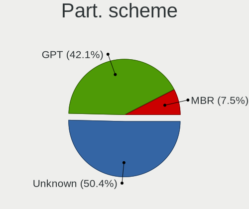
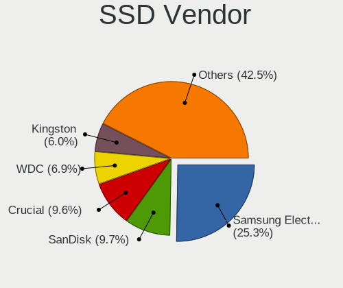
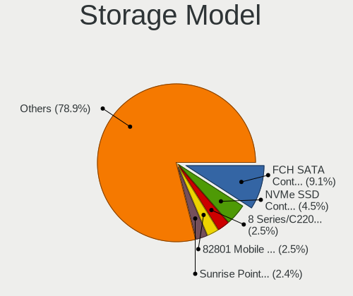
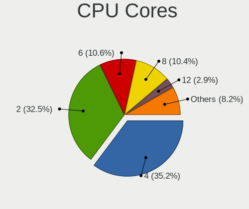
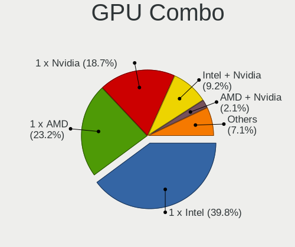
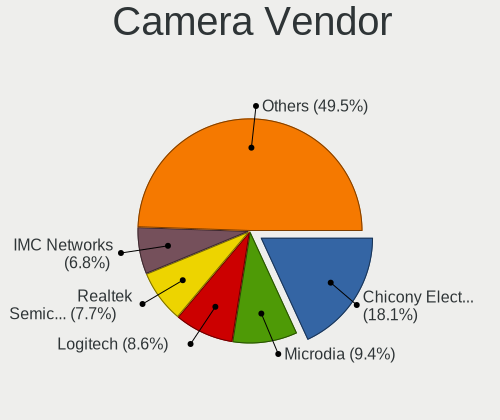

Linux in USA - Tested Hardware & Statistics
-------------------------------------------

A project to collect tested hardware configurations for Linux in USA.

Anyone can contribute to this report by the [hw-probe](https://github.com/linuxhw/hw-probe) tool:

    sudo -E hw-probe -all -upload

Please contribute! Especially if your hardware is rare.

This is a report for all computer types. See also reports for [desktops](/Location/USA/Desktop/README.md) and [notebooks](/Location/USA/Notebook/README.md).

Contents
--------

* [ Test Cases ](#test-cases)

* [ System ](#system)
  - [ OS                       ](#os)
  - [ OS Family                ](#os-family)
  - [ Kernel                   ](#kernel)
  - [ Kernel Family            ](#kernel-family)
  - [ Kernel Major Ver.        ](#kernel-major-ver)
  - [ Arch                     ](#arch)
  - [ DE                       ](#de)
  - [ Display Server           ](#display-server)
  - [ Display Manager          ](#display-manager)
  - [ OS Lang                  ](#os-lang)
  - [ Boot Mode                ](#boot-mode)
  - [ Filesystem               ](#filesystem)
  - [ Part. scheme             ](#part-scheme)
  - [ Dual Boot with Linux/BSD ](#dual-boot-with-linuxbsd)
  - [ Dual Boot (Win)          ](#dual-boot-win)

* [ Board ](#board)
  - [ Vendor                   ](#vendor)
  - [ Model                    ](#model)
  - [ Model Family             ](#model-family)
  - [ MFG Year                 ](#mfg-year)
  - [ Form Factor              ](#form-factor)
  - [ Secure Boot              ](#secure-boot)
  - [ Coreboot                 ](#coreboot)
  - [ RAM Size                 ](#ram-size)
  - [ RAM Used                 ](#ram-used)
  - [ Total Drives             ](#total-drives)
  - [ Has CD-ROM               ](#has-cd-rom)
  - [ Has Ethernet             ](#has-ethernet)
  - [ Has WiFi                 ](#has-wifi)
  - [ Has Bluetooth            ](#has-bluetooth)

* [ Location ](#location)
  - [ Country                  ](#country)
  - [ City                     ](#city)

* [ Drives ](#drives)
  - [ Drive Vendor             ](#drive-vendor)
  - [ Drive Model              ](#drive-model)
  - [ HDD Vendor               ](#hdd-vendor)
  - [ SSD Vendor               ](#ssd-vendor)
  - [ Drive Kind               ](#drive-kind)
  - [ Drive Connector          ](#drive-connector)
  - [ Drive Size               ](#drive-size)
  - [ Space Total              ](#space-total)
  - [ Space Used               ](#space-used)
  - [ Malfunc. Drives          ](#malfunc-drives)
  - [ Malfunc. Drive Vendor    ](#malfunc-drive-vendor)
  - [ Malfunc. HDD Vendor      ](#malfunc-hdd-vendor)
  - [ Malfunc. Drive Kind      ](#malfunc-drive-kind)
  - [ Failed Drives            ](#failed-drives)
  - [ Failed Drive Vendor      ](#failed-drive-vendor)
  - [ Drive Status             ](#drive-status)

* [ Storage controller ](#storage-controller)
  - [ Storage Vendor           ](#storage-vendor)
  - [ Storage Model            ](#storage-model)
  - [ Storage Kind             ](#storage-kind)

* [ Processor ](#processor)
  - [ CPU Vendor               ](#cpu-vendor)
  - [ CPU Model                ](#cpu-model)
  - [ CPU Model Family         ](#cpu-model-family)
  - [ CPU Cores                ](#cpu-cores)
  - [ CPU Sockets              ](#cpu-sockets)
  - [ CPU Threads              ](#cpu-threads)
  - [ CPU Op-Modes             ](#cpu-op-modes)
  - [ CPU Microcode            ](#cpu-microcode)
  - [ CPU Microarch            ](#cpu-microarch)

* [ Graphics ](#graphics)
  - [ GPU Vendor               ](#gpu-vendor)
  - [ GPU Model                ](#gpu-model)
  - [ GPU Combo                ](#gpu-combo)
  - [ GPU Driver               ](#gpu-driver)
  - [ GPU Memory               ](#gpu-memory)

* [ Monitor ](#monitor)
  - [ Monitor Vendor           ](#monitor-vendor)
  - [ Monitor Model            ](#monitor-model)
  - [ Monitor Resolution       ](#monitor-resolution)
  - [ Monitor Diagonal         ](#monitor-diagonal)
  - [ Monitor Width            ](#monitor-width)
  - [ Aspect Ratio             ](#aspect-ratio)
  - [ Monitor Area             ](#monitor-area)
  - [ Pixel Density            ](#pixel-density)
  - [ Multiple Monitors        ](#multiple-monitors)

* [ Network ](#network)
  - [ Net Controller Vendor    ](#net-controller-vendor)
  - [ Net Controller Model     ](#net-controller-model)
  - [ Wireless Vendor          ](#wireless-vendor)
  - [ Wireless Model           ](#wireless-model)
  - [ Ethernet Vendor          ](#ethernet-vendor)
  - [ Ethernet Model           ](#ethernet-model)
  - [ Net Controller Kind      ](#net-controller-kind)
  - [ Used Controller          ](#used-controller)
  - [ NICs                     ](#nics)
  - [ IPv6                     ](#ipv6)

* [ Bluetooth ](#bluetooth)
  - [ Bluetooth Vendor         ](#bluetooth-vendor)
  - [ Bluetooth Model          ](#bluetooth-model)

* [ Sound ](#sound)
  - [ Sound Vendor             ](#sound-vendor)
  - [ Sound Model              ](#sound-model)

* [ Memory ](#memory)
  - [ Memory Vendor            ](#memory-vendor)
  - [ Memory Model             ](#memory-model)
  - [ Memory Kind              ](#memory-kind)
  - [ Memory Form Factor       ](#memory-form-factor)
  - [ Memory Size              ](#memory-size)
  - [ Memory Speed             ](#memory-speed)

* [ Printers & scanners ](#printers--scanners)
  - [ Printer Vendor           ](#printer-vendor)
  - [ Printer Model            ](#printer-model)
  - [ Scanner Vendor           ](#scanner-vendor)
  - [ Scanner Model            ](#scanner-model)

* [ Camera ](#camera)
  - [ Camera Vendor            ](#camera-vendor)
  - [ Camera Model             ](#camera-model)

* [ Security ](#security)
  - [ Fingerprint Vendor       ](#fingerprint-vendor)
  - [ Fingerprint Model        ](#fingerprint-model)
  - [ Chipcard Vendor          ](#chipcard-vendor)
  - [ Chipcard Model           ](#chipcard-model)

* [ Unsupported ](#unsupported)
  - [ Unsupported Devices      ](#unsupported-devices)
  - [ Unsupported Device Types ](#unsupported-device-types)

Test Cases
----------

Total: 58226

| Vendor        | Model                       | Form-Factor | Probe                                                      | Date         |
|---------------|-----------------------------|-------------|------------------------------------------------------------|--------------|
| HP            | ENVY Laptop 17-ch1xxx       | Notebook    | [d41bca7300](https://linux-hardware.org/?probe=d41bca7300) | Dec 24, 2023 |
| Lenovo        | ThinkPad E460 20ET0016US    | Notebook    | [96959ec0a3](https://linux-hardware.org/?probe=96959ec0a3) | Dec 24, 2023 |
| HP            | ENVY Laptop 17-ch1xxx       | Notebook    | [8080c75b27](https://linux-hardware.org/?probe=8080c75b27) | Dec 24, 2023 |
| Dell          | 03X6X0 A06                  | Server      | [ca9bb6b7ff](https://linux-hardware.org/?probe=ca9bb6b7ff) | Dec 24, 2023 |
| MSI           | B450 GAMING PLUS MAX        | Desktop     | [587884179e](https://linux-hardware.org/?probe=587884179e) | Dec 24, 2023 |
| HP            | 82F1                        | Desktop     | [86959f8199](https://linux-hardware.org/?probe=86959f8199) | Dec 24, 2023 |
| ASUSTek       | G75VW                       | Notebook    | [63fa97bd36](https://linux-hardware.org/?probe=63fa97bd36) | Dec 24, 2023 |
| Lenovo        | IdeaPad 3 15IAU7 82RK       | Notebook    | [a69b3fa1ca](https://linux-hardware.org/?probe=a69b3fa1ca) | Dec 24, 2023 |
| Apple         | MacBookAir7,1               | Notebook    | [f666ec3927](https://linux-hardware.org/?probe=f666ec3927) | Dec 24, 2023 |
| Dell          | Inspiron 5720               | Notebook    | [bcb6745ac2](https://linux-hardware.org/?probe=bcb6745ac2) | Dec 24, 2023 |
| Gigabyte      | AB350N-Gaming WIFI-CF       | Desktop     | [27a814dd64](https://linux-hardware.org/?probe=27a814dd64) | Dec 24, 2023 |
| Lenovo        | IdeaPad 3 15IAU7 82RK       | Notebook    | [9ac48a1719](https://linux-hardware.org/?probe=9ac48a1719) | Dec 24, 2023 |
| Supermicro    | H12SSL-i                    | Server      | [df01343f10](https://linux-hardware.org/?probe=df01343f10) | Dec 24, 2023 |
| ASRockRack    | B650D4U-2L2T/BCM            | Server      | [346c422237](https://linux-hardware.org/?probe=346c422237) | Dec 24, 2023 |
| HP            | 8918                        | Desktop     | [4b922c3362](https://linux-hardware.org/?probe=4b922c3362) | Dec 24, 2023 |
| BESSTAR Te... | GB7                         | Mini pc     | [f76e4b41dc](https://linux-hardware.org/?probe=f76e4b41dc) | Dec 24, 2023 |
| Toshiba       | Satellite A205              | Notebook    | [c3680bfd29](https://linux-hardware.org/?probe=c3680bfd29) | Dec 24, 2023 |
| HP            | 2B29                        | Desktop     | [93ef9f39bd](https://linux-hardware.org/?probe=93ef9f39bd) | Dec 24, 2023 |
| Samsung       | 750QFG                      | Convertible | [12b0133961](https://linux-hardware.org/?probe=12b0133961) | Dec 24, 2023 |
| Lenovo        | Yoga 9 14ITL5 82BG          | Convertible | [234581f461](https://linux-hardware.org/?probe=234581f461) | Dec 24, 2023 |
| Lenovo        | IdeaPad 100-15IBD 80QQ      | Notebook    | [f8abeb2607](https://linux-hardware.org/?probe=f8abeb2607) | Dec 24, 2023 |
| ASUSTek       | ROG Zephyrus G14 GA402RJ... | Notebook    | [29b4b5a349](https://linux-hardware.org/?probe=29b4b5a349) | Dec 24, 2023 |
| HP            | Pavilion g7                 | Notebook    | [bbe3fb1914](https://linux-hardware.org/?probe=bbe3fb1914) | Dec 24, 2023 |
| HP            | Notebook                    | Notebook    | [69bef099c0](https://linux-hardware.org/?probe=69bef099c0) | Dec 24, 2023 |
| Dell          | Precision 3560              | Notebook    | [b945ab8339](https://linux-hardware.org/?probe=b945ab8339) | Dec 24, 2023 |
| MSI           | MPG B650 EDGE WIFI          | Desktop     | [8503d79f6c](https://linux-hardware.org/?probe=8503d79f6c) | Dec 24, 2023 |
| Valve         | Galileo                     | Notebook    | [aa141b8ea2](https://linux-hardware.org/?probe=aa141b8ea2) | Dec 24, 2023 |
| Apple         | MacBookAir6,2               | Notebook    | [a3af8ee68a](https://linux-hardware.org/?probe=a3af8ee68a) | Dec 24, 2023 |
| HP            | Laptop 15-ef2xxx            | Notebook    | [31291c7bc9](https://linux-hardware.org/?probe=31291c7bc9) | Dec 24, 2023 |
| Lenovo        | ThinkPad T520 424049U       | Notebook    | [c393fb64e3](https://linux-hardware.org/?probe=c393fb64e3) | Dec 24, 2023 |
| ASRock        | X670E Taichi Carrara        | Desktop     | [3c53e69328](https://linux-hardware.org/?probe=3c53e69328) | Dec 24, 2023 |
| Acer          | Aspire A515-43              | Notebook    | [922518c025](https://linux-hardware.org/?probe=922518c025) | Dec 23, 2023 |
| Apple         | MacBookPro9,1               | Notebook    | [a70e7da743](https://linux-hardware.org/?probe=a70e7da743) | Dec 23, 2023 |
| ASUSTek       | P5GC-MX/1333                | Desktop     | [a95c11e27b](https://linux-hardware.org/?probe=a95c11e27b) | Dec 23, 2023 |
| Raspberry ... | Raspberry Pi 3 Model B R... | Soc         | [adc4da12d3](https://linux-hardware.org/?probe=adc4da12d3) | Dec 23, 2023 |
| Lenovo        | ThinkPad T420 4178AFU       | Notebook    | [67caa6c117](https://linux-hardware.org/?probe=67caa6c117) | Dec 23, 2023 |
| ASRock        | B450 Gaming-ITX/ac          | Desktop     | [6c6f281927](https://linux-hardware.org/?probe=6c6f281927) | Dec 23, 2023 |
| HP            | ZBook 17 G5                 | Notebook    | [ad6c489ffc](https://linux-hardware.org/?probe=ad6c489ffc) | Dec 23, 2023 |
| ASRock        | B450 Gaming-ITX/ac          | Desktop     | [5590fcbfaf](https://linux-hardware.org/?probe=5590fcbfaf) | Dec 23, 2023 |
| Lenovo        | ThinkPad X1 Tablet Gen 2... | Tablet      | [caa5d04521](https://linux-hardware.org/?probe=caa5d04521) | Dec 23, 2023 |
| Lenovo        | ThinkPad T520 424049U       | Notebook    | [d800424ece](https://linux-hardware.org/?probe=d800424ece) | Dec 23, 2023 |
| ASUSTek       | GL503VM                     | Notebook    | [dfedaea706](https://linux-hardware.org/?probe=dfedaea706) | Dec 23, 2023 |
| HP            | 1998                        | Desktop     | [c2e72e513c](https://linux-hardware.org/?probe=c2e72e513c) | Dec 23, 2023 |
| ASUSTek       | GL503VM                     | Notebook    | [05b212db99](https://linux-hardware.org/?probe=05b212db99) | Dec 23, 2023 |
| Framework     | Laptop (12th Gen Intel C... | Notebook    | [ef18e09b69](https://linux-hardware.org/?probe=ef18e09b69) | Dec 23, 2023 |
| ASUSTek       | P8Z77-V PRO                 | Desktop     | [4f8558438f](https://linux-hardware.org/?probe=4f8558438f) | Dec 23, 2023 |
| IBM           | ThinkPad R50e 1842QDU       | Notebook    | [32a349ab97](https://linux-hardware.org/?probe=32a349ab97) | Dec 23, 2023 |
| Lenovo        | ThinkPad T420 4178AFU       | Notebook    | [c2681f33cc](https://linux-hardware.org/?probe=c2681f33cc) | Dec 23, 2023 |
| Lenovo        | IdeaPad 5 14ARE05 81YM      | Notebook    | [6b0368fd61](https://linux-hardware.org/?probe=6b0368fd61) | Dec 23, 2023 |
| ASUSTek       | ASUS TUF Gaming A15 FA50... | Notebook    | [5c4d1c7d64](https://linux-hardware.org/?probe=5c4d1c7d64) | Dec 23, 2023 |
| Samsung       | 730QED                      | Convertible | [c7670723ff](https://linux-hardware.org/?probe=c7670723ff) | Dec 23, 2023 |
| HP            | Victus by Gaming Laptop ... | Notebook    | [95adcc5c56](https://linux-hardware.org/?probe=95adcc5c56) | Dec 23, 2023 |
| Valve         | Jupiter                     | Notebook    | [6fd8f41741](https://linux-hardware.org/?probe=6fd8f41741) | Dec 23, 2023 |
| Dell          | 0P4T42 A01                  | All in one  | [db76245a52](https://linux-hardware.org/?probe=db76245a52) | Dec 23, 2023 |
| Dell          | Latitude E6330              | Notebook    | [afca8c73b2](https://linux-hardware.org/?probe=afca8c73b2) | Dec 23, 2023 |
| ASRock        | Z97 Pro4                    | Desktop     | [f8e2df67b1](https://linux-hardware.org/?probe=f8e2df67b1) | Dec 23, 2023 |
| Supermicro    | M12SWA-TF                   | Server      | [704ccc2dc4](https://linux-hardware.org/?probe=704ccc2dc4) | Dec 23, 2023 |
| Unknown       | Unknown                     | Desktop     | [3ead5f7cee](https://linux-hardware.org/?probe=3ead5f7cee) | Dec 23, 2023 |
| Dell          | System XPS L322X            | Notebook    | [6b050ff1c8](https://linux-hardware.org/?probe=6b050ff1c8) | Dec 23, 2023 |
| MSI           | PRO Z790-A WIFI             | Desktop     | [9b8ad6a3f1](https://linux-hardware.org/?probe=9b8ad6a3f1) | Dec 23, 2023 |
| Sony          | VPCF215FX                   | Notebook    | [1a79c8b60f](https://linux-hardware.org/?probe=1a79c8b60f) | Dec 23, 2023 |
| Gigabyte      | X570 AORUS ELITE WIFI       | Desktop     | [6c9e82db47](https://linux-hardware.org/?probe=6c9e82db47) | Dec 23, 2023 |
| System76      | Serval WS                   | Notebook    | [92d124a8aa](https://linux-hardware.org/?probe=92d124a8aa) | Dec 23, 2023 |
| GPU Compan... | GWTN116-3                   | Notebook    | [89366f9a48](https://linux-hardware.org/?probe=89366f9a48) | Dec 23, 2023 |
| Dell          | 0D6H9T A00                  | Desktop     | [f6dd1b447a](https://linux-hardware.org/?probe=f6dd1b447a) | Dec 23, 2023 |
| ASUSTek       | M5A99FX PRO R2.0            | Desktop     | [1622d9b25b](https://linux-hardware.org/?probe=1622d9b25b) | Dec 23, 2023 |
| ASUSTek       | X555LAB                     | Notebook    | [6a3b9f5bb2](https://linux-hardware.org/?probe=6a3b9f5bb2) | Dec 23, 2023 |
| HP            | 8299                        | Desktop     | [7cb3e71107](https://linux-hardware.org/?probe=7cb3e71107) | Dec 23, 2023 |
| HP            | Pavilion dv6                | Notebook    | [c4a6b58303](https://linux-hardware.org/?probe=c4a6b58303) | Dec 23, 2023 |
| HPE           | ProLiant MicroServer Gen... | Desktop     | [4d38d67af1](https://linux-hardware.org/?probe=4d38d67af1) | Dec 23, 2023 |
| Lenovo        | Slim Pro 7 14ARP8 83AX      | Notebook    | [1ace47e8fd](https://linux-hardware.org/?probe=1ace47e8fd) | Dec 23, 2023 |
| eMachines     | EL1360                      | Desktop     | [af31609559](https://linux-hardware.org/?probe=af31609559) | Dec 23, 2023 |
| ATARI         | VCS 800 Black Walnut        | Notebook    | [34456982d3](https://linux-hardware.org/?probe=34456982d3) | Dec 23, 2023 |
| Unknown       | Unknown                     | Desktop     | [41b66d1144](https://linux-hardware.org/?probe=41b66d1144) | Dec 23, 2023 |
| Dell          | Latitude E6400              | Notebook    | [1a10fd9a2e](https://linux-hardware.org/?probe=1a10fd9a2e) | Dec 23, 2023 |
| System76      | Gazelle                     | Notebook    | [6671df79bd](https://linux-hardware.org/?probe=6671df79bd) | Dec 23, 2023 |
| System76      | Serval WS                   | Notebook    | [a250c12d1d](https://linux-hardware.org/?probe=a250c12d1d) | Dec 23, 2023 |
| HP            | ENVY x360 2-in-1 Laptop ... | Convertible | [b646451269](https://linux-hardware.org/?probe=b646451269) | Dec 23, 2023 |
| ASUSTek       | ROG CROSSHAIR VIII IMPAC... | Desktop     | [a953876b2c](https://linux-hardware.org/?probe=a953876b2c) | Dec 23, 2023 |
| Apple         | MacBookPro9,1               | Notebook    | [e3576ca49c](https://linux-hardware.org/?probe=e3576ca49c) | Dec 23, 2023 |
| Gigabyte      | X570 AORUS PRO WIFI         | Desktop     | [bbd50ba27b](https://linux-hardware.org/?probe=bbd50ba27b) | Dec 23, 2023 |
| Lenovo        | ThinkPad E15 20RD002RUS     | Notebook    | [6ba8bb7550](https://linux-hardware.org/?probe=6ba8bb7550) | Dec 23, 2023 |
| ASRock        | H77 Pro4-M                  | Desktop     | [e2bc5dabc2](https://linux-hardware.org/?probe=e2bc5dabc2) | Dec 22, 2023 |
| Google        | Reks                        | Notebook    | [52375a57c5](https://linux-hardware.org/?probe=52375a57c5) | Dec 22, 2023 |
| Dell          | 0FDY5C A00                  | Desktop     | [a3fc39604c](https://linux-hardware.org/?probe=a3fc39604c) | Dec 22, 2023 |
| ASRock        | 4X4-4000 Series             | Desktop     | [b4333bcaaf](https://linux-hardware.org/?probe=b4333bcaaf) | Dec 22, 2023 |
| Dell          | 0K3CM7 A00                  | Desktop     | [019b46745e](https://linux-hardware.org/?probe=019b46745e) | Dec 22, 2023 |
| Pine Micro... | Pine64 Pinebook Pro         | Notebook    | [961dddc49e](https://linux-hardware.org/?probe=961dddc49e) | Dec 22, 2023 |
| Lenovo        | ThinkBook 15 G2 ARE 20VG    | Notebook    | [f5f4795192](https://linux-hardware.org/?probe=f5f4795192) | Dec 22, 2023 |
| ASRock        | Z790 Taichi                 | Desktop     | [3bc8305321](https://linux-hardware.org/?probe=3bc8305321) | Dec 22, 2023 |
| Dell          | 0D6H9T A00                  | Desktop     | [84275b737e](https://linux-hardware.org/?probe=84275b737e) | Dec 22, 2023 |
| ASUSTek       | ASUSLaptop_Q540VJ           | Notebook    | [937842fe5d](https://linux-hardware.org/?probe=937842fe5d) | Dec 22, 2023 |
| Gigabyte      | B650 GAMING X AX            | Desktop     | [9c0210d1ed](https://linux-hardware.org/?probe=9c0210d1ed) | Dec 22, 2023 |
| MSI           | PRO Z790-A WIFI             | Desktop     | [8e38fb94ba](https://linux-hardware.org/?probe=8e38fb94ba) | Dec 22, 2023 |
| HP            | G62                         | Notebook    | [9f6a13bc50](https://linux-hardware.org/?probe=9f6a13bc50) | Dec 22, 2023 |
| Valve         | Jupiter                     | Notebook    | [482500f7b0](https://linux-hardware.org/?probe=482500f7b0) | Dec 22, 2023 |
| ASUSTek       | X75A                        | Notebook    | [ed3c88f944](https://linux-hardware.org/?probe=ed3c88f944) | Dec 22, 2023 |
| HP            | 8626                        | Desktop     | [b04d9fcad9](https://linux-hardware.org/?probe=b04d9fcad9) | Dec 22, 2023 |
| Lenovo        | ThinkPad T480 20L5004HUS    | Notebook    | [10c32df82e](https://linux-hardware.org/?probe=10c32df82e) | Dec 22, 2023 |
| Gigabyte      | B550 AORUS PRO AC           | Desktop     | [de502eec48](https://linux-hardware.org/?probe=de502eec48) | Dec 22, 2023 |
| Dell          | Latitude 5580               | Notebook    | [e20360557a](https://linux-hardware.org/?probe=e20360557a) | Dec 22, 2023 |
| Dell          | 0HY9JP A02                  | Desktop     | [6f47019169](https://linux-hardware.org/?probe=6f47019169) | Dec 22, 2023 |
| Valve         | Jupiter                     | Notebook    | [4899962b6a](https://linux-hardware.org/?probe=4899962b6a) | Dec 22, 2023 |
| Gigabyte      | Z390 AORUS PRO WIFI-CF      | Desktop     | [8a2d46dced](https://linux-hardware.org/?probe=8a2d46dced) | Dec 22, 2023 |
| ASUSTek       | B150-PRO D3                 | Desktop     | [a686071950](https://linux-hardware.org/?probe=a686071950) | Dec 22, 2023 |
| Dell          | Latitude 5414               | Notebook    | [9b02eedb05](https://linux-hardware.org/?probe=9b02eedb05) | Dec 22, 2023 |
| Intel         | NUC10i3FNB K61362-302       | Mini pc     | [26743f9015](https://linux-hardware.org/?probe=26743f9015) | Dec 22, 2023 |
| LattePanda    | Sigma                       | Desktop     | [09cb864933](https://linux-hardware.org/?probe=09cb864933) | Dec 22, 2023 |
| Alienware     | 0K9TKY A00                  | Desktop     | [ec6847b7f2](https://linux-hardware.org/?probe=ec6847b7f2) | Dec 22, 2023 |
| Toshiba       | Satellite C55D-B            | Notebook    | [d705d8ee57](https://linux-hardware.org/?probe=d705d8ee57) | Dec 22, 2023 |
| Google        | Garg                        | Notebook    | [05bbd9f9f8](https://linux-hardware.org/?probe=05bbd9f9f8) | Dec 22, 2023 |
| ASUSTek       | ROG STRIX Z790-I GAMING ... | Desktop     | [60e10649cc](https://linux-hardware.org/?probe=60e10649cc) | Dec 22, 2023 |
| Gigabyte      | H610M S2H                   | Desktop     | [6c554a9668](https://linux-hardware.org/?probe=6c554a9668) | Dec 22, 2023 |
| Eluktronic... | MECH-17                     | Notebook    | [0a69b2e084](https://linux-hardware.org/?probe=0a69b2e084) | Dec 22, 2023 |
| Lenovo        | IdeaPad 3 15IIL05 81WE      | Notebook    | [684b42a95a](https://linux-hardware.org/?probe=684b42a95a) | Dec 22, 2023 |
| HP            | Spectre x360 Convertible... | Convertible | [d5d900d691](https://linux-hardware.org/?probe=d5d900d691) | Dec 22, 2023 |
| Dell          | Precision 5480              | Notebook    | [7cc190b5c0](https://linux-hardware.org/?probe=7cc190b5c0) | Dec 22, 2023 |
| BYTENUC       | AZ51                        | Mini pc     | [5ab3f7363c](https://linux-hardware.org/?probe=5ab3f7363c) | Dec 22, 2023 |
| Chuwi         | LarkBox Pro                 | Mini pc     | [cd782ea234](https://linux-hardware.org/?probe=cd782ea234) | Dec 22, 2023 |
| Supermicro    | M11SDV-8C-LN4F              | Server      | [3256f09051](https://linux-hardware.org/?probe=3256f09051) | Dec 22, 2023 |
| ASRock        | J3160DC-ITX                 | Desktop     | [c84aa85d4e](https://linux-hardware.org/?probe=c84aa85d4e) | Dec 22, 2023 |
| Supermicro    | X8DTH                       | Server      | [e00e89ffec](https://linux-hardware.org/?probe=e00e89ffec) | Dec 22, 2023 |
| Gigabyte      | P35-DS3R                    | Desktop     | [741ad16651](https://linux-hardware.org/?probe=741ad16651) | Dec 22, 2023 |
| SHANGZHAOY... | B85M-PRO V1.1               | Desktop     | [bd7c6e2693](https://linux-hardware.org/?probe=bd7c6e2693) | Dec 22, 2023 |
| LG Electro... | 17U70Q-P.AAS7U1             | Notebook    | [8846a0ac06](https://linux-hardware.org/?probe=8846a0ac06) | Dec 21, 2023 |
| Lenovo        | ThinkPad T14s Gen 2a 20X... | Notebook    | [6f60c08653](https://linux-hardware.org/?probe=6f60c08653) | Dec 21, 2023 |
| Lenovo        | ThinkPad T14s Gen 2a 20X... | Notebook    | [cf835775a4](https://linux-hardware.org/?probe=cf835775a4) | Dec 21, 2023 |
| Intel         | DH77EB AAG39073-304         | Desktop     | [83183dbb01](https://linux-hardware.org/?probe=83183dbb01) | Dec 21, 2023 |
| Lenovo        | ThinkPad T420 4177QGU       | Notebook    | [7ec167a926](https://linux-hardware.org/?probe=7ec167a926) | Dec 21, 2023 |
| Lenovo        | ThinkPad T470 W10DG 20JM... | Notebook    | [c5c9d669ae](https://linux-hardware.org/?probe=c5c9d669ae) | Dec 21, 2023 |
| Gigabyte      | Z170X-UD5-CF                | Desktop     | [67662437e4](https://linux-hardware.org/?probe=67662437e4) | Dec 21, 2023 |
| Apple         | MacBookPro16,1              | Notebook    | [d67a62b447](https://linux-hardware.org/?probe=d67a62b447) | Dec 21, 2023 |
| ASUSTek       | ROG STRIX X670E-E GAMING... | Desktop     | [278967cf92](https://linux-hardware.org/?probe=278967cf92) | Dec 21, 2023 |
| Microsoft     | Surface Pro 7               | Tablet      | [ac1d637679](https://linux-hardware.org/?probe=ac1d637679) | Dec 21, 2023 |
| ASUSTek       | X75A                        | Notebook    | [6d9c65c8ac](https://linux-hardware.org/?probe=6d9c65c8ac) | Dec 21, 2023 |
| ASUSTek       | M3N78-VM                    | Desktop     | [bd28c77bd4](https://linux-hardware.org/?probe=bd28c77bd4) | Dec 21, 2023 |
| Lenovo        | ThinkPad T14 Gen 2i 20W1... | Notebook    | [972314af13](https://linux-hardware.org/?probe=972314af13) | Dec 21, 2023 |
| Google        | Reks                        | Notebook    | [9a6f15c5d9](https://linux-hardware.org/?probe=9a6f15c5d9) | Dec 21, 2023 |
| Fujitsu       | LIFEBOOK T5010              | Notebook    | [27e7d6f705](https://linux-hardware.org/?probe=27e7d6f705) | Dec 21, 2023 |
| HP            | Pavilion dv7                | Notebook    | [ef719917ef](https://linux-hardware.org/?probe=ef719917ef) | Dec 21, 2023 |
| MSI           | X570-A PRO                  | Desktop     | [07a7762b25](https://linux-hardware.org/?probe=07a7762b25) | Dec 21, 2023 |
| Lenovo        | ThinkPad T440 20B6005BUS    | Notebook    | [d699475273](https://linux-hardware.org/?probe=d699475273) | Dec 21, 2023 |
| Lenovo        | ThinkPad T440 20B70048US    | Notebook    | [f937778ee0](https://linux-hardware.org/?probe=f937778ee0) | Dec 21, 2023 |
| Dell          | OptiPlex 5050               | Desktop     | [c1cffe744f](https://linux-hardware.org/?probe=c1cffe744f) | Dec 21, 2023 |
| Lenovo        | ThinkPad Yoga 11e 3rd Ge... | Convertible | [d14a2228a1](https://linux-hardware.org/?probe=d14a2228a1) | Dec 21, 2023 |
| HP            | Pavilion dv7                | Notebook    | [cd7f768fe8](https://linux-hardware.org/?probe=cd7f768fe8) | Dec 21, 2023 |
| ASUSTek       | Z87-PRO                     | Desktop     | [1c5b8cb7de](https://linux-hardware.org/?probe=1c5b8cb7de) | Dec 21, 2023 |
| Gigabyte      | Z390 AORUS PRO WIFI-CF      | Desktop     | [8eca3c15e7](https://linux-hardware.org/?probe=8eca3c15e7) | Dec 21, 2023 |
| Toshiba       | Satellite L15-B             | Notebook    | [0b1e126b9b](https://linux-hardware.org/?probe=0b1e126b9b) | Dec 21, 2023 |
| Acer          | Aspire M5-581T              | Notebook    | [c99da67d31](https://linux-hardware.org/?probe=c99da67d31) | Dec 21, 2023 |
| HP            | 2B4B                        | Desktop     | [19a3edb061](https://linux-hardware.org/?probe=19a3edb061) | Dec 21, 2023 |
| ASUSTek       | Z10PG-D16 Series            | Desktop     | [6b3c6c4099](https://linux-hardware.org/?probe=6b3c6c4099) | Dec 21, 2023 |
| HP            | 2B28                        | Desktop     | [a3c79770af](https://linux-hardware.org/?probe=a3c79770af) | Dec 21, 2023 |
| Dell          | Latitude E6520              | Notebook    | [9e16e8b2a6](https://linux-hardware.org/?probe=9e16e8b2a6) | Dec 21, 2023 |
| HP            | ProBook 445 G7              | Notebook    | [4153ae7cc6](https://linux-hardware.org/?probe=4153ae7cc6) | Dec 21, 2023 |
| ASUSTek       | PRIME Z690-P                | Desktop     | [72187eb090](https://linux-hardware.org/?probe=72187eb090) | Dec 21, 2023 |
| Lenovo        | ThinkPad T14 Gen 3 21AH0... | Notebook    | [03b86f8fd8](https://linux-hardware.org/?probe=03b86f8fd8) | Dec 21, 2023 |
| System76      | Adder WS                    | Notebook    | [d272c23e51](https://linux-hardware.org/?probe=d272c23e51) | Dec 21, 2023 |
| Acer          | Swift SF314-54              | Notebook    | [edc5223b9b](https://linux-hardware.org/?probe=edc5223b9b) | Dec 21, 2023 |
| Google        | Garg                        | Notebook    | [fb4804bee9](https://linux-hardware.org/?probe=fb4804bee9) | Dec 21, 2023 |
| Google        | Garg                        | Notebook    | [d2558e0746](https://linux-hardware.org/?probe=d2558e0746) | Dec 21, 2023 |
| AZW           | EQ                          | Desktop     | [11b8a012c0](https://linux-hardware.org/?probe=11b8a012c0) | Dec 21, 2023 |
| Apple         | Mac-8ED6AF5B48C039E1 Mac... | Mini pc     | [1a7734c3ec](https://linux-hardware.org/?probe=1a7734c3ec) | Dec 21, 2023 |
| Apple         | Mac-F221BEC8                | Desktop     | [c5d51ca43d](https://linux-hardware.org/?probe=c5d51ca43d) | Dec 21, 2023 |
| Lenovo        | ThinkBook 15 G2 ARE 20VG    | Notebook    | [1e223a9ea1](https://linux-hardware.org/?probe=1e223a9ea1) | Dec 21, 2023 |
| MSI           | GF65 Thin 10SDR             | Notebook    | [73408e34a6](https://linux-hardware.org/?probe=73408e34a6) | Dec 21, 2023 |
| Apple         | Mac-F2218FC8                | All in one  | [81855c7ee8](https://linux-hardware.org/?probe=81855c7ee8) | Dec 21, 2023 |
| Lenovo        | ThinkPad T550 20CJS1MW00    | Notebook    | [f5bb1db361](https://linux-hardware.org/?probe=f5bb1db361) | Dec 21, 2023 |
| MSI           | H81M-E34                    | Desktop     | [4b1991c655](https://linux-hardware.org/?probe=4b1991c655) | Dec 21, 2023 |
| Lenovo        | Legion 5 15IAH7H 82RB       | Notebook    | [57d4ccc05e](https://linux-hardware.org/?probe=57d4ccc05e) | Dec 21, 2023 |
| Lenovo        | ThinkPad T490 20RY0002US    | Notebook    | [95dfdb9327](https://linux-hardware.org/?probe=95dfdb9327) | Dec 21, 2023 |
| HP            | Spectre x360 Convertible    | Convertible | [3aec09e469](https://linux-hardware.org/?probe=3aec09e469) | Dec 21, 2023 |
| Sony          | VGN-NW270F                  | Notebook    | [eee640a54d](https://linux-hardware.org/?probe=eee640a54d) | Dec 20, 2023 |
| HP            | 82F1                        | Desktop     | [6e05cf58df](https://linux-hardware.org/?probe=6e05cf58df) | Dec 20, 2023 |
| Gigabyte      | Z390 DESIGNARE-CF           | Desktop     | [680a9f5001](https://linux-hardware.org/?probe=680a9f5001) | Dec 20, 2023 |
| ASUSTek       | ROG Zephyrus G15 GA503QR... | Notebook    | [fb187c2fa4](https://linux-hardware.org/?probe=fb187c2fa4) | Dec 20, 2023 |
| HP            | 3396                        | Desktop     | [d0d084ecc8](https://linux-hardware.org/?probe=d0d084ecc8) | Dec 20, 2023 |
| Lenovo        | IdeaPad S340-15APITOUCH ... | Notebook    | [0eb3eaa1c6](https://linux-hardware.org/?probe=0eb3eaa1c6) | Dec 20, 2023 |
| Toshiba       | Satellite C850              | Notebook    | [caa584d966](https://linux-hardware.org/?probe=caa584d966) | Dec 20, 2023 |
| Cisco Syst... | UCSC-C220-M4S 74-12419-0... | Server      | [80f235148b](https://linux-hardware.org/?probe=80f235148b) | Dec 20, 2023 |
| Dell          | XPS 15 9510                 | Notebook    | [107d6edb72](https://linux-hardware.org/?probe=107d6edb72) | Dec 20, 2023 |
| Dell          | 0D6H9T A00                  | Desktop     | [2c968508ee](https://linux-hardware.org/?probe=2c968508ee) | Dec 20, 2023 |
| MSI           | MPG X570 GAMING PRO CARB... | Desktop     | [67098aebca](https://linux-hardware.org/?probe=67098aebca) | Dec 20, 2023 |
| Gigabyte      | Z77X-UD3H                   | Desktop     | [25a077d35e](https://linux-hardware.org/?probe=25a077d35e) | Dec 20, 2023 |
| Dell          | 042P49 A01                  | Desktop     | [fb968ffb8b](https://linux-hardware.org/?probe=fb968ffb8b) | Dec 20, 2023 |
| Gigabyte      | B550M DS3H                  | Desktop     | [35547b20b3](https://linux-hardware.org/?probe=35547b20b3) | Dec 20, 2023 |
| MSI           | PRO Z690-A DDR4             | Desktop     | [55f164e414](https://linux-hardware.org/?probe=55f164e414) | Dec 20, 2023 |
| Toshiba       | Satellite C55D-B            | Notebook    | [dfd0e27118](https://linux-hardware.org/?probe=dfd0e27118) | Dec 20, 2023 |
| Lenovo        | ThinkPad T440 20B6005BUS    | Notebook    | [bf412b1477](https://linux-hardware.org/?probe=bf412b1477) | Dec 20, 2023 |
| Lenovo        | ThinkPad T440 20B70048US    | Notebook    | [d6a79599da](https://linux-hardware.org/?probe=d6a79599da) | Dec 20, 2023 |
| Google        | Garg                        | Notebook    | [0f05d3580a](https://linux-hardware.org/?probe=0f05d3580a) | Dec 20, 2023 |
| HP            | Stream Laptop 14-cb1xxx     | Notebook    | [e3dded7dc3](https://linux-hardware.org/?probe=e3dded7dc3) | Dec 20, 2023 |
| Dell          | Precision 5510              | Notebook    | [033bf69fdf](https://linux-hardware.org/?probe=033bf69fdf) | Dec 20, 2023 |
| Gigabyte      | Z690 AORUS XTREME           | Desktop     | [c721656dbe](https://linux-hardware.org/?probe=c721656dbe) | Dec 20, 2023 |
| Dell          | Precision 5510              | Notebook    | [a40fa883d2](https://linux-hardware.org/?probe=a40fa883d2) | Dec 20, 2023 |
| Gigabyte      | Z390 UD                     | Desktop     | [d2841c3b1e](https://linux-hardware.org/?probe=d2841c3b1e) | Dec 20, 2023 |
| ASUSTek       | K30AD_M31AD_M51AD_M32AD     | Desktop     | [ee1a222677](https://linux-hardware.org/?probe=ee1a222677) | Dec 20, 2023 |
| ASUSTek       | ROG Ally RC71L_RC71L        | Tablet      | [f65d61f128](https://linux-hardware.org/?probe=f65d61f128) | Dec 20, 2023 |
| Acer          | Spin SP315-51               | Convertible | [042f9d77a0](https://linux-hardware.org/?probe=042f9d77a0) | Dec 20, 2023 |
| ASUSTek       | Maximus VIII EXTREME        | Desktop     | [d2ed93003e](https://linux-hardware.org/?probe=d2ed93003e) | Dec 20, 2023 |
| Lenovo        | ThinkPad E15 Gen 2 20TDS... | Notebook    | [44a01e07bb](https://linux-hardware.org/?probe=44a01e07bb) | Dec 20, 2023 |
| Apple         | Mac-81E3E92DD6088272 iMa... | All in one  | [2b2e293dc4](https://linux-hardware.org/?probe=2b2e293dc4) | Dec 20, 2023 |
| Valve         | Jupiter                     | Notebook    | [ceba2299c2](https://linux-hardware.org/?probe=ceba2299c2) | Dec 20, 2023 |
| AZW           | MINI S                      | Desktop     | [78169fe4be](https://linux-hardware.org/?probe=78169fe4be) | Dec 20, 2023 |
| System76      | Serval WS                   | Notebook    | [7475c97028](https://linux-hardware.org/?probe=7475c97028) | Dec 20, 2023 |
| Dell          | Inspiron 1750               | Notebook    | [508bf60ff7](https://linux-hardware.org/?probe=508bf60ff7) | Dec 20, 2023 |
| Lenovo        | ThinkPad T550 20CJS1MW00    | Notebook    | [e6bc9160c8](https://linux-hardware.org/?probe=e6bc9160c8) | Dec 20, 2023 |
| Unknown       | Unknown                     | Desktop     | [2ff77e3571](https://linux-hardware.org/?probe=2ff77e3571) | Dec 20, 2023 |
| HP            | Laptop 15-da0xxx            | Notebook    | [a2b93e4d4d](https://linux-hardware.org/?probe=a2b93e4d4d) | Dec 20, 2023 |
| Gigabyte      | B650 AORUS ELITE AX         | Desktop     | [8703894e1c](https://linux-hardware.org/?probe=8703894e1c) | Dec 20, 2023 |
| ASUSTek       | M3N78-VM                    | Desktop     | [5d7048af51](https://linux-hardware.org/?probe=5d7048af51) | Dec 20, 2023 |
| BESSTAR Te... | GB7                         | Mini pc     | [8e678ffb8c](https://linux-hardware.org/?probe=8e678ffb8c) | Dec 20, 2023 |
| Google        | Cave                        | Notebook    | [ec9d49335f](https://linux-hardware.org/?probe=ec9d49335f) | Dec 20, 2023 |
| ASUSTek       | X550LA                      | Notebook    | [fd673bac37](https://linux-hardware.org/?probe=fd673bac37) | Dec 20, 2023 |
| Cisco Syst... | UCSC-C220-M4S 74-12419-0... | Server      | [ccb072d03a](https://linux-hardware.org/?probe=ccb072d03a) | Dec 20, 2023 |
| ASUSTek       | ROG Flow Z13 GZ301ZE_GZ3... | Tablet      | [b89f7b2b47](https://linux-hardware.org/?probe=b89f7b2b47) | Dec 20, 2023 |
| MSI           | PRO Z690-A DDR4             | Desktop     | [b758a439b8](https://linux-hardware.org/?probe=b758a439b8) | Dec 20, 2023 |
| Lenovo        | Yoga 7 16IRL8 82YN          | Convertible | [6a601de5d5](https://linux-hardware.org/?probe=6a601de5d5) | Dec 20, 2023 |
| ASUSTek       | TUF Gaming X570-PLUS        | Desktop     | [f912bcd96a](https://linux-hardware.org/?probe=f912bcd96a) | Dec 20, 2023 |
| HP            | 1998                        | Desktop     | [bc41363911](https://linux-hardware.org/?probe=bc41363911) | Dec 20, 2023 |
| Dell          | 042P49 A01                  | Desktop     | [8e5afdac96](https://linux-hardware.org/?probe=8e5afdac96) | Dec 20, 2023 |
| Supermicro    | X9DRD-7LN4F                 | Desktop     | [56a303c264](https://linux-hardware.org/?probe=56a303c264) | Dec 20, 2023 |
| Dell          | Inspiron 3721               | Notebook    | [2fd8b3f8fc](https://linux-hardware.org/?probe=2fd8b3f8fc) | Dec 20, 2023 |
| ASUSTek       | TUF Gaming Z790-PLUS WIF... | Desktop     | [b45e149ce8](https://linux-hardware.org/?probe=b45e149ce8) | Dec 20, 2023 |
| ASRock        | AB350 Pro4                  | Desktop     | [bb15070eb2](https://linux-hardware.org/?probe=bb15070eb2) | Dec 19, 2023 |
| ASUSTek       | TUF Gaming Z790-PLUS WIF... | Desktop     | [10470437db](https://linux-hardware.org/?probe=10470437db) | Dec 19, 2023 |
| Dell          | Latitude 3460               | Notebook    | [c3b4a00583](https://linux-hardware.org/?probe=c3b4a00583) | Dec 19, 2023 |
| Dell          | Latitude 3460               | Notebook    | [3b425238a6](https://linux-hardware.org/?probe=3b425238a6) | Dec 19, 2023 |
| ASUSTek       | PRIME A320M-K               | Desktop     | [3eead324a8](https://linux-hardware.org/?probe=3eead324a8) | Dec 19, 2023 |
| Dell          | Latitude E5270              | Notebook    | [c25a5b1bc7](https://linux-hardware.org/?probe=c25a5b1bc7) | Dec 19, 2023 |
| ASUSTek       | ROG Ally RC71L_RC71L        | Tablet      | [37ee5a4acd](https://linux-hardware.org/?probe=37ee5a4acd) | Dec 19, 2023 |
| Valve         | Jupiter                     | Notebook    | [feae313bc0](https://linux-hardware.org/?probe=feae313bc0) | Dec 19, 2023 |
| Google        | Swanky                      | Notebook    | [46b7f27873](https://linux-hardware.org/?probe=46b7f27873) | Dec 19, 2023 |
| ASRock        | 970M Pro3                   | Desktop     | [85233c464d](https://linux-hardware.org/?probe=85233c464d) | Dec 19, 2023 |
| ASRock        | 970M Pro3                   | Desktop     | [acebee7435](https://linux-hardware.org/?probe=acebee7435) | Dec 19, 2023 |
| System76      | Pangolin                    | Notebook    | [a0cf57c6d1](https://linux-hardware.org/?probe=a0cf57c6d1) | Dec 19, 2023 |
| System76      | Thelio thelio-r3            | Desktop     | [86b686b3cf](https://linux-hardware.org/?probe=86b686b3cf) | Dec 19, 2023 |
| ECS           | Nettle2                     | Desktop     | [b6a487a1d8](https://linux-hardware.org/?probe=b6a487a1d8) | Dec 19, 2023 |
| Lenovo        | ThinkPad T470p 20J6CTO1W... | Notebook    | [a074081eb1](https://linux-hardware.org/?probe=a074081eb1) | Dec 19, 2023 |
| ASUSTek       | ROG STRIX X570-E GAMING     | Desktop     | [18cb796b47](https://linux-hardware.org/?probe=18cb796b47) | Dec 19, 2023 |
| HP            | Dev One Notebook PC         | Notebook    | [b10cd89445](https://linux-hardware.org/?probe=b10cd89445) | Dec 19, 2023 |
| ASUSTek       | ROG STRIX B450-F GAMING     | Desktop     | [67c84a4903](https://linux-hardware.org/?probe=67c84a4903) | Dec 19, 2023 |
| Dell          | 042P49 A02                  | Desktop     | [11f6da5848](https://linux-hardware.org/?probe=11f6da5848) | Dec 19, 2023 |
| ASUSTek       | Maximus VII HERO            | Desktop     | [30ecc8cbbb](https://linux-hardware.org/?probe=30ecc8cbbb) | Dec 19, 2023 |
| Lenovo        | IdeaPadFlex 4-1570 80SB     | Convertible | [c55227422a](https://linux-hardware.org/?probe=c55227422a) | Dec 19, 2023 |
| HP            | Laptop 15-dw0xxx            | Notebook    | [4d59263eb3](https://linux-hardware.org/?probe=4d59263eb3) | Dec 19, 2023 |
| ASUSTek       | PRIME Z390-P                | Desktop     | [29169b6700](https://linux-hardware.org/?probe=29169b6700) | Dec 19, 2023 |
| HP            | 0AA8h                       | Desktop     | [49435a98d1](https://linux-hardware.org/?probe=49435a98d1) | Dec 19, 2023 |
| AAEON         | MF-001 V1.0                 | Desktop     | [9e7c59246d](https://linux-hardware.org/?probe=9e7c59246d) | Dec 19, 2023 |
| ASRock        | B450M/ac                    | Desktop     | [1375b869d1](https://linux-hardware.org/?probe=1375b869d1) | Dec 19, 2023 |
| Samsung       | Galaxy Book 12 LTE          | Tablet      | [547d1bef1f](https://linux-hardware.org/?probe=547d1bef1f) | Dec 19, 2023 |
| ECS           | GeForce 8000 series         | Desktop     | [d436bb4acc](https://linux-hardware.org/?probe=d436bb4acc) | Dec 19, 2023 |
| Lenovo        | ThinkPad T14 Gen 3 21AH0... | Notebook    | [e37edfc830](https://linux-hardware.org/?probe=e37edfc830) | Dec 19, 2023 |
| MSI           | H97M-P35                    | Desktop     | [759943cd15](https://linux-hardware.org/?probe=759943cd15) | Dec 19, 2023 |
| ASRock        | X570 Steel Legend           | Desktop     | [0fe8df6dfe](https://linux-hardware.org/?probe=0fe8df6dfe) | Dec 19, 2023 |
| HP            | 3033h                       | Desktop     | [e57ef2fb67](https://linux-hardware.org/?probe=e57ef2fb67) | Dec 19, 2023 |
| Dell          | XPS 13 9310                 | Notebook    | [3a4a73b5f1](https://linux-hardware.org/?probe=3a4a73b5f1) | Dec 19, 2023 |
| ASRock        | B550 Phantom Gaming 4/ac    | Desktop     | [0759f6c04f](https://linux-hardware.org/?probe=0759f6c04f) | Dec 19, 2023 |
| ASRock        | B550 Phantom Gaming 4/ac    | Desktop     | [939c3a4be6](https://linux-hardware.org/?probe=939c3a4be6) | Dec 19, 2023 |
| Dell          | Inspiron 3542               | Notebook    | [7d3f7e97ce](https://linux-hardware.org/?probe=7d3f7e97ce) | Dec 19, 2023 |
| Biostar       | A55MH                       | Desktop     | [f1106ef8c7](https://linux-hardware.org/?probe=f1106ef8c7) | Dec 19, 2023 |
| ATOPNUC       | MA90                        | Mini pc     | [a2bb7b1e00](https://linux-hardware.org/?probe=a2bb7b1e00) | Dec 19, 2023 |
| ATOPNUC       | MA90                        | Mini pc     | [a2a69a3d09](https://linux-hardware.org/?probe=a2a69a3d09) | Dec 19, 2023 |
| Dell          | 0Y7WYT A00                  | Desktop     | [705321d0b6](https://linux-hardware.org/?probe=705321d0b6) | Dec 19, 2023 |
| Apple         | Mac-7BA5B2DFE22DDD8C Mac... | Mini pc     | [4220452f9d](https://linux-hardware.org/?probe=4220452f9d) | Dec 18, 2023 |
| HP            | 3647h                       | Desktop     | [0e741d6d7c](https://linux-hardware.org/?probe=0e741d6d7c) | Dec 18, 2023 |
| ASUSTek       | WS X299 SAGE                | Desktop     | [cc5a70ea88](https://linux-hardware.org/?probe=cc5a70ea88) | Dec 18, 2023 |
| Supermicro    | X7DWA                       | Desktop     | [2ea00dfda4](https://linux-hardware.org/?probe=2ea00dfda4) | Dec 18, 2023 |
| MSI           | MAG X570 TOMAHAWK WIFI      | Desktop     | [e4916226ac](https://linux-hardware.org/?probe=e4916226ac) | Dec 18, 2023 |
| ASUSTek       | ROG STRIX B550-F GAMING     | Desktop     | [a36fe89aa8](https://linux-hardware.org/?probe=a36fe89aa8) | Dec 18, 2023 |
| Supermicro    | X7DWA                       | Desktop     | [6357637f80](https://linux-hardware.org/?probe=6357637f80) | Dec 18, 2023 |
| HP            | 8653 A                      | Desktop     | [0fd89faa0c](https://linux-hardware.org/?probe=0fd89faa0c) | Dec 18, 2023 |
| Dell          | Inspiron 1545               | Notebook    | [fc8665de21](https://linux-hardware.org/?probe=fc8665de21) | Dec 18, 2023 |
| Lenovo        | ThinkPad T450s 20BX001LU... | Notebook    | [b3a6780db5](https://linux-hardware.org/?probe=b3a6780db5) | Dec 18, 2023 |
| Lenovo        | ThinkPad X240 20AMS0VU00    | Notebook    | [ecca798714](https://linux-hardware.org/?probe=ecca798714) | Dec 18, 2023 |
| HP            | Laptop 15-ef2xxx            | Notebook    | [f0d39c9ef3](https://linux-hardware.org/?probe=f0d39c9ef3) | Dec 18, 2023 |
| HP            | 1998                        | Desktop     | [1d45f9958a](https://linux-hardware.org/?probe=1d45f9958a) | Dec 18, 2023 |
| Acer          | Aspire A715-51G             | Notebook    | [1232ff1050](https://linux-hardware.org/?probe=1232ff1050) | Dec 18, 2023 |
| Dell          | Latitude 7490               | Notebook    | [6fe6e99364](https://linux-hardware.org/?probe=6fe6e99364) | Dec 18, 2023 |
| HP            | Pavilion dv6700             | Notebook    | [dd31f0d1ec](https://linux-hardware.org/?probe=dd31f0d1ec) | Dec 18, 2023 |
| Dell          | 072T6D A05                  | Server      | [70a0b85bf3](https://linux-hardware.org/?probe=70a0b85bf3) | Dec 18, 2023 |
| Dell          | 072T6D A05                  | Server      | [b9942f8526](https://linux-hardware.org/?probe=b9942f8526) | Dec 18, 2023 |
| Toshiba       | Satellite C55-A             | Notebook    | [6c0f2ad0c9](https://linux-hardware.org/?probe=6c0f2ad0c9) | Dec 18, 2023 |
| Valve         | Galileo                     | Notebook    | [b79c5fbf78](https://linux-hardware.org/?probe=b79c5fbf78) | Dec 18, 2023 |
| Toshiba       | Satellite C55-A             | Notebook    | [0ae780878c](https://linux-hardware.org/?probe=0ae780878c) | Dec 18, 2023 |
| HP            | 8952                        | Mini pc     | [c9e359c6ee](https://linux-hardware.org/?probe=c9e359c6ee) | Dec 18, 2023 |
| HP            | 8643 SMVB                   | Desktop     | [70ece5f797](https://linux-hardware.org/?probe=70ece5f797) | Dec 18, 2023 |
| BESSTAR Te... | T3 MRD                      | Desktop     | [56e6c430f4](https://linux-hardware.org/?probe=56e6c430f4) | Dec 18, 2023 |
| HP            | Pavilion x360 Convertibl... | Convertible | [312fe4e212](https://linux-hardware.org/?probe=312fe4e212) | Dec 18, 2023 |
| BESSTAR Te... | T3 MRD                      | Desktop     | [03025f41df](https://linux-hardware.org/?probe=03025f41df) | Dec 18, 2023 |
| AZW           | SER V2.0                    | Mini pc     | [a16d42c4fb](https://linux-hardware.org/?probe=a16d42c4fb) | Dec 18, 2023 |
| Supermicro    | H12SSL-i                    | Server      | [27cd685574](https://linux-hardware.org/?probe=27cd685574) | Dec 18, 2023 |
| ASUSTek       | X550LA                      | Notebook    | [759db70e03](https://linux-hardware.org/?probe=759db70e03) | Dec 18, 2023 |
| ASRockRack    | B650D4U-2L2T/BCM            | Server      | [9a521bb0c9](https://linux-hardware.org/?probe=9a521bb0c9) | Dec 18, 2023 |
| HP            | 15 Notebook PC              | Notebook    | [1293ea8b65](https://linux-hardware.org/?probe=1293ea8b65) | Dec 18, 2023 |
| ASUSTek       | WS X299 SAGE                | Desktop     | [6e76ff78f6](https://linux-hardware.org/?probe=6e76ff78f6) | Dec 18, 2023 |
| Valve         | Jupiter                     | Notebook    | [b5b29d3c59](https://linux-hardware.org/?probe=b5b29d3c59) | Dec 18, 2023 |
| Acer          | Aspire 5349                 | Notebook    | [f81cd33147](https://linux-hardware.org/?probe=f81cd33147) | Dec 18, 2023 |
| ASUSTek       | ZenBook UX434IQ_Q407IQ      | Notebook    | [81ea786e13](https://linux-hardware.org/?probe=81ea786e13) | Dec 18, 2023 |
| ASUSTek       | ROG STRIX X570-E GAMING     | Desktop     | [c2a8ace4dd](https://linux-hardware.org/?probe=c2a8ace4dd) | Dec 18, 2023 |
| Dell          | Latitude E6410              | Notebook    | [ad9c836840](https://linux-hardware.org/?probe=ad9c836840) | Dec 18, 2023 |
| Gigabyte      | B550 GAMING X               | Desktop     | [6ecd3ce2c3](https://linux-hardware.org/?probe=6ecd3ce2c3) | Dec 18, 2023 |
| ASRock        | X570 Steel Legend           | Desktop     | [16550580d3](https://linux-hardware.org/?probe=16550580d3) | Dec 18, 2023 |
| ASRock        | X399 Taichi                 | Desktop     | [877c79184e](https://linux-hardware.org/?probe=877c79184e) | Dec 18, 2023 |
| HP            | 8643 SMVB                   | Desktop     | [5082c6046e](https://linux-hardware.org/?probe=5082c6046e) | Dec 18, 2023 |
| HP            | 250 15.6 inch G9 Noteboo... | Notebook    | [612482d238](https://linux-hardware.org/?probe=612482d238) | Dec 18, 2023 |
| Dell          | XPS 15 7590                 | Notebook    | [7e2afccdd6](https://linux-hardware.org/?probe=7e2afccdd6) | Dec 18, 2023 |
| Acer          | Nitro AN515-55              | Notebook    | [bdecd800b4](https://linux-hardware.org/?probe=bdecd800b4) | Dec 18, 2023 |
| MSI           | MAG X570 TOMAHAWK WIFI      | Desktop     | [2c85a450a7](https://linux-hardware.org/?probe=2c85a450a7) | Dec 18, 2023 |
| ASUSTek       | X99-WS/IPMI                 | Desktop     | [d6ddc6fdde](https://linux-hardware.org/?probe=d6ddc6fdde) | Dec 18, 2023 |
| Lenovo        | SHARKBAY 0B98401 WIN        | Desktop     | [ad8a2053bc](https://linux-hardware.org/?probe=ad8a2053bc) | Dec 17, 2023 |
| Dell          | 0782GW A00                  | Desktop     | [bb37946b48](https://linux-hardware.org/?probe=bb37946b48) | Dec 17, 2023 |
| Dell          | 0782GW A00                  | Desktop     | [a4753bb26d](https://linux-hardware.org/?probe=a4753bb26d) | Dec 17, 2023 |
| ASUSTek       | P6X58D PREMIUM              | Desktop     | [c7aaf87bcd](https://linux-hardware.org/?probe=c7aaf87bcd) | Dec 17, 2023 |
| HP            | 86EE                        | All in one  | [b577da610e](https://linux-hardware.org/?probe=b577da610e) | Dec 17, 2023 |
| ASRock        | Z370M-ITX/ac                | Desktop     | [0f7c6a7383](https://linux-hardware.org/?probe=0f7c6a7383) | Dec 17, 2023 |
| ASRock        | Z790 Taichi                 | Desktop     | [bffb0cadbe](https://linux-hardware.org/?probe=bffb0cadbe) | Dec 17, 2023 |
| Raspberry ... | Raspberry Pi 4 Model B R... | Soc         | [65d7452931](https://linux-hardware.org/?probe=65d7452931) | Dec 17, 2023 |
| Lenovo        | Yoga 7 16IRL8 82YN          | Convertible | [2b9510004d](https://linux-hardware.org/?probe=2b9510004d) | Dec 17, 2023 |
| Lenovo        | ThinkPad X1 Carbon 2nd 2... | Notebook    | [7b289201bc](https://linux-hardware.org/?probe=7b289201bc) | Dec 17, 2023 |
| Raspberry ... | Raspberry Pi 4 Model B R... | Soc         | [acdb6ef8aa](https://linux-hardware.org/?probe=acdb6ef8aa) | Dec 17, 2023 |
| HP            | Dev One Notebook PC         | Notebook    | [3c5fc22ea0](https://linux-hardware.org/?probe=3c5fc22ea0) | Dec 17, 2023 |
| Acer          | Aspire A315-51              | Notebook    | [4169b122de](https://linux-hardware.org/?probe=4169b122de) | Dec 17, 2023 |
| HP            | 802E                        | Desktop     | [191904a770](https://linux-hardware.org/?probe=191904a770) | Dec 17, 2023 |
| Valve         | Galileo                     | Notebook    | [c02b71450c](https://linux-hardware.org/?probe=c02b71450c) | Dec 17, 2023 |
| Lenovo        | IdeaPadFlex 5 14IAU7 82R... | Convertible | [dbf9ec9380](https://linux-hardware.org/?probe=dbf9ec9380) | Dec 17, 2023 |
| Dell          | 05DN3X A00                  | Desktop     | [d14a1553b4](https://linux-hardware.org/?probe=d14a1553b4) | Dec 17, 2023 |
| ASUSTek       | Maximus VIII EXTREME        | Desktop     | [2d78f7257c](https://linux-hardware.org/?probe=2d78f7257c) | Dec 17, 2023 |
| Valve         | Jupiter                     | Notebook    | [0cda5b9141](https://linux-hardware.org/?probe=0cda5b9141) | Dec 17, 2023 |
| MSI           | MAG B650 TOMAHAWK WIFI      | Desktop     | [ec58c18087](https://linux-hardware.org/?probe=ec58c18087) | Dec 17, 2023 |
| Valve         | Galileo                     | Notebook    | [355d2e1a38](https://linux-hardware.org/?probe=355d2e1a38) | Dec 17, 2023 |
| ASUSTek       | PRIME X470-PRO              | Desktop     | [294d96c3dd](https://linux-hardware.org/?probe=294d96c3dd) | Dec 17, 2023 |
| Raspberry ... | Raspberry Pi 3 Model B P... | Soc         | [68378f4d28](https://linux-hardware.org/?probe=68378f4d28) | Dec 17, 2023 |
| HP            | Laptop 17-cp0xxx            | Notebook    | [341ecee745](https://linux-hardware.org/?probe=341ecee745) | Dec 17, 2023 |
| Dell          | 03X6X0 A06                  | Server      | [65557703dc](https://linux-hardware.org/?probe=65557703dc) | Dec 17, 2023 |
| Lenovo        | Y50-70 20378                | Notebook    | [07c7da687a](https://linux-hardware.org/?probe=07c7da687a) | Dec 17, 2023 |
| Lenovo        | Y50-70 20378                | Notebook    | [e6ad27a4dd](https://linux-hardware.org/?probe=e6ad27a4dd) | Dec 17, 2023 |
| HP            | Laptop 15-bw0xx             | Notebook    | [91a9e2e8c4](https://linux-hardware.org/?probe=91a9e2e8c4) | Dec 17, 2023 |
| ASUSTek       | ROG Ally RC71L_RC71L        | Tablet      | [c01e13535f](https://linux-hardware.org/?probe=c01e13535f) | Dec 17, 2023 |
| MSI           | PE70 6QE                    | Notebook    | [efc671c7c2](https://linux-hardware.org/?probe=efc671c7c2) | Dec 17, 2023 |
| MSI           | PE70 6QE                    | Notebook    | [c99e0d38ea](https://linux-hardware.org/?probe=c99e0d38ea) | Dec 17, 2023 |
| ASUSTek       | ROG Strix G814JZ_G814JZ     | Notebook    | [b8d81eb2c9](https://linux-hardware.org/?probe=b8d81eb2c9) | Dec 17, 2023 |
| Acer          | Aspire M5-583P              | Notebook    | [34b9748756](https://linux-hardware.org/?probe=34b9748756) | Dec 17, 2023 |
| ASUSTek       | ROG Strix G814JZ_G814JZ     | Notebook    | [19d43a41f8](https://linux-hardware.org/?probe=19d43a41f8) | Dec 17, 2023 |
| Supermicro    | H12SSL-i                    | Server      | [3b37f8220f](https://linux-hardware.org/?probe=3b37f8220f) | Dec 17, 2023 |
| ATOPNUC       | MA90                        | Mini pc     | [f84bfa5707](https://linux-hardware.org/?probe=f84bfa5707) | Dec 17, 2023 |
| ASRockRack    | B650D4U-2L2T/BCM            | Server      | [91f9814da4](https://linux-hardware.org/?probe=91f9814da4) | Dec 17, 2023 |
| Apple         | Mac-942B59F58194171B iMa... | All in one  | [4672cb8d76](https://linux-hardware.org/?probe=4672cb8d76) | Dec 17, 2023 |
| HP            | Pavilion Laptop 15-cs3xx... | Notebook    | [304fbf1e83](https://linux-hardware.org/?probe=304fbf1e83) | Dec 17, 2023 |
| HP            | Notebook                    | Notebook    | [88e0b592ea](https://linux-hardware.org/?probe=88e0b592ea) | Dec 17, 2023 |
| Valve         | Jupiter                     | Notebook    | [241ed280af](https://linux-hardware.org/?probe=241ed280af) | Dec 17, 2023 |
| Fujitsu       | LIFEBOOK U727               | Notebook    | [dceda9b2a1](https://linux-hardware.org/?probe=dceda9b2a1) | Dec 17, 2023 |
| Gigabyte      | 970A-D3P                    | Desktop     | [27f1370b2c](https://linux-hardware.org/?probe=27f1370b2c) | Dec 17, 2023 |
| Gigabyte      | F2A88XN-WIFI                | Desktop     | [90024d365b](https://linux-hardware.org/?probe=90024d365b) | Dec 17, 2023 |
| HP            | Pavilion dv6                | Notebook    | [dd14fcb656](https://linux-hardware.org/?probe=dd14fcb656) | Dec 17, 2023 |
| ASUSTek       | ROG Zephyrus G14 GA402RJ... | Notebook    | [ead7baed80](https://linux-hardware.org/?probe=ead7baed80) | Dec 17, 2023 |
| MSI           | MPG Z790 EDGE TI MAX WIF... | Desktop     | [47bc0a39bf](https://linux-hardware.org/?probe=47bc0a39bf) | Dec 17, 2023 |
| ASUSTek       | S550CB                      | Notebook    | [20c9c415c9](https://linux-hardware.org/?probe=20c9c415c9) | Dec 17, 2023 |
| Lenovo        | Yoga 7 16IRL8 82YN          | Convertible | [4e3b49ab8e](https://linux-hardware.org/?probe=4e3b49ab8e) | Dec 17, 2023 |
| ASRock        | X399 Taichi                 | Desktop     | [776cc9f3bb](https://linux-hardware.org/?probe=776cc9f3bb) | Dec 17, 2023 |
| Lenovo        | ThinkPad T480 20L50011US    | Notebook    | [c93d5be9d6](https://linux-hardware.org/?probe=c93d5be9d6) | Dec 17, 2023 |
| Dell          | 0KWVT8 A03                  | Desktop     | [d5632292b6](https://linux-hardware.org/?probe=d5632292b6) | Dec 17, 2023 |
| Dell          | 0KWVT8 A03                  | Desktop     | [6745d8d399](https://linux-hardware.org/?probe=6745d8d399) | Dec 17, 2023 |
| Apple         | MacBookPro9,2               | Notebook    | [3a08b4d1ea](https://linux-hardware.org/?probe=3a08b4d1ea) | Dec 17, 2023 |
| Dell          | Inspiron 3542               | Notebook    | [6b3cd841db](https://linux-hardware.org/?probe=6b3cd841db) | Dec 17, 2023 |
| ASUSTek       | K53SD                       | Notebook    | [1c0bbe412c](https://linux-hardware.org/?probe=1c0bbe412c) | Dec 17, 2023 |
| Dell          | Latitude E6430              | Notebook    | [13af5c2dc4](https://linux-hardware.org/?probe=13af5c2dc4) | Dec 17, 2023 |
| Dell          | 0PC5F7 A03                  | Desktop     | [b280c267db](https://linux-hardware.org/?probe=b280c267db) | Dec 17, 2023 |
| LG Electro... | 16Z90R-A.ADC8U1             | Notebook    | [5ae89dd818](https://linux-hardware.org/?probe=5ae89dd818) | Dec 16, 2023 |
| Gigabyte      | A520M S2H                   | Desktop     | [0b4a9d3a4e](https://linux-hardware.org/?probe=0b4a9d3a4e) | Dec 16, 2023 |
| Raspberry ... | Raspberry Pi 4 Model B R... | Soc         | [5059d80ef9](https://linux-hardware.org/?probe=5059d80ef9) | Dec 16, 2023 |
| Dell          | Latitude 7350               | Notebook    | [ab9a873c1e](https://linux-hardware.org/?probe=ab9a873c1e) | Dec 16, 2023 |
| Lenovo        | IdeaPad Slim 9 14ITL5 82... | Notebook    | [9e217a08be](https://linux-hardware.org/?probe=9e217a08be) | Dec 16, 2023 |
| MSI           | B450 TOMAHAWK               | Desktop     | [f02dc20ac0](https://linux-hardware.org/?probe=f02dc20ac0) | Dec 16, 2023 |
| Lenovo        | ThinkPad T460 20FNCTO1WW    | Notebook    | [8e419e7090](https://linux-hardware.org/?probe=8e419e7090) | Dec 16, 2023 |
| Dell          | 08HPGT A01                  | Desktop     | [f4932d00ca](https://linux-hardware.org/?probe=f4932d00ca) | Dec 16, 2023 |
| Gigabyte      | 970A-DS3P                   | Desktop     | [e6019b847e](https://linux-hardware.org/?probe=e6019b847e) | Dec 16, 2023 |
| ASUSTek       | Pro WS W680M-ACE SE         | Desktop     | [f1b9ec56ea](https://linux-hardware.org/?probe=f1b9ec56ea) | Dec 16, 2023 |
| Lenovo        | B50-80 80LT                 | Notebook    | [ea695bd9c5](https://linux-hardware.org/?probe=ea695bd9c5) | Dec 16, 2023 |
| Lenovo        | B50-80 80LT                 | Notebook    | [40d547e3f5](https://linux-hardware.org/?probe=40d547e3f5) | Dec 16, 2023 |
| ASUSTek       | Zenbook UM6702RC_RM6702R... | Notebook    | [c3c947f23f](https://linux-hardware.org/?probe=c3c947f23f) | Dec 16, 2023 |
| ASUSTek       | VivoBook_ASUSLaptop M160... | Notebook    | [db30b82451](https://linux-hardware.org/?probe=db30b82451) | Dec 16, 2023 |
| Gigabyte      | GA-78LMT-USB3 x.x           | Desktop     | [68d2205ed1](https://linux-hardware.org/?probe=68d2205ed1) | Dec 16, 2023 |
| HP            | 0AA8h                       | Desktop     | [5264c3d3e1](https://linux-hardware.org/?probe=5264c3d3e1) | Dec 16, 2023 |
| ASUSTek       | ROG Maximus Z790 HERO       | Desktop     | [64bf6abdc6](https://linux-hardware.org/?probe=64bf6abdc6) | Dec 16, 2023 |
| Lenovo        | IdeaPad S400 20195          | Notebook    | [f4c6ceeca3](https://linux-hardware.org/?probe=f4c6ceeca3) | Dec 16, 2023 |
| HP            | 0AA8h                       | Desktop     | [e20c0fc21b](https://linux-hardware.org/?probe=e20c0fc21b) | Dec 16, 2023 |
| Acer          | Aspire A515-56T             | Notebook    | [9579acc8a0](https://linux-hardware.org/?probe=9579acc8a0) | Dec 16, 2023 |
| Framework     | Laptop 13 (AMD Ryzen 704... | Notebook    | [7b3d7fcb72](https://linux-hardware.org/?probe=7b3d7fcb72) | Dec 16, 2023 |
| System76      | Bonobo WS                   | Notebook    | [22f5ef6fce](https://linux-hardware.org/?probe=22f5ef6fce) | Dec 16, 2023 |
| ASUSTek       | VivoBook_ASUSLaptop TP40... | Convertible | [026638d09e](https://linux-hardware.org/?probe=026638d09e) | Dec 16, 2023 |
| Framework     | Laptop 13 (AMD Ryzen 704... | Notebook    | [251ac554a9](https://linux-hardware.org/?probe=251ac554a9) | Dec 16, 2023 |
| MSI           | GP62MVR 7RFX                | Notebook    | [fcb56f79d6](https://linux-hardware.org/?probe=fcb56f79d6) | Dec 16, 2023 |
| Valve         | Jupiter                     | Notebook    | [dfdfbefee5](https://linux-hardware.org/?probe=dfdfbefee5) | Dec 16, 2023 |
| MSI           | X470 GAMING PLUS MAX        | Desktop     | [fee42ea005](https://linux-hardware.org/?probe=fee42ea005) | Dec 16, 2023 |
| Dell          | Precision 7510              | Notebook    | [c70e7da2e8](https://linux-hardware.org/?probe=c70e7da2e8) | Dec 16, 2023 |
| ASUSTek       | ASUSLaptop_Q540VJ           | Notebook    | [88312d177f](https://linux-hardware.org/?probe=88312d177f) | Dec 16, 2023 |
| Dell          | 0J8H4R A00                  | Desktop     | [4f6031c3b2](https://linux-hardware.org/?probe=4f6031c3b2) | Dec 16, 2023 |
| MSI           | PRO Z790-A MAX WIFI         | Desktop     | [2832959c86](https://linux-hardware.org/?probe=2832959c86) | Dec 16, 2023 |
| MSI           | PRO Z790-A MAX WIFI         | Desktop     | [01f18b5c6f](https://linux-hardware.org/?probe=01f18b5c6f) | Dec 16, 2023 |
| HP            | ENVY x360 2-in-1 Laptop ... | Convertible | [f019c4e149](https://linux-hardware.org/?probe=f019c4e149) | Dec 16, 2023 |
| HP            | Notebook                    | Notebook    | [5bbbe8e356](https://linux-hardware.org/?probe=5bbbe8e356) | Dec 16, 2023 |
| ASUSTek       | PRIME B550-PLUS             | Desktop     | [45900bcfb2](https://linux-hardware.org/?probe=45900bcfb2) | Dec 16, 2023 |
| ASUSTek       | TUF Gaming X570-PLUS        | Desktop     | [976a5e3ec2](https://linux-hardware.org/?probe=976a5e3ec2) | Dec 16, 2023 |
| ASUSTek       | Q524UQ                      | Notebook    | [8466629595](https://linux-hardware.org/?probe=8466629595) | Dec 16, 2023 |
| ASRock        | Z790 Taichi                 | Desktop     | [a27506c744](https://linux-hardware.org/?probe=a27506c744) | Dec 16, 2023 |
| Dell          | Inspiron 1545               | Notebook    | [3f47a63c82](https://linux-hardware.org/?probe=3f47a63c82) | Dec 16, 2023 |
| ASRock        | Z790 Taichi                 | Desktop     | [9a257410d4](https://linux-hardware.org/?probe=9a257410d4) | Dec 16, 2023 |
| MSI           | MPG B550 GAMING PLUS        | Desktop     | [7ad9484605](https://linux-hardware.org/?probe=7ad9484605) | Dec 16, 2023 |
| Lenovo        | ThinkPad E14 Gen 4 21E30... | Notebook    | [10f1017f04](https://linux-hardware.org/?probe=10f1017f04) | Dec 16, 2023 |
| Gigabyte      | P55A-UD3                    | Desktop     | [485f360521](https://linux-hardware.org/?probe=485f360521) | Dec 15, 2023 |
| Dell          | Inspiron 5447               | Notebook    | [0e868b4cba](https://linux-hardware.org/?probe=0e868b4cba) | Dec 15, 2023 |
| Dell          | Inspiron 5447               | Notebook    | [60320e4007](https://linux-hardware.org/?probe=60320e4007) | Dec 15, 2023 |
| ASUSTek       | ROG Ally RC71L_RC71L        | Tablet      | [73a2cddbca](https://linux-hardware.org/?probe=73a2cddbca) | Dec 15, 2023 |
| ASUSTek       | X555LAB                     | Notebook    | [199ffa8815](https://linux-hardware.org/?probe=199ffa8815) | Dec 15, 2023 |
| Valve         | Jupiter                     | Notebook    | [ee39964f52](https://linux-hardware.org/?probe=ee39964f52) | Dec 15, 2023 |
| HP            | 84FD                        | Desktop     | [288748c642](https://linux-hardware.org/?probe=288748c642) | Dec 15, 2023 |
| Apple         | MacBookPro5,3               | Notebook    | [f882c29faa](https://linux-hardware.org/?probe=f882c29faa) | Dec 15, 2023 |
| HP            | 2B18                        | Desktop     | [7015a76fe4](https://linux-hardware.org/?probe=7015a76fe4) | Dec 15, 2023 |
| Lenovo        | ThinkBook 13s G2 ITL 20V... | Notebook    | [e03062f53d](https://linux-hardware.org/?probe=e03062f53d) | Dec 15, 2023 |
| HP            | Notebook                    | Notebook    | [26c91fe276](https://linux-hardware.org/?probe=26c91fe276) | Dec 15, 2023 |
| HP            | EliteBook 745 G3            | Notebook    | [ec4a48125c](https://linux-hardware.org/?probe=ec4a48125c) | Dec 15, 2023 |
| HP            | EliteBook 745 G3            | Notebook    | [d43271b873](https://linux-hardware.org/?probe=d43271b873) | Dec 15, 2023 |
| HP            | 1494                        | Desktop     | [0c31d410f6](https://linux-hardware.org/?probe=0c31d410f6) | Dec 15, 2023 |
| HP            | 89E9 0100                   | All in one  | [2c48bcaae8](https://linux-hardware.org/?probe=2c48bcaae8) | Dec 15, 2023 |
| Dell          | XPS 15 9550                 | Notebook    | [de4b8201ef](https://linux-hardware.org/?probe=de4b8201ef) | Dec 15, 2023 |
| Inventec      | DQ Class A02                | Desktop     | [98e30b12f1](https://linux-hardware.org/?probe=98e30b12f1) | Dec 15, 2023 |
| Dell          | Vostro 7500                 | Notebook    | [65dfb6fec4](https://linux-hardware.org/?probe=65dfb6fec4) | Dec 15, 2023 |
| HP            | Stream Laptop 14-DS0xxx     | Notebook    | [3e26902ac1](https://linux-hardware.org/?probe=3e26902ac1) | Dec 15, 2023 |
| Apple         | Mac-F4208EAA PVT            | Mini pc     | [973e09e6eb](https://linux-hardware.org/?probe=973e09e6eb) | Dec 15, 2023 |
| Gigabyte      | Z790 AORUS MASTER           | Desktop     | [6af7c135e1](https://linux-hardware.org/?probe=6af7c135e1) | Dec 15, 2023 |
| ASUSTek       | M5A99FX PRO R2.0            | Desktop     | [969d4fd521](https://linux-hardware.org/?probe=969d4fd521) | Dec 15, 2023 |
| Valve         | Jupiter                     | Notebook    | [4e56fce432](https://linux-hardware.org/?probe=4e56fce432) | Dec 15, 2023 |
| AZW           | U55                         | Mini pc     | [0824d2f8fd](https://linux-hardware.org/?probe=0824d2f8fd) | Dec 15, 2023 |
| Lenovo        | 3122 SDK0J40697 WIN 3305... | All in one  | [8238a8f7ce](https://linux-hardware.org/?probe=8238a8f7ce) | Dec 15, 2023 |
| Gigabyte      | B550M DS3H AC               | Desktop     | [95a15638a4](https://linux-hardware.org/?probe=95a15638a4) | Dec 15, 2023 |
| Gigabyte      | B550M DS3H AC               | Desktop     | [7482b66564](https://linux-hardware.org/?probe=7482b66564) | Dec 15, 2023 |
| Lenovo        | IdeaPad 1 15AMN7 82VG       | Notebook    | [6a2633018c](https://linux-hardware.org/?probe=6a2633018c) | Dec 15, 2023 |
| ASUSTek       | M5A78L-M/USB3               | Desktop     | [fd99170725](https://linux-hardware.org/?probe=fd99170725) | Dec 15, 2023 |
| Lenovo        | IdeaPad Gaming 3 15ACH6 ... | Notebook    | [4cb7a5528b](https://linux-hardware.org/?probe=4cb7a5528b) | Dec 15, 2023 |
| Apple         | MacBookPro5,3               | Notebook    | [066c7e2b1a](https://linux-hardware.org/?probe=066c7e2b1a) | Dec 15, 2023 |
| ASUSTek       | PRIME B650-PLUS             | Desktop     | [66c7791a94](https://linux-hardware.org/?probe=66c7791a94) | Dec 15, 2023 |
| Lenovo        | Slim 7 ProX 14ARH7 82V2     | Notebook    | [b342bc9627](https://linux-hardware.org/?probe=b342bc9627) | Dec 14, 2023 |
| ASUSTek       | PRIME B550M-A               | Desktop     | [fe2ebbb9af](https://linux-hardware.org/?probe=fe2ebbb9af) | Dec 14, 2023 |
| XFX           | MI-9300-7AS9                | Desktop     | [a3015ca40c](https://linux-hardware.org/?probe=a3015ca40c) | Dec 14, 2023 |
| ASRock        | Z68 Pro3-M                  | Desktop     | [5724665c2a](https://linux-hardware.org/?probe=5724665c2a) | Dec 14, 2023 |
| Samsung       | 960QFG                      | Convertible | [dddfdbbe1c](https://linux-hardware.org/?probe=dddfdbbe1c) | Dec 14, 2023 |
| Apple         | MacBookPro10,2              | Notebook    | [435c0197d1](https://linux-hardware.org/?probe=435c0197d1) | Dec 14, 2023 |
| Dell          | Latitude E5450              | Notebook    | [b616faa68f](https://linux-hardware.org/?probe=b616faa68f) | Dec 14, 2023 |
| Apple         | MacBookAir9,1               | Notebook    | [6cadf8d04e](https://linux-hardware.org/?probe=6cadf8d04e) | Dec 14, 2023 |
| Dell          | 0J8H4R A00                  | Desktop     | [17fcc16842](https://linux-hardware.org/?probe=17fcc16842) | Dec 14, 2023 |
| Lenovo        | ThinkPad T450 20BUS50Q16    | Notebook    | [789b2d6914](https://linux-hardware.org/?probe=789b2d6914) | Dec 14, 2023 |
| Apple         | MacBookAir7,2               | Notebook    | [09a184f2e4](https://linux-hardware.org/?probe=09a184f2e4) | Dec 14, 2023 |
| Dell          | Inspiron 5759               | Notebook    | [9caa48ce75](https://linux-hardware.org/?probe=9caa48ce75) | Dec 14, 2023 |
| Apple         | MacBookPro10,2              | Notebook    | [b95f42f691](https://linux-hardware.org/?probe=b95f42f691) | Dec 14, 2023 |
| MSI           | Z370 GAMING PLUS            | Desktop     | [57cc6cbccf](https://linux-hardware.org/?probe=57cc6cbccf) | Dec 14, 2023 |
| HP            | ProBook 650 G1              | Notebook    | [f58535cbfe](https://linux-hardware.org/?probe=f58535cbfe) | Dec 14, 2023 |
| ASUSTek       | SABERTOOTH 990FX R2.0       | Desktop     | [545a3cecbc](https://linux-hardware.org/?probe=545a3cecbc) | Dec 14, 2023 |
| HP            | Laptop 17-by4xxx            | Notebook    | [bb89121e0c](https://linux-hardware.org/?probe=bb89121e0c) | Dec 14, 2023 |
| HP            | OMEN by Laptop 16-c0xxx     | Notebook    | [6855d17ce1](https://linux-hardware.org/?probe=6855d17ce1) | Dec 14, 2023 |
| ASUSTek       | Maximus VI IMPACT           | Desktop     | [b9a86bd263](https://linux-hardware.org/?probe=b9a86bd263) | Dec 14, 2023 |
| HP            | 212B                        | Desktop     | [18d100b09c](https://linux-hardware.org/?probe=18d100b09c) | Dec 14, 2023 |
| ASUSTek       | Z87-PRO                     | Desktop     | [5ea78096f6](https://linux-hardware.org/?probe=5ea78096f6) | Dec 14, 2023 |
| Dell          | Precision 5520              | Notebook    | [b3ea29b5a2](https://linux-hardware.org/?probe=b3ea29b5a2) | Dec 14, 2023 |
| Lenovo        | ThinkPad X1 Carbon 6th 2... | Notebook    | [4919d10355](https://linux-hardware.org/?probe=4919d10355) | Dec 14, 2023 |
| Apple         | Mac-942B59F58194171B iMa... | All in one  | [72facc22f6](https://linux-hardware.org/?probe=72facc22f6) | Dec 14, 2023 |
| Valve         | Galileo                     | Notebook    | [adb5dc0f2d](https://linux-hardware.org/?probe=adb5dc0f2d) | Dec 14, 2023 |
| Dell          | Latitude 5590               | Notebook    | [c52c1d4f2e](https://linux-hardware.org/?probe=c52c1d4f2e) | Dec 14, 2023 |
| Valve         | Jupiter                     | Notebook    | [c2879ac10a](https://linux-hardware.org/?probe=c2879ac10a) | Dec 14, 2023 |
| Lenovo        | ThinkPad T480 20L50011US    | Notebook    | [0ece599b11](https://linux-hardware.org/?probe=0ece599b11) | Dec 14, 2023 |
| Lenovo        | IdeaPadFlex 5-1470 81C9     | Convertible | [8e1afeddd0](https://linux-hardware.org/?probe=8e1afeddd0) | Dec 14, 2023 |
| HP            | ProBook 4540s               | Notebook    | [24875256cd](https://linux-hardware.org/?probe=24875256cd) | Dec 14, 2023 |
| ATOPNUC       | MA90                        | Mini pc     | [877a0b72ab](https://linux-hardware.org/?probe=877a0b72ab) | Dec 14, 2023 |
| MSI           | B365M PRO-VDH               | Desktop     | [72a4579df1](https://linux-hardware.org/?probe=72a4579df1) | Dec 14, 2023 |
| A-DATA Tec... | XENIA 14                    | Notebook    | [ebbefc4570](https://linux-hardware.org/?probe=ebbefc4570) | Dec 14, 2023 |
| ASUSTek       | M4A79XTD EVO                | Desktop     | [b7bef0ec08](https://linux-hardware.org/?probe=b7bef0ec08) | Dec 14, 2023 |
| ASUSTek       | P9X79-E WS                  | Desktop     | [5dd7c998ce](https://linux-hardware.org/?probe=5dd7c998ce) | Dec 14, 2023 |
| ASRock        | A300M-STX                   | Desktop     | [f6f4e86ea3](https://linux-hardware.org/?probe=f6f4e86ea3) | Dec 13, 2023 |
| ASRock        | X570 Phantom Gaming 4       | Desktop     | [ba53faacb0](https://linux-hardware.org/?probe=ba53faacb0) | Dec 13, 2023 |
| Dell          | 0GDG8Y A00                  | Desktop     | [85f532c1c5](https://linux-hardware.org/?probe=85f532c1c5) | Dec 13, 2023 |
| ASUSTek       | ROG STRIX X670E-E GAMING... | Desktop     | [726676ca8d](https://linux-hardware.org/?probe=726676ca8d) | Dec 13, 2023 |
| HP            | 82A2                        | Desktop     | [5e0e98b1ec](https://linux-hardware.org/?probe=5e0e98b1ec) | Dec 13, 2023 |
| Lenovo        | Flex 2 Pro-15               | Notebook    | [da278da4b6](https://linux-hardware.org/?probe=da278da4b6) | Dec 13, 2023 |
| HP            | 8265                        | Desktop     | [cc0b59e7f7](https://linux-hardware.org/?probe=cc0b59e7f7) | Dec 13, 2023 |
| ASUSTek       | TUF Gaming Z690-PLUS WIF... | Desktop     | [ab0ac93be6](https://linux-hardware.org/?probe=ab0ac93be6) | Dec 13, 2023 |
| Gigabyte      | A620I AX                    | Desktop     | [4dfc898722](https://linux-hardware.org/?probe=4dfc898722) | Dec 13, 2023 |
| Valve         | Jupiter                     | Notebook    | [4e38f77c8d](https://linux-hardware.org/?probe=4e38f77c8d) | Dec 13, 2023 |
| ASUSTek       | X75A1                       | Notebook    | [e7d274ca96](https://linux-hardware.org/?probe=e7d274ca96) | Dec 13, 2023 |
| ASUSTek       | P6T DELUXE V2               | Desktop     | [d5dc990950](https://linux-hardware.org/?probe=d5dc990950) | Dec 13, 2023 |
| Valve         | Galileo                     | Notebook    | [719db5099f](https://linux-hardware.org/?probe=719db5099f) | Dec 13, 2023 |
| ASUSTek       | VivoBook_ASUSLaptop TP40... | Convertible | [ed5de838eb](https://linux-hardware.org/?probe=ed5de838eb) | Dec 13, 2023 |
| ASUSTek       | ROG CROSSHAIR X670E HERO    | Desktop     | [978ed7ec9c](https://linux-hardware.org/?probe=978ed7ec9c) | Dec 13, 2023 |
| Lenovo        | ThinkPad T14 Gen 3 21AH0... | Notebook    | [05ff735f51](https://linux-hardware.org/?probe=05ff735f51) | Dec 13, 2023 |
| Unknown       | Unknown                     | Notebook    | [4517e8a60b](https://linux-hardware.org/?probe=4517e8a60b) | Dec 13, 2023 |
| Dell          | 0HN7XN A00                  | Desktop     | [c85fd96dcb](https://linux-hardware.org/?probe=c85fd96dcb) | Dec 13, 2023 |
| ASRock        | X399 Taichi                 | Desktop     | [8524c9dcd5](https://linux-hardware.org/?probe=8524c9dcd5) | Dec 13, 2023 |
| Dell          | 0K240Y A01                  | Desktop     | [227af40d05](https://linux-hardware.org/?probe=227af40d05) | Dec 13, 2023 |
| Dell          | 0HHV7N A00                  | Desktop     | [be9d84c772](https://linux-hardware.org/?probe=be9d84c772) | Dec 13, 2023 |
| Dell          | 0HHV7N A00                  | Desktop     | [eb16cdaf5c](https://linux-hardware.org/?probe=eb16cdaf5c) | Dec 13, 2023 |
| ASUSTek       | G15DK                       | Desktop     | [b1fb7727ce](https://linux-hardware.org/?probe=b1fb7727ce) | Dec 13, 2023 |
| ASUSTek       | Basswood3G                  | Desktop     | [f686ec5ba9](https://linux-hardware.org/?probe=f686ec5ba9) | Dec 13, 2023 |
| Gigabyte      | B550M DS3H AC               | Desktop     | [c04e33a35b](https://linux-hardware.org/?probe=c04e33a35b) | Dec 13, 2023 |
| Gigabyte      | B550M DS3H AC               | Desktop     | [8d856712c9](https://linux-hardware.org/?probe=8d856712c9) | Dec 13, 2023 |
| Unknown       | Unknown                     | Desktop     | [fd405f79f2](https://linux-hardware.org/?probe=fd405f79f2) | Dec 13, 2023 |
| Dell          | Latitude 5424 Rugged        | Notebook    | [ce56e420fc](https://linux-hardware.org/?probe=ce56e420fc) | Dec 13, 2023 |
| Lenovo        | ThinkPad T460 20FNCTO1WW    | Notebook    | [042bbde845](https://linux-hardware.org/?probe=042bbde845) | Dec 13, 2023 |
| Acer          | Aspire 7740                 | Notebook    | [2122676b51](https://linux-hardware.org/?probe=2122676b51) | Dec 13, 2023 |
| Gigabyte      | MRHM7AP                     | Desktop     | [ba4400c919](https://linux-hardware.org/?probe=ba4400c919) | Dec 13, 2023 |
| HP            | 81BB                        | All in one  | [d515a437a5](https://linux-hardware.org/?probe=d515a437a5) | Dec 13, 2023 |
| ASUSTek       | VivoBook_ASUSLaptop K660... | Notebook    | [6a742a5308](https://linux-hardware.org/?probe=6a742a5308) | Dec 13, 2023 |
| Dell          | 02C2CP A03                  | Server      | [3a651d8f80](https://linux-hardware.org/?probe=3a651d8f80) | Dec 13, 2023 |
| HP            | Pavilion dv6                | Notebook    | [ebc05992b6](https://linux-hardware.org/?probe=ebc05992b6) | Dec 13, 2023 |
| ASUSTek       | TUF Gaming Z690-PLUS WIF... | Desktop     | [4f1419b521](https://linux-hardware.org/?probe=4f1419b521) | Dec 12, 2023 |
| Unknown       | AM02                        | Mini pc     | [6bd02968e3](https://linux-hardware.org/?probe=6bd02968e3) | Dec 12, 2023 |
| HP            | 18E4                        | Desktop     | [db6b92644b](https://linux-hardware.org/?probe=db6b92644b) | Dec 12, 2023 |
| Lenovo        | IdeaPadFlex 5 14ITL05 82... | Convertible | [fc65ff9109](https://linux-hardware.org/?probe=fc65ff9109) | Dec 12, 2023 |
| Lenovo        | IdeaPadFlex 6-14ARR 81HA    | Convertible | [676e339cc5](https://linux-hardware.org/?probe=676e339cc5) | Dec 12, 2023 |
| MSI           | GL62M 7RD                   | Notebook    | [fd87c3c373](https://linux-hardware.org/?probe=fd87c3c373) | Dec 12, 2023 |
| HP            | ENVY x360 2-in-1 Laptop ... | Convertible | [38b83e3350](https://linux-hardware.org/?probe=38b83e3350) | Dec 12, 2023 |
| Pegatron      | 2AC2                        | Desktop     | [92c7121765](https://linux-hardware.org/?probe=92c7121765) | Dec 12, 2023 |
| Dell          | 0N4YC8 A00                  | Desktop     | [7b52cfdaeb](https://linux-hardware.org/?probe=7b52cfdaeb) | Dec 12, 2023 |
| ASRock        | X570 Taichi                 | Desktop     | [e17d6cbfa7](https://linux-hardware.org/?probe=e17d6cbfa7) | Dec 12, 2023 |
| HC            | HCAR357-MI                  | Notebook    | [daaf3e0f5f](https://linux-hardware.org/?probe=daaf3e0f5f) | Dec 12, 2023 |
| Dell          | 0M5DCD A00                  | Desktop     | [98f2d76ef0](https://linux-hardware.org/?probe=98f2d76ef0) | Dec 12, 2023 |
| MSI           | MPG Z490 GAMING EDGE WIF... | Desktop     | [d90c13f9c6](https://linux-hardware.org/?probe=d90c13f9c6) | Dec 12, 2023 |
| Lenovo        | ThinkPad E490 20N9S13000    | Notebook    | [d93593921b](https://linux-hardware.org/?probe=d93593921b) | Dec 12, 2023 |
| Acer          | Aspire E1-522               | Notebook    | [e438bd7bc2](https://linux-hardware.org/?probe=e438bd7bc2) | Dec 12, 2023 |
| Acer          | Aspire E1-522               | Notebook    | [0ba0422412](https://linux-hardware.org/?probe=0ba0422412) | Dec 12, 2023 |
| Dell          | G7 7700                     | Notebook    | [9d4e191ab5](https://linux-hardware.org/?probe=9d4e191ab5) | Dec 12, 2023 |
| HP            | Elite x360 830 13 inch G... | Convertible | [0b4ffe85be](https://linux-hardware.org/?probe=0b4ffe85be) | Dec 12, 2023 |
| Dell          | 0VD5HY A10                  | Desktop     | [366f1ac830](https://linux-hardware.org/?probe=366f1ac830) | Dec 12, 2023 |
| HP            | 0AECh D                     | Desktop     | [b1856b493c](https://linux-hardware.org/?probe=b1856b493c) | Dec 12, 2023 |
| GPU Compan... | GWTC116-2                   | Notebook    | [10e35dbb2a](https://linux-hardware.org/?probe=10e35dbb2a) | Dec 12, 2023 |
| Lenovo        | IdeaPad 3 17IIL05 81WF      | Notebook    | [84fd94c616](https://linux-hardware.org/?probe=84fd94c616) | Dec 12, 2023 |
| Gigabyte      | B450M DS3H WIFI-CF          | Desktop     | [f34c061189](https://linux-hardware.org/?probe=f34c061189) | Dec 12, 2023 |
| Dell          | OptiPlex 5050               | Desktop     | [fa9f59a97f](https://linux-hardware.org/?probe=fa9f59a97f) | Dec 12, 2023 |
| AMI           | Aptio CRB                   | Mini pc     | [e2d113342f](https://linux-hardware.org/?probe=e2d113342f) | Dec 12, 2023 |
| AMI           | Aptio CRB                   | Mini pc     | [ecd2c34f0a](https://linux-hardware.org/?probe=ecd2c34f0a) | Dec 12, 2023 |
| Dell          | 0GXM1W A02                  | Desktop     | [daa70c78f0](https://linux-hardware.org/?probe=daa70c78f0) | Dec 12, 2023 |
| ASUSTek       | PRIME Z370-A                | Desktop     | [aee95db4a5](https://linux-hardware.org/?probe=aee95db4a5) | Dec 12, 2023 |
| Apple         | MacBookPro11,2              | Notebook    | [cc03da082a](https://linux-hardware.org/?probe=cc03da082a) | Dec 12, 2023 |
| ASUSTek       | PRIME B550-PLUS             | Desktop     | [a63b270aa6](https://linux-hardware.org/?probe=a63b270aa6) | Dec 12, 2023 |
| Alienware     | M17x                        | Notebook    | [da64c97fa8](https://linux-hardware.org/?probe=da64c97fa8) | Dec 12, 2023 |
| AZW           | SER V1.0                    | Mini pc     | [b9ff3f71ff](https://linux-hardware.org/?probe=b9ff3f71ff) | Dec 12, 2023 |
| ASUSTek       | VivoBook_ASUSLaptop M150... | Notebook    | [e617c5041f](https://linux-hardware.org/?probe=e617c5041f) | Dec 12, 2023 |
| Acer          | Aspire E5-576               | Notebook    | [72fc5247a6](https://linux-hardware.org/?probe=72fc5247a6) | Dec 12, 2023 |
| ASUSTek       | TUF Gaming X570-PLUS        | Desktop     | [9aca5f97c6](https://linux-hardware.org/?probe=9aca5f97c6) | Dec 12, 2023 |
| MSI           | MAG X570 TOMAHAWK WIFI      | Desktop     | [2cfceea8dc](https://linux-hardware.org/?probe=2cfceea8dc) | Dec 12, 2023 |
| Gigabyte      | Z97X-UD5H                   | Desktop     | [b42f33ca53](https://linux-hardware.org/?probe=b42f33ca53) | Dec 12, 2023 |
| ASUSTek       | PRIME B550-PLUS             | Desktop     | [4429714e47](https://linux-hardware.org/?probe=4429714e47) | Dec 12, 2023 |
| ASUSTek       | K30BF_M32BF_A_F_K31BF_6     | Desktop     | [cb2d82c5ba](https://linux-hardware.org/?probe=cb2d82c5ba) | Dec 12, 2023 |
| HP            | 81B4                        | Desktop     | [2fae3abc45](https://linux-hardware.org/?probe=2fae3abc45) | Dec 12, 2023 |
| Dell          | 0TNDVR A00                  | Desktop     | [4a4ab03bc7](https://linux-hardware.org/?probe=4a4ab03bc7) | Dec 11, 2023 |
| Lenovo        | IdeaPad 1 14IGL7 82V6       | Notebook    | [8d9963d61d](https://linux-hardware.org/?probe=8d9963d61d) | Dec 11, 2023 |
| ASRock        | B450M-HDV R4.0              | Desktop     | [ee39e0724c](https://linux-hardware.org/?probe=ee39e0724c) | Dec 11, 2023 |
| Gigabyte      | 990FXA-UD3                  | Desktop     | [0d3866e04a](https://linux-hardware.org/?probe=0d3866e04a) | Dec 11, 2023 |
| ASUSTek       | PRIME B450M-A II            | Desktop     | [ca9ceaf4a0](https://linux-hardware.org/?probe=ca9ceaf4a0) | Dec 11, 2023 |
| AZW           | SER V1.0                    | Mini pc     | [311c3a6954](https://linux-hardware.org/?probe=311c3a6954) | Dec 11, 2023 |
| Valve         | Jupiter                     | Notebook    | [3f0800eb70](https://linux-hardware.org/?probe=3f0800eb70) | Dec 11, 2023 |
| Dell          | 0GXM1W A02                  | Desktop     | [9b084ae5b9](https://linux-hardware.org/?probe=9b084ae5b9) | Dec 11, 2023 |
| Toshiba       | Satellite A665D             | Notebook    | [b8fc9ba683](https://linux-hardware.org/?probe=b8fc9ba683) | Dec 11, 2023 |
| ASUSTek       | ROG STRIX B650E-F GAMING... | Desktop     | [e223660e23](https://linux-hardware.org/?probe=e223660e23) | Dec 11, 2023 |
| ASUSTek       | TUF Gaming Z490-PLUS        | Desktop     | [efba53721c](https://linux-hardware.org/?probe=efba53721c) | Dec 11, 2023 |
| Dell          | Latitude 7290               | Notebook    | [89a710e338](https://linux-hardware.org/?probe=89a710e338) | Dec 11, 2023 |
| HP            | 829A                        | Mini pc     | [7aaa6fad22](https://linux-hardware.org/?probe=7aaa6fad22) | Dec 11, 2023 |
| ASUSTek       | CROSSHAIR VI HERO           | Desktop     | [cea97f4e49](https://linux-hardware.org/?probe=cea97f4e49) | Dec 11, 2023 |
| Gigabyte      | EP45-UD3L                   | Desktop     | [e71c3884d8](https://linux-hardware.org/?probe=e71c3884d8) | Dec 11, 2023 |
| Lenovo        | IdeaPad 3 15IIL05 81WE      | Notebook    | [dac56d16cd](https://linux-hardware.org/?probe=dac56d16cd) | Dec 11, 2023 |
| Valve         | Galileo                     | Notebook    | [494f369350](https://linux-hardware.org/?probe=494f369350) | Dec 11, 2023 |
| Dell          | XPS 15 9520                 | Notebook    | [e0f273e27d](https://linux-hardware.org/?probe=e0f273e27d) | Dec 11, 2023 |
| Valve         | Jupiter                     | Notebook    | [449a971a56](https://linux-hardware.org/?probe=449a971a56) | Dec 11, 2023 |
| Dell          | Latitude 5590               | Notebook    | [ebdbfc1740](https://linux-hardware.org/?probe=ebdbfc1740) | Dec 11, 2023 |
| Dell          | Inspiron 5755               | Notebook    | [4b70400e52](https://linux-hardware.org/?probe=4b70400e52) | Dec 11, 2023 |
| ASUSTek       | U52F                        | Notebook    | [5bdf8ec184](https://linux-hardware.org/?probe=5bdf8ec184) | Dec 11, 2023 |
| MSI           | Z590-A PRO                  | Desktop     | [db2d055fa7](https://linux-hardware.org/?probe=db2d055fa7) | Dec 11, 2023 |
| MSI           | B450 TOMAHAWK MAX           | Desktop     | [05b838ebd3](https://linux-hardware.org/?probe=05b838ebd3) | Dec 11, 2023 |
| ASUSTek       | TUF Gaming FX505GD_FX505... | Notebook    | [be5332c927](https://linux-hardware.org/?probe=be5332c927) | Dec 11, 2023 |
| Dell          | Precision M6500             | Notebook    | [5b287ea21f](https://linux-hardware.org/?probe=5b287ea21f) | Dec 11, 2023 |
| Gigabyte      | Z390 AORUS ULTRA-CF         | Desktop     | [32d436e221](https://linux-hardware.org/?probe=32d436e221) | Dec 11, 2023 |
| Apple         | MacBookPro11,1              | Notebook    | [539d1d09fe](https://linux-hardware.org/?probe=539d1d09fe) | Dec 11, 2023 |
| Lenovo        | ThinkPad T470s 20HF005NU... | Notebook    | [0d9a5839df](https://linux-hardware.org/?probe=0d9a5839df) | Dec 11, 2023 |
| ASUSTek       | ROG STRIX X570-E GAMING     | Desktop     | [83d630d21f](https://linux-hardware.org/?probe=83d630d21f) | Dec 11, 2023 |
| Apple         | Mac-F42787C8 PVT            | All in one  | [e553ac24bf](https://linux-hardware.org/?probe=e553ac24bf) | Dec 10, 2023 |
| Framework     | Laptop 13 (AMD Ryzen 704... | Notebook    | [c2dd869dcf](https://linux-hardware.org/?probe=c2dd869dcf) | Dec 10, 2023 |
| Dell          | 055H3G A00                  | Desktop     | [501e07bc4d](https://linux-hardware.org/?probe=501e07bc4d) | Dec 10, 2023 |
| System76      | Lemur Pro                   | Notebook    | [05062ae2dd](https://linux-hardware.org/?probe=05062ae2dd) | Dec 10, 2023 |
| Gigabyte      | X670 AORUS ELITE AX         | Desktop     | [991503ccf4](https://linux-hardware.org/?probe=991503ccf4) | Dec 10, 2023 |
| Dell          | XPS 15 9510                 | Notebook    | [b88a7e6159](https://linux-hardware.org/?probe=b88a7e6159) | Dec 10, 2023 |
| Lenovo        | IdeaPadFlex 5 14ARE05 81... | Convertible | [9d7ed9efae](https://linux-hardware.org/?probe=9d7ed9efae) | Dec 10, 2023 |
| Intel         | DQ57TM AAE70931-402         | Desktop     | [fa57e6edd3](https://linux-hardware.org/?probe=fa57e6edd3) | Dec 10, 2023 |
| Apple         | Mac-F65AE981FFA204ED Mac... | Mini pc     | [1b291de7ca](https://linux-hardware.org/?probe=1b291de7ca) | Dec 10, 2023 |
| EVGA          | 151-BE-E097                 | Desktop     | [33885f2dde](https://linux-hardware.org/?probe=33885f2dde) | Dec 10, 2023 |
| Dell          | Precision 3540              | Notebook    | [b4316bc7e3](https://linux-hardware.org/?probe=b4316bc7e3) | Dec 10, 2023 |
| ASUSTek       | VivoBook_ASUSLaptop X160... | Notebook    | [96b05f5be6](https://linux-hardware.org/?probe=96b05f5be6) | Dec 10, 2023 |
| ASUSTek       | M5A97 LE R2.0               | Desktop     | [322e9eb3c7](https://linux-hardware.org/?probe=322e9eb3c7) | Dec 10, 2023 |
| Dell          | Precision 3550              | Notebook    | [0235a02831](https://linux-hardware.org/?probe=0235a02831) | Dec 10, 2023 |
| ASUSTek       | ROG Zephyrus G14 GA401IV... | Notebook    | [e7febd26d4](https://linux-hardware.org/?probe=e7febd26d4) | Dec 10, 2023 |
| Lenovo        | ThinkPad T430s 2356C45      | Notebook    | [a76e3d7e43](https://linux-hardware.org/?probe=a76e3d7e43) | Dec 10, 2023 |
| MSI           | 2AE0                        | Desktop     | [29c5d75dcf](https://linux-hardware.org/?probe=29c5d75dcf) | Dec 10, 2023 |
| MSI           | 2AE0                        | Desktop     | [63543021ec](https://linux-hardware.org/?probe=63543021ec) | Dec 10, 2023 |
| Gigabyte      | Z790 UD AC                  | Desktop     | [09d713ee95](https://linux-hardware.org/?probe=09d713ee95) | Dec 10, 2023 |
| Lenovo        | IdeaPad 3 15ITL6 82H8       | Notebook    | [b9c86c02e7](https://linux-hardware.org/?probe=b9c86c02e7) | Dec 10, 2023 |
| Panasonic     | CF-33-1                     | Tablet      | [cd4b4c5be3](https://linux-hardware.org/?probe=cd4b4c5be3) | Dec 10, 2023 |
| Panasonic     | CF-33-1                     | Tablet      | [f4a9e22711](https://linux-hardware.org/?probe=f4a9e22711) | Dec 10, 2023 |
| Panasonic     | CF-33-1                     | Tablet      | [8651294cc1](https://linux-hardware.org/?probe=8651294cc1) | Dec 10, 2023 |
| ASUSTek       | PRIME B450-PLUS             | Desktop     | [6e1edcba6d](https://linux-hardware.org/?probe=6e1edcba6d) | Dec 10, 2023 |
| Lenovo        | IdeaPad Slim 5 16IRL8 82... | Notebook    | [1709e5c519](https://linux-hardware.org/?probe=1709e5c519) | Dec 10, 2023 |
| Gigabyte      | Z390 AORUS PRO WIFI-CF      | Desktop     | [aa1aa7d695](https://linux-hardware.org/?probe=aa1aa7d695) | Dec 10, 2023 |
| Apple         | Mac-7BA5B2DFE22DDD8C Mac... | Mini pc     | [114391b743](https://linux-hardware.org/?probe=114391b743) | Dec 10, 2023 |
| Acer          | Aspire TC-605               | Desktop     | [4d9bbcff95](https://linux-hardware.org/?probe=4d9bbcff95) | Dec 10, 2023 |
| HP            | Laptop 15-da0xxx            | Notebook    | [2722000dd3](https://linux-hardware.org/?probe=2722000dd3) | Dec 10, 2023 |
| Lenovo        | ThinkPad X1 Carbon Gen 8... | Notebook    | [60b75920a4](https://linux-hardware.org/?probe=60b75920a4) | Dec 10, 2023 |
| MSI           | PRO X670-P WIFI             | Desktop     | [be0d6f2f74](https://linux-hardware.org/?probe=be0d6f2f74) | Dec 10, 2023 |
| Foxconn       | 2A8C                        | Desktop     | [a467dabfb7](https://linux-hardware.org/?probe=a467dabfb7) | Dec 10, 2023 |
| ASUSTek       | TUF Gaming X670E-PLUS WI... | Desktop     | [eaa1ac53a4](https://linux-hardware.org/?probe=eaa1ac53a4) | Dec 10, 2023 |
| HP            | Pavilion 17                 | Notebook    | [6822e2b412](https://linux-hardware.org/?probe=6822e2b412) | Dec 10, 2023 |
| MSI           | PRO B650-P WIFI             | Desktop     | [edd17a5f0a](https://linux-hardware.org/?probe=edd17a5f0a) | Dec 10, 2023 |
| Dell          | Precision 5480              | Notebook    | [e2ef5d90ca](https://linux-hardware.org/?probe=e2ef5d90ca) | Dec 10, 2023 |
| Pegatron      | 2AC3                        | Desktop     | [3831586b47](https://linux-hardware.org/?probe=3831586b47) | Dec 10, 2023 |
| Acer          | Aspire Z24-890              | All in one  | [2853098aad](https://linux-hardware.org/?probe=2853098aad) | Dec 10, 2023 |
| MSI           | Z590-A PRO                  | Desktop     | [c8e3c94a82](https://linux-hardware.org/?probe=c8e3c94a82) | Dec 10, 2023 |
| Lenovo        | ThinkPad E560 20EWS0M900    | Notebook    | [c753b49018](https://linux-hardware.org/?probe=c753b49018) | Dec 10, 2023 |
| ASUSTek       | M4A89GTD-PRO/USB3           | Desktop     | [0a40b25b2d](https://linux-hardware.org/?probe=0a40b25b2d) | Dec 10, 2023 |
| Lenovo        | SKYBAY SDK0J40705 WIN 34... | Desktop     | [e87dcf9ee2](https://linux-hardware.org/?probe=e87dcf9ee2) | Dec 10, 2023 |
| Acer          | Nitro AN515-58              | Notebook    | [9939fe96d2](https://linux-hardware.org/?probe=9939fe96d2) | Dec 10, 2023 |
| Acer          | Aspire A515-54              | Notebook    | [d3869522c0](https://linux-hardware.org/?probe=d3869522c0) | Dec 10, 2023 |
| ASUSTek       | TUF Gaming X570-PLUS        | Desktop     | [098d790720](https://linux-hardware.org/?probe=098d790720) | Dec 10, 2023 |
| HP            | 3047h                       | Desktop     | [b4e9ee347f](https://linux-hardware.org/?probe=b4e9ee347f) | Dec 10, 2023 |
| HP            | Laptop 17-cp0xxx            | Notebook    | [2199caf331](https://linux-hardware.org/?probe=2199caf331) | Dec 10, 2023 |
| HP            | Laptop 15-bw0xx             | Notebook    | [69ebcd04b9](https://linux-hardware.org/?probe=69ebcd04b9) | Dec 10, 2023 |
| Gigabyte      | X570 AORUS PRO WIFI         | Desktop     | [9a11bb7125](https://linux-hardware.org/?probe=9a11bb7125) | Dec 10, 2023 |
| MSI           | MAG B550 TOMAHAWK           | Desktop     | [6be46afd51](https://linux-hardware.org/?probe=6be46afd51) | Dec 10, 2023 |
| Apple         | MacBookPro8,3               | Notebook    | [08a4bea1d7](https://linux-hardware.org/?probe=08a4bea1d7) | Dec 09, 2023 |
| Google        | Gallop                      | Notebook    | [83663e2906](https://linux-hardware.org/?probe=83663e2906) | Dec 09, 2023 |
| Gigabyte      | X670E AORUS MASTER          | Desktop     | [3a6b7f5ae4](https://linux-hardware.org/?probe=3a6b7f5ae4) | Dec 09, 2023 |
| HP            | 8433 11                     | Desktop     | [65bca719f6](https://linux-hardware.org/?probe=65bca719f6) | Dec 09, 2023 |
| Apple         | Mac-F42787C8 PVT            | All in one  | [a6bca3a5d1](https://linux-hardware.org/?probe=a6bca3a5d1) | Dec 09, 2023 |
| ASUSTek       | ASUS TUF Gaming A15 FA50... | Notebook    | [e7b5bdd470](https://linux-hardware.org/?probe=e7b5bdd470) | Dec 09, 2023 |
| HP            | EliteBook 8560w             | Notebook    | [0de5475eb8](https://linux-hardware.org/?probe=0de5475eb8) | Dec 09, 2023 |
| Dell          | Latitude 7490               | Notebook    | [bbbf303467](https://linux-hardware.org/?probe=bbbf303467) | Dec 09, 2023 |
| Intel         | DG31PR AAD97573-205         | Desktop     | [69597249b3](https://linux-hardware.org/?probe=69597249b3) | Dec 09, 2023 |
| BOSGAME       | DNB20 series                | Notebook    | [d825ed757b](https://linux-hardware.org/?probe=d825ed757b) | Dec 09, 2023 |
| Lenovo        | IdeaPadFlex 5 14ALC7 82R... | Convertible | [7ccf4ea5c0](https://linux-hardware.org/?probe=7ccf4ea5c0) | Dec 09, 2023 |
| Gigabyte      | MU92-TU0-00 01010101        | Server      | [fa219aabb0](https://linux-hardware.org/?probe=fa219aabb0) | Dec 09, 2023 |
| MSI           | MPG X570 GAMING EDGE WIF... | Desktop     | [4525b7e30c](https://linux-hardware.org/?probe=4525b7e30c) | Dec 09, 2023 |
| Dell          | G15 5515                    | Notebook    | [d815dec1af](https://linux-hardware.org/?probe=d815dec1af) | Dec 09, 2023 |
| Unknown       | Unknown                     | Notebook    | [185aa8e9fe](https://linux-hardware.org/?probe=185aa8e9fe) | Dec 09, 2023 |
| Foxconn       | 2A8C                        | Desktop     | [78cb902abe](https://linux-hardware.org/?probe=78cb902abe) | Dec 09, 2023 |
| Apple         | MacBookPro12,1              | Notebook    | [9d633902a0](https://linux-hardware.org/?probe=9d633902a0) | Dec 09, 2023 |
| HP            | Pavilion Gaming Laptop 1... | Notebook    | [e800d95054](https://linux-hardware.org/?probe=e800d95054) | Dec 09, 2023 |
| Gigabyte      | B550M K                     | Desktop     | [bbf66f105d](https://linux-hardware.org/?probe=bbf66f105d) | Dec 09, 2023 |
| Lenovo        | ThinkPad T60 1952AP2        | Notebook    | [803ecc2001](https://linux-hardware.org/?probe=803ecc2001) | Dec 09, 2023 |
| Gigabyte      | B550M K                     | Desktop     | [e44ea6cf67](https://linux-hardware.org/?probe=e44ea6cf67) | Dec 09, 2023 |
| Dell          | Latitude 7390 2-in-1        | Convertible | [d5d6865b7d](https://linux-hardware.org/?probe=d5d6865b7d) | Dec 09, 2023 |
| Toshiba       | QOSMIO X770                 | Notebook    | [945c57d421](https://linux-hardware.org/?probe=945c57d421) | Dec 09, 2023 |
| ASUSTek       | VivoBook_ASUSLaptop X415... | Notebook    | [051769648f](https://linux-hardware.org/?probe=051769648f) | Dec 09, 2023 |
| Lenovo        | ThinkPad X220 4290B19       | Notebook    | [1515bfc49e](https://linux-hardware.org/?probe=1515bfc49e) | Dec 09, 2023 |
| Framework     | Laptop (13th Gen Intel C... | Notebook    | [490ad0881a](https://linux-hardware.org/?probe=490ad0881a) | Dec 09, 2023 |
| ASUSTek       | Pro WS WRX80E-SAGE SE WI... | Desktop     | [23bba9929e](https://linux-hardware.org/?probe=23bba9929e) | Dec 09, 2023 |
| Lenovo        | ThinkPad P51s 20HBCTO1WW    | Notebook    | [4c18329d9d](https://linux-hardware.org/?probe=4c18329d9d) | Dec 09, 2023 |
| AZW           | MINI S                      | Desktop     | [2512b54e60](https://linux-hardware.org/?probe=2512b54e60) | Dec 09, 2023 |
| ASUSTek       | CROSSHAIR VI HERO           | Desktop     | [22d34b64f2](https://linux-hardware.org/?probe=22d34b64f2) | Dec 09, 2023 |
| Pegatron      | JESSE                       | Desktop     | [275f0407f8](https://linux-hardware.org/?probe=275f0407f8) | Dec 09, 2023 |
| HP            | Laptop 15-da0xxx            | Notebook    | [4106c6dbcf](https://linux-hardware.org/?probe=4106c6dbcf) | Dec 09, 2023 |
| Dell          | Precision 3550              | Notebook    | [a3be7ab761](https://linux-hardware.org/?probe=a3be7ab761) | Dec 09, 2023 |
| Dell          | 0JCTF8 A00                  | Desktop     | [30be77ff04](https://linux-hardware.org/?probe=30be77ff04) | Dec 09, 2023 |
| HP            | 1998                        | Desktop     | [936ab51d4e](https://linux-hardware.org/?probe=936ab51d4e) | Dec 09, 2023 |
| MSI           | B450 TOMAHAWK MAX II        | Desktop     | [210d482f6d](https://linux-hardware.org/?probe=210d482f6d) | Dec 09, 2023 |
| Lenovo        | ThinkPad L13 Yoga Gen 2 ... | Convertible | [af22ca1731](https://linux-hardware.org/?probe=af22ca1731) | Dec 08, 2023 |
| HP            | 1495                        | Desktop     | [b83e5e390a](https://linux-hardware.org/?probe=b83e5e390a) | Dec 08, 2023 |
| Valve         | Jupiter                     | Notebook    | [c40a4f6672](https://linux-hardware.org/?probe=c40a4f6672) | Dec 08, 2023 |
| HP            | Laptop 15-bw0xx             | Notebook    | [b00663cde8](https://linux-hardware.org/?probe=b00663cde8) | Dec 08, 2023 |
| ASUSTek       | TP501UAM                    | Notebook    | [3465474829](https://linux-hardware.org/?probe=3465474829) | Dec 08, 2023 |
| Lenovo        | IdeaPad 3 17IIL05 81WF      | Notebook    | [edabe3eb37](https://linux-hardware.org/?probe=edabe3eb37) | Dec 08, 2023 |
| MSI           | B350M GAMING PRO            | Desktop     | [981334c448](https://linux-hardware.org/?probe=981334c448) | Dec 08, 2023 |
| Toshiba       | Satellite A665D             | Notebook    | [7d646d3dbd](https://linux-hardware.org/?probe=7d646d3dbd) | Dec 08, 2023 |
| ASUSTek       | ROG Maximus XI HERO         | Desktop     | [ba355033b7](https://linux-hardware.org/?probe=ba355033b7) | Dec 08, 2023 |
| Dell          | Latitude E7470              | Notebook    | [81a17083f6](https://linux-hardware.org/?probe=81a17083f6) | Dec 08, 2023 |
| Shenzhen M... | F7BSC                       | Mini pc     | [7fd1a6be19](https://linux-hardware.org/?probe=7fd1a6be19) | Dec 08, 2023 |
| ASUSTek       | VivoBook_ASUS Laptop E51... | Notebook    | [6cd48c055d](https://linux-hardware.org/?probe=6cd48c055d) | Dec 08, 2023 |
| MSI           | Katana GF76 11UD            | Notebook    | [a489e0db56](https://linux-hardware.org/?probe=a489e0db56) | Dec 08, 2023 |
| Panasonic     | CF-31JHG8M1M                | Notebook    | [9e99acdb69](https://linux-hardware.org/?probe=9e99acdb69) | Dec 08, 2023 |
| Dell          | Latitude E5470              | Notebook    | [cea78b64d4](https://linux-hardware.org/?probe=cea78b64d4) | Dec 08, 2023 |
| MSI           | Katana GF76 11UD            | Notebook    | [0f09b2440c](https://linux-hardware.org/?probe=0f09b2440c) | Dec 08, 2023 |
| Valve         | Galileo                     | Notebook    | [0eacb54dca](https://linux-hardware.org/?probe=0eacb54dca) | Dec 08, 2023 |
| Alienware     | 17 R3                       | Notebook    | [b426716979](https://linux-hardware.org/?probe=b426716979) | Dec 08, 2023 |
| Acer          | Nitro AN515-54              | Notebook    | [045ab5efca](https://linux-hardware.org/?probe=045ab5efca) | Dec 08, 2023 |
| Gateway       | NV57H                       | Notebook    | [8e41b1ac70](https://linux-hardware.org/?probe=8e41b1ac70) | Dec 08, 2023 |
| Dell          | 0X45NX A01                  | Server      | [b89424543d](https://linux-hardware.org/?probe=b89424543d) | Dec 08, 2023 |
| Lenovo        | SKYBAY SDK0J40709 WIN 32... | Desktop     | [78c824704d](https://linux-hardware.org/?probe=78c824704d) | Dec 08, 2023 |
| Microsoft     | Surface 3                   | Tablet      | [9af0655380](https://linux-hardware.org/?probe=9af0655380) | Dec 08, 2023 |
| MSI           | PRO B650-P WIFI             | Desktop     | [78d5ceaa4b](https://linux-hardware.org/?probe=78d5ceaa4b) | Dec 08, 2023 |
| Lenovo        | ThinkPad T60 1952AP2        | Notebook    | [90a7c09cb5](https://linux-hardware.org/?probe=90a7c09cb5) | Dec 08, 2023 |
| Dell          | Precision M4700             | Notebook    | [54abe2ce35](https://linux-hardware.org/?probe=54abe2ce35) | Dec 08, 2023 |
| HP            | Pavilion dv6                | Notebook    | [e6522f1c77](https://linux-hardware.org/?probe=e6522f1c77) | Dec 08, 2023 |
| HP            | 15 Notebook PC              | Notebook    | [35b7f5d288](https://linux-hardware.org/?probe=35b7f5d288) | Dec 08, 2023 |
| Valve         | Jupiter                     | Notebook    | [dfa143c1c0](https://linux-hardware.org/?probe=dfa143c1c0) | Dec 08, 2023 |
| Apple         | Mac-F65AE981FFA204ED Mac... | Mini pc     | [182fbc1464](https://linux-hardware.org/?probe=182fbc1464) | Dec 08, 2023 |
| Alienware     | x15 R1                      | Notebook    | [08aa034a6d](https://linux-hardware.org/?probe=08aa034a6d) | Dec 08, 2023 |
| Adreamer      | Mybook PN1308P              | Notebook    | [e2dba2aff0](https://linux-hardware.org/?probe=e2dba2aff0) | Dec 08, 2023 |
| ASUSTek       | G750JX                      | Notebook    | [acb5d61dd5](https://linux-hardware.org/?probe=acb5d61dd5) | Dec 08, 2023 |
| Lenovo        | ThinkPad X1 Carbon Gen 1... | Notebook    | [7f76b4716d](https://linux-hardware.org/?probe=7f76b4716d) | Dec 08, 2023 |
| Intel         | DG965SS AAD41678-304        | Desktop     | [186a397074](https://linux-hardware.org/?probe=186a397074) | Dec 08, 2023 |
| Dell          | G7 7700                     | Notebook    | [aa754020ce](https://linux-hardware.org/?probe=aa754020ce) | Dec 08, 2023 |
| HP            | 3397                        | Desktop     | [f840ce3d4e](https://linux-hardware.org/?probe=f840ce3d4e) | Dec 08, 2023 |
| Dell          | 02YYK5 A01                  | Desktop     | [1989264cba](https://linux-hardware.org/?probe=1989264cba) | Dec 08, 2023 |
| ASUSTek       | ASUS TUF Gaming A15 FA50... | Notebook    | [529932bcd4](https://linux-hardware.org/?probe=529932bcd4) | Dec 08, 2023 |
| HP            | 15 Notebook PC              | Notebook    | [37a360ec8a](https://linux-hardware.org/?probe=37a360ec8a) | Dec 08, 2023 |
| Lenovo        | ThinkPad X1 Carbon Gen 1... | Notebook    | [0a3a227554](https://linux-hardware.org/?probe=0a3a227554) | Dec 08, 2023 |
| Dell          | 0CXTWJ A00                  | All in one  | [e3814da48d](https://linux-hardware.org/?probe=e3814da48d) | Dec 08, 2023 |
| Dell          | 0NK5PH A00                  | Desktop     | [8787bbe470](https://linux-hardware.org/?probe=8787bbe470) | Dec 08, 2023 |
| ASRock        | X670E Taichi Carrara        | Desktop     | [9050f85bc9](https://linux-hardware.org/?probe=9050f85bc9) | Dec 08, 2023 |
| Valve         | Galileo                     | Notebook    | [f72b98880f](https://linux-hardware.org/?probe=f72b98880f) | Dec 07, 2023 |
| Microsoft     | Surface Pro 3               | Tablet      | [9171389391](https://linux-hardware.org/?probe=9171389391) | Dec 07, 2023 |
| FIC           | K2MCP61P PCB                | Desktop     | [fe4889cc68](https://linux-hardware.org/?probe=fe4889cc68) | Dec 07, 2023 |
| Sony          | VPCEB25FX                   | Notebook    | [f2d99590ca](https://linux-hardware.org/?probe=f2d99590ca) | Dec 07, 2023 |
| Lenovo        | ThinkPad T430 23498Y3       | Notebook    | [5382654b9b](https://linux-hardware.org/?probe=5382654b9b) | Dec 07, 2023 |
| MSI           | MAG X670E TOMAHAWK WIFI     | Desktop     | [62c4dde3a6](https://linux-hardware.org/?probe=62c4dde3a6) | Dec 07, 2023 |
| HP            | 8299                        | Desktop     | [19a18422c5](https://linux-hardware.org/?probe=19a18422c5) | Dec 07, 2023 |
| Lenovo        | ThinkPad E14 Gen 2 20TA0... | Notebook    | [c37147ae36](https://linux-hardware.org/?probe=c37147ae36) | Dec 07, 2023 |
| HP            | Stream Laptop 14-cb1XX      | Notebook    | [fc2efc3edb](https://linux-hardware.org/?probe=fc2efc3edb) | Dec 07, 2023 |
| ASRock        | B450M/ac                    | Desktop     | [895b027832](https://linux-hardware.org/?probe=895b027832) | Dec 07, 2023 |
| Dell          | 0WR7PY A02                  | Desktop     | [29f1aea560](https://linux-hardware.org/?probe=29f1aea560) | Dec 07, 2023 |
| Valve         | Jupiter                     | Notebook    | [602605d28d](https://linux-hardware.org/?probe=602605d28d) | Dec 07, 2023 |
| Dell          | 0P4T42 A01                  | All in one  | [237e573bfe](https://linux-hardware.org/?probe=237e573bfe) | Dec 07, 2023 |
| Dell          | Inspiron 13 5310            | Notebook    | [8a4776f925](https://linux-hardware.org/?probe=8a4776f925) | Dec 07, 2023 |
| HP            | ENVY x360 2-in-1 Laptop ... | Convertible | [53d0cca016](https://linux-hardware.org/?probe=53d0cca016) | Dec 07, 2023 |
| MSI           | B450 TOMAHAWK               | Desktop     | [8dcf63961f](https://linux-hardware.org/?probe=8dcf63961f) | Dec 07, 2023 |
| ASUSTek       | PRIME B650M-A AX II         | Desktop     | [68ae754b57](https://linux-hardware.org/?probe=68ae754b57) | Dec 07, 2023 |
| Chuwi         | CoreBook X                  | Notebook    | [6364cca19b](https://linux-hardware.org/?probe=6364cca19b) | Dec 07, 2023 |
| MSI           | B450 GAMING PLUS MAX        | Desktop     | [36c34d61a2](https://linux-hardware.org/?probe=36c34d61a2) | Dec 07, 2023 |
| Dell          | 0HN7XN A01                  | Desktop     | [986d7f4d8f](https://linux-hardware.org/?probe=986d7f4d8f) | Dec 07, 2023 |
| Alienware     | M17xR3                      | Notebook    | [0522045eab](https://linux-hardware.org/?probe=0522045eab) | Dec 07, 2023 |
| ASUSTek       | ROG Maximus Z790 HERO       | Desktop     | [3df79f79ee](https://linux-hardware.org/?probe=3df79f79ee) | Dec 07, 2023 |
| Dell          | Vostro 1520                 | Notebook    | [ac1c78d3a4](https://linux-hardware.org/?probe=ac1c78d3a4) | Dec 07, 2023 |
| Gigabyte      | X670 AORUS ELITE AX         | Desktop     | [18a5ca0a40](https://linux-hardware.org/?probe=18a5ca0a40) | Dec 07, 2023 |
| MSI           | B350M BAZOOKA               | Desktop     | [4b67bc0273](https://linux-hardware.org/?probe=4b67bc0273) | Dec 07, 2023 |
| Acer          | Aspire A315-51              | Notebook    | [66fc06c54d](https://linux-hardware.org/?probe=66fc06c54d) | Dec 07, 2023 |
| ASUSTek       | ROG Zephyrus G15 GA503QR... | Notebook    | [90ffb00870](https://linux-hardware.org/?probe=90ffb00870) | Dec 07, 2023 |
| Gigabyte      | G1.Sniper M3                | Desktop     | [d81e8e0452](https://linux-hardware.org/?probe=d81e8e0452) | Dec 07, 2023 |
| Dell          | Precision 7550              | Notebook    | [11f63c8ba3](https://linux-hardware.org/?probe=11f63c8ba3) | Dec 07, 2023 |
| Gigabyte      | G1.Sniper M3                | Desktop     | [ac25bf99a5](https://linux-hardware.org/?probe=ac25bf99a5) | Dec 07, 2023 |
| Dell          | 0DFRFW A01                  | Desktop     | [766521b0e1](https://linux-hardware.org/?probe=766521b0e1) | Dec 06, 2023 |
| MSI           | X470 GAMING PLUS            | Desktop     | [5326fc7737](https://linux-hardware.org/?probe=5326fc7737) | Dec 06, 2023 |
| ASUSTek       | VivoBook_ASUS Laptop E51... | Notebook    | [2c7c5b2119](https://linux-hardware.org/?probe=2c7c5b2119) | Dec 06, 2023 |
| HP            | ZBook Studio G3             | Notebook    | [6dc3d18916](https://linux-hardware.org/?probe=6dc3d18916) | Dec 06, 2023 |
| ASUSTek       | ROG STRIX B650-A GAMING ... | Desktop     | [2d3f4ca82c](https://linux-hardware.org/?probe=2d3f4ca82c) | Dec 06, 2023 |
| HP            | Elite x360 830 13 inch G... | Convertible | [bf06651f64](https://linux-hardware.org/?probe=bf06651f64) | Dec 06, 2023 |
| Dell          | 0RY007                      | Desktop     | [2c93573995](https://linux-hardware.org/?probe=2c93573995) | Dec 06, 2023 |
| Acer          | Nitro AN515-58              | Notebook    | [a475eb0eb8](https://linux-hardware.org/?probe=a475eb0eb8) | Dec 06, 2023 |
| Dell          | Latitude 7350               | Notebook    | [3fb5b65dba](https://linux-hardware.org/?probe=3fb5b65dba) | Dec 06, 2023 |
| HP            | EliteBook 840 G3            | Notebook    | [c9f70274cf](https://linux-hardware.org/?probe=c9f70274cf) | Dec 06, 2023 |
| HP            | 82F1                        | Desktop     | [3a292e8aaa](https://linux-hardware.org/?probe=3a292e8aaa) | Dec 06, 2023 |
| Dell          | Latitude E7440              | Notebook    | [6b3c7ea2b5](https://linux-hardware.org/?probe=6b3c7ea2b5) | Dec 06, 2023 |
| HP            | EliteBook 845 14 inch G9... | Notebook    | [0d809d54ad](https://linux-hardware.org/?probe=0d809d54ad) | Dec 06, 2023 |
| ASUSTek       | ROG Maximus Z790 HERO       | Desktop     | [8b1b158b97](https://linux-hardware.org/?probe=8b1b158b97) | Dec 06, 2023 |
| Dell          | G5 5505                     | Notebook    | [74d0a53db4](https://linux-hardware.org/?probe=74d0a53db4) | Dec 06, 2023 |
| Lenovo        | SDK0E50510 WIN              | Desktop     | [63230727b9](https://linux-hardware.org/?probe=63230727b9) | Dec 06, 2023 |
| HP            | ENVY x360 Convertible 13... | Convertible | [7dc1273df3](https://linux-hardware.org/?probe=7dc1273df3) | Dec 06, 2023 |
| HP            | Notebook                    | Notebook    | [8431ed2498](https://linux-hardware.org/?probe=8431ed2498) | Dec 06, 2023 |
| Lenovo        | IdeaPad 3 15ITL6 82H8       | Notebook    | [6c558ca3cf](https://linux-hardware.org/?probe=6c558ca3cf) | Dec 06, 2023 |
| HP            | Pavilion x360 Convertibl... | Convertible | [996d6c1b10](https://linux-hardware.org/?probe=996d6c1b10) | Dec 06, 2023 |
| Dell          | Latitude 3330               | Notebook    | [843751ec33](https://linux-hardware.org/?probe=843751ec33) | Dec 06, 2023 |
| ASUSTek       | TUF Gaming X570-PLUS        | Desktop     | [eeb3db62db](https://linux-hardware.org/?probe=eeb3db62db) | Dec 06, 2023 |
| HP            | Pavilion x360 Convertibl... | Convertible | [bfd0ab0fc0](https://linux-hardware.org/?probe=bfd0ab0fc0) | Dec 06, 2023 |
| Gigabyte      | 970A-DS3P                   | Desktop     | [396f3e6e9e](https://linux-hardware.org/?probe=396f3e6e9e) | Dec 06, 2023 |
| HP            | EliteBook 850 G3            | Notebook    | [baf21dcbce](https://linux-hardware.org/?probe=baf21dcbce) | Dec 06, 2023 |
| Toshiba       | Satellite L855              | Notebook    | [d737055b41](https://linux-hardware.org/?probe=d737055b41) | Dec 06, 2023 |
| Dell          | Latitude 7490               | Notebook    | [364b5c38d4](https://linux-hardware.org/?probe=364b5c38d4) | Dec 06, 2023 |
| Gigabyte      | B560M DS3H V2               | Desktop     | [2fa2dbdf4a](https://linux-hardware.org/?probe=2fa2dbdf4a) | Dec 06, 2023 |
| Samsung       | 960QFG                      | Convertible | [42e5646709](https://linux-hardware.org/?probe=42e5646709) | Dec 06, 2023 |
| ASUSTek       | TUF Gaming X570-PLUS        | Desktop     | [5160cc41b9](https://linux-hardware.org/?probe=5160cc41b9) | Dec 06, 2023 |
| Lenovo        | ThinkPad E460 20ET0014US    | Notebook    | [b1cf294932](https://linux-hardware.org/?probe=b1cf294932) | Dec 06, 2023 |
| Lenovo        | IdeaPad 100-15IBD 80QQ      | Notebook    | [c1a6e3eb9e](https://linux-hardware.org/?probe=c1a6e3eb9e) | Dec 06, 2023 |
| GPU Compan... | GWTC116-2                   | Notebook    | [db1b3d8020](https://linux-hardware.org/?probe=db1b3d8020) | Dec 06, 2023 |
| MSI           | 2A9C                        | Desktop     | [a3fb3626d9](https://linux-hardware.org/?probe=a3fb3626d9) | Dec 06, 2023 |
| Gigabyte      | X570 AORUS PRO WIFI         | Desktop     | [a656248ef8](https://linux-hardware.org/?probe=a656248ef8) | Dec 06, 2023 |
| Apple         | Mac-031AEE4D24BFF0B1 Mac... | Mini pc     | [344d1b723c](https://linux-hardware.org/?probe=344d1b723c) | Dec 06, 2023 |
| Dell          | 0Y7WYT A00                  | Desktop     | [a59c9d08c1](https://linux-hardware.org/?probe=a59c9d08c1) | Dec 06, 2023 |
| Dell          | 0V0D45 A01                  | All in one  | [95f0db9f7b](https://linux-hardware.org/?probe=95f0db9f7b) | Dec 05, 2023 |
| Gateway       | SX2851                      | Desktop     | [2ec497373d](https://linux-hardware.org/?probe=2ec497373d) | Dec 05, 2023 |
| Supermicro    | X9DRW-7/iTPF                | Server      | [9ec583de91](https://linux-hardware.org/?probe=9ec583de91) | Dec 05, 2023 |
| ASUSTek       | PRIME Z690M-PLUS D4         | Desktop     | [4176a611d6](https://linux-hardware.org/?probe=4176a611d6) | Dec 05, 2023 |
| Apple         | MacBookPro11,2              | Notebook    | [196d6bc9e8](https://linux-hardware.org/?probe=196d6bc9e8) | Dec 05, 2023 |
| HP            | ENVY x360 2-in-1 Laptop ... | Convertible | [1a357b73a8](https://linux-hardware.org/?probe=1a357b73a8) | Dec 05, 2023 |
| ASUSTek       | ROG STRIX X370-F GAMING     | Desktop     | [5e59f15fed](https://linux-hardware.org/?probe=5e59f15fed) | Dec 05, 2023 |
| Valve         | Jupiter                     | Notebook    | [f7115ec7c0](https://linux-hardware.org/?probe=f7115ec7c0) | Dec 05, 2023 |
| EVGA          | 132-YW-E178-FTW 1           | Desktop     | [3898078db1](https://linux-hardware.org/?probe=3898078db1) | Dec 05, 2023 |
| Gigabyte      | GA-MA770T-UD3P              | Desktop     | [973530edc6](https://linux-hardware.org/?probe=973530edc6) | Dec 05, 2023 |
| ASUSTek       | PRIME B550-PLUS             | Desktop     | [d57960be0a](https://linux-hardware.org/?probe=d57960be0a) | Dec 05, 2023 |
| Gigabyte      | GA-MA770T-UD3P              | Desktop     | [1f66aaf874](https://linux-hardware.org/?probe=1f66aaf874) | Dec 05, 2023 |
| Lenovo        | ThinkPad Yoga 11e 3rd Ge... | Convertible | [d9ec18cd9b](https://linux-hardware.org/?probe=d9ec18cd9b) | Dec 05, 2023 |
| Dell          | Inspiron 16 7635 2-in-1     | Convertible | [0fe6da9d8c](https://linux-hardware.org/?probe=0fe6da9d8c) | Dec 05, 2023 |
| Intel         | S1200RP G62254-407          | Server      | [7db1ebe060](https://linux-hardware.org/?probe=7db1ebe060) | Dec 05, 2023 |
| Microsoft     | Surface Laptop Go 2         | Tablet      | [3c6a041703](https://linux-hardware.org/?probe=3c6a041703) | Dec 05, 2023 |
| Lenovo        | ThinkPad Yoga 11e 3rd Ge... | Convertible | [e27eaca90f](https://linux-hardware.org/?probe=e27eaca90f) | Dec 05, 2023 |
| ASUSTek       | ROG CROSSHAIR X670E EXTR... | Desktop     | [3a8de1659a](https://linux-hardware.org/?probe=3a8de1659a) | Dec 05, 2023 |
| HP            | ProBook 640 G5              | Notebook    | [419da197bb](https://linux-hardware.org/?probe=419da197bb) | Dec 05, 2023 |
| HP            | EliteBook 725 G3            | Notebook    | [21e9914be2](https://linux-hardware.org/?probe=21e9914be2) | Dec 05, 2023 |
| ASUSTek       | ROG STRIX Z790-E GAMING ... | Desktop     | [a491b437f3](https://linux-hardware.org/?probe=a491b437f3) | Dec 05, 2023 |
| HP            | ProBook 640 G5              | Notebook    | [745d537d97](https://linux-hardware.org/?probe=745d537d97) | Dec 05, 2023 |
| Apple         | MacBookPro11,5              | Notebook    | [749492541f](https://linux-hardware.org/?probe=749492541f) | Dec 05, 2023 |
| ASUSTek       | X99-A/USB                   | Desktop     | [474cae9549](https://linux-hardware.org/?probe=474cae9549) | Dec 05, 2023 |
| ASUSTek       | Z97-AR                      | Desktop     | [70936627e8](https://linux-hardware.org/?probe=70936627e8) | Dec 05, 2023 |
| Lenovo        | ThinkServer TS140           | Desktop     | [c53a3bf5e8](https://linux-hardware.org/?probe=c53a3bf5e8) | Dec 05, 2023 |
| Lenovo        | ThinkPad E14 Gen 2 20TA0... | Notebook    | [a2c9c3b295](https://linux-hardware.org/?probe=a2c9c3b295) | Dec 05, 2023 |
| Apple         | MacBookPro15,1              | Notebook    | [60aacd19d6](https://linux-hardware.org/?probe=60aacd19d6) | Dec 05, 2023 |
| HP            | Spectre x360 Convertible... | Convertible | [d4ea4ffbae](https://linux-hardware.org/?probe=d4ea4ffbae) | Dec 05, 2023 |
| HP            | Laptop 15-dy2xxx            | Notebook    | [729837dc5c](https://linux-hardware.org/?probe=729837dc5c) | Dec 05, 2023 |
| HP            | 2B0D A01                    | All in one  | [6e5c0e0326](https://linux-hardware.org/?probe=6e5c0e0326) | Dec 05, 2023 |
| ASUSTek       | P8Z77-V LX                  | Desktop     | [1ac83c7edd](https://linux-hardware.org/?probe=1ac83c7edd) | Dec 05, 2023 |
| Dell          | Latitude E6440              | Notebook    | [74db313788](https://linux-hardware.org/?probe=74db313788) | Dec 05, 2023 |
| Lenovo        | ThinkPad T480 20L50011US    | Notebook    | [ac97a3fe1c](https://linux-hardware.org/?probe=ac97a3fe1c) | Dec 05, 2023 |
| Dell          | 0WMJ54 A01                  | Desktop     | [76f6609343](https://linux-hardware.org/?probe=76f6609343) | Dec 05, 2023 |
| Gigabyte      | B450M DS3H-CF               | Desktop     | [f71125c80a](https://linux-hardware.org/?probe=f71125c80a) | Dec 05, 2023 |
| Intel         | NUC5i5MYBE H47797-205       | Mini pc     | [a68c730c13](https://linux-hardware.org/?probe=a68c730c13) | Dec 04, 2023 |
| Apple         | MacBookAir4,2               | Notebook    | [2b7a417b76](https://linux-hardware.org/?probe=2b7a417b76) | Dec 04, 2023 |
| ASUSTek       | SABERTOOTH 990FX R2.0       | Desktop     | [76fdeed52e](https://linux-hardware.org/?probe=76fdeed52e) | Dec 04, 2023 |
| Foxconn       | 2AB1                        | Desktop     | [93bbf17266](https://linux-hardware.org/?probe=93bbf17266) | Dec 04, 2023 |
| Lenovo        | ThinkPad T450 20BUS50Q16    | Notebook    | [ad47002b34](https://linux-hardware.org/?probe=ad47002b34) | Dec 04, 2023 |
| AZW           | GTR V01                     | Mini pc     | [9d7e7ca741](https://linux-hardware.org/?probe=9d7e7ca741) | Dec 04, 2023 |
| Dell          | Inspiron 5584               | Notebook    | [d077f362ea](https://linux-hardware.org/?probe=d077f362ea) | Dec 04, 2023 |
| Lenovo        | ThinkPad T14 Gen 1 20S00... | Notebook    | [2ace6b74e5](https://linux-hardware.org/?probe=2ace6b74e5) | Dec 04, 2023 |
| Lenovo        | ThinkPad T480s 20L8S1WH0... | Notebook    | [01485bc011](https://linux-hardware.org/?probe=01485bc011) | Dec 04, 2023 |
| HP            | 1497                        | Desktop     | [d6ef1fa27d](https://linux-hardware.org/?probe=d6ef1fa27d) | Dec 04, 2023 |
| Gigabyte      | B365M DS3H                  | Desktop     | [0d13c9a0b6](https://linux-hardware.org/?probe=0d13c9a0b6) | Dec 04, 2023 |
| Lenovo        | Yoga 7 15ITL5 82BJ          | Convertible | [ff20dcc3cc](https://linux-hardware.org/?probe=ff20dcc3cc) | Dec 04, 2023 |
| HP            | 81BB                        | All in one  | [38a445e315](https://linux-hardware.org/?probe=38a445e315) | Dec 04, 2023 |
| HP            | Stream Notebook             | Notebook    | [2f50077231](https://linux-hardware.org/?probe=2f50077231) | Dec 04, 2023 |
| Dell          | 042P49 A00                  | Desktop     | [6bc5e84b91](https://linux-hardware.org/?probe=6bc5e84b91) | Dec 04, 2023 |
| Dell          | 042P49 A00                  | Desktop     | [813edffc94](https://linux-hardware.org/?probe=813edffc94) | Dec 04, 2023 |
| ASUSTek       | Z87-PRO                     | Desktop     | [a6cce7762e](https://linux-hardware.org/?probe=a6cce7762e) | Dec 04, 2023 |
| Dynabook      | TECRA A50-J                 | Notebook    | [7aa8d3fb6d](https://linux-hardware.org/?probe=7aa8d3fb6d) | Dec 04, 2023 |
| Apple         | Mac-FFE5EF870D7BA81A iMa... | All in one  | [6658671550](https://linux-hardware.org/?probe=6658671550) | Dec 04, 2023 |
| Panasonic     | CF-52SL3DD1M                | Notebook    | [efdec9a15c](https://linux-hardware.org/?probe=efdec9a15c) | Dec 04, 2023 |
| Acer          | Aspire A317-53              | Notebook    | [2bd5efd212](https://linux-hardware.org/?probe=2bd5efd212) | Dec 04, 2023 |
| Alienware     | 17 R5                       | Notebook    | [e0fdc679e3](https://linux-hardware.org/?probe=e0fdc679e3) | Dec 04, 2023 |
| Alienware     | 17 R5                       | Notebook    | [1e44992982](https://linux-hardware.org/?probe=1e44992982) | Dec 04, 2023 |
| Lenovo        | 30D2 SDK0J40705 WIN 3425... | Desktop     | [ea1f25bd1d](https://linux-hardware.org/?probe=ea1f25bd1d) | Dec 04, 2023 |
| Dell          | XPS 13 9350                 | Notebook    | [aec9f3cb3c](https://linux-hardware.org/?probe=aec9f3cb3c) | Dec 04, 2023 |
| Micro Comp... | Venus series                | Notebook    | [f2c2867f9e](https://linux-hardware.org/?probe=f2c2867f9e) | Dec 04, 2023 |
| Lenovo        | 30D2 SDK0J40705 WIN 3425... | Desktop     | [d56aca7ad8](https://linux-hardware.org/?probe=d56aca7ad8) | Dec 04, 2023 |
| Lenovo        | ThinkPad X1 Yoga 3rd 20L... | Convertible | [f3d0befef1](https://linux-hardware.org/?probe=f3d0befef1) | Dec 04, 2023 |
| Toshiba       | Satellite C855D             | Notebook    | [84e97d4578](https://linux-hardware.org/?probe=84e97d4578) | Dec 04, 2023 |
| Dell          | Latitude 7350               | Notebook    | [74c3983604](https://linux-hardware.org/?probe=74c3983604) | Dec 04, 2023 |
| HP            | 81B7                        | All in one  | [424db7451d](https://linux-hardware.org/?probe=424db7451d) | Dec 04, 2023 |
| Dell          | 05R2TK A01                  | All in one  | [441bd970bb](https://linux-hardware.org/?probe=441bd970bb) | Dec 04, 2023 |
| Unknown       | Unknown                     | Desktop     | [18e4bdaa86](https://linux-hardware.org/?probe=18e4bdaa86) | Dec 04, 2023 |
| AZW           | SER V1.0                    | Mini pc     | [1c5e0b527b](https://linux-hardware.org/?probe=1c5e0b527b) | Dec 04, 2023 |
| ASUSTek       | ROG STRIX X470-F GAMING     | Desktop     | [c6454cb058](https://linux-hardware.org/?probe=c6454cb058) | Dec 04, 2023 |
| HP            | OMEN Laptop 15-en1xxx       | Notebook    | [caba6d5ee8](https://linux-hardware.org/?probe=caba6d5ee8) | Dec 04, 2023 |
| Apple         | Mac-F2218FC8                | All in one  | [187195424f](https://linux-hardware.org/?probe=187195424f) | Dec 04, 2023 |
| Lenovo        | ThinkPad T530 2392ASU       | Notebook    | [859f5cb215](https://linux-hardware.org/?probe=859f5cb215) | Dec 04, 2023 |
| ASUSTek       | ROG STRIX B550-F GAMING     | Desktop     | [6c24e26ef9](https://linux-hardware.org/?probe=6c24e26ef9) | Dec 03, 2023 |
| HP            | ZBook Studio 15.6 inch G... | Notebook    | [7a78497797](https://linux-hardware.org/?probe=7a78497797) | Dec 03, 2023 |
| HP            | Pavilion x360 2-in-1 Lap... | Convertible | [18a951143d](https://linux-hardware.org/?probe=18a951143d) | Dec 03, 2023 |
| Valve         | Jupiter                     | Notebook    | [286c2304f5](https://linux-hardware.org/?probe=286c2304f5) | Dec 03, 2023 |
| Alienware     | M17x                        | Notebook    | [f1c871bbd9](https://linux-hardware.org/?probe=f1c871bbd9) | Dec 03, 2023 |
| Lenovo        | ThinkPad T440s 20AQ005TU... | Notebook    | [3c9d00c839](https://linux-hardware.org/?probe=3c9d00c839) | Dec 03, 2023 |
| Valve         | Jupiter                     | Notebook    | [21c483ddcf](https://linux-hardware.org/?probe=21c483ddcf) | Dec 03, 2023 |
| HP            | ProBook 640 G1              | Notebook    | [287093ae53](https://linux-hardware.org/?probe=287093ae53) | Dec 03, 2023 |
| Dell          | Latitude D630               | Notebook    | [84a1008ee2](https://linux-hardware.org/?probe=84a1008ee2) | Dec 03, 2023 |
| Lenovo        | Yoga C940-14IIL 81Q9        | Convertible | [b55a2ed6be](https://linux-hardware.org/?probe=b55a2ed6be) | Dec 03, 2023 |
| BESSTAR Te... | GB7                         | Mini pc     | [25fe8ecf87](https://linux-hardware.org/?probe=25fe8ecf87) | Dec 03, 2023 |
| Valve         | Jupiter                     | Notebook    | [36af755784](https://linux-hardware.org/?probe=36af755784) | Dec 03, 2023 |
| HP            | Spectre x360 Convertible... | Convertible | [2787907c00](https://linux-hardware.org/?probe=2787907c00) | Dec 03, 2023 |
| Dell          | 0WR7PY A01                  | Desktop     | [67b1cc2f69](https://linux-hardware.org/?probe=67b1cc2f69) | Dec 03, 2023 |
| HP            | Pavilion 13 x360 PC         | Notebook    | [d481339f2f](https://linux-hardware.org/?probe=d481339f2f) | Dec 03, 2023 |
| ASUSTek       | PRIME X470-PRO              | Desktop     | [64801a6229](https://linux-hardware.org/?probe=64801a6229) | Dec 03, 2023 |
| HP            | EliteBook 2540p             | Notebook    | [3819853378](https://linux-hardware.org/?probe=3819853378) | Dec 03, 2023 |
| Dell          | Latitude E6530              | Notebook    | [514326bb46](https://linux-hardware.org/?probe=514326bb46) | Dec 03, 2023 |
| HP            | Pavilion Laptop 15-eh1xx... | Notebook    | [2f37d84587](https://linux-hardware.org/?probe=2f37d84587) | Dec 03, 2023 |
| HP            | 3398                        | Desktop     | [0c73c22450](https://linux-hardware.org/?probe=0c73c22450) | Dec 03, 2023 |
| MSI           | MPG B550 GAMING PLUS        | Desktop     | [e45392e3ec](https://linux-hardware.org/?probe=e45392e3ec) | Dec 03, 2023 |
| HP            | Pavilion 13 x360 PC         | Notebook    | [359c30e001](https://linux-hardware.org/?probe=359c30e001) | Dec 03, 2023 |
| Lenovo        | ThinkPad T480 20L5004HUS    | Notebook    | [c0681fbe8a](https://linux-hardware.org/?probe=c0681fbe8a) | Dec 03, 2023 |
| ASUSTek       | X705UDR                     | Notebook    | [ea5c2b889d](https://linux-hardware.org/?probe=ea5c2b889d) | Dec 03, 2023 |
| Lenovo        | ThinkPad T480 20L5004HUS    | Notebook    | [54178ea597](https://linux-hardware.org/?probe=54178ea597) | Dec 03, 2023 |
| ASUSTek       | ROG STRIX B650E-I GAMING... | Desktop     | [d869b4e21b](https://linux-hardware.org/?probe=d869b4e21b) | Dec 03, 2023 |
| HP            | Laptop 15-dw2xxx            | Notebook    | [44390c058f](https://linux-hardware.org/?probe=44390c058f) | Dec 03, 2023 |
| HP            | ENVY x360 Convertible 15... | Convertible | [c608bb4e30](https://linux-hardware.org/?probe=c608bb4e30) | Dec 03, 2023 |
| HP            | Laptop 15-dw2xxx            | Notebook    | [e9530a4f63](https://linux-hardware.org/?probe=e9530a4f63) | Dec 03, 2023 |
| HP            | Victus by Gaming Laptop ... | Notebook    | [f150b37e9f](https://linux-hardware.org/?probe=f150b37e9f) | Dec 03, 2023 |
| Dell          | Inspiron 3542               | Notebook    | [793b594721](https://linux-hardware.org/?probe=793b594721) | Dec 03, 2023 |
| HP            | Pavilion dv5                | Notebook    | [40e03f76cf](https://linux-hardware.org/?probe=40e03f76cf) | Dec 03, 2023 |
| System76      | Lemur Pro                   | Notebook    | [8dcc66a7e6](https://linux-hardware.org/?probe=8dcc66a7e6) | Dec 03, 2023 |
| Dell          | 0C2XKD A01                  | Desktop     | [e946c07f76](https://linux-hardware.org/?probe=e946c07f76) | Dec 03, 2023 |
| Toshiba       | Satellite L305              | Notebook    | [a2ac14b9d1](https://linux-hardware.org/?probe=a2ac14b9d1) | Dec 03, 2023 |
| HP            | Pavilion 15                 | Notebook    | [fecd529c90](https://linux-hardware.org/?probe=fecd529c90) | Dec 03, 2023 |
| Lenovo        | ThinkPad X13 Yoga Gen 2 ... | Convertible | [efb6f40953](https://linux-hardware.org/?probe=efb6f40953) | Dec 03, 2023 |
| Google        | Wukong                      | Desktop     | [e665343907](https://linux-hardware.org/?probe=e665343907) | Dec 03, 2023 |
| ASRock        | B550M Steel Legend          | Notebook    | [532cab64b5](https://linux-hardware.org/?probe=532cab64b5) | Dec 03, 2023 |
| ASUSTek       | ROG STRIX X670E-E GAMING... | Desktop     | [bb1b02ee0c](https://linux-hardware.org/?probe=bb1b02ee0c) | Dec 03, 2023 |
| Dell          | Inspiron 13-5378            | Notebook    | [0beeed51bc](https://linux-hardware.org/?probe=0beeed51bc) | Dec 03, 2023 |
| ASRock        | X570 Steel Legend           | Desktop     | [166b024a63](https://linux-hardware.org/?probe=166b024a63) | Dec 03, 2023 |
| Lenovo        | ThinkPad T480 20L5004HUS    | Notebook    | [e6f0d9a3ae](https://linux-hardware.org/?probe=e6f0d9a3ae) | Dec 03, 2023 |
| Lenovo        | ThinkPad E585 20KV0010US    | Notebook    | [521b65ac7a](https://linux-hardware.org/?probe=521b65ac7a) | Dec 03, 2023 |
| ASRock        | B365M IB-R                  | Desktop     | [30e1526883](https://linux-hardware.org/?probe=30e1526883) | Dec 03, 2023 |
| Dell          | XPS 13 9360                 | Notebook    | [f5b7c2899a](https://linux-hardware.org/?probe=f5b7c2899a) | Dec 03, 2023 |
| Gigabyte      | Z590 AORUS ELITE AX         | Desktop     | [f5c5b429eb](https://linux-hardware.org/?probe=f5c5b429eb) | Dec 03, 2023 |
| ASUSTek       | TUF B450M-PLUS GAMING       | Desktop     | [388cf45c84](https://linux-hardware.org/?probe=388cf45c84) | Dec 03, 2023 |
| ASRock        | WRX80 Creator R2.0          | Other       | [bdad4326ab](https://linux-hardware.org/?probe=bdad4326ab) | Dec 02, 2023 |
| Dell          | Inspiron 5515               | Notebook    | [e099b86288](https://linux-hardware.org/?probe=e099b86288) | Dec 02, 2023 |
| HP            | Laptop 15-bs0xx             | Notebook    | [d767fe9238](https://linux-hardware.org/?probe=d767fe9238) | Dec 02, 2023 |
| ASUSTek       | G15CF                       | Desktop     | [c2b88beb62](https://linux-hardware.org/?probe=c2b88beb62) | Dec 02, 2023 |
| ASRock        | B550 Phantom Gaming-ITX/... | Desktop     | [7273cc93a9](https://linux-hardware.org/?probe=7273cc93a9) | Dec 02, 2023 |
| Alienware     | 18                          | Notebook    | [e2dc3b99fc](https://linux-hardware.org/?probe=e2dc3b99fc) | Dec 02, 2023 |
| Lenovo        | ThinkPad T420 4180AP3       | Notebook    | [b517b29f25](https://linux-hardware.org/?probe=b517b29f25) | Dec 02, 2023 |
| Dell          | 0GDG8Y A00                  | Desktop     | [97b3234a72](https://linux-hardware.org/?probe=97b3234a72) | Dec 02, 2023 |
| Valve         | Galileo                     | Notebook    | [7c11f8f225](https://linux-hardware.org/?probe=7c11f8f225) | Dec 02, 2023 |
| Valve         | Galileo                     | Notebook    | [63234eea22](https://linux-hardware.org/?probe=63234eea22) | Dec 02, 2023 |
| ASUSTek       | Pro WS WRX80E-SAGE SE WI... | Desktop     | [f9629d4399](https://linux-hardware.org/?probe=f9629d4399) | Dec 02, 2023 |
| Valve         | Jupiter                     | Notebook    | [c7865c15b0](https://linux-hardware.org/?probe=c7865c15b0) | Dec 02, 2023 |
| Lenovo        | ThinkPad X1 Carbon Gen 1... | Notebook    | [9d3a34c3da](https://linux-hardware.org/?probe=9d3a34c3da) | Dec 02, 2023 |
| Dell          | 07N90W A01                  | Desktop     | [53c34cdf7d](https://linux-hardware.org/?probe=53c34cdf7d) | Dec 02, 2023 |
| HP            | 18E4                        | Desktop     | [7db0d4b187](https://linux-hardware.org/?probe=7db0d4b187) | Dec 02, 2023 |
| Microsoft     | Surface Pro 4               | Tablet      | [ff08e31f5b](https://linux-hardware.org/?probe=ff08e31f5b) | Dec 02, 2023 |
| ASUSTek       | P9X79                       | Desktop     | [9cdf3ecc77](https://linux-hardware.org/?probe=9cdf3ecc77) | Dec 02, 2023 |
| Lenovo        | ThinkPad L450 20DSS1G63Q    | Notebook    | [0bb363e4fc](https://linux-hardware.org/?probe=0bb363e4fc) | Dec 02, 2023 |
| HP            | 255 G5 Notebook PC          | Notebook    | [dd74ec6df7](https://linux-hardware.org/?probe=dd74ec6df7) | Dec 02, 2023 |
| HP            | 255 G5 Notebook PC          | Notebook    | [e2b2e32290](https://linux-hardware.org/?probe=e2b2e32290) | Dec 02, 2023 |
| ASUSTek       | Zenbook UM6702RC_RM6702R... | Notebook    | [54bfb4d865](https://linux-hardware.org/?probe=54bfb4d865) | Dec 02, 2023 |
| MSI           | B460M PRO-VDH WIFI          | Desktop     | [d2ec06fb3c](https://linux-hardware.org/?probe=d2ec06fb3c) | Dec 02, 2023 |
| Dell          | Latitude 7400               | Notebook    | [acfa4488ca](https://linux-hardware.org/?probe=acfa4488ca) | Dec 02, 2023 |
| MSI           | MAG B650 TOMAHAWK WIFI      | Desktop     | [7c6a2f74f0](https://linux-hardware.org/?probe=7c6a2f74f0) | Dec 02, 2023 |
| Gigabyte      | 970A-D3P                    | Desktop     | [7c37b3ee80](https://linux-hardware.org/?probe=7c37b3ee80) | Dec 02, 2023 |
| Gigabyte      | X399 AORUS PRO-CF           | Desktop     | [c9a9c0d3b7](https://linux-hardware.org/?probe=c9a9c0d3b7) | Dec 02, 2023 |
| ASRock        | AB350 Pro4                  | Desktop     | [61e9871a33](https://linux-hardware.org/?probe=61e9871a33) | Dec 02, 2023 |
| HP            | 82B4                        | Desktop     | [fae1e016be](https://linux-hardware.org/?probe=fae1e016be) | Dec 02, 2023 |
| Valve         | Jupiter                     | Notebook    | [dc16a663fa](https://linux-hardware.org/?probe=dc16a663fa) | Dec 02, 2023 |
| Gigabyte      | X399 AORUS PRO-CF           | Desktop     | [c3ea561754](https://linux-hardware.org/?probe=c3ea561754) | Dec 02, 2023 |
| Unknown       | Unknown                     | Notebook    | [ecae393240](https://linux-hardware.org/?probe=ecae393240) | Dec 02, 2023 |
| Dell          | Inspiron 15-3565            | Notebook    | [6e0eb386a4](https://linux-hardware.org/?probe=6e0eb386a4) | Dec 02, 2023 |
| ASUSTek       | ROG STRIX X570-E GAMING ... | Desktop     | [5ea999f7bc](https://linux-hardware.org/?probe=5ea999f7bc) | Dec 02, 2023 |
| Unknown       | Unknown                     | Desktop     | [3d2c916554](https://linux-hardware.org/?probe=3d2c916554) | Dec 02, 2023 |
| Gigabyte      | B550M AORUS PRO-P           | Desktop     | [abb3c226ed](https://linux-hardware.org/?probe=abb3c226ed) | Dec 02, 2023 |
| ASUSTek       | TUF B450M-PLUS GAMING       | Desktop     | [a5997eb3f2](https://linux-hardware.org/?probe=a5997eb3f2) | Dec 02, 2023 |
| MSI           | MPG Z390 GAMING EDGE AC     | Desktop     | [d029e3819c](https://linux-hardware.org/?probe=d029e3819c) | Dec 02, 2023 |
| Apple         | MacBookPro9,2               | Notebook    | [d72522d400](https://linux-hardware.org/?probe=d72522d400) | Dec 02, 2023 |
| Lenovo        | ThinkBook 15 G2 ARE 20VG    | Notebook    | [5568b58564](https://linux-hardware.org/?probe=5568b58564) | Dec 02, 2023 |
| MSI           | PRO B650M-A WIFI            | Desktop     | [f0bf1afdd3](https://linux-hardware.org/?probe=f0bf1afdd3) | Dec 02, 2023 |
| SK hynix      | HyBook                      | Notebook    | [4c0f06eb94](https://linux-hardware.org/?probe=4c0f06eb94) | Dec 02, 2023 |
| HP            | ZBook 15 G2                 | Notebook    | [ba6823f38e](https://linux-hardware.org/?probe=ba6823f38e) | Dec 02, 2023 |
| ASUSTek       | ROG STRIX Z790-A GAMING ... | Desktop     | [7488b95d21](https://linux-hardware.org/?probe=7488b95d21) | Dec 02, 2023 |
| Framework     | Laptop                      | Notebook    | [92f0d97b05](https://linux-hardware.org/?probe=92f0d97b05) | Dec 02, 2023 |
| ASRock        | A300M-STX                   | Desktop     | [7f49fad2c7](https://linux-hardware.org/?probe=7f49fad2c7) | Dec 02, 2023 |
| Framework     | Laptop                      | Notebook    | [995d231691](https://linux-hardware.org/?probe=995d231691) | Dec 02, 2023 |
| Intel         | DB75EN                      | Desktop     | [15f11719b5](https://linux-hardware.org/?probe=15f11719b5) | Dec 02, 2023 |
| Compaq        | 0684h                       | Desktop     | [54c2d84103](https://linux-hardware.org/?probe=54c2d84103) | Dec 02, 2023 |
| Unknown       | Unknown                     | Desktop     | [d0bbc73e29](https://linux-hardware.org/?probe=d0bbc73e29) | Dec 02, 2023 |
| Compaq        | 0684h                       | Desktop     | [b2d96b48dc](https://linux-hardware.org/?probe=b2d96b48dc) | Dec 02, 2023 |
| HP            | 18E4                        | Desktop     | [a5bd7f8e05](https://linux-hardware.org/?probe=a5bd7f8e05) | Dec 01, 2023 |
| Toshiba       | TECRA R950                  | Notebook    | [8ab7278f60](https://linux-hardware.org/?probe=8ab7278f60) | Dec 01, 2023 |
| Toshiba       | TECRA R950                  | Notebook    | [9634f68cab](https://linux-hardware.org/?probe=9634f68cab) | Dec 01, 2023 |
| Apple         | Mac-7DF2A3B5E5D671ED iMa... | All in one  | [4e3a656c43](https://linux-hardware.org/?probe=4e3a656c43) | Dec 01, 2023 |
| Dell          | 0T10XW A02                  | Desktop     | [ddb5b7cd64](https://linux-hardware.org/?probe=ddb5b7cd64) | Dec 01, 2023 |
| HP            | 240 G7                      | Notebook    | [ad50ca6a6e](https://linux-hardware.org/?probe=ad50ca6a6e) | Dec 01, 2023 |
| Dell          | Inspiron 7591 2n1           | Convertible | [7ed25c67ba](https://linux-hardware.org/?probe=7ed25c67ba) | Dec 01, 2023 |
| Apple         | MacBookPro9,2               | Notebook    | [1784c4c5b0](https://linux-hardware.org/?probe=1784c4c5b0) | Dec 01, 2023 |
| ASRock        | B450M Pro4                  | Desktop     | [f86124413d](https://linux-hardware.org/?probe=f86124413d) | Dec 01, 2023 |
| Dell          | Inspiron 7720               | Notebook    | [974a2661e2](https://linux-hardware.org/?probe=974a2661e2) | Dec 01, 2023 |
| ASUSTek       | Z87-PRO                     | Desktop     | [7946f9a622](https://linux-hardware.org/?probe=7946f9a622) | Dec 01, 2023 |
| Raspberry ... | Raspberry Pi 4 Model B R... | Soc         | [3cbadbe556](https://linux-hardware.org/?probe=3cbadbe556) | Dec 01, 2023 |
| HP            | EliteBook 6930p             | Notebook    | [0fefa1b40e](https://linux-hardware.org/?probe=0fefa1b40e) | Dec 01, 2023 |
| Dell          | Studio 1737                 | Notebook    | [4e400ded4b](https://linux-hardware.org/?probe=4e400ded4b) | Dec 01, 2023 |
| MSI           | H510M-A PRO                 | Desktop     | [76fd5d3477](https://linux-hardware.org/?probe=76fd5d3477) | Dec 01, 2023 |
| Dell          | Inspiron 1545               | Notebook    | [7fbbf18938](https://linux-hardware.org/?probe=7fbbf18938) | Dec 01, 2023 |
| Lenovo        | ThinkPad T480s 20L7002CU... | Notebook    | [679acd4c7a](https://linux-hardware.org/?probe=679acd4c7a) | Dec 01, 2023 |
| Gigabyte      | B460M DS3H V2               | Desktop     | [1f2d64879c](https://linux-hardware.org/?probe=1f2d64879c) | Dec 01, 2023 |
| Dell          | 03KPVW A00                  | All in one  | [86992c1526](https://linux-hardware.org/?probe=86992c1526) | Dec 01, 2023 |
| Dell          | 0J91V2 A05                  | Server      | [28e8abbbdf](https://linux-hardware.org/?probe=28e8abbbdf) | Dec 01, 2023 |
| Gigabyte      | B550M DS3H AC               | Desktop     | [bc4ff37548](https://linux-hardware.org/?probe=bc4ff37548) | Dec 01, 2023 |
| Lenovo        | 14w Gen 2 82N8              | Notebook    | [bc02b5a084](https://linux-hardware.org/?probe=bc02b5a084) | Dec 01, 2023 |
| HP            | Pavilion 17                 | Notebook    | [6894411a12](https://linux-hardware.org/?probe=6894411a12) | Dec 01, 2023 |
| Acer          | Aspire A317-53              | Notebook    | [3c418227c7](https://linux-hardware.org/?probe=3c418227c7) | Dec 01, 2023 |
| HP            | 89E9 0100                   | All in one  | [c32fa5c4ea](https://linux-hardware.org/?probe=c32fa5c4ea) | Dec 01, 2023 |
| ASUSTek       | TUF Gaming X570-PLUS        | Desktop     | [89ec59d64e](https://linux-hardware.org/?probe=89ec59d64e) | Dec 01, 2023 |
| ASUSTek       | ZenBook UX564EH_Q528EH      | Convertible | [322ac1cb94](https://linux-hardware.org/?probe=322ac1cb94) | Dec 01, 2023 |
| Lenovo        | ThinkPad X60 1706M8U        | Notebook    | [ab0582fe71](https://linux-hardware.org/?probe=ab0582fe71) | Dec 01, 2023 |
| Trigkey       | S5 V2.0                     | Mini pc     | [2f4c530fec](https://linux-hardware.org/?probe=2f4c530fec) | Dec 01, 2023 |
| Lenovo        | Yoga 9 14IRP8 83B1          | Convertible | [515d60d68e](https://linux-hardware.org/?probe=515d60d68e) | Dec 01, 2023 |
| Apple         | Mac-F65AE981FFA204ED Mac... | Mini pc     | [9c81768619](https://linux-hardware.org/?probe=9c81768619) | Dec 01, 2023 |
| HP            | ENVY x360 2-in-1 Laptop ... | Convertible | [dab90c4a4f](https://linux-hardware.org/?probe=dab90c4a4f) | Dec 01, 2023 |
| ASUSTek       | Zenbook 15 UM3504DA_UM35... | Notebook    | [ea481bfb9d](https://linux-hardware.org/?probe=ea481bfb9d) | Dec 01, 2023 |
| Dell          | Latitude E6520              | Notebook    | [1cb2209cef](https://linux-hardware.org/?probe=1cb2209cef) | Dec 01, 2023 |
| Fujitsu       | D2939-A1 S26361-D2939-A1... | Server      | [f2d7b77663](https://linux-hardware.org/?probe=f2d7b77663) | Dec 01, 2023 |
| Apple         | MacBookPro8,1               | Notebook    | [ad16e37b50](https://linux-hardware.org/?probe=ad16e37b50) | Dec 01, 2023 |
| Fujitsu       | D2939-A1 S26361-D2939-A1... | Server      | [43b4648ca6](https://linux-hardware.org/?probe=43b4648ca6) | Dec 01, 2023 |
| HP            | 2B0B 100                    | Desktop     | [48cb125554](https://linux-hardware.org/?probe=48cb125554) | Dec 01, 2023 |
| Dell          | 07HXY6 A01                  | Desktop     | [37ba613bd3](https://linux-hardware.org/?probe=37ba613bd3) | Dec 01, 2023 |
| HP            | 89D8 SMVB                   | Desktop     | [fb2fbabcbe](https://linux-hardware.org/?probe=fb2fbabcbe) | Dec 01, 2023 |
| Dell          | XPS420                      | Notebook    | [2204a9646d](https://linux-hardware.org/?probe=2204a9646d) | Dec 01, 2023 |
| Dell          | Inspiron 15-7568            | Notebook    | [80d4969c23](https://linux-hardware.org/?probe=80d4969c23) | Dec 01, 2023 |
| Dell          | Latitude E6440              | Notebook    | [4459a634ca](https://linux-hardware.org/?probe=4459a634ca) | Dec 01, 2023 |
| Acer          | Nitro AN515-54              | Notebook    | [3953185e28](https://linux-hardware.org/?probe=3953185e28) | Dec 01, 2023 |
| Toshiba       | Satellite L775              | Notebook    | [da7cc192f7](https://linux-hardware.org/?probe=da7cc192f7) | Dec 01, 2023 |
| Lenovo        | ThinkPad T14s Gen 1 20T1... | Notebook    | [5c4714ecce](https://linux-hardware.org/?probe=5c4714ecce) | Dec 01, 2023 |
| HP            | 15 Notebook PC              | Notebook    | [b431f0a398](https://linux-hardware.org/?probe=b431f0a398) | Dec 01, 2023 |
| Dell          | 0VRWRC A00                  | Desktop     | [55c38cfaa9](https://linux-hardware.org/?probe=55c38cfaa9) | Dec 01, 2023 |
| Lenovo        | ThinkPad L14 Gen 4 21H1C... | Notebook    | [7590036270](https://linux-hardware.org/?probe=7590036270) | Dec 01, 2023 |
| Lenovo        | Legion 7 16ARHA7 82UH       | Notebook    | [5f31cddd2f](https://linux-hardware.org/?probe=5f31cddd2f) | Dec 01, 2023 |

...

See full list of test cases in the file [Test_Cases.md](</Location/USA/All/Test_Cases.md>).

System
------

OS
--

Installed operating systems

| Name                         | Computers | Percent |
|------------------------------|-----------|---------|
| Ubuntu 20.04                 | 4542      | 11.16%  |
| Ubuntu 22.04                 | 2559      | 6.29%   |
| Ubuntu 18.04                 | 2099      | 5.16%   |
| Debian 11                    | 1753      | 4.31%   |
| Pop!_OS 22.04                | 1190      | 2.93%   |
| Zorin 16                     | 889       | 2.19%   |
| Arch Rolling                 | 806       | 1.98%   |
| Manjaro                      | 632       | 1.55%   |
| Arch                         | 617       | 1.52%   |
| Linux Mint 20.3              | 593       | 1.46%   |
| Pop!_OS 21.04                | 585       | 1.44%   |
| Pop!_OS 20.04                | 577       | 1.42%   |
| KDE neon 20.04               | 561       | 1.38%   |
| Fedora 38                    | 544       | 1.34%   |
| Debian 12                    | 538       | 1.32%   |
| Pop!_OS 20.10                | 533       | 1.31%   |
| OpenMandriva 4.3             | 531       | 1.31%   |
| ArcoLinux Rolling            | 494       | 1.21%   |
| Linux Mint 21.1              | 462       | 1.14%   |
| OpenMandriva 4.2             | 454       | 1.12%   |
| Fedora 36                    | 444       | 1.09%   |
| Ubuntu 20.10                 | 442       | 1.09%   |
| Linux Mint 20.1              | 415       | 1.02%   |
| Linux Mint 20.2              | 401       | 0.99%   |
| Ubuntu 21.10                 | 387       | 0.95%   |
| Ubuntu 19.10                 | 376       | 0.92%   |
| Fedora 37                    | 372       | 0.91%   |
| Xubuntu 20.04                | 364       | 0.89%   |
| Linux Mint 19.3              | 346       | 0.85%   |
| Linux Mint 21.2              | 344       | 0.85%   |
| Zorin 15                     | 340       | 0.84%   |
| Pop!_OS 21.10                | 333       | 0.82%   |
| Linux Mint 20                | 332       | 0.82%   |
| Ubuntu 21.04                 | 316       | 0.78%   |
| Fedora 35                    | 315       | 0.77%   |
| Ubuntu 22.10                 | 310       | 0.76%   |
| openSUSE Tumbleweed-XXXXXXXX | 306       | 0.75%   |
| Fedora 33                    | 306       | 0.75%   |
| OpenMandriva 23.01           | 305       | 0.75%   |
| Fedora 34                    | 301       | 0.74%   |

OS Family
---------

OS without a version

| Name          | Computers | Percent |
|---------------|-----------|---------|
| Ubuntu        | 11389     | 29.74%  |
| Linux Mint    | 3191      | 8.33%   |
| Pop!_OS       | 3055      | 7.98%   |
| Fedora        | 2739      | 7.15%   |
| Debian        | 2537      | 6.63%   |
| OpenMandriva  | 1998      | 5.22%   |
| Arch          | 1401      | 3.66%   |
| Zorin         | 1285      | 3.36%   |
| Manjaro       | 1232      | 3.22%   |
| KDE neon      | 857       | 2.24%   |
| Kubuntu       | 856       | 2.24%   |
| Xubuntu       | 691       | 1.8%    |
| ArcoLinux     | 536       | 1.4%    |
| SteamOS       | 534       | 1.39%   |
| openSUSE      | 464       | 1.21%   |
| Kali          | 433       | 1.13%   |
| Gentoo        | 350       | 0.91%   |
| Endless       | 292       | 0.76%   |
| EndeavourOS   | 282       | 0.74%   |
| Elementary    | 254       | 0.66%   |
| Lubuntu       | 222       | 0.58%   |
| Clear Linux   | 220       | 0.57%   |
| Nobara        | 219       | 0.57%   |
| Ubuntu MATE   | 209       | 0.55%   |
| ROSA          | 197       | 0.51%   |
| Ubuntu Unity  | 194       | 0.51%   |
| Parrot        | 170       | 0.44%   |
| CentOS        | 167       | 0.44%   |
| Garuda Linux  | 159       | 0.42%   |
| LMDE          | 157       | 0.41%   |
| MX            | 156       | 0.41%   |
| BlackPanther  | 139       | 0.36%   |
| Ubuntu Budgie | 125       | 0.33%   |
| Peppermint    | 90        | 0.24%   |
| RHEL          | 80        | 0.21%   |
| Xero          | 76        | 0.2%    |
| Raspbian      | 70        | 0.18%   |
| NixOS         | 66        | 0.17%   |
| Rocky Linux   | 63        | 0.16%   |
| ChimeraOS     | 56        | 0.15%   |

Kernel
------

Version of the Linux kernel

| Version                  | Computers | Percent |
|--------------------------|-----------|---------|
| 5.4.0-42-generic         | 618       | 1.37%   |
| 5.16.7-desktop-1omv4003  | 496       | 1.1%    |
| 5.10.0-8-amd64           | 491       | 1.09%   |
| 5.10.14-desktop-1omv4002 | 435       | 0.96%   |
| 5.15.0-56-generic        | 430       | 0.95%   |
| 5.10.0-10-amd64          | 426       | 0.94%   |
| 5.4.0-58-generic         | 309       | 0.68%   |
| 5.15.0-58-generic        | 300       | 0.66%   |
| 5.11.0-7620-generic      | 287       | 0.63%   |
| 6.2.6-76060206-generic   | 284       | 0.63%   |
| 6.1.1-desktop-1omv2290   | 280       | 0.62%   |
| 5.15.0-52-generic        | 261       | 0.58%   |
| 5.4.0-48-generic         | 253       | 0.56%   |
| 6.2.6-desktop-1omv2390   | 252       | 0.56%   |
| 5.4.0-26-generic         | 250       | 0.55%   |
| 5.4.0-29-generic         | 246       | 0.54%   |
| 5.4.0-52-generic         | 242       | 0.54%   |
| 5.15.0-46-generic        | 227       | 0.5%    |
| 5.3.0-28-generic         | 224       | 0.5%    |
| 5.8.0-7630-generic       | 222       | 0.49%   |
| 5.4.0-40-generic         | 216       | 0.48%   |
| 5.10.0-16-amd64          | 210       | 0.46%   |
| 5.15.0-48-generic        | 207       | 0.46%   |
| 5.15.0-41-generic        | 194       | 0.43%   |
| 5.13.0-valve36-1-neptune | 193       | 0.43%   |
| 5.4.0-7634-generic       | 188       | 0.42%   |
| 5.3.0-40-generic         | 185       | 0.41%   |
| 5.11.0-38-generic        | 185       | 0.41%   |
| 5.4.0-91-generic         | 182       | 0.4%    |
| 6.2.0-26-generic         | 180       | 0.4%    |
| 5.4.0-54-generic         | 179       | 0.4%    |
| 5.8.0-43-generic         | 177       | 0.39%   |
| 5.3.0-46-generic         | 177       | 0.39%   |
| 5.4.0-37-generic         | 175       | 0.39%   |
| 5.15.0-43-generic        | 175       | 0.39%   |
| 5.13.0-39-generic        | 173       | 0.38%   |
| 6.0.12-76060006-generic  | 172       | 0.38%   |
| 5.13.0-30-generic        | 171       | 0.38%   |
| 5.11.0-27-generic        | 170       | 0.38%   |
| 5.19.0-35-generic        | 168       | 0.37%   |

Kernel Family
-------------

Linux kernel without a distro release

| Version | Computers | Percent |
|---------|-----------|---------|
| 5.4.0   | 5923      | 14.03%  |
| 5.15.0  | 3859      | 9.14%   |
| 5.13.0  | 2164      | 5.13%   |
| 5.11.0  | 2064      | 4.89%   |
| 5.8.0   | 2057      | 4.87%   |
| 5.10.0  | 1874      | 4.44%   |
| 4.15.0  | 1549      | 3.67%   |
| 5.19.0  | 1420      | 3.36%   |
| 5.3.0   | 1338      | 3.17%   |
| 6.2.0   | 1136      | 2.69%   |
| 5.0.0   | 803       | 1.9%    |
| 6.1.0   | 715       | 1.69%   |
| 4.18.0  | 630       | 1.49%   |
| 6.2.6   | 573       | 1.36%   |
| 5.16.7  | 503       | 1.19%   |
| 5.10.14 | 446       | 1.06%   |
| 6.1.1   | 335       | 0.79%   |
| 4.19.0  | 276       | 0.65%   |
| 6.0.12  | 231       | 0.55%   |
| 5.17.5  | 218       | 0.52%   |
| 6.5.0   | 215       | 0.51%   |
| 5.14.0  | 209       | 0.5%    |
| 6.4.11  | 192       | 0.45%   |
| 6.5.6   | 160       | 0.38%   |
| 6.6.2   | 152       | 0.36%   |
| 6.0.0   | 142       | 0.34%   |
| 5.18.0  | 140       | 0.33%   |
| 6.4.6   | 123       | 0.29%   |
| 5.16.11 | 122       | 0.29%   |
| 6.5.5   | 117       | 0.28%   |
| 4.18.16 | 112       | 0.27%   |
| 5.18.10 | 106       | 0.25%   |
| 3.10.0  | 104       | 0.25%   |
| 6.1.11  | 101       | 0.24%   |
| 6.3.5   | 99        | 0.23%   |
| 4.4.0   | 97        | 0.23%   |
| 6.0.6   | 92        | 0.22%   |
| 6.2.9   | 91        | 0.22%   |
| 5.9.16  | 90        | 0.21%   |
| 5.15.5  | 90        | 0.21%   |

Kernel Major Ver.
-----------------

Linux kernel major version

| Version | Computers | Percent |
|---------|-----------|---------|
| 5.4     | 6341      | 15.26%  |
| 5.15    | 4927      | 11.86%  |
| 5.10    | 2928      | 7.05%   |
| 5.8     | 2554      | 6.15%   |
| 5.13    | 2461      | 5.92%   |
| 5.11    | 2368      | 5.7%    |
| 6.2     | 2209      | 5.32%   |
| 6.1     | 1852      | 4.46%   |
| 5.19    | 1839      | 4.43%   |
| 4.15    | 1557      | 3.75%   |
| 5.3     | 1515      | 3.65%   |
| 5.16    | 1151      | 2.77%   |
| 6.0     | 888       | 2.14%   |
| 6.5     | 875       | 2.11%   |
| 5.0     | 858       | 2.07%   |
| 6.4     | 774       | 1.86%   |
| 4.18    | 757       | 1.82%   |
| 5.18    | 695       | 1.67%   |
| 5.17    | 658       | 1.58%   |
| 6.3     | 579       | 1.39%   |
| 5.14    | 546       | 1.31%   |
| 5.9     | 430       | 1.03%   |
| 6.6     | 394       | 0.95%   |
| 5.6     | 388       | 0.93%   |
| 4.19    | 379       | 0.91%   |
| 5.12    | 336       | 0.81%   |
| 5.7     | 307       | 0.74%   |
| 4.9     | 187       | 0.45%   |
| 5.5     | 184       | 0.44%   |
| 4.4     | 118       | 0.28%   |
| 3.10    | 107       | 0.26%   |
| 5.2     | 85        | 0.2%    |
| 5.1     | 55        | 0.13%   |
| 4.12    | 42        | 0.1%    |
| 4.16    | 29        | 0.07%   |
| 4.14    | 29        | 0.07%   |
| 4.1     | 29        | 0.07%   |
| 4.13    | 17        | 0.04%   |
| 4.10    | 17        | 0.04%   |
| 4.20    | 16        | 0.04%   |

Arch
----

OS architecture (x86_64, i586, etc.)

| Name    | Computers | Percent |
|---------|-----------|---------|
| x86_64  | 35568     | 97.07%  |
| i686    | 497       | 1.36%   |
| aarch64 | 451       | 1.23%   |
| armv7l  | 103       | 0.28%   |
| armv8l  | 10        | 0.03%   |
| armv6l  | 5         | 0.01%   |
| riscv64 | 3         | 0.01%   |
| ppc64le | 2         | 0.01%   |
| s390x   | 1         | 0.003%  |
| ppc64   | 1         | 0.003%  |
| ppc     | 1         | 0.003%  |
| i586    | 1         | 0.003%  |

DE
--

Desktop Environment

| Name             | Computers | Percent |
|------------------|-----------|---------|
| GNOME            | 17281     | 45%     |
| KDE5             | 6565      | 17.09%  |
| Unknown          | 4914      | 12.8%   |
| X-Cinnamon       | 2646      | 6.89%   |
| XFCE             | 2585      | 6.73%   |
| MATE             | 933       | 2.43%   |
| KDE              | 930       | 2.42%   |
| Cinnamon         | 373       | 0.97%   |
| LXQt             | 321       | 0.84%   |
| Pantheon         | 241       | 0.63%   |
| Budgie           | 229       | 0.6%    |
| Unity            | 195       | 0.51%   |
| i3               | 183       | 0.48%   |
| LXDE             | 179       | 0.47%   |
| GNOME Flashback  | 110       | 0.29%   |
| KDE4             | 104       | 0.27%   |
| Deepin           | 76        | 0.2%    |
| GNOME Classic    | 65        | 0.17%   |
| Sway             | 50        | 0.13%   |
| Openbox          | 49        | 0.13%   |
| Hyprland         | 48        | 0.12%   |
| Awesome          | 47        | 0.12%   |
| lightdm-xsession | 32        | 0.08%   |
| bspwm            | 27        | 0.07%   |
| enlightenment    | 22        | 0.06%   |
| DWM              | 20        | 0.05%   |
| Trinity          | 18        | 0.05%   |
| xmonad           | 16        | 0.04%   |
| icewm            | 13        | 0.03%   |
| qtile            | 12        | 0.03%   |
| LeftWM           | 12        | 0.03%   |
| BunsenLabs       | 7         | 0.02%   |
| fluxbox          | 6         | 0.02%   |
| Xsession         | 5         | 0.01%   |
| Phosh:GNOME      | 5         | 0.01%   |
| i3-with-shmlog   | 5         | 0.01%   |
| Xpra             | 4         | 0.01%   |
| none+i3          | 4         | 0.01%   |
| LXDE-pi-wayfire  | 4         | 0.01%   |
| X-Generic        | 3         | 0.01%   |

Display Server
--------------

X11 or Wayland

| Name        | Computers | Percent |
|-------------|-----------|---------|
| X11         | 27271     | 72.06%  |
| Wayland     | 6680      | 17.65%  |
| Unknown     | 2947      | 7.79%   |
| Tty         | 940       | 2.48%   |
| Web         | 6         | 0.02%   |
| Unspecified | 3         | 0.01%   |

Display Manager
---------------

SDDM, LightDM, etc.

| Name    | Computers | Percent |
|---------|-----------|---------|
| Unknown | 20649     | 54.17%  |
| SDDM    | 4856      | 12.74%  |
| GDM3    | 4522      | 11.86%  |
| LightDM | 3448      | 9.05%   |
| GDM     | 3445      | 9.04%   |
| TDM     | 863       | 2.26%   |
| KDM     | 105       | 0.28%   |
| XDM     | 78        | 0.2%    |
| SLiM    | 49        | 0.13%   |
| LXDM    | 42        | 0.11%   |
| Ly      | 16        | 0.04%   |
| GREETD  | 15        | 0.04%   |
| MDM     | 9         | 0.02%   |
| NODM    | 7         | 0.02%   |
| EMPTTY  | 5         | 0.01%   |
| LY-DM   | 4         | 0.01%   |
| SLIMSKI | 2         | 0.01%   |
| SU      | 1         | 0.003%  |
| LYNDE   | 1         | 0.003%  |
| LEMURS  | 1         | 0.003%  |
| LDM     | 1         | 0.003%  |

OS Lang
-------

Language

| Lang        | Computers | Percent |
|-------------|-----------|---------|
| en_US       | 31526     | 84.88%  |
| Unknown     | 3917      | 10.55%  |
| C           | 882       | 2.37%   |
| en_CA       | 201       | 0.54%   |
| en_GB       | 149       | 0.4%    |
| zh_CN       | 50        | 0.13%   |
| POSIX       | 48        | 0.13%   |
| C.UTF8      | 42        | 0.11%   |
| es_US       | 33        | 0.09%   |
| en_AU       | 24        | 0.06%   |
| de_DE       | 22        | 0.06%   |
| ru_RU       | 21        | 0.06%   |
| en_IN       | 19        | 0.05%   |
| fr_FR       | 18        | 0.05%   |
| es_ES       | 15        | 0.04%   |
| it_IT       | 13        | 0.03%   |
| es_MX       | 12        | 0.03%   |
| en_US.UTF8  | 10        | 0.03%   |
| pl_PL       | 9         | 0.02%   |
| es_VE       | 9         | 0.02%   |
| pt_BR       | 7         | 0.02%   |
| fr_CA       | 6         | 0.02%   |
| zh_TW       | 5         | 0.01%   |
| unm_US      | 4         | 0.01%   |
| uk_UA       | 4         | 0.01%   |
| ru_UA       | 4         | 0.01%   |
| nl_NL       | 4         | 0.01%   |
| ko_KR       | 4         | 0.01%   |
| ja_JP       | 4         | 0.01%   |
| es_CO       | 4         | 0.01%   |
| en_US.utf-8 | 4         | 0.01%   |
| en_IE       | 4         | 0.01%   |
| en-US       | 4         | 0.01%   |
| eo          | 3         | 0.01%   |
| en_PH       | 3         | 0.01%   |
| en_HK       | 3         | 0.01%   |
| en_AG       | 3         | 0.01%   |
| Default     | 3         | 0.01%   |
| sv_SE       | 2         | 0.01%   |
| ro_RO       | 2         | 0.01%   |

Boot Mode
---------

EFI or BIOS

| Mode | Computers | Percent |
|------|-----------|---------|
| BIOS | 19067     | 50.64%  |
| EFI  | 18584     | 49.36%  |

Filesystem
----------

Type of filesystem

| Type                | Computers | Percent |
|---------------------|-----------|---------|
| Ext4                | 26525     | 70.2%   |
| Btrfs               | 4473      | 11.84%  |
| Overlay             | 3265      | 8.64%   |
| Tmpfs               | 1204      | 3.19%   |
| Unknown             | 923       | 2.44%   |
| Xfs                 | 714       | 1.89%   |
| Zfs                 | 432       | 1.14%   |
| Ext2                | 78        | 0.21%   |
| Ext3                | 57        | 0.15%   |
| F2fs                | 53        | 0.14%   |
| Reiserfs            | 14        | 0.04%   |
| Jfs                 | 14        | 0.04%   |
| Aufs                | 11        | 0.03%   |
| Rootfs              | 5         | 0.01%   |
| XXXXXXX             | 4         | 0.01%   |
| Fuse.fuse-overlayfs | 3         | 0.01%   |
| XXXXX               | 2         | 0.01%   |
| XXX                 | 2         | 0.01%   |
| Ubifs               | 2         | 0.01%   |
| XXXX                | 1         | 0.003%  |
| XXXfs               | 1         | 0.003%  |
| XXX4                | 1         | 0.003%  |
| Xtrfs               | 1         | 0.003%  |
| SquasXfs            | 1         | 0.003%  |
| Nilfs2              | 1         | 0.003%  |

Part. scheme
------------

Scheme of partitioning

| Type    | Computers | Percent |
|---------|-----------|---------|
| Unknown | 20227     | 53.76%  |
| GPT     | 14400     | 38.27%  |
| MBR     | 2998      | 7.97%   |

Dual Boot with Linux/BSD
------------------------

Hosting more than one Linux/BSD

| Dual boot | Computers | Percent |
|-----------|-----------|---------|
| No        | 31970     | 85.44%  |
| Yes       | 5447      | 14.56%  |

Dual Boot (Win)
---------------

Hosting Linux and Windows

| Dual boot | Computers | Percent |
|-----------|-----------|---------|
| No        | 29056     | 77.9%   |
| Yes       | 8243      | 22.1%   |

Board
-----

Vendor
------

Motherboard manufacturer

| Name                    | Computers | Percent |
|-------------------------|-----------|---------|
| Dell                    | 6617      | 18.07%  |
| Hewlett-Packard         | 5484      | 14.97%  |
| ASUSTek Computer        | 4715      | 12.87%  |
| Lenovo                  | 4460      | 12.18%  |
| MSI                     | 2120      | 5.79%   |
| Gigabyte Technology     | 1985      | 5.42%   |
| Apple                   | 1965      | 5.37%   |
| ASRock                  | 1259      | 3.44%   |
| Acer                    | 978       | 2.67%   |
| Toshiba                 | 613       | 1.67%   |
| Google                  | 551       | 1.5%    |
| Intel                   | 545       | 1.49%   |
| Valve                   | 445       | 1.22%   |
| Raspberry Pi Foundation | 365       | 1%      |
| System76                | 330       | 0.9%    |
| Unknown                 | 304       | 0.83%   |
| Microsoft               | 260       | 0.71%   |
| Alienware               | 260       | 0.71%   |
| Supermicro              | 254       | 0.69%   |
| Pegatron                | 243       | 0.66%   |
| Gateway                 | 191       | 0.52%   |
| Samsung Electronics     | 181       | 0.49%   |
| Foxconn                 | 168       | 0.46%   |
| Sony                    | 154       | 0.42%   |
| AZW                     | 146       | 0.4%    |
| GPU Company             | 126       | 0.34%   |
| Framework               | 101       | 0.28%   |
| Razer                   | 83        | 0.23%   |
| Biostar                 | 81        | 0.22%   |
| Panasonic               | 74        | 0.2%    |
| Notebook                | 74        | 0.2%    |
| ECS                     | 66        | 0.18%   |
| eMachines               | 64        | 0.17%   |
| Fujitsu                 | 55        | 0.15%   |
| AMI                     | 52        | 0.14%   |
| EVGA                    | 47        | 0.13%   |
| BESSTAR Tech            | 47        | 0.13%   |
| Pine Microsystems       | 39        | 0.11%   |
| LG Electronics          | 39        | 0.11%   |
| HUAWEI                  | 34        | 0.09%   |

Model
-----

Motherboard model

| Name                                      | Computers | Percent |
|-------------------------------------------|-----------|---------|
| Valve Jupiter                             | 431       | 1.18%   |
| Apple MacBook5,2                          | 366       | 1%      |
| Unknown                                   | 353       | 0.96%   |
| ASUS All Series                           | 248       | 0.68%   |
| ASUS TUF Gaming X570-PLUS                 | 173       | 0.47%   |
| Dell OptiPlex 7010                        | 167       | 0.46%   |
| Dell OptiPlex 9020                        | 141       | 0.38%   |
| HP Notebook                               | 131       | 0.36%   |
| RPi Raspberry Pi                          | 128       | 0.35%   |
| Apple MacBookAir7,2                       | 127       | 0.35%   |
| Lenovo ThinkPad L13 Yoga Gen 2 20VK0019US | 114       | 0.31%   |
| MSI MS-7C37                               | 99        | 0.27%   |
| Apple MacBookAir7,1                       | 91        | 0.25%   |
| MSI MS-7C02                               | 86        | 0.23%   |
| HP Pavilion dv7                           | 85        | 0.23%   |
| Dell Latitude E6420                       | 83        | 0.23%   |
| Dell Latitude E6430                       | 80        | 0.22%   |
| Google Enguarde                           | 79        | 0.22%   |
| Dell OptiPlex 790                         | 77        | 0.21%   |
| ASUS ROG STRIX B550-F GAMING              | 74        | 0.2%    |
| Gigabyte B450M DS3H                       | 73        | 0.2%    |
| Dell OptiPlex 990                         | 72        | 0.2%    |
| HP 2000                                   | 70        | 0.19%   |
| Dell OptiPlex 3020                        | 70        | 0.19%   |
| RPi Raspberry Pi 4 Model B Rev 1.4        | 69        | 0.19%   |
| Dell OptiPlex 780                         | 69        | 0.19%   |
| ASUS ROG STRIX B450-F GAMING              | 69        | 0.19%   |
| Framework Laptop                          | 68        | 0.19%   |
| HP Pavilion Notebook                      | 67        | 0.18%   |
| MSI MS-7693                               | 66        | 0.18%   |
| Apple MacBookPro9,2                       | 64        | 0.17%   |
| ASRock B450M Pro4                         | 63        | 0.17%   |
| HP Pavilion dv6                           | 61        | 0.17%   |
| MSI MS-7C56                               | 60        | 0.16%   |
| MSI MS-7B79                               | 60        | 0.16%   |
| HP 15 Notebook PC                         | 60        | 0.16%   |
| Apple MacBookPro8,1                       | 60        | 0.16%   |
| Apple MacBook2,1                          | 60        | 0.16%   |
| Dell OptiPlex 3010                        | 59        | 0.16%   |
| Dell OptiPlex 9010                        | 57        | 0.16%   |

Model Family
------------

Motherboard model prefix

| Name               | Computers | Percent |
|--------------------|-----------|---------|
| Lenovo ThinkPad    | 2260      | 6.17%   |
| Dell Inspiron      | 1695      | 4.63%   |
| Dell Latitude      | 1367      | 3.73%   |
| Dell OptiPlex      | 1265      | 3.45%   |
| HP Pavilion        | 943       | 2.57%   |
| ASUS ROG           | 929       | 2.54%   |
| Dell XPS           | 830       | 2.27%   |
| Dell Precision     | 725       | 1.98%   |
| Lenovo IdeaPad     | 682       | 1.86%   |
| Acer Aspire        | 652       | 1.78%   |
| HP Laptop          | 638       | 1.74%   |
| Toshiba Satellite  | 558       | 1.52%   |
| ASUS PRIME         | 544       | 1.49%   |
| HP EliteBook       | 499       | 1.36%   |
| HP Compaq          | 484       | 1.32%   |
| ASUS TUF           | 450       | 1.23%   |
| HP ENVY            | 444       | 1.21%   |
| Valve Jupiter      | 431       | 1.18%   |
| Apple MacBook5     | 381       | 1.04%   |
| RPi Raspberry      | 365       | 1%      |
| Lenovo ThinkCentre | 353       | 0.96%   |
| Unknown            | 353       | 0.96%   |
| HP ProBook         | 284       | 0.78%   |
| Microsoft Surface  | 260       | 0.71%   |
| Lenovo Yoga        | 248       | 0.68%   |
| ASUS All           | 248       | 0.68%   |
| ASUS VivoBook      | 218       | 0.6%    |
| Apple MacBookAir7  | 218       | 0.6%    |
| Dell PowerEdge     | 197       | 0.54%   |
| HP EliteDesk       | 189       | 0.52%   |
| Gigabyte X570      | 182       | 0.5%    |
| Lenovo Legion      | 174       | 0.48%   |
| Lenovo IdeaPadFlex | 150       | 0.41%   |
| HP ZBook           | 138       | 0.38%   |
| HP OMEN            | 138       | 0.38%   |
| HP Stream          | 136       | 0.37%   |
| Dell Vostro        | 136       | 0.37%   |
| HP Notebook        | 131       | 0.36%   |
| HP Spectre         | 123       | 0.34%   |
| HP 15              | 119       | 0.32%   |

MFG Year
--------

Motherboard manufacture year

| Year    | Computers | Percent |
|---------|-----------|---------|
| 2020    | 3492      | 9.53%   |
| 2019    | 3387      | 9.25%   |
| 2018    | 3383      | 9.24%   |
| 2012    | 2685      | 7.33%   |
| 2021    | 2480      | 6.77%   |
| 2011    | 2414      | 6.59%   |
| 2013    | 2390      | 6.53%   |
| 2017    | 2202      | 6.01%   |
| 2022    | 2024      | 5.53%   |
| 2014    | 1940      | 5.3%    |
| 2015    | 1864      | 5.09%   |
| 2016    | 1707      | 4.66%   |
| 2009    | 1585      | 4.33%   |
| 2010    | 1516      | 4.14%   |
| 2008    | 1186      | 3.24%   |
| 2007    | 845       | 2.31%   |
| 2023    | 609       | 1.66%   |
| Unknown | 498       | 1.36%   |
| 2006    | 234       | 0.64%   |
| 2005    | 110       | 0.3%    |
| 2004    | 38        | 0.1%    |
| 2003    | 25        | 0.07%   |
| 2002    | 6         | 0.02%   |
| 2001    | 3         | 0.01%   |
| 2000    | 1         | 0.003%  |

Form Factor
-----------

Physical design of the computer

| Name           | Computers | Percent |
|----------------|-----------|---------|
| Notebook       | 17750     | 48.47%  |
| Desktop        | 14580     | 39.81%  |
| Convertible    | 1493      | 4.08%   |
| Mini pc        | 711       | 1.94%   |
| All in one     | 636       | 1.74%   |
| Server         | 514       | 1.4%    |
| System on chip | 502       | 1.37%   |
| Tablet         | 398       | 1.09%   |
| Phone          | 33        | 0.09%   |
| Stick pc       | 5         | 0.01%   |
| Other          | 1         | 0.003%  |
| Firewall       | 1         | 0.003%  |

Secure Boot
-----------

Enabled or disabled

| State    | Computers | Percent |
|----------|-----------|---------|
| Disabled | 34333     | 92.93%  |
| Enabled  | 2613      | 7.07%   |

Coreboot
--------

Have coreboot on board

| Used | Computers | Percent |
|------|-----------|---------|
| No   | 35866     | 97.92%  |
| Yes  | 762       | 2.08%   |

RAM Size
--------

Total RAM memory

| Size in GB      | Computers | Percent |
|-----------------|-----------|---------|
| 16.01-24.0      | 8090      | 21.58%  |
| 4.01-8.0        | 7250      | 19.34%  |
| 8.01-16.0       | 6568      | 17.52%  |
| 3.01-4.0        | 5651      | 15.08%  |
| 32.01-64.0      | 5028      | 13.41%  |
| 64.01-256.0     | 1956      | 5.22%   |
| 1.01-2.0        | 1315      | 3.51%   |
| 24.01-32.0      | 849       | 2.26%   |
| 2.01-3.0        | 418       | 1.12%   |
| 0.51-1.0        | 187       | 0.5%    |
| More than 256.0 | 124       | 0.33%   |
| 0.01-0.5        | 36        | 0.1%    |
| Unknown         | 13        | 0.03%   |

RAM Used
--------

Used RAM memory

| Used GB         | Computers | Percent |
|-----------------|-----------|---------|
| 1.01-2.0        | 13861     | 33.69%  |
| 2.01-3.0        | 10146     | 24.66%  |
| 4.01-8.0        | 6538      | 15.89%  |
| 3.01-4.0        | 5579      | 13.56%  |
| 0.51-1.0        | 2045      | 4.97%   |
| 8.01-16.0       | 1892      | 4.6%    |
| 0.01-0.5        | 439       | 1.07%   |
| 16.01-24.0      | 338       | 0.82%   |
| 24.01-32.0      | 130       | 0.32%   |
| 32.01-64.0      | 101       | 0.25%   |
| 64.01-256.0     | 42        | 0.1%    |
| Unknown         | 28        | 0.07%   |
| More than 256.0 | 6         | 0.01%   |
| 0               | 2         | 0.005%  |

Total Drives
------------

Number of drives on board

| Drives  | Computers | Percent |
|---------|-----------|---------|
| 1       | 21980     | 57.5%   |
| 2       | 9232      | 24.15%  |
| 3       | 3146      | 8.23%   |
| 4       | 1545      | 4.04%   |
| 5       | 856       | 2.24%   |
| 0       | 430       | 1.12%   |
| 6       | 394       | 1.03%   |
| 7       | 234       | 0.61%   |
| 8       | 110       | 0.29%   |
| 9       | 65        | 0.17%   |
| 11      | 39        | 0.1%    |
| 10      | 39        | 0.1%    |
| Unknown | 39        | 0.1%    |
| 13      | 23        | 0.06%   |
| 12      | 22        | 0.06%   |
| 14      | 11        | 0.03%   |
| 19      | 8         | 0.02%   |
| 16      | 7         | 0.02%   |
| 15      | 6         | 0.02%   |
| 18      | 4         | 0.01%   |
| 27      | 3         | 0.01%   |
| 26      | 3         | 0.01%   |
| 25      | 3         | 0.01%   |
| 21      | 3         | 0.01%   |
| 20      | 3         | 0.01%   |
| 17      | 3         | 0.01%   |
| 97      | 2         | 0.01%   |
| 93      | 2         | 0.01%   |
| 36      | 2         | 0.01%   |
| 101     | 1         | 0.003%  |
| 71      | 1         | 0.003%  |
| 68      | 1         | 0.003%  |
| 47      | 1         | 0.003%  |
| 45      | 1         | 0.003%  |
| 38      | 1         | 0.003%  |
| 30      | 1         | 0.003%  |
| 28      | 1         | 0.003%  |
| 24      | 1         | 0.003%  |
| 23      | 1         | 0.003%  |
| 22      | 1         | 0.003%  |

Has CD-ROM
----------

Has CD-ROM on board

| Presented | Computers | Percent |
|-----------|-----------|---------|
| No        | 22330     | 60.31%  |
| Yes       | 14697     | 39.69%  |

Has Ethernet
------------

Has Ethernet on board

| Presented | Computers | Percent |
|-----------|-----------|---------|
| Yes       | 30419     | 82.71%  |
| No        | 6361      | 17.29%  |

Has WiFi
--------

Has WiFi module

| Presented | Computers | Percent |
|-----------|-----------|---------|
| Yes       | 29103     | 78.78%  |
| No        | 7837      | 21.22%  |

Has Bluetooth
-------------

Has Bluetooth module

| Presented | Computers | Percent |
|-----------|-----------|---------|
| Yes       | 22845     | 61.6%   |
| No        | 14244     | 38.4%   |

Location
--------

Country
-------

Geographic location (country)

| Country | Computers | Percent |
|---------|-----------|---------|
| USA     | 36624     | 100%    |

City
----

Geographic location (city)

| City           | Computers | Percent |
|----------------|-----------|---------|
| Bangor         | 842       | 2.16%   |
| New York       | 534       | 1.37%   |
| Los Angeles    | 514       | 1.32%   |
| Chicago        | 483       | 1.24%   |
| Seattle        | 467       | 1.2%    |
| Dallas         | 429       | 1.1%    |
| Portland       | 376       | 0.97%   |
| Denver         | 367       | 0.94%   |
| Houston        | 360       | 0.93%   |
| Atlanta        | 311       | 0.8%    |
| Phoenix        | 305       | 0.78%   |
| Dover-Foxcroft | 305       | 0.78%   |
| Miami          | 287       | 0.74%   |
| San Jose       | 245       | 0.63%   |
| Austin         | 244       | 0.63%   |
| San Antonio    | 222       | 0.57%   |
| Minneapolis    | 221       | 0.57%   |
| Las Vegas      | 219       | 0.56%   |
| Brooklyn       | 214       | 0.55%   |
| San Francisco  | 192       | 0.49%   |
| San Diego      | 190       | 0.49%   |
| Washington     | 175       | 0.45%   |
| Orlando        | 161       | 0.41%   |
| Charlotte      | 157       | 0.4%    |
| Kansas City    | 150       | 0.39%   |
| Tucson         | 149       | 0.38%   |
| Columbus       | 149       | 0.38%   |
| Jacksonville   | 145       | 0.37%   |
| Pittsburgh     | 142       | 0.36%   |
| Salt Lake City | 141       | 0.36%   |
| Rochester      | 141       | 0.36%   |
| St Louis       | 135       | 0.35%   |
| Albuquerque    | 135       | 0.35%   |
| Springfield    | 133       | 0.34%   |
| Philadelphia   | 133       | 0.34%   |
| Indianapolis   | 131       | 0.34%   |
| Raleigh        | 125       | 0.32%   |
| Saint Paul     | 123       | 0.32%   |
| Ashburn        | 121       | 0.31%   |
| Madison        | 118       | 0.3%    |

Drives
------

Drive Vendor
------------

Hard drive vendors

| Vendor                      | Computers | Drives | Percent |
|-----------------------------|-----------|--------|---------|
| Samsung Electronics         | 8559      | 14095  | 15.62%  |
| WDC                         | 7831      | 13432  | 14.3%   |
| Seagate                     | 7565      | 13067  | 13.81%  |
| SanDisk                     | 3354      | 4581   | 6.12%   |
| Unknown                     | 3213      | 4356   | 5.87%   |
| Toshiba                     | 3158      | 4258   | 5.76%   |
| Crucial                     | 1808      | 2605   | 3.3%    |
| Hitachi                     | 1804      | 2559   | 3.29%   |
| SK hynix                    | 1510      | 1908   | 2.76%   |
| Intel                       | 1471      | 2272   | 2.69%   |
| Kingston                    | 1344      | 1802   | 2.45%   |
| HGST                        | 1054      | 1884   | 1.92%   |
| Apple                       | 855       | 1096   | 1.56%   |
| PNY                         | 825       | 1132   | 1.51%   |
| Micron Technology           | 741       | 928    | 1.35%   |
| Phison                      | 662       | 957    | 1.21%   |
| A-DATA Technology           | 576       | 786    | 1.05%   |
| China                       | 556       | 797    | 1.01%   |
| SPCC                        | 510       | 658    | 0.93%   |
| Phison Electronics          | 487       | 648    | 0.89%   |
| Fujitsu                     | 448       | 483    | 0.82%   |
| Micron/Crucial Technology   | 372       | 509    | 0.68%   |
| KIOXIA                      | 329       | 427    | 0.6%    |
| Unknown                     | 317       | 378    | 0.58%   |
| Silicon Motion              | 285       | 376    | 0.52%   |
| Team                        | 280       | 372    | 0.51%   |
| SABRENT                     | 251       | 315    | 0.46%   |
| Hewlett-Packard             | 229       | 363    | 0.42%   |
| LITEON                      | 208       | 246    | 0.38%   |
| Kingston Technology Company | 188       | 250    | 0.34%   |
| OCZ                         | 180       | 234    | 0.33%   |
| ASMT                        | 169       | 256    | 0.31%   |
| JMicron Technology          | 154       | 196    | 0.28%   |
| Mushkin                     | 152       | 222    | 0.28%   |
| LITEONIT                    | 149       | 182    | 0.27%   |
| Patriot                     | 119       | 162    | 0.22%   |
| Corsair                     | 117       | 181    | 0.21%   |
| Transcend                   | 110       | 150    | 0.2%    |
| Realtek Semiconductor       | 109       | 139    | 0.2%    |
| Maxtor                      | 91        | 118    | 0.17%   |

Drive Model
-----------

Hard drive models

| Model                                               | Computers | Percent |
|-----------------------------------------------------|-----------|---------|
| Samsung NVMe SSD Controller SM981/PM981/PM983 250GB | 579       | 0.94%   |
| Samsung SSD 860 EVO 500GB                           | 499       | 0.81%   |
| Unknown MMC Card  32GB                              | 485       | 0.78%   |
| Samsung SSD 860 EVO 1TB                             | 471       | 0.76%   |
| Unknown MMC Card  64GB                              | 469       | 0.76%   |
| Seagate ST2000DM008-2FR102 2TB                      | 409       | 0.66%   |
| Samsung SSD 850 EVO 500GB                           | 386       | 0.62%   |
| Samsung NVMe SSD Controller PM9A1/PM9A3/980PRO 2TB  | 364       | 0.59%   |
| WDC WD10EZEX-08WN4A0 1TB                            | 343       | 0.55%   |
| Seagate ST500DM002-1BD142 500GB                     | 342       | 0.55%   |
| Samsung NVMe SSD Drive 1TB                          | 339       | 0.55%   |
| Unknown SD/MMC/MS PRO 128GB                         | 337       | 0.54%   |
| Unknown MMC Card  128GB                             | 335       | 0.54%   |
| Samsung SSD 850 EVO 250GB                           | 327       | 0.53%   |
| Seagate ST1000LM035-1RK172 1TB                      | 321       | 0.52%   |
| Unknown                                             | 317       | 0.51%   |
| Samsung NVMe SSD Drive 500GB                        | 308       | 0.5%    |
| Crucial CT1000MX500SSD1 1TB                         | 299       | 0.48%   |
| Toshiba MQ01ABD100 1TB                              | 275       | 0.44%   |
| SanDisk NVMe SSD Drive 1TB                          | 268       | 0.43%   |
| HGST HTS721010A9E630 1TB                            | 263       | 0.43%   |
| Samsung NVMe SSD Drive 512GB                        | 253       | 0.41%   |
| Kingston SA400S37240G 240GB SSD                     | 243       | 0.39%   |
| Fujitsu MHZ2160BH FFS G1 160GB                      | 242       | 0.39%   |
| Toshiba DT01ACA100 1TB                              | 237       | 0.38%   |
| Seagate ST1000LM024 HN-M101MBB 1TB                  | 222       | 0.36%   |
| SABRENT Disk 500GB                                  | 216       | 0.35%   |
| Crucial CT500MX500SSD1 500GB                        | 213       | 0.34%   |
| Samsung SSD 970 EVO Plus 1TB                        | 211       | 0.34%   |
| Toshiba MQ01ABF050 500GB                            | 208       | 0.34%   |
| SanDisk NVMe SSD Drive 500GB                        | 207       | 0.33%   |
| Samsung PM963 2.5" NVMe PCIe SSD 256GB              | 193       | 0.31%   |
| Seagate ST1000DM003-1ER162 1TB                      | 184       | 0.3%    |
| Seagate ST1000DM003-1CH162 1TB                      | 183       | 0.3%    |
| Unknown MMC Card  16GB                              | 177       | 0.29%   |
| Samsung SSD 870 EVO 1TB                             | 176       | 0.28%   |
| WDC WD10EZEX-00BN5A0 1TB                            | 173       | 0.28%   |
| Seagate ST500LT012-1DG142 500GB                     | 170       | 0.27%   |
| Samsung SSD 980 1TB                                 | 168       | 0.27%   |
| Seagate ST31000528AS 1TB                            | 165       | 0.27%   |

HDD Vendor
----------

Hard disk drive vendors

| Vendor              | Computers | Drives | Percent |
|---------------------|-----------|--------|---------|
| Seagate             | 7315      | 12517  | 35.32%  |
| WDC                 | 6244      | 10898  | 30.15%  |
| Toshiba             | 2334      | 3189   | 11.27%  |
| Hitachi             | 1804      | 2559   | 8.71%   |
| HGST                | 1048      | 1711   | 5.06%   |
| Fujitsu             | 448       | 483    | 2.16%   |
| Unknown             | 367       | 567    | 1.77%   |
| Samsung Electronics | 327       | 422    | 1.58%   |
| Apple               | 238       | 275    | 1.15%   |
| Maxtor              | 88        | 113    | 0.42%   |
| ASMT                | 56        | 109    | 0.27%   |
| Hewlett-Packard     | 42        | 99     | 0.2%    |
| TO Exter            | 35        | 49     | 0.17%   |
| JMicron Technology  | 35        | 57     | 0.17%   |
| SSK                 | 33        | 37     | 0.16%   |
| External            | 28        | 31     | 0.14%   |
| USB3.0              | 22        | 27     | 0.11%   |
| SABRENT             | 21        | 32     | 0.1%    |
| WD MediaMax         | 19        | 37     | 0.09%   |
| IBM/Hitachi         | 13        | 17     | 0.06%   |
| Apricorn            | 13        | 15     | 0.06%   |
| LaCie               | 11        | 22     | 0.05%   |
| ASMedia             | 10        | 19     | 0.05%   |
| RSH-319             | 9         | 9      | 0.04%   |
| USB                 | 8         | 12     | 0.04%   |
| Maxone              | 8         | 12     | 0.04%   |
| MARVELL             | 8         | 12     | 0.04%   |
| HGST HTS            | 8         | 10     | 0.04%   |
| MaxDigital          | 7         | 10     | 0.03%   |
| KESU                | 7         | 8      | 0.03%   |
| Inateck             | 7         | 17     | 0.03%   |
| HPE                 | 7         | 13     | 0.03%   |
| Pioneer             | 6         | 7      | 0.03%   |
| ASMT109x            | 6         | 13     | 0.03%   |
| Unknown             | 6         | 8      | 0.03%   |
| USB 3.0             | 5         | 9      | 0.02%   |
| Fantom              | 5         | 12     | 0.02%   |
| StoreJet            | 4         | 4      | 0.02%   |
| RSH-339             | 4         | 4      | 0.02%   |
| HPQ                 | 4         | 4      | 0.02%   |

SSD Vendor
----------

Solid state drive vendors

| Vendor              | Computers | Drives | Percent |
|---------------------|-----------|--------|---------|
| Samsung Electronics | 4257      | 6525   | 25.43%  |
| SanDisk             | 1666      | 2259   | 9.95%   |
| Crucial             | 1577      | 2293   | 9.42%   |
| WDC                 | 1165      | 1608   | 6.96%   |
| Kingston            | 1048      | 1429   | 6.26%   |
| PNY                 | 798       | 1097   | 4.77%   |
| China               | 556       | 797    | 3.32%   |
| A-DATA Technology   | 495       | 673    | 2.96%   |
| Intel               | 485       | 639    | 2.9%    |
| SPCC                | 442       | 577    | 2.64%   |
| Apple               | 401       | 461    | 2.4%    |
| SK hynix            | 362       | 450    | 2.16%   |
| Micron Technology   | 351       | 438    | 2.1%    |
| Team                | 248       | 324    | 1.48%   |
| Toshiba             | 237       | 317    | 1.42%   |
| LITEON              | 191       | 229    | 1.14%   |
| OCZ                 | 178       | 232    | 1.06%   |
| LITEONIT            | 149       | 182    | 0.89%   |
| Hewlett-Packard     | 144       | 202    | 0.86%   |
| Mushkin             | 134       | 202    | 0.8%    |
| Patriot             | 112       | 154    | 0.67%   |
| ASMT                | 104       | 135    | 0.62%   |
| Transcend           | 103       | 139    | 0.62%   |
| Seagate             | 82        | 127    | 0.49%   |
| Corsair             | 77        | 111    | 0.46%   |
| Dogfish             | 62        | 74     | 0.37%   |
| Lexar               | 57        | 66     | 0.34%   |
| Netac               | 52        | 64     | 0.31%   |
| JMicron Technology  | 48        | 55     | 0.29%   |
| OWC                 | 45        | 56     | 0.27%   |
| KingFast            | 44        | 51     | 0.26%   |
| Plextor             | 41        | 63     | 0.24%   |
| Unknown             | 41        | 48     | 0.24%   |
| KingSpec            | 38        | 54     | 0.23%   |
| Unknown             | 37        | 41     | 0.22%   |
| BHT                 | 36        | 45     | 0.22%   |
| T-FORCE             | 34        | 45     | 0.2%    |
| PNY USB             | 30        | 38     | 0.18%   |
| Super Talent        | 25        | 33     | 0.15%   |
| Fanxiang            | 25        | 33     | 0.15%   |

Drive Kind
----------

HDD or SSD

| Kind    | Computers | Drives | Percent |
|---------|-----------|--------|---------|
| HDD     | 17130     | 33559  | 35.55%  |
| SSD     | 14304     | 23308  | 29.68%  |
| NVMe    | 12896     | 20594  | 26.76%  |
| MMC     | 2920      | 3772   | 6.06%   |
| Unknown | 941       | 1540   | 1.95%   |

Drive Connector
---------------

SATA, SAS, NVMe, etc.

| Type | Computers | Drives | Percent |
|------|-----------|--------|---------|
| SATA | 25812     | 53122  | 58.03%  |
| NVMe | 12732     | 20228  | 28.62%  |
| SAS  | 3020      | 5651   | 6.79%   |
| MMC  | 2920      | 3772   | 6.56%   |

Drive Size
----------

Size of hard drive

| Size in TB | Computers | Drives  | Percent |
|------------|-----------|---------|---------|
| 0.01-0.5   | 17677     | 27684   | 51.29%  |
| 0.51-1.0   | 10298     | 16377   | 29.88%  |
| 1.01-2.0   | 3356      | 5632    | 9.74%   |
| 3.01-4.0   | 1167      | 2392    | 3.39%   |
| 4.01-10.0  | 1112      | 2680    | 3.23%   |
| 2.01-3.0   | 636       | 1278    | 1.85%   |
| 10.01-20.0 | 214       | 821     | 0.62%   |
| 20.01-50.0 | 2         | 3       | 0.01%   |
| 0          | 1         | Unknown | 0.003%  |

Space Total
-----------

Amount of disk space available on the file system

| Size in GB     | Computers | Percent |
|----------------|-----------|---------|
| 101-250        | 8694      | 22.14%  |
| 251-500        | 7982      | 20.33%  |
| 501-1000       | 6740      | 17.16%  |
| 1001-2000      | 3500      | 8.91%   |
| More than 3000 | 3193      | 8.13%   |
| 1-20           | 2707      | 6.89%   |
| 51-100         | 1952      | 4.97%   |
| Unknown        | 1829      | 4.66%   |
| 2001-3000      | 1358      | 3.46%   |
| 21-50          | 1312      | 3.34%   |
| 0              | 1         | 0.003%  |

Space Used
----------

Amount of used disk space

| Used GB        | Computers | Percent |
|----------------|-----------|---------|
| 1-20           | 15438     | 37.77%  |
| 21-50          | 6915      | 16.92%  |
| 101-250        | 4571      | 11.18%  |
| 51-100         | 4296      | 10.51%  |
| 251-500        | 2761      | 6.75%   |
| 501-1000       | 2085      | 5.1%    |
| Unknown        | 1829      | 4.47%   |
| 1001-2000      | 1386      | 3.39%   |
| More than 3000 | 1010      | 2.47%   |
| 2001-3000      | 564       | 1.38%   |
| 0              | 22        | 0.05%   |

Malfunc. Drives
---------------

Drive models with a malfunction

| Model                                 | Computers | Drives | Percent |
|---------------------------------------|-----------|--------|---------|
| Seagate ST500DM002-1BD142 500GB       | 41        | 46     | 1.54%   |
| HGST HTS721010A9E630 1TB              | 38        | 44     | 1.43%   |
| Seagate ST1000LM024 HN-M101MBB 1TB    | 25        | 27     | 0.94%   |
| Fujitsu MHZ2160BH FFS G1 160GB        | 25        | 25     | 0.94%   |
| Toshiba MQ01ABD100 1TB                | 24        | 28     | 0.9%    |
| Seagate ST31000528AS 1TB              | 23        | 30     | 0.86%   |
| Seagate ST500LT012-9WS142 500GB       | 22        | 24     | 0.83%   |
| HGST HTS725050A7E630 500GB            | 21        | 21     | 0.79%   |
| Seagate ST9500325AS 500GB             | 19        | 23     | 0.71%   |
| Seagate ST500LT012-1DG142 500GB       | 18        | 20     | 0.68%   |
| Seagate ST1000LM035-1RK172 1TB        | 16        | 18     | 0.6%    |
| Samsung Electronics SSD 870 EVO 1TB   | 16        | 26     | 0.6%    |
| HGST HTS541010A9E680 1TB              | 16        | 21     | 0.6%    |
| Seagate ST31000524AS 1TB              | 15        | 16     | 0.56%   |
| Seagate ST2000DM008-2FR102 2TB        | 15        | 16     | 0.56%   |
| Seagate ST320LT007-9ZV142 320GB       | 14        | 17     | 0.53%   |
| Seagate ST1000LX015-1U7172 1TB        | 14        | 16     | 0.53%   |
| HGST HTS545050A7E680 500GB            | 14        | 14     | 0.53%   |
| Toshiba MQ01ABF050 500GB              | 13        | 13     | 0.49%   |
| Seagate ST3500418AS 500GB             | 13        | 16     | 0.49%   |
| Seagate ST31500341AS 1TB              | 13        | 16     | 0.49%   |
| Hitachi HDS721010CLA332 1TB           | 13        | 15     | 0.49%   |
| Crucial CT525MX300SSD1 528GB          | 13        | 15     | 0.49%   |
| Seagate ST9750420AS 752GB             | 12        | 15     | 0.45%   |
| Kingston SV300S37A120G 120GB SSD      | 12        | 13     | 0.45%   |
| SanDisk SSD PLUS 240GB                | 11        | 12     | 0.41%   |
| Hitachi HTS547575A9E384 752GB         | 11        | 12     | 0.41%   |
| Hitachi HTS545050B9A300 500GB         | 11        | 12     | 0.41%   |
| Hitachi HTS543216L9SA02 160GB         | 11        | 11     | 0.41%   |
| WDC WD10EZEX-00BN5A0 1TB              | 10        | 11     | 0.38%   |
| Seagate ST9500420AS 500GB             | 10        | 10     | 0.38%   |
| Seagate ST2000DM001-9YN164 2TB        | 10        | 11     | 0.38%   |
| WDC WD30EFRX-68EUZN0 3TB              | 9         | 10     | 0.34%   |
| Toshiba MQ04ABF100 1TB                | 9         | 9      | 0.34%   |
| Toshiba MK1655GSXF 160GB              | 9         | 9      | 0.34%   |
| Toshiba MK1653GSX 160GB               | 9         | 9      | 0.34%   |
| Toshiba DT01ACA100 1TB                | 9         | 11     | 0.34%   |
| Seagate ST2000DL003-9VT166 2TB        | 9         | 11     | 0.34%   |
| Samsung Electronics SSD 870 EVO 500GB | 9         | 11     | 0.34%   |
| Hitachi HUA722020ALA331 2TB           | 9         | 13     | 0.34%   |

Malfunc. Drive Vendor
---------------------

Vendors of faulty drives

| Vendor                | Computers | Drives | Percent |
|-----------------------|-----------|--------|---------|
| Seagate               | 643       | 805    | 24.92%  |
| WDC                   | 531       | 679    | 20.58%  |
| Hitachi               | 248       | 292    | 9.61%   |
| Toshiba               | 199       | 233    | 7.71%   |
| Samsung Electronics   | 180       | 255    | 6.98%   |
| HGST                  | 127       | 152    | 4.92%   |
| Intel                 | 79        | 103    | 3.06%   |
| Crucial               | 71        | 96     | 2.75%   |
| SK hynix              | 59        | 67     | 2.29%   |
| SanDisk               | 59        | 71     | 2.29%   |
| Kingston              | 58        | 72     | 2.25%   |
| Fujitsu               | 45        | 45     | 1.74%   |
| A-DATA Technology     | 29        | 35     | 1.12%   |
| Micron Technology     | 25        | 43     | 0.97%   |
| Apple                 | 22        | 23     | 0.85%   |
| SPCC                  | 18        | 20     | 0.7%    |
| Maxtor                | 15        | 17     | 0.58%   |
| Hewlett-Packard       | 14        | 15     | 0.54%   |
| LITEON                | 12        | 13     | 0.47%   |
| OCZ                   | 11        | 14     | 0.43%   |
| Corsair               | 11        | 12     | 0.43%   |
| ASMT                  | 11        | 20     | 0.43%   |
| LITEONIT              | 9         | 10     | 0.35%   |
| IBM/Hitachi           | 7         | 8      | 0.27%   |
| Mushkin               | 6         | 6      | 0.23%   |
| Unknown               | 6         | 7      | 0.23%   |
| Transcend             | 5         | 7      | 0.19%   |
| SSSTC                 | 5         | 5      | 0.19%   |
| Team                  | 4         | 7      | 0.16%   |
| PNY                   | 4         | 7      | 0.16%   |
| Netac                 | 4         | 5      | 0.16%   |
| KingSpec              | 3         | 3      | 0.12%   |
| China                 | 3         | 4      | 0.12%   |
| ASMedia               | 3         | 7      | 0.12%   |
| Silicon Motion        | 2         | 2      | 0.08%   |
| SABRENT               | 2         | 2      | 0.08%   |
| Realtek Semiconductor | 2         | 5      | 0.08%   |
| Plextor               | 2         | 2      | 0.08%   |
| OWC                   | 2         | 3      | 0.08%   |
| JMicron Technology    | 2         | 2      | 0.08%   |

Malfunc. HDD Vendor
-------------------

Vendors of faulty HDD drives

| Vendor              | Computers | Drives | Percent |
|---------------------|-----------|--------|---------|
| Seagate             | 643       | 805    | 34.59%  |
| WDC                 | 513       | 655    | 27.6%   |
| Hitachi             | 248       | 292    | 13.34%  |
| Toshiba             | 187       | 217    | 10.06%  |
| HGST                | 127       | 152    | 6.83%   |
| Fujitsu             | 45        | 45     | 2.42%   |
| Samsung Electronics | 38        | 42     | 2.04%   |
| Maxtor              | 15        | 17     | 0.81%   |
| Apple               | 13        | 14     | 0.7%    |
| IBM/Hitachi         | 7         | 8      | 0.38%   |
| Hewlett-Packard     | 5         | 6      | 0.27%   |
| ASMT                | 5         | 9      | 0.27%   |
| ASMedia             | 3         | 7      | 0.16%   |
| JMicron Technology  | 2         | 2      | 0.11%   |
| HGST HTS            | 2         | 4      | 0.11%   |
| WD MediaMax         | 1         | 2      | 0.05%   |
| RSH-339             | 1         | 1      | 0.05%   |
| RSH-319             | 1         | 1      | 0.05%   |
| LaCie               | 1         | 1      | 0.05%   |
| IBM                 | 1         | 1      | 0.05%   |
| Apricorn            | 1         | 1      | 0.05%   |

Malfunc. Drive Kind
-------------------

Kinds of faulty drives

| Kind | Computers | Drives | Percent |
|------|-----------|--------|---------|
| HDD  | 1747      | 2282   | 70.96%  |
| SSD  | 578       | 748    | 23.48%  |
| NVMe | 137       | 193    | 5.56%   |

Failed Drives
-------------

Failed drive models

| Model                                       | Computers | Drives | Percent |
|---------------------------------------------|-----------|--------|---------|
| Crucial CT500P2SSD8 500GB                   | 3         | 3      | 5.08%   |
| WDC WD5000LPVX-80V0TT0 500GB                | 2         | 2      | 3.39%   |
| Seagate ST3500630AS 500GB                   | 2         | 3      | 3.39%   |
| Samsung Electronics SSD 960 EVO 250GB       | 2         | 2      | 3.39%   |
| Kingston SV300S37A120G 120GB SSD            | 2         | 2      | 3.39%   |
| HGST HTS541010A9E680 1TB                    | 2         | 2      | 3.39%   |
| WDC WDS256G1X0C-00ENX0 256GB                | 1         | 1      | 1.69%   |
| WDC WD5000LPLX-75ZNTT0 500GB                | 1         | 1      | 1.69%   |
| WDC WD5000AVDS-63U7B1 500GB                 | 1         | 1      | 1.69%   |
| WDC WD5000AADS-00S9B0 500GB                 | 1         | 1      | 1.69%   |
| WDC WD4001FFSX-68JNUN0 4TB                  | 1         | 1      | 1.69%   |
| WDC WD30 EZRS-00J99B0 3TB                   | 1         | 1      | 1.69%   |
| WDC WD2500BEVT-75A23T0 250GB                | 1         | 2      | 1.69%   |
| WDC WD2500BEVT-60ZCT1 250GB                 | 1         | 1      | 1.69%   |
| WDC WD2500BEVT-22A23T0 250GB                | 1         | 1      | 1.69%   |
| WDC WD20EADS-00R6B0 2TB                     | 1         | 1      | 1.69%   |
| WDC WD10JPVT-75A1YT0 1TB                    | 1         | 1      | 1.69%   |
| WDC WD10EZEX-00BN5A0 1TB                    | 1         | 1      | 1.69%   |
| WDC WD10EAVS-00D7B1 1TB                     | 1         | 1      | 1.69%   |
| WDC WD10EARX-22N0YB0 1TB                    | 1         | 1      | 1.69%   |
| Toshiba THNSN5512GPU7 512GB                 | 1         | 1      | 1.69%   |
| Toshiba MQ01ABF032 320GB                    | 1         | 1      | 1.69%   |
| Toshiba MQ01ABD100 1TB                      | 1         | 1      | 1.69%   |
| Toshiba MK6465GSX 640GB                     | 1         | 1      | 1.69%   |
| Toshiba MK3261GSYN 320GB                    | 1         | 1      | 1.69%   |
| Toshiba DT01ACA100 1TB                      | 1         | 1      | 1.69%   |
| SK hynix PC401 NVMe Solid State Drive 256GB | 1         | 1      | 1.69%   |
| SK hynix BC501 HFM256GDJTNG-8310A 256GB     | 1         | 1      | 1.69%   |
| Seagate ST9500420AS 500GB                   | 1         | 1      | 1.69%   |
| Seagate ST500LT012-1DG142 500GB             | 1         | 1      | 1.69%   |
| Seagate ST32000644NS 2TB                    | 1         | 1      | 1.69%   |
| Seagate ST32000641AS 2TB                    | 1         | 2      | 1.69%   |
| Seagate ST31000528AS 1TB                    | 1         | 2      | 1.69%   |
| SanDisk SSD i100 24GB                       | 1         | 1      | 1.69%   |
| Samsung Electronics SSD 980 500GB           | 1         | 1      | 1.69%   |
| Samsung Electronics SSD 980 250GB           | 1         | 1      | 1.69%   |
| Samsung Electronics HD321HJ 320GB           | 1         | 1      | 1.69%   |
| Samsung Electronics HD160JJ/ 160GB          | 1         | 1      | 1.69%   |
| Patriot Pyro SSD 120GB                      | 1         | 2      | 1.69%   |
| Mushkin MKNSSDEC120GB                       | 1         | 1      | 1.69%   |

Failed Drive Vendor
-------------------

Failed drive vendors

| Vendor              | Computers | Drives | Percent |
|---------------------|-----------|--------|---------|
| WDC                 | 16        | 17     | 27.12%  |
| Seagate             | 7         | 10     | 11.86%  |
| Toshiba             | 6         | 6      | 10.17%  |
| Samsung Electronics | 6         | 6      | 10.17%  |
| Hitachi             | 5         | 6      | 8.47%   |
| HGST                | 4         | 4      | 6.78%   |
| Crucial             | 3         | 3      | 5.08%   |
| SK hynix            | 2         | 2      | 3.39%   |
| Kingston            | 2         | 2      | 3.39%   |
| SanDisk             | 1         | 1      | 1.69%   |
| Patriot             | 1         | 2      | 1.69%   |
| Mushkin             | 1         | 1      | 1.69%   |
| Intenso             | 1         | 1      | 1.69%   |
| Intel               | 1         | 1      | 1.69%   |
| Inland              | 1         | 1      | 1.69%   |
| External            | 1         | 1      | 1.69%   |
| Apple               | 1         | 1      | 1.69%   |

Drive Status
------------

Number of failed and malfunc. drives

| Status   | Computers | Drives | Percent |
|----------|-----------|--------|---------|
| Detected | 24063     | 52801  | 60.84%  |
| Works    | 13025     | 26680  | 32.93%  |
| Malfunc  | 2401      | 3223   | 6.07%   |
| Failed   | 59        | 65     | 0.15%   |
| Limited  | 3         | 3      | 0.01%   |
| Fixed    | 1         | 1      | 0.003%  |

Storage controller
------------------

Storage Vendor
--------------

Storage controller vendors

| Vendor                           | Computers | Percent |
|----------------------------------|-----------|---------|
| Intel                            | 21424     | 45.59%  |
| AMD                              | 8206      | 17.46%  |
| Samsung Electronics              | 4999      | 10.64%  |
| SanDisk                          | 2294      | 4.88%   |
| Phison Electronics               | 1230      | 2.62%   |
| SK hynix                         | 1130      | 2.4%    |
| ASMedia Technology               | 1041      | 2.22%   |
| Nvidia                           | 1033      | 2.2%    |
| Toshiba America Info Systems     | 613       | 1.3%    |
| Marvell Technology Group         | 592       | 1.26%   |
| Micron/Crucial Technology        | 584       | 1.24%   |
| Kingston Technology Company      | 485       | 1.03%   |
| Micron Technology                | 400       | 0.85%   |
| Silicon Motion                   | 371       | 0.79%   |
| JMicron Technology               | 338       | 0.72%   |
| KIOXIA                           | 324       | 0.69%   |
| LSI Logic / Symbios Logic        | 266       | 0.57%   |
| Broadcom / LSI                   | 257       | 0.55%   |
| Apple                            | 217       | 0.46%   |
| Realtek Semiconductor            | 172       | 0.37%   |
| ADATA Technology                 | 164       | 0.35%   |
| Union Memory (Shenzhen)          | 68        | 0.14%   |
| Silicon Image                    | 68        | 0.14%   |
| Seagate Technology               | 68        | 0.14%   |
| O2 Micro                         | 64        | 0.14%   |
| MAXIO Technology (Hangzhou)      | 59        | 0.13%   |
| Solid State Storage Technology   | 58        | 0.12%   |
| Lite-On Technology               | 57        | 0.12%   |
| Hewlett-Packard                  | 57        | 0.12%   |
| VIA Technologies                 | 54        | 0.11%   |
| Adaptec                          | 40        | 0.09%   |
| INNOGRIT                         | 32        | 0.07%   |
| Shenzhen Longsys Electronics     | 30        | 0.06%   |
| Biwin Storage Technology         | 30        | 0.06%   |
| Lenovo                           | 29        | 0.06%   |
| Solidigm                         | 20        | 0.04%   |
| Integrated Technology Express    | 14        | 0.03%   |
| HighPoint Technologies           | 11        | 0.02%   |
| Yangtze Memory Technologies      | 10        | 0.02%   |
| Silicon Integrated Systems [SiS] | 10        | 0.02%   |

Storage Model
-------------

Storage controller models

| Model                                                                          | Computers | Percent |
|--------------------------------------------------------------------------------|-----------|---------|
| AMD FCH SATA Controller [AHCI mode]                                            | 5527      | 10.18%  |
| Samsung NVMe SSD Controller SM981/PM981/PM983                                  | 2533      | 4.67%   |
| Intel 8 Series/C220 Series Chipset Family 6-port SATA Controller 1 [AHCI mode] | 1461      | 2.69%   |
| Intel 82801 Mobile SATA Controller [RAID mode]                                 | 1446      | 2.66%   |
| Intel Sunrise Point-LP SATA Controller [AHCI mode]                             | 1390      | 2.56%   |
| AMD 400 Series Chipset SATA Controller                                         | 1158      | 2.13%   |
| Intel 7 Series Chipset Family 6-port SATA Controller [AHCI mode]               | 1101      | 2.03%   |
| AMD SB7x0/SB8x0/SB9x0 SATA Controller [AHCI mode]                              | 986       | 1.82%   |
| Intel 6 Series/C200 Series Chipset Family 6 port Mobile SATA AHCI Controller   | 959       | 1.77%   |
| ASMedia ASM1062 Serial ATA Controller                                          | 943       | 1.74%   |
| Intel SATA Controller [RAID mode]                                              | 934       | 1.72%   |
| Intel Q170/Q150/B150/H170/H110/Z170/CM236 Chipset SATA Controller [AHCI Mode]  | 825       | 1.52%   |
| AMD SB7x0/SB8x0/SB9x0 IDE Controller                                           | 822       | 1.51%   |
| Samsung NVMe SSD Controller PM9A1/PM9A3/980PRO                                 | 807       | 1.49%   |
| Intel 6 Series/C200 Series Chipset Family 6 port Desktop SATA AHCI Controller  | 731       | 1.35%   |
| Intel Volume Management Device NVMe RAID Controller                            | 723       | 1.33%   |
| Samsung NVMe SSD Controller 980 (DRAM-less)                                    | 721       | 1.33%   |
| AMD 500 Series Chipset SATA Controller                                         | 698       | 1.29%   |
| Intel 7 Series/C210 Series Chipset Family 6-port SATA Controller [AHCI mode]   | 670       | 1.23%   |
| Intel 200 Series PCH SATA controller [AHCI mode]                               | 650       | 1.2%    |
| Intel 8 Series SATA Controller 1 [AHCI mode]                                   | 620       | 1.14%   |
| AMD SB7x0/SB8x0/SB9x0 SATA Controller [IDE mode]                               | 559       | 1.03%   |
| Samsung NVMe SSD Controller SM961/PM961/SM963                                  | 551       | 1.01%   |
| Phison E12 NVMe Controller                                                     | 535       | 0.99%   |
| SanDisk Extreme Pro / WD Black SN750 / PC SN730 / Red SN700 NVMe SSD           | 528       | 0.97%   |
| Intel Cannon Lake PCH SATA AHCI Controller                                     | 528       | 0.97%   |
| Intel Cannon Lake Mobile PCH SATA AHCI Controller                              | 527       | 0.97%   |
| Intel Wildcat Point-LP SATA Controller [AHCI Mode]                             | 511       | 0.94%   |
| Nvidia MCP79 AHCI Controller                                                   | 508       | 0.94%   |
| SanDisk Ultra 3D / WD Blue SN550 NVMe SSD                                      | 481       | 0.89%   |
| Intel 82801IBM/IEM (ICH9M/ICH9M-E) 4 port SATA Controller [AHCI mode]          | 475       | 0.87%   |
| SK hynix Gold P31/BC711/PC711 NVMe Solid State Drive                           | 445       | 0.82%   |
| Intel Celeron/Pentium Silver Processor SATA Controller                         | 411       | 0.76%   |
| Intel Comet Lake SATA AHCI Controller                                          | 399       | 0.73%   |
| Intel 82801HM/HEM (ICH8M/ICH8M-E) IDE Controller                               | 381       | 0.7%    |
| Intel 5 Series/3400 Series Chipset 6 port SATA AHCI Controller                 | 378       | 0.7%    |
| Intel 82801G (ICH7 Family) IDE Controller                                      | 352       | 0.65%   |
| Intel SSD 660P Series                                                          | 350       | 0.64%   |
| Intel 82801HM/HEM (ICH8M/ICH8M-E) SATA Controller [AHCI mode]                  | 317       | 0.58%   |
| Intel HM170/QM170 Chipset SATA Controller [AHCI Mode]                          | 308       | 0.57%   |

Storage Kind
------------

Kind of storage controller (IDE, SATA, NVMe, SAS, ...)

| Kind | Computers | Percent |
|------|-----------|---------|
| SATA | 25327     | 53.98%  |
| NVMe | 12834     | 27.35%  |
| IDE  | 4382      | 9.34%   |
| RAID | 3924      | 8.36%   |
| SAS  | 339       | 0.72%   |
| SCSI | 111       | 0.24%   |

Processor
---------

CPU Vendor
----------

Processor vendors

| Vendor                   | Computers | Percent |
|--------------------------|-----------|---------|
| Intel                    | 26009     | 71.01%  |
| AMD                      | 10038     | 27.41%  |
| ARM                      | 531       | 1.45%   |
| QUALCOMM                 | 22        | 0.06%   |
| Unknown                  | 17        | 0.05%   |
| sifive,u74-mc            | 3         | 0.01%   |
| CentaurHauls             | 3         | 0.01%   |
| PowerNV C1P9S01 REV 1.01 | 2         | 0.01%   |
| PowerMac8,1              | 1         | 0.003%  |
| PowerBook5,5             | 1         | 0.003%  |
| IBM/S390                 | 1         | 0.003%  |

CPU Model
---------

Processor models

| Model                                   | Computers | Percent |
|-----------------------------------------|-----------|---------|
| AMD Custom APU 0405                     | 445       | 1.21%   |
| ARM Processor                           | 414       | 1.13%   |
| Intel 11th Gen Core i7-1165G7 @ 2.80GHz | 397       | 1.08%   |
| Intel Core 2 Duo CPU P7450 @ 2.13GHz    | 367       | 1%      |
| AMD Ryzen 5 3600 6-Core Processor       | 329       | 0.89%   |
| AMD Ryzen 7 3700X 8-Core Processor      | 319       | 0.87%   |
| Intel Core i7-8550U CPU @ 1.80GHz       | 278       | 0.76%   |
| Intel 11th Gen Core i5-1135G7 @ 2.40GHz | 278       | 0.76%   |
| Intel Core i5-8250U CPU @ 1.60GHz       | 273       | 0.74%   |
| Intel Core i7-9750H CPU @ 2.60GHz       | 264       | 0.72%   |
| AMD Ryzen 9 3900X 12-Core Processor     | 239       | 0.65%   |
| Intel Core i7-8750H CPU @ 2.20GHz       | 226       | 0.61%   |
| Intel Core i5-7200U CPU @ 2.50GHz       | 219       | 0.6%    |
| Intel Core i7-7700HQ CPU @ 2.80GHz      | 211       | 0.57%   |
| Intel Core i5-3470 CPU @ 3.20GHz        | 211       | 0.57%   |
| Intel Celeron CPU N3060 @ 1.60GHz       | 205       | 0.56%   |
| Intel Core i5-2400 CPU @ 3.10GHz        | 201       | 0.55%   |
| Intel Core i5-2520M CPU @ 2.50GHz       | 198       | 0.54%   |
| Intel Core i5-5250U CPU @ 1.60GHz       | 195       | 0.53%   |
| AMD FX-8350 Eight-Core Processor        | 195       | 0.53%   |
| Intel Celeron N4020 CPU @ 1.10GHz       | 192       | 0.52%   |
| Intel Core i5-6300U CPU @ 2.40GHz       | 191       | 0.52%   |
| Intel Core i7-3770 CPU @ 3.40GHz        | 190       | 0.52%   |
| Intel Core i7-10750H CPU @ 2.60GHz      | 190       | 0.52%   |
| Intel Core i7-8565U CPU @ 1.80GHz       | 185       | 0.5%    |
| AMD Ryzen 7 2700X Eight-Core Processor  | 185       | 0.5%    |
| AMD Ryzen 5 2600 Six-Core Processor     | 185       | 0.5%    |
| Intel Celeron CPU N2840 @ 2.16GHz       | 184       | 0.5%    |
| AMD Ryzen 5 5600X 6-Core Processor      | 184       | 0.5%    |
| Intel Core i7-4790 CPU @ 3.60GHz        | 181       | 0.49%   |
| Intel Core i5-3210M CPU @ 2.50GHz       | 180       | 0.49%   |
| Intel Core i7-8650U CPU @ 1.90GHz       | 174       | 0.47%   |
| Intel Core i5-6200U CPU @ 2.30GHz       | 171       | 0.47%   |
| AMD Ryzen 9 5900X 12-Core Processor     | 166       | 0.45%   |
| Intel Core i5-3320M CPU @ 2.60GHz       | 165       | 0.45%   |
| AMD Ryzen 7 5800X 8-Core Processor      | 165       | 0.45%   |
| Intel Core i7-7500U CPU @ 2.70GHz       | 162       | 0.44%   |
| Intel Core 2 Duo CPU E8400 @ 3.00GHz    | 157       | 0.43%   |
| Intel Core i7-10510U CPU @ 1.80GHz      | 153       | 0.42%   |
| AMD FX-6300 Six-Core Processor          | 145       | 0.39%   |

CPU Model Family
----------------

Processor model prefix

| Model                   | Computers | Percent |
|-------------------------|-----------|---------|
| Intel Core i7           | 7277      | 19.83%  |
| Intel Core i5           | 7028      | 19.15%  |
| Other                   | 3422      | 9.32%   |
| AMD Ryzen 5             | 2018      | 5.5%    |
| AMD Ryzen 7             | 1911      | 5.21%   |
| Intel Core i3           | 1807      | 4.92%   |
| Intel Core 2 Duo        | 1698      | 4.63%   |
| Intel Celeron           | 1685      | 4.59%   |
| Intel Xeon              | 1307      | 3.56%   |
| AMD Ryzen 9             | 976       | 2.66%   |
| AMD FX                  | 762       | 2.08%   |
| Intel Pentium           | 664       | 1.81%   |
| AMD Ryzen 3             | 407       | 1.11%   |
| AMD A6                  | 407       | 1.11%   |
| Intel Core i9           | 401       | 1.09%   |
| Intel Atom              | 358       | 0.98%   |
| AMD A8                  | 303       | 0.83%   |
| AMD A10                 | 303       | 0.83%   |
| Intel Core 2 Quad       | 261       | 0.71%   |
| Intel Pentium Dual-Core | 254       | 0.69%   |
| Intel Core 2            | 207       | 0.56%   |
| AMD Phenom II X4        | 195       | 0.53%   |
| AMD Ryzen Threadripper  | 194       | 0.53%   |
| AMD A4                  | 174       | 0.47%   |
| AMD Athlon II X2        | 150       | 0.41%   |
| AMD Ryzen 7 PRO         | 143       | 0.39%   |
| AMD Athlon 64 X2        | 135       | 0.37%   |
| AMD E                   | 122       | 0.33%   |
| Intel Pentium Silver    | 118       | 0.32%   |
| Intel Pentium Dual      | 113       | 0.31%   |
| AMD Athlon II X4        | 110       | 0.3%    |
| AMD Athlon              | 107       | 0.29%   |
| AMD E2                  | 101       | 0.28%   |
| Intel Pentium 4         | 95        | 0.26%   |
| ARM BCM                 | 88        | 0.24%   |
| AMD Phenom II X6        | 87        | 0.24%   |
| Intel Genuine           | 78        | 0.21%   |
| AMD E1                  | 74        | 0.2%    |
| AMD Ryzen 5 PRO         | 67        | 0.18%   |
| Intel Core m3           | 63        | 0.17%   |

CPU Cores
---------

Number of processor cores

| Number  | Computers | Percent |
|---------|-----------|---------|
| 4       | 13230     | 36.02%  |
| 2       | 12777     | 34.79%  |
| 6       | 3824      | 10.41%  |
| 8       | 3389      | 9.23%   |
| 12      | 948       | 2.58%   |
| 1       | 706       | 1.92%   |
| 16      | 553       | 1.51%   |
| 10      | 350       | 0.95%   |
| 3       | 260       | 0.71%   |
| 14      | 249       | 0.68%   |
| 24      | 133       | 0.36%   |
| 32      | 72        | 0.2%    |
| Unknown | 70        | 0.19%   |
| 20      | 49        | 0.13%   |
| 28      | 22        | 0.06%   |
| 18      | 16        | 0.04%   |
| 64      | 14        | 0.04%   |
| 40      | 14        | 0.04%   |
| 48      | 13        | 0.04%   |
| 36      | 10        | 0.03%   |
| 5       | 7         | 0.02%   |
| 44      | 6         | 0.02%   |
| 128     | 3         | 0.01%   |
| 96      | 2         | 0.01%   |
| 22      | 2         | 0.01%   |
| 384     | 1         | 0.003%  |
| 104     | 1         | 0.003%  |
| 56      | 1         | 0.003%  |
| 52      | 1         | 0.003%  |
| 26      | 1         | 0.003%  |
| 7       | 1         | 0.003%  |

CPU Sockets
-----------

Number of sockets

| Number  | Computers | Percent |
|---------|-----------|---------|
| 1       | 35849     | 97.85%  |
| 2       | 688       | 1.88%   |
| Unknown | 68        | 0.19%   |
| 4       | 22        | 0.06%   |
| 3       | 9         | 0.02%   |
| 14      | 1         | 0.003%  |
| 8       | 1         | 0.003%  |

CPU Threads
-----------

Threads per core (Hyper-Threading)

| Number  | Computers | Percent |
|---------|-----------|---------|
| 2       | 24680     | 67.22%  |
| 1       | 11945     | 32.54%  |
| Unknown | 70        | 0.19%   |
| 4       | 9         | 0.02%   |
| 8       | 6         | 0.02%   |
| 112     | 1         | 0.003%  |
| 16      | 1         | 0.003%  |
| 12      | 1         | 0.003%  |

CPU Op-Modes
------------

CPU Operation Modes (32-bit, 64-bit)

| Op mode        | Computers | Percent |
|----------------|-----------|---------|
| 32-bit, 64-bit | 35571     | 96.89%  |
| Unknown        | 838       | 2.28%   |
| 32-bit         | 225       | 0.61%   |
| 64-bit         | 78        | 0.21%   |

CPU Microcode
-------------

Microcode number

| Number     | Computers | Percent |
|------------|-----------|---------|
| Unknown    | 12965     | 33.78%  |
| 0x206a7    | 1601      | 4.17%   |
| 0x306a9    | 1530      | 3.99%   |
| 0x306c3    | 1375      | 3.58%   |
| 0x1067a    | 1321      | 3.44%   |
| 0x906ea    | 823       | 2.14%   |
| 0x506e3    | 668       | 1.74%   |
| 0x806ea    | 660       | 1.72%   |
| 0x806c1    | 635       | 1.65%   |
| 0x306d4    | 601       | 1.57%   |
| 0x08701021 | 556       | 1.45%   |
| 0x806e9    | 540       | 1.41%   |
| 0x906e9    | 536       | 1.4%    |
| 0x40651    | 535       | 1.39%   |
| 0x406e3    | 528       | 1.38%   |
| 0x806ec    | 516       | 1.34%   |
| 0x20655    | 379       | 0.99%   |
| 0x06000852 | 374       | 0.97%   |
| 0x0800820d | 361       | 0.94%   |
| 0x30678    | 354       | 0.92%   |
| 0x406c4    | 333       | 0.87%   |
| 0x0a50000c | 307       | 0.8%    |
| 0x08701013 | 298       | 0.78%   |
| 0x08108109 | 296       | 0.77%   |
| 0x010000c8 | 276       | 0.72%   |
| 0x06001119 | 273       | 0.71%   |
| 0xa0652    | 272       | 0.71%   |
| 0x906ed    | 249       | 0.65%   |
| 0x706e5    | 247       | 0.64%   |
| 0x10676    | 247       | 0.64%   |
| 0x6fd      | 245       | 0.64%   |
| 0x706a8    | 215       | 0.56%   |
| 0x08108102 | 181       | 0.47%   |
| 0x6fb      | 178       | 0.46%   |
| 0x206c2    | 176       | 0.46%   |
| 0x0a50000d | 168       | 0.44%   |
| 0x20652    | 165       | 0.43%   |
| 0x906a3    | 161       | 0.42%   |
| 0x07030105 | 155       | 0.4%    |
| 0x506c9    | 154       | 0.4%    |

CPU Microarch
-------------

Microarchitecture

| Name             | Computers | Percent |
|------------------|-----------|---------|
| KabyLake         | 5220      | 14.21%  |
| Haswell          | 3053      | 8.31%   |
| SandyBridge      | 2373      | 6.46%   |
| IvyBridge        | 2315      | 6.3%    |
| Unknown          | 2264      | 6.16%   |
| Penryn           | 1969      | 5.36%   |
| Skylake          | 1937      | 5.27%   |
| Zen 2            | 1730      | 4.71%   |
| Zen 3            | 1428      | 3.89%   |
| Zen+             | 1273      | 3.46%   |
| Silvermont       | 1055      | 2.87%   |
| TigerLake        | 1013      | 2.76%   |
| Piledriver       | 994       | 2.71%   |
| Broadwell        | 981       | 2.67%   |
| Westmere         | 957       | 2.6%    |
| CometLake        | 925       | 2.52%   |
| K10              | 812       | 2.21%   |
| Core             | 806       | 2.19%   |
| Zen              | 755       | 2.06%   |
| Icelake          | 621       | 1.69%   |
| Alderlake Hybrid | 613       | 1.67%   |
| Goldmont plus    | 545       | 1.48%   |
| Excavator        | 481       | 1.31%   |
| Nehalem          | 404       | 1.1%    |
| K8 Hammer        | 298       | 0.81%   |
| Puma             | 248       | 0.68%   |
| Goldmont         | 238       | 0.65%   |
| Bobcat           | 226       | 0.62%   |
| NetBurst         | 179       | 0.49%   |
| Steamroller      | 169       | 0.46%   |
| Jaguar           | 168       | 0.46%   |
| K10 Llano        | 161       | 0.44%   |
| Bulldozer        | 143       | 0.39%   |
| Bonnell          | 117       | 0.32%   |
| P6               | 112       | 0.3%    |
| Tremont          | 78        | 0.21%   |
| K8 & K10 hybrid  | 62        | 0.17%   |
| Gracemont        | 8         | 0.02%   |
| K6               | 6         | 0.02%   |
| Sapphire Rapids  | 1         | 0.003%  |

Graphics
--------

GPU Vendor
----------

Vendors of graphics cards

| Vendor                                       | Computers | Percent |
|----------------------------------------------|-----------|---------|
| Intel                                        | 19397     | 46.72%  |
| Nvidia                                       | 11397     | 27.45%  |
| AMD                                          | 10203     | 24.57%  |
| Matrox Electronics Systems                   | 273       | 0.66%   |
| ASPEED Technology                            | 211       | 0.51%   |
| ATI Technologies                             | 12        | 0.03%   |
| XGI Technology (eXtreme Graphics Innovation) | 6         | 0.01%   |
| VIA Technologies                             | 6         | 0.01%   |
| S3 Graphics                                  | 6         | 0.01%   |
| Silicon Integrated Systems [SiS]             | 5         | 0.01%   |
| NVidia / SGS Thomson (Joint Venture)         | 3         | 0.01%   |
| Red Hat                                      | 2         | 0.005%  |

GPU Model
---------

Graphics card models

| Model                                                                                    | Computers | Percent |
|------------------------------------------------------------------------------------------|-----------|---------|
| Intel 2nd Generation Core Processor Family Integrated Graphics Controller                | 1668      | 3.89%   |
| Intel 3rd Gen Core processor Graphics Controller                                         | 1163      | 2.71%   |
| Intel UHD Graphics 620                                                                   | 895       | 2.09%   |
| AMD Ellesmere [Radeon RX 470/480/570/570X/580/580X/590]                                  | 890       | 2.08%   |
| Intel TigerLake-LP GT2 [Iris Xe Graphics]                                                | 884       | 2.06%   |
| Intel Haswell-ULT Integrated Graphics Controller                                         | 751       | 1.75%   |
| Intel Xeon E3-1200 v3/4th Gen Core Processor Integrated Graphics Controller              | 735       | 1.71%   |
| Intel CoffeeLake-H GT2 [UHD Graphics 630]                                                | 716       | 1.67%   |
| Intel Skylake GT2 [HD Graphics 520]                                                      | 680       | 1.59%   |
| AMD Picasso/Raven 2 [Radeon Vega Series / Radeon Vega Mobile Series]                     | 663       | 1.55%   |
| Intel HD Graphics 620                                                                    | 609       | 1.42%   |
| Intel HD Graphics 530                                                                    | 586       | 1.37%   |
| Intel Atom/Celeron/Pentium Processor x5-E8000/J3xxx/N3xxx Integrated Graphics Controller | 569       | 1.33%   |
| Intel Core Processor Integrated Graphics Controller                                      | 528       | 1.23%   |
| Intel HD Graphics 5500                                                                   | 518       | 1.21%   |
| Intel 4th Gen Core Processor Integrated Graphics Controller                              | 510       | 1.19%   |
| AMD Cezanne [Radeon Vega Series / Radeon Vega Mobile Series]                             | 503       | 1.17%   |
| Intel WhiskeyLake-U GT2 [UHD Graphics 620]                                               | 484       | 1.13%   |
| Intel Atom Processor Z36xxx/Z37xxx Series Graphics & Display                             | 480       | 1.12%   |
| Intel HD Graphics 630                                                                    | 475       | 1.11%   |
| Intel Mobile 4 Series Chipset Integrated Graphics Controller                             | 466       | 1.09%   |
| Intel GeminiLake [UHD Graphics 600]                                                      | 441       | 1.03%   |
| AMD Renoir [Radeon RX Vega 6 (Ryzen 4000/5000 Mobile Series)]                            | 439       | 1.02%   |
| AMD VanGogh [AMD Custom GPU 0405]                                                        | 431       | 1.01%   |
| Intel Xeon E3-1200 v2/3rd Gen Core processor Graphics Controller                         | 401       | 0.94%   |
| Intel CometLake-H GT2 [UHD Graphics]                                                     | 400       | 0.93%   |
| Intel CoffeeLake-S GT2 [UHD Graphics 630]                                                | 391       | 0.91%   |
| Intel CometLake-U GT2 [UHD Graphics]                                                     | 374       | 0.87%   |
| Nvidia C79 [GeForce 9400M G]                                                             | 369       | 0.86%   |
| AMD Navi 10 [Radeon RX 5600 OEM/5600 XT / 5700/5700 XT]                                  | 363       | 0.85%   |
| Nvidia GP107 [GeForce GTX 1050 Ti]                                                       | 304       | 0.71%   |
| Intel 4 Series Chipset Integrated Graphics Controller                                    | 302       | 0.7%    |
| Intel Alder Lake-P GT2 [Iris Xe Graphics]                                                | 291       | 0.68%   |
| AMD Raven Ridge [Radeon Vega Series / Radeon Vega Mobile Series]                         | 262       | 0.61%   |
| Nvidia GK208B [GeForce GT 710]                                                           | 259       | 0.6%    |
| AMD Stoney [Radeon R2/R3/R4/R5 Graphics]                                                 | 251       | 0.59%   |
| Nvidia TU117M [GeForce GTX 1650 Mobile / Max-Q]                                          | 247       | 0.58%   |
| Intel Mobile GM965/GL960 Integrated Graphics Controller (secondary)                      | 242       | 0.56%   |
| Intel Mobile GM965/GL960 Integrated Graphics Controller (primary)                        | 242       | 0.56%   |
| Intel HD Graphics 6000                                                                   | 231       | 0.54%   |

GPU Combo
---------

Combinations of graphics cards

| Name                                     | Computers | Percent |
|------------------------------------------|-----------|---------|
| 1 x Intel                                | 14903     | 40.26%  |
| 1 x AMD                                  | 8494      | 22.95%  |
| 1 x Nvidia                               | 7236      | 19.55%  |
| Intel + Nvidia                           | 3281      | 8.86%   |
| Other                                    | 628       | 1.7%    |
| AMD + Nvidia                             | 623       | 1.68%   |
| Intel + AMD                              | 593       | 1.6%    |
| 2 x AMD                                  | 457       | 1.23%   |
| 1 x Matrox                               | 210       | 0.57%   |
| 2 x Nvidia                               | 145       | 0.39%   |
| 1 x ASPEED                               | 143       | 0.39%   |
| 2 x Intel                                | 85        | 0.23%   |
| Nvidia + Matrox                          | 41        | 0.11%   |
| Nvidia + ASPEED                          | 40        | 0.11%   |
| AMD + ASPEED                             | 22        | 0.06%   |
| AMD + Matrox                             | 21        | 0.06%   |
| Intel + 2 x Nvidia                       | 15        | 0.04%   |
| Intel + AMD + 1 x Nvidia                 | 7         | 0.02%   |
| AMD + 2 x Nvidia                         | 7         | 0.02%   |
| 3 x AMD                                  | 5         | 0.01%   |
| 1 x XGI                                  | 5         | 0.01%   |
| 1 x VIA                                  | 5         | 0.01%   |
| 1 x SiS                                  | 5         | 0.01%   |
| 1 x S3 Graphics                          | 5         | 0.01%   |
| Intel + 2 x AMD                          | 5         | 0.01%   |
| 3 x Nvidia                               | 4         | 0.01%   |
| 2 x Nvidia + 1 x ASPEED                  | 4         | 0.01%   |
| 2 x AMD + 1 x Nvidia                     | 4         | 0.01%   |
| 1 x NVidia / SGS Thomson (Joint Venture) | 3         | 0.01%   |
| 4 x Nvidia                               | 2         | 0.01%   |
| 2 x Nvidia + 1 x Matrox                  | 2         | 0.01%   |
| 1 x Red Hat                              | 2         | 0.01%   |
| Intel + ASPEED                           | 2         | 0.01%   |
| 6 x Nvidia                               | 1         | 0.003%  |
| 3 x Nvidia + 1 x ASPEED                  | 1         | 0.003%  |
| 3 x AMD + 1 x Nvidia                     | 1         | 0.003%  |
| 2 x Intel + 1 x AMD                      | 1         | 0.003%  |
| 2 x AMD + 2 x Nvidia + 1 x Matrox        | 1         | 0.003%  |
| 2 x AMD + 1 x Nvidia + 1 x ASPEED        | 1         | 0.003%  |
| 2 x AMD + 1 x ASPEED                     | 1         | 0.003%  |

GPU Driver
----------

Free vs proprietary

| Driver      | Computers | Percent |
|-------------|-----------|---------|
| Free        | 29071     | 77.97%  |
| Proprietary | 6444      | 17.28%  |
| Unknown     | 1768      | 4.74%   |

GPU Memory
----------

Total video memory

| Size in GB | Computers | Percent |
|------------|-----------|---------|
| Unknown    | 22325     | 58.95%  |
| 0.01-0.5   | 3949      | 10.43%  |
| 1.01-2.0   | 3167      | 8.36%   |
| 3.01-4.0   | 2242      | 5.92%   |
| 0.51-1.0   | 2095      | 5.53%   |
| 7.01-8.0   | 2063      | 5.45%   |
| 5.01-6.0   | 893       | 2.36%   |
| 8.01-16.0  | 699       | 1.85%   |
| 2.01-3.0   | 293       | 0.77%   |
| 16.01-24.0 | 124       | 0.33%   |
| 4.01-5.0   | 12        | 0.03%   |
| 32.01-64.0 | 6         | 0.02%   |
| 24.01-32.0 | 3         | 0.01%   |
| 0          | 1         | 0.003%  |

Monitor
-------

Monitor Vendor
--------------

Monitor vendors

| Vendor                  | Computers | Percent |
|-------------------------|-----------|---------|
| Samsung Electronics     | 4297      | 10.74%  |
| AU Optronics            | 4041      | 10.1%   |
| Dell                    | 3538      | 8.84%   |
| LG Display              | 3003      | 7.5%    |
| BOE                     | 2720      | 6.8%    |
| Chimei Innolux          | 2439      | 6.09%   |
| Hewlett-Packard         | 2131      | 5.32%   |
| Acer                    | 1961      | 4.9%    |
| Apple                   | 1725      | 4.31%   |
| Goldstar                | 1608      | 4.02%   |
| Ancor Communications    | 1223      | 3.06%   |
| Sharp                   | 998       | 2.49%   |
| ViewSonic               | 749       | 1.87%   |
| AOC                     | 636       | 1.59%   |
| Vizio                   | 633       | 1.58%   |
| Lenovo                  | 584       | 1.46%   |
| Sceptre Tech            | 509       | 1.27%   |
| ASUSTek Computer        | 478       | 1.19%   |
| Chi Mei Optoelectronics | 424       | 1.06%   |
| Sony                    | 320       | 0.8%    |
| BenQ                    | 318       | 0.79%   |
| Valve                   | 314       | 0.78%   |
| InfoVision              | 290       | 0.72%   |
| PANDA                   | 282       | 0.7%    |
| Unknown                 | 275       | 0.69%   |
| Insignia                | 223       | 0.56%   |
| LG Electronics          | 217       | 0.54%   |
| MSI                     | 180       | 0.45%   |
| HannStar                | 150       | 0.37%   |
| LG Philips              | 148       | 0.37%   |
| Panasonic               | 144       | 0.36%   |
| Philips                 | 141       | 0.35%   |
| Toshiba                 | 135       | 0.34%   |
| NEC Computers           | 125       | 0.31%   |
| Gigabyte Technology     | 117       | 0.29%   |
| ONN                     | 111       | 0.28%   |
| Gateway                 | 100       | 0.25%   |
| CSO                     | 96        | 0.24%   |
| Westinghouse            | 83        | 0.21%   |
| Unknown                 | 81        | 0.2%    |

Monitor Model
-------------

Monitor models

| Model                                                                 | Computers | Percent |
|-----------------------------------------------------------------------|-----------|---------|
| Valve ANX7530 U VLV3001 800x1280 100x150mm 7.1-inch                   | 281       | 0.67%   |
| Apple Color LCD APP9C5B 1280x800 286x179mm 13.3-inch                  | 217       | 0.52%   |
| Apple LCD Monitor APP9C5F 1280x800 286x179mm 13.3-inch                | 215       | 0.52%   |
| Samsung Electronics LCD Monitor SEC5441 1366x768 309x174mm 14.0-inch  | 171       | 0.41%   |
| AU Optronics LCD Monitor AUO10EC 1366x768 344x193mm 15.5-inch         | 159       | 0.38%   |
| Chimei Innolux LCD Monitor CMN14D4 1920x1080 309x173mm 13.9-inch      | 123       | 0.29%   |
| AU Optronics LCD Monitor AUO21ED 1920x1080 344x194mm 15.5-inch        | 114       | 0.27%   |
| AU Optronics LCD Monitor AUO592D 1920x1080 293x165mm 13.2-inch        | 112       | 0.27%   |
| Goldstar FULL HD GSM5B55 1920x1080 480x270mm 21.7-inch                | 110       | 0.26%   |
| Goldstar ULTRAWIDE GSM59F1 2560x1080 798x334mm 34.1-inch              | 109       | 0.26%   |
| Samsung Electronics C27F390 SAM0D32 1920x1080 598x336mm 27.0-inch     | 108       | 0.26%   |
| AU Optronics LCD Monitor AUO235C 1366x768 256x144mm 11.6-inch         | 98        | 0.23%   |
| Chimei Innolux LCD Monitor CMN1132 1366x768 256x144mm 11.6-inch       | 93        | 0.22%   |
| BOE LCD Monitor BOE095F 2256x1504 285x190mm 13.5-inch                 | 92        | 0.22%   |
| Goldstar LG Ultra HD GSM5B09 3840x2160 600x340mm 27.2-inch            | 90        | 0.22%   |
| ONN ONA18HO015 ONN0101 1920x1080 698x393mm 31.5-inch                  | 82        | 0.2%    |
| Unknown                                                               | 81        | 0.19%   |
| AU Optronics LCD Monitor AUO22EC 1366x768 344x193mm 15.5-inch         | 80        | 0.19%   |
| Acer SB220Q ACR06AB 1920x1080 476x268mm 21.5-inch                     | 79        | 0.19%   |
| LG Display LCD Monitor LGD02DC 1366x768 344x194mm 15.5-inch           | 78        | 0.19%   |
| Sceptre Tech E24 SPT099D 1920x1080 521x293mm 23.5-inch                | 77        | 0.18%   |
| Apple Color LCD APP9CDF 1440x900 286x179mm 13.3-inch                  | 77        | 0.18%   |
| LG Display LCD Monitor LGD0555 2736x1824 260x173mm 12.3-inch          | 75        | 0.18%   |
| Chimei Innolux LCD Monitor CMN15DB 1366x768 344x193mm 15.5-inch       | 75        | 0.18%   |
| Panasonic LCD Monitor MEI96A2 2880x1620 344x193mm 15.5-inch           | 74        | 0.18%   |
| BOE LCD Monitor BOE06A4 1366x768 344x194mm 15.5-inch                  | 72        | 0.17%   |
| BOE LCD Monitor BOE0609 1366x768 256x144mm 11.6-inch                  | 71        | 0.17%   |
| Samsung Electronics LCD Monitor SEC544B 1600x900 382x215mm 17.3-inch  | 70        | 0.17%   |
| LG Display LCD Monitor LGD046F 1920x1080 344x194mm 15.5-inch          | 70        | 0.17%   |
| Analogix ANX7530 U ANX7539 800x1280                                   | 69        | 0.17%   |
| Goldstar Ultra HD GSM5B08 3840x2160 600x340mm 27.2-inch               | 65        | 0.16%   |
| AU Optronics LCD Monitor AUO20EC 1366x768 344x193mm 15.5-inch         | 65        | 0.16%   |
| Ancor Communications ASUS VS247 ACI249A 1920x1080 521x293mm 23.5-inch | 65        | 0.16%   |
| Dell U2412M DELA07A 1920x1200 518x324mm 24.1-inch                     | 63        | 0.15%   |
| AU Optronics LCD Monitor AUO38ED 1920x1080 344x193mm 15.5-inch        | 62        | 0.15%   |
| Apple Color LCD APP9CF0 1440x900 290x180mm 13.4-inch                  | 62        | 0.15%   |
| AU Optronics LCD Monitor AUO139E 1600x900 382x214mm 17.2-inch         | 61        | 0.15%   |
| Samsung Electronics LCD Monitor SDC4C48 1920x1080 309x174mm 14.0-inch | 60        | 0.14%   |
| Samsung Electronics C24F390 SAM0D2C 1920x1080 521x293mm 23.5-inch     | 60        | 0.14%   |
| Dell SE2717H/HX DELD0A1 1920x1080 598x336mm 27.0-inch                 | 58        | 0.14%   |

Monitor Resolution
------------------

Monitor screen resolution

| Resolution         | Computers | Percent |
|--------------------|-----------|---------|
| 1920x1080 (FHD)    | 15759     | 40.91%  |
| 1366x768 (WXGA)    | 5897      | 15.31%  |
| 3840x2160 (4K)     | 2980      | 7.74%   |
| 1600x900 (HD+)     | 1866      | 4.84%   |
| 2560x1440 (QHD)    | 1856      | 4.82%   |
| 1280x800 (WXGA)    | 1166      | 3.03%   |
| 1440x900 (WXGA+)   | 1052      | 2.73%   |
| 1920x1200 (WUXGA)  | 1039      | 2.7%    |
| 1280x1024 (SXGA)   | 893       | 2.32%   |
| 1680x1050 (WSXGA+) | 883       | 2.29%   |
| Unknown            | 584       | 1.52%   |
| 3440x1440          | 531       | 1.38%   |
| 2560x1080          | 419       | 1.09%   |
| 2560x1600          | 368       | 0.96%   |
| 800x1280           | 358       | 0.93%   |
| 1360x768           | 297       | 0.77%   |
| 3840x1080          | 281       | 0.73%   |
| 1920x540           | 232       | 0.6%    |
| 2880x1800          | 193       | 0.5%    |
| 1024x768 (XGA)     | 163       | 0.42%   |
| 3840x2400          | 161       | 0.42%   |
| 2256x1504          | 120       | 0.31%   |
| 2736x1824          | 110       | 0.29%   |
| 3200x1800 (QHD+)   | 97        | 0.25%   |
| 1600x1200          | 89        | 0.23%   |
| 1024x600           | 82        | 0.21%   |
| 2160x1440          | 61        | 0.16%   |
| 3840x1600          | 57        | 0.15%   |
| 1920x1280          | 51        | 0.13%   |
| 1280x720 (HD)      | 50        | 0.13%   |
| 2288x1287          | 46        | 0.12%   |
| 3072x1920          | 41        | 0.11%   |
| 3000x2000          | 37        | 0.1%    |
| 3840x1200          | 36        | 0.09%   |
| 2048x1152          | 32        | 0.08%   |
| 5760x1080          | 27        | 0.07%   |
| 4480x1440          | 25        | 0.06%   |
| 2240x1400          | 23        | 0.06%   |
| 1400x1050          | 23        | 0.06%   |
| 3520x1080          | 21        | 0.05%   |

Monitor Diagonal
----------------

Diagonal size in inches

| Inches  | Computers | Percent |
|---------|-----------|---------|
| 15      | 7991      | 20.07%  |
| 13      | 3814      | 9.58%   |
| 27      | 3289      | 8.26%   |
| 24      | 2753      | 6.91%   |
| 14      | 2531      | 6.36%   |
| 23      | 2346      | 5.89%   |
| 17      | 2321      | 5.83%   |
| Unknown | 2098      | 5.27%   |
| 21      | 1834      | 4.61%   |
| 31      | 1527      | 3.83%   |
| 19      | 1019      | 2.56%   |
| 11      | 855       | 2.15%   |
| 20      | 854       | 2.14%   |
| 34      | 781       | 1.96%   |
| 12      | 613       | 1.54%   |
| 22      | 561       | 1.41%   |
| 18      | 441       | 1.11%   |
| 32      | 370       | 0.93%   |
| 16      | 309       | 0.78%   |
| 84      | 308       | 0.77%   |
| 7       | 308       | 0.77%   |
| 40      | 272       | 0.68%   |
| 54      | 266       | 0.67%   |
| 72      | 263       | 0.66%   |
| 26      | 195       | 0.49%   |
| 25      | 147       | 0.37%   |
| 10      | 129       | 0.32%   |
| 29      | 126       | 0.32%   |
| 48      | 115       | 0.29%   |
| 49      | 110       | 0.28%   |
| 37      | 97        | 0.24%   |
| 42      | 94        | 0.24%   |
| 28      | 92        | 0.23%   |
| 74      | 84        | 0.21%   |
| 36      | 72        | 0.18%   |
| 3       | 70        | 0.18%   |
| 38      | 69        | 0.17%   |
| 52      | 66        | 0.17%   |
| 46      | 62        | 0.16%   |
| 69      | 60        | 0.15%   |

Monitor Width
-------------

Physical width

| Width in mm    | Computers | Percent |
|----------------|-----------|---------|
| 301-350        | 12221     | 31.32%  |
| 501-600        | 7738      | 19.83%  |
| 401-500        | 4128      | 10.58%  |
| 201-300        | 4061      | 10.41%  |
| 351-400        | 2701      | 6.92%   |
| 601-700        | 2142      | 5.49%   |
| Unknown        | 2098      | 5.38%   |
| 701-800        | 1233      | 3.16%   |
| 1001-1500      | 818       | 2.1%    |
| 1501-2000      | 726       | 1.86%   |
| 801-900        | 530       | 1.36%   |
| 1-100          | 360       | 0.92%   |
| 901-1000       | 174       | 0.45%   |
| 101-200        | 49        | 0.13%   |
| More than 2000 | 37        | 0.09%   |

Aspect Ratio
------------

Proportional relationship between the width and the height

| Ratio   | Computers | Percent |
|---------|-----------|---------|
| 16/9    | 25922     | 71.89%  |
| 16/10   | 5005      | 13.88%  |
| Unknown | 1780      | 4.94%   |
| 21/9    | 921       | 2.55%   |
| 5/4     | 822       | 2.28%   |
| 3/2     | 484       | 1.34%   |
| 4/3     | 325       | 0.9%    |
| 0.67    | 282       | 0.78%   |
| 32/9    | 181       | 0.5%    |
| 6/5     | 141       | 0.39%   |
| 1.96    | 42        | 0.12%   |
| 1.00    | 38        | 0.11%   |
| 0.62    | 31        | 0.09%   |
| 0.56    | 17        | 0.05%   |
| 2.65    | 13        | 0.04%   |
| 0.45    | 13        | 0.04%   |
| 3.40    | 9         | 0.02%   |
| 3.20    | 8         | 0.02%   |
| 2.12    | 6         | 0.02%   |
| 0.89    | 3         | 0.01%   |
| 0.58    | 3         | 0.01%   |
| 2.01    | 2         | 0.01%   |
| 2.00    | 2         | 0.01%   |
| 0.63    | 2         | 0.01%   |
| 3.73    | 1         | 0.003%  |
| 11/10   | 1         | 0.003%  |
| 0.80    | 1         | 0.003%  |
| 0.57    | 1         | 0.003%  |
| 0.25    | 1         | 0.003%  |

Monitor Area
------------

Area in inch

| Area in inch | Computers | Percent |
|----------------|-----------|---------|
| 101-110        | 7902      | 20.07%  |
| 201-250        | 5797      | 14.73%  |
| 81-90          | 4786      | 12.16%  |
| 301-350        | 3407      | 8.65%   |
| 351-500        | 2765      | 7.02%   |
| 151-200        | 2535      | 6.44%   |
| Unknown        | 2098      | 5.33%   |
| 121-130        | 1654      | 4.2%    |
| 71-80          | 1578      | 4.01%   |
| More than 1000 | 1351      | 3.43%   |
| 251-300        | 1142      | 2.9%    |
| 501-1000       | 998       | 2.54%   |
| 51-60          | 881       | 2.24%   |
| 141-150        | 713       | 1.81%   |
| 61-70          | 513       | 1.3%    |
| 1-40           | 409       | 1.04%   |
| 111-120        | 356       | 0.9%    |
| 131-140        | 273       | 0.69%   |
| 41-50          | 113       | 0.29%   |
| 91-100         | 97        | 0.25%   |

Pixel Density
-------------

Pixels per inch

| Density       | Computers | Percent |
|---------------|-----------|---------|
| 51-100        | 12603     | 33.12%  |
| 101-120       | 9114      | 23.95%  |
| 121-160       | 8793      | 23.11%  |
| 161-240       | 2796      | 7.35%   |
| Unknown       | 2098      | 5.51%   |
| 1-50          | 1373      | 3.61%   |
| More than 240 | 1271      | 3.34%   |

Multiple Monitors
-----------------

Total monitors connected

| Total | Computers | Percent |
|-------|-----------|---------|
| 1     | 29432     | 78.17%  |
| 2     | 5586      | 14.84%  |
| 0     | 1742      | 4.63%   |
| 3     | 788       | 2.09%   |
| 4     | 89        | 0.24%   |
| 5     | 9         | 0.02%   |
| 6     | 4         | 0.01%   |
| 7     | 1         | 0.003%  |

Network
-------

Net Controller Vendor
---------------------

Controller vendors

| Vendor                                | Computers | Percent |
|---------------------------------------|-----------|---------|
| Intel                                 | 19819     | 35.82%  |
| Realtek Semiconductor                 | 17326     | 31.31%  |
| Qualcomm Atheros                      | 4803      | 8.68%   |
| Broadcom                              | 3859      | 6.97%   |
| Broadcom Limited                      | 1008      | 1.82%   |
| Nvidia                                | 918       | 1.66%   |
| MediaTek                              | 805       | 1.45%   |
| Ralink Technology                     | 751       | 1.36%   |
| Marvell Technology Group              | 661       | 1.19%   |
| Ralink                                | 493       | 0.89%   |
| ASIX Electronics                      | 491       | 0.89%   |
| NetGear                               | 465       | 0.84%   |
| TP-Link                               | 403       | 0.73%   |
| Samsung Electronics                   | 288       | 0.52%   |
| Aquantia                              | 203       | 0.37%   |
| DisplayLink                           | 193       | 0.35%   |
| Linksys                               | 189       | 0.34%   |
| Microsoft                             | 181       | 0.33%   |
| ASUSTek Computer                      | 162       | 0.29%   |
| Qualcomm                              | 149       | 0.27%   |
| Belkin Components                     | 137       | 0.25%   |
| Motorola PCS                          | 117       | 0.21%   |
| Edimax Technology                     | 117       | 0.21%   |
| Qualcomm Atheros Communications       | 112       | 0.2%    |
| Google                                | 107       | 0.19%   |
| Lenovo                                | 100       | 0.18%   |
| D-Link System                         | 84        | 0.15%   |
| Mellanox Technologies                 | 78        | 0.14%   |
| Apple                                 | 74        | 0.13%   |
| Microchip Technology                  | 72        | 0.13%   |
| Dell                                  | 66        | 0.12%   |
| InterBiometrics                       | 54        | 0.1%    |
| D-Link                                | 50        | 0.09%   |
| Sierra Wireless                       | 47        | 0.08%   |
| Arduino SA                            | 43        | 0.08%   |
| 802.11g Adapter [Linksys WUSB54GC v3] | 36        | 0.07%   |
| U-Blox                                | 34        | 0.06%   |
| LG Electronics                        | 33        | 0.06%   |
| Hewlett-Packard                       | 30        | 0.05%   |
| T & A Mobile Phones                   | 29        | 0.05%   |

Net Controller Model
--------------------

Controller models

| Model                                                             | Computers | Percent |
|-------------------------------------------------------------------|-----------|---------|
| Realtek RTL8111/8168/8411 PCI Express Gigabit Ethernet Controller | 10345     | 15.65%  |
| Realtek RTL810xE PCI Express Fast Ethernet controller             | 2018      | 3.05%   |
| Intel Wi-Fi 6 AX200                                               | 1967      | 2.97%   |
| Intel 82579LM Gigabit Network Connection (Lewisville)             | 1787      | 2.7%    |
| Intel I211 Gigabit Network Connection                             | 1285      | 1.94%   |
| Realtek RTL8153 Gigabit Ethernet Adapter                          | 1138      | 1.72%   |
| Intel Wireless 7265                                               | 1030      | 1.56%   |
| Intel Wireless 8265 / 8275                                        | 1012      | 1.53%   |
| Intel Wireless 7260                                               | 998       | 1.51%   |
| Realtek RTL8125 2.5GbE Controller                                 | 977       | 1.48%   |
| Realtek RTL8822CE 802.11ac PCIe Wireless Network Adapter          | 849       | 1.28%   |
| Intel Ethernet Connection I217-LM                                 | 796       | 1.2%    |
| Realtek RTL8821CE 802.11ac PCIe Wireless Network Adapter          | 754       | 1.14%   |
| Intel Wireless 8260                                               | 729       | 1.1%    |
| Intel Wi-Fi 6 AX201                                               | 724       | 1.09%   |
| Qualcomm Atheros QCA6174 802.11ac Wireless Network Adapter        | 692       | 1.05%   |
| Intel Dual Band Wireless-AC 3168NGW [Stone Peak]                  | 672       | 1.02%   |
| Intel Ethernet Controller I225-V                                  | 627       | 0.95%   |
| Intel Wi-Fi 6 AX210/AX211/AX411 160MHz                            | 622       | 0.94%   |
| Intel Cannon Lake PCH CNVi WiFi                                   | 606       | 0.92%   |
| Qualcomm Atheros AR9485 Wireless Network Adapter                  | 605       | 0.91%   |
| Intel Ethernet Connection (2) I219-V                              | 588       | 0.89%   |
| Qualcomm Atheros QCA9377 802.11ac Wireless Network Adapter        | 562       | 0.85%   |
| Broadcom BCM4322 802.11a/b/g/n Wireless LAN Controller            | 553       | 0.84%   |
| Qualcomm Atheros QCA9565 / AR9565 Wireless Network Adapter        | 524       | 0.79%   |
| Intel Centrino Advanced-N 6205 [Taylor Peak]                      | 522       | 0.79%   |
| Nvidia MCP79 Ethernet                                             | 517       | 0.78%   |
| Intel Wireless-AC 9260                                            | 499       | 0.75%   |
| Intel Comet Lake PCH CNVi WiFi                                    | 492       | 0.74%   |
| Intel Wireless 3165                                               | 463       | 0.7%    |
| Realtek RTL88x2bu [AC1200 Techkey]                                | 429       | 0.65%   |
| ASIX AX88179 Gigabit Ethernet                                     | 412       | 0.62%   |
| Intel Alder Lake-P PCH CNVi WiFi                                  | 390       | 0.59%   |
| Intel Comet Lake PCH-LP CNVi WiFi                                 | 386       | 0.58%   |
| Intel Ethernet Connection (7) I219-V                              | 359       | 0.54%   |
| Realtek RTL8822BE 802.11a/b/g/n/ac WiFi adapter                   | 355       | 0.54%   |
| Realtek 802.11ac NIC                                              | 350       | 0.53%   |
| Realtek RTL8188EE Wireless Network Adapter                        | 347       | 0.52%   |
| Intel Ethernet Connection (4) I219-LM                             | 346       | 0.52%   |
| Intel Ethernet Connection (2) I219-LM                             | 346       | 0.52%   |

Wireless Vendor
---------------

Wireless vendors

| Vendor                                | Computers | Percent |
|---------------------------------------|-----------|---------|
| Intel                                 | 14368     | 46.11%  |
| Realtek Semiconductor                 | 5269      | 16.91%  |
| Qualcomm Atheros                      | 3719      | 11.94%  |
| Broadcom                              | 2702      | 8.67%   |
| Broadcom Limited                      | 765       | 2.46%   |
| MediaTek                              | 763       | 2.45%   |
| Ralink Technology                     | 751       | 2.41%   |
| Ralink                                | 493       | 1.58%   |
| NetGear                               | 457       | 1.47%   |
| TP-Link                               | 360       | 1.16%   |
| Marvell Technology Group              | 178       | 0.57%   |
| Linksys                               | 178       | 0.57%   |
| ASUSTek Computer                      | 150       | 0.48%   |
| Microsoft                             | 145       | 0.47%   |
| Belkin Components                     | 133       | 0.43%   |
| Edimax Technology                     | 117       | 0.38%   |
| Qualcomm Atheros Communications       | 112       | 0.36%   |
| Qualcomm                              | 99        | 0.32%   |
| Dell                                  | 56        | 0.18%   |
| D-Link System                         | 54        | 0.17%   |
| Sierra Wireless                       | 47        | 0.15%   |
| D-Link                                | 47        | 0.15%   |
| 802.11g Adapter [Linksys WUSB54GC v3] | 36        | 0.12%   |
| Gemtek                                | 17        | 0.05%   |
| ZyDAS                                 | 15        | 0.05%   |
| Wilocity                              | 15        | 0.05%   |
| Micro Star International              | 12        | 0.04%   |
| TRENDnet                              | 9         | 0.03%   |
| BUFFALO                               | 8         | 0.03%   |
| ZyXEL Communications                  | 6         | 0.02%   |
| Samsung Electronics                   | 6         | 0.02%   |
| Panasonic (Matsushita)                | 5         | 0.02%   |
| IMC Networks                          | 5         | 0.02%   |
| Wacom                                 | 4         | 0.01%   |
| Texas Instruments                     | 4         | 0.01%   |
| Tenda                                 | 4         | 0.01%   |
| Senao                                 | 4         | 0.01%   |
| Qualcomm Technologies                 | 4         | 0.01%   |
| Hawking Technologies                  | 4         | 0.01%   |
| Accton Technology                     | 4         | 0.01%   |

Wireless Model
--------------

Wireless models

| Model                                                                | Computers | Percent |
|----------------------------------------------------------------------|-----------|---------|
| Intel Wi-Fi 6 AX200                                                  | 1967      | 6.23%   |
| Intel Wireless 7265                                                  | 1030      | 3.26%   |
| Intel Wireless 8265 / 8275                                           | 1012      | 3.2%    |
| Intel Wireless 7260                                                  | 998       | 3.16%   |
| Realtek RTL8822CE 802.11ac PCIe Wireless Network Adapter             | 849       | 2.69%   |
| Realtek RTL8821CE 802.11ac PCIe Wireless Network Adapter             | 754       | 2.39%   |
| Intel Wireless 8260                                                  | 729       | 2.31%   |
| Intel Wi-Fi 6 AX201                                                  | 724       | 2.29%   |
| Qualcomm Atheros QCA6174 802.11ac Wireless Network Adapter           | 692       | 2.19%   |
| Intel Dual Band Wireless-AC 3168NGW [Stone Peak]                     | 672       | 2.13%   |
| Intel Wi-Fi 6 AX210/AX211/AX411 160MHz                               | 622       | 1.97%   |
| Intel Cannon Lake PCH CNVi WiFi                                      | 606       | 1.92%   |
| Qualcomm Atheros AR9485 Wireless Network Adapter                     | 605       | 1.91%   |
| Qualcomm Atheros QCA9377 802.11ac Wireless Network Adapter           | 562       | 1.78%   |
| Broadcom BCM4322 802.11a/b/g/n Wireless LAN Controller               | 553       | 1.75%   |
| Qualcomm Atheros QCA9565 / AR9565 Wireless Network Adapter           | 524       | 1.66%   |
| Intel Centrino Advanced-N 6205 [Taylor Peak]                         | 522       | 1.65%   |
| Intel Wireless-AC 9260                                               | 499       | 1.58%   |
| Intel Comet Lake PCH CNVi WiFi                                       | 492       | 1.56%   |
| Intel Wireless 3165                                                  | 463       | 1.47%   |
| Realtek RTL88x2bu [AC1200 Techkey]                                   | 429       | 1.36%   |
| Intel Alder Lake-P PCH CNVi WiFi                                     | 390       | 1.23%   |
| Intel Comet Lake PCH-LP CNVi WiFi                                    | 386       | 1.22%   |
| Realtek RTL8822BE 802.11a/b/g/n/ac WiFi adapter                      | 355       | 1.12%   |
| Realtek 802.11ac NIC                                                 | 350       | 1.11%   |
| Realtek RTL8188EE Wireless Network Adapter                           | 347       | 1.1%    |
| Broadcom Limited BCM4360 802.11ac Dual Band Wireless Network Adapter | 346       | 1.1%    |
| Intel Cannon Point-LP CNVi [Wireless-AC]                             | 334       | 1.06%   |
| Qualcomm Atheros AR9285 Wireless Network Adapter (PCI-Express)       | 324       | 1.03%   |
| Broadcom BCM4313 802.11bgn Wireless Network Adapter                  | 313       | 0.99%   |
| Broadcom BCM4360 802.11ac Dual Band Wireless Network Adapter         | 296       | 0.94%   |
| Intel Ice Lake-LP PCH CNVi WiFi                                      | 263       | 0.83%   |
| Intel Wireless 3160                                                  | 261       | 0.83%   |
| Realtek RTL8188CE 802.11b/g/n WiFi Adapter                           | 258       | 0.82%   |
| Intel Centrino Ultimate-N 6300                                       | 257       | 0.81%   |
| Broadcom BCM4331 802.11a/b/g/n                                       | 256       | 0.81%   |
| Realtek RTL8188EUS 802.11n Wireless Network Adapter                  | 251       | 0.79%   |
| Qualcomm Atheros AR9462 Wireless Network Adapter                     | 246       | 0.78%   |
| MediaTek MT7922 802.11ax PCI Express Wireless Network Adapter        | 239       | 0.76%   |
| MediaTek MT7921 802.11ax PCI Express Wireless Network Adapter        | 235       | 0.74%   |

Ethernet Vendor
---------------

Ethernet vendors

| Vendor                        | Computers | Percent |
|-------------------------------|-----------|---------|
| Realtek Semiconductor         | 14713     | 44.95%  |
| Intel                         | 11014     | 33.65%  |
| Broadcom                      | 1766      | 5.4%    |
| Qualcomm Atheros              | 1436      | 4.39%   |
| Nvidia                        | 915       | 2.8%    |
| ASIX Electronics              | 491       | 1.5%    |
| Marvell Technology Group      | 483       | 1.48%   |
| Broadcom Limited              | 266       | 0.81%   |
| Aquantia                      | 203       | 0.62%   |
| DisplayLink                   | 193       | 0.59%   |
| Samsung Electronics           | 178       | 0.54%   |
| Google                        | 103       | 0.31%   |
| Lenovo                        | 96        | 0.29%   |
| Motorola PCS                  | 70        | 0.21%   |
| Apple                         | 67        | 0.2%    |
| Mellanox Technologies         | 56        | 0.17%   |
| TP-Link                       | 43        | 0.13%   |
| Qualcomm                      | 43        | 0.13%   |
| Microchip Technology          | 41        | 0.13%   |
| MediaTek                      | 37        | 0.11%   |
| Microsoft                     | 34        | 0.1%    |
| D-Link System                 | 30        | 0.09%   |
| LG Electronics                | 29        | 0.09%   |
| Cypress Semiconductor         | 26        | 0.08%   |
| 3Com                          | 23        | 0.07%   |
| American Megatrends           | 21        | 0.06%   |
| Hewlett-Packard               | 18        | 0.05%   |
| T & A Mobile Phones           | 17        | 0.05%   |
| VIA Technologies              | 16        | 0.05%   |
| JMicron Technology            | 15        | 0.05%   |
| Insyde Software               | 15        | 0.05%   |
| OPPO Electronics              | 14        | 0.04%   |
| OnePlus Technology (Shenzhen) | 14        | 0.04%   |
| Xiaomi                        | 13        | 0.04%   |
| ADMtek                        | 13        | 0.04%   |
| ICS Advent                    | 12        | 0.04%   |
| IBM                           | 12        | 0.04%   |
| ASUSTek Computer              | 12        | 0.04%   |
| Standard Microsystems         | 11        | 0.03%   |
| Linksys                       | 11        | 0.03%   |

Ethernet Model
--------------

Ethernet models

| Model                                                             | Computers | Percent |
|-------------------------------------------------------------------|-----------|---------|
| Realtek RTL8111/8168/8411 PCI Express Gigabit Ethernet Controller | 10345     | 30.62%  |
| Realtek RTL810xE PCI Express Fast Ethernet controller             | 2018      | 5.97%   |
| Intel 82579LM Gigabit Network Connection (Lewisville)             | 1787      | 5.29%   |
| Intel I211 Gigabit Network Connection                             | 1285      | 3.8%    |
| Realtek RTL8153 Gigabit Ethernet Adapter                          | 1138      | 3.37%   |
| Realtek RTL8125 2.5GbE Controller                                 | 977       | 2.89%   |
| Intel Ethernet Connection I217-LM                                 | 796       | 2.36%   |
| Intel Ethernet Controller I225-V                                  | 627       | 1.86%   |
| Intel Ethernet Connection (2) I219-V                              | 588       | 1.74%   |
| Nvidia MCP79 Ethernet                                             | 517       | 1.53%   |
| ASIX AX88179 Gigabit Ethernet                                     | 412       | 1.22%   |
| Intel Ethernet Connection (7) I219-V                              | 359       | 1.06%   |
| Intel Ethernet Connection (4) I219-LM                             | 346       | 1.02%   |
| Intel Ethernet Connection (2) I219-LM                             | 346       | 1.02%   |
| Broadcom NetXtreme BCM57765 Gigabit Ethernet PCIe                 | 284       | 0.84%   |
| Intel I210 Gigabit Network Connection                             | 280       | 0.83%   |
| Intel 82579V Gigabit Network Connection                           | 278       | 0.82%   |
| Intel 82574L Gigabit Network Connection                           | 274       | 0.81%   |
| Intel 82577LM Gigabit Network Connection                          | 254       | 0.75%   |
| Intel Ethernet Connection I219-LM                                 | 252       | 0.75%   |
| Intel Ethernet Connection (7) I219-LM                             | 227       | 0.67%   |
| Broadcom NetXtreme BCM57766 Gigabit Ethernet PCIe                 | 225       | 0.67%   |
| Intel 82567LM-3 Gigabit Network Connection                        | 218       | 0.65%   |
| Intel Ethernet Connection (2) I218-V                              | 216       | 0.64%   |
| Qualcomm Atheros Killer E2500 Gigabit Ethernet Controller         | 205       | 0.61%   |
| Intel Ethernet Connection I218-LM                                 | 205       | 0.61%   |
| Qualcomm Atheros Killer E220x Gigabit Ethernet Controller         | 204       | 0.6%    |
| Intel Ethernet Connection (3) I218-LM                             | 201       | 0.59%   |
| Intel Ethernet Connection I217-V                                  | 184       | 0.54%   |
| Samsung Galaxy series, misc. (tethering mode)                     | 178       | 0.53%   |
| Nvidia MCP61 Ethernet                                             | 178       | 0.53%   |
| Intel 82567LM Gigabit Network Connection                          | 174       | 0.51%   |
| Qualcomm Atheros AR8151 v2.0 Gigabit Ethernet                     | 169       | 0.5%    |
| Qualcomm Atheros AR8161 Gigabit Ethernet                          | 156       | 0.46%   |
| Intel Ethernet Connection (13) I219-V                             | 151       | 0.45%   |
| Qualcomm Atheros Killer E2400 Gigabit Ethernet Controller         | 148       | 0.44%   |
| Intel Ethernet Connection (4) I219-V                              | 141       | 0.42%   |
| Intel I350 Gigabit Network Connection                             | 140       | 0.41%   |
| Broadcom NetXtreme BCM5764M Gigabit Ethernet PCIe                 | 140       | 0.41%   |
| Broadcom NetXtreme BCM5761 Gigabit Ethernet PCIe                  | 130       | 0.38%   |

Net Controller Kind
-------------------

Ethernet, WiFi or modem

| Kind     | Computers | Percent |
|----------|-----------|---------|
| Ethernet | 30358     | 50.48%  |
| WiFi     | 29059     | 48.32%  |
| Modem    | 582       | 0.97%   |
| Unknown  | 140       | 0.23%   |

Used Controller
---------------

Currently used network controller

| Kind     | Computers | Percent |
|----------|-----------|---------|
| WiFi     | 22041     | 57.7%   |
| Ethernet | 16126     | 42.22%  |
| Unknown  | 17        | 0.04%   |
| Modem    | 15        | 0.04%   |

NICs
----

Total network controllers on board

| Total | Computers | Percent |
|-------|-----------|---------|
| 2     | 19599     | 53.15%  |
| 1     | 14532     | 39.41%  |
| 3     | 1252      | 3.4%    |
| 0     | 954       | 2.59%   |
| 4     | 353       | 0.96%   |
| 5     | 76        | 0.21%   |
| 6     | 70        | 0.19%   |
| 8     | 13        | 0.04%   |
| 7     | 8         | 0.02%   |
| 10    | 6         | 0.02%   |
| 9     | 3         | 0.01%   |
| 132   | 2         | 0.01%   |
| 20    | 2         | 0.01%   |
| 13    | 2         | 0.01%   |
| 66    | 1         | 0.003%  |
| 18    | 1         | 0.003%  |
| 14    | 1         | 0.003%  |
| 12    | 1         | 0.003%  |
| 11    | 1         | 0.003%  |

IPv6
----

IPv6 vs IPv4

| Used | Computers | Percent |
|------|-----------|---------|
| No   | 28726     | 76.4%   |
| Yes  | 8874      | 23.6%   |

Bluetooth
---------

Bluetooth Vendor
----------------

Controller vendors

| Vendor                          | Computers | Percent |
|---------------------------------|-----------|---------|
| Intel                           | 11927     | 51.27%  |
| Realtek Semiconductor           | 2057      | 8.84%   |
| Apple                           | 1832      | 7.88%   |
| Qualcomm Atheros Communications | 1523      | 6.55%   |
| Broadcom                        | 1193      | 5.13%   |
| IMC Networks                    | 972       | 4.18%   |
| Cambridge Silicon Radio         | 924       | 3.97%   |
| Foxconn / Hon Hai               | 479       | 2.06%   |
| ASUSTek Computer                | 421       | 1.81%   |
| Lite-On Technology              | 398       | 1.71%   |
| Dell                            | 338       | 1.45%   |
| MediaTek                        | 244       | 1.05%   |
| Marvell Semiconductor           | 170       | 0.73%   |
| Hewlett-Packard                 | 158       | 0.68%   |
| Toshiba                         | 101       | 0.43%   |
| Dynex                           | 100       | 0.43%   |
| Ralink                          | 80        | 0.34%   |
| Realtek                         | 44        | 0.19%   |
| Alps Electric                   | 44        | 0.19%   |
| TP-Link                         | 40        | 0.17%   |
| Edimax Technology               | 39        | 0.17%   |
| HTC (High Tech Computer)        | 21        | 0.09%   |
| USI                             | 19        | 0.08%   |
| Micro Star International        | 15        | 0.06%   |
| Ralink Technology               | 14        | 0.06%   |
| Primax Electronics              | 14        | 0.06%   |
| Taiyo Yuden                     | 13        | 0.06%   |
| Foxconn International           | 10        | 0.04%   |
| Integrated System Solution      | 9         | 0.04%   |
| Kensington                      | 8         | 0.03%   |
| Actions                         | 8         | 0.03%   |
| SINO WEALTH                     | 6         | 0.03%   |
| Logitech                        | 6         | 0.03%   |
| Fujitsu                         | 5         | 0.02%   |
| Askey Computer                  | 4         | 0.02%   |
| Unknown                         | 4         | 0.02%   |
| Unknown                         | 3         | 0.01%   |
| Opticis                         | 2         | 0.01%   |
| Mobile Action Technology        | 2         | 0.01%   |
| Cypress Semiconductor           | 2         | 0.01%   |

Bluetooth Model
---------------

Controller models

| Model                                                    | Computers | Percent |
|----------------------------------------------------------|-----------|---------|
| Intel Bluetooth wireless interface                       | 4213      | 18.07%  |
| Intel AX201 Bluetooth                                    | 1944      | 8.34%   |
| Intel AX200 Bluetooth                                    | 1859      | 7.97%   |
| Intel Bluetooth 9460/9560 Jefferson Peak (JfP)           | 1304      | 5.59%   |
| Realtek Bluetooth Radio                                  | 1043      | 4.47%   |
| Cambridge Silicon Radio Bluetooth Dongle (HCI mode)      | 924       | 3.96%   |
| Qualcomm Atheros  Bluetooth Device                       | 845       | 3.62%   |
| Realtek  Bluetooth 4.2 Adapter                           | 665       | 2.85%   |
| Intel Wireless-AC 3168 Bluetooth                         | 650       | 2.79%   |
| IMC Networks Bluetooth Radio                             | 638       | 2.74%   |
| Intel AX210 Bluetooth                                    | 590       | 2.53%   |
| Apple Bluetooth Host Controller                          | 579       | 2.48%   |
| Apple Built-in Bluetooth 2.0+EDR HCI                     | 569       | 2.44%   |
| Intel Bluetooth Device                                   | 501       | 2.15%   |
| Apple Bluetooth USB Host Controller                      | 485       | 2.08%   |
| Intel Wireless-AC 9260 Bluetooth Adapter                 | 481       | 2.06%   |
| Broadcom BCM20702A0 Bluetooth 4.0                        | 409       | 1.75%   |
| Intel Centrino Bluetooth Wireless Transceiver            | 302       | 1.29%   |
| MediaTek Wireless_Device                                 | 240       | 1.03%   |
| Realtek 802.11ac WLAN Adapter                            | 216       | 0.93%   |
| Qualcomm Atheros QCA61x4 Bluetooth 4.0                   | 197       | 0.84%   |
| Foxconn / Hon Hai Bluetooth Device                       | 181       | 0.78%   |
| Qualcomm Atheros AR9462 Bluetooth                        | 171       | 0.73%   |
| IMC Networks Wireless_Device                             | 158       | 0.68%   |
| Lite-On Bluetooth Device                                 | 134       | 0.57%   |
| Broadcom BCM2045B (BDC-2.1)                              | 134       | 0.57%   |
| Dell DW375 Bluetooth Module                              | 127       | 0.54%   |
| Intel Centrino Advanced-N 6230 Bluetooth adapter         | 125       | 0.54%   |
| Marvell Bluetooth and Wireless LAN Composite             | 120       | 0.51%   |
| Qualcomm Atheros AR3012 Bluetooth 4.0                    | 111       | 0.48%   |
| Foxconn / Hon Hai Wireless_Device                        | 109       | 0.47%   |
| Broadcom BCM20702 Bluetooth 4.0 [ThinkPad]               | 109       | 0.47%   |
| Apple Bluetooth HCI                                      | 107       | 0.46%   |
| Lite-On Qualcomm Atheros QCA9377 Bluetooth               | 105       | 0.45%   |
| ASUS ASUS USB-BT500                                      | 102       | 0.44%   |
| Dynex Bluetooth 4.0 Adapter [Broadcom, 1.12, BCM20702A0] | 100       | 0.43%   |
| Qualcomm Atheros AR3011 Bluetooth                        | 99        | 0.42%   |
| HP Broadcom 2070 Bluetooth Combo                         | 99        | 0.42%   |
| Apple Bluetooth HCI MacBookPro (HID mode)                | 95        | 0.41%   |
| ASUS Broadcom BCM20702A0 Bluetooth                       | 92        | 0.39%   |

Sound
-----

Sound Vendor
------------

Sound card vendors

| Vendor                     | Computers | Percent |
|----------------------------|-----------|---------|
| Intel                      | 24353     | 46.98%  |
| AMD                        | 11708     | 22.59%  |
| Nvidia                     | 9460      | 18.25%  |
| C-Media Electronics        | 917       | 1.77%   |
| Logitech                   | 513       | 0.99%   |
| Creative Labs              | 353       | 0.68%   |
| Texas Instruments          | 269       | 0.52%   |
| JMTek                      | 227       | 0.44%   |
| Realtek Semiconductor      | 208       | 0.4%    |
| ASUSTek Computer           | 201       | 0.39%   |
| Corsair                    | 184       | 0.35%   |
| Razer USA                  | 183       | 0.35%   |
| SteelSeries ApS            | 170       | 0.33%   |
| Kingston Technology        | 170       | 0.33%   |
| Blue Microphones           | 166       | 0.32%   |
| Focusrite-Novation         | 160       | 0.31%   |
| Lenovo                     | 124       | 0.24%   |
| Generalplus Technology     | 120       | 0.23%   |
| Apple                      | 119       | 0.23%   |
| GN Netcom                  | 116       | 0.22%   |
| Plantronics                | 112       | 0.22%   |
| Creative Technology        | 104       | 0.2%    |
| Tenx Technology            | 93        | 0.18%   |
| Micro Star International   | 88        | 0.17%   |
| Sony                       | 73        | 0.14%   |
| Samson Technologies        | 58        | 0.11%   |
| Dell                       | 52        | 0.1%    |
| Hewlett-Packard            | 49        | 0.09%   |
| Giga-Byte Technology       | 45        | 0.09%   |
| VIA Technologies           | 43        | 0.08%   |
| Audio-Technica             | 39        | 0.08%   |
| GYROCOM C&C                | 37        | 0.07%   |
| Cambridge Silicon Radio    | 37        | 0.07%   |
| Astro Gaming               | 36        | 0.07%   |
| Schiit Audio               | 35        | 0.07%   |
| Valve Software             | 33        | 0.06%   |
| PreSonus Audio Electronics | 33        | 0.06%   |
| ONN                        | 33        | 0.06%   |
| SAVITECH                   | 31        | 0.06%   |
| KTMicro                    | 31        | 0.06%   |

Sound Model
-----------

Sound card models

| Model                                                                      | Computers | Percent |
|----------------------------------------------------------------------------|-----------|---------|
| AMD Family 17h/19h HD Audio Controller                                     | 2706      | 4.38%   |
| Intel Sunrise Point-LP HD Audio                                            | 2476      | 4%      |
| Intel 7 Series/C216 Chipset Family High Definition Audio Controller        | 2165      | 3.5%    |
| Intel 6 Series/C200 Series Chipset Family High Definition Audio Controller | 2107      | 3.41%   |
| AMD Starship/Matisse HD Audio Controller                                   | 1915      | 3.1%    |
| Intel 8 Series/C220 Series Chipset High Definition Audio Controller        | 1770      | 2.86%   |
| AMD SBx00 Azalia (Intel HDA)                                               | 1552      | 2.51%   |
| Intel Cannon Lake PCH cAVS                                                 | 1409      | 2.28%   |
| Intel Xeon E3-1200 v3/4th Gen Core Processor HD Audio Controller           | 1306      | 2.11%   |
| AMD Renoir Radeon High Definition Audio Controller                         | 1241      | 2.01%   |
| AMD FCH Azalia Controller                                                  | 1217      | 1.97%   |
| Intel Tiger Lake-LP Smart Sound Technology Audio Controller                | 1012      | 1.64%   |
| Intel 100 Series/C230 Series Chipset Family HD Audio Controller            | 1009      | 1.63%   |
| AMD Family 17h (Models 00h-0fh) HD Audio Controller                        | 1008      | 1.63%   |
| AMD Ellesmere HDMI Audio [Radeon RX 470/480 / 570/580/590]                 | 918       | 1.48%   |
| AMD Raven/Raven2/Fenghuang HDMI/DP Audio Controller                        | 890       | 1.44%   |
| Intel 5 Series/3400 Series Chipset High Definition Audio                   | 875       | 1.41%   |
| Intel Broadwell-U Audio Controller                                         | 852       | 1.38%   |
| Intel 82801I (ICH9 Family) HD Audio Controller                             | 832       | 1.35%   |
| AMD Rembrandt Radeon High Definition Audio Controller                      | 818       | 1.32%   |
| Intel Wildcat Point-LP High Definition Audio Controller                    | 817       | 1.32%   |
| Intel 8 Series HD Audio Controller                                         | 774       | 1.25%   |
| Intel Haswell-ULT HD Audio Controller                                      | 768       | 1.24%   |
| Intel 200 Series PCH HD Audio                                              | 727       | 1.18%   |
| Intel Comet Lake PCH cAVS                                                  | 649       | 1.05%   |
| Nvidia GP104 High Definition Audio Controller                              | 618       | 1%      |
| Nvidia GP107GL High Definition Audio Controller                            | 609       | 0.98%   |
| AMD Kabini HDMI/DP Audio                                                   | 607       | 0.98%   |
| AMD Navi 21/23 HDMI/DP Audio Controller                                    | 597       | 0.97%   |
| Intel Cannon Point-LP High Definition Audio Controller                     | 579       | 0.94%   |
| Intel Celeron/Pentium Silver Processor High Definition Audio               | 542       | 0.88%   |
| AMD Oland/Hainan/Cape Verde/Pitcairn HDMI Audio [Radeon HD 7000 Series]    | 537       | 0.87%   |
| Nvidia TU106 High Definition Audio Controller                              | 526       | 0.85%   |
| Nvidia MCP79 High Definition Audio                                         | 526       | 0.85%   |
| Nvidia GP106 High Definition Audio Controller                              | 515       | 0.83%   |
| Intel NM10/ICH7 Family High Definition Audio Controller                    | 513       | 0.83%   |
| Nvidia TU116 High Definition Audio Controller                              | 502       | 0.81%   |
| Intel 82801H (ICH8 Family) HD Audio Controller                             | 481       | 0.78%   |
| Intel 82801JI (ICH10 Family) HD Audio Controller                           | 477       | 0.77%   |
| Intel Comet Lake PCH-LP cAVS                                               | 475       | 0.77%   |

Memory
------

Memory Vendor
-------------

Memory module vendors

| Vendor                       | Computers | Percent |
|------------------------------|-----------|---------|
| Samsung Electronics          | 4618      | 22.55%  |
| SK hynix                     | 4021      | 19.63%  |
| Micron Technology            | 2162      | 10.56%  |
| Crucial                      | 1475      | 7.2%    |
| Unknown                      | 1395      | 6.81%   |
| G.Skill                      | 1395      | 6.81%   |
| Kingston                     | 1279      | 6.24%   |
| Corsair                      | 1262      | 6.16%   |
| Elpida                       | 320       | 1.56%   |
| A-DATA Technology            | 300       | 1.46%   |
| Team                         | 291       | 1.42%   |
| Ramaxel Technology           | 270       | 1.32%   |
| Nanya Technology             | 252       | 1.23%   |
| Unknown (ABCD)               | 202       | 0.99%   |
| Unknown                      | 179       | 0.87%   |
| Patriot                      | 161       | 0.79%   |
| PNY                          | 109       | 0.53%   |
| Avant                        | 63        | 0.31%   |
| Neo Forza                    | 51        | 0.25%   |
| Timetec                      | 45        | 0.22%   |
| Goldkey                      | 42        | 0.21%   |
| Silicon Power                | 41        | 0.2%    |
| Sesame                       | 34        | 0.17%   |
| Transcend                    | 23        | 0.11%   |
| Qimonda                      | 23        | 0.11%   |
| Apacer                       | 20        | 0.1%    |
| Unifosa                      | 18        | 0.09%   |
| 4ea5                         | 16        | 0.08%   |
| fef5                         | 15        | 0.07%   |
| Golden Empire                | 14        | 0.07%   |
| CSX                          | 14        | 0.07%   |
| ASint Technology             | 13        | 0.06%   |
| V-Color                      | 11        | 0.05%   |
| Hewlett-Packard              | 11        | 0.05%   |
| Patriot Memory (PDP Systems) | 10        | 0.05%   |
| Wodposit                     | 9         | 0.04%   |
| OCZ                          | 9         | 0.04%   |
| EVGA                         | 9         | 0.04%   |
| Super Talent                 | 8         | 0.04%   |
| OLOY                         | 8         | 0.04%   |

Memory Model
------------

Memory module models

| Model                                                             | Computers | Percent |
|-------------------------------------------------------------------|-----------|---------|
| SK hynix RAM Module 1GB SODIMM DDR2 800MT/s                       | 265       | 1.21%   |
| Samsung RAM M471A1G44AB0-CWE 8GB SODIMM DDR4 3200MT/s             | 215       | 0.98%   |
| Unknown                                                           | 179       | 0.82%   |
| SK hynix RAM HMA81GS6AFR8N-UH 8GB SODIMM DDR4 2667MT/s            | 160       | 0.73%   |
| Samsung RAM M471B5173DB0-YK0 4GB SODIMM DDR3 1600MT/s             | 150       | 0.68%   |
| Samsung RAM M471A5244CB0-CTD 4GB SODIMM DDR4 3266MT/s             | 142       | 0.65%   |
| Unknown (ABCD) RAM 123456789012345678 2GB SODIMM LPDDR4 2400MT/s  | 136       | 0.62%   |
| G.Skill RAM F4-3200C16-16GVK 16GB DIMM DDR4 3600MT/s              | 130       | 0.59%   |
| Samsung RAM M471A5244CB0-CWE 4GB SODIMM DDR4 3200MT/s             | 122       | 0.56%   |
| Corsair RAM CMK16GX4M2B3200C16 8GB DIMM DDR4 3600MT/s             | 119       | 0.54%   |
| SK hynix RAM HMT351S6CFR8C-PB 4GB SODIMM DDR3 1600MT/s            | 115       | 0.52%   |
| Samsung RAM M471A1K43CB1-CTD 8GB SODIMM DDR4 2667MT/s             | 112       | 0.51%   |
| Corsair RAM CMK16GX4M2B3000C15 8GB DIMM DDR4 3533MT/s             | 112       | 0.51%   |
| SK hynix RAM HMT451S6BFR8A-PB 4GB SODIMM DDR3 1600MT/s            | 108       | 0.49%   |
| Samsung RAM M471B5173QH0-YK0 4GB SODIMM DDR3 1600MT/s             | 103       | 0.47%   |
| Samsung RAM M471A1K43DB1-CWE 8GB SODIMM DDR4 3200MT/s             | 102       | 0.47%   |
| SK hynix RAM HMT41GS6BFR8A-PB 8GB SODIMM DDR3 1600MT/s            | 96        | 0.44%   |
| Samsung RAM M471B5273DH0-CH9 4GB SODIMM DDR3 1334MT/s             | 94        | 0.43%   |
| Samsung RAM M471A1K43CB1-CRC 8GB SODIMM DDR4 2667MT/s             | 92        | 0.42%   |
| Samsung RAM M471B1G73DB0-YK0 8GB SODIMM DDR3 1600MT/s             | 87        | 0.4%    |
| G.Skill RAM F4-3200C16-8GVKB 8GB DIMM DDR4 3866MT/s               | 82        | 0.37%   |
| Samsung RAM M471A1K43BB1-CRC 8192MB SODIMM DDR4 2667MT/s          | 79        | 0.36%   |
| SK hynix RAM HMA81GS6CJR8N-VK 8GB SODIMM DDR4 2667MT/s            | 78        | 0.36%   |
| Samsung RAM M471B5674QH0-YK0 2GB SODIMM DDR3 3200MT/s             | 78        | 0.36%   |
| SK hynix RAM HMAA1GS6CJR6N-XN 8GB SODIMM DDR4 3200MT/s            | 76        | 0.35%   |
| Samsung RAM M471B5173EB0-YK0 4GB SODIMM DDR3 1600MT/s             | 74        | 0.34%   |
| SK hynix RAM Module 4GB SODIMM DDR3 1600MT/s                      | 73        | 0.33%   |
| Micron RAM 4ATF51264HZ-2G6E1 4GB SODIMM DDR4 2667MT/s             | 73        | 0.33%   |
| Samsung RAM M471A1G44AB0-CWE 8GB Row Of Chips DDR4 3200MT/s       | 72        | 0.33%   |
| SK hynix RAM Module 1GB SODIMM DDR2 667MT/s                       | 71        | 0.32%   |
| Samsung RAM M471A1K43EB1-CWE 8GB SODIMM DDR4 3200MT/s             | 70        | 0.32%   |
| Samsung RAM K4E8E324EB-EGCF 2GB LPDDR3 1867MT/s                   | 68        | 0.31%   |
| Unknown (ABCD) RAM 123456789012345678 1536MB DIMM LPDDR4 2400MT/s | 66        | 0.3%    |
| Samsung RAM Module 2GB SODIMM DDR3 1600MT/s                       | 65        | 0.3%    |
| Samsung RAM M471B1G73EB0-YK0 8GB SODIMM DDR3 1600MT/s             | 65        | 0.3%    |
| Samsung RAM M471A5244CB0-CRC 4096MB SODIMM DDR4 2667MT/s          | 65        | 0.3%    |
| SK hynix RAM HMA81GS6DJR8N-XN 8GB SODIMM DDR4 3200MT/s            | 62        | 0.28%   |
| Samsung RAM M471B5273CH0-CH9 4GB SODIMM DDR3 1334MT/s             | 62        | 0.28%   |
| Micron RAM 8JTF51264AZ-1G6E1 4GB DIMM DDR3 1600MT/s               | 62        | 0.28%   |
| SK hynix RAM HMT451S6AFR8A-PB 4GB SODIMM DDR3 1600MT/s            | 61        | 0.28%   |

Memory Kind
-----------

Memory module kinds

| Kind            | Computers | Percent |
|-----------------|-----------|---------|
| DDR4            | 8202      | 45.67%  |
| DDR3            | 5720      | 31.85%  |
| DDR2            | 1102      | 6.14%   |
| LPDDR4          | 740       | 4.12%   |
| LPDDR3          | 672       | 3.74%   |
| DDR5            | 410       | 2.28%   |
| SDRAM           | 389       | 2.17%   |
| Unknown         | 355       | 1.98%   |
| LPDDR5          | 198       | 1.1%    |
| DDR             | 127       | 0.71%   |
| DRAM            | 40        | 0.22%   |
| RAM             | 2         | 0.01%   |
| Logical non-vol | 1         | 0.01%   |
| DDR2 FB-DIMM    | 1         | 0.01%   |

Memory Form Factor
------------------

Physical design of the memory module

| Name            | Computers | Percent |
|-----------------|-----------|---------|
| SODIMM          | 9517      | 53.41%  |
| DIMM            | 6635      | 37.24%  |
| Row Of Chips    | 1266      | 7.1%    |
| Unknown         | 231       | 1.3%    |
| Chip            | 105       | 0.59%   |
| RIMM            | 33        | 0.19%   |
| FB-DIMM         | 31        | 0.17%   |
| Proprietary Car | 1         | 0.01%   |

Memory Size
-----------

Memory module size

| Size    | Computers | Percent |
|---------|-----------|---------|
| 8192    | 7115      | 36.47%  |
| 4096    | 4757      | 24.38%  |
| 16384   | 3212      | 16.46%  |
| 2048    | 2283      | 11.7%   |
| 32768   | 1077      | 5.52%   |
| 1024    | 910       | 4.66%   |
| 512     | 77        | 0.39%   |
| 65536   | 36        | 0.18%   |
| 256     | 24        | 0.12%   |
| 49152   | 7         | 0.04%   |
| 1536    | 4         | 0.02%   |
| 6144    | 2         | 0.01%   |
| 128     | 2         | 0.01%   |
| 129408  | 1         | 0.01%   |
| 12333   | 1         | 0.01%   |
| 64      | 1         | 0.01%   |
| 32      | 1         | 0.01%   |
| Unknown | 1         | 0.01%   |

Memory Speed
------------

Memory module speed

| Speed   | Computers | Percent |
|---------|-----------|---------|
| 1600    | 3753      | 19.41%  |
| 3200    | 2875      | 14.87%  |
| 2667    | 2378      | 12.3%   |
| 2400    | 1299      | 6.72%   |
| 1333    | 1198      | 6.2%    |
| 2133    | 985       | 5.09%   |
| 3600    | 710       | 3.67%   |
| 800     | 673       | 3.48%   |
| 1867    | 530       | 2.74%   |
| 667     | 449       | 2.32%   |
| 1334    | 377       | 1.95%   |
| 4267    | 308       | 1.59%   |
| 4800    | 278       | 1.44%   |
| 1067    | 241       | 1.25%   |
| 6400    | 215       | 1.11%   |
| Unknown | 192       | 0.99%   |
| 3733    | 186       | 0.96%   |
| 1066    | 171       | 0.88%   |
| 3266    | 162       | 0.84%   |
| 1800    | 155       | 0.8%    |
| 3800    | 134       | 0.69%   |
| 2933    | 133       | 0.69%   |
| 3400    | 130       | 0.67%   |
| 3000    | 129       | 0.67%   |
| 1866    | 125       | 0.65%   |
| 3866    | 121       | 0.63%   |
| 2666    | 117       | 0.61%   |
| 3533    | 116       | 0.6%    |
| 2048    | 100       | 0.52%   |
| 533     | 79        | 0.41%   |
| 4199    | 69        | 0.36%   |
| 3666    | 69        | 0.36%   |
| 975     | 58        | 0.3%    |
| 4266    | 51        | 0.26%   |
| 8400    | 47        | 0.24%   |
| 3534    | 45        | 0.23%   |
| 2800    | 43        | 0.22%   |
| 5600    | 42        | 0.22%   |
| 6000    | 34        | 0.18%   |
| 49926   | 30        | 0.16%   |

Printers & scanners
-------------------

Printer Vendor
--------------

Printer device vendors

| Vendor                             | Computers | Percent |
|------------------------------------|-----------|---------|
| Hewlett-Packard                    | 389       | 35.66%  |
| Brother Industries                 | 298       | 27.31%  |
| Canon                              | 184       | 16.87%  |
| Samsung Electronics                | 50        | 4.58%   |
| Seiko Epson                        | 36        | 3.3%    |
| Dymo-CoStar                        | 32        | 2.93%   |
| Zebra                              | 16        | 1.47%   |
| Prolific Technology                | 15        | 1.37%   |
| QinHeng Electronics                | 11        | 1.01%   |
| Xerox                              | 10        | 0.92%   |
| Lexmark International              | 10        | 0.92%   |
| Dell                               | 9         | 0.82%   |
| Pantum                             | 6         | 0.55%   |
| STMicroelectronics                 | 5         | 0.46%   |
| Star Micronics                     | 3         | 0.27%   |
| Kyocera                            | 2         | 0.18%   |
| BESTEASY                           | 2         | 0.18%   |
| Apple                              | 2         | 0.18%   |
| TSC Auto ID Technology             | 1         | 0.09%   |
| Sharp                              | 1         | 0.09%   |
| Ricoh                              | 1         | 0.09%   |
| Printer                            | 1         | 0.09%   |
| Omnidirectional Control Technology | 1         | 0.09%   |
| MIIIW                              | 1         | 0.09%   |
| Konica Minolta                     | 1         | 0.09%   |
| ICS Advent                         | 1         | 0.09%   |
| Gprinter                           | 1         | 0.09%   |
| GCC                                | 1         | 0.09%   |
| Boca Systems                       | 1         | 0.09%   |

Printer Model
-------------

Printer device models

| Model                                  | Computers | Percent |
|----------------------------------------|-----------|---------|
| Brother Printer                        | 27        | 2.42%   |
| Canon PIXMA MG2500 Series              | 19        | 1.71%   |
| Brother HL-2270DW Laser Printer        | 17        | 1.53%   |
| Prolific PL2305 Parallel Port          | 15        | 1.35%   |
| HP LaserJet 3050                       | 14        | 1.26%   |
| Canon PIXMA MX920 Series               | 14        | 1.26%   |
| HP DeskJet 2620 All-in-One Printer     | 13        | 1.17%   |
| Brother HL-L2320D series               | 13        | 1.17%   |
| Brother HL-L2300D series               | 12        | 1.08%   |
| QinHeng CH340S                         | 11        | 0.99%   |
| Dymo-CoStar DYMO LabelWriter 450 Turbo | 11        | 0.99%   |
| Brother HL-L2340D series               | 11        | 0.99%   |
| HP LaserJet 1012                       | 10        | 0.9%    |
| Brother HL-L2390DW                     | 10        | 0.9%    |
| Brother DCP-L2540DW                    | 10        | 0.9%    |
| HP LaserJet 400 M401a                  | 9         | 0.81%   |
| HP DeskJet 3700 series                 | 9         | 0.81%   |
| Canon PIXMA MG3600 Series              | 9         | 0.81%   |
| Brother HL-L2360D series               | 9         | 0.81%   |
| Samsung SCX-3400 Series                | 8         | 0.72%   |
| HP OfficeJet 5200 series               | 8         | 0.72%   |
| HP Officejet 4500 G510n-z              | 8         | 0.72%   |
| HP OfficeJet 3830 series               | 8         | 0.72%   |
| HP ENVY 4520 series                    | 8         | 0.72%   |
| HP OfficeJet Pro 7740 series           | 7         | 0.63%   |
| HP LaserJet Professional P1102w        | 7         | 0.63%   |
| HP LaserJet P1006                      | 7         | 0.63%   |
| HP HP OfficeJet Pro 8020 series        | 7         | 0.63%   |
| HP DeskJet 3630 series                 | 7         | 0.63%   |
| HP Deskjet 2540 series                 | 7         | 0.63%   |
| HP DeskJet 2130 series                 | 7         | 0.63%   |
| Canon TR4500 series                    | 7         | 0.63%   |
| Brother HL-2140 series                 | 7         | 0.63%   |
| Samsung ML-191x/ML-252x Laser Printer  | 6         | 0.54%   |
| HP Officejet 6600                      | 6         | 0.54%   |
| HP Officejet 4500 G510g-m              | 6         | 0.54%   |
| HP LaserJet 1200                       | 6         | 0.54%   |
| HP LaserJet 1020                       | 6         | 0.54%   |
| HP ENVY 5000 series                    | 6         | 0.54%   |
| HP ENVY 4500 series                    | 6         | 0.54%   |

Scanner Vendor
--------------

Scanner device vendors

| Vendor                 | Computers | Percent |
|------------------------|-----------|---------|
| Seiko Epson            | 61        | 45.52%  |
| Canon                  | 51        | 38.06%  |
| Hewlett-Packard        | 18        | 13.43%  |
| Visioneer              | 1         | 0.75%   |
| UMAX                   | 1         | 0.75%   |
| Plustek                | 1         | 0.75%   |
| Microtek International | 1         | 0.75%   |

Scanner Model
-------------

Scanner device models

| Model                                                       | Computers | Percent |
|-------------------------------------------------------------|-----------|---------|
| Seiko Epson GT-X820 [Perfection V600 Photo]                 | 17        | 12.59%  |
| Canon CanoScan LiDE 110                                     | 11        | 8.15%   |
| Seiko Epson GT-X770 [Perfection V500]                       | 7         | 5.19%   |
| Canon CanoScan LiDE 210                                     | 7         | 5.19%   |
| Seiko Epson GT-8300UF [Perfection 1660 PHOTO]               | 5         | 3.7%    |
| Seiko Epson ES-D200 [GT-S50]                                | 5         | 3.7%    |
| Canon CanoScan LiDE 220                                     | 5         | 3.7%    |
| Canon CanoScan LiDE 120                                     | 5         | 3.7%    |
| Seiko Epson Scanner                                         | 4         | 2.96%   |
| Seiko Epson GT-X900 [Perfection V700/V750 Photo]            | 4         | 2.96%   |
| Canon CanoScan LIDE 25                                      | 4         | 2.96%   |
| Seiko Epson GT-F720 [GT-S620/Perfection V30/V300 Photo]     | 3         | 2.22%   |
| HP ScanJet 82x0C                                            | 3         | 2.22%   |
| Canon CanoScan N670U/N676U/LiDE 20                          | 3         | 2.22%   |
| Canon CanoScan N1240U/LiDE 30                               | 3         | 2.22%   |
| Seiko Epson GT-X750 [Perfection 4490 Photo]                 | 2         | 1.48%   |
| Seiko Epson GT-F730 [GT-S630/Perfection V33/V330 Photo]     | 2         | 1.48%   |
| Seiko Epson GT-9700F [Perfection 2450 PHOTO]                | 2         | 1.48%   |
| Seiko Epson GT-9300UF [Perfection 2400 PHOTO]               | 2         | 1.48%   |
| Seiko Epson GT-8200U/GT-8200UF [Perfection 1650/1650 PHOTO] | 2         | 1.48%   |
| Canon CanoScan LiDE 70                                      | 2         | 1.48%   |
| Canon CanoScan LiDE 60                                      | 2         | 1.48%   |
| Canon CanoScan LiDE 200                                     | 2         | 1.48%   |
| Visioneer OneTouch 5300 USB                                 | 1         | 0.74%   |
| UMAX Astra 2200/2200SU                                      | 1         | 0.74%   |
| Seiko Epson GT-X800 [Perfection 4990 PHOTO]                 | 1         | 0.74%   |
| Seiko Epson GT-X700 [Perfection 4870]                       | 1         | 0.74%   |
| Seiko Epson GT-F670 [Perfection V200 Photo]                 | 1         | 0.74%   |
| Seiko Epson GT-9800F [Perfection 3200]                      | 1         | 0.74%   |
| Seiko Epson GT-9400UF [Perfection 3170]                     | 1         | 0.74%   |
| Seiko Epson GT-7700U [Perfection 1240U]                     | 1         | 0.74%   |
| Seiko Epson GT-7200U [Perfection 1250/1250 PHOTO]           | 1         | 0.74%   |
| Plustek 600dpi USB Scanner                                  | 1         | 0.74%   |
| Microtek International ScanMaker V6USL                      | 1         | 0.74%   |
| HP Scanjet N6010                                            | 1         | 0.74%   |
| HP ScanJet G4050                                            | 1         | 0.74%   |
| HP ScanJet G4010                                            | 1         | 0.74%   |
| HP ScanJet 7650                                             | 1         | 0.74%   |
| HP ScanJet 7400c                                            | 1         | 0.74%   |
| HP ScanJet 6200c                                            | 1         | 0.74%   |

Camera
------

Camera Vendor
-------------

Camera device vendors

| Vendor                                 | Computers | Percent |
|----------------------------------------|-----------|---------|
| Chicony Electronics                    | 3715      | 18.34%  |
| Microdia                               | 1976      | 9.75%   |
| Logitech                               | 1743      | 8.6%    |
| Realtek Semiconductor                  | 1554      | 7.67%   |
| IMC Networks                           | 1384      | 6.83%   |
| Sunplus Innovation Technology          | 1189      | 5.87%   |
| Apple                                  | 1096      | 5.41%   |
| Bison Electronics                      | 1094      | 5.4%    |
| Quanta                                 | 970       | 4.79%   |
| Cheng Uei Precision Industry (Foxlink) | 789       | 3.89%   |
| Suyin                                  | 518       | 2.56%   |
| Acer                                   | 391       | 1.93%   |
| Lite-On Technology                     | 363       | 1.79%   |
| Syntek                                 | 327       | 1.61%   |
| Luxvisions Innotech Limited            | 315       | 1.55%   |
| Samsung Electronics                    | 308       | 1.52%   |
| Microsoft                              | 264       | 1.3%    |
| Ricoh                                  | 174       | 0.86%   |
| Alcor Micro                            | 143       | 0.71%   |
| Importek                               | 135       | 0.67%   |
| Silicon Motion                         | 114       | 0.56%   |
| Lenovo                                 | 98        | 0.48%   |
| ARC International                      | 94        | 0.46%   |
| Sonix Technology                       | 78        | 0.39%   |
| SunplusIT                              | 68        | 0.34%   |
| Primax Electronics                     | 64        | 0.32%   |
| MacroSilicon                           | 61        | 0.3%    |
| LG Electronics                         | 59        | 0.29%   |
| Z-Star Microelectronics                | 58        | 0.29%   |
| OmniVision Technologies                | 56        | 0.28%   |
| Razer USA                              | 51        | 0.25%   |
| Generalplus Technology                 | 51        | 0.25%   |
| Shenzhen Kingcome Optoelectronic       | 44        | 0.22%   |
| Intel                                  | 44        | 0.22%   |
| GEMBIRD                                | 42        | 0.21%   |
| HDR webcam                             | 38        | 0.19%   |
| Hewlett-Packard                        | 36        | 0.18%   |
| Huawei Technologies                    | 32        | 0.16%   |
| ALi                                    | 31        | 0.15%   |
| Valve Software                         | 30        | 0.15%   |

Camera Model
------------

Camera device models

| Model                                                          | Computers | Percent |
|----------------------------------------------------------------|-----------|---------|
| Chicony Integrated Camera                                      | 879       | 4.29%   |
| Microdia Integrated_Webcam_HD                                  | 750       | 3.66%   |
| Realtek Integrated_Webcam_HD                                   | 634       | 3.1%    |
| Bison Integrated Camera                                        | 493       | 2.41%   |
| IMC Networks Integrated Camera                                 | 453       | 2.21%   |
| IMC Networks USB2.0 HD UVC WebCam                              | 411       | 2.01%   |
| Logitech HD Pro Webcam C920                                    | 384       | 1.88%   |
| Sunplus Integrated_Webcam_HD                                   | 379       | 1.85%   |
| Apple iPhone 5/5C/5S/6/SE/7/8/X/XR                             | 308       | 1.5%    |
| Samsung Galaxy series, misc. (MTP mode)                        | 303       | 1.48%   |
| Logitech Webcam C270                                           | 277       | 1.35%   |
| Apple Built-in iSight                                          | 267       | 1.3%    |
| Apple FaceTime HD Camera (Built-in)                            | 260       | 1.27%   |
| Chicony HD WebCam                                              | 247       | 1.21%   |
| Syntek Integrated Camera                                       | 215       | 1.05%   |
| Microdia Integrated Webcam                                     | 204       | 1%      |
| Apple FaceTime HD Camera                                       | 192       | 0.94%   |
| Microdia Webcam Vitade AF                                      | 176       | 0.86%   |
| Chicony HP TrueVision HD                                       | 172       | 0.84%   |
| Quanta HP TrueVision HD Camera                                 | 163       | 0.8%    |
| Logitech HD Webcam C615                                        | 151       | 0.74%   |
| Realtek USB Camera                                             | 148       | 0.72%   |
| Chicony HP TrueVision HD Camera                                | 139       | 0.68%   |
| Lite-On Integrated Camera                                      | 131       | 0.64%   |
| Logitech C922 Pro Stream Webcam                                | 125       | 0.61%   |
| Chicony HP HD Camera                                           | 125       | 0.61%   |
| Chicony HP Wide Vision HD Camera                               | 123       | 0.6%    |
| Quanta HP Wide Vision HD Camera                                | 121       | 0.59%   |
| Acer BisonCam,NB Pro                                           | 117       | 0.57%   |
| Luxvisions Innotech Limited HP TrueVision HD Camera            | 116       | 0.57%   |
| Quanta HD User Facing                                          | 114       | 0.56%   |
| Bison HD Webcam                                                | 113       | 0.55%   |
| Cheng Uei Precision Industry (Foxlink) HP TrueVision HD        | 109       | 0.53%   |
| Quanta Chromebook HD Camera                                    | 107       | 0.52%   |
| Microdia Laptop_Integrated_Webcam_HD                           | 107       | 0.52%   |
| Chicony EasyCamera                                             | 103       | 0.5%    |
| Cheng Uei Precision Industry (Foxlink) HP Webcam               | 103       | 0.5%    |
| Cheng Uei Precision Industry (Foxlink) HP TrueVision HD Camera | 102       | 0.5%    |
| Chicony TOSHIBA Web Camera - HD                                | 101       | 0.49%   |
| Suyin HP Truevision HD                                         | 98        | 0.48%   |

Security
--------

Fingerprint Vendor
------------------

Fingerprint sensor vendors

| Vendor                             | Computers | Percent |
|------------------------------------|-----------|---------|
| Synaptics                          | 1264      | 34.45%  |
| Validity Sensors                   | 1220      | 33.25%  |
| Shenzhen Goodix Technology         | 442       | 12.05%  |
| Elan Microelectronics              | 178       | 4.85%   |
| AuthenTec                          | 155       | 4.22%   |
| Upek                               | 154       | 4.2%    |
| LighTuning Technology              | 93        | 2.53%   |
| STMicroelectronics                 | 68        | 1.85%   |
| Samsung Electronics                | 32        | 0.87%   |
| Focal-systems.Corp                 | 26        | 0.71%   |
| DigitalPersona                     | 14        | 0.38%   |
| Realtek USB2.0 Finger Print Bridge | 7         | 0.19%   |
| HOLTEK                             | 6         | 0.16%   |
| Microsoft                          | 3         | 0.08%   |
| Gingytech                          | 3         | 0.08%   |
| Dell                               | 3         | 0.08%   |
| Next Biometrics                    | 1         | 0.03%   |

Fingerprint Model
-----------------

Fingerprint sensor models

| Model                                                                      | Computers | Percent |
|----------------------------------------------------------------------------|-----------|---------|
| Synaptics Prometheus MIS Touch Fingerprint Reader                          | 420       | 11.45%  |
| Synaptics Metallica MIS Touch Fingerprint Reader                           | 211       | 5.75%   |
| Validity Sensors VFS495 Fingerprint Reader                                 | 210       | 5.72%   |
| Validity Sensors VFS 5011 fingerprint sensor                               | 171       | 4.66%   |
| Shenzhen Goodix Fingerprint Reader                                         | 171       | 4.66%   |
| Shenzhen Goodix FingerPrint                                                | 151       | 4.12%   |
| Upek Biometric Touchchip/Touchstrip Fingerprint Sensor                     | 146       | 3.98%   |
| Shenzhen Goodix  FingerPrint Device                                        | 120       | 3.27%   |
| Validity Sensors Fingerprint scanner                                       | 119       | 3.24%   |
| Validity Sensors Synaptics WBDI                                            | 115       | 3.13%   |
| Synaptics WBDI                                                             | 115       | 3.13%   |
| Synaptics UWP WBDI                                                         | 100       | 2.73%   |
| Elan ELAN:Fingerprint                                                      | 99        | 2.7%    |
| Synaptics  WBDI                                                            | 97        | 2.64%   |
| Validity Sensors VFS491                                                    | 89        | 2.43%   |
| Validity Sensors VFS7500 Touch Fingerprint Sensor                          | 88        | 2.4%    |
| Validity Sensors VFS471 Fingerprint Reader                                 | 87        | 2.37%   |
| Validity Sensors VFS5011 Fingerprint Reader                                | 77        | 2.1%    |
| Elan ELAN:ARM-M4                                                           | 69        | 1.88%   |
| STMicroelectronics Fingerprint Reader                                      | 66        | 1.8%    |
| AuthenTec AES2810                                                          | 62        | 1.69%   |
| Synaptics Fingerprint reader [HP G6]                                       | 56        | 1.53%   |
| Validity Sensors Synaptics VFS7552 Touch Fingerprint Sensor with PurePrint | 55        | 1.5%    |
| Validity Sensors Swipe Fingerprint Sensor                                  | 53        | 1.44%   |
| Validity Sensors VFS7552 Touch Fingerprint Sensor                          | 46        | 1.25%   |
| Validity Sensors VFS451 Fingerprint Reader                                 | 45        | 1.23%   |
| Synaptics FS7604 Touch Fingerprint Sensor with PurePrint                   | 41        | 1.12%   |
| Synaptics UWP WBDI Device                                                  | 40        | 1.09%   |
| LighTuning ES603 Swipe Fingerprint Sensor                                  | 38        | 1.04%   |
| Synaptics TouchPad                                                         | 29        | 0.79%   |
| Validity Sensors VFS301 Fingerprint Reader                                 | 28        | 0.76%   |
| AuthenTec AES2501 Fingerprint Sensor                                       | 28        | 0.76%   |
| Synaptics WBDI Fingerprint Reader USB 102                                  | 27        | 0.74%   |
| Synaptics WBDI Device                                                      | 27        | 0.74%   |
| Synaptics  FS7604 Touch Fingerprint Sensor with PurePrint                  | 27        | 0.74%   |
| LighTuning EgisTec Touch Fingerprint Sensor                                | 27        | 0.74%   |
| Focal-systems.Corp FT9201Fingerprint.                                      | 26        | 0.71%   |
| AuthenTec Fingerprint Sensor                                               | 26        | 0.71%   |
| LighTuning Fingerprint Sensor                                              | 24        | 0.65%   |
| Synaptics Metallica MOH Touch Fingerprint Reader                           | 23        | 0.63%   |

Chipcard Vendor
---------------

Chipcard module vendors

| Vendor                    | Computers | Percent |
|---------------------------|-----------|---------|
| Broadcom                  | 930       | 61.55%  |
| Alcor Micro               | 196       | 12.97%  |
| Upek                      | 105       | 6.95%   |
| O2 Micro                  | 98        | 6.49%   |
| SCM Microsystems          | 62        | 4.1%    |
| Lenovo                    | 42        | 2.78%   |
| Realtek Semiconductor     | 15        | 0.99%   |
| Yubico.com                | 12        | 0.79%   |
| OmniKey                   | 12        | 0.79%   |
| Gemalto (was Gemplus)     | 10        | 0.66%   |
| Chicony Electronics       | 5         | 0.33%   |
| Cherry                    | 5         | 0.33%   |
| Advanced Card Systems     | 5         | 0.33%   |
| Hewlett-Packard           | 3         | 0.2%    |
| Purism, SPC               | 2         | 0.13%   |
| NXP Semiconductors        | 2         | 0.13%   |
| Aladdin Knowledge Systems | 2         | 0.13%   |
| Mako Technologies         | 1         | 0.07%   |
| MagTek                    | 1         | 0.07%   |
| Jing-Mold Enterprise      | 1         | 0.07%   |
| HID Global                | 1         | 0.07%   |
| BLUTRONICS                | 1         | 0.07%   |

Chipcard Model
--------------

Chipcard module models

| Model                                                                        | Computers | Percent |
|------------------------------------------------------------------------------|-----------|---------|
| Broadcom BCM5880 Secure Applications Processor                               | 419       | 27.66%  |
| Broadcom 5880                                                                | 228       | 15.05%  |
| Alcor Micro AU9540 Smartcard Reader                                          | 189       | 12.48%  |
| Broadcom BCM5880 Secure Applications Processor with fingerprint swipe sensor | 153       | 10.1%   |
| Broadcom 58200                                                               | 121       | 7.99%   |
| Upek TouchChip Fingerprint Coprocessor (WBF advanced mode)                   | 105       | 6.93%   |
| O2 Micro OZ776 CCID Smartcard Reader                                         | 80        | 5.28%   |
| Lenovo Integrated Smart Card Reader                                          | 42        | 2.77%   |
| SCM Microsystems SCR331-LC1 / SCR3310 SmartCard Reader                       | 41        | 2.71%   |
| O2 Micro Oz776 SmartCard Reader                                              | 18        | 1.19%   |
| Realtek Semiconductor Smart Card Reader Interface                            | 15        | 0.99%   |
| Broadcom BCM5880 Secure Applications Processor with fingerprint touch sensor | 12        | 0.79%   |
| Yubico.com Yubikey 4/5 U2F+CCID                                              | 9         | 0.59%   |
| SCM Microsystems SCR331 SmartCard Reader                                     | 8         | 0.53%   |
| Alcor Micro Watchdata W 1981                                                 | 6         | 0.4%    |
| Gemalto (was Gemplus) GemPC Twin SmartCard Reader                            | 5         | 0.33%   |
| Chicony Electronics HP Skylab USB Smartcard Keyboard                         | 5         | 0.33%   |
| Cherry SmartCard Reader Keyboard KC 1000 SC                                  | 5         | 0.33%   |
| OmniKey CardMan 3021 / 3121                                                  | 4         | 0.26%   |
| Gemalto (was Gemplus) Compact Smart Card Reader Writer                       | 4         | 0.26%   |
| SCM Microsystems SCR35xx Smart Card Reader                                   | 3         | 0.2%    |
| Hewlett-Packard SC Keyboard - Apollo (Liteon)                                | 3         | 0.2%    |
| Advanced Card Systems ACR38 SmartCard Reader                                 | 3         | 0.2%    |
| Yubico.com Yubikey NEO(-N) OTP+CCID                                          | 2         | 0.13%   |
| SCM Microsystems SCR3500 C Contact Reader                                    | 2         | 0.13%   |
| SCM Microsystems SCR3500 A Contact Reader                                    | 2         | 0.13%   |
| SCM Microsystems SCR3340 - ExpressCard54 Smart Card Reader                   | 2         | 0.13%   |
| Purism, SPC Librem Key                                                       | 2         | 0.13%   |
| OmniKey CardMan 3121 (HID Technologies)                                      | 2         | 0.13%   |
| OmniKey 3x21 Smart Card Reader                                               | 2         | 0.13%   |
| NXP Semiconductors PR533                                                     | 2         | 0.13%   |
| Aladdin Knowledge Systems Token JC                                           | 2         | 0.13%   |
| Yubico.com Yubikey 4/5 CCID                                                  | 1         | 0.07%   |
| SCM Microsystems uTrust FIDO2 Security Key                                   | 1         | 0.07%   |
| SCM Microsystems SCR3311 Smart Card Reader                                   | 1         | 0.07%   |
| SCM Microsystems Elektra331-USB SmartCard Reader                             | 1         | 0.07%   |
| SCM Microsystems CLOUD 2900 R Smart Card Reader                              | 1         | 0.07%   |
| SCM Microsystems CLOUD 2700 F Smart Card Reader                              | 1         | 0.07%   |
| OmniKey Smart Card Reader USB                                                | 1         | 0.07%   |
| OmniKey CardMan Smart@Link                                                   | 1         | 0.07%   |

Unsupported
-----------

Unsupported Devices
-------------------

Total unsupported devices on board

| Total | Computers | Percent |
|-------|-----------|---------|
| 0     | 25643     | 67.88%  |
| 1     | 9787      | 25.91%  |
| 2     | 1838      | 4.87%   |
| 3     | 321       | 0.85%   |
| 4     | 94        | 0.25%   |
| 5     | 44        | 0.12%   |
| 6     | 27        | 0.07%   |
| 7     | 12        | 0.03%   |
| 8     | 7         | 0.02%   |
| 9     | 2         | 0.01%   |

Unsupported Device Types
------------------------

Types of unsupported devices

| Type                     | Computers | Percent |
|--------------------------|-----------|---------|
| Fingerprint reader       | 3611      | 25.07%  |
| Graphics card            | 3029      | 21.03%  |
| Net/wireless             | 2256      | 15.67%  |
| Chipcard                 | 1343      | 9.33%   |
| Multimedia controller    | 1058      | 7.35%   |
| Communication controller | 824       | 5.72%   |
| Unassigned class         | 428       | 2.97%   |
| Camera                   | 357       | 2.48%   |
| Bluetooth                | 293       | 2.03%   |
| Sound                    | 282       | 1.96%   |
| Storage                  | 243       | 1.69%   |
| Net/ethernet             | 180       | 1.25%   |
| Network                  | 123       | 0.85%   |
| Card reader              | 91        | 0.63%   |
| Modem                    | 86        | 0.6%    |
| Storage/raid             | 58        | 0.4%    |
| Storage/ide              | 32        | 0.22%   |
| Dvb card                 | 30        | 0.21%   |
| Firewire controller      | 27        | 0.19%   |
| Storage/nvme             | 16        | 0.11%   |
| Storage/ata              | 12        | 0.08%   |
| Tv card                  | 8         | 0.06%   |
| Flash memory             | 8         | 0.06%   |
| Wireless                 | 3         | 0.02%   |
| Unclassified device      | 3         | 0.02%   |

