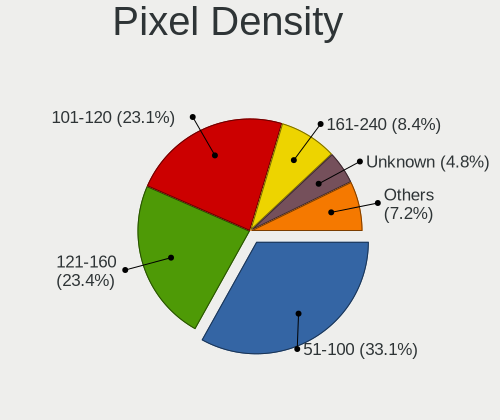
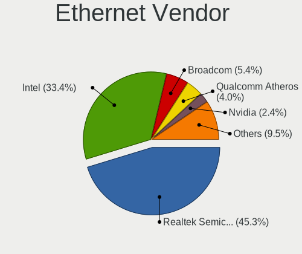

Linux in USA - Tested Hardware & Statistics
-------------------------------------------

A project to collect tested hardware configurations for Linux in USA.

Anyone can contribute to this report by the [hw-probe](https://github.com/linuxhw/hw-probe) tool:

    sudo -E hw-probe -all -upload

Please contribute! Especially if your hardware is rare.

This is a report for all computer types. See also reports for [desktops](/Location/USA/Desktop/README.md) and [notebooks](/Location/USA/Notebook/README.md).

Contents
--------

* [ Test Cases ](#test-cases)

* [ System ](#system)
  - [ OS                       ](#os)
  - [ OS Family                ](#os-family)
  - [ Kernel                   ](#kernel)
  - [ Kernel Family            ](#kernel-family)
  - [ Kernel Major Ver.        ](#kernel-major-ver)
  - [ Arch                     ](#arch)
  - [ DE                       ](#de)
  - [ Display Server           ](#display-server)
  - [ Display Manager          ](#display-manager)
  - [ OS Lang                  ](#os-lang)
  - [ Boot Mode                ](#boot-mode)
  - [ Filesystem               ](#filesystem)
  - [ Part. scheme             ](#part-scheme)
  - [ Dual Boot with Linux/BSD ](#dual-boot-with-linuxbsd)
  - [ Dual Boot (Win)          ](#dual-boot-win)

* [ Board ](#board)
  - [ Vendor                   ](#vendor)
  - [ Model                    ](#model)
  - [ Model Family             ](#model-family)
  - [ MFG Year                 ](#mfg-year)
  - [ Form Factor              ](#form-factor)
  - [ Secure Boot              ](#secure-boot)
  - [ Coreboot                 ](#coreboot)
  - [ RAM Size                 ](#ram-size)
  - [ RAM Used                 ](#ram-used)
  - [ Total Drives             ](#total-drives)
  - [ Has CD-ROM               ](#has-cd-rom)
  - [ Has Ethernet             ](#has-ethernet)
  - [ Has WiFi                 ](#has-wifi)
  - [ Has Bluetooth            ](#has-bluetooth)

* [ Location ](#location)
  - [ Country                  ](#country)
  - [ City                     ](#city)

* [ Drives ](#drives)
  - [ Drive Vendor             ](#drive-vendor)
  - [ Drive Model              ](#drive-model)
  - [ HDD Vendor               ](#hdd-vendor)
  - [ SSD Vendor               ](#ssd-vendor)
  - [ Drive Kind               ](#drive-kind)
  - [ Drive Connector          ](#drive-connector)
  - [ Drive Size               ](#drive-size)
  - [ Space Total              ](#space-total)
  - [ Space Used               ](#space-used)
  - [ Malfunc. Drives          ](#malfunc-drives)
  - [ Malfunc. Drive Vendor    ](#malfunc-drive-vendor)
  - [ Malfunc. HDD Vendor      ](#malfunc-hdd-vendor)
  - [ Malfunc. Drive Kind      ](#malfunc-drive-kind)
  - [ Failed Drives            ](#failed-drives)
  - [ Failed Drive Vendor      ](#failed-drive-vendor)
  - [ Drive Status             ](#drive-status)

* [ Storage controller ](#storage-controller)
  - [ Storage Vendor           ](#storage-vendor)
  - [ Storage Model            ](#storage-model)
  - [ Storage Kind             ](#storage-kind)

* [ Processor ](#processor)
  - [ CPU Vendor               ](#cpu-vendor)
  - [ CPU Model                ](#cpu-model)
  - [ CPU Model Family         ](#cpu-model-family)
  - [ CPU Cores                ](#cpu-cores)
  - [ CPU Sockets              ](#cpu-sockets)
  - [ CPU Threads              ](#cpu-threads)
  - [ CPU Op-Modes             ](#cpu-op-modes)
  - [ CPU Microcode            ](#cpu-microcode)
  - [ CPU Microarch            ](#cpu-microarch)

* [ Graphics ](#graphics)
  - [ GPU Vendor               ](#gpu-vendor)
  - [ GPU Model                ](#gpu-model)
  - [ GPU Combo                ](#gpu-combo)
  - [ GPU Driver               ](#gpu-driver)
  - [ GPU Memory               ](#gpu-memory)

* [ Monitor ](#monitor)
  - [ Monitor Vendor           ](#monitor-vendor)
  - [ Monitor Model            ](#monitor-model)
  - [ Monitor Resolution       ](#monitor-resolution)
  - [ Monitor Diagonal         ](#monitor-diagonal)
  - [ Monitor Width            ](#monitor-width)
  - [ Aspect Ratio             ](#aspect-ratio)
  - [ Monitor Area             ](#monitor-area)
  - [ Pixel Density            ](#pixel-density)
  - [ Multiple Monitors        ](#multiple-monitors)

* [ Network ](#network)
  - [ Net Controller Vendor    ](#net-controller-vendor)
  - [ Net Controller Model     ](#net-controller-model)
  - [ Wireless Vendor          ](#wireless-vendor)
  - [ Wireless Model           ](#wireless-model)
  - [ Ethernet Vendor          ](#ethernet-vendor)
  - [ Ethernet Model           ](#ethernet-model)
  - [ Net Controller Kind      ](#net-controller-kind)
  - [ Used Controller          ](#used-controller)
  - [ NICs                     ](#nics)
  - [ IPv6                     ](#ipv6)

* [ Bluetooth ](#bluetooth)
  - [ Bluetooth Vendor         ](#bluetooth-vendor)
  - [ Bluetooth Model          ](#bluetooth-model)

* [ Sound ](#sound)
  - [ Sound Vendor             ](#sound-vendor)
  - [ Sound Model              ](#sound-model)

* [ Memory ](#memory)
  - [ Memory Vendor            ](#memory-vendor)
  - [ Memory Model             ](#memory-model)
  - [ Memory Kind              ](#memory-kind)
  - [ Memory Form Factor       ](#memory-form-factor)
  - [ Memory Size              ](#memory-size)
  - [ Memory Speed             ](#memory-speed)

* [ Printers & scanners ](#printers--scanners)
  - [ Printer Vendor           ](#printer-vendor)
  - [ Printer Model            ](#printer-model)
  - [ Scanner Vendor           ](#scanner-vendor)
  - [ Scanner Model            ](#scanner-model)

* [ Camera ](#camera)
  - [ Camera Vendor            ](#camera-vendor)
  - [ Camera Model             ](#camera-model)

* [ Security ](#security)
  - [ Fingerprint Vendor       ](#fingerprint-vendor)
  - [ Fingerprint Model        ](#fingerprint-model)
  - [ Chipcard Vendor          ](#chipcard-vendor)
  - [ Chipcard Model           ](#chipcard-model)

* [ Unsupported ](#unsupported)
  - [ Unsupported Devices      ](#unsupported-devices)
  - [ Unsupported Device Types ](#unsupported-device-types)

Test Cases
----------

Total: 40323

| Vendor        | Model                       | Form-Factor | Probe                                                      | Date         |
|---------------|-----------------------------|-------------|------------------------------------------------------------|--------------|
| HP            | 3397                        | Desktop     | [24eb596bce](https://linux-hardware.org/?probe=24eb596bce) | Nov 02, 2022 |
| Dell          | 040DDP A00                  | Desktop     | [fba864b37c](https://linux-hardware.org/?probe=fba864b37c) | Nov 02, 2022 |
| Intel         | NUC8i7HNB J68197-503        | Mini pc     | [6d946007b8](https://linux-hardware.org/?probe=6d946007b8) | Nov 02, 2022 |
| Lenovo        | ThinkPad E475 20H40006US    | Notebook    | [d59bd1e8f1](https://linux-hardware.org/?probe=d59bd1e8f1) | Nov 02, 2022 |
| Panasonic     | CF-31WBLEHLM                | Notebook    | [623af75bb3](https://linux-hardware.org/?probe=623af75bb3) | Nov 02, 2022 |
| Panasonic     | CF-31WBLEHLM                | Notebook    | [52e7c62bae](https://linux-hardware.org/?probe=52e7c62bae) | Nov 02, 2022 |
| Lenovo        | ThinkPad T61 6464A13        | Notebook    | [5f850cbab6](https://linux-hardware.org/?probe=5f850cbab6) | Nov 02, 2022 |
| Lenovo        | ThinkPad Yoga 11e 20DAS0... | Notebook    | [d9de10d93e](https://linux-hardware.org/?probe=d9de10d93e) | Nov 02, 2022 |
| Lenovo        | ThinkPad E475 20H40006US    | Notebook    | [4342ecb0f9](https://linux-hardware.org/?probe=4342ecb0f9) | Nov 02, 2022 |
| Google        | Terra                       | Notebook    | [46299bf228](https://linux-hardware.org/?probe=46299bf228) | Nov 02, 2022 |
| Lenovo        | ThinkPad E475 20H40006US    | Notebook    | [fd32769391](https://linux-hardware.org/?probe=fd32769391) | Nov 02, 2022 |
| Lenovo        | ThinkPad E475 20H40006US    | Notebook    | [d3c1c92563](https://linux-hardware.org/?probe=d3c1c92563) | Nov 02, 2022 |
| HP            | 18E5                        | Desktop     | [3df38ade7e](https://linux-hardware.org/?probe=3df38ade7e) | Nov 02, 2022 |
| Lenovo        | ThinkPad E475 20H40006US    | Notebook    | [0ffaee423b](https://linux-hardware.org/?probe=0ffaee423b) | Nov 02, 2022 |
| Lenovo        | 361A SDK0K17763 WIN         | Desktop     | [5d34d86be3](https://linux-hardware.org/?probe=5d34d86be3) | Nov 02, 2022 |
| Dell          | Inspiron 7506 2n1           | Convertible | [0666d8a154](https://linux-hardware.org/?probe=0666d8a154) | Nov 02, 2022 |
| Gigabyte      | X570 GAMING X               | Desktop     | [b3613b84ad](https://linux-hardware.org/?probe=b3613b84ad) | Nov 02, 2022 |
| HP            | 18E5                        | Desktop     | [8204df7795](https://linux-hardware.org/?probe=8204df7795) | Nov 02, 2022 |
| Lenovo        | 3132 SDK0R32862 WIN 3258... | Desktop     | [f8708425a1](https://linux-hardware.org/?probe=f8708425a1) | Nov 02, 2022 |
| ASUSTek       | ROG STRIX B550-F GAMING     | Desktop     | [4e97493141](https://linux-hardware.org/?probe=4e97493141) | Nov 02, 2022 |
| Valve         | Jupiter                     | Notebook    | [f6295954bc](https://linux-hardware.org/?probe=f6295954bc) | Nov 02, 2022 |
| Dell          | Inspiron 7506 2n1           | Convertible | [93884d7e71](https://linux-hardware.org/?probe=93884d7e71) | Nov 02, 2022 |
| Dell          | 0GDG8Y A00                  | Desktop     | [609ccd3204](https://linux-hardware.org/?probe=609ccd3204) | Nov 02, 2022 |
| Valve         | Jupiter                     | Notebook    | [13e280e72f](https://linux-hardware.org/?probe=13e280e72f) | Nov 02, 2022 |
| HP            | Pavilion dv8                | Notebook    | [21af5313f0](https://linux-hardware.org/?probe=21af5313f0) | Nov 02, 2022 |
| Panasonic     | CF-C1BWFBZ1M                | Notebook    | [18a81d5db2](https://linux-hardware.org/?probe=18a81d5db2) | Nov 02, 2022 |
| ASUSTek       | PRIME B550M-A               | Desktop     | [454939df34](https://linux-hardware.org/?probe=454939df34) | Nov 02, 2022 |
| ASUSTek       | ROG Zephyrus G14 GA402RJ... | Notebook    | [7b51138a0b](https://linux-hardware.org/?probe=7b51138a0b) | Nov 02, 2022 |
| Gigabyte      | X570 AORUS ELITE            | Desktop     | [9b093574b9](https://linux-hardware.org/?probe=9b093574b9) | Nov 02, 2022 |
| HP            | Pavilion x2 Detachable P... | Notebook    | [b4d63f4835](https://linux-hardware.org/?probe=b4d63f4835) | Nov 02, 2022 |
| Dell          | Latitude 5591               | Notebook    | [bcd8aef9a0](https://linux-hardware.org/?probe=bcd8aef9a0) | Nov 02, 2022 |
| GPU Compan... | GWTN156-2BK                 | Notebook    | [a7fb2c2163](https://linux-hardware.org/?probe=a7fb2c2163) | Nov 02, 2022 |
| Foxconn       | 2A92                        | Desktop     | [0898482b18](https://linux-hardware.org/?probe=0898482b18) | Nov 02, 2022 |
| Dell          | 02YRK5 A02                  | Desktop     | [2c63ff26e5](https://linux-hardware.org/?probe=2c63ff26e5) | Nov 01, 2022 |
| HP            | x2 Detachable 10-p0XX       | Tablet      | [dfe5dc3d95](https://linux-hardware.org/?probe=dfe5dc3d95) | Nov 01, 2022 |
| ASRock        | AB350 Gaming K4             | Desktop     | [36387e4f11](https://linux-hardware.org/?probe=36387e4f11) | Nov 01, 2022 |
| HP            | Tablet 11m-be0xxx           | Tablet      | [fda7b35626](https://linux-hardware.org/?probe=fda7b35626) | Nov 01, 2022 |
| HP            | Tablet 11m-be0xxx           | Tablet      | [812c1bc398](https://linux-hardware.org/?probe=812c1bc398) | Nov 01, 2022 |
| ASUSTek       | Zephyrus S GX531GS_GX531... | Notebook    | [4823244248](https://linux-hardware.org/?probe=4823244248) | Nov 01, 2022 |
| ASUSTek       | H97I-PLUS                   | Desktop     | [13bf376807](https://linux-hardware.org/?probe=13bf376807) | Nov 01, 2022 |
| Intel Clie... | CMCN1CC                     | Notebook    | [719731b244](https://linux-hardware.org/?probe=719731b244) | Nov 01, 2022 |
| Dell          | 06D7TR A02                  | Desktop     | [a27d97c026](https://linux-hardware.org/?probe=a27d97c026) | Nov 01, 2022 |
| Dell          | 06D7TR A02                  | Desktop     | [f8a4053db1](https://linux-hardware.org/?probe=f8a4053db1) | Nov 01, 2022 |
| Dell          | 088DT1 A01                  | Desktop     | [efcbf8a2eb](https://linux-hardware.org/?probe=efcbf8a2eb) | Nov 01, 2022 |
| Razer         | Blade 15 Advanced Model ... | Notebook    | [e0a589194b](https://linux-hardware.org/?probe=e0a589194b) | Nov 01, 2022 |
| Apple         | MacBookPro12,1              | Notebook    | [e08326bc94](https://linux-hardware.org/?probe=e08326bc94) | Nov 01, 2022 |
| Barracuda ... | Barracuda NG Firewall F1... | Firewall    | [4ecb047de3](https://linux-hardware.org/?probe=4ecb047de3) | Nov 01, 2022 |
| MSI           | MAG B550 TOMAHAWK           | Desktop     | [8ce0b9271b](https://linux-hardware.org/?probe=8ce0b9271b) | Nov 01, 2022 |
| Apple         | MacBookPro9,2               | Notebook    | [69768228d4](https://linux-hardware.org/?probe=69768228d4) | Nov 01, 2022 |
| Intel         | NUC6i7KYB H90766-410        | Mini pc     | [9c17f472ee](https://linux-hardware.org/?probe=9c17f472ee) | Nov 01, 2022 |
| Lenovo        | ThinkPad X1 Yoga 1st 20F... | Convertible | [65c885ec1f](https://linux-hardware.org/?probe=65c885ec1f) | Nov 01, 2022 |
| Dell          | 07C0H8 A00                  | Desktop     | [1b2cb018d0](https://linux-hardware.org/?probe=1b2cb018d0) | Nov 01, 2022 |
| Gigabyte      | B550 UD AC                  | Desktop     | [c5a5219cf3](https://linux-hardware.org/?probe=c5a5219cf3) | Nov 01, 2022 |
| Acer          | Aspire A515-46              | Notebook    | [ef6bcab217](https://linux-hardware.org/?probe=ef6bcab217) | Nov 01, 2022 |
| Inventec      | Dell Wyse Thin Client De... | Mini pc     | [428b353c2c](https://linux-hardware.org/?probe=428b353c2c) | Nov 01, 2022 |
| Unknown       | Unknown                     | Notebook    | [9608724116](https://linux-hardware.org/?probe=9608724116) | Nov 01, 2022 |
| Apple         | MacBookPro9,2               | Notebook    | [4cdb36db63](https://linux-hardware.org/?probe=4cdb36db63) | Nov 01, 2022 |
| Apple         | MacBookPro9,2               | Notebook    | [d63c5de91b](https://linux-hardware.org/?probe=d63c5de91b) | Nov 01, 2022 |
| HP            | Stream Laptop 14-ax0XX      | Notebook    | [bbbf28359b](https://linux-hardware.org/?probe=bbbf28359b) | Nov 01, 2022 |
| ASUSTek       | PRIME B550M-A               | Desktop     | [321eae8d23](https://linux-hardware.org/?probe=321eae8d23) | Nov 01, 2022 |
| Dell          | Inspiron 15 3511            | Notebook    | [85c215eebf](https://linux-hardware.org/?probe=85c215eebf) | Nov 01, 2022 |
| ASRock        | AB350 Gaming K4             | Desktop     | [560d84828c](https://linux-hardware.org/?probe=560d84828c) | Nov 01, 2022 |
| HP            | ProLiant DL380 G7           | Server      | [6d994999c9](https://linux-hardware.org/?probe=6d994999c9) | Nov 01, 2022 |
| ASUSTek       | ROG STRIX X670E-I GAMING... | Desktop     | [77ccdee0fe](https://linux-hardware.org/?probe=77ccdee0fe) | Nov 01, 2022 |
| Acer          | Aspire XC-1660G V:1.1       | Desktop     | [a3a55bf3e4](https://linux-hardware.org/?probe=a3a55bf3e4) | Nov 01, 2022 |
| Acer          | Aspire XC-1660G V:1.1       | Desktop     | [8d99f1fb3b](https://linux-hardware.org/?probe=8d99f1fb3b) | Nov 01, 2022 |
| ASUSTek       | ROG STRIX B450-F GAMING     | Desktop     | [7a29190887](https://linux-hardware.org/?probe=7a29190887) | Nov 01, 2022 |
| MSI           | MEG X570 UNIFY              | Desktop     | [11de150949](https://linux-hardware.org/?probe=11de150949) | Nov 01, 2022 |
| GPU Compan... | GWTN156-2BK                 | Notebook    | [99ab599fbc](https://linux-hardware.org/?probe=99ab599fbc) | Nov 01, 2022 |
| BCM           | MX110HD                     | Desktop     | [60c3eb0c5c](https://linux-hardware.org/?probe=60c3eb0c5c) | Nov 01, 2022 |
| ASUSTek       | K54C                        | Notebook    | [dd4f63b1e4](https://linux-hardware.org/?probe=dd4f63b1e4) | Nov 01, 2022 |
| Samsung       | 950QED                      | Convertible | [3fa8caa72f](https://linux-hardware.org/?probe=3fa8caa72f) | Nov 01, 2022 |
| Dell          | 082WXT A03                  | Desktop     | [ab3dad5a31](https://linux-hardware.org/?probe=ab3dad5a31) | Nov 01, 2022 |
| HP            | 09F8h                       | Desktop     | [f1107e91f2](https://linux-hardware.org/?probe=f1107e91f2) | Nov 01, 2022 |
| ASUSTek       | TUF Gaming X570-PLUS        | Desktop     | [d729001115](https://linux-hardware.org/?probe=d729001115) | Nov 01, 2022 |
| HP            | Pavilion dv7                | Notebook    | [5fdb241389](https://linux-hardware.org/?probe=5fdb241389) | Oct 31, 2022 |
| AOpen         | aVKx-DE R1.03 55DEL10001... | Desktop     | [b487a7aee3](https://linux-hardware.org/?probe=b487a7aee3) | Oct 31, 2022 |
| Dell          | 040DDP A00                  | Desktop     | [22b1e93203](https://linux-hardware.org/?probe=22b1e93203) | Oct 31, 2022 |
| Dell          | XPS 13 9310                 | Notebook    | [d284b1709a](https://linux-hardware.org/?probe=d284b1709a) | Oct 31, 2022 |
| HP            | Laptop 15-bs2xx             | Notebook    | [7c94d16c1c](https://linux-hardware.org/?probe=7c94d16c1c) | Oct 31, 2022 |
| ASUSTek       | ROG STRIX B450-F GAMING     | Desktop     | [4c3ae53c16](https://linux-hardware.org/?probe=4c3ae53c16) | Oct 31, 2022 |
| MSI           | MEG Z590 ACE                | Desktop     | [1082f00d60](https://linux-hardware.org/?probe=1082f00d60) | Oct 31, 2022 |
| ASUSTek       | Z87-K                       | Desktop     | [7edc0875ed](https://linux-hardware.org/?probe=7edc0875ed) | Oct 31, 2022 |
| ASUSTek       | VM60                        | Desktop     | [2cb5cc2932](https://linux-hardware.org/?probe=2cb5cc2932) | Oct 31, 2022 |
| ASUSTek       | P9X79                       | Desktop     | [3af3091881](https://linux-hardware.org/?probe=3af3091881) | Oct 31, 2022 |
| Dell          | Vostro 7620                 | Notebook    | [2ccd56ee29](https://linux-hardware.org/?probe=2ccd56ee29) | Oct 31, 2022 |
| HP            | 1790                        | Desktop     | [6dc2cef5ea](https://linux-hardware.org/?probe=6dc2cef5ea) | Oct 31, 2022 |
| Chuwi         | LarkBox X                   | Mini pc     | [ed3f906a17](https://linux-hardware.org/?probe=ed3f906a17) | Oct 31, 2022 |
| Dell          | Latitude E6530              | Notebook    | [5f82f9b682](https://linux-hardware.org/?probe=5f82f9b682) | Oct 31, 2022 |
| Lenovo        | 31900058 STD                | Desktop     | [d7cc344b2f](https://linux-hardware.org/?probe=d7cc344b2f) | Oct 31, 2022 |
| MSI           | AM1I                        | Desktop     | [30014de18a](https://linux-hardware.org/?probe=30014de18a) | Oct 31, 2022 |
| MSI           | B450M BAZOOKA MAX WIFI      | Desktop     | [8b8c978f0b](https://linux-hardware.org/?probe=8b8c978f0b) | Oct 31, 2022 |
| Dell          | Precision M6700             | Notebook    | [e5952f6f57](https://linux-hardware.org/?probe=e5952f6f57) | Oct 31, 2022 |
| Intel         | NUC11PABi7 K90104-305       | Mini pc     | [e4af6d51f3](https://linux-hardware.org/?probe=e4af6d51f3) | Oct 31, 2022 |
| Dell          | Precision M6700             | Notebook    | [aa4b5e4400](https://linux-hardware.org/?probe=aa4b5e4400) | Oct 31, 2022 |
| HP            | ENVY NOTEBOOK PC            | Notebook    | [f2893aaedf](https://linux-hardware.org/?probe=f2893aaedf) | Oct 31, 2022 |
| HP            | ENVY 17                     | Notebook    | [5b845d9ee3](https://linux-hardware.org/?probe=5b845d9ee3) | Oct 31, 2022 |
| Dell          | Vostro 7620                 | Notebook    | [7f41a14301](https://linux-hardware.org/?probe=7f41a14301) | Oct 31, 2022 |
| Lenovo        | ThinkPad S1 Yoga 20CD00B... | Notebook    | [0e06dcc642](https://linux-hardware.org/?probe=0e06dcc642) | Oct 31, 2022 |
| ASRock        | X470 Taichi                 | Desktop     | [d808be6d90](https://linux-hardware.org/?probe=d808be6d90) | Oct 31, 2022 |
| Valve         | Jupiter                     | Notebook    | [92b732ad9a](https://linux-hardware.org/?probe=92b732ad9a) | Oct 31, 2022 |
| Dell          | Vostro 7620                 | Notebook    | [00dae3fbc5](https://linux-hardware.org/?probe=00dae3fbc5) | Oct 31, 2022 |
| ASUSTek       | P5Q-E                       | Desktop     | [0ef6be44d0](https://linux-hardware.org/?probe=0ef6be44d0) | Oct 31, 2022 |
| Gigabyte      | Z77X-UP4 TH                 | Desktop     | [5eabf4c6b3](https://linux-hardware.org/?probe=5eabf4c6b3) | Oct 31, 2022 |
| ASUSTek       | M5A78L-M/USB3               | Desktop     | [4ac9bf1711](https://linux-hardware.org/?probe=4ac9bf1711) | Oct 31, 2022 |
| ASUSTek       | M5A99FX PRO R2.0            | Desktop     | [4179fe16d6](https://linux-hardware.org/?probe=4179fe16d6) | Oct 31, 2022 |
| Dell          | 042P49 A01                  | Desktop     | [1fb51cc10c](https://linux-hardware.org/?probe=1fb51cc10c) | Oct 31, 2022 |
| Apple         | MacBookPro11,3              | Notebook    | [64d1c159aa](https://linux-hardware.org/?probe=64d1c159aa) | Oct 30, 2022 |
| ASUSTek       | ROG Zephyrus G15 GA503RM... | Notebook    | [76906648cb](https://linux-hardware.org/?probe=76906648cb) | Oct 30, 2022 |
| MSI           | B550M PRO-VDH WIFI          | Desktop     | [472a3f2707](https://linux-hardware.org/?probe=472a3f2707) | Oct 30, 2022 |
| HP            | 18E7                        | Desktop     | [6393aa1211](https://linux-hardware.org/?probe=6393aa1211) | Oct 30, 2022 |
| ASUSTek       | PHOENIX                     | Desktop     | [d4f8ae717d](https://linux-hardware.org/?probe=d4f8ae717d) | Oct 30, 2022 |
| Dell          | Inspiron 14 7425 2-in-1     | Convertible | [e427e48710](https://linux-hardware.org/?probe=e427e48710) | Oct 30, 2022 |
| HP            | Laptop 15-da0xxx            | Notebook    | [b903c0e375](https://linux-hardware.org/?probe=b903c0e375) | Oct 30, 2022 |
| Lenovo        | IdeaPad 100S-14IBR 80R9     | Notebook    | [91d1732515](https://linux-hardware.org/?probe=91d1732515) | Oct 30, 2022 |
| Lenovo        | 0B98401 WIN                 | Desktop     | [25805a13b0](https://linux-hardware.org/?probe=25805a13b0) | Oct 30, 2022 |
| AZW           | GTR V01                     | Mini pc     | [03b291b957](https://linux-hardware.org/?probe=03b291b957) | Oct 30, 2022 |
| HP            | Laptop 15-bs1xx             | Notebook    | [fabbcc9035](https://linux-hardware.org/?probe=fabbcc9035) | Oct 30, 2022 |
| Apple         | MacBookPro13,3              | Notebook    | [b028075707](https://linux-hardware.org/?probe=b028075707) | Oct 30, 2022 |
| MSI           | B450 GAMING PLUS MAX        | Desktop     | [e638ed7bd3](https://linux-hardware.org/?probe=e638ed7bd3) | Oct 30, 2022 |
| Acidanther... | Mac-AA95B1DDAB278B95 iMa... | All in one  | [33df9c20bf](https://linux-hardware.org/?probe=33df9c20bf) | Oct 30, 2022 |
| HP            | Pavilion Laptop 15-eh0xx... | Notebook    | [d8f6faad10](https://linux-hardware.org/?probe=d8f6faad10) | Oct 30, 2022 |
| HP            | Stream Laptop 14-cb1xxx     | Notebook    | [75dcd27c77](https://linux-hardware.org/?probe=75dcd27c77) | Oct 30, 2022 |
| Acidanther... | Mac-AA95B1DDAB278B95 iMa... | All in one  | [c63ee0d1b7](https://linux-hardware.org/?probe=c63ee0d1b7) | Oct 30, 2022 |
| Inventec      | Dell Wyse Thin Client De... | Mini pc     | [caefae88bf](https://linux-hardware.org/?probe=caefae88bf) | Oct 30, 2022 |
| Valve         | Jupiter                     | Notebook    | [2d381c1626](https://linux-hardware.org/?probe=2d381c1626) | Oct 30, 2022 |
| HP            | Pavilion Laptop 15-eh0xx... | Notebook    | [6c3a410233](https://linux-hardware.org/?probe=6c3a410233) | Oct 30, 2022 |
| EVGA          | 122-CK-NF68 2               | Desktop     | [91b3144c5c](https://linux-hardware.org/?probe=91b3144c5c) | Oct 30, 2022 |
| ASUSTek       | TUF Gaming B450M-PLUS II    | Desktop     | [8e2ab3d61b](https://linux-hardware.org/?probe=8e2ab3d61b) | Oct 30, 2022 |
| Lenovo        | ThinkPad X1 Carbon Gen 8... | Notebook    | [df654ca0b1](https://linux-hardware.org/?probe=df654ca0b1) | Oct 30, 2022 |
| Dell          | 0WMJ54 A01                  | Desktop     | [3760efa49c](https://linux-hardware.org/?probe=3760efa49c) | Oct 30, 2022 |
| Dell          | 0WMJ54 A01                  | Desktop     | [1b614b2744](https://linux-hardware.org/?probe=1b614b2744) | Oct 30, 2022 |
| Lenovo        | ThinkPad L15 Gen 2 20X30... | Notebook    | [418b143f46](https://linux-hardware.org/?probe=418b143f46) | Oct 30, 2022 |
| MSI           | B450-A PRO MAX              | Desktop     | [0e8db93a43](https://linux-hardware.org/?probe=0e8db93a43) | Oct 30, 2022 |
| Dell          | Latitude 7490               | Notebook    | [95d0006efb](https://linux-hardware.org/?probe=95d0006efb) | Oct 30, 2022 |
| GPU Compan... | GWTN141-10                  | Notebook    | [189fca8ab3](https://linux-hardware.org/?probe=189fca8ab3) | Oct 30, 2022 |
| Dell          | Latitude E7450              | Notebook    | [32a6333f4b](https://linux-hardware.org/?probe=32a6333f4b) | Oct 30, 2022 |
| Apple         | Mac-F221BEC8                | Desktop     | [12b6232cdd](https://linux-hardware.org/?probe=12b6232cdd) | Oct 30, 2022 |
| HP            | ProBook 640 G4              | Notebook    | [0a7776630f](https://linux-hardware.org/?probe=0a7776630f) | Oct 30, 2022 |
| MSI           | B550M PRO-VDH WIFI          | Desktop     | [44eaa95ffc](https://linux-hardware.org/?probe=44eaa95ffc) | Oct 30, 2022 |
| ASUSTek       | TP401CA                     | Convertible | [8d97908e58](https://linux-hardware.org/?probe=8d97908e58) | Oct 30, 2022 |
| HP            | Unknown                     | Notebook    | [6e024c825e](https://linux-hardware.org/?probe=6e024c825e) | Oct 30, 2022 |
| Dell          | Latitude E6510              | Notebook    | [84a61bf436](https://linux-hardware.org/?probe=84a61bf436) | Oct 30, 2022 |
| Dell          | 0G214D A00                  | Desktop     | [43b30d9a84](https://linux-hardware.org/?probe=43b30d9a84) | Oct 30, 2022 |
| Dell          | 0G214D A00                  | Desktop     | [2ee26099ae](https://linux-hardware.org/?probe=2ee26099ae) | Oct 30, 2022 |
| ASUSTek       | ROG STRIX Z690-F GAMING ... | Desktop     | [7047610fd9](https://linux-hardware.org/?probe=7047610fd9) | Oct 30, 2022 |
| HP            | Laptop 17-by1xxx            | Notebook    | [b3e8975edf](https://linux-hardware.org/?probe=b3e8975edf) | Oct 29, 2022 |
| ASUSTek       | G11CD                       | Desktop     | [2a9d64387c](https://linux-hardware.org/?probe=2a9d64387c) | Oct 29, 2022 |
| ASRock        | Z690 Steel Legend           | Desktop     | [cbfd203fd4](https://linux-hardware.org/?probe=cbfd203fd4) | Oct 29, 2022 |
| Gigabyte      | B450M DS3H V2               | Desktop     | [ba5da6b270](https://linux-hardware.org/?probe=ba5da6b270) | Oct 29, 2022 |
| ASUSTek       | M3N-HT DELUXE               | Desktop     | [290f3b115f](https://linux-hardware.org/?probe=290f3b115f) | Oct 29, 2022 |
| ASUSTek       | M3N-HT DELUXE               | Desktop     | [bf841b86f5](https://linux-hardware.org/?probe=bf841b86f5) | Oct 29, 2022 |
| Lenovo        | 3717 SDK0J40709 WIN 3259... | Desktop     | [39d64a1014](https://linux-hardware.org/?probe=39d64a1014) | Oct 29, 2022 |
| Dell          | 0T2HR0 A02                  | Desktop     | [e4b1137777](https://linux-hardware.org/?probe=e4b1137777) | Oct 29, 2022 |
| ASUSTek       | ROG Zephyrus G14 GA402RJ... | Notebook    | [1753d78397](https://linux-hardware.org/?probe=1753d78397) | Oct 29, 2022 |
| ASUSTek       | M4A785-M                    | Desktop     | [73eae83658](https://linux-hardware.org/?probe=73eae83658) | Oct 29, 2022 |
| Foxconn       | 2ACA                        | Desktop     | [69544f77d0](https://linux-hardware.org/?probe=69544f77d0) | Oct 29, 2022 |
| Valve         | Jupiter                     | Notebook    | [dfc3eee826](https://linux-hardware.org/?probe=dfc3eee826) | Oct 29, 2022 |
| Valve         | Jupiter                     | Notebook    | [0405c29890](https://linux-hardware.org/?probe=0405c29890) | Oct 29, 2022 |
| ASUSTek       | ROG Maximus XII HERO        | Desktop     | [048348c6ba](https://linux-hardware.org/?probe=048348c6ba) | Oct 29, 2022 |
| ASUSTek       | ZenBook Q406DA              | Convertible | [f8bae249b9](https://linux-hardware.org/?probe=f8bae249b9) | Oct 29, 2022 |
| Dell          | Inspiron 7506 2n1           | Convertible | [a44dec1b17](https://linux-hardware.org/?probe=a44dec1b17) | Oct 29, 2022 |
| Dell          | Inspiron 7506 2n1           | Convertible | [e1a94d7ce4](https://linux-hardware.org/?probe=e1a94d7ce4) | Oct 29, 2022 |
| Dell          | 0WN7Y6 A01                  | Desktop     | [4a5527f98a](https://linux-hardware.org/?probe=4a5527f98a) | Oct 29, 2022 |
| Dell          | XPS 13 9300                 | Notebook    | [cc62dbe2f6](https://linux-hardware.org/?probe=cc62dbe2f6) | Oct 29, 2022 |
| Dell          | XPS 13 9300                 | Notebook    | [301aab9126](https://linux-hardware.org/?probe=301aab9126) | Oct 29, 2022 |
| ASUSTek       | Q550LF                      | Notebook    | [383c45edce](https://linux-hardware.org/?probe=383c45edce) | Oct 29, 2022 |
| ASUSTek       | PRIME Q270M-C               | Desktop     | [4440c6ed51](https://linux-hardware.org/?probe=4440c6ed51) | Oct 29, 2022 |
| Dell          | Latitude E7450              | Notebook    | [012cd7214b](https://linux-hardware.org/?probe=012cd7214b) | Oct 29, 2022 |
| Dell          | Latitude E7450              | Notebook    | [635a60671d](https://linux-hardware.org/?probe=635a60671d) | Oct 29, 2022 |
| Google        | Kench                       | Desktop     | [faf24fddcd](https://linux-hardware.org/?probe=faf24fddcd) | Oct 29, 2022 |
| Dell          | XPS 17 9720                 | Notebook    | [270b988521](https://linux-hardware.org/?probe=270b988521) | Oct 29, 2022 |
| Lenovo        | ThinkPad P1 Gen 5 21DC00... | Notebook    | [74f0ca8e11](https://linux-hardware.org/?probe=74f0ca8e11) | Oct 29, 2022 |
| libre-comp... | aml-s905x-cc                | Soc         | [0258982a5a](https://linux-hardware.org/?probe=0258982a5a) | Oct 29, 2022 |
| Lenovo        | ThinkPad E475 20H40006US    | Notebook    | [60d1db050b](https://linux-hardware.org/?probe=60d1db050b) | Oct 28, 2022 |
| Lenovo        | ThinkPad E475 20H40006US    | Notebook    | [2a9f06c2b4](https://linux-hardware.org/?probe=2a9f06c2b4) | Oct 28, 2022 |
| HP            | ENVY x360 Convertible 13... | Convertible | [4f5623de73](https://linux-hardware.org/?probe=4f5623de73) | Oct 28, 2022 |
| Gigabyte      | B550M DS3H                  | Desktop     | [8a918b4739](https://linux-hardware.org/?probe=8a918b4739) | Oct 28, 2022 |
| Lenovo        | ThinkPad E475 20H40006US    | Notebook    | [787904d265](https://linux-hardware.org/?probe=787904d265) | Oct 28, 2022 |
| Samsung       | 930QDB                      | Convertible | [453d856b8d](https://linux-hardware.org/?probe=453d856b8d) | Oct 28, 2022 |
| Google        | Delbin                      | Notebook    | [4d43e7a995](https://linux-hardware.org/?probe=4d43e7a995) | Oct 28, 2022 |
| Lenovo        | ThinkPad T530 239242U       | Notebook    | [dbf70338e9](https://linux-hardware.org/?probe=dbf70338e9) | Oct 28, 2022 |
| ASUSTek       | CM1730,CM1830               | Desktop     | [0915c0bf5a](https://linux-hardware.org/?probe=0915c0bf5a) | Oct 28, 2022 |
| HP            | ZBook 15 G3                 | Notebook    | [c60b429baa](https://linux-hardware.org/?probe=c60b429baa) | Oct 28, 2022 |
| Toshiba       | Satellite C75D-B            | Notebook    | [4f644b7d3b](https://linux-hardware.org/?probe=4f644b7d3b) | Oct 28, 2022 |
| Dell          | XPS 17 9700                 | Notebook    | [81121b7762](https://linux-hardware.org/?probe=81121b7762) | Oct 28, 2022 |
| Dell          | Latitude E6440              | Notebook    | [73072d8574](https://linux-hardware.org/?probe=73072d8574) | Oct 28, 2022 |
| HP            | Presario V6000 (RV053UA#... | Notebook    | [ca121e3727](https://linux-hardware.org/?probe=ca121e3727) | Oct 28, 2022 |
| Lenovo        | IdeaPad Slim 7 14ITL05 8... | Notebook    | [d5c2f29c22](https://linux-hardware.org/?probe=d5c2f29c22) | Oct 28, 2022 |
| Unknown       | Unknown                     | Notebook    | [3cfb5e74d3](https://linux-hardware.org/?probe=3cfb5e74d3) | Oct 28, 2022 |
| HP            | 255 G8 Notebook PC          | Notebook    | [2ad60a938a](https://linux-hardware.org/?probe=2ad60a938a) | Oct 28, 2022 |
| MSI           | X470 GAMING PLUS            | Desktop     | [f296db20db](https://linux-hardware.org/?probe=f296db20db) | Oct 28, 2022 |
| ASUSTek       | X99-A/USB                   | Desktop     | [ca0810aab5](https://linux-hardware.org/?probe=ca0810aab5) | Oct 28, 2022 |
| Dell          | 06D7TR A02                  | Desktop     | [42e2c69893](https://linux-hardware.org/?probe=42e2c69893) | Oct 28, 2022 |
| Lenovo        | IdeaPad 3 15IIL05 81WE      | Notebook    | [4bf648c91f](https://linux-hardware.org/?probe=4bf648c91f) | Oct 28, 2022 |
| ASUSTek       | M5A99FX PRO R2.0            | Desktop     | [060c8aadd1](https://linux-hardware.org/?probe=060c8aadd1) | Oct 28, 2022 |
| Apple         | Mac-63001698E7A34814 iMa... | All in one  | [a6264d5664](https://linux-hardware.org/?probe=a6264d5664) | Oct 28, 2022 |
| Gigabyte      | H110M-A-CF                  | Desktop     | [54b0296df7](https://linux-hardware.org/?probe=54b0296df7) | Oct 28, 2022 |
| Lenovo        | Yoga 7 15ITL5 82BJ          | Convertible | [70b5d97a3a](https://linux-hardware.org/?probe=70b5d97a3a) | Oct 28, 2022 |
| Acer          | Predator G3-571             | Notebook    | [a5c2027983](https://linux-hardware.org/?probe=a5c2027983) | Oct 28, 2022 |
| Dell          | XPS 15 9520                 | Notebook    | [d04e962e56](https://linux-hardware.org/?probe=d04e962e56) | Oct 28, 2022 |
| Unknown       | Unknown                     | Server      | [cdca95f7e5](https://linux-hardware.org/?probe=cdca95f7e5) | Oct 28, 2022 |
| ASUSTek       | PRIME X370-PRO              | Desktop     | [d3cf194e94](https://linux-hardware.org/?probe=d3cf194e94) | Oct 28, 2022 |
| ASRock        | X99 Extreme4                | Desktop     | [72102d6890](https://linux-hardware.org/?probe=72102d6890) | Oct 28, 2022 |
| HP            | 81C6 MVB 0C                 | Server      | [c60ce01c1e](https://linux-hardware.org/?probe=c60ce01c1e) | Oct 28, 2022 |
| Alienware     | 07W25T A01                  | Desktop     | [107ec47dd5](https://linux-hardware.org/?probe=107ec47dd5) | Oct 28, 2022 |
| Gigabyte      | B450M DS3H-CF               | Desktop     | [38135da604](https://linux-hardware.org/?probe=38135da604) | Oct 28, 2022 |
| Alienware     | 07W25T A01                  | Desktop     | [0338285f54](https://linux-hardware.org/?probe=0338285f54) | Oct 28, 2022 |
| HP            | Pavilion Laptop 15-cc0xx    | Notebook    | [0ca2ea7180](https://linux-hardware.org/?probe=0ca2ea7180) | Oct 28, 2022 |
| ASUSTek       | PHOENIX                     | Desktop     | [827dd1396b](https://linux-hardware.org/?probe=827dd1396b) | Oct 28, 2022 |
| Dell          | 0RD203                      | Desktop     | [b427b55c0b](https://linux-hardware.org/?probe=b427b55c0b) | Oct 28, 2022 |
| HP            | EliteBook 840 G8 Noteboo... | Notebook    | [02c6d1fe1a](https://linux-hardware.org/?probe=02c6d1fe1a) | Oct 28, 2022 |
| Alienware     | 07W25T A01                  | Desktop     | [e320ad09bc](https://linux-hardware.org/?probe=e320ad09bc) | Oct 28, 2022 |
| Dell          | Inspiron 11 - 3147          | Notebook    | [58d46fb47f](https://linux-hardware.org/?probe=58d46fb47f) | Oct 28, 2022 |
| Lenovo        | IdeaPad Slim 1-14AST-05 ... | Notebook    | [4b4c00b0a9](https://linux-hardware.org/?probe=4b4c00b0a9) | Oct 28, 2022 |
| Apple         | Mac-F2268DAE                | All in one  | [9224597686](https://linux-hardware.org/?probe=9224597686) | Oct 28, 2022 |
| Apple         | MacBookAir7,2               | Notebook    | [257dd556a1](https://linux-hardware.org/?probe=257dd556a1) | Oct 28, 2022 |
| Intel         | DG965OT AAD63733-203        | Desktop     | [28ad26edff](https://linux-hardware.org/?probe=28ad26edff) | Oct 28, 2022 |
| HP            | OMEN Notebook PC 15         | Notebook    | [fea0167027](https://linux-hardware.org/?probe=fea0167027) | Oct 28, 2022 |
| Dell          | Inspiron 5505               | Notebook    | [060a5573fd](https://linux-hardware.org/?probe=060a5573fd) | Oct 28, 2022 |
| Dell          | Latitude E6430              | Notebook    | [cb4eb1f556](https://linux-hardware.org/?probe=cb4eb1f556) | Oct 28, 2022 |
| HP            | Laptop 15-db0xxx            | Notebook    | [b82aebb005](https://linux-hardware.org/?probe=b82aebb005) | Oct 28, 2022 |
| Lenovo        | ThinkPad E475 20H40006US    | Notebook    | [63565608d1](https://linux-hardware.org/?probe=63565608d1) | Oct 28, 2022 |
| ASUSTek       | P9X79 DELUXE                | Desktop     | [210e6b1755](https://linux-hardware.org/?probe=210e6b1755) | Oct 27, 2022 |
| AZW           | Green G2                    | Desktop     | [628aba3de0](https://linux-hardware.org/?probe=628aba3de0) | Oct 27, 2022 |
| Gateway       | SX2851                      | Desktop     | [500b4bb8ec](https://linux-hardware.org/?probe=500b4bb8ec) | Oct 27, 2022 |
| Google        | Boten                       | Notebook    | [2ed6baabf0](https://linux-hardware.org/?probe=2ed6baabf0) | Oct 27, 2022 |
| System76      | Oryx Pro                    | Notebook    | [ff42b6e74a](https://linux-hardware.org/?probe=ff42b6e74a) | Oct 27, 2022 |
| HP            | Laptop 15-da0xxx            | Notebook    | [efdb76f667](https://linux-hardware.org/?probe=efdb76f667) | Oct 27, 2022 |
| ASUSTek       | TUF Gaming X570-PLUS        | Desktop     | [0325c2200c](https://linux-hardware.org/?probe=0325c2200c) | Oct 27, 2022 |
| Dell          | Inspiron 5585               | Notebook    | [9f487c505e](https://linux-hardware.org/?probe=9f487c505e) | Oct 27, 2022 |
| ASUSTek       | Q304UAK                     | Notebook    | [2c51d603ee](https://linux-hardware.org/?probe=2c51d603ee) | Oct 27, 2022 |
| HP            | 8643 SMVB                   | Desktop     | [34f98de888](https://linux-hardware.org/?probe=34f98de888) | Oct 27, 2022 |
| HP            | 8643 SMVB                   | Desktop     | [b29a0df34f](https://linux-hardware.org/?probe=b29a0df34f) | Oct 27, 2022 |
| Lenovo        | ThinkPad L13 Yoga 20R6S0... | Convertible | [2a0a8d6127](https://linux-hardware.org/?probe=2a0a8d6127) | Oct 27, 2022 |
| Apple         | Mac-F221BEC8                | Desktop     | [0bf03c49f7](https://linux-hardware.org/?probe=0bf03c49f7) | Oct 27, 2022 |
| HP            | 844C                        | Desktop     | [7e994c50c9](https://linux-hardware.org/?probe=7e994c50c9) | Oct 27, 2022 |
| Lenovo        | ThinkPad E475 20H40006US    | Notebook    | [3ab1fbc8e8](https://linux-hardware.org/?probe=3ab1fbc8e8) | Oct 27, 2022 |
| Lenovo        | ThinkPad E475 20H40006US    | Notebook    | [faafe16cfb](https://linux-hardware.org/?probe=faafe16cfb) | Oct 27, 2022 |
| ASUSTek       | Q304UAK                     | Notebook    | [4b624e6f98](https://linux-hardware.org/?probe=4b624e6f98) | Oct 27, 2022 |
| ASUSTek       | TUF Gaming B550-PLUS        | Desktop     | [8948294711](https://linux-hardware.org/?probe=8948294711) | Oct 27, 2022 |
| Lenovo        | 3190 SDK0J40697 WIN 3305... | Mini pc     | [8a9839e050](https://linux-hardware.org/?probe=8a9839e050) | Oct 27, 2022 |
| Dell          | Latitude E6510              | Notebook    | [2cb824b444](https://linux-hardware.org/?probe=2cb824b444) | Oct 27, 2022 |
| Supermicro    | X10SLL-F                    | Server      | [ab9f37ab3a](https://linux-hardware.org/?probe=ab9f37ab3a) | Oct 27, 2022 |
| HP            | EliteBook 840 G3            | Notebook    | [fdfd74a1ac](https://linux-hardware.org/?probe=fdfd74a1ac) | Oct 27, 2022 |
| MSI           | GL75 Leopard 10SFK          | Notebook    | [c05a05a275](https://linux-hardware.org/?probe=c05a05a275) | Oct 27, 2022 |
| Biostar       | A320MH                      | Desktop     | [d01d91204f](https://linux-hardware.org/?probe=d01d91204f) | Oct 27, 2022 |
| Biostar       | A320MH                      | Desktop     | [768dff7065](https://linux-hardware.org/?probe=768dff7065) | Oct 27, 2022 |
| Gigabyte      | 970A-DS3P                   | Desktop     | [7e31b6af67](https://linux-hardware.org/?probe=7e31b6af67) | Oct 27, 2022 |
| Raspberry ... | Raspberry Pi                | Soc         | [a8c118c380](https://linux-hardware.org/?probe=a8c118c380) | Oct 27, 2022 |
| Gigabyte      | 970A-DS3P                   | Desktop     | [6823943242](https://linux-hardware.org/?probe=6823943242) | Oct 27, 2022 |
| Gigabyte      | B450 I AORUS PRO WIFI-CF    | Desktop     | [22dedf6886](https://linux-hardware.org/?probe=22dedf6886) | Oct 27, 2022 |
| Apple         | MacBookAir7,2               | Notebook    | [abadd71c90](https://linux-hardware.org/?probe=abadd71c90) | Oct 27, 2022 |
| IP3 Tech      | GB3B                        | Mini pc     | [9598c40129](https://linux-hardware.org/?probe=9598c40129) | Oct 27, 2022 |
| ASUSTek       | PRIME B550M-A               | Desktop     | [6650af69ad](https://linux-hardware.org/?probe=6650af69ad) | Oct 27, 2022 |
| Dell          | 0KWVT8 A02                  | Desktop     | [01613e9e80](https://linux-hardware.org/?probe=01613e9e80) | Oct 27, 2022 |
| HP            | Tablet 11m-be0xxx           | Tablet      | [2c3e7738c1](https://linux-hardware.org/?probe=2c3e7738c1) | Oct 27, 2022 |
| Intel         | NUC11PABi5 M68265-400       | Mini pc     | [e842961d82](https://linux-hardware.org/?probe=e842961d82) | Oct 27, 2022 |
| Dell          | Inspiron 7506 2n1           | Convertible | [fec324d723](https://linux-hardware.org/?probe=fec324d723) | Oct 26, 2022 |
| ASUSTek       | P9X79 DELUXE                | Desktop     | [a1125bf007](https://linux-hardware.org/?probe=a1125bf007) | Oct 26, 2022 |
| System76      | Gazelle                     | Notebook    | [a15498ff22](https://linux-hardware.org/?probe=a15498ff22) | Oct 26, 2022 |
| Dell          | Vostro 7620                 | Notebook    | [90f96ae099](https://linux-hardware.org/?probe=90f96ae099) | Oct 26, 2022 |
| Gigabyte      | B450M DS3H V2               | Desktop     | [c2c9c1bb9b](https://linux-hardware.org/?probe=c2c9c1bb9b) | Oct 26, 2022 |
| Valve         | Jupiter                     | Notebook    | [746fdbcdec](https://linux-hardware.org/?probe=746fdbcdec) | Oct 26, 2022 |
| ASUSTek       | M5A78L-M/USB3               | Desktop     | [6c7c7fa216](https://linux-hardware.org/?probe=6c7c7fa216) | Oct 26, 2022 |
| Barracuda ... | Barracuda NG Firewall F1... | Firewall    | [e987f27a7a](https://linux-hardware.org/?probe=e987f27a7a) | Oct 26, 2022 |
| Acer          | Aspire A515-52              | Notebook    | [81371581d1](https://linux-hardware.org/?probe=81371581d1) | Oct 26, 2022 |
| Lenovo        | ThinkPad E475 20H40006US    | Notebook    | [bfd570bbef](https://linux-hardware.org/?probe=bfd570bbef) | Oct 26, 2022 |
| Lenovo        | ThinkPad E475 20H40006US    | Notebook    | [58820ca517](https://linux-hardware.org/?probe=58820ca517) | Oct 26, 2022 |
| Lenovo        | ThinkPad E475 20H40006US    | Notebook    | [6b9a3ab27e](https://linux-hardware.org/?probe=6b9a3ab27e) | Oct 26, 2022 |
| HP            | Laptop 15-da0xxx            | Notebook    | [ed1b801fcd](https://linux-hardware.org/?probe=ed1b801fcd) | Oct 26, 2022 |
| Lenovo        | ThinkPad E475 20H40006US    | Notebook    | [a5bd8bebc7](https://linux-hardware.org/?probe=a5bd8bebc7) | Oct 26, 2022 |
| Dell          | XPS 13 9360                 | Notebook    | [e0c3407d30](https://linux-hardware.org/?probe=e0c3407d30) | Oct 26, 2022 |
| Lenovo        | ThinkPad E475 20H40006US    | Notebook    | [bce3a8b1b3](https://linux-hardware.org/?probe=bce3a8b1b3) | Oct 26, 2022 |
| Lenovo        | ThinkPad E475 20H40006US    | Notebook    | [65a1d5242f](https://linux-hardware.org/?probe=65a1d5242f) | Oct 26, 2022 |
| Lenovo        | 100w Gen 3 82J0             | Notebook    | [2554c81cce](https://linux-hardware.org/?probe=2554c81cce) | Oct 26, 2022 |
| Google        | Akemi                       | Notebook    | [45fd84f413](https://linux-hardware.org/?probe=45fd84f413) | Oct 26, 2022 |
| Dell          | Latitude E6510              | Notebook    | [ddb0a31443](https://linux-hardware.org/?probe=ddb0a31443) | Oct 26, 2022 |
| Dell          | 0X2MKR A00                  | All in one  | [5fa9b60268](https://linux-hardware.org/?probe=5fa9b60268) | Oct 26, 2022 |
| MSI           | MEG X570 GODLIKE            | Desktop     | [6659cbf83d](https://linux-hardware.org/?probe=6659cbf83d) | Oct 26, 2022 |
| Dell          | Latitude E4300              | Notebook    | [8ee3fadd0b](https://linux-hardware.org/?probe=8ee3fadd0b) | Oct 26, 2022 |
| Dell          | Inspiron 16 7620 2-in-1     | Convertible | [300126736b](https://linux-hardware.org/?probe=300126736b) | Oct 26, 2022 |
| Intel         | B75                         | Desktop     | [eb7c27f1e5](https://linux-hardware.org/?probe=eb7c27f1e5) | Oct 26, 2022 |
| HP            | 2B2C                        | Desktop     | [6f90b1e25e](https://linux-hardware.org/?probe=6f90b1e25e) | Oct 26, 2022 |
| HP            | 1495                        | Desktop     | [64e8d1cff2](https://linux-hardware.org/?probe=64e8d1cff2) | Oct 26, 2022 |
| HP            | Laptop 14-dk1xxx            | Notebook    | [ac94d759e9](https://linux-hardware.org/?probe=ac94d759e9) | Oct 26, 2022 |
| ASUSTek       | ROG STRIX Z690-F GAMING ... | Desktop     | [3acf0ca326](https://linux-hardware.org/?probe=3acf0ca326) | Oct 26, 2022 |
| HP            | Laptop 17t-cn200            | Notebook    | [179c1e53a9](https://linux-hardware.org/?probe=179c1e53a9) | Oct 26, 2022 |
| HP            | EliteBook 840 G1            | Notebook    | [6e52390b4f](https://linux-hardware.org/?probe=6e52390b4f) | Oct 26, 2022 |
| Notebook      | PD5x_7xPNP_PNR_PNN_PNT      | Notebook    | [93229f0fab](https://linux-hardware.org/?probe=93229f0fab) | Oct 26, 2022 |
| HP            | ProLiant ML350 G6           | Desktop     | [d080f0956b](https://linux-hardware.org/?probe=d080f0956b) | Oct 26, 2022 |
| HP            | Pavilion g6                 | Notebook    | [353259fad4](https://linux-hardware.org/?probe=353259fad4) | Oct 26, 2022 |
| ASUSTek       | M4A87TD EVO                 | Desktop     | [c304ae4e48](https://linux-hardware.org/?probe=c304ae4e48) | Oct 25, 2022 |
| ASUSTek       | M4A87TD EVO                 | Desktop     | [1f62025135](https://linux-hardware.org/?probe=1f62025135) | Oct 25, 2022 |
| Lenovo        | ThinkPad E475 20H40006US    | Notebook    | [93b8dd8c3e](https://linux-hardware.org/?probe=93b8dd8c3e) | Oct 25, 2022 |
| Lenovo        | ThinkPad E475 20H40006US    | Notebook    | [5e08852d18](https://linux-hardware.org/?probe=5e08852d18) | Oct 25, 2022 |
| HP            | Pavilion g6                 | Notebook    | [448d52b32f](https://linux-hardware.org/?probe=448d52b32f) | Oct 25, 2022 |
| Gigabyte      | 990FXA-UD3                  | Desktop     | [332886e612](https://linux-hardware.org/?probe=332886e612) | Oct 25, 2022 |
| Dell          | XPS 15 9500                 | Notebook    | [8260478f31](https://linux-hardware.org/?probe=8260478f31) | Oct 25, 2022 |
| Techvision    | TVI7309X B0                 | Desktop     | [cf2d75ffa9](https://linux-hardware.org/?probe=cf2d75ffa9) | Oct 25, 2022 |
| Lenovo        | ThinkPad T440p 20AN0069U... | Notebook    | [bb90eb1ad1](https://linux-hardware.org/?probe=bb90eb1ad1) | Oct 25, 2022 |
| Lenovo        | ThinkPad E475 20H40006US    | Notebook    | [438afb4185](https://linux-hardware.org/?probe=438afb4185) | Oct 25, 2022 |
| Apple         | Mac-942B5BF58194151B        | All in one  | [b04c5fcb3f](https://linux-hardware.org/?probe=b04c5fcb3f) | Oct 25, 2022 |
| HP            | 3029h                       | Desktop     | [c278953154](https://linux-hardware.org/?probe=c278953154) | Oct 25, 2022 |
| Microsoft     | Surface Pro 3               | Tablet      | [47e35aa51f](https://linux-hardware.org/?probe=47e35aa51f) | Oct 25, 2022 |
| Dell          | 0HN7XN A01                  | Desktop     | [c512f7e4c8](https://linux-hardware.org/?probe=c512f7e4c8) | Oct 25, 2022 |
| Google        | Relm                        | Notebook    | [837a90164b](https://linux-hardware.org/?probe=837a90164b) | Oct 25, 2022 |
| HP            | ENVY x360 2-in-1 Laptop ... | Convertible | [1537796302](https://linux-hardware.org/?probe=1537796302) | Oct 25, 2022 |
| MSI           | GT70 2PE                    | Notebook    | [26d9f8ba04](https://linux-hardware.org/?probe=26d9f8ba04) | Oct 25, 2022 |
| ASUSTek       | ROG ZENITH EXTREME          | Desktop     | [13830bd661](https://linux-hardware.org/?probe=13830bd661) | Oct 25, 2022 |
| ASUSTek       | ROG ZENITH EXTREME          | Desktop     | [6c8e8f4707](https://linux-hardware.org/?probe=6c8e8f4707) | Oct 25, 2022 |
| ASUSTek       | ROG ZENITH EXTREME          | Desktop     | [5fa6c73455](https://linux-hardware.org/?probe=5fa6c73455) | Oct 25, 2022 |
| Toshiba       | dynabook MX/33KBL           | Notebook    | [7ee9057da2](https://linux-hardware.org/?probe=7ee9057da2) | Oct 25, 2022 |
| MSI           | MPG B560I GAMING EDGE WI... | Desktop     | [3cd266dbbb](https://linux-hardware.org/?probe=3cd266dbbb) | Oct 25, 2022 |
| Dell          | Latitude E7450              | Notebook    | [45e65cd626](https://linux-hardware.org/?probe=45e65cd626) | Oct 25, 2022 |
| MSI           | B450 GAMING PRO CARBON M... | Desktop     | [3e0aed8ddf](https://linux-hardware.org/?probe=3e0aed8ddf) | Oct 25, 2022 |
| Dell          | 0YJPT1 A00                  | Desktop     | [bb1a7da646](https://linux-hardware.org/?probe=bb1a7da646) | Oct 25, 2022 |
| HP            | EliteBook 8570p             | Notebook    | [c3ec764ff3](https://linux-hardware.org/?probe=c3ec764ff3) | Oct 25, 2022 |
| HP            | 8433 11                     | Notebook    | [81740a5a8e](https://linux-hardware.org/?probe=81740a5a8e) | Oct 25, 2022 |
| ASRock        | A320M-HDV R4.0              | Desktop     | [17a0e006d0](https://linux-hardware.org/?probe=17a0e006d0) | Oct 25, 2022 |
| HP            | 1589                        | Desktop     | [ad8920e059](https://linux-hardware.org/?probe=ad8920e059) | Oct 25, 2022 |
| Dell          | XPS 9315                    | Notebook    | [c18dd688a1](https://linux-hardware.org/?probe=c18dd688a1) | Oct 25, 2022 |
| Dell          | Inspiron N5030              | Notebook    | [dbc717a299](https://linux-hardware.org/?probe=dbc717a299) | Oct 25, 2022 |
| HP            | 250 G6 Notebook PC          | Notebook    | [e2baff543b](https://linux-hardware.org/?probe=e2baff543b) | Oct 24, 2022 |
| Dell          | XPS 15 9570                 | Notebook    | [d76c41ef1b](https://linux-hardware.org/?probe=d76c41ef1b) | Oct 24, 2022 |
| ASUSTek       | ROG STRIX X670E-E GAMING... | Desktop     | [cc2fc1e863](https://linux-hardware.org/?probe=cc2fc1e863) | Oct 24, 2022 |
| ASRock        | H110M-ITX                   | Desktop     | [6818d9b7e2](https://linux-hardware.org/?probe=6818d9b7e2) | Oct 24, 2022 |
| HP            | G60                         | Notebook    | [ec1164f001](https://linux-hardware.org/?probe=ec1164f001) | Oct 24, 2022 |
| System76      | Galago UltraPro             | Notebook    | [caf6a992bb](https://linux-hardware.org/?probe=caf6a992bb) | Oct 24, 2022 |
| Lenovo        | ThinkPad L13 Yoga Gen 2 ... | Convertible | [9604dda439](https://linux-hardware.org/?probe=9604dda439) | Oct 24, 2022 |
| ASUSTek       | ROG STRIX Z590-E GAMING ... | Desktop     | [5106f6a251](https://linux-hardware.org/?probe=5106f6a251) | Oct 24, 2022 |
| ASUSTek       | ROG STRIX X470-F GAMING     | Desktop     | [b4f3e516e3](https://linux-hardware.org/?probe=b4f3e516e3) | Oct 24, 2022 |
| Lenovo        | IdeaPad S145-15AST 81N3     | Notebook    | [bfa28dd791](https://linux-hardware.org/?probe=bfa28dd791) | Oct 24, 2022 |
| Gigabyte      | 990FXA-UD5 R5               | Desktop     | [3f6368ca5a](https://linux-hardware.org/?probe=3f6368ca5a) | Oct 24, 2022 |
| ASUSTek       | VivoBook_ASUSLaptop X512... | Notebook    | [a14f339a4a](https://linux-hardware.org/?probe=a14f339a4a) | Oct 24, 2022 |
| AZW           | SER V1.0                    | Mini pc     | [ef17a33848](https://linux-hardware.org/?probe=ef17a33848) | Oct 24, 2022 |
| ASUSTek       | PRIME B550M-A               | Desktop     | [baf284f131](https://linux-hardware.org/?probe=baf284f131) | Oct 24, 2022 |
| ASUSTek       | VivoBook_ASUSLaptop E510... | Notebook    | [7733e4f8d5](https://linux-hardware.org/?probe=7733e4f8d5) | Oct 24, 2022 |
| ASUSTek       | M5A97 LE R2.0               | Desktop     | [93fdeacbba](https://linux-hardware.org/?probe=93fdeacbba) | Oct 24, 2022 |
| ASUSTek       | TUF B450M-PLUS GAMING       | Desktop     | [2a57a65990](https://linux-hardware.org/?probe=2a57a65990) | Oct 24, 2022 |
| Valve         | Jupiter                     | Notebook    | [1963771551](https://linux-hardware.org/?probe=1963771551) | Oct 24, 2022 |
| Dell          | Latitude E6420              | Notebook    | [eb53f0d580](https://linux-hardware.org/?probe=eb53f0d580) | Oct 24, 2022 |
| Valve         | Jupiter                     | Notebook    | [e474d0929b](https://linux-hardware.org/?probe=e474d0929b) | Oct 24, 2022 |
| ASUSTek       | VivoBook_ASUSLaptop TP41... | Convertible | [c8861ed83e](https://linux-hardware.org/?probe=c8861ed83e) | Oct 24, 2022 |
| Acidanther... | Mac-AA95B1DDAB278B95 iMa... | All in one  | [015bb102a2](https://linux-hardware.org/?probe=015bb102a2) | Oct 24, 2022 |
| Dell          | 07N90W A00                  | Desktop     | [bde1361eae](https://linux-hardware.org/?probe=bde1361eae) | Oct 24, 2022 |
| Lenovo        | ThinkPad T440p 20AN0069U... | Notebook    | [37028111aa](https://linux-hardware.org/?probe=37028111aa) | Oct 24, 2022 |
| ASUSTek       | VivoBook_ASUSLaptop E510... | Notebook    | [d4c62f39e3](https://linux-hardware.org/?probe=d4c62f39e3) | Oct 24, 2022 |
| Alienware     | M11xR3                      | Notebook    | [62bf8b7b02](https://linux-hardware.org/?probe=62bf8b7b02) | Oct 24, 2022 |
| Acer          | Aspire A515-51              | Notebook    | [64030c9ba3](https://linux-hardware.org/?probe=64030c9ba3) | Oct 24, 2022 |
| ASUSTek       | K54C                        | Notebook    | [acf64b4ced](https://linux-hardware.org/?probe=acf64b4ced) | Oct 24, 2022 |
| ASUSTek       | PRIME B550M-A               | Desktop     | [c9b4dc7a70](https://linux-hardware.org/?probe=c9b4dc7a70) | Oct 24, 2022 |
| ASUSTek       | PRIME B550M-A               | Desktop     | [b237965d1c](https://linux-hardware.org/?probe=b237965d1c) | Oct 24, 2022 |
| HP            | EliteBook 8470p             | Notebook    | [918b0ef1ab](https://linux-hardware.org/?probe=918b0ef1ab) | Oct 24, 2022 |
| Acer          | Veriton Z4660G              | All in one  | [9949f21f98](https://linux-hardware.org/?probe=9949f21f98) | Oct 24, 2022 |
| Dell          | 0200DY A02                  | Desktop     | [69327d2615](https://linux-hardware.org/?probe=69327d2615) | Oct 24, 2022 |
| ASUSTek       | UX31A                       | Notebook    | [4b7e610e25](https://linux-hardware.org/?probe=4b7e610e25) | Oct 24, 2022 |
| Dell          | Latitude 3120               | Notebook    | [2799c3fe8e](https://linux-hardware.org/?probe=2799c3fe8e) | Oct 24, 2022 |
| HP            | Compaq Presario CQ50        | Notebook    | [8546f55697](https://linux-hardware.org/?probe=8546f55697) | Oct 24, 2022 |
| HP            | Compaq Presario CQ50        | Notebook    | [3b1b5c18c6](https://linux-hardware.org/?probe=3b1b5c18c6) | Oct 24, 2022 |
| Apple         | MacBookPro8,2               | Notebook    | [200f2ac48e](https://linux-hardware.org/?probe=200f2ac48e) | Oct 24, 2022 |
| HP            | 8767 A                      | Desktop     | [7ecf583dab](https://linux-hardware.org/?probe=7ecf583dab) | Oct 24, 2022 |
| Apple         | MacBookAir7,2               | Notebook    | [7b901320c7](https://linux-hardware.org/?probe=7b901320c7) | Oct 24, 2022 |
| MSI           | 970A-G46                    | Desktop     | [38541ac772](https://linux-hardware.org/?probe=38541ac772) | Oct 24, 2022 |
| Apple         | MacBookAir7,2               | Notebook    | [daac29aff2](https://linux-hardware.org/?probe=daac29aff2) | Oct 24, 2022 |
| HP            | Laptop 17-by0xxx            | Notebook    | [faedd5a008](https://linux-hardware.org/?probe=faedd5a008) | Oct 24, 2022 |
| HP            | 3048h                       | Desktop     | [3d3f080f50](https://linux-hardware.org/?probe=3d3f080f50) | Oct 24, 2022 |
| Lenovo        | IdeaPad U430 Touch 20270    | Notebook    | [7f8cffc431](https://linux-hardware.org/?probe=7f8cffc431) | Oct 24, 2022 |
| Apple         | Mac-942B5BF58194151B        | All in one  | [683ac39f80](https://linux-hardware.org/?probe=683ac39f80) | Oct 24, 2022 |
| Dell          | Latitude 7490               | Notebook    | [63d27972e4](https://linux-hardware.org/?probe=63d27972e4) | Oct 24, 2022 |
| System76      | Gazelle                     | Notebook    | [77686d0854](https://linux-hardware.org/?probe=77686d0854) | Oct 24, 2022 |
| Lenovo        | ThinkPad X240 20AMS56K00    | Notebook    | [efa84f3716](https://linux-hardware.org/?probe=efa84f3716) | Oct 24, 2022 |
| Apple         | MacBookAir7,2               | Notebook    | [d7e99b5869](https://linux-hardware.org/?probe=d7e99b5869) | Oct 24, 2022 |
| Soyo          | SY-B250 BTC                 | Desktop     | [2be8fe0c55](https://linux-hardware.org/?probe=2be8fe0c55) | Oct 23, 2022 |
| Barracuda ... | Barracuda NG Firewall F1... | Firewall    | [2d7cb9b44b](https://linux-hardware.org/?probe=2d7cb9b44b) | Oct 23, 2022 |
| ASUSTek       | ROG STRIX Z390-E GAMING     | Desktop     | [7e40be1c82](https://linux-hardware.org/?probe=7e40be1c82) | Oct 23, 2022 |
| Toshiba       | Satellite C875              | Notebook    | [cf74a87a61](https://linux-hardware.org/?probe=cf74a87a61) | Oct 23, 2022 |
| Dell          | Inspiron 5406 2n1           | Convertible | [2bd246f1a6](https://linux-hardware.org/?probe=2bd246f1a6) | Oct 23, 2022 |
| ASUSTek       | ROG Zephyrus G14 GA401QM... | Notebook    | [3912d818bd](https://linux-hardware.org/?probe=3912d818bd) | Oct 23, 2022 |
| HP            | 3648h                       | Desktop     | [ca842c5896](https://linux-hardware.org/?probe=ca842c5896) | Oct 23, 2022 |
| ASUSTek       | M3N-HT DELUXE               | Desktop     | [eafcc0b1b0](https://linux-hardware.org/?probe=eafcc0b1b0) | Oct 23, 2022 |
| ASUSTek       | M3N-HT DELUXE               | Desktop     | [b7b190000b](https://linux-hardware.org/?probe=b7b190000b) | Oct 23, 2022 |
| Dell          | 0HN7XN A01                  | Desktop     | [02ae77c047](https://linux-hardware.org/?probe=02ae77c047) | Oct 23, 2022 |
| Dell          | Inspiron 3580               | Notebook    | [41dce71fbf](https://linux-hardware.org/?probe=41dce71fbf) | Oct 23, 2022 |
| AZW           | Green G2                    | Desktop     | [56ee35acfc](https://linux-hardware.org/?probe=56ee35acfc) | Oct 23, 2022 |
| ASUSTek       | Z170-A                      | Desktop     | [22a96186fa](https://linux-hardware.org/?probe=22a96186fa) | Oct 23, 2022 |
| Dell          | 08HPGT A01                  | Desktop     | [6f5cd6be2e](https://linux-hardware.org/?probe=6f5cd6be2e) | Oct 23, 2022 |
| Razer         | Blade 15 (2022) - RZ09-0... | Notebook    | [c70d6b90b6](https://linux-hardware.org/?probe=c70d6b90b6) | Oct 23, 2022 |
| Dell          | 0YJPT1 A00                  | Desktop     | [678916671d](https://linux-hardware.org/?probe=678916671d) | Oct 23, 2022 |
| HP            | Laptop 15-da0xxx            | Notebook    | [4e299308f5](https://linux-hardware.org/?probe=4e299308f5) | Oct 23, 2022 |
| ASUSTek       | P8P67 LE                    | Desktop     | [a78f249f0e](https://linux-hardware.org/?probe=a78f249f0e) | Oct 23, 2022 |
| ASUSTek       | F2A85-V PRO                 | Desktop     | [ff4b30eab7](https://linux-hardware.org/?probe=ff4b30eab7) | Oct 23, 2022 |
| ASUSTek       | PRIME Z690-A                | Desktop     | [978194c9ec](https://linux-hardware.org/?probe=978194c9ec) | Oct 23, 2022 |
| Gigabyte      | B550 AORUS PRO              | Desktop     | [76c1dffd95](https://linux-hardware.org/?probe=76c1dffd95) | Oct 23, 2022 |
| HP            | ENVY x360 2-in-1 Laptop ... | Convertible | [59dabaff86](https://linux-hardware.org/?probe=59dabaff86) | Oct 23, 2022 |
| HP            | Laptop 15-dw3xxx            | Notebook    | [7fc90c0634](https://linux-hardware.org/?probe=7fc90c0634) | Oct 23, 2022 |
| GPU Compan... | GWTC116-2                   | Notebook    | [9288e7d8ab](https://linux-hardware.org/?probe=9288e7d8ab) | Oct 23, 2022 |
| Dell          | 0D90HM A00                  | All in one  | [3a60ac01f4](https://linux-hardware.org/?probe=3a60ac01f4) | Oct 23, 2022 |
| Dell          | XPS 13 9350                 | Notebook    | [140dd1070e](https://linux-hardware.org/?probe=140dd1070e) | Oct 23, 2022 |
| Dell          | Inspiron 13-7378            | Notebook    | [fbd3c71f34](https://linux-hardware.org/?probe=fbd3c71f34) | Oct 23, 2022 |
| Dell          | XPS 9320                    | Notebook    | [a70940af34](https://linux-hardware.org/?probe=a70940af34) | Oct 23, 2022 |
| ASUSTek       | TUF Gaming B550M-PLUS       | Desktop     | [4adb8fc7ec](https://linux-hardware.org/?probe=4adb8fc7ec) | Oct 23, 2022 |
| Lenovo        | 30D2 SDK0J40697 WIN 3305... | Desktop     | [839e67703e](https://linux-hardware.org/?probe=839e67703e) | Oct 23, 2022 |
| Toshiba       | Satellite C75D-B            | Notebook    | [3e39042f59](https://linux-hardware.org/?probe=3e39042f59) | Oct 23, 2022 |
| Valve         | Jupiter                     | Notebook    | [3e696c2b87](https://linux-hardware.org/?probe=3e696c2b87) | Oct 23, 2022 |
| Toshiba       | Satellite C75D-B            | Notebook    | [b7412d4350](https://linux-hardware.org/?probe=b7412d4350) | Oct 23, 2022 |
| HP            | 15                          | Notebook    | [5baa47ecd1](https://linux-hardware.org/?probe=5baa47ecd1) | Oct 23, 2022 |
| LattePanda    | 3 Delta LP-BS-7-S70JR120... | Desktop     | [7b9901d0d3](https://linux-hardware.org/?probe=7b9901d0d3) | Oct 23, 2022 |
| Unknown       | Unknown                     | Notebook    | [05da6717ed](https://linux-hardware.org/?probe=05da6717ed) | Oct 23, 2022 |
| ASUSTek       | VivoBook 12_ASUS Laptop ... | Notebook    | [62bdd854b4](https://linux-hardware.org/?probe=62bdd854b4) | Oct 23, 2022 |
| HP            | ProLiant DL360 G7           | Server      | [c64edae6d2](https://linux-hardware.org/?probe=c64edae6d2) | Oct 23, 2022 |
| Toshiba       | Satellite L775              | Notebook    | [180b9ab9ae](https://linux-hardware.org/?probe=180b9ab9ae) | Oct 23, 2022 |
| ASUSTek       | TUF Gaming B550M-PLUS       | Desktop     | [9be4a6cba7](https://linux-hardware.org/?probe=9be4a6cba7) | Oct 23, 2022 |
| HP            | ProLiant DL360 G7           | Server      | [124382b2ef](https://linux-hardware.org/?probe=124382b2ef) | Oct 23, 2022 |
| HP            | ENVY x360 2-in-1 Laptop ... | Convertible | [5d14f79724](https://linux-hardware.org/?probe=5d14f79724) | Oct 23, 2022 |
| Dell          | Latitude E6320              | Notebook    | [d1d5d25693](https://linux-hardware.org/?probe=d1d5d25693) | Oct 23, 2022 |
| Dell          | Vostro 1520                 | Notebook    | [a5106ca47d](https://linux-hardware.org/?probe=a5106ca47d) | Oct 22, 2022 |
| HP            | 2B2C                        | Desktop     | [7fc73befc9](https://linux-hardware.org/?probe=7fc73befc9) | Oct 22, 2022 |
| HP            | Laptop 14-dk1xxx            | Notebook    | [65efc061c0](https://linux-hardware.org/?probe=65efc061c0) | Oct 22, 2022 |
| ASUSTek       | TUF Gaming X570-PLUS        | Desktop     | [c0867dfce4](https://linux-hardware.org/?probe=c0867dfce4) | Oct 22, 2022 |
| ASUSTek       | ROG CROSSHAIR VIII HERO     | Desktop     | [b42893c91e](https://linux-hardware.org/?probe=b42893c91e) | Oct 22, 2022 |
| Gigabyte      | Z390 AORUS PRO-CF           | Desktop     | [b633b478aa](https://linux-hardware.org/?probe=b633b478aa) | Oct 22, 2022 |
| HP            | EliteBook 8540w             | Notebook    | [093b0de584](https://linux-hardware.org/?probe=093b0de584) | Oct 22, 2022 |
| ASUSTek       | ROG STRIX X470-F GAMING     | Desktop     | [b7ad660d88](https://linux-hardware.org/?probe=b7ad660d88) | Oct 22, 2022 |
| ASUSTek       | TUF Gaming X570-PLUS        | Desktop     | [6199e2daaa](https://linux-hardware.org/?probe=6199e2daaa) | Oct 22, 2022 |
| HP            | 15                          | Notebook    | [2831771472](https://linux-hardware.org/?probe=2831771472) | Oct 22, 2022 |
| ASUSTek       | TUF Gaming B450M-PRO S      | Desktop     | [dc48a995c4](https://linux-hardware.org/?probe=dc48a995c4) | Oct 22, 2022 |
| Lenovo        | ThinkServer TS140           | Desktop     | [6f0f7b249a](https://linux-hardware.org/?probe=6f0f7b249a) | Oct 22, 2022 |
| Acer          | Aspire E5-411               | Notebook    | [f4fa3fce70](https://linux-hardware.org/?probe=f4fa3fce70) | Oct 22, 2022 |
| Dell          | 0773VG A01                  | Desktop     | [32d7c24c6d](https://linux-hardware.org/?probe=32d7c24c6d) | Oct 22, 2022 |
| Dell          | 0D90HM A00                  | All in one  | [fbc271b648](https://linux-hardware.org/?probe=fbc271b648) | Oct 22, 2022 |
| ASUSTek       | SABERTOOTH 990FX R2.0       | Desktop     | [ddc08ffe48](https://linux-hardware.org/?probe=ddc08ffe48) | Oct 22, 2022 |
| ASUSTek       | TUF Gaming X570-PLUS        | Desktop     | [b89b177dd7](https://linux-hardware.org/?probe=b89b177dd7) | Oct 22, 2022 |
| HP            | ENVY m6                     | Notebook    | [815a490c76](https://linux-hardware.org/?probe=815a490c76) | Oct 22, 2022 |
| Dell          | Latitude E4300              | Notebook    | [fb144bfcb2](https://linux-hardware.org/?probe=fb144bfcb2) | Oct 22, 2022 |
| System76      | Oryx Pro                    | Notebook    | [7de5d55c99](https://linux-hardware.org/?probe=7de5d55c99) | Oct 22, 2022 |
| Lenovo        | Y520-15IKBM 80YY            | Notebook    | [1ead4d1247](https://linux-hardware.org/?probe=1ead4d1247) | Oct 22, 2022 |
| Gigabyte      | B550M AORUS PRO             | Desktop     | [d72c486584](https://linux-hardware.org/?probe=d72c486584) | Oct 22, 2022 |
| Unknown       | Unknown                     | Notebook    | [51af31314f](https://linux-hardware.org/?probe=51af31314f) | Oct 22, 2022 |
| HP            | 1850                        | Desktop     | [2b7d881086](https://linux-hardware.org/?probe=2b7d881086) | Oct 22, 2022 |
| Samsung       | 950QDB                      | Convertible | [db2c93422d](https://linux-hardware.org/?probe=db2c93422d) | Oct 22, 2022 |
| Lenovo        | ThinkPad P1 20MES03F00      | Notebook    | [73a14e1079](https://linux-hardware.org/?probe=73a14e1079) | Oct 22, 2022 |
| Lenovo        | ThinkPad T430 2347BT4       | Notebook    | [c3576df0c7](https://linux-hardware.org/?probe=c3576df0c7) | Oct 22, 2022 |
| MSI           | B450 TOMAHAWK MAX II        | Desktop     | [4dcfaf4b33](https://linux-hardware.org/?probe=4dcfaf4b33) | Oct 22, 2022 |
| Lenovo        | ThinkPad T480s 20L7CTO1W... | Notebook    | [df42ee1916](https://linux-hardware.org/?probe=df42ee1916) | Oct 22, 2022 |
| HP            | 2000                        | Notebook    | [0aa2a7b078](https://linux-hardware.org/?probe=0aa2a7b078) | Oct 22, 2022 |
| Intel         | DP67DE AAG10217-205         | Desktop     | [b2a9de00ce](https://linux-hardware.org/?probe=b2a9de00ce) | Oct 22, 2022 |
| Dell          | 06D7TR A02                  | Desktop     | [cc9f0fae0e](https://linux-hardware.org/?probe=cc9f0fae0e) | Oct 22, 2022 |
| Dell          | 06D7TR A02                  | Desktop     | [8c5b1117a9](https://linux-hardware.org/?probe=8c5b1117a9) | Oct 22, 2022 |
| HP            | 213D A01                    | Desktop     | [c7ffdb8626](https://linux-hardware.org/?probe=c7ffdb8626) | Oct 22, 2022 |
| Apple         | MacBookPro7,1               | Notebook    | [aa571dded9](https://linux-hardware.org/?probe=aa571dded9) | Oct 22, 2022 |
| HP            | 304Bh                       | Desktop     | [c73d7e712d](https://linux-hardware.org/?probe=c73d7e712d) | Oct 22, 2022 |
| ASUSTek       | P8Z68-V GEN3                | Desktop     | [e1dedae10a](https://linux-hardware.org/?probe=e1dedae10a) | Oct 22, 2022 |
| ASUSTek       | Strix 17 GL703GE            | Notebook    | [ba9ce3edc4](https://linux-hardware.org/?probe=ba9ce3edc4) | Oct 22, 2022 |
| Dell          | 0PP150 A00                  | Desktop     | [0e07990bda](https://linux-hardware.org/?probe=0e07990bda) | Oct 22, 2022 |
| Gigabyte      | B550 AORUS ELITE V2         | Desktop     | [15c764f6fa](https://linux-hardware.org/?probe=15c764f6fa) | Oct 21, 2022 |
| Lenovo        | 3190 SDK0J40697 WIN 3305... | Mini pc     | [b9bff6bcb3](https://linux-hardware.org/?probe=b9bff6bcb3) | Oct 21, 2022 |
| ASUSTek       | TUF Gaming Z490-PLUS        | Desktop     | [77b57dbe12](https://linux-hardware.org/?probe=77b57dbe12) | Oct 21, 2022 |
| ASUSTek       | PRIME X470-PRO              | Desktop     | [c830caee45](https://linux-hardware.org/?probe=c830caee45) | Oct 21, 2022 |
| Dell          | Studio 1558                 | Notebook    | [ac449d0411](https://linux-hardware.org/?probe=ac449d0411) | Oct 21, 2022 |
| Quanta        | XV1                         | All in one  | [6da3bbe2e0](https://linux-hardware.org/?probe=6da3bbe2e0) | Oct 21, 2022 |
| HP            | Laptop 17-by4xxx            | Notebook    | [6090ec7241](https://linux-hardware.org/?probe=6090ec7241) | Oct 21, 2022 |
| Apple         | MacBook5,2                  | Notebook    | [165ce75570](https://linux-hardware.org/?probe=165ce75570) | Oct 21, 2022 |
| ASUSTek       | M4A89GTD-PRO/USB3           | Desktop     | [168cbb8438](https://linux-hardware.org/?probe=168cbb8438) | Oct 21, 2022 |
| Dell          | 0FGCC7 A01                  | Server      | [5959883085](https://linux-hardware.org/?probe=5959883085) | Oct 21, 2022 |
| Lenovo        | 3111 NOK                    | Desktop     | [185e1ca963](https://linux-hardware.org/?probe=185e1ca963) | Oct 21, 2022 |
| Acer          | Predator PH517-61           | Notebook    | [e30217884a](https://linux-hardware.org/?probe=e30217884a) | Oct 21, 2022 |
| Unknown       | CZ-17                       | Notebook    | [37035fb17f](https://linux-hardware.org/?probe=37035fb17f) | Oct 21, 2022 |
| Microsoft     | Surface Laptop              | Tablet      | [812626150e](https://linux-hardware.org/?probe=812626150e) | Oct 21, 2022 |
| HP            | ENVY m6                     | Notebook    | [d11f002c16](https://linux-hardware.org/?probe=d11f002c16) | Oct 21, 2022 |
| HP            | Laptop 15-da0xxx            | Notebook    | [f4510d3faa](https://linux-hardware.org/?probe=f4510d3faa) | Oct 21, 2022 |
| Dell          | Latitude E6400              | Notebook    | [d899ab2ef4](https://linux-hardware.org/?probe=d899ab2ef4) | Oct 21, 2022 |
| HP            | Elite x2 1012 G2            | Tablet      | [5a8fcd3ffd](https://linux-hardware.org/?probe=5a8fcd3ffd) | Oct 21, 2022 |
| Dell          | Studio 1558                 | Notebook    | [b31ff30942](https://linux-hardware.org/?probe=b31ff30942) | Oct 21, 2022 |
| ASUSTek       | ROG STRIX X670E-I GAMING... | Desktop     | [fb86c213ca](https://linux-hardware.org/?probe=fb86c213ca) | Oct 21, 2022 |
| Intel         | NUC7i7DNB J83500-204        | Mini pc     | [fed54308e3](https://linux-hardware.org/?probe=fed54308e3) | Oct 21, 2022 |
| System76      | Galago Pro                  | Notebook    | [459c28f149](https://linux-hardware.org/?probe=459c28f149) | Oct 21, 2022 |
| Dell          | Inspiron 7306 2n1           | Convertible | [7576e89847](https://linux-hardware.org/?probe=7576e89847) | Oct 21, 2022 |
| Lenovo        | ThinkPad T520 42434WU       | Notebook    | [d118d39c58](https://linux-hardware.org/?probe=d118d39c58) | Oct 21, 2022 |
| Valve         | Jupiter                     | Notebook    | [13c98e0adc](https://linux-hardware.org/?probe=13c98e0adc) | Oct 21, 2022 |
| ASUSTek       | Q550LF                      | Notebook    | [0d24151944](https://linux-hardware.org/?probe=0d24151944) | Oct 21, 2022 |
| Dell          | XPS 15 9570                 | Notebook    | [85dd4861a0](https://linux-hardware.org/?probe=85dd4861a0) | Oct 21, 2022 |
| ASUSTek       | ROG Zephyrus G15 GA503RM... | Notebook    | [d6275970a0](https://linux-hardware.org/?probe=d6275970a0) | Oct 21, 2022 |
| Acer          | Aspire E5-551               | Notebook    | [0e72f3b2e8](https://linux-hardware.org/?probe=0e72f3b2e8) | Oct 21, 2022 |
| Apple         | Mac-942B5BF58194151B        | All in one  | [108583577e](https://linux-hardware.org/?probe=108583577e) | Oct 21, 2022 |
| HP            | Laptop 15-bs2xx             | Notebook    | [0fd75382e9](https://linux-hardware.org/?probe=0fd75382e9) | Oct 21, 2022 |
| Valve         | Jupiter                     | Notebook    | [2582be110d](https://linux-hardware.org/?probe=2582be110d) | Oct 21, 2022 |
| HP            | 304Bh                       | Desktop     | [b8b2e16db8](https://linux-hardware.org/?probe=b8b2e16db8) | Oct 20, 2022 |
| MSI           | H110M GAMING                | Desktop     | [20689f6175](https://linux-hardware.org/?probe=20689f6175) | Oct 20, 2022 |
| Dell          | Latitude E6500              | Notebook    | [d64ffd6f2e](https://linux-hardware.org/?probe=d64ffd6f2e) | Oct 20, 2022 |
| HP            | EliteBook 850 G7 Noteboo... | Notebook    | [accf56cedc](https://linux-hardware.org/?probe=accf56cedc) | Oct 20, 2022 |
| Valve         | Jupiter                     | Notebook    | [7cb825e738](https://linux-hardware.org/?probe=7cb825e738) | Oct 20, 2022 |
| HP            | EliteBook 745 G3            | Notebook    | [3bfbc8dcac](https://linux-hardware.org/?probe=3bfbc8dcac) | Oct 20, 2022 |
| HP            | ZBook 17                    | Notebook    | [6dc9848327](https://linux-hardware.org/?probe=6dc9848327) | Oct 20, 2022 |
| HP            | Laptop 15-ef2xxx            | Notebook    | [823d998220](https://linux-hardware.org/?probe=823d998220) | Oct 20, 2022 |
| AZW           | GTR V01                     | Mini pc     | [2c105ba46b](https://linux-hardware.org/?probe=2c105ba46b) | Oct 20, 2022 |
| Gigabyte      | 990FXA-UD5 R5               | Desktop     | [f03f1bb041](https://linux-hardware.org/?probe=f03f1bb041) | Oct 20, 2022 |
| Apple         | MacBook5,2                  | Notebook    | [1e76467975](https://linux-hardware.org/?probe=1e76467975) | Oct 20, 2022 |
| Lenovo        | ThinkPad T14 Gen 3 21CFC... | Notebook    | [facb462239](https://linux-hardware.org/?probe=facb462239) | Oct 20, 2022 |
| MSI           | GF65 Thin 10SDR             | Notebook    | [debce2faa6](https://linux-hardware.org/?probe=debce2faa6) | Oct 20, 2022 |
| Dell          | 0JP3NX A01                  | Desktop     | [db876946e0](https://linux-hardware.org/?probe=db876946e0) | Oct 20, 2022 |
| Lenovo        | 3111 SDK0J40697 WIN 3305... | Desktop     | [c8997eb831](https://linux-hardware.org/?probe=c8997eb831) | Oct 20, 2022 |
| Dell          | Latitude E6500              | Notebook    | [1f99367f55](https://linux-hardware.org/?probe=1f99367f55) | Oct 20, 2022 |
| ASUSTek       | Zenbook Pro Duo UX582ZW_... | Notebook    | [504036a2f6](https://linux-hardware.org/?probe=504036a2f6) | Oct 20, 2022 |
| Apple         | Mac-F42C88C8 Proto1         | Desktop     | [7cd35141b3](https://linux-hardware.org/?probe=7cd35141b3) | Oct 20, 2022 |
| HP            | 8433 11                     | Desktop     | [7e28f54181](https://linux-hardware.org/?probe=7e28f54181) | Oct 20, 2022 |
| HP            | Elite x2 1012 G2            | Tablet      | [a06bb81a2a](https://linux-hardware.org/?probe=a06bb81a2a) | Oct 20, 2022 |
| HP            | 8299                        | Desktop     | [2b4c3924e4](https://linux-hardware.org/?probe=2b4c3924e4) | Oct 20, 2022 |
| HP            | Laptop 15-bs2xx             | Notebook    | [7254534946](https://linux-hardware.org/?probe=7254534946) | Oct 20, 2022 |
| ASRock        | X399 Taichi                 | Desktop     | [0c5809902b](https://linux-hardware.org/?probe=0c5809902b) | Oct 20, 2022 |
| ASUSTek       | Pro WS X570-ACE             | Desktop     | [7f069e1021](https://linux-hardware.org/?probe=7f069e1021) | Oct 20, 2022 |
| Apple         | MacBookPro15,2              | Notebook    | [dac94a562a](https://linux-hardware.org/?probe=dac94a562a) | Oct 20, 2022 |
| Framework     | Laptop (12th Gen Intel C... | Notebook    | [d0dcb7e6e3](https://linux-hardware.org/?probe=d0dcb7e6e3) | Oct 20, 2022 |
| Acer          | Aspire 7720Z                | Notebook    | [164c89c324](https://linux-hardware.org/?probe=164c89c324) | Oct 20, 2022 |
| ASRock        | N68C-GS FX                  | Desktop     | [9e0b1677e4](https://linux-hardware.org/?probe=9e0b1677e4) | Oct 20, 2022 |
| NZXT          | N7 B550                     | Desktop     | [f699b7e1d2](https://linux-hardware.org/?probe=f699b7e1d2) | Oct 20, 2022 |
| ASUSTek       | Pro WS WRX80E-SAGE SE WI... | Desktop     | [e7875c59bc](https://linux-hardware.org/?probe=e7875c59bc) | Oct 20, 2022 |
| ASUSTek       | ROG STRIX B450-F GAMING     | Desktop     | [ac0380e724](https://linux-hardware.org/?probe=ac0380e724) | Oct 20, 2022 |
| HP            | Pavilion Gaming Laptop 1... | Notebook    | [9520ca5252](https://linux-hardware.org/?probe=9520ca5252) | Oct 20, 2022 |
| ASUSTek       | PRIME B550M-A               | Desktop     | [68b839f16e](https://linux-hardware.org/?probe=68b839f16e) | Oct 20, 2022 |
| System76      | Lemur Pro                   | Notebook    | [df61411c9d](https://linux-hardware.org/?probe=df61411c9d) | Oct 20, 2022 |
| HP            | Laptop 14-dk1xxx            | Notebook    | [cac272451b](https://linux-hardware.org/?probe=cac272451b) | Oct 20, 2022 |
| Gigabyte      | AERO 17 XD                  | Notebook    | [ca3dd06f6b](https://linux-hardware.org/?probe=ca3dd06f6b) | Oct 20, 2022 |
| Lenovo        | G505s 20255                 | Notebook    | [a105e25fa5](https://linux-hardware.org/?probe=a105e25fa5) | Oct 20, 2022 |
| Gigabyte      | G5 KD                       | Notebook    | [c0f91f7282](https://linux-hardware.org/?probe=c0f91f7282) | Oct 20, 2022 |
| GPU Compan... | GWNR71517                   | Notebook    | [27ae96160e](https://linux-hardware.org/?probe=27ae96160e) | Oct 20, 2022 |
| ASUSTek       | M4A89GTD-PRO/USB3           | Desktop     | [565e5d5e3b](https://linux-hardware.org/?probe=565e5d5e3b) | Oct 20, 2022 |
| Dell          | 0PC5F7 A02                  | Desktop     | [1e54b1512b](https://linux-hardware.org/?probe=1e54b1512b) | Oct 20, 2022 |
| ASUSTek       | TUF Gaming Z490-PLUS        | Desktop     | [13f4800fa8](https://linux-hardware.org/?probe=13f4800fa8) | Oct 20, 2022 |
| HP            | 829A                        | Mini pc     | [c5e5b3ca8f](https://linux-hardware.org/?probe=c5e5b3ca8f) | Oct 20, 2022 |
| MSI           | GE75 Raider 10SF            | Notebook    | [dd4102e2e7](https://linux-hardware.org/?probe=dd4102e2e7) | Oct 20, 2022 |
| Gigabyte      | G5 KD                       | Notebook    | [35db9f3cd8](https://linux-hardware.org/?probe=35db9f3cd8) | Oct 19, 2022 |
| Dell          | 0V52N7 A01                  | Server      | [c3990d0066](https://linux-hardware.org/?probe=c3990d0066) | Oct 19, 2022 |
| ASRock        | Z77 Extreme4                | Desktop     | [7d12ed56e5](https://linux-hardware.org/?probe=7d12ed56e5) | Oct 19, 2022 |
| ECS           | H61H2-WM                    | Desktop     | [934781c2fb](https://linux-hardware.org/?probe=934781c2fb) | Oct 19, 2022 |
| GPU Compan... | GWNR71517                   | Notebook    | [d55bceb8fb](https://linux-hardware.org/?probe=d55bceb8fb) | Oct 19, 2022 |
| DTRI          | DT313TT                     | Notebook    | [e4089d89b4](https://linux-hardware.org/?probe=e4089d89b4) | Oct 19, 2022 |
| Framework     | Laptop                      | Notebook    | [ade55fca33](https://linux-hardware.org/?probe=ade55fca33) | Oct 19, 2022 |
| ASUSTek       | M5A78L-M/USB3               | Desktop     | [76c0902958](https://linux-hardware.org/?probe=76c0902958) | Oct 19, 2022 |
| ASUSTek       | P8Z77-V DELUXE              | Desktop     | [2a207c39d4](https://linux-hardware.org/?probe=2a207c39d4) | Oct 19, 2022 |
| HP            | 802F                        | Desktop     | [9e51fdba18](https://linux-hardware.org/?probe=9e51fdba18) | Oct 19, 2022 |
| Framework     | Laptop                      | Notebook    | [57af01b405](https://linux-hardware.org/?probe=57af01b405) | Oct 19, 2022 |
| Shuttle       | FH67H                       | Desktop     | [6679449225](https://linux-hardware.org/?probe=6679449225) | Oct 19, 2022 |
| System76      | Kudu                        | Notebook    | [49c0e1c400](https://linux-hardware.org/?probe=49c0e1c400) | Oct 19, 2022 |
| Dell          | Latitude 5290 2-in-1        | Tablet      | [8a872b5819](https://linux-hardware.org/?probe=8a872b5819) | Oct 19, 2022 |
| Dell          | Latitude 5290 2-in-1        | Tablet      | [b4afec070e](https://linux-hardware.org/?probe=b4afec070e) | Oct 19, 2022 |
| MOTILE        | M141                        | Notebook    | [a6da22306f](https://linux-hardware.org/?probe=a6da22306f) | Oct 19, 2022 |
| ASUSTek       | X541NA                      | Notebook    | [5b61fd3a38](https://linux-hardware.org/?probe=5b61fd3a38) | Oct 19, 2022 |
| Dell          | 0M5DCD A00                  | Desktop     | [e14791bb51](https://linux-hardware.org/?probe=e14791bb51) | Oct 19, 2022 |
| ASUSTek       | N3050T R2.0                 | Desktop     | [80198776cc](https://linux-hardware.org/?probe=80198776cc) | Oct 19, 2022 |
| Acer          | Aspire A515-51              | Notebook    | [0022d7c5ef](https://linux-hardware.org/?probe=0022d7c5ef) | Oct 19, 2022 |
| Acer          | Aspire V5-571PG             | Notebook    | [e00a049460](https://linux-hardware.org/?probe=e00a049460) | Oct 19, 2022 |
| Dell          | Inspiron 7506 2n1           | Convertible | [d6e2247c19](https://linux-hardware.org/?probe=d6e2247c19) | Oct 19, 2022 |
| Raspberry ... | Raspberry Pi 4 Model B R... | Soc         | [1bdb835242](https://linux-hardware.org/?probe=1bdb835242) | Oct 19, 2022 |
| Lenovo        | IdeaPadFlex 5 14ITL05 82... | Convertible | [d79322ca4a](https://linux-hardware.org/?probe=d79322ca4a) | Oct 19, 2022 |
| Dell          | XPS 9320                    | Notebook    | [8dd41b53b6](https://linux-hardware.org/?probe=8dd41b53b6) | Oct 19, 2022 |
| HP            | ProBook 440 G2              | Notebook    | [9f40520008](https://linux-hardware.org/?probe=9f40520008) | Oct 19, 2022 |
| HP            | Pavilion x360 Convertibl... | Convertible | [5e61c4760c](https://linux-hardware.org/?probe=5e61c4760c) | Oct 19, 2022 |
| Toshiba       | Satellite C55-B             | Notebook    | [22d1900d19](https://linux-hardware.org/?probe=22d1900d19) | Oct 19, 2022 |
| ASRock        | X570 Phantom Gaming-ITX/... | Desktop     | [59904b8a87](https://linux-hardware.org/?probe=59904b8a87) | Oct 19, 2022 |
| Dell          | 0VRWRC A00                  | Desktop     | [543bbf49af](https://linux-hardware.org/?probe=543bbf49af) | Oct 19, 2022 |
| Gigabyte      | F2A88XM-DS2                 | Desktop     | [d066cccd5a](https://linux-hardware.org/?probe=d066cccd5a) | Oct 19, 2022 |
| Lenovo        | IdeaPad 330S-15ARR 81FB     | Notebook    | [4de39d4a1c](https://linux-hardware.org/?probe=4de39d4a1c) | Oct 19, 2022 |
| Lenovo        | IdeaPad 1 14IAU7 82QC       | Notebook    | [429cfdd3df](https://linux-hardware.org/?probe=429cfdd3df) | Oct 19, 2022 |
| Dell          | 0VRWRC A00                  | Desktop     | [f13dd4393d](https://linux-hardware.org/?probe=f13dd4393d) | Oct 19, 2022 |
| HP            | Tablet 11m-be0xxx           | Tablet      | [0a2a5069af](https://linux-hardware.org/?probe=0a2a5069af) | Oct 19, 2022 |
| AZW           | GTR V01                     | Mini pc     | [0405074aab](https://linux-hardware.org/?probe=0405074aab) | Oct 19, 2022 |
| Gigabyte      | A320M-S2H-CF                | Desktop     | [a52d0f3c58](https://linux-hardware.org/?probe=a52d0f3c58) | Oct 19, 2022 |
| Gigabyte      | B450M DS3H-CF               | Desktop     | [c901f6927c](https://linux-hardware.org/?probe=c901f6927c) | Oct 18, 2022 |
| HP            | Pavilion Laptop 15-eh2xx... | Notebook    | [127f1add13](https://linux-hardware.org/?probe=127f1add13) | Oct 18, 2022 |
| Lenovo        | ThinkPad T14 Gen 3 21CFC... | Notebook    | [5e31cc470c](https://linux-hardware.org/?probe=5e31cc470c) | Oct 18, 2022 |
| HP            | ENVY Laptop 17-bw0xxx       | Notebook    | [6b7263006f](https://linux-hardware.org/?probe=6b7263006f) | Oct 18, 2022 |
| Gigabyte      | A320M-S2H-CF                | Desktop     | [62b055a110](https://linux-hardware.org/?probe=62b055a110) | Oct 18, 2022 |
| ASRock        | 980DE3/U3S3                 | Desktop     | [d86abdf5b9](https://linux-hardware.org/?probe=d86abdf5b9) | Oct 18, 2022 |
| Microsoft     | Surface Pro                 | Tablet      | [9fe4f0152d](https://linux-hardware.org/?probe=9fe4f0152d) | Oct 18, 2022 |
| Dell          | Inspiron 3520               | Notebook    | [a6631e1118](https://linux-hardware.org/?probe=a6631e1118) | Oct 18, 2022 |
| HP            | 15                          | Notebook    | [072d4ee592](https://linux-hardware.org/?probe=072d4ee592) | Oct 18, 2022 |
| Gigabyte      | X570 AORUS ELITE            | Desktop     | [e8828a135a](https://linux-hardware.org/?probe=e8828a135a) | Oct 18, 2022 |
| Gigabyte      | X570 AORUS ELITE            | Desktop     | [30dfac67f5](https://linux-hardware.org/?probe=30dfac67f5) | Oct 18, 2022 |
| Lenovo        | IdeaPad S145-15IWL 81MV     | Notebook    | [4644a299f3](https://linux-hardware.org/?probe=4644a299f3) | Oct 18, 2022 |
| ASRock        | X670E PG Lightning          | Desktop     | [c3ce6dce01](https://linux-hardware.org/?probe=c3ce6dce01) | Oct 18, 2022 |
| ASUSTek       | VivoBook_ASUSLaptop X515... | Notebook    | [5fa4e96f1c](https://linux-hardware.org/?probe=5fa4e96f1c) | Oct 18, 2022 |
| HP            | EliteBook 745 G3            | Notebook    | [e800d683ef](https://linux-hardware.org/?probe=e800d683ef) | Oct 18, 2022 |
| ASUSTek       | M3N78-VM                    | Desktop     | [825d6ebf7f](https://linux-hardware.org/?probe=825d6ebf7f) | Oct 18, 2022 |
| Dell          | 0DPRKF A03                  | Server      | [2fd6d40d40](https://linux-hardware.org/?probe=2fd6d40d40) | Oct 18, 2022 |
| HP            | 3047h                       | Desktop     | [c1716b926a](https://linux-hardware.org/?probe=c1716b926a) | Oct 18, 2022 |
| AZW           | GTR V01                     | Mini pc     | [800d8cceac](https://linux-hardware.org/?probe=800d8cceac) | Oct 18, 2022 |
| Sony          | SVE14A27CXH                 | Notebook    | [85398590ee](https://linux-hardware.org/?probe=85398590ee) | Oct 18, 2022 |
| Sony          | SVE14A27CXH                 | Notebook    | [76a531edcf](https://linux-hardware.org/?probe=76a531edcf) | Oct 18, 2022 |
| HP            | 8299                        | Desktop     | [bf86078a8f](https://linux-hardware.org/?probe=bf86078a8f) | Oct 18, 2022 |
| Dell          | 0DFRFW A01                  | Desktop     | [dd4ada0631](https://linux-hardware.org/?probe=dd4ada0631) | Oct 18, 2022 |
| Toshiba       | Satellite L855D             | Notebook    | [09dcc1a805](https://linux-hardware.org/?probe=09dcc1a805) | Oct 18, 2022 |
| Toshiba       | Satellite L855D             | Notebook    | [ac86cf3035](https://linux-hardware.org/?probe=ac86cf3035) | Oct 18, 2022 |
| Dell          | Inspiron 7506 2n1           | Convertible | [f497a2d72a](https://linux-hardware.org/?probe=f497a2d72a) | Oct 18, 2022 |
| ASUSTek       | TUF Gaming X570-PRO         | Desktop     | [c84509fb21](https://linux-hardware.org/?probe=c84509fb21) | Oct 18, 2022 |
| Dell          | 0GTK4K A02                  | Desktop     | [f92314f74b](https://linux-hardware.org/?probe=f92314f74b) | Oct 18, 2022 |
| Sony          | PCG-GRT230(UC)              | Notebook    | [b33a31225b](https://linux-hardware.org/?probe=b33a31225b) | Oct 18, 2022 |
| MOTILE        | M141                        | Notebook    | [c9ca7c65f0](https://linux-hardware.org/?probe=c9ca7c65f0) | Oct 18, 2022 |
| ASUSTek       | X555LAB                     | Notebook    | [b0fb3c2590](https://linux-hardware.org/?probe=b0fb3c2590) | Oct 18, 2022 |
| HP            | ENVY x360 2-in-1 Laptop ... | Convertible | [b4a0739761](https://linux-hardware.org/?probe=b4a0739761) | Oct 18, 2022 |
| HP            | Laptop 14-dk1xxx            | Notebook    | [caf126d0af](https://linux-hardware.org/?probe=caf126d0af) | Oct 18, 2022 |
| ASUSTek       | PRIME B550M-A               | Desktop     | [8d774a5771](https://linux-hardware.org/?probe=8d774a5771) | Oct 18, 2022 |
| ASUSTek       | TUF Gaming X670E-PLUS WI... | Desktop     | [e3ce426450](https://linux-hardware.org/?probe=e3ce426450) | Oct 18, 2022 |
| Gigabyte      | A320M-S2H-CF                | Desktop     | [9336c74a08](https://linux-hardware.org/?probe=9336c74a08) | Oct 18, 2022 |
| Dell          | Latitude 5511               | Notebook    | [414fb81bec](https://linux-hardware.org/?probe=414fb81bec) | Oct 18, 2022 |
| ASUSTek       | ROG Zephyrus G14 GA401IH... | Notebook    | [ed64a103f1](https://linux-hardware.org/?probe=ed64a103f1) | Oct 18, 2022 |
| HP            | EliteBook Folio 9470m       | Notebook    | [c1e67135ac](https://linux-hardware.org/?probe=c1e67135ac) | Oct 18, 2022 |
| HP            | Laptop 15-dy0xxx            | Notebook    | [2d1482e433](https://linux-hardware.org/?probe=2d1482e433) | Oct 18, 2022 |
| Lenovo        | ThinkPad T480s 20L7CTO1W... | Notebook    | [9f41760316](https://linux-hardware.org/?probe=9f41760316) | Oct 18, 2022 |
| HP            | Notebook                    | Notebook    | [01692e8f30](https://linux-hardware.org/?probe=01692e8f30) | Oct 18, 2022 |
| System76      | Lemur Pro                   | Notebook    | [53226822f5](https://linux-hardware.org/?probe=53226822f5) | Oct 18, 2022 |
| Dell          | Precision 5760              | Notebook    | [4255007db8](https://linux-hardware.org/?probe=4255007db8) | Oct 18, 2022 |
| HP            | Pavilion g7                 | Notebook    | [fd7f103176](https://linux-hardware.org/?probe=fd7f103176) | Oct 17, 2022 |
| Dell          | XPS 17 9700                 | Notebook    | [5368bd3ad6](https://linux-hardware.org/?probe=5368bd3ad6) | Oct 17, 2022 |
| Dell          | Inspiron 1545               | Notebook    | [2f82a1bbaa](https://linux-hardware.org/?probe=2f82a1bbaa) | Oct 17, 2022 |
| Valve         | Jupiter                     | Notebook    | [fb6fa1c746](https://linux-hardware.org/?probe=fb6fa1c746) | Oct 17, 2022 |
| Lenovo        | IdeaPadFlex 5 14ALC7 82R... | Convertible | [159150cc56](https://linux-hardware.org/?probe=159150cc56) | Oct 17, 2022 |
| Lenovo        | Legion Y740-17IRH 81UG      | Notebook    | [67aec6ad33](https://linux-hardware.org/?probe=67aec6ad33) | Oct 17, 2022 |
| Acer          | Aspire E5-411               | Notebook    | [01979e17ce](https://linux-hardware.org/?probe=01979e17ce) | Oct 17, 2022 |
| Lenovo        | ThinkPad 13 2nd Gen 20J1... | Notebook    | [e076f9208c](https://linux-hardware.org/?probe=e076f9208c) | Oct 17, 2022 |
| MSI           | MPG Z390 GAMING PLUS        | Desktop     | [624be3f0f3](https://linux-hardware.org/?probe=624be3f0f3) | Oct 17, 2022 |
| Dell          | Latitude 7212 Rugged Ext... | Notebook    | [0a38646448](https://linux-hardware.org/?probe=0a38646448) | Oct 17, 2022 |
| Dell          | 0T7D40 A01                  | Desktop     | [ce6f6580be](https://linux-hardware.org/?probe=ce6f6580be) | Oct 17, 2022 |
| Dell          | 0T7D40 A01                  | Desktop     | [6fb3c4740d](https://linux-hardware.org/?probe=6fb3c4740d) | Oct 17, 2022 |
| AZW           | SER V01                     | Mini pc     | [7bb271252d](https://linux-hardware.org/?probe=7bb271252d) | Oct 17, 2022 |
| Lenovo        | IdeaPad S145-15IWL 81MV     | Notebook    | [41d3e4e97d](https://linux-hardware.org/?probe=41d3e4e97d) | Oct 17, 2022 |
| Dell          | 0T7D40 A01                  | Desktop     | [38888585db](https://linux-hardware.org/?probe=38888585db) | Oct 17, 2022 |
| HP            | Pavilion dv8                | Notebook    | [d290113849](https://linux-hardware.org/?probe=d290113849) | Oct 17, 2022 |
| Samsung       | 950XDB/951XDB/950XDY        | Notebook    | [e39622cea9](https://linux-hardware.org/?probe=e39622cea9) | Oct 17, 2022 |
| HP            | ENVY 15                     | Notebook    | [17681478e1](https://linux-hardware.org/?probe=17681478e1) | Oct 17, 2022 |
| Dell          | Inspiron 7506 2n1           | Convertible | [0666c8f351](https://linux-hardware.org/?probe=0666c8f351) | Oct 17, 2022 |
| ASRock        | B450M-HDV                   | Desktop     | [6a523a41da](https://linux-hardware.org/?probe=6a523a41da) | Oct 17, 2022 |
| HP            | 3648h                       | Desktop     | [8249e3db9e](https://linux-hardware.org/?probe=8249e3db9e) | Oct 17, 2022 |
| Valve         | Jupiter                     | Notebook    | [0526c93d55](https://linux-hardware.org/?probe=0526c93d55) | Oct 17, 2022 |
| HP            | Pavilion Notebook           | Notebook    | [f188526e04](https://linux-hardware.org/?probe=f188526e04) | Oct 17, 2022 |
| Lenovo        | ThinkPad X240 20AMS4AW00    | Notebook    | [b3de6f312b](https://linux-hardware.org/?probe=b3de6f312b) | Oct 17, 2022 |
| Dell          | Inspiron 5759               | Notebook    | [f93d1bc535](https://linux-hardware.org/?probe=f93d1bc535) | Oct 17, 2022 |
| Dell          | 0J3C2F A02                  | Desktop     | [284e02a5b2](https://linux-hardware.org/?probe=284e02a5b2) | Oct 17, 2022 |
| Dell          | 02YYK5 A01                  | Desktop     | [5872b35f8c](https://linux-hardware.org/?probe=5872b35f8c) | Oct 17, 2022 |
| HP            | G62                         | Notebook    | [839b09744e](https://linux-hardware.org/?probe=839b09744e) | Oct 17, 2022 |
| Lenovo        | Y520-15IKBN 80WK            | Notebook    | [e38add57d6](https://linux-hardware.org/?probe=e38add57d6) | Oct 17, 2022 |
| HP            | 2B36                        | Desktop     | [b4e2f30d82](https://linux-hardware.org/?probe=b4e2f30d82) | Oct 17, 2022 |
| Valve         | Jupiter                     | Notebook    | [8a5f4671f1](https://linux-hardware.org/?probe=8a5f4671f1) | Oct 17, 2022 |
| Dell          | 0HHV7N A00                  | Desktop     | [fec2e273f7](https://linux-hardware.org/?probe=fec2e273f7) | Oct 17, 2022 |
| MSI           | B550M PRO-VDH WIFI          | Desktop     | [04237c187c](https://linux-hardware.org/?probe=04237c187c) | Oct 17, 2022 |
| Acer          | Aspire 6930                 | Notebook    | [7ef117fa52](https://linux-hardware.org/?probe=7ef117fa52) | Oct 17, 2022 |
| Apple         | MacBook5,1                  | Notebook    | [84200c663d](https://linux-hardware.org/?probe=84200c663d) | Oct 17, 2022 |
| Google        | Robo                        | Notebook    | [5f400d272d](https://linux-hardware.org/?probe=5f400d272d) | Oct 16, 2022 |
| ASUSTek       | ROG Maximus XI HERO         | Desktop     | [7de3eff9df](https://linux-hardware.org/?probe=7de3eff9df) | Oct 16, 2022 |
| Valve         | Jupiter                     | Notebook    | [281229d9ba](https://linux-hardware.org/?probe=281229d9ba) | Oct 16, 2022 |
| HP            | ENVY dv6                    | Notebook    | [7fdc87c798](https://linux-hardware.org/?probe=7fdc87c798) | Oct 16, 2022 |
| Apple         | MacBookPro11,1              | Notebook    | [09af41cbf8](https://linux-hardware.org/?probe=09af41cbf8) | Oct 16, 2022 |
| Dell          | 0HY9JP A01                  | Desktop     | [3d94d514d2](https://linux-hardware.org/?probe=3d94d514d2) | Oct 16, 2022 |
| HP            | ENVY dv6                    | Notebook    | [db457a0ffc](https://linux-hardware.org/?probe=db457a0ffc) | Oct 16, 2022 |
| Toshiba       | Satellite C55-A             | Notebook    | [f93fb31ad5](https://linux-hardware.org/?probe=f93fb31ad5) | Oct 16, 2022 |
| ASUSTek       | PRIME Z690-A                | Desktop     | [50fe9fcad5](https://linux-hardware.org/?probe=50fe9fcad5) | Oct 16, 2022 |
| Lenovo        | ThinkPad P14s Gen 1 20Y1... | Notebook    | [f98ff2b890](https://linux-hardware.org/?probe=f98ff2b890) | Oct 16, 2022 |
| ASUSTek       | ROG Zephyrus G14 GA401QM... | Notebook    | [62fd5f4526](https://linux-hardware.org/?probe=62fd5f4526) | Oct 16, 2022 |
| ASUSTek       | PRO B460M-C                 | Desktop     | [eb850e075d](https://linux-hardware.org/?probe=eb850e075d) | Oct 16, 2022 |
| Lenovo        | Legion Y545 81Q6            | Notebook    | [b6162e2c5e](https://linux-hardware.org/?probe=b6162e2c5e) | Oct 16, 2022 |
| HP            | 86EE                        | All in one  | [8a8d043075](https://linux-hardware.org/?probe=8a8d043075) | Oct 16, 2022 |
| Lenovo        | ThinkPad P14s Gen 1 20Y1... | Notebook    | [77c8619d03](https://linux-hardware.org/?probe=77c8619d03) | Oct 16, 2022 |
| ASUSTek       | ROG STRIX B550-F GAMING     | Desktop     | [0e0a3b9cf0](https://linux-hardware.org/?probe=0e0a3b9cf0) | Oct 16, 2022 |
| Framework     | Laptop (12th Gen Intel C... | Notebook    | [502f19e8b3](https://linux-hardware.org/?probe=502f19e8b3) | Oct 16, 2022 |
| Dell          | 0D6H9T A00                  | Desktop     | [52dec54de2](https://linux-hardware.org/?probe=52dec54de2) | Oct 16, 2022 |
| Intel         | D955XBK AAC96732-501        | Desktop     | [57a5e6cd9a](https://linux-hardware.org/?probe=57a5e6cd9a) | Oct 16, 2022 |
| HP            | Spectre x360 Convertible... | Convertible | [c0563fdf00](https://linux-hardware.org/?probe=c0563fdf00) | Oct 16, 2022 |
| Lenovo        | 31900058 STD                | Desktop     | [9f7158b883](https://linux-hardware.org/?probe=9f7158b883) | Oct 16, 2022 |
| ASUSTek       | M5A99FX PRO R2.0            | Desktop     | [24c63dcc9e](https://linux-hardware.org/?probe=24c63dcc9e) | Oct 16, 2022 |
| Dell          | Inspiron 7506 2n1           | Convertible | [94937610e7](https://linux-hardware.org/?probe=94937610e7) | Oct 16, 2022 |
| ASUSTek       | M5A99FX PRO R2.0            | Desktop     | [732c7afd4c](https://linux-hardware.org/?probe=732c7afd4c) | Oct 16, 2022 |
| Lenovo        | ThinkPad P50 20EQS6DV00     | Notebook    | [472b64041d](https://linux-hardware.org/?probe=472b64041d) | Oct 16, 2022 |
| Dell          | Latitude E6530              | Notebook    | [174d5aa79f](https://linux-hardware.org/?probe=174d5aa79f) | Oct 16, 2022 |
| Apple         | Mac-942B59F58194171B iMa... | All in one  | [cc9ca0830b](https://linux-hardware.org/?probe=cc9ca0830b) | Oct 16, 2022 |
| HP            | 1790                        | Desktop     | [5b9b2357c5](https://linux-hardware.org/?probe=5b9b2357c5) | Oct 16, 2022 |
| ASUSTek       | ET2411_W8                   | All in one  | [1775d6a140](https://linux-hardware.org/?probe=1775d6a140) | Oct 16, 2022 |
| Lenovo        | IdeaPad 3 15ITL05 81X8      | Notebook    | [c5b6ba786e](https://linux-hardware.org/?probe=c5b6ba786e) | Oct 16, 2022 |
| Dell          | XPS 15 7590                 | Notebook    | [f60fd55235](https://linux-hardware.org/?probe=f60fd55235) | Oct 16, 2022 |
| HP            | Pavilion Gaming Laptop 1... | Notebook    | [2a36feb313](https://linux-hardware.org/?probe=2a36feb313) | Oct 16, 2022 |
| ASUSTek       | ET2411_W8                   | All in one  | [1121f10a96](https://linux-hardware.org/?probe=1121f10a96) | Oct 16, 2022 |
| AZW           | Green G2                    | Desktop     | [f7a9322b66](https://linux-hardware.org/?probe=f7a9322b66) | Oct 16, 2022 |
| MSI           | MPG Z690 FORCE WIFI         | Desktop     | [1627dd0745](https://linux-hardware.org/?probe=1627dd0745) | Oct 16, 2022 |
| Lenovo        | ThinkPad 11e 20ED001HUS     | Notebook    | [3c26d95ed7](https://linux-hardware.org/?probe=3c26d95ed7) | Oct 16, 2022 |
| Gigabyte      | X399 AORUS PRO-CF           | Desktop     | [93e82a30ac](https://linux-hardware.org/?probe=93e82a30ac) | Oct 16, 2022 |
| HP            | Laptop 15-db0xxx            | Notebook    | [2880d58cb7](https://linux-hardware.org/?probe=2880d58cb7) | Oct 16, 2022 |
| Gigabyte      | X399 AORUS PRO-CF           | Desktop     | [eb9b7e329b](https://linux-hardware.org/?probe=eb9b7e329b) | Oct 16, 2022 |
| Dell          | 0XCR8D A03                  | Desktop     | [f28c1f59df](https://linux-hardware.org/?probe=f28c1f59df) | Oct 16, 2022 |
| MSI           | Z370 GAMING PLUS            | Desktop     | [ce623178a2](https://linux-hardware.org/?probe=ce623178a2) | Oct 16, 2022 |
| Sony          | VAIO                        | All in one  | [a96b358a5a](https://linux-hardware.org/?probe=a96b358a5a) | Oct 16, 2022 |
| ASUSTek       | PRIME B550-PLUS             | Desktop     | [e71107e8cd](https://linux-hardware.org/?probe=e71107e8cd) | Oct 16, 2022 |
| Dell          | Latitude E6430              | Notebook    | [3119285bf0](https://linux-hardware.org/?probe=3119285bf0) | Oct 16, 2022 |
| Microsoft     | Surface Go 3                | Tablet      | [70494f7310](https://linux-hardware.org/?probe=70494f7310) | Oct 16, 2022 |
| ASUSTek       | PRIME B550M-A               | Desktop     | [4aa372d298](https://linux-hardware.org/?probe=4aa372d298) | Oct 16, 2022 |
| HP            | DR56-ICA22225GL0            | Notebook    | [eec0921010](https://linux-hardware.org/?probe=eec0921010) | Oct 16, 2022 |
| Lenovo        | ThinkPad T14 Gen 2a 20XK... | Notebook    | [b11fa8e1dd](https://linux-hardware.org/?probe=b11fa8e1dd) | Oct 16, 2022 |
| LG Electro... | 17Z95P-K.ADE9U1             | Notebook    | [6a926f9477](https://linux-hardware.org/?probe=6a926f9477) | Oct 15, 2022 |
| Acer          | Aspire TC-865 V:1.1         | Desktop     | [dd4d81390a](https://linux-hardware.org/?probe=dd4d81390a) | Oct 15, 2022 |
| Dell          | 0D28YY A00                  | Desktop     | [435831fd5b](https://linux-hardware.org/?probe=435831fd5b) | Oct 15, 2022 |
| HP            | Laptop 15-ef2xxx            | Notebook    | [b3267ce847](https://linux-hardware.org/?probe=b3267ce847) | Oct 15, 2022 |
| HP            | Laptop 15-ef2xxx            | Notebook    | [fb37bc6617](https://linux-hardware.org/?probe=fb37bc6617) | Oct 15, 2022 |
| Dell          | 04YP6J A02                  | Desktop     | [3ff07a04c0](https://linux-hardware.org/?probe=3ff07a04c0) | Oct 15, 2022 |
| HP            | ZBook 14u G5                | Notebook    | [c35a9f90e8](https://linux-hardware.org/?probe=c35a9f90e8) | Oct 15, 2022 |
| MSI           | A68HM-E33 V2                | Desktop     | [b2a7c6be3a](https://linux-hardware.org/?probe=b2a7c6be3a) | Oct 15, 2022 |
| Acer          | Aspire TC-865 V:1.1         | Desktop     | [dfe2b3b3bf](https://linux-hardware.org/?probe=dfe2b3b3bf) | Oct 15, 2022 |
| BESSTAR Te... | HM90                        | Desktop     | [fd411132f6](https://linux-hardware.org/?probe=fd411132f6) | Oct 15, 2022 |
| HP            | Pavilion ZV6100 (EC356UA... | Notebook    | [a001b5a9f9](https://linux-hardware.org/?probe=a001b5a9f9) | Oct 15, 2022 |
| ATOPNUC       | MA90                        | Mini pc     | [82abfb07f9](https://linux-hardware.org/?probe=82abfb07f9) | Oct 15, 2022 |
| Apple         | MacBookPro11,1              | Notebook    | [209d243342](https://linux-hardware.org/?probe=209d243342) | Oct 15, 2022 |
| Lenovo        | ThinkCentre M90 5536A76     | Desktop     | [d6f13cdb14](https://linux-hardware.org/?probe=d6f13cdb14) | Oct 15, 2022 |
| ASUSTek       | ROG Strix G513QY_G513QY     | Notebook    | [d56a8a035a](https://linux-hardware.org/?probe=d56a8a035a) | Oct 15, 2022 |
| HP            | ProBook 445 G8 Notebook ... | Notebook    | [6adb156840](https://linux-hardware.org/?probe=6adb156840) | Oct 15, 2022 |
| HP            | ENVY Notebook               | Notebook    | [ae760be223](https://linux-hardware.org/?probe=ae760be223) | Oct 15, 2022 |
| Dell          | Precision M4500             | Notebook    | [36048a8407](https://linux-hardware.org/?probe=36048a8407) | Oct 15, 2022 |
| Dell          | 051FJ8 A00                  | Desktop     | [4df6746d88](https://linux-hardware.org/?probe=4df6746d88) | Oct 15, 2022 |
| Dell          | 051FJ8 A00                  | Desktop     | [9008c96170](https://linux-hardware.org/?probe=9008c96170) | Oct 15, 2022 |
| Unknown       | Unknown                     | Desktop     | [61b9867286](https://linux-hardware.org/?probe=61b9867286) | Oct 15, 2022 |
| ASUSTek       | ASUS TUF Gaming A15 FA50... | Notebook    | [ab212a80b4](https://linux-hardware.org/?probe=ab212a80b4) | Oct 14, 2022 |
| Gigabyte      | Z77X-UP5 TH-CF              | Desktop     | [74da27df2d](https://linux-hardware.org/?probe=74da27df2d) | Oct 14, 2022 |
| Gigabyte      | Z77X-UP5 TH-CF              | Desktop     | [696a7e9848](https://linux-hardware.org/?probe=696a7e9848) | Oct 14, 2022 |
| MSI           | MPG X570 GAMING PLUS        | Desktop     | [bf1677e47c](https://linux-hardware.org/?probe=bf1677e47c) | Oct 14, 2022 |
| Lenovo        | ThinkPad X220 Tablet 429... | Notebook    | [6a85eb0ff4](https://linux-hardware.org/?probe=6a85eb0ff4) | Oct 14, 2022 |
| HP            | 3648h                       | Desktop     | [ce5e78d7e3](https://linux-hardware.org/?probe=ce5e78d7e3) | Oct 14, 2022 |
| Acer          | Aspire A315-59              | Notebook    | [bf2667eaa7](https://linux-hardware.org/?probe=bf2667eaa7) | Oct 14, 2022 |
| Lenovo        | ThinkPad X1 Yoga 1st 20F... | Convertible | [c8298bc33e](https://linux-hardware.org/?probe=c8298bc33e) | Oct 14, 2022 |
| Dell          | 04YP6J A02                  | Desktop     | [b486779b04](https://linux-hardware.org/?probe=b486779b04) | Oct 14, 2022 |
| HP            | Pavilion g6                 | Notebook    | [2729d4b101](https://linux-hardware.org/?probe=2729d4b101) | Oct 14, 2022 |
| ASUSTek       | ASUS TUF Gaming A15 FA50... | Notebook    | [49821787e4](https://linux-hardware.org/?probe=49821787e4) | Oct 14, 2022 |
| Valve         | Jupiter                     | Notebook    | [9ed7280a28](https://linux-hardware.org/?probe=9ed7280a28) | Oct 14, 2022 |
| Gigabyte      | B450 AORUS ELITE            | Desktop     | [6de814388c](https://linux-hardware.org/?probe=6de814388c) | Oct 14, 2022 |
| Google        | Dragonair                   | Notebook    | [4cfbc6aeac](https://linux-hardware.org/?probe=4cfbc6aeac) | Oct 14, 2022 |
| HP            | Pavilion dv7                | Notebook    | [44ae8ac465](https://linux-hardware.org/?probe=44ae8ac465) | Oct 14, 2022 |
| Lenovo        | IdeaPad Slim 1-14AST-05 ... | Notebook    | [a64b309cc1](https://linux-hardware.org/?probe=a64b309cc1) | Oct 14, 2022 |
| Lenovo        | IdeaPad Slim 1-14AST-05 ... | Notebook    | [aa84357510](https://linux-hardware.org/?probe=aa84357510) | Oct 14, 2022 |
| MSI           | MAG X570 TOMAHAWK WIFI      | Desktop     | [1200f4104f](https://linux-hardware.org/?probe=1200f4104f) | Oct 14, 2022 |
| MSI           | PRO B550-VC                 | Desktop     | [0141458d01](https://linux-hardware.org/?probe=0141458d01) | Oct 14, 2022 |
| Dell          | Inspiron 7570               | Notebook    | [af3f7a2809](https://linux-hardware.org/?probe=af3f7a2809) | Oct 14, 2022 |
| Lenovo        | IdeaPad 3 17ITL6 82H9       | Notebook    | [82bb539c72](https://linux-hardware.org/?probe=82bb539c72) | Oct 14, 2022 |
| Unknown       | OnePlus 6T                  | Soc         | [0a979b7858](https://linux-hardware.org/?probe=0a979b7858) | Oct 14, 2022 |
| Dell          | 0N36HY A09                  | Server      | [464fda30a8](https://linux-hardware.org/?probe=464fda30a8) | Oct 14, 2022 |
| ASUSTek       | ROG STRIX Z590-E GAMING ... | Desktop     | [175ebd8462](https://linux-hardware.org/?probe=175ebd8462) | Oct 14, 2022 |
| Lenovo        | ThinkPad Edge E530 32597... | Notebook    | [eac31aa954](https://linux-hardware.org/?probe=eac31aa954) | Oct 14, 2022 |
| Acer          | Spin SP315-51               | Convertible | [28103297c2](https://linux-hardware.org/?probe=28103297c2) | Oct 14, 2022 |
| Lenovo        | IdeaPadFlex 5 14ITL05 82... | Convertible | [aa5ea0c17c](https://linux-hardware.org/?probe=aa5ea0c17c) | Oct 14, 2022 |
| HP            | EliteBook 850 G7 Noteboo... | Notebook    | [772645390a](https://linux-hardware.org/?probe=772645390a) | Oct 14, 2022 |
| HP            | EliteBook 850 G7 Noteboo... | Notebook    | [7e770fd62b](https://linux-hardware.org/?probe=7e770fd62b) | Oct 14, 2022 |
| Dell          | 0HHV7N A00                  | Desktop     | [e907fa03b0](https://linux-hardware.org/?probe=e907fa03b0) | Oct 14, 2022 |
| Gigabyte      | Z370 AORUS Gaming 5-CF      | Desktop     | [843e47e886](https://linux-hardware.org/?probe=843e47e886) | Oct 14, 2022 |
| Valve         | Jupiter                     | Notebook    | [e5f2c8aaae](https://linux-hardware.org/?probe=e5f2c8aaae) | Oct 14, 2022 |
| Valve         | Jupiter                     | Notebook    | [261a0464f4](https://linux-hardware.org/?probe=261a0464f4) | Oct 14, 2022 |
| Dell          | 0HHV7N A00                  | Desktop     | [bfd7e8bd60](https://linux-hardware.org/?probe=bfd7e8bd60) | Oct 14, 2022 |
| MSI           | B550-A PRO                  | Desktop     | [19b63170f6](https://linux-hardware.org/?probe=19b63170f6) | Oct 14, 2022 |
| AZW           | MINI S                      | Notebook    | [d12969169f](https://linux-hardware.org/?probe=d12969169f) | Oct 14, 2022 |
| Raspberry ... | Raspberry Pi 4 Model B R... | Soc         | [c01b933066](https://linux-hardware.org/?probe=c01b933066) | Oct 14, 2022 |
| HP            | Compaq Presario CQ60        | Notebook    | [b040c6de83](https://linux-hardware.org/?probe=b040c6de83) | Oct 14, 2022 |
| Google        | Robo                        | Notebook    | [d070697e72](https://linux-hardware.org/?probe=d070697e72) | Oct 13, 2022 |
| ASUSTek       | P6X58D-E                    | Desktop     | [d84fc5ce81](https://linux-hardware.org/?probe=d84fc5ce81) | Oct 13, 2022 |
| HP            | Pavilion dv7                | Notebook    | [ff54530690](https://linux-hardware.org/?probe=ff54530690) | Oct 13, 2022 |
| ASUSTek       | P6X58D-E                    | Desktop     | [2a896ec4f6](https://linux-hardware.org/?probe=2a896ec4f6) | Oct 13, 2022 |
| ASUSTek       | PRIME B450M-A II            | Desktop     | [6144d2247a](https://linux-hardware.org/?probe=6144d2247a) | Oct 13, 2022 |
| ASUSTek       | ROG Flow X13 GV301RE_GV3... | Convertible | [8990bf0049](https://linux-hardware.org/?probe=8990bf0049) | Oct 13, 2022 |
| ASUSTek       | PRIME Z270-A                | Desktop     | [a6083f4dfe](https://linux-hardware.org/?probe=a6083f4dfe) | Oct 13, 2022 |
| ASUSTek       | Z97-K                       | Desktop     | [47394cb2b5](https://linux-hardware.org/?probe=47394cb2b5) | Oct 13, 2022 |
| HP            | 844C                        | Desktop     | [5bb56fbead](https://linux-hardware.org/?probe=5bb56fbead) | Oct 13, 2022 |
| Lenovo        | ThinkPad T490 20N20046US    | Notebook    | [a698e6de4d](https://linux-hardware.org/?probe=a698e6de4d) | Oct 13, 2022 |
| Dell          | Precision 5550              | Notebook    | [c98624cbd4](https://linux-hardware.org/?probe=c98624cbd4) | Oct 13, 2022 |
| ASUSTek       | P8P67 LE                    | Desktop     | [0c7961c445](https://linux-hardware.org/?probe=0c7961c445) | Oct 13, 2022 |
| Dell          | Precision M6700             | Notebook    | [e198a003b6](https://linux-hardware.org/?probe=e198a003b6) | Oct 13, 2022 |
| Lenovo        | IdeaPadFlex 5 14ITL05 82... | Convertible | [ae775f1f89](https://linux-hardware.org/?probe=ae775f1f89) | Oct 13, 2022 |
| Apple         | MacBookPro15,2              | Notebook    | [0efd118ac1](https://linux-hardware.org/?probe=0efd118ac1) | Oct 13, 2022 |
| Apple         | MacBookPro15,2              | Notebook    | [375ecae8fb](https://linux-hardware.org/?probe=375ecae8fb) | Oct 13, 2022 |
| ASUSTek       | TUF Gaming X570-PLUS        | Desktop     | [1e2eda446c](https://linux-hardware.org/?probe=1e2eda446c) | Oct 13, 2022 |
| Unknown       | Unknown                     | Desktop     | [f4ce3cf768](https://linux-hardware.org/?probe=f4ce3cf768) | Oct 13, 2022 |
| HP            | 3648h                       | Desktop     | [5b495e41ff](https://linux-hardware.org/?probe=5b495e41ff) | Oct 13, 2022 |
| MSI           | B450 GAMING PLUS MAX        | Desktop     | [ce9dd32238](https://linux-hardware.org/?probe=ce9dd32238) | Oct 13, 2022 |
| System76      | Lemur Pro                   | Notebook    | [ec569ddc8f](https://linux-hardware.org/?probe=ec569ddc8f) | Oct 13, 2022 |
| ASUSTek       | PRIME Q270M-C               | Desktop     | [d6dc826a2b](https://linux-hardware.org/?probe=d6dc826a2b) | Oct 13, 2022 |
| ASUSTek       | PRIME Q270M-C               | Desktop     | [b9c83e4aa7](https://linux-hardware.org/?probe=b9c83e4aa7) | Oct 13, 2022 |
| Valve         | Jupiter                     | Notebook    | [cb0355ddf3](https://linux-hardware.org/?probe=cb0355ddf3) | Oct 13, 2022 |
| AZW           | GTR V01                     | Mini pc     | [7982480a59](https://linux-hardware.org/?probe=7982480a59) | Oct 13, 2022 |
| Dell          | Inspiron 7506 2n1           | Convertible | [3c078d13a5](https://linux-hardware.org/?probe=3c078d13a5) | Oct 13, 2022 |
| HP            | ProLiant MicroServer        | Desktop     | [067097bef8](https://linux-hardware.org/?probe=067097bef8) | Oct 13, 2022 |
| Intel         | NUC8BEB J72692-310          | Mini pc     | [3a9f1fa240](https://linux-hardware.org/?probe=3a9f1fa240) | Oct 13, 2022 |
| Acer          | Aspire E5-575G              | Notebook    | [ccb288d56f](https://linux-hardware.org/?probe=ccb288d56f) | Oct 13, 2022 |
| MSI           | Katana GF76 11UD            | Notebook    | [3c11d61a58](https://linux-hardware.org/?probe=3c11d61a58) | Oct 13, 2022 |
| Dell          | XPS 13 9310                 | Notebook    | [99232ffba3](https://linux-hardware.org/?probe=99232ffba3) | Oct 13, 2022 |
| Dell          | Precision 3550              | Notebook    | [e4d97d0229](https://linux-hardware.org/?probe=e4d97d0229) | Oct 13, 2022 |
| Alienware     | M15x                        | Notebook    | [c97318d8ee](https://linux-hardware.org/?probe=c97318d8ee) | Oct 13, 2022 |
| Lenovo        | IdeaPad P500 Touch 20253    | Notebook    | [fd562a0b1b](https://linux-hardware.org/?probe=fd562a0b1b) | Oct 13, 2022 |
| Lenovo        | 3100 SDK0J40700 WIN 3258... | Desktop     | [f7e78e8188](https://linux-hardware.org/?probe=f7e78e8188) | Oct 12, 2022 |
| Dell          | XPS 15 9500                 | Notebook    | [e744ed6ac6](https://linux-hardware.org/?probe=e744ed6ac6) | Oct 12, 2022 |
| HP            | ProBook 640 G4              | Notebook    | [3d832d1780](https://linux-hardware.org/?probe=3d832d1780) | Oct 12, 2022 |
| MSI           | Katana GF76 11UD            | Notebook    | [236e24530f](https://linux-hardware.org/?probe=236e24530f) | Oct 12, 2022 |
| Lenovo        | ThinkPad T530 23595JU       | Notebook    | [e560a29570](https://linux-hardware.org/?probe=e560a29570) | Oct 12, 2022 |
| Dell          | Precision M6700             | Notebook    | [4c867e9075](https://linux-hardware.org/?probe=4c867e9075) | Oct 12, 2022 |
| Intel         | NUC8BEB J72688-305          | Mini pc     | [86c8fabb2d](https://linux-hardware.org/?probe=86c8fabb2d) | Oct 12, 2022 |
| ASUSTek       | TUF Gaming X570-PLUS        | Desktop     | [ccdcc89519](https://linux-hardware.org/?probe=ccdcc89519) | Oct 12, 2022 |
| HP            | 8433 11                     | Desktop     | [fed45efc8d](https://linux-hardware.org/?probe=fed45efc8d) | Oct 12, 2022 |
| Lenovo        | ThinkPad E14 Gen 3 20Y7C... | Notebook    | [5f013faf39](https://linux-hardware.org/?probe=5f013faf39) | Oct 12, 2022 |
| Lenovo        | ThinkPad L15 Gen 2a 20X7... | Notebook    | [d3ade506f7](https://linux-hardware.org/?probe=d3ade506f7) | Oct 12, 2022 |
| Star Labs     | StarLite                    | Notebook    | [627ad33197](https://linux-hardware.org/?probe=627ad33197) | Oct 12, 2022 |
| MSI           | A68HM-E33 V2                | Desktop     | [16f5eb4d25](https://linux-hardware.org/?probe=16f5eb4d25) | Oct 12, 2022 |
| Razer         | Blade                       | Notebook    | [c7386df23f](https://linux-hardware.org/?probe=c7386df23f) | Oct 12, 2022 |
| MSI           | MS-N014                     | Notebook    | [4c41640fd3](https://linux-hardware.org/?probe=4c41640fd3) | Oct 12, 2022 |
| MSI           | MS-N014                     | Notebook    | [3144cac65a](https://linux-hardware.org/?probe=3144cac65a) | Oct 12, 2022 |
| HP            | 3047h                       | Desktop     | [ba7f593887](https://linux-hardware.org/?probe=ba7f593887) | Oct 12, 2022 |
| HP            | EliteBook 8570p             | Notebook    | [51954462c5](https://linux-hardware.org/?probe=51954462c5) | Oct 12, 2022 |
| Apple         | MacBookPro9,2               | Notebook    | [f342c9d44a](https://linux-hardware.org/?probe=f342c9d44a) | Oct 12, 2022 |
| MSI           | B450 GAMING PLUS MAX        | Desktop     | [eef59463ed](https://linux-hardware.org/?probe=eef59463ed) | Oct 12, 2022 |
| HP            | 2AF3                        | Desktop     | [f59df65c18](https://linux-hardware.org/?probe=f59df65c18) | Oct 12, 2022 |
| HP            | Pavilion 15                 | Notebook    | [8b93ec27f4](https://linux-hardware.org/?probe=8b93ec27f4) | Oct 12, 2022 |
| Dell          | Inspiron 16 7620 2-in-1     | Convertible | [95daf6fc30](https://linux-hardware.org/?probe=95daf6fc30) | Oct 12, 2022 |
| Apple         | Mac-942B5BF58194151B        | All in one  | [e8dd0752ac](https://linux-hardware.org/?probe=e8dd0752ac) | Oct 12, 2022 |
| HP            | ProBook 440 G2              | Notebook    | [f3f47fa6af](https://linux-hardware.org/?probe=f3f47fa6af) | Oct 12, 2022 |
| Gigabyte      | X570 AORUS ELITE WIFI       | Desktop     | [f293609698](https://linux-hardware.org/?probe=f293609698) | Oct 12, 2022 |
| Gigabyte      | X570 AORUS ELITE WIFI       | Desktop     | [ca3428ecf2](https://linux-hardware.org/?probe=ca3428ecf2) | Oct 12, 2022 |
| GPU Compan... | GWTN141-10                  | Notebook    | [1feb5d7501](https://linux-hardware.org/?probe=1feb5d7501) | Oct 12, 2022 |
| HP            | Laptop 14-dk1xxx            | Notebook    | [c596f161bc](https://linux-hardware.org/?probe=c596f161bc) | Oct 12, 2022 |
| MSI           | GE72 2QF                    | Notebook    | [22904f1270](https://linux-hardware.org/?probe=22904f1270) | Oct 12, 2022 |
| Pegatron      | NARRA3                      | Desktop     | [1588e60c57](https://linux-hardware.org/?probe=1588e60c57) | Oct 12, 2022 |
| MSI           | GE72 2QF                    | Notebook    | [ecd8555f97](https://linux-hardware.org/?probe=ecd8555f97) | Oct 12, 2022 |
| GPU Compan... | GWTC116-2                   | Notebook    | [93ee54a067](https://linux-hardware.org/?probe=93ee54a067) | Oct 11, 2022 |
| Unknown       | Unknown                     | Notebook    | [ac743b08fa](https://linux-hardware.org/?probe=ac743b08fa) | Oct 11, 2022 |
| Gigabyte      | GA-78LMT-USB3               | Desktop     | [f0f48939d4](https://linux-hardware.org/?probe=f0f48939d4) | Oct 11, 2022 |
| MSI           | H67MA-E35                   | Desktop     | [d4f5628033](https://linux-hardware.org/?probe=d4f5628033) | Oct 11, 2022 |
| ASUSTek       | TUF Z390-PLUS GAMING        | Desktop     | [88772ad191](https://linux-hardware.org/?probe=88772ad191) | Oct 11, 2022 |
| Gigabyte      | TRX40 AORUS XTREME          | Desktop     | [7d4396e38e](https://linux-hardware.org/?probe=7d4396e38e) | Oct 11, 2022 |
| Intel         | NUC5i5RYB H40999-504        | Mini pc     | [400bc2da98](https://linux-hardware.org/?probe=400bc2da98) | Oct 11, 2022 |
| Dell          | XPS 15 9520                 | Notebook    | [338466b00c](https://linux-hardware.org/?probe=338466b00c) | Oct 11, 2022 |
| MSI           | B450 GAMING PRO CARBON A... | Desktop     | [8e93637f42](https://linux-hardware.org/?probe=8e93637f42) | Oct 11, 2022 |
| Unknown       | Unknown                     | Desktop     | [bfd4bad69d](https://linux-hardware.org/?probe=bfd4bad69d) | Oct 11, 2022 |
| HP            | ProBook 4530s               | Notebook    | [62540370d6](https://linux-hardware.org/?probe=62540370d6) | Oct 11, 2022 |
| HP            | ProBook 4530s               | Notebook    | [a829511328](https://linux-hardware.org/?probe=a829511328) | Oct 11, 2022 |
| HP            | Laptop 15-da0xxx            | Notebook    | [739b145e6e](https://linux-hardware.org/?probe=739b145e6e) | Oct 11, 2022 |
| System76      | Oryx Pro                    | Notebook    | [5e2fd69a86](https://linux-hardware.org/?probe=5e2fd69a86) | Oct 11, 2022 |
| Valve         | Jupiter                     | Notebook    | [62bdf474b3](https://linux-hardware.org/?probe=62bdf474b3) | Oct 11, 2022 |
| Lenovo        | ThinkPad E590 20NB005MUS    | Notebook    | [7a11da121e](https://linux-hardware.org/?probe=7a11da121e) | Oct 11, 2022 |
| HP            | ProBook 640 G1              | Notebook    | [06fbfa78a5](https://linux-hardware.org/?probe=06fbfa78a5) | Oct 11, 2022 |
| Gigabyte      | B450 AORUS ELITE            | Desktop     | [a2b8a7d46c](https://linux-hardware.org/?probe=a2b8a7d46c) | Oct 11, 2022 |
| Dell          | Precision 7720              | Notebook    | [2252c7bd79](https://linux-hardware.org/?probe=2252c7bd79) | Oct 11, 2022 |
| Acer          | Swift SF314-42              | Notebook    | [e009be07a6](https://linux-hardware.org/?probe=e009be07a6) | Oct 11, 2022 |
| Dell          | 0PC5F7 A01                  | Desktop     | [3e46f9b035](https://linux-hardware.org/?probe=3e46f9b035) | Oct 11, 2022 |
| IBM           | ThinkPad R51 1836Q4U        | Notebook    | [f77e633009](https://linux-hardware.org/?probe=f77e633009) | Oct 11, 2022 |
| HP            | ENVY x360 2-in-1 Laptop ... | Convertible | [d6688af09b](https://linux-hardware.org/?probe=d6688af09b) | Oct 11, 2022 |
| LG Electro... | 17Z95P-K.ADE9U1             | Notebook    | [6f4dcc0770](https://linux-hardware.org/?probe=6f4dcc0770) | Oct 11, 2022 |
| IBM           | ThinkPad T42 2373K1U        | Notebook    | [934a3226e9](https://linux-hardware.org/?probe=934a3226e9) | Oct 11, 2022 |
| Acer          | Aspire ES1-571              | Notebook    | [3e2cf72b67](https://linux-hardware.org/?probe=3e2cf72b67) | Oct 11, 2022 |
| Alienware     | M14xR2                      | Notebook    | [0c892d2ce0](https://linux-hardware.org/?probe=0c892d2ce0) | Oct 11, 2022 |
| MSI           | B550-A PRO                  | Desktop     | [5c2dd967f9](https://linux-hardware.org/?probe=5c2dd967f9) | Oct 11, 2022 |
| Acer          | Aspire ES1-571              | Notebook    | [6c313eca4e](https://linux-hardware.org/?probe=6c313eca4e) | Oct 11, 2022 |
| Intel         | NUC8BEB J72688-305          | Mini pc     | [1b31cf42bb](https://linux-hardware.org/?probe=1b31cf42bb) | Oct 11, 2022 |
| Dell          | Precision 5530              | Notebook    | [cb79b7a190](https://linux-hardware.org/?probe=cb79b7a190) | Oct 11, 2022 |
| Dell          | Precision 5530              | Notebook    | [a3cdb3d17b](https://linux-hardware.org/?probe=a3cdb3d17b) | Oct 11, 2022 |
| Lenovo        | ThinkPad P51 W10DG 20MNS... | Notebook    | [1680df8cd8](https://linux-hardware.org/?probe=1680df8cd8) | Oct 11, 2022 |
| Toshiba       | Satellite C75D-B            | Notebook    | [7ba818df9e](https://linux-hardware.org/?probe=7ba818df9e) | Oct 11, 2022 |
| Dell          | 0WR7PY A03                  | Desktop     | [3598f82c1e](https://linux-hardware.org/?probe=3598f82c1e) | Oct 10, 2022 |
| HP            | Laptop 17-by4xxx            | Notebook    | [392c089837](https://linux-hardware.org/?probe=392c089837) | Oct 10, 2022 |
| Dell          | Inspiron 15 7000 Gaming     | Notebook    | [f4a46537c2](https://linux-hardware.org/?probe=f4a46537c2) | Oct 10, 2022 |
| Dell          | 0RW203                      | Desktop     | [306036aa6f](https://linux-hardware.org/?probe=306036aa6f) | Oct 10, 2022 |
| HP            | Pavilion Notebook           | Notebook    | [65ec5b04bb](https://linux-hardware.org/?probe=65ec5b04bb) | Oct 10, 2022 |
| Valve         | Jupiter                     | Notebook    | [6da0b199d1](https://linux-hardware.org/?probe=6da0b199d1) | Oct 10, 2022 |
| ASUSTek       | ROG STRIX B550-F GAMING     | Desktop     | [0872fdc0fe](https://linux-hardware.org/?probe=0872fdc0fe) | Oct 10, 2022 |
| ASUSTek       | P8Z77-V DELUXE              | Desktop     | [1a8e6d1061](https://linux-hardware.org/?probe=1a8e6d1061) | Oct 10, 2022 |
| ASRock        | X570 PG Velocita            | Desktop     | [ec3a819326](https://linux-hardware.org/?probe=ec3a819326) | Oct 10, 2022 |
| Lenovo        | ThinkPad T430 2344BZU       | Notebook    | [59f6b7653c](https://linux-hardware.org/?probe=59f6b7653c) | Oct 10, 2022 |
| Lenovo        | ThinkPad L14 Gen 1 20U6S... | Notebook    | [2fd0606037](https://linux-hardware.org/?probe=2fd0606037) | Oct 10, 2022 |
| ASUSTek       | PRIME B550M-A               | Desktop     | [0bbe955a36](https://linux-hardware.org/?probe=0bbe955a36) | Oct 10, 2022 |
| HP            | EliteBook 8460p             | Notebook    | [639306ec8a](https://linux-hardware.org/?probe=639306ec8a) | Oct 10, 2022 |
| Gigabyte      | B450M DS3H V2               | Desktop     | [e60a581f5f](https://linux-hardware.org/?probe=e60a581f5f) | Oct 10, 2022 |
| GPU Compan... | GWTC116-2                   | Notebook    | [68142ee7f1](https://linux-hardware.org/?probe=68142ee7f1) | Oct 10, 2022 |
| Framework     | Laptop                      | Notebook    | [b5fe425089](https://linux-hardware.org/?probe=b5fe425089) | Oct 10, 2022 |
| Gigabyte      | F2A58M-HD2                  | Desktop     | [a219433035](https://linux-hardware.org/?probe=a219433035) | Oct 10, 2022 |
| HP            | 2000                        | Notebook    | [3341a26d0c](https://linux-hardware.org/?probe=3341a26d0c) | Oct 10, 2022 |
| Intel         | NUC10i7FNB K61360-304       | Mini pc     | [84fa1dd520](https://linux-hardware.org/?probe=84fa1dd520) | Oct 10, 2022 |
| HP            | 8460                        | Desktop     | [08601807cc](https://linux-hardware.org/?probe=08601807cc) | Oct 10, 2022 |
| MSI           | B450 GAMING PLUS            | Desktop     | [6f95e1591a](https://linux-hardware.org/?probe=6f95e1591a) | Oct 10, 2022 |
| HP            | 8460                        | Desktop     | [5be586f271](https://linux-hardware.org/?probe=5be586f271) | Oct 10, 2022 |
| Apple         | MacBook5,2                  | Notebook    | [4687cf8900](https://linux-hardware.org/?probe=4687cf8900) | Oct 10, 2022 |
| AZW           | U59                         | Desktop     | [8300f61a93](https://linux-hardware.org/?probe=8300f61a93) | Oct 10, 2022 |
| Dell          | Latitude 7300               | Notebook    | [a461f5a749](https://linux-hardware.org/?probe=a461f5a749) | Oct 10, 2022 |
| Lenovo        | SHARKBAY SDK0E50510 WIN     | Desktop     | [3462676a1d](https://linux-hardware.org/?probe=3462676a1d) | Oct 10, 2022 |
| MSI           | MPG Z690 FORCE WIFI         | Desktop     | [9349b16bc5](https://linux-hardware.org/?probe=9349b16bc5) | Oct 10, 2022 |
| HP            | 805D                        | Desktop     | [8938f51322](https://linux-hardware.org/?probe=8938f51322) | Oct 09, 2022 |
| HP            | Laptop 14-dk1xxx            | Notebook    | [16ce1ec6e1](https://linux-hardware.org/?probe=16ce1ec6e1) | Oct 09, 2022 |
| Dell          | 0WR7PY A01                  | Desktop     | [3bb4b02c06](https://linux-hardware.org/?probe=3bb4b02c06) | Oct 09, 2022 |
| Dell          | 0WR7PY A01                  | Desktop     | [b36eb0201d](https://linux-hardware.org/?probe=b36eb0201d) | Oct 09, 2022 |
| HP            | 1998                        | Desktop     | [da0833234b](https://linux-hardware.org/?probe=da0833234b) | Oct 09, 2022 |
| HP            | 1998                        | Desktop     | [29a4863889](https://linux-hardware.org/?probe=29a4863889) | Oct 09, 2022 |
| Gigabyte      | Z87X-UD4H-CF                | Desktop     | [f6ac0e9983](https://linux-hardware.org/?probe=f6ac0e9983) | Oct 09, 2022 |
| ASUSTek       | ASUS TUF Gaming A15 FA50... | Notebook    | [abb2efd530](https://linux-hardware.org/?probe=abb2efd530) | Oct 09, 2022 |
| ASRock        | Z68 Pro3-M                  | Desktop     | [45f8ee4bf6](https://linux-hardware.org/?probe=45f8ee4bf6) | Oct 09, 2022 |
| Dell          | 042P49 A01                  | Desktop     | [a9ce87fd47](https://linux-hardware.org/?probe=a9ce87fd47) | Oct 09, 2022 |
| Dell          | 0HHV7N A00                  | Desktop     | [8f5981c0a5](https://linux-hardware.org/?probe=8f5981c0a5) | Oct 09, 2022 |
| Valve         | Jupiter                     | Notebook    | [a5c71515b9](https://linux-hardware.org/?probe=a5c71515b9) | Oct 09, 2022 |
| Lenovo        | G500 20236                  | Notebook    | [897321f579](https://linux-hardware.org/?probe=897321f579) | Oct 09, 2022 |
| Microsoft     | Surface Pro                 | Tablet      | [a931f3ddee](https://linux-hardware.org/?probe=a931f3ddee) | Oct 09, 2022 |
| Microsoft     | Surface Pro                 | Tablet      | [e227e11048](https://linux-hardware.org/?probe=e227e11048) | Oct 09, 2022 |
| Gateway       | NV54 Series                 | Notebook    | [88b57ed4e4](https://linux-hardware.org/?probe=88b57ed4e4) | Oct 09, 2022 |
| Intel         | DG965LV AAD36275-502        | Desktop     | [e46b9af4cb](https://linux-hardware.org/?probe=e46b9af4cb) | Oct 09, 2022 |
| Gigabyte      | X470 AORUS GAMING 7 WIFI... | Desktop     | [4aa8b37ac5](https://linux-hardware.org/?probe=4aa8b37ac5) | Oct 09, 2022 |
| Dell          | 0DRR0P A01                  | Server      | [029040a622](https://linux-hardware.org/?probe=029040a622) | Oct 09, 2022 |
| Lenovo        | IdeaPadFlex 5 14ITL05 82... | Convertible | [ba9a081548](https://linux-hardware.org/?probe=ba9a081548) | Oct 09, 2022 |
| Dell          | Latitude 3410               | Notebook    | [e32ea6d41b](https://linux-hardware.org/?probe=e32ea6d41b) | Oct 09, 2022 |
| Dell          | Latitude 3410               | Notebook    | [3ceebebf71](https://linux-hardware.org/?probe=3ceebebf71) | Oct 09, 2022 |
| HP            | ProBook 6475b               | Notebook    | [e44eda5619](https://linux-hardware.org/?probe=e44eda5619) | Oct 09, 2022 |
| Gigabyte      | AERO 16 XE5                 | Notebook    | [d15dc371f4](https://linux-hardware.org/?probe=d15dc371f4) | Oct 09, 2022 |
| Dell          | Vostro 1520                 | Notebook    | [2de097618b](https://linux-hardware.org/?probe=2de097618b) | Oct 09, 2022 |
| ASUSTek       | P6X58-E-WS                  | Desktop     | [786a8ba316](https://linux-hardware.org/?probe=786a8ba316) | Oct 09, 2022 |
| ASRock        | X570 Phantom Gaming-ITX/... | Desktop     | [9873ba1845](https://linux-hardware.org/?probe=9873ba1845) | Oct 09, 2022 |
| ASUSTek       | Zenbook UM5302TA_UM5302T... | Notebook    | [8ddfbe22bc](https://linux-hardware.org/?probe=8ddfbe22bc) | Oct 09, 2022 |
| Gigabyte      | MC62-G40-00 01000100        | Server      | [a4d3ab40a5](https://linux-hardware.org/?probe=a4d3ab40a5) | Oct 09, 2022 |
| ASUSTek       | P7P55D-E LX                 | Desktop     | [d6231f581c](https://linux-hardware.org/?probe=d6231f581c) | Oct 09, 2022 |
| Dell          | Precision 5560              | Notebook    | [001c5b0c94](https://linux-hardware.org/?probe=001c5b0c94) | Oct 09, 2022 |
| Dell          | 0TTDMJ A00                  | Desktop     | [656b9369be](https://linux-hardware.org/?probe=656b9369be) | Oct 09, 2022 |
| Dell          | Latitude 5310               | Notebook    | [f694e6b10e](https://linux-hardware.org/?probe=f694e6b10e) | Oct 09, 2022 |
| Framework     | Laptop                      | Notebook    | [3d25e7f96c](https://linux-hardware.org/?probe=3d25e7f96c) | Oct 09, 2022 |
| Valve         | Jupiter                     | Notebook    | [34b991043f](https://linux-hardware.org/?probe=34b991043f) | Oct 09, 2022 |
| Timi          | Mi Laptop Pro 15            | Notebook    | [f756c2bb92](https://linux-hardware.org/?probe=f756c2bb92) | Oct 09, 2022 |
| Dell          | Inspiron 14 7425 2-in-1     | Convertible | [4f74ee653c](https://linux-hardware.org/?probe=4f74ee653c) | Oct 09, 2022 |
| MSI           | MS-7A34                     | Notebook    | [9f2f5898d2](https://linux-hardware.org/?probe=9f2f5898d2) | Oct 09, 2022 |
| MSI           | MS-7A34                     | Notebook    | [2b1c4c2738](https://linux-hardware.org/?probe=2b1c4c2738) | Oct 09, 2022 |
| Gigabyte      | AERO 15-X9                  | Notebook    | [aad99b4421](https://linux-hardware.org/?probe=aad99b4421) | Oct 09, 2022 |
| ASUSTek       | ROG STRIX X570-I GAMING     | Desktop     | [30ff2d0e8f](https://linux-hardware.org/?probe=30ff2d0e8f) | Oct 09, 2022 |
| ASRock        | B550M Steel Legend          | Desktop     | [740a5f78d8](https://linux-hardware.org/?probe=740a5f78d8) | Oct 09, 2022 |
| HP            | Laptop 14-dq1xxx            | Notebook    | [61b68ac399](https://linux-hardware.org/?probe=61b68ac399) | Oct 09, 2022 |
| HP            | EliteBook 8470p             | Notebook    | [31b9646e35](https://linux-hardware.org/?probe=31b9646e35) | Oct 09, 2022 |
| Dell          | 0J3C2F A01                  | Desktop     | [d1001275c6](https://linux-hardware.org/?probe=d1001275c6) | Oct 09, 2022 |
| LG Electro... | 16T90P-K.ADB9U1             | Convertible | [7242c5df58](https://linux-hardware.org/?probe=7242c5df58) | Oct 09, 2022 |
| HP            | EliteBook 8470p             | Notebook    | [98149f60bb](https://linux-hardware.org/?probe=98149f60bb) | Oct 09, 2022 |
| HP            | EliteBook 8470p             | Notebook    | [78a84e1cfe](https://linux-hardware.org/?probe=78a84e1cfe) | Oct 09, 2022 |
| ASUSTek       | SABERTOOTH 990FX R2.0       | Desktop     | [7eccab2253](https://linux-hardware.org/?probe=7eccab2253) | Oct 09, 2022 |
| Acer          | Aspire V5-471               | Notebook    | [46e5edbd41](https://linux-hardware.org/?probe=46e5edbd41) | Oct 08, 2022 |
| Gigabyte      | GA-970A-D3                  | Desktop     | [b43b76907b](https://linux-hardware.org/?probe=b43b76907b) | Oct 08, 2022 |
| Valve         | Jupiter                     | Notebook    | [c5c31bcc13](https://linux-hardware.org/?probe=c5c31bcc13) | Oct 08, 2022 |
| ASUSTek       | Maximus VI HERO             | Desktop     | [2ee3173d51](https://linux-hardware.org/?probe=2ee3173d51) | Oct 08, 2022 |
| ASUSTek       | X555UA                      | Notebook    | [9cf559ac01](https://linux-hardware.org/?probe=9cf559ac01) | Oct 08, 2022 |
| Dell          | Inspiron One 2320           | All in one  | [b482f70041](https://linux-hardware.org/?probe=b482f70041) | Oct 08, 2022 |
| ASUSTek       | M5A78L-M/USB3               | Desktop     | [a206b14914](https://linux-hardware.org/?probe=a206b14914) | Oct 08, 2022 |
| Google        | Panther                     | Desktop     | [eafdd1b2dc](https://linux-hardware.org/?probe=eafdd1b2dc) | Oct 08, 2022 |
| MSI           | 785GM-P45                   | Desktop     | [4b4ee7e7cc](https://linux-hardware.org/?probe=4b4ee7e7cc) | Oct 08, 2022 |
| Intel         | NUC6i7KYB H90766-406        | Mini pc     | [890cc2db9a](https://linux-hardware.org/?probe=890cc2db9a) | Oct 08, 2022 |
| ASUSTek       | PRIME X370-PRO              | Desktop     | [be9437ed6b](https://linux-hardware.org/?probe=be9437ed6b) | Oct 08, 2022 |
| Gigabyte      | AERO 15-X9                  | Notebook    | [1f634e5071](https://linux-hardware.org/?probe=1f634e5071) | Oct 08, 2022 |
| GPU Compan... | GWTN116-3                   | Notebook    | [caf9a63020](https://linux-hardware.org/?probe=caf9a63020) | Oct 08, 2022 |
| Dell          | 08HPGT A01                  | Desktop     | [1d59ae6f4a](https://linux-hardware.org/?probe=1d59ae6f4a) | Oct 08, 2022 |
| Dell          | 0DPRF9 A00                  | All in one  | [3d0b820b58](https://linux-hardware.org/?probe=3d0b820b58) | Oct 08, 2022 |
| Toshiba       | Satellite C55D-B            | Notebook    | [46dd70675e](https://linux-hardware.org/?probe=46dd70675e) | Oct 08, 2022 |
| MSI           | A55M-P33                    | Desktop     | [127b8f180e](https://linux-hardware.org/?probe=127b8f180e) | Oct 08, 2022 |
| ASUSTek       | 1005HA                      | Notebook    | [c07a105463](https://linux-hardware.org/?probe=c07a105463) | Oct 08, 2022 |
| Gigabyte      | X570 AORUS ELITE            | Desktop     | [0a30c048b8](https://linux-hardware.org/?probe=0a30c048b8) | Oct 08, 2022 |
| ASUSTek       | SABERTOOTH Z97 MARK 1       | Desktop     | [324f177fa7](https://linux-hardware.org/?probe=324f177fa7) | Oct 08, 2022 |
| Dell          | 0RY007                      | Desktop     | [745f69ec3d](https://linux-hardware.org/?probe=745f69ec3d) | Oct 08, 2022 |
| Dell          | Venue 11 Pro 5130           | Notebook    | [776d52e413](https://linux-hardware.org/?probe=776d52e413) | Oct 08, 2022 |
| Apple         | MacBookPro5,5               | Notebook    | [faef78b510](https://linux-hardware.org/?probe=faef78b510) | Oct 08, 2022 |
| ASUSTek       | CM1630                      | Desktop     | [dc63e03d48](https://linux-hardware.org/?probe=dc63e03d48) | Oct 08, 2022 |
| Gateway       | SX2851                      | Desktop     | [2cc7e399b2](https://linux-hardware.org/?probe=2cc7e399b2) | Oct 08, 2022 |
| Dell          | 0NW73C A00                  | Desktop     | [2b0a3f91ea](https://linux-hardware.org/?probe=2b0a3f91ea) | Oct 08, 2022 |
| Valve         | Jupiter                     | Notebook    | [30d44ab77b](https://linux-hardware.org/?probe=30d44ab77b) | Oct 08, 2022 |
| Acer          | Aspire one 1-431            | Notebook    | [4677d9fd76](https://linux-hardware.org/?probe=4677d9fd76) | Oct 08, 2022 |
| HP            | Laptop 15-ef1xxx            | Notebook    | [9d44a35e48](https://linux-hardware.org/?probe=9d44a35e48) | Oct 08, 2022 |
| ASRock        | X570M Pro4                  | Desktop     | [087a173c0d](https://linux-hardware.org/?probe=087a173c0d) | Oct 08, 2022 |
| Dell          | G7 7500                     | Notebook    | [e50429ccfa](https://linux-hardware.org/?probe=e50429ccfa) | Oct 08, 2022 |
| HP            | 2129                        | Desktop     | [8471744447](https://linux-hardware.org/?probe=8471744447) | Oct 08, 2022 |
| Lenovo        | Legion S7 16IAH7 82TF       | Notebook    | [9836cb655c](https://linux-hardware.org/?probe=9836cb655c) | Oct 08, 2022 |
| Dell          | Inspiron 1200               | Notebook    | [45c46e1b91](https://linux-hardware.org/?probe=45c46e1b91) | Oct 08, 2022 |
| Raspberry ... | Raspberry Pi 4 Model B R... | Soc         | [c5c7909b2d](https://linux-hardware.org/?probe=c5c7909b2d) | Oct 08, 2022 |
| Gigabyte      | B550M AORUS PRO-P           | Desktop     | [feb96964b1](https://linux-hardware.org/?probe=feb96964b1) | Oct 08, 2022 |
| MSI           | X470 GAMING PLUS            | Desktop     | [cbac2de735](https://linux-hardware.org/?probe=cbac2de735) | Oct 08, 2022 |
| Lenovo        | IdeaPad Y510P 20217         | Notebook    | [fddd82ba56](https://linux-hardware.org/?probe=fddd82ba56) | Oct 08, 2022 |
| Dell          | Inspiron 3537               | Notebook    | [39b5d635aa](https://linux-hardware.org/?probe=39b5d635aa) | Oct 08, 2022 |
| Lenovo        | IdeaPad Y510P 20217         | Notebook    | [9a16ca15b3](https://linux-hardware.org/?probe=9a16ca15b3) | Oct 08, 2022 |
| HP            | 212B                        | Desktop     | [55f34c27ec](https://linux-hardware.org/?probe=55f34c27ec) | Oct 08, 2022 |
| HP            | 304Ah                       | Desktop     | [59cf790d20](https://linux-hardware.org/?probe=59cf790d20) | Oct 08, 2022 |
| ASUSTek       | SABERTOOTH 990FX R2.0       | Desktop     | [05dfea29df](https://linux-hardware.org/?probe=05dfea29df) | Oct 07, 2022 |
| ASUSTek       | SABERTOOTH 990FX R2.0       | Desktop     | [24471f06da](https://linux-hardware.org/?probe=24471f06da) | Oct 07, 2022 |
| Intel         | DH55TC AAE70932-302         | Desktop     | [696f55a7c4](https://linux-hardware.org/?probe=696f55a7c4) | Oct 07, 2022 |
| Lenovo        | ThinkPad P1 Gen 4i 20Y30... | Notebook    | [973605d3af](https://linux-hardware.org/?probe=973605d3af) | Oct 07, 2022 |
| Lenovo        | ThinkPad P1 Gen 4i 20Y30... | Notebook    | [74f6e9db69](https://linux-hardware.org/?probe=74f6e9db69) | Oct 07, 2022 |
| ASUSTek       | ASUS TUF Gaming A17 FA70... | Notebook    | [2d464da9c8](https://linux-hardware.org/?probe=2d464da9c8) | Oct 07, 2022 |
| ASRock        | B550 Phantom Gaming-ITX/... | Desktop     | [8ad48ccaec](https://linux-hardware.org/?probe=8ad48ccaec) | Oct 07, 2022 |
| ASUSTek       | TUF Gaming X570-PLUS        | Desktop     | [8895a815c6](https://linux-hardware.org/?probe=8895a815c6) | Oct 07, 2022 |
| AZW           | GTR V01                     | Mini pc     | [42a16ae444](https://linux-hardware.org/?probe=42a16ae444) | Oct 07, 2022 |
| ASRock        | Z490 Steel Legend           | Desktop     | [ac371fb998](https://linux-hardware.org/?probe=ac371fb998) | Oct 07, 2022 |
| Dell          | Inspiron 7506 2n1           | Convertible | [7817583b4a](https://linux-hardware.org/?probe=7817583b4a) | Oct 07, 2022 |
| Dell          | Inspiron 7506 2n1           | Convertible | [a62be57853](https://linux-hardware.org/?probe=a62be57853) | Oct 07, 2022 |
| ASRockRack    | EPC612D4U-8R                | Desktop     | [3a790ce67a](https://linux-hardware.org/?probe=3a790ce67a) | Oct 07, 2022 |
| Dell          | Inspiron 14 5410 2-in-1     | Convertible | [812ed8c396](https://linux-hardware.org/?probe=812ed8c396) | Oct 07, 2022 |
| ASRock        | B450M Pro4                  | Desktop     | [f1eaa7e9cc](https://linux-hardware.org/?probe=f1eaa7e9cc) | Oct 07, 2022 |
| HP            | ZBook 17 G6                 | Notebook    | [c215e9e17e](https://linux-hardware.org/?probe=c215e9e17e) | Oct 07, 2022 |
| Dell          | 02YRK5 A02                  | Desktop     | [c30537a1c7](https://linux-hardware.org/?probe=c30537a1c7) | Oct 07, 2022 |
| Valve         | Jupiter                     | Notebook    | [e064c0c3be](https://linux-hardware.org/?probe=e064c0c3be) | Oct 07, 2022 |
| MSI           | B150 PC MATE                | Desktop     | [d4a4eaeb7d](https://linux-hardware.org/?probe=d4a4eaeb7d) | Oct 07, 2022 |
| Dell          | 0D24M8 A02                  | Desktop     | [dd94c2e1cd](https://linux-hardware.org/?probe=dd94c2e1cd) | Oct 07, 2022 |
| MSI           | Z77 MPower                  | Desktop     | [c8762ee52a](https://linux-hardware.org/?probe=c8762ee52a) | Oct 07, 2022 |
| Dell          | Inspiron 7559               | Notebook    | [c963b4157a](https://linux-hardware.org/?probe=c963b4157a) | Oct 07, 2022 |
| Dell          | Latitude E6400              | Notebook    | [509deb10b3](https://linux-hardware.org/?probe=509deb10b3) | Oct 07, 2022 |
| ASUSTek       | M5A99FX PRO R2.0            | Desktop     | [3361d9ed86](https://linux-hardware.org/?probe=3361d9ed86) | Oct 07, 2022 |
| Lenovo        | 100w Gen 3 82J0             | Notebook    | [a399d3ed8f](https://linux-hardware.org/?probe=a399d3ed8f) | Oct 07, 2022 |
| ASUSTek       | PRIME B550M-A               | Desktop     | [f4a339aa76](https://linux-hardware.org/?probe=f4a339aa76) | Oct 07, 2022 |
| Alienware     | 17 R4                       | Notebook    | [cac06d6050](https://linux-hardware.org/?probe=cac06d6050) | Oct 07, 2022 |
| Dell          | Latitude 5580               | Notebook    | [4bcae73c95](https://linux-hardware.org/?probe=4bcae73c95) | Oct 07, 2022 |
| ASUSTek       | M5A99FX PRO R2.0            | Desktop     | [1c83364920](https://linux-hardware.org/?probe=1c83364920) | Oct 07, 2022 |

...

See full list of test cases in the file [Test_Cases.md](</Location/USA/All/Test_Cases.md>).

System
------

OS
--

Installed operating systems

| Name                         | Computers | Percent |
|------------------------------|-----------|---------|
| Ubuntu 20.04                 | 4287      | 15.19%  |
| Ubuntu 18.04                 | 2047      | 7.25%   |
| Debian 11                    | 1356      | 4.8%    |
| Ubuntu 22.04                 | 819       | 2.9%    |
| Arch                         | 618       | 2.19%   |
| Pop!_OS 21.04                | 583       | 2.07%   |
| Pop!_OS 20.04                | 573       | 2.03%   |
| KDE neon 20.04               | 559       | 1.98%   |
| Pop!_OS 20.10                | 533       | 1.89%   |
| Zorin 16                     | 505       | 1.79%   |
| Linux Mint 20.3              | 481       | 1.7%    |
| Manjaro                      | 477       | 1.69%   |
| OpenMandriva 4.2             | 449       | 1.59%   |
| Ubuntu 20.10                 | 439       | 1.56%   |
| Pop!_OS 22.04                | 437       | 1.55%   |
| OpenMandriva 4.3             | 436       | 1.54%   |
| Linux Mint 20.1              | 408       | 1.45%   |
| Fedora 36                    | 395       | 1.4%    |
| Ubuntu 21.10                 | 383       | 1.36%   |
| Linux Mint 20.2              | 381       | 1.35%   |
| Ubuntu 19.10                 | 376       | 1.33%   |
| Arch Rolling                 | 370       | 1.31%   |
| Linux Mint 19.3              | 341       | 1.21%   |
| Xubuntu 20.04                | 339       | 1.2%    |
| Zorin 15                     | 333       | 1.18%   |
| Pop!_OS 21.10                | 332       | 1.18%   |
| Linux Mint 20                | 322       | 1.14%   |
| Ubuntu 21.04                 | 316       | 1.12%   |
| Fedora 35                    | 312       | 1.11%   |
| Fedora 33                    | 303       | 1.07%   |
| Ubuntu 19.04                 | 300       | 1.06%   |
| Fedora 32                    | 297       | 1.05%   |
| Fedora 34                    | 296       | 1.05%   |
| ArcoLinux Rolling            | 269       | 0.95%   |
| Debian 10                    | 254       | 0.9%    |
| Kubuntu 20.04                | 248       | 0.88%   |
| Fedora 31                    | 188       | 0.67%   |
| openSUSE Tumbleweed-XXXXXXXX | 157       | 0.56%   |
| Linux Mint 19.1              | 137       | 0.49%   |
| Linux Mint 19.2              | 131       | 0.46%   |

OS Family
---------

OS without a version

| Name          | Computers | Percent |
|---------------|-----------|---------|
| Ubuntu        | 8833      | 32.81%  |
| Pop!_OS       | 2326      | 8.64%   |
| Linux Mint    | 2209      | 8.21%   |
| Fedora        | 1766      | 6.56%   |
| Debian        | 1759      | 6.53%   |
| OpenMandriva  | 1055      | 3.92%   |
| Arch          | 979       | 3.64%   |
| Manjaro       | 956       | 3.55%   |
| Zorin         | 888       | 3.3%    |
| KDE neon      | 641       | 2.38%   |
| Xubuntu       | 565       | 2.1%    |
| Kubuntu       | 520       | 1.93%   |
| ArcoLinux     | 306       | 1.14%   |
| Endless       | 277       | 1.03%   |
| Kali          | 271       | 1.01%   |
| openSUSE      | 265       | 0.98%   |
| Gentoo        | 233       | 0.87%   |
| Clear Linux   | 200       | 0.74%   |
| ROSA          | 182       | 0.68%   |
| SteamOS       | 171       | 0.64%   |
| Elementary    | 166       | 0.62%   |
| Ubuntu Unity  | 162       | 0.6%    |
| Ubuntu MATE   | 159       | 0.59%   |
| CentOS        | 155       | 0.58%   |
| EndeavourOS   | 151       | 0.56%   |
| Lubuntu       | 146       | 0.54%   |
| BlackPanther  | 134       | 0.5%    |
| Parrot        | 115       | 0.43%   |
| Ubuntu Budgie | 102       | 0.38%   |
| Garuda Linux  | 98        | 0.36%   |
| MX            | 92        | 0.34%   |
| LMDE          | 85        | 0.32%   |
| Peppermint    | 82        | 0.3%    |
| RHEL          | 59        | 0.22%   |
| Nobara        | 48        | 0.18%   |
| Raspbian      | 47        | 0.17%   |
| LinuxFX       | 42        | 0.16%   |
| Reborn OS     | 35        | 0.13%   |
| Solus         | 29        | 0.11%   |
| Artix         | 29        | 0.11%   |

Kernel
------

Version of the Linux kernel

| Version                  | Computers | Percent |
|--------------------------|-----------|---------|
| 5.4.0-42-generic         | 616       | 1.97%   |
| 5.10.0-8-amd64           | 491       | 1.57%   |
| 5.10.14-desktop-1omv4002 | 430       | 1.37%   |
| 5.10.0-10-amd64          | 425       | 1.36%   |
| 5.16.7-desktop-1omv4003  | 420       | 1.34%   |
| 5.4.0-58-generic         | 308       | 0.98%   |
| 5.11.0-7620-generic      | 286       | 0.91%   |
| 5.4.0-48-generic         | 253       | 0.81%   |
| 5.4.0-26-generic         | 248       | 0.79%   |
| 5.4.0-29-generic         | 246       | 0.78%   |
| 5.4.0-52-generic         | 242       | 0.77%   |
| 5.3.0-28-generic         | 224       | 0.71%   |
| 5.8.0-7630-generic       | 222       | 0.71%   |
| 5.15.0-46-generic        | 219       | 0.7%    |
| 5.4.0-40-generic         | 216       | 0.69%   |
| 5.10.0-16-amd64          | 205       | 0.65%   |
| 5.15.0-48-generic        | 195       | 0.62%   |
| 5.4.0-7634-generic       | 188       | 0.6%    |
| 5.3.0-40-generic         | 185       | 0.59%   |
| 5.11.0-38-generic        | 185       | 0.59%   |
| 5.4.0-54-generic         | 177       | 0.56%   |
| 5.3.0-46-generic         | 177       | 0.56%   |
| 5.8.0-43-generic         | 175       | 0.56%   |
| 5.4.0-37-generic         | 175       | 0.56%   |
| 5.4.0-91-generic         | 173       | 0.55%   |
| 5.13.0-39-generic        | 173       | 0.55%   |
| 5.15.0-41-generic        | 168       | 0.54%   |
| 5.11.0-37-generic        | 167       | 0.53%   |
| 5.11.0-27-generic        | 167       | 0.53%   |
| 5.13.0-30-generic        | 166       | 0.53%   |
| 5.4.0-65-generic         | 162       | 0.52%   |
| 5.11.0-40-generic        | 160       | 0.51%   |
| 5.0.0-37-generic         | 160       | 0.51%   |
| 5.8.0-7642-generic       | 155       | 0.49%   |
| 5.4.0-47-generic         | 154       | 0.49%   |
| 5.17.5-76051705-generic  | 152       | 0.49%   |
| 5.11.0-7614-generic      | 144       | 0.46%   |
| 5.13.0-28-generic        | 140       | 0.45%   |
| 5.13.0-7614-generic      | 139       | 0.44%   |
| 5.4.0-31-generic         | 136       | 0.43%   |

Kernel Family
-------------

Linux kernel without a distro release

| Version | Computers | Percent |
|---------|-----------|---------|
| 5.4.0   | 5665      | 19.44%  |
| 5.11.0  | 2050      | 7.03%   |
| 5.8.0   | 2049      | 7.03%   |
| 5.13.0  | 1868      | 6.41%   |
| 4.15.0  | 1511      | 5.18%   |
| 5.10.0  | 1480      | 5.08%   |
| 5.15.0  | 1455      | 4.99%   |
| 5.3.0   | 1338      | 4.59%   |
| 5.0.0   | 802       | 2.75%   |
| 4.18.0  | 602       | 2.07%   |
| 5.10.14 | 441       | 1.51%   |
| 5.16.7  | 427       | 1.47%   |
| 4.19.0  | 269       | 0.92%   |
| 5.17.5  | 210       | 0.72%   |
| 5.19.0  | 199       | 0.68%   |
| 5.14.0  | 133       | 0.46%   |
| 5.18.0  | 132       | 0.45%   |
| 5.16.11 | 122       | 0.42%   |
| 4.18.16 | 107       | 0.37%   |
| 3.10.0  | 97        | 0.33%   |
| 5.18.10 | 94        | 0.32%   |
| 5.9.16  | 90        | 0.31%   |
| 5.15.5  | 90        | 0.31%   |
| 5.15.15 | 90        | 0.31%   |
| 4.4.0   | 90        | 0.31%   |
| 5.16.0  | 82        | 0.28%   |
| 5.18.12 | 81        | 0.28%   |
| 5.6.0   | 76        | 0.26%   |
| 5.12.4  | 76        | 0.26%   |
| 5.7.0   | 74        | 0.25%   |
| 5.16.19 | 69        | 0.24%   |
| 5.17.15 | 68        | 0.23%   |
| 5.16.15 | 68        | 0.23%   |
| 5.13.19 | 68        | 0.23%   |
| 5.15.8  | 66        | 0.23%   |
| 5.17.1  | 65        | 0.22%   |
| 5.3.18  | 62        | 0.21%   |
| 5.15.11 | 60        | 0.21%   |
| 5.9.0   | 58        | 0.2%    |
| 5.6.14  | 58        | 0.2%    |

Kernel Major Ver.
-----------------

Linux kernel major version

| Version | Computers | Percent |
|---------|-----------|---------|
| 5.4     | 6070      | 21.1%   |
| 5.8     | 2544      | 8.84%   |
| 5.10    | 2501      | 8.69%   |
| 5.11    | 2351      | 8.17%   |
| 5.15    | 2339      | 8.13%   |
| 5.13    | 2164      | 7.52%   |
| 4.15    | 1518      | 5.28%   |
| 5.3     | 1514      | 5.26%   |
| 5.16    | 1039      | 3.61%   |
| 5.0     | 857       | 2.98%   |
| 4.18    | 724       | 2.52%   |
| 5.18    | 656       | 2.28%   |
| 5.17    | 626       | 2.18%   |
| 5.19    | 564       | 1.96%   |
| 5.9     | 428       | 1.49%   |
| 5.14    | 425       | 1.48%   |
| 5.6     | 386       | 1.34%   |
| 4.19    | 370       | 1.29%   |
| 5.12    | 336       | 1.17%   |
| 5.7     | 306       | 1.06%   |
| 5.5     | 183       | 0.64%   |
| 4.9     | 179       | 0.62%   |
| 4.4     | 107       | 0.37%   |
| 6.0     | 104       | 0.36%   |
| 3.10    | 99        | 0.34%   |
| 5.2     | 85        | 0.3%    |
| 5.1     | 55        | 0.19%   |
| 4.12    | 42        | 0.15%   |
| 4.14    | 29        | 0.1%    |
| 4.1     | 29        | 0.1%    |
| 4.16    | 28        | 0.1%    |
| 4.13    | 17        | 0.06%   |
| 4.10    | 17        | 0.06%   |
| 4.20    | 16        | 0.06%   |
| 4.8     | 10        | 0.03%   |
| 4.17    | 8         | 0.03%   |
| 4.7     | 5         | 0.02%   |
| 3.13    | 5         | 0.02%   |
| 2.6     | 4         | 0.01%   |
| 4.6     | 3         | 0.01%   |

Arch
----

OS architecture (x86_64, i586, etc.)

| Name    | Computers | Percent |
|---------|-----------|---------|
| x86_64  | 25036     | 96.58%  |
| i686    | 453       | 1.75%   |
| aarch64 | 337       | 1.3%    |
| armv7l  | 76        | 0.29%   |
| armv8l  | 10        | 0.04%   |
| armv6l  | 4         | 0.02%   |
| ppc64le | 2         | 0.01%   |
| s390x   | 1         | 0.004%  |
| riscv64 | 1         | 0.004%  |
| ppc64   | 1         | 0.004%  |
| ppc     | 1         | 0.004%  |

DE
--

Desktop Environment

| Name             | Computers | Percent |
|------------------|-----------|---------|
| GNOME            | 12327     | 45.47%  |
| Unknown          | 4349      | 16.04%  |
| KDE5             | 3556      | 13.12%  |
| XFCE             | 1828      | 6.74%   |
| X-Cinnamon       | 1718      | 6.34%   |
| KDE              | 906       | 3.34%   |
| MATE             | 649       | 2.39%   |
| Cinnamon         | 307       | 1.13%   |
| LXQt             | 176       | 0.65%   |
| Budgie           | 170       | 0.63%   |
| Unity            | 164       | 0.6%    |
| Pantheon         | 149       | 0.55%   |
| LXDE             | 139       | 0.51%   |
| i3               | 123       | 0.45%   |
| KDE4             | 103       | 0.38%   |
| GNOME Flashback  | 88        | 0.32%   |
| Deepin           | 63        | 0.23%   |
| awesome          | 38        | 0.14%   |
| GNOME Classic    | 36        | 0.13%   |
| Openbox          | 33        | 0.12%   |
| bspwm            | 21        | 0.08%   |
| lightdm-xsession | 19        | 0.07%   |
| sway             | 17        | 0.06%   |
| Enlightenment    | 17        | 0.06%   |
| xmonad           | 15        | 0.06%   |
| DWM              | 13        | 0.05%   |
| Trinity          | 11        | 0.04%   |
| icewm            | 10        | 0.04%   |
| qtile            | 8         | 0.03%   |
| LeftWM           | 7         | 0.03%   |
| Phosh:GNOME      | 3         | 0.01%   |
| i3-with-shmlog   | 3         | 0.01%   |
| Hyprland         | 3         | 0.01%   |
| GNUstep          | 3         | 0.01%   |
| fluxbox          | 3         | 0.01%   |
| xubuntu          | 2         | 0.01%   |
| Xsession         | 2         | 0.01%   |
| none+xmonad      | 2         | 0.01%   |
| herbstluftwm     | 2         | 0.01%   |
| fvwm             | 2         | 0.01%   |

Display Server
--------------

X11 or Wayland

| Name    | Computers | Percent |
|---------|-----------|---------|
| X11     | 20359     | 76.58%  |
| Wayland | 3052      | 11.48%  |
| Unknown | 2593      | 9.75%   |
| Tty     | 579       | 2.18%   |
| Web     | 4         | 0.02%   |

Display Manager
---------------

SDDM, LightDM, etc.

| Name    | Computers | Percent |
|---------|-----------|---------|
| Unknown | 16279     | 60.65%  |
| SDDM    | 2796      | 10.42%  |
| GDM     | 2678      | 9.98%   |
| GDM3    | 2028      | 7.56%   |
| LightDM | 1943      | 7.24%   |
| TDM     | 859       | 3.2%    |
| KDM     | 103       | 0.38%   |
| XDM     | 66        | 0.25%   |
| LXDM    | 33        | 0.12%   |
| SLiM    | 26        | 0.1%    |
| Ly      | 11        | 0.04%   |
| MDM     | 9         | 0.03%   |
| NODM    | 6         | 0.02%   |
| GREETD  | 3         | 0.01%   |
| EMPTTY  | 2         | 0.01%   |
| LDM     | 1         | 0.004%  |

OS Lang
-------

Language

| Lang        | Computers | Percent |
|-------------|-----------|---------|
| en_US       | 21497     | 81.74%  |
| Unknown     | 3691      | 14.03%  |
| C           | 599       | 2.28%   |
| en_CA       | 138       | 0.52%   |
| en_GB       | 73        | 0.28%   |
| zh_CN       | 34        | 0.13%   |
| POSIX       | 31        | 0.12%   |
| C.UTF8      | 23        | 0.09%   |
| es_US       | 22        | 0.08%   |
| en_AU       | 20        | 0.08%   |
| en_IN       | 16        | 0.06%   |
| de_DE       | 13        | 0.05%   |
| ru_RU       | 12        | 0.05%   |
| en_US.UTF8  | 9         | 0.03%   |
| fr_FR       | 8         | 0.03%   |
| es_MX       | 7         | 0.03%   |
| es_ES       | 7         | 0.03%   |
| pt_BR       | 5         | 0.02%   |
| pl_PL       | 5         | 0.02%   |
| es_VE       | 5         | 0.02%   |
| unm_US      | 4         | 0.02%   |
| ko_KR       | 4         | 0.02%   |
| ja_JP       | 4         | 0.02%   |
| it_IT       | 4         | 0.02%   |
| zh_TW       | 3         | 0.01%   |
| uk_UA       | 3         | 0.01%   |
| ru_UA       | 3         | 0.01%   |
| fr_CA       | 3         | 0.01%   |
| en-US       | 3         | 0.01%   |
| sv_SE       | 2         | 0.01%   |
| ro_RO       | 2         | 0.01%   |
| es_SV       | 2         | 0.01%   |
| es_CU       | 2         | 0.01%   |
| es_CR       | 2         | 0.01%   |
| es_CO       | 2         | 0.01%   |
| es_AR       | 2         | 0.01%   |
| eo_US       | 2         | 0.01%   |
| eo          | 2         | 0.01%   |
| en_ZA       | 2         | 0.01%   |
| en_US.UTf-8 | 2         | 0.01%   |

Boot Mode
---------

EFI or BIOS

| Mode | Computers | Percent |
|------|-----------|---------|
| BIOS | 13803     | 51.95%  |
| EFI  | 12766     | 48.05%  |

Filesystem
----------

Type of filesystem

| Type                | Computers | Percent |
|---------------------|-----------|---------|
| Ext4                | 19894     | 75.24%  |
| Overlay             | 2400      | 9.08%   |
| Btrfs               | 2216      | 8.38%   |
| Unknown             | 917       | 3.47%   |
| Xfs                 | 490       | 1.85%   |
| Zfs                 | 296       | 1.12%   |
| Ext2                | 70        | 0.26%   |
| Ext3                | 46        | 0.17%   |
| Tmpfs               | 38        | 0.14%   |
| F2fs                | 27        | 0.1%    |
| Reiserfs            | 13        | 0.05%   |
| Jfs                 | 7         | 0.03%   |
| Aufs                | 7         | 0.03%   |
| Rootfs              | 3         | 0.01%   |
| Fuse.fuse-overlayfs | 3         | 0.01%   |
| XXXXXXX             | 2         | 0.01%   |
| XXXXX               | 2         | 0.01%   |
| XXX                 | 2         | 0.01%   |
| Ubifs               | 2         | 0.01%   |
| XXXX                | 1         | 0.004%  |
| XXXfs               | 1         | 0.004%  |
| Xtrfs               | 1         | 0.004%  |
| SquasXfs            | 1         | 0.004%  |

Part. scheme
------------

Scheme of partitioning

| Type    | Computers | Percent |
|---------|-----------|---------|
| Unknown | 16379     | 62.02%  |
| GPT     | 7978      | 30.21%  |
| MBR     | 2053      | 7.77%   |

Dual Boot with Linux/BSD
------------------------

Hosting more than one Linux/BSD

| Dual boot | Computers | Percent |
|-----------|-----------|---------|
| No        | 22569     | 85.52%  |
| Yes       | 3820      | 14.48%  |

Dual Boot (Win)
---------------

Hosting Linux and Windows

| Dual boot | Computers | Percent |
|-----------|-----------|---------|
| No        | 20428     | 77.52%  |
| Yes       | 5923      | 22.48%  |

Board
-----

Vendor
------

Motherboard manufacturer

| Name                    | Computers | Percent |
|-------------------------|-----------|---------|
| Dell                    | 4859      | 18.76%  |
| Hewlett-Packard         | 3919      | 15.13%  |
| ASUSTek Computer        | 3302      | 12.75%  |
| Lenovo                  | 3138      | 12.11%  |
| MSI                     | 1447      | 5.59%   |
| Gigabyte Technology     | 1430      | 5.52%   |
| Apple                   | 1425      | 5.5%    |
| ASRock                  | 929       | 3.59%   |
| Acer                    | 701       | 2.71%   |
| Toshiba                 | 512       | 1.98%   |
| Intel                   | 387       | 1.49%   |
| Google                  | 328       | 1.27%   |
| Raspberry Pi Foundation | 299       | 1.15%   |
| System76                | 252       | 0.97%   |
| Supermicro              | 194       | 0.75%   |
| Alienware               | 187       | 0.72%   |
| Pegatron                | 186       | 0.72%   |
| Unknown                 | 169       | 0.65%   |
| Microsoft               | 165       | 0.64%   |
| Gateway                 | 152       | 0.59%   |
| Valve                   | 138       | 0.53%   |
| Foxconn                 | 131       | 0.51%   |
| Samsung Electronics     | 127       | 0.49%   |
| Sony                    | 122       | 0.47%   |
| Biostar                 | 64        | 0.25%   |
| Framework               | 62        | 0.24%   |
| Razer                   | 59        | 0.23%   |
| ECS                     | 58        | 0.22%   |
| GPU Company             | 57        | 0.22%   |
| Panasonic               | 54        | 0.21%   |
| Notebook                | 51        | 0.2%    |
| eMachines               | 50        | 0.19%   |
| AZW                     | 42        | 0.16%   |
| Fujitsu                 | 39        | 0.15%   |
| EVGA                    | 39        | 0.15%   |
| AMI                     | 39        | 0.15%   |
| Pine Microsystems       | 33        | 0.13%   |
| ZOTAC                   | 26        | 0.1%    |
| LG Electronics          | 26        | 0.1%    |
| Nvidia                  | 25        | 0.1%    |

Model
-----

Motherboard model

| Name                                      | Computers | Percent |
|-------------------------------------------|-----------|---------|
| Apple MacBook5,2                          | 316       | 1.22%   |
| Unknown                                   | 207       | 0.8%    |
| ASUS All Series                           | 186       | 0.72%   |
| Valve Jupiter                             | 138       | 0.53%   |
| Dell OptiPlex 7010                        | 119       | 0.46%   |
| ASUS TUF Gaming X570-PLUS                 | 118       | 0.46%   |
| RPi Raspberry Pi                          | 117       | 0.45%   |
| Lenovo ThinkPad L13 Yoga Gen 2 20VK0019US | 113       | 0.44%   |
| Apple MacBookAir7,2                       | 110       | 0.42%   |
| HP Notebook                               | 100       | 0.39%   |
| Dell OptiPlex 9020                        | 95        | 0.37%   |
| Apple MacBookAir7,1                       | 85        | 0.33%   |
| Google Enguarde                           | 79        | 0.3%    |
| HP Pavilion dv7                           | 73        | 0.28%   |
| Dell Latitude E6420                       | 73        | 0.28%   |
| MSI MS-7C37                               | 71        | 0.27%   |
| MSI MS-7C02                               | 66        | 0.25%   |
| Dell OptiPlex 790                         | 63        | 0.24%   |
| HP 2000                                   | 61        | 0.24%   |
| Gigabyte B450M DS3H                       | 61        | 0.24%   |
| Dell Latitude E6430                       | 61        | 0.24%   |
| RPi Raspberry Pi 4 Model B Rev 1.4        | 59        | 0.23%   |
| Apple MacBook2,1                          | 59        | 0.23%   |
| Framework Laptop                          | 57        | 0.22%   |
| MSI MS-7693                               | 55        | 0.21%   |
| HP Pavilion Notebook                      | 53        | 0.2%    |
| Dell OptiPlex 990                         | 53        | 0.2%    |
| Dell OptiPlex 780                         | 51        | 0.2%    |
| HP Pavilion dv6                           | 50        | 0.19%   |
| Dell OptiPlex 3020                        | 50        | 0.19%   |
| ASUS ROG STRIX B450-F GAMING              | 48        | 0.19%   |
| ASRock B450M Pro4                         | 48        | 0.19%   |
| MSI MS-7B79                               | 47        | 0.18%   |
| HP 15 Notebook PC                         | 47        | 0.18%   |
| Dell OptiPlex 390                         | 47        | 0.18%   |
| Dell Latitude E6410                       | 47        | 0.18%   |
| ASUS ROG STRIX B550-F GAMING              | 46        | 0.18%   |
| Dell OptiPlex 3010                        | 45        | 0.17%   |
| System76 Oryx Pro                         | 43        | 0.17%   |
| Dell Inspiron 3847                        | 43        | 0.17%   |

Model Family
------------

Motherboard model prefix

| Name               | Computers | Percent |
|--------------------|-----------|---------|
| Lenovo ThinkPad    | 1611      | 6.22%   |
| Dell Inspiron      | 1277      | 4.93%   |
| Dell Latitude      | 999       | 3.86%   |
| Dell OptiPlex      | 895       | 3.45%   |
| HP Pavilion        | 696       | 2.69%   |
| Dell XPS           | 617       | 2.38%   |
| ASUS ROG           | 542       | 2.09%   |
| Dell Precision     | 520       | 2.01%   |
| Lenovo IdeaPad     | 504       | 1.95%   |
| Toshiba Satellite  | 473       | 1.83%   |
| Acer Aspire        | 473       | 1.83%   |
| HP Laptop          | 428       | 1.65%   |
| HP Compaq          | 384       | 1.48%   |
| HP EliteBook       | 350       | 1.35%   |
| ASUS PRIME         | 335       | 1.29%   |
| Apple MacBook5     | 327       | 1.26%   |
| HP ENVY            | 317       | 1.22%   |
| RPi Raspberry      | 299       | 1.15%   |
| ASUS TUF           | 299       | 1.15%   |
| Lenovo ThinkCentre | 240       | 0.93%   |
| Unknown            | 207       | 0.8%    |
| HP ProBook         | 202       | 0.78%   |
| Apple MacBookAir7  | 195       | 0.75%   |
| ASUS All           | 186       | 0.72%   |
| Lenovo Yoga        | 170       | 0.66%   |
| Microsoft Surface  | 165       | 0.64%   |
| Valve Jupiter      | 138       | 0.53%   |
| Dell PowerEdge     | 136       | 0.52%   |
| Gigabyte X570      | 135       | 0.52%   |
| ASUS VivoBook      | 122       | 0.47%   |
| HP EliteDesk       | 109       | 0.42%   |
| HP Stream          | 101       | 0.39%   |
| Lenovo IdeaPadFlex | 100       | 0.39%   |
| HP Notebook        | 100       | 0.39%   |
| Dell Vostro        | 99        | 0.38%   |
| Dell Studio        | 99        | 0.38%   |
| Lenovo Legion      | 98        | 0.38%   |
| HP ZBook           | 95        | 0.37%   |
| HP OMEN            | 94        | 0.36%   |
| HP 15              | 91        | 0.35%   |

MFG Year
--------

Motherboard manufacture year

| Year    | Computers | Percent |
|---------|-----------|---------|
| 2019    | 2560      | 9.88%   |
| 2018    | 2533      | 9.78%   |
| 2020    | 2493      | 9.62%   |
| 2012    | 1965      | 7.59%   |
| 2011    | 1888      | 7.29%   |
| 2013    | 1760      | 6.79%   |
| 2017    | 1609      | 6.21%   |
| 2015    | 1567      | 6.05%   |
| 2014    | 1443      | 5.57%   |
| 2021    | 1433      | 5.53%   |
| 2016    | 1323      | 5.11%   |
| 2009    | 1293      | 4.99%   |
| 2010    | 1240      | 4.79%   |
| 2008    | 975       | 3.76%   |
| 2007    | 591       | 2.28%   |
| 2022    | 505       | 1.95%   |
| Unknown | 360       | 1.39%   |
| 2006    | 210       | 0.81%   |
| 2005    | 98        | 0.38%   |
| 2004    | 29        | 0.11%   |
| 2003    | 24        | 0.09%   |
| 2002    | 5         | 0.02%   |
| 2001    | 1         | 0.004%  |
| 2000    | 1         | 0.004%  |

Form Factor
-----------

Physical design of the computer

| Name           | Computers | Percent |
|----------------|-----------|---------|
| Notebook       | 12656     | 48.85%  |
| Desktop        | 10388     | 40.1%   |
| Convertible    | 1005      | 3.88%   |
| All in one     | 421       | 1.63%   |
| Mini pc        | 418       | 1.61%   |
| System on chip | 376       | 1.45%   |
| Server         | 360       | 1.39%   |
| Tablet         | 247       | 0.95%   |
| Phone          | 30        | 0.12%   |
| Stick pc       | 3         | 0.01%   |
| Other          | 1         | 0.004%  |
| Firewall       | 1         | 0.004%  |

Secure Boot
-----------

Enabled or disabled

| State    | Computers | Percent |
|----------|-----------|---------|
| Disabled | 24252     | 92.86%  |
| Enabled  | 1866      | 7.14%   |

Coreboot
--------

Have coreboot on board

| Used | Computers | Percent |
|------|-----------|---------|
| No   | 25431     | 98.16%  |
| Yes  | 476       | 1.84%   |

RAM Size
--------

Total RAM memory

| Size in GB      | Computers | Percent |
|-----------------|-----------|---------|
| 16.01-24.0      | 5720      | 21.7%   |
| 4.01-8.0        | 5130      | 19.46%  |
| 8.01-16.0       | 4525      | 17.17%  |
| 3.01-4.0        | 4413      | 16.74%  |
| 32.01-64.0      | 3161      | 11.99%  |
| 64.01-256.0     | 1167      | 4.43%   |
| 1.01-2.0        | 1145      | 4.34%   |
| 24.01-32.0      | 491       | 1.86%   |
| 2.01-3.0        | 339       | 1.29%   |
| 0.51-1.0        | 157       | 0.6%    |
| More than 256.0 | 76        | 0.29%   |
| 0.01-0.5        | 24        | 0.09%   |
| Unknown         | 13        | 0.05%   |

RAM Used
--------

Used RAM memory

| Used GB         | Computers | Percent |
|-----------------|-----------|---------|
| 1.01-2.0        | 10846     | 37.57%  |
| 2.01-3.0        | 6974      | 24.15%  |
| 4.01-8.0        | 4031      | 13.96%  |
| 3.01-4.0        | 3516      | 12.18%  |
| 0.51-1.0        | 1671      | 5.79%   |
| 8.01-16.0       | 1123      | 3.89%   |
| 0.01-0.5        | 305       | 1.06%   |
| 16.01-24.0      | 207       | 0.72%   |
| 24.01-32.0      | 85        | 0.29%   |
| 32.01-64.0      | 57        | 0.2%    |
| Unknown         | 27        | 0.09%   |
| 64.01-256.0     | 26        | 0.09%   |
| More than 256.0 | 4         | 0.01%   |

Total Drives
------------

Number of drives on board

| Drives  | Computers | Percent |
|---------|-----------|---------|
| 1       | 15640     | 58.03%  |
| 2       | 6410      | 23.78%  |
| 3       | 2180      | 8.09%   |
| 4       | 1075      | 3.99%   |
| 5       | 596       | 2.21%   |
| 0       | 335       | 1.24%   |
| 6       | 270       | 1%      |
| 7       | 169       | 0.63%   |
| 8       | 69        | 0.26%   |
| 9       | 41        | 0.15%   |
| Unknown | 39        | 0.14%   |
| 11      | 29        | 0.11%   |
| 10      | 22        | 0.08%   |
| 13      | 15        | 0.06%   |
| 12      | 13        | 0.05%   |
| 14      | 9         | 0.03%   |
| 16      | 6         | 0.02%   |
| 15      | 6         | 0.02%   |
| 19      | 4         | 0.01%   |
| 20      | 3         | 0.01%   |
| 97      | 2         | 0.01%   |
| 93      | 2         | 0.01%   |
| 36      | 2         | 0.01%   |
| 25      | 2         | 0.01%   |
| 17      | 2         | 0.01%   |
| 71      | 1         | 0.004%  |
| 68      | 1         | 0.004%  |
| 45      | 1         | 0.004%  |
| 30      | 1         | 0.004%  |
| 28      | 1         | 0.004%  |
| 27      | 1         | 0.004%  |
| 26      | 1         | 0.004%  |
| 24      | 1         | 0.004%  |
| 23      | 1         | 0.004%  |
| 21      | 1         | 0.004%  |
| 18      | 1         | 0.004%  |

Has CD-ROM
----------

Has CD-ROM on board

| Presented | Computers | Percent |
|-----------|-----------|---------|
| No        | 14920     | 57.02%  |
| Yes       | 11247     | 42.98%  |

Has Ethernet
------------

Has Ethernet on board

| Presented | Computers | Percent |
|-----------|-----------|---------|
| Yes       | 21849     | 84.07%  |
| No        | 4140      | 15.93%  |

Has WiFi
--------

Has WiFi module

| Presented | Computers | Percent |
|-----------|-----------|---------|
| Yes       | 20256     | 77.57%  |
| No        | 5857      | 22.43%  |

Has Bluetooth
-------------

Has Bluetooth module

| Presented | Computers | Percent |
|-----------|-----------|---------|
| Yes       | 15387     | 58.69%  |
| No        | 10831     | 41.31%  |

Location
--------

Country
-------

Geographic location (country)

| Country | Computers | Percent |
|---------|-----------|---------|
| USA     | 25906     | 100%    |

City
----

Geographic location (city)

| City           | Computers | Percent |
|----------------|-----------|---------|
| Bangor         | 679       | 2.49%   |
| Chicago        | 354       | 1.3%    |
| New York       | 349       | 1.28%   |
| Los Angeles    | 324       | 1.19%   |
| Dallas         | 321       | 1.18%   |
| Dover-Foxcroft | 306       | 1.12%   |
| Seattle        | 298       | 1.09%   |
| Portland       | 273       | 1%      |
| Denver         | 262       | 0.96%   |
| Houston        | 245       | 0.9%    |
| Phoenix        | 218       | 0.8%    |
| Atlanta        | 205       | 0.75%   |
| Miami          | 203       | 0.74%   |
| San Jose       | 178       | 0.65%   |
| Austin         | 178       | 0.65%   |
| Brooklyn       | 163       | 0.6%    |
| Minneapolis    | 158       | 0.58%   |
| San Antonio    | 149       | 0.55%   |
| San Diego      | 144       | 0.53%   |
| Las Vegas      | 144       | 0.53%   |
| Washington     | 140       | 0.51%   |
| San Francisco  | 134       | 0.49%   |
| Orlando        | 118       | 0.43%   |
| Tucson         | 110       | 0.4%    |
| Kansas City    | 107       | 0.39%   |
| Queens         | 104       | 0.38%   |
| Salt Lake City | 103       | 0.38%   |
| Rochester      | 102       | 0.37%   |
| Albuquerque    | 101       | 0.37%   |
| Columbus       | 97        | 0.36%   |
| Jacksonville   | 95        | 0.35%   |
| Saint Paul     | 91        | 0.33%   |
| Charlotte      | 91        | 0.33%   |
| St Louis       | 90        | 0.33%   |
| Pittsburgh     | 90        | 0.33%   |
| Raleigh        | 89        | 0.33%   |
| Indianapolis   | 88        | 0.32%   |
| Madison        | 85        | 0.31%   |
| Springfield    | 84        | 0.31%   |
| Ashburn        | 83        | 0.3%    |

Drives
------

Drive Vendor
------------

Hard drive vendors

| Vendor                    | Computers | Drives | Percent |
|---------------------------|-----------|--------|---------|
| WDC                       | 5907      | 9861   | 15.5%   |
| Samsung Electronics       | 5832      | 9352   | 15.3%   |
| Seagate                   | 5778      | 9767   | 15.16%  |
| Toshiba                   | 2469      | 3238   | 6.48%   |
| Unknown                   | 2201      | 2980   | 5.78%   |
| SanDisk                   | 2045      | 2673   | 5.37%   |
| Hitachi                   | 1418      | 1976   | 3.72%   |
| Crucial                   | 1203      | 1715   | 3.16%   |
| Intel                     | 1029      | 1580   | 2.7%    |
| SK hynix                  | 935       | 1158   | 2.45%   |
| Kingston                  | 928       | 1211   | 2.43%   |
| HGST                      | 797       | 1429   | 2.09%   |
| PNY                       | 589       | 773    | 1.55%   |
| Phison                    | 586       | 858    | 1.54%   |
| Apple                     | 572       | 712    | 1.5%    |
| A-DATA Technology         | 449       | 596    | 1.18%   |
| Micron Technology         | 399       | 495    | 1.05%   |
| Fujitsu                   | 373       | 393    | 0.98%   |
| SPCC                      | 331       | 417    | 0.87%   |
| China                     | 325       | 461    | 0.85%   |
| Silicon Motion            | 178       | 240    | 0.47%   |
| SABRENT                   | 169       | 207    | 0.44%   |
| LITEON                    | 164       | 186    | 0.43%   |
| KIOXIA                    | 162       | 215    | 0.43%   |
| Team                      | 160       | 220    | 0.42%   |
| Micron/Crucial Technology | 159       | 206    | 0.42%   |
| OCZ                       | 149       | 194    | 0.39%   |
| Hewlett-Packard           | 149       | 251    | 0.39%   |
| LITEONIT                  | 119       | 143    | 0.31%   |
| ASMT                      | 119       | 164    | 0.31%   |
| Unknown                   | 117       | 128    | 0.31%   |
| Phison Electronics        | 111       | 140    | 0.29%   |
| JMicron Technology        | 109       | 142    | 0.29%   |
| Mushkin                   | 107       | 163    | 0.28%   |
| Patriot                   | 94        | 128    | 0.25%   |
| Corsair                   | 86        | 126    | 0.23%   |
| Transcend                 | 81        | 114    | 0.21%   |
| Maxtor                    | 76        | 96     | 0.2%    |
| XPG                       | 56        | 88     | 0.15%   |
| Realtek Semiconductor     | 51        | 67     | 0.13%   |

Drive Model
-----------

Hard drive models

| Model                                  | Computers | Percent |
|----------------------------------------|-----------|---------|
| Samsung SSD 860 EVO 500GB              | 388       | 0.9%    |
| Unknown MMC Card  32GB                 | 373       | 0.87%   |
| Samsung SSD 860 EVO 1TB                | 370       | 0.86%   |
| Samsung NVMe SSD Drive 1TB             | 339       | 0.79%   |
| Samsung NVMe SSD Drive 500GB           | 307       | 0.71%   |
| Unknown MMC Card  64GB                 | 305       | 0.71%   |
| Samsung SSD 850 EVO 500GB              | 283       | 0.66%   |
| Seagate ST2000DM008-2FR102 2TB         | 271       | 0.63%   |
| WDC WD10EZEX-08WN4A0 1TB               | 270       | 0.63%   |
| Seagate ST500DM002-1BD142 500GB        | 269       | 0.63%   |
| Samsung NVMe SSD Drive 512GB           | 252       | 0.59%   |
| Unknown SD/MMC/MS PRO 1TB              | 242       | 0.56%   |
| Seagate ST1000LM035-1RK172 1TB         | 241       | 0.56%   |
| Samsung SSD 850 EVO 250GB              | 241       | 0.56%   |
| Unknown MMC Card  128GB                | 221       | 0.51%   |
| Toshiba MQ01ABD100 1TB                 | 218       | 0.51%   |
| SanDisk NVMe SSD Drive 1TB             | 206       | 0.48%   |
| HGST HTS721010A9E630 1TB               | 205       | 0.48%   |
| Fujitsu MHZ2160BH FFS G1 160GB         | 203       | 0.47%   |
| Samsung SM963 2.5" NVMe PCIe SSD 256GB | 193       | 0.45%   |
| Crucial CT1000MX500SSD1 1TB            | 181       | 0.42%   |
| Seagate ST1000LM024 HN-M101MBB 1TB     | 177       | 0.41%   |
| Toshiba MQ01ABF050 500GB               | 172       | 0.4%    |
| SanDisk NVMe SSD Drive 500GB           | 172       | 0.4%    |
| Toshiba DT01ACA100 1TB                 | 167       | 0.39%   |
| Kingston SA400S37240G 240GB SSD        | 157       | 0.36%   |
| Crucial CT500MX500SSD1 500GB           | 153       | 0.36%   |
| Samsung SSD 970 EVO Plus 1TB           | 151       | 0.35%   |
| Intel NVMe SSD Drive 512GB             | 146       | 0.34%   |
| Seagate ST1000DM003-1ER162 1TB         | 145       | 0.34%   |
| WDC WD10EZEX-00BN5A0 1TB               | 142       | 0.33%   |
| SABRENT Disk 500GB                     | 142       | 0.33%   |
| Seagate ST1000DM003-1CH162 1TB         | 141       | 0.33%   |
| Seagate ST500LT012-1DG142 500GB        | 138       | 0.32%   |
| Unknown MMC Card  16GB                 | 135       | 0.31%   |
| Seagate ST31000528AS 1TB               | 131       | 0.3%    |
| Samsung MZVLB512HBJQ-000L7 512GB       | 130       | 0.3%    |
| Kingston SA400S37120G 120GB SSD        | 129       | 0.3%    |
| Samsung SSD 860 EVO 250GB              | 127       | 0.3%    |
| PNY CS900 240GB SSD                    | 126       | 0.29%   |

HDD Vendor
----------

Hard disk drive vendors

| Vendor              | Computers | Drives | Percent |
|---------------------|-----------|--------|---------|
| Seagate             | 5604      | 9378   | 35.06%  |
| WDC                 | 4774      | 8106   | 29.87%  |
| Toshiba             | 1837      | 2433   | 11.49%  |
| Hitachi             | 1418      | 1976   | 8.87%   |
| HGST                | 794       | 1286   | 4.97%   |
| Fujitsu             | 373       | 393    | 2.33%   |
| Unknown             | 266       | 434    | 1.66%   |
| Samsung Electronics | 263       | 334    | 1.65%   |
| SABRENT             | 157       | 192    | 0.98%   |
| Apple               | 150       | 170    | 0.94%   |
| Maxtor              | 74        | 94     | 0.46%   |
| ASMT                | 39        | 69     | 0.24%   |
| JMicron Technology  | 35        | 54     | 0.22%   |
| Hewlett-Packard     | 27        | 68     | 0.17%   |
| WD MediaMax         | 13        | 22     | 0.08%   |
| USB3.0              | 13        | 15     | 0.08%   |
| Apricorn            | 12        | 14     | 0.08%   |
| IBM/Hitachi         | 10        | 13     | 0.06%   |
| USB                 | 7         | 10     | 0.04%   |
| RSH-319             | 7         | 7      | 0.04%   |
| MARVELL             | 7         | 11     | 0.04%   |
| HPE                 | 7         | 11     | 0.04%   |
| HGST HTS            | 7         | 9      | 0.04%   |
| ASMT109x            | 7         | 14     | 0.04%   |
| USB 3.0             | 5         | 9      | 0.03%   |
| PHD 3.0             | 5         | 5      | 0.03%   |
| LaCie               | 5         | 15     | 0.03%   |
| Inateck             | 5         | 10     | 0.03%   |
| RSH-339             | 4         | 4      | 0.03%   |
| Maxone              | 4         | 5      | 0.03%   |
| KESU                | 4         | 4      | 0.03%   |
| Fantom              | 4         | 8      | 0.03%   |
| ASMedia             | 4         | 6      | 0.03%   |
| MaxDigital          | 3         | 4      | 0.02%   |
| External            | 3         | 3      | 0.02%   |
| Sun                 | 2         | 6      | 0.01%   |
| StoreJet            | 2         | 2      | 0.01%   |
| Quantum             | 2         | 3      | 0.01%   |
| H/W                 | 2         | 2      | 0.01%   |
| DELLBOSS            | 2         | 2      | 0.01%   |

SSD Vendor
----------

Solid state drive vendors

| Vendor              | Computers | Drives | Percent |
|---------------------|-----------|--------|---------|
| Samsung Electronics | 3132      | 4698   | 26.46%  |
| SanDisk             | 1220      | 1607   | 10.31%  |
| Crucial             | 1080      | 1551   | 9.13%   |
| WDC                 | 809       | 1092   | 6.84%   |
| Kingston            | 742       | 991    | 6.27%   |
| PNY                 | 568       | 747    | 4.8%    |
| A-DATA Technology   | 381       | 499    | 3.22%   |
| Intel               | 371       | 477    | 3.13%   |
| China               | 325       | 461    | 2.75%   |
| SPCC                | 299       | 381    | 2.53%   |
| Apple               | 278       | 315    | 2.35%   |
| SK hynix            | 254       | 306    | 2.15%   |
| Micron Technology   | 237       | 292    | 2%      |
| Toshiba             | 187       | 248    | 1.58%   |
| LITEON              | 149       | 171    | 1.26%   |
| OCZ                 | 147       | 192    | 1.24%   |
| Team                | 144       | 194    | 1.22%   |
| LITEONIT            | 119       | 143    | 1.01%   |
| Mushkin             | 97        | 153    | 0.82%   |
| Hewlett-Packard     | 94        | 136    | 0.79%   |
| Patriot             | 90        | 123    | 0.76%   |
| ASMT                | 79        | 93     | 0.67%   |
| Transcend           | 76        | 105    | 0.64%   |
| Seagate             | 63        | 99     | 0.53%   |
| Corsair             | 61        | 78     | 0.52%   |
| Dogfish             | 41        | 48     | 0.35%   |
| OWC                 | 39        | 44     | 0.33%   |
| Unknown             | 35        | 39     | 0.3%    |
| KingSpec            | 32        | 43     | 0.27%   |
| Plextor             | 31        | 50     | 0.26%   |
| Lexar               | 30        | 32     | 0.25%   |
| BHT                 | 28        | 32     | 0.24%   |
| Unknown             | 28        | 33     | 0.24%   |
| TO Exter            | 27        | 38     | 0.23%   |
| PNY USB             | 24        | 32     | 0.2%    |
| KingFast            | 22        | 25     | 0.19%   |
| Netac               | 21        | 24     | 0.18%   |
| BIWIN               | 21        | 24     | 0.18%   |
| MyDigitalSSD        | 18        | 29     | 0.15%   |
| Super Talent        | 17        | 21     | 0.14%   |

Drive Kind
----------

HDD or SSD

| Kind    | Computers | Drives | Percent |
|---------|-----------|--------|---------|
| HDD     | 13258     | 25247  | 39.36%  |
| SSD     | 10199     | 16171  | 30.28%  |
| NVMe    | 7657      | 11843  | 22.73%  |
| MMC     | 1902      | 2428   | 5.65%   |
| Unknown | 667       | 1109   | 1.98%   |

Drive Connector
---------------

SATA, SAS, NVMe, etc.

| Type | Computers | Drives | Percent |
|------|-----------|--------|---------|
| SATA | 19308     | 38711  | 62.47%  |
| NVMe | 7622      | 11767  | 24.66%  |
| SAS  | 2077      | 3892   | 6.72%   |
| MMC  | 1902      | 2428   | 6.15%   |

Drive Size
----------

Size of hard drive

| Size in TB | Computers | Drives  | Percent |
|------------|-----------|---------|---------|
| 0.01-0.5   | 13441     | 20725   | 52.42%  |
| 0.51-1.0   | 7617      | 11823   | 29.7%   |
| 1.01-2.0   | 2449      | 3947    | 9.55%   |
| 3.01-4.0   | 898       | 1843    | 3.5%    |
| 4.01-10.0  | 641       | 1635    | 2.5%    |
| 2.01-3.0   | 475       | 953     | 1.85%   |
| 10.01-20.0 | 121       | 492     | 0.47%   |
| 0          | 1         | Unknown | 0.004%  |

Space Total
-----------

Amount of disk space available on the file system

| Size in GB     | Computers | Percent |
|----------------|-----------|---------|
| 101-250        | 6404      | 23.27%  |
| 251-500        | 5756      | 20.91%  |
| 501-1000       | 4625      | 16.8%   |
| 1001-2000      | 2264      | 8.23%   |
| More than 3000 | 1992      | 7.24%   |
| 1-20           | 1844      | 6.7%    |
| 51-100         | 1400      | 5.09%   |
| Unknown        | 1343      | 4.88%   |
| 21-50          | 992       | 3.6%    |
| 2001-3000      | 904       | 3.28%   |
| 0              | 1         | 0.004%  |

Space Used
----------

Amount of used disk space

| Used GB        | Computers | Percent |
|----------------|-----------|---------|
| 1-20           | 11398     | 39.85%  |
| 21-50          | 4700      | 16.43%  |
| 101-250        | 3104      | 10.85%  |
| 51-100         | 2911      | 10.18%  |
| 251-500        | 1825      | 6.38%   |
| 501-1000       | 1366      | 4.78%   |
| Unknown        | 1343      | 4.7%    |
| 1001-2000      | 915       | 3.2%    |
| More than 3000 | 664       | 2.32%   |
| 2001-3000      | 365       | 1.28%   |
| 0              | 13        | 0.05%   |

Malfunc. Drives
---------------

Drive models with a malfunction

| Model                               | Computers | Drives | Percent |
|-------------------------------------|-----------|--------|---------|
| HGST HTS721010A9E630 1TB            | 31        | 37     | 1.74%   |
| Seagate ST500DM002-1BD142 500GB     | 27        | 29     | 1.52%   |
| Fujitsu MHZ2160BH FFS G1 160GB      | 20        | 20     | 1.13%   |
| Seagate ST500LT012-9WS142 500GB     | 19        | 21     | 1.07%   |
| Seagate ST31000528AS 1TB            | 19        | 25     | 1.07%   |
| Seagate ST1000LM024 HN-M101MBB 1TB  | 17        | 19     | 0.96%   |
| HGST HTS725050A7E630 500GB          | 17        | 17     | 0.96%   |
| Toshiba MQ01ABD100 1TB              | 16        | 19     | 0.9%    |
| Seagate ST500LT012-1DG142 500GB     | 13        | 15     | 0.73%   |
| Seagate ST31000524AS 1TB            | 12        | 13     | 0.68%   |
| HGST HTS545050A7E680 500GB          | 11        | 11     | 0.62%   |
| Toshiba MQ01ABF050 500GB            | 10        | 10     | 0.56%   |
| Seagate ST9500325AS 500GB           | 10        | 10     | 0.56%   |
| Seagate ST3500418AS 500GB           | 10        | 11     | 0.56%   |
| Seagate ST31500341AS 1TB            | 10        | 13     | 0.56%   |
| Hitachi HTS545050B9A300 500GB       | 10        | 10     | 0.56%   |
| Hitachi HDS721010CLA332 1TB         | 10        | 12     | 0.56%   |
| HGST HTS541010A9E680 1TB            | 10        | 10     | 0.56%   |
| Toshiba MK1653GSX 160GB             | 9         | 9      | 0.51%   |
| Seagate ST9750420AS 752GB           | 9         | 10     | 0.51%   |
| Seagate ST9500420AS 500GB           | 9         | 9      | 0.51%   |
| Seagate ST320LT007-9ZV142 320GB     | 9         | 11     | 0.51%   |
| Seagate ST1000LX015-1U7172 1TB      | 9         | 9      | 0.51%   |
| Hitachi HTS542512K9SA00 120GB       | 9         | 10     | 0.51%   |
| Toshiba MK1655GSXF 160GB            | 8         | 8      | 0.45%   |
| Seagate ST2000DM008-2FR102 2TB      | 8         | 9      | 0.45%   |
| Seagate ST2000DM001-9YN164 2TB      | 8         | 9      | 0.45%   |
| Seagate ST1000LM035-1RK172 1TB      | 8         | 8      | 0.45%   |
| Kingston SV300S37A120G 120GB SSD    | 8         | 8      | 0.45%   |
| Hitachi HTS547575A9E384 752GB       | 8         | 8      | 0.45%   |
| HGST HTS545050A7E380 500GB          | 8         | 8      | 0.45%   |
| WDC WD10EZEX-00BN5A0 1TB            | 7         | 8      | 0.39%   |
| Seagate ST250DM000-1BD141 250GB     | 7         | 9      | 0.39%   |
| Samsung Electronics SSD 870 EVO 1TB | 7         | 8      | 0.39%   |
| Crucial CT525MX300SSD1 528GB        | 7         | 8      | 0.39%   |
| WDC WD10EZEX-60ZF5A0 1TB            | 6         | 7      | 0.34%   |
| WDC WD1003FZEX-00MK2A0 1TB          | 6         | 7      | 0.34%   |
| Toshiba MK3275GSX 320GB             | 6         | 8      | 0.34%   |
| Seagate ST9320423AS 320GB           | 6         | 6      | 0.34%   |
| Seagate ST1000DM003-9YN162 1TB      | 6         | 6      | 0.34%   |

Malfunc. Drive Vendor
---------------------

Vendors of faulty drives

| Vendor              | Computers | Drives | Percent |
|---------------------|-----------|--------|---------|
| Seagate             | 431       | 510    | 24.93%  |
| WDC                 | 355       | 441    | 20.53%  |
| Hitachi             | 178       | 201    | 10.29%  |
| Toshiba             | 147       | 167    | 8.5%    |
| Samsung Electronics | 109       | 146    | 6.3%    |
| HGST                | 97        | 106    | 5.61%   |
| Intel               | 53        | 65     | 3.07%   |
| Kingston            | 43        | 53     | 2.49%   |
| Crucial             | 42        | 56     | 2.43%   |
| SanDisk             | 39        | 46     | 2.26%   |
| Fujitsu             | 34        | 34     | 1.97%   |
| SK hynix            | 32        | 37     | 1.85%   |
| Micron Technology   | 19        | 26     | 1.1%    |
| A-DATA Technology   | 18        | 20     | 1.04%   |
| SPCC                | 14        | 16     | 0.81%   |
| Apple               | 11        | 12     | 0.64%   |
| Maxtor              | 9         | 11     | 0.52%   |
| OCZ                 | 8         | 10     | 0.46%   |
| LITEON              | 7         | 8      | 0.4%    |
| Hewlett-Packard     | 7         | 7      | 0.4%    |
| Corsair             | 7         | 8      | 0.4%    |
| ASMT                | 7         | 11     | 0.4%    |
| LITEONIT            | 6         | 7      | 0.35%   |
| Mushkin             | 5         | 5      | 0.29%   |
| IBM/Hitachi         | 4         | 4      | 0.23%   |
| SSSTC               | 3         | 3      | 0.17%   |
| Transcend           | 2         | 4      | 0.12%   |
| Team                | 2         | 5      | 0.12%   |
| PNY                 | 2         | 2      | 0.12%   |
| Plextor             | 2         | 2      | 0.12%   |
| OWC                 | 2         | 2      | 0.12%   |
| KingSpec            | 2         | 2      | 0.12%   |
| JMicron Technology  | 2         | 2      | 0.12%   |
| HGST HTS            | 2         | 4      | 0.12%   |
| Unknown             | 2         | 3      | 0.12%   |
| WD MediaMax         | 1         | 2      | 0.06%   |
| Unknown             | 1         | 1      | 0.06%   |
| tecmiyo             | 1         | 1      | 0.06%   |
| SSD                 | 1         | 1      | 0.06%   |
| Silicon Motion      | 1         | 1      | 0.06%   |

Malfunc. HDD Vendor
-------------------

Vendors of faulty HDD drives

| Vendor              | Computers | Drives | Percent |
|---------------------|-----------|--------|---------|
| Seagate             | 431       | 510    | 33.31%  |
| WDC                 | 350       | 434    | 27.05%  |
| Hitachi             | 178       | 201    | 13.76%  |
| Toshiba             | 139       | 157    | 10.74%  |
| HGST                | 97        | 106    | 7.5%    |
| Fujitsu             | 34        | 34     | 2.63%   |
| Samsung Electronics | 31        | 31     | 2.4%    |
| Maxtor              | 9         | 11     | 0.7%    |
| Apple               | 7         | 8      | 0.54%   |
| IBM/Hitachi         | 4         | 4      | 0.31%   |
| ASMT                | 3         | 3      | 0.23%   |
| JMicron Technology  | 2         | 2      | 0.15%   |
| HGST HTS            | 2         | 4      | 0.15%   |
| Hewlett-Packard     | 2         | 2      | 0.15%   |
| WD MediaMax         | 1         | 2      | 0.08%   |
| SABRENT             | 1         | 1      | 0.08%   |
| RSH-339             | 1         | 1      | 0.08%   |
| IBM                 | 1         | 1      | 0.08%   |
| Apricorn            | 1         | 1      | 0.08%   |

Malfunc. Drive Kind
-------------------

Kinds of faulty drives

| Kind | Computers | Drives | Percent |
|------|-----------|--------|---------|
| HDD  | 1216      | 1513   | 73.7%   |
| SSD  | 359       | 445    | 21.76%  |
| NVMe | 75        | 108    | 4.55%   |

Failed Drives
-------------

Failed drive models

| Model                             | Computers | Drives | Percent |
|-----------------------------------|-----------|--------|---------|
| Crucial CT500P2SSD8 500GB         | 3         | 3      | 7.14%   |
| WDC WD5000LPVX-80V0TT0 500GB      | 2         | 2      | 4.76%   |
| Kingston SV300S37A120G 120GB SSD  | 2         | 2      | 4.76%   |
| HGST HTS541010A9E680 1TB          | 2         | 2      | 4.76%   |
| WDC WDS256G1X0C-00ENX0 256GB      | 1         | 1      | 2.38%   |
| WDC WD5000LPLX-75ZNTT0 500GB      | 1         | 1      | 2.38%   |
| WDC WD5000AVDS-63U7B1 500GB       | 1         | 1      | 2.38%   |
| WDC WD5000AADS-00S9B0 500GB       | 1         | 1      | 2.38%   |
| WDC WD4001FFSX-68JNUN0 4TB        | 1         | 1      | 2.38%   |
| WDC WD2500BEVT-75A23T0 250GB      | 1         | 2      | 2.38%   |
| WDC WD2500BEVT-60ZCT1 250GB       | 1         | 1      | 2.38%   |
| WDC WD2500BEVT-22A23T0 250GB      | 1         | 1      | 2.38%   |
| WDC WD20EADS-00R6B0 2TB           | 1         | 1      | 2.38%   |
| WDC WD10JPVT-75A1YT0 1TB          | 1         | 1      | 2.38%   |
| WDC WD10EAVS-00D7B1 1TB           | 1         | 1      | 2.38%   |
| Toshiba THNSN5512GPU7 512GB       | 1         | 1      | 2.38%   |
| Toshiba MQ01ABF032 320GB          | 1         | 1      | 2.38%   |
| Toshiba MQ01ABD100 1TB            | 1         | 1      | 2.38%   |
| Toshiba MK6465GSX 640GB           | 1         | 1      | 2.38%   |
| Seagate ST9500420AS 500GB         | 1         | 1      | 2.38%   |
| Seagate ST500LT012-1DG142 500GB   | 1         | 1      | 2.38%   |
| Seagate ST3500630AS 500GB         | 1         | 2      | 2.38%   |
| Seagate ST32000644NS 2TB          | 1         | 1      | 2.38%   |
| Seagate ST32000641AS 2TB          | 1         | 2      | 2.38%   |
| SanDisk SSD i100 24GB             | 1         | 1      | 2.38%   |
| Samsung Electronics SSD 980 500GB | 1         | 1      | 2.38%   |
| Samsung Electronics HD321HJ 320GB | 1         | 1      | 2.38%   |
| Samsung Electronics HD160JJ 160GB | 1         | 1      | 2.38%   |
| Patriot Pyro SSD 120GB            | 1         | 2      | 2.38%   |
| Hitachi HTS721010G9SA00 100GB     | 1         | 1      | 2.38%   |
| Hitachi HTS547575A9E384 752GB     | 1         | 2      | 2.38%   |
| Hitachi HTS547550A9E384 500GB     | 1         | 1      | 2.38%   |
| Hitachi HDS721050CLA362 500GB     | 1         | 1      | 2.38%   |
| HGST HUS724040ALA640 4TB          | 1         | 1      | 2.38%   |
| HGST HDN724040ALE640 4TB          | 1         | 1      | 2.38%   |
| External USB3.0 480GB             | 1         | 1      | 2.38%   |
| Apple HDD HTS541010A9E662 1TB     | 1         | 1      | 2.38%   |

Failed Drive Vendor
-------------------

Failed drive vendors

| Vendor              | Computers | Drives | Percent |
|---------------------|-----------|--------|---------|
| WDC                 | 13        | 14     | 30.95%  |
| Seagate             | 5         | 7      | 11.9%   |
| Toshiba             | 4         | 4      | 9.52%   |
| Hitachi             | 4         | 5      | 9.52%   |
| HGST                | 4         | 4      | 9.52%   |
| Samsung Electronics | 3         | 3      | 7.14%   |
| Crucial             | 3         | 3      | 7.14%   |
| Kingston            | 2         | 2      | 4.76%   |
| SanDisk             | 1         | 1      | 2.38%   |
| Patriot             | 1         | 2      | 2.38%   |
| External            | 1         | 1      | 2.38%   |
| Apple               | 1         | 1      | 2.38%   |

Drive Status
------------

Number of failed and malfunc. drives

| Status   | Computers | Drives | Percent |
|----------|-----------|--------|---------|
| Detected | 17549     | 37969  | 63.47%  |
| Works    | 8444      | 16715  | 30.54%  |
| Malfunc  | 1613      | 2066   | 5.83%   |
| Failed   | 42        | 47     | 0.15%   |
| Limited  | 1         | 1      | 0.004%  |

Storage controller
------------------

Storage Vendor
--------------

Storage controller vendors

| Vendor                           | Computers | Percent |
|----------------------------------|-----------|---------|
| Intel                            | 15575     | 48.16%  |
| AMD                              | 5866      | 18.14%  |
| Samsung Electronics              | 3195      | 9.88%   |
| SanDisk                          | 1264      | 3.91%   |
| Nvidia                           | 857       | 2.65%   |
| Phison Electronics               | 762       | 2.36%   |
| ASMedia Technology               | 703       | 2.17%   |
| SK hynix                         | 665       | 2.06%   |
| Toshiba America Info Systems     | 467       | 1.44%   |
| Marvell Technology Group         | 452       | 1.4%    |
| JMicron Technology               | 282       | 0.87%   |
| Micron/Crucial Technology        | 269       | 0.83%   |
| Silicon Motion                   | 236       | 0.73%   |
| Kingston Technology Company      | 209       | 0.65%   |
| LSI Logic / Symbios Logic        | 197       | 0.61%   |
| Micron Technology                | 172       | 0.53%   |
| Broadcom / LSI                   | 166       | 0.51%   |
| KIOXIA                           | 157       | 0.49%   |
| Apple                            | 149       | 0.46%   |
| ADATA Technology                 | 119       | 0.37%   |
| Realtek Semiconductor            | 79        | 0.24%   |
| Silicon Image                    | 53        | 0.16%   |
| Lite-On Technology               | 47        | 0.15%   |
| Seagate Technology               | 45        | 0.14%   |
| VIA Technologies                 | 43        | 0.13%   |
| Hewlett-Packard                  | 42        | 0.13%   |
| Union Memory (Shenzhen)          | 39        | 0.12%   |
| Adaptec                          | 37        | 0.11%   |
| Solid State Storage Technology   | 32        | 0.1%    |
| Lenovo                           | 25        | 0.08%   |
| Unknown                          | 15        | 0.05%   |
| Integrated Technology Express    | 13        | 0.04%   |
| Biwin Storage Technology         | 13        | 0.04%   |
| O2 Micro                         | 11        | 0.03%   |
| Shenzhen Longsys Electronics     | 10        | 0.03%   |
| MAXIO Technology (Hangzhou)      | 9         | 0.03%   |
| HighPoint Technologies           | 9         | 0.03%   |
| Silicon Integrated Systems [SiS] | 7         | 0.02%   |
| OCZ Technology Group             | 6         | 0.02%   |
| Promise Technology               | 5         | 0.02%   |

Storage Model
-------------

Storage controller models

| Model                                                                          | Computers | Percent |
|--------------------------------------------------------------------------------|-----------|---------|
| AMD FCH SATA Controller [AHCI mode]                                            | 3934      | 10.41%  |
| Samsung NVMe SSD Controller SM981/PM981/PM983                                  | 1798      | 4.76%   |
| Intel 82801 Mobile SATA Controller [RAID mode]                                 | 1115      | 2.95%   |
| Intel 8 Series/C220 Series Chipset Family 6-port SATA Controller 1 [AHCI mode] | 1045      | 2.77%   |
| Intel Sunrise Point-LP SATA Controller [AHCI mode]                             | 1025      | 2.71%   |
| AMD 400 Series Chipset SATA Controller                                         | 870       | 2.3%    |
| Intel 7 Series Chipset Family 6-port SATA Controller [AHCI mode]               | 816       | 2.16%   |
| AMD SB7x0/SB8x0/SB9x0 SATA Controller [AHCI mode]                              | 811       | 2.15%   |
| Intel 6 Series/C200 Series Chipset Family 6 port Mobile SATA AHCI Controller   | 751       | 1.99%   |
| Intel SATA Controller [RAID mode]                                              | 661       | 1.75%   |
| ASMedia ASM1062 Serial ATA Controller                                          | 652       | 1.73%   |
| AMD SB7x0/SB8x0/SB9x0 IDE Controller                                           | 652       | 1.73%   |
| Intel Q170/Q150/B150/H170/H110/Z170/CM236 Chipset SATA Controller [AHCI Mode]  | 573       | 1.52%   |
| Intel 6 Series/C200 Series Chipset Family 6 port Desktop SATA AHCI Controller  | 550       | 1.46%   |
| Intel 7 Series/C210 Series Chipset Family 6-port SATA Controller [AHCI mode]   | 490       | 1.3%    |
| Intel 8 Series SATA Controller 1 [AHCI mode]                                   | 476       | 1.26%   |
| Intel 200 Series PCH SATA controller [AHCI mode]                               | 447       | 1.18%   |
| AMD SB7x0/SB8x0/SB9x0 SATA Controller [IDE mode]                               | 444       | 1.18%   |
| Nvidia MCP79 AHCI Controller                                                   | 414       | 1.1%    |
| Samsung NVMe SSD Controller SM961/PM961/SM963                                  | 410       | 1.09%   |
| Intel Cannon Lake Mobile PCH SATA AHCI Controller                              | 409       | 1.08%   |
| Phison E12 NVMe Controller                                                     | 408       | 1.08%   |
| Intel 82801IBM/IEM (ICH9M/ICH9M-E) 4 port SATA Controller [AHCI mode]          | 407       | 1.08%   |
| Intel Wildcat Point-LP SATA Controller [AHCI Mode]                             | 384       | 1.02%   |
| SanDisk WD Black SN750 / PC SN730 NVMe SSD                                     | 378       | 1%      |
| Intel Cannon Lake PCH SATA AHCI Controller                                     | 375       | 0.99%   |
| AMD 500 Series Chipset SATA Controller                                         | 366       | 0.97%   |
| Samsung NVMe SSD Controller 980                                                | 365       | 0.97%   |
| Intel Volume Management Device NVMe RAID Controller                            | 336       | 0.89%   |
| Samsung NVMe SSD Controller PM9A1/PM9A3/980PRO                                 | 331       | 0.88%   |
| Intel 82801G (ICH7 Family) IDE Controller                                      | 314       | 0.83%   |
| Intel 82801HM/HEM (ICH8M/ICH8M-E) IDE Controller                               | 310       | 0.82%   |
| SanDisk WD Blue SN550 NVMe SSD                                                 | 306       | 0.81%   |
| Intel 5 Series/3400 Series Chipset 6 port SATA AHCI Controller                 | 298       | 0.79%   |
| Intel Comet Lake SATA AHCI Controller                                          | 275       | 0.73%   |
| Intel 82801HM/HEM (ICH8M/ICH8M-E) SATA Controller [AHCI mode]                  | 260       | 0.69%   |
| Intel SSD 660P Series                                                          | 249       | 0.66%   |
| Intel HM170/QM170 Chipset SATA Controller [AHCI Mode]                          | 246       | 0.65%   |
| Intel Celeron/Pentium Silver Processor SATA Controller                         | 241       | 0.64%   |
| Intel 5 Series/3400 Series Chipset 4 port SATA AHCI Controller                 | 225       | 0.6%    |

Storage Kind
------------

Kind of storage controller (IDE, SATA, NVMe, SAS, ...)

| Kind | Computers | Percent |
|------|-----------|---------|
| SATA | 18303     | 56.17%  |
| NVMe | 7723      | 23.7%   |
| IDE  | 3582      | 10.99%  |
| RAID | 2659      | 8.16%   |
| SAS  | 230       | 0.71%   |
| SCSI | 88        | 0.27%   |

Processor
---------

CPU Vendor
----------

Processor vendors

| Vendor                   | Computers | Percent |
|--------------------------|-----------|---------|
| Intel                    | 18677     | 72.09%  |
| AMD                      | 6794      | 26.22%  |
| ARM                      | 400       | 1.54%   |
| QUALCOMM                 | 19        | 0.07%   |
| Unknown                  | 9         | 0.03%   |
| PowerNV C1P9S01 REV 1.01 | 2         | 0.01%   |
| CentaurHauls             | 2         | 0.01%   |
| sifive,u74-mc            | 1         | 0.004%  |
| PowerMac8,1              | 1         | 0.004%  |
| PowerBook5,5             | 1         | 0.004%  |
| IBM/S390                 | 1         | 0.004%  |

CPU Model
---------

Processor models

| Model                                   | Computers | Percent |
|-----------------------------------------|-----------|---------|
| Intel Core 2 Duo CPU P7450 @ 2.13GHz    | 317       | 1.22%   |
| ARM Processor                           | 314       | 1.21%   |
| Intel 11th Gen Core i7-1165G7 @ 2.80GHz | 303       | 1.17%   |
| AMD Ryzen 7 3700X 8-Core Processor      | 252       | 0.97%   |
| AMD Ryzen 5 3600 6-Core Processor       | 247       | 0.95%   |
| Intel Core i5-8250U CPU @ 1.60GHz       | 214       | 0.82%   |
| Intel Core i7-8550U CPU @ 1.80GHz       | 212       | 0.82%   |
| Intel Core i7-9750H CPU @ 2.60GHz       | 210       | 0.81%   |
| AMD Ryzen 9 3900X 12-Core Processor     | 185       | 0.71%   |
| Intel Core i5-5250U CPU @ 1.60GHz       | 179       | 0.69%   |
| Intel 11th Gen Core i5-1135G7 @ 2.40GHz | 176       | 0.68%   |
| Intel Core i7-8750H CPU @ 2.20GHz       | 173       | 0.67%   |
| Intel Core i7-7700HQ CPU @ 2.80GHz      | 170       | 0.65%   |
| Intel Core i5-2520M CPU @ 2.50GHz       | 166       | 0.64%   |
| Intel Core i5-7200U CPU @ 2.50GHz       | 162       | 0.62%   |
| AMD FX-8350 Eight-Core Processor        | 160       | 0.62%   |
| Intel Core i5-3470 CPU @ 3.20GHz        | 159       | 0.61%   |
| Intel Celeron CPU N2840 @ 2.16GHz       | 159       | 0.61%   |
| Intel Core i5-2400 CPU @ 3.10GHz        | 156       | 0.6%    |
| AMD Ryzen 7 2700X Eight-Core Processor  | 147       | 0.57%   |
| Intel Core i7-8565U CPU @ 1.80GHz       | 142       | 0.55%   |
| AMD Ryzen 5 2600 Six-Core Processor     | 142       | 0.55%   |
| Intel Celeron CPU N3060 @ 1.60GHz       | 138       | 0.53%   |
| AMD Custom APU 0405                     | 138       | 0.53%   |
| Intel Core i5-6300U CPU @ 2.40GHz       | 136       | 0.52%   |
| Intel Core i7-7500U CPU @ 2.70GHz       | 133       | 0.51%   |
| Intel Core i7-4790 CPU @ 3.60GHz        | 133       | 0.51%   |
| Intel Core i5-3210M CPU @ 2.50GHz       | 131       | 0.5%    |
| Intel Core i7-3770 CPU @ 3.40GHz        | 130       | 0.5%    |
| Intel Core i5-3320M CPU @ 2.60GHz       | 128       | 0.49%   |
| Intel Core 2 Duo CPU E8400 @ 3.00GHz    | 126       | 0.48%   |
| Intel Core i7-10750H CPU @ 2.60GHz      | 124       | 0.48%   |
| Intel Core i5-6200U CPU @ 2.30GHz       | 120       | 0.46%   |
| Intel Core i7-10510U CPU @ 1.80GHz      | 115       | 0.44%   |
| AMD FX-6300 Six-Core Processor          | 112       | 0.43%   |
| Intel Core i7-6700HQ CPU @ 2.60GHz      | 110       | 0.42%   |
| Intel Core i7-1065G7 CPU @ 1.30GHz      | 110       | 0.42%   |
| AMD Ryzen 5 1600 Six-Core Processor     | 107       | 0.41%   |
| Intel Core i7-8650U CPU @ 1.90GHz       | 104       | 0.4%    |
| Intel Core i5-4590 CPU @ 3.30GHz        | 103       | 0.4%    |

CPU Model Family
----------------

Processor model prefix

| Model                   | Computers | Percent |
|-------------------------|-----------|---------|
| Intel Core i7           | 5371      | 20.7%   |
| Intel Core i5           | 5136      | 19.79%  |
| Other                   | 1625      | 6.26%   |
| Intel Core 2 Duo        | 1398      | 5.39%   |
| Intel Core i3           | 1368      | 5.27%   |
| AMD Ryzen 5             | 1309      | 5.04%   |
| AMD Ryzen 7             | 1168      | 4.5%    |
| Intel Celeron           | 1145      | 4.41%   |
| Intel Xeon              | 959       | 3.7%    |
| AMD FX                  | 610       | 2.35%   |
| Intel Pentium           | 530       | 2.04%   |
| AMD Ryzen 9             | 527       | 2.03%   |
| AMD A6                  | 320       | 1.23%   |
| Intel Core i9           | 299       | 1.15%   |
| Intel Atom              | 294       | 1.13%   |
| AMD Ryzen 3             | 294       | 1.13%   |
| AMD A8                  | 248       | 0.96%   |
| AMD A10                 | 240       | 0.92%   |
| Intel Pentium Dual-Core | 216       | 0.83%   |
| Intel Core 2 Quad       | 213       | 0.82%   |
| Intel Core 2            | 173       | 0.67%   |
| AMD Phenom II X4        | 167       | 0.64%   |
| AMD Ryzen Threadripper  | 155       | 0.6%    |
| AMD A4                  | 134       | 0.52%   |
| AMD Athlon II X2        | 117       | 0.45%   |
| AMD Athlon 64 X2        | 111       | 0.43%   |
| AMD E                   | 101       | 0.39%   |
| AMD Athlon II X4        | 96        | 0.37%   |
| Intel Pentium Dual      | 93        | 0.36%   |
| Intel Pentium 4         | 88        | 0.34%   |
| AMD E2                  | 83        | 0.32%   |
| AMD Ryzen 7 PRO         | 79        | 0.3%    |
| AMD Phenom II X6        | 71        | 0.27%   |
| Intel Genuine           | 70        | 0.27%   |
| AMD Athlon              | 69        | 0.27%   |
| Intel Pentium Silver    | 67        | 0.26%   |
| ARM BCM                 | 64        | 0.25%   |
| AMD Phenom              | 57        | 0.22%   |
| Intel Pentium D         | 55        | 0.21%   |
| AMD E1                  | 52        | 0.2%    |

CPU Cores
---------

Number of processor cores

| Number  | Computers | Percent |
|---------|-----------|---------|
| 2       | 9794      | 37.71%  |
| 4       | 9480      | 36.5%   |
| 6       | 2564      | 9.87%   |
| 8       | 2128      | 8.19%   |
| 1       | 599       | 2.31%   |
| 12      | 515       | 1.98%   |
| 16      | 284       | 1.09%   |
| 3       | 205       | 0.79%   |
| 10      | 117       | 0.45%   |
| 32      | 59        | 0.23%   |
| 24      | 51        | 0.2%    |
| 14      | 48        | 0.18%   |
| 20      | 38        | 0.15%   |
| Unknown | 25        | 0.1%    |
| 18      | 12        | 0.05%   |
| 64      | 11        | 0.04%   |
| 28      | 11        | 0.04%   |
| 48      | 7         | 0.03%   |
| 40      | 7         | 0.03%   |
| 44      | 4         | 0.02%   |
| 5       | 4         | 0.02%   |
| 22      | 2         | 0.01%   |
| 128     | 1         | 0.004%  |
| 96      | 1         | 0.004%  |
| 56      | 1         | 0.004%  |
| 52      | 1         | 0.004%  |
| 36      | 1         | 0.004%  |

CPU Sockets
-----------

Number of sockets

| Number  | Computers | Percent |
|---------|-----------|---------|
| 1       | 25366     | 97.88%  |
| 2       | 507       | 1.96%   |
| Unknown | 23        | 0.09%   |
| 4       | 15        | 0.06%   |
| 3       | 4         | 0.02%   |

CPU Threads
-----------

Threads per core (Hyper-Threading)

| Number  | Computers | Percent |
|---------|-----------|---------|
| 2       | 16917     | 65.17%  |
| 1       | 9008      | 34.7%   |
| Unknown | 25        | 0.1%    |
| 8       | 3         | 0.01%   |
| 4       | 3         | 0.01%   |
| 112     | 1         | 0.004%  |

CPU Op-Modes
------------

CPU Operation Modes (32-bit, 64-bit)

| Op mode        | Computers | Percent |
|----------------|-----------|---------|
| 32-bit, 64-bit | 24951     | 96.02%  |
| Unknown        | 794       | 3.06%   |
| 32-bit         | 199       | 0.77%   |
| 64-bit         | 41        | 0.16%   |

CPU Microcode
-------------

Microcode number

| Number     | Computers | Percent |
|------------|-----------|---------|
| Unknown    | 6860      | 25.48%  |
| 0x206a7    | 1384      | 5.14%   |
| 0x306a9    | 1281      | 4.76%   |
| 0x1067a    | 1166      | 4.33%   |
| 0x306c3    | 1126      | 4.18%   |
| 0x906ea    | 691       | 2.57%   |
| 0x806ea    | 535       | 1.99%   |
| 0x506e3    | 534       | 1.98%   |
| 0x306d4    | 530       | 1.97%   |
| 0x806c1    | 498       | 1.85%   |
| 0x40651    | 456       | 1.69%   |
| 0x806e9    | 453       | 1.68%   |
| 0x406e3    | 446       | 1.66%   |
| 0x906e9    | 444       | 1.65%   |
| 0x08701021 | 434       | 1.61%   |
| 0x806ec    | 412       | 1.53%   |
| 0x20655    | 331       | 1.23%   |
| 0x30678    | 321       | 1.19%   |
| 0x06000852 | 316       | 1.17%   |
| 0x0800820d | 291       | 1.08%   |
| 0x08701013 | 262       | 0.97%   |
| 0x406c4    | 254       | 0.94%   |
| 0x010000c8 | 240       | 0.89%   |
| 0x06001119 | 233       | 0.87%   |
| 0x10676    | 225       | 0.84%   |
| 0xa0652    | 222       | 0.82%   |
| 0x6fd      | 219       | 0.81%   |
| 0x906ed    | 204       | 0.76%   |
| 0x706e5    | 203       | 0.75%   |
| 0x08108109 | 200       | 0.74%   |
| 0x0a50000c | 177       | 0.66%   |
| 0x6fb      | 157       | 0.58%   |
| 0x08108102 | 152       | 0.56%   |
| 0x206c2    | 151       | 0.56%   |
| 0x20652    | 143       | 0.53%   |
| 0x6f6      | 137       | 0.51%   |
| 0x07030105 | 130       | 0.48%   |
| 0x706a8    | 127       | 0.47%   |
| 0x106e5    | 126       | 0.47%   |
| 0x206d7    | 124       | 0.46%   |

CPU Microarch
-------------

Microarchitecture

| Name             | Computers | Percent |
|------------------|-----------|---------|
| KabyLake         | 3789      | 14.6%   |
| Haswell          | 2235      | 8.61%   |
| SandyBridge      | 1856      | 7.15%   |
| IvyBridge        | 1710      | 6.59%   |
| Penryn           | 1629      | 6.28%   |
| Skylake          | 1344      | 5.18%   |
| Zen 2            | 1319      | 5.08%   |
| Zen+             | 942       | 3.63%   |
| Unknown          | 904       | 3.48%   |
| Silvermont       | 842       | 3.24%   |
| Piledriver       | 794       | 3.06%   |
| Westmere         | 758       | 2.92%   |
| Broadwell        | 747       | 2.88%   |
| K10              | 678       | 2.61%   |
| Core             | 666       | 2.57%   |
| TigerLake        | 649       | 2.5%    |
| Zen 3            | 642       | 2.47%   |
| CometLake        | 638       | 2.46%   |
| Zen              | 590       | 2.27%   |
| IceLake          | 410       | 1.58%   |
| Excavator        | 363       | 1.4%    |
| Nehalem          | 321       | 1.24%   |
| Goldmont plus    | 303       | 1.17%   |
| K8 Hammer        | 252       | 0.97%   |
| Puma             | 196       | 0.76%   |
| Bobcat           | 185       | 0.71%   |
| NetBurst         | 164       | 0.63%   |
| Goldmont         | 159       | 0.61%   |
| Jaguar           | 131       | 0.5%    |
| Steamroller      | 128       | 0.49%   |
| K10 Llano        | 127       | 0.49%   |
| Bulldozer        | 117       | 0.45%   |
| Bonnell          | 102       | 0.39%   |
| P6               | 95        | 0.37%   |
| Alderlake Hybrid | 95        | 0.37%   |
| K8 & K10 hybrid  | 53        | 0.2%    |
| Tremont          | 14        | 0.05%   |
| K6               | 5         | 0.02%   |

Graphics
--------

GPU Vendor
----------

Vendors of graphics cards

| Vendor                                       | Computers | Percent |
|----------------------------------------------|-----------|---------|
| Intel                                        | 13778     | 47.27%  |
| Nvidia                                       | 8120      | 27.86%  |
| AMD                                          | 6887      | 23.63%  |
| Matrox Electronics Systems                   | 183       | 0.63%   |
| ASPEED Technology                            | 150       | 0.51%   |
| ATI Technologies                             | 10        | 0.03%   |
| XGI Technology (eXtreme Graphics Innovation) | 6         | 0.02%   |
| Silicon Integrated Systems [SiS]             | 5         | 0.02%   |
| S3 Graphics                                  | 5         | 0.02%   |
| VIA Technologies                             | 4         | 0.01%   |
| NVidia / SGS Thomson (Joint Venture)         | 1         | 0.003%  |

GPU Model
---------

Graphics card models

| Model                                                                                    | Computers | Percent |
|------------------------------------------------------------------------------------------|-----------|---------|
| Intel 2nd Generation Core Processor Family Integrated Graphics Controller                | 1319      | 4.38%   |
| Intel 3rd Gen Core processor Graphics Controller                                         | 876       | 2.91%   |
| AMD Ellesmere [Radeon RX 470/480/570/570X/580/580X/590]                                  | 678       | 2.25%   |
| Intel UHD Graphics 620                                                                   | 636       | 2.11%   |
| Intel TigerLake-LP GT2 [Iris Xe Graphics]                                                | 597       | 1.98%   |
| Intel Haswell-ULT Integrated Graphics Controller                                         | 554       | 1.84%   |
| Intel CoffeeLake-H GT2 [UHD Graphics 630]                                                | 553       | 1.84%   |
| Intel Xeon E3-1200 v3/4th Gen Core Processor Integrated Graphics Controller              | 526       | 1.75%   |
| Intel Skylake GT2 [HD Graphics 520]                                                      | 499       | 1.66%   |
| AMD Picasso/Raven 2 [Radeon Vega Series / Radeon Vega Mobile Series]                     | 462       | 1.53%   |
| Intel HD Graphics 620                                                                    | 433       | 1.44%   |
| Intel Core Processor Integrated Graphics Controller                                      | 427       | 1.42%   |
| Intel Atom/Celeron/Pentium Processor x5-E8000/J3xxx/N3xxx Integrated Graphics Controller | 425       | 1.41%   |
| Intel Atom Processor Z36xxx/Z37xxx Series Graphics & Display                             | 412       | 1.37%   |
| Intel HD Graphics 5500                                                                   | 397       | 1.32%   |
| Intel Mobile 4 Series Chipset Integrated Graphics Controller                             | 395       | 1.31%   |
| Intel HD Graphics 530                                                                    | 377       | 1.25%   |
| Intel 4th Gen Core Processor Integrated Graphics Controller                              | 365       | 1.21%   |
| Intel WhiskeyLake-U GT2 [UHD Graphics 620]                                               | 356       | 1.18%   |
| Intel HD Graphics 630                                                                    | 355       | 1.18%   |
| AMD Renoir                                                                               | 321       | 1.07%   |
| Nvidia C79 [GeForce 9400M G]                                                             | 318       | 1.06%   |
| Intel Xeon E3-1200 v2/3rd Gen Core processor Graphics Controller                         | 294       | 0.98%   |
| Intel CometLake-H GT2 [UHD Graphics]                                                     | 282       | 0.94%   |
| AMD Navi 10 [Radeon RX 5600 OEM/5600 XT / 5700/5700 XT]                                  | 280       | 0.93%   |
| Intel CometLake-U GT2 [UHD Graphics]                                                     | 270       | 0.9%    |
| Intel CoffeeLake-S GT2 [UHD Graphics 630]                                                | 267       | 0.89%   |
| Intel 4 Series Chipset Integrated Graphics Controller                                    | 245       | 0.81%   |
| Intel GeminiLake [UHD Graphics 600]                                                      | 239       | 0.79%   |
| AMD Cezanne                                                                              | 231       | 0.77%   |
| Nvidia GP107 [GeForce GTX 1050 Ti]                                                       | 228       | 0.76%   |
| Nvidia GK208B [GeForce GT 710]                                                           | 212       | 0.7%    |
| Intel Mobile GM965/GL960 Integrated Graphics Controller (secondary)                      | 207       | 0.69%   |
| Intel Mobile GM965/GL960 Integrated Graphics Controller (primary)                        | 207       | 0.69%   |
| Intel HD Graphics 6000                                                                   | 204       | 0.68%   |
| AMD Raven Ridge [Radeon Vega Series / Radeon Vega Mobile Series]                         | 196       | 0.65%   |
| AMD Stoney [Radeon R2/R3/R4/R5 Graphics]                                                 | 179       | 0.59%   |
| Nvidia GP104 [GeForce GTX 1080]                                                          | 176       | 0.58%   |
| AMD Wani [Radeon R5/R6/R7 Graphics]                                                      | 170       | 0.56%   |
| Nvidia GP104 [GeForce GTX 1070]                                                          | 167       | 0.55%   |

GPU Combo
---------

Combinations of graphics cards

| Name                                     | Computers | Percent |
|------------------------------------------|-----------|---------|
| 1 x Intel                                | 10697     | 40.92%  |
| 1 x AMD                                  | 5850      | 22.38%  |
| 1 x Nvidia                               | 5366      | 20.53%  |
| Intel + Nvidia                           | 2252      | 8.61%   |
| Other                                    | 449       | 1.72%   |
| Intel + AMD                              | 420       | 1.61%   |
| AMD + Nvidia                             | 317       | 1.21%   |
| 2 x AMD                                  | 266       | 1.02%   |
| 1 x Matrox                               | 145       | 0.55%   |
| 1 x ASPEED                               | 113       | 0.43%   |
| 2 x Nvidia                               | 105       | 0.4%    |
| Nvidia + ASPEED                          | 26        | 0.1%    |
| Nvidia + Matrox                          | 22        | 0.08%   |
| 2 x Intel                                | 20        | 0.08%   |
| AMD + Matrox                             | 18        | 0.07%   |
| Intel + 2 x Nvidia                       | 11        | 0.04%   |
| AMD + ASPEED                             | 7         | 0.03%   |
| Intel + AMD + 1 x Nvidia                 | 6         | 0.02%   |
| 1 x XGI                                  | 5         | 0.02%   |
| 1 x SiS                                  | 5         | 0.02%   |
| Intel + 2 x AMD                          | 5         | 0.02%   |
| 2 x AMD + 1 x Nvidia                     | 4         | 0.02%   |
| 1 x VIA                                  | 4         | 0.02%   |
| 1 x S3 Graphics                          | 4         | 0.02%   |
| 3 x Nvidia                               | 3         | 0.01%   |
| 3 x AMD                                  | 3         | 0.01%   |
| 2 x Nvidia + 1 x ASPEED                  | 3         | 0.01%   |
| AMD + 2 x Nvidia                         | 3         | 0.01%   |
| 6 x Nvidia                               | 1         | 0.004%  |
| 4 x Nvidia                               | 1         | 0.004%  |
| 3 x AMD + 1 x Nvidia                     | 1         | 0.004%  |
| 2 x AMD + 2 x Nvidia + 1 x Matrox        | 1         | 0.004%  |
| 2 x AMD + 1 x Nvidia + 1 x ASPEED        | 1         | 0.004%  |
| 2 x AMD + 1 x ASPEED                     | 1         | 0.004%  |
| 1 x NVidia / SGS Thomson (Joint Venture) | 1         | 0.004%  |
| Nvidia + XGI                             | 1         | 0.004%  |
| Intel + 5 x AMD + Nvidia                 | 1         | 0.004%  |
| 1 x Intel + 4 x Nvidia                   | 1         | 0.004%  |
| Intel + ASPEED                           | 1         | 0.004%  |
| Intel + AMD + 2 x Nvidia                 | 1         | 0.004%  |

GPU Driver
----------

Free vs proprietary

| Driver      | Computers | Percent |
|-------------|-----------|---------|
| Free        | 20528     | 77.96%  |
| Proprietary | 4547      | 17.27%  |
| Unknown     | 1256      | 4.77%   |

GPU Memory
----------

Total video memory

| Size in GB | Computers | Percent |
|------------|-----------|---------|
| Unknown    | 14911     | 55.74%  |
| 0.01-0.5   | 3095      | 11.57%  |
| 1.01-2.0   | 2567      | 9.6%    |
| 3.01-4.0   | 1706      | 6.38%   |
| 0.51-1.0   | 1683      | 6.29%   |
| 7.01-8.0   | 1491      | 5.57%   |
| 5.01-6.0   | 673       | 2.52%   |
| 8.01-16.0  | 371       | 1.39%   |
| 2.01-3.0   | 204       | 0.76%   |
| 16.01-24.0 | 32        | 0.12%   |
| 4.01-5.0   | 9         | 0.03%   |
| 32.01-64.0 | 6         | 0.02%   |
| 24.01-32.0 | 1         | 0.004%  |
| 0          | 1         | 0.004%  |

Monitor
-------

Monitor Vendor
--------------

Monitor vendors

| Vendor                  | Computers | Percent |
|-------------------------|-----------|---------|
| Samsung Electronics     | 3127      | 11.01%  |
| AU Optronics            | 2915      | 10.26%  |
| Dell                    | 2558      | 9%      |
| LG Display              | 2260      | 7.95%   |
| BOE                     | 1753      | 6.17%   |
| Chimei Innolux          | 1654      | 5.82%   |
| Hewlett-Packard         | 1539      | 5.42%   |
| Acer                    | 1417      | 4.99%   |
| Apple                   | 1273      | 4.48%   |
| Goldstar                | 1107      | 3.9%    |
| Ancor Communications    | 893       | 3.14%   |
| Sharp                   | 724       | 2.55%   |
| ViewSonic               | 545       | 1.92%   |
| AOC                     | 476       | 1.68%   |
| Vizio                   | 466       | 1.64%   |
| Lenovo                  | 436       | 1.53%   |
| Chi Mei Optoelectronics | 361       | 1.27%   |
| Sceptre Tech            | 341       | 1.2%    |
| ASUSTek Computer        | 273       | 0.96%   |
| Sony                    | 232       | 0.82%   |
| BenQ                    | 230       | 0.81%   |
| Unknown                 | 225       | 0.79%   |
| PANDA                   | 182       | 0.64%   |
| LG Electronics          | 182       | 0.64%   |
| InfoVision              | 165       | 0.58%   |
| Insignia                | 157       | 0.55%   |
| LG Philips              | 121       | 0.43%   |
| HannStar                | 117       | 0.41%   |
| Panasonic               | 104       | 0.37%   |
| NEC Computers           | 101       | 0.36%   |
| MSI                     | 101       | 0.36%   |
| Philips                 | 95        | 0.33%   |
| ANX                     | 95        | 0.33%   |
| Toshiba                 | 93        | 0.33%   |
| ONN                     | 81        | 0.29%   |
| Gateway                 | 81        | 0.29%   |
| Westinghouse            | 63        | 0.22%   |
| Gigabyte Technology     | 50        | 0.18%   |
| VIZ                     | 49        | 0.17%   |
| Element                 | 46        | 0.16%   |

Monitor Model
-------------

Monitor models

| Model                                                                    | Computers | Percent |
|--------------------------------------------------------------------------|-----------|---------|
| Apple Color LCD APP9C5B 1280x800 286x179mm 13.3-inch                     | 205       | 0.69%   |
| Apple LCD Monitor APP9C5F 1280x800 286x179mm 13.3-inch                   | 173       | 0.58%   |
| Samsung Electronics LCD Monitor SEC5441 1366x768 344x194mm 15.5-inch     | 145       | 0.49%   |
| AU Optronics LCD Monitor AUO10EC 1366x768 344x193mm 15.5-inch            | 127       | 0.43%   |
| AU Optronics LCD Monitor AUO592D 1920x1080 293x165mm 13.2-inch           | 110       | 0.37%   |
| ANX ANX7530 U ANX7539 800x1280                                           | 95        | 0.32%   |
| Chimei Innolux LCD Monitor CMN14D4 1920x1080 309x173mm 13.9-inch         | 88        | 0.3%    |
| AU Optronics LCD Monitor AUO21ED 1920x1080 344x193mm 15.5-inch           | 80        | 0.27%   |
| AU Optronics LCD Monitor AUO235C 1366x768 256x144mm 11.6-inch            | 78        | 0.26%   |
| Goldstar ULTRAWIDE GSM59F1 2560x1080 798x334mm 34.1-inch                 | 77        | 0.26%   |
| Samsung Electronics C27F390 SAM0D32 1920x1080 598x336mm 27.0-inch        | 70        | 0.24%   |
| Apple Color LCD APP9CDF 1440x900 286x179mm 13.3-inch                     | 69        | 0.23%   |
| Goldstar FULL HD GSM5B55 1920x1080 480x270mm 21.7-inch                   | 66        | 0.22%   |
| LG Display LCD Monitor LGD02DC 1366x768 344x194mm 15.5-inch              | 64        | 0.22%   |
| BOE LCD Monitor BOE095F 2256x1504 285x190mm 13.5-inch                    | 63        | 0.21%   |
| Chimei Innolux LCD Monitor CMN1132 1366x768 256x144mm 11.6-inch          | 62        | 0.21%   |
| ONN 100002487 ONN0101 1920x1080 517x323mm 24.0-inch                      | 61        | 0.21%   |
| AU Optronics LCD Monitor AUO22EC 1366x768 344x193mm 15.5-inch            | 60        | 0.2%    |
| Goldstar Ultra HD GSM5B09 3840x2160 600x340mm 27.2-inch                  | 59        | 0.2%    |
| Panasonic VVX14P048M00 MEI96A2 3000x2000 285x190mm 13.5-inch             | 56        | 0.19%   |
| Sceptre Tech E24 SPT099D 1920x1080 521x293mm 23.5-inch                   | 55        | 0.19%   |
| Samsung Electronics LCD Monitor SEC544B 1600x900 344x194mm 15.5-inch     | 55        | 0.19%   |
| BOE LCD Monitor BOE06A4 1366x768 344x194mm 15.5-inch                     | 55        | 0.19%   |
| Acer SB220Q ACR06AB 1920x1080 476x268mm 21.5-inch                        | 55        | 0.19%   |
| Chimei Innolux LCD Monitor CMN15DB 1366x768 344x193mm 15.5-inch          | 54        | 0.18%   |
| BOE LCD Monitor BOE0609 1366x768 256x144mm 11.6-inch                     | 54        | 0.18%   |
| LG Display LCD Monitor LGD046F 1920x1080 345x194mm 15.6-inch             | 53        | 0.18%   |
| Goldstar Ultra HD GSM5B08 3840x2160 600x340mm 27.2-inch                  | 51        | 0.17%   |
| Apple Color LCD APP9CF3 1366x768 260x140mm 11.6-inch                     | 51        | 0.17%   |
| Goldstar LG HDR 4K GSM7707 3840x2160 600x340mm 27.2-inch                 | 50        | 0.17%   |
| Dell U2412M DELA07A 1920x1200 518x324mm 24.1-inch                        | 50        | 0.17%   |
| AU Optronics LCD Monitor AUO38ED 1920x1080 344x193mm 15.5-inch           | 49        | 0.17%   |
| Apple Color LCD APP9CF2 1366x768 256x144mm 11.6-inch                     | 49        | 0.17%   |
| Apple Color LCD APP9CF0 1440x900 290x180mm 13.4-inch                     | 48        | 0.16%   |
| Ancor Communications ASUS VS247 ACI249A 1920x1080 521x293mm 23.5-inch    | 48        | 0.16%   |
| AU Optronics LCD Monitor AUO20EC 1366x768 344x193mm 15.5-inch            | 47        | 0.16%   |
| AU Optronics LCD Monitor AUO139E 1600x900 382x214mm 17.2-inch            | 47        | 0.16%   |
| Samsung Electronics LCD Monitor SDCA029 3840x2160 344x194mm 15.5-inch    | 46        | 0.16%   |
| Chimei Innolux LCD Monitor CMN15E8 1920x1080 344x193mm 15.5-inch         | 46        | 0.16%   |
| Chi Mei Optoelectronics LCD Monitor CMO15A7 1366x768 344x193mm 15.5-inch | 46        | 0.16%   |

Monitor Resolution
------------------

Monitor screen resolution

| Resolution         | Computers | Percent |
|--------------------|-----------|---------|
| 1920x1080 (FHD)    | 10943     | 39.9%   |
| 1366x768 (WXGA)    | 4526      | 16.5%   |
| 3840x2160 (4K)     | 1986      | 7.24%   |
| 1600x900 (HD+)     | 1466      | 5.35%   |
| 2560x1440 (QHD)    | 1192      | 4.35%   |
| 1280x800 (WXGA)    | 956       | 3.49%   |
| 1440x900 (WXGA+)   | 853       | 3.11%   |
| 1280x1024 (SXGA)   | 719       | 2.62%   |
| 1680x1050 (WSXGA+) | 693       | 2.53%   |
| 1920x1200 (WUXGA)  | 676       | 2.46%   |
| Unknown            | 476       | 1.74%   |
| 3440x1440          | 308       | 1.12%   |
| 2560x1080          | 296       | 1.08%   |
| 1360x768           | 248       | 0.9%    |
| 3840x1080          | 205       | 0.75%   |
| 2560x1600          | 180       | 0.66%   |
| 1920x540           | 173       | 0.63%   |
| 800x1280           | 136       | 0.5%    |
| 1024x768 (XGA)     | 129       | 0.47%   |
| 3840x2400          | 99        | 0.36%   |
| 2880x1800          | 98        | 0.36%   |
| 3200x1800 (QHD+)   | 77        | 0.28%   |
| 1024x600           | 72        | 0.26%   |
| 1600x1200          | 71        | 0.26%   |
| 2256x1504          | 69        | 0.25%   |
| 2736x1824          | 64        | 0.23%   |
| 2160x1440          | 41        | 0.15%   |
| 1280x720 (HD)      | 41        | 0.15%   |
| 3840x1600          | 30        | 0.11%   |
| 3000x2000          | 29        | 0.11%   |
| 3840x1200          | 28        | 0.1%    |
| 1920x1280          | 28        | 0.1%    |
| 5760x1080          | 22        | 0.08%   |
| 2048x1152          | 21        | 0.08%   |
| 7680x2160          | 20        | 0.07%   |
| 4480x1440          | 20        | 0.07%   |
| 5760x2160          | 18        | 0.07%   |
| 3520x1080          | 18        | 0.07%   |
| 3072x1920          | 18        | 0.07%   |
| 2288x1287          | 18        | 0.07%   |

Monitor Diagonal
----------------

Diagonal size in inches

| Inches  | Computers | Percent |
|---------|-----------|---------|
| 15      | 5860      | 20.79%  |
| 13      | 2803      | 9.95%   |
| 27      | 2303      | 8.17%   |
| 24      | 1932      | 6.86%   |
| Unknown | 1825      | 6.48%   |
| 14      | 1721      | 6.11%   |
| 17      | 1710      | 6.07%   |
| 23      | 1670      | 5.93%   |
| 21      | 1225      | 4.35%   |
| 31      | 997       | 3.54%   |
| 19      | 798       | 2.83%   |
| 20      | 669       | 2.37%   |
| 11      | 599       | 2.13%   |
| 34      | 488       | 1.73%   |
| 12      | 439       | 1.56%   |
| 22      | 427       | 1.52%   |
| 18      | 359       | 1.27%   |
| 32      | 256       | 0.91%   |
| 84      | 186       | 0.66%   |
| 72      | 185       | 0.66%   |
| 26      | 134       | 0.48%   |
| 54      | 122       | 0.43%   |
| 25      | 111       | 0.39%   |
| 49      | 110       | 0.39%   |
| 40      | 102       | 0.36%   |
| 16      | 100       | 0.35%   |
| 10      | 100       | 0.35%   |
| 29      | 86        | 0.31%   |
| 48      | 73        | 0.26%   |
| 37      | 65        | 0.23%   |
| 42      | 64        | 0.23%   |
| 74      | 55        | 0.2%    |
| 28      | 53        | 0.19%   |
| 46      | 45        | 0.16%   |
| 36      | 43        | 0.15%   |
| 52      | 41        | 0.15%   |
| 47      | 37        | 0.13%   |
| 39      | 36        | 0.13%   |
| 38      | 34        | 0.12%   |
| 69      | 32        | 0.11%   |

Monitor Width
-------------

Physical width

| Width in mm    | Computers | Percent |
|----------------|-----------|---------|
| 301-350        | 8670      | 31.36%  |
| 501-600        | 5466      | 19.77%  |
| 401-500        | 3019      | 10.92%  |
| 201-300        | 2989      | 10.81%  |
| 351-400        | 2012      | 7.28%   |
| Unknown        | 1825      | 6.6%    |
| 601-700        | 1445      | 5.23%   |
| 701-800        | 787       | 2.85%   |
| 1001-1500      | 523       | 1.89%   |
| 1501-2000      | 467       | 1.69%   |
| 801-900        | 260       | 0.94%   |
| 901-1000       | 135       | 0.49%   |
| 101-200        | 31        | 0.11%   |
| 1-100          | 11        | 0.04%   |
| More than 2000 | 10        | 0.04%   |

Aspect Ratio
------------

Proportional relationship between the width and the height

| Ratio   | Computers | Percent |
|---------|-----------|---------|
| 16/9    | 18405     | 71.77%  |
| 16/10   | 3576      | 13.94%  |
| Unknown | 1476      | 5.76%   |
| 5/4     | 653       | 2.55%   |
| 21/9    | 567       | 2.21%   |
| 3/2     | 305       | 1.19%   |
| 4/3     | 257       | 1%      |
| 0.62    | 135       | 0.53%   |
| 32/9    | 116       | 0.45%   |
| 6/5     | 63        | 0.25%   |
| 1.96    | 33        | 0.13%   |
| 2.65    | 9         | 0.04%   |
| 1.00    | 9         | 0.04%   |
| 0.67    | 9         | 0.04%   |
| 0.45    | 8         | 0.03%   |
| 3.40    | 5         | 0.02%   |
| 3.20    | 5         | 0.02%   |
| 1.98    | 3         | 0.01%   |
| 2.01    | 2         | 0.01%   |
| 2.00    | 2         | 0.01%   |
| 0.58    | 2         | 0.01%   |
| 3.73    | 1         | 0.004%  |
| 2.12    | 1         | 0.004%  |
| 11/10   | 1         | 0.004%  |
| 0.80    | 1         | 0.004%  |
| 0.57    | 1         | 0.004%  |
| 0.56    | 1         | 0.004%  |

Monitor Area
------------

Area in inch

| Area in inch | Computers | Percent |
|----------------|-----------|---------|
| 101-110        | 5839      | 20.94%  |
| 201-250        | 4030      | 14.45%  |
| 81-90          | 3352      | 12.02%  |
| 301-350        | 2382      | 8.54%   |
| 151-200        | 1965      | 7.05%   |
| Unknown        | 1825      | 6.54%   |
| 351-500        | 1788      | 6.41%   |
| 71-80          | 1183      | 4.24%   |
| 121-130        | 1179      | 4.23%   |
| 251-300        | 843       | 3.02%   |
| More than 1000 | 830       | 2.98%   |
| 51-60          | 612       | 2.19%   |
| 501-1000       | 612       | 2.19%   |
| 141-150        | 566       | 2.03%   |
| 61-70          | 385       | 1.38%   |
| 131-140        | 204       | 0.73%   |
| 111-120        | 100       | 0.36%   |
| 41-50          | 92        | 0.33%   |
| 91-100         | 58        | 0.21%   |
| 1-40           | 42        | 0.15%   |

Pixel Density
-------------

Pixels per inch

| Density       | Computers | Percent |
|---------------|-----------|---------|
| 51-100        | 9109      | 33.77%  |
| 101-120       | 6658      | 24.69%  |
| 121-160       | 5960      | 22.1%   |
| Unknown       | 1825      | 6.77%   |
| 161-240       | 1615      | 5.99%   |
| 1-50          | 962       | 3.57%   |
| More than 240 | 842       | 3.12%   |

Multiple Monitors
-----------------

Total monitors connected

| Total | Computers | Percent |
|-------|-----------|---------|
| 1     | 20874     | 78.51%  |
| 2     | 3889      | 14.63%  |
| 0     | 1231      | 4.63%   |
| 3     | 528       | 1.99%   |
| 4     | 56        | 0.21%   |
| 5     | 5         | 0.02%   |
| 6     | 3         | 0.01%   |
| 7     | 1         | 0.004%  |

Network
-------

Net Controller Vendor
---------------------

Controller vendors

| Vendor                                | Computers | Percent |
|---------------------------------------|-----------|---------|
| Intel                                 | 13788     | 35.26%  |
| Realtek Semiconductor                 | 12056     | 30.83%  |
| Qualcomm Atheros                      | 3762      | 9.62%   |
| Broadcom                              | 2891      | 7.39%   |
| Broadcom Limited                      | 782       | 2%      |
| Nvidia                                | 768       | 1.96%   |
| Ralink Technology                     | 595       | 1.52%   |
| Marvell Technology Group              | 529       | 1.35%   |
| Ralink                                | 396       | 1.01%   |
| NetGear                               | 347       | 0.89%   |
| TP-Link                               | 269       | 0.69%   |
| ASIX Electronics                      | 259       | 0.66%   |
| MediaTek                              | 251       | 0.64%   |
| Samsung Electronics                   | 202       | 0.52%   |
| Linksys                               | 147       | 0.38%   |
| Microsoft                             | 128       | 0.33%   |
| Aquantia                              | 123       | 0.31%   |
| DisplayLink                           | 113       | 0.29%   |
| ASUSTek Computer                      | 108       | 0.28%   |
| Belkin Components                     | 101       | 0.26%   |
| Qualcomm Atheros Communications       | 91        | 0.23%   |
| Edimax Technology                     | 83        | 0.21%   |
| Qualcomm                              | 76        | 0.19%   |
| Google                                | 74        | 0.19%   |
| Motorola PCS                          | 72        | 0.18%   |
| Lenovo                                | 65        | 0.17%   |
| D-Link System                         | 64        | 0.16%   |
| Microchip Technology                  | 54        | 0.14%   |
| Apple                                 | 54        | 0.14%   |
| Mellanox Technologies                 | 51        | 0.13%   |
| Dell                                  | 44        | 0.11%   |
| InterBiometrics                       | 40        | 0.1%    |
| Sierra Wireless                       | 35        | 0.09%   |
| LG Electronics                        | 30        | 0.08%   |
| Arduino SA                            | 30        | 0.08%   |
| D-Link                                | 29        | 0.07%   |
| Hewlett-Packard                       | 23        | 0.06%   |
| U-Blox                                | 22        | 0.06%   |
| Cypress Semiconductor                 | 22        | 0.06%   |
| 802.11g Adapter [Linksys WUSB54GC v3] | 20        | 0.05%   |

Net Controller Model
--------------------

Controller models

| Model                                                             | Computers | Percent |
|-------------------------------------------------------------------|-----------|---------|
| Realtek RTL8111/8168/8411 PCI Express Gigabit Ethernet Controller | 7515      | 16.13%  |
| Realtek RTL810xE PCI Express Fast Ethernet controller             | 1615      | 3.47%   |
| Intel Wi-Fi 6 AX200                                               | 1389      | 2.98%   |
| Intel 82579LM Gigabit Network Connection (Lewisville)             | 1365      | 2.93%   |
| Intel I211 Gigabit Network Connection                             | 972       | 2.09%   |
| Intel Wireless 7260                                               | 773       | 1.66%   |
| Realtek RTL8153 Gigabit Ethernet Adapter                          | 700       | 1.5%    |
| Intel Wireless 7265                                               | 697       | 1.5%    |
| Intel Wireless 8265 / 8275                                        | 693       | 1.49%   |
| Intel Ethernet Connection I217-LM                                 | 554       | 1.19%   |
| Intel Wireless 8260                                               | 534       | 1.15%   |
| Qualcomm Atheros QCA6174 802.11ac Wireless Network Adapter        | 514       | 1.1%    |
| Realtek RTL8125 2.5GbE Controller                                 | 484       | 1.04%   |
| Qualcomm Atheros AR9485 Wireless Network Adapter                  | 483       | 1.04%   |
| Intel Wi-Fi 6 AX201                                               | 478       | 1.03%   |
| Intel Dual Band Wireless-AC 3168NGW [Stone Peak]                  | 469       | 1.01%   |
| Realtek RTL8821CE 802.11ac PCIe Wireless Network Adapter          | 461       | 0.99%   |
| Intel Cannon Lake PCH CNVi WiFi                                   | 456       | 0.98%   |
| Broadcom BCM4322 802.11a/b/g/n Wireless LAN Controller            | 450       | 0.97%   |
| Intel Ethernet Connection (2) I219-V                              | 437       | 0.94%   |
| Qualcomm Atheros QCA9377 802.11ac Wireless Network Adapter        | 435       | 0.93%   |
| Nvidia MCP79 Ethernet                                             | 421       | 0.9%    |
| Qualcomm Atheros QCA9565 / AR9565 Wireless Network Adapter        | 420       | 0.9%    |
| Intel Centrino Advanced-N 6205 [Taylor Peak]                      | 414       | 0.89%   |
| Intel Wireless-AC 9260                                            | 379       | 0.81%   |
| Realtek RTL8822CE 802.11ac PCIe Wireless Network Adapter          | 376       | 0.81%   |
| Intel Wireless 3165                                               | 342       | 0.73%   |
| Intel Comet Lake PCH CNVi WiFi                                    | 334       | 0.72%   |
| Realtek RTL88x2bu [AC1200 Techkey]                                | 297       | 0.64%   |
| Realtek RTL8822BE 802.11a/b/g/n/ac WiFi adapter                   | 283       | 0.61%   |
| Intel Comet Lake PCH-LP CNVi WiFi                                 | 281       | 0.6%    |
| Realtek RTL8188EE Wireless Network Adapter                        | 276       | 0.59%   |
| Broadcom Limited BCM4360 802.11ac Wireless Network Adapter        | 276       | 0.59%   |
| Intel Wi-Fi 6 AX210/AX211/AX411 160MHz                            | 265       | 0.57%   |
| Qualcomm Atheros AR9285 Wireless Network Adapter (PCI-Express)    | 264       | 0.57%   |
| Intel Ethernet Controller I225-V                                  | 264       | 0.57%   |
| Intel Ethernet Connection (7) I219-V                              | 259       | 0.56%   |
| Broadcom BCM4313 802.11bgn Wireless Network Adapter               | 258       | 0.55%   |
| Intel Cannon Point-LP CNVi [Wireless-AC]                          | 249       | 0.53%   |
| Intel Ethernet Connection (2) I219-LM                             | 231       | 0.5%    |

Wireless Vendor
---------------

Wireless vendors

| Vendor                                | Computers | Percent |
|---------------------------------------|-----------|---------|
| Intel                                 | 9877      | 45.53%  |
| Realtek Semiconductor                 | 3427      | 15.8%   |
| Qualcomm Atheros                      | 2911      | 13.42%  |
| Broadcom                              | 2046      | 9.43%   |
| Ralink Technology                     | 595       | 2.74%   |
| Broadcom Limited                      | 584       | 2.69%   |
| Ralink                                | 396       | 1.83%   |
| NetGear                               | 339       | 1.56%   |
| TP-Link                               | 238       | 1.1%    |
| MediaTek                              | 222       | 1.02%   |
| Linksys                               | 141       | 0.65%   |
| Marvell Technology Group              | 125       | 0.58%   |
| ASUSTek Computer                      | 102       | 0.47%   |
| Microsoft                             | 101       | 0.47%   |
| Belkin Components                     | 98        | 0.45%   |
| Qualcomm Atheros Communications       | 91        | 0.42%   |
| Edimax Technology                     | 83        | 0.38%   |
| Qualcomm                              | 42        | 0.19%   |
| D-Link System                         | 41        | 0.19%   |
| Dell                                  | 38        | 0.18%   |
| Sierra Wireless                       | 35        | 0.16%   |
| D-Link                                | 27        | 0.12%   |
| 802.11g Adapter [Linksys WUSB54GC v3] | 20        | 0.09%   |
| Gemtek                                | 16        | 0.07%   |
| ZyDAS                                 | 12        | 0.06%   |
| Micro Star International              | 11        | 0.05%   |
| Wilocity                              | 10        | 0.05%   |
| TRENDnet                              | 7         | 0.03%   |
| BUFFALO                               | 5         | 0.02%   |
| ZyXEL Communications                  | 4         | 0.02%   |
| Samsung Electronics                   | 4         | 0.02%   |
| Panasonic (Matsushita)                | 4         | 0.02%   |
| Hawking Technologies                  | 4         | 0.02%   |
| Accton Technology                     | 4         | 0.02%   |
| Texas Instruments                     | 3         | 0.01%   |
| Tenda                                 | 3         | 0.01%   |
| Senao                                 | 3         | 0.01%   |
| IMC Networks                          | 3         | 0.01%   |
| Belkin                                | 3         | 0.01%   |
| Apple                                 | 3         | 0.01%   |

Wireless Model
--------------

Wireless models

| Model                                                          | Computers | Percent |
|----------------------------------------------------------------|-----------|---------|
| Intel Wi-Fi 6 AX200                                            | 1389      | 6.32%   |
| Intel Wireless 7260                                            | 773       | 3.52%   |
| Intel Wireless 7265                                            | 697       | 3.17%   |
| Intel Wireless 8265 / 8275                                     | 693       | 3.15%   |
| Intel Wireless 8260                                            | 534       | 2.43%   |
| Qualcomm Atheros QCA6174 802.11ac Wireless Network Adapter     | 514       | 2.34%   |
| Qualcomm Atheros AR9485 Wireless Network Adapter               | 483       | 2.2%    |
| Intel Wi-Fi 6 AX201                                            | 478       | 2.18%   |
| Intel Dual Band Wireless-AC 3168NGW [Stone Peak]               | 469       | 2.13%   |
| Realtek RTL8821CE 802.11ac PCIe Wireless Network Adapter       | 461       | 2.1%    |
| Intel Cannon Lake PCH CNVi WiFi                                | 456       | 2.08%   |
| Broadcom BCM4322 802.11a/b/g/n Wireless LAN Controller         | 450       | 2.05%   |
| Qualcomm Atheros QCA9377 802.11ac Wireless Network Adapter     | 435       | 1.98%   |
| Qualcomm Atheros QCA9565 / AR9565 Wireless Network Adapter     | 420       | 1.91%   |
| Intel Centrino Advanced-N 6205 [Taylor Peak]                   | 414       | 1.88%   |
| Intel Wireless-AC 9260                                         | 379       | 1.72%   |
| Realtek RTL8822CE 802.11ac PCIe Wireless Network Adapter       | 376       | 1.71%   |
| Intel Wireless 3165                                            | 342       | 1.56%   |
| Intel Comet Lake PCH CNVi WiFi                                 | 334       | 1.52%   |
| Realtek RTL88x2bu [AC1200 Techkey]                             | 297       | 1.35%   |
| Realtek RTL8822BE 802.11a/b/g/n/ac WiFi adapter                | 283       | 1.29%   |
| Intel Comet Lake PCH-LP CNVi WiFi                              | 281       | 1.28%   |
| Realtek RTL8188EE Wireless Network Adapter                     | 276       | 1.26%   |
| Broadcom Limited BCM4360 802.11ac Wireless Network Adapter     | 276       | 1.26%   |
| Intel Wi-Fi 6 AX210/AX211/AX411 160MHz                         | 265       | 1.21%   |
| Qualcomm Atheros AR9285 Wireless Network Adapter (PCI-Express) | 264       | 1.2%    |
| Broadcom BCM4313 802.11bgn Wireless Network Adapter            | 258       | 1.17%   |
| Intel Cannon Point-LP CNVi [Wireless-AC]                       | 249       | 1.13%   |
| Intel Wireless 3160                                            | 216       | 0.98%   |
| Realtek RTL8188CE 802.11b/g/n WiFi Adapter                     | 211       | 0.96%   |
| Realtek 802.11ac NIC                                           | 211       | 0.96%   |
| Broadcom BCM4360 802.11ac Wireless Network Adapter             | 209       | 0.95%   |
| Intel Centrino Ultimate-N 6300                                 | 201       | 0.91%   |
| Intel Ice Lake-LP PCH CNVi WiFi                                | 192       | 0.87%   |
| Realtek RTL8188EUS 802.11n Wireless Network Adapter            | 187       | 0.85%   |
| Qualcomm Atheros AR9462 Wireless Network Adapter               | 185       | 0.84%   |
| Broadcom BCM4331 802.11a/b/g/n                                 | 164       | 0.75%   |
| Broadcom BCM43142 802.11b/g/n                                  | 160       | 0.73%   |
| Ralink MT7601U Wireless Adapter                                | 159       | 0.72%   |
| Qualcomm Atheros AR928X Wireless Network Adapter (PCI-Express) | 152       | 0.69%   |

Ethernet Vendor
---------------

Ethernet vendors

| Vendor                           | Computers | Percent |
|----------------------------------|-----------|---------|
| Realtek Semiconductor            | 10465     | 44.64%  |
| Intel                            | 7781      | 33.19%  |
| Broadcom                         | 1252      | 5.34%   |
| Qualcomm Atheros                 | 1140      | 4.86%   |
| Nvidia                           | 765       | 3.26%   |
| Marvell Technology Group         | 404       | 1.72%   |
| ASIX Electronics                 | 259       | 1.1%    |
| Broadcom Limited                 | 217       | 0.93%   |
| Samsung Electronics              | 198       | 0.84%   |
| Aquantia                         | 123       | 0.52%   |
| DisplayLink                      | 113       | 0.48%   |
| Google                           | 72        | 0.31%   |
| Lenovo                           | 65        | 0.28%   |
| Apple                            | 50        | 0.21%   |
| Motorola PCS                     | 43        | 0.18%   |
| Mellanox Technologies            | 36        | 0.15%   |
| TP-Link                          | 31        | 0.13%   |
| Qualcomm                         | 28        | 0.12%   |
| LG Electronics                   | 28        | 0.12%   |
| Microchip Technology             | 27        | 0.12%   |
| Microsoft                        | 26        | 0.11%   |
| MediaTek                         | 25        | 0.11%   |
| D-Link System                    | 23        | 0.1%    |
| Cypress Semiconductor            | 21        | 0.09%   |
| 3Com                             | 16        | 0.07%   |
| JMicron Technology               | 14        | 0.06%   |
| Hewlett-Packard                  | 14        | 0.06%   |
| VIA Technologies                 | 13        | 0.06%   |
| ADMtek                           | 12        | 0.05%   |
| OnePlus                          | 11        | 0.05%   |
| ZTE WCDMA Technologies MSM       | 9         | 0.04%   |
| Xiaomi                           | 9         | 0.04%   |
| Standard Microsystems            | 8         | 0.03%   |
| Solarflare Communications        | 8         | 0.03%   |
| NetGear                          | 8         | 0.03%   |
| Emulex                           | 8         | 0.03%   |
| Tehuti Networks                  | 7         | 0.03%   |
| Novatel Wireless                 | 7         | 0.03%   |
| T & A Mobile Phones              | 6         | 0.03%   |
| Silicon Integrated Systems [SiS] | 6         | 0.03%   |

Ethernet Model
--------------

Ethernet models

| Model                                                             | Computers | Percent |
|-------------------------------------------------------------------|-----------|---------|
| Realtek RTL8111/8168/8411 PCI Express Gigabit Ethernet Controller | 7515      | 31.09%  |
| Realtek RTL810xE PCI Express Fast Ethernet controller             | 1615      | 6.68%   |
| Intel 82579LM Gigabit Network Connection (Lewisville)             | 1365      | 5.65%   |
| Intel I211 Gigabit Network Connection                             | 972       | 4.02%   |
| Realtek RTL8153 Gigabit Ethernet Adapter                          | 700       | 2.9%    |
| Intel Ethernet Connection I217-LM                                 | 554       | 2.29%   |
| Realtek RTL8125 2.5GbE Controller                                 | 484       | 2%      |
| Intel Ethernet Connection (2) I219-V                              | 437       | 1.81%   |
| Nvidia MCP79 Ethernet                                             | 421       | 1.74%   |
| Intel Ethernet Controller I225-V                                  | 264       | 1.09%   |
| Intel Ethernet Connection (7) I219-V                              | 259       | 1.07%   |
| Intel Ethernet Connection (2) I219-LM                             | 231       | 0.96%   |
| Intel 82574L Gigabit Network Connection                           | 214       | 0.89%   |
| Intel 82577LM Gigabit Network Connection                          | 213       | 0.88%   |
| ASIX AX88179 Gigabit Ethernet                                     | 205       | 0.85%   |
| Intel 82579V Gigabit Network Connection                           | 204       | 0.84%   |
| Intel Ethernet Connection (4) I219-LM                             | 200       | 0.83%   |
| Intel I210 Gigabit Network Connection                             | 193       | 0.8%    |
| Broadcom NetXtreme BCM57765 Gigabit Ethernet PCIe                 | 178       | 0.74%   |
| Intel 82567LM-3 Gigabit Network Connection                        | 176       | 0.73%   |
| Intel Ethernet Connection I219-LM                                 | 175       | 0.72%   |
| Qualcomm Atheros Killer E220x Gigabit Ethernet Controller         | 168       | 0.69%   |
| Intel Ethernet Connection (2) I218-V                              | 168       | 0.69%   |
| Intel Ethernet Connection (7) I219-LM                             | 165       | 0.68%   |
| Qualcomm Atheros Killer E2500 Gigabit Ethernet Controller         | 160       | 0.66%   |
| Nvidia MCP61 Ethernet                                             | 151       | 0.62%   |
| Intel Ethernet Connection I218-LM                                 | 151       | 0.62%   |
| Intel 82567LM Gigabit Network Connection                          | 149       | 0.62%   |
| Intel Ethernet Connection (3) I218-LM                             | 146       | 0.6%    |
| Intel Ethernet Connection (13) I219-V                             | 136       | 0.56%   |
| Intel Ethernet Connection I217-V                                  | 135       | 0.56%   |
| Broadcom NetXtreme BCM57766 Gigabit Ethernet PCIe                 | 132       | 0.55%   |
| Qualcomm Atheros AR8151 v2.0 Gigabit Ethernet                     | 130       | 0.54%   |
| Samsung Galaxy series, misc. (tethering mode)                     | 119       | 0.49%   |
| Qualcomm Atheros AR8161 Gigabit Ethernet                          | 117       | 0.48%   |
| Qualcomm Atheros Killer E2400 Gigabit Ethernet Controller         | 111       | 0.46%   |
| Intel I350 Gigabit Network Connection                             | 107       | 0.44%   |
| Broadcom NetXtreme BCM5761 Gigabit Ethernet PCIe                  | 103       | 0.43%   |
| Broadcom NetXtreme BCM5764M Gigabit Ethernet PCIe                 | 101       | 0.42%   |
| Intel Ethernet Connection (4) I219-V                              | 96        | 0.4%    |

Net Controller Kind
-------------------

Ethernet, WiFi or modem

| Kind     | Computers | Percent |
|----------|-----------|---------|
| Ethernet | 21816     | 51.35%  |
| WiFi     | 20231     | 47.62%  |
| Modem    | 348       | 0.82%   |
| Unknown  | 86        | 0.2%    |

Used Controller
---------------

Currently used network controller

| Kind     | Computers | Percent |
|----------|-----------|---------|
| WiFi     | 15483     | 57.48%  |
| Ethernet | 11438     | 42.46%  |
| Unknown  | 11        | 0.04%   |
| Modem    | 5         | 0.02%   |

NICs
----

Total network controllers on board

| Total | Computers | Percent |
|-------|-----------|---------|
| 2     | 14079     | 54.03%  |
| 1     | 10092     | 38.73%  |
| 3     | 827       | 3.17%   |
| 0     | 687       | 2.64%   |
| 4     | 248       | 0.95%   |
| 6     | 51        | 0.2%    |
| 5     | 48        | 0.18%   |
| 8     | 10        | 0.04%   |
| 7     | 4         | 0.02%   |
| 10    | 3         | 0.01%   |
| 9     | 2         | 0.01%   |
| 132   | 1         | 0.004%  |
| 66    | 1         | 0.004%  |
| 18    | 1         | 0.004%  |
| 14    | 1         | 0.004%  |
| 13    | 1         | 0.004%  |
| 12    | 1         | 0.004%  |

IPv6
----

IPv6 vs IPv4

| Used | Computers | Percent |
|------|-----------|---------|
| No   | 21710     | 82.05%  |
| Yes  | 4750      | 17.95%  |

Bluetooth
---------

Bluetooth Vendor
----------------

Controller vendors

| Vendor                          | Computers | Percent |
|---------------------------------|-----------|---------|
| Intel                           | 7950      | 50.88%  |
| Apple                           | 1357      | 8.68%   |
| Realtek Semiconductor           | 1276      | 8.17%   |
| Qualcomm Atheros Communications | 1174      | 7.51%   |
| Broadcom                        | 943       | 6.04%   |
| Cambridge Silicon Radio         | 687       | 4.4%    |
| IMC Networks                    | 450       | 2.88%   |
| Dell                            | 280       | 1.79%   |
| ASUSTek Computer                | 279       | 1.79%   |
| Lite-On Technology              | 270       | 1.73%   |
| Foxconn / Hon Hai               | 257       | 1.64%   |
| Marvell Semiconductor           | 120       | 0.77%   |
| Hewlett-Packard                 | 116       | 0.74%   |
| Toshiba                         | 84        | 0.54%   |
| Dynex                           | 71        | 0.45%   |
| Ralink                          | 62        | 0.4%    |
| MediaTek                        | 44        | 0.28%   |
| Alps Electric                   | 31        | 0.2%    |
| Edimax Technology               | 28        | 0.18%   |
| Realtek                         | 21        | 0.13%   |
| HTC (High Tech Computer)        | 17        | 0.11%   |
| Micro Star International        | 12        | 0.08%   |
| Ralink Technology               | 11        | 0.07%   |
| Taiyo Yuden                     | 10        | 0.06%   |
| Primax Electronics              | 10        | 0.06%   |
| Foxconn International           | 9         | 0.06%   |
| TP-Link                         | 8         | 0.05%   |
| Integrated System Solution      | 8         | 0.05%   |
| Kensington                      | 6         | 0.04%   |
| USI                             | 4         | 0.03%   |
| Logitech                        | 4         | 0.03%   |
| Unknown                         | 3         | 0.02%   |
| Fujitsu                         | 3         | 0.02%   |
| Askey Computer                  | 3         | 0.02%   |
| Opticis                         | 2         | 0.01%   |
| Mobile Action Technology        | 2         | 0.01%   |
| Conwise Technology              | 2         | 0.01%   |
| Chicony Electronics             | 2         | 0.01%   |
| SINO WEALTH                     | 1         | 0.01%   |
| Roper                           | 1         | 0.01%   |

Bluetooth Model
---------------

Controller models

| Model                                                    | Computers | Percent |
|----------------------------------------------------------|-----------|---------|
| Intel Bluetooth wireless interface                       | 3028      | 19.33%  |
| Intel AX200 Bluetooth                                    | 1306      | 8.34%   |
| Intel AX201 Bluetooth                                    | 1226      | 7.83%   |
| Intel Bluetooth 9460/9560 Jefferson Peak (JfP)           | 939       | 5.99%   |
| Cambridge Silicon Radio Bluetooth Dongle (HCI mode)      | 687       | 4.39%   |
| Qualcomm Atheros  Bluetooth Device                       | 648       | 4.14%   |
| Realtek Bluetooth Radio                                  | 633       | 4.04%   |
| Realtek  Bluetooth 4.2 Adapter                           | 488       | 3.12%   |
| Intel Wireless-AC 3168 Bluetooth                         | 452       | 2.89%   |
| Apple Built-in Bluetooth 2.0+EDR HCI                     | 444       | 2.83%   |
| Apple Bluetooth USB Host Controller                      | 417       | 2.66%   |
| Intel Wireless-AC 9260 Bluetooth Adapter                 | 367       | 2.34%   |
| Broadcom BCM20702A0 Bluetooth 4.0                        | 325       | 2.07%   |
| Apple Bluetooth Host Controller                          | 321       | 2.05%   |
| Intel AX210 Bluetooth                                    | 255       | 1.63%   |
| IMC Networks Bluetooth Radio                             | 250       | 1.6%    |
| Intel Centrino Bluetooth Wireless Transceiver            | 226       | 1.44%   |
| Qualcomm Atheros QCA61x4 Bluetooth 4.0                   | 149       | 0.95%   |
| Foxconn / Hon Hai Bluetooth Device                       | 130       | 0.83%   |
| Qualcomm Atheros AR9462 Bluetooth                        | 129       | 0.82%   |
| Intel Centrino Advanced-N 6230 Bluetooth adapter         | 105       | 0.67%   |
| Dell DW375 Bluetooth Module                              | 105       | 0.67%   |
| Broadcom BCM2045B (BDC-2.1)                              | 104       | 0.66%   |
| Qualcomm Atheros AR3012 Bluetooth 4.0                    | 95        | 0.61%   |
| Lite-On Bluetooth Device                                 | 92        | 0.59%   |
| Apple Bluetooth HCI MacBookPro (HID mode)                | 91        | 0.58%   |
| Apple Bluetooth HCI                                      | 86        | 0.55%   |
| Broadcom BCM20702 Bluetooth 4.0 [ThinkPad]               | 84        | 0.54%   |
| Qualcomm Atheros AR3011 Bluetooth                        | 82        | 0.52%   |
| Marvell Bluetooth and Wireless LAN Composite             | 81        | 0.52%   |
| Lite-On Qualcomm Atheros QCA9377 Bluetooth               | 79        | 0.5%    |
| Intel Bluetooth Device                                   | 73        | 0.47%   |
| ASUS Broadcom BCM20702A0 Bluetooth                       | 73        | 0.47%   |
| Dynex Bluetooth 4.0 Adapter [Broadcom, 1.12, BCM20702A0] | 71        | 0.45%   |
| IMC Networks Wireless_Device                             | 69        | 0.44%   |
| HP Broadcom 2070 Bluetooth Combo                         | 69        | 0.44%   |
| Realtek RTL8821A Bluetooth                               | 68        | 0.43%   |
| IMC Networks Bluetooth Device                            | 64        | 0.41%   |
| Realtek RTL8822BE Bluetooth 4.2 Adapter                  | 62        | 0.4%    |
| Ralink RT3290 Bluetooth                                  | 62        | 0.4%    |

Sound
-----

Sound Vendor
------------

Sound card vendors

| Vendor                     | Computers | Percent |
|----------------------------|-----------|---------|
| Intel                      | 17382     | 48.15%  |
| AMD                        | 7940      | 21.99%  |
| Nvidia                     | 6701      | 18.56%  |
| C-Media Electronics        | 646       | 1.79%   |
| Logitech                   | 349       | 0.97%   |
| Creative Labs              | 268       | 0.74%   |
| Texas Instruments          | 197       | 0.55%   |
| JMTek                      | 156       | 0.43%   |
| Corsair                    | 136       | 0.38%   |
| Realtek Semiconductor      | 133       | 0.37%   |
| Blue Microphones           | 126       | 0.35%   |
| Razer USA                  | 111       | 0.31%   |
| SteelSeries ApS            | 108       | 0.3%    |
| Focusrite-Novation         | 102       | 0.28%   |
| Kingston Technology        | 100       | 0.28%   |
| Plantronics                | 82        | 0.23%   |
| Lenovo                     | 80        | 0.22%   |
| ASUSTek Computer           | 79        | 0.22%   |
| GN Netcom                  | 71        | 0.2%    |
| Creative Technology        | 71        | 0.2%    |
| Tenx Technology            | 66        | 0.18%   |
| Apple                      | 58        | 0.16%   |
| Generalplus Technology     | 57        | 0.16%   |
| Sony                       | 41        | 0.11%   |
| VIA Technologies           | 38        | 0.11%   |
| Dell                       | 37        | 0.1%    |
| Samson Technologies        | 31        | 0.09%   |
| GYROCOM C&C                | 30        | 0.08%   |
| Giga-Byte Technology       | 28        | 0.08%   |
| Audio-Technica             | 26        | 0.07%   |
| Microsoft                  | 25        | 0.07%   |
| SAVITECH                   | 23        | 0.06%   |
| PreSonus Audio Electronics | 22        | 0.06%   |
| Valve Software             | 21        | 0.06%   |
| Unknown                    | 21        | 0.06%   |
| Cambridge Silicon Radio    | 21        | 0.06%   |
| Astro Gaming               | 21        | 0.06%   |
| XMOS                       | 20        | 0.06%   |
| Sennheiser Communications  | 20        | 0.06%   |
| Best Buy                   | 20        | 0.06%   |

Sound Model
-----------

Sound card models

| Model                                                                      | Computers | Percent |
|----------------------------------------------------------------------------|-----------|---------|
| Intel Sunrise Point-LP HD Audio                                            | 1767      | 4.11%   |
| Intel 6 Series/C200 Series Chipset Family High Definition Audio Controller | 1646      | 3.83%   |
| Intel 7 Series/C216 Chipset Family High Definition Audio Controller        | 1614      | 3.76%   |
| AMD Family 17h/19h HD Audio Controller                                     | 1454      | 3.38%   |
| AMD Starship/Matisse HD Audio Controller                                   | 1283      | 2.99%   |
| Intel 8 Series/C220 Series Chipset High Definition Audio Controller        | 1265      | 2.94%   |
| AMD SBx00 Azalia (Intel HDA)                                               | 1260      | 2.93%   |
| Intel Cannon Lake PCH cAVS                                                 | 1044      | 2.43%   |
| AMD FCH Azalia Controller                                                  | 966       | 2.25%   |
| Intel Xeon E3-1200 v3/4th Gen Core Processor HD Audio Controller           | 938       | 2.18%   |
| AMD Family 17h (Models 00h-0fh) HD Audio Controller                        | 800       | 1.86%   |
| Intel 100 Series/C230 Series Chipset Family HD Audio Controller            | 721       | 1.68%   |
| Intel 5 Series/3400 Series Chipset High Definition Audio                   | 704       | 1.64%   |
| Intel 82801I (ICH9 Family) HD Audio Controller                             | 700       | 1.63%   |
| AMD Ellesmere HDMI Audio [Radeon RX 470/480 / 570/580/590]                 | 689       | 1.6%    |
| Intel Broadwell-U Audio Controller                                         | 667       | 1.55%   |
| Intel Tiger Lake-LP Smart Sound Technology Audio Controller                | 649       | 1.51%   |
| Intel Wildcat Point-LP High Definition Audio Controller                    | 645       | 1.5%    |
| AMD Raven/Raven2/Fenghuang HDMI/DP Audio Controller                        | 636       | 1.48%   |
| AMD Renoir Radeon High Definition Audio Controller                         | 635       | 1.48%   |
| Intel 8 Series HD Audio Controller                                         | 575       | 1.34%   |
| Intel Haswell-ULT HD Audio Controller                                      | 568       | 1.32%   |
| AMD Kabini HDMI/DP Audio                                                   | 483       | 1.12%   |
| Intel 200 Series PCH HD Audio                                              | 482       | 1.12%   |
| Nvidia GP104 High Definition Audio Controller                              | 478       | 1.11%   |
| Nvidia GP107GL High Definition Audio Controller                            | 453       | 1.05%   |
| Intel NM10/ICH7 Family High Definition Audio Controller                    | 450       | 1.05%   |
| Intel Comet Lake PCH cAVS                                                  | 449       | 1.04%   |
| Nvidia MCP79 High Definition Audio                                         | 426       | 0.99%   |
| Intel Cannon Point-LP High Definition Audio Controller                     | 423       | 0.98%   |
| AMD Oland/Hainan/Cape Verde/Pitcairn HDMI Audio [Radeon HD 7000 Series]    | 417       | 0.97%   |
| Intel 82801H (ICH8 Family) HD Audio Controller                             | 387       | 0.9%    |
| Nvidia TU106 High Definition Audio Controller                              | 386       | 0.9%    |
| Nvidia GP106 High Definition Audio Controller                              | 378       | 0.88%   |
| Intel Atom Processor Z36xxx/Z37xxx Series High Definition Audio Controller | 369       | 0.86%   |
| Intel 82801JI (ICH10 Family) HD Audio Controller                           | 369       | 0.86%   |
| AMD Navi 10 HDMI Audio                                                     | 356       | 0.83%   |
| AMD Family 15h (Models 60h-6fh) Audio Controller                           | 355       | 0.83%   |
| Nvidia TU116 High Definition Audio Controller                              | 350       | 0.81%   |
| Intel Comet Lake PCH-LP cAVS                                               | 348       | 0.81%   |

Memory
------

Memory Vendor
-------------

Memory module vendors

| Vendor              | Computers | Percent |
|---------------------|-----------|---------|
| Samsung Electronics | 3167      | 23.03%  |
| SK hynix            | 2760      | 20.07%  |
| Micron Technology   | 1360      | 9.89%   |
| Unknown             | 1044      | 7.59%   |
| Crucial             | 987       | 7.18%   |
| G.Skill             | 915       | 6.65%   |
| Kingston            | 894       | 6.5%    |
| Corsair             | 808       | 5.88%   |
| Elpida              | 253       | 1.84%   |
| A-DATA Technology   | 200       | 1.45%   |
| Nanya Technology    | 181       | 1.32%   |
| Ramaxel Technology  | 179       | 1.3%    |
| Team                | 157       | 1.14%   |
| Patriot             | 119       | 0.87%   |
| Unknown (ABCD)      | 103       | 0.75%   |
| Unknown             | 88        | 0.64%   |
| PNY                 | 73        | 0.53%   |
| Avant               | 42        | 0.31%   |
| Neo Forza           | 35        | 0.25%   |
| Goldkey             | 33        | 0.24%   |
| Timetec             | 24        | 0.17%   |
| Silicon Power       | 23        | 0.17%   |
| Sesame              | 20        | 0.15%   |
| Qimonda             | 20        | 0.15%   |
| Transcend           | 17        | 0.12%   |
| Apacer              | 14        | 0.1%    |
| CSX                 | 11        | 0.08%   |
| Unifosa             | 9         | 0.07%   |
| Golden Empire       | 9         | 0.07%   |
| ASint Technology    | 9         | 0.07%   |
| GeIL                | 8         | 0.06%   |
| EVGA                | 8         | 0.06%   |
| SHARETRONIC         | 7         | 0.05%   |
| OCZ                 | 7         | 0.05%   |
| Infineon            | 7         | 0.05%   |
| Innodisk            | 6         | 0.04%   |
| Hewlett-Packard     | 6         | 0.04%   |
| Super Talent        | 5         | 0.04%   |
| OLOY                | 5         | 0.04%   |
| V-Color             | 4         | 0.03%   |

Memory Model
------------

Memory module models

| Model                                                               | Computers | Percent |
|---------------------------------------------------------------------|-----------|---------|
| SK hynix RAM Module 1GB SODIMM DDR2 800MT/s                         | 257       | 1.74%   |
| Samsung RAM M471A1G44AB0-CWE 8GB SODIMM DDR4 3200MT/s               | 174       | 1.18%   |
| SK hynix RAM HMA81GS6AFR8N-UH 8GB SODIMM DDR4 2667MT/s              | 112       | 0.76%   |
| Samsung RAM M471B5173DB0-YK0 4GB SODIMM DDR3 1600MT/s               | 106       | 0.72%   |
| Samsung RAM M471A5244CB0-CTD 4GB SODIMM DDR4 3266MT/s               | 105       | 0.71%   |
| G.Skill RAM F4-3200C16-16GVK 16GB DIMM DDR4 3600MT/s                | 89        | 0.6%    |
| Unknown                                                             | 88        | 0.6%    |
| Samsung RAM M471A1K43CB1-CTD 8GB SODIMM DDR4 2667MT/s               | 85        | 0.58%   |
| Corsair RAM CMK16GX4M2B3000C15 8GB DIMM DDR4 3200MT/s               | 85        | 0.58%   |
| Corsair RAM CMK16GX4M2B3200C16 8192MB DIMM DDR4 3600MT/s            | 83        | 0.56%   |
| SK hynix RAM HMT351S6CFR8C-PB 4GB SODIMM DDR3 1600MT/s              | 78        | 0.53%   |
| Samsung RAM M471B5173QH0-YK0 4GB SODIMM DDR3 1600MT/s               | 77        | 0.52%   |
| SK hynix RAM HMT451S6BFR8A-PB 4GB SODIMM DDR3 1600MT/s              | 73        | 0.5%    |
| Samsung RAM M471B5674QH0-YK0 2GB SODIMM DDR3 1600MT/s               | 73        | 0.5%    |
| Samsung RAM M471B5273DH0-CH9 4GB SODIMM DDR3 1334MT/s               | 73        | 0.5%    |
| SK hynix RAM HMT41GS6BFR8A-PB 8GB SODIMM DDR3 1600MT/s              | 71        | 0.48%   |
| SK hynix RAM Module 1GB SODIMM DDR2 667MT/s                         | 70        | 0.47%   |
| Samsung RAM M471A1K43CB1-CRC 8GB SODIMM DDR4 2667MT/s               | 70        | 0.47%   |
| Samsung RAM M471A1K43DB1-CWE 8GB SODIMM DDR4 3200MT/s               | 69        | 0.47%   |
| Unknown (ABCD) RAM 123456789012345678 2GB SODIMM LPDDR4 2400MT/s    | 66        | 0.45%   |
| Samsung RAM M471B1G73DB0-YK0 8GB SODIMM DDR3 1600MT/s               | 63        | 0.43%   |
| Samsung RAM Module 2GB SODIMM DDR3 1600MT/s                         | 62        | 0.42%   |
| Samsung RAM M471A5244CB0-CWE 4GB SODIMM DDR4 3200MT/s               | 62        | 0.42%   |
| G.Skill RAM F4-3200C16-8GVKB 8GB DIMM DDR4 3866MT/s                 | 62        | 0.42%   |
| SK hynix RAM HMA81GS6CJR8N-VK 8GB SODIMM DDR4 2667MT/s              | 53        | 0.36%   |
| Samsung RAM M471B5173EB0-YK0 4GB SODIMM DDR3 1600MT/s               | 53        | 0.36%   |
| Samsung RAM M471A5244CB0-CRC 4GB SODIMM DDR4 2667MT/s               | 51        | 0.35%   |
| Samsung RAM M471A1K43BB1-CRC 8GB SODIMM DDR4 2667MT/s               | 51        | 0.35%   |
| Samsung RAM M471A1G44AB0-CWE 8GB Row Of Chips DDR4 3200MT/s         | 51        | 0.35%   |
| Micron RAM 4ATF51264HZ-2G6E1 4GB SODIMM DDR4 2667MT/s               | 51        | 0.35%   |
| Samsung RAM M471B5773DH0-CH9 2GB SODIMM DDR3 1600MT/s               | 49        | 0.33%   |
| SK hynix RAM Module 4GB SODIMM DDR3 1600MT/s                        | 46        | 0.31%   |
| SK hynix RAM H9CCNNNCLGALAR-NVD 8192MB Row Of Chips LPDDR3 2133MT/s | 46        | 0.31%   |
| Samsung RAM M471B1G73EB0-YK0 8GB SODIMM DDR3 1600MT/s               | 46        | 0.31%   |
| Micron RAM 8ATF1G64HZ-3G2J1 8GB SODIMM DDR4 3200MT/s                | 46        | 0.31%   |
| Samsung RAM M471B5273CH0-CH9 4GB SODIMM DDR3 1334MT/s               | 45        | 0.31%   |
| Samsung RAM M471B1G73QH0-YK0 8GB SODIMM DDR3 1600MT/s               | 44        | 0.3%    |
| SK hynix RAM HMT351S6EFR8A-PB 4GB SODIMM DDR3 1600MT/s              | 43        | 0.29%   |
| Micron RAM 8JTF51264AZ-1G6E1 4GB DIMM DDR3 1600MT/s                 | 40        | 0.27%   |
| SK hynix RAM HMT451S6AFR8A-PB 4GB SODIMM DDR3 1600MT/s              | 39        | 0.26%   |

Memory Kind
-----------

Memory module kinds

| Kind         | Computers | Percent |
|--------------|-----------|---------|
| DDR4         | 5433      | 44.76%  |
| DDR3         | 4196      | 34.57%  |
| DDR2         | 906       | 7.46%   |
| LPDDR3       | 445       | 3.67%   |
| LPDDR4       | 411       | 3.39%   |
| SDRAM        | 277       | 2.28%   |
| Unknown      | 268       | 2.21%   |
| DDR          | 104       | 0.86%   |
| DDR5         | 41        | 0.34%   |
| LPDDR5       | 30        | 0.25%   |
| DRAM         | 25        | 0.21%   |
| DDR2 FB-DIMM | 1         | 0.01%   |

Memory Form Factor
------------------

Physical design of the memory module

| Name         | Computers | Percent |
|--------------|-----------|---------|
| SODIMM       | 6522      | 54.23%  |
| DIMM         | 4512      | 37.52%  |
| Row Of Chips | 773       | 6.43%   |
| Unknown      | 94        | 0.78%   |
| Chip         | 80        | 0.67%   |
| FB-DIMM      | 25        | 0.21%   |
| RIMM         | 21        | 0.17%   |

Memory Size
-----------

Memory module size

| Size  | Computers | Percent |
|-------|-----------|---------|
| 8192  | 4580      | 34.97%  |
| 4096  | 3556      | 27.15%  |
| 16384 | 1879      | 14.35%  |
| 2048  | 1658      | 12.66%  |
| 1024  | 761       | 5.81%   |
| 32768 | 548       | 4.18%   |
| 512   | 64        | 0.49%   |
| 65536 | 23        | 0.18%   |
| 256   | 21        | 0.16%   |
| 1536  | 4         | 0.03%   |
| 128   | 1         | 0.01%   |
| 64    | 1         | 0.01%   |
| 32    | 1         | 0.01%   |

Memory Speed
------------

Memory module speed

| Speed   | Computers | Percent |
|---------|-----------|---------|
| 1600    | 2838      | 21.83%  |
| 2667    | 1666      | 12.82%  |
| 3200    | 1643      | 12.64%  |
| 1333    | 904       | 6.95%   |
| 2400    | 882       | 6.79%   |
| 2133    | 713       | 5.49%   |
| 800     | 555       | 4.27%   |
| 3600    | 489       | 3.76%   |
| 667     | 350       | 2.69%   |
| 1867    | 315       | 2.42%   |
| 1334    | 274       | 2.11%   |
| 4267    | 185       | 1.42%   |
| 1067    | 183       | 1.41%   |
| Unknown | 145       | 1.12%   |
| 1066    | 131       | 1.01%   |
| 3000    | 121       | 0.93%   |
| 3266    | 119       | 0.92%   |
| 3466    | 96        | 0.74%   |
| 3733    | 93        | 0.72%   |
| 2666    | 92        | 0.71%   |
| 3866    | 89        | 0.68%   |
| 2048    | 82        | 0.63%   |
| 1866    | 76        | 0.58%   |
| 2933    | 74        | 0.57%   |
| 3400    | 70        | 0.54%   |
| 533     | 69        | 0.53%   |
| 1800    | 61        | 0.47%   |
| 3800    | 56        | 0.43%   |
| 4800    | 51        | 0.39%   |
| 4199    | 49        | 0.38%   |
| 975     | 47        | 0.36%   |
| 2800    | 34        | 0.26%   |
| 8400    | 31        | 0.24%   |
| 6400    | 31        | 0.24%   |
| 400     | 25        | 0.19%   |
| 49926   | 24        | 0.18%   |
| 4266    | 21        | 0.16%   |
| 333     | 21        | 0.16%   |
| 2200    | 20        | 0.15%   |
| 3100    | 17        | 0.13%   |

Printers & scanners
-------------------

Printer Vendor
--------------

Printer device vendors

| Vendor                             | Computers | Percent |
|------------------------------------|-----------|---------|
| Hewlett-Packard                    | 306       | 37.73%  |
| Brother Industries                 | 210       | 25.89%  |
| Canon                              | 138       | 17.02%  |
| Samsung Electronics                | 40        | 4.93%   |
| Seiko Epson                        | 21        | 2.59%   |
| Dymo-CoStar                        | 19        | 2.34%   |
| Zebra                              | 12        | 1.48%   |
| Prolific Technology                | 12        | 1.48%   |
| QinHeng Electronics                | 10        | 1.23%   |
| Xerox                              | 7         | 0.86%   |
| Pantum                             | 6         | 0.74%   |
| Dell                               | 6         | 0.74%   |
| STMicroelectronics                 | 5         | 0.62%   |
| Lexmark International              | 4         | 0.49%   |
| Star Micronics                     | 2         | 0.25%   |
| Apple                              | 2         | 0.25%   |
| TSC Auto ID Technology             | 1         | 0.12%   |
| Sharp                              | 1         | 0.12%   |
| SAT                                | 1         | 0.12%   |
| Ricoh                              | 1         | 0.12%   |
| Omnidirectional Control Technology | 1         | 0.12%   |
| MIIIW                              | 1         | 0.12%   |
| Kyocera                            | 1         | 0.12%   |
| Konica Minolta                     | 1         | 0.12%   |
| ICS Advent                         | 1         | 0.12%   |
| GCC                                | 1         | 0.12%   |
| Boca Systems                       | 1         | 0.12%   |

Printer Model
-------------

Printer device models

| Model                                  | Computers | Percent |
|----------------------------------------|-----------|---------|
| Brother Printer                        | 21        | 2.54%   |
| Canon PIXMA MG2500 Series              | 15        | 1.81%   |
| HP LaserJet 3050                       | 13        | 1.57%   |
| Prolific PL2305 Parallel Port          | 12        | 1.45%   |
| Brother HL-2270DW Laser Printer        | 12        | 1.45%   |
| QinHeng CH340S                         | 10        | 1.21%   |
| HP DeskJet 2620 All-in-One Printer     | 10        | 1.21%   |
| Canon PIXMA MX920 Series               | 10        | 1.21%   |
| Brother HL-L2340D series               | 9         | 1.09%   |
| Brother HL-L2300D series               | 9         | 1.09%   |
| Brother DCP-L2540DW                    | 9         | 1.09%   |
| Samsung SCX-3400 Series                | 8         | 0.97%   |
| HP OfficeJet 5200 series               | 8         | 0.97%   |
| HP OfficeJet 3830 series               | 8         | 0.97%   |
| HP LaserJet 400 M401dne                | 8         | 0.97%   |
| Brother HL-L2320D series               | 8         | 0.97%   |
| HP ENVY 4520 series                    | 7         | 0.85%   |
| Dymo-CoStar DYMO LabelWriter 450 Turbo | 7         | 0.85%   |
| HP Officejet 4500 G510n-z              | 6         | 0.72%   |
| HP Officejet 4500 G510g-m              | 6         | 0.72%   |
| HP LaserJet Professional P1102w        | 6         | 0.72%   |
| HP LaserJet P1006                      | 6         | 0.72%   |
| HP LaserJet 1012                       | 6         | 0.72%   |
| HP DeskJet 3630 series                 | 6         | 0.72%   |
| HP Deskjet 2540 series                 | 6         | 0.72%   |
| HP DeskJet 2130 series                 | 6         | 0.72%   |
| Canon PIXMA MG3600 Series              | 6         | 0.72%   |
| Brother HL-L2360D series               | 6         | 0.72%   |
| Samsung ML-191x/ML-252x Laser Printer  | 5         | 0.6%    |
| Pantum P2500W series                   | 5         | 0.6%    |
| HP Printing Support                    | 5         | 0.6%    |
| HP OfficeJet Pro 8020 series           | 5         | 0.6%    |
| HP Officejet 6600                      | 5         | 0.6%    |
| HP LaserJet 1200                       | 5         | 0.6%    |
| HP LaserJet 1020                       | 5         | 0.6%    |
| HP ENVY 4500 series                    | 5         | 0.6%    |
| HP DeskJet 3700 series                 | 5         | 0.6%    |
| HP Deskjet 1050 J410                   | 5         | 0.6%    |
| Brother MFC-L2710DW series             | 5         | 0.6%    |
| Brother MFC-J485DW                     | 5         | 0.6%    |

Scanner Vendor
--------------

Scanner device vendors

| Vendor                 | Computers | Percent |
|------------------------|-----------|---------|
| Canon                  | 40        | 42.11%  |
| Seiko Epson            | 37        | 38.95%  |
| Hewlett-Packard        | 15        | 15.79%  |
| Visioneer              | 1         | 1.05%   |
| UMAX                   | 1         | 1.05%   |
| Microtek International | 1         | 1.05%   |

Scanner Model
-------------

Scanner device models

| Model                                                       | Computers | Percent |
|-------------------------------------------------------------|-----------|---------|
| Seiko Epson GT-X820 [Perfection V600 Photo]                 | 10        | 10.42%  |
| Canon CanoScan LiDE 110                                     | 9         | 9.38%   |
| Canon CanoScan LiDE 210                                     | 5         | 5.21%   |
| Seiko Epson GT-X770 [Perfection V500]                       | 4         | 4.17%   |
| Canon CanoScan LIDE 25                                      | 4         | 4.17%   |
| Seiko Epson GT-X900 [Perfection V700/V750 Photo]            | 3         | 3.13%   |
| Seiko Epson GT-F720 [GT-S620/Perfection V30/V300 Photo]     | 3         | 3.13%   |
| HP ScanJet 82x0C                                            | 3         | 3.13%   |
| Canon CanoScan N670U/N676U/LiDE 20                          | 3         | 3.13%   |
| Canon CanoScan N1240U/LiDE 30                               | 3         | 3.13%   |
| Canon CanoScan LiDE 220                                     | 3         | 3.13%   |
| Canon CanoScan LiDE 120                                     | 3         | 3.13%   |
| Seiko Epson Scanner                                         | 2         | 2.08%   |
| Seiko Epson GT-F730 [GT-S630/Perfection V33/V330 Photo]     | 2         | 2.08%   |
| Seiko Epson GT-9700F [Perfection 2450 PHOTO]                | 2         | 2.08%   |
| Seiko Epson GT-8200U/GT-8200UF [Perfection 1650/1650 PHOTO] | 2         | 2.08%   |
| Seiko Epson ES-D200 [GT-S50]                                | 2         | 2.08%   |
| Canon CanoScan LiDE 60                                      | 2         | 2.08%   |
| Canon CanoScan LiDE 200                                     | 2         | 2.08%   |
| Visioneer OneTouch 5300 USB                                 | 1         | 1.04%   |
| UMAX Astra 2200/2200SU                                      | 1         | 1.04%   |
| Seiko Epson GT-X800 [Perfection 4990 PHOTO]                 | 1         | 1.04%   |
| Seiko Epson GT-X750 [Perfection 4490 Photo]                 | 1         | 1.04%   |
| Seiko Epson GT-X700 [Perfection 4870]                       | 1         | 1.04%   |
| Seiko Epson GT-F670 [Perfection V200 Photo]                 | 1         | 1.04%   |
| Seiko Epson GT-9800F [Perfection 3200]                      | 1         | 1.04%   |
| Seiko Epson GT-9400UF [Perfection 3170]                     | 1         | 1.04%   |
| Seiko Epson GT-9300UF [Perfection 2400 PHOTO]               | 1         | 1.04%   |
| Seiko Epson GT-8300UF [Perfection 1660 PHOTO]               | 1         | 1.04%   |
| Microtek International ScanMaker V6USL                      | 1         | 1.04%   |
| HP ScanJet G4050                                            | 1         | 1.04%   |
| HP ScanJet 7650                                             | 1         | 1.04%   |
| HP ScanJet 7400c                                            | 1         | 1.04%   |
| HP ScanJet 6200c                                            | 1         | 1.04%   |
| HP ScanJet 5590                                             | 1         | 1.04%   |
| HP ScanJet 5470c/5490c                                      | 1         | 1.04%   |
| HP ScanJet 5300c/5370c                                      | 1         | 1.04%   |
| HP ScanJet 4850C/4890C                                      | 1         | 1.04%   |
| HP PSC-2100                                                 | 1         | 1.04%   |
| HP PSC 1200                                                 | 1         | 1.04%   |

Camera
------

Camera Vendor
-------------

Camera device vendors

| Vendor                                 | Computers | Percent |
|----------------------------------------|-----------|---------|
| Chicony Electronics                    | 2769      | 19.4%   |
| Microdia                               | 1379      | 9.66%   |
| Logitech                               | 1260      | 8.83%   |
| Realtek Semiconductor                  | 1133      | 7.94%   |
| Acer                                   | 1020      | 7.15%   |
| IMC Networks                           | 950       | 6.66%   |
| Sunplus Innovation Technology          | 849       | 5.95%   |
| Apple                                  | 735       | 5.15%   |
| Quanta                                 | 604       | 4.23%   |
| Cheng Uei Precision Industry (Foxlink) | 587       | 4.11%   |
| Suyin                                  | 414       | 2.9%    |
| Lite-On Technology                     | 258       | 1.81%   |
| Syntek                                 | 224       | 1.57%   |
| Samsung Electronics                    | 222       | 1.56%   |
| Microsoft                              | 185       | 1.3%    |
| Ricoh                                  | 146       | 1.02%   |
| Luxvisions Innotech Limited            | 132       | 0.93%   |
| Alcor Micro                            | 110       | 0.77%   |
| Importek                               | 109       | 0.76%   |
| Silicon Motion                         | 81        | 0.57%   |
| Lenovo                                 | 80        | 0.56%   |
| ARC International                      | 60        | 0.42%   |
| LG Electronics                         | 53        | 0.37%   |
| Unknown                                | 48        | 0.34%   |
| Primax Electronics                     | 47        | 0.33%   |
| Z-Star Microelectronics                | 46        | 0.32%   |
| OmniVision Technologies                | 45        | 0.32%   |
| MacroSilicon                           | 39        | 0.27%   |
| Intel                                  | 34        | 0.24%   |
| Razer USA                              | 32        | 0.22%   |
| Generalplus Technology                 | 31        | 0.22%   |
| GEMBIRD                                | 31        | 0.22%   |
| SunplusIT                              | 29        | 0.2%    |
| ALi                                    | 26        | 0.18%   |
| Hewlett-Packard                        | 25        | 0.18%   |
| Creative Technology                    | 25        | 0.18%   |
| 2M UVC CAMERA                          | 25        | 0.18%   |
| Cubeternet                             | 23        | 0.16%   |
| KYE Systems (Mouse Systems)            | 21        | 0.15%   |
| Huawei Technologies                    | 21        | 0.15%   |

Camera Model
------------

Camera device models

| Model                                                           | Computers | Percent |
|-----------------------------------------------------------------|-----------|---------|
| Chicony Integrated Camera                                       | 627       | 4.33%   |
| Microdia Integrated_Webcam_HD                                   | 507       | 3.5%    |
| Realtek Integrated_Webcam_HD                                    | 491       | 3.39%   |
| Acer Integrated Camera                                          | 359       | 2.48%   |
| IMC Networks Integrated Camera                                  | 317       | 2.19%   |
| Logitech HD Pro Webcam C920                                     | 299       | 2.07%   |
| Sunplus Integrated_Webcam_HD                                    | 287       | 1.98%   |
| IMC Networks USB2.0 HD UVC WebCam                               | 240       | 1.66%   |
| Apple iPhone 5/5C/5S/6/SE                                       | 222       | 1.53%   |
| Samsung Galaxy series, misc. (MTP mode)                         | 217       | 1.5%    |
| Logitech Webcam C270                                            | 205       | 1.42%   |
| Chicony HD Webcam                                               | 195       | 1.35%   |
| Apple Built-in iSight                                           | 189       | 1.31%   |
| Microdia Integrated Webcam                                      | 158       | 1.09%   |
| Apple FaceTime HD Camera (Built-in)                             | 151       | 1.04%   |
| Chicony HP Truevision HD                                        | 142       | 0.98%   |
| Syntek Integrated Camera                                        | 134       | 0.93%   |
| Quanta HP TrueVision HD Camera                                  | 130       | 0.9%    |
| Apple FaceTime HD Camera                                        | 123       | 0.85%   |
| Microdia Webcam Vitade AF                                       | 121       | 0.84%   |
| Logitech HD Webcam C615                                         | 117       | 0.81%   |
| Chicony USB2.0 Camera                                           | 100       | 0.69%   |
| Lite-On Integrated Camera                                       | 91        | 0.63%   |
| Chicony HP Wide Vision HD Camera                                | 90        | 0.62%   |
| Chicony HP HD Camera                                            | 89        | 0.62%   |
| Acer BisonCam,NB Pro                                            | 89        | 0.62%   |
| Chicony TOSHIBA Web Camera - HD                                 | 88        | 0.61%   |
| Cheng Uei Precision Industry (Foxlink) HP Webcam                | 88        | 0.61%   |
| Chicony EasyCamera                                              | 86        | 0.59%   |
| Chicony USB2.0 HD UVC WebCam                                    | 82        | 0.57%   |
| Cheng Uei Precision Industry (Foxlink) HP TrueVision HD         | 82        | 0.57%   |
| Microdia Laptop_Integrated_Webcam_HD                            | 79        | 0.55%   |
| Acer HD Webcam                                                  | 79        | 0.55%   |
| Suyin HP Truevision HD                                          | 78        | 0.54%   |
| Chicony HP TrueVision HD Camera                                 | 78        | 0.54%   |
| Realtek USB Camera                                              | 77        | 0.53%   |
| Realtek Integrated Webcam HD                                    | 77        | 0.53%   |
| Logitech C922 Pro Stream Webcam                                 | 77        | 0.53%   |
| Cheng Uei Precision Industry (Foxlink) HP Wide Vision HD Camera | 77        | 0.53%   |
| Cheng Uei Precision Industry (Foxlink) HP TrueVision HD Camera  | 75        | 0.52%   |

Security
--------

Fingerprint Vendor
------------------

Fingerprint sensor vendors

| Vendor                     | Computers | Percent |
|----------------------------|-----------|---------|
| Validity Sensors           | 911       | 34.38%  |
| Synaptics                  | 883       | 33.32%  |
| Shenzhen Goodix Technology | 313       | 11.81%  |
| AuthenTec                  | 126       | 4.75%   |
| Elan Microelectronics      | 125       | 4.72%   |
| Upek                       | 124       | 4.68%   |
| LighTuning Technology      | 65        | 2.45%   |
| STMicroelectronics         | 57        | 2.15%   |
| Samsung Electronics        | 24        | 0.91%   |
| DigitalPersona             | 8         | 0.3%    |
| Focal-systems.Corp         | 7         | 0.26%   |
| HOLTEK                     | 3         | 0.11%   |
| Dell                       | 2         | 0.08%   |
| Microsoft                  | 1         | 0.04%   |
| Gingytech                  | 1         | 0.04%   |

Fingerprint Model
-----------------

Fingerprint sensor models

| Model                                                                      | Computers | Percent |
|----------------------------------------------------------------------------|-----------|---------|
| Synaptics Prometheus MIS Touch Fingerprint Reader                          | 328       | 12.38%  |
| Unknown                                                                    | 241       | 9.09%   |
| Validity Sensors VFS495 Fingerprint Reader                                 | 154       | 5.81%   |
| Synaptics Metallica MIS Touch Fingerprint Reader                           | 132       | 4.98%   |
| Validity Sensors VFS 5011 fingerprint sensor                               | 124       | 4.68%   |
| Shenzhen Goodix FingerPrint                                                | 122       | 4.6%    |
| Upek Biometric Touchchip/Touchstrip Fingerprint Sensor                     | 119       | 4.49%   |
| Shenzhen Goodix Fingerprint Reader                                         | 113       | 4.26%   |
| Validity Sensors Fingerprint scanner                                       | 101       | 3.81%   |
| Elan ELAN:Fingerprint                                                      | 81        | 3.06%   |
| Synaptics  WBDI                                                            | 78        | 2.94%   |
| Shenzhen Goodix  FingerPrint Device                                        | 78        | 2.94%   |
| Validity Sensors Synaptics WBDI                                            | 72        | 2.72%   |
| Validity Sensors VFS491                                                    | 69        | 2.6%    |
| Validity Sensors VFS471 Fingerprint Reader                                 | 62        | 2.34%   |
| Validity Sensors VFS7500 Touch Fingerprint Sensor                          | 60        | 2.26%   |
| Validity Sensors VFS5011 Fingerprint Reader                                | 59        | 2.23%   |
| STMicroelectronics Fingerprint Reader                                      | 55        | 2.08%   |
| AuthenTec AES2810                                                          | 53        | 2%      |
| Synaptics  VFS7552 Touch Fingerprint Sensor with PurePrint                 | 46        | 1.74%   |
| Validity Sensors Synaptics VFS7552 Touch Fingerprint Sensor with PurePrint | 44        | 1.66%   |
| Validity Sensors Swipe Fingerprint Sensor                                  | 43        | 1.62%   |
| Validity Sensors VFS7552 Touch Fingerprint Sensor                          | 37        | 1.4%    |
| Validity Sensors VFS451 Fingerprint Reader                                 | 36        | 1.36%   |
| Elan ELAN:ARM-M4                                                           | 34        | 1.28%   |
| LighTuning EgisTec_ES603                                                   | 31        | 1.17%   |
| LighTuning EgisTec Touch Fingerprint Sensor                                | 25        | 0.94%   |
| Validity Sensors VFS301 Fingerprint Reader                                 | 22        | 0.83%   |
| Synaptics WBDI Device                                                      | 22        | 0.83%   |
| AuthenTec AES2501 Fingerprint Sensor                                       | 21        | 0.79%   |
| AuthenTec Fingerprint Sensor                                               | 20        | 0.75%   |
| Samsung Fingerprint Sensor Device - 730B                                   | 17        | 0.64%   |
| AuthenTec AES2550 Fingerprint Sensor                                       | 17        | 0.64%   |
| Synaptics  FS7604 Touch Fingerprint Sensor with PurePrint                  | 16        | 0.6%    |
| Synaptics Metallica MOH Touch Fingerprint Reader                           | 15        | 0.57%   |
| AuthenTec AES1600                                                          | 13        | 0.49%   |
| Validity Sensors VFS101 Fingerprint Reader                                 | 10        | 0.38%   |
| Validity Sensors VFS Fingerprint sensor                                    | 9         | 0.34%   |
| Elan fingerprint sensor [FeinTech FPS00200]                                | 9         | 0.34%   |
| DigitalPersona Fingerprint Reader                                          | 8         | 0.3%    |

Chipcard Vendor
---------------

Chipcard module vendors

| Vendor                | Computers | Percent |
|-----------------------|-----------|---------|
| Broadcom              | 688       | 61.32%  |
| Alcor Micro           | 147       | 13.1%   |
| O2 Micro              | 79        | 7.04%   |
| Upek                  | 76        | 6.77%   |
| SCM Microsystems      | 47        | 4.19%   |
| Lenovo                | 36        | 3.21%   |
| Yubico.com            | 9         | 0.8%    |
| Realtek Semiconductor | 8         | 0.71%   |
| OmniKey               | 8         | 0.71%   |
| Gemalto (was Gemplus) | 6         | 0.53%   |
| Advanced Card Systems | 4         | 0.36%   |
| Chicony Electronics   | 3         | 0.27%   |
| Cherry                | 3         | 0.27%   |
| Hewlett-Packard       | 2         | 0.18%   |
| NXP Semiconductors    | 1         | 0.09%   |
| Mako Technologies     | 1         | 0.09%   |
| MagTek                | 1         | 0.09%   |
| Jing-Mold Enterprise  | 1         | 0.09%   |
| HID Global            | 1         | 0.09%   |
| BLUTRONICS            | 1         | 0.09%   |

Chipcard Model
--------------

Chipcard module models

| Model                                                                        | Computers | Percent |
|------------------------------------------------------------------------------|-----------|---------|
| Broadcom BCM5880 Secure Applications Processor                               | 346       | 30.76%  |
| Alcor Micro AU9540 Smartcard Reader                                          | 142       | 12.62%  |
| Broadcom 5880                                                                | 138       | 12.27%  |
| Broadcom BCM5880 Secure Applications Processor with fingerprint swipe sensor | 127       | 11.29%  |
| Upek TouchChip Fingerprint Coprocessor (WBF advanced mode)                   | 76        | 6.76%   |
| Broadcom 58200                                                               | 70        | 6.22%   |
| O2 Micro OZ776 CCID Smartcard Reader                                         | 65        | 5.78%   |
| Lenovo Integrated Smart Card Reader                                          | 36        | 3.2%    |
| SCM Microsystems SCR331-LC1 / SCR3310 SmartCard Reader                       | 29        | 2.58%   |
| O2 Micro Oz776 SmartCard Reader                                              | 14        | 1.24%   |
| Broadcom BCM5880 Secure Applications Processor with fingerprint touch sensor | 9         | 0.8%    |
| Realtek Semiconductor Smart Card Reader Interface                            | 8         | 0.71%   |
| Yubico.com Yubikey 4/5 U2F+CCID                                              | 7         | 0.62%   |
| SCM Microsystems SCR331 SmartCard Reader                                     | 6         | 0.53%   |
| Alcor Micro Watchdata W 1981                                                 | 5         | 0.44%   |
| SCM Microsystems SCR35xx Smart Card Reader                                   | 3         | 0.27%   |
| Gemalto (was Gemplus) Compact Smart Card Reader Writer                       | 3         | 0.27%   |
| Chicony Electronics HP Skylab USB Smartcard Keyboard                         | 3         | 0.27%   |
| Cherry SmartCard Reader Keyboard KC 1000 SC                                  | 3         | 0.27%   |
| Yubico.com Yubikey NEO(-N) OTP+CCID                                          | 2         | 0.18%   |
| SCM Microsystems SCR3500 C Contact Reader                                    | 2         | 0.18%   |
| SCM Microsystems SCR3500 A Contact Reader                                    | 2         | 0.18%   |
| OmniKey CardMan 3121 (HID Technologies)                                      | 2         | 0.18%   |
| OmniKey CardMan 3021 / 3121                                                  | 2         | 0.18%   |
| Hewlett-Packard SC Keyboard - Apollo (Liteon)                                | 2         | 0.18%   |
| Gemalto (was Gemplus) GemPC Twin SmartCard Reader                            | 2         | 0.18%   |
| Advanced Card Systems ACR38 SmartCard Reader                                 | 2         | 0.18%   |
| SCM Microsystems uTrust FIDO2 Security Key                                   | 1         | 0.09%   |
| SCM Microsystems SCR3340 - ExpressCard54 Smart Card Reader                   | 1         | 0.09%   |
| SCM Microsystems SCR3311 Smart Card Reader                                   | 1         | 0.09%   |
| SCM Microsystems Elektra331-USB SmartCard Reader                             | 1         | 0.09%   |
| SCM Microsystems CLOUD 2900 R Smart Card Reader                              | 1         | 0.09%   |
| SCM Microsystems CLOUD 2700 F Smart Card Reader                              | 1         | 0.09%   |
| OmniKey Smart Card Reader USB                                                | 1         | 0.09%   |
| OmniKey CardMan Smart@Link                                                   | 1         | 0.09%   |
| OmniKey CardMan 4321                                                         | 1         | 0.09%   |
| OmniKey 3x21 Smart Card Reader                                               | 1         | 0.09%   |
| NXP Semiconductors PR533                                                     | 1         | 0.09%   |
| Mako Technologies SZZCS-ZCS80                                                | 1         | 0.09%   |
| MagTek ZCS160-PCSC                                                           | 1         | 0.09%   |

Unsupported
-----------

Unsupported Devices
-------------------

Total unsupported devices on board

| Total | Computers | Percent |
|-------|-----------|---------|
| 0     | 18351     | 68.94%  |
| 1     | 6714      | 25.22%  |
| 2     | 1230      | 4.62%   |
| 3     | 211       | 0.79%   |
| 4     | 58        | 0.22%   |
| 5     | 30        | 0.11%   |
| 6     | 14        | 0.05%   |
| 7     | 6         | 0.02%   |
| 8     | 3         | 0.01%   |

Unsupported Device Types
------------------------

Types of unsupported devices

| Type                     | Computers | Percent |
|--------------------------|-----------|---------|
| Fingerprint reader       | 2612      | 26.82%  |
| Graphics card            | 1699      | 17.45%  |
| Net/wireless             | 1582      | 16.24%  |
| Chipcard                 | 1013      | 10.4%   |
| Multimedia controller    | 701       | 7.2%    |
| Communication controller | 599       | 6.15%   |
| Unassigned class         | 287       | 2.95%   |
| Camera                   | 216       | 2.22%   |
| Storage                  | 204       | 2.09%   |
| Bluetooth                | 191       | 1.96%   |
| Sound                    | 171       | 1.76%   |
| Net/ethernet             | 126       | 1.29%   |
| Network                  | 74        | 0.76%   |
| Card reader              | 65        | 0.67%   |
| Modem                    | 62        | 0.64%   |
| Storage/raid             | 37        | 0.38%   |
| Storage/ide              | 22        | 0.23%   |
| Firewire controller      | 22        | 0.23%   |
| Dvb card                 | 22        | 0.23%   |
| Storage/nvme             | 9         | 0.09%   |
| Storage/ata              | 9         | 0.09%   |
| Tv card                  | 7         | 0.07%   |
| Flash memory             | 6         | 0.06%   |
| Unclassified device      | 2         | 0.02%   |
| Wireless                 | 1         | 0.01%   |

