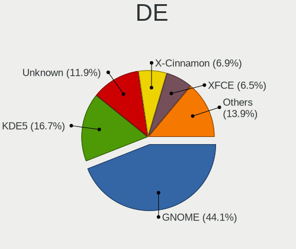
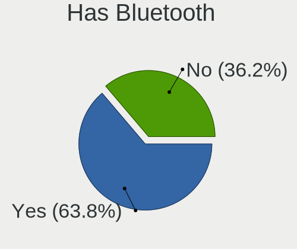

Linux in USA - Tested Hardware & Statistics
-------------------------------------------

A project to collect tested hardware configurations for Linux in USA.

Anyone can contribute to this report by the [hw-probe](https://github.com/linuxhw/hw-probe) tool:

    sudo -E hw-probe -all -upload

Please contribute! Especially if your hardware is rare.

This is a report for all computer types. See also reports for [desktops](/Location/USA/Desktop/README.md) and [notebooks](/Location/USA/Notebook/README.md).

Contents
--------

* [ Test Cases ](#test-cases)

* [ System ](#system)
  - [ OS                       ](#os)
  - [ OS Family                ](#os-family)
  - [ Kernel                   ](#kernel)
  - [ Kernel Family            ](#kernel-family)
  - [ Kernel Major Ver.        ](#kernel-major-ver)
  - [ Arch                     ](#arch)
  - [ DE                       ](#de)
  - [ Display Server           ](#display-server)
  - [ Display Manager          ](#display-manager)
  - [ OS Lang                  ](#os-lang)
  - [ Boot Mode                ](#boot-mode)
  - [ Filesystem               ](#filesystem)
  - [ Part. scheme             ](#part-scheme)
  - [ Dual Boot with Linux/BSD ](#dual-boot-with-linuxbsd)
  - [ Dual Boot (Win)          ](#dual-boot-win)

* [ Board ](#board)
  - [ Vendor                   ](#vendor)
  - [ Model                    ](#model)
  - [ Model Family             ](#model-family)
  - [ MFG Year                 ](#mfg-year)
  - [ Form Factor              ](#form-factor)
  - [ Secure Boot              ](#secure-boot)
  - [ Coreboot                 ](#coreboot)
  - [ RAM Size                 ](#ram-size)
  - [ RAM Used                 ](#ram-used)
  - [ Total Drives             ](#total-drives)
  - [ Has CD-ROM               ](#has-cd-rom)
  - [ Has Ethernet             ](#has-ethernet)
  - [ Has WiFi                 ](#has-wifi)
  - [ Has Bluetooth            ](#has-bluetooth)

* [ Location ](#location)
  - [ Country                  ](#country)
  - [ City                     ](#city)

* [ Drives ](#drives)
  - [ Drive Vendor             ](#drive-vendor)
  - [ Drive Model              ](#drive-model)
  - [ HDD Vendor               ](#hdd-vendor)
  - [ SSD Vendor               ](#ssd-vendor)
  - [ Drive Kind               ](#drive-kind)
  - [ Drive Connector          ](#drive-connector)
  - [ Drive Size               ](#drive-size)
  - [ Space Total              ](#space-total)
  - [ Space Used               ](#space-used)
  - [ Malfunc. Drives          ](#malfunc-drives)
  - [ Malfunc. Drive Vendor    ](#malfunc-drive-vendor)
  - [ Malfunc. HDD Vendor      ](#malfunc-hdd-vendor)
  - [ Malfunc. Drive Kind      ](#malfunc-drive-kind)
  - [ Failed Drives            ](#failed-drives)
  - [ Failed Drive Vendor      ](#failed-drive-vendor)
  - [ Drive Status             ](#drive-status)

* [ Storage controller ](#storage-controller)
  - [ Storage Vendor           ](#storage-vendor)
  - [ Storage Model            ](#storage-model)
  - [ Storage Kind             ](#storage-kind)

* [ Processor ](#processor)
  - [ CPU Vendor               ](#cpu-vendor)
  - [ CPU Model                ](#cpu-model)
  - [ CPU Model Family         ](#cpu-model-family)
  - [ CPU Cores                ](#cpu-cores)
  - [ CPU Sockets              ](#cpu-sockets)
  - [ CPU Threads              ](#cpu-threads)
  - [ CPU Op-Modes             ](#cpu-op-modes)
  - [ CPU Microcode            ](#cpu-microcode)
  - [ CPU Microarch            ](#cpu-microarch)

* [ Graphics ](#graphics)
  - [ GPU Vendor               ](#gpu-vendor)
  - [ GPU Model                ](#gpu-model)
  - [ GPU Combo                ](#gpu-combo)
  - [ GPU Driver               ](#gpu-driver)
  - [ GPU Memory               ](#gpu-memory)

* [ Monitor ](#monitor)
  - [ Monitor Vendor           ](#monitor-vendor)
  - [ Monitor Model            ](#monitor-model)
  - [ Monitor Resolution       ](#monitor-resolution)
  - [ Monitor Diagonal         ](#monitor-diagonal)
  - [ Monitor Width            ](#monitor-width)
  - [ Aspect Ratio             ](#aspect-ratio)
  - [ Monitor Area             ](#monitor-area)
  - [ Pixel Density            ](#pixel-density)
  - [ Multiple Monitors        ](#multiple-monitors)

* [ Network ](#network)
  - [ Net Controller Vendor    ](#net-controller-vendor)
  - [ Net Controller Model     ](#net-controller-model)
  - [ Wireless Vendor          ](#wireless-vendor)
  - [ Wireless Model           ](#wireless-model)
  - [ Ethernet Vendor          ](#ethernet-vendor)
  - [ Ethernet Model           ](#ethernet-model)
  - [ Net Controller Kind      ](#net-controller-kind)
  - [ Used Controller          ](#used-controller)
  - [ NICs                     ](#nics)
  - [ IPv6                     ](#ipv6)

* [ Bluetooth ](#bluetooth)
  - [ Bluetooth Vendor         ](#bluetooth-vendor)
  - [ Bluetooth Model          ](#bluetooth-model)

* [ Sound ](#sound)
  - [ Sound Vendor             ](#sound-vendor)
  - [ Sound Model              ](#sound-model)

* [ Memory ](#memory)
  - [ Memory Vendor            ](#memory-vendor)
  - [ Memory Model             ](#memory-model)
  - [ Memory Kind              ](#memory-kind)
  - [ Memory Form Factor       ](#memory-form-factor)
  - [ Memory Size              ](#memory-size)
  - [ Memory Speed             ](#memory-speed)

* [ Printers & scanners ](#printers--scanners)
  - [ Printer Vendor           ](#printer-vendor)
  - [ Printer Model            ](#printer-model)
  - [ Scanner Vendor           ](#scanner-vendor)
  - [ Scanner Model            ](#scanner-model)

* [ Camera ](#camera)
  - [ Camera Vendor            ](#camera-vendor)
  - [ Camera Model             ](#camera-model)

* [ Security ](#security)
  - [ Fingerprint Vendor       ](#fingerprint-vendor)
  - [ Fingerprint Model        ](#fingerprint-model)
  - [ Chipcard Vendor          ](#chipcard-vendor)
  - [ Chipcard Model           ](#chipcard-model)

* [ Unsupported ](#unsupported)
  - [ Unsupported Devices      ](#unsupported-devices)
  - [ Unsupported Device Types ](#unsupported-device-types)

Test Cases
----------

Total: 49866

| Vendor        | Model                       | Form-Factor | Probe                                                      | Date         |
|---------------|-----------------------------|-------------|------------------------------------------------------------|--------------|
| Lenovo        | ThinkPad T480 20L50010US    | Notebook    | [aa44c2c8b9](https://linux-hardware.org/?probe=aa44c2c8b9) | Jun 10, 2023 |
| Samsung       | 730QCJ/730QCR               | Notebook    | [96b21d42f1](https://linux-hardware.org/?probe=96b21d42f1) | Jun 10, 2023 |
| Gigabyte      | Z87X-UD4H-CF                | Desktop     | [abd31d2f92](https://linux-hardware.org/?probe=abd31d2f92) | Jun 10, 2023 |
| Lenovo        | ThinkPad T440p 20AN0069U... | Notebook    | [a2ddfa44e7](https://linux-hardware.org/?probe=a2ddfa44e7) | Jun 10, 2023 |
| MSI           | X370 GAMING M7 ACK          | Desktop     | [450b8ab5a7](https://linux-hardware.org/?probe=450b8ab5a7) | Jun 10, 2023 |
| Lenovo        | ThinkPad T480 20L50010US    | Notebook    | [398d708c85](https://linux-hardware.org/?probe=398d708c85) | Jun 10, 2023 |
| HP            | 81B4                        | Desktop     | [2d7748536f](https://linux-hardware.org/?probe=2d7748536f) | Jun 10, 2023 |
| ASUSTek       | TUF Gaming FX505GD_FX505... | Notebook    | [03660fb140](https://linux-hardware.org/?probe=03660fb140) | Jun 10, 2023 |
| Gigabyte      | GA-880GM-D2H                | Desktop     | [2e46385299](https://linux-hardware.org/?probe=2e46385299) | Jun 10, 2023 |
| MSI           | Prestige 13Evo A13M         | Notebook    | [3feb3bce01](https://linux-hardware.org/?probe=3feb3bce01) | Jun 10, 2023 |
| Dell          | G3 3779                     | Notebook    | [0190c87b35](https://linux-hardware.org/?probe=0190c87b35) | Jun 10, 2023 |
| HP            | 339A                        | Desktop     | [d1fa07d03f](https://linux-hardware.org/?probe=d1fa07d03f) | Jun 10, 2023 |
| HP            | ENVY x360 2-in-1 Laptop ... | Convertible | [d3480eedcd](https://linux-hardware.org/?probe=d3480eedcd) | Jun 10, 2023 |
| HP            | ENVY x360 2-in-1 Laptop ... | Convertible | [8d07581960](https://linux-hardware.org/?probe=8d07581960) | Jun 10, 2023 |
| HP            | Pavilion Laptop 15-cc5xx    | Notebook    | [68af03eefe](https://linux-hardware.org/?probe=68af03eefe) | Jun 10, 2023 |
| Apple         | Mac-942B5BF58194151B        | All in one  | [e3cb803f4e](https://linux-hardware.org/?probe=e3cb803f4e) | Jun 10, 2023 |
| Dell          | Inspiron 7506 2n1           | Convertible | [392ff8bfbb](https://linux-hardware.org/?probe=392ff8bfbb) | Jun 10, 2023 |
| Gigabyte      | B550 GAMING X V2            | Desktop     | [03ef8fea42](https://linux-hardware.org/?probe=03ef8fea42) | Jun 10, 2023 |
| Lenovo        | ThinkPad T570 20H9000UUS    | Notebook    | [606989ab70](https://linux-hardware.org/?probe=606989ab70) | Jun 10, 2023 |
| Dell          | Inspiron 7506 2n1           | Convertible | [b3e01203b0](https://linux-hardware.org/?probe=b3e01203b0) | Jun 10, 2023 |
| Dell          | Latitude 3580               | Notebook    | [9c02d2c4c4](https://linux-hardware.org/?probe=9c02d2c4c4) | Jun 10, 2023 |
| Lenovo        | ThinkPad T440 20B6005RUS    | Notebook    | [e7ea5a9368](https://linux-hardware.org/?probe=e7ea5a9368) | Jun 10, 2023 |
| ASUSTek       | ASUS BR1100FKA BR1100FKA    | Convertible | [0239123977](https://linux-hardware.org/?probe=0239123977) | Jun 10, 2023 |
| ASUSTek       | K30BF_M32BF                 | Desktop     | [65b3c16165](https://linux-hardware.org/?probe=65b3c16165) | Jun 10, 2023 |
| Supermicro    | H12SSL-i                    | Server      | [15fb7b8736](https://linux-hardware.org/?probe=15fb7b8736) | Jun 10, 2023 |
| ASUSTek       | Zenbook UP6502ZA_Q529ZA     | Convertible | [3a1bc7a415](https://linux-hardware.org/?probe=3a1bc7a415) | Jun 10, 2023 |
| Dell          | Precision 7520              | Notebook    | [c52fb2f851](https://linux-hardware.org/?probe=c52fb2f851) | Jun 10, 2023 |
| Pegatron      | 2A99                        | Desktop     | [0a25cd49a5](https://linux-hardware.org/?probe=0a25cd49a5) | Jun 10, 2023 |
| Apple         | MacBookPro9,2               | Notebook    | [3554e00d28](https://linux-hardware.org/?probe=3554e00d28) | Jun 10, 2023 |
| Dell          | Inspiron 5515               | Notebook    | [36016c0c6b](https://linux-hardware.org/?probe=36016c0c6b) | Jun 10, 2023 |
| HP            | 8949 11                     | Desktop     | [f5e1f4b6c9](https://linux-hardware.org/?probe=f5e1f4b6c9) | Jun 10, 2023 |
| ASUSTek       | ASUS BR1100FKA BR1100FKA    | Convertible | [e45eaed9f1](https://linux-hardware.org/?probe=e45eaed9f1) | Jun 10, 2023 |
| ASUSTek       | ROG STRIX B450-F GAMING     | Desktop     | [cac24c37e5](https://linux-hardware.org/?probe=cac24c37e5) | Jun 10, 2023 |
| ASUSTek       | ROG STRIX X670E-E GAMING... | Desktop     | [5446a0003e](https://linux-hardware.org/?probe=5446a0003e) | Jun 10, 2023 |
| MSI           | AM1M                        | Desktop     | [42a7d49c03](https://linux-hardware.org/?probe=42a7d49c03) | Jun 10, 2023 |
| Lenovo        | IdeaPad Gaming 3 15ACH6 ... | Notebook    | [3eb12fd9bc](https://linux-hardware.org/?probe=3eb12fd9bc) | Jun 10, 2023 |
| ASUSTek       | M5A97 R2.0                  | Desktop     | [d9e9a51e48](https://linux-hardware.org/?probe=d9e9a51e48) | Jun 10, 2023 |
| HP            | ZBook 15 G6                 | Notebook    | [eb23ebb0b8](https://linux-hardware.org/?probe=eb23ebb0b8) | Jun 10, 2023 |
| Lenovo        | ThinkPad T540p 20BFS4P80... | Notebook    | [4160d59c4f](https://linux-hardware.org/?probe=4160d59c4f) | Jun 10, 2023 |
| Dell          | 0C4Y3R A02                  | Server      | [976d5e0a08](https://linux-hardware.org/?probe=976d5e0a08) | Jun 10, 2023 |
| Gigabyte      | GA-890GPA-UD3H              | Desktop     | [f04b28a0e5](https://linux-hardware.org/?probe=f04b28a0e5) | Jun 10, 2023 |
| Gigabyte      | P57V6                       | Notebook    | [a2ce7ccc80](https://linux-hardware.org/?probe=a2ce7ccc80) | Jun 09, 2023 |
| Lenovo        | ThinkPad P1 20MD001VUS      | Notebook    | [9765261d02](https://linux-hardware.org/?probe=9765261d02) | Jun 09, 2023 |
| Gigabyte      | B460M DS3H                  | Desktop     | [63c9d6c822](https://linux-hardware.org/?probe=63c9d6c822) | Jun 09, 2023 |
| Lenovo        | IdeaPadFlex 5 14ITL05 82... | Convertible | [7bc800675d](https://linux-hardware.org/?probe=7bc800675d) | Jun 09, 2023 |
| ASUSTek       | ROG ZENITH EXTREME          | Desktop     | [b4de2ccda4](https://linux-hardware.org/?probe=b4de2ccda4) | Jun 09, 2023 |
| Gigabyte      | B450 AORUS M                | Desktop     | [280baa2765](https://linux-hardware.org/?probe=280baa2765) | Jun 09, 2023 |
| ASUSTek       | M2N68-AM SE2                | Desktop     | [4f69ba649a](https://linux-hardware.org/?probe=4f69ba649a) | Jun 09, 2023 |
| Lenovo        | ThinkStation E20 422237U    | Desktop     | [2756905647](https://linux-hardware.org/?probe=2756905647) | Jun 09, 2023 |
| Gigabyte      | AORUS 17X AXF               | Notebook    | [685ba556b4](https://linux-hardware.org/?probe=685ba556b4) | Jun 09, 2023 |
| Dell          | 07T4MC A02                  | Desktop     | [ad310dd147](https://linux-hardware.org/?probe=ad310dd147) | Jun 09, 2023 |
| ASRock        | AB350M Pro4                 | Desktop     | [8f0087d741](https://linux-hardware.org/?probe=8f0087d741) | Jun 09, 2023 |
| Gigabyte      | B550 AORUS PRO              | Desktop     | [61a0a2ea5f](https://linux-hardware.org/?probe=61a0a2ea5f) | Jun 09, 2023 |
| Gigabyte      | B450 AORUS M                | Desktop     | [50b022f065](https://linux-hardware.org/?probe=50b022f065) | Jun 09, 2023 |
| Lenovo        | ThinkPad P1 Gen 3 20TJS1... | Notebook    | [c47936b50c](https://linux-hardware.org/?probe=c47936b50c) | Jun 09, 2023 |
| Dell          | Inspiron 14 7420 2-in-1     | Convertible | [d7b5162532](https://linux-hardware.org/?probe=d7b5162532) | Jun 09, 2023 |
| MSI           | MPG X570S CARBON MAX WIF... | Desktop     | [5833483fe2](https://linux-hardware.org/?probe=5833483fe2) | Jun 09, 2023 |
| MSI           | MAG Z490 TOMAHAWK           | Desktop     | [40f18ae1f4](https://linux-hardware.org/?probe=40f18ae1f4) | Jun 09, 2023 |
| Acer          | Aspire 7750                 | Notebook    | [b0daafa057](https://linux-hardware.org/?probe=b0daafa057) | Jun 09, 2023 |
| Lenovo        | ThinkPad T440p 20AWS43W0... | Notebook    | [69e5497306](https://linux-hardware.org/?probe=69e5497306) | Jun 09, 2023 |
| ASUSTek       | TUF Gaming B650M-PLUS WI... | Desktop     | [26262445d4](https://linux-hardware.org/?probe=26262445d4) | Jun 09, 2023 |
| Toshiba       | PORTEGE R705                | Notebook    | [c7a032c5cf](https://linux-hardware.org/?probe=c7a032c5cf) | Jun 09, 2023 |
| ASUSTek       | M2N68-AM Plus               | Desktop     | [7411937d5b](https://linux-hardware.org/?probe=7411937d5b) | Jun 09, 2023 |
| Dell          | Inspiron 15-5568            | Notebook    | [19b686b7d7](https://linux-hardware.org/?probe=19b686b7d7) | Jun 09, 2023 |
| Gigabyte      | Z790 AORUS ELITE AX         | Desktop     | [f4f543eaa6](https://linux-hardware.org/?probe=f4f543eaa6) | Jun 09, 2023 |
| HP            | 2B0D A01                    | All in one  | [84275606e0](https://linux-hardware.org/?probe=84275606e0) | Jun 09, 2023 |
| Gigabyte      | GA-78LMT-USB3 SEx           | Desktop     | [1189f6696f](https://linux-hardware.org/?probe=1189f6696f) | Jun 09, 2023 |
| HP            | Spectre x360 Convertible... | Convertible | [1256480fca](https://linux-hardware.org/?probe=1256480fca) | Jun 09, 2023 |
| Dell          | 0FDY5C A00                  | Desktop     | [1caf029f79](https://linux-hardware.org/?probe=1caf029f79) | Jun 09, 2023 |
| AZW           | SEi                         | Desktop     | [2b085e7ed2](https://linux-hardware.org/?probe=2b085e7ed2) | Jun 09, 2023 |
| HP            | Elite Dragonfly G2          | Convertible | [f36fbdace7](https://linux-hardware.org/?probe=f36fbdace7) | Jun 09, 2023 |
| HP            | 3646h                       | Desktop     | [046f5d1a5b](https://linux-hardware.org/?probe=046f5d1a5b) | Jun 09, 2023 |
| Apple         | MacBookPro8,1               | Notebook    | [70fea7478a](https://linux-hardware.org/?probe=70fea7478a) | Jun 08, 2023 |
| Supermicro    | C7H61                       | Desktop     | [7eef5b7873](https://linux-hardware.org/?probe=7eef5b7873) | Jun 08, 2023 |
| Dell          | XPS 17 9730                 | Notebook    | [bb7335618d](https://linux-hardware.org/?probe=bb7335618d) | Jun 08, 2023 |
| Dell          | Latitude 5175               | Notebook    | [63d6fcf641](https://linux-hardware.org/?probe=63d6fcf641) | Jun 08, 2023 |
| Dell          | 0KRC95 A02                  | Desktop     | [585c31e8d3](https://linux-hardware.org/?probe=585c31e8d3) | Jun 08, 2023 |
| HP            | ZBook Studio G3             | Notebook    | [4fb38ec480](https://linux-hardware.org/?probe=4fb38ec480) | Jun 08, 2023 |
| HP            | ZBook Studio G3             | Notebook    | [09260f0742](https://linux-hardware.org/?probe=09260f0742) | Jun 08, 2023 |
| Dell          | Precision 5540              | Notebook    | [0e925c8b3c](https://linux-hardware.org/?probe=0e925c8b3c) | Jun 08, 2023 |
| ASUSTek       | Zenbook UP6502ZA_Q529ZA     | Convertible | [a585b9c57c](https://linux-hardware.org/?probe=a585b9c57c) | Jun 08, 2023 |
| Lenovo        | IdeaPadFlex 5 14ITL05 82... | Convertible | [0c923e1174](https://linux-hardware.org/?probe=0c923e1174) | Jun 08, 2023 |
| ASRock        | H81M-HDS                    | Desktop     | [e1ff6f4e2f](https://linux-hardware.org/?probe=e1ff6f4e2f) | Jun 08, 2023 |
| Lenovo        | Slim 7 ProX 14ARH7 82V2     | Notebook    | [e8b6d763e4](https://linux-hardware.org/?probe=e8b6d763e4) | Jun 08, 2023 |
| Dell          | Latitude E6420              | Notebook    | [d408418ddd](https://linux-hardware.org/?probe=d408418ddd) | Jun 08, 2023 |
| HP            | Notebook                    | Notebook    | [1b099710b7](https://linux-hardware.org/?probe=1b099710b7) | Jun 08, 2023 |
| HP            | Notebook                    | Notebook    | [9bf82397c3](https://linux-hardware.org/?probe=9bf82397c3) | Jun 08, 2023 |
| Acer          | Aspire A515-45              | Notebook    | [975246674d](https://linux-hardware.org/?probe=975246674d) | Jun 08, 2023 |
| Acer          | Aspire A515-45              | Notebook    | [348173e172](https://linux-hardware.org/?probe=348173e172) | Jun 08, 2023 |
| MSI           | A55M-E35                    | Desktop     | [7800efb785](https://linux-hardware.org/?probe=7800efb785) | Jun 08, 2023 |
| MSI           | A55M-E35                    | Desktop     | [fa4eba3787](https://linux-hardware.org/?probe=fa4eba3787) | Jun 08, 2023 |
| Apple         | MacBookPro8,1               | Notebook    | [d487214e2a](https://linux-hardware.org/?probe=d487214e2a) | Jun 08, 2023 |
| Dell          | 088DT1 A01                  | Desktop     | [173e9a0e0c](https://linux-hardware.org/?probe=173e9a0e0c) | Jun 08, 2023 |
| Gigabyte      | Z170X-Gaming 6              | Desktop     | [21eaab076a](https://linux-hardware.org/?probe=21eaab076a) | Jun 08, 2023 |
| MSI           | X58M                        | Desktop     | [7f0ef36058](https://linux-hardware.org/?probe=7f0ef36058) | Jun 08, 2023 |
| Lenovo        | ThinkPad T580 20L90047US    | Notebook    | [bee34052a3](https://linux-hardware.org/?probe=bee34052a3) | Jun 08, 2023 |
| AZW           | SER V01                     | Mini pc     | [6b694e4b4a](https://linux-hardware.org/?probe=6b694e4b4a) | Jun 08, 2023 |
| HPE           | ProLiant MicroServer Gen... | Desktop     | [e95900bc0c](https://linux-hardware.org/?probe=e95900bc0c) | Jun 08, 2023 |
| ASUSTek       | PRIME X570-P                | Desktop     | [a91f24af7a](https://linux-hardware.org/?probe=a91f24af7a) | Jun 08, 2023 |
| ASUSTek       | PRIME X570-P                | Desktop     | [96e1e7ea7e](https://linux-hardware.org/?probe=96e1e7ea7e) | Jun 08, 2023 |
| Google        | Lick                        | Notebook    | [d220804cab](https://linux-hardware.org/?probe=d220804cab) | Jun 08, 2023 |
| Valve         | Jupiter                     | Notebook    | [f41491d8ac](https://linux-hardware.org/?probe=f41491d8ac) | Jun 08, 2023 |
| Dell          | 0HN7XN A01                  | Desktop     | [c44abee9e7](https://linux-hardware.org/?probe=c44abee9e7) | Jun 08, 2023 |
| ASUSTek       | ROG STRIX B550-F GAMING     | Desktop     | [cc54139aa6](https://linux-hardware.org/?probe=cc54139aa6) | Jun 08, 2023 |
| MSI           | PRO B550M-VC WIFI           | Desktop     | [ac442da472](https://linux-hardware.org/?probe=ac442da472) | Jun 08, 2023 |
| MSI           | PRO B550M-VC WIFI           | Desktop     | [70c409a2b8](https://linux-hardware.org/?probe=70c409a2b8) | Jun 08, 2023 |
| Apple         | MacBookPro5,5               | Notebook    | [ed70e1854d](https://linux-hardware.org/?probe=ed70e1854d) | Jun 08, 2023 |
| Lenovo        | ThinkPad L420 7829W1R       | Notebook    | [25d96d98f8](https://linux-hardware.org/?probe=25d96d98f8) | Jun 08, 2023 |
| Shenzhen M... | F7BFD                       | Desktop     | [74cf1d0b63](https://linux-hardware.org/?probe=74cf1d0b63) | Jun 08, 2023 |
| Shenzhen M... | F7BFD                       | Desktop     | [88cbeea389](https://linux-hardware.org/?probe=88cbeea389) | Jun 08, 2023 |
| MSI           | MPG Z390 GAMING PRO CARB... | Desktop     | [ddefeff960](https://linux-hardware.org/?probe=ddefeff960) | Jun 08, 2023 |
| Lenovo        | ThinkServer TS140           | Desktop     | [e9ca405eff](https://linux-hardware.org/?probe=e9ca405eff) | Jun 08, 2023 |
| ASRock        | M3A770DE                    | Desktop     | [aa9ddf538e](https://linux-hardware.org/?probe=aa9ddf538e) | Jun 08, 2023 |
| HP            | Stream Notebook PC 11       | Notebook    | [fd037bb738](https://linux-hardware.org/?probe=fd037bb738) | Jun 08, 2023 |
| HP            | ENVY m6 Notebook            | Notebook    | [f72410be27](https://linux-hardware.org/?probe=f72410be27) | Jun 08, 2023 |
| AZW           | SER V01                     | Mini pc     | [0b7fb76a0b](https://linux-hardware.org/?probe=0b7fb76a0b) | Jun 08, 2023 |
| Lenovo        | ThinkPad X1 Carbon Gen 9... | Notebook    | [ef71a1641b](https://linux-hardware.org/?probe=ef71a1641b) | Jun 08, 2023 |
| HP            | 2000                        | Notebook    | [4ae1384345](https://linux-hardware.org/?probe=4ae1384345) | Jun 07, 2023 |
| Lenovo        | Slim 7 ProX 14ARH7 82V2     | Notebook    | [810e331444](https://linux-hardware.org/?probe=810e331444) | Jun 07, 2023 |
| HP            | Pavilion 17                 | Notebook    | [da809f90cc](https://linux-hardware.org/?probe=da809f90cc) | Jun 07, 2023 |
| HP            | 3033h                       | Desktop     | [86a8a0bf1a](https://linux-hardware.org/?probe=86a8a0bf1a) | Jun 07, 2023 |
| Apple         | Mac-F2238BAE iMac11,3       | All in one  | [8bfed00d06](https://linux-hardware.org/?probe=8bfed00d06) | Jun 07, 2023 |
| MSI           | B450 TOMAHAWK MAX II        | Desktop     | [2ad7aefc45](https://linux-hardware.org/?probe=2ad7aefc45) | Jun 07, 2023 |
| Gigabyte      | Z87X-UD5H-CF                | Desktop     | [fd156e669f](https://linux-hardware.org/?probe=fd156e669f) | Jun 07, 2023 |
| Lenovo        | Legion 5 Pro 16ARH7H 82R... | Notebook    | [f6fddfcd65](https://linux-hardware.org/?probe=f6fddfcd65) | Jun 07, 2023 |
| Apple         | Mac-F4208DC8 PVT            | Desktop     | [1b2b9fd7f2](https://linux-hardware.org/?probe=1b2b9fd7f2) | Jun 07, 2023 |
| HP            | Stream Laptop 11-ah0XX      | Notebook    | [2f5adf59a3](https://linux-hardware.org/?probe=2f5adf59a3) | Jun 07, 2023 |
| Lenovo        | ThinkPad X220 Tablet 429... | Notebook    | [ea8584cbda](https://linux-hardware.org/?probe=ea8584cbda) | Jun 07, 2023 |
| Apple         | MacBookPro9,2               | Notebook    | [2a0add5b7e](https://linux-hardware.org/?probe=2a0add5b7e) | Jun 07, 2023 |
| ASUSTek       | ROG CROSSHAIR VII HERO      | Desktop     | [12736be80e](https://linux-hardware.org/?probe=12736be80e) | Jun 07, 2023 |
| MSI           | MPG B550 GAMING PLUS        | Desktop     | [793b86c807](https://linux-hardware.org/?probe=793b86c807) | Jun 07, 2023 |
| ASUSTek       | VivoBook_ASUSLaptop X150... | Notebook    | [1f4ef72dbd](https://linux-hardware.org/?probe=1f4ef72dbd) | Jun 07, 2023 |
| Dell          | Latitude 3190 2-in-1        | Convertible | [a692e30aea](https://linux-hardware.org/?probe=a692e30aea) | Jun 07, 2023 |
| Acer          | Predator PT515-51           | Notebook    | [0a6efd54ad](https://linux-hardware.org/?probe=0a6efd54ad) | Jun 07, 2023 |
| Gigabyte      | AORUS 17X AXF               | Notebook    | [87bd8323b6](https://linux-hardware.org/?probe=87bd8323b6) | Jun 07, 2023 |
| System76      | Thelio Mira thelio-mira-... | Desktop     | [d7d155d89d](https://linux-hardware.org/?probe=d7d155d89d) | Jun 07, 2023 |
| HP            | Pavilion Notebook           | Notebook    | [9ef95ad480](https://linux-hardware.org/?probe=9ef95ad480) | Jun 07, 2023 |
| Acer          | Aspire A515-47              | Notebook    | [db7f17cbe1](https://linux-hardware.org/?probe=db7f17cbe1) | Jun 07, 2023 |
| Lenovo        | Slim 7 16IAH7 82VB          | Notebook    | [c60acf1322](https://linux-hardware.org/?probe=c60acf1322) | Jun 07, 2023 |
| Valve         | Jupiter                     | Notebook    | [2a6ad8df3c](https://linux-hardware.org/?probe=2a6ad8df3c) | Jun 07, 2023 |
| Dell          | Latitude E6420              | Notebook    | [620ca905d2](https://linux-hardware.org/?probe=620ca905d2) | Jun 07, 2023 |
| MSI           | MPG B650I EDGE WIFI         | Desktop     | [d43ce99616](https://linux-hardware.org/?probe=d43ce99616) | Jun 07, 2023 |
| Acer          | Swift SF314-43              | Notebook    | [9636ea4dc5](https://linux-hardware.org/?probe=9636ea4dc5) | Jun 07, 2023 |
| Dell          | 0R6PCT A01                  | Desktop     | [e1623fbc8e](https://linux-hardware.org/?probe=e1623fbc8e) | Jun 07, 2023 |
| Lenovo        | ThinkPad P1 20MD001VUS      | Notebook    | [8c505b5d84](https://linux-hardware.org/?probe=8c505b5d84) | Jun 06, 2023 |
| Dell          | 0H500Y A00                  | All in one  | [30557b9e70](https://linux-hardware.org/?probe=30557b9e70) | Jun 06, 2023 |
| MSI           | GS63VR 6RF                  | Notebook    | [4bc33968d1](https://linux-hardware.org/?probe=4bc33968d1) | Jun 06, 2023 |
| Dell          | Latitude E6540              | Notebook    | [b6cc99410f](https://linux-hardware.org/?probe=b6cc99410f) | Jun 06, 2023 |
| Apple         | Mac-8ED6AF5B48C039E1 Mac... | Mini pc     | [bd4156867b](https://linux-hardware.org/?probe=bd4156867b) | Jun 06, 2023 |
| ASUSTek       | G750JM                      | Notebook    | [b2281ad2cb](https://linux-hardware.org/?probe=b2281ad2cb) | Jun 06, 2023 |
| HP            | 822A                        | Desktop     | [8cf8694f03](https://linux-hardware.org/?probe=8cf8694f03) | Jun 06, 2023 |
| Dell          | 06D7TR A01                  | Desktop     | [8db1a8c132](https://linux-hardware.org/?probe=8db1a8c132) | Jun 06, 2023 |
| MSI           | GE70 2PE                    | Notebook    | [c62d13879f](https://linux-hardware.org/?probe=c62d13879f) | Jun 06, 2023 |
| MSI           | MPG X570 GAMING EDGE WIF... | Desktop     | [bc00b26e0a](https://linux-hardware.org/?probe=bc00b26e0a) | Jun 06, 2023 |
| MSI           | MPG X570 GAMING EDGE WIF... | Desktop     | [ee25039289](https://linux-hardware.org/?probe=ee25039289) | Jun 06, 2023 |
| HP            | 3646h                       | Desktop     | [02353b5e9f](https://linux-hardware.org/?probe=02353b5e9f) | Jun 06, 2023 |
| Dell          | 0427JK A00                  | Desktop     | [addb15771e](https://linux-hardware.org/?probe=addb15771e) | Jun 06, 2023 |
| HP            | 8643 SMVB                   | Desktop     | [0fd8af3392](https://linux-hardware.org/?probe=0fd8af3392) | Jun 06, 2023 |
| HP            | 8617                        | Desktop     | [7f5df3475c](https://linux-hardware.org/?probe=7f5df3475c) | Jun 06, 2023 |
| Supermicro    | X11SSL-F                    | Server      | [e32da0a962](https://linux-hardware.org/?probe=e32da0a962) | Jun 06, 2023 |
| Lenovo        | ThinkPad T480s 20L8S3JE0... | Notebook    | [2834fee64f](https://linux-hardware.org/?probe=2834fee64f) | Jun 06, 2023 |
| HP            | 8053                        | Desktop     | [29a84ce224](https://linux-hardware.org/?probe=29a84ce224) | Jun 06, 2023 |
| Dell          | Inspiron 5759               | Notebook    | [249f9343d0](https://linux-hardware.org/?probe=249f9343d0) | Jun 06, 2023 |
| Valve         | Jupiter                     | Notebook    | [0d22bd5256](https://linux-hardware.org/?probe=0d22bd5256) | Jun 06, 2023 |
| HP            | EliteBook 840 G3            | Notebook    | [18eeac2fc1](https://linux-hardware.org/?probe=18eeac2fc1) | Jun 06, 2023 |
| Dell          | 06X1TJ A00                  | Desktop     | [c3f02841f4](https://linux-hardware.org/?probe=c3f02841f4) | Jun 06, 2023 |
| Dell          | 06X1TJ A00                  | Desktop     | [4cec4f0517](https://linux-hardware.org/?probe=4cec4f0517) | Jun 06, 2023 |
| Valve         | Jupiter                     | Notebook    | [6e40377338](https://linux-hardware.org/?probe=6e40377338) | Jun 06, 2023 |
| HP            | EliteBook 845 G8 Noteboo... | Notebook    | [2508cbfdd2](https://linux-hardware.org/?probe=2508cbfdd2) | Jun 06, 2023 |
| Apple         | MacBookPro9,2               | Notebook    | [7394a9d94b](https://linux-hardware.org/?probe=7394a9d94b) | Jun 06, 2023 |
| ASUSTek       | ROG STRIX X470-I GAMING     | Desktop     | [77e1fa9533](https://linux-hardware.org/?probe=77e1fa9533) | Jun 06, 2023 |
| Gigabyte      | H310M M.2 x.x               | Desktop     | [602e1c8875](https://linux-hardware.org/?probe=602e1c8875) | Jun 06, 2023 |
| ASUSTek       | ROG STRIX X470-I GAMING     | Desktop     | [c33bc572fd](https://linux-hardware.org/?probe=c33bc572fd) | Jun 06, 2023 |
| MSI           | 2AE0                        | Desktop     | [15b3c478d3](https://linux-hardware.org/?probe=15b3c478d3) | Jun 06, 2023 |
| MSI           | B450 TOMAHAWK MAX II        | Desktop     | [79f63dcf8e](https://linux-hardware.org/?probe=79f63dcf8e) | Jun 06, 2023 |
| ASUSTek       | K50IJ                       | Notebook    | [b06a0c9b89](https://linux-hardware.org/?probe=b06a0c9b89) | Jun 06, 2023 |
| Apple         | Mac-942B59F58194171B iMa... | All in one  | [3d0f46c6ed](https://linux-hardware.org/?probe=3d0f46c6ed) | Jun 06, 2023 |
| Supermicro    | H12SSL-i                    | Server      | [a777ee9e06](https://linux-hardware.org/?probe=a777ee9e06) | Jun 06, 2023 |
| ASUSTek       | ROG Zephyrus G14 GA401QM... | Notebook    | [bdfe605b6a](https://linux-hardware.org/?probe=bdfe605b6a) | Jun 06, 2023 |
| Notebook      | P65xHP                      | Notebook    | [bf35e218d7](https://linux-hardware.org/?probe=bf35e218d7) | Jun 06, 2023 |
| MSI           | MPG Z390 GAMING PRO CARB... | Desktop     | [77fe6db865](https://linux-hardware.org/?probe=77fe6db865) | Jun 06, 2023 |
| ATOPNUC       | MA90                        | Mini pc     | [25a598e2dc](https://linux-hardware.org/?probe=25a598e2dc) | Jun 06, 2023 |
| Acer          | WMCP78M                     | Desktop     | [a7a466de8a](https://linux-hardware.org/?probe=a7a466de8a) | Jun 06, 2023 |
| Acer          | Aspire 5736Z                | Notebook    | [a98deb1f54](https://linux-hardware.org/?probe=a98deb1f54) | Jun 06, 2023 |
| HP            | Laptop 14-cf2xxx            | Notebook    | [e6bf4ead0a](https://linux-hardware.org/?probe=e6bf4ead0a) | Jun 06, 2023 |
| Apple         | MacBookPro9,2               | Notebook    | [9df43aede5](https://linux-hardware.org/?probe=9df43aede5) | Jun 06, 2023 |
| HP            | 8918                        | Desktop     | [917b8c425f](https://linux-hardware.org/?probe=917b8c425f) | Jun 06, 2023 |
| ATOPNUC       | MA90                        | Mini pc     | [197a497c65](https://linux-hardware.org/?probe=197a497c65) | Jun 06, 2023 |
| Dell          | 0RY007                      | Desktop     | [49c7cbbfde](https://linux-hardware.org/?probe=49c7cbbfde) | Jun 06, 2023 |
| ASUSTek       | PRIME Z790-A WIFI           | Desktop     | [fe852e8a1d](https://linux-hardware.org/?probe=fe852e8a1d) | Jun 06, 2023 |
| Valve         | Jupiter                     | Notebook    | [4e212c07cc](https://linux-hardware.org/?probe=4e212c07cc) | Jun 06, 2023 |
| Dell          | Precision 3571              | Notebook    | [35f408bce4](https://linux-hardware.org/?probe=35f408bce4) | Jun 06, 2023 |
| System76      | Oryx Pro                    | Notebook    | [4f39b2d690](https://linux-hardware.org/?probe=4f39b2d690) | Jun 06, 2023 |
| Dell          | Precision M4800             | Notebook    | [f1c43c9acd](https://linux-hardware.org/?probe=f1c43c9acd) | Jun 06, 2023 |
| Dell          | Precision 7510              | Notebook    | [2a465173d3](https://linux-hardware.org/?probe=2a465173d3) | Jun 06, 2023 |
| Dell          | 0Y2K8N A01                  | Desktop     | [13a93fdc21](https://linux-hardware.org/?probe=13a93fdc21) | Jun 05, 2023 |
| HP            | ZBook 15 G3                 | Notebook    | [18663e1382](https://linux-hardware.org/?probe=18663e1382) | Jun 05, 2023 |
| Lenovo        | ThinkPad X1 Carbon Gen 9... | Notebook    | [0deafae1f1](https://linux-hardware.org/?probe=0deafae1f1) | Jun 05, 2023 |
| HP            | 339A                        | Desktop     | [f2147ed11b](https://linux-hardware.org/?probe=f2147ed11b) | Jun 05, 2023 |
| Notebook      | P65xHP                      | Notebook    | [51834b893c](https://linux-hardware.org/?probe=51834b893c) | Jun 05, 2023 |
| ASUSTek       | CM1730,CM1830               | Desktop     | [2cc76d0cd9](https://linux-hardware.org/?probe=2cc76d0cd9) | Jun 05, 2023 |
| ASUSTek       | PRIME B550M-A AC            | Desktop     | [de614b2bc7](https://linux-hardware.org/?probe=de614b2bc7) | Jun 05, 2023 |
| ASUSTek       | CM1730,CM1830               | Desktop     | [7dc46d923e](https://linux-hardware.org/?probe=7dc46d923e) | Jun 05, 2023 |
| Dell          | Precision 5530              | Notebook    | [8b4e10b85a](https://linux-hardware.org/?probe=8b4e10b85a) | Jun 05, 2023 |
| HP            | ZBook Studio G3             | Notebook    | [09f2ec5511](https://linux-hardware.org/?probe=09f2ec5511) | Jun 05, 2023 |
| HP            | ENVY m6 Notebook            | Notebook    | [5bc28b7062](https://linux-hardware.org/?probe=5bc28b7062) | Jun 05, 2023 |
| HP            | ENVY m6 Notebook            | Notebook    | [aff6da41b8](https://linux-hardware.org/?probe=aff6da41b8) | Jun 05, 2023 |
| AMI           | Intel                       | Desktop     | [7990e6561b](https://linux-hardware.org/?probe=7990e6561b) | Jun 05, 2023 |
| HP            | 15 Notebook PC              | Notebook    | [7c76016c9d](https://linux-hardware.org/?probe=7c76016c9d) | Jun 05, 2023 |
| Lenovo        | ThinkPad T540p 20BFS4P80... | Notebook    | [5dd18339de](https://linux-hardware.org/?probe=5dd18339de) | Jun 05, 2023 |
| ASUSTek       | TUF Gaming B450-PLUS II     | Desktop     | [292e41c0e9](https://linux-hardware.org/?probe=292e41c0e9) | Jun 05, 2023 |
| Toshiba       | Satellite L305              | Notebook    | [c11012336c](https://linux-hardware.org/?probe=c11012336c) | Jun 05, 2023 |
| Acer          | Predator PT515-51           | Notebook    | [5c3daec3c7](https://linux-hardware.org/?probe=5c3daec3c7) | Jun 05, 2023 |
| HP            | ENVY x360 Convertible 15... | Convertible | [48d99dbec6](https://linux-hardware.org/?probe=48d99dbec6) | Jun 05, 2023 |
| ASUSTek       | ROG Flow X16 GV601RM_GV6... | Convertible | [5a2d788a64](https://linux-hardware.org/?probe=5a2d788a64) | Jun 05, 2023 |
| Dell          | 00010C A00                  | Desktop     | [fb12198605](https://linux-hardware.org/?probe=fb12198605) | Jun 05, 2023 |
| Valve         | Jupiter                     | Notebook    | [27fda0a97e](https://linux-hardware.org/?probe=27fda0a97e) | Jun 05, 2023 |
| Dell          | 00010C A00                  | Desktop     | [d94442285c](https://linux-hardware.org/?probe=d94442285c) | Jun 05, 2023 |
| HP            | Laptop 14-fq0xxx            | Notebook    | [02614f184c](https://linux-hardware.org/?probe=02614f184c) | Jun 05, 2023 |
| Supermicro    | H12SSL-i                    | Server      | [7b384a40ce](https://linux-hardware.org/?probe=7b384a40ce) | Jun 05, 2023 |
| ASUSTek       | PRIME B550M-A AC            | Desktop     | [0cf4dfc5e4](https://linux-hardware.org/?probe=0cf4dfc5e4) | Jun 05, 2023 |
| ASUSTek       | ROG Maximus XI HERO         | Desktop     | [8ba3a60a93](https://linux-hardware.org/?probe=8ba3a60a93) | Jun 05, 2023 |
| GPU Compan... | GWTC116-2                   | Notebook    | [de8a3d6dab](https://linux-hardware.org/?probe=de8a3d6dab) | Jun 05, 2023 |
| Lenovo        | ThinkPad T480 20L5S1RY00    | Notebook    | [56c173d205](https://linux-hardware.org/?probe=56c173d205) | Jun 05, 2023 |
| HP            | Pavilion dm4                | Notebook    | [63bd248ea6](https://linux-hardware.org/?probe=63bd248ea6) | Jun 05, 2023 |
| Lenovo        | ThinkPad E450 20DC003WUS    | Notebook    | [6abecb1cd3](https://linux-hardware.org/?probe=6abecb1cd3) | Jun 05, 2023 |
| MSI           | B360M PRO-VH                | Desktop     | [8e4ad66edc](https://linux-hardware.org/?probe=8e4ad66edc) | Jun 05, 2023 |
| Dell          | 0KWVT8 A03                  | Desktop     | [e974c8cdcd](https://linux-hardware.org/?probe=e974c8cdcd) | Jun 05, 2023 |
| Pegatron      | 2AC2                        | Desktop     | [6182103d25](https://linux-hardware.org/?probe=6182103d25) | Jun 05, 2023 |
| Lenovo        | IdeaPad 100-15IBD 80QQ      | Notebook    | [c3892d9477](https://linux-hardware.org/?probe=c3892d9477) | Jun 05, 2023 |
| Dell          | 0HD5W2 A01                  | Desktop     | [917462f8c8](https://linux-hardware.org/?probe=917462f8c8) | Jun 05, 2023 |
| Dell          | Latitude 7430               | Notebook    | [299e6897d2](https://linux-hardware.org/?probe=299e6897d2) | Jun 05, 2023 |
| HP            | Laptop 15-db0xxx            | Notebook    | [08408d3b15](https://linux-hardware.org/?probe=08408d3b15) | Jun 04, 2023 |
| ASUSTek       | PRIME Z590-V                | Desktop     | [d0fd3fd90a](https://linux-hardware.org/?probe=d0fd3fd90a) | Jun 04, 2023 |
| ASUSTek       | PRIME Z590-V                | Desktop     | [bc93ac1588](https://linux-hardware.org/?probe=bc93ac1588) | Jun 04, 2023 |
| Apple         | Mac-7BA5B2DFE22DDD8C Mac... | Mini pc     | [ecad21f91c](https://linux-hardware.org/?probe=ecad21f91c) | Jun 04, 2023 |
| MSI           | B450-A PRO MAX              | Desktop     | [202c4ee201](https://linux-hardware.org/?probe=202c4ee201) | Jun 04, 2023 |
| AMI           | Intel                       | Desktop     | [966c93cbdb](https://linux-hardware.org/?probe=966c93cbdb) | Jun 04, 2023 |
| Sony          | VPCSC1AFM                   | Notebook    | [2cf80cf628](https://linux-hardware.org/?probe=2cf80cf628) | Jun 04, 2023 |
| HP            | EliteBook 745 G3            | Notebook    | [5a1b8d9fd3](https://linux-hardware.org/?probe=5a1b8d9fd3) | Jun 04, 2023 |
| HP            | 8643 SMVB                   | Desktop     | [697cc43136](https://linux-hardware.org/?probe=697cc43136) | Jun 04, 2023 |
| ASUSTek       | PRIME B550M-A               | Desktop     | [d6befa925e](https://linux-hardware.org/?probe=d6befa925e) | Jun 04, 2023 |
| Dell          | 0PM2CW A02                  | Server      | [193d718cc3](https://linux-hardware.org/?probe=193d718cc3) | Jun 04, 2023 |
| Dell          | Inspiron 3442               | Notebook    | [5c1f2cc0d3](https://linux-hardware.org/?probe=5c1f2cc0d3) | Jun 04, 2023 |
| ASUSTek       | TUF Gaming X570-PLUS        | Desktop     | [0dbe01becf](https://linux-hardware.org/?probe=0dbe01becf) | Jun 04, 2023 |
| ASUSTek       | PRIME B550-PLUS             | Desktop     | [74e71defee](https://linux-hardware.org/?probe=74e71defee) | Jun 04, 2023 |
| HP            | Pavilion g6                 | Notebook    | [c0ecfe6785](https://linux-hardware.org/?probe=c0ecfe6785) | Jun 04, 2023 |
| HP            | 8949 11                     | Desktop     | [06bca18276](https://linux-hardware.org/?probe=06bca18276) | Jun 04, 2023 |
| HP            | Laptop 15-dy2xxx            | Notebook    | [f0e52437a7](https://linux-hardware.org/?probe=f0e52437a7) | Jun 04, 2023 |
| Gigabyte      | A520M S2H                   | Desktop     | [81caf6e8cf](https://linux-hardware.org/?probe=81caf6e8cf) | Jun 04, 2023 |
| ASUSTek       | Q502LA                      | Notebook    | [679a477085](https://linux-hardware.org/?probe=679a477085) | Jun 04, 2023 |
| HP            | 2000                        | Notebook    | [7b24eaf0d9](https://linux-hardware.org/?probe=7b24eaf0d9) | Jun 04, 2023 |
| HP            | 2000                        | Notebook    | [dfee85b8e7](https://linux-hardware.org/?probe=dfee85b8e7) | Jun 04, 2023 |
| Valve         | Jupiter                     | Notebook    | [9c11d12e34](https://linux-hardware.org/?probe=9c11d12e34) | Jun 04, 2023 |
| Apple         | MacBookPro14,1              | Notebook    | [f73406fa5d](https://linux-hardware.org/?probe=f73406fa5d) | Jun 04, 2023 |
| Apple         | MacBookPro14,1              | Notebook    | [1c2d6e0e5e](https://linux-hardware.org/?probe=1c2d6e0e5e) | Jun 04, 2023 |
| ASUSTek       | M5A78L-M PLUS/USB3          | Desktop     | [6167898a10](https://linux-hardware.org/?probe=6167898a10) | Jun 04, 2023 |
| MSI           | Z270-A PRO                  | Desktop     | [1da4d78c3b](https://linux-hardware.org/?probe=1da4d78c3b) | Jun 04, 2023 |
| ASRock        | B550 PG Velocita            | Desktop     | [12833898d1](https://linux-hardware.org/?probe=12833898d1) | Jun 04, 2023 |
| HP            | 2AE5 A01                    | Desktop     | [ab3ab74fb6](https://linux-hardware.org/?probe=ab3ab74fb6) | Jun 04, 2023 |
| MSI           | P55-CD53                    | Desktop     | [88efe4b48c](https://linux-hardware.org/?probe=88efe4b48c) | Jun 04, 2023 |
| MSI           | A55M-E33                    | Desktop     | [336b7f877d](https://linux-hardware.org/?probe=336b7f877d) | Jun 04, 2023 |
| Apple         | MacBookPro13,3              | Notebook    | [885709a33f](https://linux-hardware.org/?probe=885709a33f) | Jun 04, 2023 |
| ASUSTek       | PRIME X670-P WIFI           | Desktop     | [82542c4daa](https://linux-hardware.org/?probe=82542c4daa) | Jun 04, 2023 |
| Lenovo        | ThinkPad T450 20BU000FUS    | Notebook    | [a0181fbf52](https://linux-hardware.org/?probe=a0181fbf52) | Jun 04, 2023 |
| Dell          | 0F0XJ6 A02                  | Server      | [a63e1bbe8a](https://linux-hardware.org/?probe=a63e1bbe8a) | Jun 04, 2023 |
| Dell          | Latitude E7470              | Notebook    | [c7df270ffd](https://linux-hardware.org/?probe=c7df270ffd) | Jun 04, 2023 |
| Dell          | 0KWVT8 A03                  | Desktop     | [2250609446](https://linux-hardware.org/?probe=2250609446) | Jun 04, 2023 |
| Dell          | 0KWVT8 A03                  | Desktop     | [7f73996b8e](https://linux-hardware.org/?probe=7f73996b8e) | Jun 04, 2023 |
| Lenovo        | ThinkPad P72 20MBCTO1WW     | Notebook    | [4f62d33d84](https://linux-hardware.org/?probe=4f62d33d84) | Jun 04, 2023 |
| Dell          | XPS 13 9315 2-in-1          | Tablet      | [1a71f40098](https://linux-hardware.org/?probe=1a71f40098) | Jun 04, 2023 |
| Unknown       | Unknown                     | Desktop     | [8c2d7ce6e2](https://linux-hardware.org/?probe=8c2d7ce6e2) | Jun 04, 2023 |
| MSI           | B450 TOMAHAWK               | Desktop     | [aaed1b39af](https://linux-hardware.org/?probe=aaed1b39af) | Jun 03, 2023 |
| Lenovo        | IdeaPad 3 15ITL05 81X8      | Notebook    | [6f8af3d7af](https://linux-hardware.org/?probe=6f8af3d7af) | Jun 03, 2023 |
| Dell          | 0N4NF7 A00                  | Desktop     | [e1348eb2c2](https://linux-hardware.org/?probe=e1348eb2c2) | Jun 03, 2023 |
| Dell          | 0N4NF7 A00                  | Desktop     | [6ff177257b](https://linux-hardware.org/?probe=6ff177257b) | Jun 03, 2023 |
| Alienware     | M15x                        | Notebook    | [4b17185ae7](https://linux-hardware.org/?probe=4b17185ae7) | Jun 03, 2023 |
| Gigabyte      | Z690 AORUS ULTRA            | Desktop     | [50cdb8a60a](https://linux-hardware.org/?probe=50cdb8a60a) | Jun 03, 2023 |
| MSI           | B460M PRO-VDH WIFI          | Desktop     | [b92c18e955](https://linux-hardware.org/?probe=b92c18e955) | Jun 03, 2023 |
| Dell          | Inspiron 13-5368            | Notebook    | [33bb0f34df](https://linux-hardware.org/?probe=33bb0f34df) | Jun 03, 2023 |
| Lenovo        | Yoga 6 13ALC7 82UD          | Convertible | [78786ec91a](https://linux-hardware.org/?probe=78786ec91a) | Jun 03, 2023 |
| ASUSTek       | Pro B550M-C                 | Desktop     | [094889a0e2](https://linux-hardware.org/?probe=094889a0e2) | Jun 03, 2023 |
| ASRock        | FM2A88X Extreme6+           | Desktop     | [2745284306](https://linux-hardware.org/?probe=2745284306) | Jun 03, 2023 |
| HP            | 8949 11                     | Desktop     | [f06749002f](https://linux-hardware.org/?probe=f06749002f) | Jun 03, 2023 |
| ASUSTek       | VivoBook_ASUSLaptop X515... | Notebook    | [f12b791748](https://linux-hardware.org/?probe=f12b791748) | Jun 03, 2023 |
| ASUSTek       | PRIME B365M-A               | Desktop     | [5c280bbd6c](https://linux-hardware.org/?probe=5c280bbd6c) | Jun 03, 2023 |
| Gigabyte      | A520M S2H                   | Desktop     | [0169222312](https://linux-hardware.org/?probe=0169222312) | Jun 03, 2023 |
| Dell          | 0KRC95 A02                  | Desktop     | [3fb87e5a0e](https://linux-hardware.org/?probe=3fb87e5a0e) | Jun 03, 2023 |
| Dell          | 0D6H9T A01                  | Desktop     | [1ebbe353ba](https://linux-hardware.org/?probe=1ebbe353ba) | Jun 03, 2023 |
| Dell          | 0D6H9T A01                  | Desktop     | [0bb2080b31](https://linux-hardware.org/?probe=0bb2080b31) | Jun 03, 2023 |
| Dell          | Latitude E6500              | Notebook    | [4053ff5676](https://linux-hardware.org/?probe=4053ff5676) | Jun 03, 2023 |
| Toshiba       | Satellite C55t-C            | Notebook    | [3b83df3cc9](https://linux-hardware.org/?probe=3b83df3cc9) | Jun 03, 2023 |
| ASUSTek       | ROG Strix G814JV_G814JV     | Notebook    | [e0f06316db](https://linux-hardware.org/?probe=e0f06316db) | Jun 03, 2023 |
| Gigabyte      | AERO 15WV8                  | Notebook    | [a8700141be](https://linux-hardware.org/?probe=a8700141be) | Jun 03, 2023 |
| ASRock        | AB350M Pro4                 | Desktop     | [30a95a3f53](https://linux-hardware.org/?probe=30a95a3f53) | Jun 03, 2023 |
| System76      | Oryx Pro                    | Notebook    | [b3b398ba61](https://linux-hardware.org/?probe=b3b398ba61) | Jun 03, 2023 |
| ASUSTek       | SABERTOOTH 990FX R2.0       | Desktop     | [8d4d1f7313](https://linux-hardware.org/?probe=8d4d1f7313) | Jun 03, 2023 |
| Gigabyte      | B550 AORUS MASTER           | Desktop     | [80e9681888](https://linux-hardware.org/?probe=80e9681888) | Jun 03, 2023 |
| Dell          | Vostro 3550                 | Notebook    | [3b25dd60b3](https://linux-hardware.org/?probe=3b25dd60b3) | Jun 03, 2023 |
| Dell          | 0NW6H5 A00                  | Desktop     | [01387c3030](https://linux-hardware.org/?probe=01387c3030) | Jun 03, 2023 |
| ASUSTek       | TUF Gaming B550M-PLUS WI... | Desktop     | [20260fb3b3](https://linux-hardware.org/?probe=20260fb3b3) | Jun 03, 2023 |
| Apple         | MacBookPro7,1               | Notebook    | [b1513dc005](https://linux-hardware.org/?probe=b1513dc005) | Jun 03, 2023 |
| Dell          | 0M6C7G A00                  | Desktop     | [93bdbbdafb](https://linux-hardware.org/?probe=93bdbbdafb) | Jun 03, 2023 |
| ASUSTek       | PRIME Z790-A WIFI           | Desktop     | [4e17d7c6e8](https://linux-hardware.org/?probe=4e17d7c6e8) | Jun 03, 2023 |
| ASUSTek       | PRIME Z790-A WIFI           | Desktop     | [965de576c7](https://linux-hardware.org/?probe=965de576c7) | Jun 03, 2023 |
| Lenovo        | ThinkPad 11e 5th Gen 20L... | Notebook    | [2f018635f3](https://linux-hardware.org/?probe=2f018635f3) | Jun 03, 2023 |
| NCS-Tech      | B300                        | Notebook    | [895395765b](https://linux-hardware.org/?probe=895395765b) | Jun 03, 2023 |
| HP            | Laptop 15-db0xxx            | Notebook    | [04830d213f](https://linux-hardware.org/?probe=04830d213f) | Jun 03, 2023 |
| HP            | 339A                        | Desktop     | [bb4619f4eb](https://linux-hardware.org/?probe=bb4619f4eb) | Jun 02, 2023 |
| HP            | Pavilion g6                 | Notebook    | [2429e3729b](https://linux-hardware.org/?probe=2429e3729b) | Jun 02, 2023 |
| MSI           | MPG Z790 EDGE WIFI          | Desktop     | [dae8469b17](https://linux-hardware.org/?probe=dae8469b17) | Jun 02, 2023 |
| Dell          | 0RY007                      | Desktop     | [f3028ff55d](https://linux-hardware.org/?probe=f3028ff55d) | Jun 02, 2023 |
| Biostar       | TA970XE                     | Desktop     | [11936a0f0f](https://linux-hardware.org/?probe=11936a0f0f) | Jun 02, 2023 |
| ASUSTek       | P8Z68-V                     | Desktop     | [59e64db8de](https://linux-hardware.org/?probe=59e64db8de) | Jun 02, 2023 |
| ASUSTek       | ROG Maximus Z690 FORMULA    | Desktop     | [c8fca2b92d](https://linux-hardware.org/?probe=c8fca2b92d) | Jun 02, 2023 |
| Dell          | Latitude E6410              | Notebook    | [096873c567](https://linux-hardware.org/?probe=096873c567) | Jun 02, 2023 |
| HP            | Pavilion Laptop 15-cc5xx    | Notebook    | [3067e6332a](https://linux-hardware.org/?probe=3067e6332a) | Jun 02, 2023 |
| Dell          | Latitude 6430U              | Notebook    | [3104417f5e](https://linux-hardware.org/?probe=3104417f5e) | Jun 02, 2023 |
| HP            | ZBook 15 G6                 | Notebook    | [2f7bb21988](https://linux-hardware.org/?probe=2f7bb21988) | Jun 02, 2023 |
| HP            | 2AE5 A01                    | Desktop     | [c37afc3b8a](https://linux-hardware.org/?probe=c37afc3b8a) | Jun 02, 2023 |
| ASRock        | X670E Steel Legend          | Desktop     | [c1cfe9f08d](https://linux-hardware.org/?probe=c1cfe9f08d) | Jun 02, 2023 |
| HP            | 212B                        | Desktop     | [15c4a7b64f](https://linux-hardware.org/?probe=15c4a7b64f) | Jun 02, 2023 |
| MSI           | MPG Z490 GAMING EDGE WIF... | Desktop     | [b86be4f1de](https://linux-hardware.org/?probe=b86be4f1de) | Jun 02, 2023 |
| Valve         | Jupiter                     | Notebook    | [6c04c9e646](https://linux-hardware.org/?probe=6c04c9e646) | Jun 02, 2023 |
| ASUSTek       | ROG STRIX X670E-E GAMING... | Desktop     | [5562bc75b8](https://linux-hardware.org/?probe=5562bc75b8) | Jun 02, 2023 |
| Dell          | Latitude E6430              | Notebook    | [b129765265](https://linux-hardware.org/?probe=b129765265) | Jun 02, 2023 |
| MSI           | PRO X670-P WIFI             | Desktop     | [714ed7283d](https://linux-hardware.org/?probe=714ed7283d) | Jun 02, 2023 |
| ASUSTek       | VivoBook_ASUSLaptop TN34... | Convertible | [4ccfddd671](https://linux-hardware.org/?probe=4ccfddd671) | Jun 02, 2023 |
| MSI           | PRO X670-P WIFI             | Desktop     | [bb2776b990](https://linux-hardware.org/?probe=bb2776b990) | Jun 02, 2023 |
| Apple         | MacBookPro12,1              | Notebook    | [f8e0e519ad](https://linux-hardware.org/?probe=f8e0e519ad) | Jun 02, 2023 |
| ASUSTek       | ROG CROSSHAIR VIII IMPAC... | Desktop     | [c9e073b763](https://linux-hardware.org/?probe=c9e073b763) | Jun 02, 2023 |
| Dell          | 0GY6Y8 A02                  | Desktop     | [7f2c514dff](https://linux-hardware.org/?probe=7f2c514dff) | Jun 02, 2023 |
| Gateway       | SX2851                      | Desktop     | [262ddffda9](https://linux-hardware.org/?probe=262ddffda9) | Jun 02, 2023 |
| Valve         | Jupiter                     | Notebook    | [ab56e219fd](https://linux-hardware.org/?probe=ab56e219fd) | Jun 02, 2023 |
| MSI           | P55-CD53                    | Desktop     | [4f87990649](https://linux-hardware.org/?probe=4f87990649) | Jun 02, 2023 |
| GPD           | G1619-01                    | Notebook    | [ca7d008d32](https://linux-hardware.org/?probe=ca7d008d32) | Jun 02, 2023 |
| Acer          | Nitro AN515-55              | Notebook    | [947c70d6b6](https://linux-hardware.org/?probe=947c70d6b6) | Jun 02, 2023 |
| HP            | 1497                        | Desktop     | [9ce66d3e2e](https://linux-hardware.org/?probe=9ce66d3e2e) | Jun 02, 2023 |
| Dell          | 0D456H A00                  | Server      | [4e0d53d64d](https://linux-hardware.org/?probe=4e0d53d64d) | Jun 02, 2023 |
| HP            | EliteBook 8460p             | Notebook    | [c46684adac](https://linux-hardware.org/?probe=c46684adac) | Jun 02, 2023 |
| Lenovo        | IdeaPad L340-17IRH Gamin... | Notebook    | [ca904474bf](https://linux-hardware.org/?probe=ca904474bf) | Jun 02, 2023 |
| HP            | Pavilion Gaming Laptop 1... | Notebook    | [b34bb8b33a](https://linux-hardware.org/?probe=b34bb8b33a) | Jun 02, 2023 |
| Valve         | Jupiter                     | Notebook    | [a33a5c45ac](https://linux-hardware.org/?probe=a33a5c45ac) | Jun 02, 2023 |
| Dell          | Inspiron 3501               | Notebook    | [2cf19f7b32](https://linux-hardware.org/?probe=2cf19f7b32) | Jun 02, 2023 |
| Unknown       | Unknown                     | Notebook    | [655398fc94](https://linux-hardware.org/?probe=655398fc94) | Jun 02, 2023 |
| Dell          | Precision 5530              | Notebook    | [151584f5aa](https://linux-hardware.org/?probe=151584f5aa) | Jun 02, 2023 |
| Pegatron      | NARRA5                      | Desktop     | [1d9f5bc60f](https://linux-hardware.org/?probe=1d9f5bc60f) | Jun 02, 2023 |
| ASUSTek       | Pro WS WRX80E-SAGE SE WI... | Desktop     | [8aab7c6536](https://linux-hardware.org/?probe=8aab7c6536) | Jun 01, 2023 |
| HP            | EliteBook 8470p             | Notebook    | [589bd2e1f8](https://linux-hardware.org/?probe=589bd2e1f8) | Jun 01, 2023 |
| Apple         | Mac-F2218EA9                | All in one  | [2b3a9c8097](https://linux-hardware.org/?probe=2b3a9c8097) | Jun 01, 2023 |
| ASUSTek       | PRIME B550-PLUS             | Desktop     | [f22933cdb1](https://linux-hardware.org/?probe=f22933cdb1) | Jun 01, 2023 |
| Samsung       | 950QED                      | Convertible | [cec979ab11](https://linux-hardware.org/?probe=cec979ab11) | Jun 01, 2023 |
| Unknown       | Unknown                     | Notebook    | [fa6344a8eb](https://linux-hardware.org/?probe=fa6344a8eb) | Jun 01, 2023 |
| MSI           | PRO B650-P WIFI             | Desktop     | [53d24a5962](https://linux-hardware.org/?probe=53d24a5962) | Jun 01, 2023 |
| Lenovo        | IdeaPad S340-15IWL 81N8     | Notebook    | [71c2818f01](https://linux-hardware.org/?probe=71c2818f01) | Jun 01, 2023 |
| MSI           | PRO B650-P WIFI             | Desktop     | [0143308fee](https://linux-hardware.org/?probe=0143308fee) | Jun 01, 2023 |
| Apple         | MacBookAir4,1               | Notebook    | [42b1507aa8](https://linux-hardware.org/?probe=42b1507aa8) | Jun 01, 2023 |
| Lenovo        | ThinkPad T430 2349GDU       | Notebook    | [ca1bce793b](https://linux-hardware.org/?probe=ca1bce793b) | Jun 01, 2023 |
| Acer          | Aspire E5-575G              | Notebook    | [c4cd05b00f](https://linux-hardware.org/?probe=c4cd05b00f) | Jun 01, 2023 |
| HP            | ZBook Studio G3             | Notebook    | [d6d7da0907](https://linux-hardware.org/?probe=d6d7da0907) | Jun 01, 2023 |
| HP            | ENVY x360 2-in-1 Laptop ... | Convertible | [fe247a0885](https://linux-hardware.org/?probe=fe247a0885) | Jun 01, 2023 |
| ASUSTek       | VivoBook_ASUSLaptop TN34... | Convertible | [7d35807036](https://linux-hardware.org/?probe=7d35807036) | Jun 01, 2023 |
| Portwell      | CAPB-3000VR                 | Desktop     | [53558af2be](https://linux-hardware.org/?probe=53558af2be) | Jun 01, 2023 |
| HP            | 339A                        | Desktop     | [24ab8463bb](https://linux-hardware.org/?probe=24ab8463bb) | Jun 01, 2023 |
| ASUSTek       | PRIME B550M-A               | Desktop     | [8799da8513](https://linux-hardware.org/?probe=8799da8513) | Jun 01, 2023 |
| Dell          | XPS 13 9310 2-in-1          | Convertible | [e2d37b2d66](https://linux-hardware.org/?probe=e2d37b2d66) | Jun 01, 2023 |
| Valve         | Jupiter                     | Notebook    | [ec5403a37e](https://linux-hardware.org/?probe=ec5403a37e) | Jun 01, 2023 |
| Supermicro    | X11SCD-F                    | Desktop     | [365eeba4c9](https://linux-hardware.org/?probe=365eeba4c9) | Jun 01, 2023 |
| ASUSTek       | X550CA                      | Notebook    | [fe31674f48](https://linux-hardware.org/?probe=fe31674f48) | Jun 01, 2023 |
| Lenovo        | ThinkPad E560 20EV002FUS    | Notebook    | [d25f4736b7](https://linux-hardware.org/?probe=d25f4736b7) | Jun 01, 2023 |
| Supermicro    | H12SSL-i                    | Server      | [1243c65107](https://linux-hardware.org/?probe=1243c65107) | Jun 01, 2023 |
| Gigabyte      | B450M DS3H-CF               | Desktop     | [923c9a18ff](https://linux-hardware.org/?probe=923c9a18ff) | Jun 01, 2023 |
| ASRock        | B550 Pro4                   | Desktop     | [34e92ccc34](https://linux-hardware.org/?probe=34e92ccc34) | Jun 01, 2023 |
| Gigabyte      | X670E AORUS MASTER          | Desktop     | [976fcb80b0](https://linux-hardware.org/?probe=976fcb80b0) | Jun 01, 2023 |
| Microsoft     | Surface Pro                 | Tablet      | [5c9c446c66](https://linux-hardware.org/?probe=5c9c446c66) | Jun 01, 2023 |
| HP            | 212A                        | Desktop     | [a0e56b03e2](https://linux-hardware.org/?probe=a0e56b03e2) | Jun 01, 2023 |
| Dell          | Inspiron 5515               | Notebook    | [f383c5193d](https://linux-hardware.org/?probe=f383c5193d) | Jun 01, 2023 |
| Dell          | Latitude 5531               | Notebook    | [5dc2ae0939](https://linux-hardware.org/?probe=5dc2ae0939) | Jun 01, 2023 |
| HP            | 8055                        | Desktop     | [ff75f76129](https://linux-hardware.org/?probe=ff75f76129) | Jun 01, 2023 |
| HP            | 8055                        | Desktop     | [f54c954f94](https://linux-hardware.org/?probe=f54c954f94) | Jun 01, 2023 |
| ASUSTek       | M3A78-T                     | Desktop     | [e59673dcf2](https://linux-hardware.org/?probe=e59673dcf2) | Jun 01, 2023 |
| ATOPNUC       | MA90                        | Mini pc     | [cbab8dd834](https://linux-hardware.org/?probe=cbab8dd834) | Jun 01, 2023 |
| ASRockRack    | X570D4U                     | Server      | [76c45a7a8a](https://linux-hardware.org/?probe=76c45a7a8a) | Jun 01, 2023 |
| Lenovo        | MAHOBAY Win8 Pro DPK TPG    | Desktop     | [0586d2c0e2](https://linux-hardware.org/?probe=0586d2c0e2) | Jun 01, 2023 |
| HP            | Pavilion Laptop 15-cc5xx    | Notebook    | [3e49e329d3](https://linux-hardware.org/?probe=3e49e329d3) | Jun 01, 2023 |
| Lenovo        | ThinkPad X1 Yoga 1st 20F... | Convertible | [1dfd1982d8](https://linux-hardware.org/?probe=1dfd1982d8) | May 31, 2023 |
| Lenovo        | Z50-75 80EC                 | Notebook    | [6dd815a00b](https://linux-hardware.org/?probe=6dd815a00b) | May 31, 2023 |
| Alienware     | m17 R5 AMD                  | Notebook    | [f5eeb72c4d](https://linux-hardware.org/?probe=f5eeb72c4d) | May 31, 2023 |
| Lenovo        | Z50-75 80EC                 | Notebook    | [36767ec389](https://linux-hardware.org/?probe=36767ec389) | May 31, 2023 |
| ASUSTek       | ROG CROSSHAIR VIII IMPAC... | Desktop     | [270fcf5e69](https://linux-hardware.org/?probe=270fcf5e69) | May 31, 2023 |
| Dell          | 0RY007                      | Desktop     | [b726df555b](https://linux-hardware.org/?probe=b726df555b) | May 31, 2023 |
| Dell          | 0RY007                      | Desktop     | [32e931c79b](https://linux-hardware.org/?probe=32e931c79b) | May 31, 2023 |
| ASRock        | 970M Pro3                   | Desktop     | [58b09c521b](https://linux-hardware.org/?probe=58b09c521b) | May 31, 2023 |
| Pegatron      | 2ACB                        | Desktop     | [cfd38fc71a](https://linux-hardware.org/?probe=cfd38fc71a) | May 31, 2023 |
| Acer          | Nitro AN515-42              | Notebook    | [fc808ec2fd](https://linux-hardware.org/?probe=fc808ec2fd) | May 31, 2023 |
| ASUSTek       | Z77-A                       | Desktop     | [a313036ec2](https://linux-hardware.org/?probe=a313036ec2) | May 31, 2023 |
| System76      | Adder WS                    | Notebook    | [5cfa553a01](https://linux-hardware.org/?probe=5cfa553a01) | May 31, 2023 |
| Lenovo        | ThinkServer TS140           | Desktop     | [e8e3834bf8](https://linux-hardware.org/?probe=e8e3834bf8) | May 31, 2023 |
| Lenovo        | ThinkServer TS140           | Desktop     | [48cf9db6cd](https://linux-hardware.org/?probe=48cf9db6cd) | May 31, 2023 |
| Dell          | Precision 7670              | Notebook    | [77b039b486](https://linux-hardware.org/?probe=77b039b486) | May 31, 2023 |
| Samsung       | 730QED                      | Convertible | [8b5ecbd84f](https://linux-hardware.org/?probe=8b5ecbd84f) | May 31, 2023 |
| MSI           | B350M BAZOOKA               | Desktop     | [a494d94087](https://linux-hardware.org/?probe=a494d94087) | May 31, 2023 |
| Acer          | Nitro AN515-42              | Notebook    | [75f612c4db](https://linux-hardware.org/?probe=75f612c4db) | May 31, 2023 |
| Lenovo        | ThinkPad T430 2349GDU       | Notebook    | [eae4d1e9ba](https://linux-hardware.org/?probe=eae4d1e9ba) | May 31, 2023 |
| ASUSTek       | PN53-G                      | Mini pc     | [f2c67ed13d](https://linux-hardware.org/?probe=f2c67ed13d) | May 31, 2023 |
| ASUSTek       | TUF Gaming X570-PLUS        | Desktop     | [d1f02a3055](https://linux-hardware.org/?probe=d1f02a3055) | May 31, 2023 |
| Google        | Bobba                       | Notebook    | [d47a75a3aa](https://linux-hardware.org/?probe=d47a75a3aa) | May 31, 2023 |
| ASUSTek       | PN53-G                      | Mini pc     | [1e5f49bbf4](https://linux-hardware.org/?probe=1e5f49bbf4) | May 31, 2023 |
| ASUSTek       | Maximus VIII RANGER         | Desktop     | [354e883340](https://linux-hardware.org/?probe=354e883340) | May 31, 2023 |
| Supermicro    | H12SSL-i                    | Server      | [15e410d9f7](https://linux-hardware.org/?probe=15e410d9f7) | May 31, 2023 |
| ASUSTek       | G10DK                       | Desktop     | [75cde40262](https://linux-hardware.org/?probe=75cde40262) | May 31, 2023 |
| ASUSTek       | ROG STRIX B450-F GAMING     | Desktop     | [2c6c547437](https://linux-hardware.org/?probe=2c6c547437) | May 31, 2023 |
| Lenovo        | 3730 SDK0T76463 WIN 3422... | Desktop     | [4dfacbbeb1](https://linux-hardware.org/?probe=4dfacbbeb1) | May 31, 2023 |
| Google        | Bobba                       | Notebook    | [9e2c41879c](https://linux-hardware.org/?probe=9e2c41879c) | May 31, 2023 |
| Valve         | Jupiter                     | Notebook    | [175e48a789](https://linux-hardware.org/?probe=175e48a789) | May 31, 2023 |
| Raspberry ... | Raspberry Pi 2 Model B R... | Soc         | [8b471db471](https://linux-hardware.org/?probe=8b471db471) | May 31, 2023 |
| ASRock        | B650E Steel Legend WiFi     | Desktop     | [88d16bf040](https://linux-hardware.org/?probe=88d16bf040) | May 31, 2023 |
| Gigabyte      | X570 AORUS ULTRA            | Desktop     | [9d3023fd1d](https://linux-hardware.org/?probe=9d3023fd1d) | May 31, 2023 |
| Lenovo        | 3730 SDK0T76463 WIN 3422... | Desktop     | [da8705e5a7](https://linux-hardware.org/?probe=da8705e5a7) | May 31, 2023 |
| Lenovo        | IdeaPad 3 15ITL05 81X8      | Notebook    | [2ad4b7fd55](https://linux-hardware.org/?probe=2ad4b7fd55) | May 30, 2023 |
| Intel         | X99                         | Desktop     | [cef654d9c5](https://linux-hardware.org/?probe=cef654d9c5) | May 30, 2023 |
| System76      | Thelio Mira                 | Desktop     | [d5fe3a3749](https://linux-hardware.org/?probe=d5fe3a3749) | May 30, 2023 |
| Sony          | SVF14214CXW                 | Notebook    | [51568ce56e](https://linux-hardware.org/?probe=51568ce56e) | May 30, 2023 |
| Dell          | 0JTHY5 A00                  | All in one  | [4bc9795f02](https://linux-hardware.org/?probe=4bc9795f02) | May 30, 2023 |
| Google        | Bobba                       | Notebook    | [62060ce33f](https://linux-hardware.org/?probe=62060ce33f) | May 30, 2023 |
| Lenovo        | ThinkPad T480 20L6S09E00    | Notebook    | [894bac5d62](https://linux-hardware.org/?probe=894bac5d62) | May 30, 2023 |
| Google        | Sand                        | Notebook    | [e6d70635d6](https://linux-hardware.org/?probe=e6d70635d6) | May 30, 2023 |
| ASUSTek       | PRIME B550M-A               | Desktop     | [349eb108ab](https://linux-hardware.org/?probe=349eb108ab) | May 30, 2023 |
| ASUSTek       | ZenBook UX425QA_UM425QA     | Notebook    | [5c089f9b06](https://linux-hardware.org/?probe=5c089f9b06) | May 30, 2023 |
| HP            | ENVY Laptop 16-h0xxx        | Notebook    | [59e9fd9749](https://linux-hardware.org/?probe=59e9fd9749) | May 30, 2023 |
| Framework     | Laptop (12th Gen Intel C... | Notebook    | [ada20f1f6a](https://linux-hardware.org/?probe=ada20f1f6a) | May 30, 2023 |
| Intel         | STK2M3W64CC H89289-504      | Desktop     | [a7e599b1f5](https://linux-hardware.org/?probe=a7e599b1f5) | May 30, 2023 |
| ASRock        | H110M-DS/Hyper              | Desktop     | [a29a16d74c](https://linux-hardware.org/?probe=a29a16d74c) | May 30, 2023 |
| Intel         | STK2M3W64CC H89289-504      | Desktop     | [c471536b99](https://linux-hardware.org/?probe=c471536b99) | May 30, 2023 |
| Dell          | XPS 13 9310 2-in-1          | Convertible | [0c3b8da8d5](https://linux-hardware.org/?probe=0c3b8da8d5) | May 30, 2023 |
| Framework     | Laptop (12th Gen Intel C... | Notebook    | [287ebf0b10](https://linux-hardware.org/?probe=287ebf0b10) | May 30, 2023 |
| AZW           | SER                         | Mini pc     | [8695d6bd62](https://linux-hardware.org/?probe=8695d6bd62) | May 30, 2023 |
| Dell          | XPS 13 9310 2-in-1          | Convertible | [dfe30c4e4a](https://linux-hardware.org/?probe=dfe30c4e4a) | May 30, 2023 |
| BESSTAR Te... | HM90                        | Desktop     | [cb78f83d80](https://linux-hardware.org/?probe=cb78f83d80) | May 30, 2023 |
| AZW           | SER                         | Mini pc     | [fa1f0ff1b4](https://linux-hardware.org/?probe=fa1f0ff1b4) | May 30, 2023 |
| ASRock        | H110M-DS/Hyper              | Desktop     | [05e7ed23f3](https://linux-hardware.org/?probe=05e7ed23f3) | May 30, 2023 |
| Apple         | Mac-7BA5B2DFE22DDD8C Mac... | Mini pc     | [049fbd746b](https://linux-hardware.org/?probe=049fbd746b) | May 30, 2023 |
| GPU Compan... | GWTN156-11                  | Notebook    | [544fc521be](https://linux-hardware.org/?probe=544fc521be) | May 30, 2023 |
| Sony          | SVF14214CXW                 | Notebook    | [6cf7c2d7f2](https://linux-hardware.org/?probe=6cf7c2d7f2) | May 30, 2023 |
| HP            | 8307                        | Desktop     | [c8d0506eda](https://linux-hardware.org/?probe=c8d0506eda) | May 30, 2023 |
| HP            | Laptop 15-dy2xxx            | Notebook    | [5473496916](https://linux-hardware.org/?probe=5473496916) | May 30, 2023 |
| Lenovo        | G50-80 80L0                 | Notebook    | [c725a885ae](https://linux-hardware.org/?probe=c725a885ae) | May 30, 2023 |
| Dell          | 0H4VK7 A01                  | Desktop     | [35d979d6e9](https://linux-hardware.org/?probe=35d979d6e9) | May 30, 2023 |
| Apple         | Mac-7BA5B2DFE22DDD8C Mac... | Mini pc     | [4f41d4f16f](https://linux-hardware.org/?probe=4f41d4f16f) | May 30, 2023 |
| Dell          | Precision 5540              | Notebook    | [2f3cdafe90](https://linux-hardware.org/?probe=2f3cdafe90) | May 30, 2023 |
| Supermicro    | H12SSL-i                    | Server      | [b1d9682c13](https://linux-hardware.org/?probe=b1d9682c13) | May 30, 2023 |
| HP            | Laptop 15-ef1xxx            | Notebook    | [55b500a1a9](https://linux-hardware.org/?probe=55b500a1a9) | May 30, 2023 |
| HP            | Pavilion Aero Laptop 13-... | Notebook    | [907448944d](https://linux-hardware.org/?probe=907448944d) | May 30, 2023 |
| ASUSTek       | ROG STRIX X570-E GAMING ... | Desktop     | [15b23b6779](https://linux-hardware.org/?probe=15b23b6779) | May 30, 2023 |
| Gigabyte      | Z170X-Gaming 7              | Desktop     | [b2ae6cb140](https://linux-hardware.org/?probe=b2ae6cb140) | May 30, 2023 |
| AZW           | GTR V01                     | Mini pc     | [9144d0218a](https://linux-hardware.org/?probe=9144d0218a) | May 30, 2023 |
| HP            | Pavilion Gaming Laptop 1... | Notebook    | [0cb4af5367](https://linux-hardware.org/?probe=0cb4af5367) | May 30, 2023 |
| Pegatron      | 2AC2                        | Desktop     | [a8873fdeab](https://linux-hardware.org/?probe=a8873fdeab) | May 30, 2023 |
| Apple         | Mac-F42C88C8 Proto1         | Desktop     | [a335953c43](https://linux-hardware.org/?probe=a335953c43) | May 30, 2023 |
| Gigabyte      | B560M AORUS ELITE           | Desktop     | [944eb64f77](https://linux-hardware.org/?probe=944eb64f77) | May 30, 2023 |
| Lenovo        | ThinkPad T440p 20ANCTO1W... | Notebook    | [83f869ee2a](https://linux-hardware.org/?probe=83f869ee2a) | May 30, 2023 |
| Lenovo        | ThinkPad T440p 20ANCTO1W... | Notebook    | [23af21bb34](https://linux-hardware.org/?probe=23af21bb34) | May 30, 2023 |
| VPU Compan... | VWNC51518                   | Notebook    | [16329bde51](https://linux-hardware.org/?probe=16329bde51) | May 30, 2023 |
| Gigabyte      | GA-970A-UD3                 | Desktop     | [3626919ffb](https://linux-hardware.org/?probe=3626919ffb) | May 30, 2023 |
| Dell          | Latitude 5400               | Notebook    | [fb192b5416](https://linux-hardware.org/?probe=fb192b5416) | May 30, 2023 |
| Toshiba       | Satellite P755              | Notebook    | [5dc8f46db5](https://linux-hardware.org/?probe=5dc8f46db5) | May 29, 2023 |
| HP            | 8169                        | Desktop     | [4f10a589e7](https://linux-hardware.org/?probe=4f10a589e7) | May 29, 2023 |
| Dell          | Latitude 5400               | Notebook    | [838b2db21b](https://linux-hardware.org/?probe=838b2db21b) | May 29, 2023 |
| Raspberry ... | Raspberry Pi 4 Model B R... | Soc         | [6e68e63f53](https://linux-hardware.org/?probe=6e68e63f53) | May 29, 2023 |
| Pegatron      | 2ACE                        | Desktop     | [fd6056dba8](https://linux-hardware.org/?probe=fd6056dba8) | May 29, 2023 |
| ASRock        | H310CM-HDV                  | Desktop     | [e6e310a9b4](https://linux-hardware.org/?probe=e6e310a9b4) | May 29, 2023 |
| Dell          | 0XPDFK A01                  | Desktop     | [10e4fd14b5](https://linux-hardware.org/?probe=10e4fd14b5) | May 29, 2023 |
| ASRock        | H310CM-HDV                  | Desktop     | [84e791ec5e](https://linux-hardware.org/?probe=84e791ec5e) | May 29, 2023 |
| Valve         | Jupiter                     | Notebook    | [e47423fe9c](https://linux-hardware.org/?probe=e47423fe9c) | May 29, 2023 |
| MSI           | B460M PRO-VDH WIFI          | Desktop     | [9171b7f0f0](https://linux-hardware.org/?probe=9171b7f0f0) | May 29, 2023 |
| Notebook      | NV4XMB,ME,MZ                | Notebook    | [6fdc7285f2](https://linux-hardware.org/?probe=6fdc7285f2) | May 29, 2023 |
| MSI           | Z390-A PRO                  | Desktop     | [c797a10bff](https://linux-hardware.org/?probe=c797a10bff) | May 29, 2023 |
| Lenovo        | ThinkPad T480s 20L8S06Q0... | Notebook    | [e54e204b28](https://linux-hardware.org/?probe=e54e204b28) | May 29, 2023 |
| Valve         | Jupiter                     | Notebook    | [c1d10ab583](https://linux-hardware.org/?probe=c1d10ab583) | May 29, 2023 |
| Lenovo        | ThinkPad T430 2349GDU       | Notebook    | [829c193554](https://linux-hardware.org/?probe=829c193554) | May 29, 2023 |
| ASUSTek       | ROG STRIX Z790-H GAMING ... | Desktop     | [11432ddeb6](https://linux-hardware.org/?probe=11432ddeb6) | May 29, 2023 |
| Dell          | 0D456H A00                  | Server      | [3151099615](https://linux-hardware.org/?probe=3151099615) | May 29, 2023 |
| HP            | Laptop 15-dw0xxx            | Notebook    | [a430b5287c](https://linux-hardware.org/?probe=a430b5287c) | May 29, 2023 |
| Google        | Auron_Paine                 | Notebook    | [66fd27934f](https://linux-hardware.org/?probe=66fd27934f) | May 29, 2023 |
| Lenovo        | ThinkPad W530 2447GH2       | Notebook    | [f902d43115](https://linux-hardware.org/?probe=f902d43115) | May 29, 2023 |
| Supermicro    | H12SSL-i                    | Server      | [15d9c6fce4](https://linux-hardware.org/?probe=15d9c6fce4) | May 29, 2023 |
| MSI           | Raider GE76 12UE            | Notebook    | [5e8f375846](https://linux-hardware.org/?probe=5e8f375846) | May 29, 2023 |
| Lenovo        | ThinkPad W541 20EF000MUS    | Notebook    | [44c1329399](https://linux-hardware.org/?probe=44c1329399) | May 29, 2023 |
| GPU Compan... | GWTC116-2                   | Notebook    | [075486801a](https://linux-hardware.org/?probe=075486801a) | May 29, 2023 |
| Lenovo        | IdeaPad 3 15ADA05 81W1      | Notebook    | [42b817db26](https://linux-hardware.org/?probe=42b817db26) | May 29, 2023 |
| ASUSTek       | ROG Strix G733PY_G733PY     | Notebook    | [7518e057f8](https://linux-hardware.org/?probe=7518e057f8) | May 29, 2023 |
| ASUSTek       | ROG Strix G733PY_G733PY     | Notebook    | [6d07d843c5](https://linux-hardware.org/?probe=6d07d843c5) | May 29, 2023 |
| HP            | 2B43                        | Desktop     | [fb2841cfa4](https://linux-hardware.org/?probe=fb2841cfa4) | May 29, 2023 |
| Apple         | MacBookPro8,1               | Notebook    | [d8aa236e2d](https://linux-hardware.org/?probe=d8aa236e2d) | May 28, 2023 |
| Lenovo        | IdeaPad 320-15IAP 80XR      | Notebook    | [4353f50548](https://linux-hardware.org/?probe=4353f50548) | May 28, 2023 |
| Lenovo        | IdeaPad 320-15IAP 80XR      | Notebook    | [d993490e5a](https://linux-hardware.org/?probe=d993490e5a) | May 28, 2023 |
| Lenovo        | ThinkPad Edge 0301DCU       | Notebook    | [5b7394bc19](https://linux-hardware.org/?probe=5b7394bc19) | May 28, 2023 |
| ASUSTek       | ROG Strix G513RM_G513RM     | Notebook    | [12838b3e3b](https://linux-hardware.org/?probe=12838b3e3b) | May 28, 2023 |
| MSI           | GE76 Raider 11UH            | Notebook    | [64a17da7a3](https://linux-hardware.org/?probe=64a17da7a3) | May 28, 2023 |
| Dell          | Precision 5520              | Notebook    | [c7097157ab](https://linux-hardware.org/?probe=c7097157ab) | May 28, 2023 |
| Lenovo        | 3730 SDK0T76463 WIN 3422... | Desktop     | [7467436de2](https://linux-hardware.org/?probe=7467436de2) | May 28, 2023 |
| System76      | Adder WS                    | Notebook    | [d6de84e0c6](https://linux-hardware.org/?probe=d6de84e0c6) | May 28, 2023 |
| Foxconn       | Napa HP P/N                 | Desktop     | [a74b7b2a85](https://linux-hardware.org/?probe=a74b7b2a85) | May 28, 2023 |
| Apple         | MacBookAir4,1               | Notebook    | [25c6965a47](https://linux-hardware.org/?probe=25c6965a47) | May 28, 2023 |
| Apple         | MacBookAir4,1               | Notebook    | [e950caa0ce](https://linux-hardware.org/?probe=e950caa0ce) | May 28, 2023 |
| MSI           | Z390-A PRO                  | Desktop     | [cf1c884051](https://linux-hardware.org/?probe=cf1c884051) | May 28, 2023 |
| HP            | Pavilion Laptop 14-ce3xx... | Notebook    | [01d3e0d237](https://linux-hardware.org/?probe=01d3e0d237) | May 28, 2023 |
| Lenovo        | ThinkPad T480 20L5A00PCD    | Notebook    | [0b04d3bf20](https://linux-hardware.org/?probe=0b04d3bf20) | May 28, 2023 |
| System76      | Adder WS                    | Notebook    | [5624c5b0e8](https://linux-hardware.org/?probe=5624c5b0e8) | May 28, 2023 |
| System76      | Adder WS                    | Notebook    | [2522fb534f](https://linux-hardware.org/?probe=2522fb534f) | May 28, 2023 |
| Lenovo        | 1036 SDK0Q40112 WIN 3305... | Desktop     | [5384efc9d9](https://linux-hardware.org/?probe=5384efc9d9) | May 28, 2023 |
| Gigabyte      | GA-MA78LMT-S2               | Desktop     | [bf3b702d7a](https://linux-hardware.org/?probe=bf3b702d7a) | May 28, 2023 |
| Razer         | Blade 15 Advanced Model ... | Notebook    | [92b96250d1](https://linux-hardware.org/?probe=92b96250d1) | May 28, 2023 |
| MSI           | Z390-A PRO                  | Desktop     | [6b863cd4a3](https://linux-hardware.org/?probe=6b863cd4a3) | May 28, 2023 |
| Acer          | Aspire E5-575G              | Notebook    | [af33101302](https://linux-hardware.org/?probe=af33101302) | May 28, 2023 |
| ASUSTek       | TUF Gaming B650-PLUS WIF... | Desktop     | [8fe1188fd8](https://linux-hardware.org/?probe=8fe1188fd8) | May 28, 2023 |
| Dell          | 0WR7PY A02                  | Desktop     | [b5aa372117](https://linux-hardware.org/?probe=b5aa372117) | May 28, 2023 |
| Dell          | 0W2F8G A00                  | Desktop     | [f5a76aaf01](https://linux-hardware.org/?probe=f5a76aaf01) | May 28, 2023 |
| Dell          | Inspiron 7773               | Notebook    | [6862eeae83](https://linux-hardware.org/?probe=6862eeae83) | May 28, 2023 |
| ASUSTek       | ROG STRIX X670E-E GAMING... | Desktop     | [4e1ad3c652](https://linux-hardware.org/?probe=4e1ad3c652) | May 28, 2023 |
| Dell          | 0W2F8G A00                  | Desktop     | [419c0c7359](https://linux-hardware.org/?probe=419c0c7359) | May 28, 2023 |
| Supermicro    | H12SSL-CT                   | Server      | [00dea5aed8](https://linux-hardware.org/?probe=00dea5aed8) | May 28, 2023 |
| ASUSTek       | ROG STRIX B550-E GAMING     | Desktop     | [65bdd898f5](https://linux-hardware.org/?probe=65bdd898f5) | May 28, 2023 |
| ASUSTek       | Z87I-DELUXE                 | Desktop     | [5d683647ae](https://linux-hardware.org/?probe=5d683647ae) | May 28, 2023 |
| Toshiba       | Satellite L775              | Notebook    | [27b4eb27ca](https://linux-hardware.org/?probe=27b4eb27ca) | May 28, 2023 |
| MSI           | X470 GAMING PRO CARBON      | Desktop     | [db3d362e28](https://linux-hardware.org/?probe=db3d362e28) | May 28, 2023 |
| Lenovo        | 1036 SDK0Q40112 WIN 3305... | Desktop     | [f7a170dd7d](https://linux-hardware.org/?probe=f7a170dd7d) | May 28, 2023 |
| Gigabyte      | B85M-DS3H-A                 | Desktop     | [a890415f0e](https://linux-hardware.org/?probe=a890415f0e) | May 28, 2023 |
| ASUSTek       | M4A88TD-V EVO/USB3          | Desktop     | [8d008658ce](https://linux-hardware.org/?probe=8d008658ce) | May 28, 2023 |
| MSI           | X470 GAMING PRO CARBON      | Desktop     | [94fe283791](https://linux-hardware.org/?probe=94fe283791) | May 28, 2023 |
| Micro Elec... | MG-VCP2-17A3070T            | Notebook    | [9496942a44](https://linux-hardware.org/?probe=9496942a44) | May 28, 2023 |
| Unknown       | HX90                        | Desktop     | [d38fff55af](https://linux-hardware.org/?probe=d38fff55af) | May 28, 2023 |
| AZW           | EQ                          | Desktop     | [8e6c18ebbb](https://linux-hardware.org/?probe=8e6c18ebbb) | May 28, 2023 |
| AZW           | EQ                          | Desktop     | [98e5ea581c](https://linux-hardware.org/?probe=98e5ea581c) | May 28, 2023 |
| Gigabyte      | Z690 AERO G                 | Desktop     | [5d4d7c7ef4](https://linux-hardware.org/?probe=5d4d7c7ef4) | May 27, 2023 |
| Lenovo        | Yoga 6 13ALC6 82ND          | Convertible | [8dda5ffa6f](https://linux-hardware.org/?probe=8dda5ffa6f) | May 27, 2023 |
| ASRock        | B550M Pro4                  | Desktop     | [8529d01687](https://linux-hardware.org/?probe=8529d01687) | May 27, 2023 |
| HP            | Laptop 15-db0xxx            | Notebook    | [176ebd7b98](https://linux-hardware.org/?probe=176ebd7b98) | May 27, 2023 |
| Gigabyte      | GA-78LMT-USB3               | Desktop     | [ac650845ad](https://linux-hardware.org/?probe=ac650845ad) | May 27, 2023 |
| Gigabyte      | GA-970A-UD3                 | Desktop     | [2661b6520b](https://linux-hardware.org/?probe=2661b6520b) | May 27, 2023 |
| Gigabyte      | GA-970A-UD3                 | Desktop     | [bea3034b4e](https://linux-hardware.org/?probe=bea3034b4e) | May 27, 2023 |
| ASRock        | B550M Pro4                  | Desktop     | [8301ca5155](https://linux-hardware.org/?probe=8301ca5155) | May 27, 2023 |
| HP            | ENVY TS 15                  | Notebook    | [15762c5ca7](https://linux-hardware.org/?probe=15762c5ca7) | May 27, 2023 |
| Gigabyte      | X570 AORUS ELITE WIFI       | Desktop     | [46460561e1](https://linux-hardware.org/?probe=46460561e1) | May 27, 2023 |
| Lenovo        | 3100                        | Desktop     | [4047be1b41](https://linux-hardware.org/?probe=4047be1b41) | May 27, 2023 |
| Dell          | 0TP412                      | Desktop     | [112fa3015f](https://linux-hardware.org/?probe=112fa3015f) | May 27, 2023 |
| Apple         | MacBookPro8,1               | Notebook    | [f969629640](https://linux-hardware.org/?probe=f969629640) | May 27, 2023 |
| Apple         | MacBookPro8,1               | Notebook    | [229873404d](https://linux-hardware.org/?probe=229873404d) | May 27, 2023 |
| HP            | ProBook 650 G1              | Notebook    | [8b2266868a](https://linux-hardware.org/?probe=8b2266868a) | May 27, 2023 |
| Gigabyte      | B450M DS3H-CF               | Desktop     | [0149ec9c81](https://linux-hardware.org/?probe=0149ec9c81) | May 27, 2023 |
| Dell          | Inspiron 7537               | Notebook    | [9433d17d5e](https://linux-hardware.org/?probe=9433d17d5e) | May 27, 2023 |
| Dell          | Inspiron 7537               | Notebook    | [1fce30c12e](https://linux-hardware.org/?probe=1fce30c12e) | May 27, 2023 |
| Lenovo        | Yoga 6 13ALC7 82UD          | Convertible | [48a2156205](https://linux-hardware.org/?probe=48a2156205) | May 27, 2023 |
| MSI           | X370 GAMING PRO CARBON A... | Desktop     | [ffbc308836](https://linux-hardware.org/?probe=ffbc308836) | May 27, 2023 |
| HP            | 829A                        | Mini pc     | [bca6d6c12f](https://linux-hardware.org/?probe=bca6d6c12f) | May 27, 2023 |
| MSI           | B450 TOMAHAWK               | Desktop     | [3e9709dc25](https://linux-hardware.org/?probe=3e9709dc25) | May 27, 2023 |
| Acer          | Aspire E5-575G              | Notebook    | [cb642c7b9d](https://linux-hardware.org/?probe=cb642c7b9d) | May 27, 2023 |
| HP            | 829A                        | Mini pc     | [d24e18a488](https://linux-hardware.org/?probe=d24e18a488) | May 27, 2023 |
| Microsoft     | Surface Go                  | Tablet      | [34ae3e23aa](https://linux-hardware.org/?probe=34ae3e23aa) | May 27, 2023 |
| Lenovo        | Yoga 700-11ISK 80QE         | Notebook    | [149dfccfe7](https://linux-hardware.org/?probe=149dfccfe7) | May 27, 2023 |
| Lenovo        | G580 20150                  | Notebook    | [146383f227](https://linux-hardware.org/?probe=146383f227) | May 27, 2023 |
| HP            | 8307                        | Desktop     | [94cad3911e](https://linux-hardware.org/?probe=94cad3911e) | May 27, 2023 |
| ASUSTek       | Z77-A                       | Desktop     | [eb9ee9f38e](https://linux-hardware.org/?probe=eb9ee9f38e) | May 27, 2023 |
| Dell          | 0J3C2F A02                  | Desktop     | [c2640c22ff](https://linux-hardware.org/?probe=c2640c22ff) | May 27, 2023 |
| ASUSTek       | K30BF_M32BF                 | Desktop     | [a262345925](https://linux-hardware.org/?probe=a262345925) | May 27, 2023 |
| HP            | 2B38                        | Desktop     | [528dfa2310](https://linux-hardware.org/?probe=528dfa2310) | May 27, 2023 |
| Lenovo        | ThinkPad L512 44473HU       | Notebook    | [f9a27ab76b](https://linux-hardware.org/?probe=f9a27ab76b) | May 27, 2023 |
| MSI           | MAG B550 TOMAHAWK           | Desktop     | [9a3691f3f2](https://linux-hardware.org/?probe=9a3691f3f2) | May 27, 2023 |
| Google        | Kohaku                      | Notebook    | [2b46417afd](https://linux-hardware.org/?probe=2b46417afd) | May 27, 2023 |
| Lenovo        | ThinkPad X13 Gen 3 21CM0... | Notebook    | [f4889c41be](https://linux-hardware.org/?probe=f4889c41be) | May 27, 2023 |
| Dell          | Inspiron 7520               | Notebook    | [07b70ac9e5](https://linux-hardware.org/?probe=07b70ac9e5) | May 27, 2023 |
| MSI           | B250M BAZOOKA               | Desktop     | [2bfe50d945](https://linux-hardware.org/?probe=2bfe50d945) | May 27, 2023 |
| Lenovo        | 3716 SDK0R32862 WIN 3258... | Desktop     | [d3137742ae](https://linux-hardware.org/?probe=d3137742ae) | May 27, 2023 |
| HP            | 21D0                        | Desktop     | [7f83859a91](https://linux-hardware.org/?probe=7f83859a91) | May 27, 2023 |
| System76      | Galago Pro                  | Notebook    | [51cc594a01](https://linux-hardware.org/?probe=51cc594a01) | May 27, 2023 |
| MSI           | MAG B460M MORTAR            | Desktop     | [ac03083cbd](https://linux-hardware.org/?probe=ac03083cbd) | May 27, 2023 |
| Apple         | MacBookPro15,1              | Notebook    | [8d5c73bd4d](https://linux-hardware.org/?probe=8d5c73bd4d) | May 27, 2023 |
| Apple         | Mac-F4238CC8 PVT            | All in one  | [2be29f15b4](https://linux-hardware.org/?probe=2be29f15b4) | May 27, 2023 |
| Lenovo        | 31900058 STD                | Desktop     | [d09ae4f1a2](https://linux-hardware.org/?probe=d09ae4f1a2) | May 27, 2023 |
| HP            | 86EE                        | All in one  | [ba49672c5b](https://linux-hardware.org/?probe=ba49672c5b) | May 27, 2023 |
| Dell          | Precision 5530              | Notebook    | [cb116bdfd2](https://linux-hardware.org/?probe=cb116bdfd2) | May 26, 2023 |
| MSI           | B450 GAMING PLUS MAX        | Desktop     | [5977804b94](https://linux-hardware.org/?probe=5977804b94) | May 26, 2023 |
| MSI           | Raider GE76 12UE            | Notebook    | [25bcdc17b0](https://linux-hardware.org/?probe=25bcdc17b0) | May 26, 2023 |
| ASUSTek       | PRIME B550M-A               | Desktop     | [424078f376](https://linux-hardware.org/?probe=424078f376) | May 26, 2023 |
| Dell          | XPS 15 9560                 | Notebook    | [46357a4756](https://linux-hardware.org/?probe=46357a4756) | May 26, 2023 |
| Dell          | XPS 15 9560                 | Notebook    | [a0733bb2a1](https://linux-hardware.org/?probe=a0733bb2a1) | May 26, 2023 |
| Intel         | NUC5i5RYB H40999-502        | Mini pc     | [c008c6243e](https://linux-hardware.org/?probe=c008c6243e) | May 26, 2023 |
| AAEON         | AEC-6637                    | Notebook    | [19050f7ccd](https://linux-hardware.org/?probe=19050f7ccd) | May 26, 2023 |
| ASUSTek       | X99-DELUXE                  | Desktop     | [ebc73bb225](https://linux-hardware.org/?probe=ebc73bb225) | May 26, 2023 |
| Dell          | Latitude 3440               | Notebook    | [1d32fe235f](https://linux-hardware.org/?probe=1d32fe235f) | May 26, 2023 |
| Dell          | Inspiron N4020              | Notebook    | [6350805cd6](https://linux-hardware.org/?probe=6350805cd6) | May 26, 2023 |
| Dell          | Inspiron N4020              | Notebook    | [801ec6309f](https://linux-hardware.org/?probe=801ec6309f) | May 26, 2023 |
| Framework     | Laptop                      | Notebook    | [cdc855ea4c](https://linux-hardware.org/?probe=cdc855ea4c) | May 26, 2023 |
| ASUSTek       | K30BF_M32BF_A_F_K31BF_6     | Desktop     | [2c3689440a](https://linux-hardware.org/?probe=2c3689440a) | May 26, 2023 |
| Lenovo        | Slim 7 ProX 14ARH7 82V2     | Notebook    | [8558865a17](https://linux-hardware.org/?probe=8558865a17) | May 26, 2023 |
| Lenovo        | ThinkPad T470 20HES6HC00    | Notebook    | [d67930c691](https://linux-hardware.org/?probe=d67930c691) | May 26, 2023 |
| HP            | ZBook Firefly 14 inch G8... | Notebook    | [b8bb801b93](https://linux-hardware.org/?probe=b8bb801b93) | May 26, 2023 |
| HP            | ZBook Firefly 14 inch G8... | Notebook    | [a8c4cf6158](https://linux-hardware.org/?probe=a8c4cf6158) | May 26, 2023 |
| Dell          | 0MGK50 A02                  | Desktop     | [4572d76da5](https://linux-hardware.org/?probe=4572d76da5) | May 26, 2023 |
| Dell          | Latitude 7370               | Notebook    | [4c3bfe7a9d](https://linux-hardware.org/?probe=4c3bfe7a9d) | May 26, 2023 |
| HP            | 18E5                        | Desktop     | [23e2edb1fe](https://linux-hardware.org/?probe=23e2edb1fe) | May 26, 2023 |
| Lenovo        | IdeaPadFlex 5 14ARE05 81... | Convertible | [0796332e87](https://linux-hardware.org/?probe=0796332e87) | May 26, 2023 |
| HP            | 15                          | Notebook    | [df11918bf5](https://linux-hardware.org/?probe=df11918bf5) | May 26, 2023 |
| ASUSTek       | X550CA                      | Notebook    | [3aebf9eb7c](https://linux-hardware.org/?probe=3aebf9eb7c) | May 26, 2023 |
| ASUSTek       | ROG Zephyrus G14 GA402RJ... | Notebook    | [a12e26f683](https://linux-hardware.org/?probe=a12e26f683) | May 26, 2023 |
| Lenovo        | ThinkPad T14 Gen 1 20S0C... | Notebook    | [29d761bff5](https://linux-hardware.org/?probe=29d761bff5) | May 26, 2023 |
| Dell          | G15 5525                    | Notebook    | [b2c8f44d8b](https://linux-hardware.org/?probe=b2c8f44d8b) | May 26, 2023 |
| Dell          | Inspiron 7520               | Notebook    | [6d237fdf95](https://linux-hardware.org/?probe=6d237fdf95) | May 26, 2023 |
| ASUSTek       | X751LAB                     | Notebook    | [02b17f35d9](https://linux-hardware.org/?probe=02b17f35d9) | May 26, 2023 |
| Dell          | 0XCR8D A03                  | Desktop     | [25867f7c36](https://linux-hardware.org/?probe=25867f7c36) | May 26, 2023 |
| Dell          | Latitude 7400               | Notebook    | [11ee0dea04](https://linux-hardware.org/?probe=11ee0dea04) | May 26, 2023 |
| HP            | ProBook 4540s               | Notebook    | [124c8183a8](https://linux-hardware.org/?probe=124c8183a8) | May 26, 2023 |
| Lenovo        | IdeaPad 3 15ITL05 81X8      | Notebook    | [13906a8f3d](https://linux-hardware.org/?probe=13906a8f3d) | May 26, 2023 |
| Acer          | Nitro AN515-45              | Notebook    | [a9e0505d3f](https://linux-hardware.org/?probe=a9e0505d3f) | May 26, 2023 |
| HP            | 21D0                        | Desktop     | [8e52c2613c](https://linux-hardware.org/?probe=8e52c2613c) | May 26, 2023 |
| Dell          | Precision M4800             | Notebook    | [252164f9b2](https://linux-hardware.org/?probe=252164f9b2) | May 26, 2023 |
| Dell          | XPS 15 9570                 | Notebook    | [9723f3e325](https://linux-hardware.org/?probe=9723f3e325) | May 26, 2023 |
| Lenovo        | ThinkBook 14 G4 IAP 21DH    | Notebook    | [98308c882b](https://linux-hardware.org/?probe=98308c882b) | May 26, 2023 |
| ASUSTek       | ROG STRIX B450-F GAMING     | Desktop     | [bf6e9cf4d0](https://linux-hardware.org/?probe=bf6e9cf4d0) | May 26, 2023 |
| ASUSTek       | VivoBook_ASUSLaptop X512... | Notebook    | [4086fae2a5](https://linux-hardware.org/?probe=4086fae2a5) | May 26, 2023 |
| Dell          | 0HRDCV A00                  | Mini pc     | [6e0d5f0d9b](https://linux-hardware.org/?probe=6e0d5f0d9b) | May 25, 2023 |
| Toshiba       | Satellite S55-A             | Notebook    | [2b9beaf4a6](https://linux-hardware.org/?probe=2b9beaf4a6) | May 25, 2023 |
| Google        | Lars                        | Notebook    | [25cc6549c3](https://linux-hardware.org/?probe=25cc6549c3) | May 25, 2023 |
| Apple         | MacBookPro16,2              | Notebook    | [46cb91a74d](https://linux-hardware.org/?probe=46cb91a74d) | May 25, 2023 |
| ASUSTek       | Rampage V EXTREME           | Desktop     | [dd6d2e1299](https://linux-hardware.org/?probe=dd6d2e1299) | May 25, 2023 |
| Dell          | 0RY007                      | Desktop     | [6fb4081584](https://linux-hardware.org/?probe=6fb4081584) | May 25, 2023 |
| MSI           | GL75 Leopard 10SDK          | Notebook    | [41eac45c5e](https://linux-hardware.org/?probe=41eac45c5e) | May 25, 2023 |
| ASUSTek       | M5A78L-M PLUS/USB3          | Desktop     | [fc02e21f13](https://linux-hardware.org/?probe=fc02e21f13) | May 25, 2023 |
| Microsoft     | Surface Pro 7               | Tablet      | [f9567774d9](https://linux-hardware.org/?probe=f9567774d9) | May 25, 2023 |
| ATOPNUC       | MA90                        | Mini pc     | [103a047401](https://linux-hardware.org/?probe=103a047401) | May 25, 2023 |
| Intel         | NUC12WSBi7 M46422-302       | Mini pc     | [66ff968642](https://linux-hardware.org/?probe=66ff968642) | May 25, 2023 |
| Alienware     | 04VWF2 A00                  | Desktop     | [0d6c86d757](https://linux-hardware.org/?probe=0d6c86d757) | May 25, 2023 |
| Lenovo        | Yoga 6 13ALC6 82ND          | Convertible | [8405400374](https://linux-hardware.org/?probe=8405400374) | May 25, 2023 |
| Lenovo        | IdeaPad Flex-14API 81SS     | Notebook    | [6e2419fcbf](https://linux-hardware.org/?probe=6e2419fcbf) | May 25, 2023 |
| ASRock        | X670E Taichi                | Desktop     | [6c74d47711](https://linux-hardware.org/?probe=6c74d47711) | May 25, 2023 |
| Lenovo        | ThinkPad T16 Gen 1 21BVC... | Notebook    | [3e1fb6f93b](https://linux-hardware.org/?probe=3e1fb6f93b) | May 25, 2023 |
| Shenzhen M... | F7BFC                       | Desktop     | [6bf848e58f](https://linux-hardware.org/?probe=6bf848e58f) | May 25, 2023 |
| Dell          | Latitude D630               | Notebook    | [ac84af2a69](https://linux-hardware.org/?probe=ac84af2a69) | May 25, 2023 |
| Dell          | Inspiron 15-3567            | Notebook    | [a8dd30a7bb](https://linux-hardware.org/?probe=a8dd30a7bb) | May 25, 2023 |
| Unknown       | Unknown                     | Notebook    | [cbab0f6dd8](https://linux-hardware.org/?probe=cbab0f6dd8) | May 25, 2023 |
| Dell          | Inspiron 15-7568            | Notebook    | [161ed53585](https://linux-hardware.org/?probe=161ed53585) | May 25, 2023 |
| MSI           | PRO X670-P WIFI             | Desktop     | [aa919fe5b3](https://linux-hardware.org/?probe=aa919fe5b3) | May 25, 2023 |
| Google        | Bluebird                    | Notebook    | [5b41bdf767](https://linux-hardware.org/?probe=5b41bdf767) | May 25, 2023 |
| Dell          | Precision 7510              | Notebook    | [8c677420fa](https://linux-hardware.org/?probe=8c677420fa) | May 25, 2023 |
| MSI           | B450 TOMAHAWK MAX II        | Desktop     | [61dc4c5620](https://linux-hardware.org/?probe=61dc4c5620) | May 25, 2023 |
| AOpen         | iBDWMUx-MD R1.04            | Desktop     | [cc674d2878](https://linux-hardware.org/?probe=cc674d2878) | May 25, 2023 |
| Dell          | 0XJ8C4 A00                  | Desktop     | [b6b7396e06](https://linux-hardware.org/?probe=b6b7396e06) | May 25, 2023 |
| Dell          | Latitude 3330               | Notebook    | [a4c33168fa](https://linux-hardware.org/?probe=a4c33168fa) | May 25, 2023 |
| HP            | Stream Laptop 14-ds0xxx     | Notebook    | [5d83c85225](https://linux-hardware.org/?probe=5d83c85225) | May 25, 2023 |
| Dell          | 03KWTV A02                  | Desktop     | [60ade2d50f](https://linux-hardware.org/?probe=60ade2d50f) | May 25, 2023 |
| HP            | 21D0                        | Desktop     | [4cac4f8654](https://linux-hardware.org/?probe=4cac4f8654) | May 25, 2023 |
| HP            | 21D0                        | Desktop     | [589c780060](https://linux-hardware.org/?probe=589c780060) | May 25, 2023 |
| Google        | Voxel                       | Notebook    | [9dae4b7464](https://linux-hardware.org/?probe=9dae4b7464) | May 25, 2023 |
| ASUSTek       | CROSSHAIR VI HERO           | Desktop     | [6e9287cc5c](https://linux-hardware.org/?probe=6e9287cc5c) | May 25, 2023 |
| Dell          | 0N4YC8 A00                  | Desktop     | [f3e564d17d](https://linux-hardware.org/?probe=f3e564d17d) | May 25, 2023 |
| Gigabyte      | Z590 AORUS MASTER           | Desktop     | [6e78eaa344](https://linux-hardware.org/?probe=6e78eaa344) | May 25, 2023 |
| Raspberry ... | Raspberry Pi 2 Model B R... | Soc         | [b26e24c9ff](https://linux-hardware.org/?probe=b26e24c9ff) | May 25, 2023 |
| HP            | ZBook Studio G3             | Notebook    | [fadf4f9112](https://linux-hardware.org/?probe=fadf4f9112) | May 25, 2023 |
| Avalue        | NUC-TGU E9697JAO003R        | Desktop     | [585d89beea](https://linux-hardware.org/?probe=585d89beea) | May 25, 2023 |
| Avalue        | NUC-TGU E9697JAO003R        | Desktop     | [6590141653](https://linux-hardware.org/?probe=6590141653) | May 24, 2023 |
| Valve         | Jupiter                     | Notebook    | [a933a0ea14](https://linux-hardware.org/?probe=a933a0ea14) | May 24, 2023 |
| HP            | ZBook Studio G3             | Notebook    | [a7274d19af](https://linux-hardware.org/?probe=a7274d19af) | May 24, 2023 |
| Dell          | 0654JC A01                  | Desktop     | [d3a2957b45](https://linux-hardware.org/?probe=d3a2957b45) | May 24, 2023 |
| Dell          | Precision 7530              | Notebook    | [5cf37f39f4](https://linux-hardware.org/?probe=5cf37f39f4) | May 24, 2023 |
| HP            | 3647h                       | Desktop     | [c3d3f890ec](https://linux-hardware.org/?probe=c3d3f890ec) | May 24, 2023 |
| Lenovo        | ThinkPad Yoga 260 20FD00... | Convertible | [9abb9659a8](https://linux-hardware.org/?probe=9abb9659a8) | May 24, 2023 |
| ASUSTek       | PRIME Z370-A II             | Desktop     | [e1681daf09](https://linux-hardware.org/?probe=e1681daf09) | May 24, 2023 |
| ASUSTek       | PRIME Z370-A                | Desktop     | [1387725836](https://linux-hardware.org/?probe=1387725836) | May 24, 2023 |
| Dell          | Latitude D630               | Notebook    | [9e4709b942](https://linux-hardware.org/?probe=9e4709b942) | May 24, 2023 |
| Samsung       | 730QCJ/730QCR               | Notebook    | [7788147663](https://linux-hardware.org/?probe=7788147663) | May 24, 2023 |
| Dell          | Inspiron 5567               | Notebook    | [24e9acec30](https://linux-hardware.org/?probe=24e9acec30) | May 24, 2023 |
| Dell          | Latitude 7220 Rugged Ext... | Notebook    | [442b7239c8](https://linux-hardware.org/?probe=442b7239c8) | May 24, 2023 |
| ASUSTek       | PRIME Z390-P                | Desktop     | [909becff79](https://linux-hardware.org/?probe=909becff79) | May 24, 2023 |
| ASUSTek       | PRIME B550-PLUS             | Desktop     | [41ca623e3c](https://linux-hardware.org/?probe=41ca623e3c) | May 24, 2023 |
| Lenovo        | Yoga C740 81TC              | Convertible | [baa223162c](https://linux-hardware.org/?probe=baa223162c) | May 24, 2023 |
| ASUSTek       | ROG Strix G513QY_G513QY     | Notebook    | [e6c958dd68](https://linux-hardware.org/?probe=e6c958dd68) | May 24, 2023 |
| ASUSTek       | ROG STRIX Z390-E GAMING     | Desktop     | [9568d26302](https://linux-hardware.org/?probe=9568d26302) | May 24, 2023 |
| Pegatron      | 2AC2A                       | Desktop     | [f9e504a430](https://linux-hardware.org/?probe=f9e504a430) | May 24, 2023 |
| HP            | Stream Laptop 14-ds0xxx     | Notebook    | [587ab1857a](https://linux-hardware.org/?probe=587ab1857a) | May 24, 2023 |
| Gigabyte      | B550 GAMING X V2            | Desktop     | [c43cfd04ad](https://linux-hardware.org/?probe=c43cfd04ad) | May 24, 2023 |
| Lenovo        | IdeaPad Flex-14API 81SS     | Notebook    | [8c7d3913b8](https://linux-hardware.org/?probe=8c7d3913b8) | May 24, 2023 |
| ASUSTek       | ROG STRIX X670E-E GAMING... | Desktop     | [d6ec4cc9bc](https://linux-hardware.org/?probe=d6ec4cc9bc) | May 24, 2023 |
| Lenovo        | ThinkPad X380 Yoga 20LHS... | Convertible | [285332e926](https://linux-hardware.org/?probe=285332e926) | May 24, 2023 |
| Gigabyte      | B365M DS3H                  | Desktop     | [149a19eeeb](https://linux-hardware.org/?probe=149a19eeeb) | May 24, 2023 |
| ASRock        | B760M Pro RS/D4 WiFi        | Desktop     | [05a334c56f](https://linux-hardware.org/?probe=05a334c56f) | May 24, 2023 |
| Valve         | Jupiter                     | Notebook    | [3af0dc2cce](https://linux-hardware.org/?probe=3af0dc2cce) | May 24, 2023 |
| Dell          | Inspiron 5720               | Notebook    | [c9eaabeb95](https://linux-hardware.org/?probe=c9eaabeb95) | May 24, 2023 |
| ASRock        | Z170 OC Formula             | Desktop     | [d7a354fa41](https://linux-hardware.org/?probe=d7a354fa41) | May 24, 2023 |
| HP            | Pavilion dv5                | Notebook    | [2906e3ff3b](https://linux-hardware.org/?probe=2906e3ff3b) | May 24, 2023 |
| HP            | 8307                        | Desktop     | [6797c02e08](https://linux-hardware.org/?probe=6797c02e08) | May 24, 2023 |
| Lenovo        | Yoga 920-13IKB 80Y7         | Convertible | [f339d13a59](https://linux-hardware.org/?probe=f339d13a59) | May 24, 2023 |
| HP            | 212A                        | Desktop     | [87b3c9809f](https://linux-hardware.org/?probe=87b3c9809f) | May 23, 2023 |
| Lenovo        | 102F SBB0J05441 WIN 3305... | Desktop     | [40f8ce5d7e](https://linux-hardware.org/?probe=40f8ce5d7e) | May 23, 2023 |
| Unknown       | 0R5KP9 A09                  | Server      | [b77be6c666](https://linux-hardware.org/?probe=b77be6c666) | May 23, 2023 |
| HP            | G60                         | Notebook    | [443fda4fac](https://linux-hardware.org/?probe=443fda4fac) | May 23, 2023 |
| MSI           | MAG B550 TOMAHAWK MAX WI... | Desktop     | [8604115d8b](https://linux-hardware.org/?probe=8604115d8b) | May 23, 2023 |
| ASUSTek       | ROG ZENITH EXTREME          | Desktop     | [402231776b](https://linux-hardware.org/?probe=402231776b) | May 23, 2023 |
| Boot Hardw... | MBD-B650-10G                | Server      | [00e04948fa](https://linux-hardware.org/?probe=00e04948fa) | May 23, 2023 |
| Gigabyte      | H77N-WIFI                   | Desktop     | [9e96bcdbef](https://linux-hardware.org/?probe=9e96bcdbef) | May 23, 2023 |
| Lenovo        | IdeaPad 110-15ISK 80UD      | Notebook    | [3e2ccc8b5e](https://linux-hardware.org/?probe=3e2ccc8b5e) | May 23, 2023 |
| ASUSTek       | VivoBook_ASUSLaptop E203... | Notebook    | [47c0ef11d2](https://linux-hardware.org/?probe=47c0ef11d2) | May 23, 2023 |
| ASUSTek       | VivoBook_ASUSLaptop E203... | Notebook    | [0f7e3e95a2](https://linux-hardware.org/?probe=0f7e3e95a2) | May 23, 2023 |
| ASUSTek       | PRIME Z370-A                | Desktop     | [c309714d15](https://linux-hardware.org/?probe=c309714d15) | May 23, 2023 |
| Lenovo        | ThinkPad E14 Gen 4 21EB0... | Notebook    | [90235c6d2e](https://linux-hardware.org/?probe=90235c6d2e) | May 23, 2023 |
| Acer          | Aspire A515-54              | Notebook    | [8db69494ad](https://linux-hardware.org/?probe=8db69494ad) | May 23, 2023 |
| HP            | Spectre Pro x360 G1         | Notebook    | [90df3b7bfa](https://linux-hardware.org/?probe=90df3b7bfa) | May 23, 2023 |
| HP            | Spectre Pro x360 G1         | Notebook    | [0f0ad128aa](https://linux-hardware.org/?probe=0f0ad128aa) | May 23, 2023 |
| HP            | 3647h                       | Desktop     | [fc8cf5c799](https://linux-hardware.org/?probe=fc8cf5c799) | May 23, 2023 |
| ASUSTek       | TUF X299 MARK 1             | Desktop     | [89b378457d](https://linux-hardware.org/?probe=89b378457d) | May 23, 2023 |
| Dell          | Latitude E7240              | Notebook    | [be90e25083](https://linux-hardware.org/?probe=be90e25083) | May 23, 2023 |
| Dell          | 0JC6JH A00                  | Desktop     | [91d6d0d2da](https://linux-hardware.org/?probe=91d6d0d2da) | May 23, 2023 |
| Apple         | MacBookPro13,2              | Notebook    | [8b87a13f50](https://linux-hardware.org/?probe=8b87a13f50) | May 23, 2023 |
| Apple         | MacBookPro13,2              | Notebook    | [f0ef45dcf3](https://linux-hardware.org/?probe=f0ef45dcf3) | May 23, 2023 |
| HP            | 8876 11                     | Desktop     | [889144e990](https://linux-hardware.org/?probe=889144e990) | May 23, 2023 |
| Lenovo        | IdeaPad Flex-14API 81SS     | Notebook    | [08746538f6](https://linux-hardware.org/?probe=08746538f6) | May 23, 2023 |
| HP            | Laptop 14-dq0xxx            | Notebook    | [77ccb1431b](https://linux-hardware.org/?probe=77ccb1431b) | May 23, 2023 |
| Supermicro    | H12SSL-i                    | Server      | [5726f59661](https://linux-hardware.org/?probe=5726f59661) | May 23, 2023 |
| Gigabyte      | B85M-DS3H-A                 | Desktop     | [d2ddb8221f](https://linux-hardware.org/?probe=d2ddb8221f) | May 23, 2023 |
| MSI           | B450 GAMING PLUS MAX        | Desktop     | [e781194fb3](https://linux-hardware.org/?probe=e781194fb3) | May 23, 2023 |
| ASUSTek       | TUF X299 MARK 1             | Desktop     | [2f194363a7](https://linux-hardware.org/?probe=2f194363a7) | May 23, 2023 |
| Dell          | 0K06NC A00                  | All in one  | [48dad7daf7](https://linux-hardware.org/?probe=48dad7daf7) | May 23, 2023 |
| HP            | Pavilion g7                 | Notebook    | [fea63fc235](https://linux-hardware.org/?probe=fea63fc235) | May 23, 2023 |
| Dell          | Latitude E5450              | Notebook    | [642802d511](https://linux-hardware.org/?probe=642802d511) | May 23, 2023 |
| ASRock        | X399 Professional Gaming    | Desktop     | [72cd126fc6](https://linux-hardware.org/?probe=72cd126fc6) | May 23, 2023 |
| Dell          | 0X2YVY A00                  | All in one  | [cf15aa9b1a](https://linux-hardware.org/?probe=cf15aa9b1a) | May 23, 2023 |
| Dell          | Latitude E5570              | Notebook    | [3b1aaa683d](https://linux-hardware.org/?probe=3b1aaa683d) | May 23, 2023 |
| Lenovo        | ThinkPad T420 4180Q3U       | Notebook    | [56042328ac](https://linux-hardware.org/?probe=56042328ac) | May 23, 2023 |
| Lenovo        | ThinkPad T420 4180Q3U       | Notebook    | [0d63b518e4](https://linux-hardware.org/?probe=0d63b518e4) | May 23, 2023 |
| Dell          | Precision 7510              | Notebook    | [0b6f0b96e9](https://linux-hardware.org/?probe=0b6f0b96e9) | May 23, 2023 |
| Lenovo        | ThinkPad T550 20CJS0S800    | Notebook    | [b7efa91563](https://linux-hardware.org/?probe=b7efa91563) | May 23, 2023 |
| HP            | ENVY m6 Notebook            | Notebook    | [f133543500](https://linux-hardware.org/?probe=f133543500) | May 23, 2023 |
| ASRock        | B760M Pro RS/D4 WiFi        | Desktop     | [c5d225afe1](https://linux-hardware.org/?probe=c5d225afe1) | May 23, 2023 |
| Valve         | Jupiter                     | Notebook    | [0213edfe88](https://linux-hardware.org/?probe=0213edfe88) | May 22, 2023 |
| Lenovo        | Yoga 710-11IKB 80V6         | Notebook    | [a48977a871](https://linux-hardware.org/?probe=a48977a871) | May 22, 2023 |
| Unknown       | Unknown                     | Desktop     | [de52b8f296](https://linux-hardware.org/?probe=de52b8f296) | May 22, 2023 |
| Dell          | 0DFRFW A01                  | Desktop     | [c43c12f9f0](https://linux-hardware.org/?probe=c43c12f9f0) | May 22, 2023 |
| MSI           | B550-A PRO[CEC]             | Desktop     | [66b4de8c55](https://linux-hardware.org/?probe=66b4de8c55) | May 22, 2023 |
| HP            | Laptop 14-dq2xxx            | Notebook    | [fe7d1e1f90](https://linux-hardware.org/?probe=fe7d1e1f90) | May 22, 2023 |
| Gigabyte      | X670E AORUS MASTER          | Desktop     | [7ad8de5a40](https://linux-hardware.org/?probe=7ad8de5a40) | May 22, 2023 |
| ASUSTek       | PRIME B550M-A               | Desktop     | [de335816aa](https://linux-hardware.org/?probe=de335816aa) | May 22, 2023 |
| Gigabyte      | X670E AORUS MASTER          | Desktop     | [e0611754f3](https://linux-hardware.org/?probe=e0611754f3) | May 22, 2023 |
| Lenovo        | Legion 5 15ACH6 82JW        | Notebook    | [20c80a45a8](https://linux-hardware.org/?probe=20c80a45a8) | May 22, 2023 |
| Lenovo        | IdeaPadFlex 5 14ITL05 82... | Convertible | [4396db2f33](https://linux-hardware.org/?probe=4396db2f33) | May 22, 2023 |
| ASUSTek       | F2A85-M                     | Desktop     | [9532d524c9](https://linux-hardware.org/?probe=9532d524c9) | May 22, 2023 |
| Dell          | Precision 7510              | Notebook    | [15458a1b29](https://linux-hardware.org/?probe=15458a1b29) | May 22, 2023 |
| Gigabyte      | GA-78LMT-S2                 | Desktop     | [3c708a54f5](https://linux-hardware.org/?probe=3c708a54f5) | May 22, 2023 |
| eMachines     | EL1360                      | Desktop     | [0821a0d29b](https://linux-hardware.org/?probe=0821a0d29b) | May 22, 2023 |
| Biostar       | A880GZ                      | Desktop     | [097e118b3a](https://linux-hardware.org/?probe=097e118b3a) | May 22, 2023 |
| Dell          | Latitude 3420               | Notebook    | [d598f2634f](https://linux-hardware.org/?probe=d598f2634f) | May 22, 2023 |
| HP            | ENVY x360 2-in-1 Laptop ... | Convertible | [a942d99205](https://linux-hardware.org/?probe=a942d99205) | May 22, 2023 |
| Dell          | Precision 3530              | Notebook    | [87f48ece6c](https://linux-hardware.org/?probe=87f48ece6c) | May 22, 2023 |
| ASUSTek       | F2A85-V PRO                 | Desktop     | [dc846ba2e5](https://linux-hardware.org/?probe=dc846ba2e5) | May 22, 2023 |
| Pegatron      | Benicia                     | Desktop     | [bcfa2151fc](https://linux-hardware.org/?probe=bcfa2151fc) | May 22, 2023 |
| HP            | ENVY m6 Notebook            | Notebook    | [c903e06758](https://linux-hardware.org/?probe=c903e06758) | May 22, 2023 |
| MSI           | X370 GAMING PRO CARBON A... | Desktop     | [71730fa381](https://linux-hardware.org/?probe=71730fa381) | May 22, 2023 |
| Dell          | 0020HJ A02                  | Server      | [33b57b3ae5](https://linux-hardware.org/?probe=33b57b3ae5) | May 22, 2023 |
| HP            | Laptop 14-dq0xxx            | Notebook    | [4438fdd9b2](https://linux-hardware.org/?probe=4438fdd9b2) | May 22, 2023 |
| Lenovo        | ThinkPad E14 Gen 4 21EB0... | Notebook    | [c492073bac](https://linux-hardware.org/?probe=c492073bac) | May 22, 2023 |
| Dell          | 06X1TJ A00                  | Desktop     | [2423a10706](https://linux-hardware.org/?probe=2423a10706) | May 22, 2023 |
| MSI           | 760GMA-P34                  | Desktop     | [de97b76fed](https://linux-hardware.org/?probe=de97b76fed) | May 22, 2023 |
| Dell          | Inspiron 7590 2n1           | Convertible | [15f4105418](https://linux-hardware.org/?probe=15f4105418) | May 22, 2023 |
| Supermicro    | H12SSL-i                    | Server      | [9cc4cbef4a](https://linux-hardware.org/?probe=9cc4cbef4a) | May 22, 2023 |
| ASUSTek       | K30BF_M32BF                 | Desktop     | [243f08edd7](https://linux-hardware.org/?probe=243f08edd7) | May 22, 2023 |
| ASUSTek       | PRIME B550M-A               | Desktop     | [63b100e342](https://linux-hardware.org/?probe=63b100e342) | May 22, 2023 |
| Lenovo        | ThinkPad W541 20EGS1PL00    | Notebook    | [751cc5dbc7](https://linux-hardware.org/?probe=751cc5dbc7) | May 22, 2023 |
| HP            | 18E5                        | Desktop     | [d1bc34770d](https://linux-hardware.org/?probe=d1bc34770d) | May 22, 2023 |
| Dell          | Precision 5560              | Notebook    | [1fc79f4cc0](https://linux-hardware.org/?probe=1fc79f4cc0) | May 22, 2023 |
| Alienware     | 0H869M A00                  | Desktop     | [0bac54e4b2](https://linux-hardware.org/?probe=0bac54e4b2) | May 22, 2023 |
| ASUSTek       | M5A78L-M/USB3               | Desktop     | [781e226978](https://linux-hardware.org/?probe=781e226978) | May 22, 2023 |
| ASUSTek       | M5A78L-M/USB3               | Desktop     | [68caefd4e9](https://linux-hardware.org/?probe=68caefd4e9) | May 22, 2023 |
| Gigabyte      | GA-78LMT-USB3 R2 sex        | Desktop     | [434372d228](https://linux-hardware.org/?probe=434372d228) | May 21, 2023 |
| Acer          | Aspire E1-470P              | Notebook    | [aecff3f4a9](https://linux-hardware.org/?probe=aecff3f4a9) | May 21, 2023 |
| HP            | 2B38                        | Desktop     | [b45d316c65](https://linux-hardware.org/?probe=b45d316c65) | May 21, 2023 |
| Gigabyte      | B550M DS3H                  | Desktop     | [7db2aa27dc](https://linux-hardware.org/?probe=7db2aa27dc) | May 21, 2023 |
| Acer          | Aspire E5-571P              | Notebook    | [7130cf8b4e](https://linux-hardware.org/?probe=7130cf8b4e) | May 21, 2023 |
| Dell          | 0R230R A00                  | Desktop     | [686853fa76](https://linux-hardware.org/?probe=686853fa76) | May 21, 2023 |
| Acer          | Aspire 1410                 | Notebook    | [ddfda379c8](https://linux-hardware.org/?probe=ddfda379c8) | May 21, 2023 |
| Dell          | Inspiron 5402               | Notebook    | [0bc344e305](https://linux-hardware.org/?probe=0bc344e305) | May 21, 2023 |
| HP            | 2B38                        | Desktop     | [c2ab5ab32a](https://linux-hardware.org/?probe=c2ab5ab32a) | May 21, 2023 |
| Micro Elec... | MG-VCP17I-3070              | Notebook    | [8c8c77d9a3](https://linux-hardware.org/?probe=8c8c77d9a3) | May 21, 2023 |
| HP            | Pavilion dv7                | Notebook    | [816fffab13](https://linux-hardware.org/?probe=816fffab13) | May 21, 2023 |
| Gigabyte      | B550I AORUS PRO AX          | Desktop     | [e2d9f2e00f](https://linux-hardware.org/?probe=e2d9f2e00f) | May 21, 2023 |
| Dell          | 0PC5F7 A03                  | Desktop     | [0ef682fa85](https://linux-hardware.org/?probe=0ef682fa85) | May 21, 2023 |
| Acer          | Nitro AN515-51              | Notebook    | [4bbf7dc69e](https://linux-hardware.org/?probe=4bbf7dc69e) | May 21, 2023 |
| ASUSTek       | G10DK                       | Desktop     | [b19380fb21](https://linux-hardware.org/?probe=b19380fb21) | May 21, 2023 |
| Lenovo        | Yoga 6 13ALC7 82UD          | Convertible | [b9de7bf2f3](https://linux-hardware.org/?probe=b9de7bf2f3) | May 21, 2023 |
| Terrans Fo... | AMD                         | Notebook    | [8087d42d0e](https://linux-hardware.org/?probe=8087d42d0e) | May 21, 2023 |
| MSI           | A320M-HDV R4.0              | Desktop     | [e7a27c7429](https://linux-hardware.org/?probe=e7a27c7429) | May 21, 2023 |
| Dell          | Inspiron 15-7579            | Notebook    | [01af85319c](https://linux-hardware.org/?probe=01af85319c) | May 21, 2023 |
| Dell          | Inspiron 3451               | Notebook    | [e69cefc8da](https://linux-hardware.org/?probe=e69cefc8da) | May 21, 2023 |
| MSI           | MPG Z490 GAMING EDGE WIF... | Desktop     | [3fb6e257a6](https://linux-hardware.org/?probe=3fb6e257a6) | May 21, 2023 |
| MSI           | 970 GAMING                  | Desktop     | [222ebac915](https://linux-hardware.org/?probe=222ebac915) | May 21, 2023 |
| Apple         | MacBookPro5,3               | Notebook    | [0df526f042](https://linux-hardware.org/?probe=0df526f042) | May 21, 2023 |
| Apple         | Mac-F2238AC8                | All in one  | [7e0b1e1cdf](https://linux-hardware.org/?probe=7e0b1e1cdf) | May 21, 2023 |
| ASUSTek       | TP410UA                     | Convertible | [b7463aea3a](https://linux-hardware.org/?probe=b7463aea3a) | May 21, 2023 |
| Dell          | G3 3500                     | Notebook    | [490bdc1f92](https://linux-hardware.org/?probe=490bdc1f92) | May 21, 2023 |
| Lenovo        | Slim 7 16IAH7 82VB          | Notebook    | [a6e8e03e74](https://linux-hardware.org/?probe=a6e8e03e74) | May 21, 2023 |
| ASRock        | Z790M-ITX WiFi              | Desktop     | [2229714a14](https://linux-hardware.org/?probe=2229714a14) | May 21, 2023 |
| Alienware     | 04VWF2 A00                  | Desktop     | [7c09c55150](https://linux-hardware.org/?probe=7c09c55150) | May 21, 2023 |
| ASUSTek       | ROG CROSSHAIR VII HERO      | Desktop     | [62b86acadc](https://linux-hardware.org/?probe=62b86acadc) | May 21, 2023 |
| Lenovo        | ThinkPad X140e 20BLS0040... | Notebook    | [1e648e8f50](https://linux-hardware.org/?probe=1e648e8f50) | May 21, 2023 |
| MSI           | Z170A SLI PLUS              | Desktop     | [a28c25cf6a](https://linux-hardware.org/?probe=a28c25cf6a) | May 21, 2023 |
| MSI           | MAG X570 TOMAHAWK WIFI      | Desktop     | [8952bab351](https://linux-hardware.org/?probe=8952bab351) | May 21, 2023 |
| BESSTAR Te... | HM90                        | Desktop     | [874345ef99](https://linux-hardware.org/?probe=874345ef99) | May 21, 2023 |
| ASRock        | Z68 Pro3-M                  | Desktop     | [0deaff38f5](https://linux-hardware.org/?probe=0deaff38f5) | May 21, 2023 |
| MSI           | Summit E13FlipEvo A11MT     | Notebook    | [ef2b821a84](https://linux-hardware.org/?probe=ef2b821a84) | May 21, 2023 |
| ASUSTek       | P8Z68-V LX                  | Desktop     | [27c48503ad](https://linux-hardware.org/?probe=27c48503ad) | May 21, 2023 |
| HP            | Pavilion Laptop 15-cc5xx    | Notebook    | [dda7ad1c16](https://linux-hardware.org/?probe=dda7ad1c16) | May 21, 2023 |
| Toshiba       | Satellite L855D             | Notebook    | [5be0280c53](https://linux-hardware.org/?probe=5be0280c53) | May 21, 2023 |
| ASUSTek       | VivoBook_ASUSLaptop E410... | Notebook    | [37dab045c7](https://linux-hardware.org/?probe=37dab045c7) | May 21, 2023 |
| HP            | Laptop 15-dy4xxx            | Notebook    | [d739b1ab41](https://linux-hardware.org/?probe=d739b1ab41) | May 21, 2023 |
| Getac         | V110G3                      | Notebook    | [4a80145aac](https://linux-hardware.org/?probe=4a80145aac) | May 21, 2023 |
| ASUSTek       | P2540UA                     | Notebook    | [3611eb321f](https://linux-hardware.org/?probe=3611eb321f) | May 21, 2023 |
| ASUSTek       | P2540UA                     | Notebook    | [c862329577](https://linux-hardware.org/?probe=c862329577) | May 21, 2023 |
| ASUSTek       | G75VW                       | Notebook    | [7063bb70eb](https://linux-hardware.org/?probe=7063bb70eb) | May 21, 2023 |
| HP            | 15 Notebook PC              | Notebook    | [e1939cff8f](https://linux-hardware.org/?probe=e1939cff8f) | May 21, 2023 |
| ASUSTek       | ASUS TUF Gaming A17 FA70... | Notebook    | [fc75b5ebda](https://linux-hardware.org/?probe=fc75b5ebda) | May 20, 2023 |
| Lenovo        | ThinkPad E14 Gen 4 21EB0... | Notebook    | [4fff2c9c8a](https://linux-hardware.org/?probe=4fff2c9c8a) | May 20, 2023 |
| Chuwi         | LarkBox Pro                 | Mini pc     | [417bc6cae5](https://linux-hardware.org/?probe=417bc6cae5) | May 20, 2023 |
| Acer          | Aspire E5-575               | Notebook    | [fb1832d859](https://linux-hardware.org/?probe=fb1832d859) | May 20, 2023 |
| ASRock        | H670M Pro RS                | Desktop     | [5e17710256](https://linux-hardware.org/?probe=5e17710256) | May 20, 2023 |
| Unknown       | Unknown                     | Notebook    | [2d705adeaa](https://linux-hardware.org/?probe=2d705adeaa) | May 20, 2023 |
| ASRock        | H670M Pro RS                | Desktop     | [d217d78446](https://linux-hardware.org/?probe=d217d78446) | May 20, 2023 |
| HP            | Laptop 17-cn2xxx            | Notebook    | [953734fc80](https://linux-hardware.org/?probe=953734fc80) | May 20, 2023 |
| Gigabyte      | X670E AORUS MASTER          | Desktop     | [46697ea0e2](https://linux-hardware.org/?probe=46697ea0e2) | May 20, 2023 |
| Valve         | Jupiter                     | Notebook    | [c6d16a4831](https://linux-hardware.org/?probe=c6d16a4831) | May 20, 2023 |
| Dell          | G3 3500                     | Notebook    | [29f1b0fbda](https://linux-hardware.org/?probe=29f1b0fbda) | May 20, 2023 |
| ASUSTek       | VivoBook_ASUSLaptop M650... | Notebook    | [51f87ac309](https://linux-hardware.org/?probe=51f87ac309) | May 20, 2023 |
| ASUSTek       | TUF Gaming X570-PLUS        | Desktop     | [6bcf177a20](https://linux-hardware.org/?probe=6bcf177a20) | May 20, 2023 |
| ASUSTek       | TUF Gaming X570-PLUS        | Desktop     | [c242460e72](https://linux-hardware.org/?probe=c242460e72) | May 20, 2023 |
| HP            | 805E                        | All in one  | [68f7d69084](https://linux-hardware.org/?probe=68f7d69084) | May 20, 2023 |
| Alienware     | 17 R4                       | Notebook    | [c928d1557b](https://linux-hardware.org/?probe=c928d1557b) | May 20, 2023 |
| Lenovo        | ThinkPad T430 2347EA2       | Notebook    | [dc3fdbd5ff](https://linux-hardware.org/?probe=dc3fdbd5ff) | May 20, 2023 |
| ASRock        | B650E Steel Legend WiFi     | Desktop     | [b034244bec](https://linux-hardware.org/?probe=b034244bec) | May 20, 2023 |
| Lenovo        | ThinkPad 11e 5th Gen 20L... | Notebook    | [e6e79ac2ca](https://linux-hardware.org/?probe=e6e79ac2ca) | May 20, 2023 |
| HP            | Laptop 17-by0061st          | Notebook    | [68e551f58a](https://linux-hardware.org/?probe=68e551f58a) | May 20, 2023 |
| Dell          | 0JP3NX A01                  | Desktop     | [a4a766a9e1](https://linux-hardware.org/?probe=a4a766a9e1) | May 20, 2023 |
| Valve         | Jupiter                     | Notebook    | [52c421fe83](https://linux-hardware.org/?probe=52c421fe83) | May 20, 2023 |
| Gigabyte      | X570S AORUS ELITE AX        | Desktop     | [7c52ccb596](https://linux-hardware.org/?probe=7c52ccb596) | May 20, 2023 |
| ASUSTek       | ROG STRIX B650E-F GAMING... | Desktop     | [e16a632eca](https://linux-hardware.org/?probe=e16a632eca) | May 20, 2023 |
| Dell          | Latitude 7480               | Notebook    | [fbe712dde0](https://linux-hardware.org/?probe=fbe712dde0) | May 20, 2023 |
| Eluktronic... | MAG-15 1660Ti               | Notebook    | [55ced5d6bb](https://linux-hardware.org/?probe=55ced5d6bb) | May 20, 2023 |
| Foxconn       | 2A92                        | Desktop     | [225fee02ae](https://linux-hardware.org/?probe=225fee02ae) | May 20, 2023 |
| Dell          | Latitude E7450              | Notebook    | [b76cb7567c](https://linux-hardware.org/?probe=b76cb7567c) | May 20, 2023 |
| HP            | 0B4Ch D                     | Desktop     | [5352a94049](https://linux-hardware.org/?probe=5352a94049) | May 20, 2023 |
| ASUSTek       | ROG Strix G713RW_G713RW     | Notebook    | [f796aad4cc](https://linux-hardware.org/?probe=f796aad4cc) | May 20, 2023 |
| Lenovo        | ThinkPad T540p 20BFS4P80... | Notebook    | [7ccc4cd858](https://linux-hardware.org/?probe=7ccc4cd858) | May 19, 2023 |
| ASUSTek       | PRIME B560-PLUS             | Desktop     | [6f6b65d0ed](https://linux-hardware.org/?probe=6f6b65d0ed) | May 19, 2023 |
| MSI           | X370 GAMING M7 ACK          | Desktop     | [c59f2a4b1e](https://linux-hardware.org/?probe=c59f2a4b1e) | May 19, 2023 |
| Lenovo        | ThinkPad T540p 20BFS4P80... | Notebook    | [3e80b3baf6](https://linux-hardware.org/?probe=3e80b3baf6) | May 19, 2023 |
| ASRock        | B550 Phantom Gaming 4/ac    | Desktop     | [f4ed05479f](https://linux-hardware.org/?probe=f4ed05479f) | May 19, 2023 |
| Micro Elec... | MG-VCP17I-3070              | Notebook    | [8ba5bb4bc7](https://linux-hardware.org/?probe=8ba5bb4bc7) | May 19, 2023 |
| Gigabyte      | B450M DS3H WIFI-CF          | Desktop     | [665ac2defe](https://linux-hardware.org/?probe=665ac2defe) | May 19, 2023 |
| Gigabyte      | X570 GAMING X               | Desktop     | [8a6ad6c590](https://linux-hardware.org/?probe=8a6ad6c590) | May 19, 2023 |
| Avalue        | NUC-TGU E9697JAO003R        | Desktop     | [9302012011](https://linux-hardware.org/?probe=9302012011) | May 19, 2023 |
| ASUSTek       | VivoBook_ASUSLaptop K660... | Notebook    | [3ad05eed61](https://linux-hardware.org/?probe=3ad05eed61) | May 19, 2023 |
| Lenovo        | ThinkPad T480 20L5S1S000    | Notebook    | [30950ddd01](https://linux-hardware.org/?probe=30950ddd01) | May 19, 2023 |
| ASRock        | H110M-DS/Hyper              | Desktop     | [b208edbf01](https://linux-hardware.org/?probe=b208edbf01) | May 19, 2023 |
| ASRock        | H110M-DS/Hyper              | Desktop     | [c90642a42c](https://linux-hardware.org/?probe=c90642a42c) | May 19, 2023 |
| HP            | ProBook 645 G1              | Notebook    | [c1df991f26](https://linux-hardware.org/?probe=c1df991f26) | May 19, 2023 |
| Getac         | V110G3                      | Notebook    | [1b04290d0e](https://linux-hardware.org/?probe=1b04290d0e) | May 19, 2023 |
| Gigabyte      | X470 AORUS GAMING 7 WIFI... | Desktop     | [515e752ecb](https://linux-hardware.org/?probe=515e752ecb) | May 19, 2023 |
| Lenovo        | 3102 SDK0J40697 WIN 3305... | Desktop     | [9dbbfc6c8e](https://linux-hardware.org/?probe=9dbbfc6c8e) | May 19, 2023 |
| HP            | 21B4 A01                    | Desktop     | [b57059fe59](https://linux-hardware.org/?probe=b57059fe59) | May 19, 2023 |
| Dell          | Inspiron 5759               | Notebook    | [76592cf444](https://linux-hardware.org/?probe=76592cf444) | May 19, 2023 |
| HP            | EliteBook 8460p             | Notebook    | [0ee78574a7](https://linux-hardware.org/?probe=0ee78574a7) | May 19, 2023 |
| ASRock        | B365M Pro4                  | Desktop     | [0df5d6f44e](https://linux-hardware.org/?probe=0df5d6f44e) | May 19, 2023 |
| Dell          | 0GDG8Y A00                  | Desktop     | [514fe06c9e](https://linux-hardware.org/?probe=514fe06c9e) | May 19, 2023 |
| MSI           | PRO Z690-A DDR4             | Desktop     | [758f0dbd4b](https://linux-hardware.org/?probe=758f0dbd4b) | May 19, 2023 |
| ASRock        | Z77 Extreme4                | Desktop     | [2ecf8b48ab](https://linux-hardware.org/?probe=2ecf8b48ab) | May 19, 2023 |
| ASUSTek       | ASUS TUF Gaming A17 FA70... | Notebook    | [5bac34a5f5](https://linux-hardware.org/?probe=5bac34a5f5) | May 19, 2023 |
| Lenovo        | ThinkPad T430 2347EA2       | Notebook    | [c718a18472](https://linux-hardware.org/?probe=c718a18472) | May 19, 2023 |
| HP            | Stream Laptop 14-ax0XX      | Notebook    | [aae519e65d](https://linux-hardware.org/?probe=aae519e65d) | May 19, 2023 |
| Valve         | Jupiter                     | Notebook    | [b57c75520f](https://linux-hardware.org/?probe=b57c75520f) | May 19, 2023 |
| Acer          | Aspire A515-56              | Notebook    | [feb9ed8589](https://linux-hardware.org/?probe=feb9ed8589) | May 19, 2023 |
| Dell          | Latitude 3310 2-in-1        | Convertible | [b5ab4dfdf6](https://linux-hardware.org/?probe=b5ab4dfdf6) | May 19, 2023 |
| Google        | Candy                       | Notebook    | [2ed0555d82](https://linux-hardware.org/?probe=2ed0555d82) | May 19, 2023 |
| Lenovo        | ThinkPad P52 20MAS88000     | Notebook    | [f9a256566b](https://linux-hardware.org/?probe=f9a256566b) | May 19, 2023 |
| HP            | ZBook Studio G3             | Notebook    | [17f928afe0](https://linux-hardware.org/?probe=17f928afe0) | May 19, 2023 |
| MSI           | Z97-G55 SLI                 | Desktop     | [a17ed55b13](https://linux-hardware.org/?probe=a17ed55b13) | May 19, 2023 |
| MSI           | Stealth 15M B12UE           | Notebook    | [d6e14242b8](https://linux-hardware.org/?probe=d6e14242b8) | May 19, 2023 |
| Dell          | 0KWVT8 A01                  | Desktop     | [2159a4cc95](https://linux-hardware.org/?probe=2159a4cc95) | May 18, 2023 |
| Lenovo        | ThinkPad X380 Yoga 20LHS... | Convertible | [39c5d96c08](https://linux-hardware.org/?probe=39c5d96c08) | May 18, 2023 |
| ASUSTek       | ROG STRIX Z790-E GAMING ... | Desktop     | [75ca7ed17e](https://linux-hardware.org/?probe=75ca7ed17e) | May 18, 2023 |
| ASUSTek       | ROG STRIX Z790-E GAMING ... | Desktop     | [839536ab43](https://linux-hardware.org/?probe=839536ab43) | May 18, 2023 |
| Gigabyte      | Z390 AORUS MASTER-CF        | Desktop     | [75d3691dae](https://linux-hardware.org/?probe=75d3691dae) | May 18, 2023 |
| MSI           | 970 GAMING                  | Desktop     | [dde73bc060](https://linux-hardware.org/?probe=dde73bc060) | May 18, 2023 |
| MSI           | Z97-G55 SLI                 | Desktop     | [0883ceb18c](https://linux-hardware.org/?probe=0883ceb18c) | May 18, 2023 |
| Alienware     | 04VWF2 A00                  | Desktop     | [311799f80a](https://linux-hardware.org/?probe=311799f80a) | May 18, 2023 |
| ASUSTek       | CROSSBLADE RANGER           | Desktop     | [afd85b3621](https://linux-hardware.org/?probe=afd85b3621) | May 18, 2023 |
| ASUSTek       | PRIME Z690-P WIFI           | Desktop     | [994adfd229](https://linux-hardware.org/?probe=994adfd229) | May 18, 2023 |
| Lenovo        | 314F SDK0J40697 WIN 3305... | Desktop     | [ebe436d0b5](https://linux-hardware.org/?probe=ebe436d0b5) | May 18, 2023 |
| Dell          | Precision 3560              | Notebook    | [f83f42ab2f](https://linux-hardware.org/?probe=f83f42ab2f) | May 18, 2023 |
| Lenovo        | ThinkPad 13 2nd Gen 20J1... | Notebook    | [5d69cc1112](https://linux-hardware.org/?probe=5d69cc1112) | May 18, 2023 |
| Lenovo        | IdeaPad Slim 7 Pro 14IHU... | Notebook    | [e17fc662cc](https://linux-hardware.org/?probe=e17fc662cc) | May 18, 2023 |
| Dell          | 0KWVT8 A03                  | Desktop     | [e28f96322d](https://linux-hardware.org/?probe=e28f96322d) | May 18, 2023 |
| Lenovo        | ThinkPad Z13 Gen 1 21D20... | Notebook    | [8c15641d9d](https://linux-hardware.org/?probe=8c15641d9d) | May 18, 2023 |
| HP            | Laptop 14-dq0xxx            | Notebook    | [1923d74fbc](https://linux-hardware.org/?probe=1923d74fbc) | May 18, 2023 |
| HP            | Pavilion x360 Convertibl... | Convertible | [5153a2be0d](https://linux-hardware.org/?probe=5153a2be0d) | May 18, 2023 |
| Reliance C... | R141TL5                     | Notebook    | [a21525c003](https://linux-hardware.org/?probe=a21525c003) | May 18, 2023 |
| Dell          | Inspiron 5567               | Notebook    | [45888dea42](https://linux-hardware.org/?probe=45888dea42) | May 18, 2023 |
| Gigabyte      | GA-970A-D3                  | Desktop     | [b30dee1244](https://linux-hardware.org/?probe=b30dee1244) | May 18, 2023 |
| Dell          | Precision 7540              | Notebook    | [98727430ff](https://linux-hardware.org/?probe=98727430ff) | May 18, 2023 |
| Valve         | Jupiter                     | Notebook    | [18a67acdf1](https://linux-hardware.org/?probe=18a67acdf1) | May 18, 2023 |
| HP            | 8076                        | Desktop     | [fe142eecf2](https://linux-hardware.org/?probe=fe142eecf2) | May 18, 2023 |
| Dell          | Latitude E7450              | Notebook    | [3000905b05](https://linux-hardware.org/?probe=3000905b05) | May 18, 2023 |
| ASUSTek       | VivoBook_ASUSLaptop X712... | Notebook    | [c152120c9e](https://linux-hardware.org/?probe=c152120c9e) | May 18, 2023 |
| HP            | 2000                        | Notebook    | [f0abebdc1e](https://linux-hardware.org/?probe=f0abebdc1e) | May 18, 2023 |
| Dell          | Latitude E7450              | Notebook    | [10f138711f](https://linux-hardware.org/?probe=10f138711f) | May 18, 2023 |
| ASUSTek       | SABERTOOTH Z77              | Desktop     | [06003cbcc2](https://linux-hardware.org/?probe=06003cbcc2) | May 18, 2023 |
| Lenovo        | ThinkPad T14 Gen 2a 20XK... | Notebook    | [df73f83c15](https://linux-hardware.org/?probe=df73f83c15) | May 18, 2023 |
| Dell          | Latitude E6410              | Notebook    | [3718cd0c74](https://linux-hardware.org/?probe=3718cd0c74) | May 18, 2023 |
| Google        | Auron_Paine                 | Notebook    | [a836fcd48f](https://linux-hardware.org/?probe=a836fcd48f) | May 18, 2023 |
| Raspberry ... | Raspberry Pi 400 Rev 1.1    | Soc         | [aef21c63e2](https://linux-hardware.org/?probe=aef21c63e2) | May 18, 2023 |
| ASUSTek       | PRIME X370-PRO              | Desktop     | [2813f3d89f](https://linux-hardware.org/?probe=2813f3d89f) | May 18, 2023 |
| Gigabyte      | X570 AORUS XTREME           | Desktop     | [fac077457d](https://linux-hardware.org/?probe=fac077457d) | May 18, 2023 |
| ASUSTek       | X541SA                      | Notebook    | [c88acf1dbc](https://linux-hardware.org/?probe=c88acf1dbc) | May 18, 2023 |
| HP            | Laptop 14-fq0xxx            | Notebook    | [7da21ce089](https://linux-hardware.org/?probe=7da21ce089) | May 18, 2023 |
| ASUSTek       | ROG STRIX X670E-E GAMING... | Desktop     | [4c72848255](https://linux-hardware.org/?probe=4c72848255) | May 18, 2023 |
| TUXEDO        | Pulse 15 Gen2               | Notebook    | [856242dc26](https://linux-hardware.org/?probe=856242dc26) | May 18, 2023 |
| PS            | X570 Pro4                   | Desktop     | [cde38918e6](https://linux-hardware.org/?probe=cde38918e6) | May 18, 2023 |
| Samsung       | 730QED                      | Convertible | [7440f51d53](https://linux-hardware.org/?probe=7440f51d53) | May 18, 2023 |
| Dell          | Latitude 5420               | Notebook    | [bd0c08b7b8](https://linux-hardware.org/?probe=bd0c08b7b8) | May 18, 2023 |
| ASUSTek       | VivoBook_ASUSLaptop X515... | Notebook    | [70b4a6b7f7](https://linux-hardware.org/?probe=70b4a6b7f7) | May 18, 2023 |
| ASUSTek       | M2N68-AM SE2                | Desktop     | [41971afc9c](https://linux-hardware.org/?probe=41971afc9c) | May 17, 2023 |
| Dell          | Inspiron 5559               | Notebook    | [620177b4fa](https://linux-hardware.org/?probe=620177b4fa) | May 17, 2023 |
| Acer          | Swift SF315-51G             | Notebook    | [4361a75669](https://linux-hardware.org/?probe=4361a75669) | May 17, 2023 |
| Dell          | 0RY007                      | Desktop     | [c2b8174064](https://linux-hardware.org/?probe=c2b8174064) | May 17, 2023 |
| Dell          | 0GXM1W A00                  | Desktop     | [908f915724](https://linux-hardware.org/?probe=908f915724) | May 17, 2023 |
| Intel         | DH57JG AAE70930-304         | Desktop     | [925438abbb](https://linux-hardware.org/?probe=925438abbb) | May 17, 2023 |
| Dell          | Latitude 7420               | Convertible | [947b45703a](https://linux-hardware.org/?probe=947b45703a) | May 17, 2023 |
| Apple         | MacBookAir7,2               | Notebook    | [cadb0eb363](https://linux-hardware.org/?probe=cadb0eb363) | May 17, 2023 |
| Raspberry ... | Raspberry Pi                | Soc         | [07a430eb2b](https://linux-hardware.org/?probe=07a430eb2b) | May 17, 2023 |
| Apple         | MacBookAir7,2               | Notebook    | [cd3c24c6a2](https://linux-hardware.org/?probe=cd3c24c6a2) | May 17, 2023 |
| MSI           | B550-A PRO                  | Desktop     | [bc68a82a48](https://linux-hardware.org/?probe=bc68a82a48) | May 17, 2023 |
| HP            | Pavilion Laptop 15-eg0xx... | Notebook    | [dd1e6376c2](https://linux-hardware.org/?probe=dd1e6376c2) | May 17, 2023 |
| ASUSTek       | ROG Strix G513QY_G513QY     | Notebook    | [b22bdcc636](https://linux-hardware.org/?probe=b22bdcc636) | May 17, 2023 |
| Gigabyte      | 990FXA-UD3 R5               | Desktop     | [b3e10fd912](https://linux-hardware.org/?probe=b3e10fd912) | May 17, 2023 |
| Lenovo        | IdeaPad 320-15IAP 80XR      | Notebook    | [e18deba45b](https://linux-hardware.org/?probe=e18deba45b) | May 17, 2023 |
| Dell          | XPS 13 9305                 | Notebook    | [6adf226281](https://linux-hardware.org/?probe=6adf226281) | May 17, 2023 |
| ASUSTek       | VivoBook_ASUSLaptop X515... | Notebook    | [e236450e11](https://linux-hardware.org/?probe=e236450e11) | May 17, 2023 |
| Dell          | 0D6H9T A00                  | Desktop     | [e4787e9b05](https://linux-hardware.org/?probe=e4787e9b05) | May 17, 2023 |
| ASUSTek       | Leonite2                    | Desktop     | [9c923defd1](https://linux-hardware.org/?probe=9c923defd1) | May 17, 2023 |
| ASUSTek       | PRIME Z490-A                | Desktop     | [c3f3d961bb](https://linux-hardware.org/?probe=c3f3d961bb) | May 17, 2023 |
| Lenovo        | ThinkPad X1 Carbon 5th 2... | Notebook    | [42f598550a](https://linux-hardware.org/?probe=42f598550a) | May 17, 2023 |
| ASUSTek       | PRIME Z370-A                | Desktop     | [cf08703fd3](https://linux-hardware.org/?probe=cf08703fd3) | May 17, 2023 |
| eMachines     | EMCP73VT-PM                 | Desktop     | [d17610915a](https://linux-hardware.org/?probe=d17610915a) | May 17, 2023 |
| Google        | Blorb                       | Notebook    | [7537bc5890](https://linux-hardware.org/?probe=7537bc5890) | May 17, 2023 |
| ASUSTek       | ROG STRIX B550-F GAMING     | Desktop     | [fee6b2f55b](https://linux-hardware.org/?probe=fee6b2f55b) | May 17, 2023 |
| HP            | 2B02                        | Desktop     | [a6bf09d51c](https://linux-hardware.org/?probe=a6bf09d51c) | May 17, 2023 |
| Dell          | 0D883F A04                  | Desktop     | [62cee990ff](https://linux-hardware.org/?probe=62cee990ff) | May 17, 2023 |
| Gigabyte      | Z690 AORUS MASTER           | Desktop     | [74b2c2122c](https://linux-hardware.org/?probe=74b2c2122c) | May 17, 2023 |
| Dell          | Inspiron 7573               | Convertible | [8f57130549](https://linux-hardware.org/?probe=8f57130549) | May 17, 2023 |
| Fujitsu       | LIFEBOOK P728               | Convertible | [55db12e408](https://linux-hardware.org/?probe=55db12e408) | May 17, 2023 |
| Apple         | Mac-F227BEC8 PVT            | All in one  | [f50517b1c5](https://linux-hardware.org/?probe=f50517b1c5) | May 17, 2023 |
| Gigabyte      | B365M DS3H                  | Desktop     | [28b96d7d6a](https://linux-hardware.org/?probe=28b96d7d6a) | May 17, 2023 |
| Dell          | Inspiron 16 7620 2-in-1     | Convertible | [0906223758](https://linux-hardware.org/?probe=0906223758) | May 17, 2023 |
| Dell          | Latitude 5290 2-in-1        | Notebook    | [cb196c4c37](https://linux-hardware.org/?probe=cb196c4c37) | May 17, 2023 |
| ASUSTek       | PRIME B550M-A               | Desktop     | [d4b209ad20](https://linux-hardware.org/?probe=d4b209ad20) | May 17, 2023 |
| Dell          | Latitude 3310 2-in-1        | Convertible | [bdc1f46f44](https://linux-hardware.org/?probe=bdc1f46f44) | May 17, 2023 |
| Pegatron      | Benicia                     | Desktop     | [e6ee1c66f6](https://linux-hardware.org/?probe=e6ee1c66f6) | May 17, 2023 |
| Google        | Cyan                        | Notebook    | [41811cace9](https://linux-hardware.org/?probe=41811cace9) | May 17, 2023 |
| Samsung       | 950XDB/951XDB/950XDY        | Notebook    | [9017bcff99](https://linux-hardware.org/?probe=9017bcff99) | May 17, 2023 |
| eMachines     | EMCP73VT-PM                 | Desktop     | [777f8ccab0](https://linux-hardware.org/?probe=777f8ccab0) | May 17, 2023 |
| Apple         | Mac-FC02E91DDD3FA6A4 iMa... | All in one  | [5af33dbbbc](https://linux-hardware.org/?probe=5af33dbbbc) | May 17, 2023 |
| ASUSTek       | K30BF_M32BF                 | Desktop     | [6ce8f784b0](https://linux-hardware.org/?probe=6ce8f784b0) | May 17, 2023 |
| Gigabyte      | X570 AORUS MASTER           | Desktop     | [5ad9d89f16](https://linux-hardware.org/?probe=5ad9d89f16) | May 16, 2023 |
| Dell          | 07KY25 A00                  | Desktop     | [16e4096f62](https://linux-hardware.org/?probe=16e4096f62) | May 16, 2023 |
| Gigabyte      | X570 AORUS MASTER           | Desktop     | [f0782a3413](https://linux-hardware.org/?probe=f0782a3413) | May 16, 2023 |
| ASRock        | B450M Pro4                  | Desktop     | [c05d5e127e](https://linux-hardware.org/?probe=c05d5e127e) | May 16, 2023 |
| Dell          | Inspiron 3501               | Notebook    | [74c412b40a](https://linux-hardware.org/?probe=74c412b40a) | May 16, 2023 |
| Valve         | Jupiter                     | Notebook    | [a4cdb81f46](https://linux-hardware.org/?probe=a4cdb81f46) | May 16, 2023 |
| Lenovo        | IdeaPad 3 15ITL05 81X8      | Notebook    | [f4514801d8](https://linux-hardware.org/?probe=f4514801d8) | May 16, 2023 |
| HP            | Laptop 15-bw0xx             | Notebook    | [87689f0ec7](https://linux-hardware.org/?probe=87689f0ec7) | May 16, 2023 |
| Valve         | Jupiter                     | Notebook    | [71e3add4b4](https://linux-hardware.org/?probe=71e3add4b4) | May 16, 2023 |
| Lenovo        | ThinkPad L13 Yoga Gen 2 ... | Convertible | [af42d74d41](https://linux-hardware.org/?probe=af42d74d41) | May 16, 2023 |
| ASUSTek       | PRIME B550-PLUS             | Desktop     | [d9b18c7990](https://linux-hardware.org/?probe=d9b18c7990) | May 16, 2023 |
| HP            | 3397                        | Desktop     | [f9897b751d](https://linux-hardware.org/?probe=f9897b751d) | May 16, 2023 |
| Dell          | Inspiron 16 7620 2-in-1     | Convertible | [5408ecb0b7](https://linux-hardware.org/?probe=5408ecb0b7) | May 16, 2023 |
| Google        | Banon                       | Notebook    | [c610295744](https://linux-hardware.org/?probe=c610295744) | May 16, 2023 |
| HP            | Bloog                       | Notebook    | [4673a7630e](https://linux-hardware.org/?probe=4673a7630e) | May 16, 2023 |
| HP            | Bloog                       | Notebook    | [1c91d5ef51](https://linux-hardware.org/?probe=1c91d5ef51) | May 16, 2023 |
| ASUSTek       | Zenbook UM5302TA_UM5302T... | Notebook    | [13bb9b020b](https://linux-hardware.org/?probe=13bb9b020b) | May 16, 2023 |
| SHANGZHAOY... | X99-D8-MAX V1.0             | Desktop     | [b77555d36f](https://linux-hardware.org/?probe=b77555d36f) | May 16, 2023 |
| GPD           | MicroPC                     | Notebook    | [0da3fc7738](https://linux-hardware.org/?probe=0da3fc7738) | May 16, 2023 |
| Lenovo        | ThinkPad T470s W10DG 20J... | Notebook    | [b2b220a903](https://linux-hardware.org/?probe=b2b220a903) | May 16, 2023 |
| HP            | ENVY 4                      | Notebook    | [ddc467f053](https://linux-hardware.org/?probe=ddc467f053) | May 16, 2023 |
| ASUSTek       | ROG STRIX B650E-E GAMING... | Desktop     | [a4cbf66286](https://linux-hardware.org/?probe=a4cbf66286) | May 16, 2023 |
| ASUSTek       | P6X58D PREMIUM              | Desktop     | [9257bb2c1a](https://linux-hardware.org/?probe=9257bb2c1a) | May 16, 2023 |
| ASUSTek       | Z87-PLUS                    | Desktop     | [4160bd4f84](https://linux-hardware.org/?probe=4160bd4f84) | May 16, 2023 |
| ASUSTek       | Maximus VI HERO             | Desktop     | [6d60b321b1](https://linux-hardware.org/?probe=6d60b321b1) | May 16, 2023 |
| Acer          | Swift SFX14-41G             | Notebook    | [0331ab9725](https://linux-hardware.org/?probe=0331ab9725) | May 16, 2023 |
| Dell          | Inspiron 7573               | Convertible | [6f1d226305](https://linux-hardware.org/?probe=6f1d226305) | May 16, 2023 |
| HP            | Laptop 17z-ca300            | Notebook    | [8daeb02e63](https://linux-hardware.org/?probe=8daeb02e63) | May 16, 2023 |
| ASUSTek       | P6X58D PREMIUM              | Desktop     | [a13951a75b](https://linux-hardware.org/?probe=a13951a75b) | May 16, 2023 |
| MSI           | B450 TOMAHAWK               | Desktop     | [a1d85d1caf](https://linux-hardware.org/?probe=a1d85d1caf) | May 16, 2023 |
| Google        | Cyan                        | Notebook    | [65c63caab7](https://linux-hardware.org/?probe=65c63caab7) | May 16, 2023 |
| HP            | ProBook 640 G2              | Notebook    | [5a3bb54ba7](https://linux-hardware.org/?probe=5a3bb54ba7) | May 16, 2023 |
| Microsoft     | Surface Pro 3               | Tablet      | [10c0c499c2](https://linux-hardware.org/?probe=10c0c499c2) | May 16, 2023 |
| Microsoft     | Surface Pro 3               | Tablet      | [cc0f5fc70a](https://linux-hardware.org/?probe=cc0f5fc70a) | May 16, 2023 |
| Dell          | 09KPNV A01                  | Desktop     | [15b4320ae1](https://linux-hardware.org/?probe=15b4320ae1) | May 16, 2023 |

...

See full list of test cases in the file [Test_Cases.md](</Location/USA/All/Test_Cases.md>).

System
------

OS
--

Installed operating systems

| Name               | Computers | Percent |
|--------------------|-----------|---------|
| Ubuntu 20.04       | 4448      | 12.78%  |
| Ubuntu 18.04       | 2076      | 5.96%   |
| Ubuntu 22.04       | 1779      | 5.11%   |
| Debian 11          | 1692      | 4.86%   |
| Pop!_OS 22.04      | 902       | 2.59%   |
| Zorin 16           | 738       | 2.12%   |
| Arch               | 617       | 1.77%   |
| Arch Rolling       | 595       | 1.71%   |
| Pop!_OS 21.04      | 585       | 1.68%   |
| Pop!_OS 20.04      | 575       | 1.65%   |
| Linux Mint 20.3    | 565       | 1.62%   |
| Manjaro            | 563       | 1.62%   |
| KDE neon 20.04     | 561       | 1.61%   |
| Pop!_OS 20.10      | 533       | 1.53%   |
| OpenMandriva 4.3   | 512       | 1.47%   |
| OpenMandriva 4.2   | 453       | 1.3%    |
| Fedora 36          | 444       | 1.28%   |
| Ubuntu 20.10       | 440       | 1.26%   |
| Linux Mint 20.1    | 414       | 1.19%   |
| Linux Mint 20.2    | 393       | 1.13%   |
| Ubuntu 21.10       | 386       | 1.11%   |
| Ubuntu 19.10       | 376       | 1.08%   |
| ArcoLinux Rolling  | 359       | 1.03%   |
| Xubuntu 20.04      | 354       | 1.02%   |
| Linux Mint 21.1    | 351       | 1.01%   |
| Fedora 37          | 351       | 1.01%   |
| Linux Mint 19.3    | 344       | 0.99%   |
| Zorin 15           | 337       | 0.97%   |
| Pop!_OS 21.10      | 333       | 0.96%   |
| Linux Mint 20      | 326       | 0.94%   |
| Ubuntu 21.04       | 316       | 0.91%   |
| Fedora 35          | 314       | 0.9%    |
| Fedora 33          | 305       | 0.88%   |
| Ubuntu 19.04       | 300       | 0.86%   |
| Fedora 34          | 299       | 0.86%   |
| Fedora 32          | 297       | 0.85%   |
| OpenMandriva 23.01 | 289       | 0.83%   |
| Ubuntu 22.10       | 288       | 0.83%   |
| Debian 10          | 258       | 0.74%   |
| Kubuntu 20.04      | 256       | 0.74%   |

OS Family
---------

OS without a version

| Name          | Computers | Percent |
|---------------|-----------|---------|
| Ubuntu        | 10251     | 31.02%  |
| Pop!_OS       | 2774      | 8.39%   |
| Linux Mint    | 2736      | 8.28%   |
| Fedora        | 2240      | 6.78%   |
| Debian        | 2138      | 6.47%   |
| OpenMandriva  | 1601      | 4.85%   |
| Arch          | 1194      | 3.61%   |
| Zorin         | 1123      | 3.4%    |
| Manjaro       | 1115      | 3.37%   |
| KDE neon      | 765       | 2.32%   |
| Kubuntu       | 731       | 2.21%   |
| Xubuntu       | 633       | 1.92%   |
| ArcoLinux     | 400       | 1.21%   |
| SteamOS       | 375       | 1.13%   |
| openSUSE      | 359       | 1.09%   |
| Kali          | 352       | 1.07%   |
| Gentoo        | 307       | 0.93%   |
| Endless       | 289       | 0.87%   |
| Elementary    | 214       | 0.65%   |
| Clear Linux   | 211       | 0.64%   |
| EndeavourOS   | 210       | 0.64%   |
| ROSA          | 194       | 0.59%   |
| Lubuntu       | 189       | 0.57%   |
| Ubuntu MATE   | 187       | 0.57%   |
| Ubuntu Unity  | 183       | 0.55%   |
| CentOS        | 162       | 0.49%   |
| Nobara        | 146       | 0.44%   |
| Parrot        | 143       | 0.43%   |
| BlackPanther  | 136       | 0.41%   |
| MX            | 130       | 0.39%   |
| Garuda Linux  | 130       | 0.39%   |
| LMDE          | 123       | 0.37%   |
| Ubuntu Budgie | 117       | 0.35%   |
| Peppermint    | 86        | 0.26%   |
| RHEL          | 69        | 0.21%   |
| Raspbian      | 61        | 0.18%   |
| LinuxFX       | 48        | 0.15%   |
| Ubuntu Studio | 40        | 0.12%   |
| Rocky Linux   | 36        | 0.11%   |
| Reborn OS     | 36        | 0.11%   |

Kernel
------

Version of the Linux kernel

| Version                  | Computers | Percent |
|--------------------------|-----------|---------|
| 5.4.0-42-generic         | 618       | 1.6%    |
| 5.10.0-8-amd64           | 491       | 1.27%   |
| 5.16.7-desktop-1omv4003  | 484       | 1.25%   |
| 5.10.14-desktop-1omv4002 | 434       | 1.12%   |
| 5.10.0-10-amd64          | 426       | 1.1%    |
| 5.15.0-56-generic        | 411       | 1.06%   |
| 5.4.0-58-generic         | 308       | 0.8%    |
| 5.15.0-58-generic        | 292       | 0.76%   |
| 5.11.0-7620-generic      | 286       | 0.74%   |
| 6.1.1-desktop-1omv2290   | 266       | 0.69%   |
| 5.15.0-52-generic        | 261       | 0.67%   |
| 5.4.0-48-generic         | 253       | 0.65%   |
| 5.4.0-26-generic         | 250       | 0.65%   |
| 5.4.0-29-generic         | 246       | 0.64%   |
| 5.4.0-52-generic         | 242       | 0.63%   |
| 5.15.0-46-generic        | 225       | 0.58%   |
| 5.3.0-28-generic         | 224       | 0.58%   |
| 5.8.0-7630-generic       | 222       | 0.57%   |
| 5.4.0-40-generic         | 216       | 0.56%   |
| 5.10.0-16-amd64          | 209       | 0.54%   |
| 5.15.0-48-generic        | 205       | 0.53%   |
| 5.15.0-41-generic        | 191       | 0.49%   |
| 6.2.6-desktop-1omv2390   | 189       | 0.49%   |
| 5.4.0-7634-generic       | 188       | 0.49%   |
| 5.3.0-40-generic         | 185       | 0.48%   |
| 5.11.0-38-generic        | 185       | 0.48%   |
| 5.4.0-91-generic         | 177       | 0.46%   |
| 5.4.0-54-generic         | 177       | 0.46%   |
| 5.3.0-46-generic         | 177       | 0.46%   |
| 5.8.0-43-generic         | 175       | 0.45%   |
| 5.4.0-37-generic         | 175       | 0.45%   |
| 5.13.0-39-generic        | 173       | 0.45%   |
| 5.13.0-30-generic        | 171       | 0.44%   |
| 6.2.6-76060206-generic   | 169       | 0.44%   |
| 5.15.0-43-generic        | 169       | 0.44%   |
| 5.11.0-27-generic        | 168       | 0.43%   |
| 6.0.12-76060006-generic  | 167       | 0.43%   |
| 5.19.0-35-generic        | 167       | 0.43%   |
| 5.11.0-37-generic        | 167       | 0.43%   |
| 5.4.0-65-generic         | 162       | 0.42%   |

Kernel Family
-------------

Linux kernel without a distro release

| Version | Computers | Percent |
|---------|-----------|---------|
| 5.4.0   | 5843      | 16.21%  |
| 5.15.0  | 3074      | 8.53%   |
| 5.13.0  | 2075      | 5.76%   |
| 5.11.0  | 2060      | 5.72%   |
| 5.8.0   | 2052      | 5.69%   |
| 5.10.0  | 1806      | 5.01%   |
| 4.15.0  | 1531      | 4.25%   |
| 5.3.0   | 1338      | 3.71%   |
| 5.19.0  | 1124      | 3.12%   |
| 5.0.0   | 803       | 2.23%   |
| 4.18.0  | 611       | 1.7%    |
| 5.16.7  | 491       | 1.36%   |
| 5.10.14 | 445       | 1.23%   |
| 6.2.6   | 394       | 1.09%   |
| 6.1.1   | 320       | 0.89%   |
| 4.19.0  | 276       | 0.77%   |
| 6.0.12  | 224       | 0.62%   |
| 5.17.5  | 217       | 0.6%    |
| 5.14.0  | 181       | 0.5%    |
| 6.2.0   | 169       | 0.47%   |
| 5.18.0  | 140       | 0.39%   |
| 6.1.0   | 131       | 0.36%   |
| 6.0.0   | 131       | 0.36%   |
| 5.16.11 | 122       | 0.34%   |
| 4.18.16 | 109       | 0.3%    |
| 5.18.10 | 106       | 0.29%   |
| 6.1.11  | 100       | 0.28%   |
| 3.10.0  | 100       | 0.28%   |
| 4.4.0   | 94        | 0.26%   |
| 6.0.6   | 91        | 0.25%   |
| 5.9.16  | 90        | 0.25%   |
| 5.15.5  | 90        | 0.25%   |
| 5.15.15 | 90        | 0.25%   |
| 5.16.0  | 87        | 0.24%   |
| 5.18.12 | 85        | 0.24%   |
| 5.6.0   | 76        | 0.21%   |
| 5.12.4  | 76        | 0.21%   |
| 5.7.0   | 74        | 0.21%   |
| 5.17.15 | 69        | 0.19%   |
| 5.17.0  | 69        | 0.19%   |

Kernel Major Ver.
-----------------

Linux kernel major version

| Version | Computers | Percent |
|---------|-----------|---------|
| 5.4     | 6254      | 17.62%  |
| 5.15    | 4120      | 11.61%  |
| 5.10    | 2847      | 8.02%   |
| 5.8     | 2547      | 7.18%   |
| 5.13    | 2371      | 6.68%   |
| 5.11    | 2364      | 6.66%   |
| 5.19    | 1540      | 4.34%   |
| 4.15    | 1539      | 4.34%   |
| 5.3     | 1514      | 4.27%   |
| 5.16    | 1130      | 3.18%   |
| 6.1     | 1003      | 2.83%   |
| 6.2     | 988       | 2.78%   |
| 6.0     | 862       | 2.43%   |
| 5.0     | 858       | 2.42%   |
| 4.18    | 735       | 2.07%   |
| 5.18    | 688       | 1.94%   |
| 5.17    | 650       | 1.83%   |
| 5.14    | 494       | 1.39%   |
| 5.9     | 430       | 1.21%   |
| 5.6     | 386       | 1.09%   |
| 4.19    | 379       | 1.07%   |
| 5.12    | 336       | 0.95%   |
| 5.7     | 307       | 0.86%   |
| 6.3     | 189       | 0.53%   |
| 5.5     | 184       | 0.52%   |
| 4.9     | 184       | 0.52%   |
| 4.4     | 114       | 0.32%   |
| 3.10    | 103       | 0.29%   |
| 5.2     | 85        | 0.24%   |
| 5.1     | 55        | 0.15%   |
| 4.12    | 42        | 0.12%   |
| 4.16    | 29        | 0.08%   |
| 4.14    | 29        | 0.08%   |
| 4.1     | 29        | 0.08%   |
| 4.13    | 17        | 0.05%   |
| 4.10    | 17        | 0.05%   |
| 4.20    | 16        | 0.05%   |
| 4.8     | 10        | 0.03%   |
| 4.17    | 8         | 0.02%   |
| 4.7     | 5         | 0.01%   |

Arch
----

OS architecture (x86_64, i586, etc.)

| Name    | Computers | Percent |
|---------|-----------|---------|
| x86_64  | 30720     | 96.88%  |
| i686    | 474       | 1.49%   |
| aarch64 | 397       | 1.25%   |
| armv7l  | 95        | 0.3%    |
| armv8l  | 10        | 0.03%   |
| armv6l  | 4         | 0.01%   |
| riscv64 | 3         | 0.01%   |
| ppc64le | 2         | 0.01%   |
| s390x   | 1         | 0.003%  |
| ppc64   | 1         | 0.003%  |
| ppc     | 1         | 0.003%  |
| i586    | 1         | 0.003%  |

DE
--

Desktop Environment

| Name             | Computers | Percent |
|------------------|-----------|---------|
| GNOME            | 15030     | 45.3%   |
| KDE5             | 5180      | 15.61%  |
| Unknown          | 4656      | 14.03%  |
| XFCE             | 2231      | 6.72%   |
| X-Cinnamon       | 2210      | 6.66%   |
| KDE              | 916       | 2.76%   |
| MATE             | 794       | 2.39%   |
| Cinnamon         | 342       | 1.03%   |
| LXQt             | 244       | 0.74%   |
| Pantheon         | 197       | 0.59%   |
| Budgie           | 190       | 0.57%   |
| Unity            | 184       | 0.55%   |
| LXDE             | 167       | 0.5%    |
| i3               | 152       | 0.46%   |
| KDE4             | 103       | 0.31%   |
| GNOME Flashback  | 99        | 0.3%    |
| Deepin           | 71        | 0.21%   |
| GNOME Classic    | 48        | 0.14%   |
| Awesome          | 45        | 0.14%   |
| Openbox          | 41        | 0.12%   |
| sway             | 35        | 0.11%   |
| bspwm            | 25        | 0.08%   |
| lightdm-xsession | 22        | 0.07%   |
| Enlightenment    | 21        | 0.06%   |
| Hyprland         | 20        | 0.06%   |
| dwm              | 17        | 0.05%   |
| xmonad           | 16        | 0.05%   |
| Trinity          | 16        | 0.05%   |
| LeftWM           | 12        | 0.04%   |
| icewm            | 12        | 0.04%   |
| qtile            | 10        | 0.03%   |
| i3-with-shmlog   | 5         | 0.02%   |
| fluxbox          | 5         | 0.02%   |
| Xsession         | 4         | 0.01%   |
| Phosh:GNOME      | 4         | 0.01%   |
| BunsenLabs       | 4         | 0.01%   |
| none+i3          | 3         | 0.01%   |
| GNUstep          | 3         | 0.01%   |
| fvwm             | 3         | 0.01%   |
| xubuntu          | 2         | 0.01%   |

Display Server
--------------

X11 or Wayland

| Name        | Computers | Percent |
|-------------|-----------|---------|
| X11         | 24336     | 74.64%  |
| Wayland     | 4710      | 14.45%  |
| Unknown     | 2770      | 8.5%    |
| Tty         | 778       | 2.39%   |
| Web         | 6         | 0.02%   |
| Unspecified | 3         | 0.01%   |

Display Manager
---------------

SDDM, LightDM, etc.

| Name    | Computers | Percent |
|---------|-----------|---------|
| Unknown | 18569     | 56.39%  |
| SDDM    | 3887      | 11.8%   |
| GDM3    | 3406      | 10.34%  |
| GDM     | 3111      | 9.45%   |
| LightDM | 2792      | 8.48%   |
| TDM     | 862       | 2.62%   |
| KDM     | 104       | 0.32%   |
| XDM     | 78        | 0.24%   |
| SLiM    | 39        | 0.12%   |
| LXDM    | 39        | 0.12%   |
| Ly      | 13        | 0.04%   |
| MDM     | 9         | 0.03%   |
| GREETD  | 8         | 0.02%   |
| NODM    | 7         | 0.02%   |
| EMPTTY  | 3         | 0.01%   |
| SU      | 1         | 0.003%  |
| SLIMSKI | 1         | 0.003%  |
| LYNDE   | 1         | 0.003%  |
| LDM     | 1         | 0.003%  |

OS Lang
-------

Language

| Lang        | Computers | Percent |
|-------------|-----------|---------|
| en_US       | 26948     | 83.84%  |
| Unknown     | 3811      | 11.86%  |
| C           | 709       | 2.21%   |
| en_CA       | 173       | 0.54%   |
| en_GB       | 112       | 0.35%   |
| zh_CN       | 42        | 0.13%   |
| POSIX       | 39        | 0.12%   |
| C.UTF8      | 37        | 0.12%   |
| es_US       | 28        | 0.09%   |
| en_AU       | 22        | 0.07%   |
| ru_RU       | 18        | 0.06%   |
| en_IN       | 18        | 0.06%   |
| de_DE       | 16        | 0.05%   |
| fr_FR       | 14        | 0.04%   |
| es_ES       | 13        | 0.04%   |
| es_MX       | 10        | 0.03%   |
| en_US.UTF8  | 9         | 0.03%   |
| es_VE       | 8         | 0.02%   |
| pl_PL       | 7         | 0.02%   |
| it_IT       | 7         | 0.02%   |
| pt_BR       | 6         | 0.02%   |
| fr_CA       | 5         | 0.02%   |
| zh_TW       | 4         | 0.01%   |
| unm_US      | 4         | 0.01%   |
| uk_UA       | 4         | 0.01%   |
| ko_KR       | 4         | 0.01%   |
| ja_JP       | 4         | 0.01%   |
| ru_UA       | 3         | 0.01%   |
| en_US.UTf-8 | 3         | 0.01%   |
| en_PH       | 3         | 0.01%   |
| en_IE       | 3         | 0.01%   |
| en-US       | 3         | 0.01%   |
| sv_SE       | 2         | 0.01%   |
| ro_RO       | 2         | 0.01%   |
| osa_US      | 2         | 0.01%   |
| es_SV       | 2         | 0.01%   |
| es_CU       | 2         | 0.01%   |
| es_CR       | 2         | 0.01%   |
| es_CO       | 2         | 0.01%   |
| es_AR       | 2         | 0.01%   |

Boot Mode
---------

EFI or BIOS

| Mode | Computers | Percent |
|------|-----------|---------|
| BIOS | 16645     | 51.14%  |
| EFI  | 15902     | 48.86%  |

Filesystem
----------

Type of filesystem

| Type                | Computers | Percent |
|---------------------|-----------|---------|
| Ext4                | 23804     | 73.25%  |
| Btrfs               | 3375      | 10.39%  |
| Overlay             | 2924      | 9%      |
| Unknown             | 920       | 2.83%   |
| Xfs                 | 599       | 1.84%   |
| Zfs                 | 382       | 1.18%   |
| Tmpfs               | 283       | 0.87%   |
| Ext2                | 73        | 0.22%   |
| Ext3                | 50        | 0.15%   |
| F2fs                | 33        | 0.1%    |
| Reiserfs            | 14        | 0.04%   |
| Jfs                 | 9         | 0.03%   |
| Aufs                | 9         | 0.03%   |
| XXXXXXX             | 4         | 0.01%   |
| Rootfs              | 4         | 0.01%   |
| Fuse.fuse-overlayfs | 3         | 0.01%   |
| XXXXX               | 2         | 0.01%   |
| XXX                 | 2         | 0.01%   |
| Ubifs               | 2         | 0.01%   |
| XXXX                | 1         | 0.003%  |
| XXXfs               | 1         | 0.003%  |
| Xtrfs               | 1         | 0.003%  |
| SquasXfs            | 1         | 0.003%  |

Part. scheme
------------

Scheme of partitioning

| Type    | Computers | Percent |
|---------|-----------|---------|
| Unknown | 18375     | 56.56%  |
| GPT     | 11520     | 35.46%  |
| MBR     | 2594      | 7.98%   |

Dual Boot with Linux/BSD
------------------------

Hosting more than one Linux/BSD

| Dual boot | Computers | Percent |
|-----------|-----------|---------|
| No        | 27624     | 85.41%  |
| Yes       | 4717      | 14.59%  |

Dual Boot (Win)
---------------

Hosting Linux and Windows

| Dual boot | Computers | Percent |
|-----------|-----------|---------|
| No        | 25027     | 77.61%  |
| Yes       | 7222      | 22.39%  |

Board
-----

Vendor
------

Motherboard manufacturer

| Name                    | Computers | Percent |
|-------------------------|-----------|---------|
| Dell                    | 5819      | 18.36%  |
| Hewlett-Packard         | 4754      | 15%     |
| ASUSTek Computer        | 4083      | 12.88%  |
| Lenovo                  | 3851      | 12.15%  |
| MSI                     | 1827      | 5.76%   |
| Gigabyte Technology     | 1747      | 5.51%   |
| Apple                   | 1708      | 5.39%   |
| ASRock                  | 1108      | 3.5%    |
| Acer                    | 858       | 2.71%   |
| Toshiba                 | 560       | 1.77%   |
| Intel                   | 471       | 1.49%   |
| Google                  | 434       | 1.37%   |
| Raspberry Pi Foundation | 336       | 1.06%   |
| Valve                   | 302       | 0.95%   |
| System76                | 294       | 0.93%   |
| Unknown                 | 235       | 0.74%   |
| Supermicro              | 227       | 0.72%   |
| Alienware               | 222       | 0.7%    |
| Pegatron                | 221       | 0.7%    |
| Microsoft               | 210       | 0.66%   |
| Gateway                 | 175       | 0.55%   |
| Foxconn                 | 156       | 0.49%   |
| Samsung Electronics     | 151       | 0.48%   |
| Sony                    | 140       | 0.44%   |
| GPU Company             | 98        | 0.31%   |
| AZW                     | 86        | 0.27%   |
| Framework               | 77        | 0.24%   |
| Biostar                 | 74        | 0.23%   |
| Razer                   | 73        | 0.23%   |
| Notebook                | 63        | 0.2%    |
| ECS                     | 61        | 0.19%   |
| Panasonic               | 60        | 0.19%   |
| eMachines               | 58        | 0.18%   |
| Fujitsu                 | 47        | 0.15%   |
| AMI                     | 45        | 0.14%   |
| EVGA                    | 42        | 0.13%   |
| Pine Microsystems       | 37        | 0.12%   |
| BESSTAR Tech            | 37        | 0.12%   |
| LG Electronics          | 31        | 0.1%    |
| HUAWEI                  | 30        | 0.09%   |

Model
-----

Motherboard model

| Name                                      | Computers | Percent |
|-------------------------------------------|-----------|---------|
| Apple MacBook5,2                          | 365       | 1.15%   |
| Valve Jupiter                             | 302       | 0.95%   |
| Unknown                                   | 279       | 0.88%   |
| ASUS All Series                           | 224       | 0.71%   |
| ASUS TUF Gaming X570-PLUS                 | 151       | 0.48%   |
| Dell OptiPlex 7010                        | 143       | 0.45%   |
| RPi Raspberry Pi                          | 125       | 0.39%   |
| Dell OptiPlex 9020                        | 119       | 0.38%   |
| Apple MacBookAir7,2                       | 118       | 0.37%   |
| Lenovo ThinkPad L13 Yoga Gen 2 20VK0019US | 114       | 0.36%   |
| HP Notebook                               | 111       | 0.35%   |
| Apple MacBookAir7,1                       | 87        | 0.27%   |
| HP Pavilion dv7                           | 84        | 0.27%   |
| MSI MS-7C37                               | 81        | 0.26%   |
| Google Enguarde                           | 79        | 0.25%   |
| Dell Latitude E6420                       | 79        | 0.25%   |
| MSI MS-7C02                               | 77        | 0.24%   |
| Dell Latitude E6430                       | 75        | 0.24%   |
| Dell OptiPlex 790                         | 72        | 0.23%   |
| Gigabyte B450M DS3H                       | 68        | 0.21%   |
| HP 2000                                   | 66        | 0.21%   |
| Dell OptiPlex 990                         | 65        | 0.21%   |
| ASUS ROG STRIX B450-F GAMING              | 65        | 0.21%   |
| RPi Raspberry Pi 4 Model B Rev 1.4        | 64        | 0.2%    |
| Framework Laptop                          | 64        | 0.2%    |
| MSI MS-7693                               | 63        | 0.2%    |
| ASUS ROG STRIX B550-F GAMING              | 63        | 0.2%    |
| HP Pavilion Notebook                      | 62        | 0.2%    |
| Dell OptiPlex 3020                        | 62        | 0.2%    |
| Dell OptiPlex 780                         | 61        | 0.19%   |
| Apple MacBook2,1                          | 59        | 0.19%   |
| HP 15 Notebook PC                         | 57        | 0.18%   |
| ASRock B450M Pro4                         | 55        | 0.17%   |
| Supermicro Super Server                   | 54        | 0.17%   |
| MSI MS-7B79                               | 54        | 0.17%   |
| HP Pavilion dv6                           | 53        | 0.17%   |
| Dell OptiPlex 9010                        | 51        | 0.16%   |
| Dell OptiPlex 3010                        | 51        | 0.16%   |
| Dell Latitude E6410                       | 50        | 0.16%   |
| Apple MacBookPro8,1                       | 50        | 0.16%   |

Model Family
------------

Motherboard model prefix

| Name               | Computers | Percent |
|--------------------|-----------|---------|
| Lenovo ThinkPad    | 1963      | 6.19%   |
| Dell Inspiron      | 1503      | 4.74%   |
| Dell Latitude      | 1196      | 3.77%   |
| Dell OptiPlex      | 1090      | 3.44%   |
| HP Pavilion        | 842       | 2.66%   |
| Dell XPS           | 747       | 2.36%   |
| ASUS ROG           | 744       | 2.35%   |
| Dell Precision     | 636       | 2.01%   |
| Lenovo IdeaPad     | 597       | 1.88%   |
| Acer Aspire        | 577       | 1.82%   |
| HP Laptop          | 535       | 1.69%   |
| Toshiba Satellite  | 514       | 1.62%   |
| ASUS PRIME         | 451       | 1.42%   |
| HP Compaq          | 446       | 1.41%   |
| HP EliteBook       | 426       | 1.34%   |
| ASUS TUF           | 385       | 1.21%   |
| HP ENVY            | 379       | 1.2%    |
| Apple MacBook5     | 379       | 1.2%    |
| RPi Raspberry      | 336       | 1.06%   |
| Valve Jupiter      | 302       | 0.95%   |
| Lenovo ThinkCentre | 297       | 0.94%   |
| Unknown            | 279       | 0.88%   |
| HP ProBook         | 244       | 0.77%   |
| ASUS All           | 224       | 0.71%   |
| Lenovo Yoga        | 213       | 0.67%   |
| Microsoft Surface  | 210       | 0.66%   |
| Apple MacBookAir7  | 205       | 0.65%   |
| ASUS VivoBook      | 179       | 0.56%   |
| Gigabyte X570      | 163       | 0.51%   |
| Dell PowerEdge     | 163       | 0.51%   |
| HP EliteDesk       | 146       | 0.46%   |
| Lenovo Legion      | 138       | 0.44%   |
| Lenovo IdeaPadFlex | 123       | 0.39%   |
| HP ZBook           | 122       | 0.38%   |
| HP Stream          | 122       | 0.38%   |
| Dell Vostro        | 119       | 0.38%   |
| HP OMEN            | 113       | 0.36%   |
| HP Notebook        | 111       | 0.35%   |
| HP 15              | 108       | 0.34%   |
| HP Spectre         | 107       | 0.34%   |

MFG Year
--------

Motherboard manufacture year

| Year    | Computers | Percent |
|---------|-----------|---------|
| 2020    | 3061      | 9.66%   |
| 2019    | 3018      | 9.52%   |
| 2018    | 2996      | 9.45%   |
| 2012    | 2351      | 7.42%   |
| 2011    | 2185      | 6.89%   |
| 2013    | 2103      | 6.64%   |
| 2021    | 2041      | 6.44%   |
| 2017    | 1928      | 6.08%   |
| 2015    | 1844      | 5.82%   |
| 2014    | 1643      | 5.18%   |
| 2016    | 1544      | 4.87%   |
| 2009    | 1478      | 4.66%   |
| 2022    | 1417      | 4.47%   |
| 2010    | 1386      | 4.37%   |
| 2008    | 1092      | 3.45%   |
| 2007    | 661       | 2.09%   |
| Unknown | 439       | 1.39%   |
| 2006    | 226       | 0.71%   |
| 2023    | 108       | 0.34%   |
| 2005    | 105       | 0.33%   |
| 2004    | 34        | 0.11%   |
| 2003    | 25        | 0.08%   |
| 2002    | 6         | 0.02%   |
| 2001    | 1         | 0.003%  |
| 2000    | 1         | 0.003%  |

Form Factor
-----------

Physical design of the computer

| Name           | Computers | Percent |
|----------------|-----------|---------|
| Notebook       | 15429     | 48.68%  |
| Desktop        | 12675     | 39.99%  |
| Convertible    | 1254      | 3.96%   |
| Mini pc        | 573       | 1.81%   |
| All in one     | 530       | 1.67%   |
| System on chip | 447       | 1.41%   |
| Server         | 432       | 1.36%   |
| Tablet         | 316       | 1%      |
| Phone          | 32        | 0.1%    |
| Stick pc       | 4         | 0.01%   |
| Firewall       | 1         | 0.003%  |

Secure Boot
-----------

Enabled or disabled

| State    | Computers | Percent |
|----------|-----------|---------|
| Disabled | 29694     | 92.89%  |
| Enabled  | 2274      | 7.11%   |

Coreboot
--------

Have coreboot on board

| Used | Computers | Percent |
|------|-----------|---------|
| No   | 31075     | 98.04%  |
| Yes  | 620       | 1.96%   |

RAM Size
--------

Total RAM memory

| Size in GB      | Computers | Percent |
|-----------------|-----------|---------|
| 16.01-24.0      | 7002      | 21.68%  |
| 4.01-8.0        | 6285      | 19.46%  |
| 8.01-16.0       | 5556      | 17.21%  |
| 3.01-4.0        | 5123      | 15.87%  |
| 32.01-64.0      | 4156      | 12.87%  |
| 64.01-256.0     | 1561      | 4.83%   |
| 1.01-2.0        | 1245      | 3.86%   |
| 24.01-32.0      | 671       | 2.08%   |
| 2.01-3.0        | 376       | 1.16%   |
| 0.51-1.0        | 175       | 0.54%   |
| More than 256.0 | 96        | 0.3%    |
| 0.01-0.5        | 31        | 0.1%    |
| Unknown         | 13        | 0.04%   |

RAM Used
--------

Used RAM memory

| Used GB         | Computers | Percent |
|-----------------|-----------|---------|
| 1.01-2.0        | 12528     | 35.33%  |
| 2.01-3.0        | 8701      | 24.53%  |
| 4.01-8.0        | 5325      | 15.02%  |
| 3.01-4.0        | 4628      | 13.05%  |
| 0.51-1.0        | 1872      | 5.28%   |
| 8.01-16.0       | 1508      | 4.25%   |
| 0.01-0.5        | 386       | 1.09%   |
| 16.01-24.0      | 271       | 0.76%   |
| 24.01-32.0      | 107       | 0.3%    |
| 32.01-64.0      | 71        | 0.2%    |
| 64.01-256.0     | 34        | 0.1%    |
| Unknown         | 28        | 0.08%   |
| More than 256.0 | 5         | 0.01%   |

Total Drives
------------

Number of drives on board

| Drives  | Computers | Percent |
|---------|-----------|---------|
| 1       | 19077     | 57.75%  |
| 2       | 7941      | 24.04%  |
| 3       | 2691      | 8.15%   |
| 4       | 1314      | 3.98%   |
| 5       | 748       | 2.26%   |
| 0       | 384       | 1.16%   |
| 6       | 324       | 0.98%   |
| 7       | 206       | 0.62%   |
| 8       | 93        | 0.28%   |
| 9       | 52        | 0.16%   |
| Unknown | 39        | 0.12%   |
| 11      | 34        | 0.1%    |
| 10      | 30        | 0.09%   |
| 13      | 18        | 0.05%   |
| 12      | 18        | 0.05%   |
| 14      | 11        | 0.03%   |
| 16      | 7         | 0.02%   |
| 15      | 6         | 0.02%   |
| 19      | 5         | 0.02%   |
| 25      | 3         | 0.01%   |
| 20      | 3         | 0.01%   |
| 18      | 3         | 0.01%   |
| 17      | 3         | 0.01%   |
| 97      | 2         | 0.01%   |
| 93      | 2         | 0.01%   |
| 36      | 2         | 0.01%   |
| 27      | 2         | 0.01%   |
| 26      | 2         | 0.01%   |
| 21      | 2         | 0.01%   |
| 71      | 1         | 0.003%  |
| 68      | 1         | 0.003%  |
| 45      | 1         | 0.003%  |
| 38      | 1         | 0.003%  |
| 30      | 1         | 0.003%  |
| 28      | 1         | 0.003%  |
| 24      | 1         | 0.003%  |
| 23      | 1         | 0.003%  |
| 22      | 1         | 0.003%  |

Has CD-ROM
----------

Has CD-ROM on board

| Presented | Computers | Percent |
|-----------|-----------|---------|
| No        | 19012     | 59.39%  |
| Yes       | 12999     | 40.61%  |

Has Ethernet
------------

Has Ethernet on board

| Presented | Computers | Percent |
|-----------|-----------|---------|
| Yes       | 26460     | 83.18%  |
| No        | 5349      | 16.82%  |

Has WiFi
--------

Has WiFi module

| Presented | Computers | Percent |
|-----------|-----------|---------|
| Yes       | 24994     | 78.22%  |
| No        | 6960      | 21.78%  |

Has Bluetooth
-------------

Has Bluetooth module

| Presented | Computers | Percent |
|-----------|-----------|---------|
| Yes       | 19377     | 60.38%  |
| No        | 12713     | 39.62%  |

Location
--------

Country
-------

Geographic location (country)

| Country | Computers | Percent |
|---------|-----------|---------|
| USA     | 31693     | 100%    |

City
----

Geographic location (city)

| City           | Computers | Percent |
|----------------|-----------|---------|
| Bangor         | 773       | 2.3%    |
| New York       | 450       | 1.34%   |
| Chicago        | 431       | 1.28%   |
| Los Angeles    | 412       | 1.23%   |
| Seattle        | 384       | 1.14%   |
| Dallas         | 384       | 1.14%   |
| Portland       | 322       | 0.96%   |
| Denver         | 319       | 0.95%   |
| Houston        | 316       | 0.94%   |
| Dover-Foxcroft | 305       | 0.91%   |
| Phoenix        | 260       | 0.77%   |
| Atlanta        | 256       | 0.76%   |
| Miami          | 250       | 0.75%   |
| San Jose       | 219       | 0.65%   |
| Austin         | 217       | 0.65%   |
| Brooklyn       | 198       | 0.59%   |
| San Antonio    | 190       | 0.57%   |
| Minneapolis    | 182       | 0.54%   |
| Las Vegas      | 175       | 0.52%   |
| San Diego      | 174       | 0.52%   |
| San Francisco  | 166       | 0.49%   |
| Washington     | 159       | 0.47%   |
| Orlando        | 146       | 0.44%   |
| Kansas City    | 136       | 0.41%   |
| Tucson         | 132       | 0.39%   |
| Columbus       | 127       | 0.38%   |
| Salt Lake City | 124       | 0.37%   |
| Pittsburgh     | 123       | 0.37%   |
| Rochester      | 122       | 0.36%   |
| Jacksonville   | 122       | 0.36%   |
| Albuquerque    | 122       | 0.36%   |
| Charlotte      | 121       | 0.36%   |
| St Louis       | 119       | 0.35%   |
| Philadelphia   | 115       | 0.34%   |
| Indianapolis   | 114       | 0.34%   |
| Springfield    | 112       | 0.33%   |
| Queens         | 111       | 0.33%   |
| Saint Paul     | 108       | 0.32%   |
| Raleigh        | 108       | 0.32%   |
| Madison        | 104       | 0.31%   |

Drives
------

Drive Vendor
------------

Hard drive vendors

| Vendor                      | Computers | Drives | Percent |
|-----------------------------|-----------|--------|---------|
| Samsung Electronics         | 7329      | 11761  | 15.56%  |
| WDC                         | 6984      | 11811  | 14.83%  |
| Seagate                     | 6762      | 11561  | 14.35%  |
| Toshiba                     | 2855      | 3796   | 6.06%   |
| Unknown                     | 2761      | 3736   | 5.86%   |
| SanDisk                     | 2734      | 3654   | 5.8%    |
| Hitachi                     | 1635      | 2302   | 3.47%   |
| Crucial                     | 1510      | 2175   | 3.21%   |
| Intel                       | 1279      | 1949   | 2.72%   |
| SK hynix                    | 1239      | 1553   | 2.63%   |
| Kingston                    | 1170      | 1536   | 2.48%   |
| HGST                        | 941       | 1649   | 2%      |
| PNY                         | 712       | 953    | 1.51%   |
| Apple                       | 706       | 898    | 1.5%    |
| Phison                      | 636       | 926    | 1.35%   |
| Micron Technology           | 566       | 712    | 1.2%    |
| A-DATA Technology           | 535       | 721    | 1.14%   |
| China                       | 452       | 655    | 0.96%   |
| Fujitsu                     | 430       | 452    | 0.91%   |
| SPCC                        | 426       | 538    | 0.9%    |
| Phison Electronics          | 316       | 412    | 0.67%   |
| Silicon Motion              | 241       | 321    | 0.51%   |
| KIOXIA                      | 239       | 314    | 0.51%   |
| Micron/Crucial Technology   | 236       | 316    | 0.5%    |
| Team                        | 225       | 299    | 0.48%   |
| Unknown                     | 218       | 247    | 0.46%   |
| SABRENT                     | 206       | 260    | 0.44%   |
| Hewlett-Packard             | 189       | 311    | 0.4%    |
| LITEON                      | 186       | 214    | 0.39%   |
| OCZ                         | 165       | 216    | 0.35%   |
| ASMT                        | 144       | 221    | 0.31%   |
| LITEONIT                    | 138       | 166    | 0.29%   |
| Mushkin                     | 137       | 201    | 0.29%   |
| JMicron Technology          | 133       | 169    | 0.28%   |
| Kingston Technology Company | 122       | 149    | 0.26%   |
| Patriot                     | 109       | 145    | 0.23%   |
| Corsair                     | 105       | 155    | 0.22%   |
| Transcend                   | 96        | 130    | 0.2%    |
| Maxtor                      | 83        | 107    | 0.18%   |
| Realtek Semiconductor       | 77        | 99     | 0.16%   |

Drive Model
-----------

Hard drive models

| Model                                               | Computers | Percent |
|-----------------------------------------------------|-----------|---------|
| Samsung SSD 860 EVO 500GB                           | 448       | 0.84%   |
| Unknown MMC Card  32GB                              | 443       | 0.83%   |
| Samsung SSD 860 EVO 1TB                             | 423       | 0.8%    |
| Unknown MMC Card  64GB                              | 398       | 0.75%   |
| Seagate ST2000DM008-2FR102 2TB                      | 349       | 0.66%   |
| Samsung SSD 850 EVO 500GB                           | 341       | 0.64%   |
| Samsung NVMe SSD Drive 1TB                          | 339       | 0.64%   |
| Samsung NVMe SSD Controller SM981/PM981/PM983 256GB | 333       | 0.63%   |
| Seagate ST500DM002-1BD142 500GB                     | 315       | 0.59%   |
| WDC WD10EZEX-08WN4A0 1TB                            | 311       | 0.59%   |
| Samsung NVMe SSD Drive 500GB                        | 308       | 0.58%   |
| Unknown SD/MMC/MS PRO 64GB                          | 290       | 0.55%   |
| Samsung SSD 850 EVO 250GB                           | 286       | 0.54%   |
| Seagate ST1000LM035-1RK172 1TB                      | 284       | 0.53%   |
| Unknown MMC Card  128GB                             | 280       | 0.53%   |
| Toshiba MQ01ABD100 1TB                              | 253       | 0.48%   |
| Samsung NVMe SSD Drive 512GB                        | 253       | 0.48%   |
| Crucial CT1000MX500SSD1 1TB                         | 245       | 0.46%   |
| HGST HTS721010A9E630 1TB                            | 244       | 0.46%   |
| Fujitsu MHZ2160BH FFS G1 160GB                      | 241       | 0.45%   |
| SanDisk NVMe SSD Drive 1TB                          | 239       | 0.45%   |
| Unknown                                             | 218       | 0.41%   |
| Kingston SA400S37240G 240GB SSD                     | 215       | 0.4%    |
| Seagate ST1000LM024 HN-M101MBB 1TB                  | 206       | 0.39%   |
| Toshiba DT01ACA100 1TB                              | 205       | 0.39%   |
| Samsung NVMe SSD Controller PM9A1/PM9A3/980PRO 1TB  | 202       | 0.38%   |
| Toshiba MQ01ABF050 500GB                            | 193       | 0.36%   |
| Samsung NVMe SSD Drive 256GB                        | 193       | 0.36%   |
| SanDisk NVMe SSD Drive 500GB                        | 190       | 0.36%   |
| Samsung SSD 970 EVO Plus 1TB                        | 186       | 0.35%   |
| Crucial CT500MX500SSD1 500GB                        | 185       | 0.35%   |
| SABRENT Disk 14TB                                   | 178       | 0.33%   |
| Seagate ST1000DM003-1CH162 1TB                      | 166       | 0.31%   |
| Seagate ST1000DM003-1ER162 1TB                      | 163       | 0.31%   |
| WDC WD10EZEX-00BN5A0 1TB                            | 158       | 0.3%    |
| Unknown MMC Card  16GB                              | 158       | 0.3%    |
| Seagate ST500LT012-1DG142 500GB                     | 156       | 0.29%   |
| Seagate ST31000528AS 1TB                            | 150       | 0.28%   |
| Samsung SSD 860 EVO 250GB                           | 149       | 0.28%   |
| Kingston SA400S37120G 120GB SSD                     | 147       | 0.28%   |

HDD Vendor
----------

Hard disk drive vendors

| Vendor              | Computers | Drives | Percent |
|---------------------|-----------|--------|---------|
| Seagate             | 6542      | 11080  | 35.23%  |
| WDC                 | 5591      | 9621   | 30.11%  |
| Toshiba             | 2126      | 2860   | 11.45%  |
| Hitachi             | 1635      | 2302   | 8.81%   |
| HGST                | 937       | 1500   | 5.05%   |
| Fujitsu             | 430       | 452    | 2.32%   |
| Unknown             | 316       | 503    | 1.7%    |
| Samsung Electronics | 297       | 379    | 1.6%    |
| Apple               | 197       | 223    | 1.06%   |
| Maxtor              | 81        | 104    | 0.44%   |
| ASMT                | 51        | 100    | 0.27%   |
| JMicron Technology  | 35        | 57     | 0.19%   |
| Hewlett-Packard     | 34        | 84     | 0.18%   |
| SSK                 | 28        | 32     | 0.15%   |
| External            | 27        | 30     | 0.15%   |
| USB3.0              | 19        | 23     | 0.1%    |
| WD MediaMax         | 18        | 34     | 0.1%    |
| SABRENT             | 17        | 26     | 0.09%   |
| ASMedia             | 15        | 24     | 0.08%   |
| Apricorn            | 12        | 14     | 0.06%   |
| IBM/Hitachi         | 11        | 15     | 0.06%   |
| RSH-319             | 9         | 9      | 0.05%   |
| PHD 3.0             | 9         | 9      | 0.05%   |
| USB                 | 8         | 12     | 0.04%   |
| LaCie               | 8         | 18     | 0.04%   |
| HGST HTS            | 8         | 10     | 0.04%   |
| MARVELL             | 7         | 11     | 0.04%   |
| HPE                 | 7         | 13     | 0.04%   |
| Pioneer             | 6         | 7      | 0.03%   |
| Maxone              | 6         | 7      | 0.03%   |
| Inateck             | 6         | 14     | 0.03%   |
| ASMT109x            | 6         | 13     | 0.03%   |
| USB 3.0             | 5         | 9      | 0.03%   |
| Super Talent        | 5         | 6      | 0.03%   |
| Fantom              | 5         | 11     | 0.03%   |
| RSH-339             | 4         | 4      | 0.02%   |
| KESU                | 4         | 5      | 0.02%   |
| StoreJet            | 3         | 3      | 0.02%   |
| MaxDigital          | 3         | 4      | 0.02%   |
| H/W                 | 3         | 4      | 0.02%   |

SSD Vendor
----------

Solid state drive vendors

| Vendor              | Computers | Drives | Percent |
|---------------------|-----------|--------|---------|
| Samsung Electronics | 3757      | 5663   | 25.59%  |
| SanDisk             | 1491      | 1987   | 10.16%  |
| Crucial             | 1341      | 1945   | 9.13%   |
| WDC                 | 995       | 1360   | 6.78%   |
| Kingston            | 926       | 1236   | 6.31%   |
| PNY                 | 686       | 920    | 4.67%   |
| A-DATA Technology   | 457       | 612    | 3.11%   |
| China               | 452       | 655    | 3.08%   |
| Intel               | 436       | 560    | 2.97%   |
| SPCC                | 378       | 482    | 2.57%   |
| Apple               | 331       | 377    | 2.25%   |
| SK hynix            | 303       | 377    | 2.06%   |
| Micron Technology   | 295       | 370    | 2.01%   |
| Toshiba             | 210       | 281    | 1.43%   |
| Team                | 199       | 258    | 1.36%   |
| SABRENT             | 182       | 224    | 1.24%   |
| LITEON              | 170       | 198    | 1.16%   |
| OCZ                 | 163       | 214    | 1.11%   |
| LITEONIT            | 138       | 166    | 0.94%   |
| Mushkin             | 121       | 185    | 0.82%   |
| Hewlett-Packard     | 119       | 171    | 0.81%   |
| Patriot             | 105       | 140    | 0.72%   |
| Transcend           | 90        | 120    | 0.61%   |
| ASMT                | 89        | 115    | 0.61%   |
| Seagate             | 74        | 116    | 0.5%    |
| Corsair             | 68        | 91     | 0.46%   |
| Dogfish             | 53        | 64     | 0.36%   |
| OWC                 | 43        | 51     | 0.29%   |
| Lexar               | 42        | 50     | 0.29%   |
| Plextor             | 39        | 60     | 0.27%   |
| JMicron Technology  | 39        | 43     | 0.27%   |
| Unknown             | 37        | 41     | 0.25%   |
| Unknown             | 37        | 42     | 0.25%   |
| Netac               | 35        | 42     | 0.24%   |
| KingSpec            | 35        | 49     | 0.24%   |
| TO Exter            | 31        | 44     | 0.21%   |
| KingFast            | 31        | 38     | 0.21%   |
| BHT                 | 30        | 35     | 0.2%    |
| PNY USB             | 24        | 32     | 0.16%   |
| BIWIN               | 24        | 28     | 0.16%   |

Drive Kind
----------

HDD or SSD

| Kind    | Computers | Drives | Percent |
|---------|-----------|--------|---------|
| HDD     | 15395     | 29696  | 37.09%  |
| SSD     | 12512     | 20180  | 30.14%  |
| NVMe    | 10332     | 16081  | 24.89%  |
| MMC     | 2478      | 3177   | 5.97%   |
| Unknown | 793       | 1306   | 1.91%   |

Drive Connector
---------------

SATA, SAS, NVMe, etc.

| Type | Computers | Drives | Percent |
|------|-----------|--------|---------|
| SATA | 22843     | 46451  | 59.77%  |
| NVMe | 10323     | 16040  | 27.01%  |
| SAS  | 2576      | 4772   | 6.74%   |
| MMC  | 2478      | 3177   | 6.48%   |

Drive Size
----------

Size of hard drive

| Size in TB | Computers | Drives  | Percent |
|------------|-----------|---------|---------|
| 0.01-0.5   | 15850     | 24629   | 51.72%  |
| 0.51-1.0   | 8990      | 14136   | 29.33%  |
| 1.01-2.0   | 2955      | 4815    | 9.64%   |
| 3.01-4.0   | 1057      | 2167    | 3.45%   |
| 4.01-10.0  | 893       | 2149    | 2.91%   |
| 2.01-3.0   | 562       | 1106    | 1.83%   |
| 10.01-20.0 | 339       | 874     | 1.11%   |
| 0          | 1         | Unknown | 0.003%  |

Space Total
-----------

Amount of disk space available on the file system

| Size in GB     | Computers | Percent |
|----------------|-----------|---------|
| 101-250        | 7681      | 22.7%   |
| 251-500        | 6970      | 20.6%   |
| 501-1000       | 5714      | 16.89%  |
| 1001-2000      | 2890      | 8.54%   |
| More than 3000 | 2595      | 7.67%   |
| 1-20           | 2317      | 6.85%   |
| 51-100         | 1727      | 5.1%    |
| Unknown        | 1629      | 4.81%   |
| 21-50          | 1169      | 3.45%   |
| 2001-3000      | 1145      | 3.38%   |
| 0              | 1         | 0.003%  |

Space Used
----------

Amount of used disk space

| Used GB        | Computers | Percent |
|----------------|-----------|---------|
| 1-20           | 13608     | 38.66%  |
| 21-50          | 5879      | 16.7%   |
| 101-250        | 3876      | 11.01%  |
| 51-100         | 3657      | 10.39%  |
| 251-500        | 2320      | 6.59%   |
| 501-1000       | 1755      | 4.99%   |
| Unknown        | 1629      | 4.63%   |
| 1001-2000      | 1154      | 3.28%   |
| More than 3000 | 834       | 2.37%   |
| 2001-3000      | 467       | 1.33%   |
| 0              | 16        | 0.05%   |

Malfunc. Drives
---------------

Drive models with a malfunction

| Model                               | Computers | Drives | Percent |
|-------------------------------------|-----------|--------|---------|
| Seagate ST500DM002-1BD142 500GB     | 36        | 39     | 1.58%   |
| HGST HTS721010A9E630 1TB            | 36        | 41     | 1.58%   |
| Fujitsu MHZ2160BH FFS G1 160GB      | 25        | 25     | 1.09%   |
| Seagate ST1000LM024 HN-M101MBB 1TB  | 23        | 25     | 1.01%   |
| Seagate ST500LT012-9WS142 500GB     | 21        | 23     | 0.92%   |
| Seagate ST31000528AS 1TB            | 21        | 28     | 0.92%   |
| HGST HTS725050A7E630 500GB          | 20        | 20     | 0.88%   |
| Toshiba MQ01ABD100 1TB              | 19        | 22     | 0.83%   |
| Seagate ST500LT012-1DG142 500GB     | 15        | 17     | 0.66%   |
| Seagate ST2000DM008-2FR102 2TB      | 15        | 16     | 0.66%   |
| Seagate ST9500325AS 500GB           | 14        | 14     | 0.61%   |
| Seagate ST31000524AS 1TB            | 14        | 15     | 0.61%   |
| HGST HTS541010A9E680 1TB            | 14        | 14     | 0.61%   |
| Seagate ST320LT007-9ZV142 320GB     | 13        | 15     | 0.57%   |
| Seagate ST31500341AS 1TB            | 13        | 16     | 0.57%   |
| Seagate ST1000LX015-1U7172 1TB      | 13        | 13     | 0.57%   |
| HGST HTS545050A7E680 500GB          | 13        | 13     | 0.57%   |
| Toshiba MQ01ABF050 500GB            | 12        | 12     | 0.53%   |
| Seagate ST3500418AS 500GB           | 12        | 14     | 0.53%   |
| Seagate ST1000LM035-1RK172 1TB      | 12        | 12     | 0.53%   |
| Kingston SV300S37A120G 120GB SSD    | 12        | 12     | 0.53%   |
| Hitachi HDS721010CLA332 1TB         | 12        | 14     | 0.53%   |
| Seagate ST9750420AS 752GB           | 11        | 14     | 0.48%   |
| Samsung Electronics SSD 870 EVO 1TB | 11        | 13     | 0.48%   |
| Hitachi HTS547575A9E384 752GB       | 11        | 11     | 0.48%   |
| Hitachi HTS545050B9A300 500GB       | 11        | 11     | 0.48%   |
| Hitachi HTS543216L9SA02 160GB       | 11        | 11     | 0.48%   |
| Crucial CT525MX300SSD1 528GB        | 10        | 11     | 0.44%   |
| WDC WD30EFRX-68EUZN0 3TB            | 9         | 10     | 0.39%   |
| Toshiba MK1655GSXF 160GB            | 9         | 9      | 0.39%   |
| Toshiba MK1653GSX 160GB             | 9         | 9      | 0.39%   |
| Seagate ST9500420AS 500GB           | 9         | 9      | 0.39%   |
| Hitachi HTS542512K9SA00 120GB       | 9         | 10     | 0.39%   |
| HGST HTS545050A7E380 500GB          | 9         | 9      | 0.39%   |
| WDC WD10EZEX-00BN5A0 1TB            | 8         | 9      | 0.35%   |
| Toshiba MQ04ABF100 1TB              | 8         | 8      | 0.35%   |
| Seagate ST2000DM001-9YN164 2TB      | 8         | 9      | 0.35%   |
| Seagate ST2000DL003-9VT166 2TB      | 8         | 10     | 0.35%   |
| Seagate ST1000DM003-9YN162 1TB      | 8         | 8      | 0.35%   |
| SanDisk SSD PLUS 240GB              | 8         | 8      | 0.35%   |

Malfunc. Drive Vendor
---------------------

Vendors of faulty drives

| Vendor                | Computers | Drives | Percent |
|-----------------------|-----------|--------|---------|
| Seagate               | 553       | 677    | 25.01%  |
| WDC                   | 453       | 561    | 20.49%  |
| Hitachi               | 220       | 255    | 9.95%   |
| Toshiba               | 173       | 199    | 7.82%   |
| Samsung Electronics   | 140       | 193    | 6.33%   |
| HGST                  | 117       | 129    | 5.29%   |
| Intel                 | 65        | 82     | 2.94%   |
| Kingston              | 54        | 65     | 2.44%   |
| Crucial               | 54        | 75     | 2.44%   |
| SK hynix              | 52        | 59     | 2.35%   |
| SanDisk               | 51        | 60     | 2.31%   |
| Fujitsu               | 43        | 43     | 1.94%   |
| A-DATA Technology     | 25        | 31     | 1.13%   |
| Micron Technology     | 23        | 38     | 1.04%   |
| SPCC                  | 17        | 19     | 0.77%   |
| Apple                 | 17        | 18     | 0.77%   |
| Maxtor                | 12        | 14     | 0.54%   |
| Hewlett-Packard       | 11        | 11     | 0.5%    |
| ASMT                  | 11        | 20     | 0.5%    |
| OCZ                   | 10        | 12     | 0.45%   |
| LITEON                | 10        | 11     | 0.45%   |
| LITEONIT              | 7         | 8      | 0.32%   |
| Corsair               | 7         | 8      | 0.32%   |
| Mushkin               | 6         | 6      | 0.27%   |
| IBM/Hitachi           | 5         | 6      | 0.23%   |
| Unknown               | 5         | 6      | 0.23%   |
| Transcend             | 4         | 6      | 0.18%   |
| Team                  | 4         | 7      | 0.18%   |
| Netac                 | 4         | 5      | 0.18%   |
| SSSTC                 | 3         | 3      | 0.14%   |
| PNY                   | 3         | 3      | 0.14%   |
| KingSpec              | 3         | 3      | 0.14%   |
| China                 | 3         | 4      | 0.14%   |
| Silicon Motion        | 2         | 2      | 0.09%   |
| Realtek Semiconductor | 2         | 3      | 0.09%   |
| Plextor               | 2         | 2      | 0.09%   |
| OWC                   | 2         | 3      | 0.09%   |
| JMicron Technology    | 2         | 2      | 0.09%   |
| HGST HTS              | 2         | 4      | 0.09%   |
| ASMedia               | 2         | 4      | 0.09%   |

Malfunc. HDD Vendor
-------------------

Vendors of faulty HDD drives

| Vendor              | Computers | Drives | Percent |
|---------------------|-----------|--------|---------|
| Seagate             | 553       | 677    | 34.18%  |
| WDC                 | 439       | 543    | 27.13%  |
| Hitachi             | 220       | 255    | 13.6%   |
| Toshiba             | 164       | 187    | 10.14%  |
| HGST                | 117       | 129    | 7.23%   |
| Fujitsu             | 43        | 43     | 2.66%   |
| Samsung Electronics | 34        | 35     | 2.1%    |
| Maxtor              | 12        | 14     | 0.74%   |
| Apple               | 9         | 10     | 0.56%   |
| ASMT                | 6         | 11     | 0.37%   |
| IBM/Hitachi         | 5         | 6      | 0.31%   |
| Hewlett-Packard     | 4         | 4      | 0.25%   |
| JMicron Technology  | 2         | 2      | 0.12%   |
| HGST HTS            | 2         | 4      | 0.12%   |
| ASMedia             | 2         | 4      | 0.12%   |
| WD MediaMax         | 1         | 2      | 0.06%   |
| RSH-339             | 1         | 1      | 0.06%   |
| RSH-319             | 1         | 1      | 0.06%   |
| LaCie               | 1         | 1      | 0.06%   |
| IBM                 | 1         | 1      | 0.06%   |
| Apricorn            | 1         | 1      | 0.06%   |

Malfunc. Drive Kind
-------------------

Kinds of faulty drives

| Kind | Computers | Drives | Percent |
|------|-----------|--------|---------|
| HDD  | 1523      | 1931   | 72.15%  |
| SSD  | 478       | 605    | 22.64%  |
| NVMe | 110       | 155    | 5.21%   |

Failed Drives
-------------

Failed drive models

| Model                                   | Computers | Drives | Percent |
|-----------------------------------------|-----------|--------|---------|
| Crucial CT500P2SSD8 500GB               | 3         | 3      | 5.88%   |
| WDC WD5000LPVX-80V0TT0 500GB            | 2         | 2      | 3.92%   |
| Samsung Electronics SSD 960 EVO 250GB   | 2         | 2      | 3.92%   |
| Kingston SV300S37A120G 120GB SSD        | 2         | 2      | 3.92%   |
| HGST HTS541010A9E680 1TB                | 2         | 2      | 3.92%   |
| WDC WDS256G1X0C-00ENX0 256GB            | 1         | 1      | 1.96%   |
| WDC WD5000LPLX-75ZNTT0 500GB            | 1         | 1      | 1.96%   |
| WDC WD5000AVDS-63U7B1 500GB             | 1         | 1      | 1.96%   |
| WDC WD5000AADS-00S9B0 500GB             | 1         | 1      | 1.96%   |
| WDC WD4001FFSX-68JNUN0 4TB              | 1         | 1      | 1.96%   |
| WDC WD2500BEVT-75A23T0 250GB            | 1         | 2      | 1.96%   |
| WDC WD2500BEVT-60ZCT1 250GB             | 1         | 1      | 1.96%   |
| WDC WD2500BEVT-22A23T0 250GB            | 1         | 1      | 1.96%   |
| WDC WD20EADS-00R6B0 2TB                 | 1         | 1      | 1.96%   |
| WDC WD10JPVT-75A1YT0 1TB                | 1         | 1      | 1.96%   |
| WDC WD10EAVS-00D7B1 1TB                 | 1         | 1      | 1.96%   |
| WDC WD10EARX-22N0YB0 1TB                | 1         | 1      | 1.96%   |
| Toshiba THNSN5512GPU7 512GB             | 1         | 1      | 1.96%   |
| Toshiba MQ01ABF032 320GB                | 1         | 1      | 1.96%   |
| Toshiba MQ01ABD100 1TB                  | 1         | 1      | 1.96%   |
| Toshiba MK6465GSX 640GB                 | 1         | 1      | 1.96%   |
| Toshiba MK3261GSYN 320GB                | 1         | 1      | 1.96%   |
| Toshiba DT01ACA100 1TB                  | 1         | 1      | 1.96%   |
| SK hynix BC501 HFM256GDJTNG-8310A 256GB | 1         | 1      | 1.96%   |
| Seagate ST9500420AS 500GB               | 1         | 1      | 1.96%   |
| Seagate ST500LT012-1DG142 500GB         | 1         | 1      | 1.96%   |
| Seagate ST3500630AS 500GB               | 1         | 2      | 1.96%   |
| Seagate ST32000644NS 2TB                | 1         | 1      | 1.96%   |
| Seagate ST32000641AS 2TB                | 1         | 2      | 1.96%   |
| Seagate ST31000528AS 1TB                | 1         | 2      | 1.96%   |
| SanDisk SSD i100 24GB                   | 1         | 1      | 1.96%   |
| Samsung Electronics SSD 980 500GB       | 1         | 1      | 1.96%   |
| Samsung Electronics SSD 980 250GB       | 1         | 1      | 1.96%   |
| Samsung Electronics HD321HJ 320GB       | 1         | 1      | 1.96%   |
| Samsung Electronics HD160JJ 160GB       | 1         | 1      | 1.96%   |
| Patriot Pyro SSD 120GB                  | 1         | 2      | 1.96%   |
| Inland SATA SSD 128GB                   | 1         | 1      | 1.96%   |
| Hitachi HTS721010G9SA00 100GB           | 1         | 1      | 1.96%   |
| Hitachi HTS547575A9E384 752GB           | 1         | 2      | 1.96%   |
| Hitachi HTS547550A9E384 500GB           | 1         | 1      | 1.96%   |

Failed Drive Vendor
-------------------

Failed drive vendors

| Vendor              | Computers | Drives | Percent |
|---------------------|-----------|--------|---------|
| WDC                 | 14        | 15     | 27.45%  |
| Toshiba             | 6         | 6      | 11.76%  |
| Seagate             | 6         | 9      | 11.76%  |
| Samsung Electronics | 6         | 6      | 11.76%  |
| Hitachi             | 4         | 5      | 7.84%   |
| HGST                | 4         | 4      | 7.84%   |
| Crucial             | 3         | 3      | 5.88%   |
| Kingston            | 2         | 2      | 3.92%   |
| SK hynix            | 1         | 1      | 1.96%   |
| SanDisk             | 1         | 1      | 1.96%   |
| Patriot             | 1         | 2      | 1.96%   |
| Inland              | 1         | 1      | 1.96%   |
| External            | 1         | 1      | 1.96%   |
| Apple               | 1         | 1      | 1.96%   |

Drive Status
------------

Number of failed and malfunc. drives

| Status   | Computers | Drives | Percent |
|----------|-----------|--------|---------|
| Detected | 21034     | 45787  | 61.72%  |
| Works    | 10933     | 21902  | 32.08%  |
| Malfunc  | 2057      | 2691   | 6.04%   |
| Failed   | 51        | 57     | 0.15%   |
| Limited  | 3         | 3      | 0.01%   |

Storage controller
------------------

Storage Vendor
--------------

Storage controller vendors

| Vendor                           | Computers | Percent |
|----------------------------------|-----------|---------|
| Intel                            | 18704     | 46.57%  |
| AMD                              | 7181      | 17.88%  |
| Samsung Electronics              | 4169      | 10.38%  |
| SanDisk                          | 1793      | 4.46%   |
| Phison Electronics               | 1027      | 2.56%   |
| Nvidia                           | 978       | 2.44%   |
| SK hynix                         | 918       | 2.29%   |
| ASMedia Technology               | 877       | 2.18%   |
| Toshiba America Info Systems     | 543       | 1.35%   |
| Marvell Technology Group         | 521       | 1.3%    |
| Micron/Crucial Technology        | 391       | 0.97%   |
| Kingston Technology Company      | 365       | 0.91%   |
| Silicon Motion                   | 314       | 0.78%   |
| JMicron Technology               | 311       | 0.77%   |
| Micron Technology                | 280       | 0.7%    |
| KIOXIA                           | 235       | 0.59%   |
| LSI Logic / Symbios Logic        | 232       | 0.58%   |
| Broadcom / LSI                   | 207       | 0.52%   |
| Apple                            | 179       | 0.45%   |
| ADATA Technology                 | 143       | 0.36%   |
| Realtek Semiconductor            | 123       | 0.31%   |
| Silicon Image                    | 60        | 0.15%   |
| Seagate Technology               | 57        | 0.14%   |
| Union Memory (Shenzhen)          | 56        | 0.14%   |
| Hewlett-Packard                  | 52        | 0.13%   |
| Lite-On Technology               | 51        | 0.13%   |
| VIA Technologies                 | 50        | 0.12%   |
| Solid State Storage Technology   | 47        | 0.12%   |
| O2 Micro                         | 43        | 0.11%   |
| Adaptec                          | 39        | 0.1%    |
| MAXIO Technology (Hangzhou)      | 28        | 0.07%   |
| Lenovo                           | 27        | 0.07%   |
| Biwin Storage Technology         | 23        | 0.06%   |
| Shenzhen Longsys Electronics     | 21        | 0.05%   |
| INNOGRIT                         | 19        | 0.05%   |
| Integrated Technology Express    | 13        | 0.03%   |
| Silicon Integrated Systems [SiS] | 10        | 0.02%   |
| HighPoint Technologies           | 9         | 0.02%   |
| OCZ Technology Group             | 7         | 0.02%   |
| 3ware                            | 6         | 0.01%   |

Storage Model
-------------

Storage controller models

| Model                                                                          | Computers | Percent |
|--------------------------------------------------------------------------------|-----------|---------|
| AMD FCH SATA Controller [AHCI mode]                                            | 4820      | 10.35%  |
| Samsung NVMe SSD Controller SM981/PM981/PM983                                  | 2189      | 4.7%    |
| Intel 82801 Mobile SATA Controller [RAID mode]                                 | 1295      | 2.78%   |
| Intel 8 Series/C220 Series Chipset Family 6-port SATA Controller 1 [AHCI mode] | 1282      | 2.75%   |
| Intel Sunrise Point-LP SATA Controller [AHCI mode]                             | 1219      | 2.62%   |
| AMD 400 Series Chipset SATA Controller                                         | 1029      | 2.21%   |
| Intel 7 Series Chipset Family 6-port SATA Controller [AHCI mode]               | 956       | 2.05%   |
| AMD SB7x0/SB8x0/SB9x0 SATA Controller [AHCI mode]                              | 912       | 1.96%   |
| Intel 6 Series/C200 Series Chipset Family 6 port Mobile SATA AHCI Controller   | 863       | 1.85%   |
| Intel SATA Controller [RAID mode]                                              | 817       | 1.75%   |
| ASMedia ASM1062 Serial ATA Controller                                          | 798       | 1.71%   |
| AMD SB7x0/SB8x0/SB9x0 IDE Controller                                           | 764       | 1.64%   |
| Intel Q170/Q150/B150/H170/H110/Z170/CM236 Chipset SATA Controller [AHCI Mode]  | 711       | 1.53%   |
| Intel 6 Series/C200 Series Chipset Family 6 port Desktop SATA AHCI Controller  | 649       | 1.39%   |
| Intel 7 Series/C210 Series Chipset Family 6-port SATA Controller [AHCI mode]   | 593       | 1.27%   |
| Samsung NVMe SSD Controller PM9A1/PM9A3/980PRO                                 | 591       | 1.27%   |
| Samsung NVMe SSD Controller 980                                                | 571       | 1.23%   |
| Intel Volume Management Device NVMe RAID Controller                            | 560       | 1.2%    |
| Intel 200 Series PCH SATA controller [AHCI mode]                               | 543       | 1.17%   |
| Intel 8 Series SATA Controller 1 [AHCI mode]                                   | 542       | 1.16%   |
| AMD 500 Series Chipset SATA Controller                                         | 538       | 1.15%   |
| AMD SB7x0/SB8x0/SB9x0 SATA Controller [IDE mode]                               | 524       | 1.12%   |
| Samsung NVMe SSD Controller SM961/PM961/SM963                                  | 502       | 1.08%   |
| Phison E12 NVMe Controller                                                     | 486       | 1.04%   |
| Nvidia MCP79 AHCI Controller                                                   | 485       | 1.04%   |
| Intel Cannon Lake Mobile PCH SATA AHCI Controller                              | 484       | 1.04%   |
| Intel Cannon Lake PCH SATA AHCI Controller                                     | 463       | 0.99%   |
| SanDisk WD Black SN750 / PC SN730 NVMe SSD                                     | 459       | 0.99%   |
| Intel Wildcat Point-LP SATA Controller [AHCI Mode]                             | 450       | 0.97%   |
| Intel 82801IBM/IEM (ICH9M/ICH9M-E) 4 port SATA Controller [AHCI mode]          | 440       | 0.94%   |
| SanDisk WD Blue SN550 NVMe SSD                                                 | 409       | 0.88%   |
| SK hynix Gold P31/PC711 NVMe Solid State Drive                                 | 362       | 0.78%   |
| Intel 82801HM/HEM (ICH8M/ICH8M-E) IDE Controller                               | 350       | 0.75%   |
| Intel 5 Series/3400 Series Chipset 6 port SATA AHCI Controller                 | 343       | 0.74%   |
| Intel Comet Lake SATA AHCI Controller                                          | 341       | 0.73%   |
| Intel Celeron/Pentium Silver Processor SATA Controller                         | 341       | 0.73%   |
| Intel 82801G (ICH7 Family) IDE Controller                                      | 333       | 0.71%   |
| Intel SSD 660P Series                                                          | 311       | 0.67%   |
| Intel 82801HM/HEM (ICH8M/ICH8M-E) SATA Controller [AHCI mode]                  | 291       | 0.62%   |
| Intel HM170/QM170 Chipset SATA Controller [AHCI Mode]                          | 281       | 0.6%    |

Storage Kind
------------

Kind of storage controller (IDE, SATA, NVMe, SAS, ...)

| Kind | Computers | Percent |
|------|-----------|---------|
| SATA | 22127     | 54.89%  |
| NVMe | 10423     | 25.85%  |
| IDE  | 4040      | 10.02%  |
| RAID | 3341      | 8.29%   |
| SAS  | 285       | 0.71%   |
| SCSI | 98        | 0.24%   |

Processor
---------

CPU Vendor
----------

Processor vendors

| Vendor                   | Computers | Percent |
|--------------------------|-----------|---------|
| Intel                    | 22609     | 71.33%  |
| AMD                      | 8569      | 27.04%  |
| ARM                      | 472       | 1.49%   |
| QUALCOMM                 | 20        | 0.06%   |
| Unknown                  | 15        | 0.05%   |
| sifive,u74-mc            | 3         | 0.01%   |
| PowerNV C1P9S01 REV 1.01 | 2         | 0.01%   |
| CentaurHauls             | 2         | 0.01%   |
| PowerMac8,1              | 1         | 0.003%  |
| PowerBook5,5             | 1         | 0.003%  |
| IBM/S390                 | 1         | 0.003%  |

CPU Model
---------

Processor models

| Model                                   | Computers | Percent |
|-----------------------------------------|-----------|---------|
| ARM Processor                           | 367       | 1.15%   |
| Intel Core 2 Duo CPU P7450 @ 2.13GHz    | 366       | 1.15%   |
| Intel 11th Gen Core i7-1165G7 @ 2.80GHz | 359       | 1.13%   |
| AMD Custom APU 0405                     | 302       | 0.95%   |
| AMD Ryzen 7 3700X 8-Core Processor      | 294       | 0.92%   |
| AMD Ryzen 5 3600 6-Core Processor       | 285       | 0.9%    |
| Intel Core i5-8250U CPU @ 1.60GHz       | 247       | 0.78%   |
| Intel Core i7-8550U CPU @ 1.80GHz       | 246       | 0.77%   |
| Intel Core i7-9750H CPU @ 2.60GHz       | 242       | 0.76%   |
| Intel 11th Gen Core i5-1135G7 @ 2.40GHz | 237       | 0.75%   |
| AMD Ryzen 9 3900X 12-Core Processor     | 212       | 0.67%   |
| Intel Core i7-8750H CPU @ 2.20GHz       | 210       | 0.66%   |
| Intel Core i7-7700HQ CPU @ 2.80GHz      | 193       | 0.61%   |
| Intel Core i5-3470 CPU @ 3.20GHz        | 191       | 0.6%    |
| Intel Core i5-7200U CPU @ 2.50GHz       | 189       | 0.59%   |
| Intel Core i5-5250U CPU @ 1.60GHz       | 185       | 0.58%   |
| Intel Core i5-2400 CPU @ 3.10GHz        | 185       | 0.58%   |
| Intel Core i5-2520M CPU @ 2.50GHz       | 182       | 0.57%   |
| AMD FX-8350 Eight-Core Processor        | 180       | 0.57%   |
| Intel Celeron CPU N2840 @ 2.16GHz       | 172       | 0.54%   |
| AMD Ryzen 7 2700X Eight-Core Processor  | 171       | 0.54%   |
| AMD Ryzen 5 2600 Six-Core Processor     | 169       | 0.53%   |
| Intel Celeron CPU N3060 @ 1.60GHz       | 167       | 0.53%   |
| Intel Core i7-8565U CPU @ 1.80GHz       | 166       | 0.52%   |
| Intel Core i7-3770 CPU @ 3.40GHz        | 166       | 0.52%   |
| Intel Core i5-6300U CPU @ 2.40GHz       | 164       | 0.52%   |
| Intel Core i7-4790 CPU @ 3.60GHz        | 161       | 0.51%   |
| Intel Core i7-10750H CPU @ 2.60GHz      | 160       | 0.5%    |
| Intel Core i5-3320M CPU @ 2.60GHz       | 153       | 0.48%   |
| Intel Core i5-3210M CPU @ 2.50GHz       | 153       | 0.48%   |
| Intel Celeron N4020 CPU @ 1.10GHz       | 150       | 0.47%   |
| Intel Core i7-7500U CPU @ 2.70GHz       | 148       | 0.47%   |
| Intel Core i5-6200U CPU @ 2.30GHz       | 144       | 0.45%   |
| Intel Core 2 Duo CPU E8400 @ 3.00GHz    | 142       | 0.45%   |
| AMD Ryzen 5 5600X 6-Core Processor      | 139       | 0.44%   |
| AMD Ryzen 7 5800X 8-Core Processor      | 136       | 0.43%   |
| Intel Core i7-10510U CPU @ 1.80GHz      | 135       | 0.42%   |
| Intel Core i7-8650U CPU @ 1.90GHz       | 133       | 0.42%   |
| AMD Ryzen 9 5900X 12-Core Processor     | 133       | 0.42%   |
| Intel Core i7-6700HQ CPU @ 2.60GHz      | 130       | 0.41%   |

CPU Model Family
----------------

Processor model prefix

| Model                   | Computers | Percent |
|-------------------------|-----------|---------|
| Intel Core i7           | 6424      | 20.23%  |
| Intel Core i5           | 6099      | 19.21%  |
| Other                   | 2557      | 8.05%   |
| AMD Ryzen 5             | 1685      | 5.31%   |
| Intel Core i3           | 1597      | 5.03%   |
| Intel Core 2 Duo        | 1586      | 4.99%   |
| AMD Ryzen 7             | 1551      | 4.88%   |
| Intel Celeron           | 1439      | 4.53%   |
| Intel Xeon              | 1145      | 3.61%   |
| AMD Ryzen 9             | 770       | 2.42%   |
| AMD FX                  | 700       | 2.2%    |
| Intel Pentium           | 613       | 1.93%   |
| AMD A6                  | 366       | 1.15%   |
| AMD Ryzen 3             | 357       | 1.12%   |
| Intel Core i9           | 355       | 1.12%   |
| Intel Atom              | 334       | 1.05%   |
| AMD A8                  | 286       | 0.9%    |
| AMD A10                 | 280       | 0.88%   |
| Intel Core 2 Quad       | 245       | 0.77%   |
| Intel Pentium Dual-Core | 232       | 0.73%   |
| AMD Phenom II X4        | 188       | 0.59%   |
| Intel Core 2            | 187       | 0.59%   |
| AMD Ryzen Threadripper  | 177       | 0.56%   |
| AMD A4                  | 155       | 0.49%   |
| AMD Athlon II X2        | 137       | 0.43%   |
| AMD Athlon 64 X2        | 125       | 0.39%   |
| AMD E                   | 113       | 0.36%   |
| AMD Ryzen 7 PRO         | 112       | 0.35%   |
| AMD Athlon II X4        | 109       | 0.34%   |
| Intel Pentium Dual      | 107       | 0.34%   |
| Intel Pentium Silver    | 102       | 0.32%   |
| AMD Athlon              | 94        | 0.3%    |
| Intel Pentium 4         | 93        | 0.29%   |
| AMD E2                  | 91        | 0.29%   |
| AMD Phenom II X6        | 84        | 0.26%   |
| ARM BCM                 | 78        | 0.25%   |
| Intel Genuine           | 74        | 0.23%   |
| AMD E1                  | 65        | 0.2%    |
| AMD Phenom              | 61        | 0.19%   |
| Intel Pentium D         | 59        | 0.19%   |

CPU Cores
---------

Number of processor cores

| Number  | Computers | Percent |
|---------|-----------|---------|
| 4       | 11553     | 36.36%  |
| 2       | 11421     | 35.94%  |
| 6       | 3244      | 10.21%  |
| 8       | 2798      | 8.81%   |
| 12      | 748       | 2.35%   |
| 1       | 660       | 2.08%   |
| 16      | 425       | 1.34%   |
| 3       | 234       | 0.74%   |
| 10      | 221       | 0.7%    |
| 14      | 156       | 0.49%   |
| 24      | 76        | 0.24%   |
| 32      | 70        | 0.22%   |
| 20      | 46        | 0.14%   |
| Unknown | 41        | 0.13%   |
| 28      | 16        | 0.05%   |
| 18      | 14        | 0.04%   |
| 64      | 11        | 0.03%   |
| 48      | 9         | 0.03%   |
| 40      | 9         | 0.03%   |
| 5       | 5         | 0.02%   |
| 44      | 4         | 0.01%   |
| 36      | 4         | 0.01%   |
| 128     | 2         | 0.01%   |
| 22      | 2         | 0.01%   |
| 104     | 1         | 0.003%  |
| 96      | 1         | 0.003%  |
| 56      | 1         | 0.003%  |
| 52      | 1         | 0.003%  |
| 26      | 1         | 0.003%  |

CPU Sockets
-----------

Number of sockets

| Number  | Computers | Percent |
|---------|-----------|---------|
| 1       | 31048     | 97.93%  |
| 2       | 593       | 1.87%   |
| Unknown | 39        | 0.12%   |
| 4       | 17        | 0.05%   |
| 3       | 7         | 0.02%   |

CPU Threads
-----------

Threads per core (Hyper-Threading)

| Number  | Computers | Percent |
|---------|-----------|---------|
| 2       | 21052     | 66.28%  |
| 1       | 10653     | 33.54%  |
| Unknown | 41        | 0.13%   |
| 4       | 9         | 0.03%   |
| 8       | 4         | 0.01%   |
| 112     | 1         | 0.003%  |
| 16      | 1         | 0.003%  |
| 12      | 1         | 0.003%  |

CPU Op-Modes
------------

CPU Operation Modes (32-bit, 64-bit)

| Op mode        | Computers | Percent |
|----------------|-----------|---------|
| 32-bit, 64-bit | 30691     | 96.58%  |
| Unknown        | 819       | 2.58%   |
| 32-bit         | 211       | 0.66%   |
| 64-bit         | 56        | 0.18%   |

CPU Microcode
-------------

Microcode number

| Number     | Computers | Percent |
|------------|-----------|---------|
| Unknown    | 9649      | 29.17%  |
| 0x206a7    | 1526      | 4.61%   |
| 0x306a9    | 1447      | 4.37%   |
| 0x306c3    | 1301      | 3.93%   |
| 0x1067a    | 1289      | 3.9%    |
| 0x906ea    | 788       | 2.38%   |
| 0x806ea    | 624       | 1.89%   |
| 0x506e3    | 620       | 1.87%   |
| 0x806c1    | 607       | 1.83%   |
| 0x306d4    | 576       | 1.74%   |
| 0x806e9    | 512       | 1.55%   |
| 0x906e9    | 511       | 1.54%   |
| 0x08701021 | 510       | 1.54%   |
| 0x40651    | 507       | 1.53%   |
| 0x406e3    | 501       | 1.51%   |
| 0x806ec    | 489       | 1.48%   |
| 0x20655    | 364       | 1.1%    |
| 0x06000852 | 349       | 1.05%   |
| 0x30678    | 343       | 1.04%   |
| 0x0800820d | 334       | 1.01%   |
| 0x406c4    | 289       | 0.87%   |
| 0x08701013 | 284       | 0.86%   |
| 0xa0652    | 265       | 0.8%    |
| 0x010000c8 | 260       | 0.79%   |
| 0x06001119 | 258       | 0.78%   |
| 0x0a50000c | 256       | 0.77%   |
| 0x08108109 | 255       | 0.77%   |
| 0x10676    | 243       | 0.73%   |
| 0x906ed    | 240       | 0.73%   |
| 0x6fd      | 238       | 0.72%   |
| 0x706e5    | 230       | 0.7%    |
| 0x706a8    | 188       | 0.57%   |
| 0x206c2    | 170       | 0.51%   |
| 0x6fb      | 169       | 0.51%   |
| 0x08108102 | 164       | 0.5%    |
| 0x20652    | 154       | 0.47%   |
| 0x07030105 | 147       | 0.44%   |
| 0x906a3    | 144       | 0.44%   |
| 0xa0655    | 141       | 0.43%   |
| 0x206d7    | 141       | 0.43%   |

CPU Microarch
-------------

Microarchitecture

| Name             | Computers | Percent |
|------------------|-----------|---------|
| KabyLake         | 4575      | 14.4%   |
| Haswell          | 2673      | 8.41%   |
| SandyBridge      | 2134      | 6.72%   |
| IvyBridge        | 2028      | 6.38%   |
| Penryn           | 1834      | 5.77%   |
| Skylake          | 1634      | 5.14%   |
| Unknown          | 1585      | 4.99%   |
| Zen 2            | 1539      | 4.84%   |
| Zen+             | 1138      | 3.58%   |
| Zen 3            | 1055      | 3.32%   |
| Silvermont       | 958       | 3.02%   |
| Piledriver       | 920       | 2.9%    |
| Broadwell        | 867       | 2.73%   |
| TigerLake        | 864       | 2.72%   |
| Westmere         | 863       | 2.72%   |
| CometLake        | 798       | 2.51%   |
| K10              | 769       | 2.42%   |
| Core             | 743       | 2.34%   |
| Zen              | 680       | 2.14%   |
| IceLake          | 519       | 1.63%   |
| Goldmont plus    | 443       | 1.39%   |
| Excavator        | 429       | 1.35%   |
| Nehalem          | 364       | 1.15%   |
| Alderlake Hybrid | 344       | 1.08%   |
| K8 Hammer        | 284       | 0.89%   |
| Puma             | 224       | 0.71%   |
| Goldmont         | 208       | 0.65%   |
| Bobcat           | 207       | 0.65%   |
| NetBurst         | 174       | 0.55%   |
| Steamroller      | 151       | 0.48%   |
| Jaguar           | 151       | 0.48%   |
| K10 Llano        | 147       | 0.46%   |
| Bulldozer        | 133       | 0.42%   |
| Bonnell          | 109       | 0.34%   |
| P6               | 102       | 0.32%   |
| K8 & K10 hybrid  | 59        | 0.19%   |
| Tremont          | 57        | 0.18%   |
| K6               | 5         | 0.02%   |
| Geode            | 1         | 0.003%  |

Graphics
--------

GPU Vendor
----------

Vendors of graphics cards

| Vendor                                       | Computers | Percent |
|----------------------------------------------|-----------|---------|
| Intel                                        | 16787     | 46.84%  |
| Nvidia                                       | 9956      | 27.78%  |
| AMD                                          | 8659      | 24.16%  |
| Matrox Electronics Systems                   | 222       | 0.62%   |
| ASPEED Technology                            | 182       | 0.51%   |
| ATI Technologies                             | 10        | 0.03%   |
| XGI Technology (eXtreme Graphics Innovation) | 6         | 0.02%   |
| VIA Technologies                             | 5         | 0.01%   |
| Silicon Integrated Systems [SiS]             | 5         | 0.01%   |
| S3 Graphics                                  | 5         | 0.01%   |
| NVidia / SGS Thomson (Joint Venture)         | 1         | 0.003%  |

GPU Model
---------

Graphics card models

| Model                                                                                    | Computers | Percent |
|------------------------------------------------------------------------------------------|-----------|---------|
| Intel 2nd Generation Core Processor Family Integrated Graphics Controller                | 1505      | 4.07%   |
| Intel 3rd Gen Core processor Graphics Controller                                         | 1020      | 2.76%   |
| AMD Ellesmere [Radeon RX 470/480/570/570X/580/580X/590]                                  | 807       | 2.18%   |
| Intel UHD Graphics 620                                                                   | 764       | 2.06%   |
| Intel TigerLake-LP GT2 [Iris Xe Graphics]                                                | 764       | 2.06%   |
| Intel CoffeeLake-H GT2 [UHD Graphics 630]                                                | 656       | 1.77%   |
| Intel Haswell-ULT Integrated Graphics Controller                                         | 647       | 1.75%   |
| Intel Xeon E3-1200 v3/4th Gen Core Processor Integrated Graphics Controller              | 640       | 1.73%   |
| Intel Skylake GT2 [HD Graphics 520]                                                      | 585       | 1.58%   |
| AMD Picasso/Raven 2 [Radeon Vega Series / Radeon Vega Mobile Series]                     | 580       | 1.57%   |
| Intel HD Graphics 620                                                                    | 529       | 1.43%   |
| Intel Atom/Celeron/Pentium Processor x5-E8000/J3xxx/N3xxx Integrated Graphics Controller | 500       | 1.35%   |
| Intel HD Graphics 530                                                                    | 486       | 1.31%   |
| Intel Core Processor Integrated Graphics Controller                                      | 479       | 1.29%   |
| Intel HD Graphics 5500                                                                   | 457       | 1.24%   |
| Intel Atom Processor Z36xxx/Z37xxx Series Graphics & Display                             | 453       | 1.22%   |
| Intel 4th Gen Core Processor Integrated Graphics Controller                              | 453       | 1.22%   |
| Intel Mobile 4 Series Chipset Integrated Graphics Controller                             | 431       | 1.16%   |
| Intel WhiskeyLake-U GT2 [UHD Graphics 620]                                               | 422       | 1.14%   |
| Intel HD Graphics 630                                                                    | 417       | 1.13%   |
| AMD Renoir                                                                               | 378       | 1.02%   |
| AMD Cezanne [Radeon Vega Series / Radeon Vega Mobile Series]                             | 368       | 0.99%   |
| Nvidia C79 [GeForce 9400M G]                                                             | 367       | 0.99%   |
| Intel GeminiLake [UHD Graphics 600]                                                      | 353       | 0.95%   |
| Intel CometLake-H GT2 [UHD Graphics]                                                     | 353       | 0.95%   |
| Intel Xeon E3-1200 v2/3rd Gen Core processor Graphics Controller                         | 351       | 0.95%   |
| Intel CoffeeLake-S GT2 [UHD Graphics 630]                                                | 335       | 0.91%   |
| AMD Navi 10 [Radeon RX 5600 OEM/5600 XT / 5700/5700 XT]                                  | 333       | 0.9%    |
| Intel CometLake-U GT2 [UHD Graphics]                                                     | 327       | 0.88%   |
| AMD VanGogh [AMD Custom GPU 0405]                                                        | 302       | 0.82%   |
| Intel 4 Series Chipset Integrated Graphics Controller                                    | 277       | 0.75%   |
| Nvidia GP107 [GeForce GTX 1050 Ti]                                                       | 273       | 0.74%   |
| Nvidia GK208B [GeForce GT 710]                                                           | 234       | 0.63%   |
| AMD Raven Ridge [Radeon Vega Series / Radeon Vega Mobile Series]                         | 231       | 0.62%   |
| Intel Mobile GM965/GL960 Integrated Graphics Controller (secondary)                      | 228       | 0.62%   |
| Intel Mobile GM965/GL960 Integrated Graphics Controller (primary)                        | 228       | 0.62%   |
| Intel Alder Lake-P Integrated Graphics Controller                                        | 223       | 0.6%    |
| Intel HD Graphics 6000                                                                   | 216       | 0.58%   |
| AMD Stoney [Radeon R2/R3/R4/R5 Graphics]                                                 | 215       | 0.58%   |
| Nvidia GP104 [GeForce GTX 1080]                                                          | 208       | 0.56%   |

GPU Combo
---------

Combinations of graphics cards

| Name                                     | Computers | Percent |
|------------------------------------------|-----------|---------|
| 1 x Intel                                | 12924     | 40.38%  |
| 1 x AMD                                  | 7281      | 22.75%  |
| 1 x Nvidia                               | 6415      | 20.04%  |
| Intel + Nvidia                           | 2835      | 8.86%   |
| Other                                    | 547       | 1.71%   |
| Intel + AMD                              | 503       | 1.57%   |
| AMD + Nvidia                             | 483       | 1.51%   |
| 2 x AMD                                  | 360       | 1.12%   |
| 1 x Matrox                               | 173       | 0.54%   |
| 1 x ASPEED                               | 134       | 0.42%   |
| 2 x Nvidia                               | 126       | 0.39%   |
| 2 x Intel                                | 55        | 0.17%   |
| Nvidia + Matrox                          | 32        | 0.1%    |
| Nvidia + ASPEED                          | 32        | 0.1%    |
| AMD + Matrox                             | 18        | 0.06%   |
| Intel + 2 x Nvidia                       | 13        | 0.04%   |
| AMD + ASPEED                             | 13        | 0.04%   |
| Intel + AMD + 1 x Nvidia                 | 6         | 0.02%   |
| 1 x XGI                                  | 5         | 0.02%   |
| 1 x VIA                                  | 5         | 0.02%   |
| 1 x SiS                                  | 5         | 0.02%   |
| Intel + 2 x AMD                          | 5         | 0.02%   |
| AMD + 2 x Nvidia                         | 5         | 0.02%   |
| 3 x Nvidia                               | 4         | 0.01%   |
| 3 x AMD                                  | 4         | 0.01%   |
| 2 x AMD + 1 x Nvidia                     | 4         | 0.01%   |
| 1 x S3 Graphics                          | 4         | 0.01%   |
| 2 x Nvidia + 1 x ASPEED                  | 3         | 0.01%   |
| 4 x Nvidia                               | 2         | 0.01%   |
| 6 x Nvidia                               | 1         | 0.003%  |
| 3 x AMD + 1 x Nvidia                     | 1         | 0.003%  |
| 2 x AMD + 2 x Nvidia + 1 x Matrox        | 1         | 0.003%  |
| 2 x AMD + 1 x Nvidia + 1 x ASPEED        | 1         | 0.003%  |
| 2 x AMD + 1 x ASPEED                     | 1         | 0.003%  |
| 1 x NVidia / SGS Thomson (Joint Venture) | 1         | 0.003%  |
| Nvidia + XGI                             | 1         | 0.003%  |
| Intel + 5 x AMD + Nvidia                 | 1         | 0.003%  |
| 1 x Intel + 4 x Nvidia                   | 1         | 0.003%  |
| Intel + ASPEED                           | 1         | 0.003%  |
| Intel + AMD + 2 x Nvidia                 | 1         | 0.003%  |

GPU Driver
----------

Free vs proprietary

| Driver      | Computers | Percent |
|-------------|-----------|---------|
| Free        | 25133     | 77.97%  |
| Proprietary | 5586      | 17.33%  |
| Unknown     | 1514      | 4.7%    |

GPU Memory
----------

Total video memory

| Size in GB | Computers | Percent |
|------------|-----------|---------|
| Unknown    | 18888     | 57.63%  |
| 0.01-0.5   | 3576      | 10.91%  |
| 1.01-2.0   | 2906      | 8.87%   |
| 3.01-4.0   | 2023      | 6.17%   |
| 0.51-1.0   | 1905      | 5.81%   |
| 7.01-8.0   | 1795      | 5.48%   |
| 5.01-6.0   | 796       | 2.43%   |
| 8.01-16.0  | 544       | 1.66%   |
| 2.01-3.0   | 248       | 0.76%   |
| 16.01-24.0 | 72        | 0.22%   |
| 4.01-5.0   | 10        | 0.03%   |
| 32.01-64.0 | 6         | 0.02%   |
| 24.01-32.0 | 3         | 0.01%   |
| 0          | 1         | 0.003%  |

Monitor
-------

Monitor Vendor
--------------

Monitor vendors

| Vendor                  | Computers | Percent |
|-------------------------|-----------|---------|
| Samsung Electronics     | 3692      | 10.71%  |
| AU Optronics            | 3536      | 10.26%  |
| Dell                    | 3088      | 8.96%   |
| LG Display              | 2647      | 7.68%   |
| BOE                     | 2242      | 6.5%    |
| Chimei Innolux          | 2068      | 6%      |
| Hewlett-Packard         | 1850      | 5.37%   |
| Acer                    | 1703      | 4.94%   |
| Apple                   | 1504      | 4.36%   |
| Goldstar                | 1324      | 3.84%   |
| Ancor Communications    | 1060      | 3.07%   |
| Sharp                   | 885       | 2.57%   |
| ViewSonic               | 655       | 1.9%    |
| AOC                     | 562       | 1.63%   |
| Vizio                   | 560       | 1.62%   |
| Lenovo                  | 513       | 1.49%   |
| Sceptre Tech            | 426       | 1.24%   |
| Chi Mei Optoelectronics | 396       | 1.15%   |
| ASUSTek Computer        | 381       | 1.11%   |
| Sony                    | 280       | 0.81%   |
| BenQ                    | 278       | 0.81%   |
| Unknown                 | 248       | 0.72%   |
| PANDA                   | 248       | 0.72%   |
| InfoVision              | 232       | 0.67%   |
| LG Electronics          | 204       | 0.59%   |
| Insignia                | 197       | 0.57%   |
| Valve                   | 169       | 0.49%   |
| MSI                     | 141       | 0.41%   |
| LG Philips              | 136       | 0.39%   |
| HannStar                | 134       | 0.39%   |
| Panasonic               | 123       | 0.36%   |
| Philips                 | 120       | 0.35%   |
| Toshiba                 | 117       | 0.34%   |
| NEC Computers           | 116       | 0.34%   |
| ONN                     | 100       | 0.29%   |
| Gateway                 | 92        | 0.27%   |
| Gigabyte Technology     | 85        | 0.25%   |
| CSO                     | 76        | 0.22%   |
| Westinghouse            | 74        | 0.21%   |
| Analogix                | 68        | 0.2%    |

Monitor Model
-------------

Monitor models

| Model                                                                 | Computers | Percent |
|-----------------------------------------------------------------------|-----------|---------|
| Apple Color LCD APP9C5B 1280x800 286x179mm 13.3-inch                  | 216       | 0.6%    |
| Apple LCD Monitor APP9C5F 1280x800 286x179mm 13.3-inch                | 213       | 0.59%   |
| Samsung Electronics LCD Monitor SEC5441 1280x800 331x207mm 15.4-inch  | 161       | 0.45%   |
| Valve ANX7530 U VLV3001 800x1280 100x150mm 7.1-inch                   | 155       | 0.43%   |
| AU Optronics LCD Monitor AUO10EC 1366x768 344x193mm 15.5-inch         | 143       | 0.4%    |
| AU Optronics LCD Monitor AUO592D 1920x1080 293x165mm 13.2-inch        | 111       | 0.31%   |
| Chimei Innolux LCD Monitor CMN14D4 1920x1080 309x173mm 13.9-inch      | 109       | 0.3%    |
| AU Optronics LCD Monitor AUO21ED 1920x1080 344x194mm 15.5-inch        | 101       | 0.28%   |
| AU Optronics LCD Monitor AUO235C 1366x768 256x144mm 11.6-inch         | 93        | 0.26%   |
| Goldstar ULTRAWIDE GSM59F1 2560x1080 673x284mm 28.8-inch              | 90        | 0.25%   |
| Goldstar FULL HD GSM5B55 1920x1080 480x270mm 21.7-inch                | 87        | 0.24%   |
| Samsung Electronics C27F390 SAM0D32 1920x1080 598x336mm 27.0-inch     | 82        | 0.23%   |
| Goldstar Ultra HD GSM5B09 3840x2160 600x340mm 27.2-inch               | 80        | 0.22%   |
| BOE LCD Monitor BOE095F 2256x1504 285x190mm 13.5-inch                 | 80        | 0.22%   |
| Chimei Innolux LCD Monitor CMN1132 1366x768 256x144mm 11.6-inch       | 77        | 0.21%   |
| ONN ONA18HO015 ONN0101 1920x1080 698x393mm 31.5-inch                  | 74        | 0.21%   |
| Apple Color LCD APP9CDF 1440x900 286x179mm 13.3-inch                  | 73        | 0.2%    |
| LG Display LCD Monitor LGD02DC 1366x768 344x194mm 15.5-inch           | 72        | 0.2%    |
| Sceptre Tech E24 SPT099D 1920x1080 521x293mm 23.5-inch                | 70        | 0.19%   |
| AU Optronics LCD Monitor AUO22EC 1366x768 344x193mm 15.5-inch         | 70        | 0.19%   |
| Analogix ANX7530 U ANX7539 800x1280 60x50mm 3.1-inch                  | 68        | 0.19%   |
| Acer SB220Q ACR06AB 1920x1080 476x268mm 21.5-inch                     | 66        | 0.18%   |
| Chimei Innolux LCD Monitor CMN15DB 1366x768 344x193mm 15.5-inch       | 65        | 0.18%   |
| Panasonic VVX14T092N00 MEI96A2 2256x1504 285x190mm 13.5-inch          | 64        | 0.18%   |
| LG Display LCD Monitor LGD046F 1920x1080 345x194mm 15.6-inch          | 64        | 0.18%   |
| Unknown                                                               | 64        | 0.18%   |
| Samsung Electronics LCD Monitor SEC544B 1600x900 310x174mm 14.0-inch  | 62        | 0.17%   |
| BOE LCD Monitor BOE06A4 1366x768 344x194mm 15.5-inch                  | 61        | 0.17%   |
| Goldstar LG Ultra HD GSM5B08 3840x2160 600x340mm 27.2-inch            | 59        | 0.16%   |
| AU Optronics LCD Monitor AUO20EC 1366x768 344x193mm 15.5-inch         | 58        | 0.16%   |
| Ancor Communications ASUS VS247 ACI249A 1920x1080 521x293mm 23.5-inch | 57        | 0.16%   |
| Dell U2412M DELA07A 1920x1200 518x324mm 24.1-inch                     | 56        | 0.16%   |
| BOE LCD Monitor BOE0609 1366x768 256x144mm 11.6-inch                  | 55        | 0.15%   |
| AU Optronics LCD Monitor AUO38ED 1920x1080 344x193mm 15.5-inch        | 55        | 0.15%   |
| AU Optronics LCD Monitor AUO139E 1600x900 382x214mm 17.2-inch         | 55        | 0.15%   |
| PANDA LCD Monitor NCP004D 1920x1080 344x194mm 15.5-inch               | 54        | 0.15%   |
| LG Display LCD Monitor LGD0555 1536x1024 263x175mm 12.4-inch          | 54        | 0.15%   |
| Apple Color LCD APP9CF3 1366x768 260x140mm 11.6-inch                  | 54        | 0.15%   |
| Apple Color LCD APP9CF0 1440x900 290x180mm 13.4-inch                  | 53        | 0.15%   |
| Vizio D32x-D1 VIZ1005 1920x1080 698x392mm 31.5-inch                   | 52        | 0.14%   |

Monitor Resolution
------------------

Monitor screen resolution

| Resolution         | Computers | Percent |
|--------------------|-----------|---------|
| 1920x1080 (FHD)    | 13507     | 40.63%  |
| 1366x768 (WXGA)    | 5269      | 15.85%  |
| 3840x2160 (4K)     | 2449      | 7.37%   |
| 1600x900 (HD+)     | 1681      | 5.06%   |
| 2560x1440 (QHD)    | 1546      | 4.65%   |
| 1280x800 (WXGA)    | 1098      | 3.3%    |
| 1440x900 (WXGA+)   | 946       | 2.85%   |
| 1920x1200 (WUXGA)  | 845       | 2.54%   |
| 1280x1024 (SXGA)   | 821       | 2.47%   |
| 1680x1050 (WSXGA+) | 787       | 2.37%   |
| Unknown            | 544       | 1.64%   |
| 3440x1440          | 416       | 1.25%   |
| 2560x1080          | 359       | 1.08%   |
| 1360x768           | 282       | 0.85%   |
| 2560x1600          | 276       | 0.83%   |
| 3840x1080          | 250       | 0.75%   |
| 800x1280           | 219       | 0.66%   |
| 1920x540           | 202       | 0.61%   |
| 1024x768 (XGA)     | 152       | 0.46%   |
| 2880x1800          | 145       | 0.44%   |
| 3840x2400          | 139       | 0.42%   |
| 3200x1800 (QHD+)   | 91        | 0.27%   |
| 2256x1504          | 90        | 0.27%   |
| 1600x1200          | 85        | 0.26%   |
| 2736x1824          | 83        | 0.25%   |
| 1024x600           | 75        | 0.23%   |
| 3840x1600          | 48        | 0.14%   |
| 2160x1440          | 47        | 0.14%   |
| 1280x720 (HD)      | 43        | 0.13%   |
| 1920x1280          | 39        | 0.12%   |
| 3840x1200          | 34        | 0.1%    |
| 3000x2000          | 30        | 0.09%   |
| 3072x1920          | 28        | 0.08%   |
| 2288x1287          | 27        | 0.08%   |
| 2048x1152          | 27        | 0.08%   |
| 5760x1080          | 25        | 0.08%   |
| 4480x1440          | 22        | 0.07%   |
| 1400x1050          | 22        | 0.07%   |
| 7680x2160          | 20        | 0.06%   |
| 3520x1080          | 20        | 0.06%   |

Monitor Diagonal
----------------

Diagonal size in inches

| Inches  | Computers | Percent |
|---------|-----------|---------|
| 15      | 7005      | 20.45%  |
| 13      | 3379      | 9.86%   |
| 27      | 2779      | 8.11%   |
| 24      | 2356      | 6.88%   |
| 14      | 2141      | 6.25%   |
| 17      | 2045      | 5.97%   |
| 23      | 2023      | 5.91%   |
| Unknown | 1938      | 5.66%   |
| 21      | 1540      | 4.5%    |
| 31      | 1255      | 3.66%   |
| 19      | 909       | 2.65%   |
| 20      | 772       | 2.25%   |
| 11      | 742       | 2.17%   |
| 34      | 632       | 1.84%   |
| 12      | 522       | 1.52%   |
| 22      | 497       | 1.45%   |
| 18      | 408       | 1.19%   |
| 32      | 310       | 0.9%    |
| 84      | 243       | 0.71%   |
| 72      | 230       | 0.67%   |
| 40      | 195       | 0.57%   |
| 16      | 188       | 0.55%   |
| 26      | 165       | 0.48%   |
| 7       | 161       | 0.47%   |
| 54      | 156       | 0.46%   |
| 25      | 132       | 0.39%   |
| 49      | 129       | 0.38%   |
| 10      | 116       | 0.34%   |
| 29      | 109       | 0.32%   |
| 48      | 97        | 0.28%   |
| 37      | 85        | 0.25%   |
| 42      | 76        | 0.22%   |
| 74      | 71        | 0.21%   |
| 28      | 71        | 0.21%   |
| 3       | 69        | 0.2%    |
| 36      | 65        | 0.19%   |
| 47      | 62        | 0.18%   |
| 38      | 57        | 0.17%   |
| 52      | 55        | 0.16%   |
| 46      | 50        | 0.15%   |

Monitor Width
-------------

Physical width

| Width in mm    | Computers | Percent |
|----------------|-----------|---------|
| 301-350        | 10558     | 31.42%  |
| 501-600        | 6636      | 19.75%  |
| 401-500        | 3603      | 10.72%  |
| 201-300        | 3589      | 10.68%  |
| 351-400        | 2377      | 7.07%   |
| Unknown        | 1938      | 5.77%   |
| 601-700        | 1785      | 5.31%   |
| 701-800        | 1006      | 2.99%   |
| 1001-1500      | 676       | 2.01%   |
| 1501-2000      | 600       | 1.79%   |
| 801-900        | 412       | 1.23%   |
| 1-100          | 220       | 0.65%   |
| 901-1000       | 148       | 0.44%   |
| 101-200        | 38        | 0.11%   |
| More than 2000 | 18        | 0.05%   |

Aspect Ratio
------------

Proportional relationship between the width and the height

| Ratio   | Computers | Percent |
|---------|-----------|---------|
| 16/9    | 22387     | 71.94%  |
| 16/10   | 4319      | 13.88%  |
| Unknown | 1660      | 5.33%   |
| 5/4     | 753       | 2.42%   |
| 21/9    | 743       | 2.39%   |
| 3/2     | 381       | 1.22%   |
| 4/3     | 307       | 0.99%   |
| 0.67    | 155       | 0.5%    |
| 32/9    | 152       | 0.49%   |
| 6/5     | 135       | 0.43%   |
| 1.96    | 37        | 0.12%   |
| 1.00    | 17        | 0.05%   |
| 0.62    | 14        | 0.04%   |
| 2.65    | 12        | 0.04%   |
| 0.45    | 8         | 0.03%   |
| 3.40    | 6         | 0.02%   |
| 3.20    | 6         | 0.02%   |
| 2.12    | 6         | 0.02%   |
| 0.56    | 5         | 0.02%   |
| 2.01    | 2         | 0.01%   |
| 2.00    | 2         | 0.01%   |
| 0.89    | 2         | 0.01%   |
| 0.63    | 2         | 0.01%   |
| 0.58    | 2         | 0.01%   |
| 3.73    | 1         | 0.003%  |
| 11/10   | 1         | 0.003%  |
| 0.80    | 1         | 0.003%  |
| 0.57    | 1         | 0.003%  |
| 0.25    | 1         | 0.003%  |

Monitor Area
------------

Area in inch

| Area in inch | Computers | Percent |
|----------------|-----------|---------|
| 101-110        | 6919      | 20.41%  |
| 201-250        | 4951      | 14.61%  |
| 81-90          | 4129      | 12.18%  |
| 301-350        | 2879      | 8.49%   |
| 151-200        | 2288      | 6.75%   |
| 351-500        | 2263      | 6.68%   |
| Unknown        | 1938      | 5.72%   |
| 121-130        | 1428      | 4.21%   |
| 71-80          | 1402      | 4.14%   |
| More than 1000 | 1071      | 3.16%   |
| 251-300        | 987       | 2.91%   |
| 501-1000       | 848       | 2.5%    |
| 51-60          | 761       | 2.25%   |
| 141-150        | 653       | 1.93%   |
| 61-70          | 448       | 1.32%   |
| 1-40           | 258       | 0.76%   |
| 111-120        | 247       | 0.73%   |
| 131-140        | 242       | 0.71%   |
| 41-50          | 103       | 0.3%    |
| 91-100         | 79        | 0.23%   |

Pixel Density
-------------

Pixels per inch

| Density       | Computers | Percent |
|---------------|-----------|---------|
| 51-100        | 10946     | 33.39%  |
| 101-120       | 7960      | 24.28%  |
| 121-160       | 7442      | 22.7%   |
| 161-240       | 2203      | 6.72%   |
| Unknown       | 1938      | 5.91%   |
| 1-50          | 1184      | 3.61%   |
| More than 240 | 1110      | 3.39%   |

Multiple Monitors
-----------------

Total monitors connected

| Total | Computers | Percent |
|-------|-----------|---------|
| 1     | 25512     | 78.36%  |
| 2     | 4781      | 14.69%  |
| 0     | 1515      | 4.65%   |
| 3     | 667       | 2.05%   |
| 4     | 71        | 0.22%   |
| 5     | 7         | 0.02%   |
| 6     | 3         | 0.01%   |
| 7     | 1         | 0.003%  |

Network
-------

Net Controller Vendor
---------------------

Controller vendors

| Vendor                                | Computers | Percent |
|---------------------------------------|-----------|---------|
| Intel                                 | 17049     | 35.68%  |
| Realtek Semiconductor                 | 14888     | 31.16%  |
| Qualcomm Atheros                      | 4347      | 9.1%    |
| Broadcom                              | 3409      | 7.13%   |
| Broadcom Limited                      | 898       | 1.88%   |
| Nvidia                                | 873       | 1.83%   |
| Ralink Technology                     | 686       | 1.44%   |
| Marvell Technology Group              | 588       | 1.23%   |
| MediaTek                              | 511       | 1.07%   |
| Ralink                                | 457       | 0.96%   |
| NetGear                               | 412       | 0.86%   |
| ASIX Electronics                      | 369       | 0.77%   |
| TP-Link                               | 337       | 0.71%   |
| Samsung Electronics                   | 253       | 0.53%   |
| Linksys                               | 166       | 0.35%   |
| Aquantia                              | 157       | 0.33%   |
| Microsoft                             | 156       | 0.33%   |
| DisplayLink                           | 140       | 0.29%   |
| ASUSTek Computer                      | 130       | 0.27%   |
| Belkin Components                     | 121       | 0.25%   |
| Qualcomm                              | 107       | 0.22%   |
| Qualcomm Atheros Communications       | 104       | 0.22%   |
| Edimax Technology                     | 99        | 0.21%   |
| Motorola PCS                          | 94        | 0.2%    |
| Google                                | 92        | 0.19%   |
| Lenovo                                | 84        | 0.18%   |
| D-Link System                         | 75        | 0.16%   |
| Microchip Technology                  | 66        | 0.14%   |
| Apple                                 | 64        | 0.13%   |
| Mellanox Technologies                 | 61        | 0.13%   |
| Dell                                  | 56        | 0.12%   |
| InterBiometrics                       | 48        | 0.1%    |
| Sierra Wireless                       | 40        | 0.08%   |
| D-Link                                | 40        | 0.08%   |
| Arduino SA                            | 37        | 0.08%   |
| LG Electronics                        | 33        | 0.07%   |
| 802.11g Adapter [Linksys WUSB54GC v3] | 33        | 0.07%   |
| U-Blox                                | 28        | 0.06%   |
| T & A Mobile Phones                   | 27        | 0.06%   |
| Hewlett-Packard                       | 27        | 0.06%   |

Net Controller Model
--------------------

Controller models

| Model                                                             | Computers | Percent |
|-------------------------------------------------------------------|-----------|---------|
| Realtek RTL8111/8168/8411 PCI Express Gigabit Ethernet Controller | 9069      | 15.9%   |
| Realtek RTL810xE PCI Express Fast Ethernet controller             | 1836      | 3.22%   |
| Intel Wi-Fi 6 AX200                                               | 1708      | 2.99%   |
| Intel 82579LM Gigabit Network Connection (Lewisville)             | 1602      | 2.81%   |
| Intel I211 Gigabit Network Connection                             | 1159      | 2.03%   |
| Realtek RTL8153 Gigabit Ethernet Adapter                          | 933       | 1.64%   |
| Intel Wireless 7260                                               | 900       | 1.58%   |
| Intel Wireless 8265 / 8275                                        | 860       | 1.51%   |
| Intel Wireless 7265                                               | 860       | 1.51%   |
| Realtek RTL8125 2.5GbE Controller                                 | 733       | 1.29%   |
| Intel Ethernet Connection I217-LM                                 | 689       | 1.21%   |
| Realtek RTL8822CE 802.11ac PCIe Wireless Network Adapter          | 642       | 1.13%   |
| Intel Wireless 8260                                               | 638       | 1.12%   |
| Intel Wi-Fi 6 AX201                                               | 627       | 1.1%    |
| Qualcomm Atheros QCA6174 802.11ac Wireless Network Adapter        | 622       | 1.09%   |
| Realtek RTL8821CE 802.11ac PCIe Wireless Network Adapter          | 610       | 1.07%   |
| Intel Dual Band Wireless-AC 3168NGW [Stone Peak]                  | 576       | 1.01%   |
| Qualcomm Atheros AR9485 Wireless Network Adapter                  | 549       | 0.96%   |
| Intel Cannon Lake PCH CNVi WiFi                                   | 546       | 0.96%   |
| Broadcom BCM4322 802.11a/b/g/n Wireless LAN Controller            | 523       | 0.92%   |
| Intel Ethernet Connection (2) I219-V                              | 518       | 0.91%   |
| Qualcomm Atheros QCA9377 802.11ac Wireless Network Adapter        | 503       | 0.88%   |
| Nvidia MCP79 Ethernet                                             | 492       | 0.86%   |
| Qualcomm Atheros QCA9565 / AR9565 Wireless Network Adapter        | 479       | 0.84%   |
| Intel Centrino Advanced-N 6205 [Taylor Peak]                      | 469       | 0.82%   |
| Intel Ethernet Controller I225-V                                  | 462       | 0.81%   |
| Intel Wireless-AC 9260                                            | 451       | 0.79%   |
| Intel Wi-Fi 6 AX210/AX211/AX411 160MHz                            | 448       | 0.79%   |
| Intel Comet Lake PCH CNVi WiFi                                    | 419       | 0.73%   |
| Intel Wireless 3165                                               | 410       | 0.72%   |
| Realtek RTL88x2bu [AC1200 Techkey]                                | 367       | 0.64%   |
| Intel Comet Lake PCH-LP CNVi WiFi                                 | 341       | 0.6%    |
| Realtek RTL8822BE 802.11a/b/g/n/ac WiFi adapter                   | 320       | 0.56%   |
| Intel Ethernet Connection (7) I219-V                              | 317       | 0.56%   |
| Realtek RTL8188EE Wireless Network Adapter                        | 312       | 0.55%   |
| Broadcom Limited BCM4360 802.11ac Wireless Network Adapter        | 305       | 0.53%   |
| ASIX AX88179 Gigabit Ethernet                                     | 305       | 0.53%   |
| Intel Ethernet Connection (2) I219-LM                             | 295       | 0.52%   |
| Qualcomm Atheros AR9285 Wireless Network Adapter (PCI-Express)    | 293       | 0.51%   |
| Intel Cannon Point-LP CNVi [Wireless-AC]                          | 293       | 0.51%   |

Wireless Vendor
---------------

Wireless vendors

| Vendor                                | Computers | Percent |
|---------------------------------------|-----------|---------|
| Intel                                 | 12304     | 46.05%  |
| Realtek Semiconductor                 | 4410      | 16.5%   |
| Qualcomm Atheros                      | 3372      | 12.62%  |
| Broadcom                              | 2398      | 8.97%   |
| Ralink Technology                     | 686       | 2.57%   |
| Broadcom Limited                      | 675       | 2.53%   |
| MediaTek                              | 475       | 1.78%   |
| Ralink                                | 457       | 1.71%   |
| NetGear                               | 404       | 1.51%   |
| TP-Link                               | 260       | 0.97%   |
| Linksys                               | 157       | 0.59%   |
| Marvell Technology Group              | 147       | 0.55%   |
| Microsoft                             | 126       | 0.47%   |
| ASUSTek Computer                      | 122       | 0.46%   |
| Belkin Components                     | 117       | 0.44%   |
| Qualcomm Atheros Communications       | 104       | 0.39%   |
| Edimax Technology                     | 99        | 0.37%   |
| Qualcomm                              | 65        | 0.24%   |
| D-Link System                         | 48        | 0.18%   |
| Dell                                  | 47        | 0.18%   |
| Sierra Wireless                       | 40        | 0.15%   |
| D-Link                                | 37        | 0.14%   |
| 802.11g Adapter [Linksys WUSB54GC v3] | 33        | 0.12%   |
| Gemtek                                | 17        | 0.06%   |
| ZyDAS                                 | 14        | 0.05%   |
| Wilocity                              | 12        | 0.04%   |
| Micro Star International              | 11        | 0.04%   |
| TRENDnet                              | 8         | 0.03%   |
| Samsung Electronics                   | 5         | 0.02%   |
| Realtek                               | 5         | 0.02%   |
| Panasonic (Matsushita)                | 5         | 0.02%   |
| BUFFALO                               | 5         | 0.02%   |
| ZyXEL Communications                  | 4         | 0.01%   |
| Senao                                 | 4         | 0.01%   |
| Hawking Technologies                  | 4         | 0.01%   |
| Accton Technology                     | 4         | 0.01%   |
| Texas Instruments                     | 3         | 0.01%   |
| IMC Networks                          | 3         | 0.01%   |
| Hewlett-Packard                       | 3         | 0.01%   |
| Belkin                                | 3         | 0.01%   |

Wireless Model
--------------

Wireless models

| Model                                                          | Computers | Percent |
|----------------------------------------------------------------|-----------|---------|
| Intel Wi-Fi 6 AX200                                            | 1708      | 6.31%   |
| Intel Wireless 7260                                            | 900       | 3.32%   |
| Intel Wireless 8265 / 8275                                     | 860       | 3.17%   |
| Intel Wireless 7265                                            | 860       | 3.17%   |
| Realtek RTL8822CE 802.11ac PCIe Wireless Network Adapter       | 642       | 2.37%   |
| Intel Wireless 8260                                            | 638       | 2.36%   |
| Intel Wi-Fi 6 AX201                                            | 627       | 2.31%   |
| Qualcomm Atheros QCA6174 802.11ac Wireless Network Adapter     | 622       | 2.3%    |
| Realtek RTL8821CE 802.11ac PCIe Wireless Network Adapter       | 610       | 2.25%   |
| Intel Dual Band Wireless-AC 3168NGW [Stone Peak]               | 576       | 2.13%   |
| Qualcomm Atheros AR9485 Wireless Network Adapter               | 549       | 2.03%   |
| Intel Cannon Lake PCH CNVi WiFi                                | 546       | 2.02%   |
| Broadcom BCM4322 802.11a/b/g/n Wireless LAN Controller         | 523       | 1.93%   |
| Qualcomm Atheros QCA9377 802.11ac Wireless Network Adapter     | 503       | 1.86%   |
| Qualcomm Atheros QCA9565 / AR9565 Wireless Network Adapter     | 479       | 1.77%   |
| Intel Centrino Advanced-N 6205 [Taylor Peak]                   | 469       | 1.73%   |
| Intel Wireless-AC 9260                                         | 451       | 1.66%   |
| Intel Wi-Fi 6 AX210/AX211/AX411 160MHz                         | 448       | 1.65%   |
| Intel Comet Lake PCH CNVi WiFi                                 | 419       | 1.55%   |
| Intel Wireless 3165                                            | 410       | 1.51%   |
| Realtek RTL88x2bu [AC1200 Techkey]                             | 367       | 1.35%   |
| Intel Comet Lake PCH-LP CNVi WiFi                              | 341       | 1.26%   |
| Realtek RTL8822BE 802.11a/b/g/n/ac WiFi adapter                | 320       | 1.18%   |
| Realtek RTL8188EE Wireless Network Adapter                     | 312       | 1.15%   |
| Broadcom Limited BCM4360 802.11ac Wireless Network Adapter     | 305       | 1.13%   |
| Qualcomm Atheros AR9285 Wireless Network Adapter (PCI-Express) | 293       | 1.08%   |
| Intel Cannon Point-LP CNVi [Wireless-AC]                       | 293       | 1.08%   |
| Realtek 802.11ac NIC                                           | 288       | 1.06%   |
| Broadcom BCM4313 802.11bgn Wireless Network Adapter            | 288       | 1.06%   |
| Intel Alder Lake-P PCH CNVi WiFi                               | 274       | 1.01%   |
| Broadcom BCM4360 802.11ac Wireless Network Adapter             | 256       | 0.95%   |
| Intel Wireless 3160                                            | 238       | 0.88%   |
| Intel Centrino Ultimate-N 6300                                 | 234       | 0.86%   |
| Realtek RTL8188CE 802.11b/g/n WiFi Adapter                     | 232       | 0.86%   |
| Intel Ice Lake-LP PCH CNVi WiFi                                | 231       | 0.85%   |
| Realtek RTL8188EUS 802.11n Wireless Network Adapter            | 225       | 0.83%   |
| Qualcomm Atheros AR9462 Wireless Network Adapter               | 216       | 0.8%    |
| Broadcom BCM4331 802.11a/b/g/n                                 | 205       | 0.76%   |
| Ralink MT7601U Wireless Adapter                                | 188       | 0.69%   |
| Broadcom BCM43142 802.11b/g/n                                  | 183       | 0.68%   |

Ethernet Vendor
---------------

Ethernet vendors

| Vendor                        | Computers | Percent |
|-------------------------------|-----------|---------|
| Realtek Semiconductor         | 12757     | 44.91%  |
| Intel                         | 9516      | 33.5%   |
| Broadcom                      | 1517      | 5.34%   |
| Qualcomm Atheros              | 1299      | 4.57%   |
| Nvidia                        | 870       | 3.06%   |
| Marvell Technology Group      | 441       | 1.55%   |
| ASIX Electronics              | 369       | 1.3%    |
| Broadcom Limited              | 244       | 0.86%   |
| Aquantia                      | 157       | 0.55%   |
| Samsung Electronics           | 152       | 0.54%   |
| DisplayLink                   | 140       | 0.49%   |
| Google                        | 89        | 0.31%   |
| Lenovo                        | 81        | 0.29%   |
| TP-Link                       | 80        | 0.28%   |
| Apple                         | 59        | 0.21%   |
| Motorola PCS                  | 56        | 0.2%    |
| Mellanox Technologies         | 43        | 0.15%   |
| Microchip Technology          | 36        | 0.13%   |
| Qualcomm                      | 35        | 0.12%   |
| MediaTek                      | 32        | 0.11%   |
| Microsoft                     | 29        | 0.1%    |
| LG Electronics                | 29        | 0.1%    |
| D-Link System                 | 27        | 0.1%    |
| Cypress Semiconductor         | 24        | 0.08%   |
| 3Com                          | 17        | 0.06%   |
| VIA Technologies              | 15        | 0.05%   |
| JMicron Technology            | 15        | 0.05%   |
| Hewlett-Packard               | 15        | 0.05%   |
| OnePlus Technology (Shenzhen) | 14        | 0.05%   |
| ADMtek                        | 13        | 0.05%   |
| Xiaomi                        | 11        | 0.04%   |
| Standard Microsystems         | 10        | 0.04%   |
| Insyde Software               | 10        | 0.04%   |
| American Megatrends           | 10        | 0.04%   |
| ZTE WCDMA Technologies MSM    | 9         | 0.03%   |
| T & A Mobile Phones           | 9         | 0.03%   |
| Linksys                       | 9         | 0.03%   |
| ICS Advent                    | 9         | 0.03%   |
| Emulex                        | 9         | 0.03%   |
| Tehuti Networks               | 8         | 0.03%   |

Ethernet Model
--------------

Ethernet models

| Model                                                             | Computers | Percent |
|-------------------------------------------------------------------|-----------|---------|
| Realtek RTL8111/8168/8411 PCI Express Gigabit Ethernet Controller | 9069      | 30.95%  |
| Realtek RTL810xE PCI Express Fast Ethernet controller             | 1836      | 6.27%   |
| Intel 82579LM Gigabit Network Connection (Lewisville)             | 1602      | 5.47%   |
| Intel I211 Gigabit Network Connection                             | 1159      | 3.96%   |
| Realtek RTL8153 Gigabit Ethernet Adapter                          | 933       | 3.18%   |
| Realtek RTL8125 2.5GbE Controller                                 | 733       | 2.5%    |
| Intel Ethernet Connection I217-LM                                 | 689       | 2.35%   |
| Intel Ethernet Connection (2) I219-V                              | 518       | 1.77%   |
| Nvidia MCP79 Ethernet                                             | 492       | 1.68%   |
| Intel Ethernet Controller I225-V                                  | 462       | 1.58%   |
| Intel Ethernet Connection (7) I219-V                              | 317       | 1.08%   |
| ASIX AX88179 Gigabit Ethernet                                     | 305       | 1.04%   |
| Intel Ethernet Connection (2) I219-LM                             | 295       | 1.01%   |
| Intel Ethernet Connection (4) I219-LM                             | 275       | 0.94%   |
| Intel 82574L Gigabit Network Connection                           | 249       | 0.85%   |
| Intel 82579V Gigabit Network Connection                           | 240       | 0.82%   |
| Intel 82577LM Gigabit Network Connection                          | 236       | 0.81%   |
| Intel I210 Gigabit Network Connection                             | 235       | 0.8%    |
| Broadcom NetXtreme BCM57765 Gigabit Ethernet PCIe                 | 230       | 0.78%   |
| Intel Ethernet Connection I219-LM                                 | 209       | 0.71%   |
| Intel 82567LM-3 Gigabit Network Connection                        | 203       | 0.69%   |
| Intel Ethernet Connection (7) I219-LM                             | 201       | 0.69%   |
| Intel Ethernet Connection (2) I218-V                              | 195       | 0.67%   |
| Qualcomm Atheros Killer E2500 Gigabit Ethernet Controller         | 187       | 0.64%   |
| Qualcomm Atheros Killer E220x Gigabit Ethernet Controller         | 185       | 0.63%   |
| Intel Ethernet Connection I218-LM                                 | 184       | 0.63%   |
| Broadcom NetXtreme BCM57766 Gigabit Ethernet PCIe                 | 183       | 0.62%   |
| Intel Ethernet Connection (3) I218-LM                             | 175       | 0.6%    |
| Intel Ethernet Connection I217-V                                  | 168       | 0.57%   |
| Nvidia MCP61 Ethernet                                             | 166       | 0.57%   |
| Intel 82567LM Gigabit Network Connection                          | 163       | 0.56%   |
| Samsung Galaxy series, misc. (tethering mode)                     | 152       | 0.52%   |
| Qualcomm Atheros AR8151 v2.0 Gigabit Ethernet                     | 147       | 0.5%    |
| Intel Ethernet Connection (13) I219-V                             | 146       | 0.5%    |
| Qualcomm Atheros Killer E2400 Gigabit Ethernet Controller         | 134       | 0.46%   |
| Qualcomm Atheros AR8161 Gigabit Ethernet                          | 134       | 0.46%   |
| Intel I350 Gigabit Network Connection                             | 122       | 0.42%   |
| Intel Ethernet Connection (4) I219-V                              | 119       | 0.41%   |
| Broadcom NetXtreme BCM5761 Gigabit Ethernet PCIe                  | 118       | 0.4%    |
| Broadcom NetXtreme BCM5764M Gigabit Ethernet PCIe                 | 117       | 0.4%    |

Net Controller Kind
-------------------

Ethernet, WiFi or modem

| Kind     | Computers | Percent |
|----------|-----------|---------|
| Ethernet | 26417     | 50.8%   |
| WiFi     | 24954     | 47.99%  |
| Modem    | 508       | 0.98%   |
| Unknown  | 118       | 0.23%   |

Used Controller
---------------

Currently used network controller

| Kind     | Computers | Percent |
|----------|-----------|---------|
| WiFi     | 19003     | 57.59%  |
| Ethernet | 13965     | 42.32%  |
| Modem    | 14        | 0.04%   |
| Unknown  | 13        | 0.04%   |

NICs
----

Total network controllers on board

| Total | Computers | Percent |
|-------|-----------|---------|
| 2     | 17038     | 53.41%  |
| 1     | 12505     | 39.2%   |
| 3     | 1045      | 3.28%   |
| 0     | 854       | 2.68%   |
| 4     | 304       | 0.95%   |
| 5     | 62        | 0.19%   |
| 6     | 58        | 0.18%   |
| 8     | 11        | 0.03%   |
| 7     | 8         | 0.03%   |
| 10    | 6         | 0.02%   |
| 20    | 2         | 0.01%   |
| 13    | 2         | 0.01%   |
| 9     | 2         | 0.01%   |
| 132   | 1         | 0.003%  |
| 66    | 1         | 0.003%  |
| 18    | 1         | 0.003%  |
| 14    | 1         | 0.003%  |
| 12    | 1         | 0.003%  |

IPv6
----

IPv6 vs IPv4

| Used | Computers | Percent |
|------|-----------|---------|
| No   | 25529     | 78.62%  |
| Yes  | 6941      | 21.38%  |

Bluetooth
---------

Bluetooth Vendor
----------------

Controller vendors

| Vendor                          | Computers | Percent |
|---------------------------------|-----------|---------|
| Intel                           | 10093     | 51.22%  |
| Realtek Semiconductor           | 1676      | 8.51%   |
| Apple                           | 1612      | 8.18%   |
| Qualcomm Atheros Communications | 1368      | 6.94%   |
| Broadcom                        | 1084      | 5.5%    |
| Cambridge Silicon Radio         | 827       | 4.2%    |
| IMC Networks                    | 725       | 3.68%   |
| Foxconn / Hon Hai               | 363       | 1.84%   |
| Lite-On Technology              | 354       | 1.8%    |
| ASUSTek Computer                | 353       | 1.79%   |
| Dell                            | 312       | 1.58%   |
| Hewlett-Packard                 | 146       | 0.74%   |
| Marvell Semiconductor           | 142       | 0.72%   |
| MediaTek                        | 129       | 0.65%   |
| Toshiba                         | 93        | 0.47%   |
| Dynex                           | 86        | 0.44%   |
| Ralink                          | 71        | 0.36%   |
| Alps Electric                   | 37        | 0.19%   |
| Edimax Technology               | 33        | 0.17%   |
| Realtek                         | 30        | 0.15%   |
| TP-Link                         | 21        | 0.11%   |
| HTC (High Tech Computer)        | 18        | 0.09%   |
| Micro Star International        | 14        | 0.07%   |
| Ralink Technology               | 13        | 0.07%   |
| USI                             | 12        | 0.06%   |
| Primax Electronics              | 12        | 0.06%   |
| Taiyo Yuden                     | 11        | 0.06%   |
| Foxconn International           | 10        | 0.05%   |
| Integrated System Solution      | 8         | 0.04%   |
| Kensington                      | 7         | 0.04%   |
| SINO WEALTH                     | 6         | 0.03%   |
| Logitech                        | 6         | 0.03%   |
| Unknown                         | 3         | 0.02%   |
| Fujitsu                         | 3         | 0.02%   |
| Askey Computer                  | 3         | 0.02%   |
| Actions                         | 3         | 0.02%   |
| Opticis                         | 2         | 0.01%   |
| Mobile Action Technology        | 2         | 0.01%   |
| Cypress Semiconductor           | 2         | 0.01%   |
| Conwise Technology              | 2         | 0.01%   |

Bluetooth Model
---------------

Controller models

| Model                                                    | Computers | Percent |
|----------------------------------------------------------|-----------|---------|
| Intel Bluetooth wireless interface                       | 3656      | 18.51%  |
| Intel AX201 Bluetooth                                    | 1631      | 8.26%   |
| Intel AX200 Bluetooth                                    | 1607      | 8.13%   |
| Intel Bluetooth 9460/9560 Jefferson Peak (JfP)           | 1148      | 5.81%   |
| Realtek Bluetooth Radio                                  | 889       | 4.5%    |
| Cambridge Silicon Radio Bluetooth Dongle (HCI mode)      | 827       | 4.19%   |
| Qualcomm Atheros  Bluetooth Device                       | 765       | 3.87%   |
| Realtek  Bluetooth 4.2 Adapter                           | 593       | 3%      |
| Intel Wireless-AC 3168 Bluetooth                         | 556       | 2.81%   |
| Apple Built-in Bluetooth 2.0+EDR HCI                     | 528       | 2.67%   |
| Apple Bluetooth Host Controller                          | 480       | 2.43%   |
| IMC Networks Bluetooth Radio                             | 463       | 2.34%   |
| Intel Wireless-AC 9260 Bluetooth Adapter                 | 436       | 2.21%   |
| Intel AX210 Bluetooth                                    | 429       | 2.17%   |
| Apple Bluetooth USB Host Controller                      | 414       | 2.1%    |
| Intel Bluetooth Device                                   | 399       | 2.02%   |
| Broadcom BCM20702A0 Bluetooth 4.0                        | 371       | 1.88%   |
| Intel Centrino Bluetooth Wireless Transceiver            | 268       | 1.36%   |
| Qualcomm Atheros QCA61x4 Bluetooth 4.0                   | 179       | 0.91%   |
| Foxconn / Hon Hai Bluetooth Device                       | 156       | 0.79%   |
| Qualcomm Atheros AR9462 Bluetooth                        | 148       | 0.75%   |
| MediaTek Wireless_Device                                 | 125       | 0.63%   |
| Broadcom BCM2045B (BDC-2.1)                              | 121       | 0.61%   |
| Lite-On Bluetooth Device                                 | 117       | 0.59%   |
| Dell DW375 Bluetooth Module                              | 116       | 0.59%   |
| IMC Networks Wireless_Device                             | 108       | 0.55%   |
| Broadcom BCM20702 Bluetooth 4.0 [ThinkPad]               | 101       | 0.51%   |
| Qualcomm Atheros AR3012 Bluetooth 4.0                    | 100       | 0.51%   |
| Apple Bluetooth HCI                                      | 99        | 0.5%    |
| Marvell Bluetooth and Wireless LAN Composite             | 97        | 0.49%   |
| Lite-On Qualcomm Atheros QCA9377 Bluetooth               | 93        | 0.47%   |
| Apple Bluetooth HCI MacBookPro (HID mode)                | 93        | 0.47%   |
| HP Broadcom 2070 Bluetooth Combo                         | 90        | 0.46%   |
| Qualcomm Atheros AR3011 Bluetooth                        | 88        | 0.45%   |
| Dynex Bluetooth 4.0 Adapter [Broadcom, 1.12, BCM20702A0] | 86        | 0.44%   |
| ASUS Broadcom BCM20702A0 Bluetooth                       | 81        | 0.41%   |
| Realtek RTL8821A Bluetooth                               | 80        | 0.4%    |
| Foxconn / Hon Hai Wireless_Device                        | 78        | 0.39%   |
| ASUS ASUS USB-BT500                                      | 77        | 0.39%   |
| IMC Networks Bluetooth Device                            | 75        | 0.38%   |

Sound
-----

Sound Vendor
------------

Sound card vendors

| Vendor                     | Computers | Percent |
|----------------------------|-----------|---------|
| Intel                      | 21099     | 47.32%  |
| AMD                        | 9973      | 22.37%  |
| Nvidia                     | 8243      | 18.49%  |
| C-Media Electronics        | 807       | 1.81%   |
| Logitech                   | 434       | 0.97%   |
| Creative Labs              | 319       | 0.72%   |
| Texas Instruments          | 237       | 0.53%   |
| JMTek                      | 192       | 0.43%   |
| Realtek Semiconductor      | 175       | 0.39%   |
| Corsair                    | 161       | 0.36%   |
| Razer USA                  | 147       | 0.33%   |
| Blue Microphones           | 147       | 0.33%   |
| SteelSeries ApS            | 141       | 0.32%   |
| Kingston Technology        | 136       | 0.3%    |
| ASUSTek Computer           | 136       | 0.3%    |
| Focusrite-Novation         | 131       | 0.29%   |
| Lenovo                     | 104       | 0.23%   |
| Plantronics                | 97        | 0.22%   |
| GN Netcom                  | 91        | 0.2%    |
| Generalplus Technology     | 86        | 0.19%   |
| Creative Technology        | 84        | 0.19%   |
| Apple                      | 84        | 0.19%   |
| Tenx Technology            | 82        | 0.18%   |
| Sony                       | 56        | 0.13%   |
| Micro Star International   | 51        | 0.11%   |
| Samson Technologies        | 50        | 0.11%   |
| Dell                       | 44        | 0.1%    |
| VIA Technologies           | 42        | 0.09%   |
| Giga-Byte Technology       | 42        | 0.09%   |
| GYROCOM C&C                | 34        | 0.08%   |
| Audio-Technica             | 33        | 0.07%   |
| Astro Gaming               | 33        | 0.07%   |
| Hewlett-Packard            | 32        | 0.07%   |
| Cambridge Silicon Radio    | 32        | 0.07%   |
| SAVITECH                   | 29        | 0.07%   |
| XMOS                       | 28        | 0.06%   |
| Valve Software             | 28        | 0.06%   |
| PreSonus Audio Electronics | 27        | 0.06%   |
| Schiit Audio               | 26        | 0.06%   |
| Microsoft                  | 26        | 0.06%   |

Sound Model
-----------

Sound card models

| Model                                                                      | Computers | Percent |
|----------------------------------------------------------------------------|-----------|---------|
| Intel Sunrise Point-LP HD Audio                                            | 2131      | 4.01%   |
| AMD Family 17h/19h HD Audio Controller                                     | 2086      | 3.93%   |
| Intel 7 Series/C216 Chipset Family High Definition Audio Controller        | 1907      | 3.59%   |
| Intel 6 Series/C200 Series Chipset Family High Definition Audio Controller | 1891      | 3.56%   |
| AMD Starship/Matisse HD Audio Controller                                   | 1639      | 3.09%   |
| Intel 8 Series/C220 Series Chipset High Definition Audio Controller        | 1546      | 2.91%   |
| AMD SBx00 Azalia (Intel HDA)                                               | 1444      | 2.72%   |
| Intel Cannon Lake PCH cAVS                                                 | 1263      | 2.38%   |
| Intel Xeon E3-1200 v3/4th Gen Core Processor HD Audio Controller           | 1146      | 2.16%   |
| AMD FCH Azalia Controller                                                  | 1114      | 2.1%    |
| AMD Renoir Radeon High Definition Audio Controller                         | 945       | 1.78%   |
| AMD Family 17h (Models 00h-0fh) HD Audio Controller                        | 919       | 1.73%   |
| Intel 100 Series/C230 Series Chipset Family HD Audio Controller            | 879       | 1.66%   |
| Intel Tiger Lake-LP Smart Sound Technology Audio Controller                | 863       | 1.62%   |
| AMD Ellesmere HDMI Audio [Radeon RX 470/480 / 570/580/590]                 | 823       | 1.55%   |
| Intel 5 Series/3400 Series Chipset High Definition Audio                   | 792       | 1.49%   |
| AMD Raven/Raven2/Fenghuang HDMI/DP Audio Controller                        | 778       | 1.46%   |
| Intel 82801I (ICH9 Family) HD Audio Controller                             | 774       | 1.46%   |
| Intel Broadwell-U Audio Controller                                         | 759       | 1.43%   |
| Intel Wildcat Point-LP High Definition Audio Controller                    | 731       | 1.38%   |
| Intel 8 Series HD Audio Controller                                         | 670       | 1.26%   |
| Intel Haswell-ULT HD Audio Controller                                      | 663       | 1.25%   |
| Intel 200 Series PCH HD Audio                                              | 603       | 1.14%   |
| Nvidia GP104 High Definition Audio Controller                              | 562       | 1.06%   |
| Intel Comet Lake PCH cAVS                                                  | 559       | 1.05%   |
| AMD Kabini HDMI/DP Audio                                                   | 554       | 1.04%   |
| Nvidia GP107GL High Definition Audio Controller                            | 542       | 1.02%   |
| Intel Cannon Point-LP High Definition Audio Controller                     | 503       | 0.95%   |
| Nvidia MCP79 High Definition Audio                                         | 499       | 0.94%   |
| AMD Rembrandt Radeon High Definition Audio Controller                      | 486       | 0.92%   |
| Intel NM10/ICH7 Family High Definition Audio Controller                    | 480       | 0.9%    |
| AMD Oland/Hainan/Cape Verde/Pitcairn HDMI Audio [Radeon HD 7000 Series]    | 476       | 0.9%    |
| Nvidia TU106 High Definition Audio Controller                              | 465       | 0.88%   |
| Nvidia GP106 High Definition Audio Controller                              | 460       | 0.87%   |
| Intel Celeron/Pentium Silver Processor High Definition Audio               | 441       | 0.83%   |
| Intel 82801H (ICH8 Family) HD Audio Controller                             | 434       | 0.82%   |
| Nvidia TU116 High Definition Audio Controller                              | 433       | 0.82%   |
| AMD Navi 10 HDMI Audio                                                     | 428       | 0.81%   |
| Intel 82801JI (ICH10 Family) HD Audio Controller                           | 424       | 0.8%    |
| AMD Navi 21/23 HDMI/DP Audio Controller                                    | 423       | 0.8%    |

Memory
------

Memory Vendor
-------------

Memory module vendors

| Vendor                       | Computers | Percent |
|------------------------------|-----------|---------|
| Samsung Electronics          | 3953      | 22.64%  |
| SK hynix                     | 3484      | 19.96%  |
| Micron Technology            | 1809      | 10.36%  |
| Crucial                      | 1257      | 7.2%    |
| Unknown                      | 1253      | 7.18%   |
| G.Skill                      | 1183      | 6.78%   |
| Kingston                     | 1104      | 6.32%   |
| Corsair                      | 1049      | 6.01%   |
| Elpida                       | 287       | 1.64%   |
| A-DATA Technology            | 262       | 1.5%    |
| Team                         | 230       | 1.32%   |
| Ramaxel Technology           | 230       | 1.32%   |
| Nanya Technology             | 219       | 1.25%   |
| Unknown (ABCD)               | 163       | 0.93%   |
| Patriot                      | 144       | 0.82%   |
| Unknown                      | 107       | 0.61%   |
| PNY                          | 93        | 0.53%   |
| Avant                        | 52        | 0.3%    |
| Neo Forza                    | 43        | 0.25%   |
| Goldkey                      | 39        | 0.22%   |
| Silicon Power                | 35        | 0.2%    |
| Timetec                      | 33        | 0.19%   |
| Sesame                       | 27        | 0.15%   |
| Qimonda                      | 23        | 0.13%   |
| Transcend                    | 18        | 0.1%    |
| Unifosa                      | 17        | 0.1%    |
| Apacer                       | 17        | 0.1%    |
| Golden Empire                | 13        | 0.07%   |
| CSX                          | 13        | 0.07%   |
| fef5                         | 11        | 0.06%   |
| ASint Technology             | 10        | 0.06%   |
| 4ea5                         | 10        | 0.06%   |
| Hewlett-Packard              | 9         | 0.05%   |
| EVGA                         | 9         | 0.05%   |
| Patriot Memory (PDP Systems) | 8         | 0.05%   |
| OCZ                          | 8         | 0.05%   |
| Innodisk                     | 8         | 0.05%   |
| Infineon                     | 8         | 0.05%   |
| GeIL                         | 8         | 0.05%   |
| Wodposit                     | 7         | 0.04%   |

Memory Model
------------

Memory module models

| Model                                                            | Computers | Percent |
|------------------------------------------------------------------|-----------|---------|
| SK hynix RAM Module 1GB SODIMM DDR2 800MT/s                      | 264       | 1.41%   |
| Samsung RAM M471A1G44AB0-CWE 8GB SODIMM DDR4 3200MT/s            | 196       | 1.05%   |
| SK hynix RAM HMA81GS6AFR8N-UH 8GB SODIMM DDR4 2667MT/s           | 143       | 0.77%   |
| Samsung RAM M471B5173DB0-YK0 4GB SODIMM DDR3 1600MT/s            | 135       | 0.72%   |
| Samsung RAM M471A5244CB0-CTD 4GB SODIMM DDR4 3266MT/s            | 126       | 0.67%   |
| G.Skill RAM F4-3200C16-16GVK 16384MB DIMM DDR4 3600MT/s          | 116       | 0.62%   |
| Unknown (ABCD) RAM 123456789012345678 2GB SODIMM LPDDR4 2400MT/s | 108       | 0.58%   |
| SK hynix RAM HMT451S6BFR8A-PB 4GB SODIMM DDR3 1600MT/s           | 108       | 0.58%   |
| Unknown                                                          | 107       | 0.57%   |
| Corsair RAM CMK16GX4M2B3200C16 8GB DIMM DDR4 3600MT/s            | 102       | 0.55%   |
| SK hynix RAM HMT351S6CFR8C-PB 4GB SODIMM DDR3 1600MT/s           | 100       | 0.54%   |
| Corsair RAM CMK16GX4M2B3000C15 8GB DIMM DDR4 3533MT/s            | 97        | 0.52%   |
| Samsung RAM M471A1K43CB1-CTD 8GB SODIMM DDR4 2667MT/s            | 96        | 0.51%   |
| Samsung RAM M471A5244CB0-CWE 4GB SODIMM DDR4 3200MT/s            | 95        | 0.51%   |
| Samsung RAM M471B5173QH0-YK0 4GB SODIMM DDR3 1600MT/s            | 90        | 0.48%   |
| Samsung RAM M471A1K43DB1-CWE 8GB SODIMM DDR4 3200MT/s            | 89        | 0.48%   |
| Samsung RAM M471B5273DH0-CH9 4GB SODIMM DDR3 1334MT/s            | 83        | 0.44%   |
| SK hynix RAM HMT41GS6BFR8A-PB 8GB SODIMM DDR3 1600MT/s           | 82        | 0.44%   |
| Samsung RAM M471A1K43CB1-CRC 8GB SODIMM DDR4 2667MT/s            | 80        | 0.43%   |
| Samsung RAM M471B1G73DB0-YK0 8GB SODIMM DDR3 1600MT/s            | 77        | 0.41%   |
| Samsung RAM M471B5674QH0-YK0 2GB SODIMM DDR3 1600MT/s            | 75        | 0.4%    |
| G.Skill RAM F4-3200C16-8GVKB 8GB DIMM DDR4 3866MT/s              | 74        | 0.4%    |
| SK hynix RAM Module 1GB SODIMM DDR2 667MT/s                      | 71        | 0.38%   |
| Samsung RAM M471A1K43BB1-CRC 8GB SODIMM DDR4 2667MT/s            | 69        | 0.37%   |
| SK hynix RAM HMA81GS6CJR8N-VK 8GB SODIMM DDR4 2667MT/s           | 67        | 0.36%   |
| Samsung RAM Module 2GB SODIMM DDR3 1600MT/s                      | 65        | 0.35%   |
| Samsung RAM M471B5173EB0-YK0 4GB SODIMM DDR3 1600MT/s            | 65        | 0.35%   |
| Micron RAM 4ATF51264HZ-2G6E1 4GB SODIMM DDR4 2667MT/s            | 65        | 0.35%   |
| Samsung RAM M471A1G44AB0-CWE 8GB Row Of Chips DDR4 3200MT/s      | 58        | 0.31%   |
| SK hynix RAM HMT451S6AFR8A-PB 4GB SODIMM DDR3 1600MT/s           | 57        | 0.31%   |
| SK hynix RAM Module 4GB SODIMM DDR3 1600MT/s                     | 56        | 0.3%    |
| Samsung RAM M471B5273CH0-CH9 4GB SODIMM DDR3 1334MT/s            | 56        | 0.3%    |
| Samsung RAM M471A5244CB0-CRC 4GB SODIMM DDR4 2667MT/s            | 56        | 0.3%    |
| Unknown (ABCD) RAM 123456789012345678 2GB DIMM LPDDR4 2400MT/s   | 55        | 0.29%   |
| Samsung RAM M471B1G73EB0-YK0 8GB SODIMM DDR3 1600MT/s            | 55        | 0.29%   |
| SK hynix RAM HMA81GS6DJR8N-XN 8GB SODIMM DDR4 3200MT/s           | 54        | 0.29%   |
| SK hynix RAM H9CCNNNCLGALAR-NVD 8GB Row Of Chips LPDDR3 2133MT/s | 54        | 0.29%   |
| Samsung RAM M471B5773DH0-CH9 2GB SODIMM DDR3 1600MT/s            | 54        | 0.29%   |
| SK hynix RAM HMT351S6EFR8A-PB 4GB SODIMM DDR3 1600MT/s           | 52        | 0.28%   |
| Samsung RAM M471B1G73QH0-YK0 8GB SODIMM DDR3 1867MT/s            | 52        | 0.28%   |

Memory Kind
-----------

Memory module kinds

| Kind            | Computers | Percent |
|-----------------|-----------|---------|
| DDR4            | 6976      | 45.46%  |
| DDR3            | 5038      | 32.83%  |
| DDR2            | 1032      | 6.72%   |
| LPDDR4          | 603       | 3.93%   |
| LPDDR3          | 564       | 3.67%   |
| SDRAM           | 348       | 2.27%   |
| Unknown         | 308       | 2.01%   |
| DDR5            | 227       | 1.48%   |
| DDR             | 120       | 0.78%   |
| LPDDR5          | 102       | 0.66%   |
| DRAM            | 27        | 0.18%   |
| Logical non-vol | 1         | 0.01%   |
| DDR2 FB-DIMM    | 1         | 0.01%   |

Memory Form Factor
------------------

Physical design of the memory module

| Name         | Computers | Percent |
|--------------|-----------|---------|
| SODIMM       | 8192      | 53.86%  |
| DIMM         | 5685      | 37.37%  |
| Row Of Chips | 1032      | 6.78%   |
| Unknown      | 158       | 1.04%   |
| Chip         | 88        | 0.58%   |
| RIMM         | 29        | 0.19%   |
| FB-DIMM      | 27        | 0.18%   |

Memory Size
-----------

Memory module size

| Size    | Computers | Percent |
|---------|-----------|---------|
| 8192    | 5940      | 35.83%  |
| 4096    | 4186      | 25.25%  |
| 16384   | 2631      | 15.87%  |
| 2048    | 2033      | 12.26%  |
| 1024    | 846       | 5.1%    |
| 32768   | 815       | 4.92%   |
| 512     | 70        | 0.42%   |
| 65536   | 24        | 0.14%   |
| 256     | 23        | 0.14%   |
| 1536    | 4         | 0.02%   |
| 129408  | 1         | 0.01%   |
| 128     | 1         | 0.01%   |
| 64      | 1         | 0.01%   |
| 32      | 1         | 0.01%   |
| Unknown | 1         | 0.01%   |

Memory Speed
------------

Memory module speed

| Speed   | Computers | Percent |
|---------|-----------|---------|
| 1600    | 3376      | 20.5%   |
| 3200    | 2219      | 13.47%  |
| 2667    | 2071      | 12.57%  |
| 2400    | 1129      | 6.85%   |
| 1333    | 1069      | 6.49%   |
| 2133    | 874       | 5.31%   |
| 800     | 646       | 3.92%   |
| 3600    | 597       | 3.62%   |
| 1867    | 421       | 2.56%   |
| 667     | 396       | 2.4%    |
| 1334    | 331       | 2.01%   |
| 4267    | 258       | 1.57%   |
| 1067    | 225       | 1.37%   |
| 4800    | 180       | 1.09%   |
| Unknown | 168       | 1.02%   |
| 3266    | 157       | 0.95%   |
| 3733    | 151       | 0.92%   |
| 1066    | 151       | 0.92%   |
| 3000    | 135       | 0.82%   |
| 1800    | 113       | 0.69%   |
| 6400    | 111       | 0.67%   |
| 3866    | 109       | 0.66%   |
| 3800    | 105       | 0.64%   |
| 1866    | 102       | 0.62%   |
| 3533    | 101       | 0.61%   |
| 2933    | 100       | 0.61%   |
| 2666    | 99        | 0.6%    |
| 3400    | 95        | 0.58%   |
| 2048    | 91        | 0.55%   |
| 533     | 75        | 0.46%   |
| 4199    | 62        | 0.38%   |
| 3666    | 57        | 0.35%   |
| 975     | 53        | 0.32%   |
| 2800    | 47        | 0.29%   |
| 8400    | 37        | 0.22%   |
| 4266    | 34        | 0.21%   |
| 3534    | 31        | 0.19%   |
| 49926   | 29        | 0.18%   |
| 400     | 27        | 0.16%   |
| 2200    | 24        | 0.15%   |

Printers & scanners
-------------------

Printer Vendor
--------------

Printer device vendors

| Vendor                             | Computers | Percent |
|------------------------------------|-----------|---------|
| Hewlett-Packard                    | 351       | 36.07%  |
| Brother Industries                 | 261       | 26.82%  |
| Canon                              | 166       | 17.06%  |
| Samsung Electronics                | 48        | 4.93%   |
| Seiko Epson                        | 31        | 3.19%   |
| Dymo-CoStar                        | 23        | 2.36%   |
| Zebra                              | 14        | 1.44%   |
| Prolific Technology                | 14        | 1.44%   |
| QinHeng Electronics                | 11        | 1.13%   |
| Xerox                              | 8         | 0.82%   |
| Dell                               | 8         | 0.82%   |
| Lexmark International              | 7         | 0.72%   |
| Pantum                             | 6         | 0.62%   |
| STMicroelectronics                 | 5         | 0.51%   |
| Star Micronics                     | 3         | 0.31%   |
| Kyocera                            | 2         | 0.21%   |
| BESTEASY                           | 2         | 0.21%   |
| Apple                              | 2         | 0.21%   |
| TSC Auto ID Technology             | 1         | 0.1%    |
| Sharp                              | 1         | 0.1%    |
| Ricoh                              | 1         | 0.1%    |
| Printer                            | 1         | 0.1%    |
| Omnidirectional Control Technology | 1         | 0.1%    |
| MIIIW                              | 1         | 0.1%    |
| Konica Minolta                     | 1         | 0.1%    |
| ICS Advent                         | 1         | 0.1%    |
| Gprinter                           | 1         | 0.1%    |
| GCC                                | 1         | 0.1%    |
| Boca Systems                       | 1         | 0.1%    |

Printer Model
-------------

Printer device models

| Model                                  | Computers | Percent |
|----------------------------------------|-----------|---------|
| Brother Printer                        | 26        | 2.62%   |
| Canon PIXMA MG2500 Series              | 17        | 1.71%   |
| Brother HL-2270DW Laser Printer        | 15        | 1.51%   |
| Prolific PL2305 Parallel Port          | 14        | 1.41%   |
| HP LaserJet 3050                       | 14        | 1.41%   |
| Canon PIXMA MX920 Series               | 13        | 1.31%   |
| QinHeng CH340S                         | 11        | 1.11%   |
| HP DeskJet 2600 series                 | 11        | 1.11%   |
| Brother HL-L2300D series               | 11        | 1.11%   |
| HP LaserJet 1012                       | 10        | 1.01%   |
| Brother HL-L2340D series               | 10        | 1.01%   |
| Brother HL-L2320D series               | 10        | 1.01%   |
| Brother DCP-L2540DW                    | 10        | 1.01%   |
| HP LaserJet 400 M401a                  | 9         | 0.91%   |
| Brother HL-L2390DW                     | 9         | 0.91%   |
| Samsung SCX-3400 Series                | 8         | 0.8%    |
| HP OfficeJet 5200 series               | 8         | 0.8%    |
| HP Officejet 4500 G510n-z              | 8         | 0.8%    |
| HP OfficeJet 3830 series               | 8         | 0.8%    |
| HP ENVY 4520 series                    | 8         | 0.8%    |
| Dymo-CoStar DYMO LabelWriter 450 Turbo | 8         | 0.8%    |
| Brother HL-L2360D series               | 8         | 0.8%    |
| HP LaserJet Professional P1102w        | 7         | 0.7%    |
| HP LaserJet P1006                      | 7         | 0.7%    |
| HP DeskJet 2130 series                 | 7         | 0.7%    |
| Canon TR4500 series                    | 7         | 0.7%    |
| Canon PIXMA MG3600 Series              | 7         | 0.7%    |
| Samsung ML-191x/ML-252x Laser Printer  | 6         | 0.6%    |
| HP OfficeJet Pro 8020 series           | 6         | 0.6%    |
| HP OfficeJet Pro 7740 series           | 6         | 0.6%    |
| HP Officejet 6600                      | 6         | 0.6%    |
| HP Officejet 4500 G510g-m              | 6         | 0.6%    |
| HP LaserJet 1200                       | 6         | 0.6%    |
| HP LaserJet 1020                       | 6         | 0.6%    |
| HP ENVY 5000 series                    | 6         | 0.6%    |
| HP DeskJet 3700 series                 | 6         | 0.6%    |
| HP DeskJet 3630 series                 | 6         | 0.6%    |
| HP Deskjet 2540 series                 | 6         | 0.6%    |
| Brother HL-2140 series                 | 6         | 0.6%    |
| Zebra ZP 450 Printer                   | 5         | 0.5%    |

Scanner Vendor
--------------

Scanner device vendors

| Vendor                 | Computers | Percent |
|------------------------|-----------|---------|
| Seiko Epson            | 50        | 42.37%  |
| Canon                  | 47        | 39.83%  |
| Hewlett-Packard        | 18        | 15.25%  |
| Visioneer              | 1         | 0.85%   |
| UMAX                   | 1         | 0.85%   |
| Microtek International | 1         | 0.85%   |

Scanner Model
-------------

Scanner device models

| Model                                                       | Computers | Percent |
|-------------------------------------------------------------|-----------|---------|
| Seiko Epson GT-X820 [Perfection V600 Photo]                 | 14        | 11.76%  |
| Canon CanoScan LiDE 110                                     | 10        | 8.4%    |
| Seiko Epson GT-X770 [Perfection V500]                       | 7         | 5.88%   |
| Canon CanoScan LiDE 210                                     | 6         | 5.04%   |
| Seiko Epson ES-D200 [GT-S50]                                | 5         | 4.2%    |
| Canon CanoScan LiDE 120                                     | 5         | 4.2%    |
| Seiko Epson GT-X900 [Perfection V700/V750 Photo]            | 4         | 3.36%   |
| Canon CanoScan LIDE 25                                      | 4         | 3.36%   |
| Canon CanoScan LiDE 220                                     | 4         | 3.36%   |
| Seiko Epson GT-F720 [GT-S620/Perfection V30/V300 Photo]     | 3         | 2.52%   |
| HP ScanJet 82x0C                                            | 3         | 2.52%   |
| Canon CanoScan N670U/N676U/LiDE 20                          | 3         | 2.52%   |
| Canon CanoScan N1240U/LiDE 30                               | 3         | 2.52%   |
| Seiko Epson Scanner                                         | 2         | 1.68%   |
| Seiko Epson GT-F730 [GT-S630/Perfection V33/V330 Photo]     | 2         | 1.68%   |
| Seiko Epson GT-9700F [Perfection 2450 PHOTO]                | 2         | 1.68%   |
| Seiko Epson GT-9300UF [Perfection 2400 PHOTO]               | 2         | 1.68%   |
| Seiko Epson GT-8200U/GT-8200UF [Perfection 1650/1650 PHOTO] | 2         | 1.68%   |
| Canon CanoScan LiDE 60                                      | 2         | 1.68%   |
| Canon CanoScan LiDE 200                                     | 2         | 1.68%   |
| Visioneer OneTouch 5300 USB                                 | 1         | 0.84%   |
| UMAX Astra 2200/2200SU                                      | 1         | 0.84%   |
| Seiko Epson GT-X800 [Perfection 4990 PHOTO]                 | 1         | 0.84%   |
| Seiko Epson GT-X750 [Perfection 4490 Photo]                 | 1         | 0.84%   |
| Seiko Epson GT-X700 [Perfection 4870]                       | 1         | 0.84%   |
| Seiko Epson GT-F670 [Perfection V200 Photo]                 | 1         | 0.84%   |
| Seiko Epson GT-9800F [Perfection 3200]                      | 1         | 0.84%   |
| Seiko Epson GT-9400UF [Perfection 3170]                     | 1         | 0.84%   |
| Seiko Epson GT-8300UF [Perfection 1660 PHOTO]               | 1         | 0.84%   |
| Seiko Epson GT-7700U [Perfection 1240U]                     | 1         | 0.84%   |
| Microtek International ScanMaker V6USL                      | 1         | 0.84%   |
| HP Scanjet N6010                                            | 1         | 0.84%   |
| HP ScanJet G4050                                            | 1         | 0.84%   |
| HP ScanJet G4010                                            | 1         | 0.84%   |
| HP ScanJet 7650                                             | 1         | 0.84%   |
| HP ScanJet 7400c                                            | 1         | 0.84%   |
| HP ScanJet 6200c                                            | 1         | 0.84%   |
| HP ScanJet 5590                                             | 1         | 0.84%   |
| HP ScanJet 5470c/5490c                                      | 1         | 0.84%   |
| HP ScanJet 5300c/5370c                                      | 1         | 0.84%   |

Camera
------

Camera Vendor
-------------

Camera device vendors

| Vendor                                 | Computers | Percent |
|----------------------------------------|-----------|---------|
| Chicony Electronics                    | 3277      | 18.72%  |
| Microdia                               | 1713      | 9.79%   |
| Logitech                               | 1523      | 8.7%    |
| Realtek Semiconductor                  | 1352      | 7.72%   |
| IMC Networks                           | 1196      | 6.83%   |
| Sunplus Innovation Technology          | 1019      | 5.82%   |
| Apple                                  | 917       | 5.24%   |
| Quanta                                 | 788       | 4.5%    |
| Cheng Uei Precision Industry (Foxlink) | 683       | 3.9%    |
| Bison Electronics                      | 676       | 3.86%   |
| Acer                                   | 624       | 3.56%   |
| Suyin                                  | 467       | 2.67%   |
| Lite-On Technology                     | 320       | 1.83%   |
| Syntek                                 | 284       | 1.62%   |
| Samsung Electronics                    | 270       | 1.54%   |
| Luxvisions Innotech Limited            | 243       | 1.39%   |
| Microsoft                              | 227       | 1.3%    |
| Ricoh                                  | 161       | 0.92%   |
| Alcor Micro                            | 132       | 0.75%   |
| Importek                               | 120       | 0.69%   |
| Silicon Motion                         | 96        | 0.55%   |
| Lenovo                                 | 94        | 0.54%   |
| ARC International                      | 79        | 0.45%   |
| Primax Electronics                     | 57        | 0.33%   |
| LG Electronics                         | 57        | 0.33%   |
| Z-Star Microelectronics                | 54        | 0.31%   |
| OmniVision Technologies                | 50        | 0.29%   |
| SunplusIT                              | 46        | 0.26%   |
| MacroSilicon                           | 46        | 0.26%   |
| Generalplus Technology                 | 46        | 0.26%   |
| Sonix Technology                       | 43        | 0.25%   |
| Shenzhen Kingcome Optoelectronic       | 40        | 0.23%   |
| Razer USA                              | 39        | 0.22%   |
| Intel                                  | 38        | 0.22%   |
| GEMBIRD                                | 36        | 0.21%   |
| Huawei Technologies                    | 30        | 0.17%   |
| webcam                                 | 29        | 0.17%   |
| Hewlett-Packard                        | 29        | 0.17%   |
| Creative Technology                    | 28        | 0.16%   |
| icSpring                               | 27        | 0.15%   |

Camera Model
------------

Camera device models

| Model                                                           | Computers | Percent |
|-----------------------------------------------------------------|-----------|---------|
| Chicony Integrated Camera                                       | 751       | 4.25%   |
| Microdia Integrated_Webcam_HD                                   | 658       | 3.72%   |
| Realtek Integrated_Webcam_HD                                    | 559       | 3.16%   |
| IMC Networks Integrated Camera                                  | 387       | 2.19%   |
| Logitech HD Pro Webcam C920                                     | 379       | 2.14%   |
| IMC Networks USB2.0 HD UVC WebCam                               | 344       | 1.95%   |
| Sunplus Integrated_Webcam_HD                                    | 341       | 1.93%   |
| Bison Integrated Camera                                         | 324       | 1.83%   |
| Samsung Galaxy series, misc. (MTP mode)                         | 265       | 1.5%    |
| Apple iPhone 5/5C/5S/6/SE/7/8/X                                 | 264       | 1.49%   |
| Logitech Webcam C270                                            | 246       | 1.39%   |
| Chicony HD WebCam                                               | 230       | 1.3%    |
| Apple Built-in iSight                                           | 226       | 1.28%   |
| Apple FaceTime HD Camera (Built-in)                             | 208       | 1.18%   |
| Microdia Integrated Webcam                                      | 187       | 1.06%   |
| Syntek Integrated Camera                                        | 185       | 1.05%   |
| Chicony HP Truevision HD                                        | 161       | 0.91%   |
| Apple FaceTime HD Camera                                        | 154       | 0.87%   |
| Microdia Webcam Vitade AF                                       | 152       | 0.86%   |
| Quanta HP TrueVision HD Camera                                  | 149       | 0.84%   |
| Logitech HD Webcam C615                                         | 140       | 0.79%   |
| Acer Integrated Camera                                          | 124       | 0.7%    |
| Chicony USB2.0 Camera                                           | 120       | 0.68%   |
| Lite-On Integrated Camera                                       | 112       | 0.63%   |
| Acer BisonCam,NB Pro                                            | 109       | 0.62%   |
| Realtek USB Camera                                              | 107       | 0.61%   |
| Chicony HP Wide Vision HD Camera                                | 107       | 0.61%   |
| Chicony HP TrueVision HD Camera                                 | 106       | 0.6%    |
| Cheng Uei Precision Industry (Foxlink) HP Wide Vision HD Camera | 105       | 0.59%   |
| Chicony HP HD Camera                                            | 103       | 0.58%   |
| Logitech C922 Pro Stream Webcam                                 | 102       | 0.58%   |
| Acer HD Webcam                                                  | 101       | 0.57%   |
| Realtek Integrated Webcam HD                                    | 98        | 0.55%   |
| Cheng Uei Precision Industry (Foxlink) HP Webcam                | 98        | 0.55%   |
| Quanta HP Wide Vision HD Camera                                 | 96        | 0.54%   |
| Chicony TOSHIBA Web Camera - HD                                 | 94        | 0.53%   |
| Chicony EasyCamera                                              | 94        | 0.53%   |
| Luxvisions Innotech Limited HP TrueVision HD Camera             | 93        | 0.53%   |
| Chicony USB2.0 HD UVC WebCam                                    | 91        | 0.51%   |
| Cheng Uei Precision Industry (Foxlink) HP Truevision HD         | 91        | 0.51%   |

Security
--------

Fingerprint Vendor
------------------

Fingerprint sensor vendors

| Vendor                             | Computers | Percent |
|------------------------------------|-----------|---------|
| Validity Sensors                   | 1083      | 33.72%  |
| Synaptics                          | 1082      | 33.69%  |
| Shenzhen Goodix Technology         | 386       | 12.02%  |
| Elan Microelectronics              | 161       | 5.01%   |
| AuthenTec                          | 143       | 4.45%   |
| Upek                               | 140       | 4.36%   |
| LighTuning Technology              | 81        | 2.52%   |
| STMicroelectronics                 | 61        | 1.9%    |
| Samsung Electronics                | 29        | 0.9%    |
| Focal-systems.Corp                 | 18        | 0.56%   |
| DigitalPersona                     | 10        | 0.31%   |
| Realtek USB2.0 Finger Print Bridge | 4         | 0.12%   |
| HOLTEK                             | 4         | 0.12%   |
| Microsoft                          | 3         | 0.09%   |
| Gingytech                          | 3         | 0.09%   |
| Dell                               | 3         | 0.09%   |
| Next Biometrics                    | 1         | 0.03%   |

Fingerprint Model
-----------------

Fingerprint sensor models

| Model                                                                      | Computers | Percent |
|----------------------------------------------------------------------------|-----------|---------|
| Synaptics Prometheus MIS Touch Fingerprint Reader                          | 382       | 11.89%  |
| Validity Sensors VFS495 Fingerprint Reader                                 | 179       | 5.57%   |
| Synaptics Metallica MIS Touch Fingerprint Reader                           | 168       | 5.23%   |
| Validity Sensors VFS 5011 fingerprint sensor                               | 150       | 4.67%   |
| Shenzhen Goodix FingerPrint                                                | 143       | 4.45%   |
| Shenzhen Goodix Fingerprint Reader                                         | 142       | 4.42%   |
| Upek Biometric Touchchip/Touchstrip Fingerprint Sensor                     | 133       | 4.14%   |
| Synaptics UWP WBDI                                                         | 114       | 3.55%   |
| Validity Sensors Fingerprint scanner                                       | 113       | 3.52%   |
| Validity Sensors Synaptics WBDI                                            | 101       | 3.14%   |
| Shenzhen Goodix  Fingerprint Device                                        | 101       | 3.14%   |
| Synaptics WBDI                                                             | 96        | 2.99%   |
| Elan ELAN:Fingerprint                                                      | 94        | 2.93%   |
| Synaptics  WBDI                                                            | 88        | 2.74%   |
| Validity Sensors VFS491                                                    | 81        | 2.52%   |
| Validity Sensors VFS471 Fingerprint Reader                                 | 78        | 2.43%   |
| Validity Sensors VFS7500 Touch Fingerprint Sensor                          | 76        | 2.37%   |
| Validity Sensors VFS5011 Fingerprint Reader                                | 67        | 2.09%   |
| AuthenTec AES2810                                                          | 60        | 1.87%   |
| STMicroelectronics Fingerprint Reader                                      | 59        | 1.84%   |
| Elan ELAN:ARM-M4                                                           | 57        | 1.77%   |
| Validity Sensors Synaptics VFS7552 Touch Fingerprint Sensor with PurePrint | 50        | 1.56%   |
| Validity Sensors Swipe Fingerprint Sensor                                  | 49        | 1.53%   |
| Synaptics  VFS7552 Touch Fingerprint Sensor with PurePrint                 | 49        | 1.53%   |
| Validity Sensors VFS7552 Touch Fingerprint Sensor                          | 43        | 1.34%   |
| Validity Sensors VFS451 Fingerprint Reader                                 | 41        | 1.28%   |
| LighTuning ES603 Swipe Fingerprint Sensor                                  | 37        | 1.15%   |
| Synaptics UWP WBDI Device                                                  | 30        | 0.93%   |
| Synaptics FS7604 Touch Fingerprint Sensor with PurePrint                   | 30        | 0.93%   |
| LighTuning EgisTec Touch Fingerprint Sensor                                | 26        | 0.81%   |
| Validity Sensors VFS301 Fingerprint Reader                                 | 25        | 0.78%   |
| Synaptics WBDI Fingerprint Reader USB 102                                  | 25        | 0.78%   |
| Synaptics WBDI Device                                                      | 24        | 0.75%   |
| AuthenTec AES2501 Fingerprint Sensor                                       | 24        | 0.75%   |
| AuthenTec Fingerprint Sensor                                               | 23        | 0.72%   |
| Synaptics  FS7604 Touch Fingerprint Sensor with PurePrint                  | 20        | 0.62%   |
| Samsung Fingerprint Sensor Device - 730B                                   | 20        | 0.62%   |
| AuthenTec AES2550 Fingerprint Sensor                                       | 20        | 0.62%   |
| Focal-systems.Corp FT9201Fingerprint.                                      | 18        | 0.56%   |
| Synaptics WBDI Fingerprint Reader USB 086                                  | 17        | 0.53%   |

Chipcard Vendor
---------------

Chipcard module vendors

| Vendor                    | Computers | Percent |
|---------------------------|-----------|---------|
| Broadcom                  | 817       | 61.02%  |
| Alcor Micro               | 180       | 13.44%  |
| Upek                      | 91        | 6.8%    |
| O2 Micro                  | 91        | 6.8%    |
| SCM Microsystems          | 53        | 3.96%   |
| Lenovo                    | 41        | 3.06%   |
| Realtek Semiconductor     | 13        | 0.97%   |
| Yubico.com                | 11        | 0.82%   |
| OmniKey                   | 11        | 0.82%   |
| Gemalto (was Gemplus)     | 8         | 0.6%    |
| Chicony Electronics       | 4         | 0.3%    |
| Advanced Card Systems     | 4         | 0.3%    |
| Hewlett-Packard           | 3         | 0.22%   |
| Cherry                    | 3         | 0.22%   |
| Purism, SPC               | 2         | 0.15%   |
| NXP Semiconductors        | 1         | 0.07%   |
| Mako Technologies         | 1         | 0.07%   |
| MagTek                    | 1         | 0.07%   |
| Jing-Mold Enterprise      | 1         | 0.07%   |
| HID Global                | 1         | 0.07%   |
| BLUTRONICS                | 1         | 0.07%   |
| Aladdin Knowledge Systems | 1         | 0.07%   |

Chipcard Model
--------------

Chipcard module models

| Model                                                                        | Computers | Percent |
|------------------------------------------------------------------------------|-----------|---------|
| Broadcom BCM5880 Secure Applications Processor                               | 387       | 28.82%  |
| Broadcom 5880                                                                | 182       | 13.55%  |
| Alcor Micro AU9540 Smartcard Reader                                          | 173       | 12.88%  |
| Broadcom BCM5880 Secure Applications Processor with fingerprint swipe sensor | 143       | 10.65%  |
| Broadcom 58200                                                               | 97        | 7.22%   |
| Upek TouchChip Fingerprint Coprocessor (WBF advanced mode)                   | 91        | 6.78%   |
| O2 Micro OZ776 CCID Smartcard Reader                                         | 76        | 5.66%   |
| Lenovo Integrated Smart Card Reader                                          | 41        | 3.05%   |
| SCM Microsystems SCR331-LC1 / SCR3310 SmartCard Reader                       | 33        | 2.46%   |
| O2 Micro Oz776 SmartCard Reader                                              | 15        | 1.12%   |
| Realtek Semiconductor Smart Card Reader Interface                            | 13        | 0.97%   |
| Broadcom BCM5880 Secure Applications Processor with fingerprint touch sensor | 11        | 0.82%   |
| Yubico.com Yubikey 4/5 U2F+CCID                                              | 8         | 0.6%    |
| SCM Microsystems SCR331 SmartCard Reader                                     | 8         | 0.6%    |
| Alcor Micro Watchdata W 1981                                                 | 6         | 0.45%   |
| Gemalto (was Gemplus) GemPC Twin SmartCard Reader                            | 4         | 0.3%    |
| Chicony Electronics HP Skylab USB Smartcard Keyboard                         | 4         | 0.3%    |
| SCM Microsystems SCR35xx Smart Card Reader                                   | 3         | 0.22%   |
| OmniKey CardMan 3021 / 3121                                                  | 3         | 0.22%   |
| Hewlett-Packard SC Keyboard - Apollo (Liteon)                                | 3         | 0.22%   |
| Gemalto (was Gemplus) Compact Smart Card Reader Writer                       | 3         | 0.22%   |
| Cherry SmartCard Reader Keyboard KC 1000 SC                                  | 3         | 0.22%   |
| Yubico.com Yubikey NEO(-N) OTP+CCID                                          | 2         | 0.15%   |
| SCM Microsystems SCR3500 C Contact Reader                                    | 2         | 0.15%   |
| SCM Microsystems SCR3500 A Contact Reader                                    | 2         | 0.15%   |
| Purism, SPC Librem Key                                                       | 2         | 0.15%   |
| OmniKey CardMan 3121 (HID Technologies)                                      | 2         | 0.15%   |
| OmniKey 3x21 Smart Card Reader                                               | 2         | 0.15%   |
| Advanced Card Systems ACR38 SmartCard Reader                                 | 2         | 0.15%   |
| Yubico.com Yubikey 4/5 CCID                                                  | 1         | 0.07%   |
| SCM Microsystems uTrust FIDO2 Security Key                                   | 1         | 0.07%   |
| SCM Microsystems SCR3340 - ExpressCard54 Smart Card Reader                   | 1         | 0.07%   |
| SCM Microsystems SCR3311 Smart Card Reader                                   | 1         | 0.07%   |
| SCM Microsystems Elektra331-USB SmartCard Reader                             | 1         | 0.07%   |
| SCM Microsystems CLOUD 2900 R Smart Card Reader                              | 1         | 0.07%   |
| SCM Microsystems CLOUD 2700 F Smart Card Reader                              | 1         | 0.07%   |
| OmniKey Smart Card Reader USB                                                | 1         | 0.07%   |
| OmniKey CardMan Smart@Link                                                   | 1         | 0.07%   |
| OmniKey CardMan 4321                                                         | 1         | 0.07%   |
| OmniKey 5022 Smart Card Reader                                               | 1         | 0.07%   |

Unsupported
-----------

Unsupported Devices
-------------------

Total unsupported devices on board

| Total | Computers | Percent |
|-------|-----------|---------|
| 0     | 22411     | 68.68%  |
| 1     | 8245      | 25.27%  |
| 2     | 1563      | 4.79%   |
| 3     | 265       | 0.81%   |
| 4     | 75        | 0.23%   |
| 5     | 38        | 0.12%   |
| 6     | 22        | 0.07%   |
| 7     | 8         | 0.02%   |
| 8     | 5         | 0.02%   |
| 9     | 1         | 0.003%  |

Unsupported Device Types
------------------------

Types of unsupported devices

| Type                     | Computers | Percent |
|--------------------------|-----------|---------|
| Fingerprint reader       | 3161      | 26.09%  |
| Graphics card            | 2290      | 18.9%   |
| Net/wireless             | 1954      | 16.12%  |
| Chipcard                 | 1195      | 9.86%   |
| Multimedia controller    | 871       | 7.19%   |
| Communication controller | 719       | 5.93%   |
| Unassigned class         | 353       | 2.91%   |
| Camera                   | 303       | 2.5%    |
| Bluetooth                | 240       | 1.98%   |
| Sound                    | 222       | 1.83%   |
| Storage                  | 218       | 1.8%    |
| Net/ethernet             | 154       | 1.27%   |
| Network                  | 106       | 0.87%   |
| Card reader              | 78        | 0.64%   |
| Modem                    | 76        | 0.63%   |
| Storage/raid             | 49        | 0.4%    |
| Dvb card                 | 30        | 0.25%   |
| Storage/ide              | 27        | 0.22%   |
| Firewire controller      | 24        | 0.2%    |
| Storage/nvme             | 14        | 0.12%   |
| Storage/ata              | 12        | 0.1%    |
| Tv card                  | 8         | 0.07%   |
| Flash memory             | 8         | 0.07%   |
| Wireless                 | 3         | 0.02%   |
| Unclassified device      | 3         | 0.02%   |

