Linux in Ukraine - Tested Hardware & Statistics
-----------------------------------------------

A project to collect tested hardware configurations for Linux in Ukraine.

Anyone can contribute to this report by the [hw-probe](https://github.com/linuxhw/hw-probe) tool:

    sudo -E hw-probe -all -upload

Please contribute! Especially if your hardware is rare.

This is a report for all computer types. See also reports for [desktops](/Location/Ukraine/Desktop/README.md) and [notebooks](/Location/Ukraine/Notebook/README.md).

Contents
--------

* [ Test Cases ](#test-cases)

* [ System ](#system)
  - [ OS                       ](#os)
  - [ OS Family                ](#os-family)
  - [ Kernel                   ](#kernel)
  - [ Kernel Family            ](#kernel-family)
  - [ Kernel Major Ver.        ](#kernel-major-ver)
  - [ Arch                     ](#arch)
  - [ DE                       ](#de)
  - [ Display Server           ](#display-server)
  - [ Display Manager          ](#display-manager)
  - [ OS Lang                  ](#os-lang)
  - [ Boot Mode                ](#boot-mode)
  - [ Filesystem               ](#filesystem)
  - [ Part. scheme             ](#part-scheme)
  - [ Dual Boot with Linux/BSD ](#dual-boot-with-linuxbsd)
  - [ Dual Boot (Win)          ](#dual-boot-win)

* [ Board ](#board)
  - [ Vendor                   ](#vendor)
  - [ Model                    ](#model)
  - [ Model Family             ](#model-family)
  - [ MFG Year                 ](#mfg-year)
  - [ Form Factor              ](#form-factor)
  - [ Secure Boot              ](#secure-boot)
  - [ Coreboot                 ](#coreboot)
  - [ RAM Size                 ](#ram-size)
  - [ RAM Used                 ](#ram-used)
  - [ Total Drives             ](#total-drives)
  - [ Has CD-ROM               ](#has-cd-rom)
  - [ Has Ethernet             ](#has-ethernet)
  - [ Has WiFi                 ](#has-wifi)
  - [ Has Bluetooth            ](#has-bluetooth)

* [ Location ](#location)
  - [ Country                  ](#country)
  - [ City                     ](#city)

* [ Drives ](#drives)
  - [ Drive Vendor             ](#drive-vendor)
  - [ Drive Model              ](#drive-model)
  - [ HDD Vendor               ](#hdd-vendor)
  - [ SSD Vendor               ](#ssd-vendor)
  - [ Drive Kind               ](#drive-kind)
  - [ Drive Connector          ](#drive-connector)
  - [ Drive Size               ](#drive-size)
  - [ Space Total              ](#space-total)
  - [ Space Used               ](#space-used)
  - [ Malfunc. Drives          ](#malfunc-drives)
  - [ Malfunc. Drive Vendor    ](#malfunc-drive-vendor)
  - [ Malfunc. HDD Vendor      ](#malfunc-hdd-vendor)
  - [ Malfunc. Drive Kind      ](#malfunc-drive-kind)
  - [ Failed Drives            ](#failed-drives)
  - [ Failed Drive Vendor      ](#failed-drive-vendor)
  - [ Drive Status             ](#drive-status)

* [ Storage controller ](#storage-controller)
  - [ Storage Vendor           ](#storage-vendor)
  - [ Storage Model            ](#storage-model)
  - [ Storage Kind             ](#storage-kind)

* [ Processor ](#processor)
  - [ CPU Vendor               ](#cpu-vendor)
  - [ CPU Model                ](#cpu-model)
  - [ CPU Model Family         ](#cpu-model-family)
  - [ CPU Cores                ](#cpu-cores)
  - [ CPU Sockets              ](#cpu-sockets)
  - [ CPU Threads              ](#cpu-threads)
  - [ CPU Op-Modes             ](#cpu-op-modes)
  - [ CPU Microcode            ](#cpu-microcode)
  - [ CPU Microarch            ](#cpu-microarch)

* [ Graphics ](#graphics)
  - [ GPU Vendor               ](#gpu-vendor)
  - [ GPU Model                ](#gpu-model)
  - [ GPU Combo                ](#gpu-combo)
  - [ GPU Driver               ](#gpu-driver)
  - [ GPU Memory               ](#gpu-memory)

* [ Monitor ](#monitor)
  - [ Monitor Vendor           ](#monitor-vendor)
  - [ Monitor Model            ](#monitor-model)
  - [ Monitor Resolution       ](#monitor-resolution)
  - [ Monitor Diagonal         ](#monitor-diagonal)
  - [ Monitor Width            ](#monitor-width)
  - [ Aspect Ratio             ](#aspect-ratio)
  - [ Monitor Area             ](#monitor-area)
  - [ Pixel Density            ](#pixel-density)
  - [ Multiple Monitors        ](#multiple-monitors)

* [ Network ](#network)
  - [ Net Controller Vendor    ](#net-controller-vendor)
  - [ Net Controller Model     ](#net-controller-model)
  - [ Wireless Vendor          ](#wireless-vendor)
  - [ Wireless Model           ](#wireless-model)
  - [ Ethernet Vendor          ](#ethernet-vendor)
  - [ Ethernet Model           ](#ethernet-model)
  - [ Net Controller Kind      ](#net-controller-kind)
  - [ Used Controller          ](#used-controller)
  - [ NICs                     ](#nics)
  - [ IPv6                     ](#ipv6)

* [ Bluetooth ](#bluetooth)
  - [ Bluetooth Vendor         ](#bluetooth-vendor)
  - [ Bluetooth Model          ](#bluetooth-model)

* [ Sound ](#sound)
  - [ Sound Vendor             ](#sound-vendor)
  - [ Sound Model              ](#sound-model)

* [ Memory ](#memory)
  - [ Memory Vendor            ](#memory-vendor)
  - [ Memory Model             ](#memory-model)
  - [ Memory Kind              ](#memory-kind)
  - [ Memory Form Factor       ](#memory-form-factor)
  - [ Memory Size              ](#memory-size)
  - [ Memory Speed             ](#memory-speed)

* [ Printers & scanners ](#printers--scanners)
  - [ Printer Vendor           ](#printer-vendor)
  - [ Printer Model            ](#printer-model)
  - [ Scanner Vendor           ](#scanner-vendor)
  - [ Scanner Model            ](#scanner-model)

* [ Camera ](#camera)
  - [ Camera Vendor            ](#camera-vendor)
  - [ Camera Model             ](#camera-model)

* [ Security ](#security)
  - [ Fingerprint Vendor       ](#fingerprint-vendor)
  - [ Fingerprint Model        ](#fingerprint-model)
  - [ Chipcard Vendor          ](#chipcard-vendor)
  - [ Chipcard Model           ](#chipcard-model)

* [ Unsupported ](#unsupported)
  - [ Unsupported Devices      ](#unsupported-devices)
  - [ Unsupported Device Types ](#unsupported-device-types)

Test Cases
----------

Total: 4517

| Vendor        | Model                       | Form-Factor | Probe                                                      | Date         |
|---------------|-----------------------------|-------------|------------------------------------------------------------|--------------|
| Gigabyte      | 970A-DS3P                   | Desktop     | [5ba20eb04b](https://linux-hardware.org/?probe=5ba20eb04b) | Sep 01, 2022 |
| Dell          | Latitude 5591               | Notebook    | [b860997149](https://linux-hardware.org/?probe=b860997149) | Sep 01, 2022 |
| Timi          | A35                         | Notebook    | [df50ea1876](https://linux-hardware.org/?probe=df50ea1876) | Aug 29, 2022 |
| ASUSTek       | F1A75-M-PRO R2.0            | Desktop     | [e7e057dd6d](https://linux-hardware.org/?probe=e7e057dd6d) | Aug 27, 2022 |
| Acer          | Aspire 5570Z                | Notebook    | [38fe74cbe3](https://linux-hardware.org/?probe=38fe74cbe3) | Aug 26, 2022 |
| Toshiba       | PORTEGE Z10t-A              | Notebook    | [ba23396754](https://linux-hardware.org/?probe=ba23396754) | Aug 25, 2022 |
| Lenovo        | Legion Y740-17IRHg 81UJ     | Notebook    | [b8859a4f21](https://linux-hardware.org/?probe=b8859a4f21) | Aug 23, 2022 |
| Lenovo        | Legion Y740-17IRHg 81UJ     | Notebook    | [ce734a061a](https://linux-hardware.org/?probe=ce734a061a) | Aug 23, 2022 |
| ASUSTek       | N56VZ                       | Notebook    | [e9e40a7df5](https://linux-hardware.org/?probe=e9e40a7df5) | Aug 20, 2022 |
| Timi          | A35                         | Notebook    | [cf89c68d08](https://linux-hardware.org/?probe=cf89c68d08) | Aug 19, 2022 |
| Acer          | Aspire ES1-532G             | Notebook    | [cf05c858ab](https://linux-hardware.org/?probe=cf05c858ab) | Aug 15, 2022 |
| ASRock        | 960GM-VGS3 FX               | Desktop     | [55c4e8059c](https://linux-hardware.org/?probe=55c4e8059c) | Aug 14, 2022 |
| ASUSTek       | VivoBook_ASUSLaptop X509... | Notebook    | [a533aea5e5](https://linux-hardware.org/?probe=a533aea5e5) | Aug 14, 2022 |
| Timi          | A35                         | Notebook    | [944f3f0942](https://linux-hardware.org/?probe=944f3f0942) | Aug 12, 2022 |
| Samsung       | GTA4XLWIFI EUR OPEN 04A ... | Soc         | [dcdd87e0cd](https://linux-hardware.org/?probe=dcdd87e0cd) | Aug 10, 2022 |
| Unknown       | Unknown                     | Soc         | [89a777ca81](https://linux-hardware.org/?probe=89a777ca81) | Aug 10, 2022 |
| ASUSTek       | M5A97 R2.0                  | Desktop     | [4b083cc768](https://linux-hardware.org/?probe=4b083cc768) | Aug 10, 2022 |
| Dell          | XPS 15 9550                 | Notebook    | [abf6de9a2d](https://linux-hardware.org/?probe=abf6de9a2d) | Aug 09, 2022 |
| ASUSTek       | H81M-K                      | Desktop     | [e115d77240](https://linux-hardware.org/?probe=e115d77240) | Aug 07, 2022 |
| ASUSTek       | H81M-K                      | Desktop     | [d486d91209](https://linux-hardware.org/?probe=d486d91209) | Aug 07, 2022 |
| ASUSTek       | Z170-P                      | Desktop     | [8ed3ede567](https://linux-hardware.org/?probe=8ed3ede567) | Aug 06, 2022 |
| Lenovo        | ThinkPad X230 Tablet 343... | Notebook    | [7594659719](https://linux-hardware.org/?probe=7594659719) | Aug 05, 2022 |
| Gigabyte      | X570 AORUS ELITE            | Desktop     | [e963ce265b](https://linux-hardware.org/?probe=e963ce265b) | Aug 04, 2022 |
| ASUSTek       | X301A1                      | Notebook    | [60d9f2bc4d](https://linux-hardware.org/?probe=60d9f2bc4d) | Aug 02, 2022 |
| Acer          | Aspire A315-42              | Notebook    | [7d8e339d92](https://linux-hardware.org/?probe=7d8e339d92) | Aug 02, 2022 |
| ASRock        | A780LM-S                    | Desktop     | [83b44b9bd6](https://linux-hardware.org/?probe=83b44b9bd6) | Jul 31, 2022 |
| ASRock        | A780LM-S                    | Desktop     | [2a1ce55c1b](https://linux-hardware.org/?probe=2a1ce55c1b) | Jul 31, 2022 |
| HP            | 255 G7 Notebook PC          | Notebook    | [bc1a82a647](https://linux-hardware.org/?probe=bc1a82a647) | Jul 28, 2022 |
| ASUSTek       | H81M-K                      | Desktop     | [46201e4773](https://linux-hardware.org/?probe=46201e4773) | Jul 27, 2022 |
| Acer          | Iconia W700                 | Notebook    | [694887391c](https://linux-hardware.org/?probe=694887391c) | Jul 26, 2022 |
| Acer          | TravelMate 5744Z            | Notebook    | [aa1416d2e3](https://linux-hardware.org/?probe=aa1416d2e3) | Jul 26, 2022 |
| HP            | 255 G7 Notebook PC          | Notebook    | [8173942fbb](https://linux-hardware.org/?probe=8173942fbb) | Jul 25, 2022 |
| ASUSTek       | M5A78L LE                   | Desktop     | [4ade852983](https://linux-hardware.org/?probe=4ade852983) | Jul 23, 2022 |
| HP            | 8715                        | Mini pc     | [75c873bb8e](https://linux-hardware.org/?probe=75c873bb8e) | Jul 23, 2022 |
| Dell          | XPS 15 9550                 | Notebook    | [b4691ae23b](https://linux-hardware.org/?probe=b4691ae23b) | Jul 22, 2022 |
| Gigabyte      | P31-DS3L                    | Desktop     | [3b8118fb89](https://linux-hardware.org/?probe=3b8118fb89) | Jul 19, 2022 |
| ASRock        | H61M                        | Desktop     | [6a10cdfa42](https://linux-hardware.org/?probe=6a10cdfa42) | Jul 18, 2022 |
| Fujitsu       | LIFEBOOK AH512              | Notebook    | [de59ca3757](https://linux-hardware.org/?probe=de59ca3757) | Jul 17, 2022 |
| ASRock        | N68-VS3 UCC                 | Desktop     | [37e5cc640d](https://linux-hardware.org/?probe=37e5cc640d) | Jul 14, 2022 |
| Acer          | Iconia W700                 | Notebook    | [f290f68268](https://linux-hardware.org/?probe=f290f68268) | Jul 14, 2022 |
| Dell          | Latitude 7280               | Notebook    | [75ce6d31bc](https://linux-hardware.org/?probe=75ce6d31bc) | Jul 14, 2022 |
| Toshiba       | Satellite C660              | Notebook    | [fa23f41617](https://linux-hardware.org/?probe=fa23f41617) | Jul 13, 2022 |
| Lenovo        | Y50-70 Touch 20349          | Notebook    | [19209d1119](https://linux-hardware.org/?probe=19209d1119) | Jul 12, 2022 |
| MSI           | Bravo 17 A4DDK              | Notebook    | [9f9d1cac61](https://linux-hardware.org/?probe=9f9d1cac61) | Jul 09, 2022 |
| ASUSTek       | F3JR                        | Notebook    | [9a1e994bcb](https://linux-hardware.org/?probe=9a1e994bcb) | Jul 08, 2022 |
| Prestigio     | Multipad Visconte V         | Notebook    | [d582eea1af](https://linux-hardware.org/?probe=d582eea1af) | Jul 08, 2022 |
| MSI           | Prestige 14 A10SC           | Notebook    | [f1632a7901](https://linux-hardware.org/?probe=f1632a7901) | Jul 06, 2022 |
| Fujitsu       | LIFEBOOK E734               | Notebook    | [6494f9e1ef](https://linux-hardware.org/?probe=6494f9e1ef) | Jul 05, 2022 |
| Gigabyte      | H310M H x.x                 | Desktop     | [41c609be91](https://linux-hardware.org/?probe=41c609be91) | Jul 05, 2022 |
| ASUSTek       | TP501UB                     | Notebook    | [4cebce6bab](https://linux-hardware.org/?probe=4cebce6bab) | Jul 04, 2022 |
| ASUSTek       | TP501UB                     | Notebook    | [6ee62813e8](https://linux-hardware.org/?probe=6ee62813e8) | Jul 04, 2022 |
| ASUSTek       | P8H61-M LX3 PLUS            | Desktop     | [df4856796e](https://linux-hardware.org/?probe=df4856796e) | Jul 04, 2022 |
| ASUSTek       | VivoBook_ASUS Laptop E21... | Notebook    | [f63cb64736](https://linux-hardware.org/?probe=f63cb64736) | Jul 03, 2022 |
| Acer          | Aspire 5741G                | Notebook    | [228eb87fbc](https://linux-hardware.org/?probe=228eb87fbc) | Jul 02, 2022 |
| Acer          | Aspire M3910                | Desktop     | [ad06b5a93e](https://linux-hardware.org/?probe=ad06b5a93e) | Jun 28, 2022 |
| ASUSTek       | M5A78L-M LX3                | Desktop     | [0ea9a6be3a](https://linux-hardware.org/?probe=0ea9a6be3a) | Jun 28, 2022 |
| Lenovo        | G550 20023                  | Notebook    | [0a2aa10fd1](https://linux-hardware.org/?probe=0a2aa10fd1) | Jun 27, 2022 |
| ASUSTek       | M2N-E                       | Desktop     | [47cddfb141](https://linux-hardware.org/?probe=47cddfb141) | Jun 25, 2022 |
| ASUSTek       | M2N-E                       | Desktop     | [ad5514340b](https://linux-hardware.org/?probe=ad5514340b) | Jun 25, 2022 |
| ASRock        | A320M-DVS R3.0              | Desktop     | [9244f4847e](https://linux-hardware.org/?probe=9244f4847e) | Jun 22, 2022 |
| Acer          | Swift SF314-41              | Notebook    | [735d7a92b5](https://linux-hardware.org/?probe=735d7a92b5) | Jun 18, 2022 |
| ASUSTek       | VivoBook_ASUSLaptop X350... | Notebook    | [6ebb8676bf](https://linux-hardware.org/?probe=6ebb8676bf) | Jun 16, 2022 |
| Gigabyte      | B450M DS3H V2               | Desktop     | [684cf228c4](https://linux-hardware.org/?probe=684cf228c4) | Jun 15, 2022 |
| ASRock        | B450M Pro4                  | Desktop     | [041f94473b](https://linux-hardware.org/?probe=041f94473b) | Jun 15, 2022 |
| HP            | Pavilion g6                 | Notebook    | [c43a328a7d](https://linux-hardware.org/?probe=c43a328a7d) | Jun 13, 2022 |
| HP            | ProBook 455 G8 Notebook ... | Notebook    | [5c07fd1664](https://linux-hardware.org/?probe=5c07fd1664) | Jun 12, 2022 |
| HP            | ProBook 455 G8 Notebook ... | Notebook    | [44704fc87d](https://linux-hardware.org/?probe=44704fc87d) | Jun 12, 2022 |
| HP            | ProBook 455 G7              | Notebook    | [60bf6f8388](https://linux-hardware.org/?probe=60bf6f8388) | Jun 12, 2022 |
| ASUSTek       | PRIME B560-PLUS             | Desktop     | [246525a65f](https://linux-hardware.org/?probe=246525a65f) | Jun 11, 2022 |
| Gigabyte      | EX58-UD5                    | Desktop     | [ffcbf35eec](https://linux-hardware.org/?probe=ffcbf35eec) | Jun 11, 2022 |
| HP            | Pavilion Gaming Laptop 1... | Notebook    | [29f2cd44d5](https://linux-hardware.org/?probe=29f2cd44d5) | Jun 11, 2022 |
| Intel         | DG33BU AAD79951-407         | Desktop     | [5df0f93da9](https://linux-hardware.org/?probe=5df0f93da9) | Jun 10, 2022 |
| Acer          | Swift SF314-43              | Notebook    | [2a3a49ac86](https://linux-hardware.org/?probe=2a3a49ac86) | Jun 10, 2022 |
| Lenovo        | ThinkPad P52s 20LBS04700    | Notebook    | [96e3e051da](https://linux-hardware.org/?probe=96e3e051da) | Jun 09, 2022 |
| Lenovo        | ThinkPad P52s 20LBS04700    | Notebook    | [547e2586ca](https://linux-hardware.org/?probe=547e2586ca) | Jun 09, 2022 |
| eMachines     | eME528                      | Notebook    | [1a6f2ee67f](https://linux-hardware.org/?probe=1a6f2ee67f) | Jun 09, 2022 |
| Lenovo        | IdeaPad Y510P 20217         | Notebook    | [f0b7599192](https://linux-hardware.org/?probe=f0b7599192) | Jun 08, 2022 |
| Acer          | Aspire A315-32              | Notebook    | [a610c5537a](https://linux-hardware.org/?probe=a610c5537a) | Jun 07, 2022 |
| ASRock        | Z87M Extreme4               | Desktop     | [5ca7bb09b0](https://linux-hardware.org/?probe=5ca7bb09b0) | Jun 05, 2022 |
| ASUSTek       | ROG STRIX Z590-F GAMING ... | Desktop     | [49c5364599](https://linux-hardware.org/?probe=49c5364599) | Jun 04, 2022 |
| HP            | ProBook 455 G7              | Notebook    | [0f2ae8ff19](https://linux-hardware.org/?probe=0f2ae8ff19) | Jun 03, 2022 |
| Lenovo        | G580 20150                  | Notebook    | [6cb0b47bb4](https://linux-hardware.org/?probe=6cb0b47bb4) | Jun 02, 2022 |
| HP            | Pavilion g6                 | Notebook    | [7c389588bb](https://linux-hardware.org/?probe=7c389588bb) | Jun 02, 2022 |
| HP            | ProBook 455 G7              | Notebook    | [658e8ce62f](https://linux-hardware.org/?probe=658e8ce62f) | Jun 02, 2022 |
| HP            | ProBook 450 G5              | Notebook    | [c4880f9bab](https://linux-hardware.org/?probe=c4880f9bab) | Jun 02, 2022 |
| HP            | ProBook 455 G8 Notebook ... | Notebook    | [5330a5aa11](https://linux-hardware.org/?probe=5330a5aa11) | Jun 02, 2022 |
| ASUSTek       | ROG STRIX Z590-F GAMING ... | Desktop     | [1b2b655cd6](https://linux-hardware.org/?probe=1b2b655cd6) | Jun 01, 2022 |
| HP            | ProBook 450 G5              | Notebook    | [7f8acf64cd](https://linux-hardware.org/?probe=7f8acf64cd) | May 31, 2022 |
| HP            | ProBook 455 G7              | Notebook    | [d95897f938](https://linux-hardware.org/?probe=d95897f938) | May 31, 2022 |
| HP            | ProBook 450 G5              | Notebook    | [2fbbe84744](https://linux-hardware.org/?probe=2fbbe84744) | May 31, 2022 |
| ASUSTek       | F1A75-M-PRO R2.0            | Desktop     | [070e59ce1e](https://linux-hardware.org/?probe=070e59ce1e) | May 30, 2022 |
| ASUSTek       | ROG STRIX Z590-F GAMING ... | Desktop     | [f1ed3c6a46](https://linux-hardware.org/?probe=f1ed3c6a46) | May 30, 2022 |
| ASUSTek       | ROG STRIX Z590-F GAMING ... | Desktop     | [bcc7398945](https://linux-hardware.org/?probe=bcc7398945) | May 29, 2022 |
| ASUSTek       | X75A1                       | Notebook    | [59159b4b05](https://linux-hardware.org/?probe=59159b4b05) | May 27, 2022 |
| Minix         | Z64 V1.2                    | Notebook    | [97525a1dc3](https://linux-hardware.org/?probe=97525a1dc3) | May 27, 2022 |
| ASUSTek       | B150-PLUS                   | Desktop     | [bdcda1dabc](https://linux-hardware.org/?probe=bdcda1dabc) | May 27, 2022 |
| Lenovo        | MIIX 320-10ICR 80XF         | Tablet      | [e4ccdee802](https://linux-hardware.org/?probe=e4ccdee802) | May 27, 2022 |
| HP            | Pavilion g6                 | Notebook    | [3972cb6508](https://linux-hardware.org/?probe=3972cb6508) | May 25, 2022 |
| HP            | Pavilion g7                 | Notebook    | [e038c828f9](https://linux-hardware.org/?probe=e038c828f9) | May 25, 2022 |
| Gigabyte      | EX58-UD5                    | Desktop     | [0b675c4390](https://linux-hardware.org/?probe=0b675c4390) | May 24, 2022 |
| Lenovo        | IdeaPad 330-15ARR 81D2      | Notebook    | [7200a39439](https://linux-hardware.org/?probe=7200a39439) | May 23, 2022 |
| HP            | Pavilion Laptop 15-eg0xx... | Notebook    | [377330c2b5](https://linux-hardware.org/?probe=377330c2b5) | May 23, 2022 |
| Dell          | Vostro 15 3515              | Notebook    | [90d9ac6bf3](https://linux-hardware.org/?probe=90d9ac6bf3) | May 18, 2022 |
| ASUSTek       | ROG STRIX X570-E GAMING     | Desktop     | [63acfbdc55](https://linux-hardware.org/?probe=63acfbdc55) | May 18, 2022 |
| HP            | 82A5                        | Mini pc     | [4390094fd8](https://linux-hardware.org/?probe=4390094fd8) | May 18, 2022 |
| Lenovo        | ThinkPad X1 Carbon 6th 2... | Notebook    | [1e61b49f67](https://linux-hardware.org/?probe=1e61b49f67) | May 18, 2022 |
| ASUSTek       | P5Q                         | Desktop     | [614f6cf0c6](https://linux-hardware.org/?probe=614f6cf0c6) | May 16, 2022 |
| Gigabyte      | Z97-HD3                     | Desktop     | [2c91bb6c51](https://linux-hardware.org/?probe=2c91bb6c51) | May 16, 2022 |
| Dell          | Precision M6800             | Notebook    | [65d5a77965](https://linux-hardware.org/?probe=65d5a77965) | May 14, 2022 |
| Irbis         | NB144                       | Notebook    | [abb6000f0b](https://linux-hardware.org/?probe=abb6000f0b) | May 14, 2022 |
| Gigabyte      | F2A55M-S1                   | Desktop     | [ecacfd48de](https://linux-hardware.org/?probe=ecacfd48de) | May 14, 2022 |
| Samsung       | 940X5N                      | Convertible | [5464750288](https://linux-hardware.org/?probe=5464750288) | May 13, 2022 |
| ASUSTek       | H110M-R                     | Desktop     | [adbb3eb389](https://linux-hardware.org/?probe=adbb3eb389) | May 12, 2022 |
| HP            | Pavilion Gaming Laptop 1... | Notebook    | [eb297f3c7b](https://linux-hardware.org/?probe=eb297f3c7b) | May 12, 2022 |
| Minix         | Z64 V1.2                    | Notebook    | [8796deded0](https://linux-hardware.org/?probe=8796deded0) | May 12, 2022 |
| Lenovo        | Unknown                     | Notebook    | [3cced8a4fa](https://linux-hardware.org/?probe=3cced8a4fa) | May 12, 2022 |
| ASUSTek       | Q170T                       | Desktop     | [7b142a9bf8](https://linux-hardware.org/?probe=7b142a9bf8) | May 10, 2022 |
| MSI           | X99A SLI PLUS               | Desktop     | [d329ab7f27](https://linux-hardware.org/?probe=d329ab7f27) | May 10, 2022 |
| Lenovo        | MAHOBAY NO DPK              | Desktop     | [1906da1cb4](https://linux-hardware.org/?probe=1906da1cb4) | May 08, 2022 |
| Samsung       | R530/R730/P530              | Notebook    | [d209735fd8](https://linux-hardware.org/?probe=d209735fd8) | May 07, 2022 |
| Lenovo        | ThinkPad T470p 20J7S0BR0... | Notebook    | [ac2c2a5969](https://linux-hardware.org/?probe=ac2c2a5969) | May 06, 2022 |
| Gigabyte      | H170-D3H-CF                 | Desktop     | [9f255eb7d5](https://linux-hardware.org/?probe=9f255eb7d5) | May 06, 2022 |
| Lenovo        | ThinkPad X220 4290LD4       | Notebook    | [0a28279824](https://linux-hardware.org/?probe=0a28279824) | May 05, 2022 |
| Gigabyte      | IMB1900N                    | Desktop     | [8ed8cb17d5](https://linux-hardware.org/?probe=8ed8cb17d5) | May 04, 2022 |
| Gigabyte      | B75-D3V                     | Desktop     | [08bd0f2662](https://linux-hardware.org/?probe=08bd0f2662) | May 04, 2022 |
| Gigabyte      | H57M-USB3                   | Desktop     | [2f061f5e18](https://linux-hardware.org/?probe=2f061f5e18) | May 03, 2022 |
| Lenovo        | ThinkPad X1 Carbon 6th 2... | Notebook    | [26cfc77ab9](https://linux-hardware.org/?probe=26cfc77ab9) | May 02, 2022 |
| ICL           | RAYbook Si1507              | Notebook    | [eaf9bd7ea3](https://linux-hardware.org/?probe=eaf9bd7ea3) | May 02, 2022 |
| HP            | ProBook 4520s               | Notebook    | [ba430a31ae](https://linux-hardware.org/?probe=ba430a31ae) | May 01, 2022 |
| Lenovo        | G700 20251                  | Notebook    | [94272db5ec](https://linux-hardware.org/?probe=94272db5ec) | Apr 30, 2022 |
| ASUSTek       | UX31A                       | Notebook    | [59228e735e](https://linux-hardware.org/?probe=59228e735e) | Apr 30, 2022 |
| Acer          | TravelMate 2490             | Notebook    | [8cc2cf84f4](https://linux-hardware.org/?probe=8cc2cf84f4) | Apr 29, 2022 |
| Intel         | X79 V2.72B                  | Desktop     | [396faf60b6](https://linux-hardware.org/?probe=396faf60b6) | Apr 29, 2022 |
| Timi          | A35S                        | Notebook    | [8a3195e10c](https://linux-hardware.org/?probe=8a3195e10c) | Apr 27, 2022 |
| Gigabyte      | X570 UD                     | Desktop     | [67f24b974b](https://linux-hardware.org/?probe=67f24b974b) | Apr 27, 2022 |
| Timi          | RedmiBook Pro 15S           | Notebook    | [d060ed71c3](https://linux-hardware.org/?probe=d060ed71c3) | Apr 26, 2022 |
| HP            | ProBook 450 G8 Notebook ... | Notebook    | [4f92840d8c](https://linux-hardware.org/?probe=4f92840d8c) | Apr 26, 2022 |
| Biostar       | G31M+                       | Desktop     | [b756b9bc9f](https://linux-hardware.org/?probe=b756b9bc9f) | Apr 26, 2022 |
| Lenovo        | G510 20238                  | Notebook    | [906f1626d7](https://linux-hardware.org/?probe=906f1626d7) | Apr 24, 2022 |
| Acer          | AOD257                      | Notebook    | [9b11649bce](https://linux-hardware.org/?probe=9b11649bce) | Apr 22, 2022 |
| Acer          | AOD257                      | Notebook    | [e321b17ef8](https://linux-hardware.org/?probe=e321b17ef8) | Apr 22, 2022 |
| MSI           | MS-7267                     | Desktop     | [d0d0dc78d5](https://linux-hardware.org/?probe=d0d0dc78d5) | Apr 22, 2022 |
| Lenovo        | IdeaPad 5 15ALC05 82LN      | Notebook    | [76bb32f682](https://linux-hardware.org/?probe=76bb32f682) | Apr 20, 2022 |
| Lenovo        | ThinkPad T420 4180DV2       | Notebook    | [4ed718df3e](https://linux-hardware.org/?probe=4ed718df3e) | Apr 18, 2022 |
| Lenovo        | ThinkPad T420 4180DV2       | Notebook    | [402c31b107](https://linux-hardware.org/?probe=402c31b107) | Apr 18, 2022 |
| ASUSTek       | UX303LB                     | Notebook    | [104779add9](https://linux-hardware.org/?probe=104779add9) | Apr 17, 2022 |
| HP            | 250 G2                      | Notebook    | [eafcfe8215](https://linux-hardware.org/?probe=eafcfe8215) | Apr 17, 2022 |
| ASUSTek       | K50IJ                       | Notebook    | [ad5a24dbb3](https://linux-hardware.org/?probe=ad5a24dbb3) | Apr 15, 2022 |
| Apple         | Mac-942B59F58194171B iMa... | All in one  | [c0b4f81509](https://linux-hardware.org/?probe=c0b4f81509) | Apr 15, 2022 |
| ASUSTek       | ROG Strix G713QC_G713QC     | Notebook    | [c54b458c01](https://linux-hardware.org/?probe=c54b458c01) | Apr 14, 2022 |
| Biostar       | H61MHV2                     | Desktop     | [e05349d6a0](https://linux-hardware.org/?probe=e05349d6a0) | Apr 14, 2022 |
| Lenovo        | ThinkPad T420 4180DV2       | Notebook    | [9e8785fcdd](https://linux-hardware.org/?probe=9e8785fcdd) | Apr 14, 2022 |
| ASUSTek       | X75VCP                      | Notebook    | [21e0b65e1b](https://linux-hardware.org/?probe=21e0b65e1b) | Apr 13, 2022 |
| MSI           | X99A SLI PLUS               | Desktop     | [eae6b5ed56](https://linux-hardware.org/?probe=eae6b5ed56) | Apr 12, 2022 |
| ASUSTek       | A88XM-PLUS                  | Desktop     | [54f7cac3d4](https://linux-hardware.org/?probe=54f7cac3d4) | Apr 11, 2022 |
| MSI           | X99A SLI PLUS               | Desktop     | [f0045560de](https://linux-hardware.org/?probe=f0045560de) | Apr 09, 2022 |
| Intel         | X79 (INTEL Xeon E5/Corei... | Desktop     | [263621f796](https://linux-hardware.org/?probe=263621f796) | Apr 08, 2022 |
| Lenovo        | G780 20138                  | Notebook    | [0cabea6484](https://linux-hardware.org/?probe=0cabea6484) | Apr 08, 2022 |
| ASRock        | Z270 Extreme4               | Desktop     | [526a5a16bd](https://linux-hardware.org/?probe=526a5a16bd) | Apr 07, 2022 |
| Lenovo        | B570 HuronRiver Platform    | Notebook    | [cdb5f43cd7](https://linux-hardware.org/?probe=cdb5f43cd7) | Apr 07, 2022 |
| Gigabyte      | H81M-S2H                    | Desktop     | [ac5d29c839](https://linux-hardware.org/?probe=ac5d29c839) | Apr 05, 2022 |
| Dell          | 0CT017                      | Desktop     | [27bdeec11d](https://linux-hardware.org/?probe=27bdeec11d) | Apr 04, 2022 |
| Timi          | A35                         | Notebook    | [90a30461d2](https://linux-hardware.org/?probe=90a30461d2) | Apr 03, 2022 |
| Lenovo        | IdeaPad L340-15API 81LW     | Notebook    | [262e4f8317](https://linux-hardware.org/?probe=262e4f8317) | Apr 02, 2022 |
| Lenovo        | ThinkPad E15 Gen 2 20TD0... | Notebook    | [27f986af8c](https://linux-hardware.org/?probe=27f986af8c) | Mar 30, 2022 |
| ASUSTek       | P8H61-I                     | Desktop     | [2e1b862b8b](https://linux-hardware.org/?probe=2e1b862b8b) | Mar 28, 2022 |
| Insignia      | NS-P11W7100                 | Notebook    | [daa476af8c](https://linux-hardware.org/?probe=daa476af8c) | Mar 28, 2022 |
| Dell          | Latitude E6400              | Notebook    | [b431dc3d73](https://linux-hardware.org/?probe=b431dc3d73) | Mar 28, 2022 |
| Gigabyte      | 945GCM-S2L                  | Desktop     | [c9cc022a93](https://linux-hardware.org/?probe=c9cc022a93) | Mar 28, 2022 |
| HP            | ZBook 17 G3                 | Notebook    | [b016648f02](https://linux-hardware.org/?probe=b016648f02) | Mar 27, 2022 |
| Aquarius      | NS585 R32                   | Notebook    | [582389ca98](https://linux-hardware.org/?probe=582389ca98) | Mar 24, 2022 |
| ASUSTek       | X75VCP                      | Notebook    | [54e978fcca](https://linux-hardware.org/?probe=54e978fcca) | Mar 23, 2022 |
| Timi          | RedmiBook Pro 15            | Notebook    | [78f30b04b6](https://linux-hardware.org/?probe=78f30b04b6) | Mar 21, 2022 |
| Gigabyte      | Z97-HD3                     | Desktop     | [46c12ec623](https://linux-hardware.org/?probe=46c12ec623) | Mar 21, 2022 |
| Samsung       | R59P/R60P/R61P              | Notebook    | [2ec6236c3a](https://linux-hardware.org/?probe=2ec6236c3a) | Mar 20, 2022 |
| Insignia      | NS-P11W7100                 | Notebook    | [20aa266b33](https://linux-hardware.org/?probe=20aa266b33) | Mar 19, 2022 |
| Fujitsu       | D3220-A1 S26361-D3220-A1    | Desktop     | [725c0249b8](https://linux-hardware.org/?probe=725c0249b8) | Mar 19, 2022 |
| Unknown       | Unknown                     | Notebook    | [58912ced73](https://linux-hardware.org/?probe=58912ced73) | Mar 18, 2022 |
| Lenovo        | IdeaPad 320-15IKB 81BG      | Notebook    | [4652b9e771](https://linux-hardware.org/?probe=4652b9e771) | Mar 17, 2022 |
| Lenovo        | IdeaPad 320-15IKB 81BG      | Notebook    | [091eb95750](https://linux-hardware.org/?probe=091eb95750) | Mar 17, 2022 |
| Lenovo        | IdeaPad Z580                | Notebook    | [80a27aca02](https://linux-hardware.org/?probe=80a27aca02) | Mar 17, 2022 |
| ASRock        | Z68 Pro3-M                  | Desktop     | [2a053f027f](https://linux-hardware.org/?probe=2a053f027f) | Mar 12, 2022 |
| Insignia      | NS-P11W7100                 | Notebook    | [44de443312](https://linux-hardware.org/?probe=44de443312) | Mar 11, 2022 |
| Gigabyte      | H410M H                     | Desktop     | [13a9aa4fb3](https://linux-hardware.org/?probe=13a9aa4fb3) | Mar 08, 2022 |
| HP            | ProBook 450 G7              | Notebook    | [5d73b6f2f7](https://linux-hardware.org/?probe=5d73b6f2f7) | Mar 08, 2022 |
| ASUSTek       | S301LP                      | Notebook    | [5c29218ebd](https://linux-hardware.org/?probe=5c29218ebd) | Mar 08, 2022 |
| Lenovo        | Unknown                     | Notebook    | [4308edfd8d](https://linux-hardware.org/?probe=4308edfd8d) | Mar 07, 2022 |
| Acer          | Swift SF314-43              | Notebook    | [6d16601f06](https://linux-hardware.org/?probe=6d16601f06) | Mar 07, 2022 |
| ASRock        | B450 Pro4                   | Desktop     | [9f1edfd714](https://linux-hardware.org/?probe=9f1edfd714) | Mar 07, 2022 |
| ASUSTek       | PRIME H270-PLUS             | Desktop     | [9e62e2e6d8](https://linux-hardware.org/?probe=9e62e2e6d8) | Mar 07, 2022 |
| ASUSTek       | P8H67-M LE                  | Desktop     | [be99e3e64a](https://linux-hardware.org/?probe=be99e3e64a) | Mar 07, 2022 |
| HP            | 250 G8 Notebook PC          | Notebook    | [11ca11b21d](https://linux-hardware.org/?probe=11ca11b21d) | Mar 03, 2022 |
| Dell          | Vostro 5470                 | Notebook    | [fda73ff759](https://linux-hardware.org/?probe=fda73ff759) | Mar 02, 2022 |
| ASUSTek       | P5P43TD                     | Desktop     | [c11fd047fb](https://linux-hardware.org/?probe=c11fd047fb) | Feb 28, 2022 |
| ASUSTek       | ASUS TUF Gaming F15 FX50... | Notebook    | [1b5df98df2](https://linux-hardware.org/?probe=1b5df98df2) | Feb 28, 2022 |
| Unknown       | TB-4000                     | Desktop     | [dc43686a5a](https://linux-hardware.org/?probe=dc43686a5a) | Feb 27, 2022 |
| ASRock        | P4i65G                      | Desktop     | [aa7a236464](https://linux-hardware.org/?probe=aa7a236464) | Feb 26, 2022 |
| Dell          | Inspiron 15-3552            | Notebook    | [969cea89d7](https://linux-hardware.org/?probe=969cea89d7) | Feb 24, 2022 |
| HP            | ProBook 4540s               | Notebook    | [6bc6c84af5](https://linux-hardware.org/?probe=6bc6c84af5) | Feb 24, 2022 |
| ASUSTek       | ROG Strix G713IH_G713IH     | Notebook    | [72f330a117](https://linux-hardware.org/?probe=72f330a117) | Feb 23, 2022 |
| ASRock        | J4005M                      | Desktop     | [bff0e9d532](https://linux-hardware.org/?probe=bff0e9d532) | Feb 22, 2022 |
| ASUSTek       | ROG Strix G513QC_G513QC     | Notebook    | [f6175c2b08](https://linux-hardware.org/?probe=f6175c2b08) | Feb 22, 2022 |
| Gigabyte      | H57M-USB3                   | Desktop     | [4c10662fd3](https://linux-hardware.org/?probe=4c10662fd3) | Feb 21, 2022 |
| Lenovo        | IdeaPad 100-15IBD 80QQ      | Notebook    | [a941fd5481](https://linux-hardware.org/?probe=a941fd5481) | Feb 21, 2022 |
| Pegatron      | EVE                         | Desktop     | [facec46bd5](https://linux-hardware.org/?probe=facec46bd5) | Feb 20, 2022 |
| ASRock        | J4005M                      | Desktop     | [aa149b39ea](https://linux-hardware.org/?probe=aa149b39ea) | Feb 20, 2022 |
| ASUSTek       | M5A78L-M LX3                | Desktop     | [90a12c2aa1](https://linux-hardware.org/?probe=90a12c2aa1) | Feb 20, 2022 |
| Timi          | RedmiBook Pro 15S           | Notebook    | [1998552d88](https://linux-hardware.org/?probe=1998552d88) | Feb 20, 2022 |
| Dell          | Inspiron 15 7000 Gaming     | Notebook    | [b4979c164c](https://linux-hardware.org/?probe=b4979c164c) | Feb 20, 2022 |
| Lenovo        | ThinkPad ThinkPad L14 20... | Notebook    | [369c625e43](https://linux-hardware.org/?probe=369c625e43) | Feb 20, 2022 |
| Acer          | Swift SF315-52              | Notebook    | [74009233c2](https://linux-hardware.org/?probe=74009233c2) | Feb 19, 2022 |
| HP            | Compaq CQ58                 | Notebook    | [6f67712b57](https://linux-hardware.org/?probe=6f67712b57) | Feb 19, 2022 |
| Timi          | RedmiBook Pro 15S           | Notebook    | [8b0dc90a9e](https://linux-hardware.org/?probe=8b0dc90a9e) | Feb 19, 2022 |
| ASUSTek       | K54L                        | Notebook    | [5850a8dd22](https://linux-hardware.org/?probe=5850a8dd22) | Feb 19, 2022 |
| Gigabyte      | H410M H                     | Desktop     | [7c32edcf20](https://linux-hardware.org/?probe=7c32edcf20) | Feb 18, 2022 |
| ASRock        | N68-VS3 UCC                 | Desktop     | [f5b5daa4cb](https://linux-hardware.org/?probe=f5b5daa4cb) | Feb 18, 2022 |
| ASUSTek       | ROG Strix G713IH_G713IH     | Notebook    | [489854bd7b](https://linux-hardware.org/?probe=489854bd7b) | Feb 18, 2022 |
| Lenovo        | ThinkPad Edge E531 68851... | Notebook    | [54269ad944](https://linux-hardware.org/?probe=54269ad944) | Feb 18, 2022 |
| ASUSTek       | ROG Strix G512LU_G512LU     | Notebook    | [3c30a8c6a1](https://linux-hardware.org/?probe=3c30a8c6a1) | Feb 18, 2022 |
| ASUSTek       | ROG Strix G513QY_G513QY     | Notebook    | [4fba279b51](https://linux-hardware.org/?probe=4fba279b51) | Feb 18, 2022 |
| ASUSTek       | ROG Strix G512LU_G512LU     | Notebook    | [42cf76ea1b](https://linux-hardware.org/?probe=42cf76ea1b) | Feb 18, 2022 |
| Dell          | Vostro 2521                 | Notebook    | [b4e4037c5e](https://linux-hardware.org/?probe=b4e4037c5e) | Feb 18, 2022 |
| Lenovo        | IdeaPad Z510 20287          | Notebook    | [d98a594e28](https://linux-hardware.org/?probe=d98a594e28) | Feb 18, 2022 |
| ASUSTek       | PRIME A320M-K               | Desktop     | [e6cca953ed](https://linux-hardware.org/?probe=e6cca953ed) | Feb 18, 2022 |
| ASRock        | H61M-VS                     | Desktop     | [20a40d4eea](https://linux-hardware.org/?probe=20a40d4eea) | Feb 17, 2022 |
| Gigabyte      | AB350M-DS3H V2-CF           | Desktop     | [e3f921b6a5](https://linux-hardware.org/?probe=e3f921b6a5) | Feb 17, 2022 |
| Dell          | 0FXD80 A00                  | Desktop     | [46450d22d3](https://linux-hardware.org/?probe=46450d22d3) | Feb 17, 2022 |
| ASUSTek       | F1A55-M LX PLUS             | Desktop     | [7de981a63c](https://linux-hardware.org/?probe=7de981a63c) | Feb 17, 2022 |
| Samsung       | 535U4C                      | Notebook    | [f5f9256781](https://linux-hardware.org/?probe=f5f9256781) | Feb 16, 2022 |
| Lenovo        | MAHOBAY NOK                 | Desktop     | [4e3b8bfbb1](https://linux-hardware.org/?probe=4e3b8bfbb1) | Feb 16, 2022 |
| HP            | ProBook 440 G7              | Notebook    | [bf3d7b3f6c](https://linux-hardware.org/?probe=bf3d7b3f6c) | Feb 15, 2022 |
| Lenovo        | G500 20236                  | Notebook    | [725807db6f](https://linux-hardware.org/?probe=725807db6f) | Feb 15, 2022 |
| ASUSTek       | X553MA                      | Notebook    | [94ebaa5d9b](https://linux-hardware.org/?probe=94ebaa5d9b) | Feb 15, 2022 |
| MSI           | 870A-G54                    | Desktop     | [3aa654a3fe](https://linux-hardware.org/?probe=3aa654a3fe) | Feb 14, 2022 |
| HP            | Pavilion g6                 | Notebook    | [5601a4d596](https://linux-hardware.org/?probe=5601a4d596) | Feb 14, 2022 |
| ASUSTek       | P5QL/EPU                    | Desktop     | [2a5bcaeec9](https://linux-hardware.org/?probe=2a5bcaeec9) | Feb 14, 2022 |
| MSI           | MS-16F1                     | Notebook    | [cd35935349](https://linux-hardware.org/?probe=cd35935349) | Feb 13, 2022 |
| Acer          | Extensa 5620                | Notebook    | [d56ce9d11a](https://linux-hardware.org/?probe=d56ce9d11a) | Feb 13, 2022 |
| ASUSTek       | X550VB                      | Notebook    | [0485b98343](https://linux-hardware.org/?probe=0485b98343) | Feb 13, 2022 |
| ASUSTek       | P5K SE/EPU                  | Desktop     | [003f3cafc0](https://linux-hardware.org/?probe=003f3cafc0) | Feb 13, 2022 |
| ASRock        | 970A-G                      | Desktop     | [7b3694013f](https://linux-hardware.org/?probe=7b3694013f) | Feb 13, 2022 |
| ASUSTek       | M5A78L-M LE                 | Desktop     | [341f21c92c](https://linux-hardware.org/?probe=341f21c92c) | Feb 13, 2022 |
| Lenovo        | ThinkPad Edge E531 68851... | Notebook    | [e82c11b42e](https://linux-hardware.org/?probe=e82c11b42e) | Feb 13, 2022 |
| Lenovo        | MAHOBAY NO DPK              | Desktop     | [2038767b43](https://linux-hardware.org/?probe=2038767b43) | Feb 12, 2022 |
| ASUSTek       | PRIME A320M-K               | Desktop     | [5f4de1e2b0](https://linux-hardware.org/?probe=5f4de1e2b0) | Feb 12, 2022 |
| Dell          | Latitude 5480               | Notebook    | [1804ba8af6](https://linux-hardware.org/?probe=1804ba8af6) | Feb 12, 2022 |
| Dell          | Latitude 5480               | Notebook    | [198846e977](https://linux-hardware.org/?probe=198846e977) | Feb 12, 2022 |
| Gigabyte      | B450 I AORUS PRO WIFI-CF    | Desktop     | [a98c8db3ad](https://linux-hardware.org/?probe=a98c8db3ad) | Feb 12, 2022 |
| ASUSTek       | P8Z68-V PRO GEN3            | Desktop     | [9637033a52](https://linux-hardware.org/?probe=9637033a52) | Feb 12, 2022 |
| MSI           | B450 TOMAHAWK MAX II        | Desktop     | [c2a1175605](https://linux-hardware.org/?probe=c2a1175605) | Feb 12, 2022 |
| HP            | ProBook 635 Aero G8 Note... | Notebook    | [42674c38b2](https://linux-hardware.org/?probe=42674c38b2) | Feb 12, 2022 |
| HP            | 250 G5 Notebook PC          | Notebook    | [1e1f5d2acb](https://linux-hardware.org/?probe=1e1f5d2acb) | Feb 11, 2022 |
| HP            | ProBook 635 Aero G8 Note... | Notebook    | [2cfb1f14b9](https://linux-hardware.org/?probe=2cfb1f14b9) | Feb 10, 2022 |
| ASUSTek       | VivoBook_ASUSLaptop X512... | Notebook    | [c4ac76b8e8](https://linux-hardware.org/?probe=c4ac76b8e8) | Feb 10, 2022 |
| Gigabyte      | EP45-DS3L                   | Desktop     | [9829aba3d7](https://linux-hardware.org/?probe=9829aba3d7) | Feb 10, 2022 |
| ASUSTek       | P8H61                       | Desktop     | [ee693a0a41](https://linux-hardware.org/?probe=ee693a0a41) | Feb 10, 2022 |
| Lenovo        | IdeaPad Z580                | Notebook    | [bfdd2f78ce](https://linux-hardware.org/?probe=bfdd2f78ce) | Feb 10, 2022 |
| ASUSTek       | PRIME B450M-K               | Desktop     | [dbb1d3b9dd](https://linux-hardware.org/?probe=dbb1d3b9dd) | Feb 09, 2022 |
| ASRock        | N68C-GS UCC                 | Desktop     | [42dfb79217](https://linux-hardware.org/?probe=42dfb79217) | Feb 09, 2022 |
| HP            | Pavilion g6                 | Notebook    | [5d20c75fe1](https://linux-hardware.org/?probe=5d20c75fe1) | Feb 08, 2022 |
| ASUSTek       | P8B75-V                     | Desktop     | [fd04c0293f](https://linux-hardware.org/?probe=fd04c0293f) | Feb 08, 2022 |
| Lenovo        | Aptio CRB NOK               | Mini pc     | [03220f70d0](https://linux-hardware.org/?probe=03220f70d0) | Feb 08, 2022 |
| Acer          | Aspire TC-780               | Desktop     | [96ab8fecfb](https://linux-hardware.org/?probe=96ab8fecfb) | Feb 08, 2022 |
| ASUSTek       | M4A78L-M LE                 | Desktop     | [06fca38713](https://linux-hardware.org/?probe=06fca38713) | Feb 08, 2022 |
| ASUSTek       | H81M-K                      | Desktop     | [e362930c92](https://linux-hardware.org/?probe=e362930c92) | Feb 08, 2022 |
| Gigabyte      | B450M GAMING                | Desktop     | [16aaa53716](https://linux-hardware.org/?probe=16aaa53716) | Feb 07, 2022 |
| Razer         | Blade Stealth               | Notebook    | [de6e279575](https://linux-hardware.org/?probe=de6e279575) | Feb 07, 2022 |
| Raspberry ... | Raspberry Pi 4 Model B R... | Soc         | [bac2b2959d](https://linux-hardware.org/?probe=bac2b2959d) | Feb 07, 2022 |
| Razer         | Blade Stealth               | Notebook    | [c85996c28c](https://linux-hardware.org/?probe=c85996c28c) | Feb 07, 2022 |
| ASUSTek       | M2NPV-VM                    | Desktop     | [2d4a85af0e](https://linux-hardware.org/?probe=2d4a85af0e) | Feb 07, 2022 |
| ASUSTek       | ROG Strix G513QC_G513QC     | Notebook    | [1bbcbcc9a2](https://linux-hardware.org/?probe=1bbcbcc9a2) | Feb 07, 2022 |
| ASUSTek       | P5K SE                      | Desktop     | [4c53e240bc](https://linux-hardware.org/?probe=4c53e240bc) | Feb 07, 2022 |
| ASUSTek       | TUF Gaming B550M-PLUS       | Desktop     | [72a1b5ae56](https://linux-hardware.org/?probe=72a1b5ae56) | Feb 07, 2022 |
| Acer          | Aspire E1-571               | Notebook    | [2de4d69854](https://linux-hardware.org/?probe=2de4d69854) | Feb 06, 2022 |
| Foxconn       | M61PMV FAB A1               | Desktop     | [1a31d1ca9f](https://linux-hardware.org/?probe=1a31d1ca9f) | Feb 06, 2022 |
| MSI           | Z77A-GD65 GAMING            | Desktop     | [8d2cf11a20](https://linux-hardware.org/?probe=8d2cf11a20) | Feb 06, 2022 |
| Lenovo        | IdeaPad S110 20126          | Notebook    | [1d55b1f711](https://linux-hardware.org/?probe=1d55b1f711) | Feb 06, 2022 |
| ASUSTek       | N61Ja                       | Notebook    | [77e8b534fb](https://linux-hardware.org/?probe=77e8b534fb) | Feb 05, 2022 |
| Lenovo        | IdeaPad S110 20126          | Notebook    | [b7ae05b6a1](https://linux-hardware.org/?probe=b7ae05b6a1) | Feb 05, 2022 |
| MSI           | B450-A PRO MAX              | Desktop     | [95c601fd3e](https://linux-hardware.org/?probe=95c601fd3e) | Feb 05, 2022 |
| ASUSTek       | N61Ja                       | Notebook    | [3fee6a87f0](https://linux-hardware.org/?probe=3fee6a87f0) | Feb 05, 2022 |
| HP            | EliteBook 840 G3            | Notebook    | [020d6c69c2](https://linux-hardware.org/?probe=020d6c69c2) | Feb 05, 2022 |
| Packard Be... | EasyNote_NJ66               | Notebook    | [11d3d91c9d](https://linux-hardware.org/?probe=11d3d91c9d) | Feb 04, 2022 |
| Packard Be... | EasyNote_NJ66               | Notebook    | [a686d7ec8d](https://linux-hardware.org/?probe=a686d7ec8d) | Feb 04, 2022 |
| ASUSTek       | ROG Strix G713IH_G713IH     | Notebook    | [b4c8891709](https://linux-hardware.org/?probe=b4c8891709) | Feb 03, 2022 |
| Lenovo        | Legion 5 15IMH05H 81Y6      | Notebook    | [d9cc5f0548](https://linux-hardware.org/?probe=d9cc5f0548) | Feb 03, 2022 |
| ASUSTek       | P5L1394                     | Desktop     | [4969e4fecb](https://linux-hardware.org/?probe=4969e4fecb) | Feb 02, 2022 |
| MSI           | MPG B550 GAMING PLUS        | Desktop     | [f1062af79c](https://linux-hardware.org/?probe=f1062af79c) | Feb 01, 2022 |
| Timi          | RedmiBook 14-APCS           | Notebook    | [2f335a9d87](https://linux-hardware.org/?probe=2f335a9d87) | Feb 01, 2022 |
| Biostar       | NF560-A2G                   | Desktop     | [49802d698d](https://linux-hardware.org/?probe=49802d698d) | Feb 01, 2022 |
| Seco          | C40 C                       | Desktop     | [acbee1977b](https://linux-hardware.org/?probe=acbee1977b) | Feb 01, 2022 |
| HP            | ProBook 440 G5              | Notebook    | [0e27902494](https://linux-hardware.org/?probe=0e27902494) | Jan 31, 2022 |
| MSI           | GF63 Thin 10SC              | Notebook    | [6ff4bcaf7c](https://linux-hardware.org/?probe=6ff4bcaf7c) | Jan 31, 2022 |
| MSI           | GF63 Thin 10SC              | Notebook    | [be02f0bd97](https://linux-hardware.org/?probe=be02f0bd97) | Jan 31, 2022 |
| MSI           | GF63 Thin 10SC              | Notebook    | [4ffd0d7f19](https://linux-hardware.org/?probe=4ffd0d7f19) | Jan 31, 2022 |
| Lenovo        | IdeaPad Z500 20202          | Notebook    | [ebe757d792](https://linux-hardware.org/?probe=ebe757d792) | Jan 30, 2022 |
| HP            | ProBook 440 G5              | Notebook    | [930aa74ba2](https://linux-hardware.org/?probe=930aa74ba2) | Jan 30, 2022 |
| Lenovo        | ThinkPad X1 Extreme 20MF... | Notebook    | [d3f7315d42](https://linux-hardware.org/?probe=d3f7315d42) | Jan 30, 2022 |
| MSI           | MAG B550M MORTAR WIFI       | Desktop     | [f54779e17e](https://linux-hardware.org/?probe=f54779e17e) | Jan 30, 2022 |
| ASRock        | H81M-DGS                    | Desktop     | [05fc3bd63b](https://linux-hardware.org/?probe=05fc3bd63b) | Jan 29, 2022 |
| Lenovo        | IdeaPad 330S-15IKB 81F5     | Notebook    | [a1b813490a](https://linux-hardware.org/?probe=a1b813490a) | Jan 29, 2022 |
| ASUSTek       | P8Z68-V PRO                 | Desktop     | [c8c3cf77c4](https://linux-hardware.org/?probe=c8c3cf77c4) | Jan 29, 2022 |
| Dell          | Vostro 3300                 | Notebook    | [4213d2a7a3](https://linux-hardware.org/?probe=4213d2a7a3) | Jan 29, 2022 |
| HP            | Laptop 14-cf3xxx            | Notebook    | [52d1ace9ee](https://linux-hardware.org/?probe=52d1ace9ee) | Jan 28, 2022 |
| Lenovo        | ThinkBook 15 G2 ITL 20VE    | Notebook    | [c573633ba7](https://linux-hardware.org/?probe=c573633ba7) | Jan 28, 2022 |
| ASUSTek       | P5QL/EPU                    | Desktop     | [c1e858090a](https://linux-hardware.org/?probe=c1e858090a) | Jan 28, 2022 |
| ASUSTek       | TUF Gaming B550M-PLUS       | Desktop     | [83cdfa61a4](https://linux-hardware.org/?probe=83cdfa61a4) | Jan 28, 2022 |
| Lenovo        | G500 20236                  | Notebook    | [5d49bf2ce4](https://linux-hardware.org/?probe=5d49bf2ce4) | Jan 27, 2022 |
| Lenovo        | G500 20236                  | Notebook    | [c346ce1a75](https://linux-hardware.org/?probe=c346ce1a75) | Jan 27, 2022 |
| ASUSTek       | TUF Gaming B550M-PLUS       | Desktop     | [4ba7714220](https://linux-hardware.org/?probe=4ba7714220) | Jan 27, 2022 |
| ASUSTek       | ROG Strix G713IH_G713IH     | Notebook    | [c42d3ff769](https://linux-hardware.org/?probe=c42d3ff769) | Jan 27, 2022 |
| HP            | ProBook 6560b               | Notebook    | [e61fbcfd64](https://linux-hardware.org/?probe=e61fbcfd64) | Jan 27, 2022 |
| ASUSTek       | M5A78L-M LX3                | Desktop     | [f34ec65c4f](https://linux-hardware.org/?probe=f34ec65c4f) | Jan 27, 2022 |
| MSI           | Pulse GL66 11UDK            | Notebook    | [06d5ba6ef3](https://linux-hardware.org/?probe=06d5ba6ef3) | Jan 26, 2022 |
| ASUSTek       | M5A97 LE R2.0               | Desktop     | [2aff79c6af](https://linux-hardware.org/?probe=2aff79c6af) | Jan 25, 2022 |
| Gigabyte      | H57M-USB3                   | Desktop     | [6210f4db07](https://linux-hardware.org/?probe=6210f4db07) | Jan 25, 2022 |
| Lenovo        | 3717 NO DPK                 | Desktop     | [7c0b9aaab5](https://linux-hardware.org/?probe=7c0b9aaab5) | Jan 24, 2022 |
| HP            | Pavilion Laptop 14-dv0xx... | Notebook    | [d44db9ca0d](https://linux-hardware.org/?probe=d44db9ca0d) | Jan 24, 2022 |
| Timi          | RedmiBook Pro 15            | Notebook    | [6ed1fe66db](https://linux-hardware.org/?probe=6ed1fe66db) | Jan 24, 2022 |
| Lenovo        | ThinkPad E590 20NB0058RT    | Notebook    | [0b56eb1e6e](https://linux-hardware.org/?probe=0b56eb1e6e) | Jan 23, 2022 |
| ASUSTek       | ASUS EXPERTBOOK B1400CEA... | Notebook    | [06eb5b9d8d](https://linux-hardware.org/?probe=06eb5b9d8d) | Jan 23, 2022 |
| Apple         | Mac-942B59F58194171B iMa... | All in one  | [c2bf4bf5b9](https://linux-hardware.org/?probe=c2bf4bf5b9) | Jan 23, 2022 |
| Foxconn       | 2ABF                        | Desktop     | [e5723eaa42](https://linux-hardware.org/?probe=e5723eaa42) | Jan 23, 2022 |
| HP            | ProBook 4540s               | Notebook    | [4dea69e6af](https://linux-hardware.org/?probe=4dea69e6af) | Jan 23, 2022 |
| ASUSTek       | H81M-R                      | Desktop     | [d324ae2959](https://linux-hardware.org/?probe=d324ae2959) | Jan 22, 2022 |
| Dell          | Inspiron 5720               | Notebook    | [4dab658338](https://linux-hardware.org/?probe=4dab658338) | Jan 22, 2022 |
| Foxconn       | 2ABF                        | Desktop     | [af38735785](https://linux-hardware.org/?probe=af38735785) | Jan 22, 2022 |
| ASRock        | H310CM-HDV                  | Desktop     | [39cfe3259d](https://linux-hardware.org/?probe=39cfe3259d) | Jan 22, 2022 |
| ASRock        | H310CM-HDV                  | Desktop     | [2bae4483c9](https://linux-hardware.org/?probe=2bae4483c9) | Jan 21, 2022 |
| MSI           | PRO Z690-A DDR4             | Desktop     | [b69ed1da65](https://linux-hardware.org/?probe=b69ed1da65) | Jan 20, 2022 |
| ASUSTek       | ROG Strix G713IH_G713IH     | Notebook    | [ff7be689c1](https://linux-hardware.org/?probe=ff7be689c1) | Jan 19, 2022 |
| HUAWEI        | HVY-WXX9                    | Notebook    | [7926e3c998](https://linux-hardware.org/?probe=7926e3c998) | Jan 19, 2022 |
| Timi          | RedmiBook Pro 14            | Notebook    | [b243482994](https://linux-hardware.org/?probe=b243482994) | Jan 19, 2022 |
| HUAWEI        | HVY-WXX9                    | Notebook    | [49d5581480](https://linux-hardware.org/?probe=49d5581480) | Jan 19, 2022 |
| Shuttle       | DS68U                       | Notebook    | [5ac4aed9d9](https://linux-hardware.org/?probe=5ac4aed9d9) | Jan 19, 2022 |
| ASUSTek       | Q170T                       | Desktop     | [5712025f97](https://linux-hardware.org/?probe=5712025f97) | Jan 19, 2022 |
| HP            | 250 G5 Notebook PC          | Notebook    | [677a43f9a4](https://linux-hardware.org/?probe=677a43f9a4) | Jan 18, 2022 |
| HP            | ZBook 15v G5                | Notebook    | [e21cdc9211](https://linux-hardware.org/?probe=e21cdc9211) | Jan 18, 2022 |
| Dell          | Latitude 7490               | Notebook    | [66984a4e2b](https://linux-hardware.org/?probe=66984a4e2b) | Jan 18, 2022 |
| HP            | 255 G8 Notebook PC          | Notebook    | [c1f8df4bbd](https://linux-hardware.org/?probe=c1f8df4bbd) | Jan 18, 2022 |
| ASUSTek       | ROG Strix G713IH_G713IH     | Notebook    | [a84625d725](https://linux-hardware.org/?probe=a84625d725) | Jan 18, 2022 |
| ASUSTek       | X553MA                      | Notebook    | [a748bb8955](https://linux-hardware.org/?probe=a748bb8955) | Jan 18, 2022 |
| ASUSTek       | X553MA                      | Notebook    | [08613587e8](https://linux-hardware.org/?probe=08613587e8) | Jan 18, 2022 |
| ASUSTek       | X553MA                      | Notebook    | [f5b0fd8e22](https://linux-hardware.org/?probe=f5b0fd8e22) | Jan 18, 2022 |
| Lenovo        | V580 20147                  | Notebook    | [b59112177d](https://linux-hardware.org/?probe=b59112177d) | Jan 17, 2022 |
| Fujitsu       | LIFEBOOK AH531/GFO          | Notebook    | [3b8acf9181](https://linux-hardware.org/?probe=3b8acf9181) | Jan 17, 2022 |
| ASUSTek       | H81M-E                      | Desktop     | [0cf59407cd](https://linux-hardware.org/?probe=0cf59407cd) | Jan 17, 2022 |
| ASUSTek       | P5KPL-AM                    | Desktop     | [4f313ddd6a](https://linux-hardware.org/?probe=4f313ddd6a) | Jan 17, 2022 |
| Timi          | A18R                        | Notebook    | [37b8388616](https://linux-hardware.org/?probe=37b8388616) | Jan 16, 2022 |
| ASUSTek       | Q170T                       | Desktop     | [6538d8f8be](https://linux-hardware.org/?probe=6538d8f8be) | Jan 15, 2022 |
| ASRock        | FM2A88X Pro3+               | Desktop     | [3b7ba9382f](https://linux-hardware.org/?probe=3b7ba9382f) | Jan 15, 2022 |
| Lenovo        | IdeaPad Z580                | Notebook    | [abd0e9203d](https://linux-hardware.org/?probe=abd0e9203d) | Jan 13, 2022 |
| Gigabyte      | Z390 UD V2                  | Desktop     | [e9207f1244](https://linux-hardware.org/?probe=e9207f1244) | Jan 13, 2022 |
| Packard Be... | EasyNote ENTE70BH           | Notebook    | [decd20a2d5](https://linux-hardware.org/?probe=decd20a2d5) | Jan 13, 2022 |
| MSI           | PRO Z690-A DDR4             | Desktop     | [8b1d1eb56c](https://linux-hardware.org/?probe=8b1d1eb56c) | Jan 12, 2022 |
| HP            | Pavilion Laptop 14-dv0xx... | Notebook    | [7e083c332f](https://linux-hardware.org/?probe=7e083c332f) | Jan 12, 2022 |
| Timi          | RedmiBook 14-APCS           | Notebook    | [ea556dd23d](https://linux-hardware.org/?probe=ea556dd23d) | Jan 12, 2022 |
| Timi          | RedmiBook Pro 14            | Notebook    | [c115b553a2](https://linux-hardware.org/?probe=c115b553a2) | Jan 12, 2022 |
| ASUSTek       | M5A78L-M LX3                | Desktop     | [9046bc1e4a](https://linux-hardware.org/?probe=9046bc1e4a) | Jan 11, 2022 |
| Acer          | Aspire A515-56              | Notebook    | [4b9aea4afc](https://linux-hardware.org/?probe=4b9aea4afc) | Jan 11, 2022 |
| HP            | ProBook 440 G5              | Notebook    | [ff9bfac8e3](https://linux-hardware.org/?probe=ff9bfac8e3) | Jan 10, 2022 |
| HP            | ProBook 5310m               | Notebook    | [e3c8188e1e](https://linux-hardware.org/?probe=e3c8188e1e) | Jan 10, 2022 |
| HP            | Pavilion 15                 | Notebook    | [6e63d80da8](https://linux-hardware.org/?probe=6e63d80da8) | Jan 09, 2022 |
| Dell          | 0D6H9T A01                  | Desktop     | [8bc2b6cc7c](https://linux-hardware.org/?probe=8bc2b6cc7c) | Jan 09, 2022 |
| HP            | Spectre x360 Convertible... | Convertible | [3ffe489f19](https://linux-hardware.org/?probe=3ffe489f19) | Jan 08, 2022 |
| HP            | ZBook 15v G5                | Notebook    | [f529eb1829](https://linux-hardware.org/?probe=f529eb1829) | Jan 08, 2022 |
| HP            | ZBook 15v G5                | Notebook    | [5d912e6781](https://linux-hardware.org/?probe=5d912e6781) | Jan 08, 2022 |
| ASUSTek       | ROG Strix G713IH_G713IH     | Notebook    | [bdfe615a8e](https://linux-hardware.org/?probe=bdfe615a8e) | Jan 08, 2022 |
| ASUSTek       | PRIME A320M-K               | Desktop     | [e5b5e85b94](https://linux-hardware.org/?probe=e5b5e85b94) | Jan 07, 2022 |
| ASUSTek       | ROG Flow X13 GV301QE_GV3... | Notebook    | [b9751c3304](https://linux-hardware.org/?probe=b9751c3304) | Jan 07, 2022 |
| HP            | Laptop 14s-fq1xxx           | Notebook    | [5f51ec95e1](https://linux-hardware.org/?probe=5f51ec95e1) | Jan 05, 2022 |
| ASUSTek       | H110M-R                     | Desktop     | [fb66ba0eeb](https://linux-hardware.org/?probe=fb66ba0eeb) | Jan 05, 2022 |
| Lenovo        | ThinkBook 15 G3 ACL 21A4    | Notebook    | [65d859bfe1](https://linux-hardware.org/?probe=65d859bfe1) | Jan 05, 2022 |
| Gigabyte      | Z87X-UD5H-CF                | Desktop     | [a1a7854f7a](https://linux-hardware.org/?probe=a1a7854f7a) | Jan 04, 2022 |
| HP            | Pavilion Laptop 14-dv0xx... | Notebook    | [cd84c7dfde](https://linux-hardware.org/?probe=cd84c7dfde) | Jan 04, 2022 |
| HP            | Pavilion Laptop 14-dv0xx... | Notebook    | [7ed7ce0cb7](https://linux-hardware.org/?probe=7ed7ce0cb7) | Jan 04, 2022 |
| Lenovo        | ThinkPad E14 Gen 2 20T60... | Notebook    | [43f3abae3d](https://linux-hardware.org/?probe=43f3abae3d) | Jan 04, 2022 |
| ilife         | S806                        | Notebook    | [72d842b86c](https://linux-hardware.org/?probe=72d842b86c) | Jan 04, 2022 |
| Samsung       | R538/R578/R778              | Notebook    | [617d9d3835](https://linux-hardware.org/?probe=617d9d3835) | Jan 03, 2022 |
| Gigabyte      | 970A-DS3P FX                | Desktop     | [c6baa48783](https://linux-hardware.org/?probe=c6baa48783) | Jan 03, 2022 |
| HP            | Pavilion Gaming Laptop 1... | Notebook    | [08b04c15d3](https://linux-hardware.org/?probe=08b04c15d3) | Jan 03, 2022 |
| ASUSTek       | N55SF                       | Notebook    | [545345d609](https://linux-hardware.org/?probe=545345d609) | Jan 02, 2022 |
| ASUSTek       | ASUS EXPERTBOOK B1400CEA... | Notebook    | [86160c79c7](https://linux-hardware.org/?probe=86160c79c7) | Jan 01, 2022 |
| ASUSTek       | P5G41T-M LX3                | Desktop     | [2a3dbdc07a](https://linux-hardware.org/?probe=2a3dbdc07a) | Jan 01, 2022 |
| HP            | Cario CQ57                  | Notebook    | [5ac4e3101c](https://linux-hardware.org/?probe=5ac4e3101c) | Dec 31, 2021 |
| Acer          | Aspire E5-575G              | Notebook    | [f6d8856ace](https://linux-hardware.org/?probe=f6d8856ace) | Dec 30, 2021 |
| Timi          | A35                         | Notebook    | [253959bb70](https://linux-hardware.org/?probe=253959bb70) | Dec 30, 2021 |
| Lenovo        | Legion 5 15ARH05H 82B1      | Notebook    | [b744f2896b](https://linux-hardware.org/?probe=b744f2896b) | Dec 30, 2021 |
| HP            | Laptop 15s-eq1xxx           | Notebook    | [988270bc86](https://linux-hardware.org/?probe=988270bc86) | Dec 30, 2021 |
| MSI           | 970 GAMING                  | Desktop     | [c5797ca176](https://linux-hardware.org/?probe=c5797ca176) | Dec 30, 2021 |
| Dell          | 0DFRFW A00                  | Desktop     | [f27e8a7f9e](https://linux-hardware.org/?probe=f27e8a7f9e) | Dec 30, 2021 |
| Acer          | Aspire 1810TZ               | Notebook    | [0b7bd5c1fa](https://linux-hardware.org/?probe=0b7bd5c1fa) | Dec 30, 2021 |
| Acer          | Aspire 5715Z                | Notebook    | [d2074751d0](https://linux-hardware.org/?probe=d2074751d0) | Dec 29, 2021 |
| ASRock        | J4105M                      | Desktop     | [37f37bbbfd](https://linux-hardware.org/?probe=37f37bbbfd) | Dec 28, 2021 |
| Lenovo        | B50-30 20382                | Notebook    | [896ea31fe5](https://linux-hardware.org/?probe=896ea31fe5) | Dec 28, 2021 |
| Acer          | Swift SF114-34              | Notebook    | [f3683a3e4e](https://linux-hardware.org/?probe=f3683a3e4e) | Dec 28, 2021 |
| Acer          | Swift SF114-34              | Notebook    | [891cb4d0fd](https://linux-hardware.org/?probe=891cb4d0fd) | Dec 28, 2021 |
| ASUSTek       | TUF Gaming X570-PLUS        | Desktop     | [425784d870](https://linux-hardware.org/?probe=425784d870) | Dec 28, 2021 |
| Gigabyte      | Z97-HD3                     | Desktop     | [6b3bff90d6](https://linux-hardware.org/?probe=6b3bff90d6) | Dec 28, 2021 |
| Dell          | Vostro 1510                 | Notebook    | [38a24e373f](https://linux-hardware.org/?probe=38a24e373f) | Dec 28, 2021 |
| Biostar       | H55A+                       | Desktop     | [0a4141bcc2](https://linux-hardware.org/?probe=0a4141bcc2) | Dec 28, 2021 |
| Lenovo        | IdeaPad 320-15ISK 80XH      | Notebook    | [cc15a65a54](https://linux-hardware.org/?probe=cc15a65a54) | Dec 27, 2021 |
| Unknown       | Unknown                     | Notebook    | [d88cb8b5ae](https://linux-hardware.org/?probe=d88cb8b5ae) | Dec 27, 2021 |
| Google        | Barla                       | Notebook    | [61c74be569](https://linux-hardware.org/?probe=61c74be569) | Dec 26, 2021 |
| HP            | EliteBook 2570p             | Notebook    | [e17f3ed027](https://linux-hardware.org/?probe=e17f3ed027) | Dec 26, 2021 |
| Lenovo        | ThinkPad E14 Gen 2 20T60... | Notebook    | [43c784fc78](https://linux-hardware.org/?probe=43c784fc78) | Dec 25, 2021 |
| HP            | Presario CQ57               | Notebook    | [0294a92fd1](https://linux-hardware.org/?probe=0294a92fd1) | Dec 25, 2021 |
| ASUSTek       | N53SV                       | Notebook    | [cf07bb8280](https://linux-hardware.org/?probe=cf07bb8280) | Dec 25, 2021 |
| Timi          | A35                         | Notebook    | [66e9c6919d](https://linux-hardware.org/?probe=66e9c6919d) | Dec 24, 2021 |
| ECS           | H61H2-M6                    | Desktop     | [da70905a9d](https://linux-hardware.org/?probe=da70905a9d) | Dec 24, 2021 |
| Dell          | Latitude E7470              | Notebook    | [e712cd258c](https://linux-hardware.org/?probe=e712cd258c) | Dec 24, 2021 |
| HP            | EliteBook 2570p             | Notebook    | [a02655b4b8](https://linux-hardware.org/?probe=a02655b4b8) | Dec 24, 2021 |
| HP            | EliteBook 2570p             | Notebook    | [6e08796257](https://linux-hardware.org/?probe=6e08796257) | Dec 24, 2021 |
| Acer          | Swift SF314-42              | Notebook    | [02cb3d9b90](https://linux-hardware.org/?probe=02cb3d9b90) | Dec 23, 2021 |
| ASUSTek       | E502NA                      | Notebook    | [66ade120a5](https://linux-hardware.org/?probe=66ade120a5) | Dec 23, 2021 |
| Intel         | X79 V1.3                    | Desktop     | [fbd3ea5fee](https://linux-hardware.org/?probe=fbd3ea5fee) | Dec 23, 2021 |
| Samsung       | 300V3A/300V4A/300V5A/200... | Notebook    | [3a7331c884](https://linux-hardware.org/?probe=3a7331c884) | Dec 22, 2021 |
| HP            | 198E                        | Desktop     | [bb9b36a65b](https://linux-hardware.org/?probe=bb9b36a65b) | Dec 22, 2021 |
| Timi          | Mi Gaming Laptop 15.6       | Notebook    | [0001a4fb5e](https://linux-hardware.org/?probe=0001a4fb5e) | Dec 22, 2021 |
| Dell          | Precision M3800             | Notebook    | [ed44d9ac8c](https://linux-hardware.org/?probe=ed44d9ac8c) | Dec 21, 2021 |
| Gigabyte      | B450 AORUS ELITE            | Desktop     | [dd197ecb62](https://linux-hardware.org/?probe=dd197ecb62) | Dec 21, 2021 |
| ASUSTek       | PRIME H270-PLUS             | Desktop     | [9c1cf57d74](https://linux-hardware.org/?probe=9c1cf57d74) | Dec 20, 2021 |
| Acer          | Aspire A715-75G             | Notebook    | [f33ca54f97](https://linux-hardware.org/?probe=f33ca54f97) | Dec 19, 2021 |
| Timi          | RedmiBook 14 II             | Notebook    | [b6179a5282](https://linux-hardware.org/?probe=b6179a5282) | Dec 19, 2021 |
| MSI           | X370 SLI PLUS               | Desktop     | [adb27f9347](https://linux-hardware.org/?probe=adb27f9347) | Dec 19, 2021 |
| Fujitsu       | CELSIUS H700                | Notebook    | [63c35d8f1d](https://linux-hardware.org/?probe=63c35d8f1d) | Dec 19, 2021 |
| Lenovo        | G585 20137                  | Notebook    | [7832d9f8f6](https://linux-hardware.org/?probe=7832d9f8f6) | Dec 19, 2021 |
| ASUSTek       | VivoBook 15_ASUS Laptop ... | Notebook    | [e8a4a4a5f4](https://linux-hardware.org/?probe=e8a4a4a5f4) | Dec 19, 2021 |
| MSI           | Prestige 14Evo A11M         | Notebook    | [2ebe52d75c](https://linux-hardware.org/?probe=2ebe52d75c) | Dec 19, 2021 |
| MSI           | Prestige 14Evo A11M         | Notebook    | [224bb4de1c](https://linux-hardware.org/?probe=224bb4de1c) | Dec 19, 2021 |
| HP            | 630                         | Notebook    | [027b9733fa](https://linux-hardware.org/?probe=027b9733fa) | Dec 18, 2021 |
| Gigabyte      | X570 AORUS MASTER           | Desktop     | [dc5f8e3963](https://linux-hardware.org/?probe=dc5f8e3963) | Dec 17, 2021 |
| HP            | Pavilion Gaming Laptop 1... | Notebook    | [ce3508ebb4](https://linux-hardware.org/?probe=ce3508ebb4) | Dec 17, 2021 |
| Lenovo        | IdeaPad Z570 HuronRiver ... | Notebook    | [6ac6be1d38](https://linux-hardware.org/?probe=6ac6be1d38) | Dec 17, 2021 |
| ASUSTek       | PRIME B360M-A               | Desktop     | [d34989fcaa](https://linux-hardware.org/?probe=d34989fcaa) | Dec 16, 2021 |
| ASUSTek       | PRIME B360M-A               | Desktop     | [7587f8f78a](https://linux-hardware.org/?probe=7587f8f78a) | Dec 16, 2021 |
| Timi          | RedmiBook Pro 14            | Notebook    | [62be8931a0](https://linux-hardware.org/?probe=62be8931a0) | Dec 16, 2021 |
| ASUSTek       | M2N68-AM SE2                | Desktop     | [0b7832c8d4](https://linux-hardware.org/?probe=0b7832c8d4) | Dec 16, 2021 |
| Lenovo        | IdeaPad S340-14API 81NB     | Notebook    | [8218845f08](https://linux-hardware.org/?probe=8218845f08) | Dec 15, 2021 |
| Chuwi         | GemiBook                    | Notebook    | [9ed21194f5](https://linux-hardware.org/?probe=9ed21194f5) | Dec 15, 2021 |
| Biostar       | H61MLC                      | Desktop     | [ff1c843adf](https://linux-hardware.org/?probe=ff1c843adf) | Dec 15, 2021 |
| ASUSTek       | P5GC-MX/1333                | Desktop     | [64d0453982](https://linux-hardware.org/?probe=64d0453982) | Dec 15, 2021 |
| HP            | ProBook 430 G5              | Notebook    | [a0faef8a2b](https://linux-hardware.org/?probe=a0faef8a2b) | Dec 14, 2021 |
| HP            | 250 G5 Notebook PC          | Notebook    | [4e0a6f267e](https://linux-hardware.org/?probe=4e0a6f267e) | Dec 13, 2021 |
| Acer          | Extensa 5635ZG              | Notebook    | [d232d67b9e](https://linux-hardware.org/?probe=d232d67b9e) | Dec 13, 2021 |
| Dell          | Latitude 7290               | Notebook    | [8a2ecfe430](https://linux-hardware.org/?probe=8a2ecfe430) | Dec 12, 2021 |
| Gigabyte      | G41M-Combo                  | Desktop     | [666796bd7e](https://linux-hardware.org/?probe=666796bd7e) | Dec 12, 2021 |
| Lenovo        | G550 20023                  | Notebook    | [39aa70e7d6](https://linux-hardware.org/?probe=39aa70e7d6) | Dec 11, 2021 |
| ASUSTek       | ZenBook UX425EA_UX425EA     | Notebook    | [22eeff89e5](https://linux-hardware.org/?probe=22eeff89e5) | Dec 11, 2021 |
| ASUSTek       | X705UAR                     | Notebook    | [74b8b78444](https://linux-hardware.org/?probe=74b8b78444) | Dec 11, 2021 |
| ASUSTek       | B150M-C                     | Desktop     | [f2f2c5cb49](https://linux-hardware.org/?probe=f2f2c5cb49) | Dec 10, 2021 |
| Lenovo        | IdeaPad Z580                | Notebook    | [d801c31eda](https://linux-hardware.org/?probe=d801c31eda) | Dec 10, 2021 |
| ASRock        | X570 Taichi                 | Desktop     | [b2de2f8f6a](https://linux-hardware.org/?probe=b2de2f8f6a) | Dec 10, 2021 |
| Lenovo        | Legion Y540-17IRH 81Q4      | Notebook    | [8fa17a7ab6](https://linux-hardware.org/?probe=8fa17a7ab6) | Dec 10, 2021 |
| ASUSTek       | M2N68-AM SE2                | Desktop     | [623b76cf55](https://linux-hardware.org/?probe=623b76cf55) | Dec 09, 2021 |
| MSI           | B450 TOMAHAWK               | Desktop     | [4b39700892](https://linux-hardware.org/?probe=4b39700892) | Dec 09, 2021 |
| Toshiba       | Satellite L300              | Notebook    | [a676b11b67](https://linux-hardware.org/?probe=a676b11b67) | Dec 08, 2021 |
| HP            | Laptop 15t-dy200            | Notebook    | [b624d90ea8](https://linux-hardware.org/?probe=b624d90ea8) | Dec 08, 2021 |
| ASUSTek       | PRIME Z370-P                | Desktop     | [a9cb8442ac](https://linux-hardware.org/?probe=a9cb8442ac) | Dec 08, 2021 |
| ASRock        | N68C-GS UCC                 | Desktop     | [9da859a341](https://linux-hardware.org/?probe=9da859a341) | Dec 08, 2021 |
| Lenovo        | IdeaPad Z580                | Notebook    | [c07a32f1c5](https://linux-hardware.org/?probe=c07a32f1c5) | Dec 08, 2021 |
| ASUSTek       | B150M-C                     | Desktop     | [a3e2cda715](https://linux-hardware.org/?probe=a3e2cda715) | Dec 07, 2021 |
| Gigabyte      | P55-USB3                    | Desktop     | [6cbec7b450](https://linux-hardware.org/?probe=6cbec7b450) | Dec 06, 2021 |
| Apple         | MacBookPro8,3               | Notebook    | [11e7db0824](https://linux-hardware.org/?probe=11e7db0824) | Dec 06, 2021 |
| Apple         | MacBookPro8,3               | Notebook    | [cbc310d77b](https://linux-hardware.org/?probe=cbc310d77b) | Dec 06, 2021 |
| ASUSTek       | TUF Gaming Z690-PLUS WIF... | Desktop     | [0a69990530](https://linux-hardware.org/?probe=0a69990530) | Dec 05, 2021 |
| ASUSTek       | A8N5X                       | Desktop     | [69533e4c80](https://linux-hardware.org/?probe=69533e4c80) | Dec 05, 2021 |
| Dell          | Latitude E6430              | Notebook    | [eee07229a4](https://linux-hardware.org/?probe=eee07229a4) | Dec 05, 2021 |
| ABIT          | AN52                        | Desktop     | [c77f120f57](https://linux-hardware.org/?probe=c77f120f57) | Dec 05, 2021 |
| ASUSTek       | M4A87TD/USB3                | Desktop     | [6550b760b5](https://linux-hardware.org/?probe=6550b760b5) | Dec 05, 2021 |
| ASUSTek       | K84L                        | Notebook    | [dce2044275](https://linux-hardware.org/?probe=dce2044275) | Dec 05, 2021 |
| HP            | EliteBook 2760p             | Notebook    | [9efe885c4c](https://linux-hardware.org/?probe=9efe885c4c) | Dec 04, 2021 |
| ASUSTek       | PRIME Z270-P                | Desktop     | [dea0e367e1](https://linux-hardware.org/?probe=dea0e367e1) | Dec 04, 2021 |
| Lenovo        | G500 20236                  | Notebook    | [8aadcee8ff](https://linux-hardware.org/?probe=8aadcee8ff) | Dec 04, 2021 |
| Chuwi         | GemiBook                    | Notebook    | [1e8e0ca774](https://linux-hardware.org/?probe=1e8e0ca774) | Dec 03, 2021 |
| Gigabyte      | 970A-DS3P                   | Desktop     | [4ad98be831](https://linux-hardware.org/?probe=4ad98be831) | Dec 02, 2021 |
| HP            | Pavilion g6                 | Notebook    | [35f8ef913e](https://linux-hardware.org/?probe=35f8ef913e) | Dec 02, 2021 |
| HP            | Pavilion g6                 | Notebook    | [c009dd878b](https://linux-hardware.org/?probe=c009dd878b) | Dec 02, 2021 |
| Gigabyte      | Z390 UD V2                  | Desktop     | [c45fd8b141](https://linux-hardware.org/?probe=c45fd8b141) | Dec 02, 2021 |
| MSI           | B150M MORTAR                | Desktop     | [cb85954441](https://linux-hardware.org/?probe=cb85954441) | Dec 02, 2021 |
| Acer          | Swift SF314-43              | Notebook    | [dc17b5db95](https://linux-hardware.org/?probe=dc17b5db95) | Dec 01, 2021 |
| MSI           | 0AB8                        | Desktop     | [4bf8e40af9](https://linux-hardware.org/?probe=4bf8e40af9) | Dec 01, 2021 |
| Acer          | Aspire 5630                 | Notebook    | [90453b887a](https://linux-hardware.org/?probe=90453b887a) | Dec 01, 2021 |
| Lenovo        | G500 20236                  | Notebook    | [f61434ecc0](https://linux-hardware.org/?probe=f61434ecc0) | Nov 30, 2021 |
| ECS           | H61H2-M6                    | Desktop     | [e044b4f23e](https://linux-hardware.org/?probe=e044b4f23e) | Nov 30, 2021 |
| ASUSTek       | PRIME B365M-A               | Desktop     | [c7cbb50843](https://linux-hardware.org/?probe=c7cbb50843) | Nov 30, 2021 |
| MSI           | 760GM-P23                   | Desktop     | [1e66a980fc](https://linux-hardware.org/?probe=1e66a980fc) | Nov 30, 2021 |
| ASUSTek       | ASUS TUF Gaming A15 FA50... | Notebook    | [132b5eba42](https://linux-hardware.org/?probe=132b5eba42) | Nov 29, 2021 |
| Lenovo        | S10-3                       | Notebook    | [19cd43f2f7](https://linux-hardware.org/?probe=19cd43f2f7) | Nov 29, 2021 |
| ASUSTek       | P8Z77-V DELUXE              | Desktop     | [ab1b265412](https://linux-hardware.org/?probe=ab1b265412) | Nov 29, 2021 |
| ASUSTek       | P7P55D                      | Desktop     | [85f288d39b](https://linux-hardware.org/?probe=85f288d39b) | Nov 29, 2021 |
| ASUSTek       | M2N                         | Desktop     | [f76f2473ac](https://linux-hardware.org/?probe=f76f2473ac) | Nov 28, 2021 |
| ASRock        | A320M-HDV R3.0              | Desktop     | [5df73b5935](https://linux-hardware.org/?probe=5df73b5935) | Nov 28, 2021 |
| Lenovo        | IdeaPad Z510 20287          | Notebook    | [b4a83f65e8](https://linux-hardware.org/?probe=b4a83f65e8) | Nov 27, 2021 |
| HP            | Pavilion Notebook 15-bc5... | Notebook    | [dc1f8255a1](https://linux-hardware.org/?probe=dc1f8255a1) | Nov 27, 2021 |
| Lenovo        | G500 20236                  | Notebook    | [c1dd144b77](https://linux-hardware.org/?probe=c1dd144b77) | Nov 27, 2021 |
| Timi          | A35                         | Notebook    | [d1461858c8](https://linux-hardware.org/?probe=d1461858c8) | Nov 27, 2021 |
| Lenovo        | IdeaPad S145-15IGM 81MX     | Notebook    | [1a6e8764f5](https://linux-hardware.org/?probe=1a6e8764f5) | Nov 27, 2021 |
| Gigabyte      | B450M S2H V2                | Desktop     | [caf3c5f8f2](https://linux-hardware.org/?probe=caf3c5f8f2) | Nov 25, 2021 |
| ASUSTek       | P5QL-VM EPU                 | Desktop     | [1331462ff8](https://linux-hardware.org/?probe=1331462ff8) | Nov 25, 2021 |
| ASUSTek       | 1101HA                      | Notebook    | [a97c9a7464](https://linux-hardware.org/?probe=a97c9a7464) | Nov 25, 2021 |
| ASUSTek       | PRIME A320M-K               | Desktop     | [2b85ea4d74](https://linux-hardware.org/?probe=2b85ea4d74) | Nov 25, 2021 |
| ASUSTek       | 1101HA                      | Notebook    | [c54c721669](https://linux-hardware.org/?probe=c54c721669) | Nov 25, 2021 |
| HP            | Presario CQ56               | Notebook    | [a9203b72bb](https://linux-hardware.org/?probe=a9203b72bb) | Nov 25, 2021 |
| HP            | 834F                        | Desktop     | [ee1361ee2f](https://linux-hardware.org/?probe=ee1361ee2f) | Nov 25, 2021 |
| Lenovo        | IdeaPad Z510 20287          | Notebook    | [9cffad20cd](https://linux-hardware.org/?probe=9cffad20cd) | Nov 25, 2021 |
| Timi          | A35                         | Notebook    | [ce66e74002](https://linux-hardware.org/?probe=ce66e74002) | Nov 25, 2021 |
| Gigabyte      | B450M S2H V2                | Desktop     | [ea4dbbbf15](https://linux-hardware.org/?probe=ea4dbbbf15) | Nov 25, 2021 |
| ASUSTek       | ASUS TUF Gaming A15 FA50... | Notebook    | [5f4fb6db3f](https://linux-hardware.org/?probe=5f4fb6db3f) | Nov 24, 2021 |
| Chuwi         | GemiBook Pro                | Notebook    | [1dc5d193a3](https://linux-hardware.org/?probe=1dc5d193a3) | Nov 24, 2021 |
| Timi          | RedmiBook Pro 15            | Notebook    | [342085ddb3](https://linux-hardware.org/?probe=342085ddb3) | Nov 24, 2021 |
| HP            | Presario CQ56               | Notebook    | [b50968704d](https://linux-hardware.org/?probe=b50968704d) | Nov 24, 2021 |
| Dell          | Inspiron 5558               | Notebook    | [772ca16963](https://linux-hardware.org/?probe=772ca16963) | Nov 23, 2021 |
| Lenovo        | ThinkPad E14 20RA0037RT     | Notebook    | [5a1e17caef](https://linux-hardware.org/?probe=5a1e17caef) | Nov 23, 2021 |
| ASUSTek       | VivoBook_ASUSLaptop X513... | Notebook    | [a8d3bc914a](https://linux-hardware.org/?probe=a8d3bc914a) | Nov 23, 2021 |
| HP            | ProBook 440 G7              | Notebook    | [7863ad05f4](https://linux-hardware.org/?probe=7863ad05f4) | Nov 23, 2021 |
| HP            | Pavilion Notebook           | Notebook    | [7045bece2c](https://linux-hardware.org/?probe=7045bece2c) | Nov 23, 2021 |
| ASUSTek       | M5A78L-M LX3                | Desktop     | [5d13ed6397](https://linux-hardware.org/?probe=5d13ed6397) | Nov 22, 2021 |
| Lenovo        | G510 20238                  | Notebook    | [46cddf1bf1](https://linux-hardware.org/?probe=46cddf1bf1) | Nov 21, 2021 |
| MSI           | B450M-A PRO MAX             | Desktop     | [92375d0ecc](https://linux-hardware.org/?probe=92375d0ecc) | Nov 21, 2021 |
| HP            | ProBook 4540s               | Notebook    | [5d7d756044](https://linux-hardware.org/?probe=5d7d756044) | Nov 20, 2021 |
| HP            | ProBook 450 G7              | Notebook    | [c80f09c408](https://linux-hardware.org/?probe=c80f09c408) | Nov 19, 2021 |
| ASUSTek       | ASUS TUF Gaming A15 FA50... | Notebook    | [c07f000594](https://linux-hardware.org/?probe=c07f000594) | Nov 19, 2021 |
| ASUSTek       | P5QL-VM EPU                 | Desktop     | [cd70e0831d](https://linux-hardware.org/?probe=cd70e0831d) | Nov 19, 2021 |
| Gigabyte      | 945GCMX-S2                  | Desktop     | [709a24d01f](https://linux-hardware.org/?probe=709a24d01f) | Nov 19, 2021 |
| ASUSTek       | M5A97 EVO R2.0              | Desktop     | [f72f0b000f](https://linux-hardware.org/?probe=f72f0b000f) | Nov 19, 2021 |
| MSI           | 970 GAMING                  | Desktop     | [e08a7ab20c](https://linux-hardware.org/?probe=e08a7ab20c) | Nov 18, 2021 |
| HP            | ZBook Power G7 Mobile Wo... | Notebook    | [55554fa68d](https://linux-hardware.org/?probe=55554fa68d) | Nov 18, 2021 |
| ASUSTek       | D500SA                      | Desktop     | [7d7e6c76f2](https://linux-hardware.org/?probe=7d7e6c76f2) | Nov 18, 2021 |
| ASUSTek       | D500SA                      | Desktop     | [eb06af468d](https://linux-hardware.org/?probe=eb06af468d) | Nov 18, 2021 |
| ASUSTek       | M2N                         | Desktop     | [ba2f298ff6](https://linux-hardware.org/?probe=ba2f298ff6) | Nov 18, 2021 |
| Gigabyte      | B560M DS3H                  | Desktop     | [5622f1a3b7](https://linux-hardware.org/?probe=5622f1a3b7) | Nov 17, 2021 |
| HP            | Spectre x360 Convertible    | Convertible | [e928d90ddc](https://linux-hardware.org/?probe=e928d90ddc) | Nov 17, 2021 |
| Apple         | MacBook4,1                  | Notebook    | [f9ee489abd](https://linux-hardware.org/?probe=f9ee489abd) | Nov 16, 2021 |
| ASUSTek       | P5GC-MX/1333                | Desktop     | [def67fa4e7](https://linux-hardware.org/?probe=def67fa4e7) | Nov 16, 2021 |
| Lenovo        | ThinkBook 15 G2 ARE 20VG    | Notebook    | [9fc64a9c41](https://linux-hardware.org/?probe=9fc64a9c41) | Nov 15, 2021 |
| Acer          | Aspire A715-71G             | Notebook    | [dd0bfcd823](https://linux-hardware.org/?probe=dd0bfcd823) | Nov 15, 2021 |
| Gigabyte      | 945GCMX-S2                  | Desktop     | [dbcdfd8eef](https://linux-hardware.org/?probe=dbcdfd8eef) | Nov 15, 2021 |
| Lenovo        | ThinkPad E450 20DCS01J00    | Notebook    | [ce5eb49ae7](https://linux-hardware.org/?probe=ce5eb49ae7) | Nov 14, 2021 |
| Lenovo        | IdeaPad 310-15IKB 80TV      | Notebook    | [8020390e6c](https://linux-hardware.org/?probe=8020390e6c) | Nov 12, 2021 |
| ASUSTek       | P5VD2-MX                    | Desktop     | [2159202a53](https://linux-hardware.org/?probe=2159202a53) | Nov 12, 2021 |
| ASUSTek       | X750JB                      | Notebook    | [05e39baf5f](https://linux-hardware.org/?probe=05e39baf5f) | Nov 12, 2021 |
| ASUSTek       | P5QL-VM EPU                 | Desktop     | [91ee92932b](https://linux-hardware.org/?probe=91ee92932b) | Nov 10, 2021 |
| MSI           | 970 GAMING                  | Desktop     | [dd0ca535f4](https://linux-hardware.org/?probe=dd0ca535f4) | Nov 10, 2021 |
| ASUSTek       | P5L1394                     | Desktop     | [77429f6d4e](https://linux-hardware.org/?probe=77429f6d4e) | Nov 10, 2021 |
| MSI           | 970 GAMING                  | Desktop     | [dd576aec32](https://linux-hardware.org/?probe=dd576aec32) | Nov 10, 2021 |
| ASUSTek       | 1011PX                      | Notebook    | [2d96503388](https://linux-hardware.org/?probe=2d96503388) | Nov 10, 2021 |
| HP            | Laptop 15s-eq2xxx           | Notebook    | [0ac3172f62](https://linux-hardware.org/?probe=0ac3172f62) | Nov 09, 2021 |
| Lenovo        | ThinkPad E450 20DCS01J00    | Notebook    | [ee83aa5751](https://linux-hardware.org/?probe=ee83aa5751) | Nov 08, 2021 |
| ASRock        | AB350 Gaming K4             | Desktop     | [618e78d70c](https://linux-hardware.org/?probe=618e78d70c) | Nov 08, 2021 |
| Apple         | MacBook4,1                  | Notebook    | [a87d85ac9f](https://linux-hardware.org/?probe=a87d85ac9f) | Nov 08, 2021 |
| Lenovo        | IdeaPad Z510 20287          | Notebook    | [0812e26e5a](https://linux-hardware.org/?probe=0812e26e5a) | Nov 08, 2021 |
| ASUSTek       | M4A78LT-M LX                | Desktop     | [417b74c746](https://linux-hardware.org/?probe=417b74c746) | Nov 07, 2021 |
| Samsung       | 950QCG                      | Convertible | [1e901e419e](https://linux-hardware.org/?probe=1e901e419e) | Nov 07, 2021 |
| MSI           | Z370-A PRO                  | Desktop     | [5b4e37e135](https://linux-hardware.org/?probe=5b4e37e135) | Nov 06, 2021 |
| ASUSTek       | M4A89GTD-PRO                | Desktop     | [4964ad307b](https://linux-hardware.org/?probe=4964ad307b) | Nov 06, 2021 |
| HP            | ProBook 450 G6              | Notebook    | [ded9086b7c](https://linux-hardware.org/?probe=ded9086b7c) | Nov 06, 2021 |
| ASRock        | H81M-DG4                    | Desktop     | [33d4154b93](https://linux-hardware.org/?probe=33d4154b93) | Nov 06, 2021 |
| ASUSTek       | PRIME B350-PLUS             | Desktop     | [c1b8176c1c](https://linux-hardware.org/?probe=c1b8176c1c) | Nov 06, 2021 |
| Dell          | Latitude E6530              | Notebook    | [949bc94abe](https://linux-hardware.org/?probe=949bc94abe) | Nov 05, 2021 |
| Dell          | Latitude E6530              | Notebook    | [3160f800e5](https://linux-hardware.org/?probe=3160f800e5) | Nov 05, 2021 |
| Acer          | Swift SF114-33              | Notebook    | [9e177a92f3](https://linux-hardware.org/?probe=9e177a92f3) | Nov 05, 2021 |
| MSI           | A320M-A PRO MAX             | Desktop     | [bfe89af8ab](https://linux-hardware.org/?probe=bfe89af8ab) | Nov 04, 2021 |
| Lenovo        | ThinkPad T14 Gen 1 20UD0... | Notebook    | [dbe8d36249](https://linux-hardware.org/?probe=dbe8d36249) | Nov 04, 2021 |
| ASUSTek       | M5A78L-M LX3                | Desktop     | [94d9e3af73](https://linux-hardware.org/?probe=94d9e3af73) | Nov 04, 2021 |
| ASUSTek       | P5QL-VM EPU                 | Desktop     | [dff36c2e91](https://linux-hardware.org/?probe=dff36c2e91) | Nov 03, 2021 |
| Lenovo        | PIWG1                       | Notebook    | [96ae269001](https://linux-hardware.org/?probe=96ae269001) | Nov 03, 2021 |
| HP            | Pavilion dv6                | Notebook    | [461518c8a8](https://linux-hardware.org/?probe=461518c8a8) | Nov 03, 2021 |
| ASUSTek       | PRIME B360M-A               | Desktop     | [e8ef49b867](https://linux-hardware.org/?probe=e8ef49b867) | Nov 03, 2021 |
| Lenovo        | G710 20252                  | Notebook    | [6c197fdb65](https://linux-hardware.org/?probe=6c197fdb65) | Nov 02, 2021 |
| ECS           | H61H2-M6                    | Desktop     | [703edac8b2](https://linux-hardware.org/?probe=703edac8b2) | Nov 02, 2021 |
| Pegatron      | IPPCR-SS                    | Desktop     | [0179d16327](https://linux-hardware.org/?probe=0179d16327) | Nov 02, 2021 |
| MSI           | B250 GAMING M3              | Desktop     | [0d30aebcbf](https://linux-hardware.org/?probe=0d30aebcbf) | Nov 01, 2021 |
| Dell          | Latitude 5520               | Notebook    | [51ae6048ea](https://linux-hardware.org/?probe=51ae6048ea) | Nov 01, 2021 |
| Dell          | Inspiron 5558               | Notebook    | [d876caae1e](https://linux-hardware.org/?probe=d876caae1e) | Oct 31, 2021 |
| Lenovo        | IdeaPad 320-15IKB 80XL      | Notebook    | [4eb6b00cac](https://linux-hardware.org/?probe=4eb6b00cac) | Oct 31, 2021 |
| Lenovo        | IdeaPad 320-15IKB 80XL      | Notebook    | [c9153e029e](https://linux-hardware.org/?probe=c9153e029e) | Oct 31, 2021 |
| Acer          | Swift SF114-34              | Notebook    | [84b1c46f3c](https://linux-hardware.org/?probe=84b1c46f3c) | Oct 31, 2021 |
| ASUSTek       | M2N-E                       | Desktop     | [775aeb5400](https://linux-hardware.org/?probe=775aeb5400) | Oct 31, 2021 |
| Gigabyte      | H55N-USB3                   | Desktop     | [02dffbfea8](https://linux-hardware.org/?probe=02dffbfea8) | Oct 30, 2021 |
| MSI           | X370 GAMING PRO CARBON      | Desktop     | [3abf73fb8a](https://linux-hardware.org/?probe=3abf73fb8a) | Oct 30, 2021 |
| MSI           | GT72 6QD                    | Notebook    | [64f2d60b7e](https://linux-hardware.org/?probe=64f2d60b7e) | Oct 30, 2021 |
| ASUSTek       | M2N-E                       | Desktop     | [6f6e2fefcb](https://linux-hardware.org/?probe=6f6e2fefcb) | Oct 30, 2021 |
| ASUSTek       | H110M-R                     | Desktop     | [07067fe66c](https://linux-hardware.org/?probe=07067fe66c) | Oct 29, 2021 |
| HP            | ZBook 14u G6                | Notebook    | [a814284f0b](https://linux-hardware.org/?probe=a814284f0b) | Oct 29, 2021 |
| Lenovo        | V580c 20160                 | Notebook    | [779684e41d](https://linux-hardware.org/?probe=779684e41d) | Oct 29, 2021 |
| ASUSTek       | PRIME H310M-K R2.0          | Desktop     | [df0c058313](https://linux-hardware.org/?probe=df0c058313) | Oct 28, 2021 |
| HP            | 3647h                       | Desktop     | [2db1dbef9f](https://linux-hardware.org/?probe=2db1dbef9f) | Oct 28, 2021 |
| Lenovo        | IdeaPad Gaming 3 15IMH05... | Notebook    | [4770866d46](https://linux-hardware.org/?probe=4770866d46) | Oct 27, 2021 |
| Apple         | MacBookPro8,2               | Notebook    | [966b07a428](https://linux-hardware.org/?probe=966b07a428) | Oct 27, 2021 |
| ASUSTek       | ROG Strix G513QC_G513QC     | Notebook    | [cc4c888046](https://linux-hardware.org/?probe=cc4c888046) | Oct 27, 2021 |
| Dell          | Inspiron 5558               | Notebook    | [e22971aa36](https://linux-hardware.org/?probe=e22971aa36) | Oct 27, 2021 |
| Intel         | D945GCPE AAD97209-201       | Desktop     | [26a126da3e](https://linux-hardware.org/?probe=26a126da3e) | Oct 26, 2021 |
| Acer          | Nitro AN515-55              | Notebook    | [2b3ef0e291](https://linux-hardware.org/?probe=2b3ef0e291) | Oct 26, 2021 |
| Acer          | Nitro AN515-55              | Notebook    | [2d7ac3338d](https://linux-hardware.org/?probe=2d7ac3338d) | Oct 26, 2021 |
| Acer          | Swift SF314-59              | Notebook    | [1e4856a770](https://linux-hardware.org/?probe=1e4856a770) | Oct 24, 2021 |
| MSI           | A320M GRENADE               | Desktop     | [bb422d7efe](https://linux-hardware.org/?probe=bb422d7efe) | Oct 24, 2021 |
| HP            | 1906                        | Desktop     | [62c3738cf9](https://linux-hardware.org/?probe=62c3738cf9) | Oct 23, 2021 |
| ASUSTek       | P5B-Deluxe                  | Desktop     | [7c56a7a321](https://linux-hardware.org/?probe=7c56a7a321) | Oct 23, 2021 |
| ASUSTek       | P7H55-M LX                  | Desktop     | [c29ee7ca9f](https://linux-hardware.org/?probe=c29ee7ca9f) | Oct 23, 2021 |
| MSI           | B450-A PRO MAX              | Desktop     | [648098ebf7](https://linux-hardware.org/?probe=648098ebf7) | Oct 23, 2021 |
| HP            | Pavilion Gaming Laptop 1... | Notebook    | [1c91bc1deb](https://linux-hardware.org/?probe=1c91bc1deb) | Oct 23, 2021 |
| Samsung       | R59P/R60P/R61P              | Notebook    | [fb06ae58f0](https://linux-hardware.org/?probe=fb06ae58f0) | Oct 22, 2021 |
| HP            | 255 G7 Notebook PC          | Notebook    | [318a6d484a](https://linux-hardware.org/?probe=318a6d484a) | Oct 22, 2021 |
| Timi          | TM1701                      | Notebook    | [6ee47924bd](https://linux-hardware.org/?probe=6ee47924bd) | Oct 22, 2021 |
| Dell          | Inspiron 5558               | Notebook    | [6ada321924](https://linux-hardware.org/?probe=6ada321924) | Oct 22, 2021 |
| Acer          | WG43M                       | Desktop     | [f4e981b2c3](https://linux-hardware.org/?probe=f4e981b2c3) | Oct 22, 2021 |
| HP            | 1906                        | Desktop     | [6ed76a9994](https://linux-hardware.org/?probe=6ed76a9994) | Oct 21, 2021 |
| Fujitsu       | D3222-A1 S26361-D3222-A1    | Desktop     | [cedb153d12](https://linux-hardware.org/?probe=cedb153d12) | Oct 21, 2021 |
| Lenovo        | V580c 20160                 | Notebook    | [fbeb39e0ce](https://linux-hardware.org/?probe=fbeb39e0ce) | Oct 20, 2021 |
| ASUSTek       | TUF Gaming FX505DD_FX505... | Notebook    | [456b686d28](https://linux-hardware.org/?probe=456b686d28) | Oct 20, 2021 |
| HP            | ZBook Firefly 15 inch G8... | Notebook    | [25c0517a63](https://linux-hardware.org/?probe=25c0517a63) | Oct 20, 2021 |
| ASUSTek       | P7H55-M LX                  | Desktop     | [4b9b11b7b3](https://linux-hardware.org/?probe=4b9b11b7b3) | Oct 20, 2021 |
| Sony          | VGN-CR19VN_B                | Notebook    | [409f7c6aed](https://linux-hardware.org/?probe=409f7c6aed) | Oct 19, 2021 |
| Shuttle       | DS57U                       | Notebook    | [780ca9b317](https://linux-hardware.org/?probe=780ca9b317) | Oct 19, 2021 |
| Gigabyte      | P35-DS3R                    | Desktop     | [01145b2627](https://linux-hardware.org/?probe=01145b2627) | Oct 18, 2021 |
| Timi          | RedmiBook Pro 14            | Notebook    | [0a5df275dd](https://linux-hardware.org/?probe=0a5df275dd) | Oct 18, 2021 |
| Framework     | Laptop                      | Notebook    | [591c9d1d8f](https://linux-hardware.org/?probe=591c9d1d8f) | Oct 18, 2021 |
| HP            | 255 G1                      | Notebook    | [d37ee677e9](https://linux-hardware.org/?probe=d37ee677e9) | Oct 17, 2021 |
| Intel         | X79G V2.x                   | Desktop     | [6e4d8a1bd8](https://linux-hardware.org/?probe=6e4d8a1bd8) | Oct 17, 2021 |
| Acer          | Swift SF314-41              | Notebook    | [589beb7652](https://linux-hardware.org/?probe=589beb7652) | Oct 17, 2021 |
| Acer          | Aspire A315-55G             | Notebook    | [5b965ea234](https://linux-hardware.org/?probe=5b965ea234) | Oct 17, 2021 |
| Acer          | Aspire A315-55G             | Notebook    | [3a5976d4eb](https://linux-hardware.org/?probe=3a5976d4eb) | Oct 17, 2021 |
| HP            | ZBook Power G7 Mobile Wo... | Notebook    | [532cb2dfc8](https://linux-hardware.org/?probe=532cb2dfc8) | Oct 17, 2021 |
| Acer          | Aspire A315-42G             | Notebook    | [6134bf279a](https://linux-hardware.org/?probe=6134bf279a) | Oct 17, 2021 |
| eMachines     | eM350                       | Notebook    | [09b8fc981c](https://linux-hardware.org/?probe=09b8fc981c) | Oct 16, 2021 |
| Dell          | Latitude E6440              | Notebook    | [e6d39c35d6](https://linux-hardware.org/?probe=e6d39c35d6) | Oct 16, 2021 |
| Acer          | TravelMate P215-53          | Notebook    | [3d398d4b58](https://linux-hardware.org/?probe=3d398d4b58) | Oct 16, 2021 |
| Apple         | MacBookPro14,1              | Notebook    | [dc7e454319](https://linux-hardware.org/?probe=dc7e454319) | Oct 15, 2021 |
| Apple         | MacBookPro14,1              | Notebook    | [bf9482b190](https://linux-hardware.org/?probe=bf9482b190) | Oct 15, 2021 |
| ASUSTek       | ROG Strix G732LV_G732LV     | Notebook    | [3818b62208](https://linux-hardware.org/?probe=3818b62208) | Oct 15, 2021 |
| Lenovo        | IdeaPad Z580                | Notebook    | [6b1d1f059f](https://linux-hardware.org/?probe=6b1d1f059f) | Oct 15, 2021 |
| ASRock        | 970 Extreme4                | Desktop     | [0a65b6d93e](https://linux-hardware.org/?probe=0a65b6d93e) | Oct 15, 2021 |
| ASUSTek       | ROG STRIX Z370-F GAMING     | Desktop     | [1a088aa55a](https://linux-hardware.org/?probe=1a088aa55a) | Oct 15, 2021 |
| Lenovo        | IdeaPad Z580                | Notebook    | [661f69eb29](https://linux-hardware.org/?probe=661f69eb29) | Oct 15, 2021 |
| Acer          | Aspire A515-51G             | Notebook    | [af67b942ec](https://linux-hardware.org/?probe=af67b942ec) | Oct 14, 2021 |
| HP            | 250 G8 Notebook PC          | Notebook    | [7a564f9af9](https://linux-hardware.org/?probe=7a564f9af9) | Oct 14, 2021 |
| Dell          | Latitude E6440              | Notebook    | [a12ce4cf4a](https://linux-hardware.org/?probe=a12ce4cf4a) | Oct 13, 2021 |
| ASUSTek       | VivoBook_ASUS Laptop E21... | Notebook    | [08cda4fcb0](https://linux-hardware.org/?probe=08cda4fcb0) | Oct 13, 2021 |
| ASRock        | N68-VS3 UCC                 | Desktop     | [4d34b74685](https://linux-hardware.org/?probe=4d34b74685) | Oct 13, 2021 |
| Lenovo        | S40-70 80GQ                 | Notebook    | [5515480ed0](https://linux-hardware.org/?probe=5515480ed0) | Oct 13, 2021 |
| ASUSTek       | VivoBook 15 ASUS Laptop ... | Notebook    | [89840aac65](https://linux-hardware.org/?probe=89840aac65) | Oct 13, 2021 |
| Lenovo        | IdeaPad S340-14API 81NB     | Notebook    | [139f682d03](https://linux-hardware.org/?probe=139f682d03) | Oct 12, 2021 |
| ASUSTek       | SABERTOOTH 990FX            | Desktop     | [4581d872f7](https://linux-hardware.org/?probe=4581d872f7) | Oct 12, 2021 |
| ASUSTek       | VivoBook 15 ASUS Laptop ... | Notebook    | [fcc9eab970](https://linux-hardware.org/?probe=fcc9eab970) | Oct 12, 2021 |
| Acer          | Aspire 6935                 | Notebook    | [93e47a1ab3](https://linux-hardware.org/?probe=93e47a1ab3) | Oct 12, 2021 |
| ASUSTek       | ROG Strix G513QC_G513QC     | Notebook    | [80718210cc](https://linux-hardware.org/?probe=80718210cc) | Oct 12, 2021 |
| ASRock        | G31M-VS                     | Desktop     | [0c8b706839](https://linux-hardware.org/?probe=0c8b706839) | Oct 11, 2021 |
| ASUSTek       | CROSSHAIR V FORMULA-Z       | Desktop     | [e776648230](https://linux-hardware.org/?probe=e776648230) | Oct 11, 2021 |
| HP            | 1589                        | Desktop     | [46c635d9ab](https://linux-hardware.org/?probe=46c635d9ab) | Oct 10, 2021 |
| Timi          | RedmiBook 13 R              | Notebook    | [e6c38e5b79](https://linux-hardware.org/?probe=e6c38e5b79) | Oct 10, 2021 |
| HP            | EliteBook 2760p             | Notebook    | [0b1f6a34ce](https://linux-hardware.org/?probe=0b1f6a34ce) | Oct 10, 2021 |
| Lenovo        | G710 20252                  | Notebook    | [61b036977b](https://linux-hardware.org/?probe=61b036977b) | Oct 10, 2021 |
| Dell          | System Inspiron 7720        | Notebook    | [6728cba5a1](https://linux-hardware.org/?probe=6728cba5a1) | Oct 09, 2021 |
| Lenovo        | IdeaPad Gaming 3 15ARH05... | Notebook    | [d36b70e744](https://linux-hardware.org/?probe=d36b70e744) | Oct 09, 2021 |
| ASUSTek       | PRIME H410M-K               | Desktop     | [67ba4012a3](https://linux-hardware.org/?probe=67ba4012a3) | Oct 09, 2021 |
| ASRock        | B75 Pro3-M                  | Desktop     | [62522e187a](https://linux-hardware.org/?probe=62522e187a) | Oct 09, 2021 |
| Fujitsu       | D3162-B1 S26361-D3162-B1    | Desktop     | [5cb0ac4fda](https://linux-hardware.org/?probe=5cb0ac4fda) | Oct 08, 2021 |
| ASRock        | G31M-VS                     | Desktop     | [17021380ec](https://linux-hardware.org/?probe=17021380ec) | Oct 08, 2021 |
| Fujitsu       | D3162-B1 S26361-D3162-B1    | Desktop     | [c8950610f7](https://linux-hardware.org/?probe=c8950610f7) | Oct 08, 2021 |
| Timi          | RedmiBook 16                | Notebook    | [23546f7a48](https://linux-hardware.org/?probe=23546f7a48) | Oct 07, 2021 |
| Dell          | Latitude E6430              | Notebook    | [c9b6be5ccb](https://linux-hardware.org/?probe=c9b6be5ccb) | Oct 07, 2021 |
| HP            | ProBook 455R G6             | Notebook    | [9cfde72e18](https://linux-hardware.org/?probe=9cfde72e18) | Oct 07, 2021 |
| HP            | ProBook 450 G7              | Notebook    | [b4488791d9](https://linux-hardware.org/?probe=b4488791d9) | Oct 07, 2021 |
| Lenovo        | ThinkPad T490s 20NX003NR... | Notebook    | [9ca00402e4](https://linux-hardware.org/?probe=9ca00402e4) | Oct 07, 2021 |
| Dell          | Precision 7510              | Notebook    | [c2bddf370f](https://linux-hardware.org/?probe=c2bddf370f) | Oct 05, 2021 |
| Lenovo        | G500 20236                  | Notebook    | [e3d2756797](https://linux-hardware.org/?probe=e3d2756797) | Oct 03, 2021 |
| ASUSTek       | K55VM                       | Notebook    | [848fef92f0](https://linux-hardware.org/?probe=848fef92f0) | Oct 02, 2021 |
| HP            | 255 G7 Notebook PC          | Notebook    | [472633cfb7](https://linux-hardware.org/?probe=472633cfb7) | Oct 02, 2021 |
| ASUSTek       | P8H61-MX                    | Desktop     | [7aee651d14](https://linux-hardware.org/?probe=7aee651d14) | Oct 02, 2021 |
| Biostar       | A770L3                      | Desktop     | [f2cada0c21](https://linux-hardware.org/?probe=f2cada0c21) | Oct 02, 2021 |
| ASUSTek       | ROG Strix G732LV_G732LV     | Notebook    | [3a0cd09aa4](https://linux-hardware.org/?probe=3a0cd09aa4) | Oct 01, 2021 |
| ASUSTek       | ROG Strix G732LV_G732LV     | Notebook    | [c69f22bca8](https://linux-hardware.org/?probe=c69f22bca8) | Oct 01, 2021 |
| HP            | Laptop 15s-fq2xxx           | Notebook    | [b1066885ba](https://linux-hardware.org/?probe=b1066885ba) | Oct 01, 2021 |
| Lenovo        | ThinkPad T460p 20FWS0A60... | Notebook    | [fbcd17f6bc](https://linux-hardware.org/?probe=fbcd17f6bc) | Oct 01, 2021 |
| ASRock        | H110M-DGS R3.0              | Desktop     | [2000cd0457](https://linux-hardware.org/?probe=2000cd0457) | Oct 01, 2021 |
| Gigabyte      | H110M-S2-CF                 | Desktop     | [e32907f808](https://linux-hardware.org/?probe=e32907f808) | Oct 01, 2021 |
| HP            | 250 G7 Notebook PC          | Notebook    | [20517ef47c](https://linux-hardware.org/?probe=20517ef47c) | Sep 30, 2021 |
| Lenovo        | G500 20236                  | Notebook    | [2e1b563aa1](https://linux-hardware.org/?probe=2e1b563aa1) | Sep 29, 2021 |
| Lenovo        | ThinkPad T460p 20FWS0A60... | Notebook    | [27c1d71909](https://linux-hardware.org/?probe=27c1d71909) | Sep 29, 2021 |
| Gigabyte      | GA-78LMT-S2                 | Desktop     | [3977fe7bd2](https://linux-hardware.org/?probe=3977fe7bd2) | Sep 29, 2021 |
| Lenovo        | ThinkPad T490 20N20009RT    | Notebook    | [4d28ac0812](https://linux-hardware.org/?probe=4d28ac0812) | Sep 29, 2021 |
| ASUSTek       | X751SA                      | Notebook    | [9b5b69452d](https://linux-hardware.org/?probe=9b5b69452d) | Sep 29, 2021 |
| HP            | ENVY Laptop 15-ep0xxx       | Notebook    | [834c40e64f](https://linux-hardware.org/?probe=834c40e64f) | Sep 29, 2021 |
| Gigabyte      | H170-D3H-CF                 | Desktop     | [42784959b9](https://linux-hardware.org/?probe=42784959b9) | Sep 28, 2021 |
| ASUSTek       | 1000HE                      | Notebook    | [c002c44040](https://linux-hardware.org/?probe=c002c44040) | Sep 27, 2021 |
| ASUSTek       | ROG Strix G732LV_G732LV     | Notebook    | [591896b2ee](https://linux-hardware.org/?probe=591896b2ee) | Sep 27, 2021 |
| HP            | ProBook 450 G7              | Notebook    | [0696ed1853](https://linux-hardware.org/?probe=0696ed1853) | Sep 27, 2021 |
| HP            | ProBook 450 G7              | Notebook    | [dc36f3a40d](https://linux-hardware.org/?probe=dc36f3a40d) | Sep 27, 2021 |
| ASUSTek       | P8Z77-V DELUXE              | Desktop     | [8c1b272056](https://linux-hardware.org/?probe=8c1b272056) | Sep 27, 2021 |
| ASUSTek       | P8Z77-V DELUXE              | Desktop     | [9ebf40dd91](https://linux-hardware.org/?probe=9ebf40dd91) | Sep 27, 2021 |
| HP            | Pavilion dv6                | Notebook    | [ffc397f9f8](https://linux-hardware.org/?probe=ffc397f9f8) | Sep 26, 2021 |
| ASUSTek       | ROG Strix G732LV_G732LV     | Notebook    | [c4680da2f6](https://linux-hardware.org/?probe=c4680da2f6) | Sep 26, 2021 |
| HP            | Pavilion dv6                | Notebook    | [2a6a76f702](https://linux-hardware.org/?probe=2a6a76f702) | Sep 26, 2021 |
| HP            | 250 G7 Notebook PC          | Notebook    | [5fbac554c3](https://linux-hardware.org/?probe=5fbac554c3) | Sep 25, 2021 |
| Lenovo        | IdeaPad S340-14API 81NB     | Notebook    | [c248e4551a](https://linux-hardware.org/?probe=c248e4551a) | Sep 25, 2021 |
| ASRock        | X399M Taichi                | Desktop     | [eba541c6b9](https://linux-hardware.org/?probe=eba541c6b9) | Sep 25, 2021 |
| Lenovo        | IdeaPad 110-15ACL 80TJ      | Notebook    | [de58749699](https://linux-hardware.org/?probe=de58749699) | Sep 25, 2021 |
| ASUSTek       | UX330UA                     | Notebook    | [175fc7f169](https://linux-hardware.org/?probe=175fc7f169) | Sep 25, 2021 |
| ASUSTek       | M2N-E                       | Desktop     | [6ee658b67a](https://linux-hardware.org/?probe=6ee658b67a) | Sep 25, 2021 |
| Acer          | TravelMate 8572G            | Notebook    | [dafac228b8](https://linux-hardware.org/?probe=dafac228b8) | Sep 25, 2021 |
| Huanan        | X79 INTEL (INTEL Xeon E5... | Desktop     | [aa7607a2b7](https://linux-hardware.org/?probe=aa7607a2b7) | Sep 24, 2021 |
| Acer          | Aspire 5250                 | Notebook    | [ae41600fd9](https://linux-hardware.org/?probe=ae41600fd9) | Sep 24, 2021 |
| Huanan        | X79 INTEL (INTEL Xeon E5... | Desktop     | [6dad1e6449](https://linux-hardware.org/?probe=6dad1e6449) | Sep 24, 2021 |
| ASRock        | P41C-DE                     | Desktop     | [1db6c915d2](https://linux-hardware.org/?probe=1db6c915d2) | Sep 24, 2021 |
| Gigabyte      | 945GCMX-S2                  | Desktop     | [adc4b6963d](https://linux-hardware.org/?probe=adc4b6963d) | Sep 24, 2021 |
| Gigabyte      | B550 AORUS PRO V2           | Desktop     | [1b83642f22](https://linux-hardware.org/?probe=1b83642f22) | Sep 23, 2021 |
| Gigabyte      | B550 AORUS PRO V2           | Desktop     | [e91ed1214e](https://linux-hardware.org/?probe=e91ed1214e) | Sep 23, 2021 |
| Gigabyte      | H77-D3H                     | Desktop     | [88d1a0c19e](https://linux-hardware.org/?probe=88d1a0c19e) | Sep 22, 2021 |
| Sony          | VPCS131FM                   | Notebook    | [b5bba0e07f](https://linux-hardware.org/?probe=b5bba0e07f) | Sep 22, 2021 |
| Sony          | VPCS131FM                   | Notebook    | [54923e2372](https://linux-hardware.org/?probe=54923e2372) | Sep 22, 2021 |
| MSI           | H270 GAMING M3              | Desktop     | [3cd206163b](https://linux-hardware.org/?probe=3cd206163b) | Sep 21, 2021 |
| Lenovo        | IdeaPad S340-14IWL 81N7     | Notebook    | [1b82bac47b](https://linux-hardware.org/?probe=1b82bac47b) | Sep 21, 2021 |
| Biostar       | AM1ML                       | Desktop     | [dd9c920c24](https://linux-hardware.org/?probe=dd9c920c24) | Sep 21, 2021 |
| Fujitsu       | D3064-A1 S26361-D3064-A1    | Desktop     | [23a2576fa8](https://linux-hardware.org/?probe=23a2576fa8) | Sep 20, 2021 |
| MSI           | U270 series                 | Notebook    | [6b98f78732](https://linux-hardware.org/?probe=6b98f78732) | Sep 19, 2021 |
| Bananapi      | BPI-M5                      | Soc         | [77bb019fe0](https://linux-hardware.org/?probe=77bb019fe0) | Sep 19, 2021 |
| MSI           | U270 series                 | Notebook    | [725e0a6a36](https://linux-hardware.org/?probe=725e0a6a36) | Sep 18, 2021 |
| Dell          | Inspiron 3543               | Notebook    | [030a6cb62d](https://linux-hardware.org/?probe=030a6cb62d) | Sep 18, 2021 |
| Acer          | Aspire 5560                 | Notebook    | [f35af81d19](https://linux-hardware.org/?probe=f35af81d19) | Sep 18, 2021 |
| Lenovo        | IdeaPad Z510 20287          | Notebook    | [3656e9b0ae](https://linux-hardware.org/?probe=3656e9b0ae) | Sep 18, 2021 |
| HP            | Laptop 15s-eq2xxx           | Notebook    | [0d59451bad](https://linux-hardware.org/?probe=0d59451bad) | Sep 16, 2021 |
| HP            | ZBook 17 G6                 | Notebook    | [dbebd11a10](https://linux-hardware.org/?probe=dbebd11a10) | Sep 16, 2021 |
| HP            | Laptop 15-db1xxx            | Notebook    | [c085ff8d88](https://linux-hardware.org/?probe=c085ff8d88) | Sep 15, 2021 |
| HP            | EliteBook 850 G7 Noteboo... | Notebook    | [dd10c770ed](https://linux-hardware.org/?probe=dd10c770ed) | Sep 15, 2021 |
| HP            | EliteBook 850 G7 Noteboo... | Notebook    | [c51f5529e4](https://linux-hardware.org/?probe=c51f5529e4) | Sep 15, 2021 |
| HUAWEI        | BOHK-WAX9X                  | Notebook    | [f55a8d5ce5](https://linux-hardware.org/?probe=f55a8d5ce5) | Sep 14, 2021 |
| Dell          | Inspiron 3595               | Notebook    | [14ac87b8bc](https://linux-hardware.org/?probe=14ac87b8bc) | Sep 14, 2021 |
| MSI           | 0AB8                        | Desktop     | [613aa45d0a](https://linux-hardware.org/?probe=613aa45d0a) | Sep 14, 2021 |
| MSI           | B360M PRO-VD                | Desktop     | [4672f48ccd](https://linux-hardware.org/?probe=4672f48ccd) | Sep 13, 2021 |
| HP            | Laptop 15s-eq2xxx           | Notebook    | [1fbb778cec](https://linux-hardware.org/?probe=1fbb778cec) | Sep 12, 2021 |
| Samsung       | RF510/RF410/RF710           | Notebook    | [66ec4435e0](https://linux-hardware.org/?probe=66ec4435e0) | Sep 12, 2021 |
| Intel         | BTC-S37                     | Desktop     | [7915f6eae4](https://linux-hardware.org/?probe=7915f6eae4) | Sep 11, 2021 |
| Lenovo        | IdeaPad 320S-13IKB 81AK     | Notebook    | [3c2564d223](https://linux-hardware.org/?probe=3c2564d223) | Sep 11, 2021 |
| ECS           | H61H2-M6                    | Desktop     | [b4a203ac5e](https://linux-hardware.org/?probe=b4a203ac5e) | Sep 10, 2021 |
| HP            | ProBook 455 G7              | Notebook    | [c3d2892b84](https://linux-hardware.org/?probe=c3d2892b84) | Sep 09, 2021 |
| ASUSTek       | P5KPL-AM                    | Desktop     | [ecd516a1e0](https://linux-hardware.org/?probe=ecd516a1e0) | Sep 09, 2021 |
| Lenovo        | ThinkPad E14 Gen 2 20T60... | Notebook    | [0fc95e8662](https://linux-hardware.org/?probe=0fc95e8662) | Sep 09, 2021 |
| HP            | Pavilion Laptop 15-eg0xx... | Notebook    | [7787c87e7f](https://linux-hardware.org/?probe=7787c87e7f) | Sep 09, 2021 |
| HP            | Pavilion Laptop 14-dv0xx... | Notebook    | [3dca1ff09e](https://linux-hardware.org/?probe=3dca1ff09e) | Sep 09, 2021 |
| HP            | Pavilion Laptop 14-dv0xx... | Notebook    | [ca3a7ba56b](https://linux-hardware.org/?probe=ca3a7ba56b) | Sep 09, 2021 |
| ASUSTek       | P5QC                        | Desktop     | [fee02db17d](https://linux-hardware.org/?probe=fee02db17d) | Sep 08, 2021 |
| ASUSTek       | VivoBook 15 ASUS Laptop ... | Notebook    | [422d6cdb0b](https://linux-hardware.org/?probe=422d6cdb0b) | Sep 08, 2021 |
| HP            | 250 G7 Notebook PC          | Notebook    | [2327ab2724](https://linux-hardware.org/?probe=2327ab2724) | Sep 07, 2021 |
| HP            | 250 G7 Notebook PC          | Notebook    | [52b780559c](https://linux-hardware.org/?probe=52b780559c) | Sep 07, 2021 |
| ASUSTek       | VivoBook_ASUSLaptop X509... | Notebook    | [9e4676c4a4](https://linux-hardware.org/?probe=9e4676c4a4) | Sep 07, 2021 |
| HP            | Laptop 15s-eq1xxx           | Notebook    | [9256f3fece](https://linux-hardware.org/?probe=9256f3fece) | Sep 06, 2021 |
| ASUSTek       | STRIX B250H GAMING          | Desktop     | [265822ee2e](https://linux-hardware.org/?probe=265822ee2e) | Sep 06, 2021 |
| ASUSTek       | ROG Strix G732LV_G732LV     | Notebook    | [8bbaa65e84](https://linux-hardware.org/?probe=8bbaa65e84) | Sep 06, 2021 |
| Dell          | Vostro 3500                 | Notebook    | [9be94cd5b2](https://linux-hardware.org/?probe=9be94cd5b2) | Sep 06, 2021 |
| ASUSTek       | P8Z77-M PRO                 | Desktop     | [b2af983536](https://linux-hardware.org/?probe=b2af983536) | Sep 06, 2021 |
| ASUSTek       | P8Z77-M PRO                 | Desktop     | [f6595cb3ab](https://linux-hardware.org/?probe=f6595cb3ab) | Sep 06, 2021 |
| Lenovo        | G500 20236                  | Notebook    | [6da34b890e](https://linux-hardware.org/?probe=6da34b890e) | Sep 06, 2021 |
| Acer          | TravelMate 8572G            | Notebook    | [3cb180e970](https://linux-hardware.org/?probe=3cb180e970) | Sep 05, 2021 |
| ASUSTek       | P8Z77-V DELUXE              | Desktop     | [85860b751d](https://linux-hardware.org/?probe=85860b751d) | Sep 04, 2021 |
| Lenovo        | U310                        | Notebook    | [0be64d0c02](https://linux-hardware.org/?probe=0be64d0c02) | Sep 03, 2021 |
| HP            | Pavilion dv6                | Notebook    | [db6f843983](https://linux-hardware.org/?probe=db6f843983) | Sep 02, 2021 |
| Lenovo        | ThinkPad T490s 20NX003NR... | Notebook    | [972f2ce955](https://linux-hardware.org/?probe=972f2ce955) | Sep 02, 2021 |
| Dell          | Latitude 7400               | Notebook    | [a72ba74a3f](https://linux-hardware.org/?probe=a72ba74a3f) | Sep 02, 2021 |
| Dell          | 02N3WF A01                  | Desktop     | [438ea99933](https://linux-hardware.org/?probe=438ea99933) | Sep 02, 2021 |
| Huanan        | X99-F8                      | Desktop     | [67f35844cd](https://linux-hardware.org/?probe=67f35844cd) | Sep 01, 2021 |
| Huanan        | X99-F8                      | Desktop     | [33e8040986](https://linux-hardware.org/?probe=33e8040986) | Aug 31, 2021 |
| Huanan        | X99-F8                      | Desktop     | [adc113ad6f](https://linux-hardware.org/?probe=adc113ad6f) | Aug 31, 2021 |
| Apple         | Mac-00BE6ED71E35EB86 iMa... | All in one  | [aa00f9fe55](https://linux-hardware.org/?probe=aa00f9fe55) | Aug 31, 2021 |
| ASRock        | H61M-HVGS                   | Desktop     | [1891b3e9ed](https://linux-hardware.org/?probe=1891b3e9ed) | Aug 31, 2021 |
| Lenovo        | IdeaPad Y580                | Notebook    | [e206f222ab](https://linux-hardware.org/?probe=e206f222ab) | Aug 31, 2021 |
| Dell          | Latitude 7400               | Notebook    | [256ab697f4](https://linux-hardware.org/?probe=256ab697f4) | Aug 31, 2021 |
| Unknown       | Unknown                     | Desktop     | [356d160178](https://linux-hardware.org/?probe=356d160178) | Aug 31, 2021 |
| HP            | Pavilion g6                 | Notebook    | [5b26455c9d](https://linux-hardware.org/?probe=5b26455c9d) | Aug 30, 2021 |
| Intel         | SandyBridge Platform        | Notebook    | [cde550fde9](https://linux-hardware.org/?probe=cde550fde9) | Aug 30, 2021 |
| VINGA         | Iron S140                   | Notebook    | [8a48730847](https://linux-hardware.org/?probe=8a48730847) | Aug 29, 2021 |
| Acer          | Veriton Z4631G              | All in one  | [8d7fad7c7f](https://linux-hardware.org/?probe=8d7fad7c7f) | Aug 28, 2021 |
| Lenovo        | G500 20236                  | Notebook    | [63cfcbea30](https://linux-hardware.org/?probe=63cfcbea30) | Aug 27, 2021 |
| Acer          | Swift SF314-59              | Notebook    | [c4ec7d7706](https://linux-hardware.org/?probe=c4ec7d7706) | Aug 27, 2021 |
| Gigabyte      | 945GCMX-S2                  | Desktop     | [f3d68ec126](https://linux-hardware.org/?probe=f3d68ec126) | Aug 27, 2021 |
| Intel         | SandyBridge Platform        | Notebook    | [3b2180f4ae](https://linux-hardware.org/?probe=3b2180f4ae) | Aug 26, 2021 |
| HP            | ProBook 4530s               | Notebook    | [2b4cab4d7c](https://linux-hardware.org/?probe=2b4cab4d7c) | Aug 25, 2021 |
| Lenovo        | IdeaPad 320-15IKB 80XL      | Notebook    | [54d26d998a](https://linux-hardware.org/?probe=54d26d998a) | Aug 25, 2021 |
| HP            | 630                         | Notebook    | [004d2b364d](https://linux-hardware.org/?probe=004d2b364d) | Aug 25, 2021 |
| HP            | Spectre x360 Convertible... | Convertible | [66d71367c1](https://linux-hardware.org/?probe=66d71367c1) | Aug 24, 2021 |
| ASRock        | P4i65G                      | Desktop     | [43ce3e711f](https://linux-hardware.org/?probe=43ce3e711f) | Aug 24, 2021 |
| HP            | Laptop 15s-fq2xxx           | Notebook    | [f755838fd8](https://linux-hardware.org/?probe=f755838fd8) | Aug 24, 2021 |
| HP            | 250 G4                      | Notebook    | [5d47aa9804](https://linux-hardware.org/?probe=5d47aa9804) | Aug 24, 2021 |
| Dell          | Inspiron 5559               | Notebook    | [bb902b38e1](https://linux-hardware.org/?probe=bb902b38e1) | Aug 24, 2021 |
| Lenovo        | SDK0J40705 WIN 342504252... | Desktop     | [5141221da1](https://linux-hardware.org/?probe=5141221da1) | Aug 24, 2021 |
| ASUSTek       | GA35DX                      | Desktop     | [3843ea048e](https://linux-hardware.org/?probe=3843ea048e) | Aug 24, 2021 |
| Lenovo        | ThinkPad X240 20AL00C6MZ    | Notebook    | [fb0a4dfc32](https://linux-hardware.org/?probe=fb0a4dfc32) | Aug 23, 2021 |
| HP            | 1589                        | Desktop     | [4d308c9d28](https://linux-hardware.org/?probe=4d308c9d28) | Aug 23, 2021 |
| Acer          | Aspire V3-551               | Notebook    | [9fd29f4a13](https://linux-hardware.org/?probe=9fd29f4a13) | Aug 23, 2021 |
| Acer          | Aspire V3-551               | Notebook    | [7952925c50](https://linux-hardware.org/?probe=7952925c50) | Aug 23, 2021 |
| MSI           | Z270-A PRO                  | Desktop     | [73b14ecca0](https://linux-hardware.org/?probe=73b14ecca0) | Aug 23, 2021 |
| HP            | Spectre x360 Convertible... | Convertible | [bd919b4bd6](https://linux-hardware.org/?probe=bd919b4bd6) | Aug 22, 2021 |
| ECS           | H81H3-M3                    | Desktop     | [1ef75e65b1](https://linux-hardware.org/?probe=1ef75e65b1) | Aug 22, 2021 |
| Lenovo        | G500 20236                  | Notebook    | [a23cf0d12d](https://linux-hardware.org/?probe=a23cf0d12d) | Aug 22, 2021 |
| ECS           | H81H3-M3                    | Desktop     | [07cf30b2f6](https://linux-hardware.org/?probe=07cf30b2f6) | Aug 21, 2021 |
| Intel         | NUC7i7DNB J83500-202        | Mini pc     | [cbf00091fa](https://linux-hardware.org/?probe=cbf00091fa) | Aug 21, 2021 |
| MSI           | X370 SLI PLUS               | Desktop     | [4a611b712a](https://linux-hardware.org/?probe=4a611b712a) | Aug 21, 2021 |
| Raspberry ... | Raspberry Pi 4 Model B R... | Soc         | [1a1189f529](https://linux-hardware.org/?probe=1a1189f529) | Aug 21, 2021 |
| Raspberry ... | Raspberry Pi 4 Model B R... | Soc         | [19cfd7b8f5](https://linux-hardware.org/?probe=19cfd7b8f5) | Aug 21, 2021 |
| MSI           | Z270-A PRO                  | Desktop     | [e59c9482f6](https://linux-hardware.org/?probe=e59c9482f6) | Aug 21, 2021 |
| Acer          | Swift SF314-56G             | Notebook    | [5584375657](https://linux-hardware.org/?probe=5584375657) | Aug 20, 2021 |
| ASRock        | H61M-VG3                    | Desktop     | [7e1f4b1620](https://linux-hardware.org/?probe=7e1f4b1620) | Aug 20, 2021 |
| ASRock        | H61M-VG3                    | Desktop     | [7257c7b0bb](https://linux-hardware.org/?probe=7257c7b0bb) | Aug 20, 2021 |
| Gigabyte      | B450M DS3H V2               | Desktop     | [2a277158ef](https://linux-hardware.org/?probe=2a277158ef) | Aug 19, 2021 |
| Packard Be... | EasyNote_NJ66               | Notebook    | [03c09865f3](https://linux-hardware.org/?probe=03c09865f3) | Aug 19, 2021 |
| ASUSTek       | M2N                         | Desktop     | [feb08a099a](https://linux-hardware.org/?probe=feb08a099a) | Aug 19, 2021 |
| ECS           | H61H2-M6                    | Desktop     | [89267dacbf](https://linux-hardware.org/?probe=89267dacbf) | Aug 19, 2021 |
| ASUSTek       | G55VW                       | Notebook    | [7daa09d3c3](https://linux-hardware.org/?probe=7daa09d3c3) | Aug 19, 2021 |
| Dell          | Inspiron 3541               | Notebook    | [231f84ef9a](https://linux-hardware.org/?probe=231f84ef9a) | Aug 18, 2021 |
| HP            | 620                         | Notebook    | [c2402bee8f](https://linux-hardware.org/?probe=c2402bee8f) | Aug 18, 2021 |
| HP            | ProBook 650 G2              | Notebook    | [c78497a286](https://linux-hardware.org/?probe=c78497a286) | Aug 17, 2021 |
| Gigabyte      | H81M-S2H                    | Desktop     | [894c915ecc](https://linux-hardware.org/?probe=894c915ecc) | Aug 17, 2021 |
| ASRock        | FM2A68M-DG3+                | Desktop     | [d04f948953](https://linux-hardware.org/?probe=d04f948953) | Aug 17, 2021 |
| Gigabyte      | 945GCMX-S2                  | Desktop     | [0c58808ea0](https://linux-hardware.org/?probe=0c58808ea0) | Aug 17, 2021 |
| ASUSTek       | ROG ZENITH II EXTREME       | Desktop     | [1a371ea24e](https://linux-hardware.org/?probe=1a371ea24e) | Aug 16, 2021 |
| HP            | 630                         | Notebook    | [a57ed15001](https://linux-hardware.org/?probe=a57ed15001) | Aug 15, 2021 |
| ASUSTek       | STRIX B250H GAMING          | Desktop     | [88160f850f](https://linux-hardware.org/?probe=88160f850f) | Aug 15, 2021 |
| HP            | Laptop 15s-eq1xxx           | Notebook    | [31fcb375f4](https://linux-hardware.org/?probe=31fcb375f4) | Aug 15, 2021 |
| ASUSTek       | M5A78L-M LX3                | Desktop     | [16dc0450e2](https://linux-hardware.org/?probe=16dc0450e2) | Aug 15, 2021 |
| ASUSTek       | M5A78L-M LX3                | Desktop     | [48c2b7a173](https://linux-hardware.org/?probe=48c2b7a173) | Aug 15, 2021 |
| MSI           | Z370 KRAIT GAMING           | Desktop     | [26e5da2e9c](https://linux-hardware.org/?probe=26e5da2e9c) | Aug 14, 2021 |
| ASUSTek       | VivoBook 15_ASUS Laptop ... | Notebook    | [d2601ba1b4](https://linux-hardware.org/?probe=d2601ba1b4) | Aug 14, 2021 |
| ASUSTek       | VivoBook 15_ASUS Laptop ... | Notebook    | [92440ecd49](https://linux-hardware.org/?probe=92440ecd49) | Aug 14, 2021 |
| Lenovo        | G40-30 80FY                 | Notebook    | [883ec5e5c4](https://linux-hardware.org/?probe=883ec5e5c4) | Aug 14, 2021 |
| Dell          | Vostro 15-3568              | Notebook    | [7739bbdcc5](https://linux-hardware.org/?probe=7739bbdcc5) | Aug 13, 2021 |
| HP            | Compaq CQ58                 | Notebook    | [23b1aab5c3](https://linux-hardware.org/?probe=23b1aab5c3) | Aug 13, 2021 |
| Pixus         | Rise                        | Notebook    | [4479b88c1c](https://linux-hardware.org/?probe=4479b88c1c) | Aug 12, 2021 |
| Acer          | TravelMate 5360             | Notebook    | [f444dec794](https://linux-hardware.org/?probe=f444dec794) | Aug 12, 2021 |
| HP            | ProBook 4530s               | Notebook    | [14a78c65a1](https://linux-hardware.org/?probe=14a78c65a1) | Aug 12, 2021 |
| MSI           | B450M-A PRO MAX             | Desktop     | [14e0f895ae](https://linux-hardware.org/?probe=14e0f895ae) | Aug 11, 2021 |
| Fujitsu       | D2778-C1 S26361-D2778-C1    | Desktop     | [b07993a438](https://linux-hardware.org/?probe=b07993a438) | Aug 11, 2021 |
| Dell          | Vostro 15-3568              | Notebook    | [fd1b17a77d](https://linux-hardware.org/?probe=fd1b17a77d) | Aug 11, 2021 |
| ASUSTek       | STRIX B250H GAMING          | Desktop     | [78223998b6](https://linux-hardware.org/?probe=78223998b6) | Aug 10, 2021 |
| HP            | 250 G4                      | Notebook    | [5640b0689d](https://linux-hardware.org/?probe=5640b0689d) | Aug 10, 2021 |
| HP            | Laptop 15s-eq1xxx           | Notebook    | [4ce98656a4](https://linux-hardware.org/?probe=4ce98656a4) | Aug 10, 2021 |
| HP            | 250 G5 Notebook PC          | Notebook    | [99d6dd75ef](https://linux-hardware.org/?probe=99d6dd75ef) | Aug 09, 2021 |
| Lenovo        | G550 20023                  | Notebook    | [d997251cee](https://linux-hardware.org/?probe=d997251cee) | Aug 09, 2021 |
| HP            | EliteBook 8740w             | Notebook    | [3c345bc85c](https://linux-hardware.org/?probe=3c345bc85c) | Aug 09, 2021 |
| Dell          | Latitude E7470              | Notebook    | [1cc51aab6f](https://linux-hardware.org/?probe=1cc51aab6f) | Aug 09, 2021 |
| ASUSTek       | VivoBook 15_ASUS Laptop ... | Notebook    | [ca859cbf25](https://linux-hardware.org/?probe=ca859cbf25) | Aug 08, 2021 |
| HP            | Laptop 15s-fq2xxx           | Notebook    | [a89cdf06f5](https://linux-hardware.org/?probe=a89cdf06f5) | Aug 07, 2021 |
| HP            | 630                         | Notebook    | [428ee9672e](https://linux-hardware.org/?probe=428ee9672e) | Aug 07, 2021 |
| Lenovo        | IdeaPad 320-15ISK 80XH      | Notebook    | [2b7700c6d3](https://linux-hardware.org/?probe=2b7700c6d3) | Aug 07, 2021 |
| ASUSTek       | Q535UD                      | Convertible | [9ff68b8ad1](https://linux-hardware.org/?probe=9ff68b8ad1) | Aug 06, 2021 |
| Dell          | XPS 15 9560                 | Notebook    | [cb3d844d9a](https://linux-hardware.org/?probe=cb3d844d9a) | Aug 06, 2021 |
| ASUSTek       | TUF Gaming H570-PRO         | Desktop     | [990a72e285](https://linux-hardware.org/?probe=990a72e285) | Aug 06, 2021 |
| MSI           | B85M-E45                    | Desktop     | [85f98480a8](https://linux-hardware.org/?probe=85f98480a8) | Aug 05, 2021 |
| Lenovo        | ThinkPad X1 Carbon Gen 9... | Notebook    | [0db1faaeaf](https://linux-hardware.org/?probe=0db1faaeaf) | Aug 05, 2021 |
| HP            | Pavilion Gaming Laptop 1... | Notebook    | [268e93bc48](https://linux-hardware.org/?probe=268e93bc48) | Aug 05, 2021 |
| Timi          | TM1612                      | Notebook    | [9c80791f81](https://linux-hardware.org/?probe=9c80791f81) | Aug 04, 2021 |
| Lenovo        | SDK0J40705 WIN 342504252... | Desktop     | [65e0d03193](https://linux-hardware.org/?probe=65e0d03193) | Aug 03, 2021 |
| Lenovo        | ThinkPad X140e 20BLS0030... | Notebook    | [c4db4594bf](https://linux-hardware.org/?probe=c4db4594bf) | Aug 03, 2021 |
| HP            | Laptop 14-cf3xxx            | Notebook    | [0f4f35c2dc](https://linux-hardware.org/?probe=0f4f35c2dc) | Aug 02, 2021 |
| ASUSTek       | ASUS TUF Gaming A17 FA70... | Notebook    | [847bf89546](https://linux-hardware.org/?probe=847bf89546) | Aug 02, 2021 |
| Lenovo        | IdeaPad S530-13IWL 81J7     | Notebook    | [22790f2a7e](https://linux-hardware.org/?probe=22790f2a7e) | Aug 01, 2021 |
| Samsung       | RV408/RV508                 | Notebook    | [20dabc5192](https://linux-hardware.org/?probe=20dabc5192) | Jul 31, 2021 |
| ASRock        | H470M-HVS                   | Desktop     | [97dbb1b8b9](https://linux-hardware.org/?probe=97dbb1b8b9) | Jul 30, 2021 |
| ASRock        | M3A770DE                    | Desktop     | [ea959bb531](https://linux-hardware.org/?probe=ea959bb531) | Jul 30, 2021 |
| HP            | ZBook 15v G5                | Notebook    | [49ecc85467](https://linux-hardware.org/?probe=49ecc85467) | Jul 30, 2021 |
| Huanan        | X99-F8 V2.0                 | Desktop     | [5d51c3756f](https://linux-hardware.org/?probe=5d51c3756f) | Jul 29, 2021 |
| Huanan        | X79 249PC V2.3              | Desktop     | [216df9e1f6](https://linux-hardware.org/?probe=216df9e1f6) | Jul 29, 2021 |
| Raspberry ... | Raspberry Pi 4 Model B R... | Soc         | [08b4e8cbf1](https://linux-hardware.org/?probe=08b4e8cbf1) | Jul 29, 2021 |
| Lenovo        | ThinkPad X220 429053G       | Notebook    | [5f553465bf](https://linux-hardware.org/?probe=5f553465bf) | Jul 29, 2021 |
| Gigabyte      | Z87X-UD5H-CF                | Desktop     | [88ddc09b9e](https://linux-hardware.org/?probe=88ddc09b9e) | Jul 28, 2021 |
| Gigabyte      | H81M-S2H                    | Desktop     | [f52713e401](https://linux-hardware.org/?probe=f52713e401) | Jul 28, 2021 |
| ASRock        | N68C-GS FX                  | Desktop     | [660f13d25d](https://linux-hardware.org/?probe=660f13d25d) | Jul 27, 2021 |
| ASUSTek       | VivoBook_ASUSLaptop X521... | Notebook    | [829ad54d2c](https://linux-hardware.org/?probe=829ad54d2c) | Jul 27, 2021 |
| Foxconn       | 915MH Series                | Desktop     | [6a3ae85dfc](https://linux-hardware.org/?probe=6a3ae85dfc) | Jul 27, 2021 |
| Acer          | Aspire V3-551               | Notebook    | [3d4f4e38ce](https://linux-hardware.org/?probe=3d4f4e38ce) | Jul 27, 2021 |
| ASRock        | J4105-ITX                   | Desktop     | [ba7a9ed588](https://linux-hardware.org/?probe=ba7a9ed588) | Jul 27, 2021 |
| Acer          | Aspire V3-551               | Notebook    | [a86f57cf53](https://linux-hardware.org/?probe=a86f57cf53) | Jul 27, 2021 |
| Acer          | AOD270                      | Notebook    | [61e7dc1d25](https://linux-hardware.org/?probe=61e7dc1d25) | Jul 26, 2021 |
| ASUSTek       | 701                         | Notebook    | [db72d4004a](https://linux-hardware.org/?probe=db72d4004a) | Jul 26, 2021 |
| ASUSTek       | 1215B                       | Notebook    | [ce53b40511](https://linux-hardware.org/?probe=ce53b40511) | Jul 26, 2021 |
| MSI           | B85M-E45                    | Desktop     | [d06bc5e141](https://linux-hardware.org/?probe=d06bc5e141) | Jul 26, 2021 |
| Dell          | Latitude 7400               | Notebook    | [0ad7b49f7a](https://linux-hardware.org/?probe=0ad7b49f7a) | Jul 26, 2021 |
| Gigabyte      | AB350-Gaming 3-CF           | Desktop     | [e9ddc17233](https://linux-hardware.org/?probe=e9ddc17233) | Jul 26, 2021 |
| Gigabyte      | AB350-Gaming 3-CF           | Desktop     | [6623f96b90](https://linux-hardware.org/?probe=6623f96b90) | Jul 26, 2021 |
| ASUSTek       | M5A78L-M LX3                | Desktop     | [2c05790c36](https://linux-hardware.org/?probe=2c05790c36) | Jul 26, 2021 |
| ASUSTek       | B85-PRO GAMER               | Desktop     | [fffec5c87f](https://linux-hardware.org/?probe=fffec5c87f) | Jul 26, 2021 |
| ASUSTek       | M5A78L-M LX3                | Desktop     | [fcd103f100](https://linux-hardware.org/?probe=fcd103f100) | Jul 26, 2021 |
| ASUSTek       | X541NC                      | Notebook    | [500a26f588](https://linux-hardware.org/?probe=500a26f588) | Jul 26, 2021 |
| Gigabyte      | Z170M-D3H-CF                | Desktop     | [9301420a7b](https://linux-hardware.org/?probe=9301420a7b) | Jul 25, 2021 |
| Dell          | Vostro 5481                 | Notebook    | [4b9f94e0d0](https://linux-hardware.org/?probe=4b9f94e0d0) | Jul 25, 2021 |
| HP            | Laptop 15-db1xxx            | Notebook    | [97b8085def](https://linux-hardware.org/?probe=97b8085def) | Jul 25, 2021 |
| LG Electro... | S525-L.ACO1R1               | Notebook    | [0af3286dbd](https://linux-hardware.org/?probe=0af3286dbd) | Jul 25, 2021 |
| ASRock        | FM2A68M-DG3+                | Desktop     | [884f8f2850](https://linux-hardware.org/?probe=884f8f2850) | Jul 25, 2021 |
| Lenovo        | SDK0J40705 WIN 342504252... | Desktop     | [f0937920ce](https://linux-hardware.org/?probe=f0937920ce) | Jul 24, 2021 |
| Raspberry ... | Raspberry Pi 4 Model B R... | Soc         | [4b83c1875a](https://linux-hardware.org/?probe=4b83c1875a) | Jul 24, 2021 |
| Raspberry ... | Raspberry Pi 4 Model B R... | Soc         | [76c782d813](https://linux-hardware.org/?probe=76c782d813) | Jul 24, 2021 |
| ASUSTek       | M4A89GTD-PRO                | Desktop     | [58278684c5](https://linux-hardware.org/?probe=58278684c5) | Jul 23, 2021 |
| Acer          | Extensa 7620                | Notebook    | [e0e9a2e532](https://linux-hardware.org/?probe=e0e9a2e532) | Jul 23, 2021 |
| ASUSTek       | PRIME Z370M-PLUS II         | Desktop     | [ba13052b2e](https://linux-hardware.org/?probe=ba13052b2e) | Jul 23, 2021 |
| ASUSTek       | PRIME Z370M-PLUS II         | Desktop     | [50bcb2f7ac](https://linux-hardware.org/?probe=50bcb2f7ac) | Jul 23, 2021 |
| Gigabyte      | 945GCMX-S2                  | Desktop     | [c9d0df911e](https://linux-hardware.org/?probe=c9d0df911e) | Jul 23, 2021 |
| ASUSTek       | P5G41T-M LX3                | Desktop     | [df48823117](https://linux-hardware.org/?probe=df48823117) | Jul 22, 2021 |
| Lenovo        | ThinkPad E14 Gen 2 20TA0... | Notebook    | [aeb61148cb](https://linux-hardware.org/?probe=aeb61148cb) | Jul 21, 2021 |
| HP            | ProBook 635 Aero G7 Note... | Notebook    | [c9a87ca2b2](https://linux-hardware.org/?probe=c9a87ca2b2) | Jul 21, 2021 |
| HP            | ProBook 635 Aero G7 Note... | Notebook    | [67727f3553](https://linux-hardware.org/?probe=67727f3553) | Jul 21, 2021 |
| Acer          | Aspire 7750                 | Notebook    | [1d55be6cb0](https://linux-hardware.org/?probe=1d55be6cb0) | Jul 21, 2021 |
| Samsung       | RV411/RV511/E3511/S3511/... | Notebook    | [be36333f4c](https://linux-hardware.org/?probe=be36333f4c) | Jul 20, 2021 |
| Samsung       | RV411/RV511/E3511/S3511/... | Notebook    | [06f084cc9f](https://linux-hardware.org/?probe=06f084cc9f) | Jul 20, 2021 |
| Colorful T... | C.H81A-BTC V20              | Desktop     | [1196c4098b](https://linux-hardware.org/?probe=1196c4098b) | Jul 20, 2021 |
| Dell          | Inspiron 15-3565            | Notebook    | [931f3dd3ce](https://linux-hardware.org/?probe=931f3dd3ce) | Jul 20, 2021 |
| ASUSTek       | M4A89GTD-PRO                | Desktop     | [a556f90b28](https://linux-hardware.org/?probe=a556f90b28) | Jul 20, 2021 |
| Lenovo        | IdeaPad Z580                | Notebook    | [b6b62cb7e9](https://linux-hardware.org/?probe=b6b62cb7e9) | Jul 19, 2021 |
| ASUSTek       | P5LD2                       | Desktop     | [9e97498649](https://linux-hardware.org/?probe=9e97498649) | Jul 19, 2021 |
| Biostar       | NF520D3                     | Desktop     | [3c302b5285](https://linux-hardware.org/?probe=3c302b5285) | Jul 18, 2021 |
| Gigabyte      | A55M-DS2                    | Desktop     | [6144ed6dc1](https://linux-hardware.org/?probe=6144ed6dc1) | Jul 18, 2021 |
| ASUSTek       | X705UDR                     | Notebook    | [216de55d6c](https://linux-hardware.org/?probe=216de55d6c) | Jul 18, 2021 |
| Acer          | Aspire R5-571TG             | Convertible | [0d47ca8a0c](https://linux-hardware.org/?probe=0d47ca8a0c) | Jul 18, 2021 |
| Lenovo        | Y520-15IKBM 80YY            | Notebook    | [1ffbe324f9](https://linux-hardware.org/?probe=1ffbe324f9) | Jul 17, 2021 |
| Acer          | Aspire 7720                 | Notebook    | [4c7c08aef4](https://linux-hardware.org/?probe=4c7c08aef4) | Jul 17, 2021 |
| ASRock        | B450 Pro4                   | Desktop     | [7d45be2522](https://linux-hardware.org/?probe=7d45be2522) | Jul 17, 2021 |
| ASUSTek       | M4A89GTD-PRO                | Desktop     | [6b1b434e27](https://linux-hardware.org/?probe=6b1b434e27) | Jul 17, 2021 |
| ASUSTek       | X550CL                      | Notebook    | [2ac04e226b](https://linux-hardware.org/?probe=2ac04e226b) | Jul 16, 2021 |
| ASUSTek       | X550CL                      | Notebook    | [86f477d984](https://linux-hardware.org/?probe=86f477d984) | Jul 16, 2021 |
| Acer          | AN515-52                    | Notebook    | [7b3eceebae](https://linux-hardware.org/?probe=7b3eceebae) | Jul 15, 2021 |
| ECS           | H81H3-M3                    | Desktop     | [645830ed64](https://linux-hardware.org/?probe=645830ed64) | Jul 15, 2021 |
| Acer          | AN515-52                    | Notebook    | [f75a99b20b](https://linux-hardware.org/?probe=f75a99b20b) | Jul 15, 2021 |
| HP            | ProBook 440 G7              | Notebook    | [3e04f9763c](https://linux-hardware.org/?probe=3e04f9763c) | Jul 15, 2021 |
| Lenovo        | G500 20236                  | Notebook    | [23ba122f57](https://linux-hardware.org/?probe=23ba122f57) | Jul 15, 2021 |
| Acer          | Swift SF114-34              | Notebook    | [a27de08174](https://linux-hardware.org/?probe=a27de08174) | Jul 15, 2021 |
| Medion        | MS-7616                     | Desktop     | [a22f78a7b2](https://linux-hardware.org/?probe=a22f78a7b2) | Jul 14, 2021 |
| Acer          | Aspire E5-575G              | Notebook    | [672a2b3117](https://linux-hardware.org/?probe=672a2b3117) | Jul 14, 2021 |
| HP            | ZBook Power G7 Mobile Wo... | Notebook    | [4967f4efec](https://linux-hardware.org/?probe=4967f4efec) | Jul 13, 2021 |
| ASUSTek       | P8Z77-V LX2                 | Desktop     | [fc51a5eb49](https://linux-hardware.org/?probe=fc51a5eb49) | Jul 13, 2021 |
| ASUSTek       | A7U                         | Notebook    | [1fd194d456](https://linux-hardware.org/?probe=1fd194d456) | Jul 13, 2021 |
| Acer          | Aspire E1-532               | Notebook    | [435513eb8b](https://linux-hardware.org/?probe=435513eb8b) | Jul 12, 2021 |
| MSI           | 0AB8                        | Desktop     | [4599275ed5](https://linux-hardware.org/?probe=4599275ed5) | Jul 12, 2021 |
| ASUSTek       | A68HM-K                     | Desktop     | [03c69f44e3](https://linux-hardware.org/?probe=03c69f44e3) | Jul 12, 2021 |
| eMachines     | eM355                       | Notebook    | [683517b03e](https://linux-hardware.org/?probe=683517b03e) | Jul 12, 2021 |
| ASUSTek       | X441NA                      | Notebook    | [8e90e38d19](https://linux-hardware.org/?probe=8e90e38d19) | Jul 11, 2021 |
| Biostar       | H61MHV2                     | Desktop     | [7bf699ed8e](https://linux-hardware.org/?probe=7bf699ed8e) | Jul 10, 2021 |
| Dell          | Latitude 5480               | Notebook    | [a0d1904129](https://linux-hardware.org/?probe=a0d1904129) | Jul 09, 2021 |
| HP            | ProBook 440 G7              | Notebook    | [23105ea565](https://linux-hardware.org/?probe=23105ea565) | Jul 09, 2021 |
| Dell          | Inspiron 3576               | Notebook    | [c5ac201e30](https://linux-hardware.org/?probe=c5ac201e30) | Jul 09, 2021 |
| eMachines     | eM350                       | Notebook    | [1124de4983](https://linux-hardware.org/?probe=1124de4983) | Jul 08, 2021 |
| Dell          | Inspiron 3576               | Notebook    | [58572f3e5a](https://linux-hardware.org/?probe=58572f3e5a) | Jul 08, 2021 |
| Dell          | XPS L501X                   | Notebook    | [a3d8e737a5](https://linux-hardware.org/?probe=a3d8e737a5) | Jul 08, 2021 |
| ASUSTek       | PRIME A320M-K               | Desktop     | [1f7d8d2d39](https://linux-hardware.org/?probe=1f7d8d2d39) | Jul 07, 2021 |
| Lenovo        | Yoga Slim 7 14ARE05 82A2    | Notebook    | [9b525f7832](https://linux-hardware.org/?probe=9b525f7832) | Jul 06, 2021 |
| eMachines     | eM355                       | Notebook    | [01a11f0163](https://linux-hardware.org/?probe=01a11f0163) | Jul 06, 2021 |
| ASRock        | 880GXH/USB3                 | Desktop     | [eb1fe5a371](https://linux-hardware.org/?probe=eb1fe5a371) | Jul 06, 2021 |
| eMachines     | eM350                       | Notebook    | [eb388a1fdb](https://linux-hardware.org/?probe=eb388a1fdb) | Jul 06, 2021 |
| Acer          | Aspire A315-32              | Notebook    | [3a9edbefac](https://linux-hardware.org/?probe=3a9edbefac) | Jul 06, 2021 |
| Acer          | Aspire A315-32              | Notebook    | [09f71bed72](https://linux-hardware.org/?probe=09f71bed72) | Jul 06, 2021 |
| Acer          | TravelMate 5520             | Notebook    | [d5e520d7a5](https://linux-hardware.org/?probe=d5e520d7a5) | Jul 05, 2021 |
| HP            | Laptop 17-cp0xxx            | Notebook    | [0bb97c100d](https://linux-hardware.org/?probe=0bb97c100d) | Jul 03, 2021 |
| Gigabyte      | 970A-DS3P FX                | Desktop     | [b873d586f3](https://linux-hardware.org/?probe=b873d586f3) | Jul 03, 2021 |
| HP            | Laptop 17-cp0xxx            | Notebook    | [4d60d86596](https://linux-hardware.org/?probe=4d60d86596) | Jul 02, 2021 |
| HP            | 620                         | Notebook    | [d46db3418c](https://linux-hardware.org/?probe=d46db3418c) | Jul 02, 2021 |
| Samsung       | RV408/RV508                 | Notebook    | [9c6043e9e1](https://linux-hardware.org/?probe=9c6043e9e1) | Jul 01, 2021 |
| MSI           | A320M-A PRO                 | Desktop     | [9d356e787a](https://linux-hardware.org/?probe=9d356e787a) | Jul 01, 2021 |
| MSI           | B450 TOMAHAWK               | Desktop     | [ac2a4b3aea](https://linux-hardware.org/?probe=ac2a4b3aea) | Jul 01, 2021 |
| MSI           | GL63 8RD                    | Notebook    | [87b563bdd7](https://linux-hardware.org/?probe=87b563bdd7) | Jul 01, 2021 |
| Gigabyte      | GA-78LMT-S2 R2 sex          | Desktop     | [0deed339a3](https://linux-hardware.org/?probe=0deed339a3) | Jun 30, 2021 |
| HP            | Laptop 14-cf3xxx            | Notebook    | [15589bda23](https://linux-hardware.org/?probe=15589bda23) | Jun 30, 2021 |
| ASUSTek       | TUF B450-PRO GAMING         | Desktop     | [1032d8b0ff](https://linux-hardware.org/?probe=1032d8b0ff) | Jun 29, 2021 |
| ASUSTek       | P5GC-MX/1333                | Desktop     | [1b5c62b9d0](https://linux-hardware.org/?probe=1b5c62b9d0) | Jun 29, 2021 |
| Lenovo        | IdeaPad Z580                | Notebook    | [6a9d31c8ef](https://linux-hardware.org/?probe=6a9d31c8ef) | Jun 29, 2021 |
| Samsung       | RF712                       | Notebook    | [535f6d5c8b](https://linux-hardware.org/?probe=535f6d5c8b) | Jun 28, 2021 |
| HP            | ProBook 440 G5              | Notebook    | [d7bcf08f6a](https://linux-hardware.org/?probe=d7bcf08f6a) | Jun 26, 2021 |
| ASUSTek       | X441NA                      | Notebook    | [c3916da9d8](https://linux-hardware.org/?probe=c3916da9d8) | Jun 26, 2021 |
| MSI           | B75A-G43                    | Desktop     | [b251de3cbc](https://linux-hardware.org/?probe=b251de3cbc) | Jun 26, 2021 |
| Gigabyte      | 945GCM-S2L                  | Desktop     | [b042f1413c](https://linux-hardware.org/?probe=b042f1413c) | Jun 26, 2021 |
| Biostar       | TA770E                      | Desktop     | [e91f400988](https://linux-hardware.org/?probe=e91f400988) | Jun 26, 2021 |
| Acer          | Aspire 1551                 | Notebook    | [ce4a36f7f8](https://linux-hardware.org/?probe=ce4a36f7f8) | Jun 26, 2021 |
| MSI           | B75A-G43                    | Desktop     | [db8082eb27](https://linux-hardware.org/?probe=db8082eb27) | Jun 26, 2021 |
| HP            | Laptop 15s-eq1xxx           | Notebook    | [d1d2e34e3c](https://linux-hardware.org/?probe=d1d2e34e3c) | Jun 25, 2021 |
| ASUSTek       | V241FF                      | All in one  | [a9a286f67b](https://linux-hardware.org/?probe=a9a286f67b) | Jun 25, 2021 |
| HP            | Pavilion 15                 | Notebook    | [425cadcae4](https://linux-hardware.org/?probe=425cadcae4) | Jun 25, 2021 |
| Biostar       | NF520-A2 TE                 | Desktop     | [53072a0af9](https://linux-hardware.org/?probe=53072a0af9) | Jun 25, 2021 |
| Biostar       | NF520-A2 TE                 | Desktop     | [b5c0eda1f8](https://linux-hardware.org/?probe=b5c0eda1f8) | Jun 24, 2021 |
| Dell          | Inspiron 3558               | Notebook    | [1ff1af9090](https://linux-hardware.org/?probe=1ff1af9090) | Jun 24, 2021 |
| HP            | Pavilion g6                 | Notebook    | [c5340daa46](https://linux-hardware.org/?probe=c5340daa46) | Jun 23, 2021 |
| ASUSTek       | M5A97 R2.0                  | Desktop     | [be30616f33](https://linux-hardware.org/?probe=be30616f33) | Jun 23, 2021 |
| TYAN Compu... | Toledo i3210W/i3200R S52... | Desktop     | [cfacd9e7ce](https://linux-hardware.org/?probe=cfacd9e7ce) | Jun 21, 2021 |
| Gigabyte      | A320M-H-CF                  | Desktop     | [626be63b85](https://linux-hardware.org/?probe=626be63b85) | Jun 20, 2021 |
| ASUSTek       | P8H61-M LX3                 | Desktop     | [96aab075cd](https://linux-hardware.org/?probe=96aab075cd) | Jun 19, 2021 |
| Lenovo        | G500 20236                  | Notebook    | [55d0bea92e](https://linux-hardware.org/?probe=55d0bea92e) | Jun 19, 2021 |
| HP            | ProBook 440 G5              | Notebook    | [e72ef1f580](https://linux-hardware.org/?probe=e72ef1f580) | Jun 19, 2021 |
| ASUSTek       | PRIME B560-PLUS             | Desktop     | [ba370ceb36](https://linux-hardware.org/?probe=ba370ceb36) | Jun 18, 2021 |
| ASUSTek       | PRIME B560-PLUS             | Desktop     | [9379620c8f](https://linux-hardware.org/?probe=9379620c8f) | Jun 18, 2021 |
| HP            | ZBook Studio G4             | Notebook    | [231843ea67](https://linux-hardware.org/?probe=231843ea67) | Jun 17, 2021 |
| HP            | ZBook Studio G4             | Notebook    | [4e20cbff63](https://linux-hardware.org/?probe=4e20cbff63) | Jun 17, 2021 |
| ASUSTek       | TUF Gaming B460-PRO         | Desktop     | [1541cb2248](https://linux-hardware.org/?probe=1541cb2248) | Jun 16, 2021 |
| ASUSTek       | TUF Gaming B460-PRO         | Desktop     | [fa2bc4e41d](https://linux-hardware.org/?probe=fa2bc4e41d) | Jun 16, 2021 |
| TrekStor      | Notebook Slim S130          | Notebook    | [312670a9e8](https://linux-hardware.org/?probe=312670a9e8) | Jun 16, 2021 |
| TrekStor      | Notebook Slim S130          | Notebook    | [c5bd6200eb](https://linux-hardware.org/?probe=c5bd6200eb) | Jun 16, 2021 |
| HP            | ZBook Firefly 15 inch G8... | Notebook    | [784bcf8ace](https://linux-hardware.org/?probe=784bcf8ace) | Jun 16, 2021 |
| Apple         | MacBookAir1,1               | Notebook    | [8492ea1603](https://linux-hardware.org/?probe=8492ea1603) | Jun 15, 2021 |
| ASUSTek       | K42Jr                       | Notebook    | [303da80ebc](https://linux-hardware.org/?probe=303da80ebc) | Jun 15, 2021 |
| Apple         | MacBookAir1,1               | Notebook    | [79b77baeb0](https://linux-hardware.org/?probe=79b77baeb0) | Jun 15, 2021 |
| Gigabyte      | Z77M-D3H                    | Desktop     | [fc3ab06806](https://linux-hardware.org/?probe=fc3ab06806) | Jun 15, 2021 |
| ASUSTek       | TUF Gaming B460-PRO         | Desktop     | [7bd31027c9](https://linux-hardware.org/?probe=7bd31027c9) | Jun 14, 2021 |
| HP            | Laptop 15s-eq1xxx           | Notebook    | [2ade296868](https://linux-hardware.org/?probe=2ade296868) | Jun 13, 2021 |
| Lenovo        | G575 20081                  | Notebook    | [9ff42cacec](https://linux-hardware.org/?probe=9ff42cacec) | Jun 13, 2021 |
| Lenovo        | G575 20081                  | Notebook    | [7c640d46ae](https://linux-hardware.org/?probe=7c640d46ae) | Jun 13, 2021 |
| HP            | Laptop 15-db1xxx            | Notebook    | [ab3536f2c6](https://linux-hardware.org/?probe=ab3536f2c6) | Jun 13, 2021 |
| VINGA         | Iron S140                   | Notebook    | [24d0a16acd](https://linux-hardware.org/?probe=24d0a16acd) | Jun 13, 2021 |
| ASUSTek       | TUF Gaming B460-PRO         | Desktop     | [156f0e85be](https://linux-hardware.org/?probe=156f0e85be) | Jun 12, 2021 |
| Gigabyte      | GA-MA770T-UD3               | Desktop     | [88fb2527e3](https://linux-hardware.org/?probe=88fb2527e3) | Jun 12, 2021 |
| ASUSTek       | VivoBook_ASUSLaptop X512... | Notebook    | [f6ba765876](https://linux-hardware.org/?probe=f6ba765876) | Jun 12, 2021 |
| Dell          | Latitude E7440              | Notebook    | [3f4df169bd](https://linux-hardware.org/?probe=3f4df169bd) | Jun 11, 2021 |
| HP            | Laptop 15-db1xxx            | Notebook    | [b012f183ba](https://linux-hardware.org/?probe=b012f183ba) | Jun 11, 2021 |
| ASUSTek       | M5A78L-M LX                 | Desktop     | [fae540293a](https://linux-hardware.org/?probe=fae540293a) | Jun 10, 2021 |
| ASUSTek       | X550EA                      | Notebook    | [71b07821f1](https://linux-hardware.org/?probe=71b07821f1) | Jun 10, 2021 |
| HP            | ZBook Studio G4             | Notebook    | [3eb6cb2692](https://linux-hardware.org/?probe=3eb6cb2692) | Jun 10, 2021 |
| Samsung       | 355V4C/356V4C/3445VC/354... | Notebook    | [ced0fe43f9](https://linux-hardware.org/?probe=ced0fe43f9) | Jun 10, 2021 |
| HP            | Pavilion 15                 | Notebook    | [e765081506](https://linux-hardware.org/?probe=e765081506) | Jun 10, 2021 |
| ASUSTek       | M5A78L-M LX                 | Desktop     | [87ba6489f8](https://linux-hardware.org/?probe=87ba6489f8) | Jun 09, 2021 |
| ASUSTek       | P8H77-V                     | Desktop     | [d3cea8b700](https://linux-hardware.org/?probe=d3cea8b700) | Jun 09, 2021 |
| HP            | Laptop 15-db1xxx            | Notebook    | [d0192aebbf](https://linux-hardware.org/?probe=d0192aebbf) | Jun 09, 2021 |
| ASUSTek       | TUF B450-PRO GAMING         | Desktop     | [c7ef032a3f](https://linux-hardware.org/?probe=c7ef032a3f) | Jun 08, 2021 |
| Samsung       | RV420/RV520/RV720/E3530/... | Notebook    | [420b42aff1](https://linux-hardware.org/?probe=420b42aff1) | Jun 08, 2021 |
| MSI           | KA790GX                     | Desktop     | [6171bacf26](https://linux-hardware.org/?probe=6171bacf26) | Jun 08, 2021 |
| MSI           | Z390-A PRO                  | Desktop     | [8d4983662d](https://linux-hardware.org/?probe=8d4983662d) | Jun 08, 2021 |
| ASUSTek       | M5A78L-M/USB3               | Desktop     | [e5a30a171e](https://linux-hardware.org/?probe=e5a30a171e) | Jun 08, 2021 |
| ASUSTek       | M5A78L-M/USB3               | Desktop     | [043878564d](https://linux-hardware.org/?probe=043878564d) | Jun 08, 2021 |
| HP            | ProBook 640 G1              | Notebook    | [c1e0152d09](https://linux-hardware.org/?probe=c1e0152d09) | Jun 07, 2021 |
| ASUSTek       | TUF B450-PRO GAMING         | Desktop     | [ef79bc6b0f](https://linux-hardware.org/?probe=ef79bc6b0f) | Jun 07, 2021 |
| Acer          | WG43M                       | Desktop     | [f575dddee3](https://linux-hardware.org/?probe=f575dddee3) | Jun 06, 2021 |
| Acer          | AOD270                      | Notebook    | [b688b70a31](https://linux-hardware.org/?probe=b688b70a31) | Jun 06, 2021 |
| HP            | ProBook 440 G5              | Notebook    | [da7cac1d47](https://linux-hardware.org/?probe=da7cac1d47) | Jun 06, 2021 |
| Intel         | E5 M2L-8D                   | Desktop     | [7cca14c70d](https://linux-hardware.org/?probe=7cca14c70d) | Jun 05, 2021 |
| Lenovo        | IdeaPad 320-15IKB 80XL      | Notebook    | [5c16d903d3](https://linux-hardware.org/?probe=5c16d903d3) | Jun 05, 2021 |
| ASUSTek       | P8P67 LE                    | Desktop     | [19f07435fc](https://linux-hardware.org/?probe=19f07435fc) | Jun 05, 2021 |
| Samsung       | RV420/RV520/RV720/E3530/... | Notebook    | [866f4f571c](https://linux-hardware.org/?probe=866f4f571c) | Jun 04, 2021 |
| Toshiba       | Satellite R830              | Notebook    | [b4a3fd7cb5](https://linux-hardware.org/?probe=b4a3fd7cb5) | Jun 04, 2021 |
| Acer          | Swift SF314-51              | Notebook    | [9d864598e3](https://linux-hardware.org/?probe=9d864598e3) | Jun 04, 2021 |
| Lenovo        | ThinkPad X220 4290LD4       | Notebook    | [22bbadb3dd](https://linux-hardware.org/?probe=22bbadb3dd) | Jun 03, 2021 |
| ASUSTek       | PRIME H310M-D               | Desktop     | [5f98fdcb02](https://linux-hardware.org/?probe=5f98fdcb02) | Jun 03, 2021 |
| HP            | 250 G5 Notebook PC          | Notebook    | [2af2de3d81](https://linux-hardware.org/?probe=2af2de3d81) | Jun 02, 2021 |
| Dell          | Latitude 5400               | Notebook    | [f9d1627578](https://linux-hardware.org/?probe=f9d1627578) | Jun 01, 2021 |
| MSI           | A68HM-E33 V2                | Desktop     | [01c5e2e798](https://linux-hardware.org/?probe=01c5e2e798) | May 31, 2021 |
| Gigabyte      | B450M H                     | Desktop     | [3453dec709](https://linux-hardware.org/?probe=3453dec709) | May 31, 2021 |
| ASUSTek       | N53SV                       | Notebook    | [438d785f0e](https://linux-hardware.org/?probe=438d785f0e) | May 31, 2021 |
| ASUSTek       | N53SV                       | Notebook    | [6cf318e0c6](https://linux-hardware.org/?probe=6cf318e0c6) | May 31, 2021 |
| Acer          | AO722                       | Notebook    | [8a6d18ebad](https://linux-hardware.org/?probe=8a6d18ebad) | May 30, 2021 |
| Acer          | AO722                       | Notebook    | [bc3de3323b](https://linux-hardware.org/?probe=bc3de3323b) | May 30, 2021 |
| HP            | 255 G4                      | Notebook    | [3b4e5a1eb8](https://linux-hardware.org/?probe=3b4e5a1eb8) | May 30, 2021 |
| Lenovo        | Aptio CRB No DPK            | Mini pc     | [442724ea6a](https://linux-hardware.org/?probe=442724ea6a) | May 30, 2021 |
| HP            | 255 G4                      | Notebook    | [1752290f46](https://linux-hardware.org/?probe=1752290f46) | May 30, 2021 |
| Lenovo        | ThinkPad E520 1143RB2       | Notebook    | [daca4b86fc](https://linux-hardware.org/?probe=daca4b86fc) | May 30, 2021 |
| ASUSTek       | ROG STRIX B360-I GAMING     | Desktop     | [36ebf65d44](https://linux-hardware.org/?probe=36ebf65d44) | May 30, 2021 |
| ASUSTek       | TUF Gaming B460-PRO         | Desktop     | [8b3c2193cc](https://linux-hardware.org/?probe=8b3c2193cc) | May 30, 2021 |
| ASUSTek       | TUF Gaming B460-PRO         | Desktop     | [93390ed697](https://linux-hardware.org/?probe=93390ed697) | May 29, 2021 |
| ASUSTek       | M2N-SLI DELUXE              | Desktop     | [476250f98c](https://linux-hardware.org/?probe=476250f98c) | May 29, 2021 |
| ASUSTek       | M4N68T                      | Desktop     | [1c28ab7987](https://linux-hardware.org/?probe=1c28ab7987) | May 28, 2021 |
| ASUSTek       | M4N68T                      | Desktop     | [95733f70ee](https://linux-hardware.org/?probe=95733f70ee) | May 27, 2021 |
| HP            | 250 G7 Notebook PC          | Notebook    | [fd62516fae](https://linux-hardware.org/?probe=fd62516fae) | May 27, 2021 |
| HP            | 250 G7 Notebook PC          | Notebook    | [13b8c23c4b](https://linux-hardware.org/?probe=13b8c23c4b) | May 27, 2021 |
| ASRock        | H77 Pro4-M                  | Desktop     | [f0450b570d](https://linux-hardware.org/?probe=f0450b570d) | May 27, 2021 |
| Gigabyte      | Z370M D3H-CF                | Desktop     | [50557b5f38](https://linux-hardware.org/?probe=50557b5f38) | May 27, 2021 |
| MSI           | X470 GAMING M7 AC           | Desktop     | [5913b80a19](https://linux-hardware.org/?probe=5913b80a19) | May 26, 2021 |
| MSI           | X470 GAMING M7 AC           | Desktop     | [fa6dd15d4f](https://linux-hardware.org/?probe=fa6dd15d4f) | May 26, 2021 |
| Lenovo        | ThinkPad T15p Gen 1 20TN... | Notebook    | [b477bcb60d](https://linux-hardware.org/?probe=b477bcb60d) | May 26, 2021 |
| Lenovo        | ThinkBook 15 G2 ITL 20VE    | Notebook    | [b108ce67c4](https://linux-hardware.org/?probe=b108ce67c4) | May 25, 2021 |
| HP            | Pavilion dv6                | Notebook    | [0ebad3acc3](https://linux-hardware.org/?probe=0ebad3acc3) | May 25, 2021 |
| Lenovo        | IdeaPad 320-15IKB 81BG      | Notebook    | [1daf88898e](https://linux-hardware.org/?probe=1daf88898e) | May 24, 2021 |
| HP            | Pavilion Gaming Laptop 1... | Notebook    | [e1cf7f4599](https://linux-hardware.org/?probe=e1cf7f4599) | May 24, 2021 |
| ASUSTek       | P5PL2                       | Desktop     | [4b68ac1130](https://linux-hardware.org/?probe=4b68ac1130) | May 23, 2021 |
| HP            | ProBook 440 G5              | Notebook    | [6f74cda1dd](https://linux-hardware.org/?probe=6f74cda1dd) | May 23, 2021 |
| ASUSTek       | VivoBook 15_ASUS Laptop ... | Notebook    | [887b6bc67e](https://linux-hardware.org/?probe=887b6bc67e) | May 22, 2021 |
| Dell          | Latitude 5480               | Notebook    | [c0b53e96ba](https://linux-hardware.org/?probe=c0b53e96ba) | May 22, 2021 |
| Dell          | Latitude 5480               | Notebook    | [d55095b7a4](https://linux-hardware.org/?probe=d55095b7a4) | May 22, 2021 |
| HP            | ProBook 440 G7              | Notebook    | [b249a9a615](https://linux-hardware.org/?probe=b249a9a615) | May 22, 2021 |
| ASUSTek       | A68HM-K                     | Desktop     | [d62c1cc4aa](https://linux-hardware.org/?probe=d62c1cc4aa) | May 22, 2021 |
| ZOTAC         | NM10                        | Desktop     | [fbd56b7e5c](https://linux-hardware.org/?probe=fbd56b7e5c) | May 22, 2021 |
| ECS           | H81H3-M3                    | Desktop     | [3f8e53510c](https://linux-hardware.org/?probe=3f8e53510c) | May 21, 2021 |
| HP            | Pavilion Gaming Laptop 1... | Notebook    | [e4abdb2d1c](https://linux-hardware.org/?probe=e4abdb2d1c) | May 21, 2021 |
| ASUSTek       | TUF Z390M-PRO GAMING        | Desktop     | [6566f6cabc](https://linux-hardware.org/?probe=6566f6cabc) | May 21, 2021 |
| ASUSTek       | PRIME B350-PLUS             | Desktop     | [1c2f94847e](https://linux-hardware.org/?probe=1c2f94847e) | May 20, 2021 |
| ASUSTek       | 1011PX                      | Notebook    | [2a34cdeec5](https://linux-hardware.org/?probe=2a34cdeec5) | May 20, 2021 |
| Acer          | Aspire A515-51G             | Notebook    | [ad8fffaf05](https://linux-hardware.org/?probe=ad8fffaf05) | May 20, 2021 |
| Lenovo        | ThinkPad P50 20EN0013US     | Notebook    | [88a08a450d](https://linux-hardware.org/?probe=88a08a450d) | May 20, 2021 |
| Gigabyte      | Z68M-D2H                    | Desktop     | [75877fb3b1](https://linux-hardware.org/?probe=75877fb3b1) | May 19, 2021 |
| Gigabyte      | Z68M-D2H                    | Desktop     | [91cee123e9](https://linux-hardware.org/?probe=91cee123e9) | May 19, 2021 |
| ASUSTek       | X75VD1                      | Notebook    | [86b1bacda3](https://linux-hardware.org/?probe=86b1bacda3) | May 19, 2021 |
| HP            | Laptop 15t-dy200            | Notebook    | [0f0078f0e3](https://linux-hardware.org/?probe=0f0078f0e3) | May 19, 2021 |
| Lenovo        | ThinkCentre M81 5048W4M     | Desktop     | [1b01ff9935](https://linux-hardware.org/?probe=1b01ff9935) | May 19, 2021 |
| MSI           | G31TM-P21                   | Desktop     | [001a25aa68](https://linux-hardware.org/?probe=001a25aa68) | May 19, 2021 |
| HP            | 255 G4                      | Notebook    | [6484eef067](https://linux-hardware.org/?probe=6484eef067) | May 18, 2021 |
| HP            | Laptop 15t-dy200            | Notebook    | [9edadc2315](https://linux-hardware.org/?probe=9edadc2315) | May 18, 2021 |
| Dell          | Latitude 7400               | Notebook    | [660659882e](https://linux-hardware.org/?probe=660659882e) | May 17, 2021 |
| Dell          | Latitude 7400               | Notebook    | [4901f6b836](https://linux-hardware.org/?probe=4901f6b836) | May 17, 2021 |
| Gigabyte      | AB350M-DS3H V2-CF           | Desktop     | [93e7cae0d5](https://linux-hardware.org/?probe=93e7cae0d5) | May 17, 2021 |
| Dell          | Vostro 5568                 | Notebook    | [d7921837f3](https://linux-hardware.org/?probe=d7921837f3) | May 17, 2021 |
| Biostar       | NF560-A2G                   | Desktop     | [0b6aa7d521](https://linux-hardware.org/?probe=0b6aa7d521) | May 17, 2021 |
| MSI           | A68HM-E33 V2                | Desktop     | [6f51becb58](https://linux-hardware.org/?probe=6f51becb58) | May 16, 2021 |
| Acer          | TravelMate 5744Z            | Notebook    | [07ab62ba49](https://linux-hardware.org/?probe=07ab62ba49) | May 16, 2021 |
| Lenovo        | IdeaPad 330S-15IKB GTX10... | Notebook    | [0f8a6b3dcf](https://linux-hardware.org/?probe=0f8a6b3dcf) | May 15, 2021 |
| HP            | Pavilion g6                 | Notebook    | [dab73003cd](https://linux-hardware.org/?probe=dab73003cd) | May 14, 2021 |
| ECS           | nForce4-A754                | Desktop     | [b1d8ef79df](https://linux-hardware.org/?probe=b1d8ef79df) | May 14, 2021 |
| HP            | Laptop 15s-eq0xxx           | Notebook    | [2ae02bc53f](https://linux-hardware.org/?probe=2ae02bc53f) | May 14, 2021 |
| ASUSTek       | M2A-MX                      | Desktop     | [9e451d88ab](https://linux-hardware.org/?probe=9e451d88ab) | May 14, 2021 |
| Gigabyte      | Z68M-D2H                    | Desktop     | [ec195ffe95](https://linux-hardware.org/?probe=ec195ffe95) | May 12, 2021 |
| Gateway       | NE71B                       | Notebook    | [aed5c08015](https://linux-hardware.org/?probe=aed5c08015) | May 11, 2021 |
| Gigabyte      | A520M S2H                   | Desktop     | [0356377ab9](https://linux-hardware.org/?probe=0356377ab9) | May 11, 2021 |
| Gigabyte      | B450M DS3H-CF               | Desktop     | [9bc8b1b4e5](https://linux-hardware.org/?probe=9bc8b1b4e5) | May 11, 2021 |
| Gigabyte      | H77-DS3H                    | Desktop     | [cce8fbcd40](https://linux-hardware.org/?probe=cce8fbcd40) | May 10, 2021 |
| HP            | ProBook 440 G5              | Notebook    | [981f4b732a](https://linux-hardware.org/?probe=981f4b732a) | May 09, 2021 |
| Gigabyte      | GA-780T-D3L                 | Desktop     | [ea1264332e](https://linux-hardware.org/?probe=ea1264332e) | May 09, 2021 |
| Gigabyte      | GA-780T-D3L                 | Desktop     | [a9533ecc6b](https://linux-hardware.org/?probe=a9533ecc6b) | May 09, 2021 |
| Lenovo        | IdeaPad Z580                | Notebook    | [35eff85369](https://linux-hardware.org/?probe=35eff85369) | May 07, 2021 |
| HP            | 250 G6 Notebook PC          | Notebook    | [0193e32ca2](https://linux-hardware.org/?probe=0193e32ca2) | May 07, 2021 |
| Gigabyte      | A520M S2H                   | Desktop     | [9fc600c1ad](https://linux-hardware.org/?probe=9fc600c1ad) | May 07, 2021 |
| HP            | 250 G6 Notebook PC          | Notebook    | [cee69d2935](https://linux-hardware.org/?probe=cee69d2935) | May 07, 2021 |
| Lenovo        | IdeaPad Z580                | Notebook    | [fc7dacb9ef](https://linux-hardware.org/?probe=fc7dacb9ef) | May 07, 2021 |
| HP            | ENVY x360 Convertible 15... | Convertible | [093beed213](https://linux-hardware.org/?probe=093beed213) | May 07, 2021 |
| ASUSTek       | VivoBook 15_ASUS Laptop ... | Notebook    | [76b5d51559](https://linux-hardware.org/?probe=76b5d51559) | May 04, 2021 |
| Dell          | 0M5DCD A00                  | Desktop     | [913643000d](https://linux-hardware.org/?probe=913643000d) | May 04, 2021 |
| Dell          | Inspiron 5570               | Notebook    | [3c5ffb0a02](https://linux-hardware.org/?probe=3c5ffb0a02) | May 04, 2021 |
| Lenovo        | ThinkPad L14 Gen 1 20U50... | Notebook    | [54722d5819](https://linux-hardware.org/?probe=54722d5819) | May 03, 2021 |
| Samsung       | R540/SA41/E452              | Notebook    | [7f85c899f6](https://linux-hardware.org/?probe=7f85c899f6) | May 03, 2021 |
| Fujitsu Si... | ESPRIMO Mobile V5535        | Notebook    | [1b4de26693](https://linux-hardware.org/?probe=1b4de26693) | May 02, 2021 |
| Fujitsu Si... | ESPRIMO Mobile V5535        | Notebook    | [39ec986e73](https://linux-hardware.org/?probe=39ec986e73) | May 02, 2021 |
| Acer          | Aspire E5-575               | Notebook    | [b319f99046](https://linux-hardware.org/?probe=b319f99046) | May 02, 2021 |
| HP            | Pavilion Gaming Laptop 1... | Notebook    | [1d95f1feca](https://linux-hardware.org/?probe=1d95f1feca) | May 02, 2021 |
| MSI           | Z97-G43                     | Desktop     | [6a06e4709b](https://linux-hardware.org/?probe=6a06e4709b) | May 01, 2021 |
| MSI           | Z97-G43                     | Desktop     | [86053cd13f](https://linux-hardware.org/?probe=86053cd13f) | May 01, 2021 |
| Lenovo        | ThinkPad E480 20KN0061RT    | Notebook    | [6d6d654a5a](https://linux-hardware.org/?probe=6d6d654a5a) | May 01, 2021 |
| Lenovo        | ThinkPad Helix 36986RU      | Notebook    | [ab871dcbe2](https://linux-hardware.org/?probe=ab871dcbe2) | May 01, 2021 |
| MSI           | A320M-A PRO M2              | Desktop     | [b87c7b7c87](https://linux-hardware.org/?probe=b87c7b7c87) | May 01, 2021 |
| ASUSTek       | X441NA                      | Notebook    | [5b1810687d](https://linux-hardware.org/?probe=5b1810687d) | May 01, 2021 |
| ASUSTek       | X441NA                      | Notebook    | [a834045a5b](https://linux-hardware.org/?probe=a834045a5b) | May 01, 2021 |
| Lenovo        | ThinkPad Helix 36986RU      | Notebook    | [f8bbdfd850](https://linux-hardware.org/?probe=f8bbdfd850) | Apr 30, 2021 |
| Lenovo        | ThinkPad Helix 36986RU      | Notebook    | [2df93a93d1](https://linux-hardware.org/?probe=2df93a93d1) | Apr 30, 2021 |
| ASUSTek       | PRIME A320M-K               | Desktop     | [63cbca2443](https://linux-hardware.org/?probe=63cbca2443) | Apr 30, 2021 |
| ASUSTek       | PRIME Z270-A                | Desktop     | [aff27ae264](https://linux-hardware.org/?probe=aff27ae264) | Apr 29, 2021 |
| HP            | 212B                        | Desktop     | [9216cfb736](https://linux-hardware.org/?probe=9216cfb736) | Apr 29, 2021 |
| HP            | EliteBook Folio 1040 G1     | Notebook    | [81557b6c6c](https://linux-hardware.org/?probe=81557b6c6c) | Apr 29, 2021 |
| ASUSTek       | K53SD                       | Notebook    | [90a91802d8](https://linux-hardware.org/?probe=90a91802d8) | Apr 29, 2021 |
| ASUSTek       | P7P55-M                     | Desktop     | [5634ac753e](https://linux-hardware.org/?probe=5634ac753e) | Apr 28, 2021 |
| Gigabyte      | B150-HD3-CF                 | Desktop     | [e91c8823fa](https://linux-hardware.org/?probe=e91c8823fa) | Apr 28, 2021 |
| Dell          | Inspiron 3576               | Notebook    | [0613bd3e4e](https://linux-hardware.org/?probe=0613bd3e4e) | Apr 28, 2021 |
| Dell          | Inspiron 3576               | Notebook    | [4f2876e834](https://linux-hardware.org/?probe=4f2876e834) | Apr 25, 2021 |
| Dell          | Latitude E6420              | Notebook    | [5f2e342c1b](https://linux-hardware.org/?probe=5f2e342c1b) | Apr 25, 2021 |
| HP            | Stream 7 Tablet             | Tablet      | [b3a1820a41](https://linux-hardware.org/?probe=b3a1820a41) | Apr 25, 2021 |
| ASUSTek       | VivoBook 15 ASUS Laptop ... | Notebook    | [a56b8b2d6b](https://linux-hardware.org/?probe=a56b8b2d6b) | Apr 25, 2021 |
| ASUSTek       | VivoBook 15_ASUS Laptop ... | Notebook    | [746aa0778d](https://linux-hardware.org/?probe=746aa0778d) | Apr 24, 2021 |
| Intel         | DH61WW AAG23116-203         | Desktop     | [32aae9ea9a](https://linux-hardware.org/?probe=32aae9ea9a) | Apr 24, 2021 |
| HP            | 805F                        | Desktop     | [fa498b2f05](https://linux-hardware.org/?probe=fa498b2f05) | Apr 23, 2021 |
| HP            | 805F                        | Desktop     | [10f64bfe1f](https://linux-hardware.org/?probe=10f64bfe1f) | Apr 23, 2021 |
| Gigabyte      | H57M-USB3                   | Desktop     | [da796c7dcf](https://linux-hardware.org/?probe=da796c7dcf) | Apr 23, 2021 |
| Acer          | Swift SF314-42              | Notebook    | [9c7eb05bfe](https://linux-hardware.org/?probe=9c7eb05bfe) | Apr 23, 2021 |
| Gigabyte      | M61PME-S2                   | Desktop     | [3f4bd0bcf5](https://linux-hardware.org/?probe=3f4bd0bcf5) | Apr 23, 2021 |
| Gigabyte      | M61PME-S2                   | Desktop     | [b1113e9106](https://linux-hardware.org/?probe=b1113e9106) | Apr 23, 2021 |
| Lenovo        | ThinkBook 14 G2 ARE 20VF    | Notebook    | [f2fbb53b7f](https://linux-hardware.org/?probe=f2fbb53b7f) | Apr 23, 2021 |
| HP            | Pavilion g7                 | Notebook    | [db5e74e7d2](https://linux-hardware.org/?probe=db5e74e7d2) | Apr 23, 2021 |
| ASUSTek       | M5A78L-M LX3                | Desktop     | [1aa3233f77](https://linux-hardware.org/?probe=1aa3233f77) | Apr 23, 2021 |
| Dell          | Vostro 2521                 | Notebook    | [8640ab8ed7](https://linux-hardware.org/?probe=8640ab8ed7) | Apr 22, 2021 |
| HP            | EliteBook 840 G2            | Notebook    | [78b9e9d4e7](https://linux-hardware.org/?probe=78b9e9d4e7) | Apr 21, 2021 |
| ASUSTek       | M5A97 R2.0                  | Desktop     | [f6207dd67e](https://linux-hardware.org/?probe=f6207dd67e) | Apr 21, 2021 |
| Samsung       | NC210/NC110                 | Notebook    | [25d1dcf4f4](https://linux-hardware.org/?probe=25d1dcf4f4) | Apr 21, 2021 |
| HP            | 255 G7 Notebook PC          | Notebook    | [b243c0380f](https://linux-hardware.org/?probe=b243c0380f) | Apr 21, 2021 |
| Lenovo        | IdeaPad 330-15IKB 81DE      | Notebook    | [2aaa8cd1b4](https://linux-hardware.org/?probe=2aaa8cd1b4) | Apr 21, 2021 |
| Gigabyte      | F2A68HM-S1                  | Desktop     | [4a0e2da1ba](https://linux-hardware.org/?probe=4a0e2da1ba) | Apr 20, 2021 |
| ASUSTek       | P5GV-MX                     | Desktop     | [95148df3e9](https://linux-hardware.org/?probe=95148df3e9) | Apr 20, 2021 |
| Unknown       | Unknown                     | Desktop     | [39a0744819](https://linux-hardware.org/?probe=39a0744819) | Apr 20, 2021 |
| Acer          | Aspire V5-123               | Notebook    | [448b0afd35](https://linux-hardware.org/?probe=448b0afd35) | Apr 20, 2021 |
| HP            | Laptop 15-dw1xxx            | Notebook    | [1689aab845](https://linux-hardware.org/?probe=1689aab845) | Apr 20, 2021 |
| Acer          | Aspire E5-575G              | Notebook    | [fa66406257](https://linux-hardware.org/?probe=fa66406257) | Apr 19, 2021 |
| HP            | Pavilion Gaming Laptop 1... | Notebook    | [220b969c6d](https://linux-hardware.org/?probe=220b969c6d) | Apr 19, 2021 |
| HP            | Laptop 15-db1xxx            | Notebook    | [f24b728e59](https://linux-hardware.org/?probe=f24b728e59) | Apr 18, 2021 |
| Lenovo        | ThinkPad E14 20RA0074US     | Notebook    | [f7d46c1a49](https://linux-hardware.org/?probe=f7d46c1a49) | Apr 18, 2021 |
| Acer          | Extensa 5620                | Notebook    | [1932c3b26f](https://linux-hardware.org/?probe=1932c3b26f) | Apr 18, 2021 |
| HP            | EliteBook 8460p             | Notebook    | [16a4668384](https://linux-hardware.org/?probe=16a4668384) | Apr 18, 2021 |
| ASUSTek       | F1A55-M LX                  | Desktop     | [630bbb748a](https://linux-hardware.org/?probe=630bbb748a) | Apr 17, 2021 |
| Gigabyte      | Z68M-D2H                    | Desktop     | [c2c4591ef9](https://linux-hardware.org/?probe=c2c4591ef9) | Apr 16, 2021 |
| ASUSTek       | P9X79 PRO                   | Desktop     | [28a07ac7f9](https://linux-hardware.org/?probe=28a07ac7f9) | Apr 16, 2021 |
| Lenovo        | G50-45 80E3                 | Notebook    | [8f143d9162](https://linux-hardware.org/?probe=8f143d9162) | Apr 16, 2021 |
| ASUSTek       | X542UN                      | Notebook    | [f1a37e9a7e](https://linux-hardware.org/?probe=f1a37e9a7e) | Apr 16, 2021 |
| Lenovo        | ThinkPad E15 Gen 2 20T80... | Notebook    | [11f9c55171](https://linux-hardware.org/?probe=11f9c55171) | Apr 15, 2021 |
| Dell          | Inspiron 15-3565            | Notebook    | [a0b384abf6](https://linux-hardware.org/?probe=a0b384abf6) | Apr 15, 2021 |
| ASUSTek       | X542UN                      | Notebook    | [e11b134319](https://linux-hardware.org/?probe=e11b134319) | Apr 14, 2021 |
| Dell          | 02N3WF A01                  | Desktop     | [bffe1498c5](https://linux-hardware.org/?probe=bffe1498c5) | Apr 14, 2021 |
| Gigabyte      | A320M-H-CF                  | Desktop     | [a17c745ab0](https://linux-hardware.org/?probe=a17c745ab0) | Apr 14, 2021 |
| ASRock        | Z390 Taichi                 | Desktop     | [7df513ad5b](https://linux-hardware.org/?probe=7df513ad5b) | Apr 13, 2021 |
| Acer          | Aspire A315-55G             | Notebook    | [907647d9a2](https://linux-hardware.org/?probe=907647d9a2) | Apr 13, 2021 |
| Unknown       | Unknown                     | Desktop     | [5ed47267b8](https://linux-hardware.org/?probe=5ed47267b8) | Apr 13, 2021 |
| ECS           | H61H2-M6                    | Desktop     | [933e4ffba3](https://linux-hardware.org/?probe=933e4ffba3) | Apr 12, 2021 |
| Biostar       | TA890GXE                    | Desktop     | [4d8a08c8fc](https://linux-hardware.org/?probe=4d8a08c8fc) | Apr 12, 2021 |
| Dell          | 02N3WF A01                  | Desktop     | [3cdbee502b](https://linux-hardware.org/?probe=3cdbee502b) | Apr 12, 2021 |
| HP            | ProBook 440 G5              | Notebook    | [55e7ca45f4](https://linux-hardware.org/?probe=55e7ca45f4) | Apr 11, 2021 |
| HP            | ProBook 440 G5              | Notebook    | [1790f4c152](https://linux-hardware.org/?probe=1790f4c152) | Apr 11, 2021 |
| MSI           | PH67S-C43                   | Desktop     | [bf84a891cc](https://linux-hardware.org/?probe=bf84a891cc) | Apr 10, 2021 |
| Dell          | Latitude E7440              | Notebook    | [f5329e62a2](https://linux-hardware.org/?probe=f5329e62a2) | Apr 10, 2021 |
| ASUSTek       | ASUS TUF Dash F15 FX516P... | Notebook    | [5f52a14994](https://linux-hardware.org/?probe=5f52a14994) | Apr 10, 2021 |
| ASRock        | FM2A68M-HD+                 | Desktop     | [f14fbaa5be](https://linux-hardware.org/?probe=f14fbaa5be) | Apr 10, 2021 |
| HP            | ProBook 440 G3              | Notebook    | [e4eafd121f](https://linux-hardware.org/?probe=e4eafd121f) | Apr 10, 2021 |
| MSI           | H310M PRO-VD PLUS           | Desktop     | [de7b86720f](https://linux-hardware.org/?probe=de7b86720f) | Apr 10, 2021 |
| Lenovo        | IdeaPad 3 15IML05 81WB      | Notebook    | [ddc2874237](https://linux-hardware.org/?probe=ddc2874237) | Apr 10, 2021 |
| Lenovo        | IdeaPad 3 15IML05 81WB      | Notebook    | [d77816c092](https://linux-hardware.org/?probe=d77816c092) | Apr 10, 2021 |
| AMI           | Cherry Trail CR             | Notebook    | [a59406b41d](https://linux-hardware.org/?probe=a59406b41d) | Apr 10, 2021 |
| AMI           | Cherry Trail CR             | Notebook    | [43d335534a](https://linux-hardware.org/?probe=43d335534a) | Apr 10, 2021 |
| HP            | EliteBook 840 G2            | Notebook    | [9e89ab3c1e](https://linux-hardware.org/?probe=9e89ab3c1e) | Apr 09, 2021 |
| Acer          | Aspire V5-571G              | Notebook    | [bc54b9763a](https://linux-hardware.org/?probe=bc54b9763a) | Apr 08, 2021 |
| Dell          | Latitude E7450              | Notebook    | [3a553eafc9](https://linux-hardware.org/?probe=3a553eafc9) | Apr 08, 2021 |
| ASUSTek       | P8H61-MX                    | Desktop     | [9212747e6a](https://linux-hardware.org/?probe=9212747e6a) | Apr 08, 2021 |
| ASUSTek       | VivoBook_ASUSLaptop X509... | Notebook    | [e560e1a2f0](https://linux-hardware.org/?probe=e560e1a2f0) | Apr 07, 2021 |
| ECS           | H61H2-M6                    | Desktop     | [52a3904255](https://linux-hardware.org/?probe=52a3904255) | Apr 07, 2021 |
| HP            | 8158 A01                    | Mini pc     | [5818c39dc4](https://linux-hardware.org/?probe=5818c39dc4) | Apr 06, 2021 |
| Dell          | Latitude E7450              | Notebook    | [6bbbb32ae9](https://linux-hardware.org/?probe=6bbbb32ae9) | Apr 06, 2021 |
| VINGA         | Iron S140                   | Notebook    | [79d4092056](https://linux-hardware.org/?probe=79d4092056) | Apr 06, 2021 |
| Lenovo        | IdeaPad 330-15IKB 81DE      | Notebook    | [36adf6ac49](https://linux-hardware.org/?probe=36adf6ac49) | Apr 06, 2021 |
| Lenovo        | IdeaPad 330-15IKB 81DE      | Notebook    | [14a8463341](https://linux-hardware.org/?probe=14a8463341) | Apr 06, 2021 |
| Biostar       | P35D2-A7                    | Desktop     | [e43984d7d0](https://linux-hardware.org/?probe=e43984d7d0) | Apr 06, 2021 |
| ASUSTek       | VivoBook_ASUSLaptop X509... | Notebook    | [4bebbe14ce](https://linux-hardware.org/?probe=4bebbe14ce) | Apr 06, 2021 |
| ASUSTek       | M5A97 R2.0                  | Desktop     | [2041e11d53](https://linux-hardware.org/?probe=2041e11d53) | Apr 05, 2021 |
| ASRock        | A785GXH/128M                | Desktop     | [7a27db094e](https://linux-hardware.org/?probe=7a27db094e) | Apr 04, 2021 |
| Unknown       | Unknown                     | Desktop     | [831b3f8c68](https://linux-hardware.org/?probe=831b3f8c68) | Apr 04, 2021 |
| Dell          | 0YXT71 A03                  | Desktop     | [a693d293f1](https://linux-hardware.org/?probe=a693d293f1) | Apr 03, 2021 |
| HP            | 250 G6 Notebook PC          | Notebook    | [d0d3aa7da3](https://linux-hardware.org/?probe=d0d3aa7da3) | Apr 03, 2021 |
| HP            | 250 G6 Notebook PC          | Notebook    | [2ca16685f0](https://linux-hardware.org/?probe=2ca16685f0) | Apr 03, 2021 |
| ASUSTek       | PRIME H310M-R R2.0          | Desktop     | [db4d099b65](https://linux-hardware.org/?probe=db4d099b65) | Apr 03, 2021 |
| HP            | ZBook 14u G6                | Notebook    | [2cb933fdc6](https://linux-hardware.org/?probe=2cb933fdc6) | Apr 02, 2021 |
| ASRock        | H410M-HDV                   | Desktop     | [47c1d0db47](https://linux-hardware.org/?probe=47c1d0db47) | Apr 02, 2021 |
| Unknown       | Unknown                     | Soc         | [b706a2462f](https://linux-hardware.org/?probe=b706a2462f) | Apr 02, 2021 |
| Unknown       | Unknown                     | Soc         | [a469dfca77](https://linux-hardware.org/?probe=a469dfca77) | Apr 02, 2021 |
| HP            | Pavilion g7                 | Notebook    | [7a395c8ef9](https://linux-hardware.org/?probe=7a395c8ef9) | Apr 01, 2021 |
| HP            | ProBook 650 G1              | Notebook    | [f111c70b66](https://linux-hardware.org/?probe=f111c70b66) | Apr 01, 2021 |
| HP            | Pavilion g7                 | Notebook    | [a26ad05d6d](https://linux-hardware.org/?probe=a26ad05d6d) | Apr 01, 2021 |
| Biostar       | H61MLC                      | Desktop     | [e373b143ec](https://linux-hardware.org/?probe=e373b143ec) | Apr 01, 2021 |
| ECS           | 945PL-A                     | Desktop     | [4893e30a87](https://linux-hardware.org/?probe=4893e30a87) | Mar 31, 2021 |
| HP            | ProBook 4530s               | Notebook    | [cbf624d57d](https://linux-hardware.org/?probe=cbf624d57d) | Mar 31, 2021 |
| Lenovo        | G500 20236                  | Notebook    | [c59cad5523](https://linux-hardware.org/?probe=c59cad5523) | Mar 31, 2021 |
| ASUSTek       | H61M-E                      | Desktop     | [fcc9dabb3d](https://linux-hardware.org/?probe=fcc9dabb3d) | Mar 30, 2021 |
| ASUSTek       | H61M-E                      | Desktop     | [ed7f2979b9](https://linux-hardware.org/?probe=ed7f2979b9) | Mar 30, 2021 |
| Lenovo        | IdeaPad Z580                | Notebook    | [6224897fde](https://linux-hardware.org/?probe=6224897fde) | Mar 29, 2021 |
| Lenovo        | IdeaPad Z580                | Notebook    | [9f9c94ffea](https://linux-hardware.org/?probe=9f9c94ffea) | Mar 29, 2021 |
| HP            | Compaq nx7300 (GB850ES#A... | Notebook    | [eb46e32533](https://linux-hardware.org/?probe=eb46e32533) | Mar 29, 2021 |
| ASUSTek       | A88XM-A/USB                 | Desktop     | [ac50582416](https://linux-hardware.org/?probe=ac50582416) | Mar 29, 2021 |
| HP            | Laptop 15-ra0xx             | Notebook    | [dd41df6edf](https://linux-hardware.org/?probe=dd41df6edf) | Mar 28, 2021 |
| ASUSTek       | A68HM-K                     | Desktop     | [ef5acde9af](https://linux-hardware.org/?probe=ef5acde9af) | Mar 28, 2021 |
| Dell          | Latitude E4200              | Notebook    | [e280d6c346](https://linux-hardware.org/?probe=e280d6c346) | Mar 28, 2021 |
| ASUSTek       | ROG Zephyrus G15 GA502IV... | Notebook    | [24bf0656a8](https://linux-hardware.org/?probe=24bf0656a8) | Mar 27, 2021 |
| Acer          | Aspire 1810T                | Notebook    | [adf6c4190f](https://linux-hardware.org/?probe=adf6c4190f) | Mar 27, 2021 |
| Lenovo        | G710 20252                  | Notebook    | [88496f6bc3](https://linux-hardware.org/?probe=88496f6bc3) | Mar 27, 2021 |
| ASUSTek       | E402SA                      | Notebook    | [6d0be39db6](https://linux-hardware.org/?probe=6d0be39db6) | Mar 26, 2021 |
| ASUSTek       | K61IC                       | Notebook    | [f1573db462](https://linux-hardware.org/?probe=f1573db462) | Mar 26, 2021 |
| MSI           | 0AB8                        | Desktop     | [196cdbc09e](https://linux-hardware.org/?probe=196cdbc09e) | Mar 25, 2021 |
| Acer          | Aspire V5-123               | Notebook    | [a51265f87e](https://linux-hardware.org/?probe=a51265f87e) | Mar 25, 2021 |
| ASUSTek       | Z170 PRO GAMING             | Desktop     | [bb2ba9b142](https://linux-hardware.org/?probe=bb2ba9b142) | Mar 24, 2021 |
| Acer          | Aspire A515-44G             | Notebook    | [cee95b2125](https://linux-hardware.org/?probe=cee95b2125) | Mar 23, 2021 |
| Lenovo        | ThinkPad E15 Gen 2 20TD0... | Notebook    | [6e56b0e48b](https://linux-hardware.org/?probe=6e56b0e48b) | Mar 23, 2021 |
| ASUSTek       | H81M-A                      | Desktop     | [6f2378bbe5](https://linux-hardware.org/?probe=6f2378bbe5) | Mar 22, 2021 |
| MSI           | B460M PRO                   | Desktop     | [1dc8484ff4](https://linux-hardware.org/?probe=1dc8484ff4) | Mar 22, 2021 |
| Lenovo        | IdeaPad 330-15IKB 81DE      | Notebook    | [a3612f55fe](https://linux-hardware.org/?probe=a3612f55fe) | Mar 22, 2021 |
| ASUSTek       | P8H67-V                     | Desktop     | [17a10fd615](https://linux-hardware.org/?probe=17a10fd615) | Mar 22, 2021 |
| Lenovo        | Y50-70 20378                | Notebook    | [ae0a2ca711](https://linux-hardware.org/?probe=ae0a2ca711) | Mar 22, 2021 |
| Lenovo        | Y50-70 20378                | Notebook    | [9ce35e4cc6](https://linux-hardware.org/?probe=9ce35e4cc6) | Mar 22, 2021 |
| MSI           | B365M PRO-VDH               | Desktop     | [85eae8241f](https://linux-hardware.org/?probe=85eae8241f) | Mar 22, 2021 |
| ECS           | P4M890T-M                   | Desktop     | [72bfcda4bf](https://linux-hardware.org/?probe=72bfcda4bf) | Mar 22, 2021 |
| Gigabyte      | H61M-S2PV                   | Desktop     | [bbe4962b33](https://linux-hardware.org/?probe=bbe4962b33) | Mar 22, 2021 |
| Dell          | Precision M2800             | Notebook    | [cd36f7ebe9](https://linux-hardware.org/?probe=cd36f7ebe9) | Mar 22, 2021 |
| Huanan        | X58 V110                    | Desktop     | [ba7a123679](https://linux-hardware.org/?probe=ba7a123679) | Mar 21, 2021 |
| Dell          | Inspiron 15-3552            | Notebook    | [b0d68e57c7](https://linux-hardware.org/?probe=b0d68e57c7) | Mar 21, 2021 |
| ASUSTek       | X75A1                       | Notebook    | [e37ae92a57](https://linux-hardware.org/?probe=e37ae92a57) | Mar 21, 2021 |
| ASUSTek       | M5A78L-M/USB3               | Desktop     | [6b26a69326](https://linux-hardware.org/?probe=6b26a69326) | Mar 21, 2021 |
| ASRock        | ConRoe945G-DVI              | Desktop     | [fe64d52a52](https://linux-hardware.org/?probe=fe64d52a52) | Mar 21, 2021 |
| ASRock        | AD425PV3                    | Desktop     | [20089c34b5](https://linux-hardware.org/?probe=20089c34b5) | Mar 20, 2021 |
| HP            | Presario CQ57               | Notebook    | [d1a5344e41](https://linux-hardware.org/?probe=d1a5344e41) | Mar 20, 2021 |
| Gigabyte      | F2A88XM-HD3                 | Desktop     | [d4deba7888](https://linux-hardware.org/?probe=d4deba7888) | Mar 20, 2021 |
| ASUSTek       | VivoBook_ASUSLaptop X580... | Notebook    | [6456eb3b2d](https://linux-hardware.org/?probe=6456eb3b2d) | Mar 20, 2021 |
| ASUSTek       | VivoBook_ASUSLaptop X580... | Notebook    | [1e86849416](https://linux-hardware.org/?probe=1e86849416) | Mar 20, 2021 |
| HP            | ENVY dv7                    | Notebook    | [d752368462](https://linux-hardware.org/?probe=d752368462) | Mar 20, 2021 |
| Lenovo        | IdeaPad 100-15IBD 80QQ      | Notebook    | [ba0b7fcc83](https://linux-hardware.org/?probe=ba0b7fcc83) | Mar 19, 2021 |
| ASUSTek       | M2N                         | Desktop     | [56db54e530](https://linux-hardware.org/?probe=56db54e530) | Mar 19, 2021 |
| MSI           | H310M PRO-VD PLUS           | Desktop     | [8d30426b55](https://linux-hardware.org/?probe=8d30426b55) | Mar 19, 2021 |
| MSI           | B350 TOMAHAWK               | Desktop     | [d77d6984e4](https://linux-hardware.org/?probe=d77d6984e4) | Mar 19, 2021 |
| ASUSTek       | M5A78L-M/USB3               | Desktop     | [9fdca2136a](https://linux-hardware.org/?probe=9fdca2136a) | Mar 19, 2021 |
| Lenovo        | ThinkPad T460s 20FAS0UU0... | Notebook    | [54be62ea21](https://linux-hardware.org/?probe=54be62ea21) | Mar 19, 2021 |
| Dell          | 09JR1D A00                  | All in one  | [8184b0981f](https://linux-hardware.org/?probe=8184b0981f) | Mar 18, 2021 |
| Lenovo        | ThinkPad 20L6S14YKZ         | Notebook    | [71165d6164](https://linux-hardware.org/?probe=71165d6164) | Mar 18, 2021 |
| Fujitsu Si... | ESPRIMO Mobile V6535        | Notebook    | [f24606b923](https://linux-hardware.org/?probe=f24606b923) | Mar 18, 2021 |
| MSI           | X370 GAMING PRO CARBON      | Desktop     | [45cb6a5741](https://linux-hardware.org/?probe=45cb6a5741) | Mar 18, 2021 |
| ASUSTek       | K50IE                       | Notebook    | [cc01498ee9](https://linux-hardware.org/?probe=cc01498ee9) | Mar 18, 2021 |
| ASUSTek       | TUF Z390M-PRO GAMING        | Desktop     | [c721b98942](https://linux-hardware.org/?probe=c721b98942) | Mar 18, 2021 |
| Dell          | Latitude E7440              | Notebook    | [550cc23684](https://linux-hardware.org/?probe=550cc23684) | Mar 18, 2021 |
| Dell          | Latitude E7440              | Notebook    | [8c76010722](https://linux-hardware.org/?probe=8c76010722) | Mar 18, 2021 |
| Lenovo        | IdeaPad Z510 20287          | Notebook    | [b379414d3c](https://linux-hardware.org/?probe=b379414d3c) | Mar 18, 2021 |
| Lenovo        | ThinkPad T460p 20FWCTO1W... | Notebook    | [38ab65a49b](https://linux-hardware.org/?probe=38ab65a49b) | Mar 18, 2021 |
| Gigabyte      | Z68AP-D3                    | Desktop     | [a3df91d556](https://linux-hardware.org/?probe=a3df91d556) | Mar 18, 2021 |
| HP            | EliteBook 2760p             | Notebook    | [7884ca293a](https://linux-hardware.org/?probe=7884ca293a) | Mar 18, 2021 |
| ASRock        | AB350M Pro4 R2.0            | Desktop     | [d5ddb563ac](https://linux-hardware.org/?probe=d5ddb563ac) | Mar 18, 2021 |
| Lenovo        | IdeaPad S340-14API 81NB     | Notebook    | [b39a7d0921](https://linux-hardware.org/?probe=b39a7d0921) | Mar 17, 2021 |
| ASUSTek       | M4A88T-V EVO/USB3           | Desktop     | [fbf0cd6c8d](https://linux-hardware.org/?probe=fbf0cd6c8d) | Mar 17, 2021 |
| ASRock        | AB350M Pro4 R2.0            | Desktop     | [af9b948ec2](https://linux-hardware.org/?probe=af9b948ec2) | Mar 17, 2021 |
| HP            | Laptop 15-dw1xxx            | Notebook    | [2071038830](https://linux-hardware.org/?probe=2071038830) | Mar 17, 2021 |
| Lenovo        | NO DPK                      | Desktop     | [3bec5ddc17](https://linux-hardware.org/?probe=3bec5ddc17) | Mar 17, 2021 |
| MSI           | B450M PRO-VDH MAX           | Desktop     | [00a14a97a2](https://linux-hardware.org/?probe=00a14a97a2) | Mar 17, 2021 |
| Dell          | Latitude 5590               | Notebook    | [ebea830199](https://linux-hardware.org/?probe=ebea830199) | Mar 17, 2021 |
| ASUSTek       | X75A1                       | Notebook    | [af2c8a87c0](https://linux-hardware.org/?probe=af2c8a87c0) | Mar 17, 2021 |
| ASRock        | B450 Gaming-ITX/ac          | Desktop     | [069769819b](https://linux-hardware.org/?probe=069769819b) | Mar 17, 2021 |
| Lenovo        | ThinkPad Edge E330 3354A... | Notebook    | [ef58ff5ea3](https://linux-hardware.org/?probe=ef58ff5ea3) | Mar 17, 2021 |
| ASRock        | H370M-HDV                   | Desktop     | [d926961a40](https://linux-hardware.org/?probe=d926961a40) | Mar 17, 2021 |
| ASRock        | H370M-HDV                   | Desktop     | [42a50971b8](https://linux-hardware.org/?probe=42a50971b8) | Mar 17, 2021 |
| Gigabyte      | GA-78LMT-USB3               | Desktop     | [4d8d7a3551](https://linux-hardware.org/?probe=4d8d7a3551) | Mar 17, 2021 |
| Gigabyte      | 970A-DS3P                   | Desktop     | [eeebc66137](https://linux-hardware.org/?probe=eeebc66137) | Mar 17, 2021 |
| Gigabyte      | 970A-DS3P                   | Desktop     | [fdf4e6d366](https://linux-hardware.org/?probe=fdf4e6d366) | Mar 17, 2021 |
| Intel         | Thurley                     | Desktop     | [f543a35f4c](https://linux-hardware.org/?probe=f543a35f4c) | Mar 17, 2021 |
| Gigabyte      | Z68AP-D3                    | Desktop     | [7c2ac274a5](https://linux-hardware.org/?probe=7c2ac274a5) | Mar 17, 2021 |
| Lenovo        | ThinkPad W500 4061AZ8       | Notebook    | [6aa8e126af](https://linux-hardware.org/?probe=6aa8e126af) | Mar 17, 2021 |
| HP            | ProBook 4730s               | Notebook    | [5809a45a9a](https://linux-hardware.org/?probe=5809a45a9a) | Mar 17, 2021 |
| Lenovo        | ThinkPad E14 Gen 2 20T60... | Notebook    | [06cab3c355](https://linux-hardware.org/?probe=06cab3c355) | Mar 17, 2021 |
| ASUSTek       | TUF B450M-PLUS GAMING       | Desktop     | [7cc0dfac27](https://linux-hardware.org/?probe=7cc0dfac27) | Mar 17, 2021 |
| Lenovo        | ThinkPad T430 23426QU       | Notebook    | [ab035223a4](https://linux-hardware.org/?probe=ab035223a4) | Mar 17, 2021 |
| ASUSTek       | PRIME B350-PLUS             | Desktop     | [a4a19eb4bb](https://linux-hardware.org/?probe=a4a19eb4bb) | Mar 17, 2021 |
| MSI           | B450-A PRO                  | Desktop     | [b843e6454a](https://linux-hardware.org/?probe=b843e6454a) | Mar 17, 2021 |
| Gigabyte      | B450 I AORUS PRO WIFI-CF    | Desktop     | [6124e0aa83](https://linux-hardware.org/?probe=6124e0aa83) | Mar 17, 2021 |
| Dell          | 0M9KCM A00                  | Desktop     | [14861d9819](https://linux-hardware.org/?probe=14861d9819) | Mar 17, 2021 |
| ASUSTek       | PRIME A320M-K               | Desktop     | [2a000e48f4](https://linux-hardware.org/?probe=2a000e48f4) | Mar 17, 2021 |
| ASUSTek       | A88XM-E                     | Desktop     | [7820059f6a](https://linux-hardware.org/?probe=7820059f6a) | Mar 17, 2021 |
| Gigabyte      | X570 AORUS MASTER           | Desktop     | [07cd9eac56](https://linux-hardware.org/?probe=07cd9eac56) | Mar 17, 2021 |
| HP            | 255 G7 Notebook PC          | Notebook    | [54c388f031](https://linux-hardware.org/?probe=54c388f031) | Mar 17, 2021 |
| HP            | Pavilion g6                 | Notebook    | [5576cd981b](https://linux-hardware.org/?probe=5576cd981b) | Mar 17, 2021 |
| Acer          | Aspire A515-56              | Notebook    | [1919b6a57f](https://linux-hardware.org/?probe=1919b6a57f) | Mar 17, 2021 |
| Acer          | Nitro AN515-43              | Notebook    | [009a95412f](https://linux-hardware.org/?probe=009a95412f) | Mar 16, 2021 |
| Fujitsu       | LIFEBOOK U904               | Notebook    | [a0527d56b7](https://linux-hardware.org/?probe=a0527d56b7) | Mar 15, 2021 |
| Dell          | 02N3WF A01                  | Desktop     | [a6f2c9e61f](https://linux-hardware.org/?probe=a6f2c9e61f) | Mar 15, 2021 |
| Lenovo        | ThinkPad X220 4291EM4       | Notebook    | [22864947f9](https://linux-hardware.org/?probe=22864947f9) | Mar 14, 2021 |
| ASRock        | G31M-S                      | Desktop     | [cc4812e5d3](https://linux-hardware.org/?probe=cc4812e5d3) | Mar 14, 2021 |
| Acer          | Aspire E5-575               | Notebook    | [64ad1fc632](https://linux-hardware.org/?probe=64ad1fc632) | Mar 14, 2021 |
| ASRock        | Z97 Killer                  | Desktop     | [fbbf57d9ef](https://linux-hardware.org/?probe=fbbf57d9ef) | Mar 13, 2021 |
| ASUSTek       | PRIME B360M-K               | Desktop     | [f16d7116c9](https://linux-hardware.org/?probe=f16d7116c9) | Mar 13, 2021 |
| Lenovo        | Z50-70 20354                | Notebook    | [2b6bf47548](https://linux-hardware.org/?probe=2b6bf47548) | Mar 12, 2021 |
| HP            | 255 G3                      | Notebook    | [2bf8d1ea52](https://linux-hardware.org/?probe=2bf8d1ea52) | Mar 12, 2021 |
| ASUSTek       | P5G-MX                      | Desktop     | [52e0e4c9a6](https://linux-hardware.org/?probe=52e0e4c9a6) | Mar 12, 2021 |
| ASUSTek       | 1011PX                      | Notebook    | [662474202e](https://linux-hardware.org/?probe=662474202e) | Mar 12, 2021 |
| Gigabyte      | Z87X-UD5H-CF                | Desktop     | [d4570ea6b2](https://linux-hardware.org/?probe=d4570ea6b2) | Mar 12, 2021 |
| HP            | ProBook 450 G8 Notebook ... | Notebook    | [e26961f015](https://linux-hardware.org/?probe=e26961f015) | Mar 11, 2021 |
| Lenovo        | IdeaPad S540-15IWL 81NE     | Notebook    | [642a7a47ed](https://linux-hardware.org/?probe=642a7a47ed) | Mar 11, 2021 |
| ASUSTek       | PRIME B350-PLUS             | Desktop     | [bf856bd378](https://linux-hardware.org/?probe=bf856bd378) | Mar 11, 2021 |
| Lenovo        | Y50-70 20378                | Notebook    | [cf5ada670f](https://linux-hardware.org/?probe=cf5ada670f) | Mar 10, 2021 |
| ASRock        | N68-S                       | Desktop     | [a31c408337](https://linux-hardware.org/?probe=a31c408337) | Mar 10, 2021 |
| HP            | 1589                        | Desktop     | [d66c109c0e](https://linux-hardware.org/?probe=d66c109c0e) | Mar 10, 2021 |
| MSI           | P75 Creator 9SF             | Notebook    | [2fd46c8a50](https://linux-hardware.org/?probe=2fd46c8a50) | Mar 10, 2021 |
| HP            | ProBook 440 G6              | Notebook    | [3d561a8808](https://linux-hardware.org/?probe=3d561a8808) | Mar 10, 2021 |
| Acer          | Swift SF314-51              | Notebook    | [2ebea19cba](https://linux-hardware.org/?probe=2ebea19cba) | Mar 10, 2021 |
| Lenovo        | IdeaPad 320-17ISK 80XJ      | Notebook    | [96e03d9082](https://linux-hardware.org/?probe=96e03d9082) | Mar 09, 2021 |
| Fujitsu       | LIFEBOOK AH531/GFO          | Notebook    | [5f0376f8d5](https://linux-hardware.org/?probe=5f0376f8d5) | Mar 09, 2021 |
| ASUSTek       | P5K SE                      | Desktop     | [c121ebf1b4](https://linux-hardware.org/?probe=c121ebf1b4) | Mar 08, 2021 |
| ASUSTek       | X75A1                       | Notebook    | [59544bf4e3](https://linux-hardware.org/?probe=59544bf4e3) | Mar 08, 2021 |
| Lenovo        | G510 20238                  | Notebook    | [bb444bb552](https://linux-hardware.org/?probe=bb444bb552) | Mar 07, 2021 |
| Dell          | Inspiron 5480               | Notebook    | [545572f65c](https://linux-hardware.org/?probe=545572f65c) | Mar 07, 2021 |
| Samsung       | R528/R728                   | Notebook    | [eae26abfa5](https://linux-hardware.org/?probe=eae26abfa5) | Mar 07, 2021 |
| Lenovo        | B550 20053                  | Notebook    | [8eee0c3aae](https://linux-hardware.org/?probe=8eee0c3aae) | Mar 07, 2021 |
| HP            | Pavilion Laptop 15-eg0xx... | Notebook    | [0020768470](https://linux-hardware.org/?probe=0020768470) | Mar 07, 2021 |
| HP            | ZBook Create G7 Notebook... | Notebook    | [e27d0eee49](https://linux-hardware.org/?probe=e27d0eee49) | Mar 07, 2021 |
| Intel         | NUC7i7DNB J83500-202        | Mini pc     | [418a144454](https://linux-hardware.org/?probe=418a144454) | Mar 07, 2021 |
| ASUSTek       | 1011PX                      | Notebook    | [e417fdc81c](https://linux-hardware.org/?probe=e417fdc81c) | Mar 07, 2021 |
| ASUSTek       | PRIME B450M-A II            | Desktop     | [028235c250](https://linux-hardware.org/?probe=028235c250) | Mar 06, 2021 |
| ASUSTek       | PRIME B450M-A II            | Desktop     | [ccd14c8f38](https://linux-hardware.org/?probe=ccd14c8f38) | Mar 06, 2021 |
| Unknown       | Unknown                     | Notebook    | [110a0b4cae](https://linux-hardware.org/?probe=110a0b4cae) | Mar 05, 2021 |
| HP            | Pavilion Laptop 15-eg0xx... | Notebook    | [7397ea850f](https://linux-hardware.org/?probe=7397ea850f) | Mar 05, 2021 |
| Samsung       | R528/R728                   | Notebook    | [b5fe7c44c4](https://linux-hardware.org/?probe=b5fe7c44c4) | Mar 05, 2021 |
| Gigabyte      | 945GCM-S2L                  | Desktop     | [6ddfd23c4d](https://linux-hardware.org/?probe=6ddfd23c4d) | Mar 05, 2021 |
| MSI           | A68HM-P33 V2                | Desktop     | [e96e28079a](https://linux-hardware.org/?probe=e96e28079a) | Mar 05, 2021 |
| ASUSTek       | P4P800-MX                   | Desktop     | [1b67f298e5](https://linux-hardware.org/?probe=1b67f298e5) | Mar 05, 2021 |
| Apple         | MacBookPro12,1              | Notebook    | [1f0c2465e2](https://linux-hardware.org/?probe=1f0c2465e2) | Mar 04, 2021 |
| ASUSTek       | M5A78L-M LX                 | Desktop     | [cefdf64d5f](https://linux-hardware.org/?probe=cefdf64d5f) | Mar 04, 2021 |
| HP            | Pavilion Gaming Laptop 1... | Notebook    | [eb357781c5](https://linux-hardware.org/?probe=eb357781c5) | Mar 04, 2021 |
| ASUSTek       | PRIME H410M-K               | Desktop     | [f685fefbec](https://linux-hardware.org/?probe=f685fefbec) | Mar 04, 2021 |
| Dell          | Inspiron 15-3552            | Notebook    | [acc23577e3](https://linux-hardware.org/?probe=acc23577e3) | Mar 03, 2021 |
| Dell          | Latitude E6320              | Notebook    | [cd0043f845](https://linux-hardware.org/?probe=cd0043f845) | Mar 03, 2021 |
| ASRock        | X570 Phantom Gaming 4       | Desktop     | [ded40db2a0](https://linux-hardware.org/?probe=ded40db2a0) | Mar 03, 2021 |
| Dell          | 09M8Y8 A01                  | Desktop     | [4997df5506](https://linux-hardware.org/?probe=4997df5506) | Mar 03, 2021 |
| ASUSTek       | ZenBook UX393EA_UX393EA     | Notebook    | [a08b50d50c](https://linux-hardware.org/?probe=a08b50d50c) | Mar 03, 2021 |
| ASUSTek       | CM1735                      | Desktop     | [dfaf35d9ff](https://linux-hardware.org/?probe=dfaf35d9ff) | Mar 02, 2021 |
| ASUSTek       | CM1735                      | Desktop     | [83a3d8a0e2](https://linux-hardware.org/?probe=83a3d8a0e2) | Mar 02, 2021 |
| Apple         | MacBookPro12,1              | Notebook    | [113cd7caee](https://linux-hardware.org/?probe=113cd7caee) | Mar 02, 2021 |
| ASUSTek       | H110M-K                     | Desktop     | [163b15bc2b](https://linux-hardware.org/?probe=163b15bc2b) | Mar 01, 2021 |
| VINGA         | Iron S140                   | Notebook    | [4205d6a6da](https://linux-hardware.org/?probe=4205d6a6da) | Feb 28, 2021 |
| Dell          | Inspiron 15-3552            | Notebook    | [dfac21899a](https://linux-hardware.org/?probe=dfac21899a) | Feb 28, 2021 |
| Gigabyte      | A320M-H-CF                  | Desktop     | [9a9b6a09e0](https://linux-hardware.org/?probe=9a9b6a09e0) | Feb 27, 2021 |
| Fujitsu       | LIFEBOOK AH531/GFO          | Notebook    | [95f8bb8395](https://linux-hardware.org/?probe=95f8bb8395) | Feb 26, 2021 |
| HP            | Pavilion Sleekbook 15 PC    | Notebook    | [03ff9d761b](https://linux-hardware.org/?probe=03ff9d761b) | Feb 26, 2021 |
| HP            | Pavilion Sleekbook 15 PC    | Notebook    | [6dab345ba5](https://linux-hardware.org/?probe=6dab345ba5) | Feb 26, 2021 |
| Lenovo        | G70-80 80FF                 | Notebook    | [5ea5cadabd](https://linux-hardware.org/?probe=5ea5cadabd) | Feb 26, 2021 |
| ASUSTek       | P5KC                        | Desktop     | [7ca92abd15](https://linux-hardware.org/?probe=7ca92abd15) | Feb 26, 2021 |
| MSI           | A55M-P33                    | Desktop     | [2d5b2c84e5](https://linux-hardware.org/?probe=2d5b2c84e5) | Feb 25, 2021 |
| MSI           | CR70 2M/CX70 2OC/CX70 2O... | Notebook    | [744852fa69](https://linux-hardware.org/?probe=744852fa69) | Feb 25, 2021 |
| MSI           | CR70 2M/CX70 2OC/CX70 2O... | Notebook    | [720734ca06](https://linux-hardware.org/?probe=720734ca06) | Feb 25, 2021 |
| Lenovo        | IdeaPad 5 14ITL05 82FE      | Notebook    | [14cffc8fef](https://linux-hardware.org/?probe=14cffc8fef) | Feb 24, 2021 |
| Dell          | 02N3WF A01                  | Desktop     | [1d6e8ad9da](https://linux-hardware.org/?probe=1d6e8ad9da) | Feb 24, 2021 |
| MSI           | H87-G43 GAMING              | Desktop     | [84a36237d0](https://linux-hardware.org/?probe=84a36237d0) | Feb 24, 2021 |
| Timi          | Mi Laptop Pro 15 2020       | Notebook    | [690e384098](https://linux-hardware.org/?probe=690e384098) | Feb 23, 2021 |
| ASUSTek       | P5K-VM                      | Desktop     | [39270c836f](https://linux-hardware.org/?probe=39270c836f) | Feb 23, 2021 |
| Pixus         | Rise                        | Notebook    | [8de1824af3](https://linux-hardware.org/?probe=8de1824af3) | Feb 22, 2021 |
| Gigabyte      | Z68M-D2H                    | Desktop     | [b7084c4301](https://linux-hardware.org/?probe=b7084c4301) | Feb 22, 2021 |
| HP            | Compaq 8710w                | Notebook    | [b65b21f334](https://linux-hardware.org/?probe=b65b21f334) | Feb 22, 2021 |
| HP            | Compaq 8710w                | Notebook    | [c29370c73e](https://linux-hardware.org/?probe=c29370c73e) | Feb 22, 2021 |
| Gigabyte      | H310M S2V x.x               | Desktop     | [87b8d58707](https://linux-hardware.org/?probe=87b8d58707) | Feb 22, 2021 |
| Lenovo        | IdeaPad 5 15IIL05 81YK      | Notebook    | [af18b1ab87](https://linux-hardware.org/?probe=af18b1ab87) | Feb 22, 2021 |
| Lenovo        | IdeaPad 5 15IIL05 81YK      | Notebook    | [05ca50f28a](https://linux-hardware.org/?probe=05ca50f28a) | Feb 22, 2021 |
| ASUSTek       | VivoBook_ASUSLaptop X512... | Notebook    | [bdedf5a7c7](https://linux-hardware.org/?probe=bdedf5a7c7) | Feb 22, 2021 |
| Lenovo        | G580 20150                  | Notebook    | [8f5eff7906](https://linux-hardware.org/?probe=8f5eff7906) | Feb 22, 2021 |
| Lenovo        | G580 20150                  | Notebook    | [b040deb387](https://linux-hardware.org/?probe=b040deb387) | Feb 22, 2021 |
| Lenovo        | ThinkPad L460 20FVS14T00    | Notebook    | [8348d962fe](https://linux-hardware.org/?probe=8348d962fe) | Feb 22, 2021 |
| Apple         | MacBookPro9,2               | Notebook    | [1f1b0af57e](https://linux-hardware.org/?probe=1f1b0af57e) | Feb 22, 2021 |
| Fujitsu       | LIFEBOOK AH531/GFO          | Notebook    | [31119f3ebf](https://linux-hardware.org/?probe=31119f3ebf) | Feb 21, 2021 |
| Gigabyte      | B550 AORUS PRO V2           | Desktop     | [78c9f0a694](https://linux-hardware.org/?probe=78c9f0a694) | Feb 21, 2021 |
| Lenovo        | ThinkPad X130e 0627RZ4      | Notebook    | [a2bf3143dc](https://linux-hardware.org/?probe=a2bf3143dc) | Feb 21, 2021 |
| Lenovo        | ThinkPad X130e 0627RZ4      | Notebook    | [4d8d506168](https://linux-hardware.org/?probe=4d8d506168) | Feb 21, 2021 |
| HP            | ProBook 455 G1              | Notebook    | [9f234b4c02](https://linux-hardware.org/?probe=9f234b4c02) | Feb 21, 2021 |
| HP            | ProBook 455 G1              | Notebook    | [93fe8fc674](https://linux-hardware.org/?probe=93fe8fc674) | Feb 21, 2021 |
| ASUSTek       | TUF B360M-E GAMING          | Desktop     | [fb24c9d115](https://linux-hardware.org/?probe=fb24c9d115) | Feb 21, 2021 |
| ASUSTek       | X550EP                      | Notebook    | [13e287661b](https://linux-hardware.org/?probe=13e287661b) | Feb 21, 2021 |
| ASUSTek       | VivoBook 15_ASUS Laptop ... | Notebook    | [fa3b7307bf](https://linux-hardware.org/?probe=fa3b7307bf) | Feb 21, 2021 |
| Biostar       | G31D-M7                     | Desktop     | [da8af8faaa](https://linux-hardware.org/?probe=da8af8faaa) | Feb 20, 2021 |
| ASUSTek       | X550EP                      | Notebook    | [35d75dd761](https://linux-hardware.org/?probe=35d75dd761) | Feb 20, 2021 |
| ASUSTek       | VivoBook 15_ASUS Laptop ... | Notebook    | [62a927aa6a](https://linux-hardware.org/?probe=62a927aa6a) | Feb 20, 2021 |
| ASUSTek       | V241IC-R                    | All in one  | [2fdffae0e5](https://linux-hardware.org/?probe=2fdffae0e5) | Feb 19, 2021 |
| ASUSTek       | M2A-VM                      | Desktop     | [db0f2329b1](https://linux-hardware.org/?probe=db0f2329b1) | Feb 19, 2021 |
| ASUSTek       | M2A-VM                      | Desktop     | [cebb004dbe](https://linux-hardware.org/?probe=cebb004dbe) | Feb 19, 2021 |
| Unknown       | Intel X79                   | Desktop     | [9915f91e29](https://linux-hardware.org/?probe=9915f91e29) | Feb 19, 2021 |
| HP            | Pavilion Gaming Laptop 1... | Notebook    | [2da349f7ac](https://linux-hardware.org/?probe=2da349f7ac) | Feb 19, 2021 |
| MSI           | B450M PRO-VDH MAX           | Desktop     | [9d3377e42c](https://linux-hardware.org/?probe=9d3377e42c) | Feb 19, 2021 |
| Acer          | Aspire A315-53              | Notebook    | [f2a32b0652](https://linux-hardware.org/?probe=f2a32b0652) | Feb 18, 2021 |
| ASUSTek       | M5A78L/USB3                 | Desktop     | [818882ee76](https://linux-hardware.org/?probe=818882ee76) | Feb 18, 2021 |
| ASUSTek       | M5A97 PRO                   | Desktop     | [24ab5e1b15](https://linux-hardware.org/?probe=24ab5e1b15) | Feb 18, 2021 |
| ASUSTek       | P8H61-M LX3 R2.0            | Desktop     | [994dadf394](https://linux-hardware.org/?probe=994dadf394) | Feb 18, 2021 |
| ASUSTek       | Crosshair IV Formula        | Desktop     | [d72f0f38e7](https://linux-hardware.org/?probe=d72f0f38e7) | Feb 18, 2021 |
| Toshiba       | TECRA M10                   | Notebook    | [e82f20e4b2](https://linux-hardware.org/?probe=e82f20e4b2) | Feb 18, 2021 |
| ASRock        | 970A-G                      | Desktop     | [47cd142b28](https://linux-hardware.org/?probe=47cd142b28) | Feb 18, 2021 |
| Fujitsu       | LIFEBOOK U904               | Notebook    | [b09217db26](https://linux-hardware.org/?probe=b09217db26) | Feb 17, 2021 |
| Gigabyte      | Q170M-D3H                   | Desktop     | [9d1c5dc708](https://linux-hardware.org/?probe=9d1c5dc708) | Feb 17, 2021 |
| ASUSTek       | P5Q SE/R                    | Desktop     | [bc752ecf37](https://linux-hardware.org/?probe=bc752ecf37) | Feb 17, 2021 |
| Lenovo        | Legion 5 15ARH05 82B5       | Notebook    | [78f566cd0e](https://linux-hardware.org/?probe=78f566cd0e) | Feb 17, 2021 |
| Lenovo        | Legion 5 15ARH05 82B5       | Notebook    | [4672390950](https://linux-hardware.org/?probe=4672390950) | Feb 17, 2021 |
| Lenovo        | IdeaPad Z580                | Notebook    | [b5192be9bf](https://linux-hardware.org/?probe=b5192be9bf) | Feb 16, 2021 |
| Lenovo        | IdeaPad Z510 20287          | Notebook    | [e653aaddbc](https://linux-hardware.org/?probe=e653aaddbc) | Feb 16, 2021 |
| Biostar       | H81MHV3                     | Desktop     | [dd2f04f1ee](https://linux-hardware.org/?probe=dd2f04f1ee) | Feb 16, 2021 |
| Lenovo        | G505s 20255                 | Notebook    | [f7abd31195](https://linux-hardware.org/?probe=f7abd31195) | Feb 15, 2021 |
| Lenovo        | ThinkPad E14 Gen 2 20T60... | Notebook    | [9206500017](https://linux-hardware.org/?probe=9206500017) | Feb 15, 2021 |
| Gigabyte      | B450 AORUS ELITE            | Desktop     | [beb052cdd4](https://linux-hardware.org/?probe=beb052cdd4) | Feb 15, 2021 |
| ASUSTek       | M5A78L/USB3                 | Desktop     | [3b41a4f922](https://linux-hardware.org/?probe=3b41a4f922) | Feb 15, 2021 |
| Dell          | Latitude E4310              | Notebook    | [37a49f8182](https://linux-hardware.org/?probe=37a49f8182) | Feb 15, 2021 |
| Acer          | Aspire V5-573G              | Notebook    | [b81a9aa66b](https://linux-hardware.org/?probe=b81a9aa66b) | Feb 14, 2021 |
| ASUSTek       | X550CC                      | Notebook    | [e54d6a8350](https://linux-hardware.org/?probe=e54d6a8350) | Feb 14, 2021 |
| ASUSTek       | TUF Gaming X570-PRO         | Desktop     | [05ec6fa609](https://linux-hardware.org/?probe=05ec6fa609) | Feb 14, 2021 |
| Intel         | E5 M2L-8D                   | Desktop     | [4dd4400b16](https://linux-hardware.org/?probe=4dd4400b16) | Feb 14, 2021 |
| HP            | Notebook                    | Notebook    | [2835b358ff](https://linux-hardware.org/?probe=2835b358ff) | Feb 14, 2021 |
| ASRock        | N68C-S UCC                  | Desktop     | [9d5bbf4186](https://linux-hardware.org/?probe=9d5bbf4186) | Feb 14, 2021 |
| ASRock        | B450M-HDV R4.0              | Desktop     | [b7a9aecefb](https://linux-hardware.org/?probe=b7a9aecefb) | Feb 14, 2021 |
| ASUSTek       | P5G41-M SI                  | Desktop     | [9c14de0766](https://linux-hardware.org/?probe=9c14de0766) | Feb 14, 2021 |
| ASUSTek       | VivoBook_ASUSLaptop X509... | Notebook    | [c37d13876c](https://linux-hardware.org/?probe=c37d13876c) | Feb 14, 2021 |
| Biostar       | A880GU3                     | Desktop     | [a1ab95c322](https://linux-hardware.org/?probe=a1ab95c322) | Feb 13, 2021 |
| MSI           | H87-G43 GAMING              | Desktop     | [1de518df69](https://linux-hardware.org/?probe=1de518df69) | Feb 13, 2021 |
| HP            | 3029h                       | Desktop     | [c1957854cc](https://linux-hardware.org/?probe=c1957854cc) | Feb 13, 2021 |
| Lenovo        | ThinkCentre M90p 5852A34    | Desktop     | [1248d4feaf](https://linux-hardware.org/?probe=1248d4feaf) | Feb 13, 2021 |
| Acer          | Swift SF314-57G             | Notebook    | [f7d8168086](https://linux-hardware.org/?probe=f7d8168086) | Feb 13, 2021 |
| Dell          | Inspiron 3521               | Notebook    | [e07121b9bd](https://linux-hardware.org/?probe=e07121b9bd) | Feb 13, 2021 |
| ASUSTek       | PRIME Z390-P                | Desktop     | [edd81948e5](https://linux-hardware.org/?probe=edd81948e5) | Feb 13, 2021 |
| Lenovo        | ThinkPad X220 42872VU       | Notebook    | [450fec21f7](https://linux-hardware.org/?probe=450fec21f7) | Feb 13, 2021 |
| Intel         | NUC6CAYB J23203-404         | Mini pc     | [21db27f654](https://linux-hardware.org/?probe=21db27f654) | Feb 12, 2021 |
| ASRock        | X570 Extreme4               | Desktop     | [3f2929b8fd](https://linux-hardware.org/?probe=3f2929b8fd) | Feb 11, 2021 |
| ASUSTek       | M5A78L-M/USB3               | Desktop     | [d993271043](https://linux-hardware.org/?probe=d993271043) | Feb 11, 2021 |
| ASUSTek       | M5A78L-M/USB3               | Desktop     | [ab8c311c17](https://linux-hardware.org/?probe=ab8c311c17) | Feb 11, 2021 |
| HP            | ZBook Firefly 14 G7 Mobi... | Notebook    | [b10fa3d67a](https://linux-hardware.org/?probe=b10fa3d67a) | Feb 10, 2021 |
| Lenovo        | ThinkPad X201 3680PKG       | Notebook    | [c93bf320d7](https://linux-hardware.org/?probe=c93bf320d7) | Feb 10, 2021 |
| HP            | ProBook 470 G5              | Notebook    | [a7eccec1b5](https://linux-hardware.org/?probe=a7eccec1b5) | Feb 10, 2021 |
| Unknown       | Unknown                     | Desktop     | [84cb0d787d](https://linux-hardware.org/?probe=84cb0d787d) | Feb 09, 2021 |
| Unknown       | Unknown                     | Desktop     | [7956910c59](https://linux-hardware.org/?probe=7956910c59) | Feb 09, 2021 |
| ASRock        | FM2A58M-DG3+                | Desktop     | [fbc7b4875e](https://linux-hardware.org/?probe=fbc7b4875e) | Feb 09, 2021 |
| Acer          | Unknown                     | Notebook    | [069c640b8e](https://linux-hardware.org/?probe=069c640b8e) | Feb 08, 2021 |
| ASRock        | N68C-S UCC                  | Desktop     | [c35f0c5e8f](https://linux-hardware.org/?probe=c35f0c5e8f) | Feb 08, 2021 |
| ASUSTek       | X202E                       | Notebook    | [44647ea768](https://linux-hardware.org/?probe=44647ea768) | Feb 08, 2021 |
| Gigabyte      | H81M-S2H                    | Desktop     | [f9e5b1d3c6](https://linux-hardware.org/?probe=f9e5b1d3c6) | Feb 08, 2021 |
| HP            | ProBook 470 G1              | Notebook    | [c149e2d887](https://linux-hardware.org/?probe=c149e2d887) | Feb 08, 2021 |
| Dell          | Inspiron 1012               | Notebook    | [e5ec198a6d](https://linux-hardware.org/?probe=e5ec198a6d) | Feb 07, 2021 |
| Samsung       | 355V4C/356V4C/3445VC/354... | Notebook    | [cb87462cae](https://linux-hardware.org/?probe=cb87462cae) | Feb 07, 2021 |
| Lenovo        | Legion 5 15ARH05 82B5       | Notebook    | [44a037e6e0](https://linux-hardware.org/?probe=44a037e6e0) | Feb 07, 2021 |
| HP            | ProBook 470 G1              | Notebook    | [188329b056](https://linux-hardware.org/?probe=188329b056) | Feb 06, 2021 |
| ASUSTek       | VivoBook_ASUSLaptop X509... | Notebook    | [2a1e54967b](https://linux-hardware.org/?probe=2a1e54967b) | Feb 05, 2021 |
| Gigabyte      | P35-DS3L                    | Desktop     | [f7a94fa35c](https://linux-hardware.org/?probe=f7a94fa35c) | Feb 05, 2021 |
| ASUSTek       | VivoBook_ASUSLaptop X509... | Notebook    | [656d39b38c](https://linux-hardware.org/?probe=656d39b38c) | Feb 05, 2021 |
| Lenovo        | 3000 G530 4151/200          | Notebook    | [9bccdfbc03](https://linux-hardware.org/?probe=9bccdfbc03) | Feb 05, 2021 |
| Lenovo        | ThinkPad E14 Gen 2 20T60... | Notebook    | [6ddc718ce5](https://linux-hardware.org/?probe=6ddc718ce5) | Feb 05, 2021 |
| MSI           | 0AB8                        | Desktop     | [311a3ce6a2](https://linux-hardware.org/?probe=311a3ce6a2) | Feb 05, 2021 |
| Gigabyte      | Z87X-UD5H-CF                | Desktop     | [aea262050c](https://linux-hardware.org/?probe=aea262050c) | Feb 04, 2021 |
| Lenovo        | IdeaPad L340-15IRH Gamin... | Notebook    | [df25c5cae5](https://linux-hardware.org/?probe=df25c5cae5) | Feb 04, 2021 |
| ASUSTek       | VivoBook 15_ASUS Laptop ... | Notebook    | [4a8f416d45](https://linux-hardware.org/?probe=4a8f416d45) | Feb 04, 2021 |
| Acer          | Nitro AN515-55              | Notebook    | [eb001a0c54](https://linux-hardware.org/?probe=eb001a0c54) | Feb 03, 2021 |
| Intel         | D510MO AAE76523-403         | Desktop     | [57a684a276](https://linux-hardware.org/?probe=57a684a276) | Feb 03, 2021 |
| Lenovo        | IdeaPad 510-15ISK 80SR      | Notebook    | [39ef4519f7](https://linux-hardware.org/?probe=39ef4519f7) | Feb 03, 2021 |
| MSI           | 0AB8                        | Desktop     | [bc2c33d34e](https://linux-hardware.org/?probe=bc2c33d34e) | Feb 03, 2021 |
| HP            | ProBook 445 G7              | Notebook    | [2934d08c94](https://linux-hardware.org/?probe=2934d08c94) | Feb 03, 2021 |
| Gigabyte      | M61SME-S2                   | Desktop     | [46bb3326d0](https://linux-hardware.org/?probe=46bb3326d0) | Feb 02, 2021 |
| Gigabyte      | M61SME-S2                   | Desktop     | [676a5488b6](https://linux-hardware.org/?probe=676a5488b6) | Feb 02, 2021 |
| Lenovo        | Legion 5 15ARH05 82B5       | Notebook    | [5bdebd0cb0](https://linux-hardware.org/?probe=5bdebd0cb0) | Feb 02, 2021 |
| ASUSTek       | P4S800-MX SE                | Desktop     | [d3c1b192f2](https://linux-hardware.org/?probe=d3c1b192f2) | Feb 02, 2021 |
| ASRock        | FM2A58M-DG3+                | Desktop     | [1e81f470ad](https://linux-hardware.org/?probe=1e81f470ad) | Feb 02, 2021 |
| MSI           | H87-G43 GAMING              | Desktop     | [45072c8d06](https://linux-hardware.org/?probe=45072c8d06) | Feb 01, 2021 |
| MSI           | H110M PRO-VD                | Desktop     | [aaa9079804](https://linux-hardware.org/?probe=aaa9079804) | Feb 01, 2021 |
| Lenovo        | IdeaPad 320S-13IKB 81AK     | Notebook    | [c9009b15f1](https://linux-hardware.org/?probe=c9009b15f1) | Feb 01, 2021 |
| Dell          | Inspiron 5491 2n1           | Convertible | [a88e347516](https://linux-hardware.org/?probe=a88e347516) | Feb 01, 2021 |
| Fujitsu       | LIFEBOOK AH531/GFO          | Notebook    | [ad179ed76f](https://linux-hardware.org/?probe=ad179ed76f) | Jan 31, 2021 |
| ASRock        | Q1900M                      | Desktop     | [aa19143907](https://linux-hardware.org/?probe=aa19143907) | Jan 31, 2021 |
| MSI           | H87-G43 GAMING              | Desktop     | [d725b3aeb9](https://linux-hardware.org/?probe=d725b3aeb9) | Jan 31, 2021 |
| MSI           | H87-G43 GAMING              | Desktop     | [26b37cbedb](https://linux-hardware.org/?probe=26b37cbedb) | Jan 31, 2021 |
| Dell          | Inspiron 3582               | Notebook    | [9573c862bf](https://linux-hardware.org/?probe=9573c862bf) | Jan 30, 2021 |
| HP            | Laptop 17-by2xxx            | Notebook    | [729abf0085](https://linux-hardware.org/?probe=729abf0085) | Jan 30, 2021 |
| HP            | Laptop 15s-eq1xxx           | Notebook    | [1f35ef37ff](https://linux-hardware.org/?probe=1f35ef37ff) | Jan 29, 2021 |
| Dell          | Latitude 5490               | Notebook    | [6516a60071](https://linux-hardware.org/?probe=6516a60071) | Jan 29, 2021 |
| Dell          | 0MH651                      | Desktop     | [92e88d1629](https://linux-hardware.org/?probe=92e88d1629) | Jan 29, 2021 |
| Biostar       | H55 HD                      | Desktop     | [d72bebb046](https://linux-hardware.org/?probe=d72bebb046) | Jan 29, 2021 |
| Biostar       | H55 HD                      | Desktop     | [9a0c67e588](https://linux-hardware.org/?probe=9a0c67e588) | Jan 28, 2021 |
| HP            | 650                         | Notebook    | [655a506264](https://linux-hardware.org/?probe=655a506264) | Jan 27, 2021 |
| ASUSTek       | F5RL                        | Notebook    | [9cb8467d0f](https://linux-hardware.org/?probe=9cb8467d0f) | Jan 27, 2021 |
| HP            | Laptop 15-dw1xxx            | Notebook    | [fe844822aa](https://linux-hardware.org/?probe=fe844822aa) | Jan 26, 2021 |
| ASUSTek       | X401A1                      | Notebook    | [22e4706ad7](https://linux-hardware.org/?probe=22e4706ad7) | Jan 26, 2021 |
| ASUSTek       | M2A-VM                      | Desktop     | [1eea8cf301](https://linux-hardware.org/?probe=1eea8cf301) | Jan 26, 2021 |
| Samsung       | 350V5C/351V5C/3540VC/344... | Notebook    | [4fafcc0a3b](https://linux-hardware.org/?probe=4fafcc0a3b) | Jan 26, 2021 |
| ASUSTek       | M5A78L-M/USB3               | Desktop     | [8c7c26863a](https://linux-hardware.org/?probe=8c7c26863a) | Jan 26, 2021 |
| HP            | 650                         | Notebook    | [b3ddb1310c](https://linux-hardware.org/?probe=b3ddb1310c) | Jan 25, 2021 |
| ASUSTek       | P4S800-MX SE                | Desktop     | [167bca13aa](https://linux-hardware.org/?probe=167bca13aa) | Jan 25, 2021 |
| HP            | Pavilion dv7                | Notebook    | [eea47ee3f6](https://linux-hardware.org/?probe=eea47ee3f6) | Jan 24, 2021 |
| ASRock        | H81 Pro BTC R2.0            | Desktop     | [d74a177843](https://linux-hardware.org/?probe=d74a177843) | Jan 23, 2021 |
| HP            | ProBook 440 G5              | Notebook    | [48c40b0342](https://linux-hardware.org/?probe=48c40b0342) | Jan 23, 2021 |
| Gigabyte      | EP45-UD3LR                  | Desktop     | [148a187bd0](https://linux-hardware.org/?probe=148a187bd0) | Jan 23, 2021 |
| Raspberry ... | Raspberry Pi 4 Model B R... | Soc         | [d48e71c64e](https://linux-hardware.org/?probe=d48e71c64e) | Jan 22, 2021 |
| HP            | 255 G7 Notebook PC          | Notebook    | [23db72101b](https://linux-hardware.org/?probe=23db72101b) | Jan 22, 2021 |
| Gigabyte      | GA-E6010N                   | Desktop     | [547a17b62b](https://linux-hardware.org/?probe=547a17b62b) | Jan 22, 2021 |
| Gigabyte      | GA-E6010N                   | Desktop     | [d8654fa020](https://linux-hardware.org/?probe=d8654fa020) | Jan 22, 2021 |
| ASRock        | N68C-S UCC                  | Desktop     | [37c09056d7](https://linux-hardware.org/?probe=37c09056d7) | Jan 22, 2021 |
| ASRock        | N68C-S UCC                  | Desktop     | [de38296c90](https://linux-hardware.org/?probe=de38296c90) | Jan 22, 2021 |
| ASUSTek       | VivoBook_ASUSLaptop TP42... | Convertible | [f8a425d2cc](https://linux-hardware.org/?probe=f8a425d2cc) | Jan 21, 2021 |
| Gigabyte      | G41M-Combo                  | Desktop     | [ec8fc2def5](https://linux-hardware.org/?probe=ec8fc2def5) | Jan 21, 2021 |
| ECS           | A85F2-A GOLDEN              | Desktop     | [783674fdbd](https://linux-hardware.org/?probe=783674fdbd) | Jan 21, 2021 |
| HP            | ProBook 450 G6              | Notebook    | [40e4f5d2fb](https://linux-hardware.org/?probe=40e4f5d2fb) | Jan 21, 2021 |
| Dell          | 0HN7XN A01                  | Desktop     | [c6f7cbb8e0](https://linux-hardware.org/?probe=c6f7cbb8e0) | Jan 21, 2021 |
| Lenovo        | G500 20236                  | Notebook    | [ba6a60bdac](https://linux-hardware.org/?probe=ba6a60bdac) | Jan 20, 2021 |
| Lenovo        | ThinkPad E14 Gen 2 20T60... | Notebook    | [75da7d7aac](https://linux-hardware.org/?probe=75da7d7aac) | Jan 20, 2021 |
| ASRock        | H81 Pro BTC R2.0            | Desktop     | [28a1344890](https://linux-hardware.org/?probe=28a1344890) | Jan 19, 2021 |
| HP            | EliteBook 840 G3            | Notebook    | [d5ba63aff6](https://linux-hardware.org/?probe=d5ba63aff6) | Jan 19, 2021 |
| Acer          | Aspire ES1-521              | Notebook    | [0b31adad06](https://linux-hardware.org/?probe=0b31adad06) | Jan 19, 2021 |
| HP            | Pavilion g7                 | Notebook    | [1d52f854ab](https://linux-hardware.org/?probe=1d52f854ab) | Jan 18, 2021 |
| HP            | ZBook Firefly 15 G7 Mobi... | Notebook    | [4ab2ac855c](https://linux-hardware.org/?probe=4ab2ac855c) | Jan 18, 2021 |
| Lenovo        | Legion 5 15ARH05 82B5       | Notebook    | [bcb2049631](https://linux-hardware.org/?probe=bcb2049631) | Jan 18, 2021 |
| HP            | ProBook 455 G7              | Notebook    | [e6c2f100b9](https://linux-hardware.org/?probe=e6c2f100b9) | Jan 18, 2021 |
| Sony          | VGN-TZ170N                  | Notebook    | [9872da34af](https://linux-hardware.org/?probe=9872da34af) | Jan 17, 2021 |
| Dell          | Inspiron 5758               | Notebook    | [4f86ee832f](https://linux-hardware.org/?probe=4f86ee832f) | Jan 17, 2021 |
| MSI           | MEG X570 GODLIKE            | Desktop     | [5964a40d34](https://linux-hardware.org/?probe=5964a40d34) | Jan 17, 2021 |
| Sony          | VPCEJ2L1E                   | Notebook    | [4750f82629](https://linux-hardware.org/?probe=4750f82629) | Jan 17, 2021 |
| ASUSTek       | TUF B450-PRO GAMING         | Desktop     | [db1cede116](https://linux-hardware.org/?probe=db1cede116) | Jan 16, 2021 |
| HP            | 1905                        | Desktop     | [75ca56479e](https://linux-hardware.org/?probe=75ca56479e) | Jan 16, 2021 |
| Dell          | 0200DY A03                  | Desktop     | [a895f2ae1f](https://linux-hardware.org/?probe=a895f2ae1f) | Jan 16, 2021 |
| HP            | 3032h                       | Desktop     | [1b0cabb46f](https://linux-hardware.org/?probe=1b0cabb46f) | Jan 16, 2021 |
| Gigabyte      | B85M-HD3                    | Desktop     | [ac5155fe4a](https://linux-hardware.org/?probe=ac5155fe4a) | Jan 16, 2021 |
| HP            | 1496                        | Desktop     | [1c57303a1d](https://linux-hardware.org/?probe=1c57303a1d) | Jan 16, 2021 |
| HP            | 1905                        | Desktop     | [70ed25a75a](https://linux-hardware.org/?probe=70ed25a75a) | Jan 16, 2021 |
| HP            | 1589                        | Desktop     | [3361782896](https://linux-hardware.org/?probe=3361782896) | Jan 16, 2021 |
| Lenovo        | IdeaPad 330-15ICH 81FK      | Notebook    | [7e8779afdd](https://linux-hardware.org/?probe=7e8779afdd) | Jan 16, 2021 |
| Lenovo        | Legion 5 15ARH05 82B5       | Notebook    | [9bf42518f0](https://linux-hardware.org/?probe=9bf42518f0) | Jan 16, 2021 |
| Lenovo        | Legion 5 15ARH05 82B5       | Notebook    | [f0a09651da](https://linux-hardware.org/?probe=f0a09651da) | Jan 15, 2021 |
| HP            | Pavilion Laptop 15-cw1xx... | Notebook    | [1957e22ef4](https://linux-hardware.org/?probe=1957e22ef4) | Jan 15, 2021 |
| Acer          | Aspire V3-551               | Notebook    | [a275465a82](https://linux-hardware.org/?probe=a275465a82) | Jan 15, 2021 |
| Lenovo        | G560 20042                  | Notebook    | [d06880ea34](https://linux-hardware.org/?probe=d06880ea34) | Jan 15, 2021 |
| Lenovo        | Legion 5 15ARH05 82B5       | Notebook    | [38ae7da02f](https://linux-hardware.org/?probe=38ae7da02f) | Jan 14, 2021 |
| Dell          | Latitude 5580               | Notebook    | [367a50c3aa](https://linux-hardware.org/?probe=367a50c3aa) | Jan 14, 2021 |
| ASUSTek       | VivoBook S15 X510UF         | Notebook    | [1f531d4364](https://linux-hardware.org/?probe=1f531d4364) | Jan 14, 2021 |
| HP            | Pavilion Gaming Laptop 1... | Notebook    | [6ff4876950](https://linux-hardware.org/?probe=6ff4876950) | Jan 13, 2021 |
| Dell          | Latitude 7400               | Notebook    | [a820381c6b](https://linux-hardware.org/?probe=a820381c6b) | Jan 13, 2021 |
| ASUSTek       | P8P67-M                     | Desktop     | [18a5491597](https://linux-hardware.org/?probe=18a5491597) | Jan 12, 2021 |
| Gigabyte      | F2A55M-DS2                  | Desktop     | [badc244439](https://linux-hardware.org/?probe=badc244439) | Jan 12, 2021 |
| ASUSTek       | P8Z68-V GEN3                | Desktop     | [cedfff2f2b](https://linux-hardware.org/?probe=cedfff2f2b) | Jan 11, 2021 |
| MSI           | H110M PRO-VD                | Desktop     | [3df8f336fd](https://linux-hardware.org/?probe=3df8f336fd) | Jan 11, 2021 |
| HP            | Pavilion 15                 | Notebook    | [9b5bb08154](https://linux-hardware.org/?probe=9b5bb08154) | Jan 11, 2021 |
| HP            | Pavilion 15                 | Notebook    | [30ba568da3](https://linux-hardware.org/?probe=30ba568da3) | Jan 11, 2021 |
| MSI           | MPG B550 GAMING PLUS        | Desktop     | [43c95e5481](https://linux-hardware.org/?probe=43c95e5481) | Jan 10, 2021 |
| MSI           | MPG B550 GAMING PLUS        | Desktop     | [81c0976ee7](https://linux-hardware.org/?probe=81c0976ee7) | Jan 10, 2021 |
| ASUSTek       | VivoBook 15_ASUS Laptop ... | Notebook    | [d19d6cbad6](https://linux-hardware.org/?probe=d19d6cbad6) | Jan 10, 2021 |
| Lenovo        | ThinkPad E570 20H500CTRT    | Notebook    | [94a6f1e6be](https://linux-hardware.org/?probe=94a6f1e6be) | Jan 10, 2021 |
| ASUSTek       | Crosshair IV Formula        | Desktop     | [9cafb3ad7a](https://linux-hardware.org/?probe=9cafb3ad7a) | Jan 10, 2021 |
| HP            | Pavilion Gaming Laptop 1... | Notebook    | [cdd73495b1](https://linux-hardware.org/?probe=cdd73495b1) | Jan 10, 2021 |
| Lenovo        | ThinkPad E570 20H500CTRT    | Notebook    | [e041b77f6e](https://linux-hardware.org/?probe=e041b77f6e) | Jan 10, 2021 |
| MSI           | MAG B550M MORTAR WIFI       | Desktop     | [d2e7afe72d](https://linux-hardware.org/?probe=d2e7afe72d) | Jan 10, 2021 |
| MSI           | B450M BAZOOKA MAX WIFI      | Desktop     | [91f401bd7c](https://linux-hardware.org/?probe=91f401bd7c) | Jan 09, 2021 |
| MSI           | MAG B550M MORTAR WIFI       | Desktop     | [5f70979d18](https://linux-hardware.org/?probe=5f70979d18) | Jan 09, 2021 |
| MSI           | MAG B550M MORTAR WIFI       | Desktop     | [e5a628c858](https://linux-hardware.org/?probe=e5a628c858) | Jan 09, 2021 |
| MSI           | MAG X570 TOMAHAWK WIFI      | Desktop     | [ca1596d645](https://linux-hardware.org/?probe=ca1596d645) | Jan 08, 2021 |
| Dell          | Latitude E5470              | Notebook    | [8186e5bdd7](https://linux-hardware.org/?probe=8186e5bdd7) | Jan 08, 2021 |
| HP            | Notebook                    | Notebook    | [3d5b1d6ebc](https://linux-hardware.org/?probe=3d5b1d6ebc) | Jan 07, 2021 |
| HP            | ProBook 455 G1              | Notebook    | [7e08feac35](https://linux-hardware.org/?probe=7e08feac35) | Jan 07, 2021 |
| ASUSTek       | TUF B450-PRO GAMING         | Desktop     | [5594066cc2](https://linux-hardware.org/?probe=5594066cc2) | Jan 07, 2021 |
| ASUSTek       | PRIME Z490-P                | Desktop     | [b6b00009f2](https://linux-hardware.org/?probe=b6b00009f2) | Jan 06, 2021 |
| HP            | ProBook 450 G6              | Notebook    | [fb147091af](https://linux-hardware.org/?probe=fb147091af) | Jan 06, 2021 |
| Lenovo        | IdeaPad 320S-13IKB 81AK     | Notebook    | [1bddc81441](https://linux-hardware.org/?probe=1bddc81441) | Jan 06, 2021 |
| Biostar       | TA890GXE                    | Desktop     | [ca3466941e](https://linux-hardware.org/?probe=ca3466941e) | Jan 05, 2021 |
| Lenovo        | IdeaPad 330-15IKB 81DC      | Notebook    | [7d0c878f95](https://linux-hardware.org/?probe=7d0c878f95) | Jan 05, 2021 |
| Acer          | Aspire xxxx                 | Notebook    | [c5ff31b6af](https://linux-hardware.org/?probe=c5ff31b6af) | Jan 05, 2021 |
| HP            | Pavilion Laptop 15-cw0xx... | Notebook    | [058c5153cc](https://linux-hardware.org/?probe=058c5153cc) | Jan 04, 2021 |
| Lenovo        | ThinkPad T14 Gen 1 20UD0... | Notebook    | [367d882a57](https://linux-hardware.org/?probe=367d882a57) | Jan 04, 2021 |
| ASUSTek       | P8B75-V                     | Desktop     | [a8ba58ce8d](https://linux-hardware.org/?probe=a8ba58ce8d) | Jan 03, 2021 |
| HP            | Pavilion Gaming Laptop 1... | Notebook    | [61e05937a7](https://linux-hardware.org/?probe=61e05937a7) | Jan 03, 2021 |
| ASRock        | H61M-VG3                    | Desktop     | [917ce2ed36](https://linux-hardware.org/?probe=917ce2ed36) | Jan 03, 2021 |
| ASUSTek       | P4P800-MX                   | Desktop     | [8b8aa94fa0](https://linux-hardware.org/?probe=8b8aa94fa0) | Jan 03, 2021 |
| ASRock        | H61M-VG3                    | Desktop     | [36bc1e558a](https://linux-hardware.org/?probe=36bc1e558a) | Jan 03, 2021 |
| Gigabyte      | P35-DS3L                    | Desktop     | [f353e484eb](https://linux-hardware.org/?probe=f353e484eb) | Jan 02, 2021 |
| Lenovo        | ThinkPad E490 20N80017RT    | Notebook    | [fdd3c2aa7c](https://linux-hardware.org/?probe=fdd3c2aa7c) | Jan 02, 2021 |
| HP            | Laptop 15-da2xxx            | Notebook    | [540be2340c](https://linux-hardware.org/?probe=540be2340c) | Jan 02, 2021 |
| Acidanther... | Mac-7BA5B2D9E42DDD94 iMa... | All in one  | [b2ad449201](https://linux-hardware.org/?probe=b2ad449201) | Jan 02, 2021 |
| ASUSTek       | ROG STRIX B360-I GAMING     | Desktop     | [32aae7f223](https://linux-hardware.org/?probe=32aae7f223) | Dec 31, 2020 |
| ASUSTek       | ROG STRIX B360-I GAMING     | Desktop     | [2331e1bc7b](https://linux-hardware.org/?probe=2331e1bc7b) | Dec 31, 2020 |
| ASUSTek       | S301LP                      | Notebook    | [6be1280ae9](https://linux-hardware.org/?probe=6be1280ae9) | Dec 31, 2020 |
| Gigabyte      | EP35-DS3                    | Desktop     | [270e42f6f6](https://linux-hardware.org/?probe=270e42f6f6) | Dec 30, 2020 |
| Dell          | Inspiron 3541               | Notebook    | [dc6edaf97d](https://linux-hardware.org/?probe=dc6edaf97d) | Dec 29, 2020 |
| Lenovo        | ThinkCentre M81 0385A2U     | Desktop     | [043a0e2bc4](https://linux-hardware.org/?probe=043a0e2bc4) | Dec 29, 2020 |
| MSI           | H61M-P20                    | Desktop     | [f402863234](https://linux-hardware.org/?probe=f402863234) | Dec 29, 2020 |
| Lenovo        | ThinkCentre M81 0385A2U     | Desktop     | [248cc36df9](https://linux-hardware.org/?probe=248cc36df9) | Dec 29, 2020 |
| Gigabyte      | B450M DS3H-CF               | Desktop     | [017a456b07](https://linux-hardware.org/?probe=017a456b07) | Dec 28, 2020 |
| Gigabyte      | B450M S2H                   | Desktop     | [7ccb916116](https://linux-hardware.org/?probe=7ccb916116) | Dec 28, 2020 |
| ASUSTek       | X541UVK                     | Notebook    | [c98f2f7fa8](https://linux-hardware.org/?probe=c98f2f7fa8) | Dec 28, 2020 |
| ASUSTek       | X556UQK                     | Notebook    | [6c8664d395](https://linux-hardware.org/?probe=6c8664d395) | Dec 28, 2020 |
| ASUSTek       | K42Jr                       | Notebook    | [044c884d77](https://linux-hardware.org/?probe=044c884d77) | Dec 27, 2020 |
| Toshiba       | Satellite P50-B-11L         | Notebook    | [4ae110b10d](https://linux-hardware.org/?probe=4ae110b10d) | Dec 27, 2020 |
| ASUSTek       | A68HM-K                     | Desktop     | [759f17e2d4](https://linux-hardware.org/?probe=759f17e2d4) | Dec 27, 2020 |
| ASUSTek       | M2N-MX                      | Desktop     | [3f582a2ab7](https://linux-hardware.org/?probe=3f582a2ab7) | Dec 26, 2020 |
| ASRock        | X99 Extreme4                | Desktop     | [989ea774a3](https://linux-hardware.org/?probe=989ea774a3) | Dec 25, 2020 |
| ASUSTek       | PRIME B450M-A               | Desktop     | [af98e95e15](https://linux-hardware.org/?probe=af98e95e15) | Dec 25, 2020 |
| ASUSTek       | P5QL-ASUS-SE                | Desktop     | [cf23b1c141](https://linux-hardware.org/?probe=cf23b1c141) | Dec 25, 2020 |
| Dell          | 0MH651                      | Desktop     | [e4fbc4bf76](https://linux-hardware.org/?probe=e4fbc4bf76) | Dec 25, 2020 |
| Intel         | D510MO AAE76523-403         | Desktop     | [6186cd45a4](https://linux-hardware.org/?probe=6186cd45a4) | Dec 25, 2020 |
| Intel         | D510MO AAE76523-403         | Desktop     | [fe7f047ac2](https://linux-hardware.org/?probe=fe7f047ac2) | Dec 25, 2020 |
| Acer          | Nitro AN515-54              | Notebook    | [cd0f0d57da](https://linux-hardware.org/?probe=cd0f0d57da) | Dec 25, 2020 |
| ASUSTek       | S301LP                      | Notebook    | [ee0ade2a3a](https://linux-hardware.org/?probe=ee0ade2a3a) | Dec 25, 2020 |
| ASUSTek       | P5Q SE                      | Desktop     | [0f5e8185c5](https://linux-hardware.org/?probe=0f5e8185c5) | Dec 24, 2020 |
| Gigabyte      | X58A-UD3R                   | Desktop     | [1f0a156af2](https://linux-hardware.org/?probe=1f0a156af2) | Dec 24, 2020 |
| ASUSTek       | X541UJ                      | Notebook    | [fcbb29a9cf](https://linux-hardware.org/?probe=fcbb29a9cf) | Dec 23, 2020 |
| ASUSTek       | X541UJ                      | Notebook    | [9ed7429cd6](https://linux-hardware.org/?probe=9ed7429cd6) | Dec 23, 2020 |
| Acer          | Extensa 215-31              | Notebook    | [d3dd4986ae](https://linux-hardware.org/?probe=d3dd4986ae) | Dec 23, 2020 |
| ASUSTek       | P8H61-M LX3                 | Desktop     | [a2bf03f948](https://linux-hardware.org/?probe=a2bf03f948) | Dec 21, 2020 |
| HP            | Laptop 15s-eq0xxx           | Notebook    | [901058ccf2](https://linux-hardware.org/?probe=901058ccf2) | Dec 21, 2020 |
| HP            | 339A                        | Desktop     | [39b7ad53ba](https://linux-hardware.org/?probe=39b7ad53ba) | Dec 21, 2020 |
| ASUSTek       | S301LP                      | Notebook    | [2a2b777737](https://linux-hardware.org/?probe=2a2b777737) | Dec 20, 2020 |
| Acer          | Aspire A515-44G             | Notebook    | [eb2ec87de1](https://linux-hardware.org/?probe=eb2ec87de1) | Dec 20, 2020 |
| Unknown       | Unknown                     | Desktop     | [4a9d2bc028](https://linux-hardware.org/?probe=4a9d2bc028) | Dec 20, 2020 |
| ASUSTek       | TUF Gaming FX506LH_FX506... | Notebook    | [6b073e08fc](https://linux-hardware.org/?probe=6b073e08fc) | Dec 20, 2020 |
| Toshiba       | Satellite L20               | Notebook    | [fbaec7a912](https://linux-hardware.org/?probe=fbaec7a912) | Dec 20, 2020 |
| ASUSTek       | TUF Gaming FX506LH_FX506... | Notebook    | [aab7000b19](https://linux-hardware.org/?probe=aab7000b19) | Dec 20, 2020 |
| Lenovo        | IdeaPad 330-15ICH 81FK      | Notebook    | [b689620726](https://linux-hardware.org/?probe=b689620726) | Dec 19, 2020 |
| HP            | Laptop 15-db1xxx            | Notebook    | [a4a167f777](https://linux-hardware.org/?probe=a4a167f777) | Dec 19, 2020 |
| MSI           | A320M-A PRO                 | Desktop     | [61d571a59b](https://linux-hardware.org/?probe=61d571a59b) | Dec 19, 2020 |
| HP            | Pavilion dv6                | Notebook    | [b1ff701693](https://linux-hardware.org/?probe=b1ff701693) | Dec 19, 2020 |
| Lenovo        | IdeaPad 330-15ICH 81FK      | Notebook    | [a701e011d4](https://linux-hardware.org/?probe=a701e011d4) | Dec 17, 2020 |
| Acer          | Aspire E1-572               | Notebook    | [a06266ed7f](https://linux-hardware.org/?probe=a06266ed7f) | Dec 17, 2020 |
| Fujitsu       | D3064-A1 S26361-D3064-A1    | Desktop     | [d32251bcff](https://linux-hardware.org/?probe=d32251bcff) | Dec 17, 2020 |
| Fujitsu       | D3064-A1 S26361-D3064-A1    | Desktop     | [7d4e787996](https://linux-hardware.org/?probe=7d4e787996) | Dec 17, 2020 |
| Unknown       | Unknown                     | Desktop     | [e13b034567](https://linux-hardware.org/?probe=e13b034567) | Dec 17, 2020 |
| HP            | ZBook 15v G5                | Notebook    | [68b1e7f6c1](https://linux-hardware.org/?probe=68b1e7f6c1) | Dec 16, 2020 |
| Acer          | Swift SF314-42              | Notebook    | [4b0a1f2102](https://linux-hardware.org/?probe=4b0a1f2102) | Dec 16, 2020 |
| Acer          | TravelMate P215-52          | Notebook    | [a8f38c7084](https://linux-hardware.org/?probe=a8f38c7084) | Dec 16, 2020 |
| Fujitsu Si... | LIFEBOOK S6410              | Notebook    | [ec54395d4b](https://linux-hardware.org/?probe=ec54395d4b) | Dec 15, 2020 |
| HP            | Pavilion Power Laptop 15... | Notebook    | [a7538b99d6](https://linux-hardware.org/?probe=a7538b99d6) | Dec 15, 2020 |
| Fujitsu Si... | LIFEBOOK S6410              | Notebook    | [344504a10b](https://linux-hardware.org/?probe=344504a10b) | Dec 15, 2020 |
| Gigabyte      | J3455N-D3H                  | Desktop     | [3600589bf6](https://linux-hardware.org/?probe=3600589bf6) | Dec 15, 2020 |
| ASUSTek       | PRIME A320M-K               | Desktop     | [81f8694c10](https://linux-hardware.org/?probe=81f8694c10) | Dec 14, 2020 |
| HP            | ProBook 4730s               | Notebook    | [5facea14a6](https://linux-hardware.org/?probe=5facea14a6) | Dec 13, 2020 |
| ASUSTek       | P8H77-I                     | Desktop     | [94300ffd04](https://linux-hardware.org/?probe=94300ffd04) | Dec 12, 2020 |
| Lenovo        | IdeaPad 300-15IBR 80M3      | Notebook    | [d56bed57e3](https://linux-hardware.org/?probe=d56bed57e3) | Dec 12, 2020 |
| HP            | ProBook 4730s               | Notebook    | [fdab496c6d](https://linux-hardware.org/?probe=fdab496c6d) | Dec 12, 2020 |
| Lenovo        | ThinkCentre M90p 5852A34    | Desktop     | [948258068e](https://linux-hardware.org/?probe=948258068e) | Dec 11, 2020 |
| Raspberry ... | Raspberry Pi 4 Model B R... | Soc         | [be1def1715](https://linux-hardware.org/?probe=be1def1715) | Dec 11, 2020 |
| ASUSTek       | ROG STRIX X570-E GAMING     | Desktop     | [b035fc6450](https://linux-hardware.org/?probe=b035fc6450) | Dec 11, 2020 |
| MSI           | B150 PC MATE                | Desktop     | [e7676b68da](https://linux-hardware.org/?probe=e7676b68da) | Dec 11, 2020 |
| ASUSTek       | A68HM-K                     | Desktop     | [60ff39db0c](https://linux-hardware.org/?probe=60ff39db0c) | Dec 10, 2020 |
| Acer          | Aspire 5630                 | Notebook    | [3833d0f90a](https://linux-hardware.org/?probe=3833d0f90a) | Dec 10, 2020 |
| Lenovo        | Legion 5 15ARH05 82B5       | Notebook    | [92fcd82cb6](https://linux-hardware.org/?probe=92fcd82cb6) | Dec 09, 2020 |
| MSI           | B75MA-IE35                  | Desktop     | [6934b45049](https://linux-hardware.org/?probe=6934b45049) | Dec 08, 2020 |
| ASUSTek       | A68HM-K                     | Desktop     | [5e804c56ae](https://linux-hardware.org/?probe=5e804c56ae) | Dec 07, 2020 |
| Lenovo        | IdeaPad 520-15IKB 80YL      | Notebook    | [890c97c8da](https://linux-hardware.org/?probe=890c97c8da) | Dec 06, 2020 |
| MSI           | H97M-G43                    | Desktop     | [80a28f1635](https://linux-hardware.org/?probe=80a28f1635) | Dec 06, 2020 |
| Acer          | Swift SF314-58              | Notebook    | [686ee2952d](https://linux-hardware.org/?probe=686ee2952d) | Dec 06, 2020 |
| Lenovo        | NO DPK                      | Desktop     | [31f0311b11](https://linux-hardware.org/?probe=31f0311b11) | Dec 06, 2020 |
| Lenovo        | IdeaPad Z570 HuronRiver ... | Notebook    | [d9f6d62f0d](https://linux-hardware.org/?probe=d9f6d62f0d) | Dec 06, 2020 |
| Lenovo        | IdeaPad S205 Brazos         | Notebook    | [6e30f18f1e](https://linux-hardware.org/?probe=6e30f18f1e) | Dec 06, 2020 |
| HP            | ProBook 450 G6              | Notebook    | [deaf511d28](https://linux-hardware.org/?probe=deaf511d28) | Dec 06, 2020 |
| HASEE Comp... | NH5x_7xRCx,RDx              | Notebook    | [1949b7856c](https://linux-hardware.org/?probe=1949b7856c) | Dec 05, 2020 |
| MSI           | A320M-A PRO                 | Desktop     | [7e8fb3f3d5](https://linux-hardware.org/?probe=7e8fb3f3d5) | Dec 05, 2020 |
| Raspberry ... | Raspberry Pi 4 Model B R... | Soc         | [e9a2efd1e6](https://linux-hardware.org/?probe=e9a2efd1e6) | Dec 05, 2020 |
| Raspberry ... | Raspberry Pi 4 Model B R... | Soc         | [dcb136ef3f](https://linux-hardware.org/?probe=dcb136ef3f) | Dec 05, 2020 |
| HP            | Laptop 15-db1xxx            | Notebook    | [fe781166d8](https://linux-hardware.org/?probe=fe781166d8) | Dec 04, 2020 |
| MSI           | B460M PRO                   | Desktop     | [972c8bfc2f](https://linux-hardware.org/?probe=972c8bfc2f) | Dec 04, 2020 |
| Acer          | Aspire 5630                 | Notebook    | [ce8aa59be7](https://linux-hardware.org/?probe=ce8aa59be7) | Dec 04, 2020 |
| ASUSTek       | M5A78L-M LX3                | Desktop     | [5d7577fc5d](https://linux-hardware.org/?probe=5d7577fc5d) | Dec 04, 2020 |
| Acer          | Aspire V3-551               | Notebook    | [31c0d6fe3b](https://linux-hardware.org/?probe=31c0d6fe3b) | Dec 03, 2020 |
| HP            | ProBook 440 G7              | Notebook    | [3f285304e0](https://linux-hardware.org/?probe=3f285304e0) | Dec 03, 2020 |
| Lenovo        | IdeaPad Z580                | Notebook    | [f31b40572a](https://linux-hardware.org/?probe=f31b40572a) | Dec 02, 2020 |
| Acer          | Nitro AN715-52              | Notebook    | [6f60177146](https://linux-hardware.org/?probe=6f60177146) | Dec 02, 2020 |
| Dell          | Inspiron 3582               | Notebook    | [096d27f730](https://linux-hardware.org/?probe=096d27f730) | Dec 02, 2020 |
| ASUSTek       | P5G41-M LX2/GB              | Desktop     | [a68e82eecc](https://linux-hardware.org/?probe=a68e82eecc) | Dec 01, 2020 |
| Gigabyte      | B450 AORUS ELITE            | Desktop     | [d950be920b](https://linux-hardware.org/?probe=d950be920b) | Dec 01, 2020 |
| MSI           | B450M BAZOOKA MAX WIFI      | Desktop     | [5b17a6a565](https://linux-hardware.org/?probe=5b17a6a565) | Dec 01, 2020 |
| ASUSTek       | M4N68T LE V2                | Desktop     | [5b38ecc4b2](https://linux-hardware.org/?probe=5b38ecc4b2) | Dec 01, 2020 |
| Lenovo        | IdeaPad S145-15API 81UT     | Notebook    | [0f52051051](https://linux-hardware.org/?probe=0f52051051) | Dec 01, 2020 |
| HP            | 17E2                        | Mini pc     | [5941624d0f](https://linux-hardware.org/?probe=5941624d0f) | Nov 30, 2020 |
| HP            | 17E2                        | Mini pc     | [71a061f1a5](https://linux-hardware.org/?probe=71a061f1a5) | Nov 30, 2020 |
| ASUSTek       | TUF Gaming FX505DY_FX505... | Notebook    | [1d59fc8fbc](https://linux-hardware.org/?probe=1d59fc8fbc) | Nov 30, 2020 |
| Dell          | XPS 15 9550                 | Notebook    | [1e03c081ed](https://linux-hardware.org/?probe=1e03c081ed) | Nov 30, 2020 |
| Dell          | XPS 15 9550                 | Notebook    | [234492ec58](https://linux-hardware.org/?probe=234492ec58) | Nov 29, 2020 |
| ASUSTek       | P5K SE/EPU                  | Desktop     | [9ed4b482dc](https://linux-hardware.org/?probe=9ed4b482dc) | Nov 29, 2020 |
| HP            | EliteBook 840 G4            | Notebook    | [8e0d100f3d](https://linux-hardware.org/?probe=8e0d100f3d) | Nov 28, 2020 |
| ASUSTek       | P8Z77-V DELUXE              | Desktop     | [8f730488d9](https://linux-hardware.org/?probe=8f730488d9) | Nov 28, 2020 |
| ASRock        | P4i65G                      | Desktop     | [572e521aa4](https://linux-hardware.org/?probe=572e521aa4) | Nov 28, 2020 |
| HP            | EliteBook Folio 9480m       | Notebook    | [5ceb056656](https://linux-hardware.org/?probe=5ceb056656) | Nov 28, 2020 |
| ASRock        | P4i65G                      | Desktop     | [995cfa0da3](https://linux-hardware.org/?probe=995cfa0da3) | Nov 27, 2020 |
| Acer          | Swift SF314-58              | Notebook    | [8f323a362d](https://linux-hardware.org/?probe=8f323a362d) | Nov 25, 2020 |
| HP            | ProBook 450 G7              | Notebook    | [51adb48b92](https://linux-hardware.org/?probe=51adb48b92) | Nov 25, 2020 |
| Gigabyte      | H77-DS3H                    | Desktop     | [ce0031111c](https://linux-hardware.org/?probe=ce0031111c) | Nov 25, 2020 |
| Dell          | Inspiron 5570               | Notebook    | [8d8b888ad2](https://linux-hardware.org/?probe=8d8b888ad2) | Nov 25, 2020 |
| Dell          | Inspiron 5570               | Notebook    | [f9878928f1](https://linux-hardware.org/?probe=f9878928f1) | Nov 25, 2020 |
| Acer          | Aspire E1-532               | Notebook    | [c4db9a001e](https://linux-hardware.org/?probe=c4db9a001e) | Nov 25, 2020 |
| HP            | 0ACCh                       | Desktop     | [7f4d2a2df4](https://linux-hardware.org/?probe=7f4d2a2df4) | Nov 23, 2020 |
| HP            | 0ACCh                       | Desktop     | [d28f3f3195](https://linux-hardware.org/?probe=d28f3f3195) | Nov 23, 2020 |
| ASUSTek       | N53SN                       | Notebook    | [0ed108f0b9](https://linux-hardware.org/?probe=0ed108f0b9) | Nov 23, 2020 |
| ASUSTek       | N53SN                       | Notebook    | [a018962258](https://linux-hardware.org/?probe=a018962258) | Nov 23, 2020 |
| Gigabyte      | H81M-S2H                    | Desktop     | [009e2519cb](https://linux-hardware.org/?probe=009e2519cb) | Nov 22, 2020 |
| HASEE Comp... | NH5x_7xRCx,RDx              | Notebook    | [428daf6af5](https://linux-hardware.org/?probe=428daf6af5) | Nov 22, 2020 |
| ASUSTek       | VivoBook 15_ASUS Laptop ... | Notebook    | [3223df8ea8](https://linux-hardware.org/?probe=3223df8ea8) | Nov 22, 2020 |
| ASUSTek       | VivoBook 15_ASUS Laptop ... | Notebook    | [80dc6fa561](https://linux-hardware.org/?probe=80dc6fa561) | Nov 22, 2020 |
| ASUSTek       | M4A77T                      | Desktop     | [8f463afca3](https://linux-hardware.org/?probe=8f463afca3) | Nov 22, 2020 |
| ASUSTek       | M4A77T                      | Desktop     | [8e1b9c4d71](https://linux-hardware.org/?probe=8e1b9c4d71) | Nov 22, 2020 |
| Acer          | Swift SF314-58              | Notebook    | [e21e5f5f26](https://linux-hardware.org/?probe=e21e5f5f26) | Nov 21, 2020 |
| Acer          | Aspire E1-570G              | Notebook    | [d8adc8e3f8](https://linux-hardware.org/?probe=d8adc8e3f8) | Nov 20, 2020 |
| HP            | 250 G7 Notebook PC          | Notebook    | [e7fd5ec102](https://linux-hardware.org/?probe=e7fd5ec102) | Nov 20, 2020 |
| Acer          | Swift SF314-58              | Notebook    | [a330169034](https://linux-hardware.org/?probe=a330169034) | Nov 20, 2020 |
| Lenovo        | IdeaPad 330-15AST 81D6      | Notebook    | [d4944e6851](https://linux-hardware.org/?probe=d4944e6851) | Nov 20, 2020 |
| ASUSTek       | P8H61-M LX                  | Desktop     | [3bea549ad3](https://linux-hardware.org/?probe=3bea549ad3) | Nov 20, 2020 |
| Dell          | Inspiron 3537               | Notebook    | [f636c0a7a8](https://linux-hardware.org/?probe=f636c0a7a8) | Nov 20, 2020 |
| HP            | 2B34                        | Desktop     | [9b79f2dda7](https://linux-hardware.org/?probe=9b79f2dda7) | Nov 20, 2020 |
| HP            | ProBook 455R G6             | Notebook    | [6768a1ee64](https://linux-hardware.org/?probe=6768a1ee64) | Nov 20, 2020 |
| eMachines     | eME642G                     | Notebook    | [63e2c3f36c](https://linux-hardware.org/?probe=63e2c3f36c) | Nov 20, 2020 |
| ASUSTek       | M5A97 PRO                   | Desktop     | [2376307934](https://linux-hardware.org/?probe=2376307934) | Nov 20, 2020 |
| ASUSTek       | X541UAK                     | Notebook    | [3bd09b046e](https://linux-hardware.org/?probe=3bd09b046e) | Nov 20, 2020 |
| eMachines     | eME642G                     | Notebook    | [a1ce3dca3b](https://linux-hardware.org/?probe=a1ce3dca3b) | Nov 20, 2020 |
| ASUSTek       | X541UAK                     | Notebook    | [4d894cf44f](https://linux-hardware.org/?probe=4d894cf44f) | Nov 19, 2020 |
| ASUSTek       | P8H67                       | Desktop     | [49e3e677c5](https://linux-hardware.org/?probe=49e3e677c5) | Nov 19, 2020 |
| ASUSTek       | H81M-R                      | Desktop     | [0ba62ef30a](https://linux-hardware.org/?probe=0ba62ef30a) | Nov 19, 2020 |
| ASRock        | A785GMH/128M                | Desktop     | [3f81285b4e](https://linux-hardware.org/?probe=3f81285b4e) | Nov 19, 2020 |
| HP            | 620                         | Notebook    | [cb6144666f](https://linux-hardware.org/?probe=cb6144666f) | Nov 19, 2020 |
| HP            | ProBook 440 G6              | Notebook    | [5e6a082e6a](https://linux-hardware.org/?probe=5e6a082e6a) | Nov 19, 2020 |
| ASUSTek       | PRIME B360M-A               | Desktop     | [f32649e5f6](https://linux-hardware.org/?probe=f32649e5f6) | Nov 18, 2020 |
| ASUSTek       | PRIME B360M-A               | Desktop     | [156d203922](https://linux-hardware.org/?probe=156d203922) | Nov 18, 2020 |
| eMachines     | eME642G                     | Notebook    | [5e6915cee0](https://linux-hardware.org/?probe=5e6915cee0) | Nov 18, 2020 |
| HP            | EliteBook Folio 1040 G3     | Notebook    | [b798c55947](https://linux-hardware.org/?probe=b798c55947) | Nov 16, 2020 |
| Lenovo        | 3127                        | All in one  | [df28137212](https://linux-hardware.org/?probe=df28137212) | Nov 16, 2020 |
| HP            | ProBook 470 G4              | Notebook    | [cb5562c225](https://linux-hardware.org/?probe=cb5562c225) | Nov 16, 2020 |
| ASUSTek       | Q170T                       | Desktop     | [f671213525](https://linux-hardware.org/?probe=f671213525) | Nov 15, 2020 |
| ASUSTek       | ROG ZENITH EXTREME ALPHA    | Desktop     | [ae4f337d8f](https://linux-hardware.org/?probe=ae4f337d8f) | Nov 15, 2020 |
| HP            | ZBook Firefly 15 G7 Mobi... | Notebook    | [76e27d4e69](https://linux-hardware.org/?probe=76e27d4e69) | Nov 15, 2020 |
| HP            | Pavilion g6                 | Notebook    | [e0f0af24fb](https://linux-hardware.org/?probe=e0f0af24fb) | Nov 15, 2020 |
| Acer          | Aspire A515-41G             | Notebook    | [3243d352d5](https://linux-hardware.org/?probe=3243d352d5) | Nov 14, 2020 |
| Acer          | FIH57                       | Desktop     | [c7f3d900b3](https://linux-hardware.org/?probe=c7f3d900b3) | Nov 14, 2020 |
| Gigabyte      | B450M S2H                   | Desktop     | [1021a9847b](https://linux-hardware.org/?probe=1021a9847b) | Nov 14, 2020 |
| ASUSTek       | P5GZ-MX                     | Desktop     | [38ced91f1b](https://linux-hardware.org/?probe=38ced91f1b) | Nov 14, 2020 |
| ASUSTek       | P5GZ-MX                     | Desktop     | [70834d52e8](https://linux-hardware.org/?probe=70834d52e8) | Nov 13, 2020 |
| Biostar       | A10N-8800E                  | Desktop     | [5444a8df74](https://linux-hardware.org/?probe=5444a8df74) | Nov 13, 2020 |
| ASUSTek       | TUF Gaming FX505DY_FX505... | Notebook    | [bd7f642de8](https://linux-hardware.org/?probe=bd7f642de8) | Nov 13, 2020 |
| Lenovo        | ThinkPad T430s 23539MU      | Notebook    | [52b1f1d052](https://linux-hardware.org/?probe=52b1f1d052) | Nov 12, 2020 |
| HP            | Pavilion Gaming Laptop 1... | Notebook    | [a175dbabc2](https://linux-hardware.org/?probe=a175dbabc2) | Nov 12, 2020 |
| ASUSTek       | M3A32-MVP DELUXE            | Desktop     | [594001cad5](https://linux-hardware.org/?probe=594001cad5) | Nov 11, 2020 |
| MSI           | H310M PRO-VD                | Desktop     | [18c316813f](https://linux-hardware.org/?probe=18c316813f) | Nov 11, 2020 |
| Gigabyte      | P85-D3                      | Desktop     | [3c7676cec2](https://linux-hardware.org/?probe=3c7676cec2) | Nov 11, 2020 |
| HP            | 250 G6 Notebook PC          | Notebook    | [0ea3cfc66c](https://linux-hardware.org/?probe=0ea3cfc66c) | Nov 11, 2020 |
| ASUSTek       | M5A78L-M LX3                | Desktop     | [bafa163e0a](https://linux-hardware.org/?probe=bafa163e0a) | Nov 11, 2020 |
| Lenovo        | ThinkBook 13s-IML 20RR      | Notebook    | [56faf65173](https://linux-hardware.org/?probe=56faf65173) | Nov 11, 2020 |
| ASUSTek       | VivoBook 15_ASUS Laptop ... | Notebook    | [69ae773de7](https://linux-hardware.org/?probe=69ae773de7) | Nov 11, 2020 |
| ASUSTek       | VivoBook_ASUSLaptop X403... | Notebook    | [c2758eeabd](https://linux-hardware.org/?probe=c2758eeabd) | Nov 10, 2020 |
| MSI           | B450-A PRO                  | Desktop     | [a69a8b77d7](https://linux-hardware.org/?probe=a69a8b77d7) | Nov 10, 2020 |
| ASUSTek       | P8H61-M LX                  | Desktop     | [96c14111f8](https://linux-hardware.org/?probe=96c14111f8) | Nov 10, 2020 |
| ASUSTek       | VivoBook 15_ASUS Laptop ... | Notebook    | [71eff3d770](https://linux-hardware.org/?probe=71eff3d770) | Nov 10, 2020 |
| ASUSTek       | P8H67                       | Desktop     | [f044b43d51](https://linux-hardware.org/?probe=f044b43d51) | Nov 10, 2020 |
| Dell          | 0HN7XN A01                  | Desktop     | [fcb80e4af9](https://linux-hardware.org/?probe=fcb80e4af9) | Nov 09, 2020 |
| HP            | ProBook 4730s               | Notebook    | [76cf97349d](https://linux-hardware.org/?probe=76cf97349d) | Nov 09, 2020 |
| Gigabyte      | H110M-S2-CF                 | Desktop     | [4858fd1da2](https://linux-hardware.org/?probe=4858fd1da2) | Nov 08, 2020 |
| HP            | EliteBook Folio 1040 G1     | Notebook    | [fbe8776f75](https://linux-hardware.org/?probe=fbe8776f75) | Nov 08, 2020 |
| HP            | EliteBook Folio 1040 G1     | Notebook    | [d8a6f3824f](https://linux-hardware.org/?probe=d8a6f3824f) | Nov 08, 2020 |
| HP            | Pavilion Gaming Laptop 1... | Notebook    | [53efc559ad](https://linux-hardware.org/?probe=53efc559ad) | Nov 08, 2020 |
| Dell          | Latitude E6430              | Notebook    | [937ea2cb74](https://linux-hardware.org/?probe=937ea2cb74) | Nov 07, 2020 |
| ASUSTek       | P8H67                       | Desktop     | [1b9d632f57](https://linux-hardware.org/?probe=1b9d632f57) | Nov 07, 2020 |
| Sony          | SVE1112M1RB                 | Notebook    | [5af4a85d3a](https://linux-hardware.org/?probe=5af4a85d3a) | Nov 07, 2020 |
| Biostar       | A10N-8800E                  | Desktop     | [6304ed546b](https://linux-hardware.org/?probe=6304ed546b) | Nov 07, 2020 |
| Gigabyte      | 970-GAMING                  | Desktop     | [27d72d4f03](https://linux-hardware.org/?probe=27d72d4f03) | Nov 07, 2020 |
| Gigabyte      | 970-GAMING                  | Desktop     | [edd78bf9af](https://linux-hardware.org/?probe=edd78bf9af) | Nov 07, 2020 |
| Dell          | 0HN7XN A01                  | Desktop     | [cd12fff60a](https://linux-hardware.org/?probe=cd12fff60a) | Nov 06, 2020 |
| MSI           | B85M-E45                    | Desktop     | [383b2181e0](https://linux-hardware.org/?probe=383b2181e0) | Nov 06, 2020 |
| Acer          | Swift SF514-54T             | Notebook    | [55729d8e4c](https://linux-hardware.org/?probe=55729d8e4c) | Nov 05, 2020 |
| Gigabyte      | B450M S2H                   | Desktop     | [e26ce61aa3](https://linux-hardware.org/?probe=e26ce61aa3) | Nov 04, 2020 |
| ASUSTek       | P5P43TD                     | Desktop     | [4d4e9641d5](https://linux-hardware.org/?probe=4d4e9641d5) | Nov 04, 2020 |
| Raspberry ... | Raspberry Pi 4 Model B R... | Soc         | [14103bc016](https://linux-hardware.org/?probe=14103bc016) | Nov 04, 2020 |
| Unknown       | i845                        | Desktop     | [cc0e3c35e7](https://linux-hardware.org/?probe=cc0e3c35e7) | Nov 03, 2020 |
| Acer          | AOD257                      | Notebook    | [a45ddcc3ab](https://linux-hardware.org/?probe=a45ddcc3ab) | Nov 03, 2020 |
| Acer          | AOD257                      | Notebook    | [3daaf2fdad](https://linux-hardware.org/?probe=3daaf2fdad) | Nov 02, 2020 |
| Samsung       | RV408/RV508                 | Notebook    | [208f929309](https://linux-hardware.org/?probe=208f929309) | Nov 02, 2020 |
| MSI           | GS66 Stealth 10SE           | Notebook    | [ed3ea3bd00](https://linux-hardware.org/?probe=ed3ea3bd00) | Nov 02, 2020 |
| HP            | Pavilion g6                 | Notebook    | [c2c8daa83f](https://linux-hardware.org/?probe=c2c8daa83f) | Nov 02, 2020 |
| Gigabyte      | H170-D3H-CF                 | Desktop     | [8220a96972](https://linux-hardware.org/?probe=8220a96972) | Nov 02, 2020 |
| Unknown       | Unknown                     | Phone       | [7ff73ba3e2](https://linux-hardware.org/?probe=7ff73ba3e2) | Nov 02, 2020 |
| Unknown       | Unknown                     | Phone       | [ab5fe81d89](https://linux-hardware.org/?probe=ab5fe81d89) | Nov 02, 2020 |
| Unknown       | Unknown                     | Phone       | [5d03a2f4a4](https://linux-hardware.org/?probe=5d03a2f4a4) | Nov 01, 2020 |
| Dell          | Latitude 5500               | Notebook    | [78af874f54](https://linux-hardware.org/?probe=78af874f54) | Nov 01, 2020 |
| Unknown       | Unknown                     | Phone       | [4bb73c1eac](https://linux-hardware.org/?probe=4bb73c1eac) | Nov 01, 2020 |
| Lenovo        | ThinkPad T410s 2924BA2      | Notebook    | [b54ac36657](https://linux-hardware.org/?probe=b54ac36657) | Nov 01, 2020 |
| ASUSTek       | K56CB                       | Notebook    | [913a11339e](https://linux-hardware.org/?probe=913a11339e) | Oct 30, 2020 |
| ASUSTek       | M5A97 R2.0                  | Desktop     | [b0b7e81d99](https://linux-hardware.org/?probe=b0b7e81d99) | Oct 30, 2020 |
| Gigabyte      | GA-780T-D3L                 | Desktop     | [eb0b812639](https://linux-hardware.org/?probe=eb0b812639) | Oct 30, 2020 |
| Gigabyte      | GA-780T-D3L                 | Desktop     | [612bc5042e](https://linux-hardware.org/?probe=612bc5042e) | Oct 30, 2020 |
| Gigabyte      | Z170-HD3P-CF                | Desktop     | [f01fbc2512](https://linux-hardware.org/?probe=f01fbc2512) | Oct 30, 2020 |
| HP            | ProBook 6460b               | Notebook    | [21848dbea7](https://linux-hardware.org/?probe=21848dbea7) | Oct 29, 2020 |
| HP            | ZBook 15v G5                | Notebook    | [585c640887](https://linux-hardware.org/?probe=585c640887) | Oct 29, 2020 |
| Samsung       | R519/R719                   | Notebook    | [fc1eb4a5ac](https://linux-hardware.org/?probe=fc1eb4a5ac) | Oct 29, 2020 |
| Samsung       | R519/R719                   | Notebook    | [0ce3924965](https://linux-hardware.org/?probe=0ce3924965) | Oct 28, 2020 |
| HP            | Pavilion Gaming Laptop 1... | Notebook    | [7efee424a8](https://linux-hardware.org/?probe=7efee424a8) | Oct 28, 2020 |
| ASRock        | X570 Phantom Gaming 4S      | Desktop     | [37b305be7d](https://linux-hardware.org/?probe=37b305be7d) | Oct 28, 2020 |
| Dell          | System Vostro 3750          | Notebook    | [4ecdebeffe](https://linux-hardware.org/?probe=4ecdebeffe) | Oct 27, 2020 |
| ASUSTek       | VivoBook 15_ASUS Laptop ... | Notebook    | [5660b5312a](https://linux-hardware.org/?probe=5660b5312a) | Oct 27, 2020 |
| HP            | ProBook 440 G7              | Notebook    | [178977658f](https://linux-hardware.org/?probe=178977658f) | Oct 27, 2020 |
| Unknown       | Unknown                     | Soc         | [e5c86bcbd8](https://linux-hardware.org/?probe=e5c86bcbd8) | Oct 26, 2020 |
| Gigabyte      | H55M-S2V                    | Desktop     | [a4e6dcd1e8](https://linux-hardware.org/?probe=a4e6dcd1e8) | Oct 26, 2020 |
| HP            | 250 G7 Notebook PC          | Notebook    | [e0aa907264](https://linux-hardware.org/?probe=e0aa907264) | Oct 26, 2020 |
| Lenovo        | V570 HuronRiver Platform    | Notebook    | [62082c183e](https://linux-hardware.org/?probe=62082c183e) | Oct 26, 2020 |
| Unknown       | Unknown                     | Phone       | [533341216a](https://linux-hardware.org/?probe=533341216a) | Oct 26, 2020 |
| Unknown       | Unknown                     | Phone       | [e9c098f4ad](https://linux-hardware.org/?probe=e9c098f4ad) | Oct 26, 2020 |
| ASUSTek       | VivoBook_ASUS Laptop X50... | Notebook    | [f18b33a8f0](https://linux-hardware.org/?probe=f18b33a8f0) | Oct 25, 2020 |
| ASUSTek       | VivoBook_ASUS Laptop X50... | Notebook    | [acc8c4e663](https://linux-hardware.org/?probe=acc8c4e663) | Oct 25, 2020 |
| Biostar       | N61PB-M2S                   | Desktop     | [43719f7617](https://linux-hardware.org/?probe=43719f7617) | Oct 25, 2020 |
| HP            | Notebook                    | Notebook    | [92da656432](https://linux-hardware.org/?probe=92da656432) | Oct 24, 2020 |
| ASUSTek       | P5P43TD                     | Desktop     | [4c29740078](https://linux-hardware.org/?probe=4c29740078) | Oct 24, 2020 |
| ASUSTek       | PRIME Z390-P                | Desktop     | [7e20defaed](https://linux-hardware.org/?probe=7e20defaed) | Oct 24, 2020 |
| MSI           | A68HM-P33 V2                | Desktop     | [eb7cff2f60](https://linux-hardware.org/?probe=eb7cff2f60) | Oct 24, 2020 |
| ASUSTek       | TUF Gaming FX505DY_FX505... | Notebook    | [d85d6d5771](https://linux-hardware.org/?probe=d85d6d5771) | Oct 24, 2020 |
| HP            | Notebook                    | Notebook    | [f32d81a789](https://linux-hardware.org/?probe=f32d81a789) | Oct 24, 2020 |
| Lenovo        | IdeaPad S340-14API 81NB     | Notebook    | [ac21cb55bf](https://linux-hardware.org/?probe=ac21cb55bf) | Oct 23, 2020 |
| ASRock        | H77M                        | Desktop     | [79eb206e14](https://linux-hardware.org/?probe=79eb206e14) | Oct 23, 2020 |
| Biostar       | B350GT5                     | Desktop     | [2c6c750609](https://linux-hardware.org/?probe=2c6c750609) | Oct 23, 2020 |
| ASUSTek       | M2A-VM                      | Desktop     | [31e48d87df](https://linux-hardware.org/?probe=31e48d87df) | Oct 23, 2020 |
| HP            | 630                         | Notebook    | [f5e6e95546](https://linux-hardware.org/?probe=f5e6e95546) | Oct 22, 2020 |
| Acer          | Swift SF314-42              | Notebook    | [05cd9cefbc](https://linux-hardware.org/?probe=05cd9cefbc) | Oct 22, 2020 |
| ASUSTek       | PRIME A320M-K               | Desktop     | [d46ffd3882](https://linux-hardware.org/?probe=d46ffd3882) | Oct 22, 2020 |
| Acer          | Nitro AN515-42              | Notebook    | [ef432e16b6](https://linux-hardware.org/?probe=ef432e16b6) | Oct 21, 2020 |
| Lenovo        | Legion Y530-15ICH 81FV      | Notebook    | [8b528f1d9d](https://linux-hardware.org/?probe=8b528f1d9d) | Oct 21, 2020 |
| Jingsha/Kl... | X99 Beta vk.com/@2485616    | Desktop     | [1d99070f82](https://linux-hardware.org/?probe=1d99070f82) | Oct 21, 2020 |
| ASUSTek       | M2A-VM                      | Desktop     | [89b395fc7f](https://linux-hardware.org/?probe=89b395fc7f) | Oct 21, 2020 |
| ASUSTek       | M2A-VM                      | Desktop     | [602a093104](https://linux-hardware.org/?probe=602a093104) | Oct 21, 2020 |
| HP            | Pavilion dv6                | Notebook    | [221e0ba154](https://linux-hardware.org/?probe=221e0ba154) | Oct 21, 2020 |
| ASUSTek       | Maximus VI IMPACT           | Desktop     | [36c8fb3de6](https://linux-hardware.org/?probe=36c8fb3de6) | Oct 20, 2020 |
| ASUSTek       | X751SA                      | Notebook    | [60dae23e71](https://linux-hardware.org/?probe=60dae23e71) | Oct 19, 2020 |
| ASUSTek       | X751SA                      | Notebook    | [e758465ec2](https://linux-hardware.org/?probe=e758465ec2) | Oct 19, 2020 |
| Gigabyte      | GA-78LMT-S2                 | Desktop     | [f62b980eb0](https://linux-hardware.org/?probe=f62b980eb0) | Oct 19, 2020 |
| Lenovo        | IdeaPad 100-15IBY 80MJ      | Notebook    | [3d760d8461](https://linux-hardware.org/?probe=3d760d8461) | Oct 19, 2020 |
| Lenovo        | ThinkPad X140e 20BLS0030... | Notebook    | [c937f109cf](https://linux-hardware.org/?probe=c937f109cf) | Oct 19, 2020 |
| ASUSTek       | EB1012G                     | Desktop     | [95a54c7d29](https://linux-hardware.org/?probe=95a54c7d29) | Oct 19, 2020 |
| ASUSTek       | Maximus VI IMPACT           | Desktop     | [047afd8c7b](https://linux-hardware.org/?probe=047afd8c7b) | Oct 19, 2020 |
| ASUSTek       | J3455M-E                    | Desktop     | [48b82345ab](https://linux-hardware.org/?probe=48b82345ab) | Oct 19, 2020 |
| ASUSTek       | J3455M-E                    | Desktop     | [03d2612264](https://linux-hardware.org/?probe=03d2612264) | Oct 19, 2020 |
| ASUSTek       | P8H61-M LX3                 | Desktop     | [f6f6bc4823](https://linux-hardware.org/?probe=f6f6bc4823) | Oct 19, 2020 |
| Samsung       | RV408/RV508                 | Notebook    | [af198b3bfc](https://linux-hardware.org/?probe=af198b3bfc) | Oct 19, 2020 |
| Lenovo        | ThinkPad T480s 20L7CTO1W... | Notebook    | [3d7a353ee3](https://linux-hardware.org/?probe=3d7a353ee3) | Oct 19, 2020 |
| ASUSTek       | PRIME Z390-P                | Desktop     | [98ab87075c](https://linux-hardware.org/?probe=98ab87075c) | Oct 18, 2020 |
| Acer          | Swift SF314-42              | Notebook    | [af76b4c0d4](https://linux-hardware.org/?probe=af76b4c0d4) | Oct 18, 2020 |
| HP            | ProBook 640 G5              | Notebook    | [f6bf26aa25](https://linux-hardware.org/?probe=f6bf26aa25) | Oct 18, 2020 |
| HP            | Laptop 15-bw0xx             | Notebook    | [903768fc34](https://linux-hardware.org/?probe=903768fc34) | Oct 17, 2020 |
| Gigabyte      | Z370P D3-CF                 | Desktop     | [3ce499dd7d](https://linux-hardware.org/?probe=3ce499dd7d) | Oct 17, 2020 |
| Lenovo        | G710 20252                  | Notebook    | [9c0d749348](https://linux-hardware.org/?probe=9c0d749348) | Oct 17, 2020 |
| Gigabyte      | Z370P D3-CF                 | Desktop     | [05ed14e5f3](https://linux-hardware.org/?probe=05ed14e5f3) | Oct 17, 2020 |
| Lenovo        | Legion Y530-15ICH 81FV      | Notebook    | [341bd94c9a](https://linux-hardware.org/?probe=341bd94c9a) | Oct 17, 2020 |
| ASUSTek       | P9X79                       | Desktop     | [e0a6bc45ee](https://linux-hardware.org/?probe=e0a6bc45ee) | Oct 17, 2020 |
| ASUSTek       | P9X79                       | Desktop     | [d14403a73b](https://linux-hardware.org/?probe=d14403a73b) | Oct 17, 2020 |
| ASUSTek       | P8H61-M LX3                 | Desktop     | [f7026abc5a](https://linux-hardware.org/?probe=f7026abc5a) | Oct 16, 2020 |
| Biostar       | H81MLV3                     | Desktop     | [d5c06dea29](https://linux-hardware.org/?probe=d5c06dea29) | Oct 16, 2020 |
| Lenovo        | Legion Y530-15ICH 81FV      | Notebook    | [83acd207c5](https://linux-hardware.org/?probe=83acd207c5) | Oct 16, 2020 |
| ASUSTek       | M2A-VM                      | Desktop     | [1c0ef6e25d](https://linux-hardware.org/?probe=1c0ef6e25d) | Oct 16, 2020 |
| ASUSTek       | M2A-VM                      | Desktop     | [b8a0c6dc95](https://linux-hardware.org/?probe=b8a0c6dc95) | Oct 16, 2020 |
| HP            | Pavilion Laptop 15-cw1xx... | Notebook    | [f8dbd9482f](https://linux-hardware.org/?probe=f8dbd9482f) | Oct 15, 2020 |
| eMachines     | eME640G                     | Notebook    | [a5176c2926](https://linux-hardware.org/?probe=a5176c2926) | Oct 15, 2020 |
| ASUSTek       | VivoBook 15_ASUS Laptop ... | Notebook    | [d68628de76](https://linux-hardware.org/?probe=d68628de76) | Oct 15, 2020 |
| ASUSTek       | VivoBook 15_ASUS Laptop ... | Notebook    | [dc923bef64](https://linux-hardware.org/?probe=dc923bef64) | Oct 15, 2020 |
| Samsung       | RV409/RV509/RV709           | Notebook    | [81c0bf9823](https://linux-hardware.org/?probe=81c0bf9823) | Oct 15, 2020 |
| Dell          | Latitude E6420              | Notebook    | [b6fb9e16e8](https://linux-hardware.org/?probe=b6fb9e16e8) | Oct 15, 2020 |
| MSI           | 760GM-P23                   | Desktop     | [677c251a9b](https://linux-hardware.org/?probe=677c251a9b) | Oct 15, 2020 |
| Dell          | Latitude E6420              | Notebook    | [3c6d7f95bc](https://linux-hardware.org/?probe=3c6d7f95bc) | Oct 15, 2020 |
| Dell          | XPS 15 9575                 | Notebook    | [fc1be75c85](https://linux-hardware.org/?probe=fc1be75c85) | Oct 15, 2020 |
| Samsung       | N248P                       | Notebook    | [74486c5431](https://linux-hardware.org/?probe=74486c5431) | Oct 14, 2020 |
| HP            | Notebook                    | Notebook    | [45aef7a11f](https://linux-hardware.org/?probe=45aef7a11f) | Oct 14, 2020 |
| Gigabyte      | B450 AORUS ELITE            | Desktop     | [aea7dc9a63](https://linux-hardware.org/?probe=aea7dc9a63) | Oct 14, 2020 |
| Lenovo        | IdeaPad 320-15IAP 80XR      | Notebook    | [b25184c6f8](https://linux-hardware.org/?probe=b25184c6f8) | Oct 14, 2020 |
| Lenovo        | ThinkPad X270 20HN0013MX    | Notebook    | [3dbb81e06d](https://linux-hardware.org/?probe=3dbb81e06d) | Oct 14, 2020 |
| Lenovo        | ThinkPad E595 20NF001YRT    | Notebook    | [88917533ce](https://linux-hardware.org/?probe=88917533ce) | Oct 14, 2020 |
| ASUSTek       | P8Z77-V LX                  | Desktop     | [172e3d65db](https://linux-hardware.org/?probe=172e3d65db) | Oct 14, 2020 |
| HP            | 255 G5                      | Notebook    | [03c9f01c42](https://linux-hardware.org/?probe=03c9f01c42) | Oct 14, 2020 |
| ASUSTek       | P5Q3                        | Desktop     | [9d6e8131e9](https://linux-hardware.org/?probe=9d6e8131e9) | Oct 14, 2020 |
| ASUSTek       | P5Q3                        | Desktop     | [35e64cec70](https://linux-hardware.org/?probe=35e64cec70) | Oct 14, 2020 |
| ASUSTek       | P8B75-M LE                  | Desktop     | [d0dd87e199](https://linux-hardware.org/?probe=d0dd87e199) | Oct 13, 2020 |
| ASUSTek       | Z10PE-D16 WS                | Desktop     | [7bf945cd18](https://linux-hardware.org/?probe=7bf945cd18) | Oct 13, 2020 |
| ASUSTek       | H81M-R                      | Desktop     | [b8448dff96](https://linux-hardware.org/?probe=b8448dff96) | Oct 13, 2020 |
| Hardkernel    | ODROID-H2                   | Desktop     | [a5d75a24e5](https://linux-hardware.org/?probe=a5d75a24e5) | Oct 13, 2020 |
| Lenovo        | ThinkPad T580 20L90024PB    | Notebook    | [8dc60fafaa](https://linux-hardware.org/?probe=8dc60fafaa) | Oct 13, 2020 |
| Acer          | Aspire A315-21G             | Notebook    | [949db7485c](https://linux-hardware.org/?probe=949db7485c) | Oct 13, 2020 |
| Dell          | Vostro 5481                 | Notebook    | [1a49fb04fc](https://linux-hardware.org/?probe=1a49fb04fc) | Oct 13, 2020 |
| ASUSTek       | M5A78L-M/USB3               | Desktop     | [c0ea5b4beb](https://linux-hardware.org/?probe=c0ea5b4beb) | Oct 13, 2020 |
| Lenovo        | ThinkPad T580 20L90026RT    | Notebook    | [a814ed9bb5](https://linux-hardware.org/?probe=a814ed9bb5) | Oct 13, 2020 |
| HP            | Compaq 8510w                | Notebook    | [34a8df6f1a](https://linux-hardware.org/?probe=34a8df6f1a) | Oct 13, 2020 |
| ASUSTek       | Maximus VI IMPACT           | Desktop     | [323bcccd39](https://linux-hardware.org/?probe=323bcccd39) | Oct 13, 2020 |
| ASRock        | X570M Pro4                  | Desktop     | [11624f2e68](https://linux-hardware.org/?probe=11624f2e68) | Oct 12, 2020 |
| HP            | 1495                        | Desktop     | [1225d21cda](https://linux-hardware.org/?probe=1225d21cda) | Oct 12, 2020 |
| Lenovo        | G510 20238                  | Notebook    | [27ff632c8e](https://linux-hardware.org/?probe=27ff632c8e) | Oct 11, 2020 |
| ASRock        | N68-VS3 UCC                 | Desktop     | [4331cfa1fc](https://linux-hardware.org/?probe=4331cfa1fc) | Oct 11, 2020 |
| HP            | Compaq 6730b (GB988EA#AC... | Notebook    | [06eb15923b](https://linux-hardware.org/?probe=06eb15923b) | Oct 11, 2020 |
| HP            | ProBook 650 G5              | Notebook    | [771dba51c2](https://linux-hardware.org/?probe=771dba51c2) | Oct 10, 2020 |
| Gigabyte      | A320M-H-CF                  | Desktop     | [2c0322f113](https://linux-hardware.org/?probe=2c0322f113) | Oct 10, 2020 |
| ASUSTek       | VivoBook 15_ASUS Laptop ... | Notebook    | [e0ce4bf693](https://linux-hardware.org/?probe=e0ce4bf693) | Oct 08, 2020 |
| Dell          | XPS L501X                   | Notebook    | [2973edbe75](https://linux-hardware.org/?probe=2973edbe75) | Oct 08, 2020 |
| MSI           | Z270 SLI                    | Desktop     | [5b7d47c841](https://linux-hardware.org/?probe=5b7d47c841) | Oct 07, 2020 |
| MSI           | Z270 SLI                    | Desktop     | [54020e2494](https://linux-hardware.org/?probe=54020e2494) | Oct 07, 2020 |
| Dell          | Vostro 15-3568              | Notebook    | [2cee8144b9](https://linux-hardware.org/?probe=2cee8144b9) | Oct 07, 2020 |
| ASUSTek       | N501JW                      | Notebook    | [f74674eb0e](https://linux-hardware.org/?probe=f74674eb0e) | Oct 06, 2020 |
| HP            | Laptop 15-db1xxx            | Notebook    | [c9cc20fb3e](https://linux-hardware.org/?probe=c9cc20fb3e) | Oct 06, 2020 |
| MSI           | H310M PRO-VD PLUS           | Desktop     | [90021d6e51](https://linux-hardware.org/?probe=90021d6e51) | Oct 05, 2020 |
| Gigabyte      | H170-D3H-CF                 | Desktop     | [c73f4878af](https://linux-hardware.org/?probe=c73f4878af) | Oct 04, 2020 |
| ONDA          | V919 AIR CH                 | Tablet      | [84358ac8f6](https://linux-hardware.org/?probe=84358ac8f6) | Oct 04, 2020 |
| Lenovo        | IdeaPad Z570 HuronRiver ... | Notebook    | [2fb0e2a643](https://linux-hardware.org/?probe=2fb0e2a643) | Oct 04, 2020 |
| Supermicro    | X8DTU                       | Server      | [d3ec869f5a](https://linux-hardware.org/?probe=d3ec869f5a) | Oct 03, 2020 |
| Supermicro    | X8DTU                       | Server      | [6c48480ecc](https://linux-hardware.org/?probe=6c48480ecc) | Oct 03, 2020 |
| ASUSTek       | VivoBook 15_ASUS Laptop ... | Notebook    | [81bc905f23](https://linux-hardware.org/?probe=81bc905f23) | Oct 03, 2020 |
| HP            | Laptop 15-db1xxx            | Notebook    | [62aa9eb0b2](https://linux-hardware.org/?probe=62aa9eb0b2) | Oct 03, 2020 |
| ASUSTek       | TUF B450-PRO GAMING         | Desktop     | [0d929d023c](https://linux-hardware.org/?probe=0d929d023c) | Oct 02, 2020 |
| Intel         | S5520SC E30682-303          | Server      | [d577fe5ba4](https://linux-hardware.org/?probe=d577fe5ba4) | Oct 02, 2020 |
| HP            | Laptop 15-db1xxx            | Notebook    | [1307311f79](https://linux-hardware.org/?probe=1307311f79) | Oct 02, 2020 |
| ASUSTek       | X555QG                      | Notebook    | [ae5665efc4](https://linux-hardware.org/?probe=ae5665efc4) | Oct 02, 2020 |
| IBM           | ThinkPad T43 2668WEJ        | Notebook    | [c7508c3b5c](https://linux-hardware.org/?probe=c7508c3b5c) | Oct 02, 2020 |
| ASUSTek       | P8P67 LE                    | Desktop     | [ead5ba8555](https://linux-hardware.org/?probe=ead5ba8555) | Oct 02, 2020 |
| ASUSTek       | K53SJ                       | Notebook    | [43767c7b62](https://linux-hardware.org/?probe=43767c7b62) | Oct 02, 2020 |
| Dell          | Inspiron 5548               | Notebook    | [9ece6cecf1](https://linux-hardware.org/?probe=9ece6cecf1) | Oct 02, 2020 |
| Dell          | G5 5587                     | Notebook    | [c99b5f8c72](https://linux-hardware.org/?probe=c99b5f8c72) | Oct 02, 2020 |
| HP            | Pavilion g6                 | Notebook    | [a84a29644f](https://linux-hardware.org/?probe=a84a29644f) | Sep 30, 2020 |
| Samsung       | 305E4A/305E5A/305E7A        | Notebook    | [dc773c8027](https://linux-hardware.org/?probe=dc773c8027) | Sep 30, 2020 |
| Samsung       | 305E4A/305E5A/305E7A        | Notebook    | [875ed73389](https://linux-hardware.org/?probe=875ed73389) | Sep 30, 2020 |
| ASUSTek       | VivoBook 15_ASUS Laptop ... | Notebook    | [b69e9ab53a](https://linux-hardware.org/?probe=b69e9ab53a) | Sep 30, 2020 |
| Dell          | XPS 15 9575                 | Convertible | [2f93f0638b](https://linux-hardware.org/?probe=2f93f0638b) | Sep 29, 2020 |
| Dell          | XPS 15 9575                 | Convertible | [872c2ea205](https://linux-hardware.org/?probe=872c2ea205) | Sep 29, 2020 |
| ASUSTek       | M5A97 R2.0                  | Desktop     | [9ef1953e5b](https://linux-hardware.org/?probe=9ef1953e5b) | Sep 28, 2020 |
| ASRock        | X570 Taichi                 | Desktop     | [d1c0a4fbe3](https://linux-hardware.org/?probe=d1c0a4fbe3) | Sep 28, 2020 |
| MSI           | MS-1037                     | Notebook    | [2871ef194e](https://linux-hardware.org/?probe=2871ef194e) | Sep 28, 2020 |
| ASUSTek       | P5P43TD                     | Desktop     | [cebf875c2a](https://linux-hardware.org/?probe=cebf875c2a) | Sep 28, 2020 |
| Gigabyte      | EP41-UD3L                   | Desktop     | [ac9a3861d4](https://linux-hardware.org/?probe=ac9a3861d4) | Sep 28, 2020 |
| Samsung       | R540/SA41/E452              | Notebook    | [ea30502c3a](https://linux-hardware.org/?probe=ea30502c3a) | Sep 27, 2020 |
| Acer          | Aspire 5737Z                | Notebook    | [ef1412e297](https://linux-hardware.org/?probe=ef1412e297) | Sep 27, 2020 |
| Acer          | Aspire 5737Z                | Notebook    | [5cf586560f](https://linux-hardware.org/?probe=5cf586560f) | Sep 26, 2020 |
| HP            | Laptop 15-db1xxx            | Notebook    | [5b097226e3](https://linux-hardware.org/?probe=5b097226e3) | Sep 26, 2020 |
| ASUSTek       | PRIME B550-PLUS             | Desktop     | [d9d829abad](https://linux-hardware.org/?probe=d9d829abad) | Sep 26, 2020 |
| Gigabyte      | H310M S2V x.x               | Desktop     | [67121d83ac](https://linux-hardware.org/?probe=67121d83ac) | Sep 25, 2020 |
| MSI           | Z270 SLI                    | Desktop     | [0cf802440d](https://linux-hardware.org/?probe=0cf802440d) | Sep 25, 2020 |
| Intel         | S5520SC E30682-303          | Server      | [b1570078bf](https://linux-hardware.org/?probe=b1570078bf) | Sep 24, 2020 |
| ASUSTek       | M4N68T-M LE                 | Desktop     | [1b34fcd995](https://linux-hardware.org/?probe=1b34fcd995) | Sep 24, 2020 |
| MSI           | PS42 Modern 8MO             | Notebook    | [d313723c34](https://linux-hardware.org/?probe=d313723c34) | Sep 24, 2020 |
| ASUSTek       | P4P800-MX                   | Desktop     | [43697b92f4](https://linux-hardware.org/?probe=43697b92f4) | Sep 24, 2020 |
| Gigabyte      | MZBSWMP-00                  | Desktop     | [3bd3cd506e](https://linux-hardware.org/?probe=3bd3cd506e) | Sep 23, 2020 |
| Gigabyte      | B150M-D3V-CF                | Desktop     | [54a8ccd94a](https://linux-hardware.org/?probe=54a8ccd94a) | Sep 22, 2020 |
| ASUSTek       | K42Jr                       | Notebook    | [c969671962](https://linux-hardware.org/?probe=c969671962) | Sep 22, 2020 |
| ASUSTek       | VivoBook 15_ASUS Laptop ... | Notebook    | [513b61983c](https://linux-hardware.org/?probe=513b61983c) | Sep 22, 2020 |
| MSI           | Z270 SLI                    | Desktop     | [5921ce7613](https://linux-hardware.org/?probe=5921ce7613) | Sep 22, 2020 |
| HP            | EliteBook Folio 1040 G3     | Notebook    | [b029aa8986](https://linux-hardware.org/?probe=b029aa8986) | Sep 22, 2020 |
| Lenovo        | IdeaPad 330S-14AST 81F8     | Notebook    | [5b88eaefbd](https://linux-hardware.org/?probe=5b88eaefbd) | Sep 21, 2020 |
| Dream Mach... | NP50DE_DB                   | Notebook    | [df88def469](https://linux-hardware.org/?probe=df88def469) | Sep 21, 2020 |
| HP            | Compaq 615                  | Notebook    | [6d35c88c72](https://linux-hardware.org/?probe=6d35c88c72) | Sep 21, 2020 |
| Dell          | Inspiron 14-3452            | Notebook    | [92dc9e3474](https://linux-hardware.org/?probe=92dc9e3474) | Sep 20, 2020 |
| Lenovo        | B50-30 20382                | Notebook    | [c8701bcf4f](https://linux-hardware.org/?probe=c8701bcf4f) | Sep 19, 2020 |
| Gigabyte      | Z68M-D2H                    | Desktop     | [d746ae5a52](https://linux-hardware.org/?probe=d746ae5a52) | Sep 19, 2020 |
| ASUSTek       | F2A55-M LE                  | Desktop     | [b3e51decec](https://linux-hardware.org/?probe=b3e51decec) | Sep 18, 2020 |
| Gigabyte      | P41T-D3P                    | Desktop     | [7115241a45](https://linux-hardware.org/?probe=7115241a45) | Sep 18, 2020 |
| ASUSTek       | VivoBook_ASUSLaptop X421... | Notebook    | [87374cb692](https://linux-hardware.org/?probe=87374cb692) | Sep 18, 2020 |
| Lenovo        | ThinkPad T60 2007WEH        | Notebook    | [0a9884caef](https://linux-hardware.org/?probe=0a9884caef) | Sep 17, 2020 |
| Lenovo        | ThinkPad T60 2007WEH        | Notebook    | [18c990da0e](https://linux-hardware.org/?probe=18c990da0e) | Sep 17, 2020 |
| MSI           | MS-1037                     | Notebook    | [bdd54c5e80](https://linux-hardware.org/?probe=bdd54c5e80) | Sep 17, 2020 |
| ASUSTek       | VivoBook_ASUSLaptop X403... | Notebook    | [461a4cc59f](https://linux-hardware.org/?probe=461a4cc59f) | Sep 16, 2020 |
| ASUSTek       | VivoBook_ASUSLaptop X403... | Notebook    | [c7bbfbc227](https://linux-hardware.org/?probe=c7bbfbc227) | Sep 16, 2020 |
| ASUSTek       | PRIME B550-PLUS             | Desktop     | [2139937829](https://linux-hardware.org/?probe=2139937829) | Sep 15, 2020 |
| Dell          | Inspiron N5110              | Notebook    | [9009763c25](https://linux-hardware.org/?probe=9009763c25) | Sep 15, 2020 |
| MSI           | Z270 SLI                    | Desktop     | [f84871cd9d](https://linux-hardware.org/?probe=f84871cd9d) | Sep 15, 2020 |
| Lenovo        | ThinkPad E470 20H1006XRT    | Notebook    | [935b8e46e9](https://linux-hardware.org/?probe=935b8e46e9) | Sep 12, 2020 |
| Lenovo        | ThinkPad E470 20H1006XRT    | Notebook    | [c8b15103e2](https://linux-hardware.org/?probe=c8b15103e2) | Sep 12, 2020 |
| Lenovo        | IdeaPad 320-15IAP 80XR      | Notebook    | [e456c825e7](https://linux-hardware.org/?probe=e456c825e7) | Sep 12, 2020 |
| ASUSTek       | M50Vc                       | Notebook    | [e0ffe99e8d](https://linux-hardware.org/?probe=e0ffe99e8d) | Sep 12, 2020 |
| Lenovo        | V370 HuronRiver Platform    | Notebook    | [4ee7092c59](https://linux-hardware.org/?probe=4ee7092c59) | Sep 12, 2020 |
| Lenovo        | ThinkPad Edge E440 20C5A... | Notebook    | [2f729ef2af](https://linux-hardware.org/?probe=2f729ef2af) | Sep 11, 2020 |
| ASUSTek       | P8H61-M LX2                 | Desktop     | [b501542a04](https://linux-hardware.org/?probe=b501542a04) | Sep 11, 2020 |
| ASUSTek       | P8H61-M LX2                 | Desktop     | [d9afdd4279](https://linux-hardware.org/?probe=d9afdd4279) | Sep 11, 2020 |
| Samsung       | R528/R728                   | Notebook    | [2b2e2b682e](https://linux-hardware.org/?probe=2b2e2b682e) | Sep 11, 2020 |
| Dell          | Inspiron 3521               | Notebook    | [8700004c49](https://linux-hardware.org/?probe=8700004c49) | Sep 11, 2020 |
| ASUSTek       | PRIME B450M-A               | Desktop     | [094f8c8c6d](https://linux-hardware.org/?probe=094f8c8c6d) | Sep 11, 2020 |
| ASUSTek       | PRIME H310M-K R2.0          | Desktop     | [0c934022c7](https://linux-hardware.org/?probe=0c934022c7) | Sep 10, 2020 |
| MSI           | B450 TOMAHAWK MAX           | Desktop     | [a1c5ad725e](https://linux-hardware.org/?probe=a1c5ad725e) | Sep 10, 2020 |
| ASUSTek       | M5A78L-M LE                 | Desktop     | [21857331ee](https://linux-hardware.org/?probe=21857331ee) | Sep 10, 2020 |
| Lenovo        | ThinkPad X1 Carbon 6th 2... | Notebook    | [5658d72218](https://linux-hardware.org/?probe=5658d72218) | Sep 10, 2020 |
| Lenovo        | ThinkPad X1 Carbon 6th 2... | Notebook    | [0d121c6faa](https://linux-hardware.org/?probe=0d121c6faa) | Sep 10, 2020 |
| Gigabyte      | B450M DS3H-CF               | Desktop     | [8a6c8ee9e6](https://linux-hardware.org/?probe=8a6c8ee9e6) | Sep 10, 2020 |
| ASUSTek       | T100HAN                     | Notebook    | [d02cdeb7c6](https://linux-hardware.org/?probe=d02cdeb7c6) | Sep 09, 2020 |
| HP            | ProBook 4540s               | Notebook    | [c11c25601e](https://linux-hardware.org/?probe=c11c25601e) | Sep 09, 2020 |
| Lenovo        | Legion Y530-15ICH 81FV      | Notebook    | [673e04329d](https://linux-hardware.org/?probe=673e04329d) | Sep 08, 2020 |
| Lenovo        | ThinkBook 15-IIL 20SM       | Notebook    | [2d7a1f04bc](https://linux-hardware.org/?probe=2d7a1f04bc) | Sep 08, 2020 |
| Timi          | RedmiBook 14 II             | Notebook    | [d609a6c4a1](https://linux-hardware.org/?probe=d609a6c4a1) | Sep 07, 2020 |
| Lenovo        | CRESCENTBAY No DPK          | Desktop     | [1dbe6d65ef](https://linux-hardware.org/?probe=1dbe6d65ef) | Sep 06, 2020 |
| Biostar       | NF520D3                     | Desktop     | [8ce3b974c7](https://linux-hardware.org/?probe=8ce3b974c7) | Sep 06, 2020 |
| HP            | ProBook 4740s               | Notebook    | [399b0cb5d5](https://linux-hardware.org/?probe=399b0cb5d5) | Sep 06, 2020 |
| Lenovo        | IdeaPad 100-15IBD 80QQ      | Notebook    | [556c7c867c](https://linux-hardware.org/?probe=556c7c867c) | Sep 05, 2020 |
| HP            | Laptop 15-dw0xxx            | Notebook    | [5620109b66](https://linux-hardware.org/?probe=5620109b66) | Sep 04, 2020 |
| Dell          | Inspiron 3521               | Notebook    | [fd594898f8](https://linux-hardware.org/?probe=fd594898f8) | Sep 04, 2020 |
| Dell          | Latitude 7400               | Notebook    | [42c1dda796](https://linux-hardware.org/?probe=42c1dda796) | Sep 04, 2020 |
| ASUSTek       | P2440UQ                     | Notebook    | [6494e9ca9f](https://linux-hardware.org/?probe=6494e9ca9f) | Sep 03, 2020 |
| HP            | Spectre x360 Convertible... | Convertible | [230387ee1b](https://linux-hardware.org/?probe=230387ee1b) | Sep 01, 2020 |
| MSI           | 0AB8                        | Desktop     | [7e3adeac5e](https://linux-hardware.org/?probe=7e3adeac5e) | Sep 01, 2020 |
| MSI           | Prestige 15 A10SC           | Notebook    | [be3c6f349d](https://linux-hardware.org/?probe=be3c6f349d) | Aug 31, 2020 |
| HP            | ProBook 440 G7              | Notebook    | [1114573617](https://linux-hardware.org/?probe=1114573617) | Aug 31, 2020 |
| HP            | ProBook 440 G7              | Notebook    | [35562010e6](https://linux-hardware.org/?probe=35562010e6) | Aug 31, 2020 |
| Gigabyte      | Z87X-UD5H-CF                | Desktop     | [cbab4d3ea3](https://linux-hardware.org/?probe=cbab4d3ea3) | Aug 31, 2020 |
| ASUSTek       | VivoBook 15_ASUS Laptop ... | Notebook    | [d815122623](https://linux-hardware.org/?probe=d815122623) | Aug 30, 2020 |
| ASUSTek       | PRIME A320M-K               | Desktop     | [bf75297123](https://linux-hardware.org/?probe=bf75297123) | Aug 30, 2020 |
| HP            | Laptop 15-bw0xx             | Notebook    | [cae373d70b](https://linux-hardware.org/?probe=cae373d70b) | Aug 30, 2020 |
| HP            | Laptop 15-bw0xx             | Notebook    | [c77cf6f3fa](https://linux-hardware.org/?probe=c77cf6f3fa) | Aug 30, 2020 |
| HP            | Laptop 15-bw0xx             | Notebook    | [9ab67a9a17](https://linux-hardware.org/?probe=9ab67a9a17) | Aug 29, 2020 |
| Gigabyte      | B450 AORUS ELITE            | Desktop     | [ef8e25ea53](https://linux-hardware.org/?probe=ef8e25ea53) | Aug 29, 2020 |
| ASUSTek       | X202E                       | Notebook    | [31ae5ac511](https://linux-hardware.org/?probe=31ae5ac511) | Aug 29, 2020 |
| ASUSTek       | X202E                       | Notebook    | [74ccf153c8](https://linux-hardware.org/?probe=74ccf153c8) | Aug 29, 2020 |
| Gigabyte      | B450 AORUS ELITE            | Desktop     | [635af33b30](https://linux-hardware.org/?probe=635af33b30) | Aug 29, 2020 |
| Gigabyte      | B450 AORUS ELITE            | Desktop     | [9a13e7dfb5](https://linux-hardware.org/?probe=9a13e7dfb5) | Aug 29, 2020 |
| Lenovo        | IdeaPad Y510P 20217         | Notebook    | [b5088ea9e8](https://linux-hardware.org/?probe=b5088ea9e8) | Aug 28, 2020 |
| HP            | Pavilion g6                 | Notebook    | [59b632b62d](https://linux-hardware.org/?probe=59b632b62d) | Aug 28, 2020 |
| ASUSTek       | X540LJ                      | Notebook    | [fc55d4968a](https://linux-hardware.org/?probe=fc55d4968a) | Aug 28, 2020 |
| ASUSTek       | VivoBook 15 ASUS Laptop ... | Notebook    | [2c978c4a28](https://linux-hardware.org/?probe=2c978c4a28) | Aug 28, 2020 |
| MSI           | Z77IA-E53                   | Desktop     | [bf99082e95](https://linux-hardware.org/?probe=bf99082e95) | Aug 28, 2020 |
| ASUSTek       | PRIME Z390-P                | Desktop     | [cfa898d2df](https://linux-hardware.org/?probe=cfa898d2df) | Aug 28, 2020 |
| Dell          | Inspiron 3537               | Notebook    | [f49d076193](https://linux-hardware.org/?probe=f49d076193) | Aug 27, 2020 |
| Dell          | Inspiron 3537               | Notebook    | [3c4a1679e8](https://linux-hardware.org/?probe=3c4a1679e8) | Aug 27, 2020 |
| ASUSTek       | VivoBook 15_ASUS Laptop ... | Notebook    | [4266efe21d](https://linux-hardware.org/?probe=4266efe21d) | Aug 27, 2020 |
| ASUSTek       | VivoBook_ASUSLaptop X521... | Notebook    | [8ba61c5783](https://linux-hardware.org/?probe=8ba61c5783) | Aug 26, 2020 |
| ASUSTek       | VivoBook_ASUSLaptop X521... | Notebook    | [a879d40f1c](https://linux-hardware.org/?probe=a879d40f1c) | Aug 26, 2020 |
| Dell          | Precision 5540              | Notebook    | [5ad8c8e4e9](https://linux-hardware.org/?probe=5ad8c8e4e9) | Aug 26, 2020 |
| ASUSTek       | P8H61-M LX3                 | Desktop     | [58b23e106e](https://linux-hardware.org/?probe=58b23e106e) | Aug 26, 2020 |
| ASRock        | Z390 Extreme4               | Desktop     | [b4bf4e6942](https://linux-hardware.org/?probe=b4bf4e6942) | Aug 26, 2020 |
| ASRock        | Z390 Extreme4               | Desktop     | [88c8515a10](https://linux-hardware.org/?probe=88c8515a10) | Aug 26, 2020 |
| ASRock        | Z390 Extreme4               | Desktop     | [b22caa8431](https://linux-hardware.org/?probe=b22caa8431) | Aug 26, 2020 |
| HP            | Laptop 15-dw0xxx            | Notebook    | [3a21f585fd](https://linux-hardware.org/?probe=3a21f585fd) | Aug 25, 2020 |
| HP            | Laptop 15-dw0xxx            | Notebook    | [217eb42aea](https://linux-hardware.org/?probe=217eb42aea) | Aug 25, 2020 |
| Samsung       | R538/R578/R778              | Notebook    | [9d4f63aa8a](https://linux-hardware.org/?probe=9d4f63aa8a) | Aug 25, 2020 |
| HP            | Pavilion Gaming Laptop 1... | Notebook    | [744c56e875](https://linux-hardware.org/?probe=744c56e875) | Aug 25, 2020 |
| HP            | Pavilion Gaming Laptop 1... | Notebook    | [a0960a7256](https://linux-hardware.org/?probe=a0960a7256) | Aug 25, 2020 |
| Lenovo        | V370 HuronRiver Platform    | Notebook    | [ef3597f6f2](https://linux-hardware.org/?probe=ef3597f6f2) | Aug 24, 2020 |
| HP            | 158Ch                       | Mini pc     | [cedc05fe9e](https://linux-hardware.org/?probe=cedc05fe9e) | Aug 23, 2020 |
| ASUSTek       | X540LJ                      | Notebook    | [0c306b8f03](https://linux-hardware.org/?probe=0c306b8f03) | Aug 22, 2020 |
| Gigabyte      | H55M-S2V                    | Desktop     | [ad1eb0bf61](https://linux-hardware.org/?probe=ad1eb0bf61) | Aug 21, 2020 |
| HP            | ProBook 450 G7              | Notebook    | [caa355d2ed](https://linux-hardware.org/?probe=caa355d2ed) | Aug 21, 2020 |
| ASUSTek       | ZenBook UX534FTC_UX534FT    | Notebook    | [2c64a52714](https://linux-hardware.org/?probe=2c64a52714) | Aug 21, 2020 |
| Unknown       | X79                         | Desktop     | [a38602b576](https://linux-hardware.org/?probe=a38602b576) | Aug 21, 2020 |
| ASUSTek       | VivoBook 15_ASUS Laptop ... | Notebook    | [949b856ce9](https://linux-hardware.org/?probe=949b856ce9) | Aug 20, 2020 |
| ASUSTek       | P5KPL-AM SE                 | Desktop     | [310bdac819](https://linux-hardware.org/?probe=310bdac819) | Aug 20, 2020 |
| Lenovo        | IdeaPad U310                | Notebook    | [e7c298be2f](https://linux-hardware.org/?probe=e7c298be2f) | Aug 19, 2020 |
| ASUSTek       | X705UNR                     | Notebook    | [2fa8e43505](https://linux-hardware.org/?probe=2fa8e43505) | Aug 19, 2020 |
| HP            | 250 G4                      | Notebook    | [24615bedce](https://linux-hardware.org/?probe=24615bedce) | Aug 19, 2020 |
| Fujitsu       | D3041-A1 S26361-D3041-A1    | Desktop     | [d5b08aff8e](https://linux-hardware.org/?probe=d5b08aff8e) | Aug 18, 2020 |
| HP            | 250 G4                      | Notebook    | [bdadaddd2d](https://linux-hardware.org/?probe=bdadaddd2d) | Aug 18, 2020 |
| ECS           | A85F2-A GOLDEN              | Desktop     | [aadd40841f](https://linux-hardware.org/?probe=aadd40841f) | Aug 18, 2020 |
| Gigabyte      | H55M-S2V                    | Desktop     | [17b83799b0](https://linux-hardware.org/?probe=17b83799b0) | Aug 17, 2020 |
| HP            | ProBook 440 G5              | Notebook    | [2f165c7546](https://linux-hardware.org/?probe=2f165c7546) | Aug 17, 2020 |
| HP            | ProBook 4320s               | Notebook    | [88675ae07a](https://linux-hardware.org/?probe=88675ae07a) | Aug 17, 2020 |
| ASUSTek       | TUF B450-PRO GAMING         | Desktop     | [07fb1a68cb](https://linux-hardware.org/?probe=07fb1a68cb) | Aug 16, 2020 |
| Lenovo        | ThinkBook 14-IIL 20SL       | Notebook    | [81a30f18e9](https://linux-hardware.org/?probe=81a30f18e9) | Aug 15, 2020 |
| Biostar       | NF520D3                     | Desktop     | [3425ae54cc](https://linux-hardware.org/?probe=3425ae54cc) | Aug 15, 2020 |
| ASRock        | Z87 Pro3                    | Desktop     | [f5a72d7805](https://linux-hardware.org/?probe=f5a72d7805) | Aug 15, 2020 |
| HP            | Presario CQ56               | Notebook    | [da8e32f21e](https://linux-hardware.org/?probe=da8e32f21e) | Aug 14, 2020 |
| Acer          | Aspire 5253                 | Notebook    | [f3a3ce058f](https://linux-hardware.org/?probe=f3a3ce058f) | Aug 13, 2020 |
| Biostar       | NF520D3                     | Desktop     | [bac6a33585](https://linux-hardware.org/?probe=bac6a33585) | Aug 13, 2020 |
| Timi          | TM1701                      | Notebook    | [73d4d88ad5](https://linux-hardware.org/?probe=73d4d88ad5) | Aug 13, 2020 |
| Timi          | TM1701                      | Notebook    | [921c5d1ee9](https://linux-hardware.org/?probe=921c5d1ee9) | Aug 13, 2020 |
| Gigabyte      | U2442                       | Notebook    | [ab4dccfaa7](https://linux-hardware.org/?probe=ab4dccfaa7) | Aug 12, 2020 |
| Lenovo        | IdeaPad 330-15ARR 81D2      | Notebook    | [3e086d75b0](https://linux-hardware.org/?probe=3e086d75b0) | Aug 12, 2020 |
| Lenovo        | IdeaPad 330-15ARR 81D2      | Notebook    | [ab576b0cd8](https://linux-hardware.org/?probe=ab576b0cd8) | Aug 12, 2020 |
| ASUSTek       | X705UNR                     | Notebook    | [c34d0f913d](https://linux-hardware.org/?probe=c34d0f913d) | Aug 12, 2020 |
| Gigabyte      | A320M-S2H V2-CF             | Desktop     | [8a1d277305](https://linux-hardware.org/?probe=8a1d277305) | Aug 12, 2020 |
| MSI           | Prestige 14 A10SC           | Notebook    | [f003e129fd](https://linux-hardware.org/?probe=f003e129fd) | Aug 12, 2020 |
| ASUSTek       | X541SC                      | Notebook    | [df260fd55b](https://linux-hardware.org/?probe=df260fd55b) | Aug 11, 2020 |
| Gigabyte      | B75M-D3H                    | Desktop     | [cd5789f91b](https://linux-hardware.org/?probe=cd5789f91b) | Aug 11, 2020 |
| Gigabyte      | A320M-S2H V2-CF             | Desktop     | [5b88f5404c](https://linux-hardware.org/?probe=5b88f5404c) | Aug 10, 2020 |
| ASUSTek       | PRIME H370M-PLUS            | Desktop     | [0c50242cc5](https://linux-hardware.org/?probe=0c50242cc5) | Aug 09, 2020 |
| Dell          | Inspiron 3582               | Notebook    | [b413d9ea95](https://linux-hardware.org/?probe=b413d9ea95) | Aug 09, 2020 |
| Lenovo        | ThinkPad T490 20N2004FRT    | Notebook    | [ea371f687f](https://linux-hardware.org/?probe=ea371f687f) | Aug 08, 2020 |
| Lenovo        | ThinkPad T490 20N2004FRT    | Notebook    | [4219a30ad2](https://linux-hardware.org/?probe=4219a30ad2) | Aug 08, 2020 |
| HP            | Pavilion Gaming Laptop 1... | Notebook    | [4fe8ac3a02](https://linux-hardware.org/?probe=4fe8ac3a02) | Aug 08, 2020 |
| Lenovo        | IdeaPad Y510P 20217         | Notebook    | [c3e0922df4](https://linux-hardware.org/?probe=c3e0922df4) | Aug 07, 2020 |
| Acer          | TravelMate 5760G            | Notebook    | [0222199c89](https://linux-hardware.org/?probe=0222199c89) | Aug 07, 2020 |
| ASRock        | Z87 Pro3                    | Desktop     | [9fc26dbca3](https://linux-hardware.org/?probe=9fc26dbca3) | Aug 07, 2020 |
| HP            | Pavilion Gaming Laptop 1... | Notebook    | [a7ae8a6f78](https://linux-hardware.org/?probe=a7ae8a6f78) | Aug 07, 2020 |
| Acer          | Aspire V3-571G              | Notebook    | [92978848d1](https://linux-hardware.org/?probe=92978848d1) | Aug 07, 2020 |
| ASRock        | Z87 Pro3                    | Desktop     | [fda49e84b2](https://linux-hardware.org/?probe=fda49e84b2) | Aug 06, 2020 |
| ASUSTek       | X406UAR                     | Notebook    | [34160dfd3e](https://linux-hardware.org/?probe=34160dfd3e) | Aug 06, 2020 |
| ASUSTek       | X406UAR                     | Notebook    | [97f52734c2](https://linux-hardware.org/?probe=97f52734c2) | Aug 06, 2020 |
| Lenovo        | Y520-15IKBN 80WK            | Notebook    | [d67ba67beb](https://linux-hardware.org/?probe=d67ba67beb) | Aug 05, 2020 |
| Dell          | Inspiron N7010              | Notebook    | [49797465d8](https://linux-hardware.org/?probe=49797465d8) | Aug 05, 2020 |
| Intel         | E5 (INTEL Xeon E5/Core i... | Desktop     | [3917eb1849](https://linux-hardware.org/?probe=3917eb1849) | Aug 05, 2020 |
| MSI           | A68HM-P33 V2                | Desktop     | [87b074d7e9](https://linux-hardware.org/?probe=87b074d7e9) | Aug 04, 2020 |
| MSI           | 870A-G54                    | Desktop     | [1caec041cb](https://linux-hardware.org/?probe=1caec041cb) | Aug 03, 2020 |
| ASUSTek       | Z10PA-D8 Series             | Server      | [da20c4ffdb](https://linux-hardware.org/?probe=da20c4ffdb) | Aug 02, 2020 |
| Lenovo        | ThinkPad T590 20N4000BRT    | Notebook    | [cfa73fa64e](https://linux-hardware.org/?probe=cfa73fa64e) | Aug 02, 2020 |
| Lenovo        | ThinkPad T590 20N4000BRT    | Notebook    | [93b279de71](https://linux-hardware.org/?probe=93b279de71) | Aug 02, 2020 |
| Gigabyte      | P35-DS4                     | Desktop     | [d9b3b9a12e](https://linux-hardware.org/?probe=d9b3b9a12e) | Aug 02, 2020 |
| Gigabyte      | P35-DS4                     | Desktop     | [3a33cfc73c](https://linux-hardware.org/?probe=3a33cfc73c) | Aug 02, 2020 |
| Acer          | AOA150                      | Notebook    | [413e0369d7](https://linux-hardware.org/?probe=413e0369d7) | Aug 02, 2020 |
| HP            | Laptop 15-bw0xx             | Notebook    | [81629b7ea0](https://linux-hardware.org/?probe=81629b7ea0) | Aug 01, 2020 |
| ASUSTek       | A88XM-A                     | Desktop     | [08ce52da89](https://linux-hardware.org/?probe=08ce52da89) | Aug 01, 2020 |
| HP            | Pavilion Laptop 15-cw0xx... | Notebook    | [aeac337470](https://linux-hardware.org/?probe=aeac337470) | Aug 01, 2020 |
| HP            | Pavilion Laptop 15-cw0xx... | Notebook    | [d76c652279](https://linux-hardware.org/?probe=d76c652279) | Aug 01, 2020 |
| ASUSTek       | VivoBook 15_ASUS Laptop ... | Notebook    | [0300ce6467](https://linux-hardware.org/?probe=0300ce6467) | Jul 31, 2020 |
| Apple         | MacBookAir5,2               | Notebook    | [969b296ad7](https://linux-hardware.org/?probe=969b296ad7) | Jul 30, 2020 |
| HP            | ProBook 4330s               | Notebook    | [09a6856d51](https://linux-hardware.org/?probe=09a6856d51) | Jul 28, 2020 |
| HP            | ProBook 4330s               | Notebook    | [12ac8b0217](https://linux-hardware.org/?probe=12ac8b0217) | Jul 28, 2020 |
| Gigabyte      | B450 AORUS PRO-CF           | Desktop     | [b70c7089e2](https://linux-hardware.org/?probe=b70c7089e2) | Jul 28, 2020 |
| ASUSTek       | M4N78 SE                    | Desktop     | [8d923c87e6](https://linux-hardware.org/?probe=8d923c87e6) | Jul 28, 2020 |
| Acer          | TravelMate 2410             | Notebook    | [f6a2c696c4](https://linux-hardware.org/?probe=f6a2c696c4) | Jul 27, 2020 |
| ASUSTek       | M2N-E SLI                   | Desktop     | [4421861eba](https://linux-hardware.org/?probe=4421861eba) | Jul 26, 2020 |
| ASUSTek       | M2A74-AM SE                 | Desktop     | [505cf8635f](https://linux-hardware.org/?probe=505cf8635f) | Jul 26, 2020 |
| ASUSTek       | M2A74-AM SE                 | Desktop     | [b83a4fee7b](https://linux-hardware.org/?probe=b83a4fee7b) | Jul 26, 2020 |
| Dell          | Inspiron 3558               | Notebook    | [eb001ba903](https://linux-hardware.org/?probe=eb001ba903) | Jul 26, 2020 |
| MSI           | 870-C45                     | Desktop     | [ba924ecb3d](https://linux-hardware.org/?probe=ba924ecb3d) | Jul 26, 2020 |
| ASUSTek       | J3455M-E                    | Desktop     | [6e1e02a364](https://linux-hardware.org/?probe=6e1e02a364) | Jul 25, 2020 |
| ASUSTek       | B150M-A D3                  | Desktop     | [5b142bd4cd](https://linux-hardware.org/?probe=5b142bd4cd) | Jul 25, 2020 |
| Dell          | Latitude E6430              | Notebook    | [0a0e967623](https://linux-hardware.org/?probe=0a0e967623) | Jul 25, 2020 |
| ASRock        | X570M Pro4                  | Desktop     | [9d082a4d26](https://linux-hardware.org/?probe=9d082a4d26) | Jul 24, 2020 |
| Gigabyte      | B360M DS3H                  | Desktop     | [be78e318ef](https://linux-hardware.org/?probe=be78e318ef) | Jul 23, 2020 |
| ASUSTek       | P8H61-M LX3                 | Desktop     | [29612d6567](https://linux-hardware.org/?probe=29612d6567) | Jul 23, 2020 |
| ASUSTek       | P8H61-M LX3                 | Desktop     | [13433e1686](https://linux-hardware.org/?probe=13433e1686) | Jul 23, 2020 |
| Gigabyte      | G31M-ES2L                   | Desktop     | [cbad09cb89](https://linux-hardware.org/?probe=cbad09cb89) | Jul 21, 2020 |
| Lenovo        | Y520-15IKBN 80WK            | Notebook    | [a235d0f3c3](https://linux-hardware.org/?probe=a235d0f3c3) | Jul 21, 2020 |
| ASUSTek       | K95VJ                       | Notebook    | [7556930de0](https://linux-hardware.org/?probe=7556930de0) | Jul 21, 2020 |
| Gigabyte      | 8I945GMF                    | Desktop     | [9f69fe7461](https://linux-hardware.org/?probe=9f69fe7461) | Jul 21, 2020 |
| ASUSTek       | K56CM                       | Notebook    | [8a28e87bfb](https://linux-hardware.org/?probe=8a28e87bfb) | Jul 20, 2020 |
| HP            | ProBook 440 G6              | Notebook    | [c70ffbfc47](https://linux-hardware.org/?probe=c70ffbfc47) | Jul 20, 2020 |
| ASUSTek       | K95VJ                       | Notebook    | [e287ef2e42](https://linux-hardware.org/?probe=e287ef2e42) | Jul 19, 2020 |
| ASUSTek       | K95VJ                       | Notebook    | [d26dcb1e2f](https://linux-hardware.org/?probe=d26dcb1e2f) | Jul 19, 2020 |
| Samsung       | R59P/R60P/R61P              | Notebook    | [183b3d460a](https://linux-hardware.org/?probe=183b3d460a) | Jul 19, 2020 |
| ASUSTek       | ROG STRIX B360-F GAMING     | Desktop     | [73f6841b3c](https://linux-hardware.org/?probe=73f6841b3c) | Jul 18, 2020 |
| HP            | ProBook 4740s               | Notebook    | [3e7482d909](https://linux-hardware.org/?probe=3e7482d909) | Jul 17, 2020 |
| Dell          | Vostro 5470                 | Notebook    | [e7bacd2673](https://linux-hardware.org/?probe=e7bacd2673) | Jul 14, 2020 |
| Sony          | VPCX11Z1R                   | Notebook    | [0c40468f90](https://linux-hardware.org/?probe=0c40468f90) | Jul 14, 2020 |
| Dell          | Vostro 5470                 | Notebook    | [46718cca7b](https://linux-hardware.org/?probe=46718cca7b) | Jul 14, 2020 |
| ASRock        | H61M-VG3                    | Desktop     | [16e3dae154](https://linux-hardware.org/?probe=16e3dae154) | Jul 14, 2020 |
| ASUSTek       | P5PL2                       | Desktop     | [d25ecd5ae3](https://linux-hardware.org/?probe=d25ecd5ae3) | Jul 14, 2020 |
| HP            | ProBook 650 G4              | Notebook    | [9fdec7da60](https://linux-hardware.org/?probe=9fdec7da60) | Jul 13, 2020 |
| ASUSTek       | E502NA                      | Notebook    | [8e6864c4cd](https://linux-hardware.org/?probe=8e6864c4cd) | Jul 13, 2020 |
| HP            | ProBook 4545s               | Notebook    | [487cf6ceec](https://linux-hardware.org/?probe=487cf6ceec) | Jul 13, 2020 |
| Gigabyte      | H110-D3A-CF                 | Desktop     | [1088c491f3](https://linux-hardware.org/?probe=1088c491f3) | Jul 13, 2020 |
| Gigabyte      | H110-D3A-CF                 | Desktop     | [f18a2acbc2](https://linux-hardware.org/?probe=f18a2acbc2) | Jul 13, 2020 |
| Intel         | D945GTP AAC97837-301        | Desktop     | [58a8455982](https://linux-hardware.org/?probe=58a8455982) | Jul 12, 2020 |
| ASUSTek       | WS-C621E-SAGE Series        | Server      | [72c72698d3](https://linux-hardware.org/?probe=72c72698d3) | Jul 10, 2020 |
| ASUSTek       | WS-C621E-SAGE Series        | Server      | [bfce2bd739](https://linux-hardware.org/?probe=bfce2bd739) | Jul 10, 2020 |
| ASUSTek       | P4P800-MX                   | Desktop     | [26ebac5a96](https://linux-hardware.org/?probe=26ebac5a96) | Jul 09, 2020 |
| ASUSTek       | M4N78 SE                    | Desktop     | [55f920ebf4](https://linux-hardware.org/?probe=55f920ebf4) | Jul 09, 2020 |
| ASUSTek       | M4N78 SE                    | Desktop     | [c5a14558f3](https://linux-hardware.org/?probe=c5a14558f3) | Jul 09, 2020 |
| HP            | ProBook 640 G1              | Notebook    | [f8280ef673](https://linux-hardware.org/?probe=f8280ef673) | Jul 08, 2020 |
| Acer          | Nitro AN515-54              | Notebook    | [a80459c446](https://linux-hardware.org/?probe=a80459c446) | Jul 07, 2020 |
| HP            | ProBook 650 G4              | Notebook    | [252d00422e](https://linux-hardware.org/?probe=252d00422e) | Jul 06, 2020 |
| ASUSTek       | U31SD                       | Notebook    | [599104c915](https://linux-hardware.org/?probe=599104c915) | Jul 06, 2020 |
| Dell          | Inspiron 5480               | Notebook    | [bf7bc8fb9e](https://linux-hardware.org/?probe=bf7bc8fb9e) | Jul 06, 2020 |
| ASUSTek       | TUF Gaming FX505GD_FX505... | Notebook    | [808ffa3a1e](https://linux-hardware.org/?probe=808ffa3a1e) | Jul 04, 2020 |
| Dell          | Precision 5530              | Notebook    | [7a6e0537c5](https://linux-hardware.org/?probe=7a6e0537c5) | Jul 04, 2020 |
| Gigabyte      | F2A68HM-D3H                 | Desktop     | [1dafa03f3b](https://linux-hardware.org/?probe=1dafa03f3b) | Jul 03, 2020 |
| ASUSTek       | PRIME B450M-A               | Desktop     | [5b37542530](https://linux-hardware.org/?probe=5b37542530) | Jul 03, 2020 |
| HP            | 250 G4                      | Notebook    | [40780811f8](https://linux-hardware.org/?probe=40780811f8) | Jul 03, 2020 |
| ASRock        | A320M-HDV R4.0              | Desktop     | [32a97c32d2](https://linux-hardware.org/?probe=32a97c32d2) | Jul 03, 2020 |
| Dell          | Inspiron 5520               | Notebook    | [46b98cd0a4](https://linux-hardware.org/?probe=46b98cd0a4) | Jul 03, 2020 |
| Gigabyte      | 945GCM-S2L                  | Desktop     | [95b419a5f1](https://linux-hardware.org/?probe=95b419a5f1) | Jul 02, 2020 |
| Sony          | SVT1312M1RS                 | Notebook    | [ceceaf48fa](https://linux-hardware.org/?probe=ceceaf48fa) | Jul 02, 2020 |
| ASUSTek       | ROG Strix G531GV_G531GV     | Notebook    | [320fa53669](https://linux-hardware.org/?probe=320fa53669) | Jul 01, 2020 |
| TR            | ST Pro-KN                   | Notebook    | [e78b2937ef](https://linux-hardware.org/?probe=e78b2937ef) | Jul 01, 2020 |
| ASUSTek       | TUF Gaming X570-PLUS        | Desktop     | [56fdbfc5b9](https://linux-hardware.org/?probe=56fdbfc5b9) | Jul 01, 2020 |
| Medion        | Unknown                     | Notebook    | [994978528e](https://linux-hardware.org/?probe=994978528e) | Jun 30, 2020 |
| ASUSTek       | K56CB                       | Notebook    | [333e8dfeb4](https://linux-hardware.org/?probe=333e8dfeb4) | Jun 30, 2020 |
| Lenovo        | IdeaPad S340-14IWL 81N7     | Notebook    | [6485f9e7bd](https://linux-hardware.org/?probe=6485f9e7bd) | Jun 29, 2020 |
| ASUSTek       | P5K                         | Desktop     | [a083847a4c](https://linux-hardware.org/?probe=a083847a4c) | Jun 29, 2020 |
| MSI           | H61M-P20                    | Desktop     | [ff1dc7710d](https://linux-hardware.org/?probe=ff1dc7710d) | Jun 29, 2020 |
| ASUSTek       | X555LJ                      | Notebook    | [cef010bd9b](https://linux-hardware.org/?probe=cef010bd9b) | Jun 29, 2020 |
| HP            | ENVY Sleekbook 6 PC         | Notebook    | [b4678d4889](https://linux-hardware.org/?probe=b4678d4889) | Jun 29, 2020 |
| ASUSTek       | F1A75-V EVO                 | Desktop     | [6b7ccf96c5](https://linux-hardware.org/?probe=6b7ccf96c5) | Jun 28, 2020 |
| HP            | ENVY Sleekbook 6 PC         | Notebook    | [aa9335e337](https://linux-hardware.org/?probe=aa9335e337) | Jun 28, 2020 |
| HP            | ENVY Sleekbook 6 PC         | Notebook    | [8502e65ee5](https://linux-hardware.org/?probe=8502e65ee5) | Jun 28, 2020 |
| ASUSTek       | P8H61-MX                    | Desktop     | [2e8e1e312c](https://linux-hardware.org/?probe=2e8e1e312c) | Jun 27, 2020 |
| ASUSTek       | TUF Gaming X570-PLUS        | Desktop     | [ccb9b97aab](https://linux-hardware.org/?probe=ccb9b97aab) | Jun 27, 2020 |
| ASRock        | 760GM-GS3                   | Desktop     | [c6327c8dfc](https://linux-hardware.org/?probe=c6327c8dfc) | Jun 27, 2020 |
| HP            | 3648h                       | Desktop     | [eeb1828e8c](https://linux-hardware.org/?probe=eeb1828e8c) | Jun 27, 2020 |
| Acer          | AOA110                      | Notebook    | [001c69491a](https://linux-hardware.org/?probe=001c69491a) | Jun 25, 2020 |
| Acer          | AOA110                      | Notebook    | [dafef1a3c4](https://linux-hardware.org/?probe=dafef1a3c4) | Jun 25, 2020 |
| Dell          | XPS L501X                   | Notebook    | [33d5335d6c](https://linux-hardware.org/?probe=33d5335d6c) | Jun 25, 2020 |
| Lenovo        | IdeaPad 320-15IKB 81BG      | Notebook    | [71beca8605](https://linux-hardware.org/?probe=71beca8605) | Jun 25, 2020 |
| Gigabyte      | 970-GAMING                  | Desktop     | [e78780d56d](https://linux-hardware.org/?probe=e78780d56d) | Jun 24, 2020 |
| Gigabyte      | 970-GAMING                  | Desktop     | [f3886361af](https://linux-hardware.org/?probe=f3886361af) | Jun 24, 2020 |
| IP3 Tech      | AP1                         | Notebook    | [a169e7e015](https://linux-hardware.org/?probe=a169e7e015) | Jun 24, 2020 |
| IP3 Tech      | AP1                         | Notebook    | [89211cb15f](https://linux-hardware.org/?probe=89211cb15f) | Jun 24, 2020 |
| ASUSTek       | ZenBook UX431FA_UX431FA     | Notebook    | [9eac094251](https://linux-hardware.org/?probe=9eac094251) | Jun 24, 2020 |
| Dell          | Latitude 7400               | Notebook    | [910252fdf1](https://linux-hardware.org/?probe=910252fdf1) | Jun 23, 2020 |
| ASUSTek       | U31SD                       | Notebook    | [735691d999](https://linux-hardware.org/?probe=735691d999) | Jun 23, 2020 |
| Dell          | Latitude 7400               | Notebook    | [ce1bc7f67d](https://linux-hardware.org/?probe=ce1bc7f67d) | Jun 22, 2020 |
| HP            | Pavilion 15                 | Notebook    | [8e255d574b](https://linux-hardware.org/?probe=8e255d574b) | Jun 22, 2020 |
| HP            | EliteBook 820 G3            | Notebook    | [3bb00e6888](https://linux-hardware.org/?probe=3bb00e6888) | Jun 22, 2020 |
| Dell          | Latitude 5591               | Notebook    | [3bf4a1df1f](https://linux-hardware.org/?probe=3bf4a1df1f) | Jun 22, 2020 |
| Acer          | Swift SF114-32              | Notebook    | [90515766f4](https://linux-hardware.org/?probe=90515766f4) | Jun 21, 2020 |
| Biostar       | NF61S-M2A                   | Desktop     | [c071fa24d8](https://linux-hardware.org/?probe=c071fa24d8) | Jun 21, 2020 |
| Acer          | TravelMate 6292             | Notebook    | [cd287a7c40](https://linux-hardware.org/?probe=cd287a7c40) | Jun 21, 2020 |
| HP            | EliteBook 820 G3            | Notebook    | [0e8c28df8e](https://linux-hardware.org/?probe=0e8c28df8e) | Jun 20, 2020 |
| Lenovo        | IdeaPad Z510 20287          | Notebook    | [700a97303d](https://linux-hardware.org/?probe=700a97303d) | Jun 20, 2020 |
| Lenovo        | IdeaPad Y700-15ISK 80NV     | Notebook    | [a4bbb239fe](https://linux-hardware.org/?probe=a4bbb239fe) | Jun 20, 2020 |
| HP            | ZBook 15v G5                | Notebook    | [88010936ca](https://linux-hardware.org/?probe=88010936ca) | Jun 18, 2020 |
| ASRock        | Z370 Pro4                   | Desktop     | [6ff0ce6501](https://linux-hardware.org/?probe=6ff0ce6501) | Jun 17, 2020 |
| HP            | ProBook 650 G1              | Notebook    | [4255a847ad](https://linux-hardware.org/?probe=4255a847ad) | Jun 17, 2020 |
| Acer          | Aspire E5-575G              | Notebook    | [0afba23895](https://linux-hardware.org/?probe=0afba23895) | Jun 17, 2020 |
| HP            | Presario CQ56               | Notebook    | [211a5c9ec1](https://linux-hardware.org/?probe=211a5c9ec1) | Jun 17, 2020 |
| HP            | ProBook 450 G3              | Notebook    | [518b5029c3](https://linux-hardware.org/?probe=518b5029c3) | Jun 16, 2020 |
| Toshiba       | Satellite C660              | Notebook    | [e6aab7b97d](https://linux-hardware.org/?probe=e6aab7b97d) | Jun 14, 2020 |
| Lenovo        | B570e HuronRiver Platfor... | Notebook    | [5942936857](https://linux-hardware.org/?probe=5942936857) | Jun 14, 2020 |
| ASUSTek       | A6L                         | Notebook    | [f17f46e694](https://linux-hardware.org/?probe=f17f46e694) | Jun 13, 2020 |
| ASUSTek       | G752VL                      | Notebook    | [45c097db35](https://linux-hardware.org/?probe=45c097db35) | Jun 13, 2020 |
| HP            | 3648h                       | Desktop     | [a95b864dfd](https://linux-hardware.org/?probe=a95b864dfd) | Jun 13, 2020 |
| ASUSTek       | A6L                         | Notebook    | [3812d48d01](https://linux-hardware.org/?probe=3812d48d01) | Jun 13, 2020 |
| Acer          | Swift SF314-51              | Notebook    | [b4c70b48c0](https://linux-hardware.org/?probe=b4c70b48c0) | Jun 12, 2020 |
| Acer          | Aspire 5560                 | Notebook    | [7877add1e3](https://linux-hardware.org/?probe=7877add1e3) | Jun 12, 2020 |
| Dell          | Latitude 5591               | Notebook    | [73a4ea6f77](https://linux-hardware.org/?probe=73a4ea6f77) | Jun 12, 2020 |
| ASUSTek       | M4A77D                      | Desktop     | [7deecc52f7](https://linux-hardware.org/?probe=7deecc52f7) | Jun 12, 2020 |
| ASUSTek       | VivoBook 15_ASUS Laptop ... | Notebook    | [bc3a313d17](https://linux-hardware.org/?probe=bc3a313d17) | Jun 12, 2020 |
| ASUSTek       | VivoBook 15_ASUS Laptop ... | Notebook    | [b58c093b31](https://linux-hardware.org/?probe=b58c093b31) | Jun 12, 2020 |
| Fujitsu       | LIFEBOOK S751               | Notebook    | [7583a28080](https://linux-hardware.org/?probe=7583a28080) | Jun 11, 2020 |
| Fujitsu       | LIFEBOOK S751               | Notebook    | [958d094890](https://linux-hardware.org/?probe=958d094890) | Jun 11, 2020 |
| ASUSTek       | VivoBook_ASUSLaptop X580... | Notebook    | [813e7b8747](https://linux-hardware.org/?probe=813e7b8747) | Jun 11, 2020 |
| HP            | Pavilion 17                 | Notebook    | [3f3e7bcdeb](https://linux-hardware.org/?probe=3f3e7bcdeb) | Jun 10, 2020 |
| ASUSTek       | PRIME Z490-P                | Desktop     | [a3e534b4f8](https://linux-hardware.org/?probe=a3e534b4f8) | Jun 10, 2020 |
| Lenovo        | V570 HuronRiver Platform    | Notebook    | [e70c8cb7e8](https://linux-hardware.org/?probe=e70c8cb7e8) | Jun 09, 2020 |
| Lenovo        | V570 HuronRiver Platform    | Notebook    | [8f5a966271](https://linux-hardware.org/?probe=8f5a966271) | Jun 09, 2020 |
| Lenovo        | IdeaPad S206 20154          | Notebook    | [5c2d4f19c7](https://linux-hardware.org/?probe=5c2d4f19c7) | Jun 09, 2020 |
| ASUSTek       | PRIME H310I-PLUS R2.0       | Desktop     | [c64e574a2c](https://linux-hardware.org/?probe=c64e574a2c) | Jun 08, 2020 |
| Acer          | Aspire A315-21G             | Notebook    | [c92b7b9b31](https://linux-hardware.org/?probe=c92b7b9b31) | Jun 08, 2020 |
| HP            | Pavilion g6                 | Notebook    | [8dd5ccc130](https://linux-hardware.org/?probe=8dd5ccc130) | Jun 07, 2020 |
| HP            | ProBook 650 G1              | Notebook    | [85751feebe](https://linux-hardware.org/?probe=85751feebe) | Jun 06, 2020 |
| Acer          | Aspire A315-41G             | Notebook    | [7fef07b8f1](https://linux-hardware.org/?probe=7fef07b8f1) | Jun 06, 2020 |
| Acer          | Nitro AN515-54              | Notebook    | [4c810c7859](https://linux-hardware.org/?probe=4c810c7859) | Jun 06, 2020 |
| Gigabyte      | H370M D3H-CF                | Desktop     | [127d130733](https://linux-hardware.org/?probe=127d130733) | Jun 05, 2020 |
| Lenovo        | IdeaPad S540-15IML 81NG     | Notebook    | [1bb59df9a7](https://linux-hardware.org/?probe=1bb59df9a7) | Jun 05, 2020 |
| Dell          | 0YXT71 A03                  | Desktop     | [52ca2fd2ed](https://linux-hardware.org/?probe=52ca2fd2ed) | Jun 05, 2020 |
| HP            | EliteBook 2570p             | Notebook    | [b1cb0461cb](https://linux-hardware.org/?probe=b1cb0461cb) | Jun 04, 2020 |
| Gigabyte      | H55M-S2V                    | Desktop     | [dd9d5892ff](https://linux-hardware.org/?probe=dd9d5892ff) | Jun 03, 2020 |
| HP            | Laptop 15-ra0xx             | Notebook    | [906cdfef14](https://linux-hardware.org/?probe=906cdfef14) | Jun 03, 2020 |
| HP            | ProBook 450 G6              | Notebook    | [e61fb3c64c](https://linux-hardware.org/?probe=e61fb3c64c) | Jun 03, 2020 |
| Dell          | Latitude E6420              | Notebook    | [8e9e3e2ffd](https://linux-hardware.org/?probe=8e9e3e2ffd) | Jun 03, 2020 |
| ASUSTek       | ROG Maximus X FORMULA       | Desktop     | [31b2fe665f](https://linux-hardware.org/?probe=31b2fe665f) | Jun 02, 2020 |
| ASUSTek       | ROG Maximus X FORMULA       | Desktop     | [57c2569070](https://linux-hardware.org/?probe=57c2569070) | Jun 02, 2020 |
| Acer          | Aspire V5-573G              | Notebook    | [7e25f3d9c2](https://linux-hardware.org/?probe=7e25f3d9c2) | Jun 02, 2020 |
| HP            | EliteBook 2570p             | Notebook    | [6298773e5c](https://linux-hardware.org/?probe=6298773e5c) | Jun 01, 2020 |
| ASUSTek       | X756UA                      | Notebook    | [0b1969b3ab](https://linux-hardware.org/?probe=0b1969b3ab) | Jun 01, 2020 |
| Gigabyte      | H55M-S2V                    | Desktop     | [2f39d3e79e](https://linux-hardware.org/?probe=2f39d3e79e) | May 31, 2020 |
| ASUSTek       | P8Z77-V DELUXE              | Desktop     | [67caf783f8](https://linux-hardware.org/?probe=67caf783f8) | May 31, 2020 |
| ASUSTek       | M50Vc                       | Notebook    | [d410fd3909](https://linux-hardware.org/?probe=d410fd3909) | May 31, 2020 |
| Lenovo        | IdeaPad 330-15IKB 81DE      | Notebook    | [aaa30725ae](https://linux-hardware.org/?probe=aaa30725ae) | May 30, 2020 |
| HP            | ProBook 650 G1              | Notebook    | [ae90083390](https://linux-hardware.org/?probe=ae90083390) | May 30, 2020 |
| ASUSTek       | X541NA                      | Notebook    | [9e809ec715](https://linux-hardware.org/?probe=9e809ec715) | May 30, 2020 |
| Gigabyte      | Z68M-D2H                    | Desktop     | [fbbc2c4d98](https://linux-hardware.org/?probe=fbbc2c4d98) | May 30, 2020 |
| Gigabyte      | Z68M-D2H                    | Desktop     | [ca71847ca1](https://linux-hardware.org/?probe=ca71847ca1) | May 30, 2020 |
| HP            | ProBook 650 G1              | Notebook    | [dc44baa27d](https://linux-hardware.org/?probe=dc44baa27d) | May 30, 2020 |
| MSI           | B450 TOMAHAWK MAX           | Desktop     | [63626997c7](https://linux-hardware.org/?probe=63626997c7) | May 30, 2020 |
| ASUSTek       | P8Z68-V GEN3                | Desktop     | [8b634e5359](https://linux-hardware.org/?probe=8b634e5359) | May 29, 2020 |
| ASUSTek       | VivoBook S14 X430UN         | Notebook    | [c0c98f6534](https://linux-hardware.org/?probe=c0c98f6534) | May 29, 2020 |
| Lenovo        | G50-70 20351                | Notebook    | [15857fb3e9](https://linux-hardware.org/?probe=15857fb3e9) | May 29, 2020 |
| HP            | 2B34                        | Desktop     | [e04fb10b73](https://linux-hardware.org/?probe=e04fb10b73) | May 29, 2020 |
| Dell          | Inspiron 5555               | Notebook    | [68028f6b39](https://linux-hardware.org/?probe=68028f6b39) | May 28, 2020 |
| Dell          | Inspiron 5555               | Notebook    | [0341d94ec0](https://linux-hardware.org/?probe=0341d94ec0) | May 28, 2020 |
| Dream Mach... | N85_N87,HJ,HJ1,HK1          | Notebook    | [4b5a476e0f](https://linux-hardware.org/?probe=4b5a476e0f) | May 27, 2020 |
| Acer          | Aspire V5-573G              | Notebook    | [76d36726a3](https://linux-hardware.org/?probe=76d36726a3) | May 27, 2020 |
| Lenovo        | G780 20138                  | Notebook    | [911202c6c0](https://linux-hardware.org/?probe=911202c6c0) | May 27, 2020 |
| ASUSTek       | 1011CX                      | Notebook    | [a9d93f65cc](https://linux-hardware.org/?probe=a9d93f65cc) | May 26, 2020 |
| ASUSTek       | X705UAR                     | Notebook    | [1b04054421](https://linux-hardware.org/?probe=1b04054421) | May 26, 2020 |
| Acer          | Swift SF315-41              | Notebook    | [48ce1a3f58](https://linux-hardware.org/?probe=48ce1a3f58) | May 26, 2020 |
| Gigabyte      | Z370M D3H-CF                | Desktop     | [9cb29140d4](https://linux-hardware.org/?probe=9cb29140d4) | May 26, 2020 |
| HP            | EliteBook 2570p             | Notebook    | [75d83ee826](https://linux-hardware.org/?probe=75d83ee826) | May 26, 2020 |
| ASUSTek       | M5A78L-M PLUS/USB3          | Desktop     | [71c90f0d94](https://linux-hardware.org/?probe=71c90f0d94) | May 26, 2020 |
| ASUSTek       | M5A97 R2.0                  | Desktop     | [2bcd432598](https://linux-hardware.org/?probe=2bcd432598) | May 26, 2020 |
| Timi          | TM1613                      | Notebook    | [fa82d3ea96](https://linux-hardware.org/?probe=fa82d3ea96) | May 26, 2020 |
| ASUSTek       | K55VD                       | Notebook    | [ec73fab5b6](https://linux-hardware.org/?probe=ec73fab5b6) | May 25, 2020 |
| Lenovo        | ThinkPad T430 2347DE9       | Notebook    | [6840a80a36](https://linux-hardware.org/?probe=6840a80a36) | May 25, 2020 |
| ASUSTek       | TUF Gaming FX504GE_FX80G... | Notebook    | [fb71ef9a51](https://linux-hardware.org/?probe=fb71ef9a51) | May 25, 2020 |
| Samsung       | 940X5N                      | Convertible | [48e5f5bf05](https://linux-hardware.org/?probe=48e5f5bf05) | May 25, 2020 |
| ASUSTek       | TUF B350M-PLUS GAMING       | Desktop     | [0387f23f41](https://linux-hardware.org/?probe=0387f23f41) | May 25, 2020 |
| HP            | Notebook                    | Notebook    | [763c50b73e](https://linux-hardware.org/?probe=763c50b73e) | May 25, 2020 |
| MSI           | B250M PRO-VD                | Desktop     | [04e199ebc9](https://linux-hardware.org/?probe=04e199ebc9) | May 25, 2020 |
| Gigabyte      | H81M-S1                     | Desktop     | [a498548a5c](https://linux-hardware.org/?probe=a498548a5c) | May 25, 2020 |
| HP            | Notebook                    | Notebook    | [e8c1e6fa5e](https://linux-hardware.org/?probe=e8c1e6fa5e) | May 25, 2020 |
| Dell          | Vostro 15-3568              | Notebook    | [61584380ce](https://linux-hardware.org/?probe=61584380ce) | May 25, 2020 |
| Alienware     | 17 R3                       | Notebook    | [5581a67240](https://linux-hardware.org/?probe=5581a67240) | May 25, 2020 |
| ASUSTek       | P7P55D PRO                  | Desktop     | [2ea71d8f5d](https://linux-hardware.org/?probe=2ea71d8f5d) | May 25, 2020 |
| ASUSTek       | P7P55D PRO                  | Desktop     | [3cd640ef5e](https://linux-hardware.org/?probe=3cd640ef5e) | May 25, 2020 |
| Lenovo        | Y50-70 Touch 20349          | Notebook    | [14cbd520be](https://linux-hardware.org/?probe=14cbd520be) | May 25, 2020 |
| HP            | ProBook 440 G5              | Notebook    | [17a6a2cda7](https://linux-hardware.org/?probe=17a6a2cda7) | May 25, 2020 |
| ASUSTek       | A8N5X                       | Desktop     | [0a1b9c0d45](https://linux-hardware.org/?probe=0a1b9c0d45) | May 25, 2020 |
| ASUSTek       | PRIME B350-PLUS             | Desktop     | [93ee9d0fdb](https://linux-hardware.org/?probe=93ee9d0fdb) | May 25, 2020 |
| Dell          | 0DR845                      | Desktop     | [1f3a84e812](https://linux-hardware.org/?probe=1f3a84e812) | May 25, 2020 |
| Dell          | Vostro 15-3568              | Notebook    | [b38929bc8a](https://linux-hardware.org/?probe=b38929bc8a) | May 25, 2020 |
| ASUSTek       | VivoBook_ASUSLaptop X509... | Notebook    | [75ba9b6a25](https://linux-hardware.org/?probe=75ba9b6a25) | May 24, 2020 |
| ASUSTek       | VivoBook_ASUSLaptop X509... | Notebook    | [fe7ae1362c](https://linux-hardware.org/?probe=fe7ae1362c) | May 24, 2020 |
| ASUSTek       | VivoBook_ASUSLaptop X509... | Notebook    | [6fc80da145](https://linux-hardware.org/?probe=6fc80da145) | May 24, 2020 |
| HP            | ZBook 14u G6                | Notebook    | [ccc73a511c](https://linux-hardware.org/?probe=ccc73a511c) | May 24, 2020 |
| Fujitsu       | LIFEBOOK UH552              | Notebook    | [8c2afb9baa](https://linux-hardware.org/?probe=8c2afb9baa) | May 24, 2020 |
| HP            | EliteBook 820 G3            | Notebook    | [f01c9a5e65](https://linux-hardware.org/?probe=f01c9a5e65) | May 23, 2020 |
| HP            | EliteBook 820 G3            | Notebook    | [28034db2bc](https://linux-hardware.org/?probe=28034db2bc) | May 23, 2020 |
| Lenovo        | ThinkPad SL510 2875RS2      | Notebook    | [a7c3def617](https://linux-hardware.org/?probe=a7c3def617) | May 23, 2020 |
| ASRock        | N68-GS3 UCC                 | Desktop     | [39c1c9ea3b](https://linux-hardware.org/?probe=39c1c9ea3b) | May 23, 2020 |
| ASUSTek       | N55SL                       | Notebook    | [a405378374](https://linux-hardware.org/?probe=a405378374) | May 23, 2020 |
| ASUSTek       | N55SL                       | Notebook    | [4150f32305](https://linux-hardware.org/?probe=4150f32305) | May 23, 2020 |
| Acer          | Aspire A514-52              | Notebook    | [cd55281b56](https://linux-hardware.org/?probe=cd55281b56) | May 22, 2020 |
| ASUSTek       | M4A78LT-M-LE                | Desktop     | [b80e9b6750](https://linux-hardware.org/?probe=b80e9b6750) | May 22, 2020 |
| HP            | ProBook 450 G6              | Notebook    | [d249e80282](https://linux-hardware.org/?probe=d249e80282) | May 22, 2020 |
| HP            | EliteBook 820 G3            | Notebook    | [93b518b916](https://linux-hardware.org/?probe=93b518b916) | May 22, 2020 |
| HP            | EliteBook 820 G3            | Notebook    | [319743ab64](https://linux-hardware.org/?probe=319743ab64) | May 22, 2020 |
| Dream Mach... | N85_N87,HJ,HJ1,HK1          | Notebook    | [23acd69555](https://linux-hardware.org/?probe=23acd69555) | May 22, 2020 |
| Lenovo        | G50-45 80E3                 | Notebook    | [2782223cd0](https://linux-hardware.org/?probe=2782223cd0) | May 21, 2020 |
| Dell          | Inspiron 3521               | Notebook    | [8c3def0d24](https://linux-hardware.org/?probe=8c3def0d24) | May 21, 2020 |
| Gigabyte      | H55M-S2V                    | Desktop     | [a18834aa45](https://linux-hardware.org/?probe=a18834aa45) | May 21, 2020 |
| ASUSTek       | X540NA                      | Notebook    | [db46bd6973](https://linux-hardware.org/?probe=db46bd6973) | May 20, 2020 |
| HP            | Laptop 15-da0xxx            | Notebook    | [766458ce29](https://linux-hardware.org/?probe=766458ce29) | May 20, 2020 |
| HP            | Laptop 15-da0xxx            | Notebook    | [1f7eeb765c](https://linux-hardware.org/?probe=1f7eeb765c) | May 20, 2020 |
| Acer          | Swift SF314-56              | Notebook    | [28f9ea8fdb](https://linux-hardware.org/?probe=28f9ea8fdb) | May 20, 2020 |
| ASUSTek       | P5PE-VM                     | Desktop     | [298c1239dd](https://linux-hardware.org/?probe=298c1239dd) | May 20, 2020 |
| Gigabyte      | X58A-UD3R                   | Desktop     | [b67c54f0c4](https://linux-hardware.org/?probe=b67c54f0c4) | May 19, 2020 |
| Dell          | 09M8Y8 A01                  | Desktop     | [3a804e8e43](https://linux-hardware.org/?probe=3a804e8e43) | May 18, 2020 |
| HP            | Pavilion Laptop 15-cs2xx... | Notebook    | [a68c9e0a74](https://linux-hardware.org/?probe=a68c9e0a74) | May 18, 2020 |
| HP            | Laptop 17-ca0xxx            | Notebook    | [04091b844f](https://linux-hardware.org/?probe=04091b844f) | May 17, 2020 |
| ASUSTek       | X541SA                      | Notebook    | [ba43b48179](https://linux-hardware.org/?probe=ba43b48179) | May 17, 2020 |
| MSI           | B450 TOMAHAWK MAX           | Desktop     | [f12e44db8e](https://linux-hardware.org/?probe=f12e44db8e) | May 17, 2020 |
| HP            | 255 G6 Notebook PC          | Notebook    | [51153c4b24](https://linux-hardware.org/?probe=51153c4b24) | May 17, 2020 |
| MSI           | B450 TOMAHAWK MAX           | Desktop     | [6a94503f31](https://linux-hardware.org/?probe=6a94503f31) | May 17, 2020 |
| Dell          | Inspiron 15 7000 Gaming     | Notebook    | [07ceabbe41](https://linux-hardware.org/?probe=07ceabbe41) | May 16, 2020 |
| Lenovo        | 3000 G530 4151/200          | Notebook    | [be2cf964e4](https://linux-hardware.org/?probe=be2cf964e4) | May 15, 2020 |
| Gigabyte      | Z68M-D2H                    | Desktop     | [70c167639c](https://linux-hardware.org/?probe=70c167639c) | May 15, 2020 |
| ASUSTek       | P8Z68-V LX                  | Desktop     | [47c3a2cc2e](https://linux-hardware.org/?probe=47c3a2cc2e) | May 14, 2020 |
| Fujitsu       | D2812-A2 S26361-D2812-A2    | Desktop     | [76b4a9e5f4](https://linux-hardware.org/?probe=76b4a9e5f4) | May 14, 2020 |
| ASUSTek       | Z87-A                       | Desktop     | [ba975fca11](https://linux-hardware.org/?probe=ba975fca11) | May 14, 2020 |
| Samsung       | 900X5N                      | Notebook    | [8a2b72a9a1](https://linux-hardware.org/?probe=8a2b72a9a1) | May 14, 2020 |
| ASUSTek       | P8Z68-V LX                  | Desktop     | [a07aa56904](https://linux-hardware.org/?probe=a07aa56904) | May 13, 2020 |
| Lenovo        | ThinkBook 15-IML 20RW       | Notebook    | [c0cf69cb37](https://linux-hardware.org/?probe=c0cf69cb37) | May 13, 2020 |
| Acer          | Aspire E5-575               | Notebook    | [2db92c90ba](https://linux-hardware.org/?probe=2db92c90ba) | May 13, 2020 |
| ASUSTek       | H110I-PLUS                  | Desktop     | [1c1568f41e](https://linux-hardware.org/?probe=1c1568f41e) | May 13, 2020 |
| Acer          | Aspire A315-21G             | Notebook    | [d32294d929](https://linux-hardware.org/?probe=d32294d929) | May 12, 2020 |
| Acer          | Aspire A315-21G             | Notebook    | [bd8c0f414b](https://linux-hardware.org/?probe=bd8c0f414b) | May 12, 2020 |
| Dell          | 09M8Y8 A01                  | Desktop     | [b7320814a2](https://linux-hardware.org/?probe=b7320814a2) | May 12, 2020 |
| Gigabyte      | 945GCMX-S2                  | Desktop     | [e68c65a99d](https://linux-hardware.org/?probe=e68c65a99d) | May 11, 2020 |
| Acer          | Swift SF315-52              | Notebook    | [8c635b4a8c](https://linux-hardware.org/?probe=8c635b4a8c) | May 11, 2020 |
| MSI           | Z390-A PRO                  | Desktop     | [604b07cdcf](https://linux-hardware.org/?probe=604b07cdcf) | May 11, 2020 |
| Gigabyte      | 945GCMX-S2                  | Desktop     | [568a188623](https://linux-hardware.org/?probe=568a188623) | May 11, 2020 |
| ASUSTek       | P8B75-V                     | Desktop     | [05258aea35](https://linux-hardware.org/?probe=05258aea35) | May 11, 2020 |
| HP            | 255 G6 Notebook PC          | Notebook    | [d80d3d75b6](https://linux-hardware.org/?probe=d80d3d75b6) | May 10, 2020 |
| Apple         | Mac-F227BEC8 PVT            | All in one  | [dd9238521d](https://linux-hardware.org/?probe=dd9238521d) | May 10, 2020 |
| ASUSTek       | P8Z68-V PRO                 | Desktop     | [444d38822f](https://linux-hardware.org/?probe=444d38822f) | May 08, 2020 |
| Lenovo        | ThinkPad Edge E530 3259B... | Notebook    | [0ed66a0bb5](https://linux-hardware.org/?probe=0ed66a0bb5) | May 08, 2020 |
| Dream Mach... | N85_N87,HJ,HJ1,HK1          | Notebook    | [4664c5ad3d](https://linux-hardware.org/?probe=4664c5ad3d) | May 08, 2020 |
| Acer          | Swift SF314-42              | Notebook    | [642385511c](https://linux-hardware.org/?probe=642385511c) | May 08, 2020 |
| Lenovo        | IdeaPad 320-15IKB 81BG      | Notebook    | [cc46da5991](https://linux-hardware.org/?probe=cc46da5991) | May 08, 2020 |
| MSI           | H81M-P33                    | Desktop     | [dd13d43263](https://linux-hardware.org/?probe=dd13d43263) | May 08, 2020 |
| ASUSTek       | K56CB                       | Notebook    | [c6c500d80d](https://linux-hardware.org/?probe=c6c500d80d) | May 08, 2020 |
| ASUSTek       | Zephyrus M GU502GV_GU502... | Notebook    | [ced37c08ff](https://linux-hardware.org/?probe=ced37c08ff) | May 07, 2020 |
| Acer          | Aspire ES1-524              | Notebook    | [827401233a](https://linux-hardware.org/?probe=827401233a) | May 07, 2020 |
| Dell          | Latitude E4310              | Notebook    | [be30b1a5f2](https://linux-hardware.org/?probe=be30b1a5f2) | May 07, 2020 |
| Lenovo        | G50-45 80E3                 | Notebook    | [f48a07ae19](https://linux-hardware.org/?probe=f48a07ae19) | May 06, 2020 |
| Lenovo        | ThinkPad X1 Carbon 5th 2... | Notebook    | [11ea4aeb04](https://linux-hardware.org/?probe=11ea4aeb04) | May 06, 2020 |
| ASUSTek       | P5QL                        | Desktop     | [ee2cb4e2d9](https://linux-hardware.org/?probe=ee2cb4e2d9) | May 05, 2020 |
| ASUSTek       | P5KPL-AM                    | Desktop     | [0721a0e6d2](https://linux-hardware.org/?probe=0721a0e6d2) | May 05, 2020 |
| MSI           | A88XM-E35                   | Desktop     | [5299d28e83](https://linux-hardware.org/?probe=5299d28e83) | May 04, 2020 |
| ASUSTek       | N55SL                       | Notebook    | [8679335951](https://linux-hardware.org/?probe=8679335951) | May 04, 2020 |
| Dell          | Inspiron 5567               | Notebook    | [7eb357588a](https://linux-hardware.org/?probe=7eb357588a) | May 04, 2020 |
| ASUSTek       | N55SL                       | Notebook    | [22a78d519d](https://linux-hardware.org/?probe=22a78d519d) | May 04, 2020 |
| Lenovo        | ThinkPad Edge E540 20C6A... | Notebook    | [fdf243d089](https://linux-hardware.org/?probe=fdf243d089) | May 03, 2020 |
| Dream Mach... | N85_N87,HJ,HJ1,HK1          | Notebook    | [2a599d62eb](https://linux-hardware.org/?probe=2a599d62eb) | May 03, 2020 |
| Dell          | Latitude E6320              | Notebook    | [3b0b06b62e](https://linux-hardware.org/?probe=3b0b06b62e) | May 03, 2020 |
| ASUSTek       | PRIME A320M-R               | Desktop     | [c00bf5a392](https://linux-hardware.org/?probe=c00bf5a392) | May 03, 2020 |
| Lenovo        | ThinkPad X201 Tablet 311... | Notebook    | [e68b6bc100](https://linux-hardware.org/?probe=e68b6bc100) | May 03, 2020 |
| HP            | EliteBook 2540p             | Notebook    | [48e17c097d](https://linux-hardware.org/?probe=48e17c097d) | May 03, 2020 |
| HP            | EliteBook 2540p             | Notebook    | [8758004d49](https://linux-hardware.org/?probe=8758004d49) | May 03, 2020 |
| Dell          | G3 3779                     | Notebook    | [2174ec211b](https://linux-hardware.org/?probe=2174ec211b) | May 03, 2020 |
| HP            | Pavilion dv7                | Notebook    | [d9418273df](https://linux-hardware.org/?probe=d9418273df) | May 02, 2020 |
| Acer          | Aspire A517-51G             | Notebook    | [cc90c28a28](https://linux-hardware.org/?probe=cc90c28a28) | May 02, 2020 |
| ASUSTek       | P8Z68-V LX                  | Desktop     | [73139715b7](https://linux-hardware.org/?probe=73139715b7) | May 02, 2020 |
| HP            | Pavilion dv7                | Notebook    | [2d1a447f43](https://linux-hardware.org/?probe=2d1a447f43) | May 02, 2020 |
| HP            | Pavilion dv7                | Notebook    | [fa57defcef](https://linux-hardware.org/?probe=fa57defcef) | May 02, 2020 |
| Acer          | Aspire A517-51G             | Notebook    | [157b18db83](https://linux-hardware.org/?probe=157b18db83) | May 02, 2020 |
| Intel         | X79 V2.4F                   | Desktop     | [2a8dbc42f7](https://linux-hardware.org/?probe=2a8dbc42f7) | May 01, 2020 |
| ASUSTek       | P8B75-M LE                  | Desktop     | [96df54c342](https://linux-hardware.org/?probe=96df54c342) | May 01, 2020 |
| Dell          | 0WR7PY A02                  | Desktop     | [fdc9bf0c1b](https://linux-hardware.org/?probe=fdc9bf0c1b) | May 01, 2020 |
| ASUSTek       | N750JV                      | Notebook    | [db353ee63a](https://linux-hardware.org/?probe=db353ee63a) | May 01, 2020 |
| ASUSTek       | VivoBook 15_ASUS Laptop ... | Notebook    | [e827ba7bff](https://linux-hardware.org/?probe=e827ba7bff) | Apr 30, 2020 |
| ASUSTek       | F1A55-M LX3                 | Desktop     | [5c0845dd0a](https://linux-hardware.org/?probe=5c0845dd0a) | Apr 30, 2020 |
| ASUSTek       | P5LD2-X                     | Desktop     | [823d3f341c](https://linux-hardware.org/?probe=823d3f341c) | Apr 29, 2020 |
| ASRock        | 960GC-GS FX                 | Desktop     | [e08f749ff4](https://linux-hardware.org/?probe=e08f749ff4) | Apr 29, 2020 |
| Lenovo        | G580 20150                  | Notebook    | [78646ff4bc](https://linux-hardware.org/?probe=78646ff4bc) | Apr 29, 2020 |
| ASRock        | 960GC-GS FX                 | Desktop     | [19044d1ae2](https://linux-hardware.org/?probe=19044d1ae2) | Apr 28, 2020 |
| Gigabyte      | B75M-D3H                    | Desktop     | [b10c21c02f](https://linux-hardware.org/?probe=b10c21c02f) | Apr 28, 2020 |
| Dell          | Inspiron 3543               | Notebook    | [7206ec40cb](https://linux-hardware.org/?probe=7206ec40cb) | Apr 28, 2020 |
| Dell          | Inspiron 3582               | Notebook    | [5c084f501c](https://linux-hardware.org/?probe=5c084f501c) | Apr 28, 2020 |
| Gigabyte      | B450M DS3H-CF               | Desktop     | [a1323325ae](https://linux-hardware.org/?probe=a1323325ae) | Apr 27, 2020 |
| Gigabyte      | B450M DS3H-CF               | Desktop     | [d32eea4750](https://linux-hardware.org/?probe=d32eea4750) | Apr 27, 2020 |
| Dell          | Vostro 5470                 | Notebook    | [6f3a7c8f0b](https://linux-hardware.org/?probe=6f3a7c8f0b) | Apr 27, 2020 |
| Dell          | Inspiron 3582               | Notebook    | [5f1815600c](https://linux-hardware.org/?probe=5f1815600c) | Apr 27, 2020 |
| Lenovo        | ThinkPad T60 2007WEH        | Notebook    | [480ce074b3](https://linux-hardware.org/?probe=480ce074b3) | Apr 27, 2020 |
| ASUSTek       | K50C                        | Notebook    | [a5093e9286](https://linux-hardware.org/?probe=a5093e9286) | Apr 27, 2020 |
| Lenovo        | ThinkPad T470s 20HGS22D1... | Notebook    | [65b23b52e3](https://linux-hardware.org/?probe=65b23b52e3) | Apr 26, 2020 |
| ASUSTek       | M4A87TD/USB3                | Desktop     | [cee7560096](https://linux-hardware.org/?probe=cee7560096) | Apr 26, 2020 |
| HP            | Pavilion Gaming Laptop 1... | Notebook    | [1e912b7bbe](https://linux-hardware.org/?probe=1e912b7bbe) | Apr 26, 2020 |
| Acer          | Swift SF314-56              | Notebook    | [3c441b6b80](https://linux-hardware.org/?probe=3c441b6b80) | Apr 26, 2020 |
| Acer          | Swift SF314-56              | Notebook    | [f6a4b985c9](https://linux-hardware.org/?probe=f6a4b985c9) | Apr 26, 2020 |
| Acer          | Swift SF314-56              | Notebook    | [f701b5176b](https://linux-hardware.org/?probe=f701b5176b) | Apr 26, 2020 |
| ASUSTek       | F1A75-V PRO                 | Desktop     | [818c11a5f3](https://linux-hardware.org/?probe=818c11a5f3) | Apr 26, 2020 |
| ASUSTek       | 1015PE                      | Notebook    | [1f061a6378](https://linux-hardware.org/?probe=1f061a6378) | Apr 26, 2020 |
| Acer          | Aspire 3830G                | Notebook    | [a109bd47d9](https://linux-hardware.org/?probe=a109bd47d9) | Apr 26, 2020 |
| Acer          | Aspire 3830G                | Notebook    | [d3d731fcde](https://linux-hardware.org/?probe=d3d731fcde) | Apr 25, 2020 |
| Lenovo        | IdeaPad Z570 10246ZG        | Notebook    | [0a0f078e76](https://linux-hardware.org/?probe=0a0f078e76) | Apr 25, 2020 |
| Dream Mach... | N85_N87,HJ,HJ1,HK1          | Notebook    | [65d11aef41](https://linux-hardware.org/?probe=65d11aef41) | Apr 24, 2020 |
| Dream Mach... | N85_N87,HJ,HJ1,HK1          | Notebook    | [a7beeee210](https://linux-hardware.org/?probe=a7beeee210) | Apr 24, 2020 |
| Fujitsu       | D2812-A2 S26361-D2812-A2    | Desktop     | [c232324d73](https://linux-hardware.org/?probe=c232324d73) | Apr 23, 2020 |
| ASUSTek       | M5A97 PRO                   | Desktop     | [49aba0085a](https://linux-hardware.org/?probe=49aba0085a) | Apr 23, 2020 |
| Acer          | Aspire V3-551               | Notebook    | [3cd355c870](https://linux-hardware.org/?probe=3cd355c870) | Apr 23, 2020 |
| Acer          | Aspire V3-551               | Notebook    | [9efb0ef629](https://linux-hardware.org/?probe=9efb0ef629) | Apr 23, 2020 |
| Dell          | Vostro 5470                 | Notebook    | [37bdcd742b](https://linux-hardware.org/?probe=37bdcd742b) | Apr 22, 2020 |
| Dell          | Inspiron 5491 2n1           | Convertible | [3e083b010d](https://linux-hardware.org/?probe=3e083b010d) | Apr 22, 2020 |
| Dell          | Inspiron 5491 2n1           | Convertible | [b9eba9c2f3](https://linux-hardware.org/?probe=b9eba9c2f3) | Apr 22, 2020 |
| ASUSTek       | X556UQK                     | Notebook    | [a3ce920b4a](https://linux-hardware.org/?probe=a3ce920b4a) | Apr 22, 2020 |
| ASRock        | J4205-ITX                   | Desktop     | [4fc5d5a325](https://linux-hardware.org/?probe=4fc5d5a325) | Apr 22, 2020 |
| ASUSTek       | H110M-C                     | Desktop     | [451ad08bd2](https://linux-hardware.org/?probe=451ad08bd2) | Apr 22, 2020 |
| HP            | ProBook 450 G6              | Notebook    | [2686f6d250](https://linux-hardware.org/?probe=2686f6d250) | Apr 21, 2020 |
| Notebook      | W35xSS_370SS                | Notebook    | [7b5233c88d](https://linux-hardware.org/?probe=7b5233c88d) | Apr 21, 2020 |
| ASUSTek       | M5A97 PRO                   | Desktop     | [856b65674a](https://linux-hardware.org/?probe=856b65674a) | Apr 21, 2020 |
| Lenovo        | ThinkPad T420 4177R3U       | Notebook    | [b69c9fd29c](https://linux-hardware.org/?probe=b69c9fd29c) | Apr 20, 2020 |
| HP            | ZBook 14u G4                | Notebook    | [b84317e801](https://linux-hardware.org/?probe=b84317e801) | Apr 20, 2020 |
| HP            | Pavilion Gaming Laptop 1... | Notebook    | [613f7e7e84](https://linux-hardware.org/?probe=613f7e7e84) | Apr 20, 2020 |
| Dell          | Inspiron 3521               | Notebook    | [13775e79d6](https://linux-hardware.org/?probe=13775e79d6) | Apr 20, 2020 |
| Gigabyte      | GA-78LMT-S2                 | Desktop     | [cb626d886c](https://linux-hardware.org/?probe=cb626d886c) | Apr 19, 2020 |
| Dell          | Inspiron 1501               | Notebook    | [c56e129e02](https://linux-hardware.org/?probe=c56e129e02) | Apr 19, 2020 |
| Dell          | Inspiron 1501               | Notebook    | [de55269fa9](https://linux-hardware.org/?probe=de55269fa9) | Apr 19, 2020 |
| Navigator     | ImPad W1102                 | Notebook    | [5cdf6f0873](https://linux-hardware.org/?probe=5cdf6f0873) | Apr 17, 2020 |
| Unknown       | 1.0                         | All in one  | [cb6d3b830b](https://linux-hardware.org/?probe=cb6d3b830b) | Apr 17, 2020 |
| ASUSTek       | P5LD2-X                     | Desktop     | [bcf9bd4015](https://linux-hardware.org/?probe=bcf9bd4015) | Apr 16, 2020 |
| ASUSTek       | H110I-PLUS                  | Desktop     | [fc563af1c9](https://linux-hardware.org/?probe=fc563af1c9) | Apr 16, 2020 |
| ASUSTek       | H110I-PLUS                  | Desktop     | [de5d8e4425](https://linux-hardware.org/?probe=de5d8e4425) | Apr 16, 2020 |
| ASUSTek       | UX490UA                     | Notebook    | [4604ecce36](https://linux-hardware.org/?probe=4604ecce36) | Apr 16, 2020 |
| HP            | 250 G6 Notebook PC          | Notebook    | [5a421444a5](https://linux-hardware.org/?probe=5a421444a5) | Apr 16, 2020 |
| ASUSTek       | VivoBook_ASUSLaptop X705... | Notebook    | [2093393185](https://linux-hardware.org/?probe=2093393185) | Apr 16, 2020 |
| ASRock        | H110M-HDV R3.0              | Desktop     | [898f8c5426](https://linux-hardware.org/?probe=898f8c5426) | Apr 16, 2020 |
| ASRock        | H110M-HDV R3.0              | Desktop     | [407ab4e058](https://linux-hardware.org/?probe=407ab4e058) | Apr 16, 2020 |
| ASUSTek       | F2A85-V                     | Desktop     | [191873340a](https://linux-hardware.org/?probe=191873340a) | Apr 15, 2020 |
| Dell          | Inspiron 1501               | Notebook    | [855996fe8a](https://linux-hardware.org/?probe=855996fe8a) | Apr 15, 2020 |
| UnBranded     | UB-15MS10                   | Notebook    | [ef9d331068](https://linux-hardware.org/?probe=ef9d331068) | Apr 15, 2020 |
| Lenovo        | G50-45 80E3                 | Notebook    | [9c6d3da689](https://linux-hardware.org/?probe=9c6d3da689) | Apr 15, 2020 |
| ASUSTek       | VivoBook 15_ASUS Laptop ... | Notebook    | [a02a309bd4](https://linux-hardware.org/?probe=a02a309bd4) | Apr 15, 2020 |
| ASUSTek       | P5LD2-X                     | Desktop     | [ab71658860](https://linux-hardware.org/?probe=ab71658860) | Apr 14, 2020 |
| ASUSTek       | M5A97 R2.0                  | Desktop     | [c04f443549](https://linux-hardware.org/?probe=c04f443549) | Apr 14, 2020 |
| ASUSTek       | P5LD2-X                     | Desktop     | [94dd753215](https://linux-hardware.org/?probe=94dd753215) | Apr 14, 2020 |
| ASUSTek       | P5LD2-X                     | Desktop     | [2e3b3342b9](https://linux-hardware.org/?probe=2e3b3342b9) | Apr 14, 2020 |
| ASUSTek       | VivoBook 17_ASUS Laptop ... | Notebook    | [fd52113493](https://linux-hardware.org/?probe=fd52113493) | Apr 13, 2020 |
| ASUSTek       | VivoBook 17_ASUS Laptop ... | Notebook    | [161253935b](https://linux-hardware.org/?probe=161253935b) | Apr 13, 2020 |
| ASRock        | A320M-DVS R3.0              | Desktop     | [57e24e4122](https://linux-hardware.org/?probe=57e24e4122) | Apr 13, 2020 |
| Lenovo        | V580c 20160                 | Notebook    | [cf80d267a7](https://linux-hardware.org/?probe=cf80d267a7) | Apr 12, 2020 |
| Toshiba       | Satellite L300              | Notebook    | [c294186204](https://linux-hardware.org/?probe=c294186204) | Apr 12, 2020 |
| Gigabyte      | Z68M-D2H                    | Desktop     | [3db29a7f67](https://linux-hardware.org/?probe=3db29a7f67) | Apr 12, 2020 |
| Gigabyte      | B75M-D3H                    | Desktop     | [5d26772088](https://linux-hardware.org/?probe=5d26772088) | Apr 12, 2020 |
| Toshiba       | Portable PC                 | Notebook    | [b6d0428f39](https://linux-hardware.org/?probe=b6d0428f39) | Apr 11, 2020 |
| Toshiba       | Portable PC                 | Notebook    | [6c71de9757](https://linux-hardware.org/?probe=6c71de9757) | Apr 11, 2020 |
| Lenovo        | G570 20079                  | Notebook    | [af1e15f9d1](https://linux-hardware.org/?probe=af1e15f9d1) | Apr 11, 2020 |
| Acer          | Aspire E5-575G              | Notebook    | [07b1242112](https://linux-hardware.org/?probe=07b1242112) | Apr 11, 2020 |
| Dell          | Inspiron 3543               | Notebook    | [ce16025320](https://linux-hardware.org/?probe=ce16025320) | Apr 11, 2020 |
| Lenovo        | IdeaPad S340-15IWL 81N8     | Notebook    | [7cefec4f24](https://linux-hardware.org/?probe=7cefec4f24) | Apr 10, 2020 |
| Lenovo        | V580c 20160                 | Notebook    | [4ad8431dbd](https://linux-hardware.org/?probe=4ad8431dbd) | Apr 10, 2020 |
| Intel         | X79 (INTEL Xeon E5/Corei... | Desktop     | [21cf23bd85](https://linux-hardware.org/?probe=21cf23bd85) | Apr 10, 2020 |
| HP            | ProBook 650 G1              | Notebook    | [283fd0cd7a](https://linux-hardware.org/?probe=283fd0cd7a) | Apr 10, 2020 |
| ASUSTek       | P53SJ                       | Notebook    | [cfdb0077e1](https://linux-hardware.org/?probe=cfdb0077e1) | Apr 10, 2020 |
| Fujitsu Si... | AMILO PRO V2030             | Notebook    | [67b8c113f9](https://linux-hardware.org/?probe=67b8c113f9) | Apr 10, 2020 |
| Fujitsu Si... | AMILO PRO V2030             | Notebook    | [432926e63e](https://linux-hardware.org/?probe=432926e63e) | Apr 10, 2020 |
| ASUSTek       | P5LD2-X                     | Desktop     | [08961ef3bf](https://linux-hardware.org/?probe=08961ef3bf) | Apr 09, 2020 |
| Lenovo        | ThinkPad T420 4177Q5U       | Notebook    | [779182dbde](https://linux-hardware.org/?probe=779182dbde) | Apr 09, 2020 |
| TUXEDO        | Unknown                     | Notebook    | [8d0e8f5126](https://linux-hardware.org/?probe=8d0e8f5126) | Apr 08, 2020 |
| Dell          | Inspiron 3543               | Notebook    | [1ee0427fb5](https://linux-hardware.org/?probe=1ee0427fb5) | Apr 08, 2020 |
| Lenovo        | IdeaPad 530S-15IKB 81EV     | Notebook    | [d567c6b8b8](https://linux-hardware.org/?probe=d567c6b8b8) | Apr 08, 2020 |
| HP            | ProBook 470 G1              | Notebook    | [f440b0000d](https://linux-hardware.org/?probe=f440b0000d) | Apr 07, 2020 |
| ASUSTek       | P5GV-MX                     | Desktop     | [edce750bf7](https://linux-hardware.org/?probe=edce750bf7) | Apr 07, 2020 |
| ASRock        | A75 Pro4-M                  | Desktop     | [41e33cac51](https://linux-hardware.org/?probe=41e33cac51) | Apr 07, 2020 |
| ASUSTek       | UX550VE                     | Notebook    | [772eb5924c](https://linux-hardware.org/?probe=772eb5924c) | Apr 06, 2020 |
| Acer          | Aspire E5-576G              | Notebook    | [153e74c073](https://linux-hardware.org/?probe=153e74c073) | Apr 06, 2020 |
| Acer          | Aspire E5-576G              | Notebook    | [f9da3c66ce](https://linux-hardware.org/?probe=f9da3c66ce) | Apr 06, 2020 |
| MSI           | MS-7255 V2.0                | Desktop     | [1a8cbca9d7](https://linux-hardware.org/?probe=1a8cbca9d7) | Apr 06, 2020 |
| MSI           | MS-7255 V2.0                | Desktop     | [9d5c20570d](https://linux-hardware.org/?probe=9d5c20570d) | Apr 06, 2020 |
| MSI           | MS-7255 V2.0                | Desktop     | [d332ed410e](https://linux-hardware.org/?probe=d332ed410e) | Apr 06, 2020 |
| Intel         | X79 (INTEL Xeon E5/Corei... | Desktop     | [e27a3990b6](https://linux-hardware.org/?probe=e27a3990b6) | Apr 05, 2020 |
| MSI           | MEGA BOOK M670              | Notebook    | [bb5381d738](https://linux-hardware.org/?probe=bb5381d738) | Apr 05, 2020 |
| ASUSTek       | V241FA                      | All in one  | [74d86f694a](https://linux-hardware.org/?probe=74d86f694a) | Apr 04, 2020 |
| Dell          | G3 3590                     | Notebook    | [9502111da5](https://linux-hardware.org/?probe=9502111da5) | Apr 04, 2020 |
| Samsung       | R530/R730/P530              | Notebook    | [912999267b](https://linux-hardware.org/?probe=912999267b) | Apr 03, 2020 |
| ASUSTek       | VivoBook 15 ASUS Laptop ... | Notebook    | [7f134445fa](https://linux-hardware.org/?probe=7f134445fa) | Apr 03, 2020 |
| ASUSTek       | VivoBook 15 ASUS Laptop ... | Notebook    | [68a7cce5da](https://linux-hardware.org/?probe=68a7cce5da) | Apr 03, 2020 |
| Gigabyte      | H77M-D3H                    | Desktop     | [1051a269d3](https://linux-hardware.org/?probe=1051a269d3) | Apr 03, 2020 |
| ASUSTek       | Strix 17 GL703GE            | Notebook    | [9e3ccad1cb](https://linux-hardware.org/?probe=9e3ccad1cb) | Apr 03, 2020 |
| HP            | 84F5                        | Mini pc     | [4fba2d817d](https://linux-hardware.org/?probe=4fba2d817d) | Apr 02, 2020 |
| ASRock        | N68C-S UCC                  | Desktop     | [a9ed6dc2ca](https://linux-hardware.org/?probe=a9ed6dc2ca) | Apr 01, 2020 |
| Lenovo        | B570e HuronRiver Platfor... | Notebook    | [9cf82e3b6e](https://linux-hardware.org/?probe=9cf82e3b6e) | Apr 01, 2020 |
| Timi          | TM1613                      | Notebook    | [ba9d2b8af3](https://linux-hardware.org/?probe=ba9d2b8af3) | Apr 01, 2020 |
| ASRock        | A75 Pro4-M                  | Desktop     | [521384031f](https://linux-hardware.org/?probe=521384031f) | Apr 01, 2020 |
| Lenovo        | B570e HuronRiver Platfor... | Notebook    | [f83166fa8f](https://linux-hardware.org/?probe=f83166fa8f) | Mar 31, 2020 |
| Gigabyte      | H110-D3A-CF                 | Desktop     | [4cbfd9f89d](https://linux-hardware.org/?probe=4cbfd9f89d) | Mar 31, 2020 |
| Dell          | Latitude 5591               | Notebook    | [a8171cf414](https://linux-hardware.org/?probe=a8171cf414) | Mar 31, 2020 |
| Notebook      | N141CU                      | Notebook    | [ad94752f9a](https://linux-hardware.org/?probe=ad94752f9a) | Mar 30, 2020 |
| ASUSTek       | M5A97 PLUS                  | Desktop     | [a4d1612137](https://linux-hardware.org/?probe=a4d1612137) | Mar 30, 2020 |
| Dell          | 09M8Y8 A01                  | Desktop     | [9039b2afe5](https://linux-hardware.org/?probe=9039b2afe5) | Mar 30, 2020 |
| Lenovo        | IdeaPad 330-15ARR 81D2      | Notebook    | [237eca08fa](https://linux-hardware.org/?probe=237eca08fa) | Mar 29, 2020 |
| Lenovo        | ThinkPad Edge E540 20C6A... | Notebook    | [24d047ea47](https://linux-hardware.org/?probe=24d047ea47) | Mar 29, 2020 |
| ASUSTek       | P7P55D PRO                  | Desktop     | [613e28f489](https://linux-hardware.org/?probe=613e28f489) | Mar 29, 2020 |
| ASUSTek       | P7P55D PRO                  | Desktop     | [d439ad5058](https://linux-hardware.org/?probe=d439ad5058) | Mar 29, 2020 |
| Dell          | 0WR7PY A02                  | Desktop     | [56dc897dde](https://linux-hardware.org/?probe=56dc897dde) | Mar 29, 2020 |
| ASUSTek       | G752VL                      | Notebook    | [93ce31f4b3](https://linux-hardware.org/?probe=93ce31f4b3) | Mar 29, 2020 |
| ASUSTek       | G752VL                      | Notebook    | [6ae0d2b4e5](https://linux-hardware.org/?probe=6ae0d2b4e5) | Mar 29, 2020 |
| ASUSTek       | VivoBook 15_ASUS Laptop ... | Notebook    | [bcbfe2da9a](https://linux-hardware.org/?probe=bcbfe2da9a) | Mar 28, 2020 |
| Lenovo        | ThinkPad X1 Carbon 7th 2... | Notebook    | [456e26c580](https://linux-hardware.org/?probe=456e26c580) | Mar 28, 2020 |
| Intel         | E5 V3.3A                    | Desktop     | [208481e214](https://linux-hardware.org/?probe=208481e214) | Mar 28, 2020 |
| HP            | Pavilion g6                 | Notebook    | [cfe67dc8eb](https://linux-hardware.org/?probe=cfe67dc8eb) | Mar 27, 2020 |
| HP            | Pavilion g6                 | Notebook    | [058cce86bb](https://linux-hardware.org/?probe=058cce86bb) | Mar 27, 2020 |
| Timi          | TM1709                      | Notebook    | [baa8c5fd79](https://linux-hardware.org/?probe=baa8c5fd79) | Mar 27, 2020 |
| MSI           | 0AB8                        | Desktop     | [ccee368075](https://linux-hardware.org/?probe=ccee368075) | Mar 27, 2020 |
| Lenovo        | ThinkPad T60 2007WEH        | Notebook    | [5088b99fc6](https://linux-hardware.org/?probe=5088b99fc6) | Mar 26, 2020 |
| Dell          | Latitude 5591               | Notebook    | [b8337b4780](https://linux-hardware.org/?probe=b8337b4780) | Mar 26, 2020 |
| ASRock        | J3455-ITX                   | Desktop     | [9be6518d3f](https://linux-hardware.org/?probe=9be6518d3f) | Mar 26, 2020 |
| MSI           | 0AB8                        | Desktop     | [26c5dea9ae](https://linux-hardware.org/?probe=26c5dea9ae) | Mar 26, 2020 |
| Dell          | Latitude 5591               | Notebook    | [20c02f36b8](https://linux-hardware.org/?probe=20c02f36b8) | Mar 26, 2020 |
| ASUSTek       | M5A97 R2.0                  | Desktop     | [fa5911616d](https://linux-hardware.org/?probe=fa5911616d) | Mar 25, 2020 |
| Dell          | Latitude 5401               | Notebook    | [a0486443d9](https://linux-hardware.org/?probe=a0486443d9) | Mar 25, 2020 |
| Acer          | Aspire 4720Z                | Notebook    | [c5c0f2f429](https://linux-hardware.org/?probe=c5c0f2f429) | Mar 25, 2020 |
| Lenovo        | ThinkPad T60 2007WEH        | Notebook    | [61f3897148](https://linux-hardware.org/?probe=61f3897148) | Mar 25, 2020 |
| Acer          | Aspire A515-52G             | Notebook    | [ce691a264f](https://linux-hardware.org/?probe=ce691a264f) | Mar 25, 2020 |
| Dell          | Latitude 5591               | Notebook    | [a65ca6a39b](https://linux-hardware.org/?probe=a65ca6a39b) | Mar 25, 2020 |
| ASUSTek       | X58C                        | Notebook    | [61ba563090](https://linux-hardware.org/?probe=61ba563090) | Mar 24, 2020 |
| Acer          | Aspire A515-52G             | Notebook    | [876fb8bf09](https://linux-hardware.org/?probe=876fb8bf09) | Mar 24, 2020 |
| Dell          | Inspiron N5010              | Notebook    | [8654fde26b](https://linux-hardware.org/?probe=8654fde26b) | Mar 24, 2020 |
| ASUSTek       | X58C                        | Notebook    | [77854b3720](https://linux-hardware.org/?probe=77854b3720) | Mar 24, 2020 |
| ASUSTek       | M50Vc                       | Notebook    | [1fc636b871](https://linux-hardware.org/?probe=1fc636b871) | Mar 24, 2020 |
| HP            | Pavilion Laptop 14-ce0xx... | Notebook    | [5c7d9ea30f](https://linux-hardware.org/?probe=5c7d9ea30f) | Mar 24, 2020 |
| HP            | Pavilion Laptop 14-ce0xx... | Notebook    | [b129e2e416](https://linux-hardware.org/?probe=b129e2e416) | Mar 24, 2020 |
| HP            | Pavilion Laptop 14-ce0xx... | Notebook    | [76c9608867](https://linux-hardware.org/?probe=76c9608867) | Mar 24, 2020 |
| HP            | Pavilion Laptop 14-ce0xx... | Notebook    | [81e20268cd](https://linux-hardware.org/?probe=81e20268cd) | Mar 24, 2020 |
| HP            | ZBook 14u G4                | Notebook    | [2843fde2a7](https://linux-hardware.org/?probe=2843fde2a7) | Mar 23, 2020 |
| ASRock        | 960GM-VGS3 FX               | Desktop     | [adf842339c](https://linux-hardware.org/?probe=adf842339c) | Mar 23, 2020 |
| ASRock        | P4i65G                      | Desktop     | [2f2d6452b2](https://linux-hardware.org/?probe=2f2d6452b2) | Mar 23, 2020 |
| ASRock        | N68C-S UCC                  | Desktop     | [e1607c9705](https://linux-hardware.org/?probe=e1607c9705) | Mar 23, 2020 |
| ASRock        | N68C-S UCC                  | Desktop     | [a88a9a71a9](https://linux-hardware.org/?probe=a88a9a71a9) | Mar 23, 2020 |
| ASUSTek       | X540SC                      | Notebook    | [dba0303a15](https://linux-hardware.org/?probe=dba0303a15) | Mar 23, 2020 |
| ASUSTek       | X540SC                      | Notebook    | [eefee76844](https://linux-hardware.org/?probe=eefee76844) | Mar 23, 2020 |
| HP            | 0B40h                       | Desktop     | [97021398e3](https://linux-hardware.org/?probe=97021398e3) | Mar 22, 2020 |
| HP            | Compaq 6720s                | Notebook    | [7a81993a9b](https://linux-hardware.org/?probe=7a81993a9b) | Mar 22, 2020 |
| ASUSTek       | PRIME B250M-PLUS            | Desktop     | [f32e326096](https://linux-hardware.org/?probe=f32e326096) | Mar 20, 2020 |
| Dell          | Precision 5510              | Notebook    | [e3c394b964](https://linux-hardware.org/?probe=e3c394b964) | Mar 20, 2020 |
| Gigabyte      | M61PME-S2P                  | Desktop     | [b9e294218b](https://linux-hardware.org/?probe=b9e294218b) | Mar 19, 2020 |
| Gigabyte      | M61PME-S2P                  | Desktop     | [3c82c567c5](https://linux-hardware.org/?probe=3c82c567c5) | Mar 19, 2020 |
| Gigabyte      | M61PME-S2P                  | Desktop     | [7ee40b1738](https://linux-hardware.org/?probe=7ee40b1738) | Mar 19, 2020 |
| Gigabyte      | M61PME-S2P                  | Desktop     | [c20503f94f](https://linux-hardware.org/?probe=c20503f94f) | Mar 19, 2020 |
| Lenovo        | V580c 20160                 | Notebook    | [2902af8eb2](https://linux-hardware.org/?probe=2902af8eb2) | Mar 18, 2020 |
| HP            | Pavilion g7                 | Notebook    | [01bd2fceb2](https://linux-hardware.org/?probe=01bd2fceb2) | Mar 18, 2020 |
| Acer          | Aspire A315-51              | Notebook    | [08bc7f9138](https://linux-hardware.org/?probe=08bc7f9138) | Mar 17, 2020 |
| HP            | Pavilion g7                 | Notebook    | [0dca6872fc](https://linux-hardware.org/?probe=0dca6872fc) | Mar 17, 2020 |
| MSI           | B450 TOMAHAWK MAX           | Desktop     | [d5002301bc](https://linux-hardware.org/?probe=d5002301bc) | Mar 17, 2020 |
| ASUSTek       | VivoBook 17_ASUS Laptop ... | Notebook    | [c81178d09e](https://linux-hardware.org/?probe=c81178d09e) | Mar 17, 2020 |
| HP            | Laptop 15-da0xxx            | Notebook    | [fc892081b7](https://linux-hardware.org/?probe=fc892081b7) | Mar 17, 2020 |
| HP            | Laptop 15-da0xxx            | Notebook    | [fda6aacef8](https://linux-hardware.org/?probe=fda6aacef8) | Mar 17, 2020 |
| Samsung       | R520/R522/R620              | Notebook    | [fb9a1c667d](https://linux-hardware.org/?probe=fb9a1c667d) | Mar 17, 2020 |
| HP            | Laptop 15-da0xxx            | Notebook    | [93f9abb566](https://linux-hardware.org/?probe=93f9abb566) | Mar 17, 2020 |
| Lenovo        | IdeaPad 320-15IKB 81BG      | Notebook    | [47ec39e243](https://linux-hardware.org/?probe=47ec39e243) | Mar 17, 2020 |
| Dell          | Inspiron 7720               | Notebook    | [48907175a4](https://linux-hardware.org/?probe=48907175a4) | Mar 17, 2020 |
| HP            | Laptop 15-da0xxx            | Notebook    | [53f4543a2f](https://linux-hardware.org/?probe=53f4543a2f) | Mar 16, 2020 |
| Intel         | NUC8BEB J72693-305          | Mini pc     | [d2107bd7c5](https://linux-hardware.org/?probe=d2107bd7c5) | Mar 16, 2020 |
| Lenovo        | IdeaPad S206 20154          | Notebook    | [1eb94811fc](https://linux-hardware.org/?probe=1eb94811fc) | Mar 15, 2020 |
| Acer          | Aspire V3-571G              | Notebook    | [3e7f27bbc5](https://linux-hardware.org/?probe=3e7f27bbc5) | Mar 15, 2020 |
| Acer          | Aspire V3-571G              | Notebook    | [7f65a5bf1b](https://linux-hardware.org/?probe=7f65a5bf1b) | Mar 15, 2020 |
| MSI           | B450-A PRO MAX              | Desktop     | [a364db7d43](https://linux-hardware.org/?probe=a364db7d43) | Mar 15, 2020 |
| Lenovo        | IdeaPad S206 20154          | Notebook    | [26a1201cbe](https://linux-hardware.org/?probe=26a1201cbe) | Mar 15, 2020 |
| Gigabyte      | TRX40 AORUS MASTER          | Desktop     | [785e23d535](https://linux-hardware.org/?probe=785e23d535) | Mar 15, 2020 |
| ASUSTek       | P7P55D PRO                  | Desktop     | [b248c44132](https://linux-hardware.org/?probe=b248c44132) | Mar 14, 2020 |
| Minix         | NEO Z83-4 V1.5              | Notebook    | [bb7a16c966](https://linux-hardware.org/?probe=bb7a16c966) | Mar 13, 2020 |
| ASRock        | N68-GS3 UCC                 | Desktop     | [f1bc0586c5](https://linux-hardware.org/?probe=f1bc0586c5) | Mar 13, 2020 |
| HP            | ProBook 650 G1              | Notebook    | [5ef9416ca8](https://linux-hardware.org/?probe=5ef9416ca8) | Mar 12, 2020 |
| HP            | 250 G5 Notebook PC          | Notebook    | [e556ec8a8d](https://linux-hardware.org/?probe=e556ec8a8d) | Mar 12, 2020 |
| HP            | Unknown                     | Notebook    | [335a24bf19](https://linux-hardware.org/?probe=335a24bf19) | Mar 12, 2020 |
| Minix         | NEO Z83-4 V1.5              | Notebook    | [9b4591300c](https://linux-hardware.org/?probe=9b4591300c) | Mar 12, 2020 |
| HP            | Pavilion Gaming Laptop 1... | Notebook    | [dc5f54d769](https://linux-hardware.org/?probe=dc5f54d769) | Mar 10, 2020 |
| Pegatron      | DB                          | Desktop     | [20768d0e33](https://linux-hardware.org/?probe=20768d0e33) | Mar 10, 2020 |
| Gigabyte      | G41M-Combo                  | Desktop     | [f05573a3a1](https://linux-hardware.org/?probe=f05573a3a1) | Mar 09, 2020 |
| ASRock        | N68C-S UCC                  | Desktop     | [a7e203ec9e](https://linux-hardware.org/?probe=a7e203ec9e) | Mar 08, 2020 |
| ASRock        | N68-GS3 UCC                 | Desktop     | [da90415d4d](https://linux-hardware.org/?probe=da90415d4d) | Mar 08, 2020 |
| Packard Be... | IMEDIA S3730                | Desktop     | [8e1069c9b9](https://linux-hardware.org/?probe=8e1069c9b9) | Mar 08, 2020 |
| ASRock        | P4i65G                      | Desktop     | [6f039c77ab](https://linux-hardware.org/?probe=6f039c77ab) | Mar 07, 2020 |
| Gigabyte      | EP45-UD3LR                  | Desktop     | [19d3d74915](https://linux-hardware.org/?probe=19d3d74915) | Mar 07, 2020 |
| ASUSTek       | P8Z68-V PRO                 | Desktop     | [c7b28889e1](https://linux-hardware.org/?probe=c7b28889e1) | Mar 06, 2020 |
| Acer          | Extensa 5620                | Notebook    | [8d74966b63](https://linux-hardware.org/?probe=8d74966b63) | Mar 06, 2020 |
| Samsung       | 350V5C/351V5C/3540VC/344... | Notebook    | [5dfee0a02d](https://linux-hardware.org/?probe=5dfee0a02d) | Mar 04, 2020 |
| MSI           | MS-7191                     | Desktop     | [3e784132ca](https://linux-hardware.org/?probe=3e784132ca) | Mar 04, 2020 |
| ASRock        | P4i65G                      | Desktop     | [25065318b0](https://linux-hardware.org/?probe=25065318b0) | Mar 03, 2020 |
| ASUSTek       | X550LA                      | Notebook    | [977383d2e3](https://linux-hardware.org/?probe=977383d2e3) | Mar 02, 2020 |
| ASUSTek       | PRIME H310M-R R2.0          | Desktop     | [50fb2d34f9](https://linux-hardware.org/?probe=50fb2d34f9) | Mar 02, 2020 |
| Dell          | Inspiron 5521               | Notebook    | [ece163f269](https://linux-hardware.org/?probe=ece163f269) | Mar 02, 2020 |
| ASUSTek       | UX301LAB                    | Notebook    | [aded8409b1](https://linux-hardware.org/?probe=aded8409b1) | Mar 02, 2020 |
| Lenovo        | ThinkPad Edge E330 3354A... | Notebook    | [eede124e5c](https://linux-hardware.org/?probe=eede124e5c) | Mar 01, 2020 |
| MSI           | A55-G41 PC Mate             | Desktop     | [db52e6edf1](https://linux-hardware.org/?probe=db52e6edf1) | Mar 01, 2020 |
| MSI           | A55-G41 PC Mate             | Desktop     | [5d78f4c06d](https://linux-hardware.org/?probe=5d78f4c06d) | Mar 01, 2020 |
| Gigabyte      | GA-A55-S3P                  | Desktop     | [2f71e631b8](https://linux-hardware.org/?probe=2f71e631b8) | Mar 01, 2020 |
| Dell          | Vostro 3700                 | Notebook    | [a6e85e10c7](https://linux-hardware.org/?probe=a6e85e10c7) | Mar 01, 2020 |
| HP            | EliteBook 850 G3            | Notebook    | [7c60c90294](https://linux-hardware.org/?probe=7c60c90294) | Mar 01, 2020 |
| Lenovo        | ThinkBook 15-IML 20RW       | Notebook    | [7fc61c9167](https://linux-hardware.org/?probe=7fc61c9167) | Feb 29, 2020 |
| Lenovo        | B575 Brazos                 | Notebook    | [d7c766da51](https://linux-hardware.org/?probe=d7c766da51) | Feb 29, 2020 |
| HP            | Pavilion Gaming Laptop 1... | Notebook    | [7afa41beb5](https://linux-hardware.org/?probe=7afa41beb5) | Feb 28, 2020 |
| HP            | Pavilion Gaming Laptop 1... | Notebook    | [7de1967897](https://linux-hardware.org/?probe=7de1967897) | Feb 28, 2020 |
| ASUSTek       | PRIME B360M-A               | Desktop     | [ed6853b51d](https://linux-hardware.org/?probe=ed6853b51d) | Feb 28, 2020 |
| Dell          | 0V8F20 A01                  | Desktop     | [3d12564048](https://linux-hardware.org/?probe=3d12564048) | Feb 28, 2020 |
| ASUSTek       | H81M-K                      | Desktop     | [b83d9502a1](https://linux-hardware.org/?probe=b83d9502a1) | Feb 28, 2020 |
| Acer          | Nitro AN515-52              | Notebook    | [3dc2239514](https://linux-hardware.org/?probe=3dc2239514) | Feb 28, 2020 |
| ASUSTek       | P8H61                       | Desktop     | [06296ec4a7](https://linux-hardware.org/?probe=06296ec4a7) | Feb 28, 2020 |
| ASUSTek       | P8H61                       | Desktop     | [429f5d5152](https://linux-hardware.org/?probe=429f5d5152) | Feb 28, 2020 |
| Acer          | Nitro AN515-52              | Notebook    | [fd0b8b8c7d](https://linux-hardware.org/?probe=fd0b8b8c7d) | Feb 27, 2020 |
| ASUSTek       | X750JB                      | Notebook    | [0cf978ddc9](https://linux-hardware.org/?probe=0cf978ddc9) | Feb 27, 2020 |
| Lenovo        | S10-3                       | Notebook    | [8e05f83ddd](https://linux-hardware.org/?probe=8e05f83ddd) | Feb 26, 2020 |
| ASUSTek       | P5Q SE                      | Desktop     | [0fca8837d0](https://linux-hardware.org/?probe=0fca8837d0) | Feb 26, 2020 |
| WinFast       | 760GXK8MC                   | Desktop     | [a02c3c6122](https://linux-hardware.org/?probe=a02c3c6122) | Feb 25, 2020 |
| HP            | ZBook 15 G2                 | Notebook    | [6677b5f6d0](https://linux-hardware.org/?probe=6677b5f6d0) | Feb 25, 2020 |
| ASRock        | N68C-S UCC                  | Desktop     | [d793758bc2](https://linux-hardware.org/?probe=d793758bc2) | Feb 25, 2020 |
| Lenovo        | IdeaPad U310                | Notebook    | [cb1d9fde08](https://linux-hardware.org/?probe=cb1d9fde08) | Feb 24, 2020 |
| ASRock        | N68C-GS UCC                 | Desktop     | [c2dbc0e921](https://linux-hardware.org/?probe=c2dbc0e921) | Feb 24, 2020 |
| HP            | ZBook 15                    | Notebook    | [7c4aba1a06](https://linux-hardware.org/?probe=7c4aba1a06) | Feb 24, 2020 |
| HP            | ZBook 15                    | Notebook    | [1770024ed1](https://linux-hardware.org/?probe=1770024ed1) | Feb 24, 2020 |
| Lenovo        | MAHOBAY NO DPK              | Desktop     | [a7c8f79170](https://linux-hardware.org/?probe=a7c8f79170) | Feb 24, 2020 |
| HP            | Pavilion g6                 | Notebook    | [6ff3a7bf6c](https://linux-hardware.org/?probe=6ff3a7bf6c) | Feb 23, 2020 |
| ASRock        | N68C-S UCC                  | Desktop     | [7bead55c7e](https://linux-hardware.org/?probe=7bead55c7e) | Feb 23, 2020 |
| HP            | 0AA4h                       | Desktop     | [06097f464f](https://linux-hardware.org/?probe=06097f464f) | Feb 23, 2020 |
| ASRock        | Z77 Extreme4                | Desktop     | [a43fda6a08](https://linux-hardware.org/?probe=a43fda6a08) | Feb 23, 2020 |
| Gigabyte      | H110M-H-CF                  | Desktop     | [9c0bfab258](https://linux-hardware.org/?probe=9c0bfab258) | Feb 23, 2020 |
| ASUSTek       | M5A78L LE                   | Desktop     | [ba052a6b64](https://linux-hardware.org/?probe=ba052a6b64) | Feb 23, 2020 |
| HP            | EliteBook 840 G6            | Notebook    | [0d60789987](https://linux-hardware.org/?probe=0d60789987) | Feb 22, 2020 |
| Gigabyte      | Z87X-UD5H-CF                | Desktop     | [71a967abf8](https://linux-hardware.org/?probe=71a967abf8) | Feb 22, 2020 |
| Gigabyte      | H81M-S2H                    | Desktop     | [52c3f45c8f](https://linux-hardware.org/?probe=52c3f45c8f) | Feb 22, 2020 |
| MSI           | B450 TOMAHAWK MAX           | Desktop     | [36f99a2230](https://linux-hardware.org/?probe=36f99a2230) | Feb 22, 2020 |
| Lenovo        | IdeaPad Y500 20193          | Notebook    | [1eaec7e819](https://linux-hardware.org/?probe=1eaec7e819) | Feb 22, 2020 |
| Lenovo        | IdeaPad Y500 20193          | Notebook    | [001a0cca1a](https://linux-hardware.org/?probe=001a0cca1a) | Feb 22, 2020 |
| HP            | 0AA4h                       | Desktop     | [051dcf0882](https://linux-hardware.org/?probe=051dcf0882) | Feb 21, 2020 |
| Lenovo        | MAHOBAY NO DPK              | Desktop     | [2342faa76c](https://linux-hardware.org/?probe=2342faa76c) | Feb 21, 2020 |
| Lenovo        | MAHOBAY NO DPK              | Desktop     | [85411f91bb](https://linux-hardware.org/?probe=85411f91bb) | Feb 21, 2020 |
| HP            | Pavilion g6                 | Notebook    | [bb17527f99](https://linux-hardware.org/?probe=bb17527f99) | Feb 21, 2020 |
| Lenovo        | ThinkPad T440p 20AWS0VK0... | Notebook    | [2ae929e678](https://linux-hardware.org/?probe=2ae929e678) | Feb 21, 2020 |
| Gigabyte      | GA-78LMT-S2 R2 sex          | Desktop     | [32cca432fb](https://linux-hardware.org/?probe=32cca432fb) | Feb 20, 2020 |
| ASUSTek       | ROG Strix G531GT_G531GT     | Notebook    | [d176f1487c](https://linux-hardware.org/?probe=d176f1487c) | Feb 20, 2020 |
| Gigabyte      | X570 AORUS PRO              | Desktop     | [df5e706819](https://linux-hardware.org/?probe=df5e706819) | Feb 20, 2020 |
| ASUSTek       | M4A77TD                     | Desktop     | [c523534263](https://linux-hardware.org/?probe=c523534263) | Feb 20, 2020 |
| ASRock        | N68-VS3 UCC                 | Desktop     | [87bd4ccdeb](https://linux-hardware.org/?probe=87bd4ccdeb) | Feb 19, 2020 |
| Biostar       | NF61D-A2                    | Desktop     | [50ca62c3ee](https://linux-hardware.org/?probe=50ca62c3ee) | Feb 18, 2020 |
| Toshiba       | TECRA S3                    | Notebook    | [270700ca22](https://linux-hardware.org/?probe=270700ca22) | Feb 18, 2020 |
| ASUSTek       | P8Z77-V DELUXE              | Desktop     | [1cd23cdfd4](https://linux-hardware.org/?probe=1cd23cdfd4) | Feb 18, 2020 |
| ASUSTek       | GL553VD                     | Notebook    | [56f42a1bc9](https://linux-hardware.org/?probe=56f42a1bc9) | Feb 18, 2020 |
| Huanan        | X79 V6.11                   | Desktop     | [ef6140428d](https://linux-hardware.org/?probe=ef6140428d) | Feb 18, 2020 |
| Huanan        | X79 V6.11                   | Desktop     | [f808257e15](https://linux-hardware.org/?probe=f808257e15) | Feb 18, 2020 |
| Gigabyte      | P43-ES3G                    | Desktop     | [7f2f69c420](https://linux-hardware.org/?probe=7f2f69c420) | Feb 18, 2020 |
| Acer          | Nitro AN515-52              | Notebook    | [f97921c9d6](https://linux-hardware.org/?probe=f97921c9d6) | Feb 17, 2020 |
| ASUSTek       | V222UA                      | All in one  | [d940dadaf7](https://linux-hardware.org/?probe=d940dadaf7) | Feb 17, 2020 |
| HP            | 0AA4h                       | Desktop     | [52d47bc652](https://linux-hardware.org/?probe=52d47bc652) | Feb 16, 2020 |
| Gigabyte      | 945GCMX-S2                  | Desktop     | [c72ef0f7ed](https://linux-hardware.org/?probe=c72ef0f7ed) | Feb 16, 2020 |
| ASUSTek       | K72Jr                       | Notebook    | [dd4d38e615](https://linux-hardware.org/?probe=dd4d38e615) | Feb 16, 2020 |
| HP            | EliteBook 850 G3            | Notebook    | [90a8d90340](https://linux-hardware.org/?probe=90a8d90340) | Feb 16, 2020 |
| HP            | EliteBook 850 G3            | Notebook    | [07a6f9c59e](https://linux-hardware.org/?probe=07a6f9c59e) | Feb 16, 2020 |
| Dell          | Inspiron 3576               | Notebook    | [96859af1e6](https://linux-hardware.org/?probe=96859af1e6) | Feb 15, 2020 |
| ASUSTek       | X750JB                      | Notebook    | [a37f18cde2](https://linux-hardware.org/?probe=a37f18cde2) | Feb 15, 2020 |
| ASUSTek       | V222UA                      | All in one  | [dff890140b](https://linux-hardware.org/?probe=dff890140b) | Feb 15, 2020 |
| Gigabyte      | Z68M-D2H                    | Desktop     | [6cfda70306](https://linux-hardware.org/?probe=6cfda70306) | Feb 15, 2020 |
| ASUSTek       | V222UA                      | All in one  | [621723b1bd](https://linux-hardware.org/?probe=621723b1bd) | Feb 15, 2020 |
| HP            | 0AACh                       | Desktop     | [1208f22123](https://linux-hardware.org/?probe=1208f22123) | Feb 14, 2020 |
| MSI           | MS-N014                     | Notebook    | [80fd924833](https://linux-hardware.org/?probe=80fd924833) | Feb 14, 2020 |
| Fujitsu       | LIFEBOOK AH531              | Notebook    | [752099191a](https://linux-hardware.org/?probe=752099191a) | Feb 14, 2020 |
| MSI           | MS-N014                     | Notebook    | [fbce70e679](https://linux-hardware.org/?probe=fbce70e679) | Feb 13, 2020 |
| Lenovo        | V130-15IKB 81HN             | Notebook    | [3d3e06d1ee](https://linux-hardware.org/?probe=3d3e06d1ee) | Feb 13, 2020 |
| Gigabyte      | B450M DS3H-CF               | Desktop     | [0436dc7765](https://linux-hardware.org/?probe=0436dc7765) | Feb 12, 2020 |
| Toshiba       | Satellite L70-A-K6S         | Notebook    | [bae3689320](https://linux-hardware.org/?probe=bae3689320) | Feb 12, 2020 |
| ASUSTek       | AM1I-A                      | Desktop     | [3c59351659](https://linux-hardware.org/?probe=3c59351659) | Feb 12, 2020 |
| Dell          | Inspiron 5767               | Notebook    | [2616b32152](https://linux-hardware.org/?probe=2616b32152) | Feb 11, 2020 |
| Dell          | Inspiron 5767               | Notebook    | [ee30ff635b](https://linux-hardware.org/?probe=ee30ff635b) | Feb 11, 2020 |
| ASUSTek       | PRIME B360M-D               | Desktop     | [dfea3ae908](https://linux-hardware.org/?probe=dfea3ae908) | Feb 11, 2020 |
| Acer          | Nitro AN515-31              | Notebook    | [d3811f6f80](https://linux-hardware.org/?probe=d3811f6f80) | Feb 11, 2020 |
| Acer          | Nitro AN515-31              | Notebook    | [670db32fd6](https://linux-hardware.org/?probe=670db32fd6) | Feb 11, 2020 |
| HP            | Pavilion m6                 | Notebook    | [448aa51b6c](https://linux-hardware.org/?probe=448aa51b6c) | Feb 11, 2020 |
| MSI           | A68HM-P33 V2                | Desktop     | [a2aa184709](https://linux-hardware.org/?probe=a2aa184709) | Feb 11, 2020 |
| Lenovo        | IdeaPad Y510P 20217         | Notebook    | [66a8c3d8f8](https://linux-hardware.org/?probe=66a8c3d8f8) | Feb 11, 2020 |
| Lenovo        | IdeaPad L340-15IRH Gamin... | Notebook    | [849c82230d](https://linux-hardware.org/?probe=849c82230d) | Feb 10, 2020 |
| ASRock        | AB350M Pro4 R2.0            | Desktop     | [5b695c45e2](https://linux-hardware.org/?probe=5b695c45e2) | Feb 10, 2020 |
| ASRock        | AB350M Pro4 R2.0            | Desktop     | [364778b146](https://linux-hardware.org/?probe=364778b146) | Feb 10, 2020 |
| ASRock        | AB350M Pro4 R2.0            | Desktop     | [3090482ba6](https://linux-hardware.org/?probe=3090482ba6) | Feb 10, 2020 |
| ASUSTek       | X55VD                       | Notebook    | [a02d29886a](https://linux-hardware.org/?probe=a02d29886a) | Feb 10, 2020 |
| ASRock        | AB350M Pro4 R2.0            | Desktop     | [d09ae8f089](https://linux-hardware.org/?probe=d09ae8f089) | Feb 10, 2020 |
| Lenovo        | IdeaPad 100-14IBY 80MH      | Notebook    | [c3d0b98a86](https://linux-hardware.org/?probe=c3d0b98a86) | Feb 10, 2020 |
| Lenovo        | IdeaPad 100-14IBY 80MH      | Notebook    | [62b8978761](https://linux-hardware.org/?probe=62b8978761) | Feb 10, 2020 |
| Acer          | TravelMate 5744Z            | Notebook    | [8d994a2db0](https://linux-hardware.org/?probe=8d994a2db0) | Feb 09, 2020 |
| ASUSTek       | K42Jr                       | Notebook    | [220523e2dd](https://linux-hardware.org/?probe=220523e2dd) | Feb 09, 2020 |
| Gigabyte      | GA-78LMT-S2 R2 sex          | Desktop     | [74fab3c7ab](https://linux-hardware.org/?probe=74fab3c7ab) | Feb 08, 2020 |
| ASUSTek       | K52N                        | Notebook    | [5843c058ba](https://linux-hardware.org/?probe=5843c058ba) | Feb 08, 2020 |
| Lenovo        | ThinkPad Yoga 11e 20DAS1... | Notebook    | [b0ff378540](https://linux-hardware.org/?probe=b0ff378540) | Feb 08, 2020 |
| Acer          | Aspire A315-21              | Notebook    | [631fa2e3d9](https://linux-hardware.org/?probe=631fa2e3d9) | Feb 07, 2020 |
| ASUSTek       | P7H55-M LX                  | Desktop     | [a9b3f456c8](https://linux-hardware.org/?probe=a9b3f456c8) | Feb 06, 2020 |
| Acer          | Nitro AN515-53              | Notebook    | [5ff773ecf5](https://linux-hardware.org/?probe=5ff773ecf5) | Feb 06, 2020 |
| Packard Be... | EasyNote_BU45               | Notebook    | [565d130bb6](https://linux-hardware.org/?probe=565d130bb6) | Feb 05, 2020 |
| Dell          | Studio 1747                 | Notebook    | [5eb6e1074a](https://linux-hardware.org/?probe=5eb6e1074a) | Feb 05, 2020 |
| HP            | ProBook 445R G6             | Notebook    | [89348a54f2](https://linux-hardware.org/?probe=89348a54f2) | Feb 05, 2020 |
| Lenovo        | ThinkBook 15-IML 20RW       | Notebook    | [00e62f0a24](https://linux-hardware.org/?probe=00e62f0a24) | Feb 04, 2020 |
| Gigabyte      | EP35-DS4                    | Desktop     | [f2f5b0b079](https://linux-hardware.org/?probe=f2f5b0b079) | Feb 04, 2020 |
| Acer          | H81H3-AD V:1.0              | Desktop     | [1e00926631](https://linux-hardware.org/?probe=1e00926631) | Feb 04, 2020 |
| Samsung       | RV408/RV508                 | Notebook    | [ea999e1bad](https://linux-hardware.org/?probe=ea999e1bad) | Feb 04, 2020 |
| ASUSTek       | VivoBook_ASUSLaptop X705... | Notebook    | [85c77aad2c](https://linux-hardware.org/?probe=85c77aad2c) | Feb 03, 2020 |
| HP            | Pavilion g6                 | Notebook    | [69d42f54d1](https://linux-hardware.org/?probe=69d42f54d1) | Feb 02, 2020 |
| Dell          | G5 5587                     | Notebook    | [35dab211ca](https://linux-hardware.org/?probe=35dab211ca) | Feb 02, 2020 |
| Acer          | Extensa 5220                | Notebook    | [ff364aa480](https://linux-hardware.org/?probe=ff364aa480) | Feb 02, 2020 |
| HP            | Compaq 2510p                | Notebook    | [882550b189](https://linux-hardware.org/?probe=882550b189) | Feb 02, 2020 |
| ASRock        | 970M Pro3                   | Desktop     | [c5177a0eee](https://linux-hardware.org/?probe=c5177a0eee) | Feb 01, 2020 |
| Lenovo        | Legion Y540-15IRH 81SX      | Notebook    | [bb8f37fa4e](https://linux-hardware.org/?probe=bb8f37fa4e) | Feb 01, 2020 |
| Dell          | XPS 15 9550                 | Notebook    | [40ddc56d87](https://linux-hardware.org/?probe=40ddc56d87) | Feb 01, 2020 |
| Dell          | XPS 15 9550                 | Notebook    | [b8b3453b7f](https://linux-hardware.org/?probe=b8b3453b7f) | Feb 01, 2020 |
| Dell          | XPS 15 9550                 | Notebook    | [f71affb12b](https://linux-hardware.org/?probe=f71affb12b) | Feb 01, 2020 |
| Gigabyte      | EP45-UD3LR                  | Desktop     | [7ee9656cec](https://linux-hardware.org/?probe=7ee9656cec) | Feb 01, 2020 |
| Gigabyte      | GA-78LMT-S2 R2 sex          | Desktop     | [1ddf5b78ae](https://linux-hardware.org/?probe=1ddf5b78ae) | Jan 31, 2020 |
| Acer          | Extensa 2540                | Notebook    | [dda1f29bf6](https://linux-hardware.org/?probe=dda1f29bf6) | Jan 31, 2020 |
| ASUSTek       | P5GD1-HVM                   | Desktop     | [fcf2b2c604](https://linux-hardware.org/?probe=fcf2b2c604) | Jan 30, 2020 |
| Dell          | Vostro V131                 | Notebook    | [0c0aaaa9cc](https://linux-hardware.org/?probe=0c0aaaa9cc) | Jan 29, 2020 |
| Gigabyte      | GA-MA78GM-S2H               | Desktop     | [6afabc10de](https://linux-hardware.org/?probe=6afabc10de) | Jan 28, 2020 |
| ASUSTek       | M5A97 R2.0                  | Desktop     | [4ec05a86b1](https://linux-hardware.org/?probe=4ec05a86b1) | Jan 28, 2020 |
| Lenovo        | IdeaPad Y570 20091          | Notebook    | [1f34ddac6d](https://linux-hardware.org/?probe=1f34ddac6d) | Jan 28, 2020 |
| ASUSTek       | P5Q                         | Desktop     | [153d9d7c3e](https://linux-hardware.org/?probe=153d9d7c3e) | Jan 28, 2020 |
| Lenovo        | IdeaPad Y570 20091          | Notebook    | [40add7f162](https://linux-hardware.org/?probe=40add7f162) | Jan 28, 2020 |
| ASUSTek       | AM1I-A                      | Desktop     | [4f1c2dba51](https://linux-hardware.org/?probe=4f1c2dba51) | Jan 26, 2020 |
| Lenovo        | Legion Y540-15IRH 81SX      | Notebook    | [6cb81d39c6](https://linux-hardware.org/?probe=6cb81d39c6) | Jan 26, 2020 |
| Acer          | Aspire A715-72G             | Notebook    | [ab7755f79b](https://linux-hardware.org/?probe=ab7755f79b) | Jan 26, 2020 |
| Acer          | TravelMate 5760G            | Notebook    | [c10237bada](https://linux-hardware.org/?probe=c10237bada) | Jan 25, 2020 |
| ASUSTek       | P5GPL-X SE                  | Desktop     | [a70cbfa7b0](https://linux-hardware.org/?probe=a70cbfa7b0) | Jan 25, 2020 |
| ASUSTek       | X555QG                      | Notebook    | [e625df7a78](https://linux-hardware.org/?probe=e625df7a78) | Jan 25, 2020 |
| ASUSTek       | PRIME X470-PRO              | Desktop     | [dde5c3fadf](https://linux-hardware.org/?probe=dde5c3fadf) | Jan 24, 2020 |
| HP            | ProBook 430 G3              | Notebook    | [0b58417caf](https://linux-hardware.org/?probe=0b58417caf) | Jan 24, 2020 |
| Samsung       | RV409/RV509/RV709           | Notebook    | [9d96083f0e](https://linux-hardware.org/?probe=9d96083f0e) | Jan 24, 2020 |
| ASUSTek       | P5GPL-X SE                  | Desktop     | [60b22fd220](https://linux-hardware.org/?probe=60b22fd220) | Jan 24, 2020 |
| Acer          | Aspire E1-531               | Notebook    | [8ef6c55db3](https://linux-hardware.org/?probe=8ef6c55db3) | Jan 23, 2020 |
| Dell          | Vostro 15-3568              | Notebook    | [c49e8613e6](https://linux-hardware.org/?probe=c49e8613e6) | Jan 22, 2020 |
| Dell          | Venue 11 Pro 7130 vPro      | Notebook    | [facada03de](https://linux-hardware.org/?probe=facada03de) | Jan 22, 2020 |
| ASRock        | H77M                        | Desktop     | [22eb5b7dfb](https://linux-hardware.org/?probe=22eb5b7dfb) | Jan 22, 2020 |
| WinFast       | 760GXK8MC                   | Desktop     | [cedfd0fd8e](https://linux-hardware.org/?probe=cedfd0fd8e) | Jan 21, 2020 |
| LG Electro... | C1-A577R1                   | Notebook    | [5d23fde981](https://linux-hardware.org/?probe=5d23fde981) | Jan 21, 2020 |
| Dell          | 0YXT71 A03                  | Desktop     | [4c97c82c1b](https://linux-hardware.org/?probe=4c97c82c1b) | Jan 21, 2020 |
| Lenovo        | IdeaPad 100-15IBD 80QQ      | Notebook    | [bde9ae51d0](https://linux-hardware.org/?probe=bde9ae51d0) | Jan 20, 2020 |
| ASUSTek       | M5A97 EVO                   | Desktop     | [aa6c2bcc44](https://linux-hardware.org/?probe=aa6c2bcc44) | Jan 20, 2020 |
| Gigabyte      | P35-DS3                     | Desktop     | [63e6d6becd](https://linux-hardware.org/?probe=63e6d6becd) | Jan 19, 2020 |
| MSI           | 785GTM-E45                  | Desktop     | [b5210c9811](https://linux-hardware.org/?probe=b5210c9811) | Jan 19, 2020 |
| ASUSTek       | VivoBook 15_ASUS Laptop ... | Notebook    | [51ad1a1b1a](https://linux-hardware.org/?probe=51ad1a1b1a) | Jan 19, 2020 |
| Lenovo        | IdeaPad 520-15IKB 80YL      | Notebook    | [52a8c0c204](https://linux-hardware.org/?probe=52a8c0c204) | Jan 18, 2020 |
| ASUSTek       | P8Z68-V                     | Desktop     | [57182ccd7d](https://linux-hardware.org/?probe=57182ccd7d) | Jan 18, 2020 |
| ASUSTek       | P4P800-MX                   | Desktop     | [c874f31973](https://linux-hardware.org/?probe=c874f31973) | Jan 17, 2020 |
| Gigabyte      | B250M-D3V-CF                | Desktop     | [318ec22bf8](https://linux-hardware.org/?probe=318ec22bf8) | Jan 17, 2020 |
| ASRock        | G41C-GS R2.0                | Desktop     | [d60a17aa93](https://linux-hardware.org/?probe=d60a17aa93) | Jan 16, 2020 |
| ASUSTek       | B85M-G                      | Desktop     | [32541cc641](https://linux-hardware.org/?probe=32541cc641) | Jan 16, 2020 |
| ASUSTek       | PRIME H310M-R R2.0          | Desktop     | [cb5aa49150](https://linux-hardware.org/?probe=cb5aa49150) | Jan 16, 2020 |
| Acer          | TravelMate 5744Z            | Notebook    | [ca7fb80015](https://linux-hardware.org/?probe=ca7fb80015) | Jan 14, 2020 |
| ASUSTek       | M5A78L-M LX3                | Desktop     | [707316dc1c](https://linux-hardware.org/?probe=707316dc1c) | Jan 14, 2020 |
| AMI           | Intel Education Tablet      | Notebook    | [0ecefbe8f1](https://linux-hardware.org/?probe=0ecefbe8f1) | Jan 13, 2020 |
| ASUSTek       | VivoBook 15_ASUS Laptop ... | Notebook    | [6dcbb25192](https://linux-hardware.org/?probe=6dcbb25192) | Jan 12, 2020 |
| ASUSTek       | VivoBook 15_ASUS Laptop ... | Notebook    | [6765b27ee4](https://linux-hardware.org/?probe=6765b27ee4) | Jan 12, 2020 |
| MSI           | Z170A PC MATE               | Desktop     | [20eca56ee3](https://linux-hardware.org/?probe=20eca56ee3) | Jan 12, 2020 |
| Samsung       | RV408/RV508                 | Notebook    | [d3da74c196](https://linux-hardware.org/?probe=d3da74c196) | Jan 11, 2020 |
| Lenovo        | IdeaPad 320-15IKB 80XL      | Notebook    | [e8bde43a66](https://linux-hardware.org/?probe=e8bde43a66) | Jan 10, 2020 |
| HP            | ProBook 440 G6              | Notebook    | [5fd250b9b6](https://linux-hardware.org/?probe=5fd250b9b6) | Jan 10, 2020 |
| ASUSTek       | P5L-MX                      | Desktop     | [fc958b26b5](https://linux-hardware.org/?probe=fc958b26b5) | Jan 10, 2020 |
| Lenovo        | V130-15IKB 81HN             | Notebook    | [c941e1b7c9](https://linux-hardware.org/?probe=c941e1b7c9) | Jan 09, 2020 |
| Lenovo        | Legion Y540-15IRH 81SX      | Notebook    | [9805c5e520](https://linux-hardware.org/?probe=9805c5e520) | Jan 09, 2020 |
| ASUSTek       | X550MJ                      | Notebook    | [16470618ab](https://linux-hardware.org/?probe=16470618ab) | Jan 09, 2020 |
| Lenovo        | B590 20208                  | Notebook    | [0c035bcb98](https://linux-hardware.org/?probe=0c035bcb98) | Jan 09, 2020 |
| Lenovo        | B590 20208                  | Notebook    | [be082bf377](https://linux-hardware.org/?probe=be082bf377) | Jan 09, 2020 |
| ASRock        | H77M                        | Desktop     | [3152120b34](https://linux-hardware.org/?probe=3152120b34) | Jan 09, 2020 |
| Lenovo        | IdeaPad Z510 20287          | Notebook    | [c63ce0acd7](https://linux-hardware.org/?probe=c63ce0acd7) | Jan 08, 2020 |
| Lenovo        | IdeaPad Z510 20287          | Notebook    | [54fb780a95](https://linux-hardware.org/?probe=54fb780a95) | Jan 08, 2020 |
| Lenovo        | ThinkPad T460s 20FAS1A40... | Notebook    | [f9acbc3eff](https://linux-hardware.org/?probe=f9acbc3eff) | Jan 08, 2020 |
| ASUSTek       | AM1I-A                      | Desktop     | [366f5148cd](https://linux-hardware.org/?probe=366f5148cd) | Jan 08, 2020 |
| Lenovo        | G570 PIWG1                  | Notebook    | [9f379c8a44](https://linux-hardware.org/?probe=9f379c8a44) | Jan 07, 2020 |
| MSI           | Z370 PC PRO                 | Desktop     | [e3636ed8b8](https://linux-hardware.org/?probe=e3636ed8b8) | Jan 07, 2020 |
| Lenovo        | IdeaPad 330S-14IKB 81F4     | Notebook    | [2bd147f841](https://linux-hardware.org/?probe=2bd147f841) | Jan 07, 2020 |
| HP            | Laptop 15-dw0xxx            | Notebook    | [bf9dd3fa79](https://linux-hardware.org/?probe=bf9dd3fa79) | Jan 06, 2020 |
| ASUSTek       | VivoBook 15_ASUS Laptop ... | Notebook    | [cd4ab3272a](https://linux-hardware.org/?probe=cd4ab3272a) | Jan 06, 2020 |
| Lenovo        | ThinkPad T530 2429ES3       | Notebook    | [d3574758e0](https://linux-hardware.org/?probe=d3574758e0) | Jan 06, 2020 |
| Lenovo        | ThinkPad T530 2429ES3       | Notebook    | [4908c0f137](https://linux-hardware.org/?probe=4908c0f137) | Jan 06, 2020 |
| ASUSTek       | VANGUARD B85                | Desktop     | [be05b1653c](https://linux-hardware.org/?probe=be05b1653c) | Jan 05, 2020 |
| Apple         | MacBookPro12,1              | Notebook    | [7d80fa01db](https://linux-hardware.org/?probe=7d80fa01db) | Jan 04, 2020 |
| Samsung       | R59P/R60P/R61P              | Notebook    | [b2791dc8af](https://linux-hardware.org/?probe=b2791dc8af) | Jan 03, 2020 |
| HP            | Pavilion dv6                | Notebook    | [5fc523182a](https://linux-hardware.org/?probe=5fc523182a) | Jan 03, 2020 |
| ASUSTek       | P5GD1-HVM                   | Desktop     | [c453b2e9a0](https://linux-hardware.org/?probe=c453b2e9a0) | Jan 02, 2020 |
| Lenovo        | V580c 20160                 | Notebook    | [68d00acc72](https://linux-hardware.org/?probe=68d00acc72) | Dec 31, 2019 |
| Lenovo        | ThinkPad X131e 33722VU      | Notebook    | [f7a65f12b4](https://linux-hardware.org/?probe=f7a65f12b4) | Dec 31, 2019 |
| ASUSTek       | M2N-MX                      | Desktop     | [defd2f7cd1](https://linux-hardware.org/?probe=defd2f7cd1) | Dec 31, 2019 |
| Acer          | Aspire A315-55G             | Notebook    | [ce7a727f59](https://linux-hardware.org/?probe=ce7a727f59) | Dec 29, 2019 |
| HP            | 158Ch                       | Mini pc     | [6883862e94](https://linux-hardware.org/?probe=6883862e94) | Dec 29, 2019 |
| ASUSTek       | X550CA                      | Notebook    | [ebdec27548](https://linux-hardware.org/?probe=ebdec27548) | Dec 29, 2019 |
| Dell          | 0M863N A00                  | Desktop     | [fa1c788d9b](https://linux-hardware.org/?probe=fa1c788d9b) | Dec 29, 2019 |
| ASUSTek       | X550CA                      | Notebook    | [9e461e362f](https://linux-hardware.org/?probe=9e461e362f) | Dec 29, 2019 |
| Lenovo        | ThinkPad E480 20KN004URT    | Notebook    | [a20dc14867](https://linux-hardware.org/?probe=a20dc14867) | Dec 28, 2019 |
| Lenovo        | ThinkPad E480 20KN004URT    | Notebook    | [5c551a6370](https://linux-hardware.org/?probe=5c551a6370) | Dec 28, 2019 |
| Lenovo        | ThinkPad E480 20KN004URT    | Notebook    | [286e26579c](https://linux-hardware.org/?probe=286e26579c) | Dec 28, 2019 |
| Lenovo        | IdeaPad 330S-14IKB 81F4     | Notebook    | [e5512219c1](https://linux-hardware.org/?probe=e5512219c1) | Dec 28, 2019 |
| ASUSTek       | M2A74-AM SE                 | Desktop     | [d4e98d4fb6](https://linux-hardware.org/?probe=d4e98d4fb6) | Dec 28, 2019 |
| Unknown       | Unknown                     | Desktop     | [09a01ba456](https://linux-hardware.org/?probe=09a01ba456) | Dec 28, 2019 |
| Unknown       | Unknown                     | Desktop     | [01c149e5f0](https://linux-hardware.org/?probe=01c149e5f0) | Dec 28, 2019 |
| Unknown       | Unknown                     | Desktop     | [53ef5a333c](https://linux-hardware.org/?probe=53ef5a333c) | Dec 28, 2019 |
| Lenovo        | ThinkPad X131e 33681P3      | Notebook    | [221c0ff58e](https://linux-hardware.org/?probe=221c0ff58e) | Dec 27, 2019 |
| Lenovo        | B570e HuronRiver Platfor... | Notebook    | [2ef3b6707a](https://linux-hardware.org/?probe=2ef3b6707a) | Dec 27, 2019 |
| Biostar       | N68S3B                      | Desktop     | [e1f12d8e83](https://linux-hardware.org/?probe=e1f12d8e83) | Dec 27, 2019 |
| MSI           | Z170A PC MATE               | Desktop     | [cc807a0767](https://linux-hardware.org/?probe=cc807a0767) | Dec 27, 2019 |
| Biostar       | N68S3B                      | Desktop     | [6831a05c82](https://linux-hardware.org/?probe=6831a05c82) | Dec 26, 2019 |
| Lenovo        | ThinkPad E480 20KN005CRT    | Notebook    | [f4826c3a2a](https://linux-hardware.org/?probe=f4826c3a2a) | Dec 25, 2019 |
| ASUSTek       | A68HM-PLUS                  | Desktop     | [22a0854387](https://linux-hardware.org/?probe=22a0854387) | Dec 25, 2019 |
| Lenovo        | IdeaPad 520-15IKB 80YL      | Notebook    | [ad1f14d1a1](https://linux-hardware.org/?probe=ad1f14d1a1) | Dec 25, 2019 |
| ASUSTek       | Q550LF                      | Notebook    | [64edcecff8](https://linux-hardware.org/?probe=64edcecff8) | Dec 25, 2019 |
| Lenovo        | IdeaPad 330S-14IKB 81F4     | Notebook    | [442f0d1a5a](https://linux-hardware.org/?probe=442f0d1a5a) | Dec 25, 2019 |
| Lenovo        | IdeaPad 330S-14IKB 81F4     | Notebook    | [66b4657851](https://linux-hardware.org/?probe=66b4657851) | Dec 24, 2019 |
| ASUSTek       | X51R                        | Notebook    | [6c6a2138d2](https://linux-hardware.org/?probe=6c6a2138d2) | Dec 24, 2019 |
| ABIT          | AN52                        | Desktop     | [b656825800](https://linux-hardware.org/?probe=b656825800) | Dec 23, 2019 |
| ASUSTek       | K56CB                       | Notebook    | [a14ecca066](https://linux-hardware.org/?probe=a14ecca066) | Dec 22, 2019 |
| Lenovo        | IdeaPad 520-15IKB 80YL      | Notebook    | [317f20ac53](https://linux-hardware.org/?probe=317f20ac53) | Dec 22, 2019 |
| VIA Techno... | VT8367-8235                 | Desktop     | [1a7e23374f](https://linux-hardware.org/?probe=1a7e23374f) | Dec 21, 2019 |
| Dell          | Inspiron 1720               | Notebook    | [09bc8d2536](https://linux-hardware.org/?probe=09bc8d2536) | Dec 21, 2019 |
| ASUSTek       | K56CB                       | Notebook    | [2b723ea771](https://linux-hardware.org/?probe=2b723ea771) | Dec 21, 2019 |
| ASUSTek       | M5A78L-M LX3                | Desktop     | [1f99995749](https://linux-hardware.org/?probe=1f99995749) | Dec 21, 2019 |
| HP            | 0B40h                       | Desktop     | [da93d6f4df](https://linux-hardware.org/?probe=da93d6f4df) | Dec 20, 2019 |
| HP            | Pavilion dv6                | Notebook    | [0832cf2c69](https://linux-hardware.org/?probe=0832cf2c69) | Dec 19, 2019 |
| HP            | 0B40h                       | Desktop     | [b035986a93](https://linux-hardware.org/?probe=b035986a93) | Dec 19, 2019 |
| Acer          | Aspire A315-55G             | Notebook    | [de19deddb6](https://linux-hardware.org/?probe=de19deddb6) | Dec 19, 2019 |
| Acer          | Aspire A315-55G             | Notebook    | [87249be348](https://linux-hardware.org/?probe=87249be348) | Dec 19, 2019 |
| Acer          | Aspire A315-55G             | Notebook    | [2799a1441d](https://linux-hardware.org/?probe=2799a1441d) | Dec 19, 2019 |
| Acer          | Aspire A315-55G             | Notebook    | [28b05cb4ae](https://linux-hardware.org/?probe=28b05cb4ae) | Dec 19, 2019 |
| MSI           | A320M PRO-VD PLUS           | Desktop     | [805e960aa9](https://linux-hardware.org/?probe=805e960aa9) | Dec 18, 2019 |
| Lenovo        | G50-45 80E3                 | Notebook    | [363b08984a](https://linux-hardware.org/?probe=363b08984a) | Dec 14, 2019 |
| HP            | ProBook 650 G5              | Notebook    | [e3e622278c](https://linux-hardware.org/?probe=e3e622278c) | Dec 14, 2019 |
| Gigabyte      | Z68M-D2H                    | Desktop     | [6f8237e870](https://linux-hardware.org/?probe=6f8237e870) | Dec 14, 2019 |
| Dell          | Inspiron N5110              | Notebook    | [df459bc2b0](https://linux-hardware.org/?probe=df459bc2b0) | Dec 13, 2019 |
| WinFast       | 6100M2MA FAB2.0             | Desktop     | [8ff0eb4e50](https://linux-hardware.org/?probe=8ff0eb4e50) | Dec 12, 2019 |
| ASUSTek       | M2N68 Plus                  | Desktop     | [9c581dd7b1](https://linux-hardware.org/?probe=9c581dd7b1) | Dec 11, 2019 |
| HP            | Pavilion g6                 | Notebook    | [4c72ce34fa](https://linux-hardware.org/?probe=4c72ce34fa) | Dec 11, 2019 |
| Medion        | WIM2120                     | Notebook    | [f265177b92](https://linux-hardware.org/?probe=f265177b92) | Dec 11, 2019 |
| Shinelon C... | W65KJ1_KK1                  | Notebook    | [924a887f7d](https://linux-hardware.org/?probe=924a887f7d) | Dec 09, 2019 |
| Lenovo        | IdeaPad 530S-14IKB 81EU     | Notebook    | [dbd9da9fac](https://linux-hardware.org/?probe=dbd9da9fac) | Dec 09, 2019 |
| Gigabyte      | Z68M-D2H                    | Desktop     | [dc76926d21](https://linux-hardware.org/?probe=dc76926d21) | Dec 09, 2019 |
| Lenovo        | IdeaPad 100-15IBY 80MJ      | Notebook    | [dd09ccab2e](https://linux-hardware.org/?probe=dd09ccab2e) | Dec 09, 2019 |
| ASUSTek       | U31SD                       | Notebook    | [19d898f4db](https://linux-hardware.org/?probe=19d898f4db) | Dec 09, 2019 |
| ZOTAC         | NM10                        | Desktop     | [6f480aca77](https://linux-hardware.org/?probe=6f480aca77) | Dec 08, 2019 |
| ASUSTek       | P7H55-M/USB3                | Desktop     | [e5d614c44c](https://linux-hardware.org/?probe=e5d614c44c) | Dec 07, 2019 |
| MTC           | Montara-GML                 | Notebook    | [227bf1ba1d](https://linux-hardware.org/?probe=227bf1ba1d) | Dec 07, 2019 |
| Fujitsu Si... | D2721-A1 S26361-D2721-A1    | Desktop     | [fe4505e1d3](https://linux-hardware.org/?probe=fe4505e1d3) | Dec 06, 2019 |
| ASUSTek       | P8B75-M LX PLUS             | Desktop     | [b49f37b1d2](https://linux-hardware.org/?probe=b49f37b1d2) | Dec 06, 2019 |
| MSI           | B450 TOMAHAWK MAX           | Desktop     | [ad51164983](https://linux-hardware.org/?probe=ad51164983) | Dec 06, 2019 |
| Lenovo        | ThinkPad Edge E330 33543... | Notebook    | [053f8afe65](https://linux-hardware.org/?probe=053f8afe65) | Dec 05, 2019 |
| ASUSTek       | P5QLD PRO                   | Desktop     | [0c343f4a5e](https://linux-hardware.org/?probe=0c343f4a5e) | Dec 05, 2019 |
| Gigabyte      | H110M-H-CF                  | Desktop     | [cbe895d5b6](https://linux-hardware.org/?probe=cbe895d5b6) | Dec 05, 2019 |
| Gigabyte      | H110M-H-CF                  | Desktop     | [24140dac5c](https://linux-hardware.org/?probe=24140dac5c) | Dec 05, 2019 |
| Lenovo        | MAHOBAY No DPK              | All in one  | [338c59ef86](https://linux-hardware.org/?probe=338c59ef86) | Dec 05, 2019 |
| Lenovo        | B560                        | Notebook    | [3c20bda761](https://linux-hardware.org/?probe=3c20bda761) | Dec 04, 2019 |
| Huanan        | X79 V1.2                    | Desktop     | [41eeb14b47](https://linux-hardware.org/?probe=41eeb14b47) | Dec 03, 2019 |
| ASUSTek       | K55VD                       | Notebook    | [7dea034feb](https://linux-hardware.org/?probe=7dea034feb) | Dec 03, 2019 |
| ASUSTek       | M5A78L-M LE/USB3            | Desktop     | [1ad00e6974](https://linux-hardware.org/?probe=1ad00e6974) | Dec 03, 2019 |
| Dell          | Inspiron 1501               | Notebook    | [17f0e8e41b](https://linux-hardware.org/?probe=17f0e8e41b) | Dec 03, 2019 |
| MSI           | Z97M GAMING                 | Desktop     | [a816d75097](https://linux-hardware.org/?probe=a816d75097) | Dec 03, 2019 |
| WinFast       | 6100M2MA FAB2.0             | Desktop     | [61fe305e54](https://linux-hardware.org/?probe=61fe305e54) | Dec 03, 2019 |
| HP            | ProBook 440 G5              | Notebook    | [c6f64aaa2b](https://linux-hardware.org/?probe=c6f64aaa2b) | Dec 03, 2019 |
| Gigabyte      | B150M-HD3-CF                | Desktop     | [5d0d0f438c](https://linux-hardware.org/?probe=5d0d0f438c) | Dec 03, 2019 |
| ASUSTek       | M5A78L LE                   | Desktop     | [c8ef1a96d2](https://linux-hardware.org/?probe=c8ef1a96d2) | Dec 03, 2019 |
| Gigabyte      | GA-MA74GMT-S2               | Desktop     | [203baff440](https://linux-hardware.org/?probe=203baff440) | Dec 03, 2019 |
| LG Electro... | S525-L.ACO1R1               | Notebook    | [67111ca463](https://linux-hardware.org/?probe=67111ca463) | Dec 03, 2019 |
| ASUSTek       | X99-PRO/USB                 | Desktop     | [a16a7137a3](https://linux-hardware.org/?probe=a16a7137a3) | Dec 03, 2019 |
| Acer          | Aspire ES1-524              | Notebook    | [af870ddf65](https://linux-hardware.org/?probe=af870ddf65) | Dec 02, 2019 |
| Google        | Parrot                      | Notebook    | [868ec85e4c](https://linux-hardware.org/?probe=868ec85e4c) | Dec 02, 2019 |
| Lenovo        | ThinkPad T440p 20AN0069U... | Notebook    | [3021488d7b](https://linux-hardware.org/?probe=3021488d7b) | Dec 02, 2019 |
| ASUSTek       | P5PE-VM                     | Desktop     | [6a89046dfb](https://linux-hardware.org/?probe=6a89046dfb) | Dec 02, 2019 |
| ASUSTek       | P8B75-M LX PLUS             | Desktop     | [78e9e1cd44](https://linux-hardware.org/?probe=78e9e1cd44) | Dec 02, 2019 |
| ASUSTek       | P8B75-M LX PLUS             | Desktop     | [d8999854b8](https://linux-hardware.org/?probe=d8999854b8) | Dec 02, 2019 |
| Gigabyte      | H61MA-D3V                   | Desktop     | [e017e03ada](https://linux-hardware.org/?probe=e017e03ada) | Dec 02, 2019 |
| ASUSTek       | M3A                         | Desktop     | [475acd13ff](https://linux-hardware.org/?probe=475acd13ff) | Dec 01, 2019 |
| ASUSTek       | M3A                         | Desktop     | [de02db5e6a](https://linux-hardware.org/?probe=de02db5e6a) | Dec 01, 2019 |
| HP            | EliteBook 8560p             | Notebook    | [0d2fe88be0](https://linux-hardware.org/?probe=0d2fe88be0) | Nov 29, 2019 |
| ASUSTek       | X51L                        | Notebook    | [f31d0d4e9a](https://linux-hardware.org/?probe=f31d0d4e9a) | Nov 24, 2019 |
| HP            | ProBook 430 G6              | Notebook    | [89e8751af4](https://linux-hardware.org/?probe=89e8751af4) | Nov 24, 2019 |
| ASUSTek       | K54HR                       | Notebook    | [f823d0b4c2](https://linux-hardware.org/?probe=f823d0b4c2) | Nov 20, 2019 |
| HP            | Pavilion dv6                | Notebook    | [10c6188426](https://linux-hardware.org/?probe=10c6188426) | Nov 20, 2019 |
| Lenovo        | ThinkPad T490 20N2000RRT    | Notebook    | [43db644853](https://linux-hardware.org/?probe=43db644853) | Nov 20, 2019 |
| HP            | Pavilion Laptop 15-cw0xx... | Notebook    | [ea1e118ad6](https://linux-hardware.org/?probe=ea1e118ad6) | Nov 19, 2019 |
| Gigabyte      | B450M S2H                   | Desktop     | [fb67ce914d](https://linux-hardware.org/?probe=fb67ce914d) | Nov 18, 2019 |
| ASUSTek       | X551CAP                     | Notebook    | [4da3de9792](https://linux-hardware.org/?probe=4da3de9792) | Nov 17, 2019 |
| Acer          | Veriton N4660G              | Desktop     | [688751760e](https://linux-hardware.org/?probe=688751760e) | Nov 17, 2019 |
| ASUSTek       | Q550LF                      | Notebook    | [c646359c2d](https://linux-hardware.org/?probe=c646359c2d) | Nov 17, 2019 |
| IBM           | 8215D1G                     | Desktop     | [cf146c4814](https://linux-hardware.org/?probe=cf146c4814) | Nov 17, 2019 |
| Biostar       | TF7025-M2                   | Desktop     | [cffd81e4e5](https://linux-hardware.org/?probe=cffd81e4e5) | Nov 15, 2019 |
| ASUSTek       | K54HR                       | Notebook    | [eaa02726cb](https://linux-hardware.org/?probe=eaa02726cb) | Nov 15, 2019 |
| ASUSTek       | N76VM                       | Notebook    | [3bde09f333](https://linux-hardware.org/?probe=3bde09f333) | Nov 15, 2019 |
| Dell          | Inspiron N5110              | Notebook    | [e693c5e3b9](https://linux-hardware.org/?probe=e693c5e3b9) | Nov 15, 2019 |
| ASUSTek       | K54HR                       | Notebook    | [fd62dedcf5](https://linux-hardware.org/?probe=fd62dedcf5) | Nov 14, 2019 |
| HP            | Notebook                    | Notebook    | [57f83ce98b](https://linux-hardware.org/?probe=57f83ce98b) | Nov 14, 2019 |
| Foxconn       | nT-330i                     | Desktop     | [ba25c520e2](https://linux-hardware.org/?probe=ba25c520e2) | Nov 12, 2019 |
| Foxconn       | nT-330i                     | Desktop     | [170723bf31](https://linux-hardware.org/?probe=170723bf31) | Nov 12, 2019 |
| HP            | Pavilion 15                 | Notebook    | [b6c26ede00](https://linux-hardware.org/?probe=b6c26ede00) | Nov 12, 2019 |
| HP            | Pavilion 15                 | Notebook    | [e14cb28ad0](https://linux-hardware.org/?probe=e14cb28ad0) | Nov 12, 2019 |
| ASUSTek       | M5A97 R2.0                  | Desktop     | [a89c098655](https://linux-hardware.org/?probe=a89c098655) | Nov 11, 2019 |
| Biostar       | B75MU3B                     | Desktop     | [425333dd35](https://linux-hardware.org/?probe=425333dd35) | Nov 11, 2019 |
| Dell          | Precision 7510              | Notebook    | [5f15fedc3b](https://linux-hardware.org/?probe=5f15fedc3b) | Nov 11, 2019 |
| Dell          | Precision 7510              | Notebook    | [8d54e96b52](https://linux-hardware.org/?probe=8d54e96b52) | Nov 11, 2019 |
| Dell          | Precision 7510              | Notebook    | [55b50f122c](https://linux-hardware.org/?probe=55b50f122c) | Nov 11, 2019 |
| Acer          | Nitro N50-600 V:1.1         | Desktop     | [ee7c4d9088](https://linux-hardware.org/?probe=ee7c4d9088) | Nov 10, 2019 |
| Acer          | Nitro N50-600 V:1.1         | Desktop     | [eb1a74883a](https://linux-hardware.org/?probe=eb1a74883a) | Nov 10, 2019 |
| Acer          | Nitro N50-600 V:1.1         | Desktop     | [64100163b8](https://linux-hardware.org/?probe=64100163b8) | Nov 10, 2019 |
| ASUSTek       | VivoBook 15_ASUS Laptop ... | Notebook    | [dae2da68c3](https://linux-hardware.org/?probe=dae2da68c3) | Nov 10, 2019 |
| Digma         | ES6021EW                    | Notebook    | [1edcb59c69](https://linux-hardware.org/?probe=1edcb59c69) | Nov 09, 2019 |
| Gigabyte      | GA-78LMT-USB3 x.x           | Desktop     | [e5c14639b6](https://linux-hardware.org/?probe=e5c14639b6) | Nov 09, 2019 |
| ASRock        | H81M-DG4                    | Desktop     | [d2549962d9](https://linux-hardware.org/?probe=d2549962d9) | Nov 09, 2019 |
| Digma         | ES6021EW                    | Notebook    | [75b90bc18a](https://linux-hardware.org/?probe=75b90bc18a) | Nov 09, 2019 |
| ASUSTek       | VivoBook 15_ASUS Laptop ... | Notebook    | [ef193024ee](https://linux-hardware.org/?probe=ef193024ee) | Nov 09, 2019 |
| ASUSTek       | ROG Strix G531GT_G531GT     | Notebook    | [7ba8147fb7](https://linux-hardware.org/?probe=7ba8147fb7) | Nov 06, 2019 |
| ASUSTek       | ROG Strix G531GT_G531GT     | Notebook    | [9691546d96](https://linux-hardware.org/?probe=9691546d96) | Nov 06, 2019 |
| ASUSTek       | P8H61-M LX3 R2.0            | Desktop     | [8f6439120f](https://linux-hardware.org/?probe=8f6439120f) | Nov 06, 2019 |
| Gigabyte      | P35-S3G                     | Desktop     | [52dd94770b](https://linux-hardware.org/?probe=52dd94770b) | Nov 05, 2019 |
| Fujitsu       | D2991-A1 S26361-D2991-A1    | Desktop     | [8ab6e195af](https://linux-hardware.org/?probe=8ab6e195af) | Nov 05, 2019 |
| ASUSTek       | VivoBook 17_ASUS Laptop ... | Notebook    | [f361888c22](https://linux-hardware.org/?probe=f361888c22) | Nov 03, 2019 |
| ASUSTek       | VivoBook 17_ASUS Laptop ... | Notebook    | [76590c535d](https://linux-hardware.org/?probe=76590c535d) | Nov 03, 2019 |
| HP            | Notebook                    | Notebook    | [4a2b9c751f](https://linux-hardware.org/?probe=4a2b9c751f) | Nov 03, 2019 |
| ASUSTek       | V1J                         | Notebook    | [b2d7f1d3ec](https://linux-hardware.org/?probe=b2d7f1d3ec) | Nov 03, 2019 |
| ASUSTek       | V1J                         | Notebook    | [84384c7eea](https://linux-hardware.org/?probe=84384c7eea) | Nov 03, 2019 |
| ASUSTek       | X75VCP                      | Notebook    | [daad7be067](https://linux-hardware.org/?probe=daad7be067) | Nov 02, 2019 |
| AMI           | Aptio CRB                   | Mini pc     | [0bedf4d656](https://linux-hardware.org/?probe=0bedf4d656) | Nov 02, 2019 |
| Lenovo        | G565 20071                  | Notebook    | [5bd0975d5c](https://linux-hardware.org/?probe=5bd0975d5c) | Nov 01, 2019 |
| Lenovo        | G565 20071                  | Notebook    | [5306bc9a26](https://linux-hardware.org/?probe=5306bc9a26) | Nov 01, 2019 |
| ASUSTek       | P7H55-M LX                  | Desktop     | [960b63ac45](https://linux-hardware.org/?probe=960b63ac45) | Oct 31, 2019 |
| ASUSTek       | K56CB                       | Notebook    | [db13a5fff3](https://linux-hardware.org/?probe=db13a5fff3) | Oct 31, 2019 |
| ASUSTek       | X541NC                      | Notebook    | [7031880f7a](https://linux-hardware.org/?probe=7031880f7a) | Oct 31, 2019 |
| Samsung       | N150/N210/N220              | Notebook    | [9040609d27](https://linux-hardware.org/?probe=9040609d27) | Oct 30, 2019 |
| Dell          | Inspiron 3537               | Notebook    | [2e1ed25b78](https://linux-hardware.org/?probe=2e1ed25b78) | Oct 30, 2019 |
| Acer          | H81H3-AD V:1.0              | Desktop     | [82baea0360](https://linux-hardware.org/?probe=82baea0360) | Oct 29, 2019 |
| ASUSTek       | X75VCP                      | Notebook    | [a3aa78177b](https://linux-hardware.org/?probe=a3aa78177b) | Oct 29, 2019 |
| ASRock        | G41M-VS3                    | Desktop     | [16d0ed8337](https://linux-hardware.org/?probe=16d0ed8337) | Oct 28, 2019 |
| Samsung       | N150/N210/N220              | Notebook    | [4051a948ab](https://linux-hardware.org/?probe=4051a948ab) | Oct 28, 2019 |
| LG Electro... | C1-A577R1                   | Notebook    | [b0b1170c35](https://linux-hardware.org/?probe=b0b1170c35) | Oct 28, 2019 |
| ASRock        | Z77 Extreme4                | Desktop     | [55f99a2ac5](https://linux-hardware.org/?probe=55f99a2ac5) | Oct 27, 2019 |
| ASUSTek       | M4A77TD                     | Desktop     | [ab75f057b1](https://linux-hardware.org/?probe=ab75f057b1) | Oct 27, 2019 |
| Dell          | Inspiron 1546               | Notebook    | [f9629cf985](https://linux-hardware.org/?probe=f9629cf985) | Oct 27, 2019 |
| Gigabyte      | H81M-S2V                    | Desktop     | [751821314a](https://linux-hardware.org/?probe=751821314a) | Oct 27, 2019 |
| Lenovo        | ThinkPad T440 20B7S16800    | Notebook    | [09281f5a50](https://linux-hardware.org/?probe=09281f5a50) | Oct 26, 2019 |
| HP            | 620                         | Notebook    | [ba28bd6dfe](https://linux-hardware.org/?probe=ba28bd6dfe) | Oct 26, 2019 |
| Fujitsu       | LIFEBOOK U904               | Notebook    | [ac370f7595](https://linux-hardware.org/?probe=ac370f7595) | Oct 26, 2019 |
| HP            | 3646h                       | Desktop     | [b84b8a2aae](https://linux-hardware.org/?probe=b84b8a2aae) | Oct 25, 2019 |
| HP            | 3646h                       | Desktop     | [f1efdbf998](https://linux-hardware.org/?probe=f1efdbf998) | Oct 25, 2019 |
| ASRock        | P4i65G                      | Desktop     | [dfdcde5a9d](https://linux-hardware.org/?probe=dfdcde5a9d) | Oct 24, 2019 |
| ASRock        | P4i65G                      | Desktop     | [d3f3785207](https://linux-hardware.org/?probe=d3f3785207) | Oct 24, 2019 |
| ASUSTek       | K56CB                       | Notebook    | [f676bb3b70](https://linux-hardware.org/?probe=f676bb3b70) | Oct 24, 2019 |
| Lenovo        | Legion Y530-15ICH 81FV      | Notebook    | [b508e176ee](https://linux-hardware.org/?probe=b508e176ee) | Oct 23, 2019 |
| ASUSTek       | VivoBook 15_ASUS Laptop ... | Notebook    | [9d9a396447](https://linux-hardware.org/?probe=9d9a396447) | Oct 23, 2019 |
| HP            | 250 G6 Notebook PC          | Notebook    | [5f3fc0269f](https://linux-hardware.org/?probe=5f3fc0269f) | Oct 23, 2019 |
| Lenovo        | Legion Y530-15ICH 81FV      | Notebook    | [56c3a9afbc](https://linux-hardware.org/?probe=56c3a9afbc) | Oct 23, 2019 |
| ASUSTek       | K53SC                       | Notebook    | [6b0d8ca9f4](https://linux-hardware.org/?probe=6b0d8ca9f4) | Oct 23, 2019 |
| Lenovo        | G565 20071                  | Notebook    | [81c8a2fc42](https://linux-hardware.org/?probe=81c8a2fc42) | Oct 22, 2019 |
| Dell          | System Inspiron 7720        | Notebook    | [35fb98b552](https://linux-hardware.org/?probe=35fb98b552) | Oct 22, 2019 |
| Shuttle       | DS68U                       | Notebook    | [bc79425e74](https://linux-hardware.org/?probe=bc79425e74) | Oct 21, 2019 |
| Lenovo        | G565 20071                  | Notebook    | [9edda0e38f](https://linux-hardware.org/?probe=9edda0e38f) | Oct 21, 2019 |
| Lenovo        | G565 20071                  | Notebook    | [fae5503fc1](https://linux-hardware.org/?probe=fae5503fc1) | Oct 21, 2019 |
| Dell          | 0DR845                      | Desktop     | [8946aa5b9b](https://linux-hardware.org/?probe=8946aa5b9b) | Oct 20, 2019 |
| Lenovo        | G565 20071                  | Notebook    | [c6a3e00054](https://linux-hardware.org/?probe=c6a3e00054) | Oct 20, 2019 |
| ASRock        | Z97 Anniversary             | Desktop     | [c739985766](https://linux-hardware.org/?probe=c739985766) | Oct 19, 2019 |
| ASRock        | Z97 Anniversary             | Desktop     | [f038965733](https://linux-hardware.org/?probe=f038965733) | Oct 19, 2019 |
| ONDA          | V919 3G Air DualOS          | Tablet      | [0a96b79d5f](https://linux-hardware.org/?probe=0a96b79d5f) | Oct 18, 2019 |
| ASUSTek       | M2N68 Plus                  | Desktop     | [5492a0f3e3](https://linux-hardware.org/?probe=5492a0f3e3) | Oct 18, 2019 |
| ASUSTek       | P5P43TD                     | Desktop     | [7bdeaf71c1](https://linux-hardware.org/?probe=7bdeaf71c1) | Oct 18, 2019 |
| ASUSTek       | M4A77TD PRO                 | Desktop     | [880c81c0c9](https://linux-hardware.org/?probe=880c81c0c9) | Oct 18, 2019 |
| ASUSTek       | M4A77TD PRO                 | Desktop     | [0eecbd1044](https://linux-hardware.org/?probe=0eecbd1044) | Oct 18, 2019 |
| Lenovo        | IdeaPad 530S-14IKB 81EU     | Notebook    | [b1ab145b3e](https://linux-hardware.org/?probe=b1ab145b3e) | Oct 17, 2019 |
| ASUSTek       | P5QC                        | Desktop     | [fa81c4da26](https://linux-hardware.org/?probe=fa81c4da26) | Oct 17, 2019 |
| ASUSTek       | X550CC                      | Notebook    | [7ff3d9802e](https://linux-hardware.org/?probe=7ff3d9802e) | Oct 16, 2019 |
| Lenovo        | IdeaPad 330-15IGM 81D1      | Notebook    | [3d1fee51dd](https://linux-hardware.org/?probe=3d1fee51dd) | Oct 14, 2019 |
| Lenovo        | IdeaPad S540-14IWL 81ND     | Notebook    | [7a301220f8](https://linux-hardware.org/?probe=7a301220f8) | Oct 13, 2019 |
| Samsung       | R540/SA41/E452              | Notebook    | [ebd590b573](https://linux-hardware.org/?probe=ebd590b573) | Oct 12, 2019 |
| Gigabyte      | X58A-UD3R                   | Desktop     | [5a93ade180](https://linux-hardware.org/?probe=5a93ade180) | Oct 12, 2019 |
| Lenovo        | G570 20079                  | Notebook    | [b4c06f1ffb](https://linux-hardware.org/?probe=b4c06f1ffb) | Oct 10, 2019 |
| Pegatron      | H81-P2                      | All in one  | [a94f1201c4](https://linux-hardware.org/?probe=a94f1201c4) | Oct 08, 2019 |
| ASRock        | FM2A88X Extreme4+           | Desktop     | [a665c0b17c](https://linux-hardware.org/?probe=a665c0b17c) | Oct 08, 2019 |
| ASRock        | FM2A88X Extreme4+           | Desktop     | [c0d73d9355](https://linux-hardware.org/?probe=c0d73d9355) | Oct 08, 2019 |
| ASUSTek       | P50IJ                       | Notebook    | [0ab18634d8](https://linux-hardware.org/?probe=0ab18634d8) | Oct 08, 2019 |
| ASUSTek       | P4P800-MX                   | Desktop     | [a5637fd13c](https://linux-hardware.org/?probe=a5637fd13c) | Oct 06, 2019 |
| ASUSTek       | X553SA                      | Notebook    | [71ccebc0c1](https://linux-hardware.org/?probe=71ccebc0c1) | Oct 05, 2019 |
| ASUSTek       | M5A97 R2.0                  | Desktop     | [4871c556b9](https://linux-hardware.org/?probe=4871c556b9) | Oct 05, 2019 |
| ASUSTek       | X553SA                      | Notebook    | [fa9f85f0cd](https://linux-hardware.org/?probe=fa9f85f0cd) | Oct 03, 2019 |
| ASUSTek       | X553SA                      | Notebook    | [aa491ac0ba](https://linux-hardware.org/?probe=aa491ac0ba) | Oct 03, 2019 |
| ASUSTek       | X542UN                      | Notebook    | [d9b6def871](https://linux-hardware.org/?probe=d9b6def871) | Oct 02, 2019 |
| ASUSTek       | X542UN                      | Notebook    | [494240c980](https://linux-hardware.org/?probe=494240c980) | Oct 02, 2019 |
| ASUSTek       | X542UN                      | Notebook    | [23defb95c5](https://linux-hardware.org/?probe=23defb95c5) | Oct 02, 2019 |
| ASUSTek       | ROG STRIX X399-E GAMING     | Desktop     | [b1f64d81b5](https://linux-hardware.org/?probe=b1f64d81b5) | Oct 01, 2019 |
| ASUSTek       | ROG STRIX X399-E GAMING     | Desktop     | [b827228f6a](https://linux-hardware.org/?probe=b827228f6a) | Oct 01, 2019 |
| Colorful T... | C.B250A-BTC V20             | Desktop     | [46cef656d9](https://linux-hardware.org/?probe=46cef656d9) | Oct 01, 2019 |
| Lenovo        | ThinkStation S20 4157LA3    | Desktop     | [d4ceb4d3bc](https://linux-hardware.org/?probe=d4ceb4d3bc) | Oct 01, 2019 |
| ASUSTek       | H170I-PRO                   | Desktop     | [cd20a07535](https://linux-hardware.org/?probe=cd20a07535) | Oct 01, 2019 |
| ASUSTek       | M5A97 R2.0                  | Desktop     | [a4f1144a32](https://linux-hardware.org/?probe=a4f1144a32) | Sep 30, 2019 |
| Toshiba       | Satellite M100              | Notebook    | [fba28b098b](https://linux-hardware.org/?probe=fba28b098b) | Sep 28, 2019 |

...

See full list of test cases in the file [Test_Cases.md](</Location/Ukraine/All/Test_Cases.md>).

System
------

OS
--

Installed operating systems

| Name                         | Computers | Percent |
|------------------------------|-----------|---------|
| Ubuntu 20.04                 | 310       | 9.29%   |
| ROSA R10                     | 282       | 8.45%   |
| ROSA R11                     | 241       | 7.22%   |
| ROSA R8.1                    | 203       | 6.09%   |
| Ubuntu 18.04                 | 202       | 6.06%   |
| ROSA R9                      | 146       | 4.38%   |
| ROSA R8                      | 135       | 4.05%   |
| ROSA R11.1                   | 128       | 3.84%   |
| OpenMandriva 4.2             | 73        | 2.19%   |
| KDE neon 20.04               | 54        | 1.62%   |
| Arch                         | 53        | 1.59%   |
| Linux Mint 19.3              | 45        | 1.35%   |
| ROSA 12.2                    | 44        | 1.32%   |
| Linux Mint 20                | 42        | 1.26%   |
| Debian 11                    | 42        | 1.26%   |
| Manjaro                      | 39        | 1.17%   |
| OpenMandriva 4.3             | 38        | 1.14%   |
| Linux Mint 20.2              | 37        | 1.11%   |
| Arch Rolling                 | 34        | 1.02%   |
| Linux Mint 20.1              | 32        | 0.96%   |
| Kubuntu 20.04                | 31        | 0.93%   |
| Debian 10                    | 31        | 0.93%   |
| Ubuntu 19.10                 | 30        | 0.9%    |
| Ubuntu 16.04                 | 27        | 0.81%   |
| Ubuntu 20.10                 | 26        | 0.78%   |
| Xubuntu 18.04                | 25        | 0.75%   |
| Ubuntu 21.10                 | 25        | 0.75%   |
| Linux Mint 19.1              | 25        | 0.75%   |
| Fedora 34                    | 25        | 0.75%   |
| Ubuntu 19.04                 | 24        | 0.72%   |
| Ubuntu 21.04                 | 23        | 0.69%   |
| Linux Mint 19.2              | 23        | 0.69%   |
| Linux Mint 18.3              | 23        | 0.69%   |
| Fedora 33                    | 23        | 0.69%   |
| Xubuntu 20.04                | 22        | 0.66%   |
| ROSA 12.1                    | 20        | 0.6%    |
| Manjaro 20.2.1               | 19        | 0.57%   |
| Linux Mint 20.3              | 19        | 0.57%   |
| ROSA 12                      | 18        | 0.54%   |
| Fedora 35                    | 18        | 0.54%   |
| Fedora 32                    | 15        | 0.45%   |
| ArcoLinux Rolling            | 15        | 0.45%   |
| Ubuntu 18.10                 | 14        | 0.42%   |
| Gentoo 2.7                   | 14        | 0.42%   |
| Linux Mint 19                | 13        | 0.39%   |
| Pop!_OS 20.04                | 12        | 0.36%   |
| Ubuntu 22.04                 | 11        | 0.33%   |
| KDE neon 18.04               | 11        | 0.33%   |
| Zorin 15                     | 10        | 0.3%    |
| Ubuntu MATE 20.04            | 10        | 0.3%    |
| Pop!_OS 20.10                | 10        | 0.3%    |
| Gentoo 2.6                   | 10        | 0.3%    |
| Fedora 31                    | 10        | 0.3%    |
| LMDE 4                       | 8         | 0.24%   |
| Kubuntu 21.10                | 8         | 0.24%   |
| openSUSE Tumbleweed-XXXXXXXX | 7         | 0.21%   |
| Manjaro 19.0.2               | 7         | 0.21%   |
| Linux Mint 18.2              | 7         | 0.21%   |
| Endless 3.9.3                | 7         | 0.21%   |
| Debian Testing               | 7         | 0.21%   |

OS Family
---------

OS without a version

| Name          | Computers | Percent |
|---------------|-----------|---------|
| ROSA          | 1057      | 34.27%  |
| Ubuntu        | 676       | 21.92%  |
| Linux Mint    | 258       | 8.37%   |
| Manjaro       | 140       | 4.54%   |
| OpenMandriva  | 118       | 3.83%   |
| Endless       | 115       | 3.73%   |
| Fedora        | 92        | 2.98%   |
| Debian        | 88        | 2.85%   |
| Arch          | 86        | 2.79%   |
| KDE neon      | 65        | 2.11%   |
| Kubuntu       | 60        | 1.95%   |
| Xubuntu       | 54        | 1.75%   |
| Pop!_OS       | 30        | 0.97%   |
| Gentoo        | 21        | 0.68%   |
| Zorin         | 18        | 0.58%   |
| Kali          | 16        | 0.52%   |
| ArcoLinux     | 16        | 0.52%   |
| Ubuntu MATE   | 14        | 0.45%   |
| Elementary    | 14        | 0.45%   |
| openSUSE      | 13        | 0.42%   |
| LMDE          | 11        | 0.36%   |
| Clear Linux   | 10        | 0.32%   |
| CentOS        | 10        | 0.32%   |
| Lubuntu       | 9         | 0.29%   |
| Ubuntu Budgie | 7         | 0.23%   |
| Devuan        | 7         | 0.23%   |
| BlackPanther  | 6         | 0.19%   |
| Android       | 6         | 0.19%   |
| NixOS         | 5         | 0.16%   |
| MX            | 5         | 0.16%   |
| Linux Lite    | 5         | 0.16%   |
| Void Linux    | 4         | 0.13%   |
| Artix         | 4         | 0.13%   |
| UbuntuDDE     | 3         | 0.1%    |
| Mageia        | 3         | 0.1%    |
| GNOME OS      | 3         | 0.1%    |
| EndeavourOS   | 3         | 0.1%    |
| Solus         | 2         | 0.06%   |
| RHEL          | 2         | 0.06%   |
| RELS          | 2         | 0.06%   |
| Raspbian      | 2         | 0.06%   |
| antergos      | 2         | 0.06%   |
| ALT Linux     | 2         | 0.06%   |
| XF            | 1         | 0.03%   |
| Trisquel      | 1         | 0.03%   |
| Sonar         | 1         | 0.03%   |
| Regata OS     | 1         | 0.03%   |
| Red OS        | 1         | 0.03%   |
| RED           | 1         | 0.03%   |
| Reborn OS     | 1         | 0.03%   |
| PhoenixOS     | 1         | 0.03%   |
| Peppermint    | 1         | 0.03%   |
| Parrot        | 1         | 0.03%   |
| Parabola      | 1         | 0.03%   |
| LinuxFX       | 1         | 0.03%   |
| Garuda Linux  | 1         | 0.03%   |
| Deepin        | 1         | 0.03%   |
| Calculate     | 1         | 0.03%   |
| BunsenLabs    | 1         | 0.03%   |
| BlackArch     | 1         | 0.03%   |

Kernel
------

Version of the Linux kernel

| Version                             | Computers | Percent |
|-------------------------------------|-----------|---------|
| 4.9.60-nrj-desktop-1rosa-x86_64     | 114       | 3.21%   |
| 4.15.0-desktop-45.1rosa-x86_64      | 102       | 2.87%   |
| 4.9.20-nrj-desktop-1rosa-x86_64     | 99        | 2.79%   |
| 5.10.14-desktop-1omv4002            | 72        | 2.03%   |
| 4.1.34-nrj-desktop-2rosa-x86_64     | 63        | 1.77%   |
| 5.4.0-42-generic                    | 53        | 1.49%   |
| 5.10.74-generic-2rosa2021.1-x86_64  | 50        | 1.41%   |
| 4.9.60-nrj-desktop-1rosa-i586       | 50        | 1.41%   |
| 4.9.20-nrj-desktop-1rosa-i586       | 47        | 1.32%   |
| 4.9.9-nrj-desktop-1rosa-x86_64      | 44        | 1.24%   |
| 4.1.38-nrj-desktop-2rosa-x86_64     | 43        | 1.21%   |
| 4.1.34-nrj-desktop-2rosa-i586       | 41        | 1.15%   |
| 5.16.7-desktop-1omv4003             | 37        | 1.04%   |
| 4.9.124-nrj-desktop-1rosa-x86_64    | 37        | 1.04%   |
| 4.15.0-desktop-45.1rosa-i586        | 34        | 0.96%   |
| 4.9.76-nrj-desktop-1rosa-x86_64     | 30        | 0.84%   |
| 5.3.0-40-generic                    | 29        | 0.82%   |
| 4.9.41-nrj-desktop-1rosa-x86_64     | 28        | 0.79%   |
| 4.15.0-desktop-122.124.1rosa-x86_64 | 28        | 0.79%   |
| 4.9.155-nrj-desktop-1rosa-x86_64    | 27        | 0.76%   |
| 5.4.0-48-generic                    | 26        | 0.73%   |
| 4.9.9-nrj-desktop-1rosa-i586        | 26        | 0.73%   |
| 5.4.0-58-generic                    | 25        | 0.7%    |
| 5.8.0-14-generic                    | 23        | 0.65%   |
| 5.4.0-52-generic                    | 23        | 0.65%   |
| 4.15.0-desktop-94.1rosa-x86_64      | 23        | 0.65%   |
| 4.1.38-nrj-desktop-2rosa-i586       | 23        | 0.65%   |
| 5.4.83-generic-2rosa-x86_64         | 21        | 0.59%   |
| 4.18.0-15-generic                   | 21        | 0.59%   |
| 5.8.0-50-generic                    | 20        | 0.56%   |
| 5.4.0-66-generic                    | 20        | 0.56%   |
| 5.4.0-65-generic                    | 20        | 0.56%   |
| 4.9.95-nrj-desktop-2rosa-x86_64     | 20        | 0.56%   |
| 4.9.124-nrj-desktop-1rosa-i586      | 20        | 0.56%   |
| 4.15.0-desktop-47.2rosa-x86_64      | 20        | 0.56%   |
| 4.15.0-desktop-68.5rosa-x86_64      | 19        | 0.53%   |
| 5.4.0-54-generic                    | 18        | 0.51%   |
| 5.3.0-28-generic                    | 18        | 0.51%   |
| 5.10.71-generic-1rosa2021.1-x86_64  | 18        | 0.51%   |
| 5.4.32-generic-2rosa-x86_64         | 17        | 0.48%   |
| 5.3.0-42-generic                    | 17        | 0.48%   |
| 5.10.0-8-amd64                      | 17        | 0.48%   |
| 5.4.0-91-generic                    | 16        | 0.45%   |
| 5.4.0-26-generic                    | 16        | 0.45%   |
| 5.0.0-32-generic                    | 16        | 0.45%   |
| 5.0.0-25-generic                    | 16        | 0.45%   |
| 5.0.0-37-generic                    | 15        | 0.42%   |
| 5.8.0-45-generic                    | 14        | 0.39%   |
| 5.8.0-43-generic                    | 14        | 0.39%   |
| 5.3.0-51-generic                    | 14        | 0.39%   |
| 5.3.0-46-generic                    | 14        | 0.39%   |
| 5.11.0-37-generic                   | 14        | 0.39%   |
| 5.11.0-43-generic                   | 13        | 0.37%   |
| 4.15.0-desktop-60.7rosa-x86_64      | 13        | 0.37%   |
| 5.8.0-48-generic                    | 12        | 0.34%   |
| 5.4.0-47-generic                    | 12        | 0.34%   |
| 5.4.0-40-generic                    | 12        | 0.34%   |
| 5.4.0-29-generic                    | 12        | 0.34%   |
| 5.4.0-19-generic                    | 12        | 0.34%   |
| 5.9.16-1-MANJARO                    | 11        | 0.31%   |

Kernel Family
-------------

Linux kernel without a distro release

| Version  | Computers | Percent |
|----------|-----------|---------|
| 4.15.0   | 474       | 13.83%  |
| 5.4.0    | 441       | 12.87%  |
| 4.9.60   | 163       | 4.76%   |
| 5.8.0    | 160       | 4.67%   |
| 5.3.0    | 149       | 4.35%   |
| 4.9.20   | 147       | 4.29%   |
| 5.11.0   | 109       | 3.18%   |
| 4.1.34   | 103       | 3.01%   |
| 5.0.0    | 100       | 2.92%   |
| 4.1.38   | 75        | 2.19%   |
| 5.10.14  | 73        | 2.13%   |
| 5.13.0   | 69        | 2.01%   |
| 4.9.9    | 69        | 2.01%   |
| 4.18.0   | 68        | 1.98%   |
| 4.9.124  | 57        | 1.66%   |
| 5.10.0   | 54        | 1.58%   |
| 5.10.74  | 53        | 1.55%   |
| 4.19.0   | 48        | 1.4%    |
| 4.9.76   | 41        | 1.2%    |
| 5.16.7   | 40        | 1.17%   |
| 4.9.41   | 37        | 1.08%   |
| 5.4.83   | 32        | 0.93%   |
| 4.9.155  | 31        | 0.9%    |
| 5.4.32   | 26        | 0.76%   |
| 4.13.0   | 24        | 0.7%    |
| 4.9.95   | 23        | 0.67%   |
| 5.15.0   | 20        | 0.58%   |
| 5.10.71  | 18        | 0.53%   |
| 4.4.0    | 15        | 0.44%   |
| 5.9.16   | 13        | 0.38%   |
| 4.9.111  | 13        | 0.38%   |
| 5.6.14   | 12        | 0.35%   |
| 4.1.25   | 11        | 0.32%   |
| 5.10.118 | 10        | 0.29%   |
| 4.9.87   | 9         | 0.26%   |
| 4.9.0    | 9         | 0.26%   |
| 5.8.18   | 8         | 0.23%   |
| 5.6.0    | 8         | 0.23%   |
| 5.4.40   | 8         | 0.23%   |
| 5.14.0   | 8         | 0.23%   |
| 4.10.0   | 8         | 0.23%   |
| 5.11.6   | 7         | 0.2%    |
| 4.9.14   | 7         | 0.2%    |
| 5.8.14   | 6         | 0.18%   |
| 5.8.11   | 6         | 0.18%   |
| 5.15.32  | 6         | 0.18%   |
| 5.12.4   | 6         | 0.18%   |
| 5.10.16  | 6         | 0.18%   |
| 5.9.11   | 5         | 0.15%   |
| 5.9.1    | 5         | 0.15%   |
| 5.9.0    | 5         | 0.15%   |
| 5.7.19   | 5         | 0.15%   |
| 5.7.0    | 5         | 0.15%   |
| 5.17.1   | 5         | 0.15%   |
| 5.15.7   | 5         | 0.15%   |
| 5.13.12  | 5         | 0.15%   |
| 5.12.15  | 5         | 0.15%   |
| 5.11.12  | 5         | 0.15%   |
| 5.10.27  | 5         | 0.15%   |
| 4.8.0    | 5         | 0.15%   |

Kernel Major Ver.
-----------------

Linux kernel major version

| Version | Computers | Percent |
|---------|-----------|---------|
| 4.9     | 558       | 16.82%  |
| 5.4     | 545       | 16.43%  |
| 4.15    | 474       | 14.29%  |
| 5.10    | 275       | 8.29%   |
| 5.8     | 199       | 6%      |
| 4.1     | 181       | 5.46%   |
| 5.3     | 165       | 4.97%   |
| 5.11    | 140       | 4.22%   |
| 5.0     | 104       | 3.13%   |
| 5.13    | 95        | 2.86%   |
| 4.18    | 75        | 2.26%   |
| 4.19    | 62        | 1.87%   |
| 5.15    | 61        | 1.84%   |
| 5.16    | 60        | 1.81%   |
| 5.6     | 44        | 1.33%   |
| 5.9     | 36        | 1.08%   |
| 5.14    | 33        | 0.99%   |
| 5.12    | 32        | 0.96%   |
| 4.13    | 25        | 0.75%   |
| 5.7     | 20        | 0.6%    |
| 5.5     | 18        | 0.54%   |
| 4.4     | 17        | 0.51%   |
| 5.17    | 14        | 0.42%   |
| 4.14    | 14        | 0.42%   |
| 4.8     | 10        | 0.3%    |
| 4.10    | 8         | 0.24%   |
| 5.18    | 7         | 0.21%   |
| 5.2     | 6         | 0.18%   |
| 5.1     | 5         | 0.15%   |
| 4.16    | 5         | 0.15%   |
| 4.7     | 4         | 0.12%   |
| 4.12    | 4         | 0.12%   |
| 3.18    | 4         | 0.12%   |
| 3.14    | 3         | 0.09%   |
| 3.10    | 3         | 0.09%   |
| 5.19    | 2         | 0.06%   |
| 4.20    | 2         | 0.06%   |
| 3.16    | 2         | 0.06%   |
| 4.5     | 1         | 0.03%   |
| 4.17    | 1         | 0.03%   |
| 3.8     | 1         | 0.03%   |
| 3.19    | 1         | 0.03%   |
| 3.13    | 1         | 0.03%   |
| 3.1     | 1         | 0.03%   |

Arch
----

OS architecture (x86_64, i586, etc.)

| Name    | Computers | Percent |
|---------|-----------|---------|
| x86_64  | 2647      | 87.3%   |
| i686    | 369       | 12.17%  |
| aarch64 | 12        | 0.4%    |
| armv7l  | 4         | 0.13%   |

DE
--

Desktop Environment

| Name             | Computers | Percent |
|------------------|-----------|---------|
| GNOME            | 769       | 24.22%  |
| KDE4             | 731       | 23.02%  |
| KDE5             | 588       | 18.52%  |
| Unknown          | 367       | 11.56%  |
| XFCE             | 180       | 5.67%   |
| X-Cinnamon       | 105       | 3.31%   |
| Cinnamon         | 101       | 3.18%   |
| KDE              | 94        | 2.96%   |
| MATE             | 90        | 2.83%   |
| LXQt             | 53        | 1.67%   |
| i3               | 18        | 0.57%   |
| Unity            | 14        | 0.44%   |
| Pantheon         | 13        | 0.41%   |
| Budgie           | 11        | 0.35%   |
| LXDE             | 10        | 0.31%   |
| Deepin           | 10        | 0.31%   |
| GNOME Flashback  | 9         | 0.28%   |
| GNOME Classic    | 4         | 0.13%   |
| xmonad           | 2         | 0.06%   |
| Trinity          | 1         | 0.03%   |
| qtile            | 1         | 0.03%   |
| Openbox          | 1         | 0.03%   |
| lightdm-xsession | 1         | 0.03%   |
| i3-with-shmlog   | 1         | 0.03%   |
| bspwm            | 1         | 0.03%   |

Display Server
--------------

X11 or Wayland

| Name    | Computers | Percent |
|---------|-----------|---------|
| X11     | 2611      | 84.91%  |
| Wayland | 245       | 7.97%   |
| Unknown | 188       | 6.11%   |
| Tty     | 31        | 1.01%   |

Display Manager
---------------

SDDM, LightDM, etc.

| Name    | Computers | Percent |
|---------|-----------|---------|
| Unknown | 1060      | 33.53%  |
| KDM     | 738       | 23.35%  |
| SDDM    | 603       | 19.08%  |
| GDM     | 318       | 10.06%  |
| TDM     | 204       | 6.45%   |
| LightDM | 153       | 4.84%   |
| GDM3    | 53        | 1.68%   |
| MDM     | 12        | 0.38%   |
| XDM     | 9         | 0.28%   |
| SLiM    | 6         | 0.19%   |
| Ly      | 2         | 0.06%   |
| LXDM    | 2         | 0.06%   |
| NODM    | 1         | 0.03%   |

OS Lang
-------

Language

| Lang           | Computers | Percent |
|----------------|-----------|---------|
| Unknown        | 1284      | 41.22%  |
| en_US          | 638       | 20.48%  |
| ru_RU          | 469       | 15.06%  |
| ru_UA          | 437       | 14.03%  |
| uk_UA          | 202       | 6.48%   |
| C              | 40        | 1.28%   |
| en_GB          | 18        | 0.58%   |
| ru_RU.UTF_8    | 8         | 0.26%   |
| pl_PL          | 4         | 0.13%   |
| es_ES          | 3         | 0.1%    |
| POSIX          | 2         | 0.06%   |
| en_CA          | 2         | 0.06%   |
| C.UTF8         | 2         | 0.06%   |
| hu_HU          | 1         | 0.03%   |
| fr_FR          | 1         | 0.03%   |
| en_ZA          | 1         | 0.03%   |
| en_US.US-ASCII | 1         | 0.03%   |
| en_IE          | 1         | 0.03%   |
| de_DE          | 1         | 0.03%   |

Boot Mode
---------

EFI or BIOS

| Mode | Computers | Percent |
|------|-----------|---------|
| BIOS | 1906      | 62.25%  |
| EFI  | 1156      | 37.75%  |

Filesystem
----------

Type of filesystem

| Type    | Computers | Percent |
|---------|-----------|---------|
| Ext4    | 2037      | 65.44%  |
| Unknown | 726       | 23.32%  |
| Overlay | 150       | 4.82%   |
| Btrfs   | 142       | 4.56%   |
| Zfs     | 16        | 0.51%   |
| Xfs     | 15        | 0.48%   |
| Ext2    | 12        | 0.39%   |
| Ext3    | 10        | 0.32%   |
| F2fs    | 2         | 0.06%   |
| Tmpfs   | 1         | 0.03%   |
| SAMSUNG | 1         | 0.03%   |
| Aufs    | 1         | 0.03%   |

Part. scheme
------------

Scheme of partitioning

| Type    | Computers | Percent |
|---------|-----------|---------|
| Unknown | 1357      | 43.35%  |
| MBR     | 976       | 31.18%  |
| GPT     | 797       | 25.46%  |

Dual Boot with Linux/BSD
------------------------

Hosting more than one Linux/BSD

| Dual boot | Computers | Percent |
|-----------|-----------|---------|
| No        | 2636      | 85.72%  |
| Yes       | 439       | 14.28%  |

Dual Boot (Win)
---------------

Hosting Linux and Windows

| Dual boot | Computers | Percent |
|-----------|-----------|---------|
| No        | 2156      | 69.28%  |
| Yes       | 956       | 30.72%  |

Board
-----

Vendor
------

Motherboard manufacturer

| Name                    | Computers | Percent |
|-------------------------|-----------|---------|
| ASUSTek Computer        | 813       | 27.05%  |
| Hewlett-Packard         | 394       | 13.11%  |
| Lenovo                  | 385       | 12.81%  |
| Acer                    | 234       | 7.78%   |
| Gigabyte Technology     | 215       | 7.15%   |
| Dell                    | 209       | 6.95%   |
| ASRock                  | 169       | 5.62%   |
| MSI                     | 158       | 5.26%   |
| Samsung Electronics     | 58        | 1.93%   |
| Biostar                 | 49        | 1.63%   |
| Intel                   | 31        | 1.03%   |
| Unknown                 | 29        | 0.96%   |
| Toshiba                 | 22        | 0.73%   |
| Timi                    | 22        | 0.73%   |
| Fujitsu                 | 22        | 0.73%   |
| ECS                     | 16        | 0.53%   |
| Apple                   | 14        | 0.47%   |
| Fujitsu Siemens         | 11        | 0.37%   |
| eMachines               | 11        | 0.37%   |
| Sony                    | 10        | 0.33%   |
| Foxconn                 | 9         | 0.3%    |
| Packard Bell            | 8         | 0.27%   |
| Raspberry Pi Foundation | 7         | 0.23%   |
| Huanan                  | 7         | 0.23%   |
| Pegatron                | 6         | 0.2%    |
| VINGA                   | 4         | 0.13%   |
| Medion                  | 4         | 0.13%   |
| AMI                     | 4         | 0.13%   |
| WinFast                 | 3         | 0.1%    |
| Supermicro              | 3         | 0.1%    |
| Shuttle                 | 3         | 0.1%    |
| Nvidia                  | 3         | 0.1%    |
| Notebook                | 3         | 0.1%    |
| Navigator               | 3         | 0.1%    |
| HUAWEI                  | 3         | 0.1%    |
| Google                  | 3         | 0.1%    |
| ZOTAC                   | 2         | 0.07%   |
| Prestigio               | 2         | 0.07%   |
| Pixus                   | 2         | 0.07%   |
| ONDA                    | 2         | 0.07%   |
| Minix                   | 2         | 0.07%   |
| LG Electronics          | 2         | 0.07%   |
| IBM                     | 2         | 0.07%   |
| Hampoo                  | 2         | 0.07%   |
| Dream Machines          | 2         | 0.07%   |
| Colorful Technology     | 2         | 0.07%   |
| Chuwi                   | 2         | 0.07%   |
| Xplore                  | 1         | 0.03%   |
| VIA Technologies        | 1         | 0.03%   |
| UnBranded               | 1         | 0.03%   |
| TYAN Computer           | 1         | 0.03%   |
| TUXEDO                  | 1         | 0.03%   |
| TrekStor                | 1         | 0.03%   |
| TR                      | 1         | 0.03%   |
| Shinelon Computer       | 1         | 0.03%   |
| Seco                    | 1         | 0.03%   |
| Sapphire                | 1         | 0.03%   |
| Razer                   | 1         | 0.03%   |
| Panasonic               | 1         | 0.03%   |
| NF-M2SV                 | 1         | 0.03%   |

Model
-----

Motherboard model

| Name                                       | Computers | Percent |
|--------------------------------------------|-----------|---------|
| Unknown                                    | 36        | 1.2%    |
| ASUS All Series                            | 24        | 0.8%    |
| HP Pavilion g6                             | 22        | 0.73%   |
| Lenovo G500 20236                          | 12        | 0.4%    |
| HP Pavilion 15                             | 12        | 0.4%    |
| ASUS VivoBook 15_ASUS Laptop X540MA_X543MA | 12        | 0.4%    |
| ASUS M5A78L-M LX3                          | 12        | 0.4%    |
| ASRock N68C-S UCC                          | 12        | 0.4%    |
| HP Pavilion dv6                            | 11        | 0.37%   |
| ASUS M5A97 R2.0                            | 9         | 0.3%    |
| Lenovo IdeaPad Z510 20287                  | 7         | 0.23%   |
| HP 250 G5 Notebook PC                      | 7         | 0.23%   |
| Gigabyte G41M-Combo                        | 7         | 0.23%   |
| Samsung R59P/R60P/R61P                     | 6         | 0.2%    |
| Lenovo V580c 20160                         | 6         | 0.2%    |
| Lenovo IdeaPad Z580                        | 6         | 0.2%    |
| Lenovo G580 20157                          | 6         | 0.2%    |
| Lenovo G550 20023                          | 6         | 0.2%    |
| HP Pavilion g7                             | 6         | 0.2%    |
| HP Notebook                                | 6         | 0.2%    |
| HP Laptop 15-bw0xx                         | 6         | 0.2%    |
| HP 620                                     | 6         | 0.2%    |
| HP 255 G7 Notebook PC                      | 6         | 0.2%    |
| ECS H61H2-M6                               | 6         | 0.2%    |
| ASUS P5Q                                   | 6         | 0.2%    |
| ASUS P5GC-MX/1333                          | 6         | 0.2%    |
| Acer Aspire V3-571G                        | 6         | 0.2%    |
| Samsung R528/R728                          | 5         | 0.17%   |
| MSI MS-7B86                                | 5         | 0.17%   |
| MSI MS-7817                                | 5         | 0.17%   |
| MSI MS-7788                                | 5         | 0.17%   |
| Lenovo IdeaPad S340-14API 81NB             | 5         | 0.17%   |
| Lenovo IdeaPad 100-15IBD 80QQ              | 5         | 0.17%   |
| Lenovo G580 20150                          | 5         | 0.17%   |
| HP ZBook 15v G5                            | 5         | 0.17%   |
| HP ProBook 450 G6                          | 5         | 0.17%   |
| HP ProBook 440 G7                          | 5         | 0.17%   |
| HP Pavilion Gaming Laptop 15-cx0xxx        | 5         | 0.17%   |
| HP Laptop 15s-eq1xxx                       | 5         | 0.17%   |
| HP 250 G6 Notebook PC                      | 5         | 0.17%   |
| HP 250 G4                                  | 5         | 0.17%   |
| Gigabyte B450M DS3H                        | 5         | 0.17%   |
| Gigabyte 945GCMX-S2                        | 5         | 0.17%   |
| Dell Inspiron N5010                        | 5         | 0.17%   |
| Dell Inspiron 3582                         | 5         | 0.17%   |
| ASUS VivoBook 15_ASUS Laptop X540UBR       | 5         | 0.17%   |
| ASUS VivoBook 15_ASUS Laptop X540MB_X540MB | 5         | 0.17%   |
| ASUS PRIME B350-PLUS                       | 5         | 0.17%   |
| ASUS P8H61-MX                              | 5         | 0.17%   |
| ASUS M5A78L-M/USB3                         | 5         | 0.17%   |
| ASUS K56CB                                 | 5         | 0.17%   |
| ASUS Impression                            | 5         | 0.17%   |
| ASUS H110M-R                               | 5         | 0.17%   |
| ASRock FM2A68M-DG3+                        | 5         | 0.17%   |
| VINGA Iron S140                            | 4         | 0.13%   |
| RPi Raspberry Pi 4 Model B Rev 1.4         | 4         | 0.13%   |
| MSI MS-7C52                                | 4         | 0.13%   |
| MSI MS-7895                                | 4         | 0.13%   |
| MSI MS-7721                                | 4         | 0.13%   |
| MSI MS-7641                                | 4         | 0.13%   |

Model Family
------------

Motherboard model prefix

| Name                  | Computers | Percent |
|-----------------------|-----------|---------|
| Acer Aspire           | 136       | 4.52%   |
| Lenovo IdeaPad        | 120       | 3.99%   |
| Lenovo ThinkPad       | 97        | 3.23%   |
| HP Pavilion           | 89        | 2.96%   |
| HP ProBook            | 83        | 2.76%   |
| Dell Inspiron         | 82        | 2.73%   |
| ASUS VivoBook         | 71        | 2.36%   |
| ASUS PRIME            | 48        | 1.6%    |
| Dell Latitude         | 46        | 1.53%   |
| HP Laptop             | 37        | 1.23%   |
| Unknown               | 36        | 1.2%    |
| HP Compaq             | 31        | 1.03%   |
| Acer Swift            | 30        | 1%      |
| HP EliteBook          | 25        | 0.83%   |
| HP 250                | 25        | 0.83%   |
| HP ZBook              | 24        | 0.8%    |
| ASUS ROG              | 24        | 0.8%    |
| ASUS M5A78L-M         | 24        | 0.8%    |
| ASUS All              | 24        | 0.8%    |
| ASUS TUF              | 22        | 0.73%   |
| Dell Vostro           | 21        | 0.7%    |
| Dell OptiPlex         | 20        | 0.67%   |
| ASUS M5A97            | 18        | 0.6%    |
| Toshiba Satellite     | 17        | 0.57%   |
| Acer TravelMate       | 16        | 0.53%   |
| Gigabyte B450M        | 14        | 0.47%   |
| Acer Nitro            | 14        | 0.47%   |
| Acer Extensa          | 14        | 0.47%   |
| HP 255                | 13        | 0.43%   |
| Dell XPS              | 13        | 0.43%   |
| Dell Precision        | 13        | 0.43%   |
| Lenovo Legion         | 12        | 0.4%    |
| Lenovo G580           | 12        | 0.4%    |
| Lenovo G500           | 12        | 0.4%    |
| Fujitsu LIFEBOOK      | 12        | 0.4%    |
| ASUS P8H61-M          | 12        | 0.4%    |
| ASUS P5Q              | 12        | 0.4%    |
| ASRock N68C-S         | 12        | 0.4%    |
| ASUS P8Z68-V          | 11        | 0.37%   |
| ASUS P5K              | 11        | 0.37%   |
| Timi RedmiBook        | 10        | 0.33%   |
| Lenovo ThinkBook      | 10        | 0.33%   |
| Lenovo ThinkCentre    | 9         | 0.3%    |
| ASUS P8Z77-V          | 8         | 0.27%   |
| ASUS P5G41T-M         | 8         | 0.27%   |
| RPi Raspberry         | 7         | 0.23%   |
| HP Presario           | 7         | 0.23%   |
| Gigabyte G41M-Combo   | 7         | 0.23%   |
| Gigabyte B450         | 7         | 0.23%   |
| ASUS P5GC-MX          | 7         | 0.23%   |
| ASUS M2N-MX           | 7         | 0.23%   |
| ASUS ASUS             | 7         | 0.23%   |
| Samsung R59P          | 6         | 0.2%    |
| Packard Bell EasyNote | 6         | 0.2%    |
| Lenovo V580c          | 6         | 0.2%    |
| Lenovo G550           | 6         | 0.2%    |
| Lenovo B590           | 6         | 0.2%    |
| Intel X79             | 6         | 0.2%    |
| HP Notebook           | 6         | 0.2%    |
| HP ENVY               | 6         | 0.2%    |

MFG Year
--------

Motherboard manufacture year

| Year    | Computers | Percent |
|---------|-----------|---------|
| 2012    | 324       | 10.78%  |
| 2011    | 306       | 10.18%  |
| 2018    | 263       | 8.75%   |
| 2010    | 236       | 7.85%   |
| 2019    | 217       | 7.22%   |
| 2013    | 213       | 7.09%   |
| 2017    | 203       | 6.75%   |
| 2009    | 165       | 5.49%   |
| 2007    | 164       | 5.46%   |
| 2016    | 154       | 5.12%   |
| 2020    | 152       | 5.06%   |
| 2015    | 144       | 4.79%   |
| 2008    | 133       | 4.42%   |
| 2014    | 110       | 3.66%   |
| 2006    | 86        | 2.86%   |
| 2021    | 67        | 2.23%   |
| 2005    | 42        | 1.4%    |
| Unknown | 15        | 0.5%    |
| 2004    | 5         | 0.17%   |
| 2003    | 3         | 0.1%    |
| 2022    | 2         | 0.07%   |
| 2002    | 2         | 0.07%   |

Form Factor
-----------

Physical design of the computer

| Name           | Computers | Percent |
|----------------|-----------|---------|
| Notebook       | 1686      | 56.09%  |
| Desktop        | 1250      | 41.58%  |
| All in one     | 16        | 0.53%   |
| Convertible    | 15        | 0.5%    |
| Mini pc        | 15        | 0.5%    |
| System on chip | 11        | 0.37%   |
| Tablet         | 5         | 0.17%   |
| Phone          | 4         | 0.13%   |
| Server         | 4         | 0.13%   |

Secure Boot
-----------

Enabled or disabled

| State    | Computers | Percent |
|----------|-----------|---------|
| Disabled | 2900      | 96.12%  |
| Enabled  | 117       | 3.88%   |

Coreboot
--------

Have coreboot on board

| Used | Computers | Percent |
|------|-----------|---------|
| No   | 3002      | 99.87%  |
| Yes  | 4         | 0.13%   |

RAM Size
--------

Total RAM memory

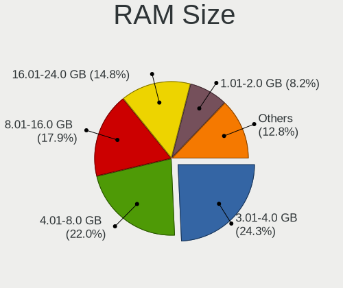

| Size in GB      | Computers | Percent |
|-----------------|-----------|---------|
| 3.01-4.0        | 780       | 25.38%  |
| 4.01-8.0        | 667       | 21.71%  |
| 8.01-16.0       | 536       | 17.44%  |
| 16.01-24.0      | 435       | 14.16%  |
| 1.01-2.0        | 276       | 8.98%   |
| 2.01-3.0        | 149       | 4.85%   |
| 32.01-64.0      | 124       | 4.04%   |
| 0.51-1.0        | 54        | 1.76%   |
| 24.01-32.0      | 26        | 0.85%   |
| 64.01-256.0     | 20        | 0.65%   |
| 0.01-0.5        | 5         | 0.16%   |
| More than 256.0 | 1         | 0.03%   |

RAM Used
--------

Used RAM memory

| Used GB    | Computers | Percent |
|------------|-----------|---------|
| 1.01-2.0   | 1190      | 35.53%  |
| 0.51-1.0   | 662       | 19.77%  |
| 2.01-3.0   | 618       | 18.45%  |
| 4.01-8.0   | 371       | 11.08%  |
| 3.01-4.0   | 300       | 8.96%   |
| 8.01-16.0  | 108       | 3.22%   |
| 0.01-0.5   | 85        | 2.54%   |
| 16.01-24.0 | 9         | 0.27%   |
| 24.01-32.0 | 3         | 0.09%   |
| Unknown    | 3         | 0.09%   |

Total Drives
------------

Number of drives on board

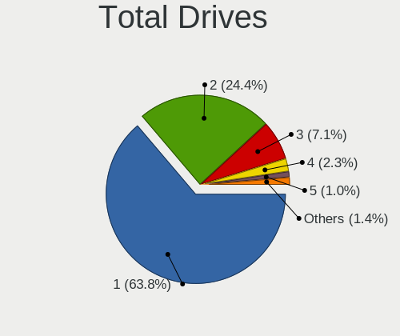

| Drives | Computers | Percent |
|--------|-----------|---------|
| 1      | 2003      | 64.8%   |
| 2      | 744       | 24.07%  |
| 3      | 214       | 6.92%   |
| 4      | 55        | 1.78%   |
| 5      | 31        | 1%      |
| 0      | 30        | 0.97%   |
| 6      | 8         | 0.26%   |
| 8      | 3         | 0.1%    |
| 7      | 3         | 0.1%    |

Has CD-ROM
----------

Has CD-ROM on board

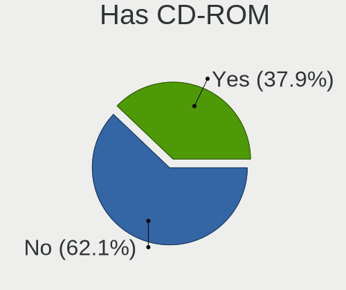

| Presented | Computers | Percent |
|-----------|-----------|---------|
| No        | 1796      | 59.14%  |
| Yes       | 1241      | 40.86%  |

Has Ethernet
------------

Has Ethernet on board

| Presented | Computers | Percent |
|-----------|-----------|---------|
| Yes       | 2710      | 90.03%  |
| No        | 300       | 9.97%   |

Has WiFi
--------

Has WiFi module

| Presented | Computers | Percent |
|-----------|-----------|---------|
| Yes       | 2009      | 66.39%  |
| No        | 1017      | 33.61%  |

Has Bluetooth
-------------

Has Bluetooth module

| Presented | Computers | Percent |
|-----------|-----------|---------|
| No        | 1576      | 51.71%  |
| Yes       | 1472      | 48.29%  |

Location
--------

Country
-------

Geographic location (country)

| Country | Computers | Percent |
|---------|-----------|---------|
| Ukraine | 3006      | 100%    |

City
----

Geographic location (city)

| City            | Computers | Percent |
|-----------------|-----------|---------|
| Kyiv            | 714       | 22.8%   |
| Kharkiv         | 219       | 6.99%   |
| Dnipro          | 141       | 4.5%    |
| Odessa          | 133       | 4.25%   |
| Simferopol      | 127       | 4.06%   |
| Lviv            | 122       | 3.9%    |
| Sevastopol      | 118       | 3.77%   |
| Donetsk         | 85        | 2.71%   |
| Zaporizhzhia    | 43        | 1.37%   |
| Mykolayiv       | 43        | 1.37%   |
| Zaporizhzhya    | 39        | 1.25%   |
| Vinnytsia       | 37        | 1.18%   |
| Kryvyi Rih      | 37        | 1.18%   |
| Kherson         | 35        | 1.12%   |
| Poltava         | 33        | 1.05%   |
| Mariupol        | 33        | 1.05%   |
| Cherkasy        | 32        | 1.02%   |
| Ternopil        | 31        | 0.99%   |
| Chernihiv       | 30        | 0.96%   |
| Yasinovataya    | 25        | 0.8%    |
| Novopskov       | 25        | 0.8%    |
| Horlivka        | 24        | 0.77%   |
| Kremenchug      | 21        | 0.67%   |
| Zhytomyr        | 20        | 0.64%   |
| Uzhhorod        | 20        | 0.64%   |
| Ivano-Frankivsk | 20        | 0.64%   |
| Lutsk           | 18        | 0.57%   |
| Luhansk         | 18        | 0.57%   |
| Bucha           | 18        | 0.57%   |
| Yalta           | 17        | 0.54%   |
| Rivne           | 16        | 0.51%   |
| Irpin           | 16        | 0.51%   |
| Syeverodonets'k | 14        | 0.45%   |
| Mykytyn Rog     | 14        | 0.45%   |
| Kramatorsk      | 14        | 0.45%   |
| Yevpatoriya     | 13        | 0.42%   |
| Sumy            | 13        | 0.42%   |
| Pavlohrad       | 13        | 0.42%   |
| Nova Kakhovka   | 13        | 0.42%   |
| Makiivka        | 13        | 0.42%   |
| Khartsyzsk      | 13        | 0.42%   |
| Bila Tserkva    | 13        | 0.42%   |
| Kerch           | 12        | 0.38%   |
| Chernivtsi      | 12        | 0.38%   |
| Samsonove       | 11        | 0.35%   |
| Kamianske       | 11        | 0.35%   |
| Feodosiya       | 11        | 0.35%   |
| Brovary         | 11        | 0.35%   |
| Kropyvnytskyi   | 10        | 0.32%   |
| Izmail          | 10        | 0.32%   |
| Vasylkiv        | 9         | 0.29%   |
| Osipenko        | 9         | 0.29%   |
| Khmelnytskyi    | 9         | 0.29%   |
| Netishyn        | 8         | 0.26%   |
| Kyzyl-Yar       | 8         | 0.26%   |
| Chystyakove     | 8         | 0.26%   |
| Artemivs'k      | 8         | 0.26%   |
| Rovenki         | 7         | 0.22%   |
| Oleksandriya    | 7         | 0.22%   |
| Antratsit       | 7         | 0.22%   |

Drives
------

Drive Vendor
------------

Hard drive vendors

| Vendor                      | Computers | Drives | Percent |
|-----------------------------|-----------|--------|---------|
| WDC                         | 780       | 1093   | 18.69%  |
| Seagate                     | 738       | 1001   | 17.68%  |
| Samsung Electronics         | 566       | 767    | 13.56%  |
| Toshiba                     | 344       | 434    | 8.24%   |
| Kingston                    | 304       | 390    | 7.28%   |
| Hitachi                     | 250       | 313    | 5.99%   |
| Unknown                     | 113       | 134    | 2.71%   |
| HGST                        | 112       | 152    | 2.68%   |
| GOODRAM                     | 88        | 102    | 2.11%   |
| SK hynix                    | 79        | 94     | 1.89%   |
| SanDisk                     | 79        | 92     | 1.89%   |
| Intel                       | 75        | 95     | 1.8%    |
| Patriot                     | 56        | 66     | 1.34%   |
| Apacer                      | 45        | 49     | 1.08%   |
| Micron Technology           | 43        | 58     | 1.03%   |
| A-DATA Technology           | 41        | 53     | 0.98%   |
| Crucial                     | 39        | 44     | 0.93%   |
| SPCC                        | 35        | 43     | 0.84%   |
| Team                        | 34        | 45     | 0.81%   |
| Transcend                   | 33        | 45     | 0.79%   |
| China                       | 30        | 33     | 0.72%   |
| Maxtor                      | 20        | 23     | 0.48%   |
| KIOXIA                      | 18        | 24     | 0.43%   |
| Silicon Motion              | 15        | 20     | 0.36%   |
| AMD                         | 15        | 37     | 0.36%   |
| OCZ                         | 13        | 13     | 0.31%   |
| LITEON                      | 13        | 15     | 0.31%   |
| Leven                       | 13        | 15     | 0.31%   |
| Fujitsu                     | 13        | 13     | 0.31%   |
| KingDian                    | 12        | 16     | 0.29%   |
| Plextor                     | 10        | 11     | 0.24%   |
| KingSpec                    | 10        | 10     | 0.24%   |
| JMicron Technology          | 10        | 14     | 0.24%   |
| Phison                      | 8         | 11     | 0.19%   |
| LITEONIT                    | 7         | 9      | 0.17%   |
| Apple                       | 7         | 8      | 0.17%   |
| XPG                         | 5         | 5      | 0.12%   |
| StoreJet                    | 5         | 5      | 0.12%   |
| Indilinx                    | 5         | 5      | 0.12%   |
| Verbatim                    | 4         | 4      | 0.1%    |
| Smartbuy                    | 4         | 5      | 0.1%    |
| HUAWEI                      | 4         | 4      | 0.1%    |
| Gigabyte Technology         | 4         | 4      | 0.1%    |
| UMIS                        | 3         | 3      | 0.07%   |
| Corsair                     | 3         | 3      | 0.07%   |
| Yangtze Memory Technologies | 2         | 3      | 0.05%   |
| PNY                         | 2         | 2      | 0.05%   |
| Netac                       | 2         | 2      | 0.05%   |
| Micron/Crucial Technology   | 2         | 5      | 0.05%   |
| Lite-On                     | 2         | 2      | 0.05%   |
| Intenso                     | 2         | 3      | 0.05%   |
| HGST HTS                    | 2         | 2      | 0.05%   |
| GeIL                        | 2         | 2      | 0.05%   |
| DeTech                      | 2         | 3      | 0.05%   |
| CT240BX5                    | 2         | 2      | 0.05%   |
| CHN25SATAS1                 | 2         | 6      | 0.05%   |
| ASMedia                     | 2         | 2      | 0.05%   |
| Zheino                      | 1         | 1      | 0.02%   |
| YMTC                        | 1         | 1      | 0.02%   |
| WALRAM                      | 1         | 1      | 0.02%   |

Drive Model
-----------

Hard drive models

| Model                               | Computers | Percent |
|-------------------------------------|-----------|---------|
| Seagate ST1000LM035-1RK172 1TB      | 71        | 1.58%   |
| Seagate ST1000LM024 HN-M101MBB 1TB  | 57        | 1.27%   |
| Toshiba MQ01ABF050 500GB            | 47        | 1.05%   |
| Kingston SA400S37240G 240GB SSD     | 45        | 1%      |
| Kingston SA400S37120G 120GB SSD     | 45        | 1%      |
| Toshiba DT01ACA100 1TB              | 37        | 0.83%   |
| Seagate ST9500325AS 500GB           | 37        | 0.83%   |
| Samsung SSD 860 EVO 250GB           | 37        | 0.83%   |
| Seagate ST500DM002-1BD142 500GB     | 35        | 0.78%   |
| Toshiba MQ01ABD100 1TB              | 32        | 0.71%   |
| Toshiba DT01ACA050 500GB            | 31        | 0.69%   |
| Seagate ST500LT012-1DG142 500GB     | 30        | 0.67%   |
| Kingston SV300S37A120G 120GB SSD    | 25        | 0.56%   |
| Toshiba HDWD110 1TB                 | 23        | 0.51%   |
| Samsung SSD 860 EVO 500GB           | 23        | 0.51%   |
| Toshiba MQ04ABF100 1TB              | 22        | 0.49%   |
| HGST HTS545050A7E680 500GB          | 22        | 0.49%   |
| Seagate ST3500418AS 500GB           | 21        | 0.47%   |
| Samsung NVMe SSD Drive 256GB        | 21        | 0.47%   |
| HGST HTS721010A9E630 1TB            | 21        | 0.47%   |
| WDC WD10EZEX-08WN4A0 1TB            | 19        | 0.42%   |
| Seagate ST9320325AS 320GB           | 19        | 0.42%   |
| Patriot Burst 120GB SSD             | 19        | 0.42%   |
| Patriot Burst 240GB SSD             | 18        | 0.4%    |
| Seagate ST500LT012-9WS142 500GB     | 16        | 0.36%   |
| Intel NVMe SSD Drive 512GB          | 15        | 0.33%   |
| Hitachi HTS543232A7A384 320GB       | 15        | 0.33%   |
| HGST HTS541010A9E680 1TB            | 15        | 0.33%   |
| GOODRAM SSD 120GB                   | 15        | 0.33%   |
| Unknown MMC Card  64GB              | 14        | 0.31%   |
| SK hynix NVMe SSD Drive 256GB       | 14        | 0.31%   |
| Seagate ST9250315AS 250GB           | 14        | 0.31%   |
| Seagate ST31000524AS 1TB            | 14        | 0.31%   |
| Seagate ST1000DM003-1CH162 1TB      | 14        | 0.31%   |
| Samsung SSD 850 EVO 250GB           | 14        | 0.31%   |
| Samsung HD103SJ 1TB                 | 14        | 0.31%   |
| Kingston SA400S37480G 480GB SSD     | 14        | 0.31%   |
| HGST HTS545050A7E380 500GB          | 14        | 0.31%   |
| Kingston SUV400S37120G 120GB SSD    | 13        | 0.29%   |
| Hitachi HTS545050B9A300 500GB       | 13        | 0.29%   |
| WDC WD10SPZX-21Z10T0 1TB            | 12        | 0.27%   |
| Unknown MMC Card  32GB              | 12        | 0.27%   |
| Seagate ST2000DM008-2FR102 2TB      | 12        | 0.27%   |
| Seagate ST1000DM010-2EP102 1TB      | 12        | 0.27%   |
| Samsung SSD 850 EVO 500GB           | 12        | 0.27%   |
| Samsung NVMe SSD Drive 512GB        | 12        | 0.27%   |
| Hitachi HTS545032B9A300 320GB       | 12        | 0.27%   |
| WDC WD5000AAKX-001CA0 500GB         | 11        | 0.25%   |
| WDC WD5000AADS-00S9B0 500GB         | 11        | 0.25%   |
| Toshiba MQ01ABD050 500GB            | 11        | 0.25%   |
| Toshiba DT01ACA200 2TB              | 11        | 0.25%   |
| Seagate ST750LM022 HN-M750MBB 752GB | 11        | 0.25%   |
| Seagate ST3320620AS 320GB           | 11        | 0.25%   |
| Seagate ST31000528AS 1TB            | 11        | 0.25%   |
| Micron 1100_MTFDDAV256TBN 256GB SSD | 11        | 0.25%   |
| Hitachi HTS545050A7E380 500GB       | 11        | 0.25%   |
| WDC WD5000LPCX-24VHAT0 500GB        | 10        | 0.22%   |
| WDC WD3200BPVT-22JJ5T0 320GB        | 10        | 0.22%   |
| WDC WD10EZEX-22MFCA0 1TB            | 10        | 0.22%   |
| Seagate ST500LM012 HN-M500MBB 500GB | 10        | 0.22%   |

HDD Vendor
----------

Hard disk drive vendors

| Vendor              | Computers | Drives | Percent |
|---------------------|-----------|--------|---------|
| Seagate             | 733       | 994    | 30.28%  |
| WDC                 | 725       | 1013   | 29.95%  |
| Toshiba             | 309       | 387    | 12.76%  |
| Hitachi             | 250       | 313    | 10.33%  |
| Samsung Electronics | 236       | 335    | 9.75%   |
| HGST                | 112       | 152    | 4.63%   |
| Maxtor              | 20        | 23     | 0.83%   |
| Fujitsu             | 13        | 13     | 0.54%   |
| Unknown             | 5         | 7      | 0.21%   |
| Apple               | 3         | 3      | 0.12%   |
| JMicron Technology  | 2         | 4      | 0.08%   |
| HGST HTS            | 2         | 2      | 0.08%   |
| ASMedia             | 2         | 2      | 0.08%   |
| USB3.0              | 1         | 1      | 0.04%   |
| TPH00100500GB       | 1         | 1      | 0.04%   |
| StoreJet            | 1         | 1      | 0.04%   |
| SILICONMOTION       | 1         | 1      | 0.04%   |
| IBM/Hitachi         | 1         | 1      | 0.04%   |
| Ext Hard            | 1         | 1      | 0.04%   |
| Config              | 1         | 1      | 0.04%   |
| China               | 1         | 1      | 0.04%   |
| ASMT                | 1         | 4      | 0.04%   |

SSD Vendor
----------

Solid state drive vendors

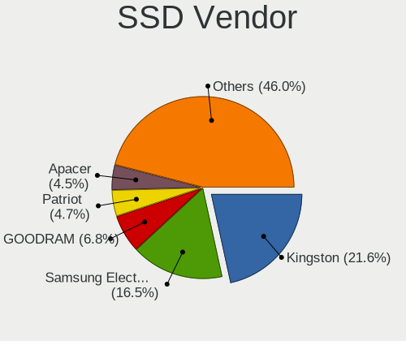

| Vendor              | Computers | Drives | Percent |
|---------------------|-----------|--------|---------|
| Kingston            | 260       | 332    | 22.3%   |
| Samsung Electronics | 201       | 261    | 17.24%  |
| GOODRAM             | 83        | 96     | 7.12%   |
| Patriot             | 56        | 66     | 4.8%    |
| SanDisk             | 54        | 63     | 4.63%   |
| Apacer              | 43        | 47     | 3.69%   |
| Crucial             | 39        | 44     | 3.34%   |
| SPCC                | 34        | 42     | 2.92%   |
| A-DATA Technology   | 34        | 46     | 2.92%   |
| Team                | 33        | 41     | 2.83%   |
| Transcend           | 30        | 39     | 2.57%   |
| Intel               | 29        | 34     | 2.49%   |
| China               | 29        | 32     | 2.49%   |
| SK hynix            | 25        | 30     | 2.14%   |
| Micron Technology   | 25        | 29     | 2.14%   |
| WDC                 | 23        | 26     | 1.97%   |
| OCZ                 | 13        | 13     | 1.11%   |
| AMD                 | 13        | 35     | 1.11%   |
| Toshiba             | 12        | 17     | 1.03%   |
| LITEON              | 12        | 14     | 1.03%   |
| Leven               | 12        | 14     | 1.03%   |
| KingDian            | 12        | 16     | 1.03%   |
| KingSpec            | 9         | 9      | 0.77%   |
| Plextor             | 8         | 9      | 0.69%   |
| LITEONIT            | 7         | 9      | 0.6%    |
| Verbatim            | 4         | 4      | 0.34%   |
| StoreJet            | 4         | 4      | 0.34%   |
| Smartbuy            | 4         | 5      | 0.34%   |
| JMicron Technology  | 4         | 4      | 0.34%   |
| Gigabyte Technology | 4         | 4      | 0.34%   |
| Corsair             | 3         | 3      | 0.26%   |
| Apple               | 3         | 3      | 0.26%   |
| Unknown             | 2         | 2      | 0.17%   |
| PNY                 | 2         | 2      | 0.17%   |
| Intenso             | 2         | 3      | 0.17%   |
| Indilinx            | 2         | 2      | 0.17%   |
| GeIL                | 2         | 2      | 0.17%   |
| DeTech              | 2         | 3      | 0.17%   |
| CT240BX5            | 2         | 2      | 0.17%   |
| CHN25SATAS1         | 2         | 6      | 0.17%   |
| Zheino              | 1         | 1      | 0.09%   |
| WALRAM              | 1         | 1      | 0.09%   |
| UNIC2               | 1         | 1      | 0.09%   |
| Teclast             | 1         | 1      | 0.09%   |
| Super Talent        | 1         | 1      | 0.09%   |
| Seagate             | 1         | 1      | 0.09%   |
| Reeinno             | 1         | 1      | 0.09%   |
| Pioneer             | 1         | 1      | 0.09%   |
| Palit               | 1         | 2      | 0.09%   |
| NGFF                | 1         | 1      | 0.09%   |
| Netac               | 1         | 1      | 0.09%   |
| MyDigitalSSD        | 1         | 1      | 0.09%   |
| Mushkin             | 1         | 1      | 0.09%   |
| MIXZA               | 1         | 1      | 0.09%   |
| Lenovo              | 1         | 1      | 0.09%   |
| KIOXIA-EXCERIA      | 1         | 2      | 0.09%   |
| KingFast            | 1         | 2      | 0.09%   |
| Kingchuxing         | 1         | 1      | 0.09%   |
| JIAWEI              | 1         | 1      | 0.09%   |
| JDa                 | 1         | 1      | 0.09%   |

Drive Kind
----------

HDD or SSD

| Kind    | Computers | Drives | Percent |
|---------|-----------|--------|---------|
| HDD     | 2074      | 3260   | 55.57%  |
| SSD     | 1063      | 1444   | 28.48%  |
| NVMe    | 467       | 612    | 12.51%  |
| MMC     | 99        | 119    | 2.65%   |
| Unknown | 29        | 33     | 0.78%   |

Drive Connector
---------------

SATA, SAS, NVMe, etc.

| Type | Computers | Drives | Percent |
|------|-----------|--------|---------|
| SATA | 2604      | 4665   | 80.62%  |
| NVMe | 466       | 610    | 14.43%  |
| MMC  | 99        | 119    | 3.07%   |
| SAS  | 61        | 74     | 1.89%   |

Drive Size
----------

Size of hard drive

| Size in TB | Computers | Drives | Percent |
|------------|-----------|--------|---------|
| 0.01-0.5   | 2143      | 3325   | 68.25%  |
| 0.51-1.0   | 811       | 1101   | 25.83%  |
| 1.01-2.0   | 122       | 176    | 3.89%   |
| 2.01-3.0   | 30        | 50     | 0.96%   |
| 3.01-4.0   | 21        | 37     | 0.67%   |
| 4.01-10.0  | 12        | 14     | 0.38%   |
| 10.01-20.0 | 1         | 1      | 0.03%   |

Space Total
-----------

Amount of disk space available on the file system

| Size in GB     | Computers | Percent |
|----------------|-----------|---------|
| 101-250        | 864       | 26.68%  |
| 251-500        | 722       | 22.3%   |
| 501-1000       | 402       | 12.42%  |
| 1-20           | 320       | 9.88%   |
| 51-100         | 319       | 9.85%   |
| 21-50          | 259       | 8%      |
| 1001-2000      | 188       | 5.81%   |
| Unknown        | 61        | 1.88%   |
| More than 3000 | 54        | 1.67%   |
| 2001-3000      | 49        | 1.51%   |

Space Used
----------

Amount of used disk space

| Used GB        | Computers | Percent |
|----------------|-----------|---------|
| 1-20           | 1497      | 45.71%  |
| 21-50          | 508       | 15.51%  |
| 101-250        | 407       | 12.43%  |
| 51-100         | 346       | 10.56%  |
| 251-500        | 211       | 6.44%   |
| 501-1000       | 146       | 4.46%   |
| 1001-2000      | 61        | 1.86%   |
| Unknown        | 61        | 1.86%   |
| More than 3000 | 22        | 0.67%   |
| 2001-3000      | 16        | 0.49%   |

Malfunc. Drives
---------------

Drive models with a malfunction

| Model                               | Computers | Drives | Percent |
|-------------------------------------|-----------|--------|---------|
| Seagate ST9500325AS 500GB           | 21        | 24     | 2.48%   |
| Seagate ST1000LM024 HN-M101MBB 1TB  | 14        | 22     | 1.65%   |
| Seagate ST9320325AS 320GB           | 13        | 16     | 1.53%   |
| Seagate ST500DM002-1BD142 500GB     | 12        | 16     | 1.42%   |
| Hitachi HTS543232A7A384 320GB       | 11        | 12     | 1.3%    |
| Seagate ST500LT012-9WS142 500GB     | 10        | 12     | 1.18%   |
| Seagate ST500LT012-1DG142 500GB     | 9         | 10     | 1.06%   |
| Seagate ST3500418AS 500GB           | 9         | 10     | 1.06%   |
| Seagate ST9250315AS 250GB           | 8         | 9      | 0.94%   |
| Samsung Electronics HD321KJ 320GB   | 8         | 11     | 0.94%   |
| WDC WD5000AADS-00S9B0 500GB         | 7         | 7      | 0.83%   |
| Toshiba MQ01ABD100 1TB              | 7         | 7      | 0.83%   |
| Toshiba MQ01ABD050 500GB            | 7         | 9      | 0.83%   |
| Seagate ST31000524AS 1TB            | 7         | 9      | 0.83%   |
| Hitachi HTS545050B9A300 500GB       | 7         | 9      | 0.83%   |
| HGST HTS545050A7E680 500GB          | 7         | 9      | 0.83%   |
| Seagate ST3250318AS 250GB           | 6         | 8      | 0.71%   |
| Samsung Electronics HD080HJ 80GB    | 6         | 6      | 0.71%   |
| Hitachi HTS542516K9SA00 160GB       | 6         | 6      | 0.71%   |
| WDC WD5000AAKX-001CA0 500GB         | 5         | 5      | 0.59%   |
| WDC WD3200BEVT-22A23T0 320GB        | 5         | 5      | 0.59%   |
| WDC WD10EZEX-60ZF5A0 1TB            | 5         | 6      | 0.59%   |
| Toshiba DT01ACA050 500GB            | 5         | 6      | 0.59%   |
| Seagate ST3320620AS 320GB           | 5         | 7      | 0.59%   |
| Seagate ST320LT020-9YG142 320GB     | 5         | 6      | 0.59%   |
| Seagate ST3160811AS 160GB           | 5         | 5      | 0.59%   |
| Seagate ST1000LM035-1RK172 1TB      | 5         | 6      | 0.59%   |
| Samsung Electronics SP2514N 250GB   | 5         | 6      | 0.59%   |
| Samsung Electronics SP2504C 250GB   | 5         | 6      | 0.59%   |
| Samsung Electronics HD403LJ 400GB   | 5         | 6      | 0.59%   |
| Samsung Electronics HD103SJ 1TB     | 5         | 7      | 0.59%   |
| Maxtor STM3250820AS 250GB           | 5         | 6      | 0.59%   |
| Hitachi HTS545032B9A300 320GB       | 5         | 7      | 0.59%   |
| HGST HTS545050A7E380 500GB          | 5         | 5      | 0.59%   |
| WDC WD5000BEVT-22A0RT0 500GB        | 4         | 4      | 0.47%   |
| Toshiba DT01ACA100 1TB              | 4         | 6      | 0.47%   |
| Seagate ST750LM022 HN-M750MBB 752GB | 4         | 4      | 0.47%   |
| Seagate ST500LM012 HN-M500MBB 500GB | 4         | 6      | 0.47%   |
| Seagate ST3250410AS 250GB           | 4         | 7      | 0.47%   |
| Seagate ST3250310AS 250GB           | 4         | 5      | 0.47%   |
| Seagate ST1000DM003-1CH162 1TB      | 4         | 6      | 0.47%   |
| Samsung Electronics SP2004C 200GB   | 4         | 4      | 0.47%   |
| Samsung Electronics SP0802N 80GB    | 4         | 4      | 0.47%   |
| Samsung Electronics HM160HI 160GB   | 4         | 4      | 0.47%   |
| Samsung Electronics HD322HJ 320GB   | 4         | 4      | 0.47%   |
| Samsung Electronics HD200HJ 200GB   | 4         | 5      | 0.47%   |
| Samsung Electronics HD160JJ 160GB   | 4         | 6      | 0.47%   |
| Hitachi HTS545050A7E380 500GB       | 4         | 4      | 0.47%   |
| Hitachi HTS542512K9A300 120GB       | 4         | 5      | 0.47%   |
| Hitachi HDT725025VLA380 250GB       | 4         | 4      | 0.47%   |
| Hitachi HDS721616PLA380 160GB       | 4         | 4      | 0.47%   |
| Hitachi HDS721010DLE630 1TB         | 4         | 5      | 0.47%   |
| Hitachi HDP725025GLA380 250GB       | 4         | 5      | 0.47%   |
| WDC WD5000AAKX-00ERMA0 500GB        | 3         | 4      | 0.35%   |
| WDC WD5000AAKS-00V1A0 500GB         | 3         | 4      | 0.35%   |
| WDC WD5000AAKS-00UU3A0 500GB        | 3         | 3      | 0.35%   |
| WDC WD3200AAJS-00L7A0 320GB         | 3         | 3      | 0.35%   |
| Toshiba MK5065GSX 500GB             | 3         | 3      | 0.35%   |
| Seagate ST9500420AS 500GB           | 3         | 3      | 0.35%   |
| Seagate ST9160821AS 160GB           | 3         | 3      | 0.35%   |

Malfunc. Drive Vendor
---------------------

Vendors of faulty drives

| Vendor              | Computers | Drives | Percent |
|---------------------|-----------|--------|---------|
| Seagate             | 250       | 313    | 30.08%  |
| WDC                 | 183       | 215    | 22.02%  |
| Hitachi             | 119       | 155    | 14.32%  |
| Samsung Electronics | 117       | 139    | 14.08%  |
| Toshiba             | 63        | 78     | 7.58%   |
| HGST                | 17        | 21     | 2.05%   |
| Kingston            | 15        | 20     | 1.81%   |
| Maxtor              | 11        | 13     | 1.32%   |
| SanDisk             | 7         | 9      | 0.84%   |
| A-DATA Technology   | 7         | 8      | 0.84%   |
| Intel               | 4         | 4      | 0.48%   |
| Fujitsu             | 4         | 4      | 0.48%   |
| SK hynix            | 3         | 3      | 0.36%   |
| Patriot             | 3         | 3      | 0.36%   |
| Micron Technology   | 3         | 3      | 0.36%   |
| SPCC                | 2         | 3      | 0.24%   |
| OCZ                 | 2         | 2      | 0.24%   |
| LITEON              | 2         | 3      | 0.24%   |
| Crucial             | 2         | 2      | 0.24%   |
| Apple               | 2         | 2      | 0.24%   |
| Apacer              | 2         | 4      | 0.24%   |
| Transcend           | 1         | 1      | 0.12%   |
| TPH00100500GB       | 1         | 1      | 0.12%   |
| Team                | 1         | 1      | 0.12%   |
| LITEONIT            | 1         | 1      | 0.12%   |
| KingSpec            | 1         | 1      | 0.12%   |
| JMicron Technology  | 1         | 1      | 0.12%   |
| JIAWEI              | 1         | 1      | 0.12%   |
| JDa                 | 1         | 1      | 0.12%   |
| IBM/Hitachi         | 1         | 1      | 0.12%   |
| HGST HTS            | 1         | 1      | 0.12%   |
| Goodram             | 1         | 1      | 0.12%   |
| Corsair             | 1         | 1      | 0.12%   |
| China               | 1         | 1      | 0.12%   |

Malfunc. HDD Vendor
-------------------

Vendors of faulty HDD drives

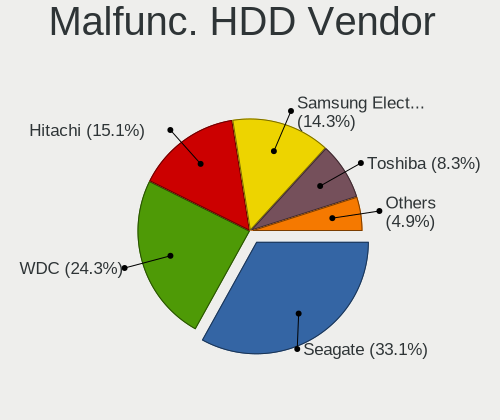

| Vendor              | Computers | Drives | Percent |
|---------------------|-----------|--------|---------|
| Seagate             | 250       | 313    | 32.77%  |
| WDC                 | 183       | 215    | 23.98%  |
| Hitachi             | 119       | 155    | 15.6%   |
| Samsung Electronics | 112       | 134    | 14.68%  |
| Toshiba             | 63        | 78     | 8.26%   |
| HGST                | 17        | 21     | 2.23%   |
| Maxtor              | 11        | 13     | 1.44%   |
| Fujitsu             | 4         | 4      | 0.52%   |
| TPH00100500GB       | 1         | 1      | 0.13%   |
| IBM/Hitachi         | 1         | 1      | 0.13%   |
| HGST HTS            | 1         | 1      | 0.13%   |
| Apple               | 1         | 1      | 0.13%   |

Malfunc. Drive Kind
-------------------

Kinds of faulty drives

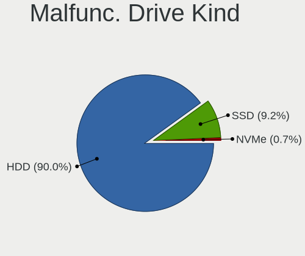

| Kind | Computers | Drives | Percent |
|------|-----------|--------|---------|
| HDD  | 686       | 937    | 90.98%  |
| SSD  | 65        | 77     | 8.62%   |
| NVMe | 3         | 3      | 0.4%    |

Failed Drives
-------------

Failed drive models

| Model                                 | Computers | Drives | Percent |
|---------------------------------------|-----------|--------|---------|
| Seagate ST9500325AS 500GB             | 2         | 3      | 6.67%   |
| Seagate ST9250315AS 250GB             | 2         | 2      | 6.67%   |
| WDC WD5000AAKS-00V1A0 500GB           | 1         | 2      | 3.33%   |
| WDC WD3200BEVT-24A23T0 320GB          | 1         | 1      | 3.33%   |
| WDC WD3200BEVT-22ZCT0 320GB           | 1         | 1      | 3.33%   |
| WDC WD3200AAJS-60Z0A0 320GB           | 1         | 1      | 3.33%   |
| WDC WD2500JS-22NCB1 250GB             | 1         | 1      | 3.33%   |
| WDC WD1600AAJB-00WRA0 160GB           | 1         | 1      | 3.33%   |
| WDC WD1001FALS-00E8B0 1TB             | 1         | 1      | 3.33%   |
| Toshiba MK5065GSX 500GB               | 1         | 1      | 3.33%   |
| Toshiba MK1059GSM 1TB                 | 1         | 1      | 3.33%   |
| Seagate ST500LM012 HN-M500MBB 500GB   | 1         | 1      | 3.33%   |
| Seagate ST3750525AS 752GB             | 1         | 1      | 3.33%   |
| Seagate ST3500418AS 500GB             | 1         | 1      | 3.33%   |
| Seagate ST3500410AS 500GB             | 1         | 1      | 3.33%   |
| Seagate ST320DM001 HD322GJ 320GB      | 1         | 1      | 3.33%   |
| Seagate ST31000528AS 1TB              | 1         | 1      | 3.33%   |
| Seagate ST31000524AS 1TB              | 1         | 1      | 3.33%   |
| Seagate ST31000340NS 1TB              | 1         | 1      | 3.33%   |
| Samsung Electronics SSD PM800 TM 64GB | 1         | 1      | 3.33%   |
| Samsung Electronics HM321HI 320GB     | 1         | 1      | 3.33%   |
| Samsung Electronics HM251JI 250GB     | 1         | 1      | 3.33%   |
| Samsung Electronics HD502IJ 500GB     | 1         | 1      | 3.33%   |
| Samsung Electronics HD502HJ 500GB     | 1         | 1      | 3.33%   |
| Samsung Electronics HD252HJ 250GB     | 1         | 4      | 3.33%   |
| Intel SSDSC2KB960G8 960GB             | 1         | 1      | 3.33%   |
| Hitachi HTS547575A9E384 752GB         | 1         | 1      | 3.33%   |
| Hitachi HDS721010DLE630 1TB           | 1         | 1      | 3.33%   |

Failed Drive Vendor
-------------------

Failed drive vendors

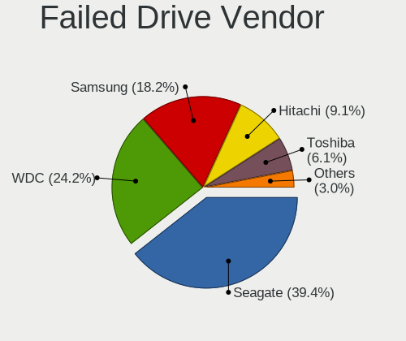

| Vendor              | Computers | Drives | Percent |
|---------------------|-----------|--------|---------|
| Seagate             | 12        | 13     | 40%     |
| WDC                 | 7         | 8      | 23.33%  |
| Samsung Electronics | 6         | 9      | 20%     |
| Toshiba             | 2         | 2      | 6.67%   |
| Hitachi             | 2         | 2      | 6.67%   |
| Intel               | 1         | 1      | 3.33%   |

Drive Status
------------

Number of failed and malfunc. drives

| Status   | Computers | Drives | Percent |
|----------|-----------|--------|---------|
| Works    | 1439      | 2445   | 42.55%  |
| Detected | 1174      | 1971   | 34.71%  |
| Malfunc  | 739       | 1017   | 21.85%  |
| Failed   | 30        | 35     | 0.89%   |

Storage controller
------------------

Storage Vendor
--------------

Storage controller vendors

| Vendor                           | Computers | Percent |
|----------------------------------|-----------|---------|
| Intel                            | 2040      | 58.72%  |
| AMD                              | 648       | 18.65%  |
| Samsung Electronics              | 147       | 4.23%   |
| Nvidia                           | 129       | 3.71%   |
| JMicron Technology               | 75        | 2.16%   |
| SanDisk                          | 59        | 1.7%    |
| Marvell Technology Group         | 53        | 1.53%   |
| SK hynix                         | 52        | 1.5%    |
| Kingston Technology Company      | 45        | 1.3%    |
| ASMedia Technology               | 41        | 1.18%   |
| Toshiba America Info Systems     | 26        | 0.75%   |
| Silicon Motion                   | 23        | 0.66%   |
| VIA Technologies                 | 20        | 0.58%   |
| KIOXIA                           | 20        | 0.58%   |
| Micron Technology                | 18        | 0.52%   |
| ADATA Technology                 | 13        | 0.37%   |
| Union Memory (Shenzhen)          | 11        | 0.32%   |
| Phison Electronics               | 11        | 0.32%   |
| Silicon Integrated Systems [SiS] | 10        | 0.29%   |
| Silicon Image                    | 5         | 0.14%   |
| Lite-On Technology               | 5         | 0.14%   |
| Shenzhen Longsys Electronics     | 4         | 0.12%   |
| Realtek Semiconductor            | 4         | 0.12%   |
| Yangtze Memory Technologies      | 3         | 0.09%   |
| ULi Electronics                  | 3         | 0.09%   |
| Integrated Technology Express    | 3         | 0.09%   |
| Micron/Crucial Technology        | 2         | 0.06%   |
| Broadcom / LSI                   | 2         | 0.06%   |
| Seagate Technology               | 1         | 0.03%   |
| Apple                            | 1         | 0.03%   |

Storage Model
-------------

Storage controller models

| Model                                                                                   | Computers | Percent |
|-----------------------------------------------------------------------------------------|-----------|---------|
| AMD FCH SATA Controller [AHCI mode]                                                     | 341       | 7.86%   |
| Intel 7 Series Chipset Family 6-port SATA Controller [AHCI mode]                        | 192       | 4.43%   |
| Intel Sunrise Point-LP SATA Controller [AHCI mode]                                      | 161       | 3.71%   |
| AMD SB7x0/SB8x0/SB9x0 IDE Controller                                                    | 138       | 3.18%   |
| Intel NM10/ICH7 Family SATA Controller [IDE mode]                                       | 131       | 3.02%   |
| AMD SB7x0/SB8x0/SB9x0 SATA Controller [AHCI mode]                                       | 128       | 2.95%   |
| Intel 82801G (ICH7 Family) IDE Controller                                               | 120       | 2.77%   |
| Intel 6 Series/C200 Series Chipset Family 6 port Mobile SATA AHCI Controller            | 116       | 2.67%   |
| Intel 8 Series/C220 Series Chipset Family 6-port SATA Controller 1 [AHCI mode]          | 100       | 2.31%   |
| AMD SB7x0/SB8x0/SB9x0 SATA Controller [IDE mode]                                        | 95        | 2.19%   |
| Intel 6 Series/C200 Series Chipset Family 6 port Desktop SATA AHCI Controller           | 78        | 1.8%    |
| Intel 82801 Mobile SATA Controller [RAID mode]                                          | 77        | 1.78%   |
| Intel 82801IBM/IEM (ICH9M/ICH9M-E) 4 port SATA Controller [AHCI mode]                   | 74        | 1.71%   |
| Samsung NVMe SSD Controller SM981/PM981/PM983                                           | 73        | 1.68%   |
| Nvidia MCP61 SATA Controller                                                            | 73        | 1.68%   |
| Nvidia MCP61 IDE                                                                        | 68        | 1.57%   |
| Intel Q170/Q150/B150/H170/H110/Z170/CM236 Chipset SATA Controller [AHCI Mode]           | 56        | 1.29%   |
| Intel Celeron/Pentium Silver Processor SATA Controller                                  | 56        | 1.29%   |
| AMD 400 Series Chipset SATA Controller                                                  | 56        | 1.29%   |
| Intel 6 Series/C200 Series Chipset Family Desktop SATA Controller (IDE mode, ports 4-5) | 48        | 1.11%   |
| Intel 6 Series/C200 Series Chipset Family Desktop SATA Controller (IDE mode, ports 0-3) | 48        | 1.11%   |
| Intel Cannon Lake Mobile PCH SATA AHCI Controller                                       | 45        | 1.04%   |
| Intel 7 Series/C210 Series Chipset Family 6-port SATA Controller [AHCI mode]            | 43        | 0.99%   |
| Intel 200 Series PCH SATA controller [AHCI mode]                                        | 43        | 0.99%   |
| Intel Atom/Celeron/Pentium Processor x5-E8000/J3xxx/N3xxx Series SATA Controller        | 40        | 0.92%   |
| AMD SB600 IDE                                                                           | 40        | 0.92%   |
| Intel 5 Series/3400 Series Chipset 6 port SATA AHCI Controller                          | 39        | 0.9%    |
| Intel 5 Series/3400 Series Chipset 4 port SATA AHCI Controller                          | 39        | 0.9%    |
| ASMedia ASM1062 Serial ATA Controller                                                   | 39        | 0.9%    |
| AMD SB600 Non-Raid-5 SATA                                                               | 38        | 0.88%   |
| Intel NM10/ICH7 Family SATA Controller [AHCI mode]                                      | 37        | 0.85%   |
| Intel 82801HM/HEM (ICH8M/ICH8M-E) IDE Controller                                        | 37        | 0.85%   |
| Intel 8 Series SATA Controller 1 [AHCI mode]                                            | 37        | 0.85%   |
| Intel Wildcat Point-LP SATA Controller [AHCI Mode]                                      | 35        | 0.81%   |
| Intel Cannon Point-LP SATA Controller [AHCI Mode]                                       | 34        | 0.78%   |
| Intel Volume Management Device NVMe RAID Controller                                     | 31        | 0.71%   |
| Intel 82801I (ICH9 Family) 2 port SATA Controller [IDE mode]                            | 31        | 0.71%   |
| AMD FCH IDE Controller                                                                  | 31        | 0.71%   |
| Samsung NVMe SSD Controller 980                                                         | 30        | 0.69%   |
| JMicron JMB368 IDE controller                                                           | 29        | 0.67%   |
| Intel Celeron N3350/Pentium N4200/Atom E3900 Series SATA AHCI Controller                | 29        | 0.67%   |
| Intel 82801JI (ICH10 Family) 4 port SATA IDE Controller #1                              | 29        | 0.67%   |
| Intel 82801JI (ICH10 Family) 2 port SATA IDE Controller #2                              | 29        | 0.67%   |
| Samsung NVMe SSD Controller SM961/PM961/SM963                                           | 28        | 0.65%   |
| Intel SSD 660P Series                                                                   | 28        | 0.65%   |
| Intel HM170/QM170 Chipset SATA Controller [AHCI Mode]                                   | 28        | 0.65%   |
| Intel 82801HM/HEM (ICH8M/ICH8M-E) SATA Controller [AHCI mode]                           | 28        | 0.65%   |
| Intel Cannon Lake PCH SATA AHCI Controller                                              | 27        | 0.62%   |
| Intel Comet Lake SATA AHCI Controller                                                   | 26        | 0.6%    |
| Intel 82801GBM/GHM (ICH7-M Family) SATA Controller [IDE mode]                           | 26        | 0.6%    |
| AMD FCH SATA Controller [IDE mode]                                                      | 26        | 0.6%    |
| JMicron JMB363 SATA/IDE Controller                                                      | 25        | 0.58%   |
| Intel Atom Processor E3800 Series SATA AHCI Controller                                  | 23        | 0.53%   |
| SK hynix BC511                                                                          | 21        | 0.48%   |
| AMD FCH SATA Controller D                                                               | 21        | 0.48%   |
| KIOXIA NVMe SSD Controller BG4                                                          | 20        | 0.46%   |
| Intel SATA Controller [RAID mode]                                                       | 20        | 0.46%   |
| Kingston Company U-SNS8154P3 NVMe SSD                                                   | 19        | 0.44%   |
| Intel 82801JI (ICH10 Family) SATA AHCI Controller                                       | 19        | 0.44%   |
| Intel 82801IB (ICH9) 2 port SATA Controller [IDE mode]                                  | 19        | 0.44%   |

Storage Kind
------------

Kind of storage controller (IDE, SATA, NVMe, SAS, ...)

| Kind | Computers | Percent |
|------|-----------|---------|
| SATA | 2178      | 59.82%  |
| IDE  | 841       | 23.1%   |
| NVMe | 474       | 13.02%  |
| RAID | 143       | 3.93%   |
| SAS  | 4         | 0.11%   |
| SCSI | 1         | 0.03%   |

Processor
---------

CPU Vendor
----------

Processor vendors

| Vendor       | Computers | Percent |
|--------------|-----------|---------|
| Intel        | 2187      | 72.75%  |
| AMD          | 801       | 26.65%  |
| ARM          | 15        | 0.5%    |
| CentaurHauls | 2         | 0.07%   |
| Unknown      | 1         | 0.03%   |

CPU Model
---------

Processor models

| Model                                         | Computers | Percent |
|-----------------------------------------------|-----------|---------|
| Intel Core i5-8250U CPU @ 1.60GHz             | 34        | 1.13%   |
| Intel Core i7-8550U CPU @ 1.80GHz             | 33        | 1.09%   |
| Intel Core i5-8265U CPU @ 1.60GHz             | 28        | 0.93%   |
| AMD Athlon II X2 250 Processor                | 26        | 0.86%   |
| Intel Celeron N4000 CPU @ 1.10GHz             | 25        | 0.83%   |
| Intel Core i5-3210M CPU @ 2.50GHz             | 23        | 0.76%   |
| Intel Core i7-8565U CPU @ 1.80GHz             | 22        | 0.73%   |
| Intel Core i5-8300H CPU @ 2.30GHz             | 22        | 0.73%   |
| Intel Core i5-7200U CPU @ 2.50GHz             | 22        | 0.73%   |
| Intel Pentium Silver N5000 CPU @ 1.10GHz      | 19        | 0.63%   |
| AMD Ryzen 5 3500U with Radeon Vega Mobile Gfx | 19        | 0.63%   |
| Intel Core i5-10210U CPU @ 1.60GHz            | 17        | 0.56%   |
| Intel Core 2 Duo CPU E8400 @ 3.00GHz          | 17        | 0.56%   |
| AMD Ryzen 7 4700U with Radeon Graphics        | 17        | 0.56%   |
| Intel Pentium CPU B960 @ 2.20GHz              | 16        | 0.53%   |
| Intel Core i7-7500U CPU @ 2.70GHz             | 16        | 0.53%   |
| Intel Core i3-6006U CPU @ 2.00GHz             | 15        | 0.5%    |
| Intel Core i3-5005U CPU @ 2.00GHz             | 15        | 0.5%    |
| AMD FX-8350 Eight-Core Processor              | 15        | 0.5%    |
| Intel Core i5-3230M CPU @ 2.60GHz             | 14        | 0.46%   |
| Intel Core i5-2400 CPU @ 3.10GHz              | 14        | 0.46%   |
| Intel Core i3-7020U CPU @ 2.30GHz             | 14        | 0.46%   |
| Intel Core i3-3220 CPU @ 3.30GHz              | 14        | 0.46%   |
| Intel Core i3-3110M CPU @ 2.40GHz             | 14        | 0.46%   |
| Intel Celeron CPU N3060 @ 1.60GHz             | 14        | 0.46%   |
| Intel Pentium CPU N3710 @ 1.60GHz             | 13        | 0.43%   |
| Intel Pentium CPU B950 @ 2.10GHz              | 13        | 0.43%   |
| Intel Pentium CPU 2020M @ 2.40GHz             | 13        | 0.43%   |
| Intel Core i7-10510U CPU @ 1.80GHz            | 13        | 0.43%   |
| Intel Core i5-2410M CPU @ 2.30GHz             | 13        | 0.43%   |
| Intel Core i3-2350M CPU @ 2.30GHz             | 13        | 0.43%   |
| Intel Core i3-2100 CPU @ 3.10GHz              | 13        | 0.43%   |
| Intel Atom CPU N450 @ 1.66GHz                 | 13        | 0.43%   |
| Intel Core i7-6700HQ CPU @ 2.60GHz            | 12        | 0.4%    |
| Intel Core i5-6200U CPU @ 2.30GHz             | 12        | 0.4%    |
| Intel Core i3 CPU 540 @ 3.07GHz               | 12        | 0.4%    |
| Intel Core 2 Duo CPU E8500 @ 3.16GHz          | 12        | 0.4%    |
| Intel 11th Gen Core i5-1135G7 @ 2.40GHz       | 12        | 0.4%    |
| Intel Core i7-7700HQ CPU @ 2.80GHz            | 11        | 0.36%   |
| Intel Core i7-2670QM CPU @ 2.20GHz            | 11        | 0.36%   |
| Intel Core i3-3217U CPU @ 1.80GHz             | 11        | 0.36%   |
| Intel Core i3-2330M CPU @ 2.20GHz             | 11        | 0.36%   |
| AMD Ryzen 5 1600 Six-Core Processor           | 11        | 0.36%   |
| AMD Ryzen 3 2200G with Radeon Vega Graphics   | 11        | 0.36%   |
| AMD Athlon 64 X2 Dual Core Processor 4200+    | 11        | 0.36%   |
| Intel Core i7-8750H CPU @ 2.20GHz             | 10        | 0.33%   |
| Intel Core i7-3630QM CPU @ 2.40GHz            | 10        | 0.33%   |
| Intel Core i5-9300H CPU @ 2.40GHz             | 10        | 0.33%   |
| Intel Core i5-3470 CPU @ 3.20GHz              | 10        | 0.33%   |
| Intel Core i5-2450M CPU @ 2.50GHz             | 10        | 0.33%   |
| Intel Core i3-8100 CPU @ 3.60GHz              | 10        | 0.33%   |
| Intel Core i3-2120 CPU @ 3.30GHz              | 10        | 0.33%   |
| Intel Core 2 Duo CPU E7500 @ 2.93GHz          | 10        | 0.33%   |
| Intel 11th Gen Core i7-1165G7 @ 2.80GHz       | 10        | 0.33%   |
| AMD Ryzen 5 3400G with Radeon Vega Graphics   | 10        | 0.33%   |
| Intel Pentium Dual-Core CPU T4500 @ 2.30GHz   | 9         | 0.3%    |
| Intel Pentium CPU N4200 @ 1.10GHz             | 9         | 0.3%    |
| Intel Pentium CPU G4400 @ 3.30GHz             | 9         | 0.3%    |
| Intel Pentium 4 CPU 3.00GHz                   | 9         | 0.3%    |
| Intel Core i5-2520M CPU @ 2.50GHz             | 9         | 0.3%    |

CPU Model Family
----------------

Processor model prefix

| Model                          | Computers | Percent |
|--------------------------------|-----------|---------|
| Intel Core i5                  | 509       | 16.87%  |
| Intel Core i7                  | 320       | 10.61%  |
| Intel Core i3                  | 316       | 10.47%  |
| Intel Celeron                  | 216       | 7.16%   |
| Intel Pentium                  | 187       | 6.2%    |
| Intel Core 2 Duo               | 147       | 4.87%   |
| AMD Ryzen 5                    | 108       | 3.58%   |
| Intel Atom                     | 81        | 2.68%   |
| Intel Xeon                     | 70        | 2.32%   |
| AMD FX                         | 66        | 2.19%   |
| Other                          | 65        | 2.15%   |
| AMD Ryzen 7                    | 64        | 2.12%   |
| AMD Athlon II X2               | 64        | 2.12%   |
| AMD Athlon 64 X2               | 55        | 1.82%   |
| Intel Pentium Dual-Core        | 54        | 1.79%   |
| AMD A4                         | 40        | 1.33%   |
| Intel Core 2                   | 38        | 1.26%   |
| AMD A6                         | 37        | 1.23%   |
| AMD Ryzen 3                    | 35        | 1.16%   |
| AMD Phenom II X4               | 35        | 1.16%   |
| Intel Core 2 Quad              | 31        | 1.03%   |
| Intel Pentium Dual             | 29        | 0.96%   |
| Intel Pentium 4                | 29        | 0.96%   |
| AMD A8                         | 25        | 0.83%   |
| Intel Pentium Silver           | 24        | 0.8%    |
| AMD A10                        | 24        | 0.8%    |
| Intel Genuine                  | 21        | 0.7%    |
| AMD E                          | 21        | 0.7%    |
| AMD Athlon II X4               | 21        | 0.7%    |
| AMD Athlon                     | 21        | 0.7%    |
| AMD E1                         | 19        | 0.63%   |
| AMD Athlon II X3               | 17        | 0.56%   |
| Intel Pentium D                | 16        | 0.53%   |
| Intel Celeron Dual-Core        | 15        | 0.5%    |
| AMD Sempron                    | 14        | 0.46%   |
| Intel Celeron M                | 13        | 0.43%   |
| AMD Ryzen 9                    | 13        | 0.43%   |
| AMD Athlon X4                  | 13        | 0.43%   |
| AMD E2                         | 12        | 0.4%    |
| AMD Athlon II                  | 12        | 0.4%    |
| AMD Athlon 64                  | 11        | 0.36%   |
| Intel Pentium M                | 7         | 0.23%   |
| Intel Core Duo                 | 7         | 0.23%   |
| AMD Athlon X2                  | 7         | 0.23%   |
| AMD Turion 64 X2 Mobile        | 6         | 0.2%    |
| Intel Pentium Gold             | 5         | 0.17%   |
| Intel Celeron D                | 5         | 0.17%   |
| AMD Ryzen Threadripper         | 5         | 0.17%   |
| AMD Athlon II Dual-Core        | 5         | 0.17%   |
| ARM AArch64                    | 4         | 0.13%   |
| AMD Phenom II X6               | 4         | 0.13%   |
| AMD C-50                       | 4         | 0.13%   |
| ARM BCM                        | 3         | 0.1%    |
| AMD Turion X2 Dual-Core Mobile | 3         | 0.1%    |
| AMD Ryzen 7 PRO                | 3         | 0.1%    |
| AMD Ryzen 5 PRO                | 3         | 0.1%    |
| AMD A12                        | 3         | 0.1%    |
| Intel Core i9                  | 2         | 0.07%   |
| CentaurHauls VIA Eden          | 2         | 0.07%   |
| AMD Turion II                  | 2         | 0.07%   |

CPU Cores
---------

Number of processor cores

| Number  | Computers | Percent |
|---------|-----------|---------|
| 2       | 1544      | 50.69%  |
| 4       | 917       | 30.11%  |
| 1       | 162       | 5.32%   |
| 6       | 158       | 5.19%   |
| Unknown | 116       | 3.81%   |
| 8       | 83        | 2.72%   |
| 3       | 33        | 1.08%   |
| 12      | 16        | 0.53%   |
| 16      | 8         | 0.26%   |
| 10      | 3         | 0.1%    |
| 24      | 2         | 0.07%   |
| 14      | 2         | 0.07%   |
| 36      | 1         | 0.03%   |
| 32      | 1         | 0.03%   |

CPU Sockets
-----------

Number of sockets

| Number  | Computers | Percent |
|---------|-----------|---------|
| 1       | 2989      | 99.43%  |
| 2       | 14        | 0.47%   |
| Unknown | 2         | 0.07%   |
| 4       | 1         | 0.03%   |

CPU Threads
-----------

Threads per core (Hyper-Threading)

| Number  | Computers | Percent |
|---------|-----------|---------|
| 2       | 1491      | 48.93%  |
| 1       | 1440      | 47.26%  |
| Unknown | 116       | 3.81%   |

CPU Op-Modes
------------

CPU Operation Modes (32-bit, 64-bit)

| Op mode        | Computers | Percent |
|----------------|-----------|---------|
| 32-bit, 64-bit | 2859      | 94.73%  |
| Unknown        | 88        | 2.92%   |
| 32-bit         | 71        | 2.35%   |

CPU Microcode
-------------

Microcode number

| Number     | Computers | Percent |
|------------|-----------|---------|
| Unknown    | 417       | 13.56%  |
| 0x206a7    | 251       | 8.16%   |
| 0x306a9    | 215       | 6.99%   |
| 0x1067a    | 165       | 5.36%   |
| 0x010000c8 | 109       | 3.54%   |
| 0x306c3    | 106       | 3.45%   |
| 0x806ea    | 81        | 2.63%   |
| 0x906ea    | 65        | 2.11%   |
| 0x806ec    | 60        | 1.95%   |
| 0x06001119 | 60        | 1.95%   |
| 0x6fd      | 58        | 1.89%   |
| 0x20655    | 58        | 1.89%   |
| 0x806e9    | 54        | 1.76%   |
| 0x506e3    | 54        | 1.76%   |
| 0x906e9    | 50        | 1.63%   |
| 0x10676    | 45        | 1.46%   |
| 0x406e3    | 44        | 1.43%   |
| 0x706a1    | 37        | 1.2%    |
| 0x40651    | 37        | 1.2%    |
| 0x806c1    | 35        | 1.14%   |
| 0x306d4    | 35        | 1.14%   |
| 0x106ca    | 35        | 1.14%   |
| 0x30678    | 33        | 1.07%   |
| 0x08108109 | 32        | 1.04%   |
| 0x406c4    | 31        | 1.01%   |
| 0x03000027 | 31        | 1.01%   |
| 0x06000852 | 29        | 0.94%   |
| 0x506c9    | 27        | 0.88%   |
| 0x6fb      | 25        | 0.81%   |
| 0x20652    | 25        | 0.81%   |
| 0x6f6      | 24        | 0.78%   |
| 0x05000119 | 22        | 0.72%   |
| 0xa0652    | 19        | 0.62%   |
| 0x010000c7 | 19        | 0.62%   |
| 0x906eb    | 18        | 0.59%   |
| 0x406c3    | 18        | 0.59%   |
| 0x08600106 | 18        | 0.59%   |
| 0x08108102 | 18        | 0.59%   |
| 0x6f2      | 17        | 0.55%   |
| 0x806eb    | 16        | 0.52%   |
| 0x6d8      | 15        | 0.49%   |
| 0x08600103 | 15        | 0.49%   |
| 0x0800820d | 15        | 0.49%   |
| 0x08001137 | 15        | 0.49%   |
| 0x06003106 | 15        | 0.49%   |
| 0x106e5    | 14        | 0.46%   |
| 0x10661    | 14        | 0.46%   |
| 0x08101016 | 14        | 0.46%   |
| 0xf41      | 13        | 0.42%   |
| 0x106c2    | 13        | 0.42%   |
| 0x08701013 | 13        | 0.42%   |
| 0x0810100b | 13        | 0.42%   |
| 0x010000db | 13        | 0.42%   |
| 0x906ed    | 12        | 0.39%   |
| 0x08001138 | 12        | 0.39%   |
| 0x06006705 | 12        | 0.39%   |
| 0x0600084f | 12        | 0.39%   |
| 0x6ec      | 11        | 0.36%   |
| 0x07030105 | 11        | 0.36%   |
| 0x30661    | 10        | 0.33%   |

CPU Microarch
-------------

Microarchitecture

| Name             | Computers | Percent |
|------------------|-----------|---------|
| KabyLake         | 417       | 13.81%  |
| SandyBridge      | 288       | 9.54%   |
| IvyBridge        | 246       | 8.15%   |
| Penryn           | 228       | 7.55%   |
| K10              | 174       | 5.76%   |
| Haswell          | 165       | 5.47%   |
| Core             | 154       | 5.1%    |
| Piledriver       | 115       | 3.81%   |
| Skylake          | 113       | 3.74%   |
| Westmere         | 95        | 3.15%   |
| Silvermont       | 91        | 3.01%   |
| K8 Hammer        | 86        | 2.85%   |
| Zen+             | 78        | 2.58%   |
| Zen 2            | 76        | 2.52%   |
| Zen              | 68        | 2.25%   |
| Goldmont plus    | 56        | 1.85%   |
| Bonnell          | 56        | 1.85%   |
| NetBurst         | 55        | 1.82%   |
| Unknown          | 53        | 1.76%   |
| TigerLake        | 42        | 1.39%   |
| CometLake        | 39        | 1.29%   |
| Broadwell        | 39        | 1.29%   |
| Bobcat           | 38        | 1.26%   |
| Excavator        | 36        | 1.19%   |
| P6               | 31        | 1.03%   |
| K10 Llano        | 31        | 1.03%   |
| Goldmont         | 29        | 0.96%   |
| Nehalem          | 18        | 0.6%    |
| Zen 3            | 17        | 0.56%   |
| Puma             | 17        | 0.56%   |
| Steamroller      | 16        | 0.53%   |
| Bulldozer        | 15        | 0.5%    |
| Jaguar           | 12        | 0.4%    |
| IceLake          | 11        | 0.36%   |
| K8 & K10 hybrid  | 9         | 0.3%    |
| Tremont          | 2         | 0.07%   |
| Alderlake Hybrid | 2         | 0.07%   |
| K6               | 1         | 0.03%   |

Graphics
--------

GPU Vendor
----------

Vendors of graphics cards

| Vendor                                       | Computers | Percent |
|----------------------------------------------|-----------|---------|
| Intel                                        | 1588      | 43.59%  |
| Nvidia                                       | 1115      | 30.61%  |
| AMD                                          | 919       | 25.23%  |
| VIA Technologies                             | 6         | 0.16%   |
| Silicon Integrated Systems [SiS]             | 6         | 0.16%   |
| ATI Technologies                             | 5         | 0.14%   |
| ASPEED Technology                            | 2         | 0.05%   |
| XGI Technology (eXtreme Graphics Innovation) | 1         | 0.03%   |
| Matrox Electronics Systems                   | 1         | 0.03%   |

GPU Model
---------

Graphics card models

| Model                                                                                    | Computers | Percent |
|------------------------------------------------------------------------------------------|-----------|---------|
| Intel 2nd Generation Core Processor Family Integrated Graphics Controller                | 214       | 5.61%   |
| Intel 3rd Gen Core processor Graphics Controller                                         | 156       | 4.09%   |
| Intel UHD Graphics 620                                                                   | 78        | 2.04%   |
| Intel HD Graphics 620                                                                    | 63        | 1.65%   |
| Intel WhiskeyLake-U GT2 [UHD Graphics 620]                                               | 60        | 1.57%   |
| Intel Mobile 4 Series Chipset Integrated Graphics Controller                             | 57        | 1.49%   |
| Intel CoffeeLake-H GT2 [UHD Graphics 630]                                                | 55        | 1.44%   |
| Intel Atom/Celeron/Pentium Processor x5-E8000/J3xxx/N3xxx Integrated Graphics Controller | 55        | 1.44%   |
| AMD Picasso/Raven 2 [Radeon Vega Series / Radeon Vega Mobile Series]                     | 55        | 1.44%   |
| AMD Renoir                                                                               | 48        | 1.26%   |
| AMD Ellesmere [Radeon RX 470/480/570/570X/580/580X/590]                                  | 47        | 1.23%   |
| Intel 4th Gen Core Processor Integrated Graphics Controller                              | 46        | 1.21%   |
| Intel Core Processor Integrated Graphics Controller                                      | 44        | 1.15%   |
| Intel Skylake GT2 [HD Graphics 520]                                                      | 42        | 1.1%    |
| Intel Haswell-ULT Integrated Graphics Controller                                         | 37        | 0.97%   |
| Intel HD Graphics 630                                                                    | 36        | 0.94%   |
| Intel HD Graphics 530                                                                    | 35        | 0.92%   |
| Intel GeminiLake [UHD Graphics 600]                                                      | 35        | 0.92%   |
| Intel Atom Processor Z36xxx/Z37xxx Series Graphics & Display                             | 35        | 0.92%   |
| Intel Atom Processor D4xx/D5xx/N4xx/N5xx Integrated Graphics Controller                  | 33        | 0.87%   |
| Intel Xeon E3-1200 v3/4th Gen Core Processor Integrated Graphics Controller              | 32        | 0.84%   |
| Intel CometLake-U GT2 [UHD Graphics]                                                     | 32        | 0.84%   |
| Intel Xeon E3-1200 v2/3rd Gen Core processor Graphics Controller                         | 31        | 0.81%   |
| AMD Sun XT [Radeon HD 8670A/8670M/8690M / R5 M330 / M430 / Radeon 520 Mobile]            | 31        | 0.81%   |
| Intel TigerLake-LP GT2 [Iris Xe Graphics]                                                | 30        | 0.79%   |
| Intel HD Graphics 5500                                                                   | 30        | 0.79%   |
| AMD Raven Ridge [Radeon Vega Series / Radeon Vega Mobile Series]                         | 30        | 0.79%   |
| Nvidia GP108M [GeForce MX150]                                                            | 28        | 0.73%   |
| Nvidia GP107M [GeForce GTX 1050 Mobile]                                                  | 27        | 0.71%   |
| Nvidia GK208B [GeForce GT 710]                                                           | 27        | 0.71%   |
| Intel Mobile 945GM/GMS/GME, 943/940GML Express Integrated Graphics Controller            | 27        | 0.71%   |
| AMD Thames [Radeon HD 7500M/7600M Series]                                                | 27        | 0.71%   |
| Nvidia GT218 [GeForce 210]                                                               | 26        | 0.68%   |
| Intel CoffeeLake-S GT2 [UHD Graphics 630]                                                | 25        | 0.66%   |
| AMD Seymour [Radeon HD 6400M/7400M Series]                                               | 25        | 0.66%   |
| Nvidia GM108M [GeForce MX110]                                                            | 23        | 0.6%    |
| Nvidia GK208M [GeForce GT 740M]                                                          | 23        | 0.6%    |
| Nvidia GF117M [GeForce 610M/710M/810M/820M / GT 620M/625M/630M/720M]                     | 23        | 0.6%    |
| Intel 4 Series Chipset Integrated Graphics Controller                                    | 23        | 0.6%    |
| Intel Mobile GM965/GL960 Integrated Graphics Controller (secondary)                      | 22        | 0.58%   |
| Intel Mobile GM965/GL960 Integrated Graphics Controller (primary)                        | 22        | 0.58%   |
| AMD Stoney [Radeon R2/R3/R4/R5 Graphics]                                                 | 22        | 0.58%   |
| Nvidia GF108 [GeForce GT 440]                                                            | 21        | 0.55%   |
| Intel GeminiLake [UHD Graphics 605]                                                      | 21        | 0.55%   |
| Nvidia GP107M [GeForce GTX 1050 Ti Mobile]                                               | 20        | 0.52%   |
| Nvidia GP107 [GeForce GTX 1050 Ti]                                                       | 20        | 0.52%   |
| Nvidia GM108M [GeForce 940MX]                                                            | 20        | 0.52%   |
| Nvidia G94 [GeForce 9600 GT]                                                             | 20        | 0.52%   |
| Intel HD Graphics 500                                                                    | 19        | 0.5%    |
| Intel CometLake-H GT2 [UHD Graphics]                                                     | 19        | 0.5%    |
| AMD Topaz XT [Radeon R7 M260/M265 / M340/M360 / M440/M445 / 530/535 / 620/625 Mobile]    | 19        | 0.5%    |
| AMD Park [Mobility Radeon HD 5430/5450/5470]                                             | 19        | 0.5%    |
| AMD Cedar [Radeon HD 5000/6000/7350/8350 Series]                                         | 19        | 0.5%    |
| Nvidia GP106 [GeForce GTX 1060 6GB]                                                      | 17        | 0.45%   |
| Nvidia GM108M [GeForce MX130]                                                            | 17        | 0.45%   |
| Nvidia GP108 [GeForce GT 1030]                                                           | 16        | 0.42%   |
| Nvidia GK107 [GeForce GTX 650]                                                           | 16        | 0.42%   |
| Nvidia GF108 [GeForce GT 630]                                                            | 16        | 0.42%   |
| AMD RV710/M92 [Mobility Radeon HD 4530/4570/545v]                                        | 16        | 0.42%   |
| AMD RS880M [Mobility Radeon HD 4225/4250]                                                | 16        | 0.42%   |

GPU Combo
---------

Combinations of graphics cards

| Name                   | Computers | Percent |
|------------------------|-----------|---------|
| 1 x Intel              | 988       | 32.54%  |
| 1 x AMD                | 665       | 21.9%   |
| 1 x Nvidia             | 642       | 21.15%  |
| Intel + Nvidia         | 441       | 14.53%  |
| Intel + AMD            | 130       | 4.28%   |
| 2 x AMD                | 103       | 3.39%   |
| AMD + Nvidia           | 26        | 0.86%   |
| Other                  | 18        | 0.59%   |
| 1 x VIA                | 6         | 0.2%    |
| 1 x SiS                | 6         | 0.2%    |
| 2 x Nvidia             | 2         | 0.07%   |
| Intel + 2 x Nvidia     | 2         | 0.07%   |
| 3 x Nvidia             | 1         | 0.03%   |
| 1 x XGI                | 1         | 0.03%   |
| Nvidia + ASPEED        | 1         | 0.03%   |
| 1 x Matrox             | 1         | 0.03%   |
| 1 x Intel + 7 x Nvidia | 1         | 0.03%   |
| Intel + 2 x AMD        | 1         | 0.03%   |
| 1 x ASPEED             | 1         | 0.03%   |

GPU Driver
----------

Free vs proprietary

| Driver      | Computers | Percent |
|-------------|-----------|---------|
| Free        | 2411      | 78.43%  |
| Proprietary | 533       | 17.34%  |
| Unknown     | 130       | 4.23%   |

GPU Memory
----------

Total video memory

| Size in GB | Computers | Percent |
|------------|-----------|---------|
| Unknown    | 1086      | 34.94%  |
| 1.01-2.0   | 660       | 21.24%  |
| 0.01-0.5   | 619       | 19.92%  |
| 0.51-1.0   | 389       | 12.52%  |
| 3.01-4.0   | 225       | 7.24%   |
| 7.01-8.0   | 51        | 1.64%   |
| 5.01-6.0   | 39        | 1.25%   |
| 2.01-3.0   | 28        | 0.9%    |
| 8.01-16.0  | 11        | 0.35%   |

Monitor
-------

Monitor Vendor
--------------

Monitor vendors

| Vendor                  | Computers | Percent |
|-------------------------|-----------|---------|
| Samsung Electronics     | 598       | 18.92%  |
| AU Optronics            | 387       | 12.24%  |
| LG Display              | 320       | 10.12%  |
| Goldstar                | 317       | 10.03%  |
| Chimei Innolux          | 226       | 7.15%   |
| BOE                     | 212       | 6.71%   |
| Philips                 | 159       | 5.03%   |
| Dell                    | 144       | 4.56%   |
| Chi Mei Optoelectronics | 88        | 2.78%   |
| Acer                    | 83        | 2.63%   |
| Ancor Communications    | 74        | 2.34%   |
| BenQ                    | 57        | 1.8%    |
| AOC                     | 48        | 1.52%   |
| Hewlett-Packard         | 37        | 1.17%   |
| LG Philips              | 33        | 1.04%   |
| Lenovo                  | 33        | 1.04%   |
| ViewSonic               | 31        | 0.98%   |
| Sharp                   | 29        | 0.92%   |
| PANDA                   | 23        | 0.73%   |
| Iiyama                  | 22        | 0.7%    |
| LG Electronics          | 21        | 0.66%   |
| HannStar                | 21        | 0.66%   |
| NEC Computers           | 16        | 0.51%   |
| Apple                   | 16        | 0.51%   |
| Sony                    | 13        | 0.41%   |
| ASUSTek Computer        | 11        | 0.35%   |
| Unknown                 | 9         | 0.28%   |
| CPT                     | 8         | 0.25%   |
| Belinea                 | 8         | 0.25%   |
| Toshiba                 | 5         | 0.16%   |
| Plain Tree Systems      | 5         | 0.16%   |
| ___                     | 4         | 0.13%   |
| TMX                     | 4         | 0.13%   |
| Quanta Display          | 4         | 0.13%   |
| InfoVision              | 4         | 0.13%   |
| Xiaomi                  | 3         | 0.09%   |
| TCL                     | 3         | 0.09%   |
| Panasonic               | 3         | 0.09%   |
| MStar                   | 3         | 0.09%   |
| LGD                     | 3         | 0.09%   |
| InnoLux Display         | 3         | 0.09%   |
| CVT                     | 3         | 0.09%   |
| XYK                     | 2         | 0.06%   |
| Sun                     | 2         | 0.06%   |
| SAC                     | 2         | 0.06%   |
| PNP                     | 2         | 0.06%   |
| NEW                     | 2         | 0.06%   |
| KTC                     | 2         | 0.06%   |
| HannStar Display        | 2         | 0.06%   |
| Gigabyte Technology     | 2         | 0.06%   |
| Eizo                    | 2         | 0.06%   |
| CSO                     | 2         | 0.06%   |
| Compaq Computer         | 2         | 0.06%   |
| BBK                     | 2         | 0.06%   |
| Xerox                   | 1         | 0.03%   |
| VMO                     | 1         | 0.03%   |
| Unknown (ADA)           | 1         | 0.03%   |
| SVT                     | 1         | 0.03%   |
| SK hynix                | 1         | 0.03%   |
| SGT                     | 1         | 0.03%   |

Monitor Model
-------------

Monitor models

| Model                                                                    | Computers | Percent |
|--------------------------------------------------------------------------|-----------|---------|
| AU Optronics LCD Monitor AUO38ED 1920x1080 344x193mm 15.5-inch           | 31        | 0.96%   |
| AU Optronics LCD Monitor AUO21ED 1920x1080 344x193mm 15.5-inch           | 28        | 0.86%   |
| Goldstar LCD Monitor GSM5AB8 1920x1080 480x270mm 21.7-inch               | 27        | 0.83%   |
| Chimei Innolux LCD Monitor CMN14D4 1920x1080 309x173mm 13.9-inch         | 23        | 0.71%   |
| AU Optronics LCD Monitor AUO22EC 1366x768 344x193mm 15.5-inch            | 23        | 0.71%   |
| LG Display LCD Monitor LGD02DC 1366x768 344x194mm 15.5-inch              | 22        | 0.68%   |
| Chimei Innolux LCD Monitor CMN15DB 1366x768 344x193mm 15.5-inch          | 21        | 0.65%   |
| Chi Mei Optoelectronics LCD Monitor CMO15A7 1366x768 344x193mm 15.5-inch | 21        | 0.65%   |
| Chimei Innolux LCD Monitor CMN15D5 1920x1080 344x193mm 15.5-inch         | 20        | 0.62%   |
| Samsung Electronics LCD Monitor SEC3245 1366x768 344x194mm 15.5-inch     | 19        | 0.59%   |
| AU Optronics LCD Monitor AUO403D 1920x1080 309x173mm 13.9-inch           | 19        | 0.59%   |
| Samsung Electronics LCD Monitor SEC5441 1366x768 344x194mm 15.5-inch     | 16        | 0.49%   |
| BOE LCD Monitor BOE06A5 1366x768 344x194mm 15.5-inch                     | 16        | 0.49%   |
| BOE LCD Monitor BOE0687 1920x1080 344x193mm 15.5-inch                    | 16        | 0.49%   |
| AU Optronics LCD Monitor AUO45EC 1366x768 344x193mm 15.5-inch            | 16        | 0.49%   |
| Samsung Electronics SyncMaster SAM011E 1280x1024 338x270mm 17.0-inch     | 15        | 0.46%   |
| LG Display LCD Monitor LGD033A 1366x768 344x194mm 15.5-inch              | 15        | 0.46%   |
| Samsung Electronics LCD Monitor SEC4252 1366x768 344x194mm 15.5-inch     | 14        | 0.43%   |
| AU Optronics LCD Monitor AUO61ED 1920x1080 344x193mm 15.5-inch           | 14        | 0.43%   |
| Goldstar IPS FULLHD GSM5AB6 1920x1080 480x270mm 21.7-inch                | 13        | 0.4%    |
| Chimei Innolux LCD Monitor CMN15F5 1920x1080 344x193mm 15.5-inch         | 13        | 0.4%    |
| Dell U2412M DELA07A 1920x1200 518x324mm 24.1-inch                        | 12        | 0.37%   |
| Philips PHL 243V7 PHLC155 1920x1080 527x296mm 23.8-inch                  | 11        | 0.34%   |
| LG Display LCD Monitor LGD038E 1366x768 344x194mm 15.5-inch              | 11        | 0.34%   |
| Goldstar W2243 GSM56FE 1920x1080 477x269mm 21.6-inch                     | 11        | 0.34%   |
| AU Optronics LCD Monitor AUO20EC 1366x768 344x193mm 15.5-inch            | 11        | 0.34%   |
| Samsung Electronics SyncMaster SAM01B7 1280x1024 338x270mm 17.0-inch     | 10        | 0.31%   |
| LG Display LCD Monitor LGD0384 1366x768 344x194mm 15.5-inch              | 10        | 0.31%   |
| Lenovo LCD Monitor LEN40B0 1366x768 344x193mm 15.5-inch                  | 10        | 0.31%   |
| BOE LCD Monitor BOE069C 1920x1080 344x193mm 15.5-inch                    | 10        | 0.31%   |
| AU Optronics LCD Monitor AUO23EC 1366x768 344x193mm 15.5-inch            | 10        | 0.31%   |
| Samsung Electronics SyncMaster SAM01E1 1280x1024 376x301mm 19.0-inch     | 9         | 0.28%   |
| Samsung Electronics LCD Monitor SEC324A 1366x768 344x194mm 15.5-inch     | 9         | 0.28%   |
| Samsung Electronics LCD Monitor SEC3152 1366x768 344x194mm 15.5-inch     | 9         | 0.28%   |
| Philips 196VL PHLC07F 1366x768 409x230mm 18.5-inch                       | 8         | 0.25%   |
| LG Display LCD Monitor LGD05E5 1920x1080 344x194mm 15.5-inch             | 8         | 0.25%   |
| LG Display LCD Monitor LGD04E8 1920x1080 382x215mm 17.3-inch             | 8         | 0.25%   |
| Chimei Innolux LCD Monitor CMN15E7 1920x1080 344x193mm 15.5-inch         | 8         | 0.25%   |
| Chi Mei Optoelectronics LCD Monitor CMO1592 1366x768 350x190mm 15.7-inch | 8         | 0.25%   |
| BOE LCD Monitor BOE07A1 1920x1080 344x193mm 15.5-inch                    | 8         | 0.25%   |
| BOE LCD Monitor BOE06BA 1920x1080 344x193mm 15.5-inch                    | 8         | 0.25%   |
| AU Optronics LCD Monitor AUO26EC 1366x768 344x193mm 15.5-inch            | 8         | 0.25%   |
| LG Display LCD Monitor LGD02AC 1366x768 344x194mm 15.5-inch              | 7         | 0.22%   |
| HannStar LCD Monitor HSD03E9 1024x600 220x129mm 10.0-inch                | 7         | 0.22%   |
| Goldstar W1943 GSM4BAD 1360x768 406x229mm 18.4-inch                      | 7         | 0.22%   |
| Goldstar FULL HD GSM5B55 1920x1080 480x270mm 21.7-inch                   | 7         | 0.22%   |
| Chimei Innolux LCD Monitor CMN1728 1600x900 382x215mm 17.3-inch          | 7         | 0.22%   |
| Chimei Innolux LCD Monitor CMN1515 1920x1080 344x193mm 15.5-inch         | 7         | 0.22%   |
| BOE LCD Monitor BOE0868 1920x1080 309x174mm 14.0-inch                    | 7         | 0.22%   |
| BOE LCD Monitor BOE0700 1920x1080 344x194mm 15.5-inch                    | 7         | 0.22%   |
| AU Optronics LCD Monitor AUO21EC 1366x768 340x190mm 15.3-inch            | 7         | 0.22%   |
| AU Optronics LCD Monitor AUO106C 1366x768 277x156mm 12.5-inch            | 7         | 0.22%   |
| Samsung Electronics SyncMaster SAM0593 1920x1080 477x268mm 21.5-inch     | 6         | 0.19%   |
| Samsung Electronics SyncMaster SAM022B 1280x1024 340x270mm 17.1-inch     | 6         | 0.19%   |
| Samsung Electronics SyncMaster SAM0108 1280x1024 312x234mm 15.4-inch     | 6         | 0.19%   |
| Samsung Electronics S22F350 SAM0D1A 1920x1080 480x270mm 21.7-inch        | 6         | 0.19%   |
| Samsung Electronics S22B300 SAM08AA 1920x1080 477x268mm 21.5-inch        | 6         | 0.19%   |
| Samsung Electronics LCD Monitor SEC334A 1366x768 344x194mm 15.5-inch     | 6         | 0.19%   |
| Philips PHL 246E9Q PHLC17C 1920x1080 527x296mm 23.8-inch                 | 6         | 0.19%   |
| Philips 226V4 PHLC0B1 1920x1080 477x268mm 21.5-inch                      | 6         | 0.19%   |

Monitor Resolution
------------------

Monitor screen resolution

| Resolution         | Computers | Percent |
|--------------------|-----------|---------|
| 1920x1080 (FHD)    | 1221      | 40.16%  |
| 1366x768 (WXGA)    | 704       | 23.16%  |
| 1280x1024 (SXGA)   | 257       | 8.45%   |
| 1600x900 (HD+)     | 146       | 4.8%    |
| 1680x1050 (WSXGA+) | 142       | 4.67%   |
| 1280x800 (WXGA)    | 91        | 2.99%   |
| 1440x900 (WXGA+)   | 82        | 2.7%    |
| 3840x2160 (4K)     | 75        | 2.47%   |
| 2560x1440 (QHD)    | 65        | 2.14%   |
| 1920x1200 (WUXGA)  | 42        | 1.38%   |
| 1024x600           | 42        | 1.38%   |
| 1360x768           | 23        | 0.76%   |
| 1024x768 (XGA)     | 23        | 0.76%   |
| 1600x1200          | 21        | 0.69%   |
| Unknown            | 20        | 0.66%   |
| 2560x1080          | 15        | 0.49%   |
| 1920x540           | 6         | 0.2%    |
| 3440x1440          | 5         | 0.16%   |
| 2560x1600          | 5         | 0.16%   |
| 2048x1536          | 5         | 0.16%   |
| 1280x720 (HD)      | 5         | 0.16%   |
| 3840x1080          | 4         | 0.13%   |
| 3200x2000          | 4         | 0.13%   |
| 1400x1050          | 4         | 0.13%   |
| 3200x1800 (QHD+)   | 3         | 0.1%    |
| 5520x1080          | 2         | 0.07%   |
| 4480x1440          | 2         | 0.07%   |
| 3456x2160          | 2         | 0.07%   |
| 3200x1080          | 2         | 0.07%   |
| 2160x1440          | 2         | 0.07%   |
| 2048x1152          | 2         | 0.07%   |
| 1280x960           | 2         | 0.07%   |
| 1280x768           | 2         | 0.07%   |
| 7040x2160          | 1         | 0.03%   |
| 5280x1200          | 1         | 0.03%   |
| 5120x1440          | 1         | 0.03%   |
| 4000x1440          | 1         | 0.03%   |
| 3926x1440          | 1         | 0.03%   |
| 3360x1080          | 1         | 0.03%   |
| 2960x1050          | 1         | 0.03%   |
| 2880x1800          | 1         | 0.03%   |
| 2640x1024          | 1         | 0.03%   |
| 2288x1287          | 1         | 0.03%   |
| 2256x1504          | 1         | 0.03%   |
| 2048x768           | 1         | 0.03%   |
| 1920x1440          | 1         | 0.03%   |
| 1152x864           | 1         | 0.03%   |

Monitor Diagonal
----------------

Diagonal size in inches

| Inches  | Computers | Percent |
|---------|-----------|---------|
| 15      | 1078      | 34.18%  |
| 21      | 273       | 8.66%   |
| 17      | 255       | 8.08%   |
| 23      | 219       | 6.94%   |
| 24      | 168       | 5.33%   |
| 19      | 168       | 5.33%   |
| 14      | 160       | 5.07%   |
| 13      | 149       | 4.72%   |
| Unknown | 119       | 3.77%   |
| 27      | 100       | 3.17%   |
| 18      | 83        | 2.63%   |
| 20      | 76        | 2.41%   |
| 22      | 71        | 2.25%   |
| 10      | 39        | 1.24%   |
| 12      | 34        | 1.08%   |
| 11      | 34        | 1.08%   |
| 31      | 21        | 0.67%   |
| 32      | 17        | 0.54%   |
| 34      | 15        | 0.48%   |
| 16      | 11        | 0.35%   |
| 54      | 9         | 0.29%   |
| 72      | 7         | 0.22%   |
| 40      | 7         | 0.22%   |
| 25      | 7         | 0.22%   |
| 42      | 5         | 0.16%   |
| 26      | 4         | 0.13%   |
| 8       | 4         | 0.13%   |
| 52      | 3         | 0.1%    |
| 84      | 2         | 0.06%   |
| 48      | 2         | 0.06%   |
| 46      | 2         | 0.06%   |
| 43      | 2         | 0.06%   |
| 142     | 1         | 0.03%   |
| 75      | 1         | 0.03%   |
| 57      | 1         | 0.03%   |
| 47      | 1         | 0.03%   |
| 39      | 1         | 0.03%   |
| 37      | 1         | 0.03%   |
| 36      | 1         | 0.03%   |
| 29      | 1         | 0.03%   |
| 28      | 1         | 0.03%   |
| 7       | 1         | 0.03%   |

Monitor Width
-------------

Physical width

| Width in mm    | Computers | Percent |
|----------------|-----------|---------|
| 301-350        | 1402      | 44.88%  |
| 401-500        | 552       | 17.67%  |
| 501-600        | 462       | 14.79%  |
| 351-400        | 293       | 9.38%   |
| 201-300        | 180       | 5.76%   |
| Unknown        | 119       | 3.81%   |
| 701-800        | 33        | 1.06%   |
| 601-700        | 33        | 1.06%   |
| 1001-1500      | 18        | 0.58%   |
| 1501-2000      | 10        | 0.32%   |
| 801-900        | 9         | 0.29%   |
| 901-1000       | 7         | 0.22%   |
| 101-200        | 5         | 0.16%   |
| More than 2000 | 1         | 0.03%   |

Aspect Ratio
------------

Proportional relationship between the width and the height

| Ratio   | Computers | Percent |
|---------|-----------|---------|
| 16/9    | 2129      | 72.56%  |
| 16/10   | 355       | 12.1%   |
| 5/4     | 226       | 7.7%    |
| Unknown | 100       | 3.41%   |
| 4/3     | 80        | 2.73%   |
| 3/2     | 21        | 0.72%   |
| 21/9    | 15        | 0.51%   |
| 6/5     | 6         | 0.2%    |
| 32/9    | 1         | 0.03%   |
| 1.00    | 1         | 0.03%   |

Monitor Area
------------

Area in inch

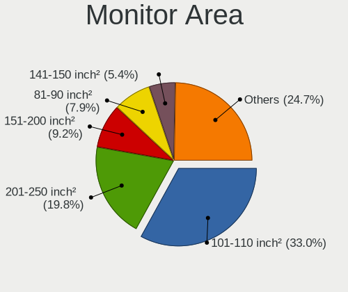

| Area in inch | Computers | Percent |
|----------------|-----------|---------|
| 101-110        | 1052      | 33.54%  |
| 201-250        | 632       | 20.15%  |
| 151-200        | 298       | 9.5%    |
| 81-90          | 245       | 7.81%   |
| 141-150        | 182       | 5.8%    |
| 121-130        | 121       | 3.86%   |
| Unknown        | 119       | 3.79%   |
| 301-350        | 103       | 3.28%   |
| 71-80          | 62        | 1.98%   |
| 351-500        | 55        | 1.75%   |
| 251-300        | 48        | 1.53%   |
| 41-50          | 39        | 1.24%   |
| 51-60          | 34        | 1.08%   |
| 61-70          | 29        | 0.92%   |
| 111-120        | 29        | 0.92%   |
| 131-140        | 28        | 0.89%   |
| More than 1000 | 26        | 0.83%   |
| 501-1000       | 20        | 0.64%   |
| 91-100         | 10        | 0.32%   |
| 1-40           | 5         | 0.16%   |

Pixel Density
-------------

Pixels per inch

| Density       | Computers | Percent |
|---------------|-----------|---------|
| 51-100        | 1138      | 37.14%  |
| 101-120       | 989       | 32.28%  |
| 121-160       | 699       | 22.81%  |
| Unknown       | 119       | 3.88%   |
| 161-240       | 61        | 1.99%   |
| 1-50          | 30        | 0.98%   |
| More than 240 | 28        | 0.91%   |

Multiple Monitors
-----------------

Total monitors connected

| Total | Computers | Percent |
|-------|-----------|---------|
| 1     | 2591      | 84.9%   |
| 2     | 335       | 10.98%  |
| 0     | 100       | 3.28%   |
| 3     | 26        | 0.85%   |

Network
-------

Net Controller Vendor
---------------------

Controller vendors

| Vendor                                 | Computers | Percent |
|----------------------------------------|-----------|---------|
| Realtek Semiconductor                  | 1809      | 40.69%  |
| Intel                                  | 879       | 19.77%  |
| Qualcomm Atheros                       | 774       | 17.41%  |
| Broadcom                               | 271       | 6.1%    |
| Nvidia                                 | 100       | 2.25%   |
| Ralink Technology                      | 94        | 2.11%   |
| Broadcom Limited                       | 73        | 1.64%   |
| Ralink                                 | 69        | 1.55%   |
| Marvell Technology Group               | 67        | 1.51%   |
| Qualcomm Atheros Communications        | 38        | 0.85%   |
| TP-Link                                | 27        | 0.61%   |
| Huawei Technologies                    | 22        | 0.49%   |
| VIA Technologies                       | 20        | 0.45%   |
| Xiaomi                                 | 16        | 0.36%   |
| MediaTek                               | 15        | 0.34%   |
| Samsung Electronics                    | 12        | 0.27%   |
| D-Link System                          | 12        | 0.27%   |
| Attansic Technology                    | 11        | 0.25%   |
| ASUSTek Computer                       | 11        | 0.25%   |
| Sundance Technology Inc / IC Plus      | 10        | 0.22%   |
| Dell                                   | 10        | 0.22%   |
| Silicon Integrated Systems [SiS]       | 7         | 0.16%   |
| JMicron Technology                     | 7         | 0.16%   |
| Ericsson Business Mobile Networks      | 6         | 0.13%   |
| Sierra Wireless                        | 5         | 0.11%   |
| ICS Advent                             | 5         | 0.11%   |
| Hewlett-Packard                        | 5         | 0.11%   |
| D-Link                                 | 5         | 0.11%   |
| ASIX Electronics                       | 5         | 0.11%   |
| Aquantia                               | 4         | 0.09%   |
| Microsoft                              | 3         | 0.07%   |
| IMC Networks                           | 3         | 0.07%   |
| Fibocom                                | 3         | 0.07%   |
| Edimax Technology                      | 3         | 0.07%   |
| Curitel Communications                 | 3         | 0.07%   |
| Spreadtrum Communications              | 2         | 0.04%   |
| Nokia Mobile Phones                    | 2         | 0.04%   |
| LSI                                    | 2         | 0.04%   |
| Linksys                                | 2         | 0.04%   |
| Lenovo                                 | 2         | 0.04%   |
| HMD Global                             | 2         | 0.04%   |
| Google                                 | 2         | 0.04%   |
| DisplayLink                            | 2         | 0.04%   |
| ZyDAS                                  | 1         | 0.02%   |
| U-Blox                                 | 1         | 0.02%   |
| Toshiba                                | 1         | 0.02%   |
| Tehuti Networks                        | 1         | 0.02%   |
| STMicroelectronics                     | 1         | 0.02%   |
| Standard Microsystems [SMC]            | 1         | 0.02%   |
| Sony Ericsson Mobile Communications AB | 1         | 0.02%   |
| Sitecom Europe                         | 1         | 0.02%   |
| Qualcomm                               | 1         | 0.02%   |
| OPPO Electronics                       | 1         | 0.02%   |
| OpenMoko                               | 1         | 0.02%   |
| OKB SAPR                               | 1         | 0.02%   |
| NetGear                                | 1         | 0.02%   |
| Motorola PCS                           | 1         | 0.02%   |
| Montage                                | 1         | 0.02%   |
| Microchip Technology                   | 1         | 0.02%   |
| LG Electronics                         | 1         | 0.02%   |

Net Controller Model
--------------------

Controller models

| Model                                                                   | Computers | Percent |
|-------------------------------------------------------------------------|-----------|---------|
| Realtek RTL8111/8168/8411 PCI Express Gigabit Ethernet Controller       | 1266      | 25.21%  |
| Realtek RTL810xE PCI Express Fast Ethernet controller                   | 303       | 6.03%   |
| Qualcomm Atheros AR9285 Wireless Network Adapter (PCI-Express)          | 140       | 2.79%   |
| Realtek RTL-8100/8101L/8139 PCI Fast Ethernet Adapter                   | 112       | 2.23%   |
| Qualcomm Atheros QCA9377 802.11ac Wireless Network Adapter              | 100       | 1.99%   |
| Realtek RTL8821CE 802.11ac PCIe Wireless Network Adapter                | 88        | 1.75%   |
| Broadcom BCM4313 802.11bgn Wireless Network Adapter                     | 88        | 1.75%   |
| Qualcomm Atheros AR9485 Wireless Network Adapter                        | 84        | 1.67%   |
| Qualcomm Atheros QCA9565 / AR9565 Wireless Network Adapter              | 75        | 1.49%   |
| Nvidia MCP61 Ethernet                                                   | 62        | 1.23%   |
| Intel Wi-Fi 6 AX200                                                     | 61        | 1.21%   |
| Intel 82579LM Gigabit Network Connection (Lewisville)                   | 61        | 1.21%   |
| Qualcomm Atheros AR8151 v2.0 Gigabit Ethernet                           | 57        | 1.14%   |
| Intel Wireless 8265 / 8275                                              | 56        | 1.12%   |
| Ralink MT7601U Wireless Adapter                                         | 55        | 1.1%    |
| Qualcomm Atheros AR242x / AR542x Wireless Network Adapter (PCI-Express) | 50        | 1%      |
| Intel Wireless 7260                                                     | 45        | 0.9%    |
| Intel Cannon Point-LP CNVi [Wireless-AC]                                | 44        | 0.88%   |
| Realtek RTL8723BE PCIe Wireless Network Adapter                         | 36        | 0.72%   |
| Ralink RT3290 Wireless 802.11n 1T/1R PCIe                               | 36        | 0.72%   |
| Qualcomm Atheros QCA6174 802.11ac Wireless Network Adapter              | 35        | 0.7%    |
| Intel PRO/Wireless 3945ABG [Golan] Network Connection                   | 34        | 0.68%   |
| Intel Wi-Fi 6 AX201                                                     | 33        | 0.66%   |
| Intel I211 Gigabit Network Connection                                   | 33        | 0.66%   |
| Broadcom BCM43142 802.11b/g/n                                           | 33        | 0.66%   |
| Intel Cannon Lake PCH CNVi WiFi                                         | 32        | 0.64%   |
| Realtek RTL8822BE 802.11a/b/g/n/ac WiFi adapter                         | 31        | 0.62%   |
| Intel Wireless 3165                                                     | 31        | 0.62%   |
| Qualcomm Atheros AR8121/AR8113/AR8114 Gigabit or Fast Ethernet          | 30        | 0.6%    |
| Qualcomm Atheros AR9271 802.11n                                         | 29        | 0.58%   |
| Qualcomm Atheros AR8161 Gigabit Ethernet                                | 29        | 0.58%   |
| Intel Dual Band Wireless-AC 3168NGW [Stone Peak]                        | 29        | 0.58%   |
| Realtek RTL8822CE 802.11ac PCIe Wireless Network Adapter                | 28        | 0.56%   |
| Realtek RTL8153 Gigabit Ethernet Adapter                                | 28        | 0.56%   |
| Intel Ethernet Connection (2) I219-V                                    | 27        | 0.54%   |
| Intel Centrino Advanced-N 6205 [Taylor Peak]                            | 27        | 0.54%   |
| Intel Wireless 8260                                                     | 26        | 0.52%   |
| Intel Comet Lake PCH-LP CNVi WiFi                                       | 26        | 0.52%   |
| Intel 82579V Gigabit Network Connection                                 | 26        | 0.52%   |
| Qualcomm Atheros AR9462 Wireless Network Adapter                        | 23        | 0.46%   |
| Intel Centrino Wireless-N 2230                                          | 23        | 0.46%   |
| Broadcom BCM4312 802.11b/g LP-PHY                                       | 21        | 0.42%   |
| Realtek RTL8188EUS 802.11n Wireless Network Adapter                     | 20        | 0.4%    |
| Qualcomm Atheros QCA8172 Fast Ethernet                                  | 20        | 0.4%    |
| Qualcomm Atheros QCA8171 Gigabit Ethernet                               | 20        | 0.4%    |
| Qualcomm Atheros Attansic L1 Gigabit Ethernet                           | 20        | 0.4%    |
| Qualcomm Atheros AR8162 Fast Ethernet                                   | 20        | 0.4%    |
| Qualcomm Atheros AR8152 v2.0 Fast Ethernet                              | 20        | 0.4%    |
| Intel Wireless 7265                                                     | 20        | 0.4%    |
| Intel Comet Lake PCH CNVi WiFi                                          | 20        | 0.4%    |
| Qualcomm Atheros Attansic L2 Fast Ethernet                              | 19        | 0.38%   |
| Qualcomm Atheros AR8131 Gigabit Ethernet                                | 19        | 0.38%   |
| Marvell Group 88E8040 PCI-E Fast Ethernet Controller                    | 19        | 0.38%   |
| Broadcom Limited BCM4313 802.11bgn Wireless Network Adapter             | 19        | 0.38%   |
| Qualcomm Atheros AR9287 Wireless Network Adapter (PCI-Express)          | 18        | 0.36%   |
| Intel Dual Band Wireless-AC 3165 Plus Bluetooth                         | 18        | 0.36%   |
| Intel Centrino Ultimate-N 6300                                          | 18        | 0.36%   |
| Ralink RT5370 Wireless Adapter                                          | 17        | 0.34%   |
| Qualcomm Atheros AR8132 Fast Ethernet                                   | 17        | 0.34%   |
| Broadcom NetLink BCM57785 Gigabit Ethernet PCIe                         | 17        | 0.34%   |

Wireless Vendor
---------------

Wireless vendors

| Vendor                          | Computers | Percent |
|---------------------------------|-----------|---------|
| Intel                           | 677       | 32.5%   |
| Qualcomm Atheros                | 568       | 27.27%  |
| Realtek Semiconductor           | 303       | 14.55%  |
| Broadcom                        | 201       | 9.65%   |
| Ralink Technology               | 94        | 4.51%   |
| Ralink                          | 69        | 3.31%   |
| Broadcom Limited                | 40        | 1.92%   |
| Qualcomm Atheros Communications | 38        | 1.82%   |
| TP-Link                         | 25        | 1.2%    |
| MediaTek                        | 13        | 0.62%   |
| ASUSTek Computer                | 10        | 0.48%   |
| D-Link System                   | 8         | 0.38%   |
| Dell                            | 6         | 0.29%   |
| D-Link                          | 5         | 0.24%   |
| Sierra Wireless                 | 4         | 0.19%   |
| Microsoft                       | 3         | 0.14%   |
| IMC Networks                    | 3         | 0.14%   |
| Fibocom                         | 3         | 0.14%   |
| Edimax Technology               | 3         | 0.14%   |
| Linksys                         | 2         | 0.1%    |
| ZyDAS                           | 1         | 0.05%   |
| Xiaomi                          | 1         | 0.05%   |
| Sitecom Europe                  | 1         | 0.05%   |
| NetGear                         | 1         | 0.05%   |
| LG Electronics                  | 1         | 0.05%   |
| Hewlett-Packard                 | 1         | 0.05%   |
| Gemtek                          | 1         | 0.05%   |
| Fujitsu Siemens Computers       | 1         | 0.05%   |

Wireless Model
--------------

Wireless models

| Model                                                                         | Computers | Percent |
|-------------------------------------------------------------------------------|-----------|---------|
| Qualcomm Atheros AR9285 Wireless Network Adapter (PCI-Express)                | 140       | 6.71%   |
| Qualcomm Atheros QCA9377 802.11ac Wireless Network Adapter                    | 100       | 4.79%   |
| Realtek RTL8821CE 802.11ac PCIe Wireless Network Adapter                      | 88        | 4.22%   |
| Broadcom BCM4313 802.11bgn Wireless Network Adapter                           | 88        | 4.22%   |
| Qualcomm Atheros AR9485 Wireless Network Adapter                              | 84        | 4.02%   |
| Qualcomm Atheros QCA9565 / AR9565 Wireless Network Adapter                    | 75        | 3.59%   |
| Intel Wi-Fi 6 AX200                                                           | 61        | 2.92%   |
| Intel Wireless 8265 / 8275                                                    | 56        | 2.68%   |
| Ralink MT7601U Wireless Adapter                                               | 55        | 2.64%   |
| Qualcomm Atheros AR242x / AR542x Wireless Network Adapter (PCI-Express)       | 50        | 2.4%    |
| Intel Wireless 7260                                                           | 45        | 2.16%   |
| Intel Cannon Point-LP CNVi [Wireless-AC]                                      | 44        | 2.11%   |
| Realtek RTL8723BE PCIe Wireless Network Adapter                               | 36        | 1.72%   |
| Ralink RT3290 Wireless 802.11n 1T/1R PCIe                                     | 36        | 1.72%   |
| Qualcomm Atheros QCA6174 802.11ac Wireless Network Adapter                    | 35        | 1.68%   |
| Intel PRO/Wireless 3945ABG [Golan] Network Connection                         | 34        | 1.63%   |
| Intel Wi-Fi 6 AX201                                                           | 33        | 1.58%   |
| Broadcom BCM43142 802.11b/g/n                                                 | 33        | 1.58%   |
| Intel Cannon Lake PCH CNVi WiFi                                               | 32        | 1.53%   |
| Realtek RTL8822BE 802.11a/b/g/n/ac WiFi adapter                               | 31        | 1.49%   |
| Intel Wireless 3165                                                           | 31        | 1.49%   |
| Qualcomm Atheros AR9271 802.11n                                               | 29        | 1.39%   |
| Intel Dual Band Wireless-AC 3168NGW [Stone Peak]                              | 29        | 1.39%   |
| Realtek RTL8822CE 802.11ac PCIe Wireless Network Adapter                      | 28        | 1.34%   |
| Intel Centrino Advanced-N 6205 [Taylor Peak]                                  | 27        | 1.29%   |
| Intel Wireless 8260                                                           | 26        | 1.25%   |
| Intel Comet Lake PCH-LP CNVi WiFi                                             | 26        | 1.25%   |
| Qualcomm Atheros AR9462 Wireless Network Adapter                              | 23        | 1.1%    |
| Intel Centrino Wireless-N 2230                                                | 23        | 1.1%    |
| Broadcom BCM4312 802.11b/g LP-PHY                                             | 21        | 1.01%   |
| Realtek RTL8188EUS 802.11n Wireless Network Adapter                           | 20        | 0.96%   |
| Intel Wireless 7265                                                           | 20        | 0.96%   |
| Intel Comet Lake PCH CNVi WiFi                                                | 20        | 0.96%   |
| Broadcom Limited BCM4313 802.11bgn Wireless Network Adapter                   | 19        | 0.91%   |
| Qualcomm Atheros AR9287 Wireless Network Adapter (PCI-Express)                | 18        | 0.86%   |
| Intel Dual Band Wireless-AC 3165 Plus Bluetooth                               | 18        | 0.86%   |
| Intel Centrino Ultimate-N 6300                                                | 18        | 0.86%   |
| Ralink RT5370 Wireless Adapter                                                | 17        | 0.81%   |
| Realtek RTL8723DE Wireless Network Adapter                                    | 16        | 0.77%   |
| Intel WiFi Link 5100                                                          | 15        | 0.72%   |
| Intel Wireless-AC 9260                                                        | 14        | 0.67%   |
| TP-Link TL-WN722N v2                                                          | 13        | 0.62%   |
| Realtek RTL8821AE 802.11ac PCIe Wireless Network Adapter                      | 12        | 0.57%   |
| Ralink RT3090 Wireless 802.11n 1T/1R PCIe                                     | 12        | 0.57%   |
| Qualcomm Atheros AR928X Wireless Network Adapter (PCI-Express)                | 12        | 0.57%   |
| Broadcom BCM43225 802.11b/g/n                                                 | 12        | 0.57%   |
| Realtek RTL8188CE 802.11b/g/n WiFi Adapter                                    | 11        | 0.53%   |
| Realtek RTL8188EE Wireless Network Adapter                                    | 10        | 0.48%   |
| Intel Wireless 3160                                                           | 10        | 0.48%   |
| Intel PRO/Wireless 4965 AG or AGN [Kedron] Network Connection                 | 10        | 0.48%   |
| Intel Centrino Advanced-N 6235                                                | 10        | 0.48%   |
| Ralink RT2870/RT3070 Wireless Adapter                                         | 9         | 0.43%   |
| Ralink MT7610U ("Archer T2U" 2.4G+5G WLAN Adapter                             | 9         | 0.43%   |
| Qualcomm Atheros AR9227 Wireless Network Adapter                              | 9         | 0.43%   |
| Intel Centrino Wireless-N 1000 [Condor Peak]                                  | 9         | 0.43%   |
| Broadcom BCM4311 802.11b/g WLAN                                               | 9         | 0.43%   |
| Qualcomm Atheros AR2413/AR2414 Wireless Network Adapter [AR5005G(S) 802.11bg] | 8         | 0.38%   |
| MediaTek MT7921 802.11ax PCI Express Wireless Network Adapter                 | 8         | 0.38%   |
| Intel Centrino Wireless-N 1030 [Rainbow Peak]                                 | 8         | 0.38%   |
| Broadcom BCM43228 802.11a/b/g/n                                               | 7         | 0.34%   |

Ethernet Vendor
---------------

Ethernet vendors

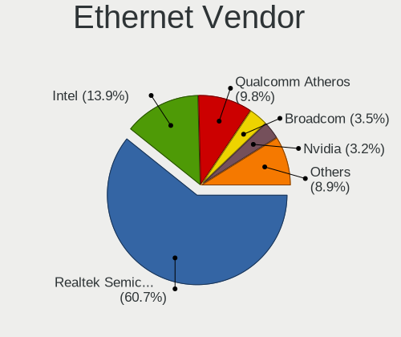

| Vendor                                 | Computers | Percent |
|----------------------------------------|-----------|---------|
| Realtek Semiconductor                  | 1707      | 60%     |
| Intel                                  | 393       | 13.81%  |
| Qualcomm Atheros                       | 301       | 10.58%  |
| Nvidia                                 | 100       | 3.51%   |
| Broadcom                               | 94        | 3.3%    |
| Marvell Technology Group               | 67        | 2.36%   |
| Broadcom Limited                       | 34        | 1.2%    |
| VIA Technologies                       | 20        | 0.7%    |
| Huawei Technologies                    | 16        | 0.56%   |
| Xiaomi                                 | 15        | 0.53%   |
| Samsung Electronics                    | 12        | 0.42%   |
| Attansic Technology                    | 11        | 0.39%   |
| Sundance Technology Inc / IC Plus      | 10        | 0.35%   |
| Silicon Integrated Systems [SiS]       | 7         | 0.25%   |
| JMicron Technology                     | 7         | 0.25%   |
| ICS Advent                             | 5         | 0.18%   |
| ASIX Electronics                       | 5         | 0.18%   |
| D-Link System                          | 4         | 0.14%   |
| Aquantia                               | 4         | 0.14%   |
| Hewlett-Packard                        | 3         | 0.11%   |
| TP-Link                                | 2         | 0.07%   |
| Spreadtrum Communications              | 2         | 0.07%   |
| Lenovo                                 | 2         | 0.07%   |
| HMD Global                             | 2         | 0.07%   |
| Google                                 | 2         | 0.07%   |
| DisplayLink                            | 2         | 0.07%   |
| Tehuti Networks                        | 1         | 0.04%   |
| Standard Microsystems [SMC]            | 1         | 0.04%   |
| Sony Ericsson Mobile Communications AB | 1         | 0.04%   |
| Sierra Wireless                        | 1         | 0.04%   |
| Qualcomm                               | 1         | 0.04%   |
| OPPO Electronics                       | 1         | 0.04%   |
| OKB SAPR                               | 1         | 0.04%   |
| Motorola PCS                           | 1         | 0.04%   |
| Microchip Technology                   | 1         | 0.04%   |
| MediaTek                               | 1         | 0.04%   |
| LSI                                    | 1         | 0.04%   |
| HTC (High Tech Computer)               | 1         | 0.04%   |
| Hangzhou Silan Microelectronics        | 1         | 0.04%   |
| ASUSTek Computer                       | 1         | 0.04%   |
| Apple                                  | 1         | 0.04%   |
| Android                                | 1         | 0.04%   |
| AMD                                    | 1         | 0.04%   |
| ADMtek                                 | 1         | 0.04%   |

Ethernet Model
--------------

Ethernet models

| Model                                                                          | Computers | Percent |
|--------------------------------------------------------------------------------|-----------|---------|
| Realtek RTL8111/8168/8411 PCI Express Gigabit Ethernet Controller              | 1266      | 43.75%  |
| Realtek RTL810xE PCI Express Fast Ethernet controller                          | 303       | 10.47%  |
| Realtek RTL-8100/8101L/8139 PCI Fast Ethernet Adapter                          | 112       | 3.87%   |
| Nvidia MCP61 Ethernet                                                          | 62        | 2.14%   |
| Intel 82579LM Gigabit Network Connection (Lewisville)                          | 61        | 2.11%   |
| Qualcomm Atheros AR8151 v2.0 Gigabit Ethernet                                  | 57        | 1.97%   |
| Intel I211 Gigabit Network Connection                                          | 33        | 1.14%   |
| Qualcomm Atheros AR8121/AR8113/AR8114 Gigabit or Fast Ethernet                 | 30        | 1.04%   |
| Qualcomm Atheros AR8161 Gigabit Ethernet                                       | 29        | 1%      |
| Realtek RTL8153 Gigabit Ethernet Adapter                                       | 28        | 0.97%   |
| Intel Ethernet Connection (2) I219-V                                           | 27        | 0.93%   |
| Intel 82579V Gigabit Network Connection                                        | 26        | 0.9%    |
| Qualcomm Atheros QCA8172 Fast Ethernet                                         | 20        | 0.69%   |
| Qualcomm Atheros QCA8171 Gigabit Ethernet                                      | 20        | 0.69%   |
| Qualcomm Atheros Attansic L1 Gigabit Ethernet                                  | 20        | 0.69%   |
| Qualcomm Atheros AR8162 Fast Ethernet                                          | 20        | 0.69%   |
| Qualcomm Atheros AR8152 v2.0 Fast Ethernet                                     | 20        | 0.69%   |
| Qualcomm Atheros Attansic L2 Fast Ethernet                                     | 19        | 0.66%   |
| Qualcomm Atheros AR8131 Gigabit Ethernet                                       | 19        | 0.66%   |
| Marvell Group 88E8040 PCI-E Fast Ethernet Controller                           | 19        | 0.66%   |
| Qualcomm Atheros AR8132 Fast Ethernet                                          | 17        | 0.59%   |
| Broadcom NetLink BCM57785 Gigabit Ethernet PCIe                                | 17        | 0.59%   |
| Intel Ethernet Connection I217-LM                                              | 15        | 0.52%   |
| Intel Ethernet Connection (6) I219-V                                           | 15        | 0.52%   |
| Broadcom NetLink BCM5787M Gigabit Ethernet PCI Express                         | 15        | 0.52%   |
| Realtek RTL-8110SC/8169SC Gigabit Ethernet                                     | 13        | 0.45%   |
| Intel Ethernet Connection I217-V                                               | 13        | 0.45%   |
| Xiaomi Mi/Redmi series (RNDIS)                                                 | 12        | 0.41%   |
| VIA VT6105/VT6106S [Rhine-III]                                                 | 12        | 0.41%   |
| Nvidia MCP51 Ethernet Controller                                               | 12        | 0.41%   |
| Broadcom NetLink BCM57780 Gigabit Ethernet PCIe                                | 12        | 0.41%   |
| Intel Ethernet Connection (7) I219-V                                           | 11        | 0.38%   |
| Intel Ethernet Connection (4) I219-V                                           | 11        | 0.38%   |
| Attansic AR8152 v2.0 Fast Ethernet                                             | 11        | 0.38%   |
| Samsung Galaxy series, misc. (tethering mode)                                  | 10        | 0.35%   |
| Intel Ethernet Connection (7) I219-LM                                          | 10        | 0.35%   |
| Intel Ethernet Connection (2) I219-LM                                          | 10        | 0.35%   |
| Intel 82577LM Gigabit Network Connection                                       | 10        | 0.35%   |
| Intel 82567LM-3 Gigabit Network Connection                                     | 10        | 0.35%   |
| Realtek RTL8125 2.5GbE Controller                                              | 9         | 0.31%   |
| Nvidia CK804 Ethernet Controller                                               | 9         | 0.31%   |
| Intel Ethernet Connection I219-LM                                              | 9         | 0.31%   |
| Intel Ethernet Connection I218-LM                                              | 9         | 0.31%   |
| Intel Ethernet Connection (4) I219-LM                                          | 9         | 0.31%   |
| Intel 82567LM Gigabit Network Connection                                       | 9         | 0.31%   |
| Broadcom BCM4401-B0 100Base-TX                                                 | 9         | 0.31%   |
| VIA VT6102/VT6103 [Rhine-II]                                                   | 8         | 0.28%   |
| Sundance Inc / IC Plus IC Plus IP100A Integrated 10/100 Ethernet MAC + PHY     | 8         | 0.28%   |
| Marvell Group 88E8039 PCI-E Fast Ethernet Controller                           | 8         | 0.28%   |
| Huawei JNY-LX1                                                                 | 8         | 0.28%   |
| Huawei E353/E3131                                                              | 8         | 0.28%   |
| Qualcomm Atheros Killer E2400 Gigabit Ethernet Controller                      | 7         | 0.24%   |
| Qualcomm Atheros Killer E220x Gigabit Ethernet Controller                      | 7         | 0.24%   |
| Marvell Group 88E8053 PCI-E Gigabit Ethernet Controller                        | 7         | 0.24%   |
| JMicron JMC250 PCI Express Gigabit Ethernet Controller                         | 7         | 0.24%   |
| Intel Ethernet Connection (3) I218-LM                                          | 7         | 0.24%   |
| Intel 82566DM-2 Gigabit Network Connection                                     | 7         | 0.24%   |
| Broadcom NetLink BCM5906M Fast Ethernet PCI Express                            | 7         | 0.24%   |
| Qualcomm Atheros AR8151 v1.0 Gigabit Ethernet                                  | 6         | 0.21%   |
| Marvell Group Yukon Optima 88E8059 [PCIe Gigabit Ethernet Controller with AVB] | 6         | 0.21%   |

Net Controller Kind
-------------------

Ethernet, WiFi or modem

| Kind     | Computers | Percent |
|----------|-----------|---------|
| Ethernet | 2706      | 56.91%  |
| WiFi     | 2008      | 42.23%  |
| Modem    | 40        | 0.84%   |
| Unknown  | 1         | 0.02%   |

Used Controller
---------------

Currently used network controller

| Kind     | Computers | Percent |
|----------|-----------|---------|
| WiFi     | 1619      | 52.07%  |
| Ethernet | 1490      | 47.93%  |

NICs
----

Total network controllers on board

| Total | Computers | Percent |
|-------|-----------|---------|
| 2     | 1626      | 53.91%  |
| 1     | 1298      | 43.04%  |
| 0     | 62        | 2.06%   |
| 3     | 28        | 0.93%   |
| 6     | 1         | 0.03%   |
| 4     | 1         | 0.03%   |

IPv6
----

IPv6 vs IPv4

| Used | Computers | Percent |
|------|-----------|---------|
| No   | 2997      | 99.67%  |
| Yes  | 10        | 0.33%   |

Bluetooth
---------

Bluetooth Vendor
----------------

Controller vendors

| Vendor                          | Computers | Percent |
|---------------------------------|-----------|---------|
| Intel                           | 499       | 33.65%  |
| Qualcomm Atheros Communications | 179       | 12.07%  |
| Realtek Semiconductor           | 155       | 10.45%  |
| IMC Networks                    | 130       | 8.77%   |
| Broadcom                        | 97        | 6.54%   |
| Cambridge Silicon Radio         | 96        | 6.47%   |
| Lite-On Technology              | 88        | 5.93%   |
| Foxconn / Hon Hai               | 53        | 3.57%   |
| Ralink                          | 36        | 2.43%   |
| ASUSTek Computer                | 32        | 2.16%   |
| Hewlett-Packard                 | 29        | 1.96%   |
| Dell                            | 18        | 1.21%   |
| Apple                           | 15        | 1.01%   |
| Ralink Technology               | 10        | 0.67%   |
| Toshiba                         | 9         | 0.61%   |
| Foxconn International           | 8         | 0.54%   |
| Realtek                         | 4         | 0.27%   |
| Alps Electric                   | 4         | 0.27%   |
| Conwise Technology              | 3         | 0.2%    |
| Taiyo Yuden                     | 2         | 0.13%   |
| Opticis                         | 2         | 0.13%   |
| Micro Star International        | 2         | 0.13%   |
| MediaTek                        | 2         | 0.13%   |
| D-Link                          | 2         | 0.13%   |
| Askey Computer                  | 2         | 0.13%   |
| Roper                           | 1         | 0.07%   |
| Logitech                        | 1         | 0.07%   |
| Integrated System Solution      | 1         | 0.07%   |
| Edimax Technology               | 1         | 0.07%   |
| D-Link System                   | 1         | 0.07%   |
| Chicony Electronics             | 1         | 0.07%   |

Bluetooth Model
---------------

Controller models

| Model                                                  | Computers | Percent |
|--------------------------------------------------------|-----------|---------|
| Intel Bluetooth wireless interface                     | 186       | 12.54%  |
| Cambridge Silicon Radio Bluetooth Dongle (HCI mode)    | 96        | 6.47%   |
| Intel Bluetooth 9460/9560 Jefferson Peak (JfP)         | 95        | 6.41%   |
| Realtek Bluetooth Radio                                | 81        | 5.46%   |
| Intel AX201 Bluetooth                                  | 71        | 4.79%   |
| Qualcomm Atheros  Bluetooth Device                     | 68        | 4.59%   |
| Intel AX200 Bluetooth                                  | 59        | 3.98%   |
| Qualcomm Atheros AR3011 Bluetooth                      | 54        | 3.64%   |
| Realtek  Bluetooth 4.2 Adapter                         | 52        | 3.51%   |
| IMC Networks Bluetooth Radio                           | 52        | 3.51%   |
| IMC Networks Bluetooth Device                          | 41        | 2.76%   |
| Ralink RT3290 Bluetooth                                | 36        | 2.43%   |
| Intel Centrino Bluetooth Wireless Transceiver          | 36        | 2.43%   |
| Lite-On Bluetooth Device                               | 32        | 2.16%   |
| Qualcomm Atheros AR3012 Bluetooth 4.0                  | 27        | 1.82%   |
| Intel Wireless-AC 3168 Bluetooth                       | 27        | 1.82%   |
| Lite-On Qualcomm Atheros QCA9377 Bluetooth             | 26        | 1.75%   |
| Foxconn / Hon Hai Bluetooth Device                     | 22        | 1.48%   |
| IMC Networks Atheros AR3012 Bluetooth 4.0 Adapter      | 21        | 1.42%   |
| HP Broadcom 2070 Bluetooth Combo                       | 15        | 1.01%   |
| HP Bluetooth 2.0 Interface [Broadcom BCM2045]          | 14        | 0.94%   |
| Intel Wireless-AC 9260 Bluetooth Adapter               | 13        | 0.88%   |
| Broadcom BCM2045 Bluetooth                             | 13        | 0.88%   |
| Lite-On Atheros AR3012 Bluetooth                       | 12        | 0.81%   |
| Qualcomm Atheros Bluetooth                             | 11        | 0.74%   |
| Intel Centrino Advanced-N 6230 Bluetooth adapter       | 10        | 0.67%   |
| Foxconn / Hon Hai Broadcom Bluetooth 2.1 Device        | 10        | 0.67%   |
| Broadcom BCM2070 Bluetooth 2.1 + EDR                   | 10        | 0.67%   |
| Broadcom BCM2045B (BDC-2.1)                            | 10        | 0.67%   |
| Foxconn / Hon Hai Broadcom BCM20702 Bluetooth          | 9         | 0.61%   |
| Broadcom BCM20702A0                                    | 9         | 0.61%   |
| ASUS BT-183 Bluetooth 2.0+EDR adapter                  | 9         | 0.61%   |
| Realtek RTL8821A Bluetooth                             | 8         | 0.54%   |
| Ralink Motorola BC4 Bluetooth 3.0+HS Adapter           | 8         | 0.54%   |
| Qualcomm Atheros AR9462 Bluetooth                      | 8         | 0.54%   |
| Foxconn International BCM43142A0 Bluetooth module      | 8         | 0.54%   |
| Broadcom BCM20702 Bluetooth 4.0 [ThinkPad]             | 8         | 0.54%   |
| Realtek RTL8723B Bluetooth                             | 7         | 0.47%   |
| Qualcomm Atheros QCA61x4 Bluetooth 4.0                 | 7         | 0.47%   |
| Lite-On Broadcom BCM43142A0 Bluetooth Device           | 7         | 0.47%   |
| Broadcom BCM43142 Bluetooth 4.0                        | 7         | 0.47%   |
| ASUS BT-270 Bluetooth Adapter                          | 7         | 0.47%   |
| Dell Wireless 365 Bluetooth                            | 6         | 0.4%    |
| Broadcom HP Portable Valentine                         | 6         | 0.4%    |
| Broadcom BCM43142A0 Bluetooth 4.0                      | 6         | 0.4%    |
| Apple Bluetooth USB Host Controller                    | 6         | 0.4%    |
| Realtek RTL8822BE Bluetooth 4.2 Adapter                | 5         | 0.34%   |
| IMC Networks Wireless_Device                           | 5         | 0.34%   |
| Dell DW375 Bluetooth Module                            | 5         | 0.34%   |
| ASUS Bluetooth Adapter                                 | 5         | 0.34%   |
| Toshiba Integrated Bluetooth HCI                       | 4         | 0.27%   |
| Toshiba Askey Bluetooth Module                         | 4         | 0.27%   |
| Realtek Bluetooth Radio                                | 4         | 0.27%   |
| IMC Networks Asus Integrated Bluetooth module [AR3011] | 4         | 0.27%   |
| Foxconn / Hon Hai Acer Bluetooth module                | 4         | 0.27%   |
| Broadcom BCM2070 Bluetooth Device                      | 4         | 0.27%   |
| Apple Bluetooth Host Controller                        | 4         | 0.27%   |
| Qualcomm Atheros Bluetooth USB Host Controller         | 3         | 0.2%    |
| Lite-On Wireless_Device                                | 3         | 0.2%    |
| Lite-On Atheros Bluetooth                              | 3         | 0.2%    |

Sound
-----

Sound Vendor
------------

Sound card vendors

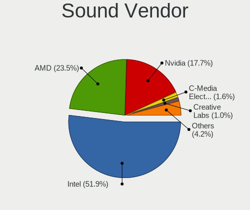

| Vendor                           | Computers | Percent |
|----------------------------------|-----------|---------|
| Intel                            | 2081      | 52.66%  |
| AMD                              | 914       | 23.13%  |
| Nvidia                           | 693       | 17.54%  |
| C-Media Electronics              | 65        | 1.64%   |
| Creative Labs                    | 44        | 1.11%   |
| Logitech                         | 16        | 0.4%    |
| VIA Technologies                 | 13        | 0.33%   |
| Silicon Integrated Systems [SiS] | 10        | 0.25%   |
| Plantronics                      | 9         | 0.23%   |
| ASUSTek Computer                 | 9         | 0.23%   |
| Generalplus Technology           | 7         | 0.18%   |
| Realtek Semiconductor            | 6         | 0.15%   |
| JMTek                            | 6         | 0.15%   |
| Texas Instruments                | 5         | 0.13%   |
| Sennheiser Communications        | 5         | 0.13%   |
| GN Netcom                        | 4         | 0.1%    |
| ULi Electronics                  | 3         | 0.08%   |
| SteelSeries ApS                  | 3         | 0.08%   |
| SAVITECH                         | 3         | 0.08%   |
| Razer USA                        | 3         | 0.08%   |
| Lenovo                           | 3         | 0.08%   |
| Kingston Technology              | 3         | 0.08%   |
| Hewlett-Packard                  | 3         | 0.08%   |
| Ensoniq                          | 3         | 0.08%   |
| Creative Technology              | 3         | 0.08%   |
| Yamaha                           | 2         | 0.05%   |
| Tenx Technology                  | 2         | 0.05%   |
| Shenzhen Rapoo Technology        | 2         | 0.05%   |
| Microsoft                        | 2         | 0.05%   |
| M-Audio                          | 2         | 0.05%   |
| Cirrus Logic                     | 2         | 0.05%   |
| BEHRINGER International          | 2         | 0.05%   |
| ZOOM                             | 1         | 0.03%   |
| Vitana                           | 1         | 0.03%   |
| Trust                            | 1         | 0.03%   |
| Samsung Electronics              | 1         | 0.03%   |
| ROCCAT                           | 1         | 0.03%   |
| Nokia Mobile Phones              | 1         | 0.03%   |
| No brand                         | 1         | 0.03%   |
| iCreate Technologies             | 1         | 0.03%   |
| iConnectivity                    | 1         | 0.03%   |
| Hangzhou Worlde                  | 1         | 0.03%   |
| GYROCOM C&C                      | 1         | 0.03%   |
| Guillemot                        | 1         | 0.03%   |
| Google                           | 1         | 0.03%   |
| Giga-Byte Technology             | 1         | 0.03%   |
| Focusrite-Novation               | 1         | 0.03%   |
| Elite Silicon                    | 1         | 0.03%   |
| EGO SYStems                      | 1         | 0.03%   |
| DEXP BK-20                       | 1         | 0.03%   |
| Dell                             | 1         | 0.03%   |
| Corsair                          | 1         | 0.03%   |
| BY EDIFIER                       | 1         | 0.03%   |
| Aureal Semiconductor             | 1         | 0.03%   |
| Audio-Technica                   | 1         | 0.03%   |
| AKAI Professional M.I.           | 1         | 0.03%   |

Sound Model
-----------

Sound card models

| Model                                                                                             | Computers | Percent |
|---------------------------------------------------------------------------------------------------|-----------|---------|
| Intel 7 Series/C216 Chipset Family High Definition Audio Controller                               | 262       | 5.72%   |
| Intel 6 Series/C200 Series Chipset Family High Definition Audio Controller                        | 249       | 5.43%   |
| AMD SBx00 Azalia (Intel HDA)                                                                      | 247       | 5.39%   |
| Intel Sunrise Point-LP HD Audio                                                                   | 206       | 4.49%   |
| Intel NM10/ICH7 Family High Definition Audio Controller                                           | 201       | 4.38%   |
| AMD Family 17h/19h HD Audio Controller                                                            | 156       | 3.4%    |
| AMD FCH Azalia Controller                                                                         | 155       | 3.38%   |
| Intel 82801I (ICH9 Family) HD Audio Controller                                                    | 121       | 2.64%   |
| Intel 8 Series/C220 Series Chipset High Definition Audio Controller                               | 105       | 2.29%   |
| Intel 5 Series/3400 Series Chipset High Definition Audio                                          | 100       | 2.18%   |
| Nvidia GF108 High Definition Audio Controller                                                     | 93        | 2.03%   |
| Intel Cannon Lake PCH cAVS                                                                        | 87        | 1.9%    |
| Intel Xeon E3-1200 v3/4th Gen Core Processor HD Audio Controller                                  | 80        | 1.75%   |
| AMD Raven/Raven2/Fenghuang HDMI/DP Audio Controller                                               | 77        | 1.68%   |
| Nvidia MCP61 High Definition Audio                                                                | 72        | 1.57%   |
| Intel 100 Series/C230 Series Chipset Family HD Audio Controller                                   | 69        | 1.51%   |
| Intel Cannon Point-LP High Definition Audio Controller                                            | 61        | 1.33%   |
| AMD Renoir Radeon High Definition Audio Controller                                                | 60        | 1.31%   |
| Nvidia GP107GL High Definition Audio Controller                                                   | 58        | 1.27%   |
| Intel Celeron/Pentium Silver Processor High Definition Audio                                      | 56        | 1.22%   |
| Nvidia High Definition Audio Controller                                                           | 55        | 1.2%    |
| Nvidia GK208 HDMI/DP Audio Controller                                                             | 55        | 1.2%    |
| AMD Family 17h (Models 00h-0fh) HD Audio Controller                                               | 55        | 1.2%    |
| Intel 82801H (ICH8 Family) HD Audio Controller                                                    | 47        | 1.03%   |
| AMD Ellesmere HDMI Audio [Radeon RX 470/480 / 570/580/590]                                        | 47        | 1.03%   |
| AMD Trinity HDMI Audio Controller                                                                 | 46        | 1%      |
| Intel 200 Series PCH HD Audio                                                                     | 45        | 0.98%   |
| AMD Oland/Hainan/Cape Verde/Pitcairn HDMI Audio [Radeon HD 7000 Series]                           | 45        | 0.98%   |
| Intel 82801JI (ICH10 Family) HD Audio Controller                                                  | 43        | 0.94%   |
| Intel Tiger Lake-LP Smart Sound Technology Audio Controller                                       | 42        | 0.92%   |
| Intel Atom/Celeron/Pentium Processor x5-E8000/J3xxx/N3xxx Series High Definition Audio Controller | 42        | 0.92%   |
| Nvidia GK107 HDMI Audio Controller                                                                | 41        | 0.89%   |
| AMD Kabini HDMI/DP Audio                                                                          | 39        | 0.85%   |
| AMD Cedar HDMI Audio [Radeon HD 5400/6300/7300 Series]                                            | 39        | 0.85%   |
| Intel Wildcat Point-LP High Definition Audio Controller                                           | 38        | 0.83%   |
| Intel Haswell-ULT HD Audio Controller                                                             | 38        | 0.83%   |
| Intel Broadwell-U Audio Controller                                                                | 38        | 0.83%   |
| Intel 8 Series HD Audio Controller                                                                | 38        | 0.83%   |
| Intel Comet Lake PCH-LP cAVS                                                                      | 37        | 0.81%   |
| Nvidia GP106 High Definition Audio Controller                                                     | 36        | 0.79%   |
| AMD Redwood HDMI Audio [Radeon HD 5000 Series]                                                    | 33        | 0.72%   |
| AMD Family 15h (Models 60h-6fh) Audio Controller                                                  | 33        | 0.72%   |
| AMD Starship/Matisse HD Audio Controller                                                          | 32        | 0.7%    |
| AMD Wrestler HDMI Audio                                                                           | 30        | 0.65%   |
| AMD RV710/730 HDMI Audio [Radeon HD 4000 series]                                                  | 30        | 0.65%   |
| Intel Celeron N3350/Pentium N4200/Atom E3900 Series Audio Cluster                                 | 29        | 0.63%   |
| Nvidia TU116 High Definition Audio Controller                                                     | 26        | 0.57%   |
| Intel CM238 HD Audio Controller                                                                   | 25        | 0.55%   |
| AMD Caicos HDMI Audio [Radeon HD 6450 / 7450/8450/8490 OEM / R5 230/235/235X OEM]                 | 25        | 0.55%   |
| Intel Comet Lake PCH cAVS                                                                         | 24        | 0.52%   |
| Intel Atom Processor Z36xxx/Z37xxx Series High Definition Audio Controller                        | 24        | 0.52%   |
| AMD Turks HDMI Audio [Radeon HD 6500/6600 / 6700M Series]                                         | 24        | 0.52%   |
| AMD Baffin HDMI/DP Audio [Radeon RX 550 640SP / RX 560/560X]                                      | 24        | 0.52%   |
| Nvidia GP104 High Definition Audio Controller                                                     | 23        | 0.5%    |
| Nvidia GM107 High Definition Audio Controller [GeForce 940MX]                                     | 23        | 0.5%    |
| Nvidia GF119 HDMI Audio Controller                                                                | 22        | 0.48%   |
| AMD High Definition Audio Controller                                                              | 22        | 0.48%   |
| Nvidia TU107 GeForce GTX 1650 High Definition Audio Controller                                    | 20        | 0.44%   |
| Nvidia GF116 High Definition Audio Controller                                                     | 19        | 0.41%   |
| C-Media Electronics CMI8738/CMI8768 PCI Audio                                                     | 19        | 0.41%   |

Memory
------

Memory Vendor
-------------

Memory module vendors

| Vendor                     | Computers | Percent |
|----------------------------|-----------|---------|
| Unknown                    | 599       | 24.24%  |
| Samsung Electronics        | 430       | 17.4%   |
| SK hynix                   | 337       | 13.64%  |
| Kingston                   | 312       | 12.63%  |
| Micron Technology          | 167       | 6.76%   |
| Ramaxel Technology         | 61        | 2.47%   |
| Goodram                    | 58        | 2.35%   |
| Elpida                     | 56        | 2.27%   |
| Crucial                    | 54        | 2.19%   |
| Team                       | 51        | 2.06%   |
| Nanya Technology           | 38        | 1.54%   |
| A-DATA Technology          | 34        | 1.38%   |
| G.Skill                    | 30        | 1.21%   |
| Transcend                  | 26        | 1.05%   |
| Corsair                    | 26        | 1.05%   |
| AMD                        | 21        | 0.85%   |
| Silicon Power              | 18        | 0.73%   |
| Patriot                    | 14        | 0.57%   |
| Apacer                     | 14        | 0.57%   |
| Exceleram                  | 13        | 0.53%   |
| Unknown (ABCD)             | 10        | 0.4%    |
| ASint Technology           | 9         | 0.36%   |
| 48spaces                   | 8         | 0.32%   |
| SHARETRONIC                | 7         | 0.28%   |
| GeIL                       | 7         | 0.28%   |
| Kllisre                    | 6         | 0.24%   |
| Qimonda                    | 5         | 0.2%    |
| Goldkey                    | 5         | 0.2%    |
| Unifosa                    | 4         | 0.16%   |
| TwinMOS                    | 4         | 0.16%   |
| Toshiba                    | 4         | 0.16%   |
| TakeMS                     | 3         | 0.12%   |
| Swissbit                   | 3         | 0.12%   |
| Qumo                       | 3         | 0.12%   |
| Kingmax                    | 3         | 0.12%   |
| PNY                        | 2         | 0.08%   |
| KETECH                     | 2         | 0.08%   |
| HMD                        | 2         | 0.08%   |
| Hexon                      | 2         | 0.08%   |
| Aeneon                     | 2         | 0.08%   |
| Unknown                    | 2         | 0.08%   |
| Wilk Elektronik            | 1         | 0.04%   |
| Wilk                       | 1         | 0.04%   |
| Unknown (C289)             | 1         | 0.04%   |
| Unknown (768A)             | 1         | 0.04%   |
| Unknown (00FFFFFFFFFFFFFF) | 1         | 0.04%   |
| TOP MEDIA                  | 1         | 0.04%   |
| Teikon                     | 1         | 0.04%   |
| OCZ                        | 1         | 0.04%   |
| Melco                      | 1         | 0.04%   |
| MCI Computer               | 1         | 0.04%   |
| Kreton                     | 1         | 0.04%   |
| Kembona                    | 1         | 0.04%   |
| Foxline                    | 1         | 0.04%   |
| DeTech                     | 1         | 0.04%   |
| Carry                      | 1         | 0.04%   |
| BiNFUL                     | 1         | 0.04%   |
| B50711390119F885           | 1         | 0.04%   |
| Atermiter                  | 1         | 0.04%   |
| Apotop                     | 1         | 0.04%   |

Memory Model
------------

Memory module models

| Model                                                               | Computers | Percent |
|---------------------------------------------------------------------|-----------|---------|
| Unknown RAM Module 2048MB DIMM DDR2 800MT/s                         | 36        | 1.31%   |
| Unknown RAM Module 2048MB DIMM 1333MT/s                             | 24        | 0.87%   |
| Unknown RAM Module 1024MB DIMM SDRAM                                | 23        | 0.84%   |
| Unknown RAM Module 2048MB DIMM 800MT/s                              | 21        | 0.76%   |
| Unknown RAM Module 2048MB DIMM SDRAM                                | 20        | 0.73%   |
| SK hynix RAM HMT351S6CFR8C-PB 4GB SODIMM DDR3 1600MT/s              | 19        | 0.69%   |
| Samsung RAM M471B5273DH0-CH9 4096MB SODIMM DDR3 1334MT/s            | 18        | 0.65%   |
| Samsung RAM M471B5173QH0-YK0 4GB SODIMM DDR3 1600MT/s               | 18        | 0.65%   |
| Samsung RAM M471A5244CB0-CRC 4GB SODIMM DDR4 2667MT/s               | 18        | 0.65%   |
| Unknown RAM Module 4096MB DIMM 1333MT/s                             | 16        | 0.58%   |
| Samsung RAM M471B5273DH0-CK0 4GB SODIMM DDR3 1600MT/s               | 16        | 0.58%   |
| Samsung RAM M471B5173DB0-YK0 4096MB SODIMM DDR3 1600MT/s            | 16        | 0.58%   |
| Samsung RAM M471B5773DH0-CH9 2048MB SODIMM DDR3 1600MT/s            | 15        | 0.55%   |
| Unknown RAM Module 4096MB DIMM 400MT/s                              | 14        | 0.51%   |
| Samsung RAM M471B5273CH0-CH9 4096MB SODIMM DDR3 1334MT/s            | 14        | 0.51%   |
| Samsung RAM M471A5244CB0-CTD 4096MB SODIMM DDR4 3266MT/s            | 14        | 0.51%   |
| Samsung RAM Module 16384MB SODIMM DDR4 2667MT/s                     | 13        | 0.47%   |
| Samsung RAM M471B5773DH0-CK0 2GB SODIMM DDR3 1600MT/s               | 13        | 0.47%   |
| Unknown RAM Module 2048MB DIMM 667MT/s                              | 12        | 0.44%   |
| Unknown RAM Module 1024MB DIMM DDR2 800MT/s                         | 12        | 0.44%   |
| Unknown RAM Module 1024MB DIMM 667MT/s                              | 12        | 0.44%   |
| Unknown RAM Module 1024MB DIMM                                      | 12        | 0.44%   |
| Samsung RAM M471B5173EB0-YK0 4GB SODIMM DDR3 1600MT/s               | 12        | 0.44%   |
| Elpida RAM EBJ41UF8BCS0-DJ-F 4GB SODIMM DDR3 1334MT/s               | 12        | 0.44%   |
| SK hynix RAM HMT451S6AFR8A-PB 4096MB SODIMM DDR3 1600MT/s           | 11        | 0.4%    |
| SK hynix RAM HMT325S6CFR8C-PB 2GB SODIMM DDR3 1600MT/s              | 11        | 0.4%    |
| Ramaxel RAM RMT3160ED58E9W1600 4GB SODIMM DDR3 1600MT/s             | 11        | 0.4%    |
| Micron RAM 4ATF51264HZ-2G6E1 4GB SODIMM DDR4 2667MT/s               | 11        | 0.4%    |
| Unknown RAM Module 4096MB DIMM DDR3 1333MT/s                        | 10        | 0.36%   |
| Unknown RAM Module 2048MB SODIMM SDRAM                              | 10        | 0.36%   |
| Unknown RAM Module 2048MB SODIMM DDR2 667MT/s                       | 10        | 0.36%   |
| Unknown RAM Module 2048MB SODIMM DDR2                               | 10        | 0.36%   |
| Unknown RAM Module 2048MB DIMM DDR3 1333MT/s                        | 10        | 0.36%   |
| SK hynix RAM HMT325S6BFR8C-H9 2GB SODIMM DDR3 1600MT/s              | 10        | 0.36%   |
| SK hynix RAM HMA851S6AFR6N-UH 4GB SODIMM DDR4 2667MT/s              | 10        | 0.36%   |
| SK hynix RAM HMA81GS6AFR8N-UH 8GB SODIMM DDR4 2667MT/s              | 10        | 0.36%   |
| Samsung RAM M471B5773CHS-CH9 2GB SODIMM DDR3 4199MT/s               | 10        | 0.36%   |
| Samsung RAM M471A1K43DB1-CWE 8GB SODIMM DDR4 3200MT/s               | 10        | 0.36%   |
| Ramaxel RAM RMT3150ED58E8W1600 2GB SODIMM DDR3 1600MT/s             | 10        | 0.36%   |
| Kingston RAM KHX3200C16D4/8GX 8GB DIMM DDR4 3600MT/s                | 10        | 0.36%   |
| Unknown RAM Module 512MB DIMM SDRAM                                 | 9         | 0.33%   |
| Unknown RAM Module 2048MB DIMM DDR2 667MT/s                         | 9         | 0.33%   |
| Unknown RAM Module 2048MB DIMM 1066MT/s                             | 9         | 0.33%   |
| Unknown (ABCD) RAM 123456789012345678 2048MB SODIMM LPDDR4 2400MT/s | 9         | 0.33%   |
| SK hynix RAM HMA81GS6CJR8N-VK 8GB SODIMM DDR4 2667MT/s              | 9         | 0.33%   |
| Samsung RAM M471B5673FH0-CH9 2GB SODIMM DDR3 1334MT/s               | 9         | 0.33%   |
| Samsung RAM M471A1K43CB1-CTD 8GB SODIMM DDR4 2667MT/s               | 9         | 0.33%   |
| Unknown RAM Module 512MB DIMM                                       | 8         | 0.29%   |
| Unknown RAM Module 2048MB DIMM 400MT/s                              | 8         | 0.29%   |
| Unknown RAM Module 1024MB SODIMM DRAM                               | 8         | 0.29%   |
| SK hynix RAM HMT425S6AFR6A-PB 2GB SODIMM DDR3 1600MT/s              | 8         | 0.29%   |
| SK hynix RAM HMT351S6EFR8A-PB 4GB SODIMM DDR3 1600MT/s              | 8         | 0.29%   |
| Nanya RAM NT2GC64B88B0NS-CG 2GB SODIMM DDR3 1334MT/s                | 8         | 0.29%   |
| Micron RAM 4ATF51264HZ-2G3B1 4GB SODIMM DDR4 2400MT/s               | 8         | 0.29%   |
| Micron RAM 4ATF1G64HZ-3G2E1 8GB SODIMM DDR4 3200MT/s                | 8         | 0.29%   |
| Kingston RAM KHX2666C16/8G 8GB DIMM DDR4 3466MT/s                   | 8         | 0.29%   |
| Elpida RAM EBJ40UG8BBU0-GN-F 4GB SODIMM DDR3 1600MT/s               | 8         | 0.29%   |
| Unknown RAM Module 2GB DIMM 1333MT/s                                | 7         | 0.25%   |
| Unknown RAM Module 2048MB DIMM                                      | 7         | 0.25%   |
| Unknown RAM Module 1024MB SODIMM SDRAM                              | 7         | 0.25%   |

Memory Kind
-----------

Memory module kinds

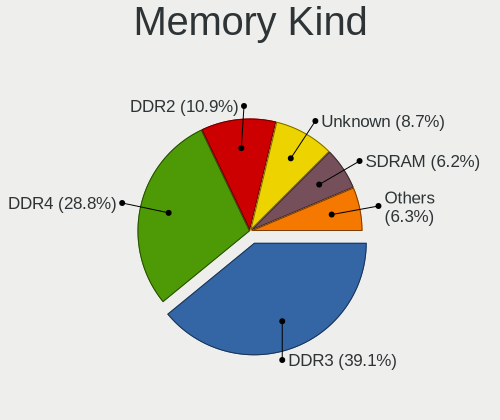

| Kind    | Computers | Percent |
|---------|-----------|---------|
| DDR3    | 883       | 41.38%  |
| DDR4    | 549       | 25.73%  |
| DDR2    | 248       | 11.62%  |
| Unknown | 205       | 9.61%   |
| SDRAM   | 132       | 6.19%   |
| DDR     | 47        | 2.2%    |
| LPDDR4  | 40        | 1.87%   |
| LPDDR3  | 15        | 0.7%    |
| DRAM    | 13        | 0.61%   |
| EEPROM  | 2         | 0.09%   |

Memory Form Factor
------------------

Physical design of the memory module

| Name         | Computers | Percent |
|--------------|-----------|---------|
| SODIMM       | 1131      | 54.11%  |
| DIMM         | 914       | 43.73%  |
| Row Of Chips | 35        | 1.67%   |
| Chip         | 7         | 0.33%   |
| RIMM         | 1         | 0.05%   |
| FB-DIMM      | 1         | 0.05%   |
| Unknown      | 1         | 0.05%   |

Memory Size
-----------

Memory module size

| Size  | Computers | Percent |
|-------|-----------|---------|
| 4096  | 783       | 32.25%  |
| 2048  | 639       | 26.32%  |
| 8192  | 529       | 21.79%  |
| 1024  | 248       | 10.21%  |
| 16384 | 142       | 5.85%   |
| 512   | 53        | 2.18%   |
| 32768 | 21        | 0.86%   |
| 256   | 11        | 0.45%   |
| 1     | 2         | 0.08%   |

Memory Speed
------------

Memory module speed

| Speed   | Computers | Percent |
|---------|-----------|---------|
| 1600    | 532       | 22.73%  |
| 1333    | 261       | 11.15%  |
| 2667    | 216       | 9.23%   |
| Unknown | 158       | 6.75%   |
| 667     | 135       | 5.77%   |
| 800     | 133       | 5.68%   |
| 1334    | 132       | 5.64%   |
| 2400    | 131       | 5.6%    |
| 3200    | 121       | 5.17%   |
| 2133    | 95        | 4.06%   |
| 400     | 43        | 1.84%   |
| 1067    | 38        | 1.62%   |
| 1867    | 36        | 1.54%   |
| 1066    | 31        | 1.32%   |
| 4199    | 28        | 1.2%    |
| 533     | 26        | 1.11%   |
| 3600    | 24        | 1.03%   |
| 333     | 23        | 0.98%   |
| 1866    | 19        | 0.81%   |
| 3266    | 14        | 0.6%    |
| 2048    | 14        | 0.6%    |
| 3466    | 11        | 0.47%   |
| 4267    | 8         | 0.34%   |
| 4266    | 8         | 0.34%   |
| 3000    | 8         | 0.34%   |
| 2933    | 7         | 0.3%    |
| 1800    | 7         | 0.3%    |
| 1639    | 7         | 0.3%    |
| 266     | 7         | 0.3%    |
| 3333    | 6         | 0.26%   |
| 3066    | 6         | 0.26%   |
| 975     | 5         | 0.21%   |
| 49926   | 4         | 0.17%   |
| 8400    | 4         | 0.17%   |
| 2866    | 4         | 0.17%   |
| 1400    | 4         | 0.17%   |
| 3866    | 3         | 0.13%   |
| 3400    | 3         | 0.13%   |
| 2666    | 3         | 0.13%   |
| 2134    | 3         | 0.13%   |
| 3800    | 2         | 0.09%   |
| 3334    | 2         | 0.09%   |
| 2800    | 2         | 0.09%   |
| 2465    | 2         | 0.09%   |
| 2000    | 2         | 0.09%   |
| 66      | 2         | 0.09%   |
| 33      | 2         | 0.09%   |
| 65535   | 1         | 0.04%   |
| 4800    | 1         | 0.04%   |
| 3733    | 1         | 0.04%   |
| 3533    | 1         | 0.04%   |
| 3151    | 1         | 0.04%   |
| 3007    | 1         | 0.04%   |
| 2200    | 1         | 0.04%   |
| 2187    | 1         | 0.04%   |
| 1776    | 1         | 0.04%   |

Printers & scanners
-------------------

Printer Vendor
--------------

Printer device vendors

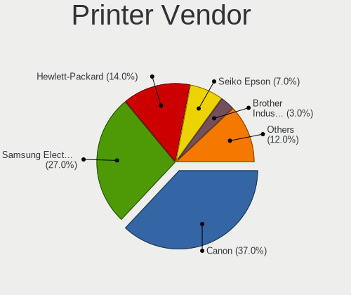

| Vendor                | Computers | Percent |
|-----------------------|-----------|---------|
| Canon                 | 34        | 39.08%  |
| Samsung Electronics   | 23        | 26.44%  |
| Hewlett-Packard       | 10        | 11.49%  |
| Seiko Epson           | 7         | 8.05%   |
| Brother Industries    | 3         | 3.45%   |
| WinChipHead           | 2         | 2.3%    |
| Prolific Technology   | 2         | 2.3%    |
| Zebra                 | 1         | 1.15%   |
| Xiaomi                | 1         | 1.15%   |
| Xerox                 | 1         | 1.15%   |
| Oki Data              | 1         | 1.15%   |
| Lexmark International | 1         | 1.15%   |
| Dell                  | 1         | 1.15%   |

Printer Model
-------------

Printer device models

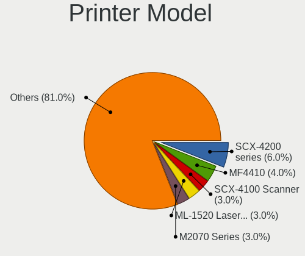

| Model                                         | Computers | Percent |
|-----------------------------------------------|-----------|---------|
| Samsung SCX-4200 series                       | 6         | 6.9%    |
| Canon MF4410                                  | 4         | 4.6%    |
| Samsung ML-1520 Laser Printer                 | 3         | 3.45%   |
| Samsung M2070 Series                          | 3         | 3.45%   |
| Canon MP160                                   | 3         | 3.45%   |
| WinChipHead CH34x printer adapter cable       | 2         | 2.3%    |
| Seiko Epson L210 Series                       | 2         | 2.3%    |
| Samsung Xerox Phaser 3117 Laser Printer       | 2         | 2.3%    |
| Samsung ML-1710 Printer                       | 2         | 2.3%    |
| Samsung M2020 Series                          | 2         | 2.3%    |
| Prolific PL2305 Parallel Port                 | 2         | 2.3%    |
| HP LaserJet 1020                              | 2         | 2.3%    |
| HP LaserJet 1012                              | 2         | 2.3%    |
| Canon PIXMA MP280                             | 2         | 2.3%    |
| Canon MF4320-4350                             | 2         | 2.3%    |
| Canon MF4010 series                           | 2         | 2.3%    |
| Canon MF3010                                  | 2         | 2.3%    |
| Canon LBP6020                                 | 2         | 2.3%    |
| Canon LBP3010/LBP3018/LBP3050                 | 2         | 2.3%    |
| Canon iP2700 series                           | 2         | 2.3%    |
| Zebra ZTC S4M-200dpi ZPL                      | 1         | 1.15%   |
| Xiaomi MiMouse 2                              | 1         | 1.15%   |
| Xerox Printing Support                        | 1         | 1.15%   |
| Seiko Epson XP-243 245 247 Series             | 1         | 1.15%   |
| Seiko Epson Printer                           | 1         | 1.15%   |
| Seiko Epson ME 340 Series/Stylus NX130 Series | 1         | 1.15%   |
| Seiko Epson L395 Series                       | 1         | 1.15%   |
| Seiko Epson L380 Series                       | 1         | 1.15%   |
| Samsung Xerox Phaser 3150                     | 1         | 1.15%   |
| Samsung SCX-4100 Scanner                      | 1         | 1.15%   |
| Samsung ML-1660 Series                        | 1         | 1.15%   |
| Samsung Laser Printer                         | 1         | 1.15%   |
| Samsung CLX-3300 Series                       | 1         | 1.15%   |
| Oki Data USB Device                           | 1         | 1.15%   |
| Lexmark International 3300 series             | 1         | 1.15%   |
| HP LaserJet P1005                             | 1         | 1.15%   |
| HP LaserJet 1018                              | 1         | 1.15%   |
| HP LaserJet 1010                              | 1         | 1.15%   |
| HP Ink Tank Wireless 410 series               | 1         | 1.15%   |
| HP DeskJet F2100 Printer series               | 1         | 1.15%   |
| HP Deskjet 3540 series                        | 1         | 1.15%   |
| Dell AIO 810                                  | 1         | 1.15%   |
| Canon PIXMA MP495                             | 1         | 1.15%   |
| Canon PIXMA MP230                             | 1         | 1.15%   |
| Canon PIXMA MG3600 Series                     | 1         | 1.15%   |
| Canon PIXMA iP1800 Printer                    | 1         | 1.15%   |
| Canon MG2200 series                           | 1         | 1.15%   |
| Canon MF3110                                  | 1         | 1.15%   |
| Canon LBP6030/6030B/6018L                     | 1         | 1.15%   |
| Canon LBP6000                                 | 1         | 1.15%   |
| Canon LBP2900                                 | 1         | 1.15%   |
| Canon LaserShot LBP-1120 Printer              | 1         | 1.15%   |
| Canon G4010 series                            | 1         | 1.15%   |
| Canon G3000 series                            | 1         | 1.15%   |
| Canon G2010 series                            | 1         | 1.15%   |
| Brother HL-1210W series                       | 1         | 1.15%   |
| Brother HL-1110 series                        | 1         | 1.15%   |
| Brother DCP-1510                              | 1         | 1.15%   |

Scanner Vendor
--------------

Scanner device vendors

| Vendor             | Computers | Percent |
|--------------------|-----------|---------|
| Canon              | 7         | 30.43%  |
| Seiko Epson        | 6         | 26.09%  |
| Mustek Systems     | 4         | 17.39%  |
| Ultima Electronics | 3         | 13.04%  |
| Hewlett-Packard    | 3         | 13.04%  |

Scanner Model
-------------

Scanner device models

| Model                                                                                 | Computers | Percent |
|---------------------------------------------------------------------------------------|-----------|---------|
| Ultima Artec Ultima 2000 (GT6801 based)/Lifetec LT9385/ScanMagic 1200 UB Plus Scanner | 3         | 13.04%  |
| Canon CanoScan LIDE 25                                                                | 3         | 13.04%  |
| Seiko Epson GT-F500/GT-F550 [Perfection 2480/2580 PHOTO]                              | 2         | 8.7%    |
| Mustek Systems SNAPSCAN e22                                                           | 2         | 8.7%    |
| Mustek Systems BearPaw 1200 CU Plus                                                   | 2         | 8.7%    |
| Seiko Epson Scanner                                                                   | 1         | 4.35%   |
| Seiko Epson GT-F520/GT-F570 [Perfection 3590 PHOTO]                                   | 1         | 4.35%   |
| Seiko Epson GT-9800F [Perfection 3200]                                                | 1         | 4.35%   |
| Seiko Epson GT-7300U [Perfection 1260/1260 PHOTO]                                     | 1         | 4.35%   |
| HP ScanJet 4400c                                                                      | 1         | 4.35%   |
| HP ScanJet 3800c                                                                      | 1         | 4.35%   |
| HP ScanJet 2400c                                                                      | 1         | 4.35%   |
| Canon CanoScan N670U/N676U/LiDE 20                                                    | 1         | 4.35%   |
| Canon CanoScan LiDE 60                                                                | 1         | 4.35%   |
| Canon CanoScan LiDE 120                                                               | 1         | 4.35%   |
| Canon CanoScan LiDE 110                                                               | 1         | 4.35%   |

Camera
------

Camera Vendor
-------------

Camera device vendors

| Vendor                                 | Computers | Percent |
|----------------------------------------|-----------|---------|
| Chicony Electronics                    | 388       | 20.91%  |
| IMC Networks                           | 226       | 12.18%  |
| Microdia                               | 134       | 7.22%   |
| Acer                                   | 129       | 6.95%   |
| Logitech                               | 115       | 6.2%    |
| Realtek Semiconductor                  | 109       | 5.87%   |
| Sunplus Innovation Technology          | 89        | 4.8%    |
| Z-Star Microelectronics                | 83        | 4.47%   |
| Suyin                                  | 79        | 4.26%   |
| Quanta                                 | 78        | 4.2%    |
| Cheng Uei Precision Industry (Foxlink) | 77        | 4.15%   |
| Syntek                                 | 48        | 2.59%   |
| Silicon Motion                         | 43        | 2.32%   |
| Alcor Micro                            | 36        | 1.94%   |
| Lite-On Technology                     | 31        | 1.67%   |
| Apple                                  | 25        | 1.35%   |
| Luxvisions Innotech Limited            | 19        | 1.02%   |
| Aveo Technology                        | 18        | 0.97%   |
| KYE Systems (Mouse Systems)            | 16        | 0.86%   |
| Pixart Imaging                         | 10        | 0.54%   |
| Microsoft                              | 10        | 0.54%   |
| DigiTech                               | 10        | 0.54%   |
| Primax Electronics                     | 7         | 0.38%   |
| GEMBIRD                                | 7         | 0.38%   |
| Cubeternet                             | 7         | 0.38%   |
| Ricoh                                  | 6         | 0.32%   |
| Arkmicro Technologies                  | 6         | 0.32%   |
| ALi                                    | 6         | 0.32%   |
| Samsung Electronics                    | 5         | 0.27%   |
| Vimicro                                | 4         | 0.22%   |
| Lenovo                                 | 4         | 0.22%   |
| Hewlett-Packard                        | 4         | 0.22%   |
| Sunplus Technology                     | 3         | 0.16%   |
| Google                                 | 3         | 0.16%   |
| Genesys Logic                          | 2         | 0.11%   |
| Generalplus Technology                 | 2         | 0.11%   |
| Unknown                                | 1         | 0.05%   |
| Trust                                  | 1         | 0.05%   |
| Teslong Camera                         | 1         | 0.05%   |
| Sonix Technology                       | 1         | 0.05%   |
| SJ-180517-N                            | 1         | 0.05%   |
| OmniVision Technologies                | 1         | 0.05%   |
| Novatek Microelectronics               | 1         | 0.05%   |
| lihappe8                               | 1         | 0.05%   |
| LG Electronics                         | 1         | 0.05%   |
| Jieli Technology                       | 1         | 0.05%   |
| Intel                                  | 1         | 0.05%   |
| Importek                               | 1         | 0.05%   |
| Huawei Technologies                    | 1         | 0.05%   |
| HTC (High Tech Computer)               | 1         | 0.05%   |
| eMPIA Technology                       | 1         | 0.05%   |
| Alpha Imaging Technology               | 1         | 0.05%   |
| Unknown                                | 1         | 0.05%   |

Camera Model
------------

Camera device models

| Model                                                                      | Computers | Percent |
|----------------------------------------------------------------------------|-----------|---------|
| IMC Networks USB2.0 VGA UVC WebCam                                         | 65        | 3.49%   |
| Logitech Webcam C270                                                       | 42        | 2.26%   |
| Chicony Integrated Camera                                                  | 38        | 2.04%   |
| Chicony Lenovo EasyCamera                                                  | 36        | 1.93%   |
| IMC Networks USB2.0 HD UVC WebCam                                          | 34        | 1.83%   |
| Z-Star Venus USB2.0 Camera                                                 | 33        | 1.77%   |
| Chicony HD WebCam                                                          | 33        | 1.77%   |
| Acer Lenovo Integrated Webcam                                              | 31        | 1.67%   |
| Microdia Integrated_Webcam_HD                                              | 28        | 1.5%    |
| Sunplus Integrated_Webcam_HD                                               | 27        | 1.45%   |
| Acer Lenovo EasyCamera                                                     | 25        | 1.34%   |
| Syntek Lenovo EasyCamera                                                   | 24        | 1.29%   |
| Realtek Integrated_Webcam_HD                                               | 24        | 1.29%   |
| IMC Networks Integrated Camera                                             | 24        | 1.29%   |
| Chicony USB2.0 VGA UVC WebCam                                              | 24        | 1.29%   |
| Quanta HD User Facing                                                      | 23        | 1.24%   |
| Chicony HP HD Camera                                                       | 19        | 1.02%   |
| Microdia Camera                                                            | 18        | 0.97%   |
| Logitech Webcam C310                                                       | 18        | 0.97%   |
| Chicony HP Webcam                                                          | 17        | 0.91%   |
| Microdia Sonix USB 2.0 Camera                                              | 16        | 0.86%   |
| Acer Integrated Camera                                                     | 16        | 0.86%   |
| Sunplus HD WebCam                                                          | 15        | 0.81%   |
| Quanta HP TrueVision HD Camera                                             | 15        | 0.81%   |
| Logitech Webcam C170                                                       | 15        | 0.81%   |
| IMC Networks Lenovo EasyCamera                                             | 15        | 0.81%   |
| Apple iPhone 5/5C/5S/6/SE                                                  | 15        | 0.81%   |
| Chicony HP Truevision HD                                                   | 14        | 0.75%   |
| Cheng Uei Precision Industry (Foxlink) HP Wide Vision HD Integrated Webcam | 14        | 0.75%   |
| Z-Star A4 TECH USB2.0 PC Camera J                                          | 13        | 0.7%    |
| Lite-On HP HD Camera                                                       | 13        | 0.7%    |
| IMC Networks Integrated Webcam                                             | 13        | 0.7%    |
| Chicony HP Wide Vision HD Camera                                           | 13        | 0.7%    |
| Acer EasyCamera                                                            | 13        | 0.7%    |
| Z-Star A4 TECH USB2.0 PC Camera E                                          | 12        | 0.64%   |
| Realtek USB2.0 VGA UVC WebCam                                              | 12        | 0.64%   |
| IMC Networks UVC VGA Webcam                                                | 12        | 0.64%   |
| Chicony EasyCamera                                                         | 12        | 0.64%   |
| Alcor Micro Asus Integrated Webcam                                         | 12        | 0.64%   |
| Suyin Acer/HP Integrated Webcam [CN0314]                                   | 11        | 0.59%   |
| Sunplus ASUS USB2.0 Webcam                                                 | 11        | 0.59%   |
| Quanta HD Webcam                                                           | 11        | 0.59%   |
| Microdia Laptop_Integrated_Webcam_HD                                       | 11        | 0.59%   |
| Lite-On Integrated Camera                                                  | 11        | 0.59%   |
| Chicony VGA Webcam                                                         | 11        | 0.59%   |
| Chicony USB2.0 HD UVC WebCam                                               | 11        | 0.59%   |
| Chicony 2.0M UVC Webcam / CNF7129                                          | 11        | 0.59%   |
| Aveo Camera                                                                | 11        | 0.59%   |
| Suyin Acer CrystalEye Webcam                                               | 10        | 0.54%   |
| Silicon Motion Lenovo EasyCamera                                           | 10        | 0.54%   |
| Quanta HP HD Camera                                                        | 10        | 0.54%   |
| Pixart Imaging GE 1.3 MP MiniCam Pro                                       | 10        | 0.54%   |
| Alcor Micro USB 2.0 Camera                                                 | 10        | 0.54%   |
| Z-Star A4 TECH HD PC Camera                                                | 9         | 0.48%   |
| Syntek Integrated Camera                                                   | 9         | 0.48%   |
| Syntek EasyCamera                                                          | 9         | 0.48%   |
| Suyin HP Truevision HD                                                     | 9         | 0.48%   |
| Microdia Integrated Webcam                                                 | 9         | 0.48%   |
| Logitech Webcam C210                                                       | 9         | 0.48%   |
| DigiTech USB 2.0 PC Camera                                                 | 9         | 0.48%   |

Security
--------

Fingerprint Vendor
------------------

Fingerprint sensor vendors

| Vendor                     | Computers | Percent |
|----------------------------|-----------|---------|
| Validity Sensors           | 89        | 34.77%  |
| Synaptics                  | 56        | 21.88%  |
| Upek                       | 26        | 10.16%  |
| LighTuning Technology      | 26        | 10.16%  |
| Shenzhen Goodix Technology | 19        | 7.42%   |
| Elan Microelectronics      | 17        | 6.64%   |
| AuthenTec                  | 15        | 5.86%   |
| STMicroelectronics         | 6         | 2.34%   |
| Samsung Electronics        | 2         | 0.78%   |

Fingerprint Model
-----------------

Fingerprint sensor models

| Model                                                                      | Computers | Percent |
|----------------------------------------------------------------------------|-----------|---------|
| Validity Sensors VFS495 Fingerprint Reader                                 | 30        | 11.72%  |
| Upek Biometric Touchchip/Touchstrip Fingerprint Sensor                     | 26        | 10.16%  |
| LighTuning EgisTec Touch Fingerprint Sensor                                | 16        | 6.25%   |
| Elan ELAN:Fingerprint                                                      | 15        | 5.86%   |
| Unknown                                                                    | 14        | 5.47%   |
| Validity Sensors VFS5011 Fingerprint Reader                                | 12        | 4.69%   |
| Synaptics  VFS7552 Touch Fingerprint Sensor with PurePrint                 | 12        | 4.69%   |
| Shenzhen Goodix  Fingerprint Device                                        | 12        | 4.69%   |
| Validity Sensors Synaptics VFS7552 Touch Fingerprint Sensor with PurePrint | 10        | 3.91%   |
| Synaptics  FS7604 Touch Fingerprint Sensor with PurePrint                  | 9         | 3.52%   |
| Synaptics Prometheus MIS Touch Fingerprint Reader                          | 9         | 3.52%   |
| Validity Sensors VFS471 Fingerprint Reader                                 | 7         | 2.73%   |
| Shenzhen Goodix Fingerprint Reader                                         | 7         | 2.73%   |
| LighTuning ES603 Swipe Fingerprint Sensor                                  | 7         | 2.73%   |
| Validity Sensors Fingerprint scanner                                       | 6         | 2.34%   |
| Synaptics Metallica MOH Touch Fingerprint Reader                           | 6         | 2.34%   |
| STMicroelectronics Fingerprint Reader                                      | 6         | 2.34%   |
| AuthenTec AES2501 Fingerprint Sensor                                       | 6         | 2.34%   |
| Validity Sensors VFS7500 Touch Fingerprint Sensor                          | 5         | 1.95%   |
| Synaptics Metallica MIS Touch Fingerprint Reader                           | 5         | 1.95%   |
| AuthenTec AES1600                                                          | 5         | 1.95%   |
| Validity Sensors VFS101 Fingerprint Reader                                 | 4         | 1.56%   |
| Validity Sensors VFS 5011 fingerprint sensor                               | 3         | 1.17%   |
| Validity Sensors Synaptics WBDI                                            | 3         | 1.17%   |
| Validity Sensors Swipe Fingerprint Sensor                                  | 3         | 1.17%   |
| LighTuning Fingerprint Reader                                              | 3         | 1.17%   |
| AuthenTec AES2810                                                          | 3         | 1.17%   |
| Elan ELAN:ARM-M4                                                           | 2         | 0.78%   |
| Validity Sensors VFS7552 Touch Fingerprint Sensor                          | 1         | 0.39%   |
| Validity Sensors VFS491                                                    | 1         | 0.39%   |
| Validity Sensors VFS451 Fingerprint Reader                                 | 1         | 0.39%   |
| Validity Sensors VFS301 Fingerprint Reader                                 | 1         | 0.39%   |
| Validity Sensors VFS300 Fingerprint Reader                                 | 1         | 0.39%   |
| Validity Sensors VFS Fingerprint sensor                                    | 1         | 0.39%   |
| Synaptics  WBDI                                                            | 1         | 0.39%   |
| Samsung Fingerprint Sensor Device - 730B                                   | 1         | 0.39%   |
| Samsung Fingerprint Device                                                 | 1         | 0.39%   |
| AuthenTec AES2550 Fingerprint Sensor                                       | 1         | 0.39%   |

Chipcard Vendor
---------------

Chipcard module vendors

| Vendor                    | Computers | Percent |
|---------------------------|-----------|---------|
| Broadcom                  | 36        | 51.43%  |
| Alcor Micro               | 19        | 27.14%  |
| O2 Micro                  | 5         | 7.14%   |
| Upek                      | 3         | 4.29%   |
| Lenovo                    | 2         | 2.86%   |
| Avtor                     | 2         | 2.86%   |
| Gemalto (was Gemplus)     | 1         | 1.43%   |
| Aladdin Knowledge Systems | 1         | 1.43%   |
| Advanced Card Systems     | 1         | 1.43%   |

Chipcard Model
--------------

Chipcard module models

| Model                                                                        | Computers | Percent |
|------------------------------------------------------------------------------|-----------|---------|
| Alcor Micro AU9540 Smartcard Reader                                          | 19        | 27.14%  |
| Broadcom BCM5880 Secure Applications Processor                               | 14        | 20%     |
| Broadcom 5880                                                                | 13        | 18.57%  |
| Broadcom BCM5880 Secure Applications Processor with fingerprint swipe sensor | 6         | 8.57%   |
| Upek TouchChip Fingerprint Coprocessor (WBF advanced mode)                   | 3         | 4.29%   |
| O2 Micro OZ776 CCID Smartcard Reader                                         | 3         | 4.29%   |
| Broadcom 58200                                                               | 3         | 4.29%   |
| O2 Micro Oz776 SmartCard Reader                                              | 2         | 2.86%   |
| Lenovo Integrated Smart Card Reader                                          | 2         | 2.86%   |
| Avtor SecureToken                                                            | 2         | 2.86%   |
| Gemalto (was Gemplus) Compact Smart Card Reader Writer                       | 1         | 1.43%   |
| Aladdin Knowledge Systems Token JC                                           | 1         | 1.43%   |
| Advanced Card Systems ACR122U                                                | 1         | 1.43%   |

Unsupported
-----------

Unsupported Devices
-------------------

Total unsupported devices on board

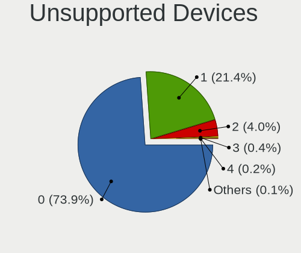

| Total | Computers | Percent |
|-------|-----------|---------|
| 0     | 2319      | 75.56%  |
| 1     | 620       | 20.2%   |
| 2     | 110       | 3.58%   |
| 3     | 12        | 0.39%   |
| 4     | 5         | 0.16%   |
| 7     | 1         | 0.03%   |
| 6     | 1         | 0.03%   |
| 5     | 1         | 0.03%   |

Unsupported Device Types
------------------------

Types of unsupported devices

| Type                     | Computers | Percent |
|--------------------------|-----------|---------|
| Fingerprint reader       | 254       | 29.23%  |
| Graphics card            | 250       | 28.77%  |
| Net/wireless             | 90        | 10.36%  |
| Chipcard                 | 57        | 6.56%   |
| Bluetooth                | 47        | 5.41%   |
| Multimedia controller    | 40        | 4.6%    |
| Communication controller | 40        | 4.6%    |
| Camera                   | 16        | 1.84%   |
| Unassigned class         | 13        | 1.5%    |
| Storage                  | 13        | 1.5%    |
| Sound                    | 12        | 1.38%   |
| Card reader              | 11        | 1.27%   |
| Flash memory             | 7         | 0.81%   |
| Net/ethernet             | 6         | 0.69%   |
| Modem                    | 4         | 0.46%   |
| Storage/ide              | 3         | 0.35%   |
| Network                  | 2         | 0.23%   |
| Storage/raid             | 1         | 0.12%   |
| Storage/ata              | 1         | 0.12%   |
| Firewire controller      | 1         | 0.12%   |
| Dvb card                 | 1         | 0.12%   |

